List of required libraries. System info at the bottom of this file.


```r
rm(list=ls())

library(rio)
library(broom)
library(knitr)
library(plotly)
library(RColorBrewer)
library(kableExtra)
library(summarytools)
library(prettydoc)
library(jsonlite)
library(maps)
library(htmltools)
library(hrbrthemes)
library(DataExplorer)
library(tidyverse)
library(viridis)
```

## DATA LOAD

Importing all CSV files with just one command and clean some quirks


```r
mydata <-
    rio::import_list(dir("raw_data/",full.names = TRUE,pattern = "*.csv"),
                     rbind = FALSE)

# removing redundant data: "CompleteDataset"
mydata <- mydata[names(mydata) != "CompleteDataset"] 

# Force numeric all numeric columns in Player Attribute Data
mydata$PlayerAttributeData[]  <- lapply(mydata$PlayerAttributeData, function(x) as.numeric(as.character(x)))

# Remove index/rowname columns in all dataframes
mydata <- lapply(mydata, function(x) { x["V1"] <- NULL; x })

# Personal Data has an "Unnamed:0" Column. Get rid of it (First Col)
mydata$PlayerPersonalData <- mydata$PlayerPersonalData[2:ncol(mydata$PlayerPersonalData)]


# Extracting dataframes from list to global environment
# (This is optional. Working with list of objects is easier in R.
# Executed here just for easier workflow comprehension)
list2env(mydata, globalenv()) 
```

```
## <environment: R_GlobalEnv>
```

```r
# List of data frame objects
ls()[sapply(ls(), function(x) class(get(x))) == 'data.frame']
```

```
## [1] "PlayerAttributeData"       "PlayerPersonalData"       
## [3] "PlayerPlayingPositionData"
```

# OBJECTIVE 1 

## Loading and merging Country & Language Data


```r
countries <- fromJSON("raw_data/countries.json") %>%
            data.table::rbindlist() %>%
            as_tibble() %>%
            mutate(languages = map(languages, ~ replace(.x, is.null(.x), "unknown"))) %>%  # avoid empty list items
            mutate(languages = unlist(languages)) %>%
            rename(lang_code = languages, country_name = name, native_name = native)


languages <- tibble(col = fromJSON("raw_data/languages.json")) %>%
             unnest_wider(col) %>%
             mutate(languages = names(fromJSON("raw_data/languages.json"))) %>%
             rename(lang_code = languages, lang_name = name, native_lang = native)


continents <- fromJSON("raw_data/continents.json") %>%
              unlist() %>%
              stack() %>%
              rename(continent = ind, continent_name = values)


final_languages_csv <-
              inner_join(countries, languages, by = "lang_code") %>%
              inner_join(continents, by = "continent") %>%
              select(-rtl)


# WRITING CSV TO DISK ----
rio::export(final_languages_csv,"processed_data/final_languages.csv")


# Look at the csv
kable(final_languages_csv) %>%
  kable_styling(
    bootstrap_options = c("striped", "hover", "condensed", "responsive"),
    font_size = 12
  ) %>%
  row_spec(row = 0, color = "#660033") %>% 
  scroll_box(width = "100%", height = "400px")
```

<div style="border: 1px solid #ddd; padding: 0px; overflow-y: scroll; height:400px; overflow-x: scroll; width:100%; "><table class="table table-striped table-hover table-condensed table-responsive" style="font-size: 12px; margin-left: auto; margin-right: auto;">
 <thead>
  <tr>
   <th style="text-align:left;color: #660033 !important;position: sticky; top:0; background-color: #FFFFFF;"> country_name </th>
   <th style="text-align:left;color: #660033 !important;position: sticky; top:0; background-color: #FFFFFF;"> native_name </th>
   <th style="text-align:left;color: #660033 !important;position: sticky; top:0; background-color: #FFFFFF;"> phone </th>
   <th style="text-align:left;color: #660033 !important;position: sticky; top:0; background-color: #FFFFFF;"> continent </th>
   <th style="text-align:left;color: #660033 !important;position: sticky; top:0; background-color: #FFFFFF;"> capital </th>
   <th style="text-align:left;color: #660033 !important;position: sticky; top:0; background-color: #FFFFFF;"> currency </th>
   <th style="text-align:left;color: #660033 !important;position: sticky; top:0; background-color: #FFFFFF;"> lang_code </th>
   <th style="text-align:left;color: #660033 !important;position: sticky; top:0; background-color: #FFFFFF;"> lang_name </th>
   <th style="text-align:left;color: #660033 !important;position: sticky; top:0; background-color: #FFFFFF;"> native_lang </th>
   <th style="text-align:left;color: #660033 !important;position: sticky; top:0; background-color: #FFFFFF;"> continent_name </th>
  </tr>
 </thead>
<tbody>
  <tr>
   <td style="text-align:left;"> Andorra </td>
   <td style="text-align:left;"> Andorra </td>
   <td style="text-align:left;"> 376 </td>
   <td style="text-align:left;"> EU </td>
   <td style="text-align:left;"> Andorra la Vella </td>
   <td style="text-align:left;"> EUR </td>
   <td style="text-align:left;"> ca </td>
   <td style="text-align:left;"> Catalan </td>
   <td style="text-align:left;"> Català </td>
   <td style="text-align:left;"> Europe </td>
  </tr>
  <tr>
   <td style="text-align:left;"> United Arab Emirates </td>
   <td style="text-align:left;"> دولة الإمارات العربية المتحدة </td>
   <td style="text-align:left;"> 971 </td>
   <td style="text-align:left;"> AS </td>
   <td style="text-align:left;"> Abu Dhabi </td>
   <td style="text-align:left;"> AED </td>
   <td style="text-align:left;"> ar </td>
   <td style="text-align:left;"> Arabic </td>
   <td style="text-align:left;"> العربية </td>
   <td style="text-align:left;"> Asia </td>
  </tr>
  <tr>
   <td style="text-align:left;"> Afghanistan </td>
   <td style="text-align:left;"> افغانستان </td>
   <td style="text-align:left;"> 93 </td>
   <td style="text-align:left;"> AS </td>
   <td style="text-align:left;"> Kabul </td>
   <td style="text-align:left;"> AFN </td>
   <td style="text-align:left;"> ps </td>
   <td style="text-align:left;"> Pashto </td>
   <td style="text-align:left;"> پښتو </td>
   <td style="text-align:left;"> Asia </td>
  </tr>
  <tr>
   <td style="text-align:left;"> Afghanistan </td>
   <td style="text-align:left;"> افغانستان </td>
   <td style="text-align:left;"> 93 </td>
   <td style="text-align:left;"> AS </td>
   <td style="text-align:left;"> Kabul </td>
   <td style="text-align:left;"> AFN </td>
   <td style="text-align:left;"> uz </td>
   <td style="text-align:left;"> Uzbek </td>
   <td style="text-align:left;"> Ўзбек </td>
   <td style="text-align:left;"> Asia </td>
  </tr>
  <tr>
   <td style="text-align:left;"> Afghanistan </td>
   <td style="text-align:left;"> افغانستان </td>
   <td style="text-align:left;"> 93 </td>
   <td style="text-align:left;"> AS </td>
   <td style="text-align:left;"> Kabul </td>
   <td style="text-align:left;"> AFN </td>
   <td style="text-align:left;"> tk </td>
   <td style="text-align:left;"> Turkmen </td>
   <td style="text-align:left;"> Туркмен / تركمن </td>
   <td style="text-align:left;"> Asia </td>
  </tr>
  <tr>
   <td style="text-align:left;"> Antigua and Barbuda </td>
   <td style="text-align:left;"> Antigua and Barbuda </td>
   <td style="text-align:left;"> 1268 </td>
   <td style="text-align:left;"> NA </td>
   <td style="text-align:left;"> Saint John's </td>
   <td style="text-align:left;"> XCD </td>
   <td style="text-align:left;"> en </td>
   <td style="text-align:left;"> English </td>
   <td style="text-align:left;"> English </td>
   <td style="text-align:left;"> North America </td>
  </tr>
  <tr>
   <td style="text-align:left;"> Anguilla </td>
   <td style="text-align:left;"> Anguilla </td>
   <td style="text-align:left;"> 1264 </td>
   <td style="text-align:left;"> NA </td>
   <td style="text-align:left;"> The Valley </td>
   <td style="text-align:left;"> XCD </td>
   <td style="text-align:left;"> en </td>
   <td style="text-align:left;"> English </td>
   <td style="text-align:left;"> English </td>
   <td style="text-align:left;"> North America </td>
  </tr>
  <tr>
   <td style="text-align:left;"> Albania </td>
   <td style="text-align:left;"> Shqipëria </td>
   <td style="text-align:left;"> 355 </td>
   <td style="text-align:left;"> EU </td>
   <td style="text-align:left;"> Tirana </td>
   <td style="text-align:left;"> ALL </td>
   <td style="text-align:left;"> sq </td>
   <td style="text-align:left;"> Albanian </td>
   <td style="text-align:left;"> Shqip </td>
   <td style="text-align:left;"> Europe </td>
  </tr>
  <tr>
   <td style="text-align:left;"> Armenia </td>
   <td style="text-align:left;"> Հայաստան </td>
   <td style="text-align:left;"> 374 </td>
   <td style="text-align:left;"> AS </td>
   <td style="text-align:left;"> Yerevan </td>
   <td style="text-align:left;"> AMD </td>
   <td style="text-align:left;"> hy </td>
   <td style="text-align:left;"> Armenian </td>
   <td style="text-align:left;"> Հայերեն </td>
   <td style="text-align:left;"> Asia </td>
  </tr>
  <tr>
   <td style="text-align:left;"> Armenia </td>
   <td style="text-align:left;"> Հայաստան </td>
   <td style="text-align:left;"> 374 </td>
   <td style="text-align:left;"> AS </td>
   <td style="text-align:left;"> Yerevan </td>
   <td style="text-align:left;"> AMD </td>
   <td style="text-align:left;"> ru </td>
   <td style="text-align:left;"> Russian </td>
   <td style="text-align:left;"> Русский </td>
   <td style="text-align:left;"> Asia </td>
  </tr>
  <tr>
   <td style="text-align:left;"> Angola </td>
   <td style="text-align:left;"> Angola </td>
   <td style="text-align:left;"> 244 </td>
   <td style="text-align:left;"> AF </td>
   <td style="text-align:left;"> Luanda </td>
   <td style="text-align:left;"> AOA </td>
   <td style="text-align:left;"> pt </td>
   <td style="text-align:left;"> Portuguese </td>
   <td style="text-align:left;"> Português </td>
   <td style="text-align:left;"> Africa </td>
  </tr>
  <tr>
   <td style="text-align:left;"> Argentina </td>
   <td style="text-align:left;"> Argentina </td>
   <td style="text-align:left;"> 54 </td>
   <td style="text-align:left;"> SA </td>
   <td style="text-align:left;"> Buenos Aires </td>
   <td style="text-align:left;"> ARS </td>
   <td style="text-align:left;"> es </td>
   <td style="text-align:left;"> Spanish </td>
   <td style="text-align:left;"> Español </td>
   <td style="text-align:left;"> South America </td>
  </tr>
  <tr>
   <td style="text-align:left;"> Argentina </td>
   <td style="text-align:left;"> Argentina </td>
   <td style="text-align:left;"> 54 </td>
   <td style="text-align:left;"> SA </td>
   <td style="text-align:left;"> Buenos Aires </td>
   <td style="text-align:left;"> ARS </td>
   <td style="text-align:left;"> gn </td>
   <td style="text-align:left;"> Guarani </td>
   <td style="text-align:left;"> Avañe'ẽ </td>
   <td style="text-align:left;"> South America </td>
  </tr>
  <tr>
   <td style="text-align:left;"> American Samoa </td>
   <td style="text-align:left;"> American Samoa </td>
   <td style="text-align:left;"> 1684 </td>
   <td style="text-align:left;"> OC </td>
   <td style="text-align:left;"> Pago Pago </td>
   <td style="text-align:left;"> USD </td>
   <td style="text-align:left;"> en </td>
   <td style="text-align:left;"> English </td>
   <td style="text-align:left;"> English </td>
   <td style="text-align:left;"> Oceania </td>
  </tr>
  <tr>
   <td style="text-align:left;"> American Samoa </td>
   <td style="text-align:left;"> American Samoa </td>
   <td style="text-align:left;"> 1684 </td>
   <td style="text-align:left;"> OC </td>
   <td style="text-align:left;"> Pago Pago </td>
   <td style="text-align:left;"> USD </td>
   <td style="text-align:left;"> sm </td>
   <td style="text-align:left;"> Samoan </td>
   <td style="text-align:left;"> Gagana Samoa </td>
   <td style="text-align:left;"> Oceania </td>
  </tr>
  <tr>
   <td style="text-align:left;"> Austria </td>
   <td style="text-align:left;"> Österreich </td>
   <td style="text-align:left;"> 43 </td>
   <td style="text-align:left;"> EU </td>
   <td style="text-align:left;"> Vienna </td>
   <td style="text-align:left;"> EUR </td>
   <td style="text-align:left;"> de </td>
   <td style="text-align:left;"> German </td>
   <td style="text-align:left;"> Deutsch </td>
   <td style="text-align:left;"> Europe </td>
  </tr>
  <tr>
   <td style="text-align:left;"> Australia </td>
   <td style="text-align:left;"> Australia </td>
   <td style="text-align:left;"> 61 </td>
   <td style="text-align:left;"> OC </td>
   <td style="text-align:left;"> Canberra </td>
   <td style="text-align:left;"> AUD </td>
   <td style="text-align:left;"> en </td>
   <td style="text-align:left;"> English </td>
   <td style="text-align:left;"> English </td>
   <td style="text-align:left;"> Oceania </td>
  </tr>
  <tr>
   <td style="text-align:left;"> Aruba </td>
   <td style="text-align:left;"> Aruba </td>
   <td style="text-align:left;"> 297 </td>
   <td style="text-align:left;"> NA </td>
   <td style="text-align:left;"> Oranjestad </td>
   <td style="text-align:left;"> AWG </td>
   <td style="text-align:left;"> nl </td>
   <td style="text-align:left;"> Dutch </td>
   <td style="text-align:left;"> Nederlands </td>
   <td style="text-align:left;"> North America </td>
  </tr>
  <tr>
   <td style="text-align:left;"> Aruba </td>
   <td style="text-align:left;"> Aruba </td>
   <td style="text-align:left;"> 297 </td>
   <td style="text-align:left;"> NA </td>
   <td style="text-align:left;"> Oranjestad </td>
   <td style="text-align:left;"> AWG </td>
   <td style="text-align:left;"> pa </td>
   <td style="text-align:left;"> Panjabi / Punjabi </td>
   <td style="text-align:left;"> ਪੰਜਾਬੀ / पंजाबी / پنجابي </td>
   <td style="text-align:left;"> North America </td>
  </tr>
  <tr>
   <td style="text-align:left;"> Åland </td>
   <td style="text-align:left;"> Åland </td>
   <td style="text-align:left;"> 358 </td>
   <td style="text-align:left;"> EU </td>
   <td style="text-align:left;"> Mariehamn </td>
   <td style="text-align:left;"> EUR </td>
   <td style="text-align:left;"> sv </td>
   <td style="text-align:left;"> Swedish </td>
   <td style="text-align:left;"> Svenska </td>
   <td style="text-align:left;"> Europe </td>
  </tr>
  <tr>
   <td style="text-align:left;"> Azerbaijan </td>
   <td style="text-align:left;"> Azərbaycan </td>
   <td style="text-align:left;"> 994 </td>
   <td style="text-align:left;"> AS </td>
   <td style="text-align:left;"> Baku </td>
   <td style="text-align:left;"> AZN </td>
   <td style="text-align:left;"> az </td>
   <td style="text-align:left;"> Azerbaijani </td>
   <td style="text-align:left;"> Azərbaycanca / آذربايجان </td>
   <td style="text-align:left;"> Asia </td>
  </tr>
  <tr>
   <td style="text-align:left;"> Bosnia and Herzegovina </td>
   <td style="text-align:left;"> Bosna i Hercegovina </td>
   <td style="text-align:left;"> 387 </td>
   <td style="text-align:left;"> EU </td>
   <td style="text-align:left;"> Sarajevo </td>
   <td style="text-align:left;"> BAM </td>
   <td style="text-align:left;"> bs </td>
   <td style="text-align:left;"> Bosnian </td>
   <td style="text-align:left;"> Bosanski </td>
   <td style="text-align:left;"> Europe </td>
  </tr>
  <tr>
   <td style="text-align:left;"> Bosnia and Herzegovina </td>
   <td style="text-align:left;"> Bosna i Hercegovina </td>
   <td style="text-align:left;"> 387 </td>
   <td style="text-align:left;"> EU </td>
   <td style="text-align:left;"> Sarajevo </td>
   <td style="text-align:left;"> BAM </td>
   <td style="text-align:left;"> hr </td>
   <td style="text-align:left;"> Croatian </td>
   <td style="text-align:left;"> Hrvatski </td>
   <td style="text-align:left;"> Europe </td>
  </tr>
  <tr>
   <td style="text-align:left;"> Bosnia and Herzegovina </td>
   <td style="text-align:left;"> Bosna i Hercegovina </td>
   <td style="text-align:left;"> 387 </td>
   <td style="text-align:left;"> EU </td>
   <td style="text-align:left;"> Sarajevo </td>
   <td style="text-align:left;"> BAM </td>
   <td style="text-align:left;"> sr </td>
   <td style="text-align:left;"> Serbian </td>
   <td style="text-align:left;"> Српски </td>
   <td style="text-align:left;"> Europe </td>
  </tr>
  <tr>
   <td style="text-align:left;"> Barbados </td>
   <td style="text-align:left;"> Barbados </td>
   <td style="text-align:left;"> 1246 </td>
   <td style="text-align:left;"> NA </td>
   <td style="text-align:left;"> Bridgetown </td>
   <td style="text-align:left;"> BBD </td>
   <td style="text-align:left;"> en </td>
   <td style="text-align:left;"> English </td>
   <td style="text-align:left;"> English </td>
   <td style="text-align:left;"> North America </td>
  </tr>
  <tr>
   <td style="text-align:left;"> Bangladesh </td>
   <td style="text-align:left;"> Bangladesh </td>
   <td style="text-align:left;"> 880 </td>
   <td style="text-align:left;"> AS </td>
   <td style="text-align:left;"> Dhaka </td>
   <td style="text-align:left;"> BDT </td>
   <td style="text-align:left;"> bn </td>
   <td style="text-align:left;"> Bengali </td>
   <td style="text-align:left;"> বাংলা </td>
   <td style="text-align:left;"> Asia </td>
  </tr>
  <tr>
   <td style="text-align:left;"> Belgium </td>
   <td style="text-align:left;"> België </td>
   <td style="text-align:left;"> 32 </td>
   <td style="text-align:left;"> EU </td>
   <td style="text-align:left;"> Brussels </td>
   <td style="text-align:left;"> EUR </td>
   <td style="text-align:left;"> nl </td>
   <td style="text-align:left;"> Dutch </td>
   <td style="text-align:left;"> Nederlands </td>
   <td style="text-align:left;"> Europe </td>
  </tr>
  <tr>
   <td style="text-align:left;"> Belgium </td>
   <td style="text-align:left;"> België </td>
   <td style="text-align:left;"> 32 </td>
   <td style="text-align:left;"> EU </td>
   <td style="text-align:left;"> Brussels </td>
   <td style="text-align:left;"> EUR </td>
   <td style="text-align:left;"> fr </td>
   <td style="text-align:left;"> French </td>
   <td style="text-align:left;"> Français </td>
   <td style="text-align:left;"> Europe </td>
  </tr>
  <tr>
   <td style="text-align:left;"> Belgium </td>
   <td style="text-align:left;"> België </td>
   <td style="text-align:left;"> 32 </td>
   <td style="text-align:left;"> EU </td>
   <td style="text-align:left;"> Brussels </td>
   <td style="text-align:left;"> EUR </td>
   <td style="text-align:left;"> de </td>
   <td style="text-align:left;"> German </td>
   <td style="text-align:left;"> Deutsch </td>
   <td style="text-align:left;"> Europe </td>
  </tr>
  <tr>
   <td style="text-align:left;"> Burkina Faso </td>
   <td style="text-align:left;"> Burkina Faso </td>
   <td style="text-align:left;"> 226 </td>
   <td style="text-align:left;"> AF </td>
   <td style="text-align:left;"> Ouagadougou </td>
   <td style="text-align:left;"> XOF </td>
   <td style="text-align:left;"> fr </td>
   <td style="text-align:left;"> French </td>
   <td style="text-align:left;"> Français </td>
   <td style="text-align:left;"> Africa </td>
  </tr>
  <tr>
   <td style="text-align:left;"> Burkina Faso </td>
   <td style="text-align:left;"> Burkina Faso </td>
   <td style="text-align:left;"> 226 </td>
   <td style="text-align:left;"> AF </td>
   <td style="text-align:left;"> Ouagadougou </td>
   <td style="text-align:left;"> XOF </td>
   <td style="text-align:left;"> ff </td>
   <td style="text-align:left;"> Peul </td>
   <td style="text-align:left;"> Fulfulde </td>
   <td style="text-align:left;"> Africa </td>
  </tr>
  <tr>
   <td style="text-align:left;"> Bulgaria </td>
   <td style="text-align:left;"> България </td>
   <td style="text-align:left;"> 359 </td>
   <td style="text-align:left;"> EU </td>
   <td style="text-align:left;"> Sofia </td>
   <td style="text-align:left;"> BGN </td>
   <td style="text-align:left;"> bg </td>
   <td style="text-align:left;"> Bulgarian </td>
   <td style="text-align:left;"> Български </td>
   <td style="text-align:left;"> Europe </td>
  </tr>
  <tr>
   <td style="text-align:left;"> Bahrain </td>
   <td style="text-align:left;"> ‏البحرين </td>
   <td style="text-align:left;"> 973 </td>
   <td style="text-align:left;"> AS </td>
   <td style="text-align:left;"> Manama </td>
   <td style="text-align:left;"> BHD </td>
   <td style="text-align:left;"> ar </td>
   <td style="text-align:left;"> Arabic </td>
   <td style="text-align:left;"> العربية </td>
   <td style="text-align:left;"> Asia </td>
  </tr>
  <tr>
   <td style="text-align:left;"> Burundi </td>
   <td style="text-align:left;"> Burundi </td>
   <td style="text-align:left;"> 257 </td>
   <td style="text-align:left;"> AF </td>
   <td style="text-align:left;"> Bujumbura </td>
   <td style="text-align:left;"> BIF </td>
   <td style="text-align:left;"> fr </td>
   <td style="text-align:left;"> French </td>
   <td style="text-align:left;"> Français </td>
   <td style="text-align:left;"> Africa </td>
  </tr>
  <tr>
   <td style="text-align:left;"> Burundi </td>
   <td style="text-align:left;"> Burundi </td>
   <td style="text-align:left;"> 257 </td>
   <td style="text-align:left;"> AF </td>
   <td style="text-align:left;"> Bujumbura </td>
   <td style="text-align:left;"> BIF </td>
   <td style="text-align:left;"> rn </td>
   <td style="text-align:left;"> Kirundi </td>
   <td style="text-align:left;"> Kirundi </td>
   <td style="text-align:left;"> Africa </td>
  </tr>
  <tr>
   <td style="text-align:left;"> Benin </td>
   <td style="text-align:left;"> Bénin </td>
   <td style="text-align:left;"> 229 </td>
   <td style="text-align:left;"> AF </td>
   <td style="text-align:left;"> Porto-Novo </td>
   <td style="text-align:left;"> XOF </td>
   <td style="text-align:left;"> fr </td>
   <td style="text-align:left;"> French </td>
   <td style="text-align:left;"> Français </td>
   <td style="text-align:left;"> Africa </td>
  </tr>
  <tr>
   <td style="text-align:left;"> Saint Barthélemy </td>
   <td style="text-align:left;"> Saint-Barthélemy </td>
   <td style="text-align:left;"> 590 </td>
   <td style="text-align:left;"> NA </td>
   <td style="text-align:left;"> Gustavia </td>
   <td style="text-align:left;"> EUR </td>
   <td style="text-align:left;"> fr </td>
   <td style="text-align:left;"> French </td>
   <td style="text-align:left;"> Français </td>
   <td style="text-align:left;"> North America </td>
  </tr>
  <tr>
   <td style="text-align:left;"> Bermuda </td>
   <td style="text-align:left;"> Bermuda </td>
   <td style="text-align:left;"> 1441 </td>
   <td style="text-align:left;"> NA </td>
   <td style="text-align:left;"> Hamilton </td>
   <td style="text-align:left;"> BMD </td>
   <td style="text-align:left;"> en </td>
   <td style="text-align:left;"> English </td>
   <td style="text-align:left;"> English </td>
   <td style="text-align:left;"> North America </td>
  </tr>
  <tr>
   <td style="text-align:left;"> Brunei </td>
   <td style="text-align:left;"> Negara Brunei Darussalam </td>
   <td style="text-align:left;"> 673 </td>
   <td style="text-align:left;"> AS </td>
   <td style="text-align:left;"> Bandar Seri Begawan </td>
   <td style="text-align:left;"> BND </td>
   <td style="text-align:left;"> ms </td>
   <td style="text-align:left;"> Malay </td>
   <td style="text-align:left;"> Bahasa Melayu </td>
   <td style="text-align:left;"> Asia </td>
  </tr>
  <tr>
   <td style="text-align:left;"> Bolivia </td>
   <td style="text-align:left;"> Bolivia </td>
   <td style="text-align:left;"> 591 </td>
   <td style="text-align:left;"> SA </td>
   <td style="text-align:left;"> Sucre </td>
   <td style="text-align:left;"> BOB,BOV </td>
   <td style="text-align:left;"> es </td>
   <td style="text-align:left;"> Spanish </td>
   <td style="text-align:left;"> Español </td>
   <td style="text-align:left;"> South America </td>
  </tr>
  <tr>
   <td style="text-align:left;"> Bolivia </td>
   <td style="text-align:left;"> Bolivia </td>
   <td style="text-align:left;"> 591 </td>
   <td style="text-align:left;"> SA </td>
   <td style="text-align:left;"> Sucre </td>
   <td style="text-align:left;"> BOB,BOV </td>
   <td style="text-align:left;"> ay </td>
   <td style="text-align:left;"> Aymara </td>
   <td style="text-align:left;"> Aymar </td>
   <td style="text-align:left;"> South America </td>
  </tr>
  <tr>
   <td style="text-align:left;"> Bolivia </td>
   <td style="text-align:left;"> Bolivia </td>
   <td style="text-align:left;"> 591 </td>
   <td style="text-align:left;"> SA </td>
   <td style="text-align:left;"> Sucre </td>
   <td style="text-align:left;"> BOB,BOV </td>
   <td style="text-align:left;"> qu </td>
   <td style="text-align:left;"> Quechua </td>
   <td style="text-align:left;"> Runa Simi </td>
   <td style="text-align:left;"> South America </td>
  </tr>
  <tr>
   <td style="text-align:left;"> Bonaire </td>
   <td style="text-align:left;"> Bonaire </td>
   <td style="text-align:left;"> 5997 </td>
   <td style="text-align:left;"> NA </td>
   <td style="text-align:left;"> Kralendijk </td>
   <td style="text-align:left;"> USD </td>
   <td style="text-align:left;"> nl </td>
   <td style="text-align:left;"> Dutch </td>
   <td style="text-align:left;"> Nederlands </td>
   <td style="text-align:left;"> North America </td>
  </tr>
  <tr>
   <td style="text-align:left;"> Brazil </td>
   <td style="text-align:left;"> Brasil </td>
   <td style="text-align:left;"> 55 </td>
   <td style="text-align:left;"> SA </td>
   <td style="text-align:left;"> Brasília </td>
   <td style="text-align:left;"> BRL </td>
   <td style="text-align:left;"> pt </td>
   <td style="text-align:left;"> Portuguese </td>
   <td style="text-align:left;"> Português </td>
   <td style="text-align:left;"> South America </td>
  </tr>
  <tr>
   <td style="text-align:left;"> Bahamas </td>
   <td style="text-align:left;"> Bahamas </td>
   <td style="text-align:left;"> 1242 </td>
   <td style="text-align:left;"> NA </td>
   <td style="text-align:left;"> Nassau </td>
   <td style="text-align:left;"> BSD </td>
   <td style="text-align:left;"> en </td>
   <td style="text-align:left;"> English </td>
   <td style="text-align:left;"> English </td>
   <td style="text-align:left;"> North America </td>
  </tr>
  <tr>
   <td style="text-align:left;"> Bhutan </td>
   <td style="text-align:left;"> ʼbrug-yul </td>
   <td style="text-align:left;"> 975 </td>
   <td style="text-align:left;"> AS </td>
   <td style="text-align:left;"> Thimphu </td>
   <td style="text-align:left;"> BTN,INR </td>
   <td style="text-align:left;"> dz </td>
   <td style="text-align:left;"> Dzongkha </td>
   <td style="text-align:left;"> ཇོང་ཁ </td>
   <td style="text-align:left;"> Asia </td>
  </tr>
  <tr>
   <td style="text-align:left;"> Bouvet Island </td>
   <td style="text-align:left;"> Bouvetøya </td>
   <td style="text-align:left;"> 47 </td>
   <td style="text-align:left;"> AN </td>
   <td style="text-align:left;">  </td>
   <td style="text-align:left;"> NOK </td>
   <td style="text-align:left;"> no </td>
   <td style="text-align:left;"> Norwegian </td>
   <td style="text-align:left;"> Norsk (bokmål / riksmål) </td>
   <td style="text-align:left;"> Antarctica </td>
  </tr>
  <tr>
   <td style="text-align:left;"> Bouvet Island </td>
   <td style="text-align:left;"> Bouvetøya </td>
   <td style="text-align:left;"> 47 </td>
   <td style="text-align:left;"> AN </td>
   <td style="text-align:left;">  </td>
   <td style="text-align:left;"> NOK </td>
   <td style="text-align:left;"> nn </td>
   <td style="text-align:left;"> Norwegian Nynorsk </td>
   <td style="text-align:left;"> Norsk (nynorsk) </td>
   <td style="text-align:left;"> Antarctica </td>
  </tr>
  <tr>
   <td style="text-align:left;"> Botswana </td>
   <td style="text-align:left;"> Botswana </td>
   <td style="text-align:left;"> 267 </td>
   <td style="text-align:left;"> AF </td>
   <td style="text-align:left;"> Gaborone </td>
   <td style="text-align:left;"> BWP </td>
   <td style="text-align:left;"> en </td>
   <td style="text-align:left;"> English </td>
   <td style="text-align:left;"> English </td>
   <td style="text-align:left;"> Africa </td>
  </tr>
  <tr>
   <td style="text-align:left;"> Botswana </td>
   <td style="text-align:left;"> Botswana </td>
   <td style="text-align:left;"> 267 </td>
   <td style="text-align:left;"> AF </td>
   <td style="text-align:left;"> Gaborone </td>
   <td style="text-align:left;"> BWP </td>
   <td style="text-align:left;"> tn </td>
   <td style="text-align:left;"> Tswana </td>
   <td style="text-align:left;"> Setswana </td>
   <td style="text-align:left;"> Africa </td>
  </tr>
  <tr>
   <td style="text-align:left;"> Belarus </td>
   <td style="text-align:left;"> Белару́сь </td>
   <td style="text-align:left;"> 375 </td>
   <td style="text-align:left;"> EU </td>
   <td style="text-align:left;"> Minsk </td>
   <td style="text-align:left;"> BYR </td>
   <td style="text-align:left;"> be </td>
   <td style="text-align:left;"> Belarusian </td>
   <td style="text-align:left;"> Беларуская </td>
   <td style="text-align:left;"> Europe </td>
  </tr>
  <tr>
   <td style="text-align:left;"> Belarus </td>
   <td style="text-align:left;"> Белару́сь </td>
   <td style="text-align:left;"> 375 </td>
   <td style="text-align:left;"> EU </td>
   <td style="text-align:left;"> Minsk </td>
   <td style="text-align:left;"> BYR </td>
   <td style="text-align:left;"> ru </td>
   <td style="text-align:left;"> Russian </td>
   <td style="text-align:left;"> Русский </td>
   <td style="text-align:left;"> Europe </td>
  </tr>
  <tr>
   <td style="text-align:left;"> Belize </td>
   <td style="text-align:left;"> Belize </td>
   <td style="text-align:left;"> 501 </td>
   <td style="text-align:left;"> NA </td>
   <td style="text-align:left;"> Belmopan </td>
   <td style="text-align:left;"> BZD </td>
   <td style="text-align:left;"> en </td>
   <td style="text-align:left;"> English </td>
   <td style="text-align:left;"> English </td>
   <td style="text-align:left;"> North America </td>
  </tr>
  <tr>
   <td style="text-align:left;"> Belize </td>
   <td style="text-align:left;"> Belize </td>
   <td style="text-align:left;"> 501 </td>
   <td style="text-align:left;"> NA </td>
   <td style="text-align:left;"> Belmopan </td>
   <td style="text-align:left;"> BZD </td>
   <td style="text-align:left;"> es </td>
   <td style="text-align:left;"> Spanish </td>
   <td style="text-align:left;"> Español </td>
   <td style="text-align:left;"> North America </td>
  </tr>
  <tr>
   <td style="text-align:left;"> Canada </td>
   <td style="text-align:left;"> Canada </td>
   <td style="text-align:left;"> 1 </td>
   <td style="text-align:left;"> NA </td>
   <td style="text-align:left;"> Ottawa </td>
   <td style="text-align:left;"> CAD </td>
   <td style="text-align:left;"> en </td>
   <td style="text-align:left;"> English </td>
   <td style="text-align:left;"> English </td>
   <td style="text-align:left;"> North America </td>
  </tr>
  <tr>
   <td style="text-align:left;"> Canada </td>
   <td style="text-align:left;"> Canada </td>
   <td style="text-align:left;"> 1 </td>
   <td style="text-align:left;"> NA </td>
   <td style="text-align:left;"> Ottawa </td>
   <td style="text-align:left;"> CAD </td>
   <td style="text-align:left;"> fr </td>
   <td style="text-align:left;"> French </td>
   <td style="text-align:left;"> Français </td>
   <td style="text-align:left;"> North America </td>
  </tr>
  <tr>
   <td style="text-align:left;"> Cocos [Keeling] Islands </td>
   <td style="text-align:left;"> Cocos (Keeling) Islands </td>
   <td style="text-align:left;"> 61 </td>
   <td style="text-align:left;"> AS </td>
   <td style="text-align:left;"> West Island </td>
   <td style="text-align:left;"> AUD </td>
   <td style="text-align:left;"> en </td>
   <td style="text-align:left;"> English </td>
   <td style="text-align:left;"> English </td>
   <td style="text-align:left;"> Asia </td>
  </tr>
  <tr>
   <td style="text-align:left;"> Democratic Republic of the Congo </td>
   <td style="text-align:left;"> République démocratique du Congo </td>
   <td style="text-align:left;"> 243 </td>
   <td style="text-align:left;"> AF </td>
   <td style="text-align:left;"> Kinshasa </td>
   <td style="text-align:left;"> CDF </td>
   <td style="text-align:left;"> fr </td>
   <td style="text-align:left;"> French </td>
   <td style="text-align:left;"> Français </td>
   <td style="text-align:left;"> Africa </td>
  </tr>
  <tr>
   <td style="text-align:left;"> Democratic Republic of the Congo </td>
   <td style="text-align:left;"> République démocratique du Congo </td>
   <td style="text-align:left;"> 243 </td>
   <td style="text-align:left;"> AF </td>
   <td style="text-align:left;"> Kinshasa </td>
   <td style="text-align:left;"> CDF </td>
   <td style="text-align:left;"> ln </td>
   <td style="text-align:left;"> Lingala </td>
   <td style="text-align:left;"> Lingála </td>
   <td style="text-align:left;"> Africa </td>
  </tr>
  <tr>
   <td style="text-align:left;"> Democratic Republic of the Congo </td>
   <td style="text-align:left;"> République démocratique du Congo </td>
   <td style="text-align:left;"> 243 </td>
   <td style="text-align:left;"> AF </td>
   <td style="text-align:left;"> Kinshasa </td>
   <td style="text-align:left;"> CDF </td>
   <td style="text-align:left;"> kg </td>
   <td style="text-align:left;"> Kongo </td>
   <td style="text-align:left;"> KiKongo </td>
   <td style="text-align:left;"> Africa </td>
  </tr>
  <tr>
   <td style="text-align:left;"> Democratic Republic of the Congo </td>
   <td style="text-align:left;"> République démocratique du Congo </td>
   <td style="text-align:left;"> 243 </td>
   <td style="text-align:left;"> AF </td>
   <td style="text-align:left;"> Kinshasa </td>
   <td style="text-align:left;"> CDF </td>
   <td style="text-align:left;"> sw </td>
   <td style="text-align:left;"> Swahili </td>
   <td style="text-align:left;"> Kiswahili </td>
   <td style="text-align:left;"> Africa </td>
  </tr>
  <tr>
   <td style="text-align:left;"> Central African Republic </td>
   <td style="text-align:left;"> Ködörösêse tî Bêafrîka </td>
   <td style="text-align:left;"> 236 </td>
   <td style="text-align:left;"> AF </td>
   <td style="text-align:left;"> Bangui </td>
   <td style="text-align:left;"> XAF </td>
   <td style="text-align:left;"> fr </td>
   <td style="text-align:left;"> French </td>
   <td style="text-align:left;"> Français </td>
   <td style="text-align:left;"> Africa </td>
  </tr>
  <tr>
   <td style="text-align:left;"> Central African Republic </td>
   <td style="text-align:left;"> Ködörösêse tî Bêafrîka </td>
   <td style="text-align:left;"> 236 </td>
   <td style="text-align:left;"> AF </td>
   <td style="text-align:left;"> Bangui </td>
   <td style="text-align:left;"> XAF </td>
   <td style="text-align:left;"> sg </td>
   <td style="text-align:left;"> Sango </td>
   <td style="text-align:left;"> Sängö </td>
   <td style="text-align:left;"> Africa </td>
  </tr>
  <tr>
   <td style="text-align:left;"> Republic of the Congo </td>
   <td style="text-align:left;"> République du Congo </td>
   <td style="text-align:left;"> 242 </td>
   <td style="text-align:left;"> AF </td>
   <td style="text-align:left;"> Brazzaville </td>
   <td style="text-align:left;"> XAF </td>
   <td style="text-align:left;"> fr </td>
   <td style="text-align:left;"> French </td>
   <td style="text-align:left;"> Français </td>
   <td style="text-align:left;"> Africa </td>
  </tr>
  <tr>
   <td style="text-align:left;"> Republic of the Congo </td>
   <td style="text-align:left;"> République du Congo </td>
   <td style="text-align:left;"> 242 </td>
   <td style="text-align:left;"> AF </td>
   <td style="text-align:left;"> Brazzaville </td>
   <td style="text-align:left;"> XAF </td>
   <td style="text-align:left;"> ln </td>
   <td style="text-align:left;"> Lingala </td>
   <td style="text-align:left;"> Lingála </td>
   <td style="text-align:left;"> Africa </td>
  </tr>
  <tr>
   <td style="text-align:left;"> Switzerland </td>
   <td style="text-align:left;"> Schweiz </td>
   <td style="text-align:left;"> 41 </td>
   <td style="text-align:left;"> EU </td>
   <td style="text-align:left;"> Bern </td>
   <td style="text-align:left;"> CHE,CHF,CHW </td>
   <td style="text-align:left;"> de </td>
   <td style="text-align:left;"> German </td>
   <td style="text-align:left;"> Deutsch </td>
   <td style="text-align:left;"> Europe </td>
  </tr>
  <tr>
   <td style="text-align:left;"> Switzerland </td>
   <td style="text-align:left;"> Schweiz </td>
   <td style="text-align:left;"> 41 </td>
   <td style="text-align:left;"> EU </td>
   <td style="text-align:left;"> Bern </td>
   <td style="text-align:left;"> CHE,CHF,CHW </td>
   <td style="text-align:left;"> fr </td>
   <td style="text-align:left;"> French </td>
   <td style="text-align:left;"> Français </td>
   <td style="text-align:left;"> Europe </td>
  </tr>
  <tr>
   <td style="text-align:left;"> Switzerland </td>
   <td style="text-align:left;"> Schweiz </td>
   <td style="text-align:left;"> 41 </td>
   <td style="text-align:left;"> EU </td>
   <td style="text-align:left;"> Bern </td>
   <td style="text-align:left;"> CHE,CHF,CHW </td>
   <td style="text-align:left;"> it </td>
   <td style="text-align:left;"> Italian </td>
   <td style="text-align:left;"> Italiano </td>
   <td style="text-align:left;"> Europe </td>
  </tr>
  <tr>
   <td style="text-align:left;"> Ivory Coast </td>
   <td style="text-align:left;"> Côte d'Ivoire </td>
   <td style="text-align:left;"> 225 </td>
   <td style="text-align:left;"> AF </td>
   <td style="text-align:left;"> Yamoussoukro </td>
   <td style="text-align:left;"> XOF </td>
   <td style="text-align:left;"> fr </td>
   <td style="text-align:left;"> French </td>
   <td style="text-align:left;"> Français </td>
   <td style="text-align:left;"> Africa </td>
  </tr>
  <tr>
   <td style="text-align:left;"> Cook Islands </td>
   <td style="text-align:left;"> Cook Islands </td>
   <td style="text-align:left;"> 682 </td>
   <td style="text-align:left;"> OC </td>
   <td style="text-align:left;"> Avarua </td>
   <td style="text-align:left;"> NZD </td>
   <td style="text-align:left;"> en </td>
   <td style="text-align:left;"> English </td>
   <td style="text-align:left;"> English </td>
   <td style="text-align:left;"> Oceania </td>
  </tr>
  <tr>
   <td style="text-align:left;"> Chile </td>
   <td style="text-align:left;"> Chile </td>
   <td style="text-align:left;"> 56 </td>
   <td style="text-align:left;"> SA </td>
   <td style="text-align:left;"> Santiago </td>
   <td style="text-align:left;"> CLF,CLP </td>
   <td style="text-align:left;"> es </td>
   <td style="text-align:left;"> Spanish </td>
   <td style="text-align:left;"> Español </td>
   <td style="text-align:left;"> South America </td>
  </tr>
  <tr>
   <td style="text-align:left;"> Cameroon </td>
   <td style="text-align:left;"> Cameroon </td>
   <td style="text-align:left;"> 237 </td>
   <td style="text-align:left;"> AF </td>
   <td style="text-align:left;"> Yaoundé </td>
   <td style="text-align:left;"> XAF </td>
   <td style="text-align:left;"> en </td>
   <td style="text-align:left;"> English </td>
   <td style="text-align:left;"> English </td>
   <td style="text-align:left;"> Africa </td>
  </tr>
  <tr>
   <td style="text-align:left;"> Cameroon </td>
   <td style="text-align:left;"> Cameroon </td>
   <td style="text-align:left;"> 237 </td>
   <td style="text-align:left;"> AF </td>
   <td style="text-align:left;"> Yaoundé </td>
   <td style="text-align:left;"> XAF </td>
   <td style="text-align:left;"> fr </td>
   <td style="text-align:left;"> French </td>
   <td style="text-align:left;"> Français </td>
   <td style="text-align:left;"> Africa </td>
  </tr>
  <tr>
   <td style="text-align:left;"> China </td>
   <td style="text-align:left;"> 中国 </td>
   <td style="text-align:left;"> 86 </td>
   <td style="text-align:left;"> AS </td>
   <td style="text-align:left;"> Beijing </td>
   <td style="text-align:left;"> CNY </td>
   <td style="text-align:left;"> zh </td>
   <td style="text-align:left;"> Chinese </td>
   <td style="text-align:left;"> 中文 </td>
   <td style="text-align:left;"> Asia </td>
  </tr>
  <tr>
   <td style="text-align:left;"> Colombia </td>
   <td style="text-align:left;"> Colombia </td>
   <td style="text-align:left;"> 57 </td>
   <td style="text-align:left;"> SA </td>
   <td style="text-align:left;"> Bogotá </td>
   <td style="text-align:left;"> COP </td>
   <td style="text-align:left;"> es </td>
   <td style="text-align:left;"> Spanish </td>
   <td style="text-align:left;"> Español </td>
   <td style="text-align:left;"> South America </td>
  </tr>
  <tr>
   <td style="text-align:left;"> Costa Rica </td>
   <td style="text-align:left;"> Costa Rica </td>
   <td style="text-align:left;"> 506 </td>
   <td style="text-align:left;"> NA </td>
   <td style="text-align:left;"> San José </td>
   <td style="text-align:left;"> CRC </td>
   <td style="text-align:left;"> es </td>
   <td style="text-align:left;"> Spanish </td>
   <td style="text-align:left;"> Español </td>
   <td style="text-align:left;"> North America </td>
  </tr>
  <tr>
   <td style="text-align:left;"> Cuba </td>
   <td style="text-align:left;"> Cuba </td>
   <td style="text-align:left;"> 53 </td>
   <td style="text-align:left;"> NA </td>
   <td style="text-align:left;"> Havana </td>
   <td style="text-align:left;"> CUC,CUP </td>
   <td style="text-align:left;"> es </td>
   <td style="text-align:left;"> Spanish </td>
   <td style="text-align:left;"> Español </td>
   <td style="text-align:left;"> North America </td>
  </tr>
  <tr>
   <td style="text-align:left;"> Cape Verde </td>
   <td style="text-align:left;"> Cabo Verde </td>
   <td style="text-align:left;"> 238 </td>
   <td style="text-align:left;"> AF </td>
   <td style="text-align:left;"> Praia </td>
   <td style="text-align:left;"> CVE </td>
   <td style="text-align:left;"> pt </td>
   <td style="text-align:left;"> Portuguese </td>
   <td style="text-align:left;"> Português </td>
   <td style="text-align:left;"> Africa </td>
  </tr>
  <tr>
   <td style="text-align:left;"> Curacao </td>
   <td style="text-align:left;"> Curaçao </td>
   <td style="text-align:left;"> 5999 </td>
   <td style="text-align:left;"> NA </td>
   <td style="text-align:left;"> Willemstad </td>
   <td style="text-align:left;"> ANG </td>
   <td style="text-align:left;"> nl </td>
   <td style="text-align:left;"> Dutch </td>
   <td style="text-align:left;"> Nederlands </td>
   <td style="text-align:left;"> North America </td>
  </tr>
  <tr>
   <td style="text-align:left;"> Curacao </td>
   <td style="text-align:left;"> Curaçao </td>
   <td style="text-align:left;"> 5999 </td>
   <td style="text-align:left;"> NA </td>
   <td style="text-align:left;"> Willemstad </td>
   <td style="text-align:left;"> ANG </td>
   <td style="text-align:left;"> pa </td>
   <td style="text-align:left;"> Panjabi / Punjabi </td>
   <td style="text-align:left;"> ਪੰਜਾਬੀ / पंजाबी / پنجابي </td>
   <td style="text-align:left;"> North America </td>
  </tr>
  <tr>
   <td style="text-align:left;"> Curacao </td>
   <td style="text-align:left;"> Curaçao </td>
   <td style="text-align:left;"> 5999 </td>
   <td style="text-align:left;"> NA </td>
   <td style="text-align:left;"> Willemstad </td>
   <td style="text-align:left;"> ANG </td>
   <td style="text-align:left;"> en </td>
   <td style="text-align:left;"> English </td>
   <td style="text-align:left;"> English </td>
   <td style="text-align:left;"> North America </td>
  </tr>
  <tr>
   <td style="text-align:left;"> Christmas Island </td>
   <td style="text-align:left;"> Christmas Island </td>
   <td style="text-align:left;"> 61 </td>
   <td style="text-align:left;"> AS </td>
   <td style="text-align:left;"> Flying Fish Cove </td>
   <td style="text-align:left;"> AUD </td>
   <td style="text-align:left;"> en </td>
   <td style="text-align:left;"> English </td>
   <td style="text-align:left;"> English </td>
   <td style="text-align:left;"> Asia </td>
  </tr>
  <tr>
   <td style="text-align:left;"> Cyprus </td>
   <td style="text-align:left;"> Κύπρος </td>
   <td style="text-align:left;"> 357 </td>
   <td style="text-align:left;"> EU </td>
   <td style="text-align:left;"> Nicosia </td>
   <td style="text-align:left;"> EUR </td>
   <td style="text-align:left;"> el </td>
   <td style="text-align:left;"> Greek </td>
   <td style="text-align:left;"> Ελληνικά </td>
   <td style="text-align:left;"> Europe </td>
  </tr>
  <tr>
   <td style="text-align:left;"> Cyprus </td>
   <td style="text-align:left;"> Κύπρος </td>
   <td style="text-align:left;"> 357 </td>
   <td style="text-align:left;"> EU </td>
   <td style="text-align:left;"> Nicosia </td>
   <td style="text-align:left;"> EUR </td>
   <td style="text-align:left;"> tr </td>
   <td style="text-align:left;"> Turkish </td>
   <td style="text-align:left;"> Türkçe </td>
   <td style="text-align:left;"> Europe </td>
  </tr>
  <tr>
   <td style="text-align:left;"> Cyprus </td>
   <td style="text-align:left;"> Κύπρος </td>
   <td style="text-align:left;"> 357 </td>
   <td style="text-align:left;"> EU </td>
   <td style="text-align:left;"> Nicosia </td>
   <td style="text-align:left;"> EUR </td>
   <td style="text-align:left;"> hy </td>
   <td style="text-align:left;"> Armenian </td>
   <td style="text-align:left;"> Հայերեն </td>
   <td style="text-align:left;"> Europe </td>
  </tr>
  <tr>
   <td style="text-align:left;"> Czech Republic </td>
   <td style="text-align:left;"> Česká republika </td>
   <td style="text-align:left;"> 420 </td>
   <td style="text-align:left;"> EU </td>
   <td style="text-align:left;"> Prague </td>
   <td style="text-align:left;"> CZK </td>
   <td style="text-align:left;"> cs </td>
   <td style="text-align:left;"> Czech </td>
   <td style="text-align:left;"> Česky </td>
   <td style="text-align:left;"> Europe </td>
  </tr>
  <tr>
   <td style="text-align:left;"> Czech Republic </td>
   <td style="text-align:left;"> Česká republika </td>
   <td style="text-align:left;"> 420 </td>
   <td style="text-align:left;"> EU </td>
   <td style="text-align:left;"> Prague </td>
   <td style="text-align:left;"> CZK </td>
   <td style="text-align:left;"> sk </td>
   <td style="text-align:left;"> Slovak </td>
   <td style="text-align:left;"> Slovenčina </td>
   <td style="text-align:left;"> Europe </td>
  </tr>
  <tr>
   <td style="text-align:left;"> Germany </td>
   <td style="text-align:left;"> Deutschland </td>
   <td style="text-align:left;"> 49 </td>
   <td style="text-align:left;"> EU </td>
   <td style="text-align:left;"> Berlin </td>
   <td style="text-align:left;"> EUR </td>
   <td style="text-align:left;"> de </td>
   <td style="text-align:left;"> German </td>
   <td style="text-align:left;"> Deutsch </td>
   <td style="text-align:left;"> Europe </td>
  </tr>
  <tr>
   <td style="text-align:left;"> Djibouti </td>
   <td style="text-align:left;"> Djibouti </td>
   <td style="text-align:left;"> 253 </td>
   <td style="text-align:left;"> AF </td>
   <td style="text-align:left;"> Djibouti </td>
   <td style="text-align:left;"> DJF </td>
   <td style="text-align:left;"> fr </td>
   <td style="text-align:left;"> French </td>
   <td style="text-align:left;"> Français </td>
   <td style="text-align:left;"> Africa </td>
  </tr>
  <tr>
   <td style="text-align:left;"> Djibouti </td>
   <td style="text-align:left;"> Djibouti </td>
   <td style="text-align:left;"> 253 </td>
   <td style="text-align:left;"> AF </td>
   <td style="text-align:left;"> Djibouti </td>
   <td style="text-align:left;"> DJF </td>
   <td style="text-align:left;"> ar </td>
   <td style="text-align:left;"> Arabic </td>
   <td style="text-align:left;"> العربية </td>
   <td style="text-align:left;"> Africa </td>
  </tr>
  <tr>
   <td style="text-align:left;"> Denmark </td>
   <td style="text-align:left;"> Danmark </td>
   <td style="text-align:left;"> 45 </td>
   <td style="text-align:left;"> EU </td>
   <td style="text-align:left;"> Copenhagen </td>
   <td style="text-align:left;"> DKK </td>
   <td style="text-align:left;"> da </td>
   <td style="text-align:left;"> Danish </td>
   <td style="text-align:left;"> Dansk </td>
   <td style="text-align:left;"> Europe </td>
  </tr>
  <tr>
   <td style="text-align:left;"> Dominica </td>
   <td style="text-align:left;"> Dominica </td>
   <td style="text-align:left;"> 1767 </td>
   <td style="text-align:left;"> NA </td>
   <td style="text-align:left;"> Roseau </td>
   <td style="text-align:left;"> XCD </td>
   <td style="text-align:left;"> en </td>
   <td style="text-align:left;"> English </td>
   <td style="text-align:left;"> English </td>
   <td style="text-align:left;"> North America </td>
  </tr>
  <tr>
   <td style="text-align:left;"> Dominican Republic </td>
   <td style="text-align:left;"> República Dominicana </td>
   <td style="text-align:left;"> 1809,1829,1849 </td>
   <td style="text-align:left;"> NA </td>
   <td style="text-align:left;"> Santo Domingo </td>
   <td style="text-align:left;"> DOP </td>
   <td style="text-align:left;"> es </td>
   <td style="text-align:left;"> Spanish </td>
   <td style="text-align:left;"> Español </td>
   <td style="text-align:left;"> North America </td>
  </tr>
  <tr>
   <td style="text-align:left;"> Algeria </td>
   <td style="text-align:left;"> الجزائر </td>
   <td style="text-align:left;"> 213 </td>
   <td style="text-align:left;"> AF </td>
   <td style="text-align:left;"> Algiers </td>
   <td style="text-align:left;"> DZD </td>
   <td style="text-align:left;"> ar </td>
   <td style="text-align:left;"> Arabic </td>
   <td style="text-align:left;"> العربية </td>
   <td style="text-align:left;"> Africa </td>
  </tr>
  <tr>
   <td style="text-align:left;"> Ecuador </td>
   <td style="text-align:left;"> Ecuador </td>
   <td style="text-align:left;"> 593 </td>
   <td style="text-align:left;"> SA </td>
   <td style="text-align:left;"> Quito </td>
   <td style="text-align:left;"> USD </td>
   <td style="text-align:left;"> es </td>
   <td style="text-align:left;"> Spanish </td>
   <td style="text-align:left;"> Español </td>
   <td style="text-align:left;"> South America </td>
  </tr>
  <tr>
   <td style="text-align:left;"> Estonia </td>
   <td style="text-align:left;"> Eesti </td>
   <td style="text-align:left;"> 372 </td>
   <td style="text-align:left;"> EU </td>
   <td style="text-align:left;"> Tallinn </td>
   <td style="text-align:left;"> EUR </td>
   <td style="text-align:left;"> et </td>
   <td style="text-align:left;"> Estonian </td>
   <td style="text-align:left;"> Eesti </td>
   <td style="text-align:left;"> Europe </td>
  </tr>
  <tr>
   <td style="text-align:left;"> Egypt </td>
   <td style="text-align:left;"> مصر‎ </td>
   <td style="text-align:left;"> 20 </td>
   <td style="text-align:left;"> AF </td>
   <td style="text-align:left;"> Cairo </td>
   <td style="text-align:left;"> EGP </td>
   <td style="text-align:left;"> ar </td>
   <td style="text-align:left;"> Arabic </td>
   <td style="text-align:left;"> العربية </td>
   <td style="text-align:left;"> Africa </td>
  </tr>
  <tr>
   <td style="text-align:left;"> Western Sahara </td>
   <td style="text-align:left;"> الصحراء الغربية </td>
   <td style="text-align:left;"> 212 </td>
   <td style="text-align:left;"> AF </td>
   <td style="text-align:left;"> El Aaiún </td>
   <td style="text-align:left;"> MAD,DZD,MRU </td>
   <td style="text-align:left;"> es </td>
   <td style="text-align:left;"> Spanish </td>
   <td style="text-align:left;"> Español </td>
   <td style="text-align:left;"> Africa </td>
  </tr>
  <tr>
   <td style="text-align:left;"> Eritrea </td>
   <td style="text-align:left;"> ኤርትራ </td>
   <td style="text-align:left;"> 291 </td>
   <td style="text-align:left;"> AF </td>
   <td style="text-align:left;"> Asmara </td>
   <td style="text-align:left;"> ERN </td>
   <td style="text-align:left;"> ti </td>
   <td style="text-align:left;"> Tigrinya </td>
   <td style="text-align:left;"> ትግርኛ </td>
   <td style="text-align:left;"> Africa </td>
  </tr>
  <tr>
   <td style="text-align:left;"> Eritrea </td>
   <td style="text-align:left;"> ኤርትራ </td>
   <td style="text-align:left;"> 291 </td>
   <td style="text-align:left;"> AF </td>
   <td style="text-align:left;"> Asmara </td>
   <td style="text-align:left;"> ERN </td>
   <td style="text-align:left;"> ar </td>
   <td style="text-align:left;"> Arabic </td>
   <td style="text-align:left;"> العربية </td>
   <td style="text-align:left;"> Africa </td>
  </tr>
  <tr>
   <td style="text-align:left;"> Eritrea </td>
   <td style="text-align:left;"> ኤርትራ </td>
   <td style="text-align:left;"> 291 </td>
   <td style="text-align:left;"> AF </td>
   <td style="text-align:left;"> Asmara </td>
   <td style="text-align:left;"> ERN </td>
   <td style="text-align:left;"> en </td>
   <td style="text-align:left;"> English </td>
   <td style="text-align:left;"> English </td>
   <td style="text-align:left;"> Africa </td>
  </tr>
  <tr>
   <td style="text-align:left;"> Spain </td>
   <td style="text-align:left;"> España </td>
   <td style="text-align:left;"> 34 </td>
   <td style="text-align:left;"> EU </td>
   <td style="text-align:left;"> Madrid </td>
   <td style="text-align:left;"> EUR </td>
   <td style="text-align:left;"> es </td>
   <td style="text-align:left;"> Spanish </td>
   <td style="text-align:left;"> Español </td>
   <td style="text-align:left;"> Europe </td>
  </tr>
  <tr>
   <td style="text-align:left;"> Spain </td>
   <td style="text-align:left;"> España </td>
   <td style="text-align:left;"> 34 </td>
   <td style="text-align:left;"> EU </td>
   <td style="text-align:left;"> Madrid </td>
   <td style="text-align:left;"> EUR </td>
   <td style="text-align:left;"> eu </td>
   <td style="text-align:left;"> Basque </td>
   <td style="text-align:left;"> Euskara </td>
   <td style="text-align:left;"> Europe </td>
  </tr>
  <tr>
   <td style="text-align:left;"> Spain </td>
   <td style="text-align:left;"> España </td>
   <td style="text-align:left;"> 34 </td>
   <td style="text-align:left;"> EU </td>
   <td style="text-align:left;"> Madrid </td>
   <td style="text-align:left;"> EUR </td>
   <td style="text-align:left;"> ca </td>
   <td style="text-align:left;"> Catalan </td>
   <td style="text-align:left;"> Català </td>
   <td style="text-align:left;"> Europe </td>
  </tr>
  <tr>
   <td style="text-align:left;"> Spain </td>
   <td style="text-align:left;"> España </td>
   <td style="text-align:left;"> 34 </td>
   <td style="text-align:left;"> EU </td>
   <td style="text-align:left;"> Madrid </td>
   <td style="text-align:left;"> EUR </td>
   <td style="text-align:left;"> gl </td>
   <td style="text-align:left;"> Galician </td>
   <td style="text-align:left;"> Galego </td>
   <td style="text-align:left;"> Europe </td>
  </tr>
  <tr>
   <td style="text-align:left;"> Spain </td>
   <td style="text-align:left;"> España </td>
   <td style="text-align:left;"> 34 </td>
   <td style="text-align:left;"> EU </td>
   <td style="text-align:left;"> Madrid </td>
   <td style="text-align:left;"> EUR </td>
   <td style="text-align:left;"> oc </td>
   <td style="text-align:left;"> Occitan </td>
   <td style="text-align:left;"> Occitan </td>
   <td style="text-align:left;"> Europe </td>
  </tr>
  <tr>
   <td style="text-align:left;"> Ethiopia </td>
   <td style="text-align:left;"> ኢትዮጵያ </td>
   <td style="text-align:left;"> 251 </td>
   <td style="text-align:left;"> AF </td>
   <td style="text-align:left;"> Addis Ababa </td>
   <td style="text-align:left;"> ETB </td>
   <td style="text-align:left;"> am </td>
   <td style="text-align:left;"> Amharic </td>
   <td style="text-align:left;"> አማርኛ </td>
   <td style="text-align:left;"> Africa </td>
  </tr>
  <tr>
   <td style="text-align:left;"> Finland </td>
   <td style="text-align:left;"> Suomi </td>
   <td style="text-align:left;"> 358 </td>
   <td style="text-align:left;"> EU </td>
   <td style="text-align:left;"> Helsinki </td>
   <td style="text-align:left;"> EUR </td>
   <td style="text-align:left;"> fi </td>
   <td style="text-align:left;"> Finnish </td>
   <td style="text-align:left;"> Suomi </td>
   <td style="text-align:left;"> Europe </td>
  </tr>
  <tr>
   <td style="text-align:left;"> Finland </td>
   <td style="text-align:left;"> Suomi </td>
   <td style="text-align:left;"> 358 </td>
   <td style="text-align:left;"> EU </td>
   <td style="text-align:left;"> Helsinki </td>
   <td style="text-align:left;"> EUR </td>
   <td style="text-align:left;"> sv </td>
   <td style="text-align:left;"> Swedish </td>
   <td style="text-align:left;"> Svenska </td>
   <td style="text-align:left;"> Europe </td>
  </tr>
  <tr>
   <td style="text-align:left;"> Fiji </td>
   <td style="text-align:left;"> Fiji </td>
   <td style="text-align:left;"> 679 </td>
   <td style="text-align:left;"> OC </td>
   <td style="text-align:left;"> Suva </td>
   <td style="text-align:left;"> FJD </td>
   <td style="text-align:left;"> en </td>
   <td style="text-align:left;"> English </td>
   <td style="text-align:left;"> English </td>
   <td style="text-align:left;"> Oceania </td>
  </tr>
  <tr>
   <td style="text-align:left;"> Fiji </td>
   <td style="text-align:left;"> Fiji </td>
   <td style="text-align:left;"> 679 </td>
   <td style="text-align:left;"> OC </td>
   <td style="text-align:left;"> Suva </td>
   <td style="text-align:left;"> FJD </td>
   <td style="text-align:left;"> fj </td>
   <td style="text-align:left;"> Fijian </td>
   <td style="text-align:left;"> Na Vosa Vakaviti </td>
   <td style="text-align:left;"> Oceania </td>
  </tr>
  <tr>
   <td style="text-align:left;"> Fiji </td>
   <td style="text-align:left;"> Fiji </td>
   <td style="text-align:left;"> 679 </td>
   <td style="text-align:left;"> OC </td>
   <td style="text-align:left;"> Suva </td>
   <td style="text-align:left;"> FJD </td>
   <td style="text-align:left;"> hi </td>
   <td style="text-align:left;"> Hindi </td>
   <td style="text-align:left;"> हिन्दी </td>
   <td style="text-align:left;"> Oceania </td>
  </tr>
  <tr>
   <td style="text-align:left;"> Fiji </td>
   <td style="text-align:left;"> Fiji </td>
   <td style="text-align:left;"> 679 </td>
   <td style="text-align:left;"> OC </td>
   <td style="text-align:left;"> Suva </td>
   <td style="text-align:left;"> FJD </td>
   <td style="text-align:left;"> ur </td>
   <td style="text-align:left;"> Urdu </td>
   <td style="text-align:left;"> اردو </td>
   <td style="text-align:left;"> Oceania </td>
  </tr>
  <tr>
   <td style="text-align:left;"> Falkland Islands </td>
   <td style="text-align:left;"> Falkland Islands </td>
   <td style="text-align:left;"> 500 </td>
   <td style="text-align:left;"> SA </td>
   <td style="text-align:left;"> Stanley </td>
   <td style="text-align:left;"> FKP </td>
   <td style="text-align:left;"> en </td>
   <td style="text-align:left;"> English </td>
   <td style="text-align:left;"> English </td>
   <td style="text-align:left;"> South America </td>
  </tr>
  <tr>
   <td style="text-align:left;"> Micronesia </td>
   <td style="text-align:left;"> Micronesia </td>
   <td style="text-align:left;"> 691 </td>
   <td style="text-align:left;"> OC </td>
   <td style="text-align:left;"> Palikir </td>
   <td style="text-align:left;"> USD </td>
   <td style="text-align:left;"> en </td>
   <td style="text-align:left;"> English </td>
   <td style="text-align:left;"> English </td>
   <td style="text-align:left;"> Oceania </td>
  </tr>
  <tr>
   <td style="text-align:left;"> Faroe Islands </td>
   <td style="text-align:left;"> Føroyar </td>
   <td style="text-align:left;"> 298 </td>
   <td style="text-align:left;"> EU </td>
   <td style="text-align:left;"> Tórshavn </td>
   <td style="text-align:left;"> DKK </td>
   <td style="text-align:left;"> fo </td>
   <td style="text-align:left;"> Faroese </td>
   <td style="text-align:left;"> Føroyskt </td>
   <td style="text-align:left;"> Europe </td>
  </tr>
  <tr>
   <td style="text-align:left;"> France </td>
   <td style="text-align:left;"> France </td>
   <td style="text-align:left;"> 33 </td>
   <td style="text-align:left;"> EU </td>
   <td style="text-align:left;"> Paris </td>
   <td style="text-align:left;"> EUR </td>
   <td style="text-align:left;"> fr </td>
   <td style="text-align:left;"> French </td>
   <td style="text-align:left;"> Français </td>
   <td style="text-align:left;"> Europe </td>
  </tr>
  <tr>
   <td style="text-align:left;"> Gabon </td>
   <td style="text-align:left;"> Gabon </td>
   <td style="text-align:left;"> 241 </td>
   <td style="text-align:left;"> AF </td>
   <td style="text-align:left;"> Libreville </td>
   <td style="text-align:left;"> XAF </td>
   <td style="text-align:left;"> fr </td>
   <td style="text-align:left;"> French </td>
   <td style="text-align:left;"> Français </td>
   <td style="text-align:left;"> Africa </td>
  </tr>
  <tr>
   <td style="text-align:left;"> United Kingdom </td>
   <td style="text-align:left;"> United Kingdom </td>
   <td style="text-align:left;"> 44 </td>
   <td style="text-align:left;"> EU </td>
   <td style="text-align:left;"> London </td>
   <td style="text-align:left;"> GBP </td>
   <td style="text-align:left;"> en </td>
   <td style="text-align:left;"> English </td>
   <td style="text-align:left;"> English </td>
   <td style="text-align:left;"> Europe </td>
  </tr>
  <tr>
   <td style="text-align:left;"> Grenada </td>
   <td style="text-align:left;"> Grenada </td>
   <td style="text-align:left;"> 1473 </td>
   <td style="text-align:left;"> NA </td>
   <td style="text-align:left;"> St. George's </td>
   <td style="text-align:left;"> XCD </td>
   <td style="text-align:left;"> en </td>
   <td style="text-align:left;"> English </td>
   <td style="text-align:left;"> English </td>
   <td style="text-align:left;"> North America </td>
  </tr>
  <tr>
   <td style="text-align:left;"> Georgia </td>
   <td style="text-align:left;"> საქართველო </td>
   <td style="text-align:left;"> 995 </td>
   <td style="text-align:left;"> AS </td>
   <td style="text-align:left;"> Tbilisi </td>
   <td style="text-align:left;"> GEL </td>
   <td style="text-align:left;"> ka </td>
   <td style="text-align:left;"> Georgian </td>
   <td style="text-align:left;"> ქართული </td>
   <td style="text-align:left;"> Asia </td>
  </tr>
  <tr>
   <td style="text-align:left;"> French Guiana </td>
   <td style="text-align:left;"> Guyane française </td>
   <td style="text-align:left;"> 594 </td>
   <td style="text-align:left;"> SA </td>
   <td style="text-align:left;"> Cayenne </td>
   <td style="text-align:left;"> EUR </td>
   <td style="text-align:left;"> fr </td>
   <td style="text-align:left;"> French </td>
   <td style="text-align:left;"> Français </td>
   <td style="text-align:left;"> South America </td>
  </tr>
  <tr>
   <td style="text-align:left;"> Guernsey </td>
   <td style="text-align:left;"> Guernsey </td>
   <td style="text-align:left;"> 44 </td>
   <td style="text-align:left;"> EU </td>
   <td style="text-align:left;"> St. Peter Port </td>
   <td style="text-align:left;"> GBP </td>
   <td style="text-align:left;"> en </td>
   <td style="text-align:left;"> English </td>
   <td style="text-align:left;"> English </td>
   <td style="text-align:left;"> Europe </td>
  </tr>
  <tr>
   <td style="text-align:left;"> Guernsey </td>
   <td style="text-align:left;"> Guernsey </td>
   <td style="text-align:left;"> 44 </td>
   <td style="text-align:left;"> EU </td>
   <td style="text-align:left;"> St. Peter Port </td>
   <td style="text-align:left;"> GBP </td>
   <td style="text-align:left;"> fr </td>
   <td style="text-align:left;"> French </td>
   <td style="text-align:left;"> Français </td>
   <td style="text-align:left;"> Europe </td>
  </tr>
  <tr>
   <td style="text-align:left;"> Ghana </td>
   <td style="text-align:left;"> Ghana </td>
   <td style="text-align:left;"> 233 </td>
   <td style="text-align:left;"> AF </td>
   <td style="text-align:left;"> Accra </td>
   <td style="text-align:left;"> GHS </td>
   <td style="text-align:left;"> en </td>
   <td style="text-align:left;"> English </td>
   <td style="text-align:left;"> English </td>
   <td style="text-align:left;"> Africa </td>
  </tr>
  <tr>
   <td style="text-align:left;"> Gibraltar </td>
   <td style="text-align:left;"> Gibraltar </td>
   <td style="text-align:left;"> 350 </td>
   <td style="text-align:left;"> EU </td>
   <td style="text-align:left;"> Gibraltar </td>
   <td style="text-align:left;"> GIP </td>
   <td style="text-align:left;"> en </td>
   <td style="text-align:left;"> English </td>
   <td style="text-align:left;"> English </td>
   <td style="text-align:left;"> Europe </td>
  </tr>
  <tr>
   <td style="text-align:left;"> Greenland </td>
   <td style="text-align:left;"> Kalaallit Nunaat </td>
   <td style="text-align:left;"> 299 </td>
   <td style="text-align:left;"> NA </td>
   <td style="text-align:left;"> Nuuk </td>
   <td style="text-align:left;"> DKK </td>
   <td style="text-align:left;"> kl </td>
   <td style="text-align:left;"> Greenlandic </td>
   <td style="text-align:left;"> Kalaallisut </td>
   <td style="text-align:left;"> North America </td>
  </tr>
  <tr>
   <td style="text-align:left;"> Gambia </td>
   <td style="text-align:left;"> Gambia </td>
   <td style="text-align:left;"> 220 </td>
   <td style="text-align:left;"> AF </td>
   <td style="text-align:left;"> Banjul </td>
   <td style="text-align:left;"> GMD </td>
   <td style="text-align:left;"> en </td>
   <td style="text-align:left;"> English </td>
   <td style="text-align:left;"> English </td>
   <td style="text-align:left;"> Africa </td>
  </tr>
  <tr>
   <td style="text-align:left;"> Guinea </td>
   <td style="text-align:left;"> Guinée </td>
   <td style="text-align:left;"> 224 </td>
   <td style="text-align:left;"> AF </td>
   <td style="text-align:left;"> Conakry </td>
   <td style="text-align:left;"> GNF </td>
   <td style="text-align:left;"> fr </td>
   <td style="text-align:left;"> French </td>
   <td style="text-align:left;"> Français </td>
   <td style="text-align:left;"> Africa </td>
  </tr>
  <tr>
   <td style="text-align:left;"> Guinea </td>
   <td style="text-align:left;"> Guinée </td>
   <td style="text-align:left;"> 224 </td>
   <td style="text-align:left;"> AF </td>
   <td style="text-align:left;"> Conakry </td>
   <td style="text-align:left;"> GNF </td>
   <td style="text-align:left;"> ff </td>
   <td style="text-align:left;"> Peul </td>
   <td style="text-align:left;"> Fulfulde </td>
   <td style="text-align:left;"> Africa </td>
  </tr>
  <tr>
   <td style="text-align:left;"> Guadeloupe </td>
   <td style="text-align:left;"> Guadeloupe </td>
   <td style="text-align:left;"> 590 </td>
   <td style="text-align:left;"> NA </td>
   <td style="text-align:left;"> Basse-Terre </td>
   <td style="text-align:left;"> EUR </td>
   <td style="text-align:left;"> fr </td>
   <td style="text-align:left;"> French </td>
   <td style="text-align:left;"> Français </td>
   <td style="text-align:left;"> North America </td>
  </tr>
  <tr>
   <td style="text-align:left;"> Equatorial Guinea </td>
   <td style="text-align:left;"> Guinea Ecuatorial </td>
   <td style="text-align:left;"> 240 </td>
   <td style="text-align:left;"> AF </td>
   <td style="text-align:left;"> Malabo </td>
   <td style="text-align:left;"> XAF </td>
   <td style="text-align:left;"> es </td>
   <td style="text-align:left;"> Spanish </td>
   <td style="text-align:left;"> Español </td>
   <td style="text-align:left;"> Africa </td>
  </tr>
  <tr>
   <td style="text-align:left;"> Equatorial Guinea </td>
   <td style="text-align:left;"> Guinea Ecuatorial </td>
   <td style="text-align:left;"> 240 </td>
   <td style="text-align:left;"> AF </td>
   <td style="text-align:left;"> Malabo </td>
   <td style="text-align:left;"> XAF </td>
   <td style="text-align:left;"> fr </td>
   <td style="text-align:left;"> French </td>
   <td style="text-align:left;"> Français </td>
   <td style="text-align:left;"> Africa </td>
  </tr>
  <tr>
   <td style="text-align:left;"> Greece </td>
   <td style="text-align:left;"> Ελλάδα </td>
   <td style="text-align:left;"> 30 </td>
   <td style="text-align:left;"> EU </td>
   <td style="text-align:left;"> Athens </td>
   <td style="text-align:left;"> EUR </td>
   <td style="text-align:left;"> el </td>
   <td style="text-align:left;"> Greek </td>
   <td style="text-align:left;"> Ελληνικά </td>
   <td style="text-align:left;"> Europe </td>
  </tr>
  <tr>
   <td style="text-align:left;"> South Georgia and the South Sandwich Islands </td>
   <td style="text-align:left;"> South Georgia </td>
   <td style="text-align:left;"> 500 </td>
   <td style="text-align:left;"> AN </td>
   <td style="text-align:left;"> King Edward Point </td>
   <td style="text-align:left;"> GBP </td>
   <td style="text-align:left;"> en </td>
   <td style="text-align:left;"> English </td>
   <td style="text-align:left;"> English </td>
   <td style="text-align:left;"> Antarctica </td>
  </tr>
  <tr>
   <td style="text-align:left;"> Guatemala </td>
   <td style="text-align:left;"> Guatemala </td>
   <td style="text-align:left;"> 502 </td>
   <td style="text-align:left;"> NA </td>
   <td style="text-align:left;"> Guatemala City </td>
   <td style="text-align:left;"> GTQ </td>
   <td style="text-align:left;"> es </td>
   <td style="text-align:left;"> Spanish </td>
   <td style="text-align:left;"> Español </td>
   <td style="text-align:left;"> North America </td>
  </tr>
  <tr>
   <td style="text-align:left;"> Guam </td>
   <td style="text-align:left;"> Guam </td>
   <td style="text-align:left;"> 1671 </td>
   <td style="text-align:left;"> OC </td>
   <td style="text-align:left;"> Hagåtña </td>
   <td style="text-align:left;"> USD </td>
   <td style="text-align:left;"> en </td>
   <td style="text-align:left;"> English </td>
   <td style="text-align:left;"> English </td>
   <td style="text-align:left;"> Oceania </td>
  </tr>
  <tr>
   <td style="text-align:left;"> Guam </td>
   <td style="text-align:left;"> Guam </td>
   <td style="text-align:left;"> 1671 </td>
   <td style="text-align:left;"> OC </td>
   <td style="text-align:left;"> Hagåtña </td>
   <td style="text-align:left;"> USD </td>
   <td style="text-align:left;"> ch </td>
   <td style="text-align:left;"> Chamorro </td>
   <td style="text-align:left;"> Chamoru </td>
   <td style="text-align:left;"> Oceania </td>
  </tr>
  <tr>
   <td style="text-align:left;"> Guam </td>
   <td style="text-align:left;"> Guam </td>
   <td style="text-align:left;"> 1671 </td>
   <td style="text-align:left;"> OC </td>
   <td style="text-align:left;"> Hagåtña </td>
   <td style="text-align:left;"> USD </td>
   <td style="text-align:left;"> es </td>
   <td style="text-align:left;"> Spanish </td>
   <td style="text-align:left;"> Español </td>
   <td style="text-align:left;"> Oceania </td>
  </tr>
  <tr>
   <td style="text-align:left;"> Guinea-Bissau </td>
   <td style="text-align:left;"> Guiné-Bissau </td>
   <td style="text-align:left;"> 245 </td>
   <td style="text-align:left;"> AF </td>
   <td style="text-align:left;"> Bissau </td>
   <td style="text-align:left;"> XOF </td>
   <td style="text-align:left;"> pt </td>
   <td style="text-align:left;"> Portuguese </td>
   <td style="text-align:left;"> Português </td>
   <td style="text-align:left;"> Africa </td>
  </tr>
  <tr>
   <td style="text-align:left;"> Guyana </td>
   <td style="text-align:left;"> Guyana </td>
   <td style="text-align:left;"> 592 </td>
   <td style="text-align:left;"> SA </td>
   <td style="text-align:left;"> Georgetown </td>
   <td style="text-align:left;"> GYD </td>
   <td style="text-align:left;"> en </td>
   <td style="text-align:left;"> English </td>
   <td style="text-align:left;"> English </td>
   <td style="text-align:left;"> South America </td>
  </tr>
  <tr>
   <td style="text-align:left;"> Hong Kong </td>
   <td style="text-align:left;"> 香港 </td>
   <td style="text-align:left;"> 852 </td>
   <td style="text-align:left;"> AS </td>
   <td style="text-align:left;"> City of Victoria </td>
   <td style="text-align:left;"> HKD </td>
   <td style="text-align:left;"> zh </td>
   <td style="text-align:left;"> Chinese </td>
   <td style="text-align:left;"> 中文 </td>
   <td style="text-align:left;"> Asia </td>
  </tr>
  <tr>
   <td style="text-align:left;"> Hong Kong </td>
   <td style="text-align:left;"> 香港 </td>
   <td style="text-align:left;"> 852 </td>
   <td style="text-align:left;"> AS </td>
   <td style="text-align:left;"> City of Victoria </td>
   <td style="text-align:left;"> HKD </td>
   <td style="text-align:left;"> en </td>
   <td style="text-align:left;"> English </td>
   <td style="text-align:left;"> English </td>
   <td style="text-align:left;"> Asia </td>
  </tr>
  <tr>
   <td style="text-align:left;"> Heard Island and McDonald Islands </td>
   <td style="text-align:left;"> Heard Island and McDonald Islands </td>
   <td style="text-align:left;"> 61 </td>
   <td style="text-align:left;"> AN </td>
   <td style="text-align:left;">  </td>
   <td style="text-align:left;"> AUD </td>
   <td style="text-align:left;"> en </td>
   <td style="text-align:left;"> English </td>
   <td style="text-align:left;"> English </td>
   <td style="text-align:left;"> Antarctica </td>
  </tr>
  <tr>
   <td style="text-align:left;"> Honduras </td>
   <td style="text-align:left;"> Honduras </td>
   <td style="text-align:left;"> 504 </td>
   <td style="text-align:left;"> NA </td>
   <td style="text-align:left;"> Tegucigalpa </td>
   <td style="text-align:left;"> HNL </td>
   <td style="text-align:left;"> es </td>
   <td style="text-align:left;"> Spanish </td>
   <td style="text-align:left;"> Español </td>
   <td style="text-align:left;"> North America </td>
  </tr>
  <tr>
   <td style="text-align:left;"> Croatia </td>
   <td style="text-align:left;"> Hrvatska </td>
   <td style="text-align:left;"> 385 </td>
   <td style="text-align:left;"> EU </td>
   <td style="text-align:left;"> Zagreb </td>
   <td style="text-align:left;"> HRK </td>
   <td style="text-align:left;"> hr </td>
   <td style="text-align:left;"> Croatian </td>
   <td style="text-align:left;"> Hrvatski </td>
   <td style="text-align:left;"> Europe </td>
  </tr>
  <tr>
   <td style="text-align:left;"> Haiti </td>
   <td style="text-align:left;"> Haïti </td>
   <td style="text-align:left;"> 509 </td>
   <td style="text-align:left;"> NA </td>
   <td style="text-align:left;"> Port-au-Prince </td>
   <td style="text-align:left;"> HTG,USD </td>
   <td style="text-align:left;"> fr </td>
   <td style="text-align:left;"> French </td>
   <td style="text-align:left;"> Français </td>
   <td style="text-align:left;"> North America </td>
  </tr>
  <tr>
   <td style="text-align:left;"> Haiti </td>
   <td style="text-align:left;"> Haïti </td>
   <td style="text-align:left;"> 509 </td>
   <td style="text-align:left;"> NA </td>
   <td style="text-align:left;"> Port-au-Prince </td>
   <td style="text-align:left;"> HTG,USD </td>
   <td style="text-align:left;"> ht </td>
   <td style="text-align:left;"> Haitian </td>
   <td style="text-align:left;"> Krèyol ayisyen </td>
   <td style="text-align:left;"> North America </td>
  </tr>
  <tr>
   <td style="text-align:left;"> Hungary </td>
   <td style="text-align:left;"> Magyarország </td>
   <td style="text-align:left;"> 36 </td>
   <td style="text-align:left;"> EU </td>
   <td style="text-align:left;"> Budapest </td>
   <td style="text-align:left;"> HUF </td>
   <td style="text-align:left;"> hu </td>
   <td style="text-align:left;"> Hungarian </td>
   <td style="text-align:left;"> Magyar </td>
   <td style="text-align:left;"> Europe </td>
  </tr>
  <tr>
   <td style="text-align:left;"> Indonesia </td>
   <td style="text-align:left;"> Indonesia </td>
   <td style="text-align:left;"> 62 </td>
   <td style="text-align:left;"> AS </td>
   <td style="text-align:left;"> Jakarta </td>
   <td style="text-align:left;"> IDR </td>
   <td style="text-align:left;"> id </td>
   <td style="text-align:left;"> Indonesian </td>
   <td style="text-align:left;"> Bahasa Indonesia </td>
   <td style="text-align:left;"> Asia </td>
  </tr>
  <tr>
   <td style="text-align:left;"> Ireland </td>
   <td style="text-align:left;"> Éire </td>
   <td style="text-align:left;"> 353 </td>
   <td style="text-align:left;"> EU </td>
   <td style="text-align:left;"> Dublin </td>
   <td style="text-align:left;"> EUR </td>
   <td style="text-align:left;"> ga </td>
   <td style="text-align:left;"> Irish </td>
   <td style="text-align:left;"> Gaeilge </td>
   <td style="text-align:left;"> Europe </td>
  </tr>
  <tr>
   <td style="text-align:left;"> Ireland </td>
   <td style="text-align:left;"> Éire </td>
   <td style="text-align:left;"> 353 </td>
   <td style="text-align:left;"> EU </td>
   <td style="text-align:left;"> Dublin </td>
   <td style="text-align:left;"> EUR </td>
   <td style="text-align:left;"> en </td>
   <td style="text-align:left;"> English </td>
   <td style="text-align:left;"> English </td>
   <td style="text-align:left;"> Europe </td>
  </tr>
  <tr>
   <td style="text-align:left;"> Israel </td>
   <td style="text-align:left;"> יִשְׂרָאֵל </td>
   <td style="text-align:left;"> 972 </td>
   <td style="text-align:left;"> AS </td>
   <td style="text-align:left;"> Jerusalem </td>
   <td style="text-align:left;"> ILS </td>
   <td style="text-align:left;"> he </td>
   <td style="text-align:left;"> Hebrew </td>
   <td style="text-align:left;"> עברית </td>
   <td style="text-align:left;"> Asia </td>
  </tr>
  <tr>
   <td style="text-align:left;"> Israel </td>
   <td style="text-align:left;"> יִשְׂרָאֵל </td>
   <td style="text-align:left;"> 972 </td>
   <td style="text-align:left;"> AS </td>
   <td style="text-align:left;"> Jerusalem </td>
   <td style="text-align:left;"> ILS </td>
   <td style="text-align:left;"> ar </td>
   <td style="text-align:left;"> Arabic </td>
   <td style="text-align:left;"> العربية </td>
   <td style="text-align:left;"> Asia </td>
  </tr>
  <tr>
   <td style="text-align:left;"> Isle of Man </td>
   <td style="text-align:left;"> Isle of Man </td>
   <td style="text-align:left;"> 44 </td>
   <td style="text-align:left;"> EU </td>
   <td style="text-align:left;"> Douglas </td>
   <td style="text-align:left;"> GBP </td>
   <td style="text-align:left;"> en </td>
   <td style="text-align:left;"> English </td>
   <td style="text-align:left;"> English </td>
   <td style="text-align:left;"> Europe </td>
  </tr>
  <tr>
   <td style="text-align:left;"> Isle of Man </td>
   <td style="text-align:left;"> Isle of Man </td>
   <td style="text-align:left;"> 44 </td>
   <td style="text-align:left;"> EU </td>
   <td style="text-align:left;"> Douglas </td>
   <td style="text-align:left;"> GBP </td>
   <td style="text-align:left;"> gv </td>
   <td style="text-align:left;"> Manx </td>
   <td style="text-align:left;"> Gaelg </td>
   <td style="text-align:left;"> Europe </td>
  </tr>
  <tr>
   <td style="text-align:left;"> India </td>
   <td style="text-align:left;"> भारत </td>
   <td style="text-align:left;"> 91 </td>
   <td style="text-align:left;"> AS </td>
   <td style="text-align:left;"> New Delhi </td>
   <td style="text-align:left;"> INR </td>
   <td style="text-align:left;"> hi </td>
   <td style="text-align:left;"> Hindi </td>
   <td style="text-align:left;"> हिन्दी </td>
   <td style="text-align:left;"> Asia </td>
  </tr>
  <tr>
   <td style="text-align:left;"> India </td>
   <td style="text-align:left;"> भारत </td>
   <td style="text-align:left;"> 91 </td>
   <td style="text-align:left;"> AS </td>
   <td style="text-align:left;"> New Delhi </td>
   <td style="text-align:left;"> INR </td>
   <td style="text-align:left;"> en </td>
   <td style="text-align:left;"> English </td>
   <td style="text-align:left;"> English </td>
   <td style="text-align:left;"> Asia </td>
  </tr>
  <tr>
   <td style="text-align:left;"> British Indian Ocean Territory </td>
   <td style="text-align:left;"> British Indian Ocean Territory </td>
   <td style="text-align:left;"> 246 </td>
   <td style="text-align:left;"> AS </td>
   <td style="text-align:left;"> Diego Garcia </td>
   <td style="text-align:left;"> USD </td>
   <td style="text-align:left;"> en </td>
   <td style="text-align:left;"> English </td>
   <td style="text-align:left;"> English </td>
   <td style="text-align:left;"> Asia </td>
  </tr>
  <tr>
   <td style="text-align:left;"> Iraq </td>
   <td style="text-align:left;"> العراق </td>
   <td style="text-align:left;"> 964 </td>
   <td style="text-align:left;"> AS </td>
   <td style="text-align:left;"> Baghdad </td>
   <td style="text-align:left;"> IQD </td>
   <td style="text-align:left;"> ar </td>
   <td style="text-align:left;"> Arabic </td>
   <td style="text-align:left;"> العربية </td>
   <td style="text-align:left;"> Asia </td>
  </tr>
  <tr>
   <td style="text-align:left;"> Iraq </td>
   <td style="text-align:left;"> العراق </td>
   <td style="text-align:left;"> 964 </td>
   <td style="text-align:left;"> AS </td>
   <td style="text-align:left;"> Baghdad </td>
   <td style="text-align:left;"> IQD </td>
   <td style="text-align:left;"> ku </td>
   <td style="text-align:left;"> Kurdish </td>
   <td style="text-align:left;"> Kurdî / كوردی </td>
   <td style="text-align:left;"> Asia </td>
  </tr>
  <tr>
   <td style="text-align:left;"> Iran </td>
   <td style="text-align:left;"> ایران </td>
   <td style="text-align:left;"> 98 </td>
   <td style="text-align:left;"> AS </td>
   <td style="text-align:left;"> Tehran </td>
   <td style="text-align:left;"> IRR </td>
   <td style="text-align:left;"> fa </td>
   <td style="text-align:left;"> Persian </td>
   <td style="text-align:left;"> فارسی </td>
   <td style="text-align:left;"> Asia </td>
  </tr>
  <tr>
   <td style="text-align:left;"> Iceland </td>
   <td style="text-align:left;"> Ísland </td>
   <td style="text-align:left;"> 354 </td>
   <td style="text-align:left;"> EU </td>
   <td style="text-align:left;"> Reykjavik </td>
   <td style="text-align:left;"> ISK </td>
   <td style="text-align:left;"> is </td>
   <td style="text-align:left;"> Icelandic </td>
   <td style="text-align:left;"> Íslenska </td>
   <td style="text-align:left;"> Europe </td>
  </tr>
  <tr>
   <td style="text-align:left;"> Italy </td>
   <td style="text-align:left;"> Italia </td>
   <td style="text-align:left;"> 39 </td>
   <td style="text-align:left;"> EU </td>
   <td style="text-align:left;"> Rome </td>
   <td style="text-align:left;"> EUR </td>
   <td style="text-align:left;"> it </td>
   <td style="text-align:left;"> Italian </td>
   <td style="text-align:left;"> Italiano </td>
   <td style="text-align:left;"> Europe </td>
  </tr>
  <tr>
   <td style="text-align:left;"> Jersey </td>
   <td style="text-align:left;"> Jersey </td>
   <td style="text-align:left;"> 44 </td>
   <td style="text-align:left;"> EU </td>
   <td style="text-align:left;"> Saint Helier </td>
   <td style="text-align:left;"> GBP </td>
   <td style="text-align:left;"> en </td>
   <td style="text-align:left;"> English </td>
   <td style="text-align:left;"> English </td>
   <td style="text-align:left;"> Europe </td>
  </tr>
  <tr>
   <td style="text-align:left;"> Jersey </td>
   <td style="text-align:left;"> Jersey </td>
   <td style="text-align:left;"> 44 </td>
   <td style="text-align:left;"> EU </td>
   <td style="text-align:left;"> Saint Helier </td>
   <td style="text-align:left;"> GBP </td>
   <td style="text-align:left;"> fr </td>
   <td style="text-align:left;"> French </td>
   <td style="text-align:left;"> Français </td>
   <td style="text-align:left;"> Europe </td>
  </tr>
  <tr>
   <td style="text-align:left;"> Jamaica </td>
   <td style="text-align:left;"> Jamaica </td>
   <td style="text-align:left;"> 1876 </td>
   <td style="text-align:left;"> NA </td>
   <td style="text-align:left;"> Kingston </td>
   <td style="text-align:left;"> JMD </td>
   <td style="text-align:left;"> en </td>
   <td style="text-align:left;"> English </td>
   <td style="text-align:left;"> English </td>
   <td style="text-align:left;"> North America </td>
  </tr>
  <tr>
   <td style="text-align:left;"> Jordan </td>
   <td style="text-align:left;"> الأردن </td>
   <td style="text-align:left;"> 962 </td>
   <td style="text-align:left;"> AS </td>
   <td style="text-align:left;"> Amman </td>
   <td style="text-align:left;"> JOD </td>
   <td style="text-align:left;"> ar </td>
   <td style="text-align:left;"> Arabic </td>
   <td style="text-align:left;"> العربية </td>
   <td style="text-align:left;"> Asia </td>
  </tr>
  <tr>
   <td style="text-align:left;"> Japan </td>
   <td style="text-align:left;"> 日本 </td>
   <td style="text-align:left;"> 81 </td>
   <td style="text-align:left;"> AS </td>
   <td style="text-align:left;"> Tokyo </td>
   <td style="text-align:left;"> JPY </td>
   <td style="text-align:left;"> ja </td>
   <td style="text-align:left;"> Japanese </td>
   <td style="text-align:left;"> 日本語 </td>
   <td style="text-align:left;"> Asia </td>
  </tr>
  <tr>
   <td style="text-align:left;"> Kenya </td>
   <td style="text-align:left;"> Kenya </td>
   <td style="text-align:left;"> 254 </td>
   <td style="text-align:left;"> AF </td>
   <td style="text-align:left;"> Nairobi </td>
   <td style="text-align:left;"> KES </td>
   <td style="text-align:left;"> en </td>
   <td style="text-align:left;"> English </td>
   <td style="text-align:left;"> English </td>
   <td style="text-align:left;"> Africa </td>
  </tr>
  <tr>
   <td style="text-align:left;"> Kenya </td>
   <td style="text-align:left;"> Kenya </td>
   <td style="text-align:left;"> 254 </td>
   <td style="text-align:left;"> AF </td>
   <td style="text-align:left;"> Nairobi </td>
   <td style="text-align:left;"> KES </td>
   <td style="text-align:left;"> sw </td>
   <td style="text-align:left;"> Swahili </td>
   <td style="text-align:left;"> Kiswahili </td>
   <td style="text-align:left;"> Africa </td>
  </tr>
  <tr>
   <td style="text-align:left;"> Kyrgyzstan </td>
   <td style="text-align:left;"> Кыргызстан </td>
   <td style="text-align:left;"> 996 </td>
   <td style="text-align:left;"> AS </td>
   <td style="text-align:left;"> Bishkek </td>
   <td style="text-align:left;"> KGS </td>
   <td style="text-align:left;"> ky </td>
   <td style="text-align:left;"> Kirghiz </td>
   <td style="text-align:left;"> Kırgızca / Кыргызча </td>
   <td style="text-align:left;"> Asia </td>
  </tr>
  <tr>
   <td style="text-align:left;"> Kyrgyzstan </td>
   <td style="text-align:left;"> Кыргызстан </td>
   <td style="text-align:left;"> 996 </td>
   <td style="text-align:left;"> AS </td>
   <td style="text-align:left;"> Bishkek </td>
   <td style="text-align:left;"> KGS </td>
   <td style="text-align:left;"> ru </td>
   <td style="text-align:left;"> Russian </td>
   <td style="text-align:left;"> Русский </td>
   <td style="text-align:left;"> Asia </td>
  </tr>
  <tr>
   <td style="text-align:left;"> Cambodia </td>
   <td style="text-align:left;"> Kâmpŭchéa </td>
   <td style="text-align:left;"> 855 </td>
   <td style="text-align:left;"> AS </td>
   <td style="text-align:left;"> Phnom Penh </td>
   <td style="text-align:left;"> KHR </td>
   <td style="text-align:left;"> km </td>
   <td style="text-align:left;"> Cambodian </td>
   <td style="text-align:left;"> ភាសាខ្មែរ </td>
   <td style="text-align:left;"> Asia </td>
  </tr>
  <tr>
   <td style="text-align:left;"> Kiribati </td>
   <td style="text-align:left;"> Kiribati </td>
   <td style="text-align:left;"> 686 </td>
   <td style="text-align:left;"> OC </td>
   <td style="text-align:left;"> South Tarawa </td>
   <td style="text-align:left;"> AUD </td>
   <td style="text-align:left;"> en </td>
   <td style="text-align:left;"> English </td>
   <td style="text-align:left;"> English </td>
   <td style="text-align:left;"> Oceania </td>
  </tr>
  <tr>
   <td style="text-align:left;"> Comoros </td>
   <td style="text-align:left;"> Komori </td>
   <td style="text-align:left;"> 269 </td>
   <td style="text-align:left;"> AF </td>
   <td style="text-align:left;"> Moroni </td>
   <td style="text-align:left;"> KMF </td>
   <td style="text-align:left;"> ar </td>
   <td style="text-align:left;"> Arabic </td>
   <td style="text-align:left;"> العربية </td>
   <td style="text-align:left;"> Africa </td>
  </tr>
  <tr>
   <td style="text-align:left;"> Comoros </td>
   <td style="text-align:left;"> Komori </td>
   <td style="text-align:left;"> 269 </td>
   <td style="text-align:left;"> AF </td>
   <td style="text-align:left;"> Moroni </td>
   <td style="text-align:left;"> KMF </td>
   <td style="text-align:left;"> fr </td>
   <td style="text-align:left;"> French </td>
   <td style="text-align:left;"> Français </td>
   <td style="text-align:left;"> Africa </td>
  </tr>
  <tr>
   <td style="text-align:left;"> Saint Kitts and Nevis </td>
   <td style="text-align:left;"> Saint Kitts and Nevis </td>
   <td style="text-align:left;"> 1869 </td>
   <td style="text-align:left;"> NA </td>
   <td style="text-align:left;"> Basseterre </td>
   <td style="text-align:left;"> XCD </td>
   <td style="text-align:left;"> en </td>
   <td style="text-align:left;"> English </td>
   <td style="text-align:left;"> English </td>
   <td style="text-align:left;"> North America </td>
  </tr>
  <tr>
   <td style="text-align:left;"> North Korea </td>
   <td style="text-align:left;"> 북한 </td>
   <td style="text-align:left;"> 850 </td>
   <td style="text-align:left;"> AS </td>
   <td style="text-align:left;"> Pyongyang </td>
   <td style="text-align:left;"> KPW </td>
   <td style="text-align:left;"> ko </td>
   <td style="text-align:left;"> Korean </td>
   <td style="text-align:left;"> 한국어 </td>
   <td style="text-align:left;"> Asia </td>
  </tr>
  <tr>
   <td style="text-align:left;"> South Korea </td>
   <td style="text-align:left;"> 대한민국 </td>
   <td style="text-align:left;"> 82 </td>
   <td style="text-align:left;"> AS </td>
   <td style="text-align:left;"> Seoul </td>
   <td style="text-align:left;"> KRW </td>
   <td style="text-align:left;"> ko </td>
   <td style="text-align:left;"> Korean </td>
   <td style="text-align:left;"> 한국어 </td>
   <td style="text-align:left;"> Asia </td>
  </tr>
  <tr>
   <td style="text-align:left;"> Kuwait </td>
   <td style="text-align:left;"> الكويت </td>
   <td style="text-align:left;"> 965 </td>
   <td style="text-align:left;"> AS </td>
   <td style="text-align:left;"> Kuwait City </td>
   <td style="text-align:left;"> KWD </td>
   <td style="text-align:left;"> ar </td>
   <td style="text-align:left;"> Arabic </td>
   <td style="text-align:left;"> العربية </td>
   <td style="text-align:left;"> Asia </td>
  </tr>
  <tr>
   <td style="text-align:left;"> Cayman Islands </td>
   <td style="text-align:left;"> Cayman Islands </td>
   <td style="text-align:left;"> 1345 </td>
   <td style="text-align:left;"> NA </td>
   <td style="text-align:left;"> George Town </td>
   <td style="text-align:left;"> KYD </td>
   <td style="text-align:left;"> en </td>
   <td style="text-align:left;"> English </td>
   <td style="text-align:left;"> English </td>
   <td style="text-align:left;"> North America </td>
  </tr>
  <tr>
   <td style="text-align:left;"> Kazakhstan </td>
   <td style="text-align:left;"> Қазақстан </td>
   <td style="text-align:left;"> 76,77 </td>
   <td style="text-align:left;"> AS </td>
   <td style="text-align:left;"> Astana </td>
   <td style="text-align:left;"> KZT </td>
   <td style="text-align:left;"> kk </td>
   <td style="text-align:left;"> Kazakh </td>
   <td style="text-align:left;"> Қазақша </td>
   <td style="text-align:left;"> Asia </td>
  </tr>
  <tr>
   <td style="text-align:left;"> Kazakhstan </td>
   <td style="text-align:left;"> Қазақстан </td>
   <td style="text-align:left;"> 76,77 </td>
   <td style="text-align:left;"> AS </td>
   <td style="text-align:left;"> Astana </td>
   <td style="text-align:left;"> KZT </td>
   <td style="text-align:left;"> ru </td>
   <td style="text-align:left;"> Russian </td>
   <td style="text-align:left;"> Русский </td>
   <td style="text-align:left;"> Asia </td>
  </tr>
  <tr>
   <td style="text-align:left;"> Laos </td>
   <td style="text-align:left;"> ສປປລາວ </td>
   <td style="text-align:left;"> 856 </td>
   <td style="text-align:left;"> AS </td>
   <td style="text-align:left;"> Vientiane </td>
   <td style="text-align:left;"> LAK </td>
   <td style="text-align:left;"> lo </td>
   <td style="text-align:left;"> Laotian </td>
   <td style="text-align:left;"> ລາວ / Pha xa lao </td>
   <td style="text-align:left;"> Asia </td>
  </tr>
  <tr>
   <td style="text-align:left;"> Lebanon </td>
   <td style="text-align:left;"> لبنان </td>
   <td style="text-align:left;"> 961 </td>
   <td style="text-align:left;"> AS </td>
   <td style="text-align:left;"> Beirut </td>
   <td style="text-align:left;"> LBP </td>
   <td style="text-align:left;"> ar </td>
   <td style="text-align:left;"> Arabic </td>
   <td style="text-align:left;"> العربية </td>
   <td style="text-align:left;"> Asia </td>
  </tr>
  <tr>
   <td style="text-align:left;"> Lebanon </td>
   <td style="text-align:left;"> لبنان </td>
   <td style="text-align:left;"> 961 </td>
   <td style="text-align:left;"> AS </td>
   <td style="text-align:left;"> Beirut </td>
   <td style="text-align:left;"> LBP </td>
   <td style="text-align:left;"> fr </td>
   <td style="text-align:left;"> French </td>
   <td style="text-align:left;"> Français </td>
   <td style="text-align:left;"> Asia </td>
  </tr>
  <tr>
   <td style="text-align:left;"> Saint Lucia </td>
   <td style="text-align:left;"> Saint Lucia </td>
   <td style="text-align:left;"> 1758 </td>
   <td style="text-align:left;"> NA </td>
   <td style="text-align:left;"> Castries </td>
   <td style="text-align:left;"> XCD </td>
   <td style="text-align:left;"> en </td>
   <td style="text-align:left;"> English </td>
   <td style="text-align:left;"> English </td>
   <td style="text-align:left;"> North America </td>
  </tr>
  <tr>
   <td style="text-align:left;"> Liechtenstein </td>
   <td style="text-align:left;"> Liechtenstein </td>
   <td style="text-align:left;"> 423 </td>
   <td style="text-align:left;"> EU </td>
   <td style="text-align:left;"> Vaduz </td>
   <td style="text-align:left;"> CHF </td>
   <td style="text-align:left;"> de </td>
   <td style="text-align:left;"> German </td>
   <td style="text-align:left;"> Deutsch </td>
   <td style="text-align:left;"> Europe </td>
  </tr>
  <tr>
   <td style="text-align:left;"> Sri Lanka </td>
   <td style="text-align:left;"> śrī laṃkāva </td>
   <td style="text-align:left;"> 94 </td>
   <td style="text-align:left;"> AS </td>
   <td style="text-align:left;"> Colombo </td>
   <td style="text-align:left;"> LKR </td>
   <td style="text-align:left;"> si </td>
   <td style="text-align:left;"> Sinhalese </td>
   <td style="text-align:left;"> සිංහල </td>
   <td style="text-align:left;"> Asia </td>
  </tr>
  <tr>
   <td style="text-align:left;"> Sri Lanka </td>
   <td style="text-align:left;"> śrī laṃkāva </td>
   <td style="text-align:left;"> 94 </td>
   <td style="text-align:left;"> AS </td>
   <td style="text-align:left;"> Colombo </td>
   <td style="text-align:left;"> LKR </td>
   <td style="text-align:left;"> ta </td>
   <td style="text-align:left;"> Tamil </td>
   <td style="text-align:left;"> தமிழ் </td>
   <td style="text-align:left;"> Asia </td>
  </tr>
  <tr>
   <td style="text-align:left;"> Liberia </td>
   <td style="text-align:left;"> Liberia </td>
   <td style="text-align:left;"> 231 </td>
   <td style="text-align:left;"> AF </td>
   <td style="text-align:left;"> Monrovia </td>
   <td style="text-align:left;"> LRD </td>
   <td style="text-align:left;"> en </td>
   <td style="text-align:left;"> English </td>
   <td style="text-align:left;"> English </td>
   <td style="text-align:left;"> Africa </td>
  </tr>
  <tr>
   <td style="text-align:left;"> Lesotho </td>
   <td style="text-align:left;"> Lesotho </td>
   <td style="text-align:left;"> 266 </td>
   <td style="text-align:left;"> AF </td>
   <td style="text-align:left;"> Maseru </td>
   <td style="text-align:left;"> LSL,ZAR </td>
   <td style="text-align:left;"> en </td>
   <td style="text-align:left;"> English </td>
   <td style="text-align:left;"> English </td>
   <td style="text-align:left;"> Africa </td>
  </tr>
  <tr>
   <td style="text-align:left;"> Lesotho </td>
   <td style="text-align:left;"> Lesotho </td>
   <td style="text-align:left;"> 266 </td>
   <td style="text-align:left;"> AF </td>
   <td style="text-align:left;"> Maseru </td>
   <td style="text-align:left;"> LSL,ZAR </td>
   <td style="text-align:left;"> st </td>
   <td style="text-align:left;"> Southern Sotho </td>
   <td style="text-align:left;"> Sesotho </td>
   <td style="text-align:left;"> Africa </td>
  </tr>
  <tr>
   <td style="text-align:left;"> Lithuania </td>
   <td style="text-align:left;"> Lietuva </td>
   <td style="text-align:left;"> 370 </td>
   <td style="text-align:left;"> EU </td>
   <td style="text-align:left;"> Vilnius </td>
   <td style="text-align:left;"> EUR </td>
   <td style="text-align:left;"> lt </td>
   <td style="text-align:left;"> Lithuanian </td>
   <td style="text-align:left;"> Lietuvių </td>
   <td style="text-align:left;"> Europe </td>
  </tr>
  <tr>
   <td style="text-align:left;"> Luxembourg </td>
   <td style="text-align:left;"> Luxembourg </td>
   <td style="text-align:left;"> 352 </td>
   <td style="text-align:left;"> EU </td>
   <td style="text-align:left;"> Luxembourg </td>
   <td style="text-align:left;"> EUR </td>
   <td style="text-align:left;"> fr </td>
   <td style="text-align:left;"> French </td>
   <td style="text-align:left;"> Français </td>
   <td style="text-align:left;"> Europe </td>
  </tr>
  <tr>
   <td style="text-align:left;"> Luxembourg </td>
   <td style="text-align:left;"> Luxembourg </td>
   <td style="text-align:left;"> 352 </td>
   <td style="text-align:left;"> EU </td>
   <td style="text-align:left;"> Luxembourg </td>
   <td style="text-align:left;"> EUR </td>
   <td style="text-align:left;"> de </td>
   <td style="text-align:left;"> German </td>
   <td style="text-align:left;"> Deutsch </td>
   <td style="text-align:left;"> Europe </td>
  </tr>
  <tr>
   <td style="text-align:left;"> Luxembourg </td>
   <td style="text-align:left;"> Luxembourg </td>
   <td style="text-align:left;"> 352 </td>
   <td style="text-align:left;"> EU </td>
   <td style="text-align:left;"> Luxembourg </td>
   <td style="text-align:left;"> EUR </td>
   <td style="text-align:left;"> lb </td>
   <td style="text-align:left;"> Luxembourgish </td>
   <td style="text-align:left;"> Lëtzebuergesch </td>
   <td style="text-align:left;"> Europe </td>
  </tr>
  <tr>
   <td style="text-align:left;"> Latvia </td>
   <td style="text-align:left;"> Latvija </td>
   <td style="text-align:left;"> 371 </td>
   <td style="text-align:left;"> EU </td>
   <td style="text-align:left;"> Riga </td>
   <td style="text-align:left;"> EUR </td>
   <td style="text-align:left;"> lv </td>
   <td style="text-align:left;"> Latvian </td>
   <td style="text-align:left;"> Latviešu </td>
   <td style="text-align:left;"> Europe </td>
  </tr>
  <tr>
   <td style="text-align:left;"> Libya </td>
   <td style="text-align:left;"> ‏ليبيا </td>
   <td style="text-align:left;"> 218 </td>
   <td style="text-align:left;"> AF </td>
   <td style="text-align:left;"> Tripoli </td>
   <td style="text-align:left;"> LYD </td>
   <td style="text-align:left;"> ar </td>
   <td style="text-align:left;"> Arabic </td>
   <td style="text-align:left;"> العربية </td>
   <td style="text-align:left;"> Africa </td>
  </tr>
  <tr>
   <td style="text-align:left;"> Morocco </td>
   <td style="text-align:left;"> المغرب </td>
   <td style="text-align:left;"> 212 </td>
   <td style="text-align:left;"> AF </td>
   <td style="text-align:left;"> Rabat </td>
   <td style="text-align:left;"> MAD </td>
   <td style="text-align:left;"> ar </td>
   <td style="text-align:left;"> Arabic </td>
   <td style="text-align:left;"> العربية </td>
   <td style="text-align:left;"> Africa </td>
  </tr>
  <tr>
   <td style="text-align:left;"> Monaco </td>
   <td style="text-align:left;"> Monaco </td>
   <td style="text-align:left;"> 377 </td>
   <td style="text-align:left;"> EU </td>
   <td style="text-align:left;"> Monaco </td>
   <td style="text-align:left;"> EUR </td>
   <td style="text-align:left;"> fr </td>
   <td style="text-align:left;"> French </td>
   <td style="text-align:left;"> Français </td>
   <td style="text-align:left;"> Europe </td>
  </tr>
  <tr>
   <td style="text-align:left;"> Moldova </td>
   <td style="text-align:left;"> Moldova </td>
   <td style="text-align:left;"> 373 </td>
   <td style="text-align:left;"> EU </td>
   <td style="text-align:left;"> Chișinău </td>
   <td style="text-align:left;"> MDL </td>
   <td style="text-align:left;"> ro </td>
   <td style="text-align:left;"> Romanian </td>
   <td style="text-align:left;"> Română </td>
   <td style="text-align:left;"> Europe </td>
  </tr>
  <tr>
   <td style="text-align:left;"> Montenegro </td>
   <td style="text-align:left;"> Црна Гора </td>
   <td style="text-align:left;"> 382 </td>
   <td style="text-align:left;"> EU </td>
   <td style="text-align:left;"> Podgorica </td>
   <td style="text-align:left;"> EUR </td>
   <td style="text-align:left;"> sr </td>
   <td style="text-align:left;"> Serbian </td>
   <td style="text-align:left;"> Српски </td>
   <td style="text-align:left;"> Europe </td>
  </tr>
  <tr>
   <td style="text-align:left;"> Montenegro </td>
   <td style="text-align:left;"> Црна Гора </td>
   <td style="text-align:left;"> 382 </td>
   <td style="text-align:left;"> EU </td>
   <td style="text-align:left;"> Podgorica </td>
   <td style="text-align:left;"> EUR </td>
   <td style="text-align:left;"> bs </td>
   <td style="text-align:left;"> Bosnian </td>
   <td style="text-align:left;"> Bosanski </td>
   <td style="text-align:left;"> Europe </td>
  </tr>
  <tr>
   <td style="text-align:left;"> Montenegro </td>
   <td style="text-align:left;"> Црна Гора </td>
   <td style="text-align:left;"> 382 </td>
   <td style="text-align:left;"> EU </td>
   <td style="text-align:left;"> Podgorica </td>
   <td style="text-align:left;"> EUR </td>
   <td style="text-align:left;"> sq </td>
   <td style="text-align:left;"> Albanian </td>
   <td style="text-align:left;"> Shqip </td>
   <td style="text-align:left;"> Europe </td>
  </tr>
  <tr>
   <td style="text-align:left;"> Montenegro </td>
   <td style="text-align:left;"> Црна Гора </td>
   <td style="text-align:left;"> 382 </td>
   <td style="text-align:left;"> EU </td>
   <td style="text-align:left;"> Podgorica </td>
   <td style="text-align:left;"> EUR </td>
   <td style="text-align:left;"> hr </td>
   <td style="text-align:left;"> Croatian </td>
   <td style="text-align:left;"> Hrvatski </td>
   <td style="text-align:left;"> Europe </td>
  </tr>
  <tr>
   <td style="text-align:left;"> Saint Martin </td>
   <td style="text-align:left;"> Saint-Martin </td>
   <td style="text-align:left;"> 590 </td>
   <td style="text-align:left;"> NA </td>
   <td style="text-align:left;"> Marigot </td>
   <td style="text-align:left;"> EUR </td>
   <td style="text-align:left;"> en </td>
   <td style="text-align:left;"> English </td>
   <td style="text-align:left;"> English </td>
   <td style="text-align:left;"> North America </td>
  </tr>
  <tr>
   <td style="text-align:left;"> Saint Martin </td>
   <td style="text-align:left;"> Saint-Martin </td>
   <td style="text-align:left;"> 590 </td>
   <td style="text-align:left;"> NA </td>
   <td style="text-align:left;"> Marigot </td>
   <td style="text-align:left;"> EUR </td>
   <td style="text-align:left;"> fr </td>
   <td style="text-align:left;"> French </td>
   <td style="text-align:left;"> Français </td>
   <td style="text-align:left;"> North America </td>
  </tr>
  <tr>
   <td style="text-align:left;"> Saint Martin </td>
   <td style="text-align:left;"> Saint-Martin </td>
   <td style="text-align:left;"> 590 </td>
   <td style="text-align:left;"> NA </td>
   <td style="text-align:left;"> Marigot </td>
   <td style="text-align:left;"> EUR </td>
   <td style="text-align:left;"> nl </td>
   <td style="text-align:left;"> Dutch </td>
   <td style="text-align:left;"> Nederlands </td>
   <td style="text-align:left;"> North America </td>
  </tr>
  <tr>
   <td style="text-align:left;"> Madagascar </td>
   <td style="text-align:left;"> Madagasikara </td>
   <td style="text-align:left;"> 261 </td>
   <td style="text-align:left;"> AF </td>
   <td style="text-align:left;"> Antananarivo </td>
   <td style="text-align:left;"> MGA </td>
   <td style="text-align:left;"> fr </td>
   <td style="text-align:left;"> French </td>
   <td style="text-align:left;"> Français </td>
   <td style="text-align:left;"> Africa </td>
  </tr>
  <tr>
   <td style="text-align:left;"> Madagascar </td>
   <td style="text-align:left;"> Madagasikara </td>
   <td style="text-align:left;"> 261 </td>
   <td style="text-align:left;"> AF </td>
   <td style="text-align:left;"> Antananarivo </td>
   <td style="text-align:left;"> MGA </td>
   <td style="text-align:left;"> mg </td>
   <td style="text-align:left;"> Malagasy </td>
   <td style="text-align:left;"> Malagasy </td>
   <td style="text-align:left;"> Africa </td>
  </tr>
  <tr>
   <td style="text-align:left;"> Marshall Islands </td>
   <td style="text-align:left;"> M̧ajeļ </td>
   <td style="text-align:left;"> 692 </td>
   <td style="text-align:left;"> OC </td>
   <td style="text-align:left;"> Majuro </td>
   <td style="text-align:left;"> USD </td>
   <td style="text-align:left;"> en </td>
   <td style="text-align:left;"> English </td>
   <td style="text-align:left;"> English </td>
   <td style="text-align:left;"> Oceania </td>
  </tr>
  <tr>
   <td style="text-align:left;"> Marshall Islands </td>
   <td style="text-align:left;"> M̧ajeļ </td>
   <td style="text-align:left;"> 692 </td>
   <td style="text-align:left;"> OC </td>
   <td style="text-align:left;"> Majuro </td>
   <td style="text-align:left;"> USD </td>
   <td style="text-align:left;"> mh </td>
   <td style="text-align:left;"> Marshallese </td>
   <td style="text-align:left;"> Kajin Majel / Ebon </td>
   <td style="text-align:left;"> Oceania </td>
  </tr>
  <tr>
   <td style="text-align:left;"> North Macedonia </td>
   <td style="text-align:left;"> Северна Македонија </td>
   <td style="text-align:left;"> 389 </td>
   <td style="text-align:left;"> EU </td>
   <td style="text-align:left;"> Skopje </td>
   <td style="text-align:left;"> MKD </td>
   <td style="text-align:left;"> mk </td>
   <td style="text-align:left;"> Macedonian </td>
   <td style="text-align:left;"> Македонски </td>
   <td style="text-align:left;"> Europe </td>
  </tr>
  <tr>
   <td style="text-align:left;"> Mali </td>
   <td style="text-align:left;"> Mali </td>
   <td style="text-align:left;"> 223 </td>
   <td style="text-align:left;"> AF </td>
   <td style="text-align:left;"> Bamako </td>
   <td style="text-align:left;"> XOF </td>
   <td style="text-align:left;"> fr </td>
   <td style="text-align:left;"> French </td>
   <td style="text-align:left;"> Français </td>
   <td style="text-align:left;"> Africa </td>
  </tr>
  <tr>
   <td style="text-align:left;"> Myanmar [Burma] </td>
   <td style="text-align:left;"> မြန်မာ </td>
   <td style="text-align:left;"> 95 </td>
   <td style="text-align:left;"> AS </td>
   <td style="text-align:left;"> Naypyidaw </td>
   <td style="text-align:left;"> MMK </td>
   <td style="text-align:left;"> my </td>
   <td style="text-align:left;"> Burmese </td>
   <td style="text-align:left;"> မြန်မာစာ </td>
   <td style="text-align:left;"> Asia </td>
  </tr>
  <tr>
   <td style="text-align:left;"> Mongolia </td>
   <td style="text-align:left;"> Монгол улс </td>
   <td style="text-align:left;"> 976 </td>
   <td style="text-align:left;"> AS </td>
   <td style="text-align:left;"> Ulan Bator </td>
   <td style="text-align:left;"> MNT </td>
   <td style="text-align:left;"> mn </td>
   <td style="text-align:left;"> Mongolian </td>
   <td style="text-align:left;"> Монгол </td>
   <td style="text-align:left;"> Asia </td>
  </tr>
  <tr>
   <td style="text-align:left;"> Macao </td>
   <td style="text-align:left;"> 澳門 </td>
   <td style="text-align:left;"> 853 </td>
   <td style="text-align:left;"> AS </td>
   <td style="text-align:left;">  </td>
   <td style="text-align:left;"> MOP </td>
   <td style="text-align:left;"> zh </td>
   <td style="text-align:left;"> Chinese </td>
   <td style="text-align:left;"> 中文 </td>
   <td style="text-align:left;"> Asia </td>
  </tr>
  <tr>
   <td style="text-align:left;"> Macao </td>
   <td style="text-align:left;"> 澳門 </td>
   <td style="text-align:left;"> 853 </td>
   <td style="text-align:left;"> AS </td>
   <td style="text-align:left;">  </td>
   <td style="text-align:left;"> MOP </td>
   <td style="text-align:left;"> pt </td>
   <td style="text-align:left;"> Portuguese </td>
   <td style="text-align:left;"> Português </td>
   <td style="text-align:left;"> Asia </td>
  </tr>
  <tr>
   <td style="text-align:left;"> Northern Mariana Islands </td>
   <td style="text-align:left;"> Northern Mariana Islands </td>
   <td style="text-align:left;"> 1670 </td>
   <td style="text-align:left;"> OC </td>
   <td style="text-align:left;"> Saipan </td>
   <td style="text-align:left;"> USD </td>
   <td style="text-align:left;"> en </td>
   <td style="text-align:left;"> English </td>
   <td style="text-align:left;"> English </td>
   <td style="text-align:left;"> Oceania </td>
  </tr>
  <tr>
   <td style="text-align:left;"> Northern Mariana Islands </td>
   <td style="text-align:left;"> Northern Mariana Islands </td>
   <td style="text-align:left;"> 1670 </td>
   <td style="text-align:left;"> OC </td>
   <td style="text-align:left;"> Saipan </td>
   <td style="text-align:left;"> USD </td>
   <td style="text-align:left;"> ch </td>
   <td style="text-align:left;"> Chamorro </td>
   <td style="text-align:left;"> Chamoru </td>
   <td style="text-align:left;"> Oceania </td>
  </tr>
  <tr>
   <td style="text-align:left;"> Martinique </td>
   <td style="text-align:left;"> Martinique </td>
   <td style="text-align:left;"> 596 </td>
   <td style="text-align:left;"> NA </td>
   <td style="text-align:left;"> Fort-de-France </td>
   <td style="text-align:left;"> EUR </td>
   <td style="text-align:left;"> fr </td>
   <td style="text-align:left;"> French </td>
   <td style="text-align:left;"> Français </td>
   <td style="text-align:left;"> North America </td>
  </tr>
  <tr>
   <td style="text-align:left;"> Mauritania </td>
   <td style="text-align:left;"> موريتانيا </td>
   <td style="text-align:left;"> 222 </td>
   <td style="text-align:left;"> AF </td>
   <td style="text-align:left;"> Nouakchott </td>
   <td style="text-align:left;"> MRU </td>
   <td style="text-align:left;"> ar </td>
   <td style="text-align:left;"> Arabic </td>
   <td style="text-align:left;"> العربية </td>
   <td style="text-align:left;"> Africa </td>
  </tr>
  <tr>
   <td style="text-align:left;"> Montserrat </td>
   <td style="text-align:left;"> Montserrat </td>
   <td style="text-align:left;"> 1664 </td>
   <td style="text-align:left;"> NA </td>
   <td style="text-align:left;"> Plymouth </td>
   <td style="text-align:left;"> XCD </td>
   <td style="text-align:left;"> en </td>
   <td style="text-align:left;"> English </td>
   <td style="text-align:left;"> English </td>
   <td style="text-align:left;"> North America </td>
  </tr>
  <tr>
   <td style="text-align:left;"> Malta </td>
   <td style="text-align:left;"> Malta </td>
   <td style="text-align:left;"> 356 </td>
   <td style="text-align:left;"> EU </td>
   <td style="text-align:left;"> Valletta </td>
   <td style="text-align:left;"> EUR </td>
   <td style="text-align:left;"> mt </td>
   <td style="text-align:left;"> Maltese </td>
   <td style="text-align:left;"> bil-Malti </td>
   <td style="text-align:left;"> Europe </td>
  </tr>
  <tr>
   <td style="text-align:left;"> Malta </td>
   <td style="text-align:left;"> Malta </td>
   <td style="text-align:left;"> 356 </td>
   <td style="text-align:left;"> EU </td>
   <td style="text-align:left;"> Valletta </td>
   <td style="text-align:left;"> EUR </td>
   <td style="text-align:left;"> en </td>
   <td style="text-align:left;"> English </td>
   <td style="text-align:left;"> English </td>
   <td style="text-align:left;"> Europe </td>
  </tr>
  <tr>
   <td style="text-align:left;"> Mauritius </td>
   <td style="text-align:left;"> Maurice </td>
   <td style="text-align:left;"> 230 </td>
   <td style="text-align:left;"> AF </td>
   <td style="text-align:left;"> Port Louis </td>
   <td style="text-align:left;"> MUR </td>
   <td style="text-align:left;"> en </td>
   <td style="text-align:left;"> English </td>
   <td style="text-align:left;"> English </td>
   <td style="text-align:left;"> Africa </td>
  </tr>
  <tr>
   <td style="text-align:left;"> Maldives </td>
   <td style="text-align:left;"> Maldives </td>
   <td style="text-align:left;"> 960 </td>
   <td style="text-align:left;"> AS </td>
   <td style="text-align:left;"> Malé </td>
   <td style="text-align:left;"> MVR </td>
   <td style="text-align:left;"> dv </td>
   <td style="text-align:left;"> Divehi </td>
   <td style="text-align:left;"> ދިވެހިބަސް </td>
   <td style="text-align:left;"> Asia </td>
  </tr>
  <tr>
   <td style="text-align:left;"> Malawi </td>
   <td style="text-align:left;"> Malawi </td>
   <td style="text-align:left;"> 265 </td>
   <td style="text-align:left;"> AF </td>
   <td style="text-align:left;"> Lilongwe </td>
   <td style="text-align:left;"> MWK </td>
   <td style="text-align:left;"> en </td>
   <td style="text-align:left;"> English </td>
   <td style="text-align:left;"> English </td>
   <td style="text-align:left;"> Africa </td>
  </tr>
  <tr>
   <td style="text-align:left;"> Malawi </td>
   <td style="text-align:left;"> Malawi </td>
   <td style="text-align:left;"> 265 </td>
   <td style="text-align:left;"> AF </td>
   <td style="text-align:left;"> Lilongwe </td>
   <td style="text-align:left;"> MWK </td>
   <td style="text-align:left;"> ny </td>
   <td style="text-align:left;"> Chichewa </td>
   <td style="text-align:left;"> Chi-Chewa </td>
   <td style="text-align:left;"> Africa </td>
  </tr>
  <tr>
   <td style="text-align:left;"> Mexico </td>
   <td style="text-align:left;"> México </td>
   <td style="text-align:left;"> 52 </td>
   <td style="text-align:left;"> NA </td>
   <td style="text-align:left;"> Mexico City </td>
   <td style="text-align:left;"> MXN </td>
   <td style="text-align:left;"> es </td>
   <td style="text-align:left;"> Spanish </td>
   <td style="text-align:left;"> Español </td>
   <td style="text-align:left;"> North America </td>
  </tr>
  <tr>
   <td style="text-align:left;"> Malaysia </td>
   <td style="text-align:left;"> Malaysia </td>
   <td style="text-align:left;"> 60 </td>
   <td style="text-align:left;"> AS </td>
   <td style="text-align:left;"> Kuala Lumpur </td>
   <td style="text-align:left;"> MYR </td>
   <td style="text-align:left;"> ms </td>
   <td style="text-align:left;"> Malay </td>
   <td style="text-align:left;"> Bahasa Melayu </td>
   <td style="text-align:left;"> Asia </td>
  </tr>
  <tr>
   <td style="text-align:left;"> Mozambique </td>
   <td style="text-align:left;"> Moçambique </td>
   <td style="text-align:left;"> 258 </td>
   <td style="text-align:left;"> AF </td>
   <td style="text-align:left;"> Maputo </td>
   <td style="text-align:left;"> MZN </td>
   <td style="text-align:left;"> pt </td>
   <td style="text-align:left;"> Portuguese </td>
   <td style="text-align:left;"> Português </td>
   <td style="text-align:left;"> Africa </td>
  </tr>
  <tr>
   <td style="text-align:left;"> Namibia </td>
   <td style="text-align:left;"> Namibia </td>
   <td style="text-align:left;"> 264 </td>
   <td style="text-align:left;"> AF </td>
   <td style="text-align:left;"> Windhoek </td>
   <td style="text-align:left;"> NAD,ZAR </td>
   <td style="text-align:left;"> en </td>
   <td style="text-align:left;"> English </td>
   <td style="text-align:left;"> English </td>
   <td style="text-align:left;"> Africa </td>
  </tr>
  <tr>
   <td style="text-align:left;"> Namibia </td>
   <td style="text-align:left;"> Namibia </td>
   <td style="text-align:left;"> 264 </td>
   <td style="text-align:left;"> AF </td>
   <td style="text-align:left;"> Windhoek </td>
   <td style="text-align:left;"> NAD,ZAR </td>
   <td style="text-align:left;"> af </td>
   <td style="text-align:left;"> Afrikaans </td>
   <td style="text-align:left;"> Afrikaans </td>
   <td style="text-align:left;"> Africa </td>
  </tr>
  <tr>
   <td style="text-align:left;"> New Caledonia </td>
   <td style="text-align:left;"> Nouvelle-Calédonie </td>
   <td style="text-align:left;"> 687 </td>
   <td style="text-align:left;"> OC </td>
   <td style="text-align:left;"> Nouméa </td>
   <td style="text-align:left;"> XPF </td>
   <td style="text-align:left;"> fr </td>
   <td style="text-align:left;"> French </td>
   <td style="text-align:left;"> Français </td>
   <td style="text-align:left;"> Oceania </td>
  </tr>
  <tr>
   <td style="text-align:left;"> Niger </td>
   <td style="text-align:left;"> Niger </td>
   <td style="text-align:left;"> 227 </td>
   <td style="text-align:left;"> AF </td>
   <td style="text-align:left;"> Niamey </td>
   <td style="text-align:left;"> XOF </td>
   <td style="text-align:left;"> fr </td>
   <td style="text-align:left;"> French </td>
   <td style="text-align:left;"> Français </td>
   <td style="text-align:left;"> Africa </td>
  </tr>
  <tr>
   <td style="text-align:left;"> Norfolk Island </td>
   <td style="text-align:left;"> Norfolk Island </td>
   <td style="text-align:left;"> 672 </td>
   <td style="text-align:left;"> OC </td>
   <td style="text-align:left;"> Kingston </td>
   <td style="text-align:left;"> AUD </td>
   <td style="text-align:left;"> en </td>
   <td style="text-align:left;"> English </td>
   <td style="text-align:left;"> English </td>
   <td style="text-align:left;"> Oceania </td>
  </tr>
  <tr>
   <td style="text-align:left;"> Nigeria </td>
   <td style="text-align:left;"> Nigeria </td>
   <td style="text-align:left;"> 234 </td>
   <td style="text-align:left;"> AF </td>
   <td style="text-align:left;"> Abuja </td>
   <td style="text-align:left;"> NGN </td>
   <td style="text-align:left;"> en </td>
   <td style="text-align:left;"> English </td>
   <td style="text-align:left;"> English </td>
   <td style="text-align:left;"> Africa </td>
  </tr>
  <tr>
   <td style="text-align:left;"> Nicaragua </td>
   <td style="text-align:left;"> Nicaragua </td>
   <td style="text-align:left;"> 505 </td>
   <td style="text-align:left;"> NA </td>
   <td style="text-align:left;"> Managua </td>
   <td style="text-align:left;"> NIO </td>
   <td style="text-align:left;"> es </td>
   <td style="text-align:left;"> Spanish </td>
   <td style="text-align:left;"> Español </td>
   <td style="text-align:left;"> North America </td>
  </tr>
  <tr>
   <td style="text-align:left;"> Netherlands </td>
   <td style="text-align:left;"> Nederland </td>
   <td style="text-align:left;"> 31 </td>
   <td style="text-align:left;"> EU </td>
   <td style="text-align:left;"> Amsterdam </td>
   <td style="text-align:left;"> EUR </td>
   <td style="text-align:left;"> nl </td>
   <td style="text-align:left;"> Dutch </td>
   <td style="text-align:left;"> Nederlands </td>
   <td style="text-align:left;"> Europe </td>
  </tr>
  <tr>
   <td style="text-align:left;"> Norway </td>
   <td style="text-align:left;"> Norge </td>
   <td style="text-align:left;"> 47 </td>
   <td style="text-align:left;"> EU </td>
   <td style="text-align:left;"> Oslo </td>
   <td style="text-align:left;"> NOK </td>
   <td style="text-align:left;"> no </td>
   <td style="text-align:left;"> Norwegian </td>
   <td style="text-align:left;"> Norsk (bokmål / riksmål) </td>
   <td style="text-align:left;"> Europe </td>
  </tr>
  <tr>
   <td style="text-align:left;"> Norway </td>
   <td style="text-align:left;"> Norge </td>
   <td style="text-align:left;"> 47 </td>
   <td style="text-align:left;"> EU </td>
   <td style="text-align:left;"> Oslo </td>
   <td style="text-align:left;"> NOK </td>
   <td style="text-align:left;"> nn </td>
   <td style="text-align:left;"> Norwegian Nynorsk </td>
   <td style="text-align:left;"> Norsk (nynorsk) </td>
   <td style="text-align:left;"> Europe </td>
  </tr>
  <tr>
   <td style="text-align:left;"> Nepal </td>
   <td style="text-align:left;"> नपल </td>
   <td style="text-align:left;"> 977 </td>
   <td style="text-align:left;"> AS </td>
   <td style="text-align:left;"> Kathmandu </td>
   <td style="text-align:left;"> NPR </td>
   <td style="text-align:left;"> ne </td>
   <td style="text-align:left;"> Nepali </td>
   <td style="text-align:left;"> नेपाली </td>
   <td style="text-align:left;"> Asia </td>
  </tr>
  <tr>
   <td style="text-align:left;"> Nauru </td>
   <td style="text-align:left;"> Nauru </td>
   <td style="text-align:left;"> 674 </td>
   <td style="text-align:left;"> OC </td>
   <td style="text-align:left;"> Yaren </td>
   <td style="text-align:left;"> AUD </td>
   <td style="text-align:left;"> en </td>
   <td style="text-align:left;"> English </td>
   <td style="text-align:left;"> English </td>
   <td style="text-align:left;"> Oceania </td>
  </tr>
  <tr>
   <td style="text-align:left;"> Nauru </td>
   <td style="text-align:left;"> Nauru </td>
   <td style="text-align:left;"> 674 </td>
   <td style="text-align:left;"> OC </td>
   <td style="text-align:left;"> Yaren </td>
   <td style="text-align:left;"> AUD </td>
   <td style="text-align:left;"> na </td>
   <td style="text-align:left;"> Nauruan </td>
   <td style="text-align:left;"> Dorerin Naoero </td>
   <td style="text-align:left;"> Oceania </td>
  </tr>
  <tr>
   <td style="text-align:left;"> Niue </td>
   <td style="text-align:left;"> Niuē </td>
   <td style="text-align:left;"> 683 </td>
   <td style="text-align:left;"> OC </td>
   <td style="text-align:left;"> Alofi </td>
   <td style="text-align:left;"> NZD </td>
   <td style="text-align:left;"> en </td>
   <td style="text-align:left;"> English </td>
   <td style="text-align:left;"> English </td>
   <td style="text-align:left;"> Oceania </td>
  </tr>
  <tr>
   <td style="text-align:left;"> New Zealand </td>
   <td style="text-align:left;"> New Zealand </td>
   <td style="text-align:left;"> 64 </td>
   <td style="text-align:left;"> OC </td>
   <td style="text-align:left;"> Wellington </td>
   <td style="text-align:left;"> NZD </td>
   <td style="text-align:left;"> en </td>
   <td style="text-align:left;"> English </td>
   <td style="text-align:left;"> English </td>
   <td style="text-align:left;"> Oceania </td>
  </tr>
  <tr>
   <td style="text-align:left;"> New Zealand </td>
   <td style="text-align:left;"> New Zealand </td>
   <td style="text-align:left;"> 64 </td>
   <td style="text-align:left;"> OC </td>
   <td style="text-align:left;"> Wellington </td>
   <td style="text-align:left;"> NZD </td>
   <td style="text-align:left;"> mi </td>
   <td style="text-align:left;"> Maori </td>
   <td style="text-align:left;"> Māori </td>
   <td style="text-align:left;"> Oceania </td>
  </tr>
  <tr>
   <td style="text-align:left;"> Oman </td>
   <td style="text-align:left;"> عمان </td>
   <td style="text-align:left;"> 968 </td>
   <td style="text-align:left;"> AS </td>
   <td style="text-align:left;"> Muscat </td>
   <td style="text-align:left;"> OMR </td>
   <td style="text-align:left;"> ar </td>
   <td style="text-align:left;"> Arabic </td>
   <td style="text-align:left;"> العربية </td>
   <td style="text-align:left;"> Asia </td>
  </tr>
  <tr>
   <td style="text-align:left;"> Panama </td>
   <td style="text-align:left;"> Panamá </td>
   <td style="text-align:left;"> 507 </td>
   <td style="text-align:left;"> NA </td>
   <td style="text-align:left;"> Panama City </td>
   <td style="text-align:left;"> PAB,USD </td>
   <td style="text-align:left;"> es </td>
   <td style="text-align:left;"> Spanish </td>
   <td style="text-align:left;"> Español </td>
   <td style="text-align:left;"> North America </td>
  </tr>
  <tr>
   <td style="text-align:left;"> Peru </td>
   <td style="text-align:left;"> Perú </td>
   <td style="text-align:left;"> 51 </td>
   <td style="text-align:left;"> SA </td>
   <td style="text-align:left;"> Lima </td>
   <td style="text-align:left;"> PEN </td>
   <td style="text-align:left;"> es </td>
   <td style="text-align:left;"> Spanish </td>
   <td style="text-align:left;"> Español </td>
   <td style="text-align:left;"> South America </td>
  </tr>
  <tr>
   <td style="text-align:left;"> French Polynesia </td>
   <td style="text-align:left;"> Polynésie française </td>
   <td style="text-align:left;"> 689 </td>
   <td style="text-align:left;"> OC </td>
   <td style="text-align:left;"> Papeetē </td>
   <td style="text-align:left;"> XPF </td>
   <td style="text-align:left;"> fr </td>
   <td style="text-align:left;"> French </td>
   <td style="text-align:left;"> Français </td>
   <td style="text-align:left;"> Oceania </td>
  </tr>
  <tr>
   <td style="text-align:left;"> Papua New Guinea </td>
   <td style="text-align:left;"> Papua Niugini </td>
   <td style="text-align:left;"> 675 </td>
   <td style="text-align:left;"> OC </td>
   <td style="text-align:left;"> Port Moresby </td>
   <td style="text-align:left;"> PGK </td>
   <td style="text-align:left;"> en </td>
   <td style="text-align:left;"> English </td>
   <td style="text-align:left;"> English </td>
   <td style="text-align:left;"> Oceania </td>
  </tr>
  <tr>
   <td style="text-align:left;"> Philippines </td>
   <td style="text-align:left;"> Pilipinas </td>
   <td style="text-align:left;"> 63 </td>
   <td style="text-align:left;"> AS </td>
   <td style="text-align:left;"> Manila </td>
   <td style="text-align:left;"> PHP </td>
   <td style="text-align:left;"> en </td>
   <td style="text-align:left;"> English </td>
   <td style="text-align:left;"> English </td>
   <td style="text-align:left;"> Asia </td>
  </tr>
  <tr>
   <td style="text-align:left;"> Pakistan </td>
   <td style="text-align:left;"> Pakistan </td>
   <td style="text-align:left;"> 92 </td>
   <td style="text-align:left;"> AS </td>
   <td style="text-align:left;"> Islamabad </td>
   <td style="text-align:left;"> PKR </td>
   <td style="text-align:left;"> en </td>
   <td style="text-align:left;"> English </td>
   <td style="text-align:left;"> English </td>
   <td style="text-align:left;"> Asia </td>
  </tr>
  <tr>
   <td style="text-align:left;"> Pakistan </td>
   <td style="text-align:left;"> Pakistan </td>
   <td style="text-align:left;"> 92 </td>
   <td style="text-align:left;"> AS </td>
   <td style="text-align:left;"> Islamabad </td>
   <td style="text-align:left;"> PKR </td>
   <td style="text-align:left;"> ur </td>
   <td style="text-align:left;"> Urdu </td>
   <td style="text-align:left;"> اردو </td>
   <td style="text-align:left;"> Asia </td>
  </tr>
  <tr>
   <td style="text-align:left;"> Poland </td>
   <td style="text-align:left;"> Polska </td>
   <td style="text-align:left;"> 48 </td>
   <td style="text-align:left;"> EU </td>
   <td style="text-align:left;"> Warsaw </td>
   <td style="text-align:left;"> PLN </td>
   <td style="text-align:left;"> pl </td>
   <td style="text-align:left;"> Polish </td>
   <td style="text-align:left;"> Polski </td>
   <td style="text-align:left;"> Europe </td>
  </tr>
  <tr>
   <td style="text-align:left;"> Saint Pierre and Miquelon </td>
   <td style="text-align:left;"> Saint-Pierre-et-Miquelon </td>
   <td style="text-align:left;"> 508 </td>
   <td style="text-align:left;"> NA </td>
   <td style="text-align:left;"> Saint-Pierre </td>
   <td style="text-align:left;"> EUR </td>
   <td style="text-align:left;"> fr </td>
   <td style="text-align:left;"> French </td>
   <td style="text-align:left;"> Français </td>
   <td style="text-align:left;"> North America </td>
  </tr>
  <tr>
   <td style="text-align:left;"> Pitcairn Islands </td>
   <td style="text-align:left;"> Pitcairn Islands </td>
   <td style="text-align:left;"> 64 </td>
   <td style="text-align:left;"> OC </td>
   <td style="text-align:left;"> Adamstown </td>
   <td style="text-align:left;"> NZD </td>
   <td style="text-align:left;"> en </td>
   <td style="text-align:left;"> English </td>
   <td style="text-align:left;"> English </td>
   <td style="text-align:left;"> Oceania </td>
  </tr>
  <tr>
   <td style="text-align:left;"> Puerto Rico </td>
   <td style="text-align:left;"> Puerto Rico </td>
   <td style="text-align:left;"> 1787,1939 </td>
   <td style="text-align:left;"> NA </td>
   <td style="text-align:left;"> San Juan </td>
   <td style="text-align:left;"> USD </td>
   <td style="text-align:left;"> es </td>
   <td style="text-align:left;"> Spanish </td>
   <td style="text-align:left;"> Español </td>
   <td style="text-align:left;"> North America </td>
  </tr>
  <tr>
   <td style="text-align:left;"> Puerto Rico </td>
   <td style="text-align:left;"> Puerto Rico </td>
   <td style="text-align:left;"> 1787,1939 </td>
   <td style="text-align:left;"> NA </td>
   <td style="text-align:left;"> San Juan </td>
   <td style="text-align:left;"> USD </td>
   <td style="text-align:left;"> en </td>
   <td style="text-align:left;"> English </td>
   <td style="text-align:left;"> English </td>
   <td style="text-align:left;"> North America </td>
  </tr>
  <tr>
   <td style="text-align:left;"> Palestine </td>
   <td style="text-align:left;"> فلسطين </td>
   <td style="text-align:left;"> 970 </td>
   <td style="text-align:left;"> AS </td>
   <td style="text-align:left;"> Ramallah </td>
   <td style="text-align:left;"> ILS </td>
   <td style="text-align:left;"> ar </td>
   <td style="text-align:left;"> Arabic </td>
   <td style="text-align:left;"> العربية </td>
   <td style="text-align:left;"> Asia </td>
  </tr>
  <tr>
   <td style="text-align:left;"> Portugal </td>
   <td style="text-align:left;"> Portugal </td>
   <td style="text-align:left;"> 351 </td>
   <td style="text-align:left;"> EU </td>
   <td style="text-align:left;"> Lisbon </td>
   <td style="text-align:left;"> EUR </td>
   <td style="text-align:left;"> pt </td>
   <td style="text-align:left;"> Portuguese </td>
   <td style="text-align:left;"> Português </td>
   <td style="text-align:left;"> Europe </td>
  </tr>
  <tr>
   <td style="text-align:left;"> Palau </td>
   <td style="text-align:left;"> Palau </td>
   <td style="text-align:left;"> 680 </td>
   <td style="text-align:left;"> OC </td>
   <td style="text-align:left;"> Ngerulmud </td>
   <td style="text-align:left;"> USD </td>
   <td style="text-align:left;"> en </td>
   <td style="text-align:left;"> English </td>
   <td style="text-align:left;"> English </td>
   <td style="text-align:left;"> Oceania </td>
  </tr>
  <tr>
   <td style="text-align:left;"> Paraguay </td>
   <td style="text-align:left;"> Paraguay </td>
   <td style="text-align:left;"> 595 </td>
   <td style="text-align:left;"> SA </td>
   <td style="text-align:left;"> Asunción </td>
   <td style="text-align:left;"> PYG </td>
   <td style="text-align:left;"> es </td>
   <td style="text-align:left;"> Spanish </td>
   <td style="text-align:left;"> Español </td>
   <td style="text-align:left;"> South America </td>
  </tr>
  <tr>
   <td style="text-align:left;"> Paraguay </td>
   <td style="text-align:left;"> Paraguay </td>
   <td style="text-align:left;"> 595 </td>
   <td style="text-align:left;"> SA </td>
   <td style="text-align:left;"> Asunción </td>
   <td style="text-align:left;"> PYG </td>
   <td style="text-align:left;"> gn </td>
   <td style="text-align:left;"> Guarani </td>
   <td style="text-align:left;"> Avañe'ẽ </td>
   <td style="text-align:left;"> South America </td>
  </tr>
  <tr>
   <td style="text-align:left;"> Qatar </td>
   <td style="text-align:left;"> قطر </td>
   <td style="text-align:left;"> 974 </td>
   <td style="text-align:left;"> AS </td>
   <td style="text-align:left;"> Doha </td>
   <td style="text-align:left;"> QAR </td>
   <td style="text-align:left;"> ar </td>
   <td style="text-align:left;"> Arabic </td>
   <td style="text-align:left;"> العربية </td>
   <td style="text-align:left;"> Asia </td>
  </tr>
  <tr>
   <td style="text-align:left;"> Réunion </td>
   <td style="text-align:left;"> La Réunion </td>
   <td style="text-align:left;"> 262 </td>
   <td style="text-align:left;"> AF </td>
   <td style="text-align:left;"> Saint-Denis </td>
   <td style="text-align:left;"> EUR </td>
   <td style="text-align:left;"> fr </td>
   <td style="text-align:left;"> French </td>
   <td style="text-align:left;"> Français </td>
   <td style="text-align:left;"> Africa </td>
  </tr>
  <tr>
   <td style="text-align:left;"> Romania </td>
   <td style="text-align:left;"> România </td>
   <td style="text-align:left;"> 40 </td>
   <td style="text-align:left;"> EU </td>
   <td style="text-align:left;"> Bucharest </td>
   <td style="text-align:left;"> RON </td>
   <td style="text-align:left;"> ro </td>
   <td style="text-align:left;"> Romanian </td>
   <td style="text-align:left;"> Română </td>
   <td style="text-align:left;"> Europe </td>
  </tr>
  <tr>
   <td style="text-align:left;"> Serbia </td>
   <td style="text-align:left;"> Србија </td>
   <td style="text-align:left;"> 381 </td>
   <td style="text-align:left;"> EU </td>
   <td style="text-align:left;"> Belgrade </td>
   <td style="text-align:left;"> RSD </td>
   <td style="text-align:left;"> sr </td>
   <td style="text-align:left;"> Serbian </td>
   <td style="text-align:left;"> Српски </td>
   <td style="text-align:left;"> Europe </td>
  </tr>
  <tr>
   <td style="text-align:left;"> Russia </td>
   <td style="text-align:left;"> Россия </td>
   <td style="text-align:left;"> 7 </td>
   <td style="text-align:left;"> EU </td>
   <td style="text-align:left;"> Moscow </td>
   <td style="text-align:left;"> RUB </td>
   <td style="text-align:left;"> ru </td>
   <td style="text-align:left;"> Russian </td>
   <td style="text-align:left;"> Русский </td>
   <td style="text-align:left;"> Europe </td>
  </tr>
  <tr>
   <td style="text-align:left;"> Rwanda </td>
   <td style="text-align:left;"> Rwanda </td>
   <td style="text-align:left;"> 250 </td>
   <td style="text-align:left;"> AF </td>
   <td style="text-align:left;"> Kigali </td>
   <td style="text-align:left;"> RWF </td>
   <td style="text-align:left;"> rw </td>
   <td style="text-align:left;"> Rwandi </td>
   <td style="text-align:left;"> Kinyarwandi </td>
   <td style="text-align:left;"> Africa </td>
  </tr>
  <tr>
   <td style="text-align:left;"> Rwanda </td>
   <td style="text-align:left;"> Rwanda </td>
   <td style="text-align:left;"> 250 </td>
   <td style="text-align:left;"> AF </td>
   <td style="text-align:left;"> Kigali </td>
   <td style="text-align:left;"> RWF </td>
   <td style="text-align:left;"> en </td>
   <td style="text-align:left;"> English </td>
   <td style="text-align:left;"> English </td>
   <td style="text-align:left;"> Africa </td>
  </tr>
  <tr>
   <td style="text-align:left;"> Rwanda </td>
   <td style="text-align:left;"> Rwanda </td>
   <td style="text-align:left;"> 250 </td>
   <td style="text-align:left;"> AF </td>
   <td style="text-align:left;"> Kigali </td>
   <td style="text-align:left;"> RWF </td>
   <td style="text-align:left;"> fr </td>
   <td style="text-align:left;"> French </td>
   <td style="text-align:left;"> Français </td>
   <td style="text-align:left;"> Africa </td>
  </tr>
  <tr>
   <td style="text-align:left;"> Saudi Arabia </td>
   <td style="text-align:left;"> العربية السعودية </td>
   <td style="text-align:left;"> 966 </td>
   <td style="text-align:left;"> AS </td>
   <td style="text-align:left;"> Riyadh </td>
   <td style="text-align:left;"> SAR </td>
   <td style="text-align:left;"> ar </td>
   <td style="text-align:left;"> Arabic </td>
   <td style="text-align:left;"> العربية </td>
   <td style="text-align:left;"> Asia </td>
  </tr>
  <tr>
   <td style="text-align:left;"> Solomon Islands </td>
   <td style="text-align:left;"> Solomon Islands </td>
   <td style="text-align:left;"> 677 </td>
   <td style="text-align:left;"> OC </td>
   <td style="text-align:left;"> Honiara </td>
   <td style="text-align:left;"> SBD </td>
   <td style="text-align:left;"> en </td>
   <td style="text-align:left;"> English </td>
   <td style="text-align:left;"> English </td>
   <td style="text-align:left;"> Oceania </td>
  </tr>
  <tr>
   <td style="text-align:left;"> Seychelles </td>
   <td style="text-align:left;"> Seychelles </td>
   <td style="text-align:left;"> 248 </td>
   <td style="text-align:left;"> AF </td>
   <td style="text-align:left;"> Victoria </td>
   <td style="text-align:left;"> SCR </td>
   <td style="text-align:left;"> fr </td>
   <td style="text-align:left;"> French </td>
   <td style="text-align:left;"> Français </td>
   <td style="text-align:left;"> Africa </td>
  </tr>
  <tr>
   <td style="text-align:left;"> Seychelles </td>
   <td style="text-align:left;"> Seychelles </td>
   <td style="text-align:left;"> 248 </td>
   <td style="text-align:left;"> AF </td>
   <td style="text-align:left;"> Victoria </td>
   <td style="text-align:left;"> SCR </td>
   <td style="text-align:left;"> en </td>
   <td style="text-align:left;"> English </td>
   <td style="text-align:left;"> English </td>
   <td style="text-align:left;"> Africa </td>
  </tr>
  <tr>
   <td style="text-align:left;"> Sudan </td>
   <td style="text-align:left;"> السودان </td>
   <td style="text-align:left;"> 249 </td>
   <td style="text-align:left;"> AF </td>
   <td style="text-align:left;"> Khartoum </td>
   <td style="text-align:left;"> SDG </td>
   <td style="text-align:left;"> ar </td>
   <td style="text-align:left;"> Arabic </td>
   <td style="text-align:left;"> العربية </td>
   <td style="text-align:left;"> Africa </td>
  </tr>
  <tr>
   <td style="text-align:left;"> Sudan </td>
   <td style="text-align:left;"> السودان </td>
   <td style="text-align:left;"> 249 </td>
   <td style="text-align:left;"> AF </td>
   <td style="text-align:left;"> Khartoum </td>
   <td style="text-align:left;"> SDG </td>
   <td style="text-align:left;"> en </td>
   <td style="text-align:left;"> English </td>
   <td style="text-align:left;"> English </td>
   <td style="text-align:left;"> Africa </td>
  </tr>
  <tr>
   <td style="text-align:left;"> Sweden </td>
   <td style="text-align:left;"> Sverige </td>
   <td style="text-align:left;"> 46 </td>
   <td style="text-align:left;"> EU </td>
   <td style="text-align:left;"> Stockholm </td>
   <td style="text-align:left;"> SEK </td>
   <td style="text-align:left;"> sv </td>
   <td style="text-align:left;"> Swedish </td>
   <td style="text-align:left;"> Svenska </td>
   <td style="text-align:left;"> Europe </td>
  </tr>
  <tr>
   <td style="text-align:left;"> Singapore </td>
   <td style="text-align:left;"> Singapore </td>
   <td style="text-align:left;"> 65 </td>
   <td style="text-align:left;"> AS </td>
   <td style="text-align:left;"> Singapore </td>
   <td style="text-align:left;"> SGD </td>
   <td style="text-align:left;"> en </td>
   <td style="text-align:left;"> English </td>
   <td style="text-align:left;"> English </td>
   <td style="text-align:left;"> Asia </td>
  </tr>
  <tr>
   <td style="text-align:left;"> Singapore </td>
   <td style="text-align:left;"> Singapore </td>
   <td style="text-align:left;"> 65 </td>
   <td style="text-align:left;"> AS </td>
   <td style="text-align:left;"> Singapore </td>
   <td style="text-align:left;"> SGD </td>
   <td style="text-align:left;"> ms </td>
   <td style="text-align:left;"> Malay </td>
   <td style="text-align:left;"> Bahasa Melayu </td>
   <td style="text-align:left;"> Asia </td>
  </tr>
  <tr>
   <td style="text-align:left;"> Singapore </td>
   <td style="text-align:left;"> Singapore </td>
   <td style="text-align:left;"> 65 </td>
   <td style="text-align:left;"> AS </td>
   <td style="text-align:left;"> Singapore </td>
   <td style="text-align:left;"> SGD </td>
   <td style="text-align:left;"> ta </td>
   <td style="text-align:left;"> Tamil </td>
   <td style="text-align:left;"> தமிழ் </td>
   <td style="text-align:left;"> Asia </td>
  </tr>
  <tr>
   <td style="text-align:left;"> Singapore </td>
   <td style="text-align:left;"> Singapore </td>
   <td style="text-align:left;"> 65 </td>
   <td style="text-align:left;"> AS </td>
   <td style="text-align:left;"> Singapore </td>
   <td style="text-align:left;"> SGD </td>
   <td style="text-align:left;"> zh </td>
   <td style="text-align:left;"> Chinese </td>
   <td style="text-align:left;"> 中文 </td>
   <td style="text-align:left;"> Asia </td>
  </tr>
  <tr>
   <td style="text-align:left;"> Saint Helena </td>
   <td style="text-align:left;"> Saint Helena </td>
   <td style="text-align:left;"> 290 </td>
   <td style="text-align:left;"> AF </td>
   <td style="text-align:left;"> Jamestown </td>
   <td style="text-align:left;"> SHP </td>
   <td style="text-align:left;"> en </td>
   <td style="text-align:left;"> English </td>
   <td style="text-align:left;"> English </td>
   <td style="text-align:left;"> Africa </td>
  </tr>
  <tr>
   <td style="text-align:left;"> Slovenia </td>
   <td style="text-align:left;"> Slovenija </td>
   <td style="text-align:left;"> 386 </td>
   <td style="text-align:left;"> EU </td>
   <td style="text-align:left;"> Ljubljana </td>
   <td style="text-align:left;"> EUR </td>
   <td style="text-align:left;"> sl </td>
   <td style="text-align:left;"> Slovenian </td>
   <td style="text-align:left;"> Slovenščina </td>
   <td style="text-align:left;"> Europe </td>
  </tr>
  <tr>
   <td style="text-align:left;"> Svalbard and Jan Mayen </td>
   <td style="text-align:left;"> Svalbard og Jan Mayen </td>
   <td style="text-align:left;"> 4779 </td>
   <td style="text-align:left;"> EU </td>
   <td style="text-align:left;"> Longyearbyen </td>
   <td style="text-align:left;"> NOK </td>
   <td style="text-align:left;"> no </td>
   <td style="text-align:left;"> Norwegian </td>
   <td style="text-align:left;"> Norsk (bokmål / riksmål) </td>
   <td style="text-align:left;"> Europe </td>
  </tr>
  <tr>
   <td style="text-align:left;"> Slovakia </td>
   <td style="text-align:left;"> Slovensko </td>
   <td style="text-align:left;"> 421 </td>
   <td style="text-align:left;"> EU </td>
   <td style="text-align:left;"> Bratislava </td>
   <td style="text-align:left;"> EUR </td>
   <td style="text-align:left;"> sk </td>
   <td style="text-align:left;"> Slovak </td>
   <td style="text-align:left;"> Slovenčina </td>
   <td style="text-align:left;"> Europe </td>
  </tr>
  <tr>
   <td style="text-align:left;"> Sierra Leone </td>
   <td style="text-align:left;"> Sierra Leone </td>
   <td style="text-align:left;"> 232 </td>
   <td style="text-align:left;"> AF </td>
   <td style="text-align:left;"> Freetown </td>
   <td style="text-align:left;"> SLL </td>
   <td style="text-align:left;"> en </td>
   <td style="text-align:left;"> English </td>
   <td style="text-align:left;"> English </td>
   <td style="text-align:left;"> Africa </td>
  </tr>
  <tr>
   <td style="text-align:left;"> San Marino </td>
   <td style="text-align:left;"> San Marino </td>
   <td style="text-align:left;"> 378 </td>
   <td style="text-align:left;"> EU </td>
   <td style="text-align:left;"> City of San Marino </td>
   <td style="text-align:left;"> EUR </td>
   <td style="text-align:left;"> it </td>
   <td style="text-align:left;"> Italian </td>
   <td style="text-align:left;"> Italiano </td>
   <td style="text-align:left;"> Europe </td>
  </tr>
  <tr>
   <td style="text-align:left;"> Senegal </td>
   <td style="text-align:left;"> Sénégal </td>
   <td style="text-align:left;"> 221 </td>
   <td style="text-align:left;"> AF </td>
   <td style="text-align:left;"> Dakar </td>
   <td style="text-align:left;"> XOF </td>
   <td style="text-align:left;"> fr </td>
   <td style="text-align:left;"> French </td>
   <td style="text-align:left;"> Français </td>
   <td style="text-align:left;"> Africa </td>
  </tr>
  <tr>
   <td style="text-align:left;"> Somalia </td>
   <td style="text-align:left;"> Soomaaliya </td>
   <td style="text-align:left;"> 252 </td>
   <td style="text-align:left;"> AF </td>
   <td style="text-align:left;"> Mogadishu </td>
   <td style="text-align:left;"> SOS </td>
   <td style="text-align:left;"> so </td>
   <td style="text-align:left;"> Somalia </td>
   <td style="text-align:left;"> Soomaaliga </td>
   <td style="text-align:left;"> Africa </td>
  </tr>
  <tr>
   <td style="text-align:left;"> Somalia </td>
   <td style="text-align:left;"> Soomaaliya </td>
   <td style="text-align:left;"> 252 </td>
   <td style="text-align:left;"> AF </td>
   <td style="text-align:left;"> Mogadishu </td>
   <td style="text-align:left;"> SOS </td>
   <td style="text-align:left;"> ar </td>
   <td style="text-align:left;"> Arabic </td>
   <td style="text-align:left;"> العربية </td>
   <td style="text-align:left;"> Africa </td>
  </tr>
  <tr>
   <td style="text-align:left;"> Suriname </td>
   <td style="text-align:left;"> Suriname </td>
   <td style="text-align:left;"> 597 </td>
   <td style="text-align:left;"> SA </td>
   <td style="text-align:left;"> Paramaribo </td>
   <td style="text-align:left;"> SRD </td>
   <td style="text-align:left;"> nl </td>
   <td style="text-align:left;"> Dutch </td>
   <td style="text-align:left;"> Nederlands </td>
   <td style="text-align:left;"> South America </td>
  </tr>
  <tr>
   <td style="text-align:left;"> South Sudan </td>
   <td style="text-align:left;"> South Sudan </td>
   <td style="text-align:left;"> 211 </td>
   <td style="text-align:left;"> AF </td>
   <td style="text-align:left;"> Juba </td>
   <td style="text-align:left;"> SSP </td>
   <td style="text-align:left;"> en </td>
   <td style="text-align:left;"> English </td>
   <td style="text-align:left;"> English </td>
   <td style="text-align:left;"> Africa </td>
  </tr>
  <tr>
   <td style="text-align:left;"> São Tomé and Príncipe </td>
   <td style="text-align:left;"> São Tomé e Príncipe </td>
   <td style="text-align:left;"> 239 </td>
   <td style="text-align:left;"> AF </td>
   <td style="text-align:left;"> São Tomé </td>
   <td style="text-align:left;"> STN </td>
   <td style="text-align:left;"> pt </td>
   <td style="text-align:left;"> Portuguese </td>
   <td style="text-align:left;"> Português </td>
   <td style="text-align:left;"> Africa </td>
  </tr>
  <tr>
   <td style="text-align:left;"> El Salvador </td>
   <td style="text-align:left;"> El Salvador </td>
   <td style="text-align:left;"> 503 </td>
   <td style="text-align:left;"> NA </td>
   <td style="text-align:left;"> San Salvador </td>
   <td style="text-align:left;"> SVC,USD </td>
   <td style="text-align:left;"> es </td>
   <td style="text-align:left;"> Spanish </td>
   <td style="text-align:left;"> Español </td>
   <td style="text-align:left;"> North America </td>
  </tr>
  <tr>
   <td style="text-align:left;"> Sint Maarten </td>
   <td style="text-align:left;"> Sint Maarten </td>
   <td style="text-align:left;"> 1721 </td>
   <td style="text-align:left;"> NA </td>
   <td style="text-align:left;"> Philipsburg </td>
   <td style="text-align:left;"> ANG </td>
   <td style="text-align:left;"> nl </td>
   <td style="text-align:left;"> Dutch </td>
   <td style="text-align:left;"> Nederlands </td>
   <td style="text-align:left;"> North America </td>
  </tr>
  <tr>
   <td style="text-align:left;"> Sint Maarten </td>
   <td style="text-align:left;"> Sint Maarten </td>
   <td style="text-align:left;"> 1721 </td>
   <td style="text-align:left;"> NA </td>
   <td style="text-align:left;"> Philipsburg </td>
   <td style="text-align:left;"> ANG </td>
   <td style="text-align:left;"> en </td>
   <td style="text-align:left;"> English </td>
   <td style="text-align:left;"> English </td>
   <td style="text-align:left;"> North America </td>
  </tr>
  <tr>
   <td style="text-align:left;"> Syria </td>
   <td style="text-align:left;"> سوريا </td>
   <td style="text-align:left;"> 963 </td>
   <td style="text-align:left;"> AS </td>
   <td style="text-align:left;"> Damascus </td>
   <td style="text-align:left;"> SYP </td>
   <td style="text-align:left;"> ar </td>
   <td style="text-align:left;"> Arabic </td>
   <td style="text-align:left;"> العربية </td>
   <td style="text-align:left;"> Asia </td>
  </tr>
  <tr>
   <td style="text-align:left;"> Swaziland </td>
   <td style="text-align:left;"> Swaziland </td>
   <td style="text-align:left;"> 268 </td>
   <td style="text-align:left;"> AF </td>
   <td style="text-align:left;"> Lobamba </td>
   <td style="text-align:left;"> SZL </td>
   <td style="text-align:left;"> en </td>
   <td style="text-align:left;"> English </td>
   <td style="text-align:left;"> English </td>
   <td style="text-align:left;"> Africa </td>
  </tr>
  <tr>
   <td style="text-align:left;"> Swaziland </td>
   <td style="text-align:left;"> Swaziland </td>
   <td style="text-align:left;"> 268 </td>
   <td style="text-align:left;"> AF </td>
   <td style="text-align:left;"> Lobamba </td>
   <td style="text-align:left;"> SZL </td>
   <td style="text-align:left;"> ss </td>
   <td style="text-align:left;"> Swati </td>
   <td style="text-align:left;"> SiSwati </td>
   <td style="text-align:left;"> Africa </td>
  </tr>
  <tr>
   <td style="text-align:left;"> Turks and Caicos Islands </td>
   <td style="text-align:left;"> Turks and Caicos Islands </td>
   <td style="text-align:left;"> 1649 </td>
   <td style="text-align:left;"> NA </td>
   <td style="text-align:left;"> Cockburn Town </td>
   <td style="text-align:left;"> USD </td>
   <td style="text-align:left;"> en </td>
   <td style="text-align:left;"> English </td>
   <td style="text-align:left;"> English </td>
   <td style="text-align:left;"> North America </td>
  </tr>
  <tr>
   <td style="text-align:left;"> Chad </td>
   <td style="text-align:left;"> Tchad </td>
   <td style="text-align:left;"> 235 </td>
   <td style="text-align:left;"> AF </td>
   <td style="text-align:left;"> N'Djamena </td>
   <td style="text-align:left;"> XAF </td>
   <td style="text-align:left;"> fr </td>
   <td style="text-align:left;"> French </td>
   <td style="text-align:left;"> Français </td>
   <td style="text-align:left;"> Africa </td>
  </tr>
  <tr>
   <td style="text-align:left;"> Chad </td>
   <td style="text-align:left;"> Tchad </td>
   <td style="text-align:left;"> 235 </td>
   <td style="text-align:left;"> AF </td>
   <td style="text-align:left;"> N'Djamena </td>
   <td style="text-align:left;"> XAF </td>
   <td style="text-align:left;"> ar </td>
   <td style="text-align:left;"> Arabic </td>
   <td style="text-align:left;"> العربية </td>
   <td style="text-align:left;"> Africa </td>
  </tr>
  <tr>
   <td style="text-align:left;"> French Southern Territories </td>
   <td style="text-align:left;"> Territoire des Terres australes et antarctiques fr </td>
   <td style="text-align:left;"> 262 </td>
   <td style="text-align:left;"> AN </td>
   <td style="text-align:left;"> Port-aux-Français </td>
   <td style="text-align:left;"> EUR </td>
   <td style="text-align:left;"> fr </td>
   <td style="text-align:left;"> French </td>
   <td style="text-align:left;"> Français </td>
   <td style="text-align:left;"> Antarctica </td>
  </tr>
  <tr>
   <td style="text-align:left;"> Togo </td>
   <td style="text-align:left;"> Togo </td>
   <td style="text-align:left;"> 228 </td>
   <td style="text-align:left;"> AF </td>
   <td style="text-align:left;"> Lomé </td>
   <td style="text-align:left;"> XOF </td>
   <td style="text-align:left;"> fr </td>
   <td style="text-align:left;"> French </td>
   <td style="text-align:left;"> Français </td>
   <td style="text-align:left;"> Africa </td>
  </tr>
  <tr>
   <td style="text-align:left;"> Thailand </td>
   <td style="text-align:left;"> ประเทศไทย </td>
   <td style="text-align:left;"> 66 </td>
   <td style="text-align:left;"> AS </td>
   <td style="text-align:left;"> Bangkok </td>
   <td style="text-align:left;"> THB </td>
   <td style="text-align:left;"> th </td>
   <td style="text-align:left;"> Thai </td>
   <td style="text-align:left;"> ไทย / Phasa Thai </td>
   <td style="text-align:left;"> Asia </td>
  </tr>
  <tr>
   <td style="text-align:left;"> Tajikistan </td>
   <td style="text-align:left;"> Тоҷикистон </td>
   <td style="text-align:left;"> 992 </td>
   <td style="text-align:left;"> AS </td>
   <td style="text-align:left;"> Dushanbe </td>
   <td style="text-align:left;"> TJS </td>
   <td style="text-align:left;"> tg </td>
   <td style="text-align:left;"> Tajik </td>
   <td style="text-align:left;"> Тоҷикӣ </td>
   <td style="text-align:left;"> Asia </td>
  </tr>
  <tr>
   <td style="text-align:left;"> Tajikistan </td>
   <td style="text-align:left;"> Тоҷикистон </td>
   <td style="text-align:left;"> 992 </td>
   <td style="text-align:left;"> AS </td>
   <td style="text-align:left;"> Dushanbe </td>
   <td style="text-align:left;"> TJS </td>
   <td style="text-align:left;"> ru </td>
   <td style="text-align:left;"> Russian </td>
   <td style="text-align:left;"> Русский </td>
   <td style="text-align:left;"> Asia </td>
  </tr>
  <tr>
   <td style="text-align:left;"> Tokelau </td>
   <td style="text-align:left;"> Tokelau </td>
   <td style="text-align:left;"> 690 </td>
   <td style="text-align:left;"> OC </td>
   <td style="text-align:left;"> Fakaofo </td>
   <td style="text-align:left;"> NZD </td>
   <td style="text-align:left;"> en </td>
   <td style="text-align:left;"> English </td>
   <td style="text-align:left;"> English </td>
   <td style="text-align:left;"> Oceania </td>
  </tr>
  <tr>
   <td style="text-align:left;"> East Timor </td>
   <td style="text-align:left;"> Timor-Leste </td>
   <td style="text-align:left;"> 670 </td>
   <td style="text-align:left;"> OC </td>
   <td style="text-align:left;"> Dili </td>
   <td style="text-align:left;"> USD </td>
   <td style="text-align:left;"> pt </td>
   <td style="text-align:left;"> Portuguese </td>
   <td style="text-align:left;"> Português </td>
   <td style="text-align:left;"> Oceania </td>
  </tr>
  <tr>
   <td style="text-align:left;"> Turkmenistan </td>
   <td style="text-align:left;"> Türkmenistan </td>
   <td style="text-align:left;"> 993 </td>
   <td style="text-align:left;"> AS </td>
   <td style="text-align:left;"> Ashgabat </td>
   <td style="text-align:left;"> TMT </td>
   <td style="text-align:left;"> tk </td>
   <td style="text-align:left;"> Turkmen </td>
   <td style="text-align:left;"> Туркмен / تركمن </td>
   <td style="text-align:left;"> Asia </td>
  </tr>
  <tr>
   <td style="text-align:left;"> Turkmenistan </td>
   <td style="text-align:left;"> Türkmenistan </td>
   <td style="text-align:left;"> 993 </td>
   <td style="text-align:left;"> AS </td>
   <td style="text-align:left;"> Ashgabat </td>
   <td style="text-align:left;"> TMT </td>
   <td style="text-align:left;"> ru </td>
   <td style="text-align:left;"> Russian </td>
   <td style="text-align:left;"> Русский </td>
   <td style="text-align:left;"> Asia </td>
  </tr>
  <tr>
   <td style="text-align:left;"> Tunisia </td>
   <td style="text-align:left;"> تونس </td>
   <td style="text-align:left;"> 216 </td>
   <td style="text-align:left;"> AF </td>
   <td style="text-align:left;"> Tunis </td>
   <td style="text-align:left;"> TND </td>
   <td style="text-align:left;"> ar </td>
   <td style="text-align:left;"> Arabic </td>
   <td style="text-align:left;"> العربية </td>
   <td style="text-align:left;"> Africa </td>
  </tr>
  <tr>
   <td style="text-align:left;"> Tonga </td>
   <td style="text-align:left;"> Tonga </td>
   <td style="text-align:left;"> 676 </td>
   <td style="text-align:left;"> OC </td>
   <td style="text-align:left;"> Nuku'alofa </td>
   <td style="text-align:left;"> TOP </td>
   <td style="text-align:left;"> en </td>
   <td style="text-align:left;"> English </td>
   <td style="text-align:left;"> English </td>
   <td style="text-align:left;"> Oceania </td>
  </tr>
  <tr>
   <td style="text-align:left;"> Tonga </td>
   <td style="text-align:left;"> Tonga </td>
   <td style="text-align:left;"> 676 </td>
   <td style="text-align:left;"> OC </td>
   <td style="text-align:left;"> Nuku'alofa </td>
   <td style="text-align:left;"> TOP </td>
   <td style="text-align:left;"> to </td>
   <td style="text-align:left;"> Tonga </td>
   <td style="text-align:left;"> Lea Faka-Tonga </td>
   <td style="text-align:left;"> Oceania </td>
  </tr>
  <tr>
   <td style="text-align:left;"> Turkey </td>
   <td style="text-align:left;"> Türkiye </td>
   <td style="text-align:left;"> 90 </td>
   <td style="text-align:left;"> AS </td>
   <td style="text-align:left;"> Ankara </td>
   <td style="text-align:left;"> TRY </td>
   <td style="text-align:left;"> tr </td>
   <td style="text-align:left;"> Turkish </td>
   <td style="text-align:left;"> Türkçe </td>
   <td style="text-align:left;"> Asia </td>
  </tr>
  <tr>
   <td style="text-align:left;"> Trinidad and Tobago </td>
   <td style="text-align:left;"> Trinidad and Tobago </td>
   <td style="text-align:left;"> 1868 </td>
   <td style="text-align:left;"> NA </td>
   <td style="text-align:left;"> Port of Spain </td>
   <td style="text-align:left;"> TTD </td>
   <td style="text-align:left;"> en </td>
   <td style="text-align:left;"> English </td>
   <td style="text-align:left;"> English </td>
   <td style="text-align:left;"> North America </td>
  </tr>
  <tr>
   <td style="text-align:left;"> Tuvalu </td>
   <td style="text-align:left;"> Tuvalu </td>
   <td style="text-align:left;"> 688 </td>
   <td style="text-align:left;"> OC </td>
   <td style="text-align:left;"> Funafuti </td>
   <td style="text-align:left;"> AUD </td>
   <td style="text-align:left;"> en </td>
   <td style="text-align:left;"> English </td>
   <td style="text-align:left;"> English </td>
   <td style="text-align:left;"> Oceania </td>
  </tr>
  <tr>
   <td style="text-align:left;"> Taiwan </td>
   <td style="text-align:left;"> 臺灣 </td>
   <td style="text-align:left;"> 886 </td>
   <td style="text-align:left;"> AS </td>
   <td style="text-align:left;"> Taipei </td>
   <td style="text-align:left;"> TWD </td>
   <td style="text-align:left;"> zh </td>
   <td style="text-align:left;"> Chinese </td>
   <td style="text-align:left;"> 中文 </td>
   <td style="text-align:left;"> Asia </td>
  </tr>
  <tr>
   <td style="text-align:left;"> Tanzania </td>
   <td style="text-align:left;"> Tanzania </td>
   <td style="text-align:left;"> 255 </td>
   <td style="text-align:left;"> AF </td>
   <td style="text-align:left;"> Dodoma </td>
   <td style="text-align:left;"> TZS </td>
   <td style="text-align:left;"> sw </td>
   <td style="text-align:left;"> Swahili </td>
   <td style="text-align:left;"> Kiswahili </td>
   <td style="text-align:left;"> Africa </td>
  </tr>
  <tr>
   <td style="text-align:left;"> Tanzania </td>
   <td style="text-align:left;"> Tanzania </td>
   <td style="text-align:left;"> 255 </td>
   <td style="text-align:left;"> AF </td>
   <td style="text-align:left;"> Dodoma </td>
   <td style="text-align:left;"> TZS </td>
   <td style="text-align:left;"> en </td>
   <td style="text-align:left;"> English </td>
   <td style="text-align:left;"> English </td>
   <td style="text-align:left;"> Africa </td>
  </tr>
  <tr>
   <td style="text-align:left;"> Ukraine </td>
   <td style="text-align:left;"> Україна </td>
   <td style="text-align:left;"> 380 </td>
   <td style="text-align:left;"> EU </td>
   <td style="text-align:left;"> Kyiv </td>
   <td style="text-align:left;"> UAH </td>
   <td style="text-align:left;"> uk </td>
   <td style="text-align:left;"> Ukrainian </td>
   <td style="text-align:left;"> Українська </td>
   <td style="text-align:left;"> Europe </td>
  </tr>
  <tr>
   <td style="text-align:left;"> Uganda </td>
   <td style="text-align:left;"> Uganda </td>
   <td style="text-align:left;"> 256 </td>
   <td style="text-align:left;"> AF </td>
   <td style="text-align:left;"> Kampala </td>
   <td style="text-align:left;"> UGX </td>
   <td style="text-align:left;"> en </td>
   <td style="text-align:left;"> English </td>
   <td style="text-align:left;"> English </td>
   <td style="text-align:left;"> Africa </td>
  </tr>
  <tr>
   <td style="text-align:left;"> Uganda </td>
   <td style="text-align:left;"> Uganda </td>
   <td style="text-align:left;"> 256 </td>
   <td style="text-align:left;"> AF </td>
   <td style="text-align:left;"> Kampala </td>
   <td style="text-align:left;"> UGX </td>
   <td style="text-align:left;"> sw </td>
   <td style="text-align:left;"> Swahili </td>
   <td style="text-align:left;"> Kiswahili </td>
   <td style="text-align:left;"> Africa </td>
  </tr>
  <tr>
   <td style="text-align:left;"> U.S. Minor Outlying Islands </td>
   <td style="text-align:left;"> United States Minor Outlying Islands </td>
   <td style="text-align:left;"> 1 </td>
   <td style="text-align:left;"> OC </td>
   <td style="text-align:left;">  </td>
   <td style="text-align:left;"> USD </td>
   <td style="text-align:left;"> en </td>
   <td style="text-align:left;"> English </td>
   <td style="text-align:left;"> English </td>
   <td style="text-align:left;"> Oceania </td>
  </tr>
  <tr>
   <td style="text-align:left;"> United States </td>
   <td style="text-align:left;"> United States </td>
   <td style="text-align:left;"> 1 </td>
   <td style="text-align:left;"> NA </td>
   <td style="text-align:left;"> Washington D.C. </td>
   <td style="text-align:left;"> USD,USN,USS </td>
   <td style="text-align:left;"> en </td>
   <td style="text-align:left;"> English </td>
   <td style="text-align:left;"> English </td>
   <td style="text-align:left;"> North America </td>
  </tr>
  <tr>
   <td style="text-align:left;"> Uruguay </td>
   <td style="text-align:left;"> Uruguay </td>
   <td style="text-align:left;"> 598 </td>
   <td style="text-align:left;"> SA </td>
   <td style="text-align:left;"> Montevideo </td>
   <td style="text-align:left;"> UYI,UYU </td>
   <td style="text-align:left;"> es </td>
   <td style="text-align:left;"> Spanish </td>
   <td style="text-align:left;"> Español </td>
   <td style="text-align:left;"> South America </td>
  </tr>
  <tr>
   <td style="text-align:left;"> Uzbekistan </td>
   <td style="text-align:left;"> O‘zbekiston </td>
   <td style="text-align:left;"> 998 </td>
   <td style="text-align:left;"> AS </td>
   <td style="text-align:left;"> Tashkent </td>
   <td style="text-align:left;"> UZS </td>
   <td style="text-align:left;"> uz </td>
   <td style="text-align:left;"> Uzbek </td>
   <td style="text-align:left;"> Ўзбек </td>
   <td style="text-align:left;"> Asia </td>
  </tr>
  <tr>
   <td style="text-align:left;"> Uzbekistan </td>
   <td style="text-align:left;"> O‘zbekiston </td>
   <td style="text-align:left;"> 998 </td>
   <td style="text-align:left;"> AS </td>
   <td style="text-align:left;"> Tashkent </td>
   <td style="text-align:left;"> UZS </td>
   <td style="text-align:left;"> ru </td>
   <td style="text-align:left;"> Russian </td>
   <td style="text-align:left;"> Русский </td>
   <td style="text-align:left;"> Asia </td>
  </tr>
  <tr>
   <td style="text-align:left;"> Vatican City </td>
   <td style="text-align:left;"> Vaticano </td>
   <td style="text-align:left;"> 39066,379 </td>
   <td style="text-align:left;"> EU </td>
   <td style="text-align:left;"> Vatican City </td>
   <td style="text-align:left;"> EUR </td>
   <td style="text-align:left;"> it </td>
   <td style="text-align:left;"> Italian </td>
   <td style="text-align:left;"> Italiano </td>
   <td style="text-align:left;"> Europe </td>
  </tr>
  <tr>
   <td style="text-align:left;"> Vatican City </td>
   <td style="text-align:left;"> Vaticano </td>
   <td style="text-align:left;"> 39066,379 </td>
   <td style="text-align:left;"> EU </td>
   <td style="text-align:left;"> Vatican City </td>
   <td style="text-align:left;"> EUR </td>
   <td style="text-align:left;"> la </td>
   <td style="text-align:left;"> Latin </td>
   <td style="text-align:left;"> Latina </td>
   <td style="text-align:left;"> Europe </td>
  </tr>
  <tr>
   <td style="text-align:left;"> Saint Vincent and the Grenadines </td>
   <td style="text-align:left;"> Saint Vincent and the Grenadines </td>
   <td style="text-align:left;"> 1784 </td>
   <td style="text-align:left;"> NA </td>
   <td style="text-align:left;"> Kingstown </td>
   <td style="text-align:left;"> XCD </td>
   <td style="text-align:left;"> en </td>
   <td style="text-align:left;"> English </td>
   <td style="text-align:left;"> English </td>
   <td style="text-align:left;"> North America </td>
  </tr>
  <tr>
   <td style="text-align:left;"> Venezuela </td>
   <td style="text-align:left;"> Venezuela </td>
   <td style="text-align:left;"> 58 </td>
   <td style="text-align:left;"> SA </td>
   <td style="text-align:left;"> Caracas </td>
   <td style="text-align:left;"> VES </td>
   <td style="text-align:left;"> es </td>
   <td style="text-align:left;"> Spanish </td>
   <td style="text-align:left;"> Español </td>
   <td style="text-align:left;"> South America </td>
  </tr>
  <tr>
   <td style="text-align:left;"> British Virgin Islands </td>
   <td style="text-align:left;"> British Virgin Islands </td>
   <td style="text-align:left;"> 1284 </td>
   <td style="text-align:left;"> NA </td>
   <td style="text-align:left;"> Road Town </td>
   <td style="text-align:left;"> USD </td>
   <td style="text-align:left;"> en </td>
   <td style="text-align:left;"> English </td>
   <td style="text-align:left;"> English </td>
   <td style="text-align:left;"> North America </td>
  </tr>
  <tr>
   <td style="text-align:left;"> U.S. Virgin Islands </td>
   <td style="text-align:left;"> United States Virgin Islands </td>
   <td style="text-align:left;"> 1340 </td>
   <td style="text-align:left;"> NA </td>
   <td style="text-align:left;"> Charlotte Amalie </td>
   <td style="text-align:left;"> USD </td>
   <td style="text-align:left;"> en </td>
   <td style="text-align:left;"> English </td>
   <td style="text-align:left;"> English </td>
   <td style="text-align:left;"> North America </td>
  </tr>
  <tr>
   <td style="text-align:left;"> Vietnam </td>
   <td style="text-align:left;"> Việt Nam </td>
   <td style="text-align:left;"> 84 </td>
   <td style="text-align:left;"> AS </td>
   <td style="text-align:left;"> Hanoi </td>
   <td style="text-align:left;"> VND </td>
   <td style="text-align:left;"> vi </td>
   <td style="text-align:left;"> Vietnamese </td>
   <td style="text-align:left;"> Tiếng Việt </td>
   <td style="text-align:left;"> Asia </td>
  </tr>
  <tr>
   <td style="text-align:left;"> Vanuatu </td>
   <td style="text-align:left;"> Vanuatu </td>
   <td style="text-align:left;"> 678 </td>
   <td style="text-align:left;"> OC </td>
   <td style="text-align:left;"> Port Vila </td>
   <td style="text-align:left;"> VUV </td>
   <td style="text-align:left;"> bi </td>
   <td style="text-align:left;"> Bislama </td>
   <td style="text-align:left;"> Bislama </td>
   <td style="text-align:left;"> Oceania </td>
  </tr>
  <tr>
   <td style="text-align:left;"> Vanuatu </td>
   <td style="text-align:left;"> Vanuatu </td>
   <td style="text-align:left;"> 678 </td>
   <td style="text-align:left;"> OC </td>
   <td style="text-align:left;"> Port Vila </td>
   <td style="text-align:left;"> VUV </td>
   <td style="text-align:left;"> en </td>
   <td style="text-align:left;"> English </td>
   <td style="text-align:left;"> English </td>
   <td style="text-align:left;"> Oceania </td>
  </tr>
  <tr>
   <td style="text-align:left;"> Vanuatu </td>
   <td style="text-align:left;"> Vanuatu </td>
   <td style="text-align:left;"> 678 </td>
   <td style="text-align:left;"> OC </td>
   <td style="text-align:left;"> Port Vila </td>
   <td style="text-align:left;"> VUV </td>
   <td style="text-align:left;"> fr </td>
   <td style="text-align:left;"> French </td>
   <td style="text-align:left;"> Français </td>
   <td style="text-align:left;"> Oceania </td>
  </tr>
  <tr>
   <td style="text-align:left;"> Wallis and Futuna </td>
   <td style="text-align:left;"> Wallis et Futuna </td>
   <td style="text-align:left;"> 681 </td>
   <td style="text-align:left;"> OC </td>
   <td style="text-align:left;"> Mata-Utu </td>
   <td style="text-align:left;"> XPF </td>
   <td style="text-align:left;"> fr </td>
   <td style="text-align:left;"> French </td>
   <td style="text-align:left;"> Français </td>
   <td style="text-align:left;"> Oceania </td>
  </tr>
  <tr>
   <td style="text-align:left;"> Samoa </td>
   <td style="text-align:left;"> Samoa </td>
   <td style="text-align:left;"> 685 </td>
   <td style="text-align:left;"> OC </td>
   <td style="text-align:left;"> Apia </td>
   <td style="text-align:left;"> WST </td>
   <td style="text-align:left;"> sm </td>
   <td style="text-align:left;"> Samoan </td>
   <td style="text-align:left;"> Gagana Samoa </td>
   <td style="text-align:left;"> Oceania </td>
  </tr>
  <tr>
   <td style="text-align:left;"> Samoa </td>
   <td style="text-align:left;"> Samoa </td>
   <td style="text-align:left;"> 685 </td>
   <td style="text-align:left;"> OC </td>
   <td style="text-align:left;"> Apia </td>
   <td style="text-align:left;"> WST </td>
   <td style="text-align:left;"> en </td>
   <td style="text-align:left;"> English </td>
   <td style="text-align:left;"> English </td>
   <td style="text-align:left;"> Oceania </td>
  </tr>
  <tr>
   <td style="text-align:left;"> Kosovo </td>
   <td style="text-align:left;"> Republika e Kosovës </td>
   <td style="text-align:left;"> 377,381,383,386 </td>
   <td style="text-align:left;"> EU </td>
   <td style="text-align:left;"> Pristina </td>
   <td style="text-align:left;"> EUR </td>
   <td style="text-align:left;"> sq </td>
   <td style="text-align:left;"> Albanian </td>
   <td style="text-align:left;"> Shqip </td>
   <td style="text-align:left;"> Europe </td>
  </tr>
  <tr>
   <td style="text-align:left;"> Kosovo </td>
   <td style="text-align:left;"> Republika e Kosovës </td>
   <td style="text-align:left;"> 377,381,383,386 </td>
   <td style="text-align:left;"> EU </td>
   <td style="text-align:left;"> Pristina </td>
   <td style="text-align:left;"> EUR </td>
   <td style="text-align:left;"> sr </td>
   <td style="text-align:left;"> Serbian </td>
   <td style="text-align:left;"> Српски </td>
   <td style="text-align:left;"> Europe </td>
  </tr>
  <tr>
   <td style="text-align:left;"> Yemen </td>
   <td style="text-align:left;"> اليَمَن </td>
   <td style="text-align:left;"> 967 </td>
   <td style="text-align:left;"> AS </td>
   <td style="text-align:left;"> Sana'a </td>
   <td style="text-align:left;"> YER </td>
   <td style="text-align:left;"> ar </td>
   <td style="text-align:left;"> Arabic </td>
   <td style="text-align:left;"> العربية </td>
   <td style="text-align:left;"> Asia </td>
  </tr>
  <tr>
   <td style="text-align:left;"> Mayotte </td>
   <td style="text-align:left;"> Mayotte </td>
   <td style="text-align:left;"> 262 </td>
   <td style="text-align:left;"> AF </td>
   <td style="text-align:left;"> Mamoudzou </td>
   <td style="text-align:left;"> EUR </td>
   <td style="text-align:left;"> fr </td>
   <td style="text-align:left;"> French </td>
   <td style="text-align:left;"> Français </td>
   <td style="text-align:left;"> Africa </td>
  </tr>
  <tr>
   <td style="text-align:left;"> South Africa </td>
   <td style="text-align:left;"> South Africa </td>
   <td style="text-align:left;"> 27 </td>
   <td style="text-align:left;"> AF </td>
   <td style="text-align:left;"> Pretoria </td>
   <td style="text-align:left;"> ZAR </td>
   <td style="text-align:left;"> af </td>
   <td style="text-align:left;"> Afrikaans </td>
   <td style="text-align:left;"> Afrikaans </td>
   <td style="text-align:left;"> Africa </td>
  </tr>
  <tr>
   <td style="text-align:left;"> South Africa </td>
   <td style="text-align:left;"> South Africa </td>
   <td style="text-align:left;"> 27 </td>
   <td style="text-align:left;"> AF </td>
   <td style="text-align:left;"> Pretoria </td>
   <td style="text-align:left;"> ZAR </td>
   <td style="text-align:left;"> en </td>
   <td style="text-align:left;"> English </td>
   <td style="text-align:left;"> English </td>
   <td style="text-align:left;"> Africa </td>
  </tr>
  <tr>
   <td style="text-align:left;"> South Africa </td>
   <td style="text-align:left;"> South Africa </td>
   <td style="text-align:left;"> 27 </td>
   <td style="text-align:left;"> AF </td>
   <td style="text-align:left;"> Pretoria </td>
   <td style="text-align:left;"> ZAR </td>
   <td style="text-align:left;"> nr </td>
   <td style="text-align:left;"> South Ndebele </td>
   <td style="text-align:left;"> isiNdebele </td>
   <td style="text-align:left;"> Africa </td>
  </tr>
  <tr>
   <td style="text-align:left;"> South Africa </td>
   <td style="text-align:left;"> South Africa </td>
   <td style="text-align:left;"> 27 </td>
   <td style="text-align:left;"> AF </td>
   <td style="text-align:left;"> Pretoria </td>
   <td style="text-align:left;"> ZAR </td>
   <td style="text-align:left;"> st </td>
   <td style="text-align:left;"> Southern Sotho </td>
   <td style="text-align:left;"> Sesotho </td>
   <td style="text-align:left;"> Africa </td>
  </tr>
  <tr>
   <td style="text-align:left;"> South Africa </td>
   <td style="text-align:left;"> South Africa </td>
   <td style="text-align:left;"> 27 </td>
   <td style="text-align:left;"> AF </td>
   <td style="text-align:left;"> Pretoria </td>
   <td style="text-align:left;"> ZAR </td>
   <td style="text-align:left;"> ss </td>
   <td style="text-align:left;"> Swati </td>
   <td style="text-align:left;"> SiSwati </td>
   <td style="text-align:left;"> Africa </td>
  </tr>
  <tr>
   <td style="text-align:left;"> South Africa </td>
   <td style="text-align:left;"> South Africa </td>
   <td style="text-align:left;"> 27 </td>
   <td style="text-align:left;"> AF </td>
   <td style="text-align:left;"> Pretoria </td>
   <td style="text-align:left;"> ZAR </td>
   <td style="text-align:left;"> tn </td>
   <td style="text-align:left;"> Tswana </td>
   <td style="text-align:left;"> Setswana </td>
   <td style="text-align:left;"> Africa </td>
  </tr>
  <tr>
   <td style="text-align:left;"> South Africa </td>
   <td style="text-align:left;"> South Africa </td>
   <td style="text-align:left;"> 27 </td>
   <td style="text-align:left;"> AF </td>
   <td style="text-align:left;"> Pretoria </td>
   <td style="text-align:left;"> ZAR </td>
   <td style="text-align:left;"> ts </td>
   <td style="text-align:left;"> Tsonga </td>
   <td style="text-align:left;"> Xitsonga </td>
   <td style="text-align:left;"> Africa </td>
  </tr>
  <tr>
   <td style="text-align:left;"> South Africa </td>
   <td style="text-align:left;"> South Africa </td>
   <td style="text-align:left;"> 27 </td>
   <td style="text-align:left;"> AF </td>
   <td style="text-align:left;"> Pretoria </td>
   <td style="text-align:left;"> ZAR </td>
   <td style="text-align:left;"> ve </td>
   <td style="text-align:left;"> Venda </td>
   <td style="text-align:left;"> Tshivenḓa </td>
   <td style="text-align:left;"> Africa </td>
  </tr>
  <tr>
   <td style="text-align:left;"> South Africa </td>
   <td style="text-align:left;"> South Africa </td>
   <td style="text-align:left;"> 27 </td>
   <td style="text-align:left;"> AF </td>
   <td style="text-align:left;"> Pretoria </td>
   <td style="text-align:left;"> ZAR </td>
   <td style="text-align:left;"> xh </td>
   <td style="text-align:left;"> Xhosa </td>
   <td style="text-align:left;"> isiXhosa </td>
   <td style="text-align:left;"> Africa </td>
  </tr>
  <tr>
   <td style="text-align:left;"> South Africa </td>
   <td style="text-align:left;"> South Africa </td>
   <td style="text-align:left;"> 27 </td>
   <td style="text-align:left;"> AF </td>
   <td style="text-align:left;"> Pretoria </td>
   <td style="text-align:left;"> ZAR </td>
   <td style="text-align:left;"> zu </td>
   <td style="text-align:left;"> Zulu </td>
   <td style="text-align:left;"> isiZulu </td>
   <td style="text-align:left;"> Africa </td>
  </tr>
  <tr>
   <td style="text-align:left;"> Zambia </td>
   <td style="text-align:left;"> Zambia </td>
   <td style="text-align:left;"> 260 </td>
   <td style="text-align:left;"> AF </td>
   <td style="text-align:left;"> Lusaka </td>
   <td style="text-align:left;"> ZMK </td>
   <td style="text-align:left;"> en </td>
   <td style="text-align:left;"> English </td>
   <td style="text-align:left;"> English </td>
   <td style="text-align:left;"> Africa </td>
  </tr>
  <tr>
   <td style="text-align:left;"> Zimbabwe </td>
   <td style="text-align:left;"> Zimbabwe </td>
   <td style="text-align:left;"> 263 </td>
   <td style="text-align:left;"> AF </td>
   <td style="text-align:left;"> Harare </td>
   <td style="text-align:left;"> USD,ZAR,BWP,GBP,AUD,CNY,INR,JPY </td>
   <td style="text-align:left;"> en </td>
   <td style="text-align:left;"> English </td>
   <td style="text-align:left;"> English </td>
   <td style="text-align:left;"> Africa </td>
  </tr>
  <tr>
   <td style="text-align:left;"> Zimbabwe </td>
   <td style="text-align:left;"> Zimbabwe </td>
   <td style="text-align:left;"> 263 </td>
   <td style="text-align:left;"> AF </td>
   <td style="text-align:left;"> Harare </td>
   <td style="text-align:left;"> USD,ZAR,BWP,GBP,AUD,CNY,INR,JPY </td>
   <td style="text-align:left;"> sn </td>
   <td style="text-align:left;"> Shona </td>
   <td style="text-align:left;"> chiShona </td>
   <td style="text-align:left;"> Africa </td>
  </tr>
  <tr>
   <td style="text-align:left;"> Zimbabwe </td>
   <td style="text-align:left;"> Zimbabwe </td>
   <td style="text-align:left;"> 263 </td>
   <td style="text-align:left;"> AF </td>
   <td style="text-align:left;"> Harare </td>
   <td style="text-align:left;"> USD,ZAR,BWP,GBP,AUD,CNY,INR,JPY </td>
   <td style="text-align:left;"> nd </td>
   <td style="text-align:left;"> North Ndebele </td>
   <td style="text-align:left;"> Sindebele </td>
   <td style="text-align:left;"> Africa </td>
  </tr>
</tbody>
</table></div>

## Saving to database (Optional)

When data is not huge I usually tend to work with MySQL. A database I know very well because I worked many years in the past with different versions of it.
MySQL package from R is deprecated and MariaDB should be used instead.

**Uncomment and set credentials to make it work (be sure the user has Write privileges)**


```r
# mycon <-
#   dbConnect(RMariaDB::MariaDB(),
#             user = 'user',
#             password = 'pass',
#             dbname = 'dbname',
#             host = 'database.host'
#   )
# 
# on.exit(dbDisconnect(mycon), add = TRUE)
# 
# dbExecute(mycon, as.character('set character set "utf8"'))
# 
# copy_to(destination, final_languages_csv, name = "languages_table", overwrite = TRUE)
```

## Basic DataSet Description


```r
 lapply(mydata, DataExplorer::introduce) %>% 
                dplyr::bind_rows() %>% 
                dplyr::bind_cols(tibble(names(mydata)) %>% rename("DataSet"=1)) %>%
                dplyr::select(DataSet, everything()) %>% 
                kable(caption = "Basic Data Description") %>% 
                kable_styling(bootstrap_options = c("striped", "hover", "condensed", "responsive"), font_size = 10) %>% 
               row_spec(row = 0, color = "#660033") %>% 
               scroll_box(width = "100%", height = "300px")
```

<div style="border: 1px solid #ddd; padding: 0px; overflow-y: scroll; height:300px; overflow-x: scroll; width:100%; "><table class="table table-striped table-hover table-condensed table-responsive" style="font-size: 10px; margin-left: auto; margin-right: auto;">
<caption style="font-size: initial !important;">Basic Data Description</caption>
 <thead>
  <tr>
   <th style="text-align:left;color: #660033 !important;position: sticky; top:0; background-color: #FFFFFF;"> DataSet </th>
   <th style="text-align:right;color: #660033 !important;position: sticky; top:0; background-color: #FFFFFF;"> rows </th>
   <th style="text-align:right;color: #660033 !important;position: sticky; top:0; background-color: #FFFFFF;"> columns </th>
   <th style="text-align:right;color: #660033 !important;position: sticky; top:0; background-color: #FFFFFF;"> discrete_columns </th>
   <th style="text-align:right;color: #660033 !important;position: sticky; top:0; background-color: #FFFFFF;"> continuous_columns </th>
   <th style="text-align:right;color: #660033 !important;position: sticky; top:0; background-color: #FFFFFF;"> all_missing_columns </th>
   <th style="text-align:right;color: #660033 !important;position: sticky; top:0; background-color: #FFFFFF;"> total_missing_values </th>
   <th style="text-align:right;color: #660033 !important;position: sticky; top:0; background-color: #FFFFFF;"> complete_rows </th>
   <th style="text-align:right;color: #660033 !important;position: sticky; top:0; background-color: #FFFFFF;"> total_observations </th>
   <th style="text-align:right;color: #660033 !important;position: sticky; top:0; background-color: #FFFFFF;"> memory_usage </th>
  </tr>
 </thead>
<tbody>
  <tr>
   <td style="text-align:left;"> PlayerAttributeData </td>
   <td style="text-align:right;"> 17981 </td>
   <td style="text-align:right;"> 35 </td>
   <td style="text-align:right;"> 0 </td>
   <td style="text-align:right;"> 35 </td>
   <td style="text-align:right;"> 0 </td>
   <td style="text-align:right;"> 2821 </td>
   <td style="text-align:right;"> 17322 </td>
   <td style="text-align:right;"> 629335 </td>
   <td style="text-align:right;"> 5042568 </td>
  </tr>
  <tr>
   <td style="text-align:left;"> PlayerPersonalData </td>
   <td style="text-align:right;"> 17981 </td>
   <td style="text-align:right;"> 13 </td>
   <td style="text-align:right;"> 8 </td>
   <td style="text-align:right;"> 5 </td>
   <td style="text-align:right;"> 0 </td>
   <td style="text-align:right;"> 0 </td>
   <td style="text-align:right;"> 17981 </td>
   <td style="text-align:right;"> 233753 </td>
   <td style="text-align:right;"> 4471232 </td>
  </tr>
  <tr>
   <td style="text-align:left;"> PlayerPlayingPositionData </td>
   <td style="text-align:right;"> 17981 </td>
   <td style="text-align:right;"> 28 </td>
   <td style="text-align:right;"> 1 </td>
   <td style="text-align:right;"> 27 </td>
   <td style="text-align:right;"> 0 </td>
   <td style="text-align:right;"> 52754 </td>
   <td style="text-align:right;"> 15952 </td>
   <td style="text-align:right;"> 503468 </td>
   <td style="text-align:right;"> 4012224 </td>
  </tr>
</tbody>
</table></div>

## Basic Summaries


```r
# function to return a summary table
get_summary_table <- function(df) {
  
  df %>% 
    descr() %>% 
    kable(caption = "Summary Table") %>% 
    kable_styling(bootstrap_options = c("striped", "hover", "condensed", "responsive"), font_size = 10) %>% 
    row_spec(row = 0, color = "#660033") %>% 
    scroll_box(width = "100%", height = "300px")
}


lapply(mydata, function(x) get_summary_table(x)) 
```

$PlayerAttributeData
<div style="border: 1px solid #ddd; padding: 0px; overflow-y: scroll; height:300px; overflow-x: scroll; width:100%; "><table class="table table-striped table-hover table-condensed table-responsive" style="font-size: 10px; margin-left: auto; margin-right: auto;">
<caption style="font-size: initial !important;">Summary Table</caption>
 <thead>
  <tr>
   <th style="text-align:left;color: #660033 !important;position: sticky; top:0; background-color: #FFFFFF;">   </th>
   <th style="text-align:right;color: #660033 !important;position: sticky; top:0; background-color: #FFFFFF;"> Acceleration </th>
   <th style="text-align:right;color: #660033 !important;position: sticky; top:0; background-color: #FFFFFF;"> Aggression </th>
   <th style="text-align:right;color: #660033 !important;position: sticky; top:0; background-color: #FFFFFF;"> Agility </th>
   <th style="text-align:right;color: #660033 !important;position: sticky; top:0; background-color: #FFFFFF;"> Balance </th>
   <th style="text-align:right;color: #660033 !important;position: sticky; top:0; background-color: #FFFFFF;"> Ball control </th>
   <th style="text-align:right;color: #660033 !important;position: sticky; top:0; background-color: #FFFFFF;"> Composure </th>
   <th style="text-align:right;color: #660033 !important;position: sticky; top:0; background-color: #FFFFFF;"> Crossing </th>
   <th style="text-align:right;color: #660033 !important;position: sticky; top:0; background-color: #FFFFFF;"> Curve </th>
   <th style="text-align:right;color: #660033 !important;position: sticky; top:0; background-color: #FFFFFF;"> Dribbling </th>
   <th style="text-align:right;color: #660033 !important;position: sticky; top:0; background-color: #FFFFFF;"> Finishing </th>
   <th style="text-align:right;color: #660033 !important;position: sticky; top:0; background-color: #FFFFFF;"> Free kick accuracy </th>
   <th style="text-align:right;color: #660033 !important;position: sticky; top:0; background-color: #FFFFFF;"> GK diving </th>
   <th style="text-align:right;color: #660033 !important;position: sticky; top:0; background-color: #FFFFFF;"> GK handling </th>
   <th style="text-align:right;color: #660033 !important;position: sticky; top:0; background-color: #FFFFFF;"> GK kicking </th>
   <th style="text-align:right;color: #660033 !important;position: sticky; top:0; background-color: #FFFFFF;"> GK positioning </th>
   <th style="text-align:right;color: #660033 !important;position: sticky; top:0; background-color: #FFFFFF;"> GK reflexes </th>
   <th style="text-align:right;color: #660033 !important;position: sticky; top:0; background-color: #FFFFFF;"> Heading accuracy </th>
   <th style="text-align:right;color: #660033 !important;position: sticky; top:0; background-color: #FFFFFF;"> ID </th>
   <th style="text-align:right;color: #660033 !important;position: sticky; top:0; background-color: #FFFFFF;"> Interceptions </th>
   <th style="text-align:right;color: #660033 !important;position: sticky; top:0; background-color: #FFFFFF;"> Jumping </th>
   <th style="text-align:right;color: #660033 !important;position: sticky; top:0; background-color: #FFFFFF;"> Long passing </th>
   <th style="text-align:right;color: #660033 !important;position: sticky; top:0; background-color: #FFFFFF;"> Long shots </th>
   <th style="text-align:right;color: #660033 !important;position: sticky; top:0; background-color: #FFFFFF;"> Marking </th>
   <th style="text-align:right;color: #660033 !important;position: sticky; top:0; background-color: #FFFFFF;"> Penalties </th>
   <th style="text-align:right;color: #660033 !important;position: sticky; top:0; background-color: #FFFFFF;"> Positioning </th>
   <th style="text-align:right;color: #660033 !important;position: sticky; top:0; background-color: #FFFFFF;"> Reactions </th>
   <th style="text-align:right;color: #660033 !important;position: sticky; top:0; background-color: #FFFFFF;"> Short passing </th>
   <th style="text-align:right;color: #660033 !important;position: sticky; top:0; background-color: #FFFFFF;"> Shot power </th>
   <th style="text-align:right;color: #660033 !important;position: sticky; top:0; background-color: #FFFFFF;"> Sliding tackle </th>
   <th style="text-align:right;color: #660033 !important;position: sticky; top:0; background-color: #FFFFFF;"> Sprint speed </th>
   <th style="text-align:right;color: #660033 !important;position: sticky; top:0; background-color: #FFFFFF;"> Stamina </th>
   <th style="text-align:right;color: #660033 !important;position: sticky; top:0; background-color: #FFFFFF;"> Standing tackle </th>
   <th style="text-align:right;color: #660033 !important;position: sticky; top:0; background-color: #FFFFFF;"> Strength </th>
   <th style="text-align:right;color: #660033 !important;position: sticky; top:0; background-color: #FFFFFF;"> Vision </th>
   <th style="text-align:right;color: #660033 !important;position: sticky; top:0; background-color: #FFFFFF;"> Volleys </th>
  </tr>
 </thead>
<tbody>
  <tr>
   <td style="text-align:left;"> Mean </td>
   <td style="text-align:right;"> 64.5765212 </td>
   <td style="text-align:right;"> 55.7914922 </td>
   <td style="text-align:right;"> 63.3336125 </td>
   <td style="text-align:right;"> 63.8038942 </td>
   <td style="text-align:right;"> 58.0714686 </td>
   <td style="text-align:right;"> 57.8773411 </td>
   <td style="text-align:right;"> 49.7253005 </td>
   <td style="text-align:right;"> 47.2611124 </td>
   <td style="text-align:right;"> 55.0072269 </td>
   <td style="text-align:right;"> 45.2027201 </td>
   <td style="text-align:right;"> 43.1333928 </td>
   <td style="text-align:right;"> 1.666494e+01 </td>
   <td style="text-align:right;"> 1.644413e+01 </td>
   <td style="text-align:right;"> 1.634417e+01 </td>
   <td style="text-align:right;"> 1.643470e+01 </td>
   <td style="text-align:right;"> 1.678303e+01 </td>
   <td style="text-align:right;"> 52.3035854 </td>
   <td style="text-align:right;"> 2.076587e+05 </td>
   <td style="text-align:right;"> 46.4995806 </td>
   <td style="text-align:right;"> 64.8838702 </td>
   <td style="text-align:right;"> 52.4040873 </td>
   <td style="text-align:right;"> 47.1582858 </td>
   <td style="text-align:right;"> 44.0202585 </td>
   <td style="text-align:right;"> 48.9706423 </td>
   <td style="text-align:right;"> 49.5923068 </td>
   <td style="text-align:right;"> 61.8988022 </td>
   <td style="text-align:right;"> 58.2639637 </td>
   <td style="text-align:right;"> 55.6222917 </td>
   <td style="text-align:right;"> 45.4966454 </td>
   <td style="text-align:right;"> 64.7957128 </td>
   <td style="text-align:right;"> 63.2332009 </td>
   <td style="text-align:right;"> 47.3521868 </td>
   <td style="text-align:right;"> 65.2791296 </td>
   <td style="text-align:right;"> 52.9674947 </td>
   <td style="text-align:right;"> 43.1984950 </td>
  </tr>
  <tr>
   <td style="text-align:left;"> Std.Dev </td>
   <td style="text-align:right;"> 14.9183133 </td>
   <td style="text-align:right;"> 17.4765718 </td>
   <td style="text-align:right;"> 14.8027997 </td>
   <td style="text-align:right;"> 14.1009498 </td>
   <td style="text-align:right;"> 16.8345538 </td>
   <td style="text-align:right;"> 12.9381650 </td>
   <td style="text-align:right;"> 18.4742372 </td>
   <td style="text-align:right;"> 18.4633939 </td>
   <td style="text-align:right;"> 19.0193353 </td>
   <td style="text-align:right;"> 19.4732402 </td>
   <td style="text-align:right;"> 17.5694753 </td>
   <td style="text-align:right;"> 1.769808e+01 </td>
   <td style="text-align:right;"> 1.692807e+01 </td>
   <td style="text-align:right;"> 1.654840e+01 </td>
   <td style="text-align:right;"> 1.704976e+01 </td>
   <td style="text-align:right;"> 1.797171e+01 </td>
   <td style="text-align:right;"> 17.4239637 </td>
   <td style="text-align:right;"> 3.229167e+04 </td>
   <td style="text-align:right;"> 20.6936511 </td>
   <td style="text-align:right;"> 11.8929819 </td>
   <td style="text-align:right;"> 15.5426774 </td>
   <td style="text-align:right;"> 19.2887189 </td>
   <td style="text-align:right;"> 21.5826962 </td>
   <td style="text-align:right;"> 15.8145477 </td>
   <td style="text-align:right;"> 19.4489635 </td>
   <td style="text-align:right;"> 9.1767086 </td>
   <td style="text-align:right;"> 14.9479431 </td>
   <td style="text-align:right;"> 17.4084834 </td>
   <td style="text-align:right;"> 21.4899256 </td>
   <td style="text-align:right;"> 14.6491265 </td>
   <td style="text-align:right;"> 15.9427376 </td>
   <td style="text-align:right;"> 21.8510226 </td>
   <td style="text-align:right;"> 12.6184146 </td>
   <td style="text-align:right;"> 14.3870145 </td>
   <td style="text-align:right;"> 17.7342589 </td>
  </tr>
  <tr>
   <td style="text-align:left;"> Min </td>
   <td style="text-align:right;"> 11.0000000 </td>
   <td style="text-align:right;"> 11.0000000 </td>
   <td style="text-align:right;"> 14.0000000 </td>
   <td style="text-align:right;"> 11.0000000 </td>
   <td style="text-align:right;"> 8.0000000 </td>
   <td style="text-align:right;"> 5.0000000 </td>
   <td style="text-align:right;"> 5.0000000 </td>
   <td style="text-align:right;"> 6.0000000 </td>
   <td style="text-align:right;"> 2.0000000 </td>
   <td style="text-align:right;"> 2.0000000 </td>
   <td style="text-align:right;"> 4.0000000 </td>
   <td style="text-align:right;"> 1.000000e+00 </td>
   <td style="text-align:right;"> 1.000000e+00 </td>
   <td style="text-align:right;"> 1.000000e+00 </td>
   <td style="text-align:right;"> 1.000000e+00 </td>
   <td style="text-align:right;"> 1.000000e+00 </td>
   <td style="text-align:right;"> 4.0000000 </td>
   <td style="text-align:right;"> 1.600000e+01 </td>
   <td style="text-align:right;"> 4.0000000 </td>
   <td style="text-align:right;"> 13.0000000 </td>
   <td style="text-align:right;"> 7.0000000 </td>
   <td style="text-align:right;"> 3.0000000 </td>
   <td style="text-align:right;"> 4.0000000 </td>
   <td style="text-align:right;"> 5.0000000 </td>
   <td style="text-align:right;"> 2.0000000 </td>
   <td style="text-align:right;"> 28.0000000 </td>
   <td style="text-align:right;"> 10.0000000 </td>
   <td style="text-align:right;"> 3.0000000 </td>
   <td style="text-align:right;"> 4.0000000 </td>
   <td style="text-align:right;"> 11.0000000 </td>
   <td style="text-align:right;"> 12.0000000 </td>
   <td style="text-align:right;"> 4.0000000 </td>
   <td style="text-align:right;"> 12.0000000 </td>
   <td style="text-align:right;"> 10.0000000 </td>
   <td style="text-align:right;"> 4.0000000 </td>
  </tr>
  <tr>
   <td style="text-align:left;"> Q1 </td>
   <td style="text-align:right;"> 56.0000000 </td>
   <td style="text-align:right;"> 43.0000000 </td>
   <td style="text-align:right;"> 55.0000000 </td>
   <td style="text-align:right;"> 56.0000000 </td>
   <td style="text-align:right;"> 53.0000000 </td>
   <td style="text-align:right;"> 51.0000000 </td>
   <td style="text-align:right;"> 37.0000000 </td>
   <td style="text-align:right;"> 34.0000000 </td>
   <td style="text-align:right;"> 48.0000000 </td>
   <td style="text-align:right;"> 29.0000000 </td>
   <td style="text-align:right;"> 31.0000000 </td>
   <td style="text-align:right;"> 8.000000e+00 </td>
   <td style="text-align:right;"> 8.000000e+00 </td>
   <td style="text-align:right;"> 8.000000e+00 </td>
   <td style="text-align:right;"> 8.000000e+00 </td>
   <td style="text-align:right;"> 8.000000e+00 </td>
   <td style="text-align:right;"> 44.0000000 </td>
   <td style="text-align:right;"> 1.926220e+05 </td>
   <td style="text-align:right;"> 26.0000000 </td>
   <td style="text-align:right;"> 58.0000000 </td>
   <td style="text-align:right;"> 42.0000000 </td>
   <td style="text-align:right;"> 32.0000000 </td>
   <td style="text-align:right;"> 22.0000000 </td>
   <td style="text-align:right;"> 39.0000000 </td>
   <td style="text-align:right;"> 38.0000000 </td>
   <td style="text-align:right;"> 55.0000000 </td>
   <td style="text-align:right;"> 53.0000000 </td>
   <td style="text-align:right;"> 46.0000000 </td>
   <td style="text-align:right;"> 23.0000000 </td>
   <td style="text-align:right;"> 57.0000000 </td>
   <td style="text-align:right;"> 56.0000000 </td>
   <td style="text-align:right;"> 26.0000000 </td>
   <td style="text-align:right;"> 58.0000000 </td>
   <td style="text-align:right;"> 43.0000000 </td>
   <td style="text-align:right;"> 30.0000000 </td>
  </tr>
  <tr>
   <td style="text-align:left;"> Median </td>
   <td style="text-align:right;"> 67.0000000 </td>
   <td style="text-align:right;"> 59.0000000 </td>
   <td style="text-align:right;"> 65.0000000 </td>
   <td style="text-align:right;"> 66.0000000 </td>
   <td style="text-align:right;"> 63.0000000 </td>
   <td style="text-align:right;"> 60.0000000 </td>
   <td style="text-align:right;"> 54.0000000 </td>
   <td style="text-align:right;"> 48.0000000 </td>
   <td style="text-align:right;"> 61.0000000 </td>
   <td style="text-align:right;"> 48.0000000 </td>
   <td style="text-align:right;"> 42.0000000 </td>
   <td style="text-align:right;"> 1.100000e+01 </td>
   <td style="text-align:right;"> 1.100000e+01 </td>
   <td style="text-align:right;"> 1.100000e+01 </td>
   <td style="text-align:right;"> 1.100000e+01 </td>
   <td style="text-align:right;"> 1.100000e+01 </td>
   <td style="text-align:right;"> 56.0000000 </td>
   <td style="text-align:right;"> 2.140570e+05 </td>
   <td style="text-align:right;"> 52.0000000 </td>
   <td style="text-align:right;"> 66.0000000 </td>
   <td style="text-align:right;"> 56.0000000 </td>
   <td style="text-align:right;"> 51.0000000 </td>
   <td style="text-align:right;"> 48.0000000 </td>
   <td style="text-align:right;"> 50.0000000 </td>
   <td style="text-align:right;"> 54.0000000 </td>
   <td style="text-align:right;"> 62.0000000 </td>
   <td style="text-align:right;"> 62.0000000 </td>
   <td style="text-align:right;"> 59.0000000 </td>
   <td style="text-align:right;"> 51.0000000 </td>
   <td style="text-align:right;"> 67.0000000 </td>
   <td style="text-align:right;"> 66.0000000 </td>
   <td style="text-align:right;"> 54.0000000 </td>
   <td style="text-align:right;"> 66.0000000 </td>
   <td style="text-align:right;"> 54.0000000 </td>
   <td style="text-align:right;"> 44.0000000 </td>
  </tr>
  <tr>
   <td style="text-align:left;"> Q3 </td>
   <td style="text-align:right;"> 75.0000000 </td>
   <td style="text-align:right;"> 69.0000000 </td>
   <td style="text-align:right;"> 74.0000000 </td>
   <td style="text-align:right;"> 74.0000000 </td>
   <td style="text-align:right;"> 69.0000000 </td>
   <td style="text-align:right;"> 67.0000000 </td>
   <td style="text-align:right;"> 64.0000000 </td>
   <td style="text-align:right;"> 62.0000000 </td>
   <td style="text-align:right;"> 68.0000000 </td>
   <td style="text-align:right;"> 61.0000000 </td>
   <td style="text-align:right;"> 57.0000000 </td>
   <td style="text-align:right;"> 1.400000e+01 </td>
   <td style="text-align:right;"> 1.400000e+01 </td>
   <td style="text-align:right;"> 1.400000e+01 </td>
   <td style="text-align:right;"> 1.400000e+01 </td>
   <td style="text-align:right;"> 1.400000e+01 </td>
   <td style="text-align:right;"> 64.0000000 </td>
   <td style="text-align:right;"> 2.314480e+05 </td>
   <td style="text-align:right;"> 64.0000000 </td>
   <td style="text-align:right;"> 73.0000000 </td>
   <td style="text-align:right;"> 64.0000000 </td>
   <td style="text-align:right;"> 63.0000000 </td>
   <td style="text-align:right;"> 63.0000000 </td>
   <td style="text-align:right;"> 61.0000000 </td>
   <td style="text-align:right;"> 64.0000000 </td>
   <td style="text-align:right;"> 68.0000000 </td>
   <td style="text-align:right;"> 68.0000000 </td>
   <td style="text-align:right;"> 69.0000000 </td>
   <td style="text-align:right;"> 64.0000000 </td>
   <td style="text-align:right;"> 75.0000000 </td>
   <td style="text-align:right;"> 74.0000000 </td>
   <td style="text-align:right;"> 66.0000000 </td>
   <td style="text-align:right;"> 74.0000000 </td>
   <td style="text-align:right;"> 64.0000000 </td>
   <td style="text-align:right;"> 57.0000000 </td>
  </tr>
  <tr>
   <td style="text-align:left;"> Max </td>
   <td style="text-align:right;"> 96.0000000 </td>
   <td style="text-align:right;"> 96.0000000 </td>
   <td style="text-align:right;"> 96.0000000 </td>
   <td style="text-align:right;"> 96.0000000 </td>
   <td style="text-align:right;"> 95.0000000 </td>
   <td style="text-align:right;"> 96.0000000 </td>
   <td style="text-align:right;"> 91.0000000 </td>
   <td style="text-align:right;"> 92.0000000 </td>
   <td style="text-align:right;"> 97.0000000 </td>
   <td style="text-align:right;"> 95.0000000 </td>
   <td style="text-align:right;"> 93.0000000 </td>
   <td style="text-align:right;"> 9.100000e+01 </td>
   <td style="text-align:right;"> 9.100000e+01 </td>
   <td style="text-align:right;"> 9.500000e+01 </td>
   <td style="text-align:right;"> 9.100000e+01 </td>
   <td style="text-align:right;"> 9.000000e+01 </td>
   <td style="text-align:right;"> 94.0000000 </td>
   <td style="text-align:right;"> 2.412190e+05 </td>
   <td style="text-align:right;"> 92.0000000 </td>
   <td style="text-align:right;"> 95.0000000 </td>
   <td style="text-align:right;"> 93.0000000 </td>
   <td style="text-align:right;"> 92.0000000 </td>
   <td style="text-align:right;"> 92.0000000 </td>
   <td style="text-align:right;"> 92.0000000 </td>
   <td style="text-align:right;"> 95.0000000 </td>
   <td style="text-align:right;"> 96.0000000 </td>
   <td style="text-align:right;"> 92.0000000 </td>
   <td style="text-align:right;"> 94.0000000 </td>
   <td style="text-align:right;"> 91.0000000 </td>
   <td style="text-align:right;"> 96.0000000 </td>
   <td style="text-align:right;"> 95.0000000 </td>
   <td style="text-align:right;"> 92.0000000 </td>
   <td style="text-align:right;"> 98.0000000 </td>
   <td style="text-align:right;"> 94.0000000 </td>
   <td style="text-align:right;"> 91.0000000 </td>
  </tr>
  <tr>
   <td style="text-align:left;"> MAD </td>
   <td style="text-align:right;"> 13.3434000 </td>
   <td style="text-align:right;"> 17.7912000 </td>
   <td style="text-align:right;"> 13.3434000 </td>
   <td style="text-align:right;"> 13.3434000 </td>
   <td style="text-align:right;"> 10.3782000 </td>
   <td style="text-align:right;"> 11.8608000 </td>
   <td style="text-align:right;"> 17.7912000 </td>
   <td style="text-align:right;"> 20.7564000 </td>
   <td style="text-align:right;"> 13.3434000 </td>
   <td style="text-align:right;"> 22.2390000 </td>
   <td style="text-align:right;"> 19.2738000 </td>
   <td style="text-align:right;"> 4.447800e+00 </td>
   <td style="text-align:right;"> 4.447800e+00 </td>
   <td style="text-align:right;"> 4.447800e+00 </td>
   <td style="text-align:right;"> 4.447800e+00 </td>
   <td style="text-align:right;"> 4.447800e+00 </td>
   <td style="text-align:right;"> 14.8260000 </td>
   <td style="text-align:right;"> 2.753040e+04 </td>
   <td style="text-align:right;"> 23.7216000 </td>
   <td style="text-align:right;"> 11.8608000 </td>
   <td style="text-align:right;"> 14.8260000 </td>
   <td style="text-align:right;"> 20.7564000 </td>
   <td style="text-align:right;"> 28.1694000 </td>
   <td style="text-align:right;"> 16.3086000 </td>
   <td style="text-align:right;"> 17.7912000 </td>
   <td style="text-align:right;"> 8.8956000 </td>
   <td style="text-align:right;"> 10.3782000 </td>
   <td style="text-align:right;"> 16.3086000 </td>
   <td style="text-align:right;"> 25.2042000 </td>
   <td style="text-align:right;"> 13.3434000 </td>
   <td style="text-align:right;"> 13.3434000 </td>
   <td style="text-align:right;"> 25.2042000 </td>
   <td style="text-align:right;"> 11.8608000 </td>
   <td style="text-align:right;"> 14.8260000 </td>
   <td style="text-align:right;"> 19.2738000 </td>
  </tr>
  <tr>
   <td style="text-align:left;"> IQR </td>
   <td style="text-align:right;"> 19.0000000 </td>
   <td style="text-align:right;"> 26.0000000 </td>
   <td style="text-align:right;"> 19.0000000 </td>
   <td style="text-align:right;"> 18.0000000 </td>
   <td style="text-align:right;"> 16.0000000 </td>
   <td style="text-align:right;"> 16.0000000 </td>
   <td style="text-align:right;"> 27.0000000 </td>
   <td style="text-align:right;"> 28.0000000 </td>
   <td style="text-align:right;"> 20.0000000 </td>
   <td style="text-align:right;"> 32.0000000 </td>
   <td style="text-align:right;"> 26.0000000 </td>
   <td style="text-align:right;"> 6.000000e+00 </td>
   <td style="text-align:right;"> 6.000000e+00 </td>
   <td style="text-align:right;"> 6.000000e+00 </td>
   <td style="text-align:right;"> 6.000000e+00 </td>
   <td style="text-align:right;"> 6.000000e+00 </td>
   <td style="text-align:right;"> 20.0000000 </td>
   <td style="text-align:right;"> 3.882600e+04 </td>
   <td style="text-align:right;"> 38.0000000 </td>
   <td style="text-align:right;"> 15.0000000 </td>
   <td style="text-align:right;"> 22.0000000 </td>
   <td style="text-align:right;"> 31.0000000 </td>
   <td style="text-align:right;"> 41.0000000 </td>
   <td style="text-align:right;"> 22.0000000 </td>
   <td style="text-align:right;"> 26.0000000 </td>
   <td style="text-align:right;"> 13.0000000 </td>
   <td style="text-align:right;"> 15.0000000 </td>
   <td style="text-align:right;"> 23.0000000 </td>
   <td style="text-align:right;"> 41.0000000 </td>
   <td style="text-align:right;"> 18.0000000 </td>
   <td style="text-align:right;"> 18.0000000 </td>
   <td style="text-align:right;"> 40.0000000 </td>
   <td style="text-align:right;"> 16.0000000 </td>
   <td style="text-align:right;"> 21.0000000 </td>
   <td style="text-align:right;"> 27.0000000 </td>
  </tr>
  <tr>
   <td style="text-align:left;"> CV </td>
   <td style="text-align:right;"> 0.2310176 </td>
   <td style="text-align:right;"> 0.3132480 </td>
   <td style="text-align:right;"> 0.2337274 </td>
   <td style="text-align:right;"> 0.2210045 </td>
   <td style="text-align:right;"> 0.2898937 </td>
   <td style="text-align:right;"> 0.2235446 </td>
   <td style="text-align:right;"> 0.3715259 </td>
   <td style="text-align:right;"> 0.3906678 </td>
   <td style="text-align:right;"> 0.3457607 </td>
   <td style="text-align:right;"> 0.4307980 </td>
   <td style="text-align:right;"> 0.4073288 </td>
   <td style="text-align:right;"> 1.061995e+00 </td>
   <td style="text-align:right;"> 1.029429e+00 </td>
   <td style="text-align:right;"> 1.012496e+00 </td>
   <td style="text-align:right;"> 1.037425e+00 </td>
   <td style="text-align:right;"> 1.070826e+00 </td>
   <td style="text-align:right;"> 0.3331313 </td>
   <td style="text-align:right;"> 1.555036e-01 </td>
   <td style="text-align:right;"> 0.4450288 </td>
   <td style="text-align:right;"> 0.1832964 </td>
   <td style="text-align:right;"> 0.2965928 </td>
   <td style="text-align:right;"> 0.4090208 </td>
   <td style="text-align:right;"> 0.4902901 </td>
   <td style="text-align:right;"> 0.3229394 </td>
   <td style="text-align:right;"> 0.3921770 </td>
   <td style="text-align:right;"> 0.1482534 </td>
   <td style="text-align:right;"> 0.2565555 </td>
   <td style="text-align:right;"> 0.3129767 </td>
   <td style="text-align:right;"> 0.4723409 </td>
   <td style="text-align:right;"> 0.2260817 </td>
   <td style="text-align:right;"> 0.2521261 </td>
   <td style="text-align:right;"> 0.4614575 </td>
   <td style="text-align:right;"> 0.1932994 </td>
   <td style="text-align:right;"> 0.2716197 </td>
   <td style="text-align:right;"> 0.4105296 </td>
  </tr>
  <tr>
   <td style="text-align:left;"> Skewness </td>
   <td style="text-align:right;"> -0.7880177 </td>
   <td style="text-align:right;"> -0.3954921 </td>
   <td style="text-align:right;"> -0.5731048 </td>
   <td style="text-align:right;"> -0.5525523 </td>
   <td style="text-align:right;"> -1.2118112 </td>
   <td style="text-align:right;"> -0.7039506 </td>
   <td style="text-align:right;"> -0.5860996 </td>
   <td style="text-align:right;"> -0.2411615 </td>
   <td style="text-align:right;"> -1.0293891 </td>
   <td style="text-align:right;"> -0.2679427 </td>
   <td style="text-align:right;"> 0.0692589 </td>
   <td style="text-align:right;"> 2.440552e+00 </td>
   <td style="text-align:right;"> 2.442234e+00 </td>
   <td style="text-align:right;"> 2.428152e+00 </td>
   <td style="text-align:right;"> 2.463662e+00 </td>
   <td style="text-align:right;"> 2.454303e+00 </td>
   <td style="text-align:right;"> -0.8751599 </td>
   <td style="text-align:right;"> -2.299236e+00 </td>
   <td style="text-align:right;"> -0.2222180 </td>
   <td style="text-align:right;"> -0.4385873 </td>
   <td style="text-align:right;"> -0.5584005 </td>
   <td style="text-align:right;"> -0.4153099 </td>
   <td style="text-align:right;"> -0.1630923 </td>
   <td style="text-align:right;"> -0.3759263 </td>
   <td style="text-align:right;"> -0.6734743 </td>
   <td style="text-align:right;"> -0.1282773 </td>
   <td style="text-align:right;"> -1.0419880 </td>
   <td style="text-align:right;"> -0.6890757 </td>
   <td style="text-align:right;"> -0.2275183 </td>
   <td style="text-align:right;"> -0.8212418 </td>
   <td style="text-align:right;"> -0.9021745 </td>
   <td style="text-align:right;"> -0.2880214 </td>
   <td style="text-align:right;"> -0.4499573 </td>
   <td style="text-align:right;"> -0.3496804 </td>
   <td style="text-align:right;"> -0.1612167 </td>
  </tr>
  <tr>
   <td style="text-align:left;"> SE.Skewness </td>
   <td style="text-align:right;"> 0.0183083 </td>
   <td style="text-align:right;"> 0.0183002 </td>
   <td style="text-align:right;"> 0.0183017 </td>
   <td style="text-align:right;"> 0.0182946 </td>
   <td style="text-align:right;"> 0.0183376 </td>
   <td style="text-align:right;"> 0.0183135 </td>
   <td style="text-align:right;"> 0.0183145 </td>
   <td style="text-align:right;"> 0.0183027 </td>
   <td style="text-align:right;"> 0.0183324 </td>
   <td style="text-align:right;"> 0.0183237 </td>
   <td style="text-align:right;"> 0.0182905 </td>
   <td style="text-align:right;"> 1.827880e-02 </td>
   <td style="text-align:right;"> 1.827930e-02 </td>
   <td style="text-align:right;"> 1.827520e-02 </td>
   <td style="text-align:right;"> 1.827880e-02 </td>
   <td style="text-align:right;"> 1.828030e-02 </td>
   <td style="text-align:right;"> 0.0183037 </td>
   <td style="text-align:right;"> 1.826550e-02 </td>
   <td style="text-align:right;"> 0.0183165 </td>
   <td style="text-align:right;"> 0.0183012 </td>
   <td style="text-align:right;"> 0.0183273 </td>
   <td style="text-align:right;"> 0.0183078 </td>
   <td style="text-align:right;"> 0.0183227 </td>
   <td style="text-align:right;"> 0.0182808 </td>
   <td style="text-align:right;"> 0.0183140 </td>
   <td style="text-align:right;"> 0.0183242 </td>
   <td style="text-align:right;"> 0.0183417 </td>
   <td style="text-align:right;"> 0.0183027 </td>
   <td style="text-align:right;"> 0.0183140 </td>
   <td style="text-align:right;"> 0.0183237 </td>
   <td style="text-align:right;"> 0.0183206 </td>
   <td style="text-align:right;"> 0.0183288 </td>
   <td style="text-align:right;"> 0.0183186 </td>
   <td style="text-align:right;"> 0.0183201 </td>
   <td style="text-align:right;"> 0.0182864 </td>
  </tr>
  <tr>
   <td style="text-align:left;"> Kurtosis </td>
   <td style="text-align:right;"> 0.4027615 </td>
   <td style="text-align:right;"> -0.6743897 </td>
   <td style="text-align:right;"> -0.1275055 </td>
   <td style="text-align:right;"> 0.0511918 </td>
   <td style="text-align:right;"> 0.8323712 </td>
   <td style="text-align:right;"> 0.4292411 </td>
   <td style="text-align:right;"> -0.5835749 </td>
   <td style="text-align:right;"> -0.7562798 </td>
   <td style="text-align:right;"> 0.1921021 </td>
   <td style="text-align:right;"> -1.0060214 </td>
   <td style="text-align:right;"> -0.7480617 </td>
   <td style="text-align:right;"> 4.449920e+00 </td>
   <td style="text-align:right;"> 4.512476e+00 </td>
   <td style="text-align:right;"> 4.478010e+00 </td>
   <td style="text-align:right;"> 4.646594e+00 </td>
   <td style="text-align:right;"> 4.525787e+00 </td>
   <td style="text-align:right;"> 0.2576119 </td>
   <td style="text-align:right;"> 9.022106e+00 </td>
   <td style="text-align:right;"> -1.2840683 </td>
   <td style="text-align:right;"> 0.2589742 </td>
   <td style="text-align:right;"> -0.4770579 </td>
   <td style="text-align:right;"> -0.8591379 </td>
   <td style="text-align:right;"> -1.3813466 </td>
   <td style="text-align:right;"> -0.3791407 </td>
   <td style="text-align:right;"> -0.4675157 </td>
   <td style="text-align:right;"> -0.0888040 </td>
   <td style="text-align:right;"> 0.5718145 </td>
   <td style="text-align:right;"> -0.3408111 </td>
   <td style="text-align:right;"> -1.3844055 </td>
   <td style="text-align:right;"> 0.5210565 </td>
   <td style="text-align:right;"> 0.4122595 </td>
   <td style="text-align:right;"> -1.3461100 </td>
   <td style="text-align:right;"> 0.0357798 </td>
   <td style="text-align:right;"> -0.3895580 </td>
   <td style="text-align:right;"> -0.7531590 </td>
  </tr>
  <tr>
   <td style="text-align:left;"> N.Valid </td>
   <td style="text-align:right;"> 17897.0000000 </td>
   <td style="text-align:right;"> 17913.0000000 </td>
   <td style="text-align:right;"> 17910.0000000 </td>
   <td style="text-align:right;"> 17924.0000000 </td>
   <td style="text-align:right;"> 17840.0000000 </td>
   <td style="text-align:right;"> 17887.0000000 </td>
   <td style="text-align:right;"> 17885.0000000 </td>
   <td style="text-align:right;"> 17908.0000000 </td>
   <td style="text-align:right;"> 17850.0000000 </td>
   <td style="text-align:right;"> 17867.0000000 </td>
   <td style="text-align:right;"> 17932.0000000 </td>
   <td style="text-align:right;"> 1.795500e+04 </td>
   <td style="text-align:right;"> 1.795400e+04 </td>
   <td style="text-align:right;"> 1.796200e+04 </td>
   <td style="text-align:right;"> 1.795500e+04 </td>
   <td style="text-align:right;"> 1.795200e+04 </td>
   <td style="text-align:right;"> 17906.0000000 </td>
   <td style="text-align:right;"> 1.798100e+04 </td>
   <td style="text-align:right;"> 17881.0000000 </td>
   <td style="text-align:right;"> 17911.0000000 </td>
   <td style="text-align:right;"> 17860.0000000 </td>
   <td style="text-align:right;"> 17898.0000000 </td>
   <td style="text-align:right;"> 17869.0000000 </td>
   <td style="text-align:right;"> 17951.0000000 </td>
   <td style="text-align:right;"> 17886.0000000 </td>
   <td style="text-align:right;"> 17866.0000000 </td>
   <td style="text-align:right;"> 17832.0000000 </td>
   <td style="text-align:right;"> 17908.0000000 </td>
   <td style="text-align:right;"> 17886.0000000 </td>
   <td style="text-align:right;"> 17867.0000000 </td>
   <td style="text-align:right;"> 17873.0000000 </td>
   <td style="text-align:right;"> 17857.0000000 </td>
   <td style="text-align:right;"> 17877.0000000 </td>
   <td style="text-align:right;"> 17874.0000000 </td>
   <td style="text-align:right;"> 17940.0000000 </td>
  </tr>
  <tr>
   <td style="text-align:left;"> Pct.Valid </td>
   <td style="text-align:right;"> 99.5328402 </td>
   <td style="text-align:right;"> 99.6218230 </td>
   <td style="text-align:right;"> 99.6051388 </td>
   <td style="text-align:right;"> 99.6829987 </td>
   <td style="text-align:right;"> 99.2158389 </td>
   <td style="text-align:right;"> 99.4772260 </td>
   <td style="text-align:right;"> 99.4661031 </td>
   <td style="text-align:right;"> 99.5940159 </td>
   <td style="text-align:right;"> 99.2714532 </td>
   <td style="text-align:right;"> 99.3659974 </td>
   <td style="text-align:right;"> 99.7274901 </td>
   <td style="text-align:right;"> 9.985540e+01 </td>
   <td style="text-align:right;"> 9.984984e+01 </td>
   <td style="text-align:right;"> 9.989433e+01 </td>
   <td style="text-align:right;"> 9.985540e+01 </td>
   <td style="text-align:right;"> 9.983872e+01 </td>
   <td style="text-align:right;"> 99.5828931 </td>
   <td style="text-align:right;"> 1.000000e+02 </td>
   <td style="text-align:right;"> 99.4438574 </td>
   <td style="text-align:right;"> 99.6107002 </td>
   <td style="text-align:right;"> 99.3270675 </td>
   <td style="text-align:right;"> 99.5384016 </td>
   <td style="text-align:right;"> 99.3771203 </td>
   <td style="text-align:right;"> 99.8331572 </td>
   <td style="text-align:right;"> 99.4716645 </td>
   <td style="text-align:right;"> 99.3604360 </td>
   <td style="text-align:right;"> 99.1713475 </td>
   <td style="text-align:right;"> 99.5940159 </td>
   <td style="text-align:right;"> 99.4716645 </td>
   <td style="text-align:right;"> 99.3659974 </td>
   <td style="text-align:right;"> 99.3993660 </td>
   <td style="text-align:right;"> 99.3103832 </td>
   <td style="text-align:right;"> 99.4216117 </td>
   <td style="text-align:right;"> 99.4049274 </td>
   <td style="text-align:right;"> 99.7719815 </td>
  </tr>
</tbody>
</table></div>

$PlayerPersonalData
<div style="border: 1px solid #ddd; padding: 0px; overflow-y: scroll; height:300px; overflow-x: scroll; width:100%; "><table class="table table-striped table-hover table-condensed table-responsive" style="font-size: 10px; margin-left: auto; margin-right: auto;">
<caption style="font-size: initial !important;">Summary Table</caption>
 <thead>
  <tr>
   <th style="text-align:left;color: #660033 !important;position: sticky; top:0; background-color: #FFFFFF;">   </th>
   <th style="text-align:right;color: #660033 !important;position: sticky; top:0; background-color: #FFFFFF;"> Age </th>
   <th style="text-align:right;color: #660033 !important;position: sticky; top:0; background-color: #FFFFFF;"> ID </th>
   <th style="text-align:right;color: #660033 !important;position: sticky; top:0; background-color: #FFFFFF;"> Overall </th>
   <th style="text-align:right;color: #660033 !important;position: sticky; top:0; background-color: #FFFFFF;"> Potential </th>
   <th style="text-align:right;color: #660033 !important;position: sticky; top:0; background-color: #FFFFFF;"> Special </th>
  </tr>
 </thead>
<tbody>
  <tr>
   <td style="text-align:left;"> Mean </td>
   <td style="text-align:right;"> 25.1445415 </td>
   <td style="text-align:right;"> 2.076587e+05 </td>
   <td style="text-align:right;"> 66.2479840 </td>
   <td style="text-align:right;"> 7.119081e+01 </td>
   <td style="text-align:right;"> 1594.0951004 </td>
  </tr>
  <tr>
   <td style="text-align:left;"> Std.Dev </td>
   <td style="text-align:right;"> 4.6142723 </td>
   <td style="text-align:right;"> 3.229167e+04 </td>
   <td style="text-align:right;"> 6.9879653 </td>
   <td style="text-align:right;"> 6.102199e+00 </td>
   <td style="text-align:right;"> 272.1514351 </td>
  </tr>
  <tr>
   <td style="text-align:left;"> Min </td>
   <td style="text-align:right;"> 16.0000000 </td>
   <td style="text-align:right;"> 1.600000e+01 </td>
   <td style="text-align:right;"> 46.0000000 </td>
   <td style="text-align:right;"> 4.600000e+01 </td>
   <td style="text-align:right;"> 728.0000000 </td>
  </tr>
  <tr>
   <td style="text-align:left;"> Q1 </td>
   <td style="text-align:right;"> 21.0000000 </td>
   <td style="text-align:right;"> 1.926220e+05 </td>
   <td style="text-align:right;"> 62.0000000 </td>
   <td style="text-align:right;"> 6.700000e+01 </td>
   <td style="text-align:right;"> 1449.0000000 </td>
  </tr>
  <tr>
   <td style="text-align:left;"> Median </td>
   <td style="text-align:right;"> 25.0000000 </td>
   <td style="text-align:right;"> 2.140570e+05 </td>
   <td style="text-align:right;"> 66.0000000 </td>
   <td style="text-align:right;"> 7.100000e+01 </td>
   <td style="text-align:right;"> 1633.0000000 </td>
  </tr>
  <tr>
   <td style="text-align:left;"> Q3 </td>
   <td style="text-align:right;"> 28.0000000 </td>
   <td style="text-align:right;"> 2.314480e+05 </td>
   <td style="text-align:right;"> 71.0000000 </td>
   <td style="text-align:right;"> 7.500000e+01 </td>
   <td style="text-align:right;"> 1786.0000000 </td>
  </tr>
  <tr>
   <td style="text-align:left;"> Max </td>
   <td style="text-align:right;"> 47.0000000 </td>
   <td style="text-align:right;"> 2.412190e+05 </td>
   <td style="text-align:right;"> 94.0000000 </td>
   <td style="text-align:right;"> 9.400000e+01 </td>
   <td style="text-align:right;"> 2291.0000000 </td>
  </tr>
  <tr>
   <td style="text-align:left;"> MAD </td>
   <td style="text-align:right;"> 5.9304000 </td>
   <td style="text-align:right;"> 2.753040e+04 </td>
   <td style="text-align:right;"> 7.4130000 </td>
   <td style="text-align:right;"> 5.930400e+00 </td>
   <td style="text-align:right;"> 246.1116000 </td>
  </tr>
  <tr>
   <td style="text-align:left;"> IQR </td>
   <td style="text-align:right;"> 7.0000000 </td>
   <td style="text-align:right;"> 3.882600e+04 </td>
   <td style="text-align:right;"> 9.0000000 </td>
   <td style="text-align:right;"> 8.000000e+00 </td>
   <td style="text-align:right;"> 337.0000000 </td>
  </tr>
  <tr>
   <td style="text-align:left;"> CV </td>
   <td style="text-align:right;"> 0.1835099 </td>
   <td style="text-align:right;"> 1.555036e-01 </td>
   <td style="text-align:right;"> 0.1054819 </td>
   <td style="text-align:right;"> 8.571610e-02 </td>
   <td style="text-align:right;"> 0.1707247 </td>
  </tr>
  <tr>
   <td style="text-align:left;"> Skewness </td>
   <td style="text-align:right;"> 0.3900687 </td>
   <td style="text-align:right;"> -2.299236e+00 </td>
   <td style="text-align:right;"> 0.0064191 </td>
   <td style="text-align:right;"> 2.117947e-01 </td>
   <td style="text-align:right;"> -0.6806355 </td>
  </tr>
  <tr>
   <td style="text-align:left;"> SE.Skewness </td>
   <td style="text-align:right;"> 0.0182655 </td>
   <td style="text-align:right;"> 1.826550e-02 </td>
   <td style="text-align:right;"> 0.0182655 </td>
   <td style="text-align:right;"> 1.826550e-02 </td>
   <td style="text-align:right;"> 0.0182655 </td>
  </tr>
  <tr>
   <td style="text-align:left;"> Kurtosis </td>
   <td style="text-align:right;"> -0.4656418 </td>
   <td style="text-align:right;"> 9.022106e+00 </td>
   <td style="text-align:right;"> -0.0086167 </td>
   <td style="text-align:right;"> 1.614313e-01 </td>
   <td style="text-align:right;"> 0.2214358 </td>
  </tr>
  <tr>
   <td style="text-align:left;"> N.Valid </td>
   <td style="text-align:right;"> 17981.0000000 </td>
   <td style="text-align:right;"> 1.798100e+04 </td>
   <td style="text-align:right;"> 17981.0000000 </td>
   <td style="text-align:right;"> 1.798100e+04 </td>
   <td style="text-align:right;"> 17981.0000000 </td>
  </tr>
  <tr>
   <td style="text-align:left;"> Pct.Valid </td>
   <td style="text-align:right;"> 100.0000000 </td>
   <td style="text-align:right;"> 1.000000e+02 </td>
   <td style="text-align:right;"> 100.0000000 </td>
   <td style="text-align:right;"> 1.000000e+02 </td>
   <td style="text-align:right;"> 100.0000000 </td>
  </tr>
</tbody>
</table></div>

$PlayerPlayingPositionData
<div style="border: 1px solid #ddd; padding: 0px; overflow-y: scroll; height:300px; overflow-x: scroll; width:100%; "><table class="table table-striped table-hover table-condensed table-responsive" style="font-size: 10px; margin-left: auto; margin-right: auto;">
<caption style="font-size: initial !important;">Summary Table</caption>
 <thead>
  <tr>
   <th style="text-align:left;color: #660033 !important;position: sticky; top:0; background-color: #FFFFFF;">   </th>
   <th style="text-align:right;color: #660033 !important;position: sticky; top:0; background-color: #FFFFFF;"> CAM </th>
   <th style="text-align:right;color: #660033 !important;position: sticky; top:0; background-color: #FFFFFF;"> CB </th>
   <th style="text-align:right;color: #660033 !important;position: sticky; top:0; background-color: #FFFFFF;"> CDM </th>
   <th style="text-align:right;color: #660033 !important;position: sticky; top:0; background-color: #FFFFFF;"> CF </th>
   <th style="text-align:right;color: #660033 !important;position: sticky; top:0; background-color: #FFFFFF;"> CM </th>
   <th style="text-align:right;color: #660033 !important;position: sticky; top:0; background-color: #FFFFFF;"> ID </th>
   <th style="text-align:right;color: #660033 !important;position: sticky; top:0; background-color: #FFFFFF;"> LAM </th>
   <th style="text-align:right;color: #660033 !important;position: sticky; top:0; background-color: #FFFFFF;"> LB </th>
   <th style="text-align:right;color: #660033 !important;position: sticky; top:0; background-color: #FFFFFF;"> LCB </th>
   <th style="text-align:right;color: #660033 !important;position: sticky; top:0; background-color: #FFFFFF;"> LCM </th>
   <th style="text-align:right;color: #660033 !important;position: sticky; top:0; background-color: #FFFFFF;"> LDM </th>
   <th style="text-align:right;color: #660033 !important;position: sticky; top:0; background-color: #FFFFFF;"> LF </th>
   <th style="text-align:right;color: #660033 !important;position: sticky; top:0; background-color: #FFFFFF;"> LM </th>
   <th style="text-align:right;color: #660033 !important;position: sticky; top:0; background-color: #FFFFFF;"> LS </th>
   <th style="text-align:right;color: #660033 !important;position: sticky; top:0; background-color: #FFFFFF;"> LW </th>
   <th style="text-align:right;color: #660033 !important;position: sticky; top:0; background-color: #FFFFFF;"> LWB </th>
   <th style="text-align:right;color: #660033 !important;position: sticky; top:0; background-color: #FFFFFF;"> RAM </th>
   <th style="text-align:right;color: #660033 !important;position: sticky; top:0; background-color: #FFFFFF;"> RB </th>
   <th style="text-align:right;color: #660033 !important;position: sticky; top:0; background-color: #FFFFFF;"> RCB </th>
   <th style="text-align:right;color: #660033 !important;position: sticky; top:0; background-color: #FFFFFF;"> RCM </th>
   <th style="text-align:right;color: #660033 !important;position: sticky; top:0; background-color: #FFFFFF;"> RDM </th>
   <th style="text-align:right;color: #660033 !important;position: sticky; top:0; background-color: #FFFFFF;"> RF </th>
   <th style="text-align:right;color: #660033 !important;position: sticky; top:0; background-color: #FFFFFF;"> RM </th>
   <th style="text-align:right;color: #660033 !important;position: sticky; top:0; background-color: #FFFFFF;"> RS </th>
   <th style="text-align:right;color: #660033 !important;position: sticky; top:0; background-color: #FFFFFF;"> RW </th>
   <th style="text-align:right;color: #660033 !important;position: sticky; top:0; background-color: #FFFFFF;"> RWB </th>
   <th style="text-align:right;color: #660033 !important;position: sticky; top:0; background-color: #FFFFFF;"> ST </th>
  </tr>
 </thead>
<tbody>
  <tr>
   <td style="text-align:left;"> Mean </td>
   <td style="text-align:right;"> 59.2517553 </td>
   <td style="text-align:right;"> 55.5504639 </td>
   <td style="text-align:right;"> 56.8652834 </td>
   <td style="text-align:right;"> 59.0300276 </td>
   <td style="text-align:right;"> 58.5068330 </td>
   <td style="text-align:right;"> 2.076587e+05 </td>
   <td style="text-align:right;"> 59.2517553 </td>
   <td style="text-align:right;"> 56.9796891 </td>
   <td style="text-align:right;"> 55.5504639 </td>
   <td style="text-align:right;"> 58.5068330 </td>
   <td style="text-align:right;"> 56.8652834 </td>
   <td style="text-align:right;"> 59.0300276 </td>
   <td style="text-align:right;"> 60.0577357 </td>
   <td style="text-align:right;"> 58.2040496 </td>
   <td style="text-align:right;"> 59.3592653 </td>
   <td style="text-align:right;"> 57.6987212 </td>
   <td style="text-align:right;"> 59.2517553 </td>
   <td style="text-align:right;"> 56.9796891 </td>
   <td style="text-align:right;"> 55.5504639 </td>
   <td style="text-align:right;"> 58.5068330 </td>
   <td style="text-align:right;"> 56.8652834 </td>
   <td style="text-align:right;"> 59.0300276 </td>
   <td style="text-align:right;"> 60.0577357 </td>
   <td style="text-align:right;"> 58.2040496 </td>
   <td style="text-align:right;"> 59.3592653 </td>
   <td style="text-align:right;"> 57.6987212 </td>
   <td style="text-align:right;"> 58.2040496 </td>
  </tr>
  <tr>
   <td style="text-align:left;"> Std.Dev </td>
   <td style="text-align:right;"> 9.8801639 </td>
   <td style="text-align:right;"> 12.1925789 </td>
   <td style="text-align:right;"> 10.3101776 </td>
   <td style="text-align:right;"> 9.9269876 </td>
   <td style="text-align:right;"> 8.8880401 </td>
   <td style="text-align:right;"> 3.229167e+04 </td>
   <td style="text-align:right;"> 9.8801639 </td>
   <td style="text-align:right;"> 9.7916270 </td>
   <td style="text-align:right;"> 12.1925789 </td>
   <td style="text-align:right;"> 8.8880401 </td>
   <td style="text-align:right;"> 10.3101776 </td>
   <td style="text-align:right;"> 9.9269876 </td>
   <td style="text-align:right;"> 9.3491804 </td>
   <td style="text-align:right;"> 9.1813923 </td>
   <td style="text-align:right;"> 9.9780841 </td>
   <td style="text-align:right;"> 9.1428251 </td>
   <td style="text-align:right;"> 9.8801639 </td>
   <td style="text-align:right;"> 9.7916270 </td>
   <td style="text-align:right;"> 12.1925789 </td>
   <td style="text-align:right;"> 8.8880401 </td>
   <td style="text-align:right;"> 10.3101776 </td>
   <td style="text-align:right;"> 9.9269876 </td>
   <td style="text-align:right;"> 9.3491804 </td>
   <td style="text-align:right;"> 9.1813923 </td>
   <td style="text-align:right;"> 9.9780841 </td>
   <td style="text-align:right;"> 9.1428251 </td>
   <td style="text-align:right;"> 9.1813923 </td>
  </tr>
  <tr>
   <td style="text-align:left;"> Min </td>
   <td style="text-align:right;"> 27.0000000 </td>
   <td style="text-align:right;"> 25.0000000 </td>
   <td style="text-align:right;"> 26.0000000 </td>
   <td style="text-align:right;"> 27.0000000 </td>
   <td style="text-align:right;"> 30.0000000 </td>
   <td style="text-align:right;"> 1.600000e+01 </td>
   <td style="text-align:right;"> 27.0000000 </td>
   <td style="text-align:right;"> 30.0000000 </td>
   <td style="text-align:right;"> 25.0000000 </td>
   <td style="text-align:right;"> 30.0000000 </td>
   <td style="text-align:right;"> 26.0000000 </td>
   <td style="text-align:right;"> 27.0000000 </td>
   <td style="text-align:right;"> 28.0000000 </td>
   <td style="text-align:right;"> 31.0000000 </td>
   <td style="text-align:right;"> 26.0000000 </td>
   <td style="text-align:right;"> 31.0000000 </td>
   <td style="text-align:right;"> 27.0000000 </td>
   <td style="text-align:right;"> 30.0000000 </td>
   <td style="text-align:right;"> 25.0000000 </td>
   <td style="text-align:right;"> 30.0000000 </td>
   <td style="text-align:right;"> 26.0000000 </td>
   <td style="text-align:right;"> 27.0000000 </td>
   <td style="text-align:right;"> 28.0000000 </td>
   <td style="text-align:right;"> 31.0000000 </td>
   <td style="text-align:right;"> 26.0000000 </td>
   <td style="text-align:right;"> 31.0000000 </td>
   <td style="text-align:right;"> 31.0000000 </td>
  </tr>
  <tr>
   <td style="text-align:left;"> Q1 </td>
   <td style="text-align:right;"> 53.0000000 </td>
   <td style="text-align:right;"> 45.0000000 </td>
   <td style="text-align:right;"> 49.0000000 </td>
   <td style="text-align:right;"> 53.0000000 </td>
   <td style="text-align:right;"> 53.0000000 </td>
   <td style="text-align:right;"> 1.926220e+05 </td>
   <td style="text-align:right;"> 53.0000000 </td>
   <td style="text-align:right;"> 50.0000000 </td>
   <td style="text-align:right;"> 45.0000000 </td>
   <td style="text-align:right;"> 53.0000000 </td>
   <td style="text-align:right;"> 49.0000000 </td>
   <td style="text-align:right;"> 53.0000000 </td>
   <td style="text-align:right;"> 54.0000000 </td>
   <td style="text-align:right;"> 52.0000000 </td>
   <td style="text-align:right;"> 53.0000000 </td>
   <td style="text-align:right;"> 51.0000000 </td>
   <td style="text-align:right;"> 53.0000000 </td>
   <td style="text-align:right;"> 50.0000000 </td>
   <td style="text-align:right;"> 45.0000000 </td>
   <td style="text-align:right;"> 53.0000000 </td>
   <td style="text-align:right;"> 49.0000000 </td>
   <td style="text-align:right;"> 53.0000000 </td>
   <td style="text-align:right;"> 54.0000000 </td>
   <td style="text-align:right;"> 52.0000000 </td>
   <td style="text-align:right;"> 53.0000000 </td>
   <td style="text-align:right;"> 51.0000000 </td>
   <td style="text-align:right;"> 52.0000000 </td>
  </tr>
  <tr>
   <td style="text-align:left;"> Median </td>
   <td style="text-align:right;"> 60.0000000 </td>
   <td style="text-align:right;"> 57.0000000 </td>
   <td style="text-align:right;"> 58.0000000 </td>
   <td style="text-align:right;"> 60.0000000 </td>
   <td style="text-align:right;"> 59.0000000 </td>
   <td style="text-align:right;"> 2.140570e+05 </td>
   <td style="text-align:right;"> 60.0000000 </td>
   <td style="text-align:right;"> 58.0000000 </td>
   <td style="text-align:right;"> 57.0000000 </td>
   <td style="text-align:right;"> 59.0000000 </td>
   <td style="text-align:right;"> 58.0000000 </td>
   <td style="text-align:right;"> 60.0000000 </td>
   <td style="text-align:right;"> 61.0000000 </td>
   <td style="text-align:right;"> 59.0000000 </td>
   <td style="text-align:right;"> 60.0000000 </td>
   <td style="text-align:right;"> 58.0000000 </td>
   <td style="text-align:right;"> 60.0000000 </td>
   <td style="text-align:right;"> 58.0000000 </td>
   <td style="text-align:right;"> 57.0000000 </td>
   <td style="text-align:right;"> 59.0000000 </td>
   <td style="text-align:right;"> 58.0000000 </td>
   <td style="text-align:right;"> 60.0000000 </td>
   <td style="text-align:right;"> 61.0000000 </td>
   <td style="text-align:right;"> 59.0000000 </td>
   <td style="text-align:right;"> 60.0000000 </td>
   <td style="text-align:right;"> 58.0000000 </td>
   <td style="text-align:right;"> 59.0000000 </td>
  </tr>
  <tr>
   <td style="text-align:left;"> Q3 </td>
   <td style="text-align:right;"> 66.0000000 </td>
   <td style="text-align:right;"> 65.0000000 </td>
   <td style="text-align:right;"> 65.0000000 </td>
   <td style="text-align:right;"> 66.0000000 </td>
   <td style="text-align:right;"> 65.0000000 </td>
   <td style="text-align:right;"> 2.314480e+05 </td>
   <td style="text-align:right;"> 66.0000000 </td>
   <td style="text-align:right;"> 64.0000000 </td>
   <td style="text-align:right;"> 65.0000000 </td>
   <td style="text-align:right;"> 65.0000000 </td>
   <td style="text-align:right;"> 65.0000000 </td>
   <td style="text-align:right;"> 66.0000000 </td>
   <td style="text-align:right;"> 67.0000000 </td>
   <td style="text-align:right;"> 65.0000000 </td>
   <td style="text-align:right;"> 66.0000000 </td>
   <td style="text-align:right;"> 64.0000000 </td>
   <td style="text-align:right;"> 66.0000000 </td>
   <td style="text-align:right;"> 64.0000000 </td>
   <td style="text-align:right;"> 65.0000000 </td>
   <td style="text-align:right;"> 65.0000000 </td>
   <td style="text-align:right;"> 65.0000000 </td>
   <td style="text-align:right;"> 66.0000000 </td>
   <td style="text-align:right;"> 67.0000000 </td>
   <td style="text-align:right;"> 65.0000000 </td>
   <td style="text-align:right;"> 66.0000000 </td>
   <td style="text-align:right;"> 64.0000000 </td>
   <td style="text-align:right;"> 65.0000000 </td>
  </tr>
  <tr>
   <td style="text-align:left;"> Max </td>
   <td style="text-align:right;"> 92.0000000 </td>
   <td style="text-align:right;"> 87.0000000 </td>
   <td style="text-align:right;"> 85.0000000 </td>
   <td style="text-align:right;"> 92.0000000 </td>
   <td style="text-align:right;"> 87.0000000 </td>
   <td style="text-align:right;"> 2.412190e+05 </td>
   <td style="text-align:right;"> 92.0000000 </td>
   <td style="text-align:right;"> 84.0000000 </td>
   <td style="text-align:right;"> 87.0000000 </td>
   <td style="text-align:right;"> 87.0000000 </td>
   <td style="text-align:right;"> 85.0000000 </td>
   <td style="text-align:right;"> 92.0000000 </td>
   <td style="text-align:right;"> 90.0000000 </td>
   <td style="text-align:right;"> 92.0000000 </td>
   <td style="text-align:right;"> 91.0000000 </td>
   <td style="text-align:right;"> 84.0000000 </td>
   <td style="text-align:right;"> 92.0000000 </td>
   <td style="text-align:right;"> 84.0000000 </td>
   <td style="text-align:right;"> 87.0000000 </td>
   <td style="text-align:right;"> 87.0000000 </td>
   <td style="text-align:right;"> 85.0000000 </td>
   <td style="text-align:right;"> 92.0000000 </td>
   <td style="text-align:right;"> 90.0000000 </td>
   <td style="text-align:right;"> 92.0000000 </td>
   <td style="text-align:right;"> 91.0000000 </td>
   <td style="text-align:right;"> 84.0000000 </td>
   <td style="text-align:right;"> 92.0000000 </td>
  </tr>
  <tr>
   <td style="text-align:left;"> MAD </td>
   <td style="text-align:right;"> 8.8956000 </td>
   <td style="text-align:right;"> 14.8260000 </td>
   <td style="text-align:right;"> 11.8608000 </td>
   <td style="text-align:right;"> 10.3782000 </td>
   <td style="text-align:right;"> 8.8956000 </td>
   <td style="text-align:right;"> 2.753040e+04 </td>
   <td style="text-align:right;"> 8.8956000 </td>
   <td style="text-align:right;"> 10.3782000 </td>
   <td style="text-align:right;"> 14.8260000 </td>
   <td style="text-align:right;"> 8.8956000 </td>
   <td style="text-align:right;"> 11.8608000 </td>
   <td style="text-align:right;"> 10.3782000 </td>
   <td style="text-align:right;"> 8.8956000 </td>
   <td style="text-align:right;"> 8.8956000 </td>
   <td style="text-align:right;"> 8.8956000 </td>
   <td style="text-align:right;"> 10.3782000 </td>
   <td style="text-align:right;"> 8.8956000 </td>
   <td style="text-align:right;"> 10.3782000 </td>
   <td style="text-align:right;"> 14.8260000 </td>
   <td style="text-align:right;"> 8.8956000 </td>
   <td style="text-align:right;"> 11.8608000 </td>
   <td style="text-align:right;"> 10.3782000 </td>
   <td style="text-align:right;"> 8.8956000 </td>
   <td style="text-align:right;"> 8.8956000 </td>
   <td style="text-align:right;"> 8.8956000 </td>
   <td style="text-align:right;"> 10.3782000 </td>
   <td style="text-align:right;"> 8.8956000 </td>
  </tr>
  <tr>
   <td style="text-align:left;"> IQR </td>
   <td style="text-align:right;"> 13.0000000 </td>
   <td style="text-align:right;"> 20.0000000 </td>
   <td style="text-align:right;"> 16.0000000 </td>
   <td style="text-align:right;"> 13.0000000 </td>
   <td style="text-align:right;"> 12.0000000 </td>
   <td style="text-align:right;"> 3.882600e+04 </td>
   <td style="text-align:right;"> 13.0000000 </td>
   <td style="text-align:right;"> 14.0000000 </td>
   <td style="text-align:right;"> 20.0000000 </td>
   <td style="text-align:right;"> 12.0000000 </td>
   <td style="text-align:right;"> 16.0000000 </td>
   <td style="text-align:right;"> 13.0000000 </td>
   <td style="text-align:right;"> 13.0000000 </td>
   <td style="text-align:right;"> 13.0000000 </td>
   <td style="text-align:right;"> 13.0000000 </td>
   <td style="text-align:right;"> 13.0000000 </td>
   <td style="text-align:right;"> 13.0000000 </td>
   <td style="text-align:right;"> 14.0000000 </td>
   <td style="text-align:right;"> 20.0000000 </td>
   <td style="text-align:right;"> 12.0000000 </td>
   <td style="text-align:right;"> 16.0000000 </td>
   <td style="text-align:right;"> 13.0000000 </td>
   <td style="text-align:right;"> 13.0000000 </td>
   <td style="text-align:right;"> 13.0000000 </td>
   <td style="text-align:right;"> 13.0000000 </td>
   <td style="text-align:right;"> 13.0000000 </td>
   <td style="text-align:right;"> 13.0000000 </td>
  </tr>
  <tr>
   <td style="text-align:left;"> CV </td>
   <td style="text-align:right;"> 0.1667489 </td>
   <td style="text-align:right;"> 0.2194865 </td>
   <td style="text-align:right;"> 0.1813088 </td>
   <td style="text-align:right;"> 0.1681684 </td>
   <td style="text-align:right;"> 0.1519146 </td>
   <td style="text-align:right;"> 1.555036e-01 </td>
   <td style="text-align:right;"> 0.1667489 </td>
   <td style="text-align:right;"> 0.1718442 </td>
   <td style="text-align:right;"> 0.2194865 </td>
   <td style="text-align:right;"> 0.1519146 </td>
   <td style="text-align:right;"> 0.1813088 </td>
   <td style="text-align:right;"> 0.1681684 </td>
   <td style="text-align:right;"> 0.1556699 </td>
   <td style="text-align:right;"> 0.1577449 </td>
   <td style="text-align:right;"> 0.1680965 </td>
   <td style="text-align:right;"> 0.1584580 </td>
   <td style="text-align:right;"> 0.1667489 </td>
   <td style="text-align:right;"> 0.1718442 </td>
   <td style="text-align:right;"> 0.2194865 </td>
   <td style="text-align:right;"> 0.1519146 </td>
   <td style="text-align:right;"> 0.1813088 </td>
   <td style="text-align:right;"> 0.1681684 </td>
   <td style="text-align:right;"> 0.1556699 </td>
   <td style="text-align:right;"> 0.1577449 </td>
   <td style="text-align:right;"> 0.1680965 </td>
   <td style="text-align:right;"> 0.1584580 </td>
   <td style="text-align:right;"> 0.1577449 </td>
  </tr>
  <tr>
   <td style="text-align:left;"> Skewness </td>
   <td style="text-align:right;"> -0.4092170 </td>
   <td style="text-align:right;"> -0.2127624 </td>
   <td style="text-align:right;"> -0.1878387 </td>
   <td style="text-align:right;"> -0.3800392 </td>
   <td style="text-align:right;"> -0.1782163 </td>
   <td style="text-align:right;"> -2.299236e+00 </td>
   <td style="text-align:right;"> -0.4092170 </td>
   <td style="text-align:right;"> -0.1828025 </td>
   <td style="text-align:right;"> -0.2127624 </td>
   <td style="text-align:right;"> -0.1782163 </td>
   <td style="text-align:right;"> -0.1878387 </td>
   <td style="text-align:right;"> -0.3800392 </td>
   <td style="text-align:right;"> -0.4235361 </td>
   <td style="text-align:right;"> -0.1913873 </td>
   <td style="text-align:right;"> -0.4408809 </td>
   <td style="text-align:right;"> -0.1360162 </td>
   <td style="text-align:right;"> -0.4092170 </td>
   <td style="text-align:right;"> -0.1828025 </td>
   <td style="text-align:right;"> -0.2127624 </td>
   <td style="text-align:right;"> -0.1782163 </td>
   <td style="text-align:right;"> -0.1878387 </td>
   <td style="text-align:right;"> -0.3800392 </td>
   <td style="text-align:right;"> -0.4235361 </td>
   <td style="text-align:right;"> -0.1913873 </td>
   <td style="text-align:right;"> -0.4408809 </td>
   <td style="text-align:right;"> -0.1360162 </td>
   <td style="text-align:right;"> -0.1913873 </td>
  </tr>
  <tr>
   <td style="text-align:left;"> SE.Skewness </td>
   <td style="text-align:right;"> 0.0193922 </td>
   <td style="text-align:right;"> 0.0193922 </td>
   <td style="text-align:right;"> 0.0193922 </td>
   <td style="text-align:right;"> 0.0193922 </td>
   <td style="text-align:right;"> 0.0193922 </td>
   <td style="text-align:right;"> 1.826550e-02 </td>
   <td style="text-align:right;"> 0.0193922 </td>
   <td style="text-align:right;"> 0.0193922 </td>
   <td style="text-align:right;"> 0.0193922 </td>
   <td style="text-align:right;"> 0.0193922 </td>
   <td style="text-align:right;"> 0.0193922 </td>
   <td style="text-align:right;"> 0.0193922 </td>
   <td style="text-align:right;"> 0.0193922 </td>
   <td style="text-align:right;"> 0.0193922 </td>
   <td style="text-align:right;"> 0.0193922 </td>
   <td style="text-align:right;"> 0.0193922 </td>
   <td style="text-align:right;"> 0.0193922 </td>
   <td style="text-align:right;"> 0.0193922 </td>
   <td style="text-align:right;"> 0.0193922 </td>
   <td style="text-align:right;"> 0.0193922 </td>
   <td style="text-align:right;"> 0.0193922 </td>
   <td style="text-align:right;"> 0.0193922 </td>
   <td style="text-align:right;"> 0.0193922 </td>
   <td style="text-align:right;"> 0.0193922 </td>
   <td style="text-align:right;"> 0.0193922 </td>
   <td style="text-align:right;"> 0.0193922 </td>
   <td style="text-align:right;"> 0.0193922 </td>
  </tr>
  <tr>
   <td style="text-align:left;"> Kurtosis </td>
   <td style="text-align:right;"> 0.0048148 </td>
   <td style="text-align:right;"> -0.9499732 </td>
   <td style="text-align:right;"> -0.5939296 </td>
   <td style="text-align:right;"> -0.1334480 </td>
   <td style="text-align:right;"> -0.1549786 </td>
   <td style="text-align:right;"> 9.022106e+00 </td>
   <td style="text-align:right;"> 0.0048148 </td>
   <td style="text-align:right;"> -0.6038375 </td>
   <td style="text-align:right;"> -0.9499732 </td>
   <td style="text-align:right;"> -0.1549786 </td>
   <td style="text-align:right;"> -0.5939296 </td>
   <td style="text-align:right;"> -0.1334480 </td>
   <td style="text-align:right;"> 0.0131228 </td>
   <td style="text-align:right;"> -0.3504871 </td>
   <td style="text-align:right;"> -0.0337523 </td>
   <td style="text-align:right;"> -0.4442715 </td>
   <td style="text-align:right;"> 0.0048148 </td>
   <td style="text-align:right;"> -0.6038375 </td>
   <td style="text-align:right;"> -0.9499732 </td>
   <td style="text-align:right;"> -0.1549786 </td>
   <td style="text-align:right;"> -0.5939296 </td>
   <td style="text-align:right;"> -0.1334480 </td>
   <td style="text-align:right;"> 0.0131228 </td>
   <td style="text-align:right;"> -0.3504871 </td>
   <td style="text-align:right;"> -0.0337523 </td>
   <td style="text-align:right;"> -0.4442715 </td>
   <td style="text-align:right;"> -0.3504871 </td>
  </tr>
  <tr>
   <td style="text-align:left;"> N.Valid </td>
   <td style="text-align:right;"> 15952.0000000 </td>
   <td style="text-align:right;"> 15952.0000000 </td>
   <td style="text-align:right;"> 15952.0000000 </td>
   <td style="text-align:right;"> 15952.0000000 </td>
   <td style="text-align:right;"> 15952.0000000 </td>
   <td style="text-align:right;"> 1.798100e+04 </td>
   <td style="text-align:right;"> 15952.0000000 </td>
   <td style="text-align:right;"> 15952.0000000 </td>
   <td style="text-align:right;"> 15952.0000000 </td>
   <td style="text-align:right;"> 15952.0000000 </td>
   <td style="text-align:right;"> 15952.0000000 </td>
   <td style="text-align:right;"> 15952.0000000 </td>
   <td style="text-align:right;"> 15952.0000000 </td>
   <td style="text-align:right;"> 15952.0000000 </td>
   <td style="text-align:right;"> 15952.0000000 </td>
   <td style="text-align:right;"> 15952.0000000 </td>
   <td style="text-align:right;"> 15952.0000000 </td>
   <td style="text-align:right;"> 15952.0000000 </td>
   <td style="text-align:right;"> 15952.0000000 </td>
   <td style="text-align:right;"> 15952.0000000 </td>
   <td style="text-align:right;"> 15952.0000000 </td>
   <td style="text-align:right;"> 15952.0000000 </td>
   <td style="text-align:right;"> 15952.0000000 </td>
   <td style="text-align:right;"> 15952.0000000 </td>
   <td style="text-align:right;"> 15952.0000000 </td>
   <td style="text-align:right;"> 15952.0000000 </td>
   <td style="text-align:right;"> 15952.0000000 </td>
  </tr>
  <tr>
   <td style="text-align:left;"> Pct.Valid </td>
   <td style="text-align:right;"> 88.7158667 </td>
   <td style="text-align:right;"> 88.7158667 </td>
   <td style="text-align:right;"> 88.7158667 </td>
   <td style="text-align:right;"> 88.7158667 </td>
   <td style="text-align:right;"> 88.7158667 </td>
   <td style="text-align:right;"> 1.000000e+02 </td>
   <td style="text-align:right;"> 88.7158667 </td>
   <td style="text-align:right;"> 88.7158667 </td>
   <td style="text-align:right;"> 88.7158667 </td>
   <td style="text-align:right;"> 88.7158667 </td>
   <td style="text-align:right;"> 88.7158667 </td>
   <td style="text-align:right;"> 88.7158667 </td>
   <td style="text-align:right;"> 88.7158667 </td>
   <td style="text-align:right;"> 88.7158667 </td>
   <td style="text-align:right;"> 88.7158667 </td>
   <td style="text-align:right;"> 88.7158667 </td>
   <td style="text-align:right;"> 88.7158667 </td>
   <td style="text-align:right;"> 88.7158667 </td>
   <td style="text-align:right;"> 88.7158667 </td>
   <td style="text-align:right;"> 88.7158667 </td>
   <td style="text-align:right;"> 88.7158667 </td>
   <td style="text-align:right;"> 88.7158667 </td>
   <td style="text-align:right;"> 88.7158667 </td>
   <td style="text-align:right;"> 88.7158667 </td>
   <td style="text-align:right;"> 88.7158667 </td>
   <td style="text-align:right;"> 88.7158667 </td>
   <td style="text-align:right;"> 88.7158667 </td>
  </tr>
</tbody>
</table></div>

## Checking for empty values (Percentage)


```r
lapply(mydata, function(x) naniar::gg_miss_var(x,show_pct = TRUE)) 
```

```
## $PlayerAttributeData
```

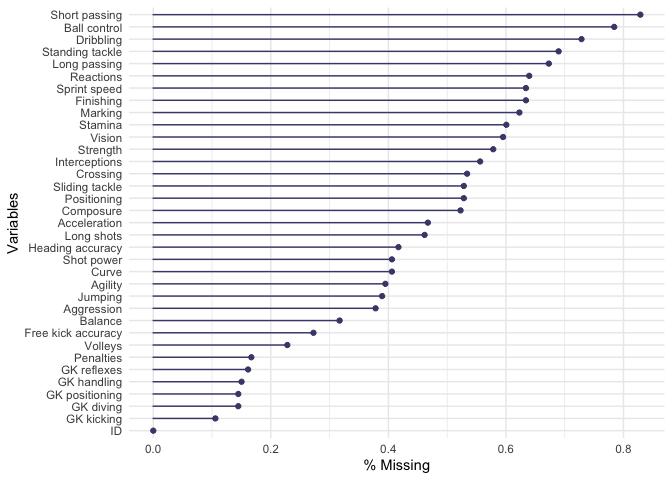<!-- -->

```
## 
## $PlayerPersonalData
```

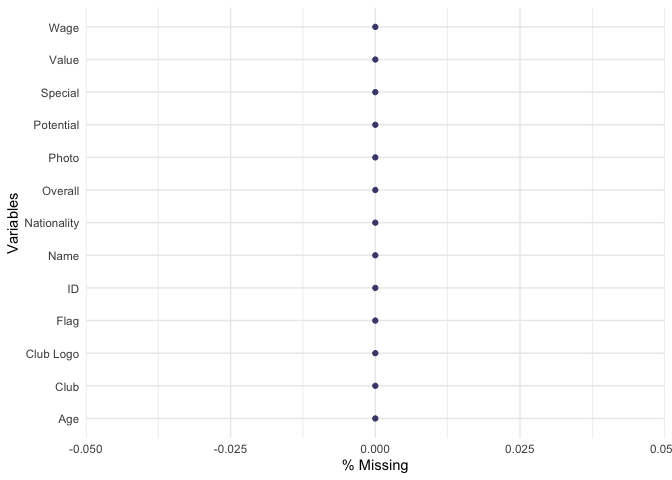<!-- -->

```
## 
## $PlayerPlayingPositionData
```

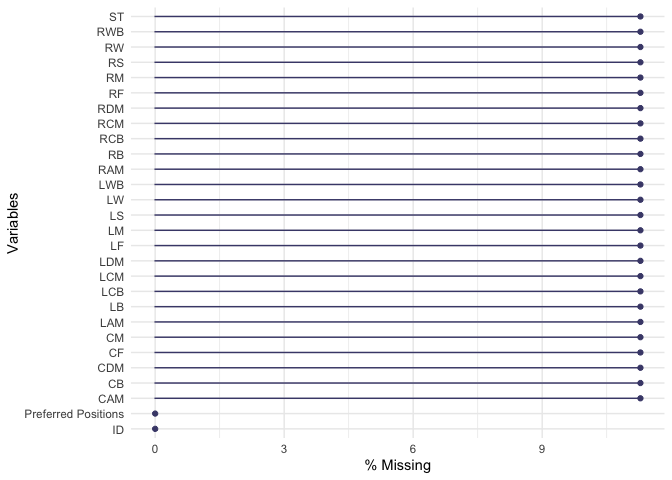<!-- -->

## Seeking if any Column contains dates

**Spoiler: No dates found in any column.**


```r
date_seek <- lapply(mydata, function(x) {
  x[] <- lapply(x, lubridate::is.Date)
  x
})

 sapply(date_seek, function(x) any(unlist(x)))
```

```
##       PlayerAttributeData        PlayerPersonalData PlayerPlayingPositionData 
##                     FALSE                     FALSE                     FALSE
```

# Distributions: Player Attributes


```r
plot_histogram(mydata$PlayerAttributeData)
```

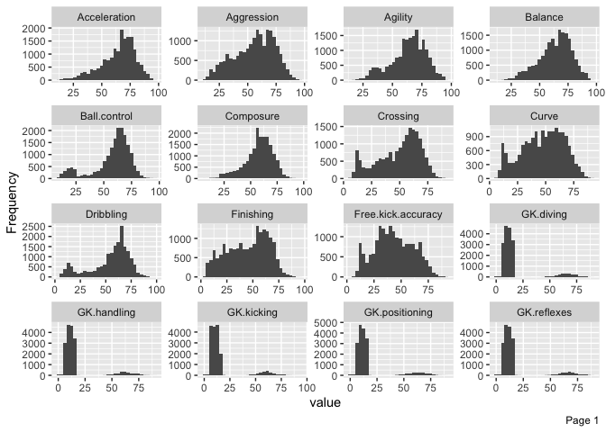<!-- -->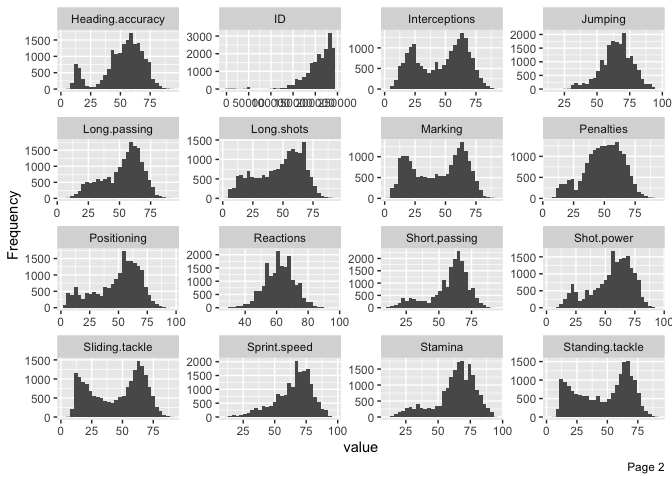<!-- -->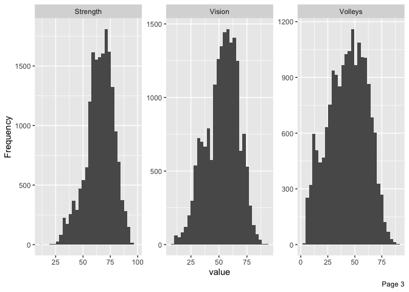<!-- -->


# Distributions: Player Personal Data


```r
plot_histogram(mydata$PlayerPersonalData)
```

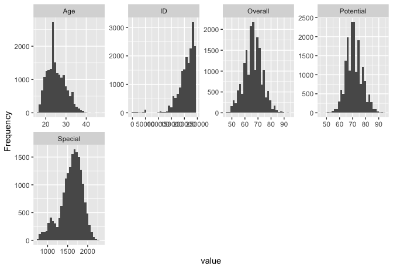<!-- -->

# Distributions: Player Position Data


```r
plot_histogram(mydata$PlayerPlayingPositionData)
```

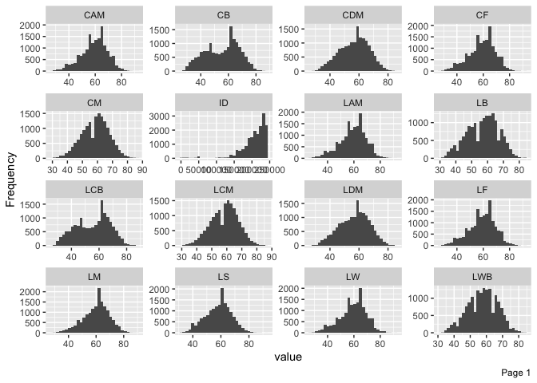<!-- -->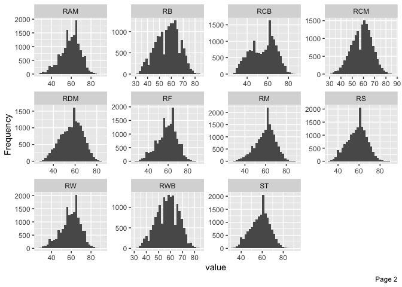<!-- -->

## EDA: Players & Languages

A table summarizing player and languages is supposed they speak.


```r
players_languages <-
  inner_join(final_languages_csv,
             PlayerPersonalData,
             by = c("country_name" = "Nationality"))  %>%
  select(lang_name, Club, country_name, continent_name, Name) %>%
  group_by(Name) %>%
  summarise(
    languages = toString(unique(lang_name)),
    club =  first(Club),
    country = first(country_name),
    continent = first(continent_name)
  )

kable(players_languages) %>%
  kable_styling(
    bootstrap_options = c("striped", "hover", "condensed", "responsive"),
    font_size = 12
  ) %>%
  row_spec(row = 0, color = "#660033") %>% 
  scroll_box(width = "100%", height = "400px")
```

<div style="border: 1px solid #ddd; padding: 0px; overflow-y: scroll; height:400px; overflow-x: scroll; width:100%; "><table class="table table-striped table-hover table-condensed table-responsive" style="font-size: 12px; margin-left: auto; margin-right: auto;">
 <thead>
  <tr>
   <th style="text-align:left;color: #660033 !important;position: sticky; top:0; background-color: #FFFFFF;"> Name </th>
   <th style="text-align:left;color: #660033 !important;position: sticky; top:0; background-color: #FFFFFF;"> languages </th>
   <th style="text-align:left;color: #660033 !important;position: sticky; top:0; background-color: #FFFFFF;"> club </th>
   <th style="text-align:left;color: #660033 !important;position: sticky; top:0; background-color: #FFFFFF;"> country </th>
   <th style="text-align:left;color: #660033 !important;position: sticky; top:0; background-color: #FFFFFF;"> continent </th>
  </tr>
 </thead>
<tbody>
  <tr>
   <td style="text-align:left;"> A. Abbas </td>
   <td style="text-align:left;"> Arabic, Kurdish </td>
   <td style="text-align:left;"> Wellington Phoenix </td>
   <td style="text-align:left;"> Iraq </td>
   <td style="text-align:left;"> Asia </td>
  </tr>
  <tr>
   <td style="text-align:left;"> A. Abdallah </td>
   <td style="text-align:left;"> French </td>
   <td style="text-align:left;"> ES Troyes AC </td>
   <td style="text-align:left;"> France </td>
   <td style="text-align:left;"> Europe </td>
  </tr>
  <tr>
   <td style="text-align:left;"> A. Abdennour </td>
   <td style="text-align:left;"> Arabic </td>
   <td style="text-align:left;"> Olympique de Marseille </td>
   <td style="text-align:left;"> Tunisia </td>
   <td style="text-align:left;"> Africa </td>
  </tr>
  <tr>
   <td style="text-align:left;"> A. Abdi </td>
   <td style="text-align:left;"> German, French, Italian </td>
   <td style="text-align:left;"> Sheffield Wednesday </td>
   <td style="text-align:left;"> Switzerland </td>
   <td style="text-align:left;"> Europe </td>
  </tr>
  <tr>
   <td style="text-align:left;"> A. Abedzadeh </td>
   <td style="text-align:left;"> Persian </td>
   <td style="text-align:left;"> CS Marítimo </td>
   <td style="text-align:left;"> Iran </td>
   <td style="text-align:left;"> Asia </td>
  </tr>
  <tr>
   <td style="text-align:left;"> A. Abrashi </td>
   <td style="text-align:left;"> Albanian </td>
   <td style="text-align:left;"> SC Freiburg </td>
   <td style="text-align:left;"> Albania </td>
   <td style="text-align:left;"> Europe </td>
  </tr>
  <tr>
   <td style="text-align:left;"> A. Absalem </td>
   <td style="text-align:left;"> Dutch </td>
   <td style="text-align:left;"> FC Groningen </td>
   <td style="text-align:left;"> Netherlands </td>
   <td style="text-align:left;"> Europe </td>
  </tr>
  <tr>
   <td style="text-align:left;"> A. Accardi </td>
   <td style="text-align:left;"> Italian </td>
   <td style="text-align:left;"> Palermo </td>
   <td style="text-align:left;"> Italy </td>
   <td style="text-align:left;"> Europe </td>
  </tr>
  <tr>
   <td style="text-align:left;"> A. Acosta </td>
   <td style="text-align:left;"> Spanish </td>
   <td style="text-align:left;"> Tigres U.A.N.L. </td>
   <td style="text-align:left;"> Mexico </td>
   <td style="text-align:left;"> North America </td>
  </tr>
  <tr>
   <td style="text-align:left;"> A. Acquah </td>
   <td style="text-align:left;"> English </td>
   <td style="text-align:left;"> Torino </td>
   <td style="text-align:left;"> Ghana </td>
   <td style="text-align:left;"> Africa </td>
  </tr>
  <tr>
   <td style="text-align:left;"> A. Adamov </td>
   <td style="text-align:left;"> Russian </td>
   <td style="text-align:left;"> Terek Grozny </td>
   <td style="text-align:left;"> Russia </td>
   <td style="text-align:left;"> Europe </td>
  </tr>
  <tr>
   <td style="text-align:left;"> A. Adanuy </td>
   <td style="text-align:left;"> Spanish </td>
   <td style="text-align:left;"> CD Huachipato </td>
   <td style="text-align:left;"> Chile </td>
   <td style="text-align:left;"> South America </td>
  </tr>
  <tr>
   <td style="text-align:left;"> A. Adencibia </td>
   <td style="text-align:left;"> Spanish </td>
   <td style="text-align:left;"> CD Palestino </td>
   <td style="text-align:left;"> Chile </td>
   <td style="text-align:left;"> South America </td>
  </tr>
  <tr>
   <td style="text-align:left;"> A. Adnan </td>
   <td style="text-align:left;"> Arabic, Kurdish </td>
   <td style="text-align:left;"> Udinese </td>
   <td style="text-align:left;"> Iraq </td>
   <td style="text-align:left;"> Asia </td>
  </tr>
  <tr>
   <td style="text-align:left;"> A. Adomah </td>
   <td style="text-align:left;"> English </td>
   <td style="text-align:left;"> Aston Villa </td>
   <td style="text-align:left;"> Ghana </td>
   <td style="text-align:left;"> Africa </td>
  </tr>
  <tr>
   <td style="text-align:left;"> A. Affane </td>
   <td style="text-align:left;"> Swedish </td>
   <td style="text-align:left;"> AIK Solna </td>
   <td style="text-align:left;"> Sweden </td>
   <td style="text-align:left;"> Europe </td>
  </tr>
  <tr>
   <td style="text-align:left;"> A. Afif </td>
   <td style="text-align:left;"> Arabic </td>
   <td style="text-align:left;"> KAS Eupen </td>
   <td style="text-align:left;"> Qatar </td>
   <td style="text-align:left;"> Asia </td>
  </tr>
  <tr>
   <td style="text-align:left;"> A. Agouda </td>
   <td style="text-align:left;"> Norwegian, Norwegian Nynorsk </td>
   <td style="text-align:left;"> Strømsgodset IF </td>
   <td style="text-align:left;"> Norway </td>
   <td style="text-align:left;"> Europe </td>
  </tr>
  <tr>
   <td style="text-align:left;"> A. Aguerre </td>
   <td style="text-align:left;"> Spanish, Guarani </td>
   <td style="text-align:left;"> Vélez Sarsfield </td>
   <td style="text-align:left;"> Argentina </td>
   <td style="text-align:left;"> South America </td>
  </tr>
  <tr>
   <td style="text-align:left;"> A. Aguilar </td>
   <td style="text-align:left;"> Spanish, Guarani </td>
   <td style="text-align:left;"> Asociacion Deportivo Cali </td>
   <td style="text-align:left;"> Colombia </td>
   <td style="text-align:left;"> South America </td>
  </tr>
  <tr>
   <td style="text-align:left;"> A. Ahamada </td>
   <td style="text-align:left;"> Arabic, French </td>
   <td style="text-align:left;"> Kayserispor </td>
   <td style="text-align:left;"> Comoros </td>
   <td style="text-align:left;"> Africa </td>
  </tr>
  <tr>
   <td style="text-align:left;"> A. Ajagun </td>
   <td style="text-align:left;"> English </td>
   <td style="text-align:left;"> KV Kortrijk </td>
   <td style="text-align:left;"> Nigeria </td>
   <td style="text-align:left;"> Africa </td>
  </tr>
  <tr>
   <td style="text-align:left;"> A. Ajdarević </td>
   <td style="text-align:left;"> Albanian, Swedish </td>
   <td style="text-align:left;"> Örebro SK </td>
   <td style="text-align:left;"> Albania </td>
   <td style="text-align:left;"> Europe </td>
  </tr>
  <tr>
   <td style="text-align:left;"> A. Ajeti </td>
   <td style="text-align:left;"> Albanian, German, French, Italian </td>
   <td style="text-align:left;"> Crotone </td>
   <td style="text-align:left;"> Albania </td>
   <td style="text-align:left;"> Europe </td>
  </tr>
  <tr>
   <td style="text-align:left;"> A. Akaichi </td>
   <td style="text-align:left;"> Arabic </td>
   <td style="text-align:left;"> Al Ittihad </td>
   <td style="text-align:left;"> Tunisia </td>
   <td style="text-align:left;"> Africa </td>
  </tr>
  <tr>
   <td style="text-align:left;"> A. Akhyadov </td>
   <td style="text-align:left;"> Russian </td>
   <td style="text-align:left;"> Terek Grozny </td>
   <td style="text-align:left;"> Russia </td>
   <td style="text-align:left;"> Europe </td>
  </tr>
  <tr>
   <td style="text-align:left;"> A. Akkaynak </td>
   <td style="text-align:left;"> German </td>
   <td style="text-align:left;"> Bayer 04 Leverkusen </td>
   <td style="text-align:left;"> Germany </td>
   <td style="text-align:left;"> Europe </td>
  </tr>
  <tr>
   <td style="text-align:left;"> A. Aktas </td>
   <td style="text-align:left;"> French </td>
   <td style="text-align:left;"> FC Sochaux-Montbéliard </td>
   <td style="text-align:left;"> France </td>
   <td style="text-align:left;"> Europe </td>
  </tr>
  <tr>
   <td style="text-align:left;"> A. Al Ammar </td>
   <td style="text-align:left;"> Arabic </td>
   <td style="text-align:left;"> Al Fateh </td>
   <td style="text-align:left;"> Saudi Arabia </td>
   <td style="text-align:left;"> Asia </td>
  </tr>
  <tr>
   <td style="text-align:left;"> A. Al Amoudi </td>
   <td style="text-align:left;"> Arabic </td>
   <td style="text-align:left;"> Ohod Club </td>
   <td style="text-align:left;"> Saudi Arabia </td>
   <td style="text-align:left;"> Asia </td>
  </tr>
  <tr>
   <td style="text-align:left;"> A. Al Amri </td>
   <td style="text-align:left;"> Arabic </td>
   <td style="text-align:left;"> Al Ittihad </td>
   <td style="text-align:left;"> Saudi Arabia </td>
   <td style="text-align:left;"> Asia </td>
  </tr>
  <tr>
   <td style="text-align:left;"> A. Al Aryani </td>
   <td style="text-align:left;"> Arabic </td>
   <td style="text-align:left;"> Al Ittihad </td>
   <td style="text-align:left;"> Saudi Arabia </td>
   <td style="text-align:left;"> Asia </td>
  </tr>
  <tr>
   <td style="text-align:left;"> A. Al Asmari </td>
   <td style="text-align:left;"> Arabic </td>
   <td style="text-align:left;"> Al Ahli </td>
   <td style="text-align:left;"> Saudi Arabia </td>
   <td style="text-align:left;"> Asia </td>
  </tr>
  <tr>
   <td style="text-align:left;"> A. Al Assiri </td>
   <td style="text-align:left;"> Arabic </td>
   <td style="text-align:left;"> Ohod Club </td>
   <td style="text-align:left;"> Saudi Arabia </td>
   <td style="text-align:left;"> Asia </td>
  </tr>
  <tr>
   <td style="text-align:left;"> A. Al Asta </td>
   <td style="text-align:left;"> Arabic </td>
   <td style="text-align:left;"> Al Nassr </td>
   <td style="text-align:left;"> Saudi Arabia </td>
   <td style="text-align:left;"> Asia </td>
  </tr>
  <tr>
   <td style="text-align:left;"> A. Al Barakah </td>
   <td style="text-align:left;"> Arabic </td>
   <td style="text-align:left;"> Al Fayha </td>
   <td style="text-align:left;"> Saudi Arabia </td>
   <td style="text-align:left;"> Asia </td>
  </tr>
  <tr>
   <td style="text-align:left;"> A. Al Basisi </td>
   <td style="text-align:left;"> Arabic </td>
   <td style="text-align:left;"> Ohod Club </td>
   <td style="text-align:left;"> Saudi Arabia </td>
   <td style="text-align:left;"> Asia </td>
  </tr>
  <tr>
   <td style="text-align:left;"> A. Al Bishi </td>
   <td style="text-align:left;"> Arabic </td>
   <td style="text-align:left;"> Al Taawoun </td>
   <td style="text-align:left;"> Saudi Arabia </td>
   <td style="text-align:left;"> Asia </td>
  </tr>
  <tr>
   <td style="text-align:left;"> A. Al Bukhari </td>
   <td style="text-align:left;"> Arabic </td>
   <td style="text-align:left;"> Ettifaq FC </td>
   <td style="text-align:left;"> Saudi Arabia </td>
   <td style="text-align:left;"> Asia </td>
  </tr>
  <tr>
   <td style="text-align:left;"> A. Al Bulayhi </td>
   <td style="text-align:left;"> Arabic </td>
   <td style="text-align:left;"> Al Hilal </td>
   <td style="text-align:left;"> Saudi Arabia </td>
   <td style="text-align:left;"> Asia </td>
  </tr>
  <tr>
   <td style="text-align:left;"> A. Al Dawsari </td>
   <td style="text-align:left;"> Arabic </td>
   <td style="text-align:left;"> Al Hilal </td>
   <td style="text-align:left;"> Saudi Arabia </td>
   <td style="text-align:left;"> Asia </td>
  </tr>
  <tr>
   <td style="text-align:left;"> A. Al Dohaim </td>
   <td style="text-align:left;"> Arabic </td>
   <td style="text-align:left;"> Al Ittihad </td>
   <td style="text-align:left;"> Saudi Arabia </td>
   <td style="text-align:left;"> Asia </td>
  </tr>
  <tr>
   <td style="text-align:left;"> A. Al Eid </td>
   <td style="text-align:left;"> Arabic </td>
   <td style="text-align:left;"> Al Fateh </td>
   <td style="text-align:left;"> Saudi Arabia </td>
   <td style="text-align:left;"> Asia </td>
  </tr>
  <tr>
   <td style="text-align:left;"> A. Al Enazi </td>
   <td style="text-align:left;"> Arabic </td>
   <td style="text-align:left;"> Ohod Club </td>
   <td style="text-align:left;"> Saudi Arabia </td>
   <td style="text-align:left;"> Asia </td>
  </tr>
  <tr>
   <td style="text-align:left;"> A. Al Enezi </td>
   <td style="text-align:left;"> Arabic </td>
   <td style="text-align:left;"> Al Nassr </td>
   <td style="text-align:left;"> Saudi Arabia </td>
   <td style="text-align:left;"> Asia </td>
  </tr>
  <tr>
   <td style="text-align:left;"> A. Al Fahad </td>
   <td style="text-align:left;"> Arabic </td>
   <td style="text-align:left;"> Al Shabab </td>
   <td style="text-align:left;"> Saudi Arabia </td>
   <td style="text-align:left;"> Asia </td>
  </tr>
  <tr>
   <td style="text-align:left;"> A. Al Fahmi </td>
   <td style="text-align:left;"> Arabic </td>
   <td style="text-align:left;"> Al Qadisiyah </td>
   <td style="text-align:left;"> Saudi Arabia </td>
   <td style="text-align:left;"> Asia </td>
  </tr>
  <tr>
   <td style="text-align:left;"> A. Al Faraj </td>
   <td style="text-align:left;"> Arabic </td>
   <td style="text-align:left;"> Al Nassr </td>
   <td style="text-align:left;"> Saudi Arabia </td>
   <td style="text-align:left;"> Asia </td>
  </tr>
  <tr>
   <td style="text-align:left;"> A. Al Fraidi </td>
   <td style="text-align:left;"> Arabic </td>
   <td style="text-align:left;"> Al Nassr </td>
   <td style="text-align:left;"> Saudi Arabia </td>
   <td style="text-align:left;"> Asia </td>
  </tr>
  <tr>
   <td style="text-align:left;"> A. Al Ghamdi </td>
   <td style="text-align:left;"> Arabic </td>
   <td style="text-align:left;"> Al Ittihad </td>
   <td style="text-align:left;"> Saudi Arabia </td>
   <td style="text-align:left;"> Asia </td>
  </tr>
  <tr>
   <td style="text-align:left;"> A. Al Hafith </td>
   <td style="text-align:left;"> Arabic </td>
   <td style="text-align:left;"> Al Hilal </td>
   <td style="text-align:left;"> Saudi Arabia </td>
   <td style="text-align:left;"> Asia </td>
  </tr>
  <tr>
   <td style="text-align:left;"> A. Al Haidari </td>
   <td style="text-align:left;"> Arabic </td>
   <td style="text-align:left;"> Ohod Club </td>
   <td style="text-align:left;"> Saudi Arabia </td>
   <td style="text-align:left;"> Asia </td>
  </tr>
  <tr>
   <td style="text-align:left;"> A. Al Harbi </td>
   <td style="text-align:left;"> Arabic </td>
   <td style="text-align:left;"> Al Raed </td>
   <td style="text-align:left;"> Saudi Arabia </td>
   <td style="text-align:left;"> Asia </td>
  </tr>
  <tr>
   <td style="text-align:left;"> A. Al Hbeab </td>
   <td style="text-align:left;"> Arabic </td>
   <td style="text-align:left;"> Ettifaq FC </td>
   <td style="text-align:left;"> Saudi Arabia </td>
   <td style="text-align:left;"> Asia </td>
  </tr>
  <tr>
   <td style="text-align:left;"> A. Al Jebreen </td>
   <td style="text-align:left;"> Arabic </td>
   <td style="text-align:left;"> Al Nassr </td>
   <td style="text-align:left;"> Saudi Arabia </td>
   <td style="text-align:left;"> Asia </td>
  </tr>
  <tr>
   <td style="text-align:left;"> A. Al Joui </td>
   <td style="text-align:left;"> Arabic </td>
   <td style="text-align:left;"> Al Batin </td>
   <td style="text-align:left;"> Saudi Arabia </td>
   <td style="text-align:left;"> Asia </td>
  </tr>
  <tr>
   <td style="text-align:left;"> A. Al Kassar </td>
   <td style="text-align:left;"> Arabic </td>
   <td style="text-align:left;"> Ettifaq FC </td>
   <td style="text-align:left;"> Saudi Arabia </td>
   <td style="text-align:left;"> Asia </td>
  </tr>
  <tr>
   <td style="text-align:left;"> A. Al Khaibari </td>
   <td style="text-align:left;"> Arabic </td>
   <td style="text-align:left;"> Al Hilal </td>
   <td style="text-align:left;"> Saudi Arabia </td>
   <td style="text-align:left;"> Asia </td>
  </tr>
  <tr>
   <td style="text-align:left;"> A. Al Khulaif </td>
   <td style="text-align:left;"> Arabic </td>
   <td style="text-align:left;"> Al Ahli </td>
   <td style="text-align:left;"> Saudi Arabia </td>
   <td style="text-align:left;"> Asia </td>
  </tr>
  <tr>
   <td style="text-align:left;"> A. Al Mayoof </td>
   <td style="text-align:left;"> Arabic </td>
   <td style="text-align:left;"> Al Hilal </td>
   <td style="text-align:left;"> Saudi Arabia </td>
   <td style="text-align:left;"> Asia </td>
  </tr>
  <tr>
   <td style="text-align:left;"> A. Al Mazaidi </td>
   <td style="text-align:left;"> Arabic </td>
   <td style="text-align:left;"> Al Fateh </td>
   <td style="text-align:left;"> Saudi Arabia </td>
   <td style="text-align:left;"> Asia </td>
  </tr>
  <tr>
   <td style="text-align:left;"> A. Al Megbas </td>
   <td style="text-align:left;"> Arabic </td>
   <td style="text-align:left;"> Al Shabab </td>
   <td style="text-align:left;"> Saudi Arabia </td>
   <td style="text-align:left;"> Asia </td>
  </tr>
  <tr>
   <td style="text-align:left;"> A. Al Meshaweh </td>
   <td style="text-align:left;"> Arabic </td>
   <td style="text-align:left;"> Al Raed </td>
   <td style="text-align:left;"> Saudi Arabia </td>
   <td style="text-align:left;"> Asia </td>
  </tr>
  <tr>
   <td style="text-align:left;"> A. Al Mutairi </td>
   <td style="text-align:left;"> Arabic </td>
   <td style="text-align:left;"> Al Fayha </td>
   <td style="text-align:left;"> Saudi Arabia </td>
   <td style="text-align:left;"> Asia </td>
  </tr>
  <tr>
   <td style="text-align:left;"> A. Al Najai </td>
   <td style="text-align:left;"> Arabic </td>
   <td style="text-align:left;"> Al Faisaly </td>
   <td style="text-align:left;"> Saudi Arabia </td>
   <td style="text-align:left;"> Asia </td>
  </tr>
  <tr>
   <td style="text-align:left;"> A. Al Najjar </td>
   <td style="text-align:left;"> Arabic </td>
   <td style="text-align:left;"> Al Ittihad </td>
   <td style="text-align:left;"> Saudi Arabia </td>
   <td style="text-align:left;"> Asia </td>
  </tr>
  <tr>
   <td style="text-align:left;"> A. Al Nazera </td>
   <td style="text-align:left;"> Arabic </td>
   <td style="text-align:left;"> Al Fateh </td>
   <td style="text-align:left;"> Saudi Arabia </td>
   <td style="text-align:left;"> Asia </td>
  </tr>
  <tr>
   <td style="text-align:left;"> A. Al Obaid </td>
   <td style="text-align:left;"> Arabic </td>
   <td style="text-align:left;"> Al Qadisiyah </td>
   <td style="text-align:left;"> Saudi Arabia </td>
   <td style="text-align:left;"> Asia </td>
  </tr>
  <tr>
   <td style="text-align:left;"> A. Al Obud </td>
   <td style="text-align:left;"> Arabic </td>
   <td style="text-align:left;"> Ettifaq FC </td>
   <td style="text-align:left;"> Saudi Arabia </td>
   <td style="text-align:left;"> Asia </td>
  </tr>
  <tr>
   <td style="text-align:left;"> A. Al Owayshir </td>
   <td style="text-align:left;"> Arabic </td>
   <td style="text-align:left;"> Al Fateh </td>
   <td style="text-align:left;"> Saudi Arabia </td>
   <td style="text-align:left;"> Asia </td>
  </tr>
  <tr>
   <td style="text-align:left;"> A. Al Qahtani </td>
   <td style="text-align:left;"> Arabic </td>
   <td style="text-align:left;"> Al Fayha </td>
   <td style="text-align:left;"> Saudi Arabia </td>
   <td style="text-align:left;"> Asia </td>
  </tr>
  <tr>
   <td style="text-align:left;"> A. Al Qarni </td>
   <td style="text-align:left;"> Arabic </td>
   <td style="text-align:left;"> Al Ittihad </td>
   <td style="text-align:left;"> Saudi Arabia </td>
   <td style="text-align:left;"> Asia </td>
  </tr>
  <tr>
   <td style="text-align:left;"> A. Al Qasir </td>
   <td style="text-align:left;"> Arabic </td>
   <td style="text-align:left;"> Al Raed </td>
   <td style="text-align:left;"> Saudi Arabia </td>
   <td style="text-align:left;"> Asia </td>
  </tr>
  <tr>
   <td style="text-align:left;"> A. Al Ruwaili </td>
   <td style="text-align:left;"> Arabic </td>
   <td style="text-align:left;"> Al Fayha </td>
   <td style="text-align:left;"> Saudi Arabia </td>
   <td style="text-align:left;"> Asia </td>
  </tr>
  <tr>
   <td style="text-align:left;"> A. Al Sahabi </td>
   <td style="text-align:left;"> Arabic </td>
   <td style="text-align:left;"> Al Ahli </td>
   <td style="text-align:left;"> Saudi Arabia </td>
   <td style="text-align:left;"> Asia </td>
  </tr>
  <tr>
   <td style="text-align:left;"> A. Al Saleh </td>
   <td style="text-align:left;"> Arabic </td>
   <td style="text-align:left;"> Ettifaq FC </td>
   <td style="text-align:left;"> Saudi Arabia </td>
   <td style="text-align:left;"> Asia </td>
  </tr>
  <tr>
   <td style="text-align:left;"> A. Al Salem </td>
   <td style="text-align:left;"> Arabic </td>
   <td style="text-align:left;"> Al Fayha </td>
   <td style="text-align:left;"> Saudi Arabia </td>
   <td style="text-align:left;"> Asia </td>
  </tr>
  <tr>
   <td style="text-align:left;"> A. Al Salman </td>
   <td style="text-align:left;"> Arabic </td>
   <td style="text-align:left;"> Al Taawoun </td>
   <td style="text-align:left;"> Saudi Arabia </td>
   <td style="text-align:left;"> Asia </td>
  </tr>
  <tr>
   <td style="text-align:left;"> A. Al Sdairy </td>
   <td style="text-align:left;"> Arabic </td>
   <td style="text-align:left;"> Al Shabab </td>
   <td style="text-align:left;"> Saudi Arabia </td>
   <td style="text-align:left;"> Asia </td>
  </tr>
  <tr>
   <td style="text-align:left;"> A. Al Shahrani </td>
   <td style="text-align:left;"> Arabic </td>
   <td style="text-align:left;"> Al Qadisiyah </td>
   <td style="text-align:left;"> Saudi Arabia </td>
   <td style="text-align:left;"> Asia </td>
  </tr>
  <tr>
   <td style="text-align:left;"> A. Al Shamekh </td>
   <td style="text-align:left;"> Arabic </td>
   <td style="text-align:left;"> Al Raed </td>
   <td style="text-align:left;"> Saudi Arabia </td>
   <td style="text-align:left;"> Asia </td>
  </tr>
  <tr>
   <td style="text-align:left;"> A. Al Shammari </td>
   <td style="text-align:left;"> Arabic </td>
   <td style="text-align:left;"> Al Raed </td>
   <td style="text-align:left;"> Saudi Arabia </td>
   <td style="text-align:left;"> Asia </td>
  </tr>
  <tr>
   <td style="text-align:left;"> A. Al Shammary </td>
   <td style="text-align:left;"> Arabic </td>
   <td style="text-align:left;"> Al Batin </td>
   <td style="text-align:left;"> Saudi Arabia </td>
   <td style="text-align:left;"> Asia </td>
  </tr>
  <tr>
   <td style="text-align:left;"> A. Al Sharid </td>
   <td style="text-align:left;"> Arabic </td>
   <td style="text-align:left;"> Al Taawoun </td>
   <td style="text-align:left;"> Saudi Arabia </td>
   <td style="text-align:left;"> Asia </td>
  </tr>
  <tr>
   <td style="text-align:left;"> A. Al Shehri </td>
   <td style="text-align:left;"> Arabic </td>
   <td style="text-align:left;"> Ettifaq FC </td>
   <td style="text-align:left;"> Saudi Arabia </td>
   <td style="text-align:left;"> Asia </td>
  </tr>
  <tr>
   <td style="text-align:left;"> A. Al Shehry </td>
   <td style="text-align:left;"> Arabic </td>
   <td style="text-align:left;"> Al Qadisiyah </td>
   <td style="text-align:left;"> Saudi Arabia </td>
   <td style="text-align:left;"> Asia </td>
  </tr>
  <tr>
   <td style="text-align:left;"> A. Al Suhail </td>
   <td style="text-align:left;"> Arabic </td>
   <td style="text-align:left;"> Al Taawoun </td>
   <td style="text-align:left;"> Saudi Arabia </td>
   <td style="text-align:left;"> Asia </td>
  </tr>
  <tr>
   <td style="text-align:left;"> A. Al Sulayhim </td>
   <td style="text-align:left;"> Arabic </td>
   <td style="text-align:left;"> Al Shabab </td>
   <td style="text-align:left;"> Saudi Arabia </td>
   <td style="text-align:left;"> Asia </td>
  </tr>
  <tr>
   <td style="text-align:left;"> A. Al Suwat </td>
   <td style="text-align:left;"> Arabic </td>
   <td style="text-align:left;"> Al Taawoun </td>
   <td style="text-align:left;"> Saudi Arabia </td>
   <td style="text-align:left;"> Asia </td>
  </tr>
  <tr>
   <td style="text-align:left;"> A. Al Turki </td>
   <td style="text-align:left;"> Arabic </td>
   <td style="text-align:left;"> Al Taawoun </td>
   <td style="text-align:left;"> Saudi Arabia </td>
   <td style="text-align:left;"> Asia </td>
  </tr>
  <tr>
   <td style="text-align:left;"> A. Al Yahya </td>
   <td style="text-align:left;"> Arabic </td>
   <td style="text-align:left;"> Ohod Club </td>
   <td style="text-align:left;"> Saudi Arabia </td>
   <td style="text-align:left;"> Asia </td>
  </tr>
  <tr>
   <td style="text-align:left;"> A. Al Yami </td>
   <td style="text-align:left;"> Arabic </td>
   <td style="text-align:left;"> Al Ittihad </td>
   <td style="text-align:left;"> Saudi Arabia </td>
   <td style="text-align:left;"> Asia </td>
  </tr>
  <tr>
   <td style="text-align:left;"> A. Al Yousif </td>
   <td style="text-align:left;"> Arabic </td>
   <td style="text-align:left;"> Al Fateh </td>
   <td style="text-align:left;"> Saudi Arabia </td>
   <td style="text-align:left;"> Asia </td>
  </tr>
  <tr>
   <td style="text-align:left;"> A. Al Zahrani </td>
   <td style="text-align:left;"> Arabic </td>
   <td style="text-align:left;"> Al Raed </td>
   <td style="text-align:left;"> Saudi Arabia </td>
   <td style="text-align:left;"> Asia </td>
  </tr>
  <tr>
   <td style="text-align:left;"> A. Al Zaqan </td>
   <td style="text-align:left;"> Arabic </td>
   <td style="text-align:left;"> Al Fateh </td>
   <td style="text-align:left;"> Saudi Arabia </td>
   <td style="text-align:left;"> Asia </td>
  </tr>
  <tr>
   <td style="text-align:left;"> A. Al Zori </td>
   <td style="text-align:left;"> Arabic </td>
   <td style="text-align:left;"> Al Hilal </td>
   <td style="text-align:left;"> Saudi Arabia </td>
   <td style="text-align:left;"> Asia </td>
  </tr>
  <tr>
   <td style="text-align:left;"> A. Al-Habsi </td>
   <td style="text-align:left;"> Arabic </td>
   <td style="text-align:left;"> Al Hilal </td>
   <td style="text-align:left;"> Oman </td>
   <td style="text-align:left;"> Asia </td>
  </tr>
  <tr>
   <td style="text-align:left;"> A. Albech </td>
   <td style="text-align:left;"> Danish </td>
   <td style="text-align:left;"> Sarpsborg 08 FF </td>
   <td style="text-align:left;"> Denmark </td>
   <td style="text-align:left;"> Europe </td>
  </tr>
  <tr>
   <td style="text-align:left;"> A. Aldrete </td>
   <td style="text-align:left;"> Spanish </td>
   <td style="text-align:left;"> Cruz Azul </td>
   <td style="text-align:left;"> Mexico </td>
   <td style="text-align:left;"> North America </td>
  </tr>
  <tr>
   <td style="text-align:left;"> A. Alégué </td>
   <td style="text-align:left;"> English, French </td>
   <td style="text-align:left;"> FC Nantes </td>
   <td style="text-align:left;"> Cameroon </td>
   <td style="text-align:left;"> Africa </td>
  </tr>
  <tr>
   <td style="text-align:left;"> A. Aleksandrov </td>
   <td style="text-align:left;"> Bulgarian </td>
   <td style="text-align:left;">  </td>
   <td style="text-align:left;"> Bulgaria </td>
   <td style="text-align:left;"> Europe </td>
  </tr>
  <tr>
   <td style="text-align:left;"> A. Alesevic </td>
   <td style="text-align:left;"> German, French, Italian </td>
   <td style="text-align:left;"> FC Zürich </td>
   <td style="text-align:left;"> Switzerland </td>
   <td style="text-align:left;"> Europe </td>
  </tr>
  <tr>
   <td style="text-align:left;"> A. Alkhaibari </td>
   <td style="text-align:left;"> Arabic </td>
   <td style="text-align:left;"> Al Shabab </td>
   <td style="text-align:left;"> Saudi Arabia </td>
   <td style="text-align:left;"> Asia </td>
  </tr>
  <tr>
   <td style="text-align:left;"> A. Almici </td>
   <td style="text-align:left;"> Italian </td>
   <td style="text-align:left;"> Cremonese </td>
   <td style="text-align:left;"> Italy </td>
   <td style="text-align:left;"> Europe </td>
  </tr>
  <tr>
   <td style="text-align:left;"> A. Alvarez </td>
   <td style="text-align:left;"> Spanish </td>
   <td style="text-align:left;"> Chicago Fire Soccer Club </td>
   <td style="text-align:left;"> El Salvador </td>
   <td style="text-align:left;"> North America </td>
  </tr>
  <tr>
   <td style="text-align:left;"> A. Ammitzbøl </td>
   <td style="text-align:left;"> Danish </td>
   <td style="text-align:left;"> Aarhus GF </td>
   <td style="text-align:left;"> Denmark </td>
   <td style="text-align:left;"> Europe </td>
  </tr>
  <tr>
   <td style="text-align:left;"> A. Anastasio </td>
   <td style="text-align:left;"> Italian </td>
   <td style="text-align:left;"> Carpi </td>
   <td style="text-align:left;"> Italy </td>
   <td style="text-align:left;"> Europe </td>
  </tr>
  <tr>
   <td style="text-align:left;"> A. Andersson </td>
   <td style="text-align:left;"> Swedish </td>
   <td style="text-align:left;"> Östersunds FK </td>
   <td style="text-align:left;"> Sweden </td>
   <td style="text-align:left;"> Europe </td>
  </tr>
  <tr>
   <td style="text-align:left;"> A. Andrade </td>
   <td style="text-align:left;"> Spanish </td>
   <td style="text-align:left;"> Club León </td>
   <td style="text-align:left;"> Colombia </td>
   <td style="text-align:left;"> South America </td>
  </tr>
  <tr>
   <td style="text-align:left;"> A. André Jr </td>
   <td style="text-align:left;"> French </td>
   <td style="text-align:left;"> Bristol Rovers </td>
   <td style="text-align:left;"> France </td>
   <td style="text-align:left;"> Europe </td>
  </tr>
  <tr>
   <td style="text-align:left;"> A. Andreasson </td>
   <td style="text-align:left;"> Swedish </td>
   <td style="text-align:left;"> Jönköpings Södra IF </td>
   <td style="text-align:left;"> Sweden </td>
   <td style="text-align:left;"> Europe </td>
  </tr>
  <tr>
   <td style="text-align:left;"> A. Androutsos </td>
   <td style="text-align:left;"> Greek </td>
   <td style="text-align:left;"> Olympiakos CFP </td>
   <td style="text-align:left;"> Greece </td>
   <td style="text-align:left;"> Europe </td>
  </tr>
  <tr>
   <td style="text-align:left;"> A. Angoula </td>
   <td style="text-align:left;"> French </td>
   <td style="text-align:left;"> La Berrichonne de Châteauroux </td>
   <td style="text-align:left;"> France </td>
   <td style="text-align:left;"> Europe </td>
  </tr>
  <tr>
   <td style="text-align:left;"> A. Angulo </td>
   <td style="text-align:left;"> Spanish </td>
   <td style="text-align:left;"> Águilas Doradas </td>
   <td style="text-align:left;"> Colombia </td>
   <td style="text-align:left;"> South America </td>
  </tr>
  <tr>
   <td style="text-align:left;"> A. Annan </td>
   <td style="text-align:left;"> English </td>
   <td style="text-align:left;"> HJK Helsinki </td>
   <td style="text-align:left;"> Ghana </td>
   <td style="text-align:left;"> Africa </td>
  </tr>
  <tr>
   <td style="text-align:left;"> A. Anyukov </td>
   <td style="text-align:left;"> Russian </td>
   <td style="text-align:left;"> Zenit St. Petersburg </td>
   <td style="text-align:left;"> Russia </td>
   <td style="text-align:left;"> Europe </td>
  </tr>
  <tr>
   <td style="text-align:left;"> A. Aosman </td>
   <td style="text-align:left;"> Arabic </td>
   <td style="text-align:left;"> SG Dynamo Dresden </td>
   <td style="text-align:left;"> Syria </td>
   <td style="text-align:left;"> Asia </td>
  </tr>
  <tr>
   <td style="text-align:left;"> A. Aquilani </td>
   <td style="text-align:left;"> Italian </td>
   <td style="text-align:left;"> UD Las Palmas </td>
   <td style="text-align:left;"> Italy </td>
   <td style="text-align:left;"> Europe </td>
  </tr>
  <tr>
   <td style="text-align:left;"> A. Araujo </td>
   <td style="text-align:left;"> Spanish, Guarani, Portuguese </td>
   <td style="text-align:left;"> Talleres de Cordoba </td>
   <td style="text-align:left;"> Argentina </td>
   <td style="text-align:left;"> South America </td>
  </tr>
  <tr>
   <td style="text-align:left;"> A. Arboleda </td>
   <td style="text-align:left;"> Spanish </td>
   <td style="text-align:left;"> Jaguares Fútbol Club </td>
   <td style="text-align:left;"> Colombia </td>
   <td style="text-align:left;"> South America </td>
  </tr>
  <tr>
   <td style="text-align:left;"> A. Arce </td>
   <td style="text-align:left;"> Spanish </td>
   <td style="text-align:left;"> U.N.A.M. </td>
   <td style="text-align:left;"> Mexico </td>
   <td style="text-align:left;"> North America </td>
  </tr>
  <tr>
   <td style="text-align:left;"> A. Arellano </td>
   <td style="text-align:left;"> Spanish </td>
   <td style="text-align:left;"> Querétaro </td>
   <td style="text-align:left;"> Mexico </td>
   <td style="text-align:left;"> North America </td>
  </tr>
  <tr>
   <td style="text-align:left;"> A. Areola </td>
   <td style="text-align:left;"> French </td>
   <td style="text-align:left;"> Paris Saint-Germain </td>
   <td style="text-align:left;"> France </td>
   <td style="text-align:left;"> Europe </td>
  </tr>
  <tr>
   <td style="text-align:left;"> A. Argýris </td>
   <td style="text-align:left;"> Greek </td>
   <td style="text-align:left;"> Korona Kielce </td>
   <td style="text-align:left;"> Greece </td>
   <td style="text-align:left;"> Europe </td>
  </tr>
  <tr>
   <td style="text-align:left;"> A. Arregui </td>
   <td style="text-align:left;"> Spanish, Guarani </td>
   <td style="text-align:left;"> Temperley </td>
   <td style="text-align:left;"> Argentina </td>
   <td style="text-align:left;"> South America </td>
  </tr>
  <tr>
   <td style="text-align:left;"> A. Arrighini </td>
   <td style="text-align:left;"> Italian </td>
   <td style="text-align:left;"> Cittadella </td>
   <td style="text-align:left;"> Italy </td>
   <td style="text-align:left;"> Europe </td>
  </tr>
  <tr>
   <td style="text-align:left;"> A. Arslan </td>
   <td style="text-align:left;"> German </td>
   <td style="text-align:left;"> VfL Osnabrück </td>
   <td style="text-align:left;"> Germany </td>
   <td style="text-align:left;"> Europe </td>
  </tr>
  <tr>
   <td style="text-align:left;"> A. Arvidsson </td>
   <td style="text-align:left;"> Swedish </td>
   <td style="text-align:left;"> Halmstads BK </td>
   <td style="text-align:left;"> Sweden </td>
   <td style="text-align:left;"> Europe </td>
  </tr>
  <tr>
   <td style="text-align:left;"> A. Asante </td>
   <td style="text-align:left;"> Dutch </td>
   <td style="text-align:left;"> Grimsby Town </td>
   <td style="text-align:left;"> Netherlands </td>
   <td style="text-align:left;"> Europe </td>
  </tr>
  <tr>
   <td style="text-align:left;"> A. Aschauer </td>
   <td style="text-align:left;"> German </td>
   <td style="text-align:left;"> SG Sonnenhof Großaspach </td>
   <td style="text-align:left;"> Austria </td>
   <td style="text-align:left;"> Europe </td>
  </tr>
  <tr>
   <td style="text-align:left;"> A. Aseri </td>
   <td style="text-align:left;"> Arabic </td>
   <td style="text-align:left;"> Al Ahli </td>
   <td style="text-align:left;"> Saudi Arabia </td>
   <td style="text-align:left;"> Asia </td>
  </tr>
  <tr>
   <td style="text-align:left;"> A. Asiri </td>
   <td style="text-align:left;"> Arabic </td>
   <td style="text-align:left;"> Al Ittihad </td>
   <td style="text-align:left;"> Saudi Arabia </td>
   <td style="text-align:left;"> Asia </td>
  </tr>
  <tr>
   <td style="text-align:left;"> A. Askar </td>
   <td style="text-align:left;"> Amharic </td>
   <td style="text-align:left;"> Sarpsborg 08 FF </td>
   <td style="text-align:left;"> Ethiopia </td>
   <td style="text-align:left;"> Africa </td>
  </tr>
  <tr>
   <td style="text-align:left;"> A. Ateef </td>
   <td style="text-align:left;"> Arabic </td>
   <td style="text-align:left;"> Al Hilal </td>
   <td style="text-align:left;"> Saudi Arabia </td>
   <td style="text-align:left;"> Asia </td>
  </tr>
  <tr>
   <td style="text-align:left;"> A. Auassar </td>
   <td style="text-align:left;"> Dutch </td>
   <td style="text-align:left;"> Roda JC Kerkrade </td>
   <td style="text-align:left;"> Netherlands </td>
   <td style="text-align:left;"> Europe </td>
  </tr>
  <tr>
   <td style="text-align:left;"> A. Avdijaj </td>
   <td style="text-align:left;"> Albanian </td>
   <td style="text-align:left;"> Grasshopper Club Zürich </td>
   <td style="text-align:left;"> Albania </td>
   <td style="text-align:left;"> Europe </td>
  </tr>
  <tr>
   <td style="text-align:left;"> A. Avlonitis </td>
   <td style="text-align:left;"> Greek </td>
   <td style="text-align:left;"> Panathinaikos FC </td>
   <td style="text-align:left;"> Greece </td>
   <td style="text-align:left;"> Europe </td>
  </tr>
  <tr>
   <td style="text-align:left;"> A. Awaji </td>
   <td style="text-align:left;"> Arabic </td>
   <td style="text-align:left;"> Al Ahli </td>
   <td style="text-align:left;"> Saudi Arabia </td>
   <td style="text-align:left;"> Asia </td>
  </tr>
  <tr>
   <td style="text-align:left;"> A. Ayew </td>
   <td style="text-align:left;"> English </td>
   <td style="text-align:left;"> West Ham United </td>
   <td style="text-align:left;"> Ghana </td>
   <td style="text-align:left;"> Africa </td>
  </tr>
  <tr>
   <td style="text-align:left;"> A. Azbague </td>
   <td style="text-align:left;"> Arabic </td>
   <td style="text-align:left;"> Valenciennes FC </td>
   <td style="text-align:left;"> Morocco </td>
   <td style="text-align:left;"> Africa </td>
  </tr>
  <tr>
   <td style="text-align:left;"> A. Ba </td>
   <td style="text-align:left;"> French, Arabic </td>
   <td style="text-align:left;"> AS Nancy Lorraine </td>
   <td style="text-align:left;"> France </td>
   <td style="text-align:left;"> Europe </td>
  </tr>
  <tr>
   <td style="text-align:left;"> A. Ba Masoud </td>
   <td style="text-align:left;"> Arabic </td>
   <td style="text-align:left;"> Al Fayha </td>
   <td style="text-align:left;"> Saudi Arabia </td>
   <td style="text-align:left;"> Asia </td>
  </tr>
  <tr>
   <td style="text-align:left;"> A. Baba </td>
   <td style="text-align:left;"> English </td>
   <td style="text-align:left;"> Chelsea </td>
   <td style="text-align:left;"> Ghana </td>
   <td style="text-align:left;"> Africa </td>
  </tr>
  <tr>
   <td style="text-align:left;"> A. Babacan </td>
   <td style="text-align:left;"> Turkish </td>
   <td style="text-align:left;"> Akhisar Belediyespor </td>
   <td style="text-align:left;"> Turkey </td>
   <td style="text-align:left;"> Asia </td>
  </tr>
  <tr>
   <td style="text-align:left;"> A. Baby </td>
   <td style="text-align:left;"> French </td>
   <td style="text-align:left;"> Sporting Charleroi </td>
   <td style="text-align:left;"> Senegal </td>
   <td style="text-align:left;"> Africa </td>
  </tr>
  <tr>
   <td style="text-align:left;"> A. Badji </td>
   <td style="text-align:left;"> French </td>
   <td style="text-align:left;"> Djurgårdens IF </td>
   <td style="text-align:left;"> Senegal </td>
   <td style="text-align:left;"> Africa </td>
  </tr>
  <tr>
   <td style="text-align:left;"> A. Bagaev </td>
   <td style="text-align:left;"> Russian </td>
   <td style="text-align:left;"> FC Anzhi Makhachkala </td>
   <td style="text-align:left;"> Russia </td>
   <td style="text-align:left;"> Europe </td>
  </tr>
  <tr>
   <td style="text-align:left;"> A. Bahtijar </td>
   <td style="text-align:left;"> Swedish </td>
   <td style="text-align:left;"> GIF Sundsvall </td>
   <td style="text-align:left;"> Sweden </td>
   <td style="text-align:left;"> Europe </td>
  </tr>
  <tr>
   <td style="text-align:left;"> A. Bakasetas </td>
   <td style="text-align:left;"> Greek </td>
   <td style="text-align:left;"> AEK Athens </td>
   <td style="text-align:left;"> Greece </td>
   <td style="text-align:left;"> Europe </td>
  </tr>
  <tr>
   <td style="text-align:left;"> A. Bakayoko </td>
   <td style="text-align:left;"> French, English </td>
   <td style="text-align:left;"> FC Sochaux-Montbéliard </td>
   <td style="text-align:left;"> France </td>
   <td style="text-align:left;"> Europe </td>
  </tr>
  <tr>
   <td style="text-align:left;"> A. Bala </td>
   <td style="text-align:left;"> English </td>
   <td style="text-align:left;"> SV Zulte-Waregem </td>
   <td style="text-align:left;"> Nigeria </td>
   <td style="text-align:left;"> Africa </td>
  </tr>
  <tr>
   <td style="text-align:left;"> A. Balboa </td>
   <td style="text-align:left;"> Spanish </td>
   <td style="text-align:left;"> Club Atlético Patronato </td>
   <td style="text-align:left;"> Uruguay </td>
   <td style="text-align:left;"> South America </td>
  </tr>
  <tr>
   <td style="text-align:left;"> A. Balić </td>
   <td style="text-align:left;"> Croatian </td>
   <td style="text-align:left;"> Udinese </td>
   <td style="text-align:left;"> Croatia </td>
   <td style="text-align:left;"> Europe </td>
  </tr>
  <tr>
   <td style="text-align:left;"> A. Baluta </td>
   <td style="text-align:left;"> Romanian </td>
   <td style="text-align:left;">  </td>
   <td style="text-align:left;"> Romania </td>
   <td style="text-align:left;"> Europe </td>
  </tr>
  <tr>
   <td style="text-align:left;"> A. Balzano </td>
   <td style="text-align:left;"> Italian </td>
   <td style="text-align:left;"> Pescara </td>
   <td style="text-align:left;"> Italy </td>
   <td style="text-align:left;"> Europe </td>
  </tr>
  <tr>
   <td style="text-align:left;"> A. Bamba </td>
   <td style="text-align:left;"> French </td>
   <td style="text-align:left;"> Angers SCO </td>
   <td style="text-align:left;"> Ivory Coast </td>
   <td style="text-align:left;"> Africa </td>
  </tr>
  <tr>
   <td style="text-align:left;"> A. Bangoura </td>
   <td style="text-align:left;"> French, Peul </td>
   <td style="text-align:left;"> Rayo Vallecano </td>
   <td style="text-align:left;"> Guinea </td>
   <td style="text-align:left;"> Africa </td>
  </tr>
  <tr>
   <td style="text-align:left;"> A. Barada </td>
   <td style="text-align:left;"> Japanese </td>
   <td style="text-align:left;"> Omiya Ardija </td>
   <td style="text-align:left;"> Japan </td>
   <td style="text-align:left;"> Asia </td>
  </tr>
  <tr>
   <td style="text-align:left;"> A. Barák </td>
   <td style="text-align:left;"> Czech, Slovak </td>
   <td style="text-align:left;"> Udinese </td>
   <td style="text-align:left;"> Czech Republic </td>
   <td style="text-align:left;"> Europe </td>
  </tr>
  <tr>
   <td style="text-align:left;"> A. Barbaro </td>
   <td style="text-align:left;"> Spanish, Guarani </td>
   <td style="text-align:left;"> FC SKA-Energiya Khabarovsk </td>
   <td style="text-align:left;"> Argentina </td>
   <td style="text-align:left;"> South America </td>
  </tr>
  <tr>
   <td style="text-align:left;"> A. Barberis </td>
   <td style="text-align:left;"> Italian </td>
   <td style="text-align:left;"> Crotone </td>
   <td style="text-align:left;"> Italy </td>
   <td style="text-align:left;"> Europe </td>
  </tr>
  <tr>
   <td style="text-align:left;"> A. Barboza </td>
   <td style="text-align:left;"> Spanish, Guarani </td>
   <td style="text-align:left;"> River Plate </td>
   <td style="text-align:left;"> Argentina </td>
   <td style="text-align:left;"> South America </td>
  </tr>
  <tr>
   <td style="text-align:left;"> A. Baredia </td>
   <td style="text-align:left;"> Spanish </td>
   <td style="text-align:left;"> CD Universidad de Concepción </td>
   <td style="text-align:left;"> Chile </td>
   <td style="text-align:left;"> South America </td>
  </tr>
  <tr>
   <td style="text-align:left;"> A. Barillà </td>
   <td style="text-align:left;"> Italian </td>
   <td style="text-align:left;"> Parma </td>
   <td style="text-align:left;"> Italy </td>
   <td style="text-align:left;"> Europe </td>
  </tr>
  <tr>
   <td style="text-align:left;"> A. Barkok </td>
   <td style="text-align:left;"> German </td>
   <td style="text-align:left;"> Eintracht Frankfurt </td>
   <td style="text-align:left;"> Germany </td>
   <td style="text-align:left;"> Europe </td>
  </tr>
  <tr>
   <td style="text-align:left;"> A. Barnes </td>
   <td style="text-align:left;"> German </td>
   <td style="text-align:left;"> Burnley </td>
   <td style="text-align:left;"> Austria </td>
   <td style="text-align:left;"> Europe </td>
  </tr>
  <tr>
   <td style="text-align:left;"> A. Baroja </td>
   <td style="text-align:left;"> Spanish </td>
   <td style="text-align:left;">  </td>
   <td style="text-align:left;"> Venezuela </td>
   <td style="text-align:left;"> South America </td>
  </tr>
  <tr>
   <td style="text-align:left;"> A. Barreca </td>
   <td style="text-align:left;"> Italian </td>
   <td style="text-align:left;"> Torino </td>
   <td style="text-align:left;"> Italy </td>
   <td style="text-align:left;"> Europe </td>
  </tr>
  <tr>
   <td style="text-align:left;"> A. Barylla </td>
   <td style="text-align:left;"> German </td>
   <td style="text-align:left;"> FSV Zwickau </td>
   <td style="text-align:left;"> Germany </td>
   <td style="text-align:left;"> Europe </td>
  </tr>
  <tr>
   <td style="text-align:left;"> A. Barzagli </td>
   <td style="text-align:left;"> Italian </td>
   <td style="text-align:left;"> Juventus </td>
   <td style="text-align:left;"> Italy </td>
   <td style="text-align:left;"> Europe </td>
  </tr>
  <tr>
   <td style="text-align:left;"> A. Bassi </td>
   <td style="text-align:left;"> French </td>
   <td style="text-align:left;"> AS Nancy Lorraine </td>
   <td style="text-align:left;"> France </td>
   <td style="text-align:left;"> Europe </td>
  </tr>
  <tr>
   <td style="text-align:left;"> A. Basta </td>
   <td style="text-align:left;"> Polish </td>
   <td style="text-align:left;"> Sandecja Nowy Sącz </td>
   <td style="text-align:left;"> Poland </td>
   <td style="text-align:left;"> Europe </td>
  </tr>
  <tr>
   <td style="text-align:left;"> A. Bastía </td>
   <td style="text-align:left;"> Spanish, Guarani </td>
   <td style="text-align:left;"> Colon de Santa Fe </td>
   <td style="text-align:left;"> Argentina </td>
   <td style="text-align:left;"> South America </td>
  </tr>
  <tr>
   <td style="text-align:left;"> A. Bastoni </td>
   <td style="text-align:left;"> Italian </td>
   <td style="text-align:left;"> Atalanta </td>
   <td style="text-align:left;"> Italy </td>
   <td style="text-align:left;"> Europe </td>
  </tr>
  <tr>
   <td style="text-align:left;"> A. Basuljevic </td>
   <td style="text-align:left;"> English </td>
   <td style="text-align:left;"> New York Red Bulls </td>
   <td style="text-align:left;"> United States </td>
   <td style="text-align:left;"> North America </td>
  </tr>
  <tr>
   <td style="text-align:left;"> A. Batalla </td>
   <td style="text-align:left;"> Spanish, Guarani </td>
   <td style="text-align:left;"> River Plate </td>
   <td style="text-align:left;"> Argentina </td>
   <td style="text-align:left;"> South America </td>
  </tr>
  <tr>
   <td style="text-align:left;"> A. Batisse </td>
   <td style="text-align:left;"> French </td>
   <td style="text-align:left;"> Chamois Niortais FC </td>
   <td style="text-align:left;"> France </td>
   <td style="text-align:left;"> Europe </td>
  </tr>
  <tr>
   <td style="text-align:left;"> A. Batsuev </td>
   <td style="text-align:left;"> Russian </td>
   <td style="text-align:left;"> Terek Grozny </td>
   <td style="text-align:left;"> Russia </td>
   <td style="text-align:left;"> Europe </td>
  </tr>
  <tr>
   <td style="text-align:left;"> A. Beck </td>
   <td style="text-align:left;"> German </td>
   <td style="text-align:left;"> VfB Stuttgart </td>
   <td style="text-align:left;"> Germany </td>
   <td style="text-align:left;"> Europe </td>
  </tr>
  <tr>
   <td style="text-align:left;"> A. Bedoya </td>
   <td style="text-align:left;"> English </td>
   <td style="text-align:left;"> Philadelphia Union </td>
   <td style="text-align:left;"> United States </td>
   <td style="text-align:left;"> North America </td>
  </tr>
  <tr>
   <td style="text-align:left;"> A. Beghetto </td>
   <td style="text-align:left;"> Italian </td>
   <td style="text-align:left;"> Frosinone </td>
   <td style="text-align:left;"> Italy </td>
   <td style="text-align:left;"> Europe </td>
  </tr>
  <tr>
   <td style="text-align:left;"> A. Behich </td>
   <td style="text-align:left;"> English </td>
   <td style="text-align:left;"> Bursaspor </td>
   <td style="text-align:left;"> Australia </td>
   <td style="text-align:left;"> Oceania </td>
  </tr>
  <tr>
   <td style="text-align:left;"> A. Belenov </td>
   <td style="text-align:left;"> Russian </td>
   <td style="text-align:left;"> FC Ufa </td>
   <td style="text-align:left;"> Russia </td>
   <td style="text-align:left;"> Europe </td>
  </tr>
  <tr>
   <td style="text-align:left;"> A. Bellemo </td>
   <td style="text-align:left;"> Italian </td>
   <td style="text-align:left;"> Ferrara (SPAL) </td>
   <td style="text-align:left;"> Italy </td>
   <td style="text-align:left;"> Europe </td>
  </tr>
  <tr>
   <td style="text-align:left;"> A. Bellinghausen </td>
   <td style="text-align:left;"> German </td>
   <td style="text-align:left;"> Fortuna Düsseldorf </td>
   <td style="text-align:left;"> Germany </td>
   <td style="text-align:left;"> Europe </td>
  </tr>
  <tr>
   <td style="text-align:left;"> A. Belotti </td>
   <td style="text-align:left;"> Italian </td>
   <td style="text-align:left;"> Torino </td>
   <td style="text-align:left;"> Italy </td>
   <td style="text-align:left;"> Europe </td>
  </tr>
  <tr>
   <td style="text-align:left;"> A. Benali </td>
   <td style="text-align:left;"> Arabic </td>
   <td style="text-align:left;"> Pescara </td>
   <td style="text-align:left;"> Libya </td>
   <td style="text-align:left;"> Africa </td>
  </tr>
  <tr>
   <td style="text-align:left;"> A. Benchaib </td>
   <td style="text-align:left;"> Arabic </td>
   <td style="text-align:left;"> Sporting Lokeren </td>
   <td style="text-align:left;"> Morocco </td>
   <td style="text-align:left;"> Africa </td>
  </tr>
  <tr>
   <td style="text-align:left;"> A. Benedetti </td>
   <td style="text-align:left;"> Italian </td>
   <td style="text-align:left;"> Cittadella </td>
   <td style="text-align:left;"> Italy </td>
   <td style="text-align:left;"> Europe </td>
  </tr>
  <tr>
   <td style="text-align:left;"> A. Bengtsson </td>
   <td style="text-align:left;"> Swedish </td>
   <td style="text-align:left;"> Halmstads BK </td>
   <td style="text-align:left;"> Sweden </td>
   <td style="text-align:left;"> Europe </td>
  </tr>
  <tr>
   <td style="text-align:left;"> A. Benítez </td>
   <td style="text-align:left;"> Spanish </td>
   <td style="text-align:left;"> Deportivo Toluca </td>
   <td style="text-align:left;"> Mexico </td>
   <td style="text-align:left;"> North America </td>
  </tr>
  <tr>
   <td style="text-align:left;"> A. Berardi </td>
   <td style="text-align:left;"> Italian </td>
   <td style="text-align:left;"> Bari </td>
   <td style="text-align:left;"> Italy </td>
   <td style="text-align:left;"> Europe </td>
  </tr>
  <tr>
   <td style="text-align:left;"> A. Berezin </td>
   <td style="text-align:left;"> Russian </td>
   <td style="text-align:left;"> Arsenal Tula </td>
   <td style="text-align:left;"> Russia </td>
   <td style="text-align:left;"> Europe </td>
  </tr>
  <tr>
   <td style="text-align:left;"> A. Berezutskiy </td>
   <td style="text-align:left;"> Russian </td>
   <td style="text-align:left;"> CSKA Moscow </td>
   <td style="text-align:left;"> Russia </td>
   <td style="text-align:left;"> Europe </td>
  </tr>
  <tr>
   <td style="text-align:left;"> A. Berisha </td>
   <td style="text-align:left;"> Swedish </td>
   <td style="text-align:left;"> Halmstads BK </td>
   <td style="text-align:left;"> Sweden </td>
   <td style="text-align:left;"> Europe </td>
  </tr>
  <tr>
   <td style="text-align:left;"> A. Bernal </td>
   <td style="text-align:left;"> Spanish </td>
   <td style="text-align:left;"> CD America de Cali </td>
   <td style="text-align:left;"> Colombia </td>
   <td style="text-align:left;"> South America </td>
  </tr>
  <tr>
   <td style="text-align:left;"> A. Bernardini </td>
   <td style="text-align:left;"> Italian </td>
   <td style="text-align:left;"> Salernitana </td>
   <td style="text-align:left;"> Italy </td>
   <td style="text-align:left;"> Europe </td>
  </tr>
  <tr>
   <td style="text-align:left;"> A. Bernede </td>
   <td style="text-align:left;"> French </td>
   <td style="text-align:left;"> Paris Saint-Germain </td>
   <td style="text-align:left;"> France </td>
   <td style="text-align:left;"> Europe </td>
  </tr>
  <tr>
   <td style="text-align:left;"> A. Berntsson </td>
   <td style="text-align:left;"> Swedish </td>
   <td style="text-align:left;"> Halmstads BK </td>
   <td style="text-align:left;"> Sweden </td>
   <td style="text-align:left;"> Europe </td>
  </tr>
  <tr>
   <td style="text-align:left;"> A. Berry </td>
   <td style="text-align:left;"> English </td>
   <td style="text-align:left;"> Central Coast Mariners </td>
   <td style="text-align:left;"> Australia </td>
   <td style="text-align:left;"> Oceania </td>
  </tr>
  <tr>
   <td style="text-align:left;"> A. Bertolacci </td>
   <td style="text-align:left;"> Italian </td>
   <td style="text-align:left;"> Genoa </td>
   <td style="text-align:left;"> Italy </td>
   <td style="text-align:left;"> Europe </td>
  </tr>
  <tr>
   <td style="text-align:left;"> A. Bifulco </td>
   <td style="text-align:left;"> Italian </td>
   <td style="text-align:left;"> Vercelli </td>
   <td style="text-align:left;"> Italy </td>
   <td style="text-align:left;"> Europe </td>
  </tr>
  <tr>
   <td style="text-align:left;"> A. Bin Khayrallah </td>
   <td style="text-align:left;"> Arabic </td>
   <td style="text-align:left;"> Al Taawoun </td>
   <td style="text-align:left;"> Saudi Arabia </td>
   <td style="text-align:left;"> Asia </td>
  </tr>
  <tr>
   <td style="text-align:left;"> A. Bischoff </td>
   <td style="text-align:left;"> Portuguese </td>
   <td style="text-align:left;"> Hansa Rostock </td>
   <td style="text-align:left;"> Portugal </td>
   <td style="text-align:left;"> Europe </td>
  </tr>
  <tr>
   <td style="text-align:left;"> A. Biyogo Poko </td>
   <td style="text-align:left;"> French </td>
   <td style="text-align:left;"> Kardemir Karabükspor </td>
   <td style="text-align:left;"> Gabon </td>
   <td style="text-align:left;"> Africa </td>
  </tr>
  <tr>
   <td style="text-align:left;"> A. Bizzarri </td>
   <td style="text-align:left;"> Spanish, Guarani </td>
   <td style="text-align:left;"> Udinese </td>
   <td style="text-align:left;"> Argentina </td>
   <td style="text-align:left;"> South America </td>
  </tr>
  <tr>
   <td style="text-align:left;"> A. Bjelica </td>
   <td style="text-align:left;"> Serbian </td>
   <td style="text-align:left;"> KV Oostende </td>
   <td style="text-align:left;"> Serbia </td>
   <td style="text-align:left;"> Europe </td>
  </tr>
  <tr>
   <td style="text-align:left;"> A. Bjelland </td>
   <td style="text-align:left;"> Danish </td>
   <td style="text-align:left;"> Brentford </td>
   <td style="text-align:left;"> Denmark </td>
   <td style="text-align:left;"> Europe </td>
  </tr>
  <tr>
   <td style="text-align:left;"> A. Björkebaum </td>
   <td style="text-align:left;"> Swedish </td>
   <td style="text-align:left;"> IK Sirius </td>
   <td style="text-align:left;"> Sweden </td>
   <td style="text-align:left;"> Europe </td>
  </tr>
  <tr>
   <td style="text-align:left;"> A. Blake </td>
   <td style="text-align:left;"> English </td>
   <td style="text-align:left;"> Philadelphia Union </td>
   <td style="text-align:left;"> Jamaica </td>
   <td style="text-align:left;"> North America </td>
  </tr>
  <tr>
   <td style="text-align:left;"> A. Blanco </td>
   <td style="text-align:left;"> Spanish </td>
   <td style="text-align:left;"> Pachuca </td>
   <td style="text-align:left;"> Mexico </td>
   <td style="text-align:left;"> North America </td>
  </tr>
  <tr>
   <td style="text-align:left;"> A. Blin </td>
   <td style="text-align:left;"> French </td>
   <td style="text-align:left;"> Toulouse FC </td>
   <td style="text-align:left;"> France </td>
   <td style="text-align:left;"> Europe </td>
  </tr>
  <tr>
   <td style="text-align:left;"> A. Bliznichenko </td>
   <td style="text-align:left;"> Ukrainian </td>
   <td style="text-align:left;"> Kardemir Karabükspor </td>
   <td style="text-align:left;"> Ukraine </td>
   <td style="text-align:left;"> Europe </td>
  </tr>
  <tr>
   <td style="text-align:left;"> A. Blomqvist </td>
   <td style="text-align:left;"> Swedish </td>
   <td style="text-align:left;"> IFK Norrköping </td>
   <td style="text-align:left;"> Sweden </td>
   <td style="text-align:left;"> Europe </td>
  </tr>
  <tr>
   <td style="text-align:left;"> A. Bobichon </td>
   <td style="text-align:left;"> French </td>
   <td style="text-align:left;"> Nîmes Olympique </td>
   <td style="text-align:left;"> France </td>
   <td style="text-align:left;"> Europe </td>
  </tr>
  <tr>
   <td style="text-align:left;"> A. Bodart </td>
   <td style="text-align:left;"> Dutch, French, German </td>
   <td style="text-align:left;"> Standard de Liège </td>
   <td style="text-align:left;"> Belgium </td>
   <td style="text-align:left;"> Europe </td>
  </tr>
  <tr>
   <td style="text-align:left;"> A. Bodzek </td>
   <td style="text-align:left;"> Polish </td>
   <td style="text-align:left;"> Fortuna Düsseldorf </td>
   <td style="text-align:left;"> Poland </td>
   <td style="text-align:left;"> Europe </td>
  </tr>
  <tr>
   <td style="text-align:left;"> A. Bogdán </td>
   <td style="text-align:left;"> Hungarian </td>
   <td style="text-align:left;"> Liverpool </td>
   <td style="text-align:left;"> Hungary </td>
   <td style="text-align:left;"> Europe </td>
  </tr>
  <tr>
   <td style="text-align:left;"> A. Bolivar </td>
   <td style="text-align:left;"> Spanish, Guarani </td>
   <td style="text-align:left;"> Gimnasia y Esgrima La Plata </td>
   <td style="text-align:left;"> Argentina </td>
   <td style="text-align:left;"> South America </td>
  </tr>
  <tr>
   <td style="text-align:left;"> A. Boljević </td>
   <td style="text-align:left;"> Serbian, Bosnian, Albanian, Croatian </td>
   <td style="text-align:left;"> Waasland-Beveren </td>
   <td style="text-align:left;"> Montenegro </td>
   <td style="text-align:left;"> Europe </td>
  </tr>
  <tr>
   <td style="text-align:left;"> A. Bonilla </td>
   <td style="text-align:left;"> Spanish </td>
   <td style="text-align:left;"> Tigres FC </td>
   <td style="text-align:left;"> Colombia </td>
   <td style="text-align:left;"> South America </td>
  </tr>
  <tr>
   <td style="text-align:left;"> A. Bonnet </td>
   <td style="text-align:left;"> French </td>
   <td style="text-align:left;"> Le Havre AC </td>
   <td style="text-align:left;"> France </td>
   <td style="text-align:left;"> Europe </td>
  </tr>
  <tr>
   <td style="text-align:left;"> A. Bono </td>
   <td style="text-align:left;"> English </td>
   <td style="text-align:left;"> Toronto FC </td>
   <td style="text-align:left;"> United States </td>
   <td style="text-align:left;"> North America </td>
  </tr>
  <tr>
   <td style="text-align:left;"> A. Bordin </td>
   <td style="text-align:left;"> Italian </td>
   <td style="text-align:left;"> Ternana </td>
   <td style="text-align:left;"> Italy </td>
   <td style="text-align:left;"> Europe </td>
  </tr>
  <tr>
   <td style="text-align:left;"> A. Borkovic </td>
   <td style="text-align:left;"> German </td>
   <td style="text-align:left;"> FK Austria Wien </td>
   <td style="text-align:left;"> Austria </td>
   <td style="text-align:left;"> Europe </td>
  </tr>
  <tr>
   <td style="text-align:left;"> A. Boruc </td>
   <td style="text-align:left;"> Polish </td>
   <td style="text-align:left;"> Bournemouth </td>
   <td style="text-align:left;"> Poland </td>
   <td style="text-align:left;"> Europe </td>
  </tr>
  <tr>
   <td style="text-align:left;"> A. Borysiuk </td>
   <td style="text-align:left;"> Polish </td>
   <td style="text-align:left;"> Queens Park Rangers </td>
   <td style="text-align:left;"> Poland </td>
   <td style="text-align:left;"> Europe </td>
  </tr>
  <tr>
   <td style="text-align:left;"> A. Bouchalakis </td>
   <td style="text-align:left;"> Greek </td>
   <td style="text-align:left;"> Nottingham Forest </td>
   <td style="text-align:left;"> Greece </td>
   <td style="text-align:left;"> Europe </td>
  </tr>
  <tr>
   <td style="text-align:left;"> A. Bouchard </td>
   <td style="text-align:left;"> French </td>
   <td style="text-align:left;"> Chamois Niortais FC </td>
   <td style="text-align:left;"> France </td>
   <td style="text-align:left;"> Europe </td>
  </tr>
  <tr>
   <td style="text-align:left;"> A. Bouhaddouz </td>
   <td style="text-align:left;"> Arabic </td>
   <td style="text-align:left;"> FC St. Pauli </td>
   <td style="text-align:left;"> Morocco </td>
   <td style="text-align:left;"> Africa </td>
  </tr>
  <tr>
   <td style="text-align:left;"> A. Bourceanu </td>
   <td style="text-align:left;"> Romanian </td>
   <td style="text-align:left;"> Arsenal Tula </td>
   <td style="text-align:left;"> Romania </td>
   <td style="text-align:left;"> Europe </td>
  </tr>
  <tr>
   <td style="text-align:left;"> A. Bouzat </td>
   <td style="text-align:left;"> Spanish, Guarani </td>
   <td style="text-align:left;"> Boca Juniors </td>
   <td style="text-align:left;"> Argentina </td>
   <td style="text-align:left;"> South America </td>
  </tr>
  <tr>
   <td style="text-align:left;"> A. Briançon </td>
   <td style="text-align:left;"> French </td>
   <td style="text-align:left;"> Nîmes Olympique </td>
   <td style="text-align:left;"> France </td>
   <td style="text-align:left;"> Europe </td>
  </tr>
  <tr>
   <td style="text-align:left;"> A. Brighenti </td>
   <td style="text-align:left;"> Italian </td>
   <td style="text-align:left;"> Cremonese </td>
   <td style="text-align:left;"> Italy </td>
   <td style="text-align:left;"> Europe </td>
  </tr>
  <tr>
   <td style="text-align:left;"> A. Brignoli </td>
   <td style="text-align:left;"> Italian </td>
   <td style="text-align:left;"> Benevento Calcio </td>
   <td style="text-align:left;"> Italy </td>
   <td style="text-align:left;"> Europe </td>
  </tr>
  <tr>
   <td style="text-align:left;"> A. Briseño </td>
   <td style="text-align:left;"> Spanish </td>
   <td style="text-align:left;"> CD Feirense </td>
   <td style="text-align:left;"> Mexico </td>
   <td style="text-align:left;"> North America </td>
  </tr>
  <tr>
   <td style="text-align:left;"> A. Brorsson </td>
   <td style="text-align:left;"> Swedish </td>
   <td style="text-align:left;"> Örebro SK </td>
   <td style="text-align:left;"> Sweden </td>
   <td style="text-align:left;"> Europe </td>
  </tr>
  <tr>
   <td style="text-align:left;"> A. Brosque </td>
   <td style="text-align:left;"> English </td>
   <td style="text-align:left;"> Sydney FC </td>
   <td style="text-align:left;"> Australia </td>
   <td style="text-align:left;"> Oceania </td>
  </tr>
  <tr>
   <td style="text-align:left;"> A. Bruhn </td>
   <td style="text-align:left;"> Danish </td>
   <td style="text-align:left;"> Randers FC </td>
   <td style="text-align:left;"> Denmark </td>
   <td style="text-align:left;"> Europe </td>
  </tr>
  <tr>
   <td style="text-align:left;"> A. Brunst </td>
   <td style="text-align:left;"> German </td>
   <td style="text-align:left;"> 1. FC Magdeburg </td>
   <td style="text-align:left;"> Germany </td>
   <td style="text-align:left;"> Europe </td>
  </tr>
  <tr>
   <td style="text-align:left;"> A. Bruseth </td>
   <td style="text-align:left;"> Norwegian, Norwegian Nynorsk </td>
   <td style="text-align:left;"> Kristiansund BK </td>
   <td style="text-align:left;"> Norway </td>
   <td style="text-align:left;"> Europe </td>
  </tr>
  <tr>
   <td style="text-align:left;"> A. Budakov </td>
   <td style="text-align:left;"> Russian </td>
   <td style="text-align:left;"> FC Anzhi Makhachkala </td>
   <td style="text-align:left;"> Russia </td>
   <td style="text-align:left;"> Europe </td>
  </tr>
  <tr>
   <td style="text-align:left;"> A. Budimir </td>
   <td style="text-align:left;"> Croatian </td>
   <td style="text-align:left;"> Crotone </td>
   <td style="text-align:left;"> Croatia </td>
   <td style="text-align:left;"> Europe </td>
  </tr>
  <tr>
   <td style="text-align:left;"> A. Bukharov </td>
   <td style="text-align:left;"> Russian </td>
   <td style="text-align:left;"> FC Rostov </td>
   <td style="text-align:left;"> Russia </td>
   <td style="text-align:left;"> Europe </td>
  </tr>
  <tr>
   <td style="text-align:left;"> A. Buksa </td>
   <td style="text-align:left;"> Polish </td>
   <td style="text-align:left;"> Zagłębie Lubin </td>
   <td style="text-align:left;"> Poland </td>
   <td style="text-align:left;"> Europe </td>
  </tr>
  <tr>
   <td style="text-align:left;"> A. Bukva </td>
   <td style="text-align:left;"> Swedish </td>
   <td style="text-align:left;"> IFK Norrköping </td>
   <td style="text-align:left;"> Sweden </td>
   <td style="text-align:left;"> Europe </td>
  </tr>
  <tr>
   <td style="text-align:left;"> A. Bunjaku </td>
   <td style="text-align:left;"> Albanian, Serbian </td>
   <td style="text-align:left;"> FC Erzgebirge Aue </td>
   <td style="text-align:left;"> Kosovo </td>
   <td style="text-align:left;"> Europe </td>
  </tr>
  <tr>
   <td style="text-align:left;"> A. Burke-Gilroy </td>
   <td style="text-align:left;"> English </td>
   <td style="text-align:left;"> Newcastle Jets </td>
   <td style="text-align:left;"> Australia </td>
   <td style="text-align:left;"> Oceania </td>
  </tr>
  <tr>
   <td style="text-align:left;"> A. Busin </td>
   <td style="text-align:left;"> French </td>
   <td style="text-align:left;"> AS Nancy Lorraine </td>
   <td style="text-align:left;"> France </td>
   <td style="text-align:left;"> Europe </td>
  </tr>
  <tr>
   <td style="text-align:left;"> A. Busteño </td>
   <td style="text-align:left;"> Spanish </td>
   <td style="text-align:left;"> CD Huachipato </td>
   <td style="text-align:left;"> Chile </td>
   <td style="text-align:left;"> South America </td>
  </tr>
  <tr>
   <td style="text-align:left;"> A. Büttner </td>
   <td style="text-align:left;"> Dutch </td>
   <td style="text-align:left;"> Vitesse </td>
   <td style="text-align:left;"> Netherlands </td>
   <td style="text-align:left;"> Europe </td>
  </tr>
  <tr>
   <td style="text-align:left;"> A. Büyük </td>
   <td style="text-align:left;"> Turkish </td>
   <td style="text-align:left;"> Evkur Yeni Malatyaspor </td>
   <td style="text-align:left;"> Turkey </td>
   <td style="text-align:left;"> Asia </td>
  </tr>
  <tr>
   <td style="text-align:left;"> A. Buyvolov </td>
   <td style="text-align:left;"> Russian </td>
   <td style="text-align:left;"> FC Tosno </td>
   <td style="text-align:left;"> Russia </td>
   <td style="text-align:left;"> Europe </td>
  </tr>
  <tr>
   <td style="text-align:left;"> A. Caci </td>
   <td style="text-align:left;"> French </td>
   <td style="text-align:left;"> RC Strasbourg </td>
   <td style="text-align:left;"> France </td>
   <td style="text-align:left;"> Europe </td>
  </tr>
  <tr>
   <td style="text-align:left;"> A. Cadavid </td>
   <td style="text-align:left;"> Spanish </td>
   <td style="text-align:left;"> CD Los Millionarios Bogota </td>
   <td style="text-align:left;"> Colombia </td>
   <td style="text-align:left;"> South America </td>
  </tr>
  <tr>
   <td style="text-align:left;"> A. Cajtoft </td>
   <td style="text-align:left;"> Swedish </td>
   <td style="text-align:left;"> Jönköpings Södra IF </td>
   <td style="text-align:left;"> Sweden </td>
   <td style="text-align:left;"> Europe </td>
  </tr>
  <tr>
   <td style="text-align:left;"> A. Calabresi </td>
   <td style="text-align:left;"> Italian </td>
   <td style="text-align:left;"> La Spezia </td>
   <td style="text-align:left;"> Italy </td>
   <td style="text-align:left;"> Europe </td>
  </tr>
  <tr>
   <td style="text-align:left;"> A. Calello </td>
   <td style="text-align:left;"> Spanish, Guarani </td>
   <td style="text-align:left;"> Club Atlético Huracán </td>
   <td style="text-align:left;"> Argentina </td>
   <td style="text-align:left;"> South America </td>
  </tr>
  <tr>
   <td style="text-align:left;"> A. Calisir </td>
   <td style="text-align:left;"> Swedish </td>
   <td style="text-align:left;"> Jönköpings Södra IF </td>
   <td style="text-align:left;"> Sweden </td>
   <td style="text-align:left;"> Europe </td>
  </tr>
  <tr>
   <td style="text-align:left;"> A. Çalık </td>
   <td style="text-align:left;"> Turkish </td>
   <td style="text-align:left;"> Galatasaray SK </td>
   <td style="text-align:left;"> Turkey </td>
   <td style="text-align:left;"> Asia </td>
  </tr>
  <tr>
   <td style="text-align:left;"> A. Callens </td>
   <td style="text-align:left;"> Spanish </td>
   <td style="text-align:left;"> New York City Football Club </td>
   <td style="text-align:left;"> Peru </td>
   <td style="text-align:left;"> South America </td>
  </tr>
  <tr>
   <td style="text-align:left;"> A. Calver </td>
   <td style="text-align:left;"> English </td>
   <td style="text-align:left;"> Sydney FC </td>
   <td style="text-align:left;"> Australia </td>
   <td style="text-align:left;"> Oceania </td>
  </tr>
  <tr>
   <td style="text-align:left;"> A. Camara </td>
   <td style="text-align:left;"> French, Peul </td>
   <td style="text-align:left;"> En Avant de Guingamp </td>
   <td style="text-align:left;"> Guinea </td>
   <td style="text-align:left;"> Africa </td>
  </tr>
  <tr>
   <td style="text-align:left;"> A. Cambrillo </td>
   <td style="text-align:left;"> Spanish </td>
   <td style="text-align:left;"> CD O'Higgins </td>
   <td style="text-align:left;"> Chile </td>
   <td style="text-align:left;"> South America </td>
  </tr>
  <tr>
   <td style="text-align:left;"> A. Çamdalı </td>
   <td style="text-align:left;"> Turkish </td>
   <td style="text-align:left;"> Atiker Konyaspor </td>
   <td style="text-align:left;"> Turkey </td>
   <td style="text-align:left;"> Asia </td>
  </tr>
  <tr>
   <td style="text-align:left;"> A. Camigliano </td>
   <td style="text-align:left;"> Italian </td>
   <td style="text-align:left;"> Cittadella </td>
   <td style="text-align:left;"> Italy </td>
   <td style="text-align:left;"> Europe </td>
  </tr>
  <tr>
   <td style="text-align:left;"> A. Campion </td>
   <td style="text-align:left;"> French </td>
   <td style="text-align:left;"> Cork City </td>
   <td style="text-align:left;"> France </td>
   <td style="text-align:left;"> Europe </td>
  </tr>
  <tr>
   <td style="text-align:left;"> A. Camura </td>
   <td style="text-align:left;"> Spanish </td>
   <td style="text-align:left;"> CD Huachipato </td>
   <td style="text-align:left;"> Chile </td>
   <td style="text-align:left;"> South America </td>
  </tr>
  <tr>
   <td style="text-align:left;"> A. Canbaz </td>
   <td style="text-align:left;"> German </td>
   <td style="text-align:left;"> Eintracht Braunschweig </td>
   <td style="text-align:left;"> Germany </td>
   <td style="text-align:left;"> Europe </td>
  </tr>
  <tr>
   <td style="text-align:left;"> A. Candales </td>
   <td style="text-align:left;"> Spanish </td>
   <td style="text-align:left;"> Universidad de Chile </td>
   <td style="text-align:left;"> Chile </td>
   <td style="text-align:left;"> South America </td>
  </tr>
  <tr>
   <td style="text-align:left;"> A. Candelo </td>
   <td style="text-align:left;"> Spanish </td>
   <td style="text-align:left;"> Deportes Iquique </td>
   <td style="text-align:left;"> Chile </td>
   <td style="text-align:left;"> South America </td>
  </tr>
  <tr>
   <td style="text-align:left;"> A. Candreva </td>
   <td style="text-align:left;"> Italian </td>
   <td style="text-align:left;"> Inter </td>
   <td style="text-align:left;"> Italy </td>
   <td style="text-align:left;"> Europe </td>
  </tr>
  <tr>
   <td style="text-align:left;"> A. Canelo </td>
   <td style="text-align:left;"> Spanish, Guarani </td>
   <td style="text-align:left;"> Deportivo Toluca </td>
   <td style="text-align:left;"> Argentina </td>
   <td style="text-align:left;"> South America </td>
  </tr>
  <tr>
   <td style="text-align:left;"> A. Caracciolo </td>
   <td style="text-align:left;"> Italian </td>
   <td style="text-align:left;"> Hellas Verona </td>
   <td style="text-align:left;"> Italy </td>
   <td style="text-align:left;"> Europe </td>
  </tr>
  <tr>
   <td style="text-align:left;"> A. Carleton </td>
   <td style="text-align:left;"> English </td>
   <td style="text-align:left;"> Atlanta United FC </td>
   <td style="text-align:left;"> United States </td>
   <td style="text-align:left;"> North America </td>
  </tr>
  <tr>
   <td style="text-align:left;"> A. Carrillo </td>
   <td style="text-align:left;"> Spanish </td>
   <td style="text-align:left;"> Watford </td>
   <td style="text-align:left;"> Peru </td>
   <td style="text-align:left;"> South America </td>
  </tr>
  <tr>
   <td style="text-align:left;"> A. Castro </td>
   <td style="text-align:left;"> Spanish, Guarani </td>
   <td style="text-align:left;"> San Lorenzo de Almagro </td>
   <td style="text-align:left;"> Argentina </td>
   <td style="text-align:left;"> South America </td>
  </tr>
  <tr>
   <td style="text-align:left;"> A. Castro-Montes </td>
   <td style="text-align:left;"> Dutch, French, German </td>
   <td style="text-align:left;"> KAS Eupen </td>
   <td style="text-align:left;"> Belgium </td>
   <td style="text-align:left;"> Europe </td>
  </tr>
  <tr>
   <td style="text-align:left;"> A. Cavagnera </td>
   <td style="text-align:left;"> Dutch, French, German </td>
   <td style="text-align:left;"> Standard de Liège </td>
   <td style="text-align:left;"> Belgium </td>
   <td style="text-align:left;"> Europe </td>
  </tr>
  <tr>
   <td style="text-align:left;"> A. Celli </td>
   <td style="text-align:left;"> Italian </td>
   <td style="text-align:left;"> Foggia </td>
   <td style="text-align:left;"> Italy </td>
   <td style="text-align:left;"> Europe </td>
  </tr>
  <tr>
   <td style="text-align:left;"> A. Cerci </td>
   <td style="text-align:left;"> Italian </td>
   <td style="text-align:left;"> Hellas Verona </td>
   <td style="text-align:left;"> Italy </td>
   <td style="text-align:left;"> Europe </td>
  </tr>
  <tr>
   <td style="text-align:left;"> A. Cerri </td>
   <td style="text-align:left;"> Italian </td>
   <td style="text-align:left;"> Perugia </td>
   <td style="text-align:left;"> Italy </td>
   <td style="text-align:left;"> Europe </td>
  </tr>
  <tr>
   <td style="text-align:left;"> A. Cervantes </td>
   <td style="text-align:left;"> Spanish </td>
   <td style="text-align:left;"> Club León </td>
   <td style="text-align:left;"> Mexico </td>
   <td style="text-align:left;"> North America </td>
  </tr>
  <tr>
   <td style="text-align:left;"> A. Çeviker </td>
   <td style="text-align:left;"> Turkish </td>
   <td style="text-align:left;"> Akhisar Belediyespor </td>
   <td style="text-align:left;"> Turkey </td>
   <td style="text-align:left;"> Asia </td>
  </tr>
  <tr>
   <td style="text-align:left;"> A. Ceylan </td>
   <td style="text-align:left;"> German </td>
   <td style="text-align:left;"> SC Fortuna Köln </td>
   <td style="text-align:left;"> Germany </td>
   <td style="text-align:left;"> Europe </td>
  </tr>
  <tr>
   <td style="text-align:left;"> A. Chahechouhe </td>
   <td style="text-align:left;"> Arabic </td>
   <td style="text-align:left;"> Fenerbahçe SK </td>
   <td style="text-align:left;"> Morocco </td>
   <td style="text-align:left;"> Africa </td>
  </tr>
  <tr>
   <td style="text-align:left;"> A. Chatzigiovanis </td>
   <td style="text-align:left;"> Greek </td>
   <td style="text-align:left;"> Panathinaikos FC </td>
   <td style="text-align:left;"> Greece </td>
   <td style="text-align:left;"> Europe </td>
  </tr>
  <tr>
   <td style="text-align:left;"> A. Chávez </td>
   <td style="text-align:left;"> Spanish, Guarani </td>
   <td style="text-align:left;"> Panathinaikos FC </td>
   <td style="text-align:left;"> Argentina </td>
   <td style="text-align:left;"> South America </td>
  </tr>
  <tr>
   <td style="text-align:left;"> A. Chedjou </td>
   <td style="text-align:left;"> English, French </td>
   <td style="text-align:left;"> İstanbul Başakşehir FK </td>
   <td style="text-align:left;"> Cameroon </td>
   <td style="text-align:left;"> Africa </td>
  </tr>
  <tr>
   <td style="text-align:left;"> A. Cherevko </td>
   <td style="text-align:left;"> Russian </td>
   <td style="text-align:left;"> FC SKA-Energiya Khabarovsk </td>
   <td style="text-align:left;"> Russia </td>
   <td style="text-align:left;"> Europe </td>
  </tr>
  <tr>
   <td style="text-align:left;"> A. Chernov </td>
   <td style="text-align:left;"> Russian </td>
   <td style="text-align:left;"> FC Ufa </td>
   <td style="text-align:left;"> Russia </td>
   <td style="text-align:left;"> Europe </td>
  </tr>
  <tr>
   <td style="text-align:left;"> A. Chipciu </td>
   <td style="text-align:left;"> Romanian </td>
   <td style="text-align:left;"> RSC Anderlecht </td>
   <td style="text-align:left;"> Romania </td>
   <td style="text-align:left;"> Europe </td>
  </tr>
  <tr>
   <td style="text-align:left;"> A. Christensen </td>
   <td style="text-align:left;"> Danish </td>
   <td style="text-align:left;"> Chelsea </td>
   <td style="text-align:left;"> Denmark </td>
   <td style="text-align:left;"> Europe </td>
  </tr>
  <tr>
   <td style="text-align:left;"> A. Christiansen </td>
   <td style="text-align:left;"> Danish </td>
   <td style="text-align:left;"> Malmö FF </td>
   <td style="text-align:left;"> Denmark </td>
   <td style="text-align:left;"> Europe </td>
  </tr>
  <tr>
   <td style="text-align:left;"> A. Chumacero </td>
   <td style="text-align:left;"> Spanish, Aymara, Quechua </td>
   <td style="text-align:left;">  </td>
   <td style="text-align:left;"> Bolivia </td>
   <td style="text-align:left;"> South America </td>
  </tr>
  <tr>
   <td style="text-align:left;"> A. Ciciretti </td>
   <td style="text-align:left;"> Italian </td>
   <td style="text-align:left;"> Benevento Calcio </td>
   <td style="text-align:left;"> Italy </td>
   <td style="text-align:left;"> Europe </td>
  </tr>
  <tr>
   <td style="text-align:left;"> A. Cinelli </td>
   <td style="text-align:left;"> Italian </td>
   <td style="text-align:left;"> Cremonese </td>
   <td style="text-align:left;"> Italy </td>
   <td style="text-align:left;"> Europe </td>
  </tr>
  <tr>
   <td style="text-align:left;"> A. Cisak </td>
   <td style="text-align:left;"> English </td>
   <td style="text-align:left;"> Sydney FC </td>
   <td style="text-align:left;"> Australia </td>
   <td style="text-align:left;"> Oceania </td>
  </tr>
  <tr>
   <td style="text-align:left;"> A. Cissokho </td>
   <td style="text-align:left;"> French </td>
   <td style="text-align:left;"> Evkur Yeni Malatyaspor </td>
   <td style="text-align:left;"> France </td>
   <td style="text-align:left;"> Europe </td>
  </tr>
  <tr>
   <td style="text-align:left;"> A. Claude-Maurice </td>
   <td style="text-align:left;"> French </td>
   <td style="text-align:left;"> FC Lorient </td>
   <td style="text-align:left;"> France </td>
   <td style="text-align:left;"> Europe </td>
  </tr>
  <tr>
   <td style="text-align:left;"> A. Cocco </td>
   <td style="text-align:left;"> Italian </td>
   <td style="text-align:left;"> Pescara </td>
   <td style="text-align:left;"> Italy </td>
   <td style="text-align:left;"> Europe </td>
  </tr>
  <tr>
   <td style="text-align:left;"> A. Coda </td>
   <td style="text-align:left;"> Italian </td>
   <td style="text-align:left;"> Pescara </td>
   <td style="text-align:left;"> Italy </td>
   <td style="text-align:left;"> Europe </td>
  </tr>
  <tr>
   <td style="text-align:left;"> A. Coeff </td>
   <td style="text-align:left;"> French </td>
   <td style="text-align:left;"> Stade Brestois 29 </td>
   <td style="text-align:left;"> France </td>
   <td style="text-align:left;"> Europe </td>
  </tr>
  <tr>
   <td style="text-align:left;"> A. Cohen </td>
   <td style="text-align:left;"> Hebrew, Arabic </td>
   <td style="text-align:left;"> FC Ingolstadt 04 </td>
   <td style="text-align:left;"> Israel </td>
   <td style="text-align:left;"> Asia </td>
  </tr>
  <tr>
   <td style="text-align:left;"> A. Čolak </td>
   <td style="text-align:left;"> Croatian </td>
   <td style="text-align:left;"> FC Ingolstadt 04 </td>
   <td style="text-align:left;"> Croatia </td>
   <td style="text-align:left;"> Europe </td>
  </tr>
  <tr>
   <td style="text-align:left;"> A. Collin </td>
   <td style="text-align:left;"> French </td>
   <td style="text-align:left;"> New York Red Bulls </td>
   <td style="text-align:left;"> France </td>
   <td style="text-align:left;"> Europe </td>
  </tr>
  <tr>
   <td style="text-align:left;"> A. Coly </td>
   <td style="text-align:left;"> French </td>
   <td style="text-align:left;"> Kristiansund BK </td>
   <td style="text-align:left;"> Senegal </td>
   <td style="text-align:left;"> Africa </td>
  </tr>
  <tr>
   <td style="text-align:left;"> A. Condé </td>
   <td style="text-align:left;"> German </td>
   <td style="text-align:left;"> Holstein Kiel </td>
   <td style="text-align:left;"> Germany </td>
   <td style="text-align:left;"> Europe </td>
  </tr>
  <tr>
   <td style="text-align:left;"> A. Confais </td>
   <td style="text-align:left;"> French </td>
   <td style="text-align:left;"> ES Troyes AC </td>
   <td style="text-align:left;"> France </td>
   <td style="text-align:left;"> Europe </td>
  </tr>
  <tr>
   <td style="text-align:left;"> A. Confente </td>
   <td style="text-align:left;"> Italian </td>
   <td style="text-align:left;"> Chievo Verona </td>
   <td style="text-align:left;"> Italy </td>
   <td style="text-align:left;"> Europe </td>
  </tr>
  <tr>
   <td style="text-align:left;"> A. Consigli </td>
   <td style="text-align:left;"> Italian </td>
   <td style="text-align:left;"> Sassuolo </td>
   <td style="text-align:left;"> Italy </td>
   <td style="text-align:left;"> Europe </td>
  </tr>
  <tr>
   <td style="text-align:left;"> A. Conti </td>
   <td style="text-align:left;"> Italian </td>
   <td style="text-align:left;"> Milan </td>
   <td style="text-align:left;"> Italy </td>
   <td style="text-align:left;"> Europe </td>
  </tr>
  <tr>
   <td style="text-align:left;"> A. Contrera </td>
   <td style="text-align:left;"> Spanish, Guarani </td>
   <td style="text-align:left;"> Club Atlético Patronato </td>
   <td style="text-align:left;"> Paraguay </td>
   <td style="text-align:left;"> South America </td>
  </tr>
  <tr>
   <td style="text-align:left;"> A. Cooper </td>
   <td style="text-align:left;"> Spanish </td>
   <td style="text-align:left;"> Toronto FC </td>
   <td style="text-align:left;"> Panama </td>
   <td style="text-align:left;"> North America </td>
  </tr>
  <tr>
   <td style="text-align:left;"> A. Corasaniti </td>
   <td style="text-align:left;"> Italian </td>
   <td style="text-align:left;"> Cittadella </td>
   <td style="text-align:left;"> Italy </td>
   <td style="text-align:left;"> Europe </td>
  </tr>
  <tr>
   <td style="text-align:left;"> A. Cordaro </td>
   <td style="text-align:left;"> Dutch, French, German </td>
   <td style="text-align:left;"> SV Zulte-Waregem </td>
   <td style="text-align:left;"> Belgium </td>
   <td style="text-align:left;"> Europe </td>
  </tr>
  <tr>
   <td style="text-align:left;"> A. Cordaz </td>
   <td style="text-align:left;"> Italian </td>
   <td style="text-align:left;"> Crotone </td>
   <td style="text-align:left;"> Italy </td>
   <td style="text-align:left;"> Europe </td>
  </tr>
  <tr>
   <td style="text-align:left;"> A. Cornelius </td>
   <td style="text-align:left;"> Danish </td>
   <td style="text-align:left;"> Atalanta </td>
   <td style="text-align:left;"> Denmark </td>
   <td style="text-align:left;"> Europe </td>
  </tr>
  <tr>
   <td style="text-align:left;"> A. Correa </td>
   <td style="text-align:left;"> Spanish, Guarani </td>
   <td style="text-align:left;"> Atlético Madrid </td>
   <td style="text-align:left;"> Argentina </td>
   <td style="text-align:left;"> South America </td>
  </tr>
  <tr>
   <td style="text-align:left;"> A. Corryn </td>
   <td style="text-align:left;"> Dutch, French, German </td>
   <td style="text-align:left;"> Royal Antwerp FC </td>
   <td style="text-align:left;"> Belgium </td>
   <td style="text-align:left;"> Europe </td>
  </tr>
  <tr>
   <td style="text-align:left;"> A. Corveto </td>
   <td style="text-align:left;"> Spanish </td>
   <td style="text-align:left;"> Unión Española </td>
   <td style="text-align:left;"> Chile </td>
   <td style="text-align:left;"> South America </td>
  </tr>
  <tr>
   <td style="text-align:left;"> A. Corzo </td>
   <td style="text-align:left;"> Spanish </td>
   <td style="text-align:left;">  </td>
   <td style="text-align:left;"> Peru </td>
   <td style="text-align:left;"> South America </td>
  </tr>
  <tr>
   <td style="text-align:left;"> A. Cossu </td>
   <td style="text-align:left;"> Italian </td>
   <td style="text-align:left;"> Cagliari </td>
   <td style="text-align:left;"> Italy </td>
   <td style="text-align:left;"> Europe </td>
  </tr>
  <tr>
   <td style="text-align:left;"> A. Costa </td>
   <td style="text-align:left;"> Spanish, Guarani, Italian </td>
   <td style="text-align:left;"> UD Almería </td>
   <td style="text-align:left;"> Argentina </td>
   <td style="text-align:left;"> South America </td>
  </tr>
  <tr>
   <td style="text-align:left;"> A. Cragno </td>
   <td style="text-align:left;"> Italian </td>
   <td style="text-align:left;"> Cagliari </td>
   <td style="text-align:left;"> Italy </td>
   <td style="text-align:left;"> Europe </td>
  </tr>
  <tr>
   <td style="text-align:left;"> A. Crescenzi </td>
   <td style="text-align:left;"> Italian </td>
   <td style="text-align:left;"> Pescara </td>
   <td style="text-align:left;"> Italy </td>
   <td style="text-align:left;"> Europe </td>
  </tr>
  <tr>
   <td style="text-align:left;"> A. Crognale </td>
   <td style="text-align:left;"> English </td>
   <td style="text-align:left;"> Columbus Crew SC </td>
   <td style="text-align:left;"> United States </td>
   <td style="text-align:left;"> North America </td>
  </tr>
  <tr>
   <td style="text-align:left;"> A. Cubas </td>
   <td style="text-align:left;"> Spanish, Guarani </td>
   <td style="text-align:left;"> Defensa y Justicia </td>
   <td style="text-align:left;"> Argentina </td>
   <td style="text-align:left;"> South America </td>
  </tr>
  <tr>
   <td style="text-align:left;"> A. Čulina </td>
   <td style="text-align:left;"> Croatian </td>
   <td style="text-align:left;"> FC Lugano </td>
   <td style="text-align:left;"> Croatia </td>
   <td style="text-align:left;"> Europe </td>
  </tr>
  <tr>
   <td style="text-align:left;"> A. Czerwiński </td>
   <td style="text-align:left;"> Polish </td>
   <td style="text-align:left;"> Zagłębie Lubin </td>
   <td style="text-align:left;"> Poland </td>
   <td style="text-align:left;"> Europe </td>
  </tr>
  <tr>
   <td style="text-align:left;"> A. D'Angelo </td>
   <td style="text-align:left;"> Italian </td>
   <td style="text-align:left;"> Avellino </td>
   <td style="text-align:left;"> Italy </td>
   <td style="text-align:left;"> Europe </td>
  </tr>
  <tr>
   <td style="text-align:left;"> A. Da Cruz </td>
   <td style="text-align:left;"> Dutch </td>
   <td style="text-align:left;"> Novara </td>
   <td style="text-align:left;"> Netherlands </td>
   <td style="text-align:left;"> Europe </td>
  </tr>
  <tr>
   <td style="text-align:left;"> A. Dadakdeniz </td>
   <td style="text-align:left;"> Turkish </td>
   <td style="text-align:left;"> Bursaspor </td>
   <td style="text-align:left;"> Turkey </td>
   <td style="text-align:left;"> Asia </td>
  </tr>
  <tr>
   <td style="text-align:left;"> A. Dagriri </td>
   <td style="text-align:left;"> Arabic </td>
   <td style="text-align:left;"> Al Fayha </td>
   <td style="text-align:left;"> Saudi Arabia </td>
   <td style="text-align:left;"> Asia </td>
  </tr>
  <tr>
   <td style="text-align:left;"> A. Damen </td>
   <td style="text-align:left;"> Dutch </td>
   <td style="text-align:left;"> Excelsior </td>
   <td style="text-align:left;"> Netherlands </td>
   <td style="text-align:left;"> Europe </td>
  </tr>
  <tr>
   <td style="text-align:left;"> A. Danch </td>
   <td style="text-align:left;"> Polish </td>
   <td style="text-align:left;"> Arka Gdynia </td>
   <td style="text-align:left;"> Poland </td>
   <td style="text-align:left;"> Europe </td>
  </tr>
  <tr>
   <td style="text-align:left;"> A. Danek </td>
   <td style="text-align:left;"> Polish </td>
   <td style="text-align:left;"> Sandecja Nowy Sącz </td>
   <td style="text-align:left;"> Poland </td>
   <td style="text-align:left;"> Europe </td>
  </tr>
  <tr>
   <td style="text-align:left;"> A. Danielsen </td>
   <td style="text-align:left;"> Norwegian, Norwegian Nynorsk </td>
   <td style="text-align:left;"> Viking FK </td>
   <td style="text-align:left;"> Norway </td>
   <td style="text-align:left;"> Europe </td>
  </tr>
  <tr>
   <td style="text-align:left;"> A. Danladi </td>
   <td style="text-align:left;"> English </td>
   <td style="text-align:left;"> Minnesota Thunder </td>
   <td style="text-align:left;"> Ghana </td>
   <td style="text-align:left;"> Africa </td>
  </tr>
  <tr>
   <td style="text-align:left;"> A. Dannah </td>
   <td style="text-align:left;"> Arabic </td>
   <td style="text-align:left;"> Al Fateh </td>
   <td style="text-align:left;"> Saudi Arabia </td>
   <td style="text-align:left;"> Asia </td>
  </tr>
  <tr>
   <td style="text-align:left;"> A. Danteón </td>
   <td style="text-align:left;"> Spanish </td>
   <td style="text-align:left;"> San Luis de Quillota </td>
   <td style="text-align:left;"> Chile </td>
   <td style="text-align:left;"> South America </td>
  </tr>
  <tr>
   <td style="text-align:left;"> A. Dantsev </td>
   <td style="text-align:left;"> Russian </td>
   <td style="text-align:left;"> FC Ural </td>
   <td style="text-align:left;"> Russia </td>
   <td style="text-align:left;"> Europe </td>
  </tr>
  <tr>
   <td style="text-align:left;"> A. Dartsch </td>
   <td style="text-align:left;"> German </td>
   <td style="text-align:left;"> Chemnitzer FC </td>
   <td style="text-align:left;"> Germany </td>
   <td style="text-align:left;"> Europe </td>
  </tr>
  <tr>
   <td style="text-align:left;"> A. Dávila </td>
   <td style="text-align:left;"> Spanish </td>
   <td style="text-align:left;"> Real Sociedad </td>
   <td style="text-align:left;"> Uruguay </td>
   <td style="text-align:left;"> South America </td>
  </tr>
  <tr>
   <td style="text-align:left;"> A. de Freitas </td>
   <td style="text-align:left;"> French </td>
   <td style="text-align:left;"> Port Vale </td>
   <td style="text-align:left;"> France </td>
   <td style="text-align:left;"> Europe </td>
  </tr>
  <tr>
   <td style="text-align:left;"> A. De Oliveira Maia </td>
   <td style="text-align:left;"> French </td>
   <td style="text-align:left;"> Valenciennes FC </td>
   <td style="text-align:left;"> France </td>
   <td style="text-align:left;"> Europe </td>
  </tr>
  <tr>
   <td style="text-align:left;"> A. De Sart </td>
   <td style="text-align:left;"> Dutch, French, German </td>
   <td style="text-align:left;"> Sint-Truidense VV </td>
   <td style="text-align:left;"> Belgium </td>
   <td style="text-align:left;"> Europe </td>
  </tr>
  <tr>
   <td style="text-align:left;"> A. Deiola </td>
   <td style="text-align:left;"> Italian </td>
   <td style="text-align:left;"> Cagliari </td>
   <td style="text-align:left;"> Italy </td>
   <td style="text-align:left;"> Europe </td>
  </tr>
  <tr>
   <td style="text-align:left;"> A. Dej </td>
   <td style="text-align:left;"> Polish </td>
   <td style="text-align:left;"> Sportfreunde Lotte </td>
   <td style="text-align:left;"> Poland </td>
   <td style="text-align:left;"> Europe </td>
  </tr>
  <tr>
   <td style="text-align:left;"> A. Deja </td>
   <td style="text-align:left;"> Polish </td>
   <td style="text-align:left;"> Cracovia </td>
   <td style="text-align:left;"> Poland </td>
   <td style="text-align:left;"> Europe </td>
  </tr>
  <tr>
   <td style="text-align:left;"> A. del Valle </td>
   <td style="text-align:left;"> Spanish </td>
   <td style="text-align:left;"> CD Los Millionarios Bogota </td>
   <td style="text-align:left;"> Colombia </td>
   <td style="text-align:left;"> South America </td>
  </tr>
  <tr>
   <td style="text-align:left;"> A. DeLaGarza </td>
   <td style="text-align:left;"> English, Chamorro, Spanish </td>
   <td style="text-align:left;"> Houston Dynamo </td>
   <td style="text-align:left;"> Guam </td>
   <td style="text-align:left;"> Oceania </td>
  </tr>
  <tr>
   <td style="text-align:left;"> A. Delort </td>
   <td style="text-align:left;"> French </td>
   <td style="text-align:left;"> Toulouse FC </td>
   <td style="text-align:left;"> France </td>
   <td style="text-align:left;"> Europe </td>
  </tr>
  <tr>
   <td style="text-align:left;"> A. Dembal </td>
   <td style="text-align:left;"> Spanish </td>
   <td style="text-align:left;"> Universidad Católica </td>
   <td style="text-align:left;"> Chile </td>
   <td style="text-align:left;"> South America </td>
  </tr>
  <tr>
   <td style="text-align:left;"> A. Dembélé </td>
   <td style="text-align:left;"> French </td>
   <td style="text-align:left;"> Chamois Niortais FC </td>
   <td style="text-align:left;"> France </td>
   <td style="text-align:left;"> Europe </td>
  </tr>
  <tr>
   <td style="text-align:left;"> A. Demircan </td>
   <td style="text-align:left;"> Turkish </td>
   <td style="text-align:left;"> Atiker Konyaspor </td>
   <td style="text-align:left;"> Turkey </td>
   <td style="text-align:left;"> Asia </td>
  </tr>
  <tr>
   <td style="text-align:left;"> A. Denisov </td>
   <td style="text-align:left;"> Russian </td>
   <td style="text-align:left;"> Arsenal Tula </td>
   <td style="text-align:left;"> Russia </td>
   <td style="text-align:left;"> Europe </td>
  </tr>
  <tr>
   <td style="text-align:left;"> A. Dercho </td>
   <td style="text-align:left;"> German </td>
   <td style="text-align:left;"> VfL Osnabrück </td>
   <td style="text-align:left;"> Germany </td>
   <td style="text-align:left;"> Europe </td>
  </tr>
  <tr>
   <td style="text-align:left;"> A. Desenda </td>
   <td style="text-align:left;"> Spanish </td>
   <td style="text-align:left;"> Universidad Católica </td>
   <td style="text-align:left;"> Chile </td>
   <td style="text-align:left;"> South America </td>
  </tr>
  <tr>
   <td style="text-align:left;"> A. Desmas </td>
   <td style="text-align:left;"> French </td>
   <td style="text-align:left;"> Chamois Niortais FC </td>
   <td style="text-align:left;"> France </td>
   <td style="text-align:left;"> Europe </td>
  </tr>
  <tr>
   <td style="text-align:left;"> A. Devaux </td>
   <td style="text-align:left;"> French </td>
   <td style="text-align:left;"> Stade de Reims </td>
   <td style="text-align:left;"> France </td>
   <td style="text-align:left;"> Europe </td>
  </tr>
  <tr>
   <td style="text-align:left;"> A. Di Gaudio </td>
   <td style="text-align:left;"> Italian </td>
   <td style="text-align:left;"> Parma </td>
   <td style="text-align:left;"> Italy </td>
   <td style="text-align:left;"> Europe </td>
  </tr>
  <tr>
   <td style="text-align:left;"> A. Di María </td>
   <td style="text-align:left;"> Spanish, Guarani </td>
   <td style="text-align:left;"> Paris Saint-Germain </td>
   <td style="text-align:left;"> Argentina </td>
   <td style="text-align:left;"> South America </td>
  </tr>
  <tr>
   <td style="text-align:left;"> A. Diaby </td>
   <td style="text-align:left;"> French </td>
   <td style="text-align:left;"> Club Brugge KV </td>
   <td style="text-align:left;"> Mali </td>
   <td style="text-align:left;"> Africa </td>
  </tr>
  <tr>
   <td style="text-align:left;"> A. Diakhaby </td>
   <td style="text-align:left;"> French </td>
   <td style="text-align:left;"> AS Monaco </td>
   <td style="text-align:left;"> France </td>
   <td style="text-align:left;"> Europe </td>
  </tr>
  <tr>
   <td style="text-align:left;"> A. Diakhate </td>
   <td style="text-align:left;"> French </td>
   <td style="text-align:left;"> Fiorentina </td>
   <td style="text-align:left;"> Senegal </td>
   <td style="text-align:left;"> Africa </td>
  </tr>
  <tr>
   <td style="text-align:left;"> A. Diallo </td>
   <td style="text-align:left;"> French </td>
   <td style="text-align:left;"> 1. FSV Mainz 05 </td>
   <td style="text-align:left;"> France </td>
   <td style="text-align:left;"> Europe </td>
  </tr>
  <tr>
   <td style="text-align:left;"> A. Diawara </td>
   <td style="text-align:left;"> French, Peul </td>
   <td style="text-align:left;"> Napoli </td>
   <td style="text-align:left;"> Guinea </td>
   <td style="text-align:left;"> Africa </td>
  </tr>
  <tr>
   <td style="text-align:left;"> A. Diawusie </td>
   <td style="text-align:left;"> German </td>
   <td style="text-align:left;"> SV Wehen Wiesbaden </td>
   <td style="text-align:left;"> Germany </td>
   <td style="text-align:left;"> Europe </td>
  </tr>
  <tr>
   <td style="text-align:left;"> A. Díaz </td>
   <td style="text-align:left;"> Spanish </td>
   <td style="text-align:left;"> Atlético Bucaramanga </td>
   <td style="text-align:left;"> Colombia </td>
   <td style="text-align:left;"> South America </td>
  </tr>
  <tr>
   <td style="text-align:left;"> A. Didic </td>
   <td style="text-align:left;"> English, French </td>
   <td style="text-align:left;"> Sporting Kansas City </td>
   <td style="text-align:left;"> Canada </td>
   <td style="text-align:left;"> North America </td>
  </tr>
  <tr>
   <td style="text-align:left;"> A. Dijksteel </td>
   <td style="text-align:left;"> Dutch </td>
   <td style="text-align:left;"> Charlton Athletic </td>
   <td style="text-align:left;"> Netherlands </td>
   <td style="text-align:left;"> Europe </td>
  </tr>
  <tr>
   <td style="text-align:left;"> A. Dimidko </td>
   <td style="text-align:left;"> Russian </td>
   <td style="text-align:left;"> FC SKA-Energiya Khabarovsk </td>
   <td style="text-align:left;"> Russia </td>
   <td style="text-align:left;"> Europe </td>
  </tr>
  <tr>
   <td style="text-align:left;"> A. Diomande </td>
   <td style="text-align:left;"> Norwegian, Norwegian Nynorsk </td>
   <td style="text-align:left;"> Hull City </td>
   <td style="text-align:left;"> Norway </td>
   <td style="text-align:left;"> Europe </td>
  </tr>
  <tr>
   <td style="text-align:left;"> A. Diop </td>
   <td style="text-align:left;"> French </td>
   <td style="text-align:left;"> Kristiansund BK </td>
   <td style="text-align:left;"> Senegal </td>
   <td style="text-align:left;"> Africa </td>
  </tr>
  <tr>
   <td style="text-align:left;"> A. Dioussé </td>
   <td style="text-align:left;"> French </td>
   <td style="text-align:left;"> AS Saint-Étienne </td>
   <td style="text-align:left;"> Senegal </td>
   <td style="text-align:left;"> Africa </td>
  </tr>
  <tr>
   <td style="text-align:left;"> A. Disasi </td>
   <td style="text-align:left;"> French </td>
   <td style="text-align:left;"> Stade de Reims </td>
   <td style="text-align:left;"> France </td>
   <td style="text-align:left;"> Europe </td>
  </tr>
  <tr>
   <td style="text-align:left;"> A. Djiku </td>
   <td style="text-align:left;"> French </td>
   <td style="text-align:left;"> SM Caen </td>
   <td style="text-align:left;"> France </td>
   <td style="text-align:left;"> Europe </td>
  </tr>
  <tr>
   <td style="text-align:left;"> A. Doffo </td>
   <td style="text-align:left;"> Spanish, Guarani </td>
   <td style="text-align:left;"> Vélez Sarsfield </td>
   <td style="text-align:left;"> Argentina </td>
   <td style="text-align:left;"> South America </td>
  </tr>
  <tr>
   <td style="text-align:left;"> A. Domínguez </td>
   <td style="text-align:left;"> Spanish, Guarani </td>
   <td style="text-align:left;"> Rayo Vallecano </td>
   <td style="text-align:left;"> Argentina </td>
   <td style="text-align:left;"> South America </td>
  </tr>
  <tr>
   <td style="text-align:left;"> A. Dona Ndoh </td>
   <td style="text-align:left;"> English, French </td>
   <td style="text-align:left;"> Chamois Niortais FC </td>
   <td style="text-align:left;"> Cameroon </td>
   <td style="text-align:left;"> Africa </td>
  </tr>
  <tr>
   <td style="text-align:left;"> A. Donatti </td>
   <td style="text-align:left;"> Spanish, Guarani </td>
   <td style="text-align:left;"> Club Tijuana </td>
   <td style="text-align:left;"> Argentina </td>
   <td style="text-align:left;"> South America </td>
  </tr>
  <tr>
   <td style="text-align:left;"> A. Donis </td>
   <td style="text-align:left;"> Greek </td>
   <td style="text-align:left;"> VfB Stuttgart </td>
   <td style="text-align:left;"> Greece </td>
   <td style="text-align:left;"> Europe </td>
  </tr>
  <tr>
   <td style="text-align:left;"> A. Donnarumma </td>
   <td style="text-align:left;"> Italian </td>
   <td style="text-align:left;"> Empoli </td>
   <td style="text-align:left;"> Italy </td>
   <td style="text-align:left;"> Europe </td>
  </tr>
  <tr>
   <td style="text-align:left;"> A. Dønnum </td>
   <td style="text-align:left;"> Norwegian, Norwegian Nynorsk </td>
   <td style="text-align:left;"> Vålerenga Fotball </td>
   <td style="text-align:left;"> Norway </td>
   <td style="text-align:left;"> Europe </td>
  </tr>
  <tr>
   <td style="text-align:left;"> A. Dossena </td>
   <td style="text-align:left;"> Italian </td>
   <td style="text-align:left;"> Perugia </td>
   <td style="text-align:left;"> Italy </td>
   <td style="text-align:left;"> Europe </td>
  </tr>
  <tr>
   <td style="text-align:left;"> A. Doucouré </td>
   <td style="text-align:left;"> French </td>
   <td style="text-align:left;"> Watford </td>
   <td style="text-align:left;"> France </td>
   <td style="text-align:left;"> Europe </td>
  </tr>
  <tr>
   <td style="text-align:left;"> A. Doukha </td>
   <td style="text-align:left;"> Arabic </td>
   <td style="text-align:left;"> Ohod Club </td>
   <td style="text-align:left;"> Algeria </td>
   <td style="text-align:left;"> Africa </td>
  </tr>
  <tr>
   <td style="text-align:left;"> A. Dovbnya </td>
   <td style="text-align:left;"> Russian </td>
   <td style="text-align:left;"> FC SKA-Energiya Khabarovsk </td>
   <td style="text-align:left;"> Russia </td>
   <td style="text-align:left;"> Europe </td>
  </tr>
  <tr>
   <td style="text-align:left;"> A. Downes </td>
   <td style="text-align:left;"> English </td>
   <td style="text-align:left;"> Cheltenham Town </td>
   <td style="text-align:left;"> Australia </td>
   <td style="text-align:left;"> Oceania </td>
  </tr>
  <tr>
   <td style="text-align:left;"> A. Dragović </td>
   <td style="text-align:left;"> German </td>
   <td style="text-align:left;"> Leicester City </td>
   <td style="text-align:left;"> Austria </td>
   <td style="text-align:left;"> Europe </td>
  </tr>
  <tr>
   <td style="text-align:left;"> A. Druzin </td>
   <td style="text-align:left;"> Russian </td>
   <td style="text-align:left;"> FC SKA-Energiya Khabarovsk </td>
   <td style="text-align:left;"> Russia </td>
   <td style="text-align:left;"> Europe </td>
  </tr>
  <tr>
   <td style="text-align:left;"> A. Dudiev </td>
   <td style="text-align:left;"> Russian </td>
   <td style="text-align:left;"> FC Tosno </td>
   <td style="text-align:left;"> Russia </td>
   <td style="text-align:left;"> Europe </td>
  </tr>
  <tr>
   <td style="text-align:left;"> A. Duiedar </td>
   <td style="text-align:left;"> Arabic </td>
   <td style="text-align:left;">  </td>
   <td style="text-align:left;"> Egypt </td>
   <td style="text-align:left;"> Africa </td>
  </tr>
  <tr>
   <td style="text-align:left;"> A. Duncan </td>
   <td style="text-align:left;"> English </td>
   <td style="text-align:left;"> Sassuolo </td>
   <td style="text-align:left;"> Ghana </td>
   <td style="text-align:left;"> Africa </td>
  </tr>
  <tr>
   <td style="text-align:left;"> A. Durak </td>
   <td style="text-align:left;"> Turkish </td>
   <td style="text-align:left;"> Kasimpaşa SK </td>
   <td style="text-align:left;"> Turkey </td>
   <td style="text-align:left;"> Asia </td>
  </tr>
  <tr>
   <td style="text-align:left;"> A. Durante </td>
   <td style="text-align:left;"> English, Maori </td>
   <td style="text-align:left;"> Wellington Phoenix </td>
   <td style="text-align:left;"> New Zealand </td>
   <td style="text-align:left;"> Oceania </td>
  </tr>
  <tr>
   <td style="text-align:left;"> A. Dyer </td>
   <td style="text-align:left;"> English </td>
   <td style="text-align:left;"> IF Elfsborg </td>
   <td style="text-align:left;"> Montserrat </td>
   <td style="text-align:left;"> North America </td>
  </tr>
  <tr>
   <td style="text-align:left;"> A. Dykstra </td>
   <td style="text-align:left;"> English </td>
   <td style="text-align:left;"> Sporting Kansas City </td>
   <td style="text-align:left;"> United States </td>
   <td style="text-align:left;"> North America </td>
  </tr>
  <tr>
   <td style="text-align:left;"> A. Dzabana </td>
   <td style="text-align:left;"> French </td>
   <td style="text-align:left;"> Olympique Lyonnais </td>
   <td style="text-align:left;"> France </td>
   <td style="text-align:left;"> Europe </td>
  </tr>
  <tr>
   <td style="text-align:left;"> A. Dzagoev </td>
   <td style="text-align:left;"> Russian </td>
   <td style="text-align:left;"> CSKA Moscow </td>
   <td style="text-align:left;"> Russia </td>
   <td style="text-align:left;"> Europe </td>
  </tr>
  <tr>
   <td style="text-align:left;"> A. Dźwigała </td>
   <td style="text-align:left;"> Polish </td>
   <td style="text-align:left;"> Wisła Płock </td>
   <td style="text-align:left;"> Poland </td>
   <td style="text-align:left;"> Europe </td>
  </tr>
  <tr>
   <td style="text-align:left;"> A. Dzyuba </td>
   <td style="text-align:left;"> Russian </td>
   <td style="text-align:left;"> Zenit St. Petersburg </td>
   <td style="text-align:left;"> Russia </td>
   <td style="text-align:left;"> Europe </td>
  </tr>
  <tr>
   <td style="text-align:left;"> A. Edathodika </td>
   <td style="text-align:left;"> Hindi, English </td>
   <td style="text-align:left;">  </td>
   <td style="text-align:left;"> India </td>
   <td style="text-align:left;"> Asia </td>
  </tr>
  <tr>
   <td style="text-align:left;"> A. Eichhorn </td>
   <td style="text-align:left;"> German </td>
   <td style="text-align:left;"> SC Fortuna Köln </td>
   <td style="text-align:left;"> Germany </td>
   <td style="text-align:left;"> Europe </td>
  </tr>
  <tr>
   <td style="text-align:left;"> A. Ekdal </td>
   <td style="text-align:left;"> Swedish </td>
   <td style="text-align:left;"> Hamburger SV </td>
   <td style="text-align:left;"> Sweden </td>
   <td style="text-align:left;"> Europe </td>
  </tr>
  <tr>
   <td style="text-align:left;"> A. El Ghazi </td>
   <td style="text-align:left;"> Dutch </td>
   <td style="text-align:left;"> LOSC Lille </td>
   <td style="text-align:left;"> Netherlands </td>
   <td style="text-align:left;"> Europe </td>
  </tr>
  <tr>
   <td style="text-align:left;"> A. El Hriti </td>
   <td style="text-align:left;"> French </td>
   <td style="text-align:left;"> Tours FC </td>
   <td style="text-align:left;"> France </td>
   <td style="text-align:left;"> Europe </td>
  </tr>
  <tr>
   <td style="text-align:left;"> A. El Khayati </td>
   <td style="text-align:left;"> Dutch </td>
   <td style="text-align:left;"> ADO Den Haag </td>
   <td style="text-align:left;"> Netherlands </td>
   <td style="text-align:left;"> Europe </td>
  </tr>
  <tr>
   <td style="text-align:left;"> A. El Messaoudi </td>
   <td style="text-align:left;"> Arabic </td>
   <td style="text-align:left;"> KV Mechelen </td>
   <td style="text-align:left;"> Morocco </td>
   <td style="text-align:left;"> Africa </td>
  </tr>
  <tr>
   <td style="text-align:left;"> A. El-Abd </td>
   <td style="text-align:left;"> Arabic </td>
   <td style="text-align:left;"> Wycombe Wanderers </td>
   <td style="text-align:left;"> Egypt </td>
   <td style="text-align:left;"> Africa </td>
  </tr>
  <tr>
   <td style="text-align:left;"> A. El-Amrani </td>
   <td style="text-align:left;"> Norwegian, Norwegian Nynorsk </td>
   <td style="text-align:left;"> Stabæk Fotball </td>
   <td style="text-align:left;"> Norway </td>
   <td style="text-align:left;"> Europe </td>
  </tr>
  <tr>
   <td style="text-align:left;"> A. El-Said </td>
   <td style="text-align:left;"> Arabic </td>
   <td style="text-align:left;">  </td>
   <td style="text-align:left;"> Egypt </td>
   <td style="text-align:left;"> Africa </td>
  </tr>
  <tr>
   <td style="text-align:left;"> A. El-Shenawy </td>
   <td style="text-align:left;"> Arabic </td>
   <td style="text-align:left;">  </td>
   <td style="text-align:left;"> Egypt </td>
   <td style="text-align:left;"> Africa </td>
  </tr>
  <tr>
   <td style="text-align:left;"> A. Elek </td>
   <td style="text-align:left;"> Hungarian </td>
   <td style="text-align:left;">  </td>
   <td style="text-align:left;"> Hungary </td>
   <td style="text-align:left;"> Europe </td>
  </tr>
  <tr>
   <td style="text-align:left;"> A. Elis </td>
   <td style="text-align:left;"> Spanish </td>
   <td style="text-align:left;"> Houston Dynamo </td>
   <td style="text-align:left;"> Honduras </td>
   <td style="text-align:left;"> North America </td>
  </tr>
  <tr>
   <td style="text-align:left;"> A. Elmohamady </td>
   <td style="text-align:left;"> Arabic </td>
   <td style="text-align:left;"> Aston Villa </td>
   <td style="text-align:left;"> Egypt </td>
   <td style="text-align:left;"> Africa </td>
  </tr>
  <tr>
   <td style="text-align:left;"> A. Elvira </td>
   <td style="text-align:left;"> Spanish </td>
   <td style="text-align:left;"> U.N.A.M. </td>
   <td style="text-align:left;"> Mexico </td>
   <td style="text-align:left;"> North America </td>
  </tr>
  <tr>
   <td style="text-align:left;"> A. Empereur </td>
   <td style="text-align:left;"> Portuguese </td>
   <td style="text-align:left;"> Foggia </td>
   <td style="text-align:left;"> Brazil </td>
   <td style="text-align:left;"> South America </td>
  </tr>
  <tr>
   <td style="text-align:left;"> A. Engaña </td>
   <td style="text-align:left;"> Spanish </td>
   <td style="text-align:left;"> Club de Deportes Temuco </td>
   <td style="text-align:left;"> Chile </td>
   <td style="text-align:left;"> South America </td>
  </tr>
  <tr>
   <td style="text-align:left;"> A. Engin </td>
   <td style="text-align:left;"> German </td>
   <td style="text-align:left;"> MSV Duisburg </td>
   <td style="text-align:left;"> Germany </td>
   <td style="text-align:left;"> Europe </td>
  </tr>
  <tr>
   <td style="text-align:left;"> A. Epureanu </td>
   <td style="text-align:left;"> Romanian </td>
   <td style="text-align:left;"> İstanbul Başakşehir FK </td>
   <td style="text-align:left;"> Moldova </td>
   <td style="text-align:left;"> Europe </td>
  </tr>
  <tr>
   <td style="text-align:left;"> A. Erdem </td>
   <td style="text-align:left;"> Turkish </td>
   <td style="text-align:left;"> İstanbul Başakşehir FK </td>
   <td style="text-align:left;"> Turkey </td>
   <td style="text-align:left;"> Asia </td>
  </tr>
  <tr>
   <td style="text-align:left;"> A. Eriksson </td>
   <td style="text-align:left;"> Swedish </td>
   <td style="text-align:left;"> IK Sirius </td>
   <td style="text-align:left;"> Sweden </td>
   <td style="text-align:left;"> Europe </td>
  </tr>
  <tr>
   <td style="text-align:left;"> A. Erlingmark </td>
   <td style="text-align:left;"> Swedish </td>
   <td style="text-align:left;"> IFK Göteborg </td>
   <td style="text-align:left;"> Sweden </td>
   <td style="text-align:left;"> Europe </td>
  </tr>
  <tr>
   <td style="text-align:left;"> A. Erokhin </td>
   <td style="text-align:left;"> Russian </td>
   <td style="text-align:left;"> Zenit St. Petersburg </td>
   <td style="text-align:left;"> Russia </td>
   <td style="text-align:left;"> Europe </td>
  </tr>
  <tr>
   <td style="text-align:left;"> A. Esaka </td>
   <td style="text-align:left;"> Japanese </td>
   <td style="text-align:left;"> Omiya Ardija </td>
   <td style="text-align:left;"> Japan </td>
   <td style="text-align:left;"> Asia </td>
  </tr>
  <tr>
   <td style="text-align:left;"> A. Escavar </td>
   <td style="text-align:left;"> Spanish </td>
   <td style="text-align:left;"> CD O'Higgins </td>
   <td style="text-align:left;"> Chile </td>
   <td style="text-align:left;"> South America </td>
  </tr>
  <tr>
   <td style="text-align:left;"> A. Eschenko </td>
   <td style="text-align:left;"> Russian </td>
   <td style="text-align:left;"> Spartak Moscow </td>
   <td style="text-align:left;"> Russia </td>
   <td style="text-align:left;"> Europe </td>
  </tr>
  <tr>
   <td style="text-align:left;"> A. Escoboza </td>
   <td style="text-align:left;"> Spanish </td>
   <td style="text-align:left;"> Puebla </td>
   <td style="text-align:left;"> Mexico </td>
   <td style="text-align:left;"> North America </td>
  </tr>
  <tr>
   <td style="text-align:left;"> A. Escoto </td>
   <td style="text-align:left;"> Spanish </td>
   <td style="text-align:left;"> Lobos de la BUAP </td>
   <td style="text-align:left;"> Mexico </td>
   <td style="text-align:left;"> North America </td>
  </tr>
  <tr>
   <td style="text-align:left;"> A. Escuderos </td>
   <td style="text-align:left;"> Spanish </td>
   <td style="text-align:left;"> CD Huachipato </td>
   <td style="text-align:left;"> Chile </td>
   <td style="text-align:left;"> South America </td>
  </tr>
  <tr>
   <td style="text-align:left;"> A. Esiti </td>
   <td style="text-align:left;"> English </td>
   <td style="text-align:left;"> KAA Gent </td>
   <td style="text-align:left;"> Nigeria </td>
   <td style="text-align:left;"> Africa </td>
  </tr>
  <tr>
   <td style="text-align:left;"> A. Esposito </td>
   <td style="text-align:left;"> Italian </td>
   <td style="text-align:left;"> Cesena </td>
   <td style="text-align:left;"> Italy </td>
   <td style="text-align:left;"> Europe </td>
  </tr>
  <tr>
   <td style="text-align:left;"> A. Esswein </td>
   <td style="text-align:left;"> German </td>
   <td style="text-align:left;"> Hertha BSC Berlin </td>
   <td style="text-align:left;"> Germany </td>
   <td style="text-align:left;"> Europe </td>
  </tr>
  <tr>
   <td style="text-align:left;"> A. Evseev </td>
   <td style="text-align:left;"> Russian </td>
   <td style="text-align:left;"> FC Ural </td>
   <td style="text-align:left;"> Russia </td>
   <td style="text-align:left;"> Europe </td>
  </tr>
  <tr>
   <td style="text-align:left;"> A. Fadlalla </td>
   <td style="text-align:left;"> Arabic </td>
   <td style="text-align:left;"> KAS Eupen </td>
   <td style="text-align:left;"> Qatar </td>
   <td style="text-align:left;"> Asia </td>
  </tr>
  <tr>
   <td style="text-align:left;"> A. Fägerhag </td>
   <td style="text-align:left;"> Swedish </td>
   <td style="text-align:left;"> Jönköpings Södra IF </td>
   <td style="text-align:left;"> Sweden </td>
   <td style="text-align:left;"> Europe </td>
  </tr>
  <tr>
   <td style="text-align:left;"> A. Fagerström </td>
   <td style="text-align:left;"> Swedish </td>
   <td style="text-align:left;"> Örebro SK </td>
   <td style="text-align:left;"> Sweden </td>
   <td style="text-align:left;"> Europe </td>
  </tr>
  <tr>
   <td style="text-align:left;"> A. Faivre </td>
   <td style="text-align:left;"> French </td>
   <td style="text-align:left;"> Bourg en Bresse Péronnas 01 </td>
   <td style="text-align:left;"> France </td>
   <td style="text-align:left;"> Europe </td>
  </tr>
  <tr>
   <td style="text-align:left;"> A. Falahen </td>
   <td style="text-align:left;"> Arabic </td>
   <td style="text-align:left;"> SC Fortuna Köln </td>
   <td style="text-align:left;"> Palestine </td>
   <td style="text-align:left;"> Asia </td>
  </tr>
  <tr>
   <td style="text-align:left;"> A. Falatah </td>
   <td style="text-align:left;"> Arabic </td>
   <td style="text-align:left;"> Al Ittihad </td>
   <td style="text-align:left;"> Saudi Arabia </td>
   <td style="text-align:left;"> Asia </td>
  </tr>
  <tr>
   <td style="text-align:left;"> A. Falch </td>
   <td style="text-align:left;"> Norwegian, Norwegian Nynorsk </td>
   <td style="text-align:left;"> IFK Norrköping </td>
   <td style="text-align:left;"> Norway </td>
   <td style="text-align:left;"> Europe </td>
  </tr>
  <tr>
   <td style="text-align:left;"> A. Fallatah </td>
   <td style="text-align:left;"> Arabic </td>
   <td style="text-align:left;"> Al Qadisiyah </td>
   <td style="text-align:left;"> Saudi Arabia </td>
   <td style="text-align:left;"> Asia </td>
  </tr>
  <tr>
   <td style="text-align:left;"> A. Faltsetas </td>
   <td style="text-align:left;"> Swedish </td>
   <td style="text-align:left;"> BK Häcken </td>
   <td style="text-align:left;"> Sweden </td>
   <td style="text-align:left;"> Europe </td>
  </tr>
  <tr>
   <td style="text-align:left;"> A. Fantini </td>
   <td style="text-align:left;"> Japanese </td>
   <td style="text-align:left;"> Sagan Tosu </td>
   <td style="text-align:left;"> Japan </td>
   <td style="text-align:left;"> Asia </td>
  </tr>
  <tr>
   <td style="text-align:left;"> A. Farnerud </td>
   <td style="text-align:left;"> Swedish </td>
   <td style="text-align:left;"> BK Häcken </td>
   <td style="text-align:left;"> Sweden </td>
   <td style="text-align:left;"> Europe </td>
  </tr>
  <tr>
   <td style="text-align:left;"> A. Farrell </td>
   <td style="text-align:left;"> English </td>
   <td style="text-align:left;"> New England Revolution </td>
   <td style="text-align:left;"> United States </td>
   <td style="text-align:left;"> North America </td>
  </tr>
  <tr>
   <td style="text-align:left;"> A. Fathi </td>
   <td style="text-align:left;"> Arabic </td>
   <td style="text-align:left;">  </td>
   <td style="text-align:left;"> Egypt </td>
   <td style="text-align:left;"> Africa </td>
  </tr>
  <tr>
   <td style="text-align:left;"> A. Faurlín </td>
   <td style="text-align:left;"> Spanish, Guarani </td>
   <td style="text-align:left;"> Cruz Azul </td>
   <td style="text-align:left;"> Argentina </td>
   <td style="text-align:left;"> South America </td>
  </tr>
  <tr>
   <td style="text-align:left;"> A. Faustin </td>
   <td style="text-align:left;"> French, Haitian </td>
   <td style="text-align:left;"> SV Zulte-Waregem </td>
   <td style="text-align:left;"> Haiti </td>
   <td style="text-align:left;"> North America </td>
  </tr>
  <tr>
   <td style="text-align:left;"> A. Favalli </td>
   <td style="text-align:left;"> Italian </td>
   <td style="text-align:left;"> Ternana </td>
   <td style="text-align:left;"> Italy </td>
   <td style="text-align:left;"> Europe </td>
  </tr>
  <tr>
   <td style="text-align:left;"> A. Favilli </td>
   <td style="text-align:left;"> Italian </td>
   <td style="text-align:left;"> Ascoli </td>
   <td style="text-align:left;"> Italy </td>
   <td style="text-align:left;"> Europe </td>
  </tr>
  <tr>
   <td style="text-align:left;"> A. Federici </td>
   <td style="text-align:left;"> English </td>
   <td style="text-align:left;"> Bournemouth </td>
   <td style="text-align:left;"> Australia </td>
   <td style="text-align:left;"> Oceania </td>
  </tr>
  <tr>
   <td style="text-align:left;"> A. Feick </td>
   <td style="text-align:left;"> German </td>
   <td style="text-align:left;"> 1. FC Heidenheim </td>
   <td style="text-align:left;"> Germany </td>
   <td style="text-align:left;"> Europe </td>
  </tr>
  <tr>
   <td style="text-align:left;"> A. Ferati </td>
   <td style="text-align:left;"> German </td>
   <td style="text-align:left;"> FC Erzgebirge Aue </td>
   <td style="text-align:left;"> Germany </td>
   <td style="text-align:left;"> Europe </td>
  </tr>
  <tr>
   <td style="text-align:left;"> A. Fernandes </td>
   <td style="text-align:left;"> Hindi, English </td>
   <td style="text-align:left;">  </td>
   <td style="text-align:left;"> India </td>
   <td style="text-align:left;"> Asia </td>
  </tr>
  <tr>
   <td style="text-align:left;"> A. Fernández </td>
   <td style="text-align:left;"> Spanish, Guarani </td>
   <td style="text-align:left;"> Atlético Madrid </td>
   <td style="text-align:left;"> Argentina </td>
   <td style="text-align:left;"> South America </td>
  </tr>
  <tr>
   <td style="text-align:left;"> A. Ferrante </td>
   <td style="text-align:left;"> Italian </td>
   <td style="text-align:left;"> Brescia </td>
   <td style="text-align:left;"> Italy </td>
   <td style="text-align:left;"> Europe </td>
  </tr>
  <tr>
   <td style="text-align:left;"> A. Ferrari </td>
   <td style="text-align:left;"> Italian </td>
   <td style="text-align:left;"> Hellas Verona </td>
   <td style="text-align:left;"> Italy </td>
   <td style="text-align:left;"> Europe </td>
  </tr>
  <tr>
   <td style="text-align:left;"> A. Fidler </td>
   <td style="text-align:left;"> Russian </td>
   <td style="text-align:left;"> FC Ural </td>
   <td style="text-align:left;"> Russia </td>
   <td style="text-align:left;"> Europe </td>
  </tr>
  <tr>
   <td style="text-align:left;"> A. Figuera </td>
   <td style="text-align:left;"> Spanish </td>
   <td style="text-align:left;">  </td>
   <td style="text-align:left;"> Venezuela </td>
   <td style="text-align:left;"> South America </td>
  </tr>
  <tr>
   <td style="text-align:left;"> A. Figueroa </td>
   <td style="text-align:left;"> Spanish </td>
   <td style="text-align:left;"> CD Los Millionarios Bogota </td>
   <td style="text-align:left;"> Colombia </td>
   <td style="text-align:left;"> South America </td>
  </tr>
  <tr>
   <td style="text-align:left;"> A. Filtsov </td>
   <td style="text-align:left;"> Russian </td>
   <td style="text-align:left;"> Rubin Kazan </td>
   <td style="text-align:left;"> Russia </td>
   <td style="text-align:left;"> Europe </td>
  </tr>
  <tr>
   <td style="text-align:left;"> A. Fink </td>
   <td style="text-align:left;"> German </td>
   <td style="text-align:left;"> Karlsruher SC </td>
   <td style="text-align:left;"> Germany </td>
   <td style="text-align:left;"> Europe </td>
  </tr>
  <tr>
   <td style="text-align:left;"> A. Finnbogason </td>
   <td style="text-align:left;"> Icelandic </td>
   <td style="text-align:left;"> FC Augsburg </td>
   <td style="text-align:left;"> Iceland </td>
   <td style="text-align:left;"> Europe </td>
  </tr>
  <tr>
   <td style="text-align:left;"> A. Fiola </td>
   <td style="text-align:left;"> Hungarian </td>
   <td style="text-align:left;">  </td>
   <td style="text-align:left;"> Hungary </td>
   <td style="text-align:left;"> Europe </td>
  </tr>
  <tr>
   <td style="text-align:left;"> A. Fioretos </td>
   <td style="text-align:left;"> Greek </td>
   <td style="text-align:left;"> FC Helsingør </td>
   <td style="text-align:left;"> Greece </td>
   <td style="text-align:left;"> Europe </td>
  </tr>
  <tr>
   <td style="text-align:left;"> A. Florenzi </td>
   <td style="text-align:left;"> Italian </td>
   <td style="text-align:left;"> Roma </td>
   <td style="text-align:left;"> Italy </td>
   <td style="text-align:left;"> Europe </td>
  </tr>
  <tr>
   <td style="text-align:left;"> A. Floro Flores </td>
   <td style="text-align:left;"> Italian </td>
   <td style="text-align:left;"> Bari </td>
   <td style="text-align:left;"> Italy </td>
   <td style="text-align:left;"> Europe </td>
  </tr>
  <tr>
   <td style="text-align:left;"> A. Fontana </td>
   <td style="text-align:left;"> Spanish, Guarani </td>
   <td style="text-align:left;"> Banfield </td>
   <td style="text-align:left;"> Argentina </td>
   <td style="text-align:left;"> South America </td>
  </tr>
  <tr>
   <td style="text-align:left;"> A. Frączczak </td>
   <td style="text-align:left;"> Polish </td>
   <td style="text-align:left;"> Pogoń Szczecin </td>
   <td style="text-align:left;"> Poland </td>
   <td style="text-align:left;"> Europe </td>
  </tr>
  <tr>
   <td style="text-align:left;"> A. Franco </td>
   <td style="text-align:left;"> Spanish, Guarani </td>
   <td style="text-align:left;"> Independiente </td>
   <td style="text-align:left;"> Argentina </td>
   <td style="text-align:left;"> South America </td>
  </tr>
  <tr>
   <td style="text-align:left;"> A. Fransson </td>
   <td style="text-align:left;"> Swedish </td>
   <td style="text-align:left;"> FC Basel </td>
   <td style="text-align:left;"> Sweden </td>
   <td style="text-align:left;"> Europe </td>
  </tr>
  <tr>
   <td style="text-align:left;"> A. Frara </td>
   <td style="text-align:left;"> Italian </td>
   <td style="text-align:left;"> Frosinone </td>
   <td style="text-align:left;"> Italy </td>
   <td style="text-align:left;"> Europe </td>
  </tr>
  <tr>
   <td style="text-align:left;"> A. Fuchs </td>
   <td style="text-align:left;"> German </td>
   <td style="text-align:left;"> 1. FC Nürnberg </td>
   <td style="text-align:left;"> Germany </td>
   <td style="text-align:left;"> Europe </td>
  </tr>
  <tr>
   <td style="text-align:left;"> A. Fuentoza </td>
   <td style="text-align:left;"> Spanish </td>
   <td style="text-align:left;"> Everton de Viña del Mar </td>
   <td style="text-align:left;"> Chile </td>
   <td style="text-align:left;"> South America </td>
  </tr>
  <tr>
   <td style="text-align:left;"> A. Fukumori </td>
   <td style="text-align:left;"> Japanese </td>
   <td style="text-align:left;"> Hokkaido Consadole Sapporo </td>
   <td style="text-align:left;"> Japan </td>
   <td style="text-align:left;"> Asia </td>
  </tr>
  <tr>
   <td style="text-align:left;"> A. Fukuta </td>
   <td style="text-align:left;"> Japanese </td>
   <td style="text-align:left;"> Sagan Tosu </td>
   <td style="text-align:left;"> Japan </td>
   <td style="text-align:left;"> Asia </td>
  </tr>
  <tr>
   <td style="text-align:left;"> A. Fulgini </td>
   <td style="text-align:left;"> French </td>
   <td style="text-align:left;"> Angers SCO </td>
   <td style="text-align:left;"> France </td>
   <td style="text-align:left;"> Europe </td>
  </tr>
  <tr>
   <td style="text-align:left;"> A. Fulignati </td>
   <td style="text-align:left;"> Italian </td>
   <td style="text-align:left;"> Cesena </td>
   <td style="text-align:left;"> Italy </td>
   <td style="text-align:left;"> Europe </td>
  </tr>
  <tr>
   <td style="text-align:left;"> A. Gabbarini </td>
   <td style="text-align:left;"> Spanish, Guarani </td>
   <td style="text-align:left;"> Bahía Blanca </td>
   <td style="text-align:left;"> Argentina </td>
   <td style="text-align:left;"> South America </td>
  </tr>
  <tr>
   <td style="text-align:left;"> A. Gabr </td>
   <td style="text-align:left;"> Arabic </td>
   <td style="text-align:left;">  </td>
   <td style="text-align:left;"> Egypt </td>
   <td style="text-align:left;"> Africa </td>
  </tr>
  <tr>
   <td style="text-align:left;"> A. Gabrielsen </td>
   <td style="text-align:left;"> Norwegian, Norwegian Nynorsk </td>
   <td style="text-align:left;"> Sandefjord Fotball </td>
   <td style="text-align:left;"> Norway </td>
   <td style="text-align:left;"> Europe </td>
  </tr>
  <tr>
   <td style="text-align:left;"> A. Gagliardi </td>
   <td style="text-align:left;"> Spanish, Guarani </td>
   <td style="text-align:left;"> Chacarita Juniors </td>
   <td style="text-align:left;"> Argentina </td>
   <td style="text-align:left;"> South America </td>
  </tr>
  <tr>
   <td style="text-align:left;"> A. Galabinov </td>
   <td style="text-align:left;"> Bulgarian </td>
   <td style="text-align:left;"> Genoa </td>
   <td style="text-align:left;"> Bulgaria </td>
   <td style="text-align:left;"> Europe </td>
  </tr>
  <tr>
   <td style="text-align:left;"> A. Galadzhan </td>
   <td style="text-align:left;"> Russian </td>
   <td style="text-align:left;"> Lokomotiv Moscow </td>
   <td style="text-align:left;"> Russia </td>
   <td style="text-align:left;"> Europe </td>
  </tr>
  <tr>
   <td style="text-align:left;"> A. Galens </td>
   <td style="text-align:left;"> Dutch, French, German </td>
   <td style="text-align:left;"> KV Kortrijk </td>
   <td style="text-align:left;"> Belgium </td>
   <td style="text-align:left;"> Europe </td>
  </tr>
  <tr>
   <td style="text-align:left;"> A. Gamberini </td>
   <td style="text-align:left;"> Italian </td>
   <td style="text-align:left;"> Chievo Verona </td>
   <td style="text-align:left;"> Italy </td>
   <td style="text-align:left;"> Europe </td>
  </tr>
  <tr>
   <td style="text-align:left;"> A. Gambetta </td>
   <td style="text-align:left;"> French </td>
   <td style="text-align:left;"> RC Strasbourg </td>
   <td style="text-align:left;"> France </td>
   <td style="text-align:left;"> Europe </td>
  </tr>
  <tr>
   <td style="text-align:left;"> A. García </td>
   <td style="text-align:left;"> Spanish </td>
   <td style="text-align:left;"> Atlético Huila </td>
   <td style="text-align:left;"> Colombia </td>
   <td style="text-align:left;"> South America </td>
  </tr>
  <tr>
   <td style="text-align:left;"> A. Garofalo </td>
   <td style="text-align:left;"> Italian </td>
   <td style="text-align:left;"> F.B.C. Unione Venezia </td>
   <td style="text-align:left;"> Italy </td>
   <td style="text-align:left;"> Europe </td>
  </tr>
  <tr>
   <td style="text-align:left;"> A. Gasilin </td>
   <td style="text-align:left;"> Russian </td>
   <td style="text-align:left;"> Amkar Perm </td>
   <td style="text-align:left;"> Russia </td>
   <td style="text-align:left;"> Europe </td>
  </tr>
  <tr>
   <td style="text-align:left;"> A. Gaţcan </td>
   <td style="text-align:left;"> Romanian </td>
   <td style="text-align:left;"> FC Rostov </td>
   <td style="text-align:left;"> Moldova </td>
   <td style="text-align:left;"> Europe </td>
  </tr>
  <tr>
   <td style="text-align:left;"> A. Gcaba </td>
   <td style="text-align:left;"> Afrikaans, English, South Ndebele, Southern Sotho, Swati, Tswana, Tsonga, Venda, Xhosa, Zulu </td>
   <td style="text-align:left;"> Orlando Pirates </td>
   <td style="text-align:left;"> South Africa </td>
   <td style="text-align:left;"> Africa </td>
  </tr>
  <tr>
   <td style="text-align:left;"> A. Geipl </td>
   <td style="text-align:left;"> German </td>
   <td style="text-align:left;"> SSV Jahn Regensburg </td>
   <td style="text-align:left;"> Germany </td>
   <td style="text-align:left;"> Europe </td>
  </tr>
  <tr>
   <td style="text-align:left;"> A. George </td>
   <td style="text-align:left;"> Hindi, English </td>
   <td style="text-align:left;">  </td>
   <td style="text-align:left;"> India </td>
   <td style="text-align:left;"> Asia </td>
  </tr>
  <tr>
   <td style="text-align:left;"> A. Georgen </td>
   <td style="text-align:left;"> French </td>
   <td style="text-align:left;"> Paris Saint-Germain </td>
   <td style="text-align:left;"> France </td>
   <td style="text-align:left;"> Europe </td>
  </tr>
  <tr>
   <td style="text-align:left;"> A. Georgiev </td>
   <td style="text-align:left;"> Bulgarian </td>
   <td style="text-align:left;">  </td>
   <td style="text-align:left;"> Bulgaria </td>
   <td style="text-align:left;"> Europe </td>
  </tr>
  <tr>
   <td style="text-align:left;"> A. Georgiou </td>
   <td style="text-align:left;"> Greek, Turkish, Armenian </td>
   <td style="text-align:left;"> Tottenham Hotspur </td>
   <td style="text-align:left;"> Cyprus </td>
   <td style="text-align:left;"> Europe </td>
  </tr>
  <tr>
   <td style="text-align:left;"> A. Gérard </td>
   <td style="text-align:left;"> French </td>
   <td style="text-align:left;"> RC Lens </td>
   <td style="text-align:left;"> France </td>
   <td style="text-align:left;"> Europe </td>
  </tr>
  <tr>
   <td style="text-align:left;"> A. Gerbo </td>
   <td style="text-align:left;"> Italian </td>
   <td style="text-align:left;"> Foggia </td>
   <td style="text-align:left;"> Italy </td>
   <td style="text-align:left;"> Europe </td>
  </tr>
  <tr>
   <td style="text-align:left;"> A. Gerndt </td>
   <td style="text-align:left;"> Swedish </td>
   <td style="text-align:left;"> FC Lugano </td>
   <td style="text-align:left;"> Sweden </td>
   <td style="text-align:left;"> Europe </td>
  </tr>
  <tr>
   <td style="text-align:left;"> A. Gero </td>
   <td style="text-align:left;"> English </td>
   <td style="text-align:left;"> Östersunds FK </td>
   <td style="text-align:left;"> Nigeria </td>
   <td style="text-align:left;"> Africa </td>
  </tr>
  <tr>
   <td style="text-align:left;"> A. Gersbach </td>
   <td style="text-align:left;"> English </td>
   <td style="text-align:left;"> Rosenborg BK </td>
   <td style="text-align:left;"> Australia </td>
   <td style="text-align:left;"> Oceania </td>
  </tr>
  <tr>
   <td style="text-align:left;"> A. Ghazal </td>
   <td style="text-align:left;"> Arabic </td>
   <td style="text-align:left;"> Vancouver Whitecaps FC </td>
   <td style="text-align:left;"> Egypt </td>
   <td style="text-align:left;"> Africa </td>
  </tr>
  <tr>
   <td style="text-align:left;"> A. Giacomel </td>
   <td style="text-align:left;"> Italian </td>
   <td style="text-align:left;"> Empoli </td>
   <td style="text-align:left;"> Italy </td>
   <td style="text-align:left;"> Europe </td>
  </tr>
  <tr>
   <td style="text-align:left;"> A. Gignac </td>
   <td style="text-align:left;"> French </td>
   <td style="text-align:left;"> Tigres U.A.N.L. </td>
   <td style="text-align:left;"> France </td>
   <td style="text-align:left;"> Europe </td>
  </tr>
  <tr>
   <td style="text-align:left;"> A. Gilardi </td>
   <td style="text-align:left;"> Italian </td>
   <td style="text-align:left;"> Vercelli </td>
   <td style="text-align:left;"> Italy </td>
   <td style="text-align:left;"> Europe </td>
  </tr>
  <tr>
   <td style="text-align:left;"> A. Głowacki </td>
   <td style="text-align:left;"> Polish </td>
   <td style="text-align:left;"> Wisła Kraków </td>
   <td style="text-align:left;"> Poland </td>
   <td style="text-align:left;"> Europe </td>
  </tr>
  <tr>
   <td style="text-align:left;"> A. Gnanduillet </td>
   <td style="text-align:left;"> French </td>
   <td style="text-align:left;"> Blackpool </td>
   <td style="text-align:left;"> Ivory Coast </td>
   <td style="text-align:left;"> Africa </td>
  </tr>
  <tr>
   <td style="text-align:left;"> A. Gnoukouri </td>
   <td style="text-align:left;"> French </td>
   <td style="text-align:left;"> Inter </td>
   <td style="text-align:left;"> Ivory Coast </td>
   <td style="text-align:left;"> Africa </td>
  </tr>
  <tr>
   <td style="text-align:left;"> A. Godoy </td>
   <td style="text-align:left;"> Spanish </td>
   <td style="text-align:left;"> San Jose Earthquakes </td>
   <td style="text-align:left;"> Panama </td>
   <td style="text-align:left;"> North America </td>
  </tr>
  <tr>
   <td style="text-align:left;"> A. Gogia </td>
   <td style="text-align:left;"> German </td>
   <td style="text-align:left;"> 1. FC Union Berlin </td>
   <td style="text-align:left;"> Germany </td>
   <td style="text-align:left;"> Europe </td>
  </tr>
  <tr>
   <td style="text-align:left;"> A. Gogić </td>
   <td style="text-align:left;"> Greek, Turkish, Armenian </td>
   <td style="text-align:left;"> Hamilton Academical FC </td>
   <td style="text-align:left;"> Cyprus </td>
   <td style="text-align:left;"> Europe </td>
  </tr>
  <tr>
   <td style="text-align:left;"> A. Goiri </td>
   <td style="text-align:left;"> Spanish, Guarani </td>
   <td style="text-align:left;"> Deportivo Pasto </td>
   <td style="text-align:left;"> Paraguay </td>
   <td style="text-align:left;"> South America </td>
  </tr>
  <tr>
   <td style="text-align:left;"> A. Golec </td>
   <td style="text-align:left;"> English </td>
   <td style="text-align:left;"> Central Coast Mariners </td>
   <td style="text-align:left;"> Australia </td>
   <td style="text-align:left;"> Oceania </td>
  </tr>
  <tr>
   <td style="text-align:left;"> A. Golovatyuk </td>
   <td style="text-align:left;"> Russian </td>
   <td style="text-align:left;"> FC SKA-Energiya Khabarovsk </td>
   <td style="text-align:left;"> Russia </td>
   <td style="text-align:left;"> Europe </td>
  </tr>
  <tr>
   <td style="text-align:left;"> A. Golovin </td>
   <td style="text-align:left;"> Russian </td>
   <td style="text-align:left;"> CSKA Moscow </td>
   <td style="text-align:left;"> Russia </td>
   <td style="text-align:left;"> Europe </td>
  </tr>
  <tr>
   <td style="text-align:left;"> A. Gómez </td>
   <td style="text-align:left;"> Spanish, Guarani </td>
   <td style="text-align:left;"> Atalanta </td>
   <td style="text-align:left;"> Argentina </td>
   <td style="text-align:left;"> South America </td>
  </tr>
  <tr>
   <td style="text-align:left;"> A. Gomis </td>
   <td style="text-align:left;"> French </td>
   <td style="text-align:left;"> Ferrara (SPAL) </td>
   <td style="text-align:left;"> Senegal </td>
   <td style="text-align:left;"> Africa </td>
  </tr>
  <tr>
   <td style="text-align:left;"> A. Gonçalves </td>
   <td style="text-align:left;"> French </td>
   <td style="text-align:left;"> RC Strasbourg </td>
   <td style="text-align:left;"> France </td>
   <td style="text-align:left;"> Europe </td>
  </tr>
  <tr>
   <td style="text-align:left;"> A. González </td>
   <td style="text-align:left;"> Spanish, Guarani </td>
   <td style="text-align:left;"> Godoy Cruz </td>
   <td style="text-align:left;"> Argentina </td>
   <td style="text-align:left;"> South America </td>
  </tr>
  <tr>
   <td style="text-align:left;"> A. Gordon </td>
   <td style="text-align:left;"> English </td>
   <td style="text-align:left;"> Colorado Rapids </td>
   <td style="text-align:left;"> United States </td>
   <td style="text-align:left;"> North America </td>
  </tr>
  <tr>
   <td style="text-align:left;"> A. Gordyushenko </td>
   <td style="text-align:left;"> Russian </td>
   <td style="text-align:left;"> CSKA Moscow </td>
   <td style="text-align:left;"> Russia </td>
   <td style="text-align:left;"> Europe </td>
  </tr>
  <tr>
   <td style="text-align:left;"> A. Gory </td>
   <td style="text-align:left;"> French </td>
   <td style="text-align:left;"> Le Havre AC </td>
   <td style="text-align:left;"> France </td>
   <td style="text-align:left;"> Europe </td>
  </tr>
  <tr>
   <td style="text-align:left;"> A. Götz </td>
   <td style="text-align:left;"> German </td>
   <td style="text-align:left;"> Roda JC Kerkrade </td>
   <td style="text-align:left;"> Germany </td>
   <td style="text-align:left;"> Europe </td>
  </tr>
  <tr>
   <td style="text-align:left;"> A. Gouiri </td>
   <td style="text-align:left;"> French </td>
   <td style="text-align:left;"> Olympique Lyonnais </td>
   <td style="text-align:left;"> France </td>
   <td style="text-align:left;"> Europe </td>
  </tr>
  <tr>
   <td style="text-align:left;"> A. Gounet </td>
   <td style="text-align:left;"> French </td>
   <td style="text-align:left;"> US Quevilly-Rouen </td>
   <td style="text-align:left;"> France </td>
   <td style="text-align:left;"> Europe </td>
  </tr>
  <tr>
   <td style="text-align:left;"> A. Granqvist </td>
   <td style="text-align:left;"> Swedish </td>
   <td style="text-align:left;"> FC Krasnodar </td>
   <td style="text-align:left;"> Sweden </td>
   <td style="text-align:left;"> Europe </td>
  </tr>
  <tr>
   <td style="text-align:left;"> A. Grant </td>
   <td style="text-align:left;"> English </td>
   <td style="text-align:left;"> Perth Glory </td>
   <td style="text-align:left;"> Australia </td>
   <td style="text-align:left;"> Oceania </td>
  </tr>
  <tr>
   <td style="text-align:left;"> A. Grassi </td>
   <td style="text-align:left;"> Italian </td>
   <td style="text-align:left;"> Ferrara (SPAL) </td>
   <td style="text-align:left;"> Italy </td>
   <td style="text-align:left;"> Europe </td>
  </tr>
  <tr>
   <td style="text-align:left;"> A. Gravillon </td>
   <td style="text-align:left;"> French </td>
   <td style="text-align:left;"> Benevento Calcio </td>
   <td style="text-align:left;"> France </td>
   <td style="text-align:left;"> Europe </td>
  </tr>
  <tr>
   <td style="text-align:left;"> A. Grbic </td>
   <td style="text-align:left;"> German </td>
   <td style="text-align:left;"> SCR Altach </td>
   <td style="text-align:left;"> Austria </td>
   <td style="text-align:left;"> Europe </td>
  </tr>
  <tr>
   <td style="text-align:left;"> A. Grgić </td>
   <td style="text-align:left;"> German, French, Italian </td>
   <td style="text-align:left;"> VfB Stuttgart </td>
   <td style="text-align:left;"> Switzerland </td>
   <td style="text-align:left;"> Europe </td>
  </tr>
  <tr>
   <td style="text-align:left;"> A. Griezmann </td>
   <td style="text-align:left;"> French </td>
   <td style="text-align:left;"> Atlético Madrid </td>
   <td style="text-align:left;"> France </td>
   <td style="text-align:left;"> Europe </td>
  </tr>
  <tr>
   <td style="text-align:left;"> A. Grimaldi </td>
   <td style="text-align:left;"> German </td>
   <td style="text-align:left;"> SC Preußen Münster </td>
   <td style="text-align:left;"> Germany </td>
   <td style="text-align:left;"> Europe </td>
  </tr>
  <tr>
   <td style="text-align:left;"> A. Gritsaenko </td>
   <td style="text-align:left;"> Russian </td>
   <td style="text-align:left;"> FC Krasnodar </td>
   <td style="text-align:left;"> Russia </td>
   <td style="text-align:left;"> Europe </td>
  </tr>
  <tr>
   <td style="text-align:left;"> A. Groven </td>
   <td style="text-align:left;"> Norwegian, Norwegian Nynorsk </td>
   <td style="text-align:left;"> Sarpsborg 08 FF </td>
   <td style="text-align:left;"> Norway </td>
   <td style="text-align:left;"> Europe </td>
  </tr>
  <tr>
   <td style="text-align:left;"> A. Gruber </td>
   <td style="text-align:left;"> German </td>
   <td style="text-align:left;"> SV Mattersburg </td>
   <td style="text-align:left;"> Austria </td>
   <td style="text-align:left;"> Europe </td>
  </tr>
  <tr>
   <td style="text-align:left;"> A. Grünwald </td>
   <td style="text-align:left;"> German </td>
   <td style="text-align:left;"> FK Austria Wien </td>
   <td style="text-align:left;"> Austria </td>
   <td style="text-align:left;"> Europe </td>
  </tr>
  <tr>
   <td style="text-align:left;"> A. Guardado </td>
   <td style="text-align:left;"> Spanish </td>
   <td style="text-align:left;"> Real Betis Balompié </td>
   <td style="text-align:left;"> Mexico </td>
   <td style="text-align:left;"> North America </td>
  </tr>
  <tr>
   <td style="text-align:left;"> A. Guarnone </td>
   <td style="text-align:left;"> Italian </td>
   <td style="text-align:left;"> Milan </td>
   <td style="text-align:left;"> Italy </td>
   <td style="text-align:left;"> Europe </td>
  </tr>
  <tr>
   <td style="text-align:left;"> A. Guðmundsson </td>
   <td style="text-align:left;"> Icelandic </td>
   <td style="text-align:left;"> PSV </td>
   <td style="text-align:left;"> Iceland </td>
   <td style="text-align:left;"> Europe </td>
  </tr>
  <tr>
   <td style="text-align:left;"> A. Guédioura </td>
   <td style="text-align:left;"> Arabic </td>
   <td style="text-align:left;"> Middlesbrough </td>
   <td style="text-align:left;"> Algeria </td>
   <td style="text-align:left;"> Africa </td>
  </tr>
  <tr>
   <td style="text-align:left;"> A. Guido </td>
   <td style="text-align:left;"> English </td>
   <td style="text-align:left;"> Club Tijuana </td>
   <td style="text-align:left;"> United States </td>
   <td style="text-align:left;"> North America </td>
  </tr>
  <tr>
   <td style="text-align:left;"> A. Guié Guié </td>
   <td style="text-align:left;"> French </td>
   <td style="text-align:left;"> US Orléans Loiret Football </td>
   <td style="text-align:left;"> Ivory Coast </td>
   <td style="text-align:left;"> Africa </td>
  </tr>
  <tr>
   <td style="text-align:left;"> A. Guillen </td>
   <td style="text-align:left;"> Spanish </td>
   <td style="text-align:left;"> FC Dallas </td>
   <td style="text-align:left;"> Mexico </td>
   <td style="text-align:left;"> North America </td>
  </tr>
  <tr>
   <td style="text-align:left;"> A. Guira </td>
   <td style="text-align:left;"> French, Peul </td>
   <td style="text-align:left;"> Aarhus GF </td>
   <td style="text-align:left;"> Burkina Faso </td>
   <td style="text-align:left;"> Africa </td>
  </tr>
  <tr>
   <td style="text-align:left;"> A. Guliev </td>
   <td style="text-align:left;"> Azerbaijani, Russian </td>
   <td style="text-align:left;"> FC Ural </td>
   <td style="text-align:left;"> Azerbaijan </td>
   <td style="text-align:left;"> Asia </td>
  </tr>
  <tr>
   <td style="text-align:left;"> A. Gunnarsson </td>
   <td style="text-align:left;"> Icelandic </td>
   <td style="text-align:left;"> Cardiff City </td>
   <td style="text-align:left;"> Iceland </td>
   <td style="text-align:left;"> Europe </td>
  </tr>
  <tr>
   <td style="text-align:left;"> A. Gyan </td>
   <td style="text-align:left;"> English </td>
   <td style="text-align:left;"> Kayserispor </td>
   <td style="text-align:left;"> Ghana </td>
   <td style="text-align:left;"> Africa </td>
  </tr>
  <tr>
   <td style="text-align:left;"> A. Gyurcsó </td>
   <td style="text-align:left;"> Hungarian </td>
   <td style="text-align:left;"> Pogoń Szczecin </td>
   <td style="text-align:left;"> Hungary </td>
   <td style="text-align:left;"> Europe </td>
  </tr>
  <tr>
   <td style="text-align:left;"> A. Hack </td>
   <td style="text-align:left;"> German </td>
   <td style="text-align:left;"> 1. FSV Mainz 05 </td>
   <td style="text-align:left;"> Germany </td>
   <td style="text-align:left;"> Europe </td>
  </tr>
  <tr>
   <td style="text-align:left;"> A. Hadenius </td>
   <td style="text-align:left;"> Swedish </td>
   <td style="text-align:left;"> IFK Norrköping </td>
   <td style="text-align:left;"> Sweden </td>
   <td style="text-align:left;"> Europe </td>
  </tr>
  <tr>
   <td style="text-align:left;"> A. Hadouir </td>
   <td style="text-align:left;"> Dutch </td>
   <td style="text-align:left;"> Excelsior </td>
   <td style="text-align:left;"> Netherlands </td>
   <td style="text-align:left;"> Europe </td>
  </tr>
  <tr>
   <td style="text-align:left;"> A. Haghighi </td>
   <td style="text-align:left;"> Persian </td>
   <td style="text-align:left;"> AFC Eskilstuna </td>
   <td style="text-align:left;"> Iran </td>
   <td style="text-align:left;"> Asia </td>
  </tr>
  <tr>
   <td style="text-align:left;"> A. Hahn </td>
   <td style="text-align:left;"> German </td>
   <td style="text-align:left;"> Hamburger SV </td>
   <td style="text-align:left;"> Germany </td>
   <td style="text-align:left;"> Europe </td>
  </tr>
  <tr>
   <td style="text-align:left;"> A. Haidara </td>
   <td style="text-align:left;"> French </td>
   <td style="text-align:left;"> FC Red Bull Salzburg </td>
   <td style="text-align:left;"> Mali </td>
   <td style="text-align:left;"> Africa </td>
  </tr>
  <tr>
   <td style="text-align:left;"> A. Hainault </td>
   <td style="text-align:left;"> English, French </td>
   <td style="text-align:left;"> 1. FC Magdeburg </td>
   <td style="text-align:left;"> Canada </td>
   <td style="text-align:left;"> North America </td>
  </tr>
  <tr>
   <td style="text-align:left;"> A. Hakimi </td>
   <td style="text-align:left;"> Arabic </td>
   <td style="text-align:left;"> Real Madrid CF </td>
   <td style="text-align:left;"> Morocco </td>
   <td style="text-align:left;"> Africa </td>
  </tr>
  <tr>
   <td style="text-align:left;"> A. Halilović </td>
   <td style="text-align:left;"> Croatian </td>
   <td style="text-align:left;"> UD Las Palmas </td>
   <td style="text-align:left;"> Croatia </td>
   <td style="text-align:left;"> Europe </td>
  </tr>
  <tr>
   <td style="text-align:left;"> A. Halme </td>
   <td style="text-align:left;"> Finnish, Swedish </td>
   <td style="text-align:left;"> HJK Helsinki </td>
   <td style="text-align:left;"> Finland </td>
   <td style="text-align:left;"> Europe </td>
  </tr>
  <tr>
   <td style="text-align:left;"> A. Hanche-Olsen </td>
   <td style="text-align:left;"> Norwegian, Norwegian Nynorsk </td>
   <td style="text-align:left;"> Stabæk Fotball </td>
   <td style="text-align:left;"> Norway </td>
   <td style="text-align:left;"> Europe </td>
  </tr>
  <tr>
   <td style="text-align:left;"> A. Hansen </td>
   <td style="text-align:left;"> Norwegian, Norwegian Nynorsk </td>
   <td style="text-align:left;"> Rosenborg BK </td>
   <td style="text-align:left;"> Norway </td>
   <td style="text-align:left;"> Europe </td>
  </tr>
  <tr>
   <td style="text-align:left;"> A. Harit </td>
   <td style="text-align:left;"> Arabic </td>
   <td style="text-align:left;"> FC Schalke 04 </td>
   <td style="text-align:left;"> Morocco </td>
   <td style="text-align:left;"> Africa </td>
  </tr>
  <tr>
   <td style="text-align:left;"> A. Hasegawa </td>
   <td style="text-align:left;"> Japanese </td>
   <td style="text-align:left;"> Omiya Ardija </td>
   <td style="text-align:left;"> Japan </td>
   <td style="text-align:left;"> Asia </td>
  </tr>
  <tr>
   <td style="text-align:left;"> A. Hassan </td>
   <td style="text-align:left;"> Arabic </td>
   <td style="text-align:left;"> SC Braga </td>
   <td style="text-align:left;"> Egypt </td>
   <td style="text-align:left;"> Africa </td>
  </tr>
  <tr>
   <td style="text-align:left;"> A. Hayashi </td>
   <td style="text-align:left;"> Japanese </td>
   <td style="text-align:left;"> F.C. Tokyo </td>
   <td style="text-align:left;"> Japan </td>
   <td style="text-align:left;"> Asia </td>
  </tr>
  <tr>
   <td style="text-align:left;"> A. Hazazi </td>
   <td style="text-align:left;"> Arabic </td>
   <td style="text-align:left;"> Ettifaq FC </td>
   <td style="text-align:left;"> Saudi Arabia </td>
   <td style="text-align:left;"> Asia </td>
  </tr>
  <tr>
   <td style="text-align:left;"> A. Hegazy </td>
   <td style="text-align:left;"> Arabic </td>
   <td style="text-align:left;"> West Bromwich Albion </td>
   <td style="text-align:left;"> Egypt </td>
   <td style="text-align:left;"> Africa </td>
  </tr>
  <tr>
   <td style="text-align:left;"> A. Helmersen </td>
   <td style="text-align:left;"> Norwegian, Norwegian Nynorsk </td>
   <td style="text-align:left;"> Rosenborg BK </td>
   <td style="text-align:left;"> Norway </td>
   <td style="text-align:left;"> Europe </td>
  </tr>
  <tr>
   <td style="text-align:left;"> A. Henger </td>
   <td style="text-align:left;"> Polish </td>
   <td style="text-align:left;"> Pogoń Szczecin </td>
   <td style="text-align:left;"> Poland </td>
   <td style="text-align:left;"> Europe </td>
  </tr>
  <tr>
   <td style="text-align:left;"> A. Henríquez </td>
   <td style="text-align:left;"> Spanish </td>
   <td style="text-align:left;"> Atletico Nacional Medellin </td>
   <td style="text-align:left;"> Colombia </td>
   <td style="text-align:left;"> South America </td>
  </tr>
  <tr>
   <td style="text-align:left;"> A. Hernández </td>
   <td style="text-align:left;"> Spanish </td>
   <td style="text-align:left;"> Hull City </td>
   <td style="text-align:left;"> Uruguay </td>
   <td style="text-align:left;"> South America </td>
  </tr>
  <tr>
   <td style="text-align:left;"> A. Hinestroza </td>
   <td style="text-align:left;"> Spanish </td>
   <td style="text-align:left;"> Jaguares Fútbol Club </td>
   <td style="text-align:left;"> Colombia </td>
   <td style="text-align:left;"> South America </td>
  </tr>
  <tr>
   <td style="text-align:left;"> A. Hirzel </td>
   <td style="text-align:left;"> German, French, Italian </td>
   <td style="text-align:left;"> Hamburger SV </td>
   <td style="text-align:left;"> Switzerland </td>
   <td style="text-align:left;"> Europe </td>
  </tr>
  <tr>
   <td style="text-align:left;"> A. Hjulsager </td>
   <td style="text-align:left;"> Danish </td>
   <td style="text-align:left;"> RC Celta de Vigo </td>
   <td style="text-align:left;"> Denmark </td>
   <td style="text-align:left;"> Europe </td>
  </tr>
  <tr>
   <td style="text-align:left;"> A. Hloušek </td>
   <td style="text-align:left;"> Czech, Slovak </td>
   <td style="text-align:left;"> Legia Warszawa </td>
   <td style="text-align:left;"> Czech Republic </td>
   <td style="text-align:left;"> Europe </td>
  </tr>
  <tr>
   <td style="text-align:left;"> A. Hlynsson </td>
   <td style="text-align:left;"> Icelandic </td>
   <td style="text-align:left;"> Brøndby IF </td>
   <td style="text-align:left;"> Iceland </td>
   <td style="text-align:left;"> Europe </td>
  </tr>
  <tr>
   <td style="text-align:left;"> A. Hofer </td>
   <td style="text-align:left;"> German </td>
   <td style="text-align:left;"> Wolfsberger AC </td>
   <td style="text-align:left;"> Austria </td>
   <td style="text-align:left;"> Europe </td>
  </tr>
  <tr>
   <td style="text-align:left;"> A. Hoffmann </td>
   <td style="text-align:left;"> German </td>
   <td style="text-align:left;"> Fortuna Düsseldorf </td>
   <td style="text-align:left;"> Germany </td>
   <td style="text-align:left;"> Europe </td>
  </tr>
  <tr>
   <td style="text-align:left;"> A. Hofmann </td>
   <td style="text-align:left;"> German </td>
   <td style="text-align:left;"> Karlsruher SC </td>
   <td style="text-align:left;"> Germany </td>
   <td style="text-align:left;"> Europe </td>
  </tr>
  <tr>
   <td style="text-align:left;"> A. Höller </td>
   <td style="text-align:left;"> German </td>
   <td style="text-align:left;"> SV Mattersburg </td>
   <td style="text-align:left;"> Austria </td>
   <td style="text-align:left;"> Europe </td>
  </tr>
  <tr>
   <td style="text-align:left;"> A. Holm Jensen </td>
   <td style="text-align:left;"> Danish </td>
   <td style="text-align:left;"> FC Helsingør </td>
   <td style="text-align:left;"> Denmark </td>
   <td style="text-align:left;"> Europe </td>
  </tr>
  <tr>
   <td style="text-align:left;"> A. Holst </td>
   <td style="text-align:left;"> Danish </td>
   <td style="text-align:left;"> FC Helsingør </td>
   <td style="text-align:left;"> Denmark </td>
   <td style="text-align:left;"> Europe </td>
  </tr>
  <tr>
   <td style="text-align:left;"> A. Hoole </td>
   <td style="text-align:left;"> English </td>
   <td style="text-align:left;"> Central Coast Mariners </td>
   <td style="text-align:left;"> Australia </td>
   <td style="text-align:left;"> Oceania </td>
  </tr>
  <tr>
   <td style="text-align:left;"> A. Hopmark </td>
   <td style="text-align:left;"> Norwegian, Norwegian Nynorsk </td>
   <td style="text-align:left;"> Kristiansund BK </td>
   <td style="text-align:left;"> Norway </td>
   <td style="text-align:left;"> Europe </td>
  </tr>
  <tr>
   <td style="text-align:left;"> A. Horwath </td>
   <td style="text-align:left;"> English </td>
   <td style="text-align:left;"> SK Brann </td>
   <td style="text-align:left;"> United States </td>
   <td style="text-align:left;"> North America </td>
  </tr>
  <tr>
   <td style="text-align:left;"> A. Hoven </td>
   <td style="text-align:left;"> Norwegian, Norwegian Nynorsk </td>
   <td style="text-align:left;"> Strømsgodset IF </td>
   <td style="text-align:left;"> Norway </td>
   <td style="text-align:left;"> Europe </td>
  </tr>
  <tr>
   <td style="text-align:left;"> A. Hrustic </td>
   <td style="text-align:left;"> English </td>
   <td style="text-align:left;"> FC Groningen </td>
   <td style="text-align:left;"> Australia </td>
   <td style="text-align:left;"> Oceania </td>
  </tr>
  <tr>
   <td style="text-align:left;"> A. Huancañez </td>
   <td style="text-align:left;"> Spanish </td>
   <td style="text-align:left;"> Deportes Iquique </td>
   <td style="text-align:left;"> Chile </td>
   <td style="text-align:left;"> South America </td>
  </tr>
  <tr>
   <td style="text-align:left;"> A. Hunou </td>
   <td style="text-align:left;"> French </td>
   <td style="text-align:left;"> Stade Rennais FC </td>
   <td style="text-align:left;"> France </td>
   <td style="text-align:left;"> Europe </td>
  </tr>
  <tr>
   <td style="text-align:left;"> A. Hunt </td>
   <td style="text-align:left;"> German </td>
   <td style="text-align:left;"> Hamburger SV </td>
   <td style="text-align:left;"> Germany </td>
   <td style="text-align:left;"> Europe </td>
  </tr>
  <tr>
   <td style="text-align:left;"> A. Hurtado </td>
   <td style="text-align:left;"> Spanish </td>
   <td style="text-align:left;"> Monterrey </td>
   <td style="text-align:left;"> Colombia </td>
   <td style="text-align:left;"> South America </td>
  </tr>
  <tr>
   <td style="text-align:left;"> A. Hutchinson </td>
   <td style="text-align:left;"> English, French </td>
   <td style="text-align:left;"> Beşiktaş JK </td>
   <td style="text-align:left;"> Canada </td>
   <td style="text-align:left;"> North America </td>
  </tr>
  <tr>
   <td style="text-align:left;"> A. Hyodo </td>
   <td style="text-align:left;"> Japanese </td>
   <td style="text-align:left;"> Ventforet Kofu </td>
   <td style="text-align:left;"> Japan </td>
   <td style="text-align:left;"> Asia </td>
  </tr>
  <tr>
   <td style="text-align:left;"> A. Iacobucci </td>
   <td style="text-align:left;"> Italian </td>
   <td style="text-align:left;"> Virtus Entella </td>
   <td style="text-align:left;"> Italy </td>
   <td style="text-align:left;"> Europe </td>
  </tr>
  <tr>
   <td style="text-align:left;"> A. Ibañado </td>
   <td style="text-align:left;"> Spanish </td>
   <td style="text-align:left;"> CD Antofagasta </td>
   <td style="text-align:left;"> Chile </td>
   <td style="text-align:left;"> South America </td>
  </tr>
  <tr>
   <td style="text-align:left;"> A. Ibargüen </td>
   <td style="text-align:left;"> Spanish </td>
   <td style="text-align:left;"> Racing Club de Avellaneda </td>
   <td style="text-align:left;"> Colombia </td>
   <td style="text-align:left;"> South America </td>
  </tr>
  <tr>
   <td style="text-align:left;"> A. Ibrahim </td>
   <td style="text-align:left;"> Norwegian, Norwegian Nynorsk </td>
   <td style="text-align:left;"> Vålerenga Fotball </td>
   <td style="text-align:left;"> Norway </td>
   <td style="text-align:left;"> Europe </td>
  </tr>
  <tr>
   <td style="text-align:left;"> A. Ibrahimaj </td>
   <td style="text-align:left;"> German </td>
   <td style="text-align:left;"> SV Sandhausen </td>
   <td style="text-align:left;"> Germany </td>
   <td style="text-align:left;"> Europe </td>
  </tr>
  <tr>
   <td style="text-align:left;"> A. Ibsen Rømer </td>
   <td style="text-align:left;"> Danish </td>
   <td style="text-align:left;"> FC Midtjylland </td>
   <td style="text-align:left;"> Denmark </td>
   <td style="text-align:left;"> Europe </td>
  </tr>
  <tr>
   <td style="text-align:left;"> A. Ienaga </td>
   <td style="text-align:left;"> Japanese </td>
   <td style="text-align:left;"> Kawasaki Frontale </td>
   <td style="text-align:left;"> Japan </td>
   <td style="text-align:left;"> Asia </td>
  </tr>
  <tr>
   <td style="text-align:left;"> A. Ignjovski </td>
   <td style="text-align:left;"> Serbian </td>
   <td style="text-align:left;"> SC Freiburg </td>
   <td style="text-align:left;"> Serbia </td>
   <td style="text-align:left;"> Europe </td>
  </tr>
  <tr>
   <td style="text-align:left;"> A. Ikedi </td>
   <td style="text-align:left;"> English </td>
   <td style="text-align:left;"> FK Haugesund </td>
   <td style="text-align:left;"> Nigeria </td>
   <td style="text-align:left;"> Africa </td>
  </tr>
  <tr>
   <td style="text-align:left;"> A. Ildız </td>
   <td style="text-align:left;"> German </td>
   <td style="text-align:left;"> Kasimpaşa SK </td>
   <td style="text-align:left;"> Austria </td>
   <td style="text-align:left;"> Europe </td>
  </tr>
  <tr>
   <td style="text-align:left;"> A. Imperiale </td>
   <td style="text-align:left;"> Spanish, Guarani </td>
   <td style="text-align:left;"> San Jose Earthquakes </td>
   <td style="text-align:left;"> Argentina </td>
   <td style="text-align:left;"> South America </td>
  </tr>
  <tr>
   <td style="text-align:left;"> A. Ingegneri </td>
   <td style="text-align:left;"> Italian </td>
   <td style="text-align:left;"> Palermo </td>
   <td style="text-align:left;"> Italy </td>
   <td style="text-align:left;"> Europe </td>
  </tr>
  <tr>
   <td style="text-align:left;"> A. Ioniţă </td>
   <td style="text-align:left;"> Romanian </td>
   <td style="text-align:left;"> Cagliari </td>
   <td style="text-align:left;"> Moldova </td>
   <td style="text-align:left;"> Europe </td>
  </tr>
  <tr>
   <td style="text-align:left;"> A. Ionov </td>
   <td style="text-align:left;"> Russian </td>
   <td style="text-align:left;"> FC Rostov </td>
   <td style="text-align:left;"> Russia </td>
   <td style="text-align:left;"> Europe </td>
  </tr>
  <tr>
   <td style="text-align:left;"> A. Isak </td>
   <td style="text-align:left;"> Swedish </td>
   <td style="text-align:left;"> Borussia Dortmund </td>
   <td style="text-align:left;"> Sweden </td>
   <td style="text-align:left;"> Europe </td>
  </tr>
  <tr>
   <td style="text-align:left;"> A. Isaksson </td>
   <td style="text-align:left;"> Swedish </td>
   <td style="text-align:left;"> Djurgårdens IF </td>
   <td style="text-align:left;"> Sweden </td>
   <td style="text-align:left;"> Europe </td>
  </tr>
  <tr>
   <td style="text-align:left;"> A. Iunco </td>
   <td style="text-align:left;"> Italian </td>
   <td style="text-align:left;"> Cittadella </td>
   <td style="text-align:left;"> Italy </td>
   <td style="text-align:left;"> Europe </td>
  </tr>
  <tr>
   <td style="text-align:left;"> A. Ivan </td>
   <td style="text-align:left;"> Romanian </td>
   <td style="text-align:left;"> FC Krasnodar </td>
   <td style="text-align:left;"> Romania </td>
   <td style="text-align:left;"> Europe </td>
  </tr>
  <tr>
   <td style="text-align:left;"> A. Iwobi </td>
   <td style="text-align:left;"> English </td>
   <td style="text-align:left;"> Arsenal </td>
   <td style="text-align:left;"> Nigeria </td>
   <td style="text-align:left;"> Africa </td>
  </tr>
  <tr>
   <td style="text-align:left;"> A. Jaakkola </td>
   <td style="text-align:left;"> Finnish, Swedish </td>
   <td style="text-align:left;"> Reading </td>
   <td style="text-align:left;"> Finland </td>
   <td style="text-align:left;"> Europe </td>
  </tr>
  <tr>
   <td style="text-align:left;"> A. Jackson-Hamel </td>
   <td style="text-align:left;"> English, French </td>
   <td style="text-align:left;"> Montreal Impact </td>
   <td style="text-align:left;"> Canada </td>
   <td style="text-align:left;"> North America </td>
  </tr>
  <tr>
   <td style="text-align:left;"> A. Jacobsen </td>
   <td style="text-align:left;"> Danish </td>
   <td style="text-align:left;"> Odense Boldklub </td>
   <td style="text-align:left;"> Denmark </td>
   <td style="text-align:left;"> Europe </td>
  </tr>
  <tr>
   <td style="text-align:left;"> A. Jacobson </td>
   <td style="text-align:left;"> English </td>
   <td style="text-align:left;"> Vancouver Whitecaps FC </td>
   <td style="text-align:left;"> United States </td>
   <td style="text-align:left;"> North America </td>
  </tr>
  <tr>
   <td style="text-align:left;"> A. Jafar </td>
   <td style="text-align:left;"> Arabic </td>
   <td style="text-align:left;"> Al Shabab </td>
   <td style="text-align:left;"> Saudi Arabia </td>
   <td style="text-align:left;"> Asia </td>
  </tr>
  <tr>
   <td style="text-align:left;"> A. Jagiełło </td>
   <td style="text-align:left;"> Polish </td>
   <td style="text-align:left;"> Piast Gliwice </td>
   <td style="text-align:left;"> Poland </td>
   <td style="text-align:left;"> Europe </td>
  </tr>
  <tr>
   <td style="text-align:left;"> A. Jahanbakhsh </td>
   <td style="text-align:left;"> Persian </td>
   <td style="text-align:left;"> AZ Alkmaar </td>
   <td style="text-align:left;"> Iran </td>
   <td style="text-align:left;"> Asia </td>
  </tr>
  <tr>
   <td style="text-align:left;"> A. Jahn </td>
   <td style="text-align:left;"> English </td>
   <td style="text-align:left;"> Columbus Crew SC </td>
   <td style="text-align:left;"> United States </td>
   <td style="text-align:left;"> North America </td>
  </tr>
  <tr>
   <td style="text-align:left;"> A. Jakobsen </td>
   <td style="text-align:left;"> Arabic </td>
   <td style="text-align:left;"> IFK Norrköping </td>
   <td style="text-align:left;"> Egypt </td>
   <td style="text-align:left;"> Africa </td>
  </tr>
  <tr>
   <td style="text-align:left;"> A. Jakubech </td>
   <td style="text-align:left;"> Slovak </td>
   <td style="text-align:left;"> LOSC Lille </td>
   <td style="text-align:left;"> Slovakia </td>
   <td style="text-align:left;"> Europe </td>
  </tr>
  <tr>
   <td style="text-align:left;"> A. Jakupović </td>
   <td style="text-align:left;"> German </td>
   <td style="text-align:left;"> Empoli </td>
   <td style="text-align:left;"> Austria </td>
   <td style="text-align:left;"> Europe </td>
  </tr>
  <tr>
   <td style="text-align:left;"> A. Jali </td>
   <td style="text-align:left;"> Afrikaans, English, South Ndebele, Southern Sotho, Swati, Tswana, Tsonga, Venda, Xhosa, Zulu </td>
   <td style="text-align:left;"> KV Oostende </td>
   <td style="text-align:left;"> South Africa </td>
   <td style="text-align:left;"> Africa </td>
  </tr>
  <tr>
   <td style="text-align:left;"> A. Jallow </td>
   <td style="text-align:left;"> English, Swedish </td>
   <td style="text-align:left;"> FC Metz </td>
   <td style="text-align:left;"> Gambia </td>
   <td style="text-align:left;"> Africa </td>
  </tr>
  <tr>
   <td style="text-align:left;"> A. Januzaj </td>
   <td style="text-align:left;"> Dutch, French, German </td>
   <td style="text-align:left;"> Real Sociedad </td>
   <td style="text-align:left;"> Belgium </td>
   <td style="text-align:left;"> Europe </td>
  </tr>
  <tr>
   <td style="text-align:left;"> A. Jawo </td>
   <td style="text-align:left;"> Swedish </td>
   <td style="text-align:left;"> Djurgårdens IF </td>
   <td style="text-align:left;"> Sweden </td>
   <td style="text-align:left;"> Europe </td>
  </tr>
  <tr>
   <td style="text-align:left;"> A. Jędrzejczyk </td>
   <td style="text-align:left;"> Polish </td>
   <td style="text-align:left;"> Legia Warszawa </td>
   <td style="text-align:left;"> Poland </td>
   <td style="text-align:left;"> Europe </td>
  </tr>
  <tr>
   <td style="text-align:left;"> A. Jelverado </td>
   <td style="text-align:left;"> Spanish </td>
   <td style="text-align:left;"> CD Antofagasta </td>
   <td style="text-align:left;"> Chile </td>
   <td style="text-align:left;"> South America </td>
  </tr>
  <tr>
   <td style="text-align:left;"> A. Jeremejeff </td>
   <td style="text-align:left;"> Swedish </td>
   <td style="text-align:left;"> Malmö FF </td>
   <td style="text-align:left;"> Sweden </td>
   <td style="text-align:left;"> Europe </td>
  </tr>
  <tr>
   <td style="text-align:left;"> A. Jezawi </td>
   <td style="text-align:left;"> Arabic </td>
   <td style="text-align:left;"> Al Raed </td>
   <td style="text-align:left;"> Saudi Arabia </td>
   <td style="text-align:left;"> Asia </td>
  </tr>
  <tr>
   <td style="text-align:left;"> A. Ježina </td>
   <td style="text-align:left;"> Croatian </td>
   <td style="text-align:left;"> Royal Antwerp FC </td>
   <td style="text-align:left;"> Croatia </td>
   <td style="text-align:left;"> Europe </td>
  </tr>
  <tr>
   <td style="text-align:left;"> A. Jóhannsson </td>
   <td style="text-align:left;"> English </td>
   <td style="text-align:left;"> SV Werder Bremen </td>
   <td style="text-align:left;"> United States </td>
   <td style="text-align:left;"> North America </td>
  </tr>
  <tr>
   <td style="text-align:left;"> A. Johansen </td>
   <td style="text-align:left;"> Norwegian, Norwegian Nynorsk </td>
   <td style="text-align:left;"> Stabæk Fotball </td>
   <td style="text-align:left;"> Norway </td>
   <td style="text-align:left;"> Europe </td>
  </tr>
  <tr>
   <td style="text-align:left;"> A. Johansson </td>
   <td style="text-align:left;"> Swedish </td>
   <td style="text-align:left;"> IFK Norrköping </td>
   <td style="text-align:left;"> Sweden </td>
   <td style="text-align:left;"> Europe </td>
  </tr>
  <tr>
   <td style="text-align:left;"> A. Jovanović </td>
   <td style="text-align:left;"> English, Serbian </td>
   <td style="text-align:left;"> Jeju United FC </td>
   <td style="text-align:left;"> Australia </td>
   <td style="text-align:left;"> Oceania </td>
  </tr>
  <tr>
   <td style="text-align:left;"> A. Juel Andersen </td>
   <td style="text-align:left;"> Danish </td>
   <td style="text-align:left;"> Aarhus GF </td>
   <td style="text-align:left;"> Denmark </td>
   <td style="text-align:left;"> Europe </td>
  </tr>
  <tr>
   <td style="text-align:left;"> A. Jung </td>
   <td style="text-align:left;"> German, French </td>
   <td style="text-align:left;"> Brøndby IF </td>
   <td style="text-align:left;"> Germany </td>
   <td style="text-align:left;"> Europe </td>
  </tr>
  <tr>
   <td style="text-align:left;"> A. Junge </td>
   <td style="text-align:left;"> Danish </td>
   <td style="text-align:left;"> FC Helsingør </td>
   <td style="text-align:left;"> Denmark </td>
   <td style="text-align:left;"> Europe </td>
  </tr>
  <tr>
   <td style="text-align:left;"> A. Kabacalman </td>
   <td style="text-align:left;"> German, French, Italian </td>
   <td style="text-align:left;"> FC Lausanne-Sports </td>
   <td style="text-align:left;"> Switzerland </td>
   <td style="text-align:left;"> Europe </td>
  </tr>
  <tr>
   <td style="text-align:left;"> A. Kačaniklić </td>
   <td style="text-align:left;"> Swedish </td>
   <td style="text-align:left;"> FC Nantes </td>
   <td style="text-align:left;"> Sweden </td>
   <td style="text-align:left;"> Europe </td>
  </tr>
  <tr>
   <td style="text-align:left;"> A. Kacou </td>
   <td style="text-align:left;"> French </td>
   <td style="text-align:left;"> Tours FC </td>
   <td style="text-align:left;"> Ivory Coast </td>
   <td style="text-align:left;"> Africa </td>
  </tr>
  <tr>
   <td style="text-align:left;"> A. Kadyrov </td>
   <td style="text-align:left;"> Russian </td>
   <td style="text-align:left;"> Terek Grozny </td>
   <td style="text-align:left;"> Russia </td>
   <td style="text-align:left;"> Europe </td>
  </tr>
  <tr>
   <td style="text-align:left;"> A. Kakuba </td>
   <td style="text-align:left;"> English, Swahili </td>
   <td style="text-align:left;"> CD Feirense </td>
   <td style="text-align:left;"> Uganda </td>
   <td style="text-align:left;"> Africa </td>
  </tr>
  <tr>
   <td style="text-align:left;"> A. Kalabane </td>
   <td style="text-align:left;"> French, Peul </td>
   <td style="text-align:left;"> AFC Eskilstuna </td>
   <td style="text-align:left;"> Guinea </td>
   <td style="text-align:left;"> Africa </td>
  </tr>
  <tr>
   <td style="text-align:left;"> A. Kali </td>
   <td style="text-align:left;"> Arabic </td>
   <td style="text-align:left;"> FC Utrecht </td>
   <td style="text-align:left;"> Morocco </td>
   <td style="text-align:left;"> Africa </td>
  </tr>
  <tr>
   <td style="text-align:left;"> A. Kalik </td>
   <td style="text-align:left;"> English </td>
   <td style="text-align:left;"> Sydney FC </td>
   <td style="text-align:left;"> Australia </td>
   <td style="text-align:left;"> Oceania </td>
  </tr>
  <tr>
   <td style="text-align:left;"> A. Kaluđerović </td>
   <td style="text-align:left;"> Serbian </td>
   <td style="text-align:left;"> Wellington Phoenix </td>
   <td style="text-align:left;"> Serbia </td>
   <td style="text-align:left;"> Europe </td>
  </tr>
  <tr>
   <td style="text-align:left;"> A. Kalulu </td>
   <td style="text-align:left;"> French </td>
   <td style="text-align:left;"> FC Sochaux-Montbéliard </td>
   <td style="text-align:left;"> France </td>
   <td style="text-align:left;"> Europe </td>
  </tr>
  <tr>
   <td style="text-align:left;"> A. Kamara </td>
   <td style="text-align:left;"> French, English </td>
   <td style="text-align:left;"> Fulham </td>
   <td style="text-align:left;"> France </td>
   <td style="text-align:left;"> Europe </td>
  </tr>
  <tr>
   <td style="text-align:left;"> A. Kann </td>
   <td style="text-align:left;"> English </td>
   <td style="text-align:left;"> Atlanta United FC </td>
   <td style="text-align:left;"> United States </td>
   <td style="text-align:left;"> North America </td>
  </tr>
  <tr>
   <td style="text-align:left;"> A. Kano </td>
   <td style="text-align:left;"> Arabic </td>
   <td style="text-align:left;"> Al Fayha </td>
   <td style="text-align:left;"> Saudi Arabia </td>
   <td style="text-align:left;"> Asia </td>
  </tr>
  <tr>
   <td style="text-align:left;"> A. Kantari </td>
   <td style="text-align:left;"> Arabic </td>
   <td style="text-align:left;"> Valenciennes FC </td>
   <td style="text-align:left;"> Morocco </td>
   <td style="text-align:left;"> Africa </td>
  </tr>
  <tr>
   <td style="text-align:left;"> A. Kapp </td>
   <td style="text-align:left;"> English </td>
   <td style="text-align:left;"> Minnesota Thunder </td>
   <td style="text-align:left;"> United States </td>
   <td style="text-align:left;"> North America </td>
  </tr>
  <tr>
   <td style="text-align:left;"> A. Kappenberger </td>
   <td style="text-align:left;"> Danish </td>
   <td style="text-align:left;"> FC Helsingør </td>
   <td style="text-align:left;"> Denmark </td>
   <td style="text-align:left;"> Europe </td>
  </tr>
  <tr>
   <td style="text-align:left;"> A. Kara </td>
   <td style="text-align:left;"> Turkish </td>
   <td style="text-align:left;"> Evkur Yeni Malatyaspor </td>
   <td style="text-align:left;"> Turkey </td>
   <td style="text-align:left;"> Asia </td>
  </tr>
  <tr>
   <td style="text-align:left;"> A. Karabulut </td>
   <td style="text-align:left;"> Turkish </td>
   <td style="text-align:left;"> Antalyaspor </td>
   <td style="text-align:left;"> Turkey </td>
   <td style="text-align:left;"> Asia </td>
  </tr>
  <tr>
   <td style="text-align:left;"> A. Karadas </td>
   <td style="text-align:left;"> Norwegian, Norwegian Nynorsk </td>
   <td style="text-align:left;"> SK Brann </td>
   <td style="text-align:left;"> Norway </td>
   <td style="text-align:left;"> Europe </td>
  </tr>
  <tr>
   <td style="text-align:left;"> A. Karaer </td>
   <td style="text-align:left;"> Turkish </td>
   <td style="text-align:left;"> Osmanlıspor </td>
   <td style="text-align:left;"> Turkey </td>
   <td style="text-align:left;"> Asia </td>
  </tr>
  <tr>
   <td style="text-align:left;"> A. Karamanos </td>
   <td style="text-align:left;"> Greek </td>
   <td style="text-align:left;"> Rio Ave FC </td>
   <td style="text-align:left;"> Greece </td>
   <td style="text-align:left;"> Europe </td>
  </tr>
  <tr>
   <td style="text-align:left;"> A. Karazor </td>
   <td style="text-align:left;"> German </td>
   <td style="text-align:left;"> Holstein Kiel </td>
   <td style="text-align:left;"> Germany </td>
   <td style="text-align:left;"> Europe </td>
  </tr>
  <tr>
   <td style="text-align:left;"> A. Karnitskiy </td>
   <td style="text-align:left;"> Belarusian, Russian </td>
   <td style="text-align:left;"> FC Tosno </td>
   <td style="text-align:left;"> Belarus </td>
   <td style="text-align:left;"> Europe </td>
  </tr>
  <tr>
   <td style="text-align:left;"> A. Karnuçu </td>
   <td style="text-align:left;"> Turkish </td>
   <td style="text-align:left;"> Galatasaray SK </td>
   <td style="text-align:left;"> Turkey </td>
   <td style="text-align:left;"> Asia </td>
  </tr>
  <tr>
   <td style="text-align:left;"> A. Kartalis </td>
   <td style="text-align:left;"> Greek </td>
   <td style="text-align:left;"> SpVgg Greuther Fürth </td>
   <td style="text-align:left;"> Greece </td>
   <td style="text-align:left;"> Europe </td>
  </tr>
  <tr>
   <td style="text-align:left;"> A. Kasaev </td>
   <td style="text-align:left;"> Russian </td>
   <td style="text-align:left;"> Lokomotiv Moscow </td>
   <td style="text-align:left;"> Russia </td>
   <td style="text-align:left;"> Europe </td>
  </tr>
  <tr>
   <td style="text-align:left;"> A. Kashi </td>
   <td style="text-align:left;"> Arabic </td>
   <td style="text-align:left;"> Charlton Athletic </td>
   <td style="text-align:left;"> Algeria </td>
   <td style="text-align:left;"> Africa </td>
  </tr>
  <tr>
   <td style="text-align:left;"> A. Katai </td>
   <td style="text-align:left;"> Serbian </td>
   <td style="text-align:left;"> Deportivo Alavés </td>
   <td style="text-align:left;"> Serbia </td>
   <td style="text-align:left;"> Europe </td>
  </tr>
  <tr>
   <td style="text-align:left;"> A. Katranis </td>
   <td style="text-align:left;"> Greek </td>
   <td style="text-align:left;"> AS Saint-Étienne </td>
   <td style="text-align:left;"> Greece </td>
   <td style="text-align:left;"> Europe </td>
  </tr>
  <tr>
   <td style="text-align:left;"> A. Katrich </td>
   <td style="text-align:left;"> Russian </td>
   <td style="text-align:left;"> Dinamo Moscow </td>
   <td style="text-align:left;"> Russia </td>
   <td style="text-align:left;"> Europe </td>
  </tr>
  <tr>
   <td style="text-align:left;"> A. Katsaev </td>
   <td style="text-align:left;"> Russian </td>
   <td style="text-align:left;"> FC Anzhi Makhachkala </td>
   <td style="text-align:left;"> Russia </td>
   <td style="text-align:left;"> Europe </td>
  </tr>
  <tr>
   <td style="text-align:left;"> A. Kawamoto </td>
   <td style="text-align:left;"> Japanese </td>
   <td style="text-align:left;"> Ventforet Kofu </td>
   <td style="text-align:left;"> Japan </td>
   <td style="text-align:left;"> Asia </td>
  </tr>
  <tr>
   <td style="text-align:left;"> A. Kawaya </td>
   <td style="text-align:left;"> Dutch, French, German </td>
   <td style="text-align:left;"> KV Mechelen </td>
   <td style="text-align:left;"> Belgium </td>
   <td style="text-align:left;"> Europe </td>
  </tr>
  <tr>
   <td style="text-align:left;"> A. Kawazura </td>
   <td style="text-align:left;"> Japanese </td>
   <td style="text-align:left;"> Omiya Ardija </td>
   <td style="text-align:left;"> Japan </td>
   <td style="text-align:left;"> Asia </td>
  </tr>
  <tr>
   <td style="text-align:left;"> A. Kecskés </td>
   <td style="text-align:left;"> Hungarian </td>
   <td style="text-align:left;"> Termalica Bruk-Bet Nieciecza </td>
   <td style="text-align:left;"> Hungary </td>
   <td style="text-align:left;"> Europe </td>
  </tr>
  <tr>
   <td style="text-align:left;"> A. Keita </td>
   <td style="text-align:left;"> French, Swedish </td>
   <td style="text-align:left;"> Halmstads BK </td>
   <td style="text-align:left;"> Ivory Coast </td>
   <td style="text-align:left;"> Africa </td>
  </tr>
  <tr>
   <td style="text-align:left;"> A. Khagush </td>
   <td style="text-align:left;"> Russian </td>
   <td style="text-align:left;"> Arsenal Tula </td>
   <td style="text-align:left;"> Russia </td>
   <td style="text-align:left;"> Europe </td>
  </tr>
  <tr>
   <td style="text-align:left;"> A. Khalaf </td>
   <td style="text-align:left;"> Arabic, Kurdish </td>
   <td style="text-align:left;"> Ettifaq FC </td>
   <td style="text-align:left;"> Iraq </td>
   <td style="text-align:left;"> Asia </td>
  </tr>
  <tr>
   <td style="text-align:left;"> A. Khalili </td>
   <td style="text-align:left;"> Swedish </td>
   <td style="text-align:left;"> Gençlerbirliği SK </td>
   <td style="text-align:left;"> Sweden </td>
   <td style="text-align:left;"> Europe </td>
  </tr>
  <tr>
   <td style="text-align:left;"> A. Khammas </td>
   <td style="text-align:left;"> Dutch, French, German </td>
   <td style="text-align:left;"> KRC Genk </td>
   <td style="text-align:left;"> Belgium </td>
   <td style="text-align:left;"> Europe </td>
  </tr>
  <tr>
   <td style="text-align:left;"> A. Khongjee </td>
   <td style="text-align:left;"> Hindi, English </td>
   <td style="text-align:left;">  </td>
   <td style="text-align:left;"> India </td>
   <td style="text-align:left;"> Asia </td>
  </tr>
  <tr>
   <td style="text-align:left;"> A. Khubulov </td>
   <td style="text-align:left;"> Russian </td>
   <td style="text-align:left;"> FC Anzhi Makhachkala </td>
   <td style="text-align:left;"> Russia </td>
   <td style="text-align:left;"> Europe </td>
  </tr>
  <tr>
   <td style="text-align:left;"> A. Knezovic </td>
   <td style="text-align:left;"> Croatian </td>
   <td style="text-align:left;"> Kristiansund BK </td>
   <td style="text-align:left;"> Croatia </td>
   <td style="text-align:left;"> Europe </td>
  </tr>
  <tr>
   <td style="text-align:left;"> A. Knockaert </td>
   <td style="text-align:left;"> French </td>
   <td style="text-align:left;"> Brighton &amp; Hove Albion </td>
   <td style="text-align:left;"> France </td>
   <td style="text-align:left;"> Europe </td>
  </tr>
  <tr>
   <td style="text-align:left;"> A. Koçaklı </td>
   <td style="text-align:left;"> Turkish </td>
   <td style="text-align:left;"> Alanyaspor </td>
   <td style="text-align:left;"> Turkey </td>
   <td style="text-align:left;"> Asia </td>
  </tr>
  <tr>
   <td style="text-align:left;"> A. Kochenkov </td>
   <td style="text-align:left;"> Russian </td>
   <td style="text-align:left;"> Lokomotiv Moscow </td>
   <td style="text-align:left;"> Russia </td>
   <td style="text-align:left;"> Europe </td>
  </tr>
  <tr>
   <td style="text-align:left;"> A. Kofler </td>
   <td style="text-align:left;"> German </td>
   <td style="text-align:left;"> Wolfsberger AC </td>
   <td style="text-align:left;"> Austria </td>
   <td style="text-align:left;"> Europe </td>
  </tr>
  <tr>
   <td style="text-align:left;"> A. Koita </td>
   <td style="text-align:left;"> Dutch, French, German </td>
   <td style="text-align:left;"> KAA Gent </td>
   <td style="text-align:left;"> Belgium </td>
   <td style="text-align:left;"> Europe </td>
  </tr>
  <tr>
   <td style="text-align:left;"> A. Kojić </td>
   <td style="text-align:left;"> Swedish </td>
   <td style="text-align:left;"> Halmstads BK </td>
   <td style="text-align:left;"> Sweden </td>
   <td style="text-align:left;"> Europe </td>
  </tr>
  <tr>
   <td style="text-align:left;"> A. Kokorin </td>
   <td style="text-align:left;"> Russian </td>
   <td style="text-align:left;"> Zenit St. Petersburg </td>
   <td style="text-align:left;"> Russia </td>
   <td style="text-align:left;"> Europe </td>
  </tr>
  <tr>
   <td style="text-align:left;"> A. Kokoszka </td>
   <td style="text-align:left;"> Polish </td>
   <td style="text-align:left;"> Śląsk Wrocław </td>
   <td style="text-align:left;"> Poland </td>
   <td style="text-align:left;"> Europe </td>
  </tr>
  <tr>
   <td style="text-align:left;"> A. Kolarov </td>
   <td style="text-align:left;"> Serbian </td>
   <td style="text-align:left;"> Roma </td>
   <td style="text-align:left;"> Serbia </td>
   <td style="text-align:left;"> Europe </td>
  </tr>
  <tr>
   <td style="text-align:left;"> A. Kolev </td>
   <td style="text-align:left;"> Bulgarian </td>
   <td style="text-align:left;"> Sandecja Nowy Sącz </td>
   <td style="text-align:left;"> Bulgaria </td>
   <td style="text-align:left;"> Europe </td>
  </tr>
  <tr>
   <td style="text-align:left;"> A. Kolomeytsev </td>
   <td style="text-align:left;"> Russian </td>
   <td style="text-align:left;"> Lokomotiv Moscow </td>
   <td style="text-align:left;"> Russia </td>
   <td style="text-align:left;"> Europe </td>
  </tr>
  <tr>
   <td style="text-align:left;"> A. Koné </td>
   <td style="text-align:left;"> French </td>
   <td style="text-align:left;"> Medicana Sivasspor </td>
   <td style="text-align:left;"> Ivory Coast </td>
   <td style="text-align:left;"> Africa </td>
  </tr>
  <tr>
   <td style="text-align:left;"> A. Konradsen </td>
   <td style="text-align:left;"> Norwegian, Norwegian Nynorsk </td>
   <td style="text-align:left;"> Rosenborg BK </td>
   <td style="text-align:left;"> Norway </td>
   <td style="text-align:left;"> Europe </td>
  </tr>
  <tr>
   <td style="text-align:left;"> A. Koryan </td>
   <td style="text-align:left;"> Russian </td>
   <td style="text-align:left;"> Lokomotiv Moscow </td>
   <td style="text-align:left;"> Russia </td>
   <td style="text-align:left;"> Europe </td>
  </tr>
  <tr>
   <td style="text-align:left;"> A. Köse </td>
   <td style="text-align:left;"> Turkish </td>
   <td style="text-align:left;"> Fenerbahçe SK </td>
   <td style="text-align:left;"> Turkey </td>
   <td style="text-align:left;"> Asia </td>
  </tr>
  <tr>
   <td style="text-align:left;"> A. Kotnik </td>
   <td style="text-align:left;"> Slovenian </td>
   <td style="text-align:left;"> Crotone </td>
   <td style="text-align:left;"> Slovenia </td>
   <td style="text-align:left;"> Europe </td>
  </tr>
  <tr>
   <td style="text-align:left;"> A. Koura </td>
   <td style="text-align:left;"> French </td>
   <td style="text-align:left;"> AS Nancy Lorraine </td>
   <td style="text-align:left;"> France </td>
   <td style="text-align:left;"> Europe </td>
  </tr>
  <tr>
   <td style="text-align:left;"> A. Kovačević </td>
   <td style="text-align:left;"> Serbian </td>
   <td style="text-align:left;"> FK Haugesund </td>
   <td style="text-align:left;"> Serbia </td>
   <td style="text-align:left;"> Europe </td>
  </tr>
  <tr>
   <td style="text-align:left;"> A. Kovar </td>
   <td style="text-align:left;"> English </td>
   <td style="text-align:left;"> Seattle Sounders FC </td>
   <td style="text-align:left;"> United States </td>
   <td style="text-align:left;"> North America </td>
  </tr>
  <tr>
   <td style="text-align:left;"> A. Kozlov </td>
   <td style="text-align:left;"> Russian </td>
   <td style="text-align:left;"> Dinamo Moscow </td>
   <td style="text-align:left;"> Russia </td>
   <td style="text-align:left;"> Europe </td>
  </tr>
  <tr>
   <td style="text-align:left;"> A. Kramarić </td>
   <td style="text-align:left;"> Croatian </td>
   <td style="text-align:left;"> TSG 1899 Hoffenheim </td>
   <td style="text-align:left;"> Croatia </td>
   <td style="text-align:left;"> Europe </td>
  </tr>
  <tr>
   <td style="text-align:left;"> A. Krešić </td>
   <td style="text-align:left;"> Italian </td>
   <td style="text-align:left;"> Avellino </td>
   <td style="text-align:left;"> Italy </td>
   <td style="text-align:left;"> Europe </td>
  </tr>
  <tr>
   <td style="text-align:left;"> A. Kristiansen </td>
   <td style="text-align:left;"> Norwegian, Norwegian Nynorsk </td>
   <td style="text-align:left;"> Sarpsborg 08 FF </td>
   <td style="text-align:left;"> Norway </td>
   <td style="text-align:left;"> Europe </td>
  </tr>
  <tr>
   <td style="text-align:left;"> A. Krivoruchko </td>
   <td style="text-align:left;"> Russian </td>
   <td style="text-align:left;"> FC SKA-Energiya Khabarovsk </td>
   <td style="text-align:left;"> Russia </td>
   <td style="text-align:left;"> Europe </td>
  </tr>
  <tr>
   <td style="text-align:left;"> A. Kruiswijk </td>
   <td style="text-align:left;"> Dutch </td>
   <td style="text-align:left;"> Vitesse </td>
   <td style="text-align:left;"> Netherlands </td>
   <td style="text-align:left;"> Europe </td>
  </tr>
  <tr>
   <td style="text-align:left;"> A. Krysiak </td>
   <td style="text-align:left;"> Polish </td>
   <td style="text-align:left;"> Yeovil Town </td>
   <td style="text-align:left;"> Poland </td>
   <td style="text-align:left;"> Europe </td>
  </tr>
  <tr>
   <td style="text-align:left;"> A. Kuchin </td>
   <td style="text-align:left;"> Russian </td>
   <td style="text-align:left;"> FC SKA-Energiya Khabarovsk </td>
   <td style="text-align:left;"> Russia </td>
   <td style="text-align:left;"> Europe </td>
  </tr>
  <tr>
   <td style="text-align:left;"> A. Kuen </td>
   <td style="text-align:left;"> German </td>
   <td style="text-align:left;"> SK Rapid Wien </td>
   <td style="text-align:left;"> Austria </td>
   <td style="text-align:left;"> Europe </td>
  </tr>
  <tr>
   <td style="text-align:left;"> A. Kurdy </td>
   <td style="text-align:left;"> Arabic </td>
   <td style="text-align:left;"> Al Ahli </td>
   <td style="text-align:left;"> Saudi Arabia </td>
   <td style="text-align:left;"> Asia </td>
  </tr>
  <tr>
   <td style="text-align:left;"> A. Kurokawa </td>
   <td style="text-align:left;"> Japanese </td>
   <td style="text-align:left;"> Omiya Ardija </td>
   <td style="text-align:left;"> Japan </td>
   <td style="text-align:left;"> Asia </td>
  </tr>
  <tr>
   <td style="text-align:left;"> A. Kwarasey </td>
   <td style="text-align:left;"> English </td>
   <td style="text-align:left;"> Vålerenga Fotball </td>
   <td style="text-align:left;"> Ghana </td>
   <td style="text-align:left;"> Africa </td>
  </tr>
  <tr>
   <td style="text-align:left;"> A. Kyeremeh </td>
   <td style="text-align:left;"> English </td>
   <td style="text-align:left;"> Albacete Balompié </td>
   <td style="text-align:left;"> Ghana </td>
   <td style="text-align:left;"> Africa </td>
  </tr>
  <tr>
   <td style="text-align:left;"> A. La Gumina </td>
   <td style="text-align:left;"> Italian </td>
   <td style="text-align:left;"> Palermo </td>
   <td style="text-align:left;"> Italy </td>
   <td style="text-align:left;"> Europe </td>
  </tr>
  <tr>
   <td style="text-align:left;"> A. La Mantia </td>
   <td style="text-align:left;"> Italian </td>
   <td style="text-align:left;"> Virtus Entella </td>
   <td style="text-align:left;"> Italy </td>
   <td style="text-align:left;"> Europe </td>
  </tr>
  <tr>
   <td style="text-align:left;"> A. Lacazette </td>
   <td style="text-align:left;"> French </td>
   <td style="text-align:left;"> Arsenal </td>
   <td style="text-align:left;"> France </td>
   <td style="text-align:left;"> Europe </td>
  </tr>
  <tr>
   <td style="text-align:left;"> A. Lafont </td>
   <td style="text-align:left;"> French </td>
   <td style="text-align:left;"> Toulouse FC </td>
   <td style="text-align:left;"> France </td>
   <td style="text-align:left;"> Europe </td>
  </tr>
  <tr>
   <td style="text-align:left;"> A. Laïdouni </td>
   <td style="text-align:left;"> French </td>
   <td style="text-align:left;"> Angers SCO </td>
   <td style="text-align:left;"> France </td>
   <td style="text-align:left;"> Europe </td>
  </tr>
  <tr>
   <td style="text-align:left;"> A. Lambertz </td>
   <td style="text-align:left;"> German </td>
   <td style="text-align:left;"> SG Dynamo Dresden </td>
   <td style="text-align:left;"> Germany </td>
   <td style="text-align:left;"> Europe </td>
  </tr>
  <tr>
   <td style="text-align:left;"> A. Lamonge </td>
   <td style="text-align:left;"> French </td>
   <td style="text-align:left;"> FC Lorient </td>
   <td style="text-align:left;"> France </td>
   <td style="text-align:left;"> Europe </td>
  </tr>
  <tr>
   <td style="text-align:left;"> A. Lang </td>
   <td style="text-align:left;"> Hungarian </td>
   <td style="text-align:left;"> Dijon FCO </td>
   <td style="text-align:left;"> Hungary </td>
   <td style="text-align:left;"> Europe </td>
  </tr>
  <tr>
   <td style="text-align:left;"> A. Langlitz </td>
   <td style="text-align:left;"> German </td>
   <td style="text-align:left;"> Sportfreunde Lotte </td>
   <td style="text-align:left;"> Germany </td>
   <td style="text-align:left;"> Europe </td>
  </tr>
  <tr>
   <td style="text-align:left;"> A. Laporte </td>
   <td style="text-align:left;"> French </td>
   <td style="text-align:left;"> Athletic Club de Bilbao </td>
   <td style="text-align:left;"> France </td>
   <td style="text-align:left;"> Europe </td>
  </tr>
  <tr>
   <td style="text-align:left;"> A. Larenardo </td>
   <td style="text-align:left;"> Spanish </td>
   <td style="text-align:left;"> Audax Italiano </td>
   <td style="text-align:left;"> Chile </td>
   <td style="text-align:left;"> South America </td>
  </tr>
  <tr>
   <td style="text-align:left;"> A. Larsen </td>
   <td style="text-align:left;"> Danish </td>
   <td style="text-align:left;"> Lyngby BK </td>
   <td style="text-align:left;"> Denmark </td>
   <td style="text-align:left;"> Europe </td>
  </tr>
  <tr>
   <td style="text-align:left;"> A. Lassiter </td>
   <td style="text-align:left;"> Spanish </td>
   <td style="text-align:left;"> LA Galaxy </td>
   <td style="text-align:left;"> Costa Rica </td>
   <td style="text-align:left;"> North America </td>
  </tr>
  <tr>
   <td style="text-align:left;"> A. Laukart </td>
   <td style="text-align:left;"> German </td>
   <td style="text-align:left;"> FC Twente </td>
   <td style="text-align:left;"> Germany </td>
   <td style="text-align:left;"> Europe </td>
  </tr>
  <tr>
   <td style="text-align:left;"> A. Laurito </td>
   <td style="text-align:left;"> German </td>
   <td style="text-align:left;"> Rot-Weiß Erfurt </td>
   <td style="text-align:left;"> Germany </td>
   <td style="text-align:left;"> Europe </td>
  </tr>
  <tr>
   <td style="text-align:left;"> A. Lazaar </td>
   <td style="text-align:left;"> Arabic </td>
   <td style="text-align:left;"> Benevento Calcio </td>
   <td style="text-align:left;"> Morocco </td>
   <td style="text-align:left;"> Africa </td>
  </tr>
  <tr>
   <td style="text-align:left;"> A. Lazutkin </td>
   <td style="text-align:left;"> Russian </td>
   <td style="text-align:left;"> FC Rostov </td>
   <td style="text-align:left;"> Russia </td>
   <td style="text-align:left;"> Europe </td>
  </tr>
  <tr>
   <td style="text-align:left;"> A. Leautey </td>
   <td style="text-align:left;"> French </td>
   <td style="text-align:left;"> Chamois Niortais FC </td>
   <td style="text-align:left;"> France </td>
   <td style="text-align:left;"> Europe </td>
  </tr>
  <tr>
   <td style="text-align:left;"> A. Leitner </td>
   <td style="text-align:left;"> German </td>
   <td style="text-align:left;"> FC Admira Wacker Mödling </td>
   <td style="text-align:left;"> Austria </td>
   <td style="text-align:left;"> Europe </td>
  </tr>
  <tr>
   <td style="text-align:left;"> A. Letellier </td>
   <td style="text-align:left;"> French </td>
   <td style="text-align:left;"> Angers SCO </td>
   <td style="text-align:left;"> France </td>
   <td style="text-align:left;"> Europe </td>
  </tr>
  <tr>
   <td style="text-align:left;"> A. Levipan </td>
   <td style="text-align:left;"> Spanish </td>
   <td style="text-align:left;"> Unión Española </td>
   <td style="text-align:left;"> Chile </td>
   <td style="text-align:left;"> South America </td>
  </tr>
  <tr>
   <td style="text-align:left;"> A. Leya Iseka </td>
   <td style="text-align:left;"> Dutch, French, German </td>
   <td style="text-align:left;"> SV Zulte-Waregem </td>
   <td style="text-align:left;"> Belgium </td>
   <td style="text-align:left;"> Europe </td>
  </tr>
  <tr>
   <td style="text-align:left;"> A. Lie </td>
   <td style="text-align:left;"> Norwegian, Norwegian Nynorsk </td>
   <td style="text-align:left;"> Aalesunds FK </td>
   <td style="text-align:left;"> Norway </td>
   <td style="text-align:left;"> Europe </td>
  </tr>
  <tr>
   <td style="text-align:left;"> A. Lienhart </td>
   <td style="text-align:left;"> German </td>
   <td style="text-align:left;"> SCR Altach </td>
   <td style="text-align:left;"> Austria </td>
   <td style="text-align:left;"> Europe </td>
  </tr>
  <tr>
   <td style="text-align:left;"> A. Ligi </td>
   <td style="text-align:left;"> Italian </td>
   <td style="text-align:left;"> Carpi </td>
   <td style="text-align:left;"> Italy </td>
   <td style="text-align:left;"> Europe </td>
  </tr>
  <tr>
   <td style="text-align:left;"> A. Limbombe </td>
   <td style="text-align:left;"> Dutch, French, German </td>
   <td style="text-align:left;"> Club Brugge KV </td>
   <td style="text-align:left;"> Belgium </td>
   <td style="text-align:left;"> Europe </td>
  </tr>
  <tr>
   <td style="text-align:left;"> A. Linde </td>
   <td style="text-align:left;"> Swedish </td>
   <td style="text-align:left;"> Molde FK </td>
   <td style="text-align:left;"> Sweden </td>
   <td style="text-align:left;"> Europe </td>
  </tr>
  <tr>
   <td style="text-align:left;"> A. Lindegaard </td>
   <td style="text-align:left;"> Danish </td>
   <td style="text-align:left;"> Burnley </td>
   <td style="text-align:left;"> Denmark </td>
   <td style="text-align:left;"> Europe </td>
  </tr>
  <tr>
   <td style="text-align:left;"> A. Linnér </td>
   <td style="text-align:left;"> Swedish </td>
   <td style="text-align:left;"> AIK Solna </td>
   <td style="text-align:left;"> Sweden </td>
   <td style="text-align:left;"> Europe </td>
  </tr>
  <tr>
   <td style="text-align:left;"> A. Lizañas </td>
   <td style="text-align:left;"> Spanish </td>
   <td style="text-align:left;"> Santiago Wanderers </td>
   <td style="text-align:left;"> Chile </td>
   <td style="text-align:left;"> South America </td>
  </tr>
  <tr>
   <td style="text-align:left;"> A. Ljajić </td>
   <td style="text-align:left;"> Serbian </td>
   <td style="text-align:left;"> Torino </td>
   <td style="text-align:left;"> Serbia </td>
   <td style="text-align:left;"> Europe </td>
  </tr>
  <tr>
   <td style="text-align:left;"> A. Llovet </td>
   <td style="text-align:left;"> French </td>
   <td style="text-align:left;"> Montpellier Hérault SC </td>
   <td style="text-align:left;"> France </td>
   <td style="text-align:left;"> Europe </td>
  </tr>
  <tr>
   <td style="text-align:left;"> A. Long </td>
   <td style="text-align:left;"> French, English </td>
   <td style="text-align:left;"> FC Sochaux-Montbéliard </td>
   <td style="text-align:left;"> France </td>
   <td style="text-align:left;"> Europe </td>
  </tr>
  <tr>
   <td style="text-align:left;"> A. Longhi </td>
   <td style="text-align:left;"> Italian </td>
   <td style="text-align:left;"> Brescia </td>
   <td style="text-align:left;"> Italy </td>
   <td style="text-align:left;"> Europe </td>
  </tr>
  <tr>
   <td style="text-align:left;"> A. Lopes </td>
   <td style="text-align:left;"> Portuguese </td>
   <td style="text-align:left;"> Olympique Lyonnais </td>
   <td style="text-align:left;"> Portugal </td>
   <td style="text-align:left;"> Europe </td>
  </tr>
  <tr>
   <td style="text-align:left;"> A. López </td>
   <td style="text-align:left;"> Spanish </td>
   <td style="text-align:left;"> Monterrey </td>
   <td style="text-align:left;"> Mexico </td>
   <td style="text-align:left;"> North America </td>
  </tr>
  <tr>
   <td style="text-align:left;"> A. Losilla </td>
   <td style="text-align:left;"> French </td>
   <td style="text-align:left;"> VfL Bochum </td>
   <td style="text-align:left;"> France </td>
   <td style="text-align:left;"> Europe </td>
  </tr>
  <tr>
   <td style="text-align:left;"> A. Lozano </td>
   <td style="text-align:left;"> Spanish </td>
   <td style="text-align:left;"> FC Barcelona B </td>
   <td style="text-align:left;"> Honduras </td>
   <td style="text-align:left;"> North America </td>
  </tr>
  <tr>
   <td style="text-align:left;"> A. Lucarelli </td>
   <td style="text-align:left;"> Italian </td>
   <td style="text-align:left;"> Parma </td>
   <td style="text-align:left;"> Italy </td>
   <td style="text-align:left;"> Europe </td>
  </tr>
  <tr>
   <td style="text-align:left;"> A. Lucoqui </td>
   <td style="text-align:left;"> German </td>
   <td style="text-align:left;"> Fortuna Düsseldorf </td>
   <td style="text-align:left;"> Germany </td>
   <td style="text-align:left;"> Europe </td>
  </tr>
  <tr>
   <td style="text-align:left;"> A. Ludwig </td>
   <td style="text-align:left;"> German, Danish </td>
   <td style="text-align:left;"> 1. FC Magdeburg </td>
   <td style="text-align:left;"> Germany </td>
   <td style="text-align:left;"> Europe </td>
  </tr>
  <tr>
   <td style="text-align:left;"> A. Łukasiewicz </td>
   <td style="text-align:left;"> Polish </td>
   <td style="text-align:left;"> Arka Gdynia </td>
   <td style="text-align:left;"> Poland </td>
   <td style="text-align:left;"> Europe </td>
  </tr>
  <tr>
   <td style="text-align:left;"> A. Lukse </td>
   <td style="text-align:left;"> German </td>
   <td style="text-align:left;"> SCR Altach </td>
   <td style="text-align:left;"> Austria </td>
   <td style="text-align:left;"> Europe </td>
  </tr>
  <tr>
   <td style="text-align:left;"> A. Luna </td>
   <td style="text-align:left;"> Spanish </td>
   <td style="text-align:left;"> Tiburones Rojos de Veracruz </td>
   <td style="text-align:left;"> Uruguay </td>
   <td style="text-align:left;"> South America </td>
  </tr>
  <tr>
   <td style="text-align:left;"> A. Lundqvist </td>
   <td style="text-align:left;"> Swedish </td>
   <td style="text-align:left;"> IF Elfsborg </td>
   <td style="text-align:left;"> Sweden </td>
   <td style="text-align:left;"> Europe </td>
  </tr>
  <tr>
   <td style="text-align:left;"> A. Lunev </td>
   <td style="text-align:left;"> Russian </td>
   <td style="text-align:left;"> Zenit St. Petersburg </td>
   <td style="text-align:left;"> Russia </td>
   <td style="text-align:left;"> Europe </td>
  </tr>
  <tr>
   <td style="text-align:left;"> A. Lusamba </td>
   <td style="text-align:left;"> French </td>
   <td style="text-align:left;"> OGC Nice </td>
   <td style="text-align:left;"> France </td>
   <td style="text-align:left;"> Europe </td>
  </tr>
  <tr>
   <td style="text-align:left;"> A. Lutego </td>
   <td style="text-align:left;"> Spanish </td>
   <td style="text-align:left;"> Club de Deportes Temuco </td>
   <td style="text-align:left;"> Chile </td>
   <td style="text-align:left;"> South America </td>
  </tr>
  <tr>
   <td style="text-align:left;"> A. Luthe </td>
   <td style="text-align:left;"> German </td>
   <td style="text-align:left;"> FC Augsburg </td>
   <td style="text-align:left;"> Germany </td>
   <td style="text-align:left;"> Europe </td>
  </tr>
  <tr>
   <td style="text-align:left;"> A. Łyszczarz </td>
   <td style="text-align:left;"> Polish </td>
   <td style="text-align:left;"> Śląsk Wrocław </td>
   <td style="text-align:left;"> Poland </td>
   <td style="text-align:left;"> Europe </td>
  </tr>
  <tr>
   <td style="text-align:left;"> A. Mabil </td>
   <td style="text-align:left;"> English </td>
   <td style="text-align:left;"> FC Paços de Ferreira </td>
   <td style="text-align:left;"> Australia </td>
   <td style="text-align:left;"> Oceania </td>
  </tr>
  <tr>
   <td style="text-align:left;"> A. Mac Allister </td>
   <td style="text-align:left;"> Spanish, Guarani </td>
   <td style="text-align:left;"> Argentinos Juniors </td>
   <td style="text-align:left;"> Argentina </td>
   <td style="text-align:left;"> South America </td>
  </tr>
  <tr>
   <td style="text-align:left;"> A. Maccoppi </td>
   <td style="text-align:left;"> Italian </td>
   <td style="text-align:left;"> FC Lausanne-Sports </td>
   <td style="text-align:left;"> Italy </td>
   <td style="text-align:left;"> Europe </td>
  </tr>
  <tr>
   <td style="text-align:left;"> A. Machado </td>
   <td style="text-align:left;"> Spanish </td>
   <td style="text-align:left;"> Houston Dynamo </td>
   <td style="text-align:left;"> Panama </td>
   <td style="text-align:left;"> North America </td>
  </tr>
  <tr>
   <td style="text-align:left;"> A. Madiani </td>
   <td style="text-align:left;"> French </td>
   <td style="text-align:left;"> US Quevilly-Rouen </td>
   <td style="text-align:left;"> France </td>
   <td style="text-align:left;"> Europe </td>
  </tr>
  <tr>
   <td style="text-align:left;"> A. Madibo </td>
   <td style="text-align:left;"> Arabic </td>
   <td style="text-align:left;"> KAS Eupen </td>
   <td style="text-align:left;"> Qatar </td>
   <td style="text-align:left;"> Asia </td>
  </tr>
  <tr>
   <td style="text-align:left;"> A. Madu </td>
   <td style="text-align:left;"> Arabic </td>
   <td style="text-align:left;"> Al Nassr </td>
   <td style="text-align:left;"> Saudi Arabia </td>
   <td style="text-align:left;"> Asia </td>
  </tr>
  <tr>
   <td style="text-align:left;"> A. Maher </td>
   <td style="text-align:left;"> Dutch </td>
   <td style="text-align:left;"> PSV </td>
   <td style="text-align:left;"> Netherlands </td>
   <td style="text-align:left;"> Europe </td>
  </tr>
  <tr>
   <td style="text-align:left;"> A. Maier </td>
   <td style="text-align:left;"> German </td>
   <td style="text-align:left;"> Hertha BSC Berlin </td>
   <td style="text-align:left;"> Germany </td>
   <td style="text-align:left;"> Europe </td>
  </tr>
  <tr>
   <td style="text-align:left;"> A. Maikkula </td>
   <td style="text-align:left;"> Swedish </td>
   <td style="text-align:left;"> Kalmar FF </td>
   <td style="text-align:left;"> Sweden </td>
   <td style="text-align:left;"> Europe </td>
  </tr>
  <tr>
   <td style="text-align:left;"> A. Maisonnial </td>
   <td style="text-align:left;"> French </td>
   <td style="text-align:left;"> AS Saint-Étienne </td>
   <td style="text-align:left;"> France </td>
   <td style="text-align:left;"> Europe </td>
  </tr>
  <tr>
   <td style="text-align:left;"> A. Majok </td>
   <td style="text-align:left;"> English </td>
   <td style="text-align:left;"> Western Sydney Wanderers </td>
   <td style="text-align:left;"> Australia </td>
   <td style="text-align:left;"> Oceania </td>
  </tr>
  <tr>
   <td style="text-align:left;"> A. Majrashi </td>
   <td style="text-align:left;"> Arabic </td>
   <td style="text-align:left;"> Al Fateh </td>
   <td style="text-align:left;"> Saudi Arabia </td>
   <td style="text-align:left;"> Asia </td>
  </tr>
  <tr>
   <td style="text-align:left;"> A. Makarov </td>
   <td style="text-align:left;"> Russian </td>
   <td style="text-align:left;"> CSKA Moscow </td>
   <td style="text-align:left;"> Russia </td>
   <td style="text-align:left;"> Europe </td>
  </tr>
  <tr>
   <td style="text-align:left;"> A. Maksimenko </td>
   <td style="text-align:left;"> Russian </td>
   <td style="text-align:left;"> Spartak Moscow </td>
   <td style="text-align:left;"> Russia </td>
   <td style="text-align:left;"> Europe </td>
  </tr>
  <tr>
   <td style="text-align:left;"> A. Malarz </td>
   <td style="text-align:left;"> Polish </td>
   <td style="text-align:left;"> Legia Warszawa </td>
   <td style="text-align:left;"> Poland </td>
   <td style="text-align:left;"> Europe </td>
  </tr>
  <tr>
   <td style="text-align:left;"> A. Maldonado </td>
   <td style="text-align:left;"> Spanish, Guarani </td>
   <td style="text-align:left;"> Banfield </td>
   <td style="text-align:left;"> Argentina </td>
   <td style="text-align:left;"> South America </td>
  </tr>
  <tr>
   <td style="text-align:left;"> A. Mallé </td>
   <td style="text-align:left;"> French </td>
   <td style="text-align:left;"> Udinese </td>
   <td style="text-align:left;"> Mali </td>
   <td style="text-align:left;"> Africa </td>
  </tr>
  <tr>
   <td style="text-align:left;"> A. Mandi </td>
   <td style="text-align:left;"> Arabic </td>
   <td style="text-align:left;"> Real Betis Balompié </td>
   <td style="text-align:left;"> Algeria </td>
   <td style="text-align:left;"> Africa </td>
  </tr>
  <tr>
   <td style="text-align:left;"> A. Mandrea </td>
   <td style="text-align:left;"> French </td>
   <td style="text-align:left;"> Angers SCO </td>
   <td style="text-align:left;"> France </td>
   <td style="text-align:left;"> Europe </td>
  </tr>
  <tr>
   <td style="text-align:left;"> A. Mangane </td>
   <td style="text-align:left;"> French </td>
   <td style="text-align:left;"> RC Strasbourg </td>
   <td style="text-align:left;"> Senegal </td>
   <td style="text-align:left;"> Africa </td>
  </tr>
  <tr>
   <td style="text-align:left;"> A. Mantovani </td>
   <td style="text-align:left;"> Italian </td>
   <td style="text-align:left;"> Novara </td>
   <td style="text-align:left;"> Italy </td>
   <td style="text-align:left;"> Europe </td>
  </tr>
  <tr>
   <td style="text-align:left;"> A. Marchesano </td>
   <td style="text-align:left;"> German, French, Italian </td>
   <td style="text-align:left;"> FC Zürich </td>
   <td style="text-align:left;"> Switzerland </td>
   <td style="text-align:left;"> Europe </td>
  </tr>
  <tr>
   <td style="text-align:left;"> A. Marchesín </td>
   <td style="text-align:left;"> Spanish, Guarani </td>
   <td style="text-align:left;"> Club América </td>
   <td style="text-align:left;"> Argentina </td>
   <td style="text-align:left;"> South America </td>
  </tr>
  <tr>
   <td style="text-align:left;"> A. Marciniak </td>
   <td style="text-align:left;"> Polish </td>
   <td style="text-align:left;"> Arka Gdynia </td>
   <td style="text-align:left;"> Poland </td>
   <td style="text-align:left;"> Europe </td>
  </tr>
  <tr>
   <td style="text-align:left;"> A. Marelos </td>
   <td style="text-align:left;"> Spanish </td>
   <td style="text-align:left;"> Universidad de Chile </td>
   <td style="text-align:left;"> Chile </td>
   <td style="text-align:left;"> South America </td>
  </tr>
  <tr>
   <td style="text-align:left;"> A. Marfaing </td>
   <td style="text-align:left;"> French </td>
   <td style="text-align:left;"> Le Havre AC </td>
   <td style="text-align:left;"> France </td>
   <td style="text-align:left;"> Europe </td>
  </tr>
  <tr>
   <td style="text-align:left;"> A. Mariappa </td>
   <td style="text-align:left;"> English </td>
   <td style="text-align:left;"> Watford </td>
   <td style="text-align:left;"> Jamaica </td>
   <td style="text-align:left;"> North America </td>
  </tr>
  <tr>
   <td style="text-align:left;"> A. Marin </td>
   <td style="text-align:left;"> French </td>
   <td style="text-align:left;"> AC Ajaccio </td>
   <td style="text-align:left;"> France </td>
   <td style="text-align:left;"> Europe </td>
  </tr>
  <tr>
   <td style="text-align:left;"> A. Martial </td>
   <td style="text-align:left;"> French </td>
   <td style="text-align:left;"> Manchester United </td>
   <td style="text-align:left;"> France </td>
   <td style="text-align:left;"> Europe </td>
  </tr>
  <tr>
   <td style="text-align:left;"> A. Martín Arias </td>
   <td style="text-align:left;"> Spanish, Guarani </td>
   <td style="text-align:left;"> Gimnasia y Esgrima La Plata </td>
   <td style="text-align:left;"> Argentina </td>
   <td style="text-align:left;"> South America </td>
  </tr>
  <tr>
   <td style="text-align:left;"> A. Martinelli </td>
   <td style="text-align:left;"> German, French, Italian </td>
   <td style="text-align:left;"> Brescia </td>
   <td style="text-align:left;"> Switzerland </td>
   <td style="text-align:left;"> Europe </td>
  </tr>
  <tr>
   <td style="text-align:left;"> A. Martynovich </td>
   <td style="text-align:left;"> Belarusian, Russian </td>
   <td style="text-align:left;"> FC Krasnodar </td>
   <td style="text-align:left;"> Belarus </td>
   <td style="text-align:left;"> Europe </td>
  </tr>
  <tr>
   <td style="text-align:left;"> A. Marušić </td>
   <td style="text-align:left;"> Serbian, Bosnian, Albanian, Croatian </td>
   <td style="text-align:left;"> Lazio </td>
   <td style="text-align:left;"> Montenegro </td>
   <td style="text-align:left;"> Europe </td>
  </tr>
  <tr>
   <td style="text-align:left;"> A. Masi </td>
   <td style="text-align:left;"> Italian </td>
   <td style="text-align:left;"> La Spezia </td>
   <td style="text-align:left;"> Italy </td>
   <td style="text-align:left;"> Europe </td>
  </tr>
  <tr>
   <td style="text-align:left;"> A. Masiello </td>
   <td style="text-align:left;"> Italian </td>
   <td style="text-align:left;"> Atalanta </td>
   <td style="text-align:left;"> Italy </td>
   <td style="text-align:left;"> Europe </td>
  </tr>
  <tr>
   <td style="text-align:left;"> A. Masina </td>
   <td style="text-align:left;"> Italian </td>
   <td style="text-align:left;"> Bologna </td>
   <td style="text-align:left;"> Italy </td>
   <td style="text-align:left;"> Europe </td>
  </tr>
  <tr>
   <td style="text-align:left;"> A. Matějů </td>
   <td style="text-align:left;"> Czech, Slovak </td>
   <td style="text-align:left;"> Brighton &amp; Hove Albion </td>
   <td style="text-align:left;"> Czech Republic </td>
   <td style="text-align:left;"> Europe </td>
  </tr>
  <tr>
   <td style="text-align:left;"> A. Matri </td>
   <td style="text-align:left;"> Italian </td>
   <td style="text-align:left;"> Sassuolo </td>
   <td style="text-align:left;"> Italy </td>
   <td style="text-align:left;"> Europe </td>
  </tr>
  <tr>
   <td style="text-align:left;"> A. Matuschyk </td>
   <td style="text-align:left;"> Polish </td>
   <td style="text-align:left;"> Zagłębie Lubin </td>
   <td style="text-align:left;"> Poland </td>
   <td style="text-align:left;"> Europe </td>
  </tr>
  <tr>
   <td style="text-align:left;"> A. Maund </td>
   <td style="text-align:left;"> English </td>
   <td style="text-align:left;"> Vancouver Whitecaps FC </td>
   <td style="text-align:left;"> United States </td>
   <td style="text-align:left;"> North America </td>
  </tr>
  <tr>
   <td style="text-align:left;"> A. Maxim </td>
   <td style="text-align:left;"> Romanian </td>
   <td style="text-align:left;"> 1. FSV Mainz 05 </td>
   <td style="text-align:left;"> Romania </td>
   <td style="text-align:left;"> Europe </td>
  </tr>
  <tr>
   <td style="text-align:left;"> A. Maxsø </td>
   <td style="text-align:left;"> Danish </td>
   <td style="text-align:left;"> Osmanlıspor </td>
   <td style="text-align:left;"> Denmark </td>
   <td style="text-align:left;"> Europe </td>
  </tr>
  <tr>
   <td style="text-align:left;"> A. Maynard-Brewer </td>
   <td style="text-align:left;"> English </td>
   <td style="text-align:left;"> Charlton Athletic </td>
   <td style="text-align:left;"> Australia </td>
   <td style="text-align:left;"> Oceania </td>
  </tr>
  <tr>
   <td style="text-align:left;"> A. Mayorga </td>
   <td style="text-align:left;"> Spanish </td>
   <td style="text-align:left;"> Guadalajara </td>
   <td style="text-align:left;"> Mexico </td>
   <td style="text-align:left;"> North America </td>
  </tr>
  <tr>
   <td style="text-align:left;"> A. Mazzotta </td>
   <td style="text-align:left;"> Italian </td>
   <td style="text-align:left;"> Pescara </td>
   <td style="text-align:left;"> Italy </td>
   <td style="text-align:left;"> Europe </td>
  </tr>
  <tr>
   <td style="text-align:left;"> A. Mbengue </td>
   <td style="text-align:left;"> French </td>
   <td style="text-align:left;"> Terek Grozny </td>
   <td style="text-align:left;"> Senegal </td>
   <td style="text-align:left;"> Africa </td>
  </tr>
  <tr>
   <td style="text-align:left;"> A. Medina </td>
   <td style="text-align:left;"> Spanish </td>
   <td style="text-align:left;"> Deportivo Toluca </td>
   <td style="text-align:left;"> Mexico </td>
   <td style="text-align:left;"> North America </td>
  </tr>
  <tr>
   <td style="text-align:left;"> A. Mehmedi </td>
   <td style="text-align:left;"> German, French, Italian </td>
   <td style="text-align:left;"> Bayer 04 Leverkusen </td>
   <td style="text-align:left;"> Switzerland </td>
   <td style="text-align:left;"> Europe </td>
  </tr>
  <tr>
   <td style="text-align:left;"> A. Meier </td>
   <td style="text-align:left;"> German </td>
   <td style="text-align:left;"> Eintracht Frankfurt </td>
   <td style="text-align:left;"> Germany </td>
   <td style="text-align:left;"> Europe </td>
  </tr>
  <tr>
   <td style="text-align:left;"> A. Meijers </td>
   <td style="text-align:left;"> Dutch </td>
   <td style="text-align:left;"> ADO Den Haag </td>
   <td style="text-align:left;"> Netherlands </td>
   <td style="text-align:left;"> Europe </td>
  </tr>
  <tr>
   <td style="text-align:left;"> A. Mejía </td>
   <td style="text-align:left;"> Spanish </td>
   <td style="text-align:left;"> Club León </td>
   <td style="text-align:left;"> Colombia </td>
   <td style="text-align:left;"> South America </td>
  </tr>
  <tr>
   <td style="text-align:left;"> A. Meleán </td>
   <td style="text-align:left;"> Spanish, Aymara, Quechua </td>
   <td style="text-align:left;">  </td>
   <td style="text-align:left;"> Bolivia </td>
   <td style="text-align:left;"> South America </td>
  </tr>
  <tr>
   <td style="text-align:left;"> A. Melgalvis </td>
   <td style="text-align:left;"> Norwegian, Norwegian Nynorsk </td>
   <td style="text-align:left;"> Lillestrøm SK </td>
   <td style="text-align:left;"> Norway </td>
   <td style="text-align:left;"> Europe </td>
  </tr>
  <tr>
   <td style="text-align:left;"> A. Melo </td>
   <td style="text-align:left;"> Spanish, Guarani </td>
   <td style="text-align:left;"> Atlético Tucumán </td>
   <td style="text-align:left;"> Argentina </td>
   <td style="text-align:left;"> South America </td>
  </tr>
  <tr>
   <td style="text-align:left;"> A. Mena </td>
   <td style="text-align:left;"> Spanish </td>
   <td style="text-align:left;"> Cruz Azul </td>
   <td style="text-align:left;"> Ecuador </td>
   <td style="text-align:left;"> South America </td>
  </tr>
  <tr>
   <td style="text-align:left;"> A. Mendoza </td>
   <td style="text-align:left;"> Spanish </td>
   <td style="text-align:left;"> U.N.A.M. </td>
   <td style="text-align:left;"> Mexico </td>
   <td style="text-align:left;"> North America </td>
  </tr>
  <tr>
   <td style="text-align:left;"> A. Mendy </td>
   <td style="text-align:left;"> French </td>
   <td style="text-align:left;"> Girondins de Bordeaux </td>
   <td style="text-align:left;"> France </td>
   <td style="text-align:left;"> Europe </td>
  </tr>
  <tr>
   <td style="text-align:left;"> A. Mengoni </td>
   <td style="text-align:left;"> Italian </td>
   <td style="text-align:left;"> Ascoli </td>
   <td style="text-align:left;"> Italy </td>
   <td style="text-align:left;"> Europe </td>
  </tr>
  <tr>
   <td style="text-align:left;"> A. Mercelán </td>
   <td style="text-align:left;"> Spanish </td>
   <td style="text-align:left;"> CD Huachipato </td>
   <td style="text-align:left;"> Chile </td>
   <td style="text-align:left;"> South America </td>
  </tr>
  <tr>
   <td style="text-align:left;"> A. Meret </td>
   <td style="text-align:left;"> Italian </td>
   <td style="text-align:left;"> Ferrara (SPAL) </td>
   <td style="text-align:left;"> Italy </td>
   <td style="text-align:left;"> Europe </td>
  </tr>
  <tr>
   <td style="text-align:left;"> A. Merkel </td>
   <td style="text-align:left;"> Kazakh, Russian </td>
   <td style="text-align:left;"> VfL Bochum </td>
   <td style="text-align:left;"> Kazakhstan </td>
   <td style="text-align:left;"> Asia </td>
  </tr>
  <tr>
   <td style="text-align:left;"> A. Messaoud </td>
   <td style="text-align:left;"> Arabic </td>
   <td style="text-align:left;"> Excelsior </td>
   <td style="text-align:left;"> Morocco </td>
   <td style="text-align:left;"> Africa </td>
  </tr>
  <tr>
   <td style="text-align:left;"> A. Meyer </td>
   <td style="text-align:left;"> German </td>
   <td style="text-align:left;"> VfB Stuttgart </td>
   <td style="text-align:left;"> Germany </td>
   <td style="text-align:left;"> Europe </td>
  </tr>
  <tr>
   <td style="text-align:left;"> A. Mhawi </td>
   <td style="text-align:left;"> Arabic, Kurdish </td>
   <td style="text-align:left;"> Al Batin </td>
   <td style="text-align:left;"> Iraq </td>
   <td style="text-align:left;"> Asia </td>
  </tr>
  <tr>
   <td style="text-align:left;"> A. Micai </td>
   <td style="text-align:left;"> Italian </td>
   <td style="text-align:left;"> Bari </td>
   <td style="text-align:left;"> Italy </td>
   <td style="text-align:left;"> Europe </td>
  </tr>
  <tr>
   <td style="text-align:left;"> A. Michel </td>
   <td style="text-align:left;"> Swedish </td>
   <td style="text-align:left;"> AFC Eskilstuna </td>
   <td style="text-align:left;"> Sweden </td>
   <td style="text-align:left;"> Europe </td>
  </tr>
  <tr>
   <td style="text-align:left;"> A. Mierzejewski </td>
   <td style="text-align:left;"> Polish </td>
   <td style="text-align:left;"> Sydney FC </td>
   <td style="text-align:left;"> Poland </td>
   <td style="text-align:left;"> Europe </td>
  </tr>
  <tr>
   <td style="text-align:left;"> A. Milić </td>
   <td style="text-align:left;"> Croatian </td>
   <td style="text-align:left;"> KV Oostende </td>
   <td style="text-align:left;"> Croatia </td>
   <td style="text-align:left;"> Europe </td>
  </tr>
  <tr>
   <td style="text-align:left;"> A. Milik </td>
   <td style="text-align:left;"> Polish </td>
   <td style="text-align:left;"> Napoli </td>
   <td style="text-align:left;"> Poland </td>
   <td style="text-align:left;"> Europe </td>
  </tr>
  <tr>
   <td style="text-align:left;"> A. Militari </td>
   <td style="text-align:left;"> Italian </td>
   <td style="text-align:left;"> Cesena </td>
   <td style="text-align:left;"> Italy </td>
   <td style="text-align:left;"> Europe </td>
  </tr>
  <tr>
   <td style="text-align:left;"> A. Miljković </td>
   <td style="text-align:left;"> Serbian </td>
   <td style="text-align:left;"> Amkar Perm </td>
   <td style="text-align:left;"> Serbia </td>
   <td style="text-align:left;"> Europe </td>
  </tr>
  <tr>
   <td style="text-align:left;"> A. Mina </td>
   <td style="text-align:left;"> Spanish </td>
   <td style="text-align:left;"> Evkur Yeni Malatyaspor </td>
   <td style="text-align:left;"> Ecuador </td>
   <td style="text-align:left;"> South America </td>
  </tr>
  <tr>
   <td style="text-align:left;"> A. Mintzel </td>
   <td style="text-align:left;"> German </td>
   <td style="text-align:left;"> SV Wehen Wiesbaden </td>
   <td style="text-align:left;"> Germany </td>
   <td style="text-align:left;"> Europe </td>
  </tr>
  <tr>
   <td style="text-align:left;"> A. Miranchuk </td>
   <td style="text-align:left;"> Russian </td>
   <td style="text-align:left;"> Lokomotiv Moscow </td>
   <td style="text-align:left;"> Russia </td>
   <td style="text-align:left;"> Europe </td>
  </tr>
  <tr>
   <td style="text-align:left;"> A. Mirante </td>
   <td style="text-align:left;"> Italian </td>
   <td style="text-align:left;"> Bologna </td>
   <td style="text-align:left;"> Italy </td>
   <td style="text-align:left;"> Europe </td>
  </tr>
  <tr>
   <td style="text-align:left;"> A. Mitrović </td>
   <td style="text-align:left;"> Serbian </td>
   <td style="text-align:left;"> Newcastle United </td>
   <td style="text-align:left;"> Serbia </td>
   <td style="text-align:left;"> Europe </td>
  </tr>
  <tr>
   <td style="text-align:left;"> A. Mitryushkin </td>
   <td style="text-align:left;"> Russian </td>
   <td style="text-align:left;"> FC Sion </td>
   <td style="text-align:left;"> Russia </td>
   <td style="text-align:left;"> Europe </td>
  </tr>
  <tr>
   <td style="text-align:left;"> A. Mlinar Delamea </td>
   <td style="text-align:left;"> Slovenian </td>
   <td style="text-align:left;"> New England Revolution </td>
   <td style="text-align:left;"> Slovenia </td>
   <td style="text-align:left;"> Europe </td>
  </tr>
  <tr>
   <td style="text-align:left;"> A. Mobara </td>
   <td style="text-align:left;"> Afrikaans, English, South Ndebele, Southern Sotho, Swati, Tswana, Tsonga, Venda, Xhosa, Zulu </td>
   <td style="text-align:left;"> Orlando Pirates </td>
   <td style="text-align:left;"> South Africa </td>
   <td style="text-align:left;"> Africa </td>
  </tr>
  <tr>
   <td style="text-align:left;"> A. Módula </td>
   <td style="text-align:left;"> Spanish, Guarani </td>
   <td style="text-align:left;"> Chacarita Juniors </td>
   <td style="text-align:left;"> Argentina </td>
   <td style="text-align:left;"> South America </td>
  </tr>
  <tr>
   <td style="text-align:left;"> A. Moein </td>
   <td style="text-align:left;"> Arabic </td>
   <td style="text-align:left;"> C.D. Leonesa S.A.D. </td>
   <td style="text-align:left;"> Qatar </td>
   <td style="text-align:left;"> Asia </td>
  </tr>
  <tr>
   <td style="text-align:left;"> A. Mójta </td>
   <td style="text-align:left;"> Polish </td>
   <td style="text-align:left;"> Piast Gliwice </td>
   <td style="text-align:left;"> Poland </td>
   <td style="text-align:left;"> Europe </td>
  </tr>
  <tr>
   <td style="text-align:left;"> A. Mondal </td>
   <td style="text-align:left;"> Hindi, English </td>
   <td style="text-align:left;">  </td>
   <td style="text-align:left;"> India </td>
   <td style="text-align:left;"> Asia </td>
  </tr>
  <tr>
   <td style="text-align:left;"> A. Monfray </td>
   <td style="text-align:left;"> French </td>
   <td style="text-align:left;"> US Orléans Loiret Football </td>
   <td style="text-align:left;"> France </td>
   <td style="text-align:left;"> Europe </td>
  </tr>
  <tr>
   <td style="text-align:left;"> A. Monsecour </td>
   <td style="text-align:left;"> Dutch, French, German </td>
   <td style="text-align:left;"> Sporting Lokeren </td>
   <td style="text-align:left;"> Belgium </td>
   <td style="text-align:left;"> Europe </td>
  </tr>
  <tr>
   <td style="text-align:left;"> A. Montalto </td>
   <td style="text-align:left;"> Italian </td>
   <td style="text-align:left;"> Ternana </td>
   <td style="text-align:left;"> Italy </td>
   <td style="text-align:left;"> Europe </td>
  </tr>
  <tr>
   <td style="text-align:left;"> A. Montiel </td>
   <td style="text-align:left;"> Spanish, Guarani </td>
   <td style="text-align:left;"> Atlético Tucumán </td>
   <td style="text-align:left;"> Argentina </td>
   <td style="text-align:left;"> South America </td>
  </tr>
  <tr>
   <td style="text-align:left;"> A. Mooy </td>
   <td style="text-align:left;"> English </td>
   <td style="text-align:left;"> Huddersfield Town </td>
   <td style="text-align:left;"> Australia </td>
   <td style="text-align:left;"> Oceania </td>
  </tr>
  <tr>
   <td style="text-align:left;"> A. Mora </td>
   <td style="text-align:left;"> Spanish </td>
   <td style="text-align:left;"> CD America de Cali </td>
   <td style="text-align:left;"> Colombia </td>
   <td style="text-align:left;"> South America </td>
  </tr>
  <tr>
   <td style="text-align:left;"> A. Morales </td>
   <td style="text-align:left;"> English </td>
   <td style="text-align:left;"> FC Ingolstadt 04 </td>
   <td style="text-align:left;"> United States </td>
   <td style="text-align:left;"> North America </td>
  </tr>
  <tr>
   <td style="text-align:left;"> A. Morelos </td>
   <td style="text-align:left;"> Spanish </td>
   <td style="text-align:left;"> Rangers </td>
   <td style="text-align:left;"> Colombia </td>
   <td style="text-align:left;"> South America </td>
  </tr>
  <tr>
   <td style="text-align:left;"> A. Morgan </td>
   <td style="text-align:left;"> English, French </td>
   <td style="text-align:left;"> Toronto FC </td>
   <td style="text-align:left;"> Canada </td>
   <td style="text-align:left;"> North America </td>
  </tr>
  <tr>
   <td style="text-align:left;"> A. Moris </td>
   <td style="text-align:left;"> French, German, Luxembourgish </td>
   <td style="text-align:left;"> KV Mechelen </td>
   <td style="text-align:left;"> Luxembourg </td>
   <td style="text-align:left;"> Europe </td>
  </tr>
  <tr>
   <td style="text-align:left;"> A. Morleo </td>
   <td style="text-align:left;"> Italian </td>
   <td style="text-align:left;"> Bari </td>
   <td style="text-align:left;"> Italy </td>
   <td style="text-align:left;"> Europe </td>
  </tr>
  <tr>
   <td style="text-align:left;"> A. Mosquera </td>
   <td style="text-align:left;"> Spanish </td>
   <td style="text-align:left;"> Club León </td>
   <td style="text-align:left;"> Colombia </td>
   <td style="text-align:left;"> South America </td>
  </tr>
  <tr>
   <td style="text-align:left;"> A. Mounier </td>
   <td style="text-align:left;"> French </td>
   <td style="text-align:left;"> Panathinaikos FC </td>
   <td style="text-align:left;"> France </td>
   <td style="text-align:left;"> Europe </td>
  </tr>
  <tr>
   <td style="text-align:left;"> A. Mozo </td>
   <td style="text-align:left;"> Spanish </td>
   <td style="text-align:left;"> U.N.A.M. </td>
   <td style="text-align:left;"> Mexico </td>
   <td style="text-align:left;"> North America </td>
  </tr>
  <tr>
   <td style="text-align:left;"> A. Muhamedbegovic </td>
   <td style="text-align:left;"> German </td>
   <td style="text-align:left;"> SKN St. Pölten </td>
   <td style="text-align:left;"> Austria </td>
   <td style="text-align:left;"> Europe </td>
  </tr>
  <tr>
   <td style="text-align:left;"> A. Mühling </td>
   <td style="text-align:left;"> German </td>
   <td style="text-align:left;"> Holstein Kiel </td>
   <td style="text-align:left;"> Germany </td>
   <td style="text-align:left;"> Europe </td>
  </tr>
  <tr>
   <td style="text-align:left;"> A. Munksgaard </td>
   <td style="text-align:left;"> Danish </td>
   <td style="text-align:left;"> FC Midtjylland </td>
   <td style="text-align:left;"> Denmark </td>
   <td style="text-align:left;"> Europe </td>
  </tr>
  <tr>
   <td style="text-align:left;"> A. Murgia </td>
   <td style="text-align:left;"> Italian </td>
   <td style="text-align:left;"> Lazio </td>
   <td style="text-align:left;"> Italy </td>
   <td style="text-align:left;"> Europe </td>
  </tr>
  <tr>
   <td style="text-align:left;"> A. Muric </td>
   <td style="text-align:left;"> German, French, Italian </td>
   <td style="text-align:left;"> Manchester City </td>
   <td style="text-align:left;"> Switzerland </td>
   <td style="text-align:left;"> Europe </td>
  </tr>
  <tr>
   <td style="text-align:left;"> A. Musa </td>
   <td style="text-align:left;"> English </td>
   <td style="text-align:left;"> Leicester City </td>
   <td style="text-align:left;"> Nigeria </td>
   <td style="text-align:left;"> Africa </td>
  </tr>
  <tr>
   <td style="text-align:left;"> A. Muyl </td>
   <td style="text-align:left;"> English </td>
   <td style="text-align:left;"> New York Red Bulls </td>
   <td style="text-align:left;"> United States </td>
   <td style="text-align:left;"> North America </td>
  </tr>
  <tr>
   <td style="text-align:left;"> A. N'Diaye </td>
   <td style="text-align:left;"> French </td>
   <td style="text-align:left;"> Clermont Foot 63 </td>
   <td style="text-align:left;"> France </td>
   <td style="text-align:left;"> Europe </td>
  </tr>
  <tr>
   <td style="text-align:left;"> A. Nabbout </td>
   <td style="text-align:left;"> English </td>
   <td style="text-align:left;"> Newcastle Jets </td>
   <td style="text-align:left;"> Australia </td>
   <td style="text-align:left;"> Oceania </td>
  </tr>
  <tr>
   <td style="text-align:left;"> A. Nagy </td>
   <td style="text-align:left;"> Hungarian </td>
   <td style="text-align:left;"> Bologna </td>
   <td style="text-align:left;"> Hungary </td>
   <td style="text-align:left;"> Europe </td>
  </tr>
  <tr>
   <td style="text-align:left;"> A. Najar </td>
   <td style="text-align:left;"> Spanish </td>
   <td style="text-align:left;"> RSC Anderlecht </td>
   <td style="text-align:left;"> Honduras </td>
   <td style="text-align:left;"> North America </td>
  </tr>
  <tr>
   <td style="text-align:left;"> A. Najem </td>
   <td style="text-align:left;"> English </td>
   <td style="text-align:left;"> Philadelphia Union </td>
   <td style="text-align:left;"> United States </td>
   <td style="text-align:left;"> North America </td>
  </tr>
  <tr>
   <td style="text-align:left;"> A. Nakamura </td>
   <td style="text-align:left;"> Japanese </td>
   <td style="text-align:left;"> Kashima Antlers </td>
   <td style="text-align:left;"> Japan </td>
   <td style="text-align:left;"> Asia </td>
  </tr>
  <tr>
   <td style="text-align:left;"> A. Nalini </td>
   <td style="text-align:left;"> Italian </td>
   <td style="text-align:left;"> Crotone </td>
   <td style="text-align:left;"> Italy </td>
   <td style="text-align:left;"> Europe </td>
  </tr>
  <tr>
   <td style="text-align:left;"> A. Nandzik </td>
   <td style="text-align:left;"> German </td>
   <td style="text-align:left;"> SSV Jahn Regensburg </td>
   <td style="text-align:left;"> Germany </td>
   <td style="text-align:left;"> Europe </td>
  </tr>
  <tr>
   <td style="text-align:left;"> A. Naranjeda </td>
   <td style="text-align:left;"> Spanish </td>
   <td style="text-align:left;"> Colo-Colo </td>
   <td style="text-align:left;"> Chile </td>
   <td style="text-align:left;"> South America </td>
  </tr>
  <tr>
   <td style="text-align:left;"> A. Natcho </td>
   <td style="text-align:left;"> Russian </td>
   <td style="text-align:left;"> Lokomotiv Moscow </td>
   <td style="text-align:left;"> Russia </td>
   <td style="text-align:left;"> Europe </td>
  </tr>
  <tr>
   <td style="text-align:left;"> A. Navarro </td>
   <td style="text-align:left;"> Spanish </td>
   <td style="text-align:left;"> Puebla </td>
   <td style="text-align:left;"> Uruguay </td>
   <td style="text-align:left;"> South America </td>
  </tr>
  <tr>
   <td style="text-align:left;"> A. Ndiaye Diedhiou </td>
   <td style="text-align:left;"> French </td>
   <td style="text-align:left;"> Getafe CF </td>
   <td style="text-align:left;"> Senegal </td>
   <td style="text-align:left;"> Africa </td>
  </tr>
  <tr>
   <td style="text-align:left;"> A. Ndom </td>
   <td style="text-align:left;"> French </td>
   <td style="text-align:left;"> Stade de Reims </td>
   <td style="text-align:left;"> France </td>
   <td style="text-align:left;"> Europe </td>
  </tr>
  <tr>
   <td style="text-align:left;"> A. Ndour </td>
   <td style="text-align:left;"> French </td>
   <td style="text-align:left;"> RC Strasbourg </td>
   <td style="text-align:left;"> Senegal </td>
   <td style="text-align:left;"> Africa </td>
  </tr>
  <tr>
   <td style="text-align:left;"> A. Nef </td>
   <td style="text-align:left;"> German, French, Italian </td>
   <td style="text-align:left;"> FC Zürich </td>
   <td style="text-align:left;"> Switzerland </td>
   <td style="text-align:left;"> Europe </td>
  </tr>
  <tr>
   <td style="text-align:left;"> A. Nemane </td>
   <td style="text-align:left;"> French </td>
   <td style="text-align:left;"> Rangers </td>
   <td style="text-align:left;"> France </td>
   <td style="text-align:left;"> Europe </td>
  </tr>
  <tr>
   <td style="text-align:left;"> A. Ngamukol </td>
   <td style="text-align:left;"> Spanish, French </td>
   <td style="text-align:left;"> Stade de Reims </td>
   <td style="text-align:left;"> Equatorial Guinea </td>
   <td style="text-align:left;"> Africa </td>
  </tr>
  <tr>
   <td style="text-align:left;"> A. Ngando </td>
   <td style="text-align:left;"> French </td>
   <td style="text-align:left;"> Göztepe </td>
   <td style="text-align:left;"> France </td>
   <td style="text-align:left;"> Europe </td>
  </tr>
  <tr>
   <td style="text-align:left;"> A. Niane </td>
   <td style="text-align:left;"> French </td>
   <td style="text-align:left;"> ES Troyes AC </td>
   <td style="text-align:left;"> Mali </td>
   <td style="text-align:left;"> Africa </td>
  </tr>
  <tr>
   <td style="text-align:left;"> A. Nigmatullin </td>
   <td style="text-align:left;"> Russian </td>
   <td style="text-align:left;"> Amkar Perm </td>
   <td style="text-align:left;"> Russia </td>
   <td style="text-align:left;"> Europe </td>
  </tr>
  <tr>
   <td style="text-align:left;"> A. Nikitin </td>
   <td style="text-align:left;"> Russian </td>
   <td style="text-align:left;"> FC Ufa </td>
   <td style="text-align:left;"> Russia </td>
   <td style="text-align:left;"> Europe </td>
  </tr>
  <tr>
   <td style="text-align:left;"> A. Nilsson </td>
   <td style="text-align:left;"> Swedish </td>
   <td style="text-align:left;"> IK Sirius </td>
   <td style="text-align:left;"> Sweden </td>
   <td style="text-align:left;"> Europe </td>
  </tr>
  <tr>
   <td style="text-align:left;"> A. Niz </td>
   <td style="text-align:left;"> Spanish, Guarani </td>
   <td style="text-align:left;"> Club Atlético Tigre </td>
   <td style="text-align:left;"> Argentina </td>
   <td style="text-align:left;"> South America </td>
  </tr>
  <tr>
   <td style="text-align:left;"> A. Nkaka </td>
   <td style="text-align:left;"> Dutch, French, German </td>
   <td style="text-align:left;"> Royal Excel Mouscron </td>
   <td style="text-align:left;"> Belgium </td>
   <td style="text-align:left;"> Europe </td>
  </tr>
  <tr>
   <td style="text-align:left;"> A. Nkosi </td>
   <td style="text-align:left;"> Afrikaans, English, South Ndebele, Southern Sotho, Swati, Tswana, Tsonga, Venda, Xhosa, Zulu </td>
   <td style="text-align:left;"> Orlando Pirates </td>
   <td style="text-align:left;"> South Africa </td>
   <td style="text-align:left;"> Africa </td>
  </tr>
  <tr>
   <td style="text-align:left;"> A. Nocerino </td>
   <td style="text-align:left;"> Italian </td>
   <td style="text-align:left;"> Orlando City Soccer Club </td>
   <td style="text-align:left;"> Italy </td>
   <td style="text-align:left;"> Europe </td>
  </tr>
  <tr>
   <td style="text-align:left;"> A. Noppert </td>
   <td style="text-align:left;"> Dutch </td>
   <td style="text-align:left;"> NAC Breda </td>
   <td style="text-align:left;"> Netherlands </td>
   <td style="text-align:left;"> Europe </td>
  </tr>
  <tr>
   <td style="text-align:left;"> A. Nordin </td>
   <td style="text-align:left;"> French </td>
   <td style="text-align:left;"> AS Nancy Lorraine </td>
   <td style="text-align:left;"> France </td>
   <td style="text-align:left;"> Europe </td>
  </tr>
  <tr>
   <td style="text-align:left;"> A. Nordvik </td>
   <td style="text-align:left;"> Norwegian, Norwegian Nynorsk </td>
   <td style="text-align:left;"> Viking FK </td>
   <td style="text-align:left;"> Norway </td>
   <td style="text-align:left;"> Europe </td>
  </tr>
  <tr>
   <td style="text-align:left;"> A. Nouri </td>
   <td style="text-align:left;"> Dutch, Norwegian, Norwegian Nynorsk </td>
   <td style="text-align:left;"> Ajax </td>
   <td style="text-align:left;"> Netherlands </td>
   <td style="text-align:left;"> Europe </td>
  </tr>
  <tr>
   <td style="text-align:left;"> A. Novikovas </td>
   <td style="text-align:left;"> Lithuanian </td>
   <td style="text-align:left;"> Jagiellonia Białystok </td>
   <td style="text-align:left;"> Lithuania </td>
   <td style="text-align:left;"> Europe </td>
  </tr>
  <tr>
   <td style="text-align:left;"> A. Nübel </td>
   <td style="text-align:left;"> German </td>
   <td style="text-align:left;"> FC Schalke 04 </td>
   <td style="text-align:left;"> Germany </td>
   <td style="text-align:left;"> Europe </td>
  </tr>
  <tr>
   <td style="text-align:left;"> A. Nuhiu </td>
   <td style="text-align:left;"> Albanian, Serbian </td>
   <td style="text-align:left;"> Sheffield Wednesday </td>
   <td style="text-align:left;"> Kosovo </td>
   <td style="text-align:left;"> Europe </td>
  </tr>
  <tr>
   <td style="text-align:left;"> A. Nukan </td>
   <td style="text-align:left;"> Turkish </td>
   <td style="text-align:left;"> Beşiktaş JK </td>
   <td style="text-align:left;"> Turkey </td>
   <td style="text-align:left;"> Asia </td>
  </tr>
  <tr>
   <td style="text-align:left;"> A. Nura </td>
   <td style="text-align:left;"> English </td>
   <td style="text-align:left;"> Roma </td>
   <td style="text-align:left;"> Nigeria </td>
   <td style="text-align:left;"> Africa </td>
  </tr>
  <tr>
   <td style="text-align:left;"> A. Nurudeen </td>
   <td style="text-align:left;"> English </td>
   <td style="text-align:left;"> KAS Eupen </td>
   <td style="text-align:left;"> Ghana </td>
   <td style="text-align:left;"> Africa </td>
  </tr>
  <tr>
   <td style="text-align:left;"> A. Nyom </td>
   <td style="text-align:left;"> English, French </td>
   <td style="text-align:left;"> West Bromwich Albion </td>
   <td style="text-align:left;"> Cameroon </td>
   <td style="text-align:left;"> Africa </td>
  </tr>
  <tr>
   <td style="text-align:left;"> A. O'Neill </td>
   <td style="text-align:left;"> English </td>
   <td style="text-align:left;"> Fleetwood Town </td>
   <td style="text-align:left;"> Australia </td>
   <td style="text-align:left;"> Oceania </td>
  </tr>
  <tr>
   <td style="text-align:left;"> A. Obinwa </td>
   <td style="text-align:left;"> English </td>
   <td style="text-align:left;"> Columbus Crew SC </td>
   <td style="text-align:left;"> United States </td>
   <td style="text-align:left;"> North America </td>
  </tr>
  <tr>
   <td style="text-align:left;"> A. Obispo </td>
   <td style="text-align:left;"> Dutch </td>
   <td style="text-align:left;"> PSV </td>
   <td style="text-align:left;"> Netherlands </td>
   <td style="text-align:left;"> Europe </td>
  </tr>
  <tr>
   <td style="text-align:left;"> A. Ocejo </td>
   <td style="text-align:left;"> Spanish </td>
   <td style="text-align:left;"> Santos Laguna </td>
   <td style="text-align:left;"> Mexico </td>
   <td style="text-align:left;"> North America </td>
  </tr>
  <tr>
   <td style="text-align:left;"> A. Odabas </td>
   <td style="text-align:left;"> German </td>
   <td style="text-align:left;"> FSV Zwickau </td>
   <td style="text-align:left;"> Germany </td>
   <td style="text-align:left;"> Europe </td>
  </tr>
  <tr>
   <td style="text-align:left;"> A. Ogbonna </td>
   <td style="text-align:left;"> Italian </td>
   <td style="text-align:left;"> West Ham United </td>
   <td style="text-align:left;"> Italy </td>
   <td style="text-align:left;"> Europe </td>
  </tr>
  <tr>
   <td style="text-align:left;"> A. Oğuz </td>
   <td style="text-align:left;"> Turkish </td>
   <td style="text-align:left;"> Gençlerbirliği SK </td>
   <td style="text-align:left;"> Turkey </td>
   <td style="text-align:left;"> Asia </td>
  </tr>
  <tr>
   <td style="text-align:left;"> A. Okosun </td>
   <td style="text-align:left;"> German </td>
   <td style="text-align:left;"> AC Horsens </td>
   <td style="text-align:left;"> Germany </td>
   <td style="text-align:left;"> Europe </td>
  </tr>
  <tr>
   <td style="text-align:left;"> A. Okugo </td>
   <td style="text-align:left;"> English </td>
   <td style="text-align:left;"> Portland Timbers </td>
   <td style="text-align:left;"> United States </td>
   <td style="text-align:left;"> North America </td>
  </tr>
  <tr>
   <td style="text-align:left;"> A. Olanare </td>
   <td style="text-align:left;"> English </td>
   <td style="text-align:left;"> CSKA Moscow </td>
   <td style="text-align:left;"> Nigeria </td>
   <td style="text-align:left;"> Africa </td>
  </tr>
  <tr>
   <td style="text-align:left;"> A. Olliero </td>
   <td style="text-align:left;"> French </td>
   <td style="text-align:left;"> FC Nantes </td>
   <td style="text-align:left;"> France </td>
   <td style="text-align:left;"> Europe </td>
  </tr>
  <tr>
   <td style="text-align:left;"> A. Omrani </td>
   <td style="text-align:left;"> Arabic </td>
   <td style="text-align:left;"> Oldham Athletic </td>
   <td style="text-align:left;"> Algeria </td>
   <td style="text-align:left;"> Africa </td>
  </tr>
  <tr>
   <td style="text-align:left;"> A. Ömür </td>
   <td style="text-align:left;"> Turkish </td>
   <td style="text-align:left;"> Trabzonspor </td>
   <td style="text-align:left;"> Turkey </td>
   <td style="text-align:left;"> Asia </td>
  </tr>
  <tr>
   <td style="text-align:left;"> A. Onaiwu </td>
   <td style="text-align:left;"> Japanese </td>
   <td style="text-align:left;"> Urawa Red Diamonds </td>
   <td style="text-align:left;"> Japan </td>
   <td style="text-align:left;"> Asia </td>
  </tr>
  <tr>
   <td style="text-align:left;"> A. Onana </td>
   <td style="text-align:left;"> English, French </td>
   <td style="text-align:left;"> Ajax </td>
   <td style="text-align:left;"> Cameroon </td>
   <td style="text-align:left;"> Africa </td>
  </tr>
  <tr>
   <td style="text-align:left;"> A. Ordóñez </td>
   <td style="text-align:left;"> Spanish </td>
   <td style="text-align:left;"> Deportivo Pasto </td>
   <td style="text-align:left;"> Colombia </td>
   <td style="text-align:left;"> South America </td>
  </tr>
  <tr>
   <td style="text-align:left;"> A. Origi </td>
   <td style="text-align:left;"> English, Swahili </td>
   <td style="text-align:left;"> Lillestrøm SK </td>
   <td style="text-align:left;"> Kenya </td>
   <td style="text-align:left;"> Africa </td>
  </tr>
  <tr>
   <td style="text-align:left;"> A. Örn Arnarson </td>
   <td style="text-align:left;"> Icelandic </td>
   <td style="text-align:left;"> Aalesunds FK </td>
   <td style="text-align:left;"> Iceland </td>
   <td style="text-align:left;"> Europe </td>
  </tr>
  <tr>
   <td style="text-align:left;"> A. Osipov </td>
   <td style="text-align:left;"> Russian </td>
   <td style="text-align:left;"> Arsenal Tula </td>
   <td style="text-align:left;"> Russia </td>
   <td style="text-align:left;"> Europe </td>
  </tr>
  <tr>
   <td style="text-align:left;"> A. Osman </td>
   <td style="text-align:left;"> English </td>
   <td style="text-align:left;"> Partick Thistle F.C. </td>
   <td style="text-align:left;"> Ghana </td>
   <td style="text-align:left;"> Africa </td>
  </tr>
  <tr>
   <td style="text-align:left;"> A. Østbø </td>
   <td style="text-align:left;"> Norwegian, Norwegian Nynorsk </td>
   <td style="text-align:left;"> Rosenborg BK </td>
   <td style="text-align:left;"> Norway </td>
   <td style="text-align:left;"> Europe </td>
  </tr>
  <tr>
   <td style="text-align:left;"> A. Østli </td>
   <td style="text-align:left;"> Norwegian, Norwegian Nynorsk </td>
   <td style="text-align:left;"> Sarpsborg 08 FF </td>
   <td style="text-align:left;"> Norway </td>
   <td style="text-align:left;"> Europe </td>
  </tr>
  <tr>
   <td style="text-align:left;"> A. Otero </td>
   <td style="text-align:left;"> Spanish </td>
   <td style="text-align:left;"> Atlético Bucaramanga </td>
   <td style="text-align:left;"> Colombia </td>
   <td style="text-align:left;"> South America </td>
  </tr>
  <tr>
   <td style="text-align:left;"> A. Oueslati </td>
   <td style="text-align:left;"> Arabic </td>
   <td style="text-align:left;"> Al Fateh </td>
   <td style="text-align:left;"> Tunisia </td>
   <td style="text-align:left;"> Africa </td>
  </tr>
  <tr>
   <td style="text-align:left;"> A. Oukidja </td>
   <td style="text-align:left;"> French </td>
   <td style="text-align:left;"> RC Strasbourg </td>
   <td style="text-align:left;"> France </td>
   <td style="text-align:left;"> Europe </td>
  </tr>
  <tr>
   <td style="text-align:left;"> A. Ounas </td>
   <td style="text-align:left;"> Arabic </td>
   <td style="text-align:left;"> Napoli </td>
   <td style="text-align:left;"> Algeria </td>
   <td style="text-align:left;"> Africa </td>
  </tr>
  <tr>
   <td style="text-align:left;"> A. Oyongo </td>
   <td style="text-align:left;"> English, French </td>
   <td style="text-align:left;"> Montreal Impact </td>
   <td style="text-align:left;"> Cameroon </td>
   <td style="text-align:left;"> Africa </td>
  </tr>
  <tr>
   <td style="text-align:left;"> A. Özbiliz </td>
   <td style="text-align:left;"> Armenian, Russian </td>
   <td style="text-align:left;"> Beşiktaş JK </td>
   <td style="text-align:left;"> Armenia </td>
   <td style="text-align:left;"> Asia </td>
  </tr>
  <tr>
   <td style="text-align:left;"> A. Özek </td>
   <td style="text-align:left;"> Turkish </td>
   <td style="text-align:left;"> Gençlerbirliği SK </td>
   <td style="text-align:left;"> Turkey </td>
   <td style="text-align:left;"> Asia </td>
  </tr>
  <tr>
   <td style="text-align:left;"> A. Öztürk </td>
   <td style="text-align:left;"> German </td>
   <td style="text-align:left;"> FSV Zwickau </td>
   <td style="text-align:left;"> Germany </td>
   <td style="text-align:left;"> Europe </td>
  </tr>
  <tr>
   <td style="text-align:left;"> A. Palacios </td>
   <td style="text-align:left;"> Spanish </td>
   <td style="text-align:left;"> CD America de Cali </td>
   <td style="text-align:left;"> Colombia </td>
   <td style="text-align:left;"> South America </td>
  </tr>
  <tr>
   <td style="text-align:left;"> A. Palazzi </td>
   <td style="text-align:left;"> Italian </td>
   <td style="text-align:left;"> Pescara </td>
   <td style="text-align:left;"> Italy </td>
   <td style="text-align:left;"> Europe </td>
  </tr>
  <tr>
   <td style="text-align:left;"> A. Paleari </td>
   <td style="text-align:left;"> Italian </td>
   <td style="text-align:left;"> Cittadella </td>
   <td style="text-align:left;"> Italy </td>
   <td style="text-align:left;"> Europe </td>
  </tr>
  <tr>
   <td style="text-align:left;"> A. Palić </td>
   <td style="text-align:left;"> Croatian </td>
   <td style="text-align:left;"> Royal Excel Mouscron </td>
   <td style="text-align:left;"> Croatia </td>
   <td style="text-align:left;"> Europe </td>
  </tr>
  <tr>
   <td style="text-align:left;"> A. Paloschi </td>
   <td style="text-align:left;"> Italian </td>
   <td style="text-align:left;"> Ferrara (SPAL) </td>
   <td style="text-align:left;"> Italy </td>
   <td style="text-align:left;"> Europe </td>
  </tr>
  <tr>
   <td style="text-align:left;"> A. Pandaña </td>
   <td style="text-align:left;"> Spanish </td>
   <td style="text-align:left;"> Universidad de Chile </td>
   <td style="text-align:left;"> Chile </td>
   <td style="text-align:left;"> South America </td>
  </tr>
  <tr>
   <td style="text-align:left;"> A. Panyukov </td>
   <td style="text-align:left;"> Russian </td>
   <td style="text-align:left;"> Zenit St. Petersburg </td>
   <td style="text-align:left;"> Russia </td>
   <td style="text-align:left;"> Europe </td>
  </tr>
  <tr>
   <td style="text-align:left;"> A. Paolucci </td>
   <td style="text-align:left;"> Italian </td>
   <td style="text-align:left;"> Ternana </td>
   <td style="text-align:left;"> Italy </td>
   <td style="text-align:left;"> Europe </td>
  </tr>
  <tr>
   <td style="text-align:left;"> A. Papadopoulos </td>
   <td style="text-align:left;"> German, Greek </td>
   <td style="text-align:left;"> VfR Aalen </td>
   <td style="text-align:left;"> Germany </td>
   <td style="text-align:left;"> Europe </td>
  </tr>
  <tr>
   <td style="text-align:left;"> A. Papazoglou </td>
   <td style="text-align:left;"> Greek </td>
   <td style="text-align:left;"> Aalesunds FK </td>
   <td style="text-align:left;"> Greece </td>
   <td style="text-align:left;"> Europe </td>
  </tr>
  <tr>
   <td style="text-align:left;"> A. Parkhouse </td>
   <td style="text-align:left;"> English </td>
   <td style="text-align:left;"> Wellington Phoenix </td>
   <td style="text-align:left;"> Australia </td>
   <td style="text-align:left;"> Oceania </td>
  </tr>
  <tr>
   <td style="text-align:left;"> A. Paroni </td>
   <td style="text-align:left;"> Italian </td>
   <td style="text-align:left;"> Virtus Entella </td>
   <td style="text-align:left;"> Italy </td>
   <td style="text-align:left;"> Europe </td>
  </tr>
  <tr>
   <td style="text-align:left;"> A. Parot </td>
   <td style="text-align:left;"> Spanish </td>
   <td style="text-align:left;"> Rosario Central </td>
   <td style="text-align:left;"> Chile </td>
   <td style="text-align:left;"> South America </td>
  </tr>
  <tr>
   <td style="text-align:left;"> A. Paschalakis </td>
   <td style="text-align:left;"> Greek </td>
   <td style="text-align:left;"> PAOK Thessaloniki </td>
   <td style="text-align:left;"> Greece </td>
   <td style="text-align:left;"> Europe </td>
  </tr>
  <tr>
   <td style="text-align:left;"> A. Pasche </td>
   <td style="text-align:left;"> German, French, Italian </td>
   <td style="text-align:left;"> FC Lausanne-Sports </td>
   <td style="text-align:left;"> Switzerland </td>
   <td style="text-align:left;"> Europe </td>
  </tr>
  <tr>
   <td style="text-align:left;"> A. Pavecillo </td>
   <td style="text-align:left;"> Spanish </td>
   <td style="text-align:left;"> Curicó Unido </td>
   <td style="text-align:left;"> Chile </td>
   <td style="text-align:left;"> South America </td>
  </tr>
  <tr>
   <td style="text-align:left;"> A. Pavlenko </td>
   <td style="text-align:left;"> Russian </td>
   <td style="text-align:left;"> FC Ural </td>
   <td style="text-align:left;"> Russia </td>
   <td style="text-align:left;"> Europe </td>
  </tr>
  <tr>
   <td style="text-align:left;"> A. Pavlović </td>
   <td style="text-align:left;"> Serbian </td>
   <td style="text-align:left;"> FC København </td>
   <td style="text-align:left;"> Serbia </td>
   <td style="text-align:left;"> Europe </td>
  </tr>
  <tr>
   <td style="text-align:left;"> A. Pearce </td>
   <td style="text-align:left;"> English </td>
   <td style="text-align:left;"> Central Coast Mariners </td>
   <td style="text-align:left;"> Australia </td>
   <td style="text-align:left;"> Oceania </td>
  </tr>
  <tr>
   <td style="text-align:left;"> A. Peláez </td>
   <td style="text-align:left;"> Spanish </td>
   <td style="text-align:left;"> Cruz Azul </td>
   <td style="text-align:left;"> Mexico </td>
   <td style="text-align:left;"> North America </td>
  </tr>
  <tr>
   <td style="text-align:left;"> A. Pelagotti </td>
   <td style="text-align:left;"> Italian </td>
   <td style="text-align:left;"> Brescia </td>
   <td style="text-align:left;"> Italy </td>
   <td style="text-align:left;"> Europe </td>
  </tr>
  <tr>
   <td style="text-align:left;"> A. Pelvas </td>
   <td style="text-align:left;"> Finnish, Swedish </td>
   <td style="text-align:left;"> HJK Helsinki </td>
   <td style="text-align:left;"> Finland </td>
   <td style="text-align:left;"> Europe </td>
  </tr>
  <tr>
   <td style="text-align:left;"> A. Peña </td>
   <td style="text-align:left;"> Spanish </td>
   <td style="text-align:left;"> Pachuca </td>
   <td style="text-align:left;"> Mexico </td>
   <td style="text-align:left;"> North America </td>
  </tr>
  <tr>
   <td style="text-align:left;"> A. Peñaranda </td>
   <td style="text-align:left;"> Spanish </td>
   <td style="text-align:left;"> Corporación Club Deportivo Tuluá </td>
   <td style="text-align:left;"> Colombia </td>
   <td style="text-align:left;"> South America </td>
  </tr>
  <tr>
   <td style="text-align:left;"> A. Peralta </td>
   <td style="text-align:left;"> Spanish, Guarani </td>
   <td style="text-align:left;"> Club Atlético Patronato </td>
   <td style="text-align:left;"> Argentina </td>
   <td style="text-align:left;"> South America </td>
  </tr>
  <tr>
   <td style="text-align:left;"> A. Pérez </td>
   <td style="text-align:left;"> Spanish </td>
   <td style="text-align:left;"> Asociacion Deportivo Cali </td>
   <td style="text-align:left;"> Colombia </td>
   <td style="text-align:left;"> South America </td>
  </tr>
  <tr>
   <td style="text-align:left;"> A. Perosas </td>
   <td style="text-align:left;"> Spanish </td>
   <td style="text-align:left;"> Deportes Iquique </td>
   <td style="text-align:left;"> Chile </td>
   <td style="text-align:left;"> South America </td>
  </tr>
  <tr>
   <td style="text-align:left;"> A. Petagna </td>
   <td style="text-align:left;"> Italian </td>
   <td style="text-align:left;"> Atalanta </td>
   <td style="text-align:left;"> Italy </td>
   <td style="text-align:left;"> Europe </td>
  </tr>
  <tr>
   <td style="text-align:left;"> A. Picchi </td>
   <td style="text-align:left;"> Italian </td>
   <td style="text-align:left;"> Empoli </td>
   <td style="text-align:left;"> Italy </td>
   <td style="text-align:left;"> Europe </td>
  </tr>
  <tr>
   <td style="text-align:left;"> A. Piccolo </td>
   <td style="text-align:left;"> Italian </td>
   <td style="text-align:left;"> Cremonese </td>
   <td style="text-align:left;"> Italy </td>
   <td style="text-align:left;"> Europe </td>
  </tr>
  <tr>
   <td style="text-align:left;"> A. Piech </td>
   <td style="text-align:left;"> Polish </td>
   <td style="text-align:left;"> Śląsk Wrocław </td>
   <td style="text-align:left;"> Poland </td>
   <td style="text-align:left;"> Europe </td>
  </tr>
  <tr>
   <td style="text-align:left;"> A. Pierre </td>
   <td style="text-align:left;"> English </td>
   <td style="text-align:left;"> Northampton Town </td>
   <td style="text-align:left;"> Grenada </td>
   <td style="text-align:left;"> North America </td>
  </tr>
  <tr>
   <td style="text-align:left;"> A. Piller </td>
   <td style="text-align:left;"> German </td>
   <td style="text-align:left;"> SpVgg Unterhaching </td>
   <td style="text-align:left;"> Germany </td>
   <td style="text-align:left;"> Europe </td>
  </tr>
  <tr>
   <td style="text-align:left;"> A. Pinamonti </td>
   <td style="text-align:left;"> Italian </td>
   <td style="text-align:left;"> Inter </td>
   <td style="text-align:left;"> Italy </td>
   <td style="text-align:left;"> Europe </td>
  </tr>
  <tr>
   <td style="text-align:left;"> A. Pinga </td>
   <td style="text-align:left;"> German, French, Italian </td>
   <td style="text-align:left;"> FC Sion </td>
   <td style="text-align:left;"> Switzerland </td>
   <td style="text-align:left;"> Europe </td>
  </tr>
  <tr>
   <td style="text-align:left;"> A. Pintér </td>
   <td style="text-align:left;"> Hungarian </td>
   <td style="text-align:left;"> SpVgg Greuther Fürth </td>
   <td style="text-align:left;"> Hungary </td>
   <td style="text-align:left;"> Europe </td>
  </tr>
  <tr>
   <td style="text-align:left;"> A. Pirlo </td>
   <td style="text-align:left;"> Italian </td>
   <td style="text-align:left;"> New York City Football Club </td>
   <td style="text-align:left;"> Italy </td>
   <td style="text-align:left;"> Europe </td>
  </tr>
  <tr>
   <td style="text-align:left;"> A. Piu </td>
   <td style="text-align:left;"> Italian </td>
   <td style="text-align:left;"> Empoli </td>
   <td style="text-align:left;"> Italy </td>
   <td style="text-align:left;"> Europe </td>
  </tr>
  <tr>
   <td style="text-align:left;"> A. Plata </td>
   <td style="text-align:left;"> Spanish </td>
   <td style="text-align:left;"> Independiente Santa Fe </td>
   <td style="text-align:left;"> Colombia </td>
   <td style="text-align:left;"> South America </td>
  </tr>
  <tr>
   <td style="text-align:left;"> A. Pléa </td>
   <td style="text-align:left;"> French </td>
   <td style="text-align:left;"> OGC Nice </td>
   <td style="text-align:left;"> France </td>
   <td style="text-align:left;"> Europe </td>
  </tr>
  <tr>
   <td style="text-align:left;"> A. Plizzari </td>
   <td style="text-align:left;"> Italian </td>
   <td style="text-align:left;"> Ternana </td>
   <td style="text-align:left;"> Italy </td>
   <td style="text-align:left;"> Europe </td>
  </tr>
  <tr>
   <td style="text-align:left;"> A. Plumain </td>
   <td style="text-align:left;"> French </td>
   <td style="text-align:left;"> US Quevilly-Rouen </td>
   <td style="text-align:left;"> France </td>
   <td style="text-align:left;"> Europe </td>
  </tr>
  <tr>
   <td style="text-align:left;"> A. Pnishi </td>
   <td style="text-align:left;"> Albanian, Serbian </td>
   <td style="text-align:left;"> Grasshopper Club Zürich </td>
   <td style="text-align:left;"> Kosovo </td>
   <td style="text-align:left;"> Europe </td>
  </tr>
  <tr>
   <td style="text-align:left;"> A. Poggenborg </td>
   <td style="text-align:left;"> German </td>
   <td style="text-align:left;"> SC Fortuna Köln </td>
   <td style="text-align:left;"> Germany </td>
   <td style="text-align:left;"> Europe </td>
  </tr>
  <tr>
   <td style="text-align:left;"> A. Poli </td>
   <td style="text-align:left;"> Italian </td>
   <td style="text-align:left;"> Bologna </td>
   <td style="text-align:left;"> Italy </td>
   <td style="text-align:left;"> Europe </td>
  </tr>
  <tr>
   <td style="text-align:left;"> A. Polidori </td>
   <td style="text-align:left;"> Italian </td>
   <td style="text-align:left;"> Vercelli </td>
   <td style="text-align:left;"> Italy </td>
   <td style="text-align:left;"> Europe </td>
  </tr>
  <tr>
   <td style="text-align:left;"> A. Polo </td>
   <td style="text-align:left;"> Spanish </td>
   <td style="text-align:left;"> Monarcas Morelia </td>
   <td style="text-align:left;"> Peru </td>
   <td style="text-align:left;"> South America </td>
  </tr>
  <tr>
   <td style="text-align:left;"> A. Pomini </td>
   <td style="text-align:left;"> Italian </td>
   <td style="text-align:left;"> Palermo </td>
   <td style="text-align:left;"> Italy </td>
   <td style="text-align:left;"> Europe </td>
  </tr>
  <tr>
   <td style="text-align:left;"> A. Ponroy </td>
   <td style="text-align:left;"> French </td>
   <td style="text-align:left;"> Bourg en Bresse Péronnas 01 </td>
   <td style="text-align:left;"> France </td>
   <td style="text-align:left;"> Europe </td>
  </tr>
  <tr>
   <td style="text-align:left;"> A. Popa </td>
   <td style="text-align:left;"> Romanian </td>
   <td style="text-align:left;"> Reading </td>
   <td style="text-align:left;"> Romania </td>
   <td style="text-align:left;"> Europe </td>
  </tr>
  <tr>
   <td style="text-align:left;"> A. Portales </td>
   <td style="text-align:left;"> Spanish </td>
   <td style="text-align:left;"> Monterrey </td>
   <td style="text-align:left;"> Mexico </td>
   <td style="text-align:left;"> North America </td>
  </tr>
  <tr>
   <td style="text-align:left;"> A. Potuk </td>
   <td style="text-align:left;"> Turkish </td>
   <td style="text-align:left;"> Fenerbahçe SK </td>
   <td style="text-align:left;"> Turkey </td>
   <td style="text-align:left;"> Asia </td>
  </tr>
  <tr>
   <td style="text-align:left;"> A. Poulsen </td>
   <td style="text-align:left;"> Danish </td>
   <td style="text-align:left;"> FC Midtjylland </td>
   <td style="text-align:left;"> Denmark </td>
   <td style="text-align:left;"> Europe </td>
  </tr>
  <tr>
   <td style="text-align:left;"> A. Powell </td>
   <td style="text-align:left;"> English </td>
   <td style="text-align:left;"> Portland Timbers </td>
   <td style="text-align:left;"> Jamaica </td>
   <td style="text-align:left;"> North America </td>
  </tr>
  <tr>
   <td style="text-align:left;"> A. Prijović </td>
   <td style="text-align:left;"> Serbian </td>
   <td style="text-align:left;"> PAOK Thessaloniki </td>
   <td style="text-align:left;"> Serbia </td>
   <td style="text-align:left;"> Europe </td>
  </tr>
  <tr>
   <td style="text-align:left;"> A. Prudnikov </td>
   <td style="text-align:left;"> Russian </td>
   <td style="text-align:left;"> FC Anzhi Makhachkala </td>
   <td style="text-align:left;"> Russia </td>
   <td style="text-align:left;"> Europe </td>
  </tr>
  <tr>
   <td style="text-align:left;"> A. Pucheta </td>
   <td style="text-align:left;"> Spanish, Guarani </td>
   <td style="text-align:left;"> San Martín de San Juan </td>
   <td style="text-align:left;"> Argentina </td>
   <td style="text-align:left;"> South America </td>
  </tr>
  <tr>
   <td style="text-align:left;"> A. Pulido </td>
   <td style="text-align:left;"> Spanish </td>
   <td style="text-align:left;"> Guadalajara </td>
   <td style="text-align:left;"> Mexico </td>
   <td style="text-align:left;"> North America </td>
  </tr>
  <tr>
   <td style="text-align:left;"> A. Pululu </td>
   <td style="text-align:left;"> French </td>
   <td style="text-align:left;"> FC Basel </td>
   <td style="text-align:left;"> France </td>
   <td style="text-align:left;"> Europe </td>
  </tr>
  <tr>
   <td style="text-align:left;"> A. Putivtsev </td>
   <td style="text-align:left;"> Ukrainian </td>
   <td style="text-align:left;"> Termalica Bruk-Bet Nieciecza </td>
   <td style="text-align:left;"> Ukraine </td>
   <td style="text-align:left;"> Europe </td>
  </tr>
  <tr>
   <td style="text-align:left;"> A. Putsko </td>
   <td style="text-align:left;"> Russian </td>
   <td style="text-align:left;"> FC SKA-Energiya Khabarovsk </td>
   <td style="text-align:left;"> Russia </td>
   <td style="text-align:left;"> Europe </td>
  </tr>
  <tr>
   <td style="text-align:left;"> A. Pyatov </td>
   <td style="text-align:left;"> Ukrainian </td>
   <td style="text-align:left;"> Shakhtar Donetsk </td>
   <td style="text-align:left;"> Ukraine </td>
   <td style="text-align:left;"> Europe </td>
  </tr>
  <tr>
   <td style="text-align:left;"> A. Qollaku </td>
   <td style="text-align:left;"> German, French, Italian </td>
   <td style="text-align:left;"> Grasshopper Club Zürich </td>
   <td style="text-align:left;"> Switzerland </td>
   <td style="text-align:left;"> Europe </td>
  </tr>
  <tr>
   <td style="text-align:left;"> A. Quintana </td>
   <td style="text-align:left;"> Spanish </td>
   <td style="text-align:left;"> Deportes Tolima </td>
   <td style="text-align:left;"> Colombia </td>
   <td style="text-align:left;"> South America </td>
  </tr>
  <tr>
   <td style="text-align:left;"> A. Rabiot </td>
   <td style="text-align:left;"> French </td>
   <td style="text-align:left;"> Paris Saint-Germain </td>
   <td style="text-align:left;"> France </td>
   <td style="text-align:left;"> Europe </td>
  </tr>
  <tr>
   <td style="text-align:left;"> A. Rafetraniaina </td>
   <td style="text-align:left;"> French </td>
   <td style="text-align:left;"> OGC Nice </td>
   <td style="text-align:left;"> France </td>
   <td style="text-align:left;"> Europe </td>
  </tr>
  <tr>
   <td style="text-align:left;"> A. Raggi </td>
   <td style="text-align:left;"> Italian </td>
   <td style="text-align:left;"> AS Monaco </td>
   <td style="text-align:left;"> Italy </td>
   <td style="text-align:left;"> Europe </td>
  </tr>
  <tr>
   <td style="text-align:left;"> A. Ragusa </td>
   <td style="text-align:left;"> Italian </td>
   <td style="text-align:left;"> Sassuolo </td>
   <td style="text-align:left;"> Italy </td>
   <td style="text-align:left;"> Europe </td>
  </tr>
  <tr>
   <td style="text-align:left;"> A. Raineau </td>
   <td style="text-align:left;"> French </td>
   <td style="text-align:left;"> La Berrichonne de Châteauroux </td>
   <td style="text-align:left;"> France </td>
   <td style="text-align:left;"> Europe </td>
  </tr>
  <tr>
   <td style="text-align:left;"> A. Ramalingom </td>
   <td style="text-align:left;"> French </td>
   <td style="text-align:left;"> AC Ajaccio </td>
   <td style="text-align:left;"> France </td>
   <td style="text-align:left;"> Europe </td>
  </tr>
  <tr>
   <td style="text-align:left;"> A. Rami </td>
   <td style="text-align:left;"> French </td>
   <td style="text-align:left;"> Olympique de Marseille </td>
   <td style="text-align:left;"> France </td>
   <td style="text-align:left;"> Europe </td>
  </tr>
  <tr>
   <td style="text-align:left;"> A. Ramírez </td>
   <td style="text-align:left;"> Spanish </td>
   <td style="text-align:left;"> Atletico Nacional Medellin </td>
   <td style="text-align:left;"> Colombia </td>
   <td style="text-align:left;"> South America </td>
  </tr>
  <tr>
   <td style="text-align:left;"> A. Ramos </td>
   <td style="text-align:left;"> Spanish </td>
   <td style="text-align:left;"> Club León </td>
   <td style="text-align:left;"> Chile </td>
   <td style="text-align:left;"> South America </td>
  </tr>
  <tr>
   <td style="text-align:left;"> A. Randrup </td>
   <td style="text-align:left;"> Danish </td>
   <td style="text-align:left;"> IF Elfsborg </td>
   <td style="text-align:left;"> Denmark </td>
   <td style="text-align:left;"> Europe </td>
  </tr>
  <tr>
   <td style="text-align:left;"> A. Ranieri </td>
   <td style="text-align:left;"> French </td>
   <td style="text-align:left;"> OGC Nice </td>
   <td style="text-align:left;"> France </td>
   <td style="text-align:left;"> Europe </td>
  </tr>
  <tr>
   <td style="text-align:left;"> A. Ranocchia </td>
   <td style="text-align:left;"> Italian </td>
   <td style="text-align:left;"> Inter </td>
   <td style="text-align:left;"> Italy </td>
   <td style="text-align:left;"> Europe </td>
  </tr>
  <tr>
   <td style="text-align:left;"> A. Rawls </td>
   <td style="text-align:left;"> English </td>
   <td style="text-align:left;"> New York City Football Club </td>
   <td style="text-align:left;"> United States </td>
   <td style="text-align:left;"> North America </td>
  </tr>
  <tr>
   <td style="text-align:left;"> A. Razak </td>
   <td style="text-align:left;"> French </td>
   <td style="text-align:left;"> AFC Eskilstuna </td>
   <td style="text-align:left;"> Ivory Coast </td>
   <td style="text-align:left;"> Africa </td>
  </tr>
  <tr>
   <td style="text-align:left;"> A. Razeek </td>
   <td style="text-align:left;"> Sinhalese, Tamil </td>
   <td style="text-align:left;"> Rot-Weiß Erfurt </td>
   <td style="text-align:left;"> Sri Lanka </td>
   <td style="text-align:left;"> Asia </td>
  </tr>
  <tr>
   <td style="text-align:left;"> A. Rebić </td>
   <td style="text-align:left;"> Croatian </td>
   <td style="text-align:left;"> Eintracht Frankfurt </td>
   <td style="text-align:left;"> Croatia </td>
   <td style="text-align:left;"> Europe </td>
  </tr>
  <tr>
   <td style="text-align:left;"> A. Rebrov </td>
   <td style="text-align:left;"> Russian </td>
   <td style="text-align:left;"> Spartak Moscow </td>
   <td style="text-align:left;"> Russia </td>
   <td style="text-align:left;"> Europe </td>
  </tr>
  <tr>
   <td style="text-align:left;"> A. Reca </td>
   <td style="text-align:left;"> Polish </td>
   <td style="text-align:left;"> Wisła Płock </td>
   <td style="text-align:left;"> Poland </td>
   <td style="text-align:left;"> Europe </td>
  </tr>
  <tr>
   <td style="text-align:left;"> A. Redmayne </td>
   <td style="text-align:left;"> English </td>
   <td style="text-align:left;"> Sydney FC </td>
   <td style="text-align:left;"> Australia </td>
   <td style="text-align:left;"> Oceania </td>
  </tr>
  <tr>
   <td style="text-align:left;"> A. Regattin </td>
   <td style="text-align:left;"> Arabic </td>
   <td style="text-align:left;"> Osmanlıspor </td>
   <td style="text-align:left;"> Morocco </td>
   <td style="text-align:left;"> Africa </td>
  </tr>
  <tr>
   <td style="text-align:left;"> A. Reid </td>
   <td style="text-align:left;"> English, French </td>
   <td style="text-align:left;"> FC Dallas </td>
   <td style="text-align:left;"> Canada </td>
   <td style="text-align:left;"> North America </td>
  </tr>
  <tr>
   <td style="text-align:left;"> A. Rentería </td>
   <td style="text-align:left;"> Spanish </td>
   <td style="text-align:left;"> Atletico Nacional Medellin </td>
   <td style="text-align:left;"> Colombia </td>
   <td style="text-align:left;"> South America </td>
  </tr>
  <tr>
   <td style="text-align:left;"> A. Reyes </td>
   <td style="text-align:left;"> Spanish </td>
   <td style="text-align:left;"> Corporación Club Deportivo Tuluá </td>
   <td style="text-align:left;"> Colombia </td>
   <td style="text-align:left;"> South America </td>
  </tr>
  <tr>
   <td style="text-align:left;"> A. Ribelin </td>
   <td style="text-align:left;"> French </td>
   <td style="text-align:left;"> Stade Rennais FC </td>
   <td style="text-align:left;"> France </td>
   <td style="text-align:left;"> Europe </td>
  </tr>
  <tr>
   <td style="text-align:left;"> A. Ricaurte </td>
   <td style="text-align:left;"> Spanish </td>
   <td style="text-align:left;"> Atlético Huila </td>
   <td style="text-align:left;"> Colombia </td>
   <td style="text-align:left;"> South America </td>
  </tr>
  <tr>
   <td style="text-align:left;"> A. Riel </td>
   <td style="text-align:left;"> Danish </td>
   <td style="text-align:left;"> Aarhus GF </td>
   <td style="text-align:left;"> Denmark </td>
   <td style="text-align:left;"> Europe </td>
  </tr>
  <tr>
   <td style="text-align:left;"> A. Riemann </td>
   <td style="text-align:left;"> German </td>
   <td style="text-align:left;"> LASK Linz </td>
   <td style="text-align:left;"> Germany </td>
   <td style="text-align:left;"> Europe </td>
  </tr>
  <tr>
   <td style="text-align:left;"> A. Ring </td>
   <td style="text-align:left;"> Finnish, Swedish </td>
   <td style="text-align:left;"> New York City Football Club </td>
   <td style="text-align:left;"> Finland </td>
   <td style="text-align:left;"> Europe </td>
  </tr>
  <tr>
   <td style="text-align:left;"> A. Ríos </td>
   <td style="text-align:left;"> Spanish </td>
   <td style="text-align:left;"> Deportivo Toluca </td>
   <td style="text-align:left;"> Mexico </td>
   <td style="text-align:left;"> North America </td>
  </tr>
  <tr>
   <td style="text-align:left;"> A. Rispoli </td>
   <td style="text-align:left;"> Italian </td>
   <td style="text-align:left;"> Palermo </td>
   <td style="text-align:left;"> Italy </td>
   <td style="text-align:left;"> Europe </td>
  </tr>
  <tr>
   <td style="text-align:left;"> A. Rivas </td>
   <td style="text-align:left;"> Spanish </td>
   <td style="text-align:left;"> Deportes Tolima </td>
   <td style="text-align:left;"> Colombia </td>
   <td style="text-align:left;"> South America </td>
  </tr>
  <tr>
   <td style="text-align:left;"> A. Rivero </td>
   <td style="text-align:left;"> Spanish, Guarani </td>
   <td style="text-align:left;"> Arsenal de Sarandí </td>
   <td style="text-align:left;"> Argentina </td>
   <td style="text-align:left;"> South America </td>
  </tr>
  <tr>
   <td style="text-align:left;"> A. Roa </td>
   <td style="text-align:left;"> Spanish </td>
   <td style="text-align:left;"> Asociacion Deportivo Cali </td>
   <td style="text-align:left;"> Colombia </td>
   <td style="text-align:left;"> South America </td>
  </tr>
  <tr>
   <td style="text-align:left;"> A. Robben </td>
   <td style="text-align:left;"> Dutch </td>
   <td style="text-align:left;"> FC Bayern Munich </td>
   <td style="text-align:left;"> Netherlands </td>
   <td style="text-align:left;"> Europe </td>
  </tr>
  <tr>
   <td style="text-align:left;"> A. Robic </td>
   <td style="text-align:left;"> French </td>
   <td style="text-align:left;"> AS Nancy Lorraine </td>
   <td style="text-align:left;"> France </td>
   <td style="text-align:left;"> Europe </td>
  </tr>
  <tr>
   <td style="text-align:left;"> A. Robledo </td>
   <td style="text-align:left;"> Spanish, Guarani </td>
   <td style="text-align:left;"> Chacarita Juniors </td>
   <td style="text-align:left;"> Argentina </td>
   <td style="text-align:left;"> South America </td>
  </tr>
  <tr>
   <td style="text-align:left;"> A. Rocha </td>
   <td style="text-align:left;"> Spanish, English </td>
   <td style="text-align:left;"> Monarcas Morelia </td>
   <td style="text-align:left;"> Mexico </td>
   <td style="text-align:left;"> North America </td>
  </tr>
  <tr>
   <td style="text-align:left;"> A. Rochat </td>
   <td style="text-align:left;"> German, French, Italian </td>
   <td style="text-align:left;"> FC Lausanne-Sports </td>
   <td style="text-align:left;"> Switzerland </td>
   <td style="text-align:left;"> Europe </td>
  </tr>
  <tr>
   <td style="text-align:left;"> A. Rodríguez </td>
   <td style="text-align:left;"> Spanish </td>
   <td style="text-align:left;"> Deportes Tolima </td>
   <td style="text-align:left;"> Colombia </td>
   <td style="text-align:left;"> South America </td>
  </tr>
  <tr>
   <td style="text-align:left;"> A. Rødsand </td>
   <td style="text-align:left;"> Norwegian, Norwegian Nynorsk </td>
   <td style="text-align:left;"> Kristiansund BK </td>
   <td style="text-align:left;"> Norway </td>
   <td style="text-align:left;"> Europe </td>
  </tr>
  <tr>
   <td style="text-align:left;"> A. Rogie </td>
   <td style="text-align:left;"> French </td>
   <td style="text-align:left;"> US Quevilly-Rouen </td>
   <td style="text-align:left;"> France </td>
   <td style="text-align:left;"> Europe </td>
  </tr>
  <tr>
   <td style="text-align:left;"> A. Rojas </td>
   <td style="text-align:left;"> Spanish, Guarani </td>
   <td style="text-align:left;"> River Plate </td>
   <td style="text-align:left;"> Argentina </td>
   <td style="text-align:left;"> South America </td>
  </tr>
  <tr>
   <td style="text-align:left;"> A. Rolis </td>
   <td style="text-align:left;"> Spanish </td>
   <td style="text-align:left;"> Universidad Católica </td>
   <td style="text-align:left;"> Chile </td>
   <td style="text-align:left;"> South America </td>
  </tr>
  <tr>
   <td style="text-align:left;"> A. Romagnoli </td>
   <td style="text-align:left;"> Italian </td>
   <td style="text-align:left;"> Milan </td>
   <td style="text-align:left;"> Italy </td>
   <td style="text-align:left;"> Europe </td>
  </tr>
  <tr>
   <td style="text-align:left;"> A. Romales </td>
   <td style="text-align:left;"> Spanish </td>
   <td style="text-align:left;"> Santiago Wanderers </td>
   <td style="text-align:left;"> Chile </td>
   <td style="text-align:left;"> South America </td>
  </tr>
  <tr>
   <td style="text-align:left;"> A. Romano </td>
   <td style="text-align:left;"> Italian </td>
   <td style="text-align:left;"> Carpi </td>
   <td style="text-align:left;"> Italy </td>
   <td style="text-align:left;"> Europe </td>
  </tr>
  <tr>
   <td style="text-align:left;"> A. Romao </td>
   <td style="text-align:left;"> French </td>
   <td style="text-align:left;"> Olympiakos CFP </td>
   <td style="text-align:left;"> Togo </td>
   <td style="text-align:left;"> Africa </td>
  </tr>
  <tr>
   <td style="text-align:left;"> A. Romero </td>
   <td style="text-align:left;"> Spanish, Guarani </td>
   <td style="text-align:left;"> Montreal Impact </td>
   <td style="text-align:left;"> Argentina </td>
   <td style="text-align:left;"> South America </td>
  </tr>
  <tr>
   <td style="text-align:left;"> A. Romero Gamarra </td>
   <td style="text-align:left;"> Spanish, Guarani </td>
   <td style="text-align:left;"> Club Atlético Huracán </td>
   <td style="text-align:left;"> Argentina </td>
   <td style="text-align:left;"> South America </td>
  </tr>
  <tr>
   <td style="text-align:left;"> A. Rosati </td>
   <td style="text-align:left;"> Italian </td>
   <td style="text-align:left;"> Perugia </td>
   <td style="text-align:left;"> Italy </td>
   <td style="text-align:left;"> Europe </td>
  </tr>
  <tr>
   <td style="text-align:left;"> A. Rose </td>
   <td style="text-align:left;"> English </td>
   <td style="text-align:left;"> Motherwell </td>
   <td style="text-align:left;"> Australia </td>
   <td style="text-align:left;"> Oceania </td>
  </tr>
  <tr>
   <td style="text-align:left;"> A. Rosi </td>
   <td style="text-align:left;"> Italian </td>
   <td style="text-align:left;"> Genoa </td>
   <td style="text-align:left;"> Italy </td>
   <td style="text-align:left;"> Europe </td>
  </tr>
  <tr>
   <td style="text-align:left;"> A. Rosina </td>
   <td style="text-align:left;"> Italian </td>
   <td style="text-align:left;"> Salernitana </td>
   <td style="text-align:left;"> Italy </td>
   <td style="text-align:left;"> Europe </td>
  </tr>
  <tr>
   <td style="text-align:left;"> A. Rossi </td>
   <td style="text-align:left;"> Spanish, Guarani, Italian </td>
   <td style="text-align:left;"> Boca Juniors </td>
   <td style="text-align:left;"> Argentina </td>
   <td style="text-align:left;"> South America </td>
  </tr>
  <tr>
   <td style="text-align:left;"> A. Rüdiger </td>
   <td style="text-align:left;"> German </td>
   <td style="text-align:left;"> Chelsea </td>
   <td style="text-align:left;"> Germany </td>
   <td style="text-align:left;"> Europe </td>
  </tr>
  <tr>
   <td style="text-align:left;"> A. Rudņevs </td>
   <td style="text-align:left;"> Latvian </td>
   <td style="text-align:left;"> 1. FC Köln </td>
   <td style="text-align:left;"> Latvia </td>
   <td style="text-align:left;"> Europe </td>
  </tr>
  <tr>
   <td style="text-align:left;"> A. Rufer </td>
   <td style="text-align:left;"> English, Maori </td>
   <td style="text-align:left;"> Wellington Phoenix </td>
   <td style="text-align:left;"> New Zealand </td>
   <td style="text-align:left;"> Oceania </td>
  </tr>
  <tr>
   <td style="text-align:left;"> A. Ruiz </td>
   <td style="text-align:left;"> Spanish, Guarani </td>
   <td style="text-align:left;"> Sporting CP </td>
   <td style="text-align:left;"> Argentina </td>
   <td style="text-align:left;"> South America </td>
  </tr>
  <tr>
   <td style="text-align:left;"> A. Rukavina </td>
   <td style="text-align:left;"> Serbian </td>
   <td style="text-align:left;"> Villarreal CF </td>
   <td style="text-align:left;"> Serbia </td>
   <td style="text-align:left;"> Europe </td>
  </tr>
  <tr>
   <td style="text-align:left;"> A. Rusnák </td>
   <td style="text-align:left;"> Slovak </td>
   <td style="text-align:left;"> Real Salt Lake </td>
   <td style="text-align:left;"> Slovakia </td>
   <td style="text-align:left;"> Europe </td>
  </tr>
  <tr>
   <td style="text-align:left;"> A. Russo </td>
   <td style="text-align:left;"> Italian </td>
   <td style="text-align:left;"> Frosinone </td>
   <td style="text-align:left;"> Italy </td>
   <td style="text-align:left;"> Europe </td>
  </tr>
  <tr>
   <td style="text-align:left;"> A. Ryazantsev </td>
   <td style="text-align:left;"> Russian </td>
   <td style="text-align:left;"> Amkar Perm </td>
   <td style="text-align:left;"> Russia </td>
   <td style="text-align:left;"> Europe </td>
  </tr>
  <tr>
   <td style="text-align:left;"> A. Sabbione </td>
   <td style="text-align:left;"> Italian </td>
   <td style="text-align:left;"> Carpi </td>
   <td style="text-align:left;"> Italy </td>
   <td style="text-align:left;"> Europe </td>
  </tr>
  <tr>
   <td style="text-align:left;"> A. Sabiri </td>
   <td style="text-align:left;"> Arabic </td>
   <td style="text-align:left;"> Huddersfield Town </td>
   <td style="text-align:left;"> Morocco </td>
   <td style="text-align:left;"> Africa </td>
  </tr>
  <tr>
   <td style="text-align:left;"> A. Sadiku </td>
   <td style="text-align:left;"> Albanian </td>
   <td style="text-align:left;"> Legia Warszawa </td>
   <td style="text-align:left;"> Albania </td>
   <td style="text-align:left;"> Europe </td>
  </tr>
  <tr>
   <td style="text-align:left;"> A. Sadrijaj </td>
   <td style="text-align:left;"> German, French, Italian </td>
   <td style="text-align:left;"> FC Zürich </td>
   <td style="text-align:left;"> Switzerland </td>
   <td style="text-align:left;"> Europe </td>
  </tr>
  <tr>
   <td style="text-align:left;"> A. Safildo </td>
   <td style="text-align:left;"> Spanish </td>
   <td style="text-align:left;"> Curicó Unido </td>
   <td style="text-align:left;"> Chile </td>
   <td style="text-align:left;"> South America </td>
  </tr>
  <tr>
   <td style="text-align:left;"> A. Sagal </td>
   <td style="text-align:left;"> Spanish </td>
   <td style="text-align:left;"> Pachuca </td>
   <td style="text-align:left;"> Chile </td>
   <td style="text-align:left;"> South America </td>
  </tr>
  <tr>
   <td style="text-align:left;"> A. Şahin </td>
   <td style="text-align:left;"> Turkish </td>
   <td style="text-align:left;"> Kardemir Karabükspor </td>
   <td style="text-align:left;"> Turkey </td>
   <td style="text-align:left;"> Asia </td>
  </tr>
  <tr>
   <td style="text-align:left;"> A. Saint-Maximin </td>
   <td style="text-align:left;"> French </td>
   <td style="text-align:left;"> OGC Nice </td>
   <td style="text-align:left;"> France </td>
   <td style="text-align:left;"> Europe </td>
  </tr>
  <tr>
   <td style="text-align:left;"> A. Sala </td>
   <td style="text-align:left;"> Italian </td>
   <td style="text-align:left;"> Ternana </td>
   <td style="text-align:left;"> Italy </td>
   <td style="text-align:left;"> Europe </td>
  </tr>
  <tr>
   <td style="text-align:left;"> A. Saldívar </td>
   <td style="text-align:left;"> Spanish </td>
   <td style="text-align:left;"> U.N.A.M. </td>
   <td style="text-align:left;"> Mexico </td>
   <td style="text-align:left;"> North America </td>
  </tr>
  <tr>
   <td style="text-align:left;"> A. Saltininio </td>
   <td style="text-align:left;"> Spanish </td>
   <td style="text-align:left;"> Audax Italiano </td>
   <td style="text-align:left;"> Chile </td>
   <td style="text-align:left;"> South America </td>
  </tr>
  <tr>
   <td style="text-align:left;"> A. Salugin </td>
   <td style="text-align:left;"> Russian </td>
   <td style="text-align:left;"> Amkar Perm </td>
   <td style="text-align:left;"> Russia </td>
   <td style="text-align:left;"> Europe </td>
  </tr>
  <tr>
   <td style="text-align:left;"> A. Salvamanos </td>
   <td style="text-align:left;"> Spanish </td>
   <td style="text-align:left;"> Santiago Wanderers </td>
   <td style="text-align:left;"> Chile </td>
   <td style="text-align:left;"> South America </td>
  </tr>
  <tr>
   <td style="text-align:left;"> A. Salvi </td>
   <td style="text-align:left;"> Italian </td>
   <td style="text-align:left;"> Cittadella </td>
   <td style="text-align:left;"> Italy </td>
   <td style="text-align:left;"> Europe </td>
  </tr>
  <tr>
   <td style="text-align:left;"> A. Salzano </td>
   <td style="text-align:left;"> Italian </td>
   <td style="text-align:left;"> Bari </td>
   <td style="text-align:left;"> Italy </td>
   <td style="text-align:left;"> Europe </td>
  </tr>
  <tr>
   <td style="text-align:left;"> A. Samaris </td>
   <td style="text-align:left;"> Greek </td>
   <td style="text-align:left;"> SL Benfica </td>
   <td style="text-align:left;"> Greece </td>
   <td style="text-align:left;"> Europe </td>
  </tr>
  <tr>
   <td style="text-align:left;"> A. Samedov </td>
   <td style="text-align:left;"> Russian </td>
   <td style="text-align:left;"> Spartak Moscow </td>
   <td style="text-align:left;"> Russia </td>
   <td style="text-align:left;"> Europe </td>
  </tr>
  <tr>
   <td style="text-align:left;"> A. Samizadeh </td>
   <td style="text-align:left;"> Persian </td>
   <td style="text-align:left;"> Kilmarnock </td>
   <td style="text-align:left;"> Iran </td>
   <td style="text-align:left;"> Asia </td>
  </tr>
  <tr>
   <td style="text-align:left;"> A. Sampsted </td>
   <td style="text-align:left;"> Icelandic </td>
   <td style="text-align:left;"> IFK Norrköping </td>
   <td style="text-align:left;"> Iceland </td>
   <td style="text-align:left;"> Europe </td>
  </tr>
  <tr>
   <td style="text-align:left;"> A. Samsonov </td>
   <td style="text-align:left;"> Russian </td>
   <td style="text-align:left;"> Spartak Moscow </td>
   <td style="text-align:left;"> Russia </td>
   <td style="text-align:left;"> Europe </td>
  </tr>
  <tr>
   <td style="text-align:left;"> A. Sanabria </td>
   <td style="text-align:left;"> Spanish, Guarani </td>
   <td style="text-align:left;"> Real Betis Balompié </td>
   <td style="text-align:left;"> Paraguay </td>
   <td style="text-align:left;"> South America </td>
  </tr>
  <tr>
   <td style="text-align:left;"> A. Sánchez </td>
   <td style="text-align:left;"> Spanish, Guarani </td>
   <td style="text-align:left;"> Atlético Tucumán </td>
   <td style="text-align:left;"> Argentina </td>
   <td style="text-align:left;"> South America </td>
  </tr>
  <tr>
   <td style="text-align:left;"> A. Sandona </td>
   <td style="text-align:left;"> Spanish, Guarani </td>
   <td style="text-align:left;"> Club Atlético Patronato </td>
   <td style="text-align:left;"> Argentina </td>
   <td style="text-align:left;"> South America </td>
  </tr>
  <tr>
   <td style="text-align:left;"> A. Santamaria </td>
   <td style="text-align:left;"> Spanish </td>
   <td style="text-align:left;">  </td>
   <td style="text-align:left;"> Peru </td>
   <td style="text-align:left;"> South America </td>
  </tr>
  <tr>
   <td style="text-align:left;"> A. Santerilone </td>
   <td style="text-align:left;"> Spanish </td>
   <td style="text-align:left;"> San Luis de Quillota </td>
   <td style="text-align:left;"> Chile </td>
   <td style="text-align:left;"> South America </td>
  </tr>
  <tr>
   <td style="text-align:left;"> A. Santopadre </td>
   <td style="text-align:left;"> Italian </td>
   <td style="text-align:left;"> Perugia </td>
   <td style="text-align:left;"> Italy </td>
   <td style="text-align:left;"> Europe </td>
  </tr>
  <tr>
   <td style="text-align:left;"> A. Santos </td>
   <td style="text-align:left;"> Portuguese </td>
   <td style="text-align:left;"> Yeovil Town </td>
   <td style="text-align:left;"> Brazil </td>
   <td style="text-align:left;"> South America </td>
  </tr>
  <tr>
   <td style="text-align:left;"> A. Santurro </td>
   <td style="text-align:left;"> Italian </td>
   <td style="text-align:left;"> Bologna </td>
   <td style="text-align:left;"> Italy </td>
   <td style="text-align:left;"> Europe </td>
  </tr>
  <tr>
   <td style="text-align:left;"> A. Sapeta </td>
   <td style="text-align:left;"> Russian </td>
   <td style="text-align:left;"> Dinamo Moscow </td>
   <td style="text-align:left;"> Russia </td>
   <td style="text-align:left;"> Europe </td>
  </tr>
  <tr>
   <td style="text-align:left;"> A. Sarr </td>
   <td style="text-align:left;"> French </td>
   <td style="text-align:left;"> Bourg en Bresse Péronnas 01 </td>
   <td style="text-align:left;"> Senegal </td>
   <td style="text-align:left;"> Africa </td>
  </tr>
  <tr>
   <td style="text-align:left;"> A. Šćekić </td>
   <td style="text-align:left;"> Serbian, Bosnian, Albanian, Croatian </td>
   <td style="text-align:left;"> Gençlerbirliği SK </td>
   <td style="text-align:left;"> Montenegro </td>
   <td style="text-align:left;"> Europe </td>
  </tr>
  <tr>
   <td style="text-align:left;"> A. Schalk </td>
   <td style="text-align:left;"> Dutch </td>
   <td style="text-align:left;"> Ross County FC </td>
   <td style="text-align:left;"> Netherlands </td>
   <td style="text-align:left;"> Europe </td>
  </tr>
  <tr>
   <td style="text-align:left;"> A. Schenetti </td>
   <td style="text-align:left;"> Italian </td>
   <td style="text-align:left;"> Cittadella </td>
   <td style="text-align:left;"> Italy </td>
   <td style="text-align:left;"> Europe </td>
  </tr>
  <tr>
   <td style="text-align:left;"> A. Scherbakov </td>
   <td style="text-align:left;"> Russian </td>
   <td style="text-align:left;"> FC Ural </td>
   <td style="text-align:left;"> Russia </td>
   <td style="text-align:left;"> Europe </td>
  </tr>
  <tr>
   <td style="text-align:left;"> A. Schiavone </td>
   <td style="text-align:left;"> Italian </td>
   <td style="text-align:left;"> Cesena </td>
   <td style="text-align:left;"> Italy </td>
   <td style="text-align:left;"> Europe </td>
  </tr>
  <tr>
   <td style="text-align:left;"> A. Schlager </td>
   <td style="text-align:left;"> German </td>
   <td style="text-align:left;"> LASK Linz </td>
   <td style="text-align:left;"> Austria </td>
   <td style="text-align:left;"> Europe </td>
  </tr>
  <tr>
   <td style="text-align:left;"> A. Scholz </td>
   <td style="text-align:left;"> Danish </td>
   <td style="text-align:left;"> Standard de Liège </td>
   <td style="text-align:left;"> Denmark </td>
   <td style="text-align:left;"> Europe </td>
  </tr>
  <tr>
   <td style="text-align:left;"> A. Schöpf </td>
   <td style="text-align:left;"> German </td>
   <td style="text-align:left;"> FC Schalke 04 </td>
   <td style="text-align:left;"> Austria </td>
   <td style="text-align:left;"> Europe </td>
  </tr>
  <tr>
   <td style="text-align:left;"> A. Schürrle </td>
   <td style="text-align:left;"> German </td>
   <td style="text-align:left;"> Borussia Dortmund </td>
   <td style="text-align:left;"> Germany </td>
   <td style="text-align:left;"> Europe </td>
  </tr>
  <tr>
   <td style="text-align:left;"> A. Schwolow </td>
   <td style="text-align:left;"> German </td>
   <td style="text-align:left;"> SC Freiburg </td>
   <td style="text-align:left;"> Germany </td>
   <td style="text-align:left;"> Europe </td>
  </tr>
  <tr>
   <td style="text-align:left;"> A. Scifo </td>
   <td style="text-align:left;"> Spanish, Guarani </td>
   <td style="text-align:left;"> Temperley </td>
   <td style="text-align:left;"> Argentina </td>
   <td style="text-align:left;"> South America </td>
  </tr>
  <tr>
   <td style="text-align:left;"> A. Sebrino </td>
   <td style="text-align:left;"> Spanish </td>
   <td style="text-align:left;"> CD Palestino </td>
   <td style="text-align:left;"> Chile </td>
   <td style="text-align:left;"> South America </td>
  </tr>
  <tr>
   <td style="text-align:left;"> A. Seck </td>
   <td style="text-align:left;"> French </td>
   <td style="text-align:left;"> Sandefjord Fotball </td>
   <td style="text-align:left;"> Senegal </td>
   <td style="text-align:left;"> Africa </td>
  </tr>
  <tr>
   <td style="text-align:left;"> A. Seculin </td>
   <td style="text-align:left;"> Italian </td>
   <td style="text-align:left;"> Chievo Verona </td>
   <td style="text-align:left;"> Italy </td>
   <td style="text-align:left;"> Europe </td>
  </tr>
  <tr>
   <td style="text-align:left;"> A. Sedlar </td>
   <td style="text-align:left;"> Serbian </td>
   <td style="text-align:left;"> Piast Gliwice </td>
   <td style="text-align:left;"> Serbia </td>
   <td style="text-align:left;"> Europe </td>
  </tr>
  <tr>
   <td style="text-align:left;"> A. Selikhov </td>
   <td style="text-align:left;"> Russian </td>
   <td style="text-align:left;"> Spartak Moscow </td>
   <td style="text-align:left;"> Russia </td>
   <td style="text-align:left;"> Europe </td>
  </tr>
  <tr>
   <td style="text-align:left;"> A. Semenov </td>
   <td style="text-align:left;"> Russian </td>
   <td style="text-align:left;"> Terek Grozny </td>
   <td style="text-align:left;"> Russia </td>
   <td style="text-align:left;"> Europe </td>
  </tr>
  <tr>
   <td style="text-align:left;"> A. Semprini </td>
   <td style="text-align:left;"> Italian </td>
   <td style="text-align:left;"> Brescia </td>
   <td style="text-align:left;"> Italy </td>
   <td style="text-align:left;"> Europe </td>
  </tr>
  <tr>
   <td style="text-align:left;"> A. Sendillas </td>
   <td style="text-align:left;"> Spanish </td>
   <td style="text-align:left;"> Santiago Wanderers </td>
   <td style="text-align:left;"> Chile </td>
   <td style="text-align:left;"> South America </td>
  </tr>
  <tr>
   <td style="text-align:left;"> A. Sepúlveda </td>
   <td style="text-align:left;"> Spanish </td>
   <td style="text-align:left;"> Monarcas Morelia </td>
   <td style="text-align:left;"> Mexico </td>
   <td style="text-align:left;"> North America </td>
  </tr>
  <tr>
   <td style="text-align:left;"> A. Settembrini </td>
   <td style="text-align:left;"> Italian </td>
   <td style="text-align:left;"> Cittadella </td>
   <td style="text-align:left;"> Italy </td>
   <td style="text-align:left;"> Europe </td>
  </tr>
  <tr>
   <td style="text-align:left;"> A. Sevinç </td>
   <td style="text-align:left;"> Turkish </td>
   <td style="text-align:left;"> Trabzonspor </td>
   <td style="text-align:left;"> Turkey </td>
   <td style="text-align:left;"> Asia </td>
  </tr>
  <tr>
   <td style="text-align:left;"> A. Seydel </td>
   <td style="text-align:left;"> German </td>
   <td style="text-align:left;"> Holstein Kiel </td>
   <td style="text-align:left;"> Germany </td>
   <td style="text-align:left;"> Europe </td>
  </tr>
  <tr>
   <td style="text-align:left;"> A. Sharahili </td>
   <td style="text-align:left;"> Arabic </td>
   <td style="text-align:left;"> Al Fateh </td>
   <td style="text-align:left;"> Saudi Arabia </td>
   <td style="text-align:left;"> Asia </td>
  </tr>
  <tr>
   <td style="text-align:left;"> A. Sharipov </td>
   <td style="text-align:left;"> Russian </td>
   <td style="text-align:left;"> Rubin Kazan </td>
   <td style="text-align:left;"> Russia </td>
   <td style="text-align:left;"> Europe </td>
  </tr>
  <tr>
   <td style="text-align:left;"> A. Shavaev </td>
   <td style="text-align:left;"> Russian </td>
   <td style="text-align:left;"> Amkar Perm </td>
   <td style="text-align:left;"> Russia </td>
   <td style="text-align:left;"> Europe </td>
  </tr>
  <tr>
   <td style="text-align:left;"> A. Shubin </td>
   <td style="text-align:left;"> Russian </td>
   <td style="text-align:left;"> FC Ural </td>
   <td style="text-align:left;"> Russia </td>
   <td style="text-align:left;"> Europe </td>
  </tr>
  <tr>
   <td style="text-align:left;"> A. Shuhail </td>
   <td style="text-align:left;"> Arabic </td>
   <td style="text-align:left;"> Al Ittihad </td>
   <td style="text-align:left;"> Saudi Arabia </td>
   <td style="text-align:left;"> Asia </td>
  </tr>
  <tr>
   <td style="text-align:left;"> A. Shunin </td>
   <td style="text-align:left;"> Russian </td>
   <td style="text-align:left;"> Dinamo Moscow </td>
   <td style="text-align:left;"> Russia </td>
   <td style="text-align:left;"> Europe </td>
  </tr>
  <tr>
   <td style="text-align:left;"> A. Shvets </td>
   <td style="text-align:left;"> Russian </td>
   <td style="text-align:left;"> Terek Grozny </td>
   <td style="text-align:left;"> Russia </td>
   <td style="text-align:left;"> Europe </td>
  </tr>
  <tr>
   <td style="text-align:left;"> A. Sicker </td>
   <td style="text-align:left;"> German </td>
   <td style="text-align:left;"> Holstein Kiel </td>
   <td style="text-align:left;"> Germany </td>
   <td style="text-align:left;"> Europe </td>
  </tr>
  <tr>
   <td style="text-align:left;"> A. Sidenko </td>
   <td style="text-align:left;"> Russian </td>
   <td style="text-align:left;"> FC Rostov </td>
   <td style="text-align:left;"> Russia </td>
   <td style="text-align:left;"> Europe </td>
  </tr>
  <tr>
   <td style="text-align:left;"> A. Siebeck </td>
   <td style="text-align:left;"> German </td>
   <td style="text-align:left;"> Karlsruher SC </td>
   <td style="text-align:left;"> Germany </td>
   <td style="text-align:left;"> Europe </td>
  </tr>
  <tr>
   <td style="text-align:left;"> A. Signorini </td>
   <td style="text-align:left;"> Italian </td>
   <td style="text-align:left;"> Ternana </td>
   <td style="text-align:left;"> Italy </td>
   <td style="text-align:left;"> Europe </td>
  </tr>
  <tr>
   <td style="text-align:left;"> A. Sigurðarson </td>
   <td style="text-align:left;"> Icelandic </td>
   <td style="text-align:left;"> Tromsø IL </td>
   <td style="text-align:left;"> Iceland </td>
   <td style="text-align:left;"> Europe </td>
  </tr>
  <tr>
   <td style="text-align:left;"> A. Sigurðsson </td>
   <td style="text-align:left;"> Icelandic </td>
   <td style="text-align:left;"> IFK Norrköping </td>
   <td style="text-align:left;"> Iceland </td>
   <td style="text-align:left;"> Europe </td>
  </tr>
  <tr>
   <td style="text-align:left;"> A. Sikoev </td>
   <td style="text-align:left;"> Russian </td>
   <td style="text-align:left;"> Arsenal Tula </td>
   <td style="text-align:left;"> Russia </td>
   <td style="text-align:left;"> Europe </td>
  </tr>
  <tr>
   <td style="text-align:left;"> A. Silva </td>
   <td style="text-align:left;"> Spanish, Guarani </td>
   <td style="text-align:left;">  </td>
   <td style="text-align:left;"> Paraguay </td>
   <td style="text-align:left;"> South America </td>
  </tr>
  <tr>
   <td style="text-align:left;"> A. Simprende </td>
   <td style="text-align:left;"> Spanish </td>
   <td style="text-align:left;"> Audax Italiano </td>
   <td style="text-align:left;"> Chile </td>
   <td style="text-align:left;"> South America </td>
  </tr>
  <tr>
   <td style="text-align:left;"> A. Singh </td>
   <td style="text-align:left;"> Hindi, English </td>
   <td style="text-align:left;">  </td>
   <td style="text-align:left;"> India </td>
   <td style="text-align:left;"> Asia </td>
  </tr>
  <tr>
   <td style="text-align:left;"> A. Sinitsyn </td>
   <td style="text-align:left;"> Russian </td>
   <td style="text-align:left;"> FC Krasnodar </td>
   <td style="text-align:left;"> Russia </td>
   <td style="text-align:left;"> Europe </td>
  </tr>
  <tr>
   <td style="text-align:left;"> A. Sintena </td>
   <td style="text-align:left;"> Spanish </td>
   <td style="text-align:left;"> Club de Deportes Temuco </td>
   <td style="text-align:left;"> Chile </td>
   <td style="text-align:left;"> South America </td>
  </tr>
  <tr>
   <td style="text-align:left;"> A. Sissako </td>
   <td style="text-align:left;"> French </td>
   <td style="text-align:left;"> AJ Auxerre </td>
   <td style="text-align:left;"> France </td>
   <td style="text-align:left;"> Europe </td>
  </tr>
  <tr>
   <td style="text-align:left;"> A. Sissoko </td>
   <td style="text-align:left;"> French </td>
   <td style="text-align:left;"> Akhisar Belediyespor </td>
   <td style="text-align:left;"> Mali </td>
   <td style="text-align:left;"> Africa </td>
  </tr>
  <tr>
   <td style="text-align:left;"> A. Sjöberg </td>
   <td style="text-align:left;"> Swedish </td>
   <td style="text-align:left;"> Colorado Rapids </td>
   <td style="text-align:left;"> Sweden </td>
   <td style="text-align:left;"> Europe </td>
  </tr>
  <tr>
   <td style="text-align:left;"> A. Skov Olsen </td>
   <td style="text-align:left;"> Danish </td>
   <td style="text-align:left;"> FC Nordsjælland </td>
   <td style="text-align:left;"> Denmark </td>
   <td style="text-align:left;"> Europe </td>
  </tr>
  <tr>
   <td style="text-align:left;"> A. Skovgaard </td>
   <td style="text-align:left;"> Danish </td>
   <td style="text-align:left;"> FC Nordsjælland </td>
   <td style="text-align:left;"> Denmark </td>
   <td style="text-align:left;"> Europe </td>
  </tr>
  <tr>
   <td style="text-align:left;"> A. Skúlason </td>
   <td style="text-align:left;"> Icelandic </td>
   <td style="text-align:left;"> Sporting Lokeren </td>
   <td style="text-align:left;"> Iceland </td>
   <td style="text-align:left;"> Europe </td>
  </tr>
  <tr>
   <td style="text-align:left;"> A. Smárason </td>
   <td style="text-align:left;"> Icelandic </td>
   <td style="text-align:left;"> Hammarby IF </td>
   <td style="text-align:left;"> Iceland </td>
   <td style="text-align:left;"> Europe </td>
  </tr>
  <tr>
   <td style="text-align:left;"> A. Sobczyk </td>
   <td style="text-align:left;"> German </td>
   <td style="text-align:left;"> SKN St. Pölten </td>
   <td style="text-align:left;"> Austria </td>
   <td style="text-align:left;"> Europe </td>
  </tr>
  <tr>
   <td style="text-align:left;"> A. Sobiech </td>
   <td style="text-align:left;"> Polish </td>
   <td style="text-align:left;"> SV Darmstadt 98 </td>
   <td style="text-align:left;"> Poland </td>
   <td style="text-align:left;"> Europe </td>
  </tr>
  <tr>
   <td style="text-align:left;"> A. Søderlund </td>
   <td style="text-align:left;"> Norwegian, Norwegian Nynorsk </td>
   <td style="text-align:left;"> AS Saint-Étienne </td>
   <td style="text-align:left;"> Norway </td>
   <td style="text-align:left;"> Europe </td>
  </tr>
  <tr>
   <td style="text-align:left;"> A. Sødlund </td>
   <td style="text-align:left;"> Norwegian, Norwegian Nynorsk </td>
   <td style="text-align:left;"> Sandefjord Fotball </td>
   <td style="text-align:left;"> Norway </td>
   <td style="text-align:left;"> Europe </td>
  </tr>
  <tr>
   <td style="text-align:left;"> A. Solari </td>
   <td style="text-align:left;"> Spanish, Guarani </td>
   <td style="text-align:left;"> Racing Club de Avellaneda </td>
   <td style="text-align:left;"> Argentina </td>
   <td style="text-align:left;"> South America </td>
  </tr>
  <tr>
   <td style="text-align:left;"> A. Solosin </td>
   <td style="text-align:left;"> Russian </td>
   <td style="text-align:left;"> FC Anzhi Makhachkala </td>
   <td style="text-align:left;"> Russia </td>
   <td style="text-align:left;"> Europe </td>
  </tr>
  <tr>
   <td style="text-align:left;"> A. Song </td>
   <td style="text-align:left;"> English, French </td>
   <td style="text-align:left;"> Rubin Kazan </td>
   <td style="text-align:left;"> Cameroon </td>
   <td style="text-align:left;"> Africa </td>
  </tr>
  <tr>
   <td style="text-align:left;"> A. Sørensen </td>
   <td style="text-align:left;"> Danish </td>
   <td style="text-align:left;"> SSV Jahn Regensburg </td>
   <td style="text-align:left;"> Denmark </td>
   <td style="text-align:left;"> Europe </td>
  </tr>
  <tr>
   <td style="text-align:left;"> A. Sorge </td>
   <td style="text-align:left;"> German </td>
   <td style="text-align:left;"> FSV Zwickau </td>
   <td style="text-align:left;"> Germany </td>
   <td style="text-align:left;"> Europe </td>
  </tr>
  <tr>
   <td style="text-align:left;"> A. Sørloth </td>
   <td style="text-align:left;"> Norwegian, Norwegian Nynorsk </td>
   <td style="text-align:left;"> FC Midtjylland </td>
   <td style="text-align:left;"> Norway </td>
   <td style="text-align:left;"> Europe </td>
  </tr>
  <tr>
   <td style="text-align:left;"> A. Sosa </td>
   <td style="text-align:left;"> Spanish, Guarani </td>
   <td style="text-align:left;"> Banfield </td>
   <td style="text-align:left;"> Argentina </td>
   <td style="text-align:left;"> South America </td>
  </tr>
  <tr>
   <td style="text-align:left;"> A. Sosnin </td>
   <td style="text-align:left;"> Russian </td>
   <td style="text-align:left;"> Dinamo Moscow </td>
   <td style="text-align:left;"> Russia </td>
   <td style="text-align:left;"> Europe </td>
  </tr>
  <tr>
   <td style="text-align:left;"> A. Soto </td>
   <td style="text-align:left;"> Spanish, Guarani </td>
   <td style="text-align:left;"> Racing Club de Avellaneda </td>
   <td style="text-align:left;"> Argentina </td>
   <td style="text-align:left;"> South America </td>
  </tr>
  <tr>
   <td style="text-align:left;"> A. Soumaoro </td>
   <td style="text-align:left;"> French </td>
   <td style="text-align:left;"> LOSC Lille </td>
   <td style="text-align:left;"> France </td>
   <td style="text-align:left;"> Europe </td>
  </tr>
  <tr>
   <td style="text-align:left;"> A. Souquet </td>
   <td style="text-align:left;"> French </td>
   <td style="text-align:left;"> OGC Nice </td>
   <td style="text-align:left;"> France </td>
   <td style="text-align:left;"> Europe </td>
  </tr>
  <tr>
   <td style="text-align:left;"> A. Soyak </td>
   <td style="text-align:left;"> German </td>
   <td style="text-align:left;"> SC Paderborn 07 </td>
   <td style="text-align:left;"> Germany </td>
   <td style="text-align:left;"> Europe </td>
  </tr>
  <tr>
   <td style="text-align:left;"> A. Šporar </td>
   <td style="text-align:left;"> Slovenian </td>
   <td style="text-align:left;"> DSC Arminia Bielefeld </td>
   <td style="text-align:left;"> Slovenia </td>
   <td style="text-align:left;"> Europe </td>
  </tr>
  <tr>
   <td style="text-align:left;"> A. Sporle </td>
   <td style="text-align:left;"> Spanish, Guarani </td>
   <td style="text-align:left;"> Banfield </td>
   <td style="text-align:left;"> Argentina </td>
   <td style="text-align:left;"> South America </td>
  </tr>
  <tr>
   <td style="text-align:left;"> A. Stoian </td>
   <td style="text-align:left;"> Romanian </td>
   <td style="text-align:left;"> Crotone </td>
   <td style="text-align:left;"> Romania </td>
   <td style="text-align:left;"> Europe </td>
  </tr>
  <tr>
   <td style="text-align:left;"> A. Stølås </td>
   <td style="text-align:left;"> Norwegian, Norwegian Nynorsk </td>
   <td style="text-align:left;"> FK Haugesund </td>
   <td style="text-align:left;"> Norway </td>
   <td style="text-align:left;"> Europe </td>
  </tr>
  <tr>
   <td style="text-align:left;"> A. Stolz </td>
   <td style="text-align:left;"> German </td>
   <td style="text-align:left;"> TSG 1899 Hoffenheim </td>
   <td style="text-align:left;"> Germany </td>
   <td style="text-align:left;"> Europe </td>
  </tr>
  <tr>
   <td style="text-align:left;"> A. Straith </td>
   <td style="text-align:left;"> English, French </td>
   <td style="text-align:left;"> Sportfreunde Lotte </td>
   <td style="text-align:left;"> Canada </td>
   <td style="text-align:left;"> North America </td>
  </tr>
  <tr>
   <td style="text-align:left;"> A. Stringel </td>
   <td style="text-align:left;"> Spanish </td>
   <td style="text-align:left;"> Alianza Petrolera </td>
   <td style="text-align:left;"> Mexico </td>
   <td style="text-align:left;"> North America </td>
  </tr>
  <tr>
   <td style="text-align:left;"> A. Struna </td>
   <td style="text-align:left;"> Slovenian </td>
   <td style="text-align:left;"> Palermo </td>
   <td style="text-align:left;"> Slovenia </td>
   <td style="text-align:left;"> Europe </td>
  </tr>
  <tr>
   <td style="text-align:left;"> A. Sukhov </td>
   <td style="text-align:left;"> Russian </td>
   <td style="text-align:left;"> FC Ufa </td>
   <td style="text-align:left;"> Russia </td>
   <td style="text-align:left;"> Europe </td>
  </tr>
  <tr>
   <td style="text-align:left;"> A. Sulu </td>
   <td style="text-align:left;"> Turkish </td>
   <td style="text-align:left;"> SV Darmstadt 98 </td>
   <td style="text-align:left;"> Turkey </td>
   <td style="text-align:left;"> Asia </td>
  </tr>
  <tr>
   <td style="text-align:left;"> A. Sušac </td>
   <td style="text-align:left;"> Croatian </td>
   <td style="text-align:left;"> VfL Osnabrück </td>
   <td style="text-align:left;"> Croatia </td>
   <td style="text-align:left;"> Europe </td>
  </tr>
  <tr>
   <td style="text-align:left;"> A. Sutchuin-Djoum </td>
   <td style="text-align:left;"> English, French </td>
   <td style="text-align:left;"> Heart of Midlothian </td>
   <td style="text-align:left;"> Cameroon </td>
   <td style="text-align:left;"> Africa </td>
  </tr>
  <tr>
   <td style="text-align:left;"> A. Suzuki </td>
   <td style="text-align:left;"> Japanese </td>
   <td style="text-align:left;"> Yokohama F. Marinos </td>
   <td style="text-align:left;"> Japan </td>
   <td style="text-align:left;"> Asia </td>
  </tr>
  <tr>
   <td style="text-align:left;"> A. Swolfs </td>
   <td style="text-align:left;"> Dutch, French, German </td>
   <td style="text-align:left;"> KV Mechelen </td>
   <td style="text-align:left;"> Belgium </td>
   <td style="text-align:left;"> Europe </td>
  </tr>
  <tr>
   <td style="text-align:left;"> A. Syhre </td>
   <td style="text-align:left;"> German </td>
   <td style="text-align:left;"> Würzburger FV </td>
   <td style="text-align:left;"> Germany </td>
   <td style="text-align:left;"> Europe </td>
  </tr>
  <tr>
   <td style="text-align:left;"> A. Szalai </td>
   <td style="text-align:left;"> Hungarian </td>
   <td style="text-align:left;"> TSG 1899 Hoffenheim </td>
   <td style="text-align:left;"> Hungary </td>
   <td style="text-align:left;"> Europe </td>
  </tr>
  <tr>
   <td style="text-align:left;"> A. Szymanowski </td>
   <td style="text-align:left;"> Spanish, Guarani </td>
   <td style="text-align:left;"> CD Leganés </td>
   <td style="text-align:left;"> Argentina </td>
   <td style="text-align:left;"> South America </td>
  </tr>
  <tr>
   <td style="text-align:left;"> A. Taarabt </td>
   <td style="text-align:left;"> Arabic </td>
   <td style="text-align:left;"> Genoa </td>
   <td style="text-align:left;"> Morocco </td>
   <td style="text-align:left;"> Africa </td>
  </tr>
  <tr>
   <td style="text-align:left;"> A. Taggart </td>
   <td style="text-align:left;"> English </td>
   <td style="text-align:left;"> Perth Glory </td>
   <td style="text-align:left;"> Australia </td>
   <td style="text-align:left;"> Oceania </td>
  </tr>
  <tr>
   <td style="text-align:left;"> A. Tahar </td>
   <td style="text-align:left;"> Arabic </td>
   <td style="text-align:left;"> Boavista FC </td>
   <td style="text-align:left;"> Algeria </td>
   <td style="text-align:left;"> Africa </td>
  </tr>
  <tr>
   <td style="text-align:left;"> A. Takagi </td>
   <td style="text-align:left;"> Japanese </td>
   <td style="text-align:left;"> Gamba Osaka </td>
   <td style="text-align:left;"> Japan </td>
   <td style="text-align:left;"> Asia </td>
  </tr>
  <tr>
   <td style="text-align:left;"> A. Talal </td>
   <td style="text-align:left;"> Arabic </td>
   <td style="text-align:left;"> US Orléans Loiret Football </td>
   <td style="text-align:left;"> Morocco </td>
   <td style="text-align:left;"> Africa </td>
  </tr>
  <tr>
   <td style="text-align:left;"> A. Tamay </td>
   <td style="text-align:left;"> Spanish </td>
   <td style="text-align:left;"> Lobos de la BUAP </td>
   <td style="text-align:left;"> Mexico </td>
   <td style="text-align:left;"> North America </td>
  </tr>
  <tr>
   <td style="text-align:left;"> A. Tambakis </td>
   <td style="text-align:left;"> Greek </td>
   <td style="text-align:left;"> Atlanta United FC </td>
   <td style="text-align:left;"> Greece </td>
   <td style="text-align:left;"> Europe </td>
  </tr>
  <tr>
   <td style="text-align:left;"> A. Tamèze </td>
   <td style="text-align:left;"> French </td>
   <td style="text-align:left;"> OGC Nice </td>
   <td style="text-align:left;"> France </td>
   <td style="text-align:left;"> Europe </td>
  </tr>
  <tr>
   <td style="text-align:left;"> A. Tanaka </td>
   <td style="text-align:left;"> Japanese </td>
   <td style="text-align:left;"> HJK Helsinki </td>
   <td style="text-align:left;"> Japan </td>
   <td style="text-align:left;"> Asia </td>
  </tr>
  <tr>
   <td style="text-align:left;"> A. Tapia </td>
   <td style="text-align:left;"> Spanish </td>
   <td style="text-align:left;"> Corporación Club Deportivo Tuluá </td>
   <td style="text-align:left;"> Colombia </td>
   <td style="text-align:left;"> South America </td>
  </tr>
  <tr>
   <td style="text-align:left;"> A. Tarbell </td>
   <td style="text-align:left;"> English </td>
   <td style="text-align:left;"> San Jose Earthquakes </td>
   <td style="text-align:left;"> United States </td>
   <td style="text-align:left;"> North America </td>
  </tr>
  <tr>
   <td style="text-align:left;"> A. Tartaglia </td>
   <td style="text-align:left;"> Italian </td>
   <td style="text-align:left;"> Novara </td>
   <td style="text-align:left;"> Italy </td>
   <td style="text-align:left;"> Europe </td>
  </tr>
  <tr>
   <td style="text-align:left;"> A. Tashaev </td>
   <td style="text-align:left;"> Russian </td>
   <td style="text-align:left;"> Dinamo Moscow </td>
   <td style="text-align:left;"> Russia </td>
   <td style="text-align:left;"> Europe </td>
  </tr>
  <tr>
   <td style="text-align:left;"> A. Teikeu </td>
   <td style="text-align:left;"> English, French </td>
   <td style="text-align:left;"> FC Sochaux-Montbéliard </td>
   <td style="text-align:left;"> Cameroon </td>
   <td style="text-align:left;"> Africa </td>
  </tr>
  <tr>
   <td style="text-align:left;"> A. Tello </td>
   <td style="text-align:left;"> Spanish </td>
   <td style="text-align:left;"> Bari </td>
   <td style="text-align:left;"> Colombia </td>
   <td style="text-align:left;"> South America </td>
  </tr>
  <tr>
   <td style="text-align:left;"> A. Tembeng </td>
   <td style="text-align:left;"> English, French </td>
   <td style="text-align:left;"> Tondela </td>
   <td style="text-align:left;"> Cameroon </td>
   <td style="text-align:left;"> Africa </td>
  </tr>
  <tr>
   <td style="text-align:left;"> A. Terekhov </td>
   <td style="text-align:left;"> Russian </td>
   <td style="text-align:left;"> Dinamo Moscow </td>
   <td style="text-align:left;"> Russia </td>
   <td style="text-align:left;"> Europe </td>
  </tr>
  <tr>
   <td style="text-align:left;"> A. Tetteh </td>
   <td style="text-align:left;"> English </td>
   <td style="text-align:left;"> Lech Poznań </td>
   <td style="text-align:left;"> Ghana </td>
   <td style="text-align:left;"> Africa </td>
  </tr>
  <tr>
   <td style="text-align:left;"> A. Tettey </td>
   <td style="text-align:left;"> Norwegian, Norwegian Nynorsk </td>
   <td style="text-align:left;"> Norwich City </td>
   <td style="text-align:left;"> Norway </td>
   <td style="text-align:left;"> Europe </td>
  </tr>
  <tr>
   <td style="text-align:left;"> A. Thomasson </td>
   <td style="text-align:left;"> French </td>
   <td style="text-align:left;"> FC Nantes </td>
   <td style="text-align:left;"> France </td>
   <td style="text-align:left;"> Europe </td>
  </tr>
  <tr>
   <td style="text-align:left;"> A. Tighadouini </td>
   <td style="text-align:left;"> Arabic </td>
   <td style="text-align:left;"> FC Twente </td>
   <td style="text-align:left;"> Morocco </td>
   <td style="text-align:left;"> Africa </td>
  </tr>
  <tr>
   <td style="text-align:left;"> A. Timofeev </td>
   <td style="text-align:left;"> Russian </td>
   <td style="text-align:left;"> Spartak Moscow </td>
   <td style="text-align:left;"> Russia </td>
   <td style="text-align:left;"> Europe </td>
  </tr>
  <tr>
   <td style="text-align:left;"> A. Tinnerholm </td>
   <td style="text-align:left;"> Swedish </td>
   <td style="text-align:left;"> Malmö FF </td>
   <td style="text-align:left;"> Sweden </td>
   <td style="text-align:left;"> Europe </td>
  </tr>
  <tr>
   <td style="text-align:left;"> A. Tonev </td>
   <td style="text-align:left;"> Bulgarian </td>
   <td style="text-align:left;"> Crotone </td>
   <td style="text-align:left;"> Bulgaria </td>
   <td style="text-align:left;"> Europe </td>
  </tr>
  <tr>
   <td style="text-align:left;"> A. Torralvo </td>
   <td style="text-align:left;"> Spanish </td>
   <td style="text-align:left;"> La Equidad </td>
   <td style="text-align:left;"> Colombia </td>
   <td style="text-align:left;"> South America </td>
  </tr>
  <tr>
   <td style="text-align:left;"> A. Torres </td>
   <td style="text-align:left;"> Spanish </td>
   <td style="text-align:left;"> Guadalajara </td>
   <td style="text-align:left;"> Mexico </td>
   <td style="text-align:left;"> North America </td>
  </tr>
  <tr>
   <td style="text-align:left;"> A. Toşca </td>
   <td style="text-align:left;"> Romanian </td>
   <td style="text-align:left;"> Real Betis Balompié </td>
   <td style="text-align:left;"> Romania </td>
   <td style="text-align:left;"> Europe </td>
  </tr>
  <tr>
   <td style="text-align:left;"> A. Touba </td>
   <td style="text-align:left;"> Dutch, French, German </td>
   <td style="text-align:left;"> Club Brugge KV </td>
   <td style="text-align:left;"> Belgium </td>
   <td style="text-align:left;"> Europe </td>
  </tr>
  <tr>
   <td style="text-align:left;"> A. Touré </td>
   <td style="text-align:left;"> French </td>
   <td style="text-align:left;"> FC Nantes </td>
   <td style="text-align:left;"> France </td>
   <td style="text-align:left;"> Europe </td>
  </tr>
  <tr>
   <td style="text-align:left;"> A. Tozzo </td>
   <td style="text-align:left;"> Italian </td>
   <td style="text-align:left;"> Sampdoria </td>
   <td style="text-align:left;"> Italy </td>
   <td style="text-align:left;"> Europe </td>
  </tr>
  <tr>
   <td style="text-align:left;"> A. Traoré </td>
   <td style="text-align:left;"> French, Peul </td>
   <td style="text-align:left;"> Atiker Konyaspor </td>
   <td style="text-align:left;"> Burkina Faso </td>
   <td style="text-align:left;"> Africa </td>
  </tr>
  <tr>
   <td style="text-align:left;"> A. Traorè </td>
   <td style="text-align:left;"> French </td>
   <td style="text-align:left;"> Perugia </td>
   <td style="text-align:left;"> Ivory Coast </td>
   <td style="text-align:left;"> Africa </td>
  </tr>
  <tr>
   <td style="text-align:left;"> A. Traustason </td>
   <td style="text-align:left;"> Icelandic </td>
   <td style="text-align:left;"> AEK Athens </td>
   <td style="text-align:left;"> Iceland </td>
   <td style="text-align:left;"> Europe </td>
  </tr>
  <tr>
   <td style="text-align:left;"> A. Trebel </td>
   <td style="text-align:left;"> French </td>
   <td style="text-align:left;"> RSC Anderlecht </td>
   <td style="text-align:left;"> France </td>
   <td style="text-align:left;"> Europe </td>
  </tr>
  <tr>
   <td style="text-align:left;"> A. Trondsen </td>
   <td style="text-align:left;"> Norwegian, Norwegian Nynorsk </td>
   <td style="text-align:left;"> Rosenborg BK </td>
   <td style="text-align:left;"> Norway </td>
   <td style="text-align:left;"> Europe </td>
  </tr>
  <tr>
   <td style="text-align:left;"> A. Troshechkin </td>
   <td style="text-align:left;"> Russian </td>
   <td style="text-align:left;"> FC Tosno </td>
   <td style="text-align:left;"> Russia </td>
   <td style="text-align:left;"> Europe </td>
  </tr>
  <tr>
   <td style="text-align:left;"> A. Trusty </td>
   <td style="text-align:left;"> English </td>
   <td style="text-align:left;"> Philadelphia Union </td>
   <td style="text-align:left;"> United States </td>
   <td style="text-align:left;"> North America </td>
  </tr>
  <tr>
   <td style="text-align:left;"> A. Tuia </td>
   <td style="text-align:left;"> Italian </td>
   <td style="text-align:left;"> Salernitana </td>
   <td style="text-align:left;"> Italy </td>
   <td style="text-align:left;"> Europe </td>
  </tr>
  <tr>
   <td style="text-align:left;"> A. Turan </td>
   <td style="text-align:left;"> Turkish </td>
   <td style="text-align:left;"> FC Barcelona </td>
   <td style="text-align:left;"> Turkey </td>
   <td style="text-align:left;"> Asia </td>
  </tr>
  <tr>
   <td style="text-align:left;"> A. Türkaslan </td>
   <td style="text-align:left;"> Turkish </td>
   <td style="text-align:left;"> Osmanlıspor </td>
   <td style="text-align:left;"> Turkey </td>
   <td style="text-align:left;"> Asia </td>
  </tr>
  <tr>
   <td style="text-align:left;"> A. Tveter </td>
   <td style="text-align:left;"> Norwegian, Norwegian Nynorsk </td>
   <td style="text-align:left;"> Halmstads BK </td>
   <td style="text-align:left;"> Norway </td>
   <td style="text-align:left;"> Europe </td>
  </tr>
  <tr>
   <td style="text-align:left;"> A. Tzanetopoulos </td>
   <td style="text-align:left;"> Greek </td>
   <td style="text-align:left;"> AEK Athens </td>
   <td style="text-align:left;"> Greece </td>
   <td style="text-align:left;"> Europe </td>
  </tr>
  <tr>
   <td style="text-align:left;"> A. Tziolis </td>
   <td style="text-align:left;"> Greek </td>
   <td style="text-align:left;"> Al Fayha </td>
   <td style="text-align:left;"> Greece </td>
   <td style="text-align:left;"> Europe </td>
  </tr>
  <tr>
   <td style="text-align:left;"> A. Uchida </td>
   <td style="text-align:left;"> Japanese </td>
   <td style="text-align:left;"> 1. FC Union Berlin </td>
   <td style="text-align:left;"> Japan </td>
   <td style="text-align:left;"> Asia </td>
  </tr>
  <tr>
   <td style="text-align:left;"> A. Ulmer </td>
   <td style="text-align:left;"> German </td>
   <td style="text-align:left;"> FC Red Bull Salzburg </td>
   <td style="text-align:left;"> Austria </td>
   <td style="text-align:left;"> Europe </td>
  </tr>
  <tr>
   <td style="text-align:left;"> A. Uludağ </td>
   <td style="text-align:left;"> Turkish </td>
   <td style="text-align:left;"> Gençlerbirliği SK </td>
   <td style="text-align:left;"> Turkey </td>
   <td style="text-align:left;"> Asia </td>
  </tr>
  <tr>
   <td style="text-align:left;"> A. Umar </td>
   <td style="text-align:left;"> English </td>
   <td style="text-align:left;"> Osmanlıspor </td>
   <td style="text-align:left;"> Nigeria </td>
   <td style="text-align:left;"> Africa </td>
  </tr>
  <tr>
   <td style="text-align:left;"> A. Uryga </td>
   <td style="text-align:left;"> Polish </td>
   <td style="text-align:left;"> Wisła Płock </td>
   <td style="text-align:left;"> Poland </td>
   <td style="text-align:left;"> Europe </td>
  </tr>
  <tr>
   <td style="text-align:left;"> A. Vacca </td>
   <td style="text-align:left;"> Italian </td>
   <td style="text-align:left;"> Foggia </td>
   <td style="text-align:left;"> Italy </td>
   <td style="text-align:left;"> Europe </td>
  </tr>
  <tr>
   <td style="text-align:left;"> A. Vajushi </td>
   <td style="text-align:left;"> Albanian </td>
   <td style="text-align:left;"> Vercelli </td>
   <td style="text-align:left;"> Albania </td>
   <td style="text-align:left;"> Europe </td>
  </tr>
  <tr>
   <td style="text-align:left;"> A. Valencia </td>
   <td style="text-align:left;"> Spanish </td>
   <td style="text-align:left;"> Manchester United </td>
   <td style="text-align:left;"> Ecuador </td>
   <td style="text-align:left;"> South America </td>
  </tr>
  <tr>
   <td style="text-align:left;"> A. Van Loo </td>
   <td style="text-align:left;"> Dutch, French, German </td>
   <td style="text-align:left;"> KV Kortrijk </td>
   <td style="text-align:left;"> Belgium </td>
   <td style="text-align:left;"> Europe </td>
  </tr>
  <tr>
   <td style="text-align:left;"> A. van Peppen </td>
   <td style="text-align:left;"> Dutch </td>
   <td style="text-align:left;"> Roda JC Kerkrade </td>
   <td style="text-align:left;"> Netherlands </td>
   <td style="text-align:left;"> Europe </td>
  </tr>
  <tr>
   <td style="text-align:left;"> A. Vaņins </td>
   <td style="text-align:left;"> Latvian </td>
   <td style="text-align:left;"> FC Zürich </td>
   <td style="text-align:left;"> Latvia </td>
   <td style="text-align:left;"> Europe </td>
  </tr>
  <tr>
   <td style="text-align:left;"> A. Vaporakis </td>
   <td style="text-align:left;"> Danish </td>
   <td style="text-align:left;"> FC Helsingør </td>
   <td style="text-align:left;"> Denmark </td>
   <td style="text-align:left;"> Europe </td>
  </tr>
  <tr>
   <td style="text-align:left;"> A. Vardias </td>
   <td style="text-align:left;"> Spanish </td>
   <td style="text-align:left;"> San Luis de Quillota </td>
   <td style="text-align:left;"> Chile </td>
   <td style="text-align:left;"> South America </td>
  </tr>
  <tr>
   <td style="text-align:left;"> A. Vargas </td>
   <td style="text-align:left;"> Spanish </td>
   <td style="text-align:left;"> Deportes Tolima </td>
   <td style="text-align:left;"> Colombia </td>
   <td style="text-align:left;"> South America </td>
  </tr>
  <tr>
   <td style="text-align:left;"> A. Vega </td>
   <td style="text-align:left;"> Spanish </td>
   <td style="text-align:left;"> Deportivo Toluca </td>
   <td style="text-align:left;"> Mexico </td>
   <td style="text-align:left;"> North America </td>
  </tr>
  <tr>
   <td style="text-align:left;"> A. Vellios </td>
   <td style="text-align:left;"> Greek </td>
   <td style="text-align:left;"> Nottingham Forest </td>
   <td style="text-align:left;"> Greece </td>
   <td style="text-align:left;"> Europe </td>
  </tr>
  <tr>
   <td style="text-align:left;"> A. Venteros </td>
   <td style="text-align:left;"> Spanish </td>
   <td style="text-align:left;"> CD Antofagasta </td>
   <td style="text-align:left;"> Chile </td>
   <td style="text-align:left;"> South America </td>
  </tr>
  <tr>
   <td style="text-align:left;"> A. Verdugo </td>
   <td style="text-align:left;"> Spanish, Guarani </td>
   <td style="text-align:left;"> Godoy Cruz </td>
   <td style="text-align:left;"> Argentina </td>
   <td style="text-align:left;"> South America </td>
  </tr>
  <tr>
   <td style="text-align:left;"> A. Verschueren </td>
   <td style="text-align:left;"> Dutch, French, German </td>
   <td style="text-align:left;"> NAC Breda </td>
   <td style="text-align:left;"> Belgium </td>
   <td style="text-align:left;"> Europe </td>
  </tr>
  <tr>
   <td style="text-align:left;"> A. Vetrih </td>
   <td style="text-align:left;"> Slovenian </td>
   <td style="text-align:left;">  </td>
   <td style="text-align:left;"> Slovenia </td>
   <td style="text-align:left;"> Europe </td>
  </tr>
  <tr>
   <td style="text-align:left;"> A. Veznera </td>
   <td style="text-align:left;"> Spanish </td>
   <td style="text-align:left;"> Colo-Colo </td>
   <td style="text-align:left;"> Chile </td>
   <td style="text-align:left;"> South America </td>
  </tr>
  <tr>
   <td style="text-align:left;"> A. Vidal </td>
   <td style="text-align:left;"> Spanish </td>
   <td style="text-align:left;"> FC Bayern Munich </td>
   <td style="text-align:left;"> Chile </td>
   <td style="text-align:left;"> South America </td>
  </tr>
  <tr>
   <td style="text-align:left;"> A. Vilhjálmsson </td>
   <td style="text-align:left;"> Icelandic </td>
   <td style="text-align:left;"> Jönköpings Södra IF </td>
   <td style="text-align:left;"> Iceland </td>
   <td style="text-align:left;"> Europe </td>
  </tr>
  <tr>
   <td style="text-align:left;"> A. Villanava </td>
   <td style="text-align:left;"> Spanish </td>
   <td style="text-align:left;"> Santiago Wanderers </td>
   <td style="text-align:left;"> Chile </td>
   <td style="text-align:left;"> South America </td>
  </tr>
  <tr>
   <td style="text-align:left;"> A. Villete </td>
   <td style="text-align:left;"> Spanish </td>
   <td style="text-align:left;"> Patriotas Boyacá FC </td>
   <td style="text-align:left;"> Uruguay </td>
   <td style="text-align:left;"> South America </td>
  </tr>
  <tr>
   <td style="text-align:left;"> A. Vincent </td>
   <td style="text-align:left;"> French </td>
   <td style="text-align:left;"> AJ Auxerre </td>
   <td style="text-align:left;"> France </td>
   <td style="text-align:left;"> Europe </td>
  </tr>
  <tr>
   <td style="text-align:left;"> A. Vindheim </td>
   <td style="text-align:left;"> Norwegian, Norwegian Nynorsk </td>
   <td style="text-align:left;"> Malmö FF </td>
   <td style="text-align:left;"> Norway </td>
   <td style="text-align:left;"> Europe </td>
  </tr>
  <tr>
   <td style="text-align:left;"> A. Viscovo </td>
   <td style="text-align:left;"> Italian </td>
   <td style="text-align:left;"> Crotone </td>
   <td style="text-align:left;"> Italy </td>
   <td style="text-align:left;"> Europe </td>
  </tr>
  <tr>
   <td style="text-align:left;"> A. Vita </td>
   <td style="text-align:left;"> Italian </td>
   <td style="text-align:left;"> Cesena </td>
   <td style="text-align:left;"> Italy </td>
   <td style="text-align:left;"> Europe </td>
  </tr>
  <tr>
   <td style="text-align:left;"> A. Vlachomitros </td>
   <td style="text-align:left;"> Greek </td>
   <td style="text-align:left;"> AEK Athens </td>
   <td style="text-align:left;"> Greece </td>
   <td style="text-align:left;"> Europe </td>
  </tr>
  <tr>
   <td style="text-align:left;"> A. Voglsammer </td>
   <td style="text-align:left;"> German </td>
   <td style="text-align:left;"> DSC Arminia Bielefeld </td>
   <td style="text-align:left;"> Germany </td>
   <td style="text-align:left;"> Europe </td>
  </tr>
  <tr>
   <td style="text-align:left;"> A. Vrenezi </td>
   <td style="text-align:left;"> Albanian, Serbian </td>
   <td style="text-align:left;"> SSV Jahn Regensburg </td>
   <td style="text-align:left;"> Kosovo </td>
   <td style="text-align:left;"> Europe </td>
  </tr>
  <tr>
   <td style="text-align:left;"> A. Vucenovic </td>
   <td style="text-align:left;"> German </td>
   <td style="text-align:left;"> SKN St. Pölten </td>
   <td style="text-align:left;"> Austria </td>
   <td style="text-align:left;"> Europe </td>
  </tr>
  <tr>
   <td style="text-align:left;"> A. Vuletich </td>
   <td style="text-align:left;"> Spanish, Guarani </td>
   <td style="text-align:left;"> Águilas Doradas </td>
   <td style="text-align:left;"> Argentina </td>
   <td style="text-align:left;"> South America </td>
  </tr>
  <tr>
   <td style="text-align:left;"> A. Vural </td>
   <td style="text-align:left;"> Turkish </td>
   <td style="text-align:left;"> Medicana Sivasspor </td>
   <td style="text-align:left;"> Turkey </td>
   <td style="text-align:left;"> Asia </td>
  </tr>
  <tr>
   <td style="text-align:left;"> A. Waagan </td>
   <td style="text-align:left;"> Norwegian, Norwegian Nynorsk </td>
   <td style="text-align:left;"> Aalesunds FK </td>
   <td style="text-align:left;"> Norway </td>
   <td style="text-align:left;"> Europe </td>
  </tr>
  <tr>
   <td style="text-align:left;"> A. Wailbi </td>
   <td style="text-align:left;"> Arabic </td>
   <td style="text-align:left;"> Al Nassr </td>
   <td style="text-align:left;"> Saudi Arabia </td>
   <td style="text-align:left;"> Asia </td>
  </tr>
  <tr>
   <td style="text-align:left;"> A. Wakaso </td>
   <td style="text-align:left;"> English </td>
   <td style="text-align:left;"> Vitória Guimarães </td>
   <td style="text-align:left;"> Ghana </td>
   <td style="text-align:left;"> Africa </td>
  </tr>
  <tr>
   <td style="text-align:left;"> A. Walke </td>
   <td style="text-align:left;"> German </td>
   <td style="text-align:left;"> FC Red Bull Salzburg </td>
   <td style="text-align:left;"> Germany </td>
   <td style="text-align:left;"> Europe </td>
  </tr>
  <tr>
   <td style="text-align:left;"> A. Warda </td>
   <td style="text-align:left;"> Arabic </td>
   <td style="text-align:left;">  </td>
   <td style="text-align:left;"> Egypt </td>
   <td style="text-align:left;"> Africa </td>
  </tr>
  <tr>
   <td style="text-align:left;"> A. Waris </td>
   <td style="text-align:left;"> English </td>
   <td style="text-align:left;"> FC Lorient </td>
   <td style="text-align:left;"> Ghana </td>
   <td style="text-align:left;"> Africa </td>
  </tr>
  <tr>
   <td style="text-align:left;"> A. Weber </td>
   <td style="text-align:left;"> French </td>
   <td style="text-align:left;"> Stade Brestois 29 </td>
   <td style="text-align:left;"> France </td>
   <td style="text-align:left;"> Europe </td>
  </tr>
  <tr>
   <td style="text-align:left;"> A. Weidinger </td>
   <td style="text-align:left;"> German </td>
   <td style="text-align:left;"> SSV Jahn Regensburg </td>
   <td style="text-align:left;"> Germany </td>
   <td style="text-align:left;"> Europe </td>
  </tr>
  <tr>
   <td style="text-align:left;"> A. Weimann </td>
   <td style="text-align:left;"> German </td>
   <td style="text-align:left;"> Derby County </td>
   <td style="text-align:left;"> Austria </td>
   <td style="text-align:left;"> Europe </td>
  </tr>
  <tr>
   <td style="text-align:left;"> A. Weis </td>
   <td style="text-align:left;"> German </td>
   <td style="text-align:left;"> SSV Jahn Regensburg </td>
   <td style="text-align:left;"> Germany </td>
   <td style="text-align:left;"> Europe </td>
  </tr>
  <tr>
   <td style="text-align:left;"> A. Wenger </td>
   <td style="text-align:left;"> English </td>
   <td style="text-align:left;"> Houston Dynamo </td>
   <td style="text-align:left;"> United States </td>
   <td style="text-align:left;"> North America </td>
  </tr>
  <tr>
   <td style="text-align:left;"> A. Werner </td>
   <td style="text-align:left;"> Spanish, Guarani </td>
   <td style="text-align:left;"> Atlético Madrid </td>
   <td style="text-align:left;"> Argentina </td>
   <td style="text-align:left;"> South America </td>
  </tr>
  <tr>
   <td style="text-align:left;"> A. Wheeler-Omiunu </td>
   <td style="text-align:left;"> English </td>
   <td style="text-align:left;"> Atlanta United FC </td>
   <td style="text-align:left;"> United States </td>
   <td style="text-align:left;"> North America </td>
  </tr>
  <tr>
   <td style="text-align:left;"> A. Wichne </td>
   <td style="text-align:left;"> Norwegian, Norwegian Nynorsk </td>
   <td style="text-align:left;"> Viking FK </td>
   <td style="text-align:left;"> Norway </td>
   <td style="text-align:left;"> Europe </td>
  </tr>
  <tr>
   <td style="text-align:left;"> A. Wiegel </td>
   <td style="text-align:left;"> German </td>
   <td style="text-align:left;"> MSV Duisburg </td>
   <td style="text-align:left;"> Germany </td>
   <td style="text-align:left;"> Europe </td>
  </tr>
  <tr>
   <td style="text-align:left;"> A. Wilk </td>
   <td style="text-align:left;"> Polish </td>
   <td style="text-align:left;"> Cracovia </td>
   <td style="text-align:left;"> Poland </td>
   <td style="text-align:left;"> Europe </td>
  </tr>
  <tr>
   <td style="text-align:left;"> A. Wilkinson </td>
   <td style="text-align:left;"> English </td>
   <td style="text-align:left;"> Sydney FC </td>
   <td style="text-align:left;"> Australia </td>
   <td style="text-align:left;"> Oceania </td>
  </tr>
  <tr>
   <td style="text-align:left;"> A. Winkler </td>
   <td style="text-align:left;"> German </td>
   <td style="text-align:left;"> SpVgg Unterhaching </td>
   <td style="text-align:left;"> Germany </td>
   <td style="text-align:left;"> Europe </td>
  </tr>
  <tr>
   <td style="text-align:left;"> A. Winter </td>
   <td style="text-align:left;"> German, French, Italian </td>
   <td style="text-align:left;"> FC Zürich </td>
   <td style="text-align:left;"> Switzerland </td>
   <td style="text-align:left;"> Europe </td>
  </tr>
  <tr>
   <td style="text-align:left;"> A. Wiss </td>
   <td style="text-align:left;"> German, French, Italian </td>
   <td style="text-align:left;"> FC St. Gallen </td>
   <td style="text-align:left;"> Switzerland </td>
   <td style="text-align:left;"> Europe </td>
  </tr>
  <tr>
   <td style="text-align:left;"> A. Witsel </td>
   <td style="text-align:left;"> Dutch, French, German </td>
   <td style="text-align:left;">  </td>
   <td style="text-align:left;"> Belgium </td>
   <td style="text-align:left;"> Europe </td>
  </tr>
  <tr>
   <td style="text-align:left;"> A. Wittwer </td>
   <td style="text-align:left;"> German, French, Italian </td>
   <td style="text-align:left;"> FC St. Gallen </td>
   <td style="text-align:left;"> Switzerland </td>
   <td style="text-align:left;"> Europe </td>
  </tr>
  <tr>
   <td style="text-align:left;"> A. Wolniewicz </td>
   <td style="text-align:left;"> Polish </td>
   <td style="text-align:left;"> Górnik Zabrze </td>
   <td style="text-align:left;"> Poland </td>
   <td style="text-align:left;"> Europe </td>
  </tr>
  <tr>
   <td style="text-align:left;"> A. Wooten </td>
   <td style="text-align:left;"> English </td>
   <td style="text-align:left;"> SV Sandhausen </td>
   <td style="text-align:left;"> United States </td>
   <td style="text-align:left;"> North America </td>
  </tr>
  <tr>
   <td style="text-align:left;"> A. Woźniak </td>
   <td style="text-align:left;"> Polish </td>
   <td style="text-align:left;"> Zagłębie Lubin </td>
   <td style="text-align:left;"> Poland </td>
   <td style="text-align:left;"> Europe </td>
  </tr>
  <tr>
   <td style="text-align:left;"> A. Yahia </td>
   <td style="text-align:left;"> Arabic </td>
   <td style="text-align:left;"> AS Nancy Lorraine </td>
   <td style="text-align:left;"> Tunisia </td>
   <td style="text-align:left;"> Africa </td>
  </tr>
  <tr>
   <td style="text-align:left;"> A. Yarmolenko </td>
   <td style="text-align:left;"> Ukrainian </td>
   <td style="text-align:left;"> Borussia Dortmund </td>
   <td style="text-align:left;"> Ukraine </td>
   <td style="text-align:left;"> Europe </td>
  </tr>
  <tr>
   <td style="text-align:left;"> A. Yarmolitskiy </td>
   <td style="text-align:left;"> Russian </td>
   <td style="text-align:left;"> Arsenal Tula </td>
   <td style="text-align:left;"> Russia </td>
   <td style="text-align:left;"> Europe </td>
  </tr>
  <tr>
   <td style="text-align:left;"> A. Yasin </td>
   <td style="text-align:left;"> Arabic, Kurdish </td>
   <td style="text-align:left;"> BK Häcken </td>
   <td style="text-align:left;"> Iraq </td>
   <td style="text-align:left;"> Asia </td>
  </tr>
  <tr>
   <td style="text-align:left;"> A. Yiadom </td>
   <td style="text-align:left;"> English </td>
   <td style="text-align:left;"> Barnsley </td>
   <td style="text-align:left;"> Ghana </td>
   <td style="text-align:left;"> Africa </td>
  </tr>
  <tr>
   <td style="text-align:left;"> A. Yiğiter </td>
   <td style="text-align:left;"> Turkish </td>
   <td style="text-align:left;"> Fenerbahçe SK </td>
   <td style="text-align:left;"> Turkey </td>
   <td style="text-align:left;"> Asia </td>
  </tr>
  <tr>
   <td style="text-align:left;"> A. Yoda </td>
   <td style="text-align:left;"> French </td>
   <td style="text-align:left;"> Getafe CF </td>
   <td style="text-align:left;"> France </td>
   <td style="text-align:left;"> Europe </td>
  </tr>
  <tr>
   <td style="text-align:left;"> A. Younes </td>
   <td style="text-align:left;"> German </td>
   <td style="text-align:left;"> Ajax </td>
   <td style="text-align:left;"> Germany </td>
   <td style="text-align:left;"> Europe </td>
  </tr>
  <tr>
   <td style="text-align:left;"> A. Yusupov </td>
   <td style="text-align:left;"> Russian </td>
   <td style="text-align:left;"> FC Rostov </td>
   <td style="text-align:left;"> Russia </td>
   <td style="text-align:left;"> Europe </td>
  </tr>
  <tr>
   <td style="text-align:left;"> A. Zabolotnyy </td>
   <td style="text-align:left;"> Russian </td>
   <td style="text-align:left;"> FC Tosno </td>
   <td style="text-align:left;"> Russia </td>
   <td style="text-align:left;"> Europe </td>
  </tr>
  <tr>
   <td style="text-align:left;"> A. Zahui Bazoukou </td>
   <td style="text-align:left;"> Swedish </td>
   <td style="text-align:left;"> AFC Eskilstuna </td>
   <td style="text-align:left;"> Sweden </td>
   <td style="text-align:left;"> Europe </td>
  </tr>
  <tr>
   <td style="text-align:left;"> A. Zain </td>
   <td style="text-align:left;"> Arabic </td>
   <td style="text-align:left;"> Al Ahli </td>
   <td style="text-align:left;"> Saudi Arabia </td>
   <td style="text-align:left;"> Asia </td>
  </tr>
  <tr>
   <td style="text-align:left;"> A. Zaldívar </td>
   <td style="text-align:left;"> Spanish </td>
   <td style="text-align:left;"> Guadalajara </td>
   <td style="text-align:left;"> Mexico </td>
   <td style="text-align:left;"> North America </td>
  </tr>
  <tr>
   <td style="text-align:left;"> A. Zambo Anguissa </td>
   <td style="text-align:left;"> English, French </td>
   <td style="text-align:left;"> Olympique de Marseille </td>
   <td style="text-align:left;"> Cameroon </td>
   <td style="text-align:left;"> Africa </td>
  </tr>
  <tr>
   <td style="text-align:left;"> A. Zamora </td>
   <td style="text-align:left;"> Spanish </td>
   <td style="text-align:left;"> Puebla </td>
   <td style="text-align:left;"> Mexico </td>
   <td style="text-align:left;"> North America </td>
  </tr>
  <tr>
   <td style="text-align:left;"> A. Zamorano </td>
   <td style="text-align:left;"> Spanish </td>
   <td style="text-align:left;"> Querétaro </td>
   <td style="text-align:left;"> Mexico </td>
   <td style="text-align:left;"> North America </td>
  </tr>
  <tr>
   <td style="text-align:left;"> A. Zamudio </td>
   <td style="text-align:left;"> Spanish </td>
   <td style="text-align:left;"> U.N.A.M. </td>
   <td style="text-align:left;"> Mexico </td>
   <td style="text-align:left;"> North America </td>
  </tr>
  <tr>
   <td style="text-align:left;"> A. Zapata </td>
   <td style="text-align:left;"> Spanish </td>
   <td style="text-align:left;"> CD America de Cali </td>
   <td style="text-align:left;"> Colombia </td>
   <td style="text-align:left;"> South America </td>
  </tr>
  <tr>
   <td style="text-align:left;"> A. Zaseev </td>
   <td style="text-align:left;"> Russian </td>
   <td style="text-align:left;"> FC Ufa </td>
   <td style="text-align:left;"> Russia </td>
   <td style="text-align:left;"> Europe </td>
  </tr>
  <tr>
   <td style="text-align:left;"> A. Zeka </td>
   <td style="text-align:left;"> Albanian </td>
   <td style="text-align:left;"> LOSC Lille </td>
   <td style="text-align:left;"> Albania </td>
   <td style="text-align:left;"> Europe </td>
  </tr>
  <tr>
   <td style="text-align:left;"> A. Zendejas </td>
   <td style="text-align:left;"> English </td>
   <td style="text-align:left;"> Sporting Kansas City </td>
   <td style="text-align:left;"> United States </td>
   <td style="text-align:left;"> North America </td>
  </tr>
  <tr>
   <td style="text-align:left;"> A. Zeneli </td>
   <td style="text-align:left;"> Albanian, Serbian </td>
   <td style="text-align:left;"> SC Heerenveen </td>
   <td style="text-align:left;"> Kosovo </td>
   <td style="text-align:left;"> Europe </td>
  </tr>
  <tr>
   <td style="text-align:left;"> A. Zeqiri </td>
   <td style="text-align:left;"> German, French, Italian </td>
   <td style="text-align:left;"> FC Lausanne-Sports </td>
   <td style="text-align:left;"> Switzerland </td>
   <td style="text-align:left;"> Europe </td>
  </tr>
  <tr>
   <td style="text-align:left;"> A. Zerbin </td>
   <td style="text-align:left;"> Italian </td>
   <td style="text-align:left;"> Napoli </td>
   <td style="text-align:left;"> Italy </td>
   <td style="text-align:left;"> Europe </td>
  </tr>
  <tr>
   <td style="text-align:left;"> A. Zito </td>
   <td style="text-align:left;"> Italian </td>
   <td style="text-align:left;"> Salernitana </td>
   <td style="text-align:left;"> Italy </td>
   <td style="text-align:left;"> Europe </td>
  </tr>
  <tr>
   <td style="text-align:left;"> A. Živković </td>
   <td style="text-align:left;"> Serbian </td>
   <td style="text-align:left;"> SL Benfica </td>
   <td style="text-align:left;"> Serbia </td>
   <td style="text-align:left;"> Europe </td>
  </tr>
  <tr>
   <td style="text-align:left;"> A. Zotov </td>
   <td style="text-align:left;"> Russian </td>
   <td style="text-align:left;"> Dinamo Moscow </td>
   <td style="text-align:left;"> Russia </td>
   <td style="text-align:left;"> Europe </td>
  </tr>
  <tr>
   <td style="text-align:left;"> A. Zoubir </td>
   <td style="text-align:left;"> French </td>
   <td style="text-align:left;"> RC Lens </td>
   <td style="text-align:left;"> France </td>
   <td style="text-align:left;"> Europe </td>
  </tr>
  <tr>
   <td style="text-align:left;"> A. Zrelak </td>
   <td style="text-align:left;"> Slovak </td>
   <td style="text-align:left;"> 1. FC Nürnberg </td>
   <td style="text-align:left;"> Slovakia </td>
   <td style="text-align:left;"> Europe </td>
  </tr>
  <tr>
   <td style="text-align:left;"> A. Zuev </td>
   <td style="text-align:left;"> Russian </td>
   <td style="text-align:left;"> FC Rostov </td>
   <td style="text-align:left;"> Russia </td>
   <td style="text-align:left;"> Europe </td>
  </tr>
  <tr>
   <td style="text-align:left;"> A. Þrándarson </td>
   <td style="text-align:left;"> Icelandic </td>
   <td style="text-align:left;"> Aalesunds FK </td>
   <td style="text-align:left;"> Iceland </td>
   <td style="text-align:left;"> Europe </td>
  </tr>
  <tr>
   <td style="text-align:left;"> Aarón </td>
   <td style="text-align:left;"> Spanish, Basque, Catalan, Galician, Occitan </td>
   <td style="text-align:left;"> Granada CF </td>
   <td style="text-align:left;"> Spain </td>
   <td style="text-align:left;"> Europe </td>
  </tr>
  <tr>
   <td style="text-align:left;"> Aarón Martín </td>
   <td style="text-align:left;"> Spanish, Basque, Catalan, Galician, Occitan </td>
   <td style="text-align:left;"> RCD Espanyol </td>
   <td style="text-align:left;"> Spain </td>
   <td style="text-align:left;"> Europe </td>
  </tr>
  <tr>
   <td style="text-align:left;"> Aarón Ñíguez </td>
   <td style="text-align:left;"> Spanish, Basque, Catalan, Galician, Occitan </td>
   <td style="text-align:left;"> Real Oviedo </td>
   <td style="text-align:left;"> Spain </td>
   <td style="text-align:left;"> Europe </td>
  </tr>
  <tr>
   <td style="text-align:left;"> Abel Gómez </td>
   <td style="text-align:left;"> Spanish, Basque, Catalan, Galician, Occitan </td>
   <td style="text-align:left;"> Lorca Deportiva CF </td>
   <td style="text-align:left;"> Spain </td>
   <td style="text-align:left;"> Europe </td>
  </tr>
  <tr>
   <td style="text-align:left;"> Abel Moreno </td>
   <td style="text-align:left;"> Spanish, Basque, Catalan, Galician, Occitan </td>
   <td style="text-align:left;"> Real Zaragoza </td>
   <td style="text-align:left;"> Spain </td>
   <td style="text-align:left;"> Europe </td>
  </tr>
  <tr>
   <td style="text-align:left;"> Abel Ruiz </td>
   <td style="text-align:left;"> Spanish, Basque, Catalan, Galician, Occitan </td>
   <td style="text-align:left;"> FC Barcelona B </td>
   <td style="text-align:left;"> Spain </td>
   <td style="text-align:left;"> Europe </td>
  </tr>
  <tr>
   <td style="text-align:left;"> Abeledo </td>
   <td style="text-align:left;"> Spanish, Basque, Catalan, Galician, Occitan </td>
   <td style="text-align:left;"> Málaga CF </td>
   <td style="text-align:left;"> Spain </td>
   <td style="text-align:left;"> Europe </td>
  </tr>
  <tr>
   <td style="text-align:left;"> Abner </td>
   <td style="text-align:left;"> Portuguese </td>
   <td style="text-align:left;"> Estoril Praia </td>
   <td style="text-align:left;"> Brazil </td>
   <td style="text-align:left;"> South America </td>
  </tr>
  <tr>
   <td style="text-align:left;"> Abraham </td>
   <td style="text-align:left;"> Spanish, Basque, Catalan, Galician, Occitan </td>
   <td style="text-align:left;"> U.N.A.M. </td>
   <td style="text-align:left;"> Spain </td>
   <td style="text-align:left;"> Europe </td>
  </tr>
  <tr>
   <td style="text-align:left;"> Adaílton </td>
   <td style="text-align:left;"> Portuguese </td>
   <td style="text-align:left;"> Júbilo Iwata </td>
   <td style="text-align:left;"> Brazil </td>
   <td style="text-align:left;"> South America </td>
  </tr>
  <tr>
   <td style="text-align:left;"> Adama </td>
   <td style="text-align:left;"> Spanish, Basque, Catalan, Galician, Occitan </td>
   <td style="text-align:left;"> Middlesbrough </td>
   <td style="text-align:left;"> Spain </td>
   <td style="text-align:left;"> Europe </td>
  </tr>
  <tr>
   <td style="text-align:left;"> Adán </td>
   <td style="text-align:left;"> Spanish, Basque, Catalan, Galician, Occitan </td>
   <td style="text-align:left;"> Real Betis Balompié </td>
   <td style="text-align:left;"> Spain </td>
   <td style="text-align:left;"> Europe </td>
  </tr>
  <tr>
   <td style="text-align:left;"> Adán Gurdiel </td>
   <td style="text-align:left;"> Spanish, Basque, Catalan, Galician, Occitan </td>
   <td style="text-align:left;"> Lorca Deportiva CF </td>
   <td style="text-align:left;"> Spain </td>
   <td style="text-align:left;"> Europe </td>
  </tr>
  <tr>
   <td style="text-align:left;"> Adão Morrinhos </td>
   <td style="text-align:left;"> Portuguese </td>
   <td style="text-align:left;"> Cruzeiro </td>
   <td style="text-align:left;"> Brazil </td>
   <td style="text-align:left;"> South America </td>
  </tr>
  <tr>
   <td style="text-align:left;"> Adão Renteira </td>
   <td style="text-align:left;"> Portuguese </td>
   <td style="text-align:left;"> Vitória </td>
   <td style="text-align:left;"> Brazil </td>
   <td style="text-align:left;"> South America </td>
  </tr>
  <tr>
   <td style="text-align:left;"> Adão Salvadaldo </td>
   <td style="text-align:left;"> Portuguese </td>
   <td style="text-align:left;"> Clube Atlético Paranaense </td>
   <td style="text-align:left;"> Brazil </td>
   <td style="text-align:left;"> South America </td>
  </tr>
  <tr>
   <td style="text-align:left;"> Aday Benítez </td>
   <td style="text-align:left;"> Spanish, Basque, Catalan, Galician, Occitan </td>
   <td style="text-align:left;"> Girona CF </td>
   <td style="text-align:left;"> Spain </td>
   <td style="text-align:left;"> Europe </td>
  </tr>
  <tr>
   <td style="text-align:left;"> Adeilson Gesser </td>
   <td style="text-align:left;"> Portuguese </td>
   <td style="text-align:left;"> Botafogo de Futebol e Regatas </td>
   <td style="text-align:left;"> Brazil </td>
   <td style="text-align:left;"> South America </td>
  </tr>
  <tr>
   <td style="text-align:left;"> Ademilson </td>
   <td style="text-align:left;"> Portuguese </td>
   <td style="text-align:left;"> Gamba Osaka </td>
   <td style="text-align:left;"> Brazil </td>
   <td style="text-align:left;"> South America </td>
  </tr>
  <tr>
   <td style="text-align:left;"> Adilson Edrada </td>
   <td style="text-align:left;"> Portuguese </td>
   <td style="text-align:left;"> Santos Futebol Clube </td>
   <td style="text-align:left;"> Brazil </td>
   <td style="text-align:left;"> South America </td>
  </tr>
  <tr>
   <td style="text-align:left;"> Adnan Vidual </td>
   <td style="text-align:left;"> Portuguese </td>
   <td style="text-align:left;"> Sport Club do Recife </td>
   <td style="text-align:left;"> Brazil </td>
   <td style="text-align:left;"> South America </td>
  </tr>
  <tr>
   <td style="text-align:left;"> Adri Castellano </td>
   <td style="text-align:left;"> Spanish, Basque, Catalan, Galician, Occitan </td>
   <td style="text-align:left;"> Granada CF </td>
   <td style="text-align:left;"> Spain </td>
   <td style="text-align:left;"> Europe </td>
  </tr>
  <tr>
   <td style="text-align:left;"> Adriá Carmona </td>
   <td style="text-align:left;"> Spanish, Basque, Catalan, Galician, Occitan </td>
   <td style="text-align:left;"> CD Lugo </td>
   <td style="text-align:left;"> Spain </td>
   <td style="text-align:left;"> Europe </td>
  </tr>
  <tr>
   <td style="text-align:left;"> Adrián </td>
   <td style="text-align:left;"> Spanish, Basque, Catalan, Galician, Occitan </td>
   <td style="text-align:left;"> West Ham United </td>
   <td style="text-align:left;"> Spain </td>
   <td style="text-align:left;"> Europe </td>
  </tr>
  <tr>
   <td style="text-align:left;"> Adrián Burnabão </td>
   <td style="text-align:left;"> Portuguese </td>
   <td style="text-align:left;"> Santos Futebol Clube </td>
   <td style="text-align:left;"> Brazil </td>
   <td style="text-align:left;"> South America </td>
  </tr>
  <tr>
   <td style="text-align:left;"> Adrián Gómez </td>
   <td style="text-align:left;"> Spanish, Basque, Catalan, Galician, Occitan </td>
   <td style="text-align:left;"> Albacete Balompié </td>
   <td style="text-align:left;"> Spain </td>
   <td style="text-align:left;"> Europe </td>
  </tr>
  <tr>
   <td style="text-align:left;"> Adrián González </td>
   <td style="text-align:left;"> Spanish, Basque, Catalan, Galician, Occitan </td>
   <td style="text-align:left;"> Málaga CF </td>
   <td style="text-align:left;"> Spain </td>
   <td style="text-align:left;"> Europe </td>
  </tr>
  <tr>
   <td style="text-align:left;"> Adrián López </td>
   <td style="text-align:left;"> Spanish, Basque, Catalan, Galician, Occitan </td>
   <td style="text-align:left;"> RCD Espanyol </td>
   <td style="text-align:left;"> Spain </td>
   <td style="text-align:left;"> Europe </td>
  </tr>
  <tr>
   <td style="text-align:left;"> Adrián Maideira </td>
   <td style="text-align:left;"> Portuguese </td>
   <td style="text-align:left;"> Vitória </td>
   <td style="text-align:left;"> Brazil </td>
   <td style="text-align:left;"> South America </td>
  </tr>
  <tr>
   <td style="text-align:left;"> Adrián Ortolá </td>
   <td style="text-align:left;"> Spanish, Basque, Catalan, Galician, Occitan </td>
   <td style="text-align:left;"> FC Barcelona </td>
   <td style="text-align:left;"> Spain </td>
   <td style="text-align:left;"> Europe </td>
  </tr>
  <tr>
   <td style="text-align:left;"> Adrián Rocheira </td>
   <td style="text-align:left;"> Portuguese </td>
   <td style="text-align:left;"> Vitória </td>
   <td style="text-align:left;"> Brazil </td>
   <td style="text-align:left;"> South America </td>
  </tr>
  <tr>
   <td style="text-align:left;"> Adrianiscito </td>
   <td style="text-align:left;"> Portuguese </td>
   <td style="text-align:left;"> Fluminense Football Club </td>
   <td style="text-align:left;"> Brazil </td>
   <td style="text-align:left;"> South America </td>
  </tr>
  <tr>
   <td style="text-align:left;"> Adriano </td>
   <td style="text-align:left;"> Portuguese </td>
   <td style="text-align:left;"> Beşiktaş JK </td>
   <td style="text-align:left;"> Brazil </td>
   <td style="text-align:left;"> South America </td>
  </tr>
  <tr>
   <td style="text-align:left;"> Adriano Facchini </td>
   <td style="text-align:left;"> Portuguese </td>
   <td style="text-align:left;"> CD Aves </td>
   <td style="text-align:left;"> Brazil </td>
   <td style="text-align:left;"> South America </td>
  </tr>
  <tr>
   <td style="text-align:left;"> Adriano Junqueiras </td>
   <td style="text-align:left;"> Portuguese </td>
   <td style="text-align:left;"> Coritiba Foot Ball Club </td>
   <td style="text-align:left;"> Brazil </td>
   <td style="text-align:left;"> South America </td>
  </tr>
  <tr>
   <td style="text-align:left;"> Adrien Silva </td>
   <td style="text-align:left;"> Portuguese </td>
   <td style="text-align:left;">  </td>
   <td style="text-align:left;"> Portugal </td>
   <td style="text-align:left;"> Europe </td>
  </tr>
  <tr>
   <td style="text-align:left;"> Adryan </td>
   <td style="text-align:left;"> Portuguese </td>
   <td style="text-align:left;"> FC Sion </td>
   <td style="text-align:left;"> Brazil </td>
   <td style="text-align:left;"> South America </td>
  </tr>
  <tr>
   <td style="text-align:left;"> Adryan Limeira </td>
   <td style="text-align:left;"> Portuguese </td>
   <td style="text-align:left;"> Associação Atlética Ponte Preta </td>
   <td style="text-align:left;"> Brazil </td>
   <td style="text-align:left;"> South America </td>
  </tr>
  <tr>
   <td style="text-align:left;"> Aduriz </td>
   <td style="text-align:left;"> Spanish, Basque, Catalan, Galician, Occitan </td>
   <td style="text-align:left;"> Athletic Club de Bilbao </td>
   <td style="text-align:left;"> Spain </td>
   <td style="text-align:left;"> Europe </td>
  </tr>
  <tr>
   <td style="text-align:left;"> Afonso Figueiredo </td>
   <td style="text-align:left;"> Portuguese </td>
   <td style="text-align:left;"> Stade Rennais FC </td>
   <td style="text-align:left;"> Portugal </td>
   <td style="text-align:left;"> Europe </td>
  </tr>
  <tr>
   <td style="text-align:left;"> Agirretxe </td>
   <td style="text-align:left;"> Spanish, Basque, Catalan, Galician, Occitan </td>
   <td style="text-align:left;"> Real Sociedad </td>
   <td style="text-align:left;"> Spain </td>
   <td style="text-align:left;"> Europe </td>
  </tr>
  <tr>
   <td style="text-align:left;"> Aguilera </td>
   <td style="text-align:left;"> Spanish, Basque, Catalan, Galician, Occitan </td>
   <td style="text-align:left;"> SD Huesca </td>
   <td style="text-align:left;"> Spain </td>
   <td style="text-align:left;"> Europe </td>
  </tr>
  <tr>
   <td style="text-align:left;"> Agus Medina </td>
   <td style="text-align:left;"> Spanish, Basque, Catalan, Galician, Occitan </td>
   <td style="text-align:left;"> RC Celta de Vigo </td>
   <td style="text-align:left;"> Spain </td>
   <td style="text-align:left;"> Europe </td>
  </tr>
  <tr>
   <td style="text-align:left;"> Aguza </td>
   <td style="text-align:left;"> Spanish, Basque, Catalan, Galician, Occitan </td>
   <td style="text-align:left;"> Córdoba CF </td>
   <td style="text-align:left;"> Spain </td>
   <td style="text-align:left;"> Europe </td>
  </tr>
  <tr>
   <td style="text-align:left;"> Ailtio Coelho </td>
   <td style="text-align:left;"> Portuguese </td>
   <td style="text-align:left;"> Fluminense Football Club </td>
   <td style="text-align:left;"> Brazil </td>
   <td style="text-align:left;"> South America </td>
  </tr>
  <tr>
   <td style="text-align:left;"> Ailton </td>
   <td style="text-align:left;"> Portuguese </td>
   <td style="text-align:left;"> VfB Stuttgart </td>
   <td style="text-align:left;"> Brazil </td>
   <td style="text-align:left;"> South America </td>
  </tr>
  <tr>
   <td style="text-align:left;"> Ailton Cardenhas </td>
   <td style="text-align:left;"> Portuguese </td>
   <td style="text-align:left;"> Coritiba Foot Ball Club </td>
   <td style="text-align:left;"> Brazil </td>
   <td style="text-align:left;"> South America </td>
  </tr>
  <tr>
   <td style="text-align:left;"> Ailton Guevara </td>
   <td style="text-align:left;"> Portuguese </td>
   <td style="text-align:left;"> Clube Atlético Mineiro </td>
   <td style="text-align:left;"> Brazil </td>
   <td style="text-align:left;"> South America </td>
  </tr>
  <tr>
   <td style="text-align:left;"> Ailton Valpaços </td>
   <td style="text-align:left;"> Portuguese </td>
   <td style="text-align:left;"> Cruzeiro </td>
   <td style="text-align:left;"> Brazil </td>
   <td style="text-align:left;"> South America </td>
  </tr>
  <tr>
   <td style="text-align:left;"> Aitor </td>
   <td style="text-align:left;"> Spanish, Basque, Catalan, Galician, Occitan </td>
   <td style="text-align:left;"> CD Numancia </td>
   <td style="text-align:left;"> Spain </td>
   <td style="text-align:left;"> Europe </td>
  </tr>
  <tr>
   <td style="text-align:left;"> Aitor Buñuel </td>
   <td style="text-align:left;"> Spanish, Basque, Catalan, Galician, Occitan </td>
   <td style="text-align:left;"> CA Osasuna </td>
   <td style="text-align:left;"> Spain </td>
   <td style="text-align:left;"> Europe </td>
  </tr>
  <tr>
   <td style="text-align:left;"> Aitor García </td>
   <td style="text-align:left;"> Spanish, Basque, Catalan, Galician, Occitan </td>
   <td style="text-align:left;"> Cádiz C.F. </td>
   <td style="text-align:left;"> Spain </td>
   <td style="text-align:left;"> Europe </td>
  </tr>
  <tr>
   <td style="text-align:left;"> Aitor Lorea </td>
   <td style="text-align:left;"> Spanish, Basque, Catalan, Galician, Occitan </td>
   <td style="text-align:left;"> CA Osasuna </td>
   <td style="text-align:left;"> Spain </td>
   <td style="text-align:left;"> Europe </td>
  </tr>
  <tr>
   <td style="text-align:left;"> Aitor Sanz </td>
   <td style="text-align:left;"> Spanish, Basque, Catalan, Galician, Occitan </td>
   <td style="text-align:left;"> CD Tenerife </td>
   <td style="text-align:left;"> Spain </td>
   <td style="text-align:left;"> Europe </td>
  </tr>
  <tr>
   <td style="text-align:left;"> Akapo </td>
   <td style="text-align:left;"> Spanish, French </td>
   <td style="text-align:left;"> SD Huesca </td>
   <td style="text-align:left;"> Equatorial Guinea </td>
   <td style="text-align:left;"> Africa </td>
  </tr>
  <tr>
   <td style="text-align:left;"> Aketxe </td>
   <td style="text-align:left;"> Spanish, Basque, Catalan, Galician, Occitan </td>
   <td style="text-align:left;"> Athletic Club de Bilbao </td>
   <td style="text-align:left;"> Spain </td>
   <td style="text-align:left;"> Europe </td>
  </tr>
  <tr>
   <td style="text-align:left;"> Akieme </td>
   <td style="text-align:left;"> Spanish, Basque, Catalan, Galician, Occitan </td>
   <td style="text-align:left;"> Rayo Vallecano </td>
   <td style="text-align:left;"> Spain </td>
   <td style="text-align:left;"> Europe </td>
  </tr>
  <tr>
   <td style="text-align:left;"> Alain Oyarzun </td>
   <td style="text-align:left;"> Spanish, Basque, Catalan, Galician, Occitan </td>
   <td style="text-align:left;"> Real Zaragoza </td>
   <td style="text-align:left;"> Spain </td>
   <td style="text-align:left;"> Europe </td>
  </tr>
  <tr>
   <td style="text-align:left;"> Alam Araújo </td>
   <td style="text-align:left;"> Portuguese </td>
   <td style="text-align:left;"> Atlético Clube Goianiense </td>
   <td style="text-align:left;"> Brazil </td>
   <td style="text-align:left;"> South America </td>
  </tr>
  <tr>
   <td style="text-align:left;"> Alam Basteirinho </td>
   <td style="text-align:left;"> Portuguese </td>
   <td style="text-align:left;"> Coritiba Foot Ball Club </td>
   <td style="text-align:left;"> Brazil </td>
   <td style="text-align:left;"> South America </td>
  </tr>
  <tr>
   <td style="text-align:left;"> Alam Lindeiro </td>
   <td style="text-align:left;"> Portuguese </td>
   <td style="text-align:left;"> Clube Atlético Mineiro </td>
   <td style="text-align:left;"> Brazil </td>
   <td style="text-align:left;"> South America </td>
  </tr>
  <tr>
   <td style="text-align:left;"> Alan </td>
   <td style="text-align:left;"> Portuguese </td>
   <td style="text-align:left;"> LASK Linz </td>
   <td style="text-align:left;"> Brazil </td>
   <td style="text-align:left;"> South America </td>
  </tr>
  <tr>
   <td style="text-align:left;"> Alan Baró </td>
   <td style="text-align:left;"> Spanish, Basque, Catalan, Galician, Occitan </td>
   <td style="text-align:left;"> Central Coast Mariners </td>
   <td style="text-align:left;"> Spain </td>
   <td style="text-align:left;"> Europe </td>
  </tr>
  <tr>
   <td style="text-align:left;"> Alan Patrick </td>
   <td style="text-align:left;"> Portuguese </td>
   <td style="text-align:left;"> Shakhtar Donetsk </td>
   <td style="text-align:left;"> Brazil </td>
   <td style="text-align:left;"> South America </td>
  </tr>
  <tr>
   <td style="text-align:left;"> Alan Schons </td>
   <td style="text-align:left;"> Portuguese </td>
   <td style="text-align:left;"> Moreirense FC </td>
   <td style="text-align:left;"> Brazil </td>
   <td style="text-align:left;"> South America </td>
  </tr>
  <tr>
   <td style="text-align:left;"> Albentosa </td>
   <td style="text-align:left;"> Spanish, Basque, Catalan, Galician, Occitan </td>
   <td style="text-align:left;"> RC Deportivo de La Coruña </td>
   <td style="text-align:left;"> Spain </td>
   <td style="text-align:left;"> Europe </td>
  </tr>
  <tr>
   <td style="text-align:left;"> Alberto </td>
   <td style="text-align:left;"> Spanish, Basque, Catalan, Galician, Occitan </td>
   <td style="text-align:left;"> Rayo Vallecano </td>
   <td style="text-align:left;"> Spain </td>
   <td style="text-align:left;"> Europe </td>
  </tr>
  <tr>
   <td style="text-align:left;"> Alberto Benito </td>
   <td style="text-align:left;"> Spanish, Basque, Catalan, Galician, Occitan </td>
   <td style="text-align:left;"> Real Zaragoza </td>
   <td style="text-align:left;"> Spain </td>
   <td style="text-align:left;"> Europe </td>
  </tr>
  <tr>
   <td style="text-align:left;"> Alberto López </td>
   <td style="text-align:left;"> Spanish, Basque, Catalan, Galician, Occitan </td>
   <td style="text-align:left;"> Málaga CF </td>
   <td style="text-align:left;"> Spain </td>
   <td style="text-align:left;"> Europe </td>
  </tr>
  <tr>
   <td style="text-align:left;"> Alberto Martín </td>
   <td style="text-align:left;"> Spanish, Basque, Catalan, Galician, Occitan </td>
   <td style="text-align:left;"> Granada CF </td>
   <td style="text-align:left;"> Spain </td>
   <td style="text-align:left;"> Europe </td>
  </tr>
  <tr>
   <td style="text-align:left;"> Alberto Moreno </td>
   <td style="text-align:left;"> Spanish, Basque, Catalan, Galician, Occitan </td>
   <td style="text-align:left;"> Liverpool </td>
   <td style="text-align:left;"> Spain </td>
   <td style="text-align:left;"> Europe </td>
  </tr>
  <tr>
   <td style="text-align:left;"> Alberto Perea </td>
   <td style="text-align:left;"> Spanish, Basque, Catalan, Galician, Occitan </td>
   <td style="text-align:left;"> Cádiz C.F. </td>
   <td style="text-align:left;"> Spain </td>
   <td style="text-align:left;"> Europe </td>
  </tr>
  <tr>
   <td style="text-align:left;"> Alberto Varo </td>
   <td style="text-align:left;"> Spanish, Basque, Catalan, Galician, Occitan </td>
   <td style="text-align:left;"> FC Barcelona B </td>
   <td style="text-align:left;"> Spain </td>
   <td style="text-align:left;"> Europe </td>
  </tr>
  <tr>
   <td style="text-align:left;"> Albisua </td>
   <td style="text-align:left;"> Spanish, Basque, Catalan, Galician, Occitan </td>
   <td style="text-align:left;"> Lorca Deportiva CF </td>
   <td style="text-align:left;"> Spain </td>
   <td style="text-align:left;"> Europe </td>
  </tr>
  <tr>
   <td style="text-align:left;"> Albizua </td>
   <td style="text-align:left;"> Spanish, Basque, Catalan, Galician, Occitan </td>
   <td style="text-align:left;"> C.D. Leonesa S.A.D. </td>
   <td style="text-align:left;"> Spain </td>
   <td style="text-align:left;"> Europe </td>
  </tr>
  <tr>
   <td style="text-align:left;"> Alcalá </td>
   <td style="text-align:left;"> Spanish, Basque, Catalan, Galician, Occitan </td>
   <td style="text-align:left;"> Girona CF </td>
   <td style="text-align:left;"> Spain </td>
   <td style="text-align:left;"> Europe </td>
  </tr>
  <tr>
   <td style="text-align:left;"> Alcatraz </td>
   <td style="text-align:left;"> Spanish </td>
   <td style="text-align:left;"> CD Once Caldas Manizales </td>
   <td style="text-align:left;"> Colombia </td>
   <td style="text-align:left;"> South America </td>
  </tr>
  <tr>
   <td style="text-align:left;"> Aleix Febas </td>
   <td style="text-align:left;"> Spanish, Basque, Catalan, Galician, Occitan </td>
   <td style="text-align:left;"> Real Zaragoza </td>
   <td style="text-align:left;"> Spain </td>
   <td style="text-align:left;"> Europe </td>
  </tr>
  <tr>
   <td style="text-align:left;"> Aleix García </td>
   <td style="text-align:left;"> Spanish, Basque, Catalan, Galician, Occitan </td>
   <td style="text-align:left;"> Girona CF </td>
   <td style="text-align:left;"> Spain </td>
   <td style="text-align:left;"> Europe </td>
  </tr>
  <tr>
   <td style="text-align:left;"> Aleix Vidal </td>
   <td style="text-align:left;"> Spanish, Basque, Catalan, Galician, Occitan </td>
   <td style="text-align:left;"> FC Barcelona </td>
   <td style="text-align:left;"> Spain </td>
   <td style="text-align:left;"> Europe </td>
  </tr>
  <tr>
   <td style="text-align:left;"> Alejandro Rodríguez </td>
   <td style="text-align:left;"> Spanish, Basque, Catalan, Galician, Occitan </td>
   <td style="text-align:left;"> Salernitana </td>
   <td style="text-align:left;"> Spain </td>
   <td style="text-align:left;"> Europe </td>
  </tr>
  <tr>
   <td style="text-align:left;"> Aleñà </td>
   <td style="text-align:left;"> Spanish, Basque, Catalan, Galician, Occitan </td>
   <td style="text-align:left;"> FC Barcelona B </td>
   <td style="text-align:left;"> Spain </td>
   <td style="text-align:left;"> Europe </td>
  </tr>
  <tr>
   <td style="text-align:left;"> Alessinito </td>
   <td style="text-align:left;"> Portuguese </td>
   <td style="text-align:left;"> Grêmio Foot-Ball Porto Alegrense </td>
   <td style="text-align:left;"> Brazil </td>
   <td style="text-align:left;"> South America </td>
  </tr>
  <tr>
   <td style="text-align:left;"> Alex </td>
   <td style="text-align:left;"> Portuguese </td>
   <td style="text-align:left;"> Houston Dynamo </td>
   <td style="text-align:left;"> Brazil </td>
   <td style="text-align:left;"> South America </td>
  </tr>
  <tr>
   <td style="text-align:left;"> Alex Alegría </td>
   <td style="text-align:left;"> Spanish, Basque, Catalan, Galician, Occitan </td>
   <td style="text-align:left;"> Levante UD </td>
   <td style="text-align:left;"> Spain </td>
   <td style="text-align:left;"> Europe </td>
  </tr>
  <tr>
   <td style="text-align:left;"> Alex Berenguer </td>
   <td style="text-align:left;"> Spanish, Basque, Catalan, Galician, Occitan </td>
   <td style="text-align:left;"> Torino </td>
   <td style="text-align:left;"> Spain </td>
   <td style="text-align:left;"> Europe </td>
  </tr>
  <tr>
   <td style="text-align:left;"> Alex Bergantiños </td>
   <td style="text-align:left;"> Spanish, Basque, Catalan, Galician, Occitan </td>
   <td style="text-align:left;"> Real Sporting de Gijón </td>
   <td style="text-align:left;"> Spain </td>
   <td style="text-align:left;"> Europe </td>
  </tr>
  <tr>
   <td style="text-align:left;"> Álex Craninx </td>
   <td style="text-align:left;"> Spanish, Basque, Catalan, Galician, Occitan </td>
   <td style="text-align:left;"> Sparta Rotterdam </td>
   <td style="text-align:left;"> Spain </td>
   <td style="text-align:left;"> Europe </td>
  </tr>
  <tr>
   <td style="text-align:left;"> Alex das Freitas </td>
   <td style="text-align:left;"> Portuguese </td>
   <td style="text-align:left;"> Sociedade Esportiva Palmeiras </td>
   <td style="text-align:left;"> Brazil </td>
   <td style="text-align:left;"> South America </td>
  </tr>
  <tr>
   <td style="text-align:left;"> Álex Fernández </td>
   <td style="text-align:left;"> Spanish, Basque, Catalan, Galician, Occitan </td>
   <td style="text-align:left;"> Cádiz C.F. </td>
   <td style="text-align:left;"> Spain </td>
   <td style="text-align:left;"> Europe </td>
  </tr>
  <tr>
   <td style="text-align:left;"> Álex Gallar </td>
   <td style="text-align:left;"> Spanish, Basque, Catalan, Galician, Occitan </td>
   <td style="text-align:left;"> SD Huesca </td>
   <td style="text-align:left;"> Spain </td>
   <td style="text-align:left;"> Europe </td>
  </tr>
  <tr>
   <td style="text-align:left;"> Álex García </td>
   <td style="text-align:left;"> Spanish, Basque, Catalan, Galician, Occitan </td>
   <td style="text-align:left;"> SD Huesca </td>
   <td style="text-align:left;"> Spain </td>
   <td style="text-align:left;"> Europe </td>
  </tr>
  <tr>
   <td style="text-align:left;"> Alex Geijo </td>
   <td style="text-align:left;"> Spanish, Basque, Catalan, Galician, Occitan </td>
   <td style="text-align:left;"> F.B.C. Unione Venezia </td>
   <td style="text-align:left;"> Spain </td>
   <td style="text-align:left;"> Europe </td>
  </tr>
  <tr>
   <td style="text-align:left;"> Álex Guanche </td>
   <td style="text-align:left;"> Spanish, Basque, Catalan, Galician, Occitan </td>
   <td style="text-align:left;"> UD Las Palmas </td>
   <td style="text-align:left;"> Spain </td>
   <td style="text-align:left;"> Europe </td>
  </tr>
  <tr>
   <td style="text-align:left;"> Alex López </td>
   <td style="text-align:left;"> Spanish, Basque, Catalan, Galician, Occitan </td>
   <td style="text-align:left;"> Real Sporting de Gijón </td>
   <td style="text-align:left;"> Spain </td>
   <td style="text-align:left;"> Europe </td>
  </tr>
  <tr>
   <td style="text-align:left;"> Álex Martínez </td>
   <td style="text-align:left;"> Spanish, Basque, Catalan, Galician, Occitan </td>
   <td style="text-align:left;"> Granada CF </td>
   <td style="text-align:left;"> Spain </td>
   <td style="text-align:left;"> Europe </td>
  </tr>
  <tr>
   <td style="text-align:left;"> Álex Menéndez </td>
   <td style="text-align:left;"> Spanish, Basque, Catalan, Galician, Occitan </td>
   <td style="text-align:left;"> CF Reus Deportiu </td>
   <td style="text-align:left;"> Spain </td>
   <td style="text-align:left;"> Europe </td>
  </tr>
  <tr>
   <td style="text-align:left;"> Álex Moreno </td>
   <td style="text-align:left;"> Spanish, Basque, Catalan, Galician, Occitan </td>
   <td style="text-align:left;"> Rayo Vallecano </td>
   <td style="text-align:left;"> Spain </td>
   <td style="text-align:left;"> Europe </td>
  </tr>
  <tr>
   <td style="text-align:left;"> Álex Mozo </td>
   <td style="text-align:left;"> Spanish, Basque, Catalan, Galician, Occitan </td>
   <td style="text-align:left;"> CD Leganés </td>
   <td style="text-align:left;"> Spain </td>
   <td style="text-align:left;"> Europe </td>
  </tr>
  <tr>
   <td style="text-align:left;"> Alex Muñoz </td>
   <td style="text-align:left;"> Spanish, Basque, Catalan, Galician, Occitan </td>
   <td style="text-align:left;"> Sevilla Atlético </td>
   <td style="text-align:left;"> Spain </td>
   <td style="text-align:left;"> Europe </td>
  </tr>
  <tr>
   <td style="text-align:left;"> Álex Pérez </td>
   <td style="text-align:left;"> Spanish, Basque, Catalan, Galician, Occitan </td>
   <td style="text-align:left;"> Real Sporting de Gijón </td>
   <td style="text-align:left;"> Spain </td>
   <td style="text-align:left;"> Europe </td>
  </tr>
  <tr>
   <td style="text-align:left;"> Álex Portillo </td>
   <td style="text-align:left;"> Spanish, Basque, Catalan, Galician, Occitan </td>
   <td style="text-align:left;"> Jönköpings Södra IF </td>
   <td style="text-align:left;"> Spain </td>
   <td style="text-align:left;"> Europe </td>
  </tr>
  <tr>
   <td style="text-align:left;"> Alex Pozo </td>
   <td style="text-align:left;"> Spanish, Basque, Catalan, Galician, Occitan </td>
   <td style="text-align:left;"> Sevilla Atlético </td>
   <td style="text-align:left;"> Spain </td>
   <td style="text-align:left;"> Europe </td>
  </tr>
  <tr>
   <td style="text-align:left;"> Álex Remiro </td>
   <td style="text-align:left;"> Spanish, Basque, Catalan, Galician, Occitan </td>
   <td style="text-align:left;"> SD Huesca </td>
   <td style="text-align:left;"> Spain </td>
   <td style="text-align:left;"> Europe </td>
  </tr>
  <tr>
   <td style="text-align:left;"> Alex Rodríguez </td>
   <td style="text-align:left;"> Spanish, Basque, Catalan, Galician, Occitan </td>
   <td style="text-align:left;"> Boavista FC </td>
   <td style="text-align:left;"> Spain </td>
   <td style="text-align:left;"> Europe </td>
  </tr>
  <tr>
   <td style="text-align:left;"> Alex Sandro </td>
   <td style="text-align:left;"> Portuguese </td>
   <td style="text-align:left;"> Juventus </td>
   <td style="text-align:left;"> Brazil </td>
   <td style="text-align:left;"> South America </td>
  </tr>
  <tr>
   <td style="text-align:left;"> Alex Telles </td>
   <td style="text-align:left;"> Portuguese </td>
   <td style="text-align:left;"> FC Porto </td>
   <td style="text-align:left;"> Brazil </td>
   <td style="text-align:left;"> South America </td>
  </tr>
  <tr>
   <td style="text-align:left;"> Alex Vallejo </td>
   <td style="text-align:left;"> Spanish, Basque, Catalan, Galician, Occitan </td>
   <td style="text-align:left;"> Córdoba CF </td>
   <td style="text-align:left;"> Spain </td>
   <td style="text-align:left;"> Europe </td>
  </tr>
  <tr>
   <td style="text-align:left;"> Álex Zalaya </td>
   <td style="text-align:left;"> Spanish, Basque, Catalan, Galician, Occitan </td>
   <td style="text-align:left;"> Real Zaragoza </td>
   <td style="text-align:left;"> Spain </td>
   <td style="text-align:left;"> Europe </td>
  </tr>
  <tr>
   <td style="text-align:left;"> Alexandre Frandeira </td>
   <td style="text-align:left;"> Portuguese </td>
   <td style="text-align:left;"> Coritiba Foot Ball Club </td>
   <td style="text-align:left;"> Brazil </td>
   <td style="text-align:left;"> South America </td>
  </tr>
  <tr>
   <td style="text-align:left;"> Alexandre Guedes </td>
   <td style="text-align:left;"> Portuguese </td>
   <td style="text-align:left;"> CD Aves </td>
   <td style="text-align:left;"> Portugal </td>
   <td style="text-align:left;"> Europe </td>
  </tr>
  <tr>
   <td style="text-align:left;"> Alexio Sanctos </td>
   <td style="text-align:left;"> Portuguese </td>
   <td style="text-align:left;"> Fluminense Football Club </td>
   <td style="text-align:left;"> Brazil </td>
   <td style="text-align:left;"> South America </td>
  </tr>
  <tr>
   <td style="text-align:left;"> Alexis </td>
   <td style="text-align:left;"> Spanish, Basque, Catalan, Galician, Occitan </td>
   <td style="text-align:left;"> Deportivo Alavés </td>
   <td style="text-align:left;"> Spain </td>
   <td style="text-align:left;"> Europe </td>
  </tr>
  <tr>
   <td style="text-align:left;"> Alexo Baia </td>
   <td style="text-align:left;"> Portuguese </td>
   <td style="text-align:left;"> Botafogo de Futebol e Regatas </td>
   <td style="text-align:left;"> Brazil </td>
   <td style="text-align:left;"> South America </td>
  </tr>
  <tr>
   <td style="text-align:left;"> Alfaro </td>
   <td style="text-align:left;"> Spanish, Basque, Catalan, Galician, Occitan </td>
   <td style="text-align:left;"> Córdoba CF </td>
   <td style="text-align:left;"> Spain </td>
   <td style="text-align:left;"> Europe </td>
  </tr>
  <tr>
   <td style="text-align:left;"> Alfonso Herrero </td>
   <td style="text-align:left;"> Spanish, Basque, Catalan, Galician, Occitan </td>
   <td style="text-align:left;"> Real Oviedo </td>
   <td style="text-align:left;"> Spain </td>
   <td style="text-align:left;"> Europe </td>
  </tr>
  <tr>
   <td style="text-align:left;"> Alisson </td>
   <td style="text-align:left;"> Portuguese </td>
   <td style="text-align:left;"> Roma </td>
   <td style="text-align:left;"> Brazil </td>
   <td style="text-align:left;"> South America </td>
  </tr>
  <tr>
   <td style="text-align:left;"> Allan </td>
   <td style="text-align:left;"> Portuguese </td>
   <td style="text-align:left;"> Napoli </td>
   <td style="text-align:left;"> Brazil </td>
   <td style="text-align:left;"> South America </td>
  </tr>
  <tr>
   <td style="text-align:left;"> Allan Ardaújo </td>
   <td style="text-align:left;"> Portuguese </td>
   <td style="text-align:left;"> Coritiba Foot Ball Club </td>
   <td style="text-align:left;"> Brazil </td>
   <td style="text-align:left;"> South America </td>
  </tr>
  <tr>
   <td style="text-align:left;"> Allan Bardinho </td>
   <td style="text-align:left;"> Portuguese </td>
   <td style="text-align:left;"> Santos Futebol Clube </td>
   <td style="text-align:left;"> Brazil </td>
   <td style="text-align:left;"> South America </td>
  </tr>
  <tr>
   <td style="text-align:left;"> Allano </td>
   <td style="text-align:left;"> Portuguese </td>
   <td style="text-align:left;"> Estoril Praia </td>
   <td style="text-align:left;"> Brazil </td>
   <td style="text-align:left;"> South America </td>
  </tr>
  <tr>
   <td style="text-align:left;"> Allef </td>
   <td style="text-align:left;"> Portuguese </td>
   <td style="text-align:left;"> Vitória Setúbal </td>
   <td style="text-align:left;"> Brazil </td>
   <td style="text-align:left;"> South America </td>
  </tr>
  <tr>
   <td style="text-align:left;"> Allison Sireo </td>
   <td style="text-align:left;"> Portuguese </td>
   <td style="text-align:left;"> São Paulo Futebol Clube </td>
   <td style="text-align:left;"> Brazil </td>
   <td style="text-align:left;"> South America </td>
  </tr>
  <tr>
   <td style="text-align:left;"> Alminho Boas </td>
   <td style="text-align:left;"> Portuguese </td>
   <td style="text-align:left;"> Vitória </td>
   <td style="text-align:left;"> Brazil </td>
   <td style="text-align:left;"> South America </td>
  </tr>
  <tr>
   <td style="text-align:left;"> Alson Botelho </td>
   <td style="text-align:left;"> Portuguese </td>
   <td style="text-align:left;"> Associação Atlética Ponte Preta </td>
   <td style="text-align:left;"> Brazil </td>
   <td style="text-align:left;"> South America </td>
  </tr>
  <tr>
   <td style="text-align:left;"> Álvaro </td>
   <td style="text-align:left;"> Spanish, Basque, Catalan, Galician, Occitan </td>
   <td style="text-align:left;"> Villarreal CF </td>
   <td style="text-align:left;"> Spain </td>
   <td style="text-align:left;"> Europe </td>
  </tr>
  <tr>
   <td style="text-align:left;"> Álvaro Arencibia </td>
   <td style="text-align:left;"> Spanish, Basque, Catalan, Galician, Occitan </td>
   <td style="text-align:left;"> UD Las Palmas </td>
   <td style="text-align:left;"> Spain </td>
   <td style="text-align:left;"> Europe </td>
  </tr>
  <tr>
   <td style="text-align:left;"> Álvaro Bustos </td>
   <td style="text-align:left;"> Spanish, Basque, Catalan, Galician, Occitan </td>
   <td style="text-align:left;"> Gimnàstic de Tarragona </td>
   <td style="text-align:left;"> Spain </td>
   <td style="text-align:left;"> Europe </td>
  </tr>
  <tr>
   <td style="text-align:left;"> Álvaro García </td>
   <td style="text-align:left;"> Spanish, Basque, Catalan, Galician, Occitan </td>
   <td style="text-align:left;"> Cádiz C.F. </td>
   <td style="text-align:left;"> Spain </td>
   <td style="text-align:left;"> Europe </td>
  </tr>
  <tr>
   <td style="text-align:left;"> Álvaro Lemos </td>
   <td style="text-align:left;"> Spanish, Basque, Catalan, Galician, Occitan </td>
   <td style="text-align:left;"> RC Lens </td>
   <td style="text-align:left;"> Spain </td>
   <td style="text-align:left;"> Europe </td>
  </tr>
  <tr>
   <td style="text-align:left;"> Álvaro Peña </td>
   <td style="text-align:left;"> Spanish, Basque, Catalan, Galician, Occitan </td>
   <td style="text-align:left;"> AD Alcorcón </td>
   <td style="text-align:left;"> Spain </td>
   <td style="text-align:left;"> Europe </td>
  </tr>
  <tr>
   <td style="text-align:left;"> Alvaro Rey </td>
   <td style="text-align:left;"> Spanish, Basque, Catalan, Galician, Occitan </td>
   <td style="text-align:left;"> Arka Gdynia </td>
   <td style="text-align:left;"> Spain </td>
   <td style="text-align:left;"> Europe </td>
  </tr>
  <tr>
   <td style="text-align:left;"> Álvaro Tejero </td>
   <td style="text-align:left;"> Spanish, Basque, Catalan, Galician, Occitan </td>
   <td style="text-align:left;"> Real Madrid CF </td>
   <td style="text-align:left;"> Spain </td>
   <td style="text-align:left;"> Europe </td>
  </tr>
  <tr>
   <td style="text-align:left;"> Alvildo Sousa </td>
   <td style="text-align:left;"> Portuguese </td>
   <td style="text-align:left;"> Associação Atlética Ponte Preta </td>
   <td style="text-align:left;"> Brazil </td>
   <td style="text-align:left;"> South America </td>
  </tr>
  <tr>
   <td style="text-align:left;"> Amaya </td>
   <td style="text-align:left;"> Spanish, Basque, Catalan, Galician, Occitan </td>
   <td style="text-align:left;"> Rayo Vallecano </td>
   <td style="text-align:left;"> Spain </td>
   <td style="text-align:left;"> Europe </td>
  </tr>
  <tr>
   <td style="text-align:left;"> Amilton </td>
   <td style="text-align:left;"> Portuguese </td>
   <td style="text-align:left;"> CD Aves </td>
   <td style="text-align:left;"> Brazil </td>
   <td style="text-align:left;"> South America </td>
  </tr>
  <tr>
   <td style="text-align:left;"> Amorrortu </td>
   <td style="text-align:left;"> Spanish, Basque, Catalan, Galician, Occitan </td>
   <td style="text-align:left;"> SD Eibar </td>
   <td style="text-align:left;"> Spain </td>
   <td style="text-align:left;"> Europe </td>
  </tr>
  <tr>
   <td style="text-align:left;"> Ander Guevara </td>
   <td style="text-align:left;"> Spanish, Basque, Catalan, Galician, Occitan </td>
   <td style="text-align:left;"> Real Sociedad </td>
   <td style="text-align:left;"> Spain </td>
   <td style="text-align:left;"> Europe </td>
  </tr>
  <tr>
   <td style="text-align:left;"> Ander Herrera </td>
   <td style="text-align:left;"> Spanish, Basque, Catalan, Galician, Occitan </td>
   <td style="text-align:left;"> Manchester United </td>
   <td style="text-align:left;"> Spain </td>
   <td style="text-align:left;"> Europe </td>
  </tr>
  <tr>
   <td style="text-align:left;"> Anderson Conceição </td>
   <td style="text-align:left;"> Portuguese </td>
   <td style="text-align:left;"> Grupo Desportivo de Chaves </td>
   <td style="text-align:left;"> Brazil </td>
   <td style="text-align:left;"> South America </td>
  </tr>
  <tr>
   <td style="text-align:left;"> Anderson Lopes </td>
   <td style="text-align:left;"> Portuguese </td>
   <td style="text-align:left;"> Sanfrecce Hiroshima </td>
   <td style="text-align:left;"> Brazil </td>
   <td style="text-align:left;"> South America </td>
  </tr>
  <tr>
   <td style="text-align:left;"> Anderson Talisca </td>
   <td style="text-align:left;"> Portuguese </td>
   <td style="text-align:left;"> Beşiktaş JK </td>
   <td style="text-align:left;"> Brazil </td>
   <td style="text-align:left;"> South America </td>
  </tr>
  <tr>
   <td style="text-align:left;"> Andeson Trigo </td>
   <td style="text-align:left;"> Portuguese </td>
   <td style="text-align:left;"> Clube Atlético Paranaense </td>
   <td style="text-align:left;"> Brazil </td>
   <td style="text-align:left;"> South America </td>
  </tr>
  <tr>
   <td style="text-align:left;"> André Almeida </td>
   <td style="text-align:left;"> Portuguese </td>
   <td style="text-align:left;"> SL Benfica </td>
   <td style="text-align:left;"> Portugal </td>
   <td style="text-align:left;"> Europe </td>
  </tr>
  <tr>
   <td style="text-align:left;"> André André </td>
   <td style="text-align:left;"> Portuguese </td>
   <td style="text-align:left;"> FC Porto </td>
   <td style="text-align:left;"> Portugal </td>
   <td style="text-align:left;"> Europe </td>
  </tr>
  <tr>
   <td style="text-align:left;"> André Claro </td>
   <td style="text-align:left;"> Portuguese </td>
   <td style="text-align:left;"> Estoril Praia </td>
   <td style="text-align:left;"> Portugal </td>
   <td style="text-align:left;"> Europe </td>
  </tr>
  <tr>
   <td style="text-align:left;"> André Geraldes </td>
   <td style="text-align:left;"> Portuguese </td>
   <td style="text-align:left;"> CF Os Belenenses </td>
   <td style="text-align:left;"> Portugal </td>
   <td style="text-align:left;"> Europe </td>
  </tr>
  <tr>
   <td style="text-align:left;"> André Gomes </td>
   <td style="text-align:left;"> Portuguese </td>
   <td style="text-align:left;"> FC Barcelona </td>
   <td style="text-align:left;"> Portugal </td>
   <td style="text-align:left;"> Europe </td>
  </tr>
  <tr>
   <td style="text-align:left;"> André Horta </td>
   <td style="text-align:left;"> Portuguese </td>
   <td style="text-align:left;"> SC Braga </td>
   <td style="text-align:left;"> Portugal </td>
   <td style="text-align:left;"> Europe </td>
  </tr>
  <tr>
   <td style="text-align:left;"> André Leal </td>
   <td style="text-align:left;"> Portuguese </td>
   <td style="text-align:left;"> FC Paços de Ferreira </td>
   <td style="text-align:left;"> Portugal </td>
   <td style="text-align:left;"> Europe </td>
  </tr>
  <tr>
   <td style="text-align:left;"> André Leão </td>
   <td style="text-align:left;"> Portuguese </td>
   <td style="text-align:left;"> FC Paços de Ferreira </td>
   <td style="text-align:left;"> Portugal </td>
   <td style="text-align:left;"> Europe </td>
  </tr>
  <tr>
   <td style="text-align:left;"> André Martins </td>
   <td style="text-align:left;"> Portuguese </td>
   <td style="text-align:left;"> Olympiakos CFP </td>
   <td style="text-align:left;"> Portugal </td>
   <td style="text-align:left;"> Europe </td>
  </tr>
  <tr>
   <td style="text-align:left;"> André Micael </td>
   <td style="text-align:left;"> Portuguese </td>
   <td style="text-align:left;"> Moreirense FC </td>
   <td style="text-align:left;"> Portugal </td>
   <td style="text-align:left;"> Europe </td>
  </tr>
  <tr>
   <td style="text-align:left;"> André Milazisco </td>
   <td style="text-align:left;"> Portuguese </td>
   <td style="text-align:left;"> Associação Atlética Ponte Preta </td>
   <td style="text-align:left;"> Brazil </td>
   <td style="text-align:left;"> South America </td>
  </tr>
  <tr>
   <td style="text-align:left;"> André Moreira </td>
   <td style="text-align:left;"> Portuguese </td>
   <td style="text-align:left;"> SC Braga </td>
   <td style="text-align:left;"> Portugal </td>
   <td style="text-align:left;"> Europe </td>
  </tr>
  <tr>
   <td style="text-align:left;"> André Pinto </td>
   <td style="text-align:left;"> Portuguese </td>
   <td style="text-align:left;"> Sporting CP </td>
   <td style="text-align:left;"> Portugal </td>
   <td style="text-align:left;"> Europe </td>
  </tr>
  <tr>
   <td style="text-align:left;"> André Ramalho </td>
   <td style="text-align:left;"> Portuguese </td>
   <td style="text-align:left;"> Bayer 04 Leverkusen </td>
   <td style="text-align:left;"> Brazil </td>
   <td style="text-align:left;"> South America </td>
  </tr>
  <tr>
   <td style="text-align:left;"> André Silva </td>
   <td style="text-align:left;"> Portuguese </td>
   <td style="text-align:left;"> Milan </td>
   <td style="text-align:left;"> Portugal </td>
   <td style="text-align:left;"> Europe </td>
  </tr>
  <tr>
   <td style="text-align:left;"> André Simões </td>
   <td style="text-align:left;"> Portuguese </td>
   <td style="text-align:left;"> AEK Athens </td>
   <td style="text-align:left;"> Portugal </td>
   <td style="text-align:left;"> Europe </td>
  </tr>
  <tr>
   <td style="text-align:left;"> André Sousa </td>
   <td style="text-align:left;"> Portuguese </td>
   <td style="text-align:left;"> CF Os Belenenses </td>
   <td style="text-align:left;"> Portugal </td>
   <td style="text-align:left;"> Europe </td>
  </tr>
  <tr>
   <td style="text-align:left;"> Andrea Orlandi </td>
   <td style="text-align:left;"> Spanish, Basque, Catalan, Galician, Occitan </td>
   <td style="text-align:left;"> Novara </td>
   <td style="text-align:left;"> Spain </td>
   <td style="text-align:left;"> Europe </td>
  </tr>
  <tr>
   <td style="text-align:left;"> Andreas Pereira </td>
   <td style="text-align:left;"> Portuguese </td>
   <td style="text-align:left;"> Valencia CF </td>
   <td style="text-align:left;"> Brazil </td>
   <td style="text-align:left;"> South America </td>
  </tr>
  <tr>
   <td style="text-align:left;"> Andrei Girotto </td>
   <td style="text-align:left;"> Portuguese </td>
   <td style="text-align:left;"> FC Nantes </td>
   <td style="text-align:left;"> Brazil </td>
   <td style="text-align:left;"> South America </td>
  </tr>
  <tr>
   <td style="text-align:left;"> Andrés Fernández </td>
   <td style="text-align:left;"> Spanish, Basque, Catalan, Galician, Occitan </td>
   <td style="text-align:left;"> Villarreal CF </td>
   <td style="text-align:left;"> Spain </td>
   <td style="text-align:left;"> Europe </td>
  </tr>
  <tr>
   <td style="text-align:left;"> Andrés Prieto </td>
   <td style="text-align:left;"> Spanish, Basque, Catalan, Galician, Occitan </td>
   <td style="text-align:left;"> Málaga CF </td>
   <td style="text-align:left;"> Spain </td>
   <td style="text-align:left;"> Europe </td>
  </tr>
  <tr>
   <td style="text-align:left;"> Andreu </td>
   <td style="text-align:left;"> Spanish, Basque, Catalan, Galician, Occitan </td>
   <td style="text-align:left;"> Perth Glory </td>
   <td style="text-align:left;"> Spain </td>
   <td style="text-align:left;"> Europe </td>
  </tr>
  <tr>
   <td style="text-align:left;"> Ángel </td>
   <td style="text-align:left;"> Spanish, Basque, Catalan, Galician, Occitan </td>
   <td style="text-align:left;"> Getafe CF </td>
   <td style="text-align:left;"> Spain </td>
   <td style="text-align:left;"> Europe </td>
  </tr>
  <tr>
   <td style="text-align:left;"> Angel Martínez </td>
   <td style="text-align:left;"> Spanish, Basque, Catalan, Galician, Occitan </td>
   <td style="text-align:left;"> Real Zaragoza </td>
   <td style="text-align:left;"> Spain </td>
   <td style="text-align:left;"> Europe </td>
  </tr>
  <tr>
   <td style="text-align:left;"> Àngel Rangel </td>
   <td style="text-align:left;"> Spanish, Basque, Catalan, Galician, Occitan </td>
   <td style="text-align:left;"> Swansea City </td>
   <td style="text-align:left;"> Spain </td>
   <td style="text-align:left;"> Europe </td>
  </tr>
  <tr>
   <td style="text-align:left;"> Angeliño </td>
   <td style="text-align:left;"> Spanish, Basque, Catalan, Galician, Occitan </td>
   <td style="text-align:left;"> NAC Breda </td>
   <td style="text-align:left;"> Spain </td>
   <td style="text-align:left;"> Europe </td>
  </tr>
  <tr>
   <td style="text-align:left;"> Ângelo Neto </td>
   <td style="text-align:left;"> Portuguese </td>
   <td style="text-align:left;"> Moreirense FC </td>
   <td style="text-align:left;"> Brazil </td>
   <td style="text-align:left;"> South America </td>
  </tr>
  <tr>
   <td style="text-align:left;"> Angulo </td>
   <td style="text-align:left;"> Spanish, Basque, Catalan, Galician, Occitan </td>
   <td style="text-align:left;"> Górnik Zabrze </td>
   <td style="text-align:left;"> Spain </td>
   <td style="text-align:left;"> Europe </td>
  </tr>
  <tr>
   <td style="text-align:left;"> Aníbal Capela </td>
   <td style="text-align:left;"> Portuguese </td>
   <td style="text-align:left;"> Carpi </td>
   <td style="text-align:left;"> Portugal </td>
   <td style="text-align:left;"> Europe </td>
  </tr>
  <tr>
   <td style="text-align:left;"> Ansel Barnisco </td>
   <td style="text-align:left;"> Portuguese </td>
   <td style="text-align:left;"> Clube Atlético Paranaense </td>
   <td style="text-align:left;"> Brazil </td>
   <td style="text-align:left;"> South America </td>
  </tr>
  <tr>
   <td style="text-align:left;"> Anselmo Meirás </td>
   <td style="text-align:left;"> Portuguese </td>
   <td style="text-align:left;"> Clube Atlético Paranaense </td>
   <td style="text-align:left;"> Brazil </td>
   <td style="text-align:left;"> South America </td>
  </tr>
  <tr>
   <td style="text-align:left;"> Antonaldinho </td>
   <td style="text-align:left;"> Portuguese </td>
   <td style="text-align:left;"> Associação Atlética Ponte Preta </td>
   <td style="text-align:left;"> Brazil </td>
   <td style="text-align:left;"> South America </td>
  </tr>
  <tr>
   <td style="text-align:left;"> Antonaldo Laforte </td>
   <td style="text-align:left;"> Portuguese </td>
   <td style="text-align:left;"> Clube Atlético Mineiro </td>
   <td style="text-align:left;"> Brazil </td>
   <td style="text-align:left;"> South America </td>
  </tr>
  <tr>
   <td style="text-align:left;"> Antônio Chiamuloira </td>
   <td style="text-align:left;"> Portuguese </td>
   <td style="text-align:left;"> Santos Futebol Clube </td>
   <td style="text-align:left;"> Brazil </td>
   <td style="text-align:left;"> South America </td>
  </tr>
  <tr>
   <td style="text-align:left;"> António Filipe </td>
   <td style="text-align:left;"> Portuguese </td>
   <td style="text-align:left;"> Grupo Desportivo de Chaves </td>
   <td style="text-align:left;"> Portugal </td>
   <td style="text-align:left;"> Europe </td>
  </tr>
  <tr>
   <td style="text-align:left;"> Antonio López </td>
   <td style="text-align:left;"> Spanish, Basque, Catalan, Galician, Occitan </td>
   <td style="text-align:left;"> Lorca Deportiva CF </td>
   <td style="text-align:left;"> Spain </td>
   <td style="text-align:left;"> Europe </td>
  </tr>
  <tr>
   <td style="text-align:left;"> Antonio Martínez </td>
   <td style="text-align:left;"> Spanish, Basque, Catalan, Galician, Occitan </td>
   <td style="text-align:left;"> C.D. Leonesa S.A.D. </td>
   <td style="text-align:left;"> Spain </td>
   <td style="text-align:left;"> Europe </td>
  </tr>
  <tr>
   <td style="text-align:left;"> Antoñito </td>
   <td style="text-align:left;"> Spanish, Basque, Catalan, Galician, Occitan </td>
   <td style="text-align:left;"> Real Valladolid </td>
   <td style="text-align:left;"> Spain </td>
   <td style="text-align:left;"> Europe </td>
  </tr>
  <tr>
   <td style="text-align:left;"> Antunes </td>
   <td style="text-align:left;"> Portuguese </td>
   <td style="text-align:left;"> Getafe CF </td>
   <td style="text-align:left;"> Portugal </td>
   <td style="text-align:left;"> Europe </td>
  </tr>
  <tr>
   <td style="text-align:left;"> Anuar </td>
   <td style="text-align:left;"> Arabic </td>
   <td style="text-align:left;"> Real Valladolid </td>
   <td style="text-align:left;"> Morocco </td>
   <td style="text-align:left;"> Africa </td>
  </tr>
  <tr>
   <td style="text-align:left;"> Arbilla </td>
   <td style="text-align:left;"> Spanish, Basque, Catalan, Galician, Occitan </td>
   <td style="text-align:left;"> SD Eibar </td>
   <td style="text-align:left;"> Spain </td>
   <td style="text-align:left;"> Europe </td>
  </tr>
  <tr>
   <td style="text-align:left;"> Arellano </td>
   <td style="text-align:left;"> Spanish, Basque, Catalan, Galician, Occitan </td>
   <td style="text-align:left;"> CA Osasuna </td>
   <td style="text-align:left;"> Spain </td>
   <td style="text-align:left;"> Europe </td>
  </tr>
  <tr>
   <td style="text-align:left;"> Ari </td>
   <td style="text-align:left;"> Portuguese </td>
   <td style="text-align:left;"> Lokomotiv Moscow </td>
   <td style="text-align:left;"> Brazil </td>
   <td style="text-align:left;"> South America </td>
  </tr>
  <tr>
   <td style="text-align:left;"> Aridai </td>
   <td style="text-align:left;"> Spanish, Basque, Catalan, Galician, Occitan </td>
   <td style="text-align:left;"> C.D. Leonesa S.A.D. </td>
   <td style="text-align:left;"> Spain </td>
   <td style="text-align:left;"> Europe </td>
  </tr>
  <tr>
   <td style="text-align:left;"> Aridane </td>
   <td style="text-align:left;"> Spanish, Basque, Catalan, Galician, Occitan </td>
   <td style="text-align:left;"> CA Osasuna </td>
   <td style="text-align:left;"> Spain </td>
   <td style="text-align:left;"> Europe </td>
  </tr>
  <tr>
   <td style="text-align:left;"> Aritz Elustondo </td>
   <td style="text-align:left;"> Spanish, Basque, Catalan, Galician, Occitan </td>
   <td style="text-align:left;"> Real Sociedad </td>
   <td style="text-align:left;"> Spain </td>
   <td style="text-align:left;"> Europe </td>
  </tr>
  <tr>
   <td style="text-align:left;"> Arribas </td>
   <td style="text-align:left;"> Spanish, Basque, Catalan, Galician, Occitan </td>
   <td style="text-align:left;"> RC Deportivo de La Coruña </td>
   <td style="text-align:left;"> Spain </td>
   <td style="text-align:left;"> Europe </td>
  </tr>
  <tr>
   <td style="text-align:left;"> Arrizabalaga </td>
   <td style="text-align:left;"> Spanish, Basque, Catalan, Galician, Occitan </td>
   <td style="text-align:left;"> Athletic Club de Bilbao </td>
   <td style="text-align:left;"> Spain </td>
   <td style="text-align:left;"> Europe </td>
  </tr>
  <tr>
   <td style="text-align:left;"> Arroyo </td>
   <td style="text-align:left;"> Spanish, Basque, Catalan, Galician, Occitan </td>
   <td style="text-align:left;"> Albacete Balompié </td>
   <td style="text-align:left;"> Spain </td>
   <td style="text-align:left;"> Europe </td>
  </tr>
  <tr>
   <td style="text-align:left;"> Arsénio </td>
   <td style="text-align:left;"> Portuguese </td>
   <td style="text-align:left;"> Moreirense FC </td>
   <td style="text-align:left;"> Portugal </td>
   <td style="text-align:left;"> Europe </td>
  </tr>
  <tr>
   <td style="text-align:left;"> Arthur Silbeira </td>
   <td style="text-align:left;"> Portuguese </td>
   <td style="text-align:left;"> Clube Atlético Paranaense </td>
   <td style="text-align:left;"> Brazil </td>
   <td style="text-align:left;"> South America </td>
  </tr>
  <tr>
   <td style="text-align:left;"> Artur </td>
   <td style="text-align:left;"> Portuguese </td>
   <td style="text-align:left;"> Columbus Crew SC </td>
   <td style="text-align:left;"> Brazil </td>
   <td style="text-align:left;"> South America </td>
  </tr>
  <tr>
   <td style="text-align:left;"> Ary Papel </td>
   <td style="text-align:left;"> Portuguese </td>
   <td style="text-align:left;"> Sporting CP </td>
   <td style="text-align:left;"> Angola </td>
   <td style="text-align:left;"> Africa </td>
  </tr>
  <tr>
   <td style="text-align:left;"> Asdrúbal </td>
   <td style="text-align:left;"> Spanish, Basque, Catalan, Galician, Occitan </td>
   <td style="text-align:left;"> Central Coast Mariners </td>
   <td style="text-align:left;"> Spain </td>
   <td style="text-align:left;"> Europe </td>
  </tr>
  <tr>
   <td style="text-align:left;"> Asier </td>
   <td style="text-align:left;"> Spanish, Basque, Catalan, Galician, Occitan </td>
   <td style="text-align:left;"> CD Lugo </td>
   <td style="text-align:left;"> Spain </td>
   <td style="text-align:left;"> Europe </td>
  </tr>
  <tr>
   <td style="text-align:left;"> Asier Gomes </td>
   <td style="text-align:left;"> Spanish, Basque, Catalan, Galician, Occitan </td>
   <td style="text-align:left;"> Real Oviedo </td>
   <td style="text-align:left;"> Spain </td>
   <td style="text-align:left;"> Europe </td>
  </tr>
  <tr>
   <td style="text-align:left;"> Assis </td>
   <td style="text-align:left;"> Portuguese </td>
   <td style="text-align:left;"> SC Braga </td>
   <td style="text-align:left;"> Brazil </td>
   <td style="text-align:left;"> South America </td>
  </tr>
  <tr>
   <td style="text-align:left;"> Asumah </td>
   <td style="text-align:left;"> Portuguese </td>
   <td style="text-align:left;"> Willem II </td>
   <td style="text-align:left;"> Portugal </td>
   <td style="text-align:left;"> Europe </td>
  </tr>
  <tr>
   <td style="text-align:left;"> Augusto </td>
   <td style="text-align:left;"> Portuguese </td>
   <td style="text-align:left;"> Śląsk Wrocław </td>
   <td style="text-align:left;"> Portugal </td>
   <td style="text-align:left;"> Europe </td>
  </tr>
  <tr>
   <td style="text-align:left;"> Aurélio Buta </td>
   <td style="text-align:left;"> Portuguese </td>
   <td style="text-align:left;"> Royal Antwerp FC </td>
   <td style="text-align:left;"> Angola </td>
   <td style="text-align:left;"> Africa </td>
  </tr>
  <tr>
   <td style="text-align:left;"> Auremir </td>
   <td style="text-align:left;"> Portuguese </td>
   <td style="text-align:left;"> Medicana Sivasspor </td>
   <td style="text-align:left;"> Brazil </td>
   <td style="text-align:left;"> South America </td>
  </tr>
  <tr>
   <td style="text-align:left;"> Ayala </td>
   <td style="text-align:left;"> Spanish, Basque, Catalan, Galician, Occitan </td>
   <td style="text-align:left;"> Sint-Truidense VV </td>
   <td style="text-align:left;"> Spain </td>
   <td style="text-align:left;"> Europe </td>
  </tr>
  <tr>
   <td style="text-align:left;"> Aylton Boa Morte </td>
   <td style="text-align:left;"> Portuguese </td>
   <td style="text-align:left;"> Estoril Praia </td>
   <td style="text-align:left;"> Portugal </td>
   <td style="text-align:left;"> Europe </td>
  </tr>
  <tr>
   <td style="text-align:left;"> Ayoze Pérez </td>
   <td style="text-align:left;"> Spanish, Basque, Catalan, Galician, Occitan </td>
   <td style="text-align:left;"> Newcastle United </td>
   <td style="text-align:left;"> Spain </td>
   <td style="text-align:left;"> Europe </td>
  </tr>
  <tr>
   <td style="text-align:left;"> Aythami Artiles </td>
   <td style="text-align:left;"> Spanish, Basque, Catalan, Galician, Occitan </td>
   <td style="text-align:left;"> UD Las Palmas </td>
   <td style="text-align:left;"> Spain </td>
   <td style="text-align:left;"> Europe </td>
  </tr>
  <tr>
   <td style="text-align:left;"> Azpilicueta </td>
   <td style="text-align:left;"> Spanish, Basque, Catalan, Galician, Occitan </td>
   <td style="text-align:left;"> Chelsea </td>
   <td style="text-align:left;"> Spain </td>
   <td style="text-align:left;"> Europe </td>
  </tr>
  <tr>
   <td style="text-align:left;"> B. Acosta </td>
   <td style="text-align:left;"> Spanish </td>
   <td style="text-align:left;"> SK Brann </td>
   <td style="text-align:left;"> Costa Rica </td>
   <td style="text-align:left;"> North America </td>
  </tr>
  <tr>
   <td style="text-align:left;"> B. Addae </td>
   <td style="text-align:left;"> English </td>
   <td style="text-align:left;"> Ascoli </td>
   <td style="text-align:left;"> Ghana </td>
   <td style="text-align:left;"> Africa </td>
  </tr>
  <tr>
   <td style="text-align:left;"> B. Adjei-Boateng </td>
   <td style="text-align:left;"> English </td>
   <td style="text-align:left;"> Colorado Rapids </td>
   <td style="text-align:left;"> Ghana </td>
   <td style="text-align:left;"> Africa </td>
  </tr>
  <tr>
   <td style="text-align:left;"> B. Al Baqi </td>
   <td style="text-align:left;"> Arabic </td>
   <td style="text-align:left;"> Al Ahli </td>
   <td style="text-align:left;"> Saudi Arabia </td>
   <td style="text-align:left;"> Asia </td>
  </tr>
  <tr>
   <td style="text-align:left;"> B. Al Mutairi </td>
   <td style="text-align:left;"> Arabic </td>
   <td style="text-align:left;"> Al Batin </td>
   <td style="text-align:left;"> Saudi Arabia </td>
   <td style="text-align:left;"> Asia </td>
  </tr>
  <tr>
   <td style="text-align:left;"> B. Al Nakhli </td>
   <td style="text-align:left;"> Arabic </td>
   <td style="text-align:left;"> Al Ittihad </td>
   <td style="text-align:left;"> Saudi Arabia </td>
   <td style="text-align:left;"> Asia </td>
  </tr>
  <tr>
   <td style="text-align:left;"> B. Al Seliteen </td>
   <td style="text-align:left;"> Arabic </td>
   <td style="text-align:left;"> Al Raed </td>
   <td style="text-align:left;"> Saudi Arabia </td>
   <td style="text-align:left;"> Asia </td>
  </tr>
  <tr>
   <td style="text-align:left;"> B. Alemán </td>
   <td style="text-align:left;"> Spanish </td>
   <td style="text-align:left;"> Gimnasia y Esgrima La Plata </td>
   <td style="text-align:left;"> Uruguay </td>
   <td style="text-align:left;"> South America </td>
  </tr>
  <tr>
   <td style="text-align:left;"> B. Allain </td>
   <td style="text-align:left;"> French </td>
   <td style="text-align:left;"> Dijon FCO </td>
   <td style="text-align:left;"> France </td>
   <td style="text-align:left;"> Europe </td>
  </tr>
  <tr>
   <td style="text-align:left;"> B. Allen </td>
   <td style="text-align:left;"> English </td>
   <td style="text-align:left;"> Minnesota Thunder </td>
   <td style="text-align:left;"> United States </td>
   <td style="text-align:left;"> North America </td>
  </tr>
  <tr>
   <td style="text-align:left;"> B. Aloé </td>
   <td style="text-align:left;"> French </td>
   <td style="text-align:left;"> Valenciennes FC </td>
   <td style="text-align:left;"> France </td>
   <td style="text-align:left;"> Europe </td>
  </tr>
  <tr>
   <td style="text-align:left;"> B. André </td>
   <td style="text-align:left;"> French </td>
   <td style="text-align:left;"> Stade Rennais FC </td>
   <td style="text-align:left;"> France </td>
   <td style="text-align:left;"> Europe </td>
  </tr>
  <tr>
   <td style="text-align:left;"> B. Angoua </td>
   <td style="text-align:left;"> French </td>
   <td style="text-align:left;"> New England Revolution </td>
   <td style="text-align:left;"> Ivory Coast </td>
   <td style="text-align:left;"> Africa </td>
  </tr>
  <tr>
   <td style="text-align:left;"> B. Angulo </td>
   <td style="text-align:left;"> Spanish </td>
   <td style="text-align:left;"> Puebla </td>
   <td style="text-align:left;"> Colombia </td>
   <td style="text-align:left;"> South America </td>
  </tr>
  <tr>
   <td style="text-align:left;"> B. Añor </td>
   <td style="text-align:left;"> Spanish </td>
   <td style="text-align:left;"> Minnesota Thunder </td>
   <td style="text-align:left;"> Venezuela </td>
   <td style="text-align:left;"> South America </td>
  </tr>
  <tr>
   <td style="text-align:left;"> B. Aouacheria </td>
   <td style="text-align:left;"> French </td>
   <td style="text-align:left;"> Moreirense FC </td>
   <td style="text-align:left;"> France </td>
   <td style="text-align:left;"> Europe </td>
  </tr>
  <tr>
   <td style="text-align:left;"> B. Assou-Ekotto </td>
   <td style="text-align:left;"> English, French </td>
   <td style="text-align:left;"> FC Metz </td>
   <td style="text-align:left;"> Cameroon </td>
   <td style="text-align:left;"> Africa </td>
  </tr>
  <tr>
   <td style="text-align:left;"> B. Atik </td>
   <td style="text-align:left;"> Turkish </td>
   <td style="text-align:left;"> 1. FC Kaiserslautern </td>
   <td style="text-align:left;"> Turkey </td>
   <td style="text-align:left;"> Asia </td>
  </tr>
  <tr>
   <td style="text-align:left;"> B. Aubrey </td>
   <td style="text-align:left;"> English </td>
   <td style="text-align:left;"> Toronto FC </td>
   <td style="text-align:left;"> United States </td>
   <td style="text-align:left;"> North America </td>
  </tr>
  <tr>
   <td style="text-align:left;"> B. Augustyn </td>
   <td style="text-align:left;"> Polish </td>
   <td style="text-align:left;"> Lechia Gdańsk </td>
   <td style="text-align:left;"> Poland </td>
   <td style="text-align:left;"> Europe </td>
  </tr>
  <tr>
   <td style="text-align:left;"> B. Avileda </td>
   <td style="text-align:left;"> Spanish </td>
   <td style="text-align:left;"> San Luis de Quillota </td>
   <td style="text-align:left;"> Chile </td>
   <td style="text-align:left;"> South America </td>
  </tr>
  <tr>
   <td style="text-align:left;"> B. Babic </td>
   <td style="text-align:left;"> German, French, Italian </td>
   <td style="text-align:left;"> FC St. Gallen </td>
   <td style="text-align:left;"> Switzerland </td>
   <td style="text-align:left;"> Europe </td>
  </tr>
  <tr>
   <td style="text-align:left;"> B. Bahn </td>
   <td style="text-align:left;"> German </td>
   <td style="text-align:left;"> FSV Zwickau </td>
   <td style="text-align:left;"> Germany </td>
   <td style="text-align:left;"> Europe </td>
  </tr>
  <tr>
   <td style="text-align:left;"> B. Baku </td>
   <td style="text-align:left;"> German </td>
   <td style="text-align:left;"> 1. FSV Mainz 05 </td>
   <td style="text-align:left;"> Germany </td>
   <td style="text-align:left;"> Europe </td>
  </tr>
  <tr>
   <td style="text-align:left;"> B. Balaj </td>
   <td style="text-align:left;"> Albanian </td>
   <td style="text-align:left;"> Terek Grozny </td>
   <td style="text-align:left;"> Albania </td>
   <td style="text-align:left;"> Europe </td>
  </tr>
  <tr>
   <td style="text-align:left;"> B. Banda </td>
   <td style="text-align:left;"> Afrikaans, English, South Ndebele, Southern Sotho, Swati, Tswana, Tsonga, Venda, Xhosa, Zulu </td>
   <td style="text-align:left;"> Finn Harps </td>
   <td style="text-align:left;"> South Africa </td>
   <td style="text-align:left;"> Africa </td>
  </tr>
  <tr>
   <td style="text-align:left;"> B. Barry </td>
   <td style="text-align:left;"> German </td>
   <td style="text-align:left;"> Werder Bremen II </td>
   <td style="text-align:left;"> Germany </td>
   <td style="text-align:left;"> Europe </td>
  </tr>
  <tr>
   <td style="text-align:left;"> B. Başaçıkoğlu </td>
   <td style="text-align:left;"> Turkish </td>
   <td style="text-align:left;"> Feyenoord </td>
   <td style="text-align:left;"> Turkey </td>
   <td style="text-align:left;"> Asia </td>
  </tr>
  <tr>
   <td style="text-align:left;"> B. Başdaş </td>
   <td style="text-align:left;"> Turkish </td>
   <td style="text-align:left;"> Kardemir Karabükspor </td>
   <td style="text-align:left;"> Turkey </td>
   <td style="text-align:left;"> Asia </td>
  </tr>
  <tr>
   <td style="text-align:left;"> B. Bayazit </td>
   <td style="text-align:left;"> Dutch </td>
   <td style="text-align:left;"> Vitesse </td>
   <td style="text-align:left;"> Netherlands </td>
   <td style="text-align:left;"> Europe </td>
  </tr>
  <tr>
   <td style="text-align:left;"> B. Beckeles </td>
   <td style="text-align:left;"> Spanish </td>
   <td style="text-align:left;"> Necaxa </td>
   <td style="text-align:left;"> Honduras </td>
   <td style="text-align:left;"> North America </td>
  </tr>
  <tr>
   <td style="text-align:left;"> B. Behrendt </td>
   <td style="text-align:left;"> German </td>
   <td style="text-align:left;"> DSC Arminia Bielefeld </td>
   <td style="text-align:left;"> Germany </td>
   <td style="text-align:left;"> Europe </td>
  </tr>
  <tr>
   <td style="text-align:left;"> B. Bellot </td>
   <td style="text-align:left;"> German </td>
   <td style="text-align:left;"> Brøndby IF </td>
   <td style="text-align:left;"> Germany </td>
   <td style="text-align:left;"> Europe </td>
  </tr>
  <tr>
   <td style="text-align:left;"> B. Bereszyński </td>
   <td style="text-align:left;"> Polish </td>
   <td style="text-align:left;"> Sampdoria </td>
   <td style="text-align:left;"> Poland </td>
   <td style="text-align:left;"> Europe </td>
  </tr>
  <tr>
   <td style="text-align:left;"> B. Bergougnoux </td>
   <td style="text-align:left;"> French </td>
   <td style="text-align:left;"> Tours FC </td>
   <td style="text-align:left;"> France </td>
   <td style="text-align:left;"> Europe </td>
  </tr>
  <tr>
   <td style="text-align:left;"> B. Berisha </td>
   <td style="text-align:left;"> Albanian, Serbian </td>
   <td style="text-align:left;"> Melbourne Victory </td>
   <td style="text-align:left;"> Kosovo </td>
   <td style="text-align:left;"> Europe </td>
  </tr>
  <tr>
   <td style="text-align:left;"> B. Bese </td>
   <td style="text-align:left;"> Hungarian </td>
   <td style="text-align:left;"> Le Havre AC </td>
   <td style="text-align:left;"> Hungary </td>
   <td style="text-align:left;"> Europe </td>
  </tr>
  <tr>
   <td style="text-align:left;"> B. Białkowski </td>
   <td style="text-align:left;"> Polish </td>
   <td style="text-align:left;"> Ipswich Town </td>
   <td style="text-align:left;"> Poland </td>
   <td style="text-align:left;"> Europe </td>
  </tr>
  <tr>
   <td style="text-align:left;"> B. Bianchi </td>
   <td style="text-align:left;"> Spanish, Guarani </td>
   <td style="text-align:left;"> Newell's Old Boys </td>
   <td style="text-align:left;"> Argentina </td>
   <td style="text-align:left;"> South America </td>
  </tr>
  <tr>
   <td style="text-align:left;"> B. Bjarnason </td>
   <td style="text-align:left;"> Icelandic </td>
   <td style="text-align:left;"> Aston Villa </td>
   <td style="text-align:left;"> Iceland </td>
   <td style="text-align:left;"> Europe </td>
  </tr>
  <tr>
   <td style="text-align:left;"> B. Blasi </td>
   <td style="text-align:left;"> Spanish, Guarani </td>
   <td style="text-align:left;"> Unión de Santa Fe </td>
   <td style="text-align:left;"> Argentina </td>
   <td style="text-align:left;"> South America </td>
  </tr>
  <tr>
   <td style="text-align:left;"> B. Blume </td>
   <td style="text-align:left;"> Danish </td>
   <td style="text-align:left;"> Lyngby BK </td>
   <td style="text-align:left;"> Denmark </td>
   <td style="text-align:left;"> Europe </td>
  </tr>
  <tr>
   <td style="text-align:left;"> B. Bolingoli </td>
   <td style="text-align:left;"> Dutch, French, German </td>
   <td style="text-align:left;"> SK Rapid Wien </td>
   <td style="text-align:left;"> Belgium </td>
   <td style="text-align:left;"> Europe </td>
  </tr>
  <tr>
   <td style="text-align:left;"> B. Borrello </td>
   <td style="text-align:left;"> English </td>
   <td style="text-align:left;"> 1. FC Kaiserslautern </td>
   <td style="text-align:left;"> Australia </td>
   <td style="text-align:left;"> Oceania </td>
  </tr>
  <tr>
   <td style="text-align:left;"> B. Boswell </td>
   <td style="text-align:left;"> English </td>
   <td style="text-align:left;"> Atlanta United FC </td>
   <td style="text-align:left;"> United States </td>
   <td style="text-align:left;"> North America </td>
  </tr>
  <tr>
   <td style="text-align:left;"> B. Bourigeaud </td>
   <td style="text-align:left;"> French </td>
   <td style="text-align:left;"> Stade Rennais FC </td>
   <td style="text-align:left;"> France </td>
   <td style="text-align:left;"> Europe </td>
  </tr>
  <tr>
   <td style="text-align:left;"> B. Boutobba </td>
   <td style="text-align:left;"> French </td>
   <td style="text-align:left;"> Sevilla Atlético </td>
   <td style="text-align:left;"> France </td>
   <td style="text-align:left;"> Europe </td>
  </tr>
  <tr>
   <td style="text-align:left;"> B. Bronico </td>
   <td style="text-align:left;"> English </td>
   <td style="text-align:left;"> Chicago Fire Soccer Club </td>
   <td style="text-align:left;"> United States </td>
   <td style="text-align:left;"> North America </td>
  </tr>
  <tr>
   <td style="text-align:left;"> B. Brusselers </td>
   <td style="text-align:left;"> Dutch </td>
   <td style="text-align:left;"> NAC Breda </td>
   <td style="text-align:left;"> Netherlands </td>
   <td style="text-align:left;"> Europe </td>
  </tr>
  <tr>
   <td style="text-align:left;"> B. Burling </td>
   <td style="text-align:left;"> English </td>
   <td style="text-align:left;"> Colorado Rapids </td>
   <td style="text-align:left;"> United States </td>
   <td style="text-align:left;"> North America </td>
  </tr>
  <tr>
   <td style="text-align:left;"> B. Butko </td>
   <td style="text-align:left;"> Ukrainian </td>
   <td style="text-align:left;"> Shakhtar Donetsk </td>
   <td style="text-align:left;"> Ukraine </td>
   <td style="text-align:left;"> Europe </td>
  </tr>
  <tr>
   <td style="text-align:left;"> B. Bye </td>
   <td style="text-align:left;"> Norwegian, Norwegian Nynorsk </td>
   <td style="text-align:left;"> Sogndal </td>
   <td style="text-align:left;"> Norway </td>
   <td style="text-align:left;"> Europe </td>
  </tr>
  <tr>
   <td style="text-align:left;"> B. Bytyqi </td>
   <td style="text-align:left;"> Albanian </td>
   <td style="text-align:left;"> Aalborg BK </td>
   <td style="text-align:left;"> Albania </td>
   <td style="text-align:left;"> Europe </td>
  </tr>
  <tr>
   <td style="text-align:left;"> B. Cabezas </td>
   <td style="text-align:left;"> Spanish </td>
   <td style="text-align:left;"> Panathinaikos FC </td>
   <td style="text-align:left;"> Ecuador </td>
   <td style="text-align:left;"> South America </td>
  </tr>
  <tr>
   <td style="text-align:left;"> B. Cáceres </td>
   <td style="text-align:left;"> Spanish, Guarani </td>
   <td style="text-align:left;"> Club Atlético Patronato </td>
   <td style="text-align:left;"> Paraguay </td>
   <td style="text-align:left;"> South America </td>
  </tr>
  <tr>
   <td style="text-align:left;"> B. Caderado </td>
   <td style="text-align:left;"> Spanish </td>
   <td style="text-align:left;"> Colo-Colo </td>
   <td style="text-align:left;"> Chile </td>
   <td style="text-align:left;"> South America </td>
  </tr>
  <tr>
   <td style="text-align:left;"> B. Camoglu </td>
   <td style="text-align:left;"> German </td>
   <td style="text-align:left;"> Karlsruher SC </td>
   <td style="text-align:left;"> Germany </td>
   <td style="text-align:left;"> Europe </td>
  </tr>
  <tr>
   <td style="text-align:left;"> B. Capon </td>
   <td style="text-align:left;"> Dutch, French, German </td>
   <td style="text-align:left;"> KV Oostende </td>
   <td style="text-align:left;"> Belgium </td>
   <td style="text-align:left;"> Europe </td>
  </tr>
  <tr>
   <td style="text-align:left;"> B. Carroll </td>
   <td style="text-align:left;"> English </td>
   <td style="text-align:left;"> Philadelphia Union </td>
   <td style="text-align:left;"> United States </td>
   <td style="text-align:left;"> North America </td>
  </tr>
  <tr>
   <td style="text-align:left;"> B. Cascini </td>
   <td style="text-align:left;"> Spanish, Guarani </td>
   <td style="text-align:left;"> Estudiantes de La Plata </td>
   <td style="text-align:left;"> Argentina </td>
   <td style="text-align:left;"> South America </td>
  </tr>
  <tr>
   <td style="text-align:left;"> B. Castillo </td>
   <td style="text-align:left;"> Spanish </td>
   <td style="text-align:left;"> Atlético Huila </td>
   <td style="text-align:left;"> Colombia </td>
   <td style="text-align:left;"> South America </td>
  </tr>
  <tr>
   <td style="text-align:left;"> B. Castro </td>
   <td style="text-align:left;"> Dutch, French, German </td>
   <td style="text-align:left;"> Heracles Almelo </td>
   <td style="text-align:left;"> Belgium </td>
   <td style="text-align:left;"> Europe </td>
  </tr>
  <tr>
   <td style="text-align:left;"> B. Celina </td>
   <td style="text-align:left;"> Albanian, Serbian </td>
   <td style="text-align:left;"> Ipswich Town </td>
   <td style="text-align:left;"> Kosovo </td>
   <td style="text-align:left;"> Europe </td>
  </tr>
  <tr>
   <td style="text-align:left;"> B. Cesar </td>
   <td style="text-align:left;"> Slovenian </td>
   <td style="text-align:left;"> Chievo Verona </td>
   <td style="text-align:left;"> Slovenia </td>
   <td style="text-align:left;"> Europe </td>
  </tr>
  <tr>
   <td style="text-align:left;"> B. Cespeda </td>
   <td style="text-align:left;"> Spanish </td>
   <td style="text-align:left;"> Everton de Viña del Mar </td>
   <td style="text-align:left;"> Chile </td>
   <td style="text-align:left;"> South America </td>
  </tr>
  <tr>
   <td style="text-align:left;"> B. Chardonnet </td>
   <td style="text-align:left;"> French </td>
   <td style="text-align:left;"> Stade Brestois 29 </td>
   <td style="text-align:left;"> France </td>
   <td style="text-align:left;"> Europe </td>
  </tr>
  <tr>
   <td style="text-align:left;"> B. Chevreuil </td>
   <td style="text-align:left;"> French, Haitian </td>
   <td style="text-align:left;"> La Berrichonne de Châteauroux </td>
   <td style="text-align:left;"> Haiti </td>
   <td style="text-align:left;"> North America </td>
  </tr>
  <tr>
   <td style="text-align:left;"> B. Cheyrou </td>
   <td style="text-align:left;"> French </td>
   <td style="text-align:left;"> Toronto FC </td>
   <td style="text-align:left;"> France </td>
   <td style="text-align:left;"> Europe </td>
  </tr>
  <tr>
   <td style="text-align:left;"> B. Colula </td>
   <td style="text-align:left;"> Spanish </td>
   <td style="text-align:left;"> Necaxa </td>
   <td style="text-align:left;"> Mexico </td>
   <td style="text-align:left;"> North America </td>
  </tr>
  <tr>
   <td style="text-align:left;"> B. Comley </td>
   <td style="text-align:left;"> English </td>
   <td style="text-align:left;"> Colchester United </td>
   <td style="text-align:left;"> Montserrat </td>
   <td style="text-align:left;"> North America </td>
  </tr>
  <tr>
   <td style="text-align:left;"> B. Córdoba </td>
   <td style="text-align:left;"> Spanish </td>
   <td style="text-align:left;"> Deportes Tolima </td>
   <td style="text-align:left;"> Colombia </td>
   <td style="text-align:left;"> South America </td>
  </tr>
  <tr>
   <td style="text-align:left;"> B. Corgnet </td>
   <td style="text-align:left;"> French </td>
   <td style="text-align:left;"> RC Strasbourg </td>
   <td style="text-align:left;"> France </td>
   <td style="text-align:left;"> Europe </td>
  </tr>
  <tr>
   <td style="text-align:left;"> B. Costil </td>
   <td style="text-align:left;"> French </td>
   <td style="text-align:left;"> Girondins de Bordeaux </td>
   <td style="text-align:left;"> France </td>
   <td style="text-align:left;"> Europe </td>
  </tr>
  <tr>
   <td style="text-align:left;"> B. Cristante </td>
   <td style="text-align:left;"> Italian </td>
   <td style="text-align:left;"> Atalanta </td>
   <td style="text-align:left;"> Italy </td>
   <td style="text-align:left;"> Europe </td>
  </tr>
  <tr>
   <td style="text-align:left;"> B. Crowley </td>
   <td style="text-align:left;"> English </td>
   <td style="text-align:left;"> Melbourne City </td>
   <td style="text-align:left;"> Australia </td>
   <td style="text-align:left;"> Oceania </td>
  </tr>
  <tr>
   <td style="text-align:left;"> B. Cufré </td>
   <td style="text-align:left;"> Spanish, Guarani </td>
   <td style="text-align:left;"> Vélez Sarsfield </td>
   <td style="text-align:left;"> Argentina </td>
   <td style="text-align:left;"> South America </td>
  </tr>
  <tr>
   <td style="text-align:left;"> B. Dabanli </td>
   <td style="text-align:left;"> Turkish </td>
   <td style="text-align:left;"> Rot-Weiß Erfurt </td>
   <td style="text-align:left;"> Turkey </td>
   <td style="text-align:left;"> Asia </td>
  </tr>
  <tr>
   <td style="text-align:left;"> B. Dabo </td>
   <td style="text-align:left;"> French </td>
   <td style="text-align:left;"> AS Saint-Étienne </td>
   <td style="text-align:left;"> France </td>
   <td style="text-align:left;"> Europe </td>
  </tr>
  <tr>
   <td style="text-align:left;"> B. Darri </td>
   <td style="text-align:left;"> Dutch </td>
   <td style="text-align:left;"> Heracles Almelo </td>
   <td style="text-align:left;"> Netherlands </td>
   <td style="text-align:left;"> Europe </td>
  </tr>
  <tr>
   <td style="text-align:left;"> B. De Alba </td>
   <td style="text-align:left;"> Spanish </td>
   <td style="text-align:left;"> La Equidad </td>
   <td style="text-align:left;"> Colombia </td>
   <td style="text-align:left;"> South America </td>
  </tr>
  <tr>
   <td style="text-align:left;"> B. de Jong </td>
   <td style="text-align:left;"> Dutch </td>
   <td style="text-align:left;"> RSC Anderlecht </td>
   <td style="text-align:left;"> Netherlands </td>
   <td style="text-align:left;"> Europe </td>
  </tr>
  <tr>
   <td style="text-align:left;"> B. Dejaegere </td>
   <td style="text-align:left;"> Dutch, French, German </td>
   <td style="text-align:left;"> KAA Gent </td>
   <td style="text-align:left;"> Belgium </td>
   <td style="text-align:left;"> Europe </td>
  </tr>
  <tr>
   <td style="text-align:left;"> B. Derksen </td>
   <td style="text-align:left;"> Dutch </td>
   <td style="text-align:left;"> Roda JC Kerkrade </td>
   <td style="text-align:left;"> Netherlands </td>
   <td style="text-align:left;"> Europe </td>
  </tr>
  <tr>
   <td style="text-align:left;"> B. Deroz </td>
   <td style="text-align:left;"> Spanish </td>
   <td style="text-align:left;"> Club de Deportes Temuco </td>
   <td style="text-align:left;"> Chile </td>
   <td style="text-align:left;"> South America </td>
  </tr>
  <tr>
   <td style="text-align:left;"> B. Diakité </td>
   <td style="text-align:left;"> French </td>
   <td style="text-align:left;"> Chamois Niortais FC </td>
   <td style="text-align:left;"> France </td>
   <td style="text-align:left;"> Europe </td>
  </tr>
  <tr>
   <td style="text-align:left;"> B. Diallo </td>
   <td style="text-align:left;"> French </td>
   <td style="text-align:left;"> LA Galaxy </td>
   <td style="text-align:left;"> France </td>
   <td style="text-align:left;"> Europe </td>
  </tr>
  <tr>
   <td style="text-align:left;"> B. Diawara </td>
   <td style="text-align:left;"> French </td>
   <td style="text-align:left;"> Adelaide United </td>
   <td style="text-align:left;"> Senegal </td>
   <td style="text-align:left;"> Africa </td>
  </tr>
  <tr>
   <td style="text-align:left;"> B. Dibassy </td>
   <td style="text-align:left;"> French </td>
   <td style="text-align:left;"> Amiens SC Football </td>
   <td style="text-align:left;"> France </td>
   <td style="text-align:left;"> Europe </td>
  </tr>
  <tr>
   <td style="text-align:left;"> B. Dione </td>
   <td style="text-align:left;"> Dutch, French, German </td>
   <td style="text-align:left;"> Royal Excel Mouscron </td>
   <td style="text-align:left;"> Belgium </td>
   <td style="text-align:left;"> Europe </td>
  </tr>
  <tr>
   <td style="text-align:left;"> B. Dja Djédjé </td>
   <td style="text-align:left;"> French </td>
   <td style="text-align:left;"> Watford </td>
   <td style="text-align:left;"> Ivory Coast </td>
   <td style="text-align:left;"> Africa </td>
  </tr>
  <tr>
   <td style="text-align:left;"> B. Djimsiti </td>
   <td style="text-align:left;"> Albanian </td>
   <td style="text-align:left;"> Benevento Calcio </td>
   <td style="text-align:left;"> Albania </td>
   <td style="text-align:left;"> Europe </td>
  </tr>
  <tr>
   <td style="text-align:left;"> B. Dočkal </td>
   <td style="text-align:left;"> Czech, Slovak </td>
   <td style="text-align:left;">  </td>
   <td style="text-align:left;"> Czech Republic </td>
   <td style="text-align:left;"> Europe </td>
  </tr>
  <tr>
   <td style="text-align:left;"> B. Dost </td>
   <td style="text-align:left;"> Dutch </td>
   <td style="text-align:left;"> Sporting CP </td>
   <td style="text-align:left;"> Netherlands </td>
   <td style="text-align:left;"> Europe </td>
  </tr>
  <tr>
   <td style="text-align:left;"> B. Drągowski </td>
   <td style="text-align:left;"> Polish </td>
   <td style="text-align:left;"> Fiorentina </td>
   <td style="text-align:left;"> Poland </td>
   <td style="text-align:left;"> Europe </td>
  </tr>
  <tr>
   <td style="text-align:left;"> B. Dramé </td>
   <td style="text-align:left;"> French </td>
   <td style="text-align:left;"> Atalanta </td>
   <td style="text-align:left;"> Senegal </td>
   <td style="text-align:left;"> Africa </td>
  </tr>
  <tr>
   <td style="text-align:left;"> B. Dudzic </td>
   <td style="text-align:left;"> Polish </td>
   <td style="text-align:left;"> Sandecja Nowy Sącz </td>
   <td style="text-align:left;"> Poland </td>
   <td style="text-align:left;"> Europe </td>
  </tr>
  <tr>
   <td style="text-align:left;"> B. Dunavante </td>
   <td style="text-align:left;"> Spanish </td>
   <td style="text-align:left;"> Audax Italiano </td>
   <td style="text-align:left;"> Chile </td>
   <td style="text-align:left;"> South America </td>
  </tr>
  <tr>
   <td style="text-align:left;"> B. Džemaili </td>
   <td style="text-align:left;"> German, French, Italian </td>
   <td style="text-align:left;"> Montreal Impact </td>
   <td style="text-align:left;"> Switzerland </td>
   <td style="text-align:left;"> Europe </td>
  </tr>
  <tr>
   <td style="text-align:left;"> B. Ecuélé Manga </td>
   <td style="text-align:left;"> French </td>
   <td style="text-align:left;"> Cardiff City </td>
   <td style="text-align:left;"> Gabon </td>
   <td style="text-align:left;"> Africa </td>
  </tr>
  <tr>
   <td style="text-align:left;"> B. Embolo </td>
   <td style="text-align:left;"> German, French, Italian </td>
   <td style="text-align:left;"> FC Schalke 04 </td>
   <td style="text-align:left;"> Switzerland </td>
   <td style="text-align:left;"> Europe </td>
  </tr>
  <tr>
   <td style="text-align:left;"> B. Emir </td>
   <td style="text-align:left;"> Turkish </td>
   <td style="text-align:left;"> Alanyaspor </td>
   <td style="text-align:left;"> Turkey </td>
   <td style="text-align:left;"> Asia </td>
  </tr>
  <tr>
   <td style="text-align:left;"> B. Engels </td>
   <td style="text-align:left;"> Dutch, French, German </td>
   <td style="text-align:left;"> Olympiakos CFP </td>
   <td style="text-align:left;"> Belgium </td>
   <td style="text-align:left;"> Europe </td>
  </tr>
  <tr>
   <td style="text-align:left;"> B. Enobakhare </td>
   <td style="text-align:left;"> English </td>
   <td style="text-align:left;"> Wolverhampton Wanderers </td>
   <td style="text-align:left;"> Nigeria </td>
   <td style="text-align:left;"> Africa </td>
  </tr>
  <tr>
   <td style="text-align:left;"> B. Espinosa </td>
   <td style="text-align:left;"> Spanish </td>
   <td style="text-align:left;"> Girona CF </td>
   <td style="text-align:left;"> Colombia </td>
   <td style="text-align:left;"> South America </td>
  </tr>
  <tr>
   <td style="text-align:left;"> B. Etcheverria </td>
   <td style="text-align:left;"> French </td>
   <td style="text-align:left;"> Tours FC </td>
   <td style="text-align:left;"> France </td>
   <td style="text-align:left;"> Europe </td>
  </tr>
  <tr>
   <td style="text-align:left;"> B. Evans </td>
   <td style="text-align:left;"> English </td>
   <td style="text-align:left;"> Seattle Sounders FC </td>
   <td style="text-align:left;"> United States </td>
   <td style="text-align:left;"> North America </td>
  </tr>
  <tr>
   <td style="text-align:left;"> B. Feilhaber </td>
   <td style="text-align:left;"> English </td>
   <td style="text-align:left;"> Sporting Kansas City </td>
   <td style="text-align:left;"> United States </td>
   <td style="text-align:left;"> North America </td>
  </tr>
  <tr>
   <td style="text-align:left;"> B. Fernandez </td>
   <td style="text-align:left;"> German </td>
   <td style="text-align:left;"> Sportfreunde Lotte </td>
   <td style="text-align:left;"> Germany </td>
   <td style="text-align:left;"> Europe </td>
  </tr>
  <tr>
   <td style="text-align:left;"> B. Fernández </td>
   <td style="text-align:left;"> Spanish, Guarani </td>
   <td style="text-align:left;"> FC Metz </td>
   <td style="text-align:left;"> Argentina </td>
   <td style="text-align:left;"> South America </td>
  </tr>
  <tr>
   <td style="text-align:left;"> B. Figueraz </td>
   <td style="text-align:left;"> Spanish </td>
   <td style="text-align:left;"> CD Palestino </td>
   <td style="text-align:left;"> Chile </td>
   <td style="text-align:left;"> South America </td>
  </tr>
  <tr>
   <td style="text-align:left;"> B. Figueroa </td>
   <td style="text-align:left;"> Spanish </td>
   <td style="text-align:left;"> U.N.A.M. </td>
   <td style="text-align:left;"> Mexico </td>
   <td style="text-align:left;"> North America </td>
  </tr>
  <tr>
   <td style="text-align:left;"> B. Finne </td>
   <td style="text-align:left;"> Norwegian, Norwegian Nynorsk </td>
   <td style="text-align:left;"> Vålerenga Fotball </td>
   <td style="text-align:left;"> Norway </td>
   <td style="text-align:left;"> Europe </td>
  </tr>
  <tr>
   <td style="text-align:left;"> B. Fornaroli </td>
   <td style="text-align:left;"> Spanish </td>
   <td style="text-align:left;"> Melbourne City </td>
   <td style="text-align:left;"> Uruguay </td>
   <td style="text-align:left;"> South America </td>
  </tr>
  <tr>
   <td style="text-align:left;"> B. Galindo </td>
   <td style="text-align:left;"> Spanish </td>
   <td style="text-align:left;"> Guadalajara </td>
   <td style="text-align:left;"> Mexico </td>
   <td style="text-align:left;"> North America </td>
  </tr>
  <tr>
   <td style="text-align:left;"> B. Garnica </td>
   <td style="text-align:left;"> Spanish </td>
   <td style="text-align:left;"> Club Atlas </td>
   <td style="text-align:left;"> Mexico </td>
   <td style="text-align:left;"> North America </td>
  </tr>
  <tr>
   <td style="text-align:left;"> B. Garuccio </td>
   <td style="text-align:left;"> English </td>
   <td style="text-align:left;"> Adelaide United </td>
   <td style="text-align:left;"> Australia </td>
   <td style="text-align:left;"> Oceania </td>
  </tr>
  <tr>
   <td style="text-align:left;"> B. Gaye </td>
   <td style="text-align:left;"> German </td>
   <td style="text-align:left;"> DSC Arminia Bielefeld </td>
   <td style="text-align:left;"> Germany </td>
   <td style="text-align:left;"> Europe </td>
  </tr>
  <tr>
   <td style="text-align:left;"> B. Geens </td>
   <td style="text-align:left;"> Dutch, French, German </td>
   <td style="text-align:left;"> Sporting Lokeren </td>
   <td style="text-align:left;"> Belgium </td>
   <td style="text-align:left;"> Europe </td>
  </tr>
  <tr>
   <td style="text-align:left;"> B. Gęsior </td>
   <td style="text-align:left;"> Polish </td>
   <td style="text-align:left;"> Sandecja Nowy Sącz </td>
   <td style="text-align:left;"> Poland </td>
   <td style="text-align:left;"> Europe </td>
  </tr>
  <tr>
   <td style="text-align:left;"> B. Gimber </td>
   <td style="text-align:left;"> German </td>
   <td style="text-align:left;"> SSV Jahn Regensburg </td>
   <td style="text-align:left;"> Germany </td>
   <td style="text-align:left;"> Europe </td>
  </tr>
  <tr>
   <td style="text-align:left;"> B. Girth </td>
   <td style="text-align:left;"> German </td>
   <td style="text-align:left;"> SV Meppen </td>
   <td style="text-align:left;"> Germany </td>
   <td style="text-align:left;"> Europe </td>
  </tr>
  <tr>
   <td style="text-align:left;"> B. Godeau </td>
   <td style="text-align:left;"> Dutch, French, German </td>
   <td style="text-align:left;"> Royal Excel Mouscron </td>
   <td style="text-align:left;"> Belgium </td>
   <td style="text-align:left;"> Europe </td>
  </tr>
  <tr>
   <td style="text-align:left;"> B. Gómez </td>
   <td style="text-align:left;"> Spanish </td>
   <td style="text-align:left;"> Águilas Doradas </td>
   <td style="text-align:left;"> Colombia </td>
   <td style="text-align:left;"> South America </td>
  </tr>
  <tr>
   <td style="text-align:left;"> B. Gomis </td>
   <td style="text-align:left;"> French </td>
   <td style="text-align:left;"> Galatasaray SK </td>
   <td style="text-align:left;"> France </td>
   <td style="text-align:left;"> Europe </td>
  </tr>
  <tr>
   <td style="text-align:left;"> B. Grougi </td>
   <td style="text-align:left;"> French </td>
   <td style="text-align:left;"> Stade Brestois 29 </td>
   <td style="text-align:left;"> France </td>
   <td style="text-align:left;"> Europe </td>
  </tr>
  <tr>
   <td style="text-align:left;"> B. Gschweidl </td>
   <td style="text-align:left;"> German </td>
   <td style="text-align:left;"> Wolfsberger AC </td>
   <td style="text-align:left;"> Austria </td>
   <td style="text-align:left;"> Europe </td>
  </tr>
  <tr>
   <td style="text-align:left;"> B. Gueye </td>
   <td style="text-align:left;"> French </td>
   <td style="text-align:left;"> Sint-Truidense VV </td>
   <td style="text-align:left;"> Senegal </td>
   <td style="text-align:left;"> Africa </td>
  </tr>
  <tr>
   <td style="text-align:left;"> B. Guillaume </td>
   <td style="text-align:left;"> Dutch, French, German </td>
   <td style="text-align:left;"> Angers SCO </td>
   <td style="text-align:left;"> Belgium </td>
   <td style="text-align:left;"> Europe </td>
  </tr>
  <tr>
   <td style="text-align:left;"> B. Guzan </td>
   <td style="text-align:left;"> English </td>
   <td style="text-align:left;"> Atlanta United FC </td>
   <td style="text-align:left;"> United States </td>
   <td style="text-align:left;"> North America </td>
  </tr>
  <tr>
   <td style="text-align:left;"> B. Gyamfi </td>
   <td style="text-align:left;"> English </td>
   <td style="text-align:left;"> Benevento Calcio </td>
   <td style="text-align:left;"> Ghana </td>
   <td style="text-align:left;"> Africa </td>
  </tr>
  <tr>
   <td style="text-align:left;"> B. Halimi </td>
   <td style="text-align:left;"> Albanian, Serbian </td>
   <td style="text-align:left;"> Brøndby IF </td>
   <td style="text-align:left;"> Kosovo </td>
   <td style="text-align:left;"> Europe </td>
  </tr>
  <tr>
   <td style="text-align:left;"> B. Halloran </td>
   <td style="text-align:left;"> English </td>
   <td style="text-align:left;"> 1. FC Heidenheim </td>
   <td style="text-align:left;"> Australia </td>
   <td style="text-align:left;"> Oceania </td>
  </tr>
  <tr>
   <td style="text-align:left;"> B. Hämäläinen </td>
   <td style="text-align:left;"> Danish </td>
   <td style="text-align:left;"> SV Zulte-Waregem </td>
   <td style="text-align:left;"> Denmark </td>
   <td style="text-align:left;"> Europe </td>
  </tr>
  <tr>
   <td style="text-align:left;"> B. Hamid </td>
   <td style="text-align:left;"> English </td>
   <td style="text-align:left;"> D.C. United </td>
   <td style="text-align:left;"> United States </td>
   <td style="text-align:left;"> North America </td>
  </tr>
  <tr>
   <td style="text-align:left;"> B. Hamill </td>
   <td style="text-align:left;"> English </td>
   <td style="text-align:left;"> Western Sydney Wanderers </td>
   <td style="text-align:left;"> Australia </td>
   <td style="text-align:left;"> Oceania </td>
  </tr>
  <tr>
   <td style="text-align:left;"> B. Hansen </td>
   <td style="text-align:left;"> Danish </td>
   <td style="text-align:left;"> FC Nordsjælland </td>
   <td style="text-align:left;"> Denmark </td>
   <td style="text-align:left;"> Europe </td>
  </tr>
  <tr>
   <td style="text-align:left;"> B. Hendriksson </td>
   <td style="text-align:left;"> Faroese </td>
   <td style="text-align:left;"> Randers FC </td>
   <td style="text-align:left;"> Faroe Islands </td>
   <td style="text-align:left;"> Europe </td>
  </tr>
  <tr>
   <td style="text-align:left;"> B. Henning </td>
   <td style="text-align:left;"> German </td>
   <td style="text-align:left;"> Hansa Rostock </td>
   <td style="text-align:left;"> Germany </td>
   <td style="text-align:left;"> Europe </td>
  </tr>
  <tr>
   <td style="text-align:left;"> B. Henrichs </td>
   <td style="text-align:left;"> German </td>
   <td style="text-align:left;"> Bayer 04 Leverkusen </td>
   <td style="text-align:left;"> Germany </td>
   <td style="text-align:left;"> Europe </td>
  </tr>
  <tr>
   <td style="text-align:left;"> B. Héry </td>
   <td style="text-align:left;"> French </td>
   <td style="text-align:left;"> Limerick FC </td>
   <td style="text-align:left;"> France </td>
   <td style="text-align:left;"> Europe </td>
  </tr>
  <tr>
   <td style="text-align:left;"> B. Heynen </td>
   <td style="text-align:left;"> Dutch, French, German </td>
   <td style="text-align:left;"> KRC Genk </td>
   <td style="text-align:left;"> Belgium </td>
   <td style="text-align:left;"> Europe </td>
  </tr>
  <tr>
   <td style="text-align:left;"> B. Hines-Ike </td>
   <td style="text-align:left;"> English </td>
   <td style="text-align:left;"> Örebro SK </td>
   <td style="text-align:left;"> United States </td>
   <td style="text-align:left;"> North America </td>
  </tr>
  <tr>
   <td style="text-align:left;"> B. Holman </td>
   <td style="text-align:left;"> English </td>
   <td style="text-align:left;"> Brisbane Roar </td>
   <td style="text-align:left;"> Australia </td>
   <td style="text-align:left;"> Oceania </td>
  </tr>
  <tr>
   <td style="text-align:left;"> B. Höwedes </td>
   <td style="text-align:left;"> German </td>
   <td style="text-align:left;"> Juventus </td>
   <td style="text-align:left;"> Germany </td>
   <td style="text-align:left;"> Europe </td>
  </tr>
  <tr>
   <td style="text-align:left;"> B. Hrgota </td>
   <td style="text-align:left;"> Swedish </td>
   <td style="text-align:left;"> Eintracht Frankfurt </td>
   <td style="text-align:left;"> Sweden </td>
   <td style="text-align:left;"> Europe </td>
  </tr>
  <tr>
   <td style="text-align:left;"> B. Hübner </td>
   <td style="text-align:left;"> German </td>
   <td style="text-align:left;"> TSG 1899 Hoffenheim </td>
   <td style="text-align:left;"> Germany </td>
   <td style="text-align:left;"> Europe </td>
  </tr>
  <tr>
   <td style="text-align:left;"> B. Hüttenbrenner </td>
   <td style="text-align:left;"> German </td>
   <td style="text-align:left;"> Wolfsberger AC </td>
   <td style="text-align:left;"> Austria </td>
   <td style="text-align:left;"> Europe </td>
  </tr>
  <tr>
   <td style="text-align:left;"> B. Hvidt </td>
   <td style="text-align:left;"> Danish </td>
   <td style="text-align:left;"> Aarhus GF </td>
   <td style="text-align:left;"> Denmark </td>
   <td style="text-align:left;"> Europe </td>
  </tr>
  <tr>
   <td style="text-align:left;"> B. Ibini </td>
   <td style="text-align:left;"> English </td>
   <td style="text-align:left;"> Vancouver Whitecaps FC </td>
   <td style="text-align:left;"> Australia </td>
   <td style="text-align:left;"> Oceania </td>
  </tr>
  <tr>
   <td style="text-align:left;"> B. Idowu </td>
   <td style="text-align:left;"> Russian </td>
   <td style="text-align:left;"> Amkar Perm </td>
   <td style="text-align:left;"> Russia </td>
   <td style="text-align:left;"> Europe </td>
  </tr>
  <tr>
   <td style="text-align:left;"> B. Igiehon </td>
   <td style="text-align:left;"> German, French, Italian </td>
   <td style="text-align:left;"> Sligo Rovers </td>
   <td style="text-align:left;"> Switzerland </td>
   <td style="text-align:left;"> Europe </td>
  </tr>
  <tr>
   <td style="text-align:left;"> B. Inman </td>
   <td style="text-align:left;"> English </td>
   <td style="text-align:left;"> Rochdale </td>
   <td style="text-align:left;"> Australia </td>
   <td style="text-align:left;"> Oceania </td>
  </tr>
  <tr>
   <td style="text-align:left;"> B. Innocent </td>
   <td style="text-align:left;"> English </td>
   <td style="text-align:left;"> Malmö FF </td>
   <td style="text-align:left;"> Nigeria </td>
   <td style="text-align:left;"> Africa </td>
  </tr>
  <tr>
   <td style="text-align:left;"> B. Irie-Bi </td>
   <td style="text-align:left;"> French </td>
   <td style="text-align:left;"> US Quevilly-Rouen </td>
   <td style="text-align:left;"> Ivory Coast </td>
   <td style="text-align:left;"> Africa </td>
  </tr>
  <tr>
   <td style="text-align:left;"> B. Ivanović </td>
   <td style="text-align:left;"> Serbian </td>
   <td style="text-align:left;"> Zenit St. Petersburg </td>
   <td style="text-align:left;"> Serbia </td>
   <td style="text-align:left;"> Europe </td>
  </tr>
  <tr>
   <td style="text-align:left;"> B. Jacobsen </td>
   <td style="text-align:left;"> Danish </td>
   <td style="text-align:left;"> AC Horsens </td>
   <td style="text-align:left;"> Denmark </td>
   <td style="text-align:left;"> Europe </td>
  </tr>
  <tr>
   <td style="text-align:left;"> B. Jairu </td>
   <td style="text-align:left;"> Hindi, English </td>
   <td style="text-align:left;">  </td>
   <td style="text-align:left;"> India </td>
   <td style="text-align:left;"> Asia </td>
  </tr>
  <tr>
   <td style="text-align:left;"> B. Jamieson IV </td>
   <td style="text-align:left;"> English </td>
   <td style="text-align:left;"> LA Galaxy </td>
   <td style="text-align:left;"> United States </td>
   <td style="text-align:left;"> North America </td>
  </tr>
  <tr>
   <td style="text-align:left;"> B. Janeczek </td>
   <td style="text-align:left;"> German </td>
   <td style="text-align:left;"> SCR Altach </td>
   <td style="text-align:left;"> Austria </td>
   <td style="text-align:left;"> Europe </td>
  </tr>
  <tr>
   <td style="text-align:left;"> B. Janssen </td>
   <td style="text-align:left;"> Dutch </td>
   <td style="text-align:left;"> Sparta Rotterdam </td>
   <td style="text-align:left;"> Netherlands </td>
   <td style="text-align:left;"> Europe </td>
  </tr>
  <tr>
   <td style="text-align:left;"> B. Jatta </td>
   <td style="text-align:left;"> English </td>
   <td style="text-align:left;"> Hamburger SV </td>
   <td style="text-align:left;"> Gambia </td>
   <td style="text-align:left;"> Africa </td>
  </tr>
  <tr>
   <td style="text-align:left;"> B. Jayiya </td>
   <td style="text-align:left;"> Afrikaans, English, South Ndebele, Southern Sotho, Swati, Tswana, Tsonga, Venda, Xhosa, Zulu </td>
   <td style="text-align:left;"> Kaizer Chiefs </td>
   <td style="text-align:left;"> South Africa </td>
   <td style="text-align:left;"> Africa </td>
  </tr>
  <tr>
   <td style="text-align:left;"> B. Jeannot </td>
   <td style="text-align:left;"> French </td>
   <td style="text-align:left;"> Dijon FCO </td>
   <td style="text-align:left;"> France </td>
   <td style="text-align:left;"> Europe </td>
  </tr>
  <tr>
   <td style="text-align:left;"> B. Johnsen </td>
   <td style="text-align:left;"> Norwegian, Norwegian Nynorsk </td>
   <td style="text-align:left;"> ADO Den Haag </td>
   <td style="text-align:left;"> Norway </td>
   <td style="text-align:left;"> Europe </td>
  </tr>
  <tr>
   <td style="text-align:left;"> B. Jokič </td>
   <td style="text-align:left;"> Slovenian </td>
   <td style="text-align:left;"> FC Ufa </td>
   <td style="text-align:left;"> Slovenia </td>
   <td style="text-align:left;"> Europe </td>
  </tr>
  <tr>
   <td style="text-align:left;"> B. Jones </td>
   <td style="text-align:left;"> English </td>
   <td style="text-align:left;"> Feyenoord </td>
   <td style="text-align:left;"> Australia </td>
   <td style="text-align:left;"> Oceania </td>
  </tr>
  <tr>
   <td style="text-align:left;"> B. Jopek </td>
   <td style="text-align:left;"> German </td>
   <td style="text-align:left;"> Würzburger FV </td>
   <td style="text-align:left;"> Germany </td>
   <td style="text-align:left;"> Europe </td>
  </tr>
  <tr>
   <td style="text-align:left;"> B. Jović </td>
   <td style="text-align:left;"> Slovenian </td>
   <td style="text-align:left;"> Śląsk Wrocław </td>
   <td style="text-align:left;"> Slovenia </td>
   <td style="text-align:left;"> Europe </td>
  </tr>
  <tr>
   <td style="text-align:left;"> B. Jradi </td>
   <td style="text-align:left;"> Arabic, French </td>
   <td style="text-align:left;"> Strømsgodset IF </td>
   <td style="text-align:left;"> Lebanon </td>
   <td style="text-align:left;"> Asia </td>
  </tr>
  <tr>
   <td style="text-align:left;"> B. Kadrii </td>
   <td style="text-align:left;"> Danish </td>
   <td style="text-align:left;"> Randers FC </td>
   <td style="text-align:left;"> Denmark </td>
   <td style="text-align:left;"> Europe </td>
  </tr>
  <tr>
   <td style="text-align:left;"> B. Kallman </td>
   <td style="text-align:left;"> English </td>
   <td style="text-align:left;"> Minnesota Thunder </td>
   <td style="text-align:left;"> United States </td>
   <td style="text-align:left;"> North America </td>
  </tr>
  <tr>
   <td style="text-align:left;"> B. Kamara </td>
   <td style="text-align:left;"> French </td>
   <td style="text-align:left;"> RC Strasbourg </td>
   <td style="text-align:left;"> France </td>
   <td style="text-align:left;"> Europe </td>
  </tr>
  <tr>
   <td style="text-align:left;"> B. Kamau </td>
   <td style="text-align:left;"> English </td>
   <td style="text-align:left;"> Melbourne City </td>
   <td style="text-align:left;"> Australia </td>
   <td style="text-align:left;"> Oceania </td>
  </tr>
  <tr>
   <td style="text-align:left;"> B. Kantarovski </td>
   <td style="text-align:left;"> English </td>
   <td style="text-align:left;"> Newcastle Jets </td>
   <td style="text-align:left;"> Australia </td>
   <td style="text-align:left;"> Oceania </td>
  </tr>
  <tr>
   <td style="text-align:left;"> B. Kapustka </td>
   <td style="text-align:left;"> Polish </td>
   <td style="text-align:left;"> SC Freiburg </td>
   <td style="text-align:left;"> Poland </td>
   <td style="text-align:left;"> Europe </td>
  </tr>
  <tr>
   <td style="text-align:left;"> B. Karamoko </td>
   <td style="text-align:left;"> French </td>
   <td style="text-align:left;"> AS Saint-Étienne </td>
   <td style="text-align:left;"> Ivory Coast </td>
   <td style="text-align:left;"> Africa </td>
  </tr>
  <tr>
   <td style="text-align:left;"> B. Kasprzak </td>
   <td style="text-align:left;"> Polish </td>
   <td style="text-align:left;"> Sandecja Nowy Sącz </td>
   <td style="text-align:left;"> Poland </td>
   <td style="text-align:left;"> Europe </td>
  </tr>
  <tr>
   <td style="text-align:left;"> B. Kavlak </td>
   <td style="text-align:left;"> Turkish </td>
   <td style="text-align:left;"> Evkur Yeni Malatyaspor </td>
   <td style="text-align:left;"> Turkey </td>
   <td style="text-align:left;"> Asia </td>
  </tr>
  <tr>
   <td style="text-align:left;"> B. Kayal </td>
   <td style="text-align:left;"> Hebrew, Arabic </td>
   <td style="text-align:left;"> Brighton &amp; Hove Albion </td>
   <td style="text-align:left;"> Israel </td>
   <td style="text-align:left;"> Asia </td>
  </tr>
  <tr>
   <td style="text-align:left;"> B. Kennedy </td>
   <td style="text-align:left;"> English </td>
   <td style="text-align:left;"> Central Coast Mariners </td>
   <td style="text-align:left;"> Australia </td>
   <td style="text-align:left;"> Oceania </td>
  </tr>
  <tr>
   <td style="text-align:left;"> B. Kessel </td>
   <td style="text-align:left;"> German </td>
   <td style="text-align:left;"> 1. FC Kaiserslautern </td>
   <td style="text-align:left;"> Germany </td>
   <td style="text-align:left;"> Europe </td>
  </tr>
  <tr>
   <td style="text-align:left;"> B. Ketkeophomphone </td>
   <td style="text-align:left;"> French </td>
   <td style="text-align:left;"> Angers SCO </td>
   <td style="text-align:left;"> France </td>
   <td style="text-align:left;"> Europe </td>
  </tr>
  <tr>
   <td style="text-align:left;"> B. Khadartsev </td>
   <td style="text-align:left;"> Russian </td>
   <td style="text-align:left;"> FC Anzhi Makhachkala </td>
   <td style="text-align:left;"> Russia </td>
   <td style="text-align:left;"> Europe </td>
  </tr>
  <tr>
   <td style="text-align:left;"> B. Khuzwayo </td>
   <td style="text-align:left;"> Afrikaans, English, South Ndebele, Southern Sotho, Swati, Tswana, Tsonga, Venda, Xhosa, Zulu </td>
   <td style="text-align:left;"> Kaizer Chiefs </td>
   <td style="text-align:left;"> South Africa </td>
   <td style="text-align:left;"> Africa </td>
  </tr>
  <tr>
   <td style="text-align:left;"> B. Kirsch </td>
   <td style="text-align:left;"> German </td>
   <td style="text-align:left;"> SpVgg Greuther Fürth </td>
   <td style="text-align:left;"> Germany </td>
   <td style="text-align:left;"> Europe </td>
  </tr>
  <tr>
   <td style="text-align:left;"> B. Kısa </td>
   <td style="text-align:left;"> Turkish </td>
   <td style="text-align:left;"> Bursaspor </td>
   <td style="text-align:left;"> Turkey </td>
   <td style="text-align:left;"> Asia </td>
  </tr>
  <tr>
   <td style="text-align:left;"> B. Kluft </td>
   <td style="text-align:left;"> German </td>
   <td style="text-align:left;"> Chemnitzer FC </td>
   <td style="text-align:left;"> Germany </td>
   <td style="text-align:left;"> Europe </td>
  </tr>
  <tr>
   <td style="text-align:left;"> B. Knighton </td>
   <td style="text-align:left;"> English </td>
   <td style="text-align:left;"> New England Revolution </td>
   <td style="text-align:left;"> United States </td>
   <td style="text-align:left;"> North America </td>
  </tr>
  <tr>
   <td style="text-align:left;"> B. Koglin </td>
   <td style="text-align:left;"> German </td>
   <td style="text-align:left;"> FC St. Pauli </td>
   <td style="text-align:left;"> Germany </td>
   <td style="text-align:left;"> Europe </td>
  </tr>
  <tr>
   <td style="text-align:left;"> B. Koita </td>
   <td style="text-align:left;"> French </td>
   <td style="text-align:left;"> Kasimpaşa SK </td>
   <td style="text-align:left;"> France </td>
   <td style="text-align:left;"> Europe </td>
  </tr>
  <tr>
   <td style="text-align:left;"> B. Kololli </td>
   <td style="text-align:left;"> Albanian, Serbian </td>
   <td style="text-align:left;"> FC Lausanne-Sports </td>
   <td style="text-align:left;"> Kosovo </td>
   <td style="text-align:left;"> Europe </td>
  </tr>
  <tr>
   <td style="text-align:left;"> B. Konaté </td>
   <td style="text-align:left;"> French </td>
   <td style="text-align:left;"> AJ Auxerre </td>
   <td style="text-align:left;"> France </td>
   <td style="text-align:left;"> Europe </td>
  </tr>
  <tr>
   <td style="text-align:left;"> B. Koné </td>
   <td style="text-align:left;"> French, Peul </td>
   <td style="text-align:left;"> RC Strasbourg </td>
   <td style="text-align:left;"> Burkina Faso </td>
   <td style="text-align:left;"> Africa </td>
  </tr>
  <tr>
   <td style="text-align:left;"> B. Kopacz </td>
   <td style="text-align:left;"> Polish </td>
   <td style="text-align:left;"> Zagłębie Lubin </td>
   <td style="text-align:left;"> Poland </td>
   <td style="text-align:left;"> Europe </td>
  </tr>
  <tr>
   <td style="text-align:left;"> B. Kopplin </td>
   <td style="text-align:left;"> German </td>
   <td style="text-align:left;"> Hobro IK </td>
   <td style="text-align:left;"> Germany </td>
   <td style="text-align:left;"> Europe </td>
  </tr>
  <tr>
   <td style="text-align:left;"> B. Körk </td>
   <td style="text-align:left;"> Turkish </td>
   <td style="text-align:left;"> Akhisar Belediyespor </td>
   <td style="text-align:left;"> Turkey </td>
   <td style="text-align:left;"> Asia </td>
  </tr>
  <tr>
   <td style="text-align:left;"> B. Kraev </td>
   <td style="text-align:left;"> Bulgarian </td>
   <td style="text-align:left;"> FC Midtjylland </td>
   <td style="text-align:left;"> Bulgaria </td>
   <td style="text-align:left;"> Europe </td>
  </tr>
  <tr>
   <td style="text-align:left;"> B. Kuipers </td>
   <td style="text-align:left;"> Dutch </td>
   <td style="text-align:left;"> ADO Den Haag </td>
   <td style="text-align:left;"> Netherlands </td>
   <td style="text-align:left;"> Europe </td>
  </tr>
  <tr>
   <td style="text-align:left;"> B. Kukeli </td>
   <td style="text-align:left;"> Albanian </td>
   <td style="text-align:left;"> FC Sion </td>
   <td style="text-align:left;"> Albania </td>
   <td style="text-align:left;"> Europe </td>
  </tr>
  <tr>
   <td style="text-align:left;"> B. Kumordzi </td>
   <td style="text-align:left;"> English </td>
   <td style="text-align:left;"> KV Kortrijk </td>
   <td style="text-align:left;"> Ghana </td>
   <td style="text-align:left;"> Africa </td>
  </tr>
  <tr>
   <td style="text-align:left;"> B. Kurz </td>
   <td style="text-align:left;"> German </td>
   <td style="text-align:left;"> Rot-Weiß Erfurt </td>
   <td style="text-align:left;"> Germany </td>
   <td style="text-align:left;"> Europe </td>
  </tr>
  <tr>
   <td style="text-align:left;"> B. Kuwas </td>
   <td style="text-align:left;"> Dutch </td>
   <td style="text-align:left;"> Heracles Almelo </td>
   <td style="text-align:left;"> Netherlands </td>
   <td style="text-align:left;"> Europe </td>
  </tr>
  <tr>
   <td style="text-align:left;"> B. Kwiecień </td>
   <td style="text-align:left;"> Polish </td>
   <td style="text-align:left;"> Jagiellonia Białystok </td>
   <td style="text-align:left;"> Poland </td>
   <td style="text-align:left;"> Europe </td>
  </tr>
  <tr>
   <td style="text-align:left;"> B. Kyere </td>
   <td style="text-align:left;"> English </td>
   <td style="text-align:left;"> SC Fortuna Köln </td>
   <td style="text-align:left;"> Ghana </td>
   <td style="text-align:left;"> Africa </td>
  </tr>
  <tr>
   <td style="text-align:left;"> B. Labeau </td>
   <td style="text-align:left;"> French </td>
   <td style="text-align:left;"> Amiens SC Football </td>
   <td style="text-align:left;"> France </td>
   <td style="text-align:left;"> Europe </td>
  </tr>
  <tr>
   <td style="text-align:left;"> B. Laguna </td>
   <td style="text-align:left;"> Spanish </td>
   <td style="text-align:left;"> CD O'Higgins </td>
   <td style="text-align:left;"> Chile </td>
   <td style="text-align:left;"> South America </td>
  </tr>
  <tr>
   <td style="text-align:left;"> B. Landini </td>
   <td style="text-align:left;"> French </td>
   <td style="text-align:left;"> AS Saint-Étienne </td>
   <td style="text-align:left;"> France </td>
   <td style="text-align:left;"> Europe </td>
  </tr>
  <tr>
   <td style="text-align:left;"> B. Lasme </td>
   <td style="text-align:left;"> French </td>
   <td style="text-align:left;"> FC Sochaux-Montbéliard </td>
   <td style="text-align:left;"> France </td>
   <td style="text-align:left;"> Europe </td>
  </tr>
  <tr>
   <td style="text-align:left;"> B. Lecomte </td>
   <td style="text-align:left;"> French </td>
   <td style="text-align:left;"> Montpellier Hérault SC </td>
   <td style="text-align:left;"> France </td>
   <td style="text-align:left;"> Europe </td>
  </tr>
  <tr>
   <td style="text-align:left;"> B. Leitoñez </td>
   <td style="text-align:left;"> Spanish </td>
   <td style="text-align:left;"> Colo-Colo </td>
   <td style="text-align:left;"> Chile </td>
   <td style="text-align:left;"> South America </td>
  </tr>
  <tr>
   <td style="text-align:left;"> B. Lekström </td>
   <td style="text-align:left;"> Swedish </td>
   <td style="text-align:left;"> Hammarby IF </td>
   <td style="text-align:left;"> Sweden </td>
   <td style="text-align:left;"> Europe </td>
  </tr>
  <tr>
   <td style="text-align:left;"> B. Lennon </td>
   <td style="text-align:left;"> English </td>
   <td style="text-align:left;"> Real Salt Lake </td>
   <td style="text-align:left;"> United States </td>
   <td style="text-align:left;"> North America </td>
  </tr>
  <tr>
   <td style="text-align:left;"> B. Leno </td>
   <td style="text-align:left;"> German </td>
   <td style="text-align:left;"> Bayer 04 Leverkusen </td>
   <td style="text-align:left;"> Germany </td>
   <td style="text-align:left;"> Europe </td>
  </tr>
  <tr>
   <td style="text-align:left;"> B. Lerch </td>
   <td style="text-align:left;"> German </td>
   <td style="text-align:left;"> SSV Jahn Regensburg </td>
   <td style="text-align:left;"> Germany </td>
   <td style="text-align:left;"> Europe </td>
  </tr>
  <tr>
   <td style="text-align:left;"> B. Leroy </td>
   <td style="text-align:left;"> French </td>
   <td style="text-align:left;"> Dijon FCO </td>
   <td style="text-align:left;"> France </td>
   <td style="text-align:left;"> Europe </td>
  </tr>
  <tr>
   <td style="text-align:left;"> B. Levis </td>
   <td style="text-align:left;"> English, French </td>
   <td style="text-align:left;"> Vancouver Whitecaps FC </td>
   <td style="text-align:left;"> Canada </td>
   <td style="text-align:left;"> North America </td>
  </tr>
  <tr>
   <td style="text-align:left;"> B. Linssen </td>
   <td style="text-align:left;"> Dutch </td>
   <td style="text-align:left;"> Vitesse </td>
   <td style="text-align:left;"> Netherlands </td>
   <td style="text-align:left;"> Europe </td>
  </tr>
  <tr>
   <td style="text-align:left;"> B. Lobonţ </td>
   <td style="text-align:left;"> Romanian </td>
   <td style="text-align:left;"> Roma </td>
   <td style="text-align:left;"> Romania </td>
   <td style="text-align:left;"> Europe </td>
  </tr>
  <tr>
   <td style="text-align:left;"> B. Lozano </td>
   <td style="text-align:left;"> Spanish </td>
   <td style="text-align:left;"> U.N.A.M. </td>
   <td style="text-align:left;"> Mexico </td>
   <td style="text-align:left;"> North America </td>
  </tr>
  <tr>
   <td style="text-align:left;"> B. Lucumí </td>
   <td style="text-align:left;"> Spanish </td>
   <td style="text-align:left;"> Deportivo Pasto </td>
   <td style="text-align:left;"> Colombia </td>
   <td style="text-align:left;"> South America </td>
  </tr>
  <tr>
   <td style="text-align:left;"> B. Magaña </td>
   <td style="text-align:left;"> English </td>
   <td style="text-align:left;"> U.N.A.M. </td>
   <td style="text-align:left;"> United States </td>
   <td style="text-align:left;"> North America </td>
  </tr>
  <tr>
   <td style="text-align:left;"> B. Magañez </td>
   <td style="text-align:left;"> Spanish </td>
   <td style="text-align:left;"> CD Palestino </td>
   <td style="text-align:left;"> Chile </td>
   <td style="text-align:left;"> South America </td>
  </tr>
  <tr>
   <td style="text-align:left;"> B. Makendzhiev </td>
   <td style="text-align:left;"> Bulgarian </td>
   <td style="text-align:left;">  </td>
   <td style="text-align:left;"> Bulgaria </td>
   <td style="text-align:left;"> Europe </td>
  </tr>
  <tr>
   <td style="text-align:left;"> B. Mansilla </td>
   <td style="text-align:left;"> Spanish, Guarani </td>
   <td style="text-align:left;"> Racing Club de Avellaneda </td>
   <td style="text-align:left;"> Argentina </td>
   <td style="text-align:left;"> South America </td>
  </tr>
  <tr>
   <td style="text-align:left;"> B. Manu </td>
   <td style="text-align:left;"> German </td>
   <td style="text-align:left;"> Hallescher FC </td>
   <td style="text-align:left;"> Germany </td>
   <td style="text-align:left;"> Europe </td>
  </tr>
  <tr>
   <td style="text-align:left;"> B. Manuel </td>
   <td style="text-align:left;"> Dutch, French, German </td>
   <td style="text-align:left;"> KRC Genk </td>
   <td style="text-align:left;"> Belgium </td>
   <td style="text-align:left;"> Europe </td>
  </tr>
  <tr>
   <td style="text-align:left;"> B. Martella </td>
   <td style="text-align:left;"> Italian </td>
   <td style="text-align:left;"> Crotone </td>
   <td style="text-align:left;"> Italy </td>
   <td style="text-align:left;"> Europe </td>
  </tr>
  <tr>
   <td style="text-align:left;"> B. Martínez </td>
   <td style="text-align:left;"> Spanish </td>
   <td style="text-align:left;"> Querétaro </td>
   <td style="text-align:left;"> Mexico </td>
   <td style="text-align:left;"> North America </td>
  </tr>
  <tr>
   <td style="text-align:left;"> B. Martins Indi </td>
   <td style="text-align:left;"> Dutch </td>
   <td style="text-align:left;"> Stoke City </td>
   <td style="text-align:left;"> Netherlands </td>
   <td style="text-align:left;"> Europe </td>
  </tr>
  <tr>
   <td style="text-align:left;"> B. Matuidi </td>
   <td style="text-align:left;"> French </td>
   <td style="text-align:left;"> Juventus </td>
   <td style="text-align:left;"> France </td>
   <td style="text-align:left;"> Europe </td>
  </tr>
  <tr>
   <td style="text-align:left;"> B. Meccariello </td>
   <td style="text-align:left;"> Italian </td>
   <td style="text-align:left;"> Brescia </td>
   <td style="text-align:left;"> Italy </td>
   <td style="text-align:left;"> Europe </td>
  </tr>
  <tr>
   <td style="text-align:left;"> B. Mechele </td>
   <td style="text-align:left;"> Dutch, French, German </td>
   <td style="text-align:left;"> Club Brugge KV </td>
   <td style="text-align:left;"> Belgium </td>
   <td style="text-align:left;"> Europe </td>
  </tr>
  <tr>
   <td style="text-align:left;"> B. Megyeri </td>
   <td style="text-align:left;"> Hungarian </td>
   <td style="text-align:left;"> SpVgg Greuther Fürth </td>
   <td style="text-align:left;"> Hungary </td>
   <td style="text-align:left;"> Europe </td>
  </tr>
  <tr>
   <td style="text-align:left;"> B. Meijers </td>
   <td style="text-align:left;"> Dutch </td>
   <td style="text-align:left;"> NAC Breda </td>
   <td style="text-align:left;"> Netherlands </td>
   <td style="text-align:left;"> Europe </td>
  </tr>
  <tr>
   <td style="text-align:left;"> B. Meling </td>
   <td style="text-align:left;"> Norwegian, Norwegian Nynorsk </td>
   <td style="text-align:left;"> Rosenborg BK </td>
   <td style="text-align:left;"> Norway </td>
   <td style="text-align:left;"> Europe </td>
  </tr>
  <tr>
   <td style="text-align:left;"> B. Mendy </td>
   <td style="text-align:left;"> French </td>
   <td style="text-align:left;"> Manchester City </td>
   <td style="text-align:left;"> France </td>
   <td style="text-align:left;"> Europe </td>
  </tr>
  <tr>
   <td style="text-align:left;"> B. Mensah </td>
   <td style="text-align:left;"> English </td>
   <td style="text-align:left;"> Kasimpaşa SK </td>
   <td style="text-align:left;"> Ghana </td>
   <td style="text-align:left;"> Africa </td>
  </tr>
  <tr>
   <td style="text-align:left;"> B. Meredith </td>
   <td style="text-align:left;"> English </td>
   <td style="text-align:left;"> Seattle Sounders FC </td>
   <td style="text-align:left;"> United States </td>
   <td style="text-align:left;"> North America </td>
  </tr>
  <tr>
   <td style="text-align:left;"> B. Merlini </td>
   <td style="text-align:left;"> Spanish, Guarani </td>
   <td style="text-align:left;"> San Lorenzo de Almagro </td>
   <td style="text-align:left;"> Argentina </td>
   <td style="text-align:left;"> South America </td>
  </tr>
  <tr>
   <td style="text-align:left;"> B. Miranda </td>
   <td style="text-align:left;"> Spanish, Aymara, Quechua </td>
   <td style="text-align:left;"> D.C. United </td>
   <td style="text-align:left;"> Bolivia </td>
   <td style="text-align:left;"> South America </td>
  </tr>
  <tr>
   <td style="text-align:left;"> B. Mitrev </td>
   <td style="text-align:left;"> Bulgarian </td>
   <td style="text-align:left;">  </td>
   <td style="text-align:left;"> Bulgaria </td>
   <td style="text-align:left;"> Europe </td>
  </tr>
  <tr>
   <td style="text-align:left;"> B. Moore </td>
   <td style="text-align:left;"> English </td>
   <td style="text-align:left;"> Rochdale </td>
   <td style="text-align:left;"> United States </td>
   <td style="text-align:left;"> North America </td>
  </tr>
  <tr>
   <td style="text-align:left;"> B. Morrison </td>
   <td style="text-align:left;"> English </td>
   <td style="text-align:left;"> Orlando Pirates </td>
   <td style="text-align:left;"> Ghana </td>
   <td style="text-align:left;"> Africa </td>
  </tr>
  <tr>
   <td style="text-align:left;"> B. Moukandjo </td>
   <td style="text-align:left;"> English, French </td>
   <td style="text-align:left;">  </td>
   <td style="text-align:left;"> Cameroon </td>
   <td style="text-align:left;"> Africa </td>
  </tr>
  <tr>
   <td style="text-align:left;"> B. Nana-Sinkam </td>
   <td style="text-align:left;"> English </td>
   <td style="text-align:left;"> Seattle Sounders FC </td>
   <td style="text-align:left;"> United States </td>
   <td style="text-align:left;"> North America </td>
  </tr>
  <tr>
   <td style="text-align:left;"> B. Nastić </td>
   <td style="text-align:left;"> Serbian </td>
   <td style="text-align:left;"> KRC Genk </td>
   <td style="text-align:left;"> Serbia </td>
   <td style="text-align:left;"> Europe </td>
  </tr>
  <tr>
   <td style="text-align:left;"> B. Natcho </td>
   <td style="text-align:left;"> Hebrew, Arabic </td>
   <td style="text-align:left;"> CSKA Moscow </td>
   <td style="text-align:left;"> Israel </td>
   <td style="text-align:left;"> Asia </td>
  </tr>
  <tr>
   <td style="text-align:left;"> B. Ndoye </td>
   <td style="text-align:left;"> French </td>
   <td style="text-align:left;"> FC Sion </td>
   <td style="text-align:left;"> Senegal </td>
   <td style="text-align:left;"> Africa </td>
  </tr>
  <tr>
   <td style="text-align:left;"> B. Nehrig </td>
   <td style="text-align:left;"> German </td>
   <td style="text-align:left;"> FC St. Pauli </td>
   <td style="text-align:left;"> Germany </td>
   <td style="text-align:left;"> Europe </td>
  </tr>
  <tr>
   <td style="text-align:left;"> B. Niasse </td>
   <td style="text-align:left;"> French </td>
   <td style="text-align:left;"> KAS Eupen </td>
   <td style="text-align:left;"> Senegal </td>
   <td style="text-align:left;"> Africa </td>
  </tr>
  <tr>
   <td style="text-align:left;"> B. Nieuwkoop </td>
   <td style="text-align:left;"> Dutch </td>
   <td style="text-align:left;"> Feyenoord </td>
   <td style="text-align:left;"> Netherlands </td>
   <td style="text-align:left;"> Europe </td>
  </tr>
  <tr>
   <td style="text-align:left;"> B. Niňaj </td>
   <td style="text-align:left;"> Slovak </td>
   <td style="text-align:left;"> Osmanlıspor </td>
   <td style="text-align:left;"> Slovakia </td>
   <td style="text-align:left;"> Europe </td>
  </tr>
  <tr>
   <td style="text-align:left;"> B. Nivet </td>
   <td style="text-align:left;"> French </td>
   <td style="text-align:left;"> ES Troyes AC </td>
   <td style="text-align:left;"> France </td>
   <td style="text-align:left;"> Europe </td>
  </tr>
  <tr>
   <td style="text-align:left;"> B. Nlaté </td>
   <td style="text-align:left;"> English, French </td>
   <td style="text-align:left;"> Olympique de Marseille </td>
   <td style="text-align:left;"> Cameroon </td>
   <td style="text-align:left;"> Africa </td>
  </tr>
  <tr>
   <td style="text-align:left;"> B. Nordström </td>
   <td style="text-align:left;"> Swedish </td>
   <td style="text-align:left;"> IFK Göteborg </td>
   <td style="text-align:left;"> Sweden </td>
   <td style="text-align:left;"> Europe </td>
  </tr>
  <tr>
   <td style="text-align:left;"> B. Nouri </td>
   <td style="text-align:left;"> Arabic, Kurdish </td>
   <td style="text-align:left;"> Östersunds FK </td>
   <td style="text-align:left;"> Iraq </td>
   <td style="text-align:left;"> Asia </td>
  </tr>
  <tr>
   <td style="text-align:left;"> B. Nuytinck </td>
   <td style="text-align:left;"> Dutch </td>
   <td style="text-align:left;"> Udinese </td>
   <td style="text-align:left;"> Netherlands </td>
   <td style="text-align:left;"> Europe </td>
  </tr>
  <tr>
   <td style="text-align:left;"> B. O'Neill </td>
   <td style="text-align:left;"> English </td>
   <td style="text-align:left;"> Sydney FC </td>
   <td style="text-align:left;"> Australia </td>
   <td style="text-align:left;"> Oceania </td>
  </tr>
  <tr>
   <td style="text-align:left;"> B. Oczipka </td>
   <td style="text-align:left;"> German </td>
   <td style="text-align:left;"> FC Schalke 04 </td>
   <td style="text-align:left;"> Germany </td>
   <td style="text-align:left;"> Europe </td>
  </tr>
  <tr>
   <td style="text-align:left;"> B. Ogbeche </td>
   <td style="text-align:left;"> English </td>
   <td style="text-align:left;"> Willem II </td>
   <td style="text-align:left;"> Nigeria </td>
   <td style="text-align:left;"> Africa </td>
  </tr>
  <tr>
   <td style="text-align:left;"> B. Olejnik </td>
   <td style="text-align:left;"> German </td>
   <td style="text-align:left;"> Mansfield Town </td>
   <td style="text-align:left;"> Austria </td>
   <td style="text-align:left;"> Europe </td>
  </tr>
  <tr>
   <td style="text-align:left;"> B. Olszewski </td>
   <td style="text-align:left;"> Polish </td>
   <td style="text-align:left;"> Górnik Zabrze </td>
   <td style="text-align:left;"> Poland </td>
   <td style="text-align:left;"> Europe </td>
  </tr>
  <tr>
   <td style="text-align:left;"> B. Osayi-Samuel </td>
   <td style="text-align:left;"> English </td>
   <td style="text-align:left;"> Queens Park Rangers </td>
   <td style="text-align:left;"> Nigeria </td>
   <td style="text-align:left;"> Africa </td>
  </tr>
  <tr>
   <td style="text-align:left;"> B. Ould-Chikh </td>
   <td style="text-align:left;"> Arabic </td>
   <td style="text-align:left;"> FC Utrecht </td>
   <td style="text-align:left;"> Morocco </td>
   <td style="text-align:left;"> Africa </td>
  </tr>
  <tr>
   <td style="text-align:left;"> B. Oviedo </td>
   <td style="text-align:left;"> Spanish </td>
   <td style="text-align:left;"> Sunderland </td>
   <td style="text-align:left;"> Costa Rica </td>
   <td style="text-align:left;"> North America </td>
  </tr>
  <tr>
   <td style="text-align:left;"> B. Özbek </td>
   <td style="text-align:left;"> German </td>
   <td style="text-align:left;"> MSV Duisburg </td>
   <td style="text-align:left;"> Germany </td>
   <td style="text-align:left;"> Europe </td>
  </tr>
  <tr>
   <td style="text-align:left;"> B. Özcan </td>
   <td style="text-align:left;"> Turkish </td>
   <td style="text-align:left;"> VfB Stuttgart </td>
   <td style="text-align:left;"> Turkey </td>
   <td style="text-align:left;"> Asia </td>
  </tr>
  <tr>
   <td style="text-align:left;"> B. Ozegovic </td>
   <td style="text-align:left;"> German </td>
   <td style="text-align:left;"> SCR Altach </td>
   <td style="text-align:left;"> Austria </td>
   <td style="text-align:left;"> Europe </td>
  </tr>
  <tr>
   <td style="text-align:left;"> B. Parker </td>
   <td style="text-align:left;"> Afrikaans, English, South Ndebele, Southern Sotho, Swati, Tswana, Tsonga, Venda, Xhosa, Zulu </td>
   <td style="text-align:left;"> Kaizer Chiefs </td>
   <td style="text-align:left;"> South Africa </td>
   <td style="text-align:left;"> Africa </td>
  </tr>
  <tr>
   <td style="text-align:left;"> B. Parlak </td>
   <td style="text-align:left;"> Turkish </td>
   <td style="text-align:left;"> Alanyaspor </td>
   <td style="text-align:left;"> Turkey </td>
   <td style="text-align:left;"> Asia </td>
  </tr>
  <tr>
   <td style="text-align:left;"> B. Passi </td>
   <td style="text-align:left;"> French </td>
   <td style="text-align:left;"> Le Havre AC </td>
   <td style="text-align:left;"> France </td>
   <td style="text-align:left;"> Europe </td>
  </tr>
  <tr>
   <td style="text-align:left;"> B. Paulsen </td>
   <td style="text-align:left;"> Danish </td>
   <td style="text-align:left;"> Hammarby IF </td>
   <td style="text-align:left;"> Denmark </td>
   <td style="text-align:left;"> Europe </td>
  </tr>
  <tr>
   <td style="text-align:left;"> B. Pavard </td>
   <td style="text-align:left;"> French </td>
   <td style="text-align:left;"> VfB Stuttgart </td>
   <td style="text-align:left;"> France </td>
   <td style="text-align:left;"> Europe </td>
  </tr>
  <tr>
   <td style="text-align:left;"> B. Pawłowski </td>
   <td style="text-align:left;"> Polish </td>
   <td style="text-align:left;"> Zagłębie Lubin </td>
   <td style="text-align:left;"> Poland </td>
   <td style="text-align:left;"> Europe </td>
  </tr>
  <tr>
   <td style="text-align:left;"> B. Pedretti </td>
   <td style="text-align:left;"> French </td>
   <td style="text-align:left;"> AS Nancy Lorraine </td>
   <td style="text-align:left;"> France </td>
   <td style="text-align:left;"> Europe </td>
  </tr>
  <tr>
   <td style="text-align:left;"> B. Pelé </td>
   <td style="text-align:left;"> French </td>
   <td style="text-align:left;"> ES Troyes AC </td>
   <td style="text-align:left;"> France </td>
   <td style="text-align:left;"> Europe </td>
  </tr>
  <tr>
   <td style="text-align:left;"> B. Peñena </td>
   <td style="text-align:left;"> Spanish </td>
   <td style="text-align:left;"> Universidad Católica </td>
   <td style="text-align:left;"> Chile </td>
   <td style="text-align:left;"> South America </td>
  </tr>
  <tr>
   <td style="text-align:left;"> B. Perea </td>
   <td style="text-align:left;"> Spanish </td>
   <td style="text-align:left;"> Lazio </td>
   <td style="text-align:left;"> Colombia </td>
   <td style="text-align:left;"> South America </td>
  </tr>
  <tr>
   <td style="text-align:left;"> B. Perlaza </td>
   <td style="text-align:left;"> Spanish </td>
   <td style="text-align:left;"> Independiente Santa Fe </td>
   <td style="text-align:left;"> Colombia </td>
   <td style="text-align:left;"> South America </td>
  </tr>
  <tr>
   <td style="text-align:left;"> B. Petersen </td>
   <td style="text-align:left;"> Afrikaans, English, South Ndebele, Southern Sotho, Swati, Tswana, Tsonga, Venda, Xhosa, Zulu </td>
   <td style="text-align:left;"> Kaizer Chiefs </td>
   <td style="text-align:left;"> South Africa </td>
   <td style="text-align:left;"> Africa </td>
  </tr>
  <tr>
   <td style="text-align:left;"> B. Petković </td>
   <td style="text-align:left;"> Croatian </td>
   <td style="text-align:left;"> Bologna </td>
   <td style="text-align:left;"> Croatia </td>
   <td style="text-align:left;"> Europe </td>
  </tr>
  <tr>
   <td style="text-align:left;"> B. Pindroch </td>
   <td style="text-align:left;"> Slovak </td>
   <td style="text-align:left;"> Notts County </td>
   <td style="text-align:left;"> Slovakia </td>
   <td style="text-align:left;"> Europe </td>
  </tr>
  <tr>
   <td style="text-align:left;"> B. Pittón </td>
   <td style="text-align:left;"> Spanish, Guarani </td>
   <td style="text-align:left;"> Unión de Santa Fe </td>
   <td style="text-align:left;"> Argentina </td>
   <td style="text-align:left;"> South America </td>
  </tr>
  <tr>
   <td style="text-align:left;"> B. Poulain </td>
   <td style="text-align:left;"> French </td>
   <td style="text-align:left;"> Club Brugge KV </td>
   <td style="text-align:left;"> France </td>
   <td style="text-align:left;"> Europe </td>
  </tr>
  <tr>
   <td style="text-align:left;"> B. Powell </td>
   <td style="text-align:left;"> English </td>
   <td style="text-align:left;"> Central Coast Mariners </td>
   <td style="text-align:left;"> Australia </td>
   <td style="text-align:left;"> Oceania </td>
  </tr>
  <tr>
   <td style="text-align:left;"> B. Prokopič </td>
   <td style="text-align:left;"> German </td>
   <td style="text-align:left;"> SCR Altach </td>
   <td style="text-align:left;"> Austria </td>
   <td style="text-align:left;"> Europe </td>
  </tr>
  <tr>
   <td style="text-align:left;"> B. Rabello </td>
   <td style="text-align:left;"> Spanish </td>
   <td style="text-align:left;"> U.N.A.M. </td>
   <td style="text-align:left;"> Chile </td>
   <td style="text-align:left;"> South America </td>
  </tr>
  <tr>
   <td style="text-align:left;"> B. Radunović </td>
   <td style="text-align:left;"> Serbian </td>
   <td style="text-align:left;"> Salernitana </td>
   <td style="text-align:left;"> Serbia </td>
   <td style="text-align:left;"> Europe </td>
  </tr>
  <tr>
   <td style="text-align:left;"> B. Raman </td>
   <td style="text-align:left;"> Dutch, French, German </td>
   <td style="text-align:left;"> Fortuna Düsseldorf </td>
   <td style="text-align:left;"> Belgium </td>
   <td style="text-align:left;"> Europe </td>
  </tr>
  <tr>
   <td style="text-align:left;"> B. Ramselaar </td>
   <td style="text-align:left;"> Dutch </td>
   <td style="text-align:left;"> PSV </td>
   <td style="text-align:left;"> Netherlands </td>
   <td style="text-align:left;"> Europe </td>
  </tr>
  <tr>
   <td style="text-align:left;"> B. Rasaldo </td>
   <td style="text-align:left;"> Spanish </td>
   <td style="text-align:left;"> Unión Española </td>
   <td style="text-align:left;"> Chile </td>
   <td style="text-align:left;"> South America </td>
  </tr>
  <tr>
   <td style="text-align:left;"> B. Reichert </td>
   <td style="text-align:left;"> Hebrew, Arabic </td>
   <td style="text-align:left;"> SV Zulte-Waregem </td>
   <td style="text-align:left;"> Israel </td>
   <td style="text-align:left;"> Asia </td>
  </tr>
  <tr>
   <td style="text-align:left;"> B. Renneke </td>
   <td style="text-align:left;"> German </td>
   <td style="text-align:left;"> VfL Osnabrück </td>
   <td style="text-align:left;"> Germany </td>
   <td style="text-align:left;"> Europe </td>
  </tr>
  <tr>
   <td style="text-align:left;"> B. Reynet </td>
   <td style="text-align:left;"> French </td>
   <td style="text-align:left;"> Dijon FCO </td>
   <td style="text-align:left;"> France </td>
   <td style="text-align:left;"> Europe </td>
  </tr>
  <tr>
   <td style="text-align:left;"> B. Rienstra </td>
   <td style="text-align:left;"> Dutch </td>
   <td style="text-align:left;"> Willem II </td>
   <td style="text-align:left;"> Netherlands </td>
   <td style="text-align:left;"> Europe </td>
  </tr>
  <tr>
   <td style="text-align:left;"> B. Riise </td>
   <td style="text-align:left;"> Norwegian, Norwegian Nynorsk </td>
   <td style="text-align:left;"> Aalesunds FK </td>
   <td style="text-align:left;"> Norway </td>
   <td style="text-align:left;"> Europe </td>
  </tr>
  <tr>
   <td style="text-align:left;"> B. Rivero </td>
   <td style="text-align:left;"> Spanish, Guarani </td>
   <td style="text-align:left;"> Newell's Old Boys </td>
   <td style="text-align:left;"> Argentina </td>
   <td style="text-align:left;"> South America </td>
  </tr>
  <tr>
   <td style="text-align:left;"> B. Riveros </td>
   <td style="text-align:left;"> Spanish, Guarani </td>
   <td style="text-align:left;"> FC Basel </td>
   <td style="text-align:left;"> Paraguay </td>
   <td style="text-align:left;"> South America </td>
  </tr>
  <tr>
   <td style="text-align:left;"> B. Röcker </td>
   <td style="text-align:left;"> German </td>
   <td style="text-align:left;"> Brøndby IF </td>
   <td style="text-align:left;"> Germany </td>
   <td style="text-align:left;"> Europe </td>
  </tr>
  <tr>
   <td style="text-align:left;"> B. Romero </td>
   <td style="text-align:left;"> Spanish, Guarani </td>
   <td style="text-align:left;"> Argentinos Juniors </td>
   <td style="text-align:left;"> Argentina </td>
   <td style="text-align:left;"> South America </td>
  </tr>
  <tr>
   <td style="text-align:left;"> B. Rosinger </td>
   <td style="text-align:left;"> German </td>
   <td style="text-align:left;"> Sportfreunde Lotte </td>
   <td style="text-align:left;"> Germany </td>
   <td style="text-align:left;"> Europe </td>
  </tr>
  <tr>
   <td style="text-align:left;"> B. Rotenberg </td>
   <td style="text-align:left;"> Finnish, Swedish </td>
   <td style="text-align:left;"> Lokomotiv Moscow </td>
   <td style="text-align:left;"> Finland </td>
   <td style="text-align:left;"> Europe </td>
  </tr>
  <tr>
   <td style="text-align:left;"> B. Rother </td>
   <td style="text-align:left;"> German </td>
   <td style="text-align:left;"> 1. FC Magdeburg </td>
   <td style="text-align:left;"> Germany </td>
   <td style="text-align:left;"> Europe </td>
  </tr>
  <tr>
   <td style="text-align:left;"> B. Rovira </td>
   <td style="text-align:left;"> Spanish </td>
   <td style="text-align:left;"> Atlético Bucaramanga </td>
   <td style="text-align:left;"> Colombia </td>
   <td style="text-align:left;"> South America </td>
  </tr>
  <tr>
   <td style="text-align:left;"> B. Rowe </td>
   <td style="text-align:left;"> English </td>
   <td style="text-align:left;"> LA Galaxy </td>
   <td style="text-align:left;"> United States </td>
   <td style="text-align:left;"> North America </td>
  </tr>
  <tr>
   <td style="text-align:left;"> B. Rubio </td>
   <td style="text-align:left;"> Spanish </td>
   <td style="text-align:left;"> Tigres U.A.N.L. </td>
   <td style="text-align:left;"> Mexico </td>
   <td style="text-align:left;"> North America </td>
  </tr>
  <tr>
   <td style="text-align:left;"> B. Ruíz </td>
   <td style="text-align:left;"> Spanish </td>
   <td style="text-align:left;"> Sporting CP </td>
   <td style="text-align:left;"> Costa Rica </td>
   <td style="text-align:left;"> North America </td>
  </tr>
  <tr>
   <td style="text-align:left;"> B. Rymaniak </td>
   <td style="text-align:left;"> Polish </td>
   <td style="text-align:left;"> Korona Kielce </td>
   <td style="text-align:left;"> Poland </td>
   <td style="text-align:left;"> Europe </td>
  </tr>
  <tr>
   <td style="text-align:left;"> B. Sabovic </td>
   <td style="text-align:left;"> Swedish </td>
   <td style="text-align:left;"> Djurgårdens IF </td>
   <td style="text-align:left;"> Sweden </td>
   <td style="text-align:left;"> Europe </td>
  </tr>
  <tr>
   <td style="text-align:left;"> B. Sævarsson </td>
   <td style="text-align:left;"> Icelandic </td>
   <td style="text-align:left;"> Hammarby IF </td>
   <td style="text-align:left;"> Iceland </td>
   <td style="text-align:left;"> Europe </td>
  </tr>
  <tr>
   <td style="text-align:left;"> B. Safari </td>
   <td style="text-align:left;"> Swedish </td>
   <td style="text-align:left;"> Malmö FF </td>
   <td style="text-align:left;"> Sweden </td>
   <td style="text-align:left;"> Europe </td>
  </tr>
  <tr>
   <td style="text-align:left;"> B. Sako </td>
   <td style="text-align:left;"> French </td>
   <td style="text-align:left;"> Crystal Palace </td>
   <td style="text-align:left;"> Mali </td>
   <td style="text-align:left;"> Africa </td>
  </tr>
  <tr>
   <td style="text-align:left;"> B. Salamon </td>
   <td style="text-align:left;"> Polish </td>
   <td style="text-align:left;"> Ferrara (SPAL) </td>
   <td style="text-align:left;"> Poland </td>
   <td style="text-align:left;"> Europe </td>
  </tr>
  <tr>
   <td style="text-align:left;"> B. Saller </td>
   <td style="text-align:left;"> German </td>
   <td style="text-align:left;"> SSV Jahn Regensburg </td>
   <td style="text-align:left;"> Germany </td>
   <td style="text-align:left;"> Europe </td>
  </tr>
  <tr>
   <td style="text-align:left;"> B. Sangaré </td>
   <td style="text-align:left;"> French </td>
   <td style="text-align:left;">  </td>
   <td style="text-align:left;"> Ivory Coast </td>
   <td style="text-align:left;"> Africa </td>
  </tr>
  <tr>
   <td style="text-align:left;"> B. Sankoh </td>
   <td style="text-align:left;"> French, Peul </td>
   <td style="text-align:left;"> SM Caen </td>
   <td style="text-align:left;"> Guinea </td>
   <td style="text-align:left;"> Africa </td>
  </tr>
  <tr>
   <td style="text-align:left;"> B. Sanneh </td>
   <td style="text-align:left;"> English </td>
   <td style="text-align:left;"> AC Horsens </td>
   <td style="text-align:left;"> Gambia </td>
   <td style="text-align:left;"> Africa </td>
  </tr>
  <tr>
   <td style="text-align:left;"> B. Santalab </td>
   <td style="text-align:left;"> English </td>
   <td style="text-align:left;"> Western Sydney Wanderers </td>
   <td style="text-align:left;"> Australia </td>
   <td style="text-align:left;"> Oceania </td>
  </tr>
  <tr>
   <td style="text-align:left;"> B. Santamaria </td>
   <td style="text-align:left;"> French </td>
   <td style="text-align:left;"> Angers SCO </td>
   <td style="text-align:left;"> France </td>
   <td style="text-align:left;"> Europe </td>
  </tr>
  <tr>
   <td style="text-align:left;"> B. Saré </td>
   <td style="text-align:left;"> French, Peul </td>
   <td style="text-align:left;"> CF Os Belenenses </td>
   <td style="text-align:left;"> Burkina Faso </td>
   <td style="text-align:left;"> Africa </td>
  </tr>
  <tr>
   <td style="text-align:left;"> B. Sarmiento </td>
   <td style="text-align:left;"> Spanish, Guarani </td>
   <td style="text-align:left;"> Newell's Old Boys </td>
   <td style="text-align:left;"> Argentina </td>
   <td style="text-align:left;"> South America </td>
  </tr>
  <tr>
   <td style="text-align:left;"> B. Sarr </td>
   <td style="text-align:left;"> French </td>
   <td style="text-align:left;"> Olympique de Marseille </td>
   <td style="text-align:left;"> France </td>
   <td style="text-align:left;"> Europe </td>
  </tr>
  <tr>
   <td style="text-align:left;"> B. Schenkeveld </td>
   <td style="text-align:left;"> Dutch </td>
   <td style="text-align:left;"> Melbourne City </td>
   <td style="text-align:left;"> Netherlands </td>
   <td style="text-align:left;"> Europe </td>
  </tr>
  <tr>
   <td style="text-align:left;"> B. Schipmann </td>
   <td style="text-align:left;"> German </td>
   <td style="text-align:left;"> Holstein Kiel </td>
   <td style="text-align:left;"> Germany </td>
   <td style="text-align:left;"> Europe </td>
  </tr>
  <tr>
   <td style="text-align:left;"> B. Schmitz </td>
   <td style="text-align:left;"> German </td>
   <td style="text-align:left;"> RB Leipzig </td>
   <td style="text-align:left;"> Germany </td>
   <td style="text-align:left;"> Europe </td>
  </tr>
  <tr>
   <td style="text-align:left;"> B. Schulz </td>
   <td style="text-align:left;"> German </td>
   <td style="text-align:left;"> VfL Osnabrück </td>
   <td style="text-align:left;"> Germany </td>
   <td style="text-align:left;"> Europe </td>
  </tr>
  <tr>
   <td style="text-align:left;"> B. Schwarz </td>
   <td style="text-align:left;"> German </td>
   <td style="text-align:left;"> SC Preußen Münster </td>
   <td style="text-align:left;"> Germany </td>
   <td style="text-align:left;"> Europe </td>
  </tr>
  <tr>
   <td style="text-align:left;"> B. Schweinsteiger </td>
   <td style="text-align:left;"> German </td>
   <td style="text-align:left;"> Chicago Fire Soccer Club </td>
   <td style="text-align:left;"> Germany </td>
   <td style="text-align:left;"> Europe </td>
  </tr>
  <tr>
   <td style="text-align:left;"> B. Scott </td>
   <td style="text-align:left;"> English </td>
   <td style="text-align:left;"> 1. FC Köln </td>
   <td style="text-align:left;"> United States </td>
   <td style="text-align:left;"> North America </td>
  </tr>
  <tr>
   <td style="text-align:left;"> B. Shea </td>
   <td style="text-align:left;"> English </td>
   <td style="text-align:left;"> Vancouver Whitecaps FC </td>
   <td style="text-align:left;"> United States </td>
   <td style="text-align:left;"> North America </td>
  </tr>
  <tr>
   <td style="text-align:left;"> B. Shuttleworth </td>
   <td style="text-align:left;"> English </td>
   <td style="text-align:left;"> Minnesota Thunder </td>
   <td style="text-align:left;"> United States </td>
   <td style="text-align:left;"> North America </td>
  </tr>
  <tr>
   <td style="text-align:left;"> B. Sielewski </td>
   <td style="text-align:left;"> Polish </td>
   <td style="text-align:left;"> Wisła Płock </td>
   <td style="text-align:left;"> Poland </td>
   <td style="text-align:left;"> Europe </td>
  </tr>
  <tr>
   <td style="text-align:left;"> B. Sigurðarson </td>
   <td style="text-align:left;"> Icelandic </td>
   <td style="text-align:left;"> Molde FK </td>
   <td style="text-align:left;"> Iceland </td>
   <td style="text-align:left;"> Europe </td>
  </tr>
  <tr>
   <td style="text-align:left;"> B. Simakala </td>
   <td style="text-align:left;"> German </td>
   <td style="text-align:left;"> Borussia Mönchengladbach </td>
   <td style="text-align:left;"> Germany </td>
   <td style="text-align:left;"> Europe </td>
  </tr>
  <tr>
   <td style="text-align:left;"> B. Skórski </td>
   <td style="text-align:left;"> Polish </td>
   <td style="text-align:left;"> Wisła Kraków </td>
   <td style="text-align:left;"> Poland </td>
   <td style="text-align:left;"> Europe </td>
  </tr>
  <tr>
   <td style="text-align:left;"> B. Smith </td>
   <td style="text-align:left;"> English </td>
   <td style="text-align:left;"> Bournemouth </td>
   <td style="text-align:left;"> Australia </td>
   <td style="text-align:left;"> Oceania </td>
  </tr>
  <tr>
   <td style="text-align:left;"> B. Smuczyński </td>
   <td style="text-align:left;"> Polish </td>
   <td style="text-align:left;"> Termalica Bruk-Bet Nieciecza </td>
   <td style="text-align:left;"> Poland </td>
   <td style="text-align:left;"> Europe </td>
  </tr>
  <tr>
   <td style="text-align:left;"> B. Sollander </td>
   <td style="text-align:left;"> Swedish </td>
   <td style="text-align:left;"> Östersunds FK </td>
   <td style="text-align:left;"> Sweden </td>
   <td style="text-align:left;"> Europe </td>
  </tr>
  <tr>
   <td style="text-align:left;"> B. Soumaré </td>
   <td style="text-align:left;"> French </td>
   <td style="text-align:left;"> LOSC Lille </td>
   <td style="text-align:left;"> France </td>
   <td style="text-align:left;"> Europe </td>
  </tr>
  <tr>
   <td style="text-align:left;"> B. Sowe </td>
   <td style="text-align:left;"> Swedish </td>
   <td style="text-align:left;"> AFC Eskilstuna </td>
   <td style="text-align:left;"> Sweden </td>
   <td style="text-align:left;"> Europe </td>
  </tr>
  <tr>
   <td style="text-align:left;"> B. Spencer </td>
   <td style="text-align:left;"> English </td>
   <td style="text-align:left;"> Toronto FC </td>
   <td style="text-align:left;"> United States </td>
   <td style="text-align:left;"> North America </td>
  </tr>
  <tr>
   <td style="text-align:left;"> B. Śpiączka </td>
   <td style="text-align:left;"> Polish </td>
   <td style="text-align:left;"> Termalica Bruk-Bet Nieciecza </td>
   <td style="text-align:left;"> Poland </td>
   <td style="text-align:left;"> Europe </td>
  </tr>
  <tr>
   <td style="text-align:left;"> B. Srarfi </td>
   <td style="text-align:left;"> Arabic </td>
   <td style="text-align:left;"> OGC Nice </td>
   <td style="text-align:left;"> Tunisia </td>
   <td style="text-align:left;"> Africa </td>
  </tr>
  <tr>
   <td style="text-align:left;"> B. Stambouli </td>
   <td style="text-align:left;"> French </td>
   <td style="text-align:left;"> FC Schalke 04 </td>
   <td style="text-align:left;"> France </td>
   <td style="text-align:left;"> Europe </td>
  </tr>
  <tr>
   <td style="text-align:left;"> B. Stancu </td>
   <td style="text-align:left;"> Romanian </td>
   <td style="text-align:left;"> Bursaspor </td>
   <td style="text-align:left;"> Romania </td>
   <td style="text-align:left;"> Europe </td>
  </tr>
  <tr>
   <td style="text-align:left;"> B. Stokke </td>
   <td style="text-align:left;"> Norwegian, Norwegian Nynorsk </td>
   <td style="text-align:left;"> Kristiansund BK </td>
   <td style="text-align:left;"> Norway </td>
   <td style="text-align:left;"> Europe </td>
  </tr>
  <tr>
   <td style="text-align:left;"> B. Straetman </td>
   <td style="text-align:left;"> Dutch, French, German </td>
   <td style="text-align:left;"> Sporting Lokeren </td>
   <td style="text-align:left;"> Belgium </td>
   <td style="text-align:left;"> Europe </td>
  </tr>
  <tr>
   <td style="text-align:left;"> B. Stuver </td>
   <td style="text-align:left;"> English </td>
   <td style="text-align:left;"> Columbus Crew SC </td>
   <td style="text-align:left;"> United States </td>
   <td style="text-align:left;"> North America </td>
  </tr>
  <tr>
   <td style="text-align:left;"> B. Swanson </td>
   <td style="text-align:left;"> English </td>
   <td style="text-align:left;"> Columbus Crew SC </td>
   <td style="text-align:left;"> United States </td>
   <td style="text-align:left;"> North America </td>
  </tr>
  <tr>
   <td style="text-align:left;"> B. Sweat </td>
   <td style="text-align:left;"> English </td>
   <td style="text-align:left;"> New York City Football Club </td>
   <td style="text-align:left;"> United States </td>
   <td style="text-align:left;"> North America </td>
  </tr>
  <tr>
   <td style="text-align:left;"> B. Szeliga </td>
   <td style="text-align:left;"> Polish </td>
   <td style="text-align:left;"> Termalica Bruk-Bet Nieciecza </td>
   <td style="text-align:left;"> Poland </td>
   <td style="text-align:left;"> Europe </td>
  </tr>
  <tr>
   <td style="text-align:left;"> B. Tabla </td>
   <td style="text-align:left;"> French </td>
   <td style="text-align:left;"> Montreal Impact </td>
   <td style="text-align:left;"> Ivory Coast </td>
   <td style="text-align:left;"> Africa </td>
  </tr>
  <tr>
   <td style="text-align:left;"> B. Tannus </td>
   <td style="text-align:left;"> Swedish </td>
   <td style="text-align:left;"> Jönköpings Södra IF </td>
   <td style="text-align:left;"> Sweden </td>
   <td style="text-align:left;"> Europe </td>
  </tr>
  <tr>
   <td style="text-align:left;"> B. Tashchy </td>
   <td style="text-align:left;"> Ukrainian </td>
   <td style="text-align:left;"> MSV Duisburg </td>
   <td style="text-align:left;"> Ukraine </td>
   <td style="text-align:left;"> Europe </td>
  </tr>
  <tr>
   <td style="text-align:left;"> B. Taz </td>
   <td style="text-align:left;"> German </td>
   <td style="text-align:left;"> 1. FC Union Berlin </td>
   <td style="text-align:left;"> Germany </td>
   <td style="text-align:left;"> Europe </td>
  </tr>
  <tr>
   <td style="text-align:left;"> B. Tekpetey </td>
   <td style="text-align:left;"> English </td>
   <td style="text-align:left;"> SCR Altach </td>
   <td style="text-align:left;"> Ghana </td>
   <td style="text-align:left;"> Africa </td>
  </tr>
  <tr>
   <td style="text-align:left;"> B. Thoelke </td>
   <td style="text-align:left;"> German </td>
   <td style="text-align:left;"> Hamburger SV </td>
   <td style="text-align:left;"> Germany </td>
   <td style="text-align:left;"> Europe </td>
  </tr>
  <tr>
   <td style="text-align:left;"> B. Tiru </td>
   <td style="text-align:left;"> Romanian </td>
   <td style="text-align:left;">  </td>
   <td style="text-align:left;"> Romania </td>
   <td style="text-align:left;"> Europe </td>
  </tr>
  <tr>
   <td style="text-align:left;"> B. Touré </td>
   <td style="text-align:left;"> French </td>
   <td style="text-align:left;"> AJ Auxerre </td>
   <td style="text-align:left;"> Mali </td>
   <td style="text-align:left;"> Africa </td>
  </tr>
  <tr>
   <td style="text-align:left;"> B. Traoré </td>
   <td style="text-align:left;"> French, Peul </td>
   <td style="text-align:left;"> Olympique Lyonnais </td>
   <td style="text-align:left;"> Burkina Faso </td>
   <td style="text-align:left;"> Africa </td>
  </tr>
  <tr>
   <td style="text-align:left;"> B. Tuiloma </td>
   <td style="text-align:left;"> English, Maori </td>
   <td style="text-align:left;"> Portland Timbers </td>
   <td style="text-align:left;"> New Zealand </td>
   <td style="text-align:left;"> Oceania </td>
  </tr>
  <tr>
   <td style="text-align:left;"> B. Turan </td>
   <td style="text-align:left;"> Turkish </td>
   <td style="text-align:left;"> Kasimpaşa SK </td>
   <td style="text-align:left;"> Turkey </td>
   <td style="text-align:left;"> Asia </td>
  </tr>
  <tr>
   <td style="text-align:left;"> B. Uaferro </td>
   <td style="text-align:left;"> German </td>
   <td style="text-align:left;"> SC Fortuna Köln </td>
   <td style="text-align:left;"> Germany </td>
   <td style="text-align:left;"> Europe </td>
  </tr>
  <tr>
   <td style="text-align:left;"> B. Uphoff </td>
   <td style="text-align:left;"> German </td>
   <td style="text-align:left;"> Karlsruher SC </td>
   <td style="text-align:left;"> Germany </td>
   <td style="text-align:left;"> Europe </td>
  </tr>
  <tr>
   <td style="text-align:left;"> B. Urbański </td>
   <td style="text-align:left;"> Polish </td>
   <td style="text-align:left;"> Willem II </td>
   <td style="text-align:left;"> Poland </td>
   <td style="text-align:left;"> Europe </td>
  </tr>
  <tr>
   <td style="text-align:left;"> B. Urribarri </td>
   <td style="text-align:left;"> Spanish, Guarani </td>
   <td style="text-align:left;"> Club Atlético Patronato </td>
   <td style="text-align:left;"> Argentina </td>
   <td style="text-align:left;"> South America </td>
  </tr>
  <tr>
   <td style="text-align:left;"> B. Utvik </td>
   <td style="text-align:left;"> Norwegian, Norwegian Nynorsk </td>
   <td style="text-align:left;"> Sogndal </td>
   <td style="text-align:left;"> Norway </td>
   <td style="text-align:left;"> Europe </td>
  </tr>
  <tr>
   <td style="text-align:left;"> B. Valdez </td>
   <td style="text-align:left;"> Spanish, Guarani </td>
   <td style="text-align:left;"> Club América </td>
   <td style="text-align:left;"> Paraguay </td>
   <td style="text-align:left;"> South America </td>
  </tr>
  <tr>
   <td style="text-align:left;"> B. Valette </td>
   <td style="text-align:left;"> French </td>
   <td style="text-align:left;"> Nîmes Olympique </td>
   <td style="text-align:left;"> France </td>
   <td style="text-align:left;"> Europe </td>
  </tr>
  <tr>
   <td style="text-align:left;"> B. Van Durmen </td>
   <td style="text-align:left;"> Dutch, French, German </td>
   <td style="text-align:left;"> Royal Excel Mouscron </td>
   <td style="text-align:left;"> Belgium </td>
   <td style="text-align:left;"> Europe </td>
  </tr>
  <tr>
   <td style="text-align:left;"> B. van Hintum </td>
   <td style="text-align:left;"> Dutch </td>
   <td style="text-align:left;"> Heracles Almelo </td>
   <td style="text-align:left;"> Netherlands </td>
   <td style="text-align:left;"> Europe </td>
  </tr>
  <tr>
   <td style="text-align:left;"> B. van Leer </td>
   <td style="text-align:left;"> Dutch </td>
   <td style="text-align:left;"> Ajax </td>
   <td style="text-align:left;"> Netherlands </td>
   <td style="text-align:left;"> Europe </td>
  </tr>
  <tr>
   <td style="text-align:left;"> B. van Polen </td>
   <td style="text-align:left;"> Dutch </td>
   <td style="text-align:left;"> PEC Zwolle </td>
   <td style="text-align:left;"> Netherlands </td>
   <td style="text-align:left;"> Europe </td>
  </tr>
  <tr>
   <td style="text-align:left;"> B. van Wijnen </td>
   <td style="text-align:left;"> Dutch </td>
   <td style="text-align:left;"> PEC Zwolle </td>
   <td style="text-align:left;"> Netherlands </td>
   <td style="text-align:left;"> Europe </td>
  </tr>
  <tr>
   <td style="text-align:left;"> B. Varga </td>
   <td style="text-align:left;"> Hungarian </td>
   <td style="text-align:left;"> SV Mattersburg </td>
   <td style="text-align:left;"> Hungary </td>
   <td style="text-align:left;"> Europe </td>
  </tr>
  <tr>
   <td style="text-align:left;"> B. Vătăjelu </td>
   <td style="text-align:left;"> Romanian </td>
   <td style="text-align:left;"> Sparta Praha </td>
   <td style="text-align:left;"> Romania </td>
   <td style="text-align:left;"> Europe </td>
  </tr>
  <tr>
   <td style="text-align:left;"> B. Vazquez </td>
   <td style="text-align:left;"> English </td>
   <td style="text-align:left;"> Atlanta United FC </td>
   <td style="text-align:left;"> United States </td>
   <td style="text-align:left;"> North America </td>
  </tr>
  <tr>
   <td style="text-align:left;"> B. Vécsei </td>
   <td style="text-align:left;"> Hungarian </td>
   <td style="text-align:left;"> FC Lugano </td>
   <td style="text-align:left;"> Hungary </td>
   <td style="text-align:left;"> Europe </td>
  </tr>
  <tr>
   <td style="text-align:left;"> B. Verbič </td>
   <td style="text-align:left;"> Slovenian </td>
   <td style="text-align:left;"> FC København </td>
   <td style="text-align:left;"> Slovenia </td>
   <td style="text-align:left;"> Europe </td>
  </tr>
  <tr>
   <td style="text-align:left;"> B. Verbong </td>
   <td style="text-align:left;"> Dutch </td>
   <td style="text-align:left;"> VVV-Venlo </td>
   <td style="text-align:left;"> Netherlands </td>
   <td style="text-align:left;"> Europe </td>
  </tr>
  <tr>
   <td style="text-align:left;"> B. Verboom </td>
   <td style="text-align:left;"> Dutch, French, German </td>
   <td style="text-align:left;"> KV Kortrijk </td>
   <td style="text-align:left;"> Belgium </td>
   <td style="text-align:left;"> Europe </td>
  </tr>
  <tr>
   <td style="text-align:left;"> B. Verstraete </td>
   <td style="text-align:left;"> Dutch, French, German </td>
   <td style="text-align:left;"> KAA Gent </td>
   <td style="text-align:left;"> Belgium </td>
   <td style="text-align:left;"> Europe </td>
  </tr>
  <tr>
   <td style="text-align:left;"> B. Vincent </td>
   <td style="text-align:left;"> English </td>
   <td style="text-align:left;"> Chicago Fire Soccer Club </td>
   <td style="text-align:left;"> United States </td>
   <td style="text-align:left;"> North America </td>
  </tr>
  <tr>
   <td style="text-align:left;"> B. Vliet </td>
   <td style="text-align:left;"> Dutch </td>
   <td style="text-align:left;"> NAC Breda </td>
   <td style="text-align:left;"> Netherlands </td>
   <td style="text-align:left;"> Europe </td>
  </tr>
  <tr>
   <td style="text-align:left;"> B. Volpini </td>
   <td style="text-align:left;"> Spanish, Guarani </td>
   <td style="text-align:left;"> Belgrano de Córdoba </td>
   <td style="text-align:left;"> Argentina </td>
   <td style="text-align:left;"> South America </td>
  </tr>
  <tr>
   <td style="text-align:left;"> B. Vriends </td>
   <td style="text-align:left;"> Dutch </td>
   <td style="text-align:left;"> Sparta Rotterdam </td>
   <td style="text-align:left;"> Netherlands </td>
   <td style="text-align:left;"> Europe </td>
  </tr>
  <tr>
   <td style="text-align:left;"> B. Warland </td>
   <td style="text-align:left;"> English </td>
   <td style="text-align:left;"> Adelaide United </td>
   <td style="text-align:left;"> Australia </td>
   <td style="text-align:left;"> Oceania </td>
  </tr>
  <tr>
   <td style="text-align:left;"> B. Wilson </td>
   <td style="text-align:left;"> English </td>
   <td style="text-align:left;"> Perth Glory </td>
   <td style="text-align:left;"> Australia </td>
   <td style="text-align:left;"> Oceania </td>
  </tr>
  <tr>
   <td style="text-align:left;"> B. Wood </td>
   <td style="text-align:left;"> English </td>
   <td style="text-align:left;"> Hamburger SV </td>
   <td style="text-align:left;"> United States </td>
   <td style="text-align:left;"> North America </td>
  </tr>
  <tr>
   <td style="text-align:left;"> B. Wright </td>
   <td style="text-align:left;"> English, French </td>
   <td style="text-align:left;"> Bristol City </td>
   <td style="text-align:left;"> Australia </td>
   <td style="text-align:left;"> Oceania </td>
  </tr>
  <tr>
   <td style="text-align:left;"> B. Yardımcı </td>
   <td style="text-align:left;"> Turkish </td>
   <td style="text-align:left;"> Bursaspor </td>
   <td style="text-align:left;"> Turkey </td>
   <td style="text-align:left;"> Asia </td>
  </tr>
  <tr>
   <td style="text-align:left;"> B. Yılmaz </td>
   <td style="text-align:left;"> Turkish </td>
   <td style="text-align:left;"> Trabzonspor </td>
   <td style="text-align:left;"> Turkey </td>
   <td style="text-align:left;"> Asia </td>
  </tr>
  <tr>
   <td style="text-align:left;"> B. Youssouf </td>
   <td style="text-align:left;"> French </td>
   <td style="text-align:left;"> AJ Auxerre </td>
   <td style="text-align:left;"> France </td>
   <td style="text-align:left;"> Europe </td>
  </tr>
  <tr>
   <td style="text-align:left;"> B. Zalo </td>
   <td style="text-align:left;"> Norwegian, Norwegian Nynorsk </td>
   <td style="text-align:left;"> IFK Göteborg </td>
   <td style="text-align:left;"> Norway </td>
   <td style="text-align:left;"> Europe </td>
  </tr>
  <tr>
   <td style="text-align:left;"> B. Zech </td>
   <td style="text-align:left;"> German </td>
   <td style="text-align:left;"> SCR Altach </td>
   <td style="text-align:left;"> Austria </td>
   <td style="text-align:left;"> Europe </td>
  </tr>
  <tr>
   <td style="text-align:left;"> B. Zemanski </td>
   <td style="text-align:left;"> English </td>
   <td style="text-align:left;"> Portland Timbers </td>
   <td style="text-align:left;"> United States </td>
   <td style="text-align:left;"> North America </td>
  </tr>
  <tr>
   <td style="text-align:left;"> B. Zolinski </td>
   <td style="text-align:left;"> German </td>
   <td style="text-align:left;"> SC Paderborn 07 </td>
   <td style="text-align:left;"> Germany </td>
   <td style="text-align:left;"> Europe </td>
  </tr>
  <tr>
   <td style="text-align:left;"> B. Zuculini </td>
   <td style="text-align:left;"> Spanish, Guarani </td>
   <td style="text-align:left;"> Hellas Verona </td>
   <td style="text-align:left;"> Argentina </td>
   <td style="text-align:left;"> South America </td>
  </tr>
  <tr>
   <td style="text-align:left;"> B. Zungu </td>
   <td style="text-align:left;"> Afrikaans, English, South Ndebele, Southern Sotho, Swati, Tswana, Tsonga, Venda, Xhosa, Zulu </td>
   <td style="text-align:left;"> Amiens SC Football </td>
   <td style="text-align:left;"> South Africa </td>
   <td style="text-align:left;"> Africa </td>
  </tr>
  <tr>
   <td style="text-align:left;"> Babanco </td>
   <td style="text-align:left;"> Portuguese </td>
   <td style="text-align:left;"> CD Feirense </td>
   <td style="text-align:left;"> Cape Verde </td>
   <td style="text-align:left;"> Africa </td>
  </tr>
  <tr>
   <td style="text-align:left;"> Badou Ndiaye </td>
   <td style="text-align:left;"> French </td>
   <td style="text-align:left;"> Galatasaray SK </td>
   <td style="text-align:left;"> Senegal </td>
   <td style="text-align:left;"> Africa </td>
  </tr>
  <tr>
   <td style="text-align:left;"> Bady </td>
   <td style="text-align:left;"> Portuguese </td>
   <td style="text-align:left;"> Gençlerbirliği SK </td>
   <td style="text-align:left;"> Brazil </td>
   <td style="text-align:left;"> South America </td>
  </tr>
  <tr>
   <td style="text-align:left;"> Baena </td>
   <td style="text-align:left;"> Spanish, Basque, Catalan, Galician, Occitan </td>
   <td style="text-align:left;"> Granada CF </td>
   <td style="text-align:left;"> Spain </td>
   <td style="text-align:left;"> Europe </td>
  </tr>
  <tr>
   <td style="text-align:left;"> Baiano </td>
   <td style="text-align:left;"> Portuguese </td>
   <td style="text-align:left;"> Rayo Vallecano </td>
   <td style="text-align:left;"> Brazil </td>
   <td style="text-align:left;"> South America </td>
  </tr>
  <tr>
   <td style="text-align:left;"> Balenziaga </td>
   <td style="text-align:left;"> Spanish, Basque, Catalan, Galician, Occitan </td>
   <td style="text-align:left;"> Athletic Club de Bilbao </td>
   <td style="text-align:left;"> Spain </td>
   <td style="text-align:left;"> Europe </td>
  </tr>
  <tr>
   <td style="text-align:left;"> Balliu </td>
   <td style="text-align:left;"> Spanish, Basque, Catalan, Galician, Occitan </td>
   <td style="text-align:left;"> FC Metz </td>
   <td style="text-align:left;"> Spain </td>
   <td style="text-align:left;"> Europe </td>
  </tr>
  <tr>
   <td style="text-align:left;"> Barbero </td>
   <td style="text-align:left;"> Spanish, Basque, Catalan, Galician, Occitan </td>
   <td style="text-align:left;"> C.D. Leonesa S.A.D. </td>
   <td style="text-align:left;"> Spain </td>
   <td style="text-align:left;"> Europe </td>
  </tr>
  <tr>
   <td style="text-align:left;"> Barbosa </td>
   <td style="text-align:left;"> Portuguese </td>
   <td style="text-align:left;"> Ferrara (SPAL) </td>
   <td style="text-align:left;"> Brazil </td>
   <td style="text-align:left;"> South America </td>
  </tr>
  <tr>
   <td style="text-align:left;"> Barbosaldinho </td>
   <td style="text-align:left;"> Portuguese </td>
   <td style="text-align:left;"> São Paulo Futebol Clube </td>
   <td style="text-align:left;"> Brazil </td>
   <td style="text-align:left;"> South America </td>
  </tr>
  <tr>
   <td style="text-align:left;"> Bardají </td>
   <td style="text-align:left;"> Spanish, Basque, Catalan, Galician, Occitan </td>
   <td style="text-align:left;"> SD Huesca </td>
   <td style="text-align:left;"> Spain </td>
   <td style="text-align:left;"> Europe </td>
  </tr>
  <tr>
   <td style="text-align:left;"> Barge </td>
   <td style="text-align:left;"> Portuguese </td>
   <td style="text-align:left;"> CD Feirense </td>
   <td style="text-align:left;"> Portugal </td>
   <td style="text-align:left;"> Europe </td>
  </tr>
  <tr>
   <td style="text-align:left;"> Barragán </td>
   <td style="text-align:left;"> Spanish, Basque, Catalan, Galician, Occitan </td>
   <td style="text-align:left;"> Real Betis Balompié </td>
   <td style="text-align:left;"> Spain </td>
   <td style="text-align:left;"> Europe </td>
  </tr>
  <tr>
   <td style="text-align:left;"> Barros </td>
   <td style="text-align:left;"> Portuguese </td>
   <td style="text-align:left;"> Ventforet Kofu </td>
   <td style="text-align:left;"> Brazil </td>
   <td style="text-align:left;"> South America </td>
  </tr>
  <tr>
   <td style="text-align:left;"> Bartra </td>
   <td style="text-align:left;"> Spanish, Basque, Catalan, Galician, Occitan </td>
   <td style="text-align:left;"> Borussia Dortmund </td>
   <td style="text-align:left;"> Spain </td>
   <td style="text-align:left;"> Europe </td>
  </tr>
  <tr>
   <td style="text-align:left;"> Bastos </td>
   <td style="text-align:left;"> Portuguese, Spanish, Basque, Catalan, Galician, Occitan </td>
   <td style="text-align:left;"> Lazio </td>
   <td style="text-align:left;"> Angola </td>
   <td style="text-align:left;"> Africa </td>
  </tr>
  <tr>
   <td style="text-align:left;"> Bebé </td>
   <td style="text-align:left;"> Portuguese </td>
   <td style="text-align:left;"> SD Eibar </td>
   <td style="text-align:left;"> Portugal </td>
   <td style="text-align:left;"> Europe </td>
  </tr>
  <tr>
   <td style="text-align:left;"> Bebeto </td>
   <td style="text-align:left;"> Portuguese </td>
   <td style="text-align:left;"> CS Marítimo </td>
   <td style="text-align:left;"> Brazil </td>
   <td style="text-align:left;"> South America </td>
  </tr>
  <tr>
   <td style="text-align:left;"> Bellvis </td>
   <td style="text-align:left;"> Spanish, Basque, Catalan, Galician, Occitan </td>
   <td style="text-align:left;"> AD Alcorcón </td>
   <td style="text-align:left;"> Spain </td>
   <td style="text-align:left;"> Europe </td>
  </tr>
  <tr>
   <td style="text-align:left;"> Bengoa </td>
   <td style="text-align:left;"> Spanish, Basque, Catalan, Galician, Occitan </td>
   <td style="text-align:left;"> RC Deportivo de La Coruña </td>
   <td style="text-align:left;"> Spain </td>
   <td style="text-align:left;"> Europe </td>
  </tr>
  <tr>
   <td style="text-align:left;"> Benito </td>
   <td style="text-align:left;"> Spanish, Basque, Catalan, Galician, Occitan </td>
   <td style="text-align:left;"> UD Las Palmas </td>
   <td style="text-align:left;"> Spain </td>
   <td style="text-align:left;"> Europe </td>
  </tr>
  <tr>
   <td style="text-align:left;"> Benjamin Meseira </td>
   <td style="text-align:left;"> Portuguese </td>
   <td style="text-align:left;"> Santos Futebol Clube </td>
   <td style="text-align:left;"> Brazil </td>
   <td style="text-align:left;"> South America </td>
  </tr>
  <tr>
   <td style="text-align:left;"> Benny </td>
   <td style="text-align:left;"> Portuguese </td>
   <td style="text-align:left;"> CF Os Belenenses </td>
   <td style="text-align:left;"> Portugal </td>
   <td style="text-align:left;"> Europe </td>
  </tr>
  <tr>
   <td style="text-align:left;"> Beñat </td>
   <td style="text-align:left;"> Spanish, Basque, Catalan, Galician, Occitan </td>
   <td style="text-align:left;"> Athletic Club de Bilbao </td>
   <td style="text-align:left;"> Spain </td>
   <td style="text-align:left;"> Europe </td>
  </tr>
  <tr>
   <td style="text-align:left;"> Bernabé </td>
   <td style="text-align:left;"> Spanish, Basque, Catalan, Galician, Occitan </td>
   <td style="text-align:left;"> Gimnàstic de Tarragona </td>
   <td style="text-align:left;"> Spain </td>
   <td style="text-align:left;"> Europe </td>
  </tr>
  <tr>
   <td style="text-align:left;"> Bernard </td>
   <td style="text-align:left;"> Portuguese </td>
   <td style="text-align:left;"> Shakhtar Donetsk </td>
   <td style="text-align:left;"> Brazil </td>
   <td style="text-align:left;"> South America </td>
  </tr>
  <tr>
   <td style="text-align:left;"> Bernard Vicidal </td>
   <td style="text-align:left;"> Portuguese </td>
   <td style="text-align:left;"> Atlético Clube Goianiense </td>
   <td style="text-align:left;"> Brazil </td>
   <td style="text-align:left;"> South America </td>
  </tr>
  <tr>
   <td style="text-align:left;"> Bernardo </td>
   <td style="text-align:left;"> Portuguese, Spanish, Basque, Catalan, Galician, Occitan </td>
   <td style="text-align:left;"> RB Leipzig </td>
   <td style="text-align:left;"> Brazil </td>
   <td style="text-align:left;"> South America </td>
  </tr>
  <tr>
   <td style="text-align:left;"> Bernardo Motinho </td>
   <td style="text-align:left;"> Portuguese </td>
   <td style="text-align:left;"> São Paulo Futebol Clube </td>
   <td style="text-align:left;"> Brazil </td>
   <td style="text-align:left;"> South America </td>
  </tr>
  <tr>
   <td style="text-align:left;"> Bernardo Silva </td>
   <td style="text-align:left;"> Portuguese </td>
   <td style="text-align:left;"> Manchester City </td>
   <td style="text-align:left;"> Portugal </td>
   <td style="text-align:left;"> Europe </td>
  </tr>
  <tr>
   <td style="text-align:left;"> Bernat </td>
   <td style="text-align:left;"> Spanish, Basque, Catalan, Galician, Occitan </td>
   <td style="text-align:left;"> FC Bayern Munich </td>
   <td style="text-align:left;"> Spain </td>
   <td style="text-align:left;"> Europe </td>
  </tr>
  <tr>
   <td style="text-align:left;"> Berrocal </td>
   <td style="text-align:left;"> Spanish, Basque, Catalan, Galician, Occitan </td>
   <td style="text-align:left;"> Sevilla Atlético </td>
   <td style="text-align:left;"> Spain </td>
   <td style="text-align:left;"> Europe </td>
  </tr>
  <tr>
   <td style="text-align:left;"> Beto </td>
   <td style="text-align:left;"> Portuguese </td>
   <td style="text-align:left;"> Göztepe </td>
   <td style="text-align:left;"> Portugal </td>
   <td style="text-align:left;"> Europe </td>
  </tr>
  <tr>
   <td style="text-align:left;"> Bicho </td>
   <td style="text-align:left;"> Spanish, Basque, Catalan, Galician, Occitan </td>
   <td style="text-align:left;"> RC Deportivo de La Coruña </td>
   <td style="text-align:left;"> Spain </td>
   <td style="text-align:left;"> Europe </td>
  </tr>
  <tr>
   <td style="text-align:left;"> Bigas </td>
   <td style="text-align:left;"> Spanish, Basque, Catalan, Galician, Occitan </td>
   <td style="text-align:left;"> UD Las Palmas </td>
   <td style="text-align:left;"> Spain </td>
   <td style="text-align:left;"> Europe </td>
  </tr>
  <tr>
   <td style="text-align:left;"> Bismark </td>
   <td style="text-align:left;"> Portuguese </td>
   <td style="text-align:left;"> Al Qadisiyah </td>
   <td style="text-align:left;"> Brazil </td>
   <td style="text-align:left;"> South America </td>
  </tr>
  <tr>
   <td style="text-align:left;"> Bobô </td>
   <td style="text-align:left;"> Portuguese </td>
   <td style="text-align:left;"> Sydney FC </td>
   <td style="text-align:left;"> Brazil </td>
   <td style="text-align:left;"> South America </td>
  </tr>
  <tr>
   <td style="text-align:left;"> Bojan </td>
   <td style="text-align:left;"> Spanish, Basque, Catalan, Galician, Occitan </td>
   <td style="text-align:left;"> Deportivo Alavés </td>
   <td style="text-align:left;"> Spain </td>
   <td style="text-align:left;"> Europe </td>
  </tr>
  <tr>
   <td style="text-align:left;"> Bolaños </td>
   <td style="text-align:left;"> Spanish, Basque, Catalan, Galician, Occitan </td>
   <td style="text-align:left;"> CD Tenerife </td>
   <td style="text-align:left;"> Spain </td>
   <td style="text-align:left;"> Europe </td>
  </tr>
  <tr>
   <td style="text-align:left;"> Borja </td>
   <td style="text-align:left;"> Spanish, Basque, Catalan, Galician, Occitan </td>
   <td style="text-align:left;"> Sevilla Atlético </td>
   <td style="text-align:left;"> Spain </td>
   <td style="text-align:left;"> Europe </td>
  </tr>
  <tr>
   <td style="text-align:left;"> Borja Bastón </td>
   <td style="text-align:left;"> Spanish, Basque, Catalan, Galician, Occitan </td>
   <td style="text-align:left;"> Málaga CF </td>
   <td style="text-align:left;"> Spain </td>
   <td style="text-align:left;"> Europe </td>
  </tr>
  <tr>
   <td style="text-align:left;"> Borja Domingo </td>
   <td style="text-align:left;"> Spanish, Basque, Catalan, Galician, Occitan </td>
   <td style="text-align:left;"> Levante UD </td>
   <td style="text-align:left;"> Spain </td>
   <td style="text-align:left;"> Europe </td>
  </tr>
  <tr>
   <td style="text-align:left;"> Borja Domínguez </td>
   <td style="text-align:left;"> Spanish, Basque, Catalan, Galician, Occitan </td>
   <td style="text-align:left;"> AD Alcorcón </td>
   <td style="text-align:left;"> Spain </td>
   <td style="text-align:left;"> Europe </td>
  </tr>
  <tr>
   <td style="text-align:left;"> Borja Estepa </td>
   <td style="text-align:left;"> Spanish, Basque, Catalan, Galician, Occitan </td>
   <td style="text-align:left;"> Córdoba CF </td>
   <td style="text-align:left;"> Spain </td>
   <td style="text-align:left;"> Europe </td>
  </tr>
  <tr>
   <td style="text-align:left;"> Borja Fernández </td>
   <td style="text-align:left;"> Spanish, Basque, Catalan, Galician, Occitan </td>
   <td style="text-align:left;"> Real Valladolid </td>
   <td style="text-align:left;"> Spain </td>
   <td style="text-align:left;"> Europe </td>
  </tr>
  <tr>
   <td style="text-align:left;"> Borja García </td>
   <td style="text-align:left;"> Spanish, Basque, Catalan, Galician, Occitan </td>
   <td style="text-align:left;"> Girona CF </td>
   <td style="text-align:left;"> Spain </td>
   <td style="text-align:left;"> Europe </td>
  </tr>
  <tr>
   <td style="text-align:left;"> Borja Herrera </td>
   <td style="text-align:left;"> Spanish, Basque, Catalan, Galician, Occitan </td>
   <td style="text-align:left;"> UD Las Palmas </td>
   <td style="text-align:left;"> Spain </td>
   <td style="text-align:left;"> Europe </td>
  </tr>
  <tr>
   <td style="text-align:left;"> Borja Iglesias </td>
   <td style="text-align:left;"> Spanish, Basque, Catalan, Galician, Occitan </td>
   <td style="text-align:left;"> Real Zaragoza </td>
   <td style="text-align:left;"> Spain </td>
   <td style="text-align:left;"> Europe </td>
  </tr>
  <tr>
   <td style="text-align:left;"> Borja Lasso </td>
   <td style="text-align:left;"> Spanish, Basque, Catalan, Galician, Occitan </td>
   <td style="text-align:left;"> Sevilla FC </td>
   <td style="text-align:left;"> Spain </td>
   <td style="text-align:left;"> Europe </td>
  </tr>
  <tr>
   <td style="text-align:left;"> Borja Lázaro </td>
   <td style="text-align:left;"> Spanish, Basque, Catalan, Galician, Occitan </td>
   <td style="text-align:left;"> AD Alcorcón </td>
   <td style="text-align:left;"> Spain </td>
   <td style="text-align:left;"> Europe </td>
  </tr>
  <tr>
   <td style="text-align:left;"> Borja Mayoral </td>
   <td style="text-align:left;"> Spanish, Basque, Catalan, Galician, Occitan </td>
   <td style="text-align:left;"> Real Madrid CF </td>
   <td style="text-align:left;"> Spain </td>
   <td style="text-align:left;"> Europe </td>
  </tr>
  <tr>
   <td style="text-align:left;"> Borja Valero </td>
   <td style="text-align:left;"> Spanish, Basque, Catalan, Galician, Occitan </td>
   <td style="text-align:left;"> Inter </td>
   <td style="text-align:left;"> Spain </td>
   <td style="text-align:left;"> Europe </td>
  </tr>
  <tr>
   <td style="text-align:left;"> Borja Valle </td>
   <td style="text-align:left;"> Spanish, Basque, Catalan, Galician, Occitan </td>
   <td style="text-align:left;"> RC Deportivo de La Coruña </td>
   <td style="text-align:left;"> Spain </td>
   <td style="text-align:left;"> Europe </td>
  </tr>
  <tr>
   <td style="text-align:left;"> Borja Viguera </td>
   <td style="text-align:left;"> Spanish, Basque, Catalan, Galician, Occitan </td>
   <td style="text-align:left;"> Real Sporting de Gijón </td>
   <td style="text-align:left;"> Spain </td>
   <td style="text-align:left;"> Europe </td>
  </tr>
  <tr>
   <td style="text-align:left;"> Botelhinonsa </td>
   <td style="text-align:left;"> Portuguese </td>
   <td style="text-align:left;"> Sport Club do Recife </td>
   <td style="text-align:left;"> Brazil </td>
   <td style="text-align:left;"> South America </td>
  </tr>
  <tr>
   <td style="text-align:left;"> Botía </td>
   <td style="text-align:left;"> Spanish, Basque, Catalan, Galician, Occitan </td>
   <td style="text-align:left;"> Olympiakos CFP </td>
   <td style="text-align:left;"> Spain </td>
   <td style="text-align:left;"> Europe </td>
  </tr>
  <tr>
   <td style="text-align:left;"> Bóveda </td>
   <td style="text-align:left;"> Spanish, Basque, Catalan, Galician, Occitan </td>
   <td style="text-align:left;"> Athletic Club de Bilbao </td>
   <td style="text-align:left;"> Spain </td>
   <td style="text-align:left;"> Europe </td>
  </tr>
  <tr>
   <td style="text-align:left;"> Braga </td>
   <td style="text-align:left;"> Portuguese </td>
   <td style="text-align:left;"> CD Aves </td>
   <td style="text-align:left;"> Portugal </td>
   <td style="text-align:left;"> Europe </td>
  </tr>
  <tr>
   <td style="text-align:left;"> Brahim Díaz </td>
   <td style="text-align:left;"> Spanish, Basque, Catalan, Galician, Occitan </td>
   <td style="text-align:left;"> Manchester City </td>
   <td style="text-align:left;"> Spain </td>
   <td style="text-align:left;"> Europe </td>
  </tr>
  <tr>
   <td style="text-align:left;"> Brais Méndez </td>
   <td style="text-align:left;"> Spanish, Basque, Catalan, Galician, Occitan </td>
   <td style="text-align:left;"> RC Celta de Vigo </td>
   <td style="text-align:left;"> Spain </td>
   <td style="text-align:left;"> Europe </td>
  </tr>
  <tr>
   <td style="text-align:left;"> Brandon Thomas </td>
   <td style="text-align:left;"> Spanish, Basque, Catalan, Galician, Occitan </td>
   <td style="text-align:left;"> Stade Rennais FC </td>
   <td style="text-align:left;"> Spain </td>
   <td style="text-align:left;"> Europe </td>
  </tr>
  <tr>
   <td style="text-align:left;"> Brenito Duarte </td>
   <td style="text-align:left;"> Portuguese </td>
   <td style="text-align:left;"> Fluminense Football Club </td>
   <td style="text-align:left;"> Brazil </td>
   <td style="text-align:left;"> South America </td>
  </tr>
  <tr>
   <td style="text-align:left;"> Breno Bemposta </td>
   <td style="text-align:left;"> Portuguese </td>
   <td style="text-align:left;"> Sport Club do Recife </td>
   <td style="text-align:left;"> Brazil </td>
   <td style="text-align:left;"> South America </td>
  </tr>
  <tr>
   <td style="text-align:left;"> Breno Laranjeiro </td>
   <td style="text-align:left;"> Portuguese </td>
   <td style="text-align:left;"> Sport Club do Recife </td>
   <td style="text-align:left;"> Brazil </td>
   <td style="text-align:left;"> South America </td>
  </tr>
  <tr>
   <td style="text-align:left;"> Brian Martin </td>
   <td style="text-align:left;"> Spanish, Basque, Catalan, Galician, Occitan </td>
   <td style="text-align:left;"> CD Tenerife </td>
   <td style="text-align:left;"> Spain </td>
   <td style="text-align:left;"> Europe </td>
  </tr>
  <tr>
   <td style="text-align:left;"> Brian Oliván </td>
   <td style="text-align:left;"> Spanish, Basque, Catalan, Galician, Occitan </td>
   <td style="text-align:left;"> Cádiz C.F. </td>
   <td style="text-align:left;"> Spain </td>
   <td style="text-align:left;"> Europe </td>
  </tr>
  <tr>
   <td style="text-align:left;"> Bruma </td>
   <td style="text-align:left;"> Portuguese </td>
   <td style="text-align:left;"> RB Leipzig </td>
   <td style="text-align:left;"> Portugal </td>
   <td style="text-align:left;"> Europe </td>
  </tr>
  <tr>
   <td style="text-align:left;"> Bruno </td>
   <td style="text-align:left;"> Portuguese, Spanish, Basque, Catalan, Galician, Occitan </td>
   <td style="text-align:left;"> LASK Linz </td>
   <td style="text-align:left;"> Brazil </td>
   <td style="text-align:left;"> South America </td>
  </tr>
  <tr>
   <td style="text-align:left;"> Bruno Alves </td>
   <td style="text-align:left;"> Portuguese </td>
   <td style="text-align:left;"> Rangers </td>
   <td style="text-align:left;"> Portugal </td>
   <td style="text-align:left;"> Europe </td>
  </tr>
  <tr>
   <td style="text-align:left;"> Bruno César </td>
   <td style="text-align:left;"> Portuguese </td>
   <td style="text-align:left;"> Sporting CP </td>
   <td style="text-align:left;"> Brazil </td>
   <td style="text-align:left;"> South America </td>
  </tr>
  <tr>
   <td style="text-align:left;"> Bruno Fernandes </td>
   <td style="text-align:left;"> Portuguese </td>
   <td style="text-align:left;"> Sporting CP </td>
   <td style="text-align:left;"> Portugal </td>
   <td style="text-align:left;"> Europe </td>
  </tr>
  <tr>
   <td style="text-align:left;"> Bruno Gama </td>
   <td style="text-align:left;"> Portuguese </td>
   <td style="text-align:left;"> RC Deportivo de La Coruña </td>
   <td style="text-align:left;"> Portugal </td>
   <td style="text-align:left;"> Europe </td>
  </tr>
  <tr>
   <td style="text-align:left;"> Bruno Gaspar </td>
   <td style="text-align:left;"> Portuguese </td>
   <td style="text-align:left;"> Fiorentina </td>
   <td style="text-align:left;"> Portugal </td>
   <td style="text-align:left;"> Europe </td>
  </tr>
  <tr>
   <td style="text-align:left;"> Bruno Gomes </td>
   <td style="text-align:left;"> Portuguese </td>
   <td style="text-align:left;"> Estoril Praia </td>
   <td style="text-align:left;"> Brazil </td>
   <td style="text-align:left;"> South America </td>
  </tr>
  <tr>
   <td style="text-align:left;"> Bruno Jordão </td>
   <td style="text-align:left;"> Portuguese </td>
   <td style="text-align:left;"> Lazio </td>
   <td style="text-align:left;"> Portugal </td>
   <td style="text-align:left;"> Europe </td>
  </tr>
  <tr>
   <td style="text-align:left;"> Bruno Leite </td>
   <td style="text-align:left;"> Portuguese </td>
   <td style="text-align:left;"> FK Haugesund </td>
   <td style="text-align:left;"> Portugal </td>
   <td style="text-align:left;"> Europe </td>
  </tr>
  <tr>
   <td style="text-align:left;"> Bruno Monteiro </td>
   <td style="text-align:left;"> Portuguese </td>
   <td style="text-align:left;"> Tondela </td>
   <td style="text-align:left;"> Portugal </td>
   <td style="text-align:left;"> Europe </td>
  </tr>
  <tr>
   <td style="text-align:left;"> Bruno Moreira </td>
   <td style="text-align:left;"> Portuguese </td>
   <td style="text-align:left;"> FC Paços de Ferreira </td>
   <td style="text-align:left;"> Portugal </td>
   <td style="text-align:left;"> Europe </td>
  </tr>
  <tr>
   <td style="text-align:left;"> Bruno Nascimento </td>
   <td style="text-align:left;"> Portuguese </td>
   <td style="text-align:left;"> CD Feirense </td>
   <td style="text-align:left;"> Brazil </td>
   <td style="text-align:left;"> South America </td>
  </tr>
  <tr>
   <td style="text-align:left;"> Bruno Peres </td>
   <td style="text-align:left;"> Portuguese </td>
   <td style="text-align:left;"> Roma </td>
   <td style="text-align:left;"> Brazil </td>
   <td style="text-align:left;"> South America </td>
  </tr>
  <tr>
   <td style="text-align:left;"> Bruno Perone </td>
   <td style="text-align:left;"> Portuguese </td>
   <td style="text-align:left;"> Gimnàstic de Tarragona </td>
   <td style="text-align:left;"> Brazil </td>
   <td style="text-align:left;"> South America </td>
  </tr>
  <tr>
   <td style="text-align:left;"> Bruno Ramires </td>
   <td style="text-align:left;"> Portuguese </td>
   <td style="text-align:left;"> Moreirense FC </td>
   <td style="text-align:left;"> Brazil </td>
   <td style="text-align:left;"> South America </td>
  </tr>
  <tr>
   <td style="text-align:left;"> Bruno Saltor </td>
   <td style="text-align:left;"> Spanish, Basque, Catalan, Galician, Occitan </td>
   <td style="text-align:left;"> Brighton &amp; Hove Albion </td>
   <td style="text-align:left;"> Spain </td>
   <td style="text-align:left;"> Europe </td>
  </tr>
  <tr>
   <td style="text-align:left;"> Bruno Santos </td>
   <td style="text-align:left;"> Portuguese </td>
   <td style="text-align:left;"> FC Paços de Ferreira </td>
   <td style="text-align:left;"> Brazil </td>
   <td style="text-align:left;"> South America </td>
  </tr>
  <tr>
   <td style="text-align:left;"> Bruno Silva </td>
   <td style="text-align:left;"> Portuguese </td>
   <td style="text-align:left;"> Moreirense FC </td>
   <td style="text-align:left;"> Brazil </td>
   <td style="text-align:left;"> South America </td>
  </tr>
  <tr>
   <td style="text-align:left;"> Bruno Tabata </td>
   <td style="text-align:left;"> Portuguese </td>
   <td style="text-align:left;"> Portimonense SC </td>
   <td style="text-align:left;"> Brazil </td>
   <td style="text-align:left;"> South America </td>
  </tr>
  <tr>
   <td style="text-align:left;"> Bruno Teles </td>
   <td style="text-align:left;"> Portuguese </td>
   <td style="text-align:left;"> Rio Ave FC </td>
   <td style="text-align:left;"> Brazil </td>
   <td style="text-align:left;"> South America </td>
  </tr>
  <tr>
   <td style="text-align:left;"> Bruno Uvini </td>
   <td style="text-align:left;"> Portuguese </td>
   <td style="text-align:left;"> Al Nassr </td>
   <td style="text-align:left;"> Brazil </td>
   <td style="text-align:left;"> South America </td>
  </tr>
  <tr>
   <td style="text-align:left;"> Bruno Varela </td>
   <td style="text-align:left;"> Portuguese </td>
   <td style="text-align:left;"> SL Benfica </td>
   <td style="text-align:left;"> Portugal </td>
   <td style="text-align:left;"> Europe </td>
  </tr>
  <tr>
   <td style="text-align:left;"> Bruno Viana </td>
   <td style="text-align:left;"> Portuguese </td>
   <td style="text-align:left;"> SC Braga </td>
   <td style="text-align:left;"> Brazil </td>
   <td style="text-align:left;"> South America </td>
  </tr>
  <tr>
   <td style="text-align:left;"> Bruno Wilson </td>
   <td style="text-align:left;"> Portuguese </td>
   <td style="text-align:left;"> SC Braga </td>
   <td style="text-align:left;"> Portugal </td>
   <td style="text-align:left;"> Europe </td>
  </tr>
  <tr>
   <td style="text-align:left;"> Bruno Xadas </td>
   <td style="text-align:left;"> Portuguese </td>
   <td style="text-align:left;"> SC Braga </td>
   <td style="text-align:left;"> Portugal </td>
   <td style="text-align:left;"> Europe </td>
  </tr>
  <tr>
   <td style="text-align:left;"> Bueno </td>
   <td style="text-align:left;"> Portuguese, Spanish, Basque, Catalan, Galician, Occitan </td>
   <td style="text-align:left;"> Kashima Antlers </td>
   <td style="text-align:left;"> Brazil </td>
   <td style="text-align:left;"> South America </td>
  </tr>
  <tr>
   <td style="text-align:left;"> Burgui </td>
   <td style="text-align:left;"> Spanish, Basque, Catalan, Galician, Occitan </td>
   <td style="text-align:left;"> Deportivo Alavés </td>
   <td style="text-align:left;"> Spain </td>
   <td style="text-align:left;"> Europe </td>
  </tr>
  <tr>
   <td style="text-align:left;"> Bustinza </td>
   <td style="text-align:left;"> Spanish, Basque, Catalan, Galician, Occitan </td>
   <td style="text-align:left;"> CD Leganés </td>
   <td style="text-align:left;"> Spain </td>
   <td style="text-align:left;"> Europe </td>
  </tr>
  <tr>
   <td style="text-align:left;"> Bustos </td>
   <td style="text-align:left;"> Spanish, Basque, Catalan, Galician, Occitan </td>
   <td style="text-align:left;"> Lorca Deportiva CF </td>
   <td style="text-align:left;"> Spain </td>
   <td style="text-align:left;"> Europe </td>
  </tr>
  <tr>
   <td style="text-align:left;"> C. Aasbak </td>
   <td style="text-align:left;"> Norwegian, Norwegian Nynorsk </td>
   <td style="text-align:left;"> Kristiansund BK </td>
   <td style="text-align:left;"> Norway </td>
   <td style="text-align:left;"> Europe </td>
  </tr>
  <tr>
   <td style="text-align:left;"> C. Aboagye </td>
   <td style="text-align:left;"> English </td>
   <td style="text-align:left;"> Club Atlas </td>
   <td style="text-align:left;"> Ghana </td>
   <td style="text-align:left;"> Africa </td>
  </tr>
  <tr>
   <td style="text-align:left;"> C. Abridego </td>
   <td style="text-align:left;"> Spanish </td>
   <td style="text-align:left;"> CD O'Higgins </td>
   <td style="text-align:left;"> Chile </td>
   <td style="text-align:left;"> South America </td>
  </tr>
  <tr>
   <td style="text-align:left;"> C. Acevedo </td>
   <td style="text-align:left;"> Spanish </td>
   <td style="text-align:left;"> Santos Laguna </td>
   <td style="text-align:left;"> Mexico </td>
   <td style="text-align:left;"> North America </td>
  </tr>
  <tr>
   <td style="text-align:left;"> C. Addai </td>
   <td style="text-align:left;"> English </td>
   <td style="text-align:left;"> Coventry City </td>
   <td style="text-align:left;"> Ghana </td>
   <td style="text-align:left;"> Africa </td>
  </tr>
  <tr>
   <td style="text-align:left;"> C. Adjapong </td>
   <td style="text-align:left;"> Italian </td>
   <td style="text-align:left;"> Sassuolo </td>
   <td style="text-align:left;"> Italy </td>
   <td style="text-align:left;"> Europe </td>
  </tr>
  <tr>
   <td style="text-align:left;"> C. Agnelli </td>
   <td style="text-align:left;"> Italian </td>
   <td style="text-align:left;"> Foggia </td>
   <td style="text-align:left;"> Italy </td>
   <td style="text-align:left;"> Europe </td>
  </tr>
  <tr>
   <td style="text-align:left;"> C. Agoste </td>
   <td style="text-align:left;"> Spanish </td>
   <td style="text-align:left;"> Universidad Católica </td>
   <td style="text-align:left;"> Chile </td>
   <td style="text-align:left;"> South America </td>
  </tr>
  <tr>
   <td style="text-align:left;"> C. Alemán </td>
   <td style="text-align:left;"> Spanish </td>
   <td style="text-align:left;"> Estudiantes de La Plata </td>
   <td style="text-align:left;"> Ecuador </td>
   <td style="text-align:left;"> South America </td>
  </tr>
  <tr>
   <td style="text-align:left;"> C. Alhadhur </td>
   <td style="text-align:left;"> Arabic, French </td>
   <td style="text-align:left;"> La Berrichonne de Châteauroux </td>
   <td style="text-align:left;"> Comoros </td>
   <td style="text-align:left;"> Africa </td>
  </tr>
  <tr>
   <td style="text-align:left;"> C. Alkılıç </td>
   <td style="text-align:left;"> Turkish </td>
   <td style="text-align:left;"> Alanyaspor </td>
   <td style="text-align:left;"> Turkey </td>
   <td style="text-align:left;"> Asia </td>
  </tr>
  <tr>
   <td style="text-align:left;"> C. Álvarez </td>
   <td style="text-align:left;"> Spanish, Guarani </td>
   <td style="text-align:left;"> Real Zaragoza </td>
   <td style="text-align:left;"> Argentina </td>
   <td style="text-align:left;"> South America </td>
  </tr>
  <tr>
   <td style="text-align:left;"> C. Alzáte </td>
   <td style="text-align:left;"> Spanish </td>
   <td style="text-align:left;"> Deportes Tolima </td>
   <td style="text-align:left;"> Colombia </td>
   <td style="text-align:left;"> South America </td>
  </tr>
  <tr>
   <td style="text-align:left;"> C. Amaya </td>
   <td style="text-align:left;"> Spanish </td>
   <td style="text-align:left;"> Asociacion Deportivo Cali </td>
   <td style="text-align:left;"> Colombia </td>
   <td style="text-align:left;"> South America </td>
  </tr>
  <tr>
   <td style="text-align:left;"> C. Amissi </td>
   <td style="text-align:left;"> French, Kirundi </td>
   <td style="text-align:left;"> Al Taawoun </td>
   <td style="text-align:left;"> Burundi </td>
   <td style="text-align:left;"> Africa </td>
  </tr>
  <tr>
   <td style="text-align:left;"> C. Andriamahitsinoro </td>
   <td style="text-align:left;"> French, Malagasy </td>
   <td style="text-align:left;"> Ohod Club </td>
   <td style="text-align:left;"> Madagascar </td>
   <td style="text-align:left;"> Africa </td>
  </tr>
  <tr>
   <td style="text-align:left;"> C. Ansaldi </td>
   <td style="text-align:left;"> Spanish, Guarani </td>
   <td style="text-align:left;"> Torino </td>
   <td style="text-align:left;"> Argentina </td>
   <td style="text-align:left;"> South America </td>
  </tr>
  <tr>
   <td style="text-align:left;"> C. Antwi-Adjej </td>
   <td style="text-align:left;"> German </td>
   <td style="text-align:left;"> SC Paderborn 07 </td>
   <td style="text-align:left;"> Germany </td>
   <td style="text-align:left;"> Europe </td>
  </tr>
  <tr>
   <td style="text-align:left;"> C. Aquino </td>
   <td style="text-align:left;"> Spanish, Guarani </td>
   <td style="text-align:left;"> Unión de Santa Fe </td>
   <td style="text-align:left;"> Argentina </td>
   <td style="text-align:left;"> South America </td>
  </tr>
  <tr>
   <td style="text-align:left;"> C. Arango </td>
   <td style="text-align:left;"> Spanish </td>
   <td style="text-align:left;"> CD Aves </td>
   <td style="text-align:left;"> Colombia </td>
   <td style="text-align:left;"> South America </td>
  </tr>
  <tr>
   <td style="text-align:left;"> C. Aránguiz </td>
   <td style="text-align:left;"> Spanish </td>
   <td style="text-align:left;"> Bayer 04 Leverkusen </td>
   <td style="text-align:left;"> Chile </td>
   <td style="text-align:left;"> South America </td>
  </tr>
  <tr>
   <td style="text-align:left;"> C. Araujo </td>
   <td style="text-align:left;"> Spanish, Guarani </td>
   <td style="text-align:left;"> Club Atlético Huracán </td>
   <td style="text-align:left;"> Argentina </td>
   <td style="text-align:left;"> South America </td>
  </tr>
  <tr>
   <td style="text-align:left;"> C. Arboleda </td>
   <td style="text-align:left;"> Spanish </td>
   <td style="text-align:left;"> Independiente Santa Fe </td>
   <td style="text-align:left;"> Colombia </td>
   <td style="text-align:left;"> South America </td>
  </tr>
  <tr>
   <td style="text-align:left;"> C. Arcus </td>
   <td style="text-align:left;"> French, Haitian </td>
   <td style="text-align:left;"> AJ Auxerre </td>
   <td style="text-align:left;"> Haiti </td>
   <td style="text-align:left;"> North America </td>
  </tr>
  <tr>
   <td style="text-align:left;"> C. Arias </td>
   <td style="text-align:left;"> Spanish </td>
   <td style="text-align:left;"> Alianza Petrolera </td>
   <td style="text-align:left;"> Colombia </td>
   <td style="text-align:left;"> South America </td>
  </tr>
  <tr>
   <td style="text-align:left;"> C. Arrieta </td>
   <td style="text-align:left;"> Spanish </td>
   <td style="text-align:left;"> Envigado FC </td>
   <td style="text-align:left;"> Colombia </td>
   <td style="text-align:left;"> South America </td>
  </tr>
  <tr>
   <td style="text-align:left;"> C. Atsu </td>
   <td style="text-align:left;"> English </td>
   <td style="text-align:left;"> Newcastle United </td>
   <td style="text-align:left;"> Ghana </td>
   <td style="text-align:left;"> Africa </td>
  </tr>
  <tr>
   <td style="text-align:left;"> C. Auzqui </td>
   <td style="text-align:left;"> Spanish, Guarani </td>
   <td style="text-align:left;"> River Plate </td>
   <td style="text-align:left;"> Argentina </td>
   <td style="text-align:left;"> South America </td>
  </tr>
  <tr>
   <td style="text-align:left;"> C. Avevor </td>
   <td style="text-align:left;"> German </td>
   <td style="text-align:left;"> FC St. Pauli </td>
   <td style="text-align:left;"> Germany </td>
   <td style="text-align:left;"> Europe </td>
  </tr>
  <tr>
   <td style="text-align:left;"> C. Avinel </td>
   <td style="text-align:left;"> French </td>
   <td style="text-align:left;"> AC Ajaccio </td>
   <td style="text-align:left;"> France </td>
   <td style="text-align:left;"> Europe </td>
  </tr>
  <tr>
   <td style="text-align:left;"> C. Awaziem </td>
   <td style="text-align:left;"> English </td>
   <td style="text-align:left;"> FC Nantes </td>
   <td style="text-align:left;"> Nigeria </td>
   <td style="text-align:left;"> Africa </td>
  </tr>
  <tr>
   <td style="text-align:left;"> C. Ayala </td>
   <td style="text-align:left;"> Spanish </td>
   <td style="text-align:left;"> CD America de Cali </td>
   <td style="text-align:left;"> Colombia </td>
   <td style="text-align:left;"> South America </td>
  </tr>
  <tr>
   <td style="text-align:left;"> C. Aydin </td>
   <td style="text-align:left;"> Turkish </td>
   <td style="text-align:left;"> Kayserispor </td>
   <td style="text-align:left;"> Turkey </td>
   <td style="text-align:left;"> Asia </td>
  </tr>
  <tr>
   <td style="text-align:left;"> C. Bacca </td>
   <td style="text-align:left;"> Spanish </td>
   <td style="text-align:left;"> Villarreal CF </td>
   <td style="text-align:left;"> Colombia </td>
   <td style="text-align:left;"> South America </td>
  </tr>
  <tr>
   <td style="text-align:left;"> C. Báez </td>
   <td style="text-align:left;"> Spanish, Guarani </td>
   <td style="text-align:left;"> Godoy Cruz </td>
   <td style="text-align:left;"> Paraguay </td>
   <td style="text-align:left;"> South America </td>
  </tr>
  <tr>
   <td style="text-align:left;"> C. Barrett </td>
   <td style="text-align:left;"> English </td>
   <td style="text-align:left;"> Real Salt Lake </td>
   <td style="text-align:left;"> United States </td>
   <td style="text-align:left;"> North America </td>
  </tr>
  <tr>
   <td style="text-align:left;"> C. Bassogog </td>
   <td style="text-align:left;"> English, French </td>
   <td style="text-align:left;">  </td>
   <td style="text-align:left;"> Cameroon </td>
   <td style="text-align:left;"> Africa </td>
  </tr>
  <tr>
   <td style="text-align:left;"> C. Beauvue </td>
   <td style="text-align:left;"> French </td>
   <td style="text-align:left;"> CD Leganés </td>
   <td style="text-align:left;"> France </td>
   <td style="text-align:left;"> Europe </td>
  </tr>
  <tr>
   <td style="text-align:left;"> C. Beck </td>
   <td style="text-align:left;"> German </td>
   <td style="text-align:left;"> 1. FC Magdeburg </td>
   <td style="text-align:left;"> Germany </td>
   <td style="text-align:left;"> Europe </td>
  </tr>
  <tr>
   <td style="text-align:left;"> C. Bedia </td>
   <td style="text-align:left;"> French </td>
   <td style="text-align:left;"> Sporting Charleroi </td>
   <td style="text-align:left;"> Ivory Coast </td>
   <td style="text-align:left;"> Africa </td>
  </tr>
  <tr>
   <td style="text-align:left;"> C. Bejarano </td>
   <td style="text-align:left;"> Spanish, French </td>
   <td style="text-align:left;"> CD America de Cali </td>
   <td style="text-align:left;"> Equatorial Guinea </td>
   <td style="text-align:left;"> Africa </td>
  </tr>
  <tr>
   <td style="text-align:left;"> C. Ben Saada </td>
   <td style="text-align:left;"> Arabic </td>
   <td style="text-align:left;"> ES Troyes AC </td>
   <td style="text-align:left;"> Tunisia </td>
   <td style="text-align:left;"> Africa </td>
  </tr>
  <tr>
   <td style="text-align:left;"> C. Benavente </td>
   <td style="text-align:left;"> Spanish </td>
   <td style="text-align:left;"> Sporting Charleroi </td>
   <td style="text-align:left;"> Peru </td>
   <td style="text-align:left;"> South America </td>
  </tr>
  <tr>
   <td style="text-align:left;"> C. Benschop </td>
   <td style="text-align:left;"> Dutch </td>
   <td style="text-align:left;"> Hannover 96 </td>
   <td style="text-align:left;"> Netherlands </td>
   <td style="text-align:left;"> Europe </td>
  </tr>
  <tr>
   <td style="text-align:left;"> C. Benteke </td>
   <td style="text-align:left;"> Dutch, French, German </td>
   <td style="text-align:left;"> Crystal Palace </td>
   <td style="text-align:left;"> Belgium </td>
   <td style="text-align:left;"> Europe </td>
  </tr>
  <tr>
   <td style="text-align:left;"> C. Bernardi </td>
   <td style="text-align:left;"> Spanish, Guarani </td>
   <td style="text-align:left;"> Colon de Santa Fe </td>
   <td style="text-align:left;"> Argentina </td>
   <td style="text-align:left;"> South America </td>
  </tr>
  <tr>
   <td style="text-align:left;"> C. Bickel </td>
   <td style="text-align:left;"> German </td>
   <td style="text-align:left;"> VfL Osnabrück </td>
   <td style="text-align:left;"> Germany </td>
   <td style="text-align:left;"> Europe </td>
  </tr>
  <tr>
   <td style="text-align:left;"> C. Bieber </td>
   <td style="text-align:left;"> German </td>
   <td style="text-align:left;"> Rot-Weiß Erfurt </td>
   <td style="text-align:left;"> Germany </td>
   <td style="text-align:left;"> Europe </td>
  </tr>
  <tr>
   <td style="text-align:left;"> C. Biraghi </td>
   <td style="text-align:left;"> Italian </td>
   <td style="text-align:left;"> Fiorentina </td>
   <td style="text-align:left;"> Italy </td>
   <td style="text-align:left;"> Europe </td>
  </tr>
  <tr>
   <td style="text-align:left;"> C. Bolaños </td>
   <td style="text-align:left;"> Spanish </td>
   <td style="text-align:left;"> Vancouver Whitecaps FC </td>
   <td style="text-align:left;"> Costa Rica </td>
   <td style="text-align:left;"> North America </td>
  </tr>
  <tr>
   <td style="text-align:left;"> C. Bonilla </td>
   <td style="text-align:left;"> Spanish </td>
   <td style="text-align:left;"> La Equidad </td>
   <td style="text-align:left;"> Colombia </td>
   <td style="text-align:left;"> South America </td>
  </tr>
  <tr>
   <td style="text-align:left;"> C. Borchgrevink </td>
   <td style="text-align:left;"> Norwegian, Norwegian Nynorsk </td>
   <td style="text-align:left;"> Vålerenga Fotball </td>
   <td style="text-align:left;"> Norway </td>
   <td style="text-align:left;"> Europe </td>
  </tr>
  <tr>
   <td style="text-align:left;"> C. Borja </td>
   <td style="text-align:left;"> Spanish </td>
   <td style="text-align:left;"> Corporación Club Deportivo Tuluá </td>
   <td style="text-align:left;"> Colombia </td>
   <td style="text-align:left;"> South America </td>
  </tr>
  <tr>
   <td style="text-align:left;"> C. Boukholda </td>
   <td style="text-align:left;"> French </td>
   <td style="text-align:left;"> LOSC Lille </td>
   <td style="text-align:left;"> France </td>
   <td style="text-align:left;"> Europe </td>
  </tr>
  <tr>
   <td style="text-align:left;"> C. Bovo </td>
   <td style="text-align:left;"> Italian </td>
   <td style="text-align:left;"> Pescara </td>
   <td style="text-align:left;"> Italy </td>
   <td style="text-align:left;"> Europe </td>
  </tr>
  <tr>
   <td style="text-align:left;"> C. Bravo </td>
   <td style="text-align:left;"> Spanish, Guarani </td>
   <td style="text-align:left;"> Banfield </td>
   <td style="text-align:left;"> Argentina </td>
   <td style="text-align:left;"> South America </td>
  </tr>
  <tr>
   <td style="text-align:left;"> C. Brown </td>
   <td style="text-align:left;"> English </td>
   <td style="text-align:left;"> Brisbane Roar </td>
   <td style="text-align:left;"> Australia </td>
   <td style="text-align:left;"> Oceania </td>
  </tr>
  <tr>
   <td style="text-align:left;"> C. Brunner </td>
   <td style="text-align:left;"> German, French, Italian </td>
   <td style="text-align:left;"> FC Zürich </td>
   <td style="text-align:left;"> Switzerland </td>
   <td style="text-align:left;"> Europe </td>
  </tr>
  <tr>
   <td style="text-align:left;"> C. Buchtmann </td>
   <td style="text-align:left;"> German </td>
   <td style="text-align:left;"> FC St. Pauli </td>
   <td style="text-align:left;"> Germany </td>
   <td style="text-align:left;"> Europe </td>
  </tr>
  <tr>
   <td style="text-align:left;"> C. Buonaiuto </td>
   <td style="text-align:left;"> Italian </td>
   <td style="text-align:left;"> Perugia </td>
   <td style="text-align:left;"> Italy </td>
   <td style="text-align:left;"> Europe </td>
  </tr>
  <tr>
   <td style="text-align:left;"> C. Burgess </td>
   <td style="text-align:left;"> English </td>
   <td style="text-align:left;"> Scunthorpe United </td>
   <td style="text-align:left;"> Australia </td>
   <td style="text-align:left;"> Oceania </td>
  </tr>
  <tr>
   <td style="text-align:left;"> C. Calderón </td>
   <td style="text-align:left;"> Spanish </td>
   <td style="text-align:left;"> Club Atlas </td>
   <td style="text-align:left;"> Mexico </td>
   <td style="text-align:left;"> North America </td>
  </tr>
  <tr>
   <td style="text-align:left;"> C. Calvert </td>
   <td style="text-align:left;"> English </td>
   <td style="text-align:left;"> Colorado Rapids </td>
   <td style="text-align:left;"> United States </td>
   <td style="text-align:left;"> North America </td>
  </tr>
  <tr>
   <td style="text-align:left;"> C. Calvo </td>
   <td style="text-align:left;"> Spanish </td>
   <td style="text-align:left;"> Deportivo Toluca </td>
   <td style="text-align:left;"> Mexico </td>
   <td style="text-align:left;"> North America </td>
  </tr>
  <tr>
   <td style="text-align:left;"> C. Cambon </td>
   <td style="text-align:left;"> French </td>
   <td style="text-align:left;"> US Orléans Loiret Football </td>
   <td style="text-align:left;"> France </td>
   <td style="text-align:left;"> Europe </td>
  </tr>
  <tr>
   <td style="text-align:left;"> C. Campestrini </td>
   <td style="text-align:left;"> Spanish, Guarani </td>
   <td style="text-align:left;"> Chacarita Juniors </td>
   <td style="text-align:left;"> Argentina </td>
   <td style="text-align:left;"> South America </td>
  </tr>
  <tr>
   <td style="text-align:left;"> C. Candero </td>
   <td style="text-align:left;"> Spanish </td>
   <td style="text-align:left;"> Universidad de Chile </td>
   <td style="text-align:left;"> Chile </td>
   <td style="text-align:left;"> South America </td>
  </tr>
  <tr>
   <td style="text-align:left;"> C. Capone </td>
   <td style="text-align:left;"> Italian </td>
   <td style="text-align:left;"> Pescara </td>
   <td style="text-align:left;"> Italy </td>
   <td style="text-align:left;"> Europe </td>
  </tr>
  <tr>
   <td style="text-align:left;"> C. Carbonero </td>
   <td style="text-align:left;"> Spanish </td>
   <td style="text-align:left;"> Corporación Club Deportivo Tuluá </td>
   <td style="text-align:left;"> Colombia </td>
   <td style="text-align:left;"> South America </td>
  </tr>
  <tr>
   <td style="text-align:left;"> C. Carletti </td>
   <td style="text-align:left;"> Italian </td>
   <td style="text-align:left;"> Carpi </td>
   <td style="text-align:left;"> Italy </td>
   <td style="text-align:left;"> Europe </td>
  </tr>
  <tr>
   <td style="text-align:left;"> C. Carmona </td>
   <td style="text-align:left;"> Spanish </td>
   <td style="text-align:left;"> Atlanta United FC </td>
   <td style="text-align:left;"> Chile </td>
   <td style="text-align:left;"> South America </td>
  </tr>
  <tr>
   <td style="text-align:left;"> C. Carp </td>
   <td style="text-align:left;"> Romanian </td>
   <td style="text-align:left;"> FC Ufa </td>
   <td style="text-align:left;"> Moldova </td>
   <td style="text-align:left;"> Europe </td>
  </tr>
  <tr>
   <td style="text-align:left;"> C. Carrasso </td>
   <td style="text-align:left;"> French </td>
   <td style="text-align:left;"> Galatasaray SK </td>
   <td style="text-align:left;"> France </td>
   <td style="text-align:left;"> Europe </td>
  </tr>
  <tr>
   <td style="text-align:left;"> C. Carrillo </td>
   <td style="text-align:left;"> Spanish </td>
   <td style="text-align:left;"> Jaguares Fútbol Club </td>
   <td style="text-align:left;"> Colombia </td>
   <td style="text-align:left;"> South America </td>
  </tr>
  <tr>
   <td style="text-align:left;"> C. Carter-Vickers </td>
   <td style="text-align:left;"> English </td>
   <td style="text-align:left;"> Sheffield United </td>
   <td style="text-align:left;"> United States </td>
   <td style="text-align:left;"> North America </td>
  </tr>
  <tr>
   <td style="text-align:left;"> C. Cercado </td>
   <td style="text-align:left;"> Spanish </td>
   <td style="text-align:left;"> Lobos de la BUAP </td>
   <td style="text-align:left;"> Mexico </td>
   <td style="text-align:left;"> North America </td>
  </tr>
  <tr>
   <td style="text-align:left;"> C. Cermeño </td>
   <td style="text-align:left;"> Spanish </td>
   <td style="text-align:left;"> FC Dallas </td>
   <td style="text-align:left;"> Venezuela </td>
   <td style="text-align:left;"> South America </td>
  </tr>
  <tr>
   <td style="text-align:left;"> C. Chantôme </td>
   <td style="text-align:left;"> French </td>
   <td style="text-align:left;"> RC Lens </td>
   <td style="text-align:left;"> France </td>
   <td style="text-align:left;"> Europe </td>
  </tr>
  <tr>
   <td style="text-align:left;"> C. Chapman </td>
   <td style="text-align:left;"> English </td>
   <td style="text-align:left;"> Incheon United FC </td>
   <td style="text-align:left;"> Australia </td>
   <td style="text-align:left;"> Oceania </td>
  </tr>
  <tr>
   <td style="text-align:left;"> C. Charisis </td>
   <td style="text-align:left;"> Greek </td>
   <td style="text-align:left;"> Sint-Truidense VV </td>
   <td style="text-align:left;"> Greece </td>
   <td style="text-align:left;"> Europe </td>
  </tr>
  <tr>
   <td style="text-align:left;"> C. Charrier </td>
   <td style="text-align:left;"> French </td>
   <td style="text-align:left;"> Amiens SC Football </td>
   <td style="text-align:left;"> France </td>
   <td style="text-align:left;"> Europe </td>
  </tr>
  <tr>
   <td style="text-align:left;"> C. Chimino </td>
   <td style="text-align:left;"> Spanish, Guarani </td>
   <td style="text-align:left;"> Club Atlético Huracán </td>
   <td style="text-align:left;"> Argentina </td>
   <td style="text-align:left;"> South America </td>
  </tr>
  <tr>
   <td style="text-align:left;"> C. Chiricò </td>
   <td style="text-align:left;"> Italian </td>
   <td style="text-align:left;"> Foggia </td>
   <td style="text-align:left;"> Italy </td>
   <td style="text-align:left;"> Europe </td>
  </tr>
  <tr>
   <td style="text-align:left;"> C. Ciano </td>
   <td style="text-align:left;"> Italian </td>
   <td style="text-align:left;"> Frosinone </td>
   <td style="text-align:left;"> Italy </td>
   <td style="text-align:left;"> Europe </td>
  </tr>
  <tr>
   <td style="text-align:left;"> C. Clemens </td>
   <td style="text-align:left;"> German </td>
   <td style="text-align:left;"> 1. FC Köln </td>
   <td style="text-align:left;"> Germany </td>
   <td style="text-align:left;"> Europe </td>
  </tr>
  <tr>
   <td style="text-align:left;"> C. Coimbra </td>
   <td style="text-align:left;"> Spanish, Aymara, Quechua </td>
   <td style="text-align:left;">  </td>
   <td style="text-align:left;"> Bolivia </td>
   <td style="text-align:left;"> South America </td>
  </tr>
  <tr>
   <td style="text-align:left;"> C. Colmán </td>
   <td style="text-align:left;"> Spanish, Guarani </td>
   <td style="text-align:left;"> FC Dallas </td>
   <td style="text-align:left;"> Paraguay </td>
   <td style="text-align:left;"> South America </td>
  </tr>
  <tr>
   <td style="text-align:left;"> C. Coosemans </td>
   <td style="text-align:left;"> Dutch, French, German </td>
   <td style="text-align:left;"> KV Mechelen </td>
   <td style="text-align:left;"> Belgium </td>
   <td style="text-align:left;"> Europe </td>
  </tr>
  <tr>
   <td style="text-align:left;"> C. Cordeso </td>
   <td style="text-align:left;"> Spanish </td>
   <td style="text-align:left;"> CD O'Higgins </td>
   <td style="text-align:left;"> Chile </td>
   <td style="text-align:left;"> South America </td>
  </tr>
  <tr>
   <td style="text-align:left;"> C. Corvalán </td>
   <td style="text-align:left;"> Spanish, Guarani </td>
   <td style="text-align:left;"> Arsenal de Sarandí </td>
   <td style="text-align:left;"> Argentina </td>
   <td style="text-align:left;"> South America </td>
  </tr>
  <tr>
   <td style="text-align:left;"> C. Craft </td>
   <td style="text-align:left;"> English </td>
   <td style="text-align:left;"> FC Dallas </td>
   <td style="text-align:left;"> United States </td>
   <td style="text-align:left;"> North America </td>
  </tr>
  <tr>
   <td style="text-align:left;"> C. Crespo </td>
   <td style="text-align:left;"> Spanish </td>
   <td style="text-align:left;"> Club Tijuana </td>
   <td style="text-align:left;"> Mexico </td>
   <td style="text-align:left;"> North America </td>
  </tr>
  <tr>
   <td style="text-align:left;"> C. Cropper </td>
   <td style="text-align:left;"> English </td>
   <td style="text-align:left;"> New England Revolution </td>
   <td style="text-align:left;"> United States </td>
   <td style="text-align:left;"> North America </td>
  </tr>
  <tr>
   <td style="text-align:left;"> C. Cuesta </td>
   <td style="text-align:left;"> Spanish </td>
   <td style="text-align:left;"> Atletico Nacional Medellin </td>
   <td style="text-align:left;"> Colombia </td>
   <td style="text-align:left;"> South America </td>
  </tr>
  <tr>
   <td style="text-align:left;"> C. Cuevas </td>
   <td style="text-align:left;"> Spanish </td>
   <td style="text-align:left;"> FC Twente </td>
   <td style="text-align:left;"> Chile </td>
   <td style="text-align:left;"> South America </td>
  </tr>
  <tr>
   <td style="text-align:left;"> C. D'Urso </td>
   <td style="text-align:left;"> Italian </td>
   <td style="text-align:left;"> Ascoli </td>
   <td style="text-align:left;"> Italy </td>
   <td style="text-align:left;"> Europe </td>
  </tr>
  <tr>
   <td style="text-align:left;"> C. Dajome </td>
   <td style="text-align:left;"> Spanish </td>
   <td style="text-align:left;"> Deportivo Pasto </td>
   <td style="text-align:left;"> Colombia </td>
   <td style="text-align:left;"> South America </td>
  </tr>
  <tr>
   <td style="text-align:left;"> C. David </td>
   <td style="text-align:left;"> Dutch </td>
   <td style="text-align:left;"> FC Utrecht </td>
   <td style="text-align:left;"> Netherlands </td>
   <td style="text-align:left;"> Europe </td>
  </tr>
  <tr>
   <td style="text-align:left;"> C. Davies </td>
   <td style="text-align:left;"> English </td>
   <td style="text-align:left;"> Philadelphia Union </td>
   <td style="text-align:left;"> United States </td>
   <td style="text-align:left;"> North America </td>
  </tr>
  <tr>
   <td style="text-align:left;"> C. Davilo </td>
   <td style="text-align:left;"> Spanish </td>
   <td style="text-align:left;"> Universidad Católica </td>
   <td style="text-align:left;"> Chile </td>
   <td style="text-align:left;"> South America </td>
  </tr>
  <tr>
   <td style="text-align:left;"> C. De las Salas </td>
   <td style="text-align:left;"> Spanish </td>
   <td style="text-align:left;"> Tigres FC </td>
   <td style="text-align:left;"> Colombia </td>
   <td style="text-align:left;"> South America </td>
  </tr>
  <tr>
   <td style="text-align:left;"> C. De Norre </td>
   <td style="text-align:left;"> Dutch, French, German </td>
   <td style="text-align:left;"> Sint-Truidense VV </td>
   <td style="text-align:left;"> Belgium </td>
   <td style="text-align:left;"> Europe </td>
  </tr>
  <tr>
   <td style="text-align:left;"> C. Deac </td>
   <td style="text-align:left;"> Romanian </td>
   <td style="text-align:left;">  </td>
   <td style="text-align:left;"> Romania </td>
   <td style="text-align:left;"> Europe </td>
  </tr>
  <tr>
   <td style="text-align:left;"> C. Dean </td>
   <td style="text-align:left;"> English </td>
   <td style="text-align:left;"> Chicago Fire Soccer Club </td>
   <td style="text-align:left;"> United States </td>
   <td style="text-align:left;"> North America </td>
  </tr>
  <tr>
   <td style="text-align:left;"> C. Del Grosso </td>
   <td style="text-align:left;"> Italian </td>
   <td style="text-align:left;"> F.B.C. Unione Venezia </td>
   <td style="text-align:left;"> Italy </td>
   <td style="text-align:left;"> Europe </td>
  </tr>
  <tr>
   <td style="text-align:left;"> C. Dell'Orco </td>
   <td style="text-align:left;"> Italian </td>
   <td style="text-align:left;"> Sassuolo </td>
   <td style="text-align:left;"> Italy </td>
   <td style="text-align:left;"> Europe </td>
  </tr>
  <tr>
   <td style="text-align:left;"> C. Dempsey </td>
   <td style="text-align:left;"> English </td>
   <td style="text-align:left;"> Seattle Sounders FC </td>
   <td style="text-align:left;"> United States </td>
   <td style="text-align:left;"> North America </td>
  </tr>
  <tr>
   <td style="text-align:left;"> C. Deprès </td>
   <td style="text-align:left;"> French </td>
   <td style="text-align:left;"> Nîmes Olympique </td>
   <td style="text-align:left;"> France </td>
   <td style="text-align:left;"> Europe </td>
  </tr>
  <tr>
   <td style="text-align:left;"> C. Despredal </td>
   <td style="text-align:left;"> Spanish </td>
   <td style="text-align:left;"> CD Huachipato </td>
   <td style="text-align:left;"> Chile </td>
   <td style="text-align:left;"> South America </td>
  </tr>
  <tr>
   <td style="text-align:left;"> C. Dessers </td>
   <td style="text-align:left;"> Dutch, French, German </td>
   <td style="text-align:left;"> FC Utrecht </td>
   <td style="text-align:left;"> Belgium </td>
   <td style="text-align:left;"> Europe </td>
  </tr>
  <tr>
   <td style="text-align:left;"> C. Diandy </td>
   <td style="text-align:left;"> French </td>
   <td style="text-align:left;"> Sporting Charleroi </td>
   <td style="text-align:left;"> Senegal </td>
   <td style="text-align:left;"> Africa </td>
  </tr>
  <tr>
   <td style="text-align:left;"> C. Diarra </td>
   <td style="text-align:left;"> French </td>
   <td style="text-align:left;"> Tours FC </td>
   <td style="text-align:left;"> Mali </td>
   <td style="text-align:left;"> Africa </td>
  </tr>
  <tr>
   <td style="text-align:left;"> C. Dibon </td>
   <td style="text-align:left;"> German </td>
   <td style="text-align:left;"> SK Rapid Wien </td>
   <td style="text-align:left;"> Austria </td>
   <td style="text-align:left;"> Europe </td>
  </tr>
  <tr>
   <td style="text-align:left;"> C. Diedhiou </td>
   <td style="text-align:left;"> French </td>
   <td style="text-align:left;"> Royal Excel Mouscron </td>
   <td style="text-align:left;"> Senegal </td>
   <td style="text-align:left;"> Africa </td>
  </tr>
  <tr>
   <td style="text-align:left;"> C. Dielna </td>
   <td style="text-align:left;"> French </td>
   <td style="text-align:left;"> New England Revolution </td>
   <td style="text-align:left;"> France </td>
   <td style="text-align:left;"> Europe </td>
  </tr>
  <tr>
   <td style="text-align:left;"> C. Diop </td>
   <td style="text-align:left;"> French </td>
   <td style="text-align:left;"> LA Galaxy </td>
   <td style="text-align:left;"> Senegal </td>
   <td style="text-align:left;"> Africa </td>
  </tr>
  <tr>
   <td style="text-align:left;"> C. Djim </td>
   <td style="text-align:left;"> Dutch, French, German </td>
   <td style="text-align:left;"> Roda JC Kerkrade </td>
   <td style="text-align:left;"> Belgium </td>
   <td style="text-align:left;"> Europe </td>
  </tr>
  <tr>
   <td style="text-align:left;"> C. Dobnik </td>
   <td style="text-align:left;"> German </td>
   <td style="text-align:left;"> Wolfsberger AC </td>
   <td style="text-align:left;"> Austria </td>
   <td style="text-align:left;"> Europe </td>
  </tr>
  <tr>
   <td style="text-align:left;"> C. Domínguez </td>
   <td style="text-align:left;"> Spanish, Guarani </td>
   <td style="text-align:left;"> Club América </td>
   <td style="text-align:left;"> Paraguay </td>
   <td style="text-align:left;"> South America </td>
  </tr>
  <tr>
   <td style="text-align:left;"> C. Donaldson </td>
   <td style="text-align:left;"> English </td>
   <td style="text-align:left;"> Sheffield United </td>
   <td style="text-align:left;"> Jamaica </td>
   <td style="text-align:left;"> North America </td>
  </tr>
  <tr>
   <td style="text-align:left;"> C. Donis </td>
   <td style="text-align:left;"> Greek </td>
   <td style="text-align:left;"> Panathinaikos FC </td>
   <td style="text-align:left;"> Greece </td>
   <td style="text-align:left;"> Europe </td>
  </tr>
  <tr>
   <td style="text-align:left;"> C. Donovan </td>
   <td style="text-align:left;"> English </td>
   <td style="text-align:left;"> Orlando City Soccer Club </td>
   <td style="text-align:left;"> United States </td>
   <td style="text-align:left;"> North America </td>
  </tr>
  <tr>
   <td style="text-align:left;"> C. Doukouré </td>
   <td style="text-align:left;"> French </td>
   <td style="text-align:left;"> Levante UD </td>
   <td style="text-align:left;"> Ivory Coast </td>
   <td style="text-align:left;"> Africa </td>
  </tr>
  <tr>
   <td style="text-align:left;"> C. Durkin </td>
   <td style="text-align:left;"> English </td>
   <td style="text-align:left;"> D.C. United </td>
   <td style="text-align:left;"> United States </td>
   <td style="text-align:left;"> North America </td>
  </tr>
  <tr>
   <td style="text-align:left;"> C. Duvall </td>
   <td style="text-align:left;"> English </td>
   <td style="text-align:left;"> Montreal Impact </td>
   <td style="text-align:left;"> United States </td>
   <td style="text-align:left;"> North America </td>
  </tr>
  <tr>
   <td style="text-align:left;"> C. Echagovia </td>
   <td style="text-align:left;"> Spanish </td>
   <td style="text-align:left;"> Deportes Iquique </td>
   <td style="text-align:left;"> Chile </td>
   <td style="text-align:left;"> South America </td>
  </tr>
  <tr>
   <td style="text-align:left;"> C. Egbuchulam </td>
   <td style="text-align:left;"> English </td>
   <td style="text-align:left;"> BK Häcken </td>
   <td style="text-align:left;"> Nigeria </td>
   <td style="text-align:left;"> Africa </td>
  </tr>
  <tr>
   <td style="text-align:left;"> C. Eiting </td>
   <td style="text-align:left;"> Dutch </td>
   <td style="text-align:left;"> Ajax </td>
   <td style="text-align:left;"> Netherlands </td>
   <td style="text-align:left;"> Europe </td>
  </tr>
  <tr>
   <td style="text-align:left;"> C. Ejuke </td>
   <td style="text-align:left;"> English </td>
   <td style="text-align:left;"> Vålerenga Fotball </td>
   <td style="text-align:left;"> Nigeria </td>
   <td style="text-align:left;"> Africa </td>
  </tr>
  <tr>
   <td style="text-align:left;"> C. Ekuban </td>
   <td style="text-align:left;"> Italian </td>
   <td style="text-align:left;"> Leeds United </td>
   <td style="text-align:left;"> Italy </td>
   <td style="text-align:left;"> Europe </td>
  </tr>
  <tr>
   <td style="text-align:left;"> C. Elder </td>
   <td style="text-align:left;"> English </td>
   <td style="text-align:left;"> Wigan Athletic </td>
   <td style="text-align:left;"> Australia </td>
   <td style="text-align:left;"> Oceania </td>
  </tr>
  <tr>
   <td style="text-align:left;"> C. Enemark </td>
   <td style="text-align:left;"> Danish </td>
   <td style="text-align:left;"> Brøndby IF </td>
   <td style="text-align:left;"> Denmark </td>
   <td style="text-align:left;"> Europe </td>
  </tr>
  <tr>
   <td style="text-align:left;"> C. Erbes </td>
   <td style="text-align:left;"> Spanish, Guarani </td>
   <td style="text-align:left;"> Chacarita Juniors </td>
   <td style="text-align:left;"> Argentina </td>
   <td style="text-align:left;"> South America </td>
  </tr>
  <tr>
   <td style="text-align:left;"> C. Eriksen </td>
   <td style="text-align:left;"> Danish </td>
   <td style="text-align:left;"> Tottenham Hotspur </td>
   <td style="text-align:left;"> Denmark </td>
   <td style="text-align:left;"> Europe </td>
  </tr>
  <tr>
   <td style="text-align:left;"> C. Erkin </td>
   <td style="text-align:left;"> Turkish </td>
   <td style="text-align:left;"> Beşiktaş JK </td>
   <td style="text-align:left;"> Turkey </td>
   <td style="text-align:left;"> Asia </td>
  </tr>
  <tr>
   <td style="text-align:left;"> C. Espinoza </td>
   <td style="text-align:left;"> Spanish, Guarani </td>
   <td style="text-align:left;"> Boca Juniors </td>
   <td style="text-align:left;"> Argentina </td>
   <td style="text-align:left;"> South America </td>
  </tr>
  <tr>
   <td style="text-align:left;"> C. Esquivel </td>
   <td style="text-align:left;"> Spanish </td>
   <td style="text-align:left;"> Deportivo Toluca </td>
   <td style="text-align:left;"> Mexico </td>
   <td style="text-align:left;"> North America </td>
  </tr>
  <tr>
   <td style="text-align:left;"> C. Evina </td>
   <td style="text-align:left;"> English, French </td>
   <td style="text-align:left;"> Crawley Town </td>
   <td style="text-align:left;"> Cameroon </td>
   <td style="text-align:left;"> Africa </td>
  </tr>
  <tr>
   <td style="text-align:left;"> C. Ezeh </td>
   <td style="text-align:left;"> English </td>
   <td style="text-align:left;"> Portimonense SC </td>
   <td style="text-align:left;"> Nigeria </td>
   <td style="text-align:left;"> Africa </td>
  </tr>
  <tr>
   <td style="text-align:left;"> C. Fai </td>
   <td style="text-align:left;"> English, French </td>
   <td style="text-align:left;"> Standard de Liège </td>
   <td style="text-align:left;"> Cameroon </td>
   <td style="text-align:left;"> Africa </td>
  </tr>
  <tr>
   <td style="text-align:left;"> C. Falletti </td>
   <td style="text-align:left;"> Spanish </td>
   <td style="text-align:left;"> Bologna </td>
   <td style="text-align:left;"> Uruguay </td>
   <td style="text-align:left;"> South America </td>
  </tr>
  <tr>
   <td style="text-align:left;"> C. Fandrich </td>
   <td style="text-align:left;"> German </td>
   <td style="text-align:left;"> FC Erzgebirge Aue </td>
   <td style="text-align:left;"> Germany </td>
   <td style="text-align:left;"> Europe </td>
  </tr>
  <tr>
   <td style="text-align:left;"> C. Fassnacht </td>
   <td style="text-align:left;"> German, French, Italian </td>
   <td style="text-align:left;"> BSC Young Boys </td>
   <td style="text-align:left;"> Switzerland </td>
   <td style="text-align:left;"> Europe </td>
  </tr>
  <tr>
   <td style="text-align:left;"> C. Fauño </td>
   <td style="text-align:left;"> Spanish </td>
   <td style="text-align:left;"> San Luis de Quillota </td>
   <td style="text-align:left;"> Chile </td>
   <td style="text-align:left;"> South America </td>
  </tr>
  <tr>
   <td style="text-align:left;"> C. Fernandez </td>
   <td style="text-align:left;"> English </td>
   <td style="text-align:left;"> Chicago Fire Soccer Club </td>
   <td style="text-align:left;"> United States </td>
   <td style="text-align:left;"> North America </td>
  </tr>
  <tr>
   <td style="text-align:left;"> C. Fierro </td>
   <td style="text-align:left;"> Spanish </td>
   <td style="text-align:left;"> Guadalajara </td>
   <td style="text-align:left;"> Mexico </td>
   <td style="text-align:left;"> North America </td>
  </tr>
  <tr>
   <td style="text-align:left;"> C. Fiore </td>
   <td style="text-align:left;"> Dutch, French, German </td>
   <td style="text-align:left;"> Standard de Liège </td>
   <td style="text-align:left;"> Belgium </td>
   <td style="text-align:left;"> Europe </td>
  </tr>
  <tr>
   <td style="text-align:left;"> C. Flórez </td>
   <td style="text-align:left;"> Spanish </td>
   <td style="text-align:left;"> Alianza Petrolera </td>
   <td style="text-align:left;"> Colombia </td>
   <td style="text-align:left;"> South America </td>
  </tr>
  <tr>
   <td style="text-align:left;"> C. Früchtl </td>
   <td style="text-align:left;"> German </td>
   <td style="text-align:left;"> FC Bayern Munich </td>
   <td style="text-align:left;"> Germany </td>
   <td style="text-align:left;"> Europe </td>
  </tr>
  <tr>
   <td style="text-align:left;"> C. Fuchs </td>
   <td style="text-align:left;"> German </td>
   <td style="text-align:left;"> Leicester City </td>
   <td style="text-align:left;"> Austria </td>
   <td style="text-align:left;"> Europe </td>
  </tr>
  <tr>
   <td style="text-align:left;"> C. Galano </td>
   <td style="text-align:left;"> Italian </td>
   <td style="text-align:left;"> Bari </td>
   <td style="text-align:left;"> Italy </td>
   <td style="text-align:left;"> Europe </td>
  </tr>
  <tr>
   <td style="text-align:left;"> C. Gamboa </td>
   <td style="text-align:left;"> Spanish </td>
   <td style="text-align:left;"> Celtic </td>
   <td style="text-align:left;"> Costa Rica </td>
   <td style="text-align:left;"> North America </td>
  </tr>
  <tr>
   <td style="text-align:left;"> C. Gameiro </td>
   <td style="text-align:left;"> English </td>
   <td style="text-align:left;"> Brisbane Roar </td>
   <td style="text-align:left;"> Australia </td>
   <td style="text-align:left;"> Oceania </td>
  </tr>
  <tr>
   <td style="text-align:left;"> C. Ganea </td>
   <td style="text-align:left;"> Romanian </td>
   <td style="text-align:left;">  </td>
   <td style="text-align:left;"> Romania </td>
   <td style="text-align:left;"> Europe </td>
  </tr>
  <tr>
   <td style="text-align:left;"> C. Gazale </td>
   <td style="text-align:left;"> Spanish </td>
   <td style="text-align:left;"> Santiago Wanderers </td>
   <td style="text-align:left;"> Chile </td>
   <td style="text-align:left;"> South America </td>
  </tr>
  <tr>
   <td style="text-align:left;"> C. Gebauer </td>
   <td style="text-align:left;"> German </td>
   <td style="text-align:left;"> SCR Altach </td>
   <td style="text-align:left;"> Austria </td>
   <td style="text-align:left;"> Europe </td>
  </tr>
  <tr>
   <td style="text-align:left;"> C. Gentner </td>
   <td style="text-align:left;"> German </td>
   <td style="text-align:left;"> VfB Stuttgart </td>
   <td style="text-align:left;"> Germany </td>
   <td style="text-align:left;"> Europe </td>
  </tr>
  <tr>
   <td style="text-align:left;"> C. Giménez </td>
   <td style="text-align:left;"> Spanish </td>
   <td style="text-align:left;"> Cruz Azul </td>
   <td style="text-align:left;"> Mexico </td>
   <td style="text-align:left;"> North America </td>
  </tr>
  <tr>
   <td style="text-align:left;"> C. Giraldo </td>
   <td style="text-align:left;"> Spanish </td>
   <td style="text-align:left;"> Tigres FC </td>
   <td style="text-align:left;"> Colombia </td>
   <td style="text-align:left;"> South America </td>
  </tr>
  <tr>
   <td style="text-align:left;"> C. Gnerlich </td>
   <td style="text-align:left;"> German </td>
   <td style="text-align:left;"> SV Meppen </td>
   <td style="text-align:left;"> Germany </td>
   <td style="text-align:left;"> Europe </td>
  </tr>
  <tr>
   <td style="text-align:left;"> C. Göbel </td>
   <td style="text-align:left;"> German </td>
   <td style="text-align:left;"> FSV Zwickau </td>
   <td style="text-align:left;"> Germany </td>
   <td style="text-align:left;"> Europe </td>
  </tr>
  <tr>
   <td style="text-align:left;"> C. Gönen </td>
   <td style="text-align:left;"> Turkish </td>
   <td style="text-align:left;"> Málaga CF </td>
   <td style="text-align:left;"> Turkey </td>
   <td style="text-align:left;"> Asia </td>
  </tr>
  <tr>
   <td style="text-align:left;"> C. González </td>
   <td style="text-align:left;"> Spanish, Guarani </td>
   <td style="text-align:left;"> Club León </td>
   <td style="text-align:left;"> Mexico </td>
   <td style="text-align:left;"> North America </td>
  </tr>
  <tr>
   <td style="text-align:left;"> C. Good </td>
   <td style="text-align:left;"> English </td>
   <td style="text-align:left;"> Newcastle United </td>
   <td style="text-align:left;"> Australia </td>
   <td style="text-align:left;"> Oceania </td>
  </tr>
  <tr>
   <td style="text-align:left;"> C. Goodwin </td>
   <td style="text-align:left;"> English </td>
   <td style="text-align:left;"> Sparta Rotterdam </td>
   <td style="text-align:left;"> Australia </td>
   <td style="text-align:left;"> Oceania </td>
  </tr>
  <tr>
   <td style="text-align:left;"> C. Goslin </td>
   <td style="text-align:left;"> English </td>
   <td style="text-align:left;"> Atlanta United FC </td>
   <td style="text-align:left;"> United States </td>
   <td style="text-align:left;"> North America </td>
  </tr>
  <tr>
   <td style="text-align:left;"> C. Gratzei </td>
   <td style="text-align:left;"> German </td>
   <td style="text-align:left;"> SK Sturm Graz </td>
   <td style="text-align:left;"> Austria </td>
   <td style="text-align:left;"> Europe </td>
  </tr>
  <tr>
   <td style="text-align:left;"> C. Gravius </td>
   <td style="text-align:left;"> Swedish </td>
   <td style="text-align:left;"> Jönköpings Södra IF </td>
   <td style="text-align:left;"> Sweden </td>
   <td style="text-align:left;"> Europe </td>
  </tr>
  <tr>
   <td style="text-align:left;"> C. Greger </td>
   <td style="text-align:left;"> German </td>
   <td style="text-align:left;"> SpVgg Unterhaching </td>
   <td style="text-align:left;"> Germany </td>
   <td style="text-align:left;"> Europe </td>
  </tr>
  <tr>
   <td style="text-align:left;"> C. Grenier </td>
   <td style="text-align:left;"> French </td>
   <td style="text-align:left;"> Olympique Lyonnais </td>
   <td style="text-align:left;"> France </td>
   <td style="text-align:left;"> Europe </td>
  </tr>
  <tr>
   <td style="text-align:left;"> C. Grindheim </td>
   <td style="text-align:left;"> Norwegian, Norwegian Nynorsk </td>
   <td style="text-align:left;"> Vålerenga Fotball </td>
   <td style="text-align:left;"> Norway </td>
   <td style="text-align:left;"> Europe </td>
  </tr>
  <tr>
   <td style="text-align:left;"> C. Groß </td>
   <td style="text-align:left;"> German </td>
   <td style="text-align:left;"> VfL Osnabrück </td>
   <td style="text-align:left;"> Germany </td>
   <td style="text-align:left;"> Europe </td>
  </tr>
  <tr>
   <td style="text-align:left;"> C. Grossmüller </td>
   <td style="text-align:left;"> Spanish </td>
   <td style="text-align:left;"> Sandefjord Fotball </td>
   <td style="text-align:left;"> Uruguay </td>
   <td style="text-align:left;"> South America </td>
  </tr>
  <tr>
   <td style="text-align:left;"> C. Gruezo </td>
   <td style="text-align:left;"> Spanish </td>
   <td style="text-align:left;"> FC Dallas </td>
   <td style="text-align:left;"> Ecuador </td>
   <td style="text-align:left;"> South America </td>
  </tr>
  <tr>
   <td style="text-align:left;"> C. Guanca </td>
   <td style="text-align:left;"> Spanish, Guarani </td>
   <td style="text-align:left;"> Colon de Santa Fe </td>
   <td style="text-align:left;"> Argentina </td>
   <td style="text-align:left;"> South America </td>
  </tr>
  <tr>
   <td style="text-align:left;"> C. Gülselam </td>
   <td style="text-align:left;"> Turkish </td>
   <td style="text-align:left;"> Kardemir Karabükspor </td>
   <td style="text-align:left;"> Turkey </td>
   <td style="text-align:left;"> Asia </td>
  </tr>
  <tr>
   <td style="text-align:left;"> C. Günter </td>
   <td style="text-align:left;"> German </td>
   <td style="text-align:left;"> SC Freiburg </td>
   <td style="text-align:left;"> Germany </td>
   <td style="text-align:left;"> Europe </td>
  </tr>
  <tr>
   <td style="text-align:left;"> C. Gustafsson </td>
   <td style="text-align:left;"> Swedish </td>
   <td style="text-align:left;"> IK Sirius </td>
   <td style="text-align:left;"> Sweden </td>
   <td style="text-align:left;"> Europe </td>
  </tr>
  <tr>
   <td style="text-align:left;"> C. Gutiérrez </td>
   <td style="text-align:left;"> Spanish </td>
   <td style="text-align:left;"> Puebla </td>
   <td style="text-align:left;"> Mexico </td>
   <td style="text-align:left;"> North America </td>
  </tr>
  <tr>
   <td style="text-align:left;"> C. Guzmán </td>
   <td style="text-align:left;"> Spanish </td>
   <td style="text-align:left;"> Monarcas Morelia </td>
   <td style="text-align:left;"> Mexico </td>
   <td style="text-align:left;"> North America </td>
  </tr>
  <tr>
   <td style="text-align:left;"> C. Gytkjær </td>
   <td style="text-align:left;"> Danish </td>
   <td style="text-align:left;"> Lech Poznań </td>
   <td style="text-align:left;"> Denmark </td>
   <td style="text-align:left;"> Europe </td>
  </tr>
  <tr>
   <td style="text-align:left;"> C. Haas </td>
   <td style="text-align:left;"> German </td>
   <td style="text-align:left;"> SK Rapid Wien </td>
   <td style="text-align:left;"> Austria </td>
   <td style="text-align:left;"> Europe </td>
  </tr>
  <tr>
   <td style="text-align:left;"> C. Handke </td>
   <td style="text-align:left;"> German </td>
   <td style="text-align:left;"> 1. FC Magdeburg </td>
   <td style="text-align:left;"> Germany </td>
   <td style="text-align:left;"> Europe </td>
  </tr>
  <tr>
   <td style="text-align:left;"> C. Harold </td>
   <td style="text-align:left;"> English </td>
   <td style="text-align:left;"> Perth Glory </td>
   <td style="text-align:left;"> Australia </td>
   <td style="text-align:left;"> Oceania </td>
  </tr>
  <tr>
   <td style="text-align:left;"> C. Heimeroth </td>
   <td style="text-align:left;"> German </td>
   <td style="text-align:left;"> Borussia Mönchengladbach </td>
   <td style="text-align:left;"> Germany </td>
   <td style="text-align:left;"> Europe </td>
  </tr>
  <tr>
   <td style="text-align:left;"> C. Hemlein </td>
   <td style="text-align:left;"> German </td>
   <td style="text-align:left;"> DSC Arminia Bielefeld </td>
   <td style="text-align:left;"> Germany </td>
   <td style="text-align:left;"> Europe </td>
  </tr>
  <tr>
   <td style="text-align:left;"> C. Henao </td>
   <td style="text-align:left;"> Spanish </td>
   <td style="text-align:left;"> Independiente Santa Fe </td>
   <td style="text-align:left;"> Colombia </td>
   <td style="text-align:left;"> South America </td>
  </tr>
  <tr>
   <td style="text-align:left;"> C. Herd </td>
   <td style="text-align:left;"> English </td>
   <td style="text-align:left;"> Western Sydney Wanderers </td>
   <td style="text-align:left;"> Australia </td>
   <td style="text-align:left;"> Oceania </td>
  </tr>
  <tr>
   <td style="text-align:left;"> C. Hérelle </td>
   <td style="text-align:left;"> French </td>
   <td style="text-align:left;"> ES Troyes AC </td>
   <td style="text-align:left;"> France </td>
   <td style="text-align:left;"> Europe </td>
  </tr>
  <tr>
   <td style="text-align:left;"> C. Higuita </td>
   <td style="text-align:left;"> Spanish </td>
   <td style="text-align:left;"> Orlando City Soccer Club </td>
   <td style="text-align:left;"> Colombia </td>
   <td style="text-align:left;"> South America </td>
  </tr>
  <tr>
   <td style="text-align:left;"> C. Højer </td>
   <td style="text-align:left;"> Danish </td>
   <td style="text-align:left;"> Lyngby BK </td>
   <td style="text-align:left;"> Denmark </td>
   <td style="text-align:left;"> Europe </td>
  </tr>
  <tr>
   <td style="text-align:left;"> C. Holse </td>
   <td style="text-align:left;"> Danish </td>
   <td style="text-align:left;"> FC København </td>
   <td style="text-align:left;"> Denmark </td>
   <td style="text-align:left;"> Europe </td>
  </tr>
  <tr>
   <td style="text-align:left;"> C. Horton </td>
   <td style="text-align:left;"> English </td>
   <td style="text-align:left;"> D.C. United </td>
   <td style="text-align:left;"> United States </td>
   <td style="text-align:left;"> North America </td>
  </tr>
  <tr>
   <td style="text-align:left;"> C. Hountondji </td>
   <td style="text-align:left;"> French </td>
   <td style="text-align:left;"> GFC Ajaccio </td>
   <td style="text-align:left;"> France </td>
   <td style="text-align:left;"> Europe </td>
  </tr>
  <tr>
   <td style="text-align:left;"> C. Huérfano </td>
   <td style="text-align:left;"> Spanish </td>
   <td style="text-align:left;"> CD Los Millionarios Bogota </td>
   <td style="text-align:left;"> Colombia </td>
   <td style="text-align:left;"> South America </td>
  </tr>
  <tr>
   <td style="text-align:left;"> C. Humphrey </td>
   <td style="text-align:left;"> English </td>
   <td style="text-align:left;"> Bury </td>
   <td style="text-align:left;"> Jamaica </td>
   <td style="text-align:left;"> North America </td>
  </tr>
  <tr>
   <td style="text-align:left;"> C. Ibargüen </td>
   <td style="text-align:left;"> Spanish </td>
   <td style="text-align:left;"> Corporación Club Deportivo Tuluá </td>
   <td style="text-align:left;"> Colombia </td>
   <td style="text-align:left;"> South America </td>
  </tr>
  <tr>
   <td style="text-align:left;"> C. Ikeme </td>
   <td style="text-align:left;"> English </td>
   <td style="text-align:left;"> Wolverhampton Wanderers </td>
   <td style="text-align:left;"> Nigeria </td>
   <td style="text-align:left;"> Africa </td>
  </tr>
  <tr>
   <td style="text-align:left;"> C. Immobile </td>
   <td style="text-align:left;"> Italian </td>
   <td style="text-align:left;"> Lazio </td>
   <td style="text-align:left;"> Italy </td>
   <td style="text-align:left;"> Europe </td>
  </tr>
  <tr>
   <td style="text-align:left;"> C. Irwin </td>
   <td style="text-align:left;"> English </td>
   <td style="text-align:left;"> Toronto FC </td>
   <td style="text-align:left;"> United States </td>
   <td style="text-align:left;"> North America </td>
  </tr>
  <tr>
   <td style="text-align:left;"> C. Itten </td>
   <td style="text-align:left;"> German, French, Italian </td>
   <td style="text-align:left;"> FC Basel </td>
   <td style="text-align:left;"> Switzerland </td>
   <td style="text-align:left;"> Europe </td>
  </tr>
  <tr>
   <td style="text-align:left;"> C. Iwasa </td>
   <td style="text-align:left;"> English </td>
   <td style="text-align:left;"> Sporting Kansas City </td>
   <td style="text-align:left;"> United States </td>
   <td style="text-align:left;"> North America </td>
  </tr>
  <tr>
   <td style="text-align:left;"> C. Izquierdoz </td>
   <td style="text-align:left;"> Spanish, Guarani </td>
   <td style="text-align:left;"> Santos Laguna </td>
   <td style="text-align:left;"> Argentina </td>
   <td style="text-align:left;"> South America </td>
  </tr>
  <tr>
   <td style="text-align:left;"> C. Jacob </td>
   <td style="text-align:left;"> French </td>
   <td style="text-align:left;"> Stade Brestois 29 </td>
   <td style="text-align:left;"> France </td>
   <td style="text-align:left;"> Europe </td>
  </tr>
  <tr>
   <td style="text-align:left;"> C. Jakobsen </td>
   <td style="text-align:left;"> Danish </td>
   <td style="text-align:left;"> SønderjyskE </td>
   <td style="text-align:left;"> Denmark </td>
   <td style="text-align:left;"> Europe </td>
  </tr>
  <tr>
   <td style="text-align:left;"> C. Jallet </td>
   <td style="text-align:left;"> French </td>
   <td style="text-align:left;"> OGC Nice </td>
   <td style="text-align:left;"> France </td>
   <td style="text-align:left;"> Europe </td>
  </tr>
  <tr>
   <td style="text-align:left;"> C. Janker </td>
   <td style="text-align:left;"> German </td>
   <td style="text-align:left;"> FC Augsburg </td>
   <td style="text-align:left;"> Germany </td>
   <td style="text-align:left;"> Europe </td>
  </tr>
  <tr>
   <td style="text-align:left;"> C. Jean </td>
   <td style="text-align:left;"> French </td>
   <td style="text-align:left;"> Toulouse FC </td>
   <td style="text-align:left;"> France </td>
   <td style="text-align:left;"> Europe </td>
  </tr>
  <tr>
   <td style="text-align:left;"> C. Johansson </td>
   <td style="text-align:left;"> Swedish </td>
   <td style="text-align:left;"> Kalmar FF </td>
   <td style="text-align:left;"> Sweden </td>
   <td style="text-align:left;"> Europe </td>
  </tr>
  <tr>
   <td style="text-align:left;"> C. Jorquera </td>
   <td style="text-align:left;"> Spanish </td>
   <td style="text-align:left;"> Bursaspor </td>
   <td style="text-align:left;"> Chile </td>
   <td style="text-align:left;"> South America </td>
  </tr>
  <tr>
   <td style="text-align:left;"> C. Jullien </td>
   <td style="text-align:left;"> French </td>
   <td style="text-align:left;"> Toulouse FC </td>
   <td style="text-align:left;"> France </td>
   <td style="text-align:left;"> Europe </td>
  </tr>
  <tr>
   <td style="text-align:left;"> C. Kabasele </td>
   <td style="text-align:left;"> Dutch, French, German </td>
   <td style="text-align:left;"> Watford </td>
   <td style="text-align:left;"> Belgium </td>
   <td style="text-align:left;"> Europe </td>
  </tr>
  <tr>
   <td style="text-align:left;"> C. Kablan </td>
   <td style="text-align:left;"> German, French, Italian </td>
   <td style="text-align:left;"> FC Thun </td>
   <td style="text-align:left;"> Switzerland </td>
   <td style="text-align:left;"> Europe </td>
  </tr>
  <tr>
   <td style="text-align:left;"> C. Kaboré </td>
   <td style="text-align:left;"> French, Peul </td>
   <td style="text-align:left;"> FC Krasnodar </td>
   <td style="text-align:left;"> Burkina Faso </td>
   <td style="text-align:left;"> Africa </td>
  </tr>
  <tr>
   <td style="text-align:left;"> C. Kader </td>
   <td style="text-align:left;"> German </td>
   <td style="text-align:left;"> VfR Aalen </td>
   <td style="text-align:left;"> Germany </td>
   <td style="text-align:left;"> Europe </td>
  </tr>
  <tr>
   <td style="text-align:left;"> C. Kahraman </td>
   <td style="text-align:left;"> Turkish </td>
   <td style="text-align:left;"> 1. FC Union Berlin </td>
   <td style="text-align:left;"> Turkey </td>
   <td style="text-align:left;"> Asia </td>
  </tr>
  <tr>
   <td style="text-align:left;"> C. Källqvist </td>
   <td style="text-align:left;"> Swedish </td>
   <td style="text-align:left;"> BK Häcken </td>
   <td style="text-align:left;"> Sweden </td>
   <td style="text-align:left;"> Europe </td>
  </tr>
  <tr>
   <td style="text-align:left;"> C. Kameni </td>
   <td style="text-align:left;"> English, French </td>
   <td style="text-align:left;"> Fenerbahçe SK </td>
   <td style="text-align:left;"> Cameroon </td>
   <td style="text-align:left;"> Africa </td>
  </tr>
  <tr>
   <td style="text-align:left;"> C. Kammlott </td>
   <td style="text-align:left;"> German </td>
   <td style="text-align:left;"> Rot-Weiß Erfurt </td>
   <td style="text-align:left;"> Germany </td>
   <td style="text-align:left;"> Europe </td>
  </tr>
  <tr>
   <td style="text-align:left;"> C. Keita </td>
   <td style="text-align:left;"> French </td>
   <td style="text-align:left;"> Bologna </td>
   <td style="text-align:left;"> Mali </td>
   <td style="text-align:left;"> Africa </td>
  </tr>
  <tr>
   <td style="text-align:left;"> C. Kerbrat </td>
   <td style="text-align:left;"> French </td>
   <td style="text-align:left;"> En Avant de Guingamp </td>
   <td style="text-align:left;"> France </td>
   <td style="text-align:left;"> Europe </td>
  </tr>
  <tr>
   <td style="text-align:left;"> C. Kipré </td>
   <td style="text-align:left;"> French </td>
   <td style="text-align:left;"> Motherwell </td>
   <td style="text-align:left;"> France </td>
   <td style="text-align:left;"> Europe </td>
  </tr>
  <tr>
   <td style="text-align:left;"> C. Klem </td>
   <td style="text-align:left;"> German </td>
   <td style="text-align:left;"> Wolfsberger AC </td>
   <td style="text-align:left;"> Austria </td>
   <td style="text-align:left;"> Europe </td>
  </tr>
  <tr>
   <td style="text-align:left;"> C. Knasmüllner </td>
   <td style="text-align:left;"> German </td>
   <td style="text-align:left;"> FC Admira Wacker Mödling </td>
   <td style="text-align:left;"> Austria </td>
   <td style="text-align:left;"> Europe </td>
  </tr>
  <tr>
   <td style="text-align:left;"> C. Køhler </td>
   <td style="text-align:left;"> Danish </td>
   <td style="text-align:left;"> FC Helsingør </td>
   <td style="text-align:left;"> Denmark </td>
   <td style="text-align:left;"> Europe </td>
  </tr>
  <tr>
   <td style="text-align:left;"> C. Korb </td>
   <td style="text-align:left;"> English </td>
   <td style="text-align:left;"> D.C. United </td>
   <td style="text-align:left;"> United States </td>
   <td style="text-align:left;"> North America </td>
  </tr>
  <tr>
   <td style="text-align:left;"> C. Kouakou </td>
   <td style="text-align:left;"> French </td>
   <td style="text-align:left;"> SM Caen </td>
   <td style="text-align:left;"> Ivory Coast </td>
   <td style="text-align:left;"> Africa </td>
  </tr>
  <tr>
   <td style="text-align:left;"> C. Kouamé </td>
   <td style="text-align:left;"> French </td>
   <td style="text-align:left;"> Cittadella </td>
   <td style="text-align:left;"> Ivory Coast </td>
   <td style="text-align:left;"> Africa </td>
  </tr>
  <tr>
   <td style="text-align:left;"> C. Kouyaté </td>
   <td style="text-align:left;"> French </td>
   <td style="text-align:left;"> West Ham United </td>
   <td style="text-align:left;"> Senegal </td>
   <td style="text-align:left;"> Africa </td>
  </tr>
  <tr>
   <td style="text-align:left;"> C. Kramer </td>
   <td style="text-align:left;"> German </td>
   <td style="text-align:left;"> Borussia Mönchengladbach </td>
   <td style="text-align:left;"> Germany </td>
   <td style="text-align:left;"> Europe </td>
  </tr>
  <tr>
   <td style="text-align:left;"> C. Kronberg </td>
   <td style="text-align:left;"> Danish </td>
   <td style="text-align:left;"> Viking FK </td>
   <td style="text-align:left;"> Denmark </td>
   <td style="text-align:left;"> Europe </td>
  </tr>
  <tr>
   <td style="text-align:left;"> C. Kum </td>
   <td style="text-align:left;"> German </td>
   <td style="text-align:left;"> Roda JC Kerkrade </td>
   <td style="text-align:left;"> Germany </td>
   <td style="text-align:left;"> Europe </td>
  </tr>
  <tr>
   <td style="text-align:left;"> C. Kyriakou </td>
   <td style="text-align:left;"> Greek, Turkish, Armenian </td>
   <td style="text-align:left;"> Estoril Praia </td>
   <td style="text-align:left;"> Cyprus </td>
   <td style="text-align:left;"> Europe </td>
  </tr>
  <tr>
   <td style="text-align:left;"> C. Lade </td>
   <td style="text-align:left;"> English </td>
   <td style="text-align:left;"> New York Red Bulls </td>
   <td style="text-align:left;"> United States </td>
   <td style="text-align:left;"> North America </td>
  </tr>
  <tr>
   <td style="text-align:left;"> C. Lampe </td>
   <td style="text-align:left;"> Spanish, Aymara, Quechua </td>
   <td style="text-align:left;">  </td>
   <td style="text-align:left;"> Bolivia </td>
   <td style="text-align:left;"> South America </td>
  </tr>
  <tr>
   <td style="text-align:left;"> C. Landu Landu </td>
   <td style="text-align:left;"> Norwegian, Norwegian Nynorsk </td>
   <td style="text-align:left;"> Tromsø IL </td>
   <td style="text-align:left;"> Norway </td>
   <td style="text-align:left;"> Europe </td>
  </tr>
  <tr>
   <td style="text-align:left;"> C. Lanoas </td>
   <td style="text-align:left;"> Spanish </td>
   <td style="text-align:left;"> CD Palestino </td>
   <td style="text-align:left;"> Chile </td>
   <td style="text-align:left;"> South America </td>
  </tr>
  <tr>
   <td style="text-align:left;"> C. Laprevotte </td>
   <td style="text-align:left;"> French </td>
   <td style="text-align:left;"> 1. FC Magdeburg </td>
   <td style="text-align:left;"> France </td>
   <td style="text-align:left;"> Europe </td>
  </tr>
  <tr>
   <td style="text-align:left;"> C. Larin </td>
   <td style="text-align:left;"> English, French </td>
   <td style="text-align:left;"> Orlando City Soccer Club </td>
   <td style="text-align:left;"> Canada </td>
   <td style="text-align:left;"> North America </td>
  </tr>
  <tr>
   <td style="text-align:left;"> C. Lasso </td>
   <td style="text-align:left;"> Spanish </td>
   <td style="text-align:left;"> Tigres FC </td>
   <td style="text-align:left;"> Colombia </td>
   <td style="text-align:left;"> South America </td>
  </tr>
  <tr>
   <td style="text-align:left;"> C. Lederos </td>
   <td style="text-align:left;"> Spanish </td>
   <td style="text-align:left;"> Deportes Iquique </td>
   <td style="text-align:left;"> Chile </td>
   <td style="text-align:left;"> South America </td>
  </tr>
  <tr>
   <td style="text-align:left;"> C. Ledesma </td>
   <td style="text-align:left;"> Italian </td>
   <td style="text-align:left;"> FC Lugano </td>
   <td style="text-align:left;"> Italy </td>
   <td style="text-align:left;"> Europe </td>
  </tr>
  <tr>
   <td style="text-align:left;"> C. Leemans </td>
   <td style="text-align:left;"> Dutch </td>
   <td style="text-align:left;"> VVV-Venlo </td>
   <td style="text-align:left;"> Netherlands </td>
   <td style="text-align:left;"> Europe </td>
  </tr>
  <tr>
   <td style="text-align:left;"> C. Leitgeb </td>
   <td style="text-align:left;"> German </td>
   <td style="text-align:left;"> FC Red Bull Salzburg </td>
   <td style="text-align:left;"> Austria </td>
   <td style="text-align:left;"> Europe </td>
  </tr>
  <tr>
   <td style="text-align:left;"> C. Lema </td>
   <td style="text-align:left;"> Spanish, Guarani </td>
   <td style="text-align:left;"> Belgrano de Córdoba </td>
   <td style="text-align:left;"> Argentina </td>
   <td style="text-align:left;"> South America </td>
  </tr>
  <tr>
   <td style="text-align:left;"> C. Lenglet </td>
   <td style="text-align:left;"> French </td>
   <td style="text-align:left;"> Sevilla FC </td>
   <td style="text-align:left;"> France </td>
   <td style="text-align:left;"> Europe </td>
  </tr>
  <tr>
   <td style="text-align:left;"> C. Lenz </td>
   <td style="text-align:left;"> German </td>
   <td style="text-align:left;"> Holstein Kiel </td>
   <td style="text-align:left;"> Germany </td>
   <td style="text-align:left;"> Europe </td>
  </tr>
  <tr>
   <td style="text-align:left;"> C. Lepoint </td>
   <td style="text-align:left;"> Dutch, French, German </td>
   <td style="text-align:left;"> KV Kortrijk </td>
   <td style="text-align:left;"> Belgium </td>
   <td style="text-align:left;"> Europe </td>
  </tr>
  <tr>
   <td style="text-align:left;"> C. Lewis </td>
   <td style="text-align:left;"> English, Maori </td>
   <td style="text-align:left;">  </td>
   <td style="text-align:left;"> New Zealand </td>
   <td style="text-align:left;"> Oceania </td>
  </tr>
  <tr>
   <td style="text-align:left;"> C. Libertiaux </td>
   <td style="text-align:left;"> Dutch, French, German </td>
   <td style="text-align:left;"> Royal Excel Mouscron </td>
   <td style="text-align:left;"> Belgium </td>
   <td style="text-align:left;"> Europe </td>
  </tr>
  <tr>
   <td style="text-align:left;"> C. Lizarazo </td>
   <td style="text-align:left;"> Spanish </td>
   <td style="text-align:left;"> CD America de Cali </td>
   <td style="text-align:left;"> Colombia </td>
   <td style="text-align:left;"> South America </td>
  </tr>
  <tr>
   <td style="text-align:left;"> C. Lobella </td>
   <td style="text-align:left;"> Spanish </td>
   <td style="text-align:left;"> CD Universidad de Concepción </td>
   <td style="text-align:left;"> Chile </td>
   <td style="text-align:left;"> South America </td>
  </tr>
  <tr>
   <td style="text-align:left;"> C. Lokolingoy </td>
   <td style="text-align:left;"> English </td>
   <td style="text-align:left;"> Sydney FC </td>
   <td style="text-align:left;"> Australia </td>
   <td style="text-align:left;"> Oceania </td>
  </tr>
  <tr>
   <td style="text-align:left;"> C. Lombardi </td>
   <td style="text-align:left;"> Italian </td>
   <td style="text-align:left;"> Benevento Calcio </td>
   <td style="text-align:left;"> Italy </td>
   <td style="text-align:left;"> Europe </td>
  </tr>
  <tr>
   <td style="text-align:left;"> C. Louvion </td>
   <td style="text-align:left;"> French </td>
   <td style="text-align:left;"> Tours FC </td>
   <td style="text-align:left;"> France </td>
   <td style="text-align:left;"> Europe </td>
  </tr>
  <tr>
   <td style="text-align:left;"> C. Löwe </td>
   <td style="text-align:left;"> German </td>
   <td style="text-align:left;"> Huddersfield Town </td>
   <td style="text-align:left;"> Germany </td>
   <td style="text-align:left;"> Europe </td>
  </tr>
  <tr>
   <td style="text-align:left;"> C. Lucatero </td>
   <td style="text-align:left;"> English </td>
   <td style="text-align:left;"> Houston Dynamo </td>
   <td style="text-align:left;"> United States </td>
   <td style="text-align:left;"> North America </td>
  </tr>
  <tr>
   <td style="text-align:left;"> C. Lucchetti </td>
   <td style="text-align:left;"> Spanish, Guarani </td>
   <td style="text-align:left;"> Atlético Tucumán </td>
   <td style="text-align:left;"> Argentina </td>
   <td style="text-align:left;"> South America </td>
  </tr>
  <tr>
   <td style="text-align:left;"> C. Luna </td>
   <td style="text-align:left;"> Spanish, Guarani </td>
   <td style="text-align:left;"> Club Atlético Tigre </td>
   <td style="text-align:left;"> Argentina </td>
   <td style="text-align:left;"> South America </td>
  </tr>
  <tr>
   <td style="text-align:left;"> C. Lungu </td>
   <td style="text-align:left;"> English </td>
   <td style="text-align:left;"> Alanyaspor </td>
   <td style="text-align:left;"> Zambia </td>
   <td style="text-align:left;"> Africa </td>
  </tr>
  <tr>
   <td style="text-align:left;"> C. Lustenberger </td>
   <td style="text-align:left;"> German, French, Italian </td>
   <td style="text-align:left;"> FC Luzern </td>
   <td style="text-align:left;"> Switzerland </td>
   <td style="text-align:left;"> Europe </td>
  </tr>
  <tr>
   <td style="text-align:left;"> C. Lykogiannis </td>
   <td style="text-align:left;"> Greek </td>
   <td style="text-align:left;"> SK Sturm Graz </td>
   <td style="text-align:left;"> Greece </td>
   <td style="text-align:left;"> Europe </td>
  </tr>
  <tr>
   <td style="text-align:left;"> C. M'Bengue </td>
   <td style="text-align:left;"> French </td>
   <td style="text-align:left;"> AS Saint-Étienne </td>
   <td style="text-align:left;"> Senegal </td>
   <td style="text-align:left;"> Africa </td>
  </tr>
  <tr>
   <td style="text-align:left;"> C. Mafla </td>
   <td style="text-align:left;"> Spanish </td>
   <td style="text-align:left;"> Atletico Nacional Medellin </td>
   <td style="text-align:left;"> Colombia </td>
   <td style="text-align:left;"> South America </td>
  </tr>
  <tr>
   <td style="text-align:left;"> C. Mafoumbi </td>
   <td style="text-align:left;"> French </td>
   <td style="text-align:left;"> Blackpool </td>
   <td style="text-align:left;"> France </td>
   <td style="text-align:left;"> Europe </td>
  </tr>
  <tr>
   <td style="text-align:left;"> C. Maggio </td>
   <td style="text-align:left;"> Italian </td>
   <td style="text-align:left;"> Napoli </td>
   <td style="text-align:left;"> Italy </td>
   <td style="text-align:left;"> Europe </td>
  </tr>
  <tr>
   <td style="text-align:left;"> C. Maidana </td>
   <td style="text-align:left;"> Spanish, Guarani </td>
   <td style="text-align:left;"> Águilas Doradas </td>
   <td style="text-align:left;"> Argentina </td>
   <td style="text-align:left;"> South America </td>
  </tr>
  <tr>
   <td style="text-align:left;"> C. Maloney </td>
   <td style="text-align:left;"> English </td>
   <td style="text-align:left;"> Columbus Crew SC </td>
   <td style="text-align:left;"> United States </td>
   <td style="text-align:left;"> North America </td>
  </tr>
  <tr>
   <td style="text-align:left;"> C. Mammarella </td>
   <td style="text-align:left;"> Italian </td>
   <td style="text-align:left;"> Vercelli </td>
   <td style="text-align:left;"> Italy </td>
   <td style="text-align:left;"> Europe </td>
  </tr>
  <tr>
   <td style="text-align:left;"> C. Mancilla </td>
   <td style="text-align:left;"> Spanish </td>
   <td style="text-align:left;"> La Equidad </td>
   <td style="text-align:left;"> Colombia </td>
   <td style="text-align:left;"> South America </td>
  </tr>
  <tr>
   <td style="text-align:left;"> C. Mandanne </td>
   <td style="text-align:left;"> French </td>
   <td style="text-align:left;"> La Berrichonne de Châteauroux </td>
   <td style="text-align:left;"> France </td>
   <td style="text-align:left;"> Europe </td>
  </tr>
  <tr>
   <td style="text-align:left;"> C. Mandouki </td>
   <td style="text-align:left;"> French </td>
   <td style="text-align:left;"> Paris FC </td>
   <td style="text-align:left;"> France </td>
   <td style="text-align:left;"> Europe </td>
  </tr>
  <tr>
   <td style="text-align:left;"> C. Manicone </td>
   <td style="text-align:left;"> Italian </td>
   <td style="text-align:left;"> FC Lugano </td>
   <td style="text-align:left;"> Italy </td>
   <td style="text-align:left;"> Europe </td>
  </tr>
  <tr>
   <td style="text-align:left;"> C. Mansillas </td>
   <td style="text-align:left;"> Spanish </td>
   <td style="text-align:left;"> CD O'Higgins </td>
   <td style="text-align:left;"> Chile </td>
   <td style="text-align:left;"> South America </td>
  </tr>
  <tr>
   <td style="text-align:left;"> C. Månsson </td>
   <td style="text-align:left;"> Swedish </td>
   <td style="text-align:left;"> Kristiansund BK </td>
   <td style="text-align:left;"> Sweden </td>
   <td style="text-align:left;"> Europe </td>
  </tr>
  <tr>
   <td style="text-align:left;"> C. Marchisio </td>
   <td style="text-align:left;"> Italian </td>
   <td style="text-align:left;"> Juventus </td>
   <td style="text-align:left;"> Italy </td>
   <td style="text-align:left;"> Europe </td>
  </tr>
  <tr>
   <td style="text-align:left;"> C. Marrugo </td>
   <td style="text-align:left;"> Spanish </td>
   <td style="text-align:left;"> Puebla </td>
   <td style="text-align:left;"> Colombia </td>
   <td style="text-align:left;"> South America </td>
  </tr>
  <tr>
   <td style="text-align:left;"> C. Marshall </td>
   <td style="text-align:left;"> English </td>
   <td style="text-align:left;"> Seattle Sounders FC </td>
   <td style="text-align:left;"> United States </td>
   <td style="text-align:left;"> North America </td>
  </tr>
  <tr>
   <td style="text-align:left;"> C. Martin </td>
   <td style="text-align:left;"> English </td>
   <td style="text-align:left;"> Minnesota Thunder </td>
   <td style="text-align:left;"> United States </td>
   <td style="text-align:left;"> North America </td>
  </tr>
  <tr>
   <td style="text-align:left;"> C. Martina </td>
   <td style="text-align:left;"> Dutch, Panjabi / Punjabi, English </td>
   <td style="text-align:left;"> Everton </td>
   <td style="text-align:left;"> Curacao </td>
   <td style="text-align:left;"> North America </td>
  </tr>
  <tr>
   <td style="text-align:left;"> C. Martinez </td>
   <td style="text-align:left;"> Spanish </td>
   <td style="text-align:left;"> Columbus Crew SC </td>
   <td style="text-align:left;"> Panama </td>
   <td style="text-align:left;"> North America </td>
  </tr>
  <tr>
   <td style="text-align:left;"> C. Martínez Borja </td>
   <td style="text-align:left;"> Spanish </td>
   <td style="text-align:left;"> CD America de Cali </td>
   <td style="text-align:left;"> Colombia </td>
   <td style="text-align:left;"> South America </td>
  </tr>
  <tr>
   <td style="text-align:left;"> C. Martins Pereira </td>
   <td style="text-align:left;"> French, German, Luxembourgish </td>
   <td style="text-align:left;"> Olympique Lyonnais </td>
   <td style="text-align:left;"> Luxembourg </td>
   <td style="text-align:left;"> Europe </td>
  </tr>
  <tr>
   <td style="text-align:left;"> C. Martschinko </td>
   <td style="text-align:left;"> German </td>
   <td style="text-align:left;"> FK Austria Wien </td>
   <td style="text-align:left;"> Austria </td>
   <td style="text-align:left;"> Europe </td>
  </tr>
  <tr>
   <td style="text-align:left;"> C. Masuda </td>
   <td style="text-align:left;"> Japanese </td>
   <td style="text-align:left;"> Shimizu S-Pulse </td>
   <td style="text-align:left;"> Japan </td>
   <td style="text-align:left;"> Asia </td>
  </tr>
  <tr>
   <td style="text-align:left;"> C. Matei </td>
   <td style="text-align:left;"> Romanian </td>
   <td style="text-align:left;"> Gençlerbirliği SK </td>
   <td style="text-align:left;"> Romania </td>
   <td style="text-align:left;"> Europe </td>
  </tr>
  <tr>
   <td style="text-align:left;"> C. Mathenia </td>
   <td style="text-align:left;"> German </td>
   <td style="text-align:left;"> Hamburger SV </td>
   <td style="text-align:left;"> Germany </td>
   <td style="text-align:left;"> Europe </td>
  </tr>
  <tr>
   <td style="text-align:left;"> C. Matheu </td>
   <td style="text-align:left;"> Spanish, Guarani </td>
   <td style="text-align:left;"> Club Atlético Huracán </td>
   <td style="text-align:left;"> Argentina </td>
   <td style="text-align:left;"> South America </td>
  </tr>
  <tr>
   <td style="text-align:left;"> C. Mauersberger </td>
   <td style="text-align:left;"> German </td>
   <td style="text-align:left;"> FSV Zwickau </td>
   <td style="text-align:left;"> Germany </td>
   <td style="text-align:left;"> Europe </td>
  </tr>
  <tr>
   <td style="text-align:left;"> C. Mayada </td>
   <td style="text-align:left;"> Spanish </td>
   <td style="text-align:left;"> River Plate </td>
   <td style="text-align:left;"> Uruguay </td>
   <td style="text-align:left;"> South America </td>
  </tr>
  <tr>
   <td style="text-align:left;"> C. McGilp </td>
   <td style="text-align:left;"> English </td>
   <td style="text-align:left;"> Melbourne Victory </td>
   <td style="text-align:left;"> Australia </td>
   <td style="text-align:left;"> Oceania </td>
  </tr>
  <tr>
   <td style="text-align:left;"> C. Medjani </td>
   <td style="text-align:left;"> Arabic </td>
   <td style="text-align:left;"> Medicana Sivasspor </td>
   <td style="text-align:left;"> Algeria </td>
   <td style="text-align:left;"> Africa </td>
  </tr>
  <tr>
   <td style="text-align:left;"> C. Menéndez </td>
   <td style="text-align:left;"> Spanish, Guarani </td>
   <td style="text-align:left;"> Tiburones Rojos de Veracruz </td>
   <td style="text-align:left;"> Argentina </td>
   <td style="text-align:left;"> South America </td>
  </tr>
  <tr>
   <td style="text-align:left;"> C. Menz </td>
   <td style="text-align:left;"> German </td>
   <td style="text-align:left;"> Rot-Weiß Erfurt </td>
   <td style="text-align:left;"> Germany </td>
   <td style="text-align:left;"> Europe </td>
  </tr>
  <tr>
   <td style="text-align:left;"> C. Merville </td>
   <td style="text-align:left;"> French </td>
   <td style="text-align:left;"> Valenciennes FC </td>
   <td style="text-align:left;"> France </td>
   <td style="text-align:left;"> Europe </td>
  </tr>
  <tr>
   <td style="text-align:left;"> C. Mestierra </td>
   <td style="text-align:left;"> Spanish </td>
   <td style="text-align:left;"> CD Universidad de Concepción </td>
   <td style="text-align:left;"> Chile </td>
   <td style="text-align:left;"> South America </td>
  </tr>
  <tr>
   <td style="text-align:left;"> C. Metcalfe </td>
   <td style="text-align:left;"> English </td>
   <td style="text-align:left;"> Melbourne City </td>
   <td style="text-align:left;"> Australia </td>
   <td style="text-align:left;"> Oceania </td>
  </tr>
  <tr>
   <td style="text-align:left;"> C. Michelin </td>
   <td style="text-align:left;"> French </td>
   <td style="text-align:left;"> Toulouse FC </td>
   <td style="text-align:left;"> France </td>
   <td style="text-align:left;"> Europe </td>
  </tr>
  <tr>
   <td style="text-align:left;"> C. Molinaro </td>
   <td style="text-align:left;"> Italian </td>
   <td style="text-align:left;"> Torino </td>
   <td style="text-align:left;"> Italy </td>
   <td style="text-align:left;"> Europe </td>
  </tr>
  <tr>
   <td style="text-align:left;"> C. Monsalvo </td>
   <td style="text-align:left;"> Spanish </td>
   <td style="text-align:left;"> Águilas Doradas </td>
   <td style="text-align:left;"> Colombia </td>
   <td style="text-align:left;"> South America </td>
  </tr>
  <tr>
   <td style="text-align:left;"> C. Monschein </td>
   <td style="text-align:left;"> German </td>
   <td style="text-align:left;"> FK Austria Wien </td>
   <td style="text-align:left;"> Austria </td>
   <td style="text-align:left;"> Europe </td>
  </tr>
  <tr>
   <td style="text-align:left;"> C. Montano </td>
   <td style="text-align:left;"> Spanish </td>
   <td style="text-align:left;"> Port Vale </td>
   <td style="text-align:left;"> Colombia </td>
   <td style="text-align:left;"> South America </td>
  </tr>
  <tr>
   <td style="text-align:left;"> C. Montes </td>
   <td style="text-align:left;"> Spanish </td>
   <td style="text-align:left;"> Monterrey </td>
   <td style="text-align:left;"> Mexico </td>
   <td style="text-align:left;"> North America </td>
  </tr>
  <tr>
   <td style="text-align:left;"> C. Morales </td>
   <td style="text-align:left;"> Spanish </td>
   <td style="text-align:left;"> Lobos de la BUAP </td>
   <td style="text-align:left;"> Mexico </td>
   <td style="text-align:left;"> North America </td>
  </tr>
  <tr>
   <td style="text-align:left;"> C. Moritz </td>
   <td style="text-align:left;"> German </td>
   <td style="text-align:left;"> 1. FC Kaiserslautern </td>
   <td style="text-align:left;"> Germany </td>
   <td style="text-align:left;"> Europe </td>
  </tr>
  <tr>
   <td style="text-align:left;"> C. Morra </td>
   <td style="text-align:left;"> Italian </td>
   <td style="text-align:left;"> Vercelli </td>
   <td style="text-align:left;"> Italy </td>
   <td style="text-align:left;"> Europe </td>
  </tr>
  <tr>
   <td style="text-align:left;"> C. Mosca </td>
   <td style="text-align:left;"> Spanish, Guarani </td>
   <td style="text-align:left;"> San Martín de San Juan </td>
   <td style="text-align:left;"> Argentina </td>
   <td style="text-align:left;"> South America </td>
  </tr>
  <tr>
   <td style="text-align:left;"> C. Mosquera </td>
   <td style="text-align:left;"> Spanish </td>
   <td style="text-align:left;"> Patriotas Boyacá FC </td>
   <td style="text-align:left;"> Colombia </td>
   <td style="text-align:left;"> South America </td>
  </tr>
  <tr>
   <td style="text-align:left;"> C. Moţi </td>
   <td style="text-align:left;"> Romanian </td>
   <td style="text-align:left;">  </td>
   <td style="text-align:left;"> Romania </td>
   <td style="text-align:left;"> Europe </td>
  </tr>
  <tr>
   <td style="text-align:left;"> C. Musonda </td>
   <td style="text-align:left;"> Dutch, French, German </td>
   <td style="text-align:left;"> Chelsea </td>
   <td style="text-align:left;"> Belgium </td>
   <td style="text-align:left;"> Europe </td>
  </tr>
  <tr>
   <td style="text-align:left;"> C. Myers </td>
   <td style="text-align:left;"> English </td>
   <td style="text-align:left;"> Portland Timbers </td>
   <td style="text-align:left;"> United States </td>
   <td style="text-align:left;"> North America </td>
  </tr>
  <tr>
   <td style="text-align:left;"> C. N'Doye </td>
   <td style="text-align:left;"> French </td>
   <td style="text-align:left;"> Birmingham City </td>
   <td style="text-align:left;"> Senegal </td>
   <td style="text-align:left;"> Africa </td>
  </tr>
  <tr>
   <td style="text-align:left;"> C. N'Toko </td>
   <td style="text-align:left;"> Dutch, French, German </td>
   <td style="text-align:left;"> NAC Breda </td>
   <td style="text-align:left;"> Belgium </td>
   <td style="text-align:left;"> Europe </td>
  </tr>
  <tr>
   <td style="text-align:left;"> C. Nasuti </td>
   <td style="text-align:left;"> Spanish, Guarani </td>
   <td style="text-align:left;"> Bahía Blanca </td>
   <td style="text-align:left;"> Argentina </td>
   <td style="text-align:left;"> South America </td>
  </tr>
  <tr>
   <td style="text-align:left;"> C. Nava </td>
   <td style="text-align:left;"> Spanish </td>
   <td style="text-align:left;"> Club Atlas </td>
   <td style="text-align:left;"> Mexico </td>
   <td style="text-align:left;"> North America </td>
  </tr>
  <tr>
   <td style="text-align:left;"> C. Ndiaye </td>
   <td style="text-align:left;"> French </td>
   <td style="text-align:left;"> Waasland-Beveren </td>
   <td style="text-align:left;"> Senegal </td>
   <td style="text-align:left;"> Africa </td>
  </tr>
  <tr>
   <td style="text-align:left;"> C. Nevorrete </td>
   <td style="text-align:left;"> Spanish </td>
   <td style="text-align:left;"> CD O'Higgins </td>
   <td style="text-align:left;"> Chile </td>
   <td style="text-align:left;"> South America </td>
  </tr>
  <tr>
   <td style="text-align:left;"> C. Ngu'Ewodo </td>
   <td style="text-align:left;"> German </td>
   <td style="text-align:left;"> Hansa Rostock </td>
   <td style="text-align:left;"> Germany </td>
   <td style="text-align:left;"> Europe </td>
  </tr>
  <tr>
   <td style="text-align:left;"> C. Nhamoinesu </td>
   <td style="text-align:left;"> English, Shona, North Ndebele </td>
   <td style="text-align:left;"> Sparta Praha </td>
   <td style="text-align:left;"> Zimbabwe </td>
   <td style="text-align:left;"> Africa </td>
  </tr>
  <tr>
   <td style="text-align:left;"> C. Nieldo </td>
   <td style="text-align:left;"> Spanish </td>
   <td style="text-align:left;"> CD O'Higgins </td>
   <td style="text-align:left;"> Chile </td>
   <td style="text-align:left;"> South America </td>
  </tr>
  <tr>
   <td style="text-align:left;"> C. Nielsen </td>
   <td style="text-align:left;"> Danish </td>
   <td style="text-align:left;"> Odense Boldklub </td>
   <td style="text-align:left;"> Denmark </td>
   <td style="text-align:left;"> Europe </td>
  </tr>
  <tr>
   <td style="text-align:left;"> C. Ninga </td>
   <td style="text-align:left;"> French, Arabic </td>
   <td style="text-align:left;"> Montpellier Hérault SC </td>
   <td style="text-align:left;"> Chad </td>
   <td style="text-align:left;"> Africa </td>
  </tr>
  <tr>
   <td style="text-align:left;"> C. Njie </td>
   <td style="text-align:left;"> English, French </td>
   <td style="text-align:left;"> Olympique de Marseille </td>
   <td style="text-align:left;"> Cameroon </td>
   <td style="text-align:left;"> Africa </td>
  </tr>
  <tr>
   <td style="text-align:left;"> C. Nkunku </td>
   <td style="text-align:left;"> French </td>
   <td style="text-align:left;"> Paris Saint-Germain </td>
   <td style="text-align:left;"> France </td>
   <td style="text-align:left;"> Europe </td>
  </tr>
  <tr>
   <td style="text-align:left;"> C. Noboa </td>
   <td style="text-align:left;"> Spanish </td>
   <td style="text-align:left;"> Zenit St. Petersburg </td>
   <td style="text-align:left;"> Ecuador </td>
   <td style="text-align:left;"> South America </td>
  </tr>
  <tr>
   <td style="text-align:left;"> C. Nørgaard </td>
   <td style="text-align:left;"> Danish </td>
   <td style="text-align:left;"> Brøndby IF </td>
   <td style="text-align:left;"> Denmark </td>
   <td style="text-align:left;"> Europe </td>
  </tr>
  <tr>
   <td style="text-align:left;"> C. Nöthe </td>
   <td style="text-align:left;"> German </td>
   <td style="text-align:left;"> DSC Arminia Bielefeld </td>
   <td style="text-align:left;"> Germany </td>
   <td style="text-align:left;"> Europe </td>
  </tr>
  <tr>
   <td style="text-align:left;"> C. Nwakali </td>
   <td style="text-align:left;"> English </td>
   <td style="text-align:left;"> Sogndal </td>
   <td style="text-align:left;"> Nigeria </td>
   <td style="text-align:left;"> Africa </td>
  </tr>
  <tr>
   <td style="text-align:left;"> C. Nyman </td>
   <td style="text-align:left;"> Swedish </td>
   <td style="text-align:left;"> Eintracht Braunschweig </td>
   <td style="text-align:left;"> Sweden </td>
   <td style="text-align:left;"> Europe </td>
  </tr>
  <tr>
   <td style="text-align:left;"> C. O'Toole </td>
   <td style="text-align:left;"> English </td>
   <td style="text-align:left;"> Brisbane Roar </td>
   <td style="text-align:left;"> Australia </td>
   <td style="text-align:left;"> Oceania </td>
  </tr>
  <tr>
   <td style="text-align:left;"> C. Obasi </td>
   <td style="text-align:left;"> English </td>
   <td style="text-align:left;"> AIK Solna </td>
   <td style="text-align:left;"> Nigeria </td>
   <td style="text-align:left;"> Africa </td>
  </tr>
  <tr>
   <td style="text-align:left;"> C. Odoi-Atsem </td>
   <td style="text-align:left;"> English </td>
   <td style="text-align:left;"> D.C. United </td>
   <td style="text-align:left;"> United States </td>
   <td style="text-align:left;"> North America </td>
  </tr>
  <tr>
   <td style="text-align:left;"> C. Oikonomidis </td>
   <td style="text-align:left;"> English </td>
   <td style="text-align:left;"> Lazio </td>
   <td style="text-align:left;"> Australia </td>
   <td style="text-align:left;"> Oceania </td>
  </tr>
  <tr>
   <td style="text-align:left;"> C. Olesen </td>
   <td style="text-align:left;"> Danish </td>
   <td style="text-align:left;"> SønderjyskE </td>
   <td style="text-align:left;"> Denmark </td>
   <td style="text-align:left;"> Europe </td>
  </tr>
  <tr>
   <td style="text-align:left;"> C. Oliveira Souza </td>
   <td style="text-align:left;"> Portuguese </td>
   <td style="text-align:left;"> MSV Duisburg </td>
   <td style="text-align:left;"> Brazil </td>
   <td style="text-align:left;"> South America </td>
  </tr>
  <tr>
   <td style="text-align:left;"> C. Omeje </td>
   <td style="text-align:left;"> English </td>
   <td style="text-align:left;"> AFC Eskilstuna </td>
   <td style="text-align:left;"> Nigeria </td>
   <td style="text-align:left;"> Africa </td>
  </tr>
  <tr>
   <td style="text-align:left;"> C. Opéri </td>
   <td style="text-align:left;"> French </td>
   <td style="text-align:left;"> La Berrichonne de Châteauroux </td>
   <td style="text-align:left;"> Ivory Coast </td>
   <td style="text-align:left;"> Africa </td>
  </tr>
  <tr>
   <td style="text-align:left;"> C. Ortíz </td>
   <td style="text-align:left;"> Spanish, Guarani </td>
   <td style="text-align:left;"> Monterrey </td>
   <td style="text-align:left;"> Paraguay </td>
   <td style="text-align:left;"> South America </td>
  </tr>
  <tr>
   <td style="text-align:left;"> C. Osmanpaşa </td>
   <td style="text-align:left;"> Turkish </td>
   <td style="text-align:left;"> Akhisar Belediyespor </td>
   <td style="text-align:left;"> Turkey </td>
   <td style="text-align:left;"> Asia </td>
  </tr>
  <tr>
   <td style="text-align:left;"> C. Özdemir </td>
   <td style="text-align:left;"> Turkish </td>
   <td style="text-align:left;"> Medicana Sivasspor </td>
   <td style="text-align:left;"> Turkey </td>
   <td style="text-align:left;"> Asia </td>
  </tr>
  <tr>
   <td style="text-align:left;"> C. Paez </td>
   <td style="text-align:left;"> Spanish </td>
   <td style="text-align:left;"> Envigado FC </td>
   <td style="text-align:left;"> Colombia </td>
   <td style="text-align:left;"> South America </td>
  </tr>
  <tr>
   <td style="text-align:left;"> C. Pain </td>
   <td style="text-align:left;"> English </td>
   <td style="text-align:left;"> Central Coast Mariners </td>
   <td style="text-align:left;"> Australia </td>
   <td style="text-align:left;"> Oceania </td>
  </tr>
  <tr>
   <td style="text-align:left;"> C. Pantilimon </td>
   <td style="text-align:left;"> Romanian </td>
   <td style="text-align:left;"> RC Deportivo de La Coruña </td>
   <td style="text-align:left;"> Romania </td>
   <td style="text-align:left;"> Europe </td>
  </tr>
  <tr>
   <td style="text-align:left;"> C. Paredes </td>
   <td style="text-align:left;"> Spanish, Guarani </td>
   <td style="text-align:left;"> Club América </td>
   <td style="text-align:left;"> Paraguay </td>
   <td style="text-align:left;"> South America </td>
  </tr>
  <tr>
   <td style="text-align:left;"> C. Pasquato </td>
   <td style="text-align:left;"> Italian </td>
   <td style="text-align:left;"> Legia Warszawa </td>
   <td style="text-align:left;"> Italy </td>
   <td style="text-align:left;"> Europe </td>
  </tr>
  <tr>
   <td style="text-align:left;"> C. Pavón </td>
   <td style="text-align:left;"> Spanish, Guarani </td>
   <td style="text-align:left;"> Boca Juniors </td>
   <td style="text-align:left;"> Argentina </td>
   <td style="text-align:left;"> South America </td>
  </tr>
  <tr>
   <td style="text-align:left;"> C. Pelagatti </td>
   <td style="text-align:left;"> Italian </td>
   <td style="text-align:left;"> Cittadella </td>
   <td style="text-align:left;"> Italy </td>
   <td style="text-align:left;"> Europe </td>
  </tr>
  <tr>
   <td style="text-align:left;"> C. Pellerano </td>
   <td style="text-align:left;"> Spanish, Guarani </td>
   <td style="text-align:left;"> Tiburones Rojos de Veracruz </td>
   <td style="text-align:left;"> Argentina </td>
   <td style="text-align:left;"> South America </td>
  </tr>
  <tr>
   <td style="text-align:left;"> C. Peña </td>
   <td style="text-align:left;"> Spanish </td>
   <td style="text-align:left;"> Rangers </td>
   <td style="text-align:left;"> Mexico </td>
   <td style="text-align:left;"> North America </td>
  </tr>
  <tr>
   <td style="text-align:left;"> C. Peralta </td>
   <td style="text-align:left;"> Spanish </td>
   <td style="text-align:left;"> La Equidad </td>
   <td style="text-align:left;"> Colombia </td>
   <td style="text-align:left;"> South America </td>
  </tr>
  <tr>
   <td style="text-align:left;"> C. Pérez </td>
   <td style="text-align:left;"> Spanish </td>
   <td style="text-align:left;"> Águilas Doradas </td>
   <td style="text-align:left;"> Colombia </td>
   <td style="text-align:left;"> South America </td>
  </tr>
  <tr>
   <td style="text-align:left;"> C. Philipps </td>
   <td style="text-align:left;"> French, German, Luxembourgish </td>
   <td style="text-align:left;"> FC Metz </td>
   <td style="text-align:left;"> Luxembourg </td>
   <td style="text-align:left;"> Europe </td>
  </tr>
  <tr>
   <td style="text-align:left;"> C. Piccini </td>
   <td style="text-align:left;"> Italian </td>
   <td style="text-align:left;"> Sporting CP </td>
   <td style="text-align:left;"> Italy </td>
   <td style="text-align:left;"> Europe </td>
  </tr>
  <tr>
   <td style="text-align:left;"> C. Pickel </td>
   <td style="text-align:left;"> German, French, Italian </td>
   <td style="text-align:left;"> Grasshopper Club Zürich </td>
   <td style="text-align:left;"> Switzerland </td>
   <td style="text-align:left;"> Europe </td>
  </tr>
  <tr>
   <td style="text-align:left;"> C. Pinares </td>
   <td style="text-align:left;"> Spanish </td>
   <td style="text-align:left;">  </td>
   <td style="text-align:left;"> Chile </td>
   <td style="text-align:left;"> South America </td>
  </tr>
  <tr>
   <td style="text-align:left;"> C. Pinsoglio </td>
   <td style="text-align:left;"> Italian </td>
   <td style="text-align:left;"> Juventus </td>
   <td style="text-align:left;"> Italy </td>
   <td style="text-align:left;"> Europe </td>
  </tr>
  <tr>
   <td style="text-align:left;"> C. Pontius </td>
   <td style="text-align:left;"> English </td>
   <td style="text-align:left;"> Philadelphia Union </td>
   <td style="text-align:left;"> United States </td>
   <td style="text-align:left;"> North America </td>
  </tr>
  <tr>
   <td style="text-align:left;"> C. Porter </td>
   <td style="text-align:left;"> English </td>
   <td style="text-align:left;"> Sporting Kansas City </td>
   <td style="text-align:left;"> United States </td>
   <td style="text-align:left;"> North America </td>
  </tr>
  <tr>
   <td style="text-align:left;"> C. Psyché </td>
   <td style="text-align:left;"> French </td>
   <td style="text-align:left;"> Sogndal </td>
   <td style="text-align:left;"> France </td>
   <td style="text-align:left;"> Europe </td>
  </tr>
  <tr>
   <td style="text-align:left;"> C. Puggioni </td>
   <td style="text-align:left;"> Italian </td>
   <td style="text-align:left;"> Sampdoria </td>
   <td style="text-align:left;"> Italy </td>
   <td style="text-align:left;"> Europe </td>
  </tr>
  <tr>
   <td style="text-align:left;"> C. Pulisic </td>
   <td style="text-align:left;"> English </td>
   <td style="text-align:left;"> Borussia Dortmund </td>
   <td style="text-align:left;"> United States </td>
   <td style="text-align:left;"> North America </td>
  </tr>
  <tr>
   <td style="text-align:left;"> C. Quaner </td>
   <td style="text-align:left;"> German </td>
   <td style="text-align:left;"> Huddersfield Town </td>
   <td style="text-align:left;"> Germany </td>
   <td style="text-align:left;"> Europe </td>
  </tr>
  <tr>
   <td style="text-align:left;"> C. Quenum </td>
   <td style="text-align:left;"> French </td>
   <td style="text-align:left;"> Valenciennes FC </td>
   <td style="text-align:left;"> France </td>
   <td style="text-align:left;"> Europe </td>
  </tr>
  <tr>
   <td style="text-align:left;"> C. Quintana </td>
   <td style="text-align:left;"> Spanish, Guarani </td>
   <td style="text-align:left;"> Talleres de Cordoba </td>
   <td style="text-align:left;"> Argentina </td>
   <td style="text-align:left;"> South America </td>
  </tr>
  <tr>
   <td style="text-align:left;"> C. Quintero </td>
   <td style="text-align:left;"> Spanish </td>
   <td style="text-align:left;"> Deportes Tolima </td>
   <td style="text-align:left;"> Colombia </td>
   <td style="text-align:left;"> South America </td>
  </tr>
  <tr>
   <td style="text-align:left;"> C. Quiring </td>
   <td style="text-align:left;"> German </td>
   <td style="text-align:left;"> Hansa Rostock </td>
   <td style="text-align:left;"> Germany </td>
   <td style="text-align:left;"> Europe </td>
  </tr>
  <tr>
   <td style="text-align:left;"> C. Rabitsch </td>
   <td style="text-align:left;"> German </td>
   <td style="text-align:left;"> Wolfsberger AC </td>
   <td style="text-align:left;"> Austria </td>
   <td style="text-align:left;"> Europe </td>
  </tr>
  <tr>
   <td style="text-align:left;"> C. Ramirez </td>
   <td style="text-align:left;"> English </td>
   <td style="text-align:left;"> Minnesota Thunder </td>
   <td style="text-align:left;"> United States </td>
   <td style="text-align:left;"> North America </td>
  </tr>
  <tr>
   <td style="text-align:left;"> C. Ramírez </td>
   <td style="text-align:left;"> Spanish, Guarani </td>
   <td style="text-align:left;"> Talleres de Cordoba </td>
   <td style="text-align:left;"> Argentina </td>
   <td style="text-align:left;"> South America </td>
  </tr>
  <tr>
   <td style="text-align:left;"> C. Ramos </td>
   <td style="text-align:left;"> Spanish </td>
   <td style="text-align:left;">  </td>
   <td style="text-align:left;"> Peru </td>
   <td style="text-align:left;"> South America </td>
  </tr>
  <tr>
   <td style="text-align:left;"> C. Ramsebner </td>
   <td style="text-align:left;"> German </td>
   <td style="text-align:left;"> LASK Linz </td>
   <td style="text-align:left;"> Austria </td>
   <td style="text-align:left;"> Europe </td>
  </tr>
  <tr>
   <td style="text-align:left;"> C. Râpă </td>
   <td style="text-align:left;"> Romanian </td>
   <td style="text-align:left;"> Pogoń Szczecin </td>
   <td style="text-align:left;"> Romania </td>
   <td style="text-align:left;"> Europe </td>
  </tr>
  <tr>
   <td style="text-align:left;"> C. Remmer </td>
   <td style="text-align:left;"> Danish </td>
   <td style="text-align:left;"> Molde FK </td>
   <td style="text-align:left;"> Denmark </td>
   <td style="text-align:left;"> Europe </td>
  </tr>
  <tr>
   <td style="text-align:left;"> C. Rentería </td>
   <td style="text-align:left;"> Spanish </td>
   <td style="text-align:left;"> Deportes Tolima </td>
   <td style="text-align:left;"> Colombia </td>
   <td style="text-align:left;"> South America </td>
  </tr>
  <tr>
   <td style="text-align:left;"> C. Reppesgård </td>
   <td style="text-align:left;"> Norwegian, Norwegian Nynorsk </td>
   <td style="text-align:left;"> Sandefjord Fotball </td>
   <td style="text-align:left;"> Norway </td>
   <td style="text-align:left;"> Europe </td>
  </tr>
  <tr>
   <td style="text-align:left;"> C. Restrepo </td>
   <td style="text-align:left;"> Spanish </td>
   <td style="text-align:left;"> Jaguares Fútbol Club </td>
   <td style="text-align:left;"> Colombia </td>
   <td style="text-align:left;"> South America </td>
  </tr>
  <tr>
   <td style="text-align:left;"> C. Riaño </td>
   <td style="text-align:left;"> Spanish, Guarani </td>
   <td style="text-align:left;"> Necaxa </td>
   <td style="text-align:left;"> Argentina </td>
   <td style="text-align:left;"> South America </td>
  </tr>
  <tr>
   <td style="text-align:left;"> C. Riascos </td>
   <td style="text-align:left;"> Spanish </td>
   <td style="text-align:left;"> Alianza Petrolera </td>
   <td style="text-align:left;"> Colombia </td>
   <td style="text-align:left;"> South America </td>
  </tr>
  <tr>
   <td style="text-align:left;"> C. Riegler </td>
   <td style="text-align:left;"> German </td>
   <td style="text-align:left;"> SKN St. Pölten </td>
   <td style="text-align:left;"> Austria </td>
   <td style="text-align:left;"> Europe </td>
  </tr>
  <tr>
   <td style="text-align:left;"> C. Rigamonti </td>
   <td style="text-align:left;"> Spanish, Guarani </td>
   <td style="text-align:left;"> Vélez Sarsfield </td>
   <td style="text-align:left;"> Argentina </td>
   <td style="text-align:left;"> South America </td>
  </tr>
  <tr>
   <td style="text-align:left;"> C. Rius </td>
   <td style="text-align:left;"> Spanish, Guarani </td>
   <td style="text-align:left;"> Defensa y Justicia </td>
   <td style="text-align:left;"> Argentina </td>
   <td style="text-align:left;"> South America </td>
  </tr>
  <tr>
   <td style="text-align:left;"> C. Rivas </td>
   <td style="text-align:left;"> Spanish </td>
   <td style="text-align:left;"> Orlando City Soccer Club </td>
   <td style="text-align:left;"> Colombia </td>
   <td style="text-align:left;"> South America </td>
  </tr>
  <tr>
   <td style="text-align:left;"> C. Rivera </td>
   <td style="text-align:left;"> Spanish </td>
   <td style="text-align:left;"> Asociacion Deportivo Cali </td>
   <td style="text-align:left;"> Colombia </td>
   <td style="text-align:left;"> South America </td>
  </tr>
  <tr>
   <td style="text-align:left;"> C. Riveros </td>
   <td style="text-align:left;"> Spanish, Guarani </td>
   <td style="text-align:left;">  </td>
   <td style="text-align:left;"> Paraguay </td>
   <td style="text-align:left;"> South America </td>
  </tr>
  <tr>
   <td style="text-align:left;"> C. Rivieyran </td>
   <td style="text-align:left;"> French </td>
   <td style="text-align:left;"> Chamois Niortais FC </td>
   <td style="text-align:left;"> France </td>
   <td style="text-align:left;"> Europe </td>
  </tr>
  <tr>
   <td style="text-align:left;"> C. Rizzuto </td>
   <td style="text-align:left;"> German </td>
   <td style="text-align:left;"> FC Erzgebirge Aue </td>
   <td style="text-align:left;"> Germany </td>
   <td style="text-align:left;"> Europe </td>
  </tr>
  <tr>
   <td style="text-align:left;"> C. Robles </td>
   <td style="text-align:left;"> Spanish </td>
   <td style="text-align:left;"> Atlético Huila </td>
   <td style="text-align:left;"> Colombia </td>
   <td style="text-align:left;"> South America </td>
  </tr>
  <tr>
   <td style="text-align:left;"> C. Röcker </td>
   <td style="text-align:left;"> German </td>
   <td style="text-align:left;"> SC Fortuna Köln </td>
   <td style="text-align:left;"> Germany </td>
   <td style="text-align:left;"> Europe </td>
  </tr>
  <tr>
   <td style="text-align:left;"> C. Rodríguez </td>
   <td style="text-align:left;"> Spanish, Guarani </td>
   <td style="text-align:left;"> Colon de Santa Fe </td>
   <td style="text-align:left;"> Argentina </td>
   <td style="text-align:left;"> South America </td>
  </tr>
  <tr>
   <td style="text-align:left;"> C. Rojas </td>
   <td style="text-align:left;"> Spanish </td>
   <td style="text-align:left;"> Envigado FC </td>
   <td style="text-align:left;"> Colombia </td>
   <td style="text-align:left;"> South America </td>
  </tr>
  <tr>
   <td style="text-align:left;"> C. Roldan </td>
   <td style="text-align:left;"> English </td>
   <td style="text-align:left;"> Seattle Sounders FC </td>
   <td style="text-align:left;"> United States </td>
   <td style="text-align:left;"> North America </td>
  </tr>
  <tr>
   <td style="text-align:left;"> C. Rolfe </td>
   <td style="text-align:left;"> English </td>
   <td style="text-align:left;"> D.C. United </td>
   <td style="text-align:left;"> United States </td>
   <td style="text-align:left;"> North America </td>
  </tr>
  <tr>
   <td style="text-align:left;"> C. Romero </td>
   <td style="text-align:left;"> Spanish, Guarani </td>
   <td style="text-align:left;"> Belgrano de Córdoba </td>
   <td style="text-align:left;"> Argentina </td>
   <td style="text-align:left;"> South America </td>
  </tr>
  <tr>
   <td style="text-align:left;"> C. Rosel </td>
   <td style="text-align:left;"> Spanish </td>
   <td style="text-align:left;"> Club América </td>
   <td style="text-align:left;"> Mexico </td>
   <td style="text-align:left;"> North America </td>
  </tr>
  <tr>
   <td style="text-align:left;"> C. Routis </td>
   <td style="text-align:left;"> French </td>
   <td style="text-align:left;"> Ross County FC </td>
   <td style="text-align:left;"> France </td>
   <td style="text-align:left;"> Europe </td>
  </tr>
  <tr>
   <td style="text-align:left;"> C. Rúa </td>
   <td style="text-align:left;"> Spanish </td>
   <td style="text-align:left;"> Tigres FC </td>
   <td style="text-align:left;"> Colombia </td>
   <td style="text-align:left;"> South America </td>
  </tr>
  <tr>
   <td style="text-align:left;"> C. Rubio Sivodedov </td>
   <td style="text-align:left;"> Swedish </td>
   <td style="text-align:left;"> Strømsgodset IF </td>
   <td style="text-align:left;"> Sweden </td>
   <td style="text-align:left;"> Europe </td>
  </tr>
  <tr>
   <td style="text-align:left;"> C. Ruvios </td>
   <td style="text-align:left;"> Spanish </td>
   <td style="text-align:left;"> Colo-Colo </td>
   <td style="text-align:left;"> Chile </td>
   <td style="text-align:left;"> South America </td>
  </tr>
  <tr>
   <td style="text-align:left;"> C. Saiz </td>
   <td style="text-align:left;"> Spanish </td>
   <td style="text-align:left;"> Argentinos Juniors </td>
   <td style="text-align:left;"> Colombia </td>
   <td style="text-align:left;"> South America </td>
  </tr>
  <tr>
   <td style="text-align:left;"> C. Salcedo </td>
   <td style="text-align:left;"> Spanish </td>
   <td style="text-align:left;"> Eintracht Frankfurt </td>
   <td style="text-align:left;"> Mexico </td>
   <td style="text-align:left;"> North America </td>
  </tr>
  <tr>
   <td style="text-align:left;"> C. Salcido </td>
   <td style="text-align:left;"> Spanish </td>
   <td style="text-align:left;"> Guadalajara </td>
   <td style="text-align:left;"> Mexico </td>
   <td style="text-align:left;"> North America </td>
  </tr>
  <tr>
   <td style="text-align:left;"> C. Salom </td>
   <td style="text-align:left;"> Arabic </td>
   <td style="text-align:left;"> Puebla </td>
   <td style="text-align:left;"> Palestine </td>
   <td style="text-align:left;"> Asia </td>
  </tr>
  <tr>
   <td style="text-align:left;"> C. Sánchez </td>
   <td style="text-align:left;"> Spanish, Guarani </td>
   <td style="text-align:left;"> Talleres de Cordoba </td>
   <td style="text-align:left;"> Argentina </td>
   <td style="text-align:left;"> South America </td>
  </tr>
  <tr>
   <td style="text-align:left;"> C. Santini </td>
   <td style="text-align:left;"> Italian </td>
   <td style="text-align:left;"> Ascoli </td>
   <td style="text-align:left;"> Italy </td>
   <td style="text-align:left;"> Europe </td>
  </tr>
  <tr>
   <td style="text-align:left;"> C. Santos </td>
   <td style="text-align:left;"> Spanish </td>
   <td style="text-align:left;"> Deportivo Alavés </td>
   <td style="text-align:left;"> Venezuela </td>
   <td style="text-align:left;"> South America </td>
  </tr>
  <tr>
   <td style="text-align:left;"> C. Sapong </td>
   <td style="text-align:left;"> English </td>
   <td style="text-align:left;"> Philadelphia Union </td>
   <td style="text-align:left;"> United States </td>
   <td style="text-align:left;"> North America </td>
  </tr>
  <tr>
   <td style="text-align:left;"> C. Săpunaru </td>
   <td style="text-align:left;"> Romanian </td>
   <td style="text-align:left;"> Kayserispor </td>
   <td style="text-align:left;"> Romania </td>
   <td style="text-align:left;"> Europe </td>
  </tr>
  <tr>
   <td style="text-align:left;"> C. Schindler </td>
   <td style="text-align:left;"> German </td>
   <td style="text-align:left;"> Huddersfield Town </td>
   <td style="text-align:left;"> Germany </td>
   <td style="text-align:left;"> Europe </td>
  </tr>
  <tr>
   <td style="text-align:left;"> C. Schneuwly </td>
   <td style="text-align:left;"> German, French, Italian </td>
   <td style="text-align:left;"> FC Luzern </td>
   <td style="text-align:left;"> Switzerland </td>
   <td style="text-align:left;"> Europe </td>
  </tr>
  <tr>
   <td style="text-align:left;"> C. Schoissengeyr </td>
   <td style="text-align:left;"> German </td>
   <td style="text-align:left;"> SK Sturm Graz </td>
   <td style="text-align:left;"> Austria </td>
   <td style="text-align:left;"> Europe </td>
  </tr>
  <tr>
   <td style="text-align:left;"> C. Schoppenhauer </td>
   <td style="text-align:left;"> German </td>
   <td style="text-align:left;"> FC St. Pauli </td>
   <td style="text-align:left;"> Germany </td>
   <td style="text-align:left;"> Europe </td>
  </tr>
  <tr>
   <td style="text-align:left;"> C. Schösswendter </td>
   <td style="text-align:left;"> German </td>
   <td style="text-align:left;"> 1. FC Union Berlin </td>
   <td style="text-align:left;"> Austria </td>
   <td style="text-align:left;"> Europe </td>
  </tr>
  <tr>
   <td style="text-align:left;"> C. Schuler </td>
   <td style="text-align:left;"> English </td>
   <td style="text-align:left;"> Real Salt Lake </td>
   <td style="text-align:left;"> United States </td>
   <td style="text-align:left;"> North America </td>
  </tr>
  <tr>
   <td style="text-align:left;"> C. Schulz </td>
   <td style="text-align:left;"> German </td>
   <td style="text-align:left;"> SK Sturm Graz </td>
   <td style="text-align:left;"> Germany </td>
   <td style="text-align:left;"> Europe </td>
  </tr>
  <tr>
   <td style="text-align:left;"> C. Schwegler </td>
   <td style="text-align:left;"> German, French, Italian </td>
   <td style="text-align:left;"> FC Luzern </td>
   <td style="text-align:left;"> Switzerland </td>
   <td style="text-align:left;"> Europe </td>
  </tr>
  <tr>
   <td style="text-align:left;"> C. Seiler </td>
   <td style="text-align:left;"> English </td>
   <td style="text-align:left;"> Vancouver Whitecaps FC </td>
   <td style="text-align:left;"> United States </td>
   <td style="text-align:left;"> North America </td>
  </tr>
  <tr>
   <td style="text-align:left;"> C. Seitz </td>
   <td style="text-align:left;"> English </td>
   <td style="text-align:left;"> FC Dallas </td>
   <td style="text-align:left;"> United States </td>
   <td style="text-align:left;"> North America </td>
  </tr>
  <tr>
   <td style="text-align:left;"> C. Setola </td>
   <td style="text-align:left;"> Italian </td>
   <td style="text-align:left;"> Cesena </td>
   <td style="text-align:left;"> Italy </td>
   <td style="text-align:left;"> Europe </td>
  </tr>
  <tr>
   <td style="text-align:left;"> C. Shelis </td>
   <td style="text-align:left;"> Greek, Turkish, Armenian </td>
   <td style="text-align:left;"> Shrewsbury </td>
   <td style="text-align:left;"> Cyprus </td>
   <td style="text-align:left;"> Europe </td>
  </tr>
  <tr>
   <td style="text-align:left;"> C. Singh </td>
   <td style="text-align:left;"> Hindi, English </td>
   <td style="text-align:left;">  </td>
   <td style="text-align:left;"> India </td>
   <td style="text-align:left;"> Asia </td>
  </tr>
  <tr>
   <td style="text-align:left;"> C. Sinisterra </td>
   <td style="text-align:left;"> Spanish </td>
   <td style="text-align:left;"> Águilas Doradas </td>
   <td style="text-align:left;"> Colombia </td>
   <td style="text-align:left;"> South America </td>
  </tr>
  <tr>
   <td style="text-align:left;"> C. Sloth </td>
   <td style="text-align:left;"> Danish </td>
   <td style="text-align:left;"> Silkeborg IF </td>
   <td style="text-align:left;"> Denmark </td>
   <td style="text-align:left;"> Europe </td>
  </tr>
  <tr>
   <td style="text-align:left;"> C. Sobedra </td>
   <td style="text-align:left;"> Spanish </td>
   <td style="text-align:left;"> CD Palestino </td>
   <td style="text-align:left;"> Chile </td>
   <td style="text-align:left;"> South America </td>
  </tr>
  <tr>
   <td style="text-align:left;"> C. Songkrasin </td>
   <td style="text-align:left;"> Thai </td>
   <td style="text-align:left;"> Hokkaido Consadole Sapporo </td>
   <td style="text-align:left;"> Thailand </td>
   <td style="text-align:left;"> Asia </td>
  </tr>
  <tr>
   <td style="text-align:left;"> C. Sortomayrés </td>
   <td style="text-align:left;"> Spanish </td>
   <td style="text-align:left;"> Universidad de Chile </td>
   <td style="text-align:left;"> Chile </td>
   <td style="text-align:left;"> South America </td>
  </tr>
  <tr>
   <td style="text-align:left;"> C. Soukou </td>
   <td style="text-align:left;"> German </td>
   <td style="text-align:left;"> FC Erzgebirge Aue </td>
   <td style="text-align:left;"> Germany </td>
   <td style="text-align:left;"> Europe </td>
  </tr>
  <tr>
   <td style="text-align:left;"> C. Söyüncü </td>
   <td style="text-align:left;"> Turkish </td>
   <td style="text-align:left;"> SC Freiburg </td>
   <td style="text-align:left;"> Turkey </td>
   <td style="text-align:left;"> Asia </td>
  </tr>
  <tr>
   <td style="text-align:left;"> C. Sparrow </td>
   <td style="text-align:left;"> English </td>
   <td style="text-align:left;"> Real Salt Lake </td>
   <td style="text-align:left;"> United States </td>
   <td style="text-align:left;"> North America </td>
  </tr>
  <tr>
   <td style="text-align:left;"> C. Stanko </td>
   <td style="text-align:left;"> English </td>
   <td style="text-align:left;"> SC Freiburg </td>
   <td style="text-align:left;"> United States </td>
   <td style="text-align:left;"> North America </td>
  </tr>
  <tr>
   <td style="text-align:left;"> C. Stanković </td>
   <td style="text-align:left;"> German </td>
   <td style="text-align:left;"> FC Red Bull Salzburg </td>
   <td style="text-align:left;"> Austria </td>
   <td style="text-align:left;"> Europe </td>
  </tr>
  <tr>
   <td style="text-align:left;"> C. Stark </td>
   <td style="text-align:left;"> German </td>
   <td style="text-align:left;"> Hamburger SV </td>
   <td style="text-align:left;"> Germany </td>
   <td style="text-align:left;"> Europe </td>
  </tr>
  <tr>
   <td style="text-align:left;"> C. Stefańczyk </td>
   <td style="text-align:left;"> Polish </td>
   <td style="text-align:left;"> Wisła Płock </td>
   <td style="text-align:left;"> Poland </td>
   <td style="text-align:left;"> Europe </td>
  </tr>
  <tr>
   <td style="text-align:left;"> C. Stengs </td>
   <td style="text-align:left;"> Dutch </td>
   <td style="text-align:left;"> AZ Alkmaar </td>
   <td style="text-align:left;"> Netherlands </td>
   <td style="text-align:left;"> Europe </td>
  </tr>
  <tr>
   <td style="text-align:left;"> C. Storm </td>
   <td style="text-align:left;"> English </td>
   <td style="text-align:left;"> Sporting Kansas City </td>
   <td style="text-align:left;"> United States </td>
   <td style="text-align:left;"> North America </td>
  </tr>
  <tr>
   <td style="text-align:left;"> C. Strandberg </td>
   <td style="text-align:left;"> Swedish </td>
   <td style="text-align:left;"> Malmö FF </td>
   <td style="text-align:left;"> Sweden </td>
   <td style="text-align:left;"> Europe </td>
  </tr>
  <tr>
   <td style="text-align:left;"> C. Strohdiek </td>
   <td style="text-align:left;"> German </td>
   <td style="text-align:left;"> SC Paderborn 07 </td>
   <td style="text-align:left;"> Germany </td>
   <td style="text-align:left;"> Europe </td>
  </tr>
  <tr>
   <td style="text-align:left;"> C. Stuani </td>
   <td style="text-align:left;"> Spanish </td>
   <td style="text-align:left;"> Girona CF </td>
   <td style="text-align:left;"> Uruguay </td>
   <td style="text-align:left;"> South America </td>
  </tr>
  <tr>
   <td style="text-align:left;"> C. Suljic </td>
   <td style="text-align:left;"> French </td>
   <td style="text-align:left;"> Crotone </td>
   <td style="text-align:left;"> France </td>
   <td style="text-align:left;"> Europe </td>
  </tr>
  <tr>
   <td style="text-align:left;"> C. Tabó </td>
   <td style="text-align:left;"> Spanish </td>
   <td style="text-align:left;"> Club Atlas </td>
   <td style="text-align:left;"> Uruguay </td>
   <td style="text-align:left;"> South America </td>
  </tr>
  <tr>
   <td style="text-align:left;"> C. Tainmont </td>
   <td style="text-align:left;"> French </td>
   <td style="text-align:left;"> Sporting Charleroi </td>
   <td style="text-align:left;"> France </td>
   <td style="text-align:left;"> Europe </td>
  </tr>
  <tr>
   <td style="text-align:left;"> C. Tănase </td>
   <td style="text-align:left;"> Romanian </td>
   <td style="text-align:left;"> Kardemir Karabükspor </td>
   <td style="text-align:left;"> Romania </td>
   <td style="text-align:left;"> Europe </td>
  </tr>
  <tr>
   <td style="text-align:left;"> C. Tanor </td>
   <td style="text-align:left;"> English </td>
   <td style="text-align:left;"> FC Nordsjælland </td>
   <td style="text-align:left;"> Ghana </td>
   <td style="text-align:left;"> Africa </td>
  </tr>
  <tr>
   <td style="text-align:left;"> C. Tasoulis </td>
   <td style="text-align:left;"> Greek </td>
   <td style="text-align:left;"> RC Lens </td>
   <td style="text-align:left;"> Greece </td>
   <td style="text-align:left;"> Europe </td>
  </tr>
  <tr>
   <td style="text-align:left;"> C. Tătăruşanu </td>
   <td style="text-align:left;"> Romanian </td>
   <td style="text-align:left;"> FC Nantes </td>
   <td style="text-align:left;"> Romania </td>
   <td style="text-align:left;"> Europe </td>
  </tr>
  <tr>
   <td style="text-align:left;"> C. Techera </td>
   <td style="text-align:left;"> Spanish </td>
   <td style="text-align:left;"> Vancouver Whitecaps FC </td>
   <td style="text-align:left;"> Uruguay </td>
   <td style="text-align:left;"> South America </td>
  </tr>
  <tr>
   <td style="text-align:left;"> C. Telo </td>
   <td style="text-align:left;"> Swedish </td>
   <td style="text-align:left;"> Molde FK </td>
   <td style="text-align:left;"> Sweden </td>
   <td style="text-align:left;"> Europe </td>
  </tr>
  <tr>
   <td style="text-align:left;"> C. Terzi </td>
   <td style="text-align:left;"> Italian </td>
   <td style="text-align:left;"> La Spezia </td>
   <td style="text-align:left;"> Italy </td>
   <td style="text-align:left;"> Europe </td>
  </tr>
  <tr>
   <td style="text-align:left;"> C. Teuchert </td>
   <td style="text-align:left;"> German </td>
   <td style="text-align:left;"> 1. FC Nürnberg </td>
   <td style="text-align:left;"> Germany </td>
   <td style="text-align:left;"> Europe </td>
  </tr>
  <tr>
   <td style="text-align:left;"> C. Theisen </td>
   <td style="text-align:left;"> German </td>
   <td style="text-align:left;"> SC Fortuna Köln </td>
   <td style="text-align:left;"> Germany </td>
   <td style="text-align:left;"> Europe </td>
  </tr>
  <tr>
   <td style="text-align:left;"> C. Theoharous </td>
   <td style="text-align:left;"> English </td>
   <td style="text-align:left;"> Melbourne Victory </td>
   <td style="text-align:left;"> Australia </td>
   <td style="text-align:left;"> Oceania </td>
  </tr>
  <tr>
   <td style="text-align:left;"> C. Théréau </td>
   <td style="text-align:left;"> French </td>
   <td style="text-align:left;"> Fiorentina </td>
   <td style="text-align:left;"> France </td>
   <td style="text-align:left;"> Europe </td>
  </tr>
  <tr>
   <td style="text-align:left;"> C. Tierney </td>
   <td style="text-align:left;"> English </td>
   <td style="text-align:left;"> New England Revolution </td>
   <td style="text-align:left;"> United States </td>
   <td style="text-align:left;"> North America </td>
  </tr>
  <tr>
   <td style="text-align:left;"> C. Tiffert </td>
   <td style="text-align:left;"> German </td>
   <td style="text-align:left;"> FC Erzgebirge Aue </td>
   <td style="text-align:left;"> Germany </td>
   <td style="text-align:left;"> Europe </td>
  </tr>
  <tr>
   <td style="text-align:left;"> C. Timite </td>
   <td style="text-align:left;"> French </td>
   <td style="text-align:left;"> AC Ajaccio </td>
   <td style="text-align:left;"> Ivory Coast </td>
   <td style="text-align:left;"> Africa </td>
  </tr>
  <tr>
   <td style="text-align:left;"> C. Togashi </td>
   <td style="text-align:left;"> Japanese </td>
   <td style="text-align:left;"> Yokohama F. Marinos </td>
   <td style="text-align:left;"> Japan </td>
   <td style="text-align:left;"> Asia </td>
  </tr>
  <tr>
   <td style="text-align:left;"> C. Tolisso </td>
   <td style="text-align:left;"> French </td>
   <td style="text-align:left;"> FC Bayern Munich </td>
   <td style="text-align:left;"> France </td>
   <td style="text-align:left;"> Europe </td>
  </tr>
  <tr>
   <td style="text-align:left;"> C. Torres </td>
   <td style="text-align:left;"> Spanish </td>
   <td style="text-align:left;"> Club León </td>
   <td style="text-align:left;"> Mexico </td>
   <td style="text-align:left;"> North America </td>
  </tr>
  <tr>
   <td style="text-align:left;"> C. Toselli </td>
   <td style="text-align:left;"> Spanish </td>
   <td style="text-align:left;">  </td>
   <td style="text-align:left;"> Chile </td>
   <td style="text-align:left;"> South America </td>
  </tr>
  <tr>
   <td style="text-align:left;"> C. Tosun </td>
   <td style="text-align:left;"> Turkish </td>
   <td style="text-align:left;"> Beşiktaş JK </td>
   <td style="text-align:left;"> Turkey </td>
   <td style="text-align:left;"> Asia </td>
  </tr>
  <tr>
   <td style="text-align:left;"> C. Tovar </td>
   <td style="text-align:left;"> Spanish </td>
   <td style="text-align:left;"> Deportes Tolima </td>
   <td style="text-align:left;"> Colombia </td>
   <td style="text-align:left;"> South America </td>
  </tr>
  <tr>
   <td style="text-align:left;"> C. Traoré </td>
   <td style="text-align:left;"> French </td>
   <td style="text-align:left;"> La Berrichonne de Châteauroux </td>
   <td style="text-align:left;"> France </td>
   <td style="text-align:left;"> Europe </td>
  </tr>
  <tr>
   <td style="text-align:left;"> C. Träsch </td>
   <td style="text-align:left;"> German </td>
   <td style="text-align:left;"> FC Ingolstadt 04 </td>
   <td style="text-align:left;"> Germany </td>
   <td style="text-align:left;"> Europe </td>
  </tr>
  <tr>
   <td style="text-align:left;"> C. Treviño </td>
   <td style="text-align:left;"> Spanish </td>
   <td style="text-align:left;"> Lobos de la BUAP </td>
   <td style="text-align:left;"> Mexico </td>
   <td style="text-align:left;"> North America </td>
  </tr>
  <tr>
   <td style="text-align:left;"> C. Triana </td>
   <td style="text-align:left;"> Spanish </td>
   <td style="text-align:left;"> CD Once Caldas Manizales </td>
   <td style="text-align:left;"> Colombia </td>
   <td style="text-align:left;"> South America </td>
  </tr>
  <tr>
   <td style="text-align:left;"> C. Trimmel </td>
   <td style="text-align:left;"> German </td>
   <td style="text-align:left;"> 1. FC Union Berlin </td>
   <td style="text-align:left;"> Austria </td>
   <td style="text-align:left;"> Europe </td>
  </tr>
  <tr>
   <td style="text-align:left;"> C. Udoji </td>
   <td style="text-align:left;"> English </td>
   <td style="text-align:left;"> Lillestrøm SK </td>
   <td style="text-align:left;"> Nigeria </td>
   <td style="text-align:left;"> Africa </td>
  </tr>
  <tr>
   <td style="text-align:left;"> C. Ünder </td>
   <td style="text-align:left;"> Turkish </td>
   <td style="text-align:left;"> Roma </td>
   <td style="text-align:left;"> Turkey </td>
   <td style="text-align:left;"> Asia </td>
  </tr>
  <tr>
   <td style="text-align:left;"> C. Valdez </td>
   <td style="text-align:left;"> Spanish </td>
   <td style="text-align:left;"> Tiburones Rojos de Veracruz </td>
   <td style="text-align:left;"> Mexico </td>
   <td style="text-align:left;"> North America </td>
  </tr>
  <tr>
   <td style="text-align:left;"> C. Valencia </td>
   <td style="text-align:left;"> Spanish </td>
   <td style="text-align:left;"> La Equidad </td>
   <td style="text-align:left;"> Colombia </td>
   <td style="text-align:left;"> South America </td>
  </tr>
  <tr>
   <td style="text-align:left;"> C. Valeri </td>
   <td style="text-align:left;"> English </td>
   <td style="text-align:left;"> Melbourne Victory </td>
   <td style="text-align:left;"> Australia </td>
   <td style="text-align:left;"> Oceania </td>
  </tr>
  <tr>
   <td style="text-align:left;"> C. Valoyes </td>
   <td style="text-align:left;"> Spanish </td>
   <td style="text-align:left;"> Patriotas Boyacá FC </td>
   <td style="text-align:left;"> Colombia </td>
   <td style="text-align:left;"> South America </td>
  </tr>
  <tr>
   <td style="text-align:left;"> C. van Berkel </td>
   <td style="text-align:left;"> Dutch </td>
   <td style="text-align:left;"> Sandefjord Fotball </td>
   <td style="text-align:left;"> Netherlands </td>
   <td style="text-align:left;"> Europe </td>
  </tr>
  <tr>
   <td style="text-align:left;"> C. Vargas </td>
   <td style="text-align:left;"> Spanish </td>
   <td style="text-align:left;"> Atletico Nacional Medellin </td>
   <td style="text-align:left;"> Colombia </td>
   <td style="text-align:left;"> South America </td>
  </tr>
  <tr>
   <td style="text-align:left;"> C. Varrault </td>
   <td style="text-align:left;"> French </td>
   <td style="text-align:left;"> Dijon FCO </td>
   <td style="text-align:left;"> France </td>
   <td style="text-align:left;"> Europe </td>
  </tr>
  <tr>
   <td style="text-align:left;"> C. Vela </td>
   <td style="text-align:left;"> Spanish </td>
   <td style="text-align:left;"> Real Sociedad </td>
   <td style="text-align:left;"> Mexico </td>
   <td style="text-align:left;"> North America </td>
  </tr>
  <tr>
   <td style="text-align:left;"> C. Velásquez </td>
   <td style="text-align:left;"> Spanish, Guarani </td>
   <td style="text-align:left;"> Jaguares Fútbol Club </td>
   <td style="text-align:left;"> Argentina </td>
   <td style="text-align:left;"> South America </td>
  </tr>
  <tr>
   <td style="text-align:left;"> C. Veloz </td>
   <td style="text-align:left;"> Spanish, Guarani </td>
   <td style="text-align:left;"> Gimnasia y Esgrima La Plata </td>
   <td style="text-align:left;"> Argentina </td>
   <td style="text-align:left;"> South America </td>
  </tr>
  <tr>
   <td style="text-align:left;"> C. Vendoval </td>
   <td style="text-align:left;"> Spanish </td>
   <td style="text-align:left;"> Universidad Católica </td>
   <td style="text-align:left;"> Chile </td>
   <td style="text-align:left;"> South America </td>
  </tr>
  <tr>
   <td style="text-align:left;"> C. Villagra </td>
   <td style="text-align:left;"> Spanish, Guarani </td>
   <td style="text-align:left;"> Atlético Tucumán </td>
   <td style="text-align:left;"> Argentina </td>
   <td style="text-align:left;"> South America </td>
  </tr>
  <tr>
   <td style="text-align:left;"> C. Villanueva </td>
   <td style="text-align:left;"> Spanish, Guarani </td>
   <td style="text-align:left;"> Bahía Blanca </td>
   <td style="text-align:left;"> Argentina </td>
   <td style="text-align:left;"> South America </td>
  </tr>
  <tr>
   <td style="text-align:left;"> C. Warner </td>
   <td style="text-align:left;"> English </td>
   <td style="text-align:left;"> Minnesota Thunder </td>
   <td style="text-align:left;"> United States </td>
   <td style="text-align:left;"> North America </td>
  </tr>
  <tr>
   <td style="text-align:left;"> C. Wernitznig </td>
   <td style="text-align:left;"> German </td>
   <td style="text-align:left;"> Wolfsberger AC </td>
   <td style="text-align:left;"> Austria </td>
   <td style="text-align:left;"> Europe </td>
  </tr>
  <tr>
   <td style="text-align:left;"> C. Wilk </td>
   <td style="text-align:left;"> Polish </td>
   <td style="text-align:left;"> Real Zaragoza </td>
   <td style="text-align:left;"> Poland </td>
   <td style="text-align:left;"> Europe </td>
  </tr>
  <tr>
   <td style="text-align:left;"> C. Wingert </td>
   <td style="text-align:left;"> English </td>
   <td style="text-align:left;"> Real Salt Lake </td>
   <td style="text-align:left;"> United States </td>
   <td style="text-align:left;"> North America </td>
  </tr>
  <tr>
   <td style="text-align:left;"> C. Wondolowski </td>
   <td style="text-align:left;"> English </td>
   <td style="text-align:left;"> San Jose Earthquakes </td>
   <td style="text-align:left;"> United States </td>
   <td style="text-align:left;"> North America </td>
  </tr>
  <tr>
   <td style="text-align:left;"> C. Wood </td>
   <td style="text-align:left;"> English, Maori </td>
   <td style="text-align:left;"> Burnley </td>
   <td style="text-align:left;"> New Zealand </td>
   <td style="text-align:left;"> Oceania </td>
  </tr>
  <tr>
   <td style="text-align:left;"> C. Yacob </td>
   <td style="text-align:left;"> Spanish, Guarani </td>
   <td style="text-align:left;"> West Bromwich Albion </td>
   <td style="text-align:left;"> Argentina </td>
   <td style="text-align:left;"> South America </td>
  </tr>
  <tr>
   <td style="text-align:left;"> C. Yıldız </td>
   <td style="text-align:left;"> German </td>
   <td style="text-align:left;"> İstanbul Başakşehir FK </td>
   <td style="text-align:left;"> Germany </td>
   <td style="text-align:left;"> Europe </td>
  </tr>
  <tr>
   <td style="text-align:left;"> C. Zambrano </td>
   <td style="text-align:left;"> Spanish </td>
   <td style="text-align:left;"> PAOK Thessaloniki </td>
   <td style="text-align:left;"> Peru </td>
   <td style="text-align:left;"> South America </td>
  </tr>
  <tr>
   <td style="text-align:left;"> C. Zamora </td>
   <td style="text-align:left;"> Spanish </td>
   <td style="text-align:left;"> Guadalajara </td>
   <td style="text-align:left;"> Mexico </td>
   <td style="text-align:left;"> North America </td>
  </tr>
  <tr>
   <td style="text-align:left;"> C. Zesiger </td>
   <td style="text-align:left;"> German, French, Italian </td>
   <td style="text-align:left;"> Grasshopper Club Zürich </td>
   <td style="text-align:left;"> Switzerland </td>
   <td style="text-align:left;"> Europe </td>
  </tr>
  <tr>
   <td style="text-align:left;"> C. Zimmermann </td>
   <td style="text-align:left;"> German </td>
   <td style="text-align:left;"> Norwich City </td>
   <td style="text-align:left;"> Germany </td>
   <td style="text-align:left;"> Europe </td>
  </tr>
  <tr>
   <td style="text-align:left;"> C. Zuvela </td>
   <td style="text-align:left;"> English </td>
   <td style="text-align:left;"> Sydney FC </td>
   <td style="text-align:left;"> Australia </td>
   <td style="text-align:left;"> Oceania </td>
  </tr>
  <tr>
   <td style="text-align:left;"> Cafú </td>
   <td style="text-align:left;"> Portuguese </td>
   <td style="text-align:left;"> FC Metz </td>
   <td style="text-align:left;"> Portugal </td>
   <td style="text-align:left;"> Europe </td>
  </tr>
  <tr>
   <td style="text-align:left;"> Caio </td>
   <td style="text-align:left;"> Portuguese </td>
   <td style="text-align:left;"> CD Feirense </td>
   <td style="text-align:left;"> Brazil </td>
   <td style="text-align:left;"> South America </td>
  </tr>
  <tr>
   <td style="text-align:left;"> Caio Henrique </td>
   <td style="text-align:left;"> Portuguese </td>
   <td style="text-align:left;"> Atlético Madrid </td>
   <td style="text-align:left;"> Brazil </td>
   <td style="text-align:left;"> South America </td>
  </tr>
  <tr>
   <td style="text-align:left;"> Caio Milaçar </td>
   <td style="text-align:left;"> Portuguese </td>
   <td style="text-align:left;"> Vitória </td>
   <td style="text-align:left;"> Brazil </td>
   <td style="text-align:left;"> South America </td>
  </tr>
  <tr>
   <td style="text-align:left;"> Caio Nunson </td>
   <td style="text-align:left;"> Portuguese </td>
   <td style="text-align:left;"> Botafogo de Futebol e Regatas </td>
   <td style="text-align:left;"> Brazil </td>
   <td style="text-align:left;"> South America </td>
  </tr>
  <tr>
   <td style="text-align:left;"> Caio Padricio </td>
   <td style="text-align:left;"> Portuguese </td>
   <td style="text-align:left;"> Fluminense Football Club </td>
   <td style="text-align:left;"> Brazil </td>
   <td style="text-align:left;"> South America </td>
  </tr>
  <tr>
   <td style="text-align:left;"> Caio Tafarell </td>
   <td style="text-align:left;"> Portuguese </td>
   <td style="text-align:left;"> Avaí Futebol Clube </td>
   <td style="text-align:left;"> Brazil </td>
   <td style="text-align:left;"> South America </td>
  </tr>
  <tr>
   <td style="text-align:left;"> Caiuby </td>
   <td style="text-align:left;"> Portuguese </td>
   <td style="text-align:left;"> FC Augsburg </td>
   <td style="text-align:left;"> Brazil </td>
   <td style="text-align:left;"> South America </td>
  </tr>
  <tr>
   <td style="text-align:left;"> Calderón </td>
   <td style="text-align:left;"> Spanish, Basque, Catalan, Galician, Occitan </td>
   <td style="text-align:left;"> Getafe CF </td>
   <td style="text-align:left;"> Spain </td>
   <td style="text-align:left;"> Europe </td>
  </tr>
  <tr>
   <td style="text-align:left;"> Calero </td>
   <td style="text-align:left;"> Spanish, Basque, Catalan, Galician, Occitan </td>
   <td style="text-align:left;"> Real Valladolid </td>
   <td style="text-align:left;"> Spain </td>
   <td style="text-align:left;"> Europe </td>
  </tr>
  <tr>
   <td style="text-align:left;"> Calzado </td>
   <td style="text-align:left;"> Spanish, Basque, Catalan, Galician, Occitan </td>
   <td style="text-align:left;"> C.D. Leonesa S.A.D. </td>
   <td style="text-align:left;"> Spain </td>
   <td style="text-align:left;"> Europe </td>
  </tr>
  <tr>
   <td style="text-align:left;"> Camacho </td>
   <td style="text-align:left;"> Spanish, Basque, Catalan, Galician, Occitan </td>
   <td style="text-align:left;"> VfL Wolfsburg </td>
   <td style="text-align:left;"> Spain </td>
   <td style="text-align:left;"> Europe </td>
  </tr>
  <tr>
   <td style="text-align:left;"> Camarasa </td>
   <td style="text-align:left;"> Spanish, Basque, Catalan, Galician, Occitan </td>
   <td style="text-align:left;"> Real Betis Balompié </td>
   <td style="text-align:left;"> Spain </td>
   <td style="text-align:left;"> Europe </td>
  </tr>
  <tr>
   <td style="text-align:left;"> Camilo </td>
   <td style="text-align:left;"> Portuguese </td>
   <td style="text-align:left;"> Querétaro </td>
   <td style="text-align:left;"> Brazil </td>
   <td style="text-align:left;"> South America </td>
  </tr>
  <tr>
   <td style="text-align:left;"> Campabadal </td>
   <td style="text-align:left;"> Spanish, Basque, Catalan, Galician, Occitan </td>
   <td style="text-align:left;"> CD Lugo </td>
   <td style="text-align:left;"> Spain </td>
   <td style="text-align:left;"> Europe </td>
  </tr>
  <tr>
   <td style="text-align:left;"> Campaña </td>
   <td style="text-align:left;"> Spanish, Basque, Catalan, Galician, Occitan </td>
   <td style="text-align:left;"> Levante UD </td>
   <td style="text-align:left;"> Spain </td>
   <td style="text-align:left;"> Europe </td>
  </tr>
  <tr>
   <td style="text-align:left;"> Campillo </td>
   <td style="text-align:left;"> Spanish, Basque, Catalan, Galician, Occitan </td>
   <td style="text-align:left;"> CD Lugo </td>
   <td style="text-align:left;"> Spain </td>
   <td style="text-align:left;"> Europe </td>
  </tr>
  <tr>
   <td style="text-align:left;"> Campins </td>
   <td style="text-align:left;"> Spanish, Basque, Catalan, Galician, Occitan </td>
   <td style="text-align:left;"> CF Reus Deportiu </td>
   <td style="text-align:left;"> Spain </td>
   <td style="text-align:left;"> Europe </td>
  </tr>
  <tr>
   <td style="text-align:left;"> Campos </td>
   <td style="text-align:left;"> Spanish, Basque, Catalan, Galician, Occitan </td>
   <td style="text-align:left;"> CD Numancia </td>
   <td style="text-align:left;"> Spain </td>
   <td style="text-align:left;"> Europe </td>
  </tr>
  <tr>
   <td style="text-align:left;"> Canales </td>
   <td style="text-align:left;"> Spanish, Basque, Catalan, Galician, Occitan </td>
   <td style="text-align:left;"> Real Sociedad </td>
   <td style="text-align:left;"> Spain </td>
   <td style="text-align:left;"> Europe </td>
  </tr>
  <tr>
   <td style="text-align:left;"> Candeias </td>
   <td style="text-align:left;"> Portuguese </td>
   <td style="text-align:left;"> Rangers </td>
   <td style="text-align:left;"> Portugal </td>
   <td style="text-align:left;"> Europe </td>
  </tr>
  <tr>
   <td style="text-align:left;"> Canella </td>
   <td style="text-align:left;"> Spanish, Basque, Catalan, Galician, Occitan </td>
   <td style="text-align:left;"> Real Sporting de Gijón </td>
   <td style="text-align:left;"> Spain </td>
   <td style="text-align:left;"> Europe </td>
  </tr>
  <tr>
   <td style="text-align:left;"> Cantero </td>
   <td style="text-align:left;"> Spanish, Basque, Catalan, Galician, Occitan </td>
   <td style="text-align:left;"> Villarreal CF </td>
   <td style="text-align:left;"> Spain </td>
   <td style="text-align:left;"> Europe </td>
  </tr>
  <tr>
   <td style="text-align:left;"> Capa </td>
   <td style="text-align:left;"> Spanish, Basque, Catalan, Galician, Occitan </td>
   <td style="text-align:left;"> SD Eibar </td>
   <td style="text-align:left;"> Spain </td>
   <td style="text-align:left;"> Europe </td>
  </tr>
  <tr>
   <td style="text-align:left;"> Carbonell </td>
   <td style="text-align:left;"> Spanish, Basque, Catalan, Galician, Occitan </td>
   <td style="text-align:left;"> CF Reus Deportiu </td>
   <td style="text-align:left;"> Spain </td>
   <td style="text-align:left;"> Europe </td>
  </tr>
  <tr>
   <td style="text-align:left;"> Carles Gil </td>
   <td style="text-align:left;"> Spanish, Basque, Catalan, Galician, Occitan </td>
   <td style="text-align:left;"> RC Deportivo de La Coruña </td>
   <td style="text-align:left;"> Spain </td>
   <td style="text-align:left;"> Europe </td>
  </tr>
  <tr>
   <td style="text-align:left;"> Carles Pérez </td>
   <td style="text-align:left;"> Spanish, Basque, Catalan, Galician, Occitan </td>
   <td style="text-align:left;"> FC Barcelona B </td>
   <td style="text-align:left;"> Spain </td>
   <td style="text-align:left;"> Europe </td>
  </tr>
  <tr>
   <td style="text-align:left;"> Carles Planas </td>
   <td style="text-align:left;"> Spanish, Basque, Catalan, Galician, Occitan </td>
   <td style="text-align:left;"> Girona CF </td>
   <td style="text-align:left;"> Spain </td>
   <td style="text-align:left;"> Europe </td>
  </tr>
  <tr>
   <td style="text-align:left;"> Carleto Costinha </td>
   <td style="text-align:left;"> Portuguese </td>
   <td style="text-align:left;"> Clube Atlético Paranaense </td>
   <td style="text-align:left;"> Brazil </td>
   <td style="text-align:left;"> South America </td>
  </tr>
  <tr>
   <td style="text-align:left;"> Carlinhos </td>
   <td style="text-align:left;"> Portuguese </td>
   <td style="text-align:left;"> Standard de Liège </td>
   <td style="text-align:left;"> Brazil </td>
   <td style="text-align:left;"> South America </td>
  </tr>
  <tr>
   <td style="text-align:left;"> Carlitos </td>
   <td style="text-align:left;"> Portuguese </td>
   <td style="text-align:left;"> FC Sion </td>
   <td style="text-align:left;"> Portugal </td>
   <td style="text-align:left;"> Europe </td>
  </tr>
  <tr>
   <td style="text-align:left;"> Carlos </td>
   <td style="text-align:left;"> Spanish, Basque, Catalan, Galician, Occitan </td>
   <td style="text-align:left;"> CD Numancia </td>
   <td style="text-align:left;"> Spain </td>
   <td style="text-align:left;"> Europe </td>
  </tr>
  <tr>
   <td style="text-align:left;"> Carlos Abad </td>
   <td style="text-align:left;"> Spanish, Basque, Catalan, Galician, Occitan </td>
   <td style="text-align:left;"> CD Tenerife </td>
   <td style="text-align:left;"> Spain </td>
   <td style="text-align:left;"> Europe </td>
  </tr>
  <tr>
   <td style="text-align:left;"> Carlos Alves </td>
   <td style="text-align:left;"> Portuguese </td>
   <td style="text-align:left;"> Rio Ave FC </td>
   <td style="text-align:left;"> Portugal </td>
   <td style="text-align:left;"> Europe </td>
  </tr>
  <tr>
   <td style="text-align:left;"> Carlos Blanco </td>
   <td style="text-align:left;"> Spanish, Basque, Catalan, Galician, Occitan </td>
   <td style="text-align:left;"> Gimnàstic de Tarragona </td>
   <td style="text-align:left;"> Spain </td>
   <td style="text-align:left;"> Europe </td>
  </tr>
  <tr>
   <td style="text-align:left;"> Carlos Caballero </td>
   <td style="text-align:left;"> Spanish, Basque, Catalan, Galician, Occitan </td>
   <td style="text-align:left;"> Córdoba CF </td>
   <td style="text-align:left;"> Spain </td>
   <td style="text-align:left;"> Europe </td>
  </tr>
  <tr>
   <td style="text-align:left;"> Carlos Daniel </td>
   <td style="text-align:left;"> Portuguese </td>
   <td style="text-align:left;"> CS Marítimo </td>
   <td style="text-align:left;"> Portugal </td>
   <td style="text-align:left;"> Europe </td>
  </tr>
  <tr>
   <td style="text-align:left;"> Carlos David </td>
   <td style="text-align:left;"> Spanish, Basque, Catalan, Galician, Occitan </td>
   <td style="text-align:left;"> SD Huesca </td>
   <td style="text-align:left;"> Spain </td>
   <td style="text-align:left;"> Europe </td>
  </tr>
  <tr>
   <td style="text-align:left;"> Carlos Delgado </td>
   <td style="text-align:left;"> Spanish, Basque, Catalan, Galician, Occitan </td>
   <td style="text-align:left;"> Albacete Balompié </td>
   <td style="text-align:left;"> Spain </td>
   <td style="text-align:left;"> Europe </td>
  </tr>
  <tr>
   <td style="text-align:left;"> Carlos Eduardo </td>
   <td style="text-align:left;"> Portuguese </td>
   <td style="text-align:left;"> Al Hilal </td>
   <td style="text-align:left;"> Brazil </td>
   <td style="text-align:left;"> South America </td>
  </tr>
  <tr>
   <td style="text-align:left;"> Carlos Fernández </td>
   <td style="text-align:left;"> Spanish, Basque, Catalan, Galician, Occitan </td>
   <td style="text-align:left;"> Sevilla Atlético </td>
   <td style="text-align:left;"> Spain </td>
   <td style="text-align:left;"> Europe </td>
  </tr>
  <tr>
   <td style="text-align:left;"> Carlos Gracia </td>
   <td style="text-align:left;"> Spanish, Basque, Catalan, Galician, Occitan </td>
   <td style="text-align:left;"> GIF Sundsvall </td>
   <td style="text-align:left;"> Spain </td>
   <td style="text-align:left;"> Europe </td>
  </tr>
  <tr>
   <td style="text-align:left;"> Carlos Henriques </td>
   <td style="text-align:left;"> Portuguese </td>
   <td style="text-align:left;"> Portimonense SC </td>
   <td style="text-align:left;"> Portugal </td>
   <td style="text-align:left;"> Europe </td>
  </tr>
  <tr>
   <td style="text-align:left;"> Carlos Hernández </td>
   <td style="text-align:left;"> Spanish, Basque, Catalan, Galician, Occitan </td>
   <td style="text-align:left;"> Real Oviedo </td>
   <td style="text-align:left;"> Spain </td>
   <td style="text-align:left;"> Europe </td>
  </tr>
  <tr>
   <td style="text-align:left;"> Carlos López </td>
   <td style="text-align:left;"> Spanish, Basque, Catalan, Galician, Occitan </td>
   <td style="text-align:left;"> Wisła Kraków </td>
   <td style="text-align:left;"> Spain </td>
   <td style="text-align:left;"> Europe </td>
  </tr>
  <tr>
   <td style="text-align:left;"> Carlos Mané </td>
   <td style="text-align:left;"> Portuguese </td>
   <td style="text-align:left;"> VfB Stuttgart </td>
   <td style="text-align:left;"> Portugal </td>
   <td style="text-align:left;"> Europe </td>
  </tr>
  <tr>
   <td style="text-align:left;"> Carlos Martínez </td>
   <td style="text-align:left;"> Spanish, Basque, Catalan, Galician, Occitan </td>
   <td style="text-align:left;"> Real Sociedad </td>
   <td style="text-align:left;"> Spain </td>
   <td style="text-align:left;"> Europe </td>
  </tr>
  <tr>
   <td style="text-align:left;"> Carlos Ponck </td>
   <td style="text-align:left;"> Portuguese </td>
   <td style="text-align:left;"> CD Aves </td>
   <td style="text-align:left;"> Cape Verde </td>
   <td style="text-align:left;"> Africa </td>
  </tr>
  <tr>
   <td style="text-align:left;"> Carlos Ruiz </td>
   <td style="text-align:left;"> Spanish, Basque, Catalan, Galician, Occitan </td>
   <td style="text-align:left;"> CD Tenerife </td>
   <td style="text-align:left;"> Spain </td>
   <td style="text-align:left;"> Europe </td>
  </tr>
  <tr>
   <td style="text-align:left;"> Carlos Soler </td>
   <td style="text-align:left;"> Spanish, Basque, Catalan, Galician, Occitan </td>
   <td style="text-align:left;"> Valencia CF </td>
   <td style="text-align:left;"> Spain </td>
   <td style="text-align:left;"> Europe </td>
  </tr>
  <tr>
   <td style="text-align:left;"> Carlos Travisso </td>
   <td style="text-align:left;"> Portuguese </td>
   <td style="text-align:left;"> Atlético Clube Goianiense </td>
   <td style="text-align:left;"> Brazil </td>
   <td style="text-align:left;"> South America </td>
  </tr>
  <tr>
   <td style="text-align:left;"> Carmona </td>
   <td style="text-align:left;"> Spanish, Basque, Catalan, Galician, Occitan </td>
   <td style="text-align:left;"> Real Sporting de Gijón </td>
   <td style="text-align:left;"> Spain </td>
   <td style="text-align:left;"> Europe </td>
  </tr>
  <tr>
   <td style="text-align:left;"> Caro </td>
   <td style="text-align:left;"> Spanish, Basque, Catalan, Galician, Occitan </td>
   <td style="text-align:left;"> Sevilla Atlético </td>
   <td style="text-align:left;"> Spain </td>
   <td style="text-align:left;"> Europe </td>
  </tr>
  <tr>
   <td style="text-align:left;"> Carpio </td>
   <td style="text-align:left;"> Spanish, Basque, Catalan, Galician, Occitan </td>
   <td style="text-align:left;"> Cádiz C.F. </td>
   <td style="text-align:left;"> Spain </td>
   <td style="text-align:left;"> Europe </td>
  </tr>
  <tr>
   <td style="text-align:left;"> Carraça </td>
   <td style="text-align:left;"> Portuguese </td>
   <td style="text-align:left;"> Boavista FC </td>
   <td style="text-align:left;"> Portugal </td>
   <td style="text-align:left;"> Europe </td>
  </tr>
  <tr>
   <td style="text-align:left;"> Carrillo </td>
   <td style="text-align:left;"> Spanish, Basque, Catalan, Galician, Occitan </td>
   <td style="text-align:left;"> Cádiz C.F. </td>
   <td style="text-align:left;"> Spain </td>
   <td style="text-align:left;"> Europe </td>
  </tr>
  <tr>
   <td style="text-align:left;"> Carvajal </td>
   <td style="text-align:left;"> Spanish, Basque, Catalan, Galician, Occitan </td>
   <td style="text-align:left;"> Real Madrid CF </td>
   <td style="text-align:left;"> Spain </td>
   <td style="text-align:left;"> Europe </td>
  </tr>
  <tr>
   <td style="text-align:left;"> Carvamelinho </td>
   <td style="text-align:left;"> Portuguese </td>
   <td style="text-align:left;"> Santos Futebol Clube </td>
   <td style="text-align:left;"> Brazil </td>
   <td style="text-align:left;"> South America </td>
  </tr>
  <tr>
   <td style="text-align:left;"> Casemiro </td>
   <td style="text-align:left;"> Portuguese </td>
   <td style="text-align:left;"> Real Madrid CF </td>
   <td style="text-align:left;"> Brazil </td>
   <td style="text-align:left;"> South America </td>
  </tr>
  <tr>
   <td style="text-align:left;"> Casillas </td>
   <td style="text-align:left;"> Spanish, Basque, Catalan, Galician, Occitan </td>
   <td style="text-align:left;"> FC Porto </td>
   <td style="text-align:left;"> Spain </td>
   <td style="text-align:left;"> Europe </td>
  </tr>
  <tr>
   <td style="text-align:left;"> Casitas </td>
   <td style="text-align:left;"> Spanish, Basque, Catalan, Galician, Occitan </td>
   <td style="text-align:left;"> UD Almería </td>
   <td style="text-align:left;"> Spain </td>
   <td style="text-align:left;"> Europe </td>
  </tr>
  <tr>
   <td style="text-align:left;"> Cássio </td>
   <td style="text-align:left;"> Portuguese </td>
   <td style="text-align:left;"> Rio Ave FC </td>
   <td style="text-align:left;"> Brazil </td>
   <td style="text-align:left;"> South America </td>
  </tr>
  <tr>
   <td style="text-align:left;"> Castán </td>
   <td style="text-align:left;"> Portuguese </td>
   <td style="text-align:left;"> Roma </td>
   <td style="text-align:left;"> Brazil </td>
   <td style="text-align:left;"> South America </td>
  </tr>
  <tr>
   <td style="text-align:left;"> Casto </td>
   <td style="text-align:left;"> Spanish, Basque, Catalan, Galician, Occitan </td>
   <td style="text-align:left;"> AD Alcorcón </td>
   <td style="text-align:left;"> Spain </td>
   <td style="text-align:left;"> Europe </td>
  </tr>
  <tr>
   <td style="text-align:left;"> Castro </td>
   <td style="text-align:left;"> Spanish, Basque, Catalan, Galician, Occitan, Portuguese </td>
   <td style="text-align:left;"> Real Sporting de Gijón </td>
   <td style="text-align:left;"> Spain </td>
   <td style="text-align:left;"> Europe </td>
  </tr>
  <tr>
   <td style="text-align:left;"> Cauê </td>
   <td style="text-align:left;"> Portuguese </td>
   <td style="text-align:left;"> Omiya Ardija </td>
   <td style="text-align:left;"> Brazil </td>
   <td style="text-align:left;"> South America </td>
  </tr>
  <tr>
   <td style="text-align:left;"> Cédric </td>
   <td style="text-align:left;"> Portuguese </td>
   <td style="text-align:left;"> Southampton </td>
   <td style="text-align:left;"> Portugal </td>
   <td style="text-align:left;"> Europe </td>
  </tr>
  <tr>
   <td style="text-align:left;"> Cejudo </td>
   <td style="text-align:left;"> Spanish, Basque, Catalan, Galician, Occitan </td>
   <td style="text-align:left;"> Western Sydney Wanderers </td>
   <td style="text-align:left;"> Spain </td>
   <td style="text-align:left;"> Europe </td>
  </tr>
  <tr>
   <td style="text-align:left;"> César </td>
   <td style="text-align:left;"> Portuguese </td>
   <td style="text-align:left;"> Vitória Setúbal </td>
   <td style="text-align:left;"> Brazil </td>
   <td style="text-align:left;"> South America </td>
  </tr>
  <tr>
   <td style="text-align:left;"> César Ortiz </td>
   <td style="text-align:left;"> Spanish, Basque, Catalan, Galician, Occitan </td>
   <td style="text-align:left;"> SV Mattersburg </td>
   <td style="text-align:left;"> Spain </td>
   <td style="text-align:left;"> Europe </td>
  </tr>
  <tr>
   <td style="text-align:left;"> César Soriano </td>
   <td style="text-align:left;"> Spanish, Basque, Catalan, Galician, Occitan </td>
   <td style="text-align:left;"> AD Alcorcón </td>
   <td style="text-align:left;"> Spain </td>
   <td style="text-align:left;"> Europe </td>
  </tr>
  <tr>
   <td style="text-align:left;"> Césario Figueirido </td>
   <td style="text-align:left;"> Portuguese </td>
   <td style="text-align:left;"> Vitória </td>
   <td style="text-align:left;"> Brazil </td>
   <td style="text-align:left;"> South America </td>
  </tr>
  <tr>
   <td style="text-align:left;"> Cesc Fàbregas </td>
   <td style="text-align:left;"> Spanish, Basque, Catalan, Galician, Occitan </td>
   <td style="text-align:left;"> Chelsea </td>
   <td style="text-align:left;"> Spain </td>
   <td style="text-align:left;"> Europe </td>
  </tr>
  <tr>
   <td style="text-align:left;"> Cesinha </td>
   <td style="text-align:left;"> Portuguese </td>
   <td style="text-align:left;"> Daegu FC </td>
   <td style="text-align:left;"> Brazil </td>
   <td style="text-align:left;"> South America </td>
  </tr>
  <tr>
   <td style="text-align:left;"> Charles </td>
   <td style="text-align:left;"> Portuguese </td>
   <td style="text-align:left;"> SD Eibar </td>
   <td style="text-align:left;"> Brazil </td>
   <td style="text-align:left;"> South America </td>
  </tr>
  <tr>
   <td style="text-align:left;"> Charles de Breito </td>
   <td style="text-align:left;"> Portuguese </td>
   <td style="text-align:left;"> Atlético Clube Goianiense </td>
   <td style="text-align:left;"> Brazil </td>
   <td style="text-align:left;"> South America </td>
  </tr>
  <tr>
   <td style="text-align:left;"> Chema Rodríguez </td>
   <td style="text-align:left;"> Spanish, Basque, Catalan, Galician, Occitan </td>
   <td style="text-align:left;"> Levante UD </td>
   <td style="text-align:left;"> Spain </td>
   <td style="text-align:left;"> Europe </td>
  </tr>
  <tr>
   <td style="text-align:left;"> Chris Farminhão </td>
   <td style="text-align:left;"> Portuguese </td>
   <td style="text-align:left;"> Atlético Clube Goianiense </td>
   <td style="text-align:left;"> Brazil </td>
   <td style="text-align:left;"> South America </td>
  </tr>
  <tr>
   <td style="text-align:left;"> Christian Fernández </td>
   <td style="text-align:left;"> Spanish, Basque, Catalan, Galician, Occitan </td>
   <td style="text-align:left;"> Real Oviedo </td>
   <td style="text-align:left;"> Spain </td>
   <td style="text-align:left;"> Europe </td>
  </tr>
  <tr>
   <td style="text-align:left;"> Christian Rivera </td>
   <td style="text-align:left;"> Spanish, Basque, Catalan, Galician, Occitan </td>
   <td style="text-align:left;"> SD Eibar </td>
   <td style="text-align:left;"> Spain </td>
   <td style="text-align:left;"> Europe </td>
  </tr>
  <tr>
   <td style="text-align:left;"> Chuli </td>
   <td style="text-align:left;"> Spanish, Basque, Catalan, Galician, Occitan </td>
   <td style="text-align:left;"> Getafe CF </td>
   <td style="text-align:left;"> Spain </td>
   <td style="text-align:left;"> Europe </td>
  </tr>
  <tr>
   <td style="text-align:left;"> Chumbi </td>
   <td style="text-align:left;"> Spanish, Basque, Catalan, Galician, Occitan </td>
   <td style="text-align:left;"> Lorca Deportiva CF </td>
   <td style="text-align:left;"> Spain </td>
   <td style="text-align:left;"> Europe </td>
  </tr>
  <tr>
   <td style="text-align:left;"> Chus Herrero </td>
   <td style="text-align:left;"> Spanish, Basque, Catalan, Galician, Occitan </td>
   <td style="text-align:left;"> Albacete Balompié </td>
   <td style="text-align:left;"> Spain </td>
   <td style="text-align:left;"> Europe </td>
  </tr>
  <tr>
   <td style="text-align:left;"> Cifuentes </td>
   <td style="text-align:left;"> Spanish, Basque, Catalan, Galician, Occitan </td>
   <td style="text-align:left;"> Málaga CF </td>
   <td style="text-align:left;"> Spain </td>
   <td style="text-align:left;"> Europe </td>
  </tr>
  <tr>
   <td style="text-align:left;"> Claiton </td>
   <td style="text-align:left;"> Portuguese </td>
   <td style="text-align:left;"> Cremonese </td>
   <td style="text-align:left;"> Brazil </td>
   <td style="text-align:left;"> South America </td>
  </tr>
  <tr>
   <td style="text-align:left;"> Claude Gonçalves </td>
   <td style="text-align:left;"> Portuguese </td>
   <td style="text-align:left;"> Tondela </td>
   <td style="text-align:left;"> Portugal </td>
   <td style="text-align:left;"> Europe </td>
  </tr>
  <tr>
   <td style="text-align:left;"> Claudemir </td>
   <td style="text-align:left;"> Portuguese </td>
   <td style="text-align:left;"> Al Ahli </td>
   <td style="text-align:left;"> Brazil </td>
   <td style="text-align:left;"> South America </td>
  </tr>
  <tr>
   <td style="text-align:left;"> Claudiano Sobrino </td>
   <td style="text-align:left;"> Portuguese </td>
   <td style="text-align:left;"> Santos Futebol Clube </td>
   <td style="text-align:left;"> Brazil </td>
   <td style="text-align:left;"> South America </td>
  </tr>
  <tr>
   <td style="text-align:left;"> Claudio </td>
   <td style="text-align:left;"> Spanish, Basque, Catalan, Galician, Occitan </td>
   <td style="text-align:left;"> Real Sporting de Gijón </td>
   <td style="text-align:left;"> Spain </td>
   <td style="text-align:left;"> Europe </td>
  </tr>
  <tr>
   <td style="text-align:left;"> Claudio Coíntra </td>
   <td style="text-align:left;"> Portuguese </td>
   <td style="text-align:left;"> Grêmio Foot-Ball Porto Alegrense </td>
   <td style="text-align:left;"> Brazil </td>
   <td style="text-align:left;"> South America </td>
  </tr>
  <tr>
   <td style="text-align:left;"> Cláudio Falcão </td>
   <td style="text-align:left;"> Portuguese </td>
   <td style="text-align:left;"> CD Aves </td>
   <td style="text-align:left;"> Brazil </td>
   <td style="text-align:left;"> South America </td>
  </tr>
  <tr>
   <td style="text-align:left;"> Claudio Mouria </td>
   <td style="text-align:left;"> Portuguese </td>
   <td style="text-align:left;"> Coritiba Foot Ball Club </td>
   <td style="text-align:left;"> Brazil </td>
   <td style="text-align:left;"> South America </td>
  </tr>
  <tr>
   <td style="text-align:left;"> Cláudio Ramos </td>
   <td style="text-align:left;"> Portuguese </td>
   <td style="text-align:left;"> Tondela </td>
   <td style="text-align:left;"> Portugal </td>
   <td style="text-align:left;"> Europe </td>
  </tr>
  <tr>
   <td style="text-align:left;"> Claudiosa Paes </td>
   <td style="text-align:left;"> Portuguese </td>
   <td style="text-align:left;"> São Paulo Futebol Clube </td>
   <td style="text-align:left;"> Brazil </td>
   <td style="text-align:left;"> South America </td>
  </tr>
  <tr>
   <td style="text-align:left;"> Clavería </td>
   <td style="text-align:left;"> Spanish, Basque, Catalan, Galician, Occitan </td>
   <td style="text-align:left;"> Málaga CF </td>
   <td style="text-align:left;"> Spain </td>
   <td style="text-align:left;"> Europe </td>
  </tr>
  <tr>
   <td style="text-align:left;"> Clayton Fildeiras </td>
   <td style="text-align:left;"> Portuguese </td>
   <td style="text-align:left;"> Sociedade Esportiva Palmeiras </td>
   <td style="text-align:left;"> Brazil </td>
   <td style="text-align:left;"> South America </td>
  </tr>
  <tr>
   <td style="text-align:left;"> Clerc </td>
   <td style="text-align:left;"> Spanish, Basque, Catalan, Galician, Occitan </td>
   <td style="text-align:left;"> CA Osasuna </td>
   <td style="text-align:left;"> Spain </td>
   <td style="text-align:left;"> Europe </td>
  </tr>
  <tr>
   <td style="text-align:left;"> Cleylton Santos </td>
   <td style="text-align:left;"> Portuguese </td>
   <td style="text-align:left;"> CF Os Belenenses </td>
   <td style="text-align:left;"> Brazil </td>
   <td style="text-align:left;"> South America </td>
  </tr>
  <tr>
   <td style="text-align:left;"> Clinton Mata </td>
   <td style="text-align:left;"> Portuguese </td>
   <td style="text-align:left;"> KRC Genk </td>
   <td style="text-align:left;"> Angola </td>
   <td style="text-align:left;"> Africa </td>
  </tr>
  <tr>
   <td style="text-align:left;"> Coke </td>
   <td style="text-align:left;"> Spanish, Basque, Catalan, Galician, Occitan </td>
   <td style="text-align:left;"> FC Schalke 04 </td>
   <td style="text-align:left;"> Spain </td>
   <td style="text-align:left;"> Europe </td>
  </tr>
  <tr>
   <td style="text-align:left;"> Colinas </td>
   <td style="text-align:left;"> Spanish, Basque, Catalan, Galician, Occitan </td>
   <td style="text-align:left;"> C.D. Leonesa S.A.D. </td>
   <td style="text-align:left;"> Spain </td>
   <td style="text-align:left;"> Europe </td>
  </tr>
  <tr>
   <td style="text-align:left;"> Concha </td>
   <td style="text-align:left;"> Spanish, Basque, Catalan, Galician, Occitan </td>
   <td style="text-align:left;"> FC Barcelona B </td>
   <td style="text-align:left;"> Spain </td>
   <td style="text-align:left;"> Europe </td>
  </tr>
  <tr>
   <td style="text-align:left;"> Córdoba </td>
   <td style="text-align:left;"> Spanish, Basque, Catalan, Galician, Occitan </td>
   <td style="text-align:left;"> Athletic Club de Bilbao </td>
   <td style="text-align:left;"> Spain </td>
   <td style="text-align:left;"> Europe </td>
  </tr>
  <tr>
   <td style="text-align:left;"> Costinha </td>
   <td style="text-align:left;"> Portuguese </td>
   <td style="text-align:left;"> Vitória Setúbal </td>
   <td style="text-align:left;"> Portugal </td>
   <td style="text-align:left;"> Europe </td>
  </tr>
  <tr>
   <td style="text-align:left;"> Cotán </td>
   <td style="text-align:left;"> Spanish, Basque, Catalan, Galician, Occitan </td>
   <td style="text-align:left;"> Real Valladolid </td>
   <td style="text-align:left;"> Spain </td>
   <td style="text-align:left;"> Europe </td>
  </tr>
  <tr>
   <td style="text-align:left;"> Coutinho </td>
   <td style="text-align:left;"> Portuguese </td>
   <td style="text-align:left;"> Liverpool </td>
   <td style="text-align:left;"> Brazil </td>
   <td style="text-align:left;"> South America </td>
  </tr>
  <tr>
   <td style="text-align:left;"> Crespo </td>
   <td style="text-align:left;"> Spanish, Basque, Catalan, Galician, Occitan </td>
   <td style="text-align:left;"> PAOK Thessaloniki </td>
   <td style="text-align:left;"> Spain </td>
   <td style="text-align:left;"> Europe </td>
  </tr>
  <tr>
   <td style="text-align:left;"> Cris </td>
   <td style="text-align:left;"> Portuguese </td>
   <td style="text-align:left;"> CD Feirense </td>
   <td style="text-align:left;"> Portugal </td>
   <td style="text-align:left;"> Europe </td>
  </tr>
  <tr>
   <td style="text-align:left;"> Cris Laranjeiros </td>
   <td style="text-align:left;"> Portuguese </td>
   <td style="text-align:left;"> Coritiba Foot Ball Club </td>
   <td style="text-align:left;"> Brazil </td>
   <td style="text-align:left;"> South America </td>
  </tr>
  <tr>
   <td style="text-align:left;"> Crislan </td>
   <td style="text-align:left;"> Portuguese </td>
   <td style="text-align:left;"> Vegalta Sendai </td>
   <td style="text-align:left;"> Brazil </td>
   <td style="text-align:left;"> South America </td>
  </tr>
  <tr>
   <td style="text-align:left;"> Cristian </td>
   <td style="text-align:left;"> Spanish, Basque, Catalan, Galician, Occitan </td>
   <td style="text-align:left;"> SD Eibar </td>
   <td style="text-align:left;"> Spain </td>
   <td style="text-align:left;"> Europe </td>
  </tr>
  <tr>
   <td style="text-align:left;"> Cristian Ceballos </td>
   <td style="text-align:left;"> Spanish, Basque, Catalan, Galician, Occitan </td>
   <td style="text-align:left;"> Sint-Truidense VV </td>
   <td style="text-align:left;"> Spain </td>
   <td style="text-align:left;"> Europe </td>
  </tr>
  <tr>
   <td style="text-align:left;"> Cristian Herrera </td>
   <td style="text-align:left;"> Spanish, Basque, Catalan, Galician, Occitan </td>
   <td style="text-align:left;"> CD Lugo </td>
   <td style="text-align:left;"> Spain </td>
   <td style="text-align:left;"> Europe </td>
  </tr>
  <tr>
   <td style="text-align:left;"> Cristian Lodeira </td>
   <td style="text-align:left;"> Portuguese </td>
   <td style="text-align:left;"> Cruzeiro </td>
   <td style="text-align:left;"> Brazil </td>
   <td style="text-align:left;"> South America </td>
  </tr>
  <tr>
   <td style="text-align:left;"> Cristian López </td>
   <td style="text-align:left;"> Spanish, Basque, Catalan, Galician, Occitan </td>
   <td style="text-align:left;"> RC Lens </td>
   <td style="text-align:left;"> Spain </td>
   <td style="text-align:left;"> Europe </td>
  </tr>
  <tr>
   <td style="text-align:left;"> Cristian Rivero </td>
   <td style="text-align:left;"> Spanish, Basque, Catalan, Galician, Occitan </td>
   <td style="text-align:left;"> Valencia CF </td>
   <td style="text-align:left;"> Spain </td>
   <td style="text-align:left;"> Europe </td>
  </tr>
  <tr>
   <td style="text-align:left;"> Cristian Tello </td>
   <td style="text-align:left;"> Spanish, Basque, Catalan, Galician, Occitan </td>
   <td style="text-align:left;"> Real Betis Balompié </td>
   <td style="text-align:left;"> Spain </td>
   <td style="text-align:left;"> Europe </td>
  </tr>
  <tr>
   <td style="text-align:left;"> Cristiano </td>
   <td style="text-align:left;"> Portuguese </td>
   <td style="text-align:left;"> Kashiwa Reysol </td>
   <td style="text-align:left;"> Brazil </td>
   <td style="text-align:left;"> South America </td>
  </tr>
  <tr>
   <td style="text-align:left;"> Cristiano Ronaldo </td>
   <td style="text-align:left;"> Portuguese </td>
   <td style="text-align:left;"> Real Madrid CF </td>
   <td style="text-align:left;"> Portugal </td>
   <td style="text-align:left;"> Europe </td>
  </tr>
  <tr>
   <td style="text-align:left;"> Cucurella </td>
   <td style="text-align:left;"> Spanish, Basque, Catalan, Galician, Occitan </td>
   <td style="text-align:left;"> FC Barcelona B </td>
   <td style="text-align:left;"> Spain </td>
   <td style="text-align:left;"> Europe </td>
  </tr>
  <tr>
   <td style="text-align:left;"> Curro Sánchez </td>
   <td style="text-align:left;"> Spanish, Basque, Catalan, Galician, Occitan </td>
   <td style="text-align:left;"> Sevilla Atlético </td>
   <td style="text-align:left;"> Spain </td>
   <td style="text-align:left;"> Europe </td>
  </tr>
  <tr>
   <td style="text-align:left;"> Cyriac </td>
   <td style="text-align:left;"> French </td>
   <td style="text-align:left;"> Medicana Sivasspor </td>
   <td style="text-align:left;"> Ivory Coast </td>
   <td style="text-align:left;"> Africa </td>
  </tr>
  <tr>
   <td style="text-align:left;"> D. Abraham </td>
   <td style="text-align:left;"> Spanish, Guarani </td>
   <td style="text-align:left;"> Eintracht Frankfurt </td>
   <td style="text-align:left;"> Argentina </td>
   <td style="text-align:left;"> South America </td>
  </tr>
  <tr>
   <td style="text-align:left;"> D. Accam </td>
   <td style="text-align:left;"> English </td>
   <td style="text-align:left;"> Chicago Fire Soccer Club </td>
   <td style="text-align:left;"> Ghana </td>
   <td style="text-align:left;"> Africa </td>
  </tr>
  <tr>
   <td style="text-align:left;"> D. Acosta </td>
   <td style="text-align:left;"> English </td>
   <td style="text-align:left;"> Real Salt Lake </td>
   <td style="text-align:left;"> United States </td>
   <td style="text-align:left;"> North America </td>
  </tr>
  <tr>
   <td style="text-align:left;"> D. Adamov </td>
   <td style="text-align:left;"> Russian </td>
   <td style="text-align:left;"> FC Krasnodar </td>
   <td style="text-align:left;"> Russia </td>
   <td style="text-align:left;"> Europe </td>
  </tr>
  <tr>
   <td style="text-align:left;"> D. Adorni </td>
   <td style="text-align:left;"> Italian </td>
   <td style="text-align:left;"> Cittadella </td>
   <td style="text-align:left;"> Italy </td>
   <td style="text-align:left;"> Europe </td>
  </tr>
  <tr>
   <td style="text-align:left;"> D. Agamez </td>
   <td style="text-align:left;"> Spanish </td>
   <td style="text-align:left;"> Jaguares Fútbol Club </td>
   <td style="text-align:left;"> Colombia </td>
   <td style="text-align:left;"> South America </td>
  </tr>
  <tr>
   <td style="text-align:left;"> D. Agazzi </td>
   <td style="text-align:left;"> Italian </td>
   <td style="text-align:left;"> Foggia </td>
   <td style="text-align:left;"> Italy </td>
   <td style="text-align:left;"> Europe </td>
  </tr>
  <tr>
   <td style="text-align:left;"> D. Aguileda </td>
   <td style="text-align:left;"> Spanish </td>
   <td style="text-align:left;"> Santiago Wanderers </td>
   <td style="text-align:left;"> Chile </td>
   <td style="text-align:left;"> South America </td>
  </tr>
  <tr>
   <td style="text-align:left;"> D. Akiyama </td>
   <td style="text-align:left;"> Japanese </td>
   <td style="text-align:left;"> Cerezo Osaka </td>
   <td style="text-align:left;"> Japan </td>
   <td style="text-align:left;"> Asia </td>
  </tr>
  <tr>
   <td style="text-align:left;"> D. Al Qarni </td>
   <td style="text-align:left;"> Arabic </td>
   <td style="text-align:left;"> Al Fayha </td>
   <td style="text-align:left;"> Saudi Arabia </td>
   <td style="text-align:left;"> Asia </td>
  </tr>
  <tr>
   <td style="text-align:left;"> D. Alaba </td>
   <td style="text-align:left;"> German </td>
   <td style="text-align:left;"> FC Bayern Munich </td>
   <td style="text-align:left;"> Austria </td>
   <td style="text-align:left;"> Europe </td>
  </tr>
  <tr>
   <td style="text-align:left;"> D. Alampasu </td>
   <td style="text-align:left;"> English </td>
   <td style="text-align:left;"> CD Feirense </td>
   <td style="text-align:left;"> Nigeria </td>
   <td style="text-align:left;"> Africa </td>
  </tr>
  <tr>
   <td style="text-align:left;"> D. Alar </td>
   <td style="text-align:left;"> German </td>
   <td style="text-align:left;"> SK Sturm Graz </td>
   <td style="text-align:left;"> Austria </td>
   <td style="text-align:left;"> Europe </td>
  </tr>
  <tr>
   <td style="text-align:left;"> D. Albadoro </td>
   <td style="text-align:left;"> Italian </td>
   <td style="text-align:left;"> Ternana </td>
   <td style="text-align:left;"> Italy </td>
   <td style="text-align:left;"> Europe </td>
  </tr>
  <tr>
   <td style="text-align:left;"> D. Albil </td>
   <td style="text-align:left;"> Spanish, Guarani </td>
   <td style="text-align:left;"> Independiente </td>
   <td style="text-align:left;"> Argentina </td>
   <td style="text-align:left;"> South America </td>
  </tr>
  <tr>
   <td style="text-align:left;"> D. Aleksić </td>
   <td style="text-align:left;"> Serbian </td>
   <td style="text-align:left;"> FC St. Gallen </td>
   <td style="text-align:left;"> Serbia </td>
   <td style="text-align:left;"> Europe </td>
  </tr>
  <tr>
   <td style="text-align:left;"> D. Alessi </td>
   <td style="text-align:left;"> English </td>
   <td style="text-align:left;"> Newcastle Jets </td>
   <td style="text-align:left;"> Australia </td>
   <td style="text-align:left;"> Oceania </td>
  </tr>
  <tr>
   <td style="text-align:left;"> D. Altobelli </td>
   <td style="text-align:left;"> Italian </td>
   <td style="text-align:left;"> Vercelli </td>
   <td style="text-align:left;"> Italy </td>
   <td style="text-align:left;"> Europe </td>
  </tr>
  <tr>
   <td style="text-align:left;"> D. Álvarez </td>
   <td style="text-align:left;"> Spanish </td>
   <td style="text-align:left;"> La Equidad </td>
   <td style="text-align:left;"> Colombia </td>
   <td style="text-align:left;"> South America </td>
  </tr>
  <tr>
   <td style="text-align:left;"> D. Amankwaa </td>
   <td style="text-align:left;"> Danish </td>
   <td style="text-align:left;"> FC København </td>
   <td style="text-align:left;"> Denmark </td>
   <td style="text-align:left;"> Europe </td>
  </tr>
  <tr>
   <td style="text-align:left;"> D. Amartey </td>
   <td style="text-align:left;"> English </td>
   <td style="text-align:left;"> Leicester City </td>
   <td style="text-align:left;"> Ghana </td>
   <td style="text-align:left;"> Africa </td>
  </tr>
  <tr>
   <td style="text-align:left;"> D. Anderson </td>
   <td style="text-align:left;"> Dutch </td>
   <td style="text-align:left;"> Bari </td>
   <td style="text-align:left;"> Netherlands </td>
   <td style="text-align:left;"> Europe </td>
  </tr>
  <tr>
   <td style="text-align:left;"> D. Andrade </td>
   <td style="text-align:left;"> Spanish </td>
   <td style="text-align:left;"> Asociacion Deportivo Cali </td>
   <td style="text-align:left;"> Colombia </td>
   <td style="text-align:left;"> South America </td>
  </tr>
  <tr>
   <td style="text-align:left;"> D. Aogo </td>
   <td style="text-align:left;"> German </td>
   <td style="text-align:left;"> VfB Stuttgart </td>
   <td style="text-align:left;"> Germany </td>
   <td style="text-align:left;"> Europe </td>
  </tr>
  <tr>
   <td style="text-align:left;"> D. Appiah </td>
   <td style="text-align:left;"> French </td>
   <td style="text-align:left;"> RSC Anderlecht </td>
   <td style="text-align:left;"> France </td>
   <td style="text-align:left;"> Europe </td>
  </tr>
  <tr>
   <td style="text-align:left;"> D. Araki </td>
   <td style="text-align:left;"> Japanese </td>
   <td style="text-align:left;"> Júbilo Iwata </td>
   <td style="text-align:left;"> Japan </td>
   <td style="text-align:left;"> Asia </td>
  </tr>
  <tr>
   <td style="text-align:left;"> D. Arapov </td>
   <td style="text-align:left;"> Russian </td>
   <td style="text-align:left;"> FC Ural </td>
   <td style="text-align:left;"> Russia </td>
   <td style="text-align:left;"> Europe </td>
  </tr>
  <tr>
   <td style="text-align:left;"> D. Arboleda </td>
   <td style="text-align:left;"> Spanish </td>
   <td style="text-align:left;"> Patriotas Boyacá FC </td>
   <td style="text-align:left;"> Colombia </td>
   <td style="text-align:left;"> South America </td>
  </tr>
  <tr>
   <td style="text-align:left;"> D. Arce </td>
   <td style="text-align:left;"> Spanish, Guarani </td>
   <td style="text-align:left;"> Unión de Santa Fe </td>
   <td style="text-align:left;"> Argentina </td>
   <td style="text-align:left;"> South America </td>
  </tr>
  <tr>
   <td style="text-align:left;"> D. Arias </td>
   <td style="text-align:left;"> Spanish </td>
   <td style="text-align:left;"> Atletico Nacional Medellin </td>
   <td style="text-align:left;"> Colombia </td>
   <td style="text-align:left;"> South America </td>
  </tr>
  <tr>
   <td style="text-align:left;"> D. Arreola </td>
   <td style="text-align:left;"> Spanish </td>
   <td style="text-align:left;"> Club Atlas </td>
   <td style="text-align:left;"> Mexico </td>
   <td style="text-align:left;"> North America </td>
  </tr>
  <tr>
   <td style="text-align:left;"> D. Arshakyan </td>
   <td style="text-align:left;"> Armenian, Russian </td>
   <td style="text-align:left;"> Chicago Fire Soccer Club </td>
   <td style="text-align:left;"> Armenia </td>
   <td style="text-align:left;"> Asia </td>
  </tr>
  <tr>
   <td style="text-align:left;"> D. Arslanagic </td>
   <td style="text-align:left;"> Dutch, French, German </td>
   <td style="text-align:left;"> Royal Antwerp FC </td>
   <td style="text-align:left;"> Belgium </td>
   <td style="text-align:left;"> Europe </td>
  </tr>
  <tr>
   <td style="text-align:left;"> D. Artuago </td>
   <td style="text-align:left;"> Spanish </td>
   <td style="text-align:left;"> Unión Española </td>
   <td style="text-align:left;"> Chile </td>
   <td style="text-align:left;"> South America </td>
  </tr>
  <tr>
   <td style="text-align:left;"> D. Arzani </td>
   <td style="text-align:left;"> English </td>
   <td style="text-align:left;"> Melbourne City </td>
   <td style="text-align:left;"> Australia </td>
   <td style="text-align:left;"> Oceania </td>
  </tr>
  <tr>
   <td style="text-align:left;"> D. Asprilla </td>
   <td style="text-align:left;"> Spanish </td>
   <td style="text-align:left;"> Al Fayha </td>
   <td style="text-align:left;"> Colombia </td>
   <td style="text-align:left;"> South America </td>
  </tr>
  <tr>
   <td style="text-align:left;"> D. Astori </td>
   <td style="text-align:left;"> Italian </td>
   <td style="text-align:left;"> Fiorentina </td>
   <td style="text-align:left;"> Italy </td>
   <td style="text-align:left;"> Europe </td>
  </tr>
  <tr>
   <td style="text-align:left;"> D. Atanga </td>
   <td style="text-align:left;"> English </td>
   <td style="text-align:left;"> FC Red Bull Salzburg </td>
   <td style="text-align:left;"> Ghana </td>
   <td style="text-align:left;"> Africa </td>
  </tr>
  <tr>
   <td style="text-align:left;"> D. Atoiyi </td>
   <td style="text-align:left;"> French </td>
   <td style="text-align:left;"> ES Troyes AC </td>
   <td style="text-align:left;"> France </td>
   <td style="text-align:left;"> Europe </td>
  </tr>
  <tr>
   <td style="text-align:left;"> D. Avdić </td>
   <td style="text-align:left;"> Swedish </td>
   <td style="text-align:left;"> AIK Solna </td>
   <td style="text-align:left;"> Sweden </td>
   <td style="text-align:left;"> Europe </td>
  </tr>
  <tr>
   <td style="text-align:left;"> D. Avdijaj </td>
   <td style="text-align:left;"> Albanian, Serbian </td>
   <td style="text-align:left;"> FC Schalke 04 </td>
   <td style="text-align:left;"> Kosovo </td>
   <td style="text-align:left;"> Europe </td>
  </tr>
  <tr>
   <td style="text-align:left;"> D. Bachmann </td>
   <td style="text-align:left;"> German </td>
   <td style="text-align:left;"> Watford </td>
   <td style="text-align:left;"> Austria </td>
   <td style="text-align:left;"> Europe </td>
  </tr>
  <tr>
   <td style="text-align:left;"> D. Badji </td>
   <td style="text-align:left;"> French </td>
   <td style="text-align:left;"> Colorado Rapids </td>
   <td style="text-align:left;"> Senegal </td>
   <td style="text-align:left;"> Africa </td>
  </tr>
  <tr>
   <td style="text-align:left;"> D. Baier </td>
   <td style="text-align:left;"> German </td>
   <td style="text-align:left;"> FC Augsburg </td>
   <td style="text-align:left;"> Germany </td>
   <td style="text-align:left;"> Europe </td>
  </tr>
  <tr>
   <td style="text-align:left;"> D. Bain </td>
   <td style="text-align:left;"> French </td>
   <td style="text-align:left;"> Le Havre AC </td>
   <td style="text-align:left;"> France </td>
   <td style="text-align:left;"> Europe </td>
  </tr>
  <tr>
   <td style="text-align:left;"> D. Bakar </td>
   <td style="text-align:left;"> Arabic, French </td>
   <td style="text-align:left;"> Tours FC </td>
   <td style="text-align:left;"> Comoros </td>
   <td style="text-align:left;"> Africa </td>
  </tr>
  <tr>
   <td style="text-align:left;"> D. Bakker </td>
   <td style="text-align:left;"> Dutch </td>
   <td style="text-align:left;"> ADO Den Haag </td>
   <td style="text-align:left;"> Netherlands </td>
   <td style="text-align:left;"> Europe </td>
  </tr>
  <tr>
   <td style="text-align:left;"> D. Balanta </td>
   <td style="text-align:left;"> Spanish </td>
   <td style="text-align:left;"> CPD Junior Barranquilla </td>
   <td style="text-align:left;"> Colombia </td>
   <td style="text-align:left;"> South America </td>
  </tr>
  <tr>
   <td style="text-align:left;"> D. Ballega </td>
   <td style="text-align:left;"> Spanish </td>
   <td style="text-align:left;"> CD Universidad de Concepción </td>
   <td style="text-align:left;"> Chile </td>
   <td style="text-align:left;"> South America </td>
  </tr>
  <tr>
   <td style="text-align:left;"> D. Bamba </td>
   <td style="text-align:left;"> French </td>
   <td style="text-align:left;"> Kristiansund BK </td>
   <td style="text-align:left;"> Ivory Coast </td>
   <td style="text-align:left;"> Africa </td>
  </tr>
  <tr>
   <td style="text-align:left;"> D. Banguero </td>
   <td style="text-align:left;"> Spanish </td>
   <td style="text-align:left;"> Deportes Tolima </td>
   <td style="text-align:left;"> Colombia </td>
   <td style="text-align:left;"> South America </td>
  </tr>
  <tr>
   <td style="text-align:left;"> D. Bantelicia </td>
   <td style="text-align:left;"> Spanish </td>
   <td style="text-align:left;"> Santiago Wanderers </td>
   <td style="text-align:left;"> Chile </td>
   <td style="text-align:left;"> South America </td>
  </tr>
  <tr>
   <td style="text-align:left;"> D. Barbona </td>
   <td style="text-align:left;"> Spanish, Guarani </td>
   <td style="text-align:left;"> Atlético Tucumán </td>
   <td style="text-align:left;"> Argentina </td>
   <td style="text-align:left;"> South America </td>
  </tr>
  <tr>
   <td style="text-align:left;"> D. Barinov </td>
   <td style="text-align:left;"> Russian </td>
   <td style="text-align:left;"> Lokomotiv Moscow </td>
   <td style="text-align:left;"> Russia </td>
   <td style="text-align:left;"> Europe </td>
  </tr>
  <tr>
   <td style="text-align:left;"> D. Barlaser </td>
   <td style="text-align:left;"> Turkish </td>
   <td style="text-align:left;"> Newcastle United </td>
   <td style="text-align:left;"> Turkey </td>
   <td style="text-align:left;"> Asia </td>
  </tr>
  <tr>
   <td style="text-align:left;"> D. Barreto </td>
   <td style="text-align:left;"> Spanish, Guarani </td>
   <td style="text-align:left;">  </td>
   <td style="text-align:left;"> Paraguay </td>
   <td style="text-align:left;"> South America </td>
  </tr>
  <tr>
   <td style="text-align:left;"> D. Baselli </td>
   <td style="text-align:left;"> Italian </td>
   <td style="text-align:left;"> Torino </td>
   <td style="text-align:left;"> Italy </td>
   <td style="text-align:left;"> Europe </td>
  </tr>
  <tr>
   <td style="text-align:left;"> D. Bassi </td>
   <td style="text-align:left;"> Italian </td>
   <td style="text-align:left;"> La Spezia </td>
   <td style="text-align:left;"> Italy </td>
   <td style="text-align:left;"> Europe </td>
  </tr>
  <tr>
   <td style="text-align:left;"> D. Basta </td>
   <td style="text-align:left;"> Serbian </td>
   <td style="text-align:left;"> Lazio </td>
   <td style="text-align:left;"> Serbia </td>
   <td style="text-align:left;"> Europe </td>
  </tr>
  <tr>
   <td style="text-align:left;"> D. Batallini </td>
   <td style="text-align:left;"> Spanish, Guarani </td>
   <td style="text-align:left;"> Argentinos Juniors </td>
   <td style="text-align:left;"> Argentina </td>
   <td style="text-align:left;"> South America </td>
  </tr>
  <tr>
   <td style="text-align:left;"> D. Batubinsika </td>
   <td style="text-align:left;"> French </td>
   <td style="text-align:left;"> Royal Antwerp FC </td>
   <td style="text-align:left;"> France </td>
   <td style="text-align:left;"> Europe </td>
  </tr>
  <tr>
   <td style="text-align:left;"> D. Baumann </td>
   <td style="text-align:left;"> German </td>
   <td style="text-align:left;"> Würzburger FV </td>
   <td style="text-align:left;"> Germany </td>
   <td style="text-align:left;"> Europe </td>
  </tr>
  <tr>
   <td style="text-align:left;"> D. Beasley </td>
   <td style="text-align:left;"> English </td>
   <td style="text-align:left;"> Houston Dynamo </td>
   <td style="text-align:left;"> United States </td>
   <td style="text-align:left;"> North America </td>
  </tr>
  <tr>
   <td style="text-align:left;"> D. Bejarano </td>
   <td style="text-align:left;"> Spanish, Aymara, Quechua </td>
   <td style="text-align:left;">  </td>
   <td style="text-align:left;"> Bolivia </td>
   <td style="text-align:left;"> South America </td>
  </tr>
  <tr>
   <td style="text-align:left;"> D. Belorukov </td>
   <td style="text-align:left;"> Russian </td>
   <td style="text-align:left;"> Amkar Perm </td>
   <td style="text-align:left;"> Russia </td>
   <td style="text-align:left;"> Europe </td>
  </tr>
  <tr>
   <td style="text-align:left;"> D. Benaglio </td>
   <td style="text-align:left;"> German, French, Italian </td>
   <td style="text-align:left;"> AS Monaco </td>
   <td style="text-align:left;"> Switzerland </td>
   <td style="text-align:left;"> Europe </td>
  </tr>
  <tr>
   <td style="text-align:left;"> D. Benedetto </td>
   <td style="text-align:left;"> Spanish, Guarani </td>
   <td style="text-align:left;"> Boca Juniors </td>
   <td style="text-align:left;"> Argentina </td>
   <td style="text-align:left;"> South America </td>
  </tr>
  <tr>
   <td style="text-align:left;"> D. Benlamri </td>
   <td style="text-align:left;"> Arabic </td>
   <td style="text-align:left;"> Al Shabab </td>
   <td style="text-align:left;"> Algeria </td>
   <td style="text-align:left;"> Africa </td>
  </tr>
  <tr>
   <td style="text-align:left;"> D. Berardi </td>
   <td style="text-align:left;"> Italian </td>
   <td style="text-align:left;"> Sassuolo </td>
   <td style="text-align:left;"> Italy </td>
   <td style="text-align:left;"> Europe </td>
  </tr>
  <tr>
   <td style="text-align:left;"> D. Berchtold </td>
   <td style="text-align:left;"> German, French, Italian </td>
   <td style="text-align:left;"> FC Lausanne-Sports </td>
   <td style="text-align:left;"> Switzerland </td>
   <td style="text-align:left;"> Europe </td>
  </tr>
  <tr>
   <td style="text-align:left;"> D. Berci </td>
   <td style="text-align:left;"> Romanian </td>
   <td style="text-align:left;"> Perugia </td>
   <td style="text-align:left;"> Romania </td>
   <td style="text-align:left;"> Europe </td>
  </tr>
  <tr>
   <td style="text-align:left;"> D. Bergamelli </td>
   <td style="text-align:left;"> Italian </td>
   <td style="text-align:left;"> Vercelli </td>
   <td style="text-align:left;"> Italy </td>
   <td style="text-align:left;"> Europe </td>
  </tr>
  <tr>
   <td style="text-align:left;"> D. Bergqvist </td>
   <td style="text-align:left;"> Swedish </td>
   <td style="text-align:left;"> Östersunds FK </td>
   <td style="text-align:left;"> Sweden </td>
   <td style="text-align:left;"> Europe </td>
  </tr>
  <tr>
   <td style="text-align:left;"> D. Bernhardt </td>
   <td style="text-align:left;"> German </td>
   <td style="text-align:left;"> VfR Aalen </td>
   <td style="text-align:left;"> Germany </td>
   <td style="text-align:left;"> Europe </td>
  </tr>
  <tr>
   <td style="text-align:left;"> D. Berntsen </td>
   <td style="text-align:left;"> Norwegian, Norwegian Nynorsk </td>
   <td style="text-align:left;"> Vålerenga Fotball </td>
   <td style="text-align:left;"> Norway </td>
   <td style="text-align:left;"> Europe </td>
  </tr>
  <tr>
   <td style="text-align:left;"> D. Bertaud </td>
   <td style="text-align:left;"> French </td>
   <td style="text-align:left;"> Montpellier Hérault SC </td>
   <td style="text-align:left;"> France </td>
   <td style="text-align:left;"> Europe </td>
  </tr>
  <tr>
   <td style="text-align:left;"> D. Bessa </td>
   <td style="text-align:left;"> Italian </td>
   <td style="text-align:left;"> Hellas Verona </td>
   <td style="text-align:left;"> Italy </td>
   <td style="text-align:left;"> Europe </td>
  </tr>
  <tr>
   <td style="text-align:left;"> D. Bičík </td>
   <td style="text-align:left;"> Czech, Slovak </td>
   <td style="text-align:left;"> Sparta Praha </td>
   <td style="text-align:left;"> Czech Republic </td>
   <td style="text-align:left;"> Europe </td>
  </tr>
  <tr>
   <td style="text-align:left;"> D. Bilonog </td>
   <td style="text-align:left;"> Ukrainian </td>
   <td style="text-align:left;"> FC Ural </td>
   <td style="text-align:left;"> Ukraine </td>
   <td style="text-align:left;"> Europe </td>
  </tr>
  <tr>
   <td style="text-align:left;"> D. Bingham </td>
   <td style="text-align:left;"> English </td>
   <td style="text-align:left;"> San Jose Earthquakes </td>
   <td style="text-align:left;"> United States </td>
   <td style="text-align:left;"> North America </td>
  </tr>
  <tr>
   <td style="text-align:left;"> D. Biondini </td>
   <td style="text-align:left;"> Italian </td>
   <td style="text-align:left;"> Sassuolo </td>
   <td style="text-align:left;"> Italy </td>
   <td style="text-align:left;"> Europe </td>
  </tr>
  <tr>
   <td style="text-align:left;"> D. Biraschi </td>
   <td style="text-align:left;"> Italian </td>
   <td style="text-align:left;"> Genoa </td>
   <td style="text-align:left;"> Italy </td>
   <td style="text-align:left;"> Europe </td>
  </tr>
  <tr>
   <td style="text-align:left;"> D. Biseswar </td>
   <td style="text-align:left;"> Dutch </td>
   <td style="text-align:left;"> PAOK Thessaloniki </td>
   <td style="text-align:left;"> Netherlands </td>
   <td style="text-align:left;"> Europe </td>
  </tr>
  <tr>
   <td style="text-align:left;"> D. Bisoli </td>
   <td style="text-align:left;"> Italian </td>
   <td style="text-align:left;"> Brescia </td>
   <td style="text-align:left;"> Italy </td>
   <td style="text-align:left;"> Europe </td>
  </tr>
  <tr>
   <td style="text-align:left;"> D. Björnquist </td>
   <td style="text-align:left;"> Swedish </td>
   <td style="text-align:left;"> AFC Eskilstuna </td>
   <td style="text-align:left;"> Sweden </td>
   <td style="text-align:left;"> Europe </td>
  </tr>
  <tr>
   <td style="text-align:left;"> D. Blacha </td>
   <td style="text-align:left;"> Polish </td>
   <td style="text-align:left;"> SV Wehen Wiesbaden </td>
   <td style="text-align:left;"> Poland </td>
   <td style="text-align:left;"> Europe </td>
  </tr>
  <tr>
   <td style="text-align:left;"> D. Blanco </td>
   <td style="text-align:left;"> Spanish, Guarani </td>
   <td style="text-align:left;"> Independiente </td>
   <td style="text-align:left;"> Argentina </td>
   <td style="text-align:left;"> South America </td>
  </tr>
  <tr>
   <td style="text-align:left;"> D. Blind </td>
   <td style="text-align:left;"> Dutch </td>
   <td style="text-align:left;"> Manchester United </td>
   <td style="text-align:left;"> Netherlands </td>
   <td style="text-align:left;"> Europe </td>
  </tr>
  <tr>
   <td style="text-align:left;"> D. Blum </td>
   <td style="text-align:left;"> German </td>
   <td style="text-align:left;"> Eintracht Frankfurt </td>
   <td style="text-align:left;"> Germany </td>
   <td style="text-align:left;"> Europe </td>
  </tr>
  <tr>
   <td style="text-align:left;"> D. Bocanegra </td>
   <td style="text-align:left;"> Spanish </td>
   <td style="text-align:left;"> Atletico Nacional Medellin </td>
   <td style="text-align:left;"> Colombia </td>
   <td style="text-align:left;"> South America </td>
  </tr>
  <tr>
   <td style="text-align:left;"> D. Bock </td>
   <td style="text-align:left;"> German </td>
   <td style="text-align:left;"> FC Carl Zeiss Jena </td>
   <td style="text-align:left;"> Germany </td>
   <td style="text-align:left;"> Europe </td>
  </tr>
  <tr>
   <td style="text-align:left;"> D. Böde </td>
   <td style="text-align:left;"> Hungarian </td>
   <td style="text-align:left;">  </td>
   <td style="text-align:left;"> Hungary </td>
   <td style="text-align:left;"> Europe </td>
  </tr>
  <tr>
   <td style="text-align:left;"> D. Bodul </td>
   <td style="text-align:left;"> Croatian </td>
   <td style="text-align:left;"> Amkar Perm </td>
   <td style="text-align:left;"> Croatia </td>
   <td style="text-align:left;"> Europe </td>
  </tr>
  <tr>
   <td style="text-align:left;"> D. Boer </td>
   <td style="text-align:left;"> Dutch </td>
   <td style="text-align:left;"> PEC Zwolle </td>
   <td style="text-align:left;"> Netherlands </td>
   <td style="text-align:left;"> Europe </td>
  </tr>
  <tr>
   <td style="text-align:left;"> D. Bogaev </td>
   <td style="text-align:left;"> Russian </td>
   <td style="text-align:left;"> Zenit St. Petersburg </td>
   <td style="text-align:left;"> Russia </td>
   <td style="text-align:left;"> Europe </td>
  </tr>
  <tr>
   <td style="text-align:left;"> D. Bohl </td>
   <td style="text-align:left;"> German </td>
   <td style="text-align:left;"> Hallescher FC </td>
   <td style="text-align:left;"> Germany </td>
   <td style="text-align:left;"> Europe </td>
  </tr>
  <tr>
   <td style="text-align:left;"> D. Boldor </td>
   <td style="text-align:left;"> Romanian </td>
   <td style="text-align:left;"> Montreal Impact </td>
   <td style="text-align:left;"> Romania </td>
   <td style="text-align:left;"> Europe </td>
  </tr>
  <tr>
   <td style="text-align:left;"> D. Bomheuer </td>
   <td style="text-align:left;"> German </td>
   <td style="text-align:left;"> MSV Duisburg </td>
   <td style="text-align:left;"> Germany </td>
   <td style="text-align:left;"> Europe </td>
  </tr>
  <tr>
   <td style="text-align:left;"> D. Bonera </td>
   <td style="text-align:left;"> Italian </td>
   <td style="text-align:left;"> Villarreal CF </td>
   <td style="text-align:left;"> Italy </td>
   <td style="text-align:left;"> Europe </td>
  </tr>
  <tr>
   <td style="text-align:left;"> D. Boo Wiklander </td>
   <td style="text-align:left;"> Swedish </td>
   <td style="text-align:left;"> IFK Göteborg </td>
   <td style="text-align:left;"> Sweden </td>
   <td style="text-align:left;"> Europe </td>
  </tr>
  <tr>
   <td style="text-align:left;"> D. Borsellini </td>
   <td style="text-align:left;"> Italian </td>
   <td style="text-align:left;"> Udinese </td>
   <td style="text-align:left;"> Italy </td>
   <td style="text-align:left;"> Europe </td>
  </tr>
  <tr>
   <td style="text-align:left;"> D. Bottinelli </td>
   <td style="text-align:left;"> Spanish, Guarani </td>
   <td style="text-align:left;"> CD America de Cali </td>
   <td style="text-align:left;"> Argentina </td>
   <td style="text-align:left;"> South America </td>
  </tr>
  <tr>
   <td style="text-align:left;"> D. Bouanga </td>
   <td style="text-align:left;"> French </td>
   <td style="text-align:left;"> FC Lorient </td>
   <td style="text-align:left;"> Gabon </td>
   <td style="text-align:left;"> Africa </td>
  </tr>
  <tr>
   <td style="text-align:left;"> D. Bouzanis </td>
   <td style="text-align:left;"> English </td>
   <td style="text-align:left;"> Melbourne City </td>
   <td style="text-align:left;"> Australia </td>
   <td style="text-align:left;"> Oceania </td>
  </tr>
  <tr>
   <td style="text-align:left;"> D. Bowles </td>
   <td style="text-align:left;"> English </td>
   <td style="text-align:left;"> Brisbane Roar </td>
   <td style="text-align:left;"> Australia </td>
   <td style="text-align:left;"> Oceania </td>
  </tr>
  <tr>
   <td style="text-align:left;"> D. Boyata </td>
   <td style="text-align:left;"> Dutch, French, German </td>
   <td style="text-align:left;"> Celtic </td>
   <td style="text-align:left;"> Belgium </td>
   <td style="text-align:left;"> Europe </td>
  </tr>
  <tr>
   <td style="text-align:left;"> D. Boyko </td>
   <td style="text-align:left;"> Ukrainian </td>
   <td style="text-align:left;"> Beşiktaş JK </td>
   <td style="text-align:left;"> Ukraine </td>
   <td style="text-align:left;"> Europe </td>
  </tr>
  <tr>
   <td style="text-align:left;"> D. Boysen </td>
   <td style="text-align:left;"> Danish </td>
   <td style="text-align:left;"> Lyngby BK </td>
   <td style="text-align:left;"> Denmark </td>
   <td style="text-align:left;"> Europe </td>
  </tr>
  <tr>
   <td style="text-align:left;"> D. Braaten </td>
   <td style="text-align:left;"> Norwegian, Norwegian Nynorsk </td>
   <td style="text-align:left;"> SK Brann </td>
   <td style="text-align:left;"> Norway </td>
   <td style="text-align:left;"> Europe </td>
  </tr>
  <tr>
   <td style="text-align:left;"> D. Braghieri </td>
   <td style="text-align:left;"> Spanish, Guarani </td>
   <td style="text-align:left;"> Club Atlético Lanús </td>
   <td style="text-align:left;"> Argentina </td>
   <td style="text-align:left;"> South America </td>
  </tr>
  <tr>
   <td style="text-align:left;"> D. Brašanac </td>
   <td style="text-align:left;"> Serbian </td>
   <td style="text-align:left;"> CD Leganés </td>
   <td style="text-align:left;"> Serbia </td>
   <td style="text-align:left;"> Europe </td>
  </tr>
  <tr>
   <td style="text-align:left;"> D. Breitfelder </td>
   <td style="text-align:left;"> German </td>
   <td style="text-align:left;"> Chemnitzer FC </td>
   <td style="text-align:left;"> Germany </td>
   <td style="text-align:left;"> Europe </td>
  </tr>
  <tr>
   <td style="text-align:left;"> D. Briceño </td>
   <td style="text-align:left;"> Spanish </td>
   <td style="text-align:left;"> Alianza Petrolera </td>
   <td style="text-align:left;"> Colombia </td>
   <td style="text-align:left;"> South America </td>
  </tr>
  <tr>
   <td style="text-align:left;"> D. Brivio </td>
   <td style="text-align:left;"> Italian </td>
   <td style="text-align:left;"> Virtus Entella </td>
   <td style="text-align:left;"> Italy </td>
   <td style="text-align:left;"> Europe </td>
  </tr>
  <tr>
   <td style="text-align:left;"> D. Brock </td>
   <td style="text-align:left;"> German </td>
   <td style="text-align:left;"> Sportfreunde Lotte </td>
   <td style="text-align:left;"> Germany </td>
   <td style="text-align:left;"> Europe </td>
  </tr>
  <tr>
   <td style="text-align:left;"> D. Bronn </td>
   <td style="text-align:left;"> Arabic </td>
   <td style="text-align:left;"> KAA Gent </td>
   <td style="text-align:left;"> Tunisia </td>
   <td style="text-align:left;"> Africa </td>
  </tr>
  <tr>
   <td style="text-align:left;"> D. Brosinski </td>
   <td style="text-align:left;"> German </td>
   <td style="text-align:left;"> 1. FSV Mainz 05 </td>
   <td style="text-align:left;"> Germany </td>
   <td style="text-align:left;"> Europe </td>
  </tr>
  <tr>
   <td style="text-align:left;"> D. Brown </td>
   <td style="text-align:left;"> English </td>
   <td style="text-align:left;"> D.C. United </td>
   <td style="text-align:left;"> Jamaica </td>
   <td style="text-align:left;"> North America </td>
  </tr>
  <tr>
   <td style="text-align:left;"> D. Brückner </td>
   <td style="text-align:left;"> German </td>
   <td style="text-align:left;"> Rot-Weiß Erfurt </td>
   <td style="text-align:left;"> Germany </td>
   <td style="text-align:left;"> Europe </td>
  </tr>
  <tr>
   <td style="text-align:left;"> D. Buballa </td>
   <td style="text-align:left;"> German </td>
   <td style="text-align:left;"> FC St. Pauli </td>
   <td style="text-align:left;"> Germany </td>
   <td style="text-align:left;"> Europe </td>
  </tr>
  <tr>
   <td style="text-align:left;"> D. Buchholz </td>
   <td style="text-align:left;"> German </td>
   <td style="text-align:left;"> Sportfreunde Lotte </td>
   <td style="text-align:left;"> Germany </td>
   <td style="text-align:left;"> Europe </td>
  </tr>
  <tr>
   <td style="text-align:left;"> D. Budzyński </td>
   <td style="text-align:left;"> Polish </td>
   <td style="text-align:left;"> Śląsk Wrocław </td>
   <td style="text-align:left;"> Poland </td>
   <td style="text-align:left;"> Europe </td>
  </tr>
  <tr>
   <td style="text-align:left;"> D. Buglio </td>
   <td style="text-align:left;"> Italian </td>
   <td style="text-align:left;"> Empoli </td>
   <td style="text-align:left;"> Italy </td>
   <td style="text-align:left;"> Europe </td>
  </tr>
  <tr>
   <td style="text-align:left;"> D. Buitrago </td>
   <td style="text-align:left;"> Spanish </td>
   <td style="text-align:left;"> Independiente Santa Fe </td>
   <td style="text-align:left;"> Colombia </td>
   <td style="text-align:left;"> South America </td>
  </tr>
  <tr>
   <td style="text-align:left;"> D. Buranov </td>
   <td style="text-align:left;"> Russian </td>
   <td style="text-align:left;"> Arsenal Tula </td>
   <td style="text-align:left;"> Russia </td>
   <td style="text-align:left;"> Europe </td>
  </tr>
  <tr>
   <td style="text-align:left;"> D. Burbano </td>
   <td style="text-align:left;"> Spanish </td>
   <td style="text-align:left;"> Club León </td>
   <td style="text-align:left;"> Colombia </td>
   <td style="text-align:left;"> South America </td>
  </tr>
  <tr>
   <td style="text-align:left;"> D. Burnić </td>
   <td style="text-align:left;"> German </td>
   <td style="text-align:left;"> VfB Stuttgart </td>
   <td style="text-align:left;"> Germany </td>
   <td style="text-align:left;"> Europe </td>
  </tr>
  <tr>
   <td style="text-align:left;"> D. Buzzegoli </td>
   <td style="text-align:left;"> Italian </td>
   <td style="text-align:left;"> Ascoli </td>
   <td style="text-align:left;"> Italy </td>
   <td style="text-align:left;"> Europe </td>
  </tr>
  <tr>
   <td style="text-align:left;"> D. Byrtek </td>
   <td style="text-align:left;"> Polish </td>
   <td style="text-align:left;"> Wisła Płock </td>
   <td style="text-align:left;"> Poland </td>
   <td style="text-align:left;"> Europe </td>
  </tr>
  <tr>
   <td style="text-align:left;"> D. Cabrera </td>
   <td style="text-align:left;"> Spanish </td>
   <td style="text-align:left;"> U.N.A.M. </td>
   <td style="text-align:left;"> Mexico </td>
   <td style="text-align:left;"> North America </td>
  </tr>
  <tr>
   <td style="text-align:left;"> D. Cacia </td>
   <td style="text-align:left;"> Italian </td>
   <td style="text-align:left;"> Cesena </td>
   <td style="text-align:left;"> Italy </td>
   <td style="text-align:left;"> Europe </td>
  </tr>
  <tr>
   <td style="text-align:left;"> D. Caddy </td>
   <td style="text-align:left;"> French </td>
   <td style="text-align:left;"> US Quevilly-Rouen </td>
   <td style="text-align:left;"> France </td>
   <td style="text-align:left;"> Europe </td>
  </tr>
  <tr>
   <td style="text-align:left;"> D. Calabria </td>
   <td style="text-align:left;"> Italian </td>
   <td style="text-align:left;"> Milan </td>
   <td style="text-align:left;"> Italy </td>
   <td style="text-align:left;"> Europe </td>
  </tr>
  <tr>
   <td style="text-align:left;"> D. Ćaleta-Car </td>
   <td style="text-align:left;"> Croatian </td>
   <td style="text-align:left;"> FC Red Bull Salzburg </td>
   <td style="text-align:left;"> Croatia </td>
   <td style="text-align:left;"> Europe </td>
  </tr>
  <tr>
   <td style="text-align:left;"> D. Caligiuri </td>
   <td style="text-align:left;"> Italian </td>
   <td style="text-align:left;"> FC Schalke 04 </td>
   <td style="text-align:left;"> Italy </td>
   <td style="text-align:left;"> Europe </td>
  </tr>
  <tr>
   <td style="text-align:left;"> D. Callà </td>
   <td style="text-align:left;"> German, French, Italian </td>
   <td style="text-align:left;"> FC Basel </td>
   <td style="text-align:left;"> Switzerland </td>
   <td style="text-align:left;"> Europe </td>
  </tr>
  <tr>
   <td style="text-align:left;"> D. Capelli </td>
   <td style="text-align:left;"> Italian </td>
   <td style="text-align:left;"> La Spezia </td>
   <td style="text-align:left;"> Italy </td>
   <td style="text-align:left;"> Europe </td>
  </tr>
  <tr>
   <td style="text-align:left;"> D. Cardoso </td>
   <td style="text-align:left;"> Afrikaans, English, South Ndebele, Southern Sotho, Swati, Tswana, Tsonga, Venda, Xhosa, Zulu </td>
   <td style="text-align:left;"> Kaizer Chiefs </td>
   <td style="text-align:left;"> South Africa </td>
   <td style="text-align:left;"> Africa </td>
  </tr>
  <tr>
   <td style="text-align:left;"> D. Carney </td>
   <td style="text-align:left;"> English </td>
   <td style="text-align:left;"> Sydney FC </td>
   <td style="text-align:left;"> Australia </td>
   <td style="text-align:left;"> Oceania </td>
  </tr>
  <tr>
   <td style="text-align:left;"> D. Carvajal </td>
   <td style="text-align:left;"> Spanish </td>
   <td style="text-align:left;"> Albacete Balompié </td>
   <td style="text-align:left;"> Costa Rica </td>
   <td style="text-align:left;"> North America </td>
  </tr>
  <tr>
   <td style="text-align:left;"> D. Cataldi </td>
   <td style="text-align:left;"> Italian </td>
   <td style="text-align:left;"> Benevento Calcio </td>
   <td style="text-align:left;"> Italy </td>
   <td style="text-align:left;"> Europe </td>
  </tr>
  <tr>
   <td style="text-align:left;"> D. Cataño </td>
   <td style="text-align:left;"> Spanish </td>
   <td style="text-align:left;"> Independiente Medellín </td>
   <td style="text-align:left;"> Colombia </td>
   <td style="text-align:left;"> South America </td>
  </tr>
  <tr>
   <td style="text-align:left;"> D. Cavaré </td>
   <td style="text-align:left;"> French </td>
   <td style="text-align:left;"> Barnsley </td>
   <td style="text-align:left;"> France </td>
   <td style="text-align:left;"> Europe </td>
  </tr>
  <tr>
   <td style="text-align:left;"> D. Čavušević </td>
   <td style="text-align:left;"> Slovenian </td>
   <td style="text-align:left;"> FC Zürich </td>
   <td style="text-align:left;"> Slovenia </td>
   <td style="text-align:left;"> Europe </td>
  </tr>
  <tr>
   <td style="text-align:left;"> D. Cerén </td>
   <td style="text-align:left;"> Spanish </td>
   <td style="text-align:left;"> San Jose Earthquakes </td>
   <td style="text-align:left;"> El Salvador </td>
   <td style="text-align:left;"> North America </td>
  </tr>
  <tr>
   <td style="text-align:left;"> D. Ceter </td>
   <td style="text-align:left;"> Spanish </td>
   <td style="text-align:left;"> Independiente Santa Fe </td>
   <td style="text-align:left;"> Colombia </td>
   <td style="text-align:left;"> South America </td>
  </tr>
  <tr>
   <td style="text-align:left;"> D. Chará </td>
   <td style="text-align:left;"> Spanish </td>
   <td style="text-align:left;"> Portland Timbers </td>
   <td style="text-align:left;"> Colombia </td>
   <td style="text-align:left;"> South America </td>
  </tr>
  <tr>
   <td style="text-align:left;"> D. Chávez </td>
   <td style="text-align:left;"> Spanish </td>
   <td style="text-align:left;"> Tiburones Rojos de Veracruz </td>
   <td style="text-align:left;"> Mexico </td>
   <td style="text-align:left;"> North America </td>
  </tr>
  <tr>
   <td style="text-align:left;"> D. Cheryshev </td>
   <td style="text-align:left;"> Russian </td>
   <td style="text-align:left;"> Villarreal CF </td>
   <td style="text-align:left;"> Russia </td>
   <td style="text-align:left;"> Europe </td>
  </tr>
  <tr>
   <td style="text-align:left;"> D. Chica </td>
   <td style="text-align:left;"> Spanish </td>
   <td style="text-align:left;"> Corporación Club Deportivo Tuluá </td>
   <td style="text-align:left;"> Colombia </td>
   <td style="text-align:left;"> South America </td>
  </tr>
  <tr>
   <td style="text-align:left;"> D. Chima Chukwu </td>
   <td style="text-align:left;"> English </td>
   <td style="text-align:left;"> Legia Warszawa </td>
   <td style="text-align:left;"> Nigeria </td>
   <td style="text-align:left;"> Africa </td>
  </tr>
  <tr>
   <td style="text-align:left;"> D. Choinière </td>
   <td style="text-align:left;"> English, French </td>
   <td style="text-align:left;"> Montreal Impact </td>
   <td style="text-align:left;"> Canada </td>
   <td style="text-align:left;"> North America </td>
  </tr>
  <tr>
   <td style="text-align:left;"> D. Chygrynskyi </td>
   <td style="text-align:left;"> Ukrainian </td>
   <td style="text-align:left;"> AEK Athens </td>
   <td style="text-align:left;"> Ukraine </td>
   <td style="text-align:left;"> Europe </td>
  </tr>
  <tr>
   <td style="text-align:left;"> D. Cinaglia </td>
   <td style="text-align:left;"> Italian </td>
   <td style="text-align:left;"> Ascoli </td>
   <td style="text-align:left;"> Italy </td>
   <td style="text-align:left;"> Europe </td>
  </tr>
  <tr>
   <td style="text-align:left;"> D. Ciofani </td>
   <td style="text-align:left;"> Italian </td>
   <td style="text-align:left;"> Frosinone </td>
   <td style="text-align:left;"> Italy </td>
   <td style="text-align:left;"> Europe </td>
  </tr>
  <tr>
   <td style="text-align:left;"> D. Claasen </td>
   <td style="text-align:left;"> Afrikaans, English, South Ndebele, Southern Sotho, Swati, Tswana, Tsonga, Venda, Xhosa, Zulu </td>
   <td style="text-align:left;">  </td>
   <td style="text-align:left;"> South Africa </td>
   <td style="text-align:left;"> Africa </td>
  </tr>
  <tr>
   <td style="text-align:left;"> D. Clut </td>
   <td style="text-align:left;"> English </td>
   <td style="text-align:left;"> Newcastle Jets </td>
   <td style="text-align:left;"> Australia </td>
   <td style="text-align:left;"> Oceania </td>
  </tr>
  <tr>
   <td style="text-align:left;"> D. Congré </td>
   <td style="text-align:left;"> French </td>
   <td style="text-align:left;"> Montpellier Hérault SC </td>
   <td style="text-align:left;"> France </td>
   <td style="text-align:left;"> Europe </td>
  </tr>
  <tr>
   <td style="text-align:left;"> D. Conner </td>
   <td style="text-align:left;"> English </td>
   <td style="text-align:left;"> Chicago Fire Soccer Club </td>
   <td style="text-align:left;"> United States </td>
   <td style="text-align:left;"> North America </td>
  </tr>
  <tr>
   <td style="text-align:left;"> D. Contento </td>
   <td style="text-align:left;"> German </td>
   <td style="text-align:left;"> Girondins de Bordeaux </td>
   <td style="text-align:left;"> Germany </td>
   <td style="text-align:left;"> Europe </td>
  </tr>
  <tr>
   <td style="text-align:left;"> D. Contreras </td>
   <td style="text-align:left;"> Spanish </td>
   <td style="text-align:left;"> Jaguares Fútbol Club </td>
   <td style="text-align:left;"> Colombia </td>
   <td style="text-align:left;"> South America </td>
  </tr>
  <tr>
   <td style="text-align:left;"> D. Cools </td>
   <td style="text-align:left;"> Dutch, French, German </td>
   <td style="text-align:left;"> Club Brugge KV </td>
   <td style="text-align:left;"> Belgium </td>
   <td style="text-align:left;"> Europe </td>
  </tr>
  <tr>
   <td style="text-align:left;"> D. Čop </td>
   <td style="text-align:left;"> Croatian </td>
   <td style="text-align:left;"> Standard de Liège </td>
   <td style="text-align:left;"> Croatia </td>
   <td style="text-align:left;"> Europe </td>
  </tr>
  <tr>
   <td style="text-align:left;"> D. Cortés </td>
   <td style="text-align:left;"> Spanish </td>
   <td style="text-align:left;"> Guadalajara </td>
   <td style="text-align:left;"> Mexico </td>
   <td style="text-align:left;"> North America </td>
  </tr>
  <tr>
   <td style="text-align:left;"> D. Čotra </td>
   <td style="text-align:left;"> Serbian </td>
   <td style="text-align:left;"> Śląsk Wrocław </td>
   <td style="text-align:left;"> Serbia </td>
   <td style="text-align:left;"> Europe </td>
  </tr>
  <tr>
   <td style="text-align:left;"> D. Criscito </td>
   <td style="text-align:left;"> Italian </td>
   <td style="text-align:left;"> Zenit St. Petersburg </td>
   <td style="text-align:left;"> Italy </td>
   <td style="text-align:left;"> Europe </td>
  </tr>
  <tr>
   <td style="text-align:left;"> D. Crnigoj </td>
   <td style="text-align:left;"> Slovenian </td>
   <td style="text-align:left;"> FC Lugano </td>
   <td style="text-align:left;"> Slovenia </td>
   <td style="text-align:left;"> Europe </td>
  </tr>
  <tr>
   <td style="text-align:left;"> D. Croce </td>
   <td style="text-align:left;"> Italian </td>
   <td style="text-align:left;"> Cremonese </td>
   <td style="text-align:left;"> Italy </td>
   <td style="text-align:left;"> Europe </td>
  </tr>
  <tr>
   <td style="text-align:left;"> D. Cruz </td>
   <td style="text-align:left;"> Spanish </td>
   <td style="text-align:left;"> Club Atlas </td>
   <td style="text-align:left;"> Mexico </td>
   <td style="text-align:left;"> North America </td>
  </tr>
  <tr>
   <td style="text-align:left;"> D. Cure </td>
   <td style="text-align:left;"> Spanish </td>
   <td style="text-align:left;"> Águilas Doradas </td>
   <td style="text-align:left;"> Venezuela </td>
   <td style="text-align:left;"> South America </td>
  </tr>
  <tr>
   <td style="text-align:left;"> D. Cvetinović </td>
   <td style="text-align:left;"> Serbian </td>
   <td style="text-align:left;"> RC Lens </td>
   <td style="text-align:left;"> Serbia </td>
   <td style="text-align:left;"> Europe </td>
  </tr>
  <tr>
   <td style="text-align:left;"> D. Cvitanich </td>
   <td style="text-align:left;"> Spanish, Guarani </td>
   <td style="text-align:left;"> Banfield </td>
   <td style="text-align:left;"> Argentina </td>
   <td style="text-align:left;"> South America </td>
  </tr>
  <tr>
   <td style="text-align:left;"> D. D'Ambrosio </td>
   <td style="text-align:left;"> Italian </td>
   <td style="text-align:left;"> Inter </td>
   <td style="text-align:left;"> Italy </td>
   <td style="text-align:left;"> Europe </td>
  </tr>
  <tr>
   <td style="text-align:left;"> D. da Costa </td>
   <td style="text-align:left;"> German </td>
   <td style="text-align:left;"> Eintracht Frankfurt </td>
   <td style="text-align:left;"> Germany </td>
   <td style="text-align:left;"> Europe </td>
  </tr>
  <tr>
   <td style="text-align:left;"> D. Da Costa </td>
   <td style="text-align:left;"> German, French, Italian </td>
   <td style="text-align:left;"> FC Lugano </td>
   <td style="text-align:left;"> Switzerland </td>
   <td style="text-align:left;"> Europe </td>
  </tr>
  <tr>
   <td style="text-align:left;"> D. da Cruz </td>
   <td style="text-align:left;"> French </td>
   <td style="text-align:left;"> Stade de Reims </td>
   <td style="text-align:left;"> France </td>
   <td style="text-align:left;"> Europe </td>
  </tr>
  <tr>
   <td style="text-align:left;"> D. Da Silva </td>
   <td style="text-align:left;"> French </td>
   <td style="text-align:left;"> SM Caen </td>
   <td style="text-align:left;"> France </td>
   <td style="text-align:left;"> Europe </td>
  </tr>
  <tr>
   <td style="text-align:left;"> D. Dąbrowski </td>
   <td style="text-align:left;"> Polish </td>
   <td style="text-align:left;"> Cracovia </td>
   <td style="text-align:left;"> Poland </td>
   <td style="text-align:left;"> Europe </td>
  </tr>
  <tr>
   <td style="text-align:left;"> D. Dainelli </td>
   <td style="text-align:left;"> Italian </td>
   <td style="text-align:left;"> Chievo Verona </td>
   <td style="text-align:left;"> Italy </td>
   <td style="text-align:left;"> Europe </td>
  </tr>
  <tr>
   <td style="text-align:left;"> D. Damjanović </td>
   <td style="text-align:left;"> Serbian, Bosnian, Albanian, Croatian </td>
   <td style="text-align:left;"> FC Seoul </td>
   <td style="text-align:left;"> Montenegro </td>
   <td style="text-align:left;"> Europe </td>
  </tr>
  <tr>
   <td style="text-align:left;"> D. Daniels </td>
   <td style="text-align:left;"> English </td>
   <td style="text-align:left;"> Rochdale </td>
   <td style="text-align:left;"> Montserrat </td>
   <td style="text-align:left;"> North America </td>
  </tr>
  <tr>
   <td style="text-align:left;"> D. Dankerlui </td>
   <td style="text-align:left;"> Dutch </td>
   <td style="text-align:left;"> Ajax </td>
   <td style="text-align:left;"> Netherlands </td>
   <td style="text-align:left;"> Europe </td>
  </tr>
  <tr>
   <td style="text-align:left;"> D. Daube </td>
   <td style="text-align:left;"> German </td>
   <td style="text-align:left;"> 1. FC Union Berlin </td>
   <td style="text-align:left;"> Germany </td>
   <td style="text-align:left;"> Europe </td>
  </tr>
  <tr>
   <td style="text-align:left;"> D. Davari </td>
   <td style="text-align:left;"> Persian </td>
   <td style="text-align:left;"> MSV Duisburg </td>
   <td style="text-align:left;"> Iran </td>
   <td style="text-align:left;"> Asia </td>
  </tr>
  <tr>
   <td style="text-align:left;"> D. Davydov </td>
   <td style="text-align:left;"> Russian </td>
   <td style="text-align:left;"> Spartak Moscow </td>
   <td style="text-align:left;"> Russia </td>
   <td style="text-align:left;"> Europe </td>
  </tr>
  <tr>
   <td style="text-align:left;"> D. de Buen </td>
   <td style="text-align:left;"> Spanish </td>
   <td style="text-align:left;"> Santos Laguna </td>
   <td style="text-align:left;"> Mexico </td>
   <td style="text-align:left;"> North America </td>
  </tr>
  <tr>
   <td style="text-align:left;"> D. De fauw </td>
   <td style="text-align:left;"> Dutch, French, German </td>
   <td style="text-align:left;"> SV Zulte-Waregem </td>
   <td style="text-align:left;"> Belgium </td>
   <td style="text-align:left;"> Europe </td>
  </tr>
  <tr>
   <td style="text-align:left;"> D. De Girolamo </td>
   <td style="text-align:left;"> Italian </td>
   <td style="text-align:left;"> Chesterfield </td>
   <td style="text-align:left;"> Italy </td>
   <td style="text-align:left;"> Europe </td>
  </tr>
  <tr>
   <td style="text-align:left;"> D. De Rossi </td>
   <td style="text-align:left;"> Italian </td>
   <td style="text-align:left;"> Roma </td>
   <td style="text-align:left;"> Italy </td>
   <td style="text-align:left;"> Europe </td>
  </tr>
  <tr>
   <td style="text-align:left;"> D. De Silva </td>
   <td style="text-align:left;"> English </td>
   <td style="text-align:left;"> Central Coast Mariners </td>
   <td style="text-align:left;"> Australia </td>
   <td style="text-align:left;"> Oceania </td>
  </tr>
  <tr>
   <td style="text-align:left;"> D. de Vries </td>
   <td style="text-align:left;"> Dutch </td>
   <td style="text-align:left;"> Celtic </td>
   <td style="text-align:left;"> Netherlands </td>
   <td style="text-align:left;"> Europe </td>
  </tr>
  <tr>
   <td style="text-align:left;"> D. Dedechko </td>
   <td style="text-align:left;"> Ukrainian </td>
   <td style="text-align:left;"> FC SKA-Energiya Khabarovsk </td>
   <td style="text-align:left;"> Ukraine </td>
   <td style="text-align:left;"> Europe </td>
  </tr>
  <tr>
   <td style="text-align:left;"> D. Del Fabro </td>
   <td style="text-align:left;"> Italian </td>
   <td style="text-align:left;"> Novara </td>
   <td style="text-align:left;"> Italy </td>
   <td style="text-align:left;"> Europe </td>
  </tr>
  <tr>
   <td style="text-align:left;"> D. Delaunay </td>
   <td style="text-align:left;"> French </td>
   <td style="text-align:left;"> US Quevilly-Rouen </td>
   <td style="text-align:left;"> France </td>
   <td style="text-align:left;"> Europe </td>
  </tr>
  <tr>
   <td style="text-align:left;"> D. Delgado </td>
   <td style="text-align:left;"> Spanish </td>
   <td style="text-align:left;"> Asociacion Deportivo Cali </td>
   <td style="text-align:left;"> Colombia </td>
   <td style="text-align:left;"> South America </td>
  </tr>
  <tr>
   <td style="text-align:left;"> D. Demme </td>
   <td style="text-align:left;"> German </td>
   <td style="text-align:left;"> RB Leipzig </td>
   <td style="text-align:left;"> Germany </td>
   <td style="text-align:left;"> Europe </td>
  </tr>
  <tr>
   <td style="text-align:left;"> D. Depetris </td>
   <td style="text-align:left;"> Slovak </td>
   <td style="text-align:left;"> Bahía Blanca </td>
   <td style="text-align:left;"> Slovakia </td>
   <td style="text-align:left;"> Europe </td>
  </tr>
  <tr>
   <td style="text-align:left;"> D. Dervite </td>
   <td style="text-align:left;"> French </td>
   <td style="text-align:left;"> Bolton Wanderers </td>
   <td style="text-align:left;"> France </td>
   <td style="text-align:left;"> Europe </td>
  </tr>
  <tr>
   <td style="text-align:left;"> D. Dessena </td>
   <td style="text-align:left;"> Italian </td>
   <td style="text-align:left;"> Cagliari </td>
   <td style="text-align:left;"> Italy </td>
   <td style="text-align:left;"> Europe </td>
  </tr>
  <tr>
   <td style="text-align:left;"> D. Dessoleil </td>
   <td style="text-align:left;"> Dutch, French, German </td>
   <td style="text-align:left;"> Sporting Charleroi </td>
   <td style="text-align:left;"> Belgium </td>
   <td style="text-align:left;"> Europe </td>
  </tr>
  <tr>
   <td style="text-align:left;"> D. Di Gennaro </td>
   <td style="text-align:left;"> Italian </td>
   <td style="text-align:left;"> Lazio </td>
   <td style="text-align:left;"> Italy </td>
   <td style="text-align:left;"> Europe </td>
  </tr>
  <tr>
   <td style="text-align:left;"> D. Diagné </td>
   <td style="text-align:left;"> French </td>
   <td style="text-align:left;"> KAS Eupen </td>
   <td style="text-align:left;"> Senegal </td>
   <td style="text-align:left;"> Africa </td>
  </tr>
  <tr>
   <td style="text-align:left;"> D. Diamantakos </td>
   <td style="text-align:left;"> Greek </td>
   <td style="text-align:left;"> VfL Bochum </td>
   <td style="text-align:left;"> Greece </td>
   <td style="text-align:left;"> Europe </td>
  </tr>
  <tr>
   <td style="text-align:left;"> D. Diaw </td>
   <td style="text-align:left;"> French </td>
   <td style="text-align:left;"> Korona Kielce </td>
   <td style="text-align:left;"> Senegal </td>
   <td style="text-align:left;"> Africa </td>
  </tr>
  <tr>
   <td style="text-align:left;"> D. Dibusz </td>
   <td style="text-align:left;"> Hungarian </td>
   <td style="text-align:left;">  </td>
   <td style="text-align:left;"> Hungary </td>
   <td style="text-align:left;"> Europe </td>
  </tr>
  <tr>
   <td style="text-align:left;"> D. Didavi </td>
   <td style="text-align:left;"> German </td>
   <td style="text-align:left;"> VfL Wolfsburg </td>
   <td style="text-align:left;"> Germany </td>
   <td style="text-align:left;"> Europe </td>
  </tr>
  <tr>
   <td style="text-align:left;"> D. Diekmeier </td>
   <td style="text-align:left;"> German </td>
   <td style="text-align:left;"> Hamburger SV </td>
   <td style="text-align:left;"> Germany </td>
   <td style="text-align:left;"> Europe </td>
  </tr>
  <tr>
   <td style="text-align:left;"> D. Dinga </td>
   <td style="text-align:left;"> Serbian </td>
   <td style="text-align:left;"> FC Ural </td>
   <td style="text-align:left;"> Serbia </td>
   <td style="text-align:left;"> Europe </td>
  </tr>
  <tr>
   <td style="text-align:left;"> D. Djené </td>
   <td style="text-align:left;"> French </td>
   <td style="text-align:left;"> Getafe CF </td>
   <td style="text-align:left;"> Togo </td>
   <td style="text-align:left;"> Africa </td>
  </tr>
  <tr>
   <td style="text-align:left;"> D. Djigla </td>
   <td style="text-align:left;"> French </td>
   <td style="text-align:left;"> Chamois Niortais FC </td>
   <td style="text-align:left;"> Benin </td>
   <td style="text-align:left;"> Africa </td>
  </tr>
  <tr>
   <td style="text-align:left;"> D. Doronin </td>
   <td style="text-align:left;"> Russian </td>
   <td style="text-align:left;"> Arsenal Tula </td>
   <td style="text-align:left;"> Russia </td>
   <td style="text-align:left;"> Europe </td>
  </tr>
  <tr>
   <td style="text-align:left;"> D. Dos Santos </td>
   <td style="text-align:left;"> Dutch </td>
   <td style="text-align:left;"> AZ Alkmaar </td>
   <td style="text-align:left;"> Netherlands </td>
   <td style="text-align:left;"> Europe </td>
  </tr>
  <tr>
   <td style="text-align:left;"> D. Douline </td>
   <td style="text-align:left;"> French </td>
   <td style="text-align:left;"> Clermont Foot 63 </td>
   <td style="text-align:left;"> France </td>
   <td style="text-align:left;"> Europe </td>
  </tr>
  <tr>
   <td style="text-align:left;"> D. Dražić </td>
   <td style="text-align:left;"> Serbian </td>
   <td style="text-align:left;"> RC Celta de Vigo </td>
   <td style="text-align:left;"> Serbia </td>
   <td style="text-align:left;"> Europe </td>
  </tr>
  <tr>
   <td style="text-align:left;"> D. Drescher </td>
   <td style="text-align:left;"> German </td>
   <td style="text-align:left;"> Wolfsberger AC </td>
   <td style="text-align:left;"> Austria </td>
   <td style="text-align:left;"> Europe </td>
  </tr>
  <tr>
   <td style="text-align:left;"> D. Drexler </td>
   <td style="text-align:left;"> German </td>
   <td style="text-align:left;"> Holstein Kiel </td>
   <td style="text-align:left;"> Germany </td>
   <td style="text-align:left;"> Europe </td>
  </tr>
  <tr>
   <td style="text-align:left;"> D. Drocco </td>
   <td style="text-align:left;"> Spanish, Guarani </td>
   <td style="text-align:left;"> Arsenal de Sarandí </td>
   <td style="text-align:left;"> Argentina </td>
   <td style="text-align:left;"> South America </td>
  </tr>
  <tr>
   <td style="text-align:left;"> D. Duarte </td>
   <td style="text-align:left;"> Dutch </td>
   <td style="text-align:left;"> Sparta Rotterdam </td>
   <td style="text-align:left;"> Netherlands </td>
   <td style="text-align:left;"> Europe </td>
  </tr>
  <tr>
   <td style="text-align:left;"> D. Dudka </td>
   <td style="text-align:left;"> Polish </td>
   <td style="text-align:left;"> Lech Poznań </td>
   <td style="text-align:left;"> Poland </td>
   <td style="text-align:left;"> Europe </td>
  </tr>
  <tr>
   <td style="text-align:left;"> D. Dueña </td>
   <td style="text-align:left;"> Spanish </td>
   <td style="text-align:left;"> CD Universidad de Concepción </td>
   <td style="text-align:left;"> Chile </td>
   <td style="text-align:left;"> South America </td>
  </tr>
  <tr>
   <td style="text-align:left;"> D. Duka </td>
   <td style="text-align:left;"> English </td>
   <td style="text-align:left;"> New York Red Bulls </td>
   <td style="text-align:left;"> United States </td>
   <td style="text-align:left;"> North America </td>
  </tr>
  <tr>
   <td style="text-align:left;"> D. Dumfries </td>
   <td style="text-align:left;"> Dutch </td>
   <td style="text-align:left;"> SC Heerenveen </td>
   <td style="text-align:left;"> Netherlands </td>
   <td style="text-align:left;"> Europe </td>
  </tr>
  <tr>
   <td style="text-align:left;"> D. Dumont </td>
   <td style="text-align:left;"> French </td>
   <td style="text-align:left;"> GFC Ajaccio </td>
   <td style="text-align:left;"> France </td>
   <td style="text-align:left;"> Europe </td>
  </tr>
  <tr>
   <td style="text-align:left;"> D. Dussaut </td>
   <td style="text-align:left;"> French </td>
   <td style="text-align:left;"> Sint-Truidense VV </td>
   <td style="text-align:left;"> France </td>
   <td style="text-align:left;"> Europe </td>
  </tr>
  <tr>
   <td style="text-align:left;"> D. Dwyer </td>
   <td style="text-align:left;"> English </td>
   <td style="text-align:left;"> Orlando City Soccer Club </td>
   <td style="text-align:left;"> United States </td>
   <td style="text-align:left;"> North America </td>
  </tr>
  <tr>
   <td style="text-align:left;"> D. Dziwniel </td>
   <td style="text-align:left;"> Polish </td>
   <td style="text-align:left;"> Zagłębie Lubin </td>
   <td style="text-align:left;"> Poland </td>
   <td style="text-align:left;"> Europe </td>
  </tr>
  <tr>
   <td style="text-align:left;"> D. Eckert </td>
   <td style="text-align:left;"> German </td>
   <td style="text-align:left;"> RC Celta de Vigo </td>
   <td style="text-align:left;"> Germany </td>
   <td style="text-align:left;"> Europe </td>
  </tr>
  <tr>
   <td style="text-align:left;"> D. Edgar </td>
   <td style="text-align:left;"> English, French </td>
   <td style="text-align:left;"> Vancouver Whitecaps FC </td>
   <td style="text-align:left;"> Canada </td>
   <td style="text-align:left;"> North America </td>
  </tr>
  <tr>
   <td style="text-align:left;"> D. Elm </td>
   <td style="text-align:left;"> Swedish </td>
   <td style="text-align:left;"> Kalmar FF </td>
   <td style="text-align:left;"> Sweden </td>
   <td style="text-align:left;"> Europe </td>
  </tr>
  <tr>
   <td style="text-align:left;"> D. Engström </td>
   <td style="text-align:left;"> Swedish </td>
   <td style="text-align:left;"> BK Häcken </td>
   <td style="text-align:left;"> Sweden </td>
   <td style="text-align:left;"> Europe </td>
  </tr>
  <tr>
   <td style="text-align:left;"> D. Erdmann </td>
   <td style="text-align:left;"> German </td>
   <td style="text-align:left;"> 1. FC Magdeburg </td>
   <td style="text-align:left;"> Germany </td>
   <td style="text-align:left;"> Europe </td>
  </tr>
  <tr>
   <td style="text-align:left;"> D. Erdoğan </td>
   <td style="text-align:left;"> Turkish </td>
   <td style="text-align:left;"> LASK Linz </td>
   <td style="text-align:left;"> Turkey </td>
   <td style="text-align:left;"> Asia </td>
  </tr>
  <tr>
   <td style="text-align:left;"> D. Ermakov </td>
   <td style="text-align:left;"> Russian </td>
   <td style="text-align:left;"> FC Rostov </td>
   <td style="text-align:left;"> Russia </td>
   <td style="text-align:left;"> Europe </td>
  </tr>
  <tr>
   <td style="text-align:left;"> D. Ernst </td>
   <td style="text-align:left;"> German </td>
   <td style="text-align:left;"> SC Fortuna Köln </td>
   <td style="text-align:left;"> Germany </td>
   <td style="text-align:left;"> Europe </td>
  </tr>
  <tr>
   <td style="text-align:left;"> D. Escalonas </td>
   <td style="text-align:left;"> Spanish </td>
   <td style="text-align:left;"> Unión Española </td>
   <td style="text-align:left;"> Chile </td>
   <td style="text-align:left;"> South America </td>
  </tr>
  <tr>
   <td style="text-align:left;"> D. Etienne Jr. </td>
   <td style="text-align:left;"> French, Haitian </td>
   <td style="text-align:left;"> New York Red Bulls </td>
   <td style="text-align:left;"> Haiti </td>
   <td style="text-align:left;"> North America </td>
  </tr>
  <tr>
   <td style="text-align:left;"> D. Evangelista </td>
   <td style="text-align:left;"> Italian </td>
   <td style="text-align:left;"> Avellino </td>
   <td style="text-align:left;"> Italy </td>
   <td style="text-align:left;"> Europe </td>
  </tr>
  <tr>
   <td style="text-align:left;"> D. Evtimov </td>
   <td style="text-align:left;"> Bulgarian </td>
   <td style="text-align:left;"> Nottingham Forest </td>
   <td style="text-align:left;"> Bulgaria </td>
   <td style="text-align:left;"> Europe </td>
  </tr>
  <tr>
   <td style="text-align:left;"> D. Fabbrini </td>
   <td style="text-align:left;"> Italian </td>
   <td style="text-align:left;"> Real Oviedo </td>
   <td style="text-align:left;"> Italy </td>
   <td style="text-align:left;"> Europe </td>
  </tr>
  <tr>
   <td style="text-align:left;"> D. Fagundez </td>
   <td style="text-align:left;"> Spanish </td>
   <td style="text-align:left;"> New England Revolution </td>
   <td style="text-align:left;"> Uruguay </td>
   <td style="text-align:left;"> South America </td>
  </tr>
  <tr>
   <td style="text-align:left;"> D. Falcinelli </td>
   <td style="text-align:left;"> Italian </td>
   <td style="text-align:left;"> Sassuolo </td>
   <td style="text-align:left;"> Italy </td>
   <td style="text-align:left;"> Europe </td>
  </tr>
  <tr>
   <td style="text-align:left;"> D. Faupala </td>
   <td style="text-align:left;"> French </td>
   <td style="text-align:left;"> Manchester City </td>
   <td style="text-align:left;"> France </td>
   <td style="text-align:left;"> Europe </td>
  </tr>
  <tr>
   <td style="text-align:left;"> D. Feka </td>
   <td style="text-align:left;"> German </td>
   <td style="text-align:left;"> FC Luzern </td>
   <td style="text-align:left;"> Germany </td>
   <td style="text-align:left;"> Europe </td>
  </tr>
  <tr>
   <td style="text-align:left;"> D. Ferdiz </td>
   <td style="text-align:left;"> Spanish </td>
   <td style="text-align:left;"> CD Palestino </td>
   <td style="text-align:left;"> Chile </td>
   <td style="text-align:left;"> South America </td>
  </tr>
  <tr>
   <td style="text-align:left;"> D. Ferfelis </td>
   <td style="text-align:left;"> German </td>
   <td style="text-align:left;"> FSV Zwickau </td>
   <td style="text-align:left;"> Germany </td>
   <td style="text-align:left;"> Europe </td>
  </tr>
  <tr>
   <td style="text-align:left;"> D. Flinta </td>
   <td style="text-align:left;"> Danish </td>
   <td style="text-align:left;"> Silkeborg IF </td>
   <td style="text-align:left;"> Denmark </td>
   <td style="text-align:left;"> Europe </td>
  </tr>
  <tr>
   <td style="text-align:left;"> D. Florada </td>
   <td style="text-align:left;"> Spanish </td>
   <td style="text-align:left;"> Unión Española </td>
   <td style="text-align:left;"> Chile </td>
   <td style="text-align:left;"> South America </td>
  </tr>
  <tr>
   <td style="text-align:left;"> D. Follonier </td>
   <td style="text-align:left;"> German, French, Italian </td>
   <td style="text-align:left;"> FC Luzern </td>
   <td style="text-align:left;"> Switzerland </td>
   <td style="text-align:left;"> Europe </td>
  </tr>
  <tr>
   <td style="text-align:left;"> D. Formella </td>
   <td style="text-align:left;"> Polish </td>
   <td style="text-align:left;"> Pogoń Szczecin </td>
   <td style="text-align:left;"> Poland </td>
   <td style="text-align:left;"> Europe </td>
  </tr>
  <tr>
   <td style="text-align:left;"> D. Foulquier </td>
   <td style="text-align:left;"> French </td>
   <td style="text-align:left;"> RC Strasbourg </td>
   <td style="text-align:left;"> France </td>
   <td style="text-align:left;"> Europe </td>
  </tr>
  <tr>
   <td style="text-align:left;"> D. Fox </td>
   <td style="text-align:left;"> English </td>
   <td style="text-align:left;"> Wellington Phoenix </td>
   <td style="text-align:left;"> Australia </td>
   <td style="text-align:left;"> Oceania </td>
  </tr>
  <tr>
   <td style="text-align:left;"> D. Frahn </td>
   <td style="text-align:left;"> German </td>
   <td style="text-align:left;"> Chemnitzer FC </td>
   <td style="text-align:left;"> Germany </td>
   <td style="text-align:left;"> Europe </td>
  </tr>
  <tr>
   <td style="text-align:left;"> D. Franke </td>
   <td style="text-align:left;"> German </td>
   <td style="text-align:left;"> VfL Wolfsburg </td>
   <td style="text-align:left;"> Germany </td>
   <td style="text-align:left;"> Europe </td>
  </tr>
  <tr>
   <td style="text-align:left;"> D. Frattesi </td>
   <td style="text-align:left;"> Italian </td>
   <td style="text-align:left;"> Sassuolo </td>
   <td style="text-align:left;"> Italy </td>
   <td style="text-align:left;"> Europe </td>
  </tr>
  <tr>
   <td style="text-align:left;"> D. Frick </td>
   <td style="text-align:left;"> German </td>
   <td style="text-align:left;"> FSV Zwickau </td>
   <td style="text-align:left;"> Germany </td>
   <td style="text-align:left;"> Europe </td>
  </tr>
  <tr>
   <td style="text-align:left;"> D. Frieser </td>
   <td style="text-align:left;"> German </td>
   <td style="text-align:left;"> Wolfsberger AC </td>
   <td style="text-align:left;"> Austria </td>
   <td style="text-align:left;"> Europe </td>
  </tr>
  <tr>
   <td style="text-align:left;"> D. Furman </td>
   <td style="text-align:left;"> Polish, Afrikaans, English, South Ndebele, Southern Sotho, Swati, Tswana, Tsonga, Venda, Xhosa, Zulu </td>
   <td style="text-align:left;"> Wisła Płock </td>
   <td style="text-align:left;"> Poland </td>
   <td style="text-align:left;"> Europe </td>
  </tr>
  <tr>
   <td style="text-align:left;"> D. Garufo </td>
   <td style="text-align:left;"> Italian </td>
   <td style="text-align:left;"> Parma </td>
   <td style="text-align:left;"> Italy </td>
   <td style="text-align:left;"> Europe </td>
  </tr>
  <tr>
   <td style="text-align:left;"> D. Gasparetto </td>
   <td style="text-align:left;"> Italian </td>
   <td style="text-align:left;"> Ternana </td>
   <td style="text-align:left;"> Italy </td>
   <td style="text-align:left;"> Europe </td>
  </tr>
  <tr>
   <td style="text-align:left;"> D. Gastaldello </td>
   <td style="text-align:left;"> Italian </td>
   <td style="text-align:left;"> Brescia </td>
   <td style="text-align:left;"> Italy </td>
   <td style="text-align:left;"> Europe </td>
  </tr>
  <tr>
   <td style="text-align:left;"> D. Gavazzi </td>
   <td style="text-align:left;"> Italian </td>
   <td style="text-align:left;"> Avellino </td>
   <td style="text-align:left;"> Italy </td>
   <td style="text-align:left;"> Europe </td>
  </tr>
  <tr>
   <td style="text-align:left;"> D. Geiger </td>
   <td style="text-align:left;"> German </td>
   <td style="text-align:left;"> TSG 1899 Hoffenheim </td>
   <td style="text-align:left;"> Germany </td>
   <td style="text-align:left;"> Europe </td>
  </tr>
  <tr>
   <td style="text-align:left;"> D. Genreau </td>
   <td style="text-align:left;"> French </td>
   <td style="text-align:left;"> Melbourne City </td>
   <td style="text-align:left;"> France </td>
   <td style="text-align:left;"> Europe </td>
  </tr>
  <tr>
   <td style="text-align:left;"> D. George </td>
   <td style="text-align:left;"> Dutch </td>
   <td style="text-align:left;"> FC Twente </td>
   <td style="text-align:left;"> Netherlands </td>
   <td style="text-align:left;"> Europe </td>
  </tr>
  <tr>
   <td style="text-align:left;"> D. Geurts </td>
   <td style="text-align:left;"> German </td>
   <td style="text-align:left;"> SC Paderborn 07 </td>
   <td style="text-align:left;"> Germany </td>
   <td style="text-align:left;"> Europe </td>
  </tr>
  <tr>
   <td style="text-align:left;"> D. Ginczek </td>
   <td style="text-align:left;"> German </td>
   <td style="text-align:left;"> VfB Stuttgart </td>
   <td style="text-align:left;"> Germany </td>
   <td style="text-align:left;"> Europe </td>
  </tr>
  <tr>
   <td style="text-align:left;"> D. Giorgino </td>
   <td style="text-align:left;"> Italian </td>
   <td style="text-align:left;"> Parma </td>
   <td style="text-align:left;"> Italy </td>
   <td style="text-align:left;"> Europe </td>
  </tr>
  <tr>
   <td style="text-align:left;"> D. Giorico </td>
   <td style="text-align:left;"> Italian </td>
   <td style="text-align:left;"> Carpi </td>
   <td style="text-align:left;"> Italy </td>
   <td style="text-align:left;"> Europe </td>
  </tr>
  <tr>
   <td style="text-align:left;"> D. Giraldo </td>
   <td style="text-align:left;"> Spanish </td>
   <td style="text-align:left;"> Asociacion Deportivo Cali </td>
   <td style="text-align:left;"> Colombia </td>
   <td style="text-align:left;"> South America </td>
  </tr>
  <tr>
   <td style="text-align:left;"> D. Gissi </td>
   <td style="text-align:left;"> German, French, Italian </td>
   <td style="text-align:left;"> Defensa y Justicia </td>
   <td style="text-align:left;"> Switzerland </td>
   <td style="text-align:left;"> Europe </td>
  </tr>
  <tr>
   <td style="text-align:left;"> D. Glushakov </td>
   <td style="text-align:left;"> Russian </td>
   <td style="text-align:left;"> Spartak Moscow </td>
   <td style="text-align:left;"> Russia </td>
   <td style="text-align:left;"> Europe </td>
  </tr>
  <tr>
   <td style="text-align:left;"> D. Gnaase </td>
   <td style="text-align:left;"> German </td>
   <td style="text-align:left;"> 1. FC Heidenheim </td>
   <td style="text-align:left;"> Germany </td>
   <td style="text-align:left;"> Europe </td>
  </tr>
  <tr>
   <td style="text-align:left;"> D. Godín </td>
   <td style="text-align:left;"> Spanish </td>
   <td style="text-align:left;"> Atlético Madrid </td>
   <td style="text-align:left;"> Uruguay </td>
   <td style="text-align:left;"> South America </td>
  </tr>
  <tr>
   <td style="text-align:left;"> D. Gojko </td>
   <td style="text-align:left;"> Polish </td>
   <td style="text-align:left;"> Piast Gliwice </td>
   <td style="text-align:left;"> Poland </td>
   <td style="text-align:left;"> Europe </td>
  </tr>
  <tr>
   <td style="text-align:left;"> D. Gómez </td>
   <td style="text-align:left;"> Spanish </td>
   <td style="text-align:left;"> Águilas Doradas </td>
   <td style="text-align:left;"> Colombia </td>
   <td style="text-align:left;"> South America </td>
  </tr>
  <tr>
   <td style="text-align:left;"> D. Gomis </td>
   <td style="text-align:left;"> French </td>
   <td style="text-align:left;"> GFC Ajaccio </td>
   <td style="text-align:left;"> France </td>
   <td style="text-align:left;"> Europe </td>
  </tr>
  <tr>
   <td style="text-align:left;"> D. González </td>
   <td style="text-align:left;"> Spanish, Guarani </td>
   <td style="text-align:left;"> Racing Club de Avellaneda </td>
   <td style="text-align:left;"> Argentina </td>
   <td style="text-align:left;"> South America </td>
  </tr>
  <tr>
   <td style="text-align:left;"> D. Gordon </td>
   <td style="text-align:left;"> English </td>
   <td style="text-align:left;"> Karlsruher SC </td>
   <td style="text-align:left;"> Jamaica </td>
   <td style="text-align:left;"> North America </td>
  </tr>
  <tr>
   <td style="text-align:left;"> D. Gorter </td>
   <td style="text-align:left;"> Dutch </td>
   <td style="text-align:left;"> ADO Den Haag </td>
   <td style="text-align:left;"> Netherlands </td>
   <td style="text-align:left;"> Europe </td>
  </tr>
  <tr>
   <td style="text-align:left;"> D. Goutas </td>
   <td style="text-align:left;"> Greek </td>
   <td style="text-align:left;"> Sint-Truidense VV </td>
   <td style="text-align:left;"> Greece </td>
   <td style="text-align:left;"> Europe </td>
  </tr>
  <tr>
   <td style="text-align:left;"> D. Grange </td>
   <td style="text-align:left;"> French </td>
   <td style="text-align:left;"> Olympique Lyonnais </td>
   <td style="text-align:left;"> France </td>
   <td style="text-align:left;"> Europe </td>
  </tr>
  <tr>
   <td style="text-align:left;"> D. Granli </td>
   <td style="text-align:left;"> Norwegian, Norwegian Nynorsk </td>
   <td style="text-align:left;"> Stabæk Fotball </td>
   <td style="text-align:left;"> Norway </td>
   <td style="text-align:left;"> Europe </td>
  </tr>
  <tr>
   <td style="text-align:left;"> D. Grétarsson </td>
   <td style="text-align:left;"> Icelandic </td>
   <td style="text-align:left;"> Aalesunds FK </td>
   <td style="text-align:left;"> Iceland </td>
   <td style="text-align:left;"> Europe </td>
  </tr>
  <tr>
   <td style="text-align:left;"> D. Grishko </td>
   <td style="text-align:left;"> Ukrainian </td>
   <td style="text-align:left;"> FC SKA-Energiya Khabarovsk </td>
   <td style="text-align:left;"> Ukraine </td>
   <td style="text-align:left;"> Europe </td>
  </tr>
  <tr>
   <td style="text-align:left;"> D. Grote </td>
   <td style="text-align:left;"> German </td>
   <td style="text-align:left;"> Chemnitzer FC </td>
   <td style="text-align:left;"> Germany </td>
   <td style="text-align:left;"> Europe </td>
  </tr>
  <tr>
   <td style="text-align:left;"> D. Guba </td>
   <td style="text-align:left;"> Slovak </td>
   <td style="text-align:left;"> Termalica Bruk-Bet Nieciecza </td>
   <td style="text-align:left;"> Slovakia </td>
   <td style="text-align:left;"> Europe </td>
  </tr>
  <tr>
   <td style="text-align:left;"> D. Guerrero </td>
   <td style="text-align:left;"> Spanish </td>
   <td style="text-align:left;"> Puebla </td>
   <td style="text-align:left;"> Mexico </td>
   <td style="text-align:left;"> North America </td>
  </tr>
  <tr>
   <td style="text-align:left;"> D. Guidileye </td>
   <td style="text-align:left;"> Arabic </td>
   <td style="text-align:left;"> Gençlerbirliği SK </td>
   <td style="text-align:left;"> Mauritania </td>
   <td style="text-align:left;"> Africa </td>
  </tr>
  <tr>
   <td style="text-align:left;"> D. Gustavsson </td>
   <td style="text-align:left;"> Swedish </td>
   <td style="text-align:left;"> IF Elfsborg </td>
   <td style="text-align:left;"> Sweden </td>
   <td style="text-align:left;"> Europe </td>
  </tr>
  <tr>
   <td style="text-align:left;"> D. Guzman </td>
   <td style="text-align:left;"> Spanish </td>
   <td style="text-align:left;"> Portland Timbers </td>
   <td style="text-align:left;"> Costa Rica </td>
   <td style="text-align:left;"> North America </td>
  </tr>
  <tr>
   <td style="text-align:left;"> D. Gyollai </td>
   <td style="text-align:left;"> Hungarian </td>
   <td style="text-align:left;"> Stoke City </td>
   <td style="text-align:left;"> Hungary </td>
   <td style="text-align:left;"> Europe </td>
  </tr>
  <tr>
   <td style="text-align:left;"> D. Haas </td>
   <td style="text-align:left;"> German </td>
   <td style="text-align:left;"> FC Erzgebirge Aue </td>
   <td style="text-align:left;"> Germany </td>
   <td style="text-align:left;"> Europe </td>
  </tr>
  <tr>
   <td style="text-align:left;"> D. Hadzikadunić </td>
   <td style="text-align:left;"> Swedish </td>
   <td style="text-align:left;"> Malmö FF </td>
   <td style="text-align:left;"> Sweden </td>
   <td style="text-align:left;"> Europe </td>
  </tr>
  <tr>
   <td style="text-align:left;"> D. Hägele </td>
   <td style="text-align:left;"> German </td>
   <td style="text-align:left;"> SG Sonnenhof Großaspach </td>
   <td style="text-align:left;"> Germany </td>
   <td style="text-align:left;"> Europe </td>
  </tr>
  <tr>
   <td style="text-align:left;"> D. Halfar </td>
   <td style="text-align:left;"> German </td>
   <td style="text-align:left;"> 1. FC Kaiserslautern </td>
   <td style="text-align:left;"> Germany </td>
   <td style="text-align:left;"> Europe </td>
  </tr>
  <tr>
   <td style="text-align:left;"> D. Haspolat </td>
   <td style="text-align:left;"> Dutch </td>
   <td style="text-align:left;"> Excelsior </td>
   <td style="text-align:left;"> Netherlands </td>
   <td style="text-align:left;"> Europe </td>
  </tr>
  <tr>
   <td style="text-align:left;"> D. Hediger </td>
   <td style="text-align:left;"> German, French, Italian </td>
   <td style="text-align:left;"> FC Thun </td>
   <td style="text-align:left;"> Switzerland </td>
   <td style="text-align:left;"> Europe </td>
  </tr>
  <tr>
   <td style="text-align:left;"> D. Heintz </td>
   <td style="text-align:left;"> German </td>
   <td style="text-align:left;"> 1. FC Köln </td>
   <td style="text-align:left;"> Germany </td>
   <td style="text-align:left;"> Europe </td>
  </tr>
  <tr>
   <td style="text-align:left;"> D. Henry </td>
   <td style="text-align:left;"> English, French </td>
   <td style="text-align:left;"> West Ham United </td>
   <td style="text-align:left;"> Canada </td>
   <td style="text-align:left;"> North America </td>
  </tr>
  <tr>
   <td style="text-align:left;"> D. Hernández </td>
   <td style="text-align:left;"> Spanish </td>
   <td style="text-align:left;"> Águilas Doradas </td>
   <td style="text-align:left;"> Colombia </td>
   <td style="text-align:left;"> South America </td>
  </tr>
  <tr>
   <td style="text-align:left;"> D. Herner </td>
   <td style="text-align:left;"> Spanish, Guarani </td>
   <td style="text-align:left;"> CD America de Cali </td>
   <td style="text-align:left;"> Argentina </td>
   <td style="text-align:left;"> South America </td>
  </tr>
  <tr>
   <td style="text-align:left;"> D. Herrera </td>
   <td style="text-align:left;"> Spanish </td>
   <td style="text-align:left;"> Patriotas Boyacá FC </td>
   <td style="text-align:left;"> Colombia </td>
   <td style="text-align:left;"> South America </td>
  </tr>
  <tr>
   <td style="text-align:left;"> D. Heuer Fernandes </td>
   <td style="text-align:left;"> Portuguese </td>
   <td style="text-align:left;"> SV Darmstadt 98 </td>
   <td style="text-align:left;"> Portugal </td>
   <td style="text-align:left;"> Europe </td>
  </tr>
  <tr>
   <td style="text-align:left;"> D. Hładun </td>
   <td style="text-align:left;"> Polish </td>
   <td style="text-align:left;"> Zagłębie Lubin </td>
   <td style="text-align:left;"> Poland </td>
   <td style="text-align:left;"> Europe </td>
  </tr>
  <tr>
   <td style="text-align:left;"> D. Høegh </td>
   <td style="text-align:left;"> Danish </td>
   <td style="text-align:left;"> SC Heerenveen </td>
   <td style="text-align:left;"> Denmark </td>
   <td style="text-align:left;"> Europe </td>
  </tr>
  <tr>
   <td style="text-align:left;"> D. Hoesen </td>
   <td style="text-align:left;"> Dutch </td>
   <td style="text-align:left;"> San Jose Earthquakes </td>
   <td style="text-align:left;"> Netherlands </td>
   <td style="text-align:left;"> Europe </td>
  </tr>
  <tr>
   <td style="text-align:left;"> D. Hofbauer </td>
   <td style="text-align:left;"> German </td>
   <td style="text-align:left;"> SKN St. Pölten </td>
   <td style="text-align:left;"> Austria </td>
   <td style="text-align:left;"> Europe </td>
  </tr>
  <tr>
   <td style="text-align:left;"> D. Holla </td>
   <td style="text-align:left;"> Dutch </td>
   <td style="text-align:left;"> FC Twente </td>
   <td style="text-align:left;"> Netherlands </td>
   <td style="text-align:left;"> Europe </td>
  </tr>
  <tr>
   <td style="text-align:left;"> D. Holm </td>
   <td style="text-align:left;"> Norwegian, Norwegian Nynorsk </td>
   <td style="text-align:left;"> Vålerenga Fotball </td>
   <td style="text-align:left;"> Norway </td>
   <td style="text-align:left;"> Europe </td>
  </tr>
  <tr>
   <td style="text-align:left;"> D. Holmes </td>
   <td style="text-align:left;"> English </td>
   <td style="text-align:left;"> Scunthorpe United </td>
   <td style="text-align:left;"> United States </td>
   <td style="text-align:left;"> North America </td>
  </tr>
  <tr>
   <td style="text-align:left;"> D. Horst </td>
   <td style="text-align:left;"> English </td>
   <td style="text-align:left;"> Real Salt Lake </td>
   <td style="text-align:left;"> United States </td>
   <td style="text-align:left;"> North America </td>
  </tr>
  <tr>
   <td style="text-align:left;"> D. Imperiale </td>
   <td style="text-align:left;"> Spanish, Guarani </td>
   <td style="text-align:left;"> Club Atlético Tigre </td>
   <td style="text-align:left;"> Argentina </td>
   <td style="text-align:left;"> South America </td>
  </tr>
  <tr>
   <td style="text-align:left;"> D. Ingham </td>
   <td style="text-align:left;"> English, Maori </td>
   <td style="text-align:left;"> Brisbane Roar </td>
   <td style="text-align:left;"> New Zealand </td>
   <td style="text-align:left;"> Oceania </td>
  </tr>
  <tr>
   <td style="text-align:left;"> D. Irandust </td>
   <td style="text-align:left;"> Swedish </td>
   <td style="text-align:left;"> BK Häcken </td>
   <td style="text-align:left;"> Sweden </td>
   <td style="text-align:left;"> Europe </td>
  </tr>
  <tr>
   <td style="text-align:left;"> D. Ivan </td>
   <td style="text-align:left;"> Slovak </td>
   <td style="text-align:left;"> Sampdoria </td>
   <td style="text-align:left;"> Slovakia </td>
   <td style="text-align:left;"> Europe </td>
  </tr>
  <tr>
   <td style="text-align:left;"> D. Iversen </td>
   <td style="text-align:left;"> Danish </td>
   <td style="text-align:left;"> Leicester City </td>
   <td style="text-align:left;"> Denmark </td>
   <td style="text-align:left;"> Europe </td>
  </tr>
  <tr>
   <td style="text-align:left;"> D. Jaković </td>
   <td style="text-align:left;"> English, French </td>
   <td style="text-align:left;">  </td>
   <td style="text-align:left;"> Canada </td>
   <td style="text-align:left;"> North America </td>
  </tr>
  <tr>
   <td style="text-align:left;"> D. Janmaat </td>
   <td style="text-align:left;"> Dutch </td>
   <td style="text-align:left;"> Watford </td>
   <td style="text-align:left;"> Netherlands </td>
   <td style="text-align:left;"> Europe </td>
  </tr>
  <tr>
   <td style="text-align:left;"> D. Jarl </td>
   <td style="text-align:left;"> Swedish </td>
   <td style="text-align:left;"> IK Sirius </td>
   <td style="text-align:left;"> Sweden </td>
   <td style="text-align:left;"> Europe </td>
  </tr>
  <tr>
   <td style="text-align:left;"> D. Jensen </td>
   <td style="text-align:left;"> Danish </td>
   <td style="text-align:left;"> FC Utrecht </td>
   <td style="text-align:left;"> Denmark </td>
   <td style="text-align:left;"> Europe </td>
  </tr>
  <tr>
   <td style="text-align:left;"> D. Jevtić </td>
   <td style="text-align:left;"> German, French, Italian </td>
   <td style="text-align:left;"> Lech Poznań </td>
   <td style="text-align:left;"> Switzerland </td>
   <td style="text-align:left;"> Europe </td>
  </tr>
  <tr>
   <td style="text-align:left;"> D. Jiménez </td>
   <td style="text-align:left;"> Spanish </td>
   <td style="text-align:left;"> Lobos de la BUAP </td>
   <td style="text-align:left;"> Mexico </td>
   <td style="text-align:left;"> North America </td>
  </tr>
  <tr>
   <td style="text-align:left;"> D. Johannesson </td>
   <td style="text-align:left;"> Icelandic </td>
   <td style="text-align:left;"> Real Oviedo </td>
   <td style="text-align:left;"> Iceland </td>
   <td style="text-align:left;"> Europe </td>
  </tr>
  <tr>
   <td style="text-align:left;"> D. Johnsen </td>
   <td style="text-align:left;"> Norwegian, Norwegian Nynorsk </td>
   <td style="text-align:left;"> Ajax </td>
   <td style="text-align:left;"> Norway </td>
   <td style="text-align:left;"> Europe </td>
  </tr>
  <tr>
   <td style="text-align:left;"> D. Johnson </td>
   <td style="text-align:left;"> English </td>
   <td style="text-align:left;"> Preston North End </td>
   <td style="text-align:left;"> Jamaica </td>
   <td style="text-align:left;"> North America </td>
  </tr>
  <tr>
   <td style="text-align:left;"> D. Jończy </td>
   <td style="text-align:left;"> Polish </td>
   <td style="text-align:left;"> Zagłębie Lubin </td>
   <td style="text-align:left;"> Poland </td>
   <td style="text-align:left;"> Europe </td>
  </tr>
  <tr>
   <td style="text-align:left;"> D. Jones </td>
   <td style="text-align:left;"> English </td>
   <td style="text-align:left;"> Philadelphia Union </td>
   <td style="text-align:left;"> United States </td>
   <td style="text-align:left;"> North America </td>
  </tr>
  <tr>
   <td style="text-align:left;"> D. Jørgensen </td>
   <td style="text-align:left;"> Danish </td>
   <td style="text-align:left;"> FC Helsingør </td>
   <td style="text-align:left;"> Denmark </td>
   <td style="text-align:left;"> Europe </td>
  </tr>
  <tr>
   <td style="text-align:left;"> D. Jubitana </td>
   <td style="text-align:left;"> Dutch, French, German </td>
   <td style="text-align:left;"> KV Mechelen </td>
   <td style="text-align:left;"> Belgium </td>
   <td style="text-align:left;"> Europe </td>
  </tr>
  <tr>
   <td style="text-align:left;"> D. Kadah </td>
   <td style="text-align:left;"> Turkish </td>
   <td style="text-align:left;"> Antalyaspor </td>
   <td style="text-align:left;"> Turkey </td>
   <td style="text-align:left;"> Asia </td>
  </tr>
  <tr>
   <td style="text-align:left;"> D. Kądzior </td>
   <td style="text-align:left;"> Polish </td>
   <td style="text-align:left;"> Górnik Zabrze </td>
   <td style="text-align:left;"> Poland </td>
   <td style="text-align:left;"> Europe </td>
  </tr>
  <tr>
   <td style="text-align:left;"> D. Kaiser </td>
   <td style="text-align:left;"> German </td>
   <td style="text-align:left;"> RB Leipzig </td>
   <td style="text-align:left;"> Germany </td>
   <td style="text-align:left;"> Europe </td>
  </tr>
  <tr>
   <td style="text-align:left;"> D. Kamada </td>
   <td style="text-align:left;"> Japanese </td>
   <td style="text-align:left;"> Eintracht Frankfurt </td>
   <td style="text-align:left;"> Japan </td>
   <td style="text-align:left;"> Asia </td>
  </tr>
  <tr>
   <td style="text-align:left;"> D. Karimani </td>
   <td style="text-align:left;"> Albanian, Serbian </td>
   <td style="text-align:left;"> SC Paderborn 07 </td>
   <td style="text-align:left;"> Kosovo </td>
   <td style="text-align:left;"> Europe </td>
  </tr>
  <tr>
   <td style="text-align:left;"> D. Keet </td>
   <td style="text-align:left;"> Afrikaans, English, South Ndebele, Southern Sotho, Swati, Tswana, Tsonga, Venda, Xhosa, Zulu </td>
   <td style="text-align:left;">  </td>
   <td style="text-align:left;"> South Africa </td>
   <td style="text-align:left;"> Africa </td>
  </tr>
  <tr>
   <td style="text-align:left;"> D. Keita-Ruel </td>
   <td style="text-align:left;"> German </td>
   <td style="text-align:left;"> SC Fortuna Köln </td>
   <td style="text-align:left;"> Germany </td>
   <td style="text-align:left;"> Europe </td>
  </tr>
  <tr>
   <td style="text-align:left;"> D. Kempe </td>
   <td style="text-align:left;"> German </td>
   <td style="text-align:left;"> FC Erzgebirge Aue </td>
   <td style="text-align:left;"> Germany </td>
   <td style="text-align:left;"> Europe </td>
  </tr>
  <tr>
   <td style="text-align:left;"> D. Khocholava </td>
   <td style="text-align:left;"> Georgian </td>
   <td style="text-align:left;"> Shakhtar Donetsk </td>
   <td style="text-align:left;"> Georgia </td>
   <td style="text-align:left;"> Asia </td>
  </tr>
  <tr>
   <td style="text-align:left;"> D. Khomchenovskyi </td>
   <td style="text-align:left;"> Ukrainian </td>
   <td style="text-align:left;"> Jagiellonia Białystok </td>
   <td style="text-align:left;"> Ukraine </td>
   <td style="text-align:left;"> Europe </td>
  </tr>
  <tr>
   <td style="text-align:left;"> D. Khomich </td>
   <td style="text-align:left;"> Russian </td>
   <td style="text-align:left;"> Amkar Perm </td>
   <td style="text-align:left;"> Russia </td>
   <td style="text-align:left;"> Europe </td>
  </tr>
  <tr>
   <td style="text-align:left;"> D. Kiki </td>
   <td style="text-align:left;"> French </td>
   <td style="text-align:left;"> Stade Brestois 29 </td>
   <td style="text-align:left;"> Benin </td>
   <td style="text-align:left;"> Africa </td>
  </tr>
  <tr>
   <td style="text-align:left;"> D. Kikuchi </td>
   <td style="text-align:left;"> Japanese </td>
   <td style="text-align:left;"> Urawa Red Diamonds </td>
   <td style="text-align:left;"> Japan </td>
   <td style="text-align:left;"> Asia </td>
  </tr>
  <tr>
   <td style="text-align:left;"> D. Kinsombi </td>
   <td style="text-align:left;"> German </td>
   <td style="text-align:left;"> Holstein Kiel </td>
   <td style="text-align:left;"> Germany </td>
   <td style="text-align:left;"> Europe </td>
  </tr>
  <tr>
   <td style="text-align:left;"> D. Kılıç </td>
   <td style="text-align:left;"> Turkish </td>
   <td style="text-align:left;"> Göztepe </td>
   <td style="text-align:left;"> Turkey </td>
   <td style="text-align:left;"> Asia </td>
  </tr>
  <tr>
   <td style="text-align:left;"> D. Klaassen </td>
   <td style="text-align:left;"> Dutch </td>
   <td style="text-align:left;"> Everton </td>
   <td style="text-align:left;"> Netherlands </td>
   <td style="text-align:left;"> Europe </td>
  </tr>
  <tr>
   <td style="text-align:left;"> D. Kobayashi </td>
   <td style="text-align:left;"> Japanese </td>
   <td style="text-align:left;"> New England Revolution </td>
   <td style="text-align:left;"> Japan </td>
   <td style="text-align:left;"> Asia </td>
  </tr>
  <tr>
   <td style="text-align:left;"> D. Kohr </td>
   <td style="text-align:left;"> German </td>
   <td style="text-align:left;"> Bayer 04 Leverkusen </td>
   <td style="text-align:left;"> Germany </td>
   <td style="text-align:left;"> Europe </td>
  </tr>
  <tr>
   <td style="text-align:left;"> D. Kolovetsios </td>
   <td style="text-align:left;"> Greek </td>
   <td style="text-align:left;"> Panathinaikos FC </td>
   <td style="text-align:left;"> Greece </td>
   <td style="text-align:left;"> Europe </td>
  </tr>
  <tr>
   <td style="text-align:left;"> D. Kolovos </td>
   <td style="text-align:left;"> Greek </td>
   <td style="text-align:left;"> KV Mechelen </td>
   <td style="text-align:left;"> Greece </td>
   <td style="text-align:left;"> Europe </td>
  </tr>
  <tr>
   <td style="text-align:left;"> D. Kombarov </td>
   <td style="text-align:left;"> Russian </td>
   <td style="text-align:left;"> Spartak Moscow </td>
   <td style="text-align:left;"> Russia </td>
   <td style="text-align:left;"> Europe </td>
  </tr>
  <tr>
   <td style="text-align:left;"> D. Konate </td>
   <td style="text-align:left;"> French </td>
   <td style="text-align:left;"> Vercelli </td>
   <td style="text-align:left;"> Ivory Coast </td>
   <td style="text-align:left;"> Africa </td>
  </tr>
  <tr>
   <td style="text-align:left;"> D. Konaté </td>
   <td style="text-align:left;"> French </td>
   <td style="text-align:left;"> Tours FC </td>
   <td style="text-align:left;"> Ivory Coast </td>
   <td style="text-align:left;"> Africa </td>
  </tr>
  <tr>
   <td style="text-align:left;"> D. Konstantinidis </td>
   <td style="text-align:left;"> Greek </td>
   <td style="text-align:left;"> PAOK Thessaloniki </td>
   <td style="text-align:left;"> Greece </td>
   <td style="text-align:left;"> Europe </td>
  </tr>
  <tr>
   <td style="text-align:left;"> D. Konstantopoulos </td>
   <td style="text-align:left;"> Greek </td>
   <td style="text-align:left;"> Middlesbrough </td>
   <td style="text-align:left;"> Greece </td>
   <td style="text-align:left;"> Europe </td>
  </tr>
  <tr>
   <td style="text-align:left;"> D. Koppers </td>
   <td style="text-align:left;"> Dutch </td>
   <td style="text-align:left;"> PEC Zwolle </td>
   <td style="text-align:left;"> Netherlands </td>
   <td style="text-align:left;"> Europe </td>
  </tr>
  <tr>
   <td style="text-align:left;"> D. Kort </td>
   <td style="text-align:left;"> Polish </td>
   <td style="text-align:left;"> Pogoń Szczecin </td>
   <td style="text-align:left;"> Poland </td>
   <td style="text-align:left;"> Europe </td>
  </tr>
  <tr>
   <td style="text-align:left;"> D. Koukou </td>
   <td style="text-align:left;"> French </td>
   <td style="text-align:left;"> RC Lens </td>
   <td style="text-align:left;"> Benin </td>
   <td style="text-align:left;"> Africa </td>
  </tr>
  <tr>
   <td style="text-align:left;"> D. Kourmpelis </td>
   <td style="text-align:left;"> Greek </td>
   <td style="text-align:left;"> Panathinaikos FC </td>
   <td style="text-align:left;"> Greece </td>
   <td style="text-align:left;"> Europe </td>
  </tr>
  <tr>
   <td style="text-align:left;"> D. Kovačić </td>
   <td style="text-align:left;"> Croatian </td>
   <td style="text-align:left;"> FC Lugano </td>
   <td style="text-align:left;"> Croatia </td>
   <td style="text-align:left;"> Europe </td>
  </tr>
  <tr>
   <td style="text-align:left;"> D. Kownacki </td>
   <td style="text-align:left;"> Polish </td>
   <td style="text-align:left;"> Sampdoria </td>
   <td style="text-align:left;"> Poland </td>
   <td style="text-align:left;"> Europe </td>
  </tr>
  <tr>
   <td style="text-align:left;"> D. Kozica </td>
   <td style="text-align:left;"> Swedish </td>
   <td style="text-align:left;"> Jönköpings Södra IF </td>
   <td style="text-align:left;"> Sweden </td>
   <td style="text-align:left;"> Europe </td>
  </tr>
  <tr>
   <td style="text-align:left;"> D. Kreilach </td>
   <td style="text-align:left;"> Croatian </td>
   <td style="text-align:left;"> 1. FC Union Berlin </td>
   <td style="text-align:left;"> Croatia </td>
   <td style="text-align:left;"> Europe </td>
  </tr>
  <tr>
   <td style="text-align:left;"> D. Kuciak </td>
   <td style="text-align:left;"> Slovak </td>
   <td style="text-align:left;"> Lechia Gdańsk </td>
   <td style="text-align:left;"> Slovakia </td>
   <td style="text-align:left;"> Europe </td>
  </tr>
  <tr>
   <td style="text-align:left;"> D. Kulakov </td>
   <td style="text-align:left;"> Ukrainian </td>
   <td style="text-align:left;"> FC Ural </td>
   <td style="text-align:left;"> Ukraine </td>
   <td style="text-align:left;"> Europe </td>
  </tr>
  <tr>
   <td style="text-align:left;"> D. Kurminowski </td>
   <td style="text-align:left;"> Polish </td>
   <td style="text-align:left;"> Lech Poznań </td>
   <td style="text-align:left;"> Poland </td>
   <td style="text-align:left;"> Europe </td>
  </tr>
  <tr>
   <td style="text-align:left;"> D. Kutesa </td>
   <td style="text-align:left;"> German, French, Italian </td>
   <td style="text-align:left;"> FC Luzern </td>
   <td style="text-align:left;"> Switzerland </td>
   <td style="text-align:left;"> Europe </td>
  </tr>
  <tr>
   <td style="text-align:left;"> D. Kutin </td>
   <td style="text-align:left;"> Russian </td>
   <td style="text-align:left;"> FC Tosno </td>
   <td style="text-align:left;"> Russia </td>
   <td style="text-align:left;"> Europe </td>
  </tr>
  <tr>
   <td style="text-align:left;"> D. Kuzyaev </td>
   <td style="text-align:left;"> Russian </td>
   <td style="text-align:left;"> Zenit St. Petersburg </td>
   <td style="text-align:left;"> Russia </td>
   <td style="text-align:left;"> Europe </td>
  </tr>
  <tr>
   <td style="text-align:left;"> D. Kyriakidis </td>
   <td style="text-align:left;"> Greek </td>
   <td style="text-align:left;">  </td>
   <td style="text-align:left;"> Greece </td>
   <td style="text-align:left;"> Europe </td>
  </tr>
  <tr>
   <td style="text-align:left;"> D. Labran </td>
   <td style="text-align:left;"> Spanish </td>
   <td style="text-align:left;"> Universidad de Chile </td>
   <td style="text-align:left;"> Chile </td>
   <td style="text-align:left;"> South America </td>
  </tr>
  <tr>
   <td style="text-align:left;"> D. Lachman </td>
   <td style="text-align:left;"> Dutch, Panjabi / Punjabi, English </td>
   <td style="text-align:left;"> Willem II </td>
   <td style="text-align:left;"> Curacao </td>
   <td style="text-align:left;"> North America </td>
  </tr>
  <tr>
   <td style="text-align:left;"> D. Ladan </td>
   <td style="text-align:left;"> Dutch </td>
   <td style="text-align:left;"> ADO Den Haag </td>
   <td style="text-align:left;"> Netherlands </td>
   <td style="text-align:left;"> Europe </td>
  </tr>
  <tr>
   <td style="text-align:left;"> D. Lafata </td>
   <td style="text-align:left;"> Czech, Slovak </td>
   <td style="text-align:left;"> Sparta Praha </td>
   <td style="text-align:left;"> Czech Republic </td>
   <td style="text-align:left;"> Europe </td>
  </tr>
  <tr>
   <td style="text-align:left;"> D. Lainez </td>
   <td style="text-align:left;"> Spanish </td>
   <td style="text-align:left;"> Club América </td>
   <td style="text-align:left;"> Mexico </td>
   <td style="text-align:left;"> North America </td>
  </tr>
  <tr>
   <td style="text-align:left;"> D. Lalhlimpuia </td>
   <td style="text-align:left;"> Hindi, English </td>
   <td style="text-align:left;">  </td>
   <td style="text-align:left;"> India </td>
   <td style="text-align:left;"> Asia </td>
  </tr>
  <tr>
   <td style="text-align:left;"> D. Lamkel Ze </td>
   <td style="text-align:left;"> English, French </td>
   <td style="text-align:left;"> Chamois Niortais FC </td>
   <td style="text-align:left;"> Cameroon </td>
   <td style="text-align:left;"> Africa </td>
  </tr>
  <tr>
   <td style="text-align:left;"> D. Larsson </td>
   <td style="text-align:left;"> Swedish </td>
   <td style="text-align:left;"> Akhisar Belediyespor </td>
   <td style="text-align:left;"> Sweden </td>
   <td style="text-align:left;"> Europe </td>
  </tr>
  <tr>
   <td style="text-align:left;"> D. Latza </td>
   <td style="text-align:left;"> German </td>
   <td style="text-align:left;"> 1. FSV Mainz 05 </td>
   <td style="text-align:left;"> Germany </td>
   <td style="text-align:left;"> Europe </td>
  </tr>
  <tr>
   <td style="text-align:left;"> D. Lavalée </td>
   <td style="text-align:left;"> Dutch, French, German </td>
   <td style="text-align:left;"> Standard de Liège </td>
   <td style="text-align:left;"> Belgium </td>
   <td style="text-align:left;"> Europe </td>
  </tr>
  <tr>
   <td style="text-align:left;"> D. Laxalt </td>
   <td style="text-align:left;"> Spanish </td>
   <td style="text-align:left;"> Genoa </td>
   <td style="text-align:left;"> Uruguay </td>
   <td style="text-align:left;"> South America </td>
  </tr>
  <tr>
   <td style="text-align:left;"> D. Lazić </td>
   <td style="text-align:left;"> Serbian </td>
   <td style="text-align:left;"> Alanyaspor </td>
   <td style="text-align:left;"> Serbia </td>
   <td style="text-align:left;"> Europe </td>
  </tr>
  <tr>
   <td style="text-align:left;"> D. Lazović </td>
   <td style="text-align:left;"> Serbian </td>
   <td style="text-align:left;"> Genoa </td>
   <td style="text-align:left;"> Serbia </td>
   <td style="text-align:left;"> Europe </td>
  </tr>
  <tr>
   <td style="text-align:left;"> D. Ledecký </td>
   <td style="text-align:left;"> Polish </td>
   <td style="text-align:left;"> Górnik Zabrze </td>
   <td style="text-align:left;"> Poland </td>
   <td style="text-align:left;"> Europe </td>
  </tr>
  <tr>
   <td style="text-align:left;"> D. Lekić </td>
   <td style="text-align:left;"> Serbian </td>
   <td style="text-align:left;"> CF Reus Deportiu </td>
   <td style="text-align:left;"> Serbia </td>
   <td style="text-align:left;"> Europe </td>
  </tr>
  <tr>
   <td style="text-align:left;"> D. Lemos </td>
   <td style="text-align:left;"> Spanish, Guarani </td>
   <td style="text-align:left;"> Club Atlético Patronato </td>
   <td style="text-align:left;"> Argentina </td>
   <td style="text-align:left;"> South America </td>
  </tr>
  <tr>
   <td style="text-align:left;"> D. Lemus </td>
   <td style="text-align:left;"> Spanish </td>
   <td style="text-align:left;"> Atlético Huila </td>
   <td style="text-align:left;"> Colombia </td>
   <td style="text-align:left;"> South America </td>
  </tr>
  <tr>
   <td style="text-align:left;"> D. Léon </td>
   <td style="text-align:left;"> French </td>
   <td style="text-align:left;"> Stade Brestois 29 </td>
   <td style="text-align:left;"> France </td>
   <td style="text-align:left;"> Europe </td>
  </tr>
  <tr>
   <td style="text-align:left;"> D. Lévêque </td>
   <td style="text-align:left;"> French </td>
   <td style="text-align:left;"> PAOK Thessaloniki </td>
   <td style="text-align:left;"> France </td>
   <td style="text-align:left;"> Europe </td>
  </tr>
  <tr>
   <td style="text-align:left;"> D. Lezcano </td>
   <td style="text-align:left;"> Spanish, Guarani </td>
   <td style="text-align:left;"> FC Ingolstadt 04 </td>
   <td style="text-align:left;"> Paraguay </td>
   <td style="text-align:left;"> South America </td>
  </tr>
  <tr>
   <td style="text-align:left;"> D. Liénard </td>
   <td style="text-align:left;"> French </td>
   <td style="text-align:left;"> RC Strasbourg </td>
   <td style="text-align:left;"> France </td>
   <td style="text-align:left;"> Europe </td>
  </tr>
  <tr>
   <td style="text-align:left;"> D. Limnios </td>
   <td style="text-align:left;"> Greek </td>
   <td style="text-align:left;"> PAOK Thessaloniki </td>
   <td style="text-align:left;"> Greece </td>
   <td style="text-align:left;"> Europe </td>
  </tr>
  <tr>
   <td style="text-align:left;"> D. Linsmayer </td>
   <td style="text-align:left;"> German </td>
   <td style="text-align:left;"> SV Sandhausen </td>
   <td style="text-align:left;"> Germany </td>
   <td style="text-align:left;"> Europe </td>
  </tr>
  <tr>
   <td style="text-align:left;"> D. Lippert </td>
   <td style="text-align:left;"> German </td>
   <td style="text-align:left;"> 1. FC Nürnberg </td>
   <td style="text-align:left;"> Germany </td>
   <td style="text-align:left;"> Europe </td>
  </tr>
  <tr>
   <td style="text-align:left;"> D. Lodesani </td>
   <td style="text-align:left;"> Italian </td>
   <td style="text-align:left;"> Foggia </td>
   <td style="text-align:left;"> Italy </td>
   <td style="text-align:left;"> Europe </td>
  </tr>
  <tr>
   <td style="text-align:left;"> D. Londoño </td>
   <td style="text-align:left;"> Spanish </td>
   <td style="text-align:left;"> Envigado FC </td>
   <td style="text-align:left;"> Colombia </td>
   <td style="text-align:left;"> South America </td>
  </tr>
  <tr>
   <td style="text-align:left;"> D. Lopar </td>
   <td style="text-align:left;"> German, French, Italian </td>
   <td style="text-align:left;"> FC St. Gallen </td>
   <td style="text-align:left;"> Switzerland </td>
   <td style="text-align:left;"> Europe </td>
  </tr>
  <tr>
   <td style="text-align:left;"> D. López </td>
   <td style="text-align:left;"> Spanish </td>
   <td style="text-align:left;"> Jaguares Fútbol Club </td>
   <td style="text-align:left;"> Colombia </td>
   <td style="text-align:left;"> South America </td>
  </tr>
  <tr>
   <td style="text-align:left;"> D. Louiserre </td>
   <td style="text-align:left;"> French </td>
   <td style="text-align:left;"> Le Havre AC </td>
   <td style="text-align:left;"> France </td>
   <td style="text-align:left;"> Europe </td>
  </tr>
  <tr>
   <td style="text-align:left;"> D. Lovitz </td>
   <td style="text-align:left;"> English </td>
   <td style="text-align:left;"> Montreal Impact </td>
   <td style="text-align:left;"> United States </td>
   <td style="text-align:left;"> North America </td>
  </tr>
  <tr>
   <td style="text-align:left;"> D. Lovren </td>
   <td style="text-align:left;"> Croatian </td>
   <td style="text-align:left;"> Liverpool </td>
   <td style="text-align:left;"> Croatia </td>
   <td style="text-align:left;"> Europe </td>
  </tr>
  <tr>
   <td style="text-align:left;"> D. Luckassen </td>
   <td style="text-align:left;"> Dutch </td>
   <td style="text-align:left;"> PSV </td>
   <td style="text-align:left;"> Netherlands </td>
   <td style="text-align:left;"> Europe </td>
  </tr>
  <tr>
   <td style="text-align:left;"> D. Łuczak </td>
   <td style="text-align:left;"> Polish </td>
   <td style="text-align:left;"> Śląsk Wrocław </td>
   <td style="text-align:left;"> Poland </td>
   <td style="text-align:left;"> Europe </td>
  </tr>
  <tr>
   <td style="text-align:left;"> D. Łukasik </td>
   <td style="text-align:left;"> Polish </td>
   <td style="text-align:left;"> Lechia Gdańsk </td>
   <td style="text-align:left;"> Poland </td>
   <td style="text-align:left;"> Europe </td>
  </tr>
  <tr>
   <td style="text-align:left;"> D. Luppi </td>
   <td style="text-align:left;"> Italian </td>
   <td style="text-align:left;"> Virtus Entella </td>
   <td style="text-align:left;"> Italy </td>
   <td style="text-align:left;"> Europe </td>
  </tr>
  <tr>
   <td style="text-align:left;"> D. Luxbacher </td>
   <td style="text-align:left;"> German </td>
   <td style="text-align:left;"> SKN St. Pölten </td>
   <td style="text-align:left;"> Austria </td>
   <td style="text-align:left;"> Europe </td>
  </tr>
  <tr>
   <td style="text-align:left;"> D. Luydens </td>
   <td style="text-align:left;"> Dutch </td>
   <td style="text-align:left;"> Sparta Rotterdam </td>
   <td style="text-align:left;"> Netherlands </td>
   <td style="text-align:left;"> Europe </td>
  </tr>
  <tr>
   <td style="text-align:left;"> D. Machado </td>
   <td style="text-align:left;"> Spanish </td>
   <td style="text-align:left;"> KAA Gent </td>
   <td style="text-align:left;"> Colombia </td>
   <td style="text-align:left;"> South America </td>
  </tr>
  <tr>
   <td style="text-align:left;"> D. Machís </td>
   <td style="text-align:left;"> Spanish </td>
   <td style="text-align:left;"> Granada CF </td>
   <td style="text-align:left;"> Venezuela </td>
   <td style="text-align:left;"> South America </td>
  </tr>
  <tr>
   <td style="text-align:left;"> D. Maekawa </td>
   <td style="text-align:left;"> Japanese </td>
   <td style="text-align:left;"> Vissel Kobe </td>
   <td style="text-align:left;"> Japan </td>
   <td style="text-align:left;"> Asia </td>
  </tr>
  <tr>
   <td style="text-align:left;"> D. Maietta </td>
   <td style="text-align:left;"> Italian </td>
   <td style="text-align:left;"> Bologna </td>
   <td style="text-align:left;"> Italy </td>
   <td style="text-align:left;"> Europe </td>
  </tr>
  <tr>
   <td style="text-align:left;"> D. Mancini </td>
   <td style="text-align:left;"> Spanish, Guarani </td>
   <td style="text-align:left;"> Tours FC </td>
   <td style="text-align:left;"> Argentina </td>
   <td style="text-align:left;"> South America </td>
  </tr>
  <tr>
   <td style="text-align:left;"> D. Mangni </td>
   <td style="text-align:left;"> Italian </td>
   <td style="text-align:left;"> Atalanta </td>
   <td style="text-align:left;"> Italy </td>
   <td style="text-align:left;"> Europe </td>
  </tr>
  <tr>
   <td style="text-align:left;"> D. Marcellis </td>
   <td style="text-align:left;"> Dutch </td>
   <td style="text-align:left;"> PEC Zwolle </td>
   <td style="text-align:left;"> Netherlands </td>
   <td style="text-align:left;"> Europe </td>
  </tr>
  <tr>
   <td style="text-align:left;"> D. Marcq </td>
   <td style="text-align:left;"> French </td>
   <td style="text-align:left;"> KAA Gent </td>
   <td style="text-align:left;"> France </td>
   <td style="text-align:left;"> Europe </td>
  </tr>
  <tr>
   <td style="text-align:left;"> D. Maresic </td>
   <td style="text-align:left;"> German </td>
   <td style="text-align:left;"> SK Sturm Graz </td>
   <td style="text-align:left;"> Austria </td>
   <td style="text-align:left;"> Europe </td>
  </tr>
  <tr>
   <td style="text-align:left;"> D. Margush </td>
   <td style="text-align:left;"> English </td>
   <td style="text-align:left;"> Adelaide United </td>
   <td style="text-align:left;"> Australia </td>
   <td style="text-align:left;"> Oceania </td>
  </tr>
  <tr>
   <td style="text-align:left;"> D. Mariani </td>
   <td style="text-align:left;"> German, French, Italian </td>
   <td style="text-align:left;"> FC Lugano </td>
   <td style="text-align:left;"> Switzerland </td>
   <td style="text-align:left;"> Europe </td>
  </tr>
  <tr>
   <td style="text-align:left;"> D. Marino </td>
   <td style="text-align:left;"> Italian </td>
   <td style="text-align:left;"> Ternana </td>
   <td style="text-align:left;"> Italy </td>
   <td style="text-align:left;"> Europe </td>
  </tr>
  <tr>
   <td style="text-align:left;"> D. Maroh </td>
   <td style="text-align:left;"> Slovenian </td>
   <td style="text-align:left;"> 1. FC Köln </td>
   <td style="text-align:left;"> Slovenia </td>
   <td style="text-align:left;"> Europe </td>
  </tr>
  <tr>
   <td style="text-align:left;"> D. Marsura </td>
   <td style="text-align:left;"> Italian </td>
   <td style="text-align:left;"> F.B.C. Unione Venezia </td>
   <td style="text-align:left;"> Italy </td>
   <td style="text-align:left;"> Europe </td>
  </tr>
  <tr>
   <td style="text-align:left;"> D. Martínez </td>
   <td style="text-align:left;"> Spanish, Guarani </td>
   <td style="text-align:left;"> Unión de Santa Fe </td>
   <td style="text-align:left;"> Argentina </td>
   <td style="text-align:left;"> South America </td>
  </tr>
  <tr>
   <td style="text-align:left;"> D. Marzino </td>
   <td style="text-align:left;"> German, French, Italian </td>
   <td style="text-align:left;"> BSC Young Boys </td>
   <td style="text-align:left;"> Switzerland </td>
   <td style="text-align:left;"> Europe </td>
  </tr>
  <tr>
   <td style="text-align:left;"> D. Mast </td>
   <td style="text-align:left;"> German </td>
   <td style="text-align:left;"> Würzburger FV </td>
   <td style="text-align:left;"> Germany </td>
   <td style="text-align:left;"> Europe </td>
  </tr>
  <tr>
   <td style="text-align:left;"> D. Matsuzaka </td>
   <td style="text-align:left;"> Japanese </td>
   <td style="text-align:left;"> Southend United </td>
   <td style="text-align:left;"> Japan </td>
   <td style="text-align:left;"> Asia </td>
  </tr>
  <tr>
   <td style="text-align:left;"> D. Mattocks </td>
   <td style="text-align:left;"> English </td>
   <td style="text-align:left;"> Portland Timbers </td>
   <td style="text-align:left;"> Jamaica </td>
   <td style="text-align:left;"> North America </td>
  </tr>
  <tr>
   <td style="text-align:left;"> D. Matulevičius </td>
   <td style="text-align:left;"> Lithuanian </td>
   <td style="text-align:left;"> Hibernian </td>
   <td style="text-align:left;"> Lithuania </td>
   <td style="text-align:left;"> Europe </td>
  </tr>
  <tr>
   <td style="text-align:left;"> D. Mboumbouni </td>
   <td style="text-align:left;"> French </td>
   <td style="text-align:left;"> Olympique Lyonnais </td>
   <td style="text-align:left;"> France </td>
   <td style="text-align:left;"> Europe </td>
  </tr>
  <tr>
   <td style="text-align:left;"> D. McCarty </td>
   <td style="text-align:left;"> English </td>
   <td style="text-align:left;"> Chicago Fire Soccer Club </td>
   <td style="text-align:left;"> United States </td>
   <td style="text-align:left;"> North America </td>
  </tr>
  <tr>
   <td style="text-align:left;"> D. McGowan </td>
   <td style="text-align:left;"> English </td>
   <td style="text-align:left;"> FC Paços de Ferreira </td>
   <td style="text-align:left;"> Australia </td>
   <td style="text-align:left;"> Oceania </td>
  </tr>
  <tr>
   <td style="text-align:left;"> D. Mehmedovic </td>
   <td style="text-align:left;"> German </td>
   <td style="text-align:left;"> SKN St. Pölten </td>
   <td style="text-align:left;"> Austria </td>
   <td style="text-align:left;"> Europe </td>
  </tr>
  <tr>
   <td style="text-align:left;"> D. Mejía </td>
   <td style="text-align:left;"> Spanish </td>
   <td style="text-align:left;"> Monarcas Morelia </td>
   <td style="text-align:left;"> Mexico </td>
   <td style="text-align:left;"> North America </td>
  </tr>
  <tr>
   <td style="text-align:left;"> D. Meleg </td>
   <td style="text-align:left;"> Serbian </td>
   <td style="text-align:left;"> Kayserispor </td>
   <td style="text-align:left;"> Serbia </td>
   <td style="text-align:left;"> Europe </td>
  </tr>
  <tr>
   <td style="text-align:left;"> D. Mendoza </td>
   <td style="text-align:left;"> Spanish, Guarani </td>
   <td style="text-align:left;"> Club Atlético Huracán </td>
   <td style="text-align:left;"> Argentina </td>
   <td style="text-align:left;"> South America </td>
  </tr>
  <tr>
   <td style="text-align:left;"> D. Mertens </td>
   <td style="text-align:left;"> Dutch, French, German </td>
   <td style="text-align:left;"> Napoli </td>
   <td style="text-align:left;"> Belgium </td>
   <td style="text-align:left;"> Europe </td>
  </tr>
  <tr>
   <td style="text-align:left;"> D. Mesbah </td>
   <td style="text-align:left;"> Arabic </td>
   <td style="text-align:left;"> FC Lausanne-Sports </td>
   <td style="text-align:left;"> Algeria </td>
   <td style="text-align:left;"> Africa </td>
  </tr>
  <tr>
   <td style="text-align:left;"> D. Mesenhöler </td>
   <td style="text-align:left;"> German </td>
   <td style="text-align:left;"> 1. FC Union Berlin </td>
   <td style="text-align:left;"> Germany </td>
   <td style="text-align:left;"> Europe </td>
  </tr>
  <tr>
   <td style="text-align:left;"> D. Metzger </td>
   <td style="text-align:left;"> English </td>
   <td style="text-align:left;"> New York Red Bulls </td>
   <td style="text-align:left;"> United States </td>
   <td style="text-align:left;"> North America </td>
  </tr>
  <tr>
   <td style="text-align:left;"> D. Mignanelli </td>
   <td style="text-align:left;"> Italian </td>
   <td style="text-align:left;"> Ascoli </td>
   <td style="text-align:left;"> Italy </td>
   <td style="text-align:left;"> Europe </td>
  </tr>
  <tr>
   <td style="text-align:left;"> D. Mihailovic </td>
   <td style="text-align:left;"> English </td>
   <td style="text-align:left;"> Chicago Fire Soccer Club </td>
   <td style="text-align:left;"> United States </td>
   <td style="text-align:left;"> North America </td>
  </tr>
  <tr>
   <td style="text-align:left;"> D. Mihajlovic </td>
   <td style="text-align:left;"> German, French, Italian </td>
   <td style="text-align:left;"> FC Lugano </td>
   <td style="text-align:left;"> Switzerland </td>
   <td style="text-align:left;"> Europe </td>
  </tr>
  <tr>
   <td style="text-align:left;"> D. Mikanović </td>
   <td style="text-align:left;"> Croatian </td>
   <td style="text-align:left;"> Aarhus GF </td>
   <td style="text-align:left;"> Croatia </td>
   <td style="text-align:left;"> Europe </td>
  </tr>
  <tr>
   <td style="text-align:left;"> D. Miloc </td>
   <td style="text-align:left;"> Spanish, Guarani </td>
   <td style="text-align:left;"> Atlético Tucumán </td>
   <td style="text-align:left;"> Argentina </td>
   <td style="text-align:left;"> South America </td>
  </tr>
  <tr>
   <td style="text-align:left;"> D. Milović </td>
   <td style="text-align:left;"> Serbian, Bosnian, Albanian, Croatian </td>
   <td style="text-align:left;"> Amkar Perm </td>
   <td style="text-align:left;"> Montenegro </td>
   <td style="text-align:left;"> Europe </td>
  </tr>
  <tr>
   <td style="text-align:left;"> D. Minz </td>
   <td style="text-align:left;"> German </td>
   <td style="text-align:left;"> RB Leipzig </td>
   <td style="text-align:left;"> Germany </td>
   <td style="text-align:left;"> Europe </td>
  </tr>
  <tr>
   <td style="text-align:left;"> D. Mitov </td>
   <td style="text-align:left;"> Bulgarian </td>
   <td style="text-align:left;"> Cambridge United </td>
   <td style="text-align:left;"> Bulgaria </td>
   <td style="text-align:left;"> Europe </td>
  </tr>
  <tr>
   <td style="text-align:left;"> D. Moberg Karlsson </td>
   <td style="text-align:left;"> Swedish </td>
   <td style="text-align:left;"> IFK Norrköping </td>
   <td style="text-align:left;"> Sweden </td>
   <td style="text-align:left;"> Europe </td>
  </tr>
  <tr>
   <td style="text-align:left;"> D. Mohamed </td>
   <td style="text-align:left;"> French </td>
   <td style="text-align:left;"> Royal Excel Mouscron </td>
   <td style="text-align:left;"> France </td>
   <td style="text-align:left;"> Europe </td>
  </tr>
  <tr>
   <td style="text-align:left;"> D. Monsalve </td>
   <td style="text-align:left;"> Spanish </td>
   <td style="text-align:left;"> CD Once Caldas Manizales </td>
   <td style="text-align:left;"> Colombia </td>
   <td style="text-align:left;"> South America </td>
  </tr>
  <tr>
   <td style="text-align:left;"> D. Montenegro </td>
   <td style="text-align:left;"> Spanish, Guarani </td>
   <td style="text-align:left;"> Club Atlético Huracán </td>
   <td style="text-align:left;"> Argentina </td>
   <td style="text-align:left;"> South America </td>
  </tr>
  <tr>
   <td style="text-align:left;"> D. Moor </td>
   <td style="text-align:left;"> English </td>
   <td style="text-align:left;"> Toronto FC </td>
   <td style="text-align:left;"> United States </td>
   <td style="text-align:left;"> North America </td>
  </tr>
  <tr>
   <td style="text-align:left;"> D. Morales </td>
   <td style="text-align:left;"> Spanish, Guarani </td>
   <td style="text-align:left;"> Colon de Santa Fe </td>
   <td style="text-align:left;"> Argentina </td>
   <td style="text-align:left;"> South America </td>
  </tr>
  <tr>
   <td style="text-align:left;"> D. Mordini </td>
   <td style="text-align:left;"> Italian </td>
   <td style="text-align:left;"> Cesena </td>
   <td style="text-align:left;"> Italy </td>
   <td style="text-align:left;"> Europe </td>
  </tr>
  <tr>
   <td style="text-align:left;"> D. Moreno </td>
   <td style="text-align:left;"> Spanish </td>
   <td style="text-align:left;"> Atletico Nacional Medellin </td>
   <td style="text-align:left;"> Colombia </td>
   <td style="text-align:left;"> South America </td>
  </tr>
  <tr>
   <td style="text-align:left;"> D. Moro </td>
   <td style="text-align:left;"> Italian </td>
   <td style="text-align:left;"> Cremonese </td>
   <td style="text-align:left;"> Italy </td>
   <td style="text-align:left;"> Europe </td>
  </tr>
  <tr>
   <td style="text-align:left;"> D. Mosquera </td>
   <td style="text-align:left;"> Spanish </td>
   <td style="text-align:left;"> Independiente Santa Fe </td>
   <td style="text-align:left;"> Colombia </td>
   <td style="text-align:left;"> South America </td>
  </tr>
  <tr>
   <td style="text-align:left;"> D. Mouchamps </td>
   <td style="text-align:left;"> Dutch, French, German </td>
   <td style="text-align:left;"> KAS Eupen </td>
   <td style="text-align:left;"> Belgium </td>
   <td style="text-align:left;"> Europe </td>
  </tr>
  <tr>
   <td style="text-align:left;"> D. Mullen </td>
   <td style="text-align:left;"> English </td>
   <td style="text-align:left;"> Wellington Phoenix </td>
   <td style="text-align:left;"> Australia </td>
   <td style="text-align:left;"> Oceania </td>
  </tr>
  <tr>
   <td style="text-align:left;"> D. Muñoz </td>
   <td style="text-align:left;"> Spanish </td>
   <td style="text-align:left;"> Águilas Doradas </td>
   <td style="text-align:left;"> Colombia </td>
   <td style="text-align:left;"> South America </td>
  </tr>
  <tr>
   <td style="text-align:left;"> D. Murillo </td>
   <td style="text-align:left;"> Spanish </td>
   <td style="text-align:left;"> CPD Junior Barranquilla </td>
   <td style="text-align:left;"> Colombia </td>
   <td style="text-align:left;"> South America </td>
  </tr>
  <tr>
   <td style="text-align:left;"> D. Mushitu </td>
   <td style="text-align:left;"> Swedish </td>
   <td style="text-align:left;"> AIK Solna </td>
   <td style="text-align:left;"> Sweden </td>
   <td style="text-align:left;"> Europe </td>
  </tr>
  <tr>
   <td style="text-align:left;"> D. Musto </td>
   <td style="text-align:left;"> Spanish, Guarani </td>
   <td style="text-align:left;"> Club Tijuana </td>
   <td style="text-align:left;"> Argentina </td>
   <td style="text-align:left;"> South America </td>
  </tr>
  <tr>
   <td style="text-align:left;"> D. Myrestam </td>
   <td style="text-align:left;"> Swedish </td>
   <td style="text-align:left;"> GIF Sundsvall </td>
   <td style="text-align:left;"> Sweden </td>
   <td style="text-align:left;"> Europe </td>
  </tr>
  <tr>
   <td style="text-align:left;"> D. N'Doye </td>
   <td style="text-align:left;"> French </td>
   <td style="text-align:left;"> Trabzonspor </td>
   <td style="text-align:left;"> Senegal </td>
   <td style="text-align:left;"> Africa </td>
  </tr>
  <tr>
   <td style="text-align:left;"> D. Nagbe </td>
   <td style="text-align:left;"> English </td>
   <td style="text-align:left;"> Portland Timbers </td>
   <td style="text-align:left;"> United States </td>
   <td style="text-align:left;"> North America </td>
  </tr>
  <tr>
   <td style="text-align:left;"> D. Nagy </td>
   <td style="text-align:left;"> Hungarian </td>
   <td style="text-align:left;"> Legia Warszawa </td>
   <td style="text-align:left;"> Hungary </td>
   <td style="text-align:left;"> Europe </td>
  </tr>
  <tr>
   <td style="text-align:left;"> D. Nasu </td>
   <td style="text-align:left;"> Japanese </td>
   <td style="text-align:left;"> Urawa Red Diamonds </td>
   <td style="text-align:left;"> Japan </td>
   <td style="text-align:left;"> Asia </td>
  </tr>
  <tr>
   <td style="text-align:left;"> D. Nazarov </td>
   <td style="text-align:left;"> Azerbaijani </td>
   <td style="text-align:left;"> FC Erzgebirge Aue </td>
   <td style="text-align:left;"> Azerbaijan </td>
   <td style="text-align:left;"> Asia </td>
  </tr>
  <tr>
   <td style="text-align:left;"> D. Nazon </td>
   <td style="text-align:left;"> French, Haitian </td>
   <td style="text-align:left;"> Coventry City </td>
   <td style="text-align:left;"> Haiti </td>
   <td style="text-align:left;"> North America </td>
  </tr>
  <tr>
   <td style="text-align:left;"> D. Ndong </td>
   <td style="text-align:left;"> French </td>
   <td style="text-align:left;"> Sunderland </td>
   <td style="text-align:left;"> Gabon </td>
   <td style="text-align:left;"> Africa </td>
  </tr>
  <tr>
   <td style="text-align:left;"> D. Niepsuj </td>
   <td style="text-align:left;"> Polish </td>
   <td style="text-align:left;"> Pogoń Szczecin </td>
   <td style="text-align:left;"> Poland </td>
   <td style="text-align:left;"> Europe </td>
  </tr>
  <tr>
   <td style="text-align:left;"> D. Nikolaou </td>
   <td style="text-align:left;"> Greek </td>
   <td style="text-align:left;"> Olympiakos CFP </td>
   <td style="text-align:left;"> Greece </td>
   <td style="text-align:left;"> Europe </td>
  </tr>
  <tr>
   <td style="text-align:left;"> D. Nishi </td>
   <td style="text-align:left;"> Japanese </td>
   <td style="text-align:left;"> Kashima Antlers </td>
   <td style="text-align:left;"> Japan </td>
   <td style="text-align:left;"> Asia </td>
  </tr>
  <tr>
   <td style="text-align:left;"> D. Niwa </td>
   <td style="text-align:left;"> Japanese </td>
   <td style="text-align:left;"> Sanfrecce Hiroshima </td>
   <td style="text-align:left;"> Japan </td>
   <td style="text-align:left;"> Asia </td>
  </tr>
  <tr>
   <td style="text-align:left;"> D. Nizic </td>
   <td style="text-align:left;"> English </td>
   <td style="text-align:left;"> Morecambe </td>
   <td style="text-align:left;"> Australia </td>
   <td style="text-align:left;"> Oceania </td>
  </tr>
  <tr>
   <td style="text-align:left;"> D. Nothnagel </td>
   <td style="text-align:left;"> German </td>
   <td style="text-align:left;"> SV Wehen Wiesbaden </td>
   <td style="text-align:left;"> Germany </td>
   <td style="text-align:left;"> Europe </td>
  </tr>
  <tr>
   <td style="text-align:left;"> D. Nounkeu </td>
   <td style="text-align:left;"> English, French </td>
   <td style="text-align:left;"> Kardemir Karabükspor </td>
   <td style="text-align:left;"> Cameroon </td>
   <td style="text-align:left;"> Africa </td>
  </tr>
  <tr>
   <td style="text-align:left;"> D. Novaretti </td>
   <td style="text-align:left;"> Spanish, Guarani </td>
   <td style="text-align:left;"> Club León </td>
   <td style="text-align:left;"> Argentina </td>
   <td style="text-align:left;"> South America </td>
  </tr>
  <tr>
   <td style="text-align:left;"> D. Novoa </td>
   <td style="text-align:left;"> Spanish </td>
   <td style="text-align:left;"> La Equidad </td>
   <td style="text-align:left;"> Colombia </td>
   <td style="text-align:left;"> South America </td>
  </tr>
  <tr>
   <td style="text-align:left;"> D. Nussbaumer </td>
   <td style="text-align:left;"> German </td>
   <td style="text-align:left;"> SCR Altach </td>
   <td style="text-align:left;"> Austria </td>
   <td style="text-align:left;"> Europe </td>
  </tr>
  <tr>
   <td style="text-align:left;"> D. O'Shaughnessy </td>
   <td style="text-align:left;"> Finnish, Swedish </td>
   <td style="text-align:left;"> Cheltenham Town </td>
   <td style="text-align:left;"> Finland </td>
   <td style="text-align:left;"> Europe </td>
  </tr>
  <tr>
   <td style="text-align:left;"> D. Oberlin </td>
   <td style="text-align:left;"> German, French, Italian </td>
   <td style="text-align:left;"> FC Basel </td>
   <td style="text-align:left;"> Switzerland </td>
   <td style="text-align:left;"> Europe </td>
  </tr>
  <tr>
   <td style="text-align:left;"> D. Odoi </td>
   <td style="text-align:left;"> Dutch, French, German </td>
   <td style="text-align:left;"> Fulham </td>
   <td style="text-align:left;"> Belgium </td>
   <td style="text-align:left;"> Europe </td>
  </tr>
  <tr>
   <td style="text-align:left;"> D. Oduro </td>
   <td style="text-align:left;"> English </td>
   <td style="text-align:left;"> Montreal Impact </td>
   <td style="text-align:left;"> Ghana </td>
   <td style="text-align:left;"> Africa </td>
  </tr>
  <tr>
   <td style="text-align:left;"> D. Offenbacher </td>
   <td style="text-align:left;"> German </td>
   <td style="text-align:left;"> Wolfsberger AC </td>
   <td style="text-align:left;"> Austria </td>
   <td style="text-align:left;"> Europe </td>
  </tr>
  <tr>
   <td style="text-align:left;"> D. Ogawa </td>
   <td style="text-align:left;"> Japanese </td>
   <td style="text-align:left;"> Júbilo Iwata </td>
   <td style="text-align:left;"> Japan </td>
   <td style="text-align:left;"> Asia </td>
  </tr>
  <tr>
   <td style="text-align:left;"> D. Okereke </td>
   <td style="text-align:left;"> English </td>
   <td style="text-align:left;"> La Spezia </td>
   <td style="text-align:left;"> Nigeria </td>
   <td style="text-align:left;"> Africa </td>
  </tr>
  <tr>
   <td style="text-align:left;"> D. Oko </td>
   <td style="text-align:left;"> Polish </td>
   <td style="text-align:left;"> Zagłębie Lubin </td>
   <td style="text-align:left;"> Poland </td>
   <td style="text-align:left;"> Europe </td>
  </tr>
  <tr>
   <td style="text-align:left;"> D. Olsen </td>
   <td style="text-align:left;"> Danish </td>
   <td style="text-align:left;"> Hobro IK </td>
   <td style="text-align:left;"> Denmark </td>
   <td style="text-align:left;"> Europe </td>
  </tr>
  <tr>
   <td style="text-align:left;"> D. Olsson </td>
   <td style="text-align:left;"> Swedish </td>
   <td style="text-align:left;"> GIF Sundsvall </td>
   <td style="text-align:left;"> Sweden </td>
   <td style="text-align:left;"> Europe </td>
  </tr>
  <tr>
   <td style="text-align:left;"> D. Opare </td>
   <td style="text-align:left;"> English </td>
   <td style="text-align:left;"> FC Augsburg </td>
   <td style="text-align:left;"> Ghana </td>
   <td style="text-align:left;"> Africa </td>
  </tr>
  <tr>
   <td style="text-align:left;"> D. Opazo </td>
   <td style="text-align:left;"> Spanish, Guarani </td>
   <td style="text-align:left;"> Newell's Old Boys </td>
   <td style="text-align:left;"> Argentina </td>
   <td style="text-align:left;"> South America </td>
  </tr>
  <tr>
   <td style="text-align:left;"> D. Orgill </td>
   <td style="text-align:left;"> English </td>
   <td style="text-align:left;"> Wolfsberger AC </td>
   <td style="text-align:left;"> Jamaica </td>
   <td style="text-align:left;"> North America </td>
  </tr>
  <tr>
   <td style="text-align:left;"> D. Origi </td>
   <td style="text-align:left;"> Dutch, French, German </td>
   <td style="text-align:left;"> VfL Wolfsburg </td>
   <td style="text-align:left;"> Belgium </td>
   <td style="text-align:left;"> Europe </td>
  </tr>
  <tr>
   <td style="text-align:left;"> D. Orlishausen </td>
   <td style="text-align:left;"> German </td>
   <td style="text-align:left;"> Karlsruher SC </td>
   <td style="text-align:left;"> Germany </td>
   <td style="text-align:left;"> Europe </td>
  </tr>
  <tr>
   <td style="text-align:left;"> D. Ortiz </td>
   <td style="text-align:left;"> Spanish, Guarani </td>
   <td style="text-align:left;"> Newell's Old Boys </td>
   <td style="text-align:left;"> Paraguay </td>
   <td style="text-align:left;"> South America </td>
  </tr>
  <tr>
   <td style="text-align:left;"> D. Ospina </td>
   <td style="text-align:left;"> Spanish </td>
   <td style="text-align:left;"> Arsenal </td>
   <td style="text-align:left;"> Colombia </td>
   <td style="text-align:left;"> South America </td>
  </tr>
  <tr>
   <td style="text-align:left;"> D. Ousted </td>
   <td style="text-align:left;"> Danish </td>
   <td style="text-align:left;"> Vancouver Whitecaps FC </td>
   <td style="text-align:left;"> Denmark </td>
   <td style="text-align:left;"> Europe </td>
  </tr>
  <tr>
   <td style="text-align:left;"> D. Ovono </td>
   <td style="text-align:left;"> French </td>
   <td style="text-align:left;"> Paris FC </td>
   <td style="text-align:left;"> Gabon </td>
   <td style="text-align:left;"> Africa </td>
  </tr>
  <tr>
   <td style="text-align:left;"> D. Pabón </td>
   <td style="text-align:left;"> Spanish </td>
   <td style="text-align:left;"> Monterrey </td>
   <td style="text-align:left;"> Colombia </td>
   <td style="text-align:left;"> South America </td>
  </tr>
  <tr>
   <td style="text-align:left;"> D. Padelli </td>
   <td style="text-align:left;"> Italian </td>
   <td style="text-align:left;"> Inter </td>
   <td style="text-align:left;"> Italy </td>
   <td style="text-align:left;"> Europe </td>
  </tr>
  <tr>
   <td style="text-align:left;"> D. Parker </td>
   <td style="text-align:left;"> German </td>
   <td style="text-align:left;"> SKN St. Pölten </td>
   <td style="text-align:left;"> Germany </td>
   <td style="text-align:left;"> Europe </td>
  </tr>
  <tr>
   <td style="text-align:left;"> D. Parra </td>
   <td style="text-align:left;"> Spanish </td>
   <td style="text-align:left;"> Patriotas Boyacá FC </td>
   <td style="text-align:left;"> Colombia </td>
   <td style="text-align:left;"> South America </td>
  </tr>
  <tr>
   <td style="text-align:left;"> D. Pavelka </td>
   <td style="text-align:left;"> Czech, Slovak </td>
   <td style="text-align:left;"> Kasimpaşa SK </td>
   <td style="text-align:left;"> Czech Republic </td>
   <td style="text-align:left;"> Europe </td>
  </tr>
  <tr>
   <td style="text-align:left;"> D. Pawłowski </td>
   <td style="text-align:left;"> Polish </td>
   <td style="text-align:left;"> Górnik Zabrze </td>
   <td style="text-align:left;"> Poland </td>
   <td style="text-align:left;"> Europe </td>
  </tr>
  <tr>
   <td style="text-align:left;"> D. Payet </td>
   <td style="text-align:left;"> French </td>
   <td style="text-align:left;"> Olympique de Marseille </td>
   <td style="text-align:left;"> France </td>
   <td style="text-align:left;"> Europe </td>
  </tr>
  <tr>
   <td style="text-align:left;"> D. Payne </td>
   <td style="text-align:left;"> English </td>
   <td style="text-align:left;"> Excelsior </td>
   <td style="text-align:left;"> United States </td>
   <td style="text-align:left;"> North America </td>
  </tr>
  <tr>
   <td style="text-align:left;"> D. Pedersen </td>
   <td style="text-align:left;"> Danish </td>
   <td style="text-align:left;"> Aarhus GF </td>
   <td style="text-align:left;"> Denmark </td>
   <td style="text-align:left;"> Europe </td>
  </tr>
  <tr>
   <td style="text-align:left;"> D. Peitz </td>
   <td style="text-align:left;"> German </td>
   <td style="text-align:left;"> Holstein Kiel </td>
   <td style="text-align:left;"> Germany </td>
   <td style="text-align:left;"> Europe </td>
  </tr>
  <tr>
   <td style="text-align:left;"> D. Pelivan </td>
   <td style="text-align:left;"> German </td>
   <td style="text-align:left;"> SG Sonnenhof Großaspach </td>
   <td style="text-align:left;"> Germany </td>
   <td style="text-align:left;"> Europe </td>
  </tr>
  <tr>
   <td style="text-align:left;"> D. Pelkas </td>
   <td style="text-align:left;"> Greek </td>
   <td style="text-align:left;"> PAOK Thessaloniki </td>
   <td style="text-align:left;"> Greece </td>
   <td style="text-align:left;"> Europe </td>
  </tr>
  <tr>
   <td style="text-align:left;"> D. Peralta </td>
   <td style="text-align:left;"> Spanish </td>
   <td style="text-align:left;"> Deportivo Pasto </td>
   <td style="text-align:left;"> Colombia </td>
   <td style="text-align:left;"> South America </td>
  </tr>
  <tr>
   <td style="text-align:left;"> D. Percidino </td>
   <td style="text-align:left;"> Spanish </td>
   <td style="text-align:left;"> Universidad de Chile </td>
   <td style="text-align:left;"> Chile </td>
   <td style="text-align:left;"> South America </td>
  </tr>
  <tr>
   <td style="text-align:left;"> D. Pérez </td>
   <td style="text-align:left;"> Spanish, Guarani </td>
   <td style="text-align:left;"> Club Tijuana </td>
   <td style="text-align:left;"> Argentina </td>
   <td style="text-align:left;"> South America </td>
  </tr>
  <tr>
   <td style="text-align:left;"> D. Perotti </td>
   <td style="text-align:left;"> Spanish, Guarani </td>
   <td style="text-align:left;"> Roma </td>
   <td style="text-align:left;"> Argentina </td>
   <td style="text-align:left;"> South America </td>
  </tr>
  <tr>
   <td style="text-align:left;"> D. Perquis </td>
   <td style="text-align:left;"> French, Polish </td>
   <td style="text-align:left;"> Valenciennes FC </td>
   <td style="text-align:left;"> France </td>
   <td style="text-align:left;"> Europe </td>
  </tr>
  <tr>
   <td style="text-align:left;"> D. Perrinelle </td>
   <td style="text-align:left;"> French </td>
   <td style="text-align:left;"> New York Red Bulls </td>
   <td style="text-align:left;"> France </td>
   <td style="text-align:left;"> Europe </td>
  </tr>
  <tr>
   <td style="text-align:left;"> D. Petermann </td>
   <td style="text-align:left;"> Italian </td>
   <td style="text-align:left;"> Palermo </td>
   <td style="text-align:left;"> Italy </td>
   <td style="text-align:left;"> Europe </td>
  </tr>
  <tr>
   <td style="text-align:left;"> D. Petković </td>
   <td style="text-align:left;"> Serbian, Bosnian, Albanian, Croatian </td>
   <td style="text-align:left;"> FC Lorient </td>
   <td style="text-align:left;"> Montenegro </td>
   <td style="text-align:left;"> Europe </td>
  </tr>
  <tr>
   <td style="text-align:left;"> D. Petratos </td>
   <td style="text-align:left;"> English </td>
   <td style="text-align:left;"> Newcastle Jets </td>
   <td style="text-align:left;"> Australia </td>
   <td style="text-align:left;"> Oceania </td>
  </tr>
  <tr>
   <td style="text-align:left;"> D. Petravičius </td>
   <td style="text-align:left;"> Lithuanian </td>
   <td style="text-align:left;"> Motherwell </td>
   <td style="text-align:left;"> Lithuania </td>
   <td style="text-align:left;"> Europe </td>
  </tr>
  <tr>
   <td style="text-align:left;"> D. Petrić </td>
   <td style="text-align:left;"> Serbian </td>
   <td style="text-align:left;"> En Avant de Guingamp </td>
   <td style="text-align:left;"> Serbia </td>
   <td style="text-align:left;"> Europe </td>
  </tr>
  <tr>
   <td style="text-align:left;"> D. Petrovic </td>
   <td style="text-align:left;"> Serbian </td>
   <td style="text-align:left;"> SKN St. Pölten </td>
   <td style="text-align:left;"> Serbia </td>
   <td style="text-align:left;"> Europe </td>
  </tr>
  <tr>
   <td style="text-align:left;"> D. Phillips </td>
   <td style="text-align:left;"> English </td>
   <td style="text-align:left;"> Real Salt Lake </td>
   <td style="text-align:left;"> Jamaica </td>
   <td style="text-align:left;"> North America </td>
  </tr>
  <tr>
   <td style="text-align:left;"> D. Pierias </td>
   <td style="text-align:left;"> English </td>
   <td style="text-align:left;"> Melbourne City </td>
   <td style="text-align:left;"> Australia </td>
   <td style="text-align:left;"> Oceania </td>
  </tr>
  <tr>
   <td style="text-align:left;"> D. Pietrzkiewicz </td>
   <td style="text-align:left;"> Polish </td>
   <td style="text-align:left;"> Sandecja Nowy Sącz </td>
   <td style="text-align:left;"> Poland </td>
   <td style="text-align:left;"> Europe </td>
  </tr>
  <tr>
   <td style="text-align:left;"> D. Pisot </td>
   <td style="text-align:left;"> German </td>
   <td style="text-align:left;"> Karlsruher SC </td>
   <td style="text-align:left;"> Germany </td>
   <td style="text-align:left;"> Europe </td>
  </tr>
  <tr>
   <td style="text-align:left;"> D. Plessis </td>
   <td style="text-align:left;"> French </td>
   <td style="text-align:left;"> Örebro SK </td>
   <td style="text-align:left;"> France </td>
   <td style="text-align:left;"> Europe </td>
  </tr>
  <tr>
   <td style="text-align:left;"> D. Podleśny </td>
   <td style="text-align:left;"> Polish </td>
   <td style="text-align:left;"> Lechia Gdańsk </td>
   <td style="text-align:left;"> Poland </td>
   <td style="text-align:left;"> Europe </td>
  </tr>
  <tr>
   <td style="text-align:left;"> D. Poggenberg </td>
   <td style="text-align:left;"> German </td>
   <td style="text-align:left;"> MSV Duisburg </td>
   <td style="text-align:left;"> Germany </td>
   <td style="text-align:left;"> Europe </td>
  </tr>
  <tr>
   <td style="text-align:left;"> D. Poha </td>
   <td style="text-align:left;"> French </td>
   <td style="text-align:left;"> US Orléans Loiret Football </td>
   <td style="text-align:left;"> France </td>
   <td style="text-align:left;"> Europe </td>
  </tr>
  <tr>
   <td style="text-align:left;"> D. Pollet </td>
   <td style="text-align:left;"> Dutch, French, German </td>
   <td style="text-align:left;"> Sporting Charleroi </td>
   <td style="text-align:left;"> Belgium </td>
   <td style="text-align:left;"> Europe </td>
  </tr>
  <tr>
   <td style="text-align:left;"> D. Poloz </td>
   <td style="text-align:left;"> Russian </td>
   <td style="text-align:left;"> Zenit St. Petersburg </td>
   <td style="text-align:left;"> Russia </td>
   <td style="text-align:left;"> Europe </td>
  </tr>
  <tr>
   <td style="text-align:left;"> D. Post </td>
   <td style="text-align:left;"> Dutch </td>
   <td style="text-align:left;"> VVV-Venlo </td>
   <td style="text-align:left;"> Netherlands </td>
   <td style="text-align:left;"> Europe </td>
  </tr>
  <tr>
   <td style="text-align:left;"> D. Powers </td>
   <td style="text-align:left;"> English </td>
   <td style="text-align:left;"> Orlando City Soccer Club </td>
   <td style="text-align:left;"> United States </td>
   <td style="text-align:left;"> North America </td>
  </tr>
  <tr>
   <td style="text-align:left;"> D. Poyet </td>
   <td style="text-align:left;"> Spanish </td>
   <td style="text-align:left;"> Godoy Cruz </td>
   <td style="text-align:left;"> Uruguay </td>
   <td style="text-align:left;"> South America </td>
  </tr>
  <tr>
   <td style="text-align:left;"> D. Praet </td>
   <td style="text-align:left;"> Dutch, French, German </td>
   <td style="text-align:left;"> Sampdoria </td>
   <td style="text-align:left;"> Belgium </td>
   <td style="text-align:left;"> Europe </td>
  </tr>
  <tr>
   <td style="text-align:left;"> D. Prokop </td>
   <td style="text-align:left;"> German </td>
   <td style="text-align:left;"> FK Austria Wien </td>
   <td style="text-align:left;"> Austria </td>
   <td style="text-align:left;"> Europe </td>
  </tr>
  <tr>
   <td style="text-align:left;"> D. Pröpper </td>
   <td style="text-align:left;"> Dutch </td>
   <td style="text-align:left;"> Brighton &amp; Hove Albion </td>
   <td style="text-align:left;"> Netherlands </td>
   <td style="text-align:left;"> Europe </td>
  </tr>
  <tr>
   <td style="text-align:left;"> D. Pudil </td>
   <td style="text-align:left;"> Czech, Slovak </td>
   <td style="text-align:left;"> Sheffield Wednesday </td>
   <td style="text-align:left;"> Czech Republic </td>
   <td style="text-align:left;"> Europe </td>
  </tr>
  <tr>
   <td style="text-align:left;"> D. Quintero </td>
   <td style="text-align:left;"> Spanish </td>
   <td style="text-align:left;"> Club América </td>
   <td style="text-align:left;"> Colombia </td>
   <td style="text-align:left;"> South America </td>
  </tr>
  <tr>
   <td style="text-align:left;"> D. Rakels </td>
   <td style="text-align:left;"> Latvian </td>
   <td style="text-align:left;"> Lech Poznań </td>
   <td style="text-align:left;"> Latvia </td>
   <td style="text-align:left;"> Europe </td>
  </tr>
  <tr>
   <td style="text-align:left;"> D. Rangelov </td>
   <td style="text-align:left;"> Bulgarian </td>
   <td style="text-align:left;">  </td>
   <td style="text-align:left;"> Bulgaria </td>
   <td style="text-align:left;"> Europe </td>
  </tr>
  <tr>
   <td style="text-align:left;"> D. Rasak </td>
   <td style="text-align:left;"> Polish </td>
   <td style="text-align:left;"> Wisła Płock </td>
   <td style="text-align:left;"> Poland </td>
   <td style="text-align:left;"> Europe </td>
  </tr>
  <tr>
   <td style="text-align:left;"> D. Raum </td>
   <td style="text-align:left;"> German </td>
   <td style="text-align:left;"> SpVgg Greuther Fürth </td>
   <td style="text-align:left;"> Germany </td>
   <td style="text-align:left;"> Europe </td>
  </tr>
  <tr>
   <td style="text-align:left;"> D. Reimann </td>
   <td style="text-align:left;"> German </td>
   <td style="text-align:left;"> Borussia Dortmund </td>
   <td style="text-align:left;"> Germany </td>
   <td style="text-align:left;"> Europe </td>
  </tr>
  <tr>
   <td style="text-align:left;"> D. Reiter </td>
   <td style="text-align:left;"> German </td>
   <td style="text-align:left;"> LASK Linz </td>
   <td style="text-align:left;"> Austria </td>
   <td style="text-align:left;"> Europe </td>
  </tr>
  <tr>
   <td style="text-align:left;"> D. Remick </td>
   <td style="text-align:left;"> English </td>
   <td style="text-align:left;"> Houston Dynamo </td>
   <td style="text-align:left;"> United States </td>
   <td style="text-align:left;"> North America </td>
  </tr>
  <tr>
   <td style="text-align:left;"> D. Reyes </td>
   <td style="text-align:left;"> Spanish </td>
   <td style="text-align:left;"> FC Porto </td>
   <td style="text-align:left;"> Mexico </td>
   <td style="text-align:left;"> North America </td>
  </tr>
  <tr>
   <td style="text-align:left;"> D. Riascos </td>
   <td style="text-align:left;"> Spanish </td>
   <td style="text-align:left;"> CD Los Millionarios Bogota </td>
   <td style="text-align:left;"> Colombia </td>
   <td style="text-align:left;"> South America </td>
  </tr>
  <tr>
   <td style="text-align:left;"> D. Rigo </td>
   <td style="text-align:left;"> Dutch, French, German </td>
   <td style="text-align:left;"> PSV </td>
   <td style="text-align:left;"> Belgium </td>
   <td style="text-align:left;"> Europe </td>
  </tr>
  <tr>
   <td style="text-align:left;"> D. Riolfo </td>
   <td style="text-align:left;"> Spanish </td>
   <td style="text-align:left;"> Necaxa </td>
   <td style="text-align:left;"> Uruguay </td>
   <td style="text-align:left;"> South America </td>
  </tr>
  <tr>
   <td style="text-align:left;"> D. Rodríguez </td>
   <td style="text-align:left;"> Spanish, Guarani </td>
   <td style="text-align:left;"> Rosario Central </td>
   <td style="text-align:left;"> Argentina </td>
   <td style="text-align:left;"> South America </td>
  </tr>
  <tr>
   <td style="text-align:left;"> D. Roef </td>
   <td style="text-align:left;"> Dutch, French, German </td>
   <td style="text-align:left;"> Waasland-Beveren </td>
   <td style="text-align:left;"> Belgium </td>
   <td style="text-align:left;"> Europe </td>
  </tr>
  <tr>
   <td style="text-align:left;"> D. Rojano </td>
   <td style="text-align:left;"> Spanish </td>
   <td style="text-align:left;"> CD Once Caldas Manizales </td>
   <td style="text-align:left;"> Colombia </td>
   <td style="text-align:left;"> South America </td>
  </tr>
  <tr>
   <td style="text-align:left;"> D. Rolán </td>
   <td style="text-align:left;"> Spanish </td>
   <td style="text-align:left;"> Málaga CF </td>
   <td style="text-align:left;"> Uruguay </td>
   <td style="text-align:left;"> South America </td>
  </tr>
  <tr>
   <td style="text-align:left;"> D. Romney </td>
   <td style="text-align:left;"> English </td>
   <td style="text-align:left;"> LA Galaxy </td>
   <td style="text-align:left;"> United States </td>
   <td style="text-align:left;"> North America </td>
  </tr>
  <tr>
   <td style="text-align:left;"> D. Rosero Valencia </td>
   <td style="text-align:left;"> Spanish </td>
   <td style="text-align:left;"> Asociacion Deportivo Cali </td>
   <td style="text-align:left;"> Colombia </td>
   <td style="text-align:left;"> South America </td>
  </tr>
  <tr>
   <td style="text-align:left;"> D. Rosin </td>
   <td style="text-align:left;"> German </td>
   <td style="text-align:left;"> Werder Bremen II </td>
   <td style="text-align:left;"> Germany </td>
   <td style="text-align:left;"> Europe </td>
  </tr>
  <tr>
   <td style="text-align:left;"> D. Roßbach </td>
   <td style="text-align:left;"> German </td>
   <td style="text-align:left;"> SV Sandhausen </td>
   <td style="text-align:left;"> Germany </td>
   <td style="text-align:left;"> Europe </td>
  </tr>
  <tr>
   <td style="text-align:left;"> D. Rotariu </td>
   <td style="text-align:left;"> Romanian </td>
   <td style="text-align:left;"> Royal Excel Mouscron </td>
   <td style="text-align:left;"> Romania </td>
   <td style="text-align:left;"> Europe </td>
  </tr>
  <tr>
   <td style="text-align:left;"> D. Royer </td>
   <td style="text-align:left;"> German </td>
   <td style="text-align:left;"> New York Red Bulls </td>
   <td style="text-align:left;"> Austria </td>
   <td style="text-align:left;"> Europe </td>
  </tr>
  <tr>
   <td style="text-align:left;"> D. Rozehnal </td>
   <td style="text-align:left;"> Czech, Slovak </td>
   <td style="text-align:left;"> KV Oostende </td>
   <td style="text-align:left;"> Czech Republic </td>
   <td style="text-align:left;"> Europe </td>
  </tr>
  <tr>
   <td style="text-align:left;"> D. Rubio </td>
   <td style="text-align:left;"> Spanish </td>
   <td style="text-align:left;"> Sporting Kansas City </td>
   <td style="text-align:left;"> Chile </td>
   <td style="text-align:left;"> South America </td>
  </tr>
  <tr>
   <td style="text-align:left;"> D. Rugani </td>
   <td style="text-align:left;"> Italian </td>
   <td style="text-align:left;"> Juventus </td>
   <td style="text-align:left;"> Italy </td>
   <td style="text-align:left;"> Europe </td>
  </tr>
  <tr>
   <td style="text-align:left;"> D. Rugašević </td>
   <td style="text-align:left;"> Croatian </td>
   <td style="text-align:left;"> Piast Gliwice </td>
   <td style="text-align:left;"> Croatia </td>
   <td style="text-align:left;"> Europe </td>
  </tr>
  <tr>
   <td style="text-align:left;"> D. Rusov </td>
   <td style="text-align:left;"> Slovak </td>
   <td style="text-align:left;"> Piast Gliwice </td>
   <td style="text-align:left;"> Slovakia </td>
   <td style="text-align:left;"> Europe </td>
  </tr>
  <tr>
   <td style="text-align:left;"> D. Russo </td>
   <td style="text-align:left;"> Italian </td>
   <td style="text-align:left;"> F.B.C. Unione Venezia </td>
   <td style="text-align:left;"> Italy </td>
   <td style="text-align:left;"> Europe </td>
  </tr>
  <tr>
   <td style="text-align:left;"> D. Ryan </td>
   <td style="text-align:left;"> English </td>
   <td style="text-align:left;"> Willem II </td>
   <td style="text-align:left;"> Australia </td>
   <td style="text-align:left;"> Oceania </td>
  </tr>
  <tr>
   <td style="text-align:left;"> D. Saint-Louis </td>
   <td style="text-align:left;"> French </td>
   <td style="text-align:left;"> Paris FC </td>
   <td style="text-align:left;"> France </td>
   <td style="text-align:left;"> Europe </td>
  </tr>
  <tr>
   <td style="text-align:left;"> D. Sakho </td>
   <td style="text-align:left;"> French </td>
   <td style="text-align:left;"> West Ham United </td>
   <td style="text-align:left;"> Senegal </td>
   <td style="text-align:left;"> Africa </td>
  </tr>
  <tr>
   <td style="text-align:left;"> D. Sallói </td>
   <td style="text-align:left;"> Hungarian </td>
   <td style="text-align:left;"> Sporting Kansas City </td>
   <td style="text-align:left;"> Hungary </td>
   <td style="text-align:left;"> Europe </td>
  </tr>
  <tr>
   <td style="text-align:left;"> D. Samassekou </td>
   <td style="text-align:left;"> French </td>
   <td style="text-align:left;"> FC Red Bull Salzburg </td>
   <td style="text-align:left;"> Mali </td>
   <td style="text-align:left;"> Africa </td>
  </tr>
  <tr>
   <td style="text-align:left;"> D. Sánchez </td>
   <td style="text-align:left;"> Spanish </td>
   <td style="text-align:left;"> Tottenham Hotspur </td>
   <td style="text-align:left;"> Colombia </td>
   <td style="text-align:left;"> South America </td>
  </tr>
  <tr>
   <td style="text-align:left;"> D. Santon </td>
   <td style="text-align:left;"> Italian </td>
   <td style="text-align:left;"> Inter </td>
   <td style="text-align:left;"> Italy </td>
   <td style="text-align:left;"> Europe </td>
  </tr>
  <tr>
   <td style="text-align:left;"> D. Sappa </td>
   <td style="text-align:left;"> Spanish, Guarani </td>
   <td style="text-align:left;"> Estudiantes de La Plata </td>
   <td style="text-align:left;"> Argentina </td>
   <td style="text-align:left;"> South America </td>
  </tr>
  <tr>
   <td style="text-align:left;"> D. Sato </td>
   <td style="text-align:left;"> English </td>
   <td style="text-align:left;"> AC Horsens </td>
   <td style="text-align:left;"> Philippines </td>
   <td style="text-align:left;"> Asia </td>
  </tr>
  <tr>
   <td style="text-align:left;"> D. Sauerland </td>
   <td style="text-align:left;"> German </td>
   <td style="text-align:left;"> Borussia Dortmund </td>
   <td style="text-align:left;"> Germany </td>
   <td style="text-align:left;"> Europe </td>
  </tr>
  <tr>
   <td style="text-align:left;"> D. Savage </td>
   <td style="text-align:left;"> English </td>
   <td style="text-align:left;"> HJK Helsinki </td>
   <td style="text-align:left;"> Gambia </td>
   <td style="text-align:left;"> Africa </td>
  </tr>
  <tr>
   <td style="text-align:left;"> D. Schad </td>
   <td style="text-align:left;"> German </td>
   <td style="text-align:left;"> SpVgg Greuther Fürth </td>
   <td style="text-align:left;"> Germany </td>
   <td style="text-align:left;"> Europe </td>
  </tr>
  <tr>
   <td style="text-align:left;"> D. Schahin </td>
   <td style="text-align:left;"> German </td>
   <td style="text-align:left;"> Roda JC Kerkrade </td>
   <td style="text-align:left;"> Germany </td>
   <td style="text-align:left;"> Europe </td>
  </tr>
  <tr>
   <td style="text-align:left;"> D. Schmid </td>
   <td style="text-align:left;"> German, French, Italian </td>
   <td style="text-align:left;"> FC Basel </td>
   <td style="text-align:left;"> Switzerland </td>
   <td style="text-align:left;"> Europe </td>
  </tr>
  <tr>
   <td style="text-align:left;"> D. Schmidt </td>
   <td style="text-align:left;"> Spanish, Guarani, German, Japanese, Dutch </td>
   <td style="text-align:left;"> San Martín de San Juan </td>
   <td style="text-align:left;"> Argentina </td>
   <td style="text-align:left;"> South America </td>
  </tr>
  <tr>
   <td style="text-align:left;"> D. Schütz </td>
   <td style="text-align:left;"> German </td>
   <td style="text-align:left;"> SKN St. Pölten </td>
   <td style="text-align:left;"> Austria </td>
   <td style="text-align:left;"> Europe </td>
  </tr>
  <tr>
   <td style="text-align:left;"> D. Schwaab </td>
   <td style="text-align:left;"> German </td>
   <td style="text-align:left;"> PSV </td>
   <td style="text-align:left;"> Germany </td>
   <td style="text-align:left;"> Europe </td>
  </tr>
  <tr>
   <td style="text-align:left;"> D. Sciaudone </td>
   <td style="text-align:left;"> Italian </td>
   <td style="text-align:left;"> Novara </td>
   <td style="text-align:left;"> Italy </td>
   <td style="text-align:left;"> Europe </td>
  </tr>
  <tr>
   <td style="text-align:left;"> D. Segoviniozo </td>
   <td style="text-align:left;"> Spanish </td>
   <td style="text-align:left;"> Universidad Católica </td>
   <td style="text-align:left;"> Chile </td>
   <td style="text-align:left;"> South America </td>
  </tr>
  <tr>
   <td style="text-align:left;"> D. Selke </td>
   <td style="text-align:left;"> German </td>
   <td style="text-align:left;"> Hertha BSC Berlin </td>
   <td style="text-align:left;"> Germany </td>
   <td style="text-align:left;"> Europe </td>
  </tr>
  <tr>
   <td style="text-align:left;"> D. Senderón </td>
   <td style="text-align:left;"> Spanish </td>
   <td style="text-align:left;"> Colo-Colo </td>
   <td style="text-align:left;"> Chile </td>
   <td style="text-align:left;"> South America </td>
  </tr>
  <tr>
   <td style="text-align:left;"> D. Serna </td>
   <td style="text-align:left;"> English </td>
   <td style="text-align:left;"> Colorado Rapids </td>
   <td style="text-align:left;"> United States </td>
   <td style="text-align:left;"> North America </td>
  </tr>
  <tr>
   <td style="text-align:left;"> D. Sidibé </td>
   <td style="text-align:left;"> French </td>
   <td style="text-align:left;"> AS Monaco </td>
   <td style="text-align:left;"> France </td>
   <td style="text-align:left;"> Europe </td>
  </tr>
  <tr>
   <td style="text-align:left;"> D. Silva </td>
   <td style="text-align:left;"> Spanish </td>
   <td style="text-align:left;"> CD Los Millionarios Bogota </td>
   <td style="text-align:left;"> Colombia </td>
   <td style="text-align:left;"> South America </td>
  </tr>
  <tr>
   <td style="text-align:left;"> D. Sinkgraven </td>
   <td style="text-align:left;"> Dutch </td>
   <td style="text-align:left;"> Ajax </td>
   <td style="text-align:left;"> Netherlands </td>
   <td style="text-align:left;"> Europe </td>
  </tr>
  <tr>
   <td style="text-align:left;"> D. Siovas </td>
   <td style="text-align:left;"> Greek </td>
   <td style="text-align:left;"> CD Leganés </td>
   <td style="text-align:left;"> Greece </td>
   <td style="text-align:left;"> Europe </td>
  </tr>
  <tr>
   <td style="text-align:left;"> D. Sirella </td>
   <td style="text-align:left;"> Spanish </td>
   <td style="text-align:left;"> CD Palestino </td>
   <td style="text-align:left;"> Chile </td>
   <td style="text-align:left;"> South America </td>
  </tr>
  <tr>
   <td style="text-align:left;"> D. Sjölund </td>
   <td style="text-align:left;"> Finnish, Swedish </td>
   <td style="text-align:left;"> IFK Norrköping </td>
   <td style="text-align:left;"> Finland </td>
   <td style="text-align:left;"> Europe </td>
  </tr>
  <tr>
   <td style="text-align:left;"> D. Skhirtladze </td>
   <td style="text-align:left;"> Georgian </td>
   <td style="text-align:left;"> Silkeborg IF </td>
   <td style="text-align:left;"> Georgia </td>
   <td style="text-align:left;"> Asia </td>
  </tr>
  <tr>
   <td style="text-align:left;"> D. Slamar </td>
   <td style="text-align:left;"> German </td>
   <td style="text-align:left;"> FC Carl Zeiss Jena </td>
   <td style="text-align:left;"> Germany </td>
   <td style="text-align:left;"> Europe </td>
  </tr>
  <tr>
   <td style="text-align:left;"> D. Smith </td>
   <td style="text-align:left;"> English </td>
   <td style="text-align:left;"> New England Revolution </td>
   <td style="text-align:left;"> United States </td>
   <td style="text-align:left;"> North America </td>
  </tr>
  <tr>
   <td style="text-align:left;"> D. Snepvangers </td>
   <td style="text-align:left;"> Dutch </td>
   <td style="text-align:left;"> NAC Breda </td>
   <td style="text-align:left;"> Netherlands </td>
   <td style="text-align:left;"> Europe </td>
  </tr>
  <tr>
   <td style="text-align:left;"> D. Soddimo </td>
   <td style="text-align:left;"> Italian </td>
   <td style="text-align:left;"> Frosinone </td>
   <td style="text-align:left;"> Italy </td>
   <td style="text-align:left;"> Europe </td>
  </tr>
  <tr>
   <td style="text-align:left;"> D. Sołdecki </td>
   <td style="text-align:left;"> Polish </td>
   <td style="text-align:left;"> Arka Gdynia </td>
   <td style="text-align:left;"> Poland </td>
   <td style="text-align:left;"> Europe </td>
  </tr>
  <tr>
   <td style="text-align:left;"> D. Soldiez </td>
   <td style="text-align:left;"> Spanish </td>
   <td style="text-align:left;"> Universidad de Chile </td>
   <td style="text-align:left;"> Chile </td>
   <td style="text-align:left;"> South America </td>
  </tr>
  <tr>
   <td style="text-align:left;"> D. Sorgić </td>
   <td style="text-align:left;"> Serbian </td>
   <td style="text-align:left;"> FC Thun </td>
   <td style="text-align:left;"> Serbia </td>
   <td style="text-align:left;"> Europe </td>
  </tr>
  <tr>
   <td style="text-align:left;"> D. Šovšić </td>
   <td style="text-align:left;"> Croatian </td>
   <td style="text-align:left;"> Suwon Samsung Bluewings </td>
   <td style="text-align:left;"> Croatia </td>
   <td style="text-align:left;"> Europe </td>
  </tr>
  <tr>
   <td style="text-align:left;"> D. Sow </td>
   <td style="text-align:left;"> German, French, Italian </td>
   <td style="text-align:left;"> BSC Young Boys </td>
   <td style="text-align:left;"> Switzerland </td>
   <td style="text-align:left;"> Europe </td>
  </tr>
  <tr>
   <td style="text-align:left;"> D. Srbeny </td>
   <td style="text-align:left;"> German </td>
   <td style="text-align:left;"> SC Paderborn 07 </td>
   <td style="text-align:left;"> Germany </td>
   <td style="text-align:left;"> Europe </td>
  </tr>
  <tr>
   <td style="text-align:left;"> D. Srna </td>
   <td style="text-align:left;"> Croatian </td>
   <td style="text-align:left;"> Shakhtar Donetsk </td>
   <td style="text-align:left;"> Croatia </td>
   <td style="text-align:left;"> Europe </td>
  </tr>
  <tr>
   <td style="text-align:left;"> D. Srnić </td>
   <td style="text-align:left;"> Serbian </td>
   <td style="text-align:left;"> Śląsk Wrocław </td>
   <td style="text-align:left;"> Serbia </td>
   <td style="text-align:left;"> Europe </td>
  </tr>
  <tr>
   <td style="text-align:left;"> D. Stahl </td>
   <td style="text-align:left;"> German </td>
   <td style="text-align:left;"> SpVgg Unterhaching </td>
   <td style="text-align:left;"> Germany </td>
   <td style="text-align:left;"> Europe </td>
  </tr>
  <tr>
   <td style="text-align:left;"> D. Stanese </td>
   <td style="text-align:left;"> English, French </td>
   <td style="text-align:left;"> VfR Aalen </td>
   <td style="text-align:left;"> Canada </td>
   <td style="text-align:left;"> North America </td>
  </tr>
  <tr>
   <td style="text-align:left;"> D. Starkl </td>
   <td style="text-align:left;"> German </td>
   <td style="text-align:left;"> FC Admira Wacker Mödling </td>
   <td style="text-align:left;"> Austria </td>
   <td style="text-align:left;"> Europe </td>
  </tr>
  <tr>
   <td style="text-align:left;"> D. Stec </td>
   <td style="text-align:left;"> German </td>
   <td style="text-align:left;"> SKN St. Pölten </td>
   <td style="text-align:left;"> Austria </td>
   <td style="text-align:left;"> Europe </td>
  </tr>
  <tr>
   <td style="text-align:left;"> D. Steininger </td>
   <td style="text-align:left;"> German </td>
   <td style="text-align:left;"> SpVgg Greuther Fürth </td>
   <td style="text-align:left;"> Germany </td>
   <td style="text-align:left;"> Europe </td>
  </tr>
  <tr>
   <td style="text-align:left;"> D. Steres </td>
   <td style="text-align:left;"> English </td>
   <td style="text-align:left;"> LA Galaxy </td>
   <td style="text-align:left;"> United States </td>
   <td style="text-align:left;"> North America </td>
  </tr>
  <tr>
   <td style="text-align:left;"> D. Stotskiy </td>
   <td style="text-align:left;"> Russian </td>
   <td style="text-align:left;"> FC Ufa </td>
   <td style="text-align:left;"> Russia </td>
   <td style="text-align:left;"> Europe </td>
  </tr>
  <tr>
   <td style="text-align:left;"> D. Stracqualursi </td>
   <td style="text-align:left;"> Spanish, Guarani </td>
   <td style="text-align:left;"> Club Atlético Tigre </td>
   <td style="text-align:left;"> Argentina </td>
   <td style="text-align:left;"> South America </td>
  </tr>
  <tr>
   <td style="text-align:left;"> D. Stroh-Engel </td>
   <td style="text-align:left;"> German </td>
   <td style="text-align:left;"> Karlsruher SC </td>
   <td style="text-align:left;"> Germany </td>
   <td style="text-align:left;"> Europe </td>
  </tr>
  <tr>
   <td style="text-align:left;"> D. Stückler </td>
   <td style="text-align:left;"> Danish </td>
   <td style="text-align:left;"> FC Helsingør </td>
   <td style="text-align:left;"> Denmark </td>
   <td style="text-align:left;"> Europe </td>
  </tr>
  <tr>
   <td style="text-align:left;"> D. Stynes </td>
   <td style="text-align:left;"> English </td>
   <td style="text-align:left;"> Perth Glory </td>
   <td style="text-align:left;"> Australia </td>
   <td style="text-align:left;"> Oceania </td>
  </tr>
  <tr>
   <td style="text-align:left;"> D. Suárez </td>
   <td style="text-align:left;"> Spanish </td>
   <td style="text-align:left;"> Getafe CF </td>
   <td style="text-align:left;"> Uruguay </td>
   <td style="text-align:left;"> South America </td>
  </tr>
  <tr>
   <td style="text-align:left;"> D. Subašić </td>
   <td style="text-align:left;"> Croatian </td>
   <td style="text-align:left;"> AS Monaco </td>
   <td style="text-align:left;"> Croatia </td>
   <td style="text-align:left;"> Europe </td>
  </tr>
  <tr>
   <td style="text-align:left;"> D. Subotić </td>
   <td style="text-align:left;"> German, French, Italian </td>
   <td style="text-align:left;"> Ulsan Hyundai Horang-i </td>
   <td style="text-align:left;"> Switzerland </td>
   <td style="text-align:left;"> Europe </td>
  </tr>
  <tr>
   <td style="text-align:left;"> D. Suga </td>
   <td style="text-align:left;"> Japanese </td>
   <td style="text-align:left;"> Hokkaido Consadole Sapporo </td>
   <td style="text-align:left;"> Japan </td>
   <td style="text-align:left;"> Asia </td>
  </tr>
  <tr>
   <td style="text-align:left;"> D. Sugimoto </td>
   <td style="text-align:left;"> Japanese </td>
   <td style="text-align:left;"> Yokohama F. Marinos </td>
   <td style="text-align:left;"> Japan </td>
   <td style="text-align:left;"> Asia </td>
  </tr>
  <tr>
   <td style="text-align:left;"> D. Sundgren </td>
   <td style="text-align:left;"> Swedish </td>
   <td style="text-align:left;"> AIK Solna </td>
   <td style="text-align:left;"> Sweden </td>
   <td style="text-align:left;"> Europe </td>
  </tr>
  <tr>
   <td style="text-align:left;"> D. Suzuki </td>
   <td style="text-align:left;"> Japanese </td>
   <td style="text-align:left;"> Gimnàstic de Tarragona </td>
   <td style="text-align:left;"> Japan </td>
   <td style="text-align:left;"> Asia </td>
  </tr>
  <tr>
   <td style="text-align:left;"> D. Sysuev </td>
   <td style="text-align:left;"> Russian </td>
   <td style="text-align:left;"> FC Ufa </td>
   <td style="text-align:left;"> Russia </td>
   <td style="text-align:left;"> Europe </td>
  </tr>
  <tr>
   <td style="text-align:left;"> D. Szufryn </td>
   <td style="text-align:left;"> Polish </td>
   <td style="text-align:left;"> Sandecja Nowy Sącz </td>
   <td style="text-align:left;"> Poland </td>
   <td style="text-align:left;"> Europe </td>
  </tr>
  <tr>
   <td style="text-align:left;"> D. Szymański </td>
   <td style="text-align:left;"> Polish </td>
   <td style="text-align:left;"> Wisła Płock </td>
   <td style="text-align:left;"> Poland </td>
   <td style="text-align:left;"> Europe </td>
  </tr>
  <tr>
   <td style="text-align:left;"> D. Tadić </td>
   <td style="text-align:left;"> Serbian </td>
   <td style="text-align:left;"> Southampton </td>
   <td style="text-align:left;"> Serbia </td>
   <td style="text-align:left;"> Europe </td>
  </tr>
  <tr>
   <td style="text-align:left;"> D. Tarasov </td>
   <td style="text-align:left;"> Russian </td>
   <td style="text-align:left;"> Lokomotiv Moscow </td>
   <td style="text-align:left;"> Russia </td>
   <td style="text-align:left;"> Europe </td>
  </tr>
  <tr>
   <td style="text-align:left;"> D. Tchamba </td>
   <td style="text-align:left;"> English, French </td>
   <td style="text-align:left;"> RC Strasbourg </td>
   <td style="text-align:left;"> Cameroon </td>
   <td style="text-align:left;"> Africa </td>
  </tr>
  <tr>
   <td style="text-align:left;"> D. Terentyev </td>
   <td style="text-align:left;"> Russian </td>
   <td style="text-align:left;"> Zenit St. Petersburg </td>
   <td style="text-align:left;"> Russia </td>
   <td style="text-align:left;"> Europe </td>
  </tr>
  <tr>
   <td style="text-align:left;"> D. Texeira </td>
   <td style="text-align:left;"> Spanish </td>
   <td style="text-align:left;"> Vitória Guimarães </td>
   <td style="text-align:left;"> Uruguay </td>
   <td style="text-align:left;"> South America </td>
  </tr>
  <tr>
   <td style="text-align:left;"> D. Thøgersen </td>
   <td style="text-align:left;"> Danish </td>
   <td style="text-align:left;"> Aarhus GF </td>
   <td style="text-align:left;"> Denmark </td>
   <td style="text-align:left;"> Europe </td>
  </tr>
  <tr>
   <td style="text-align:left;"> D. Thomalla </td>
   <td style="text-align:left;"> German </td>
   <td style="text-align:left;"> 1. FC Heidenheim </td>
   <td style="text-align:left;"> Germany </td>
   <td style="text-align:left;"> Europe </td>
  </tr>
  <tr>
   <td style="text-align:left;"> D. Thürkauf </td>
   <td style="text-align:left;"> German, French, Italian </td>
   <td style="text-align:left;"> Werder Bremen II </td>
   <td style="text-align:left;"> Switzerland </td>
   <td style="text-align:left;"> Europe </td>
  </tr>
  <tr>
   <td style="text-align:left;"> D. Tiendalli </td>
   <td style="text-align:left;"> Dutch </td>
   <td style="text-align:left;"> Oxford United </td>
   <td style="text-align:left;"> Netherlands </td>
   <td style="text-align:left;"> Europe </td>
  </tr>
  <tr>
   <td style="text-align:left;"> D. Toia </td>
   <td style="text-align:left;"> English </td>
   <td style="text-align:left;"> Orlando City Soccer Club </td>
   <td style="text-align:left;"> United States </td>
   <td style="text-align:left;"> North America </td>
  </tr>
  <tr>
   <td style="text-align:left;"> D. Toledo </td>
   <td style="text-align:left;"> Spanish </td>
   <td style="text-align:left;"> Puebla </td>
   <td style="text-align:left;"> Mexico </td>
   <td style="text-align:left;"> North America </td>
  </tr>
  <tr>
   <td style="text-align:left;"> D. Tomić </td>
   <td style="text-align:left;"> German </td>
   <td style="text-align:left;"> 1. FC Kaiserslautern </td>
   <td style="text-align:left;"> Germany </td>
   <td style="text-align:left;"> Europe </td>
  </tr>
  <tr>
   <td style="text-align:left;"> D. Tonucci </td>
   <td style="text-align:left;"> Italian </td>
   <td style="text-align:left;"> Bari </td>
   <td style="text-align:left;"> Italy </td>
   <td style="text-align:left;"> Europe </td>
  </tr>
  <tr>
   <td style="text-align:left;"> D. Torres </td>
   <td style="text-align:left;"> Spanish </td>
   <td style="text-align:left;"> Deportivo Alavés </td>
   <td style="text-align:left;"> Colombia </td>
   <td style="text-align:left;"> South America </td>
  </tr>
  <tr>
   <td style="text-align:left;"> D. Tošić </td>
   <td style="text-align:left;"> Serbian </td>
   <td style="text-align:left;"> Beşiktaş JK </td>
   <td style="text-align:left;"> Serbia </td>
   <td style="text-align:left;"> Europe </td>
  </tr>
  <tr>
   <td style="text-align:left;"> D. Toth </td>
   <td style="text-align:left;"> German </td>
   <td style="text-align:left;"> FC Admira Wacker Mödling </td>
   <td style="text-align:left;"> Austria </td>
   <td style="text-align:left;"> Europe </td>
  </tr>
  <tr>
   <td style="text-align:left;"> D. Trajkovski </td>
   <td style="text-align:left;"> Slovenian </td>
   <td style="text-align:left;"> FC Twente </td>
   <td style="text-align:left;"> Slovenia </td>
   <td style="text-align:left;"> Europe </td>
  </tr>
  <tr>
   <td style="text-align:left;"> D. Traoré </td>
   <td style="text-align:left;"> French </td>
   <td style="text-align:left;"> Forest Green </td>
   <td style="text-align:left;"> Ivory Coast </td>
   <td style="text-align:left;"> Africa </td>
  </tr>
  <tr>
   <td style="text-align:left;"> D. Trela </td>
   <td style="text-align:left;"> Polish </td>
   <td style="text-align:left;"> Termalica Bruk-Bet Nieciecza </td>
   <td style="text-align:left;"> Poland </td>
   <td style="text-align:left;"> Europe </td>
  </tr>
  <tr>
   <td style="text-align:left;"> D. Tuma </td>
   <td style="text-align:left;"> German </td>
   <td style="text-align:left;"> FC Carl Zeiss Jena </td>
   <td style="text-align:left;"> Germany </td>
   <td style="text-align:left;"> Europe </td>
  </tr>
  <tr>
   <td style="text-align:left;"> D. Tumasyan </td>
   <td style="text-align:left;"> Russian </td>
   <td style="text-align:left;"> FC Ufa </td>
   <td style="text-align:left;"> Russia </td>
   <td style="text-align:left;"> Europe </td>
  </tr>
  <tr>
   <td style="text-align:left;"> D. Türüç </td>
   <td style="text-align:left;"> Turkish </td>
   <td style="text-align:left;"> Kayserispor </td>
   <td style="text-align:left;"> Turkey </td>
   <td style="text-align:left;"> Asia </td>
  </tr>
  <tr>
   <td style="text-align:left;"> D. Ulm </td>
   <td style="text-align:left;"> French </td>
   <td style="text-align:left;"> DSC Arminia Bielefeld </td>
   <td style="text-align:left;"> France </td>
   <td style="text-align:left;"> Europe </td>
  </tr>
  <tr>
   <td style="text-align:left;"> D. Ulvestad </td>
   <td style="text-align:left;"> Norwegian, Norwegian Nynorsk </td>
   <td style="text-align:left;"> Kristiansund BK </td>
   <td style="text-align:left;"> Norway </td>
   <td style="text-align:left;"> Europe </td>
  </tr>
  <tr>
   <td style="text-align:left;"> D. Upamecano </td>
   <td style="text-align:left;"> French </td>
   <td style="text-align:left;"> RB Leipzig </td>
   <td style="text-align:left;"> France </td>
   <td style="text-align:left;"> Europe </td>
  </tr>
  <tr>
   <td style="text-align:left;"> D. Vaca </td>
   <td style="text-align:left;"> Spanish, Aymara, Quechua </td>
   <td style="text-align:left;">  </td>
   <td style="text-align:left;"> Bolivia </td>
   <td style="text-align:left;"> South America </td>
  </tr>
  <tr>
   <td style="text-align:left;"> D. Valdés </td>
   <td style="text-align:left;"> Spanish </td>
   <td style="text-align:left;"> Monarcas Morelia </td>
   <td style="text-align:left;"> Chile </td>
   <td style="text-align:left;"> South America </td>
  </tr>
  <tr>
   <td style="text-align:left;"> D. Valdez </td>
   <td style="text-align:left;"> Spanish, Guarani </td>
   <td style="text-align:left;"> Atlético Tucumán </td>
   <td style="text-align:left;"> Argentina </td>
   <td style="text-align:left;"> South America </td>
  </tr>
  <tr>
   <td style="text-align:left;"> D. Valencia </td>
   <td style="text-align:left;"> Spanish </td>
   <td style="text-align:left;"> Alianza Petrolera </td>
   <td style="text-align:left;"> Colombia </td>
   <td style="text-align:left;"> South America </td>
  </tr>
  <tr>
   <td style="text-align:left;"> D. Valeri </td>
   <td style="text-align:left;"> Spanish, Guarani </td>
   <td style="text-align:left;"> Portland Timbers </td>
   <td style="text-align:left;"> Argentina </td>
   <td style="text-align:left;"> South America </td>
  </tr>
  <tr>
   <td style="text-align:left;"> D. Valoyes </td>
   <td style="text-align:left;"> Spanish </td>
   <td style="text-align:left;"> La Equidad </td>
   <td style="text-align:left;"> Colombia </td>
   <td style="text-align:left;"> South America </td>
  </tr>
  <tr>
   <td style="text-align:left;"> D. Vambolt </td>
   <td style="text-align:left;"> Russian </td>
   <td style="text-align:left;"> Amkar Perm </td>
   <td style="text-align:left;"> Russia </td>
   <td style="text-align:left;"> Europe </td>
  </tr>
  <tr>
   <td style="text-align:left;"> D. van Bruggen </td>
   <td style="text-align:left;"> Dutch </td>
   <td style="text-align:left;"> VVV-Venlo </td>
   <td style="text-align:left;"> Netherlands </td>
   <td style="text-align:left;"> Europe </td>
  </tr>
  <tr>
   <td style="text-align:left;"> D. van Crooij </td>
   <td style="text-align:left;"> Dutch </td>
   <td style="text-align:left;"> VVV-Venlo </td>
   <td style="text-align:left;"> Netherlands </td>
   <td style="text-align:left;"> Europe </td>
  </tr>
  <tr>
   <td style="text-align:left;"> D. van de Beek </td>
   <td style="text-align:left;"> Dutch </td>
   <td style="text-align:left;"> Ajax </td>
   <td style="text-align:left;"> Netherlands </td>
   <td style="text-align:left;"> Europe </td>
  </tr>
  <tr>
   <td style="text-align:left;"> D. Van den Buijs </td>
   <td style="text-align:left;"> Dutch, French, German </td>
   <td style="text-align:left;"> Heracles Almelo </td>
   <td style="text-align:left;"> Belgium </td>
   <td style="text-align:left;"> Europe </td>
  </tr>
  <tr>
   <td style="text-align:left;"> D. Vanzeir </td>
   <td style="text-align:left;"> Dutch, French, German </td>
   <td style="text-align:left;"> KRC Genk </td>
   <td style="text-align:left;"> Belgium </td>
   <td style="text-align:left;"> Europe </td>
  </tr>
  <tr>
   <td style="text-align:left;"> D. Vásquez </td>
   <td style="text-align:left;"> Spanish </td>
   <td style="text-align:left;"> Patriotas Boyacá FC </td>
   <td style="text-align:left;"> Colombia </td>
   <td style="text-align:left;"> South America </td>
  </tr>
  <tr>
   <td style="text-align:left;"> D. Vavro </td>
   <td style="text-align:left;"> Slovak </td>
   <td style="text-align:left;"> FC København </td>
   <td style="text-align:left;"> Slovakia </td>
   <td style="text-align:left;"> Europe </td>
  </tr>
  <tr>
   <td style="text-align:left;"> D. Vega </td>
   <td style="text-align:left;"> Spanish, Guarani </td>
   <td style="text-align:left;"> Bahía Blanca </td>
   <td style="text-align:left;"> Argentina </td>
   <td style="text-align:left;"> South America </td>
  </tr>
  <tr>
   <td style="text-align:left;"> D. Vente </td>
   <td style="text-align:left;"> Dutch </td>
   <td style="text-align:left;"> Feyenoord </td>
   <td style="text-align:left;"> Netherlands </td>
   <td style="text-align:left;"> Europe </td>
  </tr>
  <tr>
   <td style="text-align:left;"> D. Vera </td>
   <td style="text-align:left;"> Spanish </td>
   <td style="text-align:left;"> Colon de Santa Fe </td>
   <td style="text-align:left;"> Uruguay </td>
   <td style="text-align:left;"> South America </td>
  </tr>
  <tr>
   <td style="text-align:left;"> D. Verde </td>
   <td style="text-align:left;"> Italian </td>
   <td style="text-align:left;"> Hellas Verona </td>
   <td style="text-align:left;"> Italy </td>
   <td style="text-align:left;"> Europe </td>
  </tr>
  <tr>
   <td style="text-align:left;"> D. Vergara </td>
   <td style="text-align:left;"> Spanish </td>
   <td style="text-align:left;"> Envigado FC </td>
   <td style="text-align:left;"> Colombia </td>
   <td style="text-align:left;"> South America </td>
  </tr>
  <tr>
   <td style="text-align:left;"> D. Verhulst </td>
   <td style="text-align:left;"> Dutch, French, German </td>
   <td style="text-align:left;"> Sporting Lokeren </td>
   <td style="text-align:left;"> Belgium </td>
   <td style="text-align:left;"> Europe </td>
  </tr>
  <tr>
   <td style="text-align:left;"> D. Verwüster </td>
   <td style="text-align:left;"> German </td>
   <td style="text-align:left;"> FC Admira Wacker Mödling </td>
   <td style="text-align:left;"> Austria </td>
   <td style="text-align:left;"> Europe </td>
  </tr>
  <tr>
   <td style="text-align:left;"> D. Vidosic </td>
   <td style="text-align:left;"> English </td>
   <td style="text-align:left;"> Wellington Phoenix </td>
   <td style="text-align:left;"> Australia </td>
   <td style="text-align:left;"> Oceania </td>
  </tr>
  <tr>
   <td style="text-align:left;"> D. Viera </td>
   <td style="text-align:left;"> Spanish, Guarani </td>
   <td style="text-align:left;"> Godoy Cruz </td>
   <td style="text-align:left;"> Paraguay </td>
   <td style="text-align:left;"> South America </td>
  </tr>
  <tr>
   <td style="text-align:left;"> D. Villalpando </td>
   <td style="text-align:left;"> Spanish </td>
   <td style="text-align:left;"> Necaxa </td>
   <td style="text-align:left;"> Mexico </td>
   <td style="text-align:left;"> North America </td>
  </tr>
  <tr>
   <td style="text-align:left;"> D. Villalva </td>
   <td style="text-align:left;"> Spanish, Guarani </td>
   <td style="text-align:left;"> Tiburones Rojos de Veracruz </td>
   <td style="text-align:left;"> Argentina </td>
   <td style="text-align:left;"> South America </td>
  </tr>
  <tr>
   <td style="text-align:left;"> D. Vitturini </td>
   <td style="text-align:left;"> Italian </td>
   <td style="text-align:left;"> Carpi </td>
   <td style="text-align:left;"> Italy </td>
   <td style="text-align:left;"> Europe </td>
  </tr>
  <tr>
   <td style="text-align:left;"> D. Volaš </td>
   <td style="text-align:left;"> Slovenian </td>
   <td style="text-align:left;"> Sparta Rotterdam </td>
   <td style="text-align:left;"> Slovenia </td>
   <td style="text-align:left;"> Europe </td>
  </tr>
  <tr>
   <td style="text-align:left;"> D. Volkmer </td>
   <td style="text-align:left;"> German </td>
   <td style="text-align:left;"> Werder Bremen II </td>
   <td style="text-align:left;"> Germany </td>
   <td style="text-align:left;"> Europe </td>
  </tr>
  <tr>
   <td style="text-align:left;"> D. von Ballmoos </td>
   <td style="text-align:left;"> German, French, Italian </td>
   <td style="text-align:left;"> BSC Young Boys </td>
   <td style="text-align:left;"> Switzerland </td>
   <td style="text-align:left;"> Europe </td>
  </tr>
  <tr>
   <td style="text-align:left;"> D. Vorobyev </td>
   <td style="text-align:left;"> Russian </td>
   <td style="text-align:left;"> FC Krasnodar </td>
   <td style="text-align:left;"> Russia </td>
   <td style="text-align:left;"> Europe </td>
  </tr>
  <tr>
   <td style="text-align:left;"> D. Vrzogic </td>
   <td style="text-align:left;"> German </td>
   <td style="text-align:left;"> SV Meppen </td>
   <td style="text-align:left;"> Germany </td>
   <td style="text-align:left;"> Europe </td>
  </tr>
  <tr>
   <td style="text-align:left;"> D. Vukovic </td>
   <td style="text-align:left;"> English </td>
   <td style="text-align:left;"> KRC Genk </td>
   <td style="text-align:left;"> Australia </td>
   <td style="text-align:left;"> Oceania </td>
  </tr>
  <tr>
   <td style="text-align:left;"> D. Warmerdam </td>
   <td style="text-align:left;"> Dutch </td>
   <td style="text-align:left;"> FC Groningen </td>
   <td style="text-align:left;"> Netherlands </td>
   <td style="text-align:left;"> Europe </td>
  </tr>
  <tr>
   <td style="text-align:left;"> D. Wass </td>
   <td style="text-align:left;"> Danish </td>
   <td style="text-align:left;"> RC Celta de Vigo </td>
   <td style="text-align:left;"> Denmark </td>
   <td style="text-align:left;"> Europe </td>
  </tr>
  <tr>
   <td style="text-align:left;"> D. Watabe </td>
   <td style="text-align:left;"> Japanese </td>
   <td style="text-align:left;"> Omiya Ardija </td>
   <td style="text-align:left;"> Japan </td>
   <td style="text-align:left;"> Asia </td>
  </tr>
  <tr>
   <td style="text-align:left;"> D. Wayar </td>
   <td style="text-align:left;"> Spanish, Aymara, Quechua </td>
   <td style="text-align:left;">  </td>
   <td style="text-align:left;"> Bolivia </td>
   <td style="text-align:left;"> South America </td>
  </tr>
  <tr>
   <td style="text-align:left;"> D. Węglarz </td>
   <td style="text-align:left;"> Polish </td>
   <td style="text-align:left;"> Jagiellonia Białystok </td>
   <td style="text-align:left;"> Poland </td>
   <td style="text-align:left;"> Europe </td>
  </tr>
  <tr>
   <td style="text-align:left;"> D. Werker </td>
   <td style="text-align:left;"> Dutch </td>
   <td style="text-align:left;"> Roda JC Kerkrade </td>
   <td style="text-align:left;"> Netherlands </td>
   <td style="text-align:left;"> Europe </td>
  </tr>
  <tr>
   <td style="text-align:left;"> D. Widemann </td>
   <td style="text-align:left;"> German </td>
   <td style="text-align:left;"> 1. FC Heidenheim </td>
   <td style="text-align:left;"> Germany </td>
   <td style="text-align:left;"> Europe </td>
  </tr>
  <tr>
   <td style="text-align:left;"> D. Widgren </td>
   <td style="text-align:left;"> Swedish </td>
   <td style="text-align:left;"> Östersunds FK </td>
   <td style="text-align:left;"> Sweden </td>
   <td style="text-align:left;"> Europe </td>
  </tr>
  <tr>
   <td style="text-align:left;"> D. Wiebe </td>
   <td style="text-align:left;"> German </td>
   <td style="text-align:left;"> SC Preußen Münster </td>
   <td style="text-align:left;"> Germany </td>
   <td style="text-align:left;"> Europe </td>
  </tr>
  <tr>
   <td style="text-align:left;"> D. Williams </td>
   <td style="text-align:left;"> English </td>
   <td style="text-align:left;"> Huddersfield Town </td>
   <td style="text-align:left;"> United States </td>
   <td style="text-align:left;"> North America </td>
  </tr>
  <tr>
   <td style="text-align:left;"> D. Wouters </td>
   <td style="text-align:left;"> Dutch, French, German </td>
   <td style="text-align:left;"> KRC Genk </td>
   <td style="text-align:left;"> Belgium </td>
   <td style="text-align:left;"> Europe </td>
  </tr>
  <tr>
   <td style="text-align:left;"> D. Wuytens </td>
   <td style="text-align:left;"> Dutch, French, German </td>
   <td style="text-align:left;"> Heracles Almelo </td>
   <td style="text-align:left;"> Belgium </td>
   <td style="text-align:left;"> Europe </td>
  </tr>
  <tr>
   <td style="text-align:left;"> D. Wydra </td>
   <td style="text-align:left;"> German </td>
   <td style="text-align:left;"> FC Erzgebirge Aue </td>
   <td style="text-align:left;"> Austria </td>
   <td style="text-align:left;"> Europe </td>
  </tr>
  <tr>
   <td style="text-align:left;"> D. Wynne </td>
   <td style="text-align:left;"> English, Maori </td>
   <td style="text-align:left;">  </td>
   <td style="text-align:left;"> New Zealand </td>
   <td style="text-align:left;"> Oceania </td>
  </tr>
  <tr>
   <td style="text-align:left;"> D. Yao </td>
   <td style="text-align:left;"> English </td>
   <td style="text-align:left;"> SV Meppen </td>
   <td style="text-align:left;"> United States </td>
   <td style="text-align:left;"> North America </td>
  </tr>
  <tr>
   <td style="text-align:left;"> D. Yedlin </td>
   <td style="text-align:left;"> English </td>
   <td style="text-align:left;"> Newcastle United </td>
   <td style="text-align:left;"> United States </td>
   <td style="text-align:left;"> North America </td>
  </tr>
  <tr>
   <td style="text-align:left;"> D. Yılmaz </td>
   <td style="text-align:left;"> Azerbaijani </td>
   <td style="text-align:left;"> Bursaspor </td>
   <td style="text-align:left;"> Azerbaijan </td>
   <td style="text-align:left;"> Asia </td>
  </tr>
  <tr>
   <td style="text-align:left;"> D. Yurchenko </td>
   <td style="text-align:left;"> Russian </td>
   <td style="text-align:left;"> FC Tosno </td>
   <td style="text-align:left;"> Russia </td>
   <td style="text-align:left;"> Europe </td>
  </tr>
  <tr>
   <td style="text-align:left;"> D. Zabala </td>
   <td style="text-align:left;"> Spanish </td>
   <td style="text-align:left;"> Unión de Santa Fe </td>
   <td style="text-align:left;"> Uruguay </td>
   <td style="text-align:left;"> South America </td>
  </tr>
  <tr>
   <td style="text-align:left;"> D. Zagadou </td>
   <td style="text-align:left;"> French </td>
   <td style="text-align:left;"> Borussia Dortmund </td>
   <td style="text-align:left;"> France </td>
   <td style="text-align:left;"> Europe </td>
  </tr>
  <tr>
   <td style="text-align:left;"> D. Zakaria </td>
   <td style="text-align:left;"> German, French, Italian </td>
   <td style="text-align:left;"> Borussia Mönchengladbach </td>
   <td style="text-align:left;"> Switzerland </td>
   <td style="text-align:left;"> Europe </td>
  </tr>
  <tr>
   <td style="text-align:left;"> D. Zamora </td>
   <td style="text-align:left;"> Spanish </td>
   <td style="text-align:left;"> CD Los Millionarios Bogota </td>
   <td style="text-align:left;"> Colombia </td>
   <td style="text-align:left;"> South America </td>
  </tr>
  <tr>
   <td style="text-align:left;"> D. Zanatta </td>
   <td style="text-align:left;"> English, French </td>
   <td style="text-align:left;"> Heart of Midlothian </td>
   <td style="text-align:left;"> Canada </td>
   <td style="text-align:left;"> North America </td>
  </tr>
  <tr>
   <td style="text-align:left;"> D. Zanon </td>
   <td style="text-align:left;"> Italian </td>
   <td style="text-align:left;"> Perugia </td>
   <td style="text-align:left;"> Italy </td>
   <td style="text-align:left;"> Europe </td>
  </tr>
  <tr>
   <td style="text-align:left;"> D. Zapata </td>
   <td style="text-align:left;"> Spanish </td>
   <td style="text-align:left;"> Sampdoria </td>
   <td style="text-align:left;"> Colombia </td>
   <td style="text-align:left;"> South America </td>
  </tr>
  <tr>
   <td style="text-align:left;"> D. Zappacosta </td>
   <td style="text-align:left;"> Italian </td>
   <td style="text-align:left;"> Chelsea </td>
   <td style="text-align:left;"> Italy </td>
   <td style="text-align:left;"> Europe </td>
  </tr>
  <tr>
   <td style="text-align:left;"> D. Zappella </td>
   <td style="text-align:left;"> Italian </td>
   <td style="text-align:left;"> Empoli </td>
   <td style="text-align:left;"> Italy </td>
   <td style="text-align:left;"> Europe </td>
  </tr>
  <tr>
   <td style="text-align:left;"> D. Zbozień </td>
   <td style="text-align:left;"> Polish </td>
   <td style="text-align:left;"> Arka Gdynia </td>
   <td style="text-align:left;"> Poland </td>
   <td style="text-align:left;"> Europe </td>
  </tr>
  <tr>
   <td style="text-align:left;"> D. Zeaiter </td>
   <td style="text-align:left;"> Arabic, French </td>
   <td style="text-align:left;"> MSV Duisburg </td>
   <td style="text-align:left;"> Lebanon </td>
   <td style="text-align:left;"> Asia </td>
  </tr>
  <tr>
   <td style="text-align:left;"> D. Zeefuik </td>
   <td style="text-align:left;"> Dutch </td>
   <td style="text-align:left;"> Ajax </td>
   <td style="text-align:left;"> Netherlands </td>
   <td style="text-align:left;"> Europe </td>
  </tr>
  <tr>
   <td style="text-align:left;"> D. Zhivoglyadov </td>
   <td style="text-align:left;"> Russian </td>
   <td style="text-align:left;"> FC Ufa </td>
   <td style="text-align:left;"> Russia </td>
   <td style="text-align:left;"> Europe </td>
  </tr>
  <tr>
   <td style="text-align:left;"> D. Zibung </td>
   <td style="text-align:left;"> German, French, Italian </td>
   <td style="text-align:left;"> FC Luzern </td>
   <td style="text-align:left;"> Switzerland </td>
   <td style="text-align:left;"> Europe </td>
  </tr>
  <tr>
   <td style="text-align:left;"> D. Zieliński </td>
   <td style="text-align:left;"> Polish </td>
   <td style="text-align:left;"> Pogoń Szczecin </td>
   <td style="text-align:left;"> Poland </td>
   <td style="text-align:left;"> Europe </td>
  </tr>
  <tr>
   <td style="text-align:left;"> D. Zuma </td>
   <td style="text-align:left;"> Afrikaans, English, South Ndebele, Southern Sotho, Swati, Tswana, Tsonga, Venda, Xhosa, Zulu </td>
   <td style="text-align:left;"> Kaizer Chiefs </td>
   <td style="text-align:left;"> South Africa </td>
   <td style="text-align:left;"> Africa </td>
  </tr>
  <tr>
   <td style="text-align:left;"> D. Zurutuza </td>
   <td style="text-align:left;"> French </td>
   <td style="text-align:left;"> Real Sociedad </td>
   <td style="text-align:left;"> France </td>
   <td style="text-align:left;"> Europe </td>
  </tr>
  <tr>
   <td style="text-align:left;"> Da Costa </td>
   <td style="text-align:left;"> Portuguese </td>
   <td style="text-align:left;"> Bologna </td>
   <td style="text-align:left;"> Brazil </td>
   <td style="text-align:left;"> South America </td>
  </tr>
  <tr>
   <td style="text-align:left;"> Dagoberto Esteiro </td>
   <td style="text-align:left;"> Portuguese </td>
   <td style="text-align:left;"> Vitória </td>
   <td style="text-align:left;"> Brazil </td>
   <td style="text-align:left;"> South America </td>
  </tr>
  <tr>
   <td style="text-align:left;"> Daguinho Parrela </td>
   <td style="text-align:left;"> Portuguese </td>
   <td style="text-align:left;"> Sociedade Esportiva Palmeiras </td>
   <td style="text-align:left;"> Brazil </td>
   <td style="text-align:left;"> South America </td>
  </tr>
  <tr>
   <td style="text-align:left;"> Dai Wai-Tsun </td>
   <td style="text-align:left;"> Chinese, English </td>
   <td style="text-align:left;"> Bury </td>
   <td style="text-align:left;"> Hong Kong </td>
   <td style="text-align:left;"> Asia </td>
  </tr>
  <tr>
   <td style="text-align:left;"> Dalbert </td>
   <td style="text-align:left;"> Portuguese </td>
   <td style="text-align:left;"> Inter </td>
   <td style="text-align:left;"> Brazil </td>
   <td style="text-align:left;"> South America </td>
  </tr>
  <tr>
   <td style="text-align:left;"> Dálcio </td>
   <td style="text-align:left;"> Portuguese </td>
   <td style="text-align:left;"> Rangers </td>
   <td style="text-align:left;"> Portugal </td>
   <td style="text-align:left;"> Europe </td>
  </tr>
  <tr>
   <td style="text-align:left;"> Dalmau </td>
   <td style="text-align:left;"> Spanish, Basque, Catalan, Galician, Occitan </td>
   <td style="text-align:left;"> Villarreal CF </td>
   <td style="text-align:left;"> Spain </td>
   <td style="text-align:left;"> Europe </td>
  </tr>
  <tr>
   <td style="text-align:left;"> Dani Alves </td>
   <td style="text-align:left;"> Portuguese </td>
   <td style="text-align:left;"> Paris Saint-Germain </td>
   <td style="text-align:left;"> Brazil </td>
   <td style="text-align:left;"> South America </td>
  </tr>
  <tr>
   <td style="text-align:left;"> Dani Calvo </td>
   <td style="text-align:left;"> Spanish, Basque, Catalan, Galician, Occitan </td>
   <td style="text-align:left;"> CD Numancia </td>
   <td style="text-align:left;"> Spain </td>
   <td style="text-align:left;"> Europe </td>
  </tr>
  <tr>
   <td style="text-align:left;"> Dani Cárdenas </td>
   <td style="text-align:left;"> Spanish, Basque, Catalan, Galician, Occitan </td>
   <td style="text-align:left;"> Levante UD </td>
   <td style="text-align:left;"> Spain </td>
   <td style="text-align:left;"> Europe </td>
  </tr>
  <tr>
   <td style="text-align:left;"> Dani Castellano </td>
   <td style="text-align:left;"> Spanish, Basque, Catalan, Galician, Occitan </td>
   <td style="text-align:left;"> UD Las Palmas </td>
   <td style="text-align:left;"> Spain </td>
   <td style="text-align:left;"> Europe </td>
  </tr>
  <tr>
   <td style="text-align:left;"> Dani Ceballos </td>
   <td style="text-align:left;"> Spanish, Basque, Catalan, Galician, Occitan </td>
   <td style="text-align:left;"> Real Madrid CF </td>
   <td style="text-align:left;"> Spain </td>
   <td style="text-align:left;"> Europe </td>
  </tr>
  <tr>
   <td style="text-align:left;"> Dani García </td>
   <td style="text-align:left;"> Spanish, Basque, Catalan, Galician, Occitan </td>
   <td style="text-align:left;"> SD Eibar </td>
   <td style="text-align:left;"> Spain </td>
   <td style="text-align:left;"> Europe </td>
  </tr>
  <tr>
   <td style="text-align:left;"> Dani Giménez </td>
   <td style="text-align:left;"> Spanish, Basque, Catalan, Galician, Occitan </td>
   <td style="text-align:left;"> Real Betis Balompié </td>
   <td style="text-align:left;"> Spain </td>
   <td style="text-align:left;"> Europe </td>
  </tr>
  <tr>
   <td style="text-align:left;"> Dani Hernández </td>
   <td style="text-align:left;"> Spanish, Basque, Catalan, Galician, Occitan </td>
   <td style="text-align:left;"> AD Alcorcón </td>
   <td style="text-align:left;"> Spain </td>
   <td style="text-align:left;"> Europe </td>
  </tr>
  <tr>
   <td style="text-align:left;"> Dani Iglesias </td>
   <td style="text-align:left;"> Spanish, Basque, Catalan, Galician, Occitan </td>
   <td style="text-align:left;"> Deportivo Alavés </td>
   <td style="text-align:left;"> Spain </td>
   <td style="text-align:left;"> Europe </td>
  </tr>
  <tr>
   <td style="text-align:left;"> Dani Jiménez </td>
   <td style="text-align:left;"> Spanish, Basque, Catalan, Galician, Occitan </td>
   <td style="text-align:left;"> AD Alcorcón </td>
   <td style="text-align:left;"> Spain </td>
   <td style="text-align:left;"> Europe </td>
  </tr>
  <tr>
   <td style="text-align:left;"> Dani Martín </td>
   <td style="text-align:left;"> Spanish, Basque, Catalan, Galician, Occitan </td>
   <td style="text-align:left;"> Real Sporting de Gijón </td>
   <td style="text-align:left;"> Spain </td>
   <td style="text-align:left;"> Europe </td>
  </tr>
  <tr>
   <td style="text-align:left;"> Dani Molina </td>
   <td style="text-align:left;"> Spanish, Basque, Catalan, Galician, Occitan </td>
   <td style="text-align:left;"> RC Celta de Vigo </td>
   <td style="text-align:left;"> Spain </td>
   <td style="text-align:left;"> Europe </td>
  </tr>
  <tr>
   <td style="text-align:left;"> Dani Morer </td>
   <td style="text-align:left;"> Spanish, Basque, Catalan, Galician, Occitan </td>
   <td style="text-align:left;"> FC Barcelona B </td>
   <td style="text-align:left;"> Spain </td>
   <td style="text-align:left;"> Europe </td>
  </tr>
  <tr>
   <td style="text-align:left;"> Dani Nieto </td>
   <td style="text-align:left;"> Spanish, Basque, Catalan, Galician, Occitan </td>
   <td style="text-align:left;"> CD Numancia </td>
   <td style="text-align:left;"> Spain </td>
   <td style="text-align:left;"> Europe </td>
  </tr>
  <tr>
   <td style="text-align:left;"> Dani Ojeda </td>
   <td style="text-align:left;"> Spanish, Basque, Catalan, Galician, Occitan </td>
   <td style="text-align:left;"> Lorca Deportiva CF </td>
   <td style="text-align:left;"> Spain </td>
   <td style="text-align:left;"> Europe </td>
  </tr>
  <tr>
   <td style="text-align:left;"> Dani Pacheco </td>
   <td style="text-align:left;"> Spanish, Basque, Catalan, Galician, Occitan </td>
   <td style="text-align:left;"> Getafe CF </td>
   <td style="text-align:left;"> Spain </td>
   <td style="text-align:left;"> Europe </td>
  </tr>
  <tr>
   <td style="text-align:left;"> Dani Renda </td>
   <td style="text-align:left;"> Spanish, Basque, Catalan, Galician, Occitan </td>
   <td style="text-align:left;"> CD Lugo </td>
   <td style="text-align:left;"> Spain </td>
   <td style="text-align:left;"> Europe </td>
  </tr>
  <tr>
   <td style="text-align:left;"> Dani Rochelinhas </td>
   <td style="text-align:left;"> Portuguese </td>
   <td style="text-align:left;"> Fluminense Football Club </td>
   <td style="text-align:left;"> Brazil </td>
   <td style="text-align:left;"> South America </td>
  </tr>
  <tr>
   <td style="text-align:left;"> Dani Rodríguez </td>
   <td style="text-align:left;"> Spanish, Basque, Catalan, Galician, Occitan </td>
   <td style="text-align:left;"> Albacete Balompié </td>
   <td style="text-align:left;"> Spain </td>
   <td style="text-align:left;"> Europe </td>
  </tr>
  <tr>
   <td style="text-align:left;"> Dani Romera </td>
   <td style="text-align:left;"> Spanish, Basque, Catalan, Galician, Occitan </td>
   <td style="text-align:left;"> Cádiz C.F. </td>
   <td style="text-align:left;"> Spain </td>
   <td style="text-align:left;"> Europe </td>
  </tr>
  <tr>
   <td style="text-align:left;"> Dani Sotres </td>
   <td style="text-align:left;"> Spanish, Basque, Catalan, Galician, Occitan </td>
   <td style="text-align:left;"> RC Celta de Vigo </td>
   <td style="text-align:left;"> Spain </td>
   <td style="text-align:left;"> Europe </td>
  </tr>
  <tr>
   <td style="text-align:left;"> Dani Suárez </td>
   <td style="text-align:left;"> Spanish, Basque, Catalan, Galician, Occitan </td>
   <td style="text-align:left;"> Górnik Zabrze </td>
   <td style="text-align:left;"> Spain </td>
   <td style="text-align:left;"> Europe </td>
  </tr>
  <tr>
   <td style="text-align:left;"> Dani Toribio </td>
   <td style="text-align:left;"> Spanish, Basque, Catalan, Galician, Occitan </td>
   <td style="text-align:left;"> AD Alcorcón </td>
   <td style="text-align:left;"> Spain </td>
   <td style="text-align:left;"> Europe </td>
  </tr>
  <tr>
   <td style="text-align:left;"> Daniel Amora </td>
   <td style="text-align:left;"> Portuguese </td>
   <td style="text-align:left;"> Al Raed </td>
   <td style="text-align:left;"> Brazil </td>
   <td style="text-align:left;"> South America </td>
  </tr>
  <tr>
   <td style="text-align:left;"> Daniel Ayala </td>
   <td style="text-align:left;"> Spanish, Basque, Catalan, Galician, Occitan </td>
   <td style="text-align:left;"> Middlesbrough </td>
   <td style="text-align:left;"> Spain </td>
   <td style="text-align:left;"> Europe </td>
  </tr>
  <tr>
   <td style="text-align:left;"> Daniel Carriço </td>
   <td style="text-align:left;"> Portuguese </td>
   <td style="text-align:left;"> Sevilla FC </td>
   <td style="text-align:left;"> Portugal </td>
   <td style="text-align:left;"> Europe </td>
  </tr>
  <tr>
   <td style="text-align:left;"> Daniel Podence </td>
   <td style="text-align:left;"> Portuguese </td>
   <td style="text-align:left;"> Sporting CP </td>
   <td style="text-align:left;"> Portugal </td>
   <td style="text-align:left;"> Europe </td>
  </tr>
  <tr>
   <td style="text-align:left;"> Danilo </td>
   <td style="text-align:left;"> Dutch, French, German, Portuguese </td>
   <td style="text-align:left;"> Antalyaspor </td>
   <td style="text-align:left;"> Belgium </td>
   <td style="text-align:left;"> Europe </td>
  </tr>
  <tr>
   <td style="text-align:left;"> Danilo Avelar </td>
   <td style="text-align:left;"> Portuguese </td>
   <td style="text-align:left;"> Amiens SC Football </td>
   <td style="text-align:left;"> Brazil </td>
   <td style="text-align:left;"> South America </td>
  </tr>
  <tr>
   <td style="text-align:left;"> Danilo Pereira </td>
   <td style="text-align:left;"> Portuguese </td>
   <td style="text-align:left;"> FC Porto </td>
   <td style="text-align:left;"> Portugal </td>
   <td style="text-align:left;"> Europe </td>
  </tr>
  <tr>
   <td style="text-align:left;"> Danilo Sacrio </td>
   <td style="text-align:left;"> Portuguese </td>
   <td style="text-align:left;"> Clube Atlético Paranaense </td>
   <td style="text-align:left;"> Brazil </td>
   <td style="text-align:left;"> South America </td>
  </tr>
  <tr>
   <td style="text-align:left;"> Danilson </td>
   <td style="text-align:left;"> Spanish </td>
   <td style="text-align:left;"> Independiente Medellín </td>
   <td style="text-align:left;"> Colombia </td>
   <td style="text-align:left;"> South America </td>
  </tr>
  <tr>
   <td style="text-align:left;"> Danisco Fachini </td>
   <td style="text-align:left;"> Portuguese </td>
   <td style="text-align:left;"> Atlético Clube Goianiense </td>
   <td style="text-align:left;"> Brazil </td>
   <td style="text-align:left;"> South America </td>
  </tr>
  <tr>
   <td style="text-align:left;"> Dankler </td>
   <td style="text-align:left;"> Portuguese </td>
   <td style="text-align:left;"> RC Lens </td>
   <td style="text-align:left;"> Brazil </td>
   <td style="text-align:left;"> South America </td>
  </tr>
  <tr>
   <td style="text-align:left;"> Dante </td>
   <td style="text-align:left;"> Portuguese </td>
   <td style="text-align:left;"> OGC Nice </td>
   <td style="text-align:left;"> Brazil </td>
   <td style="text-align:left;"> South America </td>
  </tr>
  <tr>
   <td style="text-align:left;"> Dany Mota </td>
   <td style="text-align:left;"> Portuguese </td>
   <td style="text-align:left;"> Virtus Entella </td>
   <td style="text-align:left;"> Portugal </td>
   <td style="text-align:left;"> Europe </td>
  </tr>
  <tr>
   <td style="text-align:left;"> Darío Poveda </td>
   <td style="text-align:left;"> Spanish, Basque, Catalan, Galician, Occitan </td>
   <td style="text-align:left;"> Villarreal CF </td>
   <td style="text-align:left;"> Spain </td>
   <td style="text-align:left;"> Europe </td>
  </tr>
  <tr>
   <td style="text-align:left;"> Davi Parrela </td>
   <td style="text-align:left;"> Portuguese </td>
   <td style="text-align:left;"> Santos Futebol Clube </td>
   <td style="text-align:left;"> Brazil </td>
   <td style="text-align:left;"> South America </td>
  </tr>
  <tr>
   <td style="text-align:left;"> David Barral </td>
   <td style="text-align:left;"> Spanish, Basque, Catalan, Galician, Occitan </td>
   <td style="text-align:left;"> Cádiz C.F. </td>
   <td style="text-align:left;"> Spain </td>
   <td style="text-align:left;"> Europe </td>
  </tr>
  <tr>
   <td style="text-align:left;"> David Batanero </td>
   <td style="text-align:left;"> Spanish, Basque, Catalan, Galician, Occitan </td>
   <td style="text-align:left;"> GIF Sundsvall </td>
   <td style="text-align:left;"> Spain </td>
   <td style="text-align:left;"> Europe </td>
  </tr>
  <tr>
   <td style="text-align:left;"> David Bruno </td>
   <td style="text-align:left;"> Portuguese </td>
   <td style="text-align:left;"> Tondela </td>
   <td style="text-align:left;"> Portugal </td>
   <td style="text-align:left;"> Europe </td>
  </tr>
  <tr>
   <td style="text-align:left;"> David Carmona </td>
   <td style="text-align:left;"> Spanish, Basque, Catalan, Galician, Occitan </td>
   <td style="text-align:left;"> Sevilla Atlético </td>
   <td style="text-align:left;"> Spain </td>
   <td style="text-align:left;"> Europe </td>
  </tr>
  <tr>
   <td style="text-align:left;"> David Costas </td>
   <td style="text-align:left;"> Spanish, Basque, Catalan, Galician, Occitan </td>
   <td style="text-align:left;"> FC Barcelona B </td>
   <td style="text-align:left;"> Spain </td>
   <td style="text-align:left;"> Europe </td>
  </tr>
  <tr>
   <td style="text-align:left;"> David de Paula </td>
   <td style="text-align:left;"> Spanish, Basque, Catalan, Galician, Occitan </td>
   <td style="text-align:left;"> FK Austria Wien </td>
   <td style="text-align:left;"> Spain </td>
   <td style="text-align:left;"> Europe </td>
  </tr>
  <tr>
   <td style="text-align:left;"> David Fernández </td>
   <td style="text-align:left;"> Spanish, Basque, Catalan, Galician, Occitan </td>
   <td style="text-align:left;"> AD Alcorcón </td>
   <td style="text-align:left;"> Spain </td>
   <td style="text-align:left;"> Europe </td>
  </tr>
  <tr>
   <td style="text-align:left;"> David Ferreiro </td>
   <td style="text-align:left;"> Spanish, Basque, Catalan, Galician, Occitan </td>
   <td style="text-align:left;"> SD Huesca </td>
   <td style="text-align:left;"> Spain </td>
   <td style="text-align:left;"> Europe </td>
  </tr>
  <tr>
   <td style="text-align:left;"> David García </td>
   <td style="text-align:left;"> Spanish, Basque, Catalan, Galician, Occitan </td>
   <td style="text-align:left;"> UD Las Palmas </td>
   <td style="text-align:left;"> Spain </td>
   <td style="text-align:left;"> Europe </td>
  </tr>
  <tr>
   <td style="text-align:left;"> David Gil </td>
   <td style="text-align:left;"> Spanish, Basque, Catalan, Galician, Occitan </td>
   <td style="text-align:left;"> Cádiz C.F. </td>
   <td style="text-align:left;"> Spain </td>
   <td style="text-align:left;"> Europe </td>
  </tr>
  <tr>
   <td style="text-align:left;"> David Haro </td>
   <td style="text-align:left;"> Spanish, Basque, Catalan, Galician, Occitan </td>
   <td style="text-align:left;"> CF Reus Deportiu </td>
   <td style="text-align:left;"> Spain </td>
   <td style="text-align:left;"> Europe </td>
  </tr>
  <tr>
   <td style="text-align:left;"> David Juncà </td>
   <td style="text-align:left;"> Spanish, Basque, Catalan, Galician, Occitan </td>
   <td style="text-align:left;"> SD Eibar </td>
   <td style="text-align:left;"> Spain </td>
   <td style="text-align:left;"> Europe </td>
  </tr>
  <tr>
   <td style="text-align:left;"> David López </td>
   <td style="text-align:left;"> Spanish, Basque, Catalan, Galician, Occitan </td>
   <td style="text-align:left;"> RCD Espanyol </td>
   <td style="text-align:left;"> Spain </td>
   <td style="text-align:left;"> Europe </td>
  </tr>
  <tr>
   <td style="text-align:left;"> David Luiz </td>
   <td style="text-align:left;"> Portuguese </td>
   <td style="text-align:left;"> Chelsea </td>
   <td style="text-align:left;"> Brazil </td>
   <td style="text-align:left;"> South America </td>
  </tr>
  <tr>
   <td style="text-align:left;"> David Navarro </td>
   <td style="text-align:left;"> Spanish, Basque, Catalan, Galician, Occitan </td>
   <td style="text-align:left;"> AD Alcorcón </td>
   <td style="text-align:left;"> Spain </td>
   <td style="text-align:left;"> Europe </td>
  </tr>
  <tr>
   <td style="text-align:left;"> David Neres </td>
   <td style="text-align:left;"> Portuguese </td>
   <td style="text-align:left;"> Ajax </td>
   <td style="text-align:left;"> Brazil </td>
   <td style="text-align:left;"> South America </td>
  </tr>
  <tr>
   <td style="text-align:left;"> David Raya </td>
   <td style="text-align:left;"> Spanish, Basque, Catalan, Galician, Occitan </td>
   <td style="text-align:left;"> Blackburn Rovers </td>
   <td style="text-align:left;"> Spain </td>
   <td style="text-align:left;"> Europe </td>
  </tr>
  <tr>
   <td style="text-align:left;"> David Rocha </td>
   <td style="text-align:left;"> Spanish, Basque, Catalan, Galician, Occitan </td>
   <td style="text-align:left;"> Real Oviedo </td>
   <td style="text-align:left;"> Spain </td>
   <td style="text-align:left;"> Europe </td>
  </tr>
  <tr>
   <td style="text-align:left;"> David Rodríguez </td>
   <td style="text-align:left;"> Spanish, Basque, Catalan, Galician, Occitan </td>
   <td style="text-align:left;"> CA Osasuna </td>
   <td style="text-align:left;"> Spain </td>
   <td style="text-align:left;"> Europe </td>
  </tr>
  <tr>
   <td style="text-align:left;"> David Seijalbo </td>
   <td style="text-align:left;"> Portuguese </td>
   <td style="text-align:left;"> Santos Futebol Clube </td>
   <td style="text-align:left;"> Brazil </td>
   <td style="text-align:left;"> South America </td>
  </tr>
  <tr>
   <td style="text-align:left;"> David Silva </td>
   <td style="text-align:left;"> Spanish, Basque, Catalan, Galician, Occitan </td>
   <td style="text-align:left;"> Manchester City </td>
   <td style="text-align:left;"> Spain </td>
   <td style="text-align:left;"> Europe </td>
  </tr>
  <tr>
   <td style="text-align:left;"> David Simão </td>
   <td style="text-align:left;"> Portuguese </td>
   <td style="text-align:left;"> Boavista FC </td>
   <td style="text-align:left;"> Portugal </td>
   <td style="text-align:left;"> Europe </td>
  </tr>
  <tr>
   <td style="text-align:left;"> David Simón </td>
   <td style="text-align:left;"> Spanish, Basque, Catalan, Galician, Occitan </td>
   <td style="text-align:left;"> UD Las Palmas </td>
   <td style="text-align:left;"> Spain </td>
   <td style="text-align:left;"> Europe </td>
  </tr>
  <tr>
   <td style="text-align:left;"> David Soria </td>
   <td style="text-align:left;"> Spanish, Basque, Catalan, Galician, Occitan </td>
   <td style="text-align:left;"> Sevilla FC </td>
   <td style="text-align:left;"> Spain </td>
   <td style="text-align:left;"> Europe </td>
  </tr>
  <tr>
   <td style="text-align:left;"> David Villa </td>
   <td style="text-align:left;"> Spanish, Basque, Catalan, Galician, Occitan </td>
   <td style="text-align:left;"> New York City Football Club </td>
   <td style="text-align:left;"> Spain </td>
   <td style="text-align:left;"> Europe </td>
  </tr>
  <tr>
   <td style="text-align:left;"> Davidson </td>
   <td style="text-align:left;"> Portuguese </td>
   <td style="text-align:left;"> Grupo Desportivo de Chaves </td>
   <td style="text-align:left;"> Brazil </td>
   <td style="text-align:left;"> South America </td>
  </tr>
  <tr>
   <td style="text-align:left;"> De Gea </td>
   <td style="text-align:left;"> Spanish, Basque, Catalan, Galician, Occitan </td>
   <td style="text-align:left;"> Manchester United </td>
   <td style="text-align:left;"> Spain </td>
   <td style="text-align:left;"> Europe </td>
  </tr>
  <tr>
   <td style="text-align:left;"> De la Bella </td>
   <td style="text-align:left;"> Spanish, Basque, Catalan, Galician, Occitan </td>
   <td style="text-align:left;"> Real Sociedad </td>
   <td style="text-align:left;"> Spain </td>
   <td style="text-align:left;"> Europe </td>
  </tr>
  <tr>
   <td style="text-align:left;"> De la Calzada </td>
   <td style="text-align:left;"> Spanish, Basque, Catalan, Galician, Occitan </td>
   <td style="text-align:left;"> Valencia CF </td>
   <td style="text-align:left;"> Spain </td>
   <td style="text-align:left;"> Europe </td>
  </tr>
  <tr>
   <td style="text-align:left;"> De La Hoz </td>
   <td style="text-align:left;"> Spanish, Basque, Catalan, Galician, Occitan </td>
   <td style="text-align:left;"> Albacete Balompié </td>
   <td style="text-align:left;"> Spain </td>
   <td style="text-align:left;"> Europe </td>
  </tr>
  <tr>
   <td style="text-align:left;"> De las Cuevas </td>
   <td style="text-align:left;"> Spanish, Basque, Catalan, Galician, Occitan </td>
   <td style="text-align:left;"> CA Osasuna </td>
   <td style="text-align:left;"> Spain </td>
   <td style="text-align:left;"> Europe </td>
  </tr>
  <tr>
   <td style="text-align:left;"> De Marcos </td>
   <td style="text-align:left;"> Spanish, Basque, Catalan, Galician, Occitan </td>
   <td style="text-align:left;"> Athletic Club de Bilbao </td>
   <td style="text-align:left;"> Spain </td>
   <td style="text-align:left;"> Europe </td>
  </tr>
  <tr>
   <td style="text-align:left;"> De Tomás </td>
   <td style="text-align:left;"> Spanish, Basque, Catalan, Galician, Occitan </td>
   <td style="text-align:left;"> Rayo Vallecano </td>
   <td style="text-align:left;"> Spain </td>
   <td style="text-align:left;"> Europe </td>
  </tr>
  <tr>
   <td style="text-align:left;"> Deco </td>
   <td style="text-align:left;"> Spanish, Basque, Catalan, Galician, Occitan </td>
   <td style="text-align:left;"> Málaga CF </td>
   <td style="text-align:left;"> Spain </td>
   <td style="text-align:left;"> Europe </td>
  </tr>
  <tr>
   <td style="text-align:left;"> Defendi </td>
   <td style="text-align:left;"> Portuguese </td>
   <td style="text-align:left;"> CD Aves </td>
   <td style="text-align:left;"> Brazil </td>
   <td style="text-align:left;"> South America </td>
  </tr>
  <tr>
   <td style="text-align:left;"> Deivid </td>
   <td style="text-align:left;"> Spanish, Basque, Catalan, Galician, Occitan </td>
   <td style="text-align:left;"> Real Valladolid </td>
   <td style="text-align:left;"> Spain </td>
   <td style="text-align:left;"> Europe </td>
  </tr>
  <tr>
   <td style="text-align:left;"> Deleu </td>
   <td style="text-align:left;"> Portuguese </td>
   <td style="text-align:left;"> Cracovia </td>
   <td style="text-align:left;"> Brazil </td>
   <td style="text-align:left;"> South America </td>
  </tr>
  <tr>
   <td style="text-align:left;"> Delmás </td>
   <td style="text-align:left;"> Spanish, Basque, Catalan, Galician, Occitan </td>
   <td style="text-align:left;"> Real Zaragoza </td>
   <td style="text-align:left;"> Spain </td>
   <td style="text-align:left;"> Europe </td>
  </tr>
  <tr>
   <td style="text-align:left;"> Denaldo Carneiro </td>
   <td style="text-align:left;"> Portuguese </td>
   <td style="text-align:left;"> Associação Chapecoense de Futebol </td>
   <td style="text-align:left;"> Brazil </td>
   <td style="text-align:left;"> South America </td>
  </tr>
  <tr>
   <td style="text-align:left;"> Dener </td>
   <td style="text-align:left;"> Portuguese </td>
   <td style="text-align:left;"> Portimonense SC </td>
   <td style="text-align:left;"> Brazil </td>
   <td style="text-align:left;"> South America </td>
  </tr>
  <tr>
   <td style="text-align:left;"> Dener Rolim </td>
   <td style="text-align:left;"> Portuguese </td>
   <td style="text-align:left;"> São Paulo Futebol Clube </td>
   <td style="text-align:left;"> Brazil </td>
   <td style="text-align:left;"> South America </td>
  </tr>
  <tr>
   <td style="text-align:left;"> Dênildo Stein </td>
   <td style="text-align:left;"> Portuguese </td>
   <td style="text-align:left;"> Grêmio Foot-Ball Porto Alegrense </td>
   <td style="text-align:left;"> Brazil </td>
   <td style="text-align:left;"> South America </td>
  </tr>
  <tr>
   <td style="text-align:left;"> Denis Suárez </td>
   <td style="text-align:left;"> Spanish, Basque, Catalan, Galician, Occitan </td>
   <td style="text-align:left;"> FC Barcelona </td>
   <td style="text-align:left;"> Spain </td>
   <td style="text-align:left;"> Europe </td>
  </tr>
  <tr>
   <td style="text-align:left;"> Dentinho </td>
   <td style="text-align:left;"> Portuguese </td>
   <td style="text-align:left;"> Shakhtar Donetsk </td>
   <td style="text-align:left;"> Brazil </td>
   <td style="text-align:left;"> South America </td>
  </tr>
  <tr>
   <td style="text-align:left;"> Derik </td>
   <td style="text-align:left;"> Spanish, Basque, Catalan, Galician, Occitan </td>
   <td style="text-align:left;"> Bolton Wanderers </td>
   <td style="text-align:left;"> Spain </td>
   <td style="text-align:left;"> Europe </td>
  </tr>
  <tr>
   <td style="text-align:left;"> Derley </td>
   <td style="text-align:left;"> Portuguese </td>
   <td style="text-align:left;"> CD Aves </td>
   <td style="text-align:left;"> Brazil </td>
   <td style="text-align:left;"> South America </td>
  </tr>
  <tr>
   <td style="text-align:left;"> Dersan Dinis </td>
   <td style="text-align:left;"> Portuguese </td>
   <td style="text-align:left;"> Atlético Clube Goianiense </td>
   <td style="text-align:left;"> Brazil </td>
   <td style="text-align:left;"> South America </td>
  </tr>
  <tr>
   <td style="text-align:left;"> Deulofeu </td>
   <td style="text-align:left;"> Spanish, Basque, Catalan, Galician, Occitan </td>
   <td style="text-align:left;"> FC Barcelona </td>
   <td style="text-align:left;"> Spain </td>
   <td style="text-align:left;"> Europe </td>
  </tr>
  <tr>
   <td style="text-align:left;"> Dídac Vilà </td>
   <td style="text-align:left;"> Spanish, Basque, Catalan, Galician, Occitan </td>
   <td style="text-align:left;"> RCD Espanyol </td>
   <td style="text-align:left;"> Spain </td>
   <td style="text-align:left;"> Europe </td>
  </tr>
  <tr>
   <td style="text-align:left;"> Diego </td>
   <td style="text-align:left;"> Portuguese </td>
   <td style="text-align:left;"> Stade de Reims </td>
   <td style="text-align:left;"> Brazil </td>
   <td style="text-align:left;"> South America </td>
  </tr>
  <tr>
   <td style="text-align:left;"> Diego Aguirre </td>
   <td style="text-align:left;"> Spanish, Basque, Catalan, Galician, Occitan </td>
   <td style="text-align:left;"> Rayo Vallecano </td>
   <td style="text-align:left;"> Spain </td>
   <td style="text-align:left;"> Europe </td>
  </tr>
  <tr>
   <td style="text-align:left;"> Diego Alende </td>
   <td style="text-align:left;"> Spanish, Basque, Catalan, Galician, Occitan </td>
   <td style="text-align:left;"> RC Celta de Vigo </td>
   <td style="text-align:left;"> Spain </td>
   <td style="text-align:left;"> Europe </td>
  </tr>
  <tr>
   <td style="text-align:left;"> Diego Ângelo </td>
   <td style="text-align:left;"> Portuguese </td>
   <td style="text-align:left;"> Antalyaspor </td>
   <td style="text-align:left;"> Brazil </td>
   <td style="text-align:left;"> South America </td>
  </tr>
  <tr>
   <td style="text-align:left;"> Diego Barri </td>
   <td style="text-align:left;"> Spanish, Basque, Catalan, Galician, Occitan </td>
   <td style="text-align:left;"> Getafe CF </td>
   <td style="text-align:left;"> Spain </td>
   <td style="text-align:left;"> Europe </td>
  </tr>
  <tr>
   <td style="text-align:left;"> Diego Carlos </td>
   <td style="text-align:left;"> Portuguese </td>
   <td style="text-align:left;"> FC Nantes </td>
   <td style="text-align:left;"> Brazil </td>
   <td style="text-align:left;"> South America </td>
  </tr>
  <tr>
   <td style="text-align:left;"> Diego Castro </td>
   <td style="text-align:left;"> Spanish, Basque, Catalan, Galician, Occitan </td>
   <td style="text-align:left;"> Perth Glory </td>
   <td style="text-align:left;"> Spain </td>
   <td style="text-align:left;"> Europe </td>
  </tr>
  <tr>
   <td style="text-align:left;"> Diego Costa </td>
   <td style="text-align:left;"> Spanish, Basque, Catalan, Galician, Occitan </td>
   <td style="text-align:left;"> Chelsea </td>
   <td style="text-align:left;"> Spain </td>
   <td style="text-align:left;"> Europe </td>
  </tr>
  <tr>
   <td style="text-align:left;"> Diego Farías </td>
   <td style="text-align:left;"> Portuguese </td>
   <td style="text-align:left;"> Cagliari </td>
   <td style="text-align:left;"> Brazil </td>
   <td style="text-align:left;"> South America </td>
  </tr>
  <tr>
   <td style="text-align:left;"> Diego Ferraresso </td>
   <td style="text-align:left;"> Portuguese </td>
   <td style="text-align:left;"> Cracovia </td>
   <td style="text-align:left;"> Brazil </td>
   <td style="text-align:left;"> South America </td>
  </tr>
  <tr>
   <td style="text-align:left;"> Diego Galo </td>
   <td style="text-align:left;"> Portuguese </td>
   <td style="text-align:left;"> CD Aves </td>
   <td style="text-align:left;"> Brazil </td>
   <td style="text-align:left;"> South America </td>
  </tr>
  <tr>
   <td style="text-align:left;"> Diego González </td>
   <td style="text-align:left;"> Spanish, Basque, Catalan, Galician, Occitan </td>
   <td style="text-align:left;"> Málaga CF </td>
   <td style="text-align:left;"> Spain </td>
   <td style="text-align:left;"> Europe </td>
  </tr>
  <tr>
   <td style="text-align:left;"> Diego Llorente </td>
   <td style="text-align:left;"> Spanish, Basque, Catalan, Galician, Occitan </td>
   <td style="text-align:left;"> Real Sociedad </td>
   <td style="text-align:left;"> Spain </td>
   <td style="text-align:left;"> Europe </td>
  </tr>
  <tr>
   <td style="text-align:left;"> Diego López </td>
   <td style="text-align:left;"> Spanish, Basque, Catalan, Galician, Occitan </td>
   <td style="text-align:left;"> RCD Espanyol </td>
   <td style="text-align:left;"> Spain </td>
   <td style="text-align:left;"> Europe </td>
  </tr>
  <tr>
   <td style="text-align:left;"> Diego Mariño </td>
   <td style="text-align:left;"> Spanish, Basque, Catalan, Galician, Occitan </td>
   <td style="text-align:left;"> Real Sporting de Gijón </td>
   <td style="text-align:left;"> Spain </td>
   <td style="text-align:left;"> Europe </td>
  </tr>
  <tr>
   <td style="text-align:left;"> Diego Maurício </td>
   <td style="text-align:left;"> Portuguese </td>
   <td style="text-align:left;"> Gangwon FC </td>
   <td style="text-align:left;"> Brazil </td>
   <td style="text-align:left;"> South America </td>
  </tr>
  <tr>
   <td style="text-align:left;"> Diego Medeiros </td>
   <td style="text-align:left;"> Portuguese </td>
   <td style="text-align:left;"> FC Paços de Ferreira </td>
   <td style="text-align:left;"> Brazil </td>
   <td style="text-align:left;"> South America </td>
  </tr>
  <tr>
   <td style="text-align:left;"> Diego Oliveira </td>
   <td style="text-align:left;"> Portuguese </td>
   <td style="text-align:left;"> Kashiwa Reysol </td>
   <td style="text-align:left;"> Brazil </td>
   <td style="text-align:left;"> South America </td>
  </tr>
  <tr>
   <td style="text-align:left;"> Diego Pampín </td>
   <td style="text-align:left;"> Spanish, Basque, Catalan, Galician, Occitan </td>
   <td style="text-align:left;"> RC Celta de Vigo </td>
   <td style="text-align:left;"> Spain </td>
   <td style="text-align:left;"> Europe </td>
  </tr>
  <tr>
   <td style="text-align:left;"> Diego Parras </td>
   <td style="text-align:left;"> Spanish, Basque, Catalan, Galician, Occitan </td>
   <td style="text-align:left;"> UD Las Palmas </td>
   <td style="text-align:left;"> Spain </td>
   <td style="text-align:left;"> Europe </td>
  </tr>
  <tr>
   <td style="text-align:left;"> Diego Rico </td>
   <td style="text-align:left;"> Spanish, Basque, Catalan, Galician, Occitan </td>
   <td style="text-align:left;"> CD Leganés </td>
   <td style="text-align:left;"> Spain </td>
   <td style="text-align:left;"> Europe </td>
  </tr>
  <tr>
   <td style="text-align:left;"> Dilson Calegari </td>
   <td style="text-align:left;"> Portuguese </td>
   <td style="text-align:left;"> Clube Atlético Paranaense </td>
   <td style="text-align:left;"> Brazil </td>
   <td style="text-align:left;"> South America </td>
  </tr>
  <tr>
   <td style="text-align:left;"> Diney </td>
   <td style="text-align:left;"> Portuguese </td>
   <td style="text-align:left;"> CS Marítimo </td>
   <td style="text-align:left;"> Cape Verde </td>
   <td style="text-align:left;"> Africa </td>
  </tr>
  <tr>
   <td style="text-align:left;"> Diogildo Peixe </td>
   <td style="text-align:left;"> Portuguese </td>
   <td style="text-align:left;"> São Paulo Futebol Clube </td>
   <td style="text-align:left;"> Brazil </td>
   <td style="text-align:left;"> South America </td>
  </tr>
  <tr>
   <td style="text-align:left;"> Diogo Almeida </td>
   <td style="text-align:left;"> Portuguese </td>
   <td style="text-align:left;"> CD Feirense </td>
   <td style="text-align:left;"> Portugal </td>
   <td style="text-align:left;"> Europe </td>
  </tr>
  <tr>
   <td style="text-align:left;"> Diogo Dalot </td>
   <td style="text-align:left;"> Portuguese </td>
   <td style="text-align:left;"> FC Porto </td>
   <td style="text-align:left;"> Portugal </td>
   <td style="text-align:left;"> Europe </td>
  </tr>
  <tr>
   <td style="text-align:left;"> Diogo Figueiras </td>
   <td style="text-align:left;"> Portuguese </td>
   <td style="text-align:left;"> Olympiakos CFP </td>
   <td style="text-align:left;"> Portugal </td>
   <td style="text-align:left;"> Europe </td>
  </tr>
  <tr>
   <td style="text-align:left;"> Diogo Gonçalves </td>
   <td style="text-align:left;"> Portuguese </td>
   <td style="text-align:left;"> SL Benfica </td>
   <td style="text-align:left;"> Portugal </td>
   <td style="text-align:left;"> Europe </td>
  </tr>
  <tr>
   <td style="text-align:left;"> Diogo Jota </td>
   <td style="text-align:left;"> Portuguese </td>
   <td style="text-align:left;"> Wolverhampton Wanderers </td>
   <td style="text-align:left;"> Portugal </td>
   <td style="text-align:left;"> Europe </td>
  </tr>
  <tr>
   <td style="text-align:left;"> Diogo Leite </td>
   <td style="text-align:left;"> Portuguese </td>
   <td style="text-align:left;"> FC Porto </td>
   <td style="text-align:left;"> Portugal </td>
   <td style="text-align:left;"> Europe </td>
  </tr>
  <tr>
   <td style="text-align:left;"> Diogo Queirós </td>
   <td style="text-align:left;"> Portuguese </td>
   <td style="text-align:left;"> FC Porto </td>
   <td style="text-align:left;"> Portugal </td>
   <td style="text-align:left;"> Europe </td>
  </tr>
  <tr>
   <td style="text-align:left;"> Diogo Sousa </td>
   <td style="text-align:left;"> Portuguese </td>
   <td style="text-align:left;"> Vitória Setúbal </td>
   <td style="text-align:left;"> Portugal </td>
   <td style="text-align:left;"> Europe </td>
  </tr>
  <tr>
   <td style="text-align:left;"> Diogo Viana </td>
   <td style="text-align:left;"> Portuguese </td>
   <td style="text-align:left;"> CF Os Belenenses </td>
   <td style="text-align:left;"> Portugal </td>
   <td style="text-align:left;"> Europe </td>
  </tr>
  <tr>
   <td style="text-align:left;"> Djalma </td>
   <td style="text-align:left;"> Portuguese </td>
   <td style="text-align:left;"> PAOK Thessaloniki </td>
   <td style="text-align:left;"> Angola </td>
   <td style="text-align:left;"> Africa </td>
  </tr>
  <tr>
   <td style="text-align:left;"> Djaniny </td>
   <td style="text-align:left;"> Portuguese </td>
   <td style="text-align:left;"> Santos Laguna </td>
   <td style="text-align:left;"> Cape Verde </td>
   <td style="text-align:left;"> Africa </td>
  </tr>
  <tr>
   <td style="text-align:left;"> Djavan </td>
   <td style="text-align:left;"> Portuguese </td>
   <td style="text-align:left;"> Grupo Desportivo de Chaves </td>
   <td style="text-align:left;"> Brazil </td>
   <td style="text-align:left;"> South America </td>
  </tr>
  <tr>
   <td style="text-align:left;"> Dodô </td>
   <td style="text-align:left;"> Portuguese </td>
   <td style="text-align:left;"> Sampdoria </td>
   <td style="text-align:left;"> Brazil </td>
   <td style="text-align:left;"> South America </td>
  </tr>
  <tr>
   <td style="text-align:left;"> Domingos Duarte </td>
   <td style="text-align:left;"> Portuguese </td>
   <td style="text-align:left;"> Grupo Desportivo de Chaves </td>
   <td style="text-align:left;"> Portugal </td>
   <td style="text-align:left;"> Europe </td>
  </tr>
  <tr>
   <td style="text-align:left;"> Domingos Quina </td>
   <td style="text-align:left;"> Portuguese </td>
   <td style="text-align:left;"> West Ham United </td>
   <td style="text-align:left;"> Portugal </td>
   <td style="text-align:left;"> Europe </td>
  </tr>
  <tr>
   <td style="text-align:left;"> Dorado </td>
   <td style="text-align:left;"> Spanish, Basque, Catalan, Galician, Occitan </td>
   <td style="text-align:left;"> Rayo Vallecano </td>
   <td style="text-align:left;"> Spain </td>
   <td style="text-align:left;"> Europe </td>
  </tr>
  <tr>
   <td style="text-align:left;"> Dorca </td>
   <td style="text-align:left;"> Spanish, Basque, Catalan, Galician, Occitan </td>
   <td style="text-align:left;"> AD Alcorcón </td>
   <td style="text-align:left;"> Spain </td>
   <td style="text-align:left;"> Europe </td>
  </tr>
  <tr>
   <td style="text-align:left;"> Dória </td>
   <td style="text-align:left;"> Portuguese </td>
   <td style="text-align:left;"> Olympique de Marseille </td>
   <td style="text-align:left;"> Brazil </td>
   <td style="text-align:left;"> South America </td>
  </tr>
  <tr>
   <td style="text-align:left;"> Dorronsoro </td>
   <td style="text-align:left;"> Spanish, Basque, Catalan, Galician, Occitan </td>
   <td style="text-align:left;"> Lorca Deportiva CF </td>
   <td style="text-align:left;"> Spain </td>
   <td style="text-align:left;"> Europe </td>
  </tr>
  <tr>
   <td style="text-align:left;"> Douglas </td>
   <td style="text-align:left;"> Portuguese, Dutch </td>
   <td style="text-align:left;"> Vitória Guimarães </td>
   <td style="text-align:left;"> Brazil </td>
   <td style="text-align:left;"> South America </td>
  </tr>
  <tr>
   <td style="text-align:left;"> Douglas Armeira </td>
   <td style="text-align:left;"> Portuguese </td>
   <td style="text-align:left;"> Coritiba Foot Ball Club </td>
   <td style="text-align:left;"> Brazil </td>
   <td style="text-align:left;"> South America </td>
  </tr>
  <tr>
   <td style="text-align:left;"> Douglas Costa </td>
   <td style="text-align:left;"> Portuguese </td>
   <td style="text-align:left;"> Juventus </td>
   <td style="text-align:left;"> Brazil </td>
   <td style="text-align:left;"> South America </td>
  </tr>
  <tr>
   <td style="text-align:left;"> Douglas Luiz </td>
   <td style="text-align:left;"> Portuguese </td>
   <td style="text-align:left;"> Girona CF </td>
   <td style="text-align:left;"> Brazil </td>
   <td style="text-align:left;"> South America </td>
  </tr>
  <tr>
   <td style="text-align:left;"> Douglas Santos </td>
   <td style="text-align:left;"> Portuguese </td>
   <td style="text-align:left;"> Hamburger SV </td>
   <td style="text-align:left;"> Brazil </td>
   <td style="text-align:left;"> South America </td>
  </tr>
  <tr>
   <td style="text-align:left;"> Douglas Tanque </td>
   <td style="text-align:left;"> Portuguese </td>
   <td style="text-align:left;"> Albirex Niigata </td>
   <td style="text-align:left;"> Brazil </td>
   <td style="text-align:left;"> South America </td>
  </tr>
  <tr>
   <td style="text-align:left;"> Dráusio </td>
   <td style="text-align:left;"> Portuguese </td>
   <td style="text-align:left;"> CS Marítimo </td>
   <td style="text-align:left;"> Brazil </td>
   <td style="text-align:left;"> South America </td>
  </tr>
  <tr>
   <td style="text-align:left;"> Duarte Valente </td>
   <td style="text-align:left;"> Portuguese </td>
   <td style="text-align:left;"> Estoril Praia </td>
   <td style="text-align:left;"> Portugal </td>
   <td style="text-align:left;"> Europe </td>
  </tr>
  <tr>
   <td style="text-align:left;"> Dudu </td>
   <td style="text-align:left;"> Portuguese </td>
   <td style="text-align:left;"> Ohod Club </td>
   <td style="text-align:left;"> Brazil </td>
   <td style="text-align:left;"> South America </td>
  </tr>
  <tr>
   <td style="text-align:left;"> Dudú </td>
   <td style="text-align:left;"> Portuguese </td>
   <td style="text-align:left;"> Ventforet Kofu </td>
   <td style="text-align:left;"> Brazil </td>
   <td style="text-align:left;"> South America </td>
  </tr>
  <tr>
   <td style="text-align:left;"> Duirval Diniz </td>
   <td style="text-align:left;"> Portuguese </td>
   <td style="text-align:left;"> Sport Club do Recife </td>
   <td style="text-align:left;"> Brazil </td>
   <td style="text-align:left;"> South America </td>
  </tr>
  <tr>
   <td style="text-align:left;"> Dyego Sousa </td>
   <td style="text-align:left;"> Portuguese </td>
   <td style="text-align:left;"> SC Braga </td>
   <td style="text-align:left;"> Brazil </td>
   <td style="text-align:left;"> South America </td>
  </tr>
  <tr>
   <td style="text-align:left;"> E. Abouchabaka </td>
   <td style="text-align:left;"> German </td>
   <td style="text-align:left;"> RB Leipzig </td>
   <td style="text-align:left;"> Germany </td>
   <td style="text-align:left;"> Europe </td>
  </tr>
  <tr>
   <td style="text-align:left;"> E. Acolatse </td>
   <td style="text-align:left;"> Dutch </td>
   <td style="text-align:left;"> Sint-Truidense VV </td>
   <td style="text-align:left;"> Netherlands </td>
   <td style="text-align:left;"> Europe </td>
  </tr>
  <tr>
   <td style="text-align:left;"> E. Acorada </td>
   <td style="text-align:left;"> Spanish </td>
   <td style="text-align:left;"> CD Palestino </td>
   <td style="text-align:left;"> Chile </td>
   <td style="text-align:left;"> South America </td>
  </tr>
  <tr>
   <td style="text-align:left;"> E. Adu </td>
   <td style="text-align:left;"> English </td>
   <td style="text-align:left;"> Akhisar Belediyespor </td>
   <td style="text-align:left;"> Ghana </td>
   <td style="text-align:left;"> Africa </td>
  </tr>
  <tr>
   <td style="text-align:left;"> E. Agüero </td>
   <td style="text-align:left;"> Spanish, Guarani </td>
   <td style="text-align:left;"> San Martín de San Juan </td>
   <td style="text-align:left;"> Argentina </td>
   <td style="text-align:left;"> South America </td>
  </tr>
  <tr>
   <td style="text-align:left;"> E. Aguilera </td>
   <td style="text-align:left;"> Spanish, Guarani </td>
   <td style="text-align:left;"> Club Tijuana </td>
   <td style="text-align:left;"> Argentina </td>
   <td style="text-align:left;"> South America </td>
  </tr>
  <tr>
   <td style="text-align:left;"> E. Aguirre </td>
   <td style="text-align:left;"> Spanish </td>
   <td style="text-align:left;"> Pachuca </td>
   <td style="text-align:left;"> Mexico </td>
   <td style="text-align:left;"> North America </td>
  </tr>
  <tr>
   <td style="text-align:left;"> E. Agyiri </td>
   <td style="text-align:left;"> English </td>
   <td style="text-align:left;"> Vålerenga Fotball </td>
   <td style="text-align:left;"> Ghana </td>
   <td style="text-align:left;"> Africa </td>
  </tr>
  <tr>
   <td style="text-align:left;"> E. Akbaba </td>
   <td style="text-align:left;"> Turkish </td>
   <td style="text-align:left;"> Alanyaspor </td>
   <td style="text-align:left;"> Turkey </td>
   <td style="text-align:left;"> Asia </td>
  </tr>
  <tr>
   <td style="text-align:left;"> E. Alaffita </td>
   <td style="text-align:left;"> Spanish </td>
   <td style="text-align:left;"> Necaxa </td>
   <td style="text-align:left;"> Mexico </td>
   <td style="text-align:left;"> North America </td>
  </tr>
  <tr>
   <td style="text-align:left;"> E. Alarcón </td>
   <td style="text-align:left;"> Spanish, Guarani </td>
   <td style="text-align:left;"> Club Atlético Patronato </td>
   <td style="text-align:left;"> Argentina </td>
   <td style="text-align:left;"> South America </td>
  </tr>
  <tr>
   <td style="text-align:left;"> E. Albayrak </td>
   <td style="text-align:left;"> Turkish </td>
   <td style="text-align:left;"> Atiker Konyaspor </td>
   <td style="text-align:left;"> Turkey </td>
   <td style="text-align:left;"> Asia </td>
  </tr>
  <tr>
   <td style="text-align:left;"> E. Alderete </td>
   <td style="text-align:left;"> Spanish, Guarani </td>
   <td style="text-align:left;"> Chacarita Juniors </td>
   <td style="text-align:left;"> Argentina </td>
   <td style="text-align:left;"> South America </td>
  </tr>
  <tr>
   <td style="text-align:left;"> E. Alessandrini </td>
   <td style="text-align:left;"> German, French, Italian </td>
   <td style="text-align:left;"> FC Thun </td>
   <td style="text-align:left;"> Switzerland </td>
   <td style="text-align:left;"> Europe </td>
  </tr>
  <tr>
   <td style="text-align:left;"> E. Alexander </td>
   <td style="text-align:left;"> English </td>
   <td style="text-align:left;"> Houston Dynamo </td>
   <td style="text-align:left;"> United States </td>
   <td style="text-align:left;"> North America </td>
  </tr>
  <tr>
   <td style="text-align:left;"> E. Alfonso </td>
   <td style="text-align:left;"> Italian </td>
   <td style="text-align:left;"> Cittadella </td>
   <td style="text-align:left;"> Italy </td>
   <td style="text-align:left;"> Europe </td>
  </tr>
  <tr>
   <td style="text-align:left;"> E. Alushi </td>
   <td style="text-align:left;"> Albanian, Serbian </td>
   <td style="text-align:left;"> 1. FC Nürnberg </td>
   <td style="text-align:left;"> Kosovo </td>
   <td style="text-align:left;"> Europe </td>
  </tr>
  <tr>
   <td style="text-align:left;"> E. Alvarado </td>
   <td style="text-align:left;"> Spanish </td>
   <td style="text-align:left;"> Trabzonspor </td>
   <td style="text-align:left;"> Costa Rica </td>
   <td style="text-align:left;"> North America </td>
  </tr>
  <tr>
   <td style="text-align:left;"> E. Álvarez </td>
   <td style="text-align:left;"> Spanish, Guarani </td>
   <td style="text-align:left;"> Club América </td>
   <td style="text-align:left;"> Mexico </td>
   <td style="text-align:left;"> North America </td>
  </tr>
  <tr>
   <td style="text-align:left;"> E. Ambrose </td>
   <td style="text-align:left;"> English </td>
   <td style="text-align:left;"> Hibernian </td>
   <td style="text-align:left;"> Nigeria </td>
   <td style="text-align:left;"> Africa </td>
  </tr>
  <tr>
   <td style="text-align:left;"> E. Amenyido </td>
   <td style="text-align:left;"> German </td>
   <td style="text-align:left;"> VVV-Venlo </td>
   <td style="text-align:left;"> Germany </td>
   <td style="text-align:left;"> Europe </td>
  </tr>
  <tr>
   <td style="text-align:left;"> E. Amor </td>
   <td style="text-align:left;"> Spanish, Guarani </td>
   <td style="text-align:left;"> Vélez Sarsfield </td>
   <td style="text-align:left;"> Argentina </td>
   <td style="text-align:left;"> South America </td>
  </tr>
  <tr>
   <td style="text-align:left;"> E. Andersen </td>
   <td style="text-align:left;"> Norwegian, Norwegian Nynorsk </td>
   <td style="text-align:left;"> Strømsgodset IF </td>
   <td style="text-align:left;"> Norway </td>
   <td style="text-align:left;"> Europe </td>
  </tr>
  <tr>
   <td style="text-align:left;"> E. Andersson </td>
   <td style="text-align:left;"> Swedish </td>
   <td style="text-align:left;"> IK Sirius </td>
   <td style="text-align:left;"> Sweden </td>
   <td style="text-align:left;"> Europe </td>
  </tr>
  <tr>
   <td style="text-align:left;"> E. Andrada </td>
   <td style="text-align:left;"> Spanish, Guarani </td>
   <td style="text-align:left;"> Club Atlético Lanús </td>
   <td style="text-align:left;"> Argentina </td>
   <td style="text-align:left;"> South America </td>
  </tr>
  <tr>
   <td style="text-align:left;"> E. Andrade </td>
   <td style="text-align:left;"> Spanish </td>
   <td style="text-align:left;"> Tiburones Rojos de Veracruz </td>
   <td style="text-align:left;"> Mexico </td>
   <td style="text-align:left;"> North America </td>
  </tr>
  <tr>
   <td style="text-align:left;"> E. Apeh </td>
   <td style="text-align:left;"> English </td>
   <td style="text-align:left;"> Lorca Deportiva CF </td>
   <td style="text-align:left;"> Nigeria </td>
   <td style="text-align:left;"> Africa </td>
  </tr>
  <tr>
   <td style="text-align:left;"> E. Arango </td>
   <td style="text-align:left;"> Spanish </td>
   <td style="text-align:left;"> Alianza Petrolera </td>
   <td style="text-align:left;"> Colombia </td>
   <td style="text-align:left;"> South America </td>
  </tr>
  <tr>
   <td style="text-align:left;"> E. Ardenaz </td>
   <td style="text-align:left;"> Spanish </td>
   <td style="text-align:left;"> Santiago Wanderers </td>
   <td style="text-align:left;"> Chile </td>
   <td style="text-align:left;"> South America </td>
  </tr>
  <tr>
   <td style="text-align:left;"> E. Arévalo Ríos </td>
   <td style="text-align:left;"> Spanish </td>
   <td style="text-align:left;"> Racing Club de Avellaneda </td>
   <td style="text-align:left;"> Uruguay </td>
   <td style="text-align:left;"> South America </td>
  </tr>
  <tr>
   <td style="text-align:left;"> E. Armenteros </td>
   <td style="text-align:left;"> Spanish, Guarani </td>
   <td style="text-align:left;"> Santos Laguna </td>
   <td style="text-align:left;"> Argentina </td>
   <td style="text-align:left;"> South America </td>
  </tr>
  <tr>
   <td style="text-align:left;"> E. Asante </td>
   <td style="text-align:left;"> English </td>
   <td style="text-align:left;"> FC Nordsjælland </td>
   <td style="text-align:left;"> Ghana </td>
   <td style="text-align:left;"> Africa </td>
  </tr>
  <tr>
   <td style="text-align:left;"> E. Assifuah </td>
   <td style="text-align:left;"> English </td>
   <td style="text-align:left;"> Le Havre AC </td>
   <td style="text-align:left;"> Ghana </td>
   <td style="text-align:left;"> Africa </td>
  </tr>
  <tr>
   <td style="text-align:left;"> E. Ataseven </td>
   <td style="text-align:left;"> Turkish </td>
   <td style="text-align:left;"> Akhisar Belediyespor </td>
   <td style="text-align:left;"> Turkey </td>
   <td style="text-align:left;"> Asia </td>
  </tr>
  <tr>
   <td style="text-align:left;"> E. Atuesta </td>
   <td style="text-align:left;"> Spanish </td>
   <td style="text-align:left;"> Independiente Medellín </td>
   <td style="text-align:left;"> Colombia </td>
   <td style="text-align:left;"> South America </td>
  </tr>
  <tr>
   <td style="text-align:left;"> E. Audero </td>
   <td style="text-align:left;"> Italian </td>
   <td style="text-align:left;"> F.B.C. Unione Venezia </td>
   <td style="text-align:left;"> Italy </td>
   <td style="text-align:left;"> Europe </td>
  </tr>
  <tr>
   <td style="text-align:left;"> E. Ávila </td>
   <td style="text-align:left;"> Spanish, Guarani </td>
   <td style="text-align:left;"> SD Huesca </td>
   <td style="text-align:left;"> Argentina </td>
   <td style="text-align:left;"> South America </td>
  </tr>
  <tr>
   <td style="text-align:left;"> E. Ayala </td>
   <td style="text-align:left;"> Spanish </td>
   <td style="text-align:left;"> Pachuca </td>
   <td style="text-align:left;"> Mexico </td>
   <td style="text-align:left;"> North America </td>
  </tr>
  <tr>
   <td style="text-align:left;"> E. Ayuk </td>
   <td style="text-align:left;"> English, French </td>
   <td style="text-align:left;"> Jönköpings Södra IF </td>
   <td style="text-align:left;"> Cameroon </td>
   <td style="text-align:left;"> Africa </td>
  </tr>
  <tr>
   <td style="text-align:left;"> E. Ba </td>
   <td style="text-align:left;"> French </td>
   <td style="text-align:left;"> FC Sochaux-Montbéliard </td>
   <td style="text-align:left;"> France </td>
   <td style="text-align:left;"> Europe </td>
  </tr>
  <tr>
   <td style="text-align:left;"> E. Babayan </td>
   <td style="text-align:left;"> Danish </td>
   <td style="text-align:left;"> Hobro IK </td>
   <td style="text-align:left;"> Denmark </td>
   <td style="text-align:left;"> Europe </td>
  </tr>
  <tr>
   <td style="text-align:left;"> E. Baburin </td>
   <td style="text-align:left;"> Russian </td>
   <td style="text-align:left;"> Zenit St. Petersburg </td>
   <td style="text-align:left;"> Russia </td>
   <td style="text-align:left;"> Europe </td>
  </tr>
  <tr>
   <td style="text-align:left;"> E. Baderia </td>
   <td style="text-align:left;"> Spanish </td>
   <td style="text-align:left;"> CD Huachipato </td>
   <td style="text-align:left;"> Chile </td>
   <td style="text-align:left;"> South America </td>
  </tr>
  <tr>
   <td style="text-align:left;"> E. Badu </td>
   <td style="text-align:left;"> English </td>
   <td style="text-align:left;"> Bursaspor </td>
   <td style="text-align:left;"> Ghana </td>
   <td style="text-align:left;"> Africa </td>
  </tr>
  <tr>
   <td style="text-align:left;"> E. Bailly </td>
   <td style="text-align:left;"> French </td>
   <td style="text-align:left;"> Manchester United </td>
   <td style="text-align:left;"> Ivory Coast </td>
   <td style="text-align:left;"> Africa </td>
  </tr>
  <tr>
   <td style="text-align:left;"> E. Bajrami </td>
   <td style="text-align:left;"> Swedish </td>
   <td style="text-align:left;"> IF Elfsborg </td>
   <td style="text-align:left;"> Sweden </td>
   <td style="text-align:left;"> Europe </td>
  </tr>
  <tr>
   <td style="text-align:left;"> E. Bakker </td>
   <td style="text-align:left;"> Dutch </td>
   <td style="text-align:left;"> PEC Zwolle </td>
   <td style="text-align:left;"> Netherlands </td>
   <td style="text-align:left;"> Europe </td>
  </tr>
  <tr>
   <td style="text-align:left;"> E. Balanta </td>
   <td style="text-align:left;"> Spanish </td>
   <td style="text-align:left;"> FC Basel </td>
   <td style="text-align:left;"> Colombia </td>
   <td style="text-align:left;"> South America </td>
  </tr>
  <tr>
   <td style="text-align:left;"> E. Baldini </td>
   <td style="text-align:left;"> Italian </td>
   <td style="text-align:left;"> Ascoli </td>
   <td style="text-align:left;"> Italy </td>
   <td style="text-align:left;"> Europe </td>
  </tr>
  <tr>
   <td style="text-align:left;"> E. Balyaykin </td>
   <td style="text-align:left;"> Russian </td>
   <td style="text-align:left;"> FC SKA-Energiya Khabarovsk </td>
   <td style="text-align:left;"> Russia </td>
   <td style="text-align:left;"> Europe </td>
  </tr>
  <tr>
   <td style="text-align:left;"> E. Banda </td>
   <td style="text-align:left;"> English </td>
   <td style="text-align:left;"> KV Oostende </td>
   <td style="text-align:left;"> Zambia </td>
   <td style="text-align:left;"> Africa </td>
  </tr>
  <tr>
   <td style="text-align:left;"> E. Banega </td>
   <td style="text-align:left;"> Spanish, Guarani </td>
   <td style="text-align:left;"> Sevilla FC </td>
   <td style="text-align:left;"> Argentina </td>
   <td style="text-align:left;"> South America </td>
  </tr>
  <tr>
   <td style="text-align:left;"> E. Barco </td>
   <td style="text-align:left;"> Spanish, Guarani </td>
   <td style="text-align:left;"> Independiente </td>
   <td style="text-align:left;"> Argentina </td>
   <td style="text-align:left;"> South America </td>
  </tr>
  <tr>
   <td style="text-align:left;"> E. Barrega </td>
   <td style="text-align:left;"> Spanish </td>
   <td style="text-align:left;"> Curicó Unido </td>
   <td style="text-align:left;"> Chile </td>
   <td style="text-align:left;"> South America </td>
  </tr>
  <tr>
   <td style="text-align:left;"> E. Barreto </td>
   <td style="text-align:left;"> Spanish, Guarani </td>
   <td style="text-align:left;"> Sampdoria </td>
   <td style="text-align:left;"> Paraguay </td>
   <td style="text-align:left;"> South America </td>
  </tr>
  <tr>
   <td style="text-align:left;"> E. Başsan </td>
   <td style="text-align:left;"> Turkish </td>
   <td style="text-align:left;"> Galatasaray SK </td>
   <td style="text-align:left;"> Turkey </td>
   <td style="text-align:left;"> Asia </td>
  </tr>
  <tr>
   <td style="text-align:left;"> E. Bearzotti </td>
   <td style="text-align:left;"> Italian </td>
   <td style="text-align:left;"> Hellas Verona </td>
   <td style="text-align:left;"> Italy </td>
   <td style="text-align:left;"> Europe </td>
  </tr>
  <tr>
   <td style="text-align:left;"> E. Bekdemir </td>
   <td style="text-align:left;"> Turkish </td>
   <td style="text-align:left;"> Osmanlıspor </td>
   <td style="text-align:left;"> Turkey </td>
   <td style="text-align:left;"> Asia </td>
  </tr>
  <tr>
   <td style="text-align:left;"> E. Belözoğlu </td>
   <td style="text-align:left;"> Turkish </td>
   <td style="text-align:left;"> İstanbul Başakşehir FK </td>
   <td style="text-align:left;"> Turkey </td>
   <td style="text-align:left;"> Asia </td>
  </tr>
  <tr>
   <td style="text-align:left;"> E. Beltramone </td>
   <td style="text-align:left;"> Spanish, Guarani </td>
   <td style="text-align:left;"> Talleres de Cordoba </td>
   <td style="text-align:left;"> Argentina </td>
   <td style="text-align:left;"> South America </td>
  </tr>
  <tr>
   <td style="text-align:left;"> E. Ben Nabouhane </td>
   <td style="text-align:left;"> Arabic, French </td>
   <td style="text-align:left;"> Olympiakos CFP </td>
   <td style="text-align:left;"> Comoros </td>
   <td style="text-align:left;"> Africa </td>
  </tr>
  <tr>
   <td style="text-align:left;"> E. Benedettini </td>
   <td style="text-align:left;"> Italian </td>
   <td style="text-align:left;"> Novara </td>
   <td style="text-align:left;"> San Marino </td>
   <td style="text-align:left;"> Europe </td>
  </tr>
  <tr>
   <td style="text-align:left;"> E. Benítez </td>
   <td style="text-align:left;"> Spanish, Guarani </td>
   <td style="text-align:left;"> Querétaro </td>
   <td style="text-align:left;"> Paraguay </td>
   <td style="text-align:left;"> South America </td>
  </tr>
  <tr>
   <td style="text-align:left;"> E. Bennett </td>
   <td style="text-align:left;"> English </td>
   <td style="text-align:left;"> Blackburn Rovers </td>
   <td style="text-align:left;"> Jamaica </td>
   <td style="text-align:left;"> North America </td>
  </tr>
  <tr>
   <td style="text-align:left;"> E. Berggreen </td>
   <td style="text-align:left;"> Danish </td>
   <td style="text-align:left;"> 1. FSV Mainz 05 </td>
   <td style="text-align:left;"> Denmark </td>
   <td style="text-align:left;"> Europe </td>
  </tr>
  <tr>
   <td style="text-align:left;"> E. Bergström </td>
   <td style="text-align:left;"> Swedish </td>
   <td style="text-align:left;"> Grasshopper Club Zürich </td>
   <td style="text-align:left;"> Sweden </td>
   <td style="text-align:left;"> Europe </td>
  </tr>
  <tr>
   <td style="text-align:left;"> E. Berisha </td>
   <td style="text-align:left;"> Albanian </td>
   <td style="text-align:left;"> Atalanta </td>
   <td style="text-align:left;"> Albania </td>
   <td style="text-align:left;"> Europe </td>
  </tr>
  <tr>
   <td style="text-align:left;"> E. Berko </td>
   <td style="text-align:left;"> German </td>
   <td style="text-align:left;"> SG Dynamo Dresden </td>
   <td style="text-align:left;"> Germany </td>
   <td style="text-align:left;"> Europe </td>
  </tr>
  <tr>
   <td style="text-align:left;"> E. Besea </td>
   <td style="text-align:left;"> English </td>
   <td style="text-align:left;"> Frosinone </td>
   <td style="text-align:left;"> Ghana </td>
   <td style="text-align:left;"> Africa </td>
  </tr>
  <tr>
   <td style="text-align:left;"> E. Bicfalvi </td>
   <td style="text-align:left;"> Romanian </td>
   <td style="text-align:left;"> FC Ural </td>
   <td style="text-align:left;"> Romania </td>
   <td style="text-align:left;"> Europe </td>
  </tr>
  <tr>
   <td style="text-align:left;"> E. Binaku </td>
   <td style="text-align:left;"> Swedish </td>
   <td style="text-align:left;"> BK Häcken </td>
   <td style="text-align:left;"> Sweden </td>
   <td style="text-align:left;"> Europe </td>
  </tr>
  <tr>
   <td style="text-align:left;"> E. Birkelund </td>
   <td style="text-align:left;"> Norwegian, Norwegian Nynorsk </td>
   <td style="text-align:left;"> Sogndal </td>
   <td style="text-align:left;"> Norway </td>
   <td style="text-align:left;"> Europe </td>
  </tr>
  <tr>
   <td style="text-align:left;"> E. Birniçan </td>
   <td style="text-align:left;"> Turkish </td>
   <td style="text-align:left;"> Kasimpaşa SK </td>
   <td style="text-align:left;"> Turkey </td>
   <td style="text-align:left;"> Asia </td>
  </tr>
  <tr>
   <td style="text-align:left;"> E. Björkander </td>
   <td style="text-align:left;"> Swedish </td>
   <td style="text-align:left;"> GIF Sundsvall </td>
   <td style="text-align:left;"> Sweden </td>
   <td style="text-align:left;"> Europe </td>
  </tr>
  <tr>
   <td style="text-align:left;"> E. Blanco </td>
   <td style="text-align:left;"> Spanish </td>
   <td style="text-align:left;"> CD America de Cali </td>
   <td style="text-align:left;"> Colombia </td>
   <td style="text-align:left;"> South America </td>
  </tr>
  <tr>
   <td style="text-align:left;"> E. Boateng </td>
   <td style="text-align:left;"> English </td>
   <td style="text-align:left;"> Levante UD </td>
   <td style="text-align:left;"> Ghana </td>
   <td style="text-align:left;"> Africa </td>
  </tr>
  <tr>
   <td style="text-align:left;"> E. Bohinen </td>
   <td style="text-align:left;"> Norwegian, Norwegian Nynorsk </td>
   <td style="text-align:left;"> Stabæk Fotball </td>
   <td style="text-align:left;"> Norway </td>
   <td style="text-align:left;"> Europe </td>
  </tr>
  <tr>
   <td style="text-align:left;"> E. Boldewijn </td>
   <td style="text-align:left;"> Dutch </td>
   <td style="text-align:left;"> Crawley Town </td>
   <td style="text-align:left;"> Netherlands </td>
   <td style="text-align:left;"> Europe </td>
  </tr>
  <tr>
   <td style="text-align:left;"> E. Bolindos </td>
   <td style="text-align:left;"> Spanish </td>
   <td style="text-align:left;"> CD O'Higgins </td>
   <td style="text-align:left;"> Chile </td>
   <td style="text-align:left;"> South America </td>
  </tr>
  <tr>
   <td style="text-align:left;"> E. Bologna </td>
   <td style="text-align:left;"> Spanish, Guarani </td>
   <td style="text-align:left;"> River Plate </td>
   <td style="text-align:left;"> Argentina </td>
   <td style="text-align:left;"> South America </td>
  </tr>
  <tr>
   <td style="text-align:left;"> E. Bonifacio </td>
   <td style="text-align:left;"> Spanish, Guarani </td>
   <td style="text-align:left;"> Gimnasia y Esgrima La Plata </td>
   <td style="text-align:left;"> Argentina </td>
   <td style="text-align:left;"> South America </td>
  </tr>
  <tr>
   <td style="text-align:left;"> E. Bostancı </td>
   <td style="text-align:left;"> Dutch </td>
   <td style="text-align:left;"> Willem II </td>
   <td style="text-align:left;"> Netherlands </td>
   <td style="text-align:left;"> Europe </td>
  </tr>
  <tr>
   <td style="text-align:left;"> E. Botheim </td>
   <td style="text-align:left;"> Norwegian, Norwegian Nynorsk </td>
   <td style="text-align:left;"> Rosenborg BK </td>
   <td style="text-align:left;"> Norway </td>
   <td style="text-align:left;"> Europe </td>
  </tr>
  <tr>
   <td style="text-align:left;"> E. Bourgaud </td>
   <td style="text-align:left;"> French </td>
   <td style="text-align:left;"> Amiens SC Football </td>
   <td style="text-align:left;"> France </td>
   <td style="text-align:left;"> Europe </td>
  </tr>
  <tr>
   <td style="text-align:left;"> E. Braafheid </td>
   <td style="text-align:left;"> Dutch </td>
   <td style="text-align:left;"> FC Utrecht </td>
   <td style="text-align:left;"> Netherlands </td>
   <td style="text-align:left;"> Europe </td>
  </tr>
  <tr>
   <td style="text-align:left;"> E. Brignola </td>
   <td style="text-align:left;"> Italian </td>
   <td style="text-align:left;"> Benevento Calcio </td>
   <td style="text-align:left;"> Italy </td>
   <td style="text-align:left;"> Europe </td>
  </tr>
  <tr>
   <td style="text-align:left;"> E. Brítez </td>
   <td style="text-align:left;"> Spanish, Guarani </td>
   <td style="text-align:left;"> Unión de Santa Fe </td>
   <td style="text-align:left;"> Argentina </td>
   <td style="text-align:left;"> South America </td>
  </tr>
  <tr>
   <td style="text-align:left;"> E. Buendía </td>
   <td style="text-align:left;"> Spanish, Guarani </td>
   <td style="text-align:left;"> C.D. Leonesa S.A.D. </td>
   <td style="text-align:left;"> Argentina </td>
   <td style="text-align:left;"> South America </td>
  </tr>
  <tr>
   <td style="text-align:left;"> E. Bugge Pettersen </td>
   <td style="text-align:left;"> Norwegian, Norwegian Nynorsk </td>
   <td style="text-align:left;"> Strømsgodset IF </td>
   <td style="text-align:left;"> Norway </td>
   <td style="text-align:left;"> Europe </td>
  </tr>
  <tr>
   <td style="text-align:left;"> E. Burgos </td>
   <td style="text-align:left;"> Spanish, Guarani </td>
   <td style="text-align:left;"> AD Alcorcón </td>
   <td style="text-align:left;"> Argentina </td>
   <td style="text-align:left;"> South America </td>
  </tr>
  <tr>
   <td style="text-align:left;"> E. Bush </td>
   <td style="text-align:left;"> English </td>
   <td style="text-align:left;"> Montreal Impact </td>
   <td style="text-align:left;"> United States </td>
   <td style="text-align:left;"> North America </td>
  </tr>
  <tr>
   <td style="text-align:left;"> E. Butin </td>
   <td style="text-align:left;"> French </td>
   <td style="text-align:left;"> Stade Brestois 29 </td>
   <td style="text-align:left;"> France </td>
   <td style="text-align:left;"> Europe </td>
  </tr>
  <tr>
   <td style="text-align:left;"> E. Bytyqi </td>
   <td style="text-align:left;"> German </td>
   <td style="text-align:left;"> Würzburger FV </td>
   <td style="text-align:left;"> Germany </td>
   <td style="text-align:left;"> Europe </td>
  </tr>
  <tr>
   <td style="text-align:left;"> E. Cabaco </td>
   <td style="text-align:left;"> Spanish </td>
   <td style="text-align:left;"> Levante UD </td>
   <td style="text-align:left;"> Uruguay </td>
   <td style="text-align:left;"> South America </td>
  </tr>
  <tr>
   <td style="text-align:left;"> E. Caicedo </td>
   <td style="text-align:left;"> Spanish </td>
   <td style="text-align:left;"> Asociacion Deportivo Cali </td>
   <td style="text-align:left;"> Colombia </td>
   <td style="text-align:left;"> South America </td>
  </tr>
  <tr>
   <td style="text-align:left;"> E. Calaió </td>
   <td style="text-align:left;"> Italian </td>
   <td style="text-align:left;"> Parma </td>
   <td style="text-align:left;"> Italy </td>
   <td style="text-align:left;"> Europe </td>
  </tr>
  <tr>
   <td style="text-align:left;"> E. Calderini </td>
   <td style="text-align:left;"> Italian </td>
   <td style="text-align:left;"> Foggia </td>
   <td style="text-align:left;"> Italy </td>
   <td style="text-align:left;"> Europe </td>
  </tr>
  <tr>
   <td style="text-align:left;"> E. Can </td>
   <td style="text-align:left;"> German </td>
   <td style="text-align:left;"> Liverpool </td>
   <td style="text-align:left;"> Germany </td>
   <td style="text-align:left;"> Europe </td>
  </tr>
  <tr>
   <td style="text-align:left;"> E. Capoue </td>
   <td style="text-align:left;"> French </td>
   <td style="text-align:left;"> Watford </td>
   <td style="text-align:left;"> France </td>
   <td style="text-align:left;"> Europe </td>
  </tr>
  <tr>
   <td style="text-align:left;"> E. Capradossi </td>
   <td style="text-align:left;"> Italian </td>
   <td style="text-align:left;"> Bari </td>
   <td style="text-align:left;"> Italy </td>
   <td style="text-align:left;"> Europe </td>
  </tr>
  <tr>
   <td style="text-align:left;"> E. Cardona </td>
   <td style="text-align:left;"> Spanish </td>
   <td style="text-align:left;"> Boca Juniors </td>
   <td style="text-align:left;"> Colombia </td>
   <td style="text-align:left;"> South America </td>
  </tr>
  <tr>
   <td style="text-align:left;"> E. Cascione </td>
   <td style="text-align:left;"> Italian </td>
   <td style="text-align:left;"> Cesena </td>
   <td style="text-align:left;"> Italy </td>
   <td style="text-align:left;"> Europe </td>
  </tr>
  <tr>
   <td style="text-align:left;"> E. Castañeda </td>
   <td style="text-align:left;"> Spanish </td>
   <td style="text-align:left;"> CD America de Cali </td>
   <td style="text-align:left;"> Colombia </td>
   <td style="text-align:left;"> South America </td>
  </tr>
  <tr>
   <td style="text-align:left;"> E. Castillo </td>
   <td style="text-align:left;"> English </td>
   <td style="text-align:left;"> Monterrey </td>
   <td style="text-align:left;"> United States </td>
   <td style="text-align:left;"> North America </td>
  </tr>
  <tr>
   <td style="text-align:left;"> E. Cavani </td>
   <td style="text-align:left;"> Spanish </td>
   <td style="text-align:left;"> Paris Saint-Germain </td>
   <td style="text-align:left;"> Uruguay </td>
   <td style="text-align:left;"> South America </td>
  </tr>
  <tr>
   <td style="text-align:left;"> E. Cecchini </td>
   <td style="text-align:left;"> Spanish, Guarani </td>
   <td style="text-align:left;"> Málaga CF </td>
   <td style="text-align:left;"> Argentina </td>
   <td style="text-align:left;"> South America </td>
  </tr>
  <tr>
   <td style="text-align:left;"> E. Cedillo </td>
   <td style="text-align:left;"> Spanish </td>
   <td style="text-align:left;"> Club América </td>
   <td style="text-align:left;"> Mexico </td>
   <td style="text-align:left;"> North America </td>
  </tr>
  <tr>
   <td style="text-align:left;"> E. Cerutti </td>
   <td style="text-align:left;"> Spanish, Guarani </td>
   <td style="text-align:left;"> San Lorenzo de Almagro </td>
   <td style="text-align:left;"> Argentina </td>
   <td style="text-align:left;"> South America </td>
  </tr>
  <tr>
   <td style="text-align:left;"> E. Chávez </td>
   <td style="text-align:left;"> Spanish </td>
   <td style="text-align:left;"> Monarcas Morelia </td>
   <td style="text-align:left;"> Mexico </td>
   <td style="text-align:left;"> North America </td>
  </tr>
  <tr>
   <td style="text-align:left;"> E. Chernov </td>
   <td style="text-align:left;"> Russian </td>
   <td style="text-align:left;"> FC Tosno </td>
   <td style="text-align:left;"> Russia </td>
   <td style="text-align:left;"> Europe </td>
  </tr>
  <tr>
   <td style="text-align:left;"> E. Chirambadare </td>
   <td style="text-align:left;"> English, Shona, North Ndebele </td>
   <td style="text-align:left;"> Kaizer Chiefs </td>
   <td style="text-align:left;"> Zimbabwe </td>
   <td style="text-align:left;"> Africa </td>
  </tr>
  <tr>
   <td style="text-align:left;"> E. Choupo-Moting </td>
   <td style="text-align:left;"> English, French </td>
   <td style="text-align:left;"> Stoke City </td>
   <td style="text-align:left;"> Cameroon </td>
   <td style="text-align:left;"> Africa </td>
  </tr>
  <tr>
   <td style="text-align:left;"> E. Cicerelli </td>
   <td style="text-align:left;"> Italian </td>
   <td style="text-align:left;"> Salernitana </td>
   <td style="text-align:left;"> Italy </td>
   <td style="text-align:left;"> Europe </td>
  </tr>
  <tr>
   <td style="text-align:left;"> E. Cobbaut </td>
   <td style="text-align:left;"> Dutch, French, German </td>
   <td style="text-align:left;"> KV Mechelen </td>
   <td style="text-align:left;"> Belgium </td>
   <td style="text-align:left;"> Europe </td>
  </tr>
  <tr>
   <td style="text-align:left;"> E. Codesto </td>
   <td style="text-align:left;"> Spanish </td>
   <td style="text-align:left;"> Colo-Colo </td>
   <td style="text-align:left;"> Chile </td>
   <td style="text-align:left;"> South America </td>
  </tr>
  <tr>
   <td style="text-align:left;"> E. Çolak </td>
   <td style="text-align:left;"> Turkish </td>
   <td style="text-align:left;"> RC Deportivo de La Coruña </td>
   <td style="text-align:left;"> Turkey </td>
   <td style="text-align:left;"> Asia </td>
  </tr>
  <tr>
   <td style="text-align:left;"> E. Conde </td>
   <td style="text-align:left;"> Spanish </td>
   <td style="text-align:left;">  </td>
   <td style="text-align:left;"> Uruguay </td>
   <td style="text-align:left;"> South America </td>
  </tr>
  <tr>
   <td style="text-align:left;"> E. Conferio </td>
   <td style="text-align:left;"> Spanish </td>
   <td style="text-align:left;"> CD Antofagasta </td>
   <td style="text-align:left;"> Chile </td>
   <td style="text-align:left;"> South America </td>
  </tr>
  <tr>
   <td style="text-align:left;"> E. Córdoba </td>
   <td style="text-align:left;"> Spanish </td>
   <td style="text-align:left;"> Independiente Medellín </td>
   <td style="text-align:left;"> Colombia </td>
   <td style="text-align:left;"> South America </td>
  </tr>
  <tr>
   <td style="text-align:left;"> E. Correa </td>
   <td style="text-align:left;"> Spanish </td>
   <td style="text-align:left;"> Deportes Tolima </td>
   <td style="text-align:left;"> Colombia </td>
   <td style="text-align:left;"> South America </td>
  </tr>
  <tr>
   <td style="text-align:left;"> E. Cortés </td>
   <td style="text-align:left;"> Spanish </td>
   <td style="text-align:left;"> CD America de Cali </td>
   <td style="text-align:left;"> Colombia </td>
   <td style="text-align:left;"> South America </td>
  </tr>
  <tr>
   <td style="text-align:left;"> E. Coşkun </td>
   <td style="text-align:left;"> Turkish </td>
   <td style="text-align:left;"> Göztepe </td>
   <td style="text-align:left;"> Turkey </td>
   <td style="text-align:left;"> Asia </td>
  </tr>
  <tr>
   <td style="text-align:left;"> E. Crivelli </td>
   <td style="text-align:left;"> French </td>
   <td style="text-align:left;"> Angers SCO </td>
   <td style="text-align:left;"> France </td>
   <td style="text-align:left;"> Europe </td>
  </tr>
  <tr>
   <td style="text-align:left;"> E. Cubildas </td>
   <td style="text-align:left;"> Spanish </td>
   <td style="text-align:left;"> Audax Italiano </td>
   <td style="text-align:left;"> Chile </td>
   <td style="text-align:left;"> South America </td>
  </tr>
  <tr>
   <td style="text-align:left;"> E. Cümart </td>
   <td style="text-align:left;"> German, French, Italian </td>
   <td style="text-align:left;"> FC Sion </td>
   <td style="text-align:left;"> Switzerland </td>
   <td style="text-align:left;"> Europe </td>
  </tr>
  <tr>
   <td style="text-align:left;"> E. Dabo </td>
   <td style="text-align:left;"> French </td>
   <td style="text-align:left;"> Valenciennes FC </td>
   <td style="text-align:left;"> Senegal </td>
   <td style="text-align:left;"> Africa </td>
  </tr>
  <tr>
   <td style="text-align:left;"> E. Dacaj </td>
   <td style="text-align:left;"> German </td>
   <td style="text-align:left;"> Eintracht Braunschweig </td>
   <td style="text-align:left;"> Germany </td>
   <td style="text-align:left;"> Europe </td>
  </tr>
  <tr>
   <td style="text-align:left;"> E. Dahlin </td>
   <td style="text-align:left;"> Swedish </td>
   <td style="text-align:left;"> IFK Göteborg </td>
   <td style="text-align:left;"> Sweden </td>
   <td style="text-align:left;"> Europe </td>
  </tr>
  <tr>
   <td style="text-align:left;"> E. Dahlqvist </td>
   <td style="text-align:left;"> Swedish </td>
   <td style="text-align:left;"> IFK Göteborg </td>
   <td style="text-align:left;"> Sweden </td>
   <td style="text-align:left;"> Europe </td>
  </tr>
  <tr>
   <td style="text-align:left;"> E. Damgaard </td>
   <td style="text-align:left;"> Danish </td>
   <td style="text-align:left;"> FC Nordsjælland </td>
   <td style="text-align:left;"> Denmark </td>
   <td style="text-align:left;"> Europe </td>
  </tr>
  <tr>
   <td style="text-align:left;"> E. De Santis </td>
   <td style="text-align:left;"> Italian </td>
   <td style="text-align:left;"> Virtus Entella </td>
   <td style="text-align:left;"> Italy </td>
   <td style="text-align:left;"> Europe </td>
  </tr>
  <tr>
   <td style="text-align:left;"> E. Del Carro </td>
   <td style="text-align:left;"> Spanish </td>
   <td style="text-align:left;"> Everton de Viña del Mar </td>
   <td style="text-align:left;"> Chile </td>
   <td style="text-align:left;"> South America </td>
  </tr>
  <tr>
   <td style="text-align:left;"> E. Demir </td>
   <td style="text-align:left;"> Swedish </td>
   <td style="text-align:left;"> Waasland-Beveren </td>
   <td style="text-align:left;"> Sweden </td>
   <td style="text-align:left;"> Europe </td>
  </tr>
  <tr>
   <td style="text-align:left;"> E. Dening </td>
   <td style="text-align:left;"> Spanish, Guarani </td>
   <td style="text-align:left;"> Evkur Yeni Malatyaspor </td>
   <td style="text-align:left;"> Argentina </td>
   <td style="text-align:left;"> South America </td>
  </tr>
  <tr>
   <td style="text-align:left;"> E. Dennis </td>
   <td style="text-align:left;"> English </td>
   <td style="text-align:left;"> Club Brugge KV </td>
   <td style="text-align:left;"> Nigeria </td>
   <td style="text-align:left;"> Africa </td>
  </tr>
  <tr>
   <td style="text-align:left;"> E. Derdiyok </td>
   <td style="text-align:left;"> German, French, Italian </td>
   <td style="text-align:left;"> Galatasaray SK </td>
   <td style="text-align:left;"> Switzerland </td>
   <td style="text-align:left;"> Europe </td>
  </tr>
  <tr>
   <td style="text-align:left;"> E. Di Santantonio </td>
   <td style="text-align:left;"> French </td>
   <td style="text-align:left;"> Brescia </td>
   <td style="text-align:left;"> France </td>
   <td style="text-align:left;"> Europe </td>
  </tr>
  <tr>
   <td style="text-align:left;"> E. Didot </td>
   <td style="text-align:left;"> French </td>
   <td style="text-align:left;"> En Avant de Guingamp </td>
   <td style="text-align:left;"> France </td>
   <td style="text-align:left;"> Europe </td>
  </tr>
  <tr>
   <td style="text-align:left;"> E. Digbeu </td>
   <td style="text-align:left;"> French </td>
   <td style="text-align:left;"> Bourg en Bresse Péronnas 01 </td>
   <td style="text-align:left;"> France </td>
   <td style="text-align:left;"> Europe </td>
  </tr>
  <tr>
   <td style="text-align:left;"> E. Dilaver </td>
   <td style="text-align:left;"> German </td>
   <td style="text-align:left;"> Lech Poznań </td>
   <td style="text-align:left;"> Austria </td>
   <td style="text-align:left;"> Europe </td>
  </tr>
  <tr>
   <td style="text-align:left;"> E. Dinsol </td>
   <td style="text-align:left;"> Spanish </td>
   <td style="text-align:left;"> Universidad Católica </td>
   <td style="text-align:left;"> Chile </td>
   <td style="text-align:left;"> South America </td>
  </tr>
  <tr>
   <td style="text-align:left;"> E. Domaschke </td>
   <td style="text-align:left;"> German </td>
   <td style="text-align:left;"> SV Meppen </td>
   <td style="text-align:left;"> Germany </td>
   <td style="text-align:left;"> Europe </td>
  </tr>
  <tr>
   <td style="text-align:left;"> E. Dreer </td>
   <td style="text-align:left;"> Spanish </td>
   <td style="text-align:left;">  </td>
   <td style="text-align:left;"> Ecuador </td>
   <td style="text-align:left;"> South America </td>
  </tr>
  <tr>
   <td style="text-align:left;"> E. Duplan </td>
   <td style="text-align:left;"> French </td>
   <td style="text-align:left;"> ADO Den Haag </td>
   <td style="text-align:left;"> France </td>
   <td style="text-align:left;"> Europe </td>
  </tr>
  <tr>
   <td style="text-align:left;"> E. Durm </td>
   <td style="text-align:left;"> German </td>
   <td style="text-align:left;"> Borussia Dortmund </td>
   <td style="text-align:left;"> Germany </td>
   <td style="text-align:left;"> Europe </td>
  </tr>
  <tr>
   <td style="text-align:left;"> E. Durmaz </td>
   <td style="text-align:left;"> Swedish </td>
   <td style="text-align:left;"> Hammarby IF </td>
   <td style="text-align:left;"> Sweden </td>
   <td style="text-align:left;"> Europe </td>
  </tr>
  <tr>
   <td style="text-align:left;"> E. Ebosse </td>
   <td style="text-align:left;"> French </td>
   <td style="text-align:left;"> RC Lens </td>
   <td style="text-align:left;"> France </td>
   <td style="text-align:left;"> Europe </td>
  </tr>
  <tr>
   <td style="text-align:left;"> E. Echiéjilé </td>
   <td style="text-align:left;"> English </td>
   <td style="text-align:left;"> Medicana Sivasspor </td>
   <td style="text-align:left;"> Nigeria </td>
   <td style="text-align:left;"> Africa </td>
  </tr>
  <tr>
   <td style="text-align:left;"> E. Edwards Jr. </td>
   <td style="text-align:left;"> English </td>
   <td style="text-align:left;"> Orlando City Soccer Club </td>
   <td style="text-align:left;"> United States </td>
   <td style="text-align:left;"> North America </td>
  </tr>
  <tr>
   <td style="text-align:left;"> E. Eikeng </td>
   <td style="text-align:left;"> Norwegian, Norwegian Nynorsk </td>
   <td style="text-align:left;"> Odds BK </td>
   <td style="text-align:left;"> Norway </td>
   <td style="text-align:left;"> Europe </td>
  </tr>
  <tr>
   <td style="text-align:left;"> E. Ekpolo </td>
   <td style="text-align:left;"> English </td>
   <td style="text-align:left;"> Fleetwood Town </td>
   <td style="text-align:left;"> Nigeria </td>
   <td style="text-align:left;"> Africa </td>
  </tr>
  <tr>
   <td style="text-align:left;"> E. El Hadary </td>
   <td style="text-align:left;"> Arabic </td>
   <td style="text-align:left;"> Al Taawoun </td>
   <td style="text-align:left;"> Egypt </td>
   <td style="text-align:left;"> Africa </td>
  </tr>
  <tr>
   <td style="text-align:left;"> E. Elgueta </td>
   <td style="text-align:left;"> Spanish </td>
   <td style="text-align:left;"> CD Huachipato </td>
   <td style="text-align:left;"> Chile </td>
   <td style="text-align:left;"> South America </td>
  </tr>
  <tr>
   <td style="text-align:left;"> E. Emenike </td>
   <td style="text-align:left;"> English </td>
   <td style="text-align:left;"> Olympiakos CFP </td>
   <td style="text-align:left;"> Nigeria </td>
   <td style="text-align:left;"> Africa </td>
  </tr>
  <tr>
   <td style="text-align:left;"> E. Ersoy </td>
   <td style="text-align:left;"> Turkish </td>
   <td style="text-align:left;"> Bursaspor </td>
   <td style="text-align:left;"> Turkey </td>
   <td style="text-align:left;"> Asia </td>
  </tr>
  <tr>
   <td style="text-align:left;"> E. Ersu </td>
   <td style="text-align:left;"> Turkish </td>
   <td style="text-align:left;"> Fenerbahçe SK </td>
   <td style="text-align:left;"> Turkey </td>
   <td style="text-align:left;"> Asia </td>
  </tr>
  <tr>
   <td style="text-align:left;"> E. Escobar </td>
   <td style="text-align:left;"> Spanish </td>
   <td style="text-align:left;"> Lobos de la BUAP </td>
   <td style="text-align:left;"> Mexico </td>
   <td style="text-align:left;"> North America </td>
  </tr>
  <tr>
   <td style="text-align:left;"> E. Evaldes </td>
   <td style="text-align:left;"> Spanish </td>
   <td style="text-align:left;"> Everton de Viña del Mar </td>
   <td style="text-align:left;"> Chile </td>
   <td style="text-align:left;"> South America </td>
  </tr>
  <tr>
   <td style="text-align:left;"> E. Eze </td>
   <td style="text-align:left;"> English </td>
   <td style="text-align:left;"> SK Sturm Graz </td>
   <td style="text-align:left;"> Nigeria </td>
   <td style="text-align:left;"> Africa </td>
  </tr>
  <tr>
   <td style="text-align:left;"> E. Falkenburg </td>
   <td style="text-align:left;"> Dutch </td>
   <td style="text-align:left;"> ADO Den Haag </td>
   <td style="text-align:left;"> Netherlands </td>
   <td style="text-align:left;"> Europe </td>
  </tr>
  <tr>
   <td style="text-align:left;"> E. Farias </td>
   <td style="text-align:left;"> Spanish </td>
   <td style="text-align:left;"> CD Once Caldas Manizales </td>
   <td style="text-align:left;"> Venezuela </td>
   <td style="text-align:left;"> South America </td>
  </tr>
  <tr>
   <td style="text-align:left;"> E. Fejzullahu </td>
   <td style="text-align:left;"> Albanian, Serbian </td>
   <td style="text-align:left;"> Kalmar FF </td>
   <td style="text-align:left;"> Kosovo </td>
   <td style="text-align:left;"> Europe </td>
  </tr>
  <tr>
   <td style="text-align:left;"> E. Fernandes </td>
   <td style="text-align:left;"> German, French, Italian </td>
   <td style="text-align:left;"> West Ham United </td>
   <td style="text-align:left;"> Switzerland </td>
   <td style="text-align:left;"> Europe </td>
  </tr>
  <tr>
   <td style="text-align:left;"> E. Fernández </td>
   <td style="text-align:left;"> French </td>
   <td style="text-align:left;"> Deportivo Alavés </td>
   <td style="text-align:left;"> France </td>
   <td style="text-align:left;"> Europe </td>
  </tr>
  <tr>
   <td style="text-align:left;"> E. Finlay </td>
   <td style="text-align:left;"> English </td>
   <td style="text-align:left;"> Minnesota Thunder </td>
   <td style="text-align:left;"> United States </td>
   <td style="text-align:left;"> North America </td>
  </tr>
  <tr>
   <td style="text-align:left;"> E. Flores </td>
   <td style="text-align:left;"> Spanish </td>
   <td style="text-align:left;"> Aalborg BK </td>
   <td style="text-align:left;"> Peru </td>
   <td style="text-align:left;"> South America </td>
  </tr>
  <tr>
   <td style="text-align:left;"> E. Forsberg </td>
   <td style="text-align:left;"> Swedish </td>
   <td style="text-align:left;"> RB Leipzig </td>
   <td style="text-align:left;"> Sweden </td>
   <td style="text-align:left;"> Europe </td>
  </tr>
  <tr>
   <td style="text-align:left;"> E. Franco </td>
   <td style="text-align:left;"> Spanish, Guarani </td>
   <td style="text-align:left;"> Newell's Old Boys </td>
   <td style="text-align:left;"> Argentina </td>
   <td style="text-align:left;"> South America </td>
  </tr>
  <tr>
   <td style="text-align:left;"> E. Franquez </td>
   <td style="text-align:left;"> Spanish </td>
   <td style="text-align:left;"> Curicó Unido </td>
   <td style="text-align:left;"> Chile </td>
   <td style="text-align:left;"> South America </td>
  </tr>
  <tr>
   <td style="text-align:left;"> E. Friberg </td>
   <td style="text-align:left;"> Swedish </td>
   <td style="text-align:left;"> BK Häcken </td>
   <td style="text-align:left;"> Sweden </td>
   <td style="text-align:left;"> Europe </td>
  </tr>
  <tr>
   <td style="text-align:left;"> E. Gajko </td>
   <td style="text-align:left;"> Polish </td>
   <td style="text-align:left;"> Jagiellonia Białystok </td>
   <td style="text-align:left;"> Poland </td>
   <td style="text-align:left;"> Europe </td>
  </tr>
  <tr>
   <td style="text-align:left;"> E. Galeković </td>
   <td style="text-align:left;"> English </td>
   <td style="text-align:left;"> Melbourne City </td>
   <td style="text-align:left;"> Australia </td>
   <td style="text-align:left;"> Oceania </td>
  </tr>
  <tr>
   <td style="text-align:left;"> E. Garay </td>
   <td style="text-align:left;"> Spanish, Guarani </td>
   <td style="text-align:left;"> Valencia CF </td>
   <td style="text-align:left;"> Argentina </td>
   <td style="text-align:left;"> South America </td>
  </tr>
  <tr>
   <td style="text-align:left;"> E. García </td>
   <td style="text-align:left;"> Spanish, Guarani </td>
   <td style="text-align:left;"> Pachuca </td>
   <td style="text-align:left;"> Mexico </td>
   <td style="text-align:left;"> North America </td>
  </tr>
  <tr>
   <td style="text-align:left;"> E. Garré </td>
   <td style="text-align:left;"> Spanish, Guarani </td>
   <td style="text-align:left;"> Club Atlético Huracán </td>
   <td style="text-align:left;"> Argentina </td>
   <td style="text-align:left;"> South America </td>
  </tr>
  <tr>
   <td style="text-align:left;"> E. Gertmonas </td>
   <td style="text-align:left;"> Lithuanian </td>
   <td style="text-align:left;"> Stade Rennais FC </td>
   <td style="text-align:left;"> Lithuania </td>
   <td style="text-align:left;"> Europe </td>
  </tr>
  <tr>
   <td style="text-align:left;"> E. Gigliotti </td>
   <td style="text-align:left;"> Spanish, Guarani </td>
   <td style="text-align:left;"> Independiente </td>
   <td style="text-align:left;"> Argentina </td>
   <td style="text-align:left;"> South America </td>
  </tr>
  <tr>
   <td style="text-align:left;"> E. Gliozzi </td>
   <td style="text-align:left;"> Italian </td>
   <td style="text-align:left;"> Cesena </td>
   <td style="text-align:left;"> Italy </td>
   <td style="text-align:left;"> Europe </td>
  </tr>
  <tr>
   <td style="text-align:left;"> E. Gnahoré </td>
   <td style="text-align:left;"> French </td>
   <td style="text-align:left;"> Palermo </td>
   <td style="text-align:left;"> France </td>
   <td style="text-align:left;"> Europe </td>
  </tr>
  <tr>
   <td style="text-align:left;"> E. Godoy </td>
   <td style="text-align:left;"> Spanish, Guarani </td>
   <td style="text-align:left;"> Belgrano de Córdoba </td>
   <td style="text-align:left;"> Argentina </td>
   <td style="text-align:left;"> South America </td>
  </tr>
  <tr>
   <td style="text-align:left;"> E. Goldaniga </td>
   <td style="text-align:left;"> Italian </td>
   <td style="text-align:left;"> Sassuolo </td>
   <td style="text-align:left;"> Italy </td>
   <td style="text-align:left;"> Europe </td>
  </tr>
  <tr>
   <td style="text-align:left;"> E. Goldero </td>
   <td style="text-align:left;"> Spanish </td>
   <td style="text-align:left;"> Club de Deportes Temuco </td>
   <td style="text-align:left;"> Chile </td>
   <td style="text-align:left;"> South America </td>
  </tr>
  <tr>
   <td style="text-align:left;"> E. Gómez </td>
   <td style="text-align:left;"> Spanish, Guarani </td>
   <td style="text-align:left;"> Rosario Central </td>
   <td style="text-align:left;"> Argentina </td>
   <td style="text-align:left;"> South America </td>
  </tr>
  <tr>
   <td style="text-align:left;"> E. González </td>
   <td style="text-align:left;"> Spanish </td>
   <td style="text-align:left;"> Jaguares Fútbol Club </td>
   <td style="text-align:left;"> Colombia </td>
   <td style="text-align:left;"> South America </td>
  </tr>
  <tr>
   <td style="text-align:left;"> E. Gorodov </td>
   <td style="text-align:left;"> Russian </td>
   <td style="text-align:left;"> Terek Grozny </td>
   <td style="text-align:left;"> Russia </td>
   <td style="text-align:left;"> Europe </td>
  </tr>
  <tr>
   <td style="text-align:left;"> E. Goshev </td>
   <td style="text-align:left;"> Russian </td>
   <td style="text-align:left;"> FC Rostov </td>
   <td style="text-align:left;"> Russia </td>
   <td style="text-align:left;"> Europe </td>
  </tr>
  <tr>
   <td style="text-align:left;"> E. Granat </td>
   <td style="text-align:left;"> Swedish </td>
   <td style="text-align:left;"> GIF Sundsvall </td>
   <td style="text-align:left;"> Sweden </td>
   <td style="text-align:left;"> Europe </td>
  </tr>
  <tr>
   <td style="text-align:left;"> E. Grendel </td>
   <td style="text-align:left;"> Slovak </td>
   <td style="text-align:left;"> Górnik Zabrze </td>
   <td style="text-align:left;"> Slovakia </td>
   <td style="text-align:left;"> Europe </td>
  </tr>
  <tr>
   <td style="text-align:left;"> E. Gründemann </td>
   <td style="text-align:left;"> German </td>
   <td style="text-align:left;"> Hansa Rostock </td>
   <td style="text-align:left;"> Germany </td>
   <td style="text-align:left;"> Europe </td>
  </tr>
  <tr>
   <td style="text-align:left;"> E. Guarna </td>
   <td style="text-align:left;"> Italian </td>
   <td style="text-align:left;"> Foggia </td>
   <td style="text-align:left;"> Italy </td>
   <td style="text-align:left;"> Europe </td>
  </tr>
  <tr>
   <td style="text-align:left;"> E. Gülüm </td>
   <td style="text-align:left;"> Turkish </td>
   <td style="text-align:left;"> Adelaide United </td>
   <td style="text-align:left;"> Turkey </td>
   <td style="text-align:left;"> Asia </td>
  </tr>
  <tr>
   <td style="text-align:left;"> E. Güral </td>
   <td style="text-align:left;"> Turkish </td>
   <td style="text-align:left;"> Antalyaspor </td>
   <td style="text-align:left;"> Turkey </td>
   <td style="text-align:left;"> Asia </td>
  </tr>
  <tr>
   <td style="text-align:left;"> E. Gutiérrez </td>
   <td style="text-align:left;"> Spanish </td>
   <td style="text-align:left;"> Pachuca </td>
   <td style="text-align:left;"> Mexico </td>
   <td style="text-align:left;"> North America </td>
  </tr>
  <tr>
   <td style="text-align:left;"> E. Gyasi </td>
   <td style="text-align:left;"> English </td>
   <td style="text-align:left;"> Aalesunds FK </td>
   <td style="text-align:left;"> Ghana </td>
   <td style="text-align:left;"> Africa </td>
  </tr>
  <tr>
   <td style="text-align:left;"> E. Hackman </td>
   <td style="text-align:left;"> English </td>
   <td style="text-align:left;"> Portimonense SC </td>
   <td style="text-align:left;"> Ghana </td>
   <td style="text-align:left;"> Africa </td>
  </tr>
  <tr>
   <td style="text-align:left;"> E. Hajri </td>
   <td style="text-align:left;"> Arabic </td>
   <td style="text-align:left;"> MSV Duisburg </td>
   <td style="text-align:left;"> Tunisia </td>
   <td style="text-align:left;"> Africa </td>
  </tr>
  <tr>
   <td style="text-align:left;"> E. Håland </td>
   <td style="text-align:left;"> Norwegian, Norwegian Nynorsk </td>
   <td style="text-align:left;"> Molde FK </td>
   <td style="text-align:left;"> Norway </td>
   <td style="text-align:left;"> Europe </td>
  </tr>
  <tr>
   <td style="text-align:left;"> E. Hallfreðsson </td>
   <td style="text-align:left;"> Icelandic </td>
   <td style="text-align:left;"> Udinese </td>
   <td style="text-align:left;"> Iceland </td>
   <td style="text-align:left;"> Europe </td>
  </tr>
  <tr>
   <td style="text-align:left;"> E. Ham </td>
   <td style="text-align:left;"> Spanish, Guarani </td>
   <td style="text-align:left;"> Argentinos Juniors </td>
   <td style="text-align:left;"> Argentina </td>
   <td style="text-align:left;"> South America </td>
  </tr>
  <tr>
   <td style="text-align:left;"> E. Hansson </td>
   <td style="text-align:left;"> Norwegian, Norwegian Nynorsk </td>
   <td style="text-align:left;"> Feyenoord </td>
   <td style="text-align:left;"> Norway </td>
   <td style="text-align:left;"> Europe </td>
  </tr>
  <tr>
   <td style="text-align:left;"> E. Hazard </td>
   <td style="text-align:left;"> Dutch, French, German </td>
   <td style="text-align:left;"> Chelsea </td>
   <td style="text-align:left;"> Belgium </td>
   <td style="text-align:left;"> Europe </td>
  </tr>
  <tr>
   <td style="text-align:left;"> E. Hedvall </td>
   <td style="text-align:left;"> Swedish </td>
   <td style="text-align:left;"> Östersunds FK </td>
   <td style="text-align:left;"> Sweden </td>
   <td style="text-align:left;"> Europe </td>
  </tr>
  <tr>
   <td style="text-align:left;"> E. Hernández </td>
   <td style="text-align:left;"> Spanish </td>
   <td style="text-align:left;"> Club León </td>
   <td style="text-align:left;"> Mexico </td>
   <td style="text-align:left;"> North America </td>
  </tr>
  <tr>
   <td style="text-align:left;"> E. Herrera </td>
   <td style="text-align:left;"> Spanish, Guarani </td>
   <td style="text-align:left;"> Lobos de la BUAP </td>
   <td style="text-align:left;"> Argentina </td>
   <td style="text-align:left;"> South America </td>
  </tr>
  <tr>
   <td style="text-align:left;"> E. Hestad </td>
   <td style="text-align:left;"> Norwegian, Norwegian Nynorsk </td>
   <td style="text-align:left;"> Molde FK </td>
   <td style="text-align:left;"> Norway </td>
   <td style="text-align:left;"> Europe </td>
  </tr>
  <tr>
   <td style="text-align:left;"> E. Hooi </td>
   <td style="text-align:left;"> Dutch, Panjabi / Punjabi, English </td>
   <td style="text-align:left;"> ADO Den Haag </td>
   <td style="text-align:left;"> Curacao </td>
   <td style="text-align:left;"> North America </td>
  </tr>
  <tr>
   <td style="text-align:left;"> E. Horvath </td>
   <td style="text-align:left;"> English </td>
   <td style="text-align:left;"> Club Brugge KV </td>
   <td style="text-align:left;"> United States </td>
   <td style="text-align:left;"> North America </td>
  </tr>
  <tr>
   <td style="text-align:left;"> E. Hovland </td>
   <td style="text-align:left;"> Norwegian, Norwegian Nynorsk </td>
   <td style="text-align:left;"> Sogndal </td>
   <td style="text-align:left;"> Norway </td>
   <td style="text-align:left;"> Europe </td>
  </tr>
  <tr>
   <td style="text-align:left;"> E. Hurtado </td>
   <td style="text-align:left;"> English </td>
   <td style="text-align:left;"> Vancouver Whitecaps FC </td>
   <td style="text-align:left;"> United States </td>
   <td style="text-align:left;"> North America </td>
  </tr>
  <tr>
   <td style="text-align:left;"> E. Hurtados </td>
   <td style="text-align:left;"> Spanish </td>
   <td style="text-align:left;"> Audax Italiano </td>
   <td style="text-align:left;"> Chile </td>
   <td style="text-align:left;"> South America </td>
  </tr>
  <tr>
   <td style="text-align:left;"> E. Hussain </td>
   <td style="text-align:left;"> Norwegian, Norwegian Nynorsk </td>
   <td style="text-align:left;"> Odds BK </td>
   <td style="text-align:left;"> Norway </td>
   <td style="text-align:left;"> Europe </td>
  </tr>
  <tr>
   <td style="text-align:left;"> E. Huth </td>
   <td style="text-align:left;"> German </td>
   <td style="text-align:left;"> Rot-Weiß Erfurt </td>
   <td style="text-align:left;"> Germany </td>
   <td style="text-align:left;"> Europe </td>
  </tr>
  <tr>
   <td style="text-align:left;"> E. Hyndman </td>
   <td style="text-align:left;"> English </td>
   <td style="text-align:left;"> Bournemouth </td>
   <td style="text-align:left;"> United States </td>
   <td style="text-align:left;"> North America </td>
  </tr>
  <tr>
   <td style="text-align:left;"> E. Hysaj </td>
   <td style="text-align:left;"> Albanian </td>
   <td style="text-align:left;"> Napoli </td>
   <td style="text-align:left;"> Albania </td>
   <td style="text-align:left;"> Europe </td>
  </tr>
  <tr>
   <td style="text-align:left;"> E. Ibargüen </td>
   <td style="text-align:left;"> Spanish </td>
   <td style="text-align:left;"> Patriotas Boyacá FC </td>
   <td style="text-align:left;"> Colombia </td>
   <td style="text-align:left;"> South America </td>
  </tr>
  <tr>
   <td style="text-align:left;"> E. Insúa </td>
   <td style="text-align:left;"> Spanish, Guarani </td>
   <td style="text-align:left;"> VfB Stuttgart </td>
   <td style="text-align:left;"> Argentina </td>
   <td style="text-align:left;"> South America </td>
  </tr>
  <tr>
   <td style="text-align:left;"> E. İşcan </td>
   <td style="text-align:left;"> Turkish </td>
   <td style="text-align:left;"> Galatasaray SK </td>
   <td style="text-align:left;"> Turkey </td>
   <td style="text-align:left;"> Asia </td>
  </tr>
  <tr>
   <td style="text-align:left;"> E. Israelsson </td>
   <td style="text-align:left;"> Swedish </td>
   <td style="text-align:left;"> PEC Zwolle </td>
   <td style="text-align:left;"> Sweden </td>
   <td style="text-align:left;"> Europe </td>
  </tr>
  <tr>
   <td style="text-align:left;"> E. Iyoha </td>
   <td style="text-align:left;"> German </td>
   <td style="text-align:left;"> VfL Osnabrück </td>
   <td style="text-align:left;"> Germany </td>
   <td style="text-align:left;"> Europe </td>
  </tr>
  <tr>
   <td style="text-align:left;"> E. Izaguirre </td>
   <td style="text-align:left;"> Spanish </td>
   <td style="text-align:left;"> Al Fayha </td>
   <td style="text-align:left;"> Honduras </td>
   <td style="text-align:left;"> North America </td>
  </tr>
  <tr>
   <td style="text-align:left;"> E. Jääger </td>
   <td style="text-align:left;"> Estonian </td>
   <td style="text-align:left;"> Vålerenga Fotball </td>
   <td style="text-align:left;"> Estonia </td>
   <td style="text-align:left;"> Europe </td>
  </tr>
  <tr>
   <td style="text-align:left;"> E. Jakobsen </td>
   <td style="text-align:left;"> Danish </td>
   <td style="text-align:left;"> Derby County </td>
   <td style="text-align:left;"> Denmark </td>
   <td style="text-align:left;"> Europe </td>
  </tr>
  <tr>
   <td style="text-align:left;"> E. Jakupović </td>
   <td style="text-align:left;"> German, French, Italian </td>
   <td style="text-align:left;"> Leicester City </td>
   <td style="text-align:left;"> Switzerland </td>
   <td style="text-align:left;"> Europe </td>
  </tr>
  <tr>
   <td style="text-align:left;"> E. Jelenič </td>
   <td style="text-align:left;"> Slovenian </td>
   <td style="text-align:left;"> Carpi </td>
   <td style="text-align:left;"> Slovenia </td>
   <td style="text-align:left;"> Europe </td>
  </tr>
  <tr>
   <td style="text-align:left;"> E. Johansen </td>
   <td style="text-align:left;"> Norwegian, Norwegian Nynorsk </td>
   <td style="text-align:left;"> New York City Football Club </td>
   <td style="text-align:left;"> Norway </td>
   <td style="text-align:left;"> Europe </td>
  </tr>
  <tr>
   <td style="text-align:left;"> E. Johansson </td>
   <td style="text-align:left;"> Swedish </td>
   <td style="text-align:left;"> FC København </td>
   <td style="text-align:left;"> Sweden </td>
   <td style="text-align:left;"> Europe </td>
  </tr>
  <tr>
   <td style="text-align:left;"> E. Jónsson </td>
   <td style="text-align:left;"> Icelandic </td>
   <td style="text-align:left;"> SønderjyskE </td>
   <td style="text-align:left;"> Iceland </td>
   <td style="text-align:left;"> Europe </td>
  </tr>
  <tr>
   <td style="text-align:left;"> E. Juárez </td>
   <td style="text-align:left;"> Spanish </td>
   <td style="text-align:left;"> Monterrey </td>
   <td style="text-align:left;"> Mexico </td>
   <td style="text-align:left;"> North America </td>
  </tr>
  <tr>
   <td style="text-align:left;"> E. Kaçe </td>
   <td style="text-align:left;"> Albanian </td>
   <td style="text-align:left;"> PAOK Thessaloniki </td>
   <td style="text-align:left;"> Albania </td>
   <td style="text-align:left;"> Europe </td>
  </tr>
  <tr>
   <td style="text-align:left;"> E. Käck </td>
   <td style="text-align:left;"> Swedish </td>
   <td style="text-align:left;"> Djurgårdens IF </td>
   <td style="text-align:left;"> Sweden </td>
   <td style="text-align:left;"> Europe </td>
  </tr>
  <tr>
   <td style="text-align:left;"> E. Kaja </td>
   <td style="text-align:left;"> Albanian </td>
   <td style="text-align:left;"> AFC Wimbledon </td>
   <td style="text-align:left;"> Albania </td>
   <td style="text-align:left;"> Europe </td>
  </tr>
  <tr>
   <td style="text-align:left;"> E. Kalinski </td>
   <td style="text-align:left;"> Spanish, Guarani </td>
   <td style="text-align:left;"> Club Tijuana </td>
   <td style="text-align:left;"> Argentina </td>
   <td style="text-align:left;"> South America </td>
  </tr>
  <tr>
   <td style="text-align:left;"> E. Kane </td>
   <td style="text-align:left;"> French </td>
   <td style="text-align:left;"> Sandefjord Fotball </td>
   <td style="text-align:left;"> Senegal </td>
   <td style="text-align:left;"> Africa </td>
  </tr>
  <tr>
   <td style="text-align:left;"> E. Kangwa </td>
   <td style="text-align:left;"> English </td>
   <td style="text-align:left;"> Arsenal Tula </td>
   <td style="text-align:left;"> Zambia </td>
   <td style="text-align:left;"> Africa </td>
  </tr>
  <tr>
   <td style="text-align:left;"> E. Karaca </td>
   <td style="text-align:left;"> Turkish </td>
   <td style="text-align:left;"> Alanyaspor </td>
   <td style="text-align:left;"> Turkey </td>
   <td style="text-align:left;"> Asia </td>
  </tr>
  <tr>
   <td style="text-align:left;"> E. Kaş </td>
   <td style="text-align:left;"> Turkish </td>
   <td style="text-align:left;"> Kayserispor </td>
   <td style="text-align:left;"> Turkey </td>
   <td style="text-align:left;"> Asia </td>
  </tr>
  <tr>
   <td style="text-align:left;"> E. Kawashima </td>
   <td style="text-align:left;"> Japanese </td>
   <td style="text-align:left;"> FC Metz </td>
   <td style="text-align:left;"> Japan </td>
   <td style="text-align:left;"> Asia </td>
  </tr>
  <tr>
   <td style="text-align:left;"> E. Keles </td>
   <td style="text-align:left;"> German </td>
   <td style="text-align:left;"> SK Rapid Wien </td>
   <td style="text-align:left;"> Austria </td>
   <td style="text-align:left;"> Europe </td>
  </tr>
  <tr>
   <td style="text-align:left;"> E. Keleş </td>
   <td style="text-align:left;"> Turkish </td>
   <td style="text-align:left;"> Medicana Sivasspor </td>
   <td style="text-align:left;"> Turkey </td>
   <td style="text-align:left;"> Asia </td>
  </tr>
  <tr>
   <td style="text-align:left;"> E. Kılınç </td>
   <td style="text-align:left;"> Turkish </td>
   <td style="text-align:left;"> Medicana Sivasspor </td>
   <td style="text-align:left;"> Turkey </td>
   <td style="text-align:left;"> Asia </td>
  </tr>
  <tr>
   <td style="text-align:left;"> E. Klenofsky </td>
   <td style="text-align:left;"> English </td>
   <td style="text-align:left;"> D.C. United </td>
   <td style="text-align:left;"> United States </td>
   <td style="text-align:left;"> North America </td>
  </tr>
  <tr>
   <td style="text-align:left;"> E. Knudtzon </td>
   <td style="text-align:left;"> Norwegian, Norwegian Nynorsk </td>
   <td style="text-align:left;"> Lillestrøm SK </td>
   <td style="text-align:left;"> Norway </td>
   <td style="text-align:left;"> Europe </td>
  </tr>
  <tr>
   <td style="text-align:left;"> E. Kobozev </td>
   <td style="text-align:left;"> Russian </td>
   <td style="text-align:left;"> Jönköpings Södra IF </td>
   <td style="text-align:left;"> Russia </td>
   <td style="text-align:left;"> Europe </td>
  </tr>
  <tr>
   <td style="text-align:left;"> E. Koffi </td>
   <td style="text-align:left;"> French </td>
   <td style="text-align:left;"> FC Lorient </td>
   <td style="text-align:left;"> France </td>
   <td style="text-align:left;"> Europe </td>
  </tr>
  <tr>
   <td style="text-align:left;"> E. Korkmaz </td>
   <td style="text-align:left;"> Turkish </td>
   <td style="text-align:left;"> İstanbul Başakşehir FK </td>
   <td style="text-align:left;"> Turkey </td>
   <td style="text-align:left;"> Asia </td>
  </tr>
  <tr>
   <td style="text-align:left;"> E. Kouassi </td>
   <td style="text-align:left;"> French </td>
   <td style="text-align:left;"> Celtic </td>
   <td style="text-align:left;"> Ivory Coast </td>
   <td style="text-align:left;"> Africa </td>
  </tr>
  <tr>
   <td style="text-align:left;"> E. Koulouris </td>
   <td style="text-align:left;"> Greek </td>
   <td style="text-align:left;"> PAOK Thessaloniki </td>
   <td style="text-align:left;"> Greece </td>
   <td style="text-align:left;"> Europe </td>
  </tr>
  <tr>
   <td style="text-align:left;"> E. Krafth </td>
   <td style="text-align:left;"> Swedish </td>
   <td style="text-align:left;"> Bologna </td>
   <td style="text-align:left;"> Sweden </td>
   <td style="text-align:left;"> Europe </td>
  </tr>
  <tr>
   <td style="text-align:left;"> E. Kronberg </td>
   <td style="text-align:left;"> English </td>
   <td style="text-align:left;"> Montreal Impact </td>
   <td style="text-align:left;"> United States </td>
   <td style="text-align:left;"> North America </td>
  </tr>
  <tr>
   <td style="text-align:left;"> E. Kujović </td>
   <td style="text-align:left;"> Swedish </td>
   <td style="text-align:left;"> Fortuna Düsseldorf </td>
   <td style="text-align:left;"> Sweden </td>
   <td style="text-align:left;"> Europe </td>
  </tr>
  <tr>
   <td style="text-align:left;"> E. Kwateng </td>
   <td style="text-align:left;"> French </td>
   <td style="text-align:left;"> FC Nantes </td>
   <td style="text-align:left;"> France </td>
   <td style="text-align:left;"> Europe </td>
  </tr>
  <tr>
   <td style="text-align:left;"> E. Lamanna </td>
   <td style="text-align:left;"> Italian </td>
   <td style="text-align:left;"> Genoa </td>
   <td style="text-align:left;"> Italy </td>
   <td style="text-align:left;"> Europe </td>
  </tr>
  <tr>
   <td style="text-align:left;"> E. Lamela </td>
   <td style="text-align:left;"> Spanish, Guarani </td>
   <td style="text-align:left;"> Tottenham Hotspur </td>
   <td style="text-align:left;"> Argentina </td>
   <td style="text-align:left;"> South America </td>
  </tr>
  <tr>
   <td style="text-align:left;"> E. Lancini </td>
   <td style="text-align:left;"> Italian </td>
   <td style="text-align:left;"> Brescia </td>
   <td style="text-align:left;"> Italy </td>
   <td style="text-align:left;"> Europe </td>
  </tr>
  <tr>
   <td style="text-align:left;"> E. Larsson </td>
   <td style="text-align:left;"> Swedish </td>
   <td style="text-align:left;"> GIF Sundsvall </td>
   <td style="text-align:left;"> Sweden </td>
   <td style="text-align:left;"> Europe </td>
  </tr>
  <tr>
   <td style="text-align:left;"> E. Latte Lath </td>
   <td style="text-align:left;"> French </td>
   <td style="text-align:left;"> Pescara </td>
   <td style="text-align:left;"> Ivory Coast </td>
   <td style="text-align:left;"> Africa </td>
  </tr>
  <tr>
   <td style="text-align:left;"> E. Lecygne </td>
   <td style="text-align:left;"> French </td>
   <td style="text-align:left;"> Stoke City </td>
   <td style="text-align:left;"> France </td>
   <td style="text-align:left;"> Europe </td>
  </tr>
  <tr>
   <td style="text-align:left;"> E. Legati </td>
   <td style="text-align:left;"> Italian </td>
   <td style="text-align:left;"> Vercelli </td>
   <td style="text-align:left;"> Italy </td>
   <td style="text-align:left;"> Europe </td>
  </tr>
  <tr>
   <td style="text-align:left;"> E. Lenjani </td>
   <td style="text-align:left;"> Albanian </td>
   <td style="text-align:left;"> FC Sion </td>
   <td style="text-align:left;"> Albania </td>
   <td style="text-align:left;"> Europe </td>
  </tr>
  <tr>
   <td style="text-align:left;"> E. Letlotlo </td>
   <td style="text-align:left;"> Afrikaans, English, South Ndebele, Southern Sotho, Swati, Tswana, Tsonga, Venda, Xhosa, Zulu </td>
   <td style="text-align:left;"> Kaizer Chiefs </td>
   <td style="text-align:left;"> South Africa </td>
   <td style="text-align:left;"> Africa </td>
  </tr>
  <tr>
   <td style="text-align:left;"> E. Lichaj </td>
   <td style="text-align:left;"> English </td>
   <td style="text-align:left;"> Nottingham Forest </td>
   <td style="text-align:left;"> United States </td>
   <td style="text-align:left;"> North America </td>
  </tr>
  <tr>
   <td style="text-align:left;"> E. Lieftink </td>
   <td style="text-align:left;"> Dutch </td>
   <td style="text-align:left;"> Willem II </td>
   <td style="text-align:left;"> Netherlands </td>
   <td style="text-align:left;"> Europe </td>
  </tr>
  <tr>
   <td style="text-align:left;"> E. Loboa </td>
   <td style="text-align:left;"> Spanish </td>
   <td style="text-align:left;"> CD America de Cali </td>
   <td style="text-align:left;"> Colombia </td>
   <td style="text-align:left;"> South America </td>
  </tr>
  <tr>
   <td style="text-align:left;"> E. Loeschbor </td>
   <td style="text-align:left;"> Spanish, Guarani </td>
   <td style="text-align:left;"> Monarcas Morelia </td>
   <td style="text-align:left;"> Argentina </td>
   <td style="text-align:left;"> South America </td>
  </tr>
  <tr>
   <td style="text-align:left;"> E. López </td>
   <td style="text-align:left;"> Spanish </td>
   <td style="text-align:left;"> Guadalajara </td>
   <td style="text-align:left;"> Mexico </td>
   <td style="text-align:left;"> North America </td>
  </tr>
  <tr>
   <td style="text-align:left;"> E. Lorcado </td>
   <td style="text-align:left;"> Spanish </td>
   <td style="text-align:left;"> Deportes Iquique </td>
   <td style="text-align:left;"> Chile </td>
   <td style="text-align:left;"> South America </td>
  </tr>
  <tr>
   <td style="text-align:left;"> E. Louro </td>
   <td style="text-align:left;"> English </td>
   <td style="text-align:left;"> New York Red Bulls </td>
   <td style="text-align:left;"> United States </td>
   <td style="text-align:left;"> North America </td>
  </tr>
  <tr>
   <td style="text-align:left;"> E. Löwen </td>
   <td style="text-align:left;"> German </td>
   <td style="text-align:left;"> 1. FC Nürnberg </td>
   <td style="text-align:left;"> Germany </td>
   <td style="text-align:left;"> Europe </td>
  </tr>
  <tr>
   <td style="text-align:left;"> E. Lueiza </td>
   <td style="text-align:left;"> Spanish </td>
   <td style="text-align:left;"> Club de Deportes Temuco </td>
   <td style="text-align:left;"> Chile </td>
   <td style="text-align:left;"> South America </td>
  </tr>
  <tr>
   <td style="text-align:left;"> E. Lugo </td>
   <td style="text-align:left;"> Spanish </td>
   <td style="text-align:left;"> Querétaro </td>
   <td style="text-align:left;"> Mexico </td>
   <td style="text-align:left;"> North America </td>
  </tr>
  <tr>
   <td style="text-align:left;"> E. Lutsenko </td>
   <td style="text-align:left;"> Russian </td>
   <td style="text-align:left;"> Dinamo Moscow </td>
   <td style="text-align:left;"> Russia </td>
   <td style="text-align:left;"> Europe </td>
  </tr>
  <tr>
   <td style="text-align:left;"> E. Lyngdoh </td>
   <td style="text-align:left;"> Hindi, English </td>
   <td style="text-align:left;">  </td>
   <td style="text-align:left;"> India </td>
   <td style="text-align:left;"> Asia </td>
  </tr>
  <tr>
   <td style="text-align:left;"> E. Mabouka </td>
   <td style="text-align:left;"> English, French </td>
   <td style="text-align:left;">  </td>
   <td style="text-align:left;"> Cameroon </td>
   <td style="text-align:left;"> Africa </td>
  </tr>
  <tr>
   <td style="text-align:left;"> E. Madrez </td>
   <td style="text-align:left;"> Spanish </td>
   <td style="text-align:left;"> Unión Española </td>
   <td style="text-align:left;"> Chile </td>
   <td style="text-align:left;"> South America </td>
  </tr>
  <tr>
   <td style="text-align:left;"> E. Mæland </td>
   <td style="text-align:left;"> Norwegian, Norwegian Nynorsk </td>
   <td style="text-align:left;"> FK Haugesund </td>
   <td style="text-align:left;"> Norway </td>
   <td style="text-align:left;"> Europe </td>
  </tr>
  <tr>
   <td style="text-align:left;"> E. Maidana </td>
   <td style="text-align:left;"> Spanish, Guarani </td>
   <td style="text-align:left;"> Incheon United FC </td>
   <td style="text-align:left;"> Argentina </td>
   <td style="text-align:left;"> South America </td>
  </tr>
  <tr>
   <td style="text-align:left;"> E. Makeev </td>
   <td style="text-align:left;"> Russian </td>
   <td style="text-align:left;"> FC Rostov </td>
   <td style="text-align:left;"> Russia </td>
   <td style="text-align:left;"> Europe </td>
  </tr>
  <tr>
   <td style="text-align:left;"> E. Mammana </td>
   <td style="text-align:left;"> Spanish, Guarani </td>
   <td style="text-align:left;"> Zenit St. Petersburg </td>
   <td style="text-align:left;"> Argentina </td>
   <td style="text-align:left;"> South America </td>
  </tr>
  <tr>
   <td style="text-align:left;"> E. Manjedo </td>
   <td style="text-align:left;"> Spanish </td>
   <td style="text-align:left;"> CD Universidad de Concepción </td>
   <td style="text-align:left;"> Chile </td>
   <td style="text-align:left;"> South America </td>
  </tr>
  <tr>
   <td style="text-align:left;"> E. Manu </td>
   <td style="text-align:left;"> English </td>
   <td style="text-align:left;"> Gençlerbirliği SK </td>
   <td style="text-align:left;"> Ghana </td>
   <td style="text-align:left;"> Africa </td>
  </tr>
  <tr>
   <td style="text-align:left;"> E. Manucharyan </td>
   <td style="text-align:left;"> Armenian, Russian </td>
   <td style="text-align:left;"> FC Ural </td>
   <td style="text-align:left;"> Armenia </td>
   <td style="text-align:left;"> Asia </td>
  </tr>
  <tr>
   <td style="text-align:left;"> E. Marcinal </td>
   <td style="text-align:left;"> Spanish </td>
   <td style="text-align:left;"> San Luis de Quillota </td>
   <td style="text-align:left;"> Chile </td>
   <td style="text-align:left;"> South America </td>
  </tr>
  <tr>
   <td style="text-align:left;"> E. Marcondes </td>
   <td style="text-align:left;"> Danish </td>
   <td style="text-align:left;"> FC Nordsjælland </td>
   <td style="text-align:left;"> Denmark </td>
   <td style="text-align:left;"> Europe </td>
  </tr>
  <tr>
   <td style="text-align:left;"> E. Markkanen </td>
   <td style="text-align:left;"> Finnish, Swedish </td>
   <td style="text-align:left;"> SG Dynamo Dresden </td>
   <td style="text-align:left;"> Finland </td>
   <td style="text-align:left;"> Europe </td>
  </tr>
  <tr>
   <td style="text-align:left;"> E. Markov </td>
   <td style="text-align:left;"> Russian </td>
   <td style="text-align:left;"> FC Tosno </td>
   <td style="text-align:left;"> Russia </td>
   <td style="text-align:left;"> Europe </td>
  </tr>
  <tr>
   <td style="text-align:left;"> E. Markovic </td>
   <td style="text-align:left;"> Norwegian, Norwegian Nynorsk </td>
   <td style="text-align:left;"> Molde FK </td>
   <td style="text-align:left;"> Norway </td>
   <td style="text-align:left;"> Europe </td>
  </tr>
  <tr>
   <td style="text-align:left;"> E. Martinez </td>
   <td style="text-align:left;"> Spanish, Guarani, English </td>
   <td style="text-align:left;"> Getafe CF </td>
   <td style="text-align:left;"> Argentina </td>
   <td style="text-align:left;"> South America </td>
  </tr>
  <tr>
   <td style="text-align:left;"> E. Martínez </td>
   <td style="text-align:left;"> Spanish, Guarani </td>
   <td style="text-align:left;"> Chacarita Juniors </td>
   <td style="text-align:left;"> Argentina </td>
   <td style="text-align:left;"> South America </td>
  </tr>
  <tr>
   <td style="text-align:left;"> E. Marxen </td>
   <td style="text-align:left;"> Danish </td>
   <td style="text-align:left;"> Randers FC </td>
   <td style="text-align:left;"> Denmark </td>
   <td style="text-align:left;"> Europe </td>
  </tr>
  <tr>
   <td style="text-align:left;"> E. Mas </td>
   <td style="text-align:left;"> Spanish, Guarani </td>
   <td style="text-align:left;"> Trabzonspor </td>
   <td style="text-align:left;"> Argentina </td>
   <td style="text-align:left;"> South America </td>
  </tr>
  <tr>
   <td style="text-align:left;"> E. Mašović </td>
   <td style="text-align:left;"> Serbian </td>
   <td style="text-align:left;"> Club Brugge KV </td>
   <td style="text-align:left;"> Serbia </td>
   <td style="text-align:left;"> Europe </td>
  </tr>
  <tr>
   <td style="text-align:left;"> E. Massouema </td>
   <td style="text-align:left;"> French </td>
   <td style="text-align:left;"> Dijon FCO </td>
   <td style="text-align:left;"> France </td>
   <td style="text-align:left;"> Europe </td>
  </tr>
  <tr>
   <td style="text-align:left;"> E. Mathoho </td>
   <td style="text-align:left;"> Afrikaans, English, South Ndebele, Southern Sotho, Swati, Tswana, Tsonga, Venda, Xhosa, Zulu </td>
   <td style="text-align:left;"> Kaizer Chiefs </td>
   <td style="text-align:left;"> South Africa </td>
   <td style="text-align:left;"> Africa </td>
  </tr>
  <tr>
   <td style="text-align:left;"> E. Maury </td>
   <td style="text-align:left;"> French </td>
   <td style="text-align:left;"> Dijon FCO </td>
   <td style="text-align:left;"> France </td>
   <td style="text-align:left;"> Europe </td>
  </tr>
  <tr>
   <td style="text-align:left;"> E. Mbende </td>
   <td style="text-align:left;"> German </td>
   <td style="text-align:left;"> Chemnitzer FC </td>
   <td style="text-align:left;"> Germany </td>
   <td style="text-align:left;"> Europe </td>
  </tr>
  <tr>
   <td style="text-align:left;"> E. Mendy </td>
   <td style="text-align:left;"> French </td>
   <td style="text-align:left;"> Stade de Reims </td>
   <td style="text-align:left;"> France </td>
   <td style="text-align:left;"> Europe </td>
  </tr>
  <tr>
   <td style="text-align:left;"> E. Mensah </td>
   <td style="text-align:left;"> English </td>
   <td style="text-align:left;"> HJK Helsinki </td>
   <td style="text-align:left;"> Ghana </td>
   <td style="text-align:left;"> Africa </td>
  </tr>
  <tr>
   <td style="text-align:left;"> E. Merraño </td>
   <td style="text-align:left;"> Spanish </td>
   <td style="text-align:left;"> CD O'Higgins </td>
   <td style="text-align:left;"> Chile </td>
   <td style="text-align:left;"> South America </td>
  </tr>
  <tr>
   <td style="text-align:left;"> E. Miller </td>
   <td style="text-align:left;"> English </td>
   <td style="text-align:left;"> Colorado Rapids </td>
   <td style="text-align:left;"> United States </td>
   <td style="text-align:left;"> North America </td>
  </tr>
  <tr>
   <td style="text-align:left;"> E. Mjelde </td>
   <td style="text-align:left;"> Norwegian, Norwegian Nynorsk </td>
   <td style="text-align:left;"> Sandefjord Fotball </td>
   <td style="text-align:left;"> Norway </td>
   <td style="text-align:left;"> Europe </td>
  </tr>
  <tr>
   <td style="text-align:left;"> E. Molina </td>
   <td style="text-align:left;"> Spanish, Guarani </td>
   <td style="text-align:left;"> Atlético Tucumán </td>
   <td style="text-align:left;"> Argentina </td>
   <td style="text-align:left;"> South America </td>
  </tr>
  <tr>
   <td style="text-align:left;"> E. Montagna </td>
   <td style="text-align:left;"> Spanish, Guarani </td>
   <td style="text-align:left;"> Temperley </td>
   <td style="text-align:left;"> Argentina </td>
   <td style="text-align:left;"> South America </td>
  </tr>
  <tr>
   <td style="text-align:left;"> E. Montaño </td>
   <td style="text-align:left;"> Spanish </td>
   <td style="text-align:left;"> Tigres FC </td>
   <td style="text-align:left;"> Colombia </td>
   <td style="text-align:left;"> South America </td>
  </tr>
  <tr>
   <td style="text-align:left;"> E. Monthe </td>
   <td style="text-align:left;"> English, French </td>
   <td style="text-align:left;"> Forest Green </td>
   <td style="text-align:left;"> Cameroon </td>
   <td style="text-align:left;"> Africa </td>
  </tr>
  <tr>
   <td style="text-align:left;"> E. Mor </td>
   <td style="text-align:left;"> Turkish </td>
   <td style="text-align:left;"> RC Celta de Vigo </td>
   <td style="text-align:left;"> Turkey </td>
   <td style="text-align:left;"> Asia </td>
  </tr>
  <tr>
   <td style="text-align:left;"> E. Moretti </td>
   <td style="text-align:left;"> Italian </td>
   <td style="text-align:left;"> Torino </td>
   <td style="text-align:left;"> Italy </td>
   <td style="text-align:left;"> Europe </td>
  </tr>
  <tr>
   <td style="text-align:left;"> E. Mosquera </td>
   <td style="text-align:left;"> Spanish </td>
   <td style="text-align:left;"> Envigado FC </td>
   <td style="text-align:left;"> Colombia </td>
   <td style="text-align:left;"> South America </td>
  </tr>
  <tr>
   <td style="text-align:left;"> E. Mour Samb </td>
   <td style="text-align:left;"> French </td>
   <td style="text-align:left;"> Tromsø IL </td>
   <td style="text-align:left;"> Senegal </td>
   <td style="text-align:left;"> Africa </td>
  </tr>
  <tr>
   <td style="text-align:left;"> E. Mulder </td>
   <td style="text-align:left;"> Dutch </td>
   <td style="text-align:left;"> Swansea City </td>
   <td style="text-align:left;"> Netherlands </td>
   <td style="text-align:left;"> Europe </td>
  </tr>
  <tr>
   <td style="text-align:left;"> E. Muñoz </td>
   <td style="text-align:left;"> Spanish, Guarani </td>
   <td style="text-align:left;"> CD Leganés </td>
   <td style="text-align:left;"> Argentina </td>
   <td style="text-align:left;"> South America </td>
  </tr>
  <tr>
   <td style="text-align:left;"> E. Nabiullin </td>
   <td style="text-align:left;"> Russian </td>
   <td style="text-align:left;"> Rubin Kazan </td>
   <td style="text-align:left;"> Russia </td>
   <td style="text-align:left;"> Europe </td>
  </tr>
  <tr>
   <td style="text-align:left;"> E. Næsbak Brenden </td>
   <td style="text-align:left;"> Norwegian, Norwegian Nynorsk </td>
   <td style="text-align:left;"> Lillestrøm SK </td>
   <td style="text-align:left;"> Norway </td>
   <td style="text-align:left;"> Europe </td>
  </tr>
  <tr>
   <td style="text-align:left;"> E. Ndoj </td>
   <td style="text-align:left;"> Albanian </td>
   <td style="text-align:left;"> Brescia </td>
   <td style="text-align:left;"> Albania </td>
   <td style="text-align:left;"> Europe </td>
  </tr>
  <tr>
   <td style="text-align:left;"> E. Nefiz </td>
   <td style="text-align:left;"> Turkish </td>
   <td style="text-align:left;"> Alanyaspor </td>
   <td style="text-align:left;"> Turkey </td>
   <td style="text-align:left;"> Asia </td>
  </tr>
  <tr>
   <td style="text-align:left;"> E. Nesterenko </td>
   <td style="text-align:left;"> Russian </td>
   <td style="text-align:left;"> FC Krasnodar </td>
   <td style="text-align:left;"> Russia </td>
   <td style="text-align:left;"> Europe </td>
  </tr>
  <tr>
   <td style="text-align:left;"> E. Nouri </td>
   <td style="text-align:left;"> Azerbaijani </td>
   <td style="text-align:left;"> Kalmar FF </td>
   <td style="text-align:left;"> Azerbaijan </td>
   <td style="text-align:left;"> Asia </td>
  </tr>
  <tr>
   <td style="text-align:left;"> E. Ntim </td>
   <td style="text-align:left;"> English </td>
   <td style="text-align:left;"> Valenciennes FC </td>
   <td style="text-align:left;"> Ghana </td>
   <td style="text-align:left;"> Africa </td>
  </tr>
  <tr>
   <td style="text-align:left;"> E. Nyarko </td>
   <td style="text-align:left;"> English </td>
   <td style="text-align:left;"> SV Wehen Wiesbaden </td>
   <td style="text-align:left;"> Ghana </td>
   <td style="text-align:left;"> Africa </td>
  </tr>
  <tr>
   <td style="text-align:left;"> E. Ocansey </td>
   <td style="text-align:left;"> English </td>
   <td style="text-align:left;"> KAS Eupen </td>
   <td style="text-align:left;"> Ghana </td>
   <td style="text-align:left;"> Africa </td>
  </tr>
  <tr>
   <td style="text-align:left;"> E. Oelschlägel </td>
   <td style="text-align:left;"> German </td>
   <td style="text-align:left;"> Werder Bremen II </td>
   <td style="text-align:left;"> Germany </td>
   <td style="text-align:left;"> Europe </td>
  </tr>
  <tr>
   <td style="text-align:left;"> E. Ofori </td>
   <td style="text-align:left;"> English </td>
   <td style="text-align:left;"> VfB Stuttgart </td>
   <td style="text-align:left;"> Ghana </td>
   <td style="text-align:left;"> Africa </td>
  </tr>
  <tr>
   <td style="text-align:left;"> E. Ohemeng </td>
   <td style="text-align:left;"> English </td>
   <td style="text-align:left;"> Moreirense FC </td>
   <td style="text-align:left;"> Ghana </td>
   <td style="text-align:left;"> Africa </td>
  </tr>
  <tr>
   <td style="text-align:left;"> E. Ojeda </td>
   <td style="text-align:left;"> Spanish, Guarani </td>
   <td style="text-align:left;"> Rosario Central </td>
   <td style="text-align:left;"> Argentina </td>
   <td style="text-align:left;"> South America </td>
  </tr>
  <tr>
   <td style="text-align:left;"> E. Olivera </td>
   <td style="text-align:left;"> Spanish, Guarani </td>
   <td style="text-align:left;"> Colon de Santa Fe </td>
   <td style="text-align:left;"> Argentina </td>
   <td style="text-align:left;"> South America </td>
  </tr>
  <tr>
   <td style="text-align:left;"> E. Ómarsson </td>
   <td style="text-align:left;"> Icelandic </td>
   <td style="text-align:left;"> IFK Göteborg </td>
   <td style="text-align:left;"> Iceland </td>
   <td style="text-align:left;"> Europe </td>
  </tr>
  <tr>
   <td style="text-align:left;"> E. Onuachu </td>
   <td style="text-align:left;"> English </td>
   <td style="text-align:left;"> FC Midtjylland </td>
   <td style="text-align:left;"> Nigeria </td>
   <td style="text-align:left;"> Africa </td>
  </tr>
  <tr>
   <td style="text-align:left;"> E. Orona </td>
   <td style="text-align:left;"> Spanish </td>
   <td style="text-align:left;"> Pachuca </td>
   <td style="text-align:left;"> Mexico </td>
   <td style="text-align:left;"> North America </td>
  </tr>
  <tr>
   <td style="text-align:left;"> E. Orrantía </td>
   <td style="text-align:left;"> Spanish </td>
   <td style="text-align:left;"> Club América </td>
   <td style="text-align:left;"> Mexico </td>
   <td style="text-align:left;"> North America </td>
  </tr>
  <tr>
   <td style="text-align:left;"> E. Owusu </td>
   <td style="text-align:left;"> French </td>
   <td style="text-align:left;"> Olympique Lyonnais </td>
   <td style="text-align:left;"> France </td>
   <td style="text-align:left;"> Europe </td>
  </tr>
  <tr>
   <td style="text-align:left;"> E. Özbir </td>
   <td style="text-align:left;"> Turkish </td>
   <td style="text-align:left;"> Evkur Yeni Malatyaspor </td>
   <td style="text-align:left;"> Turkey </td>
   <td style="text-align:left;"> Asia </td>
  </tr>
  <tr>
   <td style="text-align:left;"> E. Öztürk </td>
   <td style="text-align:left;"> German </td>
   <td style="text-align:left;"> Kayserispor </td>
   <td style="text-align:left;"> Germany </td>
   <td style="text-align:left;"> Europe </td>
  </tr>
  <tr>
   <td style="text-align:left;"> E. Ozuna </td>
   <td style="text-align:left;"> Spanish, Guarani </td>
   <td style="text-align:left;"> Temperley </td>
   <td style="text-align:left;"> Argentina </td>
   <td style="text-align:left;"> South America </td>
  </tr>
  <tr>
   <td style="text-align:left;"> E. Padella </td>
   <td style="text-align:left;"> Italian </td>
   <td style="text-align:left;"> Ascoli </td>
   <td style="text-align:left;"> Italy </td>
   <td style="text-align:left;"> Europe </td>
  </tr>
  <tr>
   <td style="text-align:left;"> E. Palacios </td>
   <td style="text-align:left;"> Spanish, Guarani </td>
   <td style="text-align:left;"> River Plate </td>
   <td style="text-align:left;"> Argentina </td>
   <td style="text-align:left;"> South America </td>
  </tr>
  <tr>
   <td style="text-align:left;"> E. Palmer-Brown </td>
   <td style="text-align:left;"> English </td>
   <td style="text-align:left;"> Sporting Kansas City </td>
   <td style="text-align:left;"> United States </td>
   <td style="text-align:left;"> North America </td>
  </tr>
  <tr>
   <td style="text-align:left;"> E. Palomeque </td>
   <td style="text-align:left;"> Spanish </td>
   <td style="text-align:left;"> Atletico Nacional Medellin </td>
   <td style="text-align:left;"> Colombia </td>
   <td style="text-align:left;"> South America </td>
  </tr>
  <tr>
   <td style="text-align:left;"> E. Palomino </td>
   <td style="text-align:left;"> Spanish </td>
   <td style="text-align:left;"> Atlético Huila </td>
   <td style="text-align:left;"> Colombia </td>
   <td style="text-align:left;"> South America </td>
  </tr>
  <tr>
   <td style="text-align:left;"> E. Palos </td>
   <td style="text-align:left;"> Spanish </td>
   <td style="text-align:left;"> Tigres U.A.N.L. </td>
   <td style="text-align:left;"> Mexico </td>
   <td style="text-align:left;"> North America </td>
  </tr>
  <tr>
   <td style="text-align:left;"> E. Papa </td>
   <td style="text-align:left;"> Spanish, Guarani </td>
   <td style="text-align:left;"> Arsenal de Sarandí </td>
   <td style="text-align:left;"> Argentina </td>
   <td style="text-align:left;"> South America </td>
  </tr>
  <tr>
   <td style="text-align:left;"> E. Paredes </td>
   <td style="text-align:left;"> Spanish </td>
   <td style="text-align:left;">  </td>
   <td style="text-align:left;"> Chile </td>
   <td style="text-align:left;"> South America </td>
  </tr>
  <tr>
   <td style="text-align:left;"> E. Pavlidis </td>
   <td style="text-align:left;"> Greek </td>
   <td style="text-align:left;"> VfL Bochum </td>
   <td style="text-align:left;"> Greece </td>
   <td style="text-align:left;"> Europe </td>
  </tr>
  <tr>
   <td style="text-align:left;"> E. Peñarendi </td>
   <td style="text-align:left;"> Spanish </td>
   <td style="text-align:left;"> Everton de Viña del Mar </td>
   <td style="text-align:left;"> Chile </td>
   <td style="text-align:left;"> South America </td>
  </tr>
  <tr>
   <td style="text-align:left;"> E. Pérez </td>
   <td style="text-align:left;"> Spanish, Guarani </td>
   <td style="text-align:left;"> River Plate </td>
   <td style="text-align:left;"> Argentina </td>
   <td style="text-align:left;"> South America </td>
  </tr>
  <tr>
   <td style="text-align:left;"> E. Perlaza </td>
   <td style="text-align:left;"> Spanish </td>
   <td style="text-align:left;"> Atlético Huila </td>
   <td style="text-align:left;"> Colombia </td>
   <td style="text-align:left;"> South America </td>
  </tr>
  <tr>
   <td style="text-align:left;"> E. Perozca </td>
   <td style="text-align:left;"> Spanish </td>
   <td style="text-align:left;"> CD Antofagasta </td>
   <td style="text-align:left;"> Chile </td>
   <td style="text-align:left;"> South America </td>
  </tr>
  <tr>
   <td style="text-align:left;"> E. Pezzi </td>
   <td style="text-align:left;"> Italian </td>
   <td style="text-align:left;"> Cittadella </td>
   <td style="text-align:left;"> Italy </td>
   <td style="text-align:left;"> Europe </td>
  </tr>
  <tr>
   <td style="text-align:left;"> E. Pieters </td>
   <td style="text-align:left;"> Dutch </td>
   <td style="text-align:left;"> Stoke City </td>
   <td style="text-align:left;"> Netherlands </td>
   <td style="text-align:left;"> Europe </td>
  </tr>
  <tr>
   <td style="text-align:left;"> E. Pimentel </td>
   <td style="text-align:left;"> Spanish </td>
   <td style="text-align:left;"> Puebla </td>
   <td style="text-align:left;"> Mexico </td>
   <td style="text-align:left;"> North America </td>
  </tr>
  <tr>
   <td style="text-align:left;"> E. Pisano </td>
   <td style="text-align:left;"> Italian </td>
   <td style="text-align:left;"> Bristol City </td>
   <td style="text-align:left;"> Italy </td>
   <td style="text-align:left;"> Europe </td>
  </tr>
  <tr>
   <td style="text-align:left;"> E. Pogatetz </td>
   <td style="text-align:left;"> German </td>
   <td style="text-align:left;"> LASK Linz </td>
   <td style="text-align:left;"> Austria </td>
   <td style="text-align:left;"> Europe </td>
  </tr>
  <tr>
   <td style="text-align:left;"> E. Polański </td>
   <td style="text-align:left;"> Polish </td>
   <td style="text-align:left;"> TSG 1899 Hoffenheim </td>
   <td style="text-align:left;"> Poland </td>
   <td style="text-align:left;"> Europe </td>
  </tr>
  <tr>
   <td style="text-align:left;"> E. Ponce </td>
   <td style="text-align:left;"> Spanish, Guarani </td>
   <td style="text-align:left;"> LOSC Lille </td>
   <td style="text-align:left;"> Argentina </td>
   <td style="text-align:left;"> South America </td>
  </tr>
  <tr>
   <td style="text-align:left;"> E. Prib </td>
   <td style="text-align:left;"> Russian </td>
   <td style="text-align:left;"> Hannover 96 </td>
   <td style="text-align:left;"> Russia </td>
   <td style="text-align:left;"> Europe </td>
  </tr>
  <tr>
   <td style="text-align:left;"> E. Puch </td>
   <td style="text-align:left;"> Spanish </td>
   <td style="text-align:left;"> Pachuca </td>
   <td style="text-align:left;"> Chile </td>
   <td style="text-align:left;"> South America </td>
  </tr>
  <tr>
   <td style="text-align:left;"> E. Pulgar </td>
   <td style="text-align:left;"> Spanish </td>
   <td style="text-align:left;"> Bologna </td>
   <td style="text-align:left;"> Chile </td>
   <td style="text-align:left;"> South America </td>
  </tr>
  <tr>
   <td style="text-align:left;"> E. Purita </td>
   <td style="text-align:left;"> Spanish, Guarani </td>
   <td style="text-align:left;"> Arsenal de Sarandí </td>
   <td style="text-align:left;"> Argentina </td>
   <td style="text-align:left;"> South America </td>
  </tr>
  <tr>
   <td style="text-align:left;"> E. Quejeda </td>
   <td style="text-align:left;"> Spanish </td>
   <td style="text-align:left;"> CD Palestino </td>
   <td style="text-align:left;"> Chile </td>
   <td style="text-align:left;"> South America </td>
  </tr>
  <tr>
   <td style="text-align:left;"> E. Quiñones </td>
   <td style="text-align:left;"> Spanish </td>
   <td style="text-align:left;"> CD Los Millionarios Bogota </td>
   <td style="text-align:left;"> Colombia </td>
   <td style="text-align:left;"> South America </td>
  </tr>
  <tr>
   <td style="text-align:left;"> E. Race </td>
   <td style="text-align:left;"> Norwegian, Norwegian Nynorsk </td>
   <td style="text-align:left;"> Stabæk Fotball </td>
   <td style="text-align:left;"> Norway </td>
   <td style="text-align:left;"> Europe </td>
  </tr>
  <tr>
   <td style="text-align:left;"> E. Rakip </td>
   <td style="text-align:left;"> Swedish </td>
   <td style="text-align:left;"> Malmö FF </td>
   <td style="text-align:left;"> Sweden </td>
   <td style="text-align:left;"> Europe </td>
  </tr>
  <tr>
   <td style="text-align:left;"> E. Ramírez </td>
   <td style="text-align:left;"> Spanish, Guarani </td>
   <td style="text-align:left;"> Gimnasia y Esgrima La Plata </td>
   <td style="text-align:left;"> Argentina </td>
   <td style="text-align:left;"> South America </td>
  </tr>
  <tr>
   <td style="text-align:left;"> E. Rashani </td>
   <td style="text-align:left;"> Albanian, Serbian </td>
   <td style="text-align:left;"> Odds BK </td>
   <td style="text-align:left;"> Kosovo </td>
   <td style="text-align:left;"> Europe </td>
  </tr>
  <tr>
   <td style="text-align:left;"> E. Redoga </td>
   <td style="text-align:left;"> Spanish </td>
   <td style="text-align:left;"> San Luis de Quillota </td>
   <td style="text-align:left;"> Chile </td>
   <td style="text-align:left;"> South America </td>
  </tr>
  <tr>
   <td style="text-align:left;"> E. Reijnen </td>
   <td style="text-align:left;"> Dutch </td>
   <td style="text-align:left;"> FC Groningen </td>
   <td style="text-align:left;"> Netherlands </td>
   <td style="text-align:left;"> Europe </td>
  </tr>
  <tr>
   <td style="text-align:left;"> E. Remedi </td>
   <td style="text-align:left;"> Spanish, Guarani </td>
   <td style="text-align:left;"> Banfield </td>
   <td style="text-align:left;"> Argentina </td>
   <td style="text-align:left;"> South America </td>
  </tr>
  <tr>
   <td style="text-align:left;"> E. Rescaldani </td>
   <td style="text-align:left;"> Spanish, Guarani </td>
   <td style="text-align:left;"> SD Huesca </td>
   <td style="text-align:left;"> Argentina </td>
   <td style="text-align:left;"> South America </td>
  </tr>
  <tr>
   <td style="text-align:left;"> E. Rescaro </td>
   <td style="text-align:left;"> Spanish </td>
   <td style="text-align:left;"> CD Palestino </td>
   <td style="text-align:left;"> Chile </td>
   <td style="text-align:left;"> South America </td>
  </tr>
  <tr>
   <td style="text-align:left;"> E. Reséndez </td>
   <td style="text-align:left;"> Spanish </td>
   <td style="text-align:left;"> Monterrey </td>
   <td style="text-align:left;"> Mexico </td>
   <td style="text-align:left;"> North America </td>
  </tr>
  <tr>
   <td style="text-align:left;"> E. Revolledo </td>
   <td style="text-align:left;"> Spanish </td>
   <td style="text-align:left;"> CD Huachipato </td>
   <td style="text-align:left;"> Chile </td>
   <td style="text-align:left;"> South America </td>
  </tr>
  <tr>
   <td style="text-align:left;"> E. Rexhbecaj </td>
   <td style="text-align:left;"> German </td>
   <td style="text-align:left;"> VfL Wolfsburg </td>
   <td style="text-align:left;"> Germany </td>
   <td style="text-align:left;"> Europe </td>
  </tr>
  <tr>
   <td style="text-align:left;"> E. Reynoso </td>
   <td style="text-align:left;"> Spanish, Guarani </td>
   <td style="text-align:left;"> Talleres de Cordoba </td>
   <td style="text-align:left;"> Argentina </td>
   <td style="text-align:left;"> South America </td>
  </tr>
  <tr>
   <td style="text-align:left;"> E. Riberos </td>
   <td style="text-align:left;"> Spanish </td>
   <td style="text-align:left;"> Deportes Iquique </td>
   <td style="text-align:left;"> Chile </td>
   <td style="text-align:left;"> South America </td>
  </tr>
  <tr>
   <td style="text-align:left;"> E. Rigoni </td>
   <td style="text-align:left;"> Spanish, Guarani </td>
   <td style="text-align:left;"> Zenit St. Petersburg </td>
   <td style="text-align:left;"> Argentina </td>
   <td style="text-align:left;"> South America </td>
  </tr>
  <tr>
   <td style="text-align:left;"> E. Rito </td>
   <td style="text-align:left;"> Spanish </td>
   <td style="text-align:left;"> Patriotas Boyacá FC </td>
   <td style="text-align:left;"> Venezuela </td>
   <td style="text-align:left;"> South America </td>
  </tr>
  <tr>
   <td style="text-align:left;"> E. Rivière </td>
   <td style="text-align:left;"> French </td>
   <td style="text-align:left;"> FC Metz </td>
   <td style="text-align:left;"> France </td>
   <td style="text-align:left;"> Europe </td>
  </tr>
  <tr>
   <td style="text-align:left;"> E. Roco </td>
   <td style="text-align:left;"> Spanish </td>
   <td style="text-align:left;"> Cruz Azul </td>
   <td style="text-align:left;"> Chile </td>
   <td style="text-align:left;"> South America </td>
  </tr>
  <tr>
   <td style="text-align:left;"> E. Rodríguez </td>
   <td style="text-align:left;"> Spanish, Guarani </td>
   <td style="text-align:left;"> Club Atlético Tigre </td>
   <td style="text-align:left;"> Argentina </td>
   <td style="text-align:left;"> South America </td>
  </tr>
  <tr>
   <td style="text-align:left;"> E. Rolland </td>
   <td style="text-align:left;"> French </td>
   <td style="text-align:left;"> KV Kortrijk </td>
   <td style="text-align:left;"> France </td>
   <td style="text-align:left;"> Europe </td>
  </tr>
  <tr>
   <td style="text-align:left;"> E. Rolón </td>
   <td style="text-align:left;"> Spanish, Guarani </td>
   <td style="text-align:left;"> Málaga CF </td>
   <td style="text-align:left;"> Argentina </td>
   <td style="text-align:left;"> South America </td>
  </tr>
  <tr>
   <td style="text-align:left;"> E. Room </td>
   <td style="text-align:left;"> Dutch, Panjabi / Punjabi, English </td>
   <td style="text-align:left;"> PSV </td>
   <td style="text-align:left;"> Curacao </td>
   <td style="text-align:left;"> North America </td>
  </tr>
  <tr>
   <td style="text-align:left;"> E. Rovini </td>
   <td style="text-align:left;"> Italian </td>
   <td style="text-align:left;"> Vercelli </td>
   <td style="text-align:left;"> Italy </td>
   <td style="text-align:left;"> Europe </td>
  </tr>
  <tr>
   <td style="text-align:left;"> E. Rueda </td>
   <td style="text-align:left;"> Spanish, Guarani </td>
   <td style="text-align:left;"> Argentinos Juniors </td>
   <td style="text-align:left;"> Argentina </td>
   <td style="text-align:left;"> South America </td>
  </tr>
  <tr>
   <td style="text-align:left;"> E. Ruiz </td>
   <td style="text-align:left;"> Spanish </td>
   <td style="text-align:left;"> La Equidad </td>
   <td style="text-align:left;"> Colombia </td>
   <td style="text-align:left;"> South America </td>
  </tr>
  <tr>
   <td style="text-align:left;"> E. Ruud </td>
   <td style="text-align:left;"> Norwegian, Norwegian Nynorsk </td>
   <td style="text-align:left;"> Odds BK </td>
   <td style="text-align:left;"> Norway </td>
   <td style="text-align:left;"> Europe </td>
  </tr>
  <tr>
   <td style="text-align:left;"> E. Sabbi </td>
   <td style="text-align:left;"> English </td>
   <td style="text-align:left;"> Hobro IK </td>
   <td style="text-align:left;"> United States </td>
   <td style="text-align:left;"> North America </td>
  </tr>
  <tr>
   <td style="text-align:left;"> E. Sağlik </td>
   <td style="text-align:left;"> Dutch, French, German </td>
   <td style="text-align:left;"> Sporting Charleroi </td>
   <td style="text-align:left;"> Belgium </td>
   <td style="text-align:left;"> Europe </td>
  </tr>
  <tr>
   <td style="text-align:left;"> E. Şahin </td>
   <td style="text-align:left;"> Turkish </td>
   <td style="text-align:left;"> FC St. Pauli </td>
   <td style="text-align:left;"> Turkey </td>
   <td style="text-align:left;"> Asia </td>
  </tr>
  <tr>
   <td style="text-align:left;"> E. Sakic </td>
   <td style="text-align:left;"> German </td>
   <td style="text-align:left;"> SCR Altach </td>
   <td style="text-align:left;"> Austria </td>
   <td style="text-align:left;"> Europe </td>
  </tr>
  <tr>
   <td style="text-align:left;"> E. Sala </td>
   <td style="text-align:left;"> Spanish, Guarani </td>
   <td style="text-align:left;"> FC Nantes </td>
   <td style="text-align:left;"> Argentina </td>
   <td style="text-align:left;"> South America </td>
  </tr>
  <tr>
   <td style="text-align:left;"> E. Salli </td>
   <td style="text-align:left;"> English, French </td>
   <td style="text-align:left;"> 1. FC Nürnberg </td>
   <td style="text-align:left;"> Cameroon </td>
   <td style="text-align:left;"> Africa </td>
  </tr>
  <tr>
   <td style="text-align:left;"> E. Salomonsson </td>
   <td style="text-align:left;"> Swedish </td>
   <td style="text-align:left;"> IFK Göteborg </td>
   <td style="text-align:left;"> Sweden </td>
   <td style="text-align:left;"> Europe </td>
  </tr>
  <tr>
   <td style="text-align:left;"> E. Salvio </td>
   <td style="text-align:left;"> Spanish, Guarani </td>
   <td style="text-align:left;"> SL Benfica </td>
   <td style="text-align:left;"> Argentina </td>
   <td style="text-align:left;"> South America </td>
  </tr>
  <tr>
   <td style="text-align:left;"> E. Sánchez </td>
   <td style="text-align:left;"> Spanish </td>
   <td style="text-align:left;"> Pachuca </td>
   <td style="text-align:left;"> Mexico </td>
   <td style="text-align:left;"> North America </td>
  </tr>
  <tr>
   <td style="text-align:left;"> E. Sandberg </td>
   <td style="text-align:left;"> Norwegian, Norwegian Nynorsk </td>
   <td style="text-align:left;"> Lillestrøm SK </td>
   <td style="text-align:left;"> Norway </td>
   <td style="text-align:left;"> Europe </td>
  </tr>
  <tr>
   <td style="text-align:left;"> E. Sarraj </td>
   <td style="text-align:left;"> Arabic </td>
   <td style="text-align:left;"> Al Faisaly </td>
   <td style="text-align:left;"> Saudi Arabia </td>
   <td style="text-align:left;"> Asia </td>
  </tr>
  <tr>
   <td style="text-align:left;"> E. Saveljich </td>
   <td style="text-align:left;"> Serbian, Bosnian, Albanian, Croatian </td>
   <td style="text-align:left;"> Albacete Balompié </td>
   <td style="text-align:left;"> Montenegro </td>
   <td style="text-align:left;"> Europe </td>
  </tr>
  <tr>
   <td style="text-align:left;"> E. Scheel </td>
   <td style="text-align:left;"> Danish </td>
   <td style="text-align:left;"> SønderjyskE </td>
   <td style="text-align:left;"> Denmark </td>
   <td style="text-align:left;"> Europe </td>
  </tr>
  <tr>
   <td style="text-align:left;"> E. Schelotto </td>
   <td style="text-align:left;"> Italian </td>
   <td style="text-align:left;"> Brighton &amp; Hove Albion </td>
   <td style="text-align:left;"> Italy </td>
   <td style="text-align:left;"> Europe </td>
  </tr>
  <tr>
   <td style="text-align:left;"> E. Schiavon </td>
   <td style="text-align:left;"> Italian </td>
   <td style="text-align:left;"> Ferrara (SPAL) </td>
   <td style="text-align:left;"> Italy </td>
   <td style="text-align:left;"> Europe </td>
  </tr>
  <tr>
   <td style="text-align:left;"> E. Schreiner </td>
   <td style="text-align:left;"> German </td>
   <td style="text-align:left;"> SCR Altach </td>
   <td style="text-align:left;"> Austria </td>
   <td style="text-align:left;"> Europe </td>
  </tr>
  <tr>
   <td style="text-align:left;"> E. Schulze </td>
   <td style="text-align:left;"> Norwegian, Norwegian Nynorsk </td>
   <td style="text-align:left;"> Sogndal </td>
   <td style="text-align:left;"> Norway </td>
   <td style="text-align:left;"> Europe </td>
  </tr>
  <tr>
   <td style="text-align:left;"> E. Segura </td>
   <td style="text-align:left;"> Spanish </td>
   <td style="text-align:left;"> Atlético Huila </td>
   <td style="text-align:left;"> Colombia </td>
   <td style="text-align:left;"> South America </td>
  </tr>
  <tr>
   <td style="text-align:left;"> E. Şehit </td>
   <td style="text-align:left;"> Turkish </td>
   <td style="text-align:left;"> Gençlerbirliği SK </td>
   <td style="text-align:left;"> Turkey </td>
   <td style="text-align:left;"> Asia </td>
  </tr>
  <tr>
   <td style="text-align:left;"> E. Seidou </td>
   <td style="text-align:left;"> French </td>
   <td style="text-align:left;"> US Orléans Loiret Football </td>
   <td style="text-align:left;"> France </td>
   <td style="text-align:left;"> Europe </td>
  </tr>
  <tr>
   <td style="text-align:left;"> E. Seka </td>
   <td style="text-align:left;"> French </td>
   <td style="text-align:left;"> RC Strasbourg </td>
   <td style="text-align:left;"> France </td>
   <td style="text-align:left;"> Europe </td>
  </tr>
  <tr>
   <td style="text-align:left;"> E. Selen </td>
   <td style="text-align:left;"> Turkish </td>
   <td style="text-align:left;"> Evkur Yeni Malatyaspor </td>
   <td style="text-align:left;"> Turkey </td>
   <td style="text-align:left;"> Asia </td>
  </tr>
  <tr>
   <td style="text-align:left;"> E. Şen </td>
   <td style="text-align:left;"> Dutch, French, German </td>
   <td style="text-align:left;"> CS Marítimo </td>
   <td style="text-align:left;"> Belgium </td>
   <td style="text-align:left;"> Europe </td>
  </tr>
  <tr>
   <td style="text-align:left;"> E. Serje </td>
   <td style="text-align:left;"> Spanish </td>
   <td style="text-align:left;"> CPD Junior Barranquilla </td>
   <td style="text-align:left;"> Colombia </td>
   <td style="text-align:left;"> South America </td>
  </tr>
  <tr>
   <td style="text-align:left;"> E. Shomurodov </td>
   <td style="text-align:left;"> Uzbek, Russian </td>
   <td style="text-align:left;"> FC Rostov </td>
   <td style="text-align:left;"> Uzbekistan </td>
   <td style="text-align:left;"> Asia </td>
  </tr>
  <tr>
   <td style="text-align:left;"> E. Simonsen </td>
   <td style="text-align:left;"> Danish </td>
   <td style="text-align:left;"> Lyngby BK </td>
   <td style="text-align:left;"> Denmark </td>
   <td style="text-align:left;"> Europe </td>
  </tr>
  <tr>
   <td style="text-align:left;"> E. Sivertsen </td>
   <td style="text-align:left;"> Norwegian, Norwegian Nynorsk </td>
   <td style="text-align:left;"> Kristiansund BK </td>
   <td style="text-align:left;"> Norway </td>
   <td style="text-align:left;"> Europe </td>
  </tr>
  <tr>
   <td style="text-align:left;"> E. Skaasheim </td>
   <td style="text-align:left;"> Norwegian, Norwegian Nynorsk </td>
   <td style="text-align:left;"> Sogndal </td>
   <td style="text-align:left;"> Norway </td>
   <td style="text-align:left;"> Europe </td>
  </tr>
  <tr>
   <td style="text-align:left;"> E. Skhiri </td>
   <td style="text-align:left;"> Arabic </td>
   <td style="text-align:left;"> Montpellier Hérault SC </td>
   <td style="text-align:left;"> Tunisia </td>
   <td style="text-align:left;"> Africa </td>
  </tr>
  <tr>
   <td style="text-align:left;"> E. Smith </td>
   <td style="text-align:left;"> Swedish </td>
   <td style="text-align:left;"> IFK Norrköping </td>
   <td style="text-align:left;"> Sweden </td>
   <td style="text-align:left;"> Europe </td>
  </tr>
  <tr>
   <td style="text-align:left;"> E. Soleri </td>
   <td style="text-align:left;"> Italian </td>
   <td style="text-align:left;"> La Spezia </td>
   <td style="text-align:left;"> Italy </td>
   <td style="text-align:left;"> Europe </td>
  </tr>
  <tr>
   <td style="text-align:left;"> E. Soligo </td>
   <td style="text-align:left;"> Italian </td>
   <td style="text-align:left;"> F.B.C. Unione Venezia </td>
   <td style="text-align:left;"> Italy </td>
   <td style="text-align:left;"> Europe </td>
  </tr>
  <tr>
   <td style="text-align:left;"> E. Solnørdal </td>
   <td style="text-align:left;"> Norwegian, Norwegian Nynorsk </td>
   <td style="text-align:left;"> Aalesunds FK </td>
   <td style="text-align:left;"> Norway </td>
   <td style="text-align:left;"> Europe </td>
  </tr>
  <tr>
   <td style="text-align:left;"> E. Soriano </td>
   <td style="text-align:left;"> German </td>
   <td style="text-align:left;"> Korona Kielce </td>
   <td style="text-align:left;"> Germany </td>
   <td style="text-align:left;"> Europe </td>
  </tr>
  <tr>
   <td style="text-align:left;"> E. Sorokin </td>
   <td style="text-align:left;"> Russian </td>
   <td style="text-align:left;"> Rubin Kazan </td>
   <td style="text-align:left;"> Russia </td>
   <td style="text-align:left;"> Europe </td>
  </tr>
  <tr>
   <td style="text-align:left;"> E. Soto </td>
   <td style="text-align:left;"> Spanish </td>
   <td style="text-align:left;"> CD Once Caldas Manizales </td>
   <td style="text-align:left;"> Colombia </td>
   <td style="text-align:left;"> South America </td>
  </tr>
  <tr>
   <td style="text-align:left;"> E. Sousa </td>
   <td style="text-align:left;"> Portuguese </td>
   <td style="text-align:left;"> Accrington Stanley </td>
   <td style="text-align:left;"> Portugal </td>
   <td style="text-align:left;"> Europe </td>
  </tr>
  <tr>
   <td style="text-align:left;"> E. Sowah </td>
   <td style="text-align:left;"> English </td>
   <td style="text-align:left;"> RSC Anderlecht </td>
   <td style="text-align:left;"> Ghana </td>
   <td style="text-align:left;"> Africa </td>
  </tr>
  <tr>
   <td style="text-align:left;"> E. Strahman </td>
   <td style="text-align:left;"> Spanish, Guarani </td>
   <td style="text-align:left;"> Bahía Blanca </td>
   <td style="text-align:left;"> Argentina </td>
   <td style="text-align:left;"> South America </td>
  </tr>
  <tr>
   <td style="text-align:left;"> E. Suagher </td>
   <td style="text-align:left;"> Italian </td>
   <td style="text-align:left;"> Avellino </td>
   <td style="text-align:left;"> Italy </td>
   <td style="text-align:left;"> Europe </td>
  </tr>
  <tr>
   <td style="text-align:left;"> E. Sviatchenko </td>
   <td style="text-align:left;"> Danish </td>
   <td style="text-align:left;"> Celtic </td>
   <td style="text-align:left;"> Denmark </td>
   <td style="text-align:left;"> Europe </td>
  </tr>
  <tr>
   <td style="text-align:left;"> E. Taffertshofer </td>
   <td style="text-align:left;"> German </td>
   <td style="text-align:left;"> Würzburger FV </td>
   <td style="text-align:left;"> Germany </td>
   <td style="text-align:left;"> Europe </td>
  </tr>
  <tr>
   <td style="text-align:left;"> E. Taşdemir </td>
   <td style="text-align:left;"> Turkish </td>
   <td style="text-align:left;"> Bursaspor </td>
   <td style="text-align:left;"> Turkey </td>
   <td style="text-align:left;"> Asia </td>
  </tr>
  <tr>
   <td style="text-align:left;"> E. Tellechea </td>
   <td style="text-align:left;"> Spanish </td>
   <td style="text-align:left;"> Bahía Blanca </td>
   <td style="text-align:left;"> Uruguay </td>
   <td style="text-align:left;"> South America </td>
  </tr>
  <tr>
   <td style="text-align:left;"> E. Tercero </td>
   <td style="text-align:left;"> Spanish </td>
   <td style="text-align:left;"> Lobos de la BUAP </td>
   <td style="text-align:left;"> Mexico </td>
   <td style="text-align:left;"> North America </td>
  </tr>
  <tr>
   <td style="text-align:left;"> E. Terranova </td>
   <td style="text-align:left;"> Italian </td>
   <td style="text-align:left;"> Frosinone </td>
   <td style="text-align:left;"> Italy </td>
   <td style="text-align:left;"> Europe </td>
  </tr>
  <tr>
   <td style="text-align:left;"> E. Thommy </td>
   <td style="text-align:left;"> German </td>
   <td style="text-align:left;"> FC Augsburg </td>
   <td style="text-align:left;"> Germany </td>
   <td style="text-align:left;"> Europe </td>
  </tr>
  <tr>
   <td style="text-align:left;"> E. Tié Bi </td>
   <td style="text-align:left;"> French </td>
   <td style="text-align:left;"> US Quevilly-Rouen </td>
   <td style="text-align:left;"> Ivory Coast </td>
   <td style="text-align:left;"> Africa </td>
  </tr>
  <tr>
   <td style="text-align:left;"> E. Toloza </td>
   <td style="text-align:left;"> Spanish </td>
   <td style="text-align:left;"> Independiente Medellín </td>
   <td style="text-align:left;"> Colombia </td>
   <td style="text-align:left;"> South America </td>
  </tr>
  <tr>
   <td style="text-align:left;"> E. Torregrossa </td>
   <td style="text-align:left;"> Italian </td>
   <td style="text-align:left;"> Brescia </td>
   <td style="text-align:left;"> Italy </td>
   <td style="text-align:left;"> Europe </td>
  </tr>
  <tr>
   <td style="text-align:left;"> E. Torres </td>
   <td style="text-align:left;"> Spanish </td>
   <td style="text-align:left;"> Alianza Petrolera </td>
   <td style="text-align:left;"> Colombia </td>
   <td style="text-align:left;"> South America </td>
  </tr>
  <tr>
   <td style="text-align:left;"> E. Tozlu </td>
   <td style="text-align:left;"> Turkish </td>
   <td style="text-align:left;"> Evkur Yeni Malatyaspor </td>
   <td style="text-align:left;"> Turkey </td>
   <td style="text-align:left;"> Asia </td>
  </tr>
  <tr>
   <td style="text-align:left;"> E. Trejo </td>
   <td style="text-align:left;"> Spanish </td>
   <td style="text-align:left;"> Querétaro </td>
   <td style="text-align:left;"> Mexico </td>
   <td style="text-align:left;"> North America </td>
  </tr>
  <tr>
   <td style="text-align:left;"> E. Triverio </td>
   <td style="text-align:left;"> Spanish, Guarani </td>
   <td style="text-align:left;"> Racing Club de Avellaneda </td>
   <td style="text-align:left;"> Argentina </td>
   <td style="text-align:left;"> South America </td>
  </tr>
  <tr>
   <td style="text-align:left;"> E. Umeres </td>
   <td style="text-align:left;"> Spanish, Guarani </td>
   <td style="text-align:left;"> Estudiantes de La Plata </td>
   <td style="text-align:left;"> Argentina </td>
   <td style="text-align:left;"> South America </td>
  </tr>
  <tr>
   <td style="text-align:left;"> E. Ünal </td>
   <td style="text-align:left;"> Turkish </td>
   <td style="text-align:left;"> Villarreal CF </td>
   <td style="text-align:left;"> Turkey </td>
   <td style="text-align:left;"> Asia </td>
  </tr>
  <tr>
   <td style="text-align:left;"> E. Unsain </td>
   <td style="text-align:left;"> Spanish, Guarani </td>
   <td style="text-align:left;"> Defensa y Justicia </td>
   <td style="text-align:left;"> Argentina </td>
   <td style="text-align:left;"> South America </td>
  </tr>
  <tr>
   <td style="text-align:left;"> E. Valencia </td>
   <td style="text-align:left;"> Spanish </td>
   <td style="text-align:left;"> Atletico Nacional Medellin </td>
   <td style="text-align:left;"> Colombia </td>
   <td style="text-align:left;"> South America </td>
  </tr>
  <tr>
   <td style="text-align:left;"> E. Valentini </td>
   <td style="text-align:left;"> German </td>
   <td style="text-align:left;"> 1. FC Nürnberg </td>
   <td style="text-align:left;"> Germany </td>
   <td style="text-align:left;"> Europe </td>
  </tr>
  <tr>
   <td style="text-align:left;"> E. Vargas </td>
   <td style="text-align:left;"> Spanish </td>
   <td style="text-align:left;"> Tigres U.A.N.L. </td>
   <td style="text-align:left;"> Chile </td>
   <td style="text-align:left;"> South America </td>
  </tr>
  <tr>
   <td style="text-align:left;"> E. Velarde </td>
   <td style="text-align:left;"> Spanish </td>
   <td style="text-align:left;"> Deportivo Toluca </td>
   <td style="text-align:left;"> Mexico </td>
   <td style="text-align:left;"> North America </td>
  </tr>
  <tr>
   <td style="text-align:left;"> E. Velasco </td>
   <td style="text-align:left;"> Spanish </td>
   <td style="text-align:left;"> Atletico Nacional Medellin </td>
   <td style="text-align:left;"> Colombia </td>
   <td style="text-align:left;"> South America </td>
  </tr>
  <tr>
   <td style="text-align:left;"> E. Velázquez </td>
   <td style="text-align:left;"> Spanish </td>
   <td style="text-align:left;"> Rayo Vallecano </td>
   <td style="text-align:left;"> Uruguay </td>
   <td style="text-align:left;"> South America </td>
  </tr>
  <tr>
   <td style="text-align:left;"> E. Velikonja </td>
   <td style="text-align:left;"> Slovenian </td>
   <td style="text-align:left;"> Willem II </td>
   <td style="text-align:left;"> Slovenia </td>
   <td style="text-align:left;"> Europe </td>
  </tr>
  <tr>
   <td style="text-align:left;"> E. Verstappen </td>
   <td style="text-align:left;"> Dutch </td>
   <td style="text-align:left;"> Eintracht Braunschweig </td>
   <td style="text-align:left;"> Netherlands </td>
   <td style="text-align:left;"> Europe </td>
  </tr>
  <tr>
   <td style="text-align:left;"> E. Vertainen </td>
   <td style="text-align:left;"> Finnish, Swedish </td>
   <td style="text-align:left;"> HJK Helsinki </td>
   <td style="text-align:left;"> Finland </td>
   <td style="text-align:left;"> Europe </td>
  </tr>
  <tr>
   <td style="text-align:left;"> E. Vignato </td>
   <td style="text-align:left;"> Italian </td>
   <td style="text-align:left;"> Chievo Verona </td>
   <td style="text-align:left;"> Italy </td>
   <td style="text-align:left;"> Europe </td>
  </tr>
  <tr>
   <td style="text-align:left;"> E. Villa </td>
   <td style="text-align:left;"> Spanish, Guarani </td>
   <td style="text-align:left;"> Querétaro </td>
   <td style="text-align:left;"> Argentina </td>
   <td style="text-align:left;"> South America </td>
  </tr>
  <tr>
   <td style="text-align:left;"> E. Vindegas </td>
   <td style="text-align:left;"> Spanish </td>
   <td style="text-align:left;"> Audax Italiano </td>
   <td style="text-align:left;"> Chile </td>
   <td style="text-align:left;"> South America </td>
  </tr>
  <tr>
   <td style="text-align:left;"> E. Viviano </td>
   <td style="text-align:left;"> Italian </td>
   <td style="text-align:left;"> Sampdoria </td>
   <td style="text-align:left;"> Italy </td>
   <td style="text-align:left;"> Europe </td>
  </tr>
  <tr>
   <td style="text-align:left;"> E. Wahlström </td>
   <td style="text-align:left;"> Swedish </td>
   <td style="text-align:left;"> BK Häcken </td>
   <td style="text-align:left;"> Sweden </td>
   <td style="text-align:left;"> Europe </td>
  </tr>
  <tr>
   <td style="text-align:left;"> E. White </td>
   <td style="text-align:left;"> English </td>
   <td style="text-align:left;"> New York City Football Club </td>
   <td style="text-align:left;"> United States </td>
   <td style="text-align:left;"> North America </td>
  </tr>
  <tr>
   <td style="text-align:left;"> E. Yao Guy </td>
   <td style="text-align:left;"> French </td>
   <td style="text-align:left;"> FC Lugano </td>
   <td style="text-align:left;"> Ivory Coast </td>
   <td style="text-align:left;"> Africa </td>
  </tr>
  <tr>
   <td style="text-align:left;"> E. Zaldívar </td>
   <td style="text-align:left;"> Spanish </td>
   <td style="text-align:left;"> Club Atlas </td>
   <td style="text-align:left;"> Mexico </td>
   <td style="text-align:left;"> North America </td>
  </tr>
  <tr>
   <td style="text-align:left;"> E. Zavaleta </td>
   <td style="text-align:left;"> English </td>
   <td style="text-align:left;"> Toronto FC </td>
   <td style="text-align:left;"> United States </td>
   <td style="text-align:left;"> North America </td>
  </tr>
  <tr>
   <td style="text-align:left;"> E. Zejnullahu </td>
   <td style="text-align:left;"> Albanian, Serbian </td>
   <td style="text-align:left;"> SV Sandhausen </td>
   <td style="text-align:left;"> Kosovo </td>
   <td style="text-align:left;"> Europe </td>
  </tr>
  <tr>
   <td style="text-align:left;"> E. Zelazny </td>
   <td style="text-align:left;"> French </td>
   <td style="text-align:left;"> ES Troyes AC </td>
   <td style="text-align:left;"> France </td>
   <td style="text-align:left;"> Europe </td>
  </tr>
  <tr>
   <td style="text-align:left;"> E. Zenga </td>
   <td style="text-align:left;"> German </td>
   <td style="text-align:left;"> Hallescher FC </td>
   <td style="text-align:left;"> Germany </td>
   <td style="text-align:left;"> Europe </td>
  </tr>
  <tr>
   <td style="text-align:left;"> E. Zenteno </td>
   <td style="text-align:left;"> Spanish, Aymara, Quechua </td>
   <td style="text-align:left;">  </td>
   <td style="text-align:left;"> Bolivia </td>
   <td style="text-align:left;"> South America </td>
  </tr>
  <tr>
   <td style="text-align:left;"> E. Zharikov </td>
   <td style="text-align:left;"> Russian </td>
   <td style="text-align:left;"> FC Ural </td>
   <td style="text-align:left;"> Russia </td>
   <td style="text-align:left;"> Europe </td>
  </tr>
  <tr>
   <td style="text-align:left;"> E. Zhegrova </td>
   <td style="text-align:left;"> Albanian, Serbian </td>
   <td style="text-align:left;"> KRC Genk </td>
   <td style="text-align:left;"> Kosovo </td>
   <td style="text-align:left;"> Europe </td>
  </tr>
  <tr>
   <td style="text-align:left;"> E. Zverotić </td>
   <td style="text-align:left;"> Serbian, Bosnian, Albanian, Croatian </td>
   <td style="text-align:left;"> FC Sion </td>
   <td style="text-align:left;"> Montenegro </td>
   <td style="text-align:left;"> Europe </td>
  </tr>
  <tr>
   <td style="text-align:left;"> Eber Bessa </td>
   <td style="text-align:left;"> Portuguese </td>
   <td style="text-align:left;"> CS Marítimo </td>
   <td style="text-align:left;"> Brazil </td>
   <td style="text-align:left;"> South America </td>
  </tr>
  <tr>
   <td style="text-align:left;"> Edardynho Neto </td>
   <td style="text-align:left;"> Portuguese </td>
   <td style="text-align:left;"> Atlético Clube Goianiense </td>
   <td style="text-align:left;"> Brazil </td>
   <td style="text-align:left;"> South America </td>
  </tr>
  <tr>
   <td style="text-align:left;"> Eddy </td>
   <td style="text-align:left;"> Azerbaijani </td>
   <td style="text-align:left;"> Gimnàstic de Tarragona </td>
   <td style="text-align:left;"> Azerbaijan </td>
   <td style="text-align:left;"> Asia </td>
  </tr>
  <tr>
   <td style="text-align:left;"> Edenildo Lagoas </td>
   <td style="text-align:left;"> Portuguese </td>
   <td style="text-align:left;"> São Paulo Futebol Clube </td>
   <td style="text-align:left;"> Brazil </td>
   <td style="text-align:left;"> South America </td>
  </tr>
  <tr>
   <td style="text-align:left;"> Eder </td>
   <td style="text-align:left;"> Italian </td>
   <td style="text-align:left;"> Inter </td>
   <td style="text-align:left;"> Italy </td>
   <td style="text-align:left;"> Europe </td>
  </tr>
  <tr>
   <td style="text-align:left;"> Éder </td>
   <td style="text-align:left;"> Portuguese </td>
   <td style="text-align:left;"> Jeonbuk Hyundai Motors </td>
   <td style="text-align:left;"> Brazil </td>
   <td style="text-align:left;"> South America </td>
  </tr>
  <tr>
   <td style="text-align:left;"> Éder Lima </td>
   <td style="text-align:left;"> Portuguese </td>
   <td style="text-align:left;"> Ventforet Kofu </td>
   <td style="text-align:left;"> Brazil </td>
   <td style="text-align:left;"> South America </td>
  </tr>
  <tr>
   <td style="text-align:left;"> Edercinho Sepa </td>
   <td style="text-align:left;"> Portuguese </td>
   <td style="text-align:left;"> Grêmio Foot-Ball Porto Alegrense </td>
   <td style="text-align:left;"> Brazil </td>
   <td style="text-align:left;"> South America </td>
  </tr>
  <tr>
   <td style="text-align:left;"> Ederson </td>
   <td style="text-align:left;"> Portuguese </td>
   <td style="text-align:left;"> Manchester City </td>
   <td style="text-align:left;"> Brazil </td>
   <td style="text-align:left;"> South America </td>
  </tr>
  <tr>
   <td style="text-align:left;"> Edgar Badía </td>
   <td style="text-align:left;"> Spanish, Basque, Catalan, Galician, Occitan </td>
   <td style="text-align:left;"> CF Reus Deportiu </td>
   <td style="text-align:left;"> Spain </td>
   <td style="text-align:left;"> Europe </td>
  </tr>
  <tr>
   <td style="text-align:left;"> Edgar Costa </td>
   <td style="text-align:left;"> Portuguese </td>
   <td style="text-align:left;"> CS Marítimo </td>
   <td style="text-align:left;"> Portugal </td>
   <td style="text-align:left;"> Europe </td>
  </tr>
  <tr>
   <td style="text-align:left;"> Edgar Hernández </td>
   <td style="text-align:left;"> Spanish, Basque, Catalan, Galician, Occitan </td>
   <td style="text-align:left;"> CF Reus Deportiu </td>
   <td style="text-align:left;"> Spain </td>
   <td style="text-align:left;"> Europe </td>
  </tr>
  <tr>
   <td style="text-align:left;"> Edgar Ié </td>
   <td style="text-align:left;"> Portuguese </td>
   <td style="text-align:left;"> LOSC Lille </td>
   <td style="text-align:left;"> Portugal </td>
   <td style="text-align:left;"> Europe </td>
  </tr>
  <tr>
   <td style="text-align:left;"> Edgar Méndez </td>
   <td style="text-align:left;"> Spanish, Basque, Catalan, Galician, Occitan </td>
   <td style="text-align:left;"> Cruz Azul </td>
   <td style="text-align:left;"> Spain </td>
   <td style="text-align:left;"> Europe </td>
  </tr>
  <tr>
   <td style="text-align:left;"> Edinho </td>
   <td style="text-align:left;"> Portuguese </td>
   <td style="text-align:left;"> Vitória Setúbal </td>
   <td style="text-align:left;"> Portugal </td>
   <td style="text-align:left;"> Europe </td>
  </tr>
  <tr>
   <td style="text-align:left;"> Edison Tarabai </td>
   <td style="text-align:left;"> Portuguese </td>
   <td style="text-align:left;"> Al Batin </td>
   <td style="text-align:left;"> Brazil </td>
   <td style="text-align:left;"> South America </td>
  </tr>
  <tr>
   <td style="text-align:left;"> Edmilson Junior </td>
   <td style="text-align:left;"> Portuguese </td>
   <td style="text-align:left;"> Standard de Liège </td>
   <td style="text-align:left;"> Brazil </td>
   <td style="text-align:left;"> South America </td>
  </tr>
  <tr>
   <td style="text-align:left;"> Edsinho Torres </td>
   <td style="text-align:left;"> Portuguese </td>
   <td style="text-align:left;"> Cruzeiro </td>
   <td style="text-align:left;"> Brazil </td>
   <td style="text-align:left;"> South America </td>
  </tr>
  <tr>
   <td style="text-align:left;"> Edson Farias </td>
   <td style="text-align:left;"> Portuguese </td>
   <td style="text-align:left;"> CD Feirense </td>
   <td style="text-align:left;"> Brazil </td>
   <td style="text-align:left;"> South America </td>
  </tr>
  <tr>
   <td style="text-align:left;"> Edú </td>
   <td style="text-align:left;"> Portuguese </td>
   <td style="text-align:left;"> Jeonbuk Hyundai Motors </td>
   <td style="text-align:left;"> Brazil </td>
   <td style="text-align:left;"> South America </td>
  </tr>
  <tr>
   <td style="text-align:left;"> Edu Cortina </td>
   <td style="text-align:left;"> Spanish, Basque, Catalan, Galician, Occitan </td>
   <td style="text-align:left;"> Real Oviedo </td>
   <td style="text-align:left;"> Spain </td>
   <td style="text-align:left;"> Europe </td>
  </tr>
  <tr>
   <td style="text-align:left;"> Edu Expósito </td>
   <td style="text-align:left;"> Spanish, Basque, Catalan, Galician, Occitan </td>
   <td style="text-align:left;"> RC Deportivo de La Coruña </td>
   <td style="text-align:left;"> Spain </td>
   <td style="text-align:left;"> Europe </td>
  </tr>
  <tr>
   <td style="text-align:left;"> Edu Frias </td>
   <td style="text-align:left;"> Spanish, Basque, Catalan, Galician, Occitan </td>
   <td style="text-align:left;"> RCD Espanyol </td>
   <td style="text-align:left;"> Spain </td>
   <td style="text-align:left;"> Europe </td>
  </tr>
  <tr>
   <td style="text-align:left;"> Edu Machado </td>
   <td style="text-align:left;"> Portuguese </td>
   <td style="text-align:left;"> Boavista FC </td>
   <td style="text-align:left;"> Portugal </td>
   <td style="text-align:left;"> Europe </td>
  </tr>
  <tr>
   <td style="text-align:left;"> Edu Ramos </td>
   <td style="text-align:left;"> Spanish, Basque, Catalan, Galician, Occitan </td>
   <td style="text-align:left;"> Córdoba CF </td>
   <td style="text-align:left;"> Spain </td>
   <td style="text-align:left;"> Europe </td>
  </tr>
  <tr>
   <td style="text-align:left;"> Eduardo </td>
   <td style="text-align:left;"> Portuguese </td>
   <td style="text-align:left;"> Estoril Praia </td>
   <td style="text-align:left;"> Brazil </td>
   <td style="text-align:left;"> South America </td>
  </tr>
  <tr>
   <td style="text-align:left;"> Eduardo Fonseira </td>
   <td style="text-align:left;"> Portuguese </td>
   <td style="text-align:left;"> Clube Atlético Mineiro </td>
   <td style="text-align:left;"> Brazil </td>
   <td style="text-align:left;"> South America </td>
  </tr>
  <tr>
   <td style="text-align:left;"> Eduardo Neto </td>
   <td style="text-align:left;"> Portuguese </td>
   <td style="text-align:left;"> Kawasaki Frontale </td>
   <td style="text-align:left;"> Brazil </td>
   <td style="text-align:left;"> South America </td>
  </tr>
  <tr>
   <td style="text-align:left;"> Édundo Oliveira </td>
   <td style="text-align:left;"> Portuguese </td>
   <td style="text-align:left;"> Clube Atlético Mineiro </td>
   <td style="text-align:left;"> Brazil </td>
   <td style="text-align:left;"> South America </td>
  </tr>
  <tr>
   <td style="text-align:left;"> Edvaldisco </td>
   <td style="text-align:left;"> Portuguese </td>
   <td style="text-align:left;"> Botafogo de Futebol e Regatas </td>
   <td style="text-align:left;"> Brazil </td>
   <td style="text-align:left;"> South America </td>
  </tr>
  <tr>
   <td style="text-align:left;"> Eguaras </td>
   <td style="text-align:left;"> Spanish, Basque, Catalan, Galician, Occitan </td>
   <td style="text-align:left;"> Real Zaragoza </td>
   <td style="text-align:left;"> Spain </td>
   <td style="text-align:left;"> Europe </td>
  </tr>
  <tr>
   <td style="text-align:left;"> Einar Galilea </td>
   <td style="text-align:left;"> Spanish, Basque, Catalan, Galician, Occitan </td>
   <td style="text-align:left;"> Deportivo Alavés </td>
   <td style="text-align:left;"> Spain </td>
   <td style="text-align:left;"> Europe </td>
  </tr>
  <tr>
   <td style="text-align:left;"> Elgezabal </td>
   <td style="text-align:left;"> Spanish, Basque, Catalan, Galician, Occitan </td>
   <td style="text-align:left;"> CD Numancia </td>
   <td style="text-align:left;"> Spain </td>
   <td style="text-align:left;"> Europe </td>
  </tr>
  <tr>
   <td style="text-align:left;"> Eli Sabiá </td>
   <td style="text-align:left;"> Portuguese </td>
   <td style="text-align:left;"> Al Raed </td>
   <td style="text-align:left;"> Brazil </td>
   <td style="text-align:left;"> South America </td>
  </tr>
  <tr>
   <td style="text-align:left;"> Elias Fontoira </td>
   <td style="text-align:left;"> Portuguese </td>
   <td style="text-align:left;"> Vitória </td>
   <td style="text-align:left;"> Brazil </td>
   <td style="text-align:left;"> South America </td>
  </tr>
  <tr>
   <td style="text-align:left;"> Eliseo Falcón </td>
   <td style="text-align:left;"> Spanish, Basque, Catalan, Galician, Occitan </td>
   <td style="text-align:left;"> Granada CF </td>
   <td style="text-align:left;"> Spain </td>
   <td style="text-align:left;"> Europe </td>
  </tr>
  <tr>
   <td style="text-align:left;"> Eliseu </td>
   <td style="text-align:left;"> Portuguese </td>
   <td style="text-align:left;"> SL Benfica </td>
   <td style="text-align:left;"> Portugal </td>
   <td style="text-align:left;"> Europe </td>
  </tr>
  <tr>
   <td style="text-align:left;"> Eloi Amagat </td>
   <td style="text-align:left;"> Spanish, Basque, Catalan, Galician, Occitan </td>
   <td style="text-align:left;"> Girona CF </td>
   <td style="text-align:left;"> Spain </td>
   <td style="text-align:left;"> Europe </td>
  </tr>
  <tr>
   <td style="text-align:left;"> Elsinho </td>
   <td style="text-align:left;"> Portuguese </td>
   <td style="text-align:left;"> Kawasaki Frontale </td>
   <td style="text-align:left;"> Brazil </td>
   <td style="text-align:left;"> South America </td>
  </tr>
  <tr>
   <td style="text-align:left;"> Eltildo Bessa </td>
   <td style="text-align:left;"> Portuguese </td>
   <td style="text-align:left;"> Fluminense Football Club </td>
   <td style="text-align:left;"> Brazil </td>
   <td style="text-align:left;"> South America </td>
  </tr>
  <tr>
   <td style="text-align:left;"> Eltildo Correia </td>
   <td style="text-align:left;"> Portuguese </td>
   <td style="text-align:left;"> Sociedade Esportiva Palmeiras </td>
   <td style="text-align:left;"> Brazil </td>
   <td style="text-align:left;"> South America </td>
  </tr>
  <tr>
   <td style="text-align:left;"> Élton </td>
   <td style="text-align:left;"> Portuguese </td>
   <td style="text-align:left;"> Al Qadisiyah </td>
   <td style="text-align:left;"> Brazil </td>
   <td style="text-align:left;"> South America </td>
  </tr>
  <tr>
   <td style="text-align:left;"> Elton Monteiro </td>
   <td style="text-align:left;"> Portuguese </td>
   <td style="text-align:left;"> FC Lausanne-Sports </td>
   <td style="text-align:left;"> Portugal </td>
   <td style="text-align:left;"> Europe </td>
  </tr>
  <tr>
   <td style="text-align:left;"> Eltson Marques </td>
   <td style="text-align:left;"> Portuguese </td>
   <td style="text-align:left;"> Coritiba Foot Ball Club </td>
   <td style="text-align:left;"> Brazil </td>
   <td style="text-align:left;"> South America </td>
  </tr>
  <tr>
   <td style="text-align:left;"> Elustondo </td>
   <td style="text-align:left;"> Spanish, Basque, Catalan, Galician, Occitan </td>
   <td style="text-align:left;"> Atletico Nacional Medellin </td>
   <td style="text-align:left;"> Spain </td>
   <td style="text-align:left;"> Europe </td>
  </tr>
  <tr>
   <td style="text-align:left;"> Emanuel Novo </td>
   <td style="text-align:left;"> Portuguese </td>
   <td style="text-align:left;"> Grupo Desportivo de Chaves </td>
   <td style="text-align:left;"> Portugal </td>
   <td style="text-align:left;"> Europe </td>
  </tr>
  <tr>
   <td style="text-align:left;"> Embarba </td>
   <td style="text-align:left;"> Spanish, Basque, Catalan, Galician, Occitan </td>
   <td style="text-align:left;"> Rayo Vallecano </td>
   <td style="text-align:left;"> Spain </td>
   <td style="text-align:left;"> Europe </td>
  </tr>
  <tr>
   <td style="text-align:left;"> Emerson </td>
   <td style="text-align:left;"> Italian </td>
   <td style="text-align:left;"> Roma </td>
   <td style="text-align:left;"> Italy </td>
   <td style="text-align:left;"> Europe </td>
  </tr>
  <tr>
   <td style="text-align:left;"> Emerson Avintes </td>
   <td style="text-align:left;"> Portuguese </td>
   <td style="text-align:left;"> Cruzeiro </td>
   <td style="text-align:left;"> Brazil </td>
   <td style="text-align:left;"> South America </td>
  </tr>
  <tr>
   <td style="text-align:left;"> Emilio Piodão </td>
   <td style="text-align:left;"> Portuguese </td>
   <td style="text-align:left;"> Cruzeiro </td>
   <td style="text-align:left;"> Brazil </td>
   <td style="text-align:left;"> South America </td>
  </tr>
  <tr>
   <td style="text-align:left;"> Emílio Trevões </td>
   <td style="text-align:left;"> Portuguese </td>
   <td style="text-align:left;"> Atlético Clube Goianiense </td>
   <td style="text-align:left;"> Brazil </td>
   <td style="text-align:left;"> South America </td>
  </tr>
  <tr>
   <td style="text-align:left;"> Emu Teixeira </td>
   <td style="text-align:left;"> Portuguese </td>
   <td style="text-align:left;"> Sociedade Esportiva Palmeiras </td>
   <td style="text-align:left;"> Brazil </td>
   <td style="text-align:left;"> South America </td>
  </tr>
  <tr>
   <td style="text-align:left;"> Enaldo Paneira </td>
   <td style="text-align:left;"> Portuguese </td>
   <td style="text-align:left;"> Cruzeiro </td>
   <td style="text-align:left;"> Brazil </td>
   <td style="text-align:left;"> South America </td>
  </tr>
  <tr>
   <td style="text-align:left;"> Enaldo Praz </td>
   <td style="text-align:left;"> Portuguese </td>
   <td style="text-align:left;"> Sociedade Esportiva Palmeiras </td>
   <td style="text-align:left;"> Brazil </td>
   <td style="text-align:left;"> South America </td>
  </tr>
  <tr>
   <td style="text-align:left;"> Enaldo Toxeto </td>
   <td style="text-align:left;"> Portuguese </td>
   <td style="text-align:left;"> Sociedade Esportiva Palmeiras </td>
   <td style="text-align:left;"> Brazil </td>
   <td style="text-align:left;"> South America </td>
  </tr>
  <tr>
   <td style="text-align:left;"> Eneko Capilla </td>
   <td style="text-align:left;"> Spanish, Basque, Catalan, Galician, Occitan </td>
   <td style="text-align:left;"> Real Sociedad </td>
   <td style="text-align:left;"> Spain </td>
   <td style="text-align:left;"> Europe </td>
  </tr>
  <tr>
   <td style="text-align:left;"> Enzio Julião </td>
   <td style="text-align:left;"> Portuguese </td>
   <td style="text-align:left;"> Associação Chapecoense de Futebol </td>
   <td style="text-align:left;"> Brazil </td>
   <td style="text-align:left;"> South America </td>
  </tr>
  <tr>
   <td style="text-align:left;"> Enzo Chissano </td>
   <td style="text-align:left;"> Portuguese </td>
   <td style="text-align:left;"> São Paulo Futebol Clube </td>
   <td style="text-align:left;"> Brazil </td>
   <td style="text-align:left;"> South America </td>
  </tr>
  <tr>
   <td style="text-align:left;"> Enzo Merques </td>
   <td style="text-align:left;"> Portuguese </td>
   <td style="text-align:left;"> Botafogo de Futebol e Regatas </td>
   <td style="text-align:left;"> Brazil </td>
   <td style="text-align:left;"> South America </td>
  </tr>
  <tr>
   <td style="text-align:left;"> Eraso </td>
   <td style="text-align:left;"> Spanish, Basque, Catalan, Galician, Occitan </td>
   <td style="text-align:left;"> CD Leganés </td>
   <td style="text-align:left;"> Spain </td>
   <td style="text-align:left;"> Europe </td>
  </tr>
  <tr>
   <td style="text-align:left;"> Eric Botteghin </td>
   <td style="text-align:left;"> Portuguese </td>
   <td style="text-align:left;"> Feyenoord </td>
   <td style="text-align:left;"> Brazil </td>
   <td style="text-align:left;"> South America </td>
  </tr>
  <tr>
   <td style="text-align:left;"> Erick </td>
   <td style="text-align:left;"> Portuguese </td>
   <td style="text-align:left;"> SC Braga </td>
   <td style="text-align:left;"> Brazil </td>
   <td style="text-align:left;"> South America </td>
  </tr>
  <tr>
   <td style="text-align:left;"> Erick Gameira </td>
   <td style="text-align:left;"> Portuguese </td>
   <td style="text-align:left;"> Grêmio Foot-Ball Porto Alegrense </td>
   <td style="text-align:left;"> Brazil </td>
   <td style="text-align:left;"> South America </td>
  </tr>
  <tr>
   <td style="text-align:left;"> Erik Expósito </td>
   <td style="text-align:left;"> Spanish, Basque, Catalan, Galician, Occitan </td>
   <td style="text-align:left;"> UD Las Palmas </td>
   <td style="text-align:left;"> Spain </td>
   <td style="text-align:left;"> Europe </td>
  </tr>
  <tr>
   <td style="text-align:left;"> Erik Morán </td>
   <td style="text-align:left;"> Spanish, Basque, Catalan, Galician, Occitan </td>
   <td style="text-align:left;"> CD Leganés </td>
   <td style="text-align:left;"> Spain </td>
   <td style="text-align:left;"> Europe </td>
  </tr>
  <tr>
   <td style="text-align:left;"> Erik Ruiz </td>
   <td style="text-align:left;"> Spanish, Basque, Catalan, Galician, Occitan </td>
   <td style="text-align:left;"> Deportivo Alavés </td>
   <td style="text-align:left;"> Spain </td>
   <td style="text-align:left;"> Europe </td>
  </tr>
  <tr>
   <td style="text-align:left;"> Erik Sarmiento </td>
   <td style="text-align:left;"> Spanish, Basque, Catalan, Galician, Occitan </td>
   <td style="text-align:left;"> Manchester City </td>
   <td style="text-align:left;"> Spain </td>
   <td style="text-align:left;"> Europe </td>
  </tr>
  <tr>
   <td style="text-align:left;"> Erin Pinheiro </td>
   <td style="text-align:left;"> Portuguese </td>
   <td style="text-align:left;"> AS Saint-Étienne </td>
   <td style="text-align:left;"> Cape Verde </td>
   <td style="text-align:left;"> Africa </td>
  </tr>
  <tr>
   <td style="text-align:left;"> Ermel </td>
   <td style="text-align:left;"> Portuguese </td>
   <td style="text-align:left;"> CD Feirense </td>
   <td style="text-align:left;"> Brazil </td>
   <td style="text-align:left;"> South America </td>
  </tr>
  <tr>
   <td style="text-align:left;"> Errasti </td>
   <td style="text-align:left;"> Spanish, Basque, Catalan, Galician, Occitan </td>
   <td style="text-align:left;"> AD Alcorcón </td>
   <td style="text-align:left;"> Spain </td>
   <td style="text-align:left;"> Europe </td>
  </tr>
  <tr>
   <td style="text-align:left;"> Escassi </td>
   <td style="text-align:left;"> Spanish, Basque, Catalan, Galician, Occitan </td>
   <td style="text-align:left;"> CD Numancia </td>
   <td style="text-align:left;"> Spain </td>
   <td style="text-align:left;"> Europe </td>
  </tr>
  <tr>
   <td style="text-align:left;"> Escriche </td>
   <td style="text-align:left;"> Spanish, Basque, Catalan, Galician, Occitan </td>
   <td style="text-align:left;"> CD Lugo </td>
   <td style="text-align:left;"> Spain </td>
   <td style="text-align:left;"> Europe </td>
  </tr>
  <tr>
   <td style="text-align:left;"> Escudero </td>
   <td style="text-align:left;"> Spanish, Basque, Catalan, Galician, Occitan </td>
   <td style="text-align:left;"> Sevilla FC </td>
   <td style="text-align:left;"> Spain </td>
   <td style="text-align:left;"> Europe </td>
  </tr>
  <tr>
   <td style="text-align:left;"> Esmael </td>
   <td style="text-align:left;"> Portuguese </td>
   <td style="text-align:left;"> Heart of Midlothian </td>
   <td style="text-align:left;"> Portugal </td>
   <td style="text-align:left;"> Europe </td>
  </tr>
  <tr>
   <td style="text-align:left;"> Estevão Candeira </td>
   <td style="text-align:left;"> Portuguese </td>
   <td style="text-align:left;"> Associação Atlética Ponte Preta </td>
   <td style="text-align:left;"> Brazil </td>
   <td style="text-align:left;"> South America </td>
  </tr>
  <tr>
   <td style="text-align:left;"> Esteve </td>
   <td style="text-align:left;"> Spanish, Basque, Catalan, Galician, Occitan </td>
   <td style="text-align:left;"> Córdoba CF </td>
   <td style="text-align:left;"> Spain </td>
   <td style="text-align:left;"> Europe </td>
  </tr>
  <tr>
   <td style="text-align:left;"> Etxeberría </td>
   <td style="text-align:left;"> Spanish, Basque, Catalan, Galician, Occitan </td>
   <td style="text-align:left;"> CD Numancia </td>
   <td style="text-align:left;"> Spain </td>
   <td style="text-align:left;"> Europe </td>
  </tr>
  <tr>
   <td style="text-align:left;"> Eugeni </td>
   <td style="text-align:left;"> Spanish, Basque, Catalan, Galician, Occitan </td>
   <td style="text-align:left;"> Lorca Deportiva CF </td>
   <td style="text-align:left;"> Spain </td>
   <td style="text-align:left;"> Europe </td>
  </tr>
  <tr>
   <td style="text-align:left;"> Evandro </td>
   <td style="text-align:left;"> Portuguese </td>
   <td style="text-align:left;"> Hull City </td>
   <td style="text-align:left;"> Brazil </td>
   <td style="text-align:left;"> South America </td>
  </tr>
  <tr>
   <td style="text-align:left;"> Evandro Rochedo </td>
   <td style="text-align:left;"> Portuguese </td>
   <td style="text-align:left;"> Associação Atlética Ponte Preta </td>
   <td style="text-align:left;"> Brazil </td>
   <td style="text-align:left;"> South America </td>
  </tr>
  <tr>
   <td style="text-align:left;"> Ever Corredeira </td>
   <td style="text-align:left;"> Portuguese </td>
   <td style="text-align:left;"> Coritiba Foot Ball Club </td>
   <td style="text-align:left;"> Brazil </td>
   <td style="text-align:left;"> South America </td>
  </tr>
  <tr>
   <td style="text-align:left;"> Ever Rodeiro </td>
   <td style="text-align:left;"> Portuguese </td>
   <td style="text-align:left;"> Atlético Clube Goianiense </td>
   <td style="text-align:left;"> Brazil </td>
   <td style="text-align:left;"> South America </td>
  </tr>
  <tr>
   <td style="text-align:left;"> Ever Sineiro </td>
   <td style="text-align:left;"> Portuguese </td>
   <td style="text-align:left;"> Coritiba Foot Ball Club </td>
   <td style="text-align:left;"> Brazil </td>
   <td style="text-align:left;"> South America </td>
  </tr>
  <tr>
   <td style="text-align:left;"> Everaldo </td>
   <td style="text-align:left;"> Portuguese </td>
   <td style="text-align:left;"> Querétaro </td>
   <td style="text-align:left;"> Brazil </td>
   <td style="text-align:left;"> South America </td>
  </tr>
  <tr>
   <td style="text-align:left;"> Everticinho </td>
   <td style="text-align:left;"> Portuguese </td>
   <td style="text-align:left;"> Sociedade Esportiva Palmeiras </td>
   <td style="text-align:left;"> Brazil </td>
   <td style="text-align:left;"> South America </td>
  </tr>
  <tr>
   <td style="text-align:left;"> Everton </td>
   <td style="text-align:left;"> Portuguese </td>
   <td style="text-align:left;"> CS Marítimo </td>
   <td style="text-align:left;"> Brazil </td>
   <td style="text-align:left;"> South America </td>
  </tr>
  <tr>
   <td style="text-align:left;"> Everton Andrão </td>
   <td style="text-align:left;"> Portuguese </td>
   <td style="text-align:left;"> Clube Atlético Paranaense </td>
   <td style="text-align:left;"> Brazil </td>
   <td style="text-align:left;"> South America </td>
  </tr>
  <tr>
   <td style="text-align:left;"> Ewandro </td>
   <td style="text-align:left;"> Portuguese </td>
   <td style="text-align:left;"> Udinese </td>
   <td style="text-align:left;"> Brazil </td>
   <td style="text-align:left;"> South America </td>
  </tr>
  <tr>
   <td style="text-align:left;"> Ewerton </td>
   <td style="text-align:left;"> Portuguese </td>
   <td style="text-align:left;"> 1. FC Nürnberg </td>
   <td style="text-align:left;"> Brazil </td>
   <td style="text-align:left;"> South America </td>
  </tr>
  <tr>
   <td style="text-align:left;"> Ezkieta </td>
   <td style="text-align:left;"> Spanish, Basque, Catalan, Galician, Occitan </td>
   <td style="text-align:left;"> FC Barcelona B </td>
   <td style="text-align:left;"> Spain </td>
   <td style="text-align:left;"> Europe </td>
  </tr>
  <tr>
   <td style="text-align:left;"> F. Acerbi </td>
   <td style="text-align:left;"> Italian </td>
   <td style="text-align:left;"> Sassuolo </td>
   <td style="text-align:left;"> Italy </td>
   <td style="text-align:left;"> Europe </td>
  </tr>
  <tr>
   <td style="text-align:left;"> F. Acosta </td>
   <td style="text-align:left;"> Spanish </td>
   <td style="text-align:left;"> Villarreal CF </td>
   <td style="text-align:left;"> Uruguay </td>
   <td style="text-align:left;"> South America </td>
  </tr>
  <tr>
   <td style="text-align:left;"> F. Acuña </td>
   <td style="text-align:left;"> Spanish </td>
   <td style="text-align:left;"> Puebla </td>
   <td style="text-align:left;"> Mexico </td>
   <td style="text-align:left;"> North America </td>
  </tr>
  <tr>
   <td style="text-align:left;"> F. Adi </td>
   <td style="text-align:left;"> English </td>
   <td style="text-align:left;"> Portland Timbers </td>
   <td style="text-align:left;"> Nigeria </td>
   <td style="text-align:left;"> Africa </td>
  </tr>
  <tr>
   <td style="text-align:left;"> F. Adorni </td>
   <td style="text-align:left;"> Italian </td>
   <td style="text-align:left;"> Parma </td>
   <td style="text-align:left;"> Italy </td>
   <td style="text-align:left;"> Europe </td>
  </tr>
  <tr>
   <td style="text-align:left;"> F. Affolter </td>
   <td style="text-align:left;"> German, French, Italian </td>
   <td style="text-align:left;"> San Jose Earthquakes </td>
   <td style="text-align:left;"> Switzerland </td>
   <td style="text-align:left;"> Europe </td>
  </tr>
  <tr>
   <td style="text-align:left;"> F. Agliardi </td>
   <td style="text-align:left;"> Italian </td>
   <td style="text-align:left;"> Cesena </td>
   <td style="text-align:left;"> Italy </td>
   <td style="text-align:left;"> Europe </td>
  </tr>
  <tr>
   <td style="text-align:left;"> F. Aguilar </td>
   <td style="text-align:left;"> Spanish </td>
   <td style="text-align:left;"> Atletico Nacional Medellin </td>
   <td style="text-align:left;"> Colombia </td>
   <td style="text-align:left;"> South America </td>
  </tr>
  <tr>
   <td style="text-align:left;"> F. Aird </td>
   <td style="text-align:left;"> English, French </td>
   <td style="text-align:left;">  </td>
   <td style="text-align:left;"> Canada </td>
   <td style="text-align:left;"> North America </td>
  </tr>
  <tr>
   <td style="text-align:left;"> F. Aksoy </td>
   <td style="text-align:left;"> Turkish </td>
   <td style="text-align:left;"> Beşiktaş JK </td>
   <td style="text-align:left;"> Turkey </td>
   <td style="text-align:left;"> Asia </td>
  </tr>
  <tr>
   <td style="text-align:left;"> F. Al Aiyaf </td>
   <td style="text-align:left;"> Arabic </td>
   <td style="text-align:left;"> Al Raed </td>
   <td style="text-align:left;"> Saudi Arabia </td>
   <td style="text-align:left;"> Asia </td>
  </tr>
  <tr>
   <td style="text-align:left;"> F. Al Berahim </td>
   <td style="text-align:left;"> Arabic </td>
   <td style="text-align:left;"> Al Ittihad </td>
   <td style="text-align:left;"> Kuwait </td>
   <td style="text-align:left;"> Asia </td>
  </tr>
  <tr>
   <td style="text-align:left;"> F. Al Habib </td>
   <td style="text-align:left;"> Arabic </td>
   <td style="text-align:left;"> Al Shabab </td>
   <td style="text-align:left;"> Saudi Arabia </td>
   <td style="text-align:left;"> Asia </td>
  </tr>
  <tr>
   <td style="text-align:left;"> F. Al Hajeri </td>
   <td style="text-align:left;"> Arabic </td>
   <td style="text-align:left;"> Ettifaq FC </td>
   <td style="text-align:left;"> Kuwait </td>
   <td style="text-align:left;"> Asia </td>
  </tr>
  <tr>
   <td style="text-align:left;"> F. Al Harbi </td>
   <td style="text-align:left;"> Arabic </td>
   <td style="text-align:left;"> Al Raed </td>
   <td style="text-align:left;"> Saudi Arabia </td>
   <td style="text-align:left;"> Asia </td>
  </tr>
  <tr>
   <td style="text-align:left;"> F. Al Johani </td>
   <td style="text-align:left;"> Arabic </td>
   <td style="text-align:left;"> Al Qadisiyah </td>
   <td style="text-align:left;"> Saudi Arabia </td>
   <td style="text-align:left;"> Asia </td>
  </tr>
  <tr>
   <td style="text-align:left;"> F. Al Kharaa </td>
   <td style="text-align:left;"> Arabic </td>
   <td style="text-align:left;"> Al Taawoun </td>
   <td style="text-align:left;"> Saudi Arabia </td>
   <td style="text-align:left;"> Asia </td>
  </tr>
  <tr>
   <td style="text-align:left;"> F. Al Masrahi </td>
   <td style="text-align:left;"> Arabic </td>
   <td style="text-align:left;"> Al Qadisiyah </td>
   <td style="text-align:left;"> Saudi Arabia </td>
   <td style="text-align:left;"> Asia </td>
  </tr>
  <tr>
   <td style="text-align:left;"> F. Al Muwallad </td>
   <td style="text-align:left;"> Arabic </td>
   <td style="text-align:left;"> Al Ittihad </td>
   <td style="text-align:left;"> Saudi Arabia </td>
   <td style="text-align:left;"> Asia </td>
  </tr>
  <tr>
   <td style="text-align:left;"> F. Al Qarni </td>
   <td style="text-align:left;"> Arabic </td>
   <td style="text-align:left;"> Al Ittihad </td>
   <td style="text-align:left;"> Saudi Arabia </td>
   <td style="text-align:left;"> Asia </td>
  </tr>
  <tr>
   <td style="text-align:left;"> F. Al Reshedi </td>
   <td style="text-align:left;"> Arabic </td>
   <td style="text-align:left;"> Al Raed </td>
   <td style="text-align:left;"> Saudi Arabia </td>
   <td style="text-align:left;"> Asia </td>
  </tr>
  <tr>
   <td style="text-align:left;"> F. Al Shammari </td>
   <td style="text-align:left;"> Arabic </td>
   <td style="text-align:left;"> Al Fayha </td>
   <td style="text-align:left;"> Saudi Arabia </td>
   <td style="text-align:left;"> Asia </td>
  </tr>
  <tr>
   <td style="text-align:left;"> F. Al Subaiei </td>
   <td style="text-align:left;"> Arabic </td>
   <td style="text-align:left;"> Al Taawoun </td>
   <td style="text-align:left;"> Saudi Arabia </td>
   <td style="text-align:left;"> Asia </td>
  </tr>
  <tr>
   <td style="text-align:left;"> F. Al Yamani </td>
   <td style="text-align:left;"> Arabic </td>
   <td style="text-align:left;"> Al Faisaly </td>
   <td style="text-align:left;"> Saudi Arabia </td>
   <td style="text-align:left;"> Asia </td>
  </tr>
  <tr>
   <td style="text-align:left;"> F. Alashe </td>
   <td style="text-align:left;"> English </td>
   <td style="text-align:left;"> San Jose Earthquakes </td>
   <td style="text-align:left;"> United States </td>
   <td style="text-align:left;"> North America </td>
  </tr>
  <tr>
   <td style="text-align:left;"> F. Ali </td>
   <td style="text-align:left;"> Swedish </td>
   <td style="text-align:left;"> AFC Eskilstuna </td>
   <td style="text-align:left;"> Sweden </td>
   <td style="text-align:left;"> Europe </td>
  </tr>
  <tr>
   <td style="text-align:left;"> F. Altamirano </td>
   <td style="text-align:left;"> Spanish, Guarani </td>
   <td style="text-align:left;"> Banfield </td>
   <td style="text-align:left;"> Argentina </td>
   <td style="text-align:left;"> South America </td>
  </tr>
  <tr>
   <td style="text-align:left;"> F. Alvarenga </td>
   <td style="text-align:left;"> Spanish, Guarani </td>
   <td style="text-align:left;"> Vélez Sarsfield </td>
   <td style="text-align:left;"> Argentina </td>
   <td style="text-align:left;"> South America </td>
  </tr>
  <tr>
   <td style="text-align:left;"> F. Álvarez </td>
   <td style="text-align:left;"> Spanish, Guarani </td>
   <td style="text-align:left;"> Atlético Tucumán </td>
   <td style="text-align:left;"> Argentina </td>
   <td style="text-align:left;"> South America </td>
  </tr>
  <tr>
   <td style="text-align:left;"> F. Amorebieta </td>
   <td style="text-align:left;"> Spanish </td>
   <td style="text-align:left;"> Independiente </td>
   <td style="text-align:left;"> Venezuela </td>
   <td style="text-align:left;"> South America </td>
  </tr>
  <tr>
   <td style="text-align:left;"> F. Ananou </td>
   <td style="text-align:left;"> German </td>
   <td style="text-align:left;"> Roda JC Kerkrade </td>
   <td style="text-align:left;"> Germany </td>
   <td style="text-align:left;"> Europe </td>
  </tr>
  <tr>
   <td style="text-align:left;"> F. Andersson </td>
   <td style="text-align:left;"> Swedish </td>
   <td style="text-align:left;"> Malmö FF </td>
   <td style="text-align:left;"> Sweden </td>
   <td style="text-align:left;"> Europe </td>
  </tr>
  <tr>
   <td style="text-align:left;"> F. Andone </td>
   <td style="text-align:left;"> Romanian </td>
   <td style="text-align:left;"> RC Deportivo de La Coruña </td>
   <td style="text-align:left;"> Romania </td>
   <td style="text-align:left;"> Europe </td>
  </tr>
  <tr>
   <td style="text-align:left;"> F. Andrada </td>
   <td style="text-align:left;"> Spanish, Guarani </td>
   <td style="text-align:left;"> Vélez Sarsfield </td>
   <td style="text-align:left;"> Argentina </td>
   <td style="text-align:left;"> South America </td>
  </tr>
  <tr>
   <td style="text-align:left;"> F. Andrijašević </td>
   <td style="text-align:left;"> Croatian </td>
   <td style="text-align:left;"> KAA Gent </td>
   <td style="text-align:left;"> Croatia </td>
   <td style="text-align:left;"> Europe </td>
  </tr>
  <tr>
   <td style="text-align:left;"> F. Angileri </td>
   <td style="text-align:left;"> Spanish, Guarani </td>
   <td style="text-align:left;"> Godoy Cruz </td>
   <td style="text-align:left;"> Argentina </td>
   <td style="text-align:left;"> South America </td>
  </tr>
  <tr>
   <td style="text-align:left;"> F. Angiulli </td>
   <td style="text-align:left;"> Italian </td>
   <td style="text-align:left;"> Ternana </td>
   <td style="text-align:left;"> Italy </td>
   <td style="text-align:left;"> Europe </td>
  </tr>
  <tr>
   <td style="text-align:left;"> F. Anselmo </td>
   <td style="text-align:left;"> Spanish, Guarani </td>
   <td style="text-align:left;"> Argentinos Juniors </td>
   <td style="text-align:left;"> Argentina </td>
   <td style="text-align:left;"> South America </td>
  </tr>
  <tr>
   <td style="text-align:left;"> F. Antunes </td>
   <td style="text-align:left;"> French </td>
   <td style="text-align:left;"> Sint-Truidense VV </td>
   <td style="text-align:left;"> France </td>
   <td style="text-align:left;"> Europe </td>
  </tr>
  <tr>
   <td style="text-align:left;"> F. Antúnez </td>
   <td style="text-align:left;"> Spanish, Guarani </td>
   <td style="text-align:left;"> Temperley </td>
   <td style="text-align:left;"> Argentina </td>
   <td style="text-align:left;"> South America </td>
  </tr>
  <tr>
   <td style="text-align:left;"> F. Ardizzone </td>
   <td style="text-align:left;"> Italian </td>
   <td style="text-align:left;"> Virtus Entella </td>
   <td style="text-align:left;"> Italy </td>
   <td style="text-align:left;"> Europe </td>
  </tr>
  <tr>
   <td style="text-align:left;"> F. Arhin </td>
   <td style="text-align:left;"> English </td>
   <td style="text-align:left;"> Östersunds FK </td>
   <td style="text-align:left;"> Ghana </td>
   <td style="text-align:left;"> Africa </td>
  </tr>
  <tr>
   <td style="text-align:left;"> F. Arizala </td>
   <td style="text-align:left;"> Spanish </td>
   <td style="text-align:left;"> Atlético Bucaramanga </td>
   <td style="text-align:left;"> Colombia </td>
   <td style="text-align:left;"> South America </td>
  </tr>
  <tr>
   <td style="text-align:left;"> F. Arkenberg </td>
   <td style="text-align:left;"> German </td>
   <td style="text-align:left;"> Hannover 96 </td>
   <td style="text-align:left;"> Germany </td>
   <td style="text-align:left;"> Europe </td>
  </tr>
  <tr>
   <td style="text-align:left;"> F. Armani </td>
   <td style="text-align:left;"> Spanish, Guarani </td>
   <td style="text-align:left;"> Atletico Nacional Medellin </td>
   <td style="text-align:left;"> Argentina </td>
   <td style="text-align:left;"> South America </td>
  </tr>
  <tr>
   <td style="text-align:left;"> F. Asmar </td>
   <td style="text-align:left;"> Spanish, Guarani </td>
   <td style="text-align:left;"> Temperley </td>
   <td style="text-align:left;"> Argentina </td>
   <td style="text-align:left;"> South America </td>
  </tr>
  <tr>
   <td style="text-align:left;"> F. Aursnes </td>
   <td style="text-align:left;"> Norwegian, Norwegian Nynorsk </td>
   <td style="text-align:left;"> Molde FK </td>
   <td style="text-align:left;"> Norway </td>
   <td style="text-align:left;"> Europe </td>
  </tr>
  <tr>
   <td style="text-align:left;"> F. Avenatti </td>
   <td style="text-align:left;"> Spanish </td>
   <td style="text-align:left;"> Bologna </td>
   <td style="text-align:left;"> Uruguay </td>
   <td style="text-align:left;"> South America </td>
  </tr>
  <tr>
   <td style="text-align:left;"> F. Ávila </td>
   <td style="text-align:left;"> Spanish </td>
   <td style="text-align:left;"> Tigres FC </td>
   <td style="text-align:left;"> Colombia </td>
   <td style="text-align:left;"> South America </td>
  </tr>
  <tr>
   <td style="text-align:left;"> F. Ayaz </td>
   <td style="text-align:left;"> Swedish </td>
   <td style="text-align:left;"> Örebro SK </td>
   <td style="text-align:left;"> Sweden </td>
   <td style="text-align:left;"> Europe </td>
  </tr>
  <tr>
   <td style="text-align:left;"> F. Ayé </td>
   <td style="text-align:left;"> French </td>
   <td style="text-align:left;"> AJ Auxerre </td>
   <td style="text-align:left;"> France </td>
   <td style="text-align:left;"> Europe </td>
  </tr>
  <tr>
   <td style="text-align:left;"> F. Ayité </td>
   <td style="text-align:left;"> French </td>
   <td style="text-align:left;"> Fulham </td>
   <td style="text-align:left;"> Togo </td>
   <td style="text-align:left;"> Africa </td>
  </tr>
  <tr>
   <td style="text-align:left;"> F. Azemi </td>
   <td style="text-align:left;"> Norwegian, Norwegian Nynorsk </td>
   <td style="text-align:left;"> Vålerenga Fotball </td>
   <td style="text-align:left;"> Norway </td>
   <td style="text-align:left;"> Europe </td>
  </tr>
  <tr>
   <td style="text-align:left;"> F. Baak </td>
   <td style="text-align:left;"> German </td>
   <td style="text-align:left;"> Hertha BSC Berlin </td>
   <td style="text-align:left;"> Germany </td>
   <td style="text-align:left;"> Europe </td>
  </tr>
  <tr>
   <td style="text-align:left;"> F. Bachirou </td>
   <td style="text-align:left;"> Arabic, French </td>
   <td style="text-align:left;"> Östersunds FK </td>
   <td style="text-align:left;"> Comoros </td>
   <td style="text-align:left;"> Africa </td>
  </tr>
  <tr>
   <td style="text-align:left;"> F. Baeda </td>
   <td style="text-align:left;"> Spanish </td>
   <td style="text-align:left;"> San Luis de Quillota </td>
   <td style="text-align:left;"> Chile </td>
   <td style="text-align:left;"> South America </td>
  </tr>
  <tr>
   <td style="text-align:left;"> F. Bagnack </td>
   <td style="text-align:left;"> English, French </td>
   <td style="text-align:left;"> FC Admira Wacker Mödling </td>
   <td style="text-align:left;"> Cameroon </td>
   <td style="text-align:left;"> Africa </td>
  </tr>
  <tr>
   <td style="text-align:left;"> F. Bahlouli </td>
   <td style="text-align:left;"> French </td>
   <td style="text-align:left;"> LOSC Lille </td>
   <td style="text-align:left;"> France </td>
   <td style="text-align:left;"> Europe </td>
  </tr>
  <tr>
   <td style="text-align:left;"> F. Ballas </td>
   <td style="text-align:left;"> German </td>
   <td style="text-align:left;"> SG Dynamo Dresden </td>
   <td style="text-align:left;"> Germany </td>
   <td style="text-align:left;"> Europe </td>
  </tr>
  <tr>
   <td style="text-align:left;"> F. Ballo Touré </td>
   <td style="text-align:left;"> French </td>
   <td style="text-align:left;"> LOSC Lille </td>
   <td style="text-align:left;"> France </td>
   <td style="text-align:left;"> Europe </td>
  </tr>
  <tr>
   <td style="text-align:left;"> F. Balmont </td>
   <td style="text-align:left;"> French </td>
   <td style="text-align:left;"> Dijon FCO </td>
   <td style="text-align:left;"> France </td>
   <td style="text-align:left;"> Europe </td>
  </tr>
  <tr>
   <td style="text-align:left;"> F. Bambock </td>
   <td style="text-align:left;"> French </td>
   <td style="text-align:left;"> Sparta Rotterdam </td>
   <td style="text-align:left;"> France </td>
   <td style="text-align:left;"> Europe </td>
  </tr>
  <tr>
   <td style="text-align:left;"> F. Bandinelli </td>
   <td style="text-align:left;"> Italian </td>
   <td style="text-align:left;"> Perugia </td>
   <td style="text-align:left;"> Italy </td>
   <td style="text-align:left;"> Europe </td>
  </tr>
  <tr>
   <td style="text-align:left;"> F. Banega </td>
   <td style="text-align:left;"> Spanish, Guarani </td>
   <td style="text-align:left;"> San Martín de San Juan </td>
   <td style="text-align:left;"> Argentina </td>
   <td style="text-align:left;"> South America </td>
  </tr>
  <tr>
   <td style="text-align:left;"> F. Banguero </td>
   <td style="text-align:left;"> Spanish </td>
   <td style="text-align:left;"> CD Los Millionarios Bogota </td>
   <td style="text-align:left;"> Colombia </td>
   <td style="text-align:left;"> South America </td>
  </tr>
  <tr>
   <td style="text-align:left;"> F. Barba </td>
   <td style="text-align:left;"> Italian </td>
   <td style="text-align:left;"> Real Sporting de Gijón </td>
   <td style="text-align:left;"> Italy </td>
   <td style="text-align:left;"> Europe </td>
  </tr>
  <tr>
   <td style="text-align:left;"> F. Barboza </td>
   <td style="text-align:left;"> Spanish, Guarani </td>
   <td style="text-align:left;"> Argentinos Juniors </td>
   <td style="text-align:left;"> Argentina </td>
   <td style="text-align:left;"> South America </td>
  </tr>
  <tr>
   <td style="text-align:left;"> F. Barceló </td>
   <td style="text-align:left;"> Spanish </td>
   <td style="text-align:left;"> San Martín de San Juan </td>
   <td style="text-align:left;"> Uruguay </td>
   <td style="text-align:left;"> South America </td>
  </tr>
  <tr>
   <td style="text-align:left;"> F. Bardi </td>
   <td style="text-align:left;"> Italian </td>
   <td style="text-align:left;"> Frosinone </td>
   <td style="text-align:left;"> Italy </td>
   <td style="text-align:left;"> Europe </td>
  </tr>
  <tr>
   <td style="text-align:left;"> F. Barragán </td>
   <td style="text-align:left;"> Spanish </td>
   <td style="text-align:left;"> Atlético Bucaramanga </td>
   <td style="text-align:left;"> Colombia </td>
   <td style="text-align:left;"> South America </td>
  </tr>
  <tr>
   <td style="text-align:left;"> F. Barridos </td>
   <td style="text-align:left;"> Spanish </td>
   <td style="text-align:left;"> CD Antofagasta </td>
   <td style="text-align:left;"> Chile </td>
   <td style="text-align:left;"> South America </td>
  </tr>
  <tr>
   <td style="text-align:left;"> F. Barrientos </td>
   <td style="text-align:left;"> Spanish, Guarani </td>
   <td style="text-align:left;"> Club Atlético Lanús </td>
   <td style="text-align:left;"> Argentina </td>
   <td style="text-align:left;"> South America </td>
  </tr>
  <tr>
   <td style="text-align:left;"> F. Bastians </td>
   <td style="text-align:left;"> German </td>
   <td style="text-align:left;"> VfL Bochum </td>
   <td style="text-align:left;"> Germany </td>
   <td style="text-align:left;"> Europe </td>
  </tr>
  <tr>
   <td style="text-align:left;"> F. Baumgärtel </td>
   <td style="text-align:left;"> German </td>
   <td style="text-align:left;"> Hallescher FC </td>
   <td style="text-align:left;"> Germany </td>
   <td style="text-align:left;"> Europe </td>
  </tr>
  <tr>
   <td style="text-align:left;"> F. Bay </td>
   <td style="text-align:left;"> Danish </td>
   <td style="text-align:left;"> FC Helsingør </td>
   <td style="text-align:left;"> Denmark </td>
   <td style="text-align:left;"> Europe </td>
  </tr>
  <tr>
   <td style="text-align:left;"> F. Bećiraj </td>
   <td style="text-align:left;"> Serbian, Bosnian, Albanian, Croatian </td>
   <td style="text-align:left;"> Dinamo Moscow </td>
   <td style="text-align:left;"> Montenegro </td>
   <td style="text-align:left;"> Europe </td>
  </tr>
  <tr>
   <td style="text-align:left;"> F. Beijmo </td>
   <td style="text-align:left;"> Swedish </td>
   <td style="text-align:left;"> Djurgårdens IF </td>
   <td style="text-align:left;"> Sweden </td>
   <td style="text-align:left;"> Europe </td>
  </tr>
  <tr>
   <td style="text-align:left;"> F. Belli </td>
   <td style="text-align:left;"> Italian </td>
   <td style="text-align:left;"> Virtus Entella </td>
   <td style="text-align:left;"> Italy </td>
   <td style="text-align:left;"> Europe </td>
  </tr>
  <tr>
   <td style="text-align:left;"> F. Bellocq </td>
   <td style="text-align:left;"> Spanish, Guarani </td>
   <td style="text-align:left;"> Bahía Blanca </td>
   <td style="text-align:left;"> Argentina </td>
   <td style="text-align:left;"> South America </td>
  </tr>
  <tr>
   <td style="text-align:left;"> F. Bellugou </td>
   <td style="text-align:left;"> French </td>
   <td style="text-align:left;"> ES Troyes AC </td>
   <td style="text-align:left;"> France </td>
   <td style="text-align:left;"> Europe </td>
  </tr>
  <tr>
   <td style="text-align:left;"> F. Belluschi </td>
   <td style="text-align:left;"> Spanish, Guarani </td>
   <td style="text-align:left;"> San Lorenzo de Almagro </td>
   <td style="text-align:left;"> Argentina </td>
   <td style="text-align:left;"> South America </td>
  </tr>
  <tr>
   <td style="text-align:left;"> F. Beltrán </td>
   <td style="text-align:left;"> Spanish </td>
   <td style="text-align:left;"> Guadalajara </td>
   <td style="text-align:left;"> Mexico </td>
   <td style="text-align:left;"> North America </td>
  </tr>
  <tr>
   <td style="text-align:left;"> F. Ben Khalfallah </td>
   <td style="text-align:left;"> Arabic </td>
   <td style="text-align:left;"> Brisbane Roar </td>
   <td style="text-align:left;"> Tunisia </td>
   <td style="text-align:left;"> Africa </td>
  </tr>
  <tr>
   <td style="text-align:left;"> F. Ben Mustapha </td>
   <td style="text-align:left;"> Arabic </td>
   <td style="text-align:left;"> Al Shabab </td>
   <td style="text-align:left;"> Tunisia </td>
   <td style="text-align:left;"> Africa </td>
  </tr>
  <tr>
   <td style="text-align:left;"> F. Benko </td>
   <td style="text-align:left;"> German </td>
   <td style="text-align:left;"> FC Bayern Munich </td>
   <td style="text-align:left;"> Germany </td>
   <td style="text-align:left;"> Europe </td>
  </tr>
  <tr>
   <td style="text-align:left;"> F. Bérenguer </td>
   <td style="text-align:left;"> French </td>
   <td style="text-align:left;"> FC Sochaux-Montbéliard </td>
   <td style="text-align:left;"> France </td>
   <td style="text-align:left;"> Europe </td>
  </tr>
  <tr>
   <td style="text-align:left;"> F. Bernardeschi </td>
   <td style="text-align:left;"> Italian </td>
   <td style="text-align:left;"> Juventus </td>
   <td style="text-align:left;"> Italy </td>
   <td style="text-align:left;"> Europe </td>
  </tr>
  <tr>
   <td style="text-align:left;"> F. Berra </td>
   <td style="text-align:left;"> Italian </td>
   <td style="text-align:left;"> Vercelli </td>
   <td style="text-align:left;"> Italy </td>
   <td style="text-align:left;"> Europe </td>
  </tr>
  <tr>
   <td style="text-align:left;"> F. Berrier </td>
   <td style="text-align:left;"> French </td>
   <td style="text-align:left;"> KV Oostende </td>
   <td style="text-align:left;"> France </td>
   <td style="text-align:left;"> Europe </td>
  </tr>
  <tr>
   <td style="text-align:left;"> F. Bertoli </td>
   <td style="text-align:left;"> Italian </td>
   <td style="text-align:left;"> Brescia </td>
   <td style="text-align:left;"> Italy </td>
   <td style="text-align:left;"> Europe </td>
  </tr>
  <tr>
   <td style="text-align:left;"> F. Bin Jamayah </td>
   <td style="text-align:left;"> Arabic </td>
   <td style="text-align:left;"> Al Nassr </td>
   <td style="text-align:left;"> Saudi Arabia </td>
   <td style="text-align:left;"> Asia </td>
  </tr>
  <tr>
   <td style="text-align:left;"> F. Bin Munyif </td>
   <td style="text-align:left;"> Arabic </td>
   <td style="text-align:left;"> Al Faisaly </td>
   <td style="text-align:left;"> Saudi Arabia </td>
   <td style="text-align:left;"> Asia </td>
  </tr>
  <tr>
   <td style="text-align:left;"> F. Blažek </td>
   <td style="text-align:left;"> Slovak </td>
   <td style="text-align:left;"> Brøndby IF </td>
   <td style="text-align:left;"> Slovakia </td>
   <td style="text-align:left;"> Europe </td>
  </tr>
  <tr>
   <td style="text-align:left;"> F. Boeckx </td>
   <td style="text-align:left;"> Dutch, French, German </td>
   <td style="text-align:left;"> RSC Anderlecht </td>
   <td style="text-align:left;"> Belgium </td>
   <td style="text-align:left;"> Europe </td>
  </tr>
  <tr>
   <td style="text-align:left;"> F. Boli </td>
   <td style="text-align:left;"> French </td>
   <td style="text-align:left;"> Stabæk Fotball </td>
   <td style="text-align:left;"> Ivory Coast </td>
   <td style="text-align:left;"> Africa </td>
  </tr>
  <tr>
   <td style="text-align:left;"> F. Boló </td>
   <td style="text-align:left;"> Spanish, Guarani </td>
   <td style="text-align:left;"> Atlético Huila </td>
   <td style="text-align:left;"> Argentina </td>
   <td style="text-align:left;"> South America </td>
  </tr>
  <tr>
   <td style="text-align:left;"> F. Bolzoni </td>
   <td style="text-align:left;"> Italian </td>
   <td style="text-align:left;"> La Spezia </td>
   <td style="text-align:left;"> Italy </td>
   <td style="text-align:left;"> Europe </td>
  </tr>
  <tr>
   <td style="text-align:left;"> F. Bombagi </td>
   <td style="text-align:left;"> Italian </td>
   <td style="text-align:left;"> Ternana </td>
   <td style="text-align:left;"> Italy </td>
   <td style="text-align:left;"> Europe </td>
  </tr>
  <tr>
   <td style="text-align:left;"> F. Bonansea </td>
   <td style="text-align:left;"> Spanish, Guarani </td>
   <td style="text-align:left;"> Belgrano de Córdoba </td>
   <td style="text-align:left;"> Argentina </td>
   <td style="text-align:left;"> South America </td>
  </tr>
  <tr>
   <td style="text-align:left;"> F. Bonazzoli </td>
   <td style="text-align:left;"> Italian </td>
   <td style="text-align:left;"> Ferrara (SPAL) </td>
   <td style="text-align:left;"> Italy </td>
   <td style="text-align:left;"> Europe </td>
  </tr>
  <tr>
   <td style="text-align:left;"> F. Bong </td>
   <td style="text-align:left;"> French </td>
   <td style="text-align:left;"> Paris FC </td>
   <td style="text-align:left;"> France </td>
   <td style="text-align:left;"> Europe </td>
  </tr>
  <tr>
   <td style="text-align:left;"> F. Bordagaray </td>
   <td style="text-align:left;"> Spanish, Guarani </td>
   <td style="text-align:left;"> Defensa y Justicia </td>
   <td style="text-align:left;"> Argentina </td>
   <td style="text-align:left;"> South America </td>
  </tr>
  <tr>
   <td style="text-align:left;"> F. Borini </td>
   <td style="text-align:left;"> Italian </td>
   <td style="text-align:left;"> Milan </td>
   <td style="text-align:left;"> Italy </td>
   <td style="text-align:left;"> Europe </td>
  </tr>
  <tr>
   <td style="text-align:left;"> F. Børsting </td>
   <td style="text-align:left;"> Danish </td>
   <td style="text-align:left;"> Aalborg BK </td>
   <td style="text-align:left;"> Denmark </td>
   <td style="text-align:left;"> Europe </td>
  </tr>
  <tr>
   <td style="text-align:left;"> F. Boulaya </td>
   <td style="text-align:left;"> Arabic </td>
   <td style="text-align:left;"> Girona CF </td>
   <td style="text-align:left;"> Algeria </td>
   <td style="text-align:left;"> Africa </td>
  </tr>
  <tr>
   <td style="text-align:left;"> F. Boya </td>
   <td style="text-align:left;"> English, French </td>
   <td style="text-align:left;"> Royal Excel Mouscron </td>
   <td style="text-align:left;"> Cameroon </td>
   <td style="text-align:left;"> Africa </td>
  </tr>
  <tr>
   <td style="text-align:left;"> F. Brandán </td>
   <td style="text-align:left;"> Spanish, Guarani </td>
   <td style="text-align:left;"> Melbourne City </td>
   <td style="text-align:left;"> Argentina </td>
   <td style="text-align:left;"> South America </td>
  </tr>
  <tr>
   <td style="text-align:left;"> F. Brandero </td>
   <td style="text-align:left;"> Spanish </td>
   <td style="text-align:left;"> CD Palestino </td>
   <td style="text-align:left;"> Chile </td>
   <td style="text-align:left;"> South America </td>
  </tr>
  <tr>
   <td style="text-align:left;"> F. Bredlow </td>
   <td style="text-align:left;"> German </td>
   <td style="text-align:left;"> 1. FC Nürnberg </td>
   <td style="text-align:left;"> Germany </td>
   <td style="text-align:left;"> Europe </td>
  </tr>
  <tr>
   <td style="text-align:left;"> F. Brener </td>
   <td style="text-align:left;"> Spanish, Guarani </td>
   <td style="text-align:left;"> Belgrano de Córdoba </td>
   <td style="text-align:left;"> Argentina </td>
   <td style="text-align:left;"> South America </td>
  </tr>
  <tr>
   <td style="text-align:left;"> F. Brienza </td>
   <td style="text-align:left;"> Italian </td>
   <td style="text-align:left;"> Bari </td>
   <td style="text-align:left;"> Italy </td>
   <td style="text-align:left;"> Europe </td>
  </tr>
  <tr>
   <td style="text-align:left;"> F. Brignani </td>
   <td style="text-align:left;"> Italian </td>
   <td style="text-align:left;"> Bologna </td>
   <td style="text-align:left;"> Italy </td>
   <td style="text-align:left;"> Europe </td>
  </tr>
  <tr>
   <td style="text-align:left;"> F. Brillant </td>
   <td style="text-align:left;"> French </td>
   <td style="text-align:left;"> New York City Football Club </td>
   <td style="text-align:left;"> France </td>
   <td style="text-align:left;"> Europe </td>
  </tr>
  <tr>
   <td style="text-align:left;"> F. Britos </td>
   <td style="text-align:left;"> Spanish, Guarani </td>
   <td style="text-align:left;"> Unión de Santa Fe </td>
   <td style="text-align:left;"> Argentina </td>
   <td style="text-align:left;"> South America </td>
  </tr>
  <tr>
   <td style="text-align:left;"> F. Brorsson </td>
   <td style="text-align:left;"> Swedish </td>
   <td style="text-align:left;"> Malmö FF </td>
   <td style="text-align:left;"> Sweden </td>
   <td style="text-align:left;"> Europe </td>
  </tr>
  <tr>
   <td style="text-align:left;"> F. Brown Forbes </td>
   <td style="text-align:left;"> Spanish </td>
   <td style="text-align:left;"> Amkar Perm </td>
   <td style="text-align:left;"> Costa Rica </td>
   <td style="text-align:left;"> North America </td>
  </tr>
  <tr>
   <td style="text-align:left;"> F. Brügmann </td>
   <td style="text-align:left;"> German </td>
   <td style="text-align:left;"> FC Carl Zeiss Jena </td>
   <td style="text-align:left;"> Germany </td>
   <td style="text-align:left;"> Europe </td>
  </tr>
  <tr>
   <td style="text-align:left;"> F. Brustad </td>
   <td style="text-align:left;"> Norwegian, Norwegian Nynorsk </td>
   <td style="text-align:left;"> Molde FK </td>
   <td style="text-align:left;"> Norway </td>
   <td style="text-align:left;"> Europe </td>
  </tr>
  <tr>
   <td style="text-align:left;"> F. Buntić </td>
   <td style="text-align:left;"> Croatian </td>
   <td style="text-align:left;"> FC Ingolstadt 04 </td>
   <td style="text-align:left;"> Croatia </td>
   <td style="text-align:left;"> Europe </td>
  </tr>
  <tr>
   <td style="text-align:left;"> F. Burbano </td>
   <td style="text-align:left;"> Spanish </td>
   <td style="text-align:left;"> Águilas Doradas </td>
   <td style="text-align:left;"> Colombia </td>
   <td style="text-align:left;"> South America </td>
  </tr>
  <tr>
   <td style="text-align:left;"> F. Burdenski </td>
   <td style="text-align:left;"> German </td>
   <td style="text-align:left;"> Korona Kielce </td>
   <td style="text-align:left;"> Germany </td>
   <td style="text-align:left;"> Europe </td>
  </tr>
  <tr>
   <td style="text-align:left;"> F. Bustos </td>
   <td style="text-align:left;"> Spanish, Guarani </td>
   <td style="text-align:left;"> Independiente </td>
   <td style="text-align:left;"> Argentina </td>
   <td style="text-align:left;"> South America </td>
  </tr>
  <tr>
   <td style="text-align:left;"> F. Cacciatore </td>
   <td style="text-align:left;"> Italian </td>
   <td style="text-align:left;"> Chievo Verona </td>
   <td style="text-align:left;"> Italy </td>
   <td style="text-align:left;"> Europe </td>
  </tr>
  <tr>
   <td style="text-align:left;"> F. Caicedo </td>
   <td style="text-align:left;"> Spanish </td>
   <td style="text-align:left;"> Lazio </td>
   <td style="text-align:left;"> Ecuador </td>
   <td style="text-align:left;"> South America </td>
  </tr>
  <tr>
   <td style="text-align:left;"> F. Çakır </td>
   <td style="text-align:left;"> Turkish </td>
   <td style="text-align:left;"> İstanbul Başakşehir FK </td>
   <td style="text-align:left;"> Turkey </td>
   <td style="text-align:left;"> Asia </td>
  </tr>
  <tr>
   <td style="text-align:left;"> F. Callejo </td>
   <td style="text-align:left;"> Spanish, Guarani </td>
   <td style="text-align:left;"> Colon de Santa Fe </td>
   <td style="text-align:left;"> Argentina </td>
   <td style="text-align:left;"> South America </td>
  </tr>
  <tr>
   <td style="text-align:left;"> F. Calvo </td>
   <td style="text-align:left;"> Spanish </td>
   <td style="text-align:left;"> Minnesota Thunder </td>
   <td style="text-align:left;"> Costa Rica </td>
   <td style="text-align:left;"> North America </td>
  </tr>
  <tr>
   <td style="text-align:left;"> F. Cambeses </td>
   <td style="text-align:left;"> Spanish, Guarani </td>
   <td style="text-align:left;"> Banfield </td>
   <td style="text-align:left;"> Argentina </td>
   <td style="text-align:left;"> South America </td>
  </tr>
  <tr>
   <td style="text-align:left;"> F. Canales </td>
   <td style="text-align:left;"> Spanish </td>
   <td style="text-align:left;"> Lobos de la BUAP </td>
   <td style="text-align:left;"> Mexico </td>
   <td style="text-align:left;"> North America </td>
  </tr>
  <tr>
   <td style="text-align:left;"> F. Canlı </td>
   <td style="text-align:left;"> Turkish </td>
   <td style="text-align:left;"> Evkur Yeni Malatyaspor </td>
   <td style="text-align:left;"> Turkey </td>
   <td style="text-align:left;"> Asia </td>
  </tr>
  <tr>
   <td style="text-align:left;"> F. Cañaveral </td>
   <td style="text-align:left;"> Spanish </td>
   <td style="text-align:left;"> CD Once Caldas Manizales </td>
   <td style="text-align:left;"> Colombia </td>
   <td style="text-align:left;"> South America </td>
  </tr>
  <tr>
   <td style="text-align:left;"> F. Caputo </td>
   <td style="text-align:left;"> Italian </td>
   <td style="text-align:left;"> Empoli </td>
   <td style="text-align:left;"> Italy </td>
   <td style="text-align:left;"> Europe </td>
  </tr>
  <tr>
   <td style="text-align:left;"> F. Carballo </td>
   <td style="text-align:left;"> Spanish </td>
   <td style="text-align:left;"> Sevilla Atlético </td>
   <td style="text-align:left;"> Uruguay </td>
   <td style="text-align:left;"> South America </td>
  </tr>
  <tr>
   <td style="text-align:left;"> F. Cardozo </td>
   <td style="text-align:left;"> Spanish, Guarani, Hindi, English </td>
   <td style="text-align:left;"> Arsenal de Sarandí </td>
   <td style="text-align:left;"> Argentina </td>
   <td style="text-align:left;"> South America </td>
  </tr>
  <tr>
   <td style="text-align:left;"> F. Carlsen </td>
   <td style="text-align:left;"> Norwegian, Norwegian Nynorsk </td>
   <td style="text-align:left;"> Aalesunds FK </td>
   <td style="text-align:left;"> Norway </td>
   <td style="text-align:left;"> Europe </td>
  </tr>
  <tr>
   <td style="text-align:left;"> F. Carrizo </td>
   <td style="text-align:left;"> Spanish, Guarani </td>
   <td style="text-align:left;"> Rosario Central </td>
   <td style="text-align:left;"> Argentina </td>
   <td style="text-align:left;"> South America </td>
  </tr>
  <tr>
   <td style="text-align:left;"> F. Cartabia </td>
   <td style="text-align:left;"> Spanish, Guarani </td>
   <td style="text-align:left;"> RC Deportivo de La Coruña </td>
   <td style="text-align:left;"> Argentina </td>
   <td style="text-align:left;"> South America </td>
  </tr>
  <tr>
   <td style="text-align:left;"> F. Carvalho </td>
   <td style="text-align:left;"> Spanish </td>
   <td style="text-align:left;"> Malmö FF </td>
   <td style="text-align:left;"> Uruguay </td>
   <td style="text-align:left;"> South America </td>
  </tr>
  <tr>
   <td style="text-align:left;"> F. Casarini </td>
   <td style="text-align:left;"> Italian </td>
   <td style="text-align:left;"> Novara </td>
   <td style="text-align:left;"> Italy </td>
   <td style="text-align:left;"> Europe </td>
  </tr>
  <tr>
   <td style="text-align:left;"> F. Cassata </td>
   <td style="text-align:left;"> Italian </td>
   <td style="text-align:left;"> Sassuolo </td>
   <td style="text-align:left;"> Italy </td>
   <td style="text-align:left;"> Europe </td>
  </tr>
  <tr>
   <td style="text-align:left;"> F. Castellano </td>
   <td style="text-align:left;"> Italian </td>
   <td style="text-align:left;"> Ascoli </td>
   <td style="text-align:left;"> Italy </td>
   <td style="text-align:left;"> Europe </td>
  </tr>
  <tr>
   <td style="text-align:left;"> F. Castillo </td>
   <td style="text-align:left;"> Spanish </td>
   <td style="text-align:left;"> Trabzonspor </td>
   <td style="text-align:left;"> Colombia </td>
   <td style="text-align:left;"> South America </td>
  </tr>
  <tr>
   <td style="text-align:left;"> F. Castillón </td>
   <td style="text-align:left;"> Spanish, Guarani </td>
   <td style="text-align:left;"> Club Atlético Lanús </td>
   <td style="text-align:left;"> Argentina </td>
   <td style="text-align:left;"> South America </td>
  </tr>
  <tr>
   <td style="text-align:left;"> F. Ceccherini </td>
   <td style="text-align:left;"> Italian </td>
   <td style="text-align:left;"> Crotone </td>
   <td style="text-align:left;"> Italy </td>
   <td style="text-align:left;"> Europe </td>
  </tr>
  <tr>
   <td style="text-align:left;"> F. Centonze </td>
   <td style="text-align:left;"> French </td>
   <td style="text-align:left;"> Clermont Foot 63 </td>
   <td style="text-align:left;"> France </td>
   <td style="text-align:left;"> Europe </td>
  </tr>
  <tr>
   <td style="text-align:left;"> F. Ceravolo </td>
   <td style="text-align:left;"> Italian </td>
   <td style="text-align:left;"> Parma </td>
   <td style="text-align:left;"> Italy </td>
   <td style="text-align:left;"> Europe </td>
  </tr>
  <tr>
   <td style="text-align:left;"> F. Cernuto </td>
   <td style="text-align:left;"> Italian </td>
   <td style="text-align:left;"> F.B.C. Unione Venezia </td>
   <td style="text-align:left;"> Italy </td>
   <td style="text-align:left;"> Europe </td>
  </tr>
  <tr>
   <td style="text-align:left;"> F. Černych </td>
   <td style="text-align:left;"> Lithuanian </td>
   <td style="text-align:left;"> Jagiellonia Białystok </td>
   <td style="text-align:left;"> Lithuania </td>
   <td style="text-align:left;"> Europe </td>
  </tr>
  <tr>
   <td style="text-align:left;"> F. Cerro </td>
   <td style="text-align:left;"> Spanish, Guarani </td>
   <td style="text-align:left;"> Rayo Vallecano </td>
   <td style="text-align:left;"> Argentina </td>
   <td style="text-align:left;"> South America </td>
  </tr>
  <tr>
   <td style="text-align:left;"> F. Cervi </td>
   <td style="text-align:left;"> Spanish, Guarani </td>
   <td style="text-align:left;"> SL Benfica </td>
   <td style="text-align:left;"> Argentina </td>
   <td style="text-align:left;"> South America </td>
  </tr>
  <tr>
   <td style="text-align:left;"> F. Chafik </td>
   <td style="text-align:left;"> Arabic </td>
   <td style="text-align:left;"> Dijon FCO </td>
   <td style="text-align:left;"> Morocco </td>
   <td style="text-align:left;"> Africa </td>
  </tr>
  <tr>
   <td style="text-align:left;"> F. Chalov </td>
   <td style="text-align:left;"> Russian </td>
   <td style="text-align:left;"> CSKA Moscow </td>
   <td style="text-align:left;"> Russia </td>
   <td style="text-align:left;"> Europe </td>
  </tr>
  <tr>
   <td style="text-align:left;"> F. Chiesa </td>
   <td style="text-align:left;"> Italian </td>
   <td style="text-align:left;"> Fiorentina </td>
   <td style="text-align:left;"> Italy </td>
   <td style="text-align:left;"> Europe </td>
  </tr>
  <tr>
   <td style="text-align:left;"> F. Clerc </td>
   <td style="text-align:left;"> French </td>
   <td style="text-align:left;"> GFC Ajaccio </td>
   <td style="text-align:left;"> France </td>
   <td style="text-align:left;"> Europe </td>
  </tr>
  <tr>
   <td style="text-align:left;"> F. Cobos </td>
   <td style="text-align:left;"> Spanish, Guarani </td>
   <td style="text-align:left;"> Godoy Cruz </td>
   <td style="text-align:left;"> Argentina </td>
   <td style="text-align:left;"> South America </td>
  </tr>
  <tr>
   <td style="text-align:left;"> F. Colela </td>
   <td style="text-align:left;"> Spanish, Guarani </td>
   <td style="text-align:left;"> Banfield </td>
   <td style="text-align:left;"> Argentina </td>
   <td style="text-align:left;"> South America </td>
  </tr>
  <tr>
   <td style="text-align:left;"> F. Coloccini </td>
   <td style="text-align:left;"> Spanish, Guarani </td>
   <td style="text-align:left;"> San Lorenzo de Almagro </td>
   <td style="text-align:left;"> Argentina </td>
   <td style="text-align:left;"> South America </td>
  </tr>
  <tr>
   <td style="text-align:left;"> F. Coltorti </td>
   <td style="text-align:left;"> German, French, Italian </td>
   <td style="text-align:left;"> RB Leipzig </td>
   <td style="text-align:left;"> Switzerland </td>
   <td style="text-align:left;"> Europe </td>
  </tr>
  <tr>
   <td style="text-align:left;"> F. Concas </td>
   <td style="text-align:left;"> Italian </td>
   <td style="text-align:left;"> Carpi </td>
   <td style="text-align:left;"> Italy </td>
   <td style="text-align:left;"> Europe </td>
  </tr>
  <tr>
   <td style="text-align:left;"> F. Coniglio </td>
   <td style="text-align:left;"> Spanish, Guarani </td>
   <td style="text-align:left;"> Club Atlético Huracán </td>
   <td style="text-align:left;"> Argentina </td>
   <td style="text-align:left;"> South America </td>
  </tr>
  <tr>
   <td style="text-align:left;"> F. Coppola </td>
   <td style="text-align:left;"> Italian </td>
   <td style="text-align:left;"> Hellas Verona </td>
   <td style="text-align:left;"> Italy </td>
   <td style="text-align:left;"> Europe </td>
  </tr>
  <tr>
   <td style="text-align:left;"> F. Coquelin </td>
   <td style="text-align:left;"> French </td>
   <td style="text-align:left;"> Arsenal </td>
   <td style="text-align:left;"> France </td>
   <td style="text-align:left;"> Europe </td>
  </tr>
  <tr>
   <td style="text-align:left;"> F. Corapi </td>
   <td style="text-align:left;"> Italian </td>
   <td style="text-align:left;"> Parma </td>
   <td style="text-align:left;"> Italy </td>
   <td style="text-align:left;"> Europe </td>
  </tr>
  <tr>
   <td style="text-align:left;"> F. Córdoba </td>
   <td style="text-align:left;"> Spanish </td>
   <td style="text-align:left;"> Deportivo Pasto </td>
   <td style="text-align:left;"> Colombia </td>
   <td style="text-align:left;"> South America </td>
  </tr>
  <tr>
   <td style="text-align:left;"> F. Costa </td>
   <td style="text-align:left;"> Spanish, Guarani, Italian </td>
   <td style="text-align:left;"> Club Atlético Patronato </td>
   <td style="text-align:left;"> Argentina </td>
   <td style="text-align:left;"> South America </td>
  </tr>
  <tr>
   <td style="text-align:left;"> F. Cristaldo </td>
   <td style="text-align:left;"> Spanish, Guarani </td>
   <td style="text-align:left;"> Defensa y Justicia </td>
   <td style="text-align:left;"> Argentina </td>
   <td style="text-align:left;"> South America </td>
  </tr>
  <tr>
   <td style="text-align:left;"> F. Crivelli </td>
   <td style="text-align:left;"> Spanish, Guarani </td>
   <td style="text-align:left;"> Club Atlético Tigre </td>
   <td style="text-align:left;"> Argentina </td>
   <td style="text-align:left;"> South America </td>
  </tr>
  <tr>
   <td style="text-align:left;"> F. Cubero </td>
   <td style="text-align:left;"> Spanish, Guarani </td>
   <td style="text-align:left;"> Vélez Sarsfield </td>
   <td style="text-align:left;"> Argentina </td>
   <td style="text-align:left;"> South America </td>
  </tr>
  <tr>
   <td style="text-align:left;"> F. Cuevas </td>
   <td style="text-align:left;"> Spanish </td>
   <td style="text-align:left;"> CD Once Caldas Manizales </td>
   <td style="text-align:left;"> Colombia </td>
   <td style="text-align:left;"> South America </td>
  </tr>
  <tr>
   <td style="text-align:left;"> F. Currimila </td>
   <td style="text-align:left;"> Spanish </td>
   <td style="text-align:left;"> CD Antofagasta </td>
   <td style="text-align:left;"> Chile </td>
   <td style="text-align:left;"> South America </td>
  </tr>
  <tr>
   <td style="text-align:left;"> F. Cuvelier </td>
   <td style="text-align:left;"> Dutch, French, German </td>
   <td style="text-align:left;"> Walsall </td>
   <td style="text-align:left;"> Belgium </td>
   <td style="text-align:left;"> Europe </td>
  </tr>
  <tr>
   <td style="text-align:left;"> F. Dagerstål </td>
   <td style="text-align:left;"> Swedish </td>
   <td style="text-align:left;"> IFK Norrköping </td>
   <td style="text-align:left;"> Sweden </td>
   <td style="text-align:left;"> Europe </td>
  </tr>
  <tr>
   <td style="text-align:left;"> F. Daprelà </td>
   <td style="text-align:left;"> German, French, Italian </td>
   <td style="text-align:left;"> FC Lugano </td>
   <td style="text-align:left;"> Switzerland </td>
   <td style="text-align:left;"> Europe </td>
  </tr>
  <tr>
   <td style="text-align:left;"> F. Darwish </td>
   <td style="text-align:left;"> Arabic </td>
   <td style="text-align:left;"> Al Hilal </td>
   <td style="text-align:left;"> Saudi Arabia </td>
   <td style="text-align:left;"> Asia </td>
  </tr>
  <tr>
   <td style="text-align:left;"> F. Dastineda </td>
   <td style="text-align:left;"> Spanish </td>
   <td style="text-align:left;"> Club de Deportes Temuco </td>
   <td style="text-align:left;"> Chile </td>
   <td style="text-align:left;"> South America </td>
  </tr>
  <tr>
   <td style="text-align:left;"> F. De Col </td>
   <td style="text-align:left;"> Italian </td>
   <td style="text-align:left;"> La Spezia </td>
   <td style="text-align:left;"> Italy </td>
   <td style="text-align:left;"> Europe </td>
  </tr>
  <tr>
   <td style="text-align:left;"> F. de Jong </td>
   <td style="text-align:left;"> Dutch </td>
   <td style="text-align:left;"> Ajax </td>
   <td style="text-align:left;"> Netherlands </td>
   <td style="text-align:left;"> Europe </td>
  </tr>
  <tr>
   <td style="text-align:left;"> F. De Paoli </td>
   <td style="text-align:left;"> Italian </td>
   <td style="text-align:left;"> Chievo Verona </td>
   <td style="text-align:left;"> Italy </td>
   <td style="text-align:left;"> Europe </td>
  </tr>
  <tr>
   <td style="text-align:left;"> F. Del Sole </td>
   <td style="text-align:left;"> Italian </td>
   <td style="text-align:left;"> Pescara </td>
   <td style="text-align:left;"> Italy </td>
   <td style="text-align:left;"> Europe </td>
  </tr>
  <tr>
   <td style="text-align:left;"> F. Deli </td>
   <td style="text-align:left;"> Italian </td>
   <td style="text-align:left;"> Foggia </td>
   <td style="text-align:left;"> Italy </td>
   <td style="text-align:left;"> Europe </td>
  </tr>
  <tr>
   <td style="text-align:left;"> F. Della Giovanna </td>
   <td style="text-align:left;"> Italian </td>
   <td style="text-align:left;"> Ferrara (SPAL) </td>
   <td style="text-align:left;"> Italy </td>
   <td style="text-align:left;"> Europe </td>
  </tr>
  <tr>
   <td style="text-align:left;"> F. Della Rocca </td>
   <td style="text-align:left;"> Italian </td>
   <td style="text-align:left;"> Salernitana </td>
   <td style="text-align:left;"> Italy </td>
   <td style="text-align:left;"> Europe </td>
  </tr>
  <tr>
   <td style="text-align:left;"> F. Di Francesco </td>
   <td style="text-align:left;"> Italian </td>
   <td style="text-align:left;"> Bologna </td>
   <td style="text-align:left;"> Italy </td>
   <td style="text-align:left;"> Europe </td>
  </tr>
  <tr>
   <td style="text-align:left;"> F. Di Mariano </td>
   <td style="text-align:left;"> Italian </td>
   <td style="text-align:left;"> Novara </td>
   <td style="text-align:left;"> Italy </td>
   <td style="text-align:left;"> Europe </td>
  </tr>
  <tr>
   <td style="text-align:left;"> F. Di Santo </td>
   <td style="text-align:left;"> Spanish, Guarani </td>
   <td style="text-align:left;"> FC Schalke 04 </td>
   <td style="text-align:left;"> Argentina </td>
   <td style="text-align:left;"> South America </td>
  </tr>
  <tr>
   <td style="text-align:left;"> F. Di Tacchio </td>
   <td style="text-align:left;"> Italian </td>
   <td style="text-align:left;"> Avellino </td>
   <td style="text-align:left;"> Italy </td>
   <td style="text-align:left;"> Europe </td>
  </tr>
  <tr>
   <td style="text-align:left;"> F. Diabaté </td>
   <td style="text-align:left;"> French </td>
   <td style="text-align:left;"> GFC Ajaccio </td>
   <td style="text-align:left;"> Mali </td>
   <td style="text-align:left;"> Africa </td>
  </tr>
  <tr>
   <td style="text-align:left;"> F. Diagne </td>
   <td style="text-align:left;"> French </td>
   <td style="text-align:left;"> FC Metz </td>
   <td style="text-align:left;"> Senegal </td>
   <td style="text-align:left;"> Africa </td>
  </tr>
  <tr>
   <td style="text-align:left;"> F. Díaz </td>
   <td style="text-align:left;"> Spanish </td>
   <td style="text-align:left;">  </td>
   <td style="text-align:left;"> Colombia </td>
   <td style="text-align:left;"> South America </td>
  </tr>
  <tr>
   <td style="text-align:left;"> F. Dick </td>
   <td style="text-align:left;"> German </td>
   <td style="text-align:left;"> DSC Arminia Bielefeld </td>
   <td style="text-align:left;"> Germany </td>
   <td style="text-align:left;"> Europe </td>
  </tr>
  <tr>
   <td style="text-align:left;"> F. Diedhiou </td>
   <td style="text-align:left;"> French </td>
   <td style="text-align:left;"> Bristol City </td>
   <td style="text-align:left;"> Senegal </td>
   <td style="text-align:left;"> Africa </td>
  </tr>
  <tr>
   <td style="text-align:left;"> F. Dietz </td>
   <td style="text-align:left;"> German </td>
   <td style="text-align:left;"> FC Carl Zeiss Jena </td>
   <td style="text-align:left;"> Germany </td>
   <td style="text-align:left;"> Europe </td>
  </tr>
  <tr>
   <td style="text-align:left;"> F. Dimarco </td>
   <td style="text-align:left;"> Italian </td>
   <td style="text-align:left;"> FC Sion </td>
   <td style="text-align:left;"> Italy </td>
   <td style="text-align:left;"> Europe </td>
  </tr>
  <tr>
   <td style="text-align:left;"> F. Dionisi </td>
   <td style="text-align:left;"> Italian </td>
   <td style="text-align:left;"> Frosinone </td>
   <td style="text-align:left;"> Italy </td>
   <td style="text-align:left;"> Europe </td>
  </tr>
  <tr>
   <td style="text-align:left;"> F. Dmitrovic </td>
   <td style="text-align:left;"> Serbian </td>
   <td style="text-align:left;"> SCR Altach </td>
   <td style="text-align:left;"> Serbia </td>
   <td style="text-align:left;"> Europe </td>
  </tr>
  <tr>
   <td style="text-align:left;"> F. Đorđević </td>
   <td style="text-align:left;"> Serbian </td>
   <td style="text-align:left;"> Lazio </td>
   <td style="text-align:left;"> Serbia </td>
   <td style="text-align:left;"> Europe </td>
  </tr>
  <tr>
   <td style="text-align:left;"> F. Dornebusch </td>
   <td style="text-align:left;"> German </td>
   <td style="text-align:left;"> VfL Bochum </td>
   <td style="text-align:left;"> Germany </td>
   <td style="text-align:left;"> Europe </td>
  </tr>
  <tr>
   <td style="text-align:left;"> F. Due </td>
   <td style="text-align:left;"> Danish </td>
   <td style="text-align:left;"> Randers FC </td>
   <td style="text-align:left;"> Denmark </td>
   <td style="text-align:left;"> Europe </td>
  </tr>
  <tr>
   <td style="text-align:left;"> F. Duplus </td>
   <td style="text-align:left;"> French </td>
   <td style="text-align:left;"> RC Lens </td>
   <td style="text-align:left;"> France </td>
   <td style="text-align:left;"> Europe </td>
  </tr>
  <tr>
   <td style="text-align:left;"> F. Đuričić </td>
   <td style="text-align:left;"> Serbian </td>
   <td style="text-align:left;"> Sampdoria </td>
   <td style="text-align:left;"> Serbia </td>
   <td style="text-align:left;"> Europe </td>
  </tr>
  <tr>
   <td style="text-align:left;"> F. Eboa Eboa </td>
   <td style="text-align:left;"> French </td>
   <td style="text-align:left;"> En Avant de Guingamp </td>
   <td style="text-align:left;"> France </td>
   <td style="text-align:left;"> Europe </td>
  </tr>
  <tr>
   <td style="text-align:left;"> F. Eguelfi </td>
   <td style="text-align:left;"> Italian </td>
   <td style="text-align:left;"> Cesena </td>
   <td style="text-align:left;"> Italy </td>
   <td style="text-align:left;"> Europe </td>
  </tr>
  <tr>
   <td style="text-align:left;"> F. Eisele </td>
   <td style="text-align:left;"> German </td>
   <td style="text-align:left;"> FSV Zwickau </td>
   <td style="text-align:left;"> Germany </td>
   <td style="text-align:left;"> Europe </td>
  </tr>
  <tr>
   <td style="text-align:left;"> F. El Bakhtaoui </td>
   <td style="text-align:left;"> French </td>
   <td style="text-align:left;"> Dundee FC </td>
   <td style="text-align:left;"> France </td>
   <td style="text-align:left;"> Europe </td>
  </tr>
  <tr>
   <td style="text-align:left;"> F. Erpen </td>
   <td style="text-align:left;"> Spanish, Guarani </td>
   <td style="text-align:left;"> Club Atlas </td>
   <td style="text-align:left;"> Argentina </td>
   <td style="text-align:left;"> South America </td>
  </tr>
  <tr>
   <td style="text-align:left;"> F. Escales </td>
   <td style="text-align:left;"> French </td>
   <td style="text-align:left;"> Olympique de Marseille </td>
   <td style="text-align:left;"> France </td>
   <td style="text-align:left;"> Europe </td>
  </tr>
  <tr>
   <td style="text-align:left;"> F. Escobar </td>
   <td style="text-align:left;"> Spanish, Guarani </td>
   <td style="text-align:left;"> Newell's Old Boys </td>
   <td style="text-align:left;"> Argentina </td>
   <td style="text-align:left;"> South America </td>
  </tr>
  <tr>
   <td style="text-align:left;"> F. Espíndola </td>
   <td style="text-align:left;"> Spanish, Guarani </td>
   <td style="text-align:left;"> Albacete Balompié </td>
   <td style="text-align:left;"> Argentina </td>
   <td style="text-align:left;"> South America </td>
  </tr>
  <tr>
   <td style="text-align:left;"> F. Etoundi </td>
   <td style="text-align:left;"> English, French </td>
   <td style="text-align:left;"> Kasimpaşa SK </td>
   <td style="text-align:left;"> Cameroon </td>
   <td style="text-align:left;"> Africa </td>
  </tr>
  <tr>
   <td style="text-align:left;"> F. Evangelista </td>
   <td style="text-align:left;"> Spanish, Guarani </td>
   <td style="text-align:left;"> Boca Juniors </td>
   <td style="text-align:left;"> Argentina </td>
   <td style="text-align:left;"> South America </td>
  </tr>
  <tr>
   <td style="text-align:left;"> F. Fabra </td>
   <td style="text-align:left;"> Spanish </td>
   <td style="text-align:left;"> Boca Juniors </td>
   <td style="text-align:left;"> Colombia </td>
   <td style="text-align:left;"> South America </td>
  </tr>
  <tr>
   <td style="text-align:left;"> F. Fajr </td>
   <td style="text-align:left;"> Arabic </td>
   <td style="text-align:left;"> Getafe CF </td>
   <td style="text-align:left;"> Morocco </td>
   <td style="text-align:left;"> Africa </td>
  </tr>
  <tr>
   <td style="text-align:left;"> F. Falco </td>
   <td style="text-align:left;"> Italian </td>
   <td style="text-align:left;"> Perugia </td>
   <td style="text-align:left;"> Italy </td>
   <td style="text-align:left;"> Europe </td>
  </tr>
  <tr>
   <td style="text-align:left;"> F. Falcone </td>
   <td style="text-align:left;"> Spanish, Guarani </td>
   <td style="text-align:left;"> CD Aves </td>
   <td style="text-align:left;"> Argentina </td>
   <td style="text-align:left;"> South America </td>
  </tr>
  <tr>
   <td style="text-align:left;"> F. Fallatah </td>
   <td style="text-align:left;"> Arabic </td>
   <td style="text-align:left;"> Al Qadisiyah </td>
   <td style="text-align:left;"> Saudi Arabia </td>
   <td style="text-align:left;"> Asia </td>
  </tr>
  <tr>
   <td style="text-align:left;"> F. Farnolle </td>
   <td style="text-align:left;"> French </td>
   <td style="text-align:left;"> Evkur Yeni Malatyaspor </td>
   <td style="text-align:left;"> Benin </td>
   <td style="text-align:left;"> Africa </td>
  </tr>
  <tr>
   <td style="text-align:left;"> F. Fattori </td>
   <td style="text-align:left;"> Spanish, Guarani </td>
   <td style="text-align:left;"> Newell's Old Boys </td>
   <td style="text-align:left;"> Argentina </td>
   <td style="text-align:left;"> South America </td>
  </tr>
  <tr>
   <td style="text-align:left;"> F. Fazio </td>
   <td style="text-align:left;"> Spanish, Guarani </td>
   <td style="text-align:left;"> Roma </td>
   <td style="text-align:left;"> Argentina </td>
   <td style="text-align:left;"> South America </td>
  </tr>
  <tr>
   <td style="text-align:left;"> F. Fedato </td>
   <td style="text-align:left;"> Italian </td>
   <td style="text-align:left;"> Foggia </td>
   <td style="text-align:left;"> Italy </td>
   <td style="text-align:left;"> Europe </td>
  </tr>
  <tr>
   <td style="text-align:left;"> F. Fendrich </td>
   <td style="text-align:left;"> Swedish </td>
   <td style="text-align:left;"> Jönköpings Södra IF </td>
   <td style="text-align:left;"> Sweden </td>
   <td style="text-align:left;"> Europe </td>
  </tr>
  <tr>
   <td style="text-align:left;"> F. Fernández </td>
   <td style="text-align:left;"> Spanish, Guarani </td>
   <td style="text-align:left;"> Swansea City </td>
   <td style="text-align:left;"> Argentina </td>
   <td style="text-align:left;"> South America </td>
  </tr>
  <tr>
   <td style="text-align:left;"> F. Ferreyra </td>
   <td style="text-align:left;"> Spanish, Guarani </td>
   <td style="text-align:left;"> Shakhtar Donetsk </td>
   <td style="text-align:left;"> Argentina </td>
   <td style="text-align:left;"> South America </td>
  </tr>
  <tr>
   <td style="text-align:left;"> F. Fischerauer </td>
   <td style="text-align:left;"> German </td>
   <td style="text-align:left;"> FC Admira Wacker Mödling </td>
   <td style="text-align:left;"> Austria </td>
   <td style="text-align:left;"> Europe </td>
  </tr>
  <tr>
   <td style="text-align:left;"> F. Flecker </td>
   <td style="text-align:left;"> German </td>
   <td style="text-align:left;"> Wolfsberger AC </td>
   <td style="text-align:left;"> Austria </td>
   <td style="text-align:left;"> Europe </td>
  </tr>
  <tr>
   <td style="text-align:left;"> F. Flórez </td>
   <td style="text-align:left;"> Spanish </td>
   <td style="text-align:left;"> Alianza Petrolera </td>
   <td style="text-align:left;"> Colombia </td>
   <td style="text-align:left;"> South America </td>
  </tr>
  <tr>
   <td style="text-align:left;"> F. Florio </td>
   <td style="text-align:left;"> Italian </td>
   <td style="text-align:left;"> Ascoli </td>
   <td style="text-align:left;"> Italy </td>
   <td style="text-align:left;"> Europe </td>
  </tr>
  <tr>
   <td style="text-align:left;"> F. Forestieri </td>
   <td style="text-align:left;"> Italian </td>
   <td style="text-align:left;"> Sheffield Wednesday </td>
   <td style="text-align:left;"> Italy </td>
   <td style="text-align:left;"> Europe </td>
  </tr>
  <tr>
   <td style="text-align:left;"> F. Forni </td>
   <td style="text-align:left;"> Italian </td>
   <td style="text-align:left;"> Cremonese </td>
   <td style="text-align:left;"> Italy </td>
   <td style="text-align:left;"> Europe </td>
  </tr>
  <tr>
   <td style="text-align:left;"> F. Forte </td>
   <td style="text-align:left;"> Italian </td>
   <td style="text-align:left;"> La Spezia </td>
   <td style="text-align:left;"> Italy </td>
   <td style="text-align:left;"> Europe </td>
  </tr>
  <tr>
   <td style="text-align:left;"> F. Fragapane </td>
   <td style="text-align:left;"> Spanish, Guarani </td>
   <td style="text-align:left;"> Unión de Santa Fe </td>
   <td style="text-align:left;"> Argentina </td>
   <td style="text-align:left;"> South America </td>
  </tr>
  <tr>
   <td style="text-align:left;"> F. Franke </td>
   <td style="text-align:left;"> German </td>
   <td style="text-align:left;"> Hallescher FC </td>
   <td style="text-align:left;"> Germany </td>
   <td style="text-align:left;"> Europe </td>
  </tr>
  <tr>
   <td style="text-align:left;"> F. Frei </td>
   <td style="text-align:left;"> German, French, Italian </td>
   <td style="text-align:left;"> 1. FSV Mainz 05 </td>
   <td style="text-align:left;"> Switzerland </td>
   <td style="text-align:left;"> Europe </td>
  </tr>
  <tr>
   <td style="text-align:left;"> F. Friday </td>
   <td style="text-align:left;"> English </td>
   <td style="text-align:left;"> AZ Alkmaar </td>
   <td style="text-align:left;"> Nigeria </td>
   <td style="text-align:left;"> Africa </td>
  </tr>
  <tr>
   <td style="text-align:left;"> F. Fumu Tamuzo </td>
   <td style="text-align:left;"> French </td>
   <td style="text-align:left;"> AJ Auxerre </td>
   <td style="text-align:left;"> France </td>
   <td style="text-align:left;"> Europe </td>
  </tr>
  <tr>
   <td style="text-align:left;"> F. Furlan </td>
   <td style="text-align:left;"> Italian </td>
   <td style="text-align:left;"> Brescia </td>
   <td style="text-align:left;"> Italy </td>
   <td style="text-align:left;"> Europe </td>
  </tr>
  <tr>
   <td style="text-align:left;"> F. Fydriszewski </td>
   <td style="text-align:left;"> Spanish, Guarani </td>
   <td style="text-align:left;"> CD Lugo </td>
   <td style="text-align:left;"> Argentina </td>
   <td style="text-align:left;"> South America </td>
  </tr>
  <tr>
   <td style="text-align:left;"> F. Gago </td>
   <td style="text-align:left;"> Spanish, Guarani </td>
   <td style="text-align:left;"> Boca Juniors </td>
   <td style="text-align:left;"> Argentina </td>
   <td style="text-align:left;"> South America </td>
  </tr>
  <tr>
   <td style="text-align:left;"> F. Gaibor </td>
   <td style="text-align:left;"> Spanish </td>
   <td style="text-align:left;">  </td>
   <td style="text-align:left;"> Ecuador </td>
   <td style="text-align:left;"> South America </td>
  </tr>
  <tr>
   <td style="text-align:left;"> F. Garcés </td>
   <td style="text-align:left;"> Spanish, Guarani </td>
   <td style="text-align:left;"> Colon de Santa Fe </td>
   <td style="text-align:left;"> Argentina </td>
   <td style="text-align:left;"> South America </td>
  </tr>
  <tr>
   <td style="text-align:left;"> F. Garcia </td>
   <td style="text-align:left;"> French </td>
   <td style="text-align:left;"> Nîmes Olympique </td>
   <td style="text-align:left;"> France </td>
   <td style="text-align:left;"> Europe </td>
  </tr>
  <tr>
   <td style="text-align:left;"> F. García </td>
   <td style="text-align:left;"> Spanish </td>
   <td style="text-align:left;"> Deportivo Pasto </td>
   <td style="text-align:left;"> Colombia </td>
   <td style="text-align:left;"> South America </td>
  </tr>
  <tr>
   <td style="text-align:left;"> F. Gardoş </td>
   <td style="text-align:left;"> Romanian </td>
   <td style="text-align:left;"> Southampton </td>
   <td style="text-align:left;"> Romania </td>
   <td style="text-align:left;"> Europe </td>
  </tr>
  <tr>
   <td style="text-align:left;"> F. Geraldoza </td>
   <td style="text-align:left;"> Spanish </td>
   <td style="text-align:left;"> Santiago Wanderers </td>
   <td style="text-align:left;"> Chile </td>
   <td style="text-align:left;"> South America </td>
  </tr>
  <tr>
   <td style="text-align:left;"> F. Ghazi </td>
   <td style="text-align:left;"> Arabic </td>
   <td style="text-align:left;"> Al Shabab </td>
   <td style="text-align:left;"> Saudi Arabia </td>
   <td style="text-align:left;"> Asia </td>
  </tr>
  <tr>
   <td style="text-align:left;"> F. Ghoulam </td>
   <td style="text-align:left;"> Arabic </td>
   <td style="text-align:left;"> Napoli </td>
   <td style="text-align:left;"> Algeria </td>
   <td style="text-align:left;"> Africa </td>
  </tr>
  <tr>
   <td style="text-align:left;"> F. Giefer </td>
   <td style="text-align:left;"> German </td>
   <td style="text-align:left;"> FC Augsburg </td>
   <td style="text-align:left;"> Germany </td>
   <td style="text-align:left;"> Europe </td>
  </tr>
  <tr>
   <td style="text-align:left;"> F. Glim </td>
   <td style="text-align:left;"> Dutch </td>
   <td style="text-align:left;"> NAC Breda </td>
   <td style="text-align:left;"> Netherlands </td>
   <td style="text-align:left;"> Europe </td>
  </tr>
  <tr>
   <td style="text-align:left;"> F. Godoy </td>
   <td style="text-align:left;"> Spanish, Guarani </td>
   <td style="text-align:left;"> Talleres de Cordoba </td>
   <td style="text-align:left;"> Argentina </td>
   <td style="text-align:left;"> South America </td>
  </tr>
  <tr>
   <td style="text-align:left;"> F. González </td>
   <td style="text-align:left;"> Spanish, Guarani </td>
   <td style="text-align:left;"> Puebla </td>
   <td style="text-align:left;"> Argentina </td>
   <td style="text-align:left;"> South America </td>
  </tr>
  <tr>
   <td style="text-align:left;"> F. Görgülü </td>
   <td style="text-align:left;"> Turkish </td>
   <td style="text-align:left;"> Kardemir Karabükspor </td>
   <td style="text-align:left;"> Turkey </td>
   <td style="text-align:left;"> Asia </td>
  </tr>
  <tr>
   <td style="text-align:left;"> F. Götze </td>
   <td style="text-align:left;"> German </td>
   <td style="text-align:left;"> FC Bayern Munich </td>
   <td style="text-align:left;"> Germany </td>
   <td style="text-align:left;"> Europe </td>
  </tr>
  <tr>
   <td style="text-align:left;"> F. Gounongbe </td>
   <td style="text-align:left;"> French </td>
   <td style="text-align:left;"> Cardiff City </td>
   <td style="text-align:left;"> Benin </td>
   <td style="text-align:left;"> Africa </td>
  </tr>
  <tr>
   <td style="text-align:left;"> F. Grillitsch </td>
   <td style="text-align:left;"> German </td>
   <td style="text-align:left;"> TSG 1899 Hoffenheim </td>
   <td style="text-align:left;"> Austria </td>
   <td style="text-align:left;"> Europe </td>
  </tr>
  <tr>
   <td style="text-align:left;"> F. Grillo </td>
   <td style="text-align:left;"> Spanish, Guarani </td>
   <td style="text-align:left;"> Vélez Sarsfield </td>
   <td style="text-align:left;"> Argentina </td>
   <td style="text-align:left;"> South America </td>
  </tr>
  <tr>
   <td style="text-align:left;"> F. Grondoña </td>
   <td style="text-align:left;"> Spanish </td>
   <td style="text-align:left;"> Club de Deportes Temuco </td>
   <td style="text-align:left;"> Chile </td>
   <td style="text-align:left;"> South America </td>
  </tr>
  <tr>
   <td style="text-align:left;"> F. Guilbert </td>
   <td style="text-align:left;"> French </td>
   <td style="text-align:left;"> SM Caen </td>
   <td style="text-align:left;"> France </td>
   <td style="text-align:left;"> Europe </td>
  </tr>
  <tr>
   <td style="text-align:left;"> F. Gulbrandsen </td>
   <td style="text-align:left;"> Norwegian, Norwegian Nynorsk </td>
   <td style="text-align:left;"> FC Red Bull Salzburg </td>
   <td style="text-align:left;"> Norway </td>
   <td style="text-align:left;"> Europe </td>
  </tr>
  <tr>
   <td style="text-align:left;"> F. Gürden </td>
   <td style="text-align:left;"> Turkish </td>
   <td style="text-align:left;"> Evkur Yeni Malatyaspor </td>
   <td style="text-align:left;"> Turkey </td>
   <td style="text-align:left;"> Asia </td>
  </tr>
  <tr>
   <td style="text-align:left;"> F. Gytkjær </td>
   <td style="text-align:left;"> Danish </td>
   <td style="text-align:left;"> FK Haugesund </td>
   <td style="text-align:left;"> Denmark </td>
   <td style="text-align:left;"> Europe </td>
  </tr>
  <tr>
   <td style="text-align:left;"> F. Hadergjonaj </td>
   <td style="text-align:left;"> German, French, Italian </td>
   <td style="text-align:left;"> Huddersfield Town </td>
   <td style="text-align:left;"> Switzerland </td>
   <td style="text-align:left;"> Europe </td>
  </tr>
  <tr>
   <td style="text-align:left;"> F. Hall </td>
   <td style="text-align:left;"> English </td>
   <td style="text-align:left;"> Limerick FC </td>
   <td style="text-align:left;"> Bermuda </td>
   <td style="text-align:left;"> North America </td>
  </tr>
  <tr>
   <td style="text-align:left;"> F. Hanin </td>
   <td style="text-align:left;"> French </td>
   <td style="text-align:left;"> CF Os Belenenses </td>
   <td style="text-align:left;"> France </td>
   <td style="text-align:left;"> Europe </td>
  </tr>
  <tr>
   <td style="text-align:left;"> F. Hansch </td>
   <td style="text-align:left;"> German </td>
   <td style="text-align:left;"> Chemnitzer FC </td>
   <td style="text-align:left;"> Germany </td>
   <td style="text-align:left;"> Europe </td>
  </tr>
  <tr>
   <td style="text-align:left;"> F. Harek </td>
   <td style="text-align:left;"> Arabic </td>
   <td style="text-align:left;"> Nîmes Olympique </td>
   <td style="text-align:left;"> Algeria </td>
   <td style="text-align:left;"> Africa </td>
  </tr>
  <tr>
   <td style="text-align:left;"> F. Haroun </td>
   <td style="text-align:left;"> Dutch, French, German </td>
   <td style="text-align:left;"> Royal Antwerp FC </td>
   <td style="text-align:left;"> Belgium </td>
   <td style="text-align:left;"> Europe </td>
  </tr>
  <tr>
   <td style="text-align:left;"> F. Hart </td>
   <td style="text-align:left;"> German </td>
   <td style="text-align:left;"> SV Mattersburg </td>
   <td style="text-align:left;"> Austria </td>
   <td style="text-align:left;"> Europe </td>
  </tr>
  <tr>
   <td style="text-align:left;"> F. Hartherz </td>
   <td style="text-align:left;"> German </td>
   <td style="text-align:left;"> DSC Arminia Bielefeld </td>
   <td style="text-align:left;"> Germany </td>
   <td style="text-align:left;"> Europe </td>
  </tr>
  <tr>
   <td style="text-align:left;"> F. Haugen </td>
   <td style="text-align:left;"> Norwegian, Norwegian Nynorsk </td>
   <td style="text-align:left;"> SK Brann </td>
   <td style="text-align:left;"> Norway </td>
   <td style="text-align:left;"> Europe </td>
  </tr>
  <tr>
   <td style="text-align:left;"> F. Hayakawa </td>
   <td style="text-align:left;"> Japanese </td>
   <td style="text-align:left;"> Albirex Niigata </td>
   <td style="text-align:left;"> Japan </td>
   <td style="text-align:left;"> Asia </td>
  </tr>
  <tr>
   <td style="text-align:left;"> F. Heerkens </td>
   <td style="text-align:left;"> Dutch </td>
   <td style="text-align:left;"> Willem II </td>
   <td style="text-align:left;"> Netherlands </td>
   <td style="text-align:left;"> Europe </td>
  </tr>
  <tr>
   <td style="text-align:left;"> F. Helander </td>
   <td style="text-align:left;"> Swedish </td>
   <td style="text-align:left;"> Bologna </td>
   <td style="text-align:left;"> Sweden </td>
   <td style="text-align:left;"> Europe </td>
  </tr>
  <tr>
   <td style="text-align:left;"> F. Helstrup </td>
   <td style="text-align:left;"> Danish </td>
   <td style="text-align:left;"> Arka Gdynia </td>
   <td style="text-align:left;"> Denmark </td>
   <td style="text-align:left;"> Europe </td>
  </tr>
  <tr>
   <td style="text-align:left;"> F. Henríquez </td>
   <td style="text-align:left;"> Spanish, Guarani </td>
   <td style="text-align:left;"> Godoy Cruz </td>
   <td style="text-align:left;"> Argentina </td>
   <td style="text-align:left;"> South America </td>
  </tr>
  <tr>
   <td style="text-align:left;"> F. Herbers </td>
   <td style="text-align:left;"> German </td>
   <td style="text-align:left;"> Philadelphia Union </td>
   <td style="text-align:left;"> Germany </td>
   <td style="text-align:left;"> Europe </td>
  </tr>
  <tr>
   <td style="text-align:left;"> F. Herzenbruch </td>
   <td style="text-align:left;"> German </td>
   <td style="text-align:left;"> SC Paderborn 07 </td>
   <td style="text-align:left;"> Germany </td>
   <td style="text-align:left;"> Europe </td>
  </tr>
  <tr>
   <td style="text-align:left;"> F. Higuaín </td>
   <td style="text-align:left;"> Spanish, Guarani </td>
   <td style="text-align:left;"> Columbus Crew SC </td>
   <td style="text-align:left;"> Argentina </td>
   <td style="text-align:left;"> South America </td>
  </tr>
  <tr>
   <td style="text-align:left;"> F. Hinestroza </td>
   <td style="text-align:left;"> Spanish </td>
   <td style="text-align:left;"> Tiburones Rojos de Veracruz </td>
   <td style="text-align:left;"> Colombia </td>
   <td style="text-align:left;"> South America </td>
  </tr>
  <tr>
   <td style="text-align:left;"> F. Holland </td>
   <td style="text-align:left;"> German </td>
   <td style="text-align:left;"> SV Darmstadt 98 </td>
   <td style="text-align:left;"> Germany </td>
   <td style="text-align:left;"> Europe </td>
  </tr>
  <tr>
   <td style="text-align:left;"> F. Hollinger-Janzen </td>
   <td style="text-align:left;"> French </td>
   <td style="text-align:left;"> New England Revolution </td>
   <td style="text-align:left;"> Benin </td>
   <td style="text-align:left;"> Africa </td>
  </tr>
  <tr>
   <td style="text-align:left;"> F. Holst </td>
   <td style="text-align:left;"> Danish </td>
   <td style="text-align:left;"> Sparta Rotterdam </td>
   <td style="text-align:left;"> Denmark </td>
   <td style="text-align:left;"> Europe </td>
  </tr>
  <tr>
   <td style="text-align:left;"> F. Holthaus </td>
   <td style="text-align:left;"> German </td>
   <td style="text-align:left;"> Hansa Rostock </td>
   <td style="text-align:left;"> Germany </td>
   <td style="text-align:left;"> Europe </td>
  </tr>
  <tr>
   <td style="text-align:left;"> F. Honorat </td>
   <td style="text-align:left;"> French </td>
   <td style="text-align:left;"> Clermont Foot 63 </td>
   <td style="text-align:left;"> France </td>
   <td style="text-align:left;"> Europe </td>
  </tr>
  <tr>
   <td style="text-align:left;"> F. Hornung </td>
   <td style="text-align:left;"> German, French, Italian </td>
   <td style="text-align:left;"> FC Thun </td>
   <td style="text-align:left;"> Switzerland </td>
   <td style="text-align:left;"> Europe </td>
  </tr>
  <tr>
   <td style="text-align:left;"> F. Hübner </td>
   <td style="text-align:left;"> German </td>
   <td style="text-align:left;"> Hannover 96 </td>
   <td style="text-align:left;"> Germany </td>
   <td style="text-align:left;"> Europe </td>
  </tr>
  <tr>
   <td style="text-align:left;"> F. Ibargüen </td>
   <td style="text-align:left;"> Spanish </td>
   <td style="text-align:left;"> Águilas Doradas </td>
   <td style="text-align:left;"> Colombia </td>
   <td style="text-align:left;"> South America </td>
  </tr>
  <tr>
   <td style="text-align:left;"> F. Iturrado </td>
   <td style="text-align:left;"> Spanish </td>
   <td style="text-align:left;"> CD Huachipato </td>
   <td style="text-align:left;"> Chile </td>
   <td style="text-align:left;"> South America </td>
  </tr>
  <tr>
   <td style="text-align:left;"> F. Jagiełło </td>
   <td style="text-align:left;"> Polish </td>
   <td style="text-align:left;"> Zagłębie Lubin </td>
   <td style="text-align:left;"> Poland </td>
   <td style="text-align:left;"> Europe </td>
  </tr>
  <tr>
   <td style="text-align:left;"> F. Jara </td>
   <td style="text-align:left;"> Spanish, Guarani </td>
   <td style="text-align:left;"> Pachuca </td>
   <td style="text-align:left;"> Argentina </td>
   <td style="text-align:left;"> South America </td>
  </tr>
  <tr>
   <td style="text-align:left;"> F. Jazvić </td>
   <td style="text-align:left;"> Croatian </td>
   <td style="text-align:left;"> Arka Gdynia </td>
   <td style="text-align:left;"> Croatia </td>
   <td style="text-align:left;"> Europe </td>
  </tr>
  <tr>
   <td style="text-align:left;"> F. Jensen </td>
   <td style="text-align:left;"> Finnish, Swedish, Norwegian, Norwegian Nynorsk </td>
   <td style="text-align:left;"> FC Twente </td>
   <td style="text-align:left;"> Finland </td>
   <td style="text-align:left;"> Europe </td>
  </tr>
  <tr>
   <td style="text-align:left;"> F. Johnson </td>
   <td style="text-align:left;"> English </td>
   <td style="text-align:left;"> Borussia Mönchengladbach </td>
   <td style="text-align:left;"> United States </td>
   <td style="text-align:left;"> North America </td>
  </tr>
  <tr>
   <td style="text-align:left;"> F. Jozefzoon </td>
   <td style="text-align:left;"> Dutch </td>
   <td style="text-align:left;"> Brentford </td>
   <td style="text-align:left;"> Netherlands </td>
   <td style="text-align:left;"> Europe </td>
  </tr>
  <tr>
   <td style="text-align:left;"> F. Jungwirth </td>
   <td style="text-align:left;"> German </td>
   <td style="text-align:left;"> San Jose Earthquakes </td>
   <td style="text-align:left;"> Germany </td>
   <td style="text-align:left;"> Europe </td>
  </tr>
  <tr>
   <td style="text-align:left;"> F. Kadir </td>
   <td style="text-align:left;"> Arabic </td>
   <td style="text-align:left;"> AD Alcorcón </td>
   <td style="text-align:left;"> Algeria </td>
   <td style="text-align:left;"> Africa </td>
  </tr>
  <tr>
   <td style="text-align:left;"> F. Kainz </td>
   <td style="text-align:left;"> German </td>
   <td style="text-align:left;"> SV Werder Bremen </td>
   <td style="text-align:left;"> Austria </td>
   <td style="text-align:left;"> Europe </td>
  </tr>
  <tr>
   <td style="text-align:left;"> F. Kalig </td>
   <td style="text-align:left;"> German </td>
   <td style="text-align:left;"> FC Erzgebirge Aue </td>
   <td style="text-align:left;"> Germany </td>
   <td style="text-align:left;"> Europe </td>
  </tr>
  <tr>
   <td style="text-align:left;"> F. Kamano </td>
   <td style="text-align:left;"> French, Peul </td>
   <td style="text-align:left;"> Girondins de Bordeaux </td>
   <td style="text-align:left;"> Guinea </td>
   <td style="text-align:left;"> Africa </td>
  </tr>
  <tr>
   <td style="text-align:left;"> F. Kamberi </td>
   <td style="text-align:left;"> German, French, Italian </td>
   <td style="text-align:left;"> Grasshopper Club Zürich </td>
   <td style="text-align:left;"> Switzerland </td>
   <td style="text-align:left;"> Europe </td>
  </tr>
  <tr>
   <td style="text-align:left;"> F. Kaplan </td>
   <td style="text-align:left;"> Turkish </td>
   <td style="text-align:left;"> Antalyaspor </td>
   <td style="text-align:left;"> Turkey </td>
   <td style="text-align:left;"> Asia </td>
  </tr>
  <tr>
   <td style="text-align:left;"> F. Karatas </td>
   <td style="text-align:left;"> Dutch, French, German </td>
   <td style="text-align:left;"> KAS Eupen </td>
   <td style="text-align:left;"> Belgium </td>
   <td style="text-align:left;"> Europe </td>
  </tr>
  <tr>
   <td style="text-align:left;"> F. Kastrati </td>
   <td style="text-align:left;"> Albanian, Serbian </td>
   <td style="text-align:left;"> Sandefjord Fotball </td>
   <td style="text-align:left;"> Kosovo </td>
   <td style="text-align:left;"> Europe </td>
  </tr>
  <tr>
   <td style="text-align:left;"> F. Kath </td>
   <td style="text-align:left;"> German </td>
   <td style="text-align:left;"> SC Freiburg </td>
   <td style="text-align:left;"> Germany </td>
   <td style="text-align:left;"> Europe </td>
  </tr>
  <tr>
   <td style="text-align:left;"> F. Kessié </td>
   <td style="text-align:left;"> French </td>
   <td style="text-align:left;"> Milan </td>
   <td style="text-align:left;"> Ivory Coast </td>
   <td style="text-align:left;"> Africa </td>
  </tr>
  <tr>
   <td style="text-align:left;"> F. Kippe </td>
   <td style="text-align:left;"> Norwegian, Norwegian Nynorsk </td>
   <td style="text-align:left;"> Lillestrøm SK </td>
   <td style="text-align:left;"> Norway </td>
   <td style="text-align:left;"> Europe </td>
  </tr>
  <tr>
   <td style="text-align:left;"> F. Kiss </td>
   <td style="text-align:left;"> Slovak </td>
   <td style="text-align:left;"> Ettifaq FC </td>
   <td style="text-align:left;"> Slovakia </td>
   <td style="text-align:left;"> Europe </td>
  </tr>
  <tr>
   <td style="text-align:left;"> F. Klaus </td>
   <td style="text-align:left;"> German </td>
   <td style="text-align:left;"> Hannover 96 </td>
   <td style="text-align:left;"> Germany </td>
   <td style="text-align:left;"> Europe </td>
  </tr>
  <tr>
   <td style="text-align:left;"> F. Klein </td>
   <td style="text-align:left;"> German </td>
   <td style="text-align:left;"> FK Austria Wien </td>
   <td style="text-align:left;"> Austria </td>
   <td style="text-align:left;"> Europe </td>
  </tr>
  <tr>
   <td style="text-align:left;"> F. Klos </td>
   <td style="text-align:left;"> German </td>
   <td style="text-align:left;"> DSC Arminia Bielefeld </td>
   <td style="text-align:left;"> Germany </td>
   <td style="text-align:left;"> Europe </td>
  </tr>
  <tr>
   <td style="text-align:left;"> F. Knudsen </td>
   <td style="text-align:left;"> Norwegian, Norwegian Nynorsk </td>
   <td style="text-align:left;"> FK Haugesund </td>
   <td style="text-align:left;"> Norway </td>
   <td style="text-align:left;"> Europe </td>
  </tr>
  <tr>
   <td style="text-align:left;"> F. Koch </td>
   <td style="text-align:left;"> German </td>
   <td style="text-align:left;"> SK Sturm Graz </td>
   <td style="text-align:left;"> Austria </td>
   <td style="text-align:left;"> Europe </td>
  </tr>
  <tr>
   <td style="text-align:left;"> F. Kohls </td>
   <td style="text-align:left;"> German </td>
   <td style="text-align:left;"> Würzburger FV </td>
   <td style="text-align:left;"> Germany </td>
   <td style="text-align:left;"> Europe </td>
  </tr>
  <tr>
   <td style="text-align:left;"> F. Kostić </td>
   <td style="text-align:left;"> Serbian </td>
   <td style="text-align:left;"> Hamburger SV </td>
   <td style="text-align:left;"> Serbia </td>
   <td style="text-align:left;"> Europe </td>
  </tr>
  <tr>
   <td style="text-align:left;"> F. Kraft </td>
   <td style="text-align:left;"> German </td>
   <td style="text-align:left;"> VfL Bochum </td>
   <td style="text-align:left;"> Germany </td>
   <td style="text-align:left;"> Europe </td>
  </tr>
  <tr>
   <td style="text-align:left;"> F. Krogstad </td>
   <td style="text-align:left;"> Norwegian, Norwegian Nynorsk </td>
   <td style="text-align:left;"> Lillestrøm SK </td>
   <td style="text-align:left;"> Norway </td>
   <td style="text-align:left;"> Europe </td>
  </tr>
  <tr>
   <td style="text-align:left;"> F. Kroos </td>
   <td style="text-align:left;"> German </td>
   <td style="text-align:left;"> 1. FC Union Berlin </td>
   <td style="text-align:left;"> Germany </td>
   <td style="text-align:left;"> Europe </td>
  </tr>
  <tr>
   <td style="text-align:left;"> F. Krovinović </td>
   <td style="text-align:left;"> Croatian </td>
   <td style="text-align:left;"> SL Benfica </td>
   <td style="text-align:left;"> Croatia </td>
   <td style="text-align:left;"> Europe </td>
  </tr>
  <tr>
   <td style="text-align:left;"> F. Kudryashov </td>
   <td style="text-align:left;"> Russian </td>
   <td style="text-align:left;"> Rubin Kazan </td>
   <td style="text-align:left;"> Russia </td>
   <td style="text-align:left;"> Europe </td>
  </tr>
  <tr>
   <td style="text-align:left;"> F. Kurto </td>
   <td style="text-align:left;"> Polish </td>
   <td style="text-align:left;"> Roda JC Kerkrade </td>
   <td style="text-align:left;"> Poland </td>
   <td style="text-align:left;"> Europe </td>
  </tr>
  <tr>
   <td style="text-align:left;"> F. Ladapo </td>
   <td style="text-align:left;"> English </td>
   <td style="text-align:left;"> Crystal Palace </td>
   <td style="text-align:left;"> Nigeria </td>
   <td style="text-align:left;"> Africa </td>
  </tr>
  <tr>
   <td style="text-align:left;"> F. Lanzillotta </td>
   <td style="text-align:left;"> Spanish, Guarani </td>
   <td style="text-align:left;"> Argentinos Juniors </td>
   <td style="text-align:left;"> Argentina </td>
   <td style="text-align:left;"> South America </td>
  </tr>
  <tr>
   <td style="text-align:left;"> F. Lauenborg </td>
   <td style="text-align:left;"> Danish </td>
   <td style="text-align:left;"> Randers FC </td>
   <td style="text-align:left;"> Denmark </td>
   <td style="text-align:left;"> Europe </td>
  </tr>
  <tr>
   <td style="text-align:left;"> F. Le Joncour </td>
   <td style="text-align:left;"> French </td>
   <td style="text-align:left;"> SM Caen </td>
   <td style="text-align:left;"> France </td>
   <td style="text-align:left;"> Europe </td>
  </tr>
  <tr>
   <td style="text-align:left;"> F. Lecarnado </td>
   <td style="text-align:left;"> Spanish </td>
   <td style="text-align:left;"> CD Palestino </td>
   <td style="text-align:left;"> Chile </td>
   <td style="text-align:left;"> South America </td>
  </tr>
  <tr>
   <td style="text-align:left;"> F. Lejeune </td>
   <td style="text-align:left;"> French </td>
   <td style="text-align:left;"> Newcastle United </td>
   <td style="text-align:left;"> France </td>
   <td style="text-align:left;"> Europe </td>
  </tr>
  <tr>
   <td style="text-align:left;"> F. Lemoine </td>
   <td style="text-align:left;"> French </td>
   <td style="text-align:left;"> FC Lorient </td>
   <td style="text-align:left;"> France </td>
   <td style="text-align:left;"> Europe </td>
  </tr>
  <tr>
   <td style="text-align:left;"> F. Lenci </td>
   <td style="text-align:left;"> Spanish, Guarani </td>
   <td style="text-align:left;"> Argentinos Juniors </td>
   <td style="text-align:left;"> Argentina </td>
   <td style="text-align:left;"> South America </td>
  </tr>
  <tr>
   <td style="text-align:left;"> F. Lértora </td>
   <td style="text-align:left;"> Spanish, Guarani </td>
   <td style="text-align:left;"> Belgrano de Córdoba </td>
   <td style="text-align:left;"> Argentina </td>
   <td style="text-align:left;"> South America </td>
  </tr>
  <tr>
   <td style="text-align:left;"> F. Lesniak </td>
   <td style="text-align:left;"> Slovak </td>
   <td style="text-align:left;"> Aalborg BK </td>
   <td style="text-align:left;"> Slovakia </td>
   <td style="text-align:left;"> Europe </td>
  </tr>
  <tr>
   <td style="text-align:left;"> F. Leutenecker </td>
   <td style="text-align:left;"> German </td>
   <td style="text-align:left;"> Chemnitzer FC </td>
   <td style="text-align:left;"> Germany </td>
   <td style="text-align:left;"> Europe </td>
  </tr>
  <tr>
   <td style="text-align:left;"> F. Lewis </td>
   <td style="text-align:left;"> Dutch </td>
   <td style="text-align:left;"> Willem II </td>
   <td style="text-align:left;"> Netherlands </td>
   <td style="text-align:left;"> Europe </td>
  </tr>
  <tr>
   <td style="text-align:left;"> F. Liverstam </td>
   <td style="text-align:left;"> Swedish </td>
   <td style="text-align:left;"> Halmstads BK </td>
   <td style="text-align:left;"> Sweden </td>
   <td style="text-align:left;"> Europe </td>
  </tr>
  <tr>
   <td style="text-align:left;"> F. Lohkemper </td>
   <td style="text-align:left;"> German </td>
   <td style="text-align:left;"> 1. FC Magdeburg </td>
   <td style="text-align:left;"> Germany </td>
   <td style="text-align:left;"> Europe </td>
  </tr>
  <tr>
   <td style="text-align:left;"> F. Lončarić </td>
   <td style="text-align:left;"> Croatian </td>
   <td style="text-align:left;"> Tromsø IL </td>
   <td style="text-align:left;"> Croatia </td>
   <td style="text-align:left;"> Europe </td>
  </tr>
  <tr>
   <td style="text-align:left;"> F. Lora </td>
   <td style="text-align:left;"> Italian </td>
   <td style="text-align:left;"> Cittadella </td>
   <td style="text-align:left;"> Italy </td>
   <td style="text-align:left;"> Europe </td>
  </tr>
  <tr>
   <td style="text-align:left;"> F. Lucioni </td>
   <td style="text-align:left;"> Italian </td>
   <td style="text-align:left;"> Benevento Calcio </td>
   <td style="text-align:left;"> Italy </td>
   <td style="text-align:left;"> Europe </td>
  </tr>
  <tr>
   <td style="text-align:left;"> F. Luckeneder </td>
   <td style="text-align:left;"> German </td>
   <td style="text-align:left;"> LASK Linz </td>
   <td style="text-align:left;"> Austria </td>
   <td style="text-align:left;"> Europe </td>
  </tr>
  <tr>
   <td style="text-align:left;"> F. Lustenberger </td>
   <td style="text-align:left;"> German, French, Italian </td>
   <td style="text-align:left;"> Hertha BSC Berlin </td>
   <td style="text-align:left;"> Switzerland </td>
   <td style="text-align:left;"> Europe </td>
  </tr>
  <tr>
   <td style="text-align:left;"> F. Mac Allister </td>
   <td style="text-align:left;"> Spanish, Guarani </td>
   <td style="text-align:left;"> Argentinos Juniors </td>
   <td style="text-align:left;"> Argentina </td>
   <td style="text-align:left;"> South America </td>
  </tr>
  <tr>
   <td style="text-align:left;"> F. Macheda </td>
   <td style="text-align:left;"> Italian </td>
   <td style="text-align:left;"> Novara </td>
   <td style="text-align:left;"> Italy </td>
   <td style="text-align:left;"> Europe </td>
  </tr>
  <tr>
   <td style="text-align:left;"> F. Magnanelli </td>
   <td style="text-align:left;"> Italian </td>
   <td style="text-align:left;"> Sassuolo </td>
   <td style="text-align:left;"> Italy </td>
   <td style="text-align:left;"> Europe </td>
  </tr>
  <tr>
   <td style="text-align:left;"> F. Makhedjouf </td>
   <td style="text-align:left;"> Arabic </td>
   <td style="text-align:left;"> Tours FC </td>
   <td style="text-align:left;"> Algeria </td>
   <td style="text-align:left;"> Africa </td>
  </tr>
  <tr>
   <td style="text-align:left;"> F. Malagueño </td>
   <td style="text-align:left;"> Spanish, Guarani </td>
   <td style="text-align:left;"> Talleres de Cordoba </td>
   <td style="text-align:left;"> Argentina </td>
   <td style="text-align:left;"> South America </td>
  </tr>
  <tr>
   <td style="text-align:left;"> F. Malbašić </td>
   <td style="text-align:left;"> Serbian </td>
   <td style="text-align:left;"> CD Tenerife </td>
   <td style="text-align:left;"> Serbia </td>
   <td style="text-align:left;"> Europe </td>
  </tr>
  <tr>
   <td style="text-align:left;"> F. Mancinelli </td>
   <td style="text-align:left;"> Spanish, Guarani </td>
   <td style="text-align:left;"> Club Atlético Huracán </td>
   <td style="text-align:left;"> Argentina </td>
   <td style="text-align:left;"> South America </td>
  </tr>
  <tr>
   <td style="text-align:left;"> F. Manojlović </td>
   <td style="text-align:left;"> Serbian </td>
   <td style="text-align:left;"> Getafe CF </td>
   <td style="text-align:left;"> Serbia </td>
   <td style="text-align:left;"> Europe </td>
  </tr>
  <tr>
   <td style="text-align:left;"> F. Maouassa </td>
   <td style="text-align:left;"> French </td>
   <td style="text-align:left;"> Stade Rennais FC </td>
   <td style="text-align:left;"> France </td>
   <td style="text-align:left;"> Europe </td>
  </tr>
  <tr>
   <td style="text-align:left;"> F. Marchetti </td>
   <td style="text-align:left;"> Italian </td>
   <td style="text-align:left;"> Lazio </td>
   <td style="text-align:left;"> Italy </td>
   <td style="text-align:left;"> Europe </td>
  </tr>
  <tr>
   <td style="text-align:left;"> F. Margiotta </td>
   <td style="text-align:left;"> Italian </td>
   <td style="text-align:left;"> FC Lausanne-Sports </td>
   <td style="text-align:left;"> Italy </td>
   <td style="text-align:left;"> Europe </td>
  </tr>
  <tr>
   <td style="text-align:left;"> F. Marković </td>
   <td style="text-align:left;"> Serbian </td>
   <td style="text-align:left;"> RC Lens </td>
   <td style="text-align:left;"> Serbia </td>
   <td style="text-align:left;"> Europe </td>
  </tr>
  <tr>
   <td style="text-align:left;"> F. Marquet </td>
   <td style="text-align:left;"> Dutch, French, German </td>
   <td style="text-align:left;"> Waasland-Beveren </td>
   <td style="text-align:left;"> Belgium </td>
   <td style="text-align:left;"> Europe </td>
  </tr>
  <tr>
   <td style="text-align:left;"> F. Márquez </td>
   <td style="text-align:left;"> Spanish, Guarani </td>
   <td style="text-align:left;"> Defensa y Justicia </td>
   <td style="text-align:left;"> Argentina </td>
   <td style="text-align:left;"> South America </td>
  </tr>
  <tr>
   <td style="text-align:left;"> F. Martin </td>
   <td style="text-align:left;"> French </td>
   <td style="text-align:left;"> FC Sochaux-Montbéliard </td>
   <td style="text-align:left;"> France </td>
   <td style="text-align:left;"> Europe </td>
  </tr>
  <tr>
   <td style="text-align:left;"> F. Martínez </td>
   <td style="text-align:left;"> Spanish </td>
   <td style="text-align:left;"> Club Atlas </td>
   <td style="text-align:left;"> Ecuador </td>
   <td style="text-align:left;"> South America </td>
  </tr>
  <tr>
   <td style="text-align:left;"> F. Mattia </td>
   <td style="text-align:left;"> Spanish, Guarani </td>
   <td style="text-align:left;"> San Martín de San Juan </td>
   <td style="text-align:left;"> Argentina </td>
   <td style="text-align:left;"> South America </td>
  </tr>
  <tr>
   <td style="text-align:left;"> F. Mattiello </td>
   <td style="text-align:left;"> Italian </td>
   <td style="text-align:left;"> Ferrara (SPAL) </td>
   <td style="text-align:left;"> Italy </td>
   <td style="text-align:left;"> Europe </td>
  </tr>
  <tr>
   <td style="text-align:left;"> F. Mazzeo </td>
   <td style="text-align:left;"> Italian </td>
   <td style="text-align:left;"> Foggia </td>
   <td style="text-align:left;"> Italy </td>
   <td style="text-align:left;"> Europe </td>
  </tr>
  <tr>
   <td style="text-align:left;"> F. Melara </td>
   <td style="text-align:left;"> Italian </td>
   <td style="text-align:left;"> Benevento Calcio </td>
   <td style="text-align:left;"> Italy </td>
   <td style="text-align:left;"> Europe </td>
  </tr>
  <tr>
   <td style="text-align:left;"> F. Melchiorri </td>
   <td style="text-align:left;"> Italian </td>
   <td style="text-align:left;"> Cagliari </td>
   <td style="text-align:left;"> Italy </td>
   <td style="text-align:left;"> Europe </td>
  </tr>
  <tr>
   <td style="text-align:left;"> F. Melegoni </td>
   <td style="text-align:left;"> Italian </td>
   <td style="text-align:left;"> Atalanta </td>
   <td style="text-align:left;"> Italy </td>
   <td style="text-align:left;"> Europe </td>
  </tr>
  <tr>
   <td style="text-align:left;"> F. Melivilo </td>
   <td style="text-align:left;"> Spanish, Guarani </td>
   <td style="text-align:left;"> Defensa y Justicia </td>
   <td style="text-align:left;"> Argentina </td>
   <td style="text-align:left;"> South America </td>
  </tr>
  <tr>
   <td style="text-align:left;"> F. Mendy </td>
   <td style="text-align:left;"> French </td>
   <td style="text-align:left;"> Olympique Lyonnais </td>
   <td style="text-align:left;"> France </td>
   <td style="text-align:left;"> Europe </td>
  </tr>
  <tr>
   <td style="text-align:left;"> F. Menig </td>
   <td style="text-align:left;"> German </td>
   <td style="text-align:left;"> SC Preußen Münster </td>
   <td style="text-align:left;"> Germany </td>
   <td style="text-align:left;"> Europe </td>
  </tr>
  <tr>
   <td style="text-align:left;"> F. Mercado </td>
   <td style="text-align:left;"> Spanish </td>
   <td style="text-align:left;"> Corporación Club Deportivo Tuluá </td>
   <td style="text-align:left;"> Colombia </td>
   <td style="text-align:left;"> South America </td>
  </tr>
  <tr>
   <td style="text-align:left;"> F. Meza </td>
   <td style="text-align:left;"> Spanish </td>
   <td style="text-align:left;"> Tigres U.A.N.L. </td>
   <td style="text-align:left;"> Colombia </td>
   <td style="text-align:left;"> South America </td>
  </tr>
  <tr>
   <td style="text-align:left;"> F. Micolta </td>
   <td style="text-align:left;"> Spanish </td>
   <td style="text-align:left;"> Puebla </td>
   <td style="text-align:left;"> Colombia </td>
   <td style="text-align:left;"> South America </td>
  </tr>
  <tr>
   <td style="text-align:left;"> F. Midtsjø </td>
   <td style="text-align:left;"> Norwegian, Norwegian Nynorsk </td>
   <td style="text-align:left;"> AZ Alkmaar </td>
   <td style="text-align:left;"> Norway </td>
   <td style="text-align:left;"> Europe </td>
  </tr>
  <tr>
   <td style="text-align:left;"> F. Migliore </td>
   <td style="text-align:left;"> Italian </td>
   <td style="text-align:left;"> Genoa </td>
   <td style="text-align:left;"> Italy </td>
   <td style="text-align:left;"> Europe </td>
  </tr>
  <tr>
   <td style="text-align:left;"> F. Miguel </td>
   <td style="text-align:left;"> French </td>
   <td style="text-align:left;"> Tours FC </td>
   <td style="text-align:left;"> France </td>
   <td style="text-align:left;"> Europe </td>
  </tr>
  <tr>
   <td style="text-align:left;"> F. Millados </td>
   <td style="text-align:left;"> Spanish </td>
   <td style="text-align:left;"> Audax Italiano </td>
   <td style="text-align:left;"> Chile </td>
   <td style="text-align:left;"> South America </td>
  </tr>
  <tr>
   <td style="text-align:left;"> F. Milo </td>
   <td style="text-align:left;"> Spanish, Guarani </td>
   <td style="text-align:left;"> Arsenal de Sarandí </td>
   <td style="text-align:left;"> Argentina </td>
   <td style="text-align:left;"> South America </td>
  </tr>
  <tr>
   <td style="text-align:left;"> F. Mladenović </td>
   <td style="text-align:left;"> Serbian </td>
   <td style="text-align:left;"> Standard de Liège </td>
   <td style="text-align:left;"> Serbia </td>
   <td style="text-align:left;"> Europe </td>
  </tr>
  <tr>
   <td style="text-align:left;"> F. Møller </td>
   <td style="text-align:left;"> Danish </td>
   <td style="text-align:left;"> Aarhus GF </td>
   <td style="text-align:left;"> Denmark </td>
   <td style="text-align:left;"> Europe </td>
  </tr>
  <tr>
   <td style="text-align:left;"> F. Mollet </td>
   <td style="text-align:left;"> French </td>
   <td style="text-align:left;"> FC Metz </td>
   <td style="text-align:left;"> France </td>
   <td style="text-align:left;"> Europe </td>
  </tr>
  <tr>
   <td style="text-align:left;"> F. Monetti </td>
   <td style="text-align:left;"> Spanish, Guarani </td>
   <td style="text-align:left;"> Club Atlético Lanús </td>
   <td style="text-align:left;"> Argentina </td>
   <td style="text-align:left;"> South America </td>
  </tr>
  <tr>
   <td style="text-align:left;"> F. Montero </td>
   <td style="text-align:left;"> Spanish </td>
   <td style="text-align:left;"> Vancouver Whitecaps FC </td>
   <td style="text-align:left;"> Colombia </td>
   <td style="text-align:left;"> South America </td>
  </tr>
  <tr>
   <td style="text-align:left;"> F. Monteseirín </td>
   <td style="text-align:left;"> Spanish, Guarani </td>
   <td style="text-align:left;"> Arsenal de Sarandí </td>
   <td style="text-align:left;"> Argentina </td>
   <td style="text-align:left;"> South America </td>
  </tr>
  <tr>
   <td style="text-align:left;"> F. Mora </td>
   <td style="text-align:left;"> Spanish </td>
   <td style="text-align:left;"> Cruz Azul </td>
   <td style="text-align:left;"> Chile </td>
   <td style="text-align:left;"> South America </td>
  </tr>
  <tr>
   <td style="text-align:left;"> F. Morais </td>
   <td style="text-align:left;"> Portuguese </td>
   <td style="text-align:left;"> Bolton Wanderers </td>
   <td style="text-align:left;"> Portugal </td>
   <td style="text-align:left;"> Europe </td>
  </tr>
  <tr>
   <td style="text-align:left;"> F. Moretti </td>
   <td style="text-align:left;"> Italian </td>
   <td style="text-align:left;"> Avellino </td>
   <td style="text-align:left;"> Italy </td>
   <td style="text-align:left;"> Europe </td>
  </tr>
  <tr>
   <td style="text-align:left;"> F. Mosquera </td>
   <td style="text-align:left;"> Spanish </td>
   <td style="text-align:left;"> Tigres FC </td>
   <td style="text-align:left;"> Colombia </td>
   <td style="text-align:left;"> South America </td>
  </tr>
  <tr>
   <td style="text-align:left;"> F. Moubandje </td>
   <td style="text-align:left;"> German, French, Italian </td>
   <td style="text-align:left;"> Toulouse FC </td>
   <td style="text-align:left;"> Switzerland </td>
   <td style="text-align:left;"> Europe </td>
  </tr>
  <tr>
   <td style="text-align:left;"> F. Moufi </td>
   <td style="text-align:left;"> Arabic </td>
   <td style="text-align:left;"> Tondela </td>
   <td style="text-align:left;"> Morocco </td>
   <td style="text-align:left;"> Africa </td>
  </tr>
  <tr>
   <td style="text-align:left;"> F. Müller </td>
   <td style="text-align:left;"> German </td>
   <td style="text-align:left;"> Würzburger FV </td>
   <td style="text-align:left;"> Germany </td>
   <td style="text-align:left;"> Europe </td>
  </tr>
  <tr>
   <td style="text-align:left;"> F. Muñoz </td>
   <td style="text-align:left;"> Spanish, Guarani </td>
   <td style="text-align:left;"> Temperley </td>
   <td style="text-align:left;"> Argentina </td>
   <td style="text-align:left;"> South America </td>
  </tr>
  <tr>
   <td style="text-align:left;"> F. Musaev </td>
   <td style="text-align:left;"> Uzbek, Russian </td>
   <td style="text-align:left;"> Júbilo Iwata </td>
   <td style="text-align:left;"> Uzbekistan </td>
   <td style="text-align:left;"> Asia </td>
  </tr>
  <tr>
   <td style="text-align:left;"> F. Muslera </td>
   <td style="text-align:left;"> Spanish </td>
   <td style="text-align:left;"> Galatasaray SK </td>
   <td style="text-align:left;"> Uruguay </td>
   <td style="text-align:left;"> South America </td>
  </tr>
  <tr>
   <td style="text-align:left;"> F. Muslija </td>
   <td style="text-align:left;"> German </td>
   <td style="text-align:left;"> Karlsruher SC </td>
   <td style="text-align:left;"> Germany </td>
   <td style="text-align:left;"> Europe </td>
  </tr>
  <tr>
   <td style="text-align:left;"> F. Mussa </td>
   <td style="text-align:left;"> Swahili, English </td>
   <td style="text-align:left;"> CD Tenerife </td>
   <td style="text-align:left;"> Tanzania </td>
   <td style="text-align:left;"> Africa </td>
  </tr>
  <tr>
   <td style="text-align:left;"> F. Mussis </td>
   <td style="text-align:left;"> Spanish, Guarani </td>
   <td style="text-align:left;"> San Lorenzo de Almagro </td>
   <td style="text-align:left;"> Argentina </td>
   <td style="text-align:left;"> South America </td>
  </tr>
  <tr>
   <td style="text-align:left;"> F. Mveng </td>
   <td style="text-align:left;"> German, French, Italian </td>
   <td style="text-align:left;"> FC Sion </td>
   <td style="text-align:left;"> Switzerland </td>
   <td style="text-align:left;"> Europe </td>
  </tr>
  <tr>
   <td style="text-align:left;"> F. Myhre </td>
   <td style="text-align:left;"> Norwegian, Norwegian Nynorsk </td>
   <td style="text-align:left;"> Vålerenga Fotball </td>
   <td style="text-align:left;"> Norway </td>
   <td style="text-align:left;"> Europe </td>
  </tr>
  <tr>
   <td style="text-align:left;"> F. N'Goma </td>
   <td style="text-align:left;"> French </td>
   <td style="text-align:left;"> US Orléans Loiret Football </td>
   <td style="text-align:left;"> France </td>
   <td style="text-align:left;"> Europe </td>
  </tr>
  <tr>
   <td style="text-align:left;"> F. Nájera </td>
   <td style="text-align:left;"> Spanish </td>
   <td style="text-align:left;"> La Equidad </td>
   <td style="text-align:left;"> Colombia </td>
   <td style="text-align:left;"> South America </td>
  </tr>
  <tr>
   <td style="text-align:left;"> F. Nardi </td>
   <td style="text-align:left;"> Italian </td>
   <td style="text-align:left;"> Novara </td>
   <td style="text-align:left;"> Italy </td>
   <td style="text-align:left;"> Europe </td>
  </tr>
  <tr>
   <td style="text-align:left;"> F. Navarro </td>
   <td style="text-align:left;"> Spanish </td>
   <td style="text-align:left;"> Club León </td>
   <td style="text-align:left;"> Mexico </td>
   <td style="text-align:left;"> North America </td>
  </tr>
  <tr>
   <td style="text-align:left;"> F. Neuhaus </td>
   <td style="text-align:left;"> German </td>
   <td style="text-align:left;"> Fortuna Düsseldorf </td>
   <td style="text-align:left;"> Germany </td>
   <td style="text-align:left;"> Europe </td>
  </tr>
  <tr>
   <td style="text-align:left;"> F. Neuhold </td>
   <td style="text-align:left;"> German </td>
   <td style="text-align:left;"> Rot-Weiß Erfurt </td>
   <td style="text-align:left;"> Austria </td>
   <td style="text-align:left;"> Europe </td>
  </tr>
  <tr>
   <td style="text-align:left;"> F. Nicastro </td>
   <td style="text-align:left;"> Italian </td>
   <td style="text-align:left;"> Foggia </td>
   <td style="text-align:left;"> Italy </td>
   <td style="text-align:left;"> Europe </td>
  </tr>
  <tr>
   <td style="text-align:left;"> F. Niederlechner </td>
   <td style="text-align:left;"> German </td>
   <td style="text-align:left;"> SC Freiburg </td>
   <td style="text-align:left;"> Germany </td>
   <td style="text-align:left;"> Europe </td>
  </tr>
  <tr>
   <td style="text-align:left;"> F. Niell </td>
   <td style="text-align:left;"> Spanish, Guarani </td>
   <td style="text-align:left;"> Gimnasia y Esgrima La Plata </td>
   <td style="text-align:left;"> Argentina </td>
   <td style="text-align:left;"> South America </td>
  </tr>
  <tr>
   <td style="text-align:left;"> F. Nita </td>
   <td style="text-align:left;"> Romanian </td>
   <td style="text-align:left;">  </td>
   <td style="text-align:left;"> Romania </td>
   <td style="text-align:left;"> Europe </td>
  </tr>
  <tr>
   <td style="text-align:left;"> F. Noor </td>
   <td style="text-align:left;"> Dutch </td>
   <td style="text-align:left;"> AFC Eskilstuna </td>
   <td style="text-align:left;"> Netherlands </td>
   <td style="text-align:left;"> Europe </td>
  </tr>
  <tr>
   <td style="text-align:left;"> F. Nordkvelle </td>
   <td style="text-align:left;"> Norwegian, Norwegian Nynorsk </td>
   <td style="text-align:left;"> Odds BK </td>
   <td style="text-align:left;"> Norway </td>
   <td style="text-align:left;"> Europe </td>
  </tr>
  <tr>
   <td style="text-align:left;"> F. Nørgaard </td>
   <td style="text-align:left;"> Danish </td>
   <td style="text-align:left;"> AC Horsens </td>
   <td style="text-align:left;"> Denmark </td>
   <td style="text-align:left;"> Europe </td>
  </tr>
  <tr>
   <td style="text-align:left;"> F. Novák </td>
   <td style="text-align:left;"> Czech, Slovak </td>
   <td style="text-align:left;"> FC Midtjylland </td>
   <td style="text-align:left;"> Czech Republic </td>
   <td style="text-align:left;"> Europe </td>
  </tr>
  <tr>
   <td style="text-align:left;"> F. Núñez </td>
   <td style="text-align:left;"> Spanish, Guarani </td>
   <td style="text-align:left;"> Godoy Cruz </td>
   <td style="text-align:left;"> Argentina </td>
   <td style="text-align:left;"> South America </td>
  </tr>
  <tr>
   <td style="text-align:left;"> F. Obilor </td>
   <td style="text-align:left;"> English </td>
   <td style="text-align:left;"> HJK Helsinki </td>
   <td style="text-align:left;"> Nigeria </td>
   <td style="text-align:left;"> Africa </td>
  </tr>
  <tr>
   <td style="text-align:left;"> F. Ogier </td>
   <td style="text-align:left;"> French </td>
   <td style="text-align:left;"> FC Sochaux-Montbéliard </td>
   <td style="text-align:left;"> France </td>
   <td style="text-align:left;"> Europe </td>
  </tr>
  <tr>
   <td style="text-align:left;"> F. Ogude </td>
   <td style="text-align:left;"> English </td>
   <td style="text-align:left;"> Amkar Perm </td>
   <td style="text-align:left;"> Nigeria </td>
   <td style="text-align:left;"> Africa </td>
  </tr>
  <tr>
   <td style="text-align:left;"> F. Ojo </td>
   <td style="text-align:left;"> Dutch, French, German </td>
   <td style="text-align:left;"> Scunthorpe United </td>
   <td style="text-align:left;"> Belgium </td>
   <td style="text-align:left;"> Europe </td>
  </tr>
  <tr>
   <td style="text-align:left;"> F. Olinga </td>
   <td style="text-align:left;"> English, French </td>
   <td style="text-align:left;"> Royal Excel Mouscron </td>
   <td style="text-align:left;"> Cameroon </td>
   <td style="text-align:left;"> Africa </td>
  </tr>
  <tr>
   <td style="text-align:left;"> F. Olivera </td>
   <td style="text-align:left;"> Spanish </td>
   <td style="text-align:left;"> CD Tenerife </td>
   <td style="text-align:left;"> Uruguay </td>
   <td style="text-align:left;"> South America </td>
  </tr>
  <tr>
   <td style="text-align:left;"> F. Olsson </td>
   <td style="text-align:left;"> Swedish </td>
   <td style="text-align:left;"> Jönköpings Södra IF </td>
   <td style="text-align:left;"> Sweden </td>
   <td style="text-align:left;"> Europe </td>
  </tr>
  <tr>
   <td style="text-align:left;"> F. Ondoa </td>
   <td style="text-align:left;"> English, French </td>
   <td style="text-align:left;"> Sevilla Atlético </td>
   <td style="text-align:left;"> Cameroon </td>
   <td style="text-align:left;"> Africa </td>
  </tr>
  <tr>
   <td style="text-align:left;"> F. Onyeka </td>
   <td style="text-align:left;"> English </td>
   <td style="text-align:left;"> FC Midtjylland </td>
   <td style="text-align:left;"> Nigeria </td>
   <td style="text-align:left;"> Africa </td>
  </tr>
  <tr>
   <td style="text-align:left;"> F. Oreja </td>
   <td style="text-align:left;"> Spanish, Guarani </td>
   <td style="text-align:left;"> Gimnasia y Esgrima La Plata </td>
   <td style="text-align:left;"> Argentina </td>
   <td style="text-align:left;"> South America </td>
  </tr>
  <tr>
   <td style="text-align:left;"> F. Orellana </td>
   <td style="text-align:left;"> Spanish </td>
   <td style="text-align:left;"> Valencia CF </td>
   <td style="text-align:left;"> Chile </td>
   <td style="text-align:left;"> South America </td>
  </tr>
  <tr>
   <td style="text-align:left;"> F. Orlando </td>
   <td style="text-align:left;"> Italian </td>
   <td style="text-align:left;"> Salernitana </td>
   <td style="text-align:left;"> Italy </td>
   <td style="text-align:left;"> Europe </td>
  </tr>
  <tr>
   <td style="text-align:left;"> F. Ortíz </td>
   <td style="text-align:left;"> Spanish </td>
   <td style="text-align:left;"> Monarcas Morelia </td>
   <td style="text-align:left;"> Mexico </td>
   <td style="text-align:left;"> North America </td>
  </tr>
  <tr>
   <td style="text-align:left;"> F. Otero Tovar </td>
   <td style="text-align:left;"> Spanish </td>
   <td style="text-align:left;"> Estudiantes de La Plata </td>
   <td style="text-align:left;"> Colombia </td>
   <td style="text-align:left;"> South America </td>
  </tr>
  <tr>
   <td style="text-align:left;"> F. Oyerze </td>
   <td style="text-align:left;"> Spanish </td>
   <td style="text-align:left;"> Audax Italiano </td>
   <td style="text-align:left;"> Chile </td>
   <td style="text-align:left;"> South America </td>
  </tr>
  <tr>
   <td style="text-align:left;"> F. Özçal </td>
   <td style="text-align:left;"> Turkish </td>
   <td style="text-align:left;"> Bursaspor </td>
   <td style="text-align:left;"> Turkey </td>
   <td style="text-align:left;"> Asia </td>
  </tr>
  <tr>
   <td style="text-align:left;"> F. Öztorun </td>
   <td style="text-align:left;"> Turkish </td>
   <td style="text-align:left;"> Atiker Konyaspor </td>
   <td style="text-align:left;"> Turkey </td>
   <td style="text-align:left;"> Asia </td>
  </tr>
  <tr>
   <td style="text-align:left;"> F. Öztürk </td>
   <td style="text-align:left;"> Turkish </td>
   <td style="text-align:left;"> Akhisar Belediyespor </td>
   <td style="text-align:left;"> Turkey </td>
   <td style="text-align:left;"> Asia </td>
  </tr>
  <tr>
   <td style="text-align:left;"> F. Padrenda </td>
   <td style="text-align:left;"> Spanish </td>
   <td style="text-align:left;"> CD Huachipato </td>
   <td style="text-align:left;"> Chile </td>
   <td style="text-align:left;"> South America </td>
  </tr>
  <tr>
   <td style="text-align:left;"> F. Paghera </td>
   <td style="text-align:left;"> Italian </td>
   <td style="text-align:left;"> Avellino </td>
   <td style="text-align:left;"> Italy </td>
   <td style="text-align:left;"> Europe </td>
  </tr>
  <tr>
   <td style="text-align:left;"> F. Palacios Martínez </td>
   <td style="text-align:left;"> German </td>
   <td style="text-align:left;"> RB Leipzig </td>
   <td style="text-align:left;"> Germany </td>
   <td style="text-align:left;"> Europe </td>
  </tr>
  <tr>
   <td style="text-align:left;"> F. Pardo </td>
   <td style="text-align:left;"> Spanish, Guarani </td>
   <td style="text-align:left;"> Belgrano de Córdoba </td>
   <td style="text-align:left;"> Argentina </td>
   <td style="text-align:left;"> South America </td>
  </tr>
  <tr>
   <td style="text-align:left;"> F. Passlack </td>
   <td style="text-align:left;"> German </td>
   <td style="text-align:left;"> TSG 1899 Hoffenheim </td>
   <td style="text-align:left;"> Germany </td>
   <td style="text-align:left;"> Europe </td>
  </tr>
  <tr>
   <td style="text-align:left;"> F. Pavoni </td>
   <td style="text-align:left;"> Italian </td>
   <td style="text-align:left;"> Chievo Verona </td>
   <td style="text-align:left;"> Italy </td>
   <td style="text-align:left;"> Europe </td>
  </tr>
  <tr>
   <td style="text-align:left;"> F. Pekşen </td>
   <td style="text-align:left;"> Turkish </td>
   <td style="text-align:left;"> Evkur Yeni Malatyaspor </td>
   <td style="text-align:left;"> Turkey </td>
   <td style="text-align:left;"> Asia </td>
  </tr>
  <tr>
   <td style="text-align:left;"> F. Peluso </td>
   <td style="text-align:left;"> Italian </td>
   <td style="text-align:left;"> Sassuolo </td>
   <td style="text-align:left;"> Italy </td>
   <td style="text-align:left;"> Europe </td>
  </tr>
  <tr>
   <td style="text-align:left;"> F. Pereyra </td>
   <td style="text-align:left;"> Spanish, Guarani </td>
   <td style="text-align:left;"> Necaxa </td>
   <td style="text-align:left;"> Argentina </td>
   <td style="text-align:left;"> South America </td>
  </tr>
  <tr>
   <td style="text-align:left;"> F. Perradin </td>
   <td style="text-align:left;"> French </td>
   <td style="text-align:left;"> Bourg en Bresse Péronnas 01 </td>
   <td style="text-align:left;"> France </td>
   <td style="text-align:left;"> Europe </td>
  </tr>
  <tr>
   <td style="text-align:left;"> F. Picault </td>
   <td style="text-align:left;"> English </td>
   <td style="text-align:left;"> Philadelphia Union </td>
   <td style="text-align:left;"> United States </td>
   <td style="text-align:left;"> North America </td>
  </tr>
  <tr>
   <td style="text-align:left;"> F. Pick </td>
   <td style="text-align:left;"> German </td>
   <td style="text-align:left;"> 1. FC Magdeburg </td>
   <td style="text-align:left;"> Germany </td>
   <td style="text-align:left;"> Europe </td>
  </tr>
  <tr>
   <td style="text-align:left;"> F. Píriz </td>
   <td style="text-align:left;"> Spanish </td>
   <td style="text-align:left;"> Montpellier Hérault SC </td>
   <td style="text-align:left;"> Uruguay </td>
   <td style="text-align:left;"> South America </td>
  </tr>
  <tr>
   <td style="text-align:left;"> F. Pisacane </td>
   <td style="text-align:left;"> Italian </td>
   <td style="text-align:left;"> Cagliari </td>
   <td style="text-align:left;"> Italy </td>
   <td style="text-align:left;"> Europe </td>
  </tr>
  <tr>
   <td style="text-align:left;"> F. Piszczek </td>
   <td style="text-align:left;"> Polish </td>
   <td style="text-align:left;"> Sandecja Nowy Sącz </td>
   <td style="text-align:left;"> Poland </td>
   <td style="text-align:left;"> Europe </td>
  </tr>
  <tr>
   <td style="text-align:left;"> F. Pizzicanella </td>
   <td style="text-align:left;"> Spanish, Guarani </td>
   <td style="text-align:left;"> Atlético Tucumán </td>
   <td style="text-align:left;"> Argentina </td>
   <td style="text-align:left;"> South America </td>
  </tr>
  <tr>
   <td style="text-align:left;"> F. Platte </td>
   <td style="text-align:left;"> German </td>
   <td style="text-align:left;"> SV Darmstadt 98 </td>
   <td style="text-align:left;"> Germany </td>
   <td style="text-align:left;"> Europe </td>
  </tr>
  <tr>
   <td style="text-align:left;"> F. Pogba </td>
   <td style="text-align:left;"> French, Peul </td>
   <td style="text-align:left;"> AS Saint-Étienne </td>
   <td style="text-align:left;"> Guinea </td>
   <td style="text-align:left;"> Africa </td>
  </tr>
  <tr>
   <td style="text-align:left;"> F. Poli </td>
   <td style="text-align:left;"> Italian </td>
   <td style="text-align:left;"> Carpi </td>
   <td style="text-align:left;"> Italy </td>
   <td style="text-align:left;"> Europe </td>
  </tr>
  <tr>
   <td style="text-align:left;"> F. Porath </td>
   <td style="text-align:left;"> German </td>
   <td style="text-align:left;"> SpVgg Unterhaching </td>
   <td style="text-align:left;"> Germany </td>
   <td style="text-align:left;"> Europe </td>
  </tr>
  <tr>
   <td style="text-align:left;"> F. Prohart </td>
   <td style="text-align:left;"> German </td>
   <td style="text-align:left;"> Wolfsberger AC </td>
   <td style="text-align:left;"> Austria </td>
   <td style="text-align:left;"> Europe </td>
  </tr>
  <tr>
   <td style="text-align:left;"> F. Quignon </td>
   <td style="text-align:left;"> Spanish, Guarani </td>
   <td style="text-align:left;"> San Lorenzo de Almagro </td>
   <td style="text-align:left;"> Argentina </td>
   <td style="text-align:left;"> South America </td>
  </tr>
  <tr>
   <td style="text-align:left;"> F. Quiroz </td>
   <td style="text-align:left;"> Spanish, Guarani </td>
   <td style="text-align:left;"> Colon de Santa Fe </td>
   <td style="text-align:left;"> Argentina </td>
   <td style="text-align:left;"> South America </td>
  </tr>
  <tr>
   <td style="text-align:left;"> F. Raičević </td>
   <td style="text-align:left;"> Serbian, Bosnian, Albanian, Croatian </td>
   <td style="text-align:left;"> Vercelli </td>
   <td style="text-align:left;"> Montenegro </td>
   <td style="text-align:left;"> Europe </td>
  </tr>
  <tr>
   <td style="text-align:left;"> F. Rašić </td>
   <td style="text-align:left;"> Spanish, Guarani </td>
   <td style="text-align:left;"> Arsenal Tula </td>
   <td style="text-align:left;"> Argentina </td>
   <td style="text-align:left;"> South America </td>
  </tr>
  <tr>
   <td style="text-align:left;"> F. Ravaglia </td>
   <td style="text-align:left;"> Italian </td>
   <td style="text-align:left;"> Bologna </td>
   <td style="text-align:left;"> Italy </td>
   <td style="text-align:left;"> Europe </td>
  </tr>
  <tr>
   <td style="text-align:left;"> F. Reese </td>
   <td style="text-align:left;"> German </td>
   <td style="text-align:left;"> FC Schalke 04 </td>
   <td style="text-align:left;"> Germany </td>
   <td style="text-align:left;"> Europe </td>
  </tr>
  <tr>
   <td style="text-align:left;"> F. Renzetti </td>
   <td style="text-align:left;"> Italian </td>
   <td style="text-align:left;"> Cremonese </td>
   <td style="text-align:left;"> Italy </td>
   <td style="text-align:left;"> Europe </td>
  </tr>
  <tr>
   <td style="text-align:left;"> F. Rherras </td>
   <td style="text-align:left;"> Arabic </td>
   <td style="text-align:left;"> KV Mechelen </td>
   <td style="text-align:left;"> Morocco </td>
   <td style="text-align:left;"> Africa </td>
  </tr>
  <tr>
   <td style="text-align:left;"> F. Ribéry </td>
   <td style="text-align:left;"> French </td>
   <td style="text-align:left;"> FC Bayern Munich </td>
   <td style="text-align:left;"> France </td>
   <td style="text-align:left;"> Europe </td>
  </tr>
  <tr>
   <td style="text-align:left;"> F. Ricca </td>
   <td style="text-align:left;"> Spanish </td>
   <td style="text-align:left;"> Málaga CF </td>
   <td style="text-align:left;"> Uruguay </td>
   <td style="text-align:left;"> South America </td>
  </tr>
  <tr>
   <td style="text-align:left;"> F. Ricci </td>
   <td style="text-align:left;"> Italian </td>
   <td style="text-align:left;"> Genoa </td>
   <td style="text-align:left;"> Italy </td>
   <td style="text-align:left;"> Europe </td>
  </tr>
  <tr>
   <td style="text-align:left;"> F. Rinaudo </td>
   <td style="text-align:left;"> Spanish, Guarani </td>
   <td style="text-align:left;"> Gimnasia y Esgrima La Plata </td>
   <td style="text-align:left;"> Argentina </td>
   <td style="text-align:left;"> South America </td>
  </tr>
  <tr>
   <td style="text-align:left;"> F. Rodríguez </td>
   <td style="text-align:left;"> German, French, Italian, Spanish </td>
   <td style="text-align:left;"> FC Luzern </td>
   <td style="text-align:left;"> Switzerland </td>
   <td style="text-align:left;"> Europe </td>
  </tr>
  <tr>
   <td style="text-align:left;"> F. Rodríguez Calleriza </td>
   <td style="text-align:left;"> Spanish </td>
   <td style="text-align:left;"> Sandefjord Fotball </td>
   <td style="text-align:left;"> Uruguay </td>
   <td style="text-align:left;"> South America </td>
  </tr>
  <tr>
   <td style="text-align:left;"> F. Roepstorff </td>
   <td style="text-align:left;"> Danish </td>
   <td style="text-align:left;"> FC Helsingør </td>
   <td style="text-align:left;"> Denmark </td>
   <td style="text-align:left;"> Europe </td>
  </tr>
  <tr>
   <td style="text-align:left;"> F. Rogic </td>
   <td style="text-align:left;"> Swedish </td>
   <td style="text-align:left;"> Örebro SK </td>
   <td style="text-align:left;"> Sweden </td>
   <td style="text-align:left;"> Europe </td>
  </tr>
  <tr>
   <td style="text-align:left;"> F. Rohner </td>
   <td style="text-align:left;"> German, French, Italian </td>
   <td style="text-align:left;"> FC Zürich </td>
   <td style="text-align:left;"> Switzerland </td>
   <td style="text-align:left;"> Europe </td>
  </tr>
  <tr>
   <td style="text-align:left;"> F. Romagna </td>
   <td style="text-align:left;"> Italian </td>
   <td style="text-align:left;"> Cagliari </td>
   <td style="text-align:left;"> Italy </td>
   <td style="text-align:left;"> Europe </td>
  </tr>
  <tr>
   <td style="text-align:left;"> F. Román </td>
   <td style="text-align:left;"> Spanish </td>
   <td style="text-align:left;"> CD Los Millionarios Bogota </td>
   <td style="text-align:left;"> Colombia </td>
   <td style="text-align:left;"> South America </td>
  </tr>
  <tr>
   <td style="text-align:left;"> F. Roncaglia </td>
   <td style="text-align:left;"> Spanish, Guarani </td>
   <td style="text-align:left;"> RC Celta de Vigo </td>
   <td style="text-align:left;"> Argentina </td>
   <td style="text-align:left;"> South America </td>
  </tr>
  <tr>
   <td style="text-align:left;"> F. Rønnow </td>
   <td style="text-align:left;"> Danish </td>
   <td style="text-align:left;"> Brøndby IF </td>
   <td style="text-align:left;"> Denmark </td>
   <td style="text-align:left;"> Europe </td>
  </tr>
  <tr>
   <td style="text-align:left;"> F. Ronstadt </td>
   <td style="text-align:left;"> German </td>
   <td style="text-align:left;"> Hamburger SV </td>
   <td style="text-align:left;"> Germany </td>
   <td style="text-align:left;"> Europe </td>
  </tr>
  <tr>
   <td style="text-align:left;"> F. Rossi </td>
   <td style="text-align:left;"> Italian </td>
   <td style="text-align:left;"> Atalanta </td>
   <td style="text-align:left;"> Italy </td>
   <td style="text-align:left;"> Europe </td>
  </tr>
  <tr>
   <td style="text-align:left;"> F. Rosso </td>
   <td style="text-align:left;"> Spanish, Guarani </td>
   <td style="text-align:left;"> Chacarita Juniors </td>
   <td style="text-align:left;"> Argentina </td>
   <td style="text-align:left;"> South America </td>
  </tr>
  <tr>
   <td style="text-align:left;"> F. Ruberto </td>
   <td style="text-align:left;"> German, French, Italian </td>
   <td style="text-align:left;"> FC Thun </td>
   <td style="text-align:left;"> Switzerland </td>
   <td style="text-align:left;"> Europe </td>
  </tr>
  <tr>
   <td style="text-align:left;"> F. Sachpekidis </td>
   <td style="text-align:left;"> Swedish </td>
   <td style="text-align:left;"> Kalmar FF </td>
   <td style="text-align:left;"> Sweden </td>
   <td style="text-align:left;"> Europe </td>
  </tr>
  <tr>
   <td style="text-align:left;"> F. Sacko </td>
   <td style="text-align:left;"> French </td>
   <td style="text-align:left;"> Vitória Guimarães </td>
   <td style="text-align:left;"> Mali </td>
   <td style="text-align:left;"> Africa </td>
  </tr>
  <tr>
   <td style="text-align:left;"> F. Salazar </td>
   <td style="text-align:left;"> Spanish </td>
   <td style="text-align:left;"> Jaguares Fútbol Club </td>
   <td style="text-align:left;"> Colombia </td>
   <td style="text-align:left;"> South America </td>
  </tr>
  <tr>
   <td style="text-align:left;"> F. Sambueza </td>
   <td style="text-align:left;"> Spanish, Guarani </td>
   <td style="text-align:left;"> Asociacion Deportivo Cali </td>
   <td style="text-align:left;"> Argentina </td>
   <td style="text-align:left;"> South America </td>
  </tr>
  <tr>
   <td style="text-align:left;"> F. Sammaritano </td>
   <td style="text-align:left;"> French </td>
   <td style="text-align:left;"> Dijon FCO </td>
   <td style="text-align:left;"> France </td>
   <td style="text-align:left;"> Europe </td>
  </tr>
  <tr>
   <td style="text-align:left;"> F. Sánchez </td>
   <td style="text-align:left;"> Spanish, Guarani </td>
   <td style="text-align:left;"> Estudiantes de La Plata </td>
   <td style="text-align:left;"> Argentina </td>
   <td style="text-align:left;"> South America </td>
  </tr>
  <tr>
   <td style="text-align:left;"> F. Santander </td>
   <td style="text-align:left;"> Spanish, Guarani </td>
   <td style="text-align:left;"> FC København </td>
   <td style="text-align:left;"> Paraguay </td>
   <td style="text-align:left;"> South America </td>
  </tr>
  <tr>
   <td style="text-align:left;"> F. Sbuttoni </td>
   <td style="text-align:left;"> Spanish, Guarani </td>
   <td style="text-align:left;"> Atlético Tucumán </td>
   <td style="text-align:left;"> Argentina </td>
   <td style="text-align:left;"> South America </td>
  </tr>
  <tr>
   <td style="text-align:left;"> F. Scaglia </td>
   <td style="text-align:left;"> Italian </td>
   <td style="text-align:left;"> Cittadella </td>
   <td style="text-align:left;"> Italy </td>
   <td style="text-align:left;"> Europe </td>
  </tr>
  <tr>
   <td style="text-align:left;"> F. Scarsella </td>
   <td style="text-align:left;"> Italian </td>
   <td style="text-align:left;"> Cremonese </td>
   <td style="text-align:left;"> Italy </td>
   <td style="text-align:left;"> Europe </td>
  </tr>
  <tr>
   <td style="text-align:left;"> F. Schär </td>
   <td style="text-align:left;"> German, French, Italian </td>
   <td style="text-align:left;"> RC Deportivo de La Coruña </td>
   <td style="text-align:left;"> Switzerland </td>
   <td style="text-align:left;"> Europe </td>
  </tr>
  <tr>
   <td style="text-align:left;"> F. Schikowski </td>
   <td style="text-align:left;"> Polish </td>
   <td style="text-align:left;"> Lechia Gdańsk </td>
   <td style="text-align:left;"> Poland </td>
   <td style="text-align:left;"> Europe </td>
  </tr>
  <tr>
   <td style="text-align:left;"> F. Schiller </td>
   <td style="text-align:left;"> German </td>
   <td style="text-align:left;"> 1. FC Magdeburg </td>
   <td style="text-align:left;"> Germany </td>
   <td style="text-align:left;"> Europe </td>
  </tr>
  <tr>
   <td style="text-align:left;"> F. Schleusener </td>
   <td style="text-align:left;"> German </td>
   <td style="text-align:left;"> Karlsruher SC </td>
   <td style="text-align:left;"> Germany </td>
   <td style="text-align:left;"> Europe </td>
  </tr>
  <tr>
   <td style="text-align:left;"> F. Schnellhardt </td>
   <td style="text-align:left;"> German </td>
   <td style="text-align:left;"> MSV Duisburg </td>
   <td style="text-align:left;"> Germany </td>
   <td style="text-align:left;"> Europe </td>
  </tr>
  <tr>
   <td style="text-align:left;"> F. Schönheim </td>
   <td style="text-align:left;"> German </td>
   <td style="text-align:left;"> 1. FC Union Berlin </td>
   <td style="text-align:left;"> Germany </td>
   <td style="text-align:left;"> Europe </td>
  </tr>
  <tr>
   <td style="text-align:left;"> F. Schubert </td>
   <td style="text-align:left;"> German </td>
   <td style="text-align:left;"> SK Sturm Graz </td>
   <td style="text-align:left;"> Austria </td>
   <td style="text-align:left;"> Europe </td>
  </tr>
  <tr>
   <td style="text-align:left;"> F. Selemani </td>
   <td style="text-align:left;"> French </td>
   <td style="text-align:left;"> FC Lorient </td>
   <td style="text-align:left;"> France </td>
   <td style="text-align:left;"> Europe </td>
  </tr>
  <tr>
   <td style="text-align:left;"> F. Semb Berge </td>
   <td style="text-align:left;"> Norwegian, Norwegian Nynorsk </td>
   <td style="text-align:left;"> Odds BK </td>
   <td style="text-align:left;"> Norway </td>
   <td style="text-align:left;"> Europe </td>
  </tr>
  <tr>
   <td style="text-align:left;"> F. Senninger </td>
   <td style="text-align:left;"> German </td>
   <td style="text-align:left;"> SV Meppen </td>
   <td style="text-align:left;"> Germany </td>
   <td style="text-align:left;"> Europe </td>
  </tr>
  <tr>
   <td style="text-align:left;"> F. Serena </td>
   <td style="text-align:left;"> Italian </td>
   <td style="text-align:left;"> F.B.C. Unione Venezia </td>
   <td style="text-align:left;"> Italy </td>
   <td style="text-align:left;"> Europe </td>
  </tr>
  <tr>
   <td style="text-align:left;"> F. Serraiocco </td>
   <td style="text-align:left;"> Italian </td>
   <td style="text-align:left;"> Carpi </td>
   <td style="text-align:left;"> Italy </td>
   <td style="text-align:left;"> Europe </td>
  </tr>
  <tr>
   <td style="text-align:left;"> F. Shomotun </td>
   <td style="text-align:left;"> English </td>
   <td style="text-align:left;"> Barnet </td>
   <td style="text-align:left;"> Nigeria </td>
   <td style="text-align:left;"> Africa </td>
  </tr>
  <tr>
   <td style="text-align:left;"> F. Sierralta </td>
   <td style="text-align:left;"> Spanish </td>
   <td style="text-align:left;"> Parma </td>
   <td style="text-align:left;"> Chile </td>
   <td style="text-align:left;"> South America </td>
  </tr>
  <tr>
   <td style="text-align:left;"> F. Signorelli </td>
   <td style="text-align:left;"> Spanish </td>
   <td style="text-align:left;"> Salernitana </td>
   <td style="text-align:left;"> Venezuela </td>
   <td style="text-align:left;"> South America </td>
  </tr>
  <tr>
   <td style="text-align:left;"> F. Signori </td>
   <td style="text-align:left;"> Italian </td>
   <td style="text-align:left;"> F.B.C. Unione Venezia </td>
   <td style="text-align:left;"> Italy </td>
   <td style="text-align:left;"> Europe </td>
  </tr>
  <tr>
   <td style="text-align:left;"> F. Silva </td>
   <td style="text-align:left;"> Spanish, Guarani </td>
   <td style="text-align:left;"> Colon de Santa Fe </td>
   <td style="text-align:left;"> Argentina </td>
   <td style="text-align:left;"> South America </td>
  </tr>
  <tr>
   <td style="text-align:left;"> F. Sittsam </td>
   <td style="text-align:left;"> German </td>
   <td style="text-align:left;"> SV Mattersburg </td>
   <td style="text-align:left;"> Austria </td>
   <td style="text-align:left;"> Europe </td>
  </tr>
  <tr>
   <td style="text-align:left;"> F. Smolov </td>
   <td style="text-align:left;"> Russian </td>
   <td style="text-align:left;"> FC Krasnodar </td>
   <td style="text-align:left;"> Russia </td>
   <td style="text-align:left;"> Europe </td>
  </tr>
  <tr>
   <td style="text-align:left;"> F. Soldano </td>
   <td style="text-align:left;"> Spanish, Guarani </td>
   <td style="text-align:left;"> Unión de Santa Fe </td>
   <td style="text-align:left;"> Argentina </td>
   <td style="text-align:left;"> South America </td>
  </tr>
  <tr>
   <td style="text-align:left;"> F. Sollacaro </td>
   <td style="text-align:left;"> French </td>
   <td style="text-align:left;"> AC Ajaccio </td>
   <td style="text-align:left;"> France </td>
   <td style="text-align:left;"> Europe </td>
  </tr>
  <tr>
   <td style="text-align:left;"> F. Sørensen </td>
   <td style="text-align:left;"> Danish </td>
   <td style="text-align:left;"> 1. FC Köln </td>
   <td style="text-align:left;"> Denmark </td>
   <td style="text-align:left;"> Europe </td>
  </tr>
  <tr>
   <td style="text-align:left;"> F. Sosa </td>
   <td style="text-align:left;"> Spanish, Guarani </td>
   <td style="text-align:left;"> Temperley </td>
   <td style="text-align:left;"> Argentina </td>
   <td style="text-align:left;"> South America </td>
  </tr>
  <tr>
   <td style="text-align:left;"> F. Soyalp </td>
   <td style="text-align:left;"> Turkish </td>
   <td style="text-align:left;"> Bursaspor </td>
   <td style="text-align:left;"> Turkey </td>
   <td style="text-align:left;"> Asia </td>
  </tr>
  <tr>
   <td style="text-align:left;"> F. Sporkslede </td>
   <td style="text-align:left;"> Dutch </td>
   <td style="text-align:left;"> NAC Breda </td>
   <td style="text-align:left;"> Netherlands </td>
   <td style="text-align:left;"> Europe </td>
  </tr>
  <tr>
   <td style="text-align:left;"> F. Stanco </td>
   <td style="text-align:left;"> Italian </td>
   <td style="text-align:left;"> Cremonese </td>
   <td style="text-align:left;"> Italy </td>
   <td style="text-align:left;"> Europe </td>
  </tr>
  <tr>
   <td style="text-align:left;"> F. Starzyński </td>
   <td style="text-align:left;"> Polish </td>
   <td style="text-align:left;"> Zagłębie Lubin </td>
   <td style="text-align:left;"> Poland </td>
   <td style="text-align:left;"> Europe </td>
  </tr>
  <tr>
   <td style="text-align:left;"> F. Strauss </td>
   <td style="text-align:left;"> German </td>
   <td style="text-align:left;"> FC Admira Wacker Mödling </td>
   <td style="text-align:left;"> Austria </td>
   <td style="text-align:left;"> Europe </td>
  </tr>
  <tr>
   <td style="text-align:left;"> F. Stritzel </td>
   <td style="text-align:left;"> German </td>
   <td style="text-align:left;"> SV Darmstadt 98 </td>
   <td style="text-align:left;"> Germany </td>
   <td style="text-align:left;"> Europe </td>
  </tr>
  <tr>
   <td style="text-align:left;"> F. Sucsuz </td>
   <td style="text-align:left;"> Turkish </td>
   <td style="text-align:left;"> FC Carl Zeiss Jena </td>
   <td style="text-align:left;"> Turkey </td>
   <td style="text-align:left;"> Asia </td>
  </tr>
  <tr>
   <td style="text-align:left;"> F. Sulmoni </td>
   <td style="text-align:left;"> German, French, Italian </td>
   <td style="text-align:left;"> FC Lugano </td>
   <td style="text-align:left;"> Switzerland </td>
   <td style="text-align:left;"> Europe </td>
  </tr>
  <tr>
   <td style="text-align:left;"> F. Tabanou </td>
   <td style="text-align:left;"> French </td>
   <td style="text-align:left;"> En Avant de Guingamp </td>
   <td style="text-align:left;"> France </td>
   <td style="text-align:left;"> Europe </td>
  </tr>
  <tr>
   <td style="text-align:left;"> F. Tägtström </td>
   <td style="text-align:left;"> Swedish </td>
   <td style="text-align:left;"> GIF Sundsvall </td>
   <td style="text-align:left;"> Sweden </td>
   <td style="text-align:left;"> Europe </td>
  </tr>
  <tr>
   <td style="text-align:left;"> F. Tait </td>
   <td style="text-align:left;"> French </td>
   <td style="text-align:left;"> Angers SCO </td>
   <td style="text-align:left;"> France </td>
   <td style="text-align:left;"> Europe </td>
  </tr>
  <tr>
   <td style="text-align:left;"> F. Tardieu </td>
   <td style="text-align:left;"> French </td>
   <td style="text-align:left;"> FC Sochaux-Montbéliard </td>
   <td style="text-align:left;"> France </td>
   <td style="text-align:left;"> Europe </td>
  </tr>
  <tr>
   <td style="text-align:left;"> F. Thauvin </td>
   <td style="text-align:left;"> French </td>
   <td style="text-align:left;"> Olympique de Marseille </td>
   <td style="text-align:left;"> France </td>
   <td style="text-align:left;"> Europe </td>
  </tr>
  <tr>
   <td style="text-align:left;"> F. Tingager </td>
   <td style="text-align:left;"> Danish </td>
   <td style="text-align:left;"> Odense Boldklub </td>
   <td style="text-align:left;"> Denmark </td>
   <td style="text-align:left;"> Europe </td>
  </tr>
  <tr>
   <td style="text-align:left;"> F. Tiscione </td>
   <td style="text-align:left;"> Italian </td>
   <td style="text-align:left;"> Ternana </td>
   <td style="text-align:left;"> Italy </td>
   <td style="text-align:left;"> Europe </td>
  </tr>
  <tr>
   <td style="text-align:left;"> F. Tobio </td>
   <td style="text-align:left;"> Spanish, Guarani </td>
   <td style="text-align:left;"> Rosario Central </td>
   <td style="text-align:left;"> Argentina </td>
   <td style="text-align:left;"> South America </td>
  </tr>
  <tr>
   <td style="text-align:left;"> F. Torgnascioli </td>
   <td style="text-align:left;"> Spanish </td>
   <td style="text-align:left;"> Lorca Deportiva CF </td>
   <td style="text-align:left;"> Uruguay </td>
   <td style="text-align:left;"> South America </td>
  </tr>
  <tr>
   <td style="text-align:left;"> F. Torijano </td>
   <td style="text-align:left;"> Spanish </td>
   <td style="text-align:left;"> Deportes Tolima </td>
   <td style="text-align:left;"> Colombia </td>
   <td style="text-align:left;"> South America </td>
  </tr>
  <tr>
   <td style="text-align:left;"> F. Torres </td>
   <td style="text-align:left;"> Spanish </td>
   <td style="text-align:left;"> Puebla </td>
   <td style="text-align:left;"> Mexico </td>
   <td style="text-align:left;"> North America </td>
  </tr>
  <tr>
   <td style="text-align:left;"> F. Torsteinbø </td>
   <td style="text-align:left;"> Norwegian, Norwegian Nynorsk </td>
   <td style="text-align:left;"> Viking FK </td>
   <td style="text-align:left;"> Norway </td>
   <td style="text-align:left;"> Europe </td>
  </tr>
  <tr>
   <td style="text-align:left;"> F. Trinks </td>
   <td style="text-align:left;"> German </td>
   <td style="text-align:left;"> Chemnitzer FC </td>
   <td style="text-align:left;"> Germany </td>
   <td style="text-align:left;"> Europe </td>
  </tr>
  <tr>
   <td style="text-align:left;"> F. Troyansky </td>
   <td style="text-align:left;"> Spanish, Guarani </td>
   <td style="text-align:left;"> Bahía Blanca </td>
   <td style="text-align:left;"> Argentina </td>
   <td style="text-align:left;"> South America </td>
  </tr>
  <tr>
   <td style="text-align:left;"> F. Uduokhai </td>
   <td style="text-align:left;"> German </td>
   <td style="text-align:left;"> VfL Wolfsburg </td>
   <td style="text-align:left;"> Germany </td>
   <td style="text-align:left;"> Europe </td>
  </tr>
  <tr>
   <td style="text-align:left;"> F. Ugrinic </td>
   <td style="text-align:left;"> German, French, Italian </td>
   <td style="text-align:left;"> FC Luzern </td>
   <td style="text-align:left;"> Switzerland </td>
   <td style="text-align:left;"> Europe </td>
  </tr>
  <tr>
   <td style="text-align:left;"> F. Ulvestad </td>
   <td style="text-align:left;"> Norwegian, Norwegian Nynorsk </td>
   <td style="text-align:left;"> Burnley </td>
   <td style="text-align:left;"> Norway </td>
   <td style="text-align:left;"> Europe </td>
  </tr>
  <tr>
   <td style="text-align:left;"> F. Uribe </td>
   <td style="text-align:left;"> Spanish </td>
   <td style="text-align:left;"> Deportivo Toluca </td>
   <td style="text-align:left;"> Colombia </td>
   <td style="text-align:left;"> South America </td>
  </tr>
  <tr>
   <td style="text-align:left;"> F. Urraburo </td>
   <td style="text-align:left;"> Spanish, Guarani </td>
   <td style="text-align:left;"> San Martín de San Juan </td>
   <td style="text-align:left;"> Argentina </td>
   <td style="text-align:left;"> South America </td>
  </tr>
  <tr>
   <td style="text-align:left;"> F. Uzelac </td>
   <td style="text-align:left;"> Croatian </td>
   <td style="text-align:left;"> Würzburger FV </td>
   <td style="text-align:left;"> Croatia </td>
   <td style="text-align:left;"> Europe </td>
  </tr>
  <tr>
   <td style="text-align:left;"> F. Valenčič </td>
   <td style="text-align:left;"> Slovenian </td>
   <td style="text-align:left;"> HJK Helsinki </td>
   <td style="text-align:left;"> Slovenia </td>
   <td style="text-align:left;"> Europe </td>
  </tr>
  <tr>
   <td style="text-align:left;"> F. Valverde </td>
   <td style="text-align:left;"> Spanish </td>
   <td style="text-align:left;"> RC Deportivo de La Coruña </td>
   <td style="text-align:left;"> Uruguay </td>
   <td style="text-align:left;"> South America </td>
  </tr>
  <tr>
   <td style="text-align:left;"> F. Vanzo </td>
   <td style="text-align:left;"> Dutch, French, German </td>
   <td style="text-align:left;"> Waasland-Beveren </td>
   <td style="text-align:left;"> Belgium </td>
   <td style="text-align:left;"> Europe </td>
  </tr>
  <tr>
   <td style="text-align:left;"> F. Vargas </td>
   <td style="text-align:left;"> Spanish </td>
   <td style="text-align:left;"> La Equidad </td>
   <td style="text-align:left;"> Colombia </td>
   <td style="text-align:left;"> South America </td>
  </tr>
  <tr>
   <td style="text-align:left;"> F. Vázquez </td>
   <td style="text-align:left;"> Italian </td>
   <td style="text-align:left;"> Sevilla FC </td>
   <td style="text-align:left;"> Italy </td>
   <td style="text-align:left;"> Europe </td>
  </tr>
  <tr>
   <td style="text-align:left;"> F. Vecchione </td>
   <td style="text-align:left;"> Italian </td>
   <td style="text-align:left;"> SG Sonnenhof Großaspach </td>
   <td style="text-align:left;"> Italy </td>
   <td style="text-align:left;"> Europe </td>
  </tr>
  <tr>
   <td style="text-align:left;"> F. Veseli </td>
   <td style="text-align:left;"> Albanian </td>
   <td style="text-align:left;"> Empoli </td>
   <td style="text-align:left;"> Albania </td>
   <td style="text-align:left;"> Europe </td>
  </tr>
  <tr>
   <td style="text-align:left;"> F. Viáfara </td>
   <td style="text-align:left;"> Spanish </td>
   <td style="text-align:left;"> Águilas Doradas </td>
   <td style="text-align:left;"> Colombia </td>
   <td style="text-align:left;"> South America </td>
  </tr>
  <tr>
   <td style="text-align:left;"> F. Vicari </td>
   <td style="text-align:left;"> Italian </td>
   <td style="text-align:left;"> Ferrara (SPAL) </td>
   <td style="text-align:left;"> Italy </td>
   <td style="text-align:left;"> Europe </td>
  </tr>
  <tr>
   <td style="text-align:left;"> F. Vidangosa </td>
   <td style="text-align:left;"> Spanish </td>
   <td style="text-align:left;"> Unión Española </td>
   <td style="text-align:left;"> Chile </td>
   <td style="text-align:left;"> South America </td>
  </tr>
  <tr>
   <td style="text-align:left;"> F. Vietto </td>
   <td style="text-align:left;"> Spanish, Guarani </td>
   <td style="text-align:left;"> Racing Club de Avellaneda </td>
   <td style="text-align:left;"> Argentina </td>
   <td style="text-align:left;"> South America </td>
  </tr>
  <tr>
   <td style="text-align:left;"> F. Vismara </td>
   <td style="text-align:left;"> Spanish, Guarani </td>
   <td style="text-align:left;"> Racing Club de Avellaneda </td>
   <td style="text-align:left;"> Argentina </td>
   <td style="text-align:left;"> South America </td>
  </tr>
  <tr>
   <td style="text-align:left;"> F. Vivas </td>
   <td style="text-align:left;"> Spanish, Guarani </td>
   <td style="text-align:left;"> Vercelli </td>
   <td style="text-align:left;"> Argentina </td>
   <td style="text-align:left;"> South America </td>
  </tr>
  <tr>
   <td style="text-align:left;"> F. Viviani </td>
   <td style="text-align:left;"> Italian </td>
   <td style="text-align:left;"> Ferrara (SPAL) </td>
   <td style="text-align:left;"> Italy </td>
   <td style="text-align:left;"> Europe </td>
  </tr>
  <tr>
   <td style="text-align:left;"> F. Wadja </td>
   <td style="text-align:left;"> English, French </td>
   <td style="text-align:left;"> FC Lorient </td>
   <td style="text-align:left;"> Cameroon </td>
   <td style="text-align:left;"> Africa </td>
  </tr>
  <tr>
   <td style="text-align:left;"> F. Wagner </td>
   <td style="text-align:left;"> German </td>
   <td style="text-align:left;"> FSV Zwickau </td>
   <td style="text-align:left;"> Germany </td>
   <td style="text-align:left;"> Europe </td>
  </tr>
  <tr>
   <td style="text-align:left;"> F. Wiedl </td>
   <td style="text-align:left;"> German </td>
   <td style="text-align:left;"> SpVgg Unterhaching </td>
   <td style="text-align:left;"> Austria </td>
   <td style="text-align:left;"> Europe </td>
  </tr>
  <tr>
   <td style="text-align:left;"> F. Wiedwald </td>
   <td style="text-align:left;"> German </td>
   <td style="text-align:left;"> Leeds United </td>
   <td style="text-align:left;"> Germany </td>
   <td style="text-align:left;"> Europe </td>
  </tr>
  <tr>
   <td style="text-align:left;"> F. Yiğit </td>
   <td style="text-align:left;"> Turkish </td>
   <td style="text-align:left;"> Evkur Yeni Malatyaspor </td>
   <td style="text-align:left;"> Turkey </td>
   <td style="text-align:left;"> Asia </td>
  </tr>
  <tr>
   <td style="text-align:left;"> F. Zampano </td>
   <td style="text-align:left;"> Italian </td>
   <td style="text-align:left;"> Pescara </td>
   <td style="text-align:left;"> Italy </td>
   <td style="text-align:left;"> Europe </td>
  </tr>
  <tr>
   <td style="text-align:left;"> F. Zampedri </td>
   <td style="text-align:left;"> Spanish, Guarani </td>
   <td style="text-align:left;"> Rosario Central </td>
   <td style="text-align:left;"> Argentina </td>
   <td style="text-align:left;"> South America </td>
  </tr>
  <tr>
   <td style="text-align:left;"> F. Zoko </td>
   <td style="text-align:left;"> French </td>
   <td style="text-align:left;"> Yeovil Town </td>
   <td style="text-align:left;"> Ivory Coast </td>
   <td style="text-align:left;"> Africa </td>
  </tr>
  <tr>
   <td style="text-align:left;"> F. Zorba </td>
   <td style="text-align:left;"> Turkish </td>
   <td style="text-align:left;"> VfL Osnabrück </td>
   <td style="text-align:left;"> Turkey </td>
   <td style="text-align:left;"> Asia </td>
  </tr>
  <tr>
   <td style="text-align:left;"> F. Zuculini </td>
   <td style="text-align:left;"> Spanish, Guarani </td>
   <td style="text-align:left;"> Hellas Verona </td>
   <td style="text-align:left;"> Argentina </td>
   <td style="text-align:left;"> South America </td>
  </tr>
  <tr>
   <td style="text-align:left;"> F. Zuqui </td>
   <td style="text-align:left;"> Spanish, Guarani </td>
   <td style="text-align:left;"> Estudiantes de La Plata </td>
   <td style="text-align:left;"> Argentina </td>
   <td style="text-align:left;"> South America </td>
  </tr>
  <tr>
   <td style="text-align:left;"> Fabián </td>
   <td style="text-align:left;"> Spanish, Basque, Catalan, Galician, Occitan </td>
   <td style="text-align:left;"> Real Betis Balompié </td>
   <td style="text-align:left;"> Spain </td>
   <td style="text-align:left;"> Europe </td>
  </tr>
  <tr>
   <td style="text-align:left;"> Fabiano </td>
   <td style="text-align:left;"> Portuguese </td>
   <td style="text-align:left;"> FC Porto </td>
   <td style="text-align:left;"> Brazil </td>
   <td style="text-align:left;"> South America </td>
  </tr>
  <tr>
   <td style="text-align:left;"> Fabiano Sonta </td>
   <td style="text-align:left;"> Portuguese </td>
   <td style="text-align:left;"> Clube Atlético Paranaense </td>
   <td style="text-align:left;"> Brazil </td>
   <td style="text-align:left;"> South America </td>
  </tr>
  <tr>
   <td style="text-align:left;"> Fabiem Jardim </td>
   <td style="text-align:left;"> Portuguese </td>
   <td style="text-align:left;"> Associação Chapecoense de Futebol </td>
   <td style="text-align:left;"> Brazil </td>
   <td style="text-align:left;"> South America </td>
  </tr>
  <tr>
   <td style="text-align:left;"> Fabinho </td>
   <td style="text-align:left;"> Portuguese </td>
   <td style="text-align:left;"> AS Monaco </td>
   <td style="text-align:left;"> Brazil </td>
   <td style="text-align:left;"> South America </td>
  </tr>
  <tr>
   <td style="text-align:left;"> Fábinho </td>
   <td style="text-align:left;"> Portuguese </td>
   <td style="text-align:left;"> Philadelphia Union </td>
   <td style="text-align:left;"> Brazil </td>
   <td style="text-align:left;"> South America </td>
  </tr>
  <tr>
   <td style="text-align:left;"> Fabio </td>
   <td style="text-align:left;"> Portuguese </td>
   <td style="text-align:left;"> Gamba Osaka </td>
   <td style="text-align:left;"> Brazil </td>
   <td style="text-align:left;"> South America </td>
  </tr>
  <tr>
   <td style="text-align:left;"> Fábio </td>
   <td style="text-align:left;"> Portuguese </td>
   <td style="text-align:left;"> Middlesbrough </td>
   <td style="text-align:left;"> Brazil </td>
   <td style="text-align:left;"> South America </td>
  </tr>
  <tr>
   <td style="text-align:left;"> Fábio Cardoso </td>
   <td style="text-align:left;"> Portuguese </td>
   <td style="text-align:left;"> Rangers </td>
   <td style="text-align:left;"> Portugal </td>
   <td style="text-align:left;"> Europe </td>
  </tr>
  <tr>
   <td style="text-align:left;"> Fábio China </td>
   <td style="text-align:left;"> Portuguese </td>
   <td style="text-align:left;"> CS Marítimo </td>
   <td style="text-align:left;"> Portugal </td>
   <td style="text-align:left;"> Europe </td>
  </tr>
  <tr>
   <td style="text-align:left;"> Fábio Coentrão </td>
   <td style="text-align:left;"> Portuguese </td>
   <td style="text-align:left;"> Sporting CP </td>
   <td style="text-align:left;"> Portugal </td>
   <td style="text-align:left;"> Europe </td>
  </tr>
  <tr>
   <td style="text-align:left;"> Fábio Espinho </td>
   <td style="text-align:left;"> Portuguese </td>
   <td style="text-align:left;"> Boavista FC </td>
   <td style="text-align:left;"> Portugal </td>
   <td style="text-align:left;"> Europe </td>
  </tr>
  <tr>
   <td style="text-align:left;"> Fabio González </td>
   <td style="text-align:left;"> Spanish, Basque, Catalan, Galician, Occitan </td>
   <td style="text-align:left;"> UD Las Palmas </td>
   <td style="text-align:left;"> Spain </td>
   <td style="text-align:left;"> Europe </td>
  </tr>
  <tr>
   <td style="text-align:left;"> Fábio Martins </td>
   <td style="text-align:left;"> Portuguese </td>
   <td style="text-align:left;"> SC Braga </td>
   <td style="text-align:left;"> Portugal </td>
   <td style="text-align:left;"> Europe </td>
  </tr>
  <tr>
   <td style="text-align:left;"> Fábio Melitinho </td>
   <td style="text-align:left;"> Portuguese </td>
   <td style="text-align:left;"> Grêmio Foot-Ball Porto Alegrense </td>
   <td style="text-align:left;"> Brazil </td>
   <td style="text-align:left;"> South America </td>
  </tr>
  <tr>
   <td style="text-align:left;"> Fábio Pacheco </td>
   <td style="text-align:left;"> Portuguese </td>
   <td style="text-align:left;"> CS Marítimo </td>
   <td style="text-align:left;"> Portugal </td>
   <td style="text-align:left;"> Europe </td>
  </tr>
  <tr>
   <td style="text-align:left;"> Fábio Sturgeon </td>
   <td style="text-align:left;"> Portuguese </td>
   <td style="text-align:left;"> Vitória Guimarães </td>
   <td style="text-align:left;"> Portugal </td>
   <td style="text-align:left;"> Europe </td>
  </tr>
  <tr>
   <td style="text-align:left;"> Fabri Arnoia </td>
   <td style="text-align:left;"> Portuguese </td>
   <td style="text-align:left;"> São Paulo Futebol Clube </td>
   <td style="text-align:left;"> Brazil </td>
   <td style="text-align:left;"> South America </td>
  </tr>
  <tr>
   <td style="text-align:left;"> Fabricio </td>
   <td style="text-align:left;"> Spanish, Basque, Catalan, Galician, Occitan </td>
   <td style="text-align:left;"> Beşiktaş JK </td>
   <td style="text-align:left;"> Spain </td>
   <td style="text-align:left;"> Europe </td>
  </tr>
  <tr>
   <td style="text-align:left;"> Fabrício </td>
   <td style="text-align:left;"> Portuguese </td>
   <td style="text-align:left;"> Portimonense SC </td>
   <td style="text-align:left;"> Brazil </td>
   <td style="text-align:left;"> South America </td>
  </tr>
  <tr>
   <td style="text-align:left;"> Fabrício Baiano </td>
   <td style="text-align:left;"> Portuguese </td>
   <td style="text-align:left;"> CS Marítimo </td>
   <td style="text-align:left;"> Brazil </td>
   <td style="text-align:left;"> South America </td>
  </tr>
  <tr>
   <td style="text-align:left;"> Fabrio Farinha </td>
   <td style="text-align:left;"> Portuguese </td>
   <td style="text-align:left;"> Sociedade Esportiva Palmeiras </td>
   <td style="text-align:left;"> Brazil </td>
   <td style="text-align:left;"> South America </td>
  </tr>
  <tr>
   <td style="text-align:left;"> Falcao </td>
   <td style="text-align:left;"> Spanish </td>
   <td style="text-align:left;"> AS Monaco </td>
   <td style="text-align:left;"> Colombia </td>
   <td style="text-align:left;"> South America </td>
  </tr>
  <tr>
   <td style="text-align:left;"> Fali </td>
   <td style="text-align:left;"> Spanish, Basque, Catalan, Galician, Occitan </td>
   <td style="text-align:left;"> FC Barcelona B </td>
   <td style="text-align:left;"> Spain </td>
   <td style="text-align:left;"> Europe </td>
  </tr>
  <tr>
   <td style="text-align:left;"> Fausto Tienza </td>
   <td style="text-align:left;"> Spanish, Basque, Catalan, Galician, Occitan </td>
   <td style="text-align:left;"> CA Osasuna </td>
   <td style="text-align:left;"> Spain </td>
   <td style="text-align:left;"> Europe </td>
  </tr>
  <tr>
   <td style="text-align:left;"> Fede </td>
   <td style="text-align:left;"> Spanish, Basque, Catalan, Galician, Occitan </td>
   <td style="text-align:left;"> Sevilla Atlético </td>
   <td style="text-align:left;"> Spain </td>
   <td style="text-align:left;"> Europe </td>
  </tr>
  <tr>
   <td style="text-align:left;"> Fede Vico </td>
   <td style="text-align:left;"> Spanish, Basque, Catalan, Galician, Occitan </td>
   <td style="text-align:left;"> CD Lugo </td>
   <td style="text-align:left;"> Spain </td>
   <td style="text-align:left;"> Europe </td>
  </tr>
  <tr>
   <td style="text-align:left;"> Felipe </td>
   <td style="text-align:left;"> Portuguese, Spanish, Basque, Catalan, Galician, Occitan </td>
   <td style="text-align:left;"> FC Porto </td>
   <td style="text-align:left;"> Brazil </td>
   <td style="text-align:left;"> South America </td>
  </tr>
  <tr>
   <td style="text-align:left;"> Felipe Anderson </td>
   <td style="text-align:left;"> Portuguese </td>
   <td style="text-align:left;"> Lazio </td>
   <td style="text-align:left;"> Brazil </td>
   <td style="text-align:left;"> South America </td>
  </tr>
  <tr>
   <td style="text-align:left;"> Felipe Macedo </td>
   <td style="text-align:left;"> Portuguese </td>
   <td style="text-align:left;"> Portimonense SC </td>
   <td style="text-align:left;"> Brazil </td>
   <td style="text-align:left;"> South America </td>
  </tr>
  <tr>
   <td style="text-align:left;"> Felipe Pires </td>
   <td style="text-align:left;"> Portuguese </td>
   <td style="text-align:left;"> FK Austria Wien </td>
   <td style="text-align:left;"> Brazil </td>
   <td style="text-align:left;"> South America </td>
  </tr>
  <tr>
   <td style="text-align:left;"> Felipe Saad </td>
   <td style="text-align:left;"> Portuguese </td>
   <td style="text-align:left;"> FC Lorient </td>
   <td style="text-align:left;"> Brazil </td>
   <td style="text-align:left;"> South America </td>
  </tr>
  <tr>
   <td style="text-align:left;"> Felipe Silva </td>
   <td style="text-align:left;"> Portuguese </td>
   <td style="text-align:left;"> Sanfrecce Hiroshima </td>
   <td style="text-align:left;"> Brazil </td>
   <td style="text-align:left;"> South America </td>
  </tr>
  <tr>
   <td style="text-align:left;"> Felipe Soldivia </td>
   <td style="text-align:left;"> Portuguese </td>
   <td style="text-align:left;"> Vitória </td>
   <td style="text-align:left;"> Brazil </td>
   <td style="text-align:left;"> South America </td>
  </tr>
  <tr>
   <td style="text-align:left;"> Fepe Avedo </td>
   <td style="text-align:left;"> Portuguese </td>
   <td style="text-align:left;"> Clube Atlético Paranaense </td>
   <td style="text-align:left;"> Brazil </td>
   <td style="text-align:left;"> South America </td>
  </tr>
  <tr>
   <td style="text-align:left;"> Fernandão </td>
   <td style="text-align:left;"> Portuguese </td>
   <td style="text-align:left;"> Fenerbahçe SK </td>
   <td style="text-align:left;"> Brazil </td>
   <td style="text-align:left;"> South America </td>
  </tr>
  <tr>
   <td style="text-align:left;"> Fernández </td>
   <td style="text-align:left;"> Spanish, Basque, Catalan, Galician, Occitan </td>
   <td style="text-align:left;"> Córdoba CF </td>
   <td style="text-align:left;"> Spain </td>
   <td style="text-align:left;"> Europe </td>
  </tr>
  <tr>
   <td style="text-align:left;"> Fernandinho </td>
   <td style="text-align:left;"> Portuguese </td>
   <td style="text-align:left;"> Manchester City </td>
   <td style="text-align:left;"> Brazil </td>
   <td style="text-align:left;"> South America </td>
  </tr>
  <tr>
   <td style="text-align:left;"> Fernando </td>
   <td style="text-align:left;"> Portuguese, Spanish, Basque, Catalan, Galician, Occitan </td>
   <td style="text-align:left;"> Spartak Moscow </td>
   <td style="text-align:left;"> Brazil </td>
   <td style="text-align:left;"> South America </td>
  </tr>
  <tr>
   <td style="text-align:left;"> Fernando Boldrin </td>
   <td style="text-align:left;"> Portuguese </td>
   <td style="text-align:left;"> Kayserispor </td>
   <td style="text-align:left;"> Brazil </td>
   <td style="text-align:left;"> South America </td>
  </tr>
  <tr>
   <td style="text-align:left;"> Fernando Canesín </td>
   <td style="text-align:left;"> Portuguese </td>
   <td style="text-align:left;"> KV Oostende </td>
   <td style="text-align:left;"> Brazil </td>
   <td style="text-align:left;"> South America </td>
  </tr>
  <tr>
   <td style="text-align:left;"> Fernando Fonseca </td>
   <td style="text-align:left;"> Portuguese </td>
   <td style="text-align:left;"> Estoril Praia </td>
   <td style="text-align:left;"> Portugal </td>
   <td style="text-align:left;"> Europe </td>
  </tr>
  <tr>
   <td style="text-align:left;"> Fernando Navarro </td>
   <td style="text-align:left;"> Spanish, Basque, Catalan, Galician, Occitan </td>
   <td style="text-align:left;"> RC Deportivo de La Coruña </td>
   <td style="text-align:left;"> Spain </td>
   <td style="text-align:left;"> Europe </td>
  </tr>
  <tr>
   <td style="text-align:left;"> Fernando Torres </td>
   <td style="text-align:left;"> Spanish, Basque, Catalan, Galician, Occitan </td>
   <td style="text-align:left;"> Atlético Madrid </td>
   <td style="text-align:left;"> Spain </td>
   <td style="text-align:left;"> Europe </td>
  </tr>
  <tr>
   <td style="text-align:left;"> Fidel </td>
   <td style="text-align:left;"> Spanish, Basque, Catalan, Galician, Occitan </td>
   <td style="text-align:left;"> UD Almería </td>
   <td style="text-align:left;"> Spain </td>
   <td style="text-align:left;"> Europe </td>
  </tr>
  <tr>
   <td style="text-align:left;"> Fidelis </td>
   <td style="text-align:left;"> Portuguese </td>
   <td style="text-align:left;"> Portimonense SC </td>
   <td style="text-align:left;"> Brazil </td>
   <td style="text-align:left;"> South America </td>
  </tr>
  <tr>
   <td style="text-align:left;"> Filipe Augusto </td>
   <td style="text-align:left;"> Portuguese </td>
   <td style="text-align:left;"> SL Benfica </td>
   <td style="text-align:left;"> Brazil </td>
   <td style="text-align:left;"> South America </td>
  </tr>
  <tr>
   <td style="text-align:left;"> Filipe Chaby </td>
   <td style="text-align:left;"> Portuguese </td>
   <td style="text-align:left;"> CF Os Belenenses </td>
   <td style="text-align:left;"> Portugal </td>
   <td style="text-align:left;"> Europe </td>
  </tr>
  <tr>
   <td style="text-align:left;"> Filipe Ferreira </td>
   <td style="text-align:left;"> Portuguese </td>
   <td style="text-align:left;"> FC Paços de Ferreira </td>
   <td style="text-align:left;"> Portugal </td>
   <td style="text-align:left;"> Europe </td>
  </tr>
  <tr>
   <td style="text-align:left;"> Filipe Luís </td>
   <td style="text-align:left;"> Portuguese </td>
   <td style="text-align:left;"> Atlético Madrid </td>
   <td style="text-align:left;"> Brazil </td>
   <td style="text-align:left;"> South America </td>
  </tr>
  <tr>
   <td style="text-align:left;"> Filipe Melo </td>
   <td style="text-align:left;"> Portuguese </td>
   <td style="text-align:left;"> Grupo Desportivo de Chaves </td>
   <td style="text-align:left;"> Portugal </td>
   <td style="text-align:left;"> Europe </td>
  </tr>
  <tr>
   <td style="text-align:left;"> Filipe Mendes </td>
   <td style="text-align:left;"> Portuguese </td>
   <td style="text-align:left;"> CF Os Belenenses </td>
   <td style="text-align:left;"> Portugal </td>
   <td style="text-align:left;"> Europe </td>
  </tr>
  <tr>
   <td style="text-align:left;"> Filipe Oliveira </td>
   <td style="text-align:left;"> Portuguese </td>
   <td style="text-align:left;"> CS Marítimo </td>
   <td style="text-align:left;"> Portugal </td>
   <td style="text-align:left;"> Europe </td>
  </tr>
  <tr>
   <td style="text-align:left;"> Flavio </td>
   <td style="text-align:left;"> Portuguese </td>
   <td style="text-align:left;"> Boavista FC </td>
   <td style="text-align:left;"> Brazil </td>
   <td style="text-align:left;"> South America </td>
  </tr>
  <tr>
   <td style="text-align:left;"> Flávio </td>
   <td style="text-align:left;"> Portuguese </td>
   <td style="text-align:left;"> CD Feirense </td>
   <td style="text-align:left;"> Brazil </td>
   <td style="text-align:left;"> South America </td>
  </tr>
  <tr>
   <td style="text-align:left;"> Flavio Paixão </td>
   <td style="text-align:left;"> Portuguese </td>
   <td style="text-align:left;"> Lechia Gdańsk </td>
   <td style="text-align:left;"> Portugal </td>
   <td style="text-align:left;"> Europe </td>
  </tr>
  <tr>
   <td style="text-align:left;"> Flávio Rebeilo </td>
   <td style="text-align:left;"> Portuguese </td>
   <td style="text-align:left;"> Associação Atlética Ponte Preta </td>
   <td style="text-align:left;"> Brazil </td>
   <td style="text-align:left;"> South America </td>
  </tr>
  <tr>
   <td style="text-align:left;"> Fontàs </td>
   <td style="text-align:left;"> Spanish, Basque, Catalan, Galician, Occitan </td>
   <td style="text-align:left;"> RC Celta de Vigo </td>
   <td style="text-align:left;"> Spain </td>
   <td style="text-align:left;"> Europe </td>
  </tr>
  <tr>
   <td style="text-align:left;"> Formosandrinho </td>
   <td style="text-align:left;"> Portuguese </td>
   <td style="text-align:left;"> São Paulo Futebol Clube </td>
   <td style="text-align:left;"> Brazil </td>
   <td style="text-align:left;"> South America </td>
  </tr>
  <tr>
   <td style="text-align:left;"> Fran </td>
   <td style="text-align:left;"> Spanish, Basque, Catalan, Galician, Occitan </td>
   <td style="text-align:left;"> Jönköpings Södra IF </td>
   <td style="text-align:left;"> Spain </td>
   <td style="text-align:left;"> Europe </td>
  </tr>
  <tr>
   <td style="text-align:left;"> Fran Beltrán </td>
   <td style="text-align:left;"> Spanish, Basque, Catalan, Galician, Occitan </td>
   <td style="text-align:left;"> Rayo Vallecano </td>
   <td style="text-align:left;"> Spain </td>
   <td style="text-align:left;"> Europe </td>
  </tr>
  <tr>
   <td style="text-align:left;"> Fran Carbia </td>
   <td style="text-align:left;"> Spanish, Basque, Catalan, Galician, Occitan </td>
   <td style="text-align:left;"> CF Reus Deportiu </td>
   <td style="text-align:left;"> Spain </td>
   <td style="text-align:left;"> Europe </td>
  </tr>
  <tr>
   <td style="text-align:left;"> Fran Cruz </td>
   <td style="text-align:left;"> Spanish, Basque, Catalan, Galician, Occitan </td>
   <td style="text-align:left;"> Lorca Deportiva CF </td>
   <td style="text-align:left;"> Spain </td>
   <td style="text-align:left;"> Europe </td>
  </tr>
  <tr>
   <td style="text-align:left;"> Fran Manzanera </td>
   <td style="text-align:left;"> Spanish, Basque, Catalan, Galician, Occitan </td>
   <td style="text-align:left;"> Levante UD </td>
   <td style="text-align:left;"> Spain </td>
   <td style="text-align:left;"> Europe </td>
  </tr>
  <tr>
   <td style="text-align:left;"> Fran Mérida </td>
   <td style="text-align:left;"> Spanish, Basque, Catalan, Galician, Occitan </td>
   <td style="text-align:left;"> CA Osasuna </td>
   <td style="text-align:left;"> Spain </td>
   <td style="text-align:left;"> Europe </td>
  </tr>
  <tr>
   <td style="text-align:left;"> Fran Rico </td>
   <td style="text-align:left;"> Spanish, Basque, Catalan, Galician, Occitan </td>
   <td style="text-align:left;"> SD Eibar </td>
   <td style="text-align:left;"> Spain </td>
   <td style="text-align:left;"> Europe </td>
  </tr>
  <tr>
   <td style="text-align:left;"> Fran Rodríguez </td>
   <td style="text-align:left;"> Spanish, Basque, Catalan, Galician, Occitan </td>
   <td style="text-align:left;"> UD Almería </td>
   <td style="text-align:left;"> Spain </td>
   <td style="text-align:left;"> Europe </td>
  </tr>
  <tr>
   <td style="text-align:left;"> Fran Sánchez </td>
   <td style="text-align:left;"> Spanish, Basque, Catalan, Galician, Occitan </td>
   <td style="text-align:left;"> SV Mattersburg </td>
   <td style="text-align:left;"> Spain </td>
   <td style="text-align:left;"> Europe </td>
  </tr>
  <tr>
   <td style="text-align:left;"> Fran Serrano </td>
   <td style="text-align:left;"> Spanish, Basque, Catalan, Galician, Occitan </td>
   <td style="text-align:left;"> Granada CF </td>
   <td style="text-align:left;"> Spain </td>
   <td style="text-align:left;"> Europe </td>
  </tr>
  <tr>
   <td style="text-align:left;"> Fran Sol </td>
   <td style="text-align:left;"> Spanish, Basque, Catalan, Galician, Occitan </td>
   <td style="text-align:left;"> Willem II </td>
   <td style="text-align:left;"> Spain </td>
   <td style="text-align:left;"> Europe </td>
  </tr>
  <tr>
   <td style="text-align:left;"> Fran Vélez </td>
   <td style="text-align:left;"> Spanish, Basque, Catalan, Galician, Occitan </td>
   <td style="text-align:left;"> Wisła Kraków </td>
   <td style="text-align:left;"> Spain </td>
   <td style="text-align:left;"> Europe </td>
  </tr>
  <tr>
   <td style="text-align:left;"> Fran Villalba </td>
   <td style="text-align:left;"> Spanish, Basque, Catalan, Galician, Occitan </td>
   <td style="text-align:left;"> Valencia CF </td>
   <td style="text-align:left;"> Spain </td>
   <td style="text-align:left;"> Europe </td>
  </tr>
  <tr>
   <td style="text-align:left;"> Franci Martinho </td>
   <td style="text-align:left;"> Portuguese </td>
   <td style="text-align:left;"> Associação Atlética Ponte Preta </td>
   <td style="text-align:left;"> Brazil </td>
   <td style="text-align:left;"> South America </td>
  </tr>
  <tr>
   <td style="text-align:left;"> Francis </td>
   <td style="text-align:left;"> Spanish, Basque, Catalan, Galician, Occitan </td>
   <td style="text-align:left;"> Real Betis Balompié </td>
   <td style="text-align:left;"> Spain </td>
   <td style="text-align:left;"> Europe </td>
  </tr>
  <tr>
   <td style="text-align:left;"> Francisco Afonso </td>
   <td style="text-align:left;"> Portuguese </td>
   <td style="text-align:left;"> FC Paços de Ferreira </td>
   <td style="text-align:left;"> Portugal </td>
   <td style="text-align:left;"> Europe </td>
  </tr>
  <tr>
   <td style="text-align:left;"> Francisco Geraldes </td>
   <td style="text-align:left;"> Portuguese </td>
   <td style="text-align:left;"> Rio Ave FC </td>
   <td style="text-align:left;"> Portugal </td>
   <td style="text-align:left;"> Europe </td>
  </tr>
  <tr>
   <td style="text-align:left;"> Francisco Ramos </td>
   <td style="text-align:left;"> Portuguese </td>
   <td style="text-align:left;"> Vitória Guimarães </td>
   <td style="text-align:left;"> Portugal </td>
   <td style="text-align:left;"> Europe </td>
  </tr>
  <tr>
   <td style="text-align:left;"> Fransérgio </td>
   <td style="text-align:left;"> Portuguese </td>
   <td style="text-align:left;"> SC Braga </td>
   <td style="text-align:left;"> Brazil </td>
   <td style="text-align:left;"> South America </td>
  </tr>
  <tr>
   <td style="text-align:left;"> Fred </td>
   <td style="text-align:left;"> Portuguese </td>
   <td style="text-align:left;"> Shakhtar Donetsk </td>
   <td style="text-align:left;"> Brazil </td>
   <td style="text-align:left;"> South America </td>
  </tr>
  <tr>
   <td style="text-align:left;"> Fred Aníbão </td>
   <td style="text-align:left;"> Portuguese </td>
   <td style="text-align:left;"> Avaí Futebol Clube </td>
   <td style="text-align:left;"> Brazil </td>
   <td style="text-align:left;"> South America </td>
  </tr>
  <tr>
   <td style="text-align:left;"> Fred Soidares </td>
   <td style="text-align:left;"> Portuguese </td>
   <td style="text-align:left;"> Sport Club do Recife </td>
   <td style="text-align:left;"> Brazil </td>
   <td style="text-align:left;"> South America </td>
  </tr>
  <tr>
   <td style="text-align:left;"> Freddy Cardouso </td>
   <td style="text-align:left;"> Portuguese </td>
   <td style="text-align:left;"> Avaí Futebol Clube </td>
   <td style="text-align:left;"> Brazil </td>
   <td style="text-align:left;"> South America </td>
  </tr>
  <tr>
   <td style="text-align:left;"> Freder Cabral </td>
   <td style="text-align:left;"> Portuguese </td>
   <td style="text-align:left;"> Sport Club do Recife </td>
   <td style="text-align:left;"> Brazil </td>
   <td style="text-align:left;"> South America </td>
  </tr>
  <tr>
   <td style="text-align:left;"> Frédéric Maciel </td>
   <td style="text-align:left;"> Portuguese </td>
   <td style="text-align:left;"> Moreirense FC </td>
   <td style="text-align:left;"> Portugal </td>
   <td style="text-align:left;"> Europe </td>
  </tr>
  <tr>
   <td style="text-align:left;"> Frederico Venâncio </td>
   <td style="text-align:left;"> Portuguese </td>
   <td style="text-align:left;"> Sheffield Wednesday </td>
   <td style="text-align:left;"> Portugal </td>
   <td style="text-align:left;"> Europe </td>
  </tr>
  <tr>
   <td style="text-align:left;"> Fredinho Mutto </td>
   <td style="text-align:left;"> Portuguese </td>
   <td style="text-align:left;"> Avaí Futebol Clube </td>
   <td style="text-align:left;"> Brazil </td>
   <td style="text-align:left;"> South America </td>
  </tr>
  <tr>
   <td style="text-align:left;"> Fredy </td>
   <td style="text-align:left;"> Portuguese </td>
   <td style="text-align:left;"> CF Os Belenenses </td>
   <td style="text-align:left;"> Angola </td>
   <td style="text-align:left;"> Africa </td>
  </tr>
  <tr>
   <td style="text-align:left;"> Freire </td>
   <td style="text-align:left;"> Portuguese </td>
   <td style="text-align:left;"> Shimizu S-Pulse </td>
   <td style="text-align:left;"> Brazil </td>
   <td style="text-align:left;"> South America </td>
  </tr>
  <tr>
   <td style="text-align:left;"> G. Aburjania </td>
   <td style="text-align:left;"> Georgian </td>
   <td style="text-align:left;"> Sevilla Atlético </td>
   <td style="text-align:left;"> Georgia </td>
   <td style="text-align:left;"> Asia </td>
  </tr>
  <tr>
   <td style="text-align:left;"> G. Acampora </td>
   <td style="text-align:left;"> Italian </td>
   <td style="text-align:left;"> La Spezia </td>
   <td style="text-align:left;"> Italy </td>
   <td style="text-align:left;"> Europe </td>
  </tr>
  <tr>
   <td style="text-align:left;"> G. Achilier </td>
   <td style="text-align:left;"> Spanish </td>
   <td style="text-align:left;"> Monarcas Morelia </td>
   <td style="text-align:left;"> Ecuador </td>
   <td style="text-align:left;"> South America </td>
  </tr>
  <tr>
   <td style="text-align:left;"> G. Acosta </td>
   <td style="text-align:left;"> Spanish, Guarani </td>
   <td style="text-align:left;"> Atlético Tucumán </td>
   <td style="text-align:left;"> Argentina </td>
   <td style="text-align:left;"> South America </td>
  </tr>
  <tr>
   <td style="text-align:left;"> G. Adzhoev </td>
   <td style="text-align:left;"> Russian </td>
   <td style="text-align:left;"> Arsenal Tula </td>
   <td style="text-align:left;"> Russia </td>
   <td style="text-align:left;"> Europe </td>
  </tr>
  <tr>
   <td style="text-align:left;"> G. Agbaljan </td>
   <td style="text-align:left;"> Armenian, Russian </td>
   <td style="text-align:left;"> Heracles Almelo </td>
   <td style="text-align:left;"> Armenia </td>
   <td style="text-align:left;"> Asia </td>
  </tr>
  <tr>
   <td style="text-align:left;"> G. Aguirre </td>
   <td style="text-align:left;"> Spanish, Guarani </td>
   <td style="text-align:left;"> Temperley </td>
   <td style="text-align:left;"> Argentina </td>
   <td style="text-align:left;"> South America </td>
  </tr>
  <tr>
   <td style="text-align:left;"> G. Al Shelali </td>
   <td style="text-align:left;"> Arabic </td>
   <td style="text-align:left;"> Al Ittihad </td>
   <td style="text-align:left;"> Saudi Arabia </td>
   <td style="text-align:left;"> Asia </td>
  </tr>
  <tr>
   <td style="text-align:left;"> G. Alcalá </td>
   <td style="text-align:left;"> Spanish </td>
   <td style="text-align:left;"> Querétaro </td>
   <td style="text-align:left;"> Mexico </td>
   <td style="text-align:left;"> North America </td>
  </tr>
  <tr>
   <td style="text-align:left;"> G. Alcoba </td>
   <td style="text-align:left;"> Spanish </td>
   <td style="text-align:left;"> U.N.A.M. </td>
   <td style="text-align:left;"> Uruguay </td>
   <td style="text-align:left;"> South America </td>
  </tr>
  <tr>
   <td style="text-align:left;"> G. Allison </td>
   <td style="text-align:left;"> Spanish </td>
   <td style="text-align:left;"> Cruz Azul </td>
   <td style="text-align:left;"> Mexico </td>
   <td style="text-align:left;"> North America </td>
  </tr>
  <tr>
   <td style="text-align:left;"> G. Álvarez </td>
   <td style="text-align:left;"> Spanish, Aymara, Quechua </td>
   <td style="text-align:left;">  </td>
   <td style="text-align:left;"> Bolivia </td>
   <td style="text-align:left;"> South America </td>
  </tr>
  <tr>
   <td style="text-align:left;"> G. Amiot </td>
   <td style="text-align:left;"> French </td>
   <td style="text-align:left;"> Bourg en Bresse Péronnas 01 </td>
   <td style="text-align:left;"> France </td>
   <td style="text-align:left;"> Europe </td>
  </tr>
  <tr>
   <td style="text-align:left;"> G. Andonian </td>
   <td style="text-align:left;"> Armenian, Russian </td>
   <td style="text-align:left;"> Dijon FCO </td>
   <td style="text-align:left;"> Armenia </td>
   <td style="text-align:left;"> Asia </td>
  </tr>
  <tr>
   <td style="text-align:left;"> G. Anestis </td>
   <td style="text-align:left;"> Greek </td>
   <td style="text-align:left;"> AEK Athens </td>
   <td style="text-align:left;"> Greece </td>
   <td style="text-align:left;"> Europe </td>
  </tr>
  <tr>
   <td style="text-align:left;"> G. Angella </td>
   <td style="text-align:left;"> Italian </td>
   <td style="text-align:left;"> Udinese </td>
   <td style="text-align:left;"> Italy </td>
   <td style="text-align:left;"> Europe </td>
  </tr>
  <tr>
   <td style="text-align:left;"> G. Aphrem </td>
   <td style="text-align:left;"> Swedish </td>
   <td style="text-align:left;"> AIK Solna </td>
   <td style="text-align:left;"> Sweden </td>
   <td style="text-align:left;"> Europe </td>
  </tr>
  <tr>
   <td style="text-align:left;"> G. Arias </td>
   <td style="text-align:left;"> Spanish, Guarani </td>
   <td style="text-align:left;"> Defensa y Justicia </td>
   <td style="text-align:left;"> Argentina </td>
   <td style="text-align:left;"> South America </td>
  </tr>
  <tr>
   <td style="text-align:left;"> G. Ariyibi </td>
   <td style="text-align:left;"> English </td>
   <td style="text-align:left;"> Milton Keynes Dons </td>
   <td style="text-align:left;"> United States </td>
   <td style="text-align:left;"> North America </td>
  </tr>
  <tr>
   <td style="text-align:left;"> G. Armeno </td>
   <td style="text-align:left;"> Italian </td>
   <td style="text-align:left;"> Novara </td>
   <td style="text-align:left;"> Italy </td>
   <td style="text-align:left;"> Europe </td>
  </tr>
  <tr>
   <td style="text-align:left;"> G. Arndal-Lauritzen </td>
   <td style="text-align:left;"> Danish </td>
   <td style="text-align:left;"> Brøndby IF </td>
   <td style="text-align:left;"> Denmark </td>
   <td style="text-align:left;"> Europe </td>
  </tr>
  <tr>
   <td style="text-align:left;"> G. Arokoyo </td>
   <td style="text-align:left;"> English </td>
   <td style="text-align:left;"> Portland Timbers </td>
   <td style="text-align:left;"> Nigeria </td>
   <td style="text-align:left;"> Africa </td>
  </tr>
  <tr>
   <td style="text-align:left;"> G. Arteaga </td>
   <td style="text-align:left;"> Spanish </td>
   <td style="text-align:left;"> Santos Laguna </td>
   <td style="text-align:left;"> Mexico </td>
   <td style="text-align:left;"> North America </td>
  </tr>
  <tr>
   <td style="text-align:left;"> G. Åsen </td>
   <td style="text-align:left;"> Norwegian, Norwegian Nynorsk </td>
   <td style="text-align:left;"> Tromsø IL </td>
   <td style="text-align:left;"> Norway </td>
   <td style="text-align:left;"> Europe </td>
  </tr>
  <tr>
   <td style="text-align:left;"> G. Baah </td>
   <td style="text-align:left;"> English </td>
   <td style="text-align:left;"> New York Red Bulls </td>
   <td style="text-align:left;"> Ghana </td>
   <td style="text-align:left;"> Africa </td>
  </tr>
  <tr>
   <td style="text-align:left;"> G. Balažic </td>
   <td style="text-align:left;"> Slovenian </td>
   <td style="text-align:left;"> FC Ural </td>
   <td style="text-align:left;"> Slovenia </td>
   <td style="text-align:left;"> Europe </td>
  </tr>
  <tr>
   <td style="text-align:left;"> G. Banaziak </td>
   <td style="text-align:left;"> French </td>
   <td style="text-align:left;"> Amiens SC Football </td>
   <td style="text-align:left;"> France </td>
   <td style="text-align:left;"> Europe </td>
  </tr>
  <tr>
   <td style="text-align:left;"> G. Banguera </td>
   <td style="text-align:left;"> Spanish </td>
   <td style="text-align:left;"> Atlético Huila </td>
   <td style="text-align:left;"> Colombia </td>
   <td style="text-align:left;"> South America </td>
  </tr>
  <tr>
   <td style="text-align:left;"> G. Baran </td>
   <td style="text-align:left;"> Polish </td>
   <td style="text-align:left;"> Sandecja Nowy Sącz </td>
   <td style="text-align:left;"> Poland </td>
   <td style="text-align:left;"> Europe </td>
  </tr>
  <tr>
   <td style="text-align:left;"> G. Barnes </td>
   <td style="text-align:left;"> English </td>
   <td style="text-align:left;"> Orlando City Soccer Club </td>
   <td style="text-align:left;"> Jamaica </td>
   <td style="text-align:left;"> North America </td>
  </tr>
  <tr>
   <td style="text-align:left;"> G. Beghin </td>
   <td style="text-align:left;"> French </td>
   <td style="text-align:left;"> RC Lens </td>
   <td style="text-align:left;"> France </td>
   <td style="text-align:left;"> Europe </td>
  </tr>
  <tr>
   <td style="text-align:left;"> G. Belaud </td>
   <td style="text-align:left;"> French </td>
   <td style="text-align:left;"> Stade Brestois 29 </td>
   <td style="text-align:left;"> France </td>
   <td style="text-align:left;"> Europe </td>
  </tr>
  <tr>
   <td style="text-align:left;"> G. Bellusci </td>
   <td style="text-align:left;"> Italian </td>
   <td style="text-align:left;"> Palermo </td>
   <td style="text-align:left;"> Italy </td>
   <td style="text-align:left;"> Europe </td>
  </tr>
  <tr>
   <td style="text-align:left;"> G. Benítez </td>
   <td style="text-align:left;"> Spanish, Guarani </td>
   <td style="text-align:left;"> Argentinos Juniors </td>
   <td style="text-align:left;"> Argentina </td>
   <td style="text-align:left;"> South America </td>
  </tr>
  <tr>
   <td style="text-align:left;"> G. Berardi </td>
   <td style="text-align:left;"> German, French, Italian </td>
   <td style="text-align:left;"> Leeds United </td>
   <td style="text-align:left;"> Switzerland </td>
   <td style="text-align:left;"> Europe </td>
  </tr>
  <tr>
   <td style="text-align:left;"> G. Beretta </td>
   <td style="text-align:left;"> Italian </td>
   <td style="text-align:left;"> Foggia </td>
   <td style="text-align:left;"> Italy </td>
   <td style="text-align:left;"> Europe </td>
  </tr>
  <tr>
   <td style="text-align:left;"> G. Bergessio </td>
   <td style="text-align:left;"> Spanish, Guarani </td>
   <td style="text-align:left;"> Vélez Sarsfield </td>
   <td style="text-align:left;"> Argentina </td>
   <td style="text-align:left;"> South America </td>
  </tr>
  <tr>
   <td style="text-align:left;"> G. Berterame </td>
   <td style="text-align:left;"> Spanish, Guarani </td>
   <td style="text-align:left;"> San Lorenzo de Almagro </td>
   <td style="text-align:left;"> Argentina </td>
   <td style="text-align:left;"> South America </td>
  </tr>
  <tr>
   <td style="text-align:left;"> G. Berthier </td>
   <td style="text-align:left;"> French </td>
   <td style="text-align:left;"> Stade de Reims </td>
   <td style="text-align:left;"> France </td>
   <td style="text-align:left;"> Europe </td>
  </tr>
  <tr>
   <td style="text-align:left;"> G. Bettini </td>
   <td style="text-align:left;"> Spanish, Guarani </td>
   <td style="text-align:left;"> Banfield </td>
   <td style="text-align:left;"> Argentina </td>
   <td style="text-align:left;"> South America </td>
  </tr>
  <tr>
   <td style="text-align:left;"> G. Bia </td>
   <td style="text-align:left;"> Dutch, French, German </td>
   <td style="text-align:left;"> Kayserispor </td>
   <td style="text-align:left;"> Belgium </td>
   <td style="text-align:left;"> Europe </td>
  </tr>
  <tr>
   <td style="text-align:left;"> G. Bianchini </td>
   <td style="text-align:left;"> Spanish, Guarani </td>
   <td style="text-align:left;"> Talleres de Cordoba </td>
   <td style="text-align:left;"> Argentina </td>
   <td style="text-align:left;"> South America </td>
  </tr>
  <tr>
   <td style="text-align:left;"> G. Bizzotto </td>
   <td style="text-align:left;"> Italian </td>
   <td style="text-align:left;"> Cittadella </td>
   <td style="text-align:left;"> Italy </td>
   <td style="text-align:left;"> Europe </td>
  </tr>
  <tr>
   <td style="text-align:left;"> G. Blackwood </td>
   <td style="text-align:left;"> English </td>
   <td style="text-align:left;"> Adelaide United </td>
   <td style="text-align:left;"> Australia </td>
   <td style="text-align:left;"> Oceania </td>
  </tr>
  <tr>
   <td style="text-align:left;"> G. Blanco Leschuk </td>
   <td style="text-align:left;"> Spanish, Guarani </td>
   <td style="text-align:left;"> Shakhtar Donetsk </td>
   <td style="text-align:left;"> Argentina </td>
   <td style="text-align:left;"> South America </td>
  </tr>
  <tr>
   <td style="text-align:left;"> G. Bojanich </td>
   <td style="text-align:left;"> Spanish, Guarani </td>
   <td style="text-align:left;"> Club Atlético Tigre </td>
   <td style="text-align:left;"> Argentina </td>
   <td style="text-align:left;"> South America </td>
  </tr>
  <tr>
   <td style="text-align:left;"> G. Bokwé </td>
   <td style="text-align:left;"> English, French </td>
   <td style="text-align:left;">  </td>
   <td style="text-align:left;"> Cameroon </td>
   <td style="text-align:left;"> Africa </td>
  </tr>
  <tr>
   <td style="text-align:left;"> G. Bonaventura </td>
   <td style="text-align:left;"> Italian </td>
   <td style="text-align:left;"> Milan </td>
   <td style="text-align:left;"> Italy </td>
   <td style="text-align:left;"> Europe </td>
  </tr>
  <tr>
   <td style="text-align:left;"> G. Bong </td>
   <td style="text-align:left;"> English, French </td>
   <td style="text-align:left;"> Brighton &amp; Hove Albion </td>
   <td style="text-align:left;"> Cameroon </td>
   <td style="text-align:left;"> Africa </td>
  </tr>
  <tr>
   <td style="text-align:left;"> G. Borello </td>
   <td style="text-align:left;"> Italian </td>
   <td style="text-align:left;"> Crotone </td>
   <td style="text-align:left;"> Italy </td>
   <td style="text-align:left;"> Europe </td>
  </tr>
  <tr>
   <td style="text-align:left;"> G. Bou </td>
   <td style="text-align:left;"> Spanish, Guarani </td>
   <td style="text-align:left;"> Club Tijuana </td>
   <td style="text-align:left;"> Argentina </td>
   <td style="text-align:left;"> South America </td>
  </tr>
  <tr>
   <td style="text-align:left;"> G. Bourillon </td>
   <td style="text-align:left;"> French </td>
   <td style="text-align:left;"> La Berrichonne de Châteauroux </td>
   <td style="text-align:left;"> France </td>
   <td style="text-align:left;"> Europe </td>
  </tr>
  <tr>
   <td style="text-align:left;"> G. Brugman </td>
   <td style="text-align:left;"> Spanish </td>
   <td style="text-align:left;"> Pescara </td>
   <td style="text-align:left;"> Uruguay </td>
   <td style="text-align:left;"> South America </td>
  </tr>
  <tr>
   <td style="text-align:left;"> G. Buffon </td>
   <td style="text-align:left;"> Italian </td>
   <td style="text-align:left;"> Juventus </td>
   <td style="text-align:left;"> Italy </td>
   <td style="text-align:left;"> Europe </td>
  </tr>
  <tr>
   <td style="text-align:left;"> G. Burdisso </td>
   <td style="text-align:left;"> Spanish, Guarani </td>
   <td style="text-align:left;"> Club León </td>
   <td style="text-align:left;"> Argentina </td>
   <td style="text-align:left;"> South America </td>
  </tr>
  <tr>
   <td style="text-align:left;"> G. Burón </td>
   <td style="text-align:left;"> Spanish </td>
   <td style="text-align:left;"> Club América </td>
   <td style="text-align:left;"> Mexico </td>
   <td style="text-align:left;"> North America </td>
  </tr>
  <tr>
   <td style="text-align:left;"> G. Bussmann </td>
   <td style="text-align:left;"> French </td>
   <td style="text-align:left;"> 1. FSV Mainz 05 </td>
   <td style="text-align:left;"> France </td>
   <td style="text-align:left;"> Europe </td>
  </tr>
  <tr>
   <td style="text-align:left;"> G. Cabral </td>
   <td style="text-align:left;"> Spanish, Guarani </td>
   <td style="text-align:left;"> RC Celta de Vigo </td>
   <td style="text-align:left;"> Argentina </td>
   <td style="text-align:left;"> South America </td>
  </tr>
  <tr>
   <td style="text-align:left;"> G. Caccin </td>
   <td style="text-align:left;"> Italian </td>
   <td style="text-align:left;"> Cittadella </td>
   <td style="text-align:left;"> Italy </td>
   <td style="text-align:left;"> Europe </td>
  </tr>
  <tr>
   <td style="text-align:left;"> G. Caffa </td>
   <td style="text-align:left;"> Spanish, Guarani </td>
   <td style="text-align:left;"> Corporación Club Deportivo Tuluá </td>
   <td style="text-align:left;"> Argentina </td>
   <td style="text-align:left;"> South America </td>
  </tr>
  <tr>
   <td style="text-align:left;"> G. Cameron </td>
   <td style="text-align:left;"> English </td>
   <td style="text-align:left;"> Stoke City </td>
   <td style="text-align:left;"> United States </td>
   <td style="text-align:left;"> North America </td>
  </tr>
  <tr>
   <td style="text-align:left;"> G. Campi </td>
   <td style="text-align:left;"> Spanish, Guarani </td>
   <td style="text-align:left;"> Estudiantes de La Plata </td>
   <td style="text-align:left;"> Argentina </td>
   <td style="text-align:left;"> South America </td>
  </tr>
  <tr>
   <td style="text-align:left;"> G. Cano </td>
   <td style="text-align:left;"> Spanish, Guarani </td>
   <td style="text-align:left;"> Pachuca </td>
   <td style="text-align:left;"> Argentina </td>
   <td style="text-align:left;"> South America </td>
  </tr>
  <tr>
   <td style="text-align:left;"> G. Caprari </td>
   <td style="text-align:left;"> Italian </td>
   <td style="text-align:left;"> Sampdoria </td>
   <td style="text-align:left;"> Italy </td>
   <td style="text-align:left;"> Europe </td>
  </tr>
  <tr>
   <td style="text-align:left;"> G. Carabajal </td>
   <td style="text-align:left;"> Spanish, Guarani </td>
   <td style="text-align:left;"> San Martín de San Juan </td>
   <td style="text-align:left;"> Argentina </td>
   <td style="text-align:left;"> South America </td>
  </tr>
  <tr>
   <td style="text-align:left;"> G. Carpani </td>
   <td style="text-align:left;"> Italian </td>
   <td style="text-align:left;"> Ascoli </td>
   <td style="text-align:left;"> Italy </td>
   <td style="text-align:left;"> Europe </td>
  </tr>
  <tr>
   <td style="text-align:left;"> G. Carrasco </td>
   <td style="text-align:left;"> Spanish, Guarani </td>
   <td style="text-align:left;"> Club Atlético Lanús </td>
   <td style="text-align:left;"> Argentina </td>
   <td style="text-align:left;"> South America </td>
  </tr>
  <tr>
   <td style="text-align:left;"> G. Carrillo </td>
   <td style="text-align:left;"> Spanish, Guarani </td>
   <td style="text-align:left;"> AS Monaco </td>
   <td style="text-align:left;"> Argentina </td>
   <td style="text-align:left;"> South America </td>
  </tr>
  <tr>
   <td style="text-align:left;"> G. Castellani </td>
   <td style="text-align:left;"> Spanish, Guarani </td>
   <td style="text-align:left;"> Defensa y Justicia </td>
   <td style="text-align:left;"> Argentina </td>
   <td style="text-align:left;"> South America </td>
  </tr>
  <tr>
   <td style="text-align:left;"> G. Castro </td>
   <td style="text-align:left;"> German, Spanish </td>
   <td style="text-align:left;"> Borussia Dortmund </td>
   <td style="text-align:left;"> Germany </td>
   <td style="text-align:left;"> Europe </td>
  </tr>
  <tr>
   <td style="text-align:left;"> G. Castrovilli </td>
   <td style="text-align:left;"> Italian </td>
   <td style="text-align:left;"> Cremonese </td>
   <td style="text-align:left;"> Italy </td>
   <td style="text-align:left;"> Europe </td>
  </tr>
  <tr>
   <td style="text-align:left;"> G. Čaušić </td>
   <td style="text-align:left;"> Serbian </td>
   <td style="text-align:left;"> Arsenal Tula </td>
   <td style="text-align:left;"> Serbia </td>
   <td style="text-align:left;"> Europe </td>
  </tr>
  <tr>
   <td style="text-align:left;"> G. Celis </td>
   <td style="text-align:left;"> Spanish </td>
   <td style="text-align:left;"> Vitória Guimarães </td>
   <td style="text-align:left;"> Colombia </td>
   <td style="text-align:left;"> South America </td>
  </tr>
  <tr>
   <td style="text-align:left;"> G. Cellerino </td>
   <td style="text-align:left;"> Spanish, Guarani </td>
   <td style="text-align:left;"> Deportivo Pasto </td>
   <td style="text-align:left;"> Argentina </td>
   <td style="text-align:left;"> South America </td>
  </tr>
  <tr>
   <td style="text-align:left;"> G. Chakvetadze </td>
   <td style="text-align:left;"> Georgian </td>
   <td style="text-align:left;"> KAA Gent </td>
   <td style="text-align:left;"> Georgia </td>
   <td style="text-align:left;"> Asia </td>
  </tr>
  <tr>
   <td style="text-align:left;"> G. Chande </td>
   <td style="text-align:left;"> German, French, Italian </td>
   <td style="text-align:left;"> FC Basel </td>
   <td style="text-align:left;"> Switzerland </td>
   <td style="text-align:left;"> Europe </td>
  </tr>
  <tr>
   <td style="text-align:left;"> G. Chanturia </td>
   <td style="text-align:left;"> Georgian </td>
   <td style="text-align:left;"> FC Ural </td>
   <td style="text-align:left;"> Georgia </td>
   <td style="text-align:left;"> Asia </td>
  </tr>
  <tr>
   <td style="text-align:left;"> G. Chará </td>
   <td style="text-align:left;"> Spanish </td>
   <td style="text-align:left;"> Asociacion Deportivo Cali </td>
   <td style="text-align:left;"> Colombia </td>
   <td style="text-align:left;"> South America </td>
  </tr>
  <tr>
   <td style="text-align:left;"> G. Charbonnier </td>
   <td style="text-align:left;"> French </td>
   <td style="text-align:left;"> Stade Brestois 29 </td>
   <td style="text-align:left;"> France </td>
   <td style="text-align:left;"> Europe </td>
  </tr>
  <tr>
   <td style="text-align:left;"> G. Chiellini </td>
   <td style="text-align:left;"> Italian </td>
   <td style="text-align:left;"> Juventus </td>
   <td style="text-align:left;"> Italy </td>
   <td style="text-align:left;"> Europe </td>
  </tr>
  <tr>
   <td style="text-align:left;"> G. Claes </td>
   <td style="text-align:left;"> Dutch, French, German </td>
   <td style="text-align:left;"> KV Mechelen </td>
   <td style="text-align:left;"> Belgium </td>
   <td style="text-align:left;"> Europe </td>
  </tr>
  <tr>
   <td style="text-align:left;"> G. Clemens </td>
   <td style="text-align:left;"> Spanish </td>
   <td style="text-align:left;"> Lobos de la BUAP </td>
   <td style="text-align:left;"> Mexico </td>
   <td style="text-align:left;"> North America </td>
  </tr>
  <tr>
   <td style="text-align:left;"> G. Cleur </td>
   <td style="text-align:left;"> English </td>
   <td style="text-align:left;"> Virtus Entella </td>
   <td style="text-align:left;"> Australia </td>
   <td style="text-align:left;"> Oceania </td>
  </tr>
  <tr>
   <td style="text-align:left;"> G. Clichy </td>
   <td style="text-align:left;"> French </td>
   <td style="text-align:left;"> İstanbul Başakşehir FK </td>
   <td style="text-align:left;"> France </td>
   <td style="text-align:left;"> Europe </td>
  </tr>
  <tr>
   <td style="text-align:left;"> G. Colman </td>
   <td style="text-align:left;"> Spanish, Guarani </td>
   <td style="text-align:left;"> Rosario Central </td>
   <td style="text-align:left;"> Argentina </td>
   <td style="text-align:left;"> South America </td>
  </tr>
  <tr>
   <td style="text-align:left;"> G. Conti </td>
   <td style="text-align:left;"> Spanish, Guarani </td>
   <td style="text-align:left;"> Colon de Santa Fe </td>
   <td style="text-align:left;"> Argentina </td>
   <td style="text-align:left;"> South America </td>
  </tr>
  <tr>
   <td style="text-align:left;"> G. Contreso </td>
   <td style="text-align:left;"> Spanish </td>
   <td style="text-align:left;"> Universidad Católica </td>
   <td style="text-align:left;"> Chile </td>
   <td style="text-align:left;"> South America </td>
  </tr>
  <tr>
   <td style="text-align:left;"> G. Corral </td>
   <td style="text-align:left;"> Spanish </td>
   <td style="text-align:left;"> Querétaro </td>
   <td style="text-align:left;"> Mexico </td>
   <td style="text-align:left;"> North America </td>
  </tr>
  <tr>
   <td style="text-align:left;"> G. Cosaro </td>
   <td style="text-align:left;"> Spanish, Guarani </td>
   <td style="text-align:left;"> Club Atlético Tigre </td>
   <td style="text-align:left;"> Argentina </td>
   <td style="text-align:left;"> South America </td>
  </tr>
  <tr>
   <td style="text-align:left;"> G. Cotugno </td>
   <td style="text-align:left;"> Spanish </td>
   <td style="text-align:left;"> Real Oviedo </td>
   <td style="text-align:left;"> Uruguay </td>
   <td style="text-align:left;"> South America </td>
  </tr>
  <tr>
   <td style="text-align:left;"> G. Coudert </td>
   <td style="text-align:left;"> French </td>
   <td style="text-align:left;"> Tours FC </td>
   <td style="text-align:left;"> France </td>
   <td style="text-align:left;"> Europe </td>
  </tr>
  <tr>
   <td style="text-align:left;"> G. Courtet </td>
   <td style="text-align:left;"> French </td>
   <td style="text-align:left;"> FC Lorient </td>
   <td style="text-align:left;"> France </td>
   <td style="text-align:left;"> Europe </td>
  </tr>
  <tr>
   <td style="text-align:left;"> G. Coutinho </td>
   <td style="text-align:left;"> Dutch </td>
   <td style="text-align:left;"> AZ Alkmaar </td>
   <td style="text-align:left;"> Netherlands </td>
   <td style="text-align:left;"> Europe </td>
  </tr>
  <tr>
   <td style="text-align:left;"> G. Crociata </td>
   <td style="text-align:left;"> Italian </td>
   <td style="text-align:left;"> Crotone </td>
   <td style="text-align:left;"> Italy </td>
   <td style="text-align:left;"> Europe </td>
  </tr>
  <tr>
   <td style="text-align:left;"> G. Cros </td>
   <td style="text-align:left;"> French </td>
   <td style="text-align:left;"> FC Carl Zeiss Jena </td>
   <td style="text-align:left;"> France </td>
   <td style="text-align:left;"> Europe </td>
  </tr>
  <tr>
   <td style="text-align:left;"> G. Cuomo </td>
   <td style="text-align:left;"> Italian </td>
   <td style="text-align:left;"> Crotone </td>
   <td style="text-align:left;"> Italy </td>
   <td style="text-align:left;"> Europe </td>
  </tr>
  <tr>
   <td style="text-align:left;"> G. Cvijanović </td>
   <td style="text-align:left;"> Slovenian </td>
   <td style="text-align:left;"> Korona Kielce </td>
   <td style="text-align:left;"> Slovenia </td>
   <td style="text-align:left;"> Europe </td>
  </tr>
  <tr>
   <td style="text-align:left;"> G. Dahl </td>
   <td style="text-align:left;"> Danish </td>
   <td style="text-align:left;"> Silkeborg IF </td>
   <td style="text-align:left;"> Denmark </td>
   <td style="text-align:left;"> Europe </td>
  </tr>
  <tr>
   <td style="text-align:left;"> G. Danic </td>
   <td style="text-align:left;"> French </td>
   <td style="text-align:left;"> FC Lorient </td>
   <td style="text-align:left;"> France </td>
   <td style="text-align:left;"> Europe </td>
  </tr>
  <tr>
   <td style="text-align:left;"> G. Daralla </td>
   <td style="text-align:left;"> Spanish </td>
   <td style="text-align:left;"> Everton de Viña del Mar </td>
   <td style="text-align:left;"> Chile </td>
   <td style="text-align:left;"> South America </td>
  </tr>
  <tr>
   <td style="text-align:left;"> G. Davies </td>
   <td style="text-align:left;"> English </td>
   <td style="text-align:left;"> SKN St. Pölten </td>
   <td style="text-align:left;"> Sierra Leone </td>
   <td style="text-align:left;"> Africa </td>
  </tr>
  <tr>
   <td style="text-align:left;"> G. De Feo </td>
   <td style="text-align:left;"> Italian </td>
   <td style="text-align:left;"> Ascoli </td>
   <td style="text-align:left;"> Italy </td>
   <td style="text-align:left;"> Europe </td>
  </tr>
  <tr>
   <td style="text-align:left;"> G. De Luca </td>
   <td style="text-align:left;"> Italian </td>
   <td style="text-align:left;"> Virtus Entella </td>
   <td style="text-align:left;"> Italy </td>
   <td style="text-align:left;"> Europe </td>
  </tr>
  <tr>
   <td style="text-align:left;"> G. De Mets </td>
   <td style="text-align:left;"> Dutch, French, German </td>
   <td style="text-align:left;"> SV Zulte-Waregem </td>
   <td style="text-align:left;"> Belgium </td>
   <td style="text-align:left;"> Europe </td>
  </tr>
  <tr>
   <td style="text-align:left;"> G. Defrel </td>
   <td style="text-align:left;"> French </td>
   <td style="text-align:left;"> Roma </td>
   <td style="text-align:left;"> France </td>
   <td style="text-align:left;"> Europe </td>
  </tr>
  <tr>
   <td style="text-align:left;"> G. Del Castillo </td>
   <td style="text-align:left;"> Spanish, Guarani </td>
   <td style="text-align:left;"> Arsenal de Sarandí </td>
   <td style="text-align:left;"> Argentina </td>
   <td style="text-align:left;"> South America </td>
  </tr>
  <tr>
   <td style="text-align:left;"> G. Deneuve </td>
   <td style="text-align:left;"> French </td>
   <td style="text-align:left;"> Bourg en Bresse Péronnas 01 </td>
   <td style="text-align:left;"> France </td>
   <td style="text-align:left;"> Europe </td>
  </tr>
  <tr>
   <td style="text-align:left;"> G. Denis </td>
   <td style="text-align:left;"> Spanish, Guarani </td>
   <td style="text-align:left;"> Club Atlético Lanús </td>
   <td style="text-align:left;"> Argentina </td>
   <td style="text-align:left;"> South America </td>
  </tr>
  <tr>
   <td style="text-align:left;"> G. Di Chiara </td>
   <td style="text-align:left;"> Italian </td>
   <td style="text-align:left;"> Benevento Calcio </td>
   <td style="text-align:left;"> Italy </td>
   <td style="text-align:left;"> Europe </td>
  </tr>
  <tr>
   <td style="text-align:left;"> G. Di Lorenzo </td>
   <td style="text-align:left;"> Italian </td>
   <td style="text-align:left;"> Empoli </td>
   <td style="text-align:left;"> Italy </td>
   <td style="text-align:left;"> Europe </td>
  </tr>
  <tr>
   <td style="text-align:left;"> G. Di Noia </td>
   <td style="text-align:left;"> Italian </td>
   <td style="text-align:left;"> Cesena </td>
   <td style="text-align:left;"> Italy </td>
   <td style="text-align:left;"> Europe </td>
  </tr>
  <tr>
   <td style="text-align:left;"> G. Di Renzo </td>
   <td style="text-align:left;"> Spanish, Guarani </td>
   <td style="text-align:left;"> Club Atlético Patronato </td>
   <td style="text-align:left;"> Argentina </td>
   <td style="text-align:left;"> South America </td>
  </tr>
  <tr>
   <td style="text-align:left;"> G. Diaz </td>
   <td style="text-align:left;"> Spanish </td>
   <td style="text-align:left;"> Independiente Medellín </td>
   <td style="text-align:left;"> Colombia </td>
   <td style="text-align:left;"> South America </td>
  </tr>
  <tr>
   <td style="text-align:left;"> G. Díaz </td>
   <td style="text-align:left;"> Spanish, Guarani </td>
   <td style="text-align:left;"> Defensa y Justicia </td>
   <td style="text-align:left;"> Argentina </td>
   <td style="text-align:left;"> South America </td>
  </tr>
  <tr>
   <td style="text-align:left;"> G. Donati </td>
   <td style="text-align:left;"> Italian </td>
   <td style="text-align:left;"> 1. FSV Mainz 05 </td>
   <td style="text-align:left;"> Italy </td>
   <td style="text-align:left;"> Europe </td>
  </tr>
  <tr>
   <td style="text-align:left;"> G. Donnarumma </td>
   <td style="text-align:left;"> Italian </td>
   <td style="text-align:left;"> Milan </td>
   <td style="text-align:left;"> Italy </td>
   <td style="text-align:left;"> Europe </td>
  </tr>
  <tr>
   <td style="text-align:left;"> G. Donsah </td>
   <td style="text-align:left;"> English </td>
   <td style="text-align:left;"> Bologna </td>
   <td style="text-align:left;"> Ghana </td>
   <td style="text-align:left;"> Africa </td>
  </tr>
  <tr>
   <td style="text-align:left;"> G. Donyoh </td>
   <td style="text-align:left;"> English </td>
   <td style="text-align:left;"> FC Nordsjælland </td>
   <td style="text-align:left;"> Ghana </td>
   <td style="text-align:left;"> Africa </td>
  </tr>
  <tr>
   <td style="text-align:left;"> G. dos Santos </td>
   <td style="text-align:left;"> Spanish </td>
   <td style="text-align:left;"> LA Galaxy </td>
   <td style="text-align:left;"> Mexico </td>
   <td style="text-align:left;"> North America </td>
  </tr>
  <tr>
   <td style="text-align:left;"> G. Dzhikiya </td>
   <td style="text-align:left;"> Russian </td>
   <td style="text-align:left;"> Spartak Moscow </td>
   <td style="text-align:left;"> Russia </td>
   <td style="text-align:left;"> Europe </td>
  </tr>
  <tr>
   <td style="text-align:left;"> G. Engvall </td>
   <td style="text-align:left;"> Swedish </td>
   <td style="text-align:left;"> Djurgårdens IF </td>
   <td style="text-align:left;"> Sweden </td>
   <td style="text-align:left;"> Europe </td>
  </tr>
  <tr>
   <td style="text-align:left;"> G. Escalante </td>
   <td style="text-align:left;"> Spanish, Guarani </td>
   <td style="text-align:left;"> SD Eibar </td>
   <td style="text-align:left;"> Argentina </td>
   <td style="text-align:left;"> South America </td>
  </tr>
  <tr>
   <td style="text-align:left;"> G. Escobar </td>
   <td style="text-align:left;"> Spanish, Guarani </td>
   <td style="text-align:left;"> Temperley </td>
   <td style="text-align:left;"> Argentina </td>
   <td style="text-align:left;"> South America </td>
  </tr>
  <tr>
   <td style="text-align:left;"> G. Esparza </td>
   <td style="text-align:left;"> Spanish, Guarani </td>
   <td style="text-align:left;"> Puebla </td>
   <td style="text-align:left;"> Argentina </td>
   <td style="text-align:left;"> South America </td>
  </tr>
  <tr>
   <td style="text-align:left;"> G. Espinoza </td>
   <td style="text-align:left;"> Spanish </td>
   <td style="text-align:left;"> Kayserispor </td>
   <td style="text-align:left;"> Chile </td>
   <td style="text-align:left;"> South America </td>
  </tr>
  <tr>
   <td style="text-align:left;"> G. Fabiano </td>
   <td style="text-align:left;"> Italian </td>
   <td style="text-align:left;"> F.B.C. Unione Venezia </td>
   <td style="text-align:left;"> Italy </td>
   <td style="text-align:left;"> Europe </td>
  </tr>
  <tr>
   <td style="text-align:left;"> G. Fabianos </td>
   <td style="text-align:left;"> Spanish </td>
   <td style="text-align:left;"> CD Antofagasta </td>
   <td style="text-align:left;"> Chile </td>
   <td style="text-align:left;"> South America </td>
  </tr>
  <tr>
   <td style="text-align:left;"> G. Faivre </td>
   <td style="text-align:left;"> German, French, Italian </td>
   <td style="text-align:left;"> FC Thun </td>
   <td style="text-align:left;"> Switzerland </td>
   <td style="text-align:left;"> Europe </td>
  </tr>
  <tr>
   <td style="text-align:left;"> G. Fanucchi </td>
   <td style="text-align:left;"> French </td>
   <td style="text-align:left;"> AC Ajaccio </td>
   <td style="text-align:left;"> France </td>
   <td style="text-align:left;"> Europe </td>
  </tr>
  <tr>
   <td style="text-align:left;"> G. Fasolo </td>
   <td style="text-align:left;"> Italian </td>
   <td style="text-align:left;"> Cittadella </td>
   <td style="text-align:left;"> Italy </td>
   <td style="text-align:left;"> Europe </td>
  </tr>
  <tr>
   <td style="text-align:left;"> G. Fechner </td>
   <td style="text-align:left;"> German </td>
   <td style="text-align:left;"> 1. FC Kaiserslautern </td>
   <td style="text-align:left;"> Germany </td>
   <td style="text-align:left;"> Europe </td>
  </tr>
  <tr>
   <td style="text-align:left;"> G. Felicioli </td>
   <td style="text-align:left;"> Italian </td>
   <td style="text-align:left;"> Hellas Verona </td>
   <td style="text-align:left;"> Italy </td>
   <td style="text-align:left;"> Europe </td>
  </tr>
  <tr>
   <td style="text-align:left;"> G. Fernández </td>
   <td style="text-align:left;"> Spanish, Guarani </td>
   <td style="text-align:left;"> Estudiantes de La Plata </td>
   <td style="text-align:left;"> Argentina </td>
   <td style="text-align:left;"> South America </td>
  </tr>
  <tr>
   <td style="text-align:left;"> G. Ferrari </td>
   <td style="text-align:left;"> Italian </td>
   <td style="text-align:left;"> Sampdoria </td>
   <td style="text-align:left;"> Italy </td>
   <td style="text-align:left;"> Europe </td>
  </tr>
  <tr>
   <td style="text-align:left;"> G. Ferreyra </td>
   <td style="text-align:left;"> Spanish, Guarani </td>
   <td style="text-align:left;"> Arsenal de Sarandí </td>
   <td style="text-align:left;"> Argentina </td>
   <td style="text-align:left;"> South America </td>
  </tr>
  <tr>
   <td style="text-align:left;"> G. Figliomeni </td>
   <td style="text-align:left;"> Italian </td>
   <td style="text-align:left;"> Foggia </td>
   <td style="text-align:left;"> Italy </td>
   <td style="text-align:left;"> Europe </td>
  </tr>
  <tr>
   <td style="text-align:left;"> G. Flores </td>
   <td style="text-align:left;"> Spanish </td>
   <td style="text-align:left;"> Cruz Azul </td>
   <td style="text-align:left;"> Mexico </td>
   <td style="text-align:left;"> North America </td>
  </tr>
  <tr>
   <td style="text-align:left;"> G. Fofana </td>
   <td style="text-align:left;"> French </td>
   <td style="text-align:left;"> Amiens SC Football </td>
   <td style="text-align:left;"> France </td>
   <td style="text-align:left;"> Europe </td>
  </tr>
  <tr>
   <td style="text-align:left;"> G. Foulon </td>
   <td style="text-align:left;"> French </td>
   <td style="text-align:left;"> Valenciennes FC </td>
   <td style="text-align:left;"> France </td>
   <td style="text-align:left;"> Europe </td>
  </tr>
  <tr>
   <td style="text-align:left;"> G. Freitas </td>
   <td style="text-align:left;"> Spanish </td>
   <td style="text-align:left;"> Atlético Tucumán </td>
   <td style="text-align:left;"> Uruguay </td>
   <td style="text-align:left;"> South America </td>
  </tr>
  <tr>
   <td style="text-align:left;"> G. Fuengos </td>
   <td style="text-align:left;"> Spanish </td>
   <td style="text-align:left;"> Audax Italiano </td>
   <td style="text-align:left;"> Chile </td>
   <td style="text-align:left;"> South America </td>
  </tr>
  <tr>
   <td style="text-align:left;"> G. Gabulov </td>
   <td style="text-align:left;"> Russian </td>
   <td style="text-align:left;"> FC SKA-Energiya Khabarovsk </td>
   <td style="text-align:left;"> Russia </td>
   <td style="text-align:left;"> Europe </td>
  </tr>
  <tr>
   <td style="text-align:left;"> G. Gallon </td>
   <td style="text-align:left;"> French </td>
   <td style="text-align:left;"> US Orléans Loiret Football </td>
   <td style="text-align:left;"> France </td>
   <td style="text-align:left;"> Europe </td>
  </tr>
  <tr>
   <td style="text-align:left;"> G. Garza </td>
   <td style="text-align:left;"> English </td>
   <td style="text-align:left;"> Atlanta United FC </td>
   <td style="text-align:left;"> United States </td>
   <td style="text-align:left;"> North America </td>
  </tr>
  <tr>
   <td style="text-align:left;"> G. Gaudino </td>
   <td style="text-align:left;"> German </td>
   <td style="text-align:left;"> Chievo Verona </td>
   <td style="text-align:left;"> Germany </td>
   <td style="text-align:left;"> Europe </td>
  </tr>
  <tr>
   <td style="text-align:left;"> G. Gentile </td>
   <td style="text-align:left;"> Spanish, Guarani </td>
   <td style="text-align:left;"> Temperley </td>
   <td style="text-align:left;"> Argentina </td>
   <td style="text-align:left;"> South America </td>
  </tr>
  <tr>
   <td style="text-align:left;"> G. Gerkondani </td>
   <td style="text-align:left;"> Norwegian, Norwegian Nynorsk </td>
   <td style="text-align:left;"> Tromsø IL </td>
   <td style="text-align:left;"> Norway </td>
   <td style="text-align:left;"> Europe </td>
  </tr>
  <tr>
   <td style="text-align:left;"> G. Ghazaryan </td>
   <td style="text-align:left;"> Armenian, Russian </td>
   <td style="text-align:left;"> CS Marítimo </td>
   <td style="text-align:left;"> Armenia </td>
   <td style="text-align:left;"> Asia </td>
  </tr>
  <tr>
   <td style="text-align:left;"> G. Giakoumakis </td>
   <td style="text-align:left;"> Greek </td>
   <td style="text-align:left;"> AEK Athens </td>
   <td style="text-align:left;"> Greece </td>
   <td style="text-align:left;"> Europe </td>
  </tr>
  <tr>
   <td style="text-align:left;"> G. Gianniotas </td>
   <td style="text-align:left;"> Greek </td>
   <td style="text-align:left;"> Real Valladolid </td>
   <td style="text-align:left;"> Greece </td>
   <td style="text-align:left;"> Europe </td>
  </tr>
  <tr>
   <td style="text-align:left;"> G. Giannoutsos </td>
   <td style="text-align:left;"> Greek </td>
   <td style="text-align:left;"> AEK Athens </td>
   <td style="text-align:left;"> Greece </td>
   <td style="text-align:left;"> Europe </td>
  </tr>
  <tr>
   <td style="text-align:left;"> G. Gigliotti </td>
   <td style="text-align:left;"> French </td>
   <td style="text-align:left;"> Ascoli </td>
   <td style="text-align:left;"> France </td>
   <td style="text-align:left;"> Europe </td>
  </tr>
  <tr>
   <td style="text-align:left;"> G. Gillet </td>
   <td style="text-align:left;"> Dutch, French, German </td>
   <td style="text-align:left;"> Olympiakos CFP </td>
   <td style="text-align:left;"> Belgium </td>
   <td style="text-align:left;"> Europe </td>
  </tr>
  <tr>
   <td style="text-align:left;"> G. Gimbert </td>
   <td style="text-align:left;"> French </td>
   <td style="text-align:left;"> AC Ajaccio </td>
   <td style="text-align:left;"> France </td>
   <td style="text-align:left;"> Europe </td>
  </tr>
  <tr>
   <td style="text-align:left;"> G. Giménez </td>
   <td style="text-align:left;"> Spanish, Guarani </td>
   <td style="text-align:left;"> Godoy Cruz </td>
   <td style="text-align:left;"> Argentina </td>
   <td style="text-align:left;"> South America </td>
  </tr>
  <tr>
   <td style="text-align:left;"> G. Gómez </td>
   <td style="text-align:left;"> Spanish, Guarani </td>
   <td style="text-align:left;"> Racing Club de Avellaneda </td>
   <td style="text-align:left;"> Argentina </td>
   <td style="text-align:left;"> South America </td>
  </tr>
  <tr>
   <td style="text-align:left;"> G. González </td>
   <td style="text-align:left;"> Spanish </td>
   <td style="text-align:left;"> Bologna </td>
   <td style="text-align:left;"> Costa Rica </td>
   <td style="text-align:left;"> North America </td>
  </tr>
  <tr>
   <td style="text-align:left;"> G. Goñi </td>
   <td style="text-align:left;"> Spanish, Guarani </td>
   <td style="text-align:left;"> Boca Juniors </td>
   <td style="text-align:left;"> Argentina </td>
   <td style="text-align:left;"> South America </td>
  </tr>
  <tr>
   <td style="text-align:left;"> G. Gope-Fenepej </td>
   <td style="text-align:left;"> French </td>
   <td style="text-align:left;"> Amiens SC Football </td>
   <td style="text-align:left;"> New Caledonia </td>
   <td style="text-align:left;"> Oceania </td>
  </tr>
  <tr>
   <td style="text-align:left;"> G. Gori </td>
   <td style="text-align:left;"> Italian </td>
   <td style="text-align:left;"> Fiorentina </td>
   <td style="text-align:left;"> Italy </td>
   <td style="text-align:left;"> Europe </td>
  </tr>
  <tr>
   <td style="text-align:left;"> G. Grigalava </td>
   <td style="text-align:left;"> Georgian </td>
   <td style="text-align:left;"> Arsenal Tula </td>
   <td style="text-align:left;"> Georgia </td>
   <td style="text-align:left;"> Asia </td>
  </tr>
  <tr>
   <td style="text-align:left;"> G. Groba </td>
   <td style="text-align:left;"> Spanish, Guarani </td>
   <td style="text-align:left;"> Chacarita Juniors </td>
   <td style="text-align:left;"> Argentina </td>
   <td style="text-align:left;"> South America </td>
  </tr>
  <tr>
   <td style="text-align:left;"> G. Grozav </td>
   <td style="text-align:left;"> Romanian </td>
   <td style="text-align:left;"> Kardemir Karabükspor </td>
   <td style="text-align:left;"> Romania </td>
   <td style="text-align:left;"> Europe </td>
  </tr>
  <tr>
   <td style="text-align:left;"> G. Gudiño </td>
   <td style="text-align:left;"> Spanish, Guarani </td>
   <td style="text-align:left;"> San Lorenzo de Almagro </td>
   <td style="text-align:left;"> Argentina </td>
   <td style="text-align:left;"> South America </td>
  </tr>
  <tr>
   <td style="text-align:left;"> G. Gudmundsson </td>
   <td style="text-align:left;"> Swedish </td>
   <td style="text-align:left;"> Halmstads BK </td>
   <td style="text-align:left;"> Sweden </td>
   <td style="text-align:left;"> Europe </td>
  </tr>
  <tr>
   <td style="text-align:left;"> G. Guerrieri </td>
   <td style="text-align:left;"> Italian </td>
   <td style="text-align:left;"> Lazio </td>
   <td style="text-align:left;"> Italy </td>
   <td style="text-align:left;"> Europe </td>
  </tr>
  <tr>
   <td style="text-align:left;"> G. Guessan </td>
   <td style="text-align:left;"> French </td>
   <td style="text-align:left;"> Viking FK </td>
   <td style="text-align:left;"> Ivory Coast </td>
   <td style="text-align:left;"> Africa </td>
  </tr>
  <tr>
   <td style="text-align:left;"> G. Gül </td>
   <td style="text-align:left;"> German </td>
   <td style="text-align:left;"> Fortuna Düsseldorf </td>
   <td style="text-align:left;"> Germany </td>
   <td style="text-align:left;"> Europe </td>
  </tr>
  <tr>
   <td style="text-align:left;"> G. Gutierrez </td>
   <td style="text-align:left;"> Spanish </td>
   <td style="text-align:left;"> Universidad Católica </td>
   <td style="text-align:left;"> Chile </td>
   <td style="text-align:left;"> South America </td>
  </tr>
  <tr>
   <td style="text-align:left;"> G. Gutiérrez </td>
   <td style="text-align:left;"> Spanish </td>
   <td style="text-align:left;"> CPD Junior Barranquilla </td>
   <td style="text-align:left;"> Colombia </td>
   <td style="text-align:left;"> South America </td>
  </tr>
  <tr>
   <td style="text-align:left;"> G. Güvenç </td>
   <td style="text-align:left;"> Turkish </td>
   <td style="text-align:left;"> Göztepe </td>
   <td style="text-align:left;"> Turkey </td>
   <td style="text-align:left;"> Asia </td>
  </tr>
  <tr>
   <td style="text-align:left;"> G. Güzel </td>
   <td style="text-align:left;"> Turkish </td>
   <td style="text-align:left;"> Medicana Sivasspor </td>
   <td style="text-align:left;"> Turkey </td>
   <td style="text-align:left;"> Asia </td>
  </tr>
  <tr>
   <td style="text-align:left;"> G. Hairemans </td>
   <td style="text-align:left;"> Dutch, French, German </td>
   <td style="text-align:left;"> Royal Antwerp FC </td>
   <td style="text-align:left;"> Belgium </td>
   <td style="text-align:left;"> Europe </td>
  </tr>
  <tr>
   <td style="text-align:left;"> G. Harada </td>
   <td style="text-align:left;"> Japanese </td>
   <td style="text-align:left;"> Yokohama F. Marinos </td>
   <td style="text-align:left;"> Japan </td>
   <td style="text-align:left;"> Asia </td>
  </tr>
  <tr>
   <td style="text-align:left;"> G. Haraguchi </td>
   <td style="text-align:left;"> Japanese </td>
   <td style="text-align:left;"> Hertha BSC Berlin </td>
   <td style="text-align:left;"> Japan </td>
   <td style="text-align:left;"> Asia </td>
  </tr>
  <tr>
   <td style="text-align:left;"> G. Hauche </td>
   <td style="text-align:left;"> Spanish, Guarani </td>
   <td style="text-align:left;"> Deportivo Toluca </td>
   <td style="text-align:left;"> Argentina </td>
   <td style="text-align:left;"> South America </td>
  </tr>
  <tr>
   <td style="text-align:left;"> G. Hayama </td>
   <td style="text-align:left;"> Japanese </td>
   <td style="text-align:left;"> Albirex Niigata </td>
   <td style="text-align:left;"> Japan </td>
   <td style="text-align:left;"> Asia </td>
  </tr>
  <tr>
   <td style="text-align:left;"> G. Hein </td>
   <td style="text-align:left;"> French </td>
   <td style="text-align:left;"> Tours FC </td>
   <td style="text-align:left;"> France </td>
   <td style="text-align:left;"> Europe </td>
  </tr>
  <tr>
   <td style="text-align:left;"> G. Heinry </td>
   <td style="text-align:left;"> French </td>
   <td style="text-align:left;"> Bourg en Bresse Péronnas 01 </td>
   <td style="text-align:left;"> France </td>
   <td style="text-align:left;"> Europe </td>
  </tr>
  <tr>
   <td style="text-align:left;"> G. Hendrickx </td>
   <td style="text-align:left;"> Dutch, French, German </td>
   <td style="text-align:left;"> Sporting Charleroi </td>
   <td style="text-align:left;"> Belgium </td>
   <td style="text-align:left;"> Europe </td>
  </tr>
  <tr>
   <td style="text-align:left;"> G. Hernández </td>
   <td style="text-align:left;"> Spanish </td>
   <td style="text-align:left;"> Tiburones Rojos de Veracruz </td>
   <td style="text-align:left;"> Mexico </td>
   <td style="text-align:left;"> North America </td>
  </tr>
  <tr>
   <td style="text-align:left;"> G. Herrera </td>
   <td style="text-align:left;"> Spanish, Guarani </td>
   <td style="text-align:left;"> Rosario Central </td>
   <td style="text-align:left;"> Argentina </td>
   <td style="text-align:left;"> South America </td>
  </tr>
  <tr>
   <td style="text-align:left;"> G. Higuaín </td>
   <td style="text-align:left;"> Spanish, Guarani </td>
   <td style="text-align:left;"> Juventus </td>
   <td style="text-align:left;"> Argentina </td>
   <td style="text-align:left;"> South America </td>
  </tr>
  <tr>
   <td style="text-align:left;"> G. Hoarau </td>
   <td style="text-align:left;"> French </td>
   <td style="text-align:left;"> BSC Young Boys </td>
   <td style="text-align:left;"> France </td>
   <td style="text-align:left;"> Europe </td>
  </tr>
  <tr>
   <td style="text-align:left;"> G. Holtmann </td>
   <td style="text-align:left;"> German </td>
   <td style="text-align:left;"> 1. FSV Mainz 05 </td>
   <td style="text-align:left;"> Germany </td>
   <td style="text-align:left;"> Europe </td>
  </tr>
  <tr>
   <td style="text-align:left;"> G. Hormaza </td>
   <td style="text-align:left;"> Spanish </td>
   <td style="text-align:left;"> Club de Deportes Temuco </td>
   <td style="text-align:left;"> Chile </td>
   <td style="text-align:left;"> South America </td>
  </tr>
  <tr>
   <td style="text-align:left;"> G. Hubert </td>
   <td style="text-align:left;"> Dutch, French, German </td>
   <td style="text-align:left;"> Club Brugge KV </td>
   <td style="text-align:left;"> Belgium </td>
   <td style="text-align:left;"> Europe </td>
  </tr>
  <tr>
   <td style="text-align:left;"> G. Hupperts </td>
   <td style="text-align:left;"> Dutch </td>
   <td style="text-align:left;"> Sporting Lokeren </td>
   <td style="text-align:left;"> Netherlands </td>
   <td style="text-align:left;"> Europe </td>
  </tr>
  <tr>
   <td style="text-align:left;"> G. Iancu </td>
   <td style="text-align:left;"> Romanian </td>
   <td style="text-align:left;"> Termalica Bruk-Bet Nieciecza </td>
   <td style="text-align:left;"> Romania </td>
   <td style="text-align:left;"> Europe </td>
  </tr>
  <tr>
   <td style="text-align:left;"> G. Imbula </td>
   <td style="text-align:left;"> French </td>
   <td style="text-align:left;"> Toulouse FC </td>
   <td style="text-align:left;"> France </td>
   <td style="text-align:left;"> Europe </td>
  </tr>
  <tr>
   <td style="text-align:left;"> G. İnler </td>
   <td style="text-align:left;"> German, French, Italian </td>
   <td style="text-align:left;"> İstanbul Başakşehir FK </td>
   <td style="text-align:left;"> Switzerland </td>
   <td style="text-align:left;"> Europe </td>
  </tr>
  <tr>
   <td style="text-align:left;"> G. Iñíguez </td>
   <td style="text-align:left;"> Spanish, Guarani </td>
   <td style="text-align:left;"> Udinese </td>
   <td style="text-align:left;"> Argentina </td>
   <td style="text-align:left;"> South America </td>
  </tr>
  <tr>
   <td style="text-align:left;"> G. Itter </td>
   <td style="text-align:left;"> German </td>
   <td style="text-align:left;"> VfL Wolfsburg </td>
   <td style="text-align:left;"> Germany </td>
   <td style="text-align:left;"> Europe </td>
  </tr>
  <tr>
   <td style="text-align:left;"> G. Jara </td>
   <td style="text-align:left;"> Spanish </td>
   <td style="text-align:left;">  </td>
   <td style="text-align:left;"> Chile </td>
   <td style="text-align:left;"> South America </td>
  </tr>
  <tr>
   <td style="text-align:left;"> G. Jarl </td>
   <td style="text-align:left;"> Swedish </td>
   <td style="text-align:left;"> AFC Eskilstuna </td>
   <td style="text-align:left;"> Sweden </td>
   <td style="text-align:left;"> Europe </td>
  </tr>
  <tr>
   <td style="text-align:left;"> G. Jobava </td>
   <td style="text-align:left;"> Georgian </td>
   <td style="text-align:left;"> AJ Auxerre </td>
   <td style="text-align:left;"> Georgia </td>
   <td style="text-align:left;"> Asia </td>
  </tr>
  <tr>
   <td style="text-align:left;"> G. Jourdren </td>
   <td style="text-align:left;"> French </td>
   <td style="text-align:left;"> AS Nancy Lorraine </td>
   <td style="text-align:left;"> France </td>
   <td style="text-align:left;"> Europe </td>
  </tr>
  <tr>
   <td style="text-align:left;"> G. Jozinović </td>
   <td style="text-align:left;"> Croatian </td>
   <td style="text-align:left;"> FC Lugano </td>
   <td style="text-align:left;"> Croatia </td>
   <td style="text-align:left;"> Europe </td>
  </tr>
  <tr>
   <td style="text-align:left;"> G. Jung </td>
   <td style="text-align:left;"> German </td>
   <td style="text-align:left;"> Hamburger SV </td>
   <td style="text-align:left;"> Germany </td>
   <td style="text-align:left;"> Europe </td>
  </tr>
  <tr>
   <td style="text-align:left;"> G. Kačar </td>
   <td style="text-align:left;"> Serbian </td>
   <td style="text-align:left;"> FC Augsburg </td>
   <td style="text-align:left;"> Serbia </td>
   <td style="text-align:left;"> Europe </td>
  </tr>
  <tr>
   <td style="text-align:left;"> G. Kagelmacher </td>
   <td style="text-align:left;"> Spanish </td>
   <td style="text-align:left;"> KV Kortrijk </td>
   <td style="text-align:left;"> Uruguay </td>
   <td style="text-align:left;"> South America </td>
  </tr>
  <tr>
   <td style="text-align:left;"> G. Kalulu </td>
   <td style="text-align:left;"> French </td>
   <td style="text-align:left;"> Olympique Lyonnais </td>
   <td style="text-align:left;"> France </td>
   <td style="text-align:left;"> Europe </td>
  </tr>
  <tr>
   <td style="text-align:left;"> G. Kamara </td>
   <td style="text-align:left;"> Finnish, Swedish </td>
   <td style="text-align:left;"> Dundee FC </td>
   <td style="text-align:left;"> Finland </td>
   <td style="text-align:left;"> Europe </td>
  </tr>
  <tr>
   <td style="text-align:left;"> G. Karadeniz </td>
   <td style="text-align:left;"> Turkish </td>
   <td style="text-align:left;"> Rubin Kazan </td>
   <td style="text-align:left;"> Turkey </td>
   <td style="text-align:left;"> Asia </td>
  </tr>
  <tr>
   <td style="text-align:left;"> G. Karlen </td>
   <td style="text-align:left;"> German, French, Italian </td>
   <td style="text-align:left;"> FC Sion </td>
   <td style="text-align:left;"> Switzerland </td>
   <td style="text-align:left;"> Europe </td>
  </tr>
  <tr>
   <td style="text-align:left;"> G. Kashia </td>
   <td style="text-align:left;"> Georgian </td>
   <td style="text-align:left;"> Vitesse </td>
   <td style="text-align:left;"> Georgia </td>
   <td style="text-align:left;"> Asia </td>
  </tr>
  <tr>
   <td style="text-align:left;"> G. Kasprzik </td>
   <td style="text-align:left;"> Polish </td>
   <td style="text-align:left;"> Górnik Zabrze </td>
   <td style="text-align:left;"> Poland </td>
   <td style="text-align:left;"> Europe </td>
  </tr>
  <tr>
   <td style="text-align:left;"> G. Kastaneer </td>
   <td style="text-align:left;"> Dutch </td>
   <td style="text-align:left;"> 1. FC Kaiserslautern </td>
   <td style="text-align:left;"> Netherlands </td>
   <td style="text-align:left;"> Europe </td>
  </tr>
  <tr>
   <td style="text-align:left;"> G. Kastanos </td>
   <td style="text-align:left;"> Greek, Turkish, Armenian </td>
   <td style="text-align:left;"> SV Zulte-Waregem </td>
   <td style="text-align:left;"> Cyprus </td>
   <td style="text-align:left;"> Europe </td>
  </tr>
  <tr>
   <td style="text-align:left;"> G. Kawanami </td>
   <td style="text-align:left;"> Japanese </td>
   <td style="text-align:left;"> Albirex Niigata </td>
   <td style="text-align:left;"> Japan </td>
   <td style="text-align:left;"> Asia </td>
  </tr>
  <tr>
   <td style="text-align:left;"> G. Kerk </td>
   <td style="text-align:left;"> Dutch </td>
   <td style="text-align:left;"> FC Utrecht </td>
   <td style="text-align:left;"> Netherlands </td>
   <td style="text-align:left;"> Europe </td>
  </tr>
  <tr>
   <td style="text-align:left;"> G. Kobel </td>
   <td style="text-align:left;"> German, French, Italian </td>
   <td style="text-align:left;"> TSG 1899 Hoffenheim </td>
   <td style="text-align:left;"> Switzerland </td>
   <td style="text-align:left;"> Europe </td>
  </tr>
  <tr>
   <td style="text-align:left;"> G. Koffie </td>
   <td style="text-align:left;"> English </td>
   <td style="text-align:left;"> New England Revolution </td>
   <td style="text-align:left;"> Ghana </td>
   <td style="text-align:left;"> Africa </td>
  </tr>
  <tr>
   <td style="text-align:left;"> G. Konan </td>
   <td style="text-align:left;"> French </td>
   <td style="text-align:left;"> Vitória Guimarães </td>
   <td style="text-align:left;"> Ivory Coast </td>
   <td style="text-align:left;"> Africa </td>
  </tr>
  <tr>
   <td style="text-align:left;"> G. Kondogbia </td>
   <td style="text-align:left;"> French </td>
   <td style="text-align:left;"> Valencia CF </td>
   <td style="text-align:left;"> France </td>
   <td style="text-align:left;"> Europe </td>
  </tr>
  <tr>
   <td style="text-align:left;"> G. Kongshavn </td>
   <td style="text-align:left;"> Norwegian, Norwegian Nynorsk </td>
   <td style="text-align:left;"> Tromsø IL </td>
   <td style="text-align:left;"> Norway </td>
   <td style="text-align:left;"> Europe </td>
  </tr>
  <tr>
   <td style="text-align:left;"> G. Koomson </td>
   <td style="text-align:left;"> English </td>
   <td style="text-align:left;"> Sogndal </td>
   <td style="text-align:left;"> Ghana </td>
   <td style="text-align:left;"> Africa </td>
  </tr>
  <tr>
   <td style="text-align:left;"> G. Korte </td>
   <td style="text-align:left;"> Dutch </td>
   <td style="text-align:left;"> NAC Breda </td>
   <td style="text-align:left;"> Netherlands </td>
   <td style="text-align:left;"> Europe </td>
  </tr>
  <tr>
   <td style="text-align:left;"> G. Koutroumpis </td>
   <td style="text-align:left;"> Greek </td>
   <td style="text-align:left;"> Panathinaikos FC </td>
   <td style="text-align:left;"> Greece </td>
   <td style="text-align:left;"> Europe </td>
  </tr>
  <tr>
   <td style="text-align:left;"> G. Koyalipou </td>
   <td style="text-align:left;"> French </td>
   <td style="text-align:left;"> Chamois Niortais FC </td>
   <td style="text-align:left;"> France </td>
   <td style="text-align:left;"> Europe </td>
  </tr>
  <tr>
   <td style="text-align:left;"> G. Krychowiak </td>
   <td style="text-align:left;"> Polish </td>
   <td style="text-align:left;"> West Bromwich Albion </td>
   <td style="text-align:left;"> Poland </td>
   <td style="text-align:left;"> Europe </td>
  </tr>
  <tr>
   <td style="text-align:left;"> G. Kuświk </td>
   <td style="text-align:left;"> Polish </td>
   <td style="text-align:left;"> Lechia Gdańsk </td>
   <td style="text-align:left;"> Poland </td>
   <td style="text-align:left;"> Europe </td>
  </tr>
  <tr>
   <td style="text-align:left;"> G. Kvilitaia </td>
   <td style="text-align:left;"> Georgian </td>
   <td style="text-align:left;"> SK Rapid Wien </td>
   <td style="text-align:left;"> Georgia </td>
   <td style="text-align:left;"> Asia </td>
  </tr>
  <tr>
   <td style="text-align:left;"> G. Kyei </td>
   <td style="text-align:left;"> French </td>
   <td style="text-align:left;"> Stade de Reims </td>
   <td style="text-align:left;"> France </td>
   <td style="text-align:left;"> Europe </td>
  </tr>
  <tr>
   <td style="text-align:left;"> G. Kyeremeh </td>
   <td style="text-align:left;"> Dutch, French, German </td>
   <td style="text-align:left;"> Oldham Athletic </td>
   <td style="text-align:left;"> Belgium </td>
   <td style="text-align:left;"> Europe </td>
  </tr>
  <tr>
   <td style="text-align:left;"> G. La Parra </td>
   <td style="text-align:left;"> Spanish </td>
   <td style="text-align:left;"> Everton de Viña del Mar </td>
   <td style="text-align:left;"> Chile </td>
   <td style="text-align:left;"> South America </td>
  </tr>
  <tr>
   <td style="text-align:left;"> G. Laborde </td>
   <td style="text-align:left;"> French </td>
   <td style="text-align:left;"> Girondins de Bordeaux </td>
   <td style="text-align:left;"> France </td>
   <td style="text-align:left;"> Europe </td>
  </tr>
  <tr>
   <td style="text-align:left;"> G. Lajud </td>
   <td style="text-align:left;"> Spanish </td>
   <td style="text-align:left;"> Club Tijuana </td>
   <td style="text-align:left;"> Mexico </td>
   <td style="text-align:left;"> North America </td>
  </tr>
  <tr>
   <td style="text-align:left;"> G. Landel </td>
   <td style="text-align:left;"> French, Peul </td>
   <td style="text-align:left;"> Alanyaspor </td>
   <td style="text-align:left;"> Guinea </td>
   <td style="text-align:left;"> Africa </td>
  </tr>
  <tr>
   <td style="text-align:left;"> G. Lanfuente </td>
   <td style="text-align:left;"> Spanish </td>
   <td style="text-align:left;"> CD Huachipato </td>
   <td style="text-align:left;"> Chile </td>
   <td style="text-align:left;"> South America </td>
  </tr>
  <tr>
   <td style="text-align:left;"> G. Lapadula </td>
   <td style="text-align:left;"> Italian </td>
   <td style="text-align:left;"> Genoa </td>
   <td style="text-align:left;"> Italy </td>
   <td style="text-align:left;"> Europe </td>
  </tr>
  <tr>
   <td style="text-align:left;"> G. Larsonneur </td>
   <td style="text-align:left;"> French </td>
   <td style="text-align:left;"> Stade Brestois 29 </td>
   <td style="text-align:left;"> France </td>
   <td style="text-align:left;"> Europe </td>
  </tr>
  <tr>
   <td style="text-align:left;"> G. Lazarte </td>
   <td style="text-align:left;"> Spanish, Guarani </td>
   <td style="text-align:left;"> Chacarita Juniors </td>
   <td style="text-align:left;"> Argentina </td>
   <td style="text-align:left;"> South America </td>
  </tr>
  <tr>
   <td style="text-align:left;"> G. Leo </td>
   <td style="text-align:left;"> German </td>
   <td style="text-align:left;"> Karlsruher SC </td>
   <td style="text-align:left;"> Germany </td>
   <td style="text-align:left;"> Europe </td>
  </tr>
  <tr>
   <td style="text-align:left;"> G. Letizia </td>
   <td style="text-align:left;"> Italian </td>
   <td style="text-align:left;"> Benevento Calcio </td>
   <td style="text-align:left;"> Italy </td>
   <td style="text-align:left;"> Europe </td>
  </tr>
  <tr>
   <td style="text-align:left;"> G. Lezcano </td>
   <td style="text-align:left;"> Spanish, Guarani </td>
   <td style="text-align:left;"> Monarcas Morelia </td>
   <td style="text-align:left;"> Argentina </td>
   <td style="text-align:left;"> South America </td>
  </tr>
  <tr>
   <td style="text-align:left;"> G. Litteri </td>
   <td style="text-align:left;"> Italian </td>
   <td style="text-align:left;"> Cittadella </td>
   <td style="text-align:left;"> Italy </td>
   <td style="text-align:left;"> Europe </td>
  </tr>
  <tr>
   <td style="text-align:left;"> G. Lloris </td>
   <td style="text-align:left;"> French </td>
   <td style="text-align:left;"> OGC Nice </td>
   <td style="text-align:left;"> France </td>
   <td style="text-align:left;"> Europe </td>
  </tr>
  <tr>
   <td style="text-align:left;"> G. Lo Celso </td>
   <td style="text-align:left;"> Spanish, Guarani </td>
   <td style="text-align:left;"> Paris Saint-Germain </td>
   <td style="text-align:left;"> Argentina </td>
   <td style="text-align:left;"> South America </td>
  </tr>
  <tr>
   <td style="text-align:left;"> G. Loiacono </td>
   <td style="text-align:left;"> Italian </td>
   <td style="text-align:left;"> Foggia </td>
   <td style="text-align:left;"> Italy </td>
   <td style="text-align:left;"> Europe </td>
  </tr>
  <tr>
   <td style="text-align:left;"> G. Loovens </td>
   <td style="text-align:left;"> Dutch </td>
   <td style="text-align:left;"> Sheffield Wednesday </td>
   <td style="text-align:left;"> Netherlands </td>
   <td style="text-align:left;"> Europe </td>
  </tr>
  <tr>
   <td style="text-align:left;"> G. Loria </td>
   <td style="text-align:left;"> Georgian </td>
   <td style="text-align:left;"> FC Anzhi Makhachkala </td>
   <td style="text-align:left;"> Georgia </td>
   <td style="text-align:left;"> Asia </td>
  </tr>
  <tr>
   <td style="text-align:left;"> G. Lovrencsics </td>
   <td style="text-align:left;"> Hungarian </td>
   <td style="text-align:left;">  </td>
   <td style="text-align:left;"> Hungary </td>
   <td style="text-align:left;"> Europe </td>
  </tr>
  <tr>
   <td style="text-align:left;"> G. Lux </td>
   <td style="text-align:left;"> Spanish, Guarani </td>
   <td style="text-align:left;"> River Plate </td>
   <td style="text-align:left;"> Argentina </td>
   <td style="text-align:left;"> South America </td>
  </tr>
  <tr>
   <td style="text-align:left;"> G. Machín </td>
   <td style="text-align:left;"> Spanish, Guarani </td>
   <td style="text-align:left;"> Argentinos Juniors </td>
   <td style="text-align:left;"> Argentina </td>
   <td style="text-align:left;"> South America </td>
  </tr>
  <tr>
   <td style="text-align:left;"> G. Maggiore </td>
   <td style="text-align:left;"> Italian </td>
   <td style="text-align:left;"> La Spezia </td>
   <td style="text-align:left;"> Italy </td>
   <td style="text-align:left;"> Europe </td>
  </tr>
  <tr>
   <td style="text-align:left;"> G. Makaridze </td>
   <td style="text-align:left;"> Georgian </td>
   <td style="text-align:left;"> Moreirense FC </td>
   <td style="text-align:left;"> Georgia </td>
   <td style="text-align:left;"> Asia </td>
  </tr>
  <tr>
   <td style="text-align:left;"> G. Makhatadze </td>
   <td style="text-align:left;"> Russian </td>
   <td style="text-align:left;"> Rubin Kazan </td>
   <td style="text-align:left;"> Russia </td>
   <td style="text-align:left;"> Europe </td>
  </tr>
  <tr>
   <td style="text-align:left;"> G. Malcore </td>
   <td style="text-align:left;"> Italian </td>
   <td style="text-align:left;"> Carpi </td>
   <td style="text-align:left;"> Italy </td>
   <td style="text-align:left;"> Europe </td>
  </tr>
  <tr>
   <td style="text-align:left;"> G. Maldanada </td>
   <td style="text-align:left;"> Spanish </td>
   <td style="text-align:left;"> San Luis de Quillota </td>
   <td style="text-align:left;"> Chile </td>
   <td style="text-align:left;"> South America </td>
  </tr>
  <tr>
   <td style="text-align:left;"> G. Malki </td>
   <td style="text-align:left;"> English </td>
   <td style="text-align:left;"> Houston Dynamo </td>
   <td style="text-align:left;"> United States </td>
   <td style="text-align:left;"> North America </td>
  </tr>
  <tr>
   <td style="text-align:left;"> G. Maluleka </td>
   <td style="text-align:left;"> Afrikaans, English, South Ndebele, Southern Sotho, Swati, Tswana, Tsonga, Venda, Xhosa, Zulu </td>
   <td style="text-align:left;"> Kaizer Chiefs </td>
   <td style="text-align:left;"> South Africa </td>
   <td style="text-align:left;"> Africa </td>
  </tr>
  <tr>
   <td style="text-align:left;"> G. Mancini </td>
   <td style="text-align:left;"> Italian </td>
   <td style="text-align:left;"> Atalanta </td>
   <td style="text-align:left;"> Italy </td>
   <td style="text-align:left;"> Europe </td>
  </tr>
  <tr>
   <td style="text-align:left;"> G. Mancuso </td>
   <td style="text-align:left;"> Spanish, Guarani </td>
   <td style="text-align:left;"> Vélez Sarsfield </td>
   <td style="text-align:left;"> Argentina </td>
   <td style="text-align:left;"> South America </td>
  </tr>
  <tr>
   <td style="text-align:left;"> G. Mandjeck </td>
   <td style="text-align:left;"> English, French </td>
   <td style="text-align:left;"> Sparta Praha </td>
   <td style="text-align:left;"> Cameroon </td>
   <td style="text-align:left;"> Africa </td>
  </tr>
  <tr>
   <td style="text-align:left;"> G. Maniatis </td>
   <td style="text-align:left;"> Greek </td>
   <td style="text-align:left;"> Alanyaspor </td>
   <td style="text-align:left;"> Greece </td>
   <td style="text-align:left;"> Europe </td>
  </tr>
  <tr>
   <td style="text-align:left;"> G. Marchegiani </td>
   <td style="text-align:left;"> Italian </td>
   <td style="text-align:left;"> Ferrara (SPAL) </td>
   <td style="text-align:left;"> Italy </td>
   <td style="text-align:left;"> Europe </td>
  </tr>
  <tr>
   <td style="text-align:left;"> G. Marcussen </td>
   <td style="text-align:left;"> Danish </td>
   <td style="text-align:left;"> Lyngby BK </td>
   <td style="text-align:left;"> Denmark </td>
   <td style="text-align:left;"> Europe </td>
  </tr>
  <tr>
   <td style="text-align:left;"> G. Margreitter </td>
   <td style="text-align:left;"> German </td>
   <td style="text-align:left;"> 1. FC Nürnberg </td>
   <td style="text-align:left;"> Austria </td>
   <td style="text-align:left;"> Europe </td>
  </tr>
  <tr>
   <td style="text-align:left;"> G. Marigard </td>
   <td style="text-align:left;"> English </td>
   <td style="text-align:left;"> US Quevilly-Rouen </td>
   <td style="text-align:left;"> Guyana </td>
   <td style="text-align:left;"> South America </td>
  </tr>
  <tr>
   <td style="text-align:left;"> G. Marilungo </td>
   <td style="text-align:left;"> Italian </td>
   <td style="text-align:left;"> La Spezia </td>
   <td style="text-align:left;"> Italy </td>
   <td style="text-align:left;"> Europe </td>
  </tr>
  <tr>
   <td style="text-align:left;"> G. Marinelli </td>
   <td style="text-align:left;"> Spanish, Guarani </td>
   <td style="text-align:left;"> Colon de Santa Fe </td>
   <td style="text-align:left;"> Argentina </td>
   <td style="text-align:left;"> South America </td>
  </tr>
  <tr>
   <td style="text-align:left;"> G. Maripán </td>
   <td style="text-align:left;"> Spanish </td>
   <td style="text-align:left;"> Deportivo Alavés </td>
   <td style="text-align:left;"> Chile </td>
   <td style="text-align:left;"> South America </td>
  </tr>
  <tr>
   <td style="text-align:left;"> G. Maroni </td>
   <td style="text-align:left;"> Spanish, Guarani </td>
   <td style="text-align:left;"> Boca Juniors </td>
   <td style="text-align:left;"> Argentina </td>
   <td style="text-align:left;"> South America </td>
  </tr>
  <tr>
   <td style="text-align:left;"> G. Martinez </td>
   <td style="text-align:left;"> Spanish </td>
   <td style="text-align:left;"> Corporación Club Deportivo Tuluá </td>
   <td style="text-align:left;"> Colombia </td>
   <td style="text-align:left;"> South America </td>
  </tr>
  <tr>
   <td style="text-align:left;"> G. Martínez </td>
   <td style="text-align:left;"> Spanish, Guarani </td>
   <td style="text-align:left;"> River Plate </td>
   <td style="text-align:left;"> Argentina </td>
   <td style="text-align:left;"> South America </td>
  </tr>
  <tr>
   <td style="text-align:left;"> G. Mastinu </td>
   <td style="text-align:left;"> Italian </td>
   <td style="text-align:left;"> La Spezia </td>
   <td style="text-align:left;"> Italy </td>
   <td style="text-align:left;"> Europe </td>
  </tr>
  <tr>
   <td style="text-align:left;"> G. McCleary </td>
   <td style="text-align:left;"> English </td>
   <td style="text-align:left;"> Reading </td>
   <td style="text-align:left;"> Jamaica </td>
   <td style="text-align:left;"> North America </td>
  </tr>
  <tr>
   <td style="text-align:left;"> G. Medel </td>
   <td style="text-align:left;"> Spanish </td>
   <td style="text-align:left;"> Beşiktaş JK </td>
   <td style="text-align:left;"> Chile </td>
   <td style="text-align:left;"> South America </td>
  </tr>
  <tr>
   <td style="text-align:left;"> G. Meli </td>
   <td style="text-align:left;"> Italian </td>
   <td style="text-align:left;"> Empoli </td>
   <td style="text-align:left;"> Italy </td>
   <td style="text-align:left;"> Europe </td>
  </tr>
  <tr>
   <td style="text-align:left;"> G. Melkadze </td>
   <td style="text-align:left;"> Russian </td>
   <td style="text-align:left;"> FC Tosno </td>
   <td style="text-align:left;"> Russia </td>
   <td style="text-align:left;"> Europe </td>
  </tr>
  <tr>
   <td style="text-align:left;"> G. Méndez </td>
   <td style="text-align:left;"> Spanish </td>
   <td style="text-align:left;"> Unión de Santa Fe </td>
   <td style="text-align:left;"> Uruguay </td>
   <td style="text-align:left;"> South America </td>
  </tr>
  <tr>
   <td style="text-align:left;"> G. Mera </td>
   <td style="text-align:left;"> Spanish </td>
   <td style="text-align:left;"> Club Brugge KV </td>
   <td style="text-align:left;"> Colombia </td>
   <td style="text-align:left;"> South America </td>
  </tr>
  <tr>
   <td style="text-align:left;"> G. Mercado </td>
   <td style="text-align:left;"> Spanish, Guarani </td>
   <td style="text-align:left;"> Sevilla FC </td>
   <td style="text-align:left;"> Argentina </td>
   <td style="text-align:left;"> South America </td>
  </tr>
  <tr>
   <td style="text-align:left;"> G. Merebashvili </td>
   <td style="text-align:left;"> Georgian </td>
   <td style="text-align:left;"> Wisła Płock </td>
   <td style="text-align:left;"> Georgia </td>
   <td style="text-align:left;"> Asia </td>
  </tr>
  <tr>
   <td style="text-align:left;"> G. Milan </td>
   <td style="text-align:left;"> Spanish, Guarani </td>
   <td style="text-align:left;"> Tiburones Rojos de Veracruz </td>
   <td style="text-align:left;"> Argentina </td>
   <td style="text-align:left;"> South America </td>
  </tr>
  <tr>
   <td style="text-align:left;"> G. Milanov </td>
   <td style="text-align:left;"> Bulgarian </td>
   <td style="text-align:left;"> CSKA Moscow </td>
   <td style="text-align:left;"> Bulgaria </td>
   <td style="text-align:left;"> Europe </td>
  </tr>
  <tr>
   <td style="text-align:left;"> G. Miura </td>
   <td style="text-align:left;"> Japanese </td>
   <td style="text-align:left;"> Gamba Osaka </td>
   <td style="text-align:left;"> Japan </td>
   <td style="text-align:left;"> Asia </td>
  </tr>
  <tr>
   <td style="text-align:left;"> G. Modica </td>
   <td style="text-align:left;"> Spanish, Guarani </td>
   <td style="text-align:left;"> 1. FC Kaiserslautern </td>
   <td style="text-align:left;"> Argentina </td>
   <td style="text-align:left;"> South America </td>
  </tr>
  <tr>
   <td style="text-align:left;"> G. Molinero </td>
   <td style="text-align:left;"> Spanish </td>
   <td style="text-align:left;"> San Luis de Quillota </td>
   <td style="text-align:left;"> Chile </td>
   <td style="text-align:left;"> South America </td>
  </tr>
  <tr>
   <td style="text-align:left;"> G. Molins </td>
   <td style="text-align:left;"> Swedish </td>
   <td style="text-align:left;"> Panathinaikos FC </td>
   <td style="text-align:left;"> Sweden </td>
   <td style="text-align:left;"> Europe </td>
  </tr>
  <tr>
   <td style="text-align:left;"> G. Monachello </td>
   <td style="text-align:left;"> Italian </td>
   <td style="text-align:left;"> Palermo </td>
   <td style="text-align:left;"> Italy </td>
   <td style="text-align:left;"> Europe </td>
  </tr>
  <tr>
   <td style="text-align:left;"> G. Moncini </td>
   <td style="text-align:left;"> Italian </td>
   <td style="text-align:left;"> Cesena </td>
   <td style="text-align:left;"> Italy </td>
   <td style="text-align:left;"> Europe </td>
  </tr>
  <tr>
   <td style="text-align:left;"> G. Montiel </td>
   <td style="text-align:left;"> Spanish, Guarani </td>
   <td style="text-align:left;"> River Plate </td>
   <td style="text-align:left;"> Argentina </td>
   <td style="text-align:left;"> South America </td>
  </tr>
  <tr>
   <td style="text-align:left;"> G. Montoya </td>
   <td style="text-align:left;"> Spanish, Guarani </td>
   <td style="text-align:left;"> Belgrano de Córdoba </td>
   <td style="text-align:left;"> Argentina </td>
   <td style="text-align:left;"> South America </td>
  </tr>
  <tr>
   <td style="text-align:left;"> G. Morandi </td>
   <td style="text-align:left;"> German, French, Italian </td>
   <td style="text-align:left;"> Grasshopper Club Zürich </td>
   <td style="text-align:left;"> Switzerland </td>
   <td style="text-align:left;"> Europe </td>
  </tr>
  <tr>
   <td style="text-align:left;"> G. Morenda </td>
   <td style="text-align:left;"> Spanish </td>
   <td style="text-align:left;"> Colo-Colo </td>
   <td style="text-align:left;"> Chile </td>
   <td style="text-align:left;"> South America </td>
  </tr>
  <tr>
   <td style="text-align:left;"> G. Morozov </td>
   <td style="text-align:left;"> Russian </td>
   <td style="text-align:left;"> Dinamo Moscow </td>
   <td style="text-align:left;"> Russia </td>
   <td style="text-align:left;"> Europe </td>
  </tr>
  <tr>
   <td style="text-align:left;"> G. Moss </td>
   <td style="text-align:left;"> English, Maori </td>
   <td style="text-align:left;"> Newcastle Jets </td>
   <td style="text-align:left;"> New Zealand </td>
   <td style="text-align:left;"> Oceania </td>
  </tr>
  <tr>
   <td style="text-align:left;"> G. Müller </td>
   <td style="text-align:left;"> German </td>
   <td style="text-align:left;"> 1. FC Magdeburg </td>
   <td style="text-align:left;"> Germany </td>
   <td style="text-align:left;"> Europe </td>
  </tr>
  <tr>
   <td style="text-align:left;"> G. Munari </td>
   <td style="text-align:left;"> Italian </td>
   <td style="text-align:left;"> Parma </td>
   <td style="text-align:left;"> Italy </td>
   <td style="text-align:left;"> Europe </td>
  </tr>
  <tr>
   <td style="text-align:left;"> G. Mutombo </td>
   <td style="text-align:left;"> French </td>
   <td style="text-align:left;"> US Orléans Loiret Football </td>
   <td style="text-align:left;"> France </td>
   <td style="text-align:left;"> Europe </td>
  </tr>
  <tr>
   <td style="text-align:left;"> G. N'Gosso </td>
   <td style="text-align:left;"> English, French </td>
   <td style="text-align:left;"> Amiens SC Football </td>
   <td style="text-align:left;"> Cameroon </td>
   <td style="text-align:left;"> Africa </td>
  </tr>
  <tr>
   <td style="text-align:left;"> G. Naballoz </td>
   <td style="text-align:left;"> Spanish </td>
   <td style="text-align:left;"> Universidad de Chile </td>
   <td style="text-align:left;"> Chile </td>
   <td style="text-align:left;"> South America </td>
  </tr>
  <tr>
   <td style="text-align:left;"> G. Nauber </td>
   <td style="text-align:left;"> German </td>
   <td style="text-align:left;"> MSV Duisburg </td>
   <td style="text-align:left;"> Germany </td>
   <td style="text-align:left;"> Europe </td>
  </tr>
  <tr>
   <td style="text-align:left;"> G. Navalovski </td>
   <td style="text-align:left;"> Georgian </td>
   <td style="text-align:left;"> FC SKA-Energiya Khabarovsk </td>
   <td style="text-align:left;"> Georgia </td>
   <td style="text-align:left;"> Asia </td>
  </tr>
  <tr>
   <td style="text-align:left;"> G. Ndy Assembe </td>
   <td style="text-align:left;"> English, French </td>
   <td style="text-align:left;"> AS Nancy Lorraine </td>
   <td style="text-align:left;"> Cameroon </td>
   <td style="text-align:left;"> Africa </td>
  </tr>
  <tr>
   <td style="text-align:left;"> G. Nepomuceno </td>
   <td style="text-align:left;"> Dutch, Panjabi / Punjabi, English </td>
   <td style="text-align:left;"> Oldham Athletic </td>
   <td style="text-align:left;"> Curacao </td>
   <td style="text-align:left;"> North America </td>
  </tr>
  <tr>
   <td style="text-align:left;"> G. Niedermeier </td>
   <td style="text-align:left;"> German </td>
   <td style="text-align:left;"> SC Freiburg </td>
   <td style="text-align:left;"> Germany </td>
   <td style="text-align:left;"> Europe </td>
  </tr>
  <tr>
   <td style="text-align:left;"> G. Nijholt </td>
   <td style="text-align:left;"> Dutch </td>
   <td style="text-align:left;"> NAC Breda </td>
   <td style="text-align:left;"> Netherlands </td>
   <td style="text-align:left;"> Europe </td>
  </tr>
  <tr>
   <td style="text-align:left;"> G. Nilsson </td>
   <td style="text-align:left;"> Swedish </td>
   <td style="text-align:left;"> Silkeborg IF </td>
   <td style="text-align:left;"> Sweden </td>
   <td style="text-align:left;"> Europe </td>
  </tr>
  <tr>
   <td style="text-align:left;"> G. Nkoudou </td>
   <td style="text-align:left;"> French </td>
   <td style="text-align:left;"> Tottenham Hotspur </td>
   <td style="text-align:left;"> France </td>
   <td style="text-align:left;"> Europe </td>
  </tr>
  <tr>
   <td style="text-align:left;"> G. Notsuda </td>
   <td style="text-align:left;"> Japanese </td>
   <td style="text-align:left;"> Vegalta Sendai </td>
   <td style="text-align:left;"> Japan </td>
   <td style="text-align:left;"> Asia </td>
  </tr>
  <tr>
   <td style="text-align:left;"> G. Núñez </td>
   <td style="text-align:left;"> Spanish, Guarani </td>
   <td style="text-align:left;"> Atlético Tucumán </td>
   <td style="text-align:left;"> Argentina </td>
   <td style="text-align:left;"> South America </td>
  </tr>
  <tr>
   <td style="text-align:left;"> G. Nutz </td>
   <td style="text-align:left;"> German </td>
   <td style="text-align:left;"> Wolfsberger AC </td>
   <td style="text-align:left;"> Austria </td>
   <td style="text-align:left;"> Europe </td>
  </tr>
  <tr>
   <td style="text-align:left;"> G. Nyberg </td>
   <td style="text-align:left;"> Swedish </td>
   <td style="text-align:left;"> AIK Solna </td>
   <td style="text-align:left;"> Sweden </td>
   <td style="text-align:left;"> Europe </td>
  </tr>
  <tr>
   <td style="text-align:left;"> G. Oboabona </td>
   <td style="text-align:left;"> English </td>
   <td style="text-align:left;"> Al Ahli </td>
   <td style="text-align:left;"> Nigeria </td>
   <td style="text-align:left;"> Africa </td>
  </tr>
  <tr>
   <td style="text-align:left;"> G. Ochoa </td>
   <td style="text-align:left;"> Spanish </td>
   <td style="text-align:left;"> Standard de Liège </td>
   <td style="text-align:left;"> Mexico </td>
   <td style="text-align:left;"> North America </td>
  </tr>
  <tr>
   <td style="text-align:left;"> G. Omae </td>
   <td style="text-align:left;"> Japanese </td>
   <td style="text-align:left;"> Omiya Ardija </td>
   <td style="text-align:left;"> Japan </td>
   <td style="text-align:left;"> Asia </td>
  </tr>
  <tr>
   <td style="text-align:left;"> G. Ortíz </td>
   <td style="text-align:left;"> Spanish, Guarani </td>
   <td style="text-align:left;"> Colon de Santa Fe </td>
   <td style="text-align:left;"> Argentina </td>
   <td style="text-align:left;"> South America </td>
  </tr>
  <tr>
   <td style="text-align:left;"> G. Páez </td>
   <td style="text-align:left;"> Spanish </td>
   <td style="text-align:left;"> Kaizer Chiefs </td>
   <td style="text-align:left;"> Venezuela </td>
   <td style="text-align:left;"> South America </td>
  </tr>
  <tr>
   <td style="text-align:left;"> G. Paletta </td>
   <td style="text-align:left;"> Italian </td>
   <td style="text-align:left;"> Milan </td>
   <td style="text-align:left;"> Italy </td>
   <td style="text-align:left;"> Europe </td>
  </tr>
  <tr>
   <td style="text-align:left;"> G. Panico </td>
   <td style="text-align:left;"> Italian </td>
   <td style="text-align:left;"> Cesena </td>
   <td style="text-align:left;"> Italy </td>
   <td style="text-align:left;"> Europe </td>
  </tr>
  <tr>
   <td style="text-align:left;"> G. Panom </td>
   <td style="text-align:left;"> Amharic </td>
   <td style="text-align:left;"> FC Anzhi Makhachkala </td>
   <td style="text-align:left;"> Ethiopia </td>
   <td style="text-align:left;"> Africa </td>
  </tr>
  <tr>
   <td style="text-align:left;"> G. Papunashvili </td>
   <td style="text-align:left;"> Georgian </td>
   <td style="text-align:left;"> Real Zaragoza </td>
   <td style="text-align:left;"> Georgia </td>
   <td style="text-align:left;"> Asia </td>
  </tr>
  <tr>
   <td style="text-align:left;"> G. Paquiez </td>
   <td style="text-align:left;"> French </td>
   <td style="text-align:left;"> Nîmes Olympique </td>
   <td style="text-align:left;"> France </td>
   <td style="text-align:left;"> Europe </td>
  </tr>
  <tr>
   <td style="text-align:left;"> G. Paracki </td>
   <td style="text-align:left;"> Croatian </td>
   <td style="text-align:left;"> Wellington Phoenix </td>
   <td style="text-align:left;"> Croatia </td>
   <td style="text-align:left;"> Europe </td>
  </tr>
  <tr>
   <td style="text-align:left;"> G. Parreses </td>
   <td style="text-align:left;"> Spanish </td>
   <td style="text-align:left;"> Deportes Iquique </td>
   <td style="text-align:left;"> Chile </td>
   <td style="text-align:left;"> South America </td>
  </tr>
  <tr>
   <td style="text-align:left;"> G. Pazzini </td>
   <td style="text-align:left;"> Italian </td>
   <td style="text-align:left;"> Hellas Verona </td>
   <td style="text-align:left;"> Italy </td>
   <td style="text-align:left;"> Europe </td>
  </tr>
  <tr>
   <td style="text-align:left;"> G. Pegolo </td>
   <td style="text-align:left;"> Italian </td>
   <td style="text-align:left;"> Sassuolo </td>
   <td style="text-align:left;"> Italy </td>
   <td style="text-align:left;"> Europe </td>
  </tr>
  <tr>
   <td style="text-align:left;"> G. Peñalba </td>
   <td style="text-align:left;"> Spanish, Guarani </td>
   <td style="text-align:left;"> Cruz Azul </td>
   <td style="text-align:left;"> Argentina </td>
   <td style="text-align:left;"> South America </td>
  </tr>
  <tr>
   <td style="text-align:left;"> G. Pereiro </td>
   <td style="text-align:left;"> Spanish </td>
   <td style="text-align:left;"> PSV </td>
   <td style="text-align:left;"> Uruguay </td>
   <td style="text-align:left;"> South America </td>
  </tr>
  <tr>
   <td style="text-align:left;"> G. Perico </td>
   <td style="text-align:left;"> Italian </td>
   <td style="text-align:left;"> Salernitana </td>
   <td style="text-align:left;"> Italy </td>
   <td style="text-align:left;"> Europe </td>
  </tr>
  <tr>
   <td style="text-align:left;"> G. Perrin </td>
   <td style="text-align:left;"> French </td>
   <td style="text-align:left;"> US Orléans Loiret Football </td>
   <td style="text-align:left;"> France </td>
   <td style="text-align:left;"> Europe </td>
  </tr>
  <tr>
   <td style="text-align:left;"> G. Perrulli </td>
   <td style="text-align:left;"> Italian </td>
   <td style="text-align:left;"> Cremonese </td>
   <td style="text-align:left;"> Italy </td>
   <td style="text-align:left;"> Europe </td>
  </tr>
  <tr>
   <td style="text-align:left;"> G. Peruzzi </td>
   <td style="text-align:left;"> Spanish, Guarani </td>
   <td style="text-align:left;"> Boca Juniors </td>
   <td style="text-align:left;"> Argentina </td>
   <td style="text-align:left;"> South America </td>
  </tr>
  <tr>
   <td style="text-align:left;"> G. Pezzella </td>
   <td style="text-align:left;"> Italian </td>
   <td style="text-align:left;"> Udinese </td>
   <td style="text-align:left;"> Italy </td>
   <td style="text-align:left;"> Europe </td>
  </tr>
  <tr>
   <td style="text-align:left;"> G. Piesio </td>
   <td style="text-align:left;"> Polish </td>
   <td style="text-align:left;"> Arka Gdynia </td>
   <td style="text-align:left;"> Poland </td>
   <td style="text-align:left;"> Europe </td>
  </tr>
  <tr>
   <td style="text-align:left;"> G. Pinaud </td>
   <td style="text-align:left;"> French </td>
   <td style="text-align:left;"> US Orléans Loiret Football </td>
   <td style="text-align:left;"> France </td>
   <td style="text-align:left;"> Europe </td>
  </tr>
  <tr>
   <td style="text-align:left;"> G. Pinto </td>
   <td style="text-align:left;"> Italian </td>
   <td style="text-align:left;"> Ascoli </td>
   <td style="text-align:left;"> Italy </td>
   <td style="text-align:left;"> Europe </td>
  </tr>
  <tr>
   <td style="text-align:left;"> G. Piovi </td>
   <td style="text-align:left;"> Spanish, Guarani </td>
   <td style="text-align:left;"> Argentinos Juniors </td>
   <td style="text-align:left;"> Argentina </td>
   <td style="text-align:left;"> South America </td>
  </tr>
  <tr>
   <td style="text-align:left;"> G. Pizarro </td>
   <td style="text-align:left;"> Spanish, Guarani </td>
   <td style="text-align:left;"> Sevilla FC </td>
   <td style="text-align:left;"> Argentina </td>
   <td style="text-align:left;"> South America </td>
  </tr>
  <tr>
   <td style="text-align:left;"> G. Plet </td>
   <td style="text-align:left;"> Dutch </td>
   <td style="text-align:left;"> Alanyaspor </td>
   <td style="text-align:left;"> Netherlands </td>
   <td style="text-align:left;"> Europe </td>
  </tr>
  <tr>
   <td style="text-align:left;"> G. Poblete </td>
   <td style="text-align:left;"> Spanish, Guarani </td>
   <td style="text-align:left;"> FC Metz </td>
   <td style="text-align:left;"> Argentina </td>
   <td style="text-align:left;"> South America </td>
  </tr>
  <tr>
   <td style="text-align:left;"> G. Poluzzi </td>
   <td style="text-align:left;"> Italian </td>
   <td style="text-align:left;"> Ferrara (SPAL) </td>
   <td style="text-align:left;"> Italy </td>
   <td style="text-align:left;"> Europe </td>
  </tr>
  <tr>
   <td style="text-align:left;"> G. Poussin </td>
   <td style="text-align:left;"> French </td>
   <td style="text-align:left;"> Girondins de Bordeaux </td>
   <td style="text-align:left;"> France </td>
   <td style="text-align:left;"> Europe </td>
  </tr>
  <tr>
   <td style="text-align:left;"> G. Prömel </td>
   <td style="text-align:left;"> German </td>
   <td style="text-align:left;"> 1. FC Union Berlin </td>
   <td style="text-align:left;"> Germany </td>
   <td style="text-align:left;"> Europe </td>
  </tr>
  <tr>
   <td style="text-align:left;"> G. Prósperi </td>
   <td style="text-align:left;"> Spanish, Guarani </td>
   <td style="text-align:left;"> San Martín de San Juan </td>
   <td style="text-align:left;"> Argentina </td>
   <td style="text-align:left;"> South America </td>
  </tr>
  <tr>
   <td style="text-align:left;"> G. Puel </td>
   <td style="text-align:left;"> French </td>
   <td style="text-align:left;"> GFC Ajaccio </td>
   <td style="text-align:left;"> France </td>
   <td style="text-align:left;"> Europe </td>
  </tr>
  <tr>
   <td style="text-align:left;"> G. Puşcaş </td>
   <td style="text-align:left;"> Romanian </td>
   <td style="text-align:left;"> Benevento Calcio </td>
   <td style="text-align:left;"> Romania </td>
   <td style="text-align:left;"> Europe </td>
  </tr>
  <tr>
   <td style="text-align:left;"> G. Quezada </td>
   <td style="text-align:left;"> Spanish </td>
   <td style="text-align:left;"> Getafe CF </td>
   <td style="text-align:left;"> Ecuador </td>
   <td style="text-align:left;"> South America </td>
  </tr>
  <tr>
   <td style="text-align:left;"> G. Ramírez </td>
   <td style="text-align:left;"> Spanish, Guarani </td>
   <td style="text-align:left;"> Talleres de Cordoba </td>
   <td style="text-align:left;"> Argentina </td>
   <td style="text-align:left;"> South America </td>
  </tr>
  <tr>
   <td style="text-align:left;"> G. Ré </td>
   <td style="text-align:left;"> Spanish, Guarani </td>
   <td style="text-align:left;"> Chacarita Juniors </td>
   <td style="text-align:left;"> Argentina </td>
   <td style="text-align:left;"> South America </td>
  </tr>
  <tr>
   <td style="text-align:left;"> G. Rehak </td>
   <td style="text-align:left;"> Spanish, Guarani </td>
   <td style="text-align:left;"> Independiente </td>
   <td style="text-align:left;"> Argentina </td>
   <td style="text-align:left;"> South America </td>
  </tr>
  <tr>
   <td style="text-align:left;"> G. Reniero </td>
   <td style="text-align:left;"> Spanish, Guarani </td>
   <td style="text-align:left;"> San Lorenzo de Almagro </td>
   <td style="text-align:left;"> Argentina </td>
   <td style="text-align:left;"> South America </td>
  </tr>
  <tr>
   <td style="text-align:left;"> G. Rivas </td>
   <td style="text-align:left;"> Spanish </td>
   <td style="text-align:left;"> Al Hilal </td>
   <td style="text-align:left;"> Venezuela </td>
   <td style="text-align:left;"> South America </td>
  </tr>
  <tr>
   <td style="text-align:left;"> G. Rizzo </td>
   <td style="text-align:left;"> German, Italian </td>
   <td style="text-align:left;"> FC Ingolstadt 04 </td>
   <td style="text-align:left;"> Germany </td>
   <td style="text-align:left;"> Europe </td>
  </tr>
  <tr>
   <td style="text-align:left;"> G. Rodríguez </td>
   <td style="text-align:left;"> Spanish, Guarani </td>
   <td style="text-align:left;"> San Lorenzo de Almagro </td>
   <td style="text-align:left;"> Argentina </td>
   <td style="text-align:left;"> South America </td>
  </tr>
  <tr>
   <td style="text-align:left;"> G. Rojas </td>
   <td style="text-align:left;"> Spanish, Guarani </td>
   <td style="text-align:left;"> San Lorenzo de Almagro </td>
   <td style="text-align:left;"> Argentina </td>
   <td style="text-align:left;"> South America </td>
  </tr>
  <tr>
   <td style="text-align:left;"> G. Rolando </td>
   <td style="text-align:left;"> Italian </td>
   <td style="text-align:left;"> Palermo </td>
   <td style="text-align:left;"> Italy </td>
   <td style="text-align:left;"> Europe </td>
  </tr>
  <tr>
   <td style="text-align:left;"> G. Rólantsson Sørensen </td>
   <td style="text-align:left;"> Faroese </td>
   <td style="text-align:left;"> SK Brann </td>
   <td style="text-align:left;"> Faroe Islands </td>
   <td style="text-align:left;"> Europe </td>
  </tr>
  <tr>
   <td style="text-align:left;"> G. Rulli </td>
   <td style="text-align:left;"> Spanish, Guarani </td>
   <td style="text-align:left;"> Real Sociedad </td>
   <td style="text-align:left;"> Argentina </td>
   <td style="text-align:left;"> South America </td>
  </tr>
  <tr>
   <td style="text-align:left;"> G. Sagal </td>
   <td style="text-align:left;"> Spanish </td>
   <td style="text-align:left;"> Audax Italiano </td>
   <td style="text-align:left;"> Chile </td>
   <td style="text-align:left;"> South America </td>
  </tr>
  <tr>
   <td style="text-align:left;"> G. Sağlam </td>
   <td style="text-align:left;"> German </td>
   <td style="text-align:left;"> VfL Bochum </td>
   <td style="text-align:left;"> Germany </td>
   <td style="text-align:left;"> Europe </td>
  </tr>
  <tr>
   <td style="text-align:left;"> G. Sakai </td>
   <td style="text-align:left;"> Japanese </td>
   <td style="text-align:left;"> Hamburger SV </td>
   <td style="text-align:left;"> Japan </td>
   <td style="text-align:left;"> Asia </td>
  </tr>
  <tr>
   <td style="text-align:left;"> G. Sandomierski </td>
   <td style="text-align:left;"> Polish </td>
   <td style="text-align:left;"> Cracovia </td>
   <td style="text-align:left;"> Poland </td>
   <td style="text-align:left;"> Europe </td>
  </tr>
  <tr>
   <td style="text-align:left;"> G. Sandoval </td>
   <td style="text-align:left;"> Spanish </td>
   <td style="text-align:left;"> Santos Laguna </td>
   <td style="text-align:left;"> Mexico </td>
   <td style="text-align:left;"> North America </td>
  </tr>
  <tr>
   <td style="text-align:left;"> G. Sansone </td>
   <td style="text-align:left;"> Italian </td>
   <td style="text-align:left;"> Novara </td>
   <td style="text-align:left;"> Italy </td>
   <td style="text-align:left;"> Europe </td>
  </tr>
  <tr>
   <td style="text-align:left;"> G. Sara </td>
   <td style="text-align:left;"> Spanish, Guarani </td>
   <td style="text-align:left;"> Boca Juniors </td>
   <td style="text-align:left;"> Argentina </td>
   <td style="text-align:left;"> South America </td>
  </tr>
  <tr>
   <td style="text-align:left;"> G. Sarris </td>
   <td style="text-align:left;"> Greek </td>
   <td style="text-align:left;"> Hamilton Academical FC </td>
   <td style="text-align:left;"> Greece </td>
   <td style="text-align:left;"> Europe </td>
  </tr>
  <tr>
   <td style="text-align:left;"> G. Sauro </td>
   <td style="text-align:left;"> Spanish, Guarani </td>
   <td style="text-align:left;"> Columbus Crew SC </td>
   <td style="text-align:left;"> Argentina </td>
   <td style="text-align:left;"> South America </td>
  </tr>
  <tr>
   <td style="text-align:left;"> G. Sava </td>
   <td style="text-align:left;"> Romanian </td>
   <td style="text-align:left;"> Dundalk </td>
   <td style="text-align:left;"> Romania </td>
   <td style="text-align:left;"> Europe </td>
  </tr>
  <tr>
   <td style="text-align:left;"> G. Sbrissa </td>
   <td style="text-align:left;"> Italian </td>
   <td style="text-align:left;"> Cesena </td>
   <td style="text-align:left;"> Italy </td>
   <td style="text-align:left;"> Europe </td>
  </tr>
  <tr>
   <td style="text-align:left;"> G. Scalera </td>
   <td style="text-align:left;"> Italian </td>
   <td style="text-align:left;"> Bari </td>
   <td style="text-align:left;"> Italy </td>
   <td style="text-align:left;"> Europe </td>
  </tr>
  <tr>
   <td style="text-align:left;"> G. Scamacca </td>
   <td style="text-align:left;"> Italian </td>
   <td style="text-align:left;"> Sassuolo </td>
   <td style="text-align:left;"> Italy </td>
   <td style="text-align:left;"> Europe </td>
  </tr>
  <tr>
   <td style="text-align:left;"> G. Schennikov </td>
   <td style="text-align:left;"> Russian </td>
   <td style="text-align:left;"> CSKA Moscow </td>
   <td style="text-align:left;"> Russia </td>
   <td style="text-align:left;"> Europe </td>
  </tr>
  <tr>
   <td style="text-align:left;"> G. Scognamiglio </td>
   <td style="text-align:left;"> Italian </td>
   <td style="text-align:left;"> Cesena </td>
   <td style="text-align:left;"> Italy </td>
   <td style="text-align:left;"> Europe </td>
  </tr>
  <tr>
   <td style="text-align:left;"> G. Sertic </td>
   <td style="text-align:left;"> French </td>
   <td style="text-align:left;"> Olympique de Marseille </td>
   <td style="text-align:left;"> France </td>
   <td style="text-align:left;"> Europe </td>
  </tr>
  <tr>
   <td style="text-align:left;"> G. Shelia </td>
   <td style="text-align:left;"> Russian </td>
   <td style="text-align:left;"> FC Ufa </td>
   <td style="text-align:left;"> Russia </td>
   <td style="text-align:left;"> Europe </td>
  </tr>
  <tr>
   <td style="text-align:left;"> G. Shibasaki </td>
   <td style="text-align:left;"> Japanese </td>
   <td style="text-align:left;"> Getafe CF </td>
   <td style="text-align:left;"> Japan </td>
   <td style="text-align:left;"> Asia </td>
  </tr>
  <tr>
   <td style="text-align:left;"> G. Shitolo </td>
   <td style="text-align:left;"> Afrikaans, English, South Ndebele, Southern Sotho, Swati, Tswana, Tsonga, Venda, Xhosa, Zulu </td>
   <td style="text-align:left;"> Orlando Pirates </td>
   <td style="text-align:left;"> South Africa </td>
   <td style="text-align:left;"> Africa </td>
  </tr>
  <tr>
   <td style="text-align:left;"> G. Shoji </td>
   <td style="text-align:left;"> Japanese </td>
   <td style="text-align:left;"> Kashima Antlers </td>
   <td style="text-align:left;"> Japan </td>
   <td style="text-align:left;"> Asia </td>
  </tr>
  <tr>
   <td style="text-align:left;"> G. Sigurðsson </td>
   <td style="text-align:left;"> Icelandic </td>
   <td style="text-align:left;"> Everton </td>
   <td style="text-align:left;"> Iceland </td>
   <td style="text-align:left;"> Europe </td>
  </tr>
  <tr>
   <td style="text-align:left;"> G. Sikošek </td>
   <td style="text-align:left;"> Slovenian </td>
   <td style="text-align:left;"> Silkeborg IF </td>
   <td style="text-align:left;"> Slovenia </td>
   <td style="text-align:left;"> Europe </td>
  </tr>
  <tr>
   <td style="text-align:left;"> G. Silva </td>
   <td style="text-align:left;"> Spanish </td>
   <td style="text-align:left;"> Independiente </td>
   <td style="text-align:left;"> Uruguay </td>
   <td style="text-align:left;"> South America </td>
  </tr>
  <tr>
   <td style="text-align:left;"> G. Simeone </td>
   <td style="text-align:left;"> Spanish, Guarani </td>
   <td style="text-align:left;"> Fiorentina </td>
   <td style="text-align:left;"> Argentina </td>
   <td style="text-align:left;"> South America </td>
  </tr>
  <tr>
   <td style="text-align:left;"> G. Singh </td>
   <td style="text-align:left;"> Hindi, English </td>
   <td style="text-align:left;">  </td>
   <td style="text-align:left;"> India </td>
   <td style="text-align:left;"> Asia </td>
  </tr>
  <tr>
   <td style="text-align:left;"> G. Singh Sandhu </td>
   <td style="text-align:left;"> Hindi, English </td>
   <td style="text-align:left;">  </td>
   <td style="text-align:left;"> India </td>
   <td style="text-align:left;"> Asia </td>
  </tr>
  <tr>
   <td style="text-align:left;"> G. Sio </td>
   <td style="text-align:left;"> French </td>
   <td style="text-align:left;"> Montpellier Hérault SC </td>
   <td style="text-align:left;"> Ivory Coast </td>
   <td style="text-align:left;"> Africa </td>
  </tr>
  <tr>
   <td style="text-align:left;"> G. Skondras </td>
   <td style="text-align:left;"> Greek </td>
   <td style="text-align:left;"> Hamilton Academical FC </td>
   <td style="text-align:left;"> Greece </td>
   <td style="text-align:left;"> Europe </td>
  </tr>
  <tr>
   <td style="text-align:left;"> G. Somi </td>
   <td style="text-align:left;"> Swedish </td>
   <td style="text-align:left;"> Östersunds FK </td>
   <td style="text-align:left;"> Sweden </td>
   <td style="text-align:left;"> Europe </td>
  </tr>
  <tr>
   <td style="text-align:left;"> G. Stendardo </td>
   <td style="text-align:left;"> Italian </td>
   <td style="text-align:left;"> Pescara </td>
   <td style="text-align:left;"> Italy </td>
   <td style="text-align:left;"> Europe </td>
  </tr>
  <tr>
   <td style="text-align:left;"> G. Suleziano </td>
   <td style="text-align:left;"> Spanish </td>
   <td style="text-align:left;"> Deportes Iquique </td>
   <td style="text-align:left;"> Chile </td>
   <td style="text-align:left;"> South America </td>
  </tr>
  <tr>
   <td style="text-align:left;"> G. Sunu </td>
   <td style="text-align:left;"> French </td>
   <td style="text-align:left;"> Angers SCO </td>
   <td style="text-align:left;"> France </td>
   <td style="text-align:left;"> Europe </td>
  </tr>
  <tr>
   <td style="text-align:left;"> G. Svensson </td>
   <td style="text-align:left;"> Swedish </td>
   <td style="text-align:left;"> Seattle Sounders FC </td>
   <td style="text-align:left;"> Sweden </td>
   <td style="text-align:left;"> Europe </td>
  </tr>
  <tr>
   <td style="text-align:left;"> G. Taipi </td>
   <td style="text-align:left;"> Albanian </td>
   <td style="text-align:left;"> FC St. Gallen </td>
   <td style="text-align:left;"> Albania </td>
   <td style="text-align:left;"> Europe </td>
  </tr>
  <tr>
   <td style="text-align:left;"> G. Teigl </td>
   <td style="text-align:left;"> German </td>
   <td style="text-align:left;"> FC Augsburg </td>
   <td style="text-align:left;"> Austria </td>
   <td style="text-align:left;"> Europe </td>
  </tr>
  <tr>
   <td style="text-align:left;"> G. Terrani </td>
   <td style="text-align:left;"> Italian </td>
   <td style="text-align:left;"> Perugia </td>
   <td style="text-align:left;"> Italy </td>
   <td style="text-align:left;"> Europe </td>
  </tr>
  <tr>
   <td style="text-align:left;"> G. Terziev </td>
   <td style="text-align:left;"> Bulgarian </td>
   <td style="text-align:left;">  </td>
   <td style="text-align:left;"> Bulgaria </td>
   <td style="text-align:left;"> Europe </td>
  </tr>
  <tr>
   <td style="text-align:left;"> G. Tetrashvili </td>
   <td style="text-align:left;"> Russian </td>
   <td style="text-align:left;"> FC Anzhi Makhachkala </td>
   <td style="text-align:left;"> Russia </td>
   <td style="text-align:left;"> Europe </td>
  </tr>
  <tr>
   <td style="text-align:left;"> G. Tigiev </td>
   <td style="text-align:left;"> Russian </td>
   <td style="text-align:left;"> Spartak Moscow </td>
   <td style="text-align:left;"> Russia </td>
   <td style="text-align:left;"> Europe </td>
  </tr>
  <tr>
   <td style="text-align:left;"> G. Til </td>
   <td style="text-align:left;"> Dutch </td>
   <td style="text-align:left;"> AZ Alkmaar </td>
   <td style="text-align:left;"> Netherlands </td>
   <td style="text-align:left;"> Europe </td>
  </tr>
  <tr>
   <td style="text-align:left;"> G. Togni </td>
   <td style="text-align:left;"> Spanish, Guarani </td>
   <td style="text-align:left;"> Independiente </td>
   <td style="text-align:left;"> Argentina </td>
   <td style="text-align:left;"> South America </td>
  </tr>
  <tr>
   <td style="text-align:left;"> G. Toledo </td>
   <td style="text-align:left;"> Spanish, Guarani </td>
   <td style="text-align:left;"> Colon de Santa Fe </td>
   <td style="text-align:left;"> Argentina </td>
   <td style="text-align:left;"> South America </td>
  </tr>
  <tr>
   <td style="text-align:left;"> G. Torje </td>
   <td style="text-align:left;"> Romanian </td>
   <td style="text-align:left;"> Kardemir Karabükspor </td>
   <td style="text-align:left;"> Romania </td>
   <td style="text-align:left;"> Europe </td>
  </tr>
  <tr>
   <td style="text-align:left;"> G. Torres </td>
   <td style="text-align:left;"> Spanish </td>
   <td style="text-align:left;"> Atletico Nacional Medellin </td>
   <td style="text-align:left;"> Colombia </td>
   <td style="text-align:left;"> South America </td>
  </tr>
  <tr>
   <td style="text-align:left;"> G. Trauner </td>
   <td style="text-align:left;"> German </td>
   <td style="text-align:left;"> LASK Linz </td>
   <td style="text-align:left;"> Austria </td>
   <td style="text-align:left;"> Europe </td>
  </tr>
  <tr>
   <td style="text-align:left;"> G. Troupée </td>
   <td style="text-align:left;"> Dutch </td>
   <td style="text-align:left;"> FC Utrecht </td>
   <td style="text-align:left;"> Netherlands </td>
   <td style="text-align:left;"> Europe </td>
  </tr>
  <tr>
   <td style="text-align:left;"> G. Tzavellas </td>
   <td style="text-align:left;"> Greek </td>
   <td style="text-align:left;"> Alanyaspor </td>
   <td style="text-align:left;"> Greece </td>
   <td style="text-align:left;"> Europe </td>
  </tr>
  <tr>
   <td style="text-align:left;"> G. Vadalá </td>
   <td style="text-align:left;"> Spanish, Guarani </td>
   <td style="text-align:left;"> Boca Juniors </td>
   <td style="text-align:left;"> Argentina </td>
   <td style="text-align:left;"> South America </td>
  </tr>
  <tr>
   <td style="text-align:left;"> G. Vailati </td>
   <td style="text-align:left;"> German, French, Italian </td>
   <td style="text-align:left;"> FC Basel </td>
   <td style="text-align:left;"> Switzerland </td>
   <td style="text-align:left;"> Europe </td>
  </tr>
  <tr>
   <td style="text-align:left;"> G. Valsvik </td>
   <td style="text-align:left;"> Norwegian, Norwegian Nynorsk </td>
   <td style="text-align:left;"> Eintracht Braunschweig </td>
   <td style="text-align:left;"> Norway </td>
   <td style="text-align:left;"> Europe </td>
  </tr>
  <tr>
   <td style="text-align:left;"> G. Valverde </td>
   <td style="text-align:left;"> Spanish, Aymara, Quechua </td>
   <td style="text-align:left;">  </td>
   <td style="text-align:left;"> Bolivia </td>
   <td style="text-align:left;"> South America </td>
  </tr>
  <tr>
   <td style="text-align:left;"> G. van der Wiel </td>
   <td style="text-align:left;"> Dutch </td>
   <td style="text-align:left;"> Cagliari </td>
   <td style="text-align:left;"> Netherlands </td>
   <td style="text-align:left;"> Europe </td>
  </tr>
  <tr>
   <td style="text-align:left;"> G. van Kessel </td>
   <td style="text-align:left;"> Dutch, Panjabi / Punjabi, English </td>
   <td style="text-align:left;"> Oxford United </td>
   <td style="text-align:left;"> Curacao </td>
   <td style="text-align:left;"> North America </td>
  </tr>
  <tr>
   <td style="text-align:left;"> G. van Velzen </td>
   <td style="text-align:left;"> Dutch </td>
   <td style="text-align:left;"> Roda JC Kerkrade </td>
   <td style="text-align:left;"> Netherlands </td>
   <td style="text-align:left;"> Europe </td>
  </tr>
  <tr>
   <td style="text-align:left;"> G. Varelinto </td>
   <td style="text-align:left;"> Spanish </td>
   <td style="text-align:left;"> CD O'Higgins </td>
   <td style="text-align:left;"> Chile </td>
   <td style="text-align:left;"> South America </td>
  </tr>
  <tr>
   <td style="text-align:left;"> G. Venegas </td>
   <td style="text-align:left;"> Spanish </td>
   <td style="text-align:left;"> Puebla </td>
   <td style="text-align:left;"> Mexico </td>
   <td style="text-align:left;"> North America </td>
  </tr>
  <tr>
   <td style="text-align:left;"> G. Verón </td>
   <td style="text-align:left;"> Spanish, Guarani </td>
   <td style="text-align:left;"> New York Red Bulls </td>
   <td style="text-align:left;"> Argentina </td>
   <td style="text-align:left;"> South America </td>
  </tr>
  <tr>
   <td style="text-align:left;"> G. Vicario </td>
   <td style="text-align:left;"> Italian </td>
   <td style="text-align:left;"> F.B.C. Unione Venezia </td>
   <td style="text-align:left;"> Italy </td>
   <td style="text-align:left;"> Europe </td>
  </tr>
  <tr>
   <td style="text-align:left;"> G. Villar </td>
   <td style="text-align:left;"> Spanish, Guarani </td>
   <td style="text-align:left;"> Bahía Blanca </td>
   <td style="text-align:left;"> Argentina </td>
   <td style="text-align:left;"> South America </td>
  </tr>
  <tr>
   <td style="text-align:left;"> G. Villarruel </td>
   <td style="text-align:left;"> Spanish, Guarani </td>
   <td style="text-align:left;"> San Martín de San Juan </td>
   <td style="text-align:left;"> Argentina </td>
   <td style="text-align:left;"> South America </td>
  </tr>
  <tr>
   <td style="text-align:left;"> G. Viscarra </td>
   <td style="text-align:left;"> Spanish, Aymara, Quechua </td>
   <td style="text-align:left;">  </td>
   <td style="text-align:left;"> Bolivia </td>
   <td style="text-align:left;"> South America </td>
  </tr>
  <tr>
   <td style="text-align:left;"> G. Vives </td>
   <td style="text-align:left;"> Italian </td>
   <td style="text-align:left;"> Vercelli </td>
   <td style="text-align:left;"> Italy </td>
   <td style="text-align:left;"> Europe </td>
  </tr>
  <tr>
   <td style="text-align:left;"> G. Vural </td>
   <td style="text-align:left;"> Turkish </td>
   <td style="text-align:left;"> Kayserispor </td>
   <td style="text-align:left;"> Turkey </td>
   <td style="text-align:left;"> Asia </td>
  </tr>
  <tr>
   <td style="text-align:left;"> G. Waldschmidt </td>
   <td style="text-align:left;"> German </td>
   <td style="text-align:left;"> Hamburger SV </td>
   <td style="text-align:left;"> Germany </td>
   <td style="text-align:left;"> Europe </td>
  </tr>
  <tr>
   <td style="text-align:left;"> G. Wegkamp </td>
   <td style="text-align:left;"> German </td>
   <td style="text-align:left;"> VfR Aalen </td>
   <td style="text-align:left;"> Germany </td>
   <td style="text-align:left;"> Europe </td>
  </tr>
  <tr>
   <td style="text-align:left;"> G. Weissbeck </td>
   <td style="text-align:left;"> French </td>
   <td style="text-align:left;"> RC Strasbourg </td>
   <td style="text-align:left;"> France </td>
   <td style="text-align:left;"> Europe </td>
  </tr>
  <tr>
   <td style="text-align:left;"> G. Wijnaldum </td>
   <td style="text-align:left;"> Dutch </td>
   <td style="text-align:left;"> Liverpool </td>
   <td style="text-align:left;"> Netherlands </td>
   <td style="text-align:left;"> Europe </td>
  </tr>
  <tr>
   <td style="text-align:left;"> G. Wikheim </td>
   <td style="text-align:left;"> Norwegian, Norwegian Nynorsk </td>
   <td style="text-align:left;"> FC Midtjylland </td>
   <td style="text-align:left;"> Norway </td>
   <td style="text-align:left;"> Europe </td>
  </tr>
  <tr>
   <td style="text-align:left;"> G. Wojtkowiak </td>
   <td style="text-align:left;"> Polish </td>
   <td style="text-align:left;"> Lechia Gdańsk </td>
   <td style="text-align:left;"> Poland </td>
   <td style="text-align:left;"> Europe </td>
  </tr>
  <tr>
   <td style="text-align:left;"> G. Wüthrich </td>
   <td style="text-align:left;"> German, French, Italian </td>
   <td style="text-align:left;"> BSC Young Boys </td>
   <td style="text-align:left;"> Switzerland </td>
   <td style="text-align:left;"> Europe </td>
  </tr>
  <tr>
   <td style="text-align:left;"> G. Xhaka </td>
   <td style="text-align:left;"> German, French, Italian </td>
   <td style="text-align:left;"> Arsenal </td>
   <td style="text-align:left;"> Switzerland </td>
   <td style="text-align:left;"> Europe </td>
  </tr>
  <tr>
   <td style="text-align:left;"> G. Yordan </td>
   <td style="text-align:left;"> Spanish, Guarani </td>
   <td style="text-align:left;"> Vélez Sarsfield </td>
   <td style="text-align:left;"> Argentina </td>
   <td style="text-align:left;"> South America </td>
  </tr>
  <tr>
   <td style="text-align:left;"> G. Zabret </td>
   <td style="text-align:left;"> Slovenian </td>
   <td style="text-align:left;"> Swansea City </td>
   <td style="text-align:left;"> Slovenia </td>
   <td style="text-align:left;"> Europe </td>
  </tr>
  <tr>
   <td style="text-align:left;"> G. Zampano </td>
   <td style="text-align:left;"> Italian </td>
   <td style="text-align:left;"> F.B.C. Unione Venezia </td>
   <td style="text-align:left;"> Italy </td>
   <td style="text-align:left;"> Europe </td>
  </tr>
  <tr>
   <td style="text-align:left;"> G. Zárate </td>
   <td style="text-align:left;"> Spanish, Guarani </td>
   <td style="text-align:left;"> FC Lausanne-Sports </td>
   <td style="text-align:left;"> Argentina </td>
   <td style="text-align:left;"> South America </td>
  </tr>
  <tr>
   <td style="text-align:left;"> G. Zardes </td>
   <td style="text-align:left;"> English </td>
   <td style="text-align:left;"> LA Galaxy </td>
   <td style="text-align:left;"> United States </td>
   <td style="text-align:left;"> North America </td>
  </tr>
  <tr>
   <td style="text-align:left;"> G. Zecca </td>
   <td style="text-align:left;"> Italian </td>
   <td style="text-align:left;"> Cremonese </td>
   <td style="text-align:left;"> Italy </td>
   <td style="text-align:left;"> Europe </td>
  </tr>
  <tr>
   <td style="text-align:left;"> G. Zelalem </td>
   <td style="text-align:left;"> English </td>
   <td style="text-align:left;"> Arsenal </td>
   <td style="text-align:left;"> United States </td>
   <td style="text-align:left;"> North America </td>
  </tr>
  <tr>
   <td style="text-align:left;"> G. Zigoni </td>
   <td style="text-align:left;"> Italian </td>
   <td style="text-align:left;"> F.B.C. Unione Venezia </td>
   <td style="text-align:left;"> Italy </td>
   <td style="text-align:left;"> Europe </td>
  </tr>
  <tr>
   <td style="text-align:left;"> G. Zuiverloon </td>
   <td style="text-align:left;"> Dutch </td>
   <td style="text-align:left;"> C.D. Leonesa S.A.D. </td>
   <td style="text-align:left;"> Suriname </td>
   <td style="text-align:left;"> South America </td>
  </tr>
  <tr>
   <td style="text-align:left;"> G. Zusi </td>
   <td style="text-align:left;"> English </td>
   <td style="text-align:left;"> Sporting Kansas City </td>
   <td style="text-align:left;"> United States </td>
   <td style="text-align:left;"> North America </td>
  </tr>
  <tr>
   <td style="text-align:left;"> G. Þórarinsson </td>
   <td style="text-align:left;"> Icelandic </td>
   <td style="text-align:left;"> IFK Norrköping </td>
   <td style="text-align:left;"> Iceland </td>
   <td style="text-align:left;"> Europe </td>
  </tr>
  <tr>
   <td style="text-align:left;"> Gabi </td>
   <td style="text-align:left;"> Spanish, Basque, Catalan, Galician, Occitan </td>
   <td style="text-align:left;"> Atlético Madrid </td>
   <td style="text-align:left;"> Spain </td>
   <td style="text-align:left;"> Europe </td>
  </tr>
  <tr>
   <td style="text-align:left;"> Gabri Prestão </td>
   <td style="text-align:left;"> Portuguese </td>
   <td style="text-align:left;"> Botafogo de Futebol e Regatas </td>
   <td style="text-align:left;"> Brazil </td>
   <td style="text-align:left;"> South America </td>
  </tr>
  <tr>
   <td style="text-align:left;"> Gabriel </td>
   <td style="text-align:left;"> Portuguese </td>
   <td style="text-align:left;"> SL Benfica </td>
   <td style="text-align:left;"> Brazil </td>
   <td style="text-align:left;"> South America </td>
  </tr>
  <tr>
   <td style="text-align:left;"> Gabrìel </td>
   <td style="text-align:left;"> Portuguese </td>
   <td style="text-align:left;"> Milan </td>
   <td style="text-align:left;"> Brazil </td>
   <td style="text-align:left;"> South America </td>
  </tr>
  <tr>
   <td style="text-align:left;"> Gabriel Boschilia </td>
   <td style="text-align:left;"> Portuguese </td>
   <td style="text-align:left;"> AS Monaco </td>
   <td style="text-align:left;"> Brazil </td>
   <td style="text-align:left;"> South America </td>
  </tr>
  <tr>
   <td style="text-align:left;"> Gabriel Jesus </td>
   <td style="text-align:left;"> Portuguese </td>
   <td style="text-align:left;"> Manchester City </td>
   <td style="text-align:left;"> Brazil </td>
   <td style="text-align:left;"> South America </td>
  </tr>
  <tr>
   <td style="text-align:left;"> Gabriel Paulista </td>
   <td style="text-align:left;"> Portuguese </td>
   <td style="text-align:left;"> Valencia CF </td>
   <td style="text-align:left;"> Brazil </td>
   <td style="text-align:left;"> South America </td>
  </tr>
  <tr>
   <td style="text-align:left;"> Gabriel Rodrigues </td>
   <td style="text-align:left;"> Portuguese </td>
   <td style="text-align:left;"> Ventforet Kofu </td>
   <td style="text-align:left;"> Brazil </td>
   <td style="text-align:left;"> South America </td>
  </tr>
  <tr>
   <td style="text-align:left;"> Gabriel Silva </td>
   <td style="text-align:left;"> Portuguese </td>
   <td style="text-align:left;"> AS Saint-Étienne </td>
   <td style="text-align:left;"> Brazil </td>
   <td style="text-align:left;"> South America </td>
  </tr>
  <tr>
   <td style="text-align:left;"> Gabrielzinho </td>
   <td style="text-align:left;"> Portuguese </td>
   <td style="text-align:left;"> Rio Ave FC </td>
   <td style="text-align:left;"> Brazil </td>
   <td style="text-align:left;"> South America </td>
  </tr>
  <tr>
   <td style="text-align:left;"> Gabrisco Aníbal </td>
   <td style="text-align:left;"> Portuguese </td>
   <td style="text-align:left;"> Sociedade Esportiva Palmeiras </td>
   <td style="text-align:left;"> Brazil </td>
   <td style="text-align:left;"> South America </td>
  </tr>
  <tr>
   <td style="text-align:left;"> Galán </td>
   <td style="text-align:left;"> Spanish, Basque, Catalan, Galician, Occitan </td>
   <td style="text-align:left;"> Rayo Vallecano </td>
   <td style="text-align:left;"> Spain </td>
   <td style="text-align:left;"> Europe </td>
  </tr>
  <tr>
   <td style="text-align:left;"> Galeno </td>
   <td style="text-align:left;"> Portuguese </td>
   <td style="text-align:left;"> FC Porto </td>
   <td style="text-align:left;"> Brazil </td>
   <td style="text-align:left;"> South America </td>
  </tr>
  <tr>
   <td style="text-align:left;"> Galván </td>
   <td style="text-align:left;"> Spanish, Basque, Catalan, Galician, Occitan </td>
   <td style="text-align:left;"> CD Tenerife </td>
   <td style="text-align:left;"> Spain </td>
   <td style="text-align:left;"> Europe </td>
  </tr>
  <tr>
   <td style="text-align:left;"> Gálvez </td>
   <td style="text-align:left;"> Spanish, Basque, Catalan, Galician, Occitan </td>
   <td style="text-align:left;"> SD Eibar </td>
   <td style="text-align:left;"> Spain </td>
   <td style="text-align:left;"> Europe </td>
  </tr>
  <tr>
   <td style="text-align:left;"> Ganso </td>
   <td style="text-align:left;"> Portuguese </td>
   <td style="text-align:left;"> Sevilla FC </td>
   <td style="text-align:left;"> Brazil </td>
   <td style="text-align:left;"> South America </td>
  </tr>
  <tr>
   <td style="text-align:left;"> Garrido </td>
   <td style="text-align:left;"> Spanish, Basque, Catalan, Galician, Occitan </td>
   <td style="text-align:left;"> Cádiz C.F. </td>
   <td style="text-align:left;"> Spain </td>
   <td style="text-align:left;"> Europe </td>
  </tr>
  <tr>
   <td style="text-align:left;"> Garry Rodrigues </td>
   <td style="text-align:left;"> Portuguese </td>
   <td style="text-align:left;"> Galatasaray SK </td>
   <td style="text-align:left;"> Cape Verde </td>
   <td style="text-align:left;"> Africa </td>
  </tr>
  <tr>
   <td style="text-align:left;"> Gaspar </td>
   <td style="text-align:left;"> Spanish, Basque, Catalan, Galician, Occitan </td>
   <td style="text-align:left;"> UD Almería </td>
   <td style="text-align:left;"> Spain </td>
   <td style="text-align:left;"> Europe </td>
  </tr>
  <tr>
   <td style="text-align:left;"> Gayà </td>
   <td style="text-align:left;"> Spanish, Basque, Catalan, Galician, Occitan </td>
   <td style="text-align:left;"> Valencia CF </td>
   <td style="text-align:left;"> Spain </td>
   <td style="text-align:left;"> Europe </td>
  </tr>
  <tr>
   <td style="text-align:left;"> Gaztañaga </td>
   <td style="text-align:left;"> Spanish, Basque, Catalan, Galician, Occitan </td>
   <td style="text-align:left;"> Gimnàstic de Tarragona </td>
   <td style="text-align:left;"> Spain </td>
   <td style="text-align:left;"> Europe </td>
  </tr>
  <tr>
   <td style="text-align:left;"> Gazzolisco </td>
   <td style="text-align:left;"> Portuguese </td>
   <td style="text-align:left;"> Cruzeiro </td>
   <td style="text-align:left;"> Brazil </td>
   <td style="text-align:left;"> South America </td>
  </tr>
  <tr>
   <td style="text-align:left;"> Gégé </td>
   <td style="text-align:left;"> Portuguese </td>
   <td style="text-align:left;"> Al Fayha </td>
   <td style="text-align:left;"> Cape Verde </td>
   <td style="text-align:left;"> Africa </td>
  </tr>
  <tr>
   <td style="text-align:left;"> Gelson Dala </td>
   <td style="text-align:left;"> Portuguese </td>
   <td style="text-align:left;"> Sporting CP </td>
   <td style="text-align:left;"> Angola </td>
   <td style="text-align:left;"> Africa </td>
  </tr>
  <tr>
   <td style="text-align:left;"> Gelson Fernandes </td>
   <td style="text-align:left;"> German, French, Italian </td>
   <td style="text-align:left;"> Eintracht Frankfurt </td>
   <td style="text-align:left;"> Switzerland </td>
   <td style="text-align:left;"> Europe </td>
  </tr>
  <tr>
   <td style="text-align:left;"> Gelson Martins </td>
   <td style="text-align:left;"> Portuguese </td>
   <td style="text-align:left;"> Sporting CP </td>
   <td style="text-align:left;"> Portugal </td>
   <td style="text-align:left;"> Europe </td>
  </tr>
  <tr>
   <td style="text-align:left;"> Genaro </td>
   <td style="text-align:left;"> Spanish, Basque, Catalan, Galician, Occitan </td>
   <td style="text-align:left;"> Sevilla Atlético </td>
   <td style="text-align:left;"> Spain </td>
   <td style="text-align:left;"> Europe </td>
  </tr>
  <tr>
   <td style="text-align:left;"> Gerard </td>
   <td style="text-align:left;"> Spanish, Basque, Catalan, Galician, Occitan </td>
   <td style="text-align:left;"> CD Leganés </td>
   <td style="text-align:left;"> Spain </td>
   <td style="text-align:left;"> Europe </td>
  </tr>
  <tr>
   <td style="text-align:left;"> Gerard Badía </td>
   <td style="text-align:left;"> Spanish, Basque, Catalan, Galician, Occitan </td>
   <td style="text-align:left;"> Piast Gliwice </td>
   <td style="text-align:left;"> Spain </td>
   <td style="text-align:left;"> Europe </td>
  </tr>
  <tr>
   <td style="text-align:left;"> Gerard Moreno </td>
   <td style="text-align:left;"> Spanish, Basque, Catalan, Galician, Occitan </td>
   <td style="text-align:left;"> RCD Espanyol </td>
   <td style="text-align:left;"> Spain </td>
   <td style="text-align:left;"> Europe </td>
  </tr>
  <tr>
   <td style="text-align:left;"> Gerard Valentín </td>
   <td style="text-align:left;"> Spanish, Basque, Catalan, Galician, Occitan </td>
   <td style="text-align:left;"> RC Deportivo de La Coruña </td>
   <td style="text-align:left;"> Spain </td>
   <td style="text-align:left;"> Europe </td>
  </tr>
  <tr>
   <td style="text-align:left;"> Gerardo Jiménez </td>
   <td style="text-align:left;"> Spanish, Basque, Catalan, Galician, Occitan </td>
   <td style="text-align:left;"> Envigado FC </td>
   <td style="text-align:left;"> Spain </td>
   <td style="text-align:left;"> Europe </td>
  </tr>
  <tr>
   <td style="text-align:left;"> Germán </td>
   <td style="text-align:left;"> Spanish, Basque, Catalan, Galician, Occitan </td>
   <td style="text-align:left;"> Granada CF </td>
   <td style="text-align:left;"> Spain </td>
   <td style="text-align:left;"> Europe </td>
  </tr>
  <tr>
   <td style="text-align:left;"> Gerson </td>
   <td style="text-align:left;"> Portuguese </td>
   <td style="text-align:left;"> Roma </td>
   <td style="text-align:left;"> Brazil </td>
   <td style="text-align:left;"> South America </td>
  </tr>
  <tr>
   <td style="text-align:left;"> Gérson Noalha </td>
   <td style="text-align:left;"> Portuguese </td>
   <td style="text-align:left;"> Associação Chapecoense de Futebol </td>
   <td style="text-align:left;"> Brazil </td>
   <td style="text-align:left;"> South America </td>
  </tr>
  <tr>
   <td style="text-align:left;"> Gervinho </td>
   <td style="text-align:left;"> French </td>
   <td style="text-align:left;">  </td>
   <td style="text-align:left;"> Ivory Coast </td>
   <td style="text-align:left;"> Africa </td>
  </tr>
  <tr>
   <td style="text-align:left;"> Gian Martins </td>
   <td style="text-align:left;"> Portuguese </td>
   <td style="text-align:left;"> FC Paços de Ferreira </td>
   <td style="text-align:left;"> Brazil </td>
   <td style="text-align:left;"> South America </td>
  </tr>
  <tr>
   <td style="text-align:left;"> Gil </td>
   <td style="text-align:left;"> Portuguese </td>
   <td style="text-align:left;">  </td>
   <td style="text-align:left;"> Brazil </td>
   <td style="text-align:left;"> South America </td>
  </tr>
  <tr>
   <td style="text-align:left;"> Gil Dias </td>
   <td style="text-align:left;"> Portuguese </td>
   <td style="text-align:left;"> Fiorentina </td>
   <td style="text-align:left;"> Portugal </td>
   <td style="text-align:left;"> Europe </td>
  </tr>
  <tr>
   <td style="text-align:left;"> Gildo </td>
   <td style="text-align:left;"> Portuguese </td>
   <td style="text-align:left;"> CS Marítimo </td>
   <td style="text-align:left;"> Mozambique </td>
   <td style="text-align:left;"> Africa </td>
  </tr>
  <tr>
   <td style="text-align:left;"> Gilson Costa </td>
   <td style="text-align:left;"> Portuguese </td>
   <td style="text-align:left;"> Boavista FC </td>
   <td style="text-align:left;"> Portugal </td>
   <td style="text-align:left;"> Europe </td>
  </tr>
  <tr>
   <td style="text-align:left;"> Giovanni </td>
   <td style="text-align:left;"> Spanish, Basque, Catalan, Galician, Occitan </td>
   <td style="text-align:left;"> CD Tenerife </td>
   <td style="text-align:left;"> Spain </td>
   <td style="text-align:left;"> Europe </td>
  </tr>
  <tr>
   <td style="text-align:left;"> Giuliano </td>
   <td style="text-align:left;"> Portuguese </td>
   <td style="text-align:left;"> Fenerbahçe SK </td>
   <td style="text-align:left;"> Brazil </td>
   <td style="text-align:left;"> South America </td>
  </tr>
  <tr>
   <td style="text-align:left;"> Gomes </td>
   <td style="text-align:left;"> Portuguese </td>
   <td style="text-align:left;"> Watford </td>
   <td style="text-align:left;"> Brazil </td>
   <td style="text-align:left;"> South America </td>
  </tr>
  <tr>
   <td style="text-align:left;"> Gonçalo </td>
   <td style="text-align:left;"> Portuguese </td>
   <td style="text-align:left;"> CD Aves </td>
   <td style="text-align:left;"> Portugal </td>
   <td style="text-align:left;"> Europe </td>
  </tr>
  <tr>
   <td style="text-align:left;"> Gonçalo Brandão </td>
   <td style="text-align:left;"> Portuguese </td>
   <td style="text-align:left;"> Estoril Praia </td>
   <td style="text-align:left;"> Portugal </td>
   <td style="text-align:left;"> Europe </td>
  </tr>
  <tr>
   <td style="text-align:left;"> Gonçalo Guedes </td>
   <td style="text-align:left;"> Portuguese </td>
   <td style="text-align:left;"> Valencia CF </td>
   <td style="text-align:left;"> Portugal </td>
   <td style="text-align:left;"> Europe </td>
  </tr>
  <tr>
   <td style="text-align:left;"> Gonçalo Paciência </td>
   <td style="text-align:left;"> Portuguese </td>
   <td style="text-align:left;"> Vitória Setúbal </td>
   <td style="text-align:left;"> Portugal </td>
   <td style="text-align:left;"> Europe </td>
  </tr>
  <tr>
   <td style="text-align:left;"> Gonçalo Silva </td>
   <td style="text-align:left;"> Portuguese </td>
   <td style="text-align:left;"> CF Os Belenenses </td>
   <td style="text-align:left;"> Portugal </td>
   <td style="text-align:left;"> Europe </td>
  </tr>
  <tr>
   <td style="text-align:left;"> Gonzalo Pereira </td>
   <td style="text-align:left;"> Spanish, Basque, Catalan, Galician, Occitan </td>
   <td style="text-align:left;"> CF Reus Deportiu </td>
   <td style="text-align:left;"> Spain </td>
   <td style="text-align:left;"> Europe </td>
  </tr>
  <tr>
   <td style="text-align:left;"> Gorka Giralt </td>
   <td style="text-align:left;"> Spanish, Basque, Catalan, Galician, Occitan </td>
   <td style="text-align:left;"> Real Oviedo </td>
   <td style="text-align:left;"> Spain </td>
   <td style="text-align:left;"> Europe </td>
  </tr>
  <tr>
   <td style="text-align:left;"> Gorosabel </td>
   <td style="text-align:left;"> Spanish, Basque, Catalan, Galician, Occitan </td>
   <td style="text-align:left;"> Real Sociedad </td>
   <td style="text-align:left;"> Spain </td>
   <td style="text-align:left;"> Europe </td>
  </tr>
  <tr>
   <td style="text-align:left;"> Gottardi </td>
   <td style="text-align:left;"> Portuguese </td>
   <td style="text-align:left;"> CS Marítimo </td>
   <td style="text-align:left;"> Brazil </td>
   <td style="text-align:left;"> South America </td>
  </tr>
  <tr>
   <td style="text-align:left;"> Granell </td>
   <td style="text-align:left;"> Spanish, Basque, Catalan, Galician, Occitan </td>
   <td style="text-align:left;"> Girona CF </td>
   <td style="text-align:left;"> Spain </td>
   <td style="text-align:left;"> Europe </td>
  </tr>
  <tr>
   <td style="text-align:left;"> Granero </td>
   <td style="text-align:left;"> Spanish, Basque, Catalan, Galician, Occitan </td>
   <td style="text-align:left;"> RCD Espanyol </td>
   <td style="text-align:left;"> Spain </td>
   <td style="text-align:left;"> Europe </td>
  </tr>
  <tr>
   <td style="text-align:left;"> Grego Sierra </td>
   <td style="text-align:left;"> Spanish, Basque, Catalan, Galician, Occitan </td>
   <td style="text-align:left;"> CD Numancia </td>
   <td style="text-align:left;"> Spain </td>
   <td style="text-align:left;"> Europe </td>
  </tr>
  <tr>
   <td style="text-align:left;"> Grimaldo </td>
   <td style="text-align:left;"> Spanish, Basque, Catalan, Galician, Occitan </td>
   <td style="text-align:left;"> SL Benfica </td>
   <td style="text-align:left;"> Spain </td>
   <td style="text-align:left;"> Europe </td>
  </tr>
  <tr>
   <td style="text-align:left;"> Guaita </td>
   <td style="text-align:left;"> Spanish, Basque, Catalan, Galician, Occitan </td>
   <td style="text-align:left;"> Getafe CF </td>
   <td style="text-align:left;"> Spain </td>
   <td style="text-align:left;"> Europe </td>
  </tr>
  <tr>
   <td style="text-align:left;"> Guarrotxena </td>
   <td style="text-align:left;"> Spanish, Basque, Catalan, Galician, Occitan </td>
   <td style="text-align:left;"> C.D. Leonesa S.A.D. </td>
   <td style="text-align:left;"> Spain </td>
   <td style="text-align:left;"> Europe </td>
  </tr>
  <tr>
   <td style="text-align:left;"> Guedes </td>
   <td style="text-align:left;"> Portuguese </td>
   <td style="text-align:left;"> Rio Ave FC </td>
   <td style="text-align:left;"> Portugal </td>
   <td style="text-align:left;"> Europe </td>
  </tr>
  <tr>
   <td style="text-align:left;"> Guerrero </td>
   <td style="text-align:left;"> Spanish, Basque, Catalan, Galician, Occitan </td>
   <td style="text-align:left;"> CD Leganés </td>
   <td style="text-align:left;"> Spain </td>
   <td style="text-align:left;"> Europe </td>
  </tr>
  <tr>
   <td style="text-align:left;"> Guilherme </td>
   <td style="text-align:left;"> Portuguese, Russian </td>
   <td style="text-align:left;"> RC Deportivo de La Coruña </td>
   <td style="text-align:left;"> Brazil </td>
   <td style="text-align:left;"> South America </td>
  </tr>
  <tr>
   <td style="text-align:left;"> Guilherme Finkler </td>
   <td style="text-align:left;"> Portuguese </td>
   <td style="text-align:left;"> Wellington Phoenix </td>
   <td style="text-align:left;"> Brazil </td>
   <td style="text-align:left;"> South America </td>
  </tr>
  <tr>
   <td style="text-align:left;"> Guilherme Sityá </td>
   <td style="text-align:left;"> Portuguese </td>
   <td style="text-align:left;"> Jagiellonia Białystok </td>
   <td style="text-align:left;"> Brazil </td>
   <td style="text-align:left;"> South America </td>
  </tr>
  <tr>
   <td style="text-align:left;"> Guille Donoso </td>
   <td style="text-align:left;"> Spanish, Basque, Catalan, Galician, Occitan </td>
   <td style="text-align:left;"> CD Lugo </td>
   <td style="text-align:left;"> Spain </td>
   <td style="text-align:left;"> Europe </td>
  </tr>
  <tr>
   <td style="text-align:left;"> Guillermo </td>
   <td style="text-align:left;"> Spanish, Basque, Catalan, Galician, Occitan </td>
   <td style="text-align:left;"> CD Numancia </td>
   <td style="text-align:left;"> Spain </td>
   <td style="text-align:left;"> Europe </td>
  </tr>
  <tr>
   <td style="text-align:left;"> Guitián </td>
   <td style="text-align:left;"> Spanish, Basque, Catalan, Galician, Occitan </td>
   <td style="text-align:left;"> Real Valladolid </td>
   <td style="text-align:left;"> Spain </td>
   <td style="text-align:left;"> Europe </td>
  </tr>
  <tr>
   <td style="text-align:left;"> Guridi </td>
   <td style="text-align:left;"> Spanish, Basque, Catalan, Galician, Occitan </td>
   <td style="text-align:left;"> Real Sociedad </td>
   <td style="text-align:left;"> Spain </td>
   <td style="text-align:left;"> Europe </td>
  </tr>
  <tr>
   <td style="text-align:left;"> Gus Ledes </td>
   <td style="text-align:left;"> Portuguese </td>
   <td style="text-align:left;"> CF Reus Deportiu </td>
   <td style="text-align:left;"> Portugal </td>
   <td style="text-align:left;"> Europe </td>
  </tr>
  <tr>
   <td style="text-align:left;"> Gus Outomouro </td>
   <td style="text-align:left;"> Portuguese </td>
   <td style="text-align:left;"> Fluminense Football Club </td>
   <td style="text-align:left;"> Brazil </td>
   <td style="text-align:left;"> South America </td>
  </tr>
  <tr>
   <td style="text-align:left;"> Gustavo Hebling </td>
   <td style="text-align:left;"> Portuguese </td>
   <td style="text-align:left;"> Portimonense SC </td>
   <td style="text-align:left;"> Brazil </td>
   <td style="text-align:left;"> South America </td>
  </tr>
  <tr>
   <td style="text-align:left;"> Gustavo Lobateiro </td>
   <td style="text-align:left;"> Portuguese </td>
   <td style="text-align:left;"> São Paulo Futebol Clube </td>
   <td style="text-align:left;"> Brazil </td>
   <td style="text-align:left;"> South America </td>
  </tr>
  <tr>
   <td style="text-align:left;"> Gustavo Pastinho </td>
   <td style="text-align:left;"> Portuguese </td>
   <td style="text-align:left;"> Clube Atlético Mineiro </td>
   <td style="text-align:left;"> Brazil </td>
   <td style="text-align:left;"> South America </td>
  </tr>
  <tr>
   <td style="text-align:left;"> Guti </td>
   <td style="text-align:left;"> Spanish, Basque, Catalan, Galician, Occitan </td>
   <td style="text-align:left;"> Real Zaragoza </td>
   <td style="text-align:left;"> Spain </td>
   <td style="text-align:left;"> Europe </td>
  </tr>
  <tr>
   <td style="text-align:left;"> Guto Costinho </td>
   <td style="text-align:left;"> Portuguese </td>
   <td style="text-align:left;"> Sociedade Esportiva Palmeiras </td>
   <td style="text-align:left;"> Brazil </td>
   <td style="text-align:left;"> South America </td>
  </tr>
  <tr>
   <td style="text-align:left;"> Gutti </td>
   <td style="text-align:left;"> Portuguese </td>
   <td style="text-align:left;"> Jagiellonia Białystok </td>
   <td style="text-align:left;"> Brazil </td>
   <td style="text-align:left;"> South America </td>
  </tr>
  <tr>
   <td style="text-align:left;"> H. Abdulmajeed </td>
   <td style="text-align:left;"> Arabic </td>
   <td style="text-align:left;"> Ohod Club </td>
   <td style="text-align:left;"> Saudi Arabia </td>
   <td style="text-align:left;"> Asia </td>
  </tr>
  <tr>
   <td style="text-align:left;"> H. Abe </td>
   <td style="text-align:left;"> Japanese </td>
   <td style="text-align:left;"> Kawasaki Frontale </td>
   <td style="text-align:left;"> Japan </td>
   <td style="text-align:left;"> Asia </td>
  </tr>
  <tr>
   <td style="text-align:left;"> H. Abranchezo </td>
   <td style="text-align:left;"> Spanish </td>
   <td style="text-align:left;"> Curicó Unido </td>
   <td style="text-align:left;"> Chile </td>
   <td style="text-align:left;"> South America </td>
  </tr>
  <tr>
   <td style="text-align:left;"> H. Acevedo </td>
   <td style="text-align:left;"> Spanish </td>
   <td style="text-align:left;"> CD O'Higgins </td>
   <td style="text-align:left;"> Chile </td>
   <td style="text-align:left;"> South America </td>
  </tr>
  <tr>
   <td style="text-align:left;"> H. Adıgüzel </td>
   <td style="text-align:left;"> Turkish </td>
   <td style="text-align:left;"> Akhisar Belediyespor </td>
   <td style="text-align:left;"> Turkey </td>
   <td style="text-align:left;"> Asia </td>
  </tr>
  <tr>
   <td style="text-align:left;"> H. Afful </td>
   <td style="text-align:left;"> English </td>
   <td style="text-align:left;"> Columbus Crew SC </td>
   <td style="text-align:left;"> Ghana </td>
   <td style="text-align:left;"> Africa </td>
  </tr>
  <tr>
   <td style="text-align:left;"> H. Aiesh </td>
   <td style="text-align:left;"> Arabic </td>
   <td style="text-align:left;"> Östersunds FK </td>
   <td style="text-align:left;"> Palestine </td>
   <td style="text-align:left;"> Asia </td>
  </tr>
  <tr>
   <td style="text-align:left;"> H. Akbunar </td>
   <td style="text-align:left;"> Turkish </td>
   <td style="text-align:left;"> Göztepe </td>
   <td style="text-align:left;"> Turkey </td>
   <td style="text-align:left;"> Asia </td>
  </tr>
  <tr>
   <td style="text-align:left;"> H. Akpan </td>
   <td style="text-align:left;"> English </td>
   <td style="text-align:left;"> Burton Albion </td>
   <td style="text-align:left;"> Nigeria </td>
   <td style="text-align:left;"> Africa </td>
  </tr>
  <tr>
   <td style="text-align:left;"> H. Al Amiri </td>
   <td style="text-align:left;"> Arabic </td>
   <td style="text-align:left;"> Al Qadisiyah </td>
   <td style="text-align:left;"> Saudi Arabia </td>
   <td style="text-align:left;"> Asia </td>
  </tr>
  <tr>
   <td style="text-align:left;"> H. Al Ghaddioui </td>
   <td style="text-align:left;"> Arabic </td>
   <td style="text-align:left;"> Sportfreunde Lotte </td>
   <td style="text-align:left;"> Morocco </td>
   <td style="text-align:left;"> Africa </td>
  </tr>
  <tr>
   <td style="text-align:left;"> H. Al Habib </td>
   <td style="text-align:left;"> Arabic </td>
   <td style="text-align:left;"> Ettifaq FC </td>
   <td style="text-align:left;"> Saudi Arabia </td>
   <td style="text-align:left;"> Asia </td>
  </tr>
  <tr>
   <td style="text-align:left;"> H. Al Hazaa </td>
   <td style="text-align:left;"> Arabic </td>
   <td style="text-align:left;"> Ettifaq FC </td>
   <td style="text-align:left;"> Saudi Arabia </td>
   <td style="text-align:left;"> Asia </td>
  </tr>
  <tr>
   <td style="text-align:left;"> H. Al Jasim </td>
   <td style="text-align:left;"> Arabic </td>
   <td style="text-align:left;"> Al Fateh </td>
   <td style="text-align:left;"> Saudi Arabia </td>
   <td style="text-align:left;"> Asia </td>
  </tr>
  <tr>
   <td style="text-align:left;"> H. Al Jayzani </td>
   <td style="text-align:left;"> Arabic </td>
   <td style="text-align:left;"> Al Shabab </td>
   <td style="text-align:left;"> Saudi Arabia </td>
   <td style="text-align:left;"> Asia </td>
  </tr>
  <tr>
   <td style="text-align:left;"> H. Al Juhayyim </td>
   <td style="text-align:left;"> Arabic </td>
   <td style="text-align:left;"> Al Fateh </td>
   <td style="text-align:left;"> Saudi Arabia </td>
   <td style="text-align:left;"> Asia </td>
  </tr>
  <tr>
   <td style="text-align:left;"> H. Al Khulaif </td>
   <td style="text-align:left;"> Arabic </td>
   <td style="text-align:left;"> Al Fateh </td>
   <td style="text-align:left;"> Saudi Arabia </td>
   <td style="text-align:left;"> Asia </td>
  </tr>
  <tr>
   <td style="text-align:left;"> H. Al Mansour </td>
   <td style="text-align:left;"> Arabic </td>
   <td style="text-align:left;"> Al Faisaly </td>
   <td style="text-align:left;"> Saudi Arabia </td>
   <td style="text-align:left;"> Asia </td>
  </tr>
  <tr>
   <td style="text-align:left;"> H. Al Moqahwi </td>
   <td style="text-align:left;"> Arabic </td>
   <td style="text-align:left;"> Al Ahli </td>
   <td style="text-align:left;"> Saudi Arabia </td>
   <td style="text-align:left;"> Asia </td>
  </tr>
  <tr>
   <td style="text-align:left;"> H. Al Nakhli </td>
   <td style="text-align:left;"> Arabic </td>
   <td style="text-align:left;"> Al Fateh </td>
   <td style="text-align:left;"> Saudi Arabia </td>
   <td style="text-align:left;"> Asia </td>
  </tr>
  <tr>
   <td style="text-align:left;"> H. Al Radhi </td>
   <td style="text-align:left;"> Arabic </td>
   <td style="text-align:left;"> Al Fateh </td>
   <td style="text-align:left;"> Saudi Arabia </td>
   <td style="text-align:left;"> Asia </td>
  </tr>
  <tr>
   <td style="text-align:left;"> H. Al Raheb </td>
   <td style="text-align:left;"> Arabic </td>
   <td style="text-align:left;"> Al Nassr </td>
   <td style="text-align:left;"> Saudi Arabia </td>
   <td style="text-align:left;"> Asia </td>
  </tr>
  <tr>
   <td style="text-align:left;"> H. Al Shamrani </td>
   <td style="text-align:left;"> Arabic </td>
   <td style="text-align:left;"> Al Ahli </td>
   <td style="text-align:left;"> Saudi Arabia </td>
   <td style="text-align:left;"> Asia </td>
  </tr>
  <tr>
   <td style="text-align:left;"> H. Al Shuwaysh </td>
   <td style="text-align:left;"> Arabic </td>
   <td style="text-align:left;"> Al Raed </td>
   <td style="text-align:left;"> Saudi Arabia </td>
   <td style="text-align:left;"> Asia </td>
  </tr>
  <tr>
   <td style="text-align:left;"> H. Al Watyan </td>
   <td style="text-align:left;"> Arabic </td>
   <td style="text-align:left;"> Al Fateh </td>
   <td style="text-align:left;"> Saudi Arabia </td>
   <td style="text-align:left;"> Asia </td>
  </tr>
  <tr>
   <td style="text-align:left;"> H. Aleesami </td>
   <td style="text-align:left;"> Norwegian, Norwegian Nynorsk </td>
   <td style="text-align:left;"> Palermo </td>
   <td style="text-align:left;"> Norway </td>
   <td style="text-align:left;"> Europe </td>
  </tr>
  <tr>
   <td style="text-align:left;"> H. Algeed </td>
   <td style="text-align:left;"> Arabic </td>
   <td style="text-align:left;"> Al Shabab </td>
   <td style="text-align:left;"> Saudi Arabia </td>
   <td style="text-align:left;"> Asia </td>
  </tr>
  <tr>
   <td style="text-align:left;"> H. Alpsoy </td>
   <td style="text-align:left;"> German, French, Italian </td>
   <td style="text-align:left;"> Antalyaspor </td>
   <td style="text-align:left;"> Switzerland </td>
   <td style="text-align:left;"> Europe </td>
  </tr>
  <tr>
   <td style="text-align:left;"> H. Altıntop </td>
   <td style="text-align:left;"> Turkish </td>
   <td style="text-align:left;"> SV Darmstadt 98 </td>
   <td style="text-align:left;"> Turkey </td>
   <td style="text-align:left;"> Asia </td>
  </tr>
  <tr>
   <td style="text-align:left;"> H. Aouar </td>
   <td style="text-align:left;"> French </td>
   <td style="text-align:left;"> Olympique Lyonnais </td>
   <td style="text-align:left;"> France </td>
   <td style="text-align:left;"> Europe </td>
  </tr>
  <tr>
   <td style="text-align:left;"> H. Arellano </td>
   <td style="text-align:left;"> English </td>
   <td style="text-align:left;"> LA Galaxy </td>
   <td style="text-align:left;"> United States </td>
   <td style="text-align:left;"> North America </td>
  </tr>
  <tr>
   <td style="text-align:left;"> H. Arıkan </td>
   <td style="text-align:left;"> Turkish </td>
   <td style="text-align:left;"> Osmanlıspor </td>
   <td style="text-align:left;"> Turkey </td>
   <td style="text-align:left;"> Asia </td>
  </tr>
  <tr>
   <td style="text-align:left;"> H. Arslan </td>
   <td style="text-align:left;"> Turkish </td>
   <td style="text-align:left;"> Medicana Sivasspor </td>
   <td style="text-align:left;"> Turkey </td>
   <td style="text-align:left;"> Asia </td>
  </tr>
  <tr>
   <td style="text-align:left;"> H. Artarslan </td>
   <td style="text-align:left;"> Turkish </td>
   <td style="text-align:left;"> Trabzonspor </td>
   <td style="text-align:left;"> Turkey </td>
   <td style="text-align:left;"> Asia </td>
  </tr>
  <tr>
   <td style="text-align:left;"> H. Ascroft </td>
   <td style="text-align:left;"> English </td>
   <td style="text-align:left;"> Central Coast Mariners </td>
   <td style="text-align:left;"> Australia </td>
   <td style="text-align:left;"> Oceania </td>
  </tr>
  <tr>
   <td style="text-align:left;"> H. Aslantaş </td>
   <td style="text-align:left;"> Turkish </td>
   <td style="text-align:left;"> Kardemir Karabükspor </td>
   <td style="text-align:left;"> Turkey </td>
   <td style="text-align:left;"> Asia </td>
  </tr>
  <tr>
   <td style="text-align:left;"> H. Asmelash </td>
   <td style="text-align:left;"> Dutch </td>
   <td style="text-align:left;"> ADO Den Haag </td>
   <td style="text-align:left;"> Netherlands </td>
   <td style="text-align:left;"> Europe </td>
  </tr>
  <tr>
   <td style="text-align:left;"> H. Ayala </td>
   <td style="text-align:left;"> Spanish </td>
   <td style="text-align:left;"> Tigres U.A.N.L. </td>
   <td style="text-align:left;"> Mexico </td>
   <td style="text-align:left;"> North America </td>
  </tr>
  <tr>
   <td style="text-align:left;"> H. Bahebri </td>
   <td style="text-align:left;"> Arabic </td>
   <td style="text-align:left;"> Al Shabab </td>
   <td style="text-align:left;"> Saudi Arabia </td>
   <td style="text-align:left;"> Asia </td>
  </tr>
  <tr>
   <td style="text-align:left;"> H. Balta </td>
   <td style="text-align:left;"> Turkish </td>
   <td style="text-align:left;"> Galatasaray SK </td>
   <td style="text-align:left;"> Turkey </td>
   <td style="text-align:left;"> Asia </td>
  </tr>
  <tr>
   <td style="text-align:left;"> H. Bandé </td>
   <td style="text-align:left;"> French, Peul </td>
   <td style="text-align:left;"> KV Mechelen </td>
   <td style="text-align:left;"> Burkina Faso </td>
   <td style="text-align:left;"> Africa </td>
  </tr>
  <tr>
   <td style="text-align:left;"> H. Barış </td>
   <td style="text-align:left;"> Turkish </td>
   <td style="text-align:left;"> Göztepe </td>
   <td style="text-align:left;"> Turkey </td>
   <td style="text-align:left;"> Asia </td>
  </tr>
  <tr>
   <td style="text-align:left;"> H. Barry </td>
   <td style="text-align:left;"> French, Peul </td>
   <td style="text-align:left;"> Orlando City Soccer Club </td>
   <td style="text-align:left;"> Guinea </td>
   <td style="text-align:left;"> Africa </td>
  </tr>
  <tr>
   <td style="text-align:left;"> H. Bazile </td>
   <td style="text-align:left;"> French </td>
   <td style="text-align:left;"> SM Caen </td>
   <td style="text-align:left;"> France </td>
   <td style="text-align:left;"> Europe </td>
  </tr>
  <tr>
   <td style="text-align:left;"> H. Bedimo </td>
   <td style="text-align:left;"> English, French </td>
   <td style="text-align:left;"> Olympique de Marseille </td>
   <td style="text-align:left;"> Cameroon </td>
   <td style="text-align:left;"> Africa </td>
  </tr>
  <tr>
   <td style="text-align:left;"> H. Behrens </td>
   <td style="text-align:left;"> German </td>
   <td style="text-align:left;"> 1. FC Nürnberg </td>
   <td style="text-align:left;"> Germany </td>
   <td style="text-align:left;"> Europe </td>
  </tr>
  <tr>
   <td style="text-align:left;"> H. Belkaroui </td>
   <td style="text-align:left;"> Arabic </td>
   <td style="text-align:left;"> Moreirense FC </td>
   <td style="text-align:left;"> Algeria </td>
   <td style="text-align:left;"> Africa </td>
  </tr>
  <tr>
   <td style="text-align:left;"> H. Belkebla </td>
   <td style="text-align:left;"> Arabic </td>
   <td style="text-align:left;"> Tours FC </td>
   <td style="text-align:left;"> Algeria </td>
   <td style="text-align:left;"> Africa </td>
  </tr>
  <tr>
   <td style="text-align:left;"> H. Ben Arfa </td>
   <td style="text-align:left;"> French </td>
   <td style="text-align:left;"> Paris Saint-Germain </td>
   <td style="text-align:left;"> France </td>
   <td style="text-align:left;"> Europe </td>
  </tr>
  <tr>
   <td style="text-align:left;"> H. Benkaïd </td>
   <td style="text-align:left;"> French </td>
   <td style="text-align:left;"> US Orléans Loiret Football </td>
   <td style="text-align:left;"> France </td>
   <td style="text-align:left;"> Europe </td>
  </tr>
  <tr>
   <td style="text-align:left;"> H. Bernardello </td>
   <td style="text-align:left;"> Spanish, Guarani </td>
   <td style="text-align:left;"> Montreal Impact </td>
   <td style="text-align:left;"> Argentina </td>
   <td style="text-align:left;"> South America </td>
  </tr>
  <tr>
   <td style="text-align:left;"> H. Bilal </td>
   <td style="text-align:left;"> Turkish </td>
   <td style="text-align:left;"> Kasimpaşa SK </td>
   <td style="text-align:left;"> Turkey </td>
   <td style="text-align:left;"> Asia </td>
  </tr>
  <tr>
   <td style="text-align:left;"> H. Bilgiç </td>
   <td style="text-align:left;"> Turkish </td>
   <td style="text-align:left;"> Medicana Sivasspor </td>
   <td style="text-align:left;"> Turkey </td>
   <td style="text-align:left;"> Asia </td>
  </tr>
  <tr>
   <td style="text-align:left;"> H. Bjørdal </td>
   <td style="text-align:left;"> Norwegian, Norwegian Nynorsk </td>
   <td style="text-align:left;"> Brighton &amp; Hove Albion </td>
   <td style="text-align:left;"> Norway </td>
   <td style="text-align:left;"> Europe </td>
  </tr>
  <tr>
   <td style="text-align:left;"> H. Bouazza </td>
   <td style="text-align:left;"> Arabic </td>
   <td style="text-align:left;"> Tours FC </td>
   <td style="text-align:left;"> Algeria </td>
   <td style="text-align:left;"> Africa </td>
  </tr>
  <tr>
   <td style="text-align:left;"> H. Briceldo </td>
   <td style="text-align:left;"> Spanish </td>
   <td style="text-align:left;"> Colo-Colo </td>
   <td style="text-align:left;"> Chile </td>
   <td style="text-align:left;"> South America </td>
  </tr>
  <tr>
   <td style="text-align:left;"> H. Cakin </td>
   <td style="text-align:left;"> French </td>
   <td style="text-align:left;"> Stade de Reims </td>
   <td style="text-align:left;"> France </td>
   <td style="text-align:left;"> Europe </td>
  </tr>
  <tr>
   <td style="text-align:left;"> H. Çalhanoğlu </td>
   <td style="text-align:left;"> Turkish </td>
   <td style="text-align:left;"> Milan </td>
   <td style="text-align:left;"> Turkey </td>
   <td style="text-align:left;"> Asia </td>
  </tr>
  <tr>
   <td style="text-align:left;"> H. Camara </td>
   <td style="text-align:left;"> French </td>
   <td style="text-align:left;"> Montreal Impact </td>
   <td style="text-align:left;"> France </td>
   <td style="text-align:left;"> Europe </td>
  </tr>
  <tr>
   <td style="text-align:left;"> H. Cameron </td>
   <td style="text-align:left;"> English, Maori </td>
   <td style="text-align:left;"> Limerick FC </td>
   <td style="text-align:left;"> New Zealand </td>
   <td style="text-align:left;"> Oceania </td>
  </tr>
  <tr>
   <td style="text-align:left;"> H. Campagnaro </td>
   <td style="text-align:left;"> Spanish, Guarani </td>
   <td style="text-align:left;"> Pescara </td>
   <td style="text-align:left;"> Argentina </td>
   <td style="text-align:left;"> South America </td>
  </tr>
  <tr>
   <td style="text-align:left;"> H. Canchimbo </td>
   <td style="text-align:left;"> Spanish </td>
   <td style="text-align:left;"> Deportivo Pasto </td>
   <td style="text-align:left;"> Colombia </td>
   <td style="text-align:left;"> South America </td>
  </tr>
  <tr>
   <td style="text-align:left;"> H. Castegren </td>
   <td style="text-align:left;"> Swedish </td>
   <td style="text-align:left;"> IFK Norrköping </td>
   <td style="text-align:left;"> Sweden </td>
   <td style="text-align:left;"> Europe </td>
  </tr>
  <tr>
   <td style="text-align:left;"> H. Cid </td>
   <td style="text-align:left;"> Spanish </td>
   <td style="text-align:left;"> Tiburones Rojos de Veracruz </td>
   <td style="text-align:left;"> Mexico </td>
   <td style="text-align:left;"> North America </td>
  </tr>
  <tr>
   <td style="text-align:left;"> H. Çinemre </td>
   <td style="text-align:left;"> Turkish </td>
   <td style="text-align:left;"> Göztepe </td>
   <td style="text-align:left;"> Turkey </td>
   <td style="text-align:left;"> Asia </td>
  </tr>
  <tr>
   <td style="text-align:left;"> H. Cummings </td>
   <td style="text-align:left;"> Spanish </td>
   <td style="text-align:left;"> San Jose Earthquakes </td>
   <td style="text-align:left;"> Panama </td>
   <td style="text-align:left;"> North America </td>
  </tr>
  <tr>
   <td style="text-align:left;"> H. Da Campo </td>
   <td style="text-align:left;"> Spanish, Guarani </td>
   <td style="text-align:left;"> Rosario Central </td>
   <td style="text-align:left;"> Argentina </td>
   <td style="text-align:left;"> South America </td>
  </tr>
  <tr>
   <td style="text-align:left;"> H. Dahmani </td>
   <td style="text-align:left;"> German </td>
   <td style="text-align:left;"> SC Fortuna Köln </td>
   <td style="text-align:left;"> Germany </td>
   <td style="text-align:left;"> Europe </td>
  </tr>
  <tr>
   <td style="text-align:left;"> H. Dalsgaard </td>
   <td style="text-align:left;"> Danish </td>
   <td style="text-align:left;"> Brentford </td>
   <td style="text-align:left;"> Denmark </td>
   <td style="text-align:left;"> Europe </td>
  </tr>
  <tr>
   <td style="text-align:left;"> H. Delcroix </td>
   <td style="text-align:left;"> Dutch, French, German </td>
   <td style="text-align:left;"> RSC Anderlecht </td>
   <td style="text-align:left;"> Belgium </td>
   <td style="text-align:left;"> Europe </td>
  </tr>
  <tr>
   <td style="text-align:left;"> H. Demir </td>
   <td style="text-align:left;"> Turkish </td>
   <td style="text-align:left;"> Kasimpaşa SK </td>
   <td style="text-align:left;"> Turkey </td>
   <td style="text-align:left;"> Asia </td>
  </tr>
  <tr>
   <td style="text-align:left;"> H. Dhaifallah </td>
   <td style="text-align:left;"> Arabic </td>
   <td style="text-align:left;"> Al Raed </td>
   <td style="text-align:left;"> Saudi Arabia </td>
   <td style="text-align:left;"> Asia </td>
  </tr>
  <tr>
   <td style="text-align:left;"> H. Diallo </td>
   <td style="text-align:left;"> French </td>
   <td style="text-align:left;"> Stade Brestois 29 </td>
   <td style="text-align:left;"> Senegal </td>
   <td style="text-align:left;"> Africa </td>
  </tr>
  <tr>
   <td style="text-align:left;"> H. Dijkhuizen </td>
   <td style="text-align:left;"> Dutch </td>
   <td style="text-align:left;"> Roda JC Kerkrade </td>
   <td style="text-align:left;"> Netherlands </td>
   <td style="text-align:left;"> Europe </td>
  </tr>
  <tr>
   <td style="text-align:left;"> H. Donadell </td>
   <td style="text-align:left;"> Spanish </td>
   <td style="text-align:left;"> Universidad de Chile </td>
   <td style="text-align:left;"> Chile </td>
   <td style="text-align:left;"> South America </td>
  </tr>
  <tr>
   <td style="text-align:left;"> H. Duman </td>
   <td style="text-align:left;"> Norwegian, Norwegian Nynorsk </td>
   <td style="text-align:left;"> Strømsgodset IF </td>
   <td style="text-align:left;"> Norway </td>
   <td style="text-align:left;"> Europe </td>
  </tr>
  <tr>
   <td style="text-align:left;"> H. Ejeda </td>
   <td style="text-align:left;"> Spanish </td>
   <td style="text-align:left;"> Everton de Viña del Mar </td>
   <td style="text-align:left;"> Chile </td>
   <td style="text-align:left;"> South America </td>
  </tr>
  <tr>
   <td style="text-align:left;"> H. Ekstein </td>
   <td style="text-align:left;"> Afrikaans, English, South Ndebele, Southern Sotho, Swati, Tswana, Tsonga, Venda, Xhosa, Zulu </td>
   <td style="text-align:left;"> Kaizer Chiefs </td>
   <td style="text-align:left;"> South Africa </td>
   <td style="text-align:left;"> Africa </td>
  </tr>
  <tr>
   <td style="text-align:left;"> H. El Helwe </td>
   <td style="text-align:left;"> Arabic, French </td>
   <td style="text-align:left;"> Hallescher FC </td>
   <td style="text-align:left;"> Lebanon </td>
   <td style="text-align:left;"> Asia </td>
  </tr>
  <tr>
   <td style="text-align:left;"> H. Elhouni </td>
   <td style="text-align:left;"> Arabic </td>
   <td style="text-align:left;"> Grupo Desportivo de Chaves </td>
   <td style="text-align:left;"> Libya </td>
   <td style="text-align:left;"> Africa </td>
  </tr>
  <tr>
   <td style="text-align:left;"> H. Emiroğlu </td>
   <td style="text-align:left;"> Turkish </td>
   <td style="text-align:left;"> Alanyaspor </td>
   <td style="text-align:left;"> Turkey </td>
   <td style="text-align:left;"> Asia </td>
  </tr>
  <tr>
   <td style="text-align:left;"> H. Faik </td>
   <td style="text-align:left;"> Dutch </td>
   <td style="text-align:left;"> Excelsior </td>
   <td style="text-align:left;"> Netherlands </td>
   <td style="text-align:left;"> Europe </td>
  </tr>
  <tr>
   <td style="text-align:left;"> H. Fallatah </td>
   <td style="text-align:left;"> Arabic </td>
   <td style="text-align:left;"> Al Fayha </td>
   <td style="text-align:left;"> Saudi Arabia </td>
   <td style="text-align:left;"> Asia </td>
  </tr>
  <tr>
   <td style="text-align:left;"> H. Fertoli </td>
   <td style="text-align:left;"> Spanish, Guarani </td>
   <td style="text-align:left;"> Newell's Old Boys </td>
   <td style="text-align:left;"> Argentina </td>
   <td style="text-align:left;"> South America </td>
  </tr>
  <tr>
   <td style="text-align:left;"> H. Föll </td>
   <td style="text-align:left;"> German </td>
   <td style="text-align:left;"> Hansa Rostock </td>
   <td style="text-align:left;"> Germany </td>
   <td style="text-align:left;"> Europe </td>
  </tr>
  <tr>
   <td style="text-align:left;"> H. Fossdal </td>
   <td style="text-align:left;"> Norwegian, Norwegian Nynorsk </td>
   <td style="text-align:left;"> FK Haugesund </td>
   <td style="text-align:left;"> Norway </td>
   <td style="text-align:left;"> Europe </td>
  </tr>
  <tr>
   <td style="text-align:left;"> H. Fredes </td>
   <td style="text-align:left;"> Spanish, Guarani </td>
   <td style="text-align:left;"> Defensa y Justicia </td>
   <td style="text-align:left;"> Argentina </td>
   <td style="text-align:left;"> South America </td>
  </tr>
  <tr>
   <td style="text-align:left;"> H. Fujiharu </td>
   <td style="text-align:left;"> Japanese </td>
   <td style="text-align:left;"> Gamba Osaka </td>
   <td style="text-align:left;"> Japan </td>
   <td style="text-align:left;"> Asia </td>
  </tr>
  <tr>
   <td style="text-align:left;"> H. Fukushima </td>
   <td style="text-align:left;"> Japanese </td>
   <td style="text-align:left;"> Urawa Red Diamonds </td>
   <td style="text-align:left;"> Japan </td>
   <td style="text-align:left;"> Asia </td>
  </tr>
  <tr>
   <td style="text-align:left;"> H. Furuncu </td>
   <td style="text-align:left;"> French </td>
   <td style="text-align:left;"> US Quevilly-Rouen </td>
   <td style="text-align:left;"> France </td>
   <td style="text-align:left;"> Europe </td>
  </tr>
  <tr>
   <td style="text-align:left;"> H. Futami </td>
   <td style="text-align:left;"> Japanese </td>
   <td style="text-align:left;"> Shimizu S-Pulse </td>
   <td style="text-align:left;"> Japan </td>
   <td style="text-align:left;"> Asia </td>
  </tr>
  <tr>
   <td style="text-align:left;"> H. Galdamos </td>
   <td style="text-align:left;"> Spanish </td>
   <td style="text-align:left;"> Santiago Wanderers </td>
   <td style="text-align:left;"> Chile </td>
   <td style="text-align:left;"> South America </td>
  </tr>
  <tr>
   <td style="text-align:left;"> H. Garba </td>
   <td style="text-align:left;"> English </td>
   <td style="text-align:left;"> Djurgårdens IF </td>
   <td style="text-align:left;"> Nigeria </td>
   <td style="text-align:left;"> Africa </td>
  </tr>
  <tr>
   <td style="text-align:left;"> H. Ghaly </td>
   <td style="text-align:left;"> Arabic </td>
   <td style="text-align:left;"> Al Nassr </td>
   <td style="text-align:left;"> Egypt </td>
   <td style="text-align:left;"> Africa </td>
  </tr>
  <tr>
   <td style="text-align:left;"> H. Gjesdal </td>
   <td style="text-align:left;"> Norwegian, Norwegian Nynorsk </td>
   <td style="text-align:left;"> Kristiansund BK </td>
   <td style="text-align:left;"> Norway </td>
   <td style="text-align:left;"> Europe </td>
  </tr>
  <tr>
   <td style="text-align:left;"> H. Goitom </td>
   <td style="text-align:left;"> Tigrinya, Arabic, English </td>
   <td style="text-align:left;"> AIK Solna </td>
   <td style="text-align:left;"> Eritrea </td>
   <td style="text-align:left;"> Africa </td>
  </tr>
  <tr>
   <td style="text-align:left;"> H. Gombez </td>
   <td style="text-align:left;"> Spanish </td>
   <td style="text-align:left;"> Santiago Wanderers </td>
   <td style="text-align:left;"> Chile </td>
   <td style="text-align:left;"> South America </td>
  </tr>
  <tr>
   <td style="text-align:left;"> H. González </td>
   <td style="text-align:left;"> Spanish </td>
   <td style="text-align:left;"> Monterrey </td>
   <td style="text-align:left;"> Mexico </td>
   <td style="text-align:left;"> North America </td>
  </tr>
  <tr>
   <td style="text-align:left;"> H. Goya </td>
   <td style="text-align:left;"> Japanese </td>
   <td style="text-align:left;"> Gamba Osaka </td>
   <td style="text-align:left;"> Japan </td>
   <td style="text-align:left;"> Asia </td>
  </tr>
  <tr>
   <td style="text-align:left;"> H. Grana </td>
   <td style="text-align:left;"> Spanish, Guarani </td>
   <td style="text-align:left;"> FC Dallas </td>
   <td style="text-align:left;"> Argentina </td>
   <td style="text-align:left;"> South America </td>
  </tr>
  <tr>
   <td style="text-align:left;"> H. Gunnlaugsson </td>
   <td style="text-align:left;"> Icelandic </td>
   <td style="text-align:left;"> Halmstads BK </td>
   <td style="text-align:left;"> Iceland </td>
   <td style="text-align:left;"> Europe </td>
  </tr>
  <tr>
   <td style="text-align:left;"> H. Guy </td>
   <td style="text-align:left;"> French </td>
   <td style="text-align:left;"> Al Qadisiyah </td>
   <td style="text-align:left;"> Ivory Coast </td>
   <td style="text-align:left;"> Africa </td>
  </tr>
  <tr>
   <td style="text-align:left;"> H. Hallberg </td>
   <td style="text-align:left;"> Swedish </td>
   <td style="text-align:left;"> Kalmar FF </td>
   <td style="text-align:left;"> Sweden </td>
   <td style="text-align:left;"> Europe </td>
  </tr>
  <tr>
   <td style="text-align:left;"> H. Halldórsson </td>
   <td style="text-align:left;"> Icelandic </td>
   <td style="text-align:left;"> Randers FC </td>
   <td style="text-align:left;"> Iceland </td>
   <td style="text-align:left;"> Europe </td>
  </tr>
  <tr>
   <td style="text-align:left;"> H. Hansen </td>
   <td style="text-align:left;"> German </td>
   <td style="text-align:left;"> Würzburger FV </td>
   <td style="text-align:left;"> Germany </td>
   <td style="text-align:left;"> Europe </td>
  </tr>
  <tr>
   <td style="text-align:left;"> H. Hansson </td>
   <td style="text-align:left;"> Faroese </td>
   <td style="text-align:left;"> AC Horsens </td>
   <td style="text-align:left;"> Faroe Islands </td>
   <td style="text-align:left;"> Europe </td>
  </tr>
  <tr>
   <td style="text-align:left;"> H. Harbaoui </td>
   <td style="text-align:left;"> Arabic </td>
   <td style="text-align:left;"> RSC Anderlecht </td>
   <td style="text-align:left;"> Tunisia </td>
   <td style="text-align:left;"> Africa </td>
  </tr>
  <tr>
   <td style="text-align:left;"> H. Hatao </td>
   <td style="text-align:left;"> Japanese </td>
   <td style="text-align:left;"> Ventforet Kofu </td>
   <td style="text-align:left;"> Japan </td>
   <td style="text-align:left;"> Asia </td>
  </tr>
  <tr>
   <td style="text-align:left;"> H. Hateboer </td>
   <td style="text-align:left;"> Dutch </td>
   <td style="text-align:left;"> Atalanta </td>
   <td style="text-align:left;"> Netherlands </td>
   <td style="text-align:left;"> Europe </td>
  </tr>
  <tr>
   <td style="text-align:left;"> H. Hauger </td>
   <td style="text-align:left;"> Norwegian, Norwegian Nynorsk </td>
   <td style="text-align:left;"> Strømsgodset IF </td>
   <td style="text-align:left;"> Norway </td>
   <td style="text-align:left;"> Europe </td>
  </tr>
  <tr>
   <td style="text-align:left;"> H. Hauksson </td>
   <td style="text-align:left;"> Icelandic </td>
   <td style="text-align:left;"> AIK Solna </td>
   <td style="text-align:left;"> Iceland </td>
   <td style="text-align:left;"> Europe </td>
  </tr>
  <tr>
   <td style="text-align:left;"> H. Hawsawi </td>
   <td style="text-align:left;"> Arabic </td>
   <td style="text-align:left;"> Al Fayha </td>
   <td style="text-align:left;"> Saudi Arabia </td>
   <td style="text-align:left;"> Asia </td>
  </tr>
  <tr>
   <td style="text-align:left;"> H. Hechalar </td>
   <td style="text-align:left;"> Spanish, Guarani </td>
   <td style="text-align:left;"> Atlético Tucumán </td>
   <td style="text-align:left;"> Argentina </td>
   <td style="text-align:left;"> South America </td>
  </tr>
  <tr>
   <td style="text-align:left;"> H. Henao </td>
   <td style="text-align:left;"> Spanish </td>
   <td style="text-align:left;"> CD Once Caldas Manizales </td>
   <td style="text-align:left;"> Colombia </td>
   <td style="text-align:left;"> South America </td>
  </tr>
  <tr>
   <td style="text-align:left;"> H. Hermannsson </td>
   <td style="text-align:left;"> Icelandic </td>
   <td style="text-align:left;"> Brøndby IF </td>
   <td style="text-align:left;"> Iceland </td>
   <td style="text-align:left;"> Europe </td>
  </tr>
  <tr>
   <td style="text-align:left;"> H. Herrera </td>
   <td style="text-align:left;"> Spanish </td>
   <td style="text-align:left;"> FC Porto </td>
   <td style="text-align:left;"> Mexico </td>
   <td style="text-align:left;"> North America </td>
  </tr>
  <tr>
   <td style="text-align:left;"> H. Hosogai </td>
   <td style="text-align:left;"> Japanese </td>
   <td style="text-align:left;"> Kashiwa Reysol </td>
   <td style="text-align:left;"> Japan </td>
   <td style="text-align:left;"> Asia </td>
  </tr>
  <tr>
   <td style="text-align:left;"> H. Hyseni </td>
   <td style="text-align:left;"> German </td>
   <td style="text-align:left;"> SV Meppen </td>
   <td style="text-align:left;"> Germany </td>
   <td style="text-align:left;"> Europe </td>
  </tr>
  <tr>
   <td style="text-align:left;"> H. Ide </td>
   <td style="text-align:left;"> Japanese </td>
   <td style="text-align:left;"> Gamba Osaka </td>
   <td style="text-align:left;"> Japan </td>
   <td style="text-align:left;"> Asia </td>
  </tr>
  <tr>
   <td style="text-align:left;"> H. Iikura </td>
   <td style="text-align:left;"> Japanese </td>
   <td style="text-align:left;"> Yokohama F. Marinos </td>
   <td style="text-align:left;"> Japan </td>
   <td style="text-align:left;"> Asia </td>
  </tr>
  <tr>
   <td style="text-align:left;"> H. Isaza </td>
   <td style="text-align:left;"> Spanish </td>
   <td style="text-align:left;"> Club León </td>
   <td style="text-align:left;"> Colombia </td>
   <td style="text-align:left;"> South America </td>
  </tr>
  <tr>
   <td style="text-align:left;"> H. Ishikawa </td>
   <td style="text-align:left;"> Japanese </td>
   <td style="text-align:left;"> Sagan Tosu </td>
   <td style="text-align:left;"> Japan </td>
   <td style="text-align:left;"> Asia </td>
  </tr>
  <tr>
   <td style="text-align:left;"> H. Jafry </td>
   <td style="text-align:left;"> Arabic </td>
   <td style="text-align:left;"> Al Fayha </td>
   <td style="text-align:left;"> Saudi Arabia </td>
   <td style="text-align:left;"> Asia </td>
  </tr>
  <tr>
   <td style="text-align:left;"> H. Jele </td>
   <td style="text-align:left;"> Afrikaans, English, South Ndebele, Southern Sotho, Swati, Tswana, Tsonga, Venda, Xhosa, Zulu </td>
   <td style="text-align:left;"> Orlando Pirates </td>
   <td style="text-align:left;"> South Africa </td>
   <td style="text-align:left;"> Africa </td>
  </tr>
  <tr>
   <td style="text-align:left;"> H. Jimenez </td>
   <td style="text-align:left;"> English </td>
   <td style="text-align:left;"> Columbus Crew SC </td>
   <td style="text-align:left;"> United States </td>
   <td style="text-align:left;"> North America </td>
  </tr>
  <tr>
   <td style="text-align:left;"> H. Johansen </td>
   <td style="text-align:left;"> Norwegian, Norwegian Nynorsk </td>
   <td style="text-align:left;"> Vålerenga Fotball </td>
   <td style="text-align:left;"> Norway </td>
   <td style="text-align:left;"> Europe </td>
  </tr>
  <tr>
   <td style="text-align:left;"> H. Jónasson </td>
   <td style="text-align:left;"> Icelandic </td>
   <td style="text-align:left;"> Lyngby BK </td>
   <td style="text-align:left;"> Iceland </td>
   <td style="text-align:left;"> Europe </td>
  </tr>
  <tr>
   <td style="text-align:left;"> H. Jurjus </td>
   <td style="text-align:left;"> Dutch </td>
   <td style="text-align:left;"> Roda JC Kerkrade </td>
   <td style="text-align:left;"> Netherlands </td>
   <td style="text-align:left;"> Europe </td>
  </tr>
  <tr>
   <td style="text-align:left;"> H. Kaldırım </td>
   <td style="text-align:left;"> Turkish </td>
   <td style="text-align:left;"> Fenerbahçe SK </td>
   <td style="text-align:left;"> Turkey </td>
   <td style="text-align:left;"> Asia </td>
  </tr>
  <tr>
   <td style="text-align:left;"> H. Kamara </td>
   <td style="text-align:left;"> French </td>
   <td style="text-align:left;"> Stade de Reims </td>
   <td style="text-align:left;"> France </td>
   <td style="text-align:left;"> Europe </td>
  </tr>
  <tr>
   <td style="text-align:left;"> H. Kanazono </td>
   <td style="text-align:left;"> Japanese </td>
   <td style="text-align:left;"> Hokkaido Consadole Sapporo </td>
   <td style="text-align:left;"> Japan </td>
   <td style="text-align:left;"> Asia </td>
  </tr>
  <tr>
   <td style="text-align:left;"> H. Kawabe </td>
   <td style="text-align:left;"> Japanese </td>
   <td style="text-align:left;"> Júbilo Iwata </td>
   <td style="text-align:left;"> Japan </td>
   <td style="text-align:left;"> Asia </td>
  </tr>
  <tr>
   <td style="text-align:left;"> H. Kawano </td>
   <td style="text-align:left;"> Japanese </td>
   <td style="text-align:left;"> Sagan Tosu </td>
   <td style="text-align:left;"> Japan </td>
   <td style="text-align:left;"> Asia </td>
  </tr>
  <tr>
   <td style="text-align:left;"> H. Kekana </td>
   <td style="text-align:left;"> Afrikaans, English, South Ndebele, Southern Sotho, Swati, Tswana, Tsonga, Venda, Xhosa, Zulu </td>
   <td style="text-align:left;">  </td>
   <td style="text-align:left;"> South Africa </td>
   <td style="text-align:left;"> Africa </td>
  </tr>
  <tr>
   <td style="text-align:left;"> H. Khaloua </td>
   <td style="text-align:left;"> Arabic </td>
   <td style="text-align:left;"> UD Almería </td>
   <td style="text-align:left;"> Morocco </td>
   <td style="text-align:left;"> Africa </td>
  </tr>
  <tr>
   <td style="text-align:left;"> H. Kiyotake </td>
   <td style="text-align:left;"> Japanese </td>
   <td style="text-align:left;"> Cerezo Osaka </td>
   <td style="text-align:left;"> Japan </td>
   <td style="text-align:left;"> Asia </td>
  </tr>
  <tr>
   <td style="text-align:left;"> H. Kılıç </td>
   <td style="text-align:left;"> Dutch </td>
   <td style="text-align:left;"> Osmanlıspor </td>
   <td style="text-align:left;"> Netherlands </td>
   <td style="text-align:left;"> Europe </td>
  </tr>
  <tr>
   <td style="text-align:left;"> H. Koffi </td>
   <td style="text-align:left;"> French, Peul </td>
   <td style="text-align:left;"> LOSC Lille </td>
   <td style="text-align:left;"> Burkina Faso </td>
   <td style="text-align:left;"> Africa </td>
  </tr>
  <tr>
   <td style="text-align:left;"> H. Komoto </td>
   <td style="text-align:left;"> Japanese </td>
   <td style="text-align:left;"> Omiya Ardija </td>
   <td style="text-align:left;"> Japan </td>
   <td style="text-align:left;"> Asia </td>
  </tr>
  <tr>
   <td style="text-align:left;"> H. Kristiansen </td>
   <td style="text-align:left;"> Norwegian, Norwegian Nynorsk </td>
   <td style="text-align:left;"> Lillestrøm SK </td>
   <td style="text-align:left;"> Norway </td>
   <td style="text-align:left;"> Europe </td>
  </tr>
  <tr>
   <td style="text-align:left;"> H. Kryeziu </td>
   <td style="text-align:left;"> Albanian, Serbian </td>
   <td style="text-align:left;"> FC Luzern </td>
   <td style="text-align:left;"> Kosovo </td>
   <td style="text-align:left;"> Europe </td>
  </tr>
  <tr>
   <td style="text-align:left;"> H. Kyprianou </td>
   <td style="text-align:left;"> Greek, Turkish, Armenian </td>
   <td style="text-align:left;"> Southend United </td>
   <td style="text-align:left;"> Cyprus </td>
   <td style="text-align:left;"> Europe </td>
  </tr>
  <tr>
   <td style="text-align:left;"> H. Lemonez </td>
   <td style="text-align:left;"> Spanish </td>
   <td style="text-align:left;"> Unión Española </td>
   <td style="text-align:left;"> Chile </td>
   <td style="text-align:left;"> South America </td>
  </tr>
  <tr>
   <td style="text-align:left;"> H. Lindner </td>
   <td style="text-align:left;"> German </td>
   <td style="text-align:left;"> Grasshopper Club Zürich </td>
   <td style="text-align:left;"> Austria </td>
   <td style="text-align:left;"> Europe </td>
  </tr>
  <tr>
   <td style="text-align:left;"> H. Lloris </td>
   <td style="text-align:left;"> French </td>
   <td style="text-align:left;"> Tottenham Hotspur </td>
   <td style="text-align:left;"> France </td>
   <td style="text-align:left;"> Europe </td>
  </tr>
  <tr>
   <td style="text-align:left;"> H. Lorentzen </td>
   <td style="text-align:left;"> Norwegian, Norwegian Nynorsk </td>
   <td style="text-align:left;"> Sandefjord Fotball </td>
   <td style="text-align:left;"> Norway </td>
   <td style="text-align:left;"> Europe </td>
  </tr>
  <tr>
   <td style="text-align:left;"> H. Lozano </td>
   <td style="text-align:left;"> Spanish </td>
   <td style="text-align:left;"> PSV </td>
   <td style="text-align:left;"> Mexico </td>
   <td style="text-align:left;"> North America </td>
  </tr>
  <tr>
   <td style="text-align:left;"> H. Lybohy </td>
   <td style="text-align:left;"> French </td>
   <td style="text-align:left;"> Paris FC </td>
   <td style="text-align:left;"> France </td>
   <td style="text-align:left;"> Europe </td>
  </tr>
  <tr>
   <td style="text-align:left;"> H. Mae </td>
   <td style="text-align:left;"> Japanese </td>
   <td style="text-align:left;"> Hokkaido Consadole Sapporo </td>
   <td style="text-align:left;"> Japan </td>
   <td style="text-align:left;"> Asia </td>
  </tr>
  <tr>
   <td style="text-align:left;"> H. Magnússon </td>
   <td style="text-align:left;"> Icelandic </td>
   <td style="text-align:left;"> Bristol City </td>
   <td style="text-align:left;"> Iceland </td>
   <td style="text-align:left;"> Europe </td>
  </tr>
  <tr>
   <td style="text-align:left;"> H. Mahbub </td>
   <td style="text-align:left;"> Arabic </td>
   <td style="text-align:left;"> Al Hilal </td>
   <td style="text-align:left;"> Saudi Arabia </td>
   <td style="text-align:left;"> Asia </td>
  </tr>
  <tr>
   <td style="text-align:left;"> H. Mahmoud </td>
   <td style="text-align:left;"> Arabic </td>
   <td style="text-align:left;"> Al Fayha </td>
   <td style="text-align:left;"> Saudi Arabia </td>
   <td style="text-align:left;"> Asia </td>
  </tr>
  <tr>
   <td style="text-align:left;"> H. Mahou </td>
   <td style="text-align:left;"> French </td>
   <td style="text-align:left;"> OGC Nice </td>
   <td style="text-align:left;"> France </td>
   <td style="text-align:left;"> Europe </td>
  </tr>
  <tr>
   <td style="text-align:left;"> H. Maïga </td>
   <td style="text-align:left;"> French </td>
   <td style="text-align:left;"> AS Saint-Étienne </td>
   <td style="text-align:left;"> Ivory Coast </td>
   <td style="text-align:left;"> Africa </td>
  </tr>
  <tr>
   <td style="text-align:left;"> H. Mancilla </td>
   <td style="text-align:left;"> Spanish </td>
   <td style="text-align:left;"> Tigres FC </td>
   <td style="text-align:left;"> Colombia </td>
   <td style="text-align:left;"> South America </td>
  </tr>
  <tr>
   <td style="text-align:left;"> H. Marín </td>
   <td style="text-align:left;"> Spanish </td>
   <td style="text-align:left;"> Guadalajara </td>
   <td style="text-align:left;"> Mexico </td>
   <td style="text-align:left;"> North America </td>
  </tr>
  <tr>
   <td style="text-align:left;"> H. Martín </td>
   <td style="text-align:left;"> Spanish </td>
   <td style="text-align:left;"> Club Tijuana </td>
   <td style="text-align:left;"> Mexico </td>
   <td style="text-align:left;"> North America </td>
  </tr>
  <tr>
   <td style="text-align:left;"> H. Maślanka </td>
   <td style="text-align:left;"> Polish </td>
   <td style="text-align:left;"> Sandecja Nowy Sącz </td>
   <td style="text-align:left;"> Poland </td>
   <td style="text-align:left;"> Europe </td>
  </tr>
  <tr>
   <td style="text-align:left;"> H. Matynia </td>
   <td style="text-align:left;"> Polish </td>
   <td style="text-align:left;"> Pogoń Szczecin </td>
   <td style="text-align:left;"> Poland </td>
   <td style="text-align:left;"> Europe </td>
  </tr>
  <tr>
   <td style="text-align:left;"> H. Mendyl </td>
   <td style="text-align:left;"> Arabic </td>
   <td style="text-align:left;"> LOSC Lille </td>
   <td style="text-align:left;"> Morocco </td>
   <td style="text-align:left;"> Africa </td>
  </tr>
  <tr>
   <td style="text-align:left;"> H. Menosse </td>
   <td style="text-align:left;"> Spanish </td>
   <td style="text-align:left;"> Granada CF </td>
   <td style="text-align:left;"> Uruguay </td>
   <td style="text-align:left;"> South America </td>
  </tr>
  <tr>
   <td style="text-align:left;"> H. Mier </td>
   <td style="text-align:left;"> Spanish </td>
   <td style="text-align:left;"> Querétaro </td>
   <td style="text-align:left;"> Mexico </td>
   <td style="text-align:left;"> North America </td>
  </tr>
  <tr>
   <td style="text-align:left;"> H. Milić </td>
   <td style="text-align:left;"> Croatian </td>
   <td style="text-align:left;"> Olympiakos CFP </td>
   <td style="text-align:left;"> Croatia </td>
   <td style="text-align:left;"> Europe </td>
  </tr>
  <tr>
   <td style="text-align:left;"> H. Mita </td>
   <td style="text-align:left;"> Japanese </td>
   <td style="text-align:left;"> Vegalta Sendai </td>
   <td style="text-align:left;"> Japan </td>
   <td style="text-align:left;"> Asia </td>
  </tr>
  <tr>
   <td style="text-align:left;"> H. Mitsumaru </td>
   <td style="text-align:left;"> Japanese </td>
   <td style="text-align:left;"> Sagan Tosu </td>
   <td style="text-align:left;"> Japan </td>
   <td style="text-align:left;"> Asia </td>
  </tr>
  <tr>
   <td style="text-align:left;"> H. Miyazawa </td>
   <td style="text-align:left;"> Japanese </td>
   <td style="text-align:left;"> Hokkaido Consadole Sapporo </td>
   <td style="text-align:left;"> Japan </td>
   <td style="text-align:left;"> Asia </td>
  </tr>
  <tr>
   <td style="text-align:left;"> H. Mizumoto </td>
   <td style="text-align:left;"> Japanese </td>
   <td style="text-align:left;"> Sanfrecce Hiroshima </td>
   <td style="text-align:left;"> Japan </td>
   <td style="text-align:left;"> Asia </td>
  </tr>
  <tr>
   <td style="text-align:left;"> H. Mkhitaryan </td>
   <td style="text-align:left;"> Armenian, Russian </td>
   <td style="text-align:left;"> Manchester United </td>
   <td style="text-align:left;"> Armenia </td>
   <td style="text-align:left;"> Asia </td>
  </tr>
  <tr>
   <td style="text-align:left;"> H. Mojica </td>
   <td style="text-align:left;"> Spanish </td>
   <td style="text-align:left;"> Asociacion Deportivo Cali </td>
   <td style="text-align:left;"> Colombia </td>
   <td style="text-align:left;"> South America </td>
  </tr>
  <tr>
   <td style="text-align:left;"> H. Moreno </td>
   <td style="text-align:left;"> Spanish </td>
   <td style="text-align:left;"> Roma </td>
   <td style="text-align:left;"> Mexico </td>
   <td style="text-align:left;"> North America </td>
  </tr>
  <tr>
   <td style="text-align:left;"> H. Mosquera </td>
   <td style="text-align:left;"> Spanish </td>
   <td style="text-align:left;"> CD Los Millionarios Bogota </td>
   <td style="text-align:left;"> Colombia </td>
   <td style="text-align:left;"> South America </td>
  </tr>
  <tr>
   <td style="text-align:left;"> H. Moukoudi </td>
   <td style="text-align:left;"> French </td>
   <td style="text-align:left;"> Le Havre AC </td>
   <td style="text-align:left;"> France </td>
   <td style="text-align:left;"> Europe </td>
  </tr>
  <tr>
   <td style="text-align:left;"> H. Mukhtar </td>
   <td style="text-align:left;"> German </td>
   <td style="text-align:left;"> Brøndby IF </td>
   <td style="text-align:left;"> Germany </td>
   <td style="text-align:left;"> Europe </td>
  </tr>
  <tr>
   <td style="text-align:left;"> H. Muñoz </td>
   <td style="text-align:left;"> Spanish </td>
   <td style="text-align:left;"> Club Tijuana </td>
   <td style="text-align:left;"> Mexico </td>
   <td style="text-align:left;"> North America </td>
  </tr>
  <tr>
   <td style="text-align:left;"> H. Nakabayashi </td>
   <td style="text-align:left;"> Japanese </td>
   <td style="text-align:left;"> Sanfrecce Hiroshima </td>
   <td style="text-align:left;"> Japan </td>
   <td style="text-align:left;"> Asia </td>
  </tr>
  <tr>
   <td style="text-align:left;"> H. Nakagawa </td>
   <td style="text-align:left;"> Japanese </td>
   <td style="text-align:left;"> Kashiwa Reysol </td>
   <td style="text-align:left;"> Japan </td>
   <td style="text-align:left;"> Asia </td>
  </tr>
  <tr>
   <td style="text-align:left;"> H. Narzary </td>
   <td style="text-align:left;"> Hindi, English </td>
   <td style="text-align:left;">  </td>
   <td style="text-align:left;"> India </td>
   <td style="text-align:left;"> Asia </td>
  </tr>
  <tr>
   <td style="text-align:left;"> H. Ndam </td>
   <td style="text-align:left;"> English, French </td>
   <td style="text-align:left;"> New York Red Bulls </td>
   <td style="text-align:left;"> Cameroon </td>
   <td style="text-align:left;"> Africa </td>
  </tr>
  <tr>
   <td style="text-align:left;"> H. Nielsen </td>
   <td style="text-align:left;"> Norwegian, Norwegian Nynorsk </td>
   <td style="text-align:left;"> Fortuna Düsseldorf </td>
   <td style="text-align:left;"> Norway </td>
   <td style="text-align:left;"> Europe </td>
  </tr>
  <tr>
   <td style="text-align:left;"> H. Nilsen </td>
   <td style="text-align:left;"> Norwegian, Norwegian Nynorsk </td>
   <td style="text-align:left;"> Sandefjord Fotball </td>
   <td style="text-align:left;"> Norway </td>
   <td style="text-align:left;"> Europe </td>
  </tr>
  <tr>
   <td style="text-align:left;"> H. Noda </td>
   <td style="text-align:left;"> Japanese </td>
   <td style="text-align:left;"> Gamba Osaka </td>
   <td style="text-align:left;"> Japan </td>
   <td style="text-align:left;"> Asia </td>
  </tr>
  <tr>
   <td style="text-align:left;"> H. Norbye </td>
   <td style="text-align:left;"> Norwegian, Norwegian Nynorsk </td>
   <td style="text-align:left;"> Tromsø IL </td>
   <td style="text-align:left;"> Norway </td>
   <td style="text-align:left;"> Europe </td>
  </tr>
  <tr>
   <td style="text-align:left;"> H. Nordtveit </td>
   <td style="text-align:left;"> Norwegian, Norwegian Nynorsk </td>
   <td style="text-align:left;"> TSG 1899 Hoffenheim </td>
   <td style="text-align:left;"> Norway </td>
   <td style="text-align:left;"> Europe </td>
  </tr>
  <tr>
   <td style="text-align:left;"> H. Obando </td>
   <td style="text-align:left;"> Spanish </td>
   <td style="text-align:left;"> Atlético Bucaramanga </td>
   <td style="text-align:left;"> Colombia </td>
   <td style="text-align:left;"> South America </td>
  </tr>
  <tr>
   <td style="text-align:left;"> H. Oka </td>
   <td style="text-align:left;"> Japanese </td>
   <td style="text-align:left;"> Ventforet Kofu </td>
   <td style="text-align:left;"> Japan </td>
   <td style="text-align:left;"> Asia </td>
  </tr>
  <tr>
   <td style="text-align:left;"> H. Okuno </td>
   <td style="text-align:left;"> Japanese </td>
   <td style="text-align:left;"> Vegalta Sendai </td>
   <td style="text-align:left;"> Japan </td>
   <td style="text-align:left;"> Asia </td>
  </tr>
  <tr>
   <td style="text-align:left;"> H. Ölander </td>
   <td style="text-align:left;"> Finnish, Swedish </td>
   <td style="text-align:left;"> HJK Helsinki </td>
   <td style="text-align:left;"> Finland </td>
   <td style="text-align:left;"> Europe </td>
  </tr>
  <tr>
   <td style="text-align:left;"> H. Olvera </td>
   <td style="text-align:left;"> Spanish </td>
   <td style="text-align:left;"> Lobos de la BUAP </td>
   <td style="text-align:left;"> Mexico </td>
   <td style="text-align:left;"> North America </td>
  </tr>
  <tr>
   <td style="text-align:left;"> H. Onyekuru </td>
   <td style="text-align:left;"> English </td>
   <td style="text-align:left;"> RSC Anderlecht </td>
   <td style="text-align:left;"> Nigeria </td>
   <td style="text-align:left;"> Africa </td>
  </tr>
  <tr>
   <td style="text-align:left;"> H. Osorio </td>
   <td style="text-align:left;"> Spanish </td>
   <td style="text-align:left;"> Independiente Santa Fe </td>
   <td style="text-align:left;"> Colombia </td>
   <td style="text-align:left;"> South America </td>
  </tr>
  <tr>
   <td style="text-align:left;"> H. Otani </td>
   <td style="text-align:left;"> Japanese </td>
   <td style="text-align:left;"> Kashiwa Reysol </td>
   <td style="text-align:left;"> Japan </td>
   <td style="text-align:left;"> Asia </td>
  </tr>
  <tr>
   <td style="text-align:left;"> H. Özkan </td>
   <td style="text-align:left;"> Turkish </td>
   <td style="text-align:left;"> KV Oostende </td>
   <td style="text-align:left;"> Turkey </td>
   <td style="text-align:left;"> Asia </td>
  </tr>
  <tr>
   <td style="text-align:left;"> H. Özmert </td>
   <td style="text-align:left;"> Turkish </td>
   <td style="text-align:left;"> İstanbul Başakşehir FK </td>
   <td style="text-align:left;"> Turkey </td>
   <td style="text-align:left;"> Asia </td>
  </tr>
  <tr>
   <td style="text-align:left;"> H. Palacios </td>
   <td style="text-align:left;"> Spanish </td>
   <td style="text-align:left;"> Club Brugge KV </td>
   <td style="text-align:left;"> Colombia </td>
   <td style="text-align:left;"> South America </td>
  </tr>
  <tr>
   <td style="text-align:left;"> H. Patronen </td>
   <td style="text-align:left;"> Finnish, Swedish </td>
   <td style="text-align:left;"> HJK Helsinki </td>
   <td style="text-align:left;"> Finland </td>
   <td style="text-align:left;"> Europe </td>
  </tr>
  <tr>
   <td style="text-align:left;"> H. Pehlivan </td>
   <td style="text-align:left;"> Turkish </td>
   <td style="text-align:left;"> Gençlerbirliği SK </td>
   <td style="text-align:left;"> Turkey </td>
   <td style="text-align:left;"> Asia </td>
  </tr>
  <tr>
   <td style="text-align:left;"> H. Pereira </td>
   <td style="text-align:left;"> Spanish </td>
   <td style="text-align:left;"> Club Atlético Tigre </td>
   <td style="text-align:left;"> Uruguay </td>
   <td style="text-align:left;"> South America </td>
  </tr>
  <tr>
   <td style="text-align:left;"> H. Pérez </td>
   <td style="text-align:left;"> Spanish, Guarani </td>
   <td style="text-align:left;"> RCD Espanyol </td>
   <td style="text-align:left;"> Paraguay </td>
   <td style="text-align:left;"> South America </td>
  </tr>
  <tr>
   <td style="text-align:left;"> H. Pertuz </td>
   <td style="text-align:left;"> Spanish </td>
   <td style="text-align:left;"> Independiente Medellín </td>
   <td style="text-align:left;"> Colombia </td>
   <td style="text-align:left;"> South America </td>
  </tr>
  <tr>
   <td style="text-align:left;"> H. Quiñones </td>
   <td style="text-align:left;"> Spanish </td>
   <td style="text-align:left;"> FC Paços de Ferreira </td>
   <td style="text-align:left;"> Colombia </td>
   <td style="text-align:left;"> South America </td>
  </tr>
  <tr>
   <td style="text-align:left;"> H. Radetinac </td>
   <td style="text-align:left;"> Serbian </td>
   <td style="text-align:left;"> Djurgårdens IF </td>
   <td style="text-align:left;"> Serbia </td>
   <td style="text-align:left;"> Europe </td>
  </tr>
  <tr>
   <td style="text-align:left;"> H. Riffosas </td>
   <td style="text-align:left;"> Spanish </td>
   <td style="text-align:left;"> Colo-Colo </td>
   <td style="text-align:left;"> Chile </td>
   <td style="text-align:left;"> South America </td>
  </tr>
  <tr>
   <td style="text-align:left;"> H. Riojas </td>
   <td style="text-align:left;"> Spanish </td>
   <td style="text-align:left;"> Belgrano de Córdoba </td>
   <td style="text-align:left;"> Peru </td>
   <td style="text-align:left;"> South America </td>
  </tr>
  <tr>
   <td style="text-align:left;"> H. Rivera </td>
   <td style="text-align:left;"> Spanish </td>
   <td style="text-align:left;"> Águilas Doradas </td>
   <td style="text-align:left;"> Colombia </td>
   <td style="text-align:left;"> South America </td>
  </tr>
  <tr>
   <td style="text-align:left;"> H. Rodallega </td>
   <td style="text-align:left;"> Spanish </td>
   <td style="text-align:left;"> Trabzonspor </td>
   <td style="text-align:left;"> Colombia </td>
   <td style="text-align:left;"> South America </td>
  </tr>
  <tr>
   <td style="text-align:left;"> H. Rodríguez </td>
   <td style="text-align:left;"> Spanish </td>
   <td style="text-align:left;"> Puebla </td>
   <td style="text-align:left;"> Mexico </td>
   <td style="text-align:left;"> North America </td>
  </tr>
  <tr>
   <td style="text-align:left;"> H. Rojas </td>
   <td style="text-align:left;"> Spanish </td>
   <td style="text-align:left;"> CD Los Millionarios Bogota </td>
   <td style="text-align:left;"> Colombia </td>
   <td style="text-align:left;"> South America </td>
  </tr>
  <tr>
   <td style="text-align:left;"> H. Sacko </td>
   <td style="text-align:left;"> French </td>
   <td style="text-align:left;"> Leeds United </td>
   <td style="text-align:left;"> France </td>
   <td style="text-align:left;"> Europe </td>
  </tr>
  <tr>
   <td style="text-align:left;"> H. Saivet </td>
   <td style="text-align:left;"> French </td>
   <td style="text-align:left;"> Newcastle United </td>
   <td style="text-align:left;"> Senegal </td>
   <td style="text-align:left;"> Africa </td>
  </tr>
  <tr>
   <td style="text-align:left;"> H. Sakai </td>
   <td style="text-align:left;"> Japanese </td>
   <td style="text-align:left;"> Olympique de Marseille </td>
   <td style="text-align:left;"> Japan </td>
   <td style="text-align:left;"> Asia </td>
  </tr>
  <tr>
   <td style="text-align:left;"> H. Sakhi </td>
   <td style="text-align:left;"> Arabic </td>
   <td style="text-align:left;"> AJ Auxerre </td>
   <td style="text-align:left;"> Morocco </td>
   <td style="text-align:left;"> Africa </td>
  </tr>
  <tr>
   <td style="text-align:left;"> H. Salazores </td>
   <td style="text-align:left;"> Spanish </td>
   <td style="text-align:left;"> Santiago Wanderers </td>
   <td style="text-align:left;"> Chile </td>
   <td style="text-align:left;"> South America </td>
  </tr>
  <tr>
   <td style="text-align:left;"> H. Sandvik </td>
   <td style="text-align:left;"> Norwegian, Norwegian Nynorsk </td>
   <td style="text-align:left;"> FK Haugesund </td>
   <td style="text-align:left;"> Norway </td>
   <td style="text-align:left;"> Europe </td>
  </tr>
  <tr>
   <td style="text-align:left;"> H. Sanhaji </td>
   <td style="text-align:left;"> Arabic </td>
   <td style="text-align:left;"> KAS Eupen </td>
   <td style="text-align:left;"> Qatar </td>
   <td style="text-align:left;"> Asia </td>
  </tr>
  <tr>
   <td style="text-align:left;"> H. Savran </td>
   <td style="text-align:left;"> German </td>
   <td style="text-align:left;"> VfL Osnabrück </td>
   <td style="text-align:left;"> Germany </td>
   <td style="text-align:left;"> Europe </td>
  </tr>
  <tr>
   <td style="text-align:left;"> H. Seferović </td>
   <td style="text-align:left;"> German, French, Italian </td>
   <td style="text-align:left;"> SL Benfica </td>
   <td style="text-align:left;"> Switzerland </td>
   <td style="text-align:left;"> Europe </td>
  </tr>
  <tr>
   <td style="text-align:left;"> H. Sendiero </td>
   <td style="text-align:left;"> Spanish </td>
   <td style="text-align:left;"> Santiago Wanderers </td>
   <td style="text-align:left;"> Chile </td>
   <td style="text-align:left;"> South America </td>
  </tr>
  <tr>
   <td style="text-align:left;"> H. Sepulveño </td>
   <td style="text-align:left;"> Spanish </td>
   <td style="text-align:left;"> Everton de Viña del Mar </td>
   <td style="text-align:left;"> Chile </td>
   <td style="text-align:left;"> South America </td>
  </tr>
  <tr>
   <td style="text-align:left;"> H. Shaian </td>
   <td style="text-align:left;"> Arabic </td>
   <td style="text-align:left;"> Al Nassr </td>
   <td style="text-align:left;"> Saudi Arabia </td>
   <td style="text-align:left;"> Asia </td>
  </tr>
  <tr>
   <td style="text-align:left;"> H. Shala </td>
   <td style="text-align:left;"> Albanian, Serbian </td>
   <td style="text-align:left;"> Lyngby BK </td>
   <td style="text-align:left;"> Kosovo </td>
   <td style="text-align:left;"> Europe </td>
  </tr>
  <tr>
   <td style="text-align:left;"> H. Sharahili </td>
   <td style="text-align:left;"> Arabic </td>
   <td style="text-align:left;"> Al Batin </td>
   <td style="text-align:left;"> Saudi Arabia </td>
   <td style="text-align:left;"> Asia </td>
  </tr>
  <tr>
   <td style="text-align:left;"> H. Shiota </td>
   <td style="text-align:left;"> Japanese </td>
   <td style="text-align:left;"> Omiya Ardija </td>
   <td style="text-align:left;"> Japan </td>
   <td style="text-align:left;"> Asia </td>
  </tr>
  <tr>
   <td style="text-align:left;"> H. Shipp </td>
   <td style="text-align:left;"> English </td>
   <td style="text-align:left;"> Seattle Sounders FC </td>
   <td style="text-align:left;"> United States </td>
   <td style="text-align:left;"> North America </td>
  </tr>
  <tr>
   <td style="text-align:left;"> H. Silva </td>
   <td style="text-align:left;"> Spanish, Guarani </td>
   <td style="text-align:left;"> Defensa y Justicia </td>
   <td style="text-align:left;"> Argentina </td>
   <td style="text-align:left;"> South America </td>
  </tr>
  <tr>
   <td style="text-align:left;"> H. Singh </td>
   <td style="text-align:left;"> Norwegian, Norwegian Nynorsk </td>
   <td style="text-align:left;"> Kalmar FF </td>
   <td style="text-align:left;"> Norway </td>
   <td style="text-align:left;"> Europe </td>
  </tr>
  <tr>
   <td style="text-align:left;"> H. Skogseid </td>
   <td style="text-align:left;"> Norwegian, Norwegian Nynorsk </td>
   <td style="text-align:left;"> Stabæk Fotball </td>
   <td style="text-align:left;"> Norway </td>
   <td style="text-align:left;"> Europe </td>
  </tr>
  <tr>
   <td style="text-align:left;"> H. Smolders </td>
   <td style="text-align:left;"> Dutch, French, German </td>
   <td style="text-align:left;"> KV Mechelen </td>
   <td style="text-align:left;"> Belgium </td>
   <td style="text-align:left;"> Europe </td>
  </tr>
  <tr>
   <td style="text-align:left;"> H. Sogahata </td>
   <td style="text-align:left;"> Japanese </td>
   <td style="text-align:left;"> Kashima Antlers </td>
   <td style="text-align:left;"> Japan </td>
   <td style="text-align:left;"> Asia </td>
  </tr>
  <tr>
   <td style="text-align:left;"> H. Starostzik </td>
   <td style="text-align:left;"> German </td>
   <td style="text-align:left;"> Hallescher FC </td>
   <td style="text-align:left;"> Germany </td>
   <td style="text-align:left;"> Europe </td>
  </tr>
  <tr>
   <td style="text-align:left;"> H. Stengel </td>
   <td style="text-align:left;"> Norwegian, Norwegian Nynorsk </td>
   <td style="text-align:left;"> Vålerenga Fotball </td>
   <td style="text-align:left;"> Norway </td>
   <td style="text-align:left;"> Europe </td>
  </tr>
  <tr>
   <td style="text-align:left;"> H. Storbæk </td>
   <td style="text-align:left;"> Norwegian, Norwegian Nynorsk </td>
   <td style="text-align:left;"> Sandefjord Fotball </td>
   <td style="text-align:left;"> Norway </td>
   <td style="text-align:left;"> Europe </td>
  </tr>
  <tr>
   <td style="text-align:left;"> H. Suárez </td>
   <td style="text-align:left;"> Spanish </td>
   <td style="text-align:left;"> Atlético Bucaramanga </td>
   <td style="text-align:left;"> Colombia </td>
   <td style="text-align:left;"> South America </td>
  </tr>
  <tr>
   <td style="text-align:left;"> H. Takahashi </td>
   <td style="text-align:left;"> Japanese </td>
   <td style="text-align:left;"> Vissel Kobe </td>
   <td style="text-align:left;"> Japan </td>
   <td style="text-align:left;"> Asia </td>
  </tr>
  <tr>
   <td style="text-align:left;"> H. Takimoto </td>
   <td style="text-align:left;"> Japanese </td>
   <td style="text-align:left;"> Kashiwa Reysol </td>
   <td style="text-align:left;"> Japan </td>
   <td style="text-align:left;"> Asia </td>
  </tr>
  <tr>
   <td style="text-align:left;"> H. Tanaka </td>
   <td style="text-align:left;"> Japanese </td>
   <td style="text-align:left;"> Vissel Kobe </td>
   <td style="text-align:left;"> Japan </td>
   <td style="text-align:left;"> Asia </td>
  </tr>
  <tr>
   <td style="text-align:left;"> H. Taniguchi </td>
   <td style="text-align:left;"> Japanese </td>
   <td style="text-align:left;"> Sagan Tosu </td>
   <td style="text-align:left;"> Japan </td>
   <td style="text-align:left;"> Asia </td>
  </tr>
  <tr>
   <td style="text-align:left;"> H. Tekin </td>
   <td style="text-align:left;"> Turkish </td>
   <td style="text-align:left;"> Bursaspor </td>
   <td style="text-align:left;"> Turkey </td>
   <td style="text-align:left;"> Asia </td>
  </tr>
  <tr>
   <td style="text-align:left;"> H. ter Avest </td>
   <td style="text-align:left;"> Dutch </td>
   <td style="text-align:left;"> FC Twente </td>
   <td style="text-align:left;"> Netherlands </td>
   <td style="text-align:left;"> Europe </td>
  </tr>
  <tr>
   <td style="text-align:left;"> H. Toivomäki </td>
   <td style="text-align:left;"> Finnish, Swedish </td>
   <td style="text-align:left;"> Sarpsborg 08 FF </td>
   <td style="text-align:left;"> Finland </td>
   <td style="text-align:left;"> Europe </td>
  </tr>
  <tr>
   <td style="text-align:left;"> H. Toledo </td>
   <td style="text-align:left;"> Spanish, Guarani </td>
   <td style="text-align:left;"> UD Las Palmas </td>
   <td style="text-align:left;"> Argentina </td>
   <td style="text-align:left;"> South America </td>
  </tr>
  <tr>
   <td style="text-align:left;"> H. Traore </td>
   <td style="text-align:left;"> French </td>
   <td style="text-align:left;"> Kardemir Karabükspor </td>
   <td style="text-align:left;"> Mali </td>
   <td style="text-align:left;"> Africa </td>
  </tr>
  <tr>
   <td style="text-align:left;"> H. Traoré </td>
   <td style="text-align:left;"> French </td>
   <td style="text-align:left;"> Stade Rennais FC </td>
   <td style="text-align:left;"> Mali </td>
   <td style="text-align:left;"> Africa </td>
  </tr>
  <tr>
   <td style="text-align:left;"> H. Traorè </td>
   <td style="text-align:left;"> French </td>
   <td style="text-align:left;"> Empoli </td>
   <td style="text-align:left;"> Ivory Coast </td>
   <td style="text-align:left;"> Africa </td>
  </tr>
  <tr>
   <td style="text-align:left;"> H. Urrego </td>
   <td style="text-align:left;"> Spanish </td>
   <td style="text-align:left;"> Independiente Santa Fe </td>
   <td style="text-align:left;"> Colombia </td>
   <td style="text-align:left;"> South America </td>
  </tr>
  <tr>
   <td style="text-align:left;"> H. Valencia </td>
   <td style="text-align:left;"> Spanish </td>
   <td style="text-align:left;"> Atlético Huila </td>
   <td style="text-align:left;"> Colombia </td>
   <td style="text-align:left;"> South America </td>
  </tr>
  <tr>
   <td style="text-align:left;"> H. Valgarðsson </td>
   <td style="text-align:left;"> Icelandic </td>
   <td style="text-align:left;"> Örebro SK </td>
   <td style="text-align:left;"> Iceland </td>
   <td style="text-align:left;"> Europe </td>
  </tr>
  <tr>
   <td style="text-align:left;"> H. Van Crombrugge </td>
   <td style="text-align:left;"> Dutch, French, German </td>
   <td style="text-align:left;"> KAS Eupen </td>
   <td style="text-align:left;"> Belgium </td>
   <td style="text-align:left;"> Europe </td>
  </tr>
  <tr>
   <td style="text-align:left;"> H. Van Der Bruggen </td>
   <td style="text-align:left;"> Dutch, French, German </td>
   <td style="text-align:left;"> KV Kortrijk </td>
   <td style="text-align:left;"> Belgium </td>
   <td style="text-align:left;"> Europe </td>
  </tr>
  <tr>
   <td style="text-align:left;"> H. Vanaken </td>
   <td style="text-align:left;"> Dutch, French, German </td>
   <td style="text-align:left;"> Club Brugge KV </td>
   <td style="text-align:left;"> Belgium </td>
   <td style="text-align:left;"> Europe </td>
  </tr>
  <tr>
   <td style="text-align:left;"> H. Veerman </td>
   <td style="text-align:left;"> Dutch </td>
   <td style="text-align:left;"> SC Heerenveen </td>
   <td style="text-align:left;"> Netherlands </td>
   <td style="text-align:left;"> Europe </td>
  </tr>
  <tr>
   <td style="text-align:left;"> H. Vetlesen </td>
   <td style="text-align:left;"> Norwegian, Norwegian Nynorsk </td>
   <td style="text-align:left;"> Stabæk Fotball </td>
   <td style="text-align:left;"> Norway </td>
   <td style="text-align:left;"> Europe </td>
  </tr>
  <tr>
   <td style="text-align:left;"> H. Vienda </td>
   <td style="text-align:left;"> Spanish </td>
   <td style="text-align:left;"> CD Palestino </td>
   <td style="text-align:left;"> Chile </td>
   <td style="text-align:left;"> South America </td>
  </tr>
  <tr>
   <td style="text-align:left;"> H. Villalba </td>
   <td style="text-align:left;"> Spanish, Guarani </td>
   <td style="text-align:left;"> Atlanta United FC </td>
   <td style="text-align:left;"> Argentina </td>
   <td style="text-align:left;"> South America </td>
  </tr>
  <tr>
   <td style="text-align:left;"> H. Vučkić </td>
   <td style="text-align:left;"> Slovenian </td>
   <td style="text-align:left;"> FC Twente </td>
   <td style="text-align:left;"> Slovenia </td>
   <td style="text-align:left;"> Europe </td>
  </tr>
  <tr>
   <td style="text-align:left;"> H. Wahl </td>
   <td style="text-align:left;"> German </td>
   <td style="text-align:left;"> FC Ingolstadt 04 </td>
   <td style="text-align:left;"> Germany </td>
   <td style="text-align:left;"> Europe </td>
  </tr>
  <tr>
   <td style="text-align:left;"> H. Watanabe </td>
   <td style="text-align:left;"> Japanese </td>
   <td style="text-align:left;"> Vissel Kobe </td>
   <td style="text-align:left;"> Japan </td>
   <td style="text-align:left;"> Asia </td>
  </tr>
  <tr>
   <td style="text-align:left;"> H. Watson </td>
   <td style="text-align:left;"> English, Maori </td>
   <td style="text-align:left;"> Wellington Phoenix </td>
   <td style="text-align:left;"> New Zealand </td>
   <td style="text-align:left;"> Oceania </td>
  </tr>
  <tr>
   <td style="text-align:left;"> H. Weigelt </td>
   <td style="text-align:left;"> German </td>
   <td style="text-align:left;"> DSC Arminia Bielefeld </td>
   <td style="text-align:left;"> Germany </td>
   <td style="text-align:left;"> Europe </td>
  </tr>
  <tr>
   <td style="text-align:left;"> H. Westermann </td>
   <td style="text-align:left;"> German </td>
   <td style="text-align:left;"> FK Austria Wien </td>
   <td style="text-align:left;"> Germany </td>
   <td style="text-align:left;"> Europe </td>
  </tr>
  <tr>
   <td style="text-align:left;"> H. Wingo </td>
   <td style="text-align:left;"> English </td>
   <td style="text-align:left;"> Seattle Sounders FC </td>
   <td style="text-align:left;"> United States </td>
   <td style="text-align:left;"> North America </td>
  </tr>
  <tr>
   <td style="text-align:left;"> H. Wolf </td>
   <td style="text-align:left;"> German </td>
   <td style="text-align:left;"> FC Red Bull Salzburg </td>
   <td style="text-align:left;"> Austria </td>
   <td style="text-align:left;"> Europe </td>
  </tr>
  <tr>
   <td style="text-align:left;"> H. Wright </td>
   <td style="text-align:left;"> English </td>
   <td style="text-align:left;"> SV Sandhausen </td>
   <td style="text-align:left;"> United States </td>
   <td style="text-align:left;"> North America </td>
  </tr>
  <tr>
   <td style="text-align:left;"> H. Yamada </td>
   <td style="text-align:left;"> Japanese </td>
   <td style="text-align:left;"> Júbilo Iwata </td>
   <td style="text-align:left;"> Japan </td>
   <td style="text-align:left;"> Asia </td>
  </tr>
  <tr>
   <td style="text-align:left;"> H. Yamaguchi </td>
   <td style="text-align:left;"> Japanese </td>
   <td style="text-align:left;"> Cerezo Osaka </td>
   <td style="text-align:left;"> Japan </td>
   <td style="text-align:left;"> Asia </td>
  </tr>
  <tr>
   <td style="text-align:left;"> H. Yamamoto </td>
   <td style="text-align:left;"> Japanese </td>
   <td style="text-align:left;"> Ventforet Kofu </td>
   <td style="text-align:left;"> Japan </td>
   <td style="text-align:left;"> Asia </td>
  </tr>
  <tr>
   <td style="text-align:left;"> H. Yebda </td>
   <td style="text-align:left;"> Arabic </td>
   <td style="text-align:left;"> CF Os Belenenses </td>
   <td style="text-align:left;"> Algeria </td>
   <td style="text-align:left;"> Africa </td>
  </tr>
  <tr>
   <td style="text-align:left;"> H. Yılmaz </td>
   <td style="text-align:left;"> Turkish </td>
   <td style="text-align:left;"> Alanyaspor </td>
   <td style="text-align:left;"> Turkey </td>
   <td style="text-align:left;"> Asia </td>
  </tr>
  <tr>
   <td style="text-align:left;"> H. Zapata </td>
   <td style="text-align:left;"> Spanish </td>
   <td style="text-align:left;"> CD Once Caldas Manizales </td>
   <td style="text-align:left;"> Colombia </td>
   <td style="text-align:left;"> South America </td>
  </tr>
  <tr>
   <td style="text-align:left;"> H. Zeinstra </td>
   <td style="text-align:left;"> Dutch </td>
   <td style="text-align:left;"> Heracles Almelo </td>
   <td style="text-align:left;"> Netherlands </td>
   <td style="text-align:left;"> Europe </td>
  </tr>
  <tr>
   <td style="text-align:left;"> H. Ziyech </td>
   <td style="text-align:left;"> Arabic </td>
   <td style="text-align:left;"> Ajax </td>
   <td style="text-align:left;"> Morocco </td>
   <td style="text-align:left;"> Africa </td>
  </tr>
  <tr>
   <td style="text-align:left;"> H. Zuck </td>
   <td style="text-align:left;"> German </td>
   <td style="text-align:left;"> Eintracht Braunschweig </td>
   <td style="text-align:left;"> Germany </td>
   <td style="text-align:left;"> Europe </td>
  </tr>
  <tr>
   <td style="text-align:left;"> Hebert </td>
   <td style="text-align:left;"> Portuguese </td>
   <td style="text-align:left;"> Piast Gliwice </td>
   <td style="text-align:left;"> Brazil </td>
   <td style="text-align:left;"> South America </td>
  </tr>
  <tr>
   <td style="text-align:left;"> Héctor </td>
   <td style="text-align:left;"> Spanish, Basque, Catalan, Galician, Occitan </td>
   <td style="text-align:left;"> Deportivo Alavés </td>
   <td style="text-align:left;"> Spain </td>
   <td style="text-align:left;"> Europe </td>
  </tr>
  <tr>
   <td style="text-align:left;"> Héctor Bellerín </td>
   <td style="text-align:left;"> Spanish, Basque, Catalan, Galician, Occitan </td>
   <td style="text-align:left;"> Arsenal </td>
   <td style="text-align:left;"> Spain </td>
   <td style="text-align:left;"> Europe </td>
  </tr>
  <tr>
   <td style="text-align:left;"> Héctor Verdés </td>
   <td style="text-align:left;"> Spanish, Basque, Catalan, Galician, Occitan </td>
   <td style="text-align:left;"> Real Oviedo </td>
   <td style="text-align:left;"> Spain </td>
   <td style="text-align:left;"> Europe </td>
  </tr>
  <tr>
   <td style="text-align:left;"> Hedson Porfírio </td>
   <td style="text-align:left;"> Portuguese </td>
   <td style="text-align:left;"> Botafogo de Futebol e Regatas </td>
   <td style="text-align:left;"> Brazil </td>
   <td style="text-align:left;"> South America </td>
  </tr>
  <tr>
   <td style="text-align:left;"> Heitinho Zanon </td>
   <td style="text-align:left;"> Portuguese </td>
   <td style="text-align:left;"> Associação Chapecoense de Futebol </td>
   <td style="text-align:left;"> Brazil </td>
   <td style="text-align:left;"> South America </td>
  </tr>
  <tr>
   <td style="text-align:left;"> Heitor Gesse </td>
   <td style="text-align:left;"> Portuguese </td>
   <td style="text-align:left;"> São Paulo Futebol Clube </td>
   <td style="text-align:left;"> Brazil </td>
   <td style="text-align:left;"> South America </td>
  </tr>
  <tr>
   <td style="text-align:left;"> Hélder Barbosa </td>
   <td style="text-align:left;"> Portuguese </td>
   <td style="text-align:left;"> Akhisar Belediyespor </td>
   <td style="text-align:left;"> Portugal </td>
   <td style="text-align:left;"> Europe </td>
  </tr>
  <tr>
   <td style="text-align:left;"> Hélder Costa </td>
   <td style="text-align:left;"> Portuguese </td>
   <td style="text-align:left;"> Wolverhampton Wanderers </td>
   <td style="text-align:left;"> Portugal </td>
   <td style="text-align:left;"> Europe </td>
  </tr>
  <tr>
   <td style="text-align:left;"> Hélder Ferreira </td>
   <td style="text-align:left;"> Portuguese </td>
   <td style="text-align:left;"> Vitória Guimarães </td>
   <td style="text-align:left;"> Portugal </td>
   <td style="text-align:left;"> Europe </td>
  </tr>
  <tr>
   <td style="text-align:left;"> Hélder Lopes </td>
   <td style="text-align:left;"> Portuguese </td>
   <td style="text-align:left;"> AEK Athens </td>
   <td style="text-align:left;"> Portugal </td>
   <td style="text-align:left;"> Europe </td>
  </tr>
  <tr>
   <td style="text-align:left;"> Hélder Tavares </td>
   <td style="text-align:left;"> Portuguese </td>
   <td style="text-align:left;"> Tondela </td>
   <td style="text-align:left;"> Portugal </td>
   <td style="text-align:left;"> Europe </td>
  </tr>
  <tr>
   <td style="text-align:left;"> Héldon </td>
   <td style="text-align:left;"> Portuguese </td>
   <td style="text-align:left;"> Vitória Guimarães </td>
   <td style="text-align:left;"> Cape Verde </td>
   <td style="text-align:left;"> Africa </td>
  </tr>
  <tr>
   <td style="text-align:left;"> Heliardo </td>
   <td style="text-align:left;"> Portuguese </td>
   <td style="text-align:left;"> Tondela </td>
   <td style="text-align:left;"> Brazil </td>
   <td style="text-align:left;"> South America </td>
  </tr>
  <tr>
   <td style="text-align:left;"> Helito Caldeira </td>
   <td style="text-align:left;"> Portuguese </td>
   <td style="text-align:left;"> Coritiba Foot Ball Club </td>
   <td style="text-align:left;"> Brazil </td>
   <td style="text-align:left;"> South America </td>
  </tr>
  <tr>
   <td style="text-align:left;"> Heltinho Melo </td>
   <td style="text-align:left;"> Portuguese </td>
   <td style="text-align:left;"> Clube Atlético Mineiro </td>
   <td style="text-align:left;"> Brazil </td>
   <td style="text-align:left;"> South America </td>
  </tr>
  <tr>
   <td style="text-align:left;"> Hélton Celanova </td>
   <td style="text-align:left;"> Portuguese </td>
   <td style="text-align:left;"> Botafogo de Futebol e Regatas </td>
   <td style="text-align:left;"> Brazil </td>
   <td style="text-align:left;"> South America </td>
  </tr>
  <tr>
   <td style="text-align:left;"> Hendrio </td>
   <td style="text-align:left;"> Portuguese </td>
   <td style="text-align:left;"> FC Paços de Ferreira </td>
   <td style="text-align:left;"> Brazil </td>
   <td style="text-align:left;"> South America </td>
  </tr>
  <tr>
   <td style="text-align:left;"> Henrique Jardinel </td>
   <td style="text-align:left;"> Portuguese </td>
   <td style="text-align:left;"> Associação Atlética Ponte Preta </td>
   <td style="text-align:left;"> Brazil </td>
   <td style="text-align:left;"> South America </td>
  </tr>
  <tr>
   <td style="text-align:left;"> Hermoso </td>
   <td style="text-align:left;"> Spanish, Basque, Catalan, Galician, Occitan </td>
   <td style="text-align:left;"> RCD Espanyol </td>
   <td style="text-align:left;"> Spain </td>
   <td style="text-align:left;"> Europe </td>
  </tr>
  <tr>
   <td style="text-align:left;"> Hernán </td>
   <td style="text-align:left;"> Spanish, Basque, Catalan, Galician, Occitan </td>
   <td style="text-align:left;"> UD Las Palmas </td>
   <td style="text-align:left;"> Spain </td>
   <td style="text-align:left;"> Europe </td>
  </tr>
  <tr>
   <td style="text-align:left;"> Hernani </td>
   <td style="text-align:left;"> Portuguese </td>
   <td style="text-align:left;"> AS Saint-Étienne </td>
   <td style="text-align:left;"> Brazil </td>
   <td style="text-align:left;"> South America </td>
  </tr>
  <tr>
   <td style="text-align:left;"> Hernâni </td>
   <td style="text-align:left;"> Portuguese </td>
   <td style="text-align:left;"> FC Porto </td>
   <td style="text-align:left;"> Portugal </td>
   <td style="text-align:left;"> Europe </td>
  </tr>
  <tr>
   <td style="text-align:left;"> Herrerín </td>
   <td style="text-align:left;"> Spanish, Basque, Catalan, Galician, Occitan </td>
   <td style="text-align:left;"> Athletic Club de Bilbao </td>
   <td style="text-align:left;"> Spain </td>
   <td style="text-align:left;"> Europe </td>
  </tr>
  <tr>
   <td style="text-align:left;"> Herson Alves </td>
   <td style="text-align:left;"> Portuguese </td>
   <td style="text-align:left;"> Brentford </td>
   <td style="text-align:left;"> Portugal </td>
   <td style="text-align:left;"> Europe </td>
  </tr>
  <tr>
   <td style="text-align:left;"> Hervías </td>
   <td style="text-align:left;"> Spanish, Basque, Catalan, Galician, Occitan </td>
   <td style="text-align:left;"> Real Valladolid </td>
   <td style="text-align:left;"> Spain </td>
   <td style="text-align:left;"> Europe </td>
  </tr>
  <tr>
   <td style="text-align:left;"> Higinio </td>
   <td style="text-align:left;"> Spanish, Basque, Catalan, Galician, Occitan </td>
   <td style="text-align:left;"> CD Numancia </td>
   <td style="text-align:left;"> Spain </td>
   <td style="text-align:left;"> Europe </td>
  </tr>
  <tr>
   <td style="text-align:left;"> Hildeberto Pereira </td>
   <td style="text-align:left;"> Portuguese </td>
   <td style="text-align:left;"> Legia Warszawa </td>
   <td style="text-align:left;"> Portugal </td>
   <td style="text-align:left;"> Europe </td>
  </tr>
  <tr>
   <td style="text-align:left;"> Hilton </td>
   <td style="text-align:left;"> Portuguese </td>
   <td style="text-align:left;"> Montpellier Hérault SC </td>
   <td style="text-align:left;"> Brazil </td>
   <td style="text-align:left;"> South America </td>
  </tr>
  <tr>
   <td style="text-align:left;"> Hugo </td>
   <td style="text-align:left;"> Spanish, Basque, Catalan, Galician, Occitan </td>
   <td style="text-align:left;"> Albacete Balompié </td>
   <td style="text-align:left;"> Spain </td>
   <td style="text-align:left;"> Europe </td>
  </tr>
  <tr>
   <td style="text-align:left;"> Hugo Álvarez </td>
   <td style="text-align:left;"> Spanish, Basque, Catalan, Galician, Occitan </td>
   <td style="text-align:left;"> AD Alcorcón </td>
   <td style="text-align:left;"> Spain </td>
   <td style="text-align:left;"> Europe </td>
  </tr>
  <tr>
   <td style="text-align:left;"> Hugo Goiteira </td>
   <td style="text-align:left;"> Portuguese </td>
   <td style="text-align:left;"> Clube Atlético Mineiro </td>
   <td style="text-align:left;"> Brazil </td>
   <td style="text-align:left;"> South America </td>
  </tr>
  <tr>
   <td style="text-align:left;"> Hugo Mallo </td>
   <td style="text-align:left;"> Spanish, Basque, Catalan, Galician, Occitan </td>
   <td style="text-align:left;"> RC Celta de Vigo </td>
   <td style="text-align:left;"> Spain </td>
   <td style="text-align:left;"> Europe </td>
  </tr>
  <tr>
   <td style="text-align:left;"> Hugo Rubiães </td>
   <td style="text-align:left;"> Portuguese </td>
   <td style="text-align:left;"> Cruzeiro </td>
   <td style="text-align:left;"> Brazil </td>
   <td style="text-align:left;"> South America </td>
  </tr>
  <tr>
   <td style="text-align:left;"> Hugo Seco </td>
   <td style="text-align:left;"> Portuguese </td>
   <td style="text-align:left;"> CD Feirense </td>
   <td style="text-align:left;"> Portugal </td>
   <td style="text-align:left;"> Europe </td>
  </tr>
  <tr>
   <td style="text-align:left;"> Hugo Vieira </td>
   <td style="text-align:left;"> Portuguese </td>
   <td style="text-align:left;"> Yokohama F. Marinos </td>
   <td style="text-align:left;"> Portugal </td>
   <td style="text-align:left;"> Europe </td>
  </tr>
  <tr>
   <td style="text-align:left;"> I. Aaneba </td>
   <td style="text-align:left;"> French </td>
   <td style="text-align:left;"> RC Strasbourg </td>
   <td style="text-align:left;"> France </td>
   <td style="text-align:left;"> Europe </td>
  </tr>
  <tr>
   <td style="text-align:left;"> I. Abaev </td>
   <td style="text-align:left;"> Russian </td>
   <td style="text-align:left;"> FC Rostov </td>
   <td style="text-align:left;"> Russia </td>
   <td style="text-align:left;"> Europe </td>
  </tr>
  <tr>
   <td style="text-align:left;"> I. Abate </td>
   <td style="text-align:left;"> Italian </td>
   <td style="text-align:left;"> Milan </td>
   <td style="text-align:left;"> Italy </td>
   <td style="text-align:left;"> Europe </td>
  </tr>
  <tr>
   <td style="text-align:left;"> I. Abdulavov </td>
   <td style="text-align:left;"> Russian </td>
   <td style="text-align:left;"> FC Ufa </td>
   <td style="text-align:left;"> Russia </td>
   <td style="text-align:left;"> Europe </td>
  </tr>
  <tr>
   <td style="text-align:left;"> I. Abdullahi </td>
   <td style="text-align:left;"> English </td>
   <td style="text-align:left;"> FK Austria Wien </td>
   <td style="text-align:left;"> Nigeria </td>
   <td style="text-align:left;"> Africa </td>
  </tr>
  <tr>
   <td style="text-align:left;"> I. Afellay </td>
   <td style="text-align:left;"> Dutch </td>
   <td style="text-align:left;"> Stoke City </td>
   <td style="text-align:left;"> Netherlands </td>
   <td style="text-align:left;"> Europe </td>
  </tr>
  <tr>
   <td style="text-align:left;"> I. Akhmetov </td>
   <td style="text-align:left;"> Russian </td>
   <td style="text-align:left;"> Rubin Kazan </td>
   <td style="text-align:left;"> Russia </td>
   <td style="text-align:left;"> Europe </td>
  </tr>
  <tr>
   <td style="text-align:left;"> I. Akinade </td>
   <td style="text-align:left;"> English </td>
   <td style="text-align:left;"> Bohemian FC </td>
   <td style="text-align:left;"> Nigeria </td>
   <td style="text-align:left;"> Africa </td>
  </tr>
  <tr>
   <td style="text-align:left;"> I. Akinfeev </td>
   <td style="text-align:left;"> Russian </td>
   <td style="text-align:left;"> CSKA Moscow </td>
   <td style="text-align:left;"> Russia </td>
   <td style="text-align:left;"> Europe </td>
  </tr>
  <tr>
   <td style="text-align:left;"> I. Al Maghrabi </td>
   <td style="text-align:left;"> Arabic </td>
   <td style="text-align:left;"> Al Taawoun </td>
   <td style="text-align:left;"> Saudi Arabia </td>
   <td style="text-align:left;"> Asia </td>
  </tr>
  <tr>
   <td style="text-align:left;"> I. Al Shehri </td>
   <td style="text-align:left;"> Arabic </td>
   <td style="text-align:left;"> Al Ittihad </td>
   <td style="text-align:left;"> Saudi Arabia </td>
   <td style="text-align:left;"> Asia </td>
  </tr>
  <tr>
   <td style="text-align:left;"> I. Al Shuayl </td>
   <td style="text-align:left;"> Arabic </td>
   <td style="text-align:left;"> Al Qadisiyah </td>
   <td style="text-align:left;"> Saudi Arabia </td>
   <td style="text-align:left;"> Asia </td>
  </tr>
  <tr>
   <td style="text-align:left;"> I. Al Subaie </td>
   <td style="text-align:left;"> Arabic </td>
   <td style="text-align:left;"> Ohod Club </td>
   <td style="text-align:left;"> Saudi Arabia </td>
   <td style="text-align:left;"> Asia </td>
  </tr>
  <tr>
   <td style="text-align:left;"> I. Al Zubaidi </td>
   <td style="text-align:left;"> Arabic </td>
   <td style="text-align:left;"> Al Taawoun </td>
   <td style="text-align:left;"> Saudi Arabia </td>
   <td style="text-align:left;"> Asia </td>
  </tr>
  <tr>
   <td style="text-align:left;"> I. Alhaft </td>
   <td style="text-align:left;"> Dutch </td>
   <td style="text-align:left;"> Sparta Rotterdam </td>
   <td style="text-align:left;"> Netherlands </td>
   <td style="text-align:left;"> Europe </td>
  </tr>
  <tr>
   <td style="text-align:left;"> I. Aliu </td>
   <td style="text-align:left;"> German, French, Italian </td>
   <td style="text-align:left;"> FC Zürich </td>
   <td style="text-align:left;"> Switzerland </td>
   <td style="text-align:left;"> Europe </td>
  </tr>
  <tr>
   <td style="text-align:left;"> I. Alsultanov </td>
   <td style="text-align:left;"> Russian </td>
   <td style="text-align:left;"> Terek Grozny </td>
   <td style="text-align:left;"> Russia </td>
   <td style="text-align:left;"> Europe </td>
  </tr>
  <tr>
   <td style="text-align:left;"> I. Amadou </td>
   <td style="text-align:left;"> English, French </td>
   <td style="text-align:left;"> LOSC Lille </td>
   <td style="text-align:left;"> Cameroon </td>
   <td style="text-align:left;"> Africa </td>
  </tr>
  <tr>
   <td style="text-align:left;"> I. Andriatsima </td>
   <td style="text-align:left;"> French, Malagasy </td>
   <td style="text-align:left;"> FC Sochaux-Montbéliard </td>
   <td style="text-align:left;"> Madagascar </td>
   <td style="text-align:left;"> Africa </td>
  </tr>
  <tr>
   <td style="text-align:left;"> I. Angulo </td>
   <td style="text-align:left;"> Spanish </td>
   <td style="text-align:left;"> Envigado FC </td>
   <td style="text-align:left;"> Colombia </td>
   <td style="text-align:left;"> South America </td>
  </tr>
  <tr>
   <td style="text-align:left;"> I. Anthony </td>
   <td style="text-align:left;"> English </td>
   <td style="text-align:left;"> FK Haugesund </td>
   <td style="text-align:left;"> Nigeria </td>
   <td style="text-align:left;"> Africa </td>
  </tr>
  <tr>
   <td style="text-align:left;"> I. Arboleda </td>
   <td style="text-align:left;"> Spanish </td>
   <td style="text-align:left;"> Banfield </td>
   <td style="text-align:left;"> Colombia </td>
   <td style="text-align:left;"> South America </td>
  </tr>
  <tr>
   <td style="text-align:left;"> I. Armaş </td>
   <td style="text-align:left;"> Romanian </td>
   <td style="text-align:left;"> FC Anzhi Makhachkala </td>
   <td style="text-align:left;"> Moldova </td>
   <td style="text-align:left;"> Europe </td>
  </tr>
  <tr>
   <td style="text-align:left;"> I. Austbø </td>
   <td style="text-align:left;"> Norwegian, Norwegian Nynorsk </td>
   <td style="text-align:left;"> Viking FK </td>
   <td style="text-align:left;"> Norway </td>
   <td style="text-align:left;"> Europe </td>
  </tr>
  <tr>
   <td style="text-align:left;"> I. Azemi </td>
   <td style="text-align:left;"> Albanian, Serbian </td>
   <td style="text-align:left;"> Holstein Kiel </td>
   <td style="text-align:left;"> Kosovo </td>
   <td style="text-align:left;"> Europe </td>
  </tr>
  <tr>
   <td style="text-align:left;"> I. Azzaoui </td>
   <td style="text-align:left;"> Dutch, French, German </td>
   <td style="text-align:left;"> Willem II </td>
   <td style="text-align:left;"> Belgium </td>
   <td style="text-align:left;"> Europe </td>
  </tr>
  <tr>
   <td style="text-align:left;"> I. Bah </td>
   <td style="text-align:left;"> Dutch, French, German </td>
   <td style="text-align:left;"> KV Oostende </td>
   <td style="text-align:left;"> Belgium </td>
   <td style="text-align:left;"> Europe </td>
  </tr>
  <tr>
   <td style="text-align:left;"> I. Bamba </td>
   <td style="text-align:left;"> French </td>
   <td style="text-align:left;"> US Orléans Loiret Football </td>
   <td style="text-align:left;"> France </td>
   <td style="text-align:left;"> Europe </td>
  </tr>
  <tr>
   <td style="text-align:left;"> I. Bangoura </td>
   <td style="text-align:left;"> French, Peul </td>
   <td style="text-align:left;"> Al Raed </td>
   <td style="text-align:left;"> Guinea </td>
   <td style="text-align:left;"> Africa </td>
  </tr>
  <tr>
   <td style="text-align:left;"> I. Bebou </td>
   <td style="text-align:left;"> French </td>
   <td style="text-align:left;"> Hannover 96 </td>
   <td style="text-align:left;"> Togo </td>
   <td style="text-align:left;"> Africa </td>
  </tr>
  <tr>
   <td style="text-align:left;"> I. Bel Hassani </td>
   <td style="text-align:left;"> Arabic </td>
   <td style="text-align:left;"> AZ Alkmaar </td>
   <td style="text-align:left;"> Morocco </td>
   <td style="text-align:left;"> Africa </td>
  </tr>
  <tr>
   <td style="text-align:left;"> I. Belfodil </td>
   <td style="text-align:left;"> Arabic </td>
   <td style="text-align:left;"> SV Werder Bremen </td>
   <td style="text-align:left;"> Algeria </td>
   <td style="text-align:left;"> Africa </td>
  </tr>
  <tr>
   <td style="text-align:left;"> I. Bella </td>
   <td style="text-align:left;"> Spanish, Guarani </td>
   <td style="text-align:left;"> Arsenal de Sarandí </td>
   <td style="text-align:left;"> Argentina </td>
   <td style="text-align:left;"> South America </td>
  </tr>
  <tr>
   <td style="text-align:left;"> I. Ben Khemis </td>
   <td style="text-align:left;"> Arabic </td>
   <td style="text-align:left;"> Doncaster Rovers </td>
   <td style="text-align:left;"> Tunisia </td>
   <td style="text-align:left;"> Africa </td>
  </tr>
  <tr>
   <td style="text-align:left;"> I. Bennacer </td>
   <td style="text-align:left;"> Arabic </td>
   <td style="text-align:left;"> Empoli </td>
   <td style="text-align:left;"> Algeria </td>
   <td style="text-align:left;"> Africa </td>
  </tr>
  <tr>
   <td style="text-align:left;"> I. Bezdenezhnykh </td>
   <td style="text-align:left;"> Russian </td>
   <td style="text-align:left;"> FC Ufa </td>
   <td style="text-align:left;"> Russia </td>
   <td style="text-align:left;"> Europe </td>
  </tr>
  <tr>
   <td style="text-align:left;"> I. Blanco </td>
   <td style="text-align:left;"> Spanish, Guarani </td>
   <td style="text-align:left;"> Atlético Tucumán </td>
   <td style="text-align:left;"> Argentina </td>
   <td style="text-align:left;"> South America </td>
  </tr>
  <tr>
   <td style="text-align:left;"> I. Boggino </td>
   <td style="text-align:left;"> Spanish, Guarani </td>
   <td style="text-align:left;"> Temperley </td>
   <td style="text-align:left;"> Argentina </td>
   <td style="text-align:left;"> South America </td>
  </tr>
  <tr>
   <td style="text-align:left;"> I. Bosquedo </td>
   <td style="text-align:left;"> Spanish </td>
   <td style="text-align:left;"> Unión Española </td>
   <td style="text-align:left;"> Chile </td>
   <td style="text-align:left;"> South America </td>
  </tr>
  <tr>
   <td style="text-align:left;"> I. Boye </td>
   <td style="text-align:left;"> English </td>
   <td style="text-align:left;"> Örebro SK </td>
   <td style="text-align:left;"> Nigeria </td>
   <td style="text-align:left;"> Africa </td>
  </tr>
  <tr>
   <td style="text-align:left;"> I. Brizuela </td>
   <td style="text-align:left;"> Spanish </td>
   <td style="text-align:left;"> Guadalajara </td>
   <td style="text-align:left;"> Mexico </td>
   <td style="text-align:left;"> North America </td>
  </tr>
  <tr>
   <td style="text-align:left;"> I. Bubnjić </td>
   <td style="text-align:left;"> Croatian </td>
   <td style="text-align:left;"> Udinese </td>
   <td style="text-align:left;"> Croatia </td>
   <td style="text-align:left;"> Europe </td>
  </tr>
  <tr>
   <td style="text-align:left;"> I. Bulos </td>
   <td style="text-align:left;"> Spanish </td>
   <td style="text-align:left;"> Boavista FC </td>
   <td style="text-align:left;"> Peru </td>
   <td style="text-align:left;"> South America </td>
  </tr>
  <tr>
   <td style="text-align:left;"> I. Canuto </td>
   <td style="text-align:left;"> Spanish, Guarani </td>
   <td style="text-align:left;"> Club Atlético Lanús </td>
   <td style="text-align:left;"> Argentina </td>
   <td style="text-align:left;"> South America </td>
  </tr>
  <tr>
   <td style="text-align:left;"> I. Chaïbi </td>
   <td style="text-align:left;"> French </td>
   <td style="text-align:left;"> AS Monaco </td>
   <td style="text-align:left;"> France </td>
   <td style="text-align:left;"> Europe </td>
  </tr>
  <tr>
   <td style="text-align:left;"> I. Chatzitheodoridis </td>
   <td style="text-align:left;"> Greek </td>
   <td style="text-align:left;"> Brentford </td>
   <td style="text-align:left;"> Greece </td>
   <td style="text-align:left;"> Europe </td>
  </tr>
  <tr>
   <td style="text-align:left;"> I. Chaykovskyi </td>
   <td style="text-align:left;"> Ukrainian </td>
   <td style="text-align:left;"> FC Anzhi Makhachkala </td>
   <td style="text-align:left;"> Ukraine </td>
   <td style="text-align:left;"> Europe </td>
  </tr>
  <tr>
   <td style="text-align:left;"> I. Chebake </td>
   <td style="text-align:left;"> Arabic </td>
   <td style="text-align:left;"> Evkur Yeni Malatyaspor </td>
   <td style="text-align:left;"> Morocco </td>
   <td style="text-align:left;"> Africa </td>
  </tr>
  <tr>
   <td style="text-align:left;"> I. Chicco </td>
   <td style="text-align:left;"> Spanish, Guarani </td>
   <td style="text-align:left;"> Colon de Santa Fe </td>
   <td style="text-align:left;"> Argentina </td>
   <td style="text-align:left;"> South America </td>
  </tr>
  <tr>
   <td style="text-align:left;"> I. Chochev </td>
   <td style="text-align:left;"> Bulgarian </td>
   <td style="text-align:left;"> Palermo </td>
   <td style="text-align:left;"> Bulgaria </td>
   <td style="text-align:left;"> Europe </td>
  </tr>
  <tr>
   <td style="text-align:left;"> I. Cissé </td>
   <td style="text-align:left;"> Dutch, French, German </td>
   <td style="text-align:left;"> Fulham </td>
   <td style="text-align:left;"> Belgium </td>
   <td style="text-align:left;"> Europe </td>
  </tr>
  <tr>
   <td style="text-align:left;"> I. Cissokho </td>
   <td style="text-align:left;"> French </td>
   <td style="text-align:left;"> Amiens SC Football </td>
   <td style="text-align:left;"> Senegal </td>
   <td style="text-align:left;"> Africa </td>
  </tr>
  <tr>
   <td style="text-align:left;"> I. Cofie </td>
   <td style="text-align:left;"> English </td>
   <td style="text-align:left;"> Genoa </td>
   <td style="text-align:left;"> Ghana </td>
   <td style="text-align:left;"> Africa </td>
  </tr>
  <tr>
   <td style="text-align:left;"> I. Colman </td>
   <td style="text-align:left;"> Spanish, Guarani </td>
   <td style="text-align:left;"> Argentinos Juniors </td>
   <td style="text-align:left;"> Argentina </td>
   <td style="text-align:left;"> South America </td>
  </tr>
  <tr>
   <td style="text-align:left;"> I. Conté </td>
   <td style="text-align:left;"> French, Peul </td>
   <td style="text-align:left;"> KV Oostende </td>
   <td style="text-align:left;"> Guinea </td>
   <td style="text-align:left;"> Africa </td>
  </tr>
  <tr>
   <td style="text-align:left;"> I. Coronado </td>
   <td style="text-align:left;"> Portuguese </td>
   <td style="text-align:left;"> Palermo </td>
   <td style="text-align:left;"> Brazil </td>
   <td style="text-align:left;"> South America </td>
  </tr>
  <tr>
   <td style="text-align:left;"> I. Crudelo </td>
   <td style="text-align:left;"> Spanish </td>
   <td style="text-align:left;"> Club de Deportes Temuco </td>
   <td style="text-align:left;"> Chile </td>
   <td style="text-align:left;"> South America </td>
  </tr>
  <tr>
   <td style="text-align:left;"> I. Damonte </td>
   <td style="text-align:left;"> Spanish, Guarani </td>
   <td style="text-align:left;"> Estudiantes de La Plata </td>
   <td style="text-align:left;"> Argentina </td>
   <td style="text-align:left;"> South America </td>
  </tr>
  <tr>
   <td style="text-align:left;"> I. De Santis </td>
   <td style="text-align:left;"> Italian </td>
   <td style="text-align:left;"> Ascoli </td>
   <td style="text-align:left;"> Italy </td>
   <td style="text-align:left;"> Europe </td>
  </tr>
  <tr>
   <td style="text-align:left;"> I. Denisov </td>
   <td style="text-align:left;"> Russian </td>
   <td style="text-align:left;"> Lokomotiv Moscow </td>
   <td style="text-align:left;"> Russia </td>
   <td style="text-align:left;"> Europe </td>
  </tr>
  <tr>
   <td style="text-align:left;"> I. Depe </td>
   <td style="text-align:left;"> Turkish </td>
   <td style="text-align:left;"> Kardemir Karabükspor </td>
   <td style="text-align:left;"> Turkey </td>
   <td style="text-align:left;"> Asia </td>
  </tr>
  <tr>
   <td style="text-align:left;"> I. Dia </td>
   <td style="text-align:left;"> French </td>
   <td style="text-align:left;"> Evkur Yeni Malatyaspor </td>
   <td style="text-align:left;"> Senegal </td>
   <td style="text-align:left;"> Africa </td>
  </tr>
  <tr>
   <td style="text-align:left;"> I. Diallo </td>
   <td style="text-align:left;"> French </td>
   <td style="text-align:left;"> KAS Eupen </td>
   <td style="text-align:left;"> Mali </td>
   <td style="text-align:left;"> Africa </td>
  </tr>
  <tr>
   <td style="text-align:left;"> I. Diomandé </td>
   <td style="text-align:left;"> French </td>
   <td style="text-align:left;"> SM Caen </td>
   <td style="text-align:left;"> Ivory Coast </td>
   <td style="text-align:left;"> Africa </td>
  </tr>
  <tr>
   <td style="text-align:left;"> I. Diop </td>
   <td style="text-align:left;"> French </td>
   <td style="text-align:left;"> Toulouse FC </td>
   <td style="text-align:left;"> France </td>
   <td style="text-align:left;"> Europe </td>
  </tr>
  <tr>
   <td style="text-align:left;"> I. Doğan </td>
   <td style="text-align:left;"> Turkish </td>
   <td style="text-align:left;"> Kardemir Karabükspor </td>
   <td style="text-align:left;"> Turkey </td>
   <td style="text-align:left;"> Asia </td>
  </tr>
  <tr>
   <td style="text-align:left;"> I. Donkor </td>
   <td style="text-align:left;"> English </td>
   <td style="text-align:left;"> Cesena </td>
   <td style="text-align:left;"> Ghana </td>
   <td style="text-align:left;"> Africa </td>
  </tr>
  <tr>
   <td style="text-align:left;"> I. Doumbia </td>
   <td style="text-align:left;"> French </td>
   <td style="text-align:left;"> SV Zulte-Waregem </td>
   <td style="text-align:left;"> Ivory Coast </td>
   <td style="text-align:left;"> Africa </td>
  </tr>
  <tr>
   <td style="text-align:left;"> I. Dresevic </td>
   <td style="text-align:left;"> Swedish </td>
   <td style="text-align:left;"> IF Elfsborg </td>
   <td style="text-align:left;"> Sweden </td>
   <td style="text-align:left;"> Europe </td>
  </tr>
  <tr>
   <td style="text-align:left;"> I. Ech-Chergui </td>
   <td style="text-align:left;"> French </td>
   <td style="text-align:left;"> Paris FC </td>
   <td style="text-align:left;"> France </td>
   <td style="text-align:left;"> Europe </td>
  </tr>
  <tr>
   <td style="text-align:left;"> I. Ediev </td>
   <td style="text-align:left;"> Russian </td>
   <td style="text-align:left;"> FC SKA-Energiya Khabarovsk </td>
   <td style="text-align:left;"> Russia </td>
   <td style="text-align:left;"> Europe </td>
  </tr>
  <tr>
   <td style="text-align:left;"> I. Escobar </td>
   <td style="text-align:left;"> Spanish, Guarani </td>
   <td style="text-align:left;"> Talleres de Cordoba </td>
   <td style="text-align:left;"> Argentina </td>
   <td style="text-align:left;"> South America </td>
  </tr>
  <tr>
   <td style="text-align:left;"> I. Esen </td>
   <td style="text-align:left;"> Danish </td>
   <td style="text-align:left;"> FC Helsingør </td>
   <td style="text-align:left;"> Denmark </td>
   <td style="text-align:left;"> Europe </td>
  </tr>
  <tr>
   <td style="text-align:left;"> I. Estrada </td>
   <td style="text-align:left;"> Spanish </td>
   <td style="text-align:left;"> Tigres U.A.N.L. </td>
   <td style="text-align:left;"> Mexico </td>
   <td style="text-align:left;"> North America </td>
  </tr>
  <tr>
   <td style="text-align:left;"> I. Ezekiel </td>
   <td style="text-align:left;"> English </td>
   <td style="text-align:left;"> Atiker Konyaspor </td>
   <td style="text-align:left;"> Nigeria </td>
   <td style="text-align:left;"> Africa </td>
  </tr>
  <tr>
   <td style="text-align:left;"> I. Faraj </td>
   <td style="text-align:left;"> French </td>
   <td style="text-align:left;"> LOSC Lille </td>
   <td style="text-align:left;"> France </td>
   <td style="text-align:left;"> Europe </td>
  </tr>
  <tr>
   <td style="text-align:left;"> I. Faye </td>
   <td style="text-align:left;"> French </td>
   <td style="text-align:left;"> Boavista FC </td>
   <td style="text-align:left;"> Senegal </td>
   <td style="text-align:left;"> Africa </td>
  </tr>
  <tr>
   <td style="text-align:left;"> I. Fernández </td>
   <td style="text-align:left;"> Spanish, Guarani </td>
   <td style="text-align:left;"> River Plate </td>
   <td style="text-align:left;"> Argentina </td>
   <td style="text-align:left;"> South America </td>
  </tr>
  <tr>
   <td style="text-align:left;"> I. Fetfatzidis </td>
   <td style="text-align:left;"> Greek </td>
   <td style="text-align:left;"> Al Ahli </td>
   <td style="text-align:left;"> Greece </td>
   <td style="text-align:left;"> Europe </td>
  </tr>
  <tr>
   <td style="text-align:left;"> I. Firer </td>
   <td style="text-align:left;"> Slovenian </td>
   <td style="text-align:left;"> AJ Auxerre </td>
   <td style="text-align:left;"> Slovenia </td>
   <td style="text-align:left;"> Europe </td>
  </tr>
  <tr>
   <td style="text-align:left;"> I. Fossum </td>
   <td style="text-align:left;"> Norwegian, Norwegian Nynorsk </td>
   <td style="text-align:left;"> Hannover 96 </td>
   <td style="text-align:left;"> Norway </td>
   <td style="text-align:left;"> Europe </td>
  </tr>
  <tr>
   <td style="text-align:left;"> I. Franjić </td>
   <td style="text-align:left;"> English </td>
   <td style="text-align:left;"> Daegu FC </td>
   <td style="text-align:left;"> Australia </td>
   <td style="text-align:left;"> Oceania </td>
  </tr>
  <tr>
   <td style="text-align:left;"> I. Furios </td>
   <td style="text-align:left;"> Spanish, Guarani </td>
   <td style="text-align:left;"> Club Atlético Patronato </td>
   <td style="text-align:left;"> Argentina </td>
   <td style="text-align:left;"> South America </td>
  </tr>
  <tr>
   <td style="text-align:left;"> I. Ganago </td>
   <td style="text-align:left;"> English, French </td>
   <td style="text-align:left;"> OGC Nice </td>
   <td style="text-align:left;"> Cameroon </td>
   <td style="text-align:left;"> Africa </td>
  </tr>
  <tr>
   <td style="text-align:left;"> I. Gelios </td>
   <td style="text-align:left;"> Greek </td>
   <td style="text-align:left;"> FC Augsburg </td>
   <td style="text-align:left;"> Greece </td>
   <td style="text-align:left;"> Europe </td>
  </tr>
  <tr>
   <td style="text-align:left;"> I. Ghaleb </td>
   <td style="text-align:left;"> Arabic </td>
   <td style="text-align:left;"> Al Nassr </td>
   <td style="text-align:left;"> Saudi Arabia </td>
   <td style="text-align:left;"> Asia </td>
  </tr>
  <tr>
   <td style="text-align:left;"> I. Gómez </td>
   <td style="text-align:left;"> Spanish, Guarani </td>
   <td style="text-align:left;"> Estudiantes de La Plata </td>
   <td style="text-align:left;"> Argentina </td>
   <td style="text-align:left;"> South America </td>
  </tr>
  <tr>
   <td style="text-align:left;"> I. González </td>
   <td style="text-align:left;"> Spanish </td>
   <td style="text-align:left;"> Club León </td>
   <td style="text-align:left;"> Mexico </td>
   <td style="text-align:left;"> North America </td>
  </tr>
  <tr>
   <td style="text-align:left;"> I. Gorbatenko </td>
   <td style="text-align:left;"> Russian </td>
   <td style="text-align:left;"> Arsenal Tula </td>
   <td style="text-align:left;"> Russia </td>
   <td style="text-align:left;"> Europe </td>
  </tr>
  <tr>
   <td style="text-align:left;"> I. Groothuizen </td>
   <td style="text-align:left;"> Dutch </td>
   <td style="text-align:left;"> ADO Den Haag </td>
   <td style="text-align:left;"> Netherlands </td>
   <td style="text-align:left;"> Europe </td>
  </tr>
  <tr>
   <td style="text-align:left;"> I. Gueye </td>
   <td style="text-align:left;"> French </td>
   <td style="text-align:left;"> Everton </td>
   <td style="text-align:left;"> Senegal </td>
   <td style="text-align:left;"> Africa </td>
  </tr>
  <tr>
   <td style="text-align:left;"> I. Gündoğan </td>
   <td style="text-align:left;"> German </td>
   <td style="text-align:left;"> Manchester City </td>
   <td style="text-align:left;"> Germany </td>
   <td style="text-align:left;"> Europe </td>
  </tr>
  <tr>
   <td style="text-align:left;"> I. Güven </td>
   <td style="text-align:left;"> Turkish </td>
   <td style="text-align:left;"> Atiker Konyaspor </td>
   <td style="text-align:left;"> Turkey </td>
   <td style="text-align:left;"> Asia </td>
  </tr>
  <tr>
   <td style="text-align:left;"> I. Hagi </td>
   <td style="text-align:left;"> Romanian </td>
   <td style="text-align:left;"> Fiorentina </td>
   <td style="text-align:left;"> Romania </td>
   <td style="text-align:left;"> Europe </td>
  </tr>
  <tr>
   <td style="text-align:left;"> I. Harkes </td>
   <td style="text-align:left;"> English </td>
   <td style="text-align:left;"> D.C. United </td>
   <td style="text-align:left;"> United States </td>
   <td style="text-align:left;"> North America </td>
  </tr>
  <tr>
   <td style="text-align:left;"> I. Herreras </td>
   <td style="text-align:left;"> Spanish </td>
   <td style="text-align:left;"> Colo-Colo </td>
   <td style="text-align:left;"> Chile </td>
   <td style="text-align:left;"> South America </td>
  </tr>
  <tr>
   <td style="text-align:left;"> I. Höhn </td>
   <td style="text-align:left;"> German </td>
   <td style="text-align:left;"> SV Darmstadt 98 </td>
   <td style="text-align:left;"> Germany </td>
   <td style="text-align:left;"> Europe </td>
  </tr>
  <tr>
   <td style="text-align:left;"> I. Homma </td>
   <td style="text-align:left;"> Japanese </td>
   <td style="text-align:left;"> Albirex Niigata </td>
   <td style="text-align:left;"> Japan </td>
   <td style="text-align:left;"> Asia </td>
  </tr>
  <tr>
   <td style="text-align:left;"> I. Hongn </td>
   <td style="text-align:left;"> Spanish, Guarani </td>
   <td style="text-align:left;"> Club Atlético Tigre </td>
   <td style="text-align:left;"> Argentina </td>
   <td style="text-align:left;"> South America </td>
  </tr>
  <tr>
   <td style="text-align:left;"> I. Hora </td>
   <td style="text-align:left;"> Romanian </td>
   <td style="text-align:left;"> Akhisar Belediyespor </td>
   <td style="text-align:left;"> Romania </td>
   <td style="text-align:left;"> Europe </td>
  </tr>
  <tr>
   <td style="text-align:left;"> I. Ignatiev </td>
   <td style="text-align:left;"> Russian </td>
   <td style="text-align:left;"> FC Krasnodar </td>
   <td style="text-align:left;"> Russia </td>
   <td style="text-align:left;"> Europe </td>
  </tr>
  <tr>
   <td style="text-align:left;"> I. İşçi </td>
   <td style="text-align:left;"> Turkish </td>
   <td style="text-align:left;"> Medicana Sivasspor </td>
   <td style="text-align:left;"> Turkey </td>
   <td style="text-align:left;"> Asia </td>
  </tr>
  <tr>
   <td style="text-align:left;"> I. Jarano </td>
   <td style="text-align:left;"> Spanish </td>
   <td style="text-align:left;"> CD O'Higgins </td>
   <td style="text-align:left;"> Chile </td>
   <td style="text-align:left;"> South America </td>
  </tr>
  <tr>
   <td style="text-align:left;"> I. Jebali </td>
   <td style="text-align:left;"> Arabic </td>
   <td style="text-align:left;"> IF Elfsborg </td>
   <td style="text-align:left;"> Tunisia </td>
   <td style="text-align:left;"> Africa </td>
  </tr>
  <tr>
   <td style="text-align:left;"> I. Jiménez </td>
   <td style="text-align:left;"> Spanish </td>
   <td style="text-align:left;"> Tigres U.A.N.L. </td>
   <td style="text-align:left;"> Mexico </td>
   <td style="text-align:left;"> North America </td>
  </tr>
  <tr>
   <td style="text-align:left;"> I. Jome </td>
   <td style="text-align:left;"> English </td>
   <td style="text-align:left;"> Minnesota Thunder </td>
   <td style="text-align:left;"> Gambia </td>
   <td style="text-align:left;"> Africa </td>
  </tr>
  <tr>
   <td style="text-align:left;"> I. Jónsson </td>
   <td style="text-align:left;"> Icelandic </td>
   <td style="text-align:left;"> Sandefjord Fotball </td>
   <td style="text-align:left;"> Iceland </td>
   <td style="text-align:left;"> Europe </td>
  </tr>
  <tr>
   <td style="text-align:left;"> I. Jukić </td>
   <td style="text-align:left;"> Croatian </td>
   <td style="text-align:left;"> Korona Kielce </td>
   <td style="text-align:left;"> Croatia </td>
   <td style="text-align:left;"> Europe </td>
  </tr>
  <tr>
   <td style="text-align:left;"> I. Kahveci </td>
   <td style="text-align:left;"> Turkish </td>
   <td style="text-align:left;"> İstanbul Başakşehir FK </td>
   <td style="text-align:left;"> Turkey </td>
   <td style="text-align:left;"> Asia </td>
  </tr>
  <tr>
   <td style="text-align:left;"> I. Karsanidis </td>
   <td style="text-align:left;"> Greek </td>
   <td style="text-align:left;"> Würzburger FV </td>
   <td style="text-align:left;"> Greece </td>
   <td style="text-align:left;"> Europe </td>
  </tr>
  <tr>
   <td style="text-align:left;"> I. Kecojević </td>
   <td style="text-align:left;"> Serbian, Bosnian, Albanian, Croatian </td>
   <td style="text-align:left;"> Cádiz C.F. </td>
   <td style="text-align:left;"> Montenegro </td>
   <td style="text-align:left;"> Europe </td>
  </tr>
  <tr>
   <td style="text-align:left;"> I. Keita </td>
   <td style="text-align:left;"> French </td>
   <td style="text-align:left;"> Finn Harps </td>
   <td style="text-align:left;"> France </td>
   <td style="text-align:left;"> Europe </td>
  </tr>
  <tr>
   <td style="text-align:left;"> I. Khune </td>
   <td style="text-align:left;"> Afrikaans, English, South Ndebele, Southern Sotho, Swati, Tswana, Tsonga, Venda, Xhosa, Zulu </td>
   <td style="text-align:left;"> Kaizer Chiefs </td>
   <td style="text-align:left;"> South Africa </td>
   <td style="text-align:left;"> Africa </td>
  </tr>
  <tr>
   <td style="text-align:left;"> I. Kiese Thelin </td>
   <td style="text-align:left;"> Swedish </td>
   <td style="text-align:left;"> Waasland-Beveren </td>
   <td style="text-align:left;"> Sweden </td>
   <td style="text-align:left;"> Europe </td>
  </tr>
  <tr>
   <td style="text-align:left;"> I. Kireev </td>
   <td style="text-align:left;"> Russian </td>
   <td style="text-align:left;"> FC Rostov </td>
   <td style="text-align:left;"> Russia </td>
   <td style="text-align:left;"> Europe </td>
  </tr>
  <tr>
   <td style="text-align:left;"> I. Konaté </td>
   <td style="text-align:left;"> French </td>
   <td style="text-align:left;"> RB Leipzig </td>
   <td style="text-align:left;"> France </td>
   <td style="text-align:left;"> Europe </td>
  </tr>
  <tr>
   <td style="text-align:left;"> I. Konuk </td>
   <td style="text-align:left;"> Turkish </td>
   <td style="text-align:left;"> Bursaspor </td>
   <td style="text-align:left;"> Turkey </td>
   <td style="text-align:left;"> Asia </td>
  </tr>
  <tr>
   <td style="text-align:left;"> I. Kovačec </td>
   <td style="text-align:left;"> Croatian </td>
   <td style="text-align:left;"> FC Seoul </td>
   <td style="text-align:left;"> Croatia </td>
   <td style="text-align:left;"> Europe </td>
  </tr>
  <tr>
   <td style="text-align:left;"> I. Köybaşı </td>
   <td style="text-align:left;"> Turkish </td>
   <td style="text-align:left;"> Fenerbahçe SK </td>
   <td style="text-align:left;"> Turkey </td>
   <td style="text-align:left;"> Asia </td>
  </tr>
  <tr>
   <td style="text-align:left;"> I. Kutepov </td>
   <td style="text-align:left;"> Russian </td>
   <td style="text-align:left;"> Spartak Moscow </td>
   <td style="text-align:left;"> Russia </td>
   <td style="text-align:left;"> Europe </td>
  </tr>
  <tr>
   <td style="text-align:left;"> I. La Rocca </td>
   <td style="text-align:left;"> Italian </td>
   <td style="text-align:left;"> Melbourne City </td>
   <td style="text-align:left;"> Italy </td>
   <td style="text-align:left;"> Europe </td>
  </tr>
  <tr>
   <td style="text-align:left;"> I. Lanni </td>
   <td style="text-align:left;"> Italian </td>
   <td style="text-align:left;"> Ascoli </td>
   <td style="text-align:left;"> Italy </td>
   <td style="text-align:left;"> Europe </td>
  </tr>
  <tr>
   <td style="text-align:left;"> I. Lapshov </td>
   <td style="text-align:left;"> Russian </td>
   <td style="text-align:left;"> Lokomotiv Moscow </td>
   <td style="text-align:left;"> Russia </td>
   <td style="text-align:left;"> Europe </td>
  </tr>
  <tr>
   <td style="text-align:left;"> I. Łasicki </td>
   <td style="text-align:left;"> Polish </td>
   <td style="text-align:left;"> Wisła Płock </td>
   <td style="text-align:left;"> Poland </td>
   <td style="text-align:left;"> Europe </td>
  </tr>
  <tr>
   <td style="text-align:left;"> I. Latovlevici </td>
   <td style="text-align:left;"> Romanian </td>
   <td style="text-align:left;"> Galatasaray SK </td>
   <td style="text-align:left;"> Romania </td>
   <td style="text-align:left;"> Europe </td>
  </tr>
  <tr>
   <td style="text-align:left;"> I. Lendrić </td>
   <td style="text-align:left;"> Croatian </td>
   <td style="text-align:left;"> RC Lens </td>
   <td style="text-align:left;"> Croatia </td>
   <td style="text-align:left;"> Europe </td>
  </tr>
  <tr>
   <td style="text-align:left;"> I. Leschuk </td>
   <td style="text-align:left;"> Russian </td>
   <td style="text-align:left;"> Dinamo Moscow </td>
   <td style="text-align:left;"> Russia </td>
   <td style="text-align:left;"> Europe </td>
  </tr>
  <tr>
   <td style="text-align:left;"> I. Lewczuk </td>
   <td style="text-align:left;"> Polish </td>
   <td style="text-align:left;"> Girondins de Bordeaux </td>
   <td style="text-align:left;"> Poland </td>
   <td style="text-align:left;"> Europe </td>
  </tr>
  <tr>
   <td style="text-align:left;"> I. Lichnovsky </td>
   <td style="text-align:left;"> Spanish </td>
   <td style="text-align:left;"> Necaxa </td>
   <td style="text-align:left;"> Chile </td>
   <td style="text-align:left;"> South America </td>
  </tr>
  <tr>
   <td style="text-align:left;"> I. Lores Varela </td>
   <td style="text-align:left;"> Spanish </td>
   <td style="text-align:left;"> Ascoli </td>
   <td style="text-align:left;"> Uruguay </td>
   <td style="text-align:left;"> South America </td>
  </tr>
  <tr>
   <td style="text-align:left;"> I. Lučić </td>
   <td style="text-align:left;"> German </td>
   <td style="text-align:left;"> Bristol City </td>
   <td style="text-align:left;"> Austria </td>
   <td style="text-align:left;"> Europe </td>
  </tr>
  <tr>
   <td style="text-align:left;"> I. Lurati </td>
   <td style="text-align:left;"> German, French, Italian </td>
   <td style="text-align:left;"> FC Sion </td>
   <td style="text-align:left;"> Switzerland </td>
   <td style="text-align:left;"> Europe </td>
  </tr>
  <tr>
   <td style="text-align:left;"> I. Madi </td>
   <td style="text-align:left;"> French </td>
   <td style="text-align:left;"> Nîmes Olympique </td>
   <td style="text-align:left;"> France </td>
   <td style="text-align:left;"> Europe </td>
  </tr>
  <tr>
   <td style="text-align:left;"> I. Maela </td>
   <td style="text-align:left;"> Afrikaans, English, South Ndebele, Southern Sotho, Swati, Tswana, Tsonga, Venda, Xhosa, Zulu </td>
   <td style="text-align:left;"> Orlando Pirates </td>
   <td style="text-align:left;"> South Africa </td>
   <td style="text-align:left;"> Africa </td>
  </tr>
  <tr>
   <td style="text-align:left;"> I. Maksimov </td>
   <td style="text-align:left;"> Russian </td>
   <td style="text-align:left;"> Arsenal Tula </td>
   <td style="text-align:left;"> Russia </td>
   <td style="text-align:left;"> Europe </td>
  </tr>
  <tr>
   <td style="text-align:left;"> I. Malcorra </td>
   <td style="text-align:left;"> Spanish, Guarani </td>
   <td style="text-align:left;"> Club Tijuana </td>
   <td style="text-align:left;"> Argentina </td>
   <td style="text-align:left;"> South America </td>
  </tr>
  <tr>
   <td style="text-align:left;"> I. Marcone </td>
   <td style="text-align:left;"> Spanish, Guarani </td>
   <td style="text-align:left;"> Club Atlético Lanús </td>
   <td style="text-align:left;"> Argentina </td>
   <td style="text-align:left;"> South America </td>
  </tr>
  <tr>
   <td style="text-align:left;"> I. Marconi </td>
   <td style="text-align:left;"> Italian </td>
   <td style="text-align:left;"> Cremonese </td>
   <td style="text-align:left;"> Italy </td>
   <td style="text-align:left;"> Europe </td>
  </tr>
  <tr>
   <td style="text-align:left;"> I. Markelov </td>
   <td style="text-align:left;"> Russian </td>
   <td style="text-align:left;"> FC Anzhi Makhachkala </td>
   <td style="text-align:left;"> Russia </td>
   <td style="text-align:left;"> Europe </td>
  </tr>
  <tr>
   <td style="text-align:left;"> I. Mathew </td>
   <td style="text-align:left;"> English </td>
   <td style="text-align:left;"> Lillestrøm SK </td>
   <td style="text-align:left;"> Nigeria </td>
   <td style="text-align:left;"> Africa </td>
  </tr>
  <tr>
   <td style="text-align:left;"> I. Mbaye </td>
   <td style="text-align:left;"> French </td>
   <td style="text-align:left;"> Bologna </td>
   <td style="text-align:left;"> Senegal </td>
   <td style="text-align:left;"> Africa </td>
  </tr>
  <tr>
   <td style="text-align:left;"> I. Mbenza </td>
   <td style="text-align:left;"> Dutch, French, German </td>
   <td style="text-align:left;"> Montpellier Hérault SC </td>
   <td style="text-align:left;"> Belgium </td>
   <td style="text-align:left;"> Europe </td>
  </tr>
  <tr>
   <td style="text-align:left;"> I. Mboyo </td>
   <td style="text-align:left;"> Dutch, French, German </td>
   <td style="text-align:left;"> FC Sion </td>
   <td style="text-align:left;"> Belgium </td>
   <td style="text-align:left;"> Europe </td>
  </tr>
  <tr>
   <td style="text-align:left;"> I. Melnikov </td>
   <td style="text-align:left;"> Russian </td>
   <td style="text-align:left;"> Amkar Perm </td>
   <td style="text-align:left;"> Russia </td>
   <td style="text-align:left;"> Europe </td>
  </tr>
  <tr>
   <td style="text-align:left;"> I. Messaoud </td>
   <td style="text-align:left;"> Arabic </td>
   <td style="text-align:left;"> GFC Ajaccio </td>
   <td style="text-align:left;"> Algeria </td>
   <td style="text-align:left;"> Africa </td>
  </tr>
  <tr>
   <td style="text-align:left;"> I. Močinić </td>
   <td style="text-align:left;"> Croatian </td>
   <td style="text-align:left;"> SK Rapid Wien </td>
   <td style="text-align:left;"> Croatia </td>
   <td style="text-align:left;"> Europe </td>
  </tr>
  <tr>
   <td style="text-align:left;"> I. Modonza </td>
   <td style="text-align:left;"> Spanish </td>
   <td style="text-align:left;"> Audax Italiano </td>
   <td style="text-align:left;"> Chile </td>
   <td style="text-align:left;"> South America </td>
  </tr>
  <tr>
   <td style="text-align:left;"> I. Moro </td>
   <td style="text-align:left;"> English </td>
   <td style="text-align:left;"> Silkeborg IF </td>
   <td style="text-align:left;"> Ghana </td>
   <td style="text-align:left;"> Africa </td>
  </tr>
  <tr>
   <td style="text-align:left;"> I. Mystakidis </td>
   <td style="text-align:left;"> Greek </td>
   <td style="text-align:left;"> PAOK Thessaloniki </td>
   <td style="text-align:left;"> Greece </td>
   <td style="text-align:left;"> Europe </td>
  </tr>
  <tr>
   <td style="text-align:left;"> I. Näsberg </td>
   <td style="text-align:left;"> Norwegian, Norwegian Nynorsk </td>
   <td style="text-align:left;"> Vålerenga Fotball </td>
   <td style="text-align:left;"> Norway </td>
   <td style="text-align:left;"> Europe </td>
  </tr>
  <tr>
   <td style="text-align:left;"> I. Ndiaye </td>
   <td style="text-align:left;"> French </td>
   <td style="text-align:left;"> Randers FC </td>
   <td style="text-align:left;"> Senegal </td>
   <td style="text-align:left;"> Africa </td>
  </tr>
  <tr>
   <td style="text-align:left;"> I. Niane </td>
   <td style="text-align:left;"> French </td>
   <td style="text-align:left;"> FC Metz </td>
   <td style="text-align:left;"> Senegal </td>
   <td style="text-align:left;"> Africa </td>
  </tr>
  <tr>
   <td style="text-align:left;"> I. Novoseltsev </td>
   <td style="text-align:left;"> Russian </td>
   <td style="text-align:left;"> Zenit St. Petersburg </td>
   <td style="text-align:left;"> Russia </td>
   <td style="text-align:left;"> Europe </td>
  </tr>
  <tr>
   <td style="text-align:left;"> I. Oblyakov </td>
   <td style="text-align:left;"> Russian </td>
   <td style="text-align:left;"> FC Ufa </td>
   <td style="text-align:left;"> Russia </td>
   <td style="text-align:left;"> Europe </td>
  </tr>
  <tr>
   <td style="text-align:left;"> I. Obradović </td>
   <td style="text-align:left;"> Serbian </td>
   <td style="text-align:left;"> RSC Anderlecht </td>
   <td style="text-align:left;"> Serbia </td>
   <td style="text-align:left;"> Europe </td>
  </tr>
  <tr>
   <td style="text-align:left;"> I. Oda </td>
   <td style="text-align:left;"> Japanese </td>
   <td style="text-align:left;"> Kashima Antlers </td>
   <td style="text-align:left;"> Japan </td>
   <td style="text-align:left;"> Asia </td>
  </tr>
  <tr>
   <td style="text-align:left;"> I. Opara </td>
   <td style="text-align:left;"> English </td>
   <td style="text-align:left;"> Sporting Kansas City </td>
   <td style="text-align:left;"> United States </td>
   <td style="text-align:left;"> North America </td>
  </tr>
  <tr>
   <td style="text-align:left;"> I. Ordets </td>
   <td style="text-align:left;"> Ukrainian </td>
   <td style="text-align:left;"> Shakhtar Donetsk </td>
   <td style="text-align:left;"> Ukraine </td>
   <td style="text-align:left;"> Europe </td>
  </tr>
  <tr>
   <td style="text-align:left;"> I. Ouali </td>
   <td style="text-align:left;"> Arabic </td>
   <td style="text-align:left;"> KV Kortrijk </td>
   <td style="text-align:left;"> Algeria </td>
   <td style="text-align:left;"> Africa </td>
  </tr>
  <tr>
   <td style="text-align:left;"> I. Ouédraogo </td>
   <td style="text-align:left;"> French, Peul </td>
   <td style="text-align:left;"> Wolfsberger AC </td>
   <td style="text-align:left;"> Burkina Faso </td>
   <td style="text-align:left;"> Africa </td>
  </tr>
  <tr>
   <td style="text-align:left;"> I. Paro </td>
   <td style="text-align:left;"> French, Peul </td>
   <td style="text-align:left;"> Chamois Niortais FC </td>
   <td style="text-align:left;"> Burkina Faso </td>
   <td style="text-align:left;"> Africa </td>
  </tr>
  <tr>
   <td style="text-align:left;"> I. Parraz </td>
   <td style="text-align:left;"> Spanish </td>
   <td style="text-align:left;"> Universidad de Chile </td>
   <td style="text-align:left;"> Chile </td>
   <td style="text-align:left;"> South America </td>
  </tr>
  <tr>
   <td style="text-align:left;"> I. Paurević </td>
   <td style="text-align:left;"> Croatian </td>
   <td style="text-align:left;"> FC Ufa </td>
   <td style="text-align:left;"> Croatia </td>
   <td style="text-align:left;"> Europe </td>
  </tr>
  <tr>
   <td style="text-align:left;"> I. Pękalski </td>
   <td style="text-align:left;"> Swedish </td>
   <td style="text-align:left;"> Oxford United </td>
   <td style="text-align:left;"> Sweden </td>
   <td style="text-align:left;"> Europe </td>
  </tr>
  <tr>
   <td style="text-align:left;"> I. Pelizzoli </td>
   <td style="text-align:left;"> Italian </td>
   <td style="text-align:left;"> Foggia </td>
   <td style="text-align:left;"> Italy </td>
   <td style="text-align:left;"> Europe </td>
  </tr>
  <tr>
   <td style="text-align:left;"> I. Perišić </td>
   <td style="text-align:left;"> Croatian </td>
   <td style="text-align:left;"> Inter </td>
   <td style="text-align:left;"> Croatia </td>
   <td style="text-align:left;"> Europe </td>
  </tr>
  <tr>
   <td style="text-align:left;"> I. Petryak </td>
   <td style="text-align:left;"> Ukrainian </td>
   <td style="text-align:left;"> Shakhtar Donetsk </td>
   <td style="text-align:left;"> Ukraine </td>
   <td style="text-align:left;"> Europe </td>
  </tr>
  <tr>
   <td style="text-align:left;"> I. Pettersson </td>
   <td style="text-align:left;"> Swedish </td>
   <td style="text-align:left;"> Halmstads BK </td>
   <td style="text-align:left;"> Sweden </td>
   <td style="text-align:left;"> Europe </td>
  </tr>
  <tr>
   <td style="text-align:left;"> I. Piatti </td>
   <td style="text-align:left;"> Spanish, Guarani </td>
   <td style="text-align:left;"> Montreal Impact </td>
   <td style="text-align:left;"> Argentina </td>
   <td style="text-align:left;"> South America </td>
  </tr>
  <tr>
   <td style="text-align:left;"> I. Pillud </td>
   <td style="text-align:left;"> Spanish, Guarani </td>
   <td style="text-align:left;"> Racing Club de Avellaneda </td>
   <td style="text-align:left;"> Argentina </td>
   <td style="text-align:left;"> South America </td>
  </tr>
  <tr>
   <td style="text-align:left;"> I. Piris </td>
   <td style="text-align:left;"> Spanish, Guarani </td>
   <td style="text-align:left;"> Club León </td>
   <td style="text-align:left;"> Paraguay </td>
   <td style="text-align:left;"> South America </td>
  </tr>
  <tr>
   <td style="text-align:left;"> I. Pomazun </td>
   <td style="text-align:left;"> Russian </td>
   <td style="text-align:left;"> CSKA Moscow </td>
   <td style="text-align:left;"> Russia </td>
   <td style="text-align:left;"> Europe </td>
  </tr>
  <tr>
   <td style="text-align:left;"> I. Popov </td>
   <td style="text-align:left;"> Bulgarian </td>
   <td style="text-align:left;"> Spartak Moscow </td>
   <td style="text-align:left;"> Bulgaria </td>
   <td style="text-align:left;"> Europe </td>
  </tr>
  <tr>
   <td style="text-align:left;"> I. Portnyagin </td>
   <td style="text-align:left;"> Russian </td>
   <td style="text-align:left;"> FC Ural </td>
   <td style="text-align:left;"> Russia </td>
   <td style="text-align:left;"> Europe </td>
  </tr>
  <tr>
   <td style="text-align:left;"> I. Protti </td>
   <td style="text-align:left;"> Spanish, Guarani </td>
   <td style="text-align:left;"> Chacarita Juniors </td>
   <td style="text-align:left;"> Argentina </td>
   <td style="text-align:left;"> South America </td>
  </tr>
  <tr>
   <td style="text-align:left;"> I. Provedel </td>
   <td style="text-align:left;"> Italian </td>
   <td style="text-align:left;"> Empoli </td>
   <td style="text-align:left;"> Italy </td>
   <td style="text-align:left;"> Europe </td>
  </tr>
  <tr>
   <td style="text-align:left;"> I. Pussetto </td>
   <td style="text-align:left;"> Spanish, Guarani </td>
   <td style="text-align:left;"> Club Atlético Huracán </td>
   <td style="text-align:left;"> Argentina </td>
   <td style="text-align:left;"> South America </td>
  </tr>
  <tr>
   <td style="text-align:left;"> I. Radovanović </td>
   <td style="text-align:left;"> Serbian </td>
   <td style="text-align:left;"> Chievo Verona </td>
   <td style="text-align:left;"> Serbia </td>
   <td style="text-align:left;"> Europe </td>
  </tr>
  <tr>
   <td style="text-align:left;"> I. Radu </td>
   <td style="text-align:left;"> Romanian </td>
   <td style="text-align:left;"> Avellino </td>
   <td style="text-align:left;"> Romania </td>
   <td style="text-align:left;"> Europe </td>
  </tr>
  <tr>
   <td style="text-align:left;"> I. Rakitić </td>
   <td style="text-align:left;"> Croatian </td>
   <td style="text-align:left;"> FC Barcelona </td>
   <td style="text-align:left;"> Croatia </td>
   <td style="text-align:left;"> Europe </td>
  </tr>
  <tr>
   <td style="text-align:left;"> I. Rako </td>
   <td style="text-align:left;"> English, Swati </td>
   <td style="text-align:left;"> SC Heerenveen </td>
   <td style="text-align:left;"> Swaziland </td>
   <td style="text-align:left;"> Africa </td>
  </tr>
  <tr>
   <td style="text-align:left;"> I. Risendo </td>
   <td style="text-align:left;"> Spanish </td>
   <td style="text-align:left;"> Audax Italiano </td>
   <td style="text-align:left;"> Chile </td>
   <td style="text-align:left;"> South America </td>
  </tr>
  <tr>
   <td style="text-align:left;"> I. Rivas </td>
   <td style="text-align:left;"> Spanish </td>
   <td style="text-align:left;"> Tigres FC </td>
   <td style="text-align:left;"> Colombia </td>
   <td style="text-align:left;"> South America </td>
  </tr>
  <tr>
   <td style="text-align:left;"> I. Rivero </td>
   <td style="text-align:left;"> Spanish </td>
   <td style="text-align:left;"> Defensa y Justicia </td>
   <td style="text-align:left;"> Uruguay </td>
   <td style="text-align:left;"> South America </td>
  </tr>
  <tr>
   <td style="text-align:left;"> I. Rodríguez </td>
   <td style="text-align:left;"> Spanish </td>
   <td style="text-align:left;"> Puebla </td>
   <td style="text-align:left;"> Mexico </td>
   <td style="text-align:left;"> North America </td>
  </tr>
  <tr>
   <td style="text-align:left;"> I. Rojas </td>
   <td style="text-align:left;"> Spanish </td>
   <td style="text-align:left;"> Envigado FC </td>
   <td style="text-align:left;"> Colombia </td>
   <td style="text-align:left;"> South America </td>
  </tr>
  <tr>
   <td style="text-align:left;"> I. Rossi </td>
   <td style="text-align:left;"> Spanish, Guarani </td>
   <td style="text-align:left;"> River Plate </td>
   <td style="text-align:left;"> Argentina </td>
   <td style="text-align:left;"> South America </td>
  </tr>
  <tr>
   <td style="text-align:left;"> I. Runje </td>
   <td style="text-align:left;"> Croatian </td>
   <td style="text-align:left;"> Jagiellonia Białystok </td>
   <td style="text-align:left;"> Croatia </td>
   <td style="text-align:left;"> Europe </td>
  </tr>
  <tr>
   <td style="text-align:left;"> I. Saadi </td>
   <td style="text-align:left;"> French </td>
   <td style="text-align:left;"> RC Strasbourg </td>
   <td style="text-align:left;"> France </td>
   <td style="text-align:left;"> Europe </td>
  </tr>
  <tr>
   <td style="text-align:left;"> I. Sackey </td>
   <td style="text-align:left;"> English </td>
   <td style="text-align:left;"> Alanyaspor </td>
   <td style="text-align:left;"> Ghana </td>
   <td style="text-align:left;"> Africa </td>
  </tr>
  <tr>
   <td style="text-align:left;"> I. Sacko </td>
   <td style="text-align:left;"> French </td>
   <td style="text-align:left;"> RC Strasbourg </td>
   <td style="text-align:left;"> France </td>
   <td style="text-align:left;"> Europe </td>
  </tr>
  <tr>
   <td style="text-align:left;"> I. Salah </td>
   <td style="text-align:left;"> Arabic </td>
   <td style="text-align:left;">  </td>
   <td style="text-align:left;"> Egypt </td>
   <td style="text-align:left;"> Africa </td>
  </tr>
  <tr>
   <td style="text-align:left;"> I. Samba </td>
   <td style="text-align:left;"> French </td>
   <td style="text-align:left;"> AJ Auxerre </td>
   <td style="text-align:left;"> France </td>
   <td style="text-align:left;"> Europe </td>
  </tr>
  <tr>
   <td style="text-align:left;"> I. Sangaré </td>
   <td style="text-align:left;"> French </td>
   <td style="text-align:left;"> Toulouse FC </td>
   <td style="text-align:left;"> Ivory Coast </td>
   <td style="text-align:left;"> Africa </td>
  </tr>
  <tr>
   <td style="text-align:left;"> I. Santini </td>
   <td style="text-align:left;"> Croatian </td>
   <td style="text-align:left;"> SM Caen </td>
   <td style="text-align:left;"> Croatia </td>
   <td style="text-align:left;"> Europe </td>
  </tr>
  <tr>
   <td style="text-align:left;"> I. Šaponjić </td>
   <td style="text-align:left;"> Serbian </td>
   <td style="text-align:left;"> SV Zulte-Waregem </td>
   <td style="text-align:left;"> Serbia </td>
   <td style="text-align:left;"> Europe </td>
  </tr>
  <tr>
   <td style="text-align:left;"> I. Sarr </td>
   <td style="text-align:left;"> French </td>
   <td style="text-align:left;"> Stade Rennais FC </td>
   <td style="text-align:left;"> Senegal </td>
   <td style="text-align:left;"> Africa </td>
  </tr>
  <tr>
   <td style="text-align:left;"> I. Scocco </td>
   <td style="text-align:left;"> Spanish, Guarani </td>
   <td style="text-align:left;"> River Plate </td>
   <td style="text-align:left;"> Argentina </td>
   <td style="text-align:left;"> South America </td>
  </tr>
  <tr>
   <td style="text-align:left;"> I. Seck </td>
   <td style="text-align:left;"> French </td>
   <td style="text-align:left;"> Waasland-Beveren </td>
   <td style="text-align:left;"> Senegal </td>
   <td style="text-align:left;"> Africa </td>
  </tr>
  <tr>
   <td style="text-align:left;"> I. Shekiladze </td>
   <td style="text-align:left;"> Georgian </td>
   <td style="text-align:left;"> La Spezia </td>
   <td style="text-align:left;"> Georgia </td>
   <td style="text-align:left;"> Asia </td>
  </tr>
  <tr>
   <td style="text-align:left;"> I. Shevchenko </td>
   <td style="text-align:left;"> Russian </td>
   <td style="text-align:left;"> Arsenal Tula </td>
   <td style="text-align:left;"> Russia </td>
   <td style="text-align:left;"> Europe </td>
  </tr>
  <tr>
   <td style="text-align:left;"> I. Shinozuka </td>
   <td style="text-align:left;"> Russian </td>
   <td style="text-align:left;"> Yokohama F. Marinos </td>
   <td style="text-align:left;"> Russia </td>
   <td style="text-align:left;"> Europe </td>
  </tr>
  <tr>
   <td style="text-align:left;"> I. Sirelius </td>
   <td style="text-align:left;"> Swedish </td>
   <td style="text-align:left;"> IK Sirius </td>
   <td style="text-align:left;"> Sweden </td>
   <td style="text-align:left;"> Europe </td>
  </tr>
  <tr>
   <td style="text-align:left;"> I. Sissoko </td>
   <td style="text-align:left;"> French </td>
   <td style="text-align:left;"> Stade Brestois 29 </td>
   <td style="text-align:left;"> France </td>
   <td style="text-align:left;"> Europe </td>
  </tr>
  <tr>
   <td style="text-align:left;"> I. Slimani </td>
   <td style="text-align:left;"> Arabic </td>
   <td style="text-align:left;"> Leicester City </td>
   <td style="text-align:left;"> Algeria </td>
   <td style="text-align:left;"> Africa </td>
  </tr>
  <tr>
   <td style="text-align:left;"> I. Smolnikov </td>
   <td style="text-align:left;"> Russian </td>
   <td style="text-align:left;"> Zenit St. Petersburg </td>
   <td style="text-align:left;"> Russia </td>
   <td style="text-align:left;"> Europe </td>
  </tr>
  <tr>
   <td style="text-align:left;"> I. Sosa </td>
   <td style="text-align:left;"> Spanish, Guarani </td>
   <td style="text-align:left;"> Tigres U.A.N.L. </td>
   <td style="text-align:left;"> Argentina </td>
   <td style="text-align:left;"> South America </td>
  </tr>
  <tr>
   <td style="text-align:left;"> I. Ssewankambo </td>
   <td style="text-align:left;"> Swedish </td>
   <td style="text-align:left;"> Molde FK </td>
   <td style="text-align:left;"> Sweden </td>
   <td style="text-align:left;"> Europe </td>
  </tr>
  <tr>
   <td style="text-align:left;"> I. Stefanović </td>
   <td style="text-align:left;"> Serbian </td>
   <td style="text-align:left;"> Córdoba CF </td>
   <td style="text-align:left;"> Serbia </td>
   <td style="text-align:left;"> Europe </td>
  </tr>
  <tr>
   <td style="text-align:left;"> I. Strinić </td>
   <td style="text-align:left;"> Croatian </td>
   <td style="text-align:left;"> Sampdoria </td>
   <td style="text-align:left;"> Croatia </td>
   <td style="text-align:left;"> Europe </td>
  </tr>
  <tr>
   <td style="text-align:left;"> I. Success </td>
   <td style="text-align:left;"> English </td>
   <td style="text-align:left;"> Watford </td>
   <td style="text-align:left;"> Nigeria </td>
   <td style="text-align:left;"> Africa </td>
  </tr>
  <tr>
   <td style="text-align:left;"> I. Sylla </td>
   <td style="text-align:left;"> French, Peul </td>
   <td style="text-align:left;"> Queens Park Rangers </td>
   <td style="text-align:left;"> Guinea </td>
   <td style="text-align:left;"> Africa </td>
  </tr>
  <tr>
   <td style="text-align:left;"> I. Tajouri </td>
   <td style="text-align:left;"> German </td>
   <td style="text-align:left;"> FK Austria Wien </td>
   <td style="text-align:left;"> Austria </td>
   <td style="text-align:left;"> Europe </td>
  </tr>
  <tr>
   <td style="text-align:left;"> I. Tandia </td>
   <td style="text-align:left;"> French </td>
   <td style="text-align:left;"> Tours FC </td>
   <td style="text-align:left;"> Mali </td>
   <td style="text-align:left;"> Africa </td>
  </tr>
  <tr>
   <td style="text-align:left;"> I. Tarasovs </td>
   <td style="text-align:left;"> Latvian </td>
   <td style="text-align:left;"> Śląsk Wrocław </td>
   <td style="text-align:left;"> Latvia </td>
   <td style="text-align:left;"> Europe </td>
  </tr>
  <tr>
   <td style="text-align:left;"> I. Tellero </td>
   <td style="text-align:left;"> Spanish </td>
   <td style="text-align:left;"> CD Antofagasta </td>
   <td style="text-align:left;"> Chile </td>
   <td style="text-align:left;"> South America </td>
  </tr>
  <tr>
   <td style="text-align:left;"> I. Temnikov </td>
   <td style="text-align:left;"> Russian </td>
   <td style="text-align:left;"> Dinamo Moscow </td>
   <td style="text-align:left;"> Russia </td>
   <td style="text-align:left;"> Europe </td>
  </tr>
  <tr>
   <td style="text-align:left;"> I. Tomečak </td>
   <td style="text-align:left;"> Croatian </td>
   <td style="text-align:left;"> KV Mechelen </td>
   <td style="text-align:left;"> Croatia </td>
   <td style="text-align:left;"> Europe </td>
  </tr>
  <tr>
   <td style="text-align:left;"> I. Touré </td>
   <td style="text-align:left;"> German </td>
   <td style="text-align:left;"> Werder Bremen II </td>
   <td style="text-align:left;"> Germany </td>
   <td style="text-align:left;"> Europe </td>
  </tr>
  <tr>
   <td style="text-align:left;"> I. Traoré </td>
   <td style="text-align:left;"> French, Peul </td>
   <td style="text-align:left;"> Angers SCO </td>
   <td style="text-align:left;"> Ivory Coast </td>
   <td style="text-align:left;"> Africa </td>
  </tr>
  <tr>
   <td style="text-align:left;"> I. Tsallagov </td>
   <td style="text-align:left;"> Russian </td>
   <td style="text-align:left;"> Dinamo Moscow </td>
   <td style="text-align:left;"> Russia </td>
   <td style="text-align:left;"> Europe </td>
  </tr>
  <tr>
   <td style="text-align:left;"> I. Uche </td>
   <td style="text-align:left;"> English </td>
   <td style="text-align:left;"> Gimnàstic de Tarragona </td>
   <td style="text-align:left;"> Nigeria </td>
   <td style="text-align:left;"> Africa </td>
  </tr>
  <tr>
   <td style="text-align:left;"> I. Ünal </td>
   <td style="text-align:left;"> Turkish </td>
   <td style="text-align:left;"> Alanyaspor </td>
   <td style="text-align:left;"> Turkey </td>
   <td style="text-align:left;"> Asia </td>
  </tr>
  <tr>
   <td style="text-align:left;"> I. Uzochukwu </td>
   <td style="text-align:left;"> English </td>
   <td style="text-align:left;"> Odense Boldklub </td>
   <td style="text-align:left;"> Nigeria </td>
   <td style="text-align:left;"> Africa </td>
  </tr>
  <tr>
   <td style="text-align:left;"> I. Vargić </td>
   <td style="text-align:left;"> Croatian </td>
   <td style="text-align:left;"> Lazio </td>
   <td style="text-align:left;"> Croatia </td>
   <td style="text-align:left;"> Europe </td>
  </tr>
  <tr>
   <td style="text-align:left;"> I. Varone </td>
   <td style="text-align:left;"> Italian </td>
   <td style="text-align:left;"> Ternana </td>
   <td style="text-align:left;"> Italy </td>
   <td style="text-align:left;"> Europe </td>
  </tr>
  <tr>
   <td style="text-align:left;"> I. Vélez </td>
   <td style="text-align:left;"> Spanish </td>
   <td style="text-align:left;"> CD America de Cali </td>
   <td style="text-align:left;"> Colombia </td>
   <td style="text-align:left;"> South America </td>
  </tr>
  <tr>
   <td style="text-align:left;"> I. Vetokele </td>
   <td style="text-align:left;"> Portuguese </td>
   <td style="text-align:left;"> Sint-Truidense VV </td>
   <td style="text-align:left;"> Angola </td>
   <td style="text-align:left;"> Africa </td>
  </tr>
  <tr>
   <td style="text-align:left;"> I. Villaseñor </td>
   <td style="text-align:left;"> Spanish </td>
   <td style="text-align:left;"> Puebla </td>
   <td style="text-align:left;"> Mexico </td>
   <td style="text-align:left;"> North America </td>
  </tr>
  <tr>
   <td style="text-align:left;"> I. Voca </td>
   <td style="text-align:left;"> German, French, Italian </td>
   <td style="text-align:left;"> FC Luzern </td>
   <td style="text-align:left;"> Switzerland </td>
   <td style="text-align:left;"> Europe </td>
  </tr>
  <tr>
   <td style="text-align:left;"> I. Vorsah </td>
   <td style="text-align:left;"> English </td>
   <td style="text-align:left;"> Ohod Club </td>
   <td style="text-align:left;"> Ghana </td>
   <td style="text-align:left;"> Africa </td>
  </tr>
  <tr>
   <td style="text-align:left;"> I. Vujica </td>
   <td style="text-align:left;"> English </td>
   <td style="text-align:left;"> Newcastle Jets </td>
   <td style="text-align:left;"> Australia </td>
   <td style="text-align:left;"> Oceania </td>
  </tr>
  <tr>
   <td style="text-align:left;"> I. Wadji </td>
   <td style="text-align:left;"> French </td>
   <td style="text-align:left;"> Molde FK </td>
   <td style="text-align:left;"> Senegal </td>
   <td style="text-align:left;"> Africa </td>
  </tr>
  <tr>
   <td style="text-align:left;"> I. Young </td>
   <td style="text-align:left;"> English </td>
   <td style="text-align:left;"> Werder Bremen II </td>
   <td style="text-align:left;"> United States </td>
   <td style="text-align:left;"> North America </td>
  </tr>
  <tr>
   <td style="text-align:left;"> I. Zaid </td>
   <td style="text-align:left;"> Arabic </td>
   <td style="text-align:left;"> Al Faisaly </td>
   <td style="text-align:left;"> Saudi Arabia </td>
   <td style="text-align:left;"> Asia </td>
  </tr>
  <tr>
   <td style="text-align:left;"> I. Zamora </td>
   <td style="text-align:left;"> Spanish </td>
   <td style="text-align:left;"> Deportivo Toluca </td>
   <td style="text-align:left;"> Mexico </td>
   <td style="text-align:left;"> North America </td>
  </tr>
  <tr>
   <td style="text-align:left;"> I. Zhigulev </td>
   <td style="text-align:left;"> Russian </td>
   <td style="text-align:left;"> FC Krasnodar </td>
   <td style="text-align:left;"> Russia </td>
   <td style="text-align:left;"> Europe </td>
  </tr>
  <tr>
   <td style="text-align:left;"> I. Zuev </td>
   <td style="text-align:left;"> Russian </td>
   <td style="text-align:left;"> Zenit St. Petersburg </td>
   <td style="text-align:left;"> Russia </td>
   <td style="text-align:left;"> Europe </td>
  </tr>
  <tr>
   <td style="text-align:left;"> Iago </td>
   <td style="text-align:left;"> Portuguese </td>
   <td style="text-align:left;"> Moreirense FC </td>
   <td style="text-align:left;"> Brazil </td>
   <td style="text-align:left;"> South America </td>
  </tr>
  <tr>
   <td style="text-align:left;"> Iago Aspas </td>
   <td style="text-align:left;"> Spanish, Basque, Catalan, Galician, Occitan </td>
   <td style="text-align:left;"> RC Celta de Vigo </td>
   <td style="text-align:left;"> Spain </td>
   <td style="text-align:left;"> Europe </td>
  </tr>
  <tr>
   <td style="text-align:left;"> Iago Falqué </td>
   <td style="text-align:left;"> Spanish, Basque, Catalan, Galician, Occitan </td>
   <td style="text-align:left;"> Torino </td>
   <td style="text-align:left;"> Spain </td>
   <td style="text-align:left;"> Europe </td>
  </tr>
  <tr>
   <td style="text-align:left;"> Ibai Gómez </td>
   <td style="text-align:left;"> Spanish, Basque, Catalan, Galician, Occitan </td>
   <td style="text-align:left;"> Deportivo Alavés </td>
   <td style="text-align:left;"> Spain </td>
   <td style="text-align:left;"> Europe </td>
  </tr>
  <tr>
   <td style="text-align:left;"> Iban Salvador </td>
   <td style="text-align:left;"> Spanish, French </td>
   <td style="text-align:left;"> Real Valladolid </td>
   <td style="text-align:left;"> Equatorial Guinea </td>
   <td style="text-align:left;"> Africa </td>
  </tr>
  <tr>
   <td style="text-align:left;"> Iborra </td>
   <td style="text-align:left;"> Spanish, Basque, Catalan, Galician, Occitan </td>
   <td style="text-align:left;"> Leicester City </td>
   <td style="text-align:left;"> Spain </td>
   <td style="text-align:left;"> Europe </td>
  </tr>
  <tr>
   <td style="text-align:left;"> Ibson </td>
   <td style="text-align:left;"> Portuguese </td>
   <td style="text-align:left;"> Minnesota Thunder </td>
   <td style="text-align:left;"> Brazil </td>
   <td style="text-align:left;"> South America </td>
  </tr>
  <tr>
   <td style="text-align:left;"> Ibson Melo </td>
   <td style="text-align:left;"> Portuguese </td>
   <td style="text-align:left;"> CS Marítimo </td>
   <td style="text-align:left;"> Brazil </td>
   <td style="text-align:left;"> South America </td>
  </tr>
  <tr>
   <td style="text-align:left;"> Idris </td>
   <td style="text-align:left;"> French </td>
   <td style="text-align:left;"> Boavista FC </td>
   <td style="text-align:left;"> Senegal </td>
   <td style="text-align:left;"> Africa </td>
  </tr>
  <tr>
   <td style="text-align:left;"> Idrisa Sambú </td>
   <td style="text-align:left;"> Portuguese </td>
   <td style="text-align:left;"> Spartak Moscow </td>
   <td style="text-align:left;"> Portugal </td>
   <td style="text-align:left;"> Europe </td>
  </tr>
  <tr>
   <td style="text-align:left;"> Igor Madinha </td>
   <td style="text-align:left;"> Portuguese </td>
   <td style="text-align:left;"> São Paulo Futebol Clube </td>
   <td style="text-align:left;"> Brazil </td>
   <td style="text-align:left;"> South America </td>
  </tr>
  <tr>
   <td style="text-align:left;"> Igor Rossi </td>
   <td style="text-align:left;"> Portuguese </td>
   <td style="text-align:left;"> Al Faisaly </td>
   <td style="text-align:left;"> Brazil </td>
   <td style="text-align:left;"> South America </td>
  </tr>
  <tr>
   <td style="text-align:left;"> Ilie Sánchez </td>
   <td style="text-align:left;"> Spanish, Basque, Catalan, Galician, Occitan </td>
   <td style="text-align:left;"> Sporting Kansas City </td>
   <td style="text-align:left;"> Spain </td>
   <td style="text-align:left;"> Europe </td>
  </tr>
  <tr>
   <td style="text-align:left;"> Illarramendi </td>
   <td style="text-align:left;"> Spanish, Basque, Catalan, Galician, Occitan </td>
   <td style="text-align:left;"> Real Sociedad </td>
   <td style="text-align:left;"> Spain </td>
   <td style="text-align:left;"> Europe </td>
  </tr>
  <tr>
   <td style="text-align:left;"> Ilori </td>
   <td style="text-align:left;"> Portuguese </td>
   <td style="text-align:left;"> Reading </td>
   <td style="text-align:left;"> Portugal </td>
   <td style="text-align:left;"> Europe </td>
  </tr>
  <tr>
   <td style="text-align:left;"> Ilsinho </td>
   <td style="text-align:left;"> Portuguese </td>
   <td style="text-align:left;"> Philadelphia Union </td>
   <td style="text-align:left;"> Brazil </td>
   <td style="text-align:left;"> South America </td>
  </tr>
  <tr>
   <td style="text-align:left;"> Imanol García </td>
   <td style="text-align:left;"> Spanish, Basque, Catalan, Galician, Occitan </td>
   <td style="text-align:left;"> Villarreal CF </td>
   <td style="text-align:left;"> Spain </td>
   <td style="text-align:left;"> Europe </td>
  </tr>
  <tr>
   <td style="text-align:left;"> Inácio </td>
   <td style="text-align:left;"> Portuguese </td>
   <td style="text-align:left;"> Portimonense SC </td>
   <td style="text-align:left;"> Brazil </td>
   <td style="text-align:left;"> South America </td>
  </tr>
  <tr>
   <td style="text-align:left;"> Iniesta </td>
   <td style="text-align:left;"> Spanish, Basque, Catalan, Galician, Occitan </td>
   <td style="text-align:left;"> FC Barcelona </td>
   <td style="text-align:left;"> Spain </td>
   <td style="text-align:left;"> Europe </td>
  </tr>
  <tr>
   <td style="text-align:left;"> Insua </td>
   <td style="text-align:left;"> Spanish, Basque, Catalan, Galician, Occitan </td>
   <td style="text-align:left;"> FC Schalke 04 </td>
   <td style="text-align:left;"> Spain </td>
   <td style="text-align:left;"> Europe </td>
  </tr>
  <tr>
   <td style="text-align:left;"> Iñaki Astiz </td>
   <td style="text-align:left;"> Spanish, Basque, Catalan, Galician, Occitan </td>
   <td style="text-align:left;"> Legia Warszawa </td>
   <td style="text-align:left;"> Spain </td>
   <td style="text-align:left;"> Europe </td>
  </tr>
  <tr>
   <td style="text-align:left;"> Iñaki Sáenz </td>
   <td style="text-align:left;"> Spanish, Basque, Catalan, Galician, Occitan </td>
   <td style="text-align:left;"> CD Tenerife </td>
   <td style="text-align:left;"> Spain </td>
   <td style="text-align:left;"> Europe </td>
  </tr>
  <tr>
   <td style="text-align:left;"> Íñigo López </td>
   <td style="text-align:left;"> Spanish, Basque, Catalan, Galician, Occitan </td>
   <td style="text-align:left;"> SD Huesca </td>
   <td style="text-align:left;"> Spain </td>
   <td style="text-align:left;"> Europe </td>
  </tr>
  <tr>
   <td style="text-align:left;"> Iñigo Martínez </td>
   <td style="text-align:left;"> Spanish, Basque, Catalan, Galician, Occitan </td>
   <td style="text-align:left;"> Real Sociedad </td>
   <td style="text-align:left;"> Spain </td>
   <td style="text-align:left;"> Europe </td>
  </tr>
  <tr>
   <td style="text-align:left;"> Iñigo Pérez </td>
   <td style="text-align:left;"> Spanish, Basque, Catalan, Galician, Occitan </td>
   <td style="text-align:left;"> CD Numancia </td>
   <td style="text-align:left;"> Spain </td>
   <td style="text-align:left;"> Europe </td>
  </tr>
  <tr>
   <td style="text-align:left;"> Ione Cabrera </td>
   <td style="text-align:left;"> Spanish, Basque, Catalan, Galician, Occitan </td>
   <td style="text-align:left;"> FC Admira Wacker Mödling </td>
   <td style="text-align:left;"> Spain </td>
   <td style="text-align:left;"> Europe </td>
  </tr>
  <tr>
   <td style="text-align:left;"> Iraizoz </td>
   <td style="text-align:left;"> Spanish, Basque, Catalan, Galician, Occitan </td>
   <td style="text-align:left;"> Girona CF </td>
   <td style="text-align:left;"> Spain </td>
   <td style="text-align:left;"> Europe </td>
  </tr>
  <tr>
   <td style="text-align:left;"> Iriome </td>
   <td style="text-align:left;"> Spanish, Basque, Catalan, Galician, Occitan </td>
   <td style="text-align:left;"> CD Lugo </td>
   <td style="text-align:left;"> Spain </td>
   <td style="text-align:left;"> Europe </td>
  </tr>
  <tr>
   <td style="text-align:left;"> Iriondo </td>
   <td style="text-align:left;"> Spanish, Basque, Catalan, Galician, Occitan </td>
   <td style="text-align:left;"> Granada CF </td>
   <td style="text-align:left;"> Spain </td>
   <td style="text-align:left;"> Europe </td>
  </tr>
  <tr>
   <td style="text-align:left;"> Isaac Becerra </td>
   <td style="text-align:left;"> Spanish, Basque, Catalan, Galician, Occitan </td>
   <td style="text-align:left;"> Real Valladolid </td>
   <td style="text-align:left;"> Spain </td>
   <td style="text-align:left;"> Europe </td>
  </tr>
  <tr>
   <td style="text-align:left;"> Isaac Carcelén </td>
   <td style="text-align:left;"> Spanish, Basque, Catalan, Galician, Occitan </td>
   <td style="text-align:left;"> C.D. Leonesa S.A.D. </td>
   <td style="text-align:left;"> Spain </td>
   <td style="text-align:left;"> Europe </td>
  </tr>
  <tr>
   <td style="text-align:left;"> Isaías </td>
   <td style="text-align:left;"> Spanish, Basque, Catalan, Galician, Occitan </td>
   <td style="text-align:left;"> Adelaide United </td>
   <td style="text-align:left;"> Spain </td>
   <td style="text-align:left;"> Europe </td>
  </tr>
  <tr>
   <td style="text-align:left;"> Isco </td>
   <td style="text-align:left;"> Spanish, Basque, Catalan, Galician, Occitan </td>
   <td style="text-align:left;"> Real Madrid CF </td>
   <td style="text-align:left;"> Spain </td>
   <td style="text-align:left;"> Europe </td>
  </tr>
  <tr>
   <td style="text-align:left;"> Isi Gómez </td>
   <td style="text-align:left;"> Spanish, Basque, Catalan, Galician, Occitan </td>
   <td style="text-align:left;"> Granada CF </td>
   <td style="text-align:left;"> Spain </td>
   <td style="text-align:left;"> Europe </td>
  </tr>
  <tr>
   <td style="text-align:left;"> Isma López </td>
   <td style="text-align:left;"> Spanish, Basque, Catalan, Galician, Occitan </td>
   <td style="text-align:left;"> Real Sporting de Gijón </td>
   <td style="text-align:left;"> Spain </td>
   <td style="text-align:left;"> Europe </td>
  </tr>
  <tr>
   <td style="text-align:left;"> Ismael </td>
   <td style="text-align:left;"> Portuguese </td>
   <td style="text-align:left;"> Terek Grozny </td>
   <td style="text-align:left;"> Brazil </td>
   <td style="text-align:left;"> South America </td>
  </tr>
  <tr>
   <td style="text-align:left;"> Ismaily </td>
   <td style="text-align:left;"> Portuguese </td>
   <td style="text-align:left;"> Shakhtar Donetsk </td>
   <td style="text-align:left;"> Brazil </td>
   <td style="text-align:left;"> South America </td>
  </tr>
  <tr>
   <td style="text-align:left;"> Iturraspe </td>
   <td style="text-align:left;"> Spanish, Basque, Catalan, Galician, Occitan </td>
   <td style="text-align:left;"> Athletic Club de Bilbao </td>
   <td style="text-align:left;"> Spain </td>
   <td style="text-align:left;"> Europe </td>
  </tr>
  <tr>
   <td style="text-align:left;"> Iuliano Alfaro </td>
   <td style="text-align:left;"> Portuguese </td>
   <td style="text-align:left;"> Atlético Clube Goianiense </td>
   <td style="text-align:left;"> Brazil </td>
   <td style="text-align:left;"> South America </td>
  </tr>
  <tr>
   <td style="text-align:left;"> Iuri Medeiros </td>
   <td style="text-align:left;"> Portuguese </td>
   <td style="text-align:left;"> Sporting CP </td>
   <td style="text-align:left;"> Portugal </td>
   <td style="text-align:left;"> Europe </td>
  </tr>
  <tr>
   <td style="text-align:left;"> Iván Alejo </td>
   <td style="text-align:left;"> Spanish, Basque, Catalan, Galician, Occitan </td>
   <td style="text-align:left;"> SD Eibar </td>
   <td style="text-align:left;"> Spain </td>
   <td style="text-align:left;"> Europe </td>
  </tr>
  <tr>
   <td style="text-align:left;"> Ivan Cavaleiro </td>
   <td style="text-align:left;"> Portuguese </td>
   <td style="text-align:left;"> Wolverhampton Wanderers </td>
   <td style="text-align:left;"> Portugal </td>
   <td style="text-align:left;"> Europe </td>
  </tr>
  <tr>
   <td style="text-align:left;"> Iván Cuéllar </td>
   <td style="text-align:left;"> Spanish, Basque, Catalan, Galician, Occitan </td>
   <td style="text-align:left;"> CD Leganés </td>
   <td style="text-align:left;"> Spain </td>
   <td style="text-align:left;"> Europe </td>
  </tr>
  <tr>
   <td style="text-align:left;"> Iván Garrido </td>
   <td style="text-align:left;"> Spanish, Basque, Catalan, Galician, Occitan </td>
   <td style="text-align:left;"> C.D. Leonesa S.A.D. </td>
   <td style="text-align:left;"> Spain </td>
   <td style="text-align:left;"> Europe </td>
  </tr>
  <tr>
   <td style="text-align:left;"> Iván González </td>
   <td style="text-align:left;"> Spanish, Basque, Catalan, Galician, Occitan </td>
   <td style="text-align:left;"> Wisła Kraków </td>
   <td style="text-align:left;"> Spain </td>
   <td style="text-align:left;"> Europe </td>
  </tr>
  <tr>
   <td style="text-align:left;"> Iván López </td>
   <td style="text-align:left;"> Spanish, Basque, Catalan, Galician, Occitan </td>
   <td style="text-align:left;"> Levante UD </td>
   <td style="text-align:left;"> Spain </td>
   <td style="text-align:left;"> Europe </td>
  </tr>
  <tr>
   <td style="text-align:left;"> Iván Ramis </td>
   <td style="text-align:left;"> Spanish, Basque, Catalan, Galician, Occitan </td>
   <td style="text-align:left;"> SD Eibar </td>
   <td style="text-align:left;"> Spain </td>
   <td style="text-align:left;"> Europe </td>
  </tr>
  <tr>
   <td style="text-align:left;"> Iván Villar </td>
   <td style="text-align:left;"> Spanish, Basque, Catalan, Galician, Occitan </td>
   <td style="text-align:left;"> RC Celta de Vigo </td>
   <td style="text-align:left;"> Spain </td>
   <td style="text-align:left;"> Europe </td>
  </tr>
  <tr>
   <td style="text-align:left;"> Ivi </td>
   <td style="text-align:left;"> Spanish, Basque, Catalan, Galician, Occitan </td>
   <td style="text-align:left;"> Levante UD </td>
   <td style="text-align:left;"> Spain </td>
   <td style="text-align:left;"> Europe </td>
  </tr>
  <tr>
   <td style="text-align:left;"> Ivo Pinto </td>
   <td style="text-align:left;"> Portuguese </td>
   <td style="text-align:left;"> Norwich City </td>
   <td style="text-align:left;"> Portugal </td>
   <td style="text-align:left;"> Europe </td>
  </tr>
  <tr>
   <td style="text-align:left;"> Ivo Rodrigues </td>
   <td style="text-align:left;"> Portuguese </td>
   <td style="text-align:left;"> Royal Antwerp FC </td>
   <td style="text-align:left;"> Portugal </td>
   <td style="text-align:left;"> Europe </td>
  </tr>
  <tr>
   <td style="text-align:left;"> J. Abella </td>
   <td style="text-align:left;"> Spanish </td>
   <td style="text-align:left;"> Santos Laguna </td>
   <td style="text-align:left;"> Mexico </td>
   <td style="text-align:left;"> North America </td>
  </tr>
  <tr>
   <td style="text-align:left;"> J. Absalonsen </td>
   <td style="text-align:left;"> Danish </td>
   <td style="text-align:left;"> Adelaide United </td>
   <td style="text-align:left;"> Denmark </td>
   <td style="text-align:left;"> Europe </td>
  </tr>
  <tr>
   <td style="text-align:left;"> J. Abu Hanna </td>
   <td style="text-align:left;"> German </td>
   <td style="text-align:left;"> 1. FC Kaiserslautern </td>
   <td style="text-align:left;"> Germany </td>
   <td style="text-align:left;"> Europe </td>
  </tr>
  <tr>
   <td style="text-align:left;"> J. Acquistapace </td>
   <td style="text-align:left;"> German </td>
   <td style="text-align:left;"> Sportfreunde Lotte </td>
   <td style="text-align:left;"> Germany </td>
   <td style="text-align:left;"> Europe </td>
  </tr>
  <tr>
   <td style="text-align:left;"> J. Adánguiz </td>
   <td style="text-align:left;"> Spanish </td>
   <td style="text-align:left;"> Curicó Unido </td>
   <td style="text-align:left;"> Chile </td>
   <td style="text-align:left;"> South America </td>
  </tr>
  <tr>
   <td style="text-align:left;"> J. Adão </td>
   <td style="text-align:left;"> German, French, Italian </td>
   <td style="text-align:left;"> FC Sion </td>
   <td style="text-align:left;"> Switzerland </td>
   <td style="text-align:left;"> Europe </td>
  </tr>
  <tr>
   <td style="text-align:left;"> J. Adebanjo </td>
   <td style="text-align:left;"> English </td>
   <td style="text-align:left;"> Vitória Setúbal </td>
   <td style="text-align:left;"> Nigeria </td>
   <td style="text-align:left;"> Africa </td>
  </tr>
  <tr>
   <td style="text-align:left;"> J. Adelalla </td>
   <td style="text-align:left;"> Spanish </td>
   <td style="text-align:left;"> Curicó Unido </td>
   <td style="text-align:left;"> Chile </td>
   <td style="text-align:left;"> South America </td>
  </tr>
  <tr>
   <td style="text-align:left;"> J. Adelson </td>
   <td style="text-align:left;"> English </td>
   <td style="text-align:left;"> Newcastle Jets </td>
   <td style="text-align:left;"> Australia </td>
   <td style="text-align:left;"> Oceania </td>
  </tr>
  <tr>
   <td style="text-align:left;"> J. Adéoti </td>
   <td style="text-align:left;"> French </td>
   <td style="text-align:left;"> AJ Auxerre </td>
   <td style="text-align:left;"> Benin </td>
   <td style="text-align:left;"> Africa </td>
  </tr>
  <tr>
   <td style="text-align:left;"> J. Agudelo </td>
   <td style="text-align:left;"> English </td>
   <td style="text-align:left;"> New England Revolution </td>
   <td style="text-align:left;"> United States </td>
   <td style="text-align:left;"> North America </td>
  </tr>
  <tr>
   <td style="text-align:left;"> J. Aguilar </td>
   <td style="text-align:left;"> Spanish </td>
   <td style="text-align:left;"> Estoril Praia </td>
   <td style="text-align:left;"> Panama </td>
   <td style="text-align:left;"> North America </td>
  </tr>
  <tr>
   <td style="text-align:left;"> J. Aguirre </td>
   <td style="text-align:left;"> Spanish, Guarani </td>
   <td style="text-align:left;"> Puebla </td>
   <td style="text-align:left;"> Argentina </td>
   <td style="text-align:left;"> South America </td>
  </tr>
  <tr>
   <td style="text-align:left;"> J. Ahlmann </td>
   <td style="text-align:left;"> Danish </td>
   <td style="text-align:left;"> Aalborg BK </td>
   <td style="text-align:left;"> Denmark </td>
   <td style="text-align:left;"> Europe </td>
  </tr>
  <tr>
   <td style="text-align:left;"> J. Aholou </td>
   <td style="text-align:left;"> French </td>
   <td style="text-align:left;"> RC Strasbourg </td>
   <td style="text-align:left;"> Ivory Coast </td>
   <td style="text-align:left;"> Africa </td>
  </tr>
  <tr>
   <td style="text-align:left;"> J. Aidoo </td>
   <td style="text-align:left;"> English </td>
   <td style="text-align:left;"> KRC Genk </td>
   <td style="text-align:left;"> Ghana </td>
   <td style="text-align:left;"> Africa </td>
  </tr>
  <tr>
   <td style="text-align:left;"> J. Aigner </td>
   <td style="text-align:left;"> German </td>
   <td style="text-align:left;"> SCR Altach </td>
   <td style="text-align:left;"> Austria </td>
   <td style="text-align:left;"> Europe </td>
  </tr>
  <tr>
   <td style="text-align:left;"> J. Aja </td>
   <td style="text-align:left;"> Spanish </td>
   <td style="text-align:left;"> Orlando City Soccer Club </td>
   <td style="text-align:left;"> Uruguay </td>
   <td style="text-align:left;"> South America </td>
  </tr>
  <tr>
   <td style="text-align:left;"> J. Akpa Akpro </td>
   <td style="text-align:left;"> French </td>
   <td style="text-align:left;"> Barnet </td>
   <td style="text-align:left;"> France </td>
   <td style="text-align:left;"> Europe </td>
  </tr>
  <tr>
   <td style="text-align:left;"> J. Akpala </td>
   <td style="text-align:left;"> English </td>
   <td style="text-align:left;"> KV Oostende </td>
   <td style="text-align:left;"> Nigeria </td>
   <td style="text-align:left;"> Africa </td>
  </tr>
  <tr>
   <td style="text-align:left;"> J. Al Bishi </td>
   <td style="text-align:left;"> Arabic </td>
   <td style="text-align:left;"> Al Taawoun </td>
   <td style="text-align:left;"> Saudi Arabia </td>
   <td style="text-align:left;"> Asia </td>
  </tr>
  <tr>
   <td style="text-align:left;"> J. Al Dawsari </td>
   <td style="text-align:left;"> Arabic </td>
   <td style="text-align:left;"> Al Shabab </td>
   <td style="text-align:left;"> Saudi Arabia </td>
   <td style="text-align:left;"> Asia </td>
  </tr>
  <tr>
   <td style="text-align:left;"> J. Al Dhafeeri </td>
   <td style="text-align:left;"> Arabic </td>
   <td style="text-align:left;"> Al Batin </td>
   <td style="text-align:left;"> Saudi Arabia </td>
   <td style="text-align:left;"> Asia </td>
  </tr>
  <tr>
   <td style="text-align:left;"> J. Al Dossary </td>
   <td style="text-align:left;"> Arabic </td>
   <td style="text-align:left;"> Al Faisaly </td>
   <td style="text-align:left;"> Saudi Arabia </td>
   <td style="text-align:left;"> Asia </td>
  </tr>
  <tr>
   <td style="text-align:left;"> J. Al Hussien </td>
   <td style="text-align:left;"> Arabic </td>
   <td style="text-align:left;"> Al Taawoun </td>
   <td style="text-align:left;"> Syria </td>
   <td style="text-align:left;"> Asia </td>
  </tr>
  <tr>
   <td style="text-align:left;"> J. Al Shammari </td>
   <td style="text-align:left;"> Arabic </td>
   <td style="text-align:left;"> Al Batin </td>
   <td style="text-align:left;"> Saudi Arabia </td>
   <td style="text-align:left;"> Asia </td>
  </tr>
  <tr>
   <td style="text-align:left;"> J. Al-Hazaimeh </td>
   <td style="text-align:left;"> German </td>
   <td style="text-align:left;"> SC Preußen Münster </td>
   <td style="text-align:left;"> Germany </td>
   <td style="text-align:left;"> Europe </td>
  </tr>
  <tr>
   <td style="text-align:left;"> J. Albert </td>
   <td style="text-align:left;"> English </td>
   <td style="text-align:left;"> US Quevilly-Rouen </td>
   <td style="text-align:left;"> Guyana </td>
   <td style="text-align:left;"> South America </td>
  </tr>
  <tr>
   <td style="text-align:left;"> J. Albrecht </td>
   <td style="text-align:left;"> German </td>
   <td style="text-align:left;"> SV Wehen Wiesbaden </td>
   <td style="text-align:left;"> Germany </td>
   <td style="text-align:left;"> Europe </td>
  </tr>
  <tr>
   <td style="text-align:left;"> J. Aldegrisa </td>
   <td style="text-align:left;"> Spanish </td>
   <td style="text-align:left;"> Club de Deportes Temuco </td>
   <td style="text-align:left;"> Chile </td>
   <td style="text-align:left;"> South America </td>
  </tr>
  <tr>
   <td style="text-align:left;"> J. Aldunsate </td>
   <td style="text-align:left;"> Spanish </td>
   <td style="text-align:left;"> Universidad Católica </td>
   <td style="text-align:left;"> Chile </td>
   <td style="text-align:left;"> South America </td>
  </tr>
  <tr>
   <td style="text-align:left;"> J. Allansson </td>
   <td style="text-align:left;"> Swedish </td>
   <td style="text-align:left;"> Randers FC </td>
   <td style="text-align:left;"> Sweden </td>
   <td style="text-align:left;"> Europe </td>
  </tr>
  <tr>
   <td style="text-align:left;"> J. Allen </td>
   <td style="text-align:left;"> English </td>
   <td style="text-align:left;"> Real Salt Lake </td>
   <td style="text-align:left;"> United States </td>
   <td style="text-align:left;"> North America </td>
  </tr>
  <tr>
   <td style="text-align:left;"> J. Alonso </td>
   <td style="text-align:left;"> Spanish, Guarani </td>
   <td style="text-align:left;"> LOSC Lille </td>
   <td style="text-align:left;"> Paraguay </td>
   <td style="text-align:left;"> South America </td>
  </tr>
  <tr>
   <td style="text-align:left;"> J. Altidore </td>
   <td style="text-align:left;"> English </td>
   <td style="text-align:left;"> Toronto FC </td>
   <td style="text-align:left;"> United States </td>
   <td style="text-align:left;"> North America </td>
  </tr>
  <tr>
   <td style="text-align:left;"> J. Álvarez </td>
   <td style="text-align:left;"> Spanish, Guarani </td>
   <td style="text-align:left;"> Banfield </td>
   <td style="text-align:left;"> Argentina </td>
   <td style="text-align:left;"> South America </td>
  </tr>
  <tr>
   <td style="text-align:left;"> J. Alvbåge </td>
   <td style="text-align:left;"> Swedish </td>
   <td style="text-align:left;"> Stabæk Fotball </td>
   <td style="text-align:left;"> Sweden </td>
   <td style="text-align:left;"> Europe </td>
  </tr>
  <tr>
   <td style="text-align:left;"> J. Amano </td>
   <td style="text-align:left;"> Japanese </td>
   <td style="text-align:left;"> Yokohama F. Marinos </td>
   <td style="text-align:left;"> Japan </td>
   <td style="text-align:left;"> Asia </td>
  </tr>
  <tr>
   <td style="text-align:left;"> J. Amavi </td>
   <td style="text-align:left;"> French </td>
   <td style="text-align:left;"> Olympique de Marseille </td>
   <td style="text-align:left;"> France </td>
   <td style="text-align:left;"> Europe </td>
  </tr>
  <tr>
   <td style="text-align:left;"> J. Amione </td>
   <td style="text-align:left;"> Spanish </td>
   <td style="text-align:left;"> Puebla </td>
   <td style="text-align:left;"> Mexico </td>
   <td style="text-align:left;"> North America </td>
  </tr>
  <tr>
   <td style="text-align:left;"> J. Amoah </td>
   <td style="text-align:left;"> English </td>
   <td style="text-align:left;"> Vitória Guimarães </td>
   <td style="text-align:left;"> Ghana </td>
   <td style="text-align:left;"> Africa </td>
  </tr>
  <tr>
   <td style="text-align:left;"> J. Amoroso </td>
   <td style="text-align:left;"> Spanish, Guarani </td>
   <td style="text-align:left;"> Newell's Old Boys </td>
   <td style="text-align:left;"> Argentina </td>
   <td style="text-align:left;"> South America </td>
  </tr>
  <tr>
   <td style="text-align:left;"> J. Ananidze </td>
   <td style="text-align:left;"> Georgian </td>
   <td style="text-align:left;"> Spartak Moscow </td>
   <td style="text-align:left;"> Georgia </td>
   <td style="text-align:left;"> Asia </td>
  </tr>
  <tr>
   <td style="text-align:left;"> J. Andersen </td>
   <td style="text-align:left;"> Danish </td>
   <td style="text-align:left;"> Sampdoria </td>
   <td style="text-align:left;"> Denmark </td>
   <td style="text-align:left;"> Europe </td>
  </tr>
  <tr>
   <td style="text-align:left;"> J. Andersson </td>
   <td style="text-align:left;"> Swedish </td>
   <td style="text-align:left;"> BK Häcken </td>
   <td style="text-align:left;"> Sweden </td>
   <td style="text-align:left;"> Europe </td>
  </tr>
  <tr>
   <td style="text-align:left;"> J. Andrada </td>
   <td style="text-align:left;"> Spanish, Guarani </td>
   <td style="text-align:left;"> Godoy Cruz </td>
   <td style="text-align:left;"> Argentina </td>
   <td style="text-align:left;"> South America </td>
  </tr>
  <tr>
   <td style="text-align:left;"> J. Angulo </td>
   <td style="text-align:left;"> Spanish </td>
   <td style="text-align:left;"> CD America de Cali </td>
   <td style="text-align:left;"> Colombia </td>
   <td style="text-align:left;"> South America </td>
  </tr>
  <tr>
   <td style="text-align:left;"> J. Ángulo </td>
   <td style="text-align:left;"> Spanish </td>
   <td style="text-align:left;"> Asociacion Deportivo Cali </td>
   <td style="text-align:left;"> Colombia </td>
   <td style="text-align:left;"> South America </td>
  </tr>
  <tr>
   <td style="text-align:left;"> J. Anibaba </td>
   <td style="text-align:left;"> English </td>
   <td style="text-align:left;"> Houston Dynamo </td>
   <td style="text-align:left;"> United States </td>
   <td style="text-align:left;"> North America </td>
  </tr>
  <tr>
   <td style="text-align:left;"> J. Ankersen </td>
   <td style="text-align:left;"> Danish </td>
   <td style="text-align:left;"> Aarhus GF </td>
   <td style="text-align:left;"> Denmark </td>
   <td style="text-align:left;"> Europe </td>
  </tr>
  <tr>
   <td style="text-align:left;"> J. Anziani </td>
   <td style="text-align:left;"> French </td>
   <td style="text-align:left;"> GFC Ajaccio </td>
   <td style="text-align:left;"> France </td>
   <td style="text-align:left;"> Europe </td>
  </tr>
  <tr>
   <td style="text-align:left;"> J. Añor </td>
   <td style="text-align:left;"> Spanish </td>
   <td style="text-align:left;"> Málaga CF </td>
   <td style="text-align:left;"> Venezuela </td>
   <td style="text-align:left;"> South America </td>
  </tr>
  <tr>
   <td style="text-align:left;"> J. Aquino </td>
   <td style="text-align:left;"> Spanish </td>
   <td style="text-align:left;"> Tigres U.A.N.L. </td>
   <td style="text-align:left;"> Mexico </td>
   <td style="text-align:left;"> North America </td>
  </tr>
  <tr>
   <td style="text-align:left;"> J. Arandero </td>
   <td style="text-align:left;"> Spanish </td>
   <td style="text-align:left;"> Everton de Viña del Mar </td>
   <td style="text-align:left;"> Chile </td>
   <td style="text-align:left;"> South America </td>
  </tr>
  <tr>
   <td style="text-align:left;"> J. Arango </td>
   <td style="text-align:left;"> Spanish </td>
   <td style="text-align:left;"> CD Once Caldas Manizales </td>
   <td style="text-align:left;"> Colombia </td>
   <td style="text-align:left;"> South America </td>
  </tr>
  <tr>
   <td style="text-align:left;"> J. Arboleda </td>
   <td style="text-align:left;"> Spanish </td>
   <td style="text-align:left;"> Deportes Tolima </td>
   <td style="text-align:left;"> Colombia </td>
   <td style="text-align:left;"> South America </td>
  </tr>
  <tr>
   <td style="text-align:left;"> J. Arce </td>
   <td style="text-align:left;"> Spanish, Aymara, Quechua </td>
   <td style="text-align:left;">  </td>
   <td style="text-align:left;"> Bolivia </td>
   <td style="text-align:left;"> South America </td>
  </tr>
  <tr>
   <td style="text-align:left;"> J. Arctander Moe </td>
   <td style="text-align:left;"> Norwegian, Norwegian Nynorsk </td>
   <td style="text-align:left;"> Stabæk Fotball </td>
   <td style="text-align:left;"> Norway </td>
   <td style="text-align:left;"> Europe </td>
  </tr>
  <tr>
   <td style="text-align:left;"> J. Ardaiz </td>
   <td style="text-align:left;"> Spanish </td>
   <td style="text-align:left;"> Royal Antwerp FC </td>
   <td style="text-align:left;"> Uruguay </td>
   <td style="text-align:left;"> South America </td>
  </tr>
  <tr>
   <td style="text-align:left;"> J. Arias </td>
   <td style="text-align:left;"> Spanish </td>
   <td style="text-align:left;"> CPD Junior Barranquilla </td>
   <td style="text-align:left;"> Colombia </td>
   <td style="text-align:left;"> South America </td>
  </tr>
  <tr>
   <td style="text-align:left;"> J. Arp </td>
   <td style="text-align:left;"> German </td>
   <td style="text-align:left;"> Hamburger SV </td>
   <td style="text-align:left;"> Germany </td>
   <td style="text-align:left;"> Europe </td>
  </tr>
  <tr>
   <td style="text-align:left;"> J. Arrieta </td>
   <td style="text-align:left;"> Spanish </td>
   <td style="text-align:left;"> Jaguares Fútbol Club </td>
   <td style="text-align:left;"> Colombia </td>
   <td style="text-align:left;"> South America </td>
  </tr>
  <tr>
   <td style="text-align:left;"> J. Arvidsson </td>
   <td style="text-align:left;"> Swedish </td>
   <td style="text-align:left;"> IK Sirius </td>
   <td style="text-align:left;"> Sweden </td>
   <td style="text-align:left;"> Europe </td>
  </tr>
  <tr>
   <td style="text-align:left;"> J. Arzura </td>
   <td style="text-align:left;"> Spanish, Guarani </td>
   <td style="text-align:left;"> CA Osasuna </td>
   <td style="text-align:left;"> Argentina </td>
   <td style="text-align:left;"> South America </td>
  </tr>
  <tr>
   <td style="text-align:left;"> J. Asoro </td>
   <td style="text-align:left;"> Swedish </td>
   <td style="text-align:left;"> Sunderland </td>
   <td style="text-align:left;"> Sweden </td>
   <td style="text-align:left;"> Europe </td>
  </tr>
  <tr>
   <td style="text-align:left;"> J. Aspropotamitis </td>
   <td style="text-align:left;"> English </td>
   <td style="text-align:left;"> Western Sydney Wanderers </td>
   <td style="text-align:left;"> Australia </td>
   <td style="text-align:left;"> Oceania </td>
  </tr>
  <tr>
   <td style="text-align:left;"> J. Assoubre </td>
   <td style="text-align:left;"> French </td>
   <td style="text-align:left;"> Gimnàstic de Tarragona </td>
   <td style="text-align:left;"> Ivory Coast </td>
   <td style="text-align:left;"> Africa </td>
  </tr>
  <tr>
   <td style="text-align:left;"> J. Aterola </td>
   <td style="text-align:left;"> Spanish </td>
   <td style="text-align:left;"> Deportes Iquique </td>
   <td style="text-align:left;"> Chile </td>
   <td style="text-align:left;"> South America </td>
  </tr>
  <tr>
   <td style="text-align:left;"> J. Attamah </td>
   <td style="text-align:left;"> English </td>
   <td style="text-align:left;"> İstanbul Başakşehir FK </td>
   <td style="text-align:left;"> Ghana </td>
   <td style="text-align:left;"> Africa </td>
  </tr>
  <tr>
   <td style="text-align:left;"> J. Attinella </td>
   <td style="text-align:left;"> English </td>
   <td style="text-align:left;"> Portland Timbers </td>
   <td style="text-align:left;"> United States </td>
   <td style="text-align:left;"> North America </td>
  </tr>
  <tr>
   <td style="text-align:left;"> J. Augustin </td>
   <td style="text-align:left;"> French </td>
   <td style="text-align:left;"> RB Leipzig </td>
   <td style="text-align:left;"> France </td>
   <td style="text-align:left;"> Europe </td>
  </tr>
  <tr>
   <td style="text-align:left;"> J. Augustinsson </td>
   <td style="text-align:left;"> Swedish </td>
   <td style="text-align:left;"> Djurgårdens IF </td>
   <td style="text-align:left;"> Sweden </td>
   <td style="text-align:left;"> Europe </td>
  </tr>
  <tr>
   <td style="text-align:left;"> J. Ávila </td>
   <td style="text-align:left;"> Spanish </td>
   <td style="text-align:left;"> CPD Junior Barranquilla </td>
   <td style="text-align:left;"> Colombia </td>
   <td style="text-align:left;"> South America </td>
  </tr>
  <tr>
   <td style="text-align:left;"> J. Ayala </td>
   <td style="text-align:left;"> Spanish, Guarani </td>
   <td style="text-align:left;"> Temperley </td>
   <td style="text-align:left;"> Argentina </td>
   <td style="text-align:left;"> South America </td>
  </tr>
  <tr>
   <td style="text-align:left;"> J. Ayew </td>
   <td style="text-align:left;"> English </td>
   <td style="text-align:left;"> Swansea City </td>
   <td style="text-align:left;"> Ghana </td>
   <td style="text-align:left;"> Africa </td>
  </tr>
  <tr>
   <td style="text-align:left;"> J. Aylagas </td>
   <td style="text-align:left;"> Spanish, Guarani </td>
   <td style="text-align:left;"> Colon de Santa Fe </td>
   <td style="text-align:left;"> Argentina </td>
   <td style="text-align:left;"> South America </td>
  </tr>
  <tr>
   <td style="text-align:left;"> J. Ayunga </td>
   <td style="text-align:left;"> English, Swahili </td>
   <td style="text-align:left;"> Galway United </td>
   <td style="text-align:left;"> Kenya </td>
   <td style="text-align:left;"> Africa </td>
  </tr>
  <tr>
   <td style="text-align:left;"> J. Ba Jandouh </td>
   <td style="text-align:left;"> Arabic </td>
   <td style="text-align:left;"> Al Ittihad </td>
   <td style="text-align:left;"> Saudi Arabia </td>
   <td style="text-align:left;"> Asia </td>
  </tr>
  <tr>
   <td style="text-align:left;"> J. Bachmann </td>
   <td style="text-align:left;"> German </td>
   <td style="text-align:left;"> Chemnitzer FC </td>
   <td style="text-align:left;"> Germany </td>
   <td style="text-align:left;"> Europe </td>
  </tr>
  <tr>
   <td style="text-align:left;"> J. Bacuna </td>
   <td style="text-align:left;"> Dutch </td>
   <td style="text-align:left;"> FC Groningen </td>
   <td style="text-align:left;"> Netherlands </td>
   <td style="text-align:left;"> Europe </td>
  </tr>
  <tr>
   <td style="text-align:left;"> J. Badamontes </td>
   <td style="text-align:left;"> Spanish </td>
   <td style="text-align:left;"> Universidad de Chile </td>
   <td style="text-align:left;"> Chile </td>
   <td style="text-align:left;"> South America </td>
  </tr>
  <tr>
   <td style="text-align:left;"> J. Báez </td>
   <td style="text-align:left;"> Spanish </td>
   <td style="text-align:left;"> Pescara </td>
   <td style="text-align:left;"> Uruguay </td>
   <td style="text-align:left;"> South America </td>
  </tr>
  <tr>
   <td style="text-align:left;"> J. Baffo </td>
   <td style="text-align:left;"> Swedish </td>
   <td style="text-align:left;"> Eintracht Braunschweig </td>
   <td style="text-align:left;"> Sweden </td>
   <td style="text-align:left;"> Europe </td>
  </tr>
  <tr>
   <td style="text-align:left;"> J. Bager </td>
   <td style="text-align:left;"> Danish </td>
   <td style="text-align:left;"> Randers FC </td>
   <td style="text-align:left;"> Denmark </td>
   <td style="text-align:left;"> Europe </td>
  </tr>
  <tr>
   <td style="text-align:left;"> J. Bahebeck </td>
   <td style="text-align:left;"> French </td>
   <td style="text-align:left;"> FC Utrecht </td>
   <td style="text-align:left;"> France </td>
   <td style="text-align:left;"> Europe </td>
  </tr>
  <tr>
   <td style="text-align:left;"> J. Baiva </td>
   <td style="text-align:left;"> Spanish </td>
   <td style="text-align:left;"> Club de Deportes Temuco </td>
   <td style="text-align:left;"> Chile </td>
   <td style="text-align:left;"> South America </td>
  </tr>
  <tr>
   <td style="text-align:left;"> J. Balanta </td>
   <td style="text-align:left;"> Spanish </td>
   <td style="text-align:left;"> Asociacion Deportivo Cali </td>
   <td style="text-align:left;"> Colombia </td>
   <td style="text-align:left;"> South America </td>
  </tr>
  <tr>
   <td style="text-align:left;"> J. Balk </td>
   <td style="text-align:left;"> Dutch </td>
   <td style="text-align:left;"> St. Patrick's Athletic </td>
   <td style="text-align:left;"> Netherlands </td>
   <td style="text-align:left;"> Europe </td>
  </tr>
  <tr>
   <td style="text-align:left;"> J. Bamba </td>
   <td style="text-align:left;"> French </td>
   <td style="text-align:left;"> AS Saint-Étienne </td>
   <td style="text-align:left;"> France </td>
   <td style="text-align:left;"> Europe </td>
  </tr>
  <tr>
   <td style="text-align:left;"> J. Bamert </td>
   <td style="text-align:left;"> German, French, Italian </td>
   <td style="text-align:left;"> FC Sion </td>
   <td style="text-align:left;"> Switzerland </td>
   <td style="text-align:left;"> Europe </td>
  </tr>
  <tr>
   <td style="text-align:left;"> J. Bandowski </td>
   <td style="text-align:left;"> German </td>
   <td style="text-align:left;"> VfL Bochum </td>
   <td style="text-align:left;"> Germany </td>
   <td style="text-align:left;"> Europe </td>
  </tr>
  <tr>
   <td style="text-align:left;"> J. Baraye </td>
   <td style="text-align:left;"> French </td>
   <td style="text-align:left;"> Virtus Entella </td>
   <td style="text-align:left;"> Senegal </td>
   <td style="text-align:left;"> Africa </td>
  </tr>
  <tr>
   <td style="text-align:left;"> J. Barišić </td>
   <td style="text-align:left;"> Croatian </td>
   <td style="text-align:left;"> Piast Gliwice </td>
   <td style="text-align:left;"> Croatia </td>
   <td style="text-align:left;"> Europe </td>
  </tr>
  <tr>
   <td style="text-align:left;"> J. Barraza </td>
   <td style="text-align:left;"> Spanish </td>
   <td style="text-align:left;"> Club Atlas </td>
   <td style="text-align:left;"> Mexico </td>
   <td style="text-align:left;"> North America </td>
  </tr>
  <tr>
   <td style="text-align:left;"> J. Barrera </td>
   <td style="text-align:left;"> Spanish </td>
   <td style="text-align:left;"> CPD Junior Barranquilla </td>
   <td style="text-align:left;"> Colombia </td>
   <td style="text-align:left;"> South America </td>
  </tr>
  <tr>
   <td style="text-align:left;"> J. Barrett Laursen </td>
   <td style="text-align:left;"> Danish </td>
   <td style="text-align:left;"> Odense Boldklub </td>
   <td style="text-align:left;"> Denmark </td>
   <td style="text-align:left;"> Europe </td>
  </tr>
  <tr>
   <td style="text-align:left;"> J. Barstad </td>
   <td style="text-align:left;"> Norwegian, Norwegian Nynorsk </td>
   <td style="text-align:left;"> Aalesunds FK </td>
   <td style="text-align:left;"> Norway </td>
   <td style="text-align:left;"> Europe </td>
  </tr>
  <tr>
   <td style="text-align:left;"> J. Bartkowski </td>
   <td style="text-align:left;"> Polish </td>
   <td style="text-align:left;"> Wisła Kraków </td>
   <td style="text-align:left;"> Poland </td>
   <td style="text-align:left;"> Europe </td>
  </tr>
  <tr>
   <td style="text-align:left;"> J. Bartosz </td>
   <td style="text-align:left;"> Polish </td>
   <td style="text-align:left;"> Wisła Kraków </td>
   <td style="text-align:left;"> Poland </td>
   <td style="text-align:left;"> Europe </td>
  </tr>
  <tr>
   <td style="text-align:left;"> J. Basanta </td>
   <td style="text-align:left;"> Spanish, Guarani </td>
   <td style="text-align:left;"> Monterrey </td>
   <td style="text-align:left;"> Argentina </td>
   <td style="text-align:left;"> South America </td>
  </tr>
  <tr>
   <td style="text-align:left;"> J. Basulto </td>
   <td style="text-align:left;"> Spanish </td>
   <td style="text-align:left;"> Guadalajara </td>
   <td style="text-align:left;"> Mexico </td>
   <td style="text-align:left;"> North America </td>
  </tr>
  <tr>
   <td style="text-align:left;"> J. Bataille </td>
   <td style="text-align:left;"> Dutch, French, German </td>
   <td style="text-align:left;"> KV Oostende </td>
   <td style="text-align:left;"> Belgium </td>
   <td style="text-align:left;"> Europe </td>
  </tr>
  <tr>
   <td style="text-align:left;"> J. Baumgartlinger </td>
   <td style="text-align:left;"> German </td>
   <td style="text-align:left;"> Bayer 04 Leverkusen </td>
   <td style="text-align:left;"> Austria </td>
   <td style="text-align:left;"> Europe </td>
  </tr>
  <tr>
   <td style="text-align:left;"> J. Bava </td>
   <td style="text-align:left;"> Spanish </td>
   <td style="text-align:left;"> Chicago Fire Soccer Club </td>
   <td style="text-align:left;"> Uruguay </td>
   <td style="text-align:left;"> South America </td>
  </tr>
  <tr>
   <td style="text-align:left;"> J. Beausejour </td>
   <td style="text-align:left;"> Spanish </td>
   <td style="text-align:left;">  </td>
   <td style="text-align:left;"> Chile </td>
   <td style="text-align:left;"> South America </td>
  </tr>
  <tr>
   <td style="text-align:left;"> J. Beckford </td>
   <td style="text-align:left;"> English </td>
   <td style="text-align:left;"> Bury </td>
   <td style="text-align:left;"> Jamaica </td>
   <td style="text-align:left;"> North America </td>
  </tr>
  <tr>
   <td style="text-align:left;"> J. Bednarek </td>
   <td style="text-align:left;"> Polish </td>
   <td style="text-align:left;"> Southampton </td>
   <td style="text-align:left;"> Poland </td>
   <td style="text-align:left;"> Europe </td>
  </tr>
  <tr>
   <td style="text-align:left;"> J. Bègue </td>
   <td style="text-align:left;"> French </td>
   <td style="text-align:left;"> Bourg en Bresse Péronnas 01 </td>
   <td style="text-align:left;"> France </td>
   <td style="text-align:left;"> Europe </td>
  </tr>
  <tr>
   <td style="text-align:left;"> J. Behounek </td>
   <td style="text-align:left;"> German </td>
   <td style="text-align:left;"> Hamburger SV </td>
   <td style="text-align:left;"> Germany </td>
   <td style="text-align:left;"> Europe </td>
  </tr>
  <tr>
   <td style="text-align:left;"> J. Bekkema </td>
   <td style="text-align:left;"> Dutch </td>
   <td style="text-align:left;"> SC Heerenveen </td>
   <td style="text-align:left;"> Netherlands </td>
   <td style="text-align:left;"> Europe </td>
  </tr>
  <tr>
   <td style="text-align:left;"> J. Bela </td>
   <td style="text-align:left;"> French </td>
   <td style="text-align:left;"> Albacete Balompié </td>
   <td style="text-align:left;"> France </td>
   <td style="text-align:left;"> Europe </td>
  </tr>
  <tr>
   <td style="text-align:left;"> J. Bellegarde </td>
   <td style="text-align:left;"> French </td>
   <td style="text-align:left;"> RC Lens </td>
   <td style="text-align:left;"> France </td>
   <td style="text-align:left;"> Europe </td>
  </tr>
  <tr>
   <td style="text-align:left;"> J. Bendik </td>
   <td style="text-align:left;"> English </td>
   <td style="text-align:left;"> Orlando City Soccer Club </td>
   <td style="text-align:left;"> United States </td>
   <td style="text-align:left;"> North America </td>
  </tr>
  <tr>
   <td style="text-align:left;"> J. Benítez </td>
   <td style="text-align:left;"> Spanish, Guarani </td>
   <td style="text-align:left;"> Monterrey </td>
   <td style="text-align:left;"> Paraguay </td>
   <td style="text-align:left;"> South America </td>
  </tr>
  <tr>
   <td style="text-align:left;"> J. Berget </td>
   <td style="text-align:left;"> Norwegian, Norwegian Nynorsk </td>
   <td style="text-align:left;"> Malmö FF </td>
   <td style="text-align:left;"> Norway </td>
   <td style="text-align:left;"> Europe </td>
  </tr>
  <tr>
   <td style="text-align:left;"> J. Bergman </td>
   <td style="text-align:left;"> Swedish </td>
   <td style="text-align:left;"> IK Sirius </td>
   <td style="text-align:left;"> Sweden </td>
   <td style="text-align:left;"> Europe </td>
  </tr>
  <tr>
   <td style="text-align:left;"> J. Berner </td>
   <td style="text-align:left;"> English </td>
   <td style="text-align:left;"> Colorado Rapids </td>
   <td style="text-align:left;"> United States </td>
   <td style="text-align:left;"> North America </td>
  </tr>
  <tr>
   <td style="text-align:left;"> J. Berthomier </td>
   <td style="text-align:left;"> French </td>
   <td style="text-align:left;"> Stade Brestois 29 </td>
   <td style="text-align:left;"> France </td>
   <td style="text-align:left;"> Europe </td>
  </tr>
  <tr>
   <td style="text-align:left;"> J. Bertilsson </td>
   <td style="text-align:left;"> Swedish </td>
   <td style="text-align:left;"> Östersunds FK </td>
   <td style="text-align:left;"> Sweden </td>
   <td style="text-align:left;"> Europe </td>
  </tr>
  <tr>
   <td style="text-align:left;"> J. Beste </td>
   <td style="text-align:left;"> German </td>
   <td style="text-align:left;"> Borussia Dortmund </td>
   <td style="text-align:left;"> Germany </td>
   <td style="text-align:left;"> Europe </td>
  </tr>
  <tr>
   <td style="text-align:left;"> J. Betancur </td>
   <td style="text-align:left;"> Spanish </td>
   <td style="text-align:left;"> Envigado FC </td>
   <td style="text-align:left;"> Colombia </td>
   <td style="text-align:left;"> South America </td>
  </tr>
  <tr>
   <td style="text-align:left;"> J. Biabiany </td>
   <td style="text-align:left;"> French </td>
   <td style="text-align:left;"> Sparta Praha </td>
   <td style="text-align:left;"> France </td>
   <td style="text-align:left;"> Europe </td>
  </tr>
  <tr>
   <td style="text-align:left;"> J. Biada </td>
   <td style="text-align:left;"> German </td>
   <td style="text-align:left;"> Eintracht Braunschweig </td>
   <td style="text-align:left;"> Germany </td>
   <td style="text-align:left;"> Europe </td>
  </tr>
  <tr>
   <td style="text-align:left;"> J. Bijlow </td>
   <td style="text-align:left;"> Dutch </td>
   <td style="text-align:left;"> Feyenoord </td>
   <td style="text-align:left;"> Netherlands </td>
   <td style="text-align:left;"> Europe </td>
  </tr>
  <tr>
   <td style="text-align:left;"> J. Bingham </td>
   <td style="text-align:left;"> English </td>
   <td style="text-align:left;"> Central Coast Mariners </td>
   <td style="text-align:left;"> Australia </td>
   <td style="text-align:left;"> Oceania </td>
  </tr>
  <tr>
   <td style="text-align:left;"> J. Bitter </td>
   <td style="text-align:left;"> German </td>
   <td style="text-align:left;"> FC Schalke 04 </td>
   <td style="text-align:left;"> Germany </td>
   <td style="text-align:left;"> Europe </td>
  </tr>
  <tr>
   <td style="text-align:left;"> J. Bjørdal </td>
   <td style="text-align:left;"> Norwegian, Norwegian Nynorsk </td>
   <td style="text-align:left;"> Rosenborg BK </td>
   <td style="text-align:left;"> Norway </td>
   <td style="text-align:left;"> Europe </td>
  </tr>
  <tr>
   <td style="text-align:left;"> J. Blåbjerg </td>
   <td style="text-align:left;"> Danish </td>
   <td style="text-align:left;"> Aalborg BK </td>
   <td style="text-align:left;"> Denmark </td>
   <td style="text-align:left;"> Europe </td>
  </tr>
  <tr>
   <td style="text-align:left;"> J. Blanco </td>
   <td style="text-align:left;"> Spanish, Guarani </td>
   <td style="text-align:left;"> Bahía Blanca </td>
   <td style="text-align:left;"> Argentina </td>
   <td style="text-align:left;"> South America </td>
  </tr>
  <tr>
   <td style="text-align:left;"> J. Blaswich </td>
   <td style="text-align:left;"> German </td>
   <td style="text-align:left;"> Hansa Rostock </td>
   <td style="text-align:left;"> Germany </td>
   <td style="text-align:left;"> Europe </td>
  </tr>
  <tr>
   <td style="text-align:left;"> J. Błaszczykowski </td>
   <td style="text-align:left;"> Polish </td>
   <td style="text-align:left;"> VfL Wolfsburg </td>
   <td style="text-align:left;"> Poland </td>
   <td style="text-align:left;"> Europe </td>
  </tr>
  <tr>
   <td style="text-align:left;"> J. Blayac </td>
   <td style="text-align:left;"> French </td>
   <td style="text-align:left;"> RC Strasbourg </td>
   <td style="text-align:left;"> France </td>
   <td style="text-align:left;"> Europe </td>
  </tr>
  <tr>
   <td style="text-align:left;"> J. Blengio </td>
   <td style="text-align:left;"> Spanish, Guarani </td>
   <td style="text-align:left;"> Club Atlético Tigre </td>
   <td style="text-align:left;"> Argentina </td>
   <td style="text-align:left;"> South America </td>
  </tr>
  <tr>
   <td style="text-align:left;"> J. Blomberg </td>
   <td style="text-align:left;"> Swedish </td>
   <td style="text-align:left;"> AIK Solna </td>
   <td style="text-align:left;"> Sweden </td>
   <td style="text-align:left;"> Europe </td>
  </tr>
  <tr>
   <td style="text-align:left;"> J. Boateng </td>
   <td style="text-align:left;"> German </td>
   <td style="text-align:left;"> FC Bayern Munich </td>
   <td style="text-align:left;"> Germany </td>
   <td style="text-align:left;"> Europe </td>
  </tr>
  <tr>
   <td style="text-align:left;"> J. Böðvarsson </td>
   <td style="text-align:left;"> Icelandic </td>
   <td style="text-align:left;"> Reading </td>
   <td style="text-align:left;"> Iceland </td>
   <td style="text-align:left;"> Europe </td>
  </tr>
  <tr>
   <td style="text-align:left;"> J. Boëtius </td>
   <td style="text-align:left;"> Dutch </td>
   <td style="text-align:left;"> Feyenoord </td>
   <td style="text-align:left;"> Netherlands </td>
   <td style="text-align:left;"> Europe </td>
  </tr>
  <tr>
   <td style="text-align:left;"> J. Boga </td>
   <td style="text-align:left;"> French </td>
   <td style="text-align:left;"> Birmingham City </td>
   <td style="text-align:left;"> Ivory Coast </td>
   <td style="text-align:left;"> Africa </td>
  </tr>
  <tr>
   <td style="text-align:left;"> J. Bøge </td>
   <td style="text-align:left;"> Danish </td>
   <td style="text-align:left;"> Hobro IK </td>
   <td style="text-align:left;"> Denmark </td>
   <td style="text-align:left;"> Europe </td>
  </tr>
  <tr>
   <td style="text-align:left;"> J. Bořil </td>
   <td style="text-align:left;"> Czech, Slovak </td>
   <td style="text-align:left;">  </td>
   <td style="text-align:left;"> Czech Republic </td>
   <td style="text-align:left;"> Europe </td>
  </tr>
  <tr>
   <td style="text-align:left;"> J. Börner </td>
   <td style="text-align:left;"> German </td>
   <td style="text-align:left;"> DSC Arminia Bielefeld </td>
   <td style="text-align:left;"> Germany </td>
   <td style="text-align:left;"> Europe </td>
  </tr>
  <tr>
   <td style="text-align:left;"> J. Bornstein </td>
   <td style="text-align:left;"> English </td>
   <td style="text-align:left;"> Querétaro </td>
   <td style="text-align:left;"> United States </td>
   <td style="text-align:left;"> North America </td>
  </tr>
  <tr>
   <td style="text-align:left;"> J. Borring </td>
   <td style="text-align:left;"> Danish </td>
   <td style="text-align:left;"> FC Midtjylland </td>
   <td style="text-align:left;"> Denmark </td>
   <td style="text-align:left;"> Europe </td>
  </tr>
  <tr>
   <td style="text-align:left;"> J. Bottinelli </td>
   <td style="text-align:left;"> Spanish, Guarani </td>
   <td style="text-align:left;"> Unión de Santa Fe </td>
   <td style="text-align:left;"> Argentina </td>
   <td style="text-align:left;"> South America </td>
  </tr>
  <tr>
   <td style="text-align:left;"> J. Bouet </td>
   <td style="text-align:left;"> French </td>
   <td style="text-align:left;"> Amiens SC Football </td>
   <td style="text-align:left;"> France </td>
   <td style="text-align:left;"> Europe </td>
  </tr>
  <tr>
   <td style="text-align:left;"> J. Boye </td>
   <td style="text-align:left;"> English </td>
   <td style="text-align:left;"> Medicana Sivasspor </td>
   <td style="text-align:left;"> Ghana </td>
   <td style="text-align:left;"> Africa </td>
  </tr>
  <tr>
   <td style="text-align:left;"> J. Brabec </td>
   <td style="text-align:left;"> Czech, Slovak </td>
   <td style="text-align:left;"> KRC Genk </td>
   <td style="text-align:left;"> Czech Republic </td>
   <td style="text-align:left;"> Europe </td>
  </tr>
  <tr>
   <td style="text-align:left;"> J. Brandrup </td>
   <td style="text-align:left;"> Danish </td>
   <td style="text-align:left;"> Lyngby BK </td>
   <td style="text-align:left;"> Denmark </td>
   <td style="text-align:left;"> Europe </td>
  </tr>
  <tr>
   <td style="text-align:left;"> J. Brandt </td>
   <td style="text-align:left;"> German </td>
   <td style="text-align:left;"> Bayer 04 Leverkusen </td>
   <td style="text-align:left;"> Germany </td>
   <td style="text-align:left;"> Europe </td>
  </tr>
  <tr>
   <td style="text-align:left;"> J. Bréchet </td>
   <td style="text-align:left;"> French </td>
   <td style="text-align:left;"> GFC Ajaccio </td>
   <td style="text-align:left;"> France </td>
   <td style="text-align:left;"> Europe </td>
  </tr>
  <tr>
   <td style="text-align:left;"> J. Brekalo </td>
   <td style="text-align:left;"> Croatian </td>
   <td style="text-align:left;"> VfB Stuttgart </td>
   <td style="text-align:left;"> Croatia </td>
   <td style="text-align:left;"> Europe </td>
  </tr>
  <tr>
   <td style="text-align:left;"> J. Brenet </td>
   <td style="text-align:left;"> Dutch </td>
   <td style="text-align:left;"> PSV </td>
   <td style="text-align:left;"> Netherlands </td>
   <td style="text-align:left;"> Europe </td>
  </tr>
  <tr>
   <td style="text-align:left;"> J. Briand </td>
   <td style="text-align:left;"> French </td>
   <td style="text-align:left;"> En Avant de Guingamp </td>
   <td style="text-align:left;"> France </td>
   <td style="text-align:left;"> Europe </td>
  </tr>
  <tr>
   <td style="text-align:left;"> J. Brillante </td>
   <td style="text-align:left;"> English </td>
   <td style="text-align:left;"> Sydney FC </td>
   <td style="text-align:left;"> Australia </td>
   <td style="text-align:left;"> Oceania </td>
  </tr>
  <tr>
   <td style="text-align:left;"> J. Brimmer </td>
   <td style="text-align:left;"> English </td>
   <td style="text-align:left;"> Perth Glory </td>
   <td style="text-align:left;"> Australia </td>
   <td style="text-align:left;"> Oceania </td>
  </tr>
  <tr>
   <td style="text-align:left;"> J. Brinkies </td>
   <td style="text-align:left;"> German </td>
   <td style="text-align:left;"> FSV Zwickau </td>
   <td style="text-align:left;"> Germany </td>
   <td style="text-align:left;"> Europe </td>
  </tr>
  <tr>
   <td style="text-align:left;"> J. Brison </td>
   <td style="text-align:left;"> French </td>
   <td style="text-align:left;"> Chamois Niortais FC </td>
   <td style="text-align:left;"> France </td>
   <td style="text-align:left;"> Europe </td>
  </tr>
  <tr>
   <td style="text-align:left;"> J. Brix-Damborg </td>
   <td style="text-align:left;"> Danish </td>
   <td style="text-align:left;"> Hobro IK </td>
   <td style="text-align:left;"> Denmark </td>
   <td style="text-align:left;"> Europe </td>
  </tr>
  <tr>
   <td style="text-align:left;"> J. Brondeel </td>
   <td style="text-align:left;"> Dutch, French, German </td>
   <td style="text-align:left;"> FC Twente </td>
   <td style="text-align:left;"> Belgium </td>
   <td style="text-align:left;"> Europe </td>
  </tr>
  <tr>
   <td style="text-align:left;"> J. Brooks </td>
   <td style="text-align:left;"> English </td>
   <td style="text-align:left;"> VfL Wolfsburg </td>
   <td style="text-align:left;"> United States </td>
   <td style="text-align:left;"> North America </td>
  </tr>
  <tr>
   <td style="text-align:left;"> J. Brown </td>
   <td style="text-align:left;"> English </td>
   <td style="text-align:left;"> Cambridge United </td>
   <td style="text-align:left;"> Jamaica </td>
   <td style="text-align:left;"> North America </td>
  </tr>
  <tr>
   <td style="text-align:left;"> J. Bruhns </td>
   <td style="text-align:left;"> German </td>
   <td style="text-align:left;"> SC Fortuna Köln </td>
   <td style="text-align:left;"> Germany </td>
   <td style="text-align:left;"> Europe </td>
  </tr>
  <tr>
   <td style="text-align:left;"> J. Bruijn </td>
   <td style="text-align:left;"> Dutch </td>
   <td style="text-align:left;"> SC Heerenveen </td>
   <td style="text-align:left;"> Netherlands </td>
   <td style="text-align:left;"> Europe </td>
  </tr>
  <tr>
   <td style="text-align:left;"> J. Bruma </td>
   <td style="text-align:left;"> Dutch </td>
   <td style="text-align:left;"> VfL Wolfsburg </td>
   <td style="text-align:left;"> Netherlands </td>
   <td style="text-align:left;"> Europe </td>
  </tr>
  <tr>
   <td style="text-align:left;"> J. Brunetta </td>
   <td style="text-align:left;"> Spanish, Guarani </td>
   <td style="text-align:left;"> Belgrano de Córdoba </td>
   <td style="text-align:left;"> Argentina </td>
   <td style="text-align:left;"> South America </td>
  </tr>
  <tr>
   <td style="text-align:left;"> J. Buatu Mananga </td>
   <td style="text-align:left;"> Portuguese </td>
   <td style="text-align:left;"> Waasland-Beveren </td>
   <td style="text-align:left;"> Angola </td>
   <td style="text-align:left;"> Africa </td>
  </tr>
  <tr>
   <td style="text-align:left;"> J. Buijs </td>
   <td style="text-align:left;"> Dutch </td>
   <td style="text-align:left;"> Sydney FC </td>
   <td style="text-align:left;"> Netherlands </td>
   <td style="text-align:left;"> Europe </td>
  </tr>
  <tr>
   <td style="text-align:left;"> J. Büscher </td>
   <td style="text-align:left;"> German </td>
   <td style="text-align:left;"> D.C. United </td>
   <td style="text-align:left;"> Germany </td>
   <td style="text-align:left;"> Europe </td>
  </tr>
  <tr>
   <td style="text-align:left;"> J. Busk </td>
   <td style="text-align:left;"> Danish </td>
   <td style="text-align:left;"> 1. FC Union Berlin </td>
   <td style="text-align:left;"> Denmark </td>
   <td style="text-align:left;"> Europe </td>
  </tr>
  <tr>
   <td style="text-align:left;"> J. Butez </td>
   <td style="text-align:left;"> French </td>
   <td style="text-align:left;"> Royal Excel Mouscron </td>
   <td style="text-align:left;"> France </td>
   <td style="text-align:left;"> Europe </td>
  </tr>
  <tr>
   <td style="text-align:left;"> J. Buus </td>
   <td style="text-align:left;"> Danish </td>
   <td style="text-align:left;"> Odense Boldklub </td>
   <td style="text-align:left;"> Denmark </td>
   <td style="text-align:left;"> Europe </td>
  </tr>
  <tr>
   <td style="text-align:left;"> J. Cabezas </td>
   <td style="text-align:left;"> Spanish </td>
   <td style="text-align:left;"> Houston Dynamo </td>
   <td style="text-align:left;"> Colombia </td>
   <td style="text-align:left;"> South America </td>
  </tr>
  <tr>
   <td style="text-align:left;"> J. Cabot </td>
   <td style="text-align:left;"> French </td>
   <td style="text-align:left;"> FC Lorient </td>
   <td style="text-align:left;"> France </td>
   <td style="text-align:left;"> Europe </td>
  </tr>
  <tr>
   <td style="text-align:left;"> J. Cabrera </td>
   <td style="text-align:left;"> Spanish </td>
   <td style="text-align:left;"> Argentinos Juniors </td>
   <td style="text-align:left;"> Uruguay </td>
   <td style="text-align:left;"> South America </td>
  </tr>
  <tr>
   <td style="text-align:left;"> J. Cádiz </td>
   <td style="text-align:left;"> Spanish </td>
   <td style="text-align:left;"> Moreirense FC </td>
   <td style="text-align:left;"> Venezuela </td>
   <td style="text-align:left;"> South America </td>
  </tr>
  <tr>
   <td style="text-align:left;"> J. Caenepeel </td>
   <td style="text-align:left;"> Dutch, French, German </td>
   <td style="text-align:left;"> Excelsior </td>
   <td style="text-align:left;"> Belgium </td>
   <td style="text-align:left;"> Europe </td>
  </tr>
  <tr>
   <td style="text-align:left;"> J. Caicedo </td>
   <td style="text-align:left;"> Spanish </td>
   <td style="text-align:left;"> Independiente Medellín </td>
   <td style="text-align:left;"> Colombia </td>
   <td style="text-align:left;"> South America </td>
  </tr>
  <tr>
   <td style="text-align:left;"> J. Calero </td>
   <td style="text-align:left;"> Spanish </td>
   <td style="text-align:left;"> Pachuca </td>
   <td style="text-align:left;"> Colombia </td>
   <td style="text-align:left;"> South America </td>
  </tr>
  <tr>
   <td style="text-align:left;"> J. Calesti </td>
   <td style="text-align:left;"> Spanish </td>
   <td style="text-align:left;"> Audax Italiano </td>
   <td style="text-align:left;"> Chile </td>
   <td style="text-align:left;"> South America </td>
  </tr>
  <tr>
   <td style="text-align:left;"> J. Caletti </td>
   <td style="text-align:left;"> English </td>
   <td style="text-align:left;"> Brisbane Roar </td>
   <td style="text-align:left;"> Australia </td>
   <td style="text-align:left;"> Oceania </td>
  </tr>
  <tr>
   <td style="text-align:left;"> J. Calistri </td>
   <td style="text-align:left;"> English </td>
   <td style="text-align:left;"> Chicago Fire Soccer Club </td>
   <td style="text-align:left;"> United States </td>
   <td style="text-align:left;"> North America </td>
  </tr>
  <tr>
   <td style="text-align:left;"> J. Calleri </td>
   <td style="text-align:left;"> Spanish, Guarani </td>
   <td style="text-align:left;"> UD Las Palmas </td>
   <td style="text-align:left;"> Argentina </td>
   <td style="text-align:left;"> South America </td>
  </tr>
  <tr>
   <td style="text-align:left;"> J. Callsen-Bracker </td>
   <td style="text-align:left;"> German </td>
   <td style="text-align:left;"> FC Augsburg </td>
   <td style="text-align:left;"> Germany </td>
   <td style="text-align:left;"> Europe </td>
  </tr>
  <tr>
   <td style="text-align:left;"> J. Calor </td>
   <td style="text-align:left;"> Dutch </td>
   <td style="text-align:left;"> Vitesse </td>
   <td style="text-align:left;"> Netherlands </td>
   <td style="text-align:left;"> Europe </td>
  </tr>
  <tr>
   <td style="text-align:left;"> J. Cambados </td>
   <td style="text-align:left;"> Spanish </td>
   <td style="text-align:left;"> San Luis de Quillota </td>
   <td style="text-align:left;"> Chile </td>
   <td style="text-align:left;"> South America </td>
  </tr>
  <tr>
   <td style="text-align:left;"> J. Campbell </td>
   <td style="text-align:left;"> Spanish, English </td>
   <td style="text-align:left;"> Real Betis Balompié </td>
   <td style="text-align:left;"> Costa Rica </td>
   <td style="text-align:left;"> North America </td>
  </tr>
  <tr>
   <td style="text-align:left;"> J. Campbell-Ryce </td>
   <td style="text-align:left;"> English </td>
   <td style="text-align:left;"> Barnet </td>
   <td style="text-align:left;"> Jamaica </td>
   <td style="text-align:left;"> North America </td>
  </tr>
  <tr>
   <td style="text-align:left;"> J. Campo </td>
   <td style="text-align:left;"> Spanish </td>
   <td style="text-align:left;"> Corporación Club Deportivo Tuluá </td>
   <td style="text-align:left;"> Colombia </td>
   <td style="text-align:left;"> South America </td>
  </tr>
  <tr>
   <td style="text-align:left;"> J. Campos </td>
   <td style="text-align:left;"> Spanish, Aymara, Quechua </td>
   <td style="text-align:left;">  </td>
   <td style="text-align:left;"> Bolivia </td>
   <td style="text-align:left;"> South America </td>
  </tr>
  <tr>
   <td style="text-align:left;"> J. Canderio </td>
   <td style="text-align:left;"> Spanish </td>
   <td style="text-align:left;"> CD Huachipato </td>
   <td style="text-align:left;"> Chile </td>
   <td style="text-align:left;"> South America </td>
  </tr>
  <tr>
   <td style="text-align:left;"> J. Candía </td>
   <td style="text-align:left;"> Spanish, Aymara, Quechua </td>
   <td style="text-align:left;">  </td>
   <td style="text-align:left;"> Bolivia </td>
   <td style="text-align:left;"> South America </td>
  </tr>
  <tr>
   <td style="text-align:left;"> J. Cano </td>
   <td style="text-align:left;"> Spanish </td>
   <td style="text-align:left;"> Atlético Bucaramanga </td>
   <td style="text-align:left;"> Colombia </td>
   <td style="text-align:left;"> South America </td>
  </tr>
  <tr>
   <td style="text-align:left;"> J. Capacho </td>
   <td style="text-align:left;"> Spanish </td>
   <td style="text-align:left;"> Atlético Bucaramanga </td>
   <td style="text-align:left;"> Colombia </td>
   <td style="text-align:left;"> South America </td>
  </tr>
  <tr>
   <td style="text-align:left;"> J. Cardona </td>
   <td style="text-align:left;"> Spanish </td>
   <td style="text-align:left;"> Asociacion Deportivo Cali </td>
   <td style="text-align:left;"> Colombia </td>
   <td style="text-align:left;"> South America </td>
  </tr>
  <tr>
   <td style="text-align:left;"> J. Carranza </td>
   <td style="text-align:left;"> Spanish, Guarani </td>
   <td style="text-align:left;"> Banfield </td>
   <td style="text-align:left;"> Argentina </td>
   <td style="text-align:left;"> South America </td>
  </tr>
  <tr>
   <td style="text-align:left;"> J. Carrasso </td>
   <td style="text-align:left;"> French </td>
   <td style="text-align:left;"> Stade de Reims </td>
   <td style="text-align:left;"> France </td>
   <td style="text-align:left;"> Europe </td>
  </tr>
  <tr>
   <td style="text-align:left;"> J. Carrizo </td>
   <td style="text-align:left;"> Spanish, Guarani </td>
   <td style="text-align:left;"> Monterrey </td>
   <td style="text-align:left;"> Argentina </td>
   <td style="text-align:left;"> South America </td>
  </tr>
  <tr>
   <td style="text-align:left;"> J. Carvallo </td>
   <td style="text-align:left;"> Spanish </td>
   <td style="text-align:left;">  </td>
   <td style="text-align:left;"> Peru </td>
   <td style="text-align:left;"> South America </td>
  </tr>
  <tr>
   <td style="text-align:left;"> J. Castelletto </td>
   <td style="text-align:left;"> English, French </td>
   <td style="text-align:left;"> Stade Brestois 29 </td>
   <td style="text-align:left;"> Cameroon </td>
   <td style="text-align:left;"> Africa </td>
  </tr>
  <tr>
   <td style="text-align:left;"> J. Castillo </td>
   <td style="text-align:left;"> Spanish </td>
   <td style="text-align:left;"> U.N.A.M. </td>
   <td style="text-align:left;"> Mexico </td>
   <td style="text-align:left;"> North America </td>
  </tr>
  <tr>
   <td style="text-align:left;"> J. Cavallaro </td>
   <td style="text-align:left;"> Spanish, Guarani </td>
   <td style="text-align:left;"> San Lorenzo de Almagro </td>
   <td style="text-align:left;"> Argentina </td>
   <td style="text-align:left;"> South America </td>
  </tr>
  <tr>
   <td style="text-align:left;"> J. Cavalli </td>
   <td style="text-align:left;"> French </td>
   <td style="text-align:left;"> AC Ajaccio </td>
   <td style="text-align:left;"> France </td>
   <td style="text-align:left;"> Europe </td>
  </tr>
  <tr>
   <td style="text-align:left;"> J. Cejas </td>
   <td style="text-align:left;"> Spanish, Guarani </td>
   <td style="text-align:left;"> Estudiantes de La Plata </td>
   <td style="text-align:left;"> Argentina </td>
   <td style="text-align:left;"> South America </td>
  </tr>
  <tr>
   <td style="text-align:left;"> J. Celaya </td>
   <td style="text-align:left;"> Spanish </td>
   <td style="text-align:left;"> Tigres U.A.N.L. </td>
   <td style="text-align:left;"> Mexico </td>
   <td style="text-align:left;"> North America </td>
  </tr>
  <tr>
   <td style="text-align:left;"> J. Celerios </td>
   <td style="text-align:left;"> Spanish </td>
   <td style="text-align:left;"> Audax Italiano </td>
   <td style="text-align:left;"> Chile </td>
   <td style="text-align:left;"> South America </td>
  </tr>
  <tr>
   <td style="text-align:left;"> J. Celestine </td>
   <td style="text-align:left;"> French </td>
   <td style="text-align:left;"> Sporting Charleroi </td>
   <td style="text-align:left;"> France </td>
   <td style="text-align:left;"> Europe </td>
  </tr>
  <tr>
   <td style="text-align:left;"> J. Cétout </td>
   <td style="text-align:left;"> French </td>
   <td style="text-align:left;"> AS Nancy Lorraine </td>
   <td style="text-align:left;"> France </td>
   <td style="text-align:left;"> Europe </td>
  </tr>
  <tr>
   <td style="text-align:left;"> J. Chabalala </td>
   <td style="text-align:left;"> Afrikaans, English, South Ndebele, Southern Sotho, Swati, Tswana, Tsonga, Venda, Xhosa, Zulu </td>
   <td style="text-align:left;"> Orlando Pirates </td>
   <td style="text-align:left;"> South Africa </td>
   <td style="text-align:left;"> Africa </td>
  </tr>
  <tr>
   <td style="text-align:left;"> J. Chabot </td>
   <td style="text-align:left;"> German </td>
   <td style="text-align:left;"> Sparta Rotterdam </td>
   <td style="text-align:left;"> Germany </td>
   <td style="text-align:left;"> Europe </td>
  </tr>
  <tr>
   <td style="text-align:left;"> J. Champness </td>
   <td style="text-align:left;"> English </td>
   <td style="text-align:left;"> Newcastle Jets </td>
   <td style="text-align:left;"> Australia </td>
   <td style="text-align:left;"> Oceania </td>
  </tr>
  <tr>
   <td style="text-align:left;"> J. Chancellor </td>
   <td style="text-align:left;"> Spanish </td>
   <td style="text-align:left;">  </td>
   <td style="text-align:left;"> Venezuela </td>
   <td style="text-align:left;"> South America </td>
  </tr>
  <tr>
   <td style="text-align:left;"> J. Chapman </td>
   <td style="text-align:left;"> English, French </td>
   <td style="text-align:left;"> Toronto FC </td>
   <td style="text-align:left;"> Canada </td>
   <td style="text-align:left;"> North America </td>
  </tr>
  <tr>
   <td style="text-align:left;"> J. Chianese </td>
   <td style="text-align:left;"> English </td>
   <td style="text-align:left;"> Perth Glory </td>
   <td style="text-align:left;"> Australia </td>
   <td style="text-align:left;"> Oceania </td>
  </tr>
  <tr>
   <td style="text-align:left;"> J. Chiarini </td>
   <td style="text-align:left;"> Spanish, Guarani </td>
   <td style="text-align:left;"> Club Atlético Tigre </td>
   <td style="text-align:left;"> Argentina </td>
   <td style="text-align:left;"> South America </td>
  </tr>
  <tr>
   <td style="text-align:left;"> J. Chicco </td>
   <td style="text-align:left;"> Spanish, Guarani </td>
   <td style="text-align:left;"> Boca Juniors </td>
   <td style="text-align:left;"> Argentina </td>
   <td style="text-align:left;"> South America </td>
  </tr>
  <tr>
   <td style="text-align:left;"> J. Choplin </td>
   <td style="text-align:left;"> French </td>
   <td style="text-align:left;"> Chamois Niortais FC </td>
   <td style="text-align:left;"> France </td>
   <td style="text-align:left;"> Europe </td>
  </tr>
  <tr>
   <td style="text-align:left;"> J. Christjansen </td>
   <td style="text-align:left;"> Danish </td>
   <td style="text-align:left;"> Lyngby BK </td>
   <td style="text-align:left;"> Denmark </td>
   <td style="text-align:left;"> Europe </td>
  </tr>
  <tr>
   <td style="text-align:left;"> J. Chunga </td>
   <td style="text-align:left;"> Spanish </td>
   <td style="text-align:left;"> CPD Junior Barranquilla </td>
   <td style="text-align:left;"> Colombia </td>
   <td style="text-align:left;"> South America </td>
  </tr>
  <tr>
   <td style="text-align:left;"> J. Cillessen </td>
   <td style="text-align:left;"> Dutch </td>
   <td style="text-align:left;"> FC Barcelona </td>
   <td style="text-align:left;"> Netherlands </td>
   <td style="text-align:left;"> Europe </td>
  </tr>
  <tr>
   <td style="text-align:left;"> J. Cisotti </td>
   <td style="text-align:left;"> Italian </td>
   <td style="text-align:left;"> La Spezia </td>
   <td style="text-align:left;"> Italy </td>
   <td style="text-align:left;"> Europe </td>
  </tr>
  <tr>
   <td style="text-align:left;"> J. Clasie </td>
   <td style="text-align:left;"> Dutch </td>
   <td style="text-align:left;"> Club Brugge KV </td>
   <td style="text-align:left;"> Netherlands </td>
   <td style="text-align:left;"> Europe </td>
  </tr>
  <tr>
   <td style="text-align:left;"> J. Clauss </td>
   <td style="text-align:left;"> French </td>
   <td style="text-align:left;"> US Quevilly-Rouen </td>
   <td style="text-align:left;"> France </td>
   <td style="text-align:left;"> Europe </td>
  </tr>
  <tr>
   <td style="text-align:left;"> J. Clément </td>
   <td style="text-align:left;"> French </td>
   <td style="text-align:left;"> AS Nancy Lorraine </td>
   <td style="text-align:left;"> France </td>
   <td style="text-align:left;"> Europe </td>
  </tr>
  <tr>
   <td style="text-align:left;"> J. Clisby </td>
   <td style="text-align:left;"> English </td>
   <td style="text-align:left;"> Western Sydney Wanderers </td>
   <td style="text-align:left;"> Australia </td>
   <td style="text-align:left;"> Oceania </td>
  </tr>
  <tr>
   <td style="text-align:left;"> J. Colina </td>
   <td style="text-align:left;"> Spanish </td>
   <td style="text-align:left;">  </td>
   <td style="text-align:left;"> Venezuela </td>
   <td style="text-align:left;"> South America </td>
  </tr>
  <tr>
   <td style="text-align:left;"> J. Collins </td>
   <td style="text-align:left;"> English </td>
   <td style="text-align:left;"> SC Paderborn 07 </td>
   <td style="text-align:left;"> Nigeria </td>
   <td style="text-align:left;"> Africa </td>
  </tr>
  <tr>
   <td style="text-align:left;"> J. Contreras </td>
   <td style="text-align:left;"> Spanish </td>
   <td style="text-align:left;">  </td>
   <td style="text-align:left;"> Venezuela </td>
   <td style="text-align:left;"> South America </td>
  </tr>
  <tr>
   <td style="text-align:left;"> J. Cools </td>
   <td style="text-align:left;"> Dutch, French, German </td>
   <td style="text-align:left;"> Waasland-Beveren </td>
   <td style="text-align:left;"> Belgium </td>
   <td style="text-align:left;"> Europe </td>
  </tr>
  <tr>
   <td style="text-align:left;"> J. Coppens </td>
   <td style="text-align:left;"> Dutch, French, German </td>
   <td style="text-align:left;"> FC Carl Zeiss Jena </td>
   <td style="text-align:left;"> Belgium </td>
   <td style="text-align:left;"> Europe </td>
  </tr>
  <tr>
   <td style="text-align:left;"> J. Córdoba </td>
   <td style="text-align:left;"> Spanish </td>
   <td style="text-align:left;"> 1. FC Köln </td>
   <td style="text-align:left;"> Colombia </td>
   <td style="text-align:left;"> South America </td>
  </tr>
  <tr>
   <td style="text-align:left;"> J. Cordoval </td>
   <td style="text-align:left;"> French </td>
   <td style="text-align:left;"> ES Troyes AC </td>
   <td style="text-align:left;"> France </td>
   <td style="text-align:left;"> Europe </td>
  </tr>
  <tr>
   <td style="text-align:left;"> J. Cornejo </td>
   <td style="text-align:left;"> Spanish </td>
   <td style="text-align:left;"> Club León </td>
   <td style="text-align:left;"> Chile </td>
   <td style="text-align:left;"> South America </td>
  </tr>
  <tr>
   <td style="text-align:left;"> J. Corona </td>
   <td style="text-align:left;"> Spanish, English </td>
   <td style="text-align:left;"> FC Porto </td>
   <td style="text-align:left;"> Mexico </td>
   <td style="text-align:left;"> North America </td>
  </tr>
  <tr>
   <td style="text-align:left;"> J. Correa </td>
   <td style="text-align:left;"> Spanish, Guarani </td>
   <td style="text-align:left;"> Sevilla FC </td>
   <td style="text-align:left;"> Argentina </td>
   <td style="text-align:left;"> South America </td>
  </tr>
  <tr>
   <td style="text-align:left;"> J. Correia </td>
   <td style="text-align:left;"> French </td>
   <td style="text-align:left;"> En Avant de Guingamp </td>
   <td style="text-align:left;"> France </td>
   <td style="text-align:left;"> Europe </td>
  </tr>
  <tr>
   <td style="text-align:left;"> J. Cortés </td>
   <td style="text-align:left;"> Spanish </td>
   <td style="text-align:left;"> Atlético Bucaramanga </td>
   <td style="text-align:left;"> Colombia </td>
   <td style="text-align:left;"> South America </td>
  </tr>
  <tr>
   <td style="text-align:left;"> J. Cortizo </td>
   <td style="text-align:left;"> Spanish </td>
   <td style="text-align:left;"> Querétaro </td>
   <td style="text-align:left;"> Mexico </td>
   <td style="text-align:left;"> North America </td>
  </tr>
  <tr>
   <td style="text-align:left;"> J. Cox </td>
   <td style="text-align:left;"> Spanish </td>
   <td style="text-align:left;"> Envigado FC </td>
   <td style="text-align:left;"> Panama </td>
   <td style="text-align:left;"> North America </td>
  </tr>
  <tr>
   <td style="text-align:left;"> J. Cristaldo </td>
   <td style="text-align:left;"> Spanish, Guarani </td>
   <td style="text-align:left;"> Vélez Sarsfield </td>
   <td style="text-align:left;"> Argentina </td>
   <td style="text-align:left;"> South America </td>
  </tr>
  <tr>
   <td style="text-align:left;"> J. Croux </td>
   <td style="text-align:left;"> Dutch, French, German </td>
   <td style="text-align:left;"> Willem II </td>
   <td style="text-align:left;"> Belgium </td>
   <td style="text-align:left;"> Europe </td>
  </tr>
  <tr>
   <td style="text-align:left;"> J. Cruz </td>
   <td style="text-align:left;"> Spanish </td>
   <td style="text-align:left;"> Tigres U.A.N.L. </td>
   <td style="text-align:left;"> Mexico </td>
   <td style="text-align:left;"> North America </td>
  </tr>
  <tr>
   <td style="text-align:left;"> J. Cuadrado </td>
   <td style="text-align:left;"> Spanish </td>
   <td style="text-align:left;"> Juventus </td>
   <td style="text-align:left;"> Colombia </td>
   <td style="text-align:left;"> South America </td>
  </tr>
  <tr>
   <td style="text-align:left;"> J. Cuero </td>
   <td style="text-align:left;"> Spanish </td>
   <td style="text-align:left;"> Monarcas Morelia </td>
   <td style="text-align:left;"> Colombia </td>
   <td style="text-align:left;"> South America </td>
  </tr>
  <tr>
   <td style="text-align:left;"> J. Cuffaut </td>
   <td style="text-align:left;"> French </td>
   <td style="text-align:left;"> AS Nancy Lorraine </td>
   <td style="text-align:left;"> France </td>
   <td style="text-align:left;"> Europe </td>
  </tr>
  <tr>
   <td style="text-align:left;"> J. Czerwiński </td>
   <td style="text-align:left;"> Polish </td>
   <td style="text-align:left;"> Legia Warszawa </td>
   <td style="text-align:left;"> Poland </td>
   <td style="text-align:left;"> Europe </td>
  </tr>
  <tr>
   <td style="text-align:left;"> J. Da Costa </td>
   <td style="text-align:left;"> Portuguese </td>
   <td style="text-align:left;"> RC Strasbourg </td>
   <td style="text-align:left;"> Cape Verde </td>
   <td style="text-align:left;"> Africa </td>
  </tr>
  <tr>
   <td style="text-align:left;"> J. Dacosta </td>
   <td style="text-align:left;"> French </td>
   <td style="text-align:left;"> Chamois Niortais FC </td>
   <td style="text-align:left;"> France </td>
   <td style="text-align:left;"> Europe </td>
  </tr>
  <tr>
   <td style="text-align:left;"> J. Dahlin </td>
   <td style="text-align:left;"> Swedish </td>
   <td style="text-align:left;"> Malmö FF </td>
   <td style="text-align:left;"> Sweden </td>
   <td style="text-align:left;"> Europe </td>
  </tr>
  <tr>
   <td style="text-align:left;"> J. Dakir </td>
   <td style="text-align:left;"> Danish </td>
   <td style="text-align:left;"> Randers FC </td>
   <td style="text-align:left;"> Denmark </td>
   <td style="text-align:left;"> Europe </td>
  </tr>
  <tr>
   <td style="text-align:left;"> J. Dall'Oglio </td>
   <td style="text-align:left;"> Italian </td>
   <td style="text-align:left;"> Brescia </td>
   <td style="text-align:left;"> Italy </td>
   <td style="text-align:left;"> Europe </td>
  </tr>
  <tr>
   <td style="text-align:left;"> J. Damm </td>
   <td style="text-align:left;"> Spanish </td>
   <td style="text-align:left;"> Tigres U.A.N.L. </td>
   <td style="text-align:left;"> Mexico </td>
   <td style="text-align:left;"> North America </td>
  </tr>
  <tr>
   <td style="text-align:left;"> J. Darenova </td>
   <td style="text-align:left;"> Spanish </td>
   <td style="text-align:left;"> CD Universidad de Concepción </td>
   <td style="text-align:left;"> Chile </td>
   <td style="text-align:left;"> South America </td>
  </tr>
  <tr>
   <td style="text-align:left;"> J. Dátolo </td>
   <td style="text-align:left;"> Spanish, Guarani </td>
   <td style="text-align:left;"> Banfield </td>
   <td style="text-align:left;"> Argentina </td>
   <td style="text-align:left;"> South America </td>
  </tr>
  <tr>
   <td style="text-align:left;"> J. Davis </td>
   <td style="text-align:left;"> English </td>
   <td style="text-align:left;"> Minnesota Thunder </td>
   <td style="text-align:left;"> United States </td>
   <td style="text-align:left;"> North America </td>
  </tr>
  <tr>
   <td style="text-align:left;"> J. de Alba </td>
   <td style="text-align:left;"> Spanish </td>
   <td style="text-align:left;"> Querétaro </td>
   <td style="text-align:left;"> Mexico </td>
   <td style="text-align:left;"> North America </td>
  </tr>
  <tr>
   <td style="text-align:left;"> J. De Guzmán </td>
   <td style="text-align:left;"> Dutch </td>
   <td style="text-align:left;"> Eintracht Frankfurt </td>
   <td style="text-align:left;"> Netherlands </td>
   <td style="text-align:left;"> Europe </td>
  </tr>
  <tr>
   <td style="text-align:left;"> J. De la Cuesta </td>
   <td style="text-align:left;"> Spanish </td>
   <td style="text-align:left;"> CD Once Caldas Manizales </td>
   <td style="text-align:left;"> Colombia </td>
   <td style="text-align:left;"> South America </td>
  </tr>
  <tr>
   <td style="text-align:left;"> J. De Sart </td>
   <td style="text-align:left;"> Dutch, French, German </td>
   <td style="text-align:left;"> SV Zulte-Waregem </td>
   <td style="text-align:left;"> Belgium </td>
   <td style="text-align:left;"> Europe </td>
  </tr>
  <tr>
   <td style="text-align:left;"> J. de Wijs </td>
   <td style="text-align:left;"> Dutch </td>
   <td style="text-align:left;"> Excelsior </td>
   <td style="text-align:left;"> Netherlands </td>
   <td style="text-align:left;"> Europe </td>
  </tr>
  <tr>
   <td style="text-align:left;"> J. Debayo </td>
   <td style="text-align:left;"> English </td>
   <td style="text-align:left;"> Leicester City </td>
   <td style="text-align:left;"> Nigeria </td>
   <td style="text-align:left;"> Africa </td>
  </tr>
  <tr>
   <td style="text-align:left;"> J. Delaplace </td>
   <td style="text-align:left;"> French </td>
   <td style="text-align:left;"> SM Caen </td>
   <td style="text-align:left;"> France </td>
   <td style="text-align:left;"> Europe </td>
  </tr>
  <tr>
   <td style="text-align:left;"> J. Delem </td>
   <td style="text-align:left;"> French </td>
   <td style="text-align:left;"> Seattle Sounders FC </td>
   <td style="text-align:left;"> France </td>
   <td style="text-align:left;"> Europe </td>
  </tr>
  <tr>
   <td style="text-align:left;"> J. Delgadillo </td>
   <td style="text-align:left;"> Spanish </td>
   <td style="text-align:left;"> Deportivo Toluca </td>
   <td style="text-align:left;"> Mexico </td>
   <td style="text-align:left;"> North America </td>
  </tr>
  <tr>
   <td style="text-align:left;"> J. Delgado </td>
   <td style="text-align:left;"> Spanish </td>
   <td style="text-align:left;"> Gimnàstic de Tarragona </td>
   <td style="text-align:left;"> Chile </td>
   <td style="text-align:left;"> South America </td>
  </tr>
  <tr>
   <td style="text-align:left;"> J. Delianov </td>
   <td style="text-align:left;"> English </td>
   <td style="text-align:left;"> Melbourne City </td>
   <td style="text-align:left;"> Australia </td>
   <td style="text-align:left;"> Oceania </td>
  </tr>
  <tr>
   <td style="text-align:left;"> J. Dem </td>
   <td style="text-align:left;"> German </td>
   <td style="text-align:left;"> Chemnitzer FC </td>
   <td style="text-align:left;"> Germany </td>
   <td style="text-align:left;"> Europe </td>
  </tr>
  <tr>
   <td style="text-align:left;"> J. Demetriou </td>
   <td style="text-align:left;"> Greek, Turkish, Armenian </td>
   <td style="text-align:left;"> Southend United </td>
   <td style="text-align:left;"> Cyprus </td>
   <td style="text-align:left;"> Europe </td>
  </tr>
  <tr>
   <td style="text-align:left;"> J. Denayer </td>
   <td style="text-align:left;"> Dutch, French, German </td>
   <td style="text-align:left;"> Galatasaray SK </td>
   <td style="text-align:left;"> Belgium </td>
   <td style="text-align:left;"> Europe </td>
  </tr>
  <tr>
   <td style="text-align:left;"> J. Deom </td>
   <td style="text-align:left;"> Dutch, French, German </td>
   <td style="text-align:left;"> Standard de Liège </td>
   <td style="text-align:left;"> Belgium </td>
   <td style="text-align:left;"> Europe </td>
  </tr>
  <tr>
   <td style="text-align:left;"> J. Dequevy </td>
   <td style="text-align:left;"> Dutch, French, German </td>
   <td style="text-align:left;"> Royal Antwerp FC </td>
   <td style="text-align:left;"> Belgium </td>
   <td style="text-align:left;"> Europe </td>
  </tr>
  <tr>
   <td style="text-align:left;"> J. Derstroff </td>
   <td style="text-align:left;"> German </td>
   <td style="text-align:left;"> SV Sandhausen </td>
   <td style="text-align:left;"> Germany </td>
   <td style="text-align:left;"> Europe </td>
  </tr>
  <tr>
   <td style="text-align:left;"> J. Devecchi </td>
   <td style="text-align:left;"> Spanish, Guarani </td>
   <td style="text-align:left;"> San Lorenzo de Almagro </td>
   <td style="text-align:left;"> Argentina </td>
   <td style="text-align:left;"> South America </td>
  </tr>
  <tr>
   <td style="text-align:left;"> J. Dezi </td>
   <td style="text-align:left;"> Italian </td>
   <td style="text-align:left;"> Parma </td>
   <td style="text-align:left;"> Italy </td>
   <td style="text-align:left;"> Europe </td>
  </tr>
  <tr>
   <td style="text-align:left;"> J. Díaz </td>
   <td style="text-align:left;"> Spanish, Guarani </td>
   <td style="text-align:left;"> Estudiantes de La Plata </td>
   <td style="text-align:left;"> Argentina </td>
   <td style="text-align:left;"> South America </td>
  </tr>
  <tr>
   <td style="text-align:left;"> J. Dibirgadzhiev </td>
   <td style="text-align:left;"> Russian </td>
   <td style="text-align:left;"> FC Anzhi Makhachkala </td>
   <td style="text-align:left;"> Russia </td>
   <td style="text-align:left;"> Europe </td>
  </tr>
  <tr>
   <td style="text-align:left;"> J. Djourou </td>
   <td style="text-align:left;"> German, French, Italian </td>
   <td style="text-align:left;"> Antalyaspor </td>
   <td style="text-align:left;"> Switzerland </td>
   <td style="text-align:left;"> Europe </td>
  </tr>
  <tr>
   <td style="text-align:left;"> J. Dodoo </td>
   <td style="text-align:left;"> English </td>
   <td style="text-align:left;"> Charlton Athletic </td>
   <td style="text-align:left;"> Ghana </td>
   <td style="text-align:left;"> Africa </td>
  </tr>
  <tr>
   <td style="text-align:left;"> J. Dolný </td>
   <td style="text-align:left;"> Slovak </td>
   <td style="text-align:left;"> Derry City </td>
   <td style="text-align:left;"> Slovakia </td>
   <td style="text-align:left;"> Europe </td>
  </tr>
  <tr>
   <td style="text-align:left;"> J. Domínguez </td>
   <td style="text-align:left;"> Spanish </td>
   <td style="text-align:left;"> CD Los Millionarios Bogota </td>
   <td style="text-align:left;"> Colombia </td>
   <td style="text-align:left;"> South America </td>
  </tr>
  <tr>
   <td style="text-align:left;"> J. Dompé Diarra </td>
   <td style="text-align:left;"> French </td>
   <td style="text-align:left;"> Amiens SC Football </td>
   <td style="text-align:left;"> France </td>
   <td style="text-align:left;"> Europe </td>
  </tr>
  <tr>
   <td style="text-align:left;"> J. Donachie </td>
   <td style="text-align:left;"> English </td>
   <td style="text-align:left;"> Melbourne Victory </td>
   <td style="text-align:left;"> Australia </td>
   <td style="text-align:left;"> Oceania </td>
  </tr>
  <tr>
   <td style="text-align:left;"> J. Dongou Tsafack </td>
   <td style="text-align:left;"> English, French </td>
   <td style="text-align:left;"> Gimnàstic de Tarragona </td>
   <td style="text-align:left;"> Cameroon </td>
   <td style="text-align:left;"> Africa </td>
  </tr>
  <tr>
   <td style="text-align:left;"> J. Dorangeon </td>
   <td style="text-align:left;"> French </td>
   <td style="text-align:left;"> La Berrichonne de Châteauroux </td>
   <td style="text-align:left;"> France </td>
   <td style="text-align:left;"> Europe </td>
  </tr>
  <tr>
   <td style="text-align:left;"> J. Dorlans </td>
   <td style="text-align:left;"> Spanish </td>
   <td style="text-align:left;"> Everton de Viña del Mar </td>
   <td style="text-align:left;"> Chile </td>
   <td style="text-align:left;"> South America </td>
  </tr>
  <tr>
   <td style="text-align:left;"> J. dos Santos </td>
   <td style="text-align:left;"> Spanish </td>
   <td style="text-align:left;"> LA Galaxy </td>
   <td style="text-align:left;"> Mexico </td>
   <td style="text-align:left;"> North America </td>
  </tr>
  <tr>
   <td style="text-align:left;"> J. Drachmann </td>
   <td style="text-align:left;"> Danish </td>
   <td style="text-align:left;"> FC Midtjylland </td>
   <td style="text-align:left;"> Denmark </td>
   <td style="text-align:left;"> Europe </td>
  </tr>
  <tr>
   <td style="text-align:left;"> J. Draxler </td>
   <td style="text-align:left;"> German </td>
   <td style="text-align:left;"> Paris Saint-Germain </td>
   <td style="text-align:left;"> Germany </td>
   <td style="text-align:left;"> Europe </td>
  </tr>
  <tr>
   <td style="text-align:left;"> J. Drmić </td>
   <td style="text-align:left;"> German, French, Italian </td>
   <td style="text-align:left;"> Borussia Mönchengladbach </td>
   <td style="text-align:left;"> Switzerland </td>
   <td style="text-align:left;"> Europe </td>
  </tr>
  <tr>
   <td style="text-align:left;"> J. Drobný </td>
   <td style="text-align:left;"> Czech, Slovak </td>
   <td style="text-align:left;"> SV Werder Bremen </td>
   <td style="text-align:left;"> Czech Republic </td>
   <td style="text-align:left;"> Europe </td>
  </tr>
  <tr>
   <td style="text-align:left;"> J. Drommel </td>
   <td style="text-align:left;"> Dutch </td>
   <td style="text-align:left;"> FC Twente </td>
   <td style="text-align:left;"> Netherlands </td>
   <td style="text-align:left;"> Europe </td>
  </tr>
  <tr>
   <td style="text-align:left;"> J. Drost </td>
   <td style="text-align:left;"> Dutch </td>
   <td style="text-align:left;"> FC Groningen </td>
   <td style="text-align:left;"> Netherlands </td>
   <td style="text-align:left;"> Europe </td>
  </tr>
  <tr>
   <td style="text-align:left;"> J. Dudziak </td>
   <td style="text-align:left;"> German </td>
   <td style="text-align:left;"> FC St. Pauli </td>
   <td style="text-align:left;"> Germany </td>
   <td style="text-align:left;"> Europe </td>
  </tr>
  <tr>
   <td style="text-align:left;"> J. Dueñas </td>
   <td style="text-align:left;"> Spanish </td>
   <td style="text-align:left;"> Tigres U.A.N.L. </td>
   <td style="text-align:left;"> Mexico </td>
   <td style="text-align:left;"> North America </td>
  </tr>
  <tr>
   <td style="text-align:left;"> J. Düker </td>
   <td style="text-align:left;"> German </td>
   <td style="text-align:left;"> 1. FC Magdeburg </td>
   <td style="text-align:left;"> Germany </td>
   <td style="text-align:left;"> Europe </td>
  </tr>
  <tr>
   <td style="text-align:left;"> J. Duncan </td>
   <td style="text-align:left;"> English </td>
   <td style="text-align:left;"> Newcastle Jets </td>
   <td style="text-align:left;"> Australia </td>
   <td style="text-align:left;"> Oceania </td>
  </tr>
  <tr>
   <td style="text-align:left;"> J. Duque </td>
   <td style="text-align:left;"> Spanish </td>
   <td style="text-align:left;"> Asociacion Deportivo Cali </td>
   <td style="text-align:left;"> Colombia </td>
   <td style="text-align:left;"> South America </td>
  </tr>
  <tr>
   <td style="text-align:left;"> J. Durán </td>
   <td style="text-align:left;"> Spanish </td>
   <td style="text-align:left;"> Club León </td>
   <td style="text-align:left;"> Mexico </td>
   <td style="text-align:left;"> North America </td>
  </tr>
  <tr>
   <td style="text-align:left;"> J. Ďurica </td>
   <td style="text-align:left;"> Slovak </td>
   <td style="text-align:left;"> Trabzonspor </td>
   <td style="text-align:left;"> Slovakia </td>
   <td style="text-align:left;"> Europe </td>
  </tr>
  <tr>
   <td style="text-align:left;"> J. Durmaz </td>
   <td style="text-align:left;"> Swedish </td>
   <td style="text-align:left;"> Toulouse FC </td>
   <td style="text-align:left;"> Sweden </td>
   <td style="text-align:left;"> Europe </td>
  </tr>
  <tr>
   <td style="text-align:left;"> J. Duverne </td>
   <td style="text-align:left;"> French </td>
   <td style="text-align:left;"> RC Lens </td>
   <td style="text-align:left;"> France </td>
   <td style="text-align:left;"> Europe </td>
  </tr>
  <tr>
   <td style="text-align:left;"> J. Ebobisse </td>
   <td style="text-align:left;"> English </td>
   <td style="text-align:left;"> Portland Timbers </td>
   <td style="text-align:left;"> United States </td>
   <td style="text-align:left;"> North America </td>
  </tr>
  <tr>
   <td style="text-align:left;"> J. Edmundsson </td>
   <td style="text-align:left;"> Faroese </td>
   <td style="text-align:left;"> Odense Boldklub </td>
   <td style="text-align:left;"> Faroe Islands </td>
   <td style="text-align:left;"> Europe </td>
  </tr>
  <tr>
   <td style="text-align:left;"> J. Eggestein </td>
   <td style="text-align:left;"> German </td>
   <td style="text-align:left;"> SV Werder Bremen </td>
   <td style="text-align:left;"> Germany </td>
   <td style="text-align:left;"> Europe </td>
  </tr>
  <tr>
   <td style="text-align:left;"> J. Eilers </td>
   <td style="text-align:left;"> German </td>
   <td style="text-align:left;"> SV Werder Bremen </td>
   <td style="text-align:left;"> Germany </td>
   <td style="text-align:left;"> Europe </td>
  </tr>
  <tr>
   <td style="text-align:left;"> J. Eiswohld </td>
   <td style="text-align:left;"> Swedish </td>
   <td style="text-align:left;"> IK Sirius </td>
   <td style="text-align:left;"> Sweden </td>
   <td style="text-align:left;"> Europe </td>
  </tr>
  <tr>
   <td style="text-align:left;"> J. Elías </td>
   <td style="text-align:left;"> Spanish, Guarani </td>
   <td style="text-align:left;"> Newell's Old Boys </td>
   <td style="text-align:left;"> Argentina </td>
   <td style="text-align:left;"> South America </td>
  </tr>
  <tr>
   <td style="text-align:left;"> J. Elsey </td>
   <td style="text-align:left;"> English </td>
   <td style="text-align:left;"> Adelaide United </td>
   <td style="text-align:left;"> Australia </td>
   <td style="text-align:left;"> Oceania </td>
  </tr>
  <tr>
   <td style="text-align:left;"> J. Enríquez </td>
   <td style="text-align:left;"> Spanish </td>
   <td style="text-align:left;"> Santos Laguna </td>
   <td style="text-align:left;"> Mexico </td>
   <td style="text-align:left;"> North America </td>
  </tr>
  <tr>
   <td style="text-align:left;"> J. Epazo </td>
   <td style="text-align:left;"> Spanish </td>
   <td style="text-align:left;"> Deportes Iquique </td>
   <td style="text-align:left;"> Chile </td>
   <td style="text-align:left;"> South America </td>
  </tr>
  <tr>
   <td style="text-align:left;"> J. Ermeño </td>
   <td style="text-align:left;"> Spanish </td>
   <td style="text-align:left;"> Everton de Viña del Mar </td>
   <td style="text-align:left;"> Chile </td>
   <td style="text-align:left;"> South America </td>
  </tr>
  <tr>
   <td style="text-align:left;"> J. Ertlthaler </td>
   <td style="text-align:left;"> German </td>
   <td style="text-align:left;"> SV Mattersburg </td>
   <td style="text-align:left;"> Austria </td>
   <td style="text-align:left;"> Europe </td>
  </tr>
  <tr>
   <td style="text-align:left;"> J. Eskesen </td>
   <td style="text-align:left;"> Danish </td>
   <td style="text-align:left;"> Odense Boldklub </td>
   <td style="text-align:left;"> Denmark </td>
   <td style="text-align:left;"> Europe </td>
  </tr>
  <tr>
   <td style="text-align:left;"> J. Esquivel </td>
   <td style="text-align:left;"> Spanish </td>
   <td style="text-align:left;"> Pachuca </td>
   <td style="text-align:left;"> Mexico </td>
   <td style="text-align:left;"> North America </td>
  </tr>
  <tr>
   <td style="text-align:left;"> J. Estrada </td>
   <td style="text-align:left;"> Spanish </td>
   <td style="text-align:left;"> Atlético Bucaramanga </td>
   <td style="text-align:left;"> Colombia </td>
   <td style="text-align:left;"> South America </td>
  </tr>
  <tr>
   <td style="text-align:left;"> J. Fabbro </td>
   <td style="text-align:left;"> Spanish, Guarani </td>
   <td style="text-align:left;"> Lobos de la BUAP </td>
   <td style="text-align:left;"> Paraguay </td>
   <td style="text-align:left;"> South America </td>
  </tr>
  <tr>
   <td style="text-align:left;"> J. Fabri </td>
   <td style="text-align:left;"> French </td>
   <td style="text-align:left;"> Stade Brestois 29 </td>
   <td style="text-align:left;"> France </td>
   <td style="text-align:left;"> Europe </td>
  </tr>
  <tr>
   <td style="text-align:left;"> J. Farfán </td>
   <td style="text-align:left;"> Spanish </td>
   <td style="text-align:left;"> Lokomotiv Moscow </td>
   <td style="text-align:left;"> Peru </td>
   <td style="text-align:left;"> South America </td>
  </tr>
  <tr>
   <td style="text-align:left;"> J. Faussurier </td>
   <td style="text-align:left;"> French </td>
   <td style="text-align:left;"> Stade Brestois 29 </td>
   <td style="text-align:left;"> France </td>
   <td style="text-align:left;"> Europe </td>
  </tr>
  <tr>
   <td style="text-align:left;"> J. Fehr </td>
   <td style="text-align:left;"> German </td>
   <td style="text-align:left;"> Hansa Rostock </td>
   <td style="text-align:left;"> Germany </td>
   <td style="text-align:left;"> Europe </td>
  </tr>
  <tr>
   <td style="text-align:left;"> J. Féret </td>
   <td style="text-align:left;"> French </td>
   <td style="text-align:left;"> SM Caen </td>
   <td style="text-align:left;"> France </td>
   <td style="text-align:left;"> Europe </td>
  </tr>
  <tr>
   <td style="text-align:left;"> J. Fernandes </td>
   <td style="text-align:left;"> Spanish </td>
   <td style="text-align:left;"> Alanyaspor </td>
   <td style="text-align:left;"> Chile </td>
   <td style="text-align:left;"> South America </td>
  </tr>
  <tr>
   <td style="text-align:left;"> J. Fernández </td>
   <td style="text-align:left;"> Spanish, Guarani </td>
   <td style="text-align:left;"> Rosario Central </td>
   <td style="text-align:left;"> Argentina </td>
   <td style="text-align:left;"> South America </td>
  </tr>
  <tr>
   <td style="text-align:left;"> J. Ferretti </td>
   <td style="text-align:left;"> Italian </td>
   <td style="text-align:left;"> Ternana </td>
   <td style="text-align:left;"> Italy </td>
   <td style="text-align:left;"> Europe </td>
  </tr>
  <tr>
   <td style="text-align:left;"> J. Ferri </td>
   <td style="text-align:left;"> French </td>
   <td style="text-align:left;"> Olympique Lyonnais </td>
   <td style="text-align:left;"> France </td>
   <td style="text-align:left;"> Europe </td>
  </tr>
  <tr>
   <td style="text-align:left;"> J. Fierro </td>
   <td style="text-align:left;"> Spanish, Aymara, Quechua </td>
   <td style="text-align:left;">  </td>
   <td style="text-align:left;"> Bolivia </td>
   <td style="text-align:left;"> South America </td>
  </tr>
  <tr>
   <td style="text-align:left;"> J. Figal </td>
   <td style="text-align:left;"> Spanish, Guarani </td>
   <td style="text-align:left;"> Independiente </td>
   <td style="text-align:left;"> Argentina </td>
   <td style="text-align:left;"> South America </td>
  </tr>
  <tr>
   <td style="text-align:left;"> J. Filipović </td>
   <td style="text-align:left;"> Croatian </td>
   <td style="text-align:left;"> Sporting Lokeren </td>
   <td style="text-align:left;"> Croatia </td>
   <td style="text-align:left;"> Europe </td>
  </tr>
  <tr>
   <td style="text-align:left;"> J. Firpo </td>
   <td style="text-align:left;"> Spanish </td>
   <td style="text-align:left;"> Real Betis Balompié </td>
   <td style="text-align:left;"> Dominican Republic </td>
   <td style="text-align:left;"> North America </td>
  </tr>
  <tr>
   <td style="text-align:left;"> J. Fjóluson </td>
   <td style="text-align:left;"> Icelandic </td>
   <td style="text-align:left;"> IFK Norrköping </td>
   <td style="text-align:left;"> Iceland </td>
   <td style="text-align:left;"> Europe </td>
  </tr>
  <tr>
   <td style="text-align:left;"> J. Fleita </td>
   <td style="text-align:left;"> Spanish, Guarani </td>
   <td style="text-align:left;"> Unión de Santa Fe </td>
   <td style="text-align:left;"> Argentina </td>
   <td style="text-align:left;"> South America </td>
  </tr>
  <tr>
   <td style="text-align:left;"> J. Flores </td>
   <td style="text-align:left;"> Spanish, Aymara, Quechua </td>
   <td style="text-align:left;">  </td>
   <td style="text-align:left;"> Bolivia </td>
   <td style="text-align:left;"> South America </td>
  </tr>
  <tr>
   <td style="text-align:left;"> J. Flum </td>
   <td style="text-align:left;"> German </td>
   <td style="text-align:left;"> FC St. Pauli </td>
   <td style="text-align:left;"> Germany </td>
   <td style="text-align:left;"> Europe </td>
  </tr>
  <tr>
   <td style="text-align:left;"> J. Föhrenbach </td>
   <td style="text-align:left;"> German </td>
   <td style="text-align:left;"> Karlsruher SC </td>
   <td style="text-align:left;"> Germany </td>
   <td style="text-align:left;"> Europe </td>
  </tr>
  <tr>
   <td style="text-align:left;"> J. Fojut </td>
   <td style="text-align:left;"> Polish </td>
   <td style="text-align:left;"> Pogoń Szczecin </td>
   <td style="text-align:left;"> Poland </td>
   <td style="text-align:left;"> Europe </td>
  </tr>
  <tr>
   <td style="text-align:left;"> J. Fontaine </td>
   <td style="text-align:left;"> French </td>
   <td style="text-align:left;"> Le Havre AC </td>
   <td style="text-align:left;"> France </td>
   <td style="text-align:left;"> Europe </td>
  </tr>
  <tr>
   <td style="text-align:left;"> J. Forlín </td>
   <td style="text-align:left;"> Spanish, Guarani </td>
   <td style="text-align:left;"> Real Oviedo </td>
   <td style="text-align:left;"> Argentina </td>
   <td style="text-align:left;"> South America </td>
  </tr>
  <tr>
   <td style="text-align:left;"> J. Forte </td>
   <td style="text-align:left;"> English </td>
   <td style="text-align:left;"> Notts County </td>
   <td style="text-align:left;"> Barbados </td>
   <td style="text-align:left;"> North America </td>
  </tr>
  <tr>
   <td style="text-align:left;"> J. Fortes </td>
   <td style="text-align:left;"> Portuguese </td>
   <td style="text-align:left;"> Excelsior </td>
   <td style="text-align:left;"> Cape Verde </td>
   <td style="text-align:left;"> Africa </td>
  </tr>
  <tr>
   <td style="text-align:left;"> J. Foyth </td>
   <td style="text-align:left;"> Spanish, Guarani </td>
   <td style="text-align:left;"> Tottenham Hotspur </td>
   <td style="text-align:left;"> Argentina </td>
   <td style="text-align:left;"> South America </td>
  </tr>
  <tr>
   <td style="text-align:left;"> J. Freitag </td>
   <td style="text-align:left;"> Polish </td>
   <td style="text-align:left;"> Piast Gliwice </td>
   <td style="text-align:left;"> Poland </td>
   <td style="text-align:left;"> Europe </td>
  </tr>
  <tr>
   <td style="text-align:left;"> J. Fuchs </td>
   <td style="text-align:left;"> French </td>
   <td style="text-align:left;"> FC Sochaux-Montbéliard </td>
   <td style="text-align:left;"> France </td>
   <td style="text-align:left;"> Europe </td>
  </tr>
  <tr>
   <td style="text-align:left;"> J. Fuenzalida </td>
   <td style="text-align:left;"> Spanish </td>
   <td style="text-align:left;">  </td>
   <td style="text-align:left;"> Chile </td>
   <td style="text-align:left;"> South America </td>
  </tr>
  <tr>
   <td style="text-align:left;"> J. Fujimoto </td>
   <td style="text-align:left;"> Japanese </td>
   <td style="text-align:left;"> Gamba Osaka </td>
   <td style="text-align:left;"> Japan </td>
   <td style="text-align:left;"> Asia </td>
  </tr>
  <tr>
   <td style="text-align:left;"> J. Furch </td>
   <td style="text-align:left;"> Spanish, Guarani </td>
   <td style="text-align:left;"> Santos Laguna </td>
   <td style="text-align:left;"> Argentina </td>
   <td style="text-align:left;"> South America </td>
  </tr>
  <tr>
   <td style="text-align:left;"> J. Gallardo </td>
   <td style="text-align:left;"> Spanish </td>
   <td style="text-align:left;"> U.N.A.M. </td>
   <td style="text-align:left;"> Mexico </td>
   <td style="text-align:left;"> North America </td>
  </tr>
  <tr>
   <td style="text-align:left;"> J. Galván </td>
   <td style="text-align:left;"> Spanish, Guarani </td>
   <td style="text-align:left;"> Colon de Santa Fe </td>
   <td style="text-align:left;"> Argentina </td>
   <td style="text-align:left;"> South America </td>
  </tr>
  <tr>
   <td style="text-align:left;"> J. Gammelby </td>
   <td style="text-align:left;"> Danish </td>
   <td style="text-align:left;"> Silkeborg IF </td>
   <td style="text-align:left;"> Denmark </td>
   <td style="text-align:left;"> Europe </td>
  </tr>
  <tr>
   <td style="text-align:left;"> J. Gandolfi </td>
   <td style="text-align:left;"> Spanish, Guarani </td>
   <td style="text-align:left;"> Talleres de Cordoba </td>
   <td style="text-align:left;"> Argentina </td>
   <td style="text-align:left;"> South America </td>
  </tr>
  <tr>
   <td style="text-align:left;"> J. Garay </td>
   <td style="text-align:left;"> Spanish </td>
   <td style="text-align:left;"> Tigres FC </td>
   <td style="text-align:left;"> Colombia </td>
   <td style="text-align:left;"> South America </td>
  </tr>
  <tr>
   <td style="text-align:left;"> J. García </td>
   <td style="text-align:left;"> Spanish, Guarani </td>
   <td style="text-align:left;"> Racing Club de Avellaneda </td>
   <td style="text-align:left;"> Argentina </td>
   <td style="text-align:left;"> South America </td>
  </tr>
  <tr>
   <td style="text-align:left;"> J. García Sancho </td>
   <td style="text-align:left;"> Spanish </td>
   <td style="text-align:left;"> Lobos de la BUAP </td>
   <td style="text-align:left;"> Mexico </td>
   <td style="text-align:left;"> North America </td>
  </tr>
  <tr>
   <td style="text-align:left;"> J. Garro </td>
   <td style="text-align:left;"> Spanish, Guarani </td>
   <td style="text-align:left;"> Godoy Cruz </td>
   <td style="text-align:left;"> Argentina </td>
   <td style="text-align:left;"> South America </td>
  </tr>
  <tr>
   <td style="text-align:left;"> J. Gastien </td>
   <td style="text-align:left;"> French </td>
   <td style="text-align:left;"> Stade Brestois 29 </td>
   <td style="text-align:left;"> France </td>
   <td style="text-align:left;"> Europe </td>
  </tr>
  <tr>
   <td style="text-align:left;"> J. Gatt </td>
   <td style="text-align:left;"> English </td>
   <td style="text-align:left;"> Colorado Rapids </td>
   <td style="text-align:left;"> United States </td>
   <td style="text-align:left;"> North America </td>
  </tr>
  <tr>
   <td style="text-align:left;"> J. Gbamin </td>
   <td style="text-align:left;"> French </td>
   <td style="text-align:left;"> 1. FSV Mainz 05 </td>
   <td style="text-align:left;"> Ivory Coast </td>
   <td style="text-align:left;"> Africa </td>
  </tr>
  <tr>
   <td style="text-align:left;"> J. Geis </td>
   <td style="text-align:left;"> German </td>
   <td style="text-align:left;"> Sevilla FC </td>
   <td style="text-align:left;"> Germany </td>
   <td style="text-align:left;"> Europe </td>
  </tr>
  <tr>
   <td style="text-align:left;"> J. Geissmann </td>
   <td style="text-align:left;"> German, French, Italian </td>
   <td style="text-align:left;"> FC Lausanne-Sports </td>
   <td style="text-align:left;"> Switzerland </td>
   <td style="text-align:left;"> Europe </td>
  </tr>
  <tr>
   <td style="text-align:left;"> J. Gélin </td>
   <td style="text-align:left;"> French </td>
   <td style="text-align:left;"> Stade Rennais FC </td>
   <td style="text-align:left;"> France </td>
   <td style="text-align:left;"> Europe </td>
  </tr>
  <tr>
   <td style="text-align:left;"> J. George </td>
   <td style="text-align:left;"> German </td>
   <td style="text-align:left;"> SSV Jahn Regensburg </td>
   <td style="text-align:left;"> Germany </td>
   <td style="text-align:left;"> Europe </td>
  </tr>
  <tr>
   <td style="text-align:left;"> J. Gerezgiher </td>
   <td style="text-align:left;"> German </td>
   <td style="text-align:left;"> Holstein Kiel </td>
   <td style="text-align:left;"> Germany </td>
   <td style="text-align:left;"> Europe </td>
  </tr>
  <tr>
   <td style="text-align:left;"> J. Geria </td>
   <td style="text-align:left;"> English </td>
   <td style="text-align:left;"> Melbourne Victory </td>
   <td style="text-align:left;"> Australia </td>
   <td style="text-align:left;"> Oceania </td>
  </tr>
  <tr>
   <td style="text-align:left;"> J. Gerlach </td>
   <td style="text-align:left;"> German </td>
   <td style="text-align:left;"> FC Carl Zeiss Jena </td>
   <td style="text-align:left;"> Germany </td>
   <td style="text-align:left;"> Europe </td>
  </tr>
  <tr>
   <td style="text-align:left;"> J. Gertsen </td>
   <td style="text-align:left;"> Danish </td>
   <td style="text-align:left;"> Silkeborg IF </td>
   <td style="text-align:left;"> Denmark </td>
   <td style="text-align:left;"> Europe </td>
  </tr>
  <tr>
   <td style="text-align:left;"> J. Gesien </td>
   <td style="text-align:left;"> German </td>
   <td style="text-align:left;"> Hansa Rostock </td>
   <td style="text-align:left;"> Germany </td>
   <td style="text-align:left;"> Europe </td>
  </tr>
  <tr>
   <td style="text-align:left;"> J. Gies </td>
   <td style="text-align:left;"> German </td>
   <td style="text-align:left;"> SV Meppen </td>
   <td style="text-align:left;"> Germany </td>
   <td style="text-align:left;"> Europe </td>
  </tr>
  <tr>
   <td style="text-align:left;"> J. Gillet </td>
   <td style="text-align:left;"> Dutch, French, German </td>
   <td style="text-align:left;"> Standard de Liège </td>
   <td style="text-align:left;"> Belgium </td>
   <td style="text-align:left;"> Europe </td>
  </tr>
  <tr>
   <td style="text-align:left;"> J. Giménez </td>
   <td style="text-align:left;"> Spanish </td>
   <td style="text-align:left;"> Atlético Madrid </td>
   <td style="text-align:left;"> Uruguay </td>
   <td style="text-align:left;"> South America </td>
  </tr>
  <tr>
   <td style="text-align:left;"> J. Giraldo </td>
   <td style="text-align:left;"> Spanish </td>
   <td style="text-align:left;"> Águilas Doradas </td>
   <td style="text-align:left;"> Colombia </td>
   <td style="text-align:left;"> South America </td>
  </tr>
  <tr>
   <td style="text-align:left;"> J. Giraudon </td>
   <td style="text-align:left;"> French </td>
   <td style="text-align:left;"> ES Troyes AC </td>
   <td style="text-align:left;"> France </td>
   <td style="text-align:left;"> Europe </td>
  </tr>
  <tr>
   <td style="text-align:left;"> J. Gjasula </td>
   <td style="text-align:left;"> Albanian </td>
   <td style="text-align:left;"> SpVgg Greuther Fürth </td>
   <td style="text-align:left;"> Albania </td>
   <td style="text-align:left;"> Europe </td>
  </tr>
  <tr>
   <td style="text-align:left;"> J. Glad </td>
   <td style="text-align:left;"> English </td>
   <td style="text-align:left;"> Real Salt Lake </td>
   <td style="text-align:left;"> United States </td>
   <td style="text-align:left;"> North America </td>
  </tr>
  <tr>
   <td style="text-align:left;"> J. Gleeson </td>
   <td style="text-align:left;"> English, Maori </td>
   <td style="text-align:left;"> Portland Timbers </td>
   <td style="text-align:left;"> New Zealand </td>
   <td style="text-align:left;"> Oceania </td>
  </tr>
  <tr>
   <td style="text-align:left;"> J. Glesnes </td>
   <td style="text-align:left;"> Norwegian, Norwegian Nynorsk </td>
   <td style="text-align:left;"> Strømsgodset IF </td>
   <td style="text-align:left;"> Norway </td>
   <td style="text-align:left;"> Europe </td>
  </tr>
  <tr>
   <td style="text-align:left;"> J. Glinker </td>
   <td style="text-align:left;"> German </td>
   <td style="text-align:left;"> 1. FC Magdeburg </td>
   <td style="text-align:left;"> Germany </td>
   <td style="text-align:left;"> Europe </td>
  </tr>
  <tr>
   <td style="text-align:left;"> J. Gnagnon </td>
   <td style="text-align:left;"> French </td>
   <td style="text-align:left;"> Stade Rennais FC </td>
   <td style="text-align:left;"> Ivory Coast </td>
   <td style="text-align:left;"> Africa </td>
  </tr>
  <tr>
   <td style="text-align:left;"> J. Gobron </td>
   <td style="text-align:left;"> French </td>
   <td style="text-align:left;"> US Quevilly-Rouen </td>
   <td style="text-align:left;"> France </td>
   <td style="text-align:left;"> Europe </td>
  </tr>
  <tr>
   <td style="text-align:left;"> J. Goda </td>
   <td style="text-align:left;"> English, French </td>
   <td style="text-align:left;"> Tours FC </td>
   <td style="text-align:left;"> Cameroon </td>
   <td style="text-align:left;"> Africa </td>
  </tr>
  <tr>
   <td style="text-align:left;"> J. Godínez </td>
   <td style="text-align:left;"> Spanish </td>
   <td style="text-align:left;"> Guadalajara </td>
   <td style="text-align:left;"> Mexico </td>
   <td style="text-align:left;"> North America </td>
  </tr>
  <tr>
   <td style="text-align:left;"> J. Gol </td>
   <td style="text-align:left;"> Polish </td>
   <td style="text-align:left;"> Amkar Perm </td>
   <td style="text-align:left;"> Poland </td>
   <td style="text-align:left;"> Europe </td>
  </tr>
  <tr>
   <td style="text-align:left;"> J. Gómez </td>
   <td style="text-align:left;"> Spanish, Guarani </td>
   <td style="text-align:left;"> Club Atlético Lanús </td>
   <td style="text-align:left;"> Argentina </td>
   <td style="text-align:left;"> South America </td>
  </tr>
  <tr>
   <td style="text-align:left;"> J. Gondorf </td>
   <td style="text-align:left;"> German </td>
   <td style="text-align:left;"> SV Werder Bremen </td>
   <td style="text-align:left;"> Germany </td>
   <td style="text-align:left;"> Europe </td>
  </tr>
  <tr>
   <td style="text-align:left;"> J. Gonzalez </td>
   <td style="text-align:left;"> English </td>
   <td style="text-align:left;"> FC Dallas </td>
   <td style="text-align:left;"> United States </td>
   <td style="text-align:left;"> North America </td>
  </tr>
  <tr>
   <td style="text-align:left;"> J. González </td>
   <td style="text-align:left;"> Spanish, Guarani, English </td>
   <td style="text-align:left;"> Chacarita Juniors </td>
   <td style="text-align:left;"> Argentina </td>
   <td style="text-align:left;"> South America </td>
  </tr>
  <tr>
   <td style="text-align:left;"> J. Goossens </td>
   <td style="text-align:left;"> Dutch </td>
   <td style="text-align:left;"> Chicago Fire Soccer Club </td>
   <td style="text-align:left;"> Netherlands </td>
   <td style="text-align:left;"> Europe </td>
  </tr>
  <tr>
   <td style="text-align:left;"> J. Góralski </td>
   <td style="text-align:left;"> Polish </td>
   <td style="text-align:left;">  </td>
   <td style="text-align:left;"> Poland </td>
   <td style="text-align:left;"> Europe </td>
  </tr>
  <tr>
   <td style="text-align:left;"> J. Gorenc Stanković </td>
   <td style="text-align:left;"> Slovenian </td>
   <td style="text-align:left;"> Huddersfield Town </td>
   <td style="text-align:left;"> Slovenia </td>
   <td style="text-align:left;"> Europe </td>
  </tr>
  <tr>
   <td style="text-align:left;"> J. Gouweleeuw </td>
   <td style="text-align:left;"> Dutch </td>
   <td style="text-align:left;"> FC Augsburg </td>
   <td style="text-align:left;"> Netherlands </td>
   <td style="text-align:left;"> Europe </td>
  </tr>
  <tr>
   <td style="text-align:left;"> J. Gradit </td>
   <td style="text-align:left;"> French </td>
   <td style="text-align:left;"> Tours FC </td>
   <td style="text-align:left;"> France </td>
   <td style="text-align:left;"> Europe </td>
  </tr>
  <tr>
   <td style="text-align:left;"> J. Grahl </td>
   <td style="text-align:left;"> German </td>
   <td style="text-align:left;"> VfB Stuttgart </td>
   <td style="text-align:left;"> Germany </td>
   <td style="text-align:left;"> Europe </td>
  </tr>
  <tr>
   <td style="text-align:left;"> J. Granlund </td>
   <td style="text-align:left;"> Norwegian, Norwegian Nynorsk </td>
   <td style="text-align:left;"> Sandefjord Fotball </td>
   <td style="text-align:left;"> Norway </td>
   <td style="text-align:left;"> Europe </td>
  </tr>
  <tr>
   <td style="text-align:left;"> J. Grant </td>
   <td style="text-align:left;"> English </td>
   <td style="text-align:left;"> Plymouth Argyle </td>
   <td style="text-align:left;"> Jamaica </td>
   <td style="text-align:left;"> North America </td>
  </tr>
  <tr>
   <td style="text-align:left;"> J. Green </td>
   <td style="text-align:left;"> English </td>
   <td style="text-align:left;"> SpVgg Greuther Fürth </td>
   <td style="text-align:left;"> United States </td>
   <td style="text-align:left;"> North America </td>
  </tr>
  <tr>
   <td style="text-align:left;"> J. Greenspan </td>
   <td style="text-align:left;"> English </td>
   <td style="text-align:left;"> Minnesota Thunder </td>
   <td style="text-align:left;"> United States </td>
   <td style="text-align:left;"> North America </td>
  </tr>
  <tr>
   <td style="text-align:left;"> J. Greguš </td>
   <td style="text-align:left;"> Slovak </td>
   <td style="text-align:left;"> FC København </td>
   <td style="text-align:left;"> Slovakia </td>
   <td style="text-align:left;"> Europe </td>
  </tr>
  <tr>
   <td style="text-align:left;"> J. Gressel </td>
   <td style="text-align:left;"> German </td>
   <td style="text-align:left;"> Atlanta United FC </td>
   <td style="text-align:left;"> Germany </td>
   <td style="text-align:left;"> Europe </td>
  </tr>
  <tr>
   <td style="text-align:left;"> J. Grimm </td>
   <td style="text-align:left;"> French </td>
   <td style="text-align:left;"> RC Strasbourg </td>
   <td style="text-align:left;"> France </td>
   <td style="text-align:left;"> Europe </td>
  </tr>
  <tr>
   <td style="text-align:left;"> J. Grønner </td>
   <td style="text-align:left;"> Norwegian, Norwegian Nynorsk </td>
   <td style="text-align:left;"> SK Brann </td>
   <td style="text-align:left;"> Norway </td>
   <td style="text-align:left;"> Europe </td>
  </tr>
  <tr>
   <td style="text-align:left;"> J. Grot </td>
   <td style="text-align:left;"> Dutch </td>
   <td style="text-align:left;"> Leeds United </td>
   <td style="text-align:left;"> Netherlands </td>
   <td style="text-align:left;"> Europe </td>
  </tr>
  <tr>
   <td style="text-align:left;"> J. Guðmundsson </td>
   <td style="text-align:left;"> Icelandic </td>
   <td style="text-align:left;"> Burnley </td>
   <td style="text-align:left;"> Iceland </td>
   <td style="text-align:left;"> Europe </td>
  </tr>
  <tr>
   <td style="text-align:left;"> J. Güemez </td>
   <td style="text-align:left;"> Spanish </td>
   <td style="text-align:left;"> Querétaro </td>
   <td style="text-align:left;"> Mexico </td>
   <td style="text-align:left;"> North America </td>
  </tr>
  <tr>
   <td style="text-align:left;"> J. Guerredero </td>
   <td style="text-align:left;"> Spanish </td>
   <td style="text-align:left;"> Deportes Iquique </td>
   <td style="text-align:left;"> Chile </td>
   <td style="text-align:left;"> South America </td>
  </tr>
  <tr>
   <td style="text-align:left;"> J. Guerrón </td>
   <td style="text-align:left;"> Spanish </td>
   <td style="text-align:left;"> U.N.A.M. </td>
   <td style="text-align:left;"> Ecuador </td>
   <td style="text-align:left;"> South America </td>
  </tr>
  <tr>
   <td style="text-align:left;"> J. Guidetti </td>
   <td style="text-align:left;"> Swedish </td>
   <td style="text-align:left;"> RC Celta de Vigo </td>
   <td style="text-align:left;"> Sweden </td>
   <td style="text-align:left;"> Europe </td>
  </tr>
  <tr>
   <td style="text-align:left;"> J. Guilavogui </td>
   <td style="text-align:left;"> French </td>
   <td style="text-align:left;"> VfL Wolfsburg </td>
   <td style="text-align:left;"> France </td>
   <td style="text-align:left;"> Europe </td>
  </tr>
  <tr>
   <td style="text-align:left;"> J. Guillermo </td>
   <td style="text-align:left;"> Spanish </td>
   <td style="text-align:left;"> CD Once Caldas Manizales </td>
   <td style="text-align:left;"> Colombia </td>
   <td style="text-align:left;"> South America </td>
  </tr>
  <tr>
   <td style="text-align:left;"> J. Gundersen </td>
   <td style="text-align:left;"> Norwegian, Norwegian Nynorsk </td>
   <td style="text-align:left;"> Tromsø IL </td>
   <td style="text-align:left;"> Norway </td>
   <td style="text-align:left;"> Europe </td>
  </tr>
  <tr>
   <td style="text-align:left;"> J. Günther-Schmidt </td>
   <td style="text-align:left;"> German </td>
   <td style="text-align:left;"> FC Carl Zeiss Jena </td>
   <td style="text-align:left;"> Germany </td>
   <td style="text-align:left;"> Europe </td>
  </tr>
  <tr>
   <td style="text-align:left;"> J. Gustaldo </td>
   <td style="text-align:left;"> Spanish </td>
   <td style="text-align:left;"> Universidad Católica </td>
   <td style="text-align:left;"> Chile </td>
   <td style="text-align:left;"> South America </td>
  </tr>
  <tr>
   <td style="text-align:left;"> J. Gutiérrez </td>
   <td style="text-align:left;"> Spanish, Guarani </td>
   <td style="text-align:left;"> Independiente </td>
   <td style="text-align:left;"> Argentina </td>
   <td style="text-align:left;"> South America </td>
  </tr>
  <tr>
   <td style="text-align:left;"> J. Gyamerah </td>
   <td style="text-align:left;"> German </td>
   <td style="text-align:left;"> VfL Bochum </td>
   <td style="text-align:left;"> Germany </td>
   <td style="text-align:left;"> Europe </td>
  </tr>
  <tr>
   <td style="text-align:left;"> J. Gyau </td>
   <td style="text-align:left;"> English </td>
   <td style="text-align:left;"> SG Sonnenhof Großaspach </td>
   <td style="text-align:left;"> United States </td>
   <td style="text-align:left;"> North America </td>
  </tr>
  <tr>
   <td style="text-align:left;"> J. Haberer </td>
   <td style="text-align:left;"> German </td>
   <td style="text-align:left;"> SC Freiburg </td>
   <td style="text-align:left;"> Germany </td>
   <td style="text-align:left;"> Europe </td>
  </tr>
  <tr>
   <td style="text-align:left;"> J. Hall </td>
   <td style="text-align:left;"> English </td>
   <td style="text-align:left;"> Western Sydney Wanderers </td>
   <td style="text-align:left;"> Australia </td>
   <td style="text-align:left;"> Oceania </td>
  </tr>
  <tr>
   <td style="text-align:left;"> J. Hamad </td>
   <td style="text-align:left;"> Swedish </td>
   <td style="text-align:left;"> Hammarby IF </td>
   <td style="text-align:left;"> Sweden </td>
   <td style="text-align:left;"> Europe </td>
  </tr>
  <tr>
   <td style="text-align:left;"> J. Hamilton </td>
   <td style="text-align:left;"> English, French </td>
   <td style="text-align:left;"> Toronto FC </td>
   <td style="text-align:left;"> Canada </td>
   <td style="text-align:left;"> North America </td>
  </tr>
  <tr>
   <td style="text-align:left;"> J. Hansen </td>
   <td style="text-align:left;"> Danish </td>
   <td style="text-align:left;"> FC Midtjylland </td>
   <td style="text-align:left;"> Denmark </td>
   <td style="text-align:left;"> Europe </td>
  </tr>
  <tr>
   <td style="text-align:left;"> J. Hardeveld </td>
   <td style="text-align:left;"> Dutch </td>
   <td style="text-align:left;"> Heracles Almelo </td>
   <td style="text-align:left;"> Netherlands </td>
   <td style="text-align:left;"> Europe </td>
  </tr>
  <tr>
   <td style="text-align:left;"> J. Hartock </td>
   <td style="text-align:left;"> French </td>
   <td style="text-align:left;"> US Quevilly-Rouen </td>
   <td style="text-align:left;"> France </td>
   <td style="text-align:left;"> Europe </td>
  </tr>
  <tr>
   <td style="text-align:left;"> J. Harvey </td>
   <td style="text-align:left;"> English </td>
   <td style="text-align:left;"> Vancouver Whitecaps FC </td>
   <td style="text-align:left;"> United States </td>
   <td style="text-align:left;"> North America </td>
  </tr>
  <tr>
   <td style="text-align:left;"> J. Hatlehol </td>
   <td style="text-align:left;"> Norwegian, Norwegian Nynorsk </td>
   <td style="text-align:left;"> Aalesunds FK </td>
   <td style="text-align:left;"> Norway </td>
   <td style="text-align:left;"> Europe </td>
  </tr>
  <tr>
   <td style="text-align:left;"> J. Haugaard </td>
   <td style="text-align:left;"> Danish </td>
   <td style="text-align:left;"> Stoke City </td>
   <td style="text-align:left;"> Denmark </td>
   <td style="text-align:left;"> Europe </td>
  </tr>
  <tr>
   <td style="text-align:left;"> J. Havlena </td>
   <td style="text-align:left;"> Czech, Slovak </td>
   <td style="text-align:left;"> Virtus Entella </td>
   <td style="text-align:left;"> Czech Republic </td>
   <td style="text-align:left;"> Europe </td>
  </tr>
  <tr>
   <td style="text-align:left;"> J. Hayes </td>
   <td style="text-align:left;"> English </td>
   <td style="text-align:left;"> FC Dallas </td>
   <td style="text-align:left;"> United States </td>
   <td style="text-align:left;"> North America </td>
  </tr>
  <tr>
   <td style="text-align:left;"> J. Hector </td>
   <td style="text-align:left;"> German </td>
   <td style="text-align:left;"> 1. FC Köln </td>
   <td style="text-align:left;"> Germany </td>
   <td style="text-align:left;"> Europe </td>
  </tr>
  <tr>
   <td style="text-align:left;"> J. Hegeler </td>
   <td style="text-align:left;"> German </td>
   <td style="text-align:left;"> Bristol City </td>
   <td style="text-align:left;"> Germany </td>
   <td style="text-align:left;"> Europe </td>
  </tr>
  <tr>
   <td style="text-align:left;"> J. Helmer </td>
   <td style="text-align:left;"> Dutch </td>
   <td style="text-align:left;"> AZ Alkmaar </td>
   <td style="text-align:left;"> Netherlands </td>
   <td style="text-align:left;"> Europe </td>
  </tr>
  <tr>
   <td style="text-align:left;"> J. Hendrix </td>
   <td style="text-align:left;"> Dutch </td>
   <td style="text-align:left;"> PSV </td>
   <td style="text-align:left;"> Netherlands </td>
   <td style="text-align:left;"> Europe </td>
  </tr>
  <tr>
   <td style="text-align:left;"> J. Henriksen </td>
   <td style="text-align:left;"> Danish </td>
   <td style="text-align:left;"> FC Helsingør </td>
   <td style="text-align:left;"> Denmark </td>
   <td style="text-align:left;"> Europe </td>
  </tr>
  <tr>
   <td style="text-align:left;"> J. Hergault </td>
   <td style="text-align:left;"> French </td>
   <td style="text-align:left;"> AC Ajaccio </td>
   <td style="text-align:left;"> France </td>
   <td style="text-align:left;"> Europe </td>
  </tr>
  <tr>
   <td style="text-align:left;"> J. Hernandero </td>
   <td style="text-align:left;"> Spanish </td>
   <td style="text-align:left;"> CD Antofagasta </td>
   <td style="text-align:left;"> Chile </td>
   <td style="text-align:left;"> South America </td>
  </tr>
  <tr>
   <td style="text-align:left;"> J. Hernandez </td>
   <td style="text-align:left;"> Spanish, English </td>
   <td style="text-align:left;"> Real Salt Lake </td>
   <td style="text-align:left;"> Mexico </td>
   <td style="text-align:left;"> North America </td>
  </tr>
  <tr>
   <td style="text-align:left;"> J. Hernández </td>
   <td style="text-align:left;"> Spanish </td>
   <td style="text-align:left;"> Independiente Medellín </td>
   <td style="text-align:left;"> Colombia </td>
   <td style="text-align:left;"> South America </td>
  </tr>
  <tr>
   <td style="text-align:left;"> J. Herrera </td>
   <td style="text-align:left;"> Spanish </td>
   <td style="text-align:left;">  </td>
   <td style="text-align:left;"> Chile </td>
   <td style="text-align:left;"> South America </td>
  </tr>
  <tr>
   <td style="text-align:left;"> J. Higashi </td>
   <td style="text-align:left;"> Japanese </td>
   <td style="text-align:left;"> Vissel Kobe </td>
   <td style="text-align:left;"> Japan </td>
   <td style="text-align:left;"> Asia </td>
  </tr>
  <tr>
   <td style="text-align:left;"> J. Hinestroza </td>
   <td style="text-align:left;"> Spanish </td>
   <td style="text-align:left;"> Tigres FC </td>
   <td style="text-align:left;"> Colombia </td>
   <td style="text-align:left;"> South America </td>
  </tr>
  <tr>
   <td style="text-align:left;"> J. Hingert </td>
   <td style="text-align:left;"> English </td>
   <td style="text-align:left;"> Brisbane Roar </td>
   <td style="text-align:left;"> Australia </td>
   <td style="text-align:left;"> Oceania </td>
  </tr>
  <tr>
   <td style="text-align:left;"> J. Hochscheidt </td>
   <td style="text-align:left;"> German </td>
   <td style="text-align:left;"> Eintracht Braunschweig </td>
   <td style="text-align:left;"> Germany </td>
   <td style="text-align:left;"> Europe </td>
  </tr>
  <tr>
   <td style="text-align:left;"> J. Hodek </td>
   <td style="text-align:left;"> German </td>
   <td style="text-align:left;"> FSV Zwickau </td>
   <td style="text-align:left;"> Germany </td>
   <td style="text-align:left;"> Europe </td>
  </tr>
  <tr>
   <td style="text-align:left;"> J. Hoekstra </td>
   <td style="text-align:left;"> Dutch </td>
   <td style="text-align:left;"> FC Groningen </td>
   <td style="text-align:left;"> Netherlands </td>
   <td style="text-align:left;"> Europe </td>
  </tr>
  <tr>
   <td style="text-align:left;"> J. Hoffman </td>
   <td style="text-align:left;"> English </td>
   <td style="text-align:left;"> Newcastle Jets </td>
   <td style="text-align:left;"> Australia </td>
   <td style="text-align:left;"> Oceania </td>
  </tr>
  <tr>
   <td style="text-align:left;"> J. Hoffmann </td>
   <td style="text-align:left;"> German </td>
   <td style="text-align:left;"> SG Sonnenhof Großaspach </td>
   <td style="text-align:left;"> Germany </td>
   <td style="text-align:left;"> Europe </td>
  </tr>
  <tr>
   <td style="text-align:left;"> J. Hofmann </td>
   <td style="text-align:left;"> German </td>
   <td style="text-align:left;"> Borussia Mönchengladbach </td>
   <td style="text-align:left;"> Germany </td>
   <td style="text-align:left;"> Europe </td>
  </tr>
  <tr>
   <td style="text-align:left;"> J. Hoilett </td>
   <td style="text-align:left;"> English, French </td>
   <td style="text-align:left;"> Cardiff City </td>
   <td style="text-align:left;"> Canada </td>
   <td style="text-align:left;"> North America </td>
  </tr>
  <tr>
   <td style="text-align:left;"> J. Holebas </td>
   <td style="text-align:left;"> Greek </td>
   <td style="text-align:left;"> Watford </td>
   <td style="text-align:left;"> Greece </td>
   <td style="text-align:left;"> Europe </td>
  </tr>
  <tr>
   <td style="text-align:left;"> J. Holland </td>
   <td style="text-align:left;"> English </td>
   <td style="text-align:left;"> LASK Linz </td>
   <td style="text-align:left;"> Australia </td>
   <td style="text-align:left;"> Oceania </td>
  </tr>
  <tr>
   <td style="text-align:left;"> J. Holmes </td>
   <td style="text-align:left;"> English </td>
   <td style="text-align:left;"> Bournemouth </td>
   <td style="text-align:left;"> Australia </td>
   <td style="text-align:left;"> Oceania </td>
  </tr>
  <tr>
   <td style="text-align:left;"> J. Hoogma </td>
   <td style="text-align:left;"> Dutch </td>
   <td style="text-align:left;"> TSG 1899 Hoffenheim </td>
   <td style="text-align:left;"> Netherlands </td>
   <td style="text-align:left;"> Europe </td>
  </tr>
  <tr>
   <td style="text-align:left;"> J. Hooiveld </td>
   <td style="text-align:left;"> Dutch </td>
   <td style="text-align:left;"> FC Twente </td>
   <td style="text-align:left;"> Netherlands </td>
   <td style="text-align:left;"> Europe </td>
  </tr>
  <tr>
   <td style="text-align:left;"> J. Hope </td>
   <td style="text-align:left;"> English </td>
   <td style="text-align:left;"> Melbourne Victory </td>
   <td style="text-align:left;"> Australia </td>
   <td style="text-align:left;"> Oceania </td>
  </tr>
  <tr>
   <td style="text-align:left;"> J. Hopf </td>
   <td style="text-align:left;"> Swedish </td>
   <td style="text-align:left;"> Gençlerbirliği SK </td>
   <td style="text-align:left;"> Sweden </td>
   <td style="text-align:left;"> Europe </td>
  </tr>
  <tr>
   <td style="text-align:left;"> J. Horn </td>
   <td style="text-align:left;"> German, Norwegian, Norwegian Nynorsk </td>
   <td style="text-align:left;"> 1. FC Köln </td>
   <td style="text-align:left;"> Germany </td>
   <td style="text-align:left;"> Europe </td>
  </tr>
  <tr>
   <td style="text-align:left;"> J. Hou Sæter </td>
   <td style="text-align:left;"> Norwegian, Norwegian Nynorsk </td>
   <td style="text-align:left;"> Stabæk Fotball </td>
   <td style="text-align:left;"> Norway </td>
   <td style="text-align:left;"> Europe </td>
  </tr>
  <tr>
   <td style="text-align:left;"> J. Houwen </td>
   <td style="text-align:left;"> Dutch </td>
   <td style="text-align:left;"> Vitesse </td>
   <td style="text-align:left;"> Netherlands </td>
   <td style="text-align:left;"> Europe </td>
  </tr>
  <tr>
   <td style="text-align:left;"> J. Hove </td>
   <td style="text-align:left;"> Norwegian, Norwegian Nynorsk </td>
   <td style="text-align:left;"> Sogndal </td>
   <td style="text-align:left;"> Norway </td>
   <td style="text-align:left;"> Europe </td>
  </tr>
  <tr>
   <td style="text-align:left;"> J. Hušbauer </td>
   <td style="text-align:left;"> Czech, Slovak </td>
   <td style="text-align:left;">  </td>
   <td style="text-align:left;"> Czech Republic </td>
   <td style="text-align:left;"> Europe </td>
  </tr>
  <tr>
   <td style="text-align:left;"> J. Husebø </td>
   <td style="text-align:left;"> Norwegian, Norwegian Nynorsk </td>
   <td style="text-align:left;"> Viking FK </td>
   <td style="text-align:left;"> Norway </td>
   <td style="text-align:left;"> Europe </td>
  </tr>
  <tr>
   <td style="text-align:left;"> J. Huth </td>
   <td style="text-align:left;"> German </td>
   <td style="text-align:left;"> 1. FSV Mainz 05 </td>
   <td style="text-align:left;"> Germany </td>
   <td style="text-align:left;"> Europe </td>
  </tr>
  <tr>
   <td style="text-align:left;"> J. Huyghebaert </td>
   <td style="text-align:left;"> Dutch, French, German </td>
   <td style="text-align:left;"> Royal Excel Mouscron </td>
   <td style="text-align:left;"> Belgium </td>
   <td style="text-align:left;"> Europe </td>
  </tr>
  <tr>
   <td style="text-align:left;"> J. Hyka </td>
   <td style="text-align:left;"> Albanian </td>
   <td style="text-align:left;"> San Jose Earthquakes </td>
   <td style="text-align:left;"> Albania </td>
   <td style="text-align:left;"> Europe </td>
  </tr>
  <tr>
   <td style="text-align:left;"> J. Ibáñez </td>
   <td style="text-align:left;"> Spanish, Guarani </td>
   <td style="text-align:left;"> Arsenal de Sarandí </td>
   <td style="text-align:left;"> Argentina </td>
   <td style="text-align:left;"> South America </td>
  </tr>
  <tr>
   <td style="text-align:left;"> J. Ibarra </td>
   <td style="text-align:left;"> Spanish </td>
   <td style="text-align:left;"> Lobos de la BUAP </td>
   <td style="text-align:left;"> Mexico </td>
   <td style="text-align:left;"> North America </td>
  </tr>
  <tr>
   <td style="text-align:left;"> J. Ielsch </td>
   <td style="text-align:left;"> French </td>
   <td style="text-align:left;"> Amiens SC Football </td>
   <td style="text-align:left;"> France </td>
   <td style="text-align:left;"> Europe </td>
  </tr>
  <tr>
   <td style="text-align:left;"> J. Iglesias </td>
   <td style="text-align:left;"> Spanish </td>
   <td style="text-align:left;"> Clermont Foot 63 </td>
   <td style="text-align:left;"> Uruguay </td>
   <td style="text-align:left;"> South America </td>
  </tr>
  <tr>
   <td style="text-align:left;"> J. Ikoné </td>
   <td style="text-align:left;"> French </td>
   <td style="text-align:left;"> Montpellier Hérault SC </td>
   <td style="text-align:left;"> France </td>
   <td style="text-align:left;"> Europe </td>
  </tr>
  <tr>
   <td style="text-align:left;"> J. Iličić </td>
   <td style="text-align:left;"> Slovenian </td>
   <td style="text-align:left;"> Atalanta </td>
   <td style="text-align:left;"> Slovenia </td>
   <td style="text-align:left;"> Europe </td>
  </tr>
  <tr>
   <td style="text-align:left;"> J. Iloki </td>
   <td style="text-align:left;"> French </td>
   <td style="text-align:left;"> FC Nantes </td>
   <td style="text-align:left;"> France </td>
   <td style="text-align:left;"> Europe </td>
  </tr>
  <tr>
   <td style="text-align:left;"> J. Imbert </td>
   <td style="text-align:left;"> Spanish, Guarani </td>
   <td style="text-align:left;"> Chacarita Juniors </td>
   <td style="text-align:left;"> Argentina </td>
   <td style="text-align:left;"> South America </td>
  </tr>
  <tr>
   <td style="text-align:left;"> J. Inamoto </td>
   <td style="text-align:left;"> Japanese </td>
   <td style="text-align:left;"> Hokkaido Consadole Sapporo </td>
   <td style="text-align:left;"> Japan </td>
   <td style="text-align:left;"> Asia </td>
  </tr>
  <tr>
   <td style="text-align:left;"> J. Ingham </td>
   <td style="text-align:left;"> English, Maori </td>
   <td style="text-align:left;"> Melbourne Victory </td>
   <td style="text-align:left;"> New Zealand </td>
   <td style="text-align:left;"> Oceania </td>
  </tr>
  <tr>
   <td style="text-align:left;"> J. Insaurralde </td>
   <td style="text-align:left;"> Spanish, Guarani </td>
   <td style="text-align:left;"> Boca Juniors </td>
   <td style="text-align:left;"> Argentina </td>
   <td style="text-align:left;"> South America </td>
  </tr>
  <tr>
   <td style="text-align:left;"> J. Irvine </td>
   <td style="text-align:left;"> English </td>
   <td style="text-align:left;"> Hull City </td>
   <td style="text-align:left;"> Australia </td>
   <td style="text-align:left;"> Oceania </td>
  </tr>
  <tr>
   <td style="text-align:left;"> J. Isaksen </td>
   <td style="text-align:left;"> Norwegian, Norwegian Nynorsk </td>
   <td style="text-align:left;"> Kristiansund BK </td>
   <td style="text-align:left;"> Norway </td>
   <td style="text-align:left;"> Europe </td>
  </tr>
  <tr>
   <td style="text-align:left;"> J. Isijara </td>
   <td style="text-align:left;"> Spanish </td>
   <td style="text-align:left;"> Necaxa </td>
   <td style="text-align:left;"> Mexico </td>
   <td style="text-align:left;"> North America </td>
  </tr>
  <tr>
   <td style="text-align:left;"> J. Ito </td>
   <td style="text-align:left;"> Japanese </td>
   <td style="text-align:left;"> Kashiwa Reysol </td>
   <td style="text-align:left;"> Japan </td>
   <td style="text-align:left;"> Asia </td>
  </tr>
  <tr>
   <td style="text-align:left;"> J. Iturbe </td>
   <td style="text-align:left;"> Spanish, Guarani </td>
   <td style="text-align:left;"> Club Tijuana </td>
   <td style="text-align:left;"> Paraguay </td>
   <td style="text-align:left;"> South America </td>
  </tr>
  <tr>
   <td style="text-align:left;"> J. Izquierdo </td>
   <td style="text-align:left;"> Spanish </td>
   <td style="text-align:left;"> Brighton &amp; Hove Albion </td>
   <td style="text-align:left;"> Colombia </td>
   <td style="text-align:left;"> South America </td>
  </tr>
  <tr>
   <td style="text-align:left;"> J. Izumisawa </td>
   <td style="text-align:left;"> Japanese </td>
   <td style="text-align:left;"> Gamba Osaka </td>
   <td style="text-align:left;"> Japan </td>
   <td style="text-align:left;"> Asia </td>
  </tr>
  <tr>
   <td style="text-align:left;"> J. Jach </td>
   <td style="text-align:left;"> Polish </td>
   <td style="text-align:left;"> Zagłębie Lubin </td>
   <td style="text-align:left;"> Poland </td>
   <td style="text-align:left;"> Europe </td>
  </tr>
  <tr>
   <td style="text-align:left;"> J. Jaimes </td>
   <td style="text-align:left;"> Spanish </td>
   <td style="text-align:left;"> Atlético Bucaramanga </td>
   <td style="text-align:left;"> Colombia </td>
   <td style="text-align:left;"> South America </td>
  </tr>
  <tr>
   <td style="text-align:left;"> J. Jankto </td>
   <td style="text-align:left;"> Czech, Slovak </td>
   <td style="text-align:left;"> Udinese </td>
   <td style="text-align:left;"> Czech Republic </td>
   <td style="text-align:left;"> Europe </td>
  </tr>
  <tr>
   <td style="text-align:left;"> J. Jeanvier </td>
   <td style="text-align:left;"> French </td>
   <td style="text-align:left;"> Stade de Reims </td>
   <td style="text-align:left;"> France </td>
   <td style="text-align:left;"> Europe </td>
  </tr>
  <tr>
   <td style="text-align:left;"> J. Jeffrey </td>
   <td style="text-align:left;"> English </td>
   <td style="text-align:left;"> D.C. United </td>
   <td style="text-align:left;"> United States </td>
   <td style="text-align:left;"> North America </td>
  </tr>
  <tr>
   <td style="text-align:left;"> J. Jeggo </td>
   <td style="text-align:left;"> English </td>
   <td style="text-align:left;"> SK Sturm Graz </td>
   <td style="text-align:left;"> Australia </td>
   <td style="text-align:left;"> Oceania </td>
  </tr>
  <tr>
   <td style="text-align:left;"> J. Jernal </td>
   <td style="text-align:left;"> Spanish </td>
   <td style="text-align:left;"> CD Universidad de Concepción </td>
   <td style="text-align:left;"> Chile </td>
   <td style="text-align:left;"> South America </td>
  </tr>
  <tr>
   <td style="text-align:left;"> J. Jesgarzewski </td>
   <td style="text-align:left;"> German </td>
   <td style="text-align:left;"> SV Meppen </td>
   <td style="text-align:left;"> Germany </td>
   <td style="text-align:left;"> Europe </td>
  </tr>
  <tr>
   <td style="text-align:left;"> J. Jiménez </td>
   <td style="text-align:left;"> Spanish </td>
   <td style="text-align:left;"> Envigado FC </td>
   <td style="text-align:left;"> Colombia </td>
   <td style="text-align:left;"> South America </td>
  </tr>
  <tr>
   <td style="text-align:left;"> J. Johansen </td>
   <td style="text-align:left;"> Norwegian, Norwegian Nynorsk </td>
   <td style="text-align:left;"> Tromsø IL </td>
   <td style="text-align:left;"> Norway </td>
   <td style="text-align:left;"> Europe </td>
  </tr>
  <tr>
   <td style="text-align:left;"> J. Johansson </td>
   <td style="text-align:left;"> Danish, Swedish </td>
   <td style="text-align:left;"> FC Nordsjælland </td>
   <td style="text-align:left;"> Denmark </td>
   <td style="text-align:left;"> Europe </td>
  </tr>
  <tr>
   <td style="text-align:left;"> J. John </td>
   <td style="text-align:left;"> Dutch </td>
   <td style="text-align:left;"> Bursaspor </td>
   <td style="text-align:left;"> Netherlands </td>
   <td style="text-align:left;"> Europe </td>
  </tr>
  <tr>
   <td style="text-align:left;"> J. Jones </td>
   <td style="text-align:left;"> English </td>
   <td style="text-align:left;"> LA Galaxy </td>
   <td style="text-align:left;"> United States </td>
   <td style="text-align:left;"> North America </td>
  </tr>
  <tr>
   <td style="text-align:left;"> J. Jönsson </td>
   <td style="text-align:left;"> Swedish </td>
   <td style="text-align:left;"> IF Elfsborg </td>
   <td style="text-align:left;"> Sweden </td>
   <td style="text-align:left;"> Europe </td>
  </tr>
  <tr>
   <td style="text-align:left;"> J. Jønsson </td>
   <td style="text-align:left;"> Danish </td>
   <td style="text-align:left;"> Atiker Konyaspor </td>
   <td style="text-align:left;"> Denmark </td>
   <td style="text-align:left;"> Europe </td>
  </tr>
  <tr>
   <td style="text-align:left;"> J. Jørgensen </td>
   <td style="text-align:left;"> Norwegian, Norwegian Nynorsk </td>
   <td style="text-align:left;"> Sarpsborg 08 FF </td>
   <td style="text-align:left;"> Norway </td>
   <td style="text-align:left;"> Europe </td>
  </tr>
  <tr>
   <td style="text-align:left;"> J. Joronen </td>
   <td style="text-align:left;"> Finnish, Swedish </td>
   <td style="text-align:left;"> AC Horsens </td>
   <td style="text-align:left;"> Finland </td>
   <td style="text-align:left;"> Europe </td>
  </tr>
  <tr>
   <td style="text-align:left;"> J. Juelsgård </td>
   <td style="text-align:left;"> Danish </td>
   <td style="text-align:left;"> Aarhus GF </td>
   <td style="text-align:left;"> Denmark </td>
   <td style="text-align:left;"> Europe </td>
  </tr>
  <tr>
   <td style="text-align:left;"> J. Kade </td>
   <td style="text-align:left;"> German </td>
   <td style="text-align:left;"> Hertha BSC Berlin </td>
   <td style="text-align:left;"> Germany </td>
   <td style="text-align:left;"> Europe </td>
  </tr>
  <tr>
   <td style="text-align:left;"> J. Kalla </td>
   <td style="text-align:left;"> German </td>
   <td style="text-align:left;"> FC St. Pauli </td>
   <td style="text-align:left;"> Germany </td>
   <td style="text-align:left;"> Europe </td>
  </tr>
  <tr>
   <td style="text-align:left;"> J. Kamata </td>
   <td style="text-align:left;"> Japanese </td>
   <td style="text-align:left;"> Kashiwa Reysol </td>
   <td style="text-align:left;"> Japan </td>
   <td style="text-align:left;"> Asia </td>
  </tr>
  <tr>
   <td style="text-align:left;"> J. Kana-Biyik </td>
   <td style="text-align:left;"> English, French </td>
   <td style="text-align:left;"> Kayserispor </td>
   <td style="text-align:left;"> Cameroon </td>
   <td style="text-align:left;"> Africa </td>
  </tr>
  <tr>
   <td style="text-align:left;"> J. Kanakubo </td>
   <td style="text-align:left;"> Japanese </td>
   <td style="text-align:left;"> Vegalta Sendai </td>
   <td style="text-align:left;"> Japan </td>
   <td style="text-align:left;"> Asia </td>
  </tr>
  <tr>
   <td style="text-align:left;"> J. Kanayama </td>
   <td style="text-align:left;"> Japanese </td>
   <td style="text-align:left;"> Hokkaido Consadole Sapporo </td>
   <td style="text-align:left;"> Japan </td>
   <td style="text-align:left;"> Asia </td>
  </tr>
  <tr>
   <td style="text-align:left;"> J. Kappelhof </td>
   <td style="text-align:left;"> Dutch </td>
   <td style="text-align:left;"> Chicago Fire Soccer Club </td>
   <td style="text-align:left;"> Netherlands </td>
   <td style="text-align:left;"> Europe </td>
  </tr>
  <tr>
   <td style="text-align:left;"> J. Kaprof </td>
   <td style="text-align:left;"> Spanish, Guarani </td>
   <td style="text-align:left;"> Defensa y Justicia </td>
   <td style="text-align:left;"> Argentina </td>
   <td style="text-align:left;"> South America </td>
  </tr>
  <tr>
   <td style="text-align:left;"> J. Karacan </td>
   <td style="text-align:left;"> Turkish </td>
   <td style="text-align:left;"> Bolton Wanderers </td>
   <td style="text-align:left;"> Turkey </td>
   <td style="text-align:left;"> Asia </td>
  </tr>
  <tr>
   <td style="text-align:left;"> J. Karlsson </td>
   <td style="text-align:left;"> Swedish </td>
   <td style="text-align:left;"> Jönköpings Södra IF </td>
   <td style="text-align:left;"> Sweden </td>
   <td style="text-align:left;"> Europe </td>
  </tr>
  <tr>
   <td style="text-align:left;"> J. Karlström </td>
   <td style="text-align:left;"> Swedish </td>
   <td style="text-align:left;"> Djurgårdens IF </td>
   <td style="text-align:left;"> Sweden </td>
   <td style="text-align:left;"> Europe </td>
  </tr>
  <tr>
   <td style="text-align:left;"> J. Karlstrøm </td>
   <td style="text-align:left;"> Norwegian, Norwegian Nynorsk </td>
   <td style="text-align:left;"> Tromsø IL </td>
   <td style="text-align:left;"> Norway </td>
   <td style="text-align:left;"> Europe </td>
  </tr>
  <tr>
   <td style="text-align:left;"> J. Kauko </td>
   <td style="text-align:left;"> Finnish, Swedish </td>
   <td style="text-align:left;"> Randers FC </td>
   <td style="text-align:left;"> Finland </td>
   <td style="text-align:left;"> Europe </td>
  </tr>
  <tr>
   <td style="text-align:left;"> J. Kaye </td>
   <td style="text-align:left;"> French </td>
   <td style="text-align:left;"> ES Troyes AC </td>
   <td style="text-align:left;"> France </td>
   <td style="text-align:left;"> Europe </td>
  </tr>
  <tr>
   <td style="text-align:left;"> J. Kayembe </td>
   <td style="text-align:left;"> Dutch, French, German </td>
   <td style="text-align:left;"> FC Nantes </td>
   <td style="text-align:left;"> Belgium </td>
   <td style="text-align:left;"> Europe </td>
  </tr>
  <tr>
   <td style="text-align:left;"> J. Keller </td>
   <td style="text-align:left;"> German, French, Italian </td>
   <td style="text-align:left;"> FC St. Pauli </td>
   <td style="text-align:left;"> Switzerland </td>
   <td style="text-align:left;"> Europe </td>
  </tr>
  <tr>
   <td style="text-align:left;"> J. Kembo-Ekoko </td>
   <td style="text-align:left;"> French </td>
   <td style="text-align:left;"> Bursaspor </td>
   <td style="text-align:left;"> France </td>
   <td style="text-align:left;"> Europe </td>
  </tr>
  <tr>
   <td style="text-align:left;"> J. Kempin </td>
   <td style="text-align:left;"> English </td>
   <td style="text-align:left;"> LA Galaxy </td>
   <td style="text-align:left;"> United States </td>
   <td style="text-align:left;"> North America </td>
  </tr>
  <tr>
   <td style="text-align:left;"> J. Kiełb </td>
   <td style="text-align:left;"> Polish </td>
   <td style="text-align:left;"> Korona Kielce </td>
   <td style="text-align:left;"> Poland </td>
   <td style="text-align:left;"> Europe </td>
  </tr>
  <tr>
   <td style="text-align:left;"> J. Kiesewetter </td>
   <td style="text-align:left;"> English </td>
   <td style="text-align:left;"> Fortuna Düsseldorf </td>
   <td style="text-align:left;"> United States </td>
   <td style="text-align:left;"> North America </td>
  </tr>
  <tr>
   <td style="text-align:left;"> J. Kimmich </td>
   <td style="text-align:left;"> German </td>
   <td style="text-align:left;"> FC Bayern Munich </td>
   <td style="text-align:left;"> Germany </td>
   <td style="text-align:left;"> Europe </td>
  </tr>
  <tr>
   <td style="text-align:left;"> J. King </td>
   <td style="text-align:left;"> Norwegian, Norwegian Nynorsk </td>
   <td style="text-align:left;"> Bournemouth </td>
   <td style="text-align:left;"> Norway </td>
   <td style="text-align:left;"> Europe </td>
  </tr>
  <tr>
   <td style="text-align:left;"> J. Kinjo </td>
   <td style="text-align:left;"> Japanese </td>
   <td style="text-align:left;"> Fortuna Düsseldorf </td>
   <td style="text-align:left;"> Japan </td>
   <td style="text-align:left;"> Asia </td>
  </tr>
  <tr>
   <td style="text-align:left;"> J. Kitolano </td>
   <td style="text-align:left;"> Norwegian, Norwegian Nynorsk </td>
   <td style="text-align:left;"> Odds BK </td>
   <td style="text-align:left;"> Norway </td>
   <td style="text-align:left;"> Europe </td>
  </tr>
  <tr>
   <td style="text-align:left;"> J. Kjær </td>
   <td style="text-align:left;"> Danish </td>
   <td style="text-align:left;"> Lyngby BK </td>
   <td style="text-align:left;"> Denmark </td>
   <td style="text-align:left;"> Europe </td>
  </tr>
  <tr>
   <td style="text-align:left;"> J. Kliment </td>
   <td style="text-align:left;"> Czech, Slovak </td>
   <td style="text-align:left;"> Brøndby IF </td>
   <td style="text-align:left;"> Czech Republic </td>
   <td style="text-align:left;"> Europe </td>
  </tr>
  <tr>
   <td style="text-align:left;"> J. Klinsmann </td>
   <td style="text-align:left;"> English </td>
   <td style="text-align:left;"> Hertha BSC Berlin </td>
   <td style="text-align:left;"> United States </td>
   <td style="text-align:left;"> North America </td>
  </tr>
  <tr>
   <td style="text-align:left;"> J. Kluivert </td>
   <td style="text-align:left;"> Dutch </td>
   <td style="text-align:left;"> Ajax </td>
   <td style="text-align:left;"> Netherlands </td>
   <td style="text-align:left;"> Europe </td>
  </tr>
  <tr>
   <td style="text-align:left;"> J. Knoll </td>
   <td style="text-align:left;"> German </td>
   <td style="text-align:left;"> Rot-Weiß Erfurt </td>
   <td style="text-align:left;"> Germany </td>
   <td style="text-align:left;"> Europe </td>
  </tr>
  <tr>
   <td style="text-align:left;"> J. Knudsen </td>
   <td style="text-align:left;"> Danish </td>
   <td style="text-align:left;"> Ipswich Town </td>
   <td style="text-align:left;"> Denmark </td>
   <td style="text-align:left;"> Europe </td>
  </tr>
  <tr>
   <td style="text-align:left;"> J. Koch </td>
   <td style="text-align:left;"> German </td>
   <td style="text-align:left;"> Chemnitzer FC </td>
   <td style="text-align:left;"> Germany </td>
   <td style="text-align:left;"> Europe </td>
  </tr>
  <tr>
   <td style="text-align:left;"> J. Kodjia </td>
   <td style="text-align:left;"> French </td>
   <td style="text-align:left;"> Aston Villa </td>
   <td style="text-align:left;"> Ivory Coast </td>
   <td style="text-align:left;"> Africa </td>
  </tr>
  <tr>
   <td style="text-align:left;"> J. Koivistoinen </td>
   <td style="text-align:left;"> Finnish, Swedish </td>
   <td style="text-align:left;"> HJK Helsinki </td>
   <td style="text-align:left;"> Finland </td>
   <td style="text-align:left;"> Europe </td>
  </tr>
  <tr>
   <td style="text-align:left;"> J. Komar </td>
   <td style="text-align:left;"> Spanish, Guarani </td>
   <td style="text-align:left;"> Talleres de Cordoba </td>
   <td style="text-align:left;"> Argentina </td>
   <td style="text-align:left;"> South America </td>
  </tr>
  <tr>
   <td style="text-align:left;"> J. Kopic </td>
   <td style="text-align:left;"> Czech, Slovak </td>
   <td style="text-align:left;">  </td>
   <td style="text-align:left;"> Czech Republic </td>
   <td style="text-align:left;"> Europe </td>
  </tr>
  <tr>
   <td style="text-align:left;"> J. Koprivec </td>
   <td style="text-align:left;"> Slovenian </td>
   <td style="text-align:left;">  </td>
   <td style="text-align:left;"> Slovenia </td>
   <td style="text-align:left;"> Europe </td>
  </tr>
  <tr>
   <td style="text-align:left;"> J. Korb </td>
   <td style="text-align:left;"> German </td>
   <td style="text-align:left;"> Hannover 96 </td>
   <td style="text-align:left;"> Germany </td>
   <td style="text-align:left;"> Europe </td>
  </tr>
  <tr>
   <td style="text-align:left;"> J. Kosecki </td>
   <td style="text-align:left;"> Polish </td>
   <td style="text-align:left;"> Śląsk Wrocław </td>
   <td style="text-align:left;"> Poland </td>
   <td style="text-align:left;"> Europe </td>
  </tr>
  <tr>
   <td style="text-align:left;"> J. Kouffaty </td>
   <td style="text-align:left;"> Spanish </td>
   <td style="text-align:left;"> CD Los Millionarios Bogota </td>
   <td style="text-align:left;"> Venezuela </td>
   <td style="text-align:left;"> South America </td>
  </tr>
  <tr>
   <td style="text-align:left;"> J. Koutroumbis </td>
   <td style="text-align:left;"> English </td>
   <td style="text-align:left;"> Newcastle Jets </td>
   <td style="text-align:left;"> Australia </td>
   <td style="text-align:left;"> Oceania </td>
  </tr>
  <tr>
   <td style="text-align:left;"> J. Kristoffersen </td>
   <td style="text-align:left;"> Norwegian, Norwegian Nynorsk </td>
   <td style="text-align:left;"> Djurgårdens IF </td>
   <td style="text-align:left;"> Norway </td>
   <td style="text-align:left;"> Europe </td>
  </tr>
  <tr>
   <td style="text-align:left;"> J. Kubicki </td>
   <td style="text-align:left;"> Polish </td>
   <td style="text-align:left;"> Zagłębie Lubin </td>
   <td style="text-align:left;"> Poland </td>
   <td style="text-align:left;"> Europe </td>
  </tr>
  <tr>
   <td style="text-align:left;"> J. Kucka </td>
   <td style="text-align:left;"> Slovak </td>
   <td style="text-align:left;"> Trabzonspor </td>
   <td style="text-align:left;"> Slovakia </td>
   <td style="text-align:left;"> Europe </td>
  </tr>
  <tr>
   <td style="text-align:left;"> J. Kurtić </td>
   <td style="text-align:left;"> Slovenian </td>
   <td style="text-align:left;"> Atalanta </td>
   <td style="text-align:left;"> Slovenia </td>
   <td style="text-align:left;"> Europe </td>
  </tr>
  <tr>
   <td style="text-align:left;"> J. Kusukami </td>
   <td style="text-align:left;"> Japanese </td>
   <td style="text-align:left;"> Western Sydney Wanderers </td>
   <td style="text-align:left;"> Japan </td>
   <td style="text-align:left;"> Asia </td>
  </tr>
  <tr>
   <td style="text-align:left;"> J. Lalpekhlua </td>
   <td style="text-align:left;"> Hindi, English </td>
   <td style="text-align:left;">  </td>
   <td style="text-align:left;"> India </td>
   <td style="text-align:left;"> Asia </td>
  </tr>
  <tr>
   <td style="text-align:left;"> J. Landiso </td>
   <td style="text-align:left;"> Spanish </td>
   <td style="text-align:left;"> Unión Española </td>
   <td style="text-align:left;"> Chile </td>
   <td style="text-align:left;"> South America </td>
  </tr>
  <tr>
   <td style="text-align:left;"> J. Laporte </td>
   <td style="text-align:left;"> French </td>
   <td style="text-align:left;"> Clermont Foot 63 </td>
   <td style="text-align:left;"> France </td>
   <td style="text-align:left;"> Europe </td>
  </tr>
  <tr>
   <td style="text-align:left;"> J. Larentowicz </td>
   <td style="text-align:left;"> English </td>
   <td style="text-align:left;"> Atlanta United FC </td>
   <td style="text-align:left;"> United States </td>
   <td style="text-align:left;"> North America </td>
  </tr>
  <tr>
   <td style="text-align:left;"> J. Larsen </td>
   <td style="text-align:left;"> Danish </td>
   <td style="text-align:left;"> Borussia Dortmund </td>
   <td style="text-align:left;"> Denmark </td>
   <td style="text-align:left;"> Europe </td>
  </tr>
  <tr>
   <td style="text-align:left;"> J. Larsson </td>
   <td style="text-align:left;"> Swedish </td>
   <td style="text-align:left;"> Brøndby IF </td>
   <td style="text-align:left;"> Sweden </td>
   <td style="text-align:left;"> Europe </td>
  </tr>
  <tr>
   <td style="text-align:left;"> J. Laso </td>
   <td style="text-align:left;"> Spanish, Guarani </td>
   <td style="text-align:left;"> Argentinos Juniors </td>
   <td style="text-align:left;"> Argentina </td>
   <td style="text-align:left;"> South America </td>
  </tr>
  <tr>
   <td style="text-align:left;"> J. Lazare Amani </td>
   <td style="text-align:left;"> French </td>
   <td style="text-align:left;"> KAS Eupen </td>
   <td style="text-align:left;"> Ivory Coast </td>
   <td style="text-align:left;"> Africa </td>
  </tr>
  <tr>
   <td style="text-align:left;"> J. Lea Siliki </td>
   <td style="text-align:left;"> French </td>
   <td style="text-align:left;"> Stade Rennais FC </td>
   <td style="text-align:left;"> France </td>
   <td style="text-align:left;"> Europe </td>
  </tr>
  <tr>
   <td style="text-align:left;"> J. Leborgne </td>
   <td style="text-align:left;"> French </td>
   <td style="text-align:left;"> SM Caen </td>
   <td style="text-align:left;"> France </td>
   <td style="text-align:left;"> Europe </td>
  </tr>
  <tr>
   <td style="text-align:left;"> J. Leca </td>
   <td style="text-align:left;"> French </td>
   <td style="text-align:left;"> AC Ajaccio </td>
   <td style="text-align:left;"> France </td>
   <td style="text-align:left;"> Europe </td>
  </tr>
  <tr>
   <td style="text-align:left;"> J. Ledesma </td>
   <td style="text-align:left;"> Spanish, Guarani </td>
   <td style="text-align:left;"> Rosario Central </td>
   <td style="text-align:left;"> Argentina </td>
   <td style="text-align:left;"> South America </td>
  </tr>
  <tr>
   <td style="text-align:left;"> J. Lefort </td>
   <td style="text-align:left;"> French </td>
   <td style="text-align:left;"> US Quevilly-Rouen </td>
   <td style="text-align:left;"> France </td>
   <td style="text-align:left;"> Europe </td>
  </tr>
  <tr>
   <td style="text-align:left;"> J. Legear </td>
   <td style="text-align:left;"> Dutch, French, German </td>
   <td style="text-align:left;"> Sint-Truidense VV </td>
   <td style="text-align:left;"> Belgium </td>
   <td style="text-align:left;"> Europe </td>
  </tr>
  <tr>
   <td style="text-align:left;"> J. Leguizamón </td>
   <td style="text-align:left;"> Spanish, Guarani </td>
   <td style="text-align:left;"> Rosario Central </td>
   <td style="text-align:left;"> Paraguay </td>
   <td style="text-align:left;"> South America </td>
  </tr>
  <tr>
   <td style="text-align:left;"> J. Leist </td>
   <td style="text-align:left;"> German </td>
   <td style="text-align:left;"> SG Sonnenhof Großaspach </td>
   <td style="text-align:left;"> Germany </td>
   <td style="text-align:left;"> Europe </td>
  </tr>
  <tr>
   <td style="text-align:left;"> J. Leitón </td>
   <td style="text-align:left;"> Spanish </td>
   <td style="text-align:left;"> Minnesota Thunder </td>
   <td style="text-align:left;"> Costa Rica </td>
   <td style="text-align:left;"> North America </td>
  </tr>
  <tr>
   <td style="text-align:left;"> J. Lelan </td>
   <td style="text-align:left;"> English, Swahili </td>
   <td style="text-align:left;"> Crawley Town </td>
   <td style="text-align:left;"> Kenya </td>
   <td style="text-align:left;"> Africa </td>
  </tr>
  <tr>
   <td style="text-align:left;"> J. Lelieveld </td>
   <td style="text-align:left;"> Dutch </td>
   <td style="text-align:left;"> Vitesse </td>
   <td style="text-align:left;"> Netherlands </td>
   <td style="text-align:left;"> Europe </td>
  </tr>
  <tr>
   <td style="text-align:left;"> J. Lens </td>
   <td style="text-align:left;"> Dutch </td>
   <td style="text-align:left;"> Beşiktaş JK </td>
   <td style="text-align:left;"> Netherlands </td>
   <td style="text-align:left;"> Europe </td>
  </tr>
  <tr>
   <td style="text-align:left;"> J. León </td>
   <td style="text-align:left;"> Spanish </td>
   <td style="text-align:left;"> Club América </td>
   <td style="text-align:left;"> Mexico </td>
   <td style="text-align:left;"> North America </td>
  </tr>
  <tr>
   <td style="text-align:left;"> J. Lerma </td>
   <td style="text-align:left;"> Spanish </td>
   <td style="text-align:left;"> Levante UD </td>
   <td style="text-align:left;"> Colombia </td>
   <td style="text-align:left;"> South America </td>
  </tr>
  <tr>
   <td style="text-align:left;"> J. Lescano </td>
   <td style="text-align:left;"> Spanish, Guarani </td>
   <td style="text-align:left;"> FC Anzhi Makhachkala </td>
   <td style="text-align:left;"> Argentina </td>
   <td style="text-align:left;"> South America </td>
  </tr>
  <tr>
   <td style="text-align:left;"> J. Leudo </td>
   <td style="text-align:left;"> Spanish </td>
   <td style="text-align:left;"> Atlético Huila </td>
   <td style="text-align:left;"> Colombia </td>
   <td style="text-align:left;"> South America </td>
  </tr>
  <tr>
   <td style="text-align:left;"> J. Leutwiler </td>
   <td style="text-align:left;"> English, French </td>
   <td style="text-align:left;"> Blackburn Rovers </td>
   <td style="text-align:left;"> Canada </td>
   <td style="text-align:left;"> North America </td>
  </tr>
  <tr>
   <td style="text-align:left;"> J. Levi </td>
   <td style="text-align:left;"> Swedish </td>
   <td style="text-align:left;"> Rosenborg BK </td>
   <td style="text-align:left;"> Sweden </td>
   <td style="text-align:left;"> Europe </td>
  </tr>
  <tr>
   <td style="text-align:left;"> J. Lewis </td>
   <td style="text-align:left;"> English </td>
   <td style="text-align:left;"> New York City Football Club </td>
   <td style="text-align:left;"> United States </td>
   <td style="text-align:left;"> North America </td>
  </tr>
  <tr>
   <td style="text-align:left;"> J. Leyton </td>
   <td style="text-align:left;"> Spanish </td>
   <td style="text-align:left;"> Tigres FC </td>
   <td style="text-align:left;"> Colombia </td>
   <td style="text-align:left;"> South America </td>
  </tr>
  <tr>
   <td style="text-align:left;"> J. Lindberg </td>
   <td style="text-align:left;"> Swedish </td>
   <td style="text-align:left;"> Sarpsborg 08 FF </td>
   <td style="text-align:left;"> Sweden </td>
   <td style="text-align:left;"> Europe </td>
  </tr>
  <tr>
   <td style="text-align:left;"> J. Lindner </td>
   <td style="text-align:left;"> Polish </td>
   <td style="text-align:left;"> Sportfreunde Lotte </td>
   <td style="text-align:left;"> Poland </td>
   <td style="text-align:left;"> Europe </td>
  </tr>
  <tr>
   <td style="text-align:left;"> J. Lindström </td>
   <td style="text-align:left;"> Swedish </td>
   <td style="text-align:left;"> BK Häcken </td>
   <td style="text-align:left;"> Sweden </td>
   <td style="text-align:left;"> Europe </td>
  </tr>
  <tr>
   <td style="text-align:left;"> J. Lipartia </td>
   <td style="text-align:left;"> Georgian </td>
   <td style="text-align:left;"> FC Anzhi Makhachkala </td>
   <td style="text-align:left;"> Georgia </td>
   <td style="text-align:left;"> Asia </td>
  </tr>
  <tr>
   <td style="text-align:left;"> J. Lloreda </td>
   <td style="text-align:left;"> Spanish </td>
   <td style="text-align:left;"> Deportes Tolima </td>
   <td style="text-align:left;"> Colombia </td>
   <td style="text-align:left;"> South America </td>
  </tr>
  <tr>
   <td style="text-align:left;"> J. Locadia </td>
   <td style="text-align:left;"> Dutch </td>
   <td style="text-align:left;"> PSV </td>
   <td style="text-align:left;"> Netherlands </td>
   <td style="text-align:left;"> Europe </td>
  </tr>
  <tr>
   <td style="text-align:left;"> J. Löhmannsröben </td>
   <td style="text-align:left;"> German </td>
   <td style="text-align:left;"> FC Carl Zeiss Jena </td>
   <td style="text-align:left;"> Germany </td>
   <td style="text-align:left;"> Europe </td>
  </tr>
  <tr>
   <td style="text-align:left;"> J. Lopendañez </td>
   <td style="text-align:left;"> Spanish </td>
   <td style="text-align:left;"> Colo-Colo </td>
   <td style="text-align:left;"> Chile </td>
   <td style="text-align:left;"> South America </td>
  </tr>
  <tr>
   <td style="text-align:left;"> J. Lopera </td>
   <td style="text-align:left;"> Spanish </td>
   <td style="text-align:left;"> Independiente Medellín </td>
   <td style="text-align:left;"> Colombia </td>
   <td style="text-align:left;"> South America </td>
  </tr>
  <tr>
   <td style="text-align:left;"> J. Lopez </td>
   <td style="text-align:left;"> French </td>
   <td style="text-align:left;"> Paris FC </td>
   <td style="text-align:left;"> France </td>
   <td style="text-align:left;"> Europe </td>
  </tr>
  <tr>
   <td style="text-align:left;"> J. López </td>
   <td style="text-align:left;"> Spanish </td>
   <td style="text-align:left;"> Independiente Santa Fe </td>
   <td style="text-align:left;"> Colombia </td>
   <td style="text-align:left;"> South America </td>
  </tr>
  <tr>
   <td style="text-align:left;"> J. Lopy </td>
   <td style="text-align:left;"> French </td>
   <td style="text-align:left;"> Clermont Foot 63 </td>
   <td style="text-align:left;"> Senegal </td>
   <td style="text-align:left;"> Africa </td>
  </tr>
  <tr>
   <td style="text-align:left;"> J. Lorch </td>
   <td style="text-align:left;"> German </td>
   <td style="text-align:left;"> SV Wehen Wiesbaden </td>
   <td style="text-align:left;"> Germany </td>
   <td style="text-align:left;"> Europe </td>
  </tr>
  <tr>
   <td style="text-align:left;"> J. Lössl </td>
   <td style="text-align:left;"> Danish </td>
   <td style="text-align:left;"> Huddersfield Town </td>
   <td style="text-align:left;"> Denmark </td>
   <td style="text-align:left;"> Europe </td>
  </tr>
  <tr>
   <td style="text-align:left;"> J. Lotiès </td>
   <td style="text-align:left;"> French </td>
   <td style="text-align:left;"> KAS Eupen </td>
   <td style="text-align:left;"> France </td>
   <td style="text-align:left;"> Europe </td>
  </tr>
  <tr>
   <td style="text-align:left;"> J. Lotomba </td>
   <td style="text-align:left;"> German, French, Italian </td>
   <td style="text-align:left;"> BSC Young Boys </td>
   <td style="text-align:left;"> Switzerland </td>
   <td style="text-align:left;"> Europe </td>
  </tr>
  <tr>
   <td style="text-align:left;"> J. Louis </td>
   <td style="text-align:left;"> French, Haitian </td>
   <td style="text-align:left;"> SM Caen </td>
   <td style="text-align:left;"> Haiti </td>
   <td style="text-align:left;"> North America </td>
  </tr>
  <tr>
   <td style="text-align:left;"> J. Löwe </td>
   <td style="text-align:left;"> German </td>
   <td style="text-align:left;"> SG Dynamo Dresden </td>
   <td style="text-align:left;"> Germany </td>
   <td style="text-align:left;"> Europe </td>
  </tr>
  <tr>
   <td style="text-align:left;"> J. Lozano </td>
   <td style="text-align:left;"> Spanish </td>
   <td style="text-align:left;"> Atlético Huila </td>
   <td style="text-align:left;"> Colombia </td>
   <td style="text-align:left;"> South America </td>
  </tr>
  <tr>
   <td style="text-align:left;"> J. Lucero </td>
   <td style="text-align:left;"> Spanish, Guarani </td>
   <td style="text-align:left;"> Club Tijuana </td>
   <td style="text-align:left;"> Argentina </td>
   <td style="text-align:left;"> South America </td>
  </tr>
  <tr>
   <td style="text-align:left;"> J. Lucumi </td>
   <td style="text-align:left;"> Spanish </td>
   <td style="text-align:left;"> Atletico Nacional Medellin </td>
   <td style="text-align:left;"> Colombia </td>
   <td style="text-align:left;"> South America </td>
  </tr>
  <tr>
   <td style="text-align:left;"> J. Lukaku </td>
   <td style="text-align:left;"> Dutch, French, German </td>
   <td style="text-align:left;"> Lazio </td>
   <td style="text-align:left;"> Belgium </td>
   <td style="text-align:left;"> Europe </td>
  </tr>
  <tr>
   <td style="text-align:left;"> J. Łukowski </td>
   <td style="text-align:left;"> Polish </td>
   <td style="text-align:left;"> Wisła Płock </td>
   <td style="text-align:left;"> Poland </td>
   <td style="text-align:left;"> Europe </td>
  </tr>
  <tr>
   <td style="text-align:left;"> J. Lundberg </td>
   <td style="text-align:left;"> Swedish </td>
   <td style="text-align:left;"> Örebro SK </td>
   <td style="text-align:left;"> Sweden </td>
   <td style="text-align:left;"> Europe </td>
  </tr>
  <tr>
   <td style="text-align:left;"> J. Lyden </td>
   <td style="text-align:left;"> English </td>
   <td style="text-align:left;"> Aston Villa </td>
   <td style="text-align:left;"> Australia </td>
   <td style="text-align:left;"> Oceania </td>
  </tr>
  <tr>
   <td style="text-align:left;"> J. Mabokgwane </td>
   <td style="text-align:left;"> Afrikaans, English, South Ndebele, Southern Sotho, Swati, Tswana, Tsonga, Venda, Xhosa, Zulu </td>
   <td style="text-align:left;"> Orlando Pirates </td>
   <td style="text-align:left;"> South Africa </td>
   <td style="text-align:left;"> Africa </td>
  </tr>
  <tr>
   <td style="text-align:left;"> J. Machín </td>
   <td style="text-align:left;"> Spanish, French </td>
   <td style="text-align:left;"> Brescia </td>
   <td style="text-align:left;"> Equatorial Guinea </td>
   <td style="text-align:left;"> Africa </td>
  </tr>
  <tr>
   <td style="text-align:left;"> J. Macías </td>
   <td style="text-align:left;"> Spanish </td>
   <td style="text-align:left;"> Guadalajara </td>
   <td style="text-align:left;"> Mexico </td>
   <td style="text-align:left;"> North America </td>
  </tr>
  <tr>
   <td style="text-align:left;"> J. Maclaren </td>
   <td style="text-align:left;"> English </td>
   <td style="text-align:left;"> SV Darmstadt 98 </td>
   <td style="text-align:left;"> Australia </td>
   <td style="text-align:left;"> Oceania </td>
  </tr>
  <tr>
   <td style="text-align:left;"> J. Madueña </td>
   <td style="text-align:left;"> Spanish </td>
   <td style="text-align:left;"> Club Atlas </td>
   <td style="text-align:left;"> Mexico </td>
   <td style="text-align:left;"> North America </td>
  </tr>
  <tr>
   <td style="text-align:left;"> J. Mæhle </td>
   <td style="text-align:left;"> Danish </td>
   <td style="text-align:left;"> KRC Genk </td>
   <td style="text-align:left;"> Denmark </td>
   <td style="text-align:left;"> Europe </td>
  </tr>
  <tr>
   <td style="text-align:left;"> J. Mahecha </td>
   <td style="text-align:left;"> Spanish </td>
   <td style="text-align:left;"> La Equidad </td>
   <td style="text-align:left;"> Colombia </td>
   <td style="text-align:left;"> South America </td>
  </tr>
  <tr>
   <td style="text-align:left;"> J. Maidana </td>
   <td style="text-align:left;"> Spanish, Guarani </td>
   <td style="text-align:left;"> River Plate </td>
   <td style="text-align:left;"> Argentina </td>
   <td style="text-align:left;"> South America </td>
  </tr>
  <tr>
   <td style="text-align:left;"> J. Makengo </td>
   <td style="text-align:left;"> French </td>
   <td style="text-align:left;"> OGC Nice </td>
   <td style="text-align:left;"> France </td>
   <td style="text-align:left;"> Europe </td>
  </tr>
  <tr>
   <td style="text-align:left;"> J. Malagón </td>
   <td style="text-align:left;"> Spanish </td>
   <td style="text-align:left;"> Tigres FC </td>
   <td style="text-align:left;"> Colombia </td>
   <td style="text-align:left;"> South America </td>
  </tr>
  <tr>
   <td style="text-align:left;"> J. Malhue </td>
   <td style="text-align:left;"> Spanish </td>
   <td style="text-align:left;"> Everton de Viña del Mar </td>
   <td style="text-align:left;"> Chile </td>
   <td style="text-align:left;"> South America </td>
  </tr>
  <tr>
   <td style="text-align:left;"> J. Mall </td>
   <td style="text-align:left;"> German, French, Italian </td>
   <td style="text-align:left;"> SV Darmstadt 98 </td>
   <td style="text-align:left;"> Switzerland </td>
   <td style="text-align:left;"> Europe </td>
  </tr>
  <tr>
   <td style="text-align:left;"> J. Manconi </td>
   <td style="text-align:left;"> Italian </td>
   <td style="text-align:left;"> Carpi </td>
   <td style="text-align:left;"> Italy </td>
   <td style="text-align:left;"> Europe </td>
  </tr>
  <tr>
   <td style="text-align:left;"> J. Mangert </td>
   <td style="text-align:left;"> Dutch </td>
   <td style="text-align:left;"> Excelsior </td>
   <td style="text-align:left;"> Netherlands </td>
   <td style="text-align:left;"> Europe </td>
  </tr>
  <tr>
   <td style="text-align:left;"> J. Manière </td>
   <td style="text-align:left;"> German, French, Italian </td>
   <td style="text-align:left;"> FC Lausanne-Sports </td>
   <td style="text-align:left;"> Switzerland </td>
   <td style="text-align:left;"> Europe </td>
  </tr>
  <tr>
   <td style="text-align:left;"> J. Manns </td>
   <td style="text-align:left;"> Swedish </td>
   <td style="text-align:left;"> IF Elfsborg </td>
   <td style="text-align:left;"> Sweden </td>
   <td style="text-align:left;"> Europe </td>
  </tr>
  <tr>
   <td style="text-align:left;"> J. Mansilla </td>
   <td style="text-align:left;"> Spanish, Guarani </td>
   <td style="text-align:left;"> Club Atlético Tigre </td>
   <td style="text-align:left;"> Argentina </td>
   <td style="text-align:left;"> South America </td>
  </tr>
  <tr>
   <td style="text-align:left;"> J. Marchioni </td>
   <td style="text-align:left;"> Spanish, Guarani </td>
   <td style="text-align:left;"> Club Atlético Patronato </td>
   <td style="text-align:left;"> Argentina </td>
   <td style="text-align:left;"> South America </td>
  </tr>
  <tr>
   <td style="text-align:left;"> J. Marié </td>
   <td style="text-align:left;"> French </td>
   <td style="text-align:left;"> Dijon FCO </td>
   <td style="text-align:left;"> France </td>
   <td style="text-align:left;"> Europe </td>
  </tr>
  <tr>
   <td style="text-align:left;"> J. Marimón </td>
   <td style="text-align:left;"> Spanish </td>
   <td style="text-align:left;"> CD Once Caldas Manizales </td>
   <td style="text-align:left;"> Colombia </td>
   <td style="text-align:left;"> South America </td>
  </tr>
  <tr>
   <td style="text-align:left;"> J. Mårtensson </td>
   <td style="text-align:left;"> Swedish </td>
   <td style="text-align:left;"> Örebro SK </td>
   <td style="text-align:left;"> Sweden </td>
   <td style="text-align:left;"> Europe </td>
  </tr>
  <tr>
   <td style="text-align:left;"> J. Martin </td>
   <td style="text-align:left;"> French </td>
   <td style="text-align:left;"> RC Strasbourg </td>
   <td style="text-align:left;"> France </td>
   <td style="text-align:left;"> Europe </td>
  </tr>
  <tr>
   <td style="text-align:left;"> J. Martínez </td>
   <td style="text-align:left;"> Spanish, Guarani </td>
   <td style="text-align:left;"> Independiente </td>
   <td style="text-align:left;"> Argentina </td>
   <td style="text-align:left;"> South America </td>
  </tr>
  <tr>
   <td style="text-align:left;"> J. Martins Pereira </td>
   <td style="text-align:left;"> French </td>
   <td style="text-align:left;"> En Avant de Guingamp </td>
   <td style="text-align:left;"> France </td>
   <td style="text-align:left;"> Europe </td>
  </tr>
  <tr>
   <td style="text-align:left;"> J. Marveaux </td>
   <td style="text-align:left;"> French </td>
   <td style="text-align:left;"> GFC Ajaccio </td>
   <td style="text-align:left;"> France </td>
   <td style="text-align:left;"> Europe </td>
  </tr>
  <tr>
   <td style="text-align:left;"> J. Mascherano </td>
   <td style="text-align:left;"> Spanish, Guarani </td>
   <td style="text-align:left;"> FC Barcelona </td>
   <td style="text-align:left;"> Argentina </td>
   <td style="text-align:left;"> South America </td>
  </tr>
  <tr>
   <td style="text-align:left;"> J. Masson </td>
   <td style="text-align:left;"> French </td>
   <td style="text-align:left;"> Valenciennes FC </td>
   <td style="text-align:left;"> France </td>
   <td style="text-align:left;"> Europe </td>
  </tr>
  <tr>
   <td style="text-align:left;"> J. Mateta </td>
   <td style="text-align:left;"> French </td>
   <td style="text-align:left;"> Le Havre AC </td>
   <td style="text-align:left;"> France </td>
   <td style="text-align:left;"> Europe </td>
  </tr>
  <tr>
   <td style="text-align:left;"> J. Mathieu </td>
   <td style="text-align:left;"> French </td>
   <td style="text-align:left;"> Sporting CP </td>
   <td style="text-align:left;"> France </td>
   <td style="text-align:left;"> Europe </td>
  </tr>
  <tr>
   <td style="text-align:left;"> J. Matip </td>
   <td style="text-align:left;"> English, French </td>
   <td style="text-align:left;"> Liverpool </td>
   <td style="text-align:left;"> Cameroon </td>
   <td style="text-align:left;"> Africa </td>
  </tr>
  <tr>
   <td style="text-align:left;"> J. Matt </td>
   <td style="text-align:left;"> English </td>
   <td style="text-align:left;"> Grimsby Town </td>
   <td style="text-align:left;"> Jamaica </td>
   <td style="text-align:left;"> North America </td>
  </tr>
  <tr>
   <td style="text-align:left;"> J. Mattheij </td>
   <td style="text-align:left;"> Dutch </td>
   <td style="text-align:left;"> Excelsior </td>
   <td style="text-align:left;"> Netherlands </td>
   <td style="text-align:left;"> Europe </td>
  </tr>
  <tr>
   <td style="text-align:left;"> J. Mauri </td>
   <td style="text-align:left;"> Italian </td>
   <td style="text-align:left;"> Milan </td>
   <td style="text-align:left;"> Italy </td>
   <td style="text-align:left;"> Europe </td>
  </tr>
  <tr>
   <td style="text-align:left;"> J. Mbakogu </td>
   <td style="text-align:left;"> English </td>
   <td style="text-align:left;"> Carpi </td>
   <td style="text-align:left;"> Nigeria </td>
   <td style="text-align:left;"> Africa </td>
  </tr>
  <tr>
   <td style="text-align:left;"> J. McBean </td>
   <td style="text-align:left;"> English </td>
   <td style="text-align:left;"> LA Galaxy </td>
   <td style="text-align:left;"> United States </td>
   <td style="text-align:left;"> North America </td>
  </tr>
  <tr>
   <td style="text-align:left;"> J. McCarthy </td>
   <td style="text-align:left;"> English </td>
   <td style="text-align:left;"> Philadelphia Union </td>
   <td style="text-align:left;"> United States </td>
   <td style="text-align:left;"> North America </td>
  </tr>
  <tr>
   <td style="text-align:left;"> J. McGarry </td>
   <td style="text-align:left;"> English, Maori </td>
   <td style="text-align:left;"> Wellington Phoenix </td>
   <td style="text-align:left;"> New Zealand </td>
   <td style="text-align:left;"> Oceania </td>
  </tr>
  <tr>
   <td style="text-align:left;"> J. McGing </td>
   <td style="text-align:left;"> English </td>
   <td style="text-align:left;"> Central Coast Mariners </td>
   <td style="text-align:left;"> Australia </td>
   <td style="text-align:left;"> Oceania </td>
  </tr>
  <tr>
   <td style="text-align:left;"> J. McGuire </td>
   <td style="text-align:left;"> English </td>
   <td style="text-align:left;"> Philadelphia Union </td>
   <td style="text-align:left;"> United States </td>
   <td style="text-align:left;"> North America </td>
  </tr>
  <tr>
   <td style="text-align:left;"> J. McInerney </td>
   <td style="text-align:left;"> English </td>
   <td style="text-align:left;"> LA Galaxy </td>
   <td style="text-align:left;"> United States </td>
   <td style="text-align:left;"> North America </td>
  </tr>
  <tr>
   <td style="text-align:left;"> J. Medina </td>
   <td style="text-align:left;"> Spanish </td>
   <td style="text-align:left;"> Lobos de la BUAP </td>
   <td style="text-align:left;"> Mexico </td>
   <td style="text-align:left;"> North America </td>
  </tr>
  <tr>
   <td style="text-align:left;"> J. Medranda </td>
   <td style="text-align:left;"> Spanish </td>
   <td style="text-align:left;"> Sporting Kansas City </td>
   <td style="text-align:left;"> Colombia </td>
   <td style="text-align:left;"> South America </td>
  </tr>
  <tr>
   <td style="text-align:left;"> J. Mees </td>
   <td style="text-align:left;"> German </td>
   <td style="text-align:left;"> SSV Jahn Regensburg </td>
   <td style="text-align:left;"> Germany </td>
   <td style="text-align:left;"> Europe </td>
  </tr>
  <tr>
   <td style="text-align:left;"> J. Meffert </td>
   <td style="text-align:left;"> German </td>
   <td style="text-align:left;"> SC Freiburg </td>
   <td style="text-align:left;"> Germany </td>
   <td style="text-align:left;"> Europe </td>
  </tr>
  <tr>
   <td style="text-align:left;"> J. Mehl </td>
   <td style="text-align:left;"> Danish </td>
   <td style="text-align:left;"> AC Horsens </td>
   <td style="text-align:left;"> Denmark </td>
   <td style="text-align:left;"> Europe </td>
  </tr>
  <tr>
   <td style="text-align:left;"> J. Melling </td>
   <td style="text-align:left;"> English </td>
   <td style="text-align:left;"> Western Sydney Wanderers </td>
   <td style="text-align:left;"> Australia </td>
   <td style="text-align:left;"> Oceania </td>
  </tr>
  <tr>
   <td style="text-align:left;"> J. Mendes </td>
   <td style="text-align:left;"> French </td>
   <td style="text-align:left;"> Reading </td>
   <td style="text-align:left;"> France </td>
   <td style="text-align:left;"> Europe </td>
  </tr>
  <tr>
   <td style="text-align:left;"> J. Méndez </td>
   <td style="text-align:left;"> Spanish, Guarani </td>
   <td style="text-align:left;"> Deportivo Toluca </td>
   <td style="text-align:left;"> Argentina </td>
   <td style="text-align:left;"> South America </td>
  </tr>
  <tr>
   <td style="text-align:left;"> J. Mendoza </td>
   <td style="text-align:left;"> Spanish, Guarani </td>
   <td style="text-align:left;"> Chacarita Juniors </td>
   <td style="text-align:left;"> Argentina </td>
   <td style="text-align:left;"> South America </td>
  </tr>
  <tr>
   <td style="text-align:left;"> J. Mendy </td>
   <td style="text-align:left;"> French </td>
   <td style="text-align:left;"> Kristiansund BK </td>
   <td style="text-align:left;"> Senegal </td>
   <td style="text-align:left;"> Africa </td>
  </tr>
  <tr>
   <td style="text-align:left;"> J. Menéndez </td>
   <td style="text-align:left;"> Spanish, Guarani </td>
   <td style="text-align:left;"> Talleres de Cordoba </td>
   <td style="text-align:left;"> Argentina </td>
   <td style="text-align:left;"> South America </td>
  </tr>
  <tr>
   <td style="text-align:left;"> J. Meneses </td>
   <td style="text-align:left;"> Spanish </td>
   <td style="text-align:left;"> CD America de Cali </td>
   <td style="text-align:left;"> Colombia </td>
   <td style="text-align:left;"> South America </td>
  </tr>
  <tr>
   <td style="text-align:left;"> J. Ménez </td>
   <td style="text-align:left;"> French </td>
   <td style="text-align:left;"> Antalyaspor </td>
   <td style="text-align:left;"> France </td>
   <td style="text-align:left;"> Europe </td>
  </tr>
  <tr>
   <td style="text-align:left;"> J. Mensah </td>
   <td style="text-align:left;"> English </td>
   <td style="text-align:left;"> Columbus Crew SC </td>
   <td style="text-align:left;"> Ghana </td>
   <td style="text-align:left;"> Africa </td>
  </tr>
  <tr>
   <td style="text-align:left;"> J. Meram </td>
   <td style="text-align:left;"> Arabic, Kurdish </td>
   <td style="text-align:left;"> Columbus Crew SC </td>
   <td style="text-align:left;"> Iraq </td>
   <td style="text-align:left;"> Asia </td>
  </tr>
  <tr>
   <td style="text-align:left;"> J. Mercier </td>
   <td style="text-align:left;"> Spanish, Guarani </td>
   <td style="text-align:left;"> San Lorenzo de Almagro </td>
   <td style="text-align:left;"> Argentina </td>
   <td style="text-align:left;"> South America </td>
  </tr>
  <tr>
   <td style="text-align:left;"> J. Meredith </td>
   <td style="text-align:left;"> English </td>
   <td style="text-align:left;"> Millwall </td>
   <td style="text-align:left;"> Australia </td>
   <td style="text-align:left;"> Oceania </td>
  </tr>
  <tr>
   <td style="text-align:left;"> J. Meza </td>
   <td style="text-align:left;"> Spanish </td>
   <td style="text-align:left;"> Águilas Doradas </td>
   <td style="text-align:left;"> Colombia </td>
   <td style="text-align:left;"> South America </td>
  </tr>
  <tr>
   <td style="text-align:left;"> J. Mezú </td>
   <td style="text-align:left;"> Spanish </td>
   <td style="text-align:left;"> Jaguares Fútbol Club </td>
   <td style="text-align:left;"> Colombia </td>
   <td style="text-align:left;"> South America </td>
  </tr>
  <tr>
   <td style="text-align:left;"> J. Michel </td>
   <td style="text-align:left;"> French </td>
   <td style="text-align:left;"> Sporting Lokeren </td>
   <td style="text-align:left;"> France </td>
   <td style="text-align:left;"> Europe </td>
  </tr>
  <tr>
   <td style="text-align:left;"> J. Mihalík </td>
   <td style="text-align:left;"> Slovak </td>
   <td style="text-align:left;"> Cracovia </td>
   <td style="text-align:left;"> Slovakia </td>
   <td style="text-align:left;"> Europe </td>
  </tr>
  <tr>
   <td style="text-align:left;"> J. Minala </td>
   <td style="text-align:left;"> English, French </td>
   <td style="text-align:left;"> Salernitana </td>
   <td style="text-align:left;"> Cameroon </td>
   <td style="text-align:left;"> Africa </td>
  </tr>
  <tr>
   <td style="text-align:left;"> J. Mlakar </td>
   <td style="text-align:left;"> Slovenian </td>
   <td style="text-align:left;"> F.B.C. Unione Venezia </td>
   <td style="text-align:left;"> Slovenia </td>
   <td style="text-align:left;"> Europe </td>
  </tr>
  <tr>
   <td style="text-align:left;"> J. Möbius </td>
   <td style="text-align:left;"> German </td>
   <td style="text-align:left;"> VfL Wolfsburg </td>
   <td style="text-align:left;"> Germany </td>
   <td style="text-align:left;"> Europe </td>
  </tr>
  <tr>
   <td style="text-align:left;"> J. Möckel </td>
   <td style="text-align:left;"> German </td>
   <td style="text-align:left;"> Rot-Weiß Erfurt </td>
   <td style="text-align:left;"> Germany </td>
   <td style="text-align:left;"> Europe </td>
  </tr>
  <tr>
   <td style="text-align:left;"> J. Moder </td>
   <td style="text-align:left;"> Polish </td>
   <td style="text-align:left;"> Lech Poznań </td>
   <td style="text-align:left;"> Poland </td>
   <td style="text-align:left;"> Europe </td>
  </tr>
  <tr>
   <td style="text-align:left;"> J. Mojica </td>
   <td style="text-align:left;"> Spanish </td>
   <td style="text-align:left;"> Girona CF </td>
   <td style="text-align:left;"> Colombia </td>
   <td style="text-align:left;"> South America </td>
  </tr>
  <tr>
   <td style="text-align:left;"> J. Molangoane </td>
   <td style="text-align:left;"> Afrikaans, English, South Ndebele, Southern Sotho, Swati, Tswana, Tsonga, Venda, Xhosa, Zulu </td>
   <td style="text-align:left;"> Kaizer Chiefs </td>
   <td style="text-align:left;"> South Africa </td>
   <td style="text-align:left;"> Africa </td>
  </tr>
  <tr>
   <td style="text-align:left;"> J. Molina </td>
   <td style="text-align:left;"> Spanish </td>
   <td style="text-align:left;"> Monterrey </td>
   <td style="text-align:left;"> Mexico </td>
   <td style="text-align:left;"> North America </td>
  </tr>
  <tr>
   <td style="text-align:left;"> J. Mombris </td>
   <td style="text-align:left;"> French </td>
   <td style="text-align:left;"> GFC Ajaccio </td>
   <td style="text-align:left;"> France </td>
   <td style="text-align:left;"> Europe </td>
  </tr>
  <tr>
   <td style="text-align:left;"> J. Mondragón </td>
   <td style="text-align:left;"> Spanish </td>
   <td style="text-align:left;"> Puebla </td>
   <td style="text-align:left;"> Colombia </td>
   <td style="text-align:left;"> South America </td>
  </tr>
  <tr>
   <td style="text-align:left;"> J. Montaño </td>
   <td style="text-align:left;"> Spanish </td>
   <td style="text-align:left;"> Atletico Nacional Medellin </td>
   <td style="text-align:left;"> Colombia </td>
   <td style="text-align:left;"> South America </td>
  </tr>
  <tr>
   <td style="text-align:left;"> J. Monteiro </td>
   <td style="text-align:left;"> Portuguese </td>
   <td style="text-align:left;"> Heracles Almelo </td>
   <td style="text-align:left;"> Cape Verde </td>
   <td style="text-align:left;"> Africa </td>
  </tr>
  <tr>
   <td style="text-align:left;"> J. Montero </td>
   <td style="text-align:left;"> Spanish </td>
   <td style="text-align:left;"> Getafe CF </td>
   <td style="text-align:left;"> Ecuador </td>
   <td style="text-align:left;"> South America </td>
  </tr>
  <tr>
   <td style="text-align:left;"> J. Morales </td>
   <td style="text-align:left;"> Spanish, Guarani </td>
   <td style="text-align:left;"> FC Dallas </td>
   <td style="text-align:left;"> Argentina </td>
   <td style="text-align:left;"> South America </td>
  </tr>
  <tr>
   <td style="text-align:left;"> J. Morávek </td>
   <td style="text-align:left;"> Czech, Slovak </td>
   <td style="text-align:left;"> FC Augsburg </td>
   <td style="text-align:left;"> Czech Republic </td>
   <td style="text-align:left;"> Europe </td>
  </tr>
  <tr>
   <td style="text-align:left;"> J. Moreira </td>
   <td style="text-align:left;"> Spanish, Guarani </td>
   <td style="text-align:left;"> River Plate </td>
   <td style="text-align:left;"> Paraguay </td>
   <td style="text-align:left;"> South America </td>
  </tr>
  <tr>
   <td style="text-align:left;"> J. Morel </td>
   <td style="text-align:left;"> French </td>
   <td style="text-align:left;"> Olympique Lyonnais </td>
   <td style="text-align:left;"> France </td>
   <td style="text-align:left;"> Europe </td>
  </tr>
  <tr>
   <td style="text-align:left;"> J. Moreno </td>
   <td style="text-align:left;"> Spanish </td>
   <td style="text-align:left;"> CD Once Caldas Manizales </td>
   <td style="text-align:left;"> Colombia </td>
   <td style="text-align:left;"> South America </td>
  </tr>
  <tr>
   <td style="text-align:left;"> J. Morias </td>
   <td style="text-align:left;"> English </td>
   <td style="text-align:left;"> Peterborough United </td>
   <td style="text-align:left;"> Jamaica </td>
   <td style="text-align:left;"> North America </td>
  </tr>
  <tr>
   <td style="text-align:left;"> J. Morris </td>
   <td style="text-align:left;"> English </td>
   <td style="text-align:left;"> Seattle Sounders FC </td>
   <td style="text-align:left;"> United States </td>
   <td style="text-align:left;"> North America </td>
  </tr>
  <tr>
   <td style="text-align:left;"> J. Morrow </td>
   <td style="text-align:left;"> English </td>
   <td style="text-align:left;"> Toronto FC </td>
   <td style="text-align:left;"> United States </td>
   <td style="text-align:left;"> North America </td>
  </tr>
  <tr>
   <td style="text-align:left;"> J. Morsay </td>
   <td style="text-align:left;"> Swedish </td>
   <td style="text-align:left;"> GIF Sundsvall </td>
   <td style="text-align:left;"> Sweden </td>
   <td style="text-align:left;"> Europe </td>
  </tr>
  <tr>
   <td style="text-align:left;"> J. Mosquera </td>
   <td style="text-align:left;"> Spanish </td>
   <td style="text-align:left;"> CD America de Cali </td>
   <td style="text-align:left;"> Colombia </td>
   <td style="text-align:left;"> South America </td>
  </tr>
  <tr>
   <td style="text-align:left;"> J. Moulin </td>
   <td style="text-align:left;"> French </td>
   <td style="text-align:left;"> AS Saint-Étienne </td>
   <td style="text-align:left;"> France </td>
   <td style="text-align:left;"> Europe </td>
  </tr>
  <tr>
   <td style="text-align:left;"> J. Moya </td>
   <td style="text-align:left;"> Spanish </td>
   <td style="text-align:left;"> Independiente Santa Fe </td>
   <td style="text-align:left;"> Colombia </td>
   <td style="text-align:left;"> South America </td>
  </tr>
  <tr>
   <td style="text-align:left;"> J. Mucha </td>
   <td style="text-align:left;"> Slovak </td>
   <td style="text-align:left;"> Termalica Bruk-Bet Nieciecza </td>
   <td style="text-align:left;"> Slovakia </td>
   <td style="text-align:left;"> Europe </td>
  </tr>
  <tr>
   <td style="text-align:left;"> J. Müller </td>
   <td style="text-align:left;"> German </td>
   <td style="text-align:left;"> SG Dynamo Dresden </td>
   <td style="text-align:left;"> Germany </td>
   <td style="text-align:left;"> Europe </td>
  </tr>
  <tr>
   <td style="text-align:left;"> J. Muñoz </td>
   <td style="text-align:left;"> Spanish </td>
   <td style="text-align:left;"> CD Once Caldas Manizales </td>
   <td style="text-align:left;"> Colombia </td>
   <td style="text-align:left;"> South America </td>
  </tr>
  <tr>
   <td style="text-align:left;"> J. Murillo </td>
   <td style="text-align:left;"> Spanish </td>
   <td style="text-align:left;"> Valencia CF </td>
   <td style="text-align:left;"> Colombia </td>
   <td style="text-align:left;"> South America </td>
  </tr>
  <tr>
   <td style="text-align:left;"> J. Musa </td>
   <td style="text-align:left;"> English, Maori </td>
   <td style="text-align:left;"> Sporting Kansas City </td>
   <td style="text-align:left;"> New Zealand </td>
   <td style="text-align:left;"> Oceania </td>
  </tr>
  <tr>
   <td style="text-align:left;"> J. Musso </td>
   <td style="text-align:left;"> Spanish, Guarani </td>
   <td style="text-align:left;"> Racing Club de Avellaneda </td>
   <td style="text-align:left;"> Argentina </td>
   <td style="text-align:left;"> South America </td>
  </tr>
  <tr>
   <td style="text-align:left;"> J. Nadeau </td>
   <td style="text-align:left;"> French </td>
   <td style="text-align:left;"> Hansa Rostock </td>
   <td style="text-align:left;"> France </td>
   <td style="text-align:left;"> Europe </td>
  </tr>
  <tr>
   <td style="text-align:left;"> J. Nanizayamo </td>
   <td style="text-align:left;"> French </td>
   <td style="text-align:left;"> Gangwon FC </td>
   <td style="text-align:left;"> France </td>
   <td style="text-align:left;"> Europe </td>
  </tr>
  <tr>
   <td style="text-align:left;"> J. Narváez </td>
   <td style="text-align:left;"> Spanish </td>
   <td style="text-align:left;"> Real Betis Balompié </td>
   <td style="text-align:left;"> Colombia </td>
   <td style="text-align:left;"> South America </td>
  </tr>
  <tr>
   <td style="text-align:left;"> J. Nation </td>
   <td style="text-align:left;"> Norwegian, Norwegian Nynorsk </td>
   <td style="text-align:left;"> Vålerenga Fotball </td>
   <td style="text-align:left;"> Norway </td>
   <td style="text-align:left;"> Europe </td>
  </tr>
  <tr>
   <td style="text-align:left;"> J. Navrátil </td>
   <td style="text-align:left;"> Czech, Slovak </td>
   <td style="text-align:left;"> Heracles Almelo </td>
   <td style="text-align:left;"> Czech Republic </td>
   <td style="text-align:left;"> Europe </td>
  </tr>
  <tr>
   <td style="text-align:left;"> J. Neiroga </td>
   <td style="text-align:left;"> Spanish </td>
   <td style="text-align:left;"> CD O'Higgins </td>
   <td style="text-align:left;"> Chile </td>
   <td style="text-align:left;"> South America </td>
  </tr>
  <tr>
   <td style="text-align:left;"> J. Nerwinski </td>
   <td style="text-align:left;"> English </td>
   <td style="text-align:left;"> Vancouver Whitecaps FC </td>
   <td style="text-align:left;"> United States </td>
   <td style="text-align:left;"> North America </td>
  </tr>
  <tr>
   <td style="text-align:left;"> J. Neumann </td>
   <td style="text-align:left;"> German </td>
   <td style="text-align:left;"> Hallescher FC </td>
   <td style="text-align:left;"> Germany </td>
   <td style="text-align:left;"> Europe </td>
  </tr>
  <tr>
   <td style="text-align:left;"> J. Ngongo </td>
   <td style="text-align:left;"> Portuguese </td>
   <td style="text-align:left;"> Grasshopper Club Zürich </td>
   <td style="text-align:left;"> Angola </td>
   <td style="text-align:left;"> Africa </td>
  </tr>
  <tr>
   <td style="text-align:left;"> J. Ngoy </td>
   <td style="text-align:left;"> Dutch, French, German </td>
   <td style="text-align:left;"> Stoke City </td>
   <td style="text-align:left;"> Belgium </td>
   <td style="text-align:left;"> Europe </td>
  </tr>
  <tr>
   <td style="text-align:left;"> J. Nietfeld </td>
   <td style="text-align:left;"> German </td>
   <td style="text-align:left;"> SSV Jahn Regensburg </td>
   <td style="text-align:left;"> Germany </td>
   <td style="text-align:left;"> Europe </td>
  </tr>
  <tr>
   <td style="text-align:left;"> J. Nieto </td>
   <td style="text-align:left;"> Spanish </td>
   <td style="text-align:left;"> Atletico Nacional Medellin </td>
   <td style="text-align:left;"> Colombia </td>
   <td style="text-align:left;"> South America </td>
  </tr>
  <tr>
   <td style="text-align:left;"> J. Niezgoda </td>
   <td style="text-align:left;"> Polish </td>
   <td style="text-align:left;"> Legia Warszawa </td>
   <td style="text-align:left;"> Poland </td>
   <td style="text-align:left;"> Europe </td>
  </tr>
  <tr>
   <td style="text-align:left;"> J. Nikolaou </td>
   <td style="text-align:left;"> German </td>
   <td style="text-align:left;"> Würzburger FV </td>
   <td style="text-align:left;"> Germany </td>
   <td style="text-align:left;"> Europe </td>
  </tr>
  <tr>
   <td style="text-align:left;"> J. Nilsen </td>
   <td style="text-align:left;"> Norwegian, Norwegian Nynorsk </td>
   <td style="text-align:left;"> Odds BK </td>
   <td style="text-align:left;"> Norway </td>
   <td style="text-align:left;"> Europe </td>
  </tr>
  <tr>
   <td style="text-align:left;"> J. Nilsson </td>
   <td style="text-align:left;"> Swedish </td>
   <td style="text-align:left;"> IF Elfsborg </td>
   <td style="text-align:left;"> Sweden </td>
   <td style="text-align:left;"> Europe </td>
  </tr>
  <tr>
   <td style="text-align:left;"> J. Nirlo </td>
   <td style="text-align:left;"> French </td>
   <td style="text-align:left;"> Bourg en Bresse Péronnas 01 </td>
   <td style="text-align:left;"> France </td>
   <td style="text-align:left;"> Europe </td>
  </tr>
  <tr>
   <td style="text-align:left;"> J. North </td>
   <td style="text-align:left;"> English </td>
   <td style="text-align:left;"> Brisbane Roar </td>
   <td style="text-align:left;"> Australia </td>
   <td style="text-align:left;"> Oceania </td>
  </tr>
  <tr>
   <td style="text-align:left;"> J. Nsamé </td>
   <td style="text-align:left;"> English, French </td>
   <td style="text-align:left;"> BSC Young Boys </td>
   <td style="text-align:left;"> Cameroon </td>
   <td style="text-align:left;"> Africa </td>
  </tr>
  <tr>
   <td style="text-align:left;"> J. Núñez </td>
   <td style="text-align:left;"> Spanish </td>
   <td style="text-align:left;"> Deportivo Pasto </td>
   <td style="text-align:left;"> Colombia </td>
   <td style="text-align:left;"> South America </td>
  </tr>
  <tr>
   <td style="text-align:left;"> J. Nyholm </td>
   <td style="text-align:left;"> Swedish </td>
   <td style="text-align:left;"> AIK Solna </td>
   <td style="text-align:left;"> Sweden </td>
   <td style="text-align:left;"> Europe </td>
  </tr>
  <tr>
   <td style="text-align:left;"> J. O'Doherty </td>
   <td style="text-align:left;"> English </td>
   <td style="text-align:left;"> Adelaide United </td>
   <td style="text-align:left;"> Australia </td>
   <td style="text-align:left;"> Oceania </td>
  </tr>
  <tr>
   <td style="text-align:left;"> J. Obi </td>
   <td style="text-align:left;"> English </td>
   <td style="text-align:left;"> Torino </td>
   <td style="text-align:left;"> Nigeria </td>
   <td style="text-align:left;"> Africa </td>
  </tr>
  <tr>
   <td style="text-align:left;"> J. Obiang </td>
   <td style="text-align:left;"> French </td>
   <td style="text-align:left;"> ES Troyes AC </td>
   <td style="text-align:left;"> Gabon </td>
   <td style="text-align:left;"> Africa </td>
  </tr>
  <tr>
   <td style="text-align:left;"> J. Oblak </td>
   <td style="text-align:left;"> Slovenian </td>
   <td style="text-align:left;"> Atlético Madrid </td>
   <td style="text-align:left;"> Slovenia </td>
   <td style="text-align:left;"> Europe </td>
  </tr>
  <tr>
   <td style="text-align:left;"> J. Ochoa </td>
   <td style="text-align:left;"> Spanish </td>
   <td style="text-align:left;"> Envigado FC </td>
   <td style="text-align:left;"> Colombia </td>
   <td style="text-align:left;"> South America </td>
  </tr>
  <tr>
   <td style="text-align:left;"> J. Ojala </td>
   <td style="text-align:left;"> Finnish, Swedish </td>
   <td style="text-align:left;"> BK Häcken </td>
   <td style="text-align:left;"> Finland </td>
   <td style="text-align:left;"> Europe </td>
  </tr>
  <tr>
   <td style="text-align:left;"> J. Okkels </td>
   <td style="text-align:left;"> Danish </td>
   <td style="text-align:left;"> Silkeborg IF </td>
   <td style="text-align:left;"> Denmark </td>
   <td style="text-align:left;"> Europe </td>
  </tr>
  <tr>
   <td style="text-align:left;"> J. Okore </td>
   <td style="text-align:left;"> Danish </td>
   <td style="text-align:left;"> Aalborg BK </td>
   <td style="text-align:left;"> Denmark </td>
   <td style="text-align:left;"> Europe </td>
  </tr>
  <tr>
   <td style="text-align:left;"> J. Olsson </td>
   <td style="text-align:left;"> Swedish </td>
   <td style="text-align:left;"> Djurgårdens IF </td>
   <td style="text-align:left;"> Sweden </td>
   <td style="text-align:left;"> Europe </td>
  </tr>
  <tr>
   <td style="text-align:left;"> J. Omlin </td>
   <td style="text-align:left;"> German, French, Italian </td>
   <td style="text-align:left;"> FC Luzern </td>
   <td style="text-align:left;"> Switzerland </td>
   <td style="text-align:left;"> Europe </td>
  </tr>
  <tr>
   <td style="text-align:left;"> J. Onguéné </td>
   <td style="text-align:left;"> French </td>
   <td style="text-align:left;"> FC Red Bull Salzburg </td>
   <td style="text-align:left;"> France </td>
   <td style="text-align:left;"> Europe </td>
  </tr>
  <tr>
   <td style="text-align:left;"> J. Oosterlen </td>
   <td style="text-align:left;"> Dutch </td>
   <td style="text-align:left;"> Sparta Rotterdam </td>
   <td style="text-align:left;"> Netherlands </td>
   <td style="text-align:left;"> Europe </td>
  </tr>
  <tr>
   <td style="text-align:left;"> J. Oosterwijk </td>
   <td style="text-align:left;"> Dutch </td>
   <td style="text-align:left;"> FC Twente </td>
   <td style="text-align:left;"> Netherlands </td>
   <td style="text-align:left;"> Europe </td>
  </tr>
  <tr>
   <td style="text-align:left;"> J. Opoku </td>
   <td style="text-align:left;"> Dutch </td>
   <td style="text-align:left;"> VVV-Venlo </td>
   <td style="text-align:left;"> Netherlands </td>
   <td style="text-align:left;"> Europe </td>
  </tr>
  <tr>
   <td style="text-align:left;"> J. Oremo </td>
   <td style="text-align:left;"> Swedish </td>
   <td style="text-align:left;"> Halmstads BK </td>
   <td style="text-align:left;"> Sweden </td>
   <td style="text-align:left;"> Europe </td>
  </tr>
  <tr>
   <td style="text-align:left;"> J. Orlov </td>
   <td style="text-align:left;"> Swedish </td>
   <td style="text-align:left;"> SK Brann </td>
   <td style="text-align:left;"> Sweden </td>
   <td style="text-align:left;"> Europe </td>
  </tr>
  <tr>
   <td style="text-align:left;"> J. Orobio </td>
   <td style="text-align:left;"> Spanish </td>
   <td style="text-align:left;"> Atlético Bucaramanga </td>
   <td style="text-align:left;"> Colombia </td>
   <td style="text-align:left;"> South America </td>
  </tr>
  <tr>
   <td style="text-align:left;"> J. Orozco </td>
   <td style="text-align:left;"> Spanish </td>
   <td style="text-align:left;"> Santos Laguna </td>
   <td style="text-align:left;"> Mexico </td>
   <td style="text-align:left;"> North America </td>
  </tr>
  <tr>
   <td style="text-align:left;"> J. Ortiz </td>
   <td style="text-align:left;"> Spanish, Guarani </td>
   <td style="text-align:left;"> Belgrano de Córdoba </td>
   <td style="text-align:left;"> Argentina </td>
   <td style="text-align:left;"> South America </td>
  </tr>
  <tr>
   <td style="text-align:left;"> J. Osabutey </td>
   <td style="text-align:left;"> English </td>
   <td style="text-align:left;"> Werder Bremen II </td>
   <td style="text-align:left;"> Ghana </td>
   <td style="text-align:left;"> Africa </td>
  </tr>
  <tr>
   <td style="text-align:left;"> J. Osorio </td>
   <td style="text-align:left;"> English, French </td>
   <td style="text-align:left;"> Toronto FC </td>
   <td style="text-align:left;"> Canada </td>
   <td style="text-align:left;"> North America </td>
  </tr>
  <tr>
   <td style="text-align:left;"> J. Oyarcan </td>
   <td style="text-align:left;"> Spanish </td>
   <td style="text-align:left;"> CD Universidad de Concepción </td>
   <td style="text-align:left;"> Chile </td>
   <td style="text-align:left;"> South America </td>
  </tr>
  <tr>
   <td style="text-align:left;"> J. Padilla </td>
   <td style="text-align:left;"> Spanish </td>
   <td style="text-align:left;"> Pachuca </td>
   <td style="text-align:left;"> Mexico </td>
   <td style="text-align:left;"> North America </td>
  </tr>
  <tr>
   <td style="text-align:left;"> J. Paganoni </td>
   <td style="text-align:left;"> Spanish </td>
   <td style="text-align:left;"> Tiburones Rojos de Veracruz </td>
   <td style="text-align:left;"> Mexico </td>
   <td style="text-align:left;"> North America </td>
  </tr>
  <tr>
   <td style="text-align:left;"> J. Pajoy </td>
   <td style="text-align:left;"> Spanish </td>
   <td style="text-align:left;"> Independiente Santa Fe </td>
   <td style="text-align:left;"> Colombia </td>
   <td style="text-align:left;"> South America </td>
  </tr>
  <tr>
   <td style="text-align:left;"> J. Palacios </td>
   <td style="text-align:left;"> Spanish </td>
   <td style="text-align:left;"> CD Los Millionarios Bogota </td>
   <td style="text-align:left;"> Colombia </td>
   <td style="text-align:left;"> South America </td>
  </tr>
  <tr>
   <td style="text-align:left;"> J. Palomino </td>
   <td style="text-align:left;"> Spanish, Guarani </td>
   <td style="text-align:left;"> Atalanta </td>
   <td style="text-align:left;"> Argentina </td>
   <td style="text-align:left;"> South America </td>
  </tr>
  <tr>
   <td style="text-align:left;"> J. Pardaneos </td>
   <td style="text-align:left;"> Spanish </td>
   <td style="text-align:left;"> Club de Deportes Temuco </td>
   <td style="text-align:left;"> Chile </td>
   <td style="text-align:left;"> South America </td>
  </tr>
  <tr>
   <td style="text-align:left;"> J. Parr </td>
   <td style="text-align:left;"> Norwegian, Norwegian Nynorsk </td>
   <td style="text-align:left;"> Strømsgodset IF </td>
   <td style="text-align:left;"> Norway </td>
   <td style="text-align:left;"> Europe </td>
  </tr>
  <tr>
   <td style="text-align:left;"> J. Pastore </td>
   <td style="text-align:left;"> Spanish, Guarani </td>
   <td style="text-align:left;"> Paris Saint-Germain </td>
   <td style="text-align:left;"> Argentina </td>
   <td style="text-align:left;"> South America </td>
  </tr>
  <tr>
   <td style="text-align:left;"> J. Patiño </td>
   <td style="text-align:left;"> Spanish, Guarani </td>
   <td style="text-align:left;"> Racing Club de Avellaneda </td>
   <td style="text-align:left;"> Paraguay </td>
   <td style="text-align:left;"> South America </td>
  </tr>
  <tr>
   <td style="text-align:left;"> J. Pavlenka </td>
   <td style="text-align:left;"> Czech, Slovak </td>
   <td style="text-align:left;"> SV Werder Bremen </td>
   <td style="text-align:left;"> Czech Republic </td>
   <td style="text-align:left;"> Europe </td>
  </tr>
  <tr>
   <td style="text-align:left;"> J. Pelupessy </td>
   <td style="text-align:left;"> Dutch </td>
   <td style="text-align:left;"> Heracles Almelo </td>
   <td style="text-align:left;"> Netherlands </td>
   <td style="text-align:left;"> Europe </td>
  </tr>
  <tr>
   <td style="text-align:left;"> J. Pendant </td>
   <td style="text-align:left;"> French </td>
   <td style="text-align:left;"> FC Sochaux-Montbéliard </td>
   <td style="text-align:left;"> France </td>
   <td style="text-align:left;"> Europe </td>
  </tr>
  <tr>
   <td style="text-align:left;"> J. Penroz </td>
   <td style="text-align:left;"> Spanish </td>
   <td style="text-align:left;"> Curicó Unido </td>
   <td style="text-align:left;"> Chile </td>
   <td style="text-align:left;"> South America </td>
  </tr>
  <tr>
   <td style="text-align:left;"> J. Pepper </td>
   <td style="text-align:left;"> English </td>
   <td style="text-align:left;"> Brisbane Roar </td>
   <td style="text-align:left;"> Australia </td>
   <td style="text-align:left;"> Oceania </td>
  </tr>
  <tr>
   <td style="text-align:left;"> J. Perbet </td>
   <td style="text-align:left;"> French </td>
   <td style="text-align:left;"> KV Kortrijk </td>
   <td style="text-align:left;"> France </td>
   <td style="text-align:left;"> Europe </td>
  </tr>
  <tr>
   <td style="text-align:left;"> J. Pereira </td>
   <td style="text-align:left;"> Spanish </td>
   <td style="text-align:left;"> Guadalajara </td>
   <td style="text-align:left;"> Mexico </td>
   <td style="text-align:left;"> North America </td>
  </tr>
  <tr>
   <td style="text-align:left;"> J. Pereyra </td>
   <td style="text-align:left;"> Spanish, Guarani </td>
   <td style="text-align:left;"> Rosario Central </td>
   <td style="text-align:left;"> Argentina </td>
   <td style="text-align:left;"> South America </td>
  </tr>
  <tr>
   <td style="text-align:left;"> J. Pereyra Díaz </td>
   <td style="text-align:left;"> Spanish, Guarani </td>
   <td style="text-align:left;"> Club León </td>
   <td style="text-align:left;"> Argentina </td>
   <td style="text-align:left;"> South America </td>
  </tr>
  <tr>
   <td style="text-align:left;"> J. Pérez </td>
   <td style="text-align:left;"> Spanish </td>
   <td style="text-align:left;"> Atlético Bucaramanga </td>
   <td style="text-align:left;"> Colombia </td>
   <td style="text-align:left;"> South America </td>
  </tr>
  <tr>
   <td style="text-align:left;"> J. Peters </td>
   <td style="text-align:left;"> Dutch </td>
   <td style="text-align:left;"> Willem II </td>
   <td style="text-align:left;"> Netherlands </td>
   <td style="text-align:left;"> Europe </td>
  </tr>
  <tr>
   <td style="text-align:left;"> J. Peterson </td>
   <td style="text-align:left;"> English </td>
   <td style="text-align:left;"> Atlanta United FC </td>
   <td style="text-align:left;"> United States </td>
   <td style="text-align:left;"> North America </td>
  </tr>
  <tr>
   <td style="text-align:left;"> J. Petriccione </td>
   <td style="text-align:left;"> Italian </td>
   <td style="text-align:left;"> Bari </td>
   <td style="text-align:left;"> Italy </td>
   <td style="text-align:left;"> Europe </td>
  </tr>
  <tr>
   <td style="text-align:left;"> J. Phojo </td>
   <td style="text-align:left;"> French </td>
   <td style="text-align:left;"> Clermont Foot 63 </td>
   <td style="text-align:left;"> France </td>
   <td style="text-align:left;"> Europe </td>
  </tr>
  <tr>
   <td style="text-align:left;"> J. Pi </td>
   <td style="text-align:left;"> French </td>
   <td style="text-align:left;"> Stade Brestois 29 </td>
   <td style="text-align:left;"> France </td>
   <td style="text-align:left;"> Europe </td>
  </tr>
  <tr>
   <td style="text-align:left;"> J. Pied </td>
   <td style="text-align:left;"> French </td>
   <td style="text-align:left;"> Southampton </td>
   <td style="text-align:left;"> France </td>
   <td style="text-align:left;"> Europe </td>
  </tr>
  <tr>
   <td style="text-align:left;"> J. Pierre-Charles </td>
   <td style="text-align:left;"> French </td>
   <td style="text-align:left;"> Valenciennes FC </td>
   <td style="text-align:left;"> France </td>
   <td style="text-align:left;"> Europe </td>
  </tr>
  <tr>
   <td style="text-align:left;"> J. Pinola </td>
   <td style="text-align:left;"> Spanish, Guarani </td>
   <td style="text-align:left;"> River Plate </td>
   <td style="text-align:left;"> Argentina </td>
   <td style="text-align:left;"> South America </td>
  </tr>
  <tr>
   <td style="text-align:left;"> J. Piotrowski </td>
   <td style="text-align:left;"> Polish </td>
   <td style="text-align:left;"> Pogoń Szczecin </td>
   <td style="text-align:left;"> Poland </td>
   <td style="text-align:left;"> Europe </td>
  </tr>
  <tr>
   <td style="text-align:left;"> J. Pirinen </td>
   <td style="text-align:left;"> Finnish, Swedish </td>
   <td style="text-align:left;"> HJK Helsinki </td>
   <td style="text-align:left;"> Finland </td>
   <td style="text-align:left;"> Europe </td>
  </tr>
  <tr>
   <td style="text-align:left;"> J. Pirttijoki </td>
   <td style="text-align:left;"> Finnish, Swedish </td>
   <td style="text-align:left;"> GIF Sundsvall </td>
   <td style="text-align:left;"> Finland </td>
   <td style="text-align:left;"> Europe </td>
  </tr>
  <tr>
   <td style="text-align:left;"> J. Pius </td>
   <td style="text-align:left;"> English </td>
   <td style="text-align:left;"> Tondela </td>
   <td style="text-align:left;"> Nigeria </td>
   <td style="text-align:left;"> Africa </td>
  </tr>
  <tr>
   <td style="text-align:left;"> J. Placide </td>
   <td style="text-align:left;"> French, Haitian </td>
   <td style="text-align:left;"> Oldham Athletic </td>
   <td style="text-align:left;"> Haiti </td>
   <td style="text-align:left;"> North America </td>
  </tr>
  <tr>
   <td style="text-align:left;"> J. Plašil </td>
   <td style="text-align:left;"> Czech, Slovak </td>
   <td style="text-align:left;"> Girondins de Bordeaux </td>
   <td style="text-align:left;"> Czech Republic </td>
   <td style="text-align:left;"> Europe </td>
  </tr>
  <tr>
   <td style="text-align:left;"> J. Plata </td>
   <td style="text-align:left;"> Spanish </td>
   <td style="text-align:left;"> Real Salt Lake </td>
   <td style="text-align:left;"> Ecuador </td>
   <td style="text-align:left;"> South America </td>
  </tr>
  <tr>
   <td style="text-align:left;"> J. Pohjanpalo </td>
   <td style="text-align:left;"> Finnish, Swedish </td>
   <td style="text-align:left;"> Bayer 04 Leverkusen </td>
   <td style="text-align:left;"> Finland </td>
   <td style="text-align:left;"> Europe </td>
  </tr>
  <tr>
   <td style="text-align:left;"> J. Pohl </td>
   <td style="text-align:left;"> Danish </td>
   <td style="text-align:left;"> Aalborg BK </td>
   <td style="text-align:left;"> Denmark </td>
   <td style="text-align:left;"> Europe </td>
  </tr>
  <tr>
   <td style="text-align:left;"> J. Pollersbeck </td>
   <td style="text-align:left;"> German </td>
   <td style="text-align:left;"> Hamburger SV </td>
   <td style="text-align:left;"> Germany </td>
   <td style="text-align:left;"> Europe </td>
  </tr>
  <tr>
   <td style="text-align:left;"> J. Porsan-Clemente </td>
   <td style="text-align:left;"> French </td>
   <td style="text-align:left;"> Montpellier Hérault SC </td>
   <td style="text-align:left;"> France </td>
   <td style="text-align:left;"> Europe </td>
  </tr>
  <tr>
   <td style="text-align:left;"> J. Posavec </td>
   <td style="text-align:left;"> Croatian </td>
   <td style="text-align:left;"> Palermo </td>
   <td style="text-align:left;"> Croatia </td>
   <td style="text-align:left;"> Europe </td>
  </tr>
  <tr>
   <td style="text-align:left;"> J. Poscoliero </td>
   <td style="text-align:left;"> English </td>
   <td style="text-align:left;"> Perth Glory </td>
   <td style="text-align:left;"> Australia </td>
   <td style="text-align:left;"> Oceania </td>
  </tr>
  <tr>
   <td style="text-align:left;"> J. Poulsen </td>
   <td style="text-align:left;"> Danish </td>
   <td style="text-align:left;"> FC Midtjylland </td>
   <td style="text-align:left;"> Denmark </td>
   <td style="text-align:left;"> Europe </td>
  </tr>
  <tr>
   <td style="text-align:left;"> J. Pourtau </td>
   <td style="text-align:left;"> Spanish, Guarani </td>
   <td style="text-align:left;"> Estudiantes de La Plata </td>
   <td style="text-align:left;"> Argentina </td>
   <td style="text-align:left;"> South America </td>
  </tr>
  <tr>
   <td style="text-align:left;"> J. Pretel </td>
   <td style="text-align:left;"> Spanish </td>
   <td style="text-align:left;"> Patriotas Boyacá FC </td>
   <td style="text-align:left;"> Colombia </td>
   <td style="text-align:left;"> South America </td>
  </tr>
  <tr>
   <td style="text-align:left;"> J. Prior </td>
   <td style="text-align:left;"> French </td>
   <td style="text-align:left;"> Girondins de Bordeaux </td>
   <td style="text-align:left;"> France </td>
   <td style="text-align:left;"> Europe </td>
  </tr>
  <tr>
   <td style="text-align:left;"> J. Promes </td>
   <td style="text-align:left;"> Dutch </td>
   <td style="text-align:left;"> VVV-Venlo </td>
   <td style="text-align:left;"> Netherlands </td>
   <td style="text-align:left;"> Europe </td>
  </tr>
  <tr>
   <td style="text-align:left;"> J. Pryts Larsen </td>
   <td style="text-align:left;"> Danish </td>
   <td style="text-align:left;"> Brøndby IF </td>
   <td style="text-align:left;"> Denmark </td>
   <td style="text-align:left;"> Europe </td>
  </tr>
  <tr>
   <td style="text-align:left;"> J. Pupe </td>
   <td style="text-align:left;"> Dutch, French, German </td>
   <td style="text-align:left;"> KV Kortrijk </td>
   <td style="text-align:left;"> Belgium </td>
   <td style="text-align:left;"> Europe </td>
  </tr>
  <tr>
   <td style="text-align:left;"> J. Püschel </td>
   <td style="text-align:left;"> German </td>
   <td style="text-align:left;"> SV Meppen </td>
   <td style="text-align:left;"> Germany </td>
   <td style="text-align:left;"> Europe </td>
  </tr>
  <tr>
   <td style="text-align:left;"> J. Putze </td>
   <td style="text-align:left;"> German </td>
   <td style="text-align:left;"> Sportfreunde Lotte </td>
   <td style="text-align:left;"> Germany </td>
   <td style="text-align:left;"> Europe </td>
  </tr>
  <tr>
   <td style="text-align:left;"> J. Quintero </td>
   <td style="text-align:left;"> Spanish </td>
   <td style="text-align:left;"> Independiente Medellín </td>
   <td style="text-align:left;"> Colombia </td>
   <td style="text-align:left;"> South America </td>
  </tr>
  <tr>
   <td style="text-align:left;"> J. Quiñones </td>
   <td style="text-align:left;"> Spanish </td>
   <td style="text-align:left;"> Deportes Tolima </td>
   <td style="text-align:left;"> Colombia </td>
   <td style="text-align:left;"> South America </td>
  </tr>
  <tr>
   <td style="text-align:left;"> J. Quiroga </td>
   <td style="text-align:left;"> Spanish, Guarani </td>
   <td style="text-align:left;"> Belgrano de Córdoba </td>
   <td style="text-align:left;"> Argentina </td>
   <td style="text-align:left;"> South America </td>
  </tr>
  <tr>
   <td style="text-align:left;"> J. Raitala </td>
   <td style="text-align:left;"> Finnish, Swedish </td>
   <td style="text-align:left;"> Columbus Crew SC </td>
   <td style="text-align:left;"> Finland </td>
   <td style="text-align:left;"> Europe </td>
  </tr>
  <tr>
   <td style="text-align:left;"> J. Ramaré </td>
   <td style="text-align:left;"> French </td>
   <td style="text-align:left;"> Valenciennes FC </td>
   <td style="text-align:left;"> France </td>
   <td style="text-align:left;"> Europe </td>
  </tr>
  <tr>
   <td style="text-align:left;"> J. Ramírez </td>
   <td style="text-align:left;"> Spanish, Guarani </td>
   <td style="text-align:left;"> Talleres de Cordoba </td>
   <td style="text-align:left;"> Argentina </td>
   <td style="text-align:left;"> South America </td>
  </tr>
  <tr>
   <td style="text-align:left;"> J. Ramis </td>
   <td style="text-align:left;"> Spanish </td>
   <td style="text-align:left;"> Belgrano de Córdoba </td>
   <td style="text-align:left;"> Uruguay </td>
   <td style="text-align:left;"> South America </td>
  </tr>
  <tr>
   <td style="text-align:left;"> J. Ramos </td>
   <td style="text-align:left;"> Spanish </td>
   <td style="text-align:left;"> Atlético Huila </td>
   <td style="text-align:left;"> Colombia </td>
   <td style="text-align:left;"> South America </td>
  </tr>
  <tr>
   <td style="text-align:left;"> J. Rasheed </td>
   <td style="text-align:left;"> Norwegian, Norwegian Nynorsk </td>
   <td style="text-align:left;"> BK Häcken </td>
   <td style="text-align:left;"> Norway </td>
   <td style="text-align:left;"> Europe </td>
  </tr>
  <tr>
   <td style="text-align:left;"> J. Rask </td>
   <td style="text-align:left;"> Danish </td>
   <td style="text-align:left;"> Hobro IK </td>
   <td style="text-align:left;"> Denmark </td>
   <td style="text-align:left;"> Europe </td>
  </tr>
  <tr>
   <td style="text-align:left;"> J. Rasmussen </td>
   <td style="text-align:left;"> Danish </td>
   <td style="text-align:left;"> Rosenborg BK </td>
   <td style="text-align:left;"> Denmark </td>
   <td style="text-align:left;"> Europe </td>
  </tr>
  <tr>
   <td style="text-align:left;"> J. Rassoul </td>
   <td style="text-align:left;"> French </td>
   <td style="text-align:left;"> Sporting Lokeren </td>
   <td style="text-align:left;"> Senegal </td>
   <td style="text-align:left;"> Africa </td>
  </tr>
  <tr>
   <td style="text-align:left;"> J. Reimerink </td>
   <td style="text-align:left;"> Dutch </td>
   <td style="text-align:left;"> VfL Osnabrück </td>
   <td style="text-align:left;"> Netherlands </td>
   <td style="text-align:left;"> Europe </td>
  </tr>
  <tr>
   <td style="text-align:left;"> J. Reina </td>
   <td style="text-align:left;"> Spanish </td>
   <td style="text-align:left;"> Deportivo Pasto </td>
   <td style="text-align:left;"> Colombia </td>
   <td style="text-align:left;"> South America </td>
  </tr>
  <tr>
   <td style="text-align:left;"> J. Reine-Adelaïde </td>
   <td style="text-align:left;"> French </td>
   <td style="text-align:left;"> Arsenal </td>
   <td style="text-align:left;"> France </td>
   <td style="text-align:left;"> Europe </td>
  </tr>
  <tr>
   <td style="text-align:left;"> J. Reiners </td>
   <td style="text-align:left;"> English </td>
   <td style="text-align:left;"> Perth Glory </td>
   <td style="text-align:left;"> Australia </td>
   <td style="text-align:left;"> Oceania </td>
  </tr>
  <tr>
   <td style="text-align:left;"> J. Reinhardt </td>
   <td style="text-align:left;"> German </td>
   <td style="text-align:left;"> Chemnitzer FC </td>
   <td style="text-align:left;"> Germany </td>
   <td style="text-align:left;"> Europe </td>
  </tr>
  <tr>
   <td style="text-align:left;"> J. Remacle </td>
   <td style="text-align:left;"> Dutch, French, German </td>
   <td style="text-align:left;"> Sporting Charleroi </td>
   <td style="text-align:left;"> Belgium </td>
   <td style="text-align:left;"> Europe </td>
  </tr>
  <tr>
   <td style="text-align:left;"> J. Repas </td>
   <td style="text-align:left;"> Slovenian </td>
   <td style="text-align:left;"> SM Caen </td>
   <td style="text-align:left;"> Slovenia </td>
   <td style="text-align:left;"> Europe </td>
  </tr>
  <tr>
   <td style="text-align:left;"> J. Respen </td>
   <td style="text-align:left;"> Dutch </td>
   <td style="text-align:left;"> VVV-Venlo </td>
   <td style="text-align:left;"> Netherlands </td>
   <td style="text-align:left;"> Europe </td>
  </tr>
  <tr>
   <td style="text-align:left;"> J. Restrepo </td>
   <td style="text-align:left;"> Spanish </td>
   <td style="text-align:left;"> Águilas Doradas </td>
   <td style="text-align:left;"> Colombia </td>
   <td style="text-align:left;"> South America </td>
  </tr>
  <tr>
   <td style="text-align:left;"> J. Riedel </td>
   <td style="text-align:left;"> German </td>
   <td style="text-align:left;"> Hansa Rostock </td>
   <td style="text-align:left;"> Germany </td>
   <td style="text-align:left;"> Europe </td>
  </tr>
  <tr>
   <td style="text-align:left;"> J. Riedewald </td>
   <td style="text-align:left;"> Dutch </td>
   <td style="text-align:left;"> Crystal Palace </td>
   <td style="text-align:left;"> Netherlands </td>
   <td style="text-align:left;"> Europe </td>
  </tr>
  <tr>
   <td style="text-align:left;"> J. Rijkers </td>
   <td style="text-align:left;"> Dutch </td>
   <td style="text-align:left;"> VVV-Venlo </td>
   <td style="text-align:left;"> Netherlands </td>
   <td style="text-align:left;"> Europe </td>
  </tr>
  <tr>
   <td style="text-align:left;"> J. Rikemberg </td>
   <td style="text-align:left;"> Spanish, Guarani </td>
   <td style="text-align:left;"> Belgrano de Córdoba </td>
   <td style="text-align:left;"> Argentina </td>
   <td style="text-align:left;"> South America </td>
  </tr>
  <tr>
   <td style="text-align:left;"> J. Ring </td>
   <td style="text-align:left;"> Swedish </td>
   <td style="text-align:left;"> Kalmar FF </td>
   <td style="text-align:left;"> Sweden </td>
   <td style="text-align:left;"> Europe </td>
  </tr>
  <tr>
   <td style="text-align:left;"> J. Rinne </td>
   <td style="text-align:left;"> Swedish </td>
   <td style="text-align:left;"> Aalborg BK </td>
   <td style="text-align:left;"> Sweden </td>
   <td style="text-align:left;"> Europe </td>
  </tr>
  <tr>
   <td style="text-align:left;"> J. Riocel </td>
   <td style="text-align:left;"> Spanish </td>
   <td style="text-align:left;"> Colo-Colo </td>
   <td style="text-align:left;"> Chile </td>
   <td style="text-align:left;"> South America </td>
  </tr>
  <tr>
   <td style="text-align:left;"> J. Ríos </td>
   <td style="text-align:left;"> Spanish </td>
   <td style="text-align:left;"> Alianza Petrolera </td>
   <td style="text-align:left;"> Colombia </td>
   <td style="text-align:left;"> South America </td>
  </tr>
  <tr>
   <td style="text-align:left;"> J. Risdon </td>
   <td style="text-align:left;"> English </td>
   <td style="text-align:left;"> Western Sydney Wanderers </td>
   <td style="text-align:left;"> Australia </td>
   <td style="text-align:left;"> Oceania </td>
  </tr>
  <tr>
   <td style="text-align:left;"> J. Ritter </td>
   <td style="text-align:left;"> Danish </td>
   <td style="text-align:left;"> FC Helsingør </td>
   <td style="text-align:left;"> Denmark </td>
   <td style="text-align:left;"> Europe </td>
  </tr>
  <tr>
   <td style="text-align:left;"> J. Rivas </td>
   <td style="text-align:left;"> Spanish, Guarani </td>
   <td style="text-align:left;"> Unión de Santa Fe </td>
   <td style="text-align:left;"> Argentina </td>
   <td style="text-align:left;"> South America </td>
  </tr>
  <tr>
   <td style="text-align:left;"> J. Rivierez </td>
   <td style="text-align:left;"> French </td>
   <td style="text-align:left;"> FC Metz </td>
   <td style="text-align:left;"> France </td>
   <td style="text-align:left;"> Europe </td>
  </tr>
  <tr>
   <td style="text-align:left;"> J. Roa </td>
   <td style="text-align:left;"> Spanish </td>
   <td style="text-align:left;"> Independiente Santa Fe </td>
   <td style="text-align:left;"> Colombia </td>
   <td style="text-align:left;"> South America </td>
  </tr>
  <tr>
   <td style="text-align:left;"> J. Robben </td>
   <td style="text-align:left;"> German </td>
   <td style="text-align:left;"> SV Meppen </td>
   <td style="text-align:left;"> Germany </td>
   <td style="text-align:left;"> Europe </td>
  </tr>
  <tr>
   <td style="text-align:left;"> J. Robinson </td>
   <td style="text-align:left;"> English </td>
   <td style="text-align:left;"> D.C. United </td>
   <td style="text-align:left;"> United States </td>
   <td style="text-align:left;"> North America </td>
  </tr>
  <tr>
   <td style="text-align:left;"> J. Rodríguez </td>
   <td style="text-align:left;"> Spanish, Guarani </td>
   <td style="text-align:left;"> Banfield </td>
   <td style="text-align:left;"> Argentina </td>
   <td style="text-align:left;"> South America </td>
  </tr>
  <tr>
   <td style="text-align:left;"> J. Rojas </td>
   <td style="text-align:left;"> Spanish </td>
   <td style="text-align:left;"> Talleres de Cordoba </td>
   <td style="text-align:left;"> Ecuador </td>
   <td style="text-align:left;"> South America </td>
  </tr>
  <tr>
   <td style="text-align:left;"> J. Romero </td>
   <td style="text-align:left;"> Spanish, Guarani </td>
   <td style="text-align:left;"> Atlético Tucumán </td>
   <td style="text-align:left;"> Argentina </td>
   <td style="text-align:left;"> South America </td>
  </tr>
  <tr>
   <td style="text-align:left;"> J. Romil </td>
   <td style="text-align:left;"> French </td>
   <td style="text-align:left;"> Valenciennes FC </td>
   <td style="text-align:left;"> France </td>
   <td style="text-align:left;"> Europe </td>
  </tr>
  <tr>
   <td style="text-align:left;"> J. Rønningen </td>
   <td style="text-align:left;"> Norwegian, Norwegian Nynorsk </td>
   <td style="text-align:left;"> Kristiansund BK </td>
   <td style="text-align:left;"> Norway </td>
   <td style="text-align:left;"> Europe </td>
  </tr>
  <tr>
   <td style="text-align:left;"> J. Rose </td>
   <td style="text-align:left;"> English </td>
   <td style="text-align:left;"> Central Coast Mariners </td>
   <td style="text-align:left;"> Australia </td>
   <td style="text-align:left;"> Oceania </td>
  </tr>
  <tr>
   <td style="text-align:left;"> J. Rosenthal </td>
   <td style="text-align:left;"> German </td>
   <td style="text-align:left;"> SV Darmstadt 98 </td>
   <td style="text-align:left;"> Germany </td>
   <td style="text-align:left;"> Europe </td>
  </tr>
  <tr>
   <td style="text-align:left;"> J. Roussillon </td>
   <td style="text-align:left;"> French </td>
   <td style="text-align:left;"> Montpellier Hérault SC </td>
   <td style="text-align:left;"> France </td>
   <td style="text-align:left;"> Europe </td>
  </tr>
  <tr>
   <td style="text-align:left;"> J. Roye </td>
   <td style="text-align:left;"> French </td>
   <td style="text-align:left;"> Chamois Niortais FC </td>
   <td style="text-align:left;"> France </td>
   <td style="text-align:left;"> Europe </td>
  </tr>
  <tr>
   <td style="text-align:left;"> J. Rozalas </td>
   <td style="text-align:left;"> Spanish </td>
   <td style="text-align:left;"> CD Universidad de Concepción </td>
   <td style="text-align:left;"> Chile </td>
   <td style="text-align:left;"> South America </td>
  </tr>
  <tr>
   <td style="text-align:left;"> J. Ruiz </td>
   <td style="text-align:left;"> Spanish, French </td>
   <td style="text-align:left;"> Al Fayha </td>
   <td style="text-align:left;"> Costa Rica </td>
   <td style="text-align:left;"> North America </td>
  </tr>
  <tr>
   <td style="text-align:left;"> J. Ryerson </td>
   <td style="text-align:left;"> Norwegian, Norwegian Nynorsk </td>
   <td style="text-align:left;"> Viking FK </td>
   <td style="text-align:left;"> Norway </td>
   <td style="text-align:left;"> Europe </td>
  </tr>
  <tr>
   <td style="text-align:left;"> J. Sabbatini </td>
   <td style="text-align:left;"> Italian </td>
   <td style="text-align:left;"> FC Lugano </td>
   <td style="text-align:left;"> Italy </td>
   <td style="text-align:left;"> Europe </td>
  </tr>
  <tr>
   <td style="text-align:left;"> J. Sagredo </td>
   <td style="text-align:left;"> Spanish, Aymara, Quechua </td>
   <td style="text-align:left;">  </td>
   <td style="text-align:left;"> Bolivia </td>
   <td style="text-align:left;"> South America </td>
  </tr>
  <tr>
   <td style="text-align:left;"> J. Sainati </td>
   <td style="text-align:left;"> French </td>
   <td style="text-align:left;"> AC Ajaccio </td>
   <td style="text-align:left;"> France </td>
   <td style="text-align:left;"> Europe </td>
  </tr>
  <tr>
   <td style="text-align:left;"> J. Saksela </td>
   <td style="text-align:left;"> Finnish, Swedish </td>
   <td style="text-align:left;"> Sparta Rotterdam </td>
   <td style="text-align:left;"> Finland </td>
   <td style="text-align:left;"> Europe </td>
  </tr>
  <tr>
   <td style="text-align:left;"> J. Sala </td>
   <td style="text-align:left;"> Italian </td>
   <td style="text-align:left;"> Sampdoria </td>
   <td style="text-align:left;"> Italy </td>
   <td style="text-align:left;"> Europe </td>
  </tr>
  <tr>
   <td style="text-align:left;"> J. Salas </td>
   <td style="text-align:left;"> Spanish </td>
   <td style="text-align:left;"> Club Atlas </td>
   <td style="text-align:left;"> Mexico </td>
   <td style="text-align:left;"> North America </td>
  </tr>
  <tr>
   <td style="text-align:left;"> J. Salih </td>
   <td style="text-align:left;"> Swedish </td>
   <td style="text-align:left;"> GIF Sundsvall </td>
   <td style="text-align:left;"> Sweden </td>
   <td style="text-align:left;"> Europe </td>
  </tr>
  <tr>
   <td style="text-align:left;"> J. Salze </td>
   <td style="text-align:left;"> French </td>
   <td style="text-align:left;"> US Quevilly-Rouen </td>
   <td style="text-align:left;"> France </td>
   <td style="text-align:left;"> Europe </td>
  </tr>
  <tr>
   <td style="text-align:left;"> J. Sambia </td>
   <td style="text-align:left;"> French </td>
   <td style="text-align:left;"> Montpellier Hérault SC </td>
   <td style="text-align:left;"> France </td>
   <td style="text-align:left;"> Europe </td>
  </tr>
  <tr>
   <td style="text-align:left;"> J. Samuelsen </td>
   <td style="text-align:left;"> Norwegian, Norwegian Nynorsk </td>
   <td style="text-align:left;"> Odds BK </td>
   <td style="text-align:left;"> Norway </td>
   <td style="text-align:left;"> Europe </td>
  </tr>
  <tr>
   <td style="text-align:left;"> J. San Román </td>
   <td style="text-align:left;"> Spanish, Guarani </td>
   <td style="text-align:left;"> Newell's Old Boys </td>
   <td style="text-align:left;"> Argentina </td>
   <td style="text-align:left;"> South America </td>
  </tr>
  <tr>
   <td style="text-align:left;"> J. Sánchez </td>
   <td style="text-align:left;"> Spanish, Guarani </td>
   <td style="text-align:left;"> Atlético Bucaramanga </td>
   <td style="text-align:left;"> Argentina </td>
   <td style="text-align:left;"> South America </td>
  </tr>
  <tr>
   <td style="text-align:left;"> J. Sánchez Miño </td>
   <td style="text-align:left;"> Spanish, Guarani </td>
   <td style="text-align:left;"> Independiente </td>
   <td style="text-align:left;"> Argentina </td>
   <td style="text-align:left;"> South America </td>
  </tr>
  <tr>
   <td style="text-align:left;"> J. Sánchez Sotelo </td>
   <td style="text-align:left;"> Spanish, Guarani </td>
   <td style="text-align:left;"> Temperley </td>
   <td style="text-align:left;"> Argentina </td>
   <td style="text-align:left;"> South America </td>
  </tr>
  <tr>
   <td style="text-align:left;"> J. Sandoval </td>
   <td style="text-align:left;"> Spanish </td>
   <td style="text-align:left;"> Argentinos Juniors </td>
   <td style="text-align:left;"> Uruguay </td>
   <td style="text-align:left;"> South America </td>
  </tr>
  <tr>
   <td style="text-align:left;"> J. Sarnida </td>
   <td style="text-align:left;"> Spanish </td>
   <td style="text-align:left;"> San Luis de Quillota </td>
   <td style="text-align:left;"> Chile </td>
   <td style="text-align:left;"> South America </td>
  </tr>
  <tr>
   <td style="text-align:left;"> J. Sartiaguin </td>
   <td style="text-align:left;"> Spanish </td>
   <td style="text-align:left;"> Deportivo Toluca </td>
   <td style="text-align:left;"> Mexico </td>
   <td style="text-align:left;"> North America </td>
  </tr>
  <tr>
   <td style="text-align:left;"> J. Saunders </td>
   <td style="text-align:left;"> Spanish, English </td>
   <td style="text-align:left;"> Orlando City Soccer Club </td>
   <td style="text-align:left;"> Puerto Rico </td>
   <td style="text-align:left;"> North America </td>
  </tr>
  <tr>
   <td style="text-align:left;"> J. Savarino </td>
   <td style="text-align:left;"> Spanish </td>
   <td style="text-align:left;"> Real Salt Lake </td>
   <td style="text-align:left;"> Venezuela </td>
   <td style="text-align:left;"> South America </td>
  </tr>
  <tr>
   <td style="text-align:left;"> J. Schau </td>
   <td style="text-align:left;"> German </td>
   <td style="text-align:left;"> FC Carl Zeiss Jena </td>
   <td style="text-align:left;"> Germany </td>
   <td style="text-align:left;"> Europe </td>
  </tr>
  <tr>
   <td style="text-align:left;"> J. Schauerte </td>
   <td style="text-align:left;"> German </td>
   <td style="text-align:left;"> Fortuna Düsseldorf </td>
   <td style="text-align:left;"> Germany </td>
   <td style="text-align:left;"> Europe </td>
  </tr>
  <tr>
   <td style="text-align:left;"> J. Schieber </td>
   <td style="text-align:left;"> German </td>
   <td style="text-align:left;"> Hertha BSC Berlin </td>
   <td style="text-align:left;"> Germany </td>
   <td style="text-align:left;"> Europe </td>
  </tr>
  <tr>
   <td style="text-align:left;"> J. Schlupp </td>
   <td style="text-align:left;"> English </td>
   <td style="text-align:left;"> Crystal Palace </td>
   <td style="text-align:left;"> Ghana </td>
   <td style="text-align:left;"> Africa </td>
  </tr>
  <tr>
   <td style="text-align:left;"> J. Schmid </td>
   <td style="text-align:left;"> French </td>
   <td style="text-align:left;"> FC Augsburg </td>
   <td style="text-align:left;"> France </td>
   <td style="text-align:left;"> Europe </td>
  </tr>
  <tr>
   <td style="text-align:left;"> J. Schmidt </td>
   <td style="text-align:left;"> English </td>
   <td style="text-align:left;"> Real Salt Lake </td>
   <td style="text-align:left;"> United States </td>
   <td style="text-align:left;"> North America </td>
  </tr>
  <tr>
   <td style="text-align:left;"> J. Schneider </td>
   <td style="text-align:left;"> German </td>
   <td style="text-align:left;"> FC St. Pauli </td>
   <td style="text-align:left;"> Germany </td>
   <td style="text-align:left;"> Europe </td>
  </tr>
  <tr>
   <td style="text-align:left;"> J. Schryvers </td>
   <td style="text-align:left;"> Dutch, French, German </td>
   <td style="text-align:left;"> Waasland-Beveren </td>
   <td style="text-align:left;"> Belgium </td>
   <td style="text-align:left;"> Europe </td>
  </tr>
  <tr>
   <td style="text-align:left;"> J. Schunke </td>
   <td style="text-align:left;"> Spanish, Guarani </td>
   <td style="text-align:left;"> Estudiantes de La Plata </td>
   <td style="text-align:left;"> Argentina </td>
   <td style="text-align:left;"> South America </td>
  </tr>
  <tr>
   <td style="text-align:left;"> J. Schuster </td>
   <td style="text-align:left;"> German </td>
   <td style="text-align:left;"> SC Freiburg </td>
   <td style="text-align:left;"> Germany </td>
   <td style="text-align:left;"> Europe </td>
  </tr>
  <tr>
   <td style="text-align:left;"> J. Schwadorf </td>
   <td style="text-align:left;"> German </td>
   <td style="text-align:left;"> SV Wehen Wiesbaden </td>
   <td style="text-align:left;"> Germany </td>
   <td style="text-align:left;"> Europe </td>
  </tr>
  <tr>
   <td style="text-align:left;"> J. Sebban </td>
   <td style="text-align:left;"> French </td>
   <td style="text-align:left;"> Toulouse FC </td>
   <td style="text-align:left;"> France </td>
   <td style="text-align:left;"> Europe </td>
  </tr>
  <tr>
   <td style="text-align:left;"> J. Segura </td>
   <td style="text-align:left;"> Spanish </td>
   <td style="text-align:left;"> Real Valladolid </td>
   <td style="text-align:left;"> Colombia </td>
   <td style="text-align:left;"> South America </td>
  </tr>
  <tr>
   <td style="text-align:left;"> J. Seldinarez </td>
   <td style="text-align:left;"> Spanish </td>
   <td style="text-align:left;"> Curicó Unido </td>
   <td style="text-align:left;"> Chile </td>
   <td style="text-align:left;"> South America </td>
  </tr>
  <tr>
   <td style="text-align:left;"> J. Senparabia </td>
   <td style="text-align:left;"> Spanish </td>
   <td style="text-align:left;"> Everton de Viña del Mar </td>
   <td style="text-align:left;"> Chile </td>
   <td style="text-align:left;"> South America </td>
  </tr>
  <tr>
   <td style="text-align:left;"> J. Serafin </td>
   <td style="text-align:left;"> Polish </td>
   <td style="text-align:left;"> FK Haugesund </td>
   <td style="text-align:left;"> Poland </td>
   <td style="text-align:left;"> Europe </td>
  </tr>
  <tr>
   <td style="text-align:left;"> J. Seri </td>
   <td style="text-align:left;"> French </td>
   <td style="text-align:left;"> OGC Nice </td>
   <td style="text-align:left;"> Ivory Coast </td>
   <td style="text-align:left;"> Africa </td>
  </tr>
  <tr>
   <td style="text-align:left;"> J. Serrano </td>
   <td style="text-align:left;"> French </td>
   <td style="text-align:left;"> AS Monaco </td>
   <td style="text-align:left;"> France </td>
   <td style="text-align:left;"> Europe </td>
  </tr>
  <tr>
   <td style="text-align:left;"> J. Shaibu </td>
   <td style="text-align:left;"> Danish </td>
   <td style="text-align:left;"> Brentford </td>
   <td style="text-align:left;"> Denmark </td>
   <td style="text-align:left;"> Europe </td>
  </tr>
  <tr>
   <td style="text-align:left;"> J. Siebenhandl </td>
   <td style="text-align:left;"> German </td>
   <td style="text-align:left;"> SK Sturm Graz </td>
   <td style="text-align:left;"> Austria </td>
   <td style="text-align:left;"> Europe </td>
  </tr>
  <tr>
   <td style="text-align:left;"> J. Sievers </td>
   <td style="text-align:left;"> German </td>
   <td style="text-align:left;"> 1. FC Kaiserslautern </td>
   <td style="text-align:left;"> Germany </td>
   <td style="text-align:left;"> Europe </td>
  </tr>
  <tr>
   <td style="text-align:left;"> J. Sills </td>
   <td style="text-align:left;"> Spanish, Guarani </td>
   <td style="text-align:left;"> Newell's Old Boys </td>
   <td style="text-align:left;"> Argentina </td>
   <td style="text-align:left;"> South America </td>
  </tr>
  <tr>
   <td style="text-align:left;"> J. Silva </td>
   <td style="text-align:left;"> Spanish, Guarani </td>
   <td style="text-align:left;"> Sporting CP </td>
   <td style="text-align:left;"> Argentina </td>
   <td style="text-align:left;"> South America </td>
  </tr>
  <tr>
   <td style="text-align:left;"> J. Simonsen </td>
   <td style="text-align:left;"> Danish </td>
   <td style="text-align:left;"> SønderjyskE </td>
   <td style="text-align:left;"> Denmark </td>
   <td style="text-align:left;"> Europe </td>
  </tr>
  <tr>
   <td style="text-align:left;"> J. Singh </td>
   <td style="text-align:left;"> Hindi, English </td>
   <td style="text-align:left;">  </td>
   <td style="text-align:left;"> India </td>
   <td style="text-align:left;"> Asia </td>
  </tr>
  <tr>
   <td style="text-align:left;"> J. Skalák </td>
   <td style="text-align:left;"> Czech, Slovak </td>
   <td style="text-align:left;"> Brighton &amp; Hove Albion </td>
   <td style="text-align:left;"> Czech Republic </td>
   <td style="text-align:left;"> Europe </td>
  </tr>
  <tr>
   <td style="text-align:left;"> J. Skjelvik </td>
   <td style="text-align:left;"> Norwegian, Norwegian Nynorsk </td>
   <td style="text-align:left;"> Rosenborg BK </td>
   <td style="text-align:left;"> Norway </td>
   <td style="text-align:left;"> Europe </td>
  </tr>
  <tr>
   <td style="text-align:left;"> J. Skomsøy Bjerkås </td>
   <td style="text-align:left;"> Norwegian, Norwegian Nynorsk </td>
   <td style="text-align:left;"> Kristiansund BK </td>
   <td style="text-align:left;"> Norway </td>
   <td style="text-align:left;"> Europe </td>
  </tr>
  <tr>
   <td style="text-align:left;"> J. Słowik </td>
   <td style="text-align:left;"> Polish </td>
   <td style="text-align:left;"> Śląsk Wrocław </td>
   <td style="text-align:left;"> Poland </td>
   <td style="text-align:left;"> Europe </td>
  </tr>
  <tr>
   <td style="text-align:left;"> J. Smith </td>
   <td style="text-align:left;"> English </td>
   <td style="text-align:left;"> New England Revolution </td>
   <td style="text-align:left;"> United States </td>
   <td style="text-align:left;"> North America </td>
  </tr>
  <tr>
   <td style="text-align:left;"> J. Sokolik </td>
   <td style="text-align:left;"> Czech, Slovak </td>
   <td style="text-align:left;"> Plymouth Argyle </td>
   <td style="text-align:left;"> Czech Republic </td>
   <td style="text-align:left;"> Europe </td>
  </tr>
  <tr>
   <td style="text-align:left;"> J. Soladio </td>
   <td style="text-align:left;"> Dutch, French, German </td>
   <td style="text-align:left;"> KV Mechelen </td>
   <td style="text-align:left;"> Belgium </td>
   <td style="text-align:left;"> Europe </td>
  </tr>
  <tr>
   <td style="text-align:left;"> J. Solberg </td>
   <td style="text-align:left;"> Norwegian, Norwegian Nynorsk </td>
   <td style="text-align:left;"> Sandefjord Fotball </td>
   <td style="text-align:left;"> Norway </td>
   <td style="text-align:left;"> Europe </td>
  </tr>
  <tr>
   <td style="text-align:left;"> J. Soltvedt </td>
   <td style="text-align:left;"> Norwegian, Norwegian Nynorsk </td>
   <td style="text-align:left;"> Sogndal </td>
   <td style="text-align:left;"> Norway </td>
   <td style="text-align:left;"> Europe </td>
  </tr>
  <tr>
   <td style="text-align:left;"> J. Sony Alcenat </td>
   <td style="text-align:left;"> French, Haitian </td>
   <td style="text-align:left;"> CD Feirense </td>
   <td style="text-align:left;"> Haiti </td>
   <td style="text-align:left;"> North America </td>
  </tr>
  <tr>
   <td style="text-align:left;"> J. Soñora </td>
   <td style="text-align:left;"> English </td>
   <td style="text-align:left;"> VfB Stuttgart </td>
   <td style="text-align:left;"> United States </td>
   <td style="text-align:left;"> North America </td>
  </tr>
  <tr>
   <td style="text-align:left;"> J. Sorbon </td>
   <td style="text-align:left;"> French </td>
   <td style="text-align:left;"> En Avant de Guingamp </td>
   <td style="text-align:left;"> France </td>
   <td style="text-align:left;"> Europe </td>
  </tr>
  <tr>
   <td style="text-align:left;"> J. Sotirio </td>
   <td style="text-align:left;"> English </td>
   <td style="text-align:left;"> Western Sydney Wanderers </td>
   <td style="text-align:left;"> Australia </td>
   <td style="text-align:left;"> Oceania </td>
  </tr>
  <tr>
   <td style="text-align:left;"> J. Spector </td>
   <td style="text-align:left;"> English </td>
   <td style="text-align:left;"> Orlando City Soccer Club </td>
   <td style="text-align:left;"> United States </td>
   <td style="text-align:left;"> North America </td>
  </tr>
  <tr>
   <td style="text-align:left;"> J. Speroni </td>
   <td style="text-align:left;"> Spanish, Guarani </td>
   <td style="text-align:left;"> Crystal Palace </td>
   <td style="text-align:left;"> Argentina </td>
   <td style="text-align:left;"> South America </td>
  </tr>
  <tr>
   <td style="text-align:left;"> J. St. Juste </td>
   <td style="text-align:left;"> Dutch </td>
   <td style="text-align:left;"> Feyenoord </td>
   <td style="text-align:left;"> Netherlands </td>
   <td style="text-align:left;"> Europe </td>
  </tr>
  <tr>
   <td style="text-align:left;"> J. Stage </td>
   <td style="text-align:left;"> Danish </td>
   <td style="text-align:left;"> Aarhus GF </td>
   <td style="text-align:left;"> Denmark </td>
   <td style="text-align:left;"> Europe </td>
  </tr>
  <tr>
   <td style="text-align:left;"> J. Stans </td>
   <td style="text-align:left;"> Dutch </td>
   <td style="text-align:left;"> NAC Breda </td>
   <td style="text-align:left;"> Netherlands </td>
   <td style="text-align:left;"> Europe </td>
  </tr>
  <tr>
   <td style="text-align:left;"> J. Stertzer </td>
   <td style="text-align:left;"> English </td>
   <td style="text-align:left;"> New York City Football Club </td>
   <td style="text-align:left;"> United States </td>
   <td style="text-align:left;"> North America </td>
  </tr>
  <tr>
   <td style="text-align:left;"> J. Stingl </td>
   <td style="text-align:left;"> German </td>
   <td style="text-align:left;"> SSV Jahn Regensburg </td>
   <td style="text-align:left;"> Germany </td>
   <td style="text-align:left;"> Europe </td>
  </tr>
  <tr>
   <td style="text-align:left;"> J. Stojanović </td>
   <td style="text-align:left;"> Serbian </td>
   <td style="text-align:left;"> KV Kortrijk </td>
   <td style="text-align:left;"> Serbia </td>
   <td style="text-align:left;"> Europe </td>
  </tr>
  <tr>
   <td style="text-align:left;"> J. Straus </td>
   <td style="text-align:left;"> Polish </td>
   <td style="text-align:left;"> Sandecja Nowy Sącz </td>
   <td style="text-align:left;"> Poland </td>
   <td style="text-align:left;"> Europe </td>
  </tr>
  <tr>
   <td style="text-align:left;"> J. Strauß </td>
   <td style="text-align:left;"> German </td>
   <td style="text-align:left;"> FC Erzgebirge Aue </td>
   <td style="text-align:left;"> Germany </td>
   <td style="text-align:left;"> Europe </td>
  </tr>
  <tr>
   <td style="text-align:left;"> J. Stryger Larsen </td>
   <td style="text-align:left;"> Danish </td>
   <td style="text-align:left;"> Udinese </td>
   <td style="text-align:left;"> Denmark </td>
   <td style="text-align:left;"> Europe </td>
  </tr>
  <tr>
   <td style="text-align:left;"> J. Sudić </td>
   <td style="text-align:left;"> Swedish </td>
   <td style="text-align:left;"> BK Häcken </td>
   <td style="text-align:left;"> Sweden </td>
   <td style="text-align:left;"> Europe </td>
  </tr>
  <tr>
   <td style="text-align:left;"> J. Suescún </td>
   <td style="text-align:left;"> Spanish </td>
   <td style="text-align:left;"> Águilas Doradas </td>
   <td style="text-align:left;"> Colombia </td>
   <td style="text-align:left;"> South America </td>
  </tr>
  <tr>
   <td style="text-align:left;"> J. Šural </td>
   <td style="text-align:left;"> Czech, Slovak </td>
   <td style="text-align:left;"> Sparta Praha </td>
   <td style="text-align:left;"> Czech Republic </td>
   <td style="text-align:left;"> Europe </td>
  </tr>
  <tr>
   <td style="text-align:left;"> J. Svedberg </td>
   <td style="text-align:left;"> Swedish </td>
   <td style="text-align:left;"> Halmstads BK </td>
   <td style="text-align:left;"> Sweden </td>
   <td style="text-align:left;"> Europe </td>
  </tr>
  <tr>
   <td style="text-align:left;"> J. Svensson </td>
   <td style="text-align:left;"> Norwegian, Norwegian Nynorsk, Swedish </td>
   <td style="text-align:left;"> AZ Alkmaar </td>
   <td style="text-align:left;"> Norway </td>
   <td style="text-align:left;"> Europe </td>
  </tr>
  <tr>
   <td style="text-align:left;"> J. Świerczok </td>
   <td style="text-align:left;"> Polish </td>
   <td style="text-align:left;"> Zagłębie Lubin </td>
   <td style="text-align:left;"> Poland </td>
   <td style="text-align:left;"> Europe </td>
  </tr>
  <tr>
   <td style="text-align:left;"> J. Sylvestr </td>
   <td style="text-align:left;"> Slovak </td>
   <td style="text-align:left;"> Aalborg BK </td>
   <td style="text-align:left;"> Slovakia </td>
   <td style="text-align:left;"> Europe </td>
  </tr>
  <tr>
   <td style="text-align:left;"> J. Szmatuła </td>
   <td style="text-align:left;"> Polish </td>
   <td style="text-align:left;"> Piast Gliwice </td>
   <td style="text-align:left;"> Poland </td>
   <td style="text-align:left;"> Europe </td>
  </tr>
  <tr>
   <td style="text-align:left;"> J. Tabidze </td>
   <td style="text-align:left;"> Georgian </td>
   <td style="text-align:left;"> FC Ufa </td>
   <td style="text-align:left;"> Georgia </td>
   <td style="text-align:left;"> Asia </td>
  </tr>
  <tr>
   <td style="text-align:left;"> J. Tah </td>
   <td style="text-align:left;"> German </td>
   <td style="text-align:left;"> Bayer 04 Leverkusen </td>
   <td style="text-align:left;"> Germany </td>
   <td style="text-align:left;"> Europe </td>
  </tr>
  <tr>
   <td style="text-align:left;"> J. Tamimi </td>
   <td style="text-align:left;"> Swedish </td>
   <td style="text-align:left;"> Jönköpings Södra IF </td>
   <td style="text-align:left;"> Sweden </td>
   <td style="text-align:left;"> Europe </td>
  </tr>
  <tr>
   <td style="text-align:left;"> J. Tanaka </td>
   <td style="text-align:left;"> Japanese </td>
   <td style="text-align:left;"> Vissel Kobe </td>
   <td style="text-align:left;"> Japan </td>
   <td style="text-align:left;"> Asia </td>
  </tr>
  <tr>
   <td style="text-align:left;"> J. Tartarotti </td>
   <td style="text-align:left;"> German </td>
   <td style="text-align:left;"> SCR Altach </td>
   <td style="text-align:left;"> Austria </td>
   <td style="text-align:left;"> Europe </td>
  </tr>
  <tr>
   <td style="text-align:left;"> J. Tavares </td>
   <td style="text-align:left;"> Portuguese </td>
   <td style="text-align:left;"> Dijon FCO </td>
   <td style="text-align:left;"> Cape Verde </td>
   <td style="text-align:left;"> Africa </td>
  </tr>
  <tr>
   <td style="text-align:left;"> J. Taylor </td>
   <td style="text-align:left;"> English </td>
   <td style="text-align:left;"> Minnesota Thunder </td>
   <td style="text-align:left;"> Jamaica </td>
   <td style="text-align:left;"> North America </td>
  </tr>
  <tr>
   <td style="text-align:left;"> J. Tell </td>
   <td style="text-align:left;"> French </td>
   <td style="text-align:left;"> Stade Rennais FC </td>
   <td style="text-align:left;"> France </td>
   <td style="text-align:left;"> Europe </td>
  </tr>
  <tr>
   <td style="text-align:left;"> J. Teunckens </td>
   <td style="text-align:left;"> Dutch, French, German </td>
   <td style="text-align:left;"> Club Brugge KV </td>
   <td style="text-align:left;"> Belgium </td>
   <td style="text-align:left;"> Europe </td>
  </tr>
  <tr>
   <td style="text-align:left;"> J. Thiesson </td>
   <td style="text-align:left;"> German, French, Italian </td>
   <td style="text-align:left;"> Minnesota Thunder </td>
   <td style="text-align:left;"> Switzerland </td>
   <td style="text-align:left;"> Europe </td>
  </tr>
  <tr>
   <td style="text-align:left;"> J. Thomasen </td>
   <td style="text-align:left;"> Danish </td>
   <td style="text-align:left;"> Odense Boldklub </td>
   <td style="text-align:left;"> Denmark </td>
   <td style="text-align:left;"> Europe </td>
  </tr>
  <tr>
   <td style="text-align:left;"> J. Thomassen </td>
   <td style="text-align:left;"> Norwegian, Norwegian Nynorsk </td>
   <td style="text-align:left;"> Sarpsborg 08 FF </td>
   <td style="text-align:left;"> Norway </td>
   <td style="text-align:left;"> Europe </td>
  </tr>
  <tr>
   <td style="text-align:left;"> J. Thomsen </td>
   <td style="text-align:left;"> Danish </td>
   <td style="text-align:left;"> Randers FC </td>
   <td style="text-align:left;"> Denmark </td>
   <td style="text-align:left;"> Europe </td>
  </tr>
  <tr>
   <td style="text-align:left;"> J. Thorsen </td>
   <td style="text-align:left;"> Danish </td>
   <td style="text-align:left;"> AC Horsens </td>
   <td style="text-align:left;"> Denmark </td>
   <td style="text-align:left;"> Europe </td>
  </tr>
  <tr>
   <td style="text-align:left;"> J. Tinhan </td>
   <td style="text-align:left;"> French </td>
   <td style="text-align:left;"> ES Troyes AC </td>
   <td style="text-align:left;"> France </td>
   <td style="text-align:left;"> Europe </td>
  </tr>
  <tr>
   <td style="text-align:left;"> J. Tjørnelund </td>
   <td style="text-align:left;"> Danish </td>
   <td style="text-align:left;"> Hobro IK </td>
   <td style="text-align:left;"> Denmark </td>
   <td style="text-align:left;"> Europe </td>
  </tr>
  <tr>
   <td style="text-align:left;"> J. Toivio </td>
   <td style="text-align:left;"> Finnish, Swedish </td>
   <td style="text-align:left;"> Molde FK </td>
   <td style="text-align:left;"> Finland </td>
   <td style="text-align:left;"> Europe </td>
  </tr>
  <tr>
   <td style="text-align:left;"> J. Toljan </td>
   <td style="text-align:left;"> German </td>
   <td style="text-align:left;"> Borussia Dortmund </td>
   <td style="text-align:left;"> Germany </td>
   <td style="text-align:left;"> Europe </td>
  </tr>
  <tr>
   <td style="text-align:left;"> J. Toornstra </td>
   <td style="text-align:left;"> Dutch </td>
   <td style="text-align:left;"> Feyenoord </td>
   <td style="text-align:left;"> Netherlands </td>
   <td style="text-align:left;"> Europe </td>
  </tr>
  <tr>
   <td style="text-align:left;"> J. Toral </td>
   <td style="text-align:left;"> Spanish, Basque, Catalan, Galician, Occitan </td>
   <td style="text-align:left;"> Hull City </td>
   <td style="text-align:left;"> Spain </td>
   <td style="text-align:left;"> Europe </td>
  </tr>
  <tr>
   <td style="text-align:left;"> J. Torres </td>
   <td style="text-align:left;"> Spanish, Guarani, English </td>
   <td style="text-align:left;"> Newell's Old Boys </td>
   <td style="text-align:left;"> Argentina </td>
   <td style="text-align:left;"> South America </td>
  </tr>
  <tr>
   <td style="text-align:left;"> J. Torres Nilo </td>
   <td style="text-align:left;"> Spanish </td>
   <td style="text-align:left;"> Tigres U.A.N.L. </td>
   <td style="text-align:left;"> Mexico </td>
   <td style="text-align:left;"> North America </td>
  </tr>
  <tr>
   <td style="text-align:left;"> J. Torunarigha </td>
   <td style="text-align:left;"> German </td>
   <td style="text-align:left;"> Hertha BSC Berlin </td>
   <td style="text-align:left;"> Germany </td>
   <td style="text-align:left;"> Europe </td>
  </tr>
  <tr>
   <td style="text-align:left;"> J. Tosik </td>
   <td style="text-align:left;"> Polish </td>
   <td style="text-align:left;"> Zagłębie Lubin </td>
   <td style="text-align:left;"> Poland </td>
   <td style="text-align:left;"> Europe </td>
  </tr>
  <tr>
   <td style="text-align:left;"> J. Toulalan </td>
   <td style="text-align:left;"> French </td>
   <td style="text-align:left;"> Girondins de Bordeaux </td>
   <td style="text-align:left;"> France </td>
   <td style="text-align:left;"> Europe </td>
  </tr>
  <tr>
   <td style="text-align:left;"> J. Trejo </td>
   <td style="text-align:left;"> Spanish, Guarani </td>
   <td style="text-align:left;"> Independiente </td>
   <td style="text-align:left;"> Argentina </td>
   <td style="text-align:left;"> South America </td>
  </tr>
  <tr>
   <td style="text-align:left;"> J. Triest </td>
   <td style="text-align:left;"> Dutch, French, German </td>
   <td style="text-align:left;"> Sporting Lokeren </td>
   <td style="text-align:left;"> Belgium </td>
   <td style="text-align:left;"> Europe </td>
  </tr>
  <tr>
   <td style="text-align:left;"> J. Troisi </td>
   <td style="text-align:left;"> English </td>
   <td style="text-align:left;"> Melbourne Victory </td>
   <td style="text-align:left;"> Australia </td>
   <td style="text-align:left;"> Oceania </td>
  </tr>
  <tr>
   <td style="text-align:left;"> J. Tuominen </td>
   <td style="text-align:left;"> Finnish, Swedish </td>
   <td style="text-align:left;">  </td>
   <td style="text-align:left;"> Finland </td>
   <td style="text-align:left;"> Europe </td>
  </tr>
  <tr>
   <td style="text-align:left;"> J. Tveita </td>
   <td style="text-align:left;"> Norwegian, Norwegian Nynorsk </td>
   <td style="text-align:left;"> Sarpsborg 08 FF </td>
   <td style="text-align:left;"> Norway </td>
   <td style="text-align:left;"> Europe </td>
  </tr>
  <tr>
   <td style="text-align:left;"> J. Tverskov </td>
   <td style="text-align:left;"> Danish </td>
   <td style="text-align:left;"> Odense Boldklub </td>
   <td style="text-align:left;"> Denmark </td>
   <td style="text-align:left;"> Europe </td>
  </tr>
  <tr>
   <td style="text-align:left;"> J. Tyson </td>
   <td style="text-align:left;"> English </td>
   <td style="text-align:left;"> Western Sydney Wanderers </td>
   <td style="text-align:left;"> Australia </td>
   <td style="text-align:left;"> Oceania </td>
  </tr>
  <tr>
   <td style="text-align:left;"> J. Umerah </td>
   <td style="text-align:left;"> English </td>
   <td style="text-align:left;"> Wycombe Wanderers </td>
   <td style="text-align:left;"> Nigeria </td>
   <td style="text-align:left;"> Africa </td>
  </tr>
  <tr>
   <td style="text-align:left;"> J. Une Larsson </td>
   <td style="text-align:left;"> Swedish </td>
   <td style="text-align:left;"> Djurgårdens IF </td>
   <td style="text-align:left;"> Sweden </td>
   <td style="text-align:left;"> Europe </td>
  </tr>
  <tr>
   <td style="text-align:left;"> J. Untersee </td>
   <td style="text-align:left;"> German, French, Italian </td>
   <td style="text-align:left;"> Empoli </td>
   <td style="text-align:left;"> Switzerland </td>
   <td style="text-align:left;"> Europe </td>
  </tr>
  <tr>
   <td style="text-align:left;"> J. Urellano </td>
   <td style="text-align:left;"> Spanish </td>
   <td style="text-align:left;"> Club de Deportes Temuco </td>
   <td style="text-align:left;"> Chile </td>
   <td style="text-align:left;"> South America </td>
  </tr>
  <tr>
   <td style="text-align:left;"> J. Urke </td>
   <td style="text-align:left;"> Norwegian, Norwegian Nynorsk </td>
   <td style="text-align:left;"> Aalesunds FK </td>
   <td style="text-align:left;"> Norway </td>
   <td style="text-align:left;"> Europe </td>
  </tr>
  <tr>
   <td style="text-align:left;"> J. Uronen </td>
   <td style="text-align:left;"> Finnish, Swedish </td>
   <td style="text-align:left;"> KRC Genk </td>
   <td style="text-align:left;"> Finland </td>
   <td style="text-align:left;"> Europe </td>
  </tr>
  <tr>
   <td style="text-align:left;"> J. Urretaviscaya </td>
   <td style="text-align:left;"> Spanish </td>
   <td style="text-align:left;"> Pachuca </td>
   <td style="text-align:left;"> Uruguay </td>
   <td style="text-align:left;"> South America </td>
  </tr>
  <tr>
   <td style="text-align:left;"> J. Vachoux </td>
   <td style="text-align:left;"> French </td>
   <td style="text-align:left;"> RC Lens </td>
   <td style="text-align:left;"> France </td>
   <td style="text-align:left;"> Europe </td>
  </tr>
  <tr>
   <td style="text-align:left;"> J. Valadez </td>
   <td style="text-align:left;"> Spanish </td>
   <td style="text-align:left;"> Monarcas Morelia </td>
   <td style="text-align:left;"> Mexico </td>
   <td style="text-align:left;"> North America </td>
  </tr>
  <tr>
   <td style="text-align:left;"> J. Valdez Chamorro </td>
   <td style="text-align:left;"> Spanish, Guarani </td>
   <td style="text-align:left;"> Club Atlético Lanús </td>
   <td style="text-align:left;"> Argentina </td>
   <td style="text-align:left;"> South America </td>
  </tr>
  <tr>
   <td style="text-align:left;"> J. Valencia </td>
   <td style="text-align:left;"> Spanish </td>
   <td style="text-align:left;"> Independiente Santa Fe </td>
   <td style="text-align:left;"> Colombia </td>
   <td style="text-align:left;"> South America </td>
  </tr>
  <tr>
   <td style="text-align:left;"> J. Valenzuela </td>
   <td style="text-align:left;"> Spanish </td>
   <td style="text-align:left;"> Club Tijuana </td>
   <td style="text-align:left;"> Mexico </td>
   <td style="text-align:left;"> North America </td>
  </tr>
  <tr>
   <td style="text-align:left;"> J. Vall </td>
   <td style="text-align:left;"> Swedish </td>
   <td style="text-align:left;"> IFK Norrköping </td>
   <td style="text-align:left;"> Sweden </td>
   <td style="text-align:left;"> Europe </td>
  </tr>
  <tr>
   <td style="text-align:left;"> J. Valoyes </td>
   <td style="text-align:left;"> Spanish </td>
   <td style="text-align:left;"> Corporación Club Deportivo Tuluá </td>
   <td style="text-align:left;"> Colombia </td>
   <td style="text-align:left;"> South America </td>
  </tr>
  <tr>
   <td style="text-align:left;"> J. van Aken </td>
   <td style="text-align:left;"> Dutch </td>
   <td style="text-align:left;"> Sheffield Wednesday </td>
   <td style="text-align:left;"> Netherlands </td>
   <td style="text-align:left;"> Europe </td>
  </tr>
  <tr>
   <td style="text-align:left;"> J. Van Cleemput </td>
   <td style="text-align:left;"> Dutch, French, German </td>
   <td style="text-align:left;"> KV Mechelen </td>
   <td style="text-align:left;"> Belgium </td>
   <td style="text-align:left;"> Europe </td>
  </tr>
  <tr>
   <td style="text-align:left;"> J. Van Damme </td>
   <td style="text-align:left;"> Dutch, French, German </td>
   <td style="text-align:left;"> Royal Antwerp FC </td>
   <td style="text-align:left;"> Belgium </td>
   <td style="text-align:left;"> Europe </td>
  </tr>
  <tr>
   <td style="text-align:left;"> J. van den Berg </td>
   <td style="text-align:left;"> Dutch </td>
   <td style="text-align:left;"> Reading </td>
   <td style="text-align:left;"> Netherlands </td>
   <td style="text-align:left;"> Europe </td>
  </tr>
  <tr>
   <td style="text-align:left;"> J. van den Bergh </td>
   <td style="text-align:left;"> German </td>
   <td style="text-align:left;"> Holstein Kiel </td>
   <td style="text-align:left;"> Germany </td>
   <td style="text-align:left;"> Europe </td>
  </tr>
  <tr>
   <td style="text-align:left;"> J. van der Heijden </td>
   <td style="text-align:left;"> Dutch </td>
   <td style="text-align:left;"> Feyenoord </td>
   <td style="text-align:left;"> Netherlands </td>
   <td style="text-align:left;"> Europe </td>
  </tr>
  <tr>
   <td style="text-align:left;"> J. van der Heyden </td>
   <td style="text-align:left;"> Dutch </td>
   <td style="text-align:left;"> FC Twente </td>
   <td style="text-align:left;"> Netherlands </td>
   <td style="text-align:left;"> Europe </td>
  </tr>
  <tr>
   <td style="text-align:left;"> J. van der Lely </td>
   <td style="text-align:left;"> Dutch </td>
   <td style="text-align:left;"> FC Twente </td>
   <td style="text-align:left;"> Netherlands </td>
   <td style="text-align:left;"> Europe </td>
  </tr>
  <tr>
   <td style="text-align:left;"> J. van der Linden </td>
   <td style="text-align:left;"> Dutch </td>
   <td style="text-align:left;"> Willem II </td>
   <td style="text-align:left;"> Netherlands </td>
   <td style="text-align:left;"> Europe </td>
  </tr>
  <tr>
   <td style="text-align:left;"> J. van der Sar </td>
   <td style="text-align:left;"> Dutch </td>
   <td style="text-align:left;"> ADO Den Haag </td>
   <td style="text-align:left;"> Netherlands </td>
   <td style="text-align:left;"> Europe </td>
  </tr>
  <tr>
   <td style="text-align:left;"> J. van Overeem </td>
   <td style="text-align:left;"> Dutch </td>
   <td style="text-align:left;"> AZ Alkmaar </td>
   <td style="text-align:left;"> Netherlands </td>
   <td style="text-align:left;"> Europe </td>
  </tr>
  <tr>
   <td style="text-align:left;"> J. Van Rankin </td>
   <td style="text-align:left;"> Spanish </td>
   <td style="text-align:left;"> U.N.A.M. </td>
   <td style="text-align:left;"> Mexico </td>
   <td style="text-align:left;"> North America </td>
  </tr>
  <tr>
   <td style="text-align:left;"> J. Vancamp </td>
   <td style="text-align:left;"> Dutch, French, German </td>
   <td style="text-align:left;"> Roda JC Kerkrade </td>
   <td style="text-align:left;"> Belgium </td>
   <td style="text-align:left;"> Europe </td>
  </tr>
  <tr>
   <td style="text-align:left;"> J. Vanlerberghe </td>
   <td style="text-align:left;"> Dutch, French, German </td>
   <td style="text-align:left;"> Club Brugge KV </td>
   <td style="text-align:left;"> Belgium </td>
   <td style="text-align:left;"> Europe </td>
  </tr>
  <tr>
   <td style="text-align:left;"> J. Vansteenkiste </td>
   <td style="text-align:left;"> Dutch, French, German </td>
   <td style="text-align:left;"> Roda JC Kerkrade </td>
   <td style="text-align:left;"> Belgium </td>
   <td style="text-align:left;"> Europe </td>
  </tr>
  <tr>
   <td style="text-align:left;"> J. Varela </td>
   <td style="text-align:left;"> Spanish </td>
   <td style="text-align:left;"> Águilas Doradas </td>
   <td style="text-align:left;"> Colombia </td>
   <td style="text-align:left;"> South America </td>
  </tr>
  <tr>
   <td style="text-align:left;"> J. Vásquez </td>
   <td style="text-align:left;"> Spanish </td>
   <td style="text-align:left;"> CD America de Cali </td>
   <td style="text-align:left;"> Colombia </td>
   <td style="text-align:left;"> South America </td>
  </tr>
  <tr>
   <td style="text-align:left;"> J. Vázquez </td>
   <td style="text-align:left;"> Spanish </td>
   <td style="text-align:left;"> Guadalajara </td>
   <td style="text-align:left;"> Mexico </td>
   <td style="text-align:left;"> North America </td>
  </tr>
  <tr>
   <td style="text-align:left;"> J. Vela </td>
   <td style="text-align:left;"> Spanish </td>
   <td style="text-align:left;"> Atlético Huila </td>
   <td style="text-align:left;"> Colombia </td>
   <td style="text-align:left;"> South America </td>
  </tr>
  <tr>
   <td style="text-align:left;"> J. Velázquez </td>
   <td style="text-align:left;"> Spanish, Guarani </td>
   <td style="text-align:left;"> Cruz Azul </td>
   <td style="text-align:left;"> Argentina </td>
   <td style="text-align:left;"> South America </td>
  </tr>
  <tr>
   <td style="text-align:left;"> J. Veltman </td>
   <td style="text-align:left;"> Dutch </td>
   <td style="text-align:left;"> Ajax </td>
   <td style="text-align:left;"> Netherlands </td>
   <td style="text-align:left;"> Europe </td>
  </tr>
  <tr>
   <td style="text-align:left;"> J. Venegas </td>
   <td style="text-align:left;"> Spanish </td>
   <td style="text-align:left;"> Minnesota Thunder </td>
   <td style="text-align:left;"> Costa Rica </td>
   <td style="text-align:left;"> North America </td>
  </tr>
  <tr>
   <td style="text-align:left;"> J. Venlero </td>
   <td style="text-align:left;"> Spanish </td>
   <td style="text-align:left;"> Curicó Unido </td>
   <td style="text-align:left;"> Chile </td>
   <td style="text-align:left;"> South America </td>
  </tr>
  <tr>
   <td style="text-align:left;"> J. Veretout </td>
   <td style="text-align:left;"> French </td>
   <td style="text-align:left;"> Fiorentina </td>
   <td style="text-align:left;"> France </td>
   <td style="text-align:left;"> Europe </td>
  </tr>
  <tr>
   <td style="text-align:left;"> J. Vergara </td>
   <td style="text-align:left;"> Spanish </td>
   <td style="text-align:left;"> Milan </td>
   <td style="text-align:left;"> Colombia </td>
   <td style="text-align:left;"> South America </td>
  </tr>
  <tr>
   <td style="text-align:left;"> J. Verhoek </td>
   <td style="text-align:left;"> Dutch </td>
   <td style="text-align:left;"> 1. FC Heidenheim </td>
   <td style="text-align:left;"> Netherlands </td>
   <td style="text-align:left;"> Europe </td>
  </tr>
  <tr>
   <td style="text-align:left;"> J. Verlaat </td>
   <td style="text-align:left;"> Dutch </td>
   <td style="text-align:left;"> Werder Bremen II </td>
   <td style="text-align:left;"> Netherlands </td>
   <td style="text-align:left;"> Europe </td>
  </tr>
  <tr>
   <td style="text-align:left;"> J. Vertonghen </td>
   <td style="text-align:left;"> Dutch, French, German </td>
   <td style="text-align:left;"> Tottenham Hotspur </td>
   <td style="text-align:left;"> Belgium </td>
   <td style="text-align:left;"> Europe </td>
  </tr>
  <tr>
   <td style="text-align:left;"> J. Vestergaard </td>
   <td style="text-align:left;"> Danish </td>
   <td style="text-align:left;"> Borussia Mönchengladbach </td>
   <td style="text-align:left;"> Denmark </td>
   <td style="text-align:left;"> Europe </td>
  </tr>
  <tr>
   <td style="text-align:left;"> J. Vidović </td>
   <td style="text-align:left;"> Slovenian </td>
   <td style="text-align:left;"> SV Meppen </td>
   <td style="text-align:left;"> Slovenia </td>
   <td style="text-align:left;"> Europe </td>
  </tr>
  <tr>
   <td style="text-align:left;"> J. Vigón </td>
   <td style="text-align:left;"> Spanish </td>
   <td style="text-align:left;"> Club Atlas </td>
   <td style="text-align:left;"> Mexico </td>
   <td style="text-align:left;"> North America </td>
  </tr>
  <tr>
   <td style="text-align:left;"> J. Villafaña </td>
   <td style="text-align:left;"> English </td>
   <td style="text-align:left;"> Santos Laguna </td>
   <td style="text-align:left;"> United States </td>
   <td style="text-align:left;"> North America </td>
  </tr>
  <tr>
   <td style="text-align:left;"> J. Villalba </td>
   <td style="text-align:left;"> Spanish, Guarani </td>
   <td style="text-align:left;"> Borussia Mönchengladbach </td>
   <td style="text-align:left;"> Paraguay </td>
   <td style="text-align:left;"> South America </td>
  </tr>
  <tr>
   <td style="text-align:left;"> J. Villalpando </td>
   <td style="text-align:left;"> Spanish </td>
   <td style="text-align:left;"> Lobos de la BUAP </td>
   <td style="text-align:left;"> Mexico </td>
   <td style="text-align:left;"> North America </td>
  </tr>
  <tr>
   <td style="text-align:left;"> J. Villarreal </td>
   <td style="text-align:left;"> English </td>
   <td style="text-align:left;"> LA Galaxy </td>
   <td style="text-align:left;"> United States </td>
   <td style="text-align:left;"> North America </td>
  </tr>
  <tr>
   <td style="text-align:left;"> J. Villota </td>
   <td style="text-align:left;"> Spanish </td>
   <td style="text-align:left;"> Jaguares Fútbol Club </td>
   <td style="text-align:left;"> Colombia </td>
   <td style="text-align:left;"> South America </td>
  </tr>
  <tr>
   <td style="text-align:left;"> J. Vitale </td>
   <td style="text-align:left;"> Spanish, Guarani </td>
   <td style="text-align:left;"> Unión de Santa Fe </td>
   <td style="text-align:left;"> Argentina </td>
   <td style="text-align:left;"> South America </td>
  </tr>
  <tr>
   <td style="text-align:left;"> J. Viveros </td>
   <td style="text-align:left;"> Spanish </td>
   <td style="text-align:left;"> Corporación Club Deportivo Tuluá </td>
   <td style="text-align:left;"> Colombia </td>
   <td style="text-align:left;"> South America </td>
  </tr>
  <tr>
   <td style="text-align:left;"> J. Vollert </td>
   <td style="text-align:left;"> German </td>
   <td style="text-align:left;"> Werder Bremen II </td>
   <td style="text-align:left;"> Germany </td>
   <td style="text-align:left;"> Europe </td>
  </tr>
  <tr>
   <td style="text-align:left;"> J. von Haacke </td>
   <td style="text-align:left;"> German </td>
   <td style="text-align:left;"> SV Darmstadt 98 </td>
   <td style="text-align:left;"> Germany </td>
   <td style="text-align:left;"> Europe </td>
  </tr>
  <tr>
   <td style="text-align:left;"> J. Vossen </td>
   <td style="text-align:left;"> Dutch, French, German </td>
   <td style="text-align:left;"> Club Brugge KV </td>
   <td style="text-align:left;"> Belgium </td>
   <td style="text-align:left;"> Europe </td>
  </tr>
  <tr>
   <td style="text-align:left;"> J. Vuković </td>
   <td style="text-align:left;"> Serbian </td>
   <td style="text-align:left;"> Olympiakos CFP </td>
   <td style="text-align:left;"> Serbia </td>
   <td style="text-align:left;"> Europe </td>
  </tr>
  <tr>
   <td style="text-align:left;"> J. Vunguidica </td>
   <td style="text-align:left;"> Portuguese </td>
   <td style="text-align:left;"> SV Sandhausen </td>
   <td style="text-align:left;"> Angola </td>
   <td style="text-align:left;"> Africa </td>
  </tr>
  <tr>
   <td style="text-align:left;"> J. Watson </td>
   <td style="text-align:left;"> English </td>
   <td style="text-align:left;"> New England Revolution </td>
   <td style="text-align:left;"> Jamaica </td>
   <td style="text-align:left;"> North America </td>
  </tr>
  <tr>
   <td style="text-align:left;"> J. Watts </td>
   <td style="text-align:left;"> English </td>
   <td style="text-align:left;"> Colorado Rapids </td>
   <td style="text-align:left;"> United States </td>
   <td style="text-align:left;"> North America </td>
  </tr>
  <tr>
   <td style="text-align:left;"> J. Wawrzyniak </td>
   <td style="text-align:left;"> Polish </td>
   <td style="text-align:left;"> Lechia Gdańsk </td>
   <td style="text-align:left;"> Poland </td>
   <td style="text-align:left;"> Europe </td>
  </tr>
  <tr>
   <td style="text-align:left;"> J. Wehrmann </td>
   <td style="text-align:left;"> Dutch </td>
   <td style="text-align:left;"> Feyenoord </td>
   <td style="text-align:left;"> Netherlands </td>
   <td style="text-align:left;"> Europe </td>
  </tr>
  <tr>
   <td style="text-align:left;"> J. Weigl </td>
   <td style="text-align:left;"> German </td>
   <td style="text-align:left;"> Borussia Dortmund </td>
   <td style="text-align:left;"> Germany </td>
   <td style="text-align:left;"> Europe </td>
  </tr>
  <tr>
   <td style="text-align:left;"> J. Welzmüller </td>
   <td style="text-align:left;"> German </td>
   <td style="text-align:left;"> SpVgg Unterhaching </td>
   <td style="text-align:left;"> Germany </td>
   <td style="text-align:left;"> Europe </td>
  </tr>
  <tr>
   <td style="text-align:left;"> J. Westerberg </td>
   <td style="text-align:left;"> Swedish </td>
   <td style="text-align:left;"> Halmstads BK </td>
   <td style="text-align:left;"> Sweden </td>
   <td style="text-align:left;"> Europe </td>
  </tr>
  <tr>
   <td style="text-align:left;"> J. Wicks </td>
   <td style="text-align:left;"> English </td>
   <td style="text-align:left;"> IK Sirius </td>
   <td style="text-align:left;"> United States </td>
   <td style="text-align:left;"> North America </td>
  </tr>
  <tr>
   <td style="text-align:left;"> J. Wiland </td>
   <td style="text-align:left;"> Swedish </td>
   <td style="text-align:left;"> Hammarby IF </td>
   <td style="text-align:left;"> Sweden </td>
   <td style="text-align:left;"> Europe </td>
  </tr>
  <tr>
   <td style="text-align:left;"> J. Willems </td>
   <td style="text-align:left;"> Dutch </td>
   <td style="text-align:left;"> Eintracht Frankfurt </td>
   <td style="text-align:left;"> Netherlands </td>
   <td style="text-align:left;"> Europe </td>
  </tr>
  <tr>
   <td style="text-align:left;"> J. Williams </td>
   <td style="text-align:left;"> English </td>
   <td style="text-align:left;"> Columbus Crew SC </td>
   <td style="text-align:left;"> United States </td>
   <td style="text-align:left;"> North America </td>
  </tr>
  <tr>
   <td style="text-align:left;"> J. Willis </td>
   <td style="text-align:left;"> English </td>
   <td style="text-align:left;"> Houston Dynamo </td>
   <td style="text-align:left;"> United States </td>
   <td style="text-align:left;"> North America </td>
  </tr>
  <tr>
   <td style="text-align:left;"> J. Wójcicki </td>
   <td style="text-align:left;"> Polish </td>
   <td style="text-align:left;"> Cracovia </td>
   <td style="text-align:left;"> Poland </td>
   <td style="text-align:left;"> Europe </td>
  </tr>
  <tr>
   <td style="text-align:left;"> J. Wrąbel </td>
   <td style="text-align:left;"> Polish </td>
   <td style="text-align:left;"> Śląsk Wrocław </td>
   <td style="text-align:left;"> Poland </td>
   <td style="text-align:left;"> Europe </td>
  </tr>
  <tr>
   <td style="text-align:left;"> J. Wróbel </td>
   <td style="text-align:left;"> Polish </td>
   <td style="text-align:left;"> Termalica Bruk-Bet Nieciecza </td>
   <td style="text-align:left;"> Poland </td>
   <td style="text-align:left;"> Europe </td>
  </tr>
  <tr>
   <td style="text-align:left;"> J. Wurtz </td>
   <td style="text-align:left;"> German </td>
   <td style="text-align:left;"> VfL Bochum </td>
   <td style="text-align:left;"> Germany </td>
   <td style="text-align:left;"> Europe </td>
  </tr>
  <tr>
   <td style="text-align:left;"> J. Yaro </td>
   <td style="text-align:left;"> English </td>
   <td style="text-align:left;"> Philadelphia Union </td>
   <td style="text-align:left;"> Ghana </td>
   <td style="text-align:left;"> Africa </td>
  </tr>
  <tr>
   <td style="text-align:left;"> J. Yueill </td>
   <td style="text-align:left;"> English </td>
   <td style="text-align:left;"> San Jose Earthquakes </td>
   <td style="text-align:left;"> United States </td>
   <td style="text-align:left;"> North America </td>
  </tr>
  <tr>
   <td style="text-align:left;"> J. Zárate </td>
   <td style="text-align:left;"> Spanish </td>
   <td style="text-align:left;"> Monarcas Morelia </td>
   <td style="text-align:left;"> Mexico </td>
   <td style="text-align:left;"> North America </td>
  </tr>
  <tr>
   <td style="text-align:left;"> J. Zavala </td>
   <td style="text-align:left;"> Spanish </td>
   <td style="text-align:left;"> Monterrey </td>
   <td style="text-align:left;"> Mexico </td>
   <td style="text-align:left;"> North America </td>
  </tr>
  <tr>
   <td style="text-align:left;"> J. Zimmer </td>
   <td style="text-align:left;"> German </td>
   <td style="text-align:left;"> Fortuna Düsseldorf </td>
   <td style="text-align:left;"> Germany </td>
   <td style="text-align:left;"> Europe </td>
  </tr>
  <tr>
   <td style="text-align:left;"> J. Zimmermann </td>
   <td style="text-align:left;"> German </td>
   <td style="text-align:left;"> Eintracht Frankfurt </td>
   <td style="text-align:left;"> Germany </td>
   <td style="text-align:left;"> Europe </td>
  </tr>
  <tr>
   <td style="text-align:left;"> J. Zmrhal </td>
   <td style="text-align:left;"> Czech, Slovak </td>
   <td style="text-align:left;">  </td>
   <td style="text-align:left;"> Czech Republic </td>
   <td style="text-align:left;"> Europe </td>
  </tr>
  <tr>
   <td style="text-align:left;"> J. Zoet </td>
   <td style="text-align:left;"> Dutch </td>
   <td style="text-align:left;"> PSV </td>
   <td style="text-align:left;"> Netherlands </td>
   <td style="text-align:left;"> Europe </td>
  </tr>
  <tr>
   <td style="text-align:left;"> J. Żubrowski </td>
   <td style="text-align:left;"> Polish </td>
   <td style="text-align:left;"> Korona Kielce </td>
   <td style="text-align:left;"> Poland </td>
   <td style="text-align:left;"> Europe </td>
  </tr>
  <tr>
   <td style="text-align:left;"> J. Zuluaga </td>
   <td style="text-align:left;"> Spanish </td>
   <td style="text-align:left;"> Jaguares Fútbol Club </td>
   <td style="text-align:left;"> Colombia </td>
   <td style="text-align:left;"> South America </td>
  </tr>
  <tr>
   <td style="text-align:left;"> J. Zúñiga </td>
   <td style="text-align:left;"> Spanish </td>
   <td style="text-align:left;"> Napoli </td>
   <td style="text-align:left;"> Colombia </td>
   <td style="text-align:left;"> South America </td>
  </tr>
  <tr>
   <td style="text-align:left;"> J. Zwischenbrugger </td>
   <td style="text-align:left;"> German </td>
   <td style="text-align:left;"> SCR Altach </td>
   <td style="text-align:left;"> Austria </td>
   <td style="text-align:left;"> Europe </td>
  </tr>
  <tr>
   <td style="text-align:left;"> Jacson Zonta </td>
   <td style="text-align:left;"> Portuguese </td>
   <td style="text-align:left;"> Atlético Clube Goianiense </td>
   <td style="text-align:left;"> Brazil </td>
   <td style="text-align:left;"> South America </td>
  </tr>
  <tr>
   <td style="text-align:left;"> Jadson </td>
   <td style="text-align:left;"> Portuguese </td>
   <td style="text-align:left;"> Portimonense SC </td>
   <td style="text-align:left;"> Brazil </td>
   <td style="text-align:left;"> South America </td>
  </tr>
  <tr>
   <td style="text-align:left;"> Jadson Castrelo </td>
   <td style="text-align:left;"> Portuguese </td>
   <td style="text-align:left;"> Clube Atlético Paranaense </td>
   <td style="text-align:left;"> Brazil </td>
   <td style="text-align:left;"> South America </td>
  </tr>
  <tr>
   <td style="text-align:left;"> Jadson Vidigal </td>
   <td style="text-align:left;"> Portuguese </td>
   <td style="text-align:left;"> Sociedade Esportiva Palmeiras </td>
   <td style="text-align:left;"> Brazil </td>
   <td style="text-align:left;"> South America </td>
  </tr>
  <tr>
   <td style="text-align:left;"> Jailson Caeiro </td>
   <td style="text-align:left;"> Portuguese </td>
   <td style="text-align:left;"> Clube Atlético Mineiro </td>
   <td style="text-align:left;"> Brazil </td>
   <td style="text-align:left;"> South America </td>
  </tr>
  <tr>
   <td style="text-align:left;"> Jailson Oliva </td>
   <td style="text-align:left;"> Portuguese </td>
   <td style="text-align:left;"> Clube Atlético Mineiro </td>
   <td style="text-align:left;"> Brazil </td>
   <td style="text-align:left;"> South America </td>
  </tr>
  <tr>
   <td style="text-align:left;"> Jaim Abra </td>
   <td style="text-align:left;"> Portuguese </td>
   <td style="text-align:left;"> Vitória </td>
   <td style="text-align:left;"> Brazil </td>
   <td style="text-align:left;"> South America </td>
  </tr>
  <tr>
   <td style="text-align:left;"> Jaime Romero </td>
   <td style="text-align:left;"> Spanish, Basque, Catalan, Galician, Occitan </td>
   <td style="text-align:left;"> Córdoba CF </td>
   <td style="text-align:left;"> Spain </td>
   <td style="text-align:left;"> Europe </td>
  </tr>
  <tr>
   <td style="text-align:left;"> Jaimosa Cavaco </td>
   <td style="text-align:left;"> Portuguese </td>
   <td style="text-align:left;"> Vitória </td>
   <td style="text-align:left;"> Brazil </td>
   <td style="text-align:left;"> South America </td>
  </tr>
  <tr>
   <td style="text-align:left;"> Jair </td>
   <td style="text-align:left;"> Portuguese </td>
   <td style="text-align:left;"> Jeonnam Dragons </td>
   <td style="text-align:left;"> Brazil </td>
   <td style="text-align:left;"> South America </td>
  </tr>
  <tr>
   <td style="text-align:left;"> Jair Amador </td>
   <td style="text-align:left;"> Portuguese </td>
   <td style="text-align:left;"> SD Huesca </td>
   <td style="text-align:left;"> Portugal </td>
   <td style="text-align:left;"> Europe </td>
  </tr>
  <tr>
   <td style="text-align:left;"> Jairinhazo </td>
   <td style="text-align:left;"> Portuguese </td>
   <td style="text-align:left;"> Grêmio Foot-Ball Porto Alegrense </td>
   <td style="text-align:left;"> Brazil </td>
   <td style="text-align:left;"> South America </td>
  </tr>
  <tr>
   <td style="text-align:left;"> Jairo </td>
   <td style="text-align:left;"> Spanish, Basque, Catalan, Galician, Occitan </td>
   <td style="text-align:left;"> 1. FSV Mainz 05 </td>
   <td style="text-align:left;"> Spain </td>
   <td style="text-align:left;"> Europe </td>
  </tr>
  <tr>
   <td style="text-align:left;"> Jairo Farnias </td>
   <td style="text-align:left;"> Portuguese </td>
   <td style="text-align:left;"> Cruzeiro </td>
   <td style="text-align:left;"> Brazil </td>
   <td style="text-align:left;"> South America </td>
  </tr>
  <tr>
   <td style="text-align:left;"> Jairo Morillas </td>
   <td style="text-align:left;"> Spanish, Basque, Catalan, Galician, Occitan </td>
   <td style="text-align:left;"> RCD Espanyol </td>
   <td style="text-align:left;"> Spain </td>
   <td style="text-align:left;"> Europe </td>
  </tr>
  <tr>
   <td style="text-align:left;"> Jallyson Neto </td>
   <td style="text-align:left;"> Portuguese </td>
   <td style="text-align:left;"> Sport Club do Recife </td>
   <td style="text-align:left;"> Brazil </td>
   <td style="text-align:left;"> South America </td>
  </tr>
  <tr>
   <td style="text-align:left;"> Janeiro Mutto </td>
   <td style="text-align:left;"> Portuguese </td>
   <td style="text-align:left;"> Associação Chapecoense de Futebol </td>
   <td style="text-align:left;"> Brazil </td>
   <td style="text-align:left;"> South America </td>
  </tr>
  <tr>
   <td style="text-align:left;"> Jano </td>
   <td style="text-align:left;"> Spanish, Basque, Catalan, Galician, Occitan </td>
   <td style="text-align:left;"> SV Mattersburg </td>
   <td style="text-align:left;"> Spain </td>
   <td style="text-align:left;"> Europe </td>
  </tr>
  <tr>
   <td style="text-align:left;"> Janota </td>
   <td style="text-align:left;"> Portuguese </td>
   <td style="text-align:left;"> Tondela </td>
   <td style="text-align:left;"> Portugal </td>
   <td style="text-align:left;"> Europe </td>
  </tr>
  <tr>
   <td style="text-align:left;"> Jardel </td>
   <td style="text-align:left;"> Portuguese </td>
   <td style="text-align:left;"> SL Benfica </td>
   <td style="text-align:left;"> Brazil </td>
   <td style="text-align:left;"> South America </td>
  </tr>
  <tr>
   <td style="text-align:left;"> Jason </td>
   <td style="text-align:left;"> Spanish, Basque, Catalan, Galician, Occitan </td>
   <td style="text-align:left;"> Levante UD </td>
   <td style="text-align:left;"> Spain </td>
   <td style="text-align:left;"> Europe </td>
  </tr>
  <tr>
   <td style="text-align:left;"> Jaume </td>
   <td style="text-align:left;"> Spanish, Basque, Catalan, Galician, Occitan </td>
   <td style="text-align:left;"> Valencia CF </td>
   <td style="text-align:left;"> Spain </td>
   <td style="text-align:left;"> Europe </td>
  </tr>
  <tr>
   <td style="text-align:left;"> Jaume Costa </td>
   <td style="text-align:left;"> Spanish, Basque, Catalan, Galician, Occitan </td>
   <td style="text-align:left;"> Villarreal CF </td>
   <td style="text-align:left;"> Spain </td>
   <td style="text-align:left;"> Europe </td>
  </tr>
  <tr>
   <td style="text-align:left;"> Jaume Valens </td>
   <td style="text-align:left;"> Spanish, Basque, Catalan, Galician, Occitan </td>
   <td style="text-align:left;"> Lorca Deportiva CF </td>
   <td style="text-align:left;"> Spain </td>
   <td style="text-align:left;"> Europe </td>
  </tr>
  <tr>
   <td style="text-align:left;"> Javi Álamo </td>
   <td style="text-align:left;"> Spanish, Basque, Catalan, Galician, Occitan </td>
   <td style="text-align:left;"> UD Almería </td>
   <td style="text-align:left;"> Spain </td>
   <td style="text-align:left;"> Europe </td>
  </tr>
  <tr>
   <td style="text-align:left;"> Javi Alonso </td>
   <td style="text-align:left;"> Spanish, Basque, Catalan, Galician, Occitan </td>
   <td style="text-align:left;"> CD Tenerife </td>
   <td style="text-align:left;"> Spain </td>
   <td style="text-align:left;"> Europe </td>
  </tr>
  <tr>
   <td style="text-align:left;"> Javi Castellano </td>
   <td style="text-align:left;"> Spanish, Basque, Catalan, Galician, Occitan </td>
   <td style="text-align:left;"> UD Las Palmas </td>
   <td style="text-align:left;"> Spain </td>
   <td style="text-align:left;"> Europe </td>
  </tr>
  <tr>
   <td style="text-align:left;"> Javi Díaz </td>
   <td style="text-align:left;"> Spanish, Basque, Catalan, Galician, Occitan </td>
   <td style="text-align:left;"> Sevilla FC </td>
   <td style="text-align:left;"> Spain </td>
   <td style="text-align:left;"> Europe </td>
  </tr>
  <tr>
   <td style="text-align:left;"> Javi Espinosa </td>
   <td style="text-align:left;"> Spanish, Basque, Catalan, Galician, Occitan </td>
   <td style="text-align:left;"> Granada CF </td>
   <td style="text-align:left;"> Spain </td>
   <td style="text-align:left;"> Europe </td>
  </tr>
  <tr>
   <td style="text-align:left;"> Javi Flaño </td>
   <td style="text-align:left;"> Spanish, Basque, Catalan, Galician, Occitan </td>
   <td style="text-align:left;"> CA Osasuna </td>
   <td style="text-align:left;"> Spain </td>
   <td style="text-align:left;"> Europe </td>
  </tr>
  <tr>
   <td style="text-align:left;"> Javi Fuego </td>
   <td style="text-align:left;"> Spanish, Basque, Catalan, Galician, Occitan </td>
   <td style="text-align:left;"> RCD Espanyol </td>
   <td style="text-align:left;"> Spain </td>
   <td style="text-align:left;"> Europe </td>
  </tr>
  <tr>
   <td style="text-align:left;"> Javi Galán </td>
   <td style="text-align:left;"> Spanish, Basque, Catalan, Galician, Occitan </td>
   <td style="text-align:left;"> Córdoba CF </td>
   <td style="text-align:left;"> Spain </td>
   <td style="text-align:left;"> Europe </td>
  </tr>
  <tr>
   <td style="text-align:left;"> Javi García </td>
   <td style="text-align:left;"> Spanish, Basque, Catalan, Galician, Occitan </td>
   <td style="text-align:left;"> Real Betis Balompié </td>
   <td style="text-align:left;"> Spain </td>
   <td style="text-align:left;"> Europe </td>
  </tr>
  <tr>
   <td style="text-align:left;"> Javi Guerra </td>
   <td style="text-align:left;"> Spanish, Basque, Catalan, Galician, Occitan </td>
   <td style="text-align:left;"> Rayo Vallecano </td>
   <td style="text-align:left;"> Spain </td>
   <td style="text-align:left;"> Europe </td>
  </tr>
  <tr>
   <td style="text-align:left;"> Javi Hernández </td>
   <td style="text-align:left;"> Spanish, Basque, Catalan, Galician, Occitan </td>
   <td style="text-align:left;"> Cracovia </td>
   <td style="text-align:left;"> Spain </td>
   <td style="text-align:left;"> Europe </td>
  </tr>
  <tr>
   <td style="text-align:left;"> Javi Jiménez </td>
   <td style="text-align:left;"> Spanish, Basque, Catalan, Galician, Occitan </td>
   <td style="text-align:left;"> Gimnàstic de Tarragona </td>
   <td style="text-align:left;"> Spain </td>
   <td style="text-align:left;"> Europe </td>
  </tr>
  <tr>
   <td style="text-align:left;"> Javi Lara </td>
   <td style="text-align:left;"> Spanish, Basque, Catalan, Galician, Occitan </td>
   <td style="text-align:left;"> Córdoba CF </td>
   <td style="text-align:left;"> Spain </td>
   <td style="text-align:left;"> Europe </td>
  </tr>
  <tr>
   <td style="text-align:left;"> Javi López </td>
   <td style="text-align:left;"> Spanish, Basque, Catalan, Galician, Occitan </td>
   <td style="text-align:left;"> RCD Espanyol </td>
   <td style="text-align:left;"> Spain </td>
   <td style="text-align:left;"> Europe </td>
  </tr>
  <tr>
   <td style="text-align:left;"> Javi Martínez </td>
   <td style="text-align:left;"> Spanish, Basque, Catalan, Galician, Occitan </td>
   <td style="text-align:left;"> FC Bayern Munich </td>
   <td style="text-align:left;"> Spain </td>
   <td style="text-align:left;"> Europe </td>
  </tr>
  <tr>
   <td style="text-align:left;"> Javi Moyano </td>
   <td style="text-align:left;"> Spanish, Basque, Catalan, Galician, Occitan </td>
   <td style="text-align:left;"> Real Valladolid </td>
   <td style="text-align:left;"> Spain </td>
   <td style="text-align:left;"> Europe </td>
  </tr>
  <tr>
   <td style="text-align:left;"> Javi Muñoz </td>
   <td style="text-align:left;"> Spanish, Basque, Catalan, Galician, Occitan </td>
   <td style="text-align:left;"> Lorca Deportiva CF </td>
   <td style="text-align:left;"> Spain </td>
   <td style="text-align:left;"> Europe </td>
  </tr>
  <tr>
   <td style="text-align:left;"> Javi Ontiveros </td>
   <td style="text-align:left;"> Spanish, Basque, Catalan, Galician, Occitan </td>
   <td style="text-align:left;"> Málaga CF </td>
   <td style="text-align:left;"> Spain </td>
   <td style="text-align:left;"> Europe </td>
  </tr>
  <tr>
   <td style="text-align:left;"> Javi Pérez </td>
   <td style="text-align:left;"> Spanish, Basque, Catalan, Galician, Occitan </td>
   <td style="text-align:left;"> Real Valladolid </td>
   <td style="text-align:left;"> Spain </td>
   <td style="text-align:left;"> Europe </td>
  </tr>
  <tr>
   <td style="text-align:left;"> Javi Ros </td>
   <td style="text-align:left;"> Spanish, Basque, Catalan, Galician, Occitan </td>
   <td style="text-align:left;"> Real Zaragoza </td>
   <td style="text-align:left;"> Spain </td>
   <td style="text-align:left;"> Europe </td>
  </tr>
  <tr>
   <td style="text-align:left;"> Javi Varas </td>
   <td style="text-align:left;"> Spanish, Basque, Catalan, Galician, Occitan </td>
   <td style="text-align:left;"> Granada CF </td>
   <td style="text-align:left;"> Spain </td>
   <td style="text-align:left;"> Europe </td>
  </tr>
  <tr>
   <td style="text-align:left;"> Javi Vázquez </td>
   <td style="text-align:left;"> Spanish, Basque, Catalan, Galician, Occitan </td>
   <td style="text-align:left;"> Sevilla Atlético </td>
   <td style="text-align:left;"> Spain </td>
   <td style="text-align:left;"> Europe </td>
  </tr>
  <tr>
   <td style="text-align:left;"> Javito </td>
   <td style="text-align:left;"> Spanish, Basque, Catalan, Galician, Occitan </td>
   <td style="text-align:left;"> SD Huesca </td>
   <td style="text-align:left;"> Spain </td>
   <td style="text-align:left;"> Europe </td>
  </tr>
  <tr>
   <td style="text-align:left;"> Jean Carlos </td>
   <td style="text-align:left;"> Portuguese </td>
   <td style="text-align:left;"> Granada CF </td>
   <td style="text-align:left;"> Brazil </td>
   <td style="text-align:left;"> South America </td>
  </tr>
  <tr>
   <td style="text-align:left;"> Jean Cleber </td>
   <td style="text-align:left;"> Portuguese </td>
   <td style="text-align:left;"> CS Marítimo </td>
   <td style="text-align:left;"> Brazil </td>
   <td style="text-align:left;"> South America </td>
  </tr>
  <tr>
   <td style="text-align:left;"> Jeff Meirson </td>
   <td style="text-align:left;"> Portuguese </td>
   <td style="text-align:left;"> Fluminense Football Club </td>
   <td style="text-align:left;"> Brazil </td>
   <td style="text-align:left;"> South America </td>
  </tr>
  <tr>
   <td style="text-align:left;"> Jefferson </td>
   <td style="text-align:left;"> Portuguese </td>
   <td style="text-align:left;"> SC Braga </td>
   <td style="text-align:left;"> Brazil </td>
   <td style="text-align:left;"> South America </td>
  </tr>
  <tr>
   <td style="text-align:left;"> Jefferson Santos </td>
   <td style="text-align:left;"> Portuguese </td>
   <td style="text-align:left;"> Grupo Desportivo de Chaves </td>
   <td style="text-align:left;"> Brazil </td>
   <td style="text-align:left;"> South America </td>
  </tr>
  <tr>
   <td style="text-align:left;"> Jeffrén </td>
   <td style="text-align:left;"> Spanish </td>
   <td style="text-align:left;"> Grasshopper Club Zürich </td>
   <td style="text-align:left;"> Venezuela </td>
   <td style="text-align:left;"> South America </td>
  </tr>
  <tr>
   <td style="text-align:left;"> Jemerson </td>
   <td style="text-align:left;"> Portuguese </td>
   <td style="text-align:left;"> AS Monaco </td>
   <td style="text-align:left;"> Brazil </td>
   <td style="text-align:left;"> South America </td>
  </tr>
  <tr>
   <td style="text-align:left;"> Jesé </td>
   <td style="text-align:left;"> Spanish, Basque, Catalan, Galician, Occitan </td>
   <td style="text-align:left;"> Stoke City </td>
   <td style="text-align:left;"> Spain </td>
   <td style="text-align:left;"> Europe </td>
  </tr>
  <tr>
   <td style="text-align:left;"> Jessé Ferdeira </td>
   <td style="text-align:left;"> Portuguese </td>
   <td style="text-align:left;"> Clube Atlético Paranaense </td>
   <td style="text-align:left;"> Brazil </td>
   <td style="text-align:left;"> South America </td>
  </tr>
  <tr>
   <td style="text-align:left;"> Jessé Ledeiro </td>
   <td style="text-align:left;"> Portuguese </td>
   <td style="text-align:left;"> Fluminense Football Club </td>
   <td style="text-align:left;"> Brazil </td>
   <td style="text-align:left;"> South America </td>
  </tr>
  <tr>
   <td style="text-align:left;"> Jesús Alfaro </td>
   <td style="text-align:left;"> Spanish, Basque, Catalan, Galician, Occitan </td>
   <td style="text-align:left;"> FC Barcelona B </td>
   <td style="text-align:left;"> Spain </td>
   <td style="text-align:left;"> Europe </td>
  </tr>
  <tr>
   <td style="text-align:left;"> Jesus Andradaldo </td>
   <td style="text-align:left;"> Portuguese </td>
   <td style="text-align:left;"> Cruzeiro </td>
   <td style="text-align:left;"> Brazil </td>
   <td style="text-align:left;"> South America </td>
  </tr>
  <tr>
   <td style="text-align:left;"> Jesús Areso </td>
   <td style="text-align:left;"> Spanish, Basque, Catalan, Galician, Occitan </td>
   <td style="text-align:left;"> Athletic Club de Bilbao </td>
   <td style="text-align:left;"> Spain </td>
   <td style="text-align:left;"> Europe </td>
  </tr>
  <tr>
   <td style="text-align:left;"> Jesús Fernández </td>
   <td style="text-align:left;"> Spanish, Basque, Catalan, Galician, Occitan </td>
   <td style="text-align:left;"> C.D. Leonesa S.A.D. </td>
   <td style="text-align:left;"> Spain </td>
   <td style="text-align:left;"> Europe </td>
  </tr>
  <tr>
   <td style="text-align:left;"> Jesús Gámez </td>
   <td style="text-align:left;"> Spanish, Basque, Catalan, Galician, Occitan </td>
   <td style="text-align:left;"> Newcastle United </td>
   <td style="text-align:left;"> Spain </td>
   <td style="text-align:left;"> Europe </td>
  </tr>
  <tr>
   <td style="text-align:left;"> Jesús González </td>
   <td style="text-align:left;"> Spanish, Basque, Catalan, Galician, Occitan </td>
   <td style="text-align:left;"> Real Zaragoza </td>
   <td style="text-align:left;"> Spain </td>
   <td style="text-align:left;"> Europe </td>
  </tr>
  <tr>
   <td style="text-align:left;"> Jesús Imaz </td>
   <td style="text-align:left;"> Spanish, Basque, Catalan, Galician, Occitan </td>
   <td style="text-align:left;"> Wisła Kraków </td>
   <td style="text-align:left;"> Spain </td>
   <td style="text-align:left;"> Europe </td>
  </tr>
  <tr>
   <td style="text-align:left;"> Jesús Valentín </td>
   <td style="text-align:left;"> Spanish, Basque, Catalan, Galician, Occitan </td>
   <td style="text-align:left;"> Real Zaragoza </td>
   <td style="text-align:left;"> Spain </td>
   <td style="text-align:left;"> Europe </td>
  </tr>
  <tr>
   <td style="text-align:left;"> Jhon Cley </td>
   <td style="text-align:left;"> Portuguese </td>
   <td style="text-align:left;"> Al Qadisiyah </td>
   <td style="text-align:left;"> Brazil </td>
   <td style="text-align:left;"> South America </td>
  </tr>
  <tr>
   <td style="text-align:left;"> Jhonatan </td>
   <td style="text-align:left;"> Portuguese </td>
   <td style="text-align:left;"> Moreirense FC </td>
   <td style="text-align:left;"> Brazil </td>
   <td style="text-align:left;"> South America </td>
  </tr>
  <tr>
   <td style="text-align:left;"> Jhonnattann </td>
   <td style="text-align:left;"> Portuguese </td>
   <td style="text-align:left;"> Al Batin </td>
   <td style="text-align:left;"> Brazil </td>
   <td style="text-align:left;"> South America </td>
  </tr>
  <tr>
   <td style="text-align:left;"> Joan Jordán </td>
   <td style="text-align:left;"> Spanish, Basque, Catalan, Galician, Occitan </td>
   <td style="text-align:left;"> SD Eibar </td>
   <td style="text-align:left;"> Spain </td>
   <td style="text-align:left;"> Europe </td>
  </tr>
  <tr>
   <td style="text-align:left;"> Joan Román </td>
   <td style="text-align:left;"> Spanish, Basque, Catalan, Galician, Occitan </td>
   <td style="text-align:left;"> SC Braga </td>
   <td style="text-align:left;"> Spain </td>
   <td style="text-align:left;"> Europe </td>
  </tr>
  <tr>
   <td style="text-align:left;"> Joaninho Chagas </td>
   <td style="text-align:left;"> Portuguese </td>
   <td style="text-align:left;"> Avaí Futebol Clube </td>
   <td style="text-align:left;"> Brazil </td>
   <td style="text-align:left;"> South America </td>
  </tr>
  <tr>
   <td style="text-align:left;"> João Afonso </td>
   <td style="text-align:left;"> Portuguese </td>
   <td style="text-align:left;"> Córdoba CF </td>
   <td style="text-align:left;"> Portugal </td>
   <td style="text-align:left;"> Europe </td>
  </tr>
  <tr>
   <td style="text-align:left;"> João Amaral </td>
   <td style="text-align:left;"> Portuguese </td>
   <td style="text-align:left;"> Vitória Setúbal </td>
   <td style="text-align:left;"> Portugal </td>
   <td style="text-align:left;"> Europe </td>
  </tr>
  <tr>
   <td style="text-align:left;"> João Aurélio </td>
   <td style="text-align:left;"> Portuguese </td>
   <td style="text-align:left;"> Vitória Guimarães </td>
   <td style="text-align:left;"> Portugal </td>
   <td style="text-align:left;"> Europe </td>
  </tr>
  <tr>
   <td style="text-align:left;"> João Bruiñeira </td>
   <td style="text-align:left;"> Portuguese </td>
   <td style="text-align:left;"> São Paulo Futebol Clube </td>
   <td style="text-align:left;"> Brazil </td>
   <td style="text-align:left;"> South America </td>
  </tr>
  <tr>
   <td style="text-align:left;"> João Cancelo </td>
   <td style="text-align:left;"> Portuguese </td>
   <td style="text-align:left;"> Inter </td>
   <td style="text-align:left;"> Portugal </td>
   <td style="text-align:left;"> Europe </td>
  </tr>
  <tr>
   <td style="text-align:left;"> João Carvalho </td>
   <td style="text-align:left;"> Portuguese </td>
   <td style="text-align:left;"> SL Benfica </td>
   <td style="text-align:left;"> Portugal </td>
   <td style="text-align:left;"> Europe </td>
  </tr>
  <tr>
   <td style="text-align:left;"> João Costa </td>
   <td style="text-align:left;"> Portuguese </td>
   <td style="text-align:left;"> FC Porto </td>
   <td style="text-align:left;"> Portugal </td>
   <td style="text-align:left;"> Europe </td>
  </tr>
  <tr>
   <td style="text-align:left;"> João Diogo </td>
   <td style="text-align:left;"> Portuguese </td>
   <td style="text-align:left;"> CF Os Belenenses </td>
   <td style="text-align:left;"> Portugal </td>
   <td style="text-align:left;"> Europe </td>
  </tr>
  <tr>
   <td style="text-align:left;"> João Gamboa </td>
   <td style="text-align:left;"> Portuguese </td>
   <td style="text-align:left;"> CS Marítimo </td>
   <td style="text-align:left;"> Portugal </td>
   <td style="text-align:left;"> Europe </td>
  </tr>
  <tr>
   <td style="text-align:left;"> João Góis </td>
   <td style="text-align:left;"> Portuguese </td>
   <td style="text-align:left;"> FC Paços de Ferreira </td>
   <td style="text-align:left;"> Portugal </td>
   <td style="text-align:left;"> Europe </td>
  </tr>
  <tr>
   <td style="text-align:left;"> João Graça </td>
   <td style="text-align:left;"> Portuguese </td>
   <td style="text-align:left;"> CD Feirense </td>
   <td style="text-align:left;"> Portugal </td>
   <td style="text-align:left;"> Europe </td>
  </tr>
  <tr>
   <td style="text-align:left;"> João Mário </td>
   <td style="text-align:left;"> Portuguese </td>
   <td style="text-align:left;"> Inter </td>
   <td style="text-align:left;"> Portugal </td>
   <td style="text-align:left;"> Europe </td>
  </tr>
  <tr>
   <td style="text-align:left;"> João Meira </td>
   <td style="text-align:left;"> Portuguese </td>
   <td style="text-align:left;"> Chicago Fire Soccer Club </td>
   <td style="text-align:left;"> Portugal </td>
   <td style="text-align:left;"> Europe </td>
  </tr>
  <tr>
   <td style="text-align:left;"> João Moutinho </td>
   <td style="text-align:left;"> Portuguese </td>
   <td style="text-align:left;"> AS Monaco </td>
   <td style="text-align:left;"> Portugal </td>
   <td style="text-align:left;"> Europe </td>
  </tr>
  <tr>
   <td style="text-align:left;"> João Novais </td>
   <td style="text-align:left;"> Portuguese </td>
   <td style="text-align:left;"> Rio Ave FC </td>
   <td style="text-align:left;"> Portugal </td>
   <td style="text-align:left;"> Europe </td>
  </tr>
  <tr>
   <td style="text-align:left;"> João Nunes </td>
   <td style="text-align:left;"> Portuguese </td>
   <td style="text-align:left;"> Lechia Gdańsk </td>
   <td style="text-align:left;"> Portugal </td>
   <td style="text-align:left;"> Europe </td>
  </tr>
  <tr>
   <td style="text-align:left;"> João Oliveira </td>
   <td style="text-align:left;"> German, French, Italian </td>
   <td style="text-align:left;"> Lechia Gdańsk </td>
   <td style="text-align:left;"> Switzerland </td>
   <td style="text-align:left;"> Europe </td>
  </tr>
  <tr>
   <td style="text-align:left;"> João Pedro </td>
   <td style="text-align:left;"> Portuguese </td>
   <td style="text-align:left;"> Cagliari </td>
   <td style="text-align:left;"> Brazil </td>
   <td style="text-align:left;"> South America </td>
  </tr>
  <tr>
   <td style="text-align:left;"> João Pereira </td>
   <td style="text-align:left;"> Portuguese </td>
   <td style="text-align:left;"> Trabzonspor </td>
   <td style="text-align:left;"> Portugal </td>
   <td style="text-align:left;"> Europe </td>
  </tr>
  <tr>
   <td style="text-align:left;"> João Pinho </td>
   <td style="text-align:left;"> Portuguese </td>
   <td style="text-align:left;"> FC Paços de Ferreira </td>
   <td style="text-align:left;"> Portugal </td>
   <td style="text-align:left;"> Europe </td>
  </tr>
  <tr>
   <td style="text-align:left;"> João Queirós </td>
   <td style="text-align:left;"> Portuguese </td>
   <td style="text-align:left;"> 1. FC Köln </td>
   <td style="text-align:left;"> Portugal </td>
   <td style="text-align:left;"> Europe </td>
  </tr>
  <tr>
   <td style="text-align:left;"> João Schmidt </td>
   <td style="text-align:left;"> Portuguese </td>
   <td style="text-align:left;"> Atalanta </td>
   <td style="text-align:left;"> Brazil </td>
   <td style="text-align:left;"> South America </td>
  </tr>
  <tr>
   <td style="text-align:left;"> João Silva </td>
   <td style="text-align:left;"> Portuguese </td>
   <td style="text-align:left;"> CD Feirense </td>
   <td style="text-align:left;"> Portugal </td>
   <td style="text-align:left;"> Europe </td>
  </tr>
  <tr>
   <td style="text-align:left;"> João Sousa </td>
   <td style="text-align:left;"> Portuguese </td>
   <td style="text-align:left;"> Moreirense FC </td>
   <td style="text-align:left;"> Portugal </td>
   <td style="text-align:left;"> Europe </td>
  </tr>
  <tr>
   <td style="text-align:left;"> João Talocha </td>
   <td style="text-align:left;"> Portuguese </td>
   <td style="text-align:left;"> Boavista FC </td>
   <td style="text-align:left;"> Portugal </td>
   <td style="text-align:left;"> Europe </td>
  </tr>
  <tr>
   <td style="text-align:left;"> João Teixeira </td>
   <td style="text-align:left;"> Portuguese </td>
   <td style="text-align:left;"> Vitória Setúbal </td>
   <td style="text-align:left;"> Portugal </td>
   <td style="text-align:left;"> Europe </td>
  </tr>
  <tr>
   <td style="text-align:left;"> João Vasco </td>
   <td style="text-align:left;"> Portuguese </td>
   <td style="text-align:left;"> Tondela </td>
   <td style="text-align:left;"> Portugal </td>
   <td style="text-align:left;"> Europe </td>
  </tr>
  <tr>
   <td style="text-align:left;"> João Victor </td>
   <td style="text-align:left;"> Portuguese </td>
   <td style="text-align:left;"> LASK Linz </td>
   <td style="text-align:left;"> Brazil </td>
   <td style="text-align:left;"> South America </td>
  </tr>
  <tr>
   <td style="text-align:left;"> João Vigário </td>
   <td style="text-align:left;"> Portuguese </td>
   <td style="text-align:left;"> Vitória Guimarães </td>
   <td style="text-align:left;"> Portugal </td>
   <td style="text-align:left;"> Europe </td>
  </tr>
  <tr>
   <td style="text-align:left;"> Joãozinho </td>
   <td style="text-align:left;"> Portuguese </td>
   <td style="text-align:left;"> FC Krasnodar </td>
   <td style="text-align:left;"> Brazil </td>
   <td style="text-align:left;"> South America </td>
  </tr>
  <tr>
   <td style="text-align:left;"> Joaquín </td>
   <td style="text-align:left;"> Spanish, Basque, Catalan, Galician, Occitan </td>
   <td style="text-align:left;"> Real Betis Balompié </td>
   <td style="text-align:left;"> Spain </td>
   <td style="text-align:left;"> Europe </td>
  </tr>
  <tr>
   <td style="text-align:left;"> Joca </td>
   <td style="text-align:left;"> Portuguese </td>
   <td style="text-align:left;"> Tondela </td>
   <td style="text-align:left;"> Portugal </td>
   <td style="text-align:left;"> Europe </td>
  </tr>
  <tr>
   <td style="text-align:left;"> Joel </td>
   <td style="text-align:left;"> Portuguese </td>
   <td style="text-align:left;"> Estoril Praia </td>
   <td style="text-align:left;"> Portugal </td>
   <td style="text-align:left;"> Europe </td>
  </tr>
  <tr>
   <td style="text-align:left;"> Joel Arimany </td>
   <td style="text-align:left;"> Spanish, Basque, Catalan, Galician, Occitan </td>
   <td style="text-align:left;"> Málaga CF </td>
   <td style="text-align:left;"> Spain </td>
   <td style="text-align:left;"> Europe </td>
  </tr>
  <tr>
   <td style="text-align:left;"> Joel Pereira </td>
   <td style="text-align:left;"> Portuguese </td>
   <td style="text-align:left;"> Manchester United </td>
   <td style="text-align:left;"> Portugal </td>
   <td style="text-align:left;"> Europe </td>
  </tr>
  <tr>
   <td style="text-align:left;"> Joel Robles </td>
   <td style="text-align:left;"> Spanish, Basque, Catalan, Galician, Occitan </td>
   <td style="text-align:left;"> Everton </td>
   <td style="text-align:left;"> Spain </td>
   <td style="text-align:left;"> Europe </td>
  </tr>
  <tr>
   <td style="text-align:left;"> Joelinton </td>
   <td style="text-align:left;"> Portuguese </td>
   <td style="text-align:left;"> SK Rapid Wien </td>
   <td style="text-align:left;"> Brazil </td>
   <td style="text-align:left;"> South America </td>
  </tr>
  <tr>
   <td style="text-align:left;"> Johnathan </td>
   <td style="text-align:left;"> Portuguese </td>
   <td style="text-align:left;"> Suwon Samsung Bluewings </td>
   <td style="text-align:left;"> Brazil </td>
   <td style="text-align:left;"> South America </td>
  </tr>
  <tr>
   <td style="text-align:left;"> Jon Bautista </td>
   <td style="text-align:left;"> Spanish, Basque, Catalan, Galician, Occitan </td>
   <td style="text-align:left;"> Real Sociedad </td>
   <td style="text-align:left;"> Spain </td>
   <td style="text-align:left;"> Europe </td>
  </tr>
  <tr>
   <td style="text-align:left;"> Jon Erice </td>
   <td style="text-align:left;"> Spanish, Basque, Catalan, Galician, Occitan </td>
   <td style="text-align:left;"> Albacete Balompié </td>
   <td style="text-align:left;"> Spain </td>
   <td style="text-align:left;"> Europe </td>
  </tr>
  <tr>
   <td style="text-align:left;"> Jona </td>
   <td style="text-align:left;"> Spanish </td>
   <td style="text-align:left;"> Córdoba CF </td>
   <td style="text-align:left;"> Honduras </td>
   <td style="text-align:left;"> North America </td>
  </tr>
  <tr>
   <td style="text-align:left;"> Jonaldo Santoso </td>
   <td style="text-align:left;"> Portuguese </td>
   <td style="text-align:left;"> Avaí Futebol Clube </td>
   <td style="text-align:left;"> Brazil </td>
   <td style="text-align:left;"> South America </td>
  </tr>
  <tr>
   <td style="text-align:left;"> Jonas </td>
   <td style="text-align:left;"> Portuguese </td>
   <td style="text-align:left;"> SL Benfica </td>
   <td style="text-align:left;"> Brazil </td>
   <td style="text-align:left;"> South America </td>
  </tr>
  <tr>
   <td style="text-align:left;"> Jonas Damasto </td>
   <td style="text-align:left;"> Portuguese </td>
   <td style="text-align:left;"> Grêmio Foot-Ball Porto Alegrense </td>
   <td style="text-align:left;"> Brazil </td>
   <td style="text-align:left;"> South America </td>
  </tr>
  <tr>
   <td style="text-align:left;"> Jonatas Belusso </td>
   <td style="text-align:left;"> Portuguese </td>
   <td style="text-align:left;"> Al Shabab </td>
   <td style="text-align:left;"> Brazil </td>
   <td style="text-align:left;"> South America </td>
  </tr>
  <tr>
   <td style="text-align:left;"> Jonathan Cafú </td>
   <td style="text-align:left;"> Portuguese </td>
   <td style="text-align:left;"> Girondins de Bordeaux </td>
   <td style="text-align:left;"> Brazil </td>
   <td style="text-align:left;"> South America </td>
  </tr>
  <tr>
   <td style="text-align:left;"> Jonathan Pereira </td>
   <td style="text-align:left;"> Spanish, Basque, Catalan, Galician, Occitan </td>
   <td style="text-align:left;"> AD Alcorcón </td>
   <td style="text-align:left;"> Spain </td>
   <td style="text-align:left;"> Europe </td>
  </tr>
  <tr>
   <td style="text-align:left;"> Jonathan Reis </td>
   <td style="text-align:left;"> Portuguese </td>
   <td style="text-align:left;"> Hokkaido Consadole Sapporo </td>
   <td style="text-align:left;"> Brazil </td>
   <td style="text-align:left;"> South America </td>
  </tr>
  <tr>
   <td style="text-align:left;"> Jonathan Viera </td>
   <td style="text-align:left;"> Spanish, Basque, Catalan, Galician, Occitan </td>
   <td style="text-align:left;"> UD Las Palmas </td>
   <td style="text-align:left;"> Spain </td>
   <td style="text-align:left;"> Europe </td>
  </tr>
  <tr>
   <td style="text-align:left;"> Jonathas </td>
   <td style="text-align:left;"> Portuguese </td>
   <td style="text-align:left;"> Hannover 96 </td>
   <td style="text-align:left;"> Brazil </td>
   <td style="text-align:left;"> South America </td>
  </tr>
  <tr>
   <td style="text-align:left;"> Joni Montiel </td>
   <td style="text-align:left;"> Spanish, Basque, Catalan, Galician, Occitan </td>
   <td style="text-align:left;"> Rayo Vallecano </td>
   <td style="text-align:left;"> Spain </td>
   <td style="text-align:left;"> Europe </td>
  </tr>
  <tr>
   <td style="text-align:left;"> Jonny </td>
   <td style="text-align:left;"> Spanish, Basque, Catalan, Galician, Occitan </td>
   <td style="text-align:left;"> RC Celta de Vigo </td>
   <td style="text-align:left;"> Spain </td>
   <td style="text-align:left;"> Europe </td>
  </tr>
  <tr>
   <td style="text-align:left;"> Jony </td>
   <td style="text-align:left;"> Spanish, Basque, Catalan, Galician, Occitan </td>
   <td style="text-align:left;"> Málaga CF </td>
   <td style="text-align:left;"> Spain </td>
   <td style="text-align:left;"> Europe </td>
  </tr>
  <tr>
   <td style="text-align:left;"> Jony Reitosa </td>
   <td style="text-align:left;"> Portuguese </td>
   <td style="text-align:left;"> Atlético Clube Goianiense </td>
   <td style="text-align:left;"> Brazil </td>
   <td style="text-align:left;"> South America </td>
  </tr>
  <tr>
   <td style="text-align:left;"> Jordi Alba </td>
   <td style="text-align:left;"> Spanish, Basque, Catalan, Galician, Occitan </td>
   <td style="text-align:left;"> FC Barcelona </td>
   <td style="text-align:left;"> Spain </td>
   <td style="text-align:left;"> Europe </td>
  </tr>
  <tr>
   <td style="text-align:left;"> Jordi Amat </td>
   <td style="text-align:left;"> Spanish, Basque, Catalan, Galician, Occitan </td>
   <td style="text-align:left;"> Real Betis Balompié </td>
   <td style="text-align:left;"> Spain </td>
   <td style="text-align:left;"> Europe </td>
  </tr>
  <tr>
   <td style="text-align:left;"> Jordi Calavera </td>
   <td style="text-align:left;"> Spanish, Basque, Catalan, Galician, Occitan </td>
   <td style="text-align:left;"> Real Sporting de Gijón </td>
   <td style="text-align:left;"> Spain </td>
   <td style="text-align:left;"> Europe </td>
  </tr>
  <tr>
   <td style="text-align:left;"> Jordi Masip </td>
   <td style="text-align:left;"> Spanish, Basque, Catalan, Galician, Occitan </td>
   <td style="text-align:left;"> Real Valladolid </td>
   <td style="text-align:left;"> Spain </td>
   <td style="text-align:left;"> Europe </td>
  </tr>
  <tr>
   <td style="text-align:left;"> Jordi Mboula </td>
   <td style="text-align:left;"> Spanish, Basque, Catalan, Galician, Occitan </td>
   <td style="text-align:left;"> AS Monaco </td>
   <td style="text-align:left;"> Spain </td>
   <td style="text-align:left;"> Europe </td>
  </tr>
  <tr>
   <td style="text-align:left;"> Jordi Ortega </td>
   <td style="text-align:left;"> Spanish, Basque, Catalan, Galician, Occitan </td>
   <td style="text-align:left;"> Córdoba CF </td>
   <td style="text-align:left;"> Spain </td>
   <td style="text-align:left;"> Europe </td>
  </tr>
  <tr>
   <td style="text-align:left;"> Jorge </td>
   <td style="text-align:left;"> Portuguese </td>
   <td style="text-align:left;"> AS Monaco </td>
   <td style="text-align:left;"> Brazil </td>
   <td style="text-align:left;"> South America </td>
  </tr>
  <tr>
   <td style="text-align:left;"> Jorge Carvallinho </td>
   <td style="text-align:left;"> Portuguese </td>
   <td style="text-align:left;"> Botafogo de Futebol e Regatas </td>
   <td style="text-align:left;"> Brazil </td>
   <td style="text-align:left;"> South America </td>
  </tr>
  <tr>
   <td style="text-align:left;"> Jorge Cuenca </td>
   <td style="text-align:left;"> Spanish, Basque, Catalan, Galician, Occitan </td>
   <td style="text-align:left;"> FC Barcelona B </td>
   <td style="text-align:left;"> Spain </td>
   <td style="text-align:left;"> Europe </td>
  </tr>
  <tr>
   <td style="text-align:left;"> Jorge Meré </td>
   <td style="text-align:left;"> Spanish, Basque, Catalan, Galician, Occitan </td>
   <td style="text-align:left;"> 1. FC Köln </td>
   <td style="text-align:left;"> Spain </td>
   <td style="text-align:left;"> Europe </td>
  </tr>
  <tr>
   <td style="text-align:left;"> Jorge Molina </td>
   <td style="text-align:left;"> Spanish, Basque, Catalan, Galician, Occitan </td>
   <td style="text-align:left;"> Getafe CF </td>
   <td style="text-align:left;"> Spain </td>
   <td style="text-align:left;"> Europe </td>
  </tr>
  <tr>
   <td style="text-align:left;"> Jorge Pombo </td>
   <td style="text-align:left;"> Spanish, Basque, Catalan, Galician, Occitan </td>
   <td style="text-align:left;"> Real Zaragoza </td>
   <td style="text-align:left;"> Spain </td>
   <td style="text-align:left;"> Europe </td>
  </tr>
  <tr>
   <td style="text-align:left;"> Jorge Sáenz </td>
   <td style="text-align:left;"> Spanish, Basque, Catalan, Galician, Occitan </td>
   <td style="text-align:left;"> CD Tenerife </td>
   <td style="text-align:left;"> Spain </td>
   <td style="text-align:left;"> Europe </td>
  </tr>
  <tr>
   <td style="text-align:left;"> Jorge Teixeira </td>
   <td style="text-align:left;"> Portuguese </td>
   <td style="text-align:left;"> Sint-Truidense VV </td>
   <td style="text-align:left;"> Portugal </td>
   <td style="text-align:left;"> Europe </td>
  </tr>
  <tr>
   <td style="text-align:left;"> Jorginho </td>
   <td style="text-align:left;"> Italian, Portuguese </td>
   <td style="text-align:left;"> Napoli </td>
   <td style="text-align:left;"> Italy </td>
   <td style="text-align:left;"> Europe </td>
  </tr>
  <tr>
   <td style="text-align:left;"> Jorginhson </td>
   <td style="text-align:left;"> Portuguese </td>
   <td style="text-align:left;"> Sport Club do Recife </td>
   <td style="text-align:left;"> Brazil </td>
   <td style="text-align:left;"> South America </td>
  </tr>
  <tr>
   <td style="text-align:left;"> Jorgino Baumer </td>
   <td style="text-align:left;"> Portuguese </td>
   <td style="text-align:left;"> Avaí Futebol Clube </td>
   <td style="text-align:left;"> Brazil </td>
   <td style="text-align:left;"> South America </td>
  </tr>
  <tr>
   <td style="text-align:left;"> Josan </td>
   <td style="text-align:left;"> Spanish, Basque, Catalan, Galician, Occitan </td>
   <td style="text-align:left;"> Albacete Balompié </td>
   <td style="text-align:left;"> Spain </td>
   <td style="text-align:left;"> Europe </td>
  </tr>
  <tr>
   <td style="text-align:left;"> José Amo </td>
   <td style="text-align:left;"> Spanish, Basque, Catalan, Galician, Occitan </td>
   <td style="text-align:left;"> Sevilla FC </td>
   <td style="text-align:left;"> Spain </td>
   <td style="text-align:left;"> Europe </td>
  </tr>
  <tr>
   <td style="text-align:left;"> José Ángel </td>
   <td style="text-align:left;"> Spanish, Basque, Catalan, Galician, Occitan </td>
   <td style="text-align:left;"> SD Eibar </td>
   <td style="text-align:left;"> Spain </td>
   <td style="text-align:left;"> Europe </td>
  </tr>
  <tr>
   <td style="text-align:left;"> José Arnáiz </td>
   <td style="text-align:left;"> Spanish, Basque, Catalan, Galician, Occitan </td>
   <td style="text-align:left;"> FC Barcelona B </td>
   <td style="text-align:left;"> Spain </td>
   <td style="text-align:left;"> Europe </td>
  </tr>
  <tr>
   <td style="text-align:left;"> José Artiles </td>
   <td style="text-align:left;"> Spanish, Basque, Catalan, Galician, Occitan </td>
   <td style="text-align:left;"> UD Las Palmas </td>
   <td style="text-align:left;"> Spain </td>
   <td style="text-align:left;"> Europe </td>
  </tr>
  <tr>
   <td style="text-align:left;"> José Callejón </td>
   <td style="text-align:left;"> Spanish, Basque, Catalan, Galician, Occitan </td>
   <td style="text-align:left;"> Napoli </td>
   <td style="text-align:left;"> Spain </td>
   <td style="text-align:left;"> Europe </td>
  </tr>
  <tr>
   <td style="text-align:left;"> José Cañas </td>
   <td style="text-align:left;"> Spanish, Basque, Catalan, Galician, Occitan </td>
   <td style="text-align:left;"> PAOK Thessaloniki </td>
   <td style="text-align:left;"> Spain </td>
   <td style="text-align:left;"> Europe </td>
  </tr>
  <tr>
   <td style="text-align:left;"> José Carlos </td>
   <td style="text-align:left;"> Spanish, Basque, Catalan, Galician, Occitan </td>
   <td style="text-align:left;"> Lorca Deportiva CF </td>
   <td style="text-align:left;"> Spain </td>
   <td style="text-align:left;"> Europe </td>
  </tr>
  <tr>
   <td style="text-align:left;"> José Cruz </td>
   <td style="text-align:left;"> Spanish, Basque, Catalan, Galician, Occitan </td>
   <td style="text-align:left;"> Viking FK </td>
   <td style="text-align:left;"> Spain </td>
   <td style="text-align:left;"> Europe </td>
  </tr>
  <tr>
   <td style="text-align:left;"> Jose Emeirson </td>
   <td style="text-align:left;"> Portuguese </td>
   <td style="text-align:left;"> Vitória </td>
   <td style="text-align:left;"> Brazil </td>
   <td style="text-align:left;"> South America </td>
  </tr>
  <tr>
   <td style="text-align:left;"> José Fonte </td>
   <td style="text-align:left;"> Portuguese </td>
   <td style="text-align:left;"> West Ham United </td>
   <td style="text-align:left;"> Portugal </td>
   <td style="text-align:left;"> Europe </td>
  </tr>
  <tr>
   <td style="text-align:left;"> José Fran </td>
   <td style="text-align:left;"> Spanish, Basque, Catalan, Galician, Occitan </td>
   <td style="text-align:left;"> Albacete Balompié </td>
   <td style="text-align:left;"> Spain </td>
   <td style="text-align:left;"> Europe </td>
  </tr>
  <tr>
   <td style="text-align:left;"> José Kanté </td>
   <td style="text-align:left;"> French, Peul </td>
   <td style="text-align:left;"> Wisła Płock </td>
   <td style="text-align:left;"> Guinea </td>
   <td style="text-align:left;"> Africa </td>
  </tr>
  <tr>
   <td style="text-align:left;"> José Mari </td>
   <td style="text-align:left;"> Spanish, Basque, Catalan, Galician, Occitan </td>
   <td style="text-align:left;"> Cádiz C.F. </td>
   <td style="text-align:left;"> Spain </td>
   <td style="text-align:left;"> Europe </td>
  </tr>
  <tr>
   <td style="text-align:left;"> José Mirazar </td>
   <td style="text-align:left;"> Portuguese </td>
   <td style="text-align:left;"> Coritiba Foot Ball Club </td>
   <td style="text-align:left;"> Brazil </td>
   <td style="text-align:left;"> South America </td>
  </tr>
  <tr>
   <td style="text-align:left;"> José Perales </td>
   <td style="text-align:left;"> Spanish, Basque, Catalan, Galician, Occitan </td>
   <td style="text-align:left;"> Gimnàstic de Tarragona </td>
   <td style="text-align:left;"> Spain </td>
   <td style="text-align:left;"> Europe </td>
  </tr>
  <tr>
   <td style="text-align:left;"> José Reina </td>
   <td style="text-align:left;"> Spanish, Basque, Catalan, Galician, Occitan </td>
   <td style="text-align:left;"> Napoli </td>
   <td style="text-align:left;"> Spain </td>
   <td style="text-align:left;"> Europe </td>
  </tr>
  <tr>
   <td style="text-align:left;"> José Sá </td>
   <td style="text-align:left;"> Portuguese </td>
   <td style="text-align:left;"> FC Porto </td>
   <td style="text-align:left;"> Portugal </td>
   <td style="text-align:left;"> Europe </td>
  </tr>
  <tr>
   <td style="text-align:left;"> José Semedo </td>
   <td style="text-align:left;"> Portuguese </td>
   <td style="text-align:left;"> Vitória Setúbal </td>
   <td style="text-align:left;"> Portugal </td>
   <td style="text-align:left;"> Europe </td>
  </tr>
  <tr>
   <td style="text-align:left;"> José Suarez </td>
   <td style="text-align:left;"> Spanish, Basque, Catalan, Galician, Occitan </td>
   <td style="text-align:left;"> Girona CF </td>
   <td style="text-align:left;"> Spain </td>
   <td style="text-align:left;"> Europe </td>
  </tr>
  <tr>
   <td style="text-align:left;"> Joselu </td>
   <td style="text-align:left;"> Spanish, Basque, Catalan, Galician, Occitan </td>
   <td style="text-align:left;"> Newcastle United </td>
   <td style="text-align:left;"> Spain </td>
   <td style="text-align:left;"> Europe </td>
  </tr>
  <tr>
   <td style="text-align:left;"> Josema </td>
   <td style="text-align:left;"> Spanish, Basque, Catalan, Galician, Occitan </td>
   <td style="text-align:left;"> Córdoba CF </td>
   <td style="text-align:left;"> Spain </td>
   <td style="text-align:left;"> Europe </td>
  </tr>
  <tr>
   <td style="text-align:left;"> Josete </td>
   <td style="text-align:left;"> Spanish, Basque, Catalan, Galician, Occitan </td>
   <td style="text-align:left;"> CD Lugo </td>
   <td style="text-align:left;"> Spain </td>
   <td style="text-align:left;"> Europe </td>
  </tr>
  <tr>
   <td style="text-align:left;"> Joshuando Sá </td>
   <td style="text-align:left;"> Portuguese </td>
   <td style="text-align:left;"> Associação Chapecoense de Futebol </td>
   <td style="text-align:left;"> Brazil </td>
   <td style="text-align:left;"> South America </td>
  </tr>
  <tr>
   <td style="text-align:left;"> Josi Mouraldo </td>
   <td style="text-align:left;"> Portuguese </td>
   <td style="text-align:left;"> Vitória </td>
   <td style="text-align:left;"> Brazil </td>
   <td style="text-align:left;"> South America </td>
  </tr>
  <tr>
   <td style="text-align:left;"> Josín </td>
   <td style="text-align:left;"> Spanish, Basque, Catalan, Galician, Occitan </td>
   <td style="text-align:left;"> Real Oviedo </td>
   <td style="text-align:left;"> Spain </td>
   <td style="text-align:left;"> Europe </td>
  </tr>
  <tr>
   <td style="text-align:left;"> Josué </td>
   <td style="text-align:left;"> Portuguese </td>
   <td style="text-align:left;"> Osmanlıspor </td>
   <td style="text-align:left;"> Portugal </td>
   <td style="text-align:left;"> Europe </td>
  </tr>
  <tr>
   <td style="text-align:left;"> Josué da Feira </td>
   <td style="text-align:left;"> Portuguese </td>
   <td style="text-align:left;"> Santos Futebol Clube </td>
   <td style="text-align:left;"> Brazil </td>
   <td style="text-align:left;"> South America </td>
  </tr>
  <tr>
   <td style="text-align:left;"> Josué Sá </td>
   <td style="text-align:left;"> Portuguese </td>
   <td style="text-align:left;"> RSC Anderlecht </td>
   <td style="text-align:left;"> Portugal </td>
   <td style="text-align:left;"> Europe </td>
  </tr>
  <tr>
   <td style="text-align:left;"> Jota Peleteiro </td>
   <td style="text-align:left;"> Spanish, Basque, Catalan, Galician, Occitan </td>
   <td style="text-align:left;"> Birmingham City </td>
   <td style="text-align:left;"> Spain </td>
   <td style="text-align:left;"> Europe </td>
  </tr>
  <tr>
   <td style="text-align:left;"> Jou Silva </td>
   <td style="text-align:left;"> Portuguese </td>
   <td style="text-align:left;"> Al Batin </td>
   <td style="text-align:left;"> Brazil </td>
   <td style="text-align:left;"> South America </td>
  </tr>
  <tr>
   <td style="text-align:left;"> Jozabed </td>
   <td style="text-align:left;"> Spanish, Basque, Catalan, Galician, Occitan </td>
   <td style="text-align:left;"> RC Celta de Vigo </td>
   <td style="text-align:left;"> Spain </td>
   <td style="text-align:left;"> Europe </td>
  </tr>
  <tr>
   <td style="text-align:left;"> Juampe </td>
   <td style="text-align:left;"> Spanish, Basque, Catalan, Galician, Occitan </td>
   <td style="text-align:left;"> Cádiz C.F. </td>
   <td style="text-align:left;"> Spain </td>
   <td style="text-align:left;"> Europe </td>
  </tr>
  <tr>
   <td style="text-align:left;"> Juan Cala </td>
   <td style="text-align:left;"> Spanish, Basque, Catalan, Galician, Occitan </td>
   <td style="text-align:left;"> Getafe CF </td>
   <td style="text-align:left;"> Spain </td>
   <td style="text-align:left;"> Europe </td>
  </tr>
  <tr>
   <td style="text-align:left;"> Juan Cámara </td>
   <td style="text-align:left;"> Spanish, Basque, Catalan, Galician, Occitan </td>
   <td style="text-align:left;"> CF Reus Deportiu </td>
   <td style="text-align:left;"> Spain </td>
   <td style="text-align:left;"> Europe </td>
  </tr>
  <tr>
   <td style="text-align:left;"> Juan Carlos </td>
   <td style="text-align:left;"> Spanish, Basque, Catalan, Galician, Occitan </td>
   <td style="text-align:left;"> Real Oviedo </td>
   <td style="text-align:left;"> Spain </td>
   <td style="text-align:left;"> Europe </td>
  </tr>
  <tr>
   <td style="text-align:left;"> Juan Delgado </td>
   <td style="text-align:left;"> Spanish, Basque, Catalan, Galician, Occitan </td>
   <td style="text-align:left;"> Levante UD </td>
   <td style="text-align:left;"> Spain </td>
   <td style="text-align:left;"> Europe </td>
  </tr>
  <tr>
   <td style="text-align:left;"> Juan Domínguez </td>
   <td style="text-align:left;"> Spanish, Basque, Catalan, Galician, Occitan </td>
   <td style="text-align:left;"> CF Reus Deportiu </td>
   <td style="text-align:left;"> Spain </td>
   <td style="text-align:left;"> Europe </td>
  </tr>
  <tr>
   <td style="text-align:left;"> Juan Jesus </td>
   <td style="text-align:left;"> Portuguese </td>
   <td style="text-align:left;"> Roma </td>
   <td style="text-align:left;"> Brazil </td>
   <td style="text-align:left;"> South America </td>
  </tr>
  <tr>
   <td style="text-align:left;"> Juan Mata </td>
   <td style="text-align:left;"> Spanish, Basque, Catalan, Galician, Occitan </td>
   <td style="text-align:left;"> Manchester United </td>
   <td style="text-align:left;"> Spain </td>
   <td style="text-align:left;"> Europe </td>
  </tr>
  <tr>
   <td style="text-align:left;"> Juan Moreno </td>
   <td style="text-align:left;"> Spanish, Basque, Catalan, Galician, Occitan </td>
   <td style="text-align:left;"> Atlético Madrid </td>
   <td style="text-align:left;"> Spain </td>
   <td style="text-align:left;"> Europe </td>
  </tr>
  <tr>
   <td style="text-align:left;"> Juan Muñiz </td>
   <td style="text-align:left;"> Spanish, Basque, Catalan, Galician, Occitan </td>
   <td style="text-align:left;"> Gimnàstic de Tarragona </td>
   <td style="text-align:left;"> Spain </td>
   <td style="text-align:left;"> Europe </td>
  </tr>
  <tr>
   <td style="text-align:left;"> Juan Muñoz </td>
   <td style="text-align:left;"> Spanish, Basque, Catalan, Galician, Occitan </td>
   <td style="text-align:left;"> UD Almería </td>
   <td style="text-align:left;"> Spain </td>
   <td style="text-align:left;"> Europe </td>
  </tr>
  <tr>
   <td style="text-align:left;"> Juan Pérez </td>
   <td style="text-align:left;"> Spanish, Basque, Catalan, Galician, Occitan </td>
   <td style="text-align:left;"> CA Osasuna </td>
   <td style="text-align:left;"> Spain </td>
   <td style="text-align:left;"> Europe </td>
  </tr>
  <tr>
   <td style="text-align:left;"> Juan Rodríguez </td>
   <td style="text-align:left;"> Spanish, Basque, Catalan, Galician, Occitan </td>
   <td style="text-align:left;"> Real Sporting de Gijón </td>
   <td style="text-align:left;"> Spain </td>
   <td style="text-align:left;"> Europe </td>
  </tr>
  <tr>
   <td style="text-align:left;"> Juan Villar </td>
   <td style="text-align:left;"> Spanish, Basque, Catalan, Galician, Occitan </td>
   <td style="text-align:left;"> CD Tenerife </td>
   <td style="text-align:left;"> Spain </td>
   <td style="text-align:left;"> Europe </td>
  </tr>
  <tr>
   <td style="text-align:left;"> Juande </td>
   <td style="text-align:left;"> Spanish, Basque, Catalan, Galician, Occitan </td>
   <td style="text-align:left;"> La Spezia </td>
   <td style="text-align:left;"> Spain </td>
   <td style="text-align:left;"> Europe </td>
  </tr>
  <tr>
   <td style="text-align:left;"> Juanfran </td>
   <td style="text-align:left;"> Spanish, Basque, Catalan, Galician, Occitan </td>
   <td style="text-align:left;"> Atlético Madrid </td>
   <td style="text-align:left;"> Spain </td>
   <td style="text-align:left;"> Europe </td>
  </tr>
  <tr>
   <td style="text-align:left;"> Juanje </td>
   <td style="text-align:left;"> Spanish, Basque, Catalan, Galician, Occitan </td>
   <td style="text-align:left;"> Sevilla Atlético </td>
   <td style="text-align:left;"> Spain </td>
   <td style="text-align:left;"> Europe </td>
  </tr>
  <tr>
   <td style="text-align:left;"> Juankar </td>
   <td style="text-align:left;"> Spanish, Basque, Catalan, Galician, Occitan </td>
   <td style="text-align:left;"> Málaga CF </td>
   <td style="text-align:left;"> Spain </td>
   <td style="text-align:left;"> Europe </td>
  </tr>
  <tr>
   <td style="text-align:left;"> Juanmi </td>
   <td style="text-align:left;"> Spanish, Basque, Catalan, Galician, Occitan </td>
   <td style="text-align:left;"> Real Sociedad </td>
   <td style="text-align:left;"> Spain </td>
   <td style="text-align:left;"> Europe </td>
  </tr>
  <tr>
   <td style="text-align:left;"> Juanmi Callejón </td>
   <td style="text-align:left;"> Spanish, Basque, Catalan, Galician, Occitan </td>
   <td style="text-align:left;"> Ettifaq FC </td>
   <td style="text-align:left;"> Spain </td>
   <td style="text-align:left;"> Europe </td>
  </tr>
  <tr>
   <td style="text-align:left;"> Juanpe </td>
   <td style="text-align:left;"> Spanish, Basque, Catalan, Galician, Occitan </td>
   <td style="text-align:left;"> Girona CF </td>
   <td style="text-align:left;"> Spain </td>
   <td style="text-align:left;"> Europe </td>
  </tr>
  <tr>
   <td style="text-align:left;"> Juanpe Sánchez </td>
   <td style="text-align:left;"> Spanish, Basque, Catalan, Galician, Occitan </td>
   <td style="text-align:left;"> Lorca Deportiva CF </td>
   <td style="text-align:left;"> Spain </td>
   <td style="text-align:left;"> Europe </td>
  </tr>
  <tr>
   <td style="text-align:left;"> Juanto </td>
   <td style="text-align:left;"> Spanish, Basque, Catalan, Galician, Occitan </td>
   <td style="text-align:left;"> CF Os Belenenses </td>
   <td style="text-align:left;"> Spain </td>
   <td style="text-align:left;"> Europe </td>
  </tr>
  <tr>
   <td style="text-align:left;"> Jubal </td>
   <td style="text-align:left;"> Portuguese </td>
   <td style="text-align:left;"> Vitória Guimarães </td>
   <td style="text-align:left;"> Brazil </td>
   <td style="text-align:left;"> South America </td>
  </tr>
  <tr>
   <td style="text-align:left;"> Julen Etxabeguren </td>
   <td style="text-align:left;"> Spanish, Basque, Catalan, Galician, Occitan </td>
   <td style="text-align:left;"> Dundee FC </td>
   <td style="text-align:left;"> Spain </td>
   <td style="text-align:left;"> Europe </td>
  </tr>
  <tr>
   <td style="text-align:left;"> Julen López </td>
   <td style="text-align:left;"> Spanish, Basque, Catalan, Galician, Occitan </td>
   <td style="text-align:left;"> SD Eibar </td>
   <td style="text-align:left;"> Spain </td>
   <td style="text-align:left;"> Europe </td>
  </tr>
  <tr>
   <td style="text-align:left;"> Juli Freitinho </td>
   <td style="text-align:left;"> Portuguese </td>
   <td style="text-align:left;"> Grêmio Foot-Ball Porto Alegrense </td>
   <td style="text-align:left;"> Brazil </td>
   <td style="text-align:left;"> South America </td>
  </tr>
  <tr>
   <td style="text-align:left;"> Juli Morrinhos </td>
   <td style="text-align:left;"> Portuguese </td>
   <td style="text-align:left;"> Botafogo de Futebol e Regatas </td>
   <td style="text-align:left;"> Brazil </td>
   <td style="text-align:left;"> South America </td>
  </tr>
  <tr>
   <td style="text-align:left;"> Juli Piresinho </td>
   <td style="text-align:left;"> Portuguese </td>
   <td style="text-align:left;"> Clube Atlético Paranaense </td>
   <td style="text-align:left;"> Brazil </td>
   <td style="text-align:left;"> South America </td>
  </tr>
  <tr>
   <td style="text-align:left;"> Julián Cuesta </td>
   <td style="text-align:left;"> Spanish, Basque, Catalan, Galician, Occitan </td>
   <td style="text-align:left;"> Wisła Kraków </td>
   <td style="text-align:left;"> Spain </td>
   <td style="text-align:left;"> Europe </td>
  </tr>
  <tr>
   <td style="text-align:left;"> Juliano Mascarinhas </td>
   <td style="text-align:left;"> Portuguese </td>
   <td style="text-align:left;"> Botafogo de Futebol e Regatas </td>
   <td style="text-align:left;"> Brazil </td>
   <td style="text-align:left;"> South America </td>
  </tr>
  <tr>
   <td style="text-align:left;"> Julinho </td>
   <td style="text-align:left;"> Portuguese </td>
   <td style="text-align:left;"> Hokkaido Consadole Sapporo </td>
   <td style="text-align:left;"> Brazil </td>
   <td style="text-align:left;"> South America </td>
  </tr>
  <tr>
   <td style="text-align:left;"> Júlio César </td>
   <td style="text-align:left;"> Portuguese </td>
   <td style="text-align:left;"> SL Benfica </td>
   <td style="text-align:left;"> Brazil </td>
   <td style="text-align:left;"> South America </td>
  </tr>
  <tr>
   <td style="text-align:left;"> Julio Gracia </td>
   <td style="text-align:left;"> Spanish, Basque, Catalan, Galician, Occitan </td>
   <td style="text-align:left;"> Real Betis Balompié </td>
   <td style="text-align:left;"> Spain </td>
   <td style="text-align:left;"> Europe </td>
  </tr>
  <tr>
   <td style="text-align:left;"> Juninho </td>
   <td style="text-align:left;"> Portuguese </td>
   <td style="text-align:left;"> Tigres U.A.N.L. </td>
   <td style="text-align:left;"> Brazil </td>
   <td style="text-align:left;"> South America </td>
  </tr>
  <tr>
   <td style="text-align:left;"> Júnior Caiçara </td>
   <td style="text-align:left;"> Portuguese </td>
   <td style="text-align:left;"> İstanbul Başakşehir FK </td>
   <td style="text-align:left;"> Brazil </td>
   <td style="text-align:left;"> South America </td>
  </tr>
  <tr>
   <td style="text-align:left;"> Junior Messias </td>
   <td style="text-align:left;"> Portuguese </td>
   <td style="text-align:left;"> Vercelli </td>
   <td style="text-align:left;"> Brazil </td>
   <td style="text-align:left;"> South America </td>
  </tr>
  <tr>
   <td style="text-align:left;"> Júnior Negão </td>
   <td style="text-align:left;"> Portuguese </td>
   <td style="text-align:left;"> Daegu FC </td>
   <td style="text-align:left;"> Brazil </td>
   <td style="text-align:left;"> South America </td>
  </tr>
  <tr>
   <td style="text-align:left;"> Jurado </td>
   <td style="text-align:left;"> Spanish, Basque, Catalan, Galician, Occitan </td>
   <td style="text-align:left;"> RCD Espanyol </td>
   <td style="text-align:left;"> Spain </td>
   <td style="text-align:left;"> Europe </td>
  </tr>
  <tr>
   <td style="text-align:left;"> K. Abdallah </td>
   <td style="text-align:left;"> Arabic, French </td>
   <td style="text-align:left;"> Al Raed </td>
   <td style="text-align:left;"> Comoros </td>
   <td style="text-align:left;"> Africa </td>
  </tr>
  <tr>
   <td style="text-align:left;"> K. Abrahams </td>
   <td style="text-align:left;"> Afrikaans, English, South Ndebele, Southern Sotho, Swati, Tswana, Tsonga, Venda, Xhosa, Zulu </td>
   <td style="text-align:left;"> Sint-Truidense VV </td>
   <td style="text-align:left;"> South Africa </td>
   <td style="text-align:left;"> Africa </td>
  </tr>
  <tr>
   <td style="text-align:left;"> K. Achahbar </td>
   <td style="text-align:left;"> French </td>
   <td style="text-align:left;"> En Avant de Guingamp </td>
   <td style="text-align:left;"> France </td>
   <td style="text-align:left;"> Europe </td>
  </tr>
  <tr>
   <td style="text-align:left;"> K. Acosta </td>
   <td style="text-align:left;"> English </td>
   <td style="text-align:left;"> FC Dallas </td>
   <td style="text-align:left;"> United States </td>
   <td style="text-align:left;"> North America </td>
  </tr>
  <tr>
   <td style="text-align:left;"> K. Adams Nuhu </td>
   <td style="text-align:left;"> English </td>
   <td style="text-align:left;"> BSC Young Boys </td>
   <td style="text-align:left;"> Ghana </td>
   <td style="text-align:left;"> Africa </td>
  </tr>
  <tr>
   <td style="text-align:left;"> K. Adenon </td>
   <td style="text-align:left;"> French </td>
   <td style="text-align:left;"> Amiens SC Football </td>
   <td style="text-align:left;"> Benin </td>
   <td style="text-align:left;"> Africa </td>
  </tr>
  <tr>
   <td style="text-align:left;"> K. Ahmadi </td>
   <td style="text-align:left;"> Swedish </td>
   <td style="text-align:left;"> IK Sirius </td>
   <td style="text-align:left;"> Sweden </td>
   <td style="text-align:left;"> Europe </td>
  </tr>
  <tr>
   <td style="text-align:left;"> K. Ajer </td>
   <td style="text-align:left;"> Norwegian, Norwegian Nynorsk </td>
   <td style="text-align:left;"> Celtic </td>
   <td style="text-align:left;"> Norway </td>
   <td style="text-align:left;"> Europe </td>
  </tr>
  <tr>
   <td style="text-align:left;"> K. Akca </td>
   <td style="text-align:left;"> Turkish </td>
   <td style="text-align:left;"> Fortuna Düsseldorf </td>
   <td style="text-align:left;"> Turkey </td>
   <td style="text-align:left;"> Asia </td>
  </tr>
  <tr>
   <td style="text-align:left;"> K. Akpoguma </td>
   <td style="text-align:left;"> German </td>
   <td style="text-align:left;"> TSG 1899 Hoffenheim </td>
   <td style="text-align:left;"> Germany </td>
   <td style="text-align:left;"> Europe </td>
  </tr>
  <tr>
   <td style="text-align:left;"> K. Al Anazi </td>
   <td style="text-align:left;"> Arabic </td>
   <td style="text-align:left;"> Al Batin </td>
   <td style="text-align:left;"> Saudi Arabia </td>
   <td style="text-align:left;"> Asia </td>
  </tr>
  <tr>
   <td style="text-align:left;"> K. Al Ghamdi </td>
   <td style="text-align:left;"> Arabic </td>
   <td style="text-align:left;"> Al Nassr </td>
   <td style="text-align:left;"> Saudi Arabia </td>
   <td style="text-align:left;"> Asia </td>
  </tr>
  <tr>
   <td style="text-align:left;"> K. Al Hamdhi </td>
   <td style="text-align:left;"> Arabic </td>
   <td style="text-align:left;"> Ettifaq FC </td>
   <td style="text-align:left;"> Saudi Arabia </td>
   <td style="text-align:left;"> Asia </td>
  </tr>
  <tr>
   <td style="text-align:left;"> K. Al Kaabi </td>
   <td style="text-align:left;"> Arabic </td>
   <td style="text-align:left;"> Al Shabab </td>
   <td style="text-align:left;"> Saudi Arabia </td>
   <td style="text-align:left;"> Asia </td>
  </tr>
  <tr>
   <td style="text-align:left;"> K. Al Mozaibri </td>
   <td style="text-align:left;"> Arabic </td>
   <td style="text-align:left;"> Al Batin </td>
   <td style="text-align:left;"> Saudi Arabia </td>
   <td style="text-align:left;"> Asia </td>
  </tr>
  <tr>
   <td style="text-align:left;"> K. Al Muqaytib </td>
   <td style="text-align:left;"> Arabic </td>
   <td style="text-align:left;"> Al Raed </td>
   <td style="text-align:left;"> Saudi Arabia </td>
   <td style="text-align:left;"> Asia </td>
  </tr>
  <tr>
   <td style="text-align:left;"> K. Al Muwallad </td>
   <td style="text-align:left;"> Arabic </td>
   <td style="text-align:left;"> Ohod Club </td>
   <td style="text-align:left;"> Saudi Arabia </td>
   <td style="text-align:left;"> Asia </td>
  </tr>
  <tr>
   <td style="text-align:left;"> K. Al Samiri </td>
   <td style="text-align:left;"> Arabic </td>
   <td style="text-align:left;"> Al Ittihad </td>
   <td style="text-align:left;"> Saudi Arabia </td>
   <td style="text-align:left;"> Asia </td>
  </tr>
  <tr>
   <td style="text-align:left;"> K. Al Zealaiy </td>
   <td style="text-align:left;"> Arabic </td>
   <td style="text-align:left;"> Al Raed </td>
   <td style="text-align:left;"> Saudi Arabia </td>
   <td style="text-align:left;"> Asia </td>
  </tr>
  <tr>
   <td style="text-align:left;"> K. Alphonse </td>
   <td style="text-align:left;"> French </td>
   <td style="text-align:left;"> CD Feirense </td>
   <td style="text-align:left;"> Ivory Coast </td>
   <td style="text-align:left;"> Africa </td>
  </tr>
  <tr>
   <td style="text-align:left;"> K. Alston </td>
   <td style="text-align:left;"> English </td>
   <td style="text-align:left;"> Orlando City Soccer Club </td>
   <td style="text-align:left;"> United States </td>
   <td style="text-align:left;"> North America </td>
  </tr>
  <tr>
   <td style="text-align:left;"> K. Altınay </td>
   <td style="text-align:left;"> Turkish </td>
   <td style="text-align:left;"> Osmanlıspor </td>
   <td style="text-align:left;"> Turkey </td>
   <td style="text-align:left;"> Asia </td>
  </tr>
  <tr>
   <td style="text-align:left;"> K. Álvarez </td>
   <td style="text-align:left;"> Spanish </td>
   <td style="text-align:left;"> Tiburones Rojos de Veracruz </td>
   <td style="text-align:left;"> Mexico </td>
   <td style="text-align:left;"> North America </td>
  </tr>
  <tr>
   <td style="text-align:left;"> K. Amian Adou </td>
   <td style="text-align:left;"> French </td>
   <td style="text-align:left;"> Toulouse FC </td>
   <td style="text-align:left;"> France </td>
   <td style="text-align:left;"> Europe </td>
  </tr>
  <tr>
   <td style="text-align:left;"> K. Andersen </td>
   <td style="text-align:left;"> Dutch, French, German </td>
   <td style="text-align:left;"> SC Fortuna Köln </td>
   <td style="text-align:left;"> Belgium </td>
   <td style="text-align:left;"> Europe </td>
  </tr>
  <tr>
   <td style="text-align:left;"> K. Angielski </td>
   <td style="text-align:left;"> Polish </td>
   <td style="text-align:left;"> Piast Gliwice </td>
   <td style="text-align:left;"> Poland </td>
   <td style="text-align:left;"> Europe </td>
  </tr>
  <tr>
   <td style="text-align:left;"> K. Ansarifard </td>
   <td style="text-align:left;"> Persian </td>
   <td style="text-align:left;"> Olympiakos CFP </td>
   <td style="text-align:left;"> Iran </td>
   <td style="text-align:left;"> Asia </td>
  </tr>
  <tr>
   <td style="text-align:left;"> K. Antonsen </td>
   <td style="text-align:left;"> Norwegian, Norwegian Nynorsk </td>
   <td style="text-align:left;"> Tromsø IL </td>
   <td style="text-align:left;"> Norway </td>
   <td style="text-align:left;"> Europe </td>
  </tr>
  <tr>
   <td style="text-align:left;"> K. Appiah </td>
   <td style="text-align:left;"> English </td>
   <td style="text-align:left;"> Central Coast Mariners </td>
   <td style="text-align:left;"> Australia </td>
   <td style="text-align:left;"> Oceania </td>
  </tr>
  <tr>
   <td style="text-align:left;"> K. Arkivuo </td>
   <td style="text-align:left;"> Finnish, Swedish </td>
   <td style="text-align:left;"> BK Häcken </td>
   <td style="text-align:left;"> Finland </td>
   <td style="text-align:left;"> Europe </td>
  </tr>
  <tr>
   <td style="text-align:left;"> K. Árnason </td>
   <td style="text-align:left;"> Icelandic </td>
   <td style="text-align:left;"> Aberdeen </td>
   <td style="text-align:left;"> Iceland </td>
   <td style="text-align:left;"> Europe </td>
  </tr>
  <tr>
   <td style="text-align:left;"> K. Arshanskiy </td>
   <td style="text-align:left;"> Russian </td>
   <td style="text-align:left;"> FC SKA-Energiya Khabarovsk </td>
   <td style="text-align:left;"> Russia </td>
   <td style="text-align:left;"> Europe </td>
  </tr>
  <tr>
   <td style="text-align:left;"> K. Asamoah </td>
   <td style="text-align:left;"> English </td>
   <td style="text-align:left;"> Juventus </td>
   <td style="text-align:left;"> Ghana </td>
   <td style="text-align:left;"> Africa </td>
  </tr>
  <tr>
   <td style="text-align:left;"> K. Awuah </td>
   <td style="text-align:left;"> English, French </td>
   <td style="text-align:left;"> New York City Football Club </td>
   <td style="text-align:left;"> Canada </td>
   <td style="text-align:left;"> North America </td>
  </tr>
  <tr>
   <td style="text-align:left;"> K. Ayhan </td>
   <td style="text-align:left;"> Turkish </td>
   <td style="text-align:left;"> Fortuna Düsseldorf </td>
   <td style="text-align:left;"> Turkey </td>
   <td style="text-align:left;"> Asia </td>
  </tr>
  <tr>
   <td style="text-align:left;"> K. Azamoum </td>
   <td style="text-align:left;"> French </td>
   <td style="text-align:left;"> ES Troyes AC </td>
   <td style="text-align:left;"> France </td>
   <td style="text-align:left;"> Europe </td>
  </tr>
  <tr>
   <td style="text-align:left;"> K. Babacar </td>
   <td style="text-align:left;"> French </td>
   <td style="text-align:left;"> Fiorentina </td>
   <td style="text-align:left;"> Senegal </td>
   <td style="text-align:left;"> Africa </td>
  </tr>
  <tr>
   <td style="text-align:left;"> K. Baccus </td>
   <td style="text-align:left;"> English </td>
   <td style="text-align:left;"> Western Sydney Wanderers </td>
   <td style="text-align:left;"> Australia </td>
   <td style="text-align:left;"> Oceania </td>
  </tr>
  <tr>
   <td style="text-align:left;"> K. Bakırcıoğlu </td>
   <td style="text-align:left;"> Swedish </td>
   <td style="text-align:left;"> Hammarby IF </td>
   <td style="text-align:left;"> Sweden </td>
   <td style="text-align:left;"> Europe </td>
  </tr>
  <tr>
   <td style="text-align:left;"> K. Balanta </td>
   <td style="text-align:left;"> Spanish </td>
   <td style="text-align:left;"> Asociacion Deportivo Cali </td>
   <td style="text-align:left;"> Colombia </td>
   <td style="text-align:left;"> South America </td>
  </tr>
  <tr>
   <td style="text-align:left;"> K. Baldé Diao </td>
   <td style="text-align:left;"> French </td>
   <td style="text-align:left;"> AS Monaco </td>
   <td style="text-align:left;"> Senegal </td>
   <td style="text-align:left;"> Africa </td>
  </tr>
  <tr>
   <td style="text-align:left;"> K. Baran </td>
   <td style="text-align:left;"> Polish </td>
   <td style="text-align:left;"> Termalica Bruk-Bet Nieciecza </td>
   <td style="text-align:left;"> Poland </td>
   <td style="text-align:left;"> Europe </td>
  </tr>
  <tr>
   <td style="text-align:left;"> K. Barbarouses </td>
   <td style="text-align:left;"> English, Maori </td>
   <td style="text-align:left;"> Melbourne Victory </td>
   <td style="text-align:left;"> New Zealand </td>
   <td style="text-align:left;"> Oceania </td>
  </tr>
  <tr>
   <td style="text-align:left;"> K. Bare </td>
   <td style="text-align:left;"> Albanian </td>
   <td style="text-align:left;"> Atlético Madrid </td>
   <td style="text-align:left;"> Albania </td>
   <td style="text-align:left;"> Europe </td>
  </tr>
  <tr>
   <td style="text-align:left;"> K. Barmen </td>
   <td style="text-align:left;"> Norwegian, Norwegian Nynorsk </td>
   <td style="text-align:left;"> SK Brann </td>
   <td style="text-align:left;"> Norway </td>
   <td style="text-align:left;"> Europe </td>
  </tr>
  <tr>
   <td style="text-align:left;"> K. Bartolec </td>
   <td style="text-align:left;"> Croatian </td>
   <td style="text-align:left;"> FC Nordsjælland </td>
   <td style="text-align:left;"> Croatia </td>
   <td style="text-align:left;"> Europe </td>
  </tr>
  <tr>
   <td style="text-align:left;"> K. Bayramyan </td>
   <td style="text-align:left;"> Russian </td>
   <td style="text-align:left;"> FC Rostov </td>
   <td style="text-align:left;"> Russia </td>
   <td style="text-align:left;"> Europe </td>
  </tr>
  <tr>
   <td style="text-align:left;"> K. Baysal </td>
   <td style="text-align:left;"> Turkish </td>
   <td style="text-align:left;"> Getafe CF </td>
   <td style="text-align:left;"> Turkey </td>
   <td style="text-align:left;"> Asia </td>
  </tr>
  <tr>
   <td style="text-align:left;"> K. Bazelyuk </td>
   <td style="text-align:left;"> Russian </td>
   <td style="text-align:left;"> FC Anzhi Makhachkala </td>
   <td style="text-align:left;"> Russia </td>
   <td style="text-align:left;"> Europe </td>
  </tr>
  <tr>
   <td style="text-align:left;"> K. Beckerman </td>
   <td style="text-align:left;"> English </td>
   <td style="text-align:left;"> Real Salt Lake </td>
   <td style="text-align:left;"> United States </td>
   <td style="text-align:left;"> North America </td>
  </tr>
  <tr>
   <td style="text-align:left;"> K. Begois </td>
   <td style="text-align:left;"> Dutch, French, German </td>
   <td style="text-align:left;"> FC Groningen </td>
   <td style="text-align:left;"> Belgium </td>
   <td style="text-align:left;"> Europe </td>
  </tr>
  <tr>
   <td style="text-align:left;"> K. Bellarabi </td>
   <td style="text-align:left;"> German </td>
   <td style="text-align:left;"> Bayer 04 Leverkusen </td>
   <td style="text-align:left;"> Germany </td>
   <td style="text-align:left;"> Europe </td>
  </tr>
  <tr>
   <td style="text-align:left;"> K. Benyu </td>
   <td style="text-align:left;"> English, Shona, North Ndebele </td>
   <td style="text-align:left;"> Celtic </td>
   <td style="text-align:left;"> Zimbabwe </td>
   <td style="text-align:left;"> Africa </td>
  </tr>
  <tr>
   <td style="text-align:left;"> K. Benzema </td>
   <td style="text-align:left;"> French </td>
   <td style="text-align:left;"> Real Madrid CF </td>
   <td style="text-align:left;"> France </td>
   <td style="text-align:left;"> Europe </td>
  </tr>
  <tr>
   <td style="text-align:left;"> K. Bérigaud </td>
   <td style="text-align:left;"> French </td>
   <td style="text-align:left;"> Montpellier Hérault SC </td>
   <td style="text-align:left;"> France </td>
   <td style="text-align:left;"> Europe </td>
  </tr>
  <tr>
   <td style="text-align:left;"> K. Berkhamov </td>
   <td style="text-align:left;"> Russian </td>
   <td style="text-align:left;"> Arsenal Tula </td>
   <td style="text-align:left;"> Russia </td>
   <td style="text-align:left;"> Europe </td>
  </tr>
  <tr>
   <td style="text-align:left;"> K. Bielik </td>
   <td style="text-align:left;"> Polish </td>
   <td style="text-align:left;"> Arsenal </td>
   <td style="text-align:left;"> Poland </td>
   <td style="text-align:left;"> Europe </td>
  </tr>
  <tr>
   <td style="text-align:left;"> K. Bigler </td>
   <td style="text-align:left;"> German, French, Italian </td>
   <td style="text-align:left;"> FC Thun </td>
   <td style="text-align:left;"> Switzerland </td>
   <td style="text-align:left;"> Europe </td>
  </tr>
  <tr>
   <td style="text-align:left;"> K. Biliński </td>
   <td style="text-align:left;"> Polish </td>
   <td style="text-align:left;"> Wisła Płock </td>
   <td style="text-align:left;"> Poland </td>
   <td style="text-align:left;"> Europe </td>
  </tr>
  <tr>
   <td style="text-align:left;"> K. Boateng </td>
   <td style="text-align:left;"> English </td>
   <td style="text-align:left;"> Eintracht Frankfurt </td>
   <td style="text-align:left;"> Ghana </td>
   <td style="text-align:left;"> Africa </td>
  </tr>
  <tr>
   <td style="text-align:left;"> K. Bonifazi </td>
   <td style="text-align:left;"> Italian </td>
   <td style="text-align:left;"> Torino </td>
   <td style="text-align:left;"> Italy </td>
   <td style="text-align:left;"> Europe </td>
  </tr>
  <tr>
   <td style="text-align:left;"> K. Boto </td>
   <td style="text-align:left;"> French </td>
   <td style="text-align:left;"> AJ Auxerre </td>
   <td style="text-align:left;"> France </td>
   <td style="text-align:left;"> Europe </td>
  </tr>
  <tr>
   <td style="text-align:left;"> K. Boutaïb </td>
   <td style="text-align:left;"> Arabic </td>
   <td style="text-align:left;"> Evkur Yeni Malatyaspor </td>
   <td style="text-align:left;"> Morocco </td>
   <td style="text-align:left;"> Africa </td>
  </tr>
  <tr>
   <td style="text-align:left;"> K. Broll </td>
   <td style="text-align:left;"> German </td>
   <td style="text-align:left;"> SG Sonnenhof Großaspach </td>
   <td style="text-align:left;"> Germany </td>
   <td style="text-align:left;"> Europe </td>
  </tr>
  <tr>
   <td style="text-align:left;"> K. Bru </td>
   <td style="text-align:left;"> English </td>
   <td style="text-align:left;"> Ipswich Town </td>
   <td style="text-align:left;"> Mauritius </td>
   <td style="text-align:left;"> Africa </td>
  </tr>
  <tr>
   <td style="text-align:left;"> K. Bua </td>
   <td style="text-align:left;"> German, French, Italian </td>
   <td style="text-align:left;"> FC Basel </td>
   <td style="text-align:left;"> Switzerland </td>
   <td style="text-align:left;"> Europe </td>
  </tr>
  <tr>
   <td style="text-align:left;"> K. Buchanan </td>
   <td style="text-align:left;"> Afrikaans, English, South Ndebele, Southern Sotho, Swati, Tswana, Tsonga, Venda, Xhosa, Zulu </td>
   <td style="text-align:left;"> Kaizer Chiefs </td>
   <td style="text-align:left;"> South Africa </td>
   <td style="text-align:left;"> Africa </td>
  </tr>
  <tr>
   <td style="text-align:left;"> K. Bülow </td>
   <td style="text-align:left;"> German </td>
   <td style="text-align:left;"> Karlsruher SC </td>
   <td style="text-align:left;"> Germany </td>
   <td style="text-align:left;"> Europe </td>
  </tr>
  <tr>
   <td style="text-align:left;"> K. Burger </td>
   <td style="text-align:left;"> German </td>
   <td style="text-align:left;"> SpVgg Greuther Fürth </td>
   <td style="text-align:left;"> Germany </td>
   <td style="text-align:left;"> Europe </td>
  </tr>
  <tr>
   <td style="text-align:left;"> K. Casteels </td>
   <td style="text-align:left;"> Dutch, French, German </td>
   <td style="text-align:left;"> VfL Wolfsburg </td>
   <td style="text-align:left;"> Belgium </td>
   <td style="text-align:left;"> Europe </td>
  </tr>
  <tr>
   <td style="text-align:left;"> K. Chergui </td>
   <td style="text-align:left;"> French </td>
   <td style="text-align:left;"> La Berrichonne de Châteauroux </td>
   <td style="text-align:left;"> France </td>
   <td style="text-align:left;"> Europe </td>
  </tr>
  <tr>
   <td style="text-align:left;"> K. Chiba </td>
   <td style="text-align:left;"> Japanese </td>
   <td style="text-align:left;"> Sanfrecce Hiroshima </td>
   <td style="text-align:left;"> Japan </td>
   <td style="text-align:left;"> Asia </td>
  </tr>
  <tr>
   <td style="text-align:left;"> K. Chinen </td>
   <td style="text-align:left;"> Japanese </td>
   <td style="text-align:left;"> Kawasaki Frontale </td>
   <td style="text-align:left;"> Japan </td>
   <td style="text-align:left;"> Asia </td>
  </tr>
  <tr>
   <td style="text-align:left;"> K. Chorążka </td>
   <td style="text-align:left;"> Polish </td>
   <td style="text-align:left;"> Wisła Kraków </td>
   <td style="text-align:left;"> Poland </td>
   <td style="text-align:left;"> Europe </td>
  </tr>
  <tr>
   <td style="text-align:left;"> K. Christensen </td>
   <td style="text-align:left;"> Danish </td>
   <td style="text-align:left;"> FC København </td>
   <td style="text-align:left;"> Denmark </td>
   <td style="text-align:left;"> Europe </td>
  </tr>
  <tr>
   <td style="text-align:left;"> K. Cissé </td>
   <td style="text-align:left;"> French, Peul </td>
   <td style="text-align:left;"> Bari </td>
   <td style="text-align:left;"> Guinea </td>
   <td style="text-align:left;"> Africa </td>
  </tr>
  <tr>
   <td style="text-align:left;"> K. Colvey </td>
   <td style="text-align:left;"> English, Maori </td>
   <td style="text-align:left;"> San Jose Earthquakes </td>
   <td style="text-align:left;"> New Zealand </td>
   <td style="text-align:left;"> Oceania </td>
  </tr>
  <tr>
   <td style="text-align:left;"> K. Coman </td>
   <td style="text-align:left;"> French </td>
   <td style="text-align:left;"> FC Bayern Munich </td>
   <td style="text-align:left;"> France </td>
   <td style="text-align:left;"> Europe </td>
  </tr>
  <tr>
   <td style="text-align:left;"> K. Conboy </td>
   <td style="text-align:left;"> Danish </td>
   <td style="text-align:left;"> Randers FC </td>
   <td style="text-align:left;"> Denmark </td>
   <td style="text-align:left;"> Europe </td>
  </tr>
  <tr>
   <td style="text-align:left;"> K. Constant </td>
   <td style="text-align:left;"> French, Peul </td>
   <td style="text-align:left;"> FC Sion </td>
   <td style="text-align:left;"> Guinea </td>
   <td style="text-align:left;"> Africa </td>
  </tr>
  <tr>
   <td style="text-align:left;"> K. Cordesia </td>
   <td style="text-align:left;"> Spanish </td>
   <td style="text-align:left;"> CD Universidad de Concepción </td>
   <td style="text-align:left;"> Chile </td>
   <td style="text-align:left;"> South America </td>
  </tr>
  <tr>
   <td style="text-align:left;"> K. Çörekçi </td>
   <td style="text-align:left;"> Turkish </td>
   <td style="text-align:left;"> Trabzonspor </td>
   <td style="text-align:left;"> Turkey </td>
   <td style="text-align:left;"> Asia </td>
  </tr>
  <tr>
   <td style="text-align:left;"> K. Coulibaly </td>
   <td style="text-align:left;"> French </td>
   <td style="text-align:left;"> Willem II </td>
   <td style="text-align:left;"> France </td>
   <td style="text-align:left;"> Europe </td>
  </tr>
  <tr>
   <td style="text-align:left;"> K. D'Haene </td>
   <td style="text-align:left;"> Dutch, French, German </td>
   <td style="text-align:left;"> KV Kortrijk </td>
   <td style="text-align:left;"> Belgium </td>
   <td style="text-align:left;"> Europe </td>
  </tr>
  <tr>
   <td style="text-align:left;"> K. da Graca </td>
   <td style="text-align:left;"> Swedish </td>
   <td style="text-align:left;"> IFK Göteborg </td>
   <td style="text-align:left;"> Sweden </td>
   <td style="text-align:left;"> Europe </td>
  </tr>
  <tr>
   <td style="text-align:left;"> K. Dabila </td>
   <td style="text-align:left;"> French </td>
   <td style="text-align:left;"> LOSC Lille </td>
   <td style="text-align:left;"> Ivory Coast </td>
   <td style="text-align:left;"> Africa </td>
  </tr>
  <tr>
   <td style="text-align:left;"> K. Dankowski </td>
   <td style="text-align:left;"> Polish </td>
   <td style="text-align:left;"> Śląsk Wrocław </td>
   <td style="text-align:left;"> Poland </td>
   <td style="text-align:left;"> Europe </td>
  </tr>
  <tr>
   <td style="text-align:left;"> K. Danso </td>
   <td style="text-align:left;"> German </td>
   <td style="text-align:left;"> FC Augsburg </td>
   <td style="text-align:left;"> Austria </td>
   <td style="text-align:left;"> Europe </td>
  </tr>
  <tr>
   <td style="text-align:left;"> K. Das Neves </td>
   <td style="text-align:left;"> French </td>
   <td style="text-align:left;"> La Berrichonne de Châteauroux </td>
   <td style="text-align:left;"> France </td>
   <td style="text-align:left;"> Europe </td>
  </tr>
  <tr>
   <td style="text-align:left;"> K. De Bruyne </td>
   <td style="text-align:left;"> Dutch, French, German </td>
   <td style="text-align:left;"> Manchester City </td>
   <td style="text-align:left;"> Belgium </td>
   <td style="text-align:left;"> Europe </td>
  </tr>
  <tr>
   <td style="text-align:left;"> K. Debaty </td>
   <td style="text-align:left;"> Dutch, French, German </td>
   <td style="text-align:left;"> Royal Antwerp FC </td>
   <td style="text-align:left;"> Belgium </td>
   <td style="text-align:left;"> Europe </td>
  </tr>
  <tr>
   <td style="text-align:left;"> K. Demirbay </td>
   <td style="text-align:left;"> German </td>
   <td style="text-align:left;"> TSG 1899 Hoffenheim </td>
   <td style="text-align:left;"> Germany </td>
   <td style="text-align:left;"> Europe </td>
  </tr>
  <tr>
   <td style="text-align:left;"> K. Diatta </td>
   <td style="text-align:left;"> French </td>
   <td style="text-align:left;"> Sarpsborg 08 FF </td>
   <td style="text-align:left;"> Senegal </td>
   <td style="text-align:left;"> Africa </td>
  </tr>
  <tr>
   <td style="text-align:left;"> K. Diks </td>
   <td style="text-align:left;"> Dutch </td>
   <td style="text-align:left;"> Feyenoord </td>
   <td style="text-align:left;"> Netherlands </td>
   <td style="text-align:left;"> Europe </td>
  </tr>
  <tr>
   <td style="text-align:left;"> K. Djellabi </td>
   <td style="text-align:left;"> French </td>
   <td style="text-align:left;"> Clermont Foot 63 </td>
   <td style="text-align:left;"> France </td>
   <td style="text-align:left;"> Europe </td>
  </tr>
  <tr>
   <td style="text-align:left;"> K. Djidji </td>
   <td style="text-align:left;"> French </td>
   <td style="text-align:left;"> FC Nantes </td>
   <td style="text-align:left;"> Ivory Coast </td>
   <td style="text-align:left;"> Africa </td>
  </tr>
  <tr>
   <td style="text-align:left;"> K. Dobras </td>
   <td style="text-align:left;"> German </td>
   <td style="text-align:left;"> SCR Altach </td>
   <td style="text-align:left;"> Austria </td>
   <td style="text-align:left;"> Europe </td>
  </tr>
  <tr>
   <td style="text-align:left;"> K. Dolberg </td>
   <td style="text-align:left;"> Danish </td>
   <td style="text-align:left;"> Ajax </td>
   <td style="text-align:left;"> Denmark </td>
   <td style="text-align:left;"> Europe </td>
  </tr>
  <tr>
   <td style="text-align:left;"> K. Dolly </td>
   <td style="text-align:left;"> Afrikaans, English, South Ndebele, Southern Sotho, Swati, Tswana, Tsonga, Venda, Xhosa, Zulu </td>
   <td style="text-align:left;"> Montpellier Hérault SC </td>
   <td style="text-align:left;"> South Africa </td>
   <td style="text-align:left;"> Africa </td>
  </tr>
  <tr>
   <td style="text-align:left;"> K. Dougall </td>
   <td style="text-align:left;"> English </td>
   <td style="text-align:left;"> Sparta Rotterdam </td>
   <td style="text-align:left;"> Australia </td>
   <td style="text-align:left;"> Oceania </td>
  </tr>
  <tr>
   <td style="text-align:left;"> K. Drygas </td>
   <td style="text-align:left;"> Polish </td>
   <td style="text-align:left;"> Pogoń Szczecin </td>
   <td style="text-align:left;"> Poland </td>
   <td style="text-align:left;"> Europe </td>
  </tr>
  <tr>
   <td style="text-align:left;"> K. Duncan </td>
   <td style="text-align:left;"> English </td>
   <td style="text-align:left;"> Valenciennes FC </td>
   <td style="text-align:left;"> United States </td>
   <td style="text-align:left;"> North America </td>
  </tr>
  <tr>
   <td style="text-align:left;"> K. Ehizibue </td>
   <td style="text-align:left;"> Dutch </td>
   <td style="text-align:left;"> PEC Zwolle </td>
   <td style="text-align:left;"> Netherlands </td>
   <td style="text-align:left;"> Europe </td>
  </tr>
  <tr>
   <td style="text-align:left;"> K. Eisele </td>
   <td style="text-align:left;"> German </td>
   <td style="text-align:left;"> Hansa Rostock </td>
   <td style="text-align:left;"> Germany </td>
   <td style="text-align:left;"> Europe </td>
  </tr>
  <tr>
   <td style="text-align:left;"> K. Ekman </td>
   <td style="text-align:left;"> Swedish </td>
   <td style="text-align:left;"> Jönköpings Södra IF </td>
   <td style="text-align:left;"> Sweden </td>
   <td style="text-align:left;"> Europe </td>
  </tr>
  <tr>
   <td style="text-align:left;"> K. El Ahmadi </td>
   <td style="text-align:left;"> Arabic </td>
   <td style="text-align:left;"> Feyenoord </td>
   <td style="text-align:left;"> Morocco </td>
   <td style="text-align:left;"> Africa </td>
  </tr>
  <tr>
   <td style="text-align:left;"> K. Ellis </td>
   <td style="text-align:left;"> English </td>
   <td style="text-align:left;"> Sporting Kansas City </td>
   <td style="text-align:left;"> United States </td>
   <td style="text-align:left;"> North America </td>
  </tr>
  <tr>
   <td style="text-align:left;"> K. Endo </td>
   <td style="text-align:left;"> Japanese </td>
   <td style="text-align:left;"> Yokohama F. Marinos </td>
   <td style="text-align:left;"> Japan </td>
   <td style="text-align:left;"> Asia </td>
  </tr>
  <tr>
   <td style="text-align:left;"> K. Engel </td>
   <td style="text-align:left;"> Kazakh, Russian </td>
   <td style="text-align:left;"> VfL Osnabrück </td>
   <td style="text-align:left;"> Kazakhstan </td>
   <td style="text-align:left;"> Asia </td>
  </tr>
  <tr>
   <td style="text-align:left;"> K. Enghardt </td>
   <td style="text-align:left;"> Danish </td>
   <td style="text-align:left;"> Randers FC </td>
   <td style="text-align:left;"> Denmark </td>
   <td style="text-align:left;"> Europe </td>
  </tr>
  <tr>
   <td style="text-align:left;"> K. Erasmus </td>
   <td style="text-align:left;"> Afrikaans, English, South Ndebele, Southern Sotho, Swati, Tswana, Tsonga, Venda, Xhosa, Zulu </td>
   <td style="text-align:left;"> Stade Rennais FC </td>
   <td style="text-align:left;"> South Africa </td>
   <td style="text-align:left;"> Africa </td>
  </tr>
  <tr>
   <td style="text-align:left;"> K. Escamilla </td>
   <td style="text-align:left;"> Spanish </td>
   <td style="text-align:left;"> U.N.A.M. </td>
   <td style="text-align:left;"> Mexico </td>
   <td style="text-align:left;"> North America </td>
  </tr>
  <tr>
   <td style="text-align:left;"> K. Etuhu </td>
   <td style="text-align:left;"> English </td>
   <td style="text-align:left;"> Carlisle United </td>
   <td style="text-align:left;"> Nigeria </td>
   <td style="text-align:left;"> Africa </td>
  </tr>
  <tr>
   <td style="text-align:left;"> K. Falkenberg </td>
   <td style="text-align:left;"> German </td>
   <td style="text-align:left;"> VfL Osnabrück </td>
   <td style="text-align:left;"> Germany </td>
   <td style="text-align:left;"> Europe </td>
  </tr>
  <tr>
   <td style="text-align:left;"> K. Fatai </td>
   <td style="text-align:left;"> English </td>
   <td style="text-align:left;"> FC Ufa </td>
   <td style="text-align:left;"> Nigeria </td>
   <td style="text-align:left;"> Africa </td>
  </tr>
  <tr>
   <td style="text-align:left;"> K. Fickentscher </td>
   <td style="text-align:left;"> German, French, Italian </td>
   <td style="text-align:left;"> FC Sion </td>
   <td style="text-align:left;"> Switzerland </td>
   <td style="text-align:left;"> Europe </td>
  </tr>
  <tr>
   <td style="text-align:left;"> K. Finnbogason </td>
   <td style="text-align:left;"> Icelandic </td>
   <td style="text-align:left;"> AC Horsens </td>
   <td style="text-align:left;"> Iceland </td>
   <td style="text-align:left;"> Europe </td>
  </tr>
  <tr>
   <td style="text-align:left;"> K. Fisher </td>
   <td style="text-align:left;"> English </td>
   <td style="text-align:left;"> Montreal Impact </td>
   <td style="text-align:left;"> United States </td>
   <td style="text-align:left;"> North America </td>
  </tr>
  <tr>
   <td style="text-align:left;"> K. Fisker </td>
   <td style="text-align:left;"> Danish </td>
   <td style="text-align:left;"> Brøndby IF </td>
   <td style="text-align:left;"> Denmark </td>
   <td style="text-align:left;"> Europe </td>
  </tr>
  <tr>
   <td style="text-align:left;"> K. Ford </td>
   <td style="text-align:left;"> English </td>
   <td style="text-align:left;"> Colorado Rapids </td>
   <td style="text-align:left;"> United States </td>
   <td style="text-align:left;"> North America </td>
  </tr>
  <tr>
   <td style="text-align:left;"> K. Forenc </td>
   <td style="text-align:left;"> Polish </td>
   <td style="text-align:left;"> Zagłębie Lubin </td>
   <td style="text-align:left;"> Poland </td>
   <td style="text-align:left;"> Europe </td>
  </tr>
  <tr>
   <td style="text-align:left;"> K. Fortounis </td>
   <td style="text-align:left;"> Greek </td>
   <td style="text-align:left;"> Olympiakos CFP </td>
   <td style="text-align:left;"> Greece </td>
   <td style="text-align:left;"> Europe </td>
  </tr>
  <tr>
   <td style="text-align:left;"> K. Fortuné </td>
   <td style="text-align:left;"> French </td>
   <td style="text-align:left;"> RC Lens </td>
   <td style="text-align:left;"> France </td>
   <td style="text-align:left;"> Europe </td>
  </tr>
  <tr>
   <td style="text-align:left;"> K. Frei </td>
   <td style="text-align:left;"> Turkish </td>
   <td style="text-align:left;"> İstanbul Başakşehir FK </td>
   <td style="text-align:left;"> Turkey </td>
   <td style="text-align:left;"> Asia </td>
  </tr>
  <tr>
   <td style="text-align:left;"> K. Freiberger </td>
   <td style="text-align:left;"> German </td>
   <td style="text-align:left;"> Sportfreunde Lotte </td>
   <td style="text-align:left;"> Germany </td>
   <td style="text-align:left;"> Europe </td>
  </tr>
  <tr>
   <td style="text-align:left;"> K. Friesenbichler </td>
   <td style="text-align:left;"> German </td>
   <td style="text-align:left;"> FK Austria Wien </td>
   <td style="text-align:left;"> Austria </td>
   <td style="text-align:left;"> Europe </td>
  </tr>
  <tr>
   <td style="text-align:left;"> K. Fujikawa </td>
   <td style="text-align:left;"> Japanese </td>
   <td style="text-align:left;"> Júbilo Iwata </td>
   <td style="text-align:left;"> Japan </td>
   <td style="text-align:left;"> Asia </td>
  </tr>
  <tr>
   <td style="text-align:left;"> K. Fujimoto </td>
   <td style="text-align:left;"> Japanese </td>
   <td style="text-align:left;"> Cerezo Osaka </td>
   <td style="text-align:left;"> Japan </td>
   <td style="text-align:left;"> Asia </td>
  </tr>
  <tr>
   <td style="text-align:left;"> K. Fujimura </td>
   <td style="text-align:left;"> Japanese </td>
   <td style="text-align:left;"> Vegalta Sendai </td>
   <td style="text-align:left;"> Japan </td>
   <td style="text-align:left;"> Asia </td>
  </tr>
  <tr>
   <td style="text-align:left;"> K. Fukai </td>
   <td style="text-align:left;"> Japanese </td>
   <td style="text-align:left;"> Hokkaido Consadole Sapporo </td>
   <td style="text-align:left;"> Japan </td>
   <td style="text-align:left;"> Asia </td>
  </tr>
  <tr>
   <td style="text-align:left;"> K. Galanopoulos </td>
   <td style="text-align:left;"> Greek </td>
   <td style="text-align:left;"> AEK Athens </td>
   <td style="text-align:left;"> Greece </td>
   <td style="text-align:left;"> Europe </td>
  </tr>
  <tr>
   <td style="text-align:left;"> K. Gameiro </td>
   <td style="text-align:left;"> French </td>
   <td style="text-align:left;"> Atlético Madrid </td>
   <td style="text-align:left;"> France </td>
   <td style="text-align:left;"> Europe </td>
  </tr>
  <tr>
   <td style="text-align:left;"> K. Garcia </td>
   <td style="text-align:left;"> English </td>
   <td style="text-align:left;"> Houston Dynamo </td>
   <td style="text-align:left;"> United States </td>
   <td style="text-align:left;"> North America </td>
  </tr>
  <tr>
   <td style="text-align:left;"> K. Gehring </td>
   <td style="text-align:left;"> German </td>
   <td style="text-align:left;"> SG Sonnenhof Großaspach </td>
   <td style="text-align:left;"> Germany </td>
   <td style="text-align:left;"> Europe </td>
  </tr>
  <tr>
   <td style="text-align:left;"> K. Genaro </td>
   <td style="text-align:left;"> Spanish, Guarani </td>
   <td style="text-align:left;"> Patriotas Boyacá FC </td>
   <td style="text-align:left;"> Argentina </td>
   <td style="text-align:left;"> South America </td>
  </tr>
  <tr>
   <td style="text-align:left;"> K. Gipson </td>
   <td style="text-align:left;"> German </td>
   <td style="text-align:left;"> SV Sandhausen </td>
   <td style="text-align:left;"> Germany </td>
   <td style="text-align:left;"> Europe </td>
  </tr>
  <tr>
   <td style="text-align:left;"> K. Gjasula </td>
   <td style="text-align:left;"> German </td>
   <td style="text-align:left;"> Hallescher FC </td>
   <td style="text-align:left;"> Germany </td>
   <td style="text-align:left;"> Europe </td>
  </tr>
  <tr>
   <td style="text-align:left;"> K. Glik </td>
   <td style="text-align:left;"> Polish </td>
   <td style="text-align:left;"> AS Monaco </td>
   <td style="text-align:left;"> Poland </td>
   <td style="text-align:left;"> Europe </td>
  </tr>
  <tr>
   <td style="text-align:left;"> K. Goba </td>
   <td style="text-align:left;"> French </td>
   <td style="text-align:left;"> La Berrichonne de Châteauroux </td>
   <td style="text-align:left;"> France </td>
   <td style="text-align:left;"> Europe </td>
  </tr>
  <tr>
   <td style="text-align:left;"> K. Gorré </td>
   <td style="text-align:left;"> Dutch, Panjabi / Punjabi, English </td>
   <td style="text-align:left;"> Swansea City </td>
   <td style="text-align:left;"> Curacao </td>
   <td style="text-align:left;"> North America </td>
  </tr>
  <tr>
   <td style="text-align:left;"> K. Grosicki </td>
   <td style="text-align:left;"> Polish </td>
   <td style="text-align:left;"> Hull City </td>
   <td style="text-align:left;"> Poland </td>
   <td style="text-align:left;"> Europe </td>
  </tr>
  <tr>
   <td style="text-align:left;"> K. Großkreutz </td>
   <td style="text-align:left;"> German </td>
   <td style="text-align:left;"> SV Darmstadt 98 </td>
   <td style="text-align:left;"> Germany </td>
   <td style="text-align:left;"> Europe </td>
  </tr>
  <tr>
   <td style="text-align:left;"> K. Guédé </td>
   <td style="text-align:left;"> Slovak </td>
   <td style="text-align:left;"> SC Freiburg </td>
   <td style="text-align:left;"> Slovakia </td>
   <td style="text-align:left;"> Europe </td>
  </tr>
  <tr>
   <td style="text-align:left;"> K. Gunnarshaug </td>
   <td style="text-align:left;"> Norwegian, Norwegian Nynorsk </td>
   <td style="text-align:left;"> FK Haugesund </td>
   <td style="text-align:left;"> Norway </td>
   <td style="text-align:left;"> Europe </td>
  </tr>
  <tr>
   <td style="text-align:left;"> K. Günter </td>
   <td style="text-align:left;"> Turkish </td>
   <td style="text-align:left;"> Galatasaray SK </td>
   <td style="text-align:left;"> Turkey </td>
   <td style="text-align:left;"> Asia </td>
  </tr>
  <tr>
   <td style="text-align:left;"> K. Hachisuka </td>
   <td style="text-align:left;"> Japanese </td>
   <td style="text-align:left;"> Vegalta Sendai </td>
   <td style="text-align:left;"> Japan </td>
   <td style="text-align:left;"> Asia </td>
  </tr>
  <tr>
   <td style="text-align:left;"> K. Hafez </td>
   <td style="text-align:left;"> Arabic </td>
   <td style="text-align:left;"> RC Lens </td>
   <td style="text-align:left;"> Egypt </td>
   <td style="text-align:left;"> Africa </td>
  </tr>
  <tr>
   <td style="text-align:left;"> K. Haggui </td>
   <td style="text-align:left;"> Arabic </td>
   <td style="text-align:left;"> FC St. Gallen </td>
   <td style="text-align:left;"> Tunisia </td>
   <td style="text-align:left;"> Africa </td>
  </tr>
  <tr>
   <td style="text-align:left;"> K. Hämäläinen </td>
   <td style="text-align:left;"> Finnish, Swedish </td>
   <td style="text-align:left;"> Legia Warszawa </td>
   <td style="text-align:left;"> Finland </td>
   <td style="text-align:left;"> Europe </td>
  </tr>
  <tr>
   <td style="text-align:left;"> K. Hansen </td>
   <td style="text-align:left;"> Danish, Norwegian, Norwegian Nynorsk </td>
   <td style="text-align:left;"> FC Midtjylland </td>
   <td style="text-align:left;"> Denmark </td>
   <td style="text-align:left;"> Europe </td>
  </tr>
  <tr>
   <td style="text-align:left;"> K. Haraldseid </td>
   <td style="text-align:left;"> Norwegian, Norwegian Nynorsk </td>
   <td style="text-align:left;"> FK Haugesund </td>
   <td style="text-align:left;"> Norway </td>
   <td style="text-align:left;"> Europe </td>
  </tr>
  <tr>
   <td style="text-align:left;"> K. Hashimoto </td>
   <td style="text-align:left;"> Japanese </td>
   <td style="text-align:left;"> F.C. Tokyo </td>
   <td style="text-align:left;"> Japan </td>
   <td style="text-align:left;"> Asia </td>
  </tr>
  <tr>
   <td style="text-align:left;"> K. Haugen </td>
   <td style="text-align:left;"> Norwegian, Norwegian Nynorsk </td>
   <td style="text-align:left;"> Viking FK </td>
   <td style="text-align:left;"> Norway </td>
   <td style="text-align:left;"> Europe </td>
  </tr>
  <tr>
   <td style="text-align:left;"> K. Havertz </td>
   <td style="text-align:left;"> German </td>
   <td style="text-align:left;"> Bayer 04 Leverkusen </td>
   <td style="text-align:left;"> Germany </td>
   <td style="text-align:left;"> Europe </td>
  </tr>
  <tr>
   <td style="text-align:left;"> K. Hay </td>
   <td style="text-align:left;"> Norwegian, Norwegian Nynorsk </td>
   <td style="text-align:left;"> Vålerenga Fotball </td>
   <td style="text-align:left;"> Norway </td>
   <td style="text-align:left;"> Europe </td>
  </tr>
  <tr>
   <td style="text-align:left;"> K. Hazard </td>
   <td style="text-align:left;"> Dutch, French, German </td>
   <td style="text-align:left;"> Chelsea </td>
   <td style="text-align:left;"> Belgium </td>
   <td style="text-align:left;"> Europe </td>
  </tr>
  <tr>
   <td style="text-align:left;"> K. Higashi </td>
   <td style="text-align:left;"> Japanese </td>
   <td style="text-align:left;"> F.C. Tokyo </td>
   <td style="text-align:left;"> Japan </td>
   <td style="text-align:left;"> Asia </td>
  </tr>
  <tr>
   <td style="text-align:left;"> K. Hoffmann </td>
   <td style="text-align:left;"> German </td>
   <td style="text-align:left;"> SSV Jahn Regensburg </td>
   <td style="text-align:left;"> Germany </td>
   <td style="text-align:left;"> Europe </td>
  </tr>
  <tr>
   <td style="text-align:left;"> K. Hoggas </td>
   <td style="text-align:left;"> French </td>
   <td style="text-align:left;"> Bourg en Bresse Péronnas 01 </td>
   <td style="text-align:left;"> France </td>
   <td style="text-align:left;"> Europe </td>
  </tr>
  <tr>
   <td style="text-align:left;"> K. Holmberg </td>
   <td style="text-align:left;"> Swedish </td>
   <td style="text-align:left;"> IFK Norrköping </td>
   <td style="text-align:left;"> Sweden </td>
   <td style="text-align:left;"> Europe </td>
  </tr>
  <tr>
   <td style="text-align:left;"> K. Honda </td>
   <td style="text-align:left;"> Japanese </td>
   <td style="text-align:left;"> Pachuca </td>
   <td style="text-align:left;"> Japan </td>
   <td style="text-align:left;"> Asia </td>
  </tr>
  <tr>
   <td style="text-align:left;"> K. Huisman </td>
   <td style="text-align:left;"> Dutch </td>
   <td style="text-align:left;"> Heracles Almelo </td>
   <td style="text-align:left;"> Netherlands </td>
   <td style="text-align:left;"> Europe </td>
  </tr>
  <tr>
   <td style="text-align:left;"> K. Humeler </td>
   <td style="text-align:left;"> Spanish, Guarani </td>
   <td style="text-align:left;"> Talleres de Cordoba </td>
   <td style="text-align:left;"> Argentina </td>
   <td style="text-align:left;"> South America </td>
  </tr>
  <tr>
   <td style="text-align:left;"> K. Huntelaar </td>
   <td style="text-align:left;"> Dutch </td>
   <td style="text-align:left;"> Ajax </td>
   <td style="text-align:left;"> Netherlands </td>
   <td style="text-align:left;"> Europe </td>
  </tr>
  <tr>
   <td style="text-align:left;"> K. Ichimi </td>
   <td style="text-align:left;"> Japanese </td>
   <td style="text-align:left;"> Gamba Osaka </td>
   <td style="text-align:left;"> Japan </td>
   <td style="text-align:left;"> Asia </td>
  </tr>
  <tr>
   <td style="text-align:left;"> K. Igboananike </td>
   <td style="text-align:left;"> English </td>
   <td style="text-align:left;"> Örebro SK </td>
   <td style="text-align:left;"> Nigeria </td>
   <td style="text-align:left;"> Africa </td>
  </tr>
  <tr>
   <td style="text-align:left;"> K. Iheanacho </td>
   <td style="text-align:left;"> English </td>
   <td style="text-align:left;"> Leicester City </td>
   <td style="text-align:left;"> Nigeria </td>
   <td style="text-align:left;"> Africa </td>
  </tr>
  <tr>
   <td style="text-align:left;"> K. Ikeda </td>
   <td style="text-align:left;"> Japanese </td>
   <td style="text-align:left;"> Sagan Tosu </td>
   <td style="text-align:left;"> Japan </td>
   <td style="text-align:left;"> Asia </td>
  </tr>
  <tr>
   <td style="text-align:left;"> K. Inada </td>
   <td style="text-align:left;"> Japanese </td>
   <td style="text-align:left;"> Albirex Niigata </td>
   <td style="text-align:left;"> Japan </td>
   <td style="text-align:left;"> Asia </td>
  </tr>
  <tr>
   <td style="text-align:left;"> K. Ishihara </td>
   <td style="text-align:left;"> Japanese </td>
   <td style="text-align:left;"> Ventforet Kofu </td>
   <td style="text-align:left;"> Japan </td>
   <td style="text-align:left;"> Asia </td>
  </tr>
  <tr>
   <td style="text-align:left;"> K. Ishii </td>
   <td style="text-align:left;"> Japanese </td>
   <td style="text-align:left;"> Hokkaido Consadole Sapporo </td>
   <td style="text-align:left;"> Japan </td>
   <td style="text-align:left;"> Asia </td>
  </tr>
  <tr>
   <td style="text-align:left;"> K. Ishikawa </td>
   <td style="text-align:left;"> Japanese </td>
   <td style="text-align:left;"> Vegalta Sendai </td>
   <td style="text-align:left;"> Japan </td>
   <td style="text-align:left;"> Asia </td>
  </tr>
  <tr>
   <td style="text-align:left;"> K. Issah </td>
   <td style="text-align:left;"> English </td>
   <td style="text-align:left;"> Gençlerbirliği SK </td>
   <td style="text-align:left;"> Ghana </td>
   <td style="text-align:left;"> Africa </td>
  </tr>
  <tr>
   <td style="text-align:left;"> K. Itakura </td>
   <td style="text-align:left;"> Japanese </td>
   <td style="text-align:left;"> Kawasaki Frontale </td>
   <td style="text-align:left;"> Japan </td>
   <td style="text-align:left;"> Asia </td>
  </tr>
  <tr>
   <td style="text-align:left;"> K. Jakob </td>
   <td style="text-align:left;"> German </td>
   <td style="text-align:left;"> FC Augsburg </td>
   <td style="text-align:left;"> Germany </td>
   <td style="text-align:left;"> Europe </td>
  </tr>
  <tr>
   <td style="text-align:left;"> K. Jałocha </td>
   <td style="text-align:left;"> Polish </td>
   <td style="text-align:left;"> Legia Warszawa </td>
   <td style="text-align:left;"> Poland </td>
   <td style="text-align:left;"> Europe </td>
  </tr>
  <tr>
   <td style="text-align:left;"> K. Janus </td>
   <td style="text-align:left;"> Polish </td>
   <td style="text-align:left;"> Zagłębie Lubin </td>
   <td style="text-align:left;"> Poland </td>
   <td style="text-align:left;"> Europe </td>
  </tr>
  <tr>
   <td style="text-align:left;"> K. John </td>
   <td style="text-align:left;"> English </td>
   <td style="text-align:left;"> Rio Ave FC </td>
   <td style="text-align:left;"> Nigeria </td>
   <td style="text-align:left;"> Africa </td>
  </tr>
  <tr>
   <td style="text-align:left;"> K. Johnsson </td>
   <td style="text-align:left;"> Swedish </td>
   <td style="text-align:left;"> En Avant de Guingamp </td>
   <td style="text-align:left;"> Sweden </td>
   <td style="text-align:left;"> Europe </td>
  </tr>
  <tr>
   <td style="text-align:left;"> K. Jóźwiak </td>
   <td style="text-align:left;"> Polish </td>
   <td style="text-align:left;"> Lech Poznań </td>
   <td style="text-align:left;"> Poland </td>
   <td style="text-align:left;"> Europe </td>
  </tr>
  <tr>
   <td style="text-align:left;"> K. Junker </td>
   <td style="text-align:left;"> Danish </td>
   <td style="text-align:left;"> Aarhus GF </td>
   <td style="text-align:left;"> Denmark </td>
   <td style="text-align:left;"> Europe </td>
  </tr>
  <tr>
   <td style="text-align:left;"> K. Kadyrov </td>
   <td style="text-align:left;"> Russian </td>
   <td style="text-align:left;"> Terek Grozny </td>
   <td style="text-align:left;"> Russia </td>
   <td style="text-align:left;"> Europe </td>
  </tr>
  <tr>
   <td style="text-align:left;"> K. Kakoi </td>
   <td style="text-align:left;"> Japanese </td>
   <td style="text-align:left;"> Cerezo Osaka </td>
   <td style="text-align:left;"> Japan </td>
   <td style="text-align:left;"> Asia </td>
  </tr>
  <tr>
   <td style="text-align:left;"> K. Kallaste </td>
   <td style="text-align:left;"> Estonian </td>
   <td style="text-align:left;"> Korona Kielce </td>
   <td style="text-align:left;"> Estonia </td>
   <td style="text-align:left;"> Europe </td>
  </tr>
  <tr>
   <td style="text-align:left;"> K. Källström </td>
   <td style="text-align:left;"> Swedish </td>
   <td style="text-align:left;"> Djurgårdens IF </td>
   <td style="text-align:left;"> Sweden </td>
   <td style="text-align:left;"> Europe </td>
  </tr>
  <tr>
   <td style="text-align:left;"> K. Kamara </td>
   <td style="text-align:left;"> English </td>
   <td style="text-align:left;"> New England Revolution </td>
   <td style="text-align:left;"> Sierra Leone </td>
   <td style="text-align:left;"> Africa </td>
  </tr>
  <tr>
   <td style="text-align:left;"> K. Kambusi </td>
   <td style="text-align:left;"> Swedish </td>
   <td style="text-align:left;"> IK Sirius </td>
   <td style="text-align:left;"> Sweden </td>
   <td style="text-align:left;"> Europe </td>
  </tr>
  <tr>
   <td style="text-align:left;"> K. Kamiński </td>
   <td style="text-align:left;"> Polish </td>
   <td style="text-align:left;"> Júbilo Iwata </td>
   <td style="text-align:left;"> Poland </td>
   <td style="text-align:left;"> Europe </td>
  </tr>
  <tr>
   <td style="text-align:left;"> K. Kampl </td>
   <td style="text-align:left;"> Slovenian </td>
   <td style="text-align:left;"> RB Leipzig </td>
   <td style="text-align:left;"> Slovenia </td>
   <td style="text-align:left;"> Europe </td>
  </tr>
  <tr>
   <td style="text-align:left;"> K. Kanatsızkuş </td>
   <td style="text-align:left;"> Turkish </td>
   <td style="text-align:left;"> Bursaspor </td>
   <td style="text-align:left;"> Turkey </td>
   <td style="text-align:left;"> Asia </td>
  </tr>
  <tr>
   <td style="text-align:left;"> K. Kano </td>
   <td style="text-align:left;"> Japanese </td>
   <td style="text-align:left;"> Kawasaki Frontale </td>
   <td style="text-align:left;"> Japan </td>
   <td style="text-align:left;"> Asia </td>
  </tr>
  <tr>
   <td style="text-align:left;"> K. Karaman </td>
   <td style="text-align:left;"> Turkish </td>
   <td style="text-align:left;"> Hannover 96 </td>
   <td style="text-align:left;"> Turkey </td>
   <td style="text-align:left;"> Asia </td>
  </tr>
  <tr>
   <td style="text-align:left;"> K. Karami </td>
   <td style="text-align:left;"> Dutch </td>
   <td style="text-align:left;"> Excelsior </td>
   <td style="text-align:left;"> Netherlands </td>
   <td style="text-align:left;"> Europe </td>
  </tr>
  <tr>
   <td style="text-align:left;"> K. Karpieszuk </td>
   <td style="text-align:left;"> Polish </td>
   <td style="text-align:left;"> Jagiellonia Białystok </td>
   <td style="text-align:left;"> Poland </td>
   <td style="text-align:left;"> Europe </td>
  </tr>
  <tr>
   <td style="text-align:left;"> K. Kawamata </td>
   <td style="text-align:left;"> Japanese </td>
   <td style="text-align:left;"> Júbilo Iwata </td>
   <td style="text-align:left;"> Japan </td>
   <td style="text-align:left;"> Asia </td>
  </tr>
  <tr>
   <td style="text-align:left;"> K. Kawata </td>
   <td style="text-align:left;"> Japanese </td>
   <td style="text-align:left;"> Ventforet Kofu </td>
   <td style="text-align:left;"> Japan </td>
   <td style="text-align:left;"> Asia </td>
  </tr>
  <tr>
   <td style="text-align:left;"> K. Keleş </td>
   <td style="text-align:left;"> Turkish </td>
   <td style="text-align:left;"> Akhisar Belediyespor </td>
   <td style="text-align:left;"> Turkey </td>
   <td style="text-align:left;"> Asia </td>
  </tr>
  <tr>
   <td style="text-align:left;"> K. Kerschbaumer </td>
   <td style="text-align:left;"> German </td>
   <td style="text-align:left;"> DSC Arminia Bielefeld </td>
   <td style="text-align:left;"> Austria </td>
   <td style="text-align:left;"> Europe </td>
  </tr>
  <tr>
   <td style="text-align:left;"> K. Khosonov </td>
   <td style="text-align:left;"> Russian </td>
   <td style="text-align:left;"> CSKA Moscow </td>
   <td style="text-align:left;"> Russia </td>
   <td style="text-align:left;"> Europe </td>
  </tr>
  <tr>
   <td style="text-align:left;"> K. Kikuchi </td>
   <td style="text-align:left;"> Japanese </td>
   <td style="text-align:left;"> Omiya Ardija </td>
   <td style="text-align:left;"> Japan </td>
   <td style="text-align:left;"> Asia </td>
  </tr>
  <tr>
   <td style="text-align:left;"> K. Kinoshita </td>
   <td style="text-align:left;"> Japanese </td>
   <td style="text-align:left;"> Halmstads BK </td>
   <td style="text-align:left;"> Japan </td>
   <td style="text-align:left;"> Asia </td>
  </tr>
  <tr>
   <td style="text-align:left;"> K. Kirihata </td>
   <td style="text-align:left;"> Japanese </td>
   <td style="text-align:left;"> Kashiwa Reysol </td>
   <td style="text-align:left;"> Japan </td>
   <td style="text-align:left;"> Asia </td>
  </tr>
  <tr>
   <td style="text-align:left;"> K. Kitagawa </td>
   <td style="text-align:left;"> Japanese </td>
   <td style="text-align:left;"> Shimizu S-Pulse </td>
   <td style="text-align:left;"> Japan </td>
   <td style="text-align:left;"> Asia </td>
  </tr>
  <tr>
   <td style="text-align:left;"> K. Kitamoto </td>
   <td style="text-align:left;"> Japanese </td>
   <td style="text-align:left;"> Vissel Kobe </td>
   <td style="text-align:left;"> Japan </td>
   <td style="text-align:left;"> Asia </td>
  </tr>
  <tr>
   <td style="text-align:left;"> K. Knops </td>
   <td style="text-align:left;"> Dutch </td>
   <td style="text-align:left;"> Port Vale </td>
   <td style="text-align:left;"> Netherlands </td>
   <td style="text-align:left;"> Europe </td>
  </tr>
  <tr>
   <td style="text-align:left;"> K. Koizumi </td>
   <td style="text-align:left;"> Japanese </td>
   <td style="text-align:left;"> Albirex Niigata </td>
   <td style="text-align:left;"> Japan </td>
   <td style="text-align:left;"> Asia </td>
  </tr>
  <tr>
   <td style="text-align:left;"> K. Kombarov </td>
   <td style="text-align:left;"> Russian </td>
   <td style="text-align:left;"> Arsenal Tula </td>
   <td style="text-align:left;"> Russia </td>
   <td style="text-align:left;"> Europe </td>
  </tr>
  <tr>
   <td style="text-align:left;"> K. Kouao </td>
   <td style="text-align:left;"> French </td>
   <td style="text-align:left;"> Moreirense FC </td>
   <td style="text-align:left;"> Ivory Coast </td>
   <td style="text-align:left;"> Africa </td>
  </tr>
  <tr>
   <td style="text-align:left;"> K. Koulibaly </td>
   <td style="text-align:left;"> French </td>
   <td style="text-align:left;"> Napoli </td>
   <td style="text-align:left;"> Senegal </td>
   <td style="text-align:left;"> Africa </td>
  </tr>
  <tr>
   <td style="text-align:left;"> K. Krasniqi </td>
   <td style="text-align:left;"> Albanian, Serbian </td>
   <td style="text-align:left;"> VfL Osnabrück </td>
   <td style="text-align:left;"> Kosovo </td>
   <td style="text-align:left;"> Europe </td>
  </tr>
  <tr>
   <td style="text-align:left;"> K. Kratz </td>
   <td style="text-align:left;"> German </td>
   <td style="text-align:left;"> Atlanta United FC </td>
   <td style="text-align:left;"> Germany </td>
   <td style="text-align:left;"> Europe </td>
  </tr>
  <tr>
   <td style="text-align:left;"> K. Kraus </td>
   <td style="text-align:left;"> German </td>
   <td style="text-align:left;"> 1. FC Heidenheim </td>
   <td style="text-align:left;"> Germany </td>
   <td style="text-align:left;"> Europe </td>
  </tr>
  <tr>
   <td style="text-align:left;"> K. Kronholm </td>
   <td style="text-align:left;"> English </td>
   <td style="text-align:left;"> Holstein Kiel </td>
   <td style="text-align:left;"> United States </td>
   <td style="text-align:left;"> North America </td>
  </tr>
  <tr>
   <td style="text-align:left;"> K. Krygård </td>
   <td style="text-align:left;"> Norwegian, Norwegian Nynorsk </td>
   <td style="text-align:left;"> FK Haugesund </td>
   <td style="text-align:left;"> Norway </td>
   <td style="text-align:left;"> Europe </td>
  </tr>
  <tr>
   <td style="text-align:left;"> K. Kubota </td>
   <td style="text-align:left;"> Japanese </td>
   <td style="text-align:left;"> Kashima Antlers </td>
   <td style="text-align:left;"> Japan </td>
   <td style="text-align:left;"> Asia </td>
  </tr>
  <tr>
   <td style="text-align:left;"> K. Kuchaev </td>
   <td style="text-align:left;"> Russian </td>
   <td style="text-align:left;"> CSKA Moscow </td>
   <td style="text-align:left;"> Russia </td>
   <td style="text-align:left;"> Europe </td>
  </tr>
  <tr>
   <td style="text-align:left;"> K. Kunz </td>
   <td style="text-align:left;"> German </td>
   <td style="text-align:left;"> Chemnitzer FC </td>
   <td style="text-align:left;"> Germany </td>
   <td style="text-align:left;"> Europe </td>
  </tr>
  <tr>
   <td style="text-align:left;"> K. Kurek </td>
   <td style="text-align:left;"> Polish </td>
   <td style="text-align:left;"> Piast Gliwice </td>
   <td style="text-align:left;"> Poland </td>
   <td style="text-align:left;"> Europe </td>
  </tr>
  <tr>
   <td style="text-align:left;"> K. Kusk </td>
   <td style="text-align:left;"> Danish </td>
   <td style="text-align:left;"> FC København </td>
   <td style="text-align:left;"> Denmark </td>
   <td style="text-align:left;"> Europe </td>
  </tr>
  <tr>
   <td style="text-align:left;"> K. Laifis </td>
   <td style="text-align:left;"> Greek, Turkish, Armenian </td>
   <td style="text-align:left;"> Standard de Liège </td>
   <td style="text-align:left;"> Cyprus </td>
   <td style="text-align:left;"> Europe </td>
  </tr>
  <tr>
   <td style="text-align:left;"> K. Laimer </td>
   <td style="text-align:left;"> German </td>
   <td style="text-align:left;"> RB Leipzig </td>
   <td style="text-align:left;"> Austria </td>
   <td style="text-align:left;"> Europe </td>
  </tr>
  <tr>
   <td style="text-align:left;"> K. Lala </td>
   <td style="text-align:left;"> French </td>
   <td style="text-align:left;"> RC Strasbourg </td>
   <td style="text-align:left;"> France </td>
   <td style="text-align:left;"> Europe </td>
  </tr>
  <tr>
   <td style="text-align:left;"> K. Lamprou </td>
   <td style="text-align:left;"> Greek </td>
   <td style="text-align:left;"> Ajax </td>
   <td style="text-align:left;"> Greece </td>
   <td style="text-align:left;"> Europe </td>
  </tr>
  <tr>
   <td style="text-align:left;"> K. Lankford </td>
   <td style="text-align:left;"> German </td>
   <td style="text-align:left;"> 1. FC Heidenheim </td>
   <td style="text-align:left;"> Germany </td>
   <td style="text-align:left;"> Europe </td>
  </tr>
  <tr>
   <td style="text-align:left;"> K. Laribi </td>
   <td style="text-align:left;"> Arabic </td>
   <td style="text-align:left;"> Cesena </td>
   <td style="text-align:left;"> Tunisia </td>
   <td style="text-align:left;"> Africa </td>
  </tr>
  <tr>
   <td style="text-align:left;"> K. Larsen </td>
   <td style="text-align:left;"> Danish, Norwegian, Norwegian Nynorsk </td>
   <td style="text-align:left;"> FC Groningen </td>
   <td style="text-align:left;"> Denmark </td>
   <td style="text-align:left;"> Europe </td>
  </tr>
  <tr>
   <td style="text-align:left;"> K. Larson </td>
   <td style="text-align:left;"> Swedish </td>
   <td style="text-align:left;"> IK Sirius </td>
   <td style="text-align:left;"> Sweden </td>
   <td style="text-align:left;"> Europe </td>
  </tr>
  <tr>
   <td style="text-align:left;"> K. Lasagna </td>
   <td style="text-align:left;"> Italian </td>
   <td style="text-align:left;"> Udinese </td>
   <td style="text-align:left;"> Italy </td>
   <td style="text-align:left;"> Europe </td>
  </tr>
  <tr>
   <td style="text-align:left;"> K. Laskoś </td>
   <td style="text-align:left;"> Polish </td>
   <td style="text-align:left;"> Wisła Kraków </td>
   <td style="text-align:left;"> Poland </td>
   <td style="text-align:left;"> Europe </td>
  </tr>
  <tr>
   <td style="text-align:left;"> K. Lawrence </td>
   <td style="text-align:left;"> English </td>
   <td style="text-align:left;"> New York Red Bulls </td>
   <td style="text-align:left;"> Jamaica </td>
   <td style="text-align:left;"> North America </td>
  </tr>
  <tr>
   <td style="text-align:left;"> K. Le Roy </td>
   <td style="text-align:left;"> French </td>
   <td style="text-align:left;"> En Avant de Guingamp </td>
   <td style="text-align:left;"> France </td>
   <td style="text-align:left;"> Europe </td>
  </tr>
  <tr>
   <td style="text-align:left;"> K. Leerdam </td>
   <td style="text-align:left;"> Dutch </td>
   <td style="text-align:left;"> Seattle Sounders FC </td>
   <td style="text-align:left;"> Suriname </td>
   <td style="text-align:left;"> South America </td>
  </tr>
  <tr>
   <td style="text-align:left;"> K. Lejeune </td>
   <td style="text-align:left;"> French </td>
   <td style="text-align:left;"> AC Ajaccio </td>
   <td style="text-align:left;"> France </td>
   <td style="text-align:left;"> Europe </td>
  </tr>
  <tr>
   <td style="text-align:left;"> K. Linetty </td>
   <td style="text-align:left;"> Polish </td>
   <td style="text-align:left;"> Sampdoria </td>
   <td style="text-align:left;"> Poland </td>
   <td style="text-align:left;"> Europe </td>
  </tr>
  <tr>
   <td style="text-align:left;"> K. Londoño </td>
   <td style="text-align:left;"> Spanish </td>
   <td style="text-align:left;"> Jaguares Fútbol Club </td>
   <td style="text-align:left;"> Colombia </td>
   <td style="text-align:left;"> South America </td>
  </tr>
  <tr>
   <td style="text-align:left;"> K. Luibrand </td>
   <td style="text-align:left;"> German </td>
   <td style="text-align:left;"> Karlsruher SC </td>
   <td style="text-align:left;"> Germany </td>
   <td style="text-align:left;"> Europe </td>
  </tr>
  <tr>
   <td style="text-align:left;"> K. Luijckx </td>
   <td style="text-align:left;"> Dutch </td>
   <td style="text-align:left;"> SønderjyskE </td>
   <td style="text-align:left;"> Netherlands </td>
   <td style="text-align:left;"> Europe </td>
  </tr>
  <tr>
   <td style="text-align:left;"> K. Lunding </td>
   <td style="text-align:left;"> Danish </td>
   <td style="text-align:left;"> Aarhus GF </td>
   <td style="text-align:left;"> Denmark </td>
   <td style="text-align:left;"> Europe </td>
  </tr>
  <tr>
   <td style="text-align:left;"> K. Lynge </td>
   <td style="text-align:left;"> Danish </td>
   <td style="text-align:left;"> Hobro IK </td>
   <td style="text-align:left;"> Denmark </td>
   <td style="text-align:left;"> Europe </td>
  </tr>
  <tr>
   <td style="text-align:left;"> K. Mac Allister </td>
   <td style="text-align:left;"> Spanish, Guarani </td>
   <td style="text-align:left;"> Argentinos Juniors </td>
   <td style="text-align:left;"> Argentina </td>
   <td style="text-align:left;"> South America </td>
  </tr>
  <tr>
   <td style="text-align:left;"> K. Machida </td>
   <td style="text-align:left;"> Japanese </td>
   <td style="text-align:left;"> Kashima Antlers </td>
   <td style="text-align:left;"> Japan </td>
   <td style="text-align:left;"> Asia </td>
  </tr>
  <tr>
   <td style="text-align:left;"> K. Mączyński </td>
   <td style="text-align:left;"> Polish </td>
   <td style="text-align:left;"> Legia Warszawa </td>
   <td style="text-align:left;"> Poland </td>
   <td style="text-align:left;"> Europe </td>
  </tr>
  <tr>
   <td style="text-align:left;"> K. Madsen </td>
   <td style="text-align:left;"> Norwegian, Norwegian Nynorsk </td>
   <td style="text-align:left;"> Strømsgodset IF </td>
   <td style="text-align:left;"> Norway </td>
   <td style="text-align:left;"> Europe </td>
  </tr>
  <tr>
   <td style="text-align:left;"> K. Madu </td>
   <td style="text-align:left;"> English </td>
   <td style="text-align:left;"> SV Zulte-Waregem </td>
   <td style="text-align:left;"> Nigeria </td>
   <td style="text-align:left;"> Africa </td>
  </tr>
  <tr>
   <td style="text-align:left;"> K. Magaña </td>
   <td style="text-align:left;"> Spanish </td>
   <td style="text-align:left;"> Guadalajara </td>
   <td style="text-align:left;"> Mexico </td>
   <td style="text-align:left;"> North America </td>
  </tr>
  <tr>
   <td style="text-align:left;"> K. Majić </td>
   <td style="text-align:left;"> Croatian </td>
   <td style="text-align:left;"> Fortuna Düsseldorf </td>
   <td style="text-align:left;"> Croatia </td>
   <td style="text-align:left;"> Europe </td>
  </tr>
  <tr>
   <td style="text-align:left;"> K. Malcuit </td>
   <td style="text-align:left;"> French </td>
   <td style="text-align:left;"> LOSC Lille </td>
   <td style="text-align:left;"> France </td>
   <td style="text-align:left;"> Europe </td>
  </tr>
  <tr>
   <td style="text-align:left;"> K. Manneh </td>
   <td style="text-align:left;"> English </td>
   <td style="text-align:left;"> Columbus Crew SC </td>
   <td style="text-align:left;"> United States </td>
   <td style="text-align:left;"> North America </td>
  </tr>
  <tr>
   <td style="text-align:left;"> K. Manolas </td>
   <td style="text-align:left;"> Greek </td>
   <td style="text-align:left;"> Roma </td>
   <td style="text-align:left;"> Greece </td>
   <td style="text-align:left;"> Europe </td>
  </tr>
  <tr>
   <td style="text-align:left;"> K. Martin </td>
   <td style="text-align:left;"> German, French, Italian </td>
   <td style="text-align:left;"> FC Lausanne-Sports </td>
   <td style="text-align:left;"> Switzerland </td>
   <td style="text-align:left;"> Europe </td>
  </tr>
  <tr>
   <td style="text-align:left;"> K. Matmour </td>
   <td style="text-align:left;"> Arabic </td>
   <td style="text-align:left;"> Adelaide United </td>
   <td style="text-align:left;"> Algeria </td>
   <td style="text-align:left;"> Africa </td>
  </tr>
  <tr>
   <td style="text-align:left;"> K. Matsubara </td>
   <td style="text-align:left;"> Japanese </td>
   <td style="text-align:left;"> Yokohama F. Marinos </td>
   <td style="text-align:left;"> Japan </td>
   <td style="text-align:left;"> Asia </td>
  </tr>
  <tr>
   <td style="text-align:left;"> K. Matsui </td>
   <td style="text-align:left;"> Japanese </td>
   <td style="text-align:left;"> Omiya Ardija </td>
   <td style="text-align:left;"> Japan </td>
   <td style="text-align:left;"> Asia </td>
  </tr>
  <tr>
   <td style="text-align:left;"> K. Mayi </td>
   <td style="text-align:left;"> French </td>
   <td style="text-align:left;"> Stade Brestois 29 </td>
   <td style="text-align:left;"> France </td>
   <td style="text-align:left;"> Europe </td>
  </tr>
  <tr>
   <td style="text-align:left;"> K. Mazek </td>
   <td style="text-align:left;"> Polish </td>
   <td style="text-align:left;"> Zagłębie Lubin </td>
   <td style="text-align:left;"> Poland </td>
   <td style="text-align:left;"> Europe </td>
  </tr>
  <tr>
   <td style="text-align:left;"> K. Mbabu </td>
   <td style="text-align:left;"> German, French, Italian </td>
   <td style="text-align:left;"> BSC Young Boys </td>
   <td style="text-align:left;"> Switzerland </td>
   <td style="text-align:left;"> Europe </td>
  </tr>
  <tr>
   <td style="text-align:left;"> K. Mbappé </td>
   <td style="text-align:left;"> French </td>
   <td style="text-align:left;"> Paris Saint-Germain </td>
   <td style="text-align:left;"> France </td>
   <td style="text-align:left;"> Europe </td>
  </tr>
  <tr>
   <td style="text-align:left;"> K. Mbodj </td>
   <td style="text-align:left;"> French </td>
   <td style="text-align:left;"> RSC Anderlecht </td>
   <td style="text-align:left;"> Senegal </td>
   <td style="text-align:left;"> Africa </td>
  </tr>
  <tr>
   <td style="text-align:left;"> K. McIntosh </td>
   <td style="text-align:left;"> English </td>
   <td style="text-align:left;"> Portland Timbers </td>
   <td style="text-align:left;"> United States </td>
   <td style="text-align:left;"> North America </td>
  </tr>
  <tr>
   <td style="text-align:left;"> K. Mensah </td>
   <td style="text-align:left;"> Danish </td>
   <td style="text-align:left;"> Brøndby IF </td>
   <td style="text-align:left;"> Denmark </td>
   <td style="text-align:left;"> Europe </td>
  </tr>
  <tr>
   <td style="text-align:left;"> K. Mets </td>
   <td style="text-align:left;"> Estonian </td>
   <td style="text-align:left;"> NAC Breda </td>
   <td style="text-align:left;"> Estonia </td>
   <td style="text-align:left;"> Europe </td>
  </tr>
  <tr>
   <td style="text-align:left;"> K. Michalak </td>
   <td style="text-align:left;"> Polish </td>
   <td style="text-align:left;"> Wisła Płock </td>
   <td style="text-align:left;"> Poland </td>
   <td style="text-align:left;"> Europe </td>
  </tr>
  <tr>
   <td style="text-align:left;"> K. Mirallas </td>
   <td style="text-align:left;"> Dutch, French, German </td>
   <td style="text-align:left;"> Everton </td>
   <td style="text-align:left;"> Belgium </td>
   <td style="text-align:left;"> Europe </td>
  </tr>
  <tr>
   <td style="text-align:left;"> K. Miś </td>
   <td style="text-align:left;"> Polish </td>
   <td style="text-align:left;"> Korona Kielce </td>
   <td style="text-align:left;"> Poland </td>
   <td style="text-align:left;"> Europe </td>
  </tr>
  <tr>
   <td style="text-align:left;"> K. Misao </td>
   <td style="text-align:left;"> Japanese </td>
   <td style="text-align:left;"> Kashima Antlers </td>
   <td style="text-align:left;"> Japan </td>
   <td style="text-align:left;"> Asia </td>
  </tr>
  <tr>
   <td style="text-align:left;"> K. Mitroglou </td>
   <td style="text-align:left;"> Greek </td>
   <td style="text-align:left;"> Olympique de Marseille </td>
   <td style="text-align:left;"> Greece </td>
   <td style="text-align:left;"> Europe </td>
  </tr>
  <tr>
   <td style="text-align:left;"> K. Miyoshi </td>
   <td style="text-align:left;"> Japanese </td>
   <td style="text-align:left;"> Kawasaki Frontale </td>
   <td style="text-align:left;"> Japan </td>
   <td style="text-align:left;"> Asia </td>
  </tr>
  <tr>
   <td style="text-align:left;"> K. Mizuno </td>
   <td style="text-align:left;"> Japanese </td>
   <td style="text-align:left;"> Sagan Tosu </td>
   <td style="text-align:left;"> Japan </td>
   <td style="text-align:left;"> Asia </td>
  </tr>
  <tr>
   <td style="text-align:left;"> K. Mizunuma </td>
   <td style="text-align:left;"> Japanese </td>
   <td style="text-align:left;"> Cerezo Osaka </td>
   <td style="text-align:left;"> Japan </td>
   <td style="text-align:left;"> Asia </td>
  </tr>
  <tr>
   <td style="text-align:left;"> K. Mohammed </td>
   <td style="text-align:left;"> English </td>
   <td style="text-align:left;"> FK Austria Wien </td>
   <td style="text-align:left;"> Ghana </td>
   <td style="text-align:left;"> Africa </td>
  </tr>
  <tr>
   <td style="text-align:left;"> K. Möhwald </td>
   <td style="text-align:left;"> German </td>
   <td style="text-align:left;"> 1. FC Nürnberg </td>
   <td style="text-align:left;"> Germany </td>
   <td style="text-align:left;"> Europe </td>
  </tr>
  <tr>
   <td style="text-align:left;"> K. Mokotjo </td>
   <td style="text-align:left;"> Afrikaans, English, South Ndebele, Southern Sotho, Swati, Tswana, Tsonga, Venda, Xhosa, Zulu </td>
   <td style="text-align:left;"> Brentford </td>
   <td style="text-align:left;"> South Africa </td>
   <td style="text-align:left;"> Africa </td>
  </tr>
  <tr>
   <td style="text-align:left;"> K. Moleko </td>
   <td style="text-align:left;"> Afrikaans, English, South Ndebele, Southern Sotho, Swati, Tswana, Tsonga, Venda, Xhosa, Zulu </td>
   <td style="text-align:left;"> Kaizer Chiefs </td>
   <td style="text-align:left;"> South Africa </td>
   <td style="text-align:left;"> Africa </td>
  </tr>
  <tr>
   <td style="text-align:left;"> K. Moncora </td>
   <td style="text-align:left;"> Spanish </td>
   <td style="text-align:left;"> Universidad de Chile </td>
   <td style="text-align:left;"> Chile </td>
   <td style="text-align:left;"> South America </td>
  </tr>
  <tr>
   <td style="text-align:left;"> K. Monnet-Paquet </td>
   <td style="text-align:left;"> French </td>
   <td style="text-align:left;"> AS Saint-Étienne </td>
   <td style="text-align:left;"> France </td>
   <td style="text-align:left;"> Europe </td>
  </tr>
  <tr>
   <td style="text-align:left;"> K. Montaño </td>
   <td style="text-align:left;"> Spanish </td>
   <td style="text-align:left;"> Cruz Azul </td>
   <td style="text-align:left;"> Mexico </td>
   <td style="text-align:left;"> North America </td>
  </tr>
  <tr>
   <td style="text-align:left;"> K. Mori </td>
   <td style="text-align:left;"> Japanese </td>
   <td style="text-align:left;"> Ventforet Kofu </td>
   <td style="text-align:left;"> Japan </td>
   <td style="text-align:left;"> Asia </td>
  </tr>
  <tr>
   <td style="text-align:left;"> K. Morisaki </td>
   <td style="text-align:left;"> Japanese </td>
   <td style="text-align:left;"> Sanfrecce Hiroshima </td>
   <td style="text-align:left;"> Japan </td>
   <td style="text-align:left;"> Asia </td>
  </tr>
  <tr>
   <td style="text-align:left;"> K. Moriya </td>
   <td style="text-align:left;"> Japanese </td>
   <td style="text-align:left;"> Kawasaki Frontale </td>
   <td style="text-align:left;"> Japan </td>
   <td style="text-align:left;"> Asia </td>
  </tr>
  <tr>
   <td style="text-align:left;"> K. Mrabti </td>
   <td style="text-align:left;"> Swedish </td>
   <td style="text-align:left;"> Djurgårdens IF </td>
   <td style="text-align:left;"> Sweden </td>
   <td style="text-align:left;"> Europe </td>
  </tr>
  <tr>
   <td style="text-align:left;"> K. Mukuhara </td>
   <td style="text-align:left;"> Japanese </td>
   <td style="text-align:left;"> Sanfrecce Hiroshima </td>
   <td style="text-align:left;"> Japan </td>
   <td style="text-align:left;"> Asia </td>
  </tr>
  <tr>
   <td style="text-align:left;"> K. Müller </td>
   <td style="text-align:left;"> German </td>
   <td style="text-align:left;"> 1. FC Heidenheim </td>
   <td style="text-align:left;"> Germany </td>
   <td style="text-align:left;"> Europe </td>
  </tr>
  <tr>
   <td style="text-align:left;"> K. Mullin </td>
   <td style="text-align:left;"> Russian </td>
   <td style="text-align:left;"> Rubin Kazan </td>
   <td style="text-align:left;"> Russia </td>
   <td style="text-align:left;"> Europe </td>
  </tr>
  <tr>
   <td style="text-align:left;"> K. Murata </td>
   <td style="text-align:left;"> Japanese </td>
   <td style="text-align:left;"> Shimizu S-Pulse </td>
   <td style="text-align:left;"> Japan </td>
   <td style="text-align:left;"> Asia </td>
  </tr>
  <tr>
   <td style="text-align:left;"> K. Musona </td>
   <td style="text-align:left;"> English, Shona, North Ndebele </td>
   <td style="text-align:left;"> KV Oostende </td>
   <td style="text-align:left;"> Zimbabwe </td>
   <td style="text-align:left;"> Africa </td>
  </tr>
  <tr>
   <td style="text-align:left;"> K. N'Doram </td>
   <td style="text-align:left;"> French </td>
   <td style="text-align:left;"> AS Monaco </td>
   <td style="text-align:left;"> France </td>
   <td style="text-align:left;"> Europe </td>
  </tr>
  <tr>
   <td style="text-align:left;"> K. Nababkin </td>
   <td style="text-align:left;"> Russian </td>
   <td style="text-align:left;"> CSKA Moscow </td>
   <td style="text-align:left;"> Russia </td>
   <td style="text-align:left;"> Europe </td>
  </tr>
  <tr>
   <td style="text-align:left;"> K. Nagai </td>
   <td style="text-align:left;"> Japanese </td>
   <td style="text-align:left;"> F.C. Tokyo </td>
   <td style="text-align:left;"> Japan </td>
   <td style="text-align:left;"> Asia </td>
  </tr>
  <tr>
   <td style="text-align:left;"> K. Nagasawa </td>
   <td style="text-align:left;"> Japanese </td>
   <td style="text-align:left;"> Urawa Red Diamonds </td>
   <td style="text-align:left;"> Japan </td>
   <td style="text-align:left;"> Asia </td>
  </tr>
  <tr>
   <td style="text-align:left;"> K. Nagato </td>
   <td style="text-align:left;"> Japanese </td>
   <td style="text-align:left;"> Vegalta Sendai </td>
   <td style="text-align:left;"> Japan </td>
   <td style="text-align:left;"> Asia </td>
  </tr>
  <tr>
   <td style="text-align:left;"> K. Nakamachi </td>
   <td style="text-align:left;"> Japanese </td>
   <td style="text-align:left;"> Yokohama F. Marinos </td>
   <td style="text-align:left;"> Japan </td>
   <td style="text-align:left;"> Asia </td>
  </tr>
  <tr>
   <td style="text-align:left;"> K. Nakamura </td>
   <td style="text-align:left;"> Japanese </td>
   <td style="text-align:left;"> Kawasaki Frontale </td>
   <td style="text-align:left;"> Japan </td>
   <td style="text-align:left;"> Asia </td>
  </tr>
  <tr>
   <td style="text-align:left;"> K. Narey </td>
   <td style="text-align:left;"> German </td>
   <td style="text-align:left;"> SpVgg Greuther Fürth </td>
   <td style="text-align:left;"> Germany </td>
   <td style="text-align:left;"> Europe </td>
  </tr>
  <tr>
   <td style="text-align:left;"> K. Nasurov </td>
   <td style="text-align:left;"> Russian </td>
   <td style="text-align:left;"> Terek Grozny </td>
   <td style="text-align:left;"> Russia </td>
   <td style="text-align:left;"> Europe </td>
  </tr>
  <tr>
   <td style="text-align:left;"> K. Navas </td>
   <td style="text-align:left;"> Spanish </td>
   <td style="text-align:left;"> Real Madrid CF </td>
   <td style="text-align:left;"> Costa Rica </td>
   <td style="text-align:left;"> North America </td>
  </tr>
  <tr>
   <td style="text-align:left;"> K. Németh </td>
   <td style="text-align:left;"> Hungarian </td>
   <td style="text-align:left;"> New England Revolution </td>
   <td style="text-align:left;"> Hungary </td>
   <td style="text-align:left;"> Europe </td>
  </tr>
  <tr>
   <td style="text-align:left;"> K. Nissen </td>
   <td style="text-align:left;"> Danish </td>
   <td style="text-align:left;"> Sogndal </td>
   <td style="text-align:left;"> Denmark </td>
   <td style="text-align:left;"> Europe </td>
  </tr>
  <tr>
   <td style="text-align:left;"> K. Noborizato </td>
   <td style="text-align:left;"> Japanese </td>
   <td style="text-align:left;"> Kawasaki Frontale </td>
   <td style="text-align:left;"> Japan </td>
   <td style="text-align:left;"> Asia </td>
  </tr>
  <tr>
   <td style="text-align:left;"> K. Nordfeldt </td>
   <td style="text-align:left;"> Swedish </td>
   <td style="text-align:left;"> Swansea City </td>
   <td style="text-align:left;"> Sweden </td>
   <td style="text-align:left;"> Europe </td>
  </tr>
  <tr>
   <td style="text-align:left;"> K. Nowak </td>
   <td style="text-align:left;"> Polish </td>
   <td style="text-align:left;"> Heart of Midlothian </td>
   <td style="text-align:left;"> Poland </td>
   <td style="text-align:left;"> Europe </td>
  </tr>
  <tr>
   <td style="text-align:left;"> K. Nsor </td>
   <td style="text-align:left;"> English </td>
   <td style="text-align:left;"> Moreirense FC </td>
   <td style="text-align:left;"> Ghana </td>
   <td style="text-align:left;"> Africa </td>
  </tr>
  <tr>
   <td style="text-align:left;"> K. Ntlhe </td>
   <td style="text-align:left;"> Afrikaans, English, South Ndebele, Southern Sotho, Swati, Tswana, Tsonga, Venda, Xhosa, Zulu </td>
   <td style="text-align:left;"> Rochdale </td>
   <td style="text-align:left;"> South Africa </td>
   <td style="text-align:left;"> Africa </td>
  </tr>
  <tr>
   <td style="text-align:left;"> K. Nwakali </td>
   <td style="text-align:left;"> English </td>
   <td style="text-align:left;"> VVV-Venlo </td>
   <td style="text-align:left;"> Nigeria </td>
   <td style="text-align:left;"> Africa </td>
  </tr>
  <tr>
   <td style="text-align:left;"> K. Ogawa </td>
   <td style="text-align:left;"> Japanese </td>
   <td style="text-align:left;"> Vissel Kobe </td>
   <td style="text-align:left;"> Japan </td>
   <td style="text-align:left;"> Asia </td>
  </tr>
  <tr>
   <td style="text-align:left;"> K. Oi </td>
   <td style="text-align:left;"> Japanese </td>
   <td style="text-align:left;"> Júbilo Iwata </td>
   <td style="text-align:left;"> Japan </td>
   <td style="text-align:left;"> Asia </td>
  </tr>
  <tr>
   <td style="text-align:left;"> K. Oiwa </td>
   <td style="text-align:left;"> Japanese </td>
   <td style="text-align:left;"> Vegalta Sendai </td>
   <td style="text-align:left;"> Japan </td>
   <td style="text-align:left;"> Asia </td>
  </tr>
  <tr>
   <td style="text-align:left;"> K. Ojo </td>
   <td style="text-align:left;"> English </td>
   <td style="text-align:left;"> Lyngby BK </td>
   <td style="text-align:left;"> Nigeria </td>
   <td style="text-align:left;"> Africa </td>
  </tr>
  <tr>
   <td style="text-align:left;"> K. Okanishi </td>
   <td style="text-align:left;"> Japanese </td>
   <td style="text-align:left;"> Ventforet Kofu </td>
   <td style="text-align:left;"> Japan </td>
   <td style="text-align:left;"> Asia </td>
  </tr>
  <tr>
   <td style="text-align:left;"> K. Olsson </td>
   <td style="text-align:left;"> Swedish </td>
   <td style="text-align:left;"> AIK Solna </td>
   <td style="text-align:left;"> Sweden </td>
   <td style="text-align:left;"> Europe </td>
  </tr>
  <tr>
   <td style="text-align:left;"> K. Omeruo </td>
   <td style="text-align:left;"> English </td>
   <td style="text-align:left;"> Kasimpaşa SK </td>
   <td style="text-align:left;"> Nigeria </td>
   <td style="text-align:left;"> Africa </td>
  </tr>
  <tr>
   <td style="text-align:left;"> K. Omori </td>
   <td style="text-align:left;"> Japanese </td>
   <td style="text-align:left;"> Vissel Kobe </td>
   <td style="text-align:left;"> Japan </td>
   <td style="text-align:left;"> Asia </td>
  </tr>
  <tr>
   <td style="text-align:left;"> K. Onisiwo </td>
   <td style="text-align:left;"> German </td>
   <td style="text-align:left;"> 1. FSV Mainz 05 </td>
   <td style="text-align:left;"> Austria </td>
   <td style="text-align:left;"> Europe </td>
  </tr>
  <tr>
   <td style="text-align:left;"> K. Ono </td>
   <td style="text-align:left;"> Japanese </td>
   <td style="text-align:left;"> Albirex Niigata </td>
   <td style="text-align:left;"> Japan </td>
   <td style="text-align:left;"> Asia </td>
  </tr>
  <tr>
   <td style="text-align:left;"> K. Onuegbu </td>
   <td style="text-align:left;"> English </td>
   <td style="text-align:left;"> MSV Duisburg </td>
   <td style="text-align:left;"> Nigeria </td>
   <td style="text-align:left;"> Africa </td>
  </tr>
  <tr>
   <td style="text-align:left;"> K. Opare </td>
   <td style="text-align:left;"> English </td>
   <td style="text-align:left;"> D.C. United </td>
   <td style="text-align:left;"> United States </td>
   <td style="text-align:left;"> North America </td>
  </tr>
  <tr>
   <td style="text-align:left;"> K. Oshima </td>
   <td style="text-align:left;"> Japanese </td>
   <td style="text-align:left;"> Kashiwa Reysol </td>
   <td style="text-align:left;"> Japan </td>
   <td style="text-align:left;"> Asia </td>
  </tr>
  <tr>
   <td style="text-align:left;"> K. Osorio </td>
   <td style="text-align:left;"> Spanish </td>
   <td style="text-align:left;"> Deportivo Pasto </td>
   <td style="text-align:left;"> Colombia </td>
   <td style="text-align:left;"> South America </td>
  </tr>
  <tr>
   <td style="text-align:left;"> K. Ota </td>
   <td style="text-align:left;"> Japanese </td>
   <td style="text-align:left;"> F.C. Tokyo </td>
   <td style="text-align:left;"> Japan </td>
   <td style="text-align:left;"> Asia </td>
  </tr>
  <tr>
   <td style="text-align:left;"> K. Otani </td>
   <td style="text-align:left;"> Japanese </td>
   <td style="text-align:left;"> Albirex Niigata </td>
   <td style="text-align:left;"> Japan </td>
   <td style="text-align:left;"> Asia </td>
  </tr>
  <tr>
   <td style="text-align:left;"> K. Overmeire </td>
   <td style="text-align:left;"> Dutch, French, German </td>
   <td style="text-align:left;"> Sporting Lokeren </td>
   <td style="text-align:left;"> Belgium </td>
   <td style="text-align:left;"> Europe </td>
  </tr>
  <tr>
   <td style="text-align:left;"> K. Oyama </td>
   <td style="text-align:left;"> Japanese </td>
   <td style="text-align:left;"> Omiya Ardija </td>
   <td style="text-align:left;"> Japan </td>
   <td style="text-align:left;"> Asia </td>
  </tr>
  <tr>
   <td style="text-align:left;"> K. Paal </td>
   <td style="text-align:left;"> Dutch </td>
   <td style="text-align:left;"> PSV </td>
   <td style="text-align:left;"> Netherlands </td>
   <td style="text-align:left;"> Europe </td>
  </tr>
  <tr>
   <td style="text-align:left;"> K. Pallesen </td>
   <td style="text-align:left;"> Danish </td>
   <td style="text-align:left;"> Aalborg BK </td>
   <td style="text-align:left;"> Denmark </td>
   <td style="text-align:left;"> Europe </td>
  </tr>
  <tr>
   <td style="text-align:left;"> K. Panchenko </td>
   <td style="text-align:left;"> Russian </td>
   <td style="text-align:left;"> Dinamo Moscow </td>
   <td style="text-align:left;"> Russia </td>
   <td style="text-align:left;"> Europe </td>
  </tr>
  <tr>
   <td style="text-align:left;"> K. Pannewitz </td>
   <td style="text-align:left;"> German </td>
   <td style="text-align:left;"> FC Carl Zeiss Jena </td>
   <td style="text-align:left;"> Germany </td>
   <td style="text-align:left;"> Europe </td>
  </tr>
  <tr>
   <td style="text-align:left;"> K. Papadopoulos </td>
   <td style="text-align:left;"> Greek </td>
   <td style="text-align:left;"> Hamburger SV </td>
   <td style="text-align:left;"> Greece </td>
   <td style="text-align:left;"> Europe </td>
  </tr>
  <tr>
   <td style="text-align:left;"> K. Peda </td>
   <td style="text-align:left;"> Polish </td>
   <td style="text-align:left;"> Termalica Bruk-Bet Nieciecza </td>
   <td style="text-align:left;"> Poland </td>
   <td style="text-align:left;"> Europe </td>
  </tr>
  <tr>
   <td style="text-align:left;"> K. Pedersen </td>
   <td style="text-align:left;"> Danish </td>
   <td style="text-align:left;"> 1. FC Union Berlin </td>
   <td style="text-align:left;"> Denmark </td>
   <td style="text-align:left;"> Europe </td>
  </tr>
  <tr>
   <td style="text-align:left;"> K. Pereira </td>
   <td style="text-align:left;"> Hindi, English </td>
   <td style="text-align:left;">  </td>
   <td style="text-align:left;"> India </td>
   <td style="text-align:left;"> Asia </td>
  </tr>
  <tr>
   <td style="text-align:left;"> K. Pestka </td>
   <td style="text-align:left;"> Polish </td>
   <td style="text-align:left;"> Cracovia </td>
   <td style="text-align:left;"> Poland </td>
   <td style="text-align:left;"> Europe </td>
  </tr>
  <tr>
   <td style="text-align:left;"> K. Petersen </td>
   <td style="text-align:left;"> Danish </td>
   <td style="text-align:left;"> Odense Boldklub </td>
   <td style="text-align:left;"> Denmark </td>
   <td style="text-align:left;"> Europe </td>
  </tr>
  <tr>
   <td style="text-align:left;"> K. Peterson </td>
   <td style="text-align:left;"> Swedish </td>
   <td style="text-align:left;"> Heracles Almelo </td>
   <td style="text-align:left;"> Sweden </td>
   <td style="text-align:left;"> Europe </td>
  </tr>
  <tr>
   <td style="text-align:left;"> K. Petratos </td>
   <td style="text-align:left;"> English </td>
   <td style="text-align:left;"> Newcastle Jets </td>
   <td style="text-align:left;"> Australia </td>
   <td style="text-align:left;"> Oceania </td>
  </tr>
  <tr>
   <td style="text-align:left;"> K. Pezzoni </td>
   <td style="text-align:left;"> German </td>
   <td style="text-align:left;"> SV Wehen Wiesbaden </td>
   <td style="text-align:left;"> Germany </td>
   <td style="text-align:left;"> Europe </td>
  </tr>
  <tr>
   <td style="text-align:left;"> K. Piątek </td>
   <td style="text-align:left;"> Polish </td>
   <td style="text-align:left;"> Cracovia </td>
   <td style="text-align:left;"> Poland </td>
   <td style="text-align:left;"> Europe </td>
  </tr>
  <tr>
   <td style="text-align:left;"> K. Piedrahita </td>
   <td style="text-align:left;"> English </td>
   <td style="text-align:left;"> La Equidad </td>
   <td style="text-align:left;"> United States </td>
   <td style="text-align:left;"> North America </td>
  </tr>
  <tr>
   <td style="text-align:left;"> K. Pierie </td>
   <td style="text-align:left;"> Dutch </td>
   <td style="text-align:left;"> SC Heerenveen </td>
   <td style="text-align:left;"> Netherlands </td>
   <td style="text-align:left;"> Europe </td>
  </tr>
  <tr>
   <td style="text-align:left;"> K. Pilarz </td>
   <td style="text-align:left;"> Polish </td>
   <td style="text-align:left;"> Arka Gdynia </td>
   <td style="text-align:left;"> Poland </td>
   <td style="text-align:left;"> Europe </td>
  </tr>
  <tr>
   <td style="text-align:left;"> K. Pires-Rodrigues </td>
   <td style="text-align:left;"> Portuguese </td>
   <td style="text-align:left;"> Sportfreunde Lotte </td>
   <td style="text-align:left;"> Portugal </td>
   <td style="text-align:left;"> Europe </td>
  </tr>
  <tr>
   <td style="text-align:left;"> K. Poprawa </td>
   <td style="text-align:left;"> Polish </td>
   <td style="text-align:left;"> Śląsk Wrocław </td>
   <td style="text-align:left;"> Poland </td>
   <td style="text-align:left;"> Europe </td>
  </tr>
  <tr>
   <td style="text-align:left;"> K. Przybyłko </td>
   <td style="text-align:left;"> Polish </td>
   <td style="text-align:left;"> 1. FC Kaiserslautern </td>
   <td style="text-align:left;"> Poland </td>
   <td style="text-align:left;"> Europe </td>
  </tr>
  <tr>
   <td style="text-align:left;"> K. Pusch </td>
   <td style="text-align:left;"> German </td>
   <td style="text-align:left;"> 1. FC Heidenheim </td>
   <td style="text-align:left;"> Germany </td>
   <td style="text-align:left;"> Europe </td>
  </tr>
  <tr>
   <td style="text-align:left;"> K. Ramè </td>
   <td style="text-align:left;"> French </td>
   <td style="text-align:left;"> Foggia </td>
   <td style="text-align:left;"> France </td>
   <td style="text-align:left;"> Europe </td>
  </tr>
  <tr>
   <td style="text-align:left;"> K. Ramsteijn </td>
   <td style="text-align:left;"> Dutch </td>
   <td style="text-align:left;"> Aalesunds FK </td>
   <td style="text-align:left;"> Netherlands </td>
   <td style="text-align:left;"> Europe </td>
  </tr>
  <tr>
   <td style="text-align:left;"> K. Rausch </td>
   <td style="text-align:left;"> Russian </td>
   <td style="text-align:left;"> 1. FC Köln </td>
   <td style="text-align:left;"> Russia </td>
   <td style="text-align:left;"> Europe </td>
  </tr>
  <tr>
   <td style="text-align:left;"> K. Redondo </td>
   <td style="text-align:left;"> German </td>
   <td style="text-align:left;"> 1. FC Union Berlin </td>
   <td style="text-align:left;"> Germany </td>
   <td style="text-align:left;"> Europe </td>
  </tr>
  <tr>
   <td style="text-align:left;"> K. Reichel </td>
   <td style="text-align:left;"> German </td>
   <td style="text-align:left;"> Eintracht Braunschweig </td>
   <td style="text-align:left;"> Germany </td>
   <td style="text-align:left;"> Europe </td>
  </tr>
  <tr>
   <td style="text-align:left;"> K. Rekik </td>
   <td style="text-align:left;"> Dutch </td>
   <td style="text-align:left;"> Hertha BSC Berlin </td>
   <td style="text-align:left;"> Netherlands </td>
   <td style="text-align:left;"> Europe </td>
  </tr>
  <tr>
   <td style="text-align:left;"> K. Rendón </td>
   <td style="text-align:left;"> Spanish </td>
   <td style="text-align:left;"> Patriotas Boyacá FC </td>
   <td style="text-align:left;"> Colombia </td>
   <td style="text-align:left;"> South America </td>
  </tr>
  <tr>
   <td style="text-align:left;"> K. Reynish </td>
   <td style="text-align:left;"> English </td>
   <td style="text-align:left;"> Atlanta United FC </td>
   <td style="text-align:left;"> United States </td>
   <td style="text-align:left;"> North America </td>
  </tr>
  <tr>
   <td style="text-align:left;"> K. Rezaei </td>
   <td style="text-align:left;"> Persian </td>
   <td style="text-align:left;"> Sporting Charleroi </td>
   <td style="text-align:left;"> Iran </td>
   <td style="text-align:left;"> Asia </td>
  </tr>
  <tr>
   <td style="text-align:left;"> K. Rindarøy </td>
   <td style="text-align:left;"> Norwegian, Norwegian Nynorsk </td>
   <td style="text-align:left;"> Molde FK </td>
   <td style="text-align:left;"> Norway </td>
   <td style="text-align:left;"> Europe </td>
  </tr>
  <tr>
   <td style="text-align:left;"> K. Risgård </td>
   <td style="text-align:left;"> Danish </td>
   <td style="text-align:left;"> Aalborg BK </td>
   <td style="text-align:left;"> Denmark </td>
   <td style="text-align:left;"> Europe </td>
  </tr>
  <tr>
   <td style="text-align:left;"> K. Rodrigues </td>
   <td style="text-align:left;"> Portuguese </td>
   <td style="text-align:left;"> Real Sociedad </td>
   <td style="text-align:left;"> Portugal </td>
   <td style="text-align:left;"> Europe </td>
  </tr>
  <tr>
   <td style="text-align:left;"> K. Roos </td>
   <td style="text-align:left;"> Dutch </td>
   <td style="text-align:left;"> Port Vale </td>
   <td style="text-align:left;"> Netherlands </td>
   <td style="text-align:left;"> Europe </td>
  </tr>
  <tr>
   <td style="text-align:left;"> K. Rosenberry </td>
   <td style="text-align:left;"> English </td>
   <td style="text-align:left;"> Philadelphia Union </td>
   <td style="text-align:left;"> United States </td>
   <td style="text-align:left;"> North America </td>
  </tr>
  <tr>
   <td style="text-align:left;"> K. Rowe </td>
   <td style="text-align:left;"> English </td>
   <td style="text-align:left;"> New England Revolution </td>
   <td style="text-align:left;"> United States </td>
   <td style="text-align:left;"> North America </td>
  </tr>
  <tr>
   <td style="text-align:left;"> K. Rowles </td>
   <td style="text-align:left;"> English </td>
   <td style="text-align:left;"> Central Coast Mariners </td>
   <td style="text-align:left;"> Australia </td>
   <td style="text-align:left;"> Oceania </td>
  </tr>
  <tr>
   <td style="text-align:left;"> K. Rozo </td>
   <td style="text-align:left;"> English </td>
   <td style="text-align:left;"> Patriotas Boyacá FC </td>
   <td style="text-align:left;"> United States </td>
   <td style="text-align:left;"> North America </td>
  </tr>
  <tr>
   <td style="text-align:left;"> K. Rüegg </td>
   <td style="text-align:left;"> German, French, Italian </td>
   <td style="text-align:left;"> FC Zürich </td>
   <td style="text-align:left;"> Switzerland </td>
   <td style="text-align:left;"> Europe </td>
  </tr>
  <tr>
   <td style="text-align:left;"> K. Rutlin </td>
   <td style="text-align:left;"> Norwegian, Norwegian Nynorsk </td>
   <td style="text-align:left;"> Sogndal </td>
   <td style="text-align:left;"> Norway </td>
   <td style="text-align:left;"> Europe </td>
  </tr>
  <tr>
   <td style="text-align:left;"> K. Saief </td>
   <td style="text-align:left;"> English </td>
   <td style="text-align:left;"> KAA Gent </td>
   <td style="text-align:left;"> United States </td>
   <td style="text-align:left;"> North America </td>
  </tr>
  <tr>
   <td style="text-align:left;"> K. Saito </td>
   <td style="text-align:left;"> Japanese </td>
   <td style="text-align:left;"> Júbilo Iwata </td>
   <td style="text-align:left;"> Japan </td>
   <td style="text-align:left;"> Asia </td>
  </tr>
  <tr>
   <td style="text-align:left;"> K. Salazar </td>
   <td style="text-align:left;"> Spanish </td>
   <td style="text-align:left;"> Independiente Santa Fe </td>
   <td style="text-align:left;"> Colombia </td>
   <td style="text-align:left;"> South America </td>
  </tr>
  <tr>
   <td style="text-align:left;"> K. Sankaré </td>
   <td style="text-align:left;"> French </td>
   <td style="text-align:left;"> Cádiz C.F. </td>
   <td style="text-align:left;"> Senegal </td>
   <td style="text-align:left;"> Africa </td>
  </tr>
  <tr>
   <td style="text-align:left;"> K. Sanson </td>
   <td style="text-align:left;"> French </td>
   <td style="text-align:left;"> Montpellier Hérault SC </td>
   <td style="text-align:left;"> France </td>
   <td style="text-align:left;"> Europe </td>
  </tr>
  <tr>
   <td style="text-align:left;"> K. Sarfo </td>
   <td style="text-align:left;"> English </td>
   <td style="text-align:left;"> Malmö FF </td>
   <td style="text-align:left;"> Ghana </td>
   <td style="text-align:left;"> Africa </td>
  </tr>
  <tr>
   <td style="text-align:left;"> K. Sarkodie </td>
   <td style="text-align:left;"> English </td>
   <td style="text-align:left;"> San Jose Earthquakes </td>
   <td style="text-align:left;"> United States </td>
   <td style="text-align:left;"> North America </td>
  </tr>
  <tr>
   <td style="text-align:left;"> K. Savichev </td>
   <td style="text-align:left;"> Russian </td>
   <td style="text-align:left;"> FC SKA-Energiya Khabarovsk </td>
   <td style="text-align:left;"> Russia </td>
   <td style="text-align:left;"> Europe </td>
  </tr>
  <tr>
   <td style="text-align:left;"> K. Scherbakov </td>
   <td style="text-align:left;"> Russian </td>
   <td style="text-align:left;"> Spartak Moscow </td>
   <td style="text-align:left;"> Russia </td>
   <td style="text-align:left;"> Europe </td>
  </tr>
  <tr>
   <td style="text-align:left;"> K. Schindler </td>
   <td style="text-align:left;"> English </td>
   <td style="text-align:left;"> Holstein Kiel </td>
   <td style="text-align:left;"> Ghana </td>
   <td style="text-align:left;"> Africa </td>
  </tr>
  <tr>
   <td style="text-align:left;"> K. Schmeichel </td>
   <td style="text-align:left;"> Danish </td>
   <td style="text-align:left;"> Leicester City </td>
   <td style="text-align:left;"> Denmark </td>
   <td style="text-align:left;"> Europe </td>
  </tr>
  <tr>
   <td style="text-align:left;"> K. Schulz </td>
   <td style="text-align:left;"> German </td>
   <td style="text-align:left;"> FC St. Gallen </td>
   <td style="text-align:left;"> Germany </td>
   <td style="text-align:left;"> Europe </td>
  </tr>
  <tr>
   <td style="text-align:left;"> K. Scott </td>
   <td style="text-align:left;"> English </td>
   <td style="text-align:left;"> Chelsea </td>
   <td style="text-align:left;"> United States </td>
   <td style="text-align:left;"> North America </td>
  </tr>
  <tr>
   <td style="text-align:left;"> K. Seki </td>
   <td style="text-align:left;"> Japanese </td>
   <td style="text-align:left;"> Vegalta Sendai </td>
   <td style="text-align:left;"> Japan </td>
   <td style="text-align:left;"> Asia </td>
  </tr>
  <tr>
   <td style="text-align:left;"> K. Sekiguchi </td>
   <td style="text-align:left;"> Japanese </td>
   <td style="text-align:left;"> Cerezo Osaka </td>
   <td style="text-align:left;"> Japan </td>
   <td style="text-align:left;"> Asia </td>
  </tr>
  <tr>
   <td style="text-align:left;"> K. Sema </td>
   <td style="text-align:left;"> Swedish </td>
   <td style="text-align:left;"> Östersunds FK </td>
   <td style="text-align:left;"> Sweden </td>
   <td style="text-align:left;"> Europe </td>
  </tr>
  <tr>
   <td style="text-align:left;"> K. Senkbeil </td>
   <td style="text-align:left;"> German </td>
   <td style="text-align:left;"> RB Leipzig </td>
   <td style="text-align:left;"> Germany </td>
   <td style="text-align:left;"> Europe </td>
  </tr>
  <tr>
   <td style="text-align:left;"> K. Shafiei </td>
   <td style="text-align:left;"> Persian </td>
   <td style="text-align:left;"> FC Seoul </td>
   <td style="text-align:left;"> Iran </td>
   <td style="text-align:left;"> Asia </td>
  </tr>
  <tr>
   <td style="text-align:left;"> K. Sharahili </td>
   <td style="text-align:left;"> Arabic </td>
   <td style="text-align:left;"> Al Faisaly </td>
   <td style="text-align:left;"> Saudi Arabia </td>
   <td style="text-align:left;"> Asia </td>
  </tr>
  <tr>
   <td style="text-align:left;"> K. Shelton </td>
   <td style="text-align:left;"> English </td>
   <td style="text-align:left;"> New York City Football Club </td>
   <td style="text-align:left;"> United States </td>
   <td style="text-align:left;"> North America </td>
  </tr>
  <tr>
   <td style="text-align:left;"> K. Shibasaki </td>
   <td style="text-align:left;"> Japanese </td>
   <td style="text-align:left;"> Sanfrecce Hiroshima </td>
   <td style="text-align:left;"> Japan </td>
   <td style="text-align:left;"> Asia </td>
  </tr>
  <tr>
   <td style="text-align:left;"> K. Shiihashi </td>
   <td style="text-align:left;"> Japanese </td>
   <td style="text-align:left;"> Vegalta Sendai </td>
   <td style="text-align:left;"> Japan </td>
   <td style="text-align:left;"> Asia </td>
  </tr>
  <tr>
   <td style="text-align:left;"> K. Shimizu </td>
   <td style="text-align:left;"> Japanese </td>
   <td style="text-align:left;"> Shimizu S-Pulse </td>
   <td style="text-align:left;"> Japan </td>
   <td style="text-align:left;"> Asia </td>
  </tr>
  <tr>
   <td style="text-align:left;"> K. Shimura </td>
   <td style="text-align:left;"> Japanese </td>
   <td style="text-align:left;"> Júbilo Iwata </td>
   <td style="text-align:left;"> Japan </td>
   <td style="text-align:left;"> Asia </td>
  </tr>
  <tr>
   <td style="text-align:left;"> K. Sigurðsson </td>
   <td style="text-align:left;"> Icelandic </td>
   <td style="text-align:left;"> GIF Sundsvall </td>
   <td style="text-align:left;"> Iceland </td>
   <td style="text-align:left;"> Europe </td>
  </tr>
  <tr>
   <td style="text-align:left;"> K. Sigþórsson </td>
   <td style="text-align:left;"> Icelandic </td>
   <td style="text-align:left;"> FC Nantes </td>
   <td style="text-align:left;"> Iceland </td>
   <td style="text-align:left;"> Europe </td>
  </tr>
  <tr>
   <td style="text-align:left;"> K. Singh </td>
   <td style="text-align:left;"> Hindi, English </td>
   <td style="text-align:left;">  </td>
   <td style="text-align:left;"> India </td>
   <td style="text-align:left;"> Asia </td>
  </tr>
  <tr>
   <td style="text-align:left;"> K. Skaanes </td>
   <td style="text-align:left;"> Norwegian, Norwegian Nynorsk </td>
   <td style="text-align:left;"> SK Brann </td>
   <td style="text-align:left;"> Norway </td>
   <td style="text-align:left;"> Europe </td>
  </tr>
  <tr>
   <td style="text-align:left;"> K. Skoglund </td>
   <td style="text-align:left;"> Swedish </td>
   <td style="text-align:left;"> IK Sirius </td>
   <td style="text-align:left;"> Sweden </td>
   <td style="text-align:left;"> Europe </td>
  </tr>
  <tr>
   <td style="text-align:left;"> K. Słaby </td>
   <td style="text-align:left;"> Polish </td>
   <td style="text-align:left;"> Termalica Bruk-Bet Nieciecza </td>
   <td style="text-align:left;"> Poland </td>
   <td style="text-align:left;"> Europe </td>
  </tr>
  <tr>
   <td style="text-align:left;"> K. Smoleń </td>
   <td style="text-align:left;"> Polish </td>
   <td style="text-align:left;"> Sandecja Nowy Sącz </td>
   <td style="text-align:left;"> Poland </td>
   <td style="text-align:left;"> Europe </td>
  </tr>
  <tr>
   <td style="text-align:left;"> K. Sobieraj </td>
   <td style="text-align:left;"> Polish </td>
   <td style="text-align:left;"> Arka Gdynia </td>
   <td style="text-align:left;"> Poland </td>
   <td style="text-align:left;"> Europe </td>
  </tr>
  <tr>
   <td style="text-align:left;"> K. Soni </td>
   <td style="text-align:left;"> English, French </td>
   <td style="text-align:left;"> Girona CF </td>
   <td style="text-align:left;"> Cameroon </td>
   <td style="text-align:left;"> Africa </td>
  </tr>
  <tr>
   <td style="text-align:left;"> K. Stafylidis </td>
   <td style="text-align:left;"> Greek </td>
   <td style="text-align:left;"> FC Augsburg </td>
   <td style="text-align:left;"> Greece </td>
   <td style="text-align:left;"> Europe </td>
  </tr>
  <tr>
   <td style="text-align:left;"> K. Stamatopoulos </td>
   <td style="text-align:left;"> English, French </td>
   <td style="text-align:left;"> AIK Solna </td>
   <td style="text-align:left;"> Canada </td>
   <td style="text-align:left;"> North America </td>
  </tr>
  <tr>
   <td style="text-align:left;"> K. Staude </td>
   <td style="text-align:left;"> German </td>
   <td style="text-align:left;"> DSC Arminia Bielefeld </td>
   <td style="text-align:left;"> Germany </td>
   <td style="text-align:left;"> Europe </td>
  </tr>
  <tr>
   <td style="text-align:left;"> K. Steindórsson </td>
   <td style="text-align:left;"> Icelandic </td>
   <td style="text-align:left;"> GIF Sundsvall </td>
   <td style="text-align:left;"> Iceland </td>
   <td style="text-align:left;"> Europe </td>
  </tr>
  <tr>
   <td style="text-align:left;"> K. Steppe </td>
   <td style="text-align:left;"> Dutch, French, German </td>
   <td style="text-align:left;"> Sint-Truidense VV </td>
   <td style="text-align:left;"> Belgium </td>
   <td style="text-align:left;"> Europe </td>
  </tr>
  <tr>
   <td style="text-align:left;"> K. Stöger </td>
   <td style="text-align:left;"> German </td>
   <td style="text-align:left;"> VfL Bochum </td>
   <td style="text-align:left;"> Austria </td>
   <td style="text-align:left;"> Europe </td>
  </tr>
  <tr>
   <td style="text-align:left;"> K. Strootman </td>
   <td style="text-align:left;"> Dutch </td>
   <td style="text-align:left;"> Roma </td>
   <td style="text-align:left;"> Netherlands </td>
   <td style="text-align:left;"> Europe </td>
  </tr>
  <tr>
   <td style="text-align:left;"> K. Stuhr-Ellegaard </td>
   <td style="text-align:left;"> Danish </td>
   <td style="text-align:left;"> IF Elfsborg </td>
   <td style="text-align:left;"> Denmark </td>
   <td style="text-align:left;"> Europe </td>
  </tr>
  <tr>
   <td style="text-align:left;"> K. Sugimoto </td>
   <td style="text-align:left;"> Japanese </td>
   <td style="text-align:left;"> Cerezo Osaka </td>
   <td style="text-align:left;"> Japan </td>
   <td style="text-align:left;"> Asia </td>
  </tr>
  <tr>
   <td style="text-align:left;"> K. Sugiyama </td>
   <td style="text-align:left;"> Japanese </td>
   <td style="text-align:left;"> Shimizu S-Pulse </td>
   <td style="text-align:left;"> Japan </td>
   <td style="text-align:left;"> Asia </td>
  </tr>
  <tr>
   <td style="text-align:left;"> K. Świderski </td>
   <td style="text-align:left;"> Polish </td>
   <td style="text-align:left;"> Jagiellonia Białystok </td>
   <td style="text-align:left;"> Poland </td>
   <td style="text-align:left;"> Europe </td>
  </tr>
  <tr>
   <td style="text-align:left;"> K. Sylwestrzak </td>
   <td style="text-align:left;"> Polish </td>
   <td style="text-align:left;"> Wisła Płock </td>
   <td style="text-align:left;"> Poland </td>
   <td style="text-align:left;"> Europe </td>
  </tr>
  <tr>
   <td style="text-align:left;"> K. Tagawa </td>
   <td style="text-align:left;"> Japanese </td>
   <td style="text-align:left;"> Sagan Tosu </td>
   <td style="text-align:left;"> Japan </td>
   <td style="text-align:left;"> Asia </td>
  </tr>
  <tr>
   <td style="text-align:left;"> K. Takayama </td>
   <td style="text-align:left;"> Japanese </td>
   <td style="text-align:left;"> Omiya Ardija </td>
   <td style="text-align:left;"> Japan </td>
   <td style="text-align:left;"> Asia </td>
  </tr>
  <tr>
   <td style="text-align:left;"> K. Taketomi </td>
   <td style="text-align:left;"> Japanese </td>
   <td style="text-align:left;"> Kashiwa Reysol </td>
   <td style="text-align:left;"> Japan </td>
   <td style="text-align:left;"> Asia </td>
  </tr>
  <tr>
   <td style="text-align:left;"> K. Tanno </td>
   <td style="text-align:left;"> Japanese </td>
   <td style="text-align:left;"> Cerezo Osaka </td>
   <td style="text-align:left;"> Japan </td>
   <td style="text-align:left;"> Asia </td>
  </tr>
  <tr>
   <td style="text-align:left;"> K. Tete </td>
   <td style="text-align:left;"> Dutch </td>
   <td style="text-align:left;"> Olympique Lyonnais </td>
   <td style="text-align:left;"> Netherlands </td>
   <td style="text-align:left;"> Europe </td>
  </tr>
  <tr>
   <td style="text-align:left;"> K. Tezuka </td>
   <td style="text-align:left;"> Japanese </td>
   <td style="text-align:left;"> Kashiwa Reysol </td>
   <td style="text-align:left;"> Japan </td>
   <td style="text-align:left;"> Asia </td>
  </tr>
  <tr>
   <td style="text-align:left;"> K. Théophile-Catherine </td>
   <td style="text-align:left;"> French </td>
   <td style="text-align:left;"> AS Saint-Étienne </td>
   <td style="text-align:left;"> France </td>
   <td style="text-align:left;"> Europe </td>
  </tr>
  <tr>
   <td style="text-align:left;"> K. Thiam </td>
   <td style="text-align:left;"> French </td>
   <td style="text-align:left;"> Dinamo Moscow </td>
   <td style="text-align:left;"> Senegal </td>
   <td style="text-align:left;"> Africa </td>
  </tr>
  <tr>
   <td style="text-align:left;"> K. Tittel </td>
   <td style="text-align:left;"> German </td>
   <td style="text-align:left;"> Chemnitzer FC </td>
   <td style="text-align:left;"> Germany </td>
   <td style="text-align:left;"> Europe </td>
  </tr>
  <tr>
   <td style="text-align:left;"> K. Toko-Ekambi </td>
   <td style="text-align:left;"> English, French </td>
   <td style="text-align:left;"> Angers SCO </td>
   <td style="text-align:left;"> Cameroon </td>
   <td style="text-align:left;"> Africa </td>
  </tr>
  <tr>
   <td style="text-align:left;"> K. Tokstad </td>
   <td style="text-align:left;"> Norwegian, Norwegian Nynorsk </td>
   <td style="text-align:left;"> Strømsgodset IF </td>
   <td style="text-align:left;"> Norway </td>
   <td style="text-align:left;"> Europe </td>
  </tr>
  <tr>
   <td style="text-align:left;"> K. Tokura </td>
   <td style="text-align:left;"> Japanese </td>
   <td style="text-align:left;"> Hokkaido Consadole Sapporo </td>
   <td style="text-align:left;"> Japan </td>
   <td style="text-align:left;"> Asia </td>
  </tr>
  <tr>
   <td style="text-align:left;"> K. Tokushige </td>
   <td style="text-align:left;"> Japanese </td>
   <td style="text-align:left;"> Vissel Kobe </td>
   <td style="text-align:left;"> Japan </td>
   <td style="text-align:left;"> Asia </td>
  </tr>
  <tr>
   <td style="text-align:left;"> K. Tomasik </td>
   <td style="text-align:left;"> Polish </td>
   <td style="text-align:left;"> Sandecja Nowy Sącz </td>
   <td style="text-align:left;"> Poland </td>
   <td style="text-align:left;"> Europe </td>
  </tr>
  <tr>
   <td style="text-align:left;"> K. Touré </td>
   <td style="text-align:left;"> French </td>
   <td style="text-align:left;"> Royal Antwerp FC </td>
   <td style="text-align:left;"> Mali </td>
   <td style="text-align:left;"> Africa </td>
  </tr>
  <tr>
   <td style="text-align:left;"> K. Trapp </td>
   <td style="text-align:left;"> German </td>
   <td style="text-align:left;"> Paris Saint-Germain </td>
   <td style="text-align:left;"> Germany </td>
   <td style="text-align:left;"> Europe </td>
  </tr>
  <tr>
   <td style="text-align:left;"> K. Tribbett </td>
   <td style="text-align:left;"> English </td>
   <td style="text-align:left;"> Philadelphia Union </td>
   <td style="text-align:left;"> United States </td>
   <td style="text-align:left;"> North America </td>
  </tr>
  <tr>
   <td style="text-align:left;"> K. Tshiembe </td>
   <td style="text-align:left;"> Danish </td>
   <td style="text-align:left;"> Lyngby BK </td>
   <td style="text-align:left;"> Denmark </td>
   <td style="text-align:left;"> Europe </td>
  </tr>
  <tr>
   <td style="text-align:left;"> K. Tsimikas </td>
   <td style="text-align:left;"> Greek </td>
   <td style="text-align:left;"> Willem II </td>
   <td style="text-align:left;"> Greece </td>
   <td style="text-align:left;"> Europe </td>
  </tr>
  <tr>
   <td style="text-align:left;"> K. Twardek </td>
   <td style="text-align:left;"> English, French </td>
   <td style="text-align:left;"> Millwall </td>
   <td style="text-align:left;"> Canada </td>
   <td style="text-align:left;"> North America </td>
  </tr>
  <tr>
   <td style="text-align:left;"> K. Ueda </td>
   <td style="text-align:left;"> Japanese </td>
   <td style="text-align:left;"> Júbilo Iwata </td>
   <td style="text-align:left;"> Japan </td>
   <td style="text-align:left;"> Asia </td>
  </tr>
  <tr>
   <td style="text-align:left;"> K. Vacek </td>
   <td style="text-align:left;"> Czech, Slovak </td>
   <td style="text-align:left;"> Śląsk Wrocław </td>
   <td style="text-align:left;"> Czech Republic </td>
   <td style="text-align:left;"> Europe </td>
  </tr>
  <tr>
   <td style="text-align:left;"> K. van der Biezen </td>
   <td style="text-align:left;"> Dutch </td>
   <td style="text-align:left;"> SC Paderborn 07 </td>
   <td style="text-align:left;"> Netherlands </td>
   <td style="text-align:left;"> Europe </td>
  </tr>
  <tr>
   <td style="text-align:left;"> K. van der Weg </td>
   <td style="text-align:left;"> Dutch </td>
   <td style="text-align:left;"> Ross County FC </td>
   <td style="text-align:left;"> Netherlands </td>
   <td style="text-align:left;"> Europe </td>
  </tr>
  <tr>
   <td style="text-align:left;"> K. van Veen </td>
   <td style="text-align:left;"> Dutch </td>
   <td style="text-align:left;"> Scunthorpe United </td>
   <td style="text-align:left;"> Netherlands </td>
   <td style="text-align:left;"> Europe </td>
  </tr>
  <tr>
   <td style="text-align:left;"> K. Vandendriessche </td>
   <td style="text-align:left;"> French </td>
   <td style="text-align:left;"> KV Oostende </td>
   <td style="text-align:left;"> France </td>
   <td style="text-align:left;"> Europe </td>
  </tr>
  <tr>
   <td style="text-align:left;"> K. Vassiljev </td>
   <td style="text-align:left;"> Estonian </td>
   <td style="text-align:left;"> Piast Gliwice </td>
   <td style="text-align:left;"> Estonia </td>
   <td style="text-align:left;"> Europe </td>
  </tr>
  <tr>
   <td style="text-align:left;"> K. Velde </td>
   <td style="text-align:left;"> Norwegian, Norwegian Nynorsk </td>
   <td style="text-align:left;"> FK Haugesund </td>
   <td style="text-align:left;"> Norway </td>
   <td style="text-align:left;"> Europe </td>
  </tr>
  <tr>
   <td style="text-align:left;"> K. Venegas </td>
   <td style="text-align:left;"> English </td>
   <td style="text-align:left;"> Minnesota Thunder </td>
   <td style="text-align:left;"> United States </td>
   <td style="text-align:left;"> North America </td>
  </tr>
  <tr>
   <td style="text-align:left;"> K. Vermeer </td>
   <td style="text-align:left;"> Dutch </td>
   <td style="text-align:left;"> Feyenoord </td>
   <td style="text-align:left;"> Netherlands </td>
   <td style="text-align:left;"> Europe </td>
  </tr>
  <tr>
   <td style="text-align:left;"> K. Vermeulen </td>
   <td style="text-align:left;"> Dutch </td>
   <td style="text-align:left;"> Excelsior </td>
   <td style="text-align:left;"> Netherlands </td>
   <td style="text-align:left;"> Europe </td>
  </tr>
  <tr>
   <td style="text-align:left;"> K. Vogt </td>
   <td style="text-align:left;"> German </td>
   <td style="text-align:left;"> TSG 1899 Hoffenheim </td>
   <td style="text-align:left;"> Germany </td>
   <td style="text-align:left;"> Europe </td>
  </tr>
  <tr>
   <td style="text-align:left;"> K. Volland </td>
   <td style="text-align:left;"> German </td>
   <td style="text-align:left;"> Bayer 04 Leverkusen </td>
   <td style="text-align:left;"> Germany </td>
   <td style="text-align:left;"> Europe </td>
  </tr>
  <tr>
   <td style="text-align:left;"> K. Vollmann </td>
   <td style="text-align:left;"> German </td>
   <td style="text-align:left;"> SV Sandhausen </td>
   <td style="text-align:left;"> Germany </td>
   <td style="text-align:left;"> Europe </td>
  </tr>
  <tr>
   <td style="text-align:left;"> K. Voser </td>
   <td style="text-align:left;"> German, French, Italian </td>
   <td style="text-align:left;"> FC Zürich </td>
   <td style="text-align:left;"> Switzerland </td>
   <td style="text-align:left;"> Europe </td>
  </tr>
  <tr>
   <td style="text-align:left;"> K. Wæhler </td>
   <td style="text-align:left;"> Norwegian, Norwegian Nynorsk </td>
   <td style="text-align:left;"> Sogndal </td>
   <td style="text-align:left;"> Norway </td>
   <td style="text-align:left;"> Europe </td>
  </tr>
  <tr>
   <td style="text-align:left;"> K. Wagner </td>
   <td style="text-align:left;"> German </td>
   <td style="text-align:left;"> Würzburger FV </td>
   <td style="text-align:left;"> Germany </td>
   <td style="text-align:left;"> Europe </td>
  </tr>
  <tr>
   <td style="text-align:left;"> K. Wakasugi </td>
   <td style="text-align:left;"> Japanese </td>
   <td style="text-align:left;"> Ventforet Kofu </td>
   <td style="text-align:left;"> Japan </td>
   <td style="text-align:left;"> Asia </td>
  </tr>
  <tr>
   <td style="text-align:left;"> K. Walker </td>
   <td style="text-align:left;"> Swedish </td>
   <td style="text-align:left;"> Djurgårdens IF </td>
   <td style="text-align:left;"> Sweden </td>
   <td style="text-align:left;"> Europe </td>
  </tr>
  <tr>
   <td style="text-align:left;"> K. Waston </td>
   <td style="text-align:left;"> Spanish </td>
   <td style="text-align:left;"> Vancouver Whitecaps FC </td>
   <td style="text-align:left;"> Costa Rica </td>
   <td style="text-align:left;"> North America </td>
  </tr>
  <tr>
   <td style="text-align:left;"> K. Watanabe </td>
   <td style="text-align:left;"> Japanese </td>
   <td style="text-align:left;"> Vissel Kobe </td>
   <td style="text-align:left;"> Japan </td>
   <td style="text-align:left;"> Asia </td>
  </tr>
  <tr>
   <td style="text-align:left;"> K. Weber </td>
   <td style="text-align:left;"> Danish </td>
   <td style="text-align:left;"> Odense Boldklub </td>
   <td style="text-align:left;"> Denmark </td>
   <td style="text-align:left;"> Europe </td>
  </tr>
  <tr>
   <td style="text-align:left;"> K. Wilczek </td>
   <td style="text-align:left;"> Polish </td>
   <td style="text-align:left;"> Brøndby IF </td>
   <td style="text-align:left;"> Poland </td>
   <td style="text-align:left;"> Europe </td>
  </tr>
  <tr>
   <td style="text-align:left;"> K. Wimmer </td>
   <td style="text-align:left;"> German </td>
   <td style="text-align:left;"> Stoke City </td>
   <td style="text-align:left;"> Austria </td>
   <td style="text-align:left;"> Europe </td>
  </tr>
  <tr>
   <td style="text-align:left;"> K. Wojtkowski </td>
   <td style="text-align:left;"> Polish </td>
   <td style="text-align:left;"> Wisła Kraków </td>
   <td style="text-align:left;"> Poland </td>
   <td style="text-align:left;"> Europe </td>
  </tr>
  <tr>
   <td style="text-align:left;"> K. Wolze </td>
   <td style="text-align:left;"> German </td>
   <td style="text-align:left;"> MSV Duisburg </td>
   <td style="text-align:left;"> Germany </td>
   <td style="text-align:left;"> Europe </td>
  </tr>
  <tr>
   <td style="text-align:left;"> K. Yamakoshi </td>
   <td style="text-align:left;"> Japanese </td>
   <td style="text-align:left;"> Omiya Ardija </td>
   <td style="text-align:left;"> Japan </td>
   <td style="text-align:left;"> Asia </td>
  </tr>
  <tr>
   <td style="text-align:left;"> K. Yamamoto </td>
   <td style="text-align:left;"> Japanese </td>
   <td style="text-align:left;"> Júbilo Iwata </td>
   <td style="text-align:left;"> Japan </td>
   <td style="text-align:left;"> Asia </td>
  </tr>
  <tr>
   <td style="text-align:left;"> K. Yamamura </td>
   <td style="text-align:left;"> Japanese </td>
   <td style="text-align:left;"> Cerezo Osaka </td>
   <td style="text-align:left;"> Japan </td>
   <td style="text-align:left;"> Asia </td>
  </tr>
  <tr>
   <td style="text-align:left;"> K. Yamga </td>
   <td style="text-align:left;"> French </td>
   <td style="text-align:left;"> Carpi </td>
   <td style="text-align:left;"> France </td>
   <td style="text-align:left;"> Europe </td>
  </tr>
  <tr>
   <td style="text-align:left;"> K. Yano </td>
   <td style="text-align:left;"> Japanese </td>
   <td style="text-align:left;"> Albirex Niigata </td>
   <td style="text-align:left;"> Japan </td>
   <td style="text-align:left;"> Asia </td>
  </tr>
  <tr>
   <td style="text-align:left;"> K. Yaşar </td>
   <td style="text-align:left;"> Turkish </td>
   <td style="text-align:left;"> Kasimpaşa SK </td>
   <td style="text-align:left;"> Turkey </td>
   <td style="text-align:left;"> Asia </td>
  </tr>
  <tr>
   <td style="text-align:left;"> K. Yeboah </td>
   <td style="text-align:left;"> English </td>
   <td style="text-align:left;"> Borussia Mönchengladbach </td>
   <td style="text-align:left;"> Australia </td>
   <td style="text-align:left;"> Oceania </td>
  </tr>
  <tr>
   <td style="text-align:left;"> K. Yonekura </td>
   <td style="text-align:left;"> Japanese </td>
   <td style="text-align:left;"> Gamba Osaka </td>
   <td style="text-align:left;"> Japan </td>
   <td style="text-align:left;"> Asia </td>
  </tr>
  <tr>
   <td style="text-align:left;"> K. Yoshimaru </td>
   <td style="text-align:left;"> Japanese </td>
   <td style="text-align:left;"> Vissel Kobe </td>
   <td style="text-align:left;"> Japan </td>
   <td style="text-align:left;"> Asia </td>
  </tr>
  <tr>
   <td style="text-align:left;"> K. Yoshimoto </td>
   <td style="text-align:left;"> Japanese </td>
   <td style="text-align:left;"> F.C. Tokyo </td>
   <td style="text-align:left;"> Japan </td>
   <td style="text-align:left;"> Asia </td>
  </tr>
  <tr>
   <td style="text-align:left;"> K. Yoshio </td>
   <td style="text-align:left;"> Japanese </td>
   <td style="text-align:left;"> Yokohama F. Marinos </td>
   <td style="text-align:left;"> Japan </td>
   <td style="text-align:left;"> Asia </td>
  </tr>
  <tr>
   <td style="text-align:left;"> K. Zachariassen </td>
   <td style="text-align:left;"> Norwegian, Norwegian Nynorsk </td>
   <td style="text-align:left;"> Sarpsborg 08 FF </td>
   <td style="text-align:left;"> Norway </td>
   <td style="text-align:left;"> Europe </td>
  </tr>
  <tr>
   <td style="text-align:left;"> K. Zengin </td>
   <td style="text-align:left;"> Turkish </td>
   <td style="text-align:left;"> Kardemir Karabükspor </td>
   <td style="text-align:left;"> Turkey </td>
   <td style="text-align:left;"> Asia </td>
  </tr>
  <tr>
   <td style="text-align:left;"> K. Ziani </td>
   <td style="text-align:left;"> French </td>
   <td style="text-align:left;"> US Orléans Loiret Football </td>
   <td style="text-align:left;"> France </td>
   <td style="text-align:left;"> Europe </td>
  </tr>
  <tr>
   <td style="text-align:left;"> K. Zohi </td>
   <td style="text-align:left;"> French </td>
   <td style="text-align:left;"> RC Strasbourg </td>
   <td style="text-align:left;"> Ivory Coast </td>
   <td style="text-align:left;"> Africa </td>
  </tr>
  <tr>
   <td style="text-align:left;"> K. Zohore </td>
   <td style="text-align:left;"> Danish </td>
   <td style="text-align:left;"> Cardiff City </td>
   <td style="text-align:left;"> Denmark </td>
   <td style="text-align:left;"> Europe </td>
  </tr>
  <tr>
   <td style="text-align:left;"> K. Zouma </td>
   <td style="text-align:left;"> French </td>
   <td style="text-align:left;"> Stoke City </td>
   <td style="text-align:left;"> France </td>
   <td style="text-align:left;"> Europe </td>
  </tr>
  <tr>
   <td style="text-align:left;"> Kadu </td>
   <td style="text-align:left;"> Portuguese </td>
   <td style="text-align:left;"> Göztepe </td>
   <td style="text-align:left;"> Brazil </td>
   <td style="text-align:left;"> South America </td>
  </tr>
  <tr>
   <td style="text-align:left;"> Kahraba </td>
   <td style="text-align:left;"> Arabic </td>
   <td style="text-align:left;"> Al Ittihad </td>
   <td style="text-align:left;"> Egypt </td>
   <td style="text-align:left;"> Africa </td>
  </tr>
  <tr>
   <td style="text-align:left;"> Kaimo Lima </td>
   <td style="text-align:left;"> Portuguese </td>
   <td style="text-align:left;"> Cruzeiro </td>
   <td style="text-align:left;"> Brazil </td>
   <td style="text-align:left;"> South America </td>
  </tr>
  <tr>
   <td style="text-align:left;"> Kainho Selva </td>
   <td style="text-align:left;"> Portuguese </td>
   <td style="text-align:left;"> Vitória </td>
   <td style="text-align:left;"> Brazil </td>
   <td style="text-align:left;"> South America </td>
  </tr>
  <tr>
   <td style="text-align:left;"> Kaíquão Castro </td>
   <td style="text-align:left;"> Portuguese </td>
   <td style="text-align:left;"> Cruzeiro </td>
   <td style="text-align:left;"> Brazil </td>
   <td style="text-align:left;"> South America </td>
  </tr>
  <tr>
   <td style="text-align:left;"> Kaíqundo Calado </td>
   <td style="text-align:left;"> Portuguese </td>
   <td style="text-align:left;"> Cruzeiro </td>
   <td style="text-align:left;"> Brazil </td>
   <td style="text-align:left;"> South America </td>
  </tr>
  <tr>
   <td style="text-align:left;"> Kaiser </td>
   <td style="text-align:left;"> Spanish, Basque, Catalan, Galician, Occitan </td>
   <td style="text-align:left;"> Levante UD </td>
   <td style="text-align:left;"> Spain </td>
   <td style="text-align:left;"> Europe </td>
  </tr>
  <tr>
   <td style="text-align:left;"> Kaká </td>
   <td style="text-align:left;"> Portuguese </td>
   <td style="text-align:left;"> Orlando City Soccer Club </td>
   <td style="text-align:left;"> Brazil </td>
   <td style="text-align:left;"> South America </td>
  </tr>
  <tr>
   <td style="text-align:left;"> Kanu </td>
   <td style="text-align:left;"> Portuguese </td>
   <td style="text-align:left;"> Shimizu S-Pulse </td>
   <td style="text-align:left;"> Brazil </td>
   <td style="text-align:left;"> South America </td>
  </tr>
  <tr>
   <td style="text-align:left;"> Kauã Abranches </td>
   <td style="text-align:left;"> Portuguese </td>
   <td style="text-align:left;"> Sport Club do Recife </td>
   <td style="text-align:left;"> Brazil </td>
   <td style="text-align:left;"> South America </td>
  </tr>
  <tr>
   <td style="text-align:left;"> Kauã Zanson </td>
   <td style="text-align:left;"> Portuguese </td>
   <td style="text-align:left;"> Sport Club do Recife </td>
   <td style="text-align:left;"> Brazil </td>
   <td style="text-align:left;"> South America </td>
  </tr>
  <tr>
   <td style="text-align:left;"> Keko </td>
   <td style="text-align:left;"> Spanish, Basque, Catalan, Galician, Occitan </td>
   <td style="text-align:left;"> Málaga CF </td>
   <td style="text-align:left;"> Spain </td>
   <td style="text-align:left;"> Europe </td>
  </tr>
  <tr>
   <td style="text-align:left;"> Kel Perinho </td>
   <td style="text-align:left;"> Portuguese </td>
   <td style="text-align:left;"> Clube Atlético Paranaense </td>
   <td style="text-align:left;"> Brazil </td>
   <td style="text-align:left;"> South America </td>
  </tr>
  <tr>
   <td style="text-align:left;"> Kenedy </td>
   <td style="text-align:left;"> Portuguese </td>
   <td style="text-align:left;"> Chelsea </td>
   <td style="text-align:left;"> Brazil </td>
   <td style="text-align:left;"> South America </td>
  </tr>
  <tr>
   <td style="text-align:left;"> Kenny Rocha Santos </td>
   <td style="text-align:left;"> Portuguese </td>
   <td style="text-align:left;"> AS Saint-Étienne </td>
   <td style="text-align:left;"> Cape Verde </td>
   <td style="text-align:left;"> Africa </td>
  </tr>
  <tr>
   <td style="text-align:left;"> Kevin </td>
   <td style="text-align:left;"> Spanish, Basque, Catalan, Galician, Occitan </td>
   <td style="text-align:left;"> RC Celta de Vigo </td>
   <td style="text-align:left;"> Spain </td>
   <td style="text-align:left;"> Europe </td>
  </tr>
  <tr>
   <td style="text-align:left;"> Kike </td>
   <td style="text-align:left;"> Spanish, Basque, Catalan, Galician, Occitan </td>
   <td style="text-align:left;"> Rayo Vallecano </td>
   <td style="text-align:left;"> Spain </td>
   <td style="text-align:left;"> Europe </td>
  </tr>
  <tr>
   <td style="text-align:left;"> Kike Barja </td>
   <td style="text-align:left;"> Spanish, Basque, Catalan, Galician, Occitan </td>
   <td style="text-align:left;"> CA Osasuna </td>
   <td style="text-align:left;"> Spain </td>
   <td style="text-align:left;"> Europe </td>
  </tr>
  <tr>
   <td style="text-align:left;"> Kike García </td>
   <td style="text-align:left;"> Spanish, Basque, Catalan, Galician, Occitan </td>
   <td style="text-align:left;"> SD Eibar </td>
   <td style="text-align:left;"> Spain </td>
   <td style="text-align:left;"> Europe </td>
  </tr>
  <tr>
   <td style="text-align:left;"> Kike Sola </td>
   <td style="text-align:left;"> Spanish, Basque, Catalan, Galician, Occitan </td>
   <td style="text-align:left;"> Athletic Club de Bilbao </td>
   <td style="text-align:left;"> Spain </td>
   <td style="text-align:left;"> Europe </td>
  </tr>
  <tr>
   <td style="text-align:left;"> Kiki </td>
   <td style="text-align:left;"> Portuguese </td>
   <td style="text-align:left;"> CD Feirense </td>
   <td style="text-align:left;"> Portugal </td>
   <td style="text-align:left;"> Europe </td>
  </tr>
  <tr>
   <td style="text-align:left;"> Kiko </td>
   <td style="text-align:left;"> Portuguese </td>
   <td style="text-align:left;"> Vitória Guimarães </td>
   <td style="text-align:left;"> Portugal </td>
   <td style="text-align:left;"> Europe </td>
  </tr>
  <tr>
   <td style="text-align:left;"> Kiko Casilla </td>
   <td style="text-align:left;"> Spanish, Basque, Catalan, Galician, Occitan </td>
   <td style="text-align:left;"> Real Madrid CF </td>
   <td style="text-align:left;"> Spain </td>
   <td style="text-align:left;"> Europe </td>
  </tr>
  <tr>
   <td style="text-align:left;"> Kiko Femenía </td>
   <td style="text-align:left;"> Spanish, Basque, Catalan, Galician, Occitan </td>
   <td style="text-align:left;"> Watford </td>
   <td style="text-align:left;"> Spain </td>
   <td style="text-align:left;"> Europe </td>
  </tr>
  <tr>
   <td style="text-align:left;"> Kiko Olivas </td>
   <td style="text-align:left;"> Spanish, Basque, Catalan, Galician, Occitan </td>
   <td style="text-align:left;"> Real Valladolid </td>
   <td style="text-align:left;"> Spain </td>
   <td style="text-align:left;"> Europe </td>
  </tr>
  <tr>
   <td style="text-align:left;"> Kilian Grant </td>
   <td style="text-align:left;"> Spanish, Basque, Catalan, Galician, Occitan </td>
   <td style="text-align:left;"> SD Huesca </td>
   <td style="text-align:left;"> Spain </td>
   <td style="text-align:left;"> Europe </td>
  </tr>
  <tr>
   <td style="text-align:left;"> Kléber </td>
   <td style="text-align:left;"> Portuguese </td>
   <td style="text-align:left;"> Estoril Praia </td>
   <td style="text-align:left;"> Brazil </td>
   <td style="text-align:left;"> South America </td>
  </tr>
  <tr>
   <td style="text-align:left;"> Koke </td>
   <td style="text-align:left;"> Spanish, Basque, Catalan, Galician, Occitan </td>
   <td style="text-align:left;"> Atlético Madrid </td>
   <td style="text-align:left;"> Spain </td>
   <td style="text-align:left;"> Europe </td>
  </tr>
  <tr>
   <td style="text-align:left;"> Kuca </td>
   <td style="text-align:left;"> Portuguese </td>
   <td style="text-align:left;"> Boavista FC </td>
   <td style="text-align:left;"> Cape Verde </td>
   <td style="text-align:left;"> Africa </td>
  </tr>
  <tr>
   <td style="text-align:left;"> L. Abdi </td>
   <td style="text-align:left;"> Somalia, Arabic </td>
   <td style="text-align:left;"> FK Haugesund </td>
   <td style="text-align:left;"> Somalia </td>
   <td style="text-align:left;"> Africa </td>
  </tr>
  <tr>
   <td style="text-align:left;"> L. Abecasis </td>
   <td style="text-align:left;"> Spanish, Guarani </td>
   <td style="text-align:left;"> Godoy Cruz </td>
   <td style="text-align:left;"> Argentina </td>
   <td style="text-align:left;"> South America </td>
  </tr>
  <tr>
   <td style="text-align:left;"> L. Abergel </td>
   <td style="text-align:left;"> French </td>
   <td style="text-align:left;"> AS Nancy Lorraine </td>
   <td style="text-align:left;"> France </td>
   <td style="text-align:left;"> Europe </td>
  </tr>
  <tr>
   <td style="text-align:left;"> L. Abram </td>
   <td style="text-align:left;"> Spanish </td>
   <td style="text-align:left;">  </td>
   <td style="text-align:left;"> Peru </td>
   <td style="text-align:left;"> South America </td>
  </tr>
  <tr>
   <td style="text-align:left;"> L. Abubakar </td>
   <td style="text-align:left;"> English </td>
   <td style="text-align:left;"> Columbus Crew SC </td>
   <td style="text-align:left;"> Ghana </td>
   <td style="text-align:left;"> Africa </td>
  </tr>
  <tr>
   <td style="text-align:left;"> L. Acosta </td>
   <td style="text-align:left;"> Spanish, Guarani </td>
   <td style="text-align:left;"> D.C. United </td>
   <td style="text-align:left;"> Argentina </td>
   <td style="text-align:left;"> South America </td>
  </tr>
  <tr>
   <td style="text-align:left;"> L. Advíncula </td>
   <td style="text-align:left;"> Spanish </td>
   <td style="text-align:left;"> Lobos de la BUAP </td>
   <td style="text-align:left;"> Peru </td>
   <td style="text-align:left;"> South America </td>
  </tr>
  <tr>
   <td style="text-align:left;"> L. Agbenyenu </td>
   <td style="text-align:left;"> English </td>
   <td style="text-align:left;"> Portimonense SC </td>
   <td style="text-align:left;"> Ghana </td>
   <td style="text-align:left;"> Africa </td>
  </tr>
  <tr>
   <td style="text-align:left;"> L. Agouazi </td>
   <td style="text-align:left;"> Arabic </td>
   <td style="text-align:left;"> Chamois Niortais FC </td>
   <td style="text-align:left;"> Algeria </td>
   <td style="text-align:left;"> Africa </td>
  </tr>
  <tr>
   <td style="text-align:left;"> L. Ajorque </td>
   <td style="text-align:left;"> French </td>
   <td style="text-align:left;"> Clermont Foot 63 </td>
   <td style="text-align:left;"> France </td>
   <td style="text-align:left;"> Europe </td>
  </tr>
  <tr>
   <td style="text-align:left;"> L. Al Rashdi </td>
   <td style="text-align:left;"> Arabic </td>
   <td style="text-align:left;"> Ettifaq FC </td>
   <td style="text-align:left;"> Saudi Arabia </td>
   <td style="text-align:left;"> Asia </td>
  </tr>
  <tr>
   <td style="text-align:left;"> L. Albertengo </td>
   <td style="text-align:left;"> Spanish, Guarani </td>
   <td style="text-align:left;"> Independiente </td>
   <td style="text-align:left;"> Argentina </td>
   <td style="text-align:left;"> South America </td>
  </tr>
  <tr>
   <td style="text-align:left;"> L. Algozino </td>
   <td style="text-align:left;"> Spanish, Guarani </td>
   <td style="text-align:left;"> Unión de Santa Fe </td>
   <td style="text-align:left;"> Argentina </td>
   <td style="text-align:left;"> South America </td>
  </tr>
  <tr>
   <td style="text-align:left;"> L. Álvarez </td>
   <td style="text-align:left;"> Spanish, Guarani </td>
   <td style="text-align:left;"> Independiente </td>
   <td style="text-align:left;"> Argentina </td>
   <td style="text-align:left;"> South America </td>
  </tr>
  <tr>
   <td style="text-align:left;"> L. Amador </td>
   <td style="text-align:left;"> Spanish </td>
   <td style="text-align:left;"> Club América </td>
   <td style="text-align:left;"> Mexico </td>
   <td style="text-align:left;"> North America </td>
  </tr>
  <tr>
   <td style="text-align:left;"> L. Amarilla </td>
   <td style="text-align:left;"> Spanish, Guarani </td>
   <td style="text-align:left;"> Vélez Sarsfield </td>
   <td style="text-align:left;"> Paraguay </td>
   <td style="text-align:left;"> South America </td>
  </tr>
  <tr>
   <td style="text-align:left;"> L. Andersen </td>
   <td style="text-align:left;"> Danish </td>
   <td style="text-align:left;"> Grasshopper Club Zürich </td>
   <td style="text-align:left;"> Denmark </td>
   <td style="text-align:left;"> Europe </td>
  </tr>
  <tr>
   <td style="text-align:left;"> L. Andrenacci </td>
   <td style="text-align:left;"> Italian </td>
   <td style="text-align:left;"> Brescia </td>
   <td style="text-align:left;"> Italy </td>
   <td style="text-align:left;"> Europe </td>
  </tr>
  <tr>
   <td style="text-align:left;"> L. Angulo </td>
   <td style="text-align:left;"> Spanish </td>
   <td style="text-align:left;"> Patriotas Boyacá FC </td>
   <td style="text-align:left;"> Colombia </td>
   <td style="text-align:left;"> South America </td>
  </tr>
  <tr>
   <td style="text-align:left;"> L. Antei </td>
   <td style="text-align:left;"> Italian </td>
   <td style="text-align:left;"> Benevento Calcio </td>
   <td style="text-align:left;"> Italy </td>
   <td style="text-align:left;"> Europe </td>
  </tr>
  <tr>
   <td style="text-align:left;"> L. Antonelli </td>
   <td style="text-align:left;"> Italian </td>
   <td style="text-align:left;"> Milan </td>
   <td style="text-align:left;"> Italy </td>
   <td style="text-align:left;"> Europe </td>
  </tr>
  <tr>
   <td style="text-align:left;"> L. Ardente </td>
   <td style="text-align:left;"> Spanish, Guarani </td>
   <td style="text-align:left;"> San Martín de San Juan </td>
   <td style="text-align:left;"> Argentina </td>
   <td style="text-align:left;"> South America </td>
  </tr>
  <tr>
   <td style="text-align:left;"> L. Arias </td>
   <td style="text-align:left;"> Spanish </td>
   <td style="text-align:left;"> Independiente Medellín </td>
   <td style="text-align:left;"> Colombia </td>
   <td style="text-align:left;"> South America </td>
  </tr>
  <tr>
   <td style="text-align:left;"> L. Ariaudo </td>
   <td style="text-align:left;"> Italian </td>
   <td style="text-align:left;"> Frosinone </td>
   <td style="text-align:left;"> Italy </td>
   <td style="text-align:left;"> Europe </td>
  </tr>
  <tr>
   <td style="text-align:left;"> L. Augustinsson </td>
   <td style="text-align:left;"> Swedish </td>
   <td style="text-align:left;"> SV Werder Bremen </td>
   <td style="text-align:left;"> Sweden </td>
   <td style="text-align:left;"> Europe </td>
  </tr>
  <tr>
   <td style="text-align:left;"> L. Aveldaño </td>
   <td style="text-align:left;"> Spanish, Guarani </td>
   <td style="text-align:left;"> CD Tenerife </td>
   <td style="text-align:left;"> Argentina </td>
   <td style="text-align:left;"> South America </td>
  </tr>
  <tr>
   <td style="text-align:left;"> L. Ayçiçek </td>
   <td style="text-align:left;"> German </td>
   <td style="text-align:left;"> SpVgg Greuther Fürth </td>
   <td style="text-align:left;"> Germany </td>
   <td style="text-align:left;"> Europe </td>
  </tr>
  <tr>
   <td style="text-align:left;"> L. Azcona </td>
   <td style="text-align:left;"> Spanish </td>
   <td style="text-align:left;">  </td>
   <td style="text-align:left;"> Ecuador </td>
   <td style="text-align:left;"> South America </td>
  </tr>
  <tr>
   <td style="text-align:left;"> L. Azouni </td>
   <td style="text-align:left;"> Arabic </td>
   <td style="text-align:left;"> KV Kortrijk </td>
   <td style="text-align:left;"> Tunisia </td>
   <td style="text-align:left;"> Africa </td>
  </tr>
  <tr>
   <td style="text-align:left;"> L. Baal </td>
   <td style="text-align:left;"> French </td>
   <td style="text-align:left;"> Stade Rennais FC </td>
   <td style="text-align:left;"> France </td>
   <td style="text-align:left;"> Europe </td>
  </tr>
  <tr>
   <td style="text-align:left;"> L. Bacuna </td>
   <td style="text-align:left;"> Dutch, Panjabi / Punjabi, English </td>
   <td style="text-align:left;"> Reading </td>
   <td style="text-align:left;"> Curacao </td>
   <td style="text-align:left;"> North America </td>
  </tr>
  <tr>
   <td style="text-align:left;"> L. Badiashile </td>
   <td style="text-align:left;"> French </td>
   <td style="text-align:left;"> AS Monaco </td>
   <td style="text-align:left;"> France </td>
   <td style="text-align:left;"> Europe </td>
  </tr>
  <tr>
   <td style="text-align:left;"> L. Bailey </td>
   <td style="text-align:left;"> English </td>
   <td style="text-align:left;"> Bayer 04 Leverkusen </td>
   <td style="text-align:left;"> Jamaica </td>
   <td style="text-align:left;"> North America </td>
  </tr>
  <tr>
   <td style="text-align:left;"> L. Bailly </td>
   <td style="text-align:left;"> Dutch, French, German </td>
   <td style="text-align:left;"> Royal Excel Mouscron </td>
   <td style="text-align:left;"> Belgium </td>
   <td style="text-align:left;"> Europe </td>
  </tr>
  <tr>
   <td style="text-align:left;"> L. Balanta </td>
   <td style="text-align:left;"> Spanish </td>
   <td style="text-align:left;"> Independiente Santa Fe </td>
   <td style="text-align:left;"> Colombia </td>
   <td style="text-align:left;"> South America </td>
  </tr>
  <tr>
   <td style="text-align:left;"> L. Balogun </td>
   <td style="text-align:left;"> English </td>
   <td style="text-align:left;"> 1. FSV Mainz 05 </td>
   <td style="text-align:left;"> Nigeria </td>
   <td style="text-align:left;"> Africa </td>
  </tr>
  <tr>
   <td style="text-align:left;"> L. Barlocco </td>
   <td style="text-align:left;"> Italian </td>
   <td style="text-align:left;"> Vercelli </td>
   <td style="text-align:left;"> Italy </td>
   <td style="text-align:left;"> Europe </td>
  </tr>
  <tr>
   <td style="text-align:left;"> L. Barr </td>
   <td style="text-align:left;"> English </td>
   <td style="text-align:left;"> Bradford City </td>
   <td style="text-align:left;"> Australia </td>
   <td style="text-align:left;"> Oceania </td>
  </tr>
  <tr>
   <td style="text-align:left;"> L. Barrera </td>
   <td style="text-align:left;"> Spanish, Guarani </td>
   <td style="text-align:left;"> San Jose Earthquakes </td>
   <td style="text-align:left;"> Argentina </td>
   <td style="text-align:left;"> South America </td>
  </tr>
  <tr>
   <td style="text-align:left;"> L. Barros </td>
   <td style="text-align:left;"> Spanish </td>
   <td style="text-align:left;"> Atlético Bucaramanga </td>
   <td style="text-align:left;"> Colombia </td>
   <td style="text-align:left;"> South America </td>
  </tr>
  <tr>
   <td style="text-align:left;"> L. Bätge </td>
   <td style="text-align:left;"> German </td>
   <td style="text-align:left;"> Eintracht Frankfurt </td>
   <td style="text-align:left;"> Germany </td>
   <td style="text-align:left;"> Europe </td>
  </tr>
  <tr>
   <td style="text-align:left;"> L. Béland-Goyette </td>
   <td style="text-align:left;"> English, French </td>
   <td style="text-align:left;"> Montreal Impact </td>
   <td style="text-align:left;"> Canada </td>
   <td style="text-align:left;"> North America </td>
  </tr>
  <tr>
   <td style="text-align:left;"> L. Bender </td>
   <td style="text-align:left;"> German </td>
   <td style="text-align:left;"> Bayer 04 Leverkusen </td>
   <td style="text-align:left;"> Germany </td>
   <td style="text-align:left;"> Europe </td>
  </tr>
  <tr>
   <td style="text-align:left;"> L. Bénes </td>
   <td style="text-align:left;"> Slovak </td>
   <td style="text-align:left;"> Borussia Mönchengladbach </td>
   <td style="text-align:left;"> Slovakia </td>
   <td style="text-align:left;"> Europe </td>
  </tr>
  <tr>
   <td style="text-align:left;"> L. Bengtsson </td>
   <td style="text-align:left;"> Swedish </td>
   <td style="text-align:left;"> Hammarby IF </td>
   <td style="text-align:left;"> Sweden </td>
   <td style="text-align:left;"> Europe </td>
  </tr>
  <tr>
   <td style="text-align:left;"> L. Benito </td>
   <td style="text-align:left;"> German, French, Italian </td>
   <td style="text-align:left;"> BSC Young Boys </td>
   <td style="text-align:left;"> Switzerland </td>
   <td style="text-align:left;"> Europe </td>
  </tr>
  <tr>
   <td style="text-align:left;"> L. Bertone </td>
   <td style="text-align:left;"> German, French, Italian </td>
   <td style="text-align:left;"> BSC Young Boys </td>
   <td style="text-align:left;"> Switzerland </td>
   <td style="text-align:left;"> Europe </td>
  </tr>
  <tr>
   <td style="text-align:left;"> L. Bezzat </td>
   <td style="text-align:left;"> Dutch </td>
   <td style="text-align:left;"> VVV-Venlo </td>
   <td style="text-align:left;"> Netherlands </td>
   <td style="text-align:left;"> Europe </td>
  </tr>
  <tr>
   <td style="text-align:left;"> L. Biglia </td>
   <td style="text-align:left;"> Spanish, Guarani </td>
   <td style="text-align:left;"> Milan </td>
   <td style="text-align:left;"> Argentina </td>
   <td style="text-align:left;"> South America </td>
  </tr>
  <tr>
   <td style="text-align:left;"> L. Bijker </td>
   <td style="text-align:left;"> Dutch </td>
   <td style="text-align:left;"> Cádiz C.F. </td>
   <td style="text-align:left;"> Netherlands </td>
   <td style="text-align:left;"> Europe </td>
  </tr>
  <tr>
   <td style="text-align:left;"> L. Bittante </td>
   <td style="text-align:left;"> Italian </td>
   <td style="text-align:left;"> Carpi </td>
   <td style="text-align:left;"> Italy </td>
   <td style="text-align:left;"> Europe </td>
  </tr>
  <tr>
   <td style="text-align:left;"> L. Bittencourt </td>
   <td style="text-align:left;"> German </td>
   <td style="text-align:left;"> 1. FC Köln </td>
   <td style="text-align:left;"> Germany </td>
   <td style="text-align:left;"> Europe </td>
  </tr>
  <tr>
   <td style="text-align:left;"> L. Blanchard </td>
   <td style="text-align:left;"> Italian </td>
   <td style="text-align:left;"> Carpi </td>
   <td style="text-align:left;"> Italy </td>
   <td style="text-align:left;"> Europe </td>
  </tr>
  <tr>
   <td style="text-align:left;"> L. Blas </td>
   <td style="text-align:left;"> French </td>
   <td style="text-align:left;"> En Avant de Guingamp </td>
   <td style="text-align:left;"> France </td>
   <td style="text-align:left;"> Europe </td>
  </tr>
  <tr>
   <td style="text-align:left;"> L. Blessing </td>
   <td style="text-align:left;"> English </td>
   <td style="text-align:left;"> Sporting Kansas City </td>
   <td style="text-align:left;"> Ghana </td>
   <td style="text-align:left;"> Africa </td>
  </tr>
  <tr>
   <td style="text-align:left;"> L. Boeder </td>
   <td style="text-align:left;"> German </td>
   <td style="text-align:left;"> SC Paderborn 07 </td>
   <td style="text-align:left;"> Germany </td>
   <td style="text-align:left;"> Europe </td>
  </tr>
  <tr>
   <td style="text-align:left;"> L. Bonnefoi </td>
   <td style="text-align:left;"> French </td>
   <td style="text-align:left;"> RC Strasbourg </td>
   <td style="text-align:left;"> France </td>
   <td style="text-align:left;"> Europe </td>
  </tr>
  <tr>
   <td style="text-align:left;"> L. Bonucci </td>
   <td style="text-align:left;"> Italian </td>
   <td style="text-align:left;"> Milan </td>
   <td style="text-align:left;"> Italy </td>
   <td style="text-align:left;"> Europe </td>
  </tr>
  <tr>
   <td style="text-align:left;"> L. Bostyn </td>
   <td style="text-align:left;"> Dutch, French, German </td>
   <td style="text-align:left;"> SV Zulte-Waregem </td>
   <td style="text-align:left;"> Belgium </td>
   <td style="text-align:left;"> Europe </td>
  </tr>
  <tr>
   <td style="text-align:left;"> L. Boussaha </td>
   <td style="text-align:left;"> French </td>
   <td style="text-align:left;"> Bourg en Bresse Péronnas 01 </td>
   <td style="text-align:left;"> France </td>
   <td style="text-align:left;"> Europe </td>
  </tr>
  <tr>
   <td style="text-align:left;"> L. Boyé </td>
   <td style="text-align:left;"> Spanish, Guarani </td>
   <td style="text-align:left;"> Torino </td>
   <td style="text-align:left;"> Argentina </td>
   <td style="text-align:left;"> South America </td>
  </tr>
  <tr>
   <td style="text-align:left;"> L. Brattan </td>
   <td style="text-align:left;"> English </td>
   <td style="text-align:left;"> Melbourne City </td>
   <td style="text-align:left;"> Australia </td>
   <td style="text-align:left;"> Oceania </td>
  </tr>
  <tr>
   <td style="text-align:left;"> L. Brogno </td>
   <td style="text-align:left;"> Dutch, French, German </td>
   <td style="text-align:left;"> Sparta Rotterdam </td>
   <td style="text-align:left;"> Belgium </td>
   <td style="text-align:left;"> Europe </td>
  </tr>
  <tr>
   <td style="text-align:left;"> L. Broxham </td>
   <td style="text-align:left;"> English </td>
   <td style="text-align:left;"> Melbourne Victory </td>
   <td style="text-align:left;"> Australia </td>
   <td style="text-align:left;"> Oceania </td>
  </tr>
  <tr>
   <td style="text-align:left;"> L. Broź </td>
   <td style="text-align:left;"> Polish </td>
   <td style="text-align:left;"> Legia Warszawa </td>
   <td style="text-align:left;"> Poland </td>
   <td style="text-align:left;"> Europe </td>
  </tr>
  <tr>
   <td style="text-align:left;"> L. Bruins </td>
   <td style="text-align:left;"> Dutch </td>
   <td style="text-align:left;"> Excelsior </td>
   <td style="text-align:left;"> Netherlands </td>
   <td style="text-align:left;"> Europe </td>
  </tr>
  <tr>
   <td style="text-align:left;"> L. Bruno </td>
   <td style="text-align:left;"> Italian </td>
   <td style="text-align:left;"> Vercelli </td>
   <td style="text-align:left;"> Italy </td>
   <td style="text-align:left;"> Europe </td>
  </tr>
  <tr>
   <td style="text-align:left;"> L. Bünning </td>
   <td style="text-align:left;"> German </td>
   <td style="text-align:left;"> Werder Bremen II </td>
   <td style="text-align:left;"> Germany </td>
   <td style="text-align:left;"> Europe </td>
  </tr>
  <tr>
   <td style="text-align:left;"> L. Burián </td>
   <td style="text-align:left;"> Spanish </td>
   <td style="text-align:left;"> Godoy Cruz </td>
   <td style="text-align:left;"> Uruguay </td>
   <td style="text-align:left;"> South America </td>
  </tr>
  <tr>
   <td style="text-align:left;"> L. Burliga </td>
   <td style="text-align:left;"> Polish </td>
   <td style="text-align:left;"> Jagiellonia Białystok </td>
   <td style="text-align:left;"> Poland </td>
   <td style="text-align:left;"> Europe </td>
  </tr>
  <tr>
   <td style="text-align:left;"> L. Burnet </td>
   <td style="text-align:left;"> Dutch </td>
   <td style="text-align:left;"> Excelsior </td>
   <td style="text-align:left;"> Netherlands </td>
   <td style="text-align:left;"> Europe </td>
  </tr>
  <tr>
   <td style="text-align:left;"> L. Butelle </td>
   <td style="text-align:left;"> French </td>
   <td style="text-align:left;"> Club Brugge KV </td>
   <td style="text-align:left;"> France </td>
   <td style="text-align:left;"> Europe </td>
  </tr>
  <tr>
   <td style="text-align:left;"> L. Butrón </td>
   <td style="text-align:left;"> Spanish </td>
   <td style="text-align:left;">  </td>
   <td style="text-align:left;"> Peru </td>
   <td style="text-align:left;"> South America </td>
  </tr>
  <tr>
   <td style="text-align:left;"> L. Cabrera </td>
   <td style="text-align:left;"> Spanish </td>
   <td style="text-align:left;"> Crotone </td>
   <td style="text-align:left;"> Uruguay </td>
   <td style="text-align:left;"> South America </td>
  </tr>
  <tr>
   <td style="text-align:left;"> L. Cadamuro </td>
   <td style="text-align:left;"> Arabic </td>
   <td style="text-align:left;"> Nîmes Olympique </td>
   <td style="text-align:left;"> Algeria </td>
   <td style="text-align:left;"> Africa </td>
  </tr>
  <tr>
   <td style="text-align:left;"> L. Caicedo </td>
   <td style="text-align:left;"> Spanish </td>
   <td style="text-align:left;"> Corporación Club Deportivo Tuluá </td>
   <td style="text-align:left;"> Colombia </td>
   <td style="text-align:left;"> South America </td>
  </tr>
  <tr>
   <td style="text-align:left;"> L. Caldirola </td>
   <td style="text-align:left;"> Italian </td>
   <td style="text-align:left;"> SV Werder Bremen </td>
   <td style="text-align:left;"> Italy </td>
   <td style="text-align:left;"> Europe </td>
  </tr>
  <tr>
   <td style="text-align:left;"> L. Callahan </td>
   <td style="text-align:left;"> English </td>
   <td style="text-align:left;"> Colorado Rapids </td>
   <td style="text-align:left;"> United States </td>
   <td style="text-align:left;"> North America </td>
  </tr>
  <tr>
   <td style="text-align:left;"> L. Callegari </td>
   <td style="text-align:left;"> French </td>
   <td style="text-align:left;"> Paris Saint-Germain </td>
   <td style="text-align:left;"> France </td>
   <td style="text-align:left;"> Europe </td>
  </tr>
  <tr>
   <td style="text-align:left;"> L. Candellone </td>
   <td style="text-align:left;"> Italian </td>
   <td style="text-align:left;"> Ternana </td>
   <td style="text-align:left;"> Italy </td>
   <td style="text-align:left;"> Europe </td>
  </tr>
  <tr>
   <td style="text-align:left;"> L. Capezzi </td>
   <td style="text-align:left;"> Italian </td>
   <td style="text-align:left;"> Sampdoria </td>
   <td style="text-align:left;"> Italy </td>
   <td style="text-align:left;"> Europe </td>
  </tr>
  <tr>
   <td style="text-align:left;"> L. Cardoza </td>
   <td style="text-align:left;"> Spanish </td>
   <td style="text-align:left;"> Deportes Tolima </td>
   <td style="text-align:left;"> Colombia </td>
   <td style="text-align:left;"> South America </td>
  </tr>
  <tr>
   <td style="text-align:left;"> L. Carević </td>
   <td style="text-align:left;"> Serbian, Bosnian, Albanian, Croatian </td>
   <td style="text-align:left;"> FC Barcelona B </td>
   <td style="text-align:left;"> Montenegro </td>
   <td style="text-align:left;"> Europe </td>
  </tr>
  <tr>
   <td style="text-align:left;"> L. Carole </td>
   <td style="text-align:left;"> French </td>
   <td style="text-align:left;"> Sevilla FC </td>
   <td style="text-align:left;"> France </td>
   <td style="text-align:left;"> Europe </td>
  </tr>
  <tr>
   <td style="text-align:left;"> L. Carteldo </td>
   <td style="text-align:left;"> Spanish </td>
   <td style="text-align:left;"> Audax Italiano </td>
   <td style="text-align:left;"> Chile </td>
   <td style="text-align:left;"> South America </td>
  </tr>
  <tr>
   <td style="text-align:left;"> L. Castaignos </td>
   <td style="text-align:left;"> Dutch </td>
   <td style="text-align:left;"> Vitesse </td>
   <td style="text-align:left;"> Netherlands </td>
   <td style="text-align:left;"> Europe </td>
  </tr>
  <tr>
   <td style="text-align:left;"> L. Castaldo </td>
   <td style="text-align:left;"> Italian </td>
   <td style="text-align:left;"> Avellino </td>
   <td style="text-align:left;"> Italy </td>
   <td style="text-align:left;"> Europe </td>
  </tr>
  <tr>
   <td style="text-align:left;"> L. Castellanos </td>
   <td style="text-align:left;"> Spanish </td>
   <td style="text-align:left;"> Independiente Santa Fe </td>
   <td style="text-align:left;"> Colombia </td>
   <td style="text-align:left;"> South America </td>
  </tr>
  <tr>
   <td style="text-align:left;"> L. Castiglia </td>
   <td style="text-align:left;"> Italian </td>
   <td style="text-align:left;"> Vercelli </td>
   <td style="text-align:left;"> Italy </td>
   <td style="text-align:left;"> Europe </td>
  </tr>
  <tr>
   <td style="text-align:left;"> L. Castro </td>
   <td style="text-align:left;"> Spanish, Guarani </td>
   <td style="text-align:left;"> Chievo Verona </td>
   <td style="text-align:left;"> Argentina </td>
   <td style="text-align:left;"> South America </td>
  </tr>
  <tr>
   <td style="text-align:left;"> L. Cattaneo </td>
   <td style="text-align:left;"> Italian </td>
   <td style="text-align:left;"> Brescia </td>
   <td style="text-align:left;"> Italy </td>
   <td style="text-align:left;"> Europe </td>
  </tr>
  <tr>
   <td style="text-align:left;"> L. Cavallini </td>
   <td style="text-align:left;"> English, French </td>
   <td style="text-align:left;"> Puebla </td>
   <td style="text-align:left;"> Canada </td>
   <td style="text-align:left;"> North America </td>
  </tr>
  <tr>
   <td style="text-align:left;"> L. Cavanda </td>
   <td style="text-align:left;"> Dutch, French, German </td>
   <td style="text-align:left;"> Standard de Liège </td>
   <td style="text-align:left;"> Belgium </td>
   <td style="text-align:left;"> Europe </td>
  </tr>
  <tr>
   <td style="text-align:left;"> L. Ceballos </td>
   <td style="text-align:left;"> Spanish, Guarani </td>
   <td style="text-align:left;"> Colon de Santa Fe </td>
   <td style="text-align:left;"> Argentina </td>
   <td style="text-align:left;"> South America </td>
  </tr>
  <tr>
   <td style="text-align:left;"> L. Ceccarelli </td>
   <td style="text-align:left;"> Italian </td>
   <td style="text-align:left;"> Virtus Entella </td>
   <td style="text-align:left;"> Italy </td>
   <td style="text-align:left;"> Europe </td>
  </tr>
  <tr>
   <td style="text-align:left;"> L. Ceppitelli </td>
   <td style="text-align:left;"> Italian </td>
   <td style="text-align:left;"> Cagliari </td>
   <td style="text-align:left;"> Italy </td>
   <td style="text-align:left;"> Europe </td>
  </tr>
  <tr>
   <td style="text-align:left;"> L. Chacana </td>
   <td style="text-align:left;"> Spanish, Guarani </td>
   <td style="text-align:left;"> Club Atlético Tigre </td>
   <td style="text-align:left;"> Argentina </td>
   <td style="text-align:left;"> South America </td>
  </tr>
  <tr>
   <td style="text-align:left;"> L. Chará </td>
   <td style="text-align:left;"> Spanish </td>
   <td style="text-align:left;"> Águilas Doradas </td>
   <td style="text-align:left;"> Colombia </td>
   <td style="text-align:left;"> South America </td>
  </tr>
  <tr>
   <td style="text-align:left;"> L. Cháves </td>
   <td style="text-align:left;"> Spanish, Guarani </td>
   <td style="text-align:left;"> Argentinos Juniors </td>
   <td style="text-align:left;"> Argentina </td>
   <td style="text-align:left;"> South America </td>
  </tr>
  <tr>
   <td style="text-align:left;"> L. Chávez </td>
   <td style="text-align:left;"> Spanish </td>
   <td style="text-align:left;"> Club Tijuana </td>
   <td style="text-align:left;"> Mexico </td>
   <td style="text-align:left;"> North America </td>
  </tr>
  <tr>
   <td style="text-align:left;"> L. Checchin </td>
   <td style="text-align:left;"> Italian </td>
   <td style="text-align:left;"> Brescia </td>
   <td style="text-align:left;"> Italy </td>
   <td style="text-align:left;"> Europe </td>
  </tr>
  <tr>
   <td style="text-align:left;"> L. Chiappero </td>
   <td style="text-align:left;"> Spanish, Guarani </td>
   <td style="text-align:left;"> Defensa y Justicia </td>
   <td style="text-align:left;"> Argentina </td>
   <td style="text-align:left;"> South America </td>
  </tr>
  <tr>
   <td style="text-align:left;"> L. Chiaretti </td>
   <td style="text-align:left;"> Portuguese </td>
   <td style="text-align:left;"> Cittadella </td>
   <td style="text-align:left;"> Brazil </td>
   <td style="text-align:left;"> South America </td>
  </tr>
  <tr>
   <td style="text-align:left;"> L. Chichizola </td>
   <td style="text-align:left;"> Spanish, Guarani </td>
   <td style="text-align:left;"> UD Las Palmas </td>
   <td style="text-align:left;"> Argentina </td>
   <td style="text-align:left;"> South America </td>
  </tr>
  <tr>
   <td style="text-align:left;"> L. Choutesiotis </td>
   <td style="text-align:left;"> Greek </td>
   <td style="text-align:left;"> Olympiakos CFP </td>
   <td style="text-align:left;"> Greece </td>
   <td style="text-align:left;"> Europe </td>
  </tr>
  <tr>
   <td style="text-align:left;"> L. Christensen </td>
   <td style="text-align:left;"> Danish </td>
   <td style="text-align:left;"> Brøndby IF </td>
   <td style="text-align:left;"> Denmark </td>
   <td style="text-align:left;"> Europe </td>
  </tr>
  <tr>
   <td style="text-align:left;"> L. Christodoulopoulos </td>
   <td style="text-align:left;"> Greek </td>
   <td style="text-align:left;"> AEK Athens </td>
   <td style="text-align:left;"> Greece </td>
   <td style="text-align:left;"> Europe </td>
  </tr>
  <tr>
   <td style="text-align:left;"> L. Cichos </td>
   <td style="text-align:left;"> German </td>
   <td style="text-align:left;"> FSV Zwickau </td>
   <td style="text-align:left;"> Germany </td>
   <td style="text-align:left;"> Europe </td>
  </tr>
  <tr>
   <td style="text-align:left;"> L. Cigarini </td>
   <td style="text-align:left;"> Italian </td>
   <td style="text-align:left;"> Cagliari </td>
   <td style="text-align:left;"> Italy </td>
   <td style="text-align:left;"> Europe </td>
  </tr>
  <tr>
   <td style="text-align:left;"> L. Ciman </td>
   <td style="text-align:left;"> Dutch, French, German </td>
   <td style="text-align:left;"> Montreal Impact </td>
   <td style="text-align:left;"> Belgium </td>
   <td style="text-align:left;"> Europe </td>
  </tr>
  <tr>
   <td style="text-align:left;"> L. Cinterio </td>
   <td style="text-align:left;"> Spanish </td>
   <td style="text-align:left;"> Deportes Iquique </td>
   <td style="text-align:left;"> Chile </td>
   <td style="text-align:left;"> South America </td>
  </tr>
  <tr>
   <td style="text-align:left;"> L. Civelli </td>
   <td style="text-align:left;"> Spanish, Guarani </td>
   <td style="text-align:left;"> Banfield </td>
   <td style="text-align:left;"> Argentina </td>
   <td style="text-align:left;"> South America </td>
  </tr>
  <tr>
   <td style="text-align:left;"> L. Clemenza </td>
   <td style="text-align:left;"> Italian </td>
   <td style="text-align:left;"> Ascoli </td>
   <td style="text-align:left;"> Italy </td>
   <td style="text-align:left;"> Europe </td>
  </tr>
  <tr>
   <td style="text-align:left;"> L. Coccolo </td>
   <td style="text-align:left;"> Italian </td>
   <td style="text-align:left;"> Perugia </td>
   <td style="text-align:left;"> Italy </td>
   <td style="text-align:left;"> Europe </td>
  </tr>
  <tr>
   <td style="text-align:left;"> L. Compagnucci </td>
   <td style="text-align:left;"> Spanish, Guarani </td>
   <td style="text-align:left;"> Club Atlético Huracán </td>
   <td style="text-align:left;"> Argentina </td>
   <td style="text-align:left;"> South America </td>
  </tr>
  <tr>
   <td style="text-align:left;"> L. Contin </td>
   <td style="text-align:left;"> Spanish, Guarani </td>
   <td style="text-align:left;"> Gimnasia y Esgrima La Plata </td>
   <td style="text-align:left;"> Argentina </td>
   <td style="text-align:left;"> South America </td>
  </tr>
  <tr>
   <td style="text-align:left;"> L. Corti </td>
   <td style="text-align:left;"> Spanish, Guarani </td>
   <td style="text-align:left;"> San Martín de San Juan </td>
   <td style="text-align:left;"> Argentina </td>
   <td style="text-align:left;"> South America </td>
  </tr>
  <tr>
   <td style="text-align:left;"> L. Coulibaly </td>
   <td style="text-align:left;"> French </td>
   <td style="text-align:left;"> Angers SCO </td>
   <td style="text-align:left;"> Mali </td>
   <td style="text-align:left;"> Africa </td>
  </tr>
  <tr>
   <td style="text-align:left;"> L. Crecco </td>
   <td style="text-align:left;"> Italian </td>
   <td style="text-align:left;"> Lazio </td>
   <td style="text-align:left;"> Italy </td>
   <td style="text-align:left;"> Europe </td>
  </tr>
  <tr>
   <td style="text-align:left;"> L. Crisetig </td>
   <td style="text-align:left;"> Italian </td>
   <td style="text-align:left;"> Bologna </td>
   <td style="text-align:left;"> Italy </td>
   <td style="text-align:left;"> Europe </td>
  </tr>
  <tr>
   <td style="text-align:left;"> L. Crosta </td>
   <td style="text-align:left;"> Italian </td>
   <td style="text-align:left;"> Cagliari </td>
   <td style="text-align:left;"> Italy </td>
   <td style="text-align:left;"> Europe </td>
  </tr>
  <tr>
   <td style="text-align:left;"> L. Cuesta </td>
   <td style="text-align:left;"> Spanish </td>
   <td style="text-align:left;"> La Equidad </td>
   <td style="text-align:left;"> Colombia </td>
   <td style="text-align:left;"> South America </td>
  </tr>
  <tr>
   <td style="text-align:left;"> L. Cueto </td>
   <td style="text-align:left;"> German </td>
   <td style="text-align:left;"> SC Preußen Münster </td>
   <td style="text-align:left;"> Germany </td>
   <td style="text-align:left;"> Europe </td>
  </tr>
  <tr>
   <td style="text-align:left;"> L. Da Silva Lopes </td>
   <td style="text-align:left;"> Portuguese </td>
   <td style="text-align:left;"> Peterborough United </td>
   <td style="text-align:left;"> Portugal </td>
   <td style="text-align:left;"> Europe </td>
  </tr>
  <tr>
   <td style="text-align:left;"> L. Dalsaro </td>
   <td style="text-align:left;"> Spanish </td>
   <td style="text-align:left;"> Colo-Colo </td>
   <td style="text-align:left;"> Chile </td>
   <td style="text-align:left;"> South America </td>
  </tr>
  <tr>
   <td style="text-align:left;"> L. Damour </td>
   <td style="text-align:left;"> French </td>
   <td style="text-align:left;"> Cardiff City </td>
   <td style="text-align:left;"> France </td>
   <td style="text-align:left;"> Europe </td>
  </tr>
  <tr>
   <td style="text-align:left;"> L. Daschner </td>
   <td style="text-align:left;"> German </td>
   <td style="text-align:left;"> MSV Duisburg </td>
   <td style="text-align:left;"> Germany </td>
   <td style="text-align:left;"> Europe </td>
  </tr>
  <tr>
   <td style="text-align:left;"> L. De Bock </td>
   <td style="text-align:left;"> Dutch, French, German </td>
   <td style="text-align:left;"> Club Brugge KV </td>
   <td style="text-align:left;"> Belgium </td>
   <td style="text-align:left;"> Europe </td>
  </tr>
  <tr>
   <td style="text-align:left;"> L. De Bórtoli </td>
   <td style="text-align:left;"> Spanish, Guarani </td>
   <td style="text-align:left;"> Temperley </td>
   <td style="text-align:left;"> Argentina </td>
   <td style="text-align:left;"> South America </td>
  </tr>
  <tr>
   <td style="text-align:left;"> L. de Jong </td>
   <td style="text-align:left;"> Dutch </td>
   <td style="text-align:left;"> PSV </td>
   <td style="text-align:left;"> Netherlands </td>
   <td style="text-align:left;"> Europe </td>
  </tr>
  <tr>
   <td style="text-align:left;"> L. de la Torre </td>
   <td style="text-align:left;"> English </td>
   <td style="text-align:left;"> Fulham </td>
   <td style="text-align:left;"> United States </td>
   <td style="text-align:left;"> North America </td>
  </tr>
  <tr>
   <td style="text-align:left;"> L. De Silvestri </td>
   <td style="text-align:left;"> Italian </td>
   <td style="text-align:left;"> Torino </td>
   <td style="text-align:left;"> Italy </td>
   <td style="text-align:left;"> Europe </td>
  </tr>
  <tr>
   <td style="text-align:left;"> L. Deaux </td>
   <td style="text-align:left;"> French </td>
   <td style="text-align:left;"> En Avant de Guingamp </td>
   <td style="text-align:left;"> France </td>
   <td style="text-align:left;"> Europe </td>
  </tr>
  <tr>
   <td style="text-align:left;"> L. Del Pinto </td>
   <td style="text-align:left;"> Italian </td>
   <td style="text-align:left;"> Benevento Calcio </td>
   <td style="text-align:left;"> Italy </td>
   <td style="text-align:left;"> Europe </td>
  </tr>
  <tr>
   <td style="text-align:left;"> L. Del Prete </td>
   <td style="text-align:left;"> Italian </td>
   <td style="text-align:left;"> Perugia </td>
   <td style="text-align:left;"> Italy </td>
   <td style="text-align:left;"> Europe </td>
  </tr>
  <tr>
   <td style="text-align:left;"> L. Demaj </td>
   <td style="text-align:left;"> German </td>
   <td style="text-align:left;"> SV Meppen </td>
   <td style="text-align:left;"> Germany </td>
   <td style="text-align:left;"> Europe </td>
  </tr>
  <tr>
   <td style="text-align:left;"> L. Dendoncker </td>
   <td style="text-align:left;"> Dutch, French, German </td>
   <td style="text-align:left;"> RSC Anderlecht </td>
   <td style="text-align:left;"> Belgium </td>
   <td style="text-align:left;"> Europe </td>
  </tr>
  <tr>
   <td style="text-align:left;"> L. Depoitre </td>
   <td style="text-align:left;"> Dutch, French, German </td>
   <td style="text-align:left;"> Huddersfield Town </td>
   <td style="text-align:left;"> Belgium </td>
   <td style="text-align:left;"> Europe </td>
  </tr>
  <tr>
   <td style="text-align:left;"> L. Desábato </td>
   <td style="text-align:left;"> Spanish, Guarani </td>
   <td style="text-align:left;"> Estudiantes de La Plata </td>
   <td style="text-align:left;"> Argentina </td>
   <td style="text-align:left;"> South America </td>
  </tr>
  <tr>
   <td style="text-align:left;"> L. Destéfano </td>
   <td style="text-align:left;"> Spanish, Guarani </td>
   <td style="text-align:left;"> Chacarita Juniors </td>
   <td style="text-align:left;"> Argentina </td>
   <td style="text-align:left;"> South America </td>
  </tr>
  <tr>
   <td style="text-align:left;"> L. DeVere </td>
   <td style="text-align:left;"> English </td>
   <td style="text-align:left;"> Brisbane Roar </td>
   <td style="text-align:left;"> Australia </td>
   <td style="text-align:left;"> Oceania </td>
  </tr>
  <tr>
   <td style="text-align:left;"> L. Di Lorenzo </td>
   <td style="text-align:left;"> Spanish, Guarani </td>
   <td style="text-align:left;"> Temperley </td>
   <td style="text-align:left;"> Argentina </td>
   <td style="text-align:left;"> South America </td>
  </tr>
  <tr>
   <td style="text-align:left;"> L. Di Plácido </td>
   <td style="text-align:left;"> Spanish, Guarani </td>
   <td style="text-align:left;"> Club Atlético Lanús </td>
   <td style="text-align:left;"> Argentina </td>
   <td style="text-align:left;"> South America </td>
  </tr>
  <tr>
   <td style="text-align:left;"> L. Diarte </td>
   <td style="text-align:left;"> Spanish, Guarani </td>
   <td style="text-align:left;"> Estudiantes de La Plata </td>
   <td style="text-align:left;"> Argentina </td>
   <td style="text-align:left;"> South America </td>
  </tr>
  <tr>
   <td style="text-align:left;"> L. Dias </td>
   <td style="text-align:left;"> French </td>
   <td style="text-align:left;"> Nîmes Olympique </td>
   <td style="text-align:left;"> France </td>
   <td style="text-align:left;"> Europe </td>
  </tr>
  <tr>
   <td style="text-align:left;"> L. Diaz </td>
   <td style="text-align:left;"> Spanish </td>
   <td style="text-align:left;"> CPD Junior Barranquilla </td>
   <td style="text-align:left;"> Colombia </td>
   <td style="text-align:left;"> South America </td>
  </tr>
  <tr>
   <td style="text-align:left;"> L. Díaz </td>
   <td style="text-align:left;"> Spanish, Guarani </td>
   <td style="text-align:left;"> Club Atlético Huracán </td>
   <td style="text-align:left;"> Argentina </td>
   <td style="text-align:left;"> South America </td>
  </tr>
  <tr>
   <td style="text-align:left;"> L. Dickmann </td>
   <td style="text-align:left;"> Italian </td>
   <td style="text-align:left;"> Novara </td>
   <td style="text-align:left;"> Italy </td>
   <td style="text-align:left;"> Europe </td>
  </tr>
  <tr>
   <td style="text-align:left;"> L. Digne </td>
   <td style="text-align:left;"> French </td>
   <td style="text-align:left;"> FC Barcelona </td>
   <td style="text-align:left;"> France </td>
   <td style="text-align:left;"> Europe </td>
  </tr>
  <tr>
   <td style="text-align:left;"> L. Dimata </td>
   <td style="text-align:left;"> Dutch, French, German </td>
   <td style="text-align:left;"> VfL Wolfsburg </td>
   <td style="text-align:left;"> Belgium </td>
   <td style="text-align:left;"> Europe </td>
  </tr>
  <tr>
   <td style="text-align:left;"> L. Diony </td>
   <td style="text-align:left;"> French </td>
   <td style="text-align:left;"> AS Saint-Étienne </td>
   <td style="text-align:left;"> France </td>
   <td style="text-align:left;"> Europe </td>
  </tr>
  <tr>
   <td style="text-align:left;"> L. Đorđević </td>
   <td style="text-align:left;"> Serbian, Bosnian, Albanian, Croatian </td>
   <td style="text-align:left;"> Arsenal Tula </td>
   <td style="text-align:left;"> Montenegro </td>
   <td style="text-align:left;"> Europe </td>
  </tr>
  <tr>
   <td style="text-align:left;"> L. Dos Santos </td>
   <td style="text-align:left;"> French </td>
   <td style="text-align:left;"> Valenciennes FC </td>
   <td style="text-align:left;"> France </td>
   <td style="text-align:left;"> Europe </td>
  </tr>
  <tr>
   <td style="text-align:left;"> L. Doumbouya </td>
   <td style="text-align:left;"> French, Peul </td>
   <td style="text-align:left;"> SKN St. Pölten </td>
   <td style="text-align:left;"> Guinea </td>
   <td style="text-align:left;"> Africa </td>
  </tr>
  <tr>
   <td style="text-align:left;"> L. Duarte </td>
   <td style="text-align:left;"> Dutch </td>
   <td style="text-align:left;"> Heracles Almelo </td>
   <td style="text-align:left;"> Netherlands </td>
   <td style="text-align:left;"> Europe </td>
  </tr>
  <tr>
   <td style="text-align:left;"> L. Dubois </td>
   <td style="text-align:left;"> French </td>
   <td style="text-align:left;"> FC Nantes </td>
   <td style="text-align:left;"> France </td>
   <td style="text-align:left;"> Europe </td>
  </tr>
  <tr>
   <td style="text-align:left;"> L. Dürholtz </td>
   <td style="text-align:left;"> German </td>
   <td style="text-align:left;"> Holstein Kiel </td>
   <td style="text-align:left;"> Germany </td>
   <td style="text-align:left;"> Europe </td>
  </tr>
  <tr>
   <td style="text-align:left;"> L. Dvali </td>
   <td style="text-align:left;"> Georgian </td>
   <td style="text-align:left;"> Pogoń Szczecin </td>
   <td style="text-align:left;"> Georgia </td>
   <td style="text-align:left;"> Asia </td>
  </tr>
  <tr>
   <td style="text-align:left;"> L. Enoh </td>
   <td style="text-align:left;"> English, French </td>
   <td style="text-align:left;"> Sporting Lokeren </td>
   <td style="text-align:left;"> Cameroon </td>
   <td style="text-align:left;"> Africa </td>
  </tr>
  <tr>
   <td style="text-align:left;"> L. Escalante </td>
   <td style="text-align:left;"> Spanish </td>
   <td style="text-align:left;"> CPD Junior Barranquilla </td>
   <td style="text-align:left;"> Colombia </td>
   <td style="text-align:left;"> South America </td>
  </tr>
  <tr>
   <td style="text-align:left;"> L. Escorcia </td>
   <td style="text-align:left;"> Spanish </td>
   <td style="text-align:left;"> Jaguares Fútbol Club </td>
   <td style="text-align:left;"> Colombia </td>
   <td style="text-align:left;"> South America </td>
  </tr>
  <tr>
   <td style="text-align:left;"> L. Esqueda </td>
   <td style="text-align:left;"> Spanish </td>
   <td style="text-align:left;"> Querétaro </td>
   <td style="text-align:left;"> Mexico </td>
   <td style="text-align:left;"> North America </td>
  </tr>
  <tr>
   <td style="text-align:left;"> L. Fabiański </td>
   <td style="text-align:left;"> Polish </td>
   <td style="text-align:left;"> Swansea City </td>
   <td style="text-align:left;"> Poland </td>
   <td style="text-align:left;"> Europe </td>
  </tr>
  <tr>
   <td style="text-align:left;"> L. Faravelli </td>
   <td style="text-align:left;"> Spanish, Guarani </td>
   <td style="text-align:left;"> Gimnasia y Esgrima La Plata </td>
   <td style="text-align:left;"> Argentina </td>
   <td style="text-align:left;"> South America </td>
  </tr>
  <tr>
   <td style="text-align:left;"> L. Fariña </td>
   <td style="text-align:left;"> Spanish, Guarani </td>
   <td style="text-align:left;"> CD Aves </td>
   <td style="text-align:left;"> Argentina </td>
   <td style="text-align:left;"> South America </td>
  </tr>
  <tr>
   <td style="text-align:left;"> L. Fasan </td>
   <td style="text-align:left;"> Italian </td>
   <td style="text-align:left;"> Bury </td>
   <td style="text-align:left;"> Italy </td>
   <td style="text-align:left;"> Europe </td>
  </tr>
  <tr>
   <td style="text-align:left;"> L. Faye </td>
   <td style="text-align:left;"> Dutch </td>
   <td style="text-align:left;"> Vitesse </td>
   <td style="text-align:left;"> Netherlands </td>
   <td style="text-align:left;"> Europe </td>
  </tr>
  <tr>
   <td style="text-align:left;"> L. Fejsa </td>
   <td style="text-align:left;"> Serbian </td>
   <td style="text-align:left;"> SL Benfica </td>
   <td style="text-align:left;"> Serbia </td>
   <td style="text-align:left;"> Europe </td>
  </tr>
  <tr>
   <td style="text-align:left;"> L. Fenton </td>
   <td style="text-align:left;"> English, Maori </td>
   <td style="text-align:left;"> Wellington Phoenix </td>
   <td style="text-align:left;"> New Zealand </td>
   <td style="text-align:left;"> Oceania </td>
  </tr>
  <tr>
   <td style="text-align:left;"> L. Fer </td>
   <td style="text-align:left;"> Dutch </td>
   <td style="text-align:left;"> Swansea City </td>
   <td style="text-align:left;"> Netherlands </td>
   <td style="text-align:left;"> Europe </td>
  </tr>
  <tr>
   <td style="text-align:left;"> L. Fernandes </td>
   <td style="text-align:left;"> Danish </td>
   <td style="text-align:left;"> SønderjyskE </td>
   <td style="text-align:left;"> Denmark </td>
   <td style="text-align:left;"> Europe </td>
  </tr>
  <tr>
   <td style="text-align:left;"> L. Fernández </td>
   <td style="text-align:left;"> Spanish, Guarani </td>
   <td style="text-align:left;"> Independiente </td>
   <td style="text-align:left;"> Argentina </td>
   <td style="text-align:left;"> South America </td>
  </tr>
  <tr>
   <td style="text-align:left;"> L. Fesser </td>
   <td style="text-align:left;"> German </td>
   <td style="text-align:left;"> SC Paderborn 07 </td>
   <td style="text-align:left;"> Germany </td>
   <td style="text-align:left;"> Europe </td>
  </tr>
  <tr>
   <td style="text-align:left;"> L. Fiordilino </td>
   <td style="text-align:left;"> Italian </td>
   <td style="text-align:left;"> Palermo </td>
   <td style="text-align:left;"> Italy </td>
   <td style="text-align:left;"> Europe </td>
  </tr>
  <tr>
   <td style="text-align:left;"> L. Forte </td>
   <td style="text-align:left;"> Italian </td>
   <td style="text-align:left;"> Pescara </td>
   <td style="text-align:left;"> Italy </td>
   <td style="text-align:left;"> Europe </td>
  </tr>
  <tr>
   <td style="text-align:left;"> L. Fosgaard </td>
   <td style="text-align:left;"> Danish </td>
   <td style="text-align:left;"> Lyngby BK </td>
   <td style="text-align:left;"> Denmark </td>
   <td style="text-align:left;"> Europe </td>
  </tr>
  <tr>
   <td style="text-align:left;"> L. Fritzson </td>
   <td style="text-align:left;"> Swedish </td>
   <td style="text-align:left;"> Östersunds FK </td>
   <td style="text-align:left;"> Sweden </td>
   <td style="text-align:left;"> Europe </td>
  </tr>
  <tr>
   <td style="text-align:left;"> L. Fröde </td>
   <td style="text-align:left;"> German </td>
   <td style="text-align:left;"> MSV Duisburg </td>
   <td style="text-align:left;"> Germany </td>
   <td style="text-align:left;"> Europe </td>
  </tr>
  <tr>
   <td style="text-align:left;"> L. Fuentes </td>
   <td style="text-align:left;"> Spanish </td>
   <td style="text-align:left;"> Monterrey </td>
   <td style="text-align:left;"> Mexico </td>
   <td style="text-align:left;"> North America </td>
  </tr>
  <tr>
   <td style="text-align:left;"> L. Galados </td>
   <td style="text-align:left;"> Spanish </td>
   <td style="text-align:left;"> Everton de Viña del Mar </td>
   <td style="text-align:left;"> Chile </td>
   <td style="text-align:left;"> South America </td>
  </tr>
  <tr>
   <td style="text-align:left;"> L. Galeano </td>
   <td style="text-align:left;"> Spanish, Guarani </td>
   <td style="text-align:left;"> Godoy Cruz </td>
   <td style="text-align:left;"> Argentina </td>
   <td style="text-align:left;"> South America </td>
  </tr>
  <tr>
   <td style="text-align:left;"> L. Gallegos </td>
   <td style="text-align:left;"> Spanish </td>
   <td style="text-align:left;"> Necaxa </td>
   <td style="text-align:left;"> Chile </td>
   <td style="text-align:left;"> South America </td>
  </tr>
  <tr>
   <td style="text-align:left;"> L. Gamba </td>
   <td style="text-align:left;"> Spanish, Guarani </td>
   <td style="text-align:left;"> Unión de Santa Fe </td>
   <td style="text-align:left;"> Argentina </td>
   <td style="text-align:left;"> South America </td>
  </tr>
  <tr>
   <td style="text-align:left;"> L. Gambin </td>
   <td style="text-align:left;"> Maltese, English </td>
   <td style="text-align:left;"> Luton Town </td>
   <td style="text-align:left;"> Malta </td>
   <td style="text-align:left;"> Europe </td>
  </tr>
  <tr>
   <td style="text-align:left;"> L. García </td>
   <td style="text-align:left;"> Spanish </td>
   <td style="text-align:left;"> Rayo Vallecano </td>
   <td style="text-align:left;"> Colombia </td>
   <td style="text-align:left;"> South America </td>
  </tr>
  <tr>
   <td style="text-align:left;"> L. Garritano </td>
   <td style="text-align:left;"> Italian </td>
   <td style="text-align:left;"> Chievo Verona </td>
   <td style="text-align:left;"> Italy </td>
   <td style="text-align:left;"> Europe </td>
  </tr>
  <tr>
   <td style="text-align:left;"> L. Gassama </td>
   <td style="text-align:left;"> French </td>
   <td style="text-align:left;"> Alanyaspor </td>
   <td style="text-align:left;"> Senegal </td>
   <td style="text-align:left;"> Africa </td>
  </tr>
  <tr>
   <td style="text-align:left;"> L. Gatto </td>
   <td style="text-align:left;"> Italian </td>
   <td style="text-align:left;"> Salernitana </td>
   <td style="text-align:left;"> Italy </td>
   <td style="text-align:left;"> Europe </td>
  </tr>
  <tr>
   <td style="text-align:left;"> L. Geertruida </td>
   <td style="text-align:left;"> Dutch </td>
   <td style="text-align:left;"> Feyenoord </td>
   <td style="text-align:left;"> Netherlands </td>
   <td style="text-align:left;"> Europe </td>
  </tr>
  <tr>
   <td style="text-align:left;"> L. Geminiani </td>
   <td style="text-align:left;"> Spanish, Guarani </td>
   <td style="text-align:left;"> Club Atlético Patronato </td>
   <td style="text-align:left;"> Argentina </td>
   <td style="text-align:left;"> South America </td>
  </tr>
  <tr>
   <td style="text-align:left;"> L. George </td>
   <td style="text-align:left;"> Dutch </td>
   <td style="text-align:left;"> Melbourne Victory </td>
   <td style="text-align:left;"> Netherlands </td>
   <td style="text-align:left;"> Europe </td>
  </tr>
  <tr>
   <td style="text-align:left;"> L. Gerlspeck </td>
   <td style="text-align:left;"> German </td>
   <td style="text-align:left;"> FC Ingolstadt 04 </td>
   <td style="text-align:left;"> Germany </td>
   <td style="text-align:left;"> Europe </td>
  </tr>
  <tr>
   <td style="text-align:left;"> L. Germoni </td>
   <td style="text-align:left;"> Italian </td>
   <td style="text-align:left;"> Parma </td>
   <td style="text-align:left;"> Italy </td>
   <td style="text-align:left;"> Europe </td>
  </tr>
  <tr>
   <td style="text-align:left;"> L. Giannetti </td>
   <td style="text-align:left;"> Spanish, Guarani </td>
   <td style="text-align:left;"> Vélez Sarsfield </td>
   <td style="text-align:left;"> Argentina </td>
   <td style="text-align:left;"> South America </td>
  </tr>
  <tr>
   <td style="text-align:left;"> L. Gil </td>
   <td style="text-align:left;"> Spanish, Guarani, English </td>
   <td style="text-align:left;"> Rosario Central </td>
   <td style="text-align:left;"> Argentina </td>
   <td style="text-align:left;"> South America </td>
  </tr>
  <tr>
   <td style="text-align:left;"> L. Giorgi </td>
   <td style="text-align:left;"> Italian </td>
   <td style="text-align:left;"> La Spezia </td>
   <td style="text-align:left;"> Italy </td>
   <td style="text-align:left;"> Europe </td>
  </tr>
  <tr>
   <td style="text-align:left;"> L. Godoy </td>
   <td style="text-align:left;"> Spanish, Guarani </td>
   <td style="text-align:left;"> Talleres de Cordoba </td>
   <td style="text-align:left;"> Argentina </td>
   <td style="text-align:left;"> South America </td>
  </tr>
  <tr>
   <td style="text-align:left;"> L. Gómez </td>
   <td style="text-align:left;"> Spanish, Guarani </td>
   <td style="text-align:left;"> Banfield </td>
   <td style="text-align:left;"> Argentina </td>
   <td style="text-align:left;"> South America </td>
  </tr>
  <tr>
   <td style="text-align:left;"> L. González </td>
   <td style="text-align:left;"> Spanish </td>
   <td style="text-align:left;"> FC Dallas </td>
   <td style="text-align:left;"> Venezuela </td>
   <td style="text-align:left;"> South America </td>
  </tr>
  <tr>
   <td style="text-align:left;"> L. González Pirez </td>
   <td style="text-align:left;"> Spanish, Guarani </td>
   <td style="text-align:left;"> Atlanta United FC </td>
   <td style="text-align:left;"> Argentina </td>
   <td style="text-align:left;"> South America </td>
  </tr>
  <tr>
   <td style="text-align:left;"> L. Gonzaloz </td>
   <td style="text-align:left;"> Spanish </td>
   <td style="text-align:left;"> Club de Deportes Temuco </td>
   <td style="text-align:left;"> Chile </td>
   <td style="text-align:left;"> South America </td>
  </tr>
  <tr>
   <td style="text-align:left;"> L. Gooch </td>
   <td style="text-align:left;"> English </td>
   <td style="text-align:left;"> Sunderland </td>
   <td style="text-align:left;"> United States </td>
   <td style="text-align:left;"> North America </td>
  </tr>
  <tr>
   <td style="text-align:left;"> L. Gordinho </td>
   <td style="text-align:left;"> Afrikaans, English, South Ndebele, Southern Sotho, Swati, Tswana, Tsonga, Venda, Xhosa, Zulu </td>
   <td style="text-align:left;"> Kaizer Chiefs </td>
   <td style="text-align:left;"> South Africa </td>
   <td style="text-align:left;"> Africa </td>
  </tr>
  <tr>
   <td style="text-align:left;"> L. Goretzka </td>
   <td style="text-align:left;"> German </td>
   <td style="text-align:left;"> FC Schalke 04 </td>
   <td style="text-align:left;"> Germany </td>
   <td style="text-align:left;"> Europe </td>
  </tr>
  <tr>
   <td style="text-align:left;"> L. Görtler </td>
   <td style="text-align:left;"> German </td>
   <td style="text-align:left;"> FC Utrecht </td>
   <td style="text-align:left;"> Germany </td>
   <td style="text-align:left;"> Europe </td>
  </tr>
  <tr>
   <td style="text-align:left;"> L. Goterio </td>
   <td style="text-align:left;"> Spanish </td>
   <td style="text-align:left;"> CD Huachipato </td>
   <td style="text-align:left;"> Chile </td>
   <td style="text-align:left;"> South America </td>
  </tr>
  <tr>
   <td style="text-align:left;"> L. Goudiaby </td>
   <td style="text-align:left;"> French </td>
   <td style="text-align:left;"> FC Metz </td>
   <td style="text-align:left;"> Senegal </td>
   <td style="text-align:left;"> Africa </td>
  </tr>
  <tr>
   <td style="text-align:left;"> L. Goujon </td>
   <td style="text-align:left;"> French </td>
   <td style="text-align:left;"> AJ Auxerre </td>
   <td style="text-align:left;"> France </td>
   <td style="text-align:left;"> Europe </td>
  </tr>
  <tr>
   <td style="text-align:left;"> L. Grabovac </td>
   <td style="text-align:left;"> German </td>
   <td style="text-align:left;"> SKN St. Pölten </td>
   <td style="text-align:left;"> Austria </td>
   <td style="text-align:left;"> Europe </td>
  </tr>
  <tr>
   <td style="text-align:left;"> L. Greco </td>
   <td style="text-align:left;"> Italian </td>
   <td style="text-align:left;"> Bari </td>
   <td style="text-align:left;"> Italy </td>
   <td style="text-align:left;"> Europe </td>
  </tr>
  <tr>
   <td style="text-align:left;"> L. Grill </td>
   <td style="text-align:left;"> German </td>
   <td style="text-align:left;"> 1. FC Kaiserslautern </td>
   <td style="text-align:left;"> Germany </td>
   <td style="text-align:left;"> Europe </td>
  </tr>
  <tr>
   <td style="text-align:left;"> L. Grimi </td>
   <td style="text-align:left;"> Spanish, Guarani </td>
   <td style="text-align:left;"> Racing Club de Avellaneda </td>
   <td style="text-align:left;"> Argentina </td>
   <td style="text-align:left;"> South America </td>
  </tr>
  <tr>
   <td style="text-align:left;"> L. Grorud </td>
   <td style="text-align:left;"> Norwegian, Norwegian Nynorsk </td>
   <td style="text-align:left;"> Sandefjord Fotball </td>
   <td style="text-align:left;"> Norway </td>
   <td style="text-align:left;"> Europe </td>
  </tr>
  <tr>
   <td style="text-align:left;"> L. Grossi </td>
   <td style="text-align:left;"> Italian </td>
   <td style="text-align:left;"> Vercelli </td>
   <td style="text-align:left;"> Italy </td>
   <td style="text-align:left;"> Europe </td>
  </tr>
  <tr>
   <td style="text-align:left;"> L. Grozurek </td>
   <td style="text-align:left;"> German </td>
   <td style="text-align:left;"> FC Admira Wacker Mödling </td>
   <td style="text-align:left;"> Austria </td>
   <td style="text-align:left;"> Europe </td>
  </tr>
  <tr>
   <td style="text-align:left;"> L. Gugganig </td>
   <td style="text-align:left;"> German </td>
   <td style="text-align:left;"> SpVgg Greuther Fürth </td>
   <td style="text-align:left;"> Austria </td>
   <td style="text-align:left;"> Europe </td>
  </tr>
  <tr>
   <td style="text-align:left;"> L. Guldan </td>
   <td style="text-align:left;"> Slovak </td>
   <td style="text-align:left;"> Zagłębie Lubin </td>
   <td style="text-align:left;"> Slovakia </td>
   <td style="text-align:left;"> Europe </td>
  </tr>
  <tr>
   <td style="text-align:left;"> L. Gülen </td>
   <td style="text-align:left;"> German, French, Italian </td>
   <td style="text-align:left;"> Kayserispor </td>
   <td style="text-align:left;"> Switzerland </td>
   <td style="text-align:left;"> Europe </td>
  </tr>
  <tr>
   <td style="text-align:left;"> L. Gutiérrez </td>
   <td style="text-align:left;"> Spanish, Aymara, Quechua </td>
   <td style="text-align:left;">  </td>
   <td style="text-align:left;"> Bolivia </td>
   <td style="text-align:left;"> South America </td>
  </tr>
  <tr>
   <td style="text-align:left;"> L. Guwara </td>
   <td style="text-align:left;"> German </td>
   <td style="text-align:left;"> 1. FC Kaiserslautern </td>
   <td style="text-align:left;"> Germany </td>
   <td style="text-align:left;"> Europe </td>
  </tr>
  <tr>
   <td style="text-align:left;"> L. Hägg-Johansson </td>
   <td style="text-align:left;"> Swedish </td>
   <td style="text-align:left;"> Kalmar FF </td>
   <td style="text-align:left;"> Sweden </td>
   <td style="text-align:left;"> Europe </td>
  </tr>
  <tr>
   <td style="text-align:left;"> L. Hallenius </td>
   <td style="text-align:left;"> Swedish </td>
   <td style="text-align:left;"> GIF Sundsvall </td>
   <td style="text-align:left;"> Sweden </td>
   <td style="text-align:left;"> Europe </td>
  </tr>
  <tr>
   <td style="text-align:left;"> L. Haraslín </td>
   <td style="text-align:left;"> Slovak </td>
   <td style="text-align:left;"> Lechia Gdańsk </td>
   <td style="text-align:left;"> Slovakia </td>
   <td style="text-align:left;"> Europe </td>
  </tr>
  <tr>
   <td style="text-align:left;"> L. Haren </td>
   <td style="text-align:left;"> Danish </td>
   <td style="text-align:left;"> Randers FC </td>
   <td style="text-align:left;"> Denmark </td>
   <td style="text-align:left;"> Europe </td>
  </tr>
  <tr>
   <td style="text-align:left;"> L. Hemmerich </td>
   <td style="text-align:left;"> German </td>
   <td style="text-align:left;"> VfL Bochum </td>
   <td style="text-align:left;"> Germany </td>
   <td style="text-align:left;"> Europe </td>
  </tr>
  <tr>
   <td style="text-align:left;"> L. Heredia </td>
   <td style="text-align:left;"> Spanish, Guarani </td>
   <td style="text-align:left;"> Colon de Santa Fe </td>
   <td style="text-align:left;"> Argentina </td>
   <td style="text-align:left;"> South America </td>
  </tr>
  <tr>
   <td style="text-align:left;"> L. Hernández </td>
   <td style="text-align:left;"> French, Spanish </td>
   <td style="text-align:left;"> Atlético Madrid </td>
   <td style="text-align:left;"> France </td>
   <td style="text-align:left;"> Europe </td>
  </tr>
  <tr>
   <td style="text-align:left;"> L. Heynke </td>
   <td style="text-align:left;"> German </td>
   <td style="text-align:left;"> 1. FC Magdeburg </td>
   <td style="text-align:left;"> Germany </td>
   <td style="text-align:left;"> Europe </td>
  </tr>
  <tr>
   <td style="text-align:left;"> L. Hinterseer </td>
   <td style="text-align:left;"> German </td>
   <td style="text-align:left;"> VfL Bochum </td>
   <td style="text-align:left;"> Austria </td>
   <td style="text-align:left;"> Europe </td>
  </tr>
  <tr>
   <td style="text-align:left;"> L. Hoffmann </td>
   <td style="text-align:left;"> German </td>
   <td style="text-align:left;"> SG Sonnenhof Großaspach </td>
   <td style="text-align:left;"> Germany </td>
   <td style="text-align:left;"> Europe </td>
  </tr>
  <tr>
   <td style="text-align:left;"> L. Höler </td>
   <td style="text-align:left;"> German </td>
   <td style="text-align:left;"> SV Sandhausen </td>
   <td style="text-align:left;"> Germany </td>
   <td style="text-align:left;"> Europe </td>
  </tr>
  <tr>
   <td style="text-align:left;"> L. Holtby </td>
   <td style="text-align:left;"> German </td>
   <td style="text-align:left;"> Hamburger SV </td>
   <td style="text-align:left;"> Germany </td>
   <td style="text-align:left;"> Europe </td>
  </tr>
  <tr>
   <td style="text-align:left;"> L. Hrádecký </td>
   <td style="text-align:left;"> Finnish, Swedish </td>
   <td style="text-align:left;"> Eintracht Frankfurt </td>
   <td style="text-align:left;"> Finland </td>
   <td style="text-align:left;"> Europe </td>
  </tr>
  <tr>
   <td style="text-align:left;"> L. Hufnagel </td>
   <td style="text-align:left;"> Georgian </td>
   <td style="text-align:left;"> 1. FC Nürnberg </td>
   <td style="text-align:left;"> Georgia </td>
   <td style="text-align:left;"> Asia </td>
  </tr>
  <tr>
   <td style="text-align:left;"> L. Hurtado </td>
   <td style="text-align:left;"> Spanish </td>
   <td style="text-align:left;"> Águilas Doradas </td>
   <td style="text-align:left;"> Colombia </td>
   <td style="text-align:left;"> South America </td>
  </tr>
  <tr>
   <td style="text-align:left;"> L. Ibáñez </td>
   <td style="text-align:left;"> Spanish, Guarani </td>
   <td style="text-align:left;"> Kardemir Karabükspor </td>
   <td style="text-align:left;"> Argentina </td>
   <td style="text-align:left;"> South America </td>
  </tr>
  <tr>
   <td style="text-align:left;"> L. Immers </td>
   <td style="text-align:left;"> Dutch </td>
   <td style="text-align:left;"> ADO Den Haag </td>
   <td style="text-align:left;"> Netherlands </td>
   <td style="text-align:left;"> Europe </td>
  </tr>
  <tr>
   <td style="text-align:left;"> L. Insigne </td>
   <td style="text-align:left;"> Italian </td>
   <td style="text-align:left;"> Napoli </td>
   <td style="text-align:left;"> Italy </td>
   <td style="text-align:left;"> Europe </td>
  </tr>
  <tr>
   <td style="text-align:left;"> L. Isleras </td>
   <td style="text-align:left;"> Spanish </td>
   <td style="text-align:left;"> Curicó Unido </td>
   <td style="text-align:left;"> Chile </td>
   <td style="text-align:left;"> South America </td>
  </tr>
  <tr>
   <td style="text-align:left;"> L. Italiano </td>
   <td style="text-align:left;"> English </td>
   <td style="text-align:left;"> Wellington Phoenix </td>
   <td style="text-align:left;"> Australia </td>
   <td style="text-align:left;"> Oceania </td>
  </tr>
  <tr>
   <td style="text-align:left;"> L. Jackson </td>
   <td style="text-align:left;"> English </td>
   <td style="text-align:left;"> Newcastle Jets </td>
   <td style="text-align:left;"> Australia </td>
   <td style="text-align:left;"> Oceania </td>
  </tr>
  <tr>
   <td style="text-align:left;"> L. Jäger </td>
   <td style="text-align:left;"> German </td>
   <td style="text-align:left;"> 1. FC Nürnberg </td>
   <td style="text-align:left;"> Austria </td>
   <td style="text-align:left;"> Europe </td>
  </tr>
  <tr>
   <td style="text-align:left;"> L. Jallow </td>
   <td style="text-align:left;"> English </td>
   <td style="text-align:left;"> Cesena </td>
   <td style="text-align:left;"> Gambia </td>
   <td style="text-align:left;"> Africa </td>
  </tr>
  <tr>
   <td style="text-align:left;"> L. Janoszka </td>
   <td style="text-align:left;"> Polish </td>
   <td style="text-align:left;"> Zagłębie Lubin </td>
   <td style="text-align:left;"> Poland </td>
   <td style="text-align:left;"> Europe </td>
  </tr>
  <tr>
   <td style="text-align:left;"> L. Jans </td>
   <td style="text-align:left;"> French, German, Luxembourgish </td>
   <td style="text-align:left;"> Waasland-Beveren </td>
   <td style="text-align:left;"> Luxembourg </td>
   <td style="text-align:left;"> Europe </td>
  </tr>
  <tr>
   <td style="text-align:left;"> L. Janson </td>
   <td style="text-align:left;"> Spanish, Guarani </td>
   <td style="text-align:left;"> Club Atlético Tigre </td>
   <td style="text-align:left;"> Argentina </td>
   <td style="text-align:left;"> South America </td>
  </tr>
  <tr>
   <td style="text-align:left;"> L. Jara </td>
   <td style="text-align:left;"> Spanish, Guarani </td>
   <td style="text-align:left;"> Boca Juniors </td>
   <td style="text-align:left;"> Argentina </td>
   <td style="text-align:left;"> South America </td>
  </tr>
  <tr>
   <td style="text-align:left;"> L. Jensen </td>
   <td style="text-align:left;"> German </td>
   <td style="text-align:left;"> Werder Bremen II </td>
   <td style="text-align:left;"> Germany </td>
   <td style="text-align:left;"> Europe </td>
  </tr>
  <tr>
   <td style="text-align:left;"> L. Jeréz Silva </td>
   <td style="text-align:left;"> Spanish, Guarani </td>
   <td style="text-align:left;"> Defensa y Justicia </td>
   <td style="text-align:left;"> Argentina </td>
   <td style="text-align:left;"> South America </td>
  </tr>
  <tr>
   <td style="text-align:left;"> L. Jiménez </td>
   <td style="text-align:left;"> Spanish </td>
   <td style="text-align:left;"> Club Atlas </td>
   <td style="text-align:left;"> Colombia </td>
   <td style="text-align:left;"> South America </td>
  </tr>
  <tr>
   <td style="text-align:left;"> L. Jonsson </td>
   <td style="text-align:left;"> Swedish </td>
   <td style="text-align:left;"> IK Sirius </td>
   <td style="text-align:left;"> Sweden </td>
   <td style="text-align:left;"> Europe </td>
  </tr>
  <tr>
   <td style="text-align:left;"> L. Jović </td>
   <td style="text-align:left;"> Serbian </td>
   <td style="text-align:left;"> Eintracht Frankfurt </td>
   <td style="text-align:left;"> Serbia </td>
   <td style="text-align:left;"> Europe </td>
  </tr>
  <tr>
   <td style="text-align:left;"> L. Juliš </td>
   <td style="text-align:left;"> Czech, Slovak </td>
   <td style="text-align:left;"> Sparta Praha </td>
   <td style="text-align:left;"> Czech Republic </td>
   <td style="text-align:left;"> Europe </td>
  </tr>
  <tr>
   <td style="text-align:left;"> L. Justiniano </td>
   <td style="text-align:left;"> Spanish, Aymara, Quechua </td>
   <td style="text-align:left;">  </td>
   <td style="text-align:left;"> Bolivia </td>
   <td style="text-align:left;"> South America </td>
  </tr>
  <tr>
   <td style="text-align:left;"> L. Kalinić </td>
   <td style="text-align:left;"> Croatian </td>
   <td style="text-align:left;"> KAA Gent </td>
   <td style="text-align:left;"> Croatia </td>
   <td style="text-align:left;"> Europe </td>
  </tr>
  <tr>
   <td style="text-align:left;"> L. Kalludra </td>
   <td style="text-align:left;"> Swedish </td>
   <td style="text-align:left;"> Kristiansund BK </td>
   <td style="text-align:left;"> Sweden </td>
   <td style="text-align:left;"> Europe </td>
  </tr>
  <tr>
   <td style="text-align:left;"> L. Karaboué </td>
   <td style="text-align:left;"> French </td>
   <td style="text-align:left;"> Valenciennes FC </td>
   <td style="text-align:left;"> Ivory Coast </td>
   <td style="text-align:left;"> Africa </td>
  </tr>
  <tr>
   <td style="text-align:left;"> L. Karius </td>
   <td style="text-align:left;"> German </td>
   <td style="text-align:left;"> Liverpool </td>
   <td style="text-align:left;"> Germany </td>
   <td style="text-align:left;"> Europe </td>
  </tr>
  <tr>
   <td style="text-align:left;"> L. Kassi </td>
   <td style="text-align:left;"> French </td>
   <td style="text-align:left;"> Stabæk Fotball </td>
   <td style="text-align:left;"> Ivory Coast </td>
   <td style="text-align:left;"> Africa </td>
  </tr>
  <tr>
   <td style="text-align:left;"> L. Ketterer </td>
   <td style="text-align:left;"> English </td>
   <td style="text-align:left;"> Columbus Crew SC </td>
   <td style="text-align:left;"> United States </td>
   <td style="text-align:left;"> North America </td>
  </tr>
  <tr>
   <td style="text-align:left;"> L. Kjemhus </td>
   <td style="text-align:left;"> Norwegian, Norwegian Nynorsk </td>
   <td style="text-align:left;"> Sogndal </td>
   <td style="text-align:left;"> Norway </td>
   <td style="text-align:left;"> Europe </td>
  </tr>
  <tr>
   <td style="text-align:left;"> L. Klante </td>
   <td style="text-align:left;"> German </td>
   <td style="text-align:left;"> SC Preußen Münster </td>
   <td style="text-align:left;"> Germany </td>
   <td style="text-align:left;"> Europe </td>
  </tr>
  <tr>
   <td style="text-align:left;"> L. Kleinheisler </td>
   <td style="text-align:left;"> Hungarian </td>
   <td style="text-align:left;">  </td>
   <td style="text-align:left;"> Hungary </td>
   <td style="text-align:left;"> Europe </td>
  </tr>
  <tr>
   <td style="text-align:left;"> L. Klostermann </td>
   <td style="text-align:left;"> German </td>
   <td style="text-align:left;"> RB Leipzig </td>
   <td style="text-align:left;"> Germany </td>
   <td style="text-align:left;"> Europe </td>
  </tr>
  <tr>
   <td style="text-align:left;"> L. Klünter </td>
   <td style="text-align:left;"> German </td>
   <td style="text-align:left;"> 1. FC Köln </td>
   <td style="text-align:left;"> Germany </td>
   <td style="text-align:left;"> Europe </td>
  </tr>
  <tr>
   <td style="text-align:left;"> L. Koné </td>
   <td style="text-align:left;"> French </td>
   <td style="text-align:left;"> Sunderland </td>
   <td style="text-align:left;"> Ivory Coast </td>
   <td style="text-align:left;"> Africa </td>
  </tr>
  <tr>
   <td style="text-align:left;"> L. Königshofer </td>
   <td style="text-align:left;"> German </td>
   <td style="text-align:left;"> SpVgg Unterhaching </td>
   <td style="text-align:left;"> Austria </td>
   <td style="text-align:left;"> Europe </td>
  </tr>
  <tr>
   <td style="text-align:left;"> L. Koopmans </td>
   <td style="text-align:left;"> Dutch </td>
   <td style="text-align:left;"> PSV </td>
   <td style="text-align:left;"> Netherlands </td>
   <td style="text-align:left;"> Europe </td>
  </tr>
  <tr>
   <td style="text-align:left;"> L. Kosakiewicz </td>
   <td style="text-align:left;"> Polish </td>
   <td style="text-align:left;"> Korona Kielce </td>
   <td style="text-align:left;"> Poland </td>
   <td style="text-align:left;"> Europe </td>
  </tr>
  <tr>
   <td style="text-align:left;"> L. Koscielny </td>
   <td style="text-align:left;"> French </td>
   <td style="text-align:left;"> Arsenal </td>
   <td style="text-align:left;"> France </td>
   <td style="text-align:left;"> Europe </td>
  </tr>
  <tr>
   <td style="text-align:left;"> L. Koutris </td>
   <td style="text-align:left;"> Greek </td>
   <td style="text-align:left;"> Olympiakos CFP </td>
   <td style="text-align:left;"> Greece </td>
   <td style="text-align:left;"> Europe </td>
  </tr>
  <tr>
   <td style="text-align:left;"> L. Kozák </td>
   <td style="text-align:left;"> Czech, Slovak </td>
   <td style="text-align:left;"> Bari </td>
   <td style="text-align:left;"> Czech Republic </td>
   <td style="text-align:left;"> Europe </td>
  </tr>
  <tr>
   <td style="text-align:left;"> L. Krajnc </td>
   <td style="text-align:left;"> Slovenian </td>
   <td style="text-align:left;"> Frosinone </td>
   <td style="text-align:left;"> Slovenia </td>
   <td style="text-align:left;"> Europe </td>
  </tr>
  <tr>
   <td style="text-align:left;"> L. Krakowczyk </td>
   <td style="text-align:left;"> Polish </td>
   <td style="text-align:left;"> Piast Gliwice </td>
   <td style="text-align:left;"> Poland </td>
   <td style="text-align:left;"> Europe </td>
  </tr>
  <tr>
   <td style="text-align:left;"> L. Krejčí </td>
   <td style="text-align:left;"> Czech, Slovak </td>
   <td style="text-align:left;"> Bologna </td>
   <td style="text-align:left;"> Czech Republic </td>
   <td style="text-align:left;"> Europe </td>
  </tr>
  <tr>
   <td style="text-align:left;"> L. Krogh Gerson </td>
   <td style="text-align:left;"> French, German, Luxembourgish </td>
   <td style="text-align:left;"> GIF Sundsvall </td>
   <td style="text-align:left;"> Luxembourg </td>
   <td style="text-align:left;"> Europe </td>
  </tr>
  <tr>
   <td style="text-align:left;"> L. Kruse </td>
   <td style="text-align:left;"> German </td>
   <td style="text-align:left;"> Holstein Kiel </td>
   <td style="text-align:left;"> Germany </td>
   <td style="text-align:left;"> Europe </td>
  </tr>
  <tr>
   <td style="text-align:left;"> L. Kryger </td>
   <td style="text-align:left;"> Danish </td>
   <td style="text-align:left;"> AC Horsens </td>
   <td style="text-align:left;"> Denmark </td>
   <td style="text-align:left;"> Europe </td>
  </tr>
  <tr>
   <td style="text-align:left;"> L. Kubáň </td>
   <td style="text-align:left;"> Czech, Slovak </td>
   <td style="text-align:left;"> Sandecja Nowy Sącz </td>
   <td style="text-align:left;"> Czech Republic </td>
   <td style="text-align:left;"> Europe </td>
  </tr>
  <tr>
   <td style="text-align:left;"> L. Kübler </td>
   <td style="text-align:left;"> German </td>
   <td style="text-align:left;"> SC Freiburg </td>
   <td style="text-align:left;"> Germany </td>
   <td style="text-align:left;"> Europe </td>
  </tr>
  <tr>
   <td style="text-align:left;"> L. Kurzawa </td>
   <td style="text-align:left;"> French </td>
   <td style="text-align:left;"> Paris Saint-Germain </td>
   <td style="text-align:left;"> France </td>
   <td style="text-align:left;"> Europe </td>
  </tr>
  <tr>
   <td style="text-align:left;"> L. Labylle </td>
   <td style="text-align:left;"> Dutch, French, German </td>
   <td style="text-align:left;"> VVV-Venlo </td>
   <td style="text-align:left;"> Belgium </td>
   <td style="text-align:left;"> Europe </td>
  </tr>
  <tr>
   <td style="text-align:left;"> L. Lacroix </td>
   <td style="text-align:left;"> German, French, Italian </td>
   <td style="text-align:left;"> AS Saint-Étienne </td>
   <td style="text-align:left;"> Switzerland </td>
   <td style="text-align:left;"> Europe </td>
  </tr>
  <tr>
   <td style="text-align:left;"> L. Landre </td>
   <td style="text-align:left;"> French </td>
   <td style="text-align:left;"> Genoa </td>
   <td style="text-align:left;"> France </td>
   <td style="text-align:left;"> Europe </td>
  </tr>
  <tr>
   <td style="text-align:left;"> L. Lauberbach </td>
   <td style="text-align:left;"> German </td>
   <td style="text-align:left;"> Rot-Weiß Erfurt </td>
   <td style="text-align:left;"> Germany </td>
   <td style="text-align:left;"> Europe </td>
  </tr>
  <tr>
   <td style="text-align:left;"> L. Laverone </td>
   <td style="text-align:left;"> Italian </td>
   <td style="text-align:left;"> Avellino </td>
   <td style="text-align:left;"> Italy </td>
   <td style="text-align:left;"> Europe </td>
  </tr>
  <tr>
   <td style="text-align:left;"> L. Lázaro </td>
   <td style="text-align:left;"> Spanish </td>
   <td style="text-align:left;"> Atlético Huila </td>
   <td style="text-align:left;"> Colombia </td>
   <td style="text-align:left;"> South America </td>
  </tr>
  <tr>
   <td style="text-align:left;"> L. León </td>
   <td style="text-align:left;"> Spanish </td>
   <td style="text-align:left;">  </td>
   <td style="text-align:left;"> Ecuador </td>
   <td style="text-align:left;"> South America </td>
  </tr>
  <tr>
   <td style="text-align:left;"> L. Lerager </td>
   <td style="text-align:left;"> Danish </td>
   <td style="text-align:left;"> Girondins de Bordeaux </td>
   <td style="text-align:left;"> Denmark </td>
   <td style="text-align:left;"> Europe </td>
  </tr>
  <tr>
   <td style="text-align:left;"> L. Lereas </td>
   <td style="text-align:left;"> Spanish </td>
   <td style="text-align:left;"> Universidad Católica </td>
   <td style="text-align:left;"> Chile </td>
   <td style="text-align:left;"> South America </td>
  </tr>
  <tr>
   <td style="text-align:left;"> L. Lescano </td>
   <td style="text-align:left;"> Spanish, Guarani </td>
   <td style="text-align:left;"> Chacarita Juniors </td>
   <td style="text-align:left;"> Argentina </td>
   <td style="text-align:left;"> South America </td>
  </tr>
  <tr>
   <td style="text-align:left;"> L. Lezzerini </td>
   <td style="text-align:left;"> Italian </td>
   <td style="text-align:left;"> Avellino </td>
   <td style="text-align:left;"> Italy </td>
   <td style="text-align:left;"> Europe </td>
  </tr>
  <tr>
   <td style="text-align:left;"> L. Licht </td>
   <td style="text-align:left;"> Spanish, Guarani </td>
   <td style="text-align:left;"> Gimnasia y Esgrima La Plata </td>
   <td style="text-align:left;"> Argentina </td>
   <td style="text-align:left;"> South America </td>
  </tr>
  <tr>
   <td style="text-align:left;"> L. Lingman </td>
   <td style="text-align:left;"> Finnish, Swedish </td>
   <td style="text-align:left;"> HJK Helsinki </td>
   <td style="text-align:left;"> Finland </td>
   <td style="text-align:left;"> Europe </td>
  </tr>
  <tr>
   <td style="text-align:left;"> L. Lollo </td>
   <td style="text-align:left;"> Spanish, Guarani, Italian </td>
   <td style="text-align:left;"> River Plate </td>
   <td style="text-align:left;"> Argentina </td>
   <td style="text-align:left;"> South America </td>
  </tr>
  <tr>
   <td style="text-align:left;"> L. López </td>
   <td style="text-align:left;"> Spanish, Guarani </td>
   <td style="text-align:left;"> SL Benfica </td>
   <td style="text-align:left;"> Argentina </td>
   <td style="text-align:left;"> South America </td>
  </tr>
  <tr>
   <td style="text-align:left;"> L. Maciel </td>
   <td style="text-align:left;"> Spanish, Guarani </td>
   <td style="text-align:left;"> Club Atlético Lanús </td>
   <td style="text-align:left;"> Argentina </td>
   <td style="text-align:left;"> South America </td>
  </tr>
  <tr>
   <td style="text-align:left;"> L. Madej </td>
   <td style="text-align:left;"> Polish </td>
   <td style="text-align:left;"> Śląsk Wrocław </td>
   <td style="text-align:left;"> Poland </td>
   <td style="text-align:left;"> Europe </td>
  </tr>
  <tr>
   <td style="text-align:left;"> L. Magallán </td>
   <td style="text-align:left;"> Spanish, Guarani </td>
   <td style="text-align:left;"> Boca Juniors </td>
   <td style="text-align:left;"> Argentina </td>
   <td style="text-align:left;"> South America </td>
  </tr>
  <tr>
   <td style="text-align:left;"> L. Malagón </td>
   <td style="text-align:left;"> Spanish </td>
   <td style="text-align:left;"> Monarcas Morelia </td>
   <td style="text-align:left;"> Mexico </td>
   <td style="text-align:left;"> North America </td>
  </tr>
  <tr>
   <td style="text-align:left;"> L. Maloney </td>
   <td style="text-align:left;"> German </td>
   <td style="text-align:left;"> 1. FC Union Berlin </td>
   <td style="text-align:left;"> Germany </td>
   <td style="text-align:left;"> Europe </td>
  </tr>
  <tr>
   <td style="text-align:left;"> L. Mancinelli </td>
   <td style="text-align:left;"> Spanish, Guarani </td>
   <td style="text-align:left;"> Bahía Blanca </td>
   <td style="text-align:left;"> Argentina </td>
   <td style="text-align:left;"> South America </td>
  </tr>
  <tr>
   <td style="text-align:left;"> L. Mancuso </td>
   <td style="text-align:left;"> Italian </td>
   <td style="text-align:left;"> Pescara </td>
   <td style="text-align:left;"> Italy </td>
   <td style="text-align:left;"> Europe </td>
  </tr>
  <tr>
   <td style="text-align:left;"> L. Maniero </td>
   <td style="text-align:left;"> Italian </td>
   <td style="text-align:left;"> Cittadella </td>
   <td style="text-align:left;"> Italy </td>
   <td style="text-align:left;"> Europe </td>
  </tr>
  <tr>
   <td style="text-align:left;"> L. Manyama </td>
   <td style="text-align:left;"> Afrikaans, English, South Ndebele, Southern Sotho, Swati, Tswana, Tsonga, Venda, Xhosa, Zulu </td>
   <td style="text-align:left;"> Atiker Konyaspor </td>
   <td style="text-align:left;"> South Africa </td>
   <td style="text-align:left;"> Africa </td>
  </tr>
  <tr>
   <td style="text-align:left;"> L. Manzaños </td>
   <td style="text-align:left;"> Spanish </td>
   <td style="text-align:left;"> San Luis de Quillota </td>
   <td style="text-align:left;"> Chile </td>
   <td style="text-align:left;"> South America </td>
  </tr>
  <tr>
   <td style="text-align:left;"> L. Mareček </td>
   <td style="text-align:left;"> Czech, Slovak </td>
   <td style="text-align:left;"> Sparta Praha </td>
   <td style="text-align:left;"> Czech Republic </td>
   <td style="text-align:left;"> Europe </td>
  </tr>
  <tr>
   <td style="text-align:left;"> L. Marengo </td>
   <td style="text-align:left;"> Dutch </td>
   <td style="text-align:left;"> SK Brann </td>
   <td style="text-align:left;"> Netherlands </td>
   <td style="text-align:left;"> Europe </td>
  </tr>
  <tr>
   <td style="text-align:left;"> L. Marín </td>
   <td style="text-align:left;"> Spanish, Guarani </td>
   <td style="text-align:left;"> FC Lausanne-Sports </td>
   <td style="text-align:left;"> Argentina </td>
   <td style="text-align:left;"> South America </td>
  </tr>
  <tr>
   <td style="text-align:left;"> L. Marković </td>
   <td style="text-align:left;"> Serbian </td>
   <td style="text-align:left;"> Liverpool </td>
   <td style="text-align:left;"> Serbia </td>
   <td style="text-align:left;"> Europe </td>
  </tr>
  <tr>
   <td style="text-align:left;"> L. Márquez </td>
   <td style="text-align:left;"> Spanish, Guarani </td>
   <td style="text-align:left;"> Club Atlético Patronato </td>
   <td style="text-align:left;"> Argentina </td>
   <td style="text-align:left;"> South America </td>
  </tr>
  <tr>
   <td style="text-align:left;"> L. Marrone </td>
   <td style="text-align:left;"> Italian </td>
   <td style="text-align:left;"> Bari </td>
   <td style="text-align:left;"> Italy </td>
   <td style="text-align:left;"> Europe </td>
  </tr>
  <tr>
   <td style="text-align:left;"> L. Marseiler </td>
   <td style="text-align:left;"> German </td>
   <td style="text-align:left;"> SpVgg Unterhaching </td>
   <td style="text-align:left;"> Germany </td>
   <td style="text-align:left;"> Europe </td>
  </tr>
  <tr>
   <td style="text-align:left;"> L. Marson </td>
   <td style="text-align:left;"> Italian </td>
   <td style="text-align:left;"> Sassuolo </td>
   <td style="text-align:left;"> Italy </td>
   <td style="text-align:left;"> Europe </td>
  </tr>
  <tr>
   <td style="text-align:left;"> L. Martinelli </td>
   <td style="text-align:left;"> Italian </td>
   <td style="text-align:left;"> Foggia </td>
   <td style="text-align:left;"> Italy </td>
   <td style="text-align:left;"> Europe </td>
  </tr>
  <tr>
   <td style="text-align:left;"> L. Martínez </td>
   <td style="text-align:left;"> Spanish, Guarani </td>
   <td style="text-align:left;"> Racing Club de Avellaneda </td>
   <td style="text-align:left;"> Argentina </td>
   <td style="text-align:left;"> South America </td>
  </tr>
  <tr>
   <td style="text-align:left;"> L. Martínez Quarta </td>
   <td style="text-align:left;"> Spanish, Guarani </td>
   <td style="text-align:left;"> River Plate </td>
   <td style="text-align:left;"> Argentina </td>
   <td style="text-align:left;"> South America </td>
  </tr>
  <tr>
   <td style="text-align:left;"> L. Matarese </td>
   <td style="text-align:left;"> Italian </td>
   <td style="text-align:left;"> Frosinone </td>
   <td style="text-align:left;"> Italy </td>
   <td style="text-align:left;"> Europe </td>
  </tr>
  <tr>
   <td style="text-align:left;"> L. Matarrese </td>
   <td style="text-align:left;"> Dutch, French, German </td>
   <td style="text-align:left;"> Sint-Truidense VV </td>
   <td style="text-align:left;"> Belgium </td>
   <td style="text-align:left;"> Europe </td>
  </tr>
  <tr>
   <td style="text-align:left;"> L. Mazzitelli </td>
   <td style="text-align:left;"> Italian </td>
   <td style="text-align:left;"> Sassuolo </td>
   <td style="text-align:left;"> Italy </td>
   <td style="text-align:left;"> Europe </td>
  </tr>
  <tr>
   <td style="text-align:left;"> L. Mchedlidze </td>
   <td style="text-align:left;"> Georgian </td>
   <td style="text-align:left;"> Empoli </td>
   <td style="text-align:left;"> Georgia </td>
   <td style="text-align:left;"> Asia </td>
  </tr>
  <tr>
   <td style="text-align:left;"> L. Melano </td>
   <td style="text-align:left;"> Spanish, Guarani </td>
   <td style="text-align:left;"> Estudiantes de La Plata </td>
   <td style="text-align:left;"> Argentina </td>
   <td style="text-align:left;"> South America </td>
  </tr>
  <tr>
   <td style="text-align:left;"> L. Melgarejo </td>
   <td style="text-align:left;"> Spanish, Guarani </td>
   <td style="text-align:left;"> Spartak Moscow </td>
   <td style="text-align:left;"> Paraguay </td>
   <td style="text-align:left;"> South America </td>
  </tr>
  <tr>
   <td style="text-align:left;"> L. Memela </td>
   <td style="text-align:left;"> Afrikaans, English, South Ndebele, Southern Sotho, Swati, Tswana, Tsonga, Venda, Xhosa, Zulu </td>
   <td style="text-align:left;"> Orlando Pirates </td>
   <td style="text-align:left;"> South Africa </td>
   <td style="text-align:left;"> Africa </td>
  </tr>
  <tr>
   <td style="text-align:left;"> L. Memushaj </td>
   <td style="text-align:left;"> Albanian </td>
   <td style="text-align:left;"> Benevento Calcio </td>
   <td style="text-align:left;"> Albania </td>
   <td style="text-align:left;"> Europe </td>
  </tr>
  <tr>
   <td style="text-align:left;"> L. Mendoza </td>
   <td style="text-align:left;"> Spanish </td>
   <td style="text-align:left;"> Club Tijuana </td>
   <td style="text-align:left;"> Mexico </td>
   <td style="text-align:left;"> North America </td>
  </tr>
  <tr>
   <td style="text-align:left;"> L. Menossi </td>
   <td style="text-align:left;"> Spanish, Guarani </td>
   <td style="text-align:left;"> Club Atlético Tigre </td>
   <td style="text-align:left;"> Argentina </td>
   <td style="text-align:left;"> South America </td>
  </tr>
  <tr>
   <td style="text-align:left;"> L. Mesa </td>
   <td style="text-align:left;"> Spanish, Guarani </td>
   <td style="text-align:left;"> Argentinos Juniors </td>
   <td style="text-align:left;"> Argentina </td>
   <td style="text-align:left;"> South America </td>
  </tr>
  <tr>
   <td style="text-align:left;"> L. Messi </td>
   <td style="text-align:left;"> Spanish, Guarani </td>
   <td style="text-align:left;"> FC Barcelona </td>
   <td style="text-align:left;"> Argentina </td>
   <td style="text-align:left;"> South America </td>
  </tr>
  <tr>
   <td style="text-align:left;"> L. Mfeka </td>
   <td style="text-align:left;"> Afrikaans, English, South Ndebele, Southern Sotho, Swati, Tswana, Tsonga, Venda, Xhosa, Zulu </td>
   <td style="text-align:left;"> San Jose Earthquakes </td>
   <td style="text-align:left;"> South Africa </td>
   <td style="text-align:left;"> Africa </td>
  </tr>
  <tr>
   <td style="text-align:left;"> L. Milivojević </td>
   <td style="text-align:left;"> Serbian </td>
   <td style="text-align:left;"> Crystal Palace </td>
   <td style="text-align:left;"> Serbia </td>
   <td style="text-align:left;"> Europe </td>
  </tr>
  <tr>
   <td style="text-align:left;"> L. Miranda </td>
   <td style="text-align:left;"> Spanish, Guarani </td>
   <td style="text-align:left;"> Defensa y Justicia </td>
   <td style="text-align:left;"> Argentina </td>
   <td style="text-align:left;"> South America </td>
  </tr>
  <tr>
   <td style="text-align:left;"> L. Mocio </td>
   <td style="text-align:left;"> French </td>
   <td style="text-align:left;"> Olympique Lyonnais </td>
   <td style="text-align:left;"> France </td>
   <td style="text-align:left;"> Europe </td>
  </tr>
  <tr>
   <td style="text-align:left;"> L. Modrić </td>
   <td style="text-align:left;"> Croatian </td>
   <td style="text-align:left;"> Real Madrid CF </td>
   <td style="text-align:left;"> Croatia </td>
   <td style="text-align:left;"> Europe </td>
  </tr>
  <tr>
   <td style="text-align:left;"> L. Moneta </td>
   <td style="text-align:left;"> Polish </td>
   <td style="text-align:left;"> Legia Warszawa </td>
   <td style="text-align:left;"> Poland </td>
   <td style="text-align:left;"> Europe </td>
  </tr>
  <tr>
   <td style="text-align:left;"> L. Montes </td>
   <td style="text-align:left;"> Spanish </td>
   <td style="text-align:left;"> Club León </td>
   <td style="text-align:left;"> Mexico </td>
   <td style="text-align:left;"> North America </td>
  </tr>
  <tr>
   <td style="text-align:left;"> L. Montipó </td>
   <td style="text-align:left;"> Italian </td>
   <td style="text-align:left;"> Novara </td>
   <td style="text-align:left;"> Italy </td>
   <td style="text-align:left;"> Europe </td>
  </tr>
  <tr>
   <td style="text-align:left;"> L. Montoya </td>
   <td style="text-align:left;"> Spanish, Guarani </td>
   <td style="text-align:left;"> Chacarita Juniors </td>
   <td style="text-align:left;"> Argentina </td>
   <td style="text-align:left;"> South America </td>
  </tr>
  <tr>
   <td style="text-align:left;"> L. Mora </td>
   <td style="text-align:left;"> Italian </td>
   <td style="text-align:left;"> Ferrara (SPAL) </td>
   <td style="text-align:left;"> Italy </td>
   <td style="text-align:left;"> Europe </td>
  </tr>
  <tr>
   <td style="text-align:left;"> L. Morales </td>
   <td style="text-align:left;"> Spanish, Guarani </td>
   <td style="text-align:left;"> Club Atlético Patronato </td>
   <td style="text-align:left;"> Argentina </td>
   <td style="text-align:left;"> South America </td>
  </tr>
  <tr>
   <td style="text-align:left;"> L. Morosini </td>
   <td style="text-align:left;"> Italian </td>
   <td style="text-align:left;"> Avellino </td>
   <td style="text-align:left;"> Italy </td>
   <td style="text-align:left;"> Europe </td>
  </tr>
  <tr>
   <td style="text-align:left;"> L. Mosevich </td>
   <td style="text-align:left;"> Spanish, Guarani </td>
   <td style="text-align:left;"> Argentinos Juniors </td>
   <td style="text-align:left;"> Argentina </td>
   <td style="text-align:left;"> South America </td>
  </tr>
  <tr>
   <td style="text-align:left;"> L. Mosquera </td>
   <td style="text-align:left;"> Spanish </td>
   <td style="text-align:left;"> Águilas Doradas </td>
   <td style="text-align:left;"> Colombia </td>
   <td style="text-align:left;"> South America </td>
  </tr>
  <tr>
   <td style="text-align:left;"> L. Mothiba </td>
   <td style="text-align:left;"> Afrikaans, English, South Ndebele, Southern Sotho, Swati, Tswana, Tsonga, Venda, Xhosa, Zulu </td>
   <td style="text-align:left;"> Valenciennes FC </td>
   <td style="text-align:left;"> South Africa </td>
   <td style="text-align:left;"> Africa </td>
  </tr>
  <tr>
   <td style="text-align:left;"> L. Mousset </td>
   <td style="text-align:left;"> French </td>
   <td style="text-align:left;"> Bournemouth </td>
   <td style="text-align:left;"> France </td>
   <td style="text-align:left;"> Europe </td>
  </tr>
  <tr>
   <td style="text-align:left;"> L. Mühl </td>
   <td style="text-align:left;"> German </td>
   <td style="text-align:left;"> 1. FC Nürnberg </td>
   <td style="text-align:left;"> Germany </td>
   <td style="text-align:left;"> Europe </td>
  </tr>
  <tr>
   <td style="text-align:left;"> L. Mulazzi </td>
   <td style="text-align:left;"> Spanish, Guarani </td>
   <td style="text-align:left;"> Temperley </td>
   <td style="text-align:left;"> Argentina </td>
   <td style="text-align:left;"> South America </td>
  </tr>
  <tr>
   <td style="text-align:left;"> L. Munesos </td>
   <td style="text-align:left;"> Spanish </td>
   <td style="text-align:left;"> CD Huachipato </td>
   <td style="text-align:left;"> Chile </td>
   <td style="text-align:left;"> South America </td>
  </tr>
  <tr>
   <td style="text-align:left;"> L. Muñezal </td>
   <td style="text-align:left;"> Spanish </td>
   <td style="text-align:left;"> Deportes Iquique </td>
   <td style="text-align:left;"> Chile </td>
   <td style="text-align:left;"> South America </td>
  </tr>
  <tr>
   <td style="text-align:left;"> L. Muriel </td>
   <td style="text-align:left;"> Spanish </td>
   <td style="text-align:left;"> Sevilla FC </td>
   <td style="text-align:left;"> Colombia </td>
   <td style="text-align:left;"> South America </td>
  </tr>
  <tr>
   <td style="text-align:left;"> L. Murillo </td>
   <td style="text-align:left;"> Spanish </td>
   <td style="text-align:left;"> CD Once Caldas Manizales </td>
   <td style="text-align:left;"> Colombia </td>
   <td style="text-align:left;"> South America </td>
  </tr>
  <tr>
   <td style="text-align:left;"> L. N'Guemo </td>
   <td style="text-align:left;"> English, French </td>
   <td style="text-align:left;"> Kayserispor </td>
   <td style="text-align:left;"> Cameroon </td>
   <td style="text-align:left;"> Africa </td>
  </tr>
  <tr>
   <td style="text-align:left;"> L. Nabab </td>
   <td style="text-align:left;"> French </td>
   <td style="text-align:left;"> US Orléans Loiret Football </td>
   <td style="text-align:left;"> France </td>
   <td style="text-align:left;"> Europe </td>
  </tr>
  <tr>
   <td style="text-align:left;"> L. Nangis </td>
   <td style="text-align:left;"> French </td>
   <td style="text-align:left;"> Valenciennes FC </td>
   <td style="text-align:left;"> France </td>
   <td style="text-align:left;"> Europe </td>
  </tr>
  <tr>
   <td style="text-align:left;"> L. Narsingh </td>
   <td style="text-align:left;"> Dutch </td>
   <td style="text-align:left;"> Swansea City </td>
   <td style="text-align:left;"> Netherlands </td>
   <td style="text-align:left;"> Europe </td>
  </tr>
  <tr>
   <td style="text-align:left;"> L. Narváez </td>
   <td style="text-align:left;"> Spanish </td>
   <td style="text-align:left;"> CPD Junior Barranquilla </td>
   <td style="text-align:left;"> Colombia </td>
   <td style="text-align:left;"> South America </td>
  </tr>
  <tr>
   <td style="text-align:left;"> L. Navarro </td>
   <td style="text-align:left;"> Spanish, Guarani </td>
   <td style="text-align:left;"> San Lorenzo de Almagro </td>
   <td style="text-align:left;"> Argentina </td>
   <td style="text-align:left;"> South America </td>
  </tr>
  <tr>
   <td style="text-align:left;"> L. Ndao </td>
   <td style="text-align:left;"> French </td>
   <td style="text-align:left;"> Valenciennes FC </td>
   <td style="text-align:left;"> Senegal </td>
   <td style="text-align:left;"> Africa </td>
  </tr>
  <tr>
   <td style="text-align:left;"> L. Neagle </td>
   <td style="text-align:left;"> English </td>
   <td style="text-align:left;"> Seattle Sounders FC </td>
   <td style="text-align:left;"> United States </td>
   <td style="text-align:left;"> North America </td>
  </tr>
  <tr>
   <td style="text-align:left;"> L. Néry </td>
   <td style="text-align:left;"> French </td>
   <td style="text-align:left;"> Valenciennes FC </td>
   <td style="text-align:left;"> France </td>
   <td style="text-align:left;"> Europe </td>
  </tr>
  <tr>
   <td style="text-align:left;"> L. Nestor </td>
   <td style="text-align:left;"> French </td>
   <td style="text-align:left;"> Valenciennes FC </td>
   <td style="text-align:left;"> France </td>
   <td style="text-align:left;"> Europe </td>
  </tr>
  <tr>
   <td style="text-align:left;"> L. Nganioni </td>
   <td style="text-align:left;"> French </td>
   <td style="text-align:left;"> Olympique Lyonnais </td>
   <td style="text-align:left;"> France </td>
   <td style="text-align:left;"> Europe </td>
  </tr>
  <tr>
   <td style="text-align:left;"> L. Nguyen </td>
   <td style="text-align:left;"> English </td>
   <td style="text-align:left;"> New England Revolution </td>
   <td style="text-align:left;"> United States </td>
   <td style="text-align:left;"> North America </td>
  </tr>
  <tr>
   <td style="text-align:left;"> L. Ngwat Mahop </td>
   <td style="text-align:left;"> English, French </td>
   <td style="text-align:left;"> SCR Altach </td>
   <td style="text-align:left;"> Cameroon </td>
   <td style="text-align:left;"> Africa </td>
  </tr>
  <tr>
   <td style="text-align:left;"> L. Nielsen </td>
   <td style="text-align:left;"> Danish </td>
   <td style="text-align:left;"> Malmö FF </td>
   <td style="text-align:left;"> Denmark </td>
   <td style="text-align:left;"> Europe </td>
  </tr>
  <tr>
   <td style="text-align:left;"> L. Nienhuis </td>
   <td style="text-align:left;"> Dutch </td>
   <td style="text-align:left;"> Sparta Rotterdam </td>
   <td style="text-align:left;"> Netherlands </td>
   <td style="text-align:left;"> Europe </td>
  </tr>
  <tr>
   <td style="text-align:left;"> L. Nilsen </td>
   <td style="text-align:left;"> Norwegian, Norwegian Nynorsk </td>
   <td style="text-align:left;"> Tromsø IL </td>
   <td style="text-align:left;"> Norway </td>
   <td style="text-align:left;"> Europe </td>
  </tr>
  <tr>
   <td style="text-align:left;"> L. Nilsson </td>
   <td style="text-align:left;"> Swedish </td>
   <td style="text-align:left;"> IF Elfsborg </td>
   <td style="text-align:left;"> Sweden </td>
   <td style="text-align:left;"> Europe </td>
  </tr>
  <tr>
   <td style="text-align:left;"> L. Nizzetto </td>
   <td style="text-align:left;"> Italian </td>
   <td style="text-align:left;"> Virtus Entella </td>
   <td style="text-align:left;"> Italy </td>
   <td style="text-align:left;"> Europe </td>
  </tr>
  <tr>
   <td style="text-align:left;"> L. Nomenjanahary </td>
   <td style="text-align:left;"> French, Malagasy </td>
   <td style="text-align:left;"> Paris FC </td>
   <td style="text-align:left;"> Madagascar </td>
   <td style="text-align:left;"> Africa </td>
  </tr>
  <tr>
   <td style="text-align:left;"> L. Noriega </td>
   <td style="text-align:left;"> Spanish </td>
   <td style="text-align:left;"> Querétaro </td>
   <td style="text-align:left;"> Mexico </td>
   <td style="text-align:left;"> North America </td>
  </tr>
  <tr>
   <td style="text-align:left;"> L. Obraniak </td>
   <td style="text-align:left;"> Polish </td>
   <td style="text-align:left;"> AJ Auxerre </td>
   <td style="text-align:left;"> Poland </td>
   <td style="text-align:left;"> Europe </td>
  </tr>
  <tr>
   <td style="text-align:left;"> L. Ocampos </td>
   <td style="text-align:left;"> Spanish, Guarani </td>
   <td style="text-align:left;"> Olympique de Marseille </td>
   <td style="text-align:left;"> Argentina </td>
   <td style="text-align:left;"> South America </td>
  </tr>
  <tr>
   <td style="text-align:left;"> L. Ochoa </td>
   <td style="text-align:left;"> Spanish </td>
   <td style="text-align:left;"> Atlético Bucaramanga </td>
   <td style="text-align:left;"> Colombia </td>
   <td style="text-align:left;"> South America </td>
  </tr>
  <tr>
   <td style="text-align:left;"> L. Odak </td>
   <td style="text-align:left;"> Croatian </td>
   <td style="text-align:left;"> Rot-Weiß Erfurt </td>
   <td style="text-align:left;"> Croatia </td>
   <td style="text-align:left;"> Europe </td>
  </tr>
  <tr>
   <td style="text-align:left;"> L. Öhman </td>
   <td style="text-align:left;"> Swedish </td>
   <td style="text-align:left;"> AFC Eskilstuna </td>
   <td style="text-align:left;"> Sweden </td>
   <td style="text-align:left;"> Europe </td>
  </tr>
  <tr>
   <td style="text-align:left;"> L. Olascoaga </td>
   <td style="text-align:left;"> Spanish </td>
   <td style="text-align:left;"> Lobos de la BUAP </td>
   <td style="text-align:left;"> Mexico </td>
   <td style="text-align:left;"> North America </td>
  </tr>
  <tr>
   <td style="text-align:left;"> L. Olaza </td>
   <td style="text-align:left;"> Spanish </td>
   <td style="text-align:left;"> Talleres de Cordoba </td>
   <td style="text-align:left;"> Uruguay </td>
   <td style="text-align:left;"> South America </td>
  </tr>
  <tr>
   <td style="text-align:left;"> L. Olivera </td>
   <td style="text-align:left;"> Spanish, Guarani </td>
   <td style="text-align:left;"> San Martín de San Juan </td>
   <td style="text-align:left;"> Argentina </td>
   <td style="text-align:left;"> South America </td>
  </tr>
  <tr>
   <td style="text-align:left;"> L. Olum </td>
   <td style="text-align:left;"> English, Swahili </td>
   <td style="text-align:left;"> Portland Timbers </td>
   <td style="text-align:left;"> Kenya </td>
   <td style="text-align:left;"> Africa </td>
  </tr>
  <tr>
   <td style="text-align:left;"> L. Opdam </td>
   <td style="text-align:left;"> Dutch </td>
   <td style="text-align:left;"> AZ Alkmaar </td>
   <td style="text-align:left;"> Netherlands </td>
   <td style="text-align:left;"> Europe </td>
  </tr>
  <tr>
   <td style="text-align:left;"> L. Orbán </td>
   <td style="text-align:left;"> Spanish, Guarani </td>
   <td style="text-align:left;"> Racing Club de Avellaneda </td>
   <td style="text-align:left;"> Argentina </td>
   <td style="text-align:left;"> South America </td>
  </tr>
  <tr>
   <td style="text-align:left;"> L. Orejuela </td>
   <td style="text-align:left;"> Spanish </td>
   <td style="text-align:left;"> Ajax </td>
   <td style="text-align:left;"> Colombia </td>
   <td style="text-align:left;"> South America </td>
  </tr>
  <tr>
   <td style="text-align:left;"> L. Ospina </td>
   <td style="text-align:left;"> Spanish </td>
   <td style="text-align:left;"> Alianza Petrolera </td>
   <td style="text-align:left;"> Colombia </td>
   <td style="text-align:left;"> South America </td>
  </tr>
  <tr>
   <td style="text-align:left;"> L. Ovalle </td>
   <td style="text-align:left;"> Spanish </td>
   <td style="text-align:left;"> Deportes Tolima </td>
   <td style="text-align:left;"> Panama </td>
   <td style="text-align:left;"> North America </td>
  </tr>
  <tr>
   <td style="text-align:left;"> L. Owona </td>
   <td style="text-align:left;"> English, French </td>
   <td style="text-align:left;"> UD Almería </td>
   <td style="text-align:left;"> Cameroon </td>
   <td style="text-align:left;"> Africa </td>
  </tr>
  <tr>
   <td style="text-align:left;"> L. Öztunali </td>
   <td style="text-align:left;"> German </td>
   <td style="text-align:left;"> 1. FSV Mainz 05 </td>
   <td style="text-align:left;"> Germany </td>
   <td style="text-align:left;"> Europe </td>
  </tr>
  <tr>
   <td style="text-align:left;"> L. Páez </td>
   <td style="text-align:left;"> Spanish </td>
   <td style="text-align:left;"> Águilas Doradas </td>
   <td style="text-align:left;"> Colombia </td>
   <td style="text-align:left;"> South America </td>
  </tr>
  <tr>
   <td style="text-align:left;"> L. Paganini </td>
   <td style="text-align:left;"> Italian </td>
   <td style="text-align:left;"> Frosinone </td>
   <td style="text-align:left;"> Italy </td>
   <td style="text-align:left;"> Europe </td>
  </tr>
  <tr>
   <td style="text-align:left;"> L. Paqarada </td>
   <td style="text-align:left;"> Albanian, Serbian </td>
   <td style="text-align:left;"> SV Sandhausen </td>
   <td style="text-align:left;"> Kosovo </td>
   <td style="text-align:left;"> Europe </td>
  </tr>
  <tr>
   <td style="text-align:left;"> L. Paredes </td>
   <td style="text-align:left;"> Spanish, Guarani </td>
   <td style="text-align:left;"> Zenit St. Petersburg </td>
   <td style="text-align:left;"> Argentina </td>
   <td style="text-align:left;"> South America </td>
  </tr>
  <tr>
   <td style="text-align:left;"> L. Parreses </td>
   <td style="text-align:left;"> Spanish </td>
   <td style="text-align:left;"> Deportes Iquique </td>
   <td style="text-align:left;"> Chile </td>
   <td style="text-align:left;"> South America </td>
  </tr>
  <tr>
   <td style="text-align:left;"> L. Pasciuti </td>
   <td style="text-align:left;"> Italian </td>
   <td style="text-align:left;"> Carpi </td>
   <td style="text-align:left;"> Italy </td>
   <td style="text-align:left;"> Europe </td>
  </tr>
  <tr>
   <td style="text-align:left;"> L. Passerini </td>
   <td style="text-align:left;"> Spanish, Guarani </td>
   <td style="text-align:left;"> Club Atlético Tigre </td>
   <td style="text-align:left;"> Argentina </td>
   <td style="text-align:left;"> South America </td>
  </tr>
  <tr>
   <td style="text-align:left;"> L. Pavoletti </td>
   <td style="text-align:left;"> Italian </td>
   <td style="text-align:left;"> Cagliari </td>
   <td style="text-align:left;"> Italy </td>
   <td style="text-align:left;"> Europe </td>
  </tr>
  <tr>
   <td style="text-align:left;"> L. Payares </td>
   <td style="text-align:left;"> Spanish </td>
   <td style="text-align:left;"> Deportivo Pasto </td>
   <td style="text-align:left;"> Colombia </td>
   <td style="text-align:left;"> South America </td>
  </tr>
  <tr>
   <td style="text-align:left;"> L. Paz </td>
   <td style="text-align:left;"> Spanish </td>
   <td style="text-align:left;"> Deportes Tolima </td>
   <td style="text-align:left;"> Colombia </td>
   <td style="text-align:left;"> South America </td>
  </tr>
  <tr>
   <td style="text-align:left;"> L. Pellegrini </td>
   <td style="text-align:left;"> Italian </td>
   <td style="text-align:left;"> Roma </td>
   <td style="text-align:left;"> Italy </td>
   <td style="text-align:left;"> Europe </td>
  </tr>
  <tr>
   <td style="text-align:left;"> L. Perdomo </td>
   <td style="text-align:left;"> Spanish, Guarani </td>
   <td style="text-align:left;"> Gimnasia y Esgrima La Plata </td>
   <td style="text-align:left;"> Argentina </td>
   <td style="text-align:left;"> South America </td>
  </tr>
  <tr>
   <td style="text-align:left;"> L. Pérez </td>
   <td style="text-align:left;"> Italian, Spanish </td>
   <td style="text-align:left;"> Ascoli </td>
   <td style="text-align:left;"> Italy </td>
   <td style="text-align:left;"> Europe </td>
  </tr>
  <tr>
   <td style="text-align:left;"> L. Perrin </td>
   <td style="text-align:left;"> French </td>
   <td style="text-align:left;"> AS Saint-Étienne </td>
   <td style="text-align:left;"> France </td>
   <td style="text-align:left;"> Europe </td>
  </tr>
  <tr>
   <td style="text-align:left;"> L. Petri </td>
   <td style="text-align:left;"> German </td>
   <td style="text-align:left;"> SV Darmstadt 98 </td>
   <td style="text-align:left;"> Germany </td>
   <td style="text-align:left;"> Europe </td>
  </tr>
  <tr>
   <td style="text-align:left;"> L. Petry </td>
   <td style="text-align:left;"> Danish </td>
   <td style="text-align:left;"> FC Nordsjælland </td>
   <td style="text-align:left;"> Denmark </td>
   <td style="text-align:left;"> Europe </td>
  </tr>
  <tr>
   <td style="text-align:left;"> L. Phiri </td>
   <td style="text-align:left;"> Afrikaans, English, South Ndebele, Southern Sotho, Swati, Tswana, Tsonga, Venda, Xhosa, Zulu </td>
   <td style="text-align:left;"> En Avant de Guingamp </td>
   <td style="text-align:left;"> South Africa </td>
   <td style="text-align:left;"> Africa </td>
  </tr>
  <tr>
   <td style="text-align:left;"> L. Piątek </td>
   <td style="text-align:left;"> Polish </td>
   <td style="text-align:left;"> Termalica Bruk-Bet Nieciecza </td>
   <td style="text-align:left;"> Poland </td>
   <td style="text-align:left;"> Europe </td>
  </tr>
  <tr>
   <td style="text-align:left;"> L. Pico </td>
   <td style="text-align:left;"> Spanish </td>
   <td style="text-align:left;"> CPD Junior Barranquilla </td>
   <td style="text-align:left;"> Colombia </td>
   <td style="text-align:left;"> South America </td>
  </tr>
  <tr>
   <td style="text-align:left;"> L. Pintor </td>
   <td style="text-align:left;"> French </td>
   <td style="text-align:left;"> Stade Brestois 29 </td>
   <td style="text-align:left;"> France </td>
   <td style="text-align:left;"> Europe </td>
  </tr>
  <tr>
   <td style="text-align:left;"> L. Pionnier </td>
   <td style="text-align:left;"> French </td>
   <td style="text-align:left;"> Montpellier Hérault SC </td>
   <td style="text-align:left;"> France </td>
   <td style="text-align:left;"> Europe </td>
  </tr>
  <tr>
   <td style="text-align:left;"> L. Pirard </td>
   <td style="text-align:left;"> Dutch, French, German </td>
   <td style="text-align:left;"> Sint-Truidense VV </td>
   <td style="text-align:left;"> Belgium </td>
   <td style="text-align:left;"> Europe </td>
  </tr>
  <tr>
   <td style="text-align:left;"> L. Pisculichi </td>
   <td style="text-align:left;"> Spanish, Guarani </td>
   <td style="text-align:left;"> Argentinos Juniors </td>
   <td style="text-align:left;"> Argentina </td>
   <td style="text-align:left;"> South America </td>
  </tr>
  <tr>
   <td style="text-align:left;"> L. Piszczek </td>
   <td style="text-align:left;"> Polish </td>
   <td style="text-align:left;"> Borussia Dortmund </td>
   <td style="text-align:left;"> Poland </td>
   <td style="text-align:left;"> Europe </td>
  </tr>
  <tr>
   <td style="text-align:left;"> L. Plogmann </td>
   <td style="text-align:left;"> German </td>
   <td style="text-align:left;"> Werder Bremen II </td>
   <td style="text-align:left;"> Germany </td>
   <td style="text-align:left;"> Europe </td>
  </tr>
  <tr>
   <td style="text-align:left;"> L. Pocrnjic </td>
   <td style="text-align:left;"> Spanish, Guarani </td>
   <td style="text-align:left;"> Newell's Old Boys </td>
   <td style="text-align:left;"> Argentina </td>
   <td style="text-align:left;"> South America </td>
  </tr>
  <tr>
   <td style="text-align:left;"> L. Podolski </td>
   <td style="text-align:left;"> German </td>
   <td style="text-align:left;"> Vissel Kobe </td>
   <td style="text-align:left;"> Germany </td>
   <td style="text-align:left;"> Europe </td>
  </tr>
  <tr>
   <td style="text-align:left;"> L. Pokorný </td>
   <td style="text-align:left;"> Czech, Slovak </td>
   <td style="text-align:left;"> Montpellier Hérault SC </td>
   <td style="text-align:left;"> Czech Republic </td>
   <td style="text-align:left;"> Europe </td>
  </tr>
  <tr>
   <td style="text-align:left;"> L. Polvani </td>
   <td style="text-align:left;"> Italian </td>
   <td style="text-align:left;"> Empoli </td>
   <td style="text-align:left;"> Italy </td>
   <td style="text-align:left;"> Europe </td>
  </tr>
  <tr>
   <td style="text-align:left;"> L. Pompilio </td>
   <td style="text-align:left;"> Italian </td>
   <td style="text-align:left;"> Foggia </td>
   <td style="text-align:left;"> Italy </td>
   <td style="text-align:left;"> Europe </td>
  </tr>
  <tr>
   <td style="text-align:left;"> L. Ponzio </td>
   <td style="text-align:left;"> Spanish, Guarani </td>
   <td style="text-align:left;"> River Plate </td>
   <td style="text-align:left;"> Argentina </td>
   <td style="text-align:left;"> South America </td>
  </tr>
  <tr>
   <td style="text-align:left;"> L. Putaro </td>
   <td style="text-align:left;"> German </td>
   <td style="text-align:left;"> DSC Arminia Bielefeld </td>
   <td style="text-align:left;"> Germany </td>
   <td style="text-align:left;"> Europe </td>
  </tr>
  <tr>
   <td style="text-align:left;"> L. Puyo </td>
   <td style="text-align:left;"> French </td>
   <td style="text-align:left;"> Angers SCO </td>
   <td style="text-align:left;"> France </td>
   <td style="text-align:left;"> Europe </td>
  </tr>
  <tr>
   <td style="text-align:left;"> L. Quintana </td>
   <td style="text-align:left;"> Spanish </td>
   <td style="text-align:left;"> U.N.A.M. </td>
   <td style="text-align:left;"> Mexico </td>
   <td style="text-align:left;"> North America </td>
  </tr>
  <tr>
   <td style="text-align:left;"> L. Quiñones </td>
   <td style="text-align:left;"> Spanish </td>
   <td style="text-align:left;"> Lobos de la BUAP </td>
   <td style="text-align:left;"> Colombia </td>
   <td style="text-align:left;"> South America </td>
  </tr>
  <tr>
   <td style="text-align:left;"> L. Radliński </td>
   <td style="text-align:left;"> Polish </td>
   <td style="text-align:left;"> Sandecja Nowy Sącz </td>
   <td style="text-align:left;"> Poland </td>
   <td style="text-align:left;"> Europe </td>
  </tr>
  <tr>
   <td style="text-align:left;"> L. Rajot </td>
   <td style="text-align:left;"> French </td>
   <td style="text-align:left;"> Clermont Foot 63 </td>
   <td style="text-align:left;"> France </td>
   <td style="text-align:left;"> Europe </td>
  </tr>
  <tr>
   <td style="text-align:left;"> L. Ralte </td>
   <td style="text-align:left;"> Hindi, English </td>
   <td style="text-align:left;">  </td>
   <td style="text-align:left;"> India </td>
   <td style="text-align:left;"> Asia </td>
  </tr>
  <tr>
   <td style="text-align:left;"> L. Ranieri </td>
   <td style="text-align:left;"> Italian </td>
   <td style="text-align:left;"> Fiorentina </td>
   <td style="text-align:left;"> Italy </td>
   <td style="text-align:left;"> Europe </td>
  </tr>
  <tr>
   <td style="text-align:left;"> L. Rath </td>
   <td style="text-align:left;"> German </td>
   <td style="text-align:left;"> SV Mattersburg </td>
   <td style="text-align:left;"> Austria </td>
   <td style="text-align:left;"> Europe </td>
  </tr>
  <tr>
   <td style="text-align:left;"> L. Reddy </td>
   <td style="text-align:left;"> English </td>
   <td style="text-align:left;"> Perth Glory </td>
   <td style="text-align:left;"> Australia </td>
   <td style="text-align:left;"> Oceania </td>
  </tr>
  <tr>
   <td style="text-align:left;"> L. Refaelov </td>
   <td style="text-align:left;"> Hebrew, Arabic </td>
   <td style="text-align:left;"> Club Brugge KV </td>
   <td style="text-align:left;"> Israel </td>
   <td style="text-align:left;"> Asia </td>
  </tr>
  <tr>
   <td style="text-align:left;"> L. Reis </td>
   <td style="text-align:left;"> Dutch </td>
   <td style="text-align:left;"> FC Groningen </td>
   <td style="text-align:left;"> Netherlands </td>
   <td style="text-align:left;"> Europe </td>
  </tr>
  <tr>
   <td style="text-align:left;"> L. Rémy </td>
   <td style="text-align:left;"> French </td>
   <td style="text-align:left;"> UD Las Palmas </td>
   <td style="text-align:left;"> France </td>
   <td style="text-align:left;"> Europe </td>
  </tr>
  <tr>
   <td style="text-align:left;"> L. Reyes </td>
   <td style="text-align:left;"> Spanish </td>
   <td style="text-align:left;"> Club Atlas </td>
   <td style="text-align:left;"> Mexico </td>
   <td style="text-align:left;"> North America </td>
  </tr>
  <tr>
   <td style="text-align:left;"> L. Rigoni </td>
   <td style="text-align:left;"> Italian </td>
   <td style="text-align:left;"> Genoa </td>
   <td style="text-align:left;"> Italy </td>
   <td style="text-align:left;"> Europe </td>
  </tr>
  <tr>
   <td style="text-align:left;"> L. Rinaldi </td>
   <td style="text-align:left;"> Spanish, Guarani </td>
   <td style="text-align:left;"> Brescia </td>
   <td style="text-align:left;"> Argentina </td>
   <td style="text-align:left;"> South America </td>
  </tr>
  <tr>
   <td style="text-align:left;"> L. Ritzka </td>
   <td style="text-align:left;"> German </td>
   <td style="text-align:left;"> Hannover 96 </td>
   <td style="text-align:left;"> Germany </td>
   <td style="text-align:left;"> Europe </td>
  </tr>
  <tr>
   <td style="text-align:left;"> L. Rivas </td>
   <td style="text-align:left;"> Spanish, Guarani </td>
   <td style="text-align:left;"> Rosario Central </td>
   <td style="text-align:left;"> Argentina </td>
   <td style="text-align:left;"> South America </td>
  </tr>
  <tr>
   <td style="text-align:left;"> L. Rizzo </td>
   <td style="text-align:left;"> Italian </td>
   <td style="text-align:left;"> Ferrara (SPAL) </td>
   <td style="text-align:left;"> Italy </td>
   <td style="text-align:left;"> Europe </td>
  </tr>
  <tr>
   <td style="text-align:left;"> L. Robertone </td>
   <td style="text-align:left;"> Spanish, Guarani </td>
   <td style="text-align:left;"> Vélez Sarsfield </td>
   <td style="text-align:left;"> Argentina </td>
   <td style="text-align:left;"> South America </td>
  </tr>
  <tr>
   <td style="text-align:left;"> L. Robles </td>
   <td style="text-align:left;"> Spanish, English </td>
   <td style="text-align:left;"> Club Atlas </td>
   <td style="text-align:left;"> Mexico </td>
   <td style="text-align:left;"> North America </td>
  </tr>
  <tr>
   <td style="text-align:left;"> L. Rodríguez </td>
   <td style="text-align:left;"> Spanish, Guarani </td>
   <td style="text-align:left;"> Atlético Tucumán </td>
   <td style="text-align:left;"> Argentina </td>
   <td style="text-align:left;"> South America </td>
  </tr>
  <tr>
   <td style="text-align:left;"> L. Rogerson </td>
   <td style="text-align:left;"> English, Maori </td>
   <td style="text-align:left;"> Wellington Phoenix </td>
   <td style="text-align:left;"> New Zealand </td>
   <td style="text-align:left;"> Oceania </td>
  </tr>
  <tr>
   <td style="text-align:left;"> L. Rolón </td>
   <td style="text-align:left;"> Spanish, Guarani </td>
   <td style="text-align:left;"> Arsenal de Sarandí </td>
   <td style="text-align:left;"> Argentina </td>
   <td style="text-align:left;"> South America </td>
  </tr>
  <tr>
   <td style="text-align:left;"> L. Romagnoli </td>
   <td style="text-align:left;"> Spanish, Guarani </td>
   <td style="text-align:left;"> San Lorenzo de Almagro </td>
   <td style="text-align:left;"> Argentina </td>
   <td style="text-align:left;"> South America </td>
  </tr>
  <tr>
   <td style="text-align:left;"> L. Rose </td>
   <td style="text-align:left;"> English, French </td>
   <td style="text-align:left;"> Central Coast Mariners </td>
   <td style="text-align:left;"> Australia </td>
   <td style="text-align:left;"> Oceania </td>
  </tr>
  <tr>
   <td style="text-align:left;"> L. Röser </td>
   <td style="text-align:left;"> German </td>
   <td style="text-align:left;"> SG Dynamo Dresden </td>
   <td style="text-align:left;"> Germany </td>
   <td style="text-align:left;"> Europe </td>
  </tr>
  <tr>
   <td style="text-align:left;"> L. Rosić </td>
   <td style="text-align:left;"> Serbian </td>
   <td style="text-align:left;"> SC Braga </td>
   <td style="text-align:left;"> Serbia </td>
   <td style="text-align:left;"> Europe </td>
  </tr>
  <tr>
   <td style="text-align:left;"> L. Rosseti </td>
   <td style="text-align:left;"> Italian </td>
   <td style="text-align:left;"> Ascoli </td>
   <td style="text-align:left;"> Italy </td>
   <td style="text-align:left;"> Europe </td>
  </tr>
  <tr>
   <td style="text-align:left;"> L. Rossettini </td>
   <td style="text-align:left;"> Italian </td>
   <td style="text-align:left;"> Genoa </td>
   <td style="text-align:left;"> Italy </td>
   <td style="text-align:left;"> Europe </td>
  </tr>
  <tr>
   <td style="text-align:left;"> L. Rougeaux </td>
   <td style="text-align:left;"> French </td>
   <td style="text-align:left;"> KV Kortrijk </td>
   <td style="text-align:left;"> France </td>
   <td style="text-align:left;"> Europe </td>
  </tr>
  <tr>
   <td style="text-align:left;"> L. Ruiz </td>
   <td style="text-align:left;"> Spanish </td>
   <td style="text-align:left;"> Atletico Nacional Medellin </td>
   <td style="text-align:left;"> Colombia </td>
   <td style="text-align:left;"> South America </td>
  </tr>
  <tr>
   <td style="text-align:left;"> L. Ruíz </td>
   <td style="text-align:left;"> Spanish </td>
   <td style="text-align:left;"> Boavista FC </td>
   <td style="text-align:left;"> Colombia </td>
   <td style="text-align:left;"> South America </td>
  </tr>
  <tr>
   <td style="text-align:left;"> L. Rupp </td>
   <td style="text-align:left;"> German </td>
   <td style="text-align:left;"> TSG 1899 Hoffenheim </td>
   <td style="text-align:left;"> Germany </td>
   <td style="text-align:left;"> Europe </td>
  </tr>
  <tr>
   <td style="text-align:left;"> L. Sackey </td>
   <td style="text-align:left;"> English </td>
   <td style="text-align:left;"> Scunthorpe United </td>
   <td style="text-align:left;"> Ghana </td>
   <td style="text-align:left;"> Africa </td>
  </tr>
  <tr>
   <td style="text-align:left;"> L. Sadiku </td>
   <td style="text-align:left;"> Albanian, Serbian </td>
   <td style="text-align:left;"> Kasimpaşa SK </td>
   <td style="text-align:left;"> Kosovo </td>
   <td style="text-align:left;"> Europe </td>
  </tr>
  <tr>
   <td style="text-align:left;"> L. Sahlin </td>
   <td style="text-align:left;"> Swedish </td>
   <td style="text-align:left;"> GIF Sundsvall </td>
   <td style="text-align:left;"> Sweden </td>
   <td style="text-align:left;"> Europe </td>
  </tr>
  <tr>
   <td style="text-align:left;"> L. Saldaña </td>
   <td style="text-align:left;"> Spanish </td>
   <td style="text-align:left;"> Alianza Petrolera </td>
   <td style="text-align:left;"> Colombia </td>
   <td style="text-align:left;"> South America </td>
  </tr>
  <tr>
   <td style="text-align:left;"> L. Sam </td>
   <td style="text-align:left;"> English </td>
   <td style="text-align:left;"> D.C. United </td>
   <td style="text-align:left;"> Ghana </td>
   <td style="text-align:left;"> Africa </td>
  </tr>
  <tr>
   <td style="text-align:left;"> L. Samson </td>
   <td style="text-align:left;"> German </td>
   <td style="text-align:left;"> Eintracht Braunschweig </td>
   <td style="text-align:left;"> Germany </td>
   <td style="text-align:left;"> Europe </td>
  </tr>
  <tr>
   <td style="text-align:left;"> L. Sánchez </td>
   <td style="text-align:left;"> Spanish, Guarani </td>
   <td style="text-align:left;"> Unión de Santa Fe </td>
   <td style="text-align:left;"> Argentina </td>
   <td style="text-align:left;"> South America </td>
  </tr>
  <tr>
   <td style="text-align:left;"> L. Sané </td>
   <td style="text-align:left;"> German, French </td>
   <td style="text-align:left;"> Manchester City </td>
   <td style="text-align:left;"> Germany </td>
   <td style="text-align:left;"> Europe </td>
  </tr>
  <tr>
   <td style="text-align:left;"> L. Saporetti </td>
   <td style="text-align:left;"> Italian </td>
   <td style="text-align:left;"> Parma </td>
   <td style="text-align:left;"> Italy </td>
   <td style="text-align:left;"> Europe </td>
  </tr>
  <tr>
   <td style="text-align:left;"> L. Scaglia </td>
   <td style="text-align:left;"> Italian </td>
   <td style="text-align:left;"> Parma </td>
   <td style="text-align:left;"> Italy </td>
   <td style="text-align:left;"> Europe </td>
  </tr>
  <tr>
   <td style="text-align:left;"> L. Schaub </td>
   <td style="text-align:left;"> German </td>
   <td style="text-align:left;"> SK Rapid Wien </td>
   <td style="text-align:left;"> Austria </td>
   <td style="text-align:left;"> Europe </td>
  </tr>
  <tr>
   <td style="text-align:left;"> L. Scherff </td>
   <td style="text-align:left;"> German </td>
   <td style="text-align:left;"> Hansa Rostock </td>
   <td style="text-align:left;"> Germany </td>
   <td style="text-align:left;"> Europe </td>
  </tr>
  <tr>
   <td style="text-align:left;"> L. Schmitz </td>
   <td style="text-align:left;"> German </td>
   <td style="text-align:left;"> Fortuna Düsseldorf </td>
   <td style="text-align:left;"> Germany </td>
   <td style="text-align:left;"> Europe </td>
  </tr>
  <tr>
   <td style="text-align:left;"> L. Schnellbacher </td>
   <td style="text-align:left;"> German </td>
   <td style="text-align:left;"> VfR Aalen </td>
   <td style="text-align:left;"> Germany </td>
   <td style="text-align:left;"> Europe </td>
  </tr>
  <tr>
   <td style="text-align:left;"> L. Schøne </td>
   <td style="text-align:left;"> Danish </td>
   <td style="text-align:left;"> Ajax </td>
   <td style="text-align:left;"> Denmark </td>
   <td style="text-align:left;"> Europe </td>
  </tr>
  <tr>
   <td style="text-align:left;"> L. Schubert </td>
   <td style="text-align:left;"> German </td>
   <td style="text-align:left;"> Derry City </td>
   <td style="text-align:left;"> Austria </td>
   <td style="text-align:left;"> Europe </td>
  </tr>
  <tr>
   <td style="text-align:left;"> L. Schwechlen </td>
   <td style="text-align:left;"> French </td>
   <td style="text-align:left;"> Göztepe </td>
   <td style="text-align:left;"> France </td>
   <td style="text-align:left;"> Europe </td>
  </tr>
  <tr>
   <td style="text-align:left;"> L. Schweers </td>
   <td style="text-align:left;"> German </td>
   <td style="text-align:left;"> SC Preußen Münster </td>
   <td style="text-align:left;"> Germany </td>
   <td style="text-align:left;"> Europe </td>
  </tr>
  <tr>
   <td style="text-align:left;"> L. Scott </td>
   <td style="text-align:left;"> English </td>
   <td style="text-align:left;"> Western Sydney Wanderers </td>
   <td style="text-align:left;"> Australia </td>
   <td style="text-align:left;"> Oceania </td>
  </tr>
  <tr>
   <td style="text-align:left;"> L. Sekulski </td>
   <td style="text-align:left;"> Polish </td>
   <td style="text-align:left;"> Jagiellonia Białystok </td>
   <td style="text-align:left;"> Poland </td>
   <td style="text-align:left;"> Europe </td>
  </tr>
  <tr>
   <td style="text-align:left;"> L. Sepe </td>
   <td style="text-align:left;"> Italian </td>
   <td style="text-align:left;"> Napoli </td>
   <td style="text-align:left;"> Italy </td>
   <td style="text-align:left;"> Europe </td>
  </tr>
  <tr>
   <td style="text-align:left;"> L. Sepsi </td>
   <td style="text-align:left;"> Romanian </td>
   <td style="text-align:left;"> 1. FC Nürnberg </td>
   <td style="text-align:left;"> Romania </td>
   <td style="text-align:left;"> Europe </td>
  </tr>
  <tr>
   <td style="text-align:left;"> L. Sierra </td>
   <td style="text-align:left;"> Spanish </td>
   <td style="text-align:left;"> Deportivo Pasto </td>
   <td style="text-align:left;"> Colombia </td>
   <td style="text-align:left;"> South America </td>
  </tr>
  <tr>
   <td style="text-align:left;"> L. Siligardi </td>
   <td style="text-align:left;"> Italian </td>
   <td style="text-align:left;"> Parma </td>
   <td style="text-align:left;"> Italy </td>
   <td style="text-align:left;"> Europe </td>
  </tr>
  <tr>
   <td style="text-align:left;"> L. Silva </td>
   <td style="text-align:left;"> English </td>
   <td style="text-align:left;"> Real Salt Lake </td>
   <td style="text-align:left;"> United States </td>
   <td style="text-align:left;"> North America </td>
  </tr>
  <tr>
   <td style="text-align:left;"> L. Šimić </td>
   <td style="text-align:left;"> Croatian </td>
   <td style="text-align:left;"> Empoli </td>
   <td style="text-align:left;"> Croatia </td>
   <td style="text-align:left;"> Europe </td>
  </tr>
  <tr>
   <td style="text-align:left;"> L. Sinisterra </td>
   <td style="text-align:left;"> Spanish </td>
   <td style="text-align:left;"> CD Once Caldas Manizales </td>
   <td style="text-align:left;"> Colombia </td>
   <td style="text-align:left;"> South America </td>
  </tr>
  <tr>
   <td style="text-align:left;"> L. Skorupski </td>
   <td style="text-align:left;"> Polish </td>
   <td style="text-align:left;"> Roma </td>
   <td style="text-align:left;"> Poland </td>
   <td style="text-align:left;"> Europe </td>
  </tr>
  <tr>
   <td style="text-align:left;"> L. Skowron </td>
   <td style="text-align:left;"> Polish </td>
   <td style="text-align:left;"> St. Patrick's Athletic </td>
   <td style="text-align:left;"> Poland </td>
   <td style="text-align:left;"> Europe </td>
  </tr>
  <tr>
   <td style="text-align:left;"> L. Slagveer </td>
   <td style="text-align:left;"> Dutch </td>
   <td style="text-align:left;"> FC Twente </td>
   <td style="text-align:left;"> Netherlands </td>
   <td style="text-align:left;"> Europe </td>
  </tr>
  <tr>
   <td style="text-align:left;"> L. Soares </td>
   <td style="text-align:left;"> French </td>
   <td style="text-align:left;"> Clermont Foot 63 </td>
   <td style="text-align:left;"> France </td>
   <td style="text-align:left;"> Europe </td>
  </tr>
  <tr>
   <td style="text-align:left;"> L. Sobiech </td>
   <td style="text-align:left;"> German </td>
   <td style="text-align:left;"> FC St. Pauli </td>
   <td style="text-align:left;"> Germany </td>
   <td style="text-align:left;"> Europe </td>
  </tr>
  <tr>
   <td style="text-align:left;"> L. Solignac </td>
   <td style="text-align:left;"> Spanish, Guarani </td>
   <td style="text-align:left;"> Chicago Fire Soccer Club </td>
   <td style="text-align:left;"> Argentina </td>
   <td style="text-align:left;"> South America </td>
  </tr>
  <tr>
   <td style="text-align:left;"> L. Sosa </td>
   <td style="text-align:left;"> Spanish, Guarani </td>
   <td style="text-align:left;"> Club Atlético Patronato </td>
   <td style="text-align:left;"> Argentina </td>
   <td style="text-align:left;"> South America </td>
  </tr>
  <tr>
   <td style="text-align:left;"> L. Souchaud </td>
   <td style="text-align:left;"> French </td>
   <td style="text-align:left;"> La Berrichonne de Châteauroux </td>
   <td style="text-align:left;"> France </td>
   <td style="text-align:left;"> Europe </td>
  </tr>
  <tr>
   <td style="text-align:left;"> L. Sowah </td>
   <td style="text-align:left;"> German </td>
   <td style="text-align:left;"> Cracovia </td>
   <td style="text-align:left;"> Germany </td>
   <td style="text-align:left;"> Europe </td>
  </tr>
  <tr>
   <td style="text-align:left;"> L. Spalvis </td>
   <td style="text-align:left;"> Lithuanian </td>
   <td style="text-align:left;"> 1. FC Kaiserslautern </td>
   <td style="text-align:left;"> Lithuania </td>
   <td style="text-align:left;"> Europe </td>
  </tr>
  <tr>
   <td style="text-align:left;"> L. Spendlhofer </td>
   <td style="text-align:left;"> German </td>
   <td style="text-align:left;"> SK Sturm Graz </td>
   <td style="text-align:left;"> Austria </td>
   <td style="text-align:left;"> Europe </td>
  </tr>
  <tr>
   <td style="text-align:left;"> L. Spinazzola </td>
   <td style="text-align:left;"> Italian </td>
   <td style="text-align:left;"> Atalanta </td>
   <td style="text-align:left;"> Italy </td>
   <td style="text-align:left;"> Europe </td>
  </tr>
  <tr>
   <td style="text-align:left;"> L. Štetina </td>
   <td style="text-align:left;"> Slovak </td>
   <td style="text-align:left;"> Sparta Praha </td>
   <td style="text-align:left;"> Slovakia </td>
   <td style="text-align:left;"> Europe </td>
  </tr>
  <tr>
   <td style="text-align:left;"> L. Stindl </td>
   <td style="text-align:left;"> German </td>
   <td style="text-align:left;"> Borussia Mönchengladbach </td>
   <td style="text-align:left;"> Germany </td>
   <td style="text-align:left;"> Europe </td>
  </tr>
  <tr>
   <td style="text-align:left;"> L. Stojanović </td>
   <td style="text-align:left;"> Serbian </td>
   <td style="text-align:left;"> Royal Antwerp FC </td>
   <td style="text-align:left;"> Serbia </td>
   <td style="text-align:left;"> Europe </td>
  </tr>
  <tr>
   <td style="text-align:left;"> L. Stoll </td>
   <td style="text-align:left;"> German </td>
   <td style="text-align:left;"> SC Preußen Münster </td>
   <td style="text-align:left;"> Germany </td>
   <td style="text-align:left;"> Europe </td>
  </tr>
  <tr>
   <td style="text-align:left;"> L. Strizzolo </td>
   <td style="text-align:left;"> Italian </td>
   <td style="text-align:left;"> Cittadella </td>
   <td style="text-align:left;"> Italy </td>
   <td style="text-align:left;"> Europe </td>
  </tr>
  <tr>
   <td style="text-align:left;"> L. Stulac </td>
   <td style="text-align:left;"> Slovenian </td>
   <td style="text-align:left;"> F.B.C. Unione Venezia </td>
   <td style="text-align:left;"> Slovenia </td>
   <td style="text-align:left;"> Europe </td>
  </tr>
  <tr>
   <td style="text-align:left;"> L. Suárez </td>
   <td style="text-align:left;"> Spanish, Guarani </td>
   <td style="text-align:left;"> Villarreal CF </td>
   <td style="text-align:left;"> Argentina </td>
   <td style="text-align:left;"> South America </td>
  </tr>
  <tr>
   <td style="text-align:left;"> L. Tankulic </td>
   <td style="text-align:left;"> German </td>
   <td style="text-align:left;"> Sportfreunde Lotte </td>
   <td style="text-align:left;"> Germany </td>
   <td style="text-align:left;"> Europe </td>
  </tr>
  <tr>
   <td style="text-align:left;"> L. Taurino </td>
   <td style="text-align:left;"> Italian </td>
   <td style="text-align:left;"> Ternana </td>
   <td style="text-align:left;"> Italy </td>
   <td style="text-align:left;"> Europe </td>
  </tr>
  <tr>
   <td style="text-align:left;"> L. Taylor </td>
   <td style="text-align:left;"> English </td>
   <td style="text-align:left;"> AFC Wimbledon </td>
   <td style="text-align:left;"> Montserrat </td>
   <td style="text-align:left;"> North America </td>
  </tr>
  <tr>
   <td style="text-align:left;"> L. Teddy </td>
   <td style="text-align:left;"> French </td>
   <td style="text-align:left;"> Le Havre AC </td>
   <td style="text-align:left;"> France </td>
   <td style="text-align:left;"> Europe </td>
  </tr>
  <tr>
   <td style="text-align:left;"> L. Tempelmann </td>
   <td style="text-align:left;"> German </td>
   <td style="text-align:left;"> SC Freiburg </td>
   <td style="text-align:left;"> Germany </td>
   <td style="text-align:left;"> Europe </td>
  </tr>
  <tr>
   <td style="text-align:left;"> L. Ten Teije </td>
   <td style="text-align:left;"> Dutch </td>
   <td style="text-align:left;"> Vitesse </td>
   <td style="text-align:left;"> Netherlands </td>
   <td style="text-align:left;"> Europe </td>
  </tr>
  <tr>
   <td style="text-align:left;"> L. Teodorczyk </td>
   <td style="text-align:left;"> Polish </td>
   <td style="text-align:left;"> RSC Anderlecht </td>
   <td style="text-align:left;"> Poland </td>
   <td style="text-align:left;"> Europe </td>
  </tr>
  <tr>
   <td style="text-align:left;"> L. Thomas </td>
   <td style="text-align:left;"> English </td>
   <td style="text-align:left;"> Melbourne Victory </td>
   <td style="text-align:left;"> Australia </td>
   <td style="text-align:left;"> Oceania </td>
  </tr>
  <tr>
   <td style="text-align:left;"> L. Thürauer </td>
   <td style="text-align:left;"> German </td>
   <td style="text-align:left;"> SKN St. Pölten </td>
   <td style="text-align:left;"> Austria </td>
   <td style="text-align:left;"> Europe </td>
  </tr>
  <tr>
   <td style="text-align:left;"> L. Thy </td>
   <td style="text-align:left;"> German </td>
   <td style="text-align:left;"> VVV-Venlo </td>
   <td style="text-align:left;"> Germany </td>
   <td style="text-align:left;"> Europe </td>
  </tr>
  <tr>
   <td style="text-align:left;"> L. Tigges </td>
   <td style="text-align:left;"> German </td>
   <td style="text-align:left;"> VfL Osnabrück </td>
   <td style="text-align:left;"> Germany </td>
   <td style="text-align:left;"> Europe </td>
  </tr>
  <tr>
   <td style="text-align:left;"> L. Tipton </td>
   <td style="text-align:left;"> Spanish </td>
   <td style="text-align:left;"> CD America de Cali </td>
   <td style="text-align:left;"> Colombia </td>
   <td style="text-align:left;"> South America </td>
  </tr>
  <tr>
   <td style="text-align:left;"> L. Tonelli </td>
   <td style="text-align:left;"> Italian </td>
   <td style="text-align:left;"> Napoli </td>
   <td style="text-align:left;"> Italy </td>
   <td style="text-align:left;"> Europe </td>
  </tr>
  <tr>
   <td style="text-align:left;"> L. Torreira </td>
   <td style="text-align:left;"> Spanish </td>
   <td style="text-align:left;"> Sampdoria </td>
   <td style="text-align:left;"> Uruguay </td>
   <td style="text-align:left;"> South America </td>
  </tr>
  <tr>
   <td style="text-align:left;"> L. Tousart </td>
   <td style="text-align:left;"> French </td>
   <td style="text-align:left;"> Olympique Lyonnais </td>
   <td style="text-align:left;"> France </td>
   <td style="text-align:left;"> Europe </td>
  </tr>
  <tr>
   <td style="text-align:left;"> L. Toussaint </td>
   <td style="text-align:left;"> French </td>
   <td style="text-align:left;"> FC Metz </td>
   <td style="text-align:left;"> France </td>
   <td style="text-align:left;"> Europe </td>
  </tr>
  <tr>
   <td style="text-align:left;"> L. Trałka </td>
   <td style="text-align:left;"> Polish </td>
   <td style="text-align:left;"> Lech Poznań </td>
   <td style="text-align:left;"> Poland </td>
   <td style="text-align:left;"> Europe </td>
  </tr>
  <tr>
   <td style="text-align:left;"> L. Traoré </td>
   <td style="text-align:left;"> French </td>
   <td style="text-align:left;"> Amiens SC Football </td>
   <td style="text-align:left;"> Ivory Coast </td>
   <td style="text-align:left;"> Africa </td>
  </tr>
  <tr>
   <td style="text-align:left;"> L. Tremolada </td>
   <td style="text-align:left;"> Italian </td>
   <td style="text-align:left;"> Ternana </td>
   <td style="text-align:left;"> Italy </td>
   <td style="text-align:left;"> Europe </td>
  </tr>
  <tr>
   <td style="text-align:left;"> L. Trossard </td>
   <td style="text-align:left;"> Dutch, French, German </td>
   <td style="text-align:left;"> KRC Genk </td>
   <td style="text-align:left;"> Belgium </td>
   <td style="text-align:left;"> Europe </td>
  </tr>
  <tr>
   <td style="text-align:left;"> L. Ulloa </td>
   <td style="text-align:left;"> Spanish, Guarani </td>
   <td style="text-align:left;"> Leicester City </td>
   <td style="text-align:left;"> Argentina </td>
   <td style="text-align:left;"> South America </td>
  </tr>
  <tr>
   <td style="text-align:left;"> L. Unnerstall </td>
   <td style="text-align:left;"> German </td>
   <td style="text-align:left;"> VVV-Venlo </td>
   <td style="text-align:left;"> Germany </td>
   <td style="text-align:left;"> Europe </td>
  </tr>
  <tr>
   <td style="text-align:left;"> L. Vácha </td>
   <td style="text-align:left;"> Czech, Slovak </td>
   <td style="text-align:left;"> Sparta Praha </td>
   <td style="text-align:left;"> Czech Republic </td>
   <td style="text-align:left;"> Europe </td>
  </tr>
  <tr>
   <td style="text-align:left;"> L. Valzania </td>
   <td style="text-align:left;"> Italian </td>
   <td style="text-align:left;"> Pescara </td>
   <td style="text-align:left;"> Italy </td>
   <td style="text-align:left;"> Europe </td>
  </tr>
  <tr>
   <td style="text-align:left;"> L. van Dijk </td>
   <td style="text-align:left;"> Dutch </td>
   <td style="text-align:left;"> Willem II </td>
   <td style="text-align:left;"> Netherlands </td>
   <td style="text-align:left;"> Europe </td>
  </tr>
  <tr>
   <td style="text-align:left;"> L. Van Eenoo </td>
   <td style="text-align:left;"> Dutch, French, German </td>
   <td style="text-align:left;"> KV Kortrijk </td>
   <td style="text-align:left;"> Belgium </td>
   <td style="text-align:left;"> Europe </td>
  </tr>
  <tr>
   <td style="text-align:left;"> L. Vangioni </td>
   <td style="text-align:left;"> Spanish, Guarani </td>
   <td style="text-align:left;"> Monterrey </td>
   <td style="text-align:left;"> Argentina </td>
   <td style="text-align:left;"> South America </td>
  </tr>
  <tr>
   <td style="text-align:left;"> L. Vásquez </td>
   <td style="text-align:left;"> Spanish </td>
   <td style="text-align:left;"> Tigres U.A.N.L. </td>
   <td style="text-align:left;"> Colombia </td>
   <td style="text-align:left;"> South America </td>
  </tr>
  <tr>
   <td style="text-align:left;"> L. Vega </td>
   <td style="text-align:left;"> Spanish, Guarani </td>
   <td style="text-align:left;"> San Martín de San Juan </td>
   <td style="text-align:left;"> Argentina </td>
   <td style="text-align:left;"> South America </td>
  </tr>
  <tr>
   <td style="text-align:left;"> L. Velázquez </td>
   <td style="text-align:left;"> Spanish, Guarani </td>
   <td style="text-align:left;"> Tiburones Rojos de Veracruz </td>
   <td style="text-align:left;"> Argentina </td>
   <td style="text-align:left;"> South America </td>
  </tr>
  <tr>
   <td style="text-align:left;"> L. Veldwijk </td>
   <td style="text-align:left;"> Afrikaans, English, South Ndebele, Southern Sotho, Swati, Tswana, Tsonga, Venda, Xhosa, Zulu </td>
   <td style="text-align:left;"> FC Groningen </td>
   <td style="text-align:left;"> South Africa </td>
   <td style="text-align:left;"> Africa </td>
  </tr>
  <tr>
   <td style="text-align:left;"> L. Venuti </td>
   <td style="text-align:left;"> Italian </td>
   <td style="text-align:left;"> Benevento Calcio </td>
   <td style="text-align:left;"> Italy </td>
   <td style="text-align:left;"> Europe </td>
  </tr>
  <tr>
   <td style="text-align:left;"> L. Vera </td>
   <td style="text-align:left;"> Spanish, Guarani </td>
   <td style="text-align:left;"> Club Atlético Lanús </td>
   <td style="text-align:left;"> Argentina </td>
   <td style="text-align:left;"> South America </td>
  </tr>
  <tr>
   <td style="text-align:left;"> L. Verna </td>
   <td style="text-align:left;"> Italian </td>
   <td style="text-align:left;"> Carpi </td>
   <td style="text-align:left;"> Italy </td>
   <td style="text-align:left;"> Europe </td>
  </tr>
  <tr>
   <td style="text-align:left;"> L. Verstraete </td>
   <td style="text-align:left;"> Dutch, French, German </td>
   <td style="text-align:left;"> KAA Gent </td>
   <td style="text-align:left;"> Belgium </td>
   <td style="text-align:left;"> Europe </td>
  </tr>
  <tr>
   <td style="text-align:left;"> L. Vibe </td>
   <td style="text-align:left;"> Danish </td>
   <td style="text-align:left;"> Brentford </td>
   <td style="text-align:left;"> Denmark </td>
   <td style="text-align:left;"> Europe </td>
  </tr>
  <tr>
   <td style="text-align:left;"> L. Vido </td>
   <td style="text-align:left;"> Italian </td>
   <td style="text-align:left;"> Atalanta </td>
   <td style="text-align:left;"> Italy </td>
   <td style="text-align:left;"> Europe </td>
  </tr>
  <tr>
   <td style="text-align:left;"> L. Vietto </td>
   <td style="text-align:left;"> Spanish, Guarani </td>
   <td style="text-align:left;"> Atlético Madrid </td>
   <td style="text-align:left;"> Argentina </td>
   <td style="text-align:left;"> South America </td>
  </tr>
  <tr>
   <td style="text-align:left;"> L. Vignali </td>
   <td style="text-align:left;"> Italian </td>
   <td style="text-align:left;"> La Spezia </td>
   <td style="text-align:left;"> Italy </td>
   <td style="text-align:left;"> Europe </td>
  </tr>
  <tr>
   <td style="text-align:left;"> L. Vigouroux </td>
   <td style="text-align:left;"> Spanish </td>
   <td style="text-align:left;"> Swindon Town </td>
   <td style="text-align:left;"> Chile </td>
   <td style="text-align:left;"> South America </td>
  </tr>
  <tr>
   <td style="text-align:left;"> L. Vila </td>
   <td style="text-align:left;"> Spanish, Guarani </td>
   <td style="text-align:left;"> Bahía Blanca </td>
   <td style="text-align:left;"> Argentina </td>
   <td style="text-align:left;"> South America </td>
  </tr>
  <tr>
   <td style="text-align:left;"> L. Villafañez </td>
   <td style="text-align:left;"> Spanish, Guarani </td>
   <td style="text-align:left;"> Panathinaikos FC </td>
   <td style="text-align:left;"> Argentina </td>
   <td style="text-align:left;"> South America </td>
  </tr>
  <tr>
   <td style="text-align:left;"> L. Villalba </td>
   <td style="text-align:left;"> Spanish, Guarani </td>
   <td style="text-align:left;"> Club Atlético Huracán </td>
   <td style="text-align:left;"> Argentina </td>
   <td style="text-align:left;"> South America </td>
  </tr>
  <tr>
   <td style="text-align:left;"> L. Villarruel </td>
   <td style="text-align:left;"> Spanish, Guarani </td>
   <td style="text-align:left;"> Bahía Blanca </td>
   <td style="text-align:left;"> Argentina </td>
   <td style="text-align:left;"> South America </td>
  </tr>
  <tr>
   <td style="text-align:left;"> L. Villasoel </td>
   <td style="text-align:left;"> Spanish </td>
   <td style="text-align:left;"> Colo-Colo </td>
   <td style="text-align:left;"> Chile </td>
   <td style="text-align:left;"> South America </td>
  </tr>
  <tr>
   <td style="text-align:left;"> L. Vilsvik </td>
   <td style="text-align:left;"> Norwegian, Norwegian Nynorsk </td>
   <td style="text-align:left;"> Strømsgodset IF </td>
   <td style="text-align:left;"> Norway </td>
   <td style="text-align:left;"> Europe </td>
  </tr>
  <tr>
   <td style="text-align:left;"> L. Vitale </td>
   <td style="text-align:left;"> Italian </td>
   <td style="text-align:left;"> Salernitana </td>
   <td style="text-align:left;"> Italy </td>
   <td style="text-align:left;"> Europe </td>
  </tr>
  <tr>
   <td style="text-align:left;"> L. Vocaj </td>
   <td style="text-align:left;"> German </td>
   <td style="text-align:left;"> Rot-Weiß Erfurt </td>
   <td style="text-align:left;"> Germany </td>
   <td style="text-align:left;"> Europe </td>
  </tr>
  <tr>
   <td style="text-align:left;"> L. von Piechowski </td>
   <td style="text-align:left;"> German </td>
   <td style="text-align:left;"> Chemnitzer FC </td>
   <td style="text-align:left;"> Germany </td>
   <td style="text-align:left;"> Europe </td>
  </tr>
  <tr>
   <td style="text-align:left;"> L. Wackerle </td>
   <td style="text-align:left;"> German </td>
   <td style="text-align:left;"> SKN St. Pölten </td>
   <td style="text-align:left;"> Austria </td>
   <td style="text-align:left;"> Europe </td>
  </tr>
  <tr>
   <td style="text-align:left;"> L. Wahlqvist </td>
   <td style="text-align:left;"> Swedish </td>
   <td style="text-align:left;"> IFK Norrköping </td>
   <td style="text-align:left;"> Sweden </td>
   <td style="text-align:left;"> Europe </td>
  </tr>
  <tr>
   <td style="text-align:left;"> L. Walker </td>
   <td style="text-align:left;"> English </td>
   <td style="text-align:left;"> Notts County </td>
   <td style="text-align:left;"> Gibraltar </td>
   <td style="text-align:left;"> Europe </td>
  </tr>
  <tr>
   <td style="text-align:left;"> L. Wasmus </td>
   <td style="text-align:left;"> German </td>
   <td style="text-align:left;"> Werder Bremen II </td>
   <td style="text-align:left;"> Germany </td>
   <td style="text-align:left;"> Europe </td>
  </tr>
  <tr>
   <td style="text-align:left;"> L. Watkowiak </td>
   <td style="text-align:left;"> German </td>
   <td style="text-align:left;"> SV Wehen Wiesbaden </td>
   <td style="text-align:left;"> Germany </td>
   <td style="text-align:left;"> Europe </td>
  </tr>
  <tr>
   <td style="text-align:left;"> L. Wílchez </td>
   <td style="text-align:left;"> Spanish, Guarani </td>
   <td style="text-align:left;"> Arsenal de Sarandí </td>
   <td style="text-align:left;"> Argentina </td>
   <td style="text-align:left;"> South America </td>
  </tr>
  <tr>
   <td style="text-align:left;"> L. Wilkshire </td>
   <td style="text-align:left;"> English </td>
   <td style="text-align:left;"> Sydney FC </td>
   <td style="text-align:left;"> Australia </td>
   <td style="text-align:left;"> Oceania </td>
  </tr>
  <tr>
   <td style="text-align:left;"> L. Wolsztyński </td>
   <td style="text-align:left;"> Polish </td>
   <td style="text-align:left;"> Górnik Zabrze </td>
   <td style="text-align:left;"> Poland </td>
   <td style="text-align:left;"> Europe </td>
  </tr>
  <tr>
   <td style="text-align:left;"> L. Woodberry </td>
   <td style="text-align:left;"> English </td>
   <td style="text-align:left;"> New England Revolution </td>
   <td style="text-align:left;"> United States </td>
   <td style="text-align:left;"> North America </td>
  </tr>
  <tr>
   <td style="text-align:left;"> L. Woudenberg </td>
   <td style="text-align:left;"> Dutch </td>
   <td style="text-align:left;"> SC Heerenveen </td>
   <td style="text-align:left;"> Netherlands </td>
   <td style="text-align:left;"> Europe </td>
  </tr>
  <tr>
   <td style="text-align:left;"> L. Załuska </td>
   <td style="text-align:left;"> Polish </td>
   <td style="text-align:left;"> Pogoń Szczecin </td>
   <td style="text-align:left;"> Poland </td>
   <td style="text-align:left;"> Europe </td>
  </tr>
  <tr>
   <td style="text-align:left;"> L. Zander </td>
   <td style="text-align:left;"> German </td>
   <td style="text-align:left;"> FC St. Pauli </td>
   <td style="text-align:left;"> Germany </td>
   <td style="text-align:left;"> Europe </td>
  </tr>
  <tr>
   <td style="text-align:left;"> L. Zanimacchia </td>
   <td style="text-align:left;"> Italian </td>
   <td style="text-align:left;"> Genoa </td>
   <td style="text-align:left;"> Italy </td>
   <td style="text-align:left;"> Europe </td>
  </tr>
  <tr>
   <td style="text-align:left;"> L. Zanon </td>
   <td style="text-align:left;"> Italian </td>
   <td style="text-align:left;"> Ternana </td>
   <td style="text-align:left;"> Italy </td>
   <td style="text-align:left;"> Europe </td>
  </tr>
  <tr>
   <td style="text-align:left;"> L. Zaragoza </td>
   <td style="text-align:left;"> Spanish </td>
   <td style="text-align:left;"> Cruz Azul </td>
   <td style="text-align:left;"> Mexico </td>
   <td style="text-align:left;"> North America </td>
  </tr>
  <tr>
   <td style="text-align:left;"> L. Zarandia </td>
   <td style="text-align:left;"> Georgian </td>
   <td style="text-align:left;"> Arka Gdynia </td>
   <td style="text-align:left;"> Georgia </td>
   <td style="text-align:left;"> Asia </td>
  </tr>
  <tr>
   <td style="text-align:left;"> L. Zelarayán </td>
   <td style="text-align:left;"> Spanish, Guarani </td>
   <td style="text-align:left;"> Tigres U.A.N.L. </td>
   <td style="text-align:left;"> Argentina </td>
   <td style="text-align:left;"> South America </td>
  </tr>
  <tr>
   <td style="text-align:left;"> L. Zidane </td>
   <td style="text-align:left;"> French </td>
   <td style="text-align:left;"> Real Madrid CF </td>
   <td style="text-align:left;"> France </td>
   <td style="text-align:left;"> Europe </td>
  </tr>
  <tr>
   <td style="text-align:left;"> L. Zigi </td>
   <td style="text-align:left;"> English </td>
   <td style="text-align:left;"> FC Sochaux-Montbéliard </td>
   <td style="text-align:left;"> Ghana </td>
   <td style="text-align:left;"> Africa </td>
  </tr>
  <tr>
   <td style="text-align:left;"> L. Zima </td>
   <td style="text-align:left;"> Czech, Slovak </td>
   <td style="text-align:left;"> Genoa </td>
   <td style="text-align:left;"> Czech Republic </td>
   <td style="text-align:left;"> Europe </td>
  </tr>
  <tr>
   <td style="text-align:left;"> L. Zingerle </td>
   <td style="text-align:left;"> German </td>
   <td style="text-align:left;"> SC Paderborn 07 </td>
   <td style="text-align:left;"> Germany </td>
   <td style="text-align:left;"> Europe </td>
  </tr>
  <tr>
   <td style="text-align:left;"> L. Zuffi </td>
   <td style="text-align:left;"> German, French, Italian </td>
   <td style="text-align:left;"> FC Basel </td>
   <td style="text-align:left;"> Switzerland </td>
   <td style="text-align:left;"> Europe </td>
  </tr>
  <tr>
   <td style="text-align:left;"> L. Zwoliński </td>
   <td style="text-align:left;"> Polish </td>
   <td style="text-align:left;"> Pogoń Szczecin </td>
   <td style="text-align:left;"> Poland </td>
   <td style="text-align:left;"> Europe </td>
  </tr>
  <tr>
   <td style="text-align:left;"> Lafortiscinho </td>
   <td style="text-align:left;"> Portuguese </td>
   <td style="text-align:left;"> Botafogo de Futebol e Regatas </td>
   <td style="text-align:left;"> Brazil </td>
   <td style="text-align:left;"> South America </td>
  </tr>
  <tr>
   <td style="text-align:left;"> Laguardia </td>
   <td style="text-align:left;"> Spanish, Basque, Catalan, Galician, Occitan </td>
   <td style="text-align:left;"> Deportivo Alavés </td>
   <td style="text-align:left;"> Spain </td>
   <td style="text-align:left;"> Europe </td>
  </tr>
  <tr>
   <td style="text-align:left;"> Landeta </td>
   <td style="text-align:left;"> Spanish, Basque, Catalan, Galician, Occitan </td>
   <td style="text-align:left;"> Deportivo Alavés </td>
   <td style="text-align:left;"> Spain </td>
   <td style="text-align:left;"> Europe </td>
  </tr>
  <tr>
   <td style="text-align:left;"> Lara </td>
   <td style="text-align:left;"> Spanish, Basque, Catalan, Galician, Occitan </td>
   <td style="text-align:left;"> Sevilla Atlético </td>
   <td style="text-align:left;"> Spain </td>
   <td style="text-align:left;"> Europe </td>
  </tr>
  <tr>
   <td style="text-align:left;"> Lasure </td>
   <td style="text-align:left;"> Spanish, Basque, Catalan, Galician, Occitan </td>
   <td style="text-align:left;"> Real Zaragoza </td>
   <td style="text-align:left;"> Spain </td>
   <td style="text-align:left;"> Europe </td>
  </tr>
  <tr>
   <td style="text-align:left;"> Lato </td>
   <td style="text-align:left;"> Spanish, Basque, Catalan, Galician, Occitan </td>
   <td style="text-align:left;"> Valencia CF </td>
   <td style="text-align:left;"> Spain </td>
   <td style="text-align:left;"> Europe </td>
  </tr>
  <tr>
   <td style="text-align:left;"> Laure </td>
   <td style="text-align:left;"> Spanish, Basque, Catalan, Galician, Occitan </td>
   <td style="text-align:left;"> AD Alcorcón </td>
   <td style="text-align:left;"> Spain </td>
   <td style="text-align:left;"> Europe </td>
  </tr>
  <tr>
   <td style="text-align:left;"> Laure Santeiro </td>
   <td style="text-align:left;"> Portuguese </td>
   <td style="text-align:left;"> Cruzeiro </td>
   <td style="text-align:left;"> Brazil </td>
   <td style="text-align:left;"> South America </td>
  </tr>
  <tr>
   <td style="text-align:left;"> Leandrinho </td>
   <td style="text-align:left;"> Portuguese </td>
   <td style="text-align:left;"> Rio Ave FC </td>
   <td style="text-align:left;"> Brazil </td>
   <td style="text-align:left;"> South America </td>
  </tr>
  <tr>
   <td style="text-align:left;"> Leandro </td>
   <td style="text-align:left;"> Portuguese </td>
   <td style="text-align:left;"> Vissel Kobe </td>
   <td style="text-align:left;"> Brazil </td>
   <td style="text-align:left;"> South America </td>
  </tr>
  <tr>
   <td style="text-align:left;"> Leandro Pestanha </td>
   <td style="text-align:left;"> Portuguese </td>
   <td style="text-align:left;"> Avaí Futebol Clube </td>
   <td style="text-align:left;"> Brazil </td>
   <td style="text-align:left;"> South America </td>
  </tr>
  <tr>
   <td style="text-align:left;"> Leandro Vivenço </td>
   <td style="text-align:left;"> Portuguese </td>
   <td style="text-align:left;"> Sociedade Esportiva Palmeiras </td>
   <td style="text-align:left;"> Brazil </td>
   <td style="text-align:left;"> South America </td>
  </tr>
  <tr>
   <td style="text-align:left;"> Lekue </td>
   <td style="text-align:left;"> Spanish, Basque, Catalan, Galician, Occitan </td>
   <td style="text-align:left;"> Athletic Club de Bilbao </td>
   <td style="text-align:left;"> Spain </td>
   <td style="text-align:left;"> Europe </td>
  </tr>
  <tr>
   <td style="text-align:left;"> Leo Baptistao </td>
   <td style="text-align:left;"> Portuguese </td>
   <td style="text-align:left;"> RCD Espanyol </td>
   <td style="text-align:left;"> Brazil </td>
   <td style="text-align:left;"> South America </td>
  </tr>
  <tr>
   <td style="text-align:left;"> Léo Bonatini </td>
   <td style="text-align:left;"> Portuguese </td>
   <td style="text-align:left;"> Wolverhampton Wanderers </td>
   <td style="text-align:left;"> Brazil </td>
   <td style="text-align:left;"> South America </td>
  </tr>
  <tr>
   <td style="text-align:left;"> Leo Caldeirinha </td>
   <td style="text-align:left;"> Portuguese </td>
   <td style="text-align:left;"> Clube Atlético Paranaense </td>
   <td style="text-align:left;"> Brazil </td>
   <td style="text-align:left;"> South America </td>
  </tr>
  <tr>
   <td style="text-align:left;"> Léo Jabá </td>
   <td style="text-align:left;"> Portuguese </td>
   <td style="text-align:left;"> Terek Grozny </td>
   <td style="text-align:left;"> Brazil </td>
   <td style="text-align:left;"> South America </td>
  </tr>
  <tr>
   <td style="text-align:left;"> Léo Matos </td>
   <td style="text-align:left;"> Portuguese </td>
   <td style="text-align:left;"> PAOK Thessaloniki </td>
   <td style="text-align:left;"> Brazil </td>
   <td style="text-align:left;"> South America </td>
  </tr>
  <tr>
   <td style="text-align:left;"> Leo Pereira </td>
   <td style="text-align:left;"> Portuguese </td>
   <td style="text-align:left;"> Orlando City Soccer Club </td>
   <td style="text-align:left;"> Brazil </td>
   <td style="text-align:left;"> South America </td>
  </tr>
  <tr>
   <td style="text-align:left;"> Léo Silva </td>
   <td style="text-align:left;"> Portuguese </td>
   <td style="text-align:left;"> Kashima Antlers </td>
   <td style="text-align:left;"> Brazil </td>
   <td style="text-align:left;"> South America </td>
  </tr>
  <tr>
   <td style="text-align:left;"> Leo Vimieiro </td>
   <td style="text-align:left;"> Portuguese </td>
   <td style="text-align:left;"> Atlético Clube Goianiense </td>
   <td style="text-align:left;"> Brazil </td>
   <td style="text-align:left;"> South America </td>
  </tr>
  <tr>
   <td style="text-align:left;"> Leonardo </td>
   <td style="text-align:left;"> Portuguese </td>
   <td style="text-align:left;"> Al Nassr </td>
   <td style="text-align:left;"> Brazil </td>
   <td style="text-align:left;"> South America </td>
  </tr>
  <tr>
   <td style="text-align:left;"> Leonardo Rocha </td>
   <td style="text-align:left;"> Portuguese </td>
   <td style="text-align:left;"> CD Leganés </td>
   <td style="text-align:left;"> Portugal </td>
   <td style="text-align:left;"> Europe </td>
  </tr>
  <tr>
   <td style="text-align:left;"> Leordinho Paes </td>
   <td style="text-align:left;"> Portuguese </td>
   <td style="text-align:left;"> Grêmio Foot-Ball Porto Alegrense </td>
   <td style="text-align:left;"> Brazil </td>
   <td style="text-align:left;"> South America </td>
  </tr>
  <tr>
   <td style="text-align:left;"> Licá </td>
   <td style="text-align:left;"> Portuguese </td>
   <td style="text-align:left;"> Granada CF </td>
   <td style="text-align:left;"> Portugal </td>
   <td style="text-align:left;"> Europe </td>
  </tr>
  <tr>
   <td style="text-align:left;"> Lillo </td>
   <td style="text-align:left;"> Spanish, Basque, Catalan, Galician, Occitan </td>
   <td style="text-align:left;"> CA Osasuna </td>
   <td style="text-align:left;"> Spain </td>
   <td style="text-align:left;"> Europe </td>
  </tr>
  <tr>
   <td style="text-align:left;"> Linares </td>
   <td style="text-align:left;"> Spanish, Basque, Catalan, Galician, Occitan </td>
   <td style="text-align:left;"> Real Oviedo </td>
   <td style="text-align:left;"> Spain </td>
   <td style="text-align:left;"> Europe </td>
  </tr>
  <tr>
   <td style="text-align:left;"> Lins </td>
   <td style="text-align:left;"> Portuguese </td>
   <td style="text-align:left;"> Ventforet Kofu </td>
   <td style="text-align:left;"> Brazil </td>
   <td style="text-align:left;"> South America </td>
  </tr>
  <tr>
   <td style="text-align:left;"> Lionn </td>
   <td style="text-align:left;"> Portuguese </td>
   <td style="text-align:left;"> Rio Ave FC </td>
   <td style="text-align:left;"> Brazil </td>
   <td style="text-align:left;"> South America </td>
  </tr>
  <tr>
   <td style="text-align:left;"> Lipe Veloso </td>
   <td style="text-align:left;"> Portuguese </td>
   <td style="text-align:left;"> F.C. Tokyo </td>
   <td style="text-align:left;"> Brazil </td>
   <td style="text-align:left;"> South America </td>
  </tr>
  <tr>
   <td style="text-align:left;"> Lluis López </td>
   <td style="text-align:left;"> Spanish, Basque, Catalan, Galician, Occitan </td>
   <td style="text-align:left;"> RCD Espanyol </td>
   <td style="text-align:left;"> Spain </td>
   <td style="text-align:left;"> Europe </td>
  </tr>
  <tr>
   <td style="text-align:left;"> Lobato </td>
   <td style="text-align:left;"> Spanish, Basque, Catalan, Galician, Occitan </td>
   <td style="text-align:left;"> Sporting Kansas City </td>
   <td style="text-align:left;"> Spain </td>
   <td style="text-align:left;"> Europe </td>
  </tr>
  <tr>
   <td style="text-align:left;"> Lombán </td>
   <td style="text-align:left;"> Spanish, Basque, Catalan, Galician, Occitan </td>
   <td style="text-align:left;"> SD Eibar </td>
   <td style="text-align:left;"> Spain </td>
   <td style="text-align:left;"> Europe </td>
  </tr>
  <tr>
   <td style="text-align:left;"> Lora </td>
   <td style="text-align:left;"> Spanish, Basque, Catalan, Galician, Occitan </td>
   <td style="text-align:left;"> Real Sporting de Gijón </td>
   <td style="text-align:left;"> Spain </td>
   <td style="text-align:left;"> Europe </td>
  </tr>
  <tr>
   <td style="text-align:left;"> Loureiro </td>
   <td style="text-align:left;"> Spanish, Basque, Catalan, Galician, Occitan </td>
   <td style="text-align:left;"> Córdoba CF </td>
   <td style="text-align:left;"> Spain </td>
   <td style="text-align:left;"> Europe </td>
  </tr>
  <tr>
   <td style="text-align:left;"> Louri Beretta </td>
   <td style="text-align:left;"> Portuguese </td>
   <td style="text-align:left;"> Fluminense Football Club </td>
   <td style="text-align:left;"> Brazil </td>
   <td style="text-align:left;"> South America </td>
  </tr>
  <tr>
   <td style="text-align:left;"> Lourival Dinisco </td>
   <td style="text-align:left;"> Portuguese </td>
   <td style="text-align:left;"> São Paulo Futebol Clube </td>
   <td style="text-align:left;"> Brazil </td>
   <td style="text-align:left;"> South America </td>
  </tr>
  <tr>
   <td style="text-align:left;"> Luan </td>
   <td style="text-align:left;"> Portuguese </td>
   <td style="text-align:left;"> SK Sturm Graz </td>
   <td style="text-align:left;"> Brazil </td>
   <td style="text-align:left;"> South America </td>
  </tr>
  <tr>
   <td style="text-align:left;"> Lucão </td>
   <td style="text-align:left;"> Portuguese </td>
   <td style="text-align:left;"> Estoril Praia </td>
   <td style="text-align:left;"> Brazil </td>
   <td style="text-align:left;"> South America </td>
  </tr>
  <tr>
   <td style="text-align:left;"> Lucas </td>
   <td style="text-align:left;"> Portuguese </td>
   <td style="text-align:left;"> Paris Saint-Germain </td>
   <td style="text-align:left;"> Brazil </td>
   <td style="text-align:left;"> South America </td>
  </tr>
  <tr>
   <td style="text-align:left;"> Lucas Evangelista </td>
   <td style="text-align:left;"> Portuguese </td>
   <td style="text-align:left;"> Estoril Praia </td>
   <td style="text-align:left;"> Brazil </td>
   <td style="text-align:left;"> South America </td>
  </tr>
  <tr>
   <td style="text-align:left;"> Lucas Galvão </td>
   <td style="text-align:left;"> Portuguese </td>
   <td style="text-align:left;"> SK Rapid Wien </td>
   <td style="text-align:left;"> Brazil </td>
   <td style="text-align:left;"> South America </td>
  </tr>
  <tr>
   <td style="text-align:left;"> Lucas João </td>
   <td style="text-align:left;"> Portuguese </td>
   <td style="text-align:left;"> Sheffield Wednesday </td>
   <td style="text-align:left;"> Portugal </td>
   <td style="text-align:left;"> Europe </td>
  </tr>
  <tr>
   <td style="text-align:left;"> Lucas Leiva </td>
   <td style="text-align:left;"> Portuguese </td>
   <td style="text-align:left;"> Lazio </td>
   <td style="text-align:left;"> Brazil </td>
   <td style="text-align:left;"> South America </td>
  </tr>
  <tr>
   <td style="text-align:left;"> Lucas Lima </td>
   <td style="text-align:left;"> Portuguese </td>
   <td style="text-align:left;"> FC Nantes </td>
   <td style="text-align:left;"> Brazil </td>
   <td style="text-align:left;"> South America </td>
  </tr>
  <tr>
   <td style="text-align:left;"> Lucas Medeirão </td>
   <td style="text-align:left;"> Portuguese </td>
   <td style="text-align:left;"> São Paulo Futebol Clube </td>
   <td style="text-align:left;"> Brazil </td>
   <td style="text-align:left;"> South America </td>
  </tr>
  <tr>
   <td style="text-align:left;"> Lucas Pérez </td>
   <td style="text-align:left;"> Spanish, Basque, Catalan, Galician, Occitan </td>
   <td style="text-align:left;"> RC Deportivo de La Coruña </td>
   <td style="text-align:left;"> Spain </td>
   <td style="text-align:left;"> Europe </td>
  </tr>
  <tr>
   <td style="text-align:left;"> Lucas Piazon </td>
   <td style="text-align:left;"> Portuguese </td>
   <td style="text-align:left;"> Fulham </td>
   <td style="text-align:left;"> Brazil </td>
   <td style="text-align:left;"> South America </td>
  </tr>
  <tr>
   <td style="text-align:left;"> Lucas Possignolo </td>
   <td style="text-align:left;"> Portuguese </td>
   <td style="text-align:left;"> Portimonense SC </td>
   <td style="text-align:left;"> Brazil </td>
   <td style="text-align:left;"> South America </td>
  </tr>
  <tr>
   <td style="text-align:left;"> Lucas Sotero </td>
   <td style="text-align:left;"> Portuguese </td>
   <td style="text-align:left;"> Corporación Club Deportivo Tuluá </td>
   <td style="text-align:left;"> Brazil </td>
   <td style="text-align:left;"> South America </td>
  </tr>
  <tr>
   <td style="text-align:left;"> Lucas Torró </td>
   <td style="text-align:left;"> Spanish, Basque, Catalan, Galician, Occitan </td>
   <td style="text-align:left;"> CA Osasuna </td>
   <td style="text-align:left;"> Spain </td>
   <td style="text-align:left;"> Europe </td>
  </tr>
  <tr>
   <td style="text-align:left;"> Lucas Vázquez </td>
   <td style="text-align:left;"> Spanish, Basque, Catalan, Galician, Occitan </td>
   <td style="text-align:left;"> Real Madrid CF </td>
   <td style="text-align:left;"> Spain </td>
   <td style="text-align:left;"> Europe </td>
  </tr>
  <tr>
   <td style="text-align:left;"> Lucas Venuto </td>
   <td style="text-align:left;"> Portuguese </td>
   <td style="text-align:left;"> FK Austria Wien </td>
   <td style="text-align:left;"> Brazil </td>
   <td style="text-align:left;"> South America </td>
  </tr>
  <tr>
   <td style="text-align:left;"> Luccas Claro </td>
   <td style="text-align:left;"> Portuguese </td>
   <td style="text-align:left;"> Gençlerbirliği SK </td>
   <td style="text-align:left;"> Brazil </td>
   <td style="text-align:left;"> South America </td>
  </tr>
  <tr>
   <td style="text-align:left;"> Luciano </td>
   <td style="text-align:left;"> Portuguese </td>
   <td style="text-align:left;"> Panathinaikos FC </td>
   <td style="text-align:left;"> Brazil </td>
   <td style="text-align:left;"> South America </td>
  </tr>
  <tr>
   <td style="text-align:left;"> Luciano Cacheira </td>
   <td style="text-align:left;"> Portuguese </td>
   <td style="text-align:left;"> Associação Chapecoense de Futebol </td>
   <td style="text-align:left;"> Brazil </td>
   <td style="text-align:left;"> South America </td>
  </tr>
  <tr>
   <td style="text-align:left;"> Lúcio Corteijo </td>
   <td style="text-align:left;"> Portuguese </td>
   <td style="text-align:left;"> Vitória </td>
   <td style="text-align:left;"> Brazil </td>
   <td style="text-align:left;"> South America </td>
  </tr>
  <tr>
   <td style="text-align:left;"> Luimo Boas Santos </td>
   <td style="text-align:left;"> Portuguese </td>
   <td style="text-align:left;"> Clube Atlético Mineiro </td>
   <td style="text-align:left;"> Brazil </td>
   <td style="text-align:left;"> South America </td>
  </tr>
  <tr>
   <td style="text-align:left;"> Luis Alberto </td>
   <td style="text-align:left;"> Spanish, Basque, Catalan, Galician, Occitan </td>
   <td style="text-align:left;"> Lazio </td>
   <td style="text-align:left;"> Spain </td>
   <td style="text-align:left;"> Europe </td>
  </tr>
  <tr>
   <td style="text-align:left;"> Luís Aurélio </td>
   <td style="text-align:left;"> Portuguese </td>
   <td style="text-align:left;"> CD Feirense </td>
   <td style="text-align:left;"> Portugal </td>
   <td style="text-align:left;"> Europe </td>
  </tr>
  <tr>
   <td style="text-align:left;"> Luis Couprins </td>
   <td style="text-align:left;"> Portuguese </td>
   <td style="text-align:left;"> Associação Chapecoense de Futebol </td>
   <td style="text-align:left;"> Brazil </td>
   <td style="text-align:left;"> South America </td>
  </tr>
  <tr>
   <td style="text-align:left;"> Luis Felipe </td>
   <td style="text-align:left;"> Portuguese </td>
   <td style="text-align:left;"> Vitória Setúbal </td>
   <td style="text-align:left;"> Brazil </td>
   <td style="text-align:left;"> South America </td>
  </tr>
  <tr>
   <td style="text-align:left;"> Luis Fernández </td>
   <td style="text-align:left;"> Spanish, Basque, Catalan, Galician, Occitan </td>
   <td style="text-align:left;"> RC Deportivo de La Coruña </td>
   <td style="text-align:left;"> Spain </td>
   <td style="text-align:left;"> Europe </td>
  </tr>
  <tr>
   <td style="text-align:left;"> Luis García </td>
   <td style="text-align:left;"> Spanish, Basque, Catalan, Galician, Occitan </td>
   <td style="text-align:left;"> KAS Eupen </td>
   <td style="text-align:left;"> Spain </td>
   <td style="text-align:left;"> Europe </td>
  </tr>
  <tr>
   <td style="text-align:left;"> Luis Henrique </td>
   <td style="text-align:left;"> Portuguese </td>
   <td style="text-align:left;"> CD Feirense </td>
   <td style="text-align:left;"> Brazil </td>
   <td style="text-align:left;"> South America </td>
  </tr>
  <tr>
   <td style="text-align:left;"> Luís Hernández </td>
   <td style="text-align:left;"> Spanish, Basque, Catalan, Galician, Occitan </td>
   <td style="text-align:left;"> Málaga CF </td>
   <td style="text-align:left;"> Spain </td>
   <td style="text-align:left;"> Europe </td>
  </tr>
  <tr>
   <td style="text-align:left;"> Luís Machado </td>
   <td style="text-align:left;"> Portuguese </td>
   <td style="text-align:left;"> CD Feirense </td>
   <td style="text-align:left;"> Portugal </td>
   <td style="text-align:left;"> Europe </td>
  </tr>
  <tr>
   <td style="text-align:left;"> Luis Marleiro </td>
   <td style="text-align:left;"> Portuguese </td>
   <td style="text-align:left;"> Vitória </td>
   <td style="text-align:left;"> Brazil </td>
   <td style="text-align:left;"> South America </td>
  </tr>
  <tr>
   <td style="text-align:left;"> Luís Martins </td>
   <td style="text-align:left;"> Portuguese </td>
   <td style="text-align:left;"> CS Marítimo </td>
   <td style="text-align:left;"> Portugal </td>
   <td style="text-align:left;"> Europe </td>
  </tr>
  <tr>
   <td style="text-align:left;"> Luis Muñoz </td>
   <td style="text-align:left;"> Spanish, Basque, Catalan, Galician, Occitan </td>
   <td style="text-align:left;"> CD Lugo </td>
   <td style="text-align:left;"> Spain </td>
   <td style="text-align:left;"> Europe </td>
  </tr>
  <tr>
   <td style="text-align:left;"> Luís Neto </td>
   <td style="text-align:left;"> Portuguese </td>
   <td style="text-align:left;"> Fenerbahçe SK </td>
   <td style="text-align:left;"> Portugal </td>
   <td style="text-align:left;"> Europe </td>
  </tr>
  <tr>
   <td style="text-align:left;"> Luis Perea </td>
   <td style="text-align:left;"> Spanish, Basque, Catalan, Galician, Occitan </td>
   <td style="text-align:left;"> CA Osasuna </td>
   <td style="text-align:left;"> Spain </td>
   <td style="text-align:left;"> Europe </td>
  </tr>
  <tr>
   <td style="text-align:left;"> Luis Pérez </td>
   <td style="text-align:left;"> Spanish, Basque, Catalan, Galician, Occitan </td>
   <td style="text-align:left;"> CD Tenerife </td>
   <td style="text-align:left;"> Spain </td>
   <td style="text-align:left;"> Europe </td>
  </tr>
  <tr>
   <td style="text-align:left;"> Luís Ribeiro </td>
   <td style="text-align:left;"> Portuguese </td>
   <td style="text-align:left;"> Estoril Praia </td>
   <td style="text-align:left;"> Portugal </td>
   <td style="text-align:left;"> Europe </td>
  </tr>
  <tr>
   <td style="text-align:left;"> Luís Rocha </td>
   <td style="text-align:left;"> Portuguese </td>
   <td style="text-align:left;"> CD Feirense </td>
   <td style="text-align:left;"> Portugal </td>
   <td style="text-align:left;"> Europe </td>
  </tr>
  <tr>
   <td style="text-align:left;"> Luis Ruiz </td>
   <td style="text-align:left;"> Spanish, Basque, Catalan, Galician, Occitan </td>
   <td style="text-align:left;"> CD Lugo </td>
   <td style="text-align:left;"> Spain </td>
   <td style="text-align:left;"> Europe </td>
  </tr>
  <tr>
   <td style="text-align:left;"> Luis Valcarce </td>
   <td style="text-align:left;"> Spanish, Basque, Catalan, Galician, Occitan </td>
   <td style="text-align:left;"> CD Numancia </td>
   <td style="text-align:left;"> Spain </td>
   <td style="text-align:left;"> Europe </td>
  </tr>
  <tr>
   <td style="text-align:left;"> Luisão </td>
   <td style="text-align:left;"> Portuguese </td>
   <td style="text-align:left;"> SL Benfica </td>
   <td style="text-align:left;"> Brazil </td>
   <td style="text-align:left;"> South America </td>
  </tr>
  <tr>
   <td style="text-align:left;"> Luisinho </td>
   <td style="text-align:left;"> Portuguese </td>
   <td style="text-align:left;"> Al Faisaly </td>
   <td style="text-align:left;"> Brazil </td>
   <td style="text-align:left;"> South America </td>
  </tr>
  <tr>
   <td style="text-align:left;"> Luisinho Conradi </td>
   <td style="text-align:left;"> Portuguese </td>
   <td style="text-align:left;"> Grêmio Foot-Ball Porto Alegrense </td>
   <td style="text-align:left;"> Brazil </td>
   <td style="text-align:left;"> South America </td>
  </tr>
  <tr>
   <td style="text-align:left;"> Luismi </td>
   <td style="text-align:left;"> Spanish, Basque, Catalan, Galician, Occitan </td>
   <td style="text-align:left;"> Real Valladolid </td>
   <td style="text-align:left;"> Spain </td>
   <td style="text-align:left;"> Europe </td>
  </tr>
  <tr>
   <td style="text-align:left;"> Luiz Araújo </td>
   <td style="text-align:left;"> Portuguese </td>
   <td style="text-align:left;"> LOSC Lille </td>
   <td style="text-align:left;"> Brazil </td>
   <td style="text-align:left;"> South America </td>
  </tr>
  <tr>
   <td style="text-align:left;"> Luiz Felipe </td>
   <td style="text-align:left;"> Portuguese </td>
   <td style="text-align:left;"> Lazio </td>
   <td style="text-align:left;"> Brazil </td>
   <td style="text-align:left;"> South America </td>
  </tr>
  <tr>
   <td style="text-align:left;"> Luiz Gustavo </td>
   <td style="text-align:left;"> Portuguese </td>
   <td style="text-align:left;"> Olympique de Marseille </td>
   <td style="text-align:left;"> Brazil </td>
   <td style="text-align:left;"> South America </td>
  </tr>
  <tr>
   <td style="text-align:left;"> Luiz Phellype </td>
   <td style="text-align:left;"> Portuguese </td>
   <td style="text-align:left;"> FC Paços de Ferreira </td>
   <td style="text-align:left;"> Brazil </td>
   <td style="text-align:left;"> South America </td>
  </tr>
  <tr>
   <td style="text-align:left;"> Lulinha </td>
   <td style="text-align:left;"> Portuguese </td>
   <td style="text-align:left;"> Pohang Steelers </td>
   <td style="text-align:left;"> Brazil </td>
   <td style="text-align:left;"> South America </td>
  </tr>
  <tr>
   <td style="text-align:left;"> Luna </td>
   <td style="text-align:left;"> Spanish, Basque, Catalan, Galician, Occitan </td>
   <td style="text-align:left;"> Levante UD </td>
   <td style="text-align:left;"> Spain </td>
   <td style="text-align:left;"> Europe </td>
  </tr>
  <tr>
   <td style="text-align:left;"> Luong Xuan Truong </td>
   <td style="text-align:left;"> Vietnamese </td>
   <td style="text-align:left;"> Gangwon FC </td>
   <td style="text-align:left;"> Vietnam </td>
   <td style="text-align:left;"> Asia </td>
  </tr>
  <tr>
   <td style="text-align:left;"> Luso </td>
   <td style="text-align:left;"> Spanish, Basque, Catalan, Galician, Occitan </td>
   <td style="text-align:left;"> SD Huesca </td>
   <td style="text-align:left;"> Spain </td>
   <td style="text-align:left;"> Europe </td>
  </tr>
  <tr>
   <td style="text-align:left;"> Lyanco </td>
   <td style="text-align:left;"> Portuguese </td>
   <td style="text-align:left;"> Torino </td>
   <td style="text-align:left;"> Brazil </td>
   <td style="text-align:left;"> South America </td>
  </tr>
  <tr>
   <td style="text-align:left;"> M. Aaquist </td>
   <td style="text-align:left;"> Danish </td>
   <td style="text-align:left;"> FC Nordsjælland </td>
   <td style="text-align:left;"> Denmark </td>
   <td style="text-align:left;"> Europe </td>
  </tr>
  <tr>
   <td style="text-align:left;"> M. Abarhoun </td>
   <td style="text-align:left;"> Arabic </td>
   <td style="text-align:left;"> Moreirense FC </td>
   <td style="text-align:left;"> Morocco </td>
   <td style="text-align:left;"> Africa </td>
  </tr>
  <tr>
   <td style="text-align:left;"> M. Abdellaoue </td>
   <td style="text-align:left;"> Norwegian, Norwegian Nynorsk </td>
   <td style="text-align:left;"> Vålerenga Fotball </td>
   <td style="text-align:left;"> Norway </td>
   <td style="text-align:left;"> Europe </td>
  </tr>
  <tr>
   <td style="text-align:left;"> M. Abdul Shafy </td>
   <td style="text-align:left;"> Arabic </td>
   <td style="text-align:left;"> Al Ahli </td>
   <td style="text-align:left;"> Egypt </td>
   <td style="text-align:left;"> Africa </td>
  </tr>
  <tr>
   <td style="text-align:left;"> M. Abeid </td>
   <td style="text-align:left;"> Arabic </td>
   <td style="text-align:left;"> Dijon FCO </td>
   <td style="text-align:left;"> Algeria </td>
   <td style="text-align:left;"> Africa </td>
  </tr>
  <tr>
   <td style="text-align:left;"> M. Abero </td>
   <td style="text-align:left;"> Spanish </td>
   <td style="text-align:left;"> Club Atlético Tigre </td>
   <td style="text-align:left;"> Uruguay </td>
   <td style="text-align:left;"> South America </td>
  </tr>
  <tr>
   <td style="text-align:left;"> M. Abu </td>
   <td style="text-align:left;"> English </td>
   <td style="text-align:left;"> Columbus Crew SC </td>
   <td style="text-align:left;"> Ghana </td>
   <td style="text-align:left;"> Africa </td>
  </tr>
  <tr>
   <td style="text-align:left;"> M. Abu Radiyah </td>
   <td style="text-align:left;"> Arabic </td>
   <td style="text-align:left;"> Al Ahli </td>
   <td style="text-align:left;"> Saudi Arabia </td>
   <td style="text-align:left;"> Asia </td>
  </tr>
  <tr>
   <td style="text-align:left;"> M. Abu Shararah </td>
   <td style="text-align:left;"> Arabic </td>
   <td style="text-align:left;"> Al Qadisiyah </td>
   <td style="text-align:left;"> Saudi Arabia </td>
   <td style="text-align:left;"> Asia </td>
  </tr>
  <tr>
   <td style="text-align:left;"> M. Abubakari </td>
   <td style="text-align:left;"> English </td>
   <td style="text-align:left;"> BK Häcken </td>
   <td style="text-align:left;"> Ghana </td>
   <td style="text-align:left;"> Africa </td>
  </tr>
  <tr>
   <td style="text-align:left;"> M. Abundiz </td>
   <td style="text-align:left;"> Spanish </td>
   <td style="text-align:left;"> Deportivo Toluca </td>
   <td style="text-align:left;"> Mexico </td>
   <td style="text-align:left;"> North America </td>
  </tr>
  <tr>
   <td style="text-align:left;"> M. Abusabaan </td>
   <td style="text-align:left;"> Arabic </td>
   <td style="text-align:left;"> Al Faisaly </td>
   <td style="text-align:left;"> Saudi Arabia </td>
   <td style="text-align:left;"> Asia </td>
  </tr>
  <tr>
   <td style="text-align:left;"> M. Acosta </td>
   <td style="text-align:left;"> Spanish, Guarani </td>
   <td style="text-align:left;"> CD Once Caldas Manizales </td>
   <td style="text-align:left;"> Paraguay </td>
   <td style="text-align:left;"> South America </td>
  </tr>
  <tr>
   <td style="text-align:left;"> M. Acton </td>
   <td style="text-align:left;"> English </td>
   <td style="text-align:left;"> Melbourne Victory </td>
   <td style="text-align:left;"> Australia </td>
   <td style="text-align:left;"> Oceania </td>
  </tr>
  <tr>
   <td style="text-align:left;"> M. Acuña </td>
   <td style="text-align:left;"> Spanish, Guarani </td>
   <td style="text-align:left;"> Sporting CP </td>
   <td style="text-align:left;"> Argentina </td>
   <td style="text-align:left;"> South America </td>
  </tr>
  <tr>
   <td style="text-align:left;"> M. Adamonis </td>
   <td style="text-align:left;"> Lithuanian </td>
   <td style="text-align:left;"> Salernitana </td>
   <td style="text-align:left;"> Lithuania </td>
   <td style="text-align:left;"> Europe </td>
  </tr>
  <tr>
   <td style="text-align:left;"> M. Aebischer </td>
   <td style="text-align:left;"> German, French, Italian </td>
   <td style="text-align:left;"> BSC Young Boys </td>
   <td style="text-align:left;"> Switzerland </td>
   <td style="text-align:left;"> Europe </td>
  </tr>
  <tr>
   <td style="text-align:left;"> M. Afaker </td>
   <td style="text-align:left;"> Dutch </td>
   <td style="text-align:left;"> Excelsior </td>
   <td style="text-align:left;"> Netherlands </td>
   <td style="text-align:left;"> Europe </td>
  </tr>
  <tr>
   <td style="text-align:left;"> M. Affonso </td>
   <td style="text-align:left;"> Spanish </td>
   <td style="text-align:left;"> Atlético Tucumán </td>
   <td style="text-align:left;"> Uruguay </td>
   <td style="text-align:left;"> South America </td>
  </tr>
  <tr>
   <td style="text-align:left;"> M. Agaronyan </td>
   <td style="text-align:left;"> Armenian, Russian </td>
   <td style="text-align:left;"> FC SKA-Energiya Khabarovsk </td>
   <td style="text-align:left;"> Armenia </td>
   <td style="text-align:left;"> Asia </td>
  </tr>
  <tr>
   <td style="text-align:left;"> M. Agesen </td>
   <td style="text-align:left;"> Danish </td>
   <td style="text-align:left;"> Randers FC </td>
   <td style="text-align:left;"> Denmark </td>
   <td style="text-align:left;"> Europe </td>
  </tr>
  <tr>
   <td style="text-align:left;"> M. Agu </td>
   <td style="text-align:left;"> English </td>
   <td style="text-align:left;"> Bursaspor </td>
   <td style="text-align:left;"> Nigeria </td>
   <td style="text-align:left;"> Africa </td>
  </tr>
  <tr>
   <td style="text-align:left;"> M. Aguirre </td>
   <td style="text-align:left;"> Spanish, Guarani </td>
   <td style="text-align:left;"> Deportivo Pasto </td>
   <td style="text-align:left;"> Argentina </td>
   <td style="text-align:left;"> South America </td>
  </tr>
  <tr>
   <td style="text-align:left;"> M. Aguirregaray </td>
   <td style="text-align:left;"> Spanish </td>
   <td style="text-align:left;"> Club Tijuana </td>
   <td style="text-align:left;"> Uruguay </td>
   <td style="text-align:left;"> South America </td>
  </tr>
  <tr>
   <td style="text-align:left;"> M. Ahlinvi </td>
   <td style="text-align:left;"> French </td>
   <td style="text-align:left;"> En Avant de Guingamp </td>
   <td style="text-align:left;"> France </td>
   <td style="text-align:left;"> Europe </td>
  </tr>
  <tr>
   <td style="text-align:left;"> M. Ahlschwede </td>
   <td style="text-align:left;"> German </td>
   <td style="text-align:left;"> Würzburger FV </td>
   <td style="text-align:left;"> Germany </td>
   <td style="text-align:left;"> Europe </td>
  </tr>
  <tr>
   <td style="text-align:left;"> M. Aidara </td>
   <td style="text-align:left;"> French </td>
   <td style="text-align:left;"> Royal Excel Mouscron </td>
   <td style="text-align:left;"> Senegal </td>
   <td style="text-align:left;"> Africa </td>
  </tr>
  <tr>
   <td style="text-align:left;"> M. Ajani </td>
   <td style="text-align:left;"> German </td>
   <td style="text-align:left;"> Hallescher FC </td>
   <td style="text-align:left;"> Germany </td>
   <td style="text-align:left;"> Europe </td>
  </tr>
  <tr>
   <td style="text-align:left;"> M. Akanji </td>
   <td style="text-align:left;"> German, French, Italian </td>
   <td style="text-align:left;"> FC Basel </td>
   <td style="text-align:left;"> Switzerland </td>
   <td style="text-align:left;"> Europe </td>
  </tr>
  <tr>
   <td style="text-align:left;"> M. Akbaş </td>
   <td style="text-align:left;"> Turkish </td>
   <td style="text-align:left;"> Trabzonspor </td>
   <td style="text-align:left;"> Turkey </td>
   <td style="text-align:left;"> Asia </td>
  </tr>
  <tr>
   <td style="text-align:left;"> M. Akça </td>
   <td style="text-align:left;"> Turkish </td>
   <td style="text-align:left;"> Evkur Yeni Malatyaspor </td>
   <td style="text-align:left;"> Turkey </td>
   <td style="text-align:left;"> Asia </td>
  </tr>
  <tr>
   <td style="text-align:left;"> M. Akoto </td>
   <td style="text-align:left;"> English </td>
   <td style="text-align:left;"> SV Wehen Wiesbaden </td>
   <td style="text-align:left;"> Ghana </td>
   <td style="text-align:left;"> Africa </td>
  </tr>
  <tr>
   <td style="text-align:left;"> M. Al Amri </td>
   <td style="text-align:left;"> Arabic </td>
   <td style="text-align:left;"> Al Raed </td>
   <td style="text-align:left;"> Saudi Arabia </td>
   <td style="text-align:left;"> Asia </td>
  </tr>
  <tr>
   <td style="text-align:left;"> M. Al Anazi </td>
   <td style="text-align:left;"> Arabic </td>
   <td style="text-align:left;"> Al Batin </td>
   <td style="text-align:left;"> Saudi Arabia </td>
   <td style="text-align:left;"> Asia </td>
  </tr>
  <tr>
   <td style="text-align:left;"> M. Al Baqawi </td>
   <td style="text-align:left;"> Arabic </td>
   <td style="text-align:left;"> Al Fayha </td>
   <td style="text-align:left;"> Saudi Arabia </td>
   <td style="text-align:left;"> Asia </td>
  </tr>
  <tr>
   <td style="text-align:left;"> M. Al Bassas </td>
   <td style="text-align:left;"> Arabic </td>
   <td style="text-align:left;"> Al Ahli </td>
   <td style="text-align:left;"> Saudi Arabia </td>
   <td style="text-align:left;"> Asia </td>
  </tr>
  <tr>
   <td style="text-align:left;"> M. Al Bishi </td>
   <td style="text-align:left;"> Arabic </td>
   <td style="text-align:left;"> Al Faisaly </td>
   <td style="text-align:left;"> Saudi Arabia </td>
   <td style="text-align:left;"> Asia </td>
  </tr>
  <tr>
   <td style="text-align:left;"> M. Al Buraik </td>
   <td style="text-align:left;"> Arabic </td>
   <td style="text-align:left;"> Al Hilal </td>
   <td style="text-align:left;"> Saudi Arabia </td>
   <td style="text-align:left;"> Asia </td>
  </tr>
  <tr>
   <td style="text-align:left;"> M. Al Dhaw </td>
   <td style="text-align:left;"> Arabic, English </td>
   <td style="text-align:left;"> Ohod Club </td>
   <td style="text-align:left;"> Sudan </td>
   <td style="text-align:left;"> Africa </td>
  </tr>
  <tr>
   <td style="text-align:left;"> M. Al Enazi </td>
   <td style="text-align:left;"> Arabic </td>
   <td style="text-align:left;"> Al Batin </td>
   <td style="text-align:left;"> Saudi Arabia </td>
   <td style="text-align:left;"> Asia </td>
  </tr>
  <tr>
   <td style="text-align:left;"> M. Al Fatil </td>
   <td style="text-align:left;"> Arabic </td>
   <td style="text-align:left;"> Al Ahli </td>
   <td style="text-align:left;"> Saudi Arabia </td>
   <td style="text-align:left;"> Asia </td>
  </tr>
  <tr>
   <td style="text-align:left;"> M. Al Fehaid </td>
   <td style="text-align:left;"> Arabic </td>
   <td style="text-align:left;"> Al Fateh </td>
   <td style="text-align:left;"> Saudi Arabia </td>
   <td style="text-align:left;"> Asia </td>
  </tr>
  <tr>
   <td style="text-align:left;"> M. Al Furayj </td>
   <td style="text-align:left;"> Arabic </td>
   <td style="text-align:left;"> Al Fayha </td>
   <td style="text-align:left;"> Saudi Arabia </td>
   <td style="text-align:left;"> Asia </td>
  </tr>
  <tr>
   <td style="text-align:left;"> M. Al Haidari </td>
   <td style="text-align:left;"> Arabic </td>
   <td style="text-align:left;"> Al Hilal </td>
   <td style="text-align:left;"> Saudi Arabia </td>
   <td style="text-align:left;"> Asia </td>
  </tr>
  <tr>
   <td style="text-align:left;"> M. Al Harbi </td>
   <td style="text-align:left;"> Arabic </td>
   <td style="text-align:left;"> Al Ahli </td>
   <td style="text-align:left;"> Saudi Arabia </td>
   <td style="text-align:left;"> Asia </td>
  </tr>
  <tr>
   <td style="text-align:left;"> M. Al Huthaifi </td>
   <td style="text-align:left;"> Arabic </td>
   <td style="text-align:left;"> Al Ittihad </td>
   <td style="text-align:left;"> Saudi Arabia </td>
   <td style="text-align:left;"> Asia </td>
  </tr>
  <tr>
   <td style="text-align:left;"> M. Al Johani </td>
   <td style="text-align:left;"> Arabic </td>
   <td style="text-align:left;"> Ohod Club </td>
   <td style="text-align:left;"> Saudi Arabia </td>
   <td style="text-align:left;"> Asia </td>
  </tr>
  <tr>
   <td style="text-align:left;"> M. Al Khaibari </td>
   <td style="text-align:left;"> Arabic </td>
   <td style="text-align:left;"> Ettifaq FC </td>
   <td style="text-align:left;"> Saudi Arabia </td>
   <td style="text-align:left;"> Asia </td>
  </tr>
  <tr>
   <td style="text-align:left;"> M. Al Khodary </td>
   <td style="text-align:left;"> Arabic </td>
   <td style="text-align:left;"> Al Batin </td>
   <td style="text-align:left;"> Saudi Arabia </td>
   <td style="text-align:left;"> Asia </td>
  </tr>
  <tr>
   <td style="text-align:left;"> M. Al Kuwaykibi </td>
   <td style="text-align:left;"> Arabic </td>
   <td style="text-align:left;"> Ettifaq FC </td>
   <td style="text-align:left;"> Saudi Arabia </td>
   <td style="text-align:left;"> Asia </td>
  </tr>
  <tr>
   <td style="text-align:left;"> M. Al Majhad </td>
   <td style="text-align:left;"> Arabic </td>
   <td style="text-align:left;"> Al Fateh </td>
   <td style="text-align:left;"> Saudi Arabia </td>
   <td style="text-align:left;"> Asia </td>
  </tr>
  <tr>
   <td style="text-align:left;"> M. Al Maqadi </td>
   <td style="text-align:left;"> Arabic </td>
   <td style="text-align:left;"> Ettifaq FC </td>
   <td style="text-align:left;"> Saudi Arabia </td>
   <td style="text-align:left;"> Asia </td>
  </tr>
  <tr>
   <td style="text-align:left;"> M. Al Mufarrij </td>
   <td style="text-align:left;"> Arabic </td>
   <td style="text-align:left;"> Al Hilal </td>
   <td style="text-align:left;"> Saudi Arabia </td>
   <td style="text-align:left;"> Asia </td>
  </tr>
  <tr>
   <td style="text-align:left;"> M. Al Mutairi </td>
   <td style="text-align:left;"> Arabic </td>
   <td style="text-align:left;"> Al Batin </td>
   <td style="text-align:left;"> Saudi Arabia </td>
   <td style="text-align:left;"> Asia </td>
  </tr>
  <tr>
   <td style="text-align:left;"> M. Al Mutlaq </td>
   <td style="text-align:left;"> Arabic </td>
   <td style="text-align:left;"> Al Nassr </td>
   <td style="text-align:left;"> Saudi Arabia </td>
   <td style="text-align:left;"> Asia </td>
  </tr>
  <tr>
   <td style="text-align:left;"> M. Al Najrani </td>
   <td style="text-align:left;"> Arabic </td>
   <td style="text-align:left;"> Al Hilal </td>
   <td style="text-align:left;"> Saudi Arabia </td>
   <td style="text-align:left;"> Asia </td>
  </tr>
  <tr>
   <td style="text-align:left;"> M. Al Nakhli </td>
   <td style="text-align:left;"> Arabic </td>
   <td style="text-align:left;"> Al Ittihad </td>
   <td style="text-align:left;"> Saudi Arabia </td>
   <td style="text-align:left;"> Asia </td>
  </tr>
  <tr>
   <td style="text-align:left;"> M. Al Olayan </td>
   <td style="text-align:left;"> Arabic </td>
   <td style="text-align:left;"> Al Taawoun </td>
   <td style="text-align:left;"> Saudi Arabia </td>
   <td style="text-align:left;"> Asia </td>
  </tr>
  <tr>
   <td style="text-align:left;"> M. Al Otaibi </td>
   <td style="text-align:left;"> Arabic </td>
   <td style="text-align:left;"> Al Batin </td>
   <td style="text-align:left;"> Saudi Arabia </td>
   <td style="text-align:left;"> Asia </td>
  </tr>
  <tr>
   <td style="text-align:left;"> M. Al Owais </td>
   <td style="text-align:left;"> Arabic </td>
   <td style="text-align:left;"> Al Ahli </td>
   <td style="text-align:left;"> Saudi Arabia </td>
   <td style="text-align:left;"> Asia </td>
  </tr>
  <tr>
   <td style="text-align:left;"> M. Al Qarni </td>
   <td style="text-align:left;"> Arabic </td>
   <td style="text-align:left;"> Al Shabab </td>
   <td style="text-align:left;"> Saudi Arabia </td>
   <td style="text-align:left;"> Asia </td>
  </tr>
  <tr>
   <td style="text-align:left;"> M. Al Rashdi </td>
   <td style="text-align:left;"> Arabic </td>
   <td style="text-align:left;"> Al Raed </td>
   <td style="text-align:left;"> Saudi Arabia </td>
   <td style="text-align:left;"> Asia </td>
  </tr>
  <tr>
   <td style="text-align:left;"> M. Al Saeed </td>
   <td style="text-align:left;"> Arabic </td>
   <td style="text-align:left;"> Al Fateh </td>
   <td style="text-align:left;"> Saudi Arabia </td>
   <td style="text-align:left;"> Asia </td>
  </tr>
  <tr>
   <td style="text-align:left;"> M. Al Sahlawi </td>
   <td style="text-align:left;"> Arabic </td>
   <td style="text-align:left;"> Al Nassr </td>
   <td style="text-align:left;"> Saudi Arabia </td>
   <td style="text-align:left;"> Asia </td>
  </tr>
  <tr>
   <td style="text-align:left;"> M. Al Saiari </td>
   <td style="text-align:left;"> Arabic </td>
   <td style="text-align:left;"> Ettifaq FC </td>
   <td style="text-align:left;"> Saudi Arabia </td>
   <td style="text-align:left;"> Asia </td>
  </tr>
  <tr>
   <td style="text-align:left;"> M. Al Shahrani </td>
   <td style="text-align:left;"> Arabic </td>
   <td style="text-align:left;"> Al Nassr </td>
   <td style="text-align:left;"> Saudi Arabia </td>
   <td style="text-align:left;"> Asia </td>
  </tr>
  <tr>
   <td style="text-align:left;"> M. Al Shalhoub </td>
   <td style="text-align:left;"> Arabic </td>
   <td style="text-align:left;"> Al Hilal </td>
   <td style="text-align:left;"> Saudi Arabia </td>
   <td style="text-align:left;"> Asia </td>
  </tr>
  <tr>
   <td style="text-align:left;"> M. Al Thmali </td>
   <td style="text-align:left;"> Arabic </td>
   <td style="text-align:left;"> Al Shabab </td>
   <td style="text-align:left;"> Saudi Arabia </td>
   <td style="text-align:left;"> Asia </td>
  </tr>
  <tr>
   <td style="text-align:left;"> M. Al Wakid </td>
   <td style="text-align:left;"> Arabic </td>
   <td style="text-align:left;"> Al Hilal </td>
   <td style="text-align:left;"> Saudi Arabia </td>
   <td style="text-align:left;"> Asia </td>
  </tr>
  <tr>
   <td style="text-align:left;"> M. Al Zubaidi </td>
   <td style="text-align:left;"> Arabic </td>
   <td style="text-align:left;"> Ettifaq FC </td>
   <td style="text-align:left;"> Saudi Arabia </td>
   <td style="text-align:left;"> Asia </td>
  </tr>
  <tr>
   <td style="text-align:left;"> M. Albæk </td>
   <td style="text-align:left;"> Danish </td>
   <td style="text-align:left;"> 1. FC Kaiserslautern </td>
   <td style="text-align:left;"> Denmark </td>
   <td style="text-align:left;"> Europe </td>
  </tr>
  <tr>
   <td style="text-align:left;"> M. Albertazzi </td>
   <td style="text-align:left;"> Italian </td>
   <td style="text-align:left;"> Hellas Verona </td>
   <td style="text-align:left;"> Italy </td>
   <td style="text-align:left;"> Europe </td>
  </tr>
  <tr>
   <td style="text-align:left;"> M. Albornoz </td>
   <td style="text-align:left;"> Spanish, Swedish </td>
   <td style="text-align:left;"> Hannover 96 </td>
   <td style="text-align:left;"> Chile </td>
   <td style="text-align:left;"> South America </td>
  </tr>
  <tr>
   <td style="text-align:left;"> M. Alcoraz </td>
   <td style="text-align:left;"> Spanish </td>
   <td style="text-align:left;"> CD O'Higgins </td>
   <td style="text-align:left;"> Chile </td>
   <td style="text-align:left;"> South America </td>
  </tr>
  <tr>
   <td style="text-align:left;"> M. Aleksandrov </td>
   <td style="text-align:left;"> Bulgarian </td>
   <td style="text-align:left;"> Arsenal Tula </td>
   <td style="text-align:left;"> Bulgaria </td>
   <td style="text-align:left;"> Europe </td>
  </tr>
  <tr>
   <td style="text-align:left;"> M. Ali Yakoubi </td>
   <td style="text-align:left;"> Arabic </td>
   <td style="text-align:left;"> Al Fateh </td>
   <td style="text-align:left;"> Tunisia </td>
   <td style="text-align:left;"> Africa </td>
  </tr>
  <tr>
   <td style="text-align:left;"> M. Alluci </td>
   <td style="text-align:left;"> Italian </td>
   <td style="text-align:left;"> Virtus Entella </td>
   <td style="text-align:left;"> Italy </td>
   <td style="text-align:left;"> Europe </td>
  </tr>
  <tr>
   <td style="text-align:left;"> M. Almebäck </td>
   <td style="text-align:left;"> Swedish </td>
   <td style="text-align:left;"> Örebro SK </td>
   <td style="text-align:left;"> Sweden </td>
   <td style="text-align:left;"> Europe </td>
  </tr>
  <tr>
   <td style="text-align:left;"> M. Almirón </td>
   <td style="text-align:left;"> Spanish, Guarani </td>
   <td style="text-align:left;"> Atlanta United FC </td>
   <td style="text-align:left;"> Paraguay </td>
   <td style="text-align:left;"> South America </td>
  </tr>
  <tr>
   <td style="text-align:left;"> M. Alphonse </td>
   <td style="text-align:left;"> French </td>
   <td style="text-align:left;"> FC Sochaux-Montbéliard </td>
   <td style="text-align:left;"> France </td>
   <td style="text-align:left;"> Europe </td>
  </tr>
  <tr>
   <td style="text-align:left;"> M. Altıntaş </td>
   <td style="text-align:left;"> Turkish </td>
   <td style="text-align:left;"> Evkur Yeni Malatyaspor </td>
   <td style="text-align:left;"> Turkey </td>
   <td style="text-align:left;"> Asia </td>
  </tr>
  <tr>
   <td style="text-align:left;"> M. Alustiza </td>
   <td style="text-align:left;"> Spanish, Guarani </td>
   <td style="text-align:left;"> Club Atlas </td>
   <td style="text-align:left;"> Argentina </td>
   <td style="text-align:left;"> South America </td>
  </tr>
  <tr>
   <td style="text-align:left;"> M. Álvarez </td>
   <td style="text-align:left;"> German </td>
   <td style="text-align:left;"> VfL Osnabrück </td>
   <td style="text-align:left;"> Germany </td>
   <td style="text-align:left;"> Europe </td>
  </tr>
  <tr>
   <td style="text-align:left;"> M. Amalfitano </td>
   <td style="text-align:left;"> French </td>
   <td style="text-align:left;"> Stade Rennais FC </td>
   <td style="text-align:left;"> France </td>
   <td style="text-align:left;"> Europe </td>
  </tr>
  <tr>
   <td style="text-align:left;"> M. Ambichl </td>
   <td style="text-align:left;"> German </td>
   <td style="text-align:left;"> SKN St. Pölten </td>
   <td style="text-align:left;"> Austria </td>
   <td style="text-align:left;"> Europe </td>
  </tr>
  <tr>
   <td style="text-align:left;"> M. Ambrose </td>
   <td style="text-align:left;"> English </td>
   <td style="text-align:left;"> Atlanta United FC </td>
   <td style="text-align:left;"> United States </td>
   <td style="text-align:left;"> North America </td>
  </tr>
  <tr>
   <td style="text-align:left;"> M. Ambrosiewicz </td>
   <td style="text-align:left;"> Polish </td>
   <td style="text-align:left;"> Górnik Zabrze </td>
   <td style="text-align:left;"> Poland </td>
   <td style="text-align:left;"> Europe </td>
  </tr>
  <tr>
   <td style="text-align:left;"> M. Amick </td>
   <td style="text-align:left;"> English </td>
   <td style="text-align:left;"> Portland Timbers </td>
   <td style="text-align:left;"> United States </td>
   <td style="text-align:left;"> North America </td>
  </tr>
  <tr>
   <td style="text-align:left;"> M. Amini </td>
   <td style="text-align:left;"> English </td>
   <td style="text-align:left;"> Aarhus GF </td>
   <td style="text-align:left;"> Australia </td>
   <td style="text-align:left;"> Oceania </td>
  </tr>
  <tr>
   <td style="text-align:left;"> M. Amundsen </td>
   <td style="text-align:left;"> Norwegian, Norwegian Nynorsk </td>
   <td style="text-align:left;"> Lillestrøm SK </td>
   <td style="text-align:left;"> Norway </td>
   <td style="text-align:left;"> Europe </td>
  </tr>
  <tr>
   <td style="text-align:left;"> M. Andersen </td>
   <td style="text-align:left;"> Danish, Norwegian, Norwegian Nynorsk </td>
   <td style="text-align:left;"> Lyngby BK </td>
   <td style="text-align:left;"> Denmark </td>
   <td style="text-align:left;"> Europe </td>
  </tr>
  <tr>
   <td style="text-align:left;"> M. Andreolli </td>
   <td style="text-align:left;"> Italian </td>
   <td style="text-align:left;"> Cagliari </td>
   <td style="text-align:left;"> Italy </td>
   <td style="text-align:left;"> Europe </td>
  </tr>
  <tr>
   <td style="text-align:left;"> M. Andújar </td>
   <td style="text-align:left;"> Spanish, Guarani </td>
   <td style="text-align:left;"> Estudiantes de La Plata </td>
   <td style="text-align:left;"> Argentina </td>
   <td style="text-align:left;"> South America </td>
  </tr>
  <tr>
   <td style="text-align:left;"> M. Angeleri </td>
   <td style="text-align:left;"> Spanish, Guarani </td>
   <td style="text-align:left;"> San Lorenzo de Almagro </td>
   <td style="text-align:left;"> Argentina </td>
   <td style="text-align:left;"> South America </td>
  </tr>
  <tr>
   <td style="text-align:left;"> M. Angha </td>
   <td style="text-align:left;"> German, French, Italian </td>
   <td style="text-align:left;"> FC Sion </td>
   <td style="text-align:left;"> Switzerland </td>
   <td style="text-align:left;"> Europe </td>
  </tr>
  <tr>
   <td style="text-align:left;"> M. Antenucci </td>
   <td style="text-align:left;"> Italian </td>
   <td style="text-align:left;"> Ferrara (SPAL) </td>
   <td style="text-align:left;"> Italy </td>
   <td style="text-align:left;"> Europe </td>
  </tr>
  <tr>
   <td style="text-align:left;"> M. Antonsson </td>
   <td style="text-align:left;"> Swedish </td>
   <td style="text-align:left;"> Blackburn Rovers </td>
   <td style="text-align:left;"> Sweden </td>
   <td style="text-align:left;"> Europe </td>
  </tr>
  <tr>
   <td style="text-align:left;"> M. Appiah </td>
   <td style="text-align:left;"> German </td>
   <td style="text-align:left;"> VfL Osnabrück </td>
   <td style="text-align:left;"> Germany </td>
   <td style="text-align:left;"> Europe </td>
  </tr>
  <tr>
   <td style="text-align:left;"> M. Aquino </td>
   <td style="text-align:left;"> Spanish, Guarani </td>
   <td style="text-align:left;"> Arsenal de Sarandí </td>
   <td style="text-align:left;"> Argentina </td>
   <td style="text-align:left;"> South America </td>
  </tr>
  <tr>
   <td style="text-align:left;"> M. Araai </td>
   <td style="text-align:left;"> French </td>
   <td style="text-align:left;"> AC Ajaccio </td>
   <td style="text-align:left;"> France </td>
   <td style="text-align:left;"> Europe </td>
  </tr>
  <tr>
   <td style="text-align:left;"> M. Arambarri </td>
   <td style="text-align:left;"> Spanish </td>
   <td style="text-align:left;"> Getafe CF </td>
   <td style="text-align:left;"> Uruguay </td>
   <td style="text-align:left;"> South America </td>
  </tr>
  <tr>
   <td style="text-align:left;"> M. Aramu </td>
   <td style="text-align:left;"> Italian </td>
   <td style="text-align:left;"> Virtus Entella </td>
   <td style="text-align:left;"> Italy </td>
   <td style="text-align:left;"> Europe </td>
  </tr>
  <tr>
   <td style="text-align:left;"> M. Aratore </td>
   <td style="text-align:left;"> German, French, Italian </td>
   <td style="text-align:left;"> FC St. Gallen </td>
   <td style="text-align:left;"> Switzerland </td>
   <td style="text-align:left;"> Europe </td>
  </tr>
  <tr>
   <td style="text-align:left;"> M. Araujo </td>
   <td style="text-align:left;"> Spanish </td>
   <td style="text-align:left;">  </td>
   <td style="text-align:left;"> Peru </td>
   <td style="text-align:left;"> South America </td>
  </tr>
  <tr>
   <td style="text-align:left;"> M. Araz </td>
   <td style="text-align:left;"> German, French, Italian </td>
   <td style="text-align:left;"> Atiker Konyaspor </td>
   <td style="text-align:left;"> Switzerland </td>
   <td style="text-align:left;"> Europe </td>
  </tr>
  <tr>
   <td style="text-align:left;"> M. Ardemagni </td>
   <td style="text-align:left;"> Italian </td>
   <td style="text-align:left;"> Avellino </td>
   <td style="text-align:left;"> Italy </td>
   <td style="text-align:left;"> Europe </td>
  </tr>
  <tr>
   <td style="text-align:left;"> M. Arguinarena </td>
   <td style="text-align:left;"> Spanish </td>
   <td style="text-align:left;"> Unión Española </td>
   <td style="text-align:left;"> Chile </td>
   <td style="text-align:left;"> South America </td>
  </tr>
  <tr>
   <td style="text-align:left;"> M. Arias </td>
   <td style="text-align:left;"> Spanish </td>
   <td style="text-align:left;"> Corporación Club Deportivo Tuluá </td>
   <td style="text-align:left;"> Colombia </td>
   <td style="text-align:left;"> South America </td>
  </tr>
  <tr>
   <td style="text-align:left;"> M. Arini </td>
   <td style="text-align:left;"> Italian </td>
   <td style="text-align:left;"> Cremonese </td>
   <td style="text-align:left;"> Italy </td>
   <td style="text-align:left;"> Europe </td>
  </tr>
  <tr>
   <td style="text-align:left;"> M. Arnautović </td>
   <td style="text-align:left;"> German </td>
   <td style="text-align:left;"> West Ham United </td>
   <td style="text-align:left;"> Austria </td>
   <td style="text-align:left;"> Europe </td>
  </tr>
  <tr>
   <td style="text-align:left;"> M. Arnold </td>
   <td style="text-align:left;"> German </td>
   <td style="text-align:left;"> VfL Wolfsburg </td>
   <td style="text-align:left;"> Germany </td>
   <td style="text-align:left;"> Europe </td>
  </tr>
  <tr>
   <td style="text-align:left;"> M. Arrufe </td>
   <td style="text-align:left;"> Spanish </td>
   <td style="text-align:left;"> Universidad Católica </td>
   <td style="text-align:left;"> Chile </td>
   <td style="text-align:left;"> South America </td>
  </tr>
  <tr>
   <td style="text-align:left;"> M. Asenjo </td>
   <td style="text-align:left;"> Spanish, Guarani </td>
   <td style="text-align:left;"> Banfield </td>
   <td style="text-align:left;"> Argentina </td>
   <td style="text-align:left;"> South America </td>
  </tr>
  <tr>
   <td style="text-align:left;"> M. Asiri </td>
   <td style="text-align:left;"> Arabic </td>
   <td style="text-align:left;"> Al Qadisiyah </td>
   <td style="text-align:left;"> Saudi Arabia </td>
   <td style="text-align:left;"> Asia </td>
  </tr>
  <tr>
   <td style="text-align:left;"> M. Asllani </td>
   <td style="text-align:left;"> German, French, Italian </td>
   <td style="text-align:left;"> FC Lausanne-Sports </td>
   <td style="text-align:left;"> Switzerland </td>
   <td style="text-align:left;"> Europe </td>
  </tr>
  <tr>
   <td style="text-align:left;"> M. Asterga </td>
   <td style="text-align:left;"> Spanish </td>
   <td style="text-align:left;"> Curicó Unido </td>
   <td style="text-align:left;"> Chile </td>
   <td style="text-align:left;"> South America </td>
  </tr>
  <tr>
   <td style="text-align:left;"> M. Attiyah </td>
   <td style="text-align:left;"> Arabic </td>
   <td style="text-align:left;"> Ohod Club </td>
   <td style="text-align:left;"> Saudi Arabia </td>
   <td style="text-align:left;"> Asia </td>
  </tr>
  <tr>
   <td style="text-align:left;"> M. Augustin </td>
   <td style="text-align:left;"> German </td>
   <td style="text-align:left;"> Wolfsberger AC </td>
   <td style="text-align:left;"> Austria </td>
   <td style="text-align:left;"> Europe </td>
  </tr>
  <tr>
   <td style="text-align:left;"> M. Austin </td>
   <td style="text-align:left;"> English </td>
   <td style="text-align:left;"> Melbourne Victory </td>
   <td style="text-align:left;"> Australia </td>
   <td style="text-align:left;"> Oceania </td>
  </tr>
  <tr>
   <td style="text-align:left;"> M. Autret </td>
   <td style="text-align:left;"> French </td>
   <td style="text-align:left;"> Stade Brestois 29 </td>
   <td style="text-align:left;"> France </td>
   <td style="text-align:left;"> Europe </td>
  </tr>
  <tr>
   <td style="text-align:left;"> M. Axente </td>
   <td style="text-align:left;"> Romanian </td>
   <td style="text-align:left;"> Al Faisaly </td>
   <td style="text-align:left;"> Romania </td>
   <td style="text-align:left;"> Europe </td>
  </tr>
  <tr>
   <td style="text-align:left;"> M. Azira </td>
   <td style="text-align:left;"> English, Swahili </td>
   <td style="text-align:left;"> Colorado Rapids </td>
   <td style="text-align:left;"> Uganda </td>
   <td style="text-align:left;"> Africa </td>
  </tr>
  <tr>
   <td style="text-align:left;"> M. Badelj </td>
   <td style="text-align:left;"> Croatian </td>
   <td style="text-align:left;"> Fiorentina </td>
   <td style="text-align:left;"> Croatia </td>
   <td style="text-align:left;"> Europe </td>
  </tr>
  <tr>
   <td style="text-align:left;"> M. Bader </td>
   <td style="text-align:left;"> German </td>
   <td style="text-align:left;"> Karlsruher SC </td>
   <td style="text-align:left;"> Germany </td>
   <td style="text-align:left;"> Europe </td>
  </tr>
  <tr>
   <td style="text-align:left;"> M. Bagayoko </td>
   <td style="text-align:left;"> French </td>
   <td style="text-align:left;">  </td>
   <td style="text-align:left;"> Ivory Coast </td>
   <td style="text-align:left;"> Africa </td>
  </tr>
  <tr>
   <td style="text-align:left;"> M. Bähre </td>
   <td style="text-align:left;"> German </td>
   <td style="text-align:left;"> Hannover 96 </td>
   <td style="text-align:left;"> Germany </td>
   <td style="text-align:left;"> Europe </td>
  </tr>
  <tr>
   <td style="text-align:left;"> M. Baidoo </td>
   <td style="text-align:left;"> English </td>
   <td style="text-align:left;"> FC Midtjylland </td>
   <td style="text-align:left;"> Ghana </td>
   <td style="text-align:left;"> Africa </td>
  </tr>
  <tr>
   <td style="text-align:left;"> M. Bakaev </td>
   <td style="text-align:left;"> Russian </td>
   <td style="text-align:left;"> FC Anzhi Makhachkala </td>
   <td style="text-align:left;"> Russia </td>
   <td style="text-align:left;"> Europe </td>
  </tr>
  <tr>
   <td style="text-align:left;"> M. Bakakis </td>
   <td style="text-align:left;"> Greek </td>
   <td style="text-align:left;"> AEK Athens </td>
   <td style="text-align:left;"> Greece </td>
   <td style="text-align:left;"> Europe </td>
  </tr>
  <tr>
   <td style="text-align:left;"> M. Bakalorz </td>
   <td style="text-align:left;"> German </td>
   <td style="text-align:left;"> Hannover 96 </td>
   <td style="text-align:left;"> Germany </td>
   <td style="text-align:left;"> Europe </td>
  </tr>
  <tr>
   <td style="text-align:left;"> M. Bakenga </td>
   <td style="text-align:left;"> Norwegian, Norwegian Nynorsk </td>
   <td style="text-align:left;"> Tromsø IL </td>
   <td style="text-align:left;"> Norway </td>
   <td style="text-align:left;"> Europe </td>
  </tr>
  <tr>
   <td style="text-align:left;"> M. Bakić </td>
   <td style="text-align:left;"> Serbian, Bosnian, Albanian, Croatian </td>
   <td style="text-align:left;"> SC Braga </td>
   <td style="text-align:left;"> Montenegro </td>
   <td style="text-align:left;"> Europe </td>
  </tr>
  <tr>
   <td style="text-align:left;"> M. Baku </td>
   <td style="text-align:left;"> German </td>
   <td style="text-align:left;"> SG Sonnenhof Großaspach </td>
   <td style="text-align:left;"> Germany </td>
   <td style="text-align:left;"> Europe </td>
  </tr>
  <tr>
   <td style="text-align:left;"> M. Balanta </td>
   <td style="text-align:left;"> Spanish </td>
   <td style="text-align:left;"> Corporación Club Deportivo Tuluá </td>
   <td style="text-align:left;"> Colombia </td>
   <td style="text-align:left;"> South America </td>
  </tr>
  <tr>
   <td style="text-align:left;"> M. Ballini </td>
   <td style="text-align:left;"> Spanish, Guarani </td>
   <td style="text-align:left;"> Atlético Tucumán </td>
   <td style="text-align:left;"> Argentina </td>
   <td style="text-align:left;"> South America </td>
  </tr>
  <tr>
   <td style="text-align:left;"> M. Ballmert </td>
   <td style="text-align:left;"> German </td>
   <td style="text-align:left;"> SV Meppen </td>
   <td style="text-align:left;"> Germany </td>
   <td style="text-align:left;"> Europe </td>
  </tr>
  <tr>
   <td style="text-align:left;"> M. Balotelli </td>
   <td style="text-align:left;"> Italian </td>
   <td style="text-align:left;"> OGC Nice </td>
   <td style="text-align:left;"> Italy </td>
   <td style="text-align:left;"> Europe </td>
  </tr>
  <tr>
   <td style="text-align:left;"> M. Banguera </td>
   <td style="text-align:left;"> Spanish </td>
   <td style="text-align:left;">  </td>
   <td style="text-align:left;"> Ecuador </td>
   <td style="text-align:left;"> South America </td>
  </tr>
  <tr>
   <td style="text-align:left;"> M. Bani </td>
   <td style="text-align:left;"> Italian </td>
   <td style="text-align:left;"> Chievo Verona </td>
   <td style="text-align:left;"> Italy </td>
   <td style="text-align:left;"> Europe </td>
  </tr>
  <tr>
   <td style="text-align:left;"> M. Bär </td>
   <td style="text-align:left;"> German </td>
   <td style="text-align:left;"> VfR Aalen </td>
   <td style="text-align:left;"> Germany </td>
   <td style="text-align:left;"> Europe </td>
  </tr>
  <tr>
   <td style="text-align:left;"> M. Barbieri </td>
   <td style="text-align:left;"> Spanish, Guarani </td>
   <td style="text-align:left;"> Racing Club de Avellaneda </td>
   <td style="text-align:left;"> Argentina </td>
   <td style="text-align:left;"> South America </td>
  </tr>
  <tr>
   <td style="text-align:left;"> M. Barbosa </td>
   <td style="text-align:left;"> Spanish, Guarani </td>
   <td style="text-align:left;"> Villarreal CF </td>
   <td style="text-align:left;"> Argentina </td>
   <td style="text-align:left;"> South America </td>
  </tr>
  <tr>
   <td style="text-align:left;"> M. Bareiro </td>
   <td style="text-align:left;"> Spanish, Guarani </td>
   <td style="text-align:left;"> Defensa y Justicia </td>
   <td style="text-align:left;"> Argentina </td>
   <td style="text-align:left;"> South America </td>
  </tr>
  <tr>
   <td style="text-align:left;"> M. Barnofsky </td>
   <td style="text-align:left;"> German </td>
   <td style="text-align:left;"> Hallescher FC </td>
   <td style="text-align:left;"> Germany </td>
   <td style="text-align:left;"> Europe </td>
  </tr>
  <tr>
   <td style="text-align:left;"> M. Barovero </td>
   <td style="text-align:left;"> Spanish, Guarani </td>
   <td style="text-align:left;"> Necaxa </td>
   <td style="text-align:left;"> Argentina </td>
   <td style="text-align:left;"> South America </td>
  </tr>
  <tr>
   <td style="text-align:left;"> M. Barragán </td>
   <td style="text-align:left;"> Spanish </td>
   <td style="text-align:left;"> Necaxa </td>
   <td style="text-align:left;"> Mexico </td>
   <td style="text-align:left;"> North America </td>
  </tr>
  <tr>
   <td style="text-align:left;"> M. Barreto </td>
   <td style="text-align:left;"> French </td>
   <td style="text-align:left;"> AJ Auxerre </td>
   <td style="text-align:left;"> France </td>
   <td style="text-align:left;"> Europe </td>
  </tr>
  <tr>
   <td style="text-align:left;"> M. Barrios </td>
   <td style="text-align:left;"> Spanish </td>
   <td style="text-align:left;"> FC Dallas </td>
   <td style="text-align:left;"> Colombia </td>
   <td style="text-align:left;"> South America </td>
  </tr>
  <tr>
   <td style="text-align:left;"> M. Barrow </td>
   <td style="text-align:left;"> English </td>
   <td style="text-align:left;"> Reading </td>
   <td style="text-align:left;"> Gambia </td>
   <td style="text-align:left;"> Africa </td>
  </tr>
  <tr>
   <td style="text-align:left;"> M. Barthelmé </td>
   <td style="text-align:left;"> French </td>
   <td style="text-align:left;"> La Berrichonne de Châteauroux </td>
   <td style="text-align:left;"> France </td>
   <td style="text-align:left;"> Europe </td>
  </tr>
  <tr>
   <td style="text-align:left;"> M. Basha </td>
   <td style="text-align:left;"> Albanian </td>
   <td style="text-align:left;"> Bari </td>
   <td style="text-align:left;"> Albania </td>
   <td style="text-align:left;"> Europe </td>
  </tr>
  <tr>
   <td style="text-align:left;"> M. Bašić </td>
   <td style="text-align:left;"> Croatian </td>
   <td style="text-align:left;"> Grasshopper Club Zürich </td>
   <td style="text-align:left;"> Croatia </td>
   <td style="text-align:left;"> Europe </td>
  </tr>
  <tr>
   <td style="text-align:left;"> M. Batdal </td>
   <td style="text-align:left;"> Turkish </td>
   <td style="text-align:left;"> İstanbul Başakşehir FK </td>
   <td style="text-align:left;"> Turkey </td>
   <td style="text-align:left;"> Asia </td>
  </tr>
  <tr>
   <td style="text-align:left;"> M. Batshuayi </td>
   <td style="text-align:left;"> Dutch, French, German </td>
   <td style="text-align:left;"> Chelsea </td>
   <td style="text-align:left;"> Belgium </td>
   <td style="text-align:left;"> Europe </td>
  </tr>
  <tr>
   <td style="text-align:left;"> M. Battistoni </td>
   <td style="text-align:left;"> Italian </td>
   <td style="text-align:left;"> Ternana </td>
   <td style="text-align:left;"> Italy </td>
   <td style="text-align:left;"> Europe </td>
  </tr>
  <tr>
   <td style="text-align:left;"> M. Baudry </td>
   <td style="text-align:left;"> French </td>
   <td style="text-align:left;"> Doncaster Rovers </td>
   <td style="text-align:left;"> France </td>
   <td style="text-align:left;"> Europe </td>
  </tr>
  <tr>
   <td style="text-align:left;"> M. Bauer </td>
   <td style="text-align:left;"> German </td>
   <td style="text-align:left;"> Rubin Kazan </td>
   <td style="text-align:left;"> Austria </td>
   <td style="text-align:left;"> Europe </td>
  </tr>
  <tr>
   <td style="text-align:left;"> M. Bayır </td>
   <td style="text-align:left;"> Turkish </td>
   <td style="text-align:left;"> Osmanlıspor </td>
   <td style="text-align:left;"> Turkey </td>
   <td style="text-align:left;"> Asia </td>
  </tr>
  <tr>
   <td style="text-align:left;"> M. Baze </td>
   <td style="text-align:left;"> Swedish </td>
   <td style="text-align:left;"> IFK Norrköping </td>
   <td style="text-align:left;"> Sweden </td>
   <td style="text-align:left;"> Europe </td>
  </tr>
  <tr>
   <td style="text-align:left;"> M. Bean </td>
   <td style="text-align:left;"> English </td>
   <td style="text-align:left;"> Wycombe Wanderers </td>
   <td style="text-align:left;"> Jamaica </td>
   <td style="text-align:left;"> North America </td>
  </tr>
  <tr>
   <td style="text-align:left;"> M. Bech Sorensen </td>
   <td style="text-align:left;"> Danish </td>
   <td style="text-align:left;"> Brentford </td>
   <td style="text-align:left;"> Denmark </td>
   <td style="text-align:left;"> Europe </td>
  </tr>
  <tr>
   <td style="text-align:left;"> M. Beerman </td>
   <td style="text-align:left;"> Maltese, English </td>
   <td style="text-align:left;"> Rangers </td>
   <td style="text-align:left;"> Malta </td>
   <td style="text-align:left;"> Europe </td>
  </tr>
  <tr>
   <td style="text-align:left;"> M. Belyaev </td>
   <td style="text-align:left;"> Russian </td>
   <td style="text-align:left;"> Arsenal Tula </td>
   <td style="text-align:left;"> Russia </td>
   <td style="text-align:left;"> Europe </td>
  </tr>
  <tr>
   <td style="text-align:left;"> M. Ben Othman </td>
   <td style="text-align:left;"> Arabic </td>
   <td style="text-align:left;"> US Orléans Loiret Football </td>
   <td style="text-align:left;"> Tunisia </td>
   <td style="text-align:left;"> Africa </td>
  </tr>
  <tr>
   <td style="text-align:left;"> M. Benassi </td>
   <td style="text-align:left;"> Italian </td>
   <td style="text-align:left;"> Fiorentina </td>
   <td style="text-align:left;"> Italy </td>
   <td style="text-align:left;"> Europe </td>
  </tr>
  <tr>
   <td style="text-align:left;"> M. Benatia </td>
   <td style="text-align:left;"> Arabic </td>
   <td style="text-align:left;"> Juventus </td>
   <td style="text-align:left;"> Morocco </td>
   <td style="text-align:left;"> Africa </td>
  </tr>
  <tr>
   <td style="text-align:left;"> M. Beneddine </td>
   <td style="text-align:left;"> French </td>
   <td style="text-align:left;"> AS Monaco </td>
   <td style="text-align:left;"> France </td>
   <td style="text-align:left;"> Europe </td>
  </tr>
  <tr>
   <td style="text-align:left;"> M. Benítez </td>
   <td style="text-align:left;"> Spanish, Guarani </td>
   <td style="text-align:left;"> Independiente </td>
   <td style="text-align:left;"> Argentina </td>
   <td style="text-align:left;"> South America </td>
  </tr>
  <tr>
   <td style="text-align:left;"> M. Benyettou </td>
   <td style="text-align:left;"> Arabic </td>
   <td style="text-align:left;"> Al Shabab </td>
   <td style="text-align:left;"> Algeria </td>
   <td style="text-align:left;"> Africa </td>
  </tr>
  <tr>
   <td style="text-align:left;"> M. Berg </td>
   <td style="text-align:left;"> Swedish </td>
   <td style="text-align:left;">  </td>
   <td style="text-align:left;"> Sweden </td>
   <td style="text-align:left;"> Europe </td>
  </tr>
  <tr>
   <td style="text-align:left;"> M. Berg Gjerstrøm </td>
   <td style="text-align:left;"> Norwegian, Norwegian Nynorsk </td>
   <td style="text-align:left;"> Strømsgodset IF </td>
   <td style="text-align:left;"> Norway </td>
   <td style="text-align:left;"> Europe </td>
  </tr>
  <tr>
   <td style="text-align:left;"> M. Berisha </td>
   <td style="text-align:left;"> Albanian, Serbian </td>
   <td style="text-align:left;"> LASK Linz </td>
   <td style="text-align:left;"> Kosovo </td>
   <td style="text-align:left;"> Europe </td>
  </tr>
  <tr>
   <td style="text-align:left;"> M. Bero </td>
   <td style="text-align:left;"> Slovak </td>
   <td style="text-align:left;"> Trabzonspor </td>
   <td style="text-align:left;"> Slovakia </td>
   <td style="text-align:left;"> Europe </td>
  </tr>
  <tr>
   <td style="text-align:left;"> M. Berrío </td>
   <td style="text-align:left;"> Spanish </td>
   <td style="text-align:left;"> Atlético Huila </td>
   <td style="text-align:left;"> Colombia </td>
   <td style="text-align:left;"> South America </td>
  </tr>
  <tr>
   <td style="text-align:left;"> M. Bersano </td>
   <td style="text-align:left;"> English </td>
   <td style="text-align:left;"> San Jose Earthquakes </td>
   <td style="text-align:left;"> United States </td>
   <td style="text-align:left;"> North America </td>
  </tr>
  <tr>
   <td style="text-align:left;"> M. Besler </td>
   <td style="text-align:left;"> English </td>
   <td style="text-align:left;"> Sporting Kansas City </td>
   <td style="text-align:left;"> United States </td>
   <td style="text-align:left;"> North America </td>
  </tr>
  <tr>
   <td style="text-align:left;"> M. Besuschkow </td>
   <td style="text-align:left;"> German </td>
   <td style="text-align:left;"> Eintracht Frankfurt </td>
   <td style="text-align:left;"> Germany </td>
   <td style="text-align:left;"> Europe </td>
  </tr>
  <tr>
   <td style="text-align:left;"> M. Beye </td>
   <td style="text-align:left;"> French </td>
   <td style="text-align:left;"> Novara </td>
   <td style="text-align:left;"> Senegal </td>
   <td style="text-align:left;"> Africa </td>
  </tr>
  <tr>
   <td style="text-align:left;"> M. Biamou </td>
   <td style="text-align:left;"> French </td>
   <td style="text-align:left;"> Coventry City </td>
   <td style="text-align:left;"> France </td>
   <td style="text-align:left;"> Europe </td>
  </tr>
  <tr>
   <td style="text-align:left;"> M. Bianchetti </td>
   <td style="text-align:left;"> Italian </td>
   <td style="text-align:left;"> Hellas Verona </td>
   <td style="text-align:left;"> Italy </td>
   <td style="text-align:left;"> Europe </td>
  </tr>
  <tr>
   <td style="text-align:left;"> M. Bildøy </td>
   <td style="text-align:left;"> Norwegian, Norwegian Nynorsk </td>
   <td style="text-align:left;"> SK Brann </td>
   <td style="text-align:left;"> Norway </td>
   <td style="text-align:left;"> Europe </td>
  </tr>
  <tr>
   <td style="text-align:left;"> M. Birighitti </td>
   <td style="text-align:left;"> English </td>
   <td style="text-align:left;"> NAC Breda </td>
   <td style="text-align:left;"> Australia </td>
   <td style="text-align:left;"> Oceania </td>
  </tr>
  <tr>
   <td style="text-align:left;"> M. Biševac </td>
   <td style="text-align:left;"> Serbian </td>
   <td style="text-align:left;"> FC Metz </td>
   <td style="text-align:left;"> Serbia </td>
   <td style="text-align:left;"> Europe </td>
  </tr>
  <tr>
   <td style="text-align:left;"> M. Biskupović </td>
   <td style="text-align:left;"> Spanish </td>
   <td style="text-align:left;"> Kalmar FF </td>
   <td style="text-align:left;"> Chile </td>
   <td style="text-align:left;"> South America </td>
  </tr>
  <tr>
   <td style="text-align:left;"> M. Bíttolo </td>
   <td style="text-align:left;"> Spanish, Guarani </td>
   <td style="text-align:left;"> Albacete Balompié </td>
   <td style="text-align:left;"> Argentina </td>
   <td style="text-align:left;"> South America </td>
  </tr>
  <tr>
   <td style="text-align:left;"> M. Bizot </td>
   <td style="text-align:left;"> Dutch </td>
   <td style="text-align:left;"> AZ Alkmaar </td>
   <td style="text-align:left;"> Netherlands </td>
   <td style="text-align:left;"> Europe </td>
  </tr>
  <tr>
   <td style="text-align:left;"> M. Bjärsmyr </td>
   <td style="text-align:left;"> Swedish </td>
   <td style="text-align:left;"> Medicana Sivasspor </td>
   <td style="text-align:left;"> Sweden </td>
   <td style="text-align:left;"> Europe </td>
  </tr>
  <tr>
   <td style="text-align:left;"> M. Bleve </td>
   <td style="text-align:left;"> Italian </td>
   <td style="text-align:left;"> Ternana </td>
   <td style="text-align:left;"> Italy </td>
   <td style="text-align:left;"> Europe </td>
  </tr>
  <tr>
   <td style="text-align:left;"> M. Bloom </td>
   <td style="text-align:left;"> English </td>
   <td style="text-align:left;"> Atlanta United FC </td>
   <td style="text-align:left;"> United States </td>
   <td style="text-align:left;"> North America </td>
  </tr>
  <tr>
   <td style="text-align:left;"> M. Boben </td>
   <td style="text-align:left;"> Slovenian </td>
   <td style="text-align:left;"> FC Rostov </td>
   <td style="text-align:left;"> Slovenia </td>
   <td style="text-align:left;"> Europe </td>
  </tr>
  <tr>
   <td style="text-align:left;"> M. Bobjerg </td>
   <td style="text-align:left;"> Danish </td>
   <td style="text-align:left;"> AC Horsens </td>
   <td style="text-align:left;"> Denmark </td>
   <td style="text-align:left;"> Europe </td>
  </tr>
  <tr>
   <td style="text-align:left;"> M. Böcskör </td>
   <td style="text-align:left;"> German </td>
   <td style="text-align:left;"> SV Mattersburg </td>
   <td style="text-align:left;"> Austria </td>
   <td style="text-align:left;"> Europe </td>
  </tr>
  <tr>
   <td style="text-align:left;"> M. Bodmer </td>
   <td style="text-align:left;"> French </td>
   <td style="text-align:left;"> Amiens SC Football </td>
   <td style="text-align:left;"> France </td>
   <td style="text-align:left;"> Europe </td>
  </tr>
  <tr>
   <td style="text-align:left;"> M. Bogado </td>
   <td style="text-align:left;"> Spanish, Guarani </td>
   <td style="text-align:left;"> Club Atlético Huracán </td>
   <td style="text-align:left;"> Argentina </td>
   <td style="text-align:left;"> South America </td>
  </tr>
  <tr>
   <td style="text-align:left;"> M. Boland </td>
   <td style="text-align:left;"> German </td>
   <td style="text-align:left;"> Eintracht Braunschweig </td>
   <td style="text-align:left;"> Germany </td>
   <td style="text-align:left;"> Europe </td>
  </tr>
  <tr>
   <td style="text-align:left;"> M. Bolaños </td>
   <td style="text-align:left;"> Spanish </td>
   <td style="text-align:left;"> Club Tijuana </td>
   <td style="text-align:left;"> Ecuador </td>
   <td style="text-align:left;"> South America </td>
  </tr>
  <tr>
   <td style="text-align:left;"> M. Bolly </td>
   <td style="text-align:left;"> French </td>
   <td style="text-align:left;"> SpVgg Greuther Fürth </td>
   <td style="text-align:left;"> Ivory Coast </td>
   <td style="text-align:left;"> Africa </td>
  </tr>
  <tr>
   <td style="text-align:left;"> M. Boman </td>
   <td style="text-align:left;"> Swedish </td>
   <td style="text-align:left;"> IFK Göteborg </td>
   <td style="text-align:left;"> Sweden </td>
   <td style="text-align:left;"> Europe </td>
  </tr>
  <tr>
   <td style="text-align:left;"> M. Borgnino </td>
   <td style="text-align:left;"> Spanish, Guarani </td>
   <td style="text-align:left;"> Estudiantes de La Plata </td>
   <td style="text-align:left;"> Argentina </td>
   <td style="text-align:left;"> South America </td>
  </tr>
  <tr>
   <td style="text-align:left;"> M. Borjan </td>
   <td style="text-align:left;"> English, French </td>
   <td style="text-align:left;">  </td>
   <td style="text-align:left;"> Canada </td>
   <td style="text-align:left;"> North America </td>
  </tr>
  <tr>
   <td style="text-align:left;"> M. Born </td>
   <td style="text-align:left;"> German </td>
   <td style="text-align:left;"> SV Sandhausen </td>
   <td style="text-align:left;"> Germany </td>
   <td style="text-align:left;"> Europe </td>
  </tr>
  <tr>
   <td style="text-align:left;"> M. Borriello </td>
   <td style="text-align:left;"> Italian </td>
   <td style="text-align:left;"> Ferrara (SPAL) </td>
   <td style="text-align:left;"> Italy </td>
   <td style="text-align:left;"> Europe </td>
  </tr>
  <tr>
   <td style="text-align:left;"> M. Boselli </td>
   <td style="text-align:left;"> Spanish, Guarani </td>
   <td style="text-align:left;"> Club León </td>
   <td style="text-align:left;"> Argentina </td>
   <td style="text-align:left;"> South America </td>
  </tr>
  <tr>
   <td style="text-align:left;"> M. Bossaerts </td>
   <td style="text-align:left;"> Dutch, French, German </td>
   <td style="text-align:left;"> KV Oostende </td>
   <td style="text-align:left;"> Belgium </td>
   <td style="text-align:left;"> Europe </td>
  </tr>
  <tr>
   <td style="text-align:left;"> M. Bottani </td>
   <td style="text-align:left;"> German, French, Italian </td>
   <td style="text-align:left;"> FC Lugano </td>
   <td style="text-align:left;"> Switzerland </td>
   <td style="text-align:left;"> Europe </td>
  </tr>
  <tr>
   <td style="text-align:left;"> M. Boulahia </td>
   <td style="text-align:left;"> Arabic </td>
   <td style="text-align:left;"> Atlético Madrid </td>
   <td style="text-align:left;"> Algeria </td>
   <td style="text-align:left;"> Africa </td>
  </tr>
  <tr>
   <td style="text-align:left;"> M. Bourabia </td>
   <td style="text-align:left;"> French </td>
   <td style="text-align:left;"> Atiker Konyaspor </td>
   <td style="text-align:left;"> France </td>
   <td style="text-align:left;"> Europe </td>
  </tr>
  <tr>
   <td style="text-align:left;"> M. Bouziane </td>
   <td style="text-align:left;"> French </td>
   <td style="text-align:left;"> Hansa Rostock </td>
   <td style="text-align:left;"> France </td>
   <td style="text-align:left;"> Europe </td>
  </tr>
  <tr>
   <td style="text-align:left;"> M. Boxall </td>
   <td style="text-align:left;"> English, Maori </td>
   <td style="text-align:left;"> Minnesota Thunder </td>
   <td style="text-align:left;"> New Zealand </td>
   <td style="text-align:left;"> Oceania </td>
  </tr>
  <tr>
   <td style="text-align:left;"> M. Bradley </td>
   <td style="text-align:left;"> English </td>
   <td style="text-align:left;"> Toronto FC </td>
   <td style="text-align:left;"> United States </td>
   <td style="text-align:left;"> North America </td>
  </tr>
  <tr>
   <td style="text-align:left;"> M. Brændsrød </td>
   <td style="text-align:left;"> Norwegian, Norwegian Nynorsk </td>
   <td style="text-align:left;"> Sogndal </td>
   <td style="text-align:left;"> Norway </td>
   <td style="text-align:left;"> Europe </td>
  </tr>
  <tr>
   <td style="text-align:left;"> M. Brahimi </td>
   <td style="text-align:left;"> Albanian, Serbian </td>
   <td style="text-align:left;"> Grasshopper Club Zürich </td>
   <td style="text-align:left;"> Kosovo </td>
   <td style="text-align:left;"> Europe </td>
  </tr>
  <tr>
   <td style="text-align:left;"> M. Braithwaite </td>
   <td style="text-align:left;"> Danish </td>
   <td style="text-align:left;"> Middlesbrough </td>
   <td style="text-align:left;"> Denmark </td>
   <td style="text-align:left;"> Europe </td>
  </tr>
  <tr>
   <td style="text-align:left;"> M. Branderhorst </td>
   <td style="text-align:left;"> Dutch </td>
   <td style="text-align:left;"> Willem II </td>
   <td style="text-align:left;"> Netherlands </td>
   <td style="text-align:left;"> Europe </td>
  </tr>
  <tr>
   <td style="text-align:left;"> M. Bravo </td>
   <td style="text-align:left;"> Spanish, Guarani </td>
   <td style="text-align:left;"> Tiburones Rojos de Veracruz </td>
   <td style="text-align:left;"> Argentina </td>
   <td style="text-align:left;"> South America </td>
  </tr>
  <tr>
   <td style="text-align:left;"> M. Brečko </td>
   <td style="text-align:left;"> Slovenian </td>
   <td style="text-align:left;"> 1. FC Nürnberg </td>
   <td style="text-align:left;"> Slovenia </td>
   <td style="text-align:left;"> Europe </td>
  </tr>
  <tr>
   <td style="text-align:left;"> M. Breuer </td>
   <td style="text-align:left;"> Dutch </td>
   <td style="text-align:left;"> Sparta Rotterdam </td>
   <td style="text-align:left;"> Netherlands </td>
   <td style="text-align:left;"> Europe </td>
  </tr>
  <tr>
   <td style="text-align:left;"> M. Bridge </td>
   <td style="text-align:left;"> English </td>
   <td style="text-align:left;"> Western Sydney Wanderers </td>
   <td style="text-align:left;"> Australia </td>
   <td style="text-align:left;"> Oceania </td>
  </tr>
  <tr>
   <td style="text-align:left;"> M. Briggs </td>
   <td style="text-align:left;"> English </td>
   <td style="text-align:left;"> Chesterfield </td>
   <td style="text-align:left;"> Guyana </td>
   <td style="text-align:left;"> South America </td>
  </tr>
  <tr>
   <td style="text-align:left;"> M. Brighi </td>
   <td style="text-align:left;"> Italian </td>
   <td style="text-align:left;"> Perugia </td>
   <td style="text-align:left;"> Italy </td>
   <td style="text-align:left;"> Europe </td>
  </tr>
  <tr>
   <td style="text-align:left;"> M. Bringaker </td>
   <td style="text-align:left;"> Norwegian, Norwegian Nynorsk </td>
   <td style="text-align:left;"> Viking FK </td>
   <td style="text-align:left;"> Norway </td>
   <td style="text-align:left;"> Europe </td>
  </tr>
  <tr>
   <td style="text-align:left;"> M. Britos </td>
   <td style="text-align:left;"> Spanish </td>
   <td style="text-align:left;"> Al Hilal </td>
   <td style="text-align:left;"> Uruguay </td>
   <td style="text-align:left;"> South America </td>
  </tr>
  <tr>
   <td style="text-align:left;"> M. Broberg </td>
   <td style="text-align:left;"> Swedish </td>
   <td style="text-align:left;"> Odds BK </td>
   <td style="text-align:left;"> Sweden </td>
   <td style="text-align:left;"> Europe </td>
  </tr>
  <tr>
   <td style="text-align:left;"> M. Brouwer </td>
   <td style="text-align:left;"> Dutch </td>
   <td style="text-align:left;"> Heracles Almelo </td>
   <td style="text-align:left;"> Netherlands </td>
   <td style="text-align:left;"> Europe </td>
  </tr>
  <tr>
   <td style="text-align:left;"> M. Brozović </td>
   <td style="text-align:left;"> Croatian </td>
   <td style="text-align:left;"> Inter </td>
   <td style="text-align:left;"> Croatia </td>
   <td style="text-align:left;"> Europe </td>
  </tr>
  <tr>
   <td style="text-align:left;"> M. Bruhn </td>
   <td style="text-align:left;"> Danish </td>
   <td style="text-align:left;"> FC Helsingør </td>
   <td style="text-align:left;"> Denmark </td>
   <td style="text-align:left;"> Europe </td>
  </tr>
  <tr>
   <td style="text-align:left;"> M. Bruintjes </td>
   <td style="text-align:left;"> Dutch </td>
   <td style="text-align:left;"> PEC Zwolle </td>
   <td style="text-align:left;"> Netherlands </td>
   <td style="text-align:left;"> Europe </td>
  </tr>
  <tr>
   <td style="text-align:left;"> M. Brunelli </td>
   <td style="text-align:left;"> Italian </td>
   <td style="text-align:left;"> Carpi </td>
   <td style="text-align:left;"> Italy </td>
   <td style="text-align:left;"> Europe </td>
  </tr>
  <tr>
   <td style="text-align:left;"> M. Bruno </td>
   <td style="text-align:left;"> Dutch, French, German </td>
   <td style="text-align:left;"> RSC Anderlecht </td>
   <td style="text-align:left;"> Belgium </td>
   <td style="text-align:left;"> Europe </td>
  </tr>
  <tr>
   <td style="text-align:left;"> M. Bruscagin </td>
   <td style="text-align:left;"> Italian </td>
   <td style="text-align:left;"> F.B.C. Unione Venezia </td>
   <td style="text-align:left;"> Italy </td>
   <td style="text-align:left;"> Europe </td>
  </tr>
  <tr>
   <td style="text-align:left;"> M. Buchalik </td>
   <td style="text-align:left;"> Polish </td>
   <td style="text-align:left;"> Wisła Kraków </td>
   <td style="text-align:left;"> Poland </td>
   <td style="text-align:left;"> Europe </td>
  </tr>
  <tr>
   <td style="text-align:left;"> M. Büchel </td>
   <td style="text-align:left;"> German </td>
   <td style="text-align:left;"> Hellas Verona </td>
   <td style="text-align:left;"> Liechtenstein </td>
   <td style="text-align:left;"> Europe </td>
  </tr>
  <tr>
   <td style="text-align:left;"> M. Budziński </td>
   <td style="text-align:left;"> Polish </td>
   <td style="text-align:left;"> Melbourne City </td>
   <td style="text-align:left;"> Poland </td>
   <td style="text-align:left;"> Europe </td>
  </tr>
  <tr>
   <td style="text-align:left;"> M. Bueno </td>
   <td style="text-align:left;"> Spanish </td>
   <td style="text-align:left;"> Monterrey </td>
   <td style="text-align:left;"> Mexico </td>
   <td style="text-align:left;"> North America </td>
  </tr>
  <tr>
   <td style="text-align:left;"> M. Bukata </td>
   <td style="text-align:left;"> Slovak </td>
   <td style="text-align:left;"> Piast Gliwice </td>
   <td style="text-align:left;"> Slovakia </td>
   <td style="text-align:left;"> Europe </td>
  </tr>
  <tr>
   <td style="text-align:left;"> M. Bundu </td>
   <td style="text-align:left;"> English </td>
   <td style="text-align:left;"> Aarhus GF </td>
   <td style="text-align:left;"> Sierra Leone </td>
   <td style="text-align:left;"> Africa </td>
  </tr>
  <tr>
   <td style="text-align:left;"> M. Burch </td>
   <td style="text-align:left;"> English </td>
   <td style="text-align:left;"> Minnesota Thunder </td>
   <td style="text-align:left;"> United States </td>
   <td style="text-align:left;"> North America </td>
  </tr>
  <tr>
   <td style="text-align:left;"> M. Bürki </td>
   <td style="text-align:left;"> German, French, Italian </td>
   <td style="text-align:left;"> BSC Young Boys </td>
   <td style="text-align:left;"> Switzerland </td>
   <td style="text-align:left;"> Europe </td>
  </tr>
  <tr>
   <td style="text-align:left;"> M. Busch </td>
   <td style="text-align:left;"> German </td>
   <td style="text-align:left;"> 1. FC Heidenheim </td>
   <td style="text-align:left;"> Germany </td>
   <td style="text-align:left;"> Europe </td>
  </tr>
  <tr>
   <td style="text-align:left;"> M. Busellato </td>
   <td style="text-align:left;"> Italian </td>
   <td style="text-align:left;"> Bari </td>
   <td style="text-align:left;"> Italy </td>
   <td style="text-align:left;"> Europe </td>
  </tr>
  <tr>
   <td style="text-align:left;"> M. Bustos </td>
   <td style="text-align:left;"> English, French </td>
   <td style="text-align:left;"> Vancouver Whitecaps FC </td>
   <td style="text-align:left;"> Canada </td>
   <td style="text-align:left;"> North America </td>
  </tr>
  <tr>
   <td style="text-align:left;"> M. Cabit </td>
   <td style="text-align:left;"> French </td>
   <td style="text-align:left;"> AC Ajaccio </td>
   <td style="text-align:left;"> France </td>
   <td style="text-align:left;"> Europe </td>
  </tr>
  <tr>
   <td style="text-align:left;"> M. Cáceres </td>
   <td style="text-align:left;"> Spanish </td>
   <td style="text-align:left;"> Hellas Verona </td>
   <td style="text-align:left;"> Uruguay </td>
   <td style="text-align:left;"> South America </td>
  </tr>
  <tr>
   <td style="text-align:left;"> M. Cacutalua </td>
   <td style="text-align:left;"> German </td>
   <td style="text-align:left;"> FC Erzgebirge Aue </td>
   <td style="text-align:left;"> Germany </td>
   <td style="text-align:left;"> Europe </td>
  </tr>
  <tr>
   <td style="text-align:left;"> M. Cafaro </td>
   <td style="text-align:left;"> French </td>
   <td style="text-align:left;"> Stade de Reims </td>
   <td style="text-align:left;"> France </td>
   <td style="text-align:left;"> Europe </td>
  </tr>
  <tr>
   <td style="text-align:left;"> M. Çağıran </td>
   <td style="text-align:left;"> Turkish </td>
   <td style="text-align:left;"> Osmanlıspor </td>
   <td style="text-align:left;"> Turkey </td>
   <td style="text-align:left;"> Asia </td>
  </tr>
  <tr>
   <td style="text-align:left;"> M. Cahais </td>
   <td style="text-align:left;"> Spanish, Guarani </td>
   <td style="text-align:left;"> Bahía Blanca </td>
   <td style="text-align:left;"> Argentina </td>
   <td style="text-align:left;"> South America </td>
  </tr>
  <tr>
   <td style="text-align:left;"> M. Caicedo </td>
   <td style="text-align:left;"> Spanish </td>
   <td style="text-align:left;">  </td>
   <td style="text-align:left;"> Ecuador </td>
   <td style="text-align:left;"> South America </td>
  </tr>
  <tr>
   <td style="text-align:left;"> M. Caillard </td>
   <td style="text-align:left;"> French </td>
   <td style="text-align:left;"> En Avant de Guingamp </td>
   <td style="text-align:left;"> France </td>
   <td style="text-align:left;"> Europe </td>
  </tr>
  <tr>
   <td style="text-align:left;"> M. Caire </td>
   <td style="text-align:left;"> Spanish, Guarani </td>
   <td style="text-align:left;"> Club Atlético Tigre </td>
   <td style="text-align:left;"> Argentina </td>
   <td style="text-align:left;"> South America </td>
  </tr>
  <tr>
   <td style="text-align:left;"> M. Caktaš </td>
   <td style="text-align:left;"> Croatian </td>
   <td style="text-align:left;"> Rubin Kazan </td>
   <td style="text-align:left;"> Croatia </td>
   <td style="text-align:left;"> Europe </td>
  </tr>
  <tr>
   <td style="text-align:left;"> M. Caldara </td>
   <td style="text-align:left;"> Italian </td>
   <td style="text-align:left;"> Atalanta </td>
   <td style="text-align:left;"> Italy </td>
   <td style="text-align:left;"> Europe </td>
  </tr>
  <tr>
   <td style="text-align:left;"> M. Calderoni </td>
   <td style="text-align:left;"> Italian </td>
   <td style="text-align:left;"> Novara </td>
   <td style="text-align:left;"> Italy </td>
   <td style="text-align:left;"> Europe </td>
  </tr>
  <tr>
   <td style="text-align:left;"> M. Caligiuri </td>
   <td style="text-align:left;"> German </td>
   <td style="text-align:left;"> SpVgg Greuther Fürth </td>
   <td style="text-align:left;"> Germany </td>
   <td style="text-align:left;"> Europe </td>
  </tr>
  <tr>
   <td style="text-align:left;"> M. Calzada </td>
   <td style="text-align:left;"> Spanish </td>
   <td style="text-align:left;"> Arsenal de Sarandí </td>
   <td style="text-align:left;"> Uruguay </td>
   <td style="text-align:left;"> South America </td>
  </tr>
  <tr>
   <td style="text-align:left;"> M. Camara </td>
   <td style="text-align:left;"> French, Peul </td>
   <td style="text-align:left;"> AC Ajaccio </td>
   <td style="text-align:left;"> Guinea </td>
   <td style="text-align:left;"> Africa </td>
  </tr>
  <tr>
   <td style="text-align:left;"> M. Camargo </td>
   <td style="text-align:left;"> Spanish </td>
   <td style="text-align:left;"> New York City Football Club </td>
   <td style="text-align:left;"> Panama </td>
   <td style="text-align:left;"> North America </td>
  </tr>
  <tr>
   <td style="text-align:left;"> M. Campaña </td>
   <td style="text-align:left;"> Spanish </td>
   <td style="text-align:left;"> Independiente </td>
   <td style="text-align:left;"> Uruguay </td>
   <td style="text-align:left;"> South America </td>
  </tr>
  <tr>
   <td style="text-align:left;"> M. Camporese </td>
   <td style="text-align:left;"> Italian </td>
   <td style="text-align:left;"> Foggia </td>
   <td style="text-align:left;"> Italy </td>
   <td style="text-align:left;"> Europe </td>
  </tr>
  <tr>
   <td style="text-align:left;"> M. Cancela </td>
   <td style="text-align:left;"> Spanish </td>
   <td style="text-align:left;"> Tiburones Rojos de Veracruz </td>
   <td style="text-align:left;"> Mexico </td>
   <td style="text-align:left;"> North America </td>
  </tr>
  <tr>
   <td style="text-align:left;"> M. Candelo </td>
   <td style="text-align:left;"> Spanish </td>
   <td style="text-align:left;"> Asociacion Deportivo Cali </td>
   <td style="text-align:left;"> Colombia </td>
   <td style="text-align:left;"> South America </td>
  </tr>
  <tr>
   <td style="text-align:left;"> M. Canini </td>
   <td style="text-align:left;"> Italian </td>
   <td style="text-align:left;"> Cremonese </td>
   <td style="text-align:left;"> Italy </td>
   <td style="text-align:left;"> Europe </td>
  </tr>
  <tr>
   <td style="text-align:left;"> M. Capitani </td>
   <td style="text-align:left;"> Italian </td>
   <td style="text-align:left;"> Ternana </td>
   <td style="text-align:left;"> Italy </td>
   <td style="text-align:left;"> Europe </td>
  </tr>
  <tr>
   <td style="text-align:left;"> M. Capuano </td>
   <td style="text-align:left;"> Italian </td>
   <td style="text-align:left;"> Cagliari </td>
   <td style="text-align:left;"> Italy </td>
   <td style="text-align:left;"> Europe </td>
  </tr>
  <tr>
   <td style="text-align:left;"> M. Carabajal </td>
   <td style="text-align:left;"> Spanish, Guarani </td>
   <td style="text-align:left;"> Arsenal de Sarandí </td>
   <td style="text-align:left;"> Argentina </td>
   <td style="text-align:left;"> South America </td>
  </tr>
  <tr>
   <td style="text-align:left;"> M. Caraglio </td>
   <td style="text-align:left;"> Spanish, Guarani </td>
   <td style="text-align:left;"> Club Atlas </td>
   <td style="text-align:left;"> Argentina </td>
   <td style="text-align:left;"> South America </td>
  </tr>
  <tr>
   <td style="text-align:left;"> M. Caranta </td>
   <td style="text-align:left;"> Spanish, Guarani </td>
   <td style="text-align:left;"> Talleres de Cordoba </td>
   <td style="text-align:left;"> Argentina </td>
   <td style="text-align:left;"> South America </td>
  </tr>
  <tr>
   <td style="text-align:left;"> M. Carayol </td>
   <td style="text-align:left;"> English </td>
   <td style="text-align:left;"> Nottingham Forest </td>
   <td style="text-align:left;"> Gambia </td>
   <td style="text-align:left;"> Africa </td>
  </tr>
  <tr>
   <td style="text-align:left;"> M. Carcela-González </td>
   <td style="text-align:left;"> Arabic </td>
   <td style="text-align:left;"> Olympiakos CFP </td>
   <td style="text-align:left;"> Morocco </td>
   <td style="text-align:left;"> Africa </td>
  </tr>
  <tr>
   <td style="text-align:left;"> M. Cardona </td>
   <td style="text-align:left;"> Spanish </td>
   <td style="text-align:left;"> Chacarita Juniors </td>
   <td style="text-align:left;"> Colombia </td>
   <td style="text-align:left;"> South America </td>
  </tr>
  <tr>
   <td style="text-align:left;"> M. Carrasco </td>
   <td style="text-align:left;"> Spanish, Guarani </td>
   <td style="text-align:left;"> Club Atlético Patronato </td>
   <td style="text-align:left;"> Argentina </td>
   <td style="text-align:left;"> South America </td>
  </tr>
  <tr>
   <td style="text-align:left;"> M. Carretta </td>
   <td style="text-align:left;"> Italian </td>
   <td style="text-align:left;"> Ternana </td>
   <td style="text-align:left;"> Italy </td>
   <td style="text-align:left;"> Europe </td>
  </tr>
  <tr>
   <td style="text-align:left;"> M. Carrusca </td>
   <td style="text-align:left;"> Spanish, Guarani </td>
   <td style="text-align:left;"> Melbourne City </td>
   <td style="text-align:left;"> Argentina </td>
   <td style="text-align:left;"> South America </td>
  </tr>
  <tr>
   <td style="text-align:left;"> M. Caruzzo </td>
   <td style="text-align:left;"> Spanish, Guarani </td>
   <td style="text-align:left;"> San Lorenzo de Almagro </td>
   <td style="text-align:left;"> Argentina </td>
   <td style="text-align:left;"> South America </td>
  </tr>
  <tr>
   <td style="text-align:left;"> M. Casco </td>
   <td style="text-align:left;"> Spanish, Guarani </td>
   <td style="text-align:left;"> River Plate </td>
   <td style="text-align:left;"> Argentina </td>
   <td style="text-align:left;"> South America </td>
  </tr>
  <tr>
   <td style="text-align:left;"> M. Casierra </td>
   <td style="text-align:left;"> Spanish </td>
   <td style="text-align:left;"> San Martín de San Juan </td>
   <td style="text-align:left;"> Colombia </td>
   <td style="text-align:left;"> South America </td>
  </tr>
  <tr>
   <td style="text-align:left;"> M. Cassani </td>
   <td style="text-align:left;"> Italian </td>
   <td style="text-align:left;"> Bari </td>
   <td style="text-align:left;"> Italy </td>
   <td style="text-align:left;"> Europe </td>
  </tr>
  <tr>
   <td style="text-align:left;"> M. Cassara </td>
   <td style="text-align:left;"> French </td>
   <td style="text-align:left;"> GFC Ajaccio </td>
   <td style="text-align:left;"> France </td>
   <td style="text-align:left;"> Europe </td>
  </tr>
  <tr>
   <td style="text-align:left;"> M. Cassierra </td>
   <td style="text-align:left;"> Spanish </td>
   <td style="text-align:left;"> Ajax </td>
   <td style="text-align:left;"> Colombia </td>
   <td style="text-align:left;"> South America </td>
  </tr>
  <tr>
   <td style="text-align:left;"> M. Castagnetti </td>
   <td style="text-align:left;"> Italian </td>
   <td style="text-align:left;"> Empoli </td>
   <td style="text-align:left;"> Italy </td>
   <td style="text-align:left;"> Europe </td>
  </tr>
  <tr>
   <td style="text-align:left;"> M. Castro </td>
   <td style="text-align:left;"> Spanish </td>
   <td style="text-align:left;"> Unión de Santa Fe </td>
   <td style="text-align:left;"> Uruguay </td>
   <td style="text-align:left;"> South America </td>
  </tr>
  <tr>
   <td style="text-align:left;"> M. Catalán </td>
   <td style="text-align:left;"> Spanish, Guarani </td>
   <td style="text-align:left;"> Estudiantes de La Plata </td>
   <td style="text-align:left;"> Argentina </td>
   <td style="text-align:left;"> South America </td>
  </tr>
  <tr>
   <td style="text-align:left;"> M. Caufriez </td>
   <td style="text-align:left;"> Dutch, French, German </td>
   <td style="text-align:left;"> Waasland-Beveren </td>
   <td style="text-align:left;"> Belgium </td>
   <td style="text-align:left;"> Europe </td>
  </tr>
  <tr>
   <td style="text-align:left;"> M. Cauteruccio </td>
   <td style="text-align:left;"> Spanish </td>
   <td style="text-align:left;"> Cruz Azul </td>
   <td style="text-align:left;"> Uruguay </td>
   <td style="text-align:left;"> South America </td>
  </tr>
  <tr>
   <td style="text-align:left;"> M. Cavallotti </td>
   <td style="text-align:left;"> Spanish, Guarani </td>
   <td style="text-align:left;"> Argentinos Juniors </td>
   <td style="text-align:left;"> Argentina </td>
   <td style="text-align:left;"> South America </td>
  </tr>
  <tr>
   <td style="text-align:left;"> M. Cavion </td>
   <td style="text-align:left;"> Italian </td>
   <td style="text-align:left;"> Cremonese </td>
   <td style="text-align:left;"> Italy </td>
   <td style="text-align:left;"> Europe </td>
  </tr>
  <tr>
   <td style="text-align:left;"> M. Cebula </td>
   <td style="text-align:left;"> Polish </td>
   <td style="text-align:left;"> Korona Kielce </td>
   <td style="text-align:left;"> Poland </td>
   <td style="text-align:left;"> Europe </td>
  </tr>
  <tr>
   <td style="text-align:left;"> M. Cejas </td>
   <td style="text-align:left;"> Spanish, Guarani </td>
   <td style="text-align:left;"> Unión de Santa Fe </td>
   <td style="text-align:left;"> Argentina </td>
   <td style="text-align:left;"> South America </td>
  </tr>
  <tr>
   <td style="text-align:left;"> M. Çelik </td>
   <td style="text-align:left;"> Swedish, Turkish </td>
   <td style="text-align:left;"> BK Häcken </td>
   <td style="text-align:left;"> Sweden </td>
   <td style="text-align:left;"> Europe </td>
  </tr>
  <tr>
   <td style="text-align:left;"> M. Celtejo </td>
   <td style="text-align:left;"> Spanish </td>
   <td style="text-align:left;"> CD Universidad de Concepción </td>
   <td style="text-align:left;"> Chile </td>
   <td style="text-align:left;"> South America </td>
  </tr>
  <tr>
   <td style="text-align:left;"> M. Centeno </td>
   <td style="text-align:left;"> Spanish </td>
   <td style="text-align:left;"> Deportivo Toluca </td>
   <td style="text-align:left;"> Mexico </td>
   <td style="text-align:left;"> North America </td>
  </tr>
  <tr>
   <td style="text-align:left;"> M. Cerato </td>
   <td style="text-align:left;"> Spanish, Guarani </td>
   <td style="text-align:left;"> Club León </td>
   <td style="text-align:left;"> Argentina </td>
   <td style="text-align:left;"> South America </td>
  </tr>
  <tr>
   <td style="text-align:left;"> M. Cerofolini </td>
   <td style="text-align:left;"> Italian </td>
   <td style="text-align:left;"> Fiorentina </td>
   <td style="text-align:left;"> Italy </td>
   <td style="text-align:left;"> Europe </td>
  </tr>
  <tr>
   <td style="text-align:left;"> M. Cetnarski </td>
   <td style="text-align:left;"> Polish </td>
   <td style="text-align:left;"> Sandecja Nowy Sącz </td>
   <td style="text-align:left;"> Poland </td>
   <td style="text-align:left;"> Europe </td>
  </tr>
  <tr>
   <td style="text-align:left;"> M. Chajia </td>
   <td style="text-align:left;"> Dutch, French, German </td>
   <td style="text-align:left;"> Novara </td>
   <td style="text-align:left;"> Belgium </td>
   <td style="text-align:left;"> Europe </td>
  </tr>
  <tr>
   <td style="text-align:left;"> M. Chanot </td>
   <td style="text-align:left;"> French, German, Luxembourgish </td>
   <td style="text-align:left;"> New York City Football Club </td>
   <td style="text-align:left;"> Luxembourg </td>
   <td style="text-align:left;"> Europe </td>
  </tr>
  <tr>
   <td style="text-align:left;"> M. Chemin </td>
   <td style="text-align:left;"> French </td>
   <td style="text-align:left;"> US Orléans Loiret Football </td>
   <td style="text-align:left;"> France </td>
   <td style="text-align:left;"> Europe </td>
  </tr>
  <tr>
   <td style="text-align:left;"> M. Cheukoua </td>
   <td style="text-align:left;"> English, French </td>
   <td style="text-align:left;"> SCR Altach </td>
   <td style="text-align:left;"> Cameroon </td>
   <td style="text-align:left;"> Africa </td>
  </tr>
  <tr>
   <td style="text-align:left;"> M. Chiosa </td>
   <td style="text-align:left;"> Italian </td>
   <td style="text-align:left;"> Novara </td>
   <td style="text-align:left;"> Italy </td>
   <td style="text-align:left;"> Europe </td>
  </tr>
  <tr>
   <td style="text-align:left;"> M. Chouiar </td>
   <td style="text-align:left;"> French </td>
   <td style="text-align:left;"> RC Lens </td>
   <td style="text-align:left;"> France </td>
   <td style="text-align:left;"> Europe </td>
  </tr>
  <tr>
   <td style="text-align:left;"> M. Chrapek </td>
   <td style="text-align:left;"> Polish </td>
   <td style="text-align:left;"> Śląsk Wrocław </td>
   <td style="text-align:left;"> Poland </td>
   <td style="text-align:left;"> Europe </td>
  </tr>
  <tr>
   <td style="text-align:left;"> M. Chrétien </td>
   <td style="text-align:left;"> Arabic </td>
   <td style="text-align:left;"> AS Nancy Lorraine </td>
   <td style="text-align:left;"> Morocco </td>
   <td style="text-align:left;"> Africa </td>
  </tr>
  <tr>
   <td style="text-align:left;"> M. Chrien </td>
   <td style="text-align:left;"> Slovak </td>
   <td style="text-align:left;"> SL Benfica </td>
   <td style="text-align:left;"> Slovakia </td>
   <td style="text-align:left;"> Europe </td>
  </tr>
  <tr>
   <td style="text-align:left;"> M. Christensen </td>
   <td style="text-align:left;"> Danish </td>
   <td style="text-align:left;"> Aalborg BK </td>
   <td style="text-align:left;"> Denmark </td>
   <td style="text-align:left;"> Europe </td>
  </tr>
  <tr>
   <td style="text-align:left;"> M. Christiansen </td>
   <td style="text-align:left;"> German </td>
   <td style="text-align:left;"> FC Ingolstadt 04 </td>
   <td style="text-align:left;"> Germany </td>
   <td style="text-align:left;"> Europe </td>
  </tr>
  <tr>
   <td style="text-align:left;"> M. Ciani </td>
   <td style="text-align:left;"> French </td>
   <td style="text-align:left;"> LA Galaxy </td>
   <td style="text-align:left;"> France </td>
   <td style="text-align:left;"> Europe </td>
  </tr>
  <tr>
   <td style="text-align:left;"> M. Ciofani </td>
   <td style="text-align:left;"> Italian </td>
   <td style="text-align:left;"> Frosinone </td>
   <td style="text-align:left;"> Italy </td>
   <td style="text-align:left;"> Europe </td>
  </tr>
  <tr>
   <td style="text-align:left;"> M. Cissokho </td>
   <td style="text-align:left;"> French </td>
   <td style="text-align:left;"> US Orléans Loiret Football </td>
   <td style="text-align:left;"> Senegal </td>
   <td style="text-align:left;"> Africa </td>
  </tr>
  <tr>
   <td style="text-align:left;"> M. Coco </td>
   <td style="text-align:left;"> French </td>
   <td style="text-align:left;"> En Avant de Guingamp </td>
   <td style="text-align:left;"> France </td>
   <td style="text-align:left;"> Europe </td>
  </tr>
  <tr>
   <td style="text-align:left;"> M. Coda </td>
   <td style="text-align:left;"> Italian </td>
   <td style="text-align:left;"> Benevento Calcio </td>
   <td style="text-align:left;"> Italy </td>
   <td style="text-align:left;"> Europe </td>
  </tr>
  <tr>
   <td style="text-align:left;"> M. Coldado </td>
   <td style="text-align:left;"> Spanish </td>
   <td style="text-align:left;"> CD Antofagasta </td>
   <td style="text-align:left;"> Chile </td>
   <td style="text-align:left;"> South America </td>
  </tr>
  <tr>
   <td style="text-align:left;"> M. Colin </td>
   <td style="text-align:left;"> French </td>
   <td style="text-align:left;"> Birmingham City </td>
   <td style="text-align:left;"> France </td>
   <td style="text-align:left;"> Europe </td>
  </tr>
  <tr>
   <td style="text-align:left;"> M. Coly </td>
   <td style="text-align:left;"> French </td>
   <td style="text-align:left;"> Parma </td>
   <td style="text-align:left;"> Senegal </td>
   <td style="text-align:left;"> Africa </td>
  </tr>
  <tr>
   <td style="text-align:left;"> M. Compper </td>
   <td style="text-align:left;"> German </td>
   <td style="text-align:left;"> RB Leipzig </td>
   <td style="text-align:left;"> Germany </td>
   <td style="text-align:left;"> Europe </td>
  </tr>
  <tr>
   <td style="text-align:left;"> M. Coppolaro </td>
   <td style="text-align:left;"> Italian </td>
   <td style="text-align:left;"> Brescia </td>
   <td style="text-align:left;"> Italy </td>
   <td style="text-align:left;"> Europe </td>
  </tr>
  <tr>
   <td style="text-align:left;"> M. Corboz </td>
   <td style="text-align:left;"> English </td>
   <td style="text-align:left;"> MSV Duisburg </td>
   <td style="text-align:left;"> United States </td>
   <td style="text-align:left;"> North America </td>
  </tr>
  <tr>
   <td style="text-align:left;"> M. Cornet </td>
   <td style="text-align:left;"> French </td>
   <td style="text-align:left;"> Olympique Lyonnais </td>
   <td style="text-align:left;"> Ivory Coast </td>
   <td style="text-align:left;"> Africa </td>
  </tr>
  <tr>
   <td style="text-align:left;"> M. Coronel </td>
   <td style="text-align:left;"> Spanish, Guarani </td>
   <td style="text-align:left;"> Gimnasia y Esgrima La Plata </td>
   <td style="text-align:left;"> Argentina </td>
   <td style="text-align:left;"> South America </td>
  </tr>
  <tr>
   <td style="text-align:left;"> M. Correa </td>
   <td style="text-align:left;"> Spanish, Guarani </td>
   <td style="text-align:left;"> Godoy Cruz </td>
   <td style="text-align:left;"> Argentina </td>
   <td style="text-align:left;"> South America </td>
  </tr>
  <tr>
   <td style="text-align:left;"> M. Correia </td>
   <td style="text-align:left;"> Portuguese </td>
   <td style="text-align:left;"> 1. FC Kaiserslautern </td>
   <td style="text-align:left;"> Portugal </td>
   <td style="text-align:left;"> Europe </td>
  </tr>
  <tr>
   <td style="text-align:left;"> M. Cortés </td>
   <td style="text-align:left;"> Spanish </td>
   <td style="text-align:left;"> La Equidad </td>
   <td style="text-align:left;"> Colombia </td>
   <td style="text-align:left;"> South America </td>
  </tr>
  <tr>
   <td style="text-align:left;"> M. Ćosić </td>
   <td style="text-align:left;"> Croatian </td>
   <td style="text-align:left;"> FK Haugesund </td>
   <td style="text-align:left;"> Croatia </td>
   <td style="text-align:left;"> Europe </td>
  </tr>
  <tr>
   <td style="text-align:left;"> M. Costanzo </td>
   <td style="text-align:left;"> German, French, Italian </td>
   <td style="text-align:left;"> FC Thun </td>
   <td style="text-align:left;"> Switzerland </td>
   <td style="text-align:left;"> Europe </td>
  </tr>
  <tr>
   <td style="text-align:left;"> M. Coulibaly </td>
   <td style="text-align:left;"> French </td>
   <td style="text-align:left;"> Pescara </td>
   <td style="text-align:left;"> Senegal </td>
   <td style="text-align:left;"> Africa </td>
  </tr>
  <tr>
   <td style="text-align:left;"> M. Coutadeur </td>
   <td style="text-align:left;"> French </td>
   <td style="text-align:left;"> AC Ajaccio </td>
   <td style="text-align:left;"> France </td>
   <td style="text-align:left;"> Europe </td>
  </tr>
  <tr>
   <td style="text-align:left;"> M. Covea </td>
   <td style="text-align:left;"> Spanish </td>
   <td style="text-align:left;"> Bahía Blanca </td>
   <td style="text-align:left;"> Venezuela </td>
   <td style="text-align:left;"> South America </td>
  </tr>
  <tr>
   <td style="text-align:left;"> M. Čovilo </td>
   <td style="text-align:left;"> Serbian </td>
   <td style="text-align:left;"> Cracovia </td>
   <td style="text-align:left;"> Serbia </td>
   <td style="text-align:left;"> Europe </td>
  </tr>
  <tr>
   <td style="text-align:left;"> M. Cramer </td>
   <td style="text-align:left;"> Danish </td>
   <td style="text-align:left;"> Silkeborg IF </td>
   <td style="text-align:left;"> Denmark </td>
   <td style="text-align:left;"> Europe </td>
  </tr>
  <tr>
   <td style="text-align:left;"> M. Cremonesi </td>
   <td style="text-align:left;"> Italian </td>
   <td style="text-align:left;"> Ferrara (SPAL) </td>
   <td style="text-align:left;"> Italy </td>
   <td style="text-align:left;"> Europe </td>
  </tr>
  <tr>
   <td style="text-align:left;"> M. Crépeau </td>
   <td style="text-align:left;"> English, French </td>
   <td style="text-align:left;"> Montreal Impact </td>
   <td style="text-align:left;"> Canada </td>
   <td style="text-align:left;"> North America </td>
  </tr>
  <tr>
   <td style="text-align:left;"> M. Crimi </td>
   <td style="text-align:left;"> Italian </td>
   <td style="text-align:left;"> Virtus Entella </td>
   <td style="text-align:left;"> Italy </td>
   <td style="text-align:left;"> Europe </td>
  </tr>
  <tr>
   <td style="text-align:left;"> M. Cuero </td>
   <td style="text-align:left;"> Spanish </td>
   <td style="text-align:left;"> Club Tijuana </td>
   <td style="text-align:left;"> Colombia </td>
   <td style="text-align:left;"> South America </td>
  </tr>
  <tr>
   <td style="text-align:left;"> M. Cuisance </td>
   <td style="text-align:left;"> French </td>
   <td style="text-align:left;"> Borussia Mönchengladbach </td>
   <td style="text-align:left;"> France </td>
   <td style="text-align:left;"> Europe </td>
  </tr>
  <tr>
   <td style="text-align:left;"> M. Curado </td>
   <td style="text-align:left;"> Spanish, Guarani </td>
   <td style="text-align:left;"> Arsenal de Sarandí </td>
   <td style="text-align:left;"> Argentina </td>
   <td style="text-align:left;"> South America </td>
  </tr>
  <tr>
   <td style="text-align:left;"> M. Currarino </td>
   <td style="text-align:left;"> Italian </td>
   <td style="text-align:left;"> Virtus Entella </td>
   <td style="text-align:left;"> Italy </td>
   <td style="text-align:left;"> Europe </td>
  </tr>
  <tr>
   <td style="text-align:left;"> M. D'Alessandro </td>
   <td style="text-align:left;"> Italian </td>
   <td style="text-align:left;"> Benevento Calcio </td>
   <td style="text-align:left;"> Italy </td>
   <td style="text-align:left;"> Europe </td>
  </tr>
  <tr>
   <td style="text-align:left;"> M. D'Arpino </td>
   <td style="text-align:left;"> French </td>
   <td style="text-align:left;"> US Orléans Loiret Football </td>
   <td style="text-align:left;"> France </td>
   <td style="text-align:left;"> Europe </td>
  </tr>
  <tr>
   <td style="text-align:left;"> M. da Fonte </td>
   <td style="text-align:left;"> English </td>
   <td style="text-align:left;"> Colorado Rapids </td>
   <td style="text-align:left;"> United States </td>
   <td style="text-align:left;"> North America </td>
  </tr>
  <tr>
   <td style="text-align:left;"> M. Dabbur </td>
   <td style="text-align:left;"> Hebrew, Arabic </td>
   <td style="text-align:left;"> FC Red Bull Salzburg </td>
   <td style="text-align:left;"> Israel </td>
   <td style="text-align:left;"> Asia </td>
  </tr>
  <tr>
   <td style="text-align:left;"> M. Dabo </td>
   <td style="text-align:left;"> French </td>
   <td style="text-align:left;"> SM Caen </td>
   <td style="text-align:left;"> France </td>
   <td style="text-align:left;"> Europe </td>
  </tr>
  <tr>
   <td style="text-align:left;"> M. Dąbrowski </td>
   <td style="text-align:left;"> Polish </td>
   <td style="text-align:left;"> Legia Warszawa </td>
   <td style="text-align:left;"> Poland </td>
   <td style="text-align:left;"> Europe </td>
  </tr>
  <tr>
   <td style="text-align:left;"> M. Dahoud </td>
   <td style="text-align:left;"> German </td>
   <td style="text-align:left;"> Borussia Dortmund </td>
   <td style="text-align:left;"> Germany </td>
   <td style="text-align:left;"> Europe </td>
  </tr>
  <tr>
   <td style="text-align:left;"> M. Dal Hende </td>
   <td style="text-align:left;"> Danish </td>
   <td style="text-align:left;"> FC Midtjylland </td>
   <td style="text-align:left;"> Denmark </td>
   <td style="text-align:left;"> Europe </td>
  </tr>
  <tr>
   <td style="text-align:left;"> M. Dalendo </td>
   <td style="text-align:left;"> Spanish </td>
   <td style="text-align:left;"> CD Antofagasta </td>
   <td style="text-align:left;"> Chile </td>
   <td style="text-align:left;"> South America </td>
  </tr>
  <tr>
   <td style="text-align:left;"> M. Danielsson </td>
   <td style="text-align:left;"> Swedish </td>
   <td style="text-align:left;"> GIF Sundsvall </td>
   <td style="text-align:left;"> Sweden </td>
   <td style="text-align:left;"> Europe </td>
  </tr>
  <tr>
   <td style="text-align:left;"> M. Darmian </td>
   <td style="text-align:left;"> Italian </td>
   <td style="text-align:left;"> Manchester United </td>
   <td style="text-align:left;"> Italy </td>
   <td style="text-align:left;"> Europe </td>
  </tr>
  <tr>
   <td style="text-align:left;"> M. Daube </td>
   <td style="text-align:left;"> German </td>
   <td style="text-align:left;"> Werder Bremen II </td>
   <td style="text-align:left;"> Germany </td>
   <td style="text-align:left;"> Europe </td>
  </tr>
  <tr>
   <td style="text-align:left;"> M. Dauter </td>
   <td style="text-align:left;"> German </td>
   <td style="text-align:left;"> RB Leipzig </td>
   <td style="text-align:left;"> Germany </td>
   <td style="text-align:left;"> Europe </td>
  </tr>
  <tr>
   <td style="text-align:left;"> M. De Almeida </td>
   <td style="text-align:left;"> Portuguese </td>
   <td style="text-align:left;"> Tours FC </td>
   <td style="text-align:left;"> Portugal </td>
   <td style="text-align:left;"> Europe </td>
  </tr>
  <tr>
   <td style="text-align:left;"> M. De Iriondo </td>
   <td style="text-align:left;"> Spanish, Guarani </td>
   <td style="text-align:left;"> Unión de Santa Fe </td>
   <td style="text-align:left;"> Argentina </td>
   <td style="text-align:left;"> South America </td>
  </tr>
  <tr>
   <td style="text-align:left;"> M. de Jong </td>
   <td style="text-align:left;"> English, French </td>
   <td style="text-align:left;"> Vancouver Whitecaps FC </td>
   <td style="text-align:left;"> Canada </td>
   <td style="text-align:left;"> North America </td>
  </tr>
  <tr>
   <td style="text-align:left;"> M. de Leeuw </td>
   <td style="text-align:left;"> Dutch </td>
   <td style="text-align:left;"> Chicago Fire Soccer Club </td>
   <td style="text-align:left;"> Netherlands </td>
   <td style="text-align:left;"> Europe </td>
  </tr>
  <tr>
   <td style="text-align:left;"> M. de Ligt </td>
   <td style="text-align:left;"> Dutch </td>
   <td style="text-align:left;"> Ajax </td>
   <td style="text-align:left;"> Netherlands </td>
   <td style="text-align:left;"> Europe </td>
  </tr>
  <tr>
   <td style="text-align:left;"> M. de los Santos </td>
   <td style="text-align:left;"> Spanish </td>
   <td style="text-align:left;"> CD Los Millionarios Bogota </td>
   <td style="text-align:left;"> Uruguay </td>
   <td style="text-align:left;"> South America </td>
  </tr>
  <tr>
   <td style="text-align:left;"> M. De Luca </td>
   <td style="text-align:left;"> Italian </td>
   <td style="text-align:left;"> Torino </td>
   <td style="text-align:left;"> Italy </td>
   <td style="text-align:left;"> Europe </td>
  </tr>
  <tr>
   <td style="text-align:left;"> M. de Luna </td>
   <td style="text-align:left;"> Spanish </td>
   <td style="text-align:left;"> Necaxa </td>
   <td style="text-align:left;"> Mexico </td>
   <td style="text-align:left;"> North America </td>
  </tr>
  <tr>
   <td style="text-align:left;"> M. de Roon </td>
   <td style="text-align:left;"> Dutch </td>
   <td style="text-align:left;"> Atalanta </td>
   <td style="text-align:left;"> Netherlands </td>
   <td style="text-align:left;"> Europe </td>
  </tr>
  <tr>
   <td style="text-align:left;"> M. De Sciglio </td>
   <td style="text-align:left;"> Italian </td>
   <td style="text-align:left;"> Juventus </td>
   <td style="text-align:left;"> Italy </td>
   <td style="text-align:left;"> Europe </td>
  </tr>
  <tr>
   <td style="text-align:left;"> M. Debuchy </td>
   <td style="text-align:left;"> French </td>
   <td style="text-align:left;"> Arsenal </td>
   <td style="text-align:left;"> France </td>
   <td style="text-align:left;"> Europe </td>
  </tr>
  <tr>
   <td style="text-align:left;"> M. Defendi </td>
   <td style="text-align:left;"> Italian </td>
   <td style="text-align:left;"> Ternana </td>
   <td style="text-align:left;"> Italy </td>
   <td style="text-align:left;"> Europe </td>
  </tr>
  <tr>
   <td style="text-align:left;"> M. Degenek </td>
   <td style="text-align:left;"> English </td>
   <td style="text-align:left;"> Yokohama F. Marinos </td>
   <td style="text-align:left;"> Australia </td>
   <td style="text-align:left;"> Oceania </td>
  </tr>
  <tr>
   <td style="text-align:left;"> M. Degerlund </td>
   <td style="text-align:left;"> Swedish </td>
   <td style="text-align:left;"> Hammarby IF </td>
   <td style="text-align:left;"> Sweden </td>
   <td style="text-align:left;"> Europe </td>
  </tr>
  <tr>
   <td style="text-align:left;"> M. Dekovic </td>
   <td style="text-align:left;"> Croatian </td>
   <td style="text-align:left;"> Chicago Fire Soccer Club </td>
   <td style="text-align:left;"> Croatia </td>
   <td style="text-align:left;"> Europe </td>
  </tr>
  <tr>
   <td style="text-align:left;"> M. Delač </td>
   <td style="text-align:left;"> Croatian </td>
   <td style="text-align:left;"> Chelsea </td>
   <td style="text-align:left;"> Croatia </td>
   <td style="text-align:left;"> Europe </td>
  </tr>
  <tr>
   <td style="text-align:left;"> M. Delgado </td>
   <td style="text-align:left;"> English </td>
   <td style="text-align:left;"> Toronto FC </td>
   <td style="text-align:left;"> United States </td>
   <td style="text-align:left;"> North America </td>
  </tr>
  <tr>
   <td style="text-align:left;"> M. Delley </td>
   <td style="text-align:left;"> German, French, Italian </td>
   <td style="text-align:left;"> FC Lausanne-Sports </td>
   <td style="text-align:left;"> Switzerland </td>
   <td style="text-align:left;"> Europe </td>
  </tr>
  <tr>
   <td style="text-align:left;"> M. Dembélé </td>
   <td style="text-align:left;"> Dutch, French, German </td>
   <td style="text-align:left;"> Tottenham Hotspur </td>
   <td style="text-align:left;"> Belgium </td>
   <td style="text-align:left;"> Europe </td>
  </tr>
  <tr>
   <td style="text-align:left;"> M. Demir </td>
   <td style="text-align:left;"> Turkish </td>
   <td style="text-align:left;"> Medicana Sivasspor </td>
   <td style="text-align:left;"> Turkey </td>
   <td style="text-align:left;"> Asia </td>
  </tr>
  <tr>
   <td style="text-align:left;"> M. Depay </td>
   <td style="text-align:left;"> Dutch </td>
   <td style="text-align:left;"> Olympique Lyonnais </td>
   <td style="text-align:left;"> Netherlands </td>
   <td style="text-align:left;"> Europe </td>
  </tr>
  <tr>
   <td style="text-align:left;"> M. Deplagne </td>
   <td style="text-align:left;"> French </td>
   <td style="text-align:left;"> ES Troyes AC </td>
   <td style="text-align:left;"> France </td>
   <td style="text-align:left;"> Europe </td>
  </tr>
  <tr>
   <td style="text-align:left;"> M. Desler </td>
   <td style="text-align:left;"> Danish </td>
   <td style="text-align:left;"> Odense Boldklub </td>
   <td style="text-align:left;"> Denmark </td>
   <td style="text-align:left;"> Europe </td>
  </tr>
  <tr>
   <td style="text-align:left;"> M. Destro </td>
   <td style="text-align:left;"> Italian </td>
   <td style="text-align:left;"> Bologna </td>
   <td style="text-align:left;"> Italy </td>
   <td style="text-align:left;"> Europe </td>
  </tr>
  <tr>
   <td style="text-align:left;"> M. Di Paola </td>
   <td style="text-align:left;"> Italian </td>
   <td style="text-align:left;"> Virtus Entella </td>
   <td style="text-align:left;"> Italy </td>
   <td style="text-align:left;"> Europe </td>
  </tr>
  <tr>
   <td style="text-align:left;"> M. Diagne </td>
   <td style="text-align:left;"> French </td>
   <td style="text-align:left;"> AS Nancy Lorraine </td>
   <td style="text-align:left;"> Senegal </td>
   <td style="text-align:left;"> Africa </td>
  </tr>
  <tr>
   <td style="text-align:left;"> M. Diakhaby </td>
   <td style="text-align:left;"> French </td>
   <td style="text-align:left;"> Olympique Lyonnais </td>
   <td style="text-align:left;"> France </td>
   <td style="text-align:left;"> Europe </td>
  </tr>
  <tr>
   <td style="text-align:left;"> M. Diallo </td>
   <td style="text-align:left;"> French </td>
   <td style="text-align:left;"> AJ Auxerre </td>
   <td style="text-align:left;"> France </td>
   <td style="text-align:left;"> Europe </td>
  </tr>
  <tr>
   <td style="text-align:left;"> M. Diamé </td>
   <td style="text-align:left;"> French </td>
   <td style="text-align:left;"> Newcastle United </td>
   <td style="text-align:left;"> Senegal </td>
   <td style="text-align:left;"> Africa </td>
  </tr>
  <tr>
   <td style="text-align:left;"> M. Díaz </td>
   <td style="text-align:left;"> Spanish, Guarani </td>
   <td style="text-align:left;"> Club Atlético Huracán </td>
   <td style="text-align:left;"> Argentina </td>
   <td style="text-align:left;"> South America </td>
  </tr>
  <tr>
   <td style="text-align:left;"> M. Dijks </td>
   <td style="text-align:left;"> Dutch </td>
   <td style="text-align:left;"> Ajax </td>
   <td style="text-align:left;"> Netherlands </td>
   <td style="text-align:left;"> Europe </td>
  </tr>
  <tr>
   <td style="text-align:left;"> M. Dimun </td>
   <td style="text-align:left;"> Slovak </td>
   <td style="text-align:left;"> Cracovia </td>
   <td style="text-align:left;"> Slovakia </td>
   <td style="text-align:left;"> Europe </td>
  </tr>
  <tr>
   <td style="text-align:left;"> M. Diouf </td>
   <td style="text-align:left;"> French </td>
   <td style="text-align:left;"> Stoke City </td>
   <td style="text-align:left;"> Senegal </td>
   <td style="text-align:left;"> Africa </td>
  </tr>
  <tr>
   <td style="text-align:left;"> M. Diskerud </td>
   <td style="text-align:left;"> English </td>
   <td style="text-align:left;"> IFK Göteborg </td>
   <td style="text-align:left;"> United States </td>
   <td style="text-align:left;"> North America </td>
  </tr>
  <tr>
   <td style="text-align:left;"> M. Dittgen </td>
   <td style="text-align:left;"> German </td>
   <td style="text-align:left;"> SV Wehen Wiesbaden </td>
   <td style="text-align:left;"> Germany </td>
   <td style="text-align:left;"> Europe </td>
  </tr>
  <tr>
   <td style="text-align:left;"> M. Djenepo </td>
   <td style="text-align:left;"> French </td>
   <td style="text-align:left;"> Standard de Liège </td>
   <td style="text-align:left;"> Mali </td>
   <td style="text-align:left;"> Africa </td>
  </tr>
  <tr>
   <td style="text-align:left;"> M. Djetei </td>
   <td style="text-align:left;"> English, French </td>
   <td style="text-align:left;"> Gimnàstic de Tarragona </td>
   <td style="text-align:left;"> Cameroon </td>
   <td style="text-align:left;"> Africa </td>
  </tr>
  <tr>
   <td style="text-align:left;"> M. Djuricin </td>
   <td style="text-align:left;"> German </td>
   <td style="text-align:left;"> Grasshopper Club Zürich </td>
   <td style="text-align:left;"> Austria </td>
   <td style="text-align:left;"> Europe </td>
  </tr>
  <tr>
   <td style="text-align:left;"> M. Dmitrović </td>
   <td style="text-align:left;"> Serbian </td>
   <td style="text-align:left;"> SD Eibar </td>
   <td style="text-align:left;"> Serbia </td>
   <td style="text-align:left;"> Europe </td>
  </tr>
  <tr>
   <td style="text-align:left;"> M. Døhr Thychosen </td>
   <td style="text-align:left;"> Danish </td>
   <td style="text-align:left;"> AC Horsens </td>
   <td style="text-align:left;"> Denmark </td>
   <td style="text-align:left;"> Europe </td>
  </tr>
  <tr>
   <td style="text-align:left;"> M. Dombrowka </td>
   <td style="text-align:left;"> German </td>
   <td style="text-align:left;"> SpVgg Unterhaching </td>
   <td style="text-align:left;"> Germany </td>
   <td style="text-align:left;"> Europe </td>
  </tr>
  <tr>
   <td style="text-align:left;"> M. Dominguez </td>
   <td style="text-align:left;"> German, French, Italian </td>
   <td style="text-align:left;"> FC Lausanne-Sports </td>
   <td style="text-align:left;"> Switzerland </td>
   <td style="text-align:left;"> Europe </td>
  </tr>
  <tr>
   <td style="text-align:left;"> M. Domínguez </td>
   <td style="text-align:left;"> Spanish </td>
   <td style="text-align:left;"> Monterrey </td>
   <td style="text-align:left;"> Mexico </td>
   <td style="text-align:left;"> North America </td>
  </tr>
  <tr>
   <td style="text-align:left;"> M. Domizzi </td>
   <td style="text-align:left;"> Italian </td>
   <td style="text-align:left;"> F.B.C. Unione Venezia </td>
   <td style="text-align:left;"> Italy </td>
   <td style="text-align:left;"> Europe </td>
  </tr>
  <tr>
   <td style="text-align:left;"> M. Donadel </td>
   <td style="text-align:left;"> Italian </td>
   <td style="text-align:left;"> Montreal Impact </td>
   <td style="text-align:left;"> Italy </td>
   <td style="text-align:left;"> Europe </td>
  </tr>
  <tr>
   <td style="text-align:left;"> M. Donati </td>
   <td style="text-align:left;"> Italian </td>
   <td style="text-align:left;"> Hamilton Academical FC </td>
   <td style="text-align:left;"> Italy </td>
   <td style="text-align:left;"> Europe </td>
  </tr>
  <tr>
   <td style="text-align:left;"> M. Dos Santos </td>
   <td style="text-align:left;"> Spanish, Guarani </td>
   <td style="text-align:left;"> CD Leganés </td>
   <td style="text-align:left;"> Argentina </td>
   <td style="text-align:left;"> South America </td>
  </tr>
  <tr>
   <td style="text-align:left;"> M. Dossevi </td>
   <td style="text-align:left;"> French </td>
   <td style="text-align:left;"> FC Metz </td>
   <td style="text-align:left;"> Togo </td>
   <td style="text-align:left;"> Africa </td>
  </tr>
  <tr>
   <td style="text-align:left;"> M. Doucouré </td>
   <td style="text-align:left;"> French </td>
   <td style="text-align:left;"> Borussia Mönchengladbach </td>
   <td style="text-align:left;"> France </td>
   <td style="text-align:left;"> Europe </td>
  </tr>
  <tr>
   <td style="text-align:left;"> M. Doumbia </td>
   <td style="text-align:left;"> French </td>
   <td style="text-align:left;"> FC Rostov </td>
   <td style="text-align:left;"> Mali </td>
   <td style="text-align:left;"> Africa </td>
  </tr>
  <tr>
   <td style="text-align:left;"> M. Drawz </td>
   <td style="text-align:left;"> Polish </td>
   <td style="text-align:left;"> Hamburger SV </td>
   <td style="text-align:left;"> Poland </td>
   <td style="text-align:left;"> Europe </td>
  </tr>
  <tr>
   <td style="text-align:left;"> M. Dreyer </td>
   <td style="text-align:left;"> French </td>
   <td style="text-align:left;"> SM Caen </td>
   <td style="text-align:left;"> France </td>
   <td style="text-align:left;"> Europe </td>
  </tr>
  <tr>
   <td style="text-align:left;"> M. Drga </td>
   <td style="text-align:left;"> German </td>
   <td style="text-align:left;"> SV Mattersburg </td>
   <td style="text-align:left;"> Austria </td>
   <td style="text-align:left;"> Europe </td>
  </tr>
  <tr>
   <td style="text-align:left;"> M. Dube </td>
   <td style="text-align:left;"> Afrikaans, English, South Ndebele, Southern Sotho, Swati, Tswana, Tsonga, Venda, Xhosa, Zulu </td>
   <td style="text-align:left;"> Orlando Pirates </td>
   <td style="text-align:left;"> South Africa </td>
   <td style="text-align:left;"> Africa </td>
  </tr>
  <tr>
   <td style="text-align:left;"> M. Dúbravka </td>
   <td style="text-align:left;"> Slovak </td>
   <td style="text-align:left;"> Sparta Praha </td>
   <td style="text-align:left;"> Slovakia </td>
   <td style="text-align:left;"> Europe </td>
  </tr>
  <tr>
   <td style="text-align:left;"> M. Ducksch </td>
   <td style="text-align:left;"> German </td>
   <td style="text-align:left;"> Holstein Kiel </td>
   <td style="text-align:left;"> Germany </td>
   <td style="text-align:left;"> Europe </td>
  </tr>
  <tr>
   <td style="text-align:left;"> M. Duckworth </td>
   <td style="text-align:left;"> German </td>
   <td style="text-align:left;"> Fleetwood Town </td>
   <td style="text-align:left;"> Germany </td>
   <td style="text-align:left;"> Europe </td>
  </tr>
  <tr>
   <td style="text-align:left;"> M. Duelund </td>
   <td style="text-align:left;"> Danish </td>
   <td style="text-align:left;"> FC Midtjylland </td>
   <td style="text-align:left;"> Denmark </td>
   <td style="text-align:left;"> Europe </td>
  </tr>
  <tr>
   <td style="text-align:left;"> M. Duhamel </td>
   <td style="text-align:left;"> French </td>
   <td style="text-align:left;"> US Quevilly-Rouen </td>
   <td style="text-align:left;"> France </td>
   <td style="text-align:left;"> Europe </td>
  </tr>
  <tr>
   <td style="text-align:left;"> M. Duke </td>
   <td style="text-align:left;"> English </td>
   <td style="text-align:left;"> Shimizu S-Pulse </td>
   <td style="text-align:left;"> Australia </td>
   <td style="text-align:left;"> Oceania </td>
  </tr>
  <tr>
   <td style="text-align:left;"> M. Dumbuya </td>
   <td style="text-align:left;"> English </td>
   <td style="text-align:left;"> Partick Thistle F.C. </td>
   <td style="text-align:left;"> Sierra Leone </td>
   <td style="text-align:left;"> Africa </td>
  </tr>
  <tr>
   <td style="text-align:left;"> M. Dupé </td>
   <td style="text-align:left;"> French </td>
   <td style="text-align:left;"> FC Nantes </td>
   <td style="text-align:left;"> France </td>
   <td style="text-align:left;"> Europe </td>
  </tr>
  <tr>
   <td style="text-align:left;"> M. Durmuş </td>
   <td style="text-align:left;"> Turkish </td>
   <td style="text-align:left;"> Göztepe </td>
   <td style="text-align:left;"> Turkey </td>
   <td style="text-align:left;"> Asia </td>
  </tr>
  <tr>
   <td style="text-align:left;"> M. Duruer </td>
   <td style="text-align:left;"> Turkish </td>
   <td style="text-align:left;"> Gençlerbirliği SK </td>
   <td style="text-align:left;"> Turkey </td>
   <td style="text-align:left;"> Asia </td>
  </tr>
  <tr>
   <td style="text-align:left;"> M. Dyngeland </td>
   <td style="text-align:left;"> Norwegian, Norwegian Nynorsk </td>
   <td style="text-align:left;"> Sogndal </td>
   <td style="text-align:left;"> Norway </td>
   <td style="text-align:left;"> Europe </td>
  </tr>
  <tr>
   <td style="text-align:left;"> M. Dyrestam </td>
   <td style="text-align:left;"> Swedish </td>
   <td style="text-align:left;"> Kalmar FF </td>
   <td style="text-align:left;"> Sweden </td>
   <td style="text-align:left;"> Europe </td>
  </tr>
  <tr>
   <td style="text-align:left;"> M. Ebiye </td>
   <td style="text-align:left;"> English </td>
   <td style="text-align:left;"> Lillestrøm SK </td>
   <td style="text-align:left;"> Nigeria </td>
   <td style="text-align:left;"> Africa </td>
  </tr>
  <tr>
   <td style="text-align:left;"> M. Echeberria </td>
   <td style="text-align:left;"> Spanish </td>
   <td style="text-align:left;"> Unión Española </td>
   <td style="text-align:left;"> Chile </td>
   <td style="text-align:left;"> South America </td>
  </tr>
  <tr>
   <td style="text-align:left;"> M. Edu </td>
   <td style="text-align:left;"> English </td>
   <td style="text-align:left;"> Philadelphia Union </td>
   <td style="text-align:left;"> United States </td>
   <td style="text-align:left;"> North America </td>
  </tr>
  <tr>
   <td style="text-align:left;"> M. Eggestein </td>
   <td style="text-align:left;"> German </td>
   <td style="text-align:left;"> SV Werder Bremen </td>
   <td style="text-align:left;"> Germany </td>
   <td style="text-align:left;"> Europe </td>
  </tr>
  <tr>
   <td style="text-align:left;"> M. Ehmer </td>
   <td style="text-align:left;"> German </td>
   <td style="text-align:left;"> Gillingham </td>
   <td style="text-align:left;"> Germany </td>
   <td style="text-align:left;"> Europe </td>
  </tr>
  <tr>
   <td style="text-align:left;"> M. Eid </td>
   <td style="text-align:left;"> Arabic </td>
   <td style="text-align:left;"> Kalmar FF </td>
   <td style="text-align:left;"> Palestine </td>
   <td style="text-align:left;"> Asia </td>
  </tr>
  <tr>
   <td style="text-align:left;"> M. Eikrem </td>
   <td style="text-align:left;"> Norwegian, Norwegian Nynorsk </td>
   <td style="text-align:left;"> Malmö FF </td>
   <td style="text-align:left;"> Norway </td>
   <td style="text-align:left;"> Europe </td>
  </tr>
  <tr>
   <td style="text-align:left;"> M. Eisa </td>
   <td style="text-align:left;"> Arabic, English </td>
   <td style="text-align:left;"> Cheltenham Town </td>
   <td style="text-align:left;"> Sudan </td>
   <td style="text-align:left;"> Africa </td>
  </tr>
  <tr>
   <td style="text-align:left;"> M. Ekici </td>
   <td style="text-align:left;"> Turkish </td>
   <td style="text-align:left;"> Fenerbahçe SK </td>
   <td style="text-align:left;"> Turkey </td>
   <td style="text-align:left;"> Asia </td>
  </tr>
  <tr>
   <td style="text-align:left;"> M. El Allouchi </td>
   <td style="text-align:left;"> Arabic </td>
   <td style="text-align:left;"> NAC Breda </td>
   <td style="text-align:left;"> Morocco </td>
   <td style="text-align:left;"> Africa </td>
  </tr>
  <tr>
   <td style="text-align:left;"> M. El Hankouri </td>
   <td style="text-align:left;"> Arabic </td>
   <td style="text-align:left;"> Willem II </td>
   <td style="text-align:left;"> Morocco </td>
   <td style="text-align:left;"> Africa </td>
  </tr>
  <tr>
   <td style="text-align:left;"> M. El Kabir </td>
   <td style="text-align:left;"> Arabic </td>
   <td style="text-align:left;"> Antalyaspor </td>
   <td style="text-align:left;"> Morocco </td>
   <td style="text-align:left;"> Africa </td>
  </tr>
  <tr>
   <td style="text-align:left;"> M. El Makrini </td>
   <td style="text-align:left;"> Dutch </td>
   <td style="text-align:left;"> Roda JC Kerkrade </td>
   <td style="text-align:left;"> Netherlands </td>
   <td style="text-align:left;"> Europe </td>
  </tr>
  <tr>
   <td style="text-align:left;"> M. Elarra </td>
   <td style="text-align:left;"> Spanish </td>
   <td style="text-align:left;"> Audax Italiano </td>
   <td style="text-align:left;"> Chile </td>
   <td style="text-align:left;"> South America </td>
  </tr>
  <tr>
   <td style="text-align:left;"> M. Ellingsen </td>
   <td style="text-align:left;"> Norwegian, Norwegian Nynorsk </td>
   <td style="text-align:left;"> Molde FK </td>
   <td style="text-align:left;"> Norway </td>
   <td style="text-align:left;"> Europe </td>
  </tr>
  <tr>
   <td style="text-align:left;"> M. Elneny </td>
   <td style="text-align:left;"> Arabic </td>
   <td style="text-align:left;"> Arsenal </td>
   <td style="text-align:left;"> Egypt </td>
   <td style="text-align:left;"> Africa </td>
  </tr>
  <tr>
   <td style="text-align:left;"> M. Elyounoussi </td>
   <td style="text-align:left;"> Norwegian, Norwegian Nynorsk </td>
   <td style="text-align:left;"> FC Basel </td>
   <td style="text-align:left;"> Norway </td>
   <td style="text-align:left;"> Europe </td>
  </tr>
  <tr>
   <td style="text-align:left;"> M. Emnes </td>
   <td style="text-align:left;"> Dutch </td>
   <td style="text-align:left;"> Akhisar Belediyespor </td>
   <td style="text-align:left;"> Netherlands </td>
   <td style="text-align:left;"> Europe </td>
  </tr>
  <tr>
   <td style="text-align:left;"> M. Endres </td>
   <td style="text-align:left;"> German </td>
   <td style="text-align:left;"> Chemnitzer FC </td>
   <td style="text-align:left;"> Germany </td>
   <td style="text-align:left;"> Europe </td>
  </tr>
  <tr>
   <td style="text-align:left;"> M. Engelhardt </td>
   <td style="text-align:left;"> German </td>
   <td style="text-align:left;"> Eintracht Braunschweig </td>
   <td style="text-align:left;"> Germany </td>
   <td style="text-align:left;"> Europe </td>
  </tr>
  <tr>
   <td style="text-align:left;"> M. Engels </td>
   <td style="text-align:left;"> German </td>
   <td style="text-align:left;"> Roda JC Kerkrade </td>
   <td style="text-align:left;"> Germany </td>
   <td style="text-align:left;"> Europe </td>
  </tr>
  <tr>
   <td style="text-align:left;"> M. Engl </td>
   <td style="text-align:left;"> German </td>
   <td style="text-align:left;"> Rot-Weiß Erfurt </td>
   <td style="text-align:left;"> Germany </td>
   <td style="text-align:left;"> Europe </td>
  </tr>
  <tr>
   <td style="text-align:left;"> M. Entrup </td>
   <td style="text-align:left;"> German </td>
   <td style="text-align:left;"> SKN St. Pölten </td>
   <td style="text-align:left;"> Austria </td>
   <td style="text-align:left;"> Europe </td>
  </tr>
  <tr>
   <td style="text-align:left;"> M. Epps </td>
   <td style="text-align:left;"> English </td>
   <td style="text-align:left;"> Philadelphia Union </td>
   <td style="text-align:left;"> United States </td>
   <td style="text-align:left;"> North America </td>
  </tr>
  <tr>
   <td style="text-align:left;"> M. Eramo </td>
   <td style="text-align:left;"> Italian </td>
   <td style="text-align:left;"> Virtus Entella </td>
   <td style="text-align:left;"> Italy </td>
   <td style="text-align:left;"> Europe </td>
  </tr>
  <tr>
   <td style="text-align:left;"> M. Erdinç </td>
   <td style="text-align:left;"> Turkish </td>
   <td style="text-align:left;"> İstanbul Başakşehir FK </td>
   <td style="text-align:left;"> Turkey </td>
   <td style="text-align:left;"> Asia </td>
  </tr>
  <tr>
   <td style="text-align:left;"> M. Eriksson </td>
   <td style="text-align:left;"> Swedish </td>
   <td style="text-align:left;"> Djurgårdens IF </td>
   <td style="text-align:left;"> Sweden </td>
   <td style="text-align:left;"> Europe </td>
  </tr>
  <tr>
   <td style="text-align:left;"> M. Escudero </td>
   <td style="text-align:left;"> Spanish, Guarani </td>
   <td style="text-align:left;"> San Martín de San Juan </td>
   <td style="text-align:left;"> Argentina </td>
   <td style="text-align:left;"> South America </td>
  </tr>
  <tr>
   <td style="text-align:left;"> M. Espinosa </td>
   <td style="text-align:left;"> French </td>
   <td style="text-align:left;"> Clermont Foot 63 </td>
   <td style="text-align:left;"> France </td>
   <td style="text-align:left;"> Europe </td>
  </tr>
  <tr>
   <td style="text-align:left;"> M. Esser </td>
   <td style="text-align:left;"> German </td>
   <td style="text-align:left;"> Hannover 96 </td>
   <td style="text-align:left;"> Germany </td>
   <td style="text-align:left;"> Europe </td>
  </tr>
  <tr>
   <td style="text-align:left;"> M. Estigarribia </td>
   <td style="text-align:left;"> Spanish, Guarani </td>
   <td style="text-align:left;"> Colon de Santa Fe </td>
   <td style="text-align:left;"> Paraguay </td>
   <td style="text-align:left;"> South America </td>
  </tr>
  <tr>
   <td style="text-align:left;"> M. Etame </td>
   <td style="text-align:left;"> English, French </td>
   <td style="text-align:left;"> Alanyaspor </td>
   <td style="text-align:left;"> Cameroon </td>
   <td style="text-align:left;"> Africa </td>
  </tr>
  <tr>
   <td style="text-align:left;"> M. Evouna </td>
   <td style="text-align:left;"> French </td>
   <td style="text-align:left;"> Atiker Konyaspor </td>
   <td style="text-align:left;"> Gabon </td>
   <td style="text-align:left;"> Africa </td>
  </tr>
  <tr>
   <td style="text-align:left;"> M. Exslager </td>
   <td style="text-align:left;"> German </td>
   <td style="text-align:left;"> SC Fortuna Köln </td>
   <td style="text-align:left;"> Germany </td>
   <td style="text-align:left;"> Europe </td>
  </tr>
  <tr>
   <td style="text-align:left;"> M. Fabián </td>
   <td style="text-align:left;"> Spanish </td>
   <td style="text-align:left;"> Eintracht Frankfurt </td>
   <td style="text-align:left;"> Mexico </td>
   <td style="text-align:left;"> North America </td>
  </tr>
  <tr>
   <td style="text-align:left;"> M. Facchinetti </td>
   <td style="text-align:left;"> German, French, Italian </td>
   <td style="text-align:left;"> FC Thun </td>
   <td style="text-align:left;"> Switzerland </td>
   <td style="text-align:left;"> Europe </td>
  </tr>
  <tr>
   <td style="text-align:left;"> M. Falk Olander </td>
   <td style="text-align:left;"> Swedish </td>
   <td style="text-align:left;"> IFK Norrköping </td>
   <td style="text-align:left;"> Sweden </td>
   <td style="text-align:left;"> Europe </td>
  </tr>
  <tr>
   <td style="text-align:left;"> M. Falkesgaard </td>
   <td style="text-align:left;"> Danish </td>
   <td style="text-align:left;"> FC Midtjylland </td>
   <td style="text-align:left;"> Denmark </td>
   <td style="text-align:left;"> Europe </td>
  </tr>
  <tr>
   <td style="text-align:left;"> M. Fall </td>
   <td style="text-align:left;"> French </td>
   <td style="text-align:left;"> Sporting Charleroi </td>
   <td style="text-align:left;"> Senegal </td>
   <td style="text-align:left;"> Africa </td>
  </tr>
  <tr>
   <td style="text-align:left;"> M. Fallatah </td>
   <td style="text-align:left;"> Arabic </td>
   <td style="text-align:left;"> Al Hilal </td>
   <td style="text-align:left;"> Saudi Arabia </td>
   <td style="text-align:left;"> Asia </td>
  </tr>
  <tr>
   <td style="text-align:left;"> M. Falzerano </td>
   <td style="text-align:left;"> Italian </td>
   <td style="text-align:left;"> F.B.C. Unione Venezia </td>
   <td style="text-align:left;"> Italy </td>
   <td style="text-align:left;"> Europe </td>
  </tr>
  <tr>
   <td style="text-align:left;"> M. Faraoni </td>
   <td style="text-align:left;"> Italian </td>
   <td style="text-align:left;"> Crotone </td>
   <td style="text-align:left;"> Italy </td>
   <td style="text-align:left;"> Europe </td>
  </tr>
  <tr>
   <td style="text-align:left;"> M. Fares </td>
   <td style="text-align:left;"> French </td>
   <td style="text-align:left;"> Hellas Verona </td>
   <td style="text-align:left;"> France </td>
   <td style="text-align:left;"> Europe </td>
  </tr>
  <tr>
   <td style="text-align:left;"> M. Farfan </td>
   <td style="text-align:left;"> English </td>
   <td style="text-align:left;"> Portland Timbers </td>
   <td style="text-align:left;"> United States </td>
   <td style="text-align:left;"> North America </td>
  </tr>
  <tr>
   <td style="text-align:left;"> M. Farrona Pulido </td>
   <td style="text-align:left;"> German </td>
   <td style="text-align:left;"> SC Fortuna Köln </td>
   <td style="text-align:left;"> Germany </td>
   <td style="text-align:left;"> Europe </td>
  </tr>
  <tr>
   <td style="text-align:left;"> M. Faško </td>
   <td style="text-align:left;"> Slovak </td>
   <td style="text-align:left;"> Grasshopper Club Zürich </td>
   <td style="text-align:left;"> Slovakia </td>
   <td style="text-align:left;"> Europe </td>
  </tr>
  <tr>
   <td style="text-align:left;"> M. Fatau </td>
   <td style="text-align:left;"> English </td>
   <td style="text-align:left;"> Al Qadisiyah </td>
   <td style="text-align:left;"> Ghana </td>
   <td style="text-align:left;"> Africa </td>
  </tr>
  <tr>
   <td style="text-align:left;"> M. Fathi </td>
   <td style="text-align:left;"> Arabic </td>
   <td style="text-align:left;"> Al Taawoun </td>
   <td style="text-align:left;"> Egypt </td>
   <td style="text-align:left;"> Africa </td>
  </tr>
  <tr>
   <td style="text-align:left;"> M. Fedele </td>
   <td style="text-align:left;"> German, French, Italian </td>
   <td style="text-align:left;"> Foggia </td>
   <td style="text-align:left;"> Switzerland </td>
   <td style="text-align:left;"> Europe </td>
  </tr>
  <tr>
   <td style="text-align:left;"> M. Fellah </td>
   <td style="text-align:left;"> Norwegian, Norwegian Nynorsk </td>
   <td style="text-align:left;"> FC Nordsjælland </td>
   <td style="text-align:left;"> Norway </td>
   <td style="text-align:left;"> Europe </td>
  </tr>
  <tr>
   <td style="text-align:left;"> M. Fellaini </td>
   <td style="text-align:left;"> Dutch, French, German </td>
   <td style="text-align:left;"> Manchester United </td>
   <td style="text-align:left;"> Belgium </td>
   <td style="text-align:left;"> Europe </td>
  </tr>
  <tr>
   <td style="text-align:left;"> M. Fenger </td>
   <td style="text-align:left;"> Danish </td>
   <td style="text-align:left;"> Hammarby IF </td>
   <td style="text-align:left;"> Denmark </td>
   <td style="text-align:left;"> Europe </td>
  </tr>
  <tr>
   <td style="text-align:left;"> M. Fernandes </td>
   <td style="text-align:left;"> German </td>
   <td style="text-align:left;"> Holstein Kiel </td>
   <td style="text-align:left;"> Germany </td>
   <td style="text-align:left;"> Europe </td>
  </tr>
  <tr>
   <td style="text-align:left;"> M. Fernández </td>
   <td style="text-align:left;"> Spanish </td>
   <td style="text-align:left;"> Necaxa </td>
   <td style="text-align:left;"> Chile </td>
   <td style="text-align:left;"> South America </td>
  </tr>
  <tr>
   <td style="text-align:left;"> M. Ferreyra </td>
   <td style="text-align:left;"> Spanish, Guarani </td>
   <td style="text-align:left;"> Bahía Blanca </td>
   <td style="text-align:left;"> Argentina </td>
   <td style="text-align:left;"> South America </td>
  </tr>
  <tr>
   <td style="text-align:left;"> M. Festa </td>
   <td style="text-align:left;"> Italian </td>
   <td style="text-align:left;"> Crotone </td>
   <td style="text-align:left;"> Italy </td>
   <td style="text-align:left;"> Europe </td>
  </tr>
  <tr>
   <td style="text-align:left;"> M. Fetsch </td>
   <td style="text-align:left;"> German </td>
   <td style="text-align:left;"> Hallescher FC </td>
   <td style="text-align:left;"> Germany </td>
   <td style="text-align:left;"> Europe </td>
  </tr>
  <tr>
   <td style="text-align:left;"> M. Fierro </td>
   <td style="text-align:left;"> Spanish </td>
   <td style="text-align:left;"> Curicó Unido </td>
   <td style="text-align:left;"> Chile </td>
   <td style="text-align:left;"> South America </td>
  </tr>
  <tr>
   <td style="text-align:left;"> M. Figoli </td>
   <td style="text-align:left;"> Spanish </td>
   <td style="text-align:left;"> Atlético Huila </td>
   <td style="text-align:left;"> Uruguay </td>
   <td style="text-align:left;"> South America </td>
  </tr>
  <tr>
   <td style="text-align:left;"> M. Figueroa </td>
   <td style="text-align:left;"> Spanish, Guarani </td>
   <td style="text-align:left;"> Temperley </td>
   <td style="text-align:left;"> Argentina </td>
   <td style="text-align:left;"> South America </td>
  </tr>
  <tr>
   <td style="text-align:left;"> M. Fink </td>
   <td style="text-align:left;"> Slovenian </td>
   <td style="text-align:left;"> Cracovia </td>
   <td style="text-align:left;"> Slovenia </td>
   <td style="text-align:left;"> Europe </td>
  </tr>
  <tr>
   <td style="text-align:left;"> M. Finotto </td>
   <td style="text-align:left;"> Italian </td>
   <td style="text-align:left;"> Ternana </td>
   <td style="text-align:left;"> Italy </td>
   <td style="text-align:left;"> Europe </td>
  </tr>
  <tr>
   <td style="text-align:left;"> M. Firenze </td>
   <td style="text-align:left;"> Italian </td>
   <td style="text-align:left;"> Vercelli </td>
   <td style="text-align:left;"> Italy </td>
   <td style="text-align:left;"> Europe </td>
  </tr>
  <tr>
   <td style="text-align:left;"> M. Fisch </td>
   <td style="text-align:left;"> Danish </td>
   <td style="text-align:left;"> FC Helsingør </td>
   <td style="text-align:left;"> Denmark </td>
   <td style="text-align:left;"> Europe </td>
  </tr>
  <tr>
   <td style="text-align:left;"> M. Fissore </td>
   <td style="text-align:left;"> Spanish, Guarani </td>
   <td style="text-align:left;"> San Martín de San Juan </td>
   <td style="text-align:left;"> Argentina </td>
   <td style="text-align:left;"> South America </td>
  </tr>
  <tr>
   <td style="text-align:left;"> M. Fitzgerald </td>
   <td style="text-align:left;"> Japanese </td>
   <td style="text-align:left;"> Kawasaki Frontale </td>
   <td style="text-align:left;"> Japan </td>
   <td style="text-align:left;"> Asia </td>
  </tr>
  <tr>
   <td style="text-align:left;"> M. Flekken </td>
   <td style="text-align:left;"> Dutch </td>
   <td style="text-align:left;"> MSV Duisburg </td>
   <td style="text-align:left;"> Netherlands </td>
   <td style="text-align:left;"> Europe </td>
  </tr>
  <tr>
   <td style="text-align:left;"> M. Flis </td>
   <td style="text-align:left;"> Polish </td>
   <td style="text-align:left;"> Piast Gliwice </td>
   <td style="text-align:left;"> Poland </td>
   <td style="text-align:left;"> Europe </td>
  </tr>
  <tr>
   <td style="text-align:left;"> M. Fofana </td>
   <td style="text-align:left;"> French </td>
   <td style="text-align:left;"> Atiker Konyaspor </td>
   <td style="text-align:left;"> Ivory Coast </td>
   <td style="text-align:left;"> Africa </td>
  </tr>
  <tr>
   <td style="text-align:left;"> M. Formica </td>
   <td style="text-align:left;"> Spanish, Guarani </td>
   <td style="text-align:left;"> U.N.A.M. </td>
   <td style="text-align:left;"> Argentina </td>
   <td style="text-align:left;"> South America </td>
  </tr>
  <tr>
   <td style="text-align:left;"> M. Fornari </td>
   <td style="text-align:left;"> Spanish, Guarani </td>
   <td style="text-align:left;"> Bahía Blanca </td>
   <td style="text-align:left;"> Argentina </td>
   <td style="text-align:left;"> South America </td>
  </tr>
  <tr>
   <td style="text-align:left;"> M. Fornasier </td>
   <td style="text-align:left;"> Italian </td>
   <td style="text-align:left;"> Pescara </td>
   <td style="text-align:left;"> Italy </td>
   <td style="text-align:left;"> Europe </td>
  </tr>
  <tr>
   <td style="text-align:left;"> M. Fortuné </td>
   <td style="text-align:left;"> French </td>
   <td style="text-align:left;"> Southend United </td>
   <td style="text-align:left;"> France </td>
   <td style="text-align:left;"> Europe </td>
  </tr>
  <tr>
   <td style="text-align:left;"> M. Fossati </td>
   <td style="text-align:left;"> Italian </td>
   <td style="text-align:left;"> Hellas Verona </td>
   <td style="text-align:left;"> Italy </td>
   <td style="text-align:left;"> Europe </td>
  </tr>
  <tr>
   <td style="text-align:left;"> M. Fossum Basse </td>
   <td style="text-align:left;"> Danish </td>
   <td style="text-align:left;"> FC Helsingør </td>
   <td style="text-align:left;"> Denmark </td>
   <td style="text-align:left;"> Europe </td>
  </tr>
  <tr>
   <td style="text-align:left;"> M. Fouzair </td>
   <td style="text-align:left;"> Arabic </td>
   <td style="text-align:left;"> Al Nassr </td>
   <td style="text-align:left;"> Morocco </td>
   <td style="text-align:left;"> Africa </td>
  </tr>
  <tr>
   <td style="text-align:left;"> M. Fraga </td>
   <td style="text-align:left;"> Spanish </td>
   <td style="text-align:left;"> Club Atlas </td>
   <td style="text-align:left;"> Mexico </td>
   <td style="text-align:left;"> North America </td>
  </tr>
  <tr>
   <td style="text-align:left;"> M. Francois </td>
   <td style="text-align:left;"> French </td>
   <td style="text-align:left;"> FC Sochaux-Montbéliard </td>
   <td style="text-align:left;"> France </td>
   <td style="text-align:left;"> Europe </td>
  </tr>
  <tr>
   <td style="text-align:left;"> M. Franke </td>
   <td style="text-align:left;"> German </td>
   <td style="text-align:left;"> Norwich City </td>
   <td style="text-align:left;"> Germany </td>
   <td style="text-align:left;"> Europe </td>
  </tr>
  <tr>
   <td style="text-align:left;"> M. Frantz </td>
   <td style="text-align:left;"> German </td>
   <td style="text-align:left;"> SC Freiburg </td>
   <td style="text-align:left;"> Germany </td>
   <td style="text-align:left;"> Europe </td>
  </tr>
  <tr>
   <td style="text-align:left;"> M. Frediani </td>
   <td style="text-align:left;"> Italian </td>
   <td style="text-align:left;"> Parma </td>
   <td style="text-align:left;"> Italy </td>
   <td style="text-align:left;"> Europe </td>
  </tr>
  <tr>
   <td style="text-align:left;"> M. Frey </td>
   <td style="text-align:left;"> German, French, Italian </td>
   <td style="text-align:left;"> FC Zürich </td>
   <td style="text-align:left;"> Switzerland </td>
   <td style="text-align:left;"> Europe </td>
  </tr>
  <tr>
   <td style="text-align:left;"> M. Friedl </td>
   <td style="text-align:left;"> German </td>
   <td style="text-align:left;"> FC Bayern Munich </td>
   <td style="text-align:left;"> Austria </td>
   <td style="text-align:left;"> Europe </td>
  </tr>
  <tr>
   <td style="text-align:left;"> M. Friedrich </td>
   <td style="text-align:left;"> German </td>
   <td style="text-align:left;"> FC Augsburg </td>
   <td style="text-align:left;"> Germany </td>
   <td style="text-align:left;"> Europe </td>
  </tr>
  <tr>
   <td style="text-align:left;"> M. Fritz </td>
   <td style="text-align:left;"> German </td>
   <td style="text-align:left;"> SC Fortuna Köln </td>
   <td style="text-align:left;"> Germany </td>
   <td style="text-align:left;"> Europe </td>
  </tr>
  <tr>
   <td style="text-align:left;"> M. Fritzler </td>
   <td style="text-align:left;"> Spanish, Guarani </td>
   <td style="text-align:left;"> Colon de Santa Fe </td>
   <td style="text-align:left;"> Argentina </td>
   <td style="text-align:left;"> South America </td>
  </tr>
  <tr>
   <td style="text-align:left;"> M. Frýdek </td>
   <td style="text-align:left;"> Czech, Slovak </td>
   <td style="text-align:left;"> Sparta Praha </td>
   <td style="text-align:left;"> Czech Republic </td>
   <td style="text-align:left;"> Europe </td>
  </tr>
  <tr>
   <td style="text-align:left;"> M. Fujita </td>
   <td style="text-align:left;"> Japanese </td>
   <td style="text-align:left;"> Sagan Tosu </td>
   <td style="text-align:left;"> Japan </td>
   <td style="text-align:left;"> Asia </td>
  </tr>
  <tr>
   <td style="text-align:left;"> M. Funk </td>
   <td style="text-align:left;"> German </td>
   <td style="text-align:left;"> SpVgg Greuther Fürth </td>
   <td style="text-align:left;"> Germany </td>
   <td style="text-align:left;"> Europe </td>
  </tr>
  <tr>
   <td style="text-align:left;"> M. Gabbia </td>
   <td style="text-align:left;"> Italian </td>
   <td style="text-align:left;"> Milan </td>
   <td style="text-align:left;"> Italy </td>
   <td style="text-align:left;"> Europe </td>
  </tr>
  <tr>
   <td style="text-align:left;"> M. Gabbiadini </td>
   <td style="text-align:left;"> Italian </td>
   <td style="text-align:left;"> Southampton </td>
   <td style="text-align:left;"> Italy </td>
   <td style="text-align:left;"> Europe </td>
  </tr>
  <tr>
   <td style="text-align:left;"> M. Gaćinović </td>
   <td style="text-align:left;"> Serbian </td>
   <td style="text-align:left;"> Eintracht Frankfurt </td>
   <td style="text-align:left;"> Serbia </td>
   <td style="text-align:left;"> Europe </td>
  </tr>
  <tr>
   <td style="text-align:left;"> M. Gaffoor </td>
   <td style="text-align:left;"> French </td>
   <td style="text-align:left;"> Albacete Balompié </td>
   <td style="text-align:left;"> France </td>
   <td style="text-align:left;"> Europe </td>
  </tr>
  <tr>
   <td style="text-align:left;"> M. Gajić </td>
   <td style="text-align:left;"> Serbian </td>
   <td style="text-align:left;"> Girondins de Bordeaux </td>
   <td style="text-align:left;"> Serbia </td>
   <td style="text-align:left;"> Europe </td>
  </tr>
  <tr>
   <td style="text-align:left;"> M. Gajos </td>
   <td style="text-align:left;"> Polish </td>
   <td style="text-align:left;"> Lech Poznań </td>
   <td style="text-align:left;"> Poland </td>
   <td style="text-align:left;"> Europe </td>
  </tr>
  <tr>
   <td style="text-align:left;"> M. Gakpa </td>
   <td style="text-align:left;"> French </td>
   <td style="text-align:left;"> US Quevilly-Rouen </td>
   <td style="text-align:left;"> France </td>
   <td style="text-align:left;"> Europe </td>
  </tr>
  <tr>
   <td style="text-align:left;"> M. Gałecki </td>
   <td style="text-align:left;"> Polish </td>
   <td style="text-align:left;"> Sandecja Nowy Sącz </td>
   <td style="text-align:left;"> Poland </td>
   <td style="text-align:left;"> Europe </td>
  </tr>
  <tr>
   <td style="text-align:left;"> M. Galmarini </td>
   <td style="text-align:left;"> Spanish, Guarani </td>
   <td style="text-align:left;"> Club Atlético Tigre </td>
   <td style="text-align:left;"> Argentina </td>
   <td style="text-align:left;"> South America </td>
  </tr>
  <tr>
   <td style="text-align:left;"> M. Galvarado </td>
   <td style="text-align:left;"> Spanish </td>
   <td style="text-align:left;"> CD Universidad de Concepción </td>
   <td style="text-align:left;"> Chile </td>
   <td style="text-align:left;"> South America </td>
  </tr>
  <tr>
   <td style="text-align:left;"> M. Gamonales </td>
   <td style="text-align:left;"> Spanish </td>
   <td style="text-align:left;"> Universidad de Chile </td>
   <td style="text-align:left;"> Chile </td>
   <td style="text-align:left;"> South America </td>
  </tr>
  <tr>
   <td style="text-align:left;"> M. García </td>
   <td style="text-align:left;"> Spanish, Guarani </td>
   <td style="text-align:left;"> CA Osasuna </td>
   <td style="text-align:left;"> Argentina </td>
   <td style="text-align:left;"> South America </td>
  </tr>
  <tr>
   <td style="text-align:left;"> M. Gardawski </td>
   <td style="text-align:left;"> German </td>
   <td style="text-align:left;"> Korona Kielce </td>
   <td style="text-align:left;"> Germany </td>
   <td style="text-align:left;"> Europe </td>
  </tr>
  <tr>
   <td style="text-align:left;"> M. Garrido </td>
   <td style="text-align:left;"> Spanish, Guarani </td>
   <td style="text-align:left;"> Club Atlético Patronato </td>
   <td style="text-align:left;"> Argentina </td>
   <td style="text-align:left;"> South America </td>
  </tr>
  <tr>
   <td style="text-align:left;"> M. Gashchenkov </td>
   <td style="text-align:left;"> Russian </td>
   <td style="text-align:left;"> Amkar Perm </td>
   <td style="text-align:left;"> Russia </td>
   <td style="text-align:left;"> Europe </td>
  </tr>
  <tr>
   <td style="text-align:left;"> M. Gatto </td>
   <td style="text-align:left;"> Italian </td>
   <td style="text-align:left;"> Chievo Verona </td>
   <td style="text-align:left;"> Italy </td>
   <td style="text-align:left;"> Europe </td>
  </tr>
  <tr>
   <td style="text-align:left;"> M. Gaus </td>
   <td style="text-align:left;"> German </td>
   <td style="text-align:left;"> FC Ingolstadt 04 </td>
   <td style="text-align:left;"> Germany </td>
   <td style="text-align:left;"> Europe </td>
  </tr>
  <tr>
   <td style="text-align:left;"> M. Gazzola </td>
   <td style="text-align:left;"> Italian </td>
   <td style="text-align:left;"> Sassuolo </td>
   <td style="text-align:left;"> Italy </td>
   <td style="text-align:left;"> Europe </td>
  </tr>
  <tr>
   <td style="text-align:left;"> M. Gebers </td>
   <td style="text-align:left;"> German </td>
   <td style="text-align:left;"> SV Meppen </td>
   <td style="text-align:left;"> Germany </td>
   <td style="text-align:left;"> Europe </td>
  </tr>
  <tr>
   <td style="text-align:left;"> M. Gelabert </td>
   <td style="text-align:left;"> Spanish, Guarani </td>
   <td style="text-align:left;"> San Martín de San Juan </td>
   <td style="text-align:left;"> Argentina </td>
   <td style="text-align:left;"> South America </td>
  </tr>
  <tr>
   <td style="text-align:left;"> M. George </td>
   <td style="text-align:left;"> Spanish </td>
   <td style="text-align:left;"> Lyngby BK </td>
   <td style="text-align:left;"> Costa Rica </td>
   <td style="text-align:left;"> North America </td>
  </tr>
  <tr>
   <td style="text-align:left;"> M. Gersbeck </td>
   <td style="text-align:left;"> German </td>
   <td style="text-align:left;"> VfL Osnabrück </td>
   <td style="text-align:left;"> Germany </td>
   <td style="text-align:left;"> Europe </td>
  </tr>
  <tr>
   <td style="text-align:left;"> M. Ginter </td>
   <td style="text-align:left;"> German </td>
   <td style="text-align:left;"> Borussia Mönchengladbach </td>
   <td style="text-align:left;"> Germany </td>
   <td style="text-align:left;"> Europe </td>
  </tr>
  <tr>
   <td style="text-align:left;"> M. Giordano </td>
   <td style="text-align:left;"> Spanish, Guarani </td>
   <td style="text-align:left;"> Club Atlético Huracán </td>
   <td style="text-align:left;"> Argentina </td>
   <td style="text-align:left;"> South America </td>
  </tr>
  <tr>
   <td style="text-align:left;"> M. Gliwa </td>
   <td style="text-align:left;"> Polish </td>
   <td style="text-align:left;"> Sandecja Nowy Sącz </td>
   <td style="text-align:left;"> Poland </td>
   <td style="text-align:left;"> Europe </td>
  </tr>
  <tr>
   <td style="text-align:left;"> M. Gobbi </td>
   <td style="text-align:left;"> Italian </td>
   <td style="text-align:left;"> Chievo Verona </td>
   <td style="text-align:left;"> Italy </td>
   <td style="text-align:left;"> Europe </td>
  </tr>
  <tr>
   <td style="text-align:left;"> M. Goblet </td>
   <td style="text-align:left;"> Dutch, French, German </td>
   <td style="text-align:left;"> Waasland-Beveren </td>
   <td style="text-align:left;"> Belgium </td>
   <td style="text-align:left;"> Europe </td>
  </tr>
  <tr>
   <td style="text-align:left;"> M. Goicoechea </td>
   <td style="text-align:left;"> Spanish </td>
   <td style="text-align:left;"> Toulouse FC </td>
   <td style="text-align:left;"> Uruguay </td>
   <td style="text-align:left;"> South America </td>
  </tr>
  <tr>
   <td style="text-align:left;"> M. Gómez </td>
   <td style="text-align:left;"> Spanish, German </td>
   <td style="text-align:left;"> Patriotas Boyacá FC </td>
   <td style="text-align:left;"> Colombia </td>
   <td style="text-align:left;"> South America </td>
  </tr>
  <tr>
   <td style="text-align:left;"> M. Gonalons </td>
   <td style="text-align:left;"> French </td>
   <td style="text-align:left;"> Roma </td>
   <td style="text-align:left;"> France </td>
   <td style="text-align:left;"> Europe </td>
  </tr>
  <tr>
   <td style="text-align:left;"> M. González </td>
   <td style="text-align:left;"> Spanish, Guarani </td>
   <td style="text-align:left;"> Club Atlético Huracán </td>
   <td style="text-align:left;"> Argentina </td>
   <td style="text-align:left;"> South America </td>
  </tr>
  <tr>
   <td style="text-align:left;"> M. Gorgelin </td>
   <td style="text-align:left;"> French </td>
   <td style="text-align:left;"> Olympique Lyonnais </td>
   <td style="text-align:left;"> France </td>
   <td style="text-align:left;"> Europe </td>
  </tr>
  <tr>
   <td style="text-align:left;"> M. Gori </td>
   <td style="text-align:left;"> Italian </td>
   <td style="text-align:left;"> Frosinone </td>
   <td style="text-align:left;"> Italy </td>
   <td style="text-align:left;"> Europe </td>
  </tr>
  <tr>
   <td style="text-align:left;"> M. Górski </td>
   <td style="text-align:left;"> Polish </td>
   <td style="text-align:left;"> Korona Kielce </td>
   <td style="text-align:left;"> Poland </td>
   <td style="text-align:left;"> Europe </td>
  </tr>
  <tr>
   <td style="text-align:left;"> M. Gostomski </td>
   <td style="text-align:left;"> Polish </td>
   <td style="text-align:left;"> Korona Kielce </td>
   <td style="text-align:left;"> Poland </td>
   <td style="text-align:left;"> Europe </td>
  </tr>
  <tr>
   <td style="text-align:left;"> M. Götze </td>
   <td style="text-align:left;"> German </td>
   <td style="text-align:left;"> Borussia Dortmund </td>
   <td style="text-align:left;"> Germany </td>
   <td style="text-align:left;"> Europe </td>
  </tr>
  <tr>
   <td style="text-align:left;"> M. Gouaida </td>
   <td style="text-align:left;"> Arabic </td>
   <td style="text-align:left;"> Hamburger SV </td>
   <td style="text-align:left;"> Tunisia </td>
   <td style="text-align:left;"> Africa </td>
  </tr>
  <tr>
   <td style="text-align:left;"> M. Gould </td>
   <td style="text-align:left;"> Afrikaans, English, South Ndebele, Southern Sotho, Swati, Tswana, Tsonga, Venda, Xhosa, Zulu </td>
   <td style="text-align:left;">  </td>
   <td style="text-align:left;"> South Africa </td>
   <td style="text-align:left;"> Africa </td>
  </tr>
  <tr>
   <td style="text-align:left;"> M. Gradel </td>
   <td style="text-align:left;"> French </td>
   <td style="text-align:left;"> Toulouse FC </td>
   <td style="text-align:left;"> Ivory Coast </td>
   <td style="text-align:left;"> Africa </td>
  </tr>
  <tr>
   <td style="text-align:left;"> M. Gregoritsch </td>
   <td style="text-align:left;"> German </td>
   <td style="text-align:left;"> FC Augsburg </td>
   <td style="text-align:left;"> Austria </td>
   <td style="text-align:left;"> Europe </td>
  </tr>
  <tr>
   <td style="text-align:left;"> M. Grella </td>
   <td style="text-align:left;"> English </td>
   <td style="text-align:left;"> New York Red Bulls </td>
   <td style="text-align:left;"> United States </td>
   <td style="text-align:left;"> North America </td>
  </tr>
  <tr>
   <td style="text-align:left;"> M. Greve </td>
   <td style="text-align:left;"> Danish </td>
   <td style="text-align:left;"> Odense Boldklub </td>
   <td style="text-align:left;"> Denmark </td>
   <td style="text-align:left;"> Europe </td>
  </tr>
  <tr>
   <td style="text-align:left;"> M. Grgic </td>
   <td style="text-align:left;"> German </td>
   <td style="text-align:left;"> SV Mattersburg </td>
   <td style="text-align:left;"> Austria </td>
   <td style="text-align:left;"> Europe </td>
  </tr>
  <tr>
   <td style="text-align:left;"> M. Grösch </td>
   <td style="text-align:left;"> German </td>
   <td style="text-align:left;"> FC Carl Zeiss Jena </td>
   <td style="text-align:left;"> Germany </td>
   <td style="text-align:left;"> Europe </td>
  </tr>
  <tr>
   <td style="text-align:left;"> M. Grujić </td>
   <td style="text-align:left;"> Serbian </td>
   <td style="text-align:left;"> Liverpool </td>
   <td style="text-align:left;"> Serbia </td>
   <td style="text-align:left;"> Europe </td>
  </tr>
  <tr>
   <td style="text-align:left;"> M. Grün </td>
   <td style="text-align:left;"> German </td>
   <td style="text-align:left;"> VfL Wolfsburg </td>
   <td style="text-align:left;"> Germany </td>
   <td style="text-align:left;"> Europe </td>
  </tr>
  <tr>
   <td style="text-align:left;"> M. Grüttner </td>
   <td style="text-align:left;"> German </td>
   <td style="text-align:left;"> SSV Jahn Regensburg </td>
   <td style="text-align:left;"> Germany </td>
   <td style="text-align:left;"> Europe </td>
  </tr>
  <tr>
   <td style="text-align:left;"> M. Gspurning </td>
   <td style="text-align:left;"> German </td>
   <td style="text-align:left;"> 1. FC Union Berlin </td>
   <td style="text-align:left;"> Austria </td>
   <td style="text-align:left;"> Europe </td>
  </tr>
  <tr>
   <td style="text-align:left;"> M. Guanini </td>
   <td style="text-align:left;"> Spanish, Guarani </td>
   <td style="text-align:left;"> Gimnasia y Esgrima La Plata </td>
   <td style="text-align:left;"> Argentina </td>
   <td style="text-align:left;"> South America </td>
  </tr>
  <tr>
   <td style="text-align:left;"> M. Guendouzi </td>
   <td style="text-align:left;"> French </td>
   <td style="text-align:left;"> FC Lorient </td>
   <td style="text-align:left;"> France </td>
   <td style="text-align:left;"> Europe </td>
  </tr>
  <tr>
   <td style="text-align:left;"> M. Guevgeozián </td>
   <td style="text-align:left;"> Armenian, Russian </td>
   <td style="text-align:left;"> Newell's Old Boys </td>
   <td style="text-align:left;"> Armenia </td>
   <td style="text-align:left;"> Asia </td>
  </tr>
  <tr>
   <td style="text-align:left;"> M. Guezoui </td>
   <td style="text-align:left;"> French </td>
   <td style="text-align:left;"> Valenciennes FC </td>
   <td style="text-align:left;"> France </td>
   <td style="text-align:left;"> Europe </td>
  </tr>
  <tr>
   <td style="text-align:left;"> M. Guidaros </td>
   <td style="text-align:left;"> Spanish </td>
   <td style="text-align:left;"> Universidad de Chile </td>
   <td style="text-align:left;"> Chile </td>
   <td style="text-align:left;"> South America </td>
  </tr>
  <tr>
   <td style="text-align:left;"> M. Gulde </td>
   <td style="text-align:left;"> German </td>
   <td style="text-align:left;"> SC Freiburg </td>
   <td style="text-align:left;"> Germany </td>
   <td style="text-align:left;"> Europe </td>
  </tr>
  <tr>
   <td style="text-align:left;"> M. Günok </td>
   <td style="text-align:left;"> Turkish </td>
   <td style="text-align:left;"> İstanbul Başakşehir FK </td>
   <td style="text-align:left;"> Turkey </td>
   <td style="text-align:left;"> Asia </td>
  </tr>
  <tr>
   <td style="text-align:left;"> M. Güven </td>
   <td style="text-align:left;"> Turkish </td>
   <td style="text-align:left;"> Osmanlıspor </td>
   <td style="text-align:left;"> Turkey </td>
   <td style="text-align:left;"> Asia </td>
  </tr>
  <tr>
   <td style="text-align:left;"> M. Guzmán </td>
   <td style="text-align:left;"> Spanish, Guarani </td>
   <td style="text-align:left;"> Club Atlético Patronato </td>
   <td style="text-align:left;"> Argentina </td>
   <td style="text-align:left;"> South America </td>
  </tr>
  <tr>
   <td style="text-align:left;"> M. Haakenstad </td>
   <td style="text-align:left;"> Norwegian, Norwegian Nynorsk </td>
   <td style="text-align:left;"> Lillestrøm SK </td>
   <td style="text-align:left;"> Norway </td>
   <td style="text-align:left;"> Europe </td>
  </tr>
  <tr>
   <td style="text-align:left;"> M. Haarup </td>
   <td style="text-align:left;"> Danish </td>
   <td style="text-align:left;"> Hobro IK </td>
   <td style="text-align:left;"> Denmark </td>
   <td style="text-align:left;"> Europe </td>
  </tr>
  <tr>
   <td style="text-align:left;"> M. Haber </td>
   <td style="text-align:left;"> English, French </td>
   <td style="text-align:left;"> Dundee FC </td>
   <td style="text-align:left;"> Canada </td>
   <td style="text-align:left;"> North America </td>
  </tr>
  <tr>
   <td style="text-align:left;"> M. Haddachi </td>
   <td style="text-align:left;"> Arabic </td>
   <td style="text-align:left;"> ADO Den Haag </td>
   <td style="text-align:left;"> Morocco </td>
   <td style="text-align:left;"> Africa </td>
  </tr>
  <tr>
   <td style="text-align:left;"> M. Haïdara </td>
   <td style="text-align:left;"> French </td>
   <td style="text-align:left;"> Newcastle United </td>
   <td style="text-align:left;"> France </td>
   <td style="text-align:left;"> Europe </td>
  </tr>
  <tr>
   <td style="text-align:left;"> M. Haile-Selassie </td>
   <td style="text-align:left;"> German, French, Italian </td>
   <td style="text-align:left;"> FC Zürich </td>
   <td style="text-align:left;"> Switzerland </td>
   <td style="text-align:left;"> Europe </td>
  </tr>
  <tr>
   <td style="text-align:left;"> M. Hairston </td>
   <td style="text-align:left;"> English </td>
   <td style="text-align:left;"> Colorado Rapids </td>
   <td style="text-align:left;"> United States </td>
   <td style="text-align:left;"> North America </td>
  </tr>
  <tr>
   <td style="text-align:left;"> M. Hallberg </td>
   <td style="text-align:left;"> Swedish </td>
   <td style="text-align:left;"> Kalmar FF </td>
   <td style="text-align:left;"> Sweden </td>
   <td style="text-align:left;"> Europe </td>
  </tr>
  <tr>
   <td style="text-align:left;"> M. Halstenberg </td>
   <td style="text-align:left;"> German </td>
   <td style="text-align:left;"> RB Leipzig </td>
   <td style="text-align:left;"> Germany </td>
   <td style="text-align:left;"> Europe </td>
  </tr>
  <tr>
   <td style="text-align:left;"> M. Halsti </td>
   <td style="text-align:left;"> Finnish, Swedish </td>
   <td style="text-align:left;"> FC Midtjylland </td>
   <td style="text-align:left;"> Finland </td>
   <td style="text-align:left;"> Europe </td>
  </tr>
  <tr>
   <td style="text-align:left;"> M. Hamoud </td>
   <td style="text-align:left;"> Norwegian, Norwegian Nynorsk </td>
   <td style="text-align:left;"> Strømsgodset IF </td>
   <td style="text-align:left;"> Norway </td>
   <td style="text-align:left;"> Europe </td>
  </tr>
  <tr>
   <td style="text-align:left;"> M. Hamrol </td>
   <td style="text-align:left;"> German </td>
   <td style="text-align:left;"> Korona Kielce </td>
   <td style="text-align:left;"> Germany </td>
   <td style="text-align:left;"> Europe </td>
  </tr>
  <tr>
   <td style="text-align:left;"> M. Hamšík </td>
   <td style="text-align:left;"> Slovak </td>
   <td style="text-align:left;"> Napoli </td>
   <td style="text-align:left;"> Slovakia </td>
   <td style="text-align:left;"> Europe </td>
  </tr>
  <tr>
   <td style="text-align:left;"> M. Hamzi </td>
   <td style="text-align:left;"> Arabic </td>
   <td style="text-align:left;"> Al Faisaly </td>
   <td style="text-align:left;"> Saudi Arabia </td>
   <td style="text-align:left;"> Asia </td>
  </tr>
  <tr>
   <td style="text-align:left;"> M. Hansen </td>
   <td style="text-align:left;"> Danish </td>
   <td style="text-align:left;"> SC Heerenveen </td>
   <td style="text-align:left;"> Denmark </td>
   <td style="text-align:left;"> Europe </td>
  </tr>
  <tr>
   <td style="text-align:left;"> M. Hansson </td>
   <td style="text-align:left;"> Swedish </td>
   <td style="text-align:left;"> Djurgårdens IF </td>
   <td style="text-align:left;"> Sweden </td>
   <td style="text-align:left;"> Europe </td>
  </tr>
  <tr>
   <td style="text-align:left;"> M. Harnik </td>
   <td style="text-align:left;"> German </td>
   <td style="text-align:left;"> Hannover 96 </td>
   <td style="text-align:left;"> Austria </td>
   <td style="text-align:left;"> Europe </td>
  </tr>
  <tr>
   <td style="text-align:left;"> M. Harrington </td>
   <td style="text-align:left;"> English </td>
   <td style="text-align:left;"> Chicago Fire Soccer Club </td>
   <td style="text-align:left;"> United States </td>
   <td style="text-align:left;"> North America </td>
  </tr>
  <tr>
   <td style="text-align:left;"> M. Hartel </td>
   <td style="text-align:left;"> German </td>
   <td style="text-align:left;"> 1. FC Union Berlin </td>
   <td style="text-align:left;"> Germany </td>
   <td style="text-align:left;"> Europe </td>
  </tr>
  <tr>
   <td style="text-align:left;"> M. Hartmann </td>
   <td style="text-align:left;"> German </td>
   <td style="text-align:left;"> FC Ingolstadt 04 </td>
   <td style="text-align:left;"> Germany </td>
   <td style="text-align:left;"> Europe </td>
  </tr>
  <tr>
   <td style="text-align:left;"> M. Harzan </td>
   <td style="text-align:left;"> Arabic </td>
   <td style="text-align:left;"> Ohod Club </td>
   <td style="text-align:left;"> Saudi Arabia </td>
   <td style="text-align:left;"> Asia </td>
  </tr>
  <tr>
   <td style="text-align:left;"> M. Hascien </td>
   <td style="text-align:left;"> Spanish </td>
   <td style="text-align:left;"> Everton de Viña del Mar </td>
   <td style="text-align:left;"> Chile </td>
   <td style="text-align:left;"> South America </td>
  </tr>
  <tr>
   <td style="text-align:left;"> M. Hasebe </td>
   <td style="text-align:left;"> Japanese </td>
   <td style="text-align:left;"> Eintracht Frankfurt </td>
   <td style="text-align:left;"> Japan </td>
   <td style="text-align:left;"> Asia </td>
  </tr>
  <tr>
   <td style="text-align:left;"> M. Hassen </td>
   <td style="text-align:left;"> French </td>
   <td style="text-align:left;"> La Berrichonne de Châteauroux </td>
   <td style="text-align:left;"> France </td>
   <td style="text-align:left;"> Europe </td>
  </tr>
  <tr>
   <td style="text-align:left;"> M. Haukås </td>
   <td style="text-align:left;"> Norwegian, Norwegian Nynorsk </td>
   <td style="text-align:left;"> Viking FK </td>
   <td style="text-align:left;"> Norway </td>
   <td style="text-align:left;"> Europe </td>
  </tr>
  <tr>
   <td style="text-align:left;"> M. Hauptmeijer </td>
   <td style="text-align:left;"> Dutch </td>
   <td style="text-align:left;"> PEC Zwolle </td>
   <td style="text-align:left;"> Netherlands </td>
   <td style="text-align:left;"> Europe </td>
  </tr>
  <tr>
   <td style="text-align:left;"> M. Havekotte </td>
   <td style="text-align:left;"> Dutch </td>
   <td style="text-align:left;"> Excelsior </td>
   <td style="text-align:left;"> Netherlands </td>
   <td style="text-align:left;"> Europe </td>
  </tr>
  <tr>
   <td style="text-align:left;"> M. Havenaar </td>
   <td style="text-align:left;"> Japanese </td>
   <td style="text-align:left;"> Vissel Kobe </td>
   <td style="text-align:left;"> Japan </td>
   <td style="text-align:left;"> Asia </td>
  </tr>
  <tr>
   <td style="text-align:left;"> M. Hawsawi </td>
   <td style="text-align:left;"> Arabic </td>
   <td style="text-align:left;"> Al Ahli </td>
   <td style="text-align:left;"> Saudi Arabia </td>
   <td style="text-align:left;"> Asia </td>
  </tr>
  <tr>
   <td style="text-align:left;"> M. Hazazi </td>
   <td style="text-align:left;"> Arabic </td>
   <td style="text-align:left;"> Al Fateh </td>
   <td style="text-align:left;"> Saudi Arabia </td>
   <td style="text-align:left;"> Asia </td>
  </tr>
  <tr>
   <td style="text-align:left;"> M. Hebo Rasmussen </td>
   <td style="text-align:left;"> Danish </td>
   <td style="text-align:left;"> Lyngby BK </td>
   <td style="text-align:left;"> Denmark </td>
   <td style="text-align:left;"> Europe </td>
  </tr>
  <tr>
   <td style="text-align:left;"> M. Hector </td>
   <td style="text-align:left;"> English </td>
   <td style="text-align:left;"> Hull City </td>
   <td style="text-align:left;"> Jamaica </td>
   <td style="text-align:left;"> North America </td>
  </tr>
  <tr>
   <td style="text-align:left;"> M. Hedegaard </td>
   <td style="text-align:left;"> Danish </td>
   <td style="text-align:left;"> SønderjyskE </td>
   <td style="text-align:left;"> Denmark </td>
   <td style="text-align:left;"> Europe </td>
  </tr>
  <tr>
   <td style="text-align:left;"> M. Hedges </td>
   <td style="text-align:left;"> English </td>
   <td style="text-align:left;"> FC Dallas </td>
   <td style="text-align:left;"> United States </td>
   <td style="text-align:left;"> North America </td>
  </tr>
  <tr>
   <td style="text-align:left;"> M. Heerkes </td>
   <td style="text-align:left;"> Dutch </td>
   <td style="text-align:left;"> SV Meppen </td>
   <td style="text-align:left;"> Netherlands </td>
   <td style="text-align:left;"> Europe </td>
  </tr>
  <tr>
   <td style="text-align:left;"> M. Hefele </td>
   <td style="text-align:left;"> German </td>
   <td style="text-align:left;"> Huddersfield Town </td>
   <td style="text-align:left;"> Germany </td>
   <td style="text-align:left;"> Europe </td>
  </tr>
  <tr>
   <td style="text-align:left;"> M. Hegaard </td>
   <td style="text-align:left;"> Danish </td>
   <td style="text-align:left;"> FC Helsingør </td>
   <td style="text-align:left;"> Denmark </td>
   <td style="text-align:left;"> Europe </td>
  </tr>
  <tr>
   <td style="text-align:left;"> M. Heider </td>
   <td style="text-align:left;"> German </td>
   <td style="text-align:left;"> VfL Osnabrück </td>
   <td style="text-align:left;"> Germany </td>
   <td style="text-align:left;"> Europe </td>
  </tr>
  <tr>
   <td style="text-align:left;"> M. Heinrich </td>
   <td style="text-align:left;"> German </td>
   <td style="text-align:left;"> SC Preußen Münster </td>
   <td style="text-align:left;"> Germany </td>
   <td style="text-align:left;"> Europe </td>
  </tr>
  <tr>
   <td style="text-align:left;"> M. Helik </td>
   <td style="text-align:left;"> Polish </td>
   <td style="text-align:left;"> Cracovia </td>
   <td style="text-align:left;"> Poland </td>
   <td style="text-align:left;"> Europe </td>
  </tr>
  <tr>
   <td style="text-align:left;"> M. Heller </td>
   <td style="text-align:left;"> German </td>
   <td style="text-align:left;"> FC Augsburg </td>
   <td style="text-align:left;"> Germany </td>
   <td style="text-align:left;"> Europe </td>
  </tr>
  <tr>
   <td style="text-align:left;"> M. Henriksen </td>
   <td style="text-align:left;"> Norwegian, Norwegian Nynorsk </td>
   <td style="text-align:left;"> Hull City </td>
   <td style="text-align:left;"> Norway </td>
   <td style="text-align:left;"> Europe </td>
  </tr>
  <tr>
   <td style="text-align:left;"> M. Hernández </td>
   <td style="text-align:left;"> Spanish, Guarani </td>
   <td style="text-align:left;"> Colon de Santa Fe </td>
   <td style="text-align:left;"> Argentina </td>
   <td style="text-align:left;"> South America </td>
  </tr>
  <tr>
   <td style="text-align:left;"> M. Herrera </td>
   <td style="text-align:left;"> Spanish, Guarani </td>
   <td style="text-align:left;"> Club Atlético Lanús </td>
   <td style="text-align:left;"> Argentina </td>
   <td style="text-align:left;"> South America </td>
  </tr>
  <tr>
   <td style="text-align:left;"> M. Herrmann </td>
   <td style="text-align:left;"> Swedish </td>
   <td style="text-align:left;"> FC Helsingør </td>
   <td style="text-align:left;"> Sweden </td>
   <td style="text-align:left;"> Europe </td>
  </tr>
  <tr>
   <td style="text-align:left;"> M. Heyer </td>
   <td style="text-align:left;"> German </td>
   <td style="text-align:left;"> Sportfreunde Lotte </td>
   <td style="text-align:left;"> Germany </td>
   <td style="text-align:left;"> Europe </td>
  </tr>
  <tr>
   <td style="text-align:left;"> M. Heylen </td>
   <td style="text-align:left;"> Dutch, French, German </td>
   <td style="text-align:left;"> SV Zulte-Waregem </td>
   <td style="text-align:left;"> Belgium </td>
   <td style="text-align:left;"> Europe </td>
  </tr>
  <tr>
   <td style="text-align:left;"> M. Higashiguchi </td>
   <td style="text-align:left;"> Japanese </td>
   <td style="text-align:left;"> Gamba Osaka </td>
   <td style="text-align:left;"> Japan </td>
   <td style="text-align:left;"> Asia </td>
  </tr>
  <tr>
   <td style="text-align:left;"> M. Hilßner </td>
   <td style="text-align:left;"> German </td>
   <td style="text-align:left;"> Hansa Rostock </td>
   <td style="text-align:left;"> Germany </td>
   <td style="text-align:left;"> Europe </td>
  </tr>
  <tr>
   <td style="text-align:left;"> M. Hinteregger </td>
   <td style="text-align:left;"> German </td>
   <td style="text-align:left;"> FC Augsburg </td>
   <td style="text-align:left;"> Austria </td>
   <td style="text-align:left;"> Europe </td>
  </tr>
  <tr>
   <td style="text-align:left;"> M. Hitz </td>
   <td style="text-align:left;"> German, French, Italian </td>
   <td style="text-align:left;"> FC Augsburg </td>
   <td style="text-align:left;"> Switzerland </td>
   <td style="text-align:left;"> Europe </td>
  </tr>
  <tr>
   <td style="text-align:left;"> M. Hober </td>
   <td style="text-align:left;"> German </td>
   <td style="text-align:left;"> Sportfreunde Lotte </td>
   <td style="text-align:left;"> Germany </td>
   <td style="text-align:left;"> Europe </td>
  </tr>
  <tr>
   <td style="text-align:left;"> M. Hofmann </td>
   <td style="text-align:left;"> German </td>
   <td style="text-align:left;"> SK Rapid Wien </td>
   <td style="text-align:left;"> Austria </td>
   <td style="text-align:left;"> Europe </td>
  </tr>
  <tr>
   <td style="text-align:left;"> M. Hofrath </td>
   <td style="text-align:left;"> German </td>
   <td style="text-align:left;"> SSV Jahn Regensburg </td>
   <td style="text-align:left;"> Germany </td>
   <td style="text-align:left;"> Europe </td>
  </tr>
  <tr>
   <td style="text-align:left;"> M. Höger </td>
   <td style="text-align:left;"> German </td>
   <td style="text-align:left;"> 1. FC Köln </td>
   <td style="text-align:left;"> Germany </td>
   <td style="text-align:left;"> Europe </td>
  </tr>
  <tr>
   <td style="text-align:left;"> M. Hohnstedt </td>
   <td style="text-align:left;"> German </td>
   <td style="text-align:left;"> Sportfreunde Lotte </td>
   <td style="text-align:left;"> Germany </td>
   <td style="text-align:left;"> Europe </td>
  </tr>
  <tr>
   <td style="text-align:left;"> M. Høibråten </td>
   <td style="text-align:left;"> Norwegian, Norwegian Nynorsk </td>
   <td style="text-align:left;"> Strømsgodset IF </td>
   <td style="text-align:left;"> Norway </td>
   <td style="text-align:left;"> Europe </td>
  </tr>
  <tr>
   <td style="text-align:left;"> M. Holgersson </td>
   <td style="text-align:left;"> Swedish </td>
   <td style="text-align:left;"> Lorca Deportiva CF </td>
   <td style="text-align:left;"> Sweden </td>
   <td style="text-align:left;"> Europe </td>
  </tr>
  <tr>
   <td style="text-align:left;"> M. Hollingsworth </td>
   <td style="text-align:left;"> English </td>
   <td style="text-align:left;"> Columbus Crew SC </td>
   <td style="text-align:left;"> United States </td>
   <td style="text-align:left;"> North America </td>
  </tr>
  <tr>
   <td style="text-align:left;"> M. Holm </td>
   <td style="text-align:left;"> Danish </td>
   <td style="text-align:left;"> AC Horsens </td>
   <td style="text-align:left;"> Denmark </td>
   <td style="text-align:left;"> Europe </td>
  </tr>
  <tr>
   <td style="text-align:left;"> M. Holzmann </td>
   <td style="text-align:left;"> German </td>
   <td style="text-align:left;"> FC Admira Wacker Mödling </td>
   <td style="text-align:left;"> Austria </td>
   <td style="text-align:left;"> Europe </td>
  </tr>
  <tr>
   <td style="text-align:left;"> M. Hongla </td>
   <td style="text-align:left;"> English, French </td>
   <td style="text-align:left;"> Granada CF </td>
   <td style="text-align:left;"> Cameroon </td>
   <td style="text-align:left;"> Africa </td>
  </tr>
  <tr>
   <td style="text-align:left;"> M. Honsak </td>
   <td style="text-align:left;"> German </td>
   <td style="text-align:left;"> SCR Altach </td>
   <td style="text-align:left;"> Austria </td>
   <td style="text-align:left;"> Europe </td>
  </tr>
  <tr>
   <td style="text-align:left;"> M. Hornschuh </td>
   <td style="text-align:left;"> German </td>
   <td style="text-align:left;"> FC St. Pauli </td>
   <td style="text-align:left;"> Germany </td>
   <td style="text-align:left;"> Europe </td>
  </tr>
  <tr>
   <td style="text-align:left;"> M. Hoseth </td>
   <td style="text-align:left;"> Norwegian, Norwegian Nynorsk </td>
   <td style="text-align:left;"> Kristiansund BK </td>
   <td style="text-align:left;"> Norway </td>
   <td style="text-align:left;"> Europe </td>
  </tr>
  <tr>
   <td style="text-align:left;"> M. Hostados </td>
   <td style="text-align:left;"> Spanish </td>
   <td style="text-align:left;"> Colo-Colo </td>
   <td style="text-align:left;"> Chile </td>
   <td style="text-align:left;"> South America </td>
  </tr>
  <tr>
   <td style="text-align:left;"> M. Hoxha </td>
   <td style="text-align:left;"> Dutch, French, German </td>
   <td style="text-align:left;"> KV Kortrijk </td>
   <td style="text-align:left;"> Belgium </td>
   <td style="text-align:left;"> Europe </td>
  </tr>
  <tr>
   <td style="text-align:left;"> M. Huber </td>
   <td style="text-align:left;"> German </td>
   <td style="text-align:left;"> SKN St. Pölten </td>
   <td style="text-align:left;"> Austria </td>
   <td style="text-align:left;"> Europe </td>
  </tr>
  <tr>
   <td style="text-align:left;"> M. Hummels </td>
   <td style="text-align:left;"> German </td>
   <td style="text-align:left;"> FC Bayern Munich </td>
   <td style="text-align:left;"> Germany </td>
   <td style="text-align:left;"> Europe </td>
  </tr>
  <tr>
   <td style="text-align:left;"> M. Hvilsom </td>
   <td style="text-align:left;"> Danish </td>
   <td style="text-align:left;"> SønderjyskE </td>
   <td style="text-align:left;"> Denmark </td>
   <td style="text-align:left;"> Europe </td>
  </tr>
  <tr>
   <td style="text-align:left;"> M. Ibarra </td>
   <td style="text-align:left;"> English </td>
   <td style="text-align:left;"> Minnesota Thunder </td>
   <td style="text-align:left;"> United States </td>
   <td style="text-align:left;"> North America </td>
  </tr>
  <tr>
   <td style="text-align:left;"> M. Icardi </td>
   <td style="text-align:left;"> Spanish, Guarani </td>
   <td style="text-align:left;"> Inter </td>
   <td style="text-align:left;"> Argentina </td>
   <td style="text-align:left;"> South America </td>
  </tr>
  <tr>
   <td style="text-align:left;"> M. Ilaimaharitra </td>
   <td style="text-align:left;"> French </td>
   <td style="text-align:left;"> Sporting Charleroi </td>
   <td style="text-align:left;"> France </td>
   <td style="text-align:left;"> Europe </td>
  </tr>
  <tr>
   <td style="text-align:left;"> M. Iliadis </td>
   <td style="text-align:left;"> Greek </td>
   <td style="text-align:left;"> Salernitana </td>
   <td style="text-align:left;"> Greece </td>
   <td style="text-align:left;"> Europe </td>
  </tr>
  <tr>
   <td style="text-align:left;"> M. İnan </td>
   <td style="text-align:left;"> Turkish </td>
   <td style="text-align:left;"> Antalyaspor </td>
   <td style="text-align:left;"> Turkey </td>
   <td style="text-align:left;"> Asia </td>
  </tr>
  <tr>
   <td style="text-align:left;"> M. Ingebrigtsen </td>
   <td style="text-align:left;"> Norwegian, Norwegian Nynorsk </td>
   <td style="text-align:left;"> Tromsø IL </td>
   <td style="text-align:left;"> Norway </td>
   <td style="text-align:left;"> Europe </td>
  </tr>
  <tr>
   <td style="text-align:left;"> M. Ingvartsen </td>
   <td style="text-align:left;"> Danish </td>
   <td style="text-align:left;"> KRC Genk </td>
   <td style="text-align:left;"> Denmark </td>
   <td style="text-align:left;"> Europe </td>
  </tr>
  <tr>
   <td style="text-align:left;"> M. Inoha </td>
   <td style="text-align:left;"> Japanese </td>
   <td style="text-align:left;"> Vissel Kobe </td>
   <td style="text-align:left;"> Japan </td>
   <td style="text-align:left;"> Asia </td>
  </tr>
  <tr>
   <td style="text-align:left;"> M. Inostros </td>
   <td style="text-align:left;"> Spanish </td>
   <td style="text-align:left;"> San Luis de Quillota </td>
   <td style="text-align:left;"> Chile </td>
   <td style="text-align:left;"> South America </td>
  </tr>
  <tr>
   <td style="text-align:left;"> M. Iori </td>
   <td style="text-align:left;"> Italian </td>
   <td style="text-align:left;"> Cittadella </td>
   <td style="text-align:left;"> Italy </td>
   <td style="text-align:left;"> Europe </td>
  </tr>
  <tr>
   <td style="text-align:left;"> M. Ishak </td>
   <td style="text-align:left;"> Swedish </td>
   <td style="text-align:left;"> 1. FC Nürnberg </td>
   <td style="text-align:left;"> Sweden </td>
   <td style="text-align:left;"> Europe </td>
  </tr>
  <tr>
   <td style="text-align:left;"> M. Işık </td>
   <td style="text-align:left;"> Turkish </td>
   <td style="text-align:left;"> Medicana Sivasspor </td>
   <td style="text-align:left;"> Turkey </td>
   <td style="text-align:left;"> Asia </td>
  </tr>
  <tr>
   <td style="text-align:left;"> M. Isla </td>
   <td style="text-align:left;"> Spanish </td>
   <td style="text-align:left;"> Fenerbahçe SK </td>
   <td style="text-align:left;"> Chile </td>
   <td style="text-align:left;"> South America </td>
  </tr>
  <tr>
   <td style="text-align:left;"> M. Iturra </td>
   <td style="text-align:left;"> Spanish </td>
   <td style="text-align:left;"> Necaxa </td>
   <td style="text-align:left;"> Chile </td>
   <td style="text-align:left;"> South America </td>
  </tr>
  <tr>
   <td style="text-align:left;"> M. Iversen </td>
   <td style="text-align:left;"> Danish </td>
   <td style="text-align:left;"> Aalborg BK </td>
   <td style="text-align:left;"> Denmark </td>
   <td style="text-align:left;"> Europe </td>
  </tr>
  <tr>
   <td style="text-align:left;"> M. Izco </td>
   <td style="text-align:left;"> Spanish, Guarani </td>
   <td style="text-align:left;"> Crotone </td>
   <td style="text-align:left;"> Argentina </td>
   <td style="text-align:left;"> South America </td>
  </tr>
  <tr>
   <td style="text-align:left;"> M. Jahfali </td>
   <td style="text-align:left;"> Arabic </td>
   <td style="text-align:left;"> Al Hilal </td>
   <td style="text-align:left;"> Saudi Arabia </td>
   <td style="text-align:left;"> Asia </td>
  </tr>
  <tr>
   <td style="text-align:left;"> M. Jakobsen </td>
   <td style="text-align:left;"> Danish </td>
   <td style="text-align:left;"> Melbourne City </td>
   <td style="text-align:left;"> Denmark </td>
   <td style="text-align:left;"> Europe </td>
  </tr>
  <tr>
   <td style="text-align:left;"> M. Jakoliš </td>
   <td style="text-align:left;"> Croatian </td>
   <td style="text-align:left;"> FC Admira Wacker Mödling </td>
   <td style="text-align:left;"> Croatia </td>
   <td style="text-align:left;"> Europe </td>
  </tr>
  <tr>
   <td style="text-align:left;"> M. James </td>
   <td style="text-align:left;"> English, French </td>
   <td style="text-align:left;">  </td>
   <td style="text-align:left;"> Canada </td>
   <td style="text-align:left;"> North America </td>
  </tr>
  <tr>
   <td style="text-align:left;"> M. Janko </td>
   <td style="text-align:left;"> German </td>
   <td style="text-align:left;"> Sparta Praha </td>
   <td style="text-align:left;"> Austria </td>
   <td style="text-align:left;"> Europe </td>
  </tr>
  <tr>
   <td style="text-align:left;"> M. Jankowski </td>
   <td style="text-align:left;"> Polish </td>
   <td style="text-align:left;"> Piast Gliwice </td>
   <td style="text-align:left;"> Poland </td>
   <td style="text-align:left;"> Europe </td>
  </tr>
  <tr>
   <td style="text-align:left;"> M. Jansen </td>
   <td style="text-align:left;"> German </td>
   <td style="text-align:left;"> SV Sandhausen </td>
   <td style="text-align:left;"> Germany </td>
   <td style="text-align:left;"> Europe </td>
  </tr>
  <tr>
   <td style="text-align:left;"> M. Janssens </td>
   <td style="text-align:left;"> Dutch, French, German </td>
   <td style="text-align:left;"> Waasland-Beveren </td>
   <td style="text-align:left;"> Belgium </td>
   <td style="text-align:left;"> Europe </td>
  </tr>
  <tr>
   <td style="text-align:left;"> M. Janzer </td>
   <td style="text-align:left;"> German </td>
   <td style="text-align:left;"> Holstein Kiel </td>
   <td style="text-align:left;"> Germany </td>
   <td style="text-align:left;"> Europe </td>
  </tr>
  <tr>
   <td style="text-align:left;"> M. Jean Tahrat </td>
   <td style="text-align:left;"> Arabic </td>
   <td style="text-align:left;"> Angers SCO </td>
   <td style="text-align:left;"> Algeria </td>
   <td style="text-align:left;"> Africa </td>
  </tr>
  <tr>
   <td style="text-align:left;"> M. Jeannin </td>
   <td style="text-align:left;"> Arabic </td>
   <td style="text-align:left;"> Clermont Foot 63 </td>
   <td style="text-align:left;"> Algeria </td>
   <td style="text-align:left;"> Africa </td>
  </tr>
  <tr>
   <td style="text-align:left;"> M. Jedinák </td>
   <td style="text-align:left;"> English </td>
   <td style="text-align:left;"> Aston Villa </td>
   <td style="text-align:left;"> Australia </td>
   <td style="text-align:left;"> Oceania </td>
  </tr>
  <tr>
   <td style="text-align:left;"> M. Jensen </td>
   <td style="text-align:left;"> Danish </td>
   <td style="text-align:left;"> Rosenborg BK </td>
   <td style="text-align:left;"> Denmark </td>
   <td style="text-align:left;"> Europe </td>
  </tr>
  <tr>
   <td style="text-align:left;"> M. Jevtović </td>
   <td style="text-align:left;"> Serbian </td>
   <td style="text-align:left;"> Rosenborg BK </td>
   <td style="text-align:left;"> Serbia </td>
   <td style="text-align:left;"> Europe </td>
  </tr>
  <tr>
   <td style="text-align:left;"> M. Jimañez </td>
   <td style="text-align:left;"> Spanish </td>
   <td style="text-align:left;"> Unión Española </td>
   <td style="text-align:left;"> Chile </td>
   <td style="text-align:left;"> South America </td>
  </tr>
  <tr>
   <td style="text-align:left;"> M. Jiménez </td>
   <td style="text-align:left;"> Spanish </td>
   <td style="text-align:left;"> Querétaro </td>
   <td style="text-align:left;"> Mexico </td>
   <td style="text-align:left;"> North America </td>
  </tr>
  <tr>
   <td style="text-align:left;"> M. Johannsen </td>
   <td style="text-align:left;"> Danish </td>
   <td style="text-align:left;"> FC Helsingør </td>
   <td style="text-align:left;"> Denmark </td>
   <td style="text-align:left;"> Europe </td>
  </tr>
  <tr>
   <td style="text-align:left;"> M. Johansson </td>
   <td style="text-align:left;"> Swedish </td>
   <td style="text-align:left;"> Panathinaikos FC </td>
   <td style="text-align:left;"> Sweden </td>
   <td style="text-align:left;"> Europe </td>
  </tr>
  <tr>
   <td style="text-align:left;"> M. Jojić </td>
   <td style="text-align:left;"> Serbian </td>
   <td style="text-align:left;"> 1. FC Köln </td>
   <td style="text-align:left;"> Serbia </td>
   <td style="text-align:left;"> Europe </td>
  </tr>
  <tr>
   <td style="text-align:left;"> M. Jonckheere </td>
   <td style="text-align:left;"> Dutch, French, German </td>
   <td style="text-align:left;"> KV Oostende </td>
   <td style="text-align:left;"> Belgium </td>
   <td style="text-align:left;"> Europe </td>
  </tr>
  <tr>
   <td style="text-align:left;"> M. Jonjić </td>
   <td style="text-align:left;"> Croatian </td>
   <td style="text-align:left;"> Cerezo Osaka </td>
   <td style="text-align:left;"> Croatia </td>
   <td style="text-align:left;"> Europe </td>
  </tr>
  <tr>
   <td style="text-align:left;"> M. Jørgensen </td>
   <td style="text-align:left;"> Danish </td>
   <td style="text-align:left;"> Huddersfield Town </td>
   <td style="text-align:left;"> Denmark </td>
   <td style="text-align:left;"> Europe </td>
  </tr>
  <tr>
   <td style="text-align:left;"> M. Juel Andersen </td>
   <td style="text-align:left;"> Danish </td>
   <td style="text-align:left;"> Brøndby IF </td>
   <td style="text-align:left;"> Denmark </td>
   <td style="text-align:left;"> Europe </td>
  </tr>
  <tr>
   <td style="text-align:left;"> M. Jurman </td>
   <td style="text-align:left;"> English </td>
   <td style="text-align:left;"> Suwon Samsung Bluewings </td>
   <td style="text-align:left;"> Australia </td>
   <td style="text-align:left;"> Oceania </td>
  </tr>
  <tr>
   <td style="text-align:left;"> M. Justesen </td>
   <td style="text-align:left;"> Danish </td>
   <td style="text-align:left;"> Hobro IK </td>
   <td style="text-align:left;"> Denmark </td>
   <td style="text-align:left;"> Europe </td>
  </tr>
  <tr>
   <td style="text-align:left;"> M. Kaasa </td>
   <td style="text-align:left;"> Norwegian, Norwegian Nynorsk </td>
   <td style="text-align:left;"> Odds BK </td>
   <td style="text-align:left;"> Norway </td>
   <td style="text-align:left;"> Europe </td>
  </tr>
  <tr>
   <td style="text-align:left;"> M. Kadlec </td>
   <td style="text-align:left;"> Czech, Slovak </td>
   <td style="text-align:left;"> Sparta Praha </td>
   <td style="text-align:left;"> Czech Republic </td>
   <td style="text-align:left;"> Europe </td>
  </tr>
  <tr>
   <td style="text-align:left;"> M. Kaffenberger </td>
   <td style="text-align:left;"> German </td>
   <td style="text-align:left;"> Werder Bremen II </td>
   <td style="text-align:left;"> Germany </td>
   <td style="text-align:left;"> Europe </td>
  </tr>
  <tr>
   <td style="text-align:left;"> M. Kaït </td>
   <td style="text-align:left;"> Estonian </td>
   <td style="text-align:left;"> Fulham </td>
   <td style="text-align:left;"> Estonia </td>
   <td style="text-align:left;"> Europe </td>
  </tr>
  <tr>
   <td style="text-align:left;"> M. Kakuda </td>
   <td style="text-align:left;"> Japanese </td>
   <td style="text-align:left;"> Shimizu S-Pulse </td>
   <td style="text-align:left;"> Japan </td>
   <td style="text-align:left;"> Asia </td>
  </tr>
  <tr>
   <td style="text-align:left;"> M. Kamiński </td>
   <td style="text-align:left;"> Polish </td>
   <td style="text-align:left;"> VfB Stuttgart </td>
   <td style="text-align:left;"> Poland </td>
   <td style="text-align:left;"> Europe </td>
  </tr>
  <tr>
   <td style="text-align:left;"> M. Kanabah </td>
   <td style="text-align:left;"> Arabic </td>
   <td style="text-align:left;"> Al Batin </td>
   <td style="text-align:left;"> Saudi Arabia </td>
   <td style="text-align:left;"> Asia </td>
  </tr>
  <tr>
   <td style="text-align:left;"> M. Kanazaki </td>
   <td style="text-align:left;"> Japanese </td>
   <td style="text-align:left;"> Kashima Antlers </td>
   <td style="text-align:left;"> Japan </td>
   <td style="text-align:left;"> Asia </td>
  </tr>
  <tr>
   <td style="text-align:left;"> M. Kanno </td>
   <td style="text-align:left;"> Arabic </td>
   <td style="text-align:left;"> Al Hilal </td>
   <td style="text-align:left;"> Saudi Arabia </td>
   <td style="text-align:left;"> Asia </td>
  </tr>
  <tr>
   <td style="text-align:left;"> M. Kanunnikov </td>
   <td style="text-align:left;"> Russian </td>
   <td style="text-align:left;"> Rubin Kazan </td>
   <td style="text-align:left;"> Russia </td>
   <td style="text-align:left;"> Europe </td>
  </tr>
  <tr>
   <td style="text-align:left;"> M. Karaahmet </td>
   <td style="text-align:left;"> Turkish </td>
   <td style="text-align:left;"> Karlsruher SC </td>
   <td style="text-align:left;"> Turkey </td>
   <td style="text-align:left;"> Asia </td>
  </tr>
  <tr>
   <td style="text-align:left;"> M. Karl </td>
   <td style="text-align:left;"> German </td>
   <td style="text-align:left;"> SV Sandhausen </td>
   <td style="text-align:left;"> Germany </td>
   <td style="text-align:left;"> Europe </td>
  </tr>
  <tr>
   <td style="text-align:left;"> M. Karpov </td>
   <td style="text-align:left;"> Russian </td>
   <td style="text-align:left;"> Zenit St. Petersburg </td>
   <td style="text-align:left;"> Russia </td>
   <td style="text-align:left;"> Europe </td>
  </tr>
  <tr>
   <td style="text-align:left;"> M. Karwot </td>
   <td style="text-align:left;"> German </td>
   <td style="text-align:left;"> Górnik Zabrze </td>
   <td style="text-align:left;"> Germany </td>
   <td style="text-align:left;"> Europe </td>
  </tr>
  <tr>
   <td style="text-align:left;"> M. Kato </td>
   <td style="text-align:left;"> Japanese </td>
   <td style="text-align:left;"> Albirex Niigata </td>
   <td style="text-align:left;"> Japan </td>
   <td style="text-align:left;"> Asia </td>
  </tr>
  <tr>
   <td style="text-align:left;"> M. Kavdanski </td>
   <td style="text-align:left;"> Bulgarian </td>
   <td style="text-align:left;"> Clermont Foot 63 </td>
   <td style="text-align:left;"> Bulgaria </td>
   <td style="text-align:left;"> Europe </td>
  </tr>
  <tr>
   <td style="text-align:left;"> M. Kaye </td>
   <td style="text-align:left;"> English, French </td>
   <td style="text-align:left;">  </td>
   <td style="text-align:left;"> Canada </td>
   <td style="text-align:left;"> North America </td>
  </tr>
  <tr>
   <td style="text-align:left;"> M. Kazankov </td>
   <td style="text-align:left;"> Turkmen, Russian </td>
   <td style="text-align:left;"> FC SKA-Energiya Khabarovsk </td>
   <td style="text-align:left;"> Turkmenistan </td>
   <td style="text-align:left;"> Asia </td>
  </tr>
  <tr>
   <td style="text-align:left;"> M. Kean </td>
   <td style="text-align:left;"> Italian </td>
   <td style="text-align:left;"> Hellas Verona </td>
   <td style="text-align:left;"> Italy </td>
   <td style="text-align:left;"> Europe </td>
  </tr>
  <tr>
   <td style="text-align:left;"> M. Kegel </td>
   <td style="text-align:left;"> German </td>
   <td style="text-align:left;"> SC Fortuna Köln </td>
   <td style="text-align:left;"> Germany </td>
   <td style="text-align:left;"> Europe </td>
  </tr>
  <tr>
   <td style="text-align:left;"> M. Keita </td>
   <td style="text-align:left;"> Norwegian, Norwegian Nynorsk </td>
   <td style="text-align:left;"> New York Red Bulls </td>
   <td style="text-align:left;"> Norway </td>
   <td style="text-align:left;"> Europe </td>
  </tr>
  <tr>
   <td style="text-align:left;"> M. Kelemen </td>
   <td style="text-align:left;"> Slovak </td>
   <td style="text-align:left;"> Jagiellonia Białystok </td>
   <td style="text-align:left;"> Slovakia </td>
   <td style="text-align:left;"> Europe </td>
  </tr>
  <tr>
   <td style="text-align:left;"> M. Kempf </td>
   <td style="text-align:left;"> German </td>
   <td style="text-align:left;"> SC Freiburg </td>
   <td style="text-align:left;"> Germany </td>
   <td style="text-align:left;"> Europe </td>
  </tr>
  <tr>
   <td style="text-align:left;"> M. Kempter </td>
   <td style="text-align:left;"> German, French, Italian </td>
   <td style="text-align:left;"> FC Zürich </td>
   <td style="text-align:left;"> Switzerland </td>
   <td style="text-align:left;"> Europe </td>
  </tr>
  <tr>
   <td style="text-align:left;"> M. Kerzhakov </td>
   <td style="text-align:left;"> Russian </td>
   <td style="text-align:left;"> Zenit St. Petersburg </td>
   <td style="text-align:left;"> Russia </td>
   <td style="text-align:left;"> Europe </td>
  </tr>
  <tr>
   <td style="text-align:left;"> M. Kessel </td>
   <td style="text-align:left;"> German </td>
   <td style="text-align:left;"> SC Fortuna Köln </td>
   <td style="text-align:left;"> Germany </td>
   <td style="text-align:left;"> Europe </td>
  </tr>
  <tr>
   <td style="text-align:left;"> M. Khubrani </td>
   <td style="text-align:left;"> Arabic </td>
   <td style="text-align:left;"> Al Qadisiyah </td>
   <td style="text-align:left;"> Saudi Arabia </td>
   <td style="text-align:left;"> Asia </td>
  </tr>
  <tr>
   <td style="text-align:left;"> M. Kieftenbeld </td>
   <td style="text-align:left;"> Dutch </td>
   <td style="text-align:left;"> Birmingham City </td>
   <td style="text-align:left;"> Netherlands </td>
   <td style="text-align:left;"> Europe </td>
  </tr>
  <tr>
   <td style="text-align:left;"> M. Kirkeskov </td>
   <td style="text-align:left;"> Danish </td>
   <td style="text-align:left;"> Aalesunds FK </td>
   <td style="text-align:left;"> Denmark </td>
   <td style="text-align:left;"> Europe </td>
  </tr>
  <tr>
   <td style="text-align:left;"> M. Kleihs </td>
   <td style="text-align:left;"> German </td>
   <td style="text-align:left;"> Würzburger FV </td>
   <td style="text-align:left;"> Germany </td>
   <td style="text-align:left;"> Europe </td>
  </tr>
  <tr>
   <td style="text-align:left;"> M. Kleinsorge </td>
   <td style="text-align:left;"> German </td>
   <td style="text-align:left;"> SV Meppen </td>
   <td style="text-align:left;"> Germany </td>
   <td style="text-align:left;"> Europe </td>
  </tr>
  <tr>
   <td style="text-align:left;"> M. Klich </td>
   <td style="text-align:left;"> Polish </td>
   <td style="text-align:left;"> Leeds United </td>
   <td style="text-align:left;"> Poland </td>
   <td style="text-align:left;"> Europe </td>
  </tr>
  <tr>
   <td style="text-align:left;"> M. Knaller </td>
   <td style="text-align:left;"> German </td>
   <td style="text-align:left;"> FC Ingolstadt 04 </td>
   <td style="text-align:left;"> Austria </td>
   <td style="text-align:left;"> Europe </td>
  </tr>
  <tr>
   <td style="text-align:left;"> M. Knoester </td>
   <td style="text-align:left;"> Dutch </td>
   <td style="text-align:left;"> Feyenoord </td>
   <td style="text-align:left;"> Netherlands </td>
   <td style="text-align:left;"> Europe </td>
  </tr>
  <tr>
   <td style="text-align:left;"> M. Knoll </td>
   <td style="text-align:left;"> German </td>
   <td style="text-align:left;"> SSV Jahn Regensburg </td>
   <td style="text-align:left;"> Germany </td>
   <td style="text-align:left;"> Europe </td>
  </tr>
  <tr>
   <td style="text-align:left;"> M. Köbbing </td>
   <td style="text-align:left;"> German </td>
   <td style="text-align:left;"> 1. FC Heidenheim </td>
   <td style="text-align:left;"> Germany </td>
   <td style="text-align:left;"> Europe </td>
  </tr>
  <tr>
   <td style="text-align:left;"> M. Kobras </td>
   <td style="text-align:left;"> German </td>
   <td style="text-align:left;"> SCR Altach </td>
   <td style="text-align:left;"> Austria </td>
   <td style="text-align:left;"> Europe </td>
  </tr>
  <tr>
   <td style="text-align:left;"> M. Kobylański </td>
   <td style="text-align:left;"> Polish </td>
   <td style="text-align:left;"> SC Preußen Münster </td>
   <td style="text-align:left;"> Poland </td>
   <td style="text-align:left;"> Europe </td>
  </tr>
  <tr>
   <td style="text-align:left;"> M. Koch </td>
   <td style="text-align:left;"> Dutch </td>
   <td style="text-align:left;"> NAC Breda </td>
   <td style="text-align:left;"> Netherlands </td>
   <td style="text-align:left;"> Europe </td>
  </tr>
  <tr>
   <td style="text-align:left;"> M. Köhlert </td>
   <td style="text-align:left;"> German </td>
   <td style="text-align:left;"> Hamburger SV </td>
   <td style="text-align:left;"> Germany </td>
   <td style="text-align:left;"> Europe </td>
  </tr>
  <tr>
   <td style="text-align:left;"> M. Koj </td>
   <td style="text-align:left;"> Polish </td>
   <td style="text-align:left;"> Górnik Zabrze </td>
   <td style="text-align:left;"> Poland </td>
   <td style="text-align:left;"> Europe </td>
  </tr>
  <tr>
   <td style="text-align:left;"> M. Kojima </td>
   <td style="text-align:left;"> Japanese </td>
   <td style="text-align:left;"> Vegalta Sendai </td>
   <td style="text-align:left;"> Japan </td>
   <td style="text-align:left;"> Asia </td>
  </tr>
  <tr>
   <td style="text-align:left;"> M. Kolke </td>
   <td style="text-align:left;"> German </td>
   <td style="text-align:left;"> SV Wehen Wiesbaden </td>
   <td style="text-align:left;"> Germany </td>
   <td style="text-align:left;"> Europe </td>
  </tr>
  <tr>
   <td style="text-align:left;"> M. Konaté </td>
   <td style="text-align:left;"> French </td>
   <td style="text-align:left;"> Amiens SC Football </td>
   <td style="text-align:left;"> Senegal </td>
   <td style="text-align:left;"> Africa </td>
  </tr>
  <tr>
   <td style="text-align:left;"> M. Konczkowski </td>
   <td style="text-align:left;"> Polish </td>
   <td style="text-align:left;"> Piast Gliwice </td>
   <td style="text-align:left;"> Poland </td>
   <td style="text-align:left;"> Europe </td>
  </tr>
  <tr>
   <td style="text-align:left;"> M. Kone </td>
   <td style="text-align:left;"> French </td>
   <td style="text-align:left;"> Cesena </td>
   <td style="text-align:left;"> Ivory Coast </td>
   <td style="text-align:left;"> Africa </td>
  </tr>
  <tr>
   <td style="text-align:left;"> M. Koné </td>
   <td style="text-align:left;"> French </td>
   <td style="text-align:left;"> ES Troyes AC </td>
   <td style="text-align:left;"> France </td>
   <td style="text-align:left;"> Europe </td>
  </tr>
  <tr>
   <td style="text-align:left;"> M. Königs </td>
   <td style="text-align:left;"> German </td>
   <td style="text-align:left;"> Würzburger FV </td>
   <td style="text-align:left;"> Germany </td>
   <td style="text-align:left;"> Europe </td>
  </tr>
  <tr>
   <td style="text-align:left;"> M. Könnecke </td>
   <td style="text-align:left;"> German </td>
   <td style="text-align:left;"> FSV Zwickau </td>
   <td style="text-align:left;"> Germany </td>
   <td style="text-align:left;"> Europe </td>
  </tr>
  <tr>
   <td style="text-align:left;"> M. Konrad </td>
   <td style="text-align:left;"> German </td>
   <td style="text-align:left;"> SG Dynamo Dresden </td>
   <td style="text-align:left;"> Germany </td>
   <td style="text-align:left;"> Europe </td>
  </tr>
  <tr>
   <td style="text-align:left;"> M. Konradsen </td>
   <td style="text-align:left;"> Norwegian, Norwegian Nynorsk </td>
   <td style="text-align:left;"> Rosenborg BK </td>
   <td style="text-align:left;"> Norway </td>
   <td style="text-align:left;"> Europe </td>
  </tr>
  <tr>
   <td style="text-align:left;"> M. Konyk </td>
   <td style="text-align:left;"> Spanish, Guarani </td>
   <td style="text-align:left;"> Sevilla Atlético </td>
   <td style="text-align:left;"> Argentina </td>
   <td style="text-align:left;"> South America </td>
  </tr>
  <tr>
   <td style="text-align:left;"> M. Kopczyński </td>
   <td style="text-align:left;"> Polish </td>
   <td style="text-align:left;"> Legia Warszawa </td>
   <td style="text-align:left;"> Poland </td>
   <td style="text-align:left;"> Europe </td>
  </tr>
  <tr>
   <td style="text-align:left;"> M. Korhut </td>
   <td style="text-align:left;"> Hungarian </td>
   <td style="text-align:left;">  </td>
   <td style="text-align:left;"> Hungary </td>
   <td style="text-align:left;"> Europe </td>
  </tr>
  <tr>
   <td style="text-align:left;"> M. Korzym </td>
   <td style="text-align:left;"> Polish </td>
   <td style="text-align:left;"> Sandecja Nowy Sącz </td>
   <td style="text-align:left;"> Poland </td>
   <td style="text-align:left;"> Europe </td>
  </tr>
  <tr>
   <td style="text-align:left;"> M. Kosanović </td>
   <td style="text-align:left;"> Serbian </td>
   <td style="text-align:left;"> Göztepe </td>
   <td style="text-align:left;"> Serbia </td>
   <td style="text-align:left;"> Europe </td>
  </tr>
  <tr>
   <td style="text-align:left;"> M. Košťál </td>
   <td style="text-align:left;"> Slovak </td>
   <td style="text-align:left;"> Wisła Kraków </td>
   <td style="text-align:left;"> Slovakia </td>
   <td style="text-align:left;"> Europe </td>
  </tr>
  <tr>
   <td style="text-align:left;"> M. Kostyukov </td>
   <td style="text-align:left;"> Russian </td>
   <td style="text-align:left;"> Amkar Perm </td>
   <td style="text-align:left;"> Russia </td>
   <td style="text-align:left;"> Europe </td>
  </tr>
  <tr>
   <td style="text-align:left;"> M. Kouhyar </td>
   <td style="text-align:left;"> Pashto, Uzbek, Turkmen </td>
   <td style="text-align:left;"> Walsall </td>
   <td style="text-align:left;"> Afghanistan </td>
   <td style="text-align:left;"> Asia </td>
  </tr>
  <tr>
   <td style="text-align:left;"> M. Kovačić </td>
   <td style="text-align:left;"> Croatian </td>
   <td style="text-align:left;"> Real Madrid CF </td>
   <td style="text-align:left;"> Croatia </td>
   <td style="text-align:left;"> Europe </td>
  </tr>
  <tr>
   <td style="text-align:left;"> M. Kramer </td>
   <td style="text-align:left;"> Dutch </td>
   <td style="text-align:left;"> Feyenoord </td>
   <td style="text-align:left;"> Netherlands </td>
   <td style="text-align:left;"> Europe </td>
  </tr>
  <tr>
   <td style="text-align:left;"> M. Kranevitter </td>
   <td style="text-align:left;"> Spanish, Guarani </td>
   <td style="text-align:left;"> Zenit St. Petersburg </td>
   <td style="text-align:left;"> Argentina </td>
   <td style="text-align:left;"> South America </td>
  </tr>
  <tr>
   <td style="text-align:left;"> M. Krasić </td>
   <td style="text-align:left;"> Serbian </td>
   <td style="text-align:left;"> Lechia Gdańsk </td>
   <td style="text-align:left;"> Serbia </td>
   <td style="text-align:left;"> Europe </td>
  </tr>
  <tr>
   <td style="text-align:left;"> M. Kremer </td>
   <td style="text-align:left;"> German </td>
   <td style="text-align:left;"> SV Meppen </td>
   <td style="text-align:left;"> Germany </td>
   <td style="text-align:left;"> Europe </td>
  </tr>
  <tr>
   <td style="text-align:left;"> M. Krmenčík </td>
   <td style="text-align:left;"> Czech, Slovak </td>
   <td style="text-align:left;">  </td>
   <td style="text-align:left;"> Czech Republic </td>
   <td style="text-align:left;"> Europe </td>
  </tr>
  <tr>
   <td style="text-align:left;"> M. Krohn-Dehli </td>
   <td style="text-align:left;"> Danish </td>
   <td style="text-align:left;"> Sevilla FC </td>
   <td style="text-align:left;"> Denmark </td>
   <td style="text-align:left;"> Europe </td>
  </tr>
  <tr>
   <td style="text-align:left;"> M. Krol </td>
   <td style="text-align:left;"> German </td>
   <td style="text-align:left;"> Werder Bremen II </td>
   <td style="text-align:left;"> Germany </td>
   <td style="text-align:left;"> Europe </td>
  </tr>
  <tr>
   <td style="text-align:left;"> M. Krüger </td>
   <td style="text-align:left;"> German </td>
   <td style="text-align:left;"> MSV Duisburg </td>
   <td style="text-align:left;"> Germany </td>
   <td style="text-align:left;"> Europe </td>
  </tr>
  <tr>
   <td style="text-align:left;"> M. Kruse </td>
   <td style="text-align:left;"> German </td>
   <td style="text-align:left;"> SV Werder Bremen </td>
   <td style="text-align:left;"> Germany </td>
   <td style="text-align:left;"> Europe </td>
  </tr>
  <tr>
   <td style="text-align:left;"> M. Kruska </td>
   <td style="text-align:left;"> German </td>
   <td style="text-align:left;"> SC Paderborn 07 </td>
   <td style="text-align:left;"> Germany </td>
   <td style="text-align:left;"> Europe </td>
  </tr>
  <tr>
   <td style="text-align:left;"> M. Kryczka </td>
   <td style="text-align:left;"> Polish </td>
   <td style="text-align:left;"> Wisła Płock </td>
   <td style="text-align:left;"> Poland </td>
   <td style="text-align:left;"> Europe </td>
  </tr>
  <tr>
   <td style="text-align:left;"> M. Kryeziu </td>
   <td style="text-align:left;"> German, French, Italian </td>
   <td style="text-align:left;"> FC Zürich </td>
   <td style="text-align:left;"> Switzerland </td>
   <td style="text-align:left;"> Europe </td>
  </tr>
  <tr>
   <td style="text-align:left;"> M. Kucharczyk </td>
   <td style="text-align:left;"> Polish </td>
   <td style="text-align:left;"> Legia Warszawa </td>
   <td style="text-align:left;"> Poland </td>
   <td style="text-align:left;"> Europe </td>
  </tr>
  <tr>
   <td style="text-align:left;"> M. Kudo </td>
   <td style="text-align:left;"> Japanese </td>
   <td style="text-align:left;"> Sanfrecce Hiroshima </td>
   <td style="text-align:left;"> Japan </td>
   <td style="text-align:left;"> Asia </td>
  </tr>
  <tr>
   <td style="text-align:left;"> M. Kuhn </td>
   <td style="text-align:left;"> German </td>
   <td style="text-align:left;"> SV Wehen Wiesbaden </td>
   <td style="text-align:left;"> Germany </td>
   <td style="text-align:left;"> Europe </td>
  </tr>
  <tr>
   <td style="text-align:left;"> M. Kühne </td>
   <td style="text-align:left;"> German </td>
   <td style="text-align:left;"> FC Carl Zeiss Jena </td>
   <td style="text-align:left;"> Germany </td>
   <td style="text-align:left;"> Europe </td>
  </tr>
  <tr>
   <td style="text-align:left;"> M. Kula </td>
   <td style="text-align:left;"> Turkish </td>
   <td style="text-align:left;"> Kasimpaşa SK </td>
   <td style="text-align:left;"> Turkey </td>
   <td style="text-align:left;"> Asia </td>
  </tr>
  <tr>
   <td style="text-align:left;"> M. Kupczak </td>
   <td style="text-align:left;"> Polish </td>
   <td style="text-align:left;"> Termalica Bruk-Bet Nieciecza </td>
   <td style="text-align:left;"> Poland </td>
   <td style="text-align:left;"> Europe </td>
  </tr>
  <tr>
   <td style="text-align:left;"> M. Kurogi </td>
   <td style="text-align:left;"> Japanese </td>
   <td style="text-align:left;"> Ventforet Kofu </td>
   <td style="text-align:left;"> Japan </td>
   <td style="text-align:left;"> Asia </td>
  </tr>
  <tr>
   <td style="text-align:left;"> M. Kuster </td>
   <td style="text-align:left;"> German </td>
   <td style="text-align:left;"> SV Mattersburg </td>
   <td style="text-align:left;"> Austria </td>
   <td style="text-align:left;"> Europe </td>
  </tr>
  <tr>
   <td style="text-align:left;"> M. Kuttin </td>
   <td style="text-align:left;"> German </td>
   <td style="text-align:left;"> FC Admira Wacker Mödling </td>
   <td style="text-align:left;"> Austria </td>
   <td style="text-align:left;"> Europe </td>
  </tr>
  <tr>
   <td style="text-align:left;"> M. Kuzmin </td>
   <td style="text-align:left;"> Russian </td>
   <td style="text-align:left;"> Dinamo Moscow </td>
   <td style="text-align:left;"> Russia </td>
   <td style="text-align:left;"> Europe </td>
  </tr>
  <tr>
   <td style="text-align:left;"> M. Kvasina </td>
   <td style="text-align:left;"> German </td>
   <td style="text-align:left;"> FC Twente </td>
   <td style="text-align:left;"> Austria </td>
   <td style="text-align:left;"> Europe </td>
  </tr>
  <tr>
   <td style="text-align:left;"> M. Laba </td>
   <td style="text-align:left;"> Spanish, Guarani </td>
   <td style="text-align:left;"> Vancouver Whitecaps FC </td>
   <td style="text-align:left;"> Argentina </td>
   <td style="text-align:left;"> South America </td>
  </tr>
  <tr>
   <td style="text-align:left;"> M. Lacen </td>
   <td style="text-align:left;"> Arabic </td>
   <td style="text-align:left;"> Getafe CF </td>
   <td style="text-align:left;"> Algeria </td>
   <td style="text-align:left;"> Africa </td>
  </tr>
  <tr>
   <td style="text-align:left;"> M. Lackner </td>
   <td style="text-align:left;"> German </td>
   <td style="text-align:left;"> FC Admira Wacker Mödling </td>
   <td style="text-align:left;"> Austria </td>
   <td style="text-align:left;"> Europe </td>
  </tr>
  <tr>
   <td style="text-align:left;"> M. Laínez </td>
   <td style="text-align:left;"> Spanish </td>
   <td style="text-align:left;"> Club León </td>
   <td style="text-align:left;"> Mexico </td>
   <td style="text-align:left;"> North America </td>
  </tr>
  <tr>
   <td style="text-align:left;"> M. Lais </td>
   <td style="text-align:left;"> German </td>
   <td style="text-align:left;"> SSV Jahn Regensburg </td>
   <td style="text-align:left;"> Germany </td>
   <td style="text-align:left;"> Europe </td>
  </tr>
  <tr>
   <td style="text-align:left;"> M. Lalkovič </td>
   <td style="text-align:left;"> Slovak </td>
   <td style="text-align:left;"> Portsmouth </td>
   <td style="text-align:left;"> Slovakia </td>
   <td style="text-align:left;"> Europe </td>
  </tr>
  <tr>
   <td style="text-align:left;"> M. Lampson </td>
   <td style="text-align:left;"> English </td>
   <td style="text-align:left;"> Chicago Fire Soccer Club </td>
   <td style="text-align:left;"> United States </td>
   <td style="text-align:left;"> North America </td>
  </tr>
  <tr>
   <td style="text-align:left;"> M. Lang </td>
   <td style="text-align:left;"> German, French, Italian </td>
   <td style="text-align:left;"> FC Basel </td>
   <td style="text-align:left;"> Switzerland </td>
   <td style="text-align:left;"> Europe </td>
  </tr>
  <tr>
   <td style="text-align:left;"> M. Langer </td>
   <td style="text-align:left;"> German </td>
   <td style="text-align:left;"> FC Schalke 04 </td>
   <td style="text-align:left;"> Austria </td>
   <td style="text-align:left;"> Europe </td>
  </tr>
  <tr>
   <td style="text-align:left;"> M. Langerak </td>
   <td style="text-align:left;"> English </td>
   <td style="text-align:left;"> Levante UD </td>
   <td style="text-align:left;"> Australia </td>
   <td style="text-align:left;"> Oceania </td>
  </tr>
  <tr>
   <td style="text-align:left;"> M. Lansing </td>
   <td style="text-align:left;"> English </td>
   <td style="text-align:left;"> Aalborg BK </td>
   <td style="text-align:left;"> United States </td>
   <td style="text-align:left;"> North America </td>
  </tr>
  <tr>
   <td style="text-align:left;"> M. Lanzini </td>
   <td style="text-align:left;"> Spanish, Guarani </td>
   <td style="text-align:left;"> West Ham United </td>
   <td style="text-align:left;"> Argentina </td>
   <td style="text-align:left;"> South America </td>
  </tr>
  <tr>
   <td style="text-align:left;"> M. Larrondo </td>
   <td style="text-align:left;"> Spanish </td>
   <td style="text-align:left;"> River Plate </td>
   <td style="text-align:left;"> Chile </td>
   <td style="text-align:left;"> South America </td>
  </tr>
  <tr>
   <td style="text-align:left;"> M. Layer </td>
   <td style="text-align:left;"> German </td>
   <td style="text-align:left;"> VfR Aalen </td>
   <td style="text-align:left;"> Germany </td>
   <td style="text-align:left;"> Europe </td>
  </tr>
  <tr>
   <td style="text-align:left;"> M. Layún </td>
   <td style="text-align:left;"> Spanish </td>
   <td style="text-align:left;"> FC Porto </td>
   <td style="text-align:left;"> Mexico </td>
   <td style="text-align:left;"> North America </td>
  </tr>
  <tr>
   <td style="text-align:left;"> M. Lazzari </td>
   <td style="text-align:left;"> Italian </td>
   <td style="text-align:left;"> Ferrara (SPAL) </td>
   <td style="text-align:left;"> Italy </td>
   <td style="text-align:left;"> Europe </td>
  </tr>
  <tr>
   <td style="text-align:left;"> M. Le Bihan </td>
   <td style="text-align:left;"> French </td>
   <td style="text-align:left;"> OGC Nice </td>
   <td style="text-align:left;"> France </td>
   <td style="text-align:left;"> Europe </td>
  </tr>
  <tr>
   <td style="text-align:left;"> M. Le Marchand </td>
   <td style="text-align:left;"> French </td>
   <td style="text-align:left;"> OGC Nice </td>
   <td style="text-align:left;"> France </td>
   <td style="text-align:left;"> Europe </td>
  </tr>
  <tr>
   <td style="text-align:left;"> M. Lebedyński </td>
   <td style="text-align:left;"> Polish </td>
   <td style="text-align:left;"> Wisła Płock </td>
   <td style="text-align:left;"> Poland </td>
   <td style="text-align:left;"> Europe </td>
  </tr>
  <tr>
   <td style="text-align:left;"> M. Leckie </td>
   <td style="text-align:left;"> English </td>
   <td style="text-align:left;"> Hertha BSC Berlin </td>
   <td style="text-align:left;"> Australia </td>
   <td style="text-align:left;"> Oceania </td>
  </tr>
  <tr>
   <td style="text-align:left;"> M. Lehmann </td>
   <td style="text-align:left;"> German </td>
   <td style="text-align:left;"> 1. FC Köln </td>
   <td style="text-align:left;"> Germany </td>
   <td style="text-align:left;"> Europe </td>
  </tr>
  <tr>
   <td style="text-align:left;"> M. Leitgeb </td>
   <td style="text-align:left;"> German </td>
   <td style="text-align:left;"> Wolfsberger AC </td>
   <td style="text-align:left;"> Austria </td>
   <td style="text-align:left;"> Europe </td>
  </tr>
  <tr>
   <td style="text-align:left;"> M. Leitner </td>
   <td style="text-align:left;"> German </td>
   <td style="text-align:left;"> FC Augsburg </td>
   <td style="text-align:left;"> Germany </td>
   <td style="text-align:left;"> Europe </td>
  </tr>
  <tr>
   <td style="text-align:left;"> M. Leitsch </td>
   <td style="text-align:left;"> German </td>
   <td style="text-align:left;"> VfL Bochum </td>
   <td style="text-align:left;"> Germany </td>
   <td style="text-align:left;"> Europe </td>
  </tr>
  <tr>
   <td style="text-align:left;"> M. Lekven </td>
   <td style="text-align:left;"> Norwegian, Norwegian Nynorsk </td>
   <td style="text-align:left;"> Vålerenga Fotball </td>
   <td style="text-align:left;"> Norway </td>
   <td style="text-align:left;"> Europe </td>
  </tr>
  <tr>
   <td style="text-align:left;"> M. Lema </td>
   <td style="text-align:left;"> German </td>
   <td style="text-align:left;"> SK Sturm Graz </td>
   <td style="text-align:left;"> Austria </td>
   <td style="text-align:left;"> Europe </td>
  </tr>
  <tr>
   <td style="text-align:left;"> M. Lemina </td>
   <td style="text-align:left;"> French </td>
   <td style="text-align:left;"> Southampton </td>
   <td style="text-align:left;"> Gabon </td>
   <td style="text-align:left;"> Africa </td>
  </tr>
  <tr>
   <td style="text-align:left;"> M. Lemos </td>
   <td style="text-align:left;"> Spanish </td>
   <td style="text-align:left;"> UD Las Palmas </td>
   <td style="text-align:left;"> Uruguay </td>
   <td style="text-align:left;"> South America </td>
  </tr>
  <tr>
   <td style="text-align:left;"> M. Leovac </td>
   <td style="text-align:left;"> Croatian </td>
   <td style="text-align:left;"> PAOK Thessaloniki </td>
   <td style="text-align:left;"> Croatia </td>
   <td style="text-align:left;"> Europe </td>
  </tr>
  <tr>
   <td style="text-align:left;"> M. Léris </td>
   <td style="text-align:left;"> French </td>
   <td style="text-align:left;"> Chievo Verona </td>
   <td style="text-align:left;"> France </td>
   <td style="text-align:left;"> Europe </td>
  </tr>
  <tr>
   <td style="text-align:left;"> M. Lestienne </td>
   <td style="text-align:left;"> Dutch, French, German </td>
   <td style="text-align:left;"> Rubin Kazan </td>
   <td style="text-align:left;"> Belgium </td>
   <td style="text-align:left;"> Europe </td>
  </tr>
  <tr>
   <td style="text-align:left;"> M. Levashov </td>
   <td style="text-align:left;"> Russian </td>
   <td style="text-align:left;"> Arsenal Tula </td>
   <td style="text-align:left;"> Russia </td>
   <td style="text-align:left;"> Europe </td>
  </tr>
  <tr>
   <td style="text-align:left;"> M. Lewandowski </td>
   <td style="text-align:left;"> Polish </td>
   <td style="text-align:left;"> Lechia Gdańsk </td>
   <td style="text-align:left;"> Poland </td>
   <td style="text-align:left;"> Europe </td>
  </tr>
  <tr>
   <td style="text-align:left;"> M. Leye </td>
   <td style="text-align:left;"> French </td>
   <td style="text-align:left;"> KAS Eupen </td>
   <td style="text-align:left;"> Senegal </td>
   <td style="text-align:left;"> Africa </td>
  </tr>
  <tr>
   <td style="text-align:left;"> M. Liendl </td>
   <td style="text-align:left;"> German </td>
   <td style="text-align:left;"> FC Twente </td>
   <td style="text-align:left;"> Austria </td>
   <td style="text-align:left;"> Europe </td>
  </tr>
  <tr>
   <td style="text-align:left;"> M. Ligoule </td>
   <td style="text-align:left;"> French </td>
   <td style="text-align:left;"> US Orléans Loiret Football </td>
   <td style="text-align:left;"> France </td>
   <td style="text-align:left;"> Europe </td>
  </tr>
  <tr>
   <td style="text-align:left;"> M. Linnes </td>
   <td style="text-align:left;"> Norwegian, Norwegian Nynorsk </td>
   <td style="text-align:left;"> Galatasaray SK </td>
   <td style="text-align:left;"> Norway </td>
   <td style="text-align:left;"> Europe </td>
  </tr>
  <tr>
   <td style="text-align:left;"> M. Listkowski </td>
   <td style="text-align:left;"> Polish </td>
   <td style="text-align:left;"> Pogoń Szczecin </td>
   <td style="text-align:left;"> Poland </td>
   <td style="text-align:left;"> Europe </td>
  </tr>
  <tr>
   <td style="text-align:left;"> M. Litka </td>
   <td style="text-align:left;"> German </td>
   <td style="text-align:left;"> FC St. Pauli </td>
   <td style="text-align:left;"> Germany </td>
   <td style="text-align:left;"> Europe </td>
  </tr>
  <tr>
   <td style="text-align:left;"> M. Livaja </td>
   <td style="text-align:left;"> Croatian </td>
   <td style="text-align:left;"> AEK Athens </td>
   <td style="text-align:left;"> Croatia </td>
   <td style="text-align:left;"> Europe </td>
  </tr>
  <tr>
   <td style="text-align:left;"> M. Lobantsev </td>
   <td style="text-align:left;"> Russian </td>
   <td style="text-align:left;"> Lokomotiv Moscow </td>
   <td style="text-align:left;"> Russia </td>
   <td style="text-align:left;"> Europe </td>
  </tr>
  <tr>
   <td style="text-align:left;"> M. Lobaño </td>
   <td style="text-align:left;"> Spanish </td>
   <td style="text-align:left;"> Deportes Iquique </td>
   <td style="text-align:left;"> Chile </td>
   <td style="text-align:left;"> South America </td>
  </tr>
  <tr>
   <td style="text-align:left;"> M. Locatelli </td>
   <td style="text-align:left;"> Italian </td>
   <td style="text-align:left;"> Milan </td>
   <td style="text-align:left;"> Italy </td>
   <td style="text-align:left;"> Europe </td>
  </tr>
  <tr>
   <td style="text-align:left;"> M. Lopez </td>
   <td style="text-align:left;"> French, English </td>
   <td style="text-align:left;"> Olympique de Marseille </td>
   <td style="text-align:left;"> France </td>
   <td style="text-align:left;"> Europe </td>
  </tr>
  <tr>
   <td style="text-align:left;"> M. López </td>
   <td style="text-align:left;"> Spanish, Guarani </td>
   <td style="text-align:left;"> Udinese </td>
   <td style="text-align:left;"> Argentina </td>
   <td style="text-align:left;"> South America </td>
  </tr>
  <tr>
   <td style="text-align:left;"> M. Lorentzson </td>
   <td style="text-align:left;"> Swedish </td>
   <td style="text-align:left;"> Örebro SK </td>
   <td style="text-align:left;"> Sweden </td>
   <td style="text-align:left;"> Europe </td>
  </tr>
  <tr>
   <td style="text-align:left;"> M. Lorenz </td>
   <td style="text-align:left;"> German </td>
   <td style="text-align:left;"> Karlsruher SC </td>
   <td style="text-align:left;"> Germany </td>
   <td style="text-align:left;"> Europe </td>
  </tr>
  <tr>
   <td style="text-align:left;"> M. Lorenzen </td>
   <td style="text-align:left;"> English, Swahili </td>
   <td style="text-align:left;"> ADO Den Haag </td>
   <td style="text-align:left;"> Uganda </td>
   <td style="text-align:left;"> Africa </td>
  </tr>
  <tr>
   <td style="text-align:left;"> M. Lovera </td>
   <td style="text-align:left;"> Spanish, Guarani </td>
   <td style="text-align:left;"> Rosario Central </td>
   <td style="text-align:left;"> Argentina </td>
   <td style="text-align:left;"> South America </td>
  </tr>
  <tr>
   <td style="text-align:left;"> M. Lucero </td>
   <td style="text-align:left;"> Spanish, Guarani </td>
   <td style="text-align:left;"> Banfield </td>
   <td style="text-align:left;"> Argentina </td>
   <td style="text-align:left;"> South America </td>
  </tr>
  <tr>
   <td style="text-align:left;"> M. Ludwig </td>
   <td style="text-align:left;"> German </td>
   <td style="text-align:left;"> Hallescher FC </td>
   <td style="text-align:left;"> Germany </td>
   <td style="text-align:left;"> Europe </td>
  </tr>
  <tr>
   <td style="text-align:left;"> M. Lüftner </td>
   <td style="text-align:left;"> Czech, Slovak </td>
   <td style="text-align:left;"> FC København </td>
   <td style="text-align:left;"> Czech Republic </td>
   <td style="text-align:left;"> Europe </td>
  </tr>
  <tr>
   <td style="text-align:left;"> M. Lugo </td>
   <td style="text-align:left;"> Spanish, Guarani </td>
   <td style="text-align:left;"> Temperley </td>
   <td style="text-align:left;"> Paraguay </td>
   <td style="text-align:left;"> South America </td>
  </tr>
  <tr>
   <td style="text-align:left;"> M. Lukač </td>
   <td style="text-align:left;"> Serbian </td>
   <td style="text-align:left;"> Akhisar Belediyespor </td>
   <td style="text-align:left;"> Serbia </td>
   <td style="text-align:left;"> Europe </td>
  </tr>
  <tr>
   <td style="text-align:left;"> M. Lumb </td>
   <td style="text-align:left;"> Danish </td>
   <td style="text-align:left;"> Lyngby BK </td>
   <td style="text-align:left;"> Denmark </td>
   <td style="text-align:left;"> Europe </td>
  </tr>
  <tr>
   <td style="text-align:left;"> M. Lund Nielsen </td>
   <td style="text-align:left;"> Danish </td>
   <td style="text-align:left;"> Sarpsborg 08 FF </td>
   <td style="text-align:left;"> Denmark </td>
   <td style="text-align:left;"> Europe </td>
  </tr>
  <tr>
   <td style="text-align:left;"> M. Lundemo </td>
   <td style="text-align:left;"> Norwegian, Norwegian Nynorsk </td>
   <td style="text-align:left;"> Rosenborg BK </td>
   <td style="text-align:left;"> Norway </td>
   <td style="text-align:left;"> Europe </td>
  </tr>
  <tr>
   <td style="text-align:left;"> M. Luongo </td>
   <td style="text-align:left;"> English </td>
   <td style="text-align:left;"> Queens Park Rangers </td>
   <td style="text-align:left;"> Australia </td>
   <td style="text-align:left;"> Oceania </td>
  </tr>
  <tr>
   <td style="text-align:left;"> M. Luque </td>
   <td style="text-align:left;"> Spanish, Guarani </td>
   <td style="text-align:left;"> San Martín de San Juan </td>
   <td style="text-align:left;"> Argentina </td>
   <td style="text-align:left;"> South America </td>
  </tr>
  <tr>
   <td style="text-align:left;"> M. Lustig </td>
   <td style="text-align:left;"> Swedish </td>
   <td style="text-align:left;"> Celtic </td>
   <td style="text-align:left;"> Sweden </td>
   <td style="text-align:left;"> Europe </td>
  </tr>
  <tr>
   <td style="text-align:left;"> M. Lysov </td>
   <td style="text-align:left;"> Russian </td>
   <td style="text-align:left;"> Lokomotiv Moscow </td>
   <td style="text-align:left;"> Russia </td>
   <td style="text-align:left;"> Europe </td>
  </tr>
  <tr>
   <td style="text-align:left;"> M. Maâzou </td>
   <td style="text-align:left;"> French </td>
   <td style="text-align:left;"> RC Lens </td>
   <td style="text-align:left;"> Niger </td>
   <td style="text-align:left;"> Africa </td>
  </tr>
  <tr>
   <td style="text-align:left;"> M. Maccarone </td>
   <td style="text-align:left;"> Italian </td>
   <td style="text-align:left;"> Brisbane Roar </td>
   <td style="text-align:left;"> Italy </td>
   <td style="text-align:left;"> Europe </td>
  </tr>
  <tr>
   <td style="text-align:left;"> M. Madl </td>
   <td style="text-align:left;"> German </td>
   <td style="text-align:left;"> Fulham </td>
   <td style="text-align:left;"> Austria </td>
   <td style="text-align:left;"> Europe </td>
  </tr>
  <tr>
   <td style="text-align:left;"> M. Madri </td>
   <td style="text-align:left;"> French </td>
   <td style="text-align:left;"> RC Lens </td>
   <td style="text-align:left;"> France </td>
   <td style="text-align:left;"> Europe </td>
  </tr>
  <tr>
   <td style="text-align:left;"> M. Madsen </td>
   <td style="text-align:left;"> Danish </td>
   <td style="text-align:left;"> Silkeborg IF </td>
   <td style="text-align:left;"> Denmark </td>
   <td style="text-align:left;"> Europe </td>
  </tr>
  <tr>
   <td style="text-align:left;"> M. Mahi </td>
   <td style="text-align:left;"> Arabic </td>
   <td style="text-align:left;"> FC Groningen </td>
   <td style="text-align:left;"> Morocco </td>
   <td style="text-align:left;"> Africa </td>
  </tr>
  <tr>
   <td style="text-align:left;"> M. Maier </td>
   <td style="text-align:left;"> German </td>
   <td style="text-align:left;"> FC Admira Wacker Mödling </td>
   <td style="text-align:left;"> Austria </td>
   <td style="text-align:left;"> Europe </td>
  </tr>
  <tr>
   <td style="text-align:left;"> M. Maignan </td>
   <td style="text-align:left;"> French </td>
   <td style="text-align:left;"> LOSC Lille </td>
   <td style="text-align:left;"> France </td>
   <td style="text-align:left;"> Europe </td>
  </tr>
  <tr>
   <td style="text-align:left;"> M. Majrashi </td>
   <td style="text-align:left;"> Arabic </td>
   <td style="text-align:left;"> Al Faisaly </td>
   <td style="text-align:left;"> Saudi Arabia </td>
   <td style="text-align:left;"> Asia </td>
  </tr>
  <tr>
   <td style="text-align:left;"> M. Mak </td>
   <td style="text-align:left;"> Polish </td>
   <td style="text-align:left;"> Śląsk Wrocław </td>
   <td style="text-align:left;"> Poland </td>
   <td style="text-align:left;"> Europe </td>
  </tr>
  <tr>
   <td style="text-align:left;"> M. Makola </td>
   <td style="text-align:left;"> Afrikaans, English, South Ndebele, Southern Sotho, Swati, Tswana, Tsonga, Venda, Xhosa, Zulu </td>
   <td style="text-align:left;"> Orlando Pirates </td>
   <td style="text-align:left;"> South Africa </td>
   <td style="text-align:left;"> Africa </td>
  </tr>
  <tr>
   <td style="text-align:left;"> M. Makuszewski </td>
   <td style="text-align:left;"> Polish </td>
   <td style="text-align:left;"> Lech Poznań </td>
   <td style="text-align:left;"> Poland </td>
   <td style="text-align:left;"> Europe </td>
  </tr>
  <tr>
   <td style="text-align:left;"> M. Malaeka </td>
   <td style="text-align:left;"> Arabic </td>
   <td style="text-align:left;"> Al Faisaly </td>
   <td style="text-align:left;"> Saudi Arabia </td>
   <td style="text-align:left;"> Asia </td>
  </tr>
  <tr>
   <td style="text-align:left;"> M. Małkowski </td>
   <td style="text-align:left;"> Polish </td>
   <td style="text-align:left;"> Sandecja Nowy Sącz </td>
   <td style="text-align:left;"> Poland </td>
   <td style="text-align:left;"> Europe </td>
  </tr>
  <tr>
   <td style="text-align:left;"> M. Maloca </td>
   <td style="text-align:left;"> Croatian </td>
   <td style="text-align:left;"> Al Faisaly </td>
   <td style="text-align:left;"> Croatia </td>
   <td style="text-align:left;"> Europe </td>
  </tr>
  <tr>
   <td style="text-align:left;"> M. Maloča </td>
   <td style="text-align:left;"> Croatian </td>
   <td style="text-align:left;"> SpVgg Greuther Fürth </td>
   <td style="text-align:left;"> Croatia </td>
   <td style="text-align:left;"> Europe </td>
  </tr>
  <tr>
   <td style="text-align:left;"> M. Malyshev </td>
   <td style="text-align:left;"> Ukrainian </td>
   <td style="text-align:left;"> Shakhtar Donetsk </td>
   <td style="text-align:left;"> Ukraine </td>
   <td style="text-align:left;"> Europe </td>
  </tr>
  <tr>
   <td style="text-align:left;"> M. Mancosu </td>
   <td style="text-align:left;"> Italian </td>
   <td style="text-align:left;"> Montreal Impact </td>
   <td style="text-align:left;"> Italy </td>
   <td style="text-align:left;"> Europe </td>
  </tr>
  <tr>
   <td style="text-align:left;"> M. Mandžukić </td>
   <td style="text-align:left;"> Croatian </td>
   <td style="text-align:left;"> Juventus </td>
   <td style="text-align:left;"> Croatia </td>
   <td style="text-align:left;"> Europe </td>
  </tr>
  <tr>
   <td style="text-align:left;"> M. Mangraviti </td>
   <td style="text-align:left;"> Italian </td>
   <td style="text-align:left;"> Brescia </td>
   <td style="text-align:left;"> Italy </td>
   <td style="text-align:left;"> Europe </td>
  </tr>
  <tr>
   <td style="text-align:left;"> M. Männel </td>
   <td style="text-align:left;"> German </td>
   <td style="text-align:left;"> FC Erzgebirge Aue </td>
   <td style="text-align:left;"> Germany </td>
   <td style="text-align:left;"> Europe </td>
  </tr>
  <tr>
   <td style="text-align:left;"> M. Manotas </td>
   <td style="text-align:left;"> Spanish </td>
   <td style="text-align:left;"> Houston Dynamo </td>
   <td style="text-align:left;"> Colombia </td>
   <td style="text-align:left;"> South America </td>
  </tr>
  <tr>
   <td style="text-align:left;"> M. Mantovani </td>
   <td style="text-align:left;"> Spanish, Guarani </td>
   <td style="text-align:left;"> CD Leganés </td>
   <td style="text-align:left;"> Argentina </td>
   <td style="text-align:left;"> South America </td>
  </tr>
  <tr>
   <td style="text-align:left;"> M. Maolida </td>
   <td style="text-align:left;"> French </td>
   <td style="text-align:left;"> Olympique Lyonnais </td>
   <td style="text-align:left;"> France </td>
   <td style="text-align:left;"> Europe </td>
  </tr>
  <tr>
   <td style="text-align:left;"> M. Maouche </td>
   <td style="text-align:left;"> French </td>
   <td style="text-align:left;"> Oldham Athletic </td>
   <td style="text-align:left;"> France </td>
   <td style="text-align:left;"> Europe </td>
  </tr>
  <tr>
   <td style="text-align:left;"> M. Mara </td>
   <td style="text-align:left;"> French, Peul </td>
   <td style="text-align:left;"> FC Lorient </td>
   <td style="text-align:left;"> Guinea </td>
   <td style="text-align:left;"> Africa </td>
  </tr>
  <tr>
   <td style="text-align:left;"> M. Maranda </td>
   <td style="text-align:left;"> German </td>
   <td style="text-align:left;"> FC Admira Wacker Mödling </td>
   <td style="text-align:left;"> Austria </td>
   <td style="text-align:left;"> Europe </td>
  </tr>
  <tr>
   <td style="text-align:left;"> M. Marcjanik </td>
   <td style="text-align:left;"> Polish </td>
   <td style="text-align:left;"> Arka Gdynia </td>
   <td style="text-align:left;"> Poland </td>
   <td style="text-align:left;"> Europe </td>
  </tr>
  <tr>
   <td style="text-align:left;"> M. Marega </td>
   <td style="text-align:left;"> French </td>
   <td style="text-align:left;"> FC Porto </td>
   <td style="text-align:left;"> Mali </td>
   <td style="text-align:left;"> Africa </td>
  </tr>
  <tr>
   <td style="text-align:left;"> M. Maria </td>
   <td style="text-align:left;"> Dutch, Panjabi / Punjabi, English </td>
   <td style="text-align:left;"> FC Erzgebirge Aue </td>
   <td style="text-align:left;"> Curacao </td>
   <td style="text-align:left;"> North America </td>
  </tr>
  <tr>
   <td style="text-align:left;"> M. Marić </td>
   <td style="text-align:left;"> German, French, Italian, Croatian </td>
   <td style="text-align:left;"> Sporting Lokeren </td>
   <td style="text-align:left;"> Switzerland </td>
   <td style="text-align:left;"> Europe </td>
  </tr>
  <tr>
   <td style="text-align:left;"> M. Mariga </td>
   <td style="text-align:left;"> English, Swahili </td>
   <td style="text-align:left;"> Real Oviedo </td>
   <td style="text-align:left;"> Kenya </td>
   <td style="text-align:left;"> Africa </td>
  </tr>
  <tr>
   <td style="text-align:left;"> M. Marin </td>
   <td style="text-align:left;"> German </td>
   <td style="text-align:left;"> Olympiakos CFP </td>
   <td style="text-align:left;"> Germany </td>
   <td style="text-align:left;"> Europe </td>
  </tr>
  <tr>
   <td style="text-align:left;"> M. Marković </td>
   <td style="text-align:left;"> Serbian </td>
   <td style="text-align:left;"> FC SKA-Energiya Khabarovsk </td>
   <td style="text-align:left;"> Serbia </td>
   <td style="text-align:left;"> Europe </td>
  </tr>
  <tr>
   <td style="text-align:left;"> M. Maroles </td>
   <td style="text-align:left;"> Spanish </td>
   <td style="text-align:left;"> Santiago Wanderers </td>
   <td style="text-align:left;"> Chile </td>
   <td style="text-align:left;"> South America </td>
  </tr>
  <tr>
   <td style="text-align:left;"> M. Maroši </td>
   <td style="text-align:left;"> Slovak </td>
   <td style="text-align:left;"> Doncaster Rovers </td>
   <td style="text-align:left;"> Slovakia </td>
   <td style="text-align:left;"> Europe </td>
  </tr>
  <tr>
   <td style="text-align:left;"> M. Marrone </td>
   <td style="text-align:left;"> English </td>
   <td style="text-align:left;"> Adelaide United </td>
   <td style="text-align:left;"> Australia </td>
   <td style="text-align:left;"> Oceania </td>
  </tr>
  <tr>
   <td style="text-align:left;"> M. Marshall </td>
   <td style="text-align:left;"> English </td>
   <td style="text-align:left;"> Charlton Athletic </td>
   <td style="text-align:left;"> Jamaica </td>
   <td style="text-align:left;"> North America </td>
  </tr>
  <tr>
   <td style="text-align:left;"> M. Martin </td>
   <td style="text-align:left;"> French </td>
   <td style="text-align:left;"> Stade de Reims </td>
   <td style="text-align:left;"> France </td>
   <td style="text-align:left;"> Europe </td>
  </tr>
  <tr>
   <td style="text-align:left;"> M. Martínez </td>
   <td style="text-align:left;"> Spanish, Guarani </td>
   <td style="text-align:left;"> Querétaro </td>
   <td style="text-align:left;"> Argentina </td>
   <td style="text-align:left;"> South America </td>
  </tr>
  <tr>
   <td style="text-align:left;"> M. Martins </td>
   <td style="text-align:left;"> Spanish, Aymara, Quechua </td>
   <td style="text-align:left;">  </td>
   <td style="text-align:left;"> Bolivia </td>
   <td style="text-align:left;"> South America </td>
  </tr>
  <tr>
   <td style="text-align:left;"> M. Masango </td>
   <td style="text-align:left;"> Afrikaans, English, South Ndebele, Southern Sotho, Swati, Tswana, Tsonga, Venda, Xhosa, Zulu </td>
   <td style="text-align:left;"> Randers FC </td>
   <td style="text-align:left;"> South Africa </td>
   <td style="text-align:left;"> Africa </td>
  </tr>
  <tr>
   <td style="text-align:left;"> M. Massop </td>
   <td style="text-align:left;"> Dutch </td>
   <td style="text-align:left;"> Excelsior </td>
   <td style="text-align:left;"> Netherlands </td>
   <td style="text-align:left;"> Europe </td>
  </tr>
  <tr>
   <td style="text-align:left;"> M. Mathisen </td>
   <td style="text-align:left;"> Danish </td>
   <td style="text-align:left;"> Halmstads BK </td>
   <td style="text-align:left;"> Denmark </td>
   <td style="text-align:left;"> Europe </td>
  </tr>
  <tr>
   <td style="text-align:left;"> M. Matip </td>
   <td style="text-align:left;"> English, French </td>
   <td style="text-align:left;"> FC Ingolstadt 04 </td>
   <td style="text-align:left;"> Cameroon </td>
   <td style="text-align:left;"> Africa </td>
  </tr>
  <tr>
   <td style="text-align:left;"> M. Matras </td>
   <td style="text-align:left;"> Polish </td>
   <td style="text-align:left;"> Lechia Gdańsk </td>
   <td style="text-align:left;"> Poland </td>
   <td style="text-align:left;"> Europe </td>
  </tr>
  <tr>
   <td style="text-align:left;"> M. Matsuhashi </td>
   <td style="text-align:left;"> Japanese </td>
   <td style="text-align:left;"> Ventforet Kofu </td>
   <td style="text-align:left;"> Japan </td>
   <td style="text-align:left;"> Asia </td>
  </tr>
  <tr>
   <td style="text-align:left;"> M. Matsumoto </td>
   <td style="text-align:left;"> Japanese </td>
   <td style="text-align:left;"> Júbilo Iwata </td>
   <td style="text-align:left;"> Japan </td>
   <td style="text-align:left;"> Asia </td>
  </tr>
  <tr>
   <td style="text-align:left;"> M. Mattsson </td>
   <td style="text-align:left;"> Danish </td>
   <td style="text-align:left;"> Silkeborg IF </td>
   <td style="text-align:left;"> Denmark </td>
   <td style="text-align:left;"> Europe </td>
  </tr>
  <tr>
   <td style="text-align:left;"> M. Mavraj </td>
   <td style="text-align:left;"> Albanian </td>
   <td style="text-align:left;"> Hamburger SV </td>
   <td style="text-align:left;"> Albania </td>
   <td style="text-align:left;"> Europe </td>
  </tr>
  <tr>
   <td style="text-align:left;"> M. Mbaye </td>
   <td style="text-align:left;"> French </td>
   <td style="text-align:left;"> Carpi </td>
   <td style="text-align:left;"> Senegal </td>
   <td style="text-align:left;"> Africa </td>
  </tr>
  <tr>
   <td style="text-align:left;"> M. McGlinchey </td>
   <td style="text-align:left;"> English, Maori </td>
   <td style="text-align:left;"> Wellington Phoenix </td>
   <td style="text-align:left;"> New Zealand </td>
   <td style="text-align:left;"> Oceania </td>
  </tr>
  <tr>
   <td style="text-align:left;"> M. McKay </td>
   <td style="text-align:left;"> English </td>
   <td style="text-align:left;"> Brisbane Roar </td>
   <td style="text-align:left;"> Australia </td>
   <td style="text-align:left;"> Oceania </td>
  </tr>
  <tr>
   <td style="text-align:left;"> M. Medina </td>
   <td style="text-align:left;"> Spanish </td>
   <td style="text-align:left;"> Corporación Club Deportivo Tuluá </td>
   <td style="text-align:left;"> Colombia </td>
   <td style="text-align:left;"> South America </td>
  </tr>
  <tr>
   <td style="text-align:left;"> M. Mehlem </td>
   <td style="text-align:left;"> German </td>
   <td style="text-align:left;"> SV Darmstadt 98 </td>
   <td style="text-align:left;"> Germany </td>
   <td style="text-align:left;"> Europe </td>
  </tr>
  <tr>
   <td style="text-align:left;"> M. Meilinger </td>
   <td style="text-align:left;"> German </td>
   <td style="text-align:left;"> Aalborg BK </td>
   <td style="text-align:left;"> Austria </td>
   <td style="text-align:left;"> Europe </td>
  </tr>
  <tr>
   <td style="text-align:left;"> M. Mejlstrup Pedersen </td>
   <td style="text-align:left;"> Danish </td>
   <td style="text-align:left;"> Hobro IK </td>
   <td style="text-align:left;"> Denmark </td>
   <td style="text-align:left;"> Europe </td>
  </tr>
  <tr>
   <td style="text-align:left;"> M. Meli </td>
   <td style="text-align:left;"> Spanish, Guarani, Italian </td>
   <td style="text-align:left;"> Racing Club de Avellaneda </td>
   <td style="text-align:left;"> Argentina </td>
   <td style="text-align:left;"> South America </td>
  </tr>
  <tr>
   <td style="text-align:left;"> M. Mellado </td>
   <td style="text-align:left;"> Spanish, Guarani </td>
   <td style="text-align:left;"> Chacarita Juniors </td>
   <td style="text-align:left;"> Argentina </td>
   <td style="text-align:left;"> South America </td>
  </tr>
  <tr>
   <td style="text-align:left;"> M. Melluso </td>
   <td style="text-align:left;"> Spanish, Guarani </td>
   <td style="text-align:left;"> Gimnasia y Esgrima La Plata </td>
   <td style="text-align:left;"> Argentina </td>
   <td style="text-align:left;"> South America </td>
  </tr>
  <tr>
   <td style="text-align:left;"> M. Meñarez </td>
   <td style="text-align:left;"> Spanish </td>
   <td style="text-align:left;"> CD O'Higgins </td>
   <td style="text-align:left;"> Chile </td>
   <td style="text-align:left;"> South America </td>
  </tr>
  <tr>
   <td style="text-align:left;"> M. Merentiel </td>
   <td style="text-align:left;"> Spanish </td>
   <td style="text-align:left;"> Lorca Deportiva CF </td>
   <td style="text-align:left;"> Uruguay </td>
   <td style="text-align:left;"> South America </td>
  </tr>
  <tr>
   <td style="text-align:left;"> M. Merghem </td>
   <td style="text-align:left;"> French </td>
   <td style="text-align:left;"> La Berrichonne de Châteauroux </td>
   <td style="text-align:left;"> France </td>
   <td style="text-align:left;"> Europe </td>
  </tr>
  <tr>
   <td style="text-align:left;"> M. Merkulov </td>
   <td style="text-align:left;"> Russian </td>
   <td style="text-align:left;"> FC Ural </td>
   <td style="text-align:left;"> Russia </td>
   <td style="text-align:left;"> Europe </td>
  </tr>
  <tr>
   <td style="text-align:left;"> M. Methnani </td>
   <td style="text-align:left;"> Arabic </td>
   <td style="text-align:left;"> Al Qadisiyah </td>
   <td style="text-align:left;"> Tunisia </td>
   <td style="text-align:left;"> Africa </td>
  </tr>
  <tr>
   <td style="text-align:left;"> M. Meulensteen </td>
   <td style="text-align:left;"> Dutch </td>
   <td style="text-align:left;"> Preston North End </td>
   <td style="text-align:left;"> Netherlands </td>
   <td style="text-align:left;"> Europe </td>
  </tr>
  <tr>
   <td style="text-align:left;"> M. Mevlja </td>
   <td style="text-align:left;"> Slovenian </td>
   <td style="text-align:left;"> Zenit St. Petersburg </td>
   <td style="text-align:left;"> Slovenia </td>
   <td style="text-align:left;"> Europe </td>
  </tr>
  <tr>
   <td style="text-align:left;"> M. Meyer </td>
   <td style="text-align:left;"> German </td>
   <td style="text-align:left;"> FC Schalke 04 </td>
   <td style="text-align:left;"> Germany </td>
   <td style="text-align:left;"> Europe </td>
  </tr>
  <tr>
   <td style="text-align:left;"> M. Meza </td>
   <td style="text-align:left;"> Spanish, Guarani </td>
   <td style="text-align:left;"> Independiente </td>
   <td style="text-align:left;"> Argentina </td>
   <td style="text-align:left;"> South America </td>
  </tr>
  <tr>
   <td style="text-align:left;"> M. Miazga </td>
   <td style="text-align:left;"> English </td>
   <td style="text-align:left;"> Vitesse </td>
   <td style="text-align:left;"> United States </td>
   <td style="text-align:left;"> North America </td>
  </tr>
  <tr>
   <td style="text-align:left;"> M. Michel </td>
   <td style="text-align:left;"> French </td>
   <td style="text-align:left;"> Angers SCO </td>
   <td style="text-align:left;"> France </td>
   <td style="text-align:left;"> Europe </td>
  </tr>
  <tr>
   <td style="text-align:left;"> M. Mier </td>
   <td style="text-align:left;"> Spanish </td>
   <td style="text-align:left;"> CPD Junior Barranquilla </td>
   <td style="text-align:left;"> Uruguay </td>
   <td style="text-align:left;"> South America </td>
  </tr>
  <tr>
   <td style="text-align:left;"> M. Migliorini </td>
   <td style="text-align:left;"> Italian </td>
   <td style="text-align:left;"> Avellino </td>
   <td style="text-align:left;"> Italy </td>
   <td style="text-align:left;"> Europe </td>
  </tr>
  <tr>
   <td style="text-align:left;"> M. Mihara </td>
   <td style="text-align:left;"> Japanese </td>
   <td style="text-align:left;"> Vissel Kobe </td>
   <td style="text-align:left;"> Japan </td>
   <td style="text-align:left;"> Asia </td>
  </tr>
  <tr>
   <td style="text-align:left;"> M. Mikić </td>
   <td style="text-align:left;"> Croatian </td>
   <td style="text-align:left;"> Sanfrecce Hiroshima </td>
   <td style="text-align:left;"> Croatia </td>
   <td style="text-align:left;"> Europe </td>
  </tr>
  <tr>
   <td style="text-align:left;"> M. Mikkelsen </td>
   <td style="text-align:left;"> Danish </td>
   <td style="text-align:left;"> Hobro IK </td>
   <td style="text-align:left;"> Denmark </td>
   <td style="text-align:left;"> Europe </td>
  </tr>
  <tr>
   <td style="text-align:left;"> M. Mikovič </td>
   <td style="text-align:left;"> Slovak </td>
   <td style="text-align:left;"> Termalica Bruk-Bet Nieciecza </td>
   <td style="text-align:left;"> Slovakia </td>
   <td style="text-align:left;"> Europe </td>
  </tr>
  <tr>
   <td style="text-align:left;"> M. Milinković </td>
   <td style="text-align:left;"> French, Serbian </td>
   <td style="text-align:left;"> Heart of Midlothian </td>
   <td style="text-align:left;"> France </td>
   <td style="text-align:left;"> Europe </td>
  </tr>
  <tr>
   <td style="text-align:left;"> M. Milligan </td>
   <td style="text-align:left;"> English </td>
   <td style="text-align:left;"> Melbourne Victory </td>
   <td style="text-align:left;"> Australia </td>
   <td style="text-align:left;"> Oceania </td>
  </tr>
  <tr>
   <td style="text-align:left;"> M. Miloš </td>
   <td style="text-align:left;"> Croatian </td>
   <td style="text-align:left;"> Lechia Gdańsk </td>
   <td style="text-align:left;"> Croatia </td>
   <td style="text-align:left;"> Europe </td>
  </tr>
  <tr>
   <td style="text-align:left;"> M. Mimoun </td>
   <td style="text-align:left;"> French </td>
   <td style="text-align:left;"> Paris FC </td>
   <td style="text-align:left;"> France </td>
   <td style="text-align:left;"> Europe </td>
  </tr>
  <tr>
   <td style="text-align:left;"> M. Minetti </td>
   <td style="text-align:left;"> Spanish, Guarani </td>
   <td style="text-align:left;"> Club Atlético Patronato </td>
   <td style="text-align:left;"> Argentina </td>
   <td style="text-align:left;"> South America </td>
  </tr>
  <tr>
   <td style="text-align:left;"> M. Miño </td>
   <td style="text-align:left;"> Spanish, Guarani </td>
   <td style="text-align:left;"> Rosario Central </td>
   <td style="text-align:left;"> Argentina </td>
   <td style="text-align:left;"> South America </td>
  </tr>
  <tr>
   <td style="text-align:left;"> M. Mirić </td>
   <td style="text-align:left;"> Serbian </td>
   <td style="text-align:left;"> Sporting Lokeren </td>
   <td style="text-align:left;"> Serbia </td>
   <td style="text-align:left;"> Europe </td>
  </tr>
  <tr>
   <td style="text-align:left;"> M. Miśkiewicz </td>
   <td style="text-align:left;"> Polish </td>
   <td style="text-align:left;"> CD Feirense </td>
   <td style="text-align:left;"> Poland </td>
   <td style="text-align:left;"> Europe </td>
  </tr>
  <tr>
   <td style="text-align:left;"> M. Mitrishev </td>
   <td style="text-align:left;"> Russian </td>
   <td style="text-align:left;"> Terek Grozny </td>
   <td style="text-align:left;"> Russia </td>
   <td style="text-align:left;"> Europe </td>
  </tr>
  <tr>
   <td style="text-align:left;"> M. Mitrović </td>
   <td style="text-align:left;"> Croatian, Swedish </td>
   <td style="text-align:left;"> Beşiktaş JK </td>
   <td style="text-align:left;"> Croatia </td>
   <td style="text-align:left;"> Europe </td>
  </tr>
  <tr>
   <td style="text-align:left;"> M. Mittelstädt </td>
   <td style="text-align:left;"> German </td>
   <td style="text-align:left;"> Hertha BSC Berlin </td>
   <td style="text-align:left;"> Germany </td>
   <td style="text-align:left;"> Europe </td>
  </tr>
  <tr>
   <td style="text-align:left;"> M. Miyin </td>
   <td style="text-align:left;"> Spanish </td>
   <td style="text-align:left;"> Deportes Iquique </td>
   <td style="text-align:left;"> Chile </td>
   <td style="text-align:left;"> South America </td>
  </tr>
  <tr>
   <td style="text-align:left;"> M. Mleczko </td>
   <td style="text-align:left;"> Polish </td>
   <td style="text-align:left;"> Lech Poznań </td>
   <td style="text-align:left;"> Poland </td>
   <td style="text-align:left;"> Europe </td>
  </tr>
  <tr>
   <td style="text-align:left;"> M. Mlynikowski </td>
   <td style="text-align:left;"> German </td>
   <td style="text-align:left;"> Chemnitzer FC </td>
   <td style="text-align:left;"> Germany </td>
   <td style="text-align:left;"> Europe </td>
  </tr>
  <tr>
   <td style="text-align:left;"> M. Modolo </td>
   <td style="text-align:left;"> Italian </td>
   <td style="text-align:left;"> F.B.C. Unione Venezia </td>
   <td style="text-align:left;"> Italy </td>
   <td style="text-align:left;"> Europe </td>
  </tr>
  <tr>
   <td style="text-align:left;"> M. Mohammadi </td>
   <td style="text-align:left;"> Persian </td>
   <td style="text-align:left;"> Terek Grozny </td>
   <td style="text-align:left;"> Iran </td>
   <td style="text-align:left;"> Asia </td>
  </tr>
  <tr>
   <td style="text-align:left;"> M. Mohsen </td>
   <td style="text-align:left;"> Arabic </td>
   <td style="text-align:left;">  </td>
   <td style="text-align:left;"> Egypt </td>
   <td style="text-align:left;"> Africa </td>
  </tr>
  <tr>
   <td style="text-align:left;"> M. Molina </td>
   <td style="text-align:left;"> Spanish </td>
   <td style="text-align:left;"> Independiente Medellín </td>
   <td style="text-align:left;"> Colombia </td>
   <td style="text-align:left;"> South America </td>
  </tr>
  <tr>
   <td style="text-align:left;"> M. Møller Dæhli </td>
   <td style="text-align:left;"> Norwegian, Norwegian Nynorsk </td>
   <td style="text-align:left;"> FC St. Pauli </td>
   <td style="text-align:left;"> Norway </td>
   <td style="text-align:left;"> Europe </td>
  </tr>
  <tr>
   <td style="text-align:left;"> M. Mølvadgaard </td>
   <td style="text-align:left;"> Danish </td>
   <td style="text-align:left;"> Randers FC </td>
   <td style="text-align:left;"> Denmark </td>
   <td style="text-align:left;"> Europe </td>
  </tr>
  <tr>
   <td style="text-align:left;"> M. Moralez </td>
   <td style="text-align:left;"> Spanish, Guarani </td>
   <td style="text-align:left;"> New York City Football Club </td>
   <td style="text-align:left;"> Argentina </td>
   <td style="text-align:left;"> South America </td>
  </tr>
  <tr>
   <td style="text-align:left;"> M. Moreno </td>
   <td style="text-align:left;"> Spanish, Guarani </td>
   <td style="text-align:left;"> Club Atlético Lanús </td>
   <td style="text-align:left;"> Argentina </td>
   <td style="text-align:left;"> South America </td>
  </tr>
  <tr>
   <td style="text-align:left;"> M. Morganella </td>
   <td style="text-align:left;"> German, French, Italian </td>
   <td style="text-align:left;"> Palermo </td>
   <td style="text-align:left;"> Switzerland </td>
   <td style="text-align:left;"> Europe </td>
  </tr>
  <tr>
   <td style="text-align:left;"> M. Moric </td>
   <td style="text-align:left;"> English </td>
   <td style="text-align:left;"> Newcastle Jets </td>
   <td style="text-align:left;"> Australia </td>
   <td style="text-align:left;"> Oceania </td>
  </tr>
  <tr>
   <td style="text-align:left;"> M. Morisbak Skjønsberg </td>
   <td style="text-align:left;"> Norwegian, Norwegian Nynorsk </td>
   <td style="text-align:left;"> Stabæk Fotball </td>
   <td style="text-align:left;"> Norway </td>
   <td style="text-align:left;"> Europe </td>
  </tr>
  <tr>
   <td style="text-align:left;"> M. Morishige </td>
   <td style="text-align:left;"> Japanese </td>
   <td style="text-align:left;"> F.C. Tokyo </td>
   <td style="text-align:left;"> Japan </td>
   <td style="text-align:left;"> Asia </td>
  </tr>
  <tr>
   <td style="text-align:left;"> M. Morys </td>
   <td style="text-align:left;"> German </td>
   <td style="text-align:left;"> VfR Aalen </td>
   <td style="text-align:left;"> Germany </td>
   <td style="text-align:left;"> Europe </td>
  </tr>
  <tr>
   <td style="text-align:left;"> M. Moscati </td>
   <td style="text-align:left;"> Italian </td>
   <td style="text-align:left;"> Novara </td>
   <td style="text-align:left;"> Italy </td>
   <td style="text-align:left;"> Europe </td>
  </tr>
  <tr>
   <td style="text-align:left;"> M. Moström </td>
   <td style="text-align:left;"> Swedish </td>
   <td style="text-align:left;"> Molde FK </td>
   <td style="text-align:left;"> Sweden </td>
   <td style="text-align:left;"> Europe </td>
  </tr>
  <tr>
   <td style="text-align:left;"> M. Motta </td>
   <td style="text-align:left;"> Italian </td>
   <td style="text-align:left;"> UD Almería </td>
   <td style="text-align:left;"> Italy </td>
   <td style="text-align:left;"> Europe </td>
  </tr>
  <tr>
   <td style="text-align:left;"> M. Motturru </td>
   <td style="text-align:left;"> Spanish </td>
   <td style="text-align:left;"> CD Antofagasta </td>
   <td style="text-align:left;"> Chile </td>
   <td style="text-align:left;"> South America </td>
  </tr>
  <tr>
   <td style="text-align:left;"> M. Możdżeń </td>
   <td style="text-align:left;"> Polish </td>
   <td style="text-align:left;"> Korona Kielce </td>
   <td style="text-align:left;"> Poland </td>
   <td style="text-align:left;"> Europe </td>
  </tr>
  <tr>
   <td style="text-align:left;"> M. Müller </td>
   <td style="text-align:left;"> German </td>
   <td style="text-align:left;"> 1. FC Kaiserslautern </td>
   <td style="text-align:left;"> Germany </td>
   <td style="text-align:left;"> Europe </td>
  </tr>
  <tr>
   <td style="text-align:left;"> M. Multhaup </td>
   <td style="text-align:left;"> German </td>
   <td style="text-align:left;"> FC Ingolstadt 04 </td>
   <td style="text-align:left;"> Germany </td>
   <td style="text-align:left;"> Europe </td>
  </tr>
  <tr>
   <td style="text-align:left;"> M. Munetsi </td>
   <td style="text-align:left;"> English, Shona, North Ndebele </td>
   <td style="text-align:left;"> Orlando Pirates </td>
   <td style="text-align:left;"> Zimbabwe </td>
   <td style="text-align:left;"> Africa </td>
  </tr>
  <tr>
   <td style="text-align:left;"> M. Muñoz </td>
   <td style="text-align:left;"> Spanish </td>
   <td style="text-align:left;"> Puebla </td>
   <td style="text-align:left;"> Mexico </td>
   <td style="text-align:left;"> North America </td>
  </tr>
  <tr>
   <td style="text-align:left;"> M. Murillo </td>
   <td style="text-align:left;"> Spanish </td>
   <td style="text-align:left;"> Asociacion Deportivo Cali </td>
   <td style="text-align:left;"> Colombia </td>
   <td style="text-align:left;"> South America </td>
  </tr>
  <tr>
   <td style="text-align:left;"> M. Musacchio </td>
   <td style="text-align:left;"> Spanish, Guarani </td>
   <td style="text-align:left;"> Milan </td>
   <td style="text-align:left;"> Argentina </td>
   <td style="text-align:left;"> South America </td>
  </tr>
  <tr>
   <td style="text-align:left;"> M. Musaka </td>
   <td style="text-align:left;"> Japanese </td>
   <td style="text-align:left;"> Shimizu S-Pulse </td>
   <td style="text-align:left;"> Japan </td>
   <td style="text-align:left;"> Asia </td>
  </tr>
  <tr>
   <td style="text-align:left;"> M. Musalov </td>
   <td style="text-align:left;"> Russian </td>
   <td style="text-align:left;"> FC Anzhi Makhachkala </td>
   <td style="text-align:left;"> Russia </td>
   <td style="text-align:left;"> Europe </td>
  </tr>
  <tr>
   <td style="text-align:left;"> M. Muscat </td>
   <td style="text-align:left;"> Maltese, English </td>
   <td style="text-align:left;"> Melbourne City </td>
   <td style="text-align:left;"> Malta </td>
   <td style="text-align:left;"> Europe </td>
  </tr>
  <tr>
   <td style="text-align:left;"> M. Mustacchio </td>
   <td style="text-align:left;"> Italian </td>
   <td style="text-align:left;"> Perugia </td>
   <td style="text-align:left;"> Italy </td>
   <td style="text-align:left;"> Europe </td>
  </tr>
  <tr>
   <td style="text-align:left;"> M. N'Diaye </td>
   <td style="text-align:left;"> French </td>
   <td style="text-align:left;"> Royal Antwerp FC </td>
   <td style="text-align:left;"> Mali </td>
   <td style="text-align:left;"> Africa </td>
  </tr>
  <tr>
   <td style="text-align:left;"> M. Nade </td>
   <td style="text-align:left;"> French </td>
   <td style="text-align:left;"> AS Saint-Étienne </td>
   <td style="text-align:left;"> France </td>
   <td style="text-align:left;"> Europe </td>
  </tr>
  <tr>
   <td style="text-align:left;"> M. Naji </td>
   <td style="text-align:left;"> Arabic </td>
   <td style="text-align:left;"> Ohod Club </td>
   <td style="text-align:left;"> Saudi Arabia </td>
   <td style="text-align:left;"> Asia </td>
  </tr>
  <tr>
   <td style="text-align:left;"> M. Najjar </td>
   <td style="text-align:left;"> Arabic </td>
   <td style="text-align:left;"> Al Qadisiyah </td>
   <td style="text-align:left;"> Saudi Arabia </td>
   <td style="text-align:left;"> Asia </td>
  </tr>
  <tr>
   <td style="text-align:left;"> M. Nakamba </td>
   <td style="text-align:left;"> English, Shona, North Ndebele </td>
   <td style="text-align:left;"> Club Brugge KV </td>
   <td style="text-align:left;"> Zimbabwe </td>
   <td style="text-align:left;"> Africa </td>
  </tr>
  <tr>
   <td style="text-align:left;"> M. Nakkim </td>
   <td style="text-align:left;"> Norwegian, Norwegian Nynorsk </td>
   <td style="text-align:left;"> Vålerenga Fotball </td>
   <td style="text-align:left;"> Norway </td>
   <td style="text-align:left;"> Europe </td>
  </tr>
  <tr>
   <td style="text-align:left;"> M. Nalepa </td>
   <td style="text-align:left;"> Polish </td>
   <td style="text-align:left;"> Lechia Gdańsk </td>
   <td style="text-align:left;"> Poland </td>
   <td style="text-align:left;"> Europe </td>
  </tr>
  <tr>
   <td style="text-align:left;"> M. Nani </td>
   <td style="text-align:left;"> Spanish, Guarani </td>
   <td style="text-align:left;"> Temperley </td>
   <td style="text-align:left;"> Argentina </td>
   <td style="text-align:left;"> South America </td>
  </tr>
  <tr>
   <td style="text-align:left;"> M. Nanizayamo </td>
   <td style="text-align:left;"> French </td>
   <td style="text-align:left;"> Tours FC </td>
   <td style="text-align:left;"> France </td>
   <td style="text-align:left;"> Europe </td>
  </tr>
  <tr>
   <td style="text-align:left;"> M. Nardi </td>
   <td style="text-align:left;"> Italian </td>
   <td style="text-align:left;"> Parma </td>
   <td style="text-align:left;"> Italy </td>
   <td style="text-align:left;"> Europe </td>
  </tr>
  <tr>
   <td style="text-align:left;"> M. Nastasić </td>
   <td style="text-align:left;"> Serbian </td>
   <td style="text-align:left;"> FC Schalke 04 </td>
   <td style="text-align:left;"> Serbia </td>
   <td style="text-align:left;"> Europe </td>
  </tr>
  <tr>
   <td style="text-align:left;"> M. Nazarit </td>
   <td style="text-align:left;"> Spanish </td>
   <td style="text-align:left;"> CD Once Caldas Manizales </td>
   <td style="text-align:left;"> Colombia </td>
   <td style="text-align:left;"> South America </td>
  </tr>
  <tr>
   <td style="text-align:left;"> M. Ndoye-Baye </td>
   <td style="text-align:left;"> French </td>
   <td style="text-align:left;"> Tours FC </td>
   <td style="text-align:left;"> Senegal </td>
   <td style="text-align:left;"> Africa </td>
  </tr>
  <tr>
   <td style="text-align:left;"> M. Nelom </td>
   <td style="text-align:left;"> Dutch </td>
   <td style="text-align:left;"> Feyenoord </td>
   <td style="text-align:left;"> Netherlands </td>
   <td style="text-align:left;"> Europe </td>
  </tr>
  <tr>
   <td style="text-align:left;"> M. Nervo </td>
   <td style="text-align:left;"> Spanish, Guarani </td>
   <td style="text-align:left;"> Club Atlético Huracán </td>
   <td style="text-align:left;"> Argentina </td>
   <td style="text-align:left;"> South America </td>
  </tr>
  <tr>
   <td style="text-align:left;"> M. Netolitzky </td>
   <td style="text-align:left;"> German </td>
   <td style="text-align:left;"> Hallescher FC </td>
   <td style="text-align:left;"> Germany </td>
   <td style="text-align:left;"> Europe </td>
  </tr>
  <tr>
   <td style="text-align:left;"> M. Neuer </td>
   <td style="text-align:left;"> German </td>
   <td style="text-align:left;"> FC Bayern Munich </td>
   <td style="text-align:left;"> Germany </td>
   <td style="text-align:left;"> Europe </td>
  </tr>
  <tr>
   <td style="text-align:left;"> M. Neumayr </td>
   <td style="text-align:left;"> German </td>
   <td style="text-align:left;"> Kasimpaşa SK </td>
   <td style="text-align:left;"> Germany </td>
   <td style="text-align:left;"> Europe </td>
  </tr>
  <tr>
   <td style="text-align:left;"> M. Ngadeu-Ngadjui </td>
   <td style="text-align:left;"> English, French </td>
   <td style="text-align:left;">  </td>
   <td style="text-align:left;"> Cameroon </td>
   <td style="text-align:left;"> Africa </td>
  </tr>
  <tr>
   <td style="text-align:left;"> M. Ngwisani </td>
   <td style="text-align:left;"> German </td>
   <td style="text-align:left;"> FC Erzgebirge Aue </td>
   <td style="text-align:left;"> Germany </td>
   <td style="text-align:left;"> Europe </td>
  </tr>
  <tr>
   <td style="text-align:left;"> M. Niakhaté </td>
   <td style="text-align:left;"> French </td>
   <td style="text-align:left;"> FC Metz </td>
   <td style="text-align:left;"> France </td>
   <td style="text-align:left;"> Europe </td>
  </tr>
  <tr>
   <td style="text-align:left;"> M. Niang </td>
   <td style="text-align:left;"> French </td>
   <td style="text-align:left;"> Torino </td>
   <td style="text-align:left;"> France </td>
   <td style="text-align:left;"> Europe </td>
  </tr>
  <tr>
   <td style="text-align:left;"> M. Nichols </td>
   <td style="text-align:left;"> English </td>
   <td style="text-align:left;"> Perth Glory </td>
   <td style="text-align:left;"> Australia </td>
   <td style="text-align:left;"> Oceania </td>
  </tr>
  <tr>
   <td style="text-align:left;"> M. Nicolas </td>
   <td style="text-align:left;"> German </td>
   <td style="text-align:left;"> Borussia Mönchengladbach </td>
   <td style="text-align:left;"> Germany </td>
   <td style="text-align:left;"> Europe </td>
  </tr>
  <tr>
   <td style="text-align:left;"> M. Nicoletti </td>
   <td style="text-align:left;"> Italian </td>
   <td style="text-align:left;"> Crotone </td>
   <td style="text-align:left;"> Italy </td>
   <td style="text-align:left;"> Europe </td>
  </tr>
  <tr>
   <td style="text-align:left;"> M. Nicu </td>
   <td style="text-align:left;"> Romanian </td>
   <td style="text-align:left;"> SpVgg Unterhaching </td>
   <td style="text-align:left;"> Romania </td>
   <td style="text-align:left;"> Europe </td>
  </tr>
  <tr>
   <td style="text-align:left;"> M. Nielsen </td>
   <td style="text-align:left;"> Danish </td>
   <td style="text-align:left;"> AC Horsens </td>
   <td style="text-align:left;"> Denmark </td>
   <td style="text-align:left;"> Europe </td>
  </tr>
  <tr>
   <td style="text-align:left;"> M. Niemeyer </td>
   <td style="text-align:left;"> German </td>
   <td style="text-align:left;"> 1. FC Magdeburg </td>
   <td style="text-align:left;"> Germany </td>
   <td style="text-align:left;"> Europe </td>
  </tr>
  <tr>
   <td style="text-align:left;"> M. Nilsson </td>
   <td style="text-align:left;"> Swedish </td>
   <td style="text-align:left;"> Halmstads BK </td>
   <td style="text-align:left;"> Sweden </td>
   <td style="text-align:left;"> Europe </td>
  </tr>
  <tr>
   <td style="text-align:left;"> M. Ninković </td>
   <td style="text-align:left;"> Serbian </td>
   <td style="text-align:left;"> Sydney FC </td>
   <td style="text-align:left;"> Serbia </td>
   <td style="text-align:left;"> Europe </td>
  </tr>
  <tr>
   <td style="text-align:left;"> M. Nishimoto </td>
   <td style="text-align:left;"> Japanese </td>
   <td style="text-align:left;"> Cerezo Osaka </td>
   <td style="text-align:left;"> Japan </td>
   <td style="text-align:left;"> Asia </td>
  </tr>
  <tr>
   <td style="text-align:left;"> M. Nitrianský </td>
   <td style="text-align:left;"> Czech, Slovak </td>
   <td style="text-align:left;"> Partick Thistle F.C. </td>
   <td style="text-align:left;"> Czech Republic </td>
   <td style="text-align:left;"> Europe </td>
  </tr>
  <tr>
   <td style="text-align:left;"> M. Nizam </td>
   <td style="text-align:left;"> Turkish </td>
   <td style="text-align:left;"> Antalyaspor </td>
   <td style="text-align:left;"> Turkey </td>
   <td style="text-align:left;"> Asia </td>
  </tr>
  <tr>
   <td style="text-align:left;"> M. Njie </td>
   <td style="text-align:left;"> Norwegian, Norwegian Nynorsk </td>
   <td style="text-align:left;"> Stabæk Fotball </td>
   <td style="text-align:left;"> Norway </td>
   <td style="text-align:left;"> Europe </td>
  </tr>
  <tr>
   <td style="text-align:left;"> M. Noble </td>
   <td style="text-align:left;"> Spanish, Guarani </td>
   <td style="text-align:left;"> Gimnasia y Esgrima La Plata </td>
   <td style="text-align:left;"> Argentina </td>
   <td style="text-align:left;"> South America </td>
  </tr>
  <tr>
   <td style="text-align:left;"> M. Nocciolini </td>
   <td style="text-align:left;"> Italian </td>
   <td style="text-align:left;"> Parma </td>
   <td style="text-align:left;"> Italy </td>
   <td style="text-align:left;"> Europe </td>
  </tr>
  <tr>
   <td style="text-align:left;"> M. Normann </td>
   <td style="text-align:left;"> Norwegian, Norwegian Nynorsk </td>
   <td style="text-align:left;"> Molde FK </td>
   <td style="text-align:left;"> Norway </td>
   <td style="text-align:left;"> Europe </td>
  </tr>
  <tr>
   <td style="text-align:left;"> M. Novak </td>
   <td style="text-align:left;"> German </td>
   <td style="text-align:left;"> SV Mattersburg </td>
   <td style="text-align:left;"> Austria </td>
   <td style="text-align:left;"> Europe </td>
  </tr>
  <tr>
   <td style="text-align:left;"> M. Núñez </td>
   <td style="text-align:left;"> Spanish, Guarani </td>
   <td style="text-align:left;"> CD Los Millionarios Bogota </td>
   <td style="text-align:left;"> Argentina </td>
   <td style="text-align:left;"> South America </td>
  </tr>
  <tr>
   <td style="text-align:left;"> M. Nyatama </td>
   <td style="text-align:left;"> Afrikaans, English, South Ndebele, Southern Sotho, Swati, Tswana, Tsonga, Venda, Xhosa, Zulu </td>
   <td style="text-align:left;"> Orlando Pirates </td>
   <td style="text-align:left;"> South Africa </td>
   <td style="text-align:left;"> Africa </td>
  </tr>
  <tr>
   <td style="text-align:left;"> M. Nys </td>
   <td style="text-align:left;"> Dutch, French, German </td>
   <td style="text-align:left;"> Waasland-Beveren </td>
   <td style="text-align:left;"> Belgium </td>
   <td style="text-align:left;"> Europe </td>
  </tr>
  <tr>
   <td style="text-align:left;"> M. Nzola </td>
   <td style="text-align:left;"> French </td>
   <td style="text-align:left;"> Carpi </td>
   <td style="text-align:left;"> France </td>
   <td style="text-align:left;"> Europe </td>
  </tr>
  <tr>
   <td style="text-align:left;"> M. Ochieng </td>
   <td style="text-align:left;"> English </td>
   <td style="text-align:left;"> Adelaide United </td>
   <td style="text-align:left;"> Australia </td>
   <td style="text-align:left;"> Oceania </td>
  </tr>
  <tr>
   <td style="text-align:left;"> M. Ødegaard </td>
   <td style="text-align:left;"> Norwegian, Norwegian Nynorsk </td>
   <td style="text-align:left;"> SC Heerenveen </td>
   <td style="text-align:left;"> Norway </td>
   <td style="text-align:left;"> Europe </td>
  </tr>
  <tr>
   <td style="text-align:left;"> M. Odjer </td>
   <td style="text-align:left;"> English </td>
   <td style="text-align:left;"> Salernitana </td>
   <td style="text-align:left;"> Ghana </td>
   <td style="text-align:left;"> Africa </td>
  </tr>
  <tr>
   <td style="text-align:left;"> M. Oesterhelweg </td>
   <td style="text-align:left;"> German </td>
   <td style="text-align:left;"> Sportfreunde Lotte </td>
   <td style="text-align:left;"> Germany </td>
   <td style="text-align:left;"> Europe </td>
  </tr>
  <tr>
   <td style="text-align:left;"> M. Ofkir </td>
   <td style="text-align:left;"> Norwegian, Norwegian Nynorsk </td>
   <td style="text-align:left;"> Sporting Lokeren </td>
   <td style="text-align:left;"> Norway </td>
   <td style="text-align:left;"> Europe </td>
  </tr>
  <tr>
   <td style="text-align:left;"> M. Ogasawara </td>
   <td style="text-align:left;"> Japanese </td>
   <td style="text-align:left;"> Kashima Antlers </td>
   <td style="text-align:left;"> Japan </td>
   <td style="text-align:left;"> Asia </td>
  </tr>
  <tr>
   <td style="text-align:left;"> M. Ogbu </td>
   <td style="text-align:left;"> English </td>
   <td style="text-align:left;"> IK Sirius </td>
   <td style="text-align:left;"> Nigeria </td>
   <td style="text-align:left;"> Africa </td>
  </tr>
  <tr>
   <td style="text-align:left;"> M. Oikonomou </td>
   <td style="text-align:left;"> Greek </td>
   <td style="text-align:left;"> Ferrara (SPAL) </td>
   <td style="text-align:left;"> Greece </td>
   <td style="text-align:left;"> Europe </td>
  </tr>
  <tr>
   <td style="text-align:left;"> M. Okino </td>
   <td style="text-align:left;"> Japanese </td>
   <td style="text-align:left;"> Cerezo Osaka </td>
   <td style="text-align:left;"> Japan </td>
   <td style="text-align:left;"> Asia </td>
  </tr>
  <tr>
   <td style="text-align:left;"> M. Okugawa </td>
   <td style="text-align:left;"> Japanese </td>
   <td style="text-align:left;"> SV Mattersburg </td>
   <td style="text-align:left;"> Japan </td>
   <td style="text-align:left;"> Asia </td>
  </tr>
  <tr>
   <td style="text-align:left;"> M. Olivera </td>
   <td style="text-align:left;"> Spanish </td>
   <td style="text-align:left;"> Fiorentina </td>
   <td style="text-align:left;"> Uruguay </td>
   <td style="text-align:left;"> South America </td>
  </tr>
  <tr>
   <td style="text-align:left;"> M. Olsen Pettersen </td>
   <td style="text-align:left;"> Norwegian, Norwegian Nynorsk </td>
   <td style="text-align:left;"> SK Brann </td>
   <td style="text-align:left;"> Norway </td>
   <td style="text-align:left;"> Europe </td>
  </tr>
  <tr>
   <td style="text-align:left;"> M. Olsson </td>
   <td style="text-align:left;"> Swedish </td>
   <td style="text-align:left;"> Swansea City </td>
   <td style="text-align:left;"> Sweden </td>
   <td style="text-align:left;"> Europe </td>
  </tr>
  <tr>
   <td style="text-align:left;"> M. Olunga </td>
   <td style="text-align:left;"> English, Swahili </td>
   <td style="text-align:left;"> Girona CF </td>
   <td style="text-align:left;"> Kenya </td>
   <td style="text-align:left;"> Africa </td>
  </tr>
  <tr>
   <td style="text-align:left;"> M. Omoh </td>
   <td style="text-align:left;"> English </td>
   <td style="text-align:left;"> Örebro SK </td>
   <td style="text-align:left;"> Nigeria </td>
   <td style="text-align:left;"> Africa </td>
  </tr>
  <tr>
   <td style="text-align:left;"> M. Oparin </td>
   <td style="text-align:left;"> Russian </td>
   <td style="text-align:left;"> FC Tosno </td>
   <td style="text-align:left;"> Russia </td>
   <td style="text-align:left;"> Europe </td>
  </tr>
  <tr>
   <td style="text-align:left;"> M. Orihuela </td>
   <td style="text-align:left;"> Spanish, Guarani </td>
   <td style="text-align:left;"> Club Atlético Tigre </td>
   <td style="text-align:left;"> Argentina </td>
   <td style="text-align:left;"> South America </td>
  </tr>
  <tr>
   <td style="text-align:left;"> M. Ørnskov </td>
   <td style="text-align:left;"> Danish </td>
   <td style="text-align:left;"> Lyngby BK </td>
   <td style="text-align:left;"> Denmark </td>
   <td style="text-align:left;"> Europe </td>
  </tr>
  <tr>
   <td style="text-align:left;"> M. Orozco </td>
   <td style="text-align:left;"> English </td>
   <td style="text-align:left;"> Club Tijuana </td>
   <td style="text-align:left;"> United States </td>
   <td style="text-align:left;"> North America </td>
  </tr>
  <tr>
   <td style="text-align:left;"> M. Oršić </td>
   <td style="text-align:left;"> Croatian </td>
   <td style="text-align:left;"> Ulsan Hyundai Horang-i </td>
   <td style="text-align:left;"> Croatia </td>
   <td style="text-align:left;"> Europe </td>
  </tr>
  <tr>
   <td style="text-align:left;"> M. Ortega </td>
   <td style="text-align:left;"> Spanish </td>
   <td style="text-align:left;"> CD Once Caldas Manizales </td>
   <td style="text-align:left;"> Colombia </td>
   <td style="text-align:left;"> South America </td>
  </tr>
  <tr>
   <td style="text-align:left;"> M. Ortíz </td>
   <td style="text-align:left;"> Spanish, Guarani </td>
   <td style="text-align:left;"> Talleres de Cordoba </td>
   <td style="text-align:left;"> Argentina </td>
   <td style="text-align:left;"> South America </td>
  </tr>
  <tr>
   <td style="text-align:left;"> M. Osei Kwadwo </td>
   <td style="text-align:left;"> English </td>
   <td style="text-align:left;"> 1. FC Kaiserslautern </td>
   <td style="text-align:left;"> Ghana </td>
   <td style="text-align:left;"> Africa </td>
  </tr>
  <tr>
   <td style="text-align:left;"> M. Osman </td>
   <td style="text-align:left;"> Arabic </td>
   <td style="text-align:left;"> Vitesse </td>
   <td style="text-align:left;"> Syria </td>
   <td style="text-align:left;"> Asia </td>
  </tr>
  <tr>
   <td style="text-align:left;"> M. Osores </td>
   <td style="text-align:left;"> Spanish, Guarani </td>
   <td style="text-align:left;"> Atlético Tucumán </td>
   <td style="text-align:left;"> Argentina </td>
   <td style="text-align:left;"> South America </td>
  </tr>
  <tr>
   <td style="text-align:left;"> M. Ostrzolek </td>
   <td style="text-align:left;"> German </td>
   <td style="text-align:left;"> Hannover 96 </td>
   <td style="text-align:left;"> Germany </td>
   <td style="text-align:left;"> Europe </td>
  </tr>
  <tr>
   <td style="text-align:left;"> M. Østvold </td>
   <td style="text-align:left;"> Norwegian, Norwegian Nynorsk </td>
   <td style="text-align:left;"> Stabæk Fotball </td>
   <td style="text-align:left;"> Norway </td>
   <td style="text-align:left;"> Europe </td>
  </tr>
  <tr>
   <td style="text-align:left;"> M. Osuna </td>
   <td style="text-align:left;"> Spanish </td>
   <td style="text-align:left;"> Monarcas Morelia </td>
   <td style="text-align:left;"> Mexico </td>
   <td style="text-align:left;"> North America </td>
  </tr>
  <tr>
   <td style="text-align:left;"> M. Ovenstad </td>
   <td style="text-align:left;"> Norwegian, Norwegian Nynorsk </td>
   <td style="text-align:left;"> SK Sturm Graz </td>
   <td style="text-align:left;"> Norway </td>
   <td style="text-align:left;"> Europe </td>
  </tr>
  <tr>
   <td style="text-align:left;"> M. Owusu </td>
   <td style="text-align:left;"> German </td>
   <td style="text-align:left;"> Hansa Rostock </td>
   <td style="text-align:left;"> Germany </td>
   <td style="text-align:left;"> Europe </td>
  </tr>
  <tr>
   <td style="text-align:left;"> M. Oxborrow </td>
   <td style="text-align:left;"> English </td>
   <td style="text-align:left;"> Brisbane Roar </td>
   <td style="text-align:left;"> Australia </td>
   <td style="text-align:left;"> Oceania </td>
  </tr>
  <tr>
   <td style="text-align:left;"> M. Oyola </td>
   <td style="text-align:left;"> Spanish </td>
   <td style="text-align:left;">  </td>
   <td style="text-align:left;"> Ecuador </td>
   <td style="text-align:left;"> South America </td>
  </tr>
  <tr>
   <td style="text-align:left;"> M. Ozdoev </td>
   <td style="text-align:left;"> Russian </td>
   <td style="text-align:left;"> Rubin Kazan </td>
   <td style="text-align:left;"> Russia </td>
   <td style="text-align:left;"> Europe </td>
  </tr>
  <tr>
   <td style="text-align:left;"> M. Özil </td>
   <td style="text-align:left;"> German </td>
   <td style="text-align:left;"> Arsenal </td>
   <td style="text-align:left;"> Germany </td>
   <td style="text-align:left;"> Europe </td>
  </tr>
  <tr>
   <td style="text-align:left;"> M. Padalino </td>
   <td style="text-align:left;"> German, French, Italian </td>
   <td style="text-align:left;"> FC Lugano </td>
   <td style="text-align:left;"> Switzerland </td>
   <td style="text-align:left;"> Europe </td>
  </tr>
  <tr>
   <td style="text-align:left;"> M. Pais </td>
   <td style="text-align:left;"> English </td>
   <td style="text-align:left;"> Toronto FC </td>
   <td style="text-align:left;"> United States </td>
   <td style="text-align:left;"> North America </td>
  </tr>
  <tr>
   <td style="text-align:left;"> M. Pajač </td>
   <td style="text-align:left;"> Croatian </td>
   <td style="text-align:left;"> Perugia </td>
   <td style="text-align:left;"> Croatia </td>
   <td style="text-align:left;"> Europe </td>
  </tr>
  <tr>
   <td style="text-align:left;"> M. Palacios </td>
   <td style="text-align:left;"> Spanish </td>
   <td style="text-align:left;"> Alianza Petrolera </td>
   <td style="text-align:left;"> Colombia </td>
   <td style="text-align:left;"> South America </td>
  </tr>
  <tr>
   <td style="text-align:left;"> M. Pałaszewski </td>
   <td style="text-align:left;"> Polish </td>
   <td style="text-align:left;"> Śląsk Wrocław </td>
   <td style="text-align:left;"> Poland </td>
   <td style="text-align:left;"> Europe </td>
  </tr>
  <tr>
   <td style="text-align:left;"> M. Palienko </td>
   <td style="text-align:left;"> Russian </td>
   <td style="text-align:left;"> FC Tosno </td>
   <td style="text-align:left;"> Russia </td>
   <td style="text-align:left;"> Europe </td>
  </tr>
  <tr>
   <td style="text-align:left;"> M. Palionis </td>
   <td style="text-align:left;"> Lithuanian </td>
   <td style="text-align:left;"> SSV Jahn Regensburg </td>
   <td style="text-align:left;"> Lithuania </td>
   <td style="text-align:left;"> Europe </td>
  </tr>
  <tr>
   <td style="text-align:left;"> M. Pantović </td>
   <td style="text-align:left;"> Serbian </td>
   <td style="text-align:left;"> FC Bayern Munich </td>
   <td style="text-align:left;"> Serbia </td>
   <td style="text-align:left;"> Europe </td>
  </tr>
  <tr>
   <td style="text-align:left;"> M. Papadopulos </td>
   <td style="text-align:left;"> Czech, Slovak </td>
   <td style="text-align:left;"> Piast Gliwice </td>
   <td style="text-align:left;"> Czech Republic </td>
   <td style="text-align:left;"> Europe </td>
  </tr>
  <tr>
   <td style="text-align:left;"> M. Parediso </td>
   <td style="text-align:left;"> Spanish </td>
   <td style="text-align:left;"> CD Antofagasta </td>
   <td style="text-align:left;"> Chile </td>
   <td style="text-align:left;"> South America </td>
  </tr>
  <tr>
   <td style="text-align:left;"> M. Parensen </td>
   <td style="text-align:left;"> German </td>
   <td style="text-align:left;"> 1. FC Union Berlin </td>
   <td style="text-align:left;"> Germany </td>
   <td style="text-align:left;"> Europe </td>
  </tr>
  <tr>
   <td style="text-align:left;"> M. Parkhurst </td>
   <td style="text-align:left;"> English </td>
   <td style="text-align:left;"> Atlanta United FC </td>
   <td style="text-align:left;"> United States </td>
   <td style="text-align:left;"> North America </td>
  </tr>
  <tr>
   <td style="text-align:left;"> M. Parolo </td>
   <td style="text-align:left;"> Italian </td>
   <td style="text-align:left;"> Lazio </td>
   <td style="text-align:left;"> Italy </td>
   <td style="text-align:left;"> Europe </td>
  </tr>
  <tr>
   <td style="text-align:left;"> M. Pašalić </td>
   <td style="text-align:left;"> Croatian </td>
   <td style="text-align:left;"> Spartak Moscow </td>
   <td style="text-align:left;"> Croatia </td>
   <td style="text-align:left;"> Europe </td>
  </tr>
  <tr>
   <td style="text-align:left;"> M. Pasqual </td>
   <td style="text-align:left;"> Italian </td>
   <td style="text-align:left;"> Empoli </td>
   <td style="text-align:left;"> Italy </td>
   <td style="text-align:left;"> Europe </td>
  </tr>
  <tr>
   <td style="text-align:left;"> M. Patterson </td>
   <td style="text-align:left;"> English, Maori </td>
   <td style="text-align:left;"> Ipswich Town </td>
   <td style="text-align:left;"> New Zealand </td>
   <td style="text-align:left;"> Oceania </td>
  </tr>
  <tr>
   <td style="text-align:left;"> M. Paulissen </td>
   <td style="text-align:left;"> Dutch </td>
   <td style="text-align:left;"> Roda JC Kerkrade </td>
   <td style="text-align:left;"> Netherlands </td>
   <td style="text-align:left;"> Europe </td>
  </tr>
  <tr>
   <td style="text-align:left;"> M. Pavelic </td>
   <td style="text-align:left;"> German </td>
   <td style="text-align:left;"> SK Rapid Wien </td>
   <td style="text-align:left;"> Austria </td>
   <td style="text-align:left;"> Europe </td>
  </tr>
  <tr>
   <td style="text-align:left;"> M. Pavlović </td>
   <td style="text-align:left;"> Croatian </td>
   <td style="text-align:left;"> Angers SCO </td>
   <td style="text-align:left;"> Croatia </td>
   <td style="text-align:left;"> Europe </td>
  </tr>
  <tr>
   <td style="text-align:left;"> M. Pavone </td>
   <td style="text-align:left;"> Spanish, Guarani </td>
   <td style="text-align:left;"> Estudiantes de La Plata </td>
   <td style="text-align:left;"> Argentina </td>
   <td style="text-align:left;"> South America </td>
  </tr>
  <tr>
   <td style="text-align:left;"> M. Pawelec </td>
   <td style="text-align:left;"> Polish </td>
   <td style="text-align:left;"> Śląsk Wrocław </td>
   <td style="text-align:left;"> Poland </td>
   <td style="text-align:left;"> Europe </td>
  </tr>
  <tr>
   <td style="text-align:left;"> M. Paye </td>
   <td style="text-align:left;"> French </td>
   <td style="text-align:left;"> ES Troyes AC </td>
   <td style="text-align:left;"> France </td>
   <td style="text-align:left;"> Europe </td>
  </tr>
  <tr>
   <td style="text-align:left;"> M. Payero </td>
   <td style="text-align:left;"> Spanish, Guarani </td>
   <td style="text-align:left;"> Banfield </td>
   <td style="text-align:left;"> Argentina </td>
   <td style="text-align:left;"> South America </td>
  </tr>
  <tr>
   <td style="text-align:left;"> M. Pazdan </td>
   <td style="text-align:left;"> Polish </td>
   <td style="text-align:left;"> Legia Warszawa </td>
   <td style="text-align:left;"> Poland </td>
   <td style="text-align:left;"> Europe </td>
  </tr>
  <tr>
   <td style="text-align:left;"> M. Pazurek </td>
   <td style="text-align:left;"> German </td>
   <td style="text-align:left;"> SC Fortuna Köln </td>
   <td style="text-align:left;"> Germany </td>
   <td style="text-align:left;"> Europe </td>
  </tr>
  <tr>
   <td style="text-align:left;"> M. Peano </td>
   <td style="text-align:left;"> Spanish, Guarani </td>
   <td style="text-align:left;"> Unión de Santa Fe </td>
   <td style="text-align:left;"> Argentina </td>
   <td style="text-align:left;"> South America </td>
  </tr>
  <tr>
   <td style="text-align:left;"> M. Pedersen </td>
   <td style="text-align:left;"> Danish, Norwegian, Norwegian Nynorsk </td>
   <td style="text-align:left;"> SønderjyskE </td>
   <td style="text-align:left;"> Denmark </td>
   <td style="text-align:left;"> Europe </td>
  </tr>
  <tr>
   <td style="text-align:left;"> M. Peeters </td>
   <td style="text-align:left;"> Dutch </td>
   <td style="text-align:left;"> VVV-Venlo </td>
   <td style="text-align:left;"> Netherlands </td>
   <td style="text-align:left;"> Europe </td>
  </tr>
  <tr>
   <td style="text-align:left;"> M. Peijnenburg </td>
   <td style="text-align:left;"> Dutch </td>
   <td style="text-align:left;"> FC Utrecht </td>
   <td style="text-align:left;"> Netherlands </td>
   <td style="text-align:left;"> Europe </td>
  </tr>
  <tr>
   <td style="text-align:left;"> M. Pejić </td>
   <td style="text-align:left;"> Croatian </td>
   <td style="text-align:left;"> FK Austria Wien </td>
   <td style="text-align:left;"> Croatia </td>
   <td style="text-align:left;"> Europe </td>
  </tr>
  <tr>
   <td style="text-align:left;"> M. Pektemek </td>
   <td style="text-align:left;"> Turkish </td>
   <td style="text-align:left;"> Beşiktaş JK </td>
   <td style="text-align:left;"> Turkey </td>
   <td style="text-align:left;"> Asia </td>
  </tr>
  <tr>
   <td style="text-align:left;"> M. Pellizzer </td>
   <td style="text-align:left;"> Italian </td>
   <td style="text-align:left;"> Virtus Entella </td>
   <td style="text-align:left;"> Italy </td>
   <td style="text-align:left;"> Europe </td>
  </tr>
  <tr>
   <td style="text-align:left;"> M. Pelosi </td>
   <td style="text-align:left;"> English </td>
   <td style="text-align:left;"> San Jose Earthquakes </td>
   <td style="text-align:left;"> United States </td>
   <td style="text-align:left;"> North America </td>
  </tr>
  <tr>
   <td style="text-align:left;"> M. Peñazco </td>
   <td style="text-align:left;"> Spanish </td>
   <td style="text-align:left;"> Universidad Católica </td>
   <td style="text-align:left;"> Chile </td>
   <td style="text-align:left;"> South America </td>
  </tr>
  <tr>
   <td style="text-align:left;"> M. Pepić </td>
   <td style="text-align:left;"> Serbian, Bosnian, Albanian, Croatian </td>
   <td style="text-align:left;"> FC Erzgebirge Aue </td>
   <td style="text-align:left;"> Montenegro </td>
   <td style="text-align:left;"> Europe </td>
  </tr>
  <tr>
   <td style="text-align:left;"> M. Peralta </td>
   <td style="text-align:left;"> Spanish, Guarani </td>
   <td style="text-align:left;"> Atlético Tucumán </td>
   <td style="text-align:left;"> Argentina </td>
   <td style="text-align:left;"> South America </td>
  </tr>
  <tr>
   <td style="text-align:left;"> M. Pereira </td>
   <td style="text-align:left;"> French </td>
   <td style="text-align:left;"> Evkur Yeni Malatyaspor </td>
   <td style="text-align:left;"> France </td>
   <td style="text-align:left;"> Europe </td>
  </tr>
  <tr>
   <td style="text-align:left;"> M. Pereira Lage </td>
   <td style="text-align:left;"> French </td>
   <td style="text-align:left;"> Clermont Foot 63 </td>
   <td style="text-align:left;"> France </td>
   <td style="text-align:left;"> Europe </td>
  </tr>
  <tr>
   <td style="text-align:left;"> M. Pereyra </td>
   <td style="text-align:left;"> Spanish </td>
   <td style="text-align:left;"> FC Krasnodar </td>
   <td style="text-align:left;"> Uruguay </td>
   <td style="text-align:left;"> South America </td>
  </tr>
  <tr>
   <td style="text-align:left;"> M. Perez </td>
   <td style="text-align:left;"> French </td>
   <td style="text-align:left;"> Clermont Foot 63 </td>
   <td style="text-align:left;"> France </td>
   <td style="text-align:left;"> Europe </td>
  </tr>
  <tr>
   <td style="text-align:left;"> M. Pérez </td>
   <td style="text-align:left;"> Spanish </td>
   <td style="text-align:left;"> Deportes Tolima </td>
   <td style="text-align:left;"> Colombia </td>
   <td style="text-align:left;"> South America </td>
  </tr>
  <tr>
   <td style="text-align:left;"> M. Pérez Acuña </td>
   <td style="text-align:left;"> Spanish, Guarani </td>
   <td style="text-align:left;"> Vélez Sarsfield </td>
   <td style="text-align:left;"> Argentina </td>
   <td style="text-align:left;"> South America </td>
  </tr>
  <tr>
   <td style="text-align:left;"> M. Pérez García </td>
   <td style="text-align:left;"> Spanish, Guarani </td>
   <td style="text-align:left;"> Club Atlético Tigre </td>
   <td style="text-align:left;"> Argentina </td>
   <td style="text-align:left;"> South America </td>
  </tr>
  <tr>
   <td style="text-align:left;"> M. Perg </td>
   <td style="text-align:left;"> Spanish </td>
   <td style="text-align:left;"> Deportivo Toluca </td>
   <td style="text-align:left;"> Uruguay </td>
   <td style="text-align:left;"> South America </td>
  </tr>
  <tr>
   <td style="text-align:left;"> M. Perin </td>
   <td style="text-align:left;"> Italian </td>
   <td style="text-align:left;"> Genoa </td>
   <td style="text-align:left;"> Italy </td>
   <td style="text-align:left;"> Europe </td>
  </tr>
  <tr>
   <td style="text-align:left;"> M. Perlak </td>
   <td style="text-align:left;"> German </td>
   <td style="text-align:left;"> SV Mattersburg </td>
   <td style="text-align:left;"> Austria </td>
   <td style="text-align:left;"> Europe </td>
  </tr>
  <tr>
   <td style="text-align:left;"> M. Perrotta </td>
   <td style="text-align:left;"> Italian </td>
   <td style="text-align:left;"> Pescara </td>
   <td style="text-align:left;"> Italy </td>
   <td style="text-align:left;"> Europe </td>
  </tr>
  <tr>
   <td style="text-align:left;"> M. Peškovič </td>
   <td style="text-align:left;"> Slovak </td>
   <td style="text-align:left;"> Cracovia </td>
   <td style="text-align:left;"> Slovakia </td>
   <td style="text-align:left;"> Europe </td>
  </tr>
  <tr>
   <td style="text-align:left;"> M. Pessina </td>
   <td style="text-align:left;"> Italian </td>
   <td style="text-align:left;"> La Spezia </td>
   <td style="text-align:left;"> Italy </td>
   <td style="text-align:left;"> Europe </td>
  </tr>
  <tr>
   <td style="text-align:left;"> M. Petković </td>
   <td style="text-align:left;"> Serbian </td>
   <td style="text-align:left;"> Spartak Moscow </td>
   <td style="text-align:left;"> Serbia </td>
   <td style="text-align:left;"> Europe </td>
  </tr>
  <tr>
   <td style="text-align:left;"> M. Petrasso </td>
   <td style="text-align:left;"> English, French </td>
   <td style="text-align:left;"> Queens Park Rangers </td>
   <td style="text-align:left;"> Canada </td>
   <td style="text-align:left;"> North America </td>
  </tr>
  <tr>
   <td style="text-align:left;"> M. Peybernès </td>
   <td style="text-align:left;"> French </td>
   <td style="text-align:left;"> Göztepe </td>
   <td style="text-align:left;"> France </td>
   <td style="text-align:left;"> Europe </td>
  </tr>
  <tr>
   <td style="text-align:left;"> M. Pfitzner </td>
   <td style="text-align:left;"> German </td>
   <td style="text-align:left;"> Werder Bremen II </td>
   <td style="text-align:left;"> Germany </td>
   <td style="text-align:left;"> Europe </td>
  </tr>
  <tr>
   <td style="text-align:left;"> M. Philipp </td>
   <td style="text-align:left;"> German </td>
   <td style="text-align:left;"> Borussia Dortmund </td>
   <td style="text-align:left;"> Germany </td>
   <td style="text-align:left;"> Europe </td>
  </tr>
  <tr>
   <td style="text-align:left;"> M. Piątkowski </td>
   <td style="text-align:left;"> Polish </td>
   <td style="text-align:left;"> Wisła Płock </td>
   <td style="text-align:left;"> Poland </td>
   <td style="text-align:left;"> Europe </td>
  </tr>
  <tr>
   <td style="text-align:left;"> M. Piccinocchi </td>
   <td style="text-align:left;"> Italian </td>
   <td style="text-align:left;"> FC Lugano </td>
   <td style="text-align:left;"> Italy </td>
   <td style="text-align:left;"> Europe </td>
  </tr>
  <tr>
   <td style="text-align:left;"> M. Piedrahita </td>
   <td style="text-align:left;"> Spanish </td>
   <td style="text-align:left;"> CPD Junior Barranquilla </td>
   <td style="text-align:left;"> Colombia </td>
   <td style="text-align:left;"> South America </td>
  </tr>
  <tr>
   <td style="text-align:left;"> M. Pietrowski </td>
   <td style="text-align:left;"> Polish </td>
   <td style="text-align:left;"> Piast Gliwice </td>
   <td style="text-align:left;"> Poland </td>
   <td style="text-align:left;"> Europe </td>
  </tr>
  <tr>
   <td style="text-align:left;"> M. Pigliacelli </td>
   <td style="text-align:left;"> Italian </td>
   <td style="text-align:left;"> Pescara </td>
   <td style="text-align:left;"> Italy </td>
   <td style="text-align:left;"> Europe </td>
  </tr>
  <tr>
   <td style="text-align:left;"> M. Pinato </td>
   <td style="text-align:left;"> Italian </td>
   <td style="text-align:left;"> F.B.C. Unione Venezia </td>
   <td style="text-align:left;"> Italy </td>
   <td style="text-align:left;"> Europe </td>
  </tr>
  <tr>
   <td style="text-align:left;"> M. Pink </td>
   <td style="text-align:left;"> German </td>
   <td style="text-align:left;"> SV Mattersburg </td>
   <td style="text-align:left;"> Austria </td>
   <td style="text-align:left;"> Europe </td>
  </tr>
  <tr>
   <td style="text-align:left;"> M. Pintilii </td>
   <td style="text-align:left;"> Romanian </td>
   <td style="text-align:left;">  </td>
   <td style="text-align:left;"> Romania </td>
   <td style="text-align:left;"> Europe </td>
  </tr>
  <tr>
   <td style="text-align:left;"> M. Pinto </td>
   <td style="text-align:left;"> Spanish, Guarani </td>
   <td style="text-align:left;"> Temperley </td>
   <td style="text-align:left;"> Argentina </td>
   <td style="text-align:left;"> South America </td>
  </tr>
  <tr>
   <td style="text-align:left;"> M. Piossek </td>
   <td style="text-align:left;"> Polish </td>
   <td style="text-align:left;"> Sportfreunde Lotte </td>
   <td style="text-align:left;"> Poland </td>
   <td style="text-align:left;"> Europe </td>
  </tr>
  <tr>
   <td style="text-align:left;"> M. Pisano </td>
   <td style="text-align:left;"> Spanish, Guarani </td>
   <td style="text-align:left;"> Club Tijuana </td>
   <td style="text-align:left;"> Argentina </td>
   <td style="text-align:left;"> South America </td>
  </tr>
  <tr>
   <td style="text-align:left;"> M. Piter-Bučko </td>
   <td style="text-align:left;"> Slovak </td>
   <td style="text-align:left;"> Sandecja Nowy Sącz </td>
   <td style="text-align:left;"> Slovakia </td>
   <td style="text-align:left;"> Europe </td>
  </tr>
  <tr>
   <td style="text-align:left;"> M. Pitton </td>
   <td style="text-align:left;"> Spanish, Guarani </td>
   <td style="text-align:left;"> Unión de Santa Fe </td>
   <td style="text-align:left;"> Argentina </td>
   <td style="text-align:left;"> South America </td>
  </tr>
  <tr>
   <td style="text-align:left;"> M. Pjaca </td>
   <td style="text-align:left;"> Croatian </td>
   <td style="text-align:left;"> Juventus </td>
   <td style="text-align:left;"> Croatia </td>
   <td style="text-align:left;"> Europe </td>
  </tr>
  <tr>
   <td style="text-align:left;"> M. Poaty </td>
   <td style="text-align:left;"> French </td>
   <td style="text-align:left;"> Montpellier Hérault SC </td>
   <td style="text-align:left;"> France </td>
   <td style="text-align:left;"> Europe </td>
  </tr>
  <tr>
   <td style="text-align:left;"> M. Polaček </td>
   <td style="text-align:left;"> Slovak </td>
   <td style="text-align:left;"> Zagłębie Lubin </td>
   <td style="text-align:left;"> Slovakia </td>
   <td style="text-align:left;"> Europe </td>
  </tr>
  <tr>
   <td style="text-align:left;"> M. Poletanović </td>
   <td style="text-align:left;"> Serbian </td>
   <td style="text-align:left;"> FC Tosno </td>
   <td style="text-align:left;"> Serbia </td>
   <td style="text-align:left;"> Europe </td>
  </tr>
  <tr>
   <td style="text-align:left;"> M. Politano </td>
   <td style="text-align:left;"> Italian </td>
   <td style="text-align:left;"> Sassuolo </td>
   <td style="text-align:left;"> Italy </td>
   <td style="text-align:left;"> Europe </td>
  </tr>
  <tr>
   <td style="text-align:left;"> M. Pollachi </td>
   <td style="text-align:left;"> Spanish, Guarani </td>
   <td style="text-align:left;"> Newell's Old Boys </td>
   <td style="text-align:left;"> Argentina </td>
   <td style="text-align:left;"> South America </td>
  </tr>
  <tr>
   <td style="text-align:left;"> M. Polster </td>
   <td style="text-align:left;"> English </td>
   <td style="text-align:left;"> Chicago Fire Soccer Club </td>
   <td style="text-align:left;"> United States </td>
   <td style="text-align:left;"> North America </td>
  </tr>
  <tr>
   <td style="text-align:left;"> M. Ponce </td>
   <td style="text-align:left;"> Spanish </td>
   <td style="text-align:left;"> Necaxa </td>
   <td style="text-align:left;"> Mexico </td>
   <td style="text-align:left;"> North America </td>
  </tr>
  <tr>
   <td style="text-align:left;"> M. Pongračić </td>
   <td style="text-align:left;"> Croatian </td>
   <td style="text-align:left;"> FC Red Bull Salzburg </td>
   <td style="text-align:left;"> Croatia </td>
   <td style="text-align:left;"> Europe </td>
  </tr>
  <tr>
   <td style="text-align:left;"> M. Pospíšil </td>
   <td style="text-align:left;"> Czech, Slovak </td>
   <td style="text-align:left;"> Jagiellonia Białystok </td>
   <td style="text-align:left;"> Czech Republic </td>
   <td style="text-align:left;"> Europe </td>
  </tr>
  <tr>
   <td style="text-align:left;"> M. Potzmann </td>
   <td style="text-align:left;"> German </td>
   <td style="text-align:left;"> SK Sturm Graz </td>
   <td style="text-align:left;"> Austria </td>
   <td style="text-align:left;"> Europe </td>
  </tr>
  <tr>
   <td style="text-align:left;"> M. Poundjé </td>
   <td style="text-align:left;"> French </td>
   <td style="text-align:left;"> Girondins de Bordeaux </td>
   <td style="text-align:left;"> France </td>
   <td style="text-align:left;"> Europe </td>
  </tr>
  <tr>
   <td style="text-align:left;"> M. Pourié </td>
   <td style="text-align:left;"> German </td>
   <td style="text-align:left;"> Randers FC </td>
   <td style="text-align:left;"> Germany </td>
   <td style="text-align:left;"> Europe </td>
  </tr>
  <tr>
   <td style="text-align:left;"> M. Prévot </td>
   <td style="text-align:left;"> French </td>
   <td style="text-align:left;"> FC Sochaux-Montbéliard </td>
   <td style="text-align:left;"> France </td>
   <td style="text-align:left;"> Europe </td>
  </tr>
  <tr>
   <td style="text-align:left;"> M. Prezioso </td>
   <td style="text-align:left;"> Italian </td>
   <td style="text-align:left;"> Carpi </td>
   <td style="text-align:left;"> Italy </td>
   <td style="text-align:left;"> Europe </td>
  </tr>
  <tr>
   <td style="text-align:left;"> M. Prietl </td>
   <td style="text-align:left;"> German </td>
   <td style="text-align:left;"> DSC Arminia Bielefeld </td>
   <td style="text-align:left;"> Austria </td>
   <td style="text-align:left;"> Europe </td>
  </tr>
  <tr>
   <td style="text-align:left;"> M. Procopio </td>
   <td style="text-align:left;"> Italian </td>
   <td style="text-align:left;"> Cremonese </td>
   <td style="text-align:left;"> Italy </td>
   <td style="text-align:left;"> Europe </td>
  </tr>
  <tr>
   <td style="text-align:left;"> M. Proietti </td>
   <td style="text-align:left;"> Italian </td>
   <td style="text-align:left;"> Pescara </td>
   <td style="text-align:left;"> Italy </td>
   <td style="text-align:left;"> Europe </td>
  </tr>
  <tr>
   <td style="text-align:left;"> M. Pucciarelli </td>
   <td style="text-align:left;"> Italian </td>
   <td style="text-align:left;"> Chievo Verona </td>
   <td style="text-align:left;"> Italy </td>
   <td style="text-align:left;"> Europe </td>
  </tr>
  <tr>
   <td style="text-align:left;"> M. Pučko </td>
   <td style="text-align:left;"> Slovenian </td>
   <td style="text-align:left;"> Real Oviedo </td>
   <td style="text-align:left;"> Slovenia </td>
   <td style="text-align:left;"> Europe </td>
  </tr>
  <tr>
   <td style="text-align:left;"> M. Puerta </td>
   <td style="text-align:left;"> Spanish </td>
   <td style="text-align:left;"> Corporación Club Deportivo Tuluá </td>
   <td style="text-align:left;"> Colombia </td>
   <td style="text-align:left;"> South America </td>
  </tr>
  <tr>
   <td style="text-align:left;"> M. Pugliese </td>
   <td style="text-align:left;"> Italian </td>
   <td style="text-align:left;"> Vercelli </td>
   <td style="text-align:left;"> Italy </td>
   <td style="text-align:left;"> Europe </td>
  </tr>
  <tr>
   <td style="text-align:left;"> M. Pušić </td>
   <td style="text-align:left;"> German </td>
   <td style="text-align:left;"> FC København </td>
   <td style="text-align:left;"> Austria </td>
   <td style="text-align:left;"> Europe </td>
  </tr>
  <tr>
   <td style="text-align:left;"> M. Putnocký </td>
   <td style="text-align:left;"> Slovak </td>
   <td style="text-align:left;"> Lech Poznań </td>
   <td style="text-align:left;"> Slovakia </td>
   <td style="text-align:left;"> Europe </td>
  </tr>
  <tr>
   <td style="text-align:left;"> M. Quiñones </td>
   <td style="text-align:left;"> Spanish </td>
   <td style="text-align:left;"> Deportivo Pasto </td>
   <td style="text-align:left;"> Colombia </td>
   <td style="text-align:left;"> South America </td>
  </tr>
  <tr>
   <td style="text-align:left;"> M. Quiroga </td>
   <td style="text-align:left;"> Spanish, Guarani </td>
   <td style="text-align:left;"> Club Atlético Patronato </td>
   <td style="text-align:left;"> Argentina </td>
   <td style="text-align:left;"> South America </td>
  </tr>
  <tr>
   <td style="text-align:left;"> M. Qvist </td>
   <td style="text-align:left;"> Danish </td>
   <td style="text-align:left;"> AC Horsens </td>
   <td style="text-align:left;"> Denmark </td>
   <td style="text-align:left;"> Europe </td>
  </tr>
  <tr>
   <td style="text-align:left;"> M. Radović </td>
   <td style="text-align:left;"> Serbian </td>
   <td style="text-align:left;"> Legia Warszawa </td>
   <td style="text-align:left;"> Serbia </td>
   <td style="text-align:left;"> Europe </td>
  </tr>
  <tr>
   <td style="text-align:left;"> M. Răduţ </td>
   <td style="text-align:left;"> Romanian </td>
   <td style="text-align:left;"> Lech Poznań </td>
   <td style="text-align:left;"> Romania </td>
   <td style="text-align:left;"> Europe </td>
  </tr>
  <tr>
   <td style="text-align:left;"> M. Rafique </td>
   <td style="text-align:left;"> Hindi, English </td>
   <td style="text-align:left;">  </td>
   <td style="text-align:left;"> India </td>
   <td style="text-align:left;"> Asia </td>
  </tr>
  <tr>
   <td style="text-align:left;"> M. Raguž </td>
   <td style="text-align:left;"> German </td>
   <td style="text-align:left;"> LASK Linz </td>
   <td style="text-align:left;"> Austria </td>
   <td style="text-align:left;"> Europe </td>
  </tr>
  <tr>
   <td style="text-align:left;"> M. Rahn </td>
   <td style="text-align:left;"> German </td>
   <td style="text-align:left;"> Sportfreunde Lotte </td>
   <td style="text-align:left;"> Germany </td>
   <td style="text-align:left;"> Europe </td>
  </tr>
  <tr>
   <td style="text-align:left;"> M. Ramkilde </td>
   <td style="text-align:left;"> Danish </td>
   <td style="text-align:left;"> Aalborg BK </td>
   <td style="text-align:left;"> Denmark </td>
   <td style="text-align:left;"> Europe </td>
  </tr>
  <tr>
   <td style="text-align:left;"> M. Ramon </td>
   <td style="text-align:left;"> French </td>
   <td style="text-align:left;"> US Quevilly-Rouen </td>
   <td style="text-align:left;"> France </td>
   <td style="text-align:left;"> Europe </td>
  </tr>
  <tr>
   <td style="text-align:left;"> M. Ramsland </td>
   <td style="text-align:left;"> Norwegian, Norwegian Nynorsk </td>
   <td style="text-align:left;"> Sogndal </td>
   <td style="text-align:left;"> Norway </td>
   <td style="text-align:left;"> Europe </td>
  </tr>
  <tr>
   <td style="text-align:left;"> M. Rancoret </td>
   <td style="text-align:left;"> Spanish </td>
   <td style="text-align:left;"> CD Huachipato </td>
   <td style="text-align:left;"> Chile </td>
   <td style="text-align:left;"> South America </td>
  </tr>
  <tr>
   <td style="text-align:left;"> M. Ranégie </td>
   <td style="text-align:left;"> Swedish </td>
   <td style="text-align:left;"> BK Häcken </td>
   <td style="text-align:left;"> Sweden </td>
   <td style="text-align:left;"> Europe </td>
  </tr>
  <tr>
   <td style="text-align:left;"> M. Rangel </td>
   <td style="text-align:left;"> Spanish </td>
   <td style="text-align:left;"> Kasimpaşa SK </td>
   <td style="text-align:left;"> Colombia </td>
   <td style="text-align:left;"> South America </td>
  </tr>
  <tr>
   <td style="text-align:left;"> M. Ranmark </td>
   <td style="text-align:left;"> Norwegian, Norwegian Nynorsk </td>
   <td style="text-align:left;"> Molde FK </td>
   <td style="text-align:left;"> Norway </td>
   <td style="text-align:left;"> Europe </td>
  </tr>
  <tr>
   <td style="text-align:left;"> M. Rashica </td>
   <td style="text-align:left;"> Albanian, Serbian </td>
   <td style="text-align:left;"> Vitesse </td>
   <td style="text-align:left;"> Kosovo </td>
   <td style="text-align:left;"> Europe </td>
  </tr>
  <tr>
   <td style="text-align:left;"> M. Rask </td>
   <td style="text-align:left;"> Danish </td>
   <td style="text-align:left;"> Aarhus GF </td>
   <td style="text-align:left;"> Denmark </td>
   <td style="text-align:left;"> Europe </td>
  </tr>
  <tr>
   <td style="text-align:left;"> M. Rasmussen </td>
   <td style="text-align:left;"> Danish, Norwegian, Norwegian Nynorsk </td>
   <td style="text-align:left;"> Aarhus GF </td>
   <td style="text-align:left;"> Denmark </td>
   <td style="text-align:left;"> Europe </td>
  </tr>
  <tr>
   <td style="text-align:left;"> M. Rasner </td>
   <td style="text-align:left;"> German </td>
   <td style="text-align:left;"> SKN St. Pölten </td>
   <td style="text-align:left;"> Austria </td>
   <td style="text-align:left;"> Europe </td>
  </tr>
  <tr>
   <td style="text-align:left;"> M. Ratajczak </td>
   <td style="text-align:left;"> German </td>
   <td style="text-align:left;"> SC Paderborn 07 </td>
   <td style="text-align:left;"> Germany </td>
   <td style="text-align:left;"> Europe </td>
  </tr>
  <tr>
   <td style="text-align:left;"> M. Reineraso </td>
   <td style="text-align:left;"> Spanish </td>
   <td style="text-align:left;"> San Luis de Quillota </td>
   <td style="text-align:left;"> Chile </td>
   <td style="text-align:left;"> South America </td>
  </tr>
  <tr>
   <td style="text-align:left;"> M. Rensing </td>
   <td style="text-align:left;"> German </td>
   <td style="text-align:left;"> Fortuna Düsseldorf </td>
   <td style="text-align:left;"> Germany </td>
   <td style="text-align:left;"> Europe </td>
  </tr>
  <tr>
   <td style="text-align:left;"> M. Rentador </td>
   <td style="text-align:left;"> Spanish </td>
   <td style="text-align:left;"> CD Palestino </td>
   <td style="text-align:left;"> Chile </td>
   <td style="text-align:left;"> South America </td>
  </tr>
  <tr>
   <td style="text-align:left;"> M. Restrepo </td>
   <td style="text-align:left;"> Spanish </td>
   <td style="text-align:left;"> La Equidad </td>
   <td style="text-align:left;"> Colombia </td>
   <td style="text-align:left;"> South America </td>
  </tr>
  <tr>
   <td style="text-align:left;"> M. Reule </td>
   <td style="text-align:left;"> German </td>
   <td style="text-align:left;"> SG Sonnenhof Großaspach </td>
   <td style="text-align:left;"> Germany </td>
   <td style="text-align:left;"> Europe </td>
  </tr>
  <tr>
   <td style="text-align:left;"> M. Reus </td>
   <td style="text-align:left;"> German </td>
   <td style="text-align:left;"> Borussia Dortmund </td>
   <td style="text-align:left;"> Germany </td>
   <td style="text-align:left;"> Europe </td>
  </tr>
  <tr>
   <td style="text-align:left;"> M. Ricci </td>
   <td style="text-align:left;"> Italian </td>
   <td style="text-align:left;"> Salernitana </td>
   <td style="text-align:left;"> Italy </td>
   <td style="text-align:left;"> Europe </td>
  </tr>
  <tr>
   <td style="text-align:left;"> M. Richter </td>
   <td style="text-align:left;"> German </td>
   <td style="text-align:left;"> FC Augsburg </td>
   <td style="text-align:left;"> Germany </td>
   <td style="text-align:left;"> Europe </td>
  </tr>
  <tr>
   <td style="text-align:left;"> M. Ridenton </td>
   <td style="text-align:left;"> English, Maori </td>
   <td style="text-align:left;"> Wellington Phoenix </td>
   <td style="text-align:left;"> New Zealand </td>
   <td style="text-align:left;"> Oceania </td>
  </tr>
  <tr>
   <td style="text-align:left;"> M. Riemann </td>
   <td style="text-align:left;"> German </td>
   <td style="text-align:left;"> VfL Bochum </td>
   <td style="text-align:left;"> Germany </td>
   <td style="text-align:left;"> Europe </td>
  </tr>
  <tr>
   <td style="text-align:left;"> M. Rigione </td>
   <td style="text-align:left;"> Italian </td>
   <td style="text-align:left;"> Cesena </td>
   <td style="text-align:left;"> Italy </td>
   <td style="text-align:left;"> Europe </td>
  </tr>
  <tr>
   <td style="text-align:left;"> M. Risse </td>
   <td style="text-align:left;"> German </td>
   <td style="text-align:left;"> 1. FC Köln </td>
   <td style="text-align:left;"> Germany </td>
   <td style="text-align:left;"> Europe </td>
  </tr>
  <tr>
   <td style="text-align:left;"> M. Risso </td>
   <td style="text-align:left;"> Spanish </td>
   <td style="text-align:left;"> Club Atlético Huracán </td>
   <td style="text-align:left;"> Uruguay </td>
   <td style="text-align:left;"> South America </td>
  </tr>
  <tr>
   <td style="text-align:left;"> M. Ristić </td>
   <td style="text-align:left;"> Serbian </td>
   <td style="text-align:left;"> FC Krasnodar </td>
   <td style="text-align:left;"> Serbia </td>
   <td style="text-align:left;"> Europe </td>
  </tr>
  <tr>
   <td style="text-align:left;"> M. Ristl </td>
   <td style="text-align:left;"> German </td>
   <td style="text-align:left;"> FC Sochaux-Montbéliard </td>
   <td style="text-align:left;"> Germany </td>
   <td style="text-align:left;"> Europe </td>
  </tr>
  <tr>
   <td style="text-align:left;"> M. Rits </td>
   <td style="text-align:left;"> Dutch, French, German </td>
   <td style="text-align:left;"> KV Mechelen </td>
   <td style="text-align:left;"> Belgium </td>
   <td style="text-align:left;"> Europe </td>
  </tr>
  <tr>
   <td style="text-align:left;"> M. Ritter </td>
   <td style="text-align:left;"> German </td>
   <td style="text-align:left;"> SC Paderborn 07 </td>
   <td style="text-align:left;"> Germany </td>
   <td style="text-align:left;"> Europe </td>
  </tr>
  <tr>
   <td style="text-align:left;"> M. Rivadero </td>
   <td style="text-align:left;"> Spanish, Guarani </td>
   <td style="text-align:left;"> Belgrano de Córdoba </td>
   <td style="text-align:left;"> Argentina </td>
   <td style="text-align:left;"> South America </td>
  </tr>
  <tr>
   <td style="text-align:left;"> M. Rivero </td>
   <td style="text-align:left;"> Spanish, Guarani </td>
   <td style="text-align:left;"> Club Atlético Patronato </td>
   <td style="text-align:left;"> Argentina </td>
   <td style="text-align:left;"> South America </td>
  </tr>
  <tr>
   <td style="text-align:left;"> M. Riveros </td>
   <td style="text-align:left;"> Spanish, Guarani </td>
   <td style="text-align:left;">  </td>
   <td style="text-align:left;"> Paraguay </td>
   <td style="text-align:left;"> South America </td>
  </tr>
  <tr>
   <td style="text-align:left;"> M. Rizzi </td>
   <td style="text-align:left;"> German </td>
   <td style="text-align:left;"> SC Preußen Münster </td>
   <td style="text-align:left;"> Germany </td>
   <td style="text-align:left;"> Europe </td>
  </tr>
  <tr>
   <td style="text-align:left;"> M. Robail </td>
   <td style="text-align:left;"> French </td>
   <td style="text-align:left;"> Paris FC </td>
   <td style="text-align:left;"> France </td>
   <td style="text-align:left;"> Europe </td>
  </tr>
  <tr>
   <td style="text-align:left;"> M. Robak </td>
   <td style="text-align:left;"> Polish </td>
   <td style="text-align:left;"> Śląsk Wrocław </td>
   <td style="text-align:left;"> Poland </td>
   <td style="text-align:left;"> Europe </td>
  </tr>
  <tr>
   <td style="text-align:left;"> M. Robinson </td>
   <td style="text-align:left;"> English </td>
   <td style="text-align:left;"> Atlanta United FC </td>
   <td style="text-align:left;"> United States </td>
   <td style="text-align:left;"> North America </td>
  </tr>
  <tr>
   <td style="text-align:left;"> M. Rocca </td>
   <td style="text-align:left;"> Italian </td>
   <td style="text-align:left;"> Vercelli </td>
   <td style="text-align:left;"> Italy </td>
   <td style="text-align:left;"> Europe </td>
  </tr>
  <tr>
   <td style="text-align:left;"> M. Rocental </td>
   <td style="text-align:left;"> Spanish </td>
   <td style="text-align:left;"> Colo-Colo </td>
   <td style="text-align:left;"> Chile </td>
   <td style="text-align:left;"> South America </td>
  </tr>
  <tr>
   <td style="text-align:left;"> M. Rochester Sørensen </td>
   <td style="text-align:left;"> Danish </td>
   <td style="text-align:left;"> Silkeborg IF </td>
   <td style="text-align:left;"> Denmark </td>
   <td style="text-align:left;"> Europe </td>
  </tr>
  <tr>
   <td style="text-align:left;"> M. Rocora </td>
   <td style="text-align:left;"> Spanish </td>
   <td style="text-align:left;"> CD Universidad de Concepción </td>
   <td style="text-align:left;"> Chile </td>
   <td style="text-align:left;"> South America </td>
  </tr>
  <tr>
   <td style="text-align:left;"> M. Rodák </td>
   <td style="text-align:left;"> Slovak </td>
   <td style="text-align:left;"> Rotherham United </td>
   <td style="text-align:left;"> Slovakia </td>
   <td style="text-align:left;"> Europe </td>
  </tr>
  <tr>
   <td style="text-align:left;"> M. Rodrigues </td>
   <td style="text-align:left;"> German, French, Italian </td>
   <td style="text-align:left;"> FC Thun </td>
   <td style="text-align:left;"> Switzerland </td>
   <td style="text-align:left;"> Europe </td>
  </tr>
  <tr>
   <td style="text-align:left;"> M. Rodriguez </td>
   <td style="text-align:left;"> English, Spanish </td>
   <td style="text-align:left;"> Houston Dynamo </td>
   <td style="text-align:left;"> United States </td>
   <td style="text-align:left;"> North America </td>
  </tr>
  <tr>
   <td style="text-align:left;"> M. Rodríguez </td>
   <td style="text-align:left;"> Spanish, Guarani, English </td>
   <td style="text-align:left;"> Chacarita Juniors </td>
   <td style="text-align:left;"> Argentina </td>
   <td style="text-align:left;"> South America </td>
  </tr>
  <tr>
   <td style="text-align:left;"> M. Roerslev </td>
   <td style="text-align:left;"> Danish </td>
   <td style="text-align:left;"> FC København </td>
   <td style="text-align:left;"> Denmark </td>
   <td style="text-align:left;"> Europe </td>
  </tr>
  <tr>
   <td style="text-align:left;"> M. Roffo </td>
   <td style="text-align:left;"> Spanish, Guarani </td>
   <td style="text-align:left;"> Boca Juniors </td>
   <td style="text-align:left;"> Argentina </td>
   <td style="text-align:left;"> South America </td>
  </tr>
  <tr>
   <td style="text-align:left;"> M. Rog </td>
   <td style="text-align:left;"> Croatian </td>
   <td style="text-align:left;"> Napoli </td>
   <td style="text-align:left;"> Croatia </td>
   <td style="text-align:left;"> Europe </td>
  </tr>
  <tr>
   <td style="text-align:left;"> M. Rogalski </td>
   <td style="text-align:left;"> Polish </td>
   <td style="text-align:left;"> Wisła Płock </td>
   <td style="text-align:left;"> Poland </td>
   <td style="text-align:left;"> Europe </td>
  </tr>
  <tr>
   <td style="text-align:left;"> M. Rohdén </td>
   <td style="text-align:left;"> Swedish </td>
   <td style="text-align:left;"> Crotone </td>
   <td style="text-align:left;"> Sweden </td>
   <td style="text-align:left;"> Europe </td>
  </tr>
  <tr>
   <td style="text-align:left;"> M. Rojas </td>
   <td style="text-align:left;"> English, Maori, Spanish, Guarani </td>
   <td style="text-align:left;"> SC Heerenveen </td>
   <td style="text-align:left;"> New Zealand </td>
   <td style="text-align:left;"> Oceania </td>
  </tr>
  <tr>
   <td style="text-align:left;"> M. Rojo </td>
   <td style="text-align:left;"> Spanish, Guarani </td>
   <td style="text-align:left;"> Manchester United </td>
   <td style="text-align:left;"> Argentina </td>
   <td style="text-align:left;"> South America </td>
  </tr>
  <tr>
   <td style="text-align:left;"> M. Rolón </td>
   <td style="text-align:left;"> Spanish, Guarani </td>
   <td style="text-align:left;"> Arsenal de Sarandí </td>
   <td style="text-align:left;"> Argentina </td>
   <td style="text-align:left;"> South America </td>
  </tr>
  <tr>
   <td style="text-align:left;"> M. Rømer </td>
   <td style="text-align:left;"> Danish </td>
   <td style="text-align:left;"> SønderjyskE </td>
   <td style="text-align:left;"> Denmark </td>
   <td style="text-align:left;"> Europe </td>
  </tr>
  <tr>
   <td style="text-align:left;"> M. Romero </td>
   <td style="text-align:left;"> Spanish, Guarani </td>
   <td style="text-align:left;"> Vélez Sarsfield </td>
   <td style="text-align:left;"> Argentina </td>
   <td style="text-align:left;"> South America </td>
  </tr>
  <tr>
   <td style="text-align:left;"> M. Rosales </td>
   <td style="text-align:left;"> Spanish, Guarani </td>
   <td style="text-align:left;"> Bahía Blanca </td>
   <td style="text-align:left;"> Argentina </td>
   <td style="text-align:left;"> South America </td>
  </tr>
  <tr>
   <td style="text-align:left;"> M. Rosenberg </td>
   <td style="text-align:left;"> Swedish </td>
   <td style="text-align:left;"> Malmö FF </td>
   <td style="text-align:left;"> Sweden </td>
   <td style="text-align:left;"> Europe </td>
  </tr>
  <tr>
   <td style="text-align:left;"> M. Rosenzweig </td>
   <td style="text-align:left;"> German </td>
   <td style="text-align:left;"> SpVgg Unterhaching </td>
   <td style="text-align:left;"> Germany </td>
   <td style="text-align:left;"> Europe </td>
  </tr>
  <tr>
   <td style="text-align:left;"> M. Röser </td>
   <td style="text-align:left;"> German </td>
   <td style="text-align:left;"> Hallescher FC </td>
   <td style="text-align:left;"> Germany </td>
   <td style="text-align:left;"> Europe </td>
  </tr>
  <tr>
   <td style="text-align:left;"> M. Roseth </td>
   <td style="text-align:left;"> Norwegian, Norwegian Nynorsk </td>
   <td style="text-align:left;"> Molde FK </td>
   <td style="text-align:left;"> Norway </td>
   <td style="text-align:left;"> Europe </td>
  </tr>
  <tr>
   <td style="text-align:left;"> M. Rosheuvel </td>
   <td style="text-align:left;"> Dutch </td>
   <td style="text-align:left;"> Roda JC Kerkrade </td>
   <td style="text-align:left;"> Netherlands </td>
   <td style="text-align:left;"> Europe </td>
  </tr>
  <tr>
   <td style="text-align:left;"> M. Rossi </td>
   <td style="text-align:left;"> Italian </td>
   <td style="text-align:left;"> Wellington Phoenix </td>
   <td style="text-align:left;"> Italy </td>
   <td style="text-align:left;"> Europe </td>
  </tr>
  <tr>
   <td style="text-align:left;"> M. Rossmann </td>
   <td style="text-align:left;"> German </td>
   <td style="text-align:left;"> Sportfreunde Lotte </td>
   <td style="text-align:left;"> Germany </td>
   <td style="text-align:left;"> Europe </td>
  </tr>
  <tr>
   <td style="text-align:left;"> M. Rovero </td>
   <td style="text-align:left;"> Spanish </td>
   <td style="text-align:left;"> CD Universidad de Concepción </td>
   <td style="text-align:left;"> Chile </td>
   <td style="text-align:left;"> South America </td>
  </tr>
  <tr>
   <td style="text-align:left;"> M. Ruben </td>
   <td style="text-align:left;"> Spanish, Guarani </td>
   <td style="text-align:left;"> Rosario Central </td>
   <td style="text-align:left;"> Argentina </td>
   <td style="text-align:left;"> South America </td>
  </tr>
  <tr>
   <td style="text-align:left;"> M. Rubin </td>
   <td style="text-align:left;"> Italian </td>
   <td style="text-align:left;"> Foggia </td>
   <td style="text-align:left;"> Italy </td>
   <td style="text-align:left;"> Europe </td>
  </tr>
  <tr>
   <td style="text-align:left;"> M. Rüdiger </td>
   <td style="text-align:left;"> German </td>
   <td style="text-align:left;"> Rot-Weiß Erfurt </td>
   <td style="text-align:left;"> Germany </td>
   <td style="text-align:left;"> Europe </td>
  </tr>
  <tr>
   <td style="text-align:left;"> M. Ruiz Díaz </td>
   <td style="text-align:left;"> Spanish, Guarani </td>
   <td style="text-align:left;"> Estudiantes de La Plata </td>
   <td style="text-align:left;"> Argentina </td>
   <td style="text-align:left;"> South America </td>
  </tr>
  <tr>
   <td style="text-align:left;"> M. Ruschmeier </td>
   <td style="text-align:left;"> German </td>
   <td style="text-align:left;"> VfL Osnabrück </td>
   <td style="text-align:left;"> Germany </td>
   <td style="text-align:left;"> Europe </td>
  </tr>
  <tr>
   <td style="text-align:left;"> M. Russ </td>
   <td style="text-align:left;"> German </td>
   <td style="text-align:left;"> Eintracht Frankfurt </td>
   <td style="text-align:left;"> Germany </td>
   <td style="text-align:left;"> Europe </td>
  </tr>
  <tr>
   <td style="text-align:left;"> M. Rutten </td>
   <td style="text-align:left;"> Dutch </td>
   <td style="text-align:left;"> VVV-Venlo </td>
   <td style="text-align:left;"> Netherlands </td>
   <td style="text-align:left;"> Europe </td>
  </tr>
  <tr>
   <td style="text-align:left;"> M. Ryan </td>
   <td style="text-align:left;"> English </td>
   <td style="text-align:left;"> Brighton &amp; Hove Albion </td>
   <td style="text-align:left;"> Australia </td>
   <td style="text-align:left;"> Oceania </td>
  </tr>
  <tr>
   <td style="text-align:left;"> M. Rybus </td>
   <td style="text-align:left;"> Polish </td>
   <td style="text-align:left;"> Lokomotiv Moscow </td>
   <td style="text-align:left;"> Poland </td>
   <td style="text-align:left;"> Europe </td>
  </tr>
  <tr>
   <td style="text-align:left;"> M. Rygaard </td>
   <td style="text-align:left;"> Danish </td>
   <td style="text-align:left;"> Lyngby BK </td>
   <td style="text-align:left;"> Denmark </td>
   <td style="text-align:left;"> Europe </td>
  </tr>
  <tr>
   <td style="text-align:left;"> M. Rzatkowski </td>
   <td style="text-align:left;"> German </td>
   <td style="text-align:left;"> FC Red Bull Salzburg </td>
   <td style="text-align:left;"> Germany </td>
   <td style="text-align:left;"> Europe </td>
  </tr>
  <tr>
   <td style="text-align:left;"> M. Sabitzer </td>
   <td style="text-align:left;"> German </td>
   <td style="text-align:left;"> RB Leipzig </td>
   <td style="text-align:left;"> Austria </td>
   <td style="text-align:left;"> Europe </td>
  </tr>
  <tr>
   <td style="text-align:left;"> M. Sáček </td>
   <td style="text-align:left;"> Czech, Slovak </td>
   <td style="text-align:left;"> Sparta Praha </td>
   <td style="text-align:left;"> Czech Republic </td>
   <td style="text-align:left;"> Europe </td>
  </tr>
  <tr>
   <td style="text-align:left;"> M. Sadlok </td>
   <td style="text-align:left;"> Polish </td>
   <td style="text-align:left;"> Wisła Kraków </td>
   <td style="text-align:left;"> Poland </td>
   <td style="text-align:left;"> Europe </td>
  </tr>
  <tr>
   <td style="text-align:left;"> M. Saeid </td>
   <td style="text-align:left;"> Swedish </td>
   <td style="text-align:left;"> Colorado Rapids </td>
   <td style="text-align:left;"> Sweden </td>
   <td style="text-align:left;"> Europe </td>
  </tr>
  <tr>
   <td style="text-align:left;"> M. Safonov </td>
   <td style="text-align:left;"> Russian </td>
   <td style="text-align:left;"> FC Krasnodar </td>
   <td style="text-align:left;"> Russia </td>
   <td style="text-align:left;"> Europe </td>
  </tr>
  <tr>
   <td style="text-align:left;"> M. Saito </td>
   <td style="text-align:left;"> Japanese </td>
   <td style="text-align:left;"> Yokohama F. Marinos </td>
   <td style="text-align:left;"> Japan </td>
   <td style="text-align:left;"> Asia </td>
  </tr>
  <tr>
   <td style="text-align:left;"> M. Sakamoto </td>
   <td style="text-align:left;"> Japanese </td>
   <td style="text-align:left;"> Cerezo Osaka </td>
   <td style="text-align:left;"> Japan </td>
   <td style="text-align:left;"> Asia </td>
  </tr>
  <tr>
   <td style="text-align:left;"> M. Sakho </td>
   <td style="text-align:left;"> French </td>
   <td style="text-align:left;"> Crystal Palace </td>
   <td style="text-align:left;"> France </td>
   <td style="text-align:left;"> Europe </td>
  </tr>
  <tr>
   <td style="text-align:left;"> M. Salah </td>
   <td style="text-align:left;"> Arabic </td>
   <td style="text-align:left;"> Liverpool </td>
   <td style="text-align:left;"> Egypt </td>
   <td style="text-align:left;"> Africa </td>
  </tr>
  <tr>
   <td style="text-align:left;"> M. Salazar </td>
   <td style="text-align:left;"> English, Spanish </td>
   <td style="text-align:left;"> Montreal Impact </td>
   <td style="text-align:left;"> Belize </td>
   <td style="text-align:left;"> North America </td>
  </tr>
  <tr>
   <td style="text-align:left;"> M. Salcatorini </td>
   <td style="text-align:left;"> Spanish </td>
   <td style="text-align:left;"> CD Universidad de Concepción </td>
   <td style="text-align:left;"> Chile </td>
   <td style="text-align:left;"> South America </td>
  </tr>
  <tr>
   <td style="text-align:left;"> M. Salem </td>
   <td style="text-align:left;"> Arabic </td>
   <td style="text-align:left;"> Al Shabab </td>
   <td style="text-align:left;"> Saudi Arabia </td>
   <td style="text-align:left;"> Asia </td>
  </tr>
  <tr>
   <td style="text-align:left;"> M. Sall </td>
   <td style="text-align:left;"> French </td>
   <td style="text-align:left;"> Royal Antwerp FC </td>
   <td style="text-align:left;"> Senegal </td>
   <td style="text-align:left;"> Africa </td>
  </tr>
  <tr>
   <td style="text-align:left;"> M. Salvi </td>
   <td style="text-align:left;"> German, French, Italian </td>
   <td style="text-align:left;"> FC Basel </td>
   <td style="text-align:left;"> Switzerland </td>
   <td style="text-align:left;"> Europe </td>
  </tr>
  <tr>
   <td style="text-align:left;"> M. Samardžič </td>
   <td style="text-align:left;"> Slovenian </td>
   <td style="text-align:left;"> FC Anzhi Makhachkala </td>
   <td style="text-align:left;"> Slovenia </td>
   <td style="text-align:left;"> Europe </td>
  </tr>
  <tr>
   <td style="text-align:left;"> M. Samassa </td>
   <td style="text-align:left;"> French </td>
   <td style="text-align:left;"> ES Troyes AC </td>
   <td style="text-align:left;"> Mali </td>
   <td style="text-align:left;"> Africa </td>
  </tr>
  <tr>
   <td style="text-align:left;"> M. Samatta </td>
   <td style="text-align:left;"> Swahili, English </td>
   <td style="text-align:left;"> KRC Genk </td>
   <td style="text-align:left;"> Tanzania </td>
   <td style="text-align:left;"> Africa </td>
  </tr>
  <tr>
   <td style="text-align:left;"> M. Sampirisi </td>
   <td style="text-align:left;"> Italian </td>
   <td style="text-align:left;"> Crotone </td>
   <td style="text-align:left;"> Italy </td>
   <td style="text-align:left;"> Europe </td>
  </tr>
  <tr>
   <td style="text-align:left;"> M. Samudio </td>
   <td style="text-align:left;"> Spanish, Guarani </td>
   <td style="text-align:left;"> Club América </td>
   <td style="text-align:left;"> Paraguay </td>
   <td style="text-align:left;"> South America </td>
  </tr>
  <tr>
   <td style="text-align:left;"> M. Samuelsen </td>
   <td style="text-align:left;"> Norwegian, Norwegian Nynorsk </td>
   <td style="text-align:left;"> West Ham United </td>
   <td style="text-align:left;"> Norway </td>
   <td style="text-align:left;"> Europe </td>
  </tr>
  <tr>
   <td style="text-align:left;"> M. Sánchez </td>
   <td style="text-align:left;"> Spanish, Guarani </td>
   <td style="text-align:left;"> Melbourne Victory </td>
   <td style="text-align:left;"> Argentina </td>
   <td style="text-align:left;"> South America </td>
  </tr>
  <tr>
   <td style="text-align:left;"> M. Sandberg </td>
   <td style="text-align:left;"> Swedish </td>
   <td style="text-align:left;"> Vålerenga Fotball </td>
   <td style="text-align:left;"> Sweden </td>
   <td style="text-align:left;"> Europe </td>
  </tr>
  <tr>
   <td style="text-align:left;"> M. Sanhaji </td>
   <td style="text-align:left;"> Arabic </td>
   <td style="text-align:left;"> CD Numancia </td>
   <td style="text-align:left;"> Morocco </td>
   <td style="text-align:left;"> Africa </td>
  </tr>
  <tr>
   <td style="text-align:left;"> M. Sanoh </td>
   <td style="text-align:left;"> Dutch </td>
   <td style="text-align:left;"> Crawley Town </td>
   <td style="text-align:left;"> Netherlands </td>
   <td style="text-align:left;"> Europe </td>
  </tr>
  <tr>
   <td style="text-align:left;"> M. Sans </td>
   <td style="text-align:left;"> French </td>
   <td style="text-align:left;"> Chamois Niortais FC </td>
   <td style="text-align:left;"> France </td>
   <td style="text-align:left;"> Europe </td>
  </tr>
  <tr>
   <td style="text-align:left;"> M. Sanson </td>
   <td style="text-align:left;"> French </td>
   <td style="text-align:left;"> Olympique de Marseille </td>
   <td style="text-align:left;"> France </td>
   <td style="text-align:left;"> Europe </td>
  </tr>
  <tr>
   <td style="text-align:left;"> M. Sansores </td>
   <td style="text-align:left;"> Spanish </td>
   <td style="text-align:left;"> Monarcas Morelia </td>
   <td style="text-align:left;"> Mexico </td>
   <td style="text-align:left;"> North America </td>
  </tr>
  <tr>
   <td style="text-align:left;"> M. Santos </td>
   <td style="text-align:left;"> Spanish </td>
   <td style="text-align:left;"> Real Sporting de Gijón </td>
   <td style="text-align:left;"> Uruguay </td>
   <td style="text-align:left;"> South America </td>
  </tr>
  <tr>
   <td style="text-align:left;"> M. Sao </td>
   <td style="text-align:left;"> French </td>
   <td style="text-align:left;"> FC Sochaux-Montbéliard </td>
   <td style="text-align:left;"> France </td>
   <td style="text-align:left;"> Europe </td>
  </tr>
  <tr>
   <td style="text-align:left;"> M. Saracchi </td>
   <td style="text-align:left;"> Spanish </td>
   <td style="text-align:left;"> River Plate </td>
   <td style="text-align:left;"> Uruguay </td>
   <td style="text-align:left;"> South America </td>
  </tr>
  <tr>
   <td style="text-align:left;"> M. Šarkić </td>
   <td style="text-align:left;"> Serbian, Bosnian, Albanian, Croatian </td>
   <td style="text-align:left;"> Wigan Athletic </td>
   <td style="text-align:left;"> Montenegro </td>
   <td style="text-align:left;"> Europe </td>
  </tr>
  <tr>
   <td style="text-align:left;"> M. Sarr </td>
   <td style="text-align:left;"> German, French </td>
   <td style="text-align:left;"> VfL Wolfsburg </td>
   <td style="text-align:left;"> Germany </td>
   <td style="text-align:left;"> Europe </td>
  </tr>
  <tr>
   <td style="text-align:left;"> M. Sau </td>
   <td style="text-align:left;"> Italian </td>
   <td style="text-align:left;"> Cagliari </td>
   <td style="text-align:left;"> Italy </td>
   <td style="text-align:left;"> Europe </td>
  </tr>
  <tr>
   <td style="text-align:left;"> M. Sauer </td>
   <td style="text-align:left;"> German </td>
   <td style="text-align:left;"> Eintracht Braunschweig </td>
   <td style="text-align:left;"> Germany </td>
   <td style="text-align:left;"> Europe </td>
  </tr>
  <tr>
   <td style="text-align:left;"> M. Saunier </td>
   <td style="text-align:left;"> French </td>
   <td style="text-align:left;"> Granada CF </td>
   <td style="text-align:left;"> France </td>
   <td style="text-align:left;"> Europe </td>
  </tr>
  <tr>
   <td style="text-align:left;"> M. Sax </td>
   <td style="text-align:left;"> German </td>
   <td style="text-align:left;"> FC Admira Wacker Mödling </td>
   <td style="text-align:left;"> Austria </td>
   <td style="text-align:left;"> Europe </td>
  </tr>
  <tr>
   <td style="text-align:left;"> M. Saymak </td>
   <td style="text-align:left;"> Dutch </td>
   <td style="text-align:left;"> PEC Zwolle </td>
   <td style="text-align:left;"> Netherlands </td>
   <td style="text-align:left;"> Europe </td>
  </tr>
  <tr>
   <td style="text-align:left;"> M. Sayouba </td>
   <td style="text-align:left;"> French </td>
   <td style="text-align:left;"> Stabæk Fotball </td>
   <td style="text-align:left;"> Ivory Coast </td>
   <td style="text-align:left;"> Africa </td>
  </tr>
  <tr>
   <td style="text-align:left;"> M. Scannella </td>
   <td style="text-align:left;"> French </td>
   <td style="text-align:left;"> Bourg en Bresse Péronnas 01 </td>
   <td style="text-align:left;"> France </td>
   <td style="text-align:left;"> Europe </td>
  </tr>
  <tr>
   <td style="text-align:left;"> M. Scavone </td>
   <td style="text-align:left;"> Italian </td>
   <td style="text-align:left;"> Parma </td>
   <td style="text-align:left;"> Italy </td>
   <td style="text-align:left;"> Europe </td>
  </tr>
  <tr>
   <td style="text-align:left;"> M. Schäffler </td>
   <td style="text-align:left;"> German </td>
   <td style="text-align:left;"> SV Wehen Wiesbaden </td>
   <td style="text-align:left;"> Germany </td>
   <td style="text-align:left;"> Europe </td>
  </tr>
  <tr>
   <td style="text-align:left;"> M. Schevenels </td>
   <td style="text-align:left;"> Dutch, French, German </td>
   <td style="text-align:left;"> Sint-Truidense VV </td>
   <td style="text-align:left;"> Belgium </td>
   <td style="text-align:left;"> Europe </td>
  </tr>
  <tr>
   <td style="text-align:left;"> M. Schillings </td>
   <td style="text-align:left;"> Dutch, French, German </td>
   <td style="text-align:left;"> KAS Eupen </td>
   <td style="text-align:left;"> Belgium </td>
   <td style="text-align:left;"> Europe </td>
  </tr>
  <tr>
   <td style="text-align:left;"> M. Schlegel </td>
   <td style="text-align:left;"> German </td>
   <td style="text-align:left;"> FC Carl Zeiss Jena </td>
   <td style="text-align:left;"> Germany </td>
   <td style="text-align:left;"> Europe </td>
  </tr>
  <tr>
   <td style="text-align:left;"> M. Schmelzer </td>
   <td style="text-align:left;"> German </td>
   <td style="text-align:left;"> Borussia Dortmund </td>
   <td style="text-align:left;"> Germany </td>
   <td style="text-align:left;"> Europe </td>
  </tr>
  <tr>
   <td style="text-align:left;"> M. Schmerböck </td>
   <td style="text-align:left;"> German </td>
   <td style="text-align:left;"> SK Sturm Graz </td>
   <td style="text-align:left;"> Austria </td>
   <td style="text-align:left;"> Europe </td>
  </tr>
  <tr>
   <td style="text-align:left;"> M. Schmiedebach </td>
   <td style="text-align:left;"> German </td>
   <td style="text-align:left;"> Hannover 96 </td>
   <td style="text-align:left;"> Germany </td>
   <td style="text-align:left;"> Europe </td>
  </tr>
  <tr>
   <td style="text-align:left;"> M. Schnatterer </td>
   <td style="text-align:left;"> German </td>
   <td style="text-align:left;"> 1. FC Heidenheim </td>
   <td style="text-align:left;"> Germany </td>
   <td style="text-align:left;"> Europe </td>
  </tr>
  <tr>
   <td style="text-align:left;"> M. Schneiderlin </td>
   <td style="text-align:left;"> French </td>
   <td style="text-align:left;"> Everton </td>
   <td style="text-align:left;"> France </td>
   <td style="text-align:left;"> Europe </td>
  </tr>
  <tr>
   <td style="text-align:left;"> M. Schneuwly </td>
   <td style="text-align:left;"> German, French, Italian </td>
   <td style="text-align:left;"> FC Sion </td>
   <td style="text-align:left;"> Switzerland </td>
   <td style="text-align:left;"> Europe </td>
  </tr>
  <tr>
   <td style="text-align:left;"> M. Schönbächler </td>
   <td style="text-align:left;"> German, French, Italian </td>
   <td style="text-align:left;"> FC Zürich </td>
   <td style="text-align:left;"> Switzerland </td>
   <td style="text-align:left;"> Europe </td>
  </tr>
  <tr>
   <td style="text-align:left;"> M. Schröter </td>
   <td style="text-align:left;"> German </td>
   <td style="text-align:left;"> FSV Zwickau </td>
   <td style="text-align:left;"> Germany </td>
   <td style="text-align:left;"> Europe </td>
  </tr>
  <tr>
   <td style="text-align:left;"> M. Schubert </td>
   <td style="text-align:left;"> German </td>
   <td style="text-align:left;"> SG Dynamo Dresden </td>
   <td style="text-align:left;"> Germany </td>
   <td style="text-align:left;"> Europe </td>
  </tr>
  <tr>
   <td style="text-align:left;"> M. Schuhen </td>
   <td style="text-align:left;"> German </td>
   <td style="text-align:left;"> SV Sandhausen </td>
   <td style="text-align:left;"> Germany </td>
   <td style="text-align:left;"> Europe </td>
  </tr>
  <tr>
   <td style="text-align:left;"> M. Schulz </td>
   <td style="text-align:left;"> German </td>
   <td style="text-align:left;"> FC Luzern </td>
   <td style="text-align:left;"> Germany </td>
   <td style="text-align:left;"> Europe </td>
  </tr>
  <tr>
   <td style="text-align:left;"> M. Schulze </td>
   <td style="text-align:left;"> German </td>
   <td style="text-align:left;"> Sportfreunde Lotte </td>
   <td style="text-align:left;"> Germany </td>
   <td style="text-align:left;"> Europe </td>
  </tr>
  <tr>
   <td style="text-align:left;"> M. Schulze Niehues </td>
   <td style="text-align:left;"> German </td>
   <td style="text-align:left;"> SC Preußen Münster </td>
   <td style="text-align:left;"> Germany </td>
   <td style="text-align:left;"> Europe </td>
  </tr>
  <tr>
   <td style="text-align:left;"> M. Schwäbe </td>
   <td style="text-align:left;"> German </td>
   <td style="text-align:left;"> SG Dynamo Dresden </td>
   <td style="text-align:left;"> Germany </td>
   <td style="text-align:left;"> Europe </td>
  </tr>
  <tr>
   <td style="text-align:left;"> M. Schwabl </td>
   <td style="text-align:left;"> German </td>
   <td style="text-align:left;"> Fleetwood Town </td>
   <td style="text-align:left;"> Germany </td>
   <td style="text-align:left;"> Europe </td>
  </tr>
  <tr>
   <td style="text-align:left;"> M. Scozzarella </td>
   <td style="text-align:left;"> Italian </td>
   <td style="text-align:left;"> Parma </td>
   <td style="text-align:left;"> Italy </td>
   <td style="text-align:left;"> Europe </td>
  </tr>
  <tr>
   <td style="text-align:left;"> M. Seck </td>
   <td style="text-align:left;"> French </td>
   <td style="text-align:left;"> Empoli </td>
   <td style="text-align:left;"> Senegal </td>
   <td style="text-align:left;"> Africa </td>
  </tr>
  <tr>
   <td style="text-align:left;"> M. Seegert </td>
   <td style="text-align:left;"> German </td>
   <td style="text-align:left;"> SV Sandhausen </td>
   <td style="text-align:left;"> Germany </td>
   <td style="text-align:left;"> Europe </td>
  </tr>
  <tr>
   <td style="text-align:left;"> M. Seidel </td>
   <td style="text-align:left;"> German </td>
   <td style="text-align:left;"> 1. FC Magdeburg </td>
   <td style="text-align:left;"> Germany </td>
   <td style="text-align:left;"> Europe </td>
  </tr>
  <tr>
   <td style="text-align:left;"> M. Seidl </td>
   <td style="text-align:left;"> German </td>
   <td style="text-align:left;"> SV Mattersburg </td>
   <td style="text-align:left;"> Austria </td>
   <td style="text-align:left;"> Europe </td>
  </tr>
  <tr>
   <td style="text-align:left;"> M. Sels </td>
   <td style="text-align:left;"> Dutch, French, German </td>
   <td style="text-align:left;"> RSC Anderlecht </td>
   <td style="text-align:left;"> Belgium </td>
   <td style="text-align:left;"> Europe </td>
  </tr>
  <tr>
   <td style="text-align:left;"> M. Sema </td>
   <td style="text-align:left;"> Swedish </td>
   <td style="text-align:left;"> Örebro SK </td>
   <td style="text-align:left;"> Sweden </td>
   <td style="text-align:left;"> Europe </td>
  </tr>
  <tr>
   <td style="text-align:left;"> M. Şengezer </td>
   <td style="text-align:left;"> Turkish </td>
   <td style="text-align:left;"> Bursaspor </td>
   <td style="text-align:left;"> Turkey </td>
   <td style="text-align:left;"> Asia </td>
  </tr>
  <tr>
   <td style="text-align:left;"> M. Seuntjens </td>
   <td style="text-align:left;"> Dutch </td>
   <td style="text-align:left;"> AZ Alkmaar </td>
   <td style="text-align:left;"> Netherlands </td>
   <td style="text-align:left;"> Europe </td>
  </tr>
  <tr>
   <td style="text-align:left;"> M. Sevimler </td>
   <td style="text-align:left;"> Turkish </td>
   <td style="text-align:left;"> Alanyaspor </td>
   <td style="text-align:left;"> Turkey </td>
   <td style="text-align:left;"> Asia </td>
  </tr>
  <tr>
   <td style="text-align:left;"> M. Shabow </td>
   <td style="text-align:left;"> English </td>
   <td style="text-align:left;"> Newcastle Jets </td>
   <td style="text-align:left;"> Australia </td>
   <td style="text-align:left;"> Oceania </td>
  </tr>
  <tr>
   <td style="text-align:left;"> M. Sharahili </td>
   <td style="text-align:left;"> Arabic </td>
   <td style="text-align:left;"> Al Nassr </td>
   <td style="text-align:left;"> Saudi Arabia </td>
   <td style="text-align:left;"> Asia </td>
  </tr>
  <tr>
   <td style="text-align:left;"> M. Shevchenko </td>
   <td style="text-align:left;"> Ukrainian </td>
   <td style="text-align:left;"> Shakhtar Donetsk </td>
   <td style="text-align:left;"> Ukraine </td>
   <td style="text-align:left;"> Europe </td>
  </tr>
  <tr>
   <td style="text-align:left;"> M. Sigales </td>
   <td style="text-align:left;"> Spanish </td>
   <td style="text-align:left;"> Godoy Cruz </td>
   <td style="text-align:left;"> Uruguay </td>
   <td style="text-align:left;"> South America </td>
  </tr>
  <tr>
   <td style="text-align:left;"> M. Silva </td>
   <td style="text-align:left;"> Spanish </td>
   <td style="text-align:left;"> Real Salt Lake </td>
   <td style="text-align:left;"> Uruguay </td>
   <td style="text-align:left;"> South America </td>
  </tr>
  <tr>
   <td style="text-align:left;"> M. Silvestre </td>
   <td style="text-align:left;"> Italian </td>
   <td style="text-align:left;"> Sampdoria </td>
   <td style="text-align:left;"> Italy </td>
   <td style="text-align:left;"> Europe </td>
  </tr>
  <tr>
   <td style="text-align:left;"> M. Silvestri </td>
   <td style="text-align:left;"> Italian </td>
   <td style="text-align:left;"> Hellas Verona </td>
   <td style="text-align:left;"> Italy </td>
   <td style="text-align:left;"> Europe </td>
  </tr>
  <tr>
   <td style="text-align:left;"> M. Simon </td>
   <td style="text-align:left;"> English </td>
   <td style="text-align:left;"> Sydney FC </td>
   <td style="text-align:left;"> Australia </td>
   <td style="text-align:left;"> Oceania </td>
  </tr>
  <tr>
   <td style="text-align:left;"> M. Siopis </td>
   <td style="text-align:left;"> Greek </td>
   <td style="text-align:left;">  </td>
   <td style="text-align:left;"> Greece </td>
   <td style="text-align:left;"> Europe </td>
  </tr>
  <tr>
   <td style="text-align:left;"> M. Sipľak </td>
   <td style="text-align:left;"> Slovak </td>
   <td style="text-align:left;"> Cracovia </td>
   <td style="text-align:left;"> Slovakia </td>
   <td style="text-align:left;"> Europe </td>
  </tr>
  <tr>
   <td style="text-align:left;"> M. Sissako </td>
   <td style="text-align:left;"> French </td>
   <td style="text-align:left;"> ES Troyes AC </td>
   <td style="text-align:left;"> France </td>
   <td style="text-align:left;"> Europe </td>
  </tr>
  <tr>
   <td style="text-align:left;"> M. Sissoko </td>
   <td style="text-align:left;"> French </td>
   <td style="text-align:left;"> Tottenham Hotspur </td>
   <td style="text-align:left;"> France </td>
   <td style="text-align:left;"> Europe </td>
  </tr>
  <tr>
   <td style="text-align:left;"> M. Šitum </td>
   <td style="text-align:left;"> Croatian </td>
   <td style="text-align:left;"> Lech Poznań </td>
   <td style="text-align:left;"> Croatia </td>
   <td style="text-align:left;"> Europe </td>
  </tr>
  <tr>
   <td style="text-align:left;"> M. Sivakow </td>
   <td style="text-align:left;"> Belarusian, Russian </td>
   <td style="text-align:left;"> Amkar Perm </td>
   <td style="text-align:left;"> Belarus </td>
   <td style="text-align:left;"> Europe </td>
  </tr>
  <tr>
   <td style="text-align:left;"> M. Skenderović </td>
   <td style="text-align:left;"> German </td>
   <td style="text-align:left;"> TSG 1899 Hoffenheim </td>
   <td style="text-align:left;"> Germany </td>
   <td style="text-align:left;"> Europe </td>
  </tr>
  <tr>
   <td style="text-align:left;"> M. Škriniar </td>
   <td style="text-align:left;"> Slovak </td>
   <td style="text-align:left;"> Inter </td>
   <td style="text-align:left;"> Slovakia </td>
   <td style="text-align:left;"> Europe </td>
  </tr>
  <tr>
   <td style="text-align:left;"> M. Škrtel </td>
   <td style="text-align:left;"> Slovak </td>
   <td style="text-align:left;"> Fenerbahçe SK </td>
   <td style="text-align:left;"> Slovakia </td>
   <td style="text-align:left;"> Europe </td>
  </tr>
  <tr>
   <td style="text-align:left;"> M. Slavov </td>
   <td style="text-align:left;"> Ukrainian </td>
   <td style="text-align:left;"> Chemnitzer FC </td>
   <td style="text-align:left;"> Ukraine </td>
   <td style="text-align:left;"> Europe </td>
  </tr>
  <tr>
   <td style="text-align:left;"> M. Smedberg-Dalence </td>
   <td style="text-align:left;"> Spanish, Aymara, Quechua </td>
   <td style="text-align:left;"> IFK Göteborg </td>
   <td style="text-align:left;"> Bolivia </td>
   <td style="text-align:left;"> South America </td>
  </tr>
  <tr>
   <td style="text-align:left;"> M. Smolarczyk </td>
   <td style="text-align:left;"> Polish </td>
   <td style="text-align:left;"> Korona Kielce </td>
   <td style="text-align:left;"> Poland </td>
   <td style="text-align:left;"> Europe </td>
  </tr>
  <tr>
   <td style="text-align:left;"> M. Sobottka </td>
   <td style="text-align:left;"> German </td>
   <td style="text-align:left;"> Fortuna Düsseldorf </td>
   <td style="text-align:left;"> Germany </td>
   <td style="text-align:left;"> Europe </td>
  </tr>
  <tr>
   <td style="text-align:left;"> M. Söderqvist </td>
   <td style="text-align:left;"> Swedish </td>
   <td style="text-align:left;"> Kalmar FF </td>
   <td style="text-align:left;"> Sweden </td>
   <td style="text-align:left;"> Europe </td>
  </tr>
  <tr>
   <td style="text-align:left;"> M. Soisalo </td>
   <td style="text-align:left;"> Finnish, Swedish </td>
   <td style="text-align:left;"> Middlesbrough </td>
   <td style="text-align:left;"> Finland </td>
   <td style="text-align:left;"> Europe </td>
  </tr>
  <tr>
   <td style="text-align:left;"> M. Solheim </td>
   <td style="text-align:left;"> Norwegian, Norwegian Nynorsk </td>
   <td style="text-align:left;"> Hammarby IF </td>
   <td style="text-align:left;"> Norway </td>
   <td style="text-align:left;"> Europe </td>
  </tr>
  <tr>
   <td style="text-align:left;"> M. Solís </td>
   <td style="text-align:left;"> Spanish </td>
   <td style="text-align:left;"> Independiente Santa Fe </td>
   <td style="text-align:left;"> Colombia </td>
   <td style="text-align:left;"> South America </td>
  </tr>
  <tr>
   <td style="text-align:left;"> M. Sollbauer </td>
   <td style="text-align:left;"> German </td>
   <td style="text-align:left;"> Wolfsberger AC </td>
   <td style="text-align:left;"> Austria </td>
   <td style="text-align:left;"> Europe </td>
  </tr>
  <tr>
   <td style="text-align:left;"> M. Somma </td>
   <td style="text-align:left;"> Italian </td>
   <td style="text-align:left;"> Brescia </td>
   <td style="text-align:left;"> Italy </td>
   <td style="text-align:left;"> Europe </td>
  </tr>
  <tr>
   <td style="text-align:left;"> M. Sonnleitner </td>
   <td style="text-align:left;"> German </td>
   <td style="text-align:left;"> SK Rapid Wien </td>
   <td style="text-align:left;"> Austria </td>
   <td style="text-align:left;"> Europe </td>
  </tr>
  <tr>
   <td style="text-align:left;"> M. Sosa </td>
   <td style="text-align:left;"> Spanish, Guarani </td>
   <td style="text-align:left;"> Defensa y Justicia </td>
   <td style="text-align:left;"> Argentina </td>
   <td style="text-align:left;"> South America </td>
  </tr>
  <tr>
   <td style="text-align:left;"> M. Sourzac </td>
   <td style="text-align:left;"> French </td>
   <td style="text-align:left;"> Nîmes Olympique </td>
   <td style="text-align:left;"> France </td>
   <td style="text-align:left;"> Europe </td>
  </tr>
  <tr>
   <td style="text-align:left;"> M. Sowislo </td>
   <td style="text-align:left;"> German </td>
   <td style="text-align:left;"> 1. FC Magdeburg </td>
   <td style="text-align:left;"> Germany </td>
   <td style="text-align:left;"> Europe </td>
  </tr>
  <tr>
   <td style="text-align:left;"> M. Spelmann </td>
   <td style="text-align:left;"> Danish </td>
   <td style="text-align:left;"> Aarhus GF </td>
   <td style="text-align:left;"> Denmark </td>
   <td style="text-align:left;"> Europe </td>
  </tr>
  <tr>
   <td style="text-align:left;"> M. Sperduti </td>
   <td style="text-align:left;"> Spanish, Guarani </td>
   <td style="text-align:left;"> Banfield </td>
   <td style="text-align:left;"> Argentina </td>
   <td style="text-align:left;"> South America </td>
  </tr>
  <tr>
   <td style="text-align:left;"> M. Spielmann </td>
   <td style="text-align:left;"> German, French, Italian </td>
   <td style="text-align:left;"> FC Thun </td>
   <td style="text-align:left;"> Switzerland </td>
   <td style="text-align:left;"> Europe </td>
  </tr>
  <tr>
   <td style="text-align:left;"> M. Spiranovic </td>
   <td style="text-align:left;"> English </td>
   <td style="text-align:left;">  </td>
   <td style="text-align:left;"> Australia </td>
   <td style="text-align:left;"> Oceania </td>
  </tr>
  <tr>
   <td style="text-align:left;"> M. Sportiello </td>
   <td style="text-align:left;"> Italian </td>
   <td style="text-align:left;"> Fiorentina </td>
   <td style="text-align:left;"> Italy </td>
   <td style="text-align:left;"> Europe </td>
  </tr>
  <tr>
   <td style="text-align:left;"> M. Sprang </td>
   <td style="text-align:left;"> German </td>
   <td style="text-align:left;"> FSV Zwickau </td>
   <td style="text-align:left;"> Germany </td>
   <td style="text-align:left;"> Europe </td>
  </tr>
  <tr>
   <td style="text-align:left;"> M. Sprocati </td>
   <td style="text-align:left;"> Italian </td>
   <td style="text-align:left;"> Salernitana </td>
   <td style="text-align:left;"> Italy </td>
   <td style="text-align:left;"> Europe </td>
  </tr>
  <tr>
   <td style="text-align:left;"> M. Stamnestrø </td>
   <td style="text-align:left;"> Norwegian, Norwegian Nynorsk </td>
   <td style="text-align:left;"> Rosenborg BK </td>
   <td style="text-align:left;"> Norway </td>
   <td style="text-align:left;"> Europe </td>
  </tr>
  <tr>
   <td style="text-align:left;"> M. Starke </td>
   <td style="text-align:left;"> English, Afrikaans </td>
   <td style="text-align:left;"> FC Carl Zeiss Jena </td>
   <td style="text-align:left;"> Namibia </td>
   <td style="text-align:left;"> Africa </td>
  </tr>
  <tr>
   <td style="text-align:left;"> M. Štěch </td>
   <td style="text-align:left;"> Czech, Slovak </td>
   <td style="text-align:left;"> Luton Town </td>
   <td style="text-align:left;"> Czech Republic </td>
   <td style="text-align:left;"> Europe </td>
  </tr>
  <tr>
   <td style="text-align:left;"> M. Stefaniak </td>
   <td style="text-align:left;"> German </td>
   <td style="text-align:left;"> VfL Wolfsburg </td>
   <td style="text-align:left;"> Germany </td>
   <td style="text-align:left;"> Europe </td>
  </tr>
  <tr>
   <td style="text-align:left;"> M. Steinhöfer </td>
   <td style="text-align:left;"> German </td>
   <td style="text-align:left;"> SV Darmstadt 98 </td>
   <td style="text-align:left;"> Germany </td>
   <td style="text-align:left;"> Europe </td>
  </tr>
  <tr>
   <td style="text-align:left;"> M. Stekelenburg </td>
   <td style="text-align:left;"> Dutch </td>
   <td style="text-align:left;"> Everton </td>
   <td style="text-align:left;"> Netherlands </td>
   <td style="text-align:left;"> Europe </td>
  </tr>
  <tr>
   <td style="text-align:left;"> M. Stendera </td>
   <td style="text-align:left;"> German </td>
   <td style="text-align:left;"> Eintracht Frankfurt </td>
   <td style="text-align:left;"> Germany </td>
   <td style="text-align:left;"> Europe </td>
  </tr>
  <tr>
   <td style="text-align:left;"> M. Stępiński </td>
   <td style="text-align:left;"> Polish </td>
   <td style="text-align:left;"> Chievo Verona </td>
   <td style="text-align:left;"> Poland </td>
   <td style="text-align:left;"> Europe </td>
  </tr>
  <tr>
   <td style="text-align:left;"> M. Stevanović </td>
   <td style="text-align:left;"> Serbian </td>
   <td style="text-align:left;"> Kayserispor </td>
   <td style="text-align:left;"> Serbia </td>
   <td style="text-align:left;"> Europe </td>
  </tr>
  <tr>
   <td style="text-align:left;"> M. Stiefler </td>
   <td style="text-align:left;"> German </td>
   <td style="text-align:left;"> SV Sandhausen </td>
   <td style="text-align:left;"> Germany </td>
   <td style="text-align:left;"> Europe </td>
  </tr>
  <tr>
   <td style="text-align:left;"> M. Stiepermann </td>
   <td style="text-align:left;"> German </td>
   <td style="text-align:left;"> Norwich City </td>
   <td style="text-align:left;"> Germany </td>
   <td style="text-align:left;"> Europe </td>
  </tr>
  <tr>
   <td style="text-align:left;"> M. Stingl </td>
   <td style="text-align:left;"> German </td>
   <td style="text-align:left;"> SC Paderborn 07 </td>
   <td style="text-align:left;"> Germany </td>
   <td style="text-align:left;"> Europe </td>
  </tr>
  <tr>
   <td style="text-align:left;"> M. Stoll </td>
   <td style="text-align:left;"> German </td>
   <td style="text-align:left;"> Karlsruher SC </td>
   <td style="text-align:left;"> Germany </td>
   <td style="text-align:left;"> Europe </td>
  </tr>
  <tr>
   <td style="text-align:left;"> M. Stoppelkamp </td>
   <td style="text-align:left;"> German </td>
   <td style="text-align:left;"> MSV Duisburg </td>
   <td style="text-align:left;"> Germany </td>
   <td style="text-align:left;"> Europe </td>
  </tr>
  <tr>
   <td style="text-align:left;"> M. Storari </td>
   <td style="text-align:left;"> Italian </td>
   <td style="text-align:left;"> Milan </td>
   <td style="text-align:left;"> Italy </td>
   <td style="text-align:left;"> Europe </td>
  </tr>
  <tr>
   <td style="text-align:left;"> M. Stryjek </td>
   <td style="text-align:left;"> Polish </td>
   <td style="text-align:left;"> Accrington Stanley </td>
   <td style="text-align:left;"> Poland </td>
   <td style="text-align:left;"> Europe </td>
  </tr>
  <tr>
   <td style="text-align:left;"> M. Suárez </td>
   <td style="text-align:left;"> Spanish, Guarani </td>
   <td style="text-align:left;"> Belgrano de Córdoba </td>
   <td style="text-align:left;"> Argentina </td>
   <td style="text-align:left;"> South America </td>
  </tr>
  <tr>
   <td style="text-align:left;"> M. Sulejmani </td>
   <td style="text-align:left;"> Serbian </td>
   <td style="text-align:left;"> BSC Young Boys </td>
   <td style="text-align:left;"> Serbia </td>
   <td style="text-align:left;"> Europe </td>
  </tr>
  <tr>
   <td style="text-align:left;"> M. Suleymanov </td>
   <td style="text-align:left;"> Russian </td>
   <td style="text-align:left;"> FC Krasnodar </td>
   <td style="text-align:left;"> Russia </td>
   <td style="text-align:left;"> Europe </td>
  </tr>
  <tr>
   <td style="text-align:left;"> M. Suttner </td>
   <td style="text-align:left;"> German </td>
   <td style="text-align:left;"> Brighton &amp; Hove Albion </td>
   <td style="text-align:left;"> Austria </td>
   <td style="text-align:left;"> Europe </td>
  </tr>
  <tr>
   <td style="text-align:left;"> M. Svanberg </td>
   <td style="text-align:left;"> Swedish </td>
   <td style="text-align:left;"> Malmö FF </td>
   <td style="text-align:left;"> Sweden </td>
   <td style="text-align:left;"> Europe </td>
  </tr>
  <tr>
   <td style="text-align:left;"> M. Šverko </td>
   <td style="text-align:left;"> Croatian </td>
   <td style="text-align:left;"> 1. FSV Mainz 05 </td>
   <td style="text-align:left;"> Croatia </td>
   <td style="text-align:left;"> Europe </td>
  </tr>
  <tr>
   <td style="text-align:left;"> M. Svilar </td>
   <td style="text-align:left;"> Dutch, French, German </td>
   <td style="text-align:left;"> SL Benfica </td>
   <td style="text-align:left;"> Belgium </td>
   <td style="text-align:left;"> Europe </td>
  </tr>
  <tr>
   <td style="text-align:left;"> M. Sylla </td>
   <td style="text-align:left;"> French </td>
   <td style="text-align:left;"> AS Monaco </td>
   <td style="text-align:left;"> France </td>
   <td style="text-align:left;"> Europe </td>
  </tr>
  <tr>
   <td style="text-align:left;"> M. Szczepaniak </td>
   <td style="text-align:left;"> Polish </td>
   <td style="text-align:left;"> Cracovia </td>
   <td style="text-align:left;"> Poland </td>
   <td style="text-align:left;"> Europe </td>
  </tr>
  <tr>
   <td style="text-align:left;"> M. Szwoch </td>
   <td style="text-align:left;"> Polish </td>
   <td style="text-align:left;"> Arka Gdynia </td>
   <td style="text-align:left;"> Poland </td>
   <td style="text-align:left;"> Europe </td>
  </tr>
  <tr>
   <td style="text-align:left;"> M. Tacalfred </td>
   <td style="text-align:left;"> French </td>
   <td style="text-align:left;"> AJ Auxerre </td>
   <td style="text-align:left;"> France </td>
   <td style="text-align:left;"> Europe </td>
  </tr>
  <tr>
   <td style="text-align:left;"> M. Tagbajumi </td>
   <td style="text-align:left;"> English </td>
   <td style="text-align:left;"> Lillestrøm SK </td>
   <td style="text-align:left;"> Nigeria </td>
   <td style="text-align:left;"> Africa </td>
  </tr>
  <tr>
   <td style="text-align:left;"> M. Talal </td>
   <td style="text-align:left;"> French </td>
   <td style="text-align:left;"> Amiens SC Football </td>
   <td style="text-align:left;"> France </td>
   <td style="text-align:left;"> Europe </td>
  </tr>
  <tr>
   <td style="text-align:left;"> M. Tall </td>
   <td style="text-align:left;"> English </td>
   <td style="text-align:left;"> Tours FC </td>
   <td style="text-align:left;"> United States </td>
   <td style="text-align:left;"> North America </td>
  </tr>
  <tr>
   <td style="text-align:left;"> M. Tandjigora </td>
   <td style="text-align:left;"> French </td>
   <td style="text-align:left;"> CF Os Belenenses </td>
   <td style="text-align:left;"> Gabon </td>
   <td style="text-align:left;"> Africa </td>
  </tr>
  <tr>
   <td style="text-align:left;"> M. Tanković </td>
   <td style="text-align:left;"> Swedish </td>
   <td style="text-align:left;"> Hammarby IF </td>
   <td style="text-align:left;"> Sweden </td>
   <td style="text-align:left;"> Europe </td>
  </tr>
  <tr>
   <td style="text-align:left;"> M. Taş </td>
   <td style="text-align:left;"> Turkish </td>
   <td style="text-align:left;"> Gençlerbirliği SK </td>
   <td style="text-align:left;"> Turkey </td>
   <td style="text-align:left;"> Asia </td>
  </tr>
  <tr>
   <td style="text-align:left;"> M. Tauber </td>
   <td style="text-align:left;"> Danish </td>
   <td style="text-align:left;"> Lyngby BK </td>
   <td style="text-align:left;"> Denmark </td>
   <td style="text-align:left;"> Europe </td>
  </tr>
  <tr>
   <td style="text-align:left;"> M. Tchokounté </td>
   <td style="text-align:left;"> English, French </td>
   <td style="text-align:left;"> Paris FC </td>
   <td style="text-align:left;"> Cameroon </td>
   <td style="text-align:left;"> Africa </td>
  </tr>
  <tr>
   <td style="text-align:left;"> M. te Wierik </td>
   <td style="text-align:left;"> Dutch </td>
   <td style="text-align:left;"> FC Groningen </td>
   <td style="text-align:left;"> Netherlands </td>
   <td style="text-align:left;"> Europe </td>
  </tr>
  <tr>
   <td style="text-align:left;"> M. Tekdemir </td>
   <td style="text-align:left;"> Turkish </td>
   <td style="text-align:left;"> İstanbul Başakşehir FK </td>
   <td style="text-align:left;"> Turkey </td>
   <td style="text-align:left;"> Asia </td>
  </tr>
  <tr>
   <td style="text-align:left;"> M. ter Stegen </td>
   <td style="text-align:left;"> German </td>
   <td style="text-align:left;"> FC Barcelona </td>
   <td style="text-align:left;"> Germany </td>
   <td style="text-align:left;"> Europe </td>
  </tr>
  <tr>
   <td style="text-align:left;"> M. Terki </td>
   <td style="text-align:left;"> Arabic </td>
   <td style="text-align:left;"> Sporting Lokeren </td>
   <td style="text-align:left;"> Algeria </td>
   <td style="text-align:left;"> Africa </td>
  </tr>
  <tr>
   <td style="text-align:left;"> M. Termanini </td>
   <td style="text-align:left;"> Swedish </td>
   <td style="text-align:left;"> AFC Eskilstuna </td>
   <td style="text-align:left;"> Sweden </td>
   <td style="text-align:left;"> Europe </td>
  </tr>
  <tr>
   <td style="text-align:left;"> M. Terrazzino </td>
   <td style="text-align:left;"> German </td>
   <td style="text-align:left;"> SC Freiburg </td>
   <td style="text-align:left;"> Germany </td>
   <td style="text-align:left;"> Europe </td>
  </tr>
  <tr>
   <td style="text-align:left;"> M. Terrier </td>
   <td style="text-align:left;"> French </td>
   <td style="text-align:left;"> RC Strasbourg </td>
   <td style="text-align:left;"> France </td>
   <td style="text-align:left;"> Europe </td>
  </tr>
  <tr>
   <td style="text-align:left;"> M. Tévez </td>
   <td style="text-align:left;"> Spanish, Guarani </td>
   <td style="text-align:left;"> Newell's Old Boys </td>
   <td style="text-align:left;"> Argentina </td>
   <td style="text-align:left;"> South America </td>
  </tr>
  <tr>
   <td style="text-align:left;"> M. Thalhammer </td>
   <td style="text-align:left;"> German </td>
   <td style="text-align:left;"> FC Ingolstadt 04 </td>
   <td style="text-align:left;"> Germany </td>
   <td style="text-align:left;"> Europe </td>
  </tr>
  <tr>
   <td style="text-align:left;"> M. Theo </td>
   <td style="text-align:left;"> English </td>
   <td style="text-align:left;"> Brisbane Roar </td>
   <td style="text-align:left;"> Australia </td>
   <td style="text-align:left;"> Oceania </td>
  </tr>
  <tr>
   <td style="text-align:left;"> M. Thiam </td>
   <td style="text-align:left;"> French </td>
   <td style="text-align:left;"> Juventus </td>
   <td style="text-align:left;"> Senegal </td>
   <td style="text-align:left;"> Africa </td>
  </tr>
  <tr>
   <td style="text-align:left;"> M. Thiel </td>
   <td style="text-align:left;"> German </td>
   <td style="text-align:left;"> 1. FC Heidenheim </td>
   <td style="text-align:left;"> Germany </td>
   <td style="text-align:left;"> Europe </td>
  </tr>
  <tr>
   <td style="text-align:left;"> M. Thiele </td>
   <td style="text-align:left;"> German </td>
   <td style="text-align:left;"> Chemnitzer FC </td>
   <td style="text-align:left;"> Germany </td>
   <td style="text-align:left;"> Europe </td>
  </tr>
  <tr>
   <td style="text-align:left;"> M. Thorbjörnsson </td>
   <td style="text-align:left;"> Swedish </td>
   <td style="text-align:left;"> Kalmar FF </td>
   <td style="text-align:left;"> Sweden </td>
   <td style="text-align:left;"> Europe </td>
  </tr>
  <tr>
   <td style="text-align:left;"> M. Thorsby </td>
   <td style="text-align:left;"> Norwegian, Norwegian Nynorsk </td>
   <td style="text-align:left;"> SC Heerenveen </td>
   <td style="text-align:left;"> Norway </td>
   <td style="text-align:left;"> Europe </td>
  </tr>
  <tr>
   <td style="text-align:left;"> M. Thrane </td>
   <td style="text-align:left;"> Danish </td>
   <td style="text-align:left;"> Odense Boldklub </td>
   <td style="text-align:left;"> Denmark </td>
   <td style="text-align:left;"> Europe </td>
  </tr>
  <tr>
   <td style="text-align:left;"> M. Thuram </td>
   <td style="text-align:left;"> French </td>
   <td style="text-align:left;"> En Avant de Guingamp </td>
   <td style="text-align:left;"> France </td>
   <td style="text-align:left;"> Europe </td>
  </tr>
  <tr>
   <td style="text-align:left;"> M. Thurnwald </td>
   <td style="text-align:left;"> German </td>
   <td style="text-align:left;"> SK Rapid Wien </td>
   <td style="text-align:left;"> Austria </td>
   <td style="text-align:left;"> Europe </td>
  </tr>
  <tr>
   <td style="text-align:left;"> M. Thwaite </td>
   <td style="text-align:left;"> English </td>
   <td style="text-align:left;"> Western Sydney Wanderers </td>
   <td style="text-align:left;"> Australia </td>
   <td style="text-align:left;"> Oceania </td>
  </tr>
  <tr>
   <td style="text-align:left;"> M. Tičinović </td>
   <td style="text-align:left;"> Croatian </td>
   <td style="text-align:left;"> Sporting Lokeren </td>
   <td style="text-align:left;"> Croatia </td>
   <td style="text-align:left;"> Europe </td>
  </tr>
  <tr>
   <td style="text-align:left;"> M. Tirpan </td>
   <td style="text-align:left;"> Dutch, French, German </td>
   <td style="text-align:left;"> KAS Eupen </td>
   <td style="text-align:left;"> Belgium </td>
   <td style="text-align:left;"> Europe </td>
  </tr>
  <tr>
   <td style="text-align:left;"> M. Tishkin </td>
   <td style="text-align:left;"> Russian </td>
   <td style="text-align:left;"> FC SKA-Energiya Khabarovsk </td>
   <td style="text-align:left;"> Russia </td>
   <td style="text-align:left;"> Europe </td>
  </tr>
  <tr>
   <td style="text-align:left;"> M. Tissera </td>
   <td style="text-align:left;"> Spanish, Guarani </td>
   <td style="text-align:left;"> Newell's Old Boys </td>
   <td style="text-align:left;"> Argentina </td>
   <td style="text-align:left;"> South America </td>
  </tr>
  <tr>
   <td style="text-align:left;"> M. Titsch-Rivero </td>
   <td style="text-align:left;"> German </td>
   <td style="text-align:left;"> 1. FC Heidenheim </td>
   <td style="text-align:left;"> Germany </td>
   <td style="text-align:left;"> Europe </td>
  </tr>
  <tr>
   <td style="text-align:left;"> M. Tokich </td>
   <td style="text-align:left;"> English </td>
   <td style="text-align:left;"> Western Sydney Wanderers </td>
   <td style="text-align:left;"> Australia </td>
   <td style="text-align:left;"> Oceania </td>
  </tr>
  <tr>
   <td style="text-align:left;"> M. Tombakti </td>
   <td style="text-align:left;"> Arabic </td>
   <td style="text-align:left;"> Al Fayha </td>
   <td style="text-align:left;"> Saudi Arabia </td>
   <td style="text-align:left;"> Asia </td>
  </tr>
  <tr>
   <td style="text-align:left;"> M. Topal </td>
   <td style="text-align:left;"> Turkish </td>
   <td style="text-align:left;"> Fenerbahçe SK </td>
   <td style="text-align:left;"> Turkey </td>
   <td style="text-align:left;"> Asia </td>
  </tr>
  <tr>
   <td style="text-align:left;"> M. Topčagić </td>
   <td style="text-align:left;"> German </td>
   <td style="text-align:left;"> Wolfsberger AC </td>
   <td style="text-align:left;"> Austria </td>
   <td style="text-align:left;"> Europe </td>
  </tr>
  <tr>
   <td style="text-align:left;"> M. Tørnes </td>
   <td style="text-align:left;"> Danish </td>
   <td style="text-align:left;"> Vitesse </td>
   <td style="text-align:left;"> Denmark </td>
   <td style="text-align:left;"> Europe </td>
  </tr>
  <tr>
   <td style="text-align:left;"> M. Torrén </td>
   <td style="text-align:left;"> Spanish, Guarani </td>
   <td style="text-align:left;"> Argentinos Juniors </td>
   <td style="text-align:left;"> Argentina </td>
   <td style="text-align:left;"> South America </td>
  </tr>
  <tr>
   <td style="text-align:left;"> M. Torres </td>
   <td style="text-align:left;"> Spanish, Guarani </td>
   <td style="text-align:left;"> Talleres de Cordoba </td>
   <td style="text-align:left;"> Argentina </td>
   <td style="text-align:left;"> South America </td>
  </tr>
  <tr>
   <td style="text-align:left;"> M. Torsiglieri </td>
   <td style="text-align:left;"> Spanish, Guarani </td>
   <td style="text-align:left;"> Racing Club de Avellaneda </td>
   <td style="text-align:left;"> Argentina </td>
   <td style="text-align:left;"> South America </td>
  </tr>
  <tr>
   <td style="text-align:left;"> M. Tosetti </td>
   <td style="text-align:left;"> German, French, Italian </td>
   <td style="text-align:left;"> FC Thun </td>
   <td style="text-align:left;"> Switzerland </td>
   <td style="text-align:left;"> Europe </td>
  </tr>
  <tr>
   <td style="text-align:left;"> M. Tounkara </td>
   <td style="text-align:left;"> French </td>
   <td style="text-align:left;"> Lazio </td>
   <td style="text-align:left;"> Senegal </td>
   <td style="text-align:left;"> Africa </td>
  </tr>
  <tr>
   <td style="text-align:left;"> M. Tramoni </td>
   <td style="text-align:left;"> French </td>
   <td style="text-align:left;"> AC Ajaccio </td>
   <td style="text-align:left;"> France </td>
   <td style="text-align:left;"> Europe </td>
  </tr>
  <tr>
   <td style="text-align:left;"> M. Trapp </td>
   <td style="text-align:left;"> German </td>
   <td style="text-align:left;"> Chemnitzer FC </td>
   <td style="text-align:left;"> Germany </td>
   <td style="text-align:left;"> Europe </td>
  </tr>
  <tr>
   <td style="text-align:left;"> M. Trianni </td>
   <td style="text-align:left;"> German </td>
   <td style="text-align:left;"> VfR Aalen </td>
   <td style="text-align:left;"> Germany </td>
   <td style="text-align:left;"> Europe </td>
  </tr>
  <tr>
   <td style="text-align:left;"> M. Troest </td>
   <td style="text-align:left;"> Danish </td>
   <td style="text-align:left;"> Novara </td>
   <td style="text-align:left;"> Denmark </td>
   <td style="text-align:left;"> Europe </td>
  </tr>
  <tr>
   <td style="text-align:left;"> M. Troiano </td>
   <td style="text-align:left;"> Italian </td>
   <td style="text-align:left;"> Virtus Entella </td>
   <td style="text-align:left;"> Italy </td>
   <td style="text-align:left;"> Europe </td>
  </tr>
  <tr>
   <td style="text-align:left;"> M. Trotta </td>
   <td style="text-align:left;"> Italian </td>
   <td style="text-align:left;"> Crotone </td>
   <td style="text-align:left;"> Italy </td>
   <td style="text-align:left;"> Europe </td>
  </tr>
  <tr>
   <td style="text-align:left;"> M. Tsintsadze </td>
   <td style="text-align:left;"> Georgian </td>
   <td style="text-align:left;"> Pogoń Szczecin </td>
   <td style="text-align:left;"> Georgia </td>
   <td style="text-align:left;"> Asia </td>
  </tr>
  <tr>
   <td style="text-align:left;"> M. Tumminello </td>
   <td style="text-align:left;"> Italian </td>
   <td style="text-align:left;"> Crotone </td>
   <td style="text-align:left;"> Italy </td>
   <td style="text-align:left;"> Europe </td>
  </tr>
  <tr>
   <td style="text-align:left;"> M. Turay </td>
   <td style="text-align:left;"> English </td>
   <td style="text-align:left;"> AFC Eskilstuna </td>
   <td style="text-align:left;"> Sierra Leone </td>
   <td style="text-align:left;"> Africa </td>
  </tr>
  <tr>
   <td style="text-align:left;"> M. Turner </td>
   <td style="text-align:left;"> English </td>
   <td style="text-align:left;"> New England Revolution </td>
   <td style="text-align:left;"> United States </td>
   <td style="text-align:left;"> North America </td>
  </tr>
  <tr>
   <td style="text-align:left;"> M. Udol </td>
   <td style="text-align:left;"> French </td>
   <td style="text-align:left;"> FC Metz </td>
   <td style="text-align:left;"> France </td>
   <td style="text-align:left;"> Europe </td>
  </tr>
  <tr>
   <td style="text-align:left;"> M. Uhre </td>
   <td style="text-align:left;"> Danish </td>
   <td style="text-align:left;"> SønderjyskE </td>
   <td style="text-align:left;"> Denmark </td>
   <td style="text-align:left;"> Europe </td>
  </tr>
  <tr>
   <td style="text-align:left;"> M. Ullmann </td>
   <td style="text-align:left;"> German </td>
   <td style="text-align:left;"> LASK Linz </td>
   <td style="text-align:left;"> Austria </td>
   <td style="text-align:left;"> Europe </td>
  </tr>
  <tr>
   <td style="text-align:left;"> M. Ureña </td>
   <td style="text-align:left;"> Spanish </td>
   <td style="text-align:left;"> San Jose Earthquakes </td>
   <td style="text-align:left;"> Costa Rica </td>
   <td style="text-align:left;"> North America </td>
  </tr>
  <tr>
   <td style="text-align:left;"> M. Uribe </td>
   <td style="text-align:left;"> Spanish </td>
   <td style="text-align:left;"> Club América </td>
   <td style="text-align:left;"> Colombia </td>
   <td style="text-align:left;"> South America </td>
  </tr>
  <tr>
   <td style="text-align:left;"> M. Urruti </td>
   <td style="text-align:left;"> Spanish, Guarani </td>
   <td style="text-align:left;"> FC Dallas </td>
   <td style="text-align:left;"> Argentina </td>
   <td style="text-align:left;"> South America </td>
  </tr>
  <tr>
   <td style="text-align:left;"> M. Urynowicz </td>
   <td style="text-align:left;"> Polish </td>
   <td style="text-align:left;"> Górnik Zabrze </td>
   <td style="text-align:left;"> Poland </td>
   <td style="text-align:left;"> Europe </td>
  </tr>
  <tr>
   <td style="text-align:left;"> M. Uth </td>
   <td style="text-align:left;"> German </td>
   <td style="text-align:left;"> TSG 1899 Hoffenheim </td>
   <td style="text-align:left;"> Germany </td>
   <td style="text-align:left;"> Europe </td>
  </tr>
  <tr>
   <td style="text-align:left;"> M. Uusitalo </td>
   <td style="text-align:left;"> Finnish, Swedish </td>
   <td style="text-align:left;"> HJK Helsinki </td>
   <td style="text-align:left;"> Finland </td>
   <td style="text-align:left;"> Europe </td>
  </tr>
  <tr>
   <td style="text-align:left;"> M. Valbuena </td>
   <td style="text-align:left;"> French </td>
   <td style="text-align:left;"> Fenerbahçe SK </td>
   <td style="text-align:left;"> France </td>
   <td style="text-align:left;"> Europe </td>
  </tr>
  <tr>
   <td style="text-align:left;"> M. Valdifiori </td>
   <td style="text-align:left;"> Italian </td>
   <td style="text-align:left;"> Torino </td>
   <td style="text-align:left;"> Italy </td>
   <td style="text-align:left;"> Europe </td>
  </tr>
  <tr>
   <td style="text-align:left;"> M. Valenzuela </td>
   <td style="text-align:left;"> Spanish, Guarani </td>
   <td style="text-align:left;"> Newell's Old Boys </td>
   <td style="text-align:left;"> Argentina </td>
   <td style="text-align:left;"> South America </td>
  </tr>
  <tr>
   <td style="text-align:left;"> M. Valjent </td>
   <td style="text-align:left;"> Slovak </td>
   <td style="text-align:left;"> Ternana </td>
   <td style="text-align:left;"> Slovakia </td>
   <td style="text-align:left;"> Europe </td>
  </tr>
  <tr>
   <td style="text-align:left;"> M. Vallecilla </td>
   <td style="text-align:left;"> Spanish </td>
   <td style="text-align:left;"> Atlético Huila </td>
   <td style="text-align:left;"> Colombia </td>
   <td style="text-align:left;"> South America </td>
  </tr>
  <tr>
   <td style="text-align:left;"> M. Valoti </td>
   <td style="text-align:left;"> Italian </td>
   <td style="text-align:left;"> Hellas Verona </td>
   <td style="text-align:left;"> Italy </td>
   <td style="text-align:left;"> Europe </td>
  </tr>
  <tr>
   <td style="text-align:left;"> M. van Bergen </td>
   <td style="text-align:left;"> Dutch </td>
   <td style="text-align:left;"> Vitesse </td>
   <td style="text-align:left;"> Netherlands </td>
   <td style="text-align:left;"> Europe </td>
  </tr>
  <tr>
   <td style="text-align:left;"> M. van de Meulenhof </td>
   <td style="text-align:left;"> Dutch </td>
   <td style="text-align:left;"> PSV </td>
   <td style="text-align:left;"> Netherlands </td>
   <td style="text-align:left;"> Europe </td>
  </tr>
  <tr>
   <td style="text-align:left;"> M. van der Hart </td>
   <td style="text-align:left;"> Dutch </td>
   <td style="text-align:left;"> PEC Zwolle </td>
   <td style="text-align:left;"> Netherlands </td>
   <td style="text-align:left;"> Europe </td>
  </tr>
  <tr>
   <td style="text-align:left;"> M. van der Hoorn </td>
   <td style="text-align:left;"> Dutch </td>
   <td style="text-align:left;"> Swansea City </td>
   <td style="text-align:left;"> Netherlands </td>
   <td style="text-align:left;"> Europe </td>
  </tr>
  <tr>
   <td style="text-align:left;"> M. van der Maarel </td>
   <td style="text-align:left;"> Dutch </td>
   <td style="text-align:left;"> FC Utrecht </td>
   <td style="text-align:left;"> Netherlands </td>
   <td style="text-align:left;"> Europe </td>
  </tr>
  <tr>
   <td style="text-align:left;"> M. van der Werff </td>
   <td style="text-align:left;"> Dutch </td>
   <td style="text-align:left;"> Vitesse </td>
   <td style="text-align:left;"> Netherlands </td>
   <td style="text-align:left;"> Europe </td>
  </tr>
  <tr>
   <td style="text-align:left;"> M. van Duinen </td>
   <td style="text-align:left;"> Dutch </td>
   <td style="text-align:left;"> Excelsior </td>
   <td style="text-align:left;"> Netherlands </td>
   <td style="text-align:left;"> Europe </td>
  </tr>
  <tr>
   <td style="text-align:left;"> M. van Ginkel </td>
   <td style="text-align:left;"> Dutch </td>
   <td style="text-align:left;"> PSV </td>
   <td style="text-align:left;"> Netherlands </td>
   <td style="text-align:left;"> Europe </td>
  </tr>
  <tr>
   <td style="text-align:left;"> M. Van Heerden </td>
   <td style="text-align:left;"> Afrikaans, English, South Ndebele, Southern Sotho, Swati, Tswana, Tsonga, Venda, Xhosa, Zulu </td>
   <td style="text-align:left;"> Orlando Pirates </td>
   <td style="text-align:left;"> South Africa </td>
   <td style="text-align:left;"> Africa </td>
  </tr>
  <tr>
   <td style="text-align:left;"> M. Van Oekel </td>
   <td style="text-align:left;"> English </td>
   <td style="text-align:left;"> Real Salt Lake </td>
   <td style="text-align:left;"> United States </td>
   <td style="text-align:left;"> North America </td>
  </tr>
  <tr>
   <td style="text-align:left;"> M. Vanhamel </td>
   <td style="text-align:left;"> Dutch, French, German </td>
   <td style="text-align:left;"> KV Oostende </td>
   <td style="text-align:left;"> Belgium </td>
   <td style="text-align:left;"> Europe </td>
  </tr>
  <tr>
   <td style="text-align:left;"> M. Vargas </td>
   <td style="text-align:left;"> Spanish, Guarani </td>
   <td style="text-align:left;"> Vélez Sarsfield </td>
   <td style="text-align:left;"> Argentina </td>
   <td style="text-align:left;"> South America </td>
  </tr>
  <tr>
   <td style="text-align:left;"> M. Varnier </td>
   <td style="text-align:left;"> Italian </td>
   <td style="text-align:left;"> Cittadella </td>
   <td style="text-align:left;"> Italy </td>
   <td style="text-align:left;"> Europe </td>
  </tr>
  <tr>
   <td style="text-align:left;"> M. Vatsadze </td>
   <td style="text-align:left;"> Georgian </td>
   <td style="text-align:left;"> Silkeborg IF </td>
   <td style="text-align:left;"> Georgia </td>
   <td style="text-align:left;"> Asia </td>
  </tr>
  <tr>
   <td style="text-align:left;"> M. Vázquez </td>
   <td style="text-align:left;"> Spanish, Guarani </td>
   <td style="text-align:left;"> Deportes Tolima </td>
   <td style="text-align:left;"> Argentina </td>
   <td style="text-align:left;"> South America </td>
  </tr>
  <tr>
   <td style="text-align:left;"> M. Vecino </td>
   <td style="text-align:left;"> Spanish </td>
   <td style="text-align:left;"> Inter </td>
   <td style="text-align:left;"> Uruguay </td>
   <td style="text-align:left;"> South America </td>
  </tr>
  <tr>
   <td style="text-align:left;"> M. Veenhoven </td>
   <td style="text-align:left;"> Dutch </td>
   <td style="text-align:left;"> Sparta Rotterdam </td>
   <td style="text-align:left;"> Netherlands </td>
   <td style="text-align:left;"> Europe </td>
  </tr>
  <tr>
   <td style="text-align:left;"> M. Vejinović </td>
   <td style="text-align:left;"> Dutch </td>
   <td style="text-align:left;"> AZ Alkmaar </td>
   <td style="text-align:left;"> Netherlands </td>
   <td style="text-align:left;"> Europe </td>
  </tr>
  <tr>
   <td style="text-align:left;"> M. Velazco </td>
   <td style="text-align:left;"> Spanish, Guarani </td>
   <td style="text-align:left;"> Arsenal de Sarandí </td>
   <td style="text-align:left;"> Argentina </td>
   <td style="text-align:left;"> South America </td>
  </tr>
  <tr>
   <td style="text-align:left;"> M. Velázquez </td>
   <td style="text-align:left;"> Spanish, Guarani </td>
   <td style="text-align:left;"> Club Atlético Lanús </td>
   <td style="text-align:left;"> Argentina </td>
   <td style="text-align:left;"> South America </td>
  </tr>
  <tr>
   <td style="text-align:left;"> M. Veljković </td>
   <td style="text-align:left;"> Serbian </td>
   <td style="text-align:left;"> SV Werder Bremen </td>
   <td style="text-align:left;"> Serbia </td>
   <td style="text-align:left;"> Europe </td>
  </tr>
  <tr>
   <td style="text-align:left;"> M. Vendelbo </td>
   <td style="text-align:left;"> Danish </td>
   <td style="text-align:left;"> Silkeborg IF </td>
   <td style="text-align:left;"> Denmark </td>
   <td style="text-align:left;"> Europe </td>
  </tr>
  <tr>
   <td style="text-align:left;"> M. Vermijl </td>
   <td style="text-align:left;"> Dutch, French, German </td>
   <td style="text-align:left;"> Preston North End </td>
   <td style="text-align:left;"> Belgium </td>
   <td style="text-align:left;"> Europe </td>
  </tr>
  <tr>
   <td style="text-align:left;"> M. Verratti </td>
   <td style="text-align:left;"> Italian </td>
   <td style="text-align:left;"> Paris Saint-Germain </td>
   <td style="text-align:left;"> Italy </td>
   <td style="text-align:left;"> Europe </td>
  </tr>
  <tr>
   <td style="text-align:left;"> M. Vidal </td>
   <td style="text-align:left;"> French </td>
   <td style="text-align:left;"> Toulouse FC </td>
   <td style="text-align:left;"> France </td>
   <td style="text-align:left;"> Europe </td>
  </tr>
  <tr>
   <td style="text-align:left;"> M. Vigorito </td>
   <td style="text-align:left;"> Italian </td>
   <td style="text-align:left;"> Frosinone </td>
   <td style="text-align:left;"> Italy </td>
   <td style="text-align:left;"> Europe </td>
  </tr>
  <tr>
   <td style="text-align:left;"> M. Viler </td>
   <td style="text-align:left;"> Slovenian </td>
   <td style="text-align:left;">  </td>
   <td style="text-align:left;"> Slovenia </td>
   <td style="text-align:left;"> Europe </td>
  </tr>
  <tr>
   <td style="text-align:left;"> M. Vilhete </td>
   <td style="text-align:left;"> Portuguese </td>
   <td style="text-align:left;"> Barnet </td>
   <td style="text-align:left;"> Portugal </td>
   <td style="text-align:left;"> Europe </td>
  </tr>
  <tr>
   <td style="text-align:left;"> M. Vilhjálmsson </td>
   <td style="text-align:left;"> Icelandic </td>
   <td style="text-align:left;"> Rosenborg BK </td>
   <td style="text-align:left;"> Iceland </td>
   <td style="text-align:left;"> Europe </td>
  </tr>
  <tr>
   <td style="text-align:left;"> M. Villanueva </td>
   <td style="text-align:left;"> Spanish </td>
   <td style="text-align:left;"> Cádiz C.F. </td>
   <td style="text-align:left;"> Venezuela </td>
   <td style="text-align:left;"> South America </td>
  </tr>
  <tr>
   <td style="text-align:left;"> M. Villasanti </td>
   <td style="text-align:left;"> Spanish, Guarani </td>
   <td style="text-align:left;"> Temperley </td>
   <td style="text-align:left;"> Paraguay </td>
   <td style="text-align:left;"> South America </td>
  </tr>
  <tr>
   <td style="text-align:left;"> M. Vilotić </td>
   <td style="text-align:left;"> Serbian </td>
   <td style="text-align:left;"> Grasshopper Club Zürich </td>
   <td style="text-align:left;"> Serbia </td>
   <td style="text-align:left;"> Europe </td>
  </tr>
  <tr>
   <td style="text-align:left;"> M. Viniegra </td>
   <td style="text-align:left;"> Spanish </td>
   <td style="text-align:left;"> Tiburones Rojos de Veracruz </td>
   <td style="text-align:left;"> Mexico </td>
   <td style="text-align:left;"> North America </td>
  </tr>
  <tr>
   <td style="text-align:left;"> M. Vitale </td>
   <td style="text-align:left;"> Italian </td>
   <td style="text-align:left;"> Ferrara (SPAL) </td>
   <td style="text-align:left;"> Italy </td>
   <td style="text-align:left;"> Europe </td>
  </tr>
  <tr>
   <td style="text-align:left;"> M. Vitzthum </td>
   <td style="text-align:left;"> German </td>
   <td style="text-align:left;"> SG Sonnenhof Großaspach </td>
   <td style="text-align:left;"> Germany </td>
   <td style="text-align:left;"> Europe </td>
  </tr>
  <tr>
   <td style="text-align:left;"> M. Vlap </td>
   <td style="text-align:left;"> Dutch </td>
   <td style="text-align:left;"> SC Heerenveen </td>
   <td style="text-align:left;"> Netherlands </td>
   <td style="text-align:left;"> Europe </td>
  </tr>
  <tr>
   <td style="text-align:left;"> M. Vojvoda </td>
   <td style="text-align:left;"> Albanian, Serbian </td>
   <td style="text-align:left;"> Royal Excel Mouscron </td>
   <td style="text-align:left;"> Kosovo </td>
   <td style="text-align:left;"> Europe </td>
  </tr>
  <tr>
   <td style="text-align:left;"> M. Volpe </td>
   <td style="text-align:left;"> Italian </td>
   <td style="text-align:left;"> Frosinone </td>
   <td style="text-align:left;"> Italy </td>
   <td style="text-align:left;"> Europe </td>
  </tr>
  <tr>
   <td style="text-align:left;"> M. Volta </td>
   <td style="text-align:left;"> Italian </td>
   <td style="text-align:left;"> Perugia </td>
   <td style="text-align:left;"> Italy </td>
   <td style="text-align:left;"> Europe </td>
  </tr>
  <tr>
   <td style="text-align:left;"> M. Vorm </td>
   <td style="text-align:left;"> Dutch </td>
   <td style="text-align:left;"> Tottenham Hotspur </td>
   <td style="text-align:left;"> Netherlands </td>
   <td style="text-align:left;"> Europe </td>
  </tr>
  <tr>
   <td style="text-align:left;"> M. Vucinovic </td>
   <td style="text-align:left;"> German </td>
   <td style="text-align:left;"> SC Paderborn 07 </td>
   <td style="text-align:left;"> Germany </td>
   <td style="text-align:left;"> Europe </td>
  </tr>
  <tr>
   <td style="text-align:left;"> M. Vydra </td>
   <td style="text-align:left;"> Czech, Slovak </td>
   <td style="text-align:left;"> Derby County </td>
   <td style="text-align:left;"> Czech Republic </td>
   <td style="text-align:left;"> Europe </td>
  </tr>
  <tr>
   <td style="text-align:left;"> M. Wachs </td>
   <td style="text-align:left;"> German </td>
   <td style="text-align:left;"> VfL Osnabrück </td>
   <td style="text-align:left;"> Germany </td>
   <td style="text-align:left;"> Europe </td>
  </tr>
  <tr>
   <td style="text-align:left;"> M. Wagner </td>
   <td style="text-align:left;"> German </td>
   <td style="text-align:left;"> SV Meppen </td>
   <td style="text-align:left;"> Germany </td>
   <td style="text-align:left;"> Europe </td>
  </tr>
  <tr>
   <td style="text-align:left;"> M. Wagué </td>
   <td style="text-align:left;"> French </td>
   <td style="text-align:left;"> Watford </td>
   <td style="text-align:left;"> Mali </td>
   <td style="text-align:left;"> Africa </td>
  </tr>
  <tr>
   <td style="text-align:left;"> M. Wakaso </td>
   <td style="text-align:left;"> English </td>
   <td style="text-align:left;"> Deportivo Alavés </td>
   <td style="text-align:left;"> Ghana </td>
   <td style="text-align:left;"> Africa </td>
  </tr>
  <tr>
   <td style="text-align:left;"> M. Wanitzek </td>
   <td style="text-align:left;"> German </td>
   <td style="text-align:left;"> Karlsruher SC </td>
   <td style="text-align:left;"> Germany </td>
   <td style="text-align:left;"> Europe </td>
  </tr>
  <tr>
   <td style="text-align:left;"> M. Warcholak </td>
   <td style="text-align:left;"> Polish </td>
   <td style="text-align:left;"> Arka Gdynia </td>
   <td style="text-align:left;"> Poland </td>
   <td style="text-align:left;"> Europe </td>
  </tr>
  <tr>
   <td style="text-align:left;"> M. Warming </td>
   <td style="text-align:left;"> Danish </td>
   <td style="text-align:left;"> Brøndby IF </td>
   <td style="text-align:left;"> Denmark </td>
   <td style="text-align:left;"> Europe </td>
  </tr>
  <tr>
   <td style="text-align:left;"> M. Warren </td>
   <td style="text-align:left;"> English </td>
   <td style="text-align:left;"> Perth Glory </td>
   <td style="text-align:left;"> Australia </td>
   <td style="text-align:left;"> Oceania </td>
  </tr>
  <tr>
   <td style="text-align:left;"> M. Wasiluk </td>
   <td style="text-align:left;"> Polish </td>
   <td style="text-align:left;"> Jagiellonia Białystok </td>
   <td style="text-align:left;"> Poland </td>
   <td style="text-align:left;"> Europe </td>
  </tr>
  <tr>
   <td style="text-align:left;"> M. Wassey </td>
   <td style="text-align:left;"> English, French </td>
   <td style="text-align:left;"> SC Paderborn 07 </td>
   <td style="text-align:left;"> Canada </td>
   <td style="text-align:left;"> North America </td>
  </tr>
  <tr>
   <td style="text-align:left;"> M. Wdowiak </td>
   <td style="text-align:left;"> Polish </td>
   <td style="text-align:left;"> Cracovia </td>
   <td style="text-align:left;"> Poland </td>
   <td style="text-align:left;"> Europe </td>
  </tr>
  <tr>
   <td style="text-align:left;"> M. Wegmann </td>
   <td style="text-align:left;"> German </td>
   <td style="text-align:left;"> Rot-Weiß Erfurt </td>
   <td style="text-align:left;"> Germany </td>
   <td style="text-align:left;"> Europe </td>
  </tr>
  <tr>
   <td style="text-align:left;"> M. Wegner </td>
   <td style="text-align:left;"> German </td>
   <td style="text-align:left;"> Sportfreunde Lotte </td>
   <td style="text-align:left;"> Germany </td>
   <td style="text-align:left;"> Europe </td>
  </tr>
  <tr>
   <td style="text-align:left;"> M. Weiser </td>
   <td style="text-align:left;"> German </td>
   <td style="text-align:left;"> Hertha BSC Berlin </td>
   <td style="text-align:left;"> Germany </td>
   <td style="text-align:left;"> Europe </td>
  </tr>
  <tr>
   <td style="text-align:left;"> M. Weiß </td>
   <td style="text-align:left;"> German </td>
   <td style="text-align:left;"> FC Carl Zeiss Jena </td>
   <td style="text-align:left;"> Germany </td>
   <td style="text-align:left;"> Europe </td>
  </tr>
  <tr>
   <td style="text-align:left;"> M. Welzmüller </td>
   <td style="text-align:left;"> German </td>
   <td style="text-align:left;"> VfR Aalen </td>
   <td style="text-align:left;"> Germany </td>
   <td style="text-align:left;"> Europe </td>
  </tr>
  <tr>
   <td style="text-align:left;"> M. Wieteska </td>
   <td style="text-align:left;"> Polish </td>
   <td style="text-align:left;"> Górnik Zabrze </td>
   <td style="text-align:left;"> Poland </td>
   <td style="text-align:left;"> Europe </td>
  </tr>
  <tr>
   <td style="text-align:left;"> M. Wilusz </td>
   <td style="text-align:left;"> Polish </td>
   <td style="text-align:left;"> FC Rostov </td>
   <td style="text-align:left;"> Poland </td>
   <td style="text-align:left;"> Europe </td>
  </tr>
  <tr>
   <td style="text-align:left;"> M. Wittek </td>
   <td style="text-align:left;"> German </td>
   <td style="text-align:left;"> 1. FC Heidenheim </td>
   <td style="text-align:left;"> Germany </td>
   <td style="text-align:left;"> Europe </td>
  </tr>
  <tr>
   <td style="text-align:left;"> M. Wöber </td>
   <td style="text-align:left;"> German </td>
   <td style="text-align:left;"> Ajax </td>
   <td style="text-align:left;"> Austria </td>
   <td style="text-align:left;"> Europe </td>
  </tr>
  <tr>
   <td style="text-align:left;"> M. Wolf </td>
   <td style="text-align:left;"> German </td>
   <td style="text-align:left;"> Eintracht Frankfurt </td>
   <td style="text-align:left;"> Germany </td>
   <td style="text-align:left;"> Europe </td>
  </tr>
  <tr>
   <td style="text-align:left;"> M. Wölfli </td>
   <td style="text-align:left;"> German, French, Italian </td>
   <td style="text-align:left;"> BSC Young Boys </td>
   <td style="text-align:left;"> Switzerland </td>
   <td style="text-align:left;"> Europe </td>
  </tr>
  <tr>
   <td style="text-align:left;"> M. Wolfram </td>
   <td style="text-align:left;"> German </td>
   <td style="text-align:left;"> FC Carl Zeiss Jena </td>
   <td style="text-align:left;"> Germany </td>
   <td style="text-align:left;"> Europe </td>
  </tr>
  <tr>
   <td style="text-align:left;"> M. Wostry </td>
   <td style="text-align:left;"> German </td>
   <td style="text-align:left;"> FC Admira Wacker Mödling </td>
   <td style="text-align:left;"> Austria </td>
   <td style="text-align:left;"> Europe </td>
  </tr>
  <tr>
   <td style="text-align:left;"> M. Wynne </td>
   <td style="text-align:left;"> English </td>
   <td style="text-align:left;"> San Jose Earthquakes </td>
   <td style="text-align:left;"> United States </td>
   <td style="text-align:left;"> North America </td>
  </tr>
  <tr>
   <td style="text-align:left;"> M. Yaghoubi </td>
   <td style="text-align:left;"> Finnish, Swedish </td>
   <td style="text-align:left;"> HJK Helsinki </td>
   <td style="text-align:left;"> Finland </td>
   <td style="text-align:left;"> Europe </td>
  </tr>
  <tr>
   <td style="text-align:left;"> M. Yamada </td>
   <td style="text-align:left;"> Japanese </td>
   <td style="text-align:left;"> F.C. Tokyo </td>
   <td style="text-align:left;"> Japan </td>
   <td style="text-align:left;"> Asia </td>
  </tr>
  <tr>
   <td style="text-align:left;"> M. Yandaş </td>
   <td style="text-align:left;"> Turkish </td>
   <td style="text-align:left;"> Medicana Sivasspor </td>
   <td style="text-align:left;"> Turkey </td>
   <td style="text-align:left;"> Asia </td>
  </tr>
  <tr>
   <td style="text-align:left;"> M. Yanga-M'Biwa </td>
   <td style="text-align:left;"> French </td>
   <td style="text-align:left;"> Olympique Lyonnais </td>
   <td style="text-align:left;"> France </td>
   <td style="text-align:left;"> Europe </td>
  </tr>
  <tr>
   <td style="text-align:left;"> M. Yatabaré </td>
   <td style="text-align:left;"> French </td>
   <td style="text-align:left;"> Kardemir Karabükspor </td>
   <td style="text-align:left;"> Mali </td>
   <td style="text-align:left;"> Africa </td>
  </tr>
  <tr>
   <td style="text-align:left;"> M. Yattara </td>
   <td style="text-align:left;"> French, Peul </td>
   <td style="text-align:left;"> AJ Auxerre </td>
   <td style="text-align:left;"> Guinea </td>
   <td style="text-align:left;"> Africa </td>
  </tr>
  <tr>
   <td style="text-align:left;"> M. Yilmaz </td>
   <td style="text-align:left;"> German </td>
   <td style="text-align:left;"> RB Leipzig </td>
   <td style="text-align:left;"> Germany </td>
   <td style="text-align:left;"> Europe </td>
  </tr>
  <tr>
   <td style="text-align:left;"> M. Yıldırım </td>
   <td style="text-align:left;"> Turkish </td>
   <td style="text-align:left;"> Kayserispor </td>
   <td style="text-align:left;"> Turkey </td>
   <td style="text-align:left;"> Asia </td>
  </tr>
  <tr>
   <td style="text-align:left;"> M. Yıldız </td>
   <td style="text-align:left;"> Turkish </td>
   <td style="text-align:left;"> Medicana Sivasspor </td>
   <td style="text-align:left;"> Turkey </td>
   <td style="text-align:left;"> Asia </td>
  </tr>
  <tr>
   <td style="text-align:left;"> M. Yoshida </td>
   <td style="text-align:left;"> Japanese </td>
   <td style="text-align:left;"> Southampton </td>
   <td style="text-align:left;"> Japan </td>
   <td style="text-align:left;"> Asia </td>
  </tr>
  <tr>
   <td style="text-align:left;"> M. Yüce </td>
   <td style="text-align:left;"> Turkish </td>
   <td style="text-align:left;"> Bursaspor </td>
   <td style="text-align:left;"> Turkey </td>
   <td style="text-align:left;"> Asia </td>
  </tr>
  <tr>
   <td style="text-align:left;"> M. Yumlu </td>
   <td style="text-align:left;"> Turkish </td>
   <td style="text-align:left;"> Akhisar Belediyespor </td>
   <td style="text-align:left;"> Turkey </td>
   <td style="text-align:left;"> Asia </td>
  </tr>
  <tr>
   <td style="text-align:left;"> M. Zaccagni </td>
   <td style="text-align:left;"> Italian </td>
   <td style="text-align:left;"> Hellas Verona </td>
   <td style="text-align:left;"> Italy </td>
   <td style="text-align:left;"> Europe </td>
  </tr>
  <tr>
   <td style="text-align:left;"> M. Zachara </td>
   <td style="text-align:left;"> Polish </td>
   <td style="text-align:left;"> Tondela </td>
   <td style="text-align:left;"> Poland </td>
   <td style="text-align:left;"> Europe </td>
  </tr>
  <tr>
   <td style="text-align:left;"> M. Zacho </td>
   <td style="text-align:left;"> Danish </td>
   <td style="text-align:left;"> Aarhus GF </td>
   <td style="text-align:left;"> Denmark </td>
   <td style="text-align:left;"> Europe </td>
  </tr>
  <tr>
   <td style="text-align:left;"> M. Zajc </td>
   <td style="text-align:left;"> Slovenian </td>
   <td style="text-align:left;"> Empoli </td>
   <td style="text-align:left;"> Slovenia </td>
   <td style="text-align:left;"> Europe </td>
  </tr>
  <tr>
   <td style="text-align:left;"> M. Zamora </td>
   <td style="text-align:left;"> Spanish </td>
   <td style="text-align:left;"> Lobos de la BUAP </td>
   <td style="text-align:left;"> Mexico </td>
   <td style="text-align:left;"> North America </td>
  </tr>
  <tr>
   <td style="text-align:left;"> M. Zappino </td>
   <td style="text-align:left;"> Portuguese </td>
   <td style="text-align:left;"> Frosinone </td>
   <td style="text-align:left;"> Brazil </td>
   <td style="text-align:left;"> South America </td>
  </tr>
  <tr>
   <td style="text-align:left;"> M. Zaracho </td>
   <td style="text-align:left;"> Spanish, Guarani </td>
   <td style="text-align:left;"> Racing Club de Avellaneda </td>
   <td style="text-align:left;"> Argentina </td>
   <td style="text-align:left;"> South America </td>
  </tr>
  <tr>
   <td style="text-align:left;"> M. Zárate </td>
   <td style="text-align:left;"> Spanish, Guarani </td>
   <td style="text-align:left;"> Watford </td>
   <td style="text-align:left;"> Argentina </td>
   <td style="text-align:left;"> South America </td>
  </tr>
  <tr>
   <td style="text-align:left;"> M. Żebrakowski </td>
   <td style="text-align:left;"> Polish </td>
   <td style="text-align:left;"> Arka Gdynia </td>
   <td style="text-align:left;"> Poland </td>
   <td style="text-align:left;"> Europe </td>
  </tr>
  <tr>
   <td style="text-align:left;"> M. Zeegelaar </td>
   <td style="text-align:left;"> Dutch </td>
   <td style="text-align:left;"> Watford </td>
   <td style="text-align:left;"> Netherlands </td>
   <td style="text-align:left;"> Europe </td>
  </tr>
  <tr>
   <td style="text-align:left;"> M. Zeffane </td>
   <td style="text-align:left;"> Arabic </td>
   <td style="text-align:left;"> Stade Rennais FC </td>
   <td style="text-align:left;"> Algeria </td>
   <td style="text-align:left;"> Africa </td>
  </tr>
  <tr>
   <td style="text-align:left;"> M. Zeroual </td>
   <td style="text-align:left;"> Dutch, French, German </td>
   <td style="text-align:left;"> KV Mechelen </td>
   <td style="text-align:left;"> Belgium </td>
   <td style="text-align:left;"> Europe </td>
  </tr>
  <tr>
   <td style="text-align:left;"> M. Zetterer </td>
   <td style="text-align:left;"> German </td>
   <td style="text-align:left;"> SV Werder Bremen </td>
   <td style="text-align:left;"> Germany </td>
   <td style="text-align:left;"> Europe </td>
  </tr>
  <tr>
   <td style="text-align:left;"> M. Zettl </td>
   <td style="text-align:left;"> German </td>
   <td style="text-align:left;"> SpVgg Unterhaching </td>
   <td style="text-align:left;"> Germany </td>
   <td style="text-align:left;"> Europe </td>
  </tr>
  <tr>
   <td style="text-align:left;"> M. Ziemer </td>
   <td style="text-align:left;"> German </td>
   <td style="text-align:left;"> Hansa Rostock </td>
   <td style="text-align:left;"> Germany </td>
   <td style="text-align:left;"> Europe </td>
  </tr>
  <tr>
   <td style="text-align:left;"> M. Zimmermann </td>
   <td style="text-align:left;"> German </td>
   <td style="text-align:left;"> VfB Stuttgart </td>
   <td style="text-align:left;"> Germany </td>
   <td style="text-align:left;"> Europe </td>
  </tr>
  <tr>
   <td style="text-align:left;"> M. Zullo </td>
   <td style="text-align:left;"> English </td>
   <td style="text-align:left;"> Sydney FC </td>
   <td style="text-align:left;"> Australia </td>
   <td style="text-align:left;"> Oceania </td>
  </tr>
  <tr>
   <td style="text-align:left;"> M. Żyro </td>
   <td style="text-align:left;"> Polish </td>
   <td style="text-align:left;"> Wolverhampton Wanderers </td>
   <td style="text-align:left;"> Poland </td>
   <td style="text-align:left;"> Europe </td>
  </tr>
  <tr>
   <td style="text-align:left;"> Macarinho Louro </td>
   <td style="text-align:left;"> Portuguese </td>
   <td style="text-align:left;"> Grêmio Foot-Ball Porto Alegrense </td>
   <td style="text-align:left;"> Brazil </td>
   <td style="text-align:left;"> South America </td>
  </tr>
  <tr>
   <td style="text-align:left;"> Madger Gomes </td>
   <td style="text-align:left;"> Spanish, Basque, Catalan, Galician, Occitan </td>
   <td style="text-align:left;"> Leeds United </td>
   <td style="text-align:left;"> Spain </td>
   <td style="text-align:left;"> Europe </td>
  </tr>
  <tr>
   <td style="text-align:left;"> Magno </td>
   <td style="text-align:left;"> Portuguese </td>
   <td style="text-align:left;"> Jeju United FC </td>
   <td style="text-align:left;"> Brazil </td>
   <td style="text-align:left;"> South America </td>
  </tr>
  <tr>
   <td style="text-align:left;"> Maicon </td>
   <td style="text-align:left;"> Portuguese </td>
   <td style="text-align:left;"> Galatasaray SK </td>
   <td style="text-align:left;"> Brazil </td>
   <td style="text-align:left;"> South America </td>
  </tr>
  <tr>
   <td style="text-align:left;"> Maicón </td>
   <td style="text-align:left;"> Portuguese </td>
   <td style="text-align:left;"> Antalyaspor </td>
   <td style="text-align:left;"> Brazil </td>
   <td style="text-align:left;"> South America </td>
  </tr>
  <tr>
   <td style="text-align:left;"> Maicon Sampinho </td>
   <td style="text-align:left;"> Portuguese </td>
   <td style="text-align:left;"> Avaí Futebol Clube </td>
   <td style="text-align:left;"> Brazil </td>
   <td style="text-align:left;"> South America </td>
  </tr>
  <tr>
   <td style="text-align:left;"> Maikel Mesa </td>
   <td style="text-align:left;"> Spanish, Basque, Catalan, Galician, Occitan </td>
   <td style="text-align:left;"> Gimnàstic de Tarragona </td>
   <td style="text-align:left;"> Spain </td>
   <td style="text-align:left;"> Europe </td>
  </tr>
  <tr>
   <td style="text-align:left;"> Mailson </td>
   <td style="text-align:left;"> Portuguese </td>
   <td style="text-align:left;"> Jeju United FC </td>
   <td style="text-align:left;"> Brazil </td>
   <td style="text-align:left;"> South America </td>
  </tr>
  <tr>
   <td style="text-align:left;"> Mairdel Sampaio </td>
   <td style="text-align:left;"> Portuguese </td>
   <td style="text-align:left;"> Associação Atlética Ponte Preta </td>
   <td style="text-align:left;"> Brazil </td>
   <td style="text-align:left;"> South America </td>
  </tr>
  <tr>
   <td style="text-align:left;"> Malcom </td>
   <td style="text-align:left;"> Portuguese </td>
   <td style="text-align:left;"> Girondins de Bordeaux </td>
   <td style="text-align:left;"> Brazil </td>
   <td style="text-align:left;"> South America </td>
  </tr>
  <tr>
   <td style="text-align:left;"> Mandi </td>
   <td style="text-align:left;"> Spanish, Basque, Catalan, Galician, Occitan </td>
   <td style="text-align:left;"> UD Almería </td>
   <td style="text-align:left;"> Spain </td>
   <td style="text-align:left;"> Europe </td>
  </tr>
  <tr>
   <td style="text-align:left;"> Manel </td>
   <td style="text-align:left;"> Spanish, Basque, Catalan, Galician, Occitan </td>
   <td style="text-align:left;"> Lorca Deportiva CF </td>
   <td style="text-align:left;"> Spain </td>
   <td style="text-align:left;"> Europe </td>
  </tr>
  <tr>
   <td style="text-align:left;"> Manel Royo </td>
   <td style="text-align:left;"> Spanish, Basque, Catalan, Galician, Occitan </td>
   <td style="text-align:left;"> RCD Espanyol </td>
   <td style="text-align:left;"> Spain </td>
   <td style="text-align:left;"> Europe </td>
  </tr>
  <tr>
   <td style="text-align:left;"> Mano </td>
   <td style="text-align:left;"> Portuguese </td>
   <td style="text-align:left;"> Estoril Praia </td>
   <td style="text-align:left;"> Portugal </td>
   <td style="text-align:left;"> Europe </td>
  </tr>
  <tr>
   <td style="text-align:left;"> Manquillo </td>
   <td style="text-align:left;"> Spanish, Basque, Catalan, Galician, Occitan </td>
   <td style="text-align:left;"> Newcastle United </td>
   <td style="text-align:left;"> Spain </td>
   <td style="text-align:left;"> Europe </td>
  </tr>
  <tr>
   <td style="text-align:left;"> Manu </td>
   <td style="text-align:left;"> German, French, Italian </td>
   <td style="text-align:left;"> C.D. Leonesa S.A.D. </td>
   <td style="text-align:left;"> Switzerland </td>
   <td style="text-align:left;"> Europe </td>
  </tr>
  <tr>
   <td style="text-align:left;"> Manu Barreiro </td>
   <td style="text-align:left;"> Spanish, Basque, Catalan, Galician, Occitan </td>
   <td style="text-align:left;"> Gimnàstic de Tarragona </td>
   <td style="text-align:left;"> Spain </td>
   <td style="text-align:left;"> Europe </td>
  </tr>
  <tr>
   <td style="text-align:left;"> Manu Cedrón </td>
   <td style="text-align:left;"> Spanish, Basque, Catalan, Galician, Occitan </td>
   <td style="text-align:left;"> CD Lugo </td>
   <td style="text-align:left;"> Spain </td>
   <td style="text-align:left;"> Europe </td>
  </tr>
  <tr>
   <td style="text-align:left;"> Manu Del Moral </td>
   <td style="text-align:left;"> Spanish, Basque, Catalan, Galician, Occitan </td>
   <td style="text-align:left;"> CD Numancia </td>
   <td style="text-align:left;"> Spain </td>
   <td style="text-align:left;"> Europe </td>
  </tr>
  <tr>
   <td style="text-align:left;"> Manu García </td>
   <td style="text-align:left;"> Spanish, Basque, Catalan, Galician, Occitan </td>
   <td style="text-align:left;"> Deportivo Alavés </td>
   <td style="text-align:left;"> Spain </td>
   <td style="text-align:left;"> Europe </td>
  </tr>
  <tr>
   <td style="text-align:left;"> Manu Herrera </td>
   <td style="text-align:left;"> Spanish, Basque, Catalan, Galician, Occitan </td>
   <td style="text-align:left;"> CA Osasuna </td>
   <td style="text-align:left;"> Spain </td>
   <td style="text-align:left;"> Europe </td>
  </tr>
  <tr>
   <td style="text-align:left;"> Manu Trigueros </td>
   <td style="text-align:left;"> Spanish, Basque, Catalan, Galician, Occitan </td>
   <td style="text-align:left;"> Villarreal CF </td>
   <td style="text-align:left;"> Spain </td>
   <td style="text-align:left;"> Europe </td>
  </tr>
  <tr>
   <td style="text-align:left;"> Manucho </td>
   <td style="text-align:left;"> Portuguese </td>
   <td style="text-align:left;"> Rayo Vallecano </td>
   <td style="text-align:left;"> Angola </td>
   <td style="text-align:left;"> Africa </td>
  </tr>
  <tr>
   <td style="text-align:left;"> Manuel da Costa </td>
   <td style="text-align:left;"> Arabic </td>
   <td style="text-align:left;"> İstanbul Başakşehir FK </td>
   <td style="text-align:left;"> Morocco </td>
   <td style="text-align:left;"> Africa </td>
  </tr>
  <tr>
   <td style="text-align:left;"> Manuel Fernandes </td>
   <td style="text-align:left;"> Portuguese </td>
   <td style="text-align:left;"> Lokomotiv Moscow </td>
   <td style="text-align:left;"> Portugal </td>
   <td style="text-align:left;"> Europe </td>
  </tr>
  <tr>
   <td style="text-align:left;"> Manuel Torres </td>
   <td style="text-align:left;"> Spanish, Basque, Catalan, Galician, Occitan </td>
   <td style="text-align:left;"> SpVgg Greuther Fürth </td>
   <td style="text-align:left;"> Spain </td>
   <td style="text-align:left;"> Europe </td>
  </tr>
  <tr>
   <td style="text-align:left;"> Marafona </td>
   <td style="text-align:left;"> Portuguese </td>
   <td style="text-align:left;"> SC Braga </td>
   <td style="text-align:left;"> Portugal </td>
   <td style="text-align:left;"> Europe </td>
  </tr>
  <tr>
   <td style="text-align:left;"> Marc Cardona </td>
   <td style="text-align:left;"> Spanish, Basque, Catalan, Galician, Occitan </td>
   <td style="text-align:left;"> FC Barcelona B </td>
   <td style="text-align:left;"> Spain </td>
   <td style="text-align:left;"> Europe </td>
  </tr>
  <tr>
   <td style="text-align:left;"> Marc Gual </td>
   <td style="text-align:left;"> Spanish, Basque, Catalan, Galician, Occitan </td>
   <td style="text-align:left;"> Sevilla Atlético </td>
   <td style="text-align:left;"> Spain </td>
   <td style="text-align:left;"> Europe </td>
  </tr>
  <tr>
   <td style="text-align:left;"> Marc Mateu </td>
   <td style="text-align:left;"> Spanish, Basque, Catalan, Galician, Occitan </td>
   <td style="text-align:left;"> CD Numancia </td>
   <td style="text-align:left;"> Spain </td>
   <td style="text-align:left;"> Europe </td>
  </tr>
  <tr>
   <td style="text-align:left;"> Marc Muniesa </td>
   <td style="text-align:left;"> Spanish, Basque, Catalan, Galician, Occitan </td>
   <td style="text-align:left;"> Girona CF </td>
   <td style="text-align:left;"> Spain </td>
   <td style="text-align:left;"> Europe </td>
  </tr>
  <tr>
   <td style="text-align:left;"> Marc Navarro </td>
   <td style="text-align:left;"> Spanish, Basque, Catalan, Galician, Occitan </td>
   <td style="text-align:left;"> RCD Espanyol </td>
   <td style="text-align:left;"> Spain </td>
   <td style="text-align:left;"> Europe </td>
  </tr>
  <tr>
   <td style="text-align:left;"> Marc Roca </td>
   <td style="text-align:left;"> Spanish, Basque, Catalan, Galician, Occitan </td>
   <td style="text-align:left;"> RCD Espanyol </td>
   <td style="text-align:left;"> Spain </td>
   <td style="text-align:left;"> Europe </td>
  </tr>
  <tr>
   <td style="text-align:left;"> Marc Rovirola </td>
   <td style="text-align:left;"> Spanish, Basque, Catalan, Galician, Occitan </td>
   <td style="text-align:left;"> Albacete Balompié </td>
   <td style="text-align:left;"> Spain </td>
   <td style="text-align:left;"> Europe </td>
  </tr>
  <tr>
   <td style="text-align:left;"> Marc Valiente </td>
   <td style="text-align:left;"> Spanish, Basque, Catalan, Galician, Occitan </td>
   <td style="text-align:left;"> KAS Eupen </td>
   <td style="text-align:left;"> Spain </td>
   <td style="text-align:left;"> Europe </td>
  </tr>
  <tr>
   <td style="text-align:left;"> Marçal </td>
   <td style="text-align:left;"> Portuguese </td>
   <td style="text-align:left;"> Olympique Lyonnais </td>
   <td style="text-align:left;"> Brazil </td>
   <td style="text-align:left;"> South America </td>
  </tr>
  <tr>
   <td style="text-align:left;"> Marcano </td>
   <td style="text-align:left;"> Spanish, Basque, Catalan, Galician, Occitan </td>
   <td style="text-align:left;"> FC Porto </td>
   <td style="text-align:left;"> Spain </td>
   <td style="text-align:left;"> Europe </td>
  </tr>
  <tr>
   <td style="text-align:left;"> Marcão </td>
   <td style="text-align:left;"> Portuguese </td>
   <td style="text-align:left;"> Rio Ave FC </td>
   <td style="text-align:left;"> Brazil </td>
   <td style="text-align:left;"> South America </td>
  </tr>
  <tr>
   <td style="text-align:left;"> Marcel </td>
   <td style="text-align:left;"> Portuguese </td>
   <td style="text-align:left;"> Portimonense SC </td>
   <td style="text-align:left;"> Brazil </td>
   <td style="text-align:left;"> South America </td>
  </tr>
  <tr>
   <td style="text-align:left;"> Marcelinho </td>
   <td style="text-align:left;"> Bulgarian </td>
   <td style="text-align:left;">  </td>
   <td style="text-align:left;"> Bulgaria </td>
   <td style="text-align:left;"> Europe </td>
  </tr>
  <tr>
   <td style="text-align:left;"> Marcelinho Moraisco </td>
   <td style="text-align:left;"> Portuguese </td>
   <td style="text-align:left;"> São Paulo Futebol Clube </td>
   <td style="text-align:left;"> Brazil </td>
   <td style="text-align:left;"> South America </td>
  </tr>
  <tr>
   <td style="text-align:left;"> Marcelo </td>
   <td style="text-align:left;"> Portuguese </td>
   <td style="text-align:left;"> Real Madrid CF </td>
   <td style="text-align:left;"> Brazil </td>
   <td style="text-align:left;"> South America </td>
  </tr>
  <tr>
   <td style="text-align:left;"> Marcelo Djaló </td>
   <td style="text-align:left;"> Spanish, Basque, Catalan, Galician, Occitan </td>
   <td style="text-align:left;"> Fulham </td>
   <td style="text-align:left;"> Spain </td>
   <td style="text-align:left;"> Europe </td>
  </tr>
  <tr>
   <td style="text-align:left;"> Marcelo Goiano </td>
   <td style="text-align:left;"> Portuguese </td>
   <td style="text-align:left;"> SC Braga </td>
   <td style="text-align:left;"> Brazil </td>
   <td style="text-align:left;"> South America </td>
  </tr>
  <tr>
   <td style="text-align:left;"> Marcelo Sarvas </td>
   <td style="text-align:left;"> Portuguese </td>
   <td style="text-align:left;"> D.C. United </td>
   <td style="text-align:left;"> Brazil </td>
   <td style="text-align:left;"> South America </td>
  </tr>
  <tr>
   <td style="text-align:left;"> Marcelo Toscano </td>
   <td style="text-align:left;"> Portuguese </td>
   <td style="text-align:left;"> Omiya Ardija </td>
   <td style="text-align:left;"> Brazil </td>
   <td style="text-align:left;"> South America </td>
  </tr>
  <tr>
   <td style="text-align:left;"> Márcio Azevedo </td>
   <td style="text-align:left;"> Portuguese </td>
   <td style="text-align:left;"> Shakhtar Donetsk </td>
   <td style="text-align:left;"> Brazil </td>
   <td style="text-align:left;"> South America </td>
  </tr>
  <tr>
   <td style="text-align:left;"> Márcio Velinha </td>
   <td style="text-align:left;"> Portuguese </td>
   <td style="text-align:left;"> Sociedade Esportiva Palmeiras </td>
   <td style="text-align:left;"> Brazil </td>
   <td style="text-align:left;"> South America </td>
  </tr>
  <tr>
   <td style="text-align:left;"> Marco </td>
   <td style="text-align:left;"> Portuguese </td>
   <td style="text-align:left;"> FC Paços de Ferreira </td>
   <td style="text-align:left;"> Portugal </td>
   <td style="text-align:left;"> Europe </td>
  </tr>
  <tr>
   <td style="text-align:left;"> Marco Asensio </td>
   <td style="text-align:left;"> Spanish, Basque, Catalan, Galician, Occitan </td>
   <td style="text-align:left;"> Real Madrid CF </td>
   <td style="text-align:left;"> Spain </td>
   <td style="text-align:left;"> Europe </td>
  </tr>
  <tr>
   <td style="text-align:left;"> Marco Baixinho </td>
   <td style="text-align:left;"> Portuguese </td>
   <td style="text-align:left;"> FC Paços de Ferreira </td>
   <td style="text-align:left;"> Portugal </td>
   <td style="text-align:left;"> Europe </td>
  </tr>
  <tr>
   <td style="text-align:left;"> Marco Matias </td>
   <td style="text-align:left;"> Portuguese </td>
   <td style="text-align:left;"> Sheffield Wednesday </td>
   <td style="text-align:left;"> Portugal </td>
   <td style="text-align:left;"> Europe </td>
  </tr>
  <tr>
   <td style="text-align:left;"> Marco Paixão </td>
   <td style="text-align:left;"> Portuguese </td>
   <td style="text-align:left;"> Lechia Gdańsk </td>
   <td style="text-align:left;"> Portugal </td>
   <td style="text-align:left;"> Europe </td>
  </tr>
  <tr>
   <td style="text-align:left;"> Marco Pinto </td>
   <td style="text-align:left;"> Portuguese </td>
   <td style="text-align:left;"> CD Aves </td>
   <td style="text-align:left;"> Portugal </td>
   <td style="text-align:left;"> Europe </td>
  </tr>
  <tr>
   <td style="text-align:left;"> Marco Sangalli </td>
   <td style="text-align:left;"> Spanish, Basque, Catalan, Galician, Occitan </td>
   <td style="text-align:left;"> AD Alcorcón </td>
   <td style="text-align:left;"> Spain </td>
   <td style="text-align:left;"> Europe </td>
  </tr>
  <tr>
   <td style="text-align:left;"> Marcos Alonso </td>
   <td style="text-align:left;"> Spanish, Basque, Catalan, Galician, Occitan </td>
   <td style="text-align:left;"> Chelsea </td>
   <td style="text-align:left;"> Spain </td>
   <td style="text-align:left;"> Europe </td>
  </tr>
  <tr>
   <td style="text-align:left;"> Marcos Lavín </td>
   <td style="text-align:left;"> Spanish, Basque, Catalan, Galician, Occitan </td>
   <td style="text-align:left;"> Córdoba CF </td>
   <td style="text-align:left;"> Spain </td>
   <td style="text-align:left;"> Europe </td>
  </tr>
  <tr>
   <td style="text-align:left;"> Marcos Llorente </td>
   <td style="text-align:left;"> Spanish, Basque, Catalan, Galician, Occitan </td>
   <td style="text-align:left;"> Real Madrid CF </td>
   <td style="text-align:left;"> Spain </td>
   <td style="text-align:left;"> Europe </td>
  </tr>
  <tr>
   <td style="text-align:left;"> Marcos Paneira </td>
   <td style="text-align:left;"> Portuguese </td>
   <td style="text-align:left;"> Sociedade Esportiva Palmeiras </td>
   <td style="text-align:left;"> Brazil </td>
   <td style="text-align:left;"> South America </td>
  </tr>
  <tr>
   <td style="text-align:left;"> Marcos Pizzelli </td>
   <td style="text-align:left;"> Armenian, Russian </td>
   <td style="text-align:left;"> Al Shabab </td>
   <td style="text-align:left;"> Armenia </td>
   <td style="text-align:left;"> Asia </td>
  </tr>
  <tr>
   <td style="text-align:left;"> Marcos Valente </td>
   <td style="text-align:left;"> Portuguese </td>
   <td style="text-align:left;"> Vitória Guimarães </td>
   <td style="text-align:left;"> Portugal </td>
   <td style="text-align:left;"> Europe </td>
  </tr>
  <tr>
   <td style="text-align:left;"> Marcus Vinícius </td>
   <td style="text-align:left;"> Portuguese </td>
   <td style="text-align:left;"> Arka Gdynia </td>
   <td style="text-align:left;"> Brazil </td>
   <td style="text-align:left;"> South America </td>
  </tr>
  <tr>
   <td style="text-align:left;"> Mariano </td>
   <td style="text-align:left;"> Portuguese, Spanish </td>
   <td style="text-align:left;"> Galatasaray SK </td>
   <td style="text-align:left;"> Brazil </td>
   <td style="text-align:left;"> South America </td>
  </tr>
  <tr>
   <td style="text-align:left;"> Marín </td>
   <td style="text-align:left;"> Spanish, Basque, Catalan, Galician, Occitan </td>
   <td style="text-align:left;"> Villarreal CF </td>
   <td style="text-align:left;"> Spain </td>
   <td style="text-align:left;"> Europe </td>
  </tr>
  <tr>
   <td style="text-align:left;"> Mario Barco </td>
   <td style="text-align:left;"> Spanish, Basque, Catalan, Galician, Occitan </td>
   <td style="text-align:left;"> CD Lugo </td>
   <td style="text-align:left;"> Spain </td>
   <td style="text-align:left;"> Europe </td>
  </tr>
  <tr>
   <td style="text-align:left;"> Mário Felgueiras </td>
   <td style="text-align:left;"> Portuguese </td>
   <td style="text-align:left;"> FC Paços de Ferreira </td>
   <td style="text-align:left;"> Portugal </td>
   <td style="text-align:left;"> Europe </td>
  </tr>
  <tr>
   <td style="text-align:left;"> Mário Fernandes </td>
   <td style="text-align:left;"> Russian </td>
   <td style="text-align:left;"> CSKA Moscow </td>
   <td style="text-align:left;"> Russia </td>
   <td style="text-align:left;"> Europe </td>
  </tr>
  <tr>
   <td style="text-align:left;"> Mario Fernández </td>
   <td style="text-align:left;"> Spanish, Basque, Catalan, Galician, Occitan </td>
   <td style="text-align:left;"> Rayo Vallecano </td>
   <td style="text-align:left;"> Spain </td>
   <td style="text-align:left;"> Europe </td>
  </tr>
  <tr>
   <td style="text-align:left;"> Mario Gaspar </td>
   <td style="text-align:left;"> Spanish, Basque, Catalan, Galician, Occitan </td>
   <td style="text-align:left;"> Villarreal CF </td>
   <td style="text-align:left;"> Spain </td>
   <td style="text-align:left;"> Europe </td>
  </tr>
  <tr>
   <td style="text-align:left;"> Mario González </td>
   <td style="text-align:left;"> Spanish, Basque, Catalan, Galician, Occitan </td>
   <td style="text-align:left;"> Villarreal CF </td>
   <td style="text-align:left;"> Spain </td>
   <td style="text-align:left;"> Europe </td>
  </tr>
  <tr>
   <td style="text-align:left;"> Mario Ortíz </td>
   <td style="text-align:left;"> Spanish, Basque, Catalan, Galician, Occitan </td>
   <td style="text-align:left;"> C.D. Leonesa S.A.D. </td>
   <td style="text-align:left;"> Spain </td>
   <td style="text-align:left;"> Europe </td>
  </tr>
  <tr>
   <td style="text-align:left;"> Mário Rui </td>
   <td style="text-align:left;"> Portuguese </td>
   <td style="text-align:left;"> Napoli </td>
   <td style="text-align:left;"> Portugal </td>
   <td style="text-align:left;"> Europe </td>
  </tr>
  <tr>
   <td style="text-align:left;"> Mario Sánchez </td>
   <td style="text-align:left;"> Spanish, Basque, Catalan, Galician, Occitan </td>
   <td style="text-align:left;"> Cádiz C.F. </td>
   <td style="text-align:left;"> Spain </td>
   <td style="text-align:left;"> Europe </td>
  </tr>
  <tr>
   <td style="text-align:left;"> Markel Bergara </td>
   <td style="text-align:left;"> Spanish, Basque, Catalan, Galician, Occitan </td>
   <td style="text-align:left;"> Getafe CF </td>
   <td style="text-align:left;"> Spain </td>
   <td style="text-align:left;"> Europe </td>
  </tr>
  <tr>
   <td style="text-align:left;"> Marlinho </td>
   <td style="text-align:left;"> Portuguese </td>
   <td style="text-align:left;"> Aalesunds FK </td>
   <td style="text-align:left;"> Brazil </td>
   <td style="text-align:left;"> South America </td>
  </tr>
  <tr>
   <td style="text-align:left;"> Marlinito Dias </td>
   <td style="text-align:left;"> Portuguese </td>
   <td style="text-align:left;"> Coritiba Foot Ball Club </td>
   <td style="text-align:left;"> Brazil </td>
   <td style="text-align:left;"> South America </td>
  </tr>
  <tr>
   <td style="text-align:left;"> Marlion Rolim </td>
   <td style="text-align:left;"> Portuguese </td>
   <td style="text-align:left;"> Fluminense Football Club </td>
   <td style="text-align:left;"> Brazil </td>
   <td style="text-align:left;"> South America </td>
  </tr>
  <tr>
   <td style="text-align:left;"> Marlion Simões </td>
   <td style="text-align:left;"> Portuguese </td>
   <td style="text-align:left;"> Sociedade Esportiva Palmeiras </td>
   <td style="text-align:left;"> Brazil </td>
   <td style="text-align:left;"> South America </td>
  </tr>
  <tr>
   <td style="text-align:left;"> Marlon Nideiro </td>
   <td style="text-align:left;"> Portuguese </td>
   <td style="text-align:left;"> Sport Club do Recife </td>
   <td style="text-align:left;"> Brazil </td>
   <td style="text-align:left;"> South America </td>
  </tr>
  <tr>
   <td style="text-align:left;"> Marlon Santos </td>
   <td style="text-align:left;"> Portuguese </td>
   <td style="text-align:left;"> OGC Nice </td>
   <td style="text-align:left;"> Brazil </td>
   <td style="text-align:left;"> South America </td>
  </tr>
  <tr>
   <td style="text-align:left;"> Marlos </td>
   <td style="text-align:left;"> Portuguese </td>
   <td style="text-align:left;"> Shakhtar Donetsk </td>
   <td style="text-align:left;"> Brazil </td>
   <td style="text-align:left;"> South America </td>
  </tr>
  <tr>
   <td style="text-align:left;"> Marquinhos </td>
   <td style="text-align:left;"> Portuguese </td>
   <td style="text-align:left;"> Paris Saint-Germain </td>
   <td style="text-align:left;"> Brazil </td>
   <td style="text-align:left;"> South America </td>
  </tr>
  <tr>
   <td style="text-align:left;"> Marteli </td>
   <td style="text-align:left;"> Spanish, Aymara, Quechua </td>
   <td style="text-align:left;">  </td>
   <td style="text-align:left;"> Bolivia </td>
   <td style="text-align:left;"> South America </td>
  </tr>
  <tr>
   <td style="text-align:left;"> Martin Cordeia </td>
   <td style="text-align:left;"> Portuguese </td>
   <td style="text-align:left;"> Cruzeiro </td>
   <td style="text-align:left;"> Brazil </td>
   <td style="text-align:left;"> South America </td>
  </tr>
  <tr>
   <td style="text-align:left;"> Martínez </td>
   <td style="text-align:left;"> Spanish, Basque, Catalan, Galician, Occitan </td>
   <td style="text-align:left;"> FC Barcelona B </td>
   <td style="text-align:left;"> Spain </td>
   <td style="text-align:left;"> Europe </td>
  </tr>
  <tr>
   <td style="text-align:left;"> Martos </td>
   <td style="text-align:left;"> Spanish, Basque, Catalan, Galician, Occitan </td>
   <td style="text-align:left;"> Sporting Charleroi </td>
   <td style="text-align:left;"> Spain </td>
   <td style="text-align:left;"> Europe </td>
  </tr>
  <tr>
   <td style="text-align:left;"> Mata </td>
   <td style="text-align:left;"> Spanish, Basque, Catalan, Galician, Occitan </td>
   <td style="text-align:left;"> Real Valladolid </td>
   <td style="text-align:left;"> Spain </td>
   <td style="text-align:left;"> Europe </td>
  </tr>
  <tr>
   <td style="text-align:left;"> Mateus </td>
   <td style="text-align:left;"> Portuguese </td>
   <td style="text-align:left;"> Boavista FC </td>
   <td style="text-align:left;"> Angola </td>
   <td style="text-align:left;"> Africa </td>
  </tr>
  <tr>
   <td style="text-align:left;"> Mateus Gonçalves </td>
   <td style="text-align:left;"> Portuguese </td>
   <td style="text-align:left;"> Deportivo Toluca </td>
   <td style="text-align:left;"> Brazil </td>
   <td style="text-align:left;"> South America </td>
  </tr>
  <tr>
   <td style="text-align:left;"> Mateus Tangil </td>
   <td style="text-align:left;"> Portuguese </td>
   <td style="text-align:left;"> Sport Club do Recife </td>
   <td style="text-align:left;"> Brazil </td>
   <td style="text-align:left;"> South America </td>
  </tr>
  <tr>
   <td style="text-align:left;"> Matheus </td>
   <td style="text-align:left;"> Portuguese </td>
   <td style="text-align:left;"> SC Braga </td>
   <td style="text-align:left;"> Brazil </td>
   <td style="text-align:left;"> South America </td>
  </tr>
  <tr>
   <td style="text-align:left;"> Matheus Índio </td>
   <td style="text-align:left;"> Portuguese </td>
   <td style="text-align:left;"> Estoril Praia </td>
   <td style="text-align:left;"> Brazil </td>
   <td style="text-align:left;"> South America </td>
  </tr>
  <tr>
   <td style="text-align:left;"> Matheus Pereira </td>
   <td style="text-align:left;"> Portuguese </td>
   <td style="text-align:left;"> Grupo Desportivo de Chaves </td>
   <td style="text-align:left;"> Brazil </td>
   <td style="text-align:left;"> South America </td>
  </tr>
  <tr>
   <td style="text-align:left;"> Matheus Silva </td>
   <td style="text-align:left;"> Portuguese </td>
   <td style="text-align:left;"> San Jose Earthquakes </td>
   <td style="text-align:left;"> Brazil </td>
   <td style="text-align:left;"> South America </td>
  </tr>
  <tr>
   <td style="text-align:left;"> Matos </td>
   <td style="text-align:left;"> Spanish, Basque, Catalan, Galician, Occitan </td>
   <td style="text-align:left;"> Sevilla Atlético </td>
   <td style="text-align:left;"> Spain </td>
   <td style="text-align:left;"> Europe </td>
  </tr>
  <tr>
   <td style="text-align:left;"> Mattheus Oliveira </td>
   <td style="text-align:left;"> Portuguese </td>
   <td style="text-align:left;"> Sporting CP </td>
   <td style="text-align:left;"> Brazil </td>
   <td style="text-align:left;"> South America </td>
  </tr>
  <tr>
   <td style="text-align:left;"> Maurício </td>
   <td style="text-align:left;"> Portuguese </td>
   <td style="text-align:left;"> Lazio </td>
   <td style="text-align:left;"> Brazil </td>
   <td style="text-align:left;"> South America </td>
  </tr>
  <tr>
   <td style="text-align:left;"> Maurício António </td>
   <td style="text-align:left;"> Portuguese </td>
   <td style="text-align:left;"> Urawa Red Diamonds </td>
   <td style="text-align:left;"> Brazil </td>
   <td style="text-align:left;"> South America </td>
  </tr>
  <tr>
   <td style="text-align:left;"> Mauriçio Clerez </td>
   <td style="text-align:left;"> Portuguese </td>
   <td style="text-align:left;"> Associação Chapecoense de Futebol </td>
   <td style="text-align:left;"> Brazil </td>
   <td style="text-align:left;"> South America </td>
  </tr>
  <tr>
   <td style="text-align:left;"> Maurides </td>
   <td style="text-align:left;"> Portuguese </td>
   <td style="text-align:left;"> CF Os Belenenses </td>
   <td style="text-align:left;"> Brazil </td>
   <td style="text-align:left;"> South America </td>
  </tr>
  <tr>
   <td style="text-align:left;"> Mauro </td>
   <td style="text-align:left;"> Portuguese </td>
   <td style="text-align:left;"> SC Braga </td>
   <td style="text-align:left;"> Brazil </td>
   <td style="text-align:left;"> South America </td>
  </tr>
  <tr>
   <td style="text-align:left;"> Mauro Cildinho </td>
   <td style="text-align:left;"> Portuguese </td>
   <td style="text-align:left;"> Sport Club do Recife </td>
   <td style="text-align:left;"> Brazil </td>
   <td style="text-align:left;"> South America </td>
  </tr>
  <tr>
   <td style="text-align:left;"> Mauro Riboas </td>
   <td style="text-align:left;"> Portuguese </td>
   <td style="text-align:left;"> Sociedade Esportiva Palmeiras </td>
   <td style="text-align:left;"> Brazil </td>
   <td style="text-align:left;"> South America </td>
  </tr>
  <tr>
   <td style="text-align:left;"> Máyor </td>
   <td style="text-align:left;"> Spanish, Basque, Catalan, Galician, Occitan </td>
   <td style="text-align:left;"> CF Reus Deportiu </td>
   <td style="text-align:left;"> Spain </td>
   <td style="text-align:left;"> Europe </td>
  </tr>
  <tr>
   <td style="text-align:left;"> Mayoral </td>
   <td style="text-align:left;"> Spanish, Basque, Catalan, Galician, Occitan </td>
   <td style="text-align:left;"> Real Valladolid </td>
   <td style="text-align:left;"> Spain </td>
   <td style="text-align:left;"> Europe </td>
  </tr>
  <tr>
   <td style="text-align:left;"> Medrán </td>
   <td style="text-align:left;"> Spanish, Basque, Catalan, Galician, Occitan </td>
   <td style="text-align:left;"> Deportivo Alavés </td>
   <td style="text-align:left;"> Spain </td>
   <td style="text-align:left;"> Europe </td>
  </tr>
  <tr>
   <td style="text-align:left;"> Mejías </td>
   <td style="text-align:left;"> Spanish, Basque, Catalan, Galician, Occitan </td>
   <td style="text-align:left;"> Middlesbrough </td>
   <td style="text-align:left;"> Spain </td>
   <td style="text-align:left;"> Europe </td>
  </tr>
  <tr>
   <td style="text-align:left;"> Melendo </td>
   <td style="text-align:left;"> Spanish, Basque, Catalan, Galician, Occitan </td>
   <td style="text-align:left;"> RCD Espanyol </td>
   <td style="text-align:left;"> Spain </td>
   <td style="text-align:left;"> Europe </td>
  </tr>
  <tr>
   <td style="text-align:left;"> Melero </td>
   <td style="text-align:left;"> Spanish, Basque, Catalan, Galician, Occitan </td>
   <td style="text-align:left;"> SD Huesca </td>
   <td style="text-align:left;"> Spain </td>
   <td style="text-align:left;"> Europe </td>
  </tr>
  <tr>
   <td style="text-align:left;"> Melvin Parrela </td>
   <td style="text-align:left;"> Portuguese </td>
   <td style="text-align:left;"> Coritiba Foot Ball Club </td>
   <td style="text-align:left;"> Brazil </td>
   <td style="text-align:left;"> South America </td>
  </tr>
  <tr>
   <td style="text-align:left;"> Melvin Regalito </td>
   <td style="text-align:left;"> Portuguese </td>
   <td style="text-align:left;"> Fluminense Football Club </td>
   <td style="text-align:left;"> Brazil </td>
   <td style="text-align:left;"> South America </td>
  </tr>
  <tr>
   <td style="text-align:left;"> Mena </td>
   <td style="text-align:left;"> Spanish, Basque, Catalan, Galician, Occitan </td>
   <td style="text-align:left;"> Sevilla Atlético </td>
   <td style="text-align:left;"> Spain </td>
   <td style="text-align:left;"> Europe </td>
  </tr>
  <tr>
   <td style="text-align:left;"> Merino </td>
   <td style="text-align:left;"> Spanish, Basque, Catalan, Galician, Occitan </td>
   <td style="text-align:left;"> Newcastle United </td>
   <td style="text-align:left;"> Spain </td>
   <td style="text-align:left;"> Europe </td>
  </tr>
  <tr>
   <td style="text-align:left;"> Merquelanz </td>
   <td style="text-align:left;"> Spanish, Basque, Catalan, Galician, Occitan </td>
   <td style="text-align:left;"> Real Sociedad </td>
   <td style="text-align:left;"> Spain </td>
   <td style="text-align:left;"> Europe </td>
  </tr>
  <tr>
   <td style="text-align:left;"> Mexer </td>
   <td style="text-align:left;"> Portuguese </td>
   <td style="text-align:left;"> Stade Rennais FC </td>
   <td style="text-align:left;"> Mozambique </td>
   <td style="text-align:left;"> Africa </td>
  </tr>
  <tr>
   <td style="text-align:left;"> Míchel </td>
   <td style="text-align:left;"> Spanish, Basque, Catalan, Galician, Occitan </td>
   <td style="text-align:left;"> Real Valladolid </td>
   <td style="text-align:left;"> Spain </td>
   <td style="text-align:left;"> Europe </td>
  </tr>
  <tr>
   <td style="text-align:left;"> Michel Cruceiro </td>
   <td style="text-align:left;"> Portuguese </td>
   <td style="text-align:left;"> Clube Atlético Mineiro </td>
   <td style="text-align:left;"> Brazil </td>
   <td style="text-align:left;"> South America </td>
  </tr>
  <tr>
   <td style="text-align:left;"> Michel Macedo </td>
   <td style="text-align:left;"> Portuguese </td>
   <td style="text-align:left;"> UD Las Palmas </td>
   <td style="text-align:left;"> Brazil </td>
   <td style="text-align:left;"> South America </td>
  </tr>
  <tr>
   <td style="text-align:left;"> Michildo Melo </td>
   <td style="text-align:left;"> Portuguese </td>
   <td style="text-align:left;"> Grêmio Foot-Ball Porto Alegrense </td>
   <td style="text-align:left;"> Brazil </td>
   <td style="text-align:left;"> South America </td>
  </tr>
  <tr>
   <td style="text-align:left;"> Miguel </td>
   <td style="text-align:left;"> Spanish, Basque, Catalan, Galician, Occitan </td>
   <td style="text-align:left;"> Real Valladolid </td>
   <td style="text-align:left;"> Spain </td>
   <td style="text-align:left;"> Europe </td>
  </tr>
  <tr>
   <td style="text-align:left;"> Miguel Cardoso </td>
   <td style="text-align:left;"> Portuguese </td>
   <td style="text-align:left;"> Tondela </td>
   <td style="text-align:left;"> Portugal </td>
   <td style="text-align:left;"> Europe </td>
  </tr>
  <tr>
   <td style="text-align:left;"> Miguel Díaz </td>
   <td style="text-align:left;"> Spanish, Basque, Catalan, Galician, Occitan </td>
   <td style="text-align:left;"> CA Osasuna </td>
   <td style="text-align:left;"> Spain </td>
   <td style="text-align:left;"> Europe </td>
  </tr>
  <tr>
   <td style="text-align:left;"> Miguel Flaño </td>
   <td style="text-align:left;"> Spanish, Basque, Catalan, Galician, Occitan </td>
   <td style="text-align:left;"> CA Osasuna </td>
   <td style="text-align:left;"> Spain </td>
   <td style="text-align:left;"> Europe </td>
  </tr>
  <tr>
   <td style="text-align:left;"> Miguel Garcia </td>
   <td style="text-align:left;"> Spanish, Basque, Catalan, Galician, Occitan </td>
   <td style="text-align:left;"> CF Reus Deportiu </td>
   <td style="text-align:left;"> Spain </td>
   <td style="text-align:left;"> Europe </td>
  </tr>
  <tr>
   <td style="text-align:left;"> Miguel Lázaro </td>
   <td style="text-align:left;"> Portuguese </td>
   <td style="text-align:left;"> Vitória Setúbal </td>
   <td style="text-align:left;"> Portugal </td>
   <td style="text-align:left;"> Europe </td>
  </tr>
  <tr>
   <td style="text-align:left;"> Miguel Lopes </td>
   <td style="text-align:left;"> Portuguese </td>
   <td style="text-align:left;"> Akhisar Belediyespor </td>
   <td style="text-align:left;"> Portugal </td>
   <td style="text-align:left;"> Europe </td>
  </tr>
  <tr>
   <td style="text-align:left;"> Miguel Magalhães </td>
   <td style="text-align:left;"> Portuguese </td>
   <td style="text-align:left;"> Vitória Guimarães </td>
   <td style="text-align:left;"> Portugal </td>
   <td style="text-align:left;"> Europe </td>
  </tr>
  <tr>
   <td style="text-align:left;"> Miguel Oliveira </td>
   <td style="text-align:left;"> Portuguese </td>
   <td style="text-align:left;"> Vitória Guimarães </td>
   <td style="text-align:left;"> Portugal </td>
   <td style="text-align:left;"> Europe </td>
  </tr>
  <tr>
   <td style="text-align:left;"> Miguel Rosa </td>
   <td style="text-align:left;"> Portuguese </td>
   <td style="text-align:left;"> CF Os Belenenses </td>
   <td style="text-align:left;"> Portugal </td>
   <td style="text-align:left;"> Europe </td>
  </tr>
  <tr>
   <td style="text-align:left;"> Miguel Silva </td>
   <td style="text-align:left;"> Portuguese </td>
   <td style="text-align:left;"> Vitória Guimarães </td>
   <td style="text-align:left;"> Portugal </td>
   <td style="text-align:left;"> Europe </td>
  </tr>
  <tr>
   <td style="text-align:left;"> Miguel Torres </td>
   <td style="text-align:left;"> Spanish, Basque, Catalan, Galician, Occitan </td>
   <td style="text-align:left;"> Málaga CF </td>
   <td style="text-align:left;"> Spain </td>
   <td style="text-align:left;"> Europe </td>
  </tr>
  <tr>
   <td style="text-align:left;"> Miguel Vieira </td>
   <td style="text-align:left;"> Portuguese </td>
   <td style="text-align:left;"> FC Paços de Ferreira </td>
   <td style="text-align:left;"> Portugal </td>
   <td style="text-align:left;"> Europe </td>
  </tr>
  <tr>
   <td style="text-align:left;"> Miguelón </td>
   <td style="text-align:left;"> Spanish, Basque, Catalan, Galician, Occitan </td>
   <td style="text-align:left;"> Villarreal CF </td>
   <td style="text-align:left;"> Spain </td>
   <td style="text-align:left;"> Europe </td>
  </tr>
  <tr>
   <td style="text-align:left;"> Mika </td>
   <td style="text-align:left;"> Portuguese </td>
   <td style="text-align:left;"> Sunderland </td>
   <td style="text-align:left;"> Portugal </td>
   <td style="text-align:left;"> Europe </td>
  </tr>
  <tr>
   <td style="text-align:left;"> Mikel Gonzalez </td>
   <td style="text-align:left;"> Spanish, Basque, Catalan, Galician, Occitan </td>
   <td style="text-align:left;"> Real Zaragoza </td>
   <td style="text-align:left;"> Spain </td>
   <td style="text-align:left;"> Europe </td>
  </tr>
  <tr>
   <td style="text-align:left;"> Mikel Rico </td>
   <td style="text-align:left;"> Spanish, Basque, Catalan, Galician, Occitan </td>
   <td style="text-align:left;"> Athletic Club de Bilbao </td>
   <td style="text-align:left;"> Spain </td>
   <td style="text-align:left;"> Europe </td>
  </tr>
  <tr>
   <td style="text-align:left;"> Mikel San José </td>
   <td style="text-align:left;"> Spanish, Basque, Catalan, Galician, Occitan </td>
   <td style="text-align:left;"> Athletic Club de Bilbao </td>
   <td style="text-align:left;"> Spain </td>
   <td style="text-align:left;"> Europe </td>
  </tr>
  <tr>
   <td style="text-align:left;"> Miltisco Paulino </td>
   <td style="text-align:left;"> Portuguese </td>
   <td style="text-align:left;"> Botafogo de Futebol e Regatas </td>
   <td style="text-align:left;"> Brazil </td>
   <td style="text-align:left;"> South America </td>
  </tr>
  <tr>
   <td style="text-align:left;"> Milton Menceiros </td>
   <td style="text-align:left;"> Portuguese </td>
   <td style="text-align:left;"> Atlético Clube Goianiense </td>
   <td style="text-align:left;"> Brazil </td>
   <td style="text-align:left;"> South America </td>
  </tr>
  <tr>
   <td style="text-align:left;"> Miquel </td>
   <td style="text-align:left;"> Spanish, Basque, Catalan, Galician, Occitan </td>
   <td style="text-align:left;"> CD Lugo </td>
   <td style="text-align:left;"> Spain </td>
   <td style="text-align:left;"> Europe </td>
  </tr>
  <tr>
   <td style="text-align:left;"> Miramón </td>
   <td style="text-align:left;"> Spanish, Basque, Catalan, Galician, Occitan </td>
   <td style="text-align:left;"> CF Reus Deportiu </td>
   <td style="text-align:left;"> Spain </td>
   <td style="text-align:left;"> Europe </td>
  </tr>
  <tr>
   <td style="text-align:left;"> Miranda </td>
   <td style="text-align:left;"> Portuguese, Spanish, Basque, Catalan, Galician, Occitan </td>
   <td style="text-align:left;"> Inter </td>
   <td style="text-align:left;"> Brazil </td>
   <td style="text-align:left;"> South America </td>
  </tr>
  <tr>
   <td style="text-align:left;"> Moha </td>
   <td style="text-align:left;"> Spanish, Basque, Catalan, Galician, Occitan </td>
   <td style="text-align:left;"> Cádiz C.F. </td>
   <td style="text-align:left;"> Spain </td>
   <td style="text-align:left;"> Europe </td>
  </tr>
  <tr>
   <td style="text-align:left;"> Moi Delgado </td>
   <td style="text-align:left;"> Spanish, Basque, Catalan, Galician, Occitan </td>
   <td style="text-align:left;"> FC Barcelona B </td>
   <td style="text-align:left;"> Spain </td>
   <td style="text-align:left;"> Europe </td>
  </tr>
  <tr>
   <td style="text-align:left;"> Moi Gómez </td>
   <td style="text-align:left;"> Spanish, Basque, Catalan, Galician, Occitan </td>
   <td style="text-align:left;"> Real Sporting de Gijón </td>
   <td style="text-align:left;"> Spain </td>
   <td style="text-align:left;"> Europe </td>
  </tr>
  <tr>
   <td style="text-align:left;"> Molinero </td>
   <td style="text-align:left;"> Spanish, Basque, Catalan, Galician, Occitan </td>
   <td style="text-align:left;"> Getafe CF </td>
   <td style="text-align:left;"> Spain </td>
   <td style="text-align:left;"> Europe </td>
  </tr>
  <tr>
   <td style="text-align:left;"> Molo </td>
   <td style="text-align:left;"> Spanish, Basque, Catalan, Galician, Occitan </td>
   <td style="text-align:left;"> Lorca Deportiva CF </td>
   <td style="text-align:left;"> Spain </td>
   <td style="text-align:left;"> Europe </td>
  </tr>
  <tr>
   <td style="text-align:left;"> Momo </td>
   <td style="text-align:left;"> Spanish, Basque, Catalan, Galician, Occitan </td>
   <td style="text-align:left;"> UD Las Palmas </td>
   <td style="text-align:left;"> Spain </td>
   <td style="text-align:left;"> Europe </td>
  </tr>
  <tr>
   <td style="text-align:left;"> Montoro </td>
   <td style="text-align:left;"> Spanish, Basque, Catalan, Galician, Occitan </td>
   <td style="text-align:left;"> Granada CF </td>
   <td style="text-align:left;"> Spain </td>
   <td style="text-align:left;"> Europe </td>
  </tr>
  <tr>
   <td style="text-align:left;"> Montoya </td>
   <td style="text-align:left;"> Spanish, Basque, Catalan, Galician, Occitan </td>
   <td style="text-align:left;"> Valencia CF </td>
   <td style="text-align:left;"> Spain </td>
   <td style="text-align:left;"> Europe </td>
  </tr>
  <tr>
   <td style="text-align:left;"> Mora </td>
   <td style="text-align:left;"> Spanish, Basque, Catalan, Galician, Occitan </td>
   <td style="text-align:left;"> Getafe CF </td>
   <td style="text-align:left;"> Spain </td>
   <td style="text-align:left;"> Europe </td>
  </tr>
  <tr>
   <td style="text-align:left;"> Morales </td>
   <td style="text-align:left;"> Spanish, Basque, Catalan, Galician, Occitan </td>
   <td style="text-align:left;"> Levante UD </td>
   <td style="text-align:left;"> Spain </td>
   <td style="text-align:left;"> Europe </td>
  </tr>
  <tr>
   <td style="text-align:left;"> Morata </td>
   <td style="text-align:left;"> Spanish, Basque, Catalan, Galician, Occitan </td>
   <td style="text-align:left;"> Chelsea </td>
   <td style="text-align:left;"> Spain </td>
   <td style="text-align:left;"> Europe </td>
  </tr>
  <tr>
   <td style="text-align:left;"> Morcillo </td>
   <td style="text-align:left;"> Spanish, Basque, Catalan, Galician, Occitan </td>
   <td style="text-align:left;"> UD Almería </td>
   <td style="text-align:left;"> Spain </td>
   <td style="text-align:left;"> Europe </td>
  </tr>
  <tr>
   <td style="text-align:left;"> Moreira </td>
   <td style="text-align:left;"> Portuguese </td>
   <td style="text-align:left;"> Estoril Praia </td>
   <td style="text-align:left;"> Portugal </td>
   <td style="text-align:left;"> Europe </td>
  </tr>
  <tr>
   <td style="text-align:left;"> Moreno </td>
   <td style="text-align:left;"> Portuguese </td>
   <td style="text-align:left;"> Vitória Guimarães </td>
   <td style="text-align:left;"> Portugal </td>
   <td style="text-align:left;"> Europe </td>
  </tr>
  <tr>
   <td style="text-align:left;"> Moreto Cassamá </td>
   <td style="text-align:left;"> Portuguese </td>
   <td style="text-align:left;"> FC Porto </td>
   <td style="text-align:left;"> Portugal </td>
   <td style="text-align:left;"> Europe </td>
  </tr>
  <tr>
   <td style="text-align:left;"> Morillas </td>
   <td style="text-align:left;"> Spanish, Basque, Catalan, Galician, Occitan </td>
   <td style="text-align:left;"> Albacete Balompié </td>
   <td style="text-align:left;"> Spain </td>
   <td style="text-align:left;"> Europe </td>
  </tr>
  <tr>
   <td style="text-align:left;"> Mosquera </td>
   <td style="text-align:left;"> Spanish, Basque, Catalan, Galician, Occitan </td>
   <td style="text-align:left;"> RC Deportivo de La Coruña </td>
   <td style="text-align:left;"> Spain </td>
   <td style="text-align:left;"> Europe </td>
  </tr>
  <tr>
   <td style="text-align:left;"> Mosquito </td>
   <td style="text-align:left;"> Portuguese </td>
   <td style="text-align:left;"> Arsenal de Sarandí </td>
   <td style="text-align:left;"> Brazil </td>
   <td style="text-align:left;"> South America </td>
  </tr>
  <tr>
   <td style="text-align:left;"> Mossa </td>
   <td style="text-align:left;"> Spanish, Basque, Catalan, Galician, Occitan </td>
   <td style="text-align:left;"> Real Oviedo </td>
   <td style="text-align:left;"> Spain </td>
   <td style="text-align:left;"> Europe </td>
  </tr>
  <tr>
   <td style="text-align:left;"> Mossoró </td>
   <td style="text-align:left;"> Portuguese </td>
   <td style="text-align:left;"> İstanbul Başakşehir FK </td>
   <td style="text-align:left;"> Brazil </td>
   <td style="text-align:left;"> South America </td>
  </tr>
  <tr>
   <td style="text-align:left;"> Moyá </td>
   <td style="text-align:left;"> Spanish, Basque, Catalan, Galician, Occitan </td>
   <td style="text-align:left;"> Atlético Madrid </td>
   <td style="text-align:left;"> Spain </td>
   <td style="text-align:left;"> Europe </td>
  </tr>
  <tr>
   <td style="text-align:left;"> Muguruza </td>
   <td style="text-align:left;"> Spanish, Basque, Catalan, Galician, Occitan </td>
   <td style="text-align:left;"> Real Sociedad </td>
   <td style="text-align:left;"> Spain </td>
   <td style="text-align:left;"> Europe </td>
  </tr>
  <tr>
   <td style="text-align:left;"> Mula </td>
   <td style="text-align:left;"> Spanish, Basque, Catalan, Galician, Occitan </td>
   <td style="text-align:left;"> Málaga CF </td>
   <td style="text-align:left;"> Spain </td>
   <td style="text-align:left;"> Europe </td>
  </tr>
  <tr>
   <td style="text-align:left;"> Muniain </td>
   <td style="text-align:left;"> Spanish, Basque, Catalan, Galician, Occitan </td>
   <td style="text-align:left;"> Athletic Club de Bilbao </td>
   <td style="text-align:left;"> Spain </td>
   <td style="text-align:left;"> Europe </td>
  </tr>
  <tr>
   <td style="text-align:left;"> Munir </td>
   <td style="text-align:left;"> Spanish, Basque, Catalan, Galician, Occitan, Arabic </td>
   <td style="text-align:left;"> Deportivo Alavés </td>
   <td style="text-align:left;"> Spain </td>
   <td style="text-align:left;"> Europe </td>
  </tr>
  <tr>
   <td style="text-align:left;"> Muralha </td>
   <td style="text-align:left;"> Portuguese </td>
   <td style="text-align:left;"> Pohang Steelers </td>
   <td style="text-align:left;"> Brazil </td>
   <td style="text-align:left;"> South America </td>
  </tr>
  <tr>
   <td style="text-align:left;"> Muriel </td>
   <td style="text-align:left;"> Portuguese </td>
   <td style="text-align:left;"> CF Os Belenenses </td>
   <td style="text-align:left;"> Brazil </td>
   <td style="text-align:left;"> South America </td>
  </tr>
  <tr>
   <td style="text-align:left;"> Murilo Freitas </td>
   <td style="text-align:left;"> Portuguese </td>
   <td style="text-align:left;"> Tondela </td>
   <td style="text-align:left;"> Brazil </td>
   <td style="text-align:left;"> South America </td>
  </tr>
  <tr>
   <td style="text-align:left;"> N. Aankour </td>
   <td style="text-align:left;"> Arabic </td>
   <td style="text-align:left;"> Korona Kielce </td>
   <td style="text-align:left;"> Morocco </td>
   <td style="text-align:left;"> Africa </td>
  </tr>
  <tr>
   <td style="text-align:left;"> N. Abdou </td>
   <td style="text-align:left;"> Arabic, French </td>
   <td style="text-align:left;"> AFC Wimbledon </td>
   <td style="text-align:left;"> Comoros </td>
   <td style="text-align:left;"> Africa </td>
  </tr>
  <tr>
   <td style="text-align:left;"> N. Acevedo </td>
   <td style="text-align:left;"> Spanish, Guarani </td>
   <td style="text-align:left;"> Unión de Santa Fe </td>
   <td style="text-align:left;"> Argentina </td>
   <td style="text-align:left;"> South America </td>
  </tr>
  <tr>
   <td style="text-align:left;"> N. Adler </td>
   <td style="text-align:left;"> German </td>
   <td style="text-align:left;"> FC Erzgebirge Aue </td>
   <td style="text-align:left;"> Germany </td>
   <td style="text-align:left;"> Europe </td>
  </tr>
  <tr>
   <td style="text-align:left;"> N. Aguileda </td>
   <td style="text-align:left;"> Spanish </td>
   <td style="text-align:left;"> San Luis de Quillota </td>
   <td style="text-align:left;"> Chile </td>
   <td style="text-align:left;"> South America </td>
  </tr>
  <tr>
   <td style="text-align:left;"> N. Aguirre </td>
   <td style="text-align:left;"> Spanish, Guarani </td>
   <td style="text-align:left;"> Club Atlético Lanús </td>
   <td style="text-align:left;"> Argentina </td>
   <td style="text-align:left;"> South America </td>
  </tr>
  <tr>
   <td style="text-align:left;"> N. Aké </td>
   <td style="text-align:left;"> Dutch </td>
   <td style="text-align:left;"> Bournemouth </td>
   <td style="text-align:left;"> Netherlands </td>
   <td style="text-align:left;"> Europe </td>
  </tr>
  <tr>
   <td style="text-align:left;"> N. Al Abed </td>
   <td style="text-align:left;"> Arabic </td>
   <td style="text-align:left;"> Al Hilal </td>
   <td style="text-align:left;"> Saudi Arabia </td>
   <td style="text-align:left;"> Asia </td>
  </tr>
  <tr>
   <td style="text-align:left;"> N. Al Anazi </td>
   <td style="text-align:left;"> Arabic </td>
   <td style="text-align:left;"> Al Batin </td>
   <td style="text-align:left;"> Saudi Arabia </td>
   <td style="text-align:left;"> Asia </td>
  </tr>
  <tr>
   <td style="text-align:left;"> N. Al Dhafeeri </td>
   <td style="text-align:left;"> Arabic </td>
   <td style="text-align:left;"> Al Batin </td>
   <td style="text-align:left;"> Saudi Arabia </td>
   <td style="text-align:left;"> Asia </td>
  </tr>
  <tr>
   <td style="text-align:left;"> N. Al Mousa </td>
   <td style="text-align:left;"> Arabic </td>
   <td style="text-align:left;"> Al Fateh </td>
   <td style="text-align:left;"> Saudi Arabia </td>
   <td style="text-align:left;"> Asia </td>
  </tr>
  <tr>
   <td style="text-align:left;"> N. Al Mutairi </td>
   <td style="text-align:left;"> Arabic </td>
   <td style="text-align:left;"> Al Batin </td>
   <td style="text-align:left;"> Saudi Arabia </td>
   <td style="text-align:left;"> Asia </td>
  </tr>
  <tr>
   <td style="text-align:left;"> N. Al Muwallad </td>
   <td style="text-align:left;"> Arabic </td>
   <td style="text-align:left;"> Al Faisaly </td>
   <td style="text-align:left;"> Saudi Arabia </td>
   <td style="text-align:left;"> Asia </td>
  </tr>
  <tr>
   <td style="text-align:left;"> N. Al Shamrani </td>
   <td style="text-align:left;"> Arabic </td>
   <td style="text-align:left;"> Al Shabab </td>
   <td style="text-align:left;"> Saudi Arabia </td>
   <td style="text-align:left;"> Asia </td>
  </tr>
  <tr>
   <td style="text-align:left;"> N. Al Shenashini </td>
   <td style="text-align:left;"> Arabic </td>
   <td style="text-align:left;"> Al Nassr </td>
   <td style="text-align:left;"> Saudi Arabia </td>
   <td style="text-align:left;"> Asia </td>
  </tr>
  <tr>
   <td style="text-align:left;"> N. Al Subhi </td>
   <td style="text-align:left;"> Arabic </td>
   <td style="text-align:left;"> Al Qadisiyah </td>
   <td style="text-align:left;"> Saudi Arabia </td>
   <td style="text-align:left;"> Asia </td>
  </tr>
  <tr>
   <td style="text-align:left;"> N. Albarracín </td>
   <td style="text-align:left;"> Spanish </td>
   <td style="text-align:left;"> CD Lugo </td>
   <td style="text-align:left;"> Uruguay </td>
   <td style="text-align:left;"> South America </td>
  </tr>
  <tr>
   <td style="text-align:left;"> N. Albiach </td>
   <td style="text-align:left;"> Spanish, Basque, Catalan, Galician, Occitan </td>
   <td style="text-align:left;"> Sparta Praha </td>
   <td style="text-align:left;"> Spain </td>
   <td style="text-align:left;"> Europe </td>
  </tr>
  <tr>
   <td style="text-align:left;"> N. Alblas </td>
   <td style="text-align:left;"> Dutch </td>
   <td style="text-align:left;"> Ajax </td>
   <td style="text-align:left;"> Netherlands </td>
   <td style="text-align:left;"> Europe </td>
  </tr>
  <tr>
   <td style="text-align:left;"> N. Alho </td>
   <td style="text-align:left;"> Finnish, Swedish </td>
   <td style="text-align:left;"> Halmstads BK </td>
   <td style="text-align:left;"> Finland </td>
   <td style="text-align:left;"> Europe </td>
  </tr>
  <tr>
   <td style="text-align:left;"> N. Amamoo </td>
   <td style="text-align:left;"> German </td>
   <td style="text-align:left;"> Karlsruher SC </td>
   <td style="text-align:left;"> Germany </td>
   <td style="text-align:left;"> Europe </td>
  </tr>
  <tr>
   <td style="text-align:left;"> N. Amiri </td>
   <td style="text-align:left;"> German </td>
   <td style="text-align:left;"> TSG 1899 Hoffenheim </td>
   <td style="text-align:left;"> Germany </td>
   <td style="text-align:left;"> Europe </td>
  </tr>
  <tr>
   <td style="text-align:left;"> N. Ampomah </td>
   <td style="text-align:left;"> English </td>
   <td style="text-align:left;"> Waasland-Beveren </td>
   <td style="text-align:left;"> Ghana </td>
   <td style="text-align:left;"> Africa </td>
  </tr>
  <tr>
   <td style="text-align:left;"> N. Amrabat </td>
   <td style="text-align:left;"> Arabic </td>
   <td style="text-align:left;"> CD Leganés </td>
   <td style="text-align:left;"> Morocco </td>
   <td style="text-align:left;"> Africa </td>
  </tr>
  <tr>
   <td style="text-align:left;"> N. Andereggen </td>
   <td style="text-align:left;"> Spanish, Guarani </td>
   <td style="text-align:left;"> Unión de Santa Fe </td>
   <td style="text-align:left;"> Argentina </td>
   <td style="text-align:left;"> South America </td>
  </tr>
  <tr>
   <td style="text-align:left;"> N. Andreev </td>
   <td style="text-align:left;"> Russian </td>
   <td style="text-align:left;"> Zenit St. Petersburg </td>
   <td style="text-align:left;"> Russia </td>
   <td style="text-align:left;"> Europe </td>
  </tr>
  <tr>
   <td style="text-align:left;"> N. Ansell </td>
   <td style="text-align:left;"> English </td>
   <td style="text-align:left;"> Tondela </td>
   <td style="text-align:left;"> Australia </td>
   <td style="text-align:left;"> Oceania </td>
  </tr>
  <tr>
   <td style="text-align:left;"> N. Antonitsch </td>
   <td style="text-align:left;"> German </td>
   <td style="text-align:left;"> FSV Zwickau </td>
   <td style="text-align:left;"> Austria </td>
   <td style="text-align:left;"> Europe </td>
  </tr>
  <tr>
   <td style="text-align:left;"> N. Araujo </td>
   <td style="text-align:left;"> Spanish </td>
   <td style="text-align:left;"> Santos Laguna </td>
   <td style="text-align:left;"> Mexico </td>
   <td style="text-align:left;"> North America </td>
  </tr>
  <tr>
   <td style="text-align:left;"> N. Arena </td>
   <td style="text-align:left;"> Spanish, Guarani </td>
   <td style="text-align:left;"> Vélez Sarsfield </td>
   <td style="text-align:left;"> Argentina </td>
   <td style="text-align:left;"> South America </td>
  </tr>
  <tr>
   <td style="text-align:left;"> N. Asare </td>
   <td style="text-align:left;"> English </td>
   <td style="text-align:left;"> KAA Gent </td>
   <td style="text-align:left;"> Ghana </td>
   <td style="text-align:left;"> Africa </td>
  </tr>
  <tr>
   <td style="text-align:left;"> N. Atangana </td>
   <td style="text-align:left;"> French </td>
   <td style="text-align:left;"> Cheltenham Town </td>
   <td style="text-align:left;"> France </td>
   <td style="text-align:left;"> Europe </td>
  </tr>
  <tr>
   <td style="text-align:left;"> N. Avellaneda </td>
   <td style="text-align:left;"> Spanish, Guarani </td>
   <td style="text-align:left;"> Club Atlético Lanús </td>
   <td style="text-align:left;"> Argentina </td>
   <td style="text-align:left;"> South America </td>
  </tr>
  <tr>
   <td style="text-align:left;"> N. Awassi </td>
   <td style="text-align:left;"> German </td>
   <td style="text-align:left;"> SG Dynamo Dresden </td>
   <td style="text-align:left;"> Germany </td>
   <td style="text-align:left;"> Europe </td>
  </tr>
  <tr>
   <td style="text-align:left;"> N. Awuku </td>
   <td style="text-align:left;"> German </td>
   <td style="text-align:left;"> Holstein Kiel </td>
   <td style="text-align:left;"> Germany </td>
   <td style="text-align:left;"> Europe </td>
  </tr>
  <tr>
   <td style="text-align:left;"> N. Backman </td>
   <td style="text-align:left;"> Swedish </td>
   <td style="text-align:left;"> Aarhus GF </td>
   <td style="text-align:left;"> Sweden </td>
   <td style="text-align:left;"> Europe </td>
  </tr>
  <tr>
   <td style="text-align:left;"> N. Baden Frederiksen </td>
   <td style="text-align:left;"> Danish </td>
   <td style="text-align:left;"> FC Nordsjælland </td>
   <td style="text-align:left;"> Denmark </td>
   <td style="text-align:left;"> Europe </td>
  </tr>
  <tr>
   <td style="text-align:left;"> N. Bahoui </td>
   <td style="text-align:left;"> Swedish </td>
   <td style="text-align:left;"> Grasshopper Club Zürich </td>
   <td style="text-align:left;"> Sweden </td>
   <td style="text-align:left;"> Europe </td>
  </tr>
  <tr>
   <td style="text-align:left;"> N. Bajrami </td>
   <td style="text-align:left;"> German, French, Italian </td>
   <td style="text-align:left;"> Grasshopper Club Zürich </td>
   <td style="text-align:left;"> Switzerland </td>
   <td style="text-align:left;"> Europe </td>
  </tr>
  <tr>
   <td style="text-align:left;"> N. Balogh </td>
   <td style="text-align:left;"> Hungarian </td>
   <td style="text-align:left;"> Palermo </td>
   <td style="text-align:left;"> Hungary </td>
   <td style="text-align:left;"> Europe </td>
  </tr>
  <tr>
   <td style="text-align:left;"> N. Bandiera </td>
   <td style="text-align:left;"> Spanish, Guarani </td>
   <td style="text-align:left;"> Belgrano de Córdoba </td>
   <td style="text-align:left;"> Argentina </td>
   <td style="text-align:left;"> South America </td>
  </tr>
  <tr>
   <td style="text-align:left;"> N. Baranov </td>
   <td style="text-align:left;"> Estonian </td>
   <td style="text-align:left;"> Kristiansund BK </td>
   <td style="text-align:left;"> Estonia </td>
   <td style="text-align:left;"> Europe </td>
  </tr>
  <tr>
   <td style="text-align:left;"> N. Barazite </td>
   <td style="text-align:left;"> Dutch </td>
   <td style="text-align:left;"> Evkur Yeni Malatyaspor </td>
   <td style="text-align:left;"> Netherlands </td>
   <td style="text-align:left;"> Europe </td>
  </tr>
  <tr>
   <td style="text-align:left;"> N. Barella </td>
   <td style="text-align:left;"> Italian </td>
   <td style="text-align:left;"> Cagliari </td>
   <td style="text-align:left;"> Italy </td>
   <td style="text-align:left;"> Europe </td>
  </tr>
  <tr>
   <td style="text-align:left;"> N. Bärkroth </td>
   <td style="text-align:left;"> Swedish </td>
   <td style="text-align:left;"> Lech Poznań </td>
   <td style="text-align:left;"> Sweden </td>
   <td style="text-align:left;"> Europe </td>
  </tr>
  <tr>
   <td style="text-align:left;"> N. Barona </td>
   <td style="text-align:left;"> Spanish </td>
   <td style="text-align:left;"> La Equidad </td>
   <td style="text-align:left;"> Colombia </td>
   <td style="text-align:left;"> South America </td>
  </tr>
  <tr>
   <td style="text-align:left;"> N. Barresta </td>
   <td style="text-align:left;"> Spanish </td>
   <td style="text-align:left;"> CD O'Higgins </td>
   <td style="text-align:left;"> Chile </td>
   <td style="text-align:left;"> South America </td>
  </tr>
  <tr>
   <td style="text-align:left;"> N. Barrios </td>
   <td style="text-align:left;"> Spanish, Guarani </td>
   <td style="text-align:left;"> San Lorenzo de Almagro </td>
   <td style="text-align:left;"> Argentina </td>
   <td style="text-align:left;"> South America </td>
  </tr>
  <tr>
   <td style="text-align:left;"> N. Barthélémy </td>
   <td style="text-align:left;"> French </td>
   <td style="text-align:left;"> US Quevilly-Rouen </td>
   <td style="text-align:left;"> France </td>
   <td style="text-align:left;"> Europe </td>
  </tr>
  <tr>
   <td style="text-align:left;"> N. Basin </td>
   <td style="text-align:left;"> French </td>
   <td style="text-align:left;"> FC Metz </td>
   <td style="text-align:left;"> France </td>
   <td style="text-align:left;"> Europe </td>
  </tr>
  <tr>
   <td style="text-align:left;"> N. Batalla </td>
   <td style="text-align:left;"> Spanish </td>
   <td style="text-align:left;"> Corporación Club Deportivo Tuluá </td>
   <td style="text-align:left;"> Colombia </td>
   <td style="text-align:left;"> South America </td>
  </tr>
  <tr>
   <td style="text-align:left;"> N. Bazzana </td>
   <td style="text-align:left;"> Spanish, Guarani </td>
   <td style="text-align:left;"> Estudiantes de La Plata </td>
   <td style="text-align:left;"> Argentina </td>
   <td style="text-align:left;"> South America </td>
  </tr>
  <tr>
   <td style="text-align:left;"> N. Bellikli </td>
   <td style="text-align:left;"> Turkish </td>
   <td style="text-align:left;"> AFC Wimbledon </td>
   <td style="text-align:left;"> Turkey </td>
   <td style="text-align:left;"> Asia </td>
  </tr>
  <tr>
   <td style="text-align:left;"> N. Belloni </td>
   <td style="text-align:left;"> Italian </td>
   <td style="text-align:left;"> Carpi </td>
   <td style="text-align:left;"> Italy </td>
   <td style="text-align:left;"> Europe </td>
  </tr>
  <tr>
   <td style="text-align:left;"> N. Belmonte </td>
   <td style="text-align:left;"> Italian </td>
   <td style="text-align:left;"> Perugia </td>
   <td style="text-align:left;"> Italy </td>
   <td style="text-align:left;"> Europe </td>
  </tr>
  <tr>
   <td style="text-align:left;"> N. Ben Khalifa </td>
   <td style="text-align:left;"> German, French, Italian </td>
   <td style="text-align:left;"> FC St. Gallen </td>
   <td style="text-align:left;"> Switzerland </td>
   <td style="text-align:left;"> Europe </td>
  </tr>
  <tr>
   <td style="text-align:left;"> N. Benavidez </td>
   <td style="text-align:left;"> Spanish, Guarani </td>
   <td style="text-align:left;"> Gimnasia y Esgrima La Plata </td>
   <td style="text-align:left;"> Argentina </td>
   <td style="text-align:left;"> South America </td>
  </tr>
  <tr>
   <td style="text-align:left;"> N. Bendtner </td>
   <td style="text-align:left;"> Danish </td>
   <td style="text-align:left;"> Rosenborg BK </td>
   <td style="text-align:left;"> Denmark </td>
   <td style="text-align:left;"> Europe </td>
  </tr>
  <tr>
   <td style="text-align:left;"> N. Benedetti </td>
   <td style="text-align:left;"> Spanish </td>
   <td style="text-align:left;"> Asociacion Deportivo Cali </td>
   <td style="text-align:left;"> Colombia </td>
   <td style="text-align:left;"> South America </td>
  </tr>
  <tr>
   <td style="text-align:left;"> N. Benezet </td>
   <td style="text-align:left;"> French </td>
   <td style="text-align:left;"> En Avant de Guingamp </td>
   <td style="text-align:left;"> France </td>
   <td style="text-align:left;"> Europe </td>
  </tr>
  <tr>
   <td style="text-align:left;"> N. Bentaleb </td>
   <td style="text-align:left;"> Arabic </td>
   <td style="text-align:left;"> FC Schalke 04 </td>
   <td style="text-align:left;"> Algeria </td>
   <td style="text-align:left;"> Africa </td>
  </tr>
  <tr>
   <td style="text-align:left;"> N. Berchtold </td>
   <td style="text-align:left;"> German, French, Italian </td>
   <td style="text-align:left;"> FC Sion </td>
   <td style="text-align:left;"> Switzerland </td>
   <td style="text-align:left;"> Europe </td>
  </tr>
  <tr>
   <td style="text-align:left;"> N. Bertocchi </td>
   <td style="text-align:left;"> Spanish, Guarani </td>
   <td style="text-align:left;"> Club Atlético Tigre </td>
   <td style="text-align:left;"> Argentina </td>
   <td style="text-align:left;"> South America </td>
  </tr>
  <tr>
   <td style="text-align:left;"> N. Bertolo </td>
   <td style="text-align:left;"> Spanish, Guarani </td>
   <td style="text-align:left;"> Banfield </td>
   <td style="text-align:left;"> Argentina </td>
   <td style="text-align:left;"> South America </td>
  </tr>
  <tr>
   <td style="text-align:left;"> N. Bertrams </td>
   <td style="text-align:left;"> Dutch </td>
   <td style="text-align:left;"> NAC Breda </td>
   <td style="text-align:left;"> Netherlands </td>
   <td style="text-align:left;"> Europe </td>
  </tr>
  <tr>
   <td style="text-align:left;"> N. Besara </td>
   <td style="text-align:left;"> Swedish </td>
   <td style="text-align:left;"> Örebro SK </td>
   <td style="text-align:left;"> Sweden </td>
   <td style="text-align:left;"> Europe </td>
  </tr>
  <tr>
   <td style="text-align:left;"> N. Besler </td>
   <td style="text-align:left;"> English </td>
   <td style="text-align:left;"> Real Salt Lake </td>
   <td style="text-align:left;"> United States </td>
   <td style="text-align:left;"> North America </td>
  </tr>
  <tr>
   <td style="text-align:left;"> N. Birones </td>
   <td style="text-align:left;"> Spanish </td>
   <td style="text-align:left;"> San Luis de Quillota </td>
   <td style="text-align:left;"> Chile </td>
   <td style="text-align:left;"> South America </td>
  </tr>
  <tr>
   <td style="text-align:left;"> N. Bitton </td>
   <td style="text-align:left;"> Hebrew, Arabic </td>
   <td style="text-align:left;"> Celtic </td>
   <td style="text-align:left;"> Israel </td>
   <td style="text-align:left;"> Asia </td>
  </tr>
  <tr>
   <td style="text-align:left;"> N. Blandi </td>
   <td style="text-align:left;"> Spanish, Guarani </td>
   <td style="text-align:left;"> San Lorenzo de Almagro </td>
   <td style="text-align:left;"> Argentina </td>
   <td style="text-align:left;"> South America </td>
  </tr>
  <tr>
   <td style="text-align:left;"> N. Blasucci </td>
   <td style="text-align:left;"> German, French, Italian </td>
   <td style="text-align:left;"> FC St. Gallen </td>
   <td style="text-align:left;"> Switzerland </td>
   <td style="text-align:left;"> Europe </td>
  </tr>
  <tr>
   <td style="text-align:left;"> N. Bodurov </td>
   <td style="text-align:left;"> Bulgarian </td>
   <td style="text-align:left;">  </td>
   <td style="text-align:left;"> Bulgaria </td>
   <td style="text-align:left;"> Europe </td>
  </tr>
  <tr>
   <td style="text-align:left;"> N. Boilesen </td>
   <td style="text-align:left;"> Danish </td>
   <td style="text-align:left;"> FC København </td>
   <td style="text-align:left;"> Denmark </td>
   <td style="text-align:left;"> Europe </td>
  </tr>
  <tr>
   <td style="text-align:left;"> N. Boogaard </td>
   <td style="text-align:left;"> English </td>
   <td style="text-align:left;"> Newcastle Jets </td>
   <td style="text-align:left;"> Australia </td>
   <td style="text-align:left;"> Oceania </td>
  </tr>
  <tr>
   <td style="text-align:left;"> N. Brandenburger </td>
   <td style="text-align:left;"> German </td>
   <td style="text-align:left;"> SC Fortuna Köln </td>
   <td style="text-align:left;"> Germany </td>
   <td style="text-align:left;"> Europe </td>
  </tr>
  <tr>
   <td style="text-align:left;"> N. Breitenbruch </td>
   <td style="text-align:left;"> Spanish, Guarani </td>
   <td style="text-align:left;"> Independiente </td>
   <td style="text-align:left;"> Argentina </td>
   <td style="text-align:left;"> South America </td>
  </tr>
  <tr>
   <td style="text-align:left;"> N. Brighenti </td>
   <td style="text-align:left;"> Italian </td>
   <td style="text-align:left;"> Frosinone </td>
   <td style="text-align:left;"> Italy </td>
   <td style="text-align:left;"> Europe </td>
  </tr>
  <tr>
   <td style="text-align:left;"> N. Brock-Madsen </td>
   <td style="text-align:left;"> Danish </td>
   <td style="text-align:left;"> Birmingham City </td>
   <td style="text-align:left;"> Denmark </td>
   <td style="text-align:left;"> Europe </td>
  </tr>
  <tr>
   <td style="text-align:left;"> N. Bungert </td>
   <td style="text-align:left;"> German </td>
   <td style="text-align:left;"> 1. FSV Mainz 05 </td>
   <td style="text-align:left;"> Germany </td>
   <td style="text-align:left;"> Europe </td>
  </tr>
  <tr>
   <td style="text-align:left;"> N. Burdisso </td>
   <td style="text-align:left;"> Spanish, Guarani </td>
   <td style="text-align:left;"> Torino </td>
   <td style="text-align:left;"> Argentina </td>
   <td style="text-align:left;"> South America </td>
  </tr>
  <tr>
   <td style="text-align:left;"> N. Bürgy </td>
   <td style="text-align:left;"> German, French, Italian </td>
   <td style="text-align:left;"> FC Thun </td>
   <td style="text-align:left;"> Switzerland </td>
   <td style="text-align:left;"> Europe </td>
  </tr>
  <tr>
   <td style="text-align:left;"> N. Burns </td>
   <td style="text-align:left;"> English </td>
   <td style="text-align:left;"> Sanfrecce Hiroshima </td>
   <td style="text-align:left;"> Australia </td>
   <td style="text-align:left;"> Oceania </td>
  </tr>
  <tr>
   <td style="text-align:left;"> N. Busch Thor </td>
   <td style="text-align:left;"> Swedish </td>
   <td style="text-align:left;"> IK Sirius </td>
   <td style="text-align:left;"> Sweden </td>
   <td style="text-align:left;"> Europe </td>
  </tr>
  <tr>
   <td style="text-align:left;"> N. Bustos </td>
   <td style="text-align:left;"> Spanish, Guarani </td>
   <td style="text-align:left;"> Talleres de Cordoba </td>
   <td style="text-align:left;"> Argentina </td>
   <td style="text-align:left;"> South America </td>
  </tr>
  <tr>
   <td style="text-align:left;"> N. Butzen </td>
   <td style="text-align:left;"> German </td>
   <td style="text-align:left;"> 1. FC Magdeburg </td>
   <td style="text-align:left;"> Germany </td>
   <td style="text-align:left;"> Europe </td>
  </tr>
  <tr>
   <td style="text-align:left;"> N. Calderón </td>
   <td style="text-align:left;"> Spanish </td>
   <td style="text-align:left;"> U.N.A.M. </td>
   <td style="text-align:left;"> Mexico </td>
   <td style="text-align:left;"> North America </td>
  </tr>
  <tr>
   <td style="text-align:left;"> N. Camacho </td>
   <td style="text-align:left;"> Spanish, Guarani </td>
   <td style="text-align:left;">  </td>
   <td style="text-align:left;"> Paraguay </td>
   <td style="text-align:left;"> South America </td>
  </tr>
  <tr>
   <td style="text-align:left;"> N. Cardozo </td>
   <td style="text-align:left;"> Spanish, Guarani </td>
   <td style="text-align:left;"> Monterrey </td>
   <td style="text-align:left;"> Argentina </td>
   <td style="text-align:left;"> South America </td>
  </tr>
  <tr>
   <td style="text-align:left;"> N. Carreño </td>
   <td style="text-align:left;"> Spanish </td>
   <td style="text-align:left;"> Patriotas Boyacá FC </td>
   <td style="text-align:left;"> Colombia </td>
   <td style="text-align:left;"> South America </td>
  </tr>
  <tr>
   <td style="text-align:left;"> N. Casale </td>
   <td style="text-align:left;"> Italian </td>
   <td style="text-align:left;"> Perugia </td>
   <td style="text-align:left;"> Italy </td>
   <td style="text-align:left;"> Europe </td>
  </tr>
  <tr>
   <td style="text-align:left;"> N. Castillo </td>
   <td style="text-align:left;"> Spanish </td>
   <td style="text-align:left;"> U.N.A.M. </td>
   <td style="text-align:left;"> Chile </td>
   <td style="text-align:left;"> South America </td>
  </tr>
  <tr>
   <td style="text-align:left;"> N. Castrillón </td>
   <td style="text-align:left;"> Spanish </td>
   <td style="text-align:left;"> Corporación Club Deportivo Tuluá </td>
   <td style="text-align:left;"> Colombia </td>
   <td style="text-align:left;"> South America </td>
  </tr>
  <tr>
   <td style="text-align:left;"> N. Chadli </td>
   <td style="text-align:left;"> Dutch, French, German </td>
   <td style="text-align:left;"> West Bromwich Albion </td>
   <td style="text-align:left;"> Belgium </td>
   <td style="text-align:left;"> Europe </td>
  </tr>
  <tr>
   <td style="text-align:left;"> N. Champagne </td>
   <td style="text-align:left;"> Spanish, Guarani </td>
   <td style="text-align:left;"> CD Leganés </td>
   <td style="text-align:left;"> Argentina </td>
   <td style="text-align:left;"> South America </td>
  </tr>
  <tr>
   <td style="text-align:left;"> N. Chernov </td>
   <td style="text-align:left;"> Russian </td>
   <td style="text-align:left;"> FC Ural </td>
   <td style="text-align:left;"> Russia </td>
   <td style="text-align:left;"> Europe </td>
  </tr>
  <tr>
   <td style="text-align:left;"> N. Cherubin </td>
   <td style="text-align:left;"> Italian </td>
   <td style="text-align:left;"> Hellas Verona </td>
   <td style="text-align:left;"> Italy </td>
   <td style="text-align:left;"> Europe </td>
  </tr>
  <tr>
   <td style="text-align:left;"> N. Çiftçi </td>
   <td style="text-align:left;"> Turkish </td>
   <td style="text-align:left;"> Plymouth Argyle </td>
   <td style="text-align:left;"> Turkey </td>
   <td style="text-align:left;"> Asia </td>
  </tr>
  <tr>
   <td style="text-align:left;"> N. Citro </td>
   <td style="text-align:left;"> Italian </td>
   <td style="text-align:left;"> Frosinone </td>
   <td style="text-align:left;"> Italy </td>
   <td style="text-align:left;"> Europe </td>
  </tr>
  <tr>
   <td style="text-align:left;"> N. Colazo </td>
   <td style="text-align:left;"> Spanish, Guarani </td>
   <td style="text-align:left;"> Gimnasia y Esgrima La Plata </td>
   <td style="text-align:left;"> Argentina </td>
   <td style="text-align:left;"> South America </td>
  </tr>
  <tr>
   <td style="text-align:left;"> N. Cowburn </td>
   <td style="text-align:left;"> English </td>
   <td style="text-align:left;"> Newcastle Jets </td>
   <td style="text-align:left;"> Australia </td>
   <td style="text-align:left;"> Oceania </td>
  </tr>
  <tr>
   <td style="text-align:left;"> N. Cozza </td>
   <td style="text-align:left;"> French </td>
   <td style="text-align:left;"> Montpellier Hérault SC </td>
   <td style="text-align:left;"> France </td>
   <td style="text-align:left;"> Europe </td>
  </tr>
  <tr>
   <td style="text-align:left;"> N. Çürüksu </td>
   <td style="text-align:left;"> Turkish </td>
   <td style="text-align:left;"> Osmanlıspor </td>
   <td style="text-align:left;"> Turkey </td>
   <td style="text-align:left;"> Asia </td>
  </tr>
  <tr>
   <td style="text-align:left;"> N. Czornomaz </td>
   <td style="text-align:left;"> Spanish, Guarani </td>
   <td style="text-align:left;"> Defensa y Justicia </td>
   <td style="text-align:left;"> Argentina </td>
   <td style="text-align:left;"> South America </td>
  </tr>
  <tr>
   <td style="text-align:left;"> N. D'Agostino </td>
   <td style="text-align:left;"> English </td>
   <td style="text-align:left;"> Brisbane Roar </td>
   <td style="text-align:left;"> Australia </td>
   <td style="text-align:left;"> Oceania </td>
  </tr>
  <tr>
   <td style="text-align:left;"> N. da Silva </td>
   <td style="text-align:left;"> German, French, Italian </td>
   <td style="text-align:left;"> FC Thun </td>
   <td style="text-align:left;"> Switzerland </td>
   <td style="text-align:left;"> Europe </td>
  </tr>
  <tr>
   <td style="text-align:left;"> N. Daghfous </td>
   <td style="text-align:left;"> Arabic </td>
   <td style="text-align:left;"> SV Sandhausen </td>
   <td style="text-align:left;"> Tunisia </td>
   <td style="text-align:left;"> Africa </td>
  </tr>
  <tr>
   <td style="text-align:left;"> N. Dams </td>
   <td style="text-align:left;"> German </td>
   <td style="text-align:left;"> SV Wehen Wiesbaden </td>
   <td style="text-align:left;"> Germany </td>
   <td style="text-align:left;"> Europe </td>
  </tr>
  <tr>
   <td style="text-align:left;"> N. Danns </td>
   <td style="text-align:left;"> English </td>
   <td style="text-align:left;"> Bury </td>
   <td style="text-align:left;"> Guyana </td>
   <td style="text-align:left;"> South America </td>
  </tr>
  <tr>
   <td style="text-align:left;"> N. Das </td>
   <td style="text-align:left;"> Hindi, English </td>
   <td style="text-align:left;">  </td>
   <td style="text-align:left;"> India </td>
   <td style="text-align:left;"> Asia </td>
  </tr>
  <tr>
   <td style="text-align:left;"> N. de Jong </td>
   <td style="text-align:left;"> Dutch </td>
   <td style="text-align:left;"> Galatasaray SK </td>
   <td style="text-align:left;"> Netherlands </td>
   <td style="text-align:left;"> Europe </td>
  </tr>
  <tr>
   <td style="text-align:left;"> N. De la Cruz </td>
   <td style="text-align:left;"> Spanish </td>
   <td style="text-align:left;"> River Plate </td>
   <td style="text-align:left;"> Uruguay </td>
   <td style="text-align:left;"> South America </td>
  </tr>
  <tr>
   <td style="text-align:left;"> N. De Medina </td>
   <td style="text-align:left;"> Dutch, French, German </td>
   <td style="text-align:left;"> Royal Excel Mouscron </td>
   <td style="text-align:left;"> Belgium </td>
   <td style="text-align:left;"> Europe </td>
  </tr>
  <tr>
   <td style="text-align:left;"> N. De Pauw </td>
   <td style="text-align:left;"> Dutch, French, German </td>
   <td style="text-align:left;"> SV Zulte-Waregem </td>
   <td style="text-align:left;"> Belgium </td>
   <td style="text-align:left;"> Europe </td>
  </tr>
  <tr>
   <td style="text-align:left;"> N. De Préville </td>
   <td style="text-align:left;"> French </td>
   <td style="text-align:left;"> Girondins de Bordeaux </td>
   <td style="text-align:left;"> France </td>
   <td style="text-align:left;"> Europe </td>
  </tr>
  <tr>
   <td style="text-align:left;"> N. De Schutter </td>
   <td style="text-align:left;"> Dutch, French, German </td>
   <td style="text-align:left;"> Waasland-Beveren </td>
   <td style="text-align:left;"> Belgium </td>
   <td style="text-align:left;"> Europe </td>
  </tr>
  <tr>
   <td style="text-align:left;"> N. Dekoké </td>
   <td style="text-align:left;"> French </td>
   <td style="text-align:left;"> Amiens SC Football </td>
   <td style="text-align:left;"> France </td>
   <td style="text-align:left;"> Europe </td>
  </tr>
  <tr>
   <td style="text-align:left;"> N. DeLeon </td>
   <td style="text-align:left;"> English </td>
   <td style="text-align:left;"> D.C. United </td>
   <td style="text-align:left;"> United States </td>
   <td style="text-align:left;"> North America </td>
  </tr>
  <tr>
   <td style="text-align:left;"> N. Delgadillo </td>
   <td style="text-align:left;"> Spanish, Guarani </td>
   <td style="text-align:left;"> Vélez Sarsfield </td>
   <td style="text-align:left;"> Argentina </td>
   <td style="text-align:left;"> South America </td>
  </tr>
  <tr>
   <td style="text-align:left;"> N. Depuy </td>
   <td style="text-align:left;"> English </td>
   <td style="text-align:left;"> Montreal Impact </td>
   <td style="text-align:left;"> United States </td>
   <td style="text-align:left;"> North America </td>
  </tr>
  <tr>
   <td style="text-align:left;"> N. Di Roberto </td>
   <td style="text-align:left;"> Italian </td>
   <td style="text-align:left;"> Salernitana </td>
   <td style="text-align:left;"> Italy </td>
   <td style="text-align:left;"> Europe </td>
  </tr>
  <tr>
   <td style="text-align:left;"> N. Diallo </td>
   <td style="text-align:left;"> French </td>
   <td style="text-align:left;"> Stade Rennais FC </td>
   <td style="text-align:left;"> France </td>
   <td style="text-align:left;"> Europe </td>
  </tr>
  <tr>
   <td style="text-align:left;"> N. Dibble </td>
   <td style="text-align:left;"> Spanish </td>
   <td style="text-align:left;"> Gimnasia y Esgrima La Plata </td>
   <td style="text-align:left;"> Uruguay </td>
   <td style="text-align:left;"> South America </td>
  </tr>
  <tr>
   <td style="text-align:left;"> N. Dicko </td>
   <td style="text-align:left;"> French </td>
   <td style="text-align:left;"> Hull City </td>
   <td style="text-align:left;"> Mali </td>
   <td style="text-align:left;"> Africa </td>
  </tr>
  <tr>
   <td style="text-align:left;"> N. Dimitrov </td>
   <td style="text-align:left;"> Bulgarian </td>
   <td style="text-align:left;"> FC Ural </td>
   <td style="text-align:left;"> Bulgaria </td>
   <td style="text-align:left;"> Europe </td>
  </tr>
  <tr>
   <td style="text-align:left;"> N. Dirar </td>
   <td style="text-align:left;"> Arabic </td>
   <td style="text-align:left;"> Fenerbahçe SK </td>
   <td style="text-align:left;"> Morocco </td>
   <td style="text-align:left;"> Africa </td>
  </tr>
  <tr>
   <td style="text-align:left;"> N. Dohn </td>
   <td style="text-align:left;"> Danish </td>
   <td style="text-align:left;"> AC Horsens </td>
   <td style="text-align:left;"> Denmark </td>
   <td style="text-align:left;"> Europe </td>
  </tr>
  <tr>
   <td style="text-align:left;"> N. Domingo </td>
   <td style="text-align:left;"> Spanish, Guarani </td>
   <td style="text-align:left;"> Independiente </td>
   <td style="text-align:left;"> Argentina </td>
   <td style="text-align:left;"> South America </td>
  </tr>
  <tr>
   <td style="text-align:left;"> N. Domínguez </td>
   <td style="text-align:left;"> Spanish, Guarani </td>
   <td style="text-align:left;"> Independiente </td>
   <td style="text-align:left;"> Argentina </td>
   <td style="text-align:left;"> South America </td>
  </tr>
  <tr>
   <td style="text-align:left;"> N. Dorsch </td>
   <td style="text-align:left;"> German </td>
   <td style="text-align:left;"> FC Bayern Munich </td>
   <td style="text-align:left;"> Germany </td>
   <td style="text-align:left;"> Europe </td>
  </tr>
  <tr>
   <td style="text-align:left;"> N. Douchez </td>
   <td style="text-align:left;"> French </td>
   <td style="text-align:left;"> RC Lens </td>
   <td style="text-align:left;"> France </td>
   <td style="text-align:left;"> Europe </td>
  </tr>
  <tr>
   <td style="text-align:left;"> N. Dovedan </td>
   <td style="text-align:left;"> German </td>
   <td style="text-align:left;"> 1. FC Heidenheim </td>
   <td style="text-align:left;"> Austria </td>
   <td style="text-align:left;"> Europe </td>
  </tr>
  <tr>
   <td style="text-align:left;"> N. Dumitru </td>
   <td style="text-align:left;"> Italian </td>
   <td style="text-align:left;"> AD Alcorcón </td>
   <td style="text-align:left;"> Italy </td>
   <td style="text-align:left;"> Europe </td>
  </tr>
  <tr>
   <td style="text-align:left;"> N. Đurđić </td>
   <td style="text-align:left;"> Serbian </td>
   <td style="text-align:left;"> Randers FC </td>
   <td style="text-align:left;"> Serbia </td>
   <td style="text-align:left;"> Europe </td>
  </tr>
  <tr>
   <td style="text-align:left;"> N. Dussenne </td>
   <td style="text-align:left;"> Dutch, French, German </td>
   <td style="text-align:left;"> KAA Gent </td>
   <td style="text-align:left;"> Belgium </td>
   <td style="text-align:left;"> Europe </td>
  </tr>
  <tr>
   <td style="text-align:left;"> N. Dyachenko </td>
   <td style="text-align:left;"> Russian </td>
   <td style="text-align:left;"> FC SKA-Energiya Khabarovsk </td>
   <td style="text-align:left;"> Russia </td>
   <td style="text-align:left;"> Europe </td>
  </tr>
  <tr>
   <td style="text-align:left;"> N. El Zhar </td>
   <td style="text-align:left;"> Arabic </td>
   <td style="text-align:left;"> CD Leganés </td>
   <td style="text-align:left;"> Morocco </td>
   <td style="text-align:left;"> Africa </td>
  </tr>
  <tr>
   <td style="text-align:left;"> N. Eliasson </td>
   <td style="text-align:left;"> Swedish </td>
   <td style="text-align:left;"> Bristol City </td>
   <td style="text-align:left;"> Sweden </td>
   <td style="text-align:left;"> Europe </td>
  </tr>
  <tr>
   <td style="text-align:left;"> N. Elvedi </td>
   <td style="text-align:left;"> German, French, Italian </td>
   <td style="text-align:left;"> Borussia Mönchengladbach </td>
   <td style="text-align:left;"> Switzerland </td>
   <td style="text-align:left;"> Europe </td>
  </tr>
  <tr>
   <td style="text-align:left;"> N. Erlbeck </td>
   <td style="text-align:left;"> German </td>
   <td style="text-align:left;"> FC Carl Zeiss Jena </td>
   <td style="text-align:left;"> Germany </td>
   <td style="text-align:left;"> Europe </td>
  </tr>
  <tr>
   <td style="text-align:left;"> N. Etheridge </td>
   <td style="text-align:left;"> English </td>
   <td style="text-align:left;"> Cardiff City </td>
   <td style="text-align:left;"> Philippines </td>
   <td style="text-align:left;"> Asia </td>
  </tr>
  <tr>
   <td style="text-align:left;"> N. Falasco </td>
   <td style="text-align:left;"> Italian </td>
   <td style="text-align:left;"> Avellino </td>
   <td style="text-align:left;"> Italy </td>
   <td style="text-align:left;"> Europe </td>
  </tr>
  <tr>
   <td style="text-align:left;"> N. Fazzi </td>
   <td style="text-align:left;"> Italian </td>
   <td style="text-align:left;"> Cesena </td>
   <td style="text-align:left;"> Italy </td>
   <td style="text-align:left;"> Europe </td>
  </tr>
  <tr>
   <td style="text-align:left;"> N. Feely </td>
   <td style="text-align:left;"> English </td>
   <td style="text-align:left;"> Perth Glory </td>
   <td style="text-align:left;"> Australia </td>
   <td style="text-align:left;"> Oceania </td>
  </tr>
  <tr>
   <td style="text-align:left;"> N. Feil </td>
   <td style="text-align:left;"> German </td>
   <td style="text-align:left;"> VfR Aalen </td>
   <td style="text-align:left;"> Germany </td>
   <td style="text-align:left;"> Europe </td>
  </tr>
  <tr>
   <td style="text-align:left;"> N. Fekir </td>
   <td style="text-align:left;"> French </td>
   <td style="text-align:left;"> Olympique Lyonnais </td>
   <td style="text-align:left;"> France </td>
   <td style="text-align:left;"> Europe </td>
  </tr>
  <tr>
   <td style="text-align:left;"> N. Fernández </td>
   <td style="text-align:left;"> Spanish, Guarani </td>
   <td style="text-align:left;"> Unión de Santa Fe </td>
   <td style="text-align:left;"> Argentina </td>
   <td style="text-align:left;"> South America </td>
  </tr>
  <tr>
   <td style="text-align:left;"> N. Ferreira </td>
   <td style="text-align:left;"> Portuguese </td>
   <td style="text-align:left;"> FC Thun </td>
   <td style="text-align:left;"> Portugal </td>
   <td style="text-align:left;"> Europe </td>
  </tr>
  <tr>
   <td style="text-align:left;"> N. Fitzgerald </td>
   <td style="text-align:left;"> English </td>
   <td style="text-align:left;"> Melbourne City </td>
   <td style="text-align:left;"> Australia </td>
   <td style="text-align:left;"> Oceania </td>
  </tr>
  <tr>
   <td style="text-align:left;"> N. Fofana </td>
   <td style="text-align:left;"> French </td>
   <td style="text-align:left;"> La Berrichonne de Châteauroux </td>
   <td style="text-align:left;"> France </td>
   <td style="text-align:left;"> Europe </td>
  </tr>
  <tr>
   <td style="text-align:left;"> N. Foor </td>
   <td style="text-align:left;"> Dutch </td>
   <td style="text-align:left;"> Vitesse </td>
   <td style="text-align:left;"> Netherlands </td>
   <td style="text-align:left;"> Europe </td>
  </tr>
  <tr>
   <td style="text-align:left;"> N. Freire </td>
   <td style="text-align:left;"> Spanish, Guarani </td>
   <td style="text-align:left;"> PEC Zwolle </td>
   <td style="text-align:left;"> Argentina </td>
   <td style="text-align:left;"> South America </td>
  </tr>
  <tr>
   <td style="text-align:left;"> N. Frey </td>
   <td style="text-align:left;"> French </td>
   <td style="text-align:left;"> Chievo Verona </td>
   <td style="text-align:left;"> France </td>
   <td style="text-align:left;"> Europe </td>
  </tr>
  <tr>
   <td style="text-align:left;"> N. Fuenzas </td>
   <td style="text-align:left;"> Spanish </td>
   <td style="text-align:left;"> CD Universidad de Concepción </td>
   <td style="text-align:left;"> Chile </td>
   <td style="text-align:left;"> South America </td>
  </tr>
  <tr>
   <td style="text-align:left;"> N. Fujita </td>
   <td style="text-align:left;"> Japanese </td>
   <td style="text-align:left;"> Vissel Kobe </td>
   <td style="text-align:left;"> Japan </td>
   <td style="text-align:left;"> Asia </td>
  </tr>
  <tr>
   <td style="text-align:left;"> N. Füllkrug </td>
   <td style="text-align:left;"> German </td>
   <td style="text-align:left;"> Hannover 96 </td>
   <td style="text-align:left;"> Germany </td>
   <td style="text-align:left;"> Europe </td>
  </tr>
  <tr>
   <td style="text-align:left;"> N. Gaitán </td>
   <td style="text-align:left;"> Spanish, Guarani </td>
   <td style="text-align:left;"> Atlético Madrid </td>
   <td style="text-align:left;"> Argentina </td>
   <td style="text-align:left;"> South America </td>
  </tr>
  <tr>
   <td style="text-align:left;"> N. Gandi </td>
   <td style="text-align:left;"> French </td>
   <td style="text-align:left;"> FC Nantes </td>
   <td style="text-align:left;"> France </td>
   <td style="text-align:left;"> Europe </td>
  </tr>
  <tr>
   <td style="text-align:left;"> N. Garmendia </td>
   <td style="text-align:left;"> Spanish, Basque, Catalan, Galician, Occitan </td>
   <td style="text-align:left;"> Udinese </td>
   <td style="text-align:left;"> Spain </td>
   <td style="text-align:left;"> Europe </td>
  </tr>
  <tr>
   <td style="text-align:left;"> N. Gavory </td>
   <td style="text-align:left;"> French </td>
   <td style="text-align:left;"> Clermont Foot 63 </td>
   <td style="text-align:left;"> France </td>
   <td style="text-align:left;"> Europe </td>
  </tr>
  <tr>
   <td style="text-align:left;"> N. Gerzić </td>
   <td style="text-align:left;"> Swedish </td>
   <td style="text-align:left;"> Örebro SK </td>
   <td style="text-align:left;"> Sweden </td>
   <td style="text-align:left;"> Europe </td>
  </tr>
  <tr>
   <td style="text-align:left;"> N. Gétaz </td>
   <td style="text-align:left;"> German, French, Italian </td>
   <td style="text-align:left;"> FC Lausanne-Sports </td>
   <td style="text-align:left;"> Switzerland </td>
   <td style="text-align:left;"> Europe </td>
  </tr>
  <tr>
   <td style="text-align:left;"> N. Ghandri </td>
   <td style="text-align:left;"> Arabic </td>
   <td style="text-align:left;"> Royal Antwerp FC </td>
   <td style="text-align:left;"> Tunisia </td>
   <td style="text-align:left;"> Africa </td>
  </tr>
  <tr>
   <td style="text-align:left;"> N. Ghilas </td>
   <td style="text-align:left;"> Arabic </td>
   <td style="text-align:left;"> Göztepe </td>
   <td style="text-align:left;"> Algeria </td>
   <td style="text-align:left;"> Africa </td>
  </tr>
  <tr>
   <td style="text-align:left;"> N. Giani </td>
   <td style="text-align:left;"> Italian </td>
   <td style="text-align:left;"> La Spezia </td>
   <td style="text-align:left;"> Italy </td>
   <td style="text-align:left;"> Europe </td>
  </tr>
  <tr>
   <td style="text-align:left;"> N. Giannetti </td>
   <td style="text-align:left;"> Italian </td>
   <td style="text-align:left;"> Cagliari </td>
   <td style="text-align:left;"> Italy </td>
   <td style="text-align:left;"> Europe </td>
  </tr>
  <tr>
   <td style="text-align:left;"> N. Gießelmann </td>
   <td style="text-align:left;"> German </td>
   <td style="text-align:left;"> Fortuna Düsseldorf </td>
   <td style="text-align:left;"> Germany </td>
   <td style="text-align:left;"> Europe </td>
  </tr>
  <tr>
   <td style="text-align:left;"> N. Gigli </td>
   <td style="text-align:left;"> Italian </td>
   <td style="text-align:left;"> Ternana </td>
   <td style="text-align:left;"> Italy </td>
   <td style="text-align:left;"> Europe </td>
  </tr>
  <tr>
   <td style="text-align:left;"> N. Giménez </td>
   <td style="text-align:left;"> Spanish, Guarani </td>
   <td style="text-align:left;"> Rosario Central </td>
   <td style="text-align:left;"> Argentina </td>
   <td style="text-align:left;"> South America </td>
  </tr>
  <tr>
   <td style="text-align:left;"> N. Glushkov </td>
   <td style="text-align:left;"> Russian </td>
   <td style="text-align:left;"> FC Ural </td>
   <td style="text-align:left;"> Russia </td>
   <td style="text-align:left;"> Europe </td>
  </tr>
  <tr>
   <td style="text-align:left;"> N. Gómez </td>
   <td style="text-align:left;"> Spanish </td>
   <td style="text-align:left;"> Deportivo Pasto </td>
   <td style="text-align:left;"> Colombia </td>
   <td style="text-align:left;"> South America </td>
  </tr>
  <tr>
   <td style="text-align:left;"> N. González </td>
   <td style="text-align:left;"> Spanish, Guarani </td>
   <td style="text-align:left;"> Argentinos Juniors </td>
   <td style="text-align:left;"> Argentina </td>
   <td style="text-align:left;"> South America </td>
  </tr>
  <tr>
   <td style="text-align:left;"> N. Gorosito </td>
   <td style="text-align:left;"> Spanish, Guarani </td>
   <td style="text-align:left;"> Getafe CF </td>
   <td style="text-align:left;"> Argentina </td>
   <td style="text-align:left;"> South America </td>
  </tr>
  <tr>
   <td style="text-align:left;"> N. Gotfredsen </td>
   <td style="text-align:left;"> Danish </td>
   <td style="text-align:left;"> Hobro IK </td>
   <td style="text-align:left;"> Denmark </td>
   <td style="text-align:left;"> Europe </td>
  </tr>
  <tr>
   <td style="text-align:left;"> N. Granatowski </td>
   <td style="text-align:left;"> German </td>
   <td style="text-align:left;"> SV Meppen </td>
   <td style="text-align:left;"> Germany </td>
   <td style="text-align:left;"> Europe </td>
  </tr>
  <tr>
   <td style="text-align:left;"> N. Gribenco </td>
   <td style="text-align:left;"> Danish </td>
   <td style="text-align:left;"> Aarhus GF </td>
   <td style="text-align:left;"> Denmark </td>
   <td style="text-align:left;"> Europe </td>
  </tr>
  <tr>
   <td style="text-align:left;"> N. Gunnarsson </td>
   <td style="text-align:left;"> Norwegian, Norwegian Nynorsk </td>
   <td style="text-align:left;"> Djurgårdens IF </td>
   <td style="text-align:left;"> Norway </td>
   <td style="text-align:left;"> Europe </td>
  </tr>
  <tr>
   <td style="text-align:left;"> N. Gutjahr </td>
   <td style="text-align:left;"> German </td>
   <td style="text-align:left;"> SG Sonnenhof Großaspach </td>
   <td style="text-align:left;"> Germany </td>
   <td style="text-align:left;"> Europe </td>
  </tr>
  <tr>
   <td style="text-align:left;"> N. Gyömbér </td>
   <td style="text-align:left;"> Slovak </td>
   <td style="text-align:left;"> Bari </td>
   <td style="text-align:left;"> Slovakia </td>
   <td style="text-align:left;"> Europe </td>
  </tr>
  <tr>
   <td style="text-align:left;"> N. Haas </td>
   <td style="text-align:left;"> German, French, Italian </td>
   <td style="text-align:left;"> Atalanta </td>
   <td style="text-align:left;"> Switzerland </td>
   <td style="text-align:left;"> Europe </td>
  </tr>
  <tr>
   <td style="text-align:left;"> N. Hagglund </td>
   <td style="text-align:left;"> English </td>
   <td style="text-align:left;"> Toronto FC </td>
   <td style="text-align:left;"> United States </td>
   <td style="text-align:left;"> North America </td>
  </tr>
  <tr>
   <td style="text-align:left;"> N. Hammann </td>
   <td style="text-align:left;"> German </td>
   <td style="text-align:left;"> 1. FC Magdeburg </td>
   <td style="text-align:left;"> Germany </td>
   <td style="text-align:left;"> Europe </td>
  </tr>
  <tr>
   <td style="text-align:left;"> N. Hansen </td>
   <td style="text-align:left;"> Danish </td>
   <td style="text-align:left;"> Columbus Crew SC </td>
   <td style="text-align:left;"> Denmark </td>
   <td style="text-align:left;"> Europe </td>
  </tr>
  <tr>
   <td style="text-align:left;"> N. Hasler </td>
   <td style="text-align:left;"> German </td>
   <td style="text-align:left;"> Toronto FC </td>
   <td style="text-align:left;"> Liechtenstein </td>
   <td style="text-align:left;"> Europe </td>
  </tr>
  <tr>
   <td style="text-align:left;"> N. Hatta </td>
   <td style="text-align:left;"> Japanese </td>
   <td style="text-align:left;"> Júbilo Iwata </td>
   <td style="text-align:left;"> Japan </td>
   <td style="text-align:left;"> Asia </td>
  </tr>
  <tr>
   <td style="text-align:left;"> N. Hauptmann </td>
   <td style="text-align:left;"> German </td>
   <td style="text-align:left;"> SG Dynamo Dresden </td>
   <td style="text-align:left;"> Germany </td>
   <td style="text-align:left;"> Europe </td>
  </tr>
  <tr>
   <td style="text-align:left;"> N. Hazazi </td>
   <td style="text-align:left;"> Arabic </td>
   <td style="text-align:left;"> Al Taawoun </td>
   <td style="text-align:left;"> Saudi Arabia </td>
   <td style="text-align:left;"> Asia </td>
  </tr>
  <tr>
   <td style="text-align:left;"> N. Hazzazi </td>
   <td style="text-align:left;"> Arabic </td>
   <td style="text-align:left;"> Al Qadisiyah </td>
   <td style="text-align:left;"> Saudi Arabia </td>
   <td style="text-align:left;"> Asia </td>
  </tr>
  <tr>
   <td style="text-align:left;"> N. Helenius </td>
   <td style="text-align:left;"> Danish </td>
   <td style="text-align:left;"> Odense Boldklub </td>
   <td style="text-align:left;"> Denmark </td>
   <td style="text-align:left;"> Europe </td>
  </tr>
  <tr>
   <td style="text-align:left;"> N. Hengelman </td>
   <td style="text-align:left;"> Dutch </td>
   <td style="text-align:left;"> FC Twente </td>
   <td style="text-align:left;"> Netherlands </td>
   <td style="text-align:left;"> Europe </td>
  </tr>
  <tr>
   <td style="text-align:left;"> N. Herranz </td>
   <td style="text-align:left;"> Spanish, Guarani </td>
   <td style="text-align:left;"> Bahía Blanca </td>
   <td style="text-align:left;"> Argentina </td>
   <td style="text-align:left;"> South America </td>
  </tr>
  <tr>
   <td style="text-align:left;"> N. Höfler </td>
   <td style="text-align:left;"> German </td>
   <td style="text-align:left;"> SC Freiburg </td>
   <td style="text-align:left;"> Germany </td>
   <td style="text-align:left;"> Europe </td>
  </tr>
  <tr>
   <td style="text-align:left;"> N. Hoheneder </td>
   <td style="text-align:left;"> German </td>
   <td style="text-align:left;"> Holstein Kiel </td>
   <td style="text-align:left;"> Austria </td>
   <td style="text-align:left;"> Europe </td>
  </tr>
  <tr>
   <td style="text-align:left;"> N. Hult </td>
   <td style="text-align:left;"> Swedish </td>
   <td style="text-align:left;"> Panathinaikos FC </td>
   <td style="text-align:left;"> Sweden </td>
   <td style="text-align:left;"> Europe </td>
  </tr>
  <tr>
   <td style="text-align:left;"> N. Hunziker </td>
   <td style="text-align:left;"> German, French, Italian </td>
   <td style="text-align:left;"> FC Thun </td>
   <td style="text-align:left;"> Switzerland </td>
   <td style="text-align:left;"> Europe </td>
  </tr>
  <tr>
   <td style="text-align:left;"> N. Husin </td>
   <td style="text-align:left;"> Pashto, Uzbek, Turkmen </td>
   <td style="text-align:left;"> Crystal Palace </td>
   <td style="text-align:left;"> Afghanistan </td>
   <td style="text-align:left;"> Asia </td>
  </tr>
  <tr>
   <td style="text-align:left;"> N. Ibáñez </td>
   <td style="text-align:left;"> Spanish, Guarani </td>
   <td style="text-align:left;"> Gimnasia y Esgrima La Plata </td>
   <td style="text-align:left;"> Argentina </td>
   <td style="text-align:left;"> South America </td>
  </tr>
  <tr>
   <td style="text-align:left;"> N. Ishihara </td>
   <td style="text-align:left;"> Japanese </td>
   <td style="text-align:left;"> Vegalta Sendai </td>
   <td style="text-align:left;"> Japan </td>
   <td style="text-align:left;"> Asia </td>
  </tr>
  <tr>
   <td style="text-align:left;"> N. Ishikawa </td>
   <td style="text-align:left;"> Japanese </td>
   <td style="text-align:left;"> Hokkaido Consadole Sapporo </td>
   <td style="text-align:left;"> Japan </td>
   <td style="text-align:left;"> Asia </td>
  </tr>
  <tr>
   <td style="text-align:left;"> N. Isimat-Mirin </td>
   <td style="text-align:left;"> French </td>
   <td style="text-align:left;"> PSV </td>
   <td style="text-align:left;"> France </td>
   <td style="text-align:left;"> Europe </td>
  </tr>
  <tr>
   <td style="text-align:left;"> N. Iwadate </td>
   <td style="text-align:left;"> Japanese </td>
   <td style="text-align:left;"> Urawa Red Diamonds </td>
   <td style="text-align:left;"> Japan </td>
   <td style="text-align:left;"> Asia </td>
  </tr>
  <tr>
   <td style="text-align:left;"> N. Jaadi </td>
   <td style="text-align:left;"> Arabic </td>
   <td style="text-align:left;"> Udinese </td>
   <td style="text-align:left;"> Morocco </td>
   <td style="text-align:left;"> Africa </td>
  </tr>
  <tr>
   <td style="text-align:left;"> N. Jackers </td>
   <td style="text-align:left;"> Dutch, French, German </td>
   <td style="text-align:left;"> KRC Genk </td>
   <td style="text-align:left;"> Belgium </td>
   <td style="text-align:left;"> Europe </td>
  </tr>
  <tr>
   <td style="text-align:left;"> N. Janvier </td>
   <td style="text-align:left;"> French </td>
   <td style="text-align:left;"> Stade Rennais FC </td>
   <td style="text-align:left;"> France </td>
   <td style="text-align:left;"> Europe </td>
  </tr>
  <tr>
   <td style="text-align:left;"> N. Johansson </td>
   <td style="text-align:left;"> Swedish </td>
   <td style="text-align:left;"> AIK Solna </td>
   <td style="text-align:left;"> Sweden </td>
   <td style="text-align:left;"> Europe </td>
  </tr>
  <tr>
   <td style="text-align:left;"> N. Jørgensen </td>
   <td style="text-align:left;"> Danish </td>
   <td style="text-align:left;"> Feyenoord </td>
   <td style="text-align:left;"> Denmark </td>
   <td style="text-align:left;"> Europe </td>
  </tr>
  <tr>
   <td style="text-align:left;"> N. Julan </td>
   <td style="text-align:left;"> French </td>
   <td style="text-align:left;"> Le Havre AC </td>
   <td style="text-align:left;"> France </td>
   <td style="text-align:left;"> Europe </td>
  </tr>
  <tr>
   <td style="text-align:left;"> N. Kacharava </td>
   <td style="text-align:left;"> Georgian </td>
   <td style="text-align:left;"> Korona Kielce </td>
   <td style="text-align:left;"> Georgia </td>
   <td style="text-align:left;"> Asia </td>
  </tr>
  <tr>
   <td style="text-align:left;"> N. Kalinić </td>
   <td style="text-align:left;"> Croatian </td>
   <td style="text-align:left;"> Milan </td>
   <td style="text-align:left;"> Croatia </td>
   <td style="text-align:left;"> Europe </td>
  </tr>
  <tr>
   <td style="text-align:left;"> N. Kalinskiy </td>
   <td style="text-align:left;"> Russian </td>
   <td style="text-align:left;"> FC SKA-Energiya Khabarovsk </td>
   <td style="text-align:left;"> Russia </td>
   <td style="text-align:left;"> Europe </td>
  </tr>
  <tr>
   <td style="text-align:left;"> N. Kalugin </td>
   <td style="text-align:left;"> Russian </td>
   <td style="text-align:left;"> Dinamo Moscow </td>
   <td style="text-align:left;"> Russia </td>
   <td style="text-align:left;"> Europe </td>
  </tr>
  <tr>
   <td style="text-align:left;"> N. Kanté </td>
   <td style="text-align:left;"> French </td>
   <td style="text-align:left;"> Chelsea </td>
   <td style="text-align:left;"> France </td>
   <td style="text-align:left;"> Europe </td>
  </tr>
  <tr>
   <td style="text-align:left;"> N. Karelis </td>
   <td style="text-align:left;"> Greek </td>
   <td style="text-align:left;"> KRC Genk </td>
   <td style="text-align:left;"> Greece </td>
   <td style="text-align:left;"> Europe </td>
  </tr>
  <tr>
   <td style="text-align:left;"> N. Kato </td>
   <td style="text-align:left;"> Japanese </td>
   <td style="text-align:left;"> Omiya Ardija </td>
   <td style="text-align:left;"> Japan </td>
   <td style="text-align:left;"> Asia </td>
  </tr>
  <tr>
   <td style="text-align:left;"> N. Kawaguchi </td>
   <td style="text-align:left;"> Japanese </td>
   <td style="text-align:left;"> Albirex Niigata </td>
   <td style="text-align:left;"> Japan </td>
   <td style="text-align:left;"> Asia </td>
  </tr>
  <tr>
   <td style="text-align:left;"> N. Keïta </td>
   <td style="text-align:left;"> French, Peul </td>
   <td style="text-align:left;"> RB Leipzig </td>
   <td style="text-align:left;"> Guinea </td>
   <td style="text-align:left;"> Africa </td>
  </tr>
  <tr>
   <td style="text-align:left;"> N. Kern </td>
   <td style="text-align:left;"> German </td>
   <td style="text-align:left;"> SV Darmstadt 98 </td>
   <td style="text-align:left;"> Germany </td>
   <td style="text-align:left;"> Europe </td>
  </tr>
  <tr>
   <td style="text-align:left;"> N. Kijewski </td>
   <td style="text-align:left;"> German </td>
   <td style="text-align:left;"> Eintracht Braunschweig </td>
   <td style="text-align:left;"> Germany </td>
   <td style="text-align:left;"> Europe </td>
  </tr>
  <tr>
   <td style="text-align:left;"> N. Kikuchi </td>
   <td style="text-align:left;"> Japanese </td>
   <td style="text-align:left;"> Hokkaido Consadole Sapporo </td>
   <td style="text-align:left;"> Japan </td>
   <td style="text-align:left;"> Asia </td>
  </tr>
  <tr>
   <td style="text-align:left;"> N. Kilkenny </td>
   <td style="text-align:left;"> English </td>
   <td style="text-align:left;"> Melbourne City </td>
   <td style="text-align:left;"> Australia </td>
   <td style="text-align:left;"> Oceania </td>
  </tr>
  <tr>
   <td style="text-align:left;"> N. Klotz </td>
   <td style="text-align:left;"> German </td>
   <td style="text-align:left;"> MSV Duisburg </td>
   <td style="text-align:left;"> Germany </td>
   <td style="text-align:left;"> Europe </td>
  </tr>
  <tr>
   <td style="text-align:left;"> N. Kocik </td>
   <td style="text-align:left;"> French </td>
   <td style="text-align:left;"> Valenciennes FC </td>
   <td style="text-align:left;"> France </td>
   <td style="text-align:left;"> Europe </td>
  </tr>
  <tr>
   <td style="text-align:left;"> N. Konstandopoulos </td>
   <td style="text-align:left;"> English </td>
   <td style="text-align:left;"> Adelaide United </td>
   <td style="text-align:left;"> Australia </td>
   <td style="text-align:left;"> Oceania </td>
  </tr>
  <tr>
   <td style="text-align:left;"> N. Körber </td>
   <td style="text-align:left;"> German </td>
   <td style="text-align:left;"> SC Preußen Münster </td>
   <td style="text-align:left;"> Germany </td>
   <td style="text-align:left;"> Europe </td>
  </tr>
  <tr>
   <td style="text-align:left;"> N. Kranjčar </td>
   <td style="text-align:left;"> Croatian </td>
   <td style="text-align:left;"> Rangers </td>
   <td style="text-align:left;"> Croatia </td>
   <td style="text-align:left;"> Europe </td>
  </tr>
  <tr>
   <td style="text-align:left;"> N. Kreuzer </td>
   <td style="text-align:left;"> German </td>
   <td style="text-align:left;"> SG Dynamo Dresden </td>
   <td style="text-align:left;"> Germany </td>
   <td style="text-align:left;"> Europe </td>
  </tr>
  <tr>
   <td style="text-align:left;"> N. Krucker </td>
   <td style="text-align:left;"> German, French, Italian </td>
   <td style="text-align:left;"> FC St. Gallen </td>
   <td style="text-align:left;"> Switzerland </td>
   <td style="text-align:left;"> Europe </td>
  </tr>
  <tr>
   <td style="text-align:left;"> N. Kühn </td>
   <td style="text-align:left;"> German </td>
   <td style="text-align:left;"> RB Leipzig </td>
   <td style="text-align:left;"> Germany </td>
   <td style="text-align:left;"> Europe </td>
  </tr>
  <tr>
   <td style="text-align:left;"> N. Kuipers </td>
   <td style="text-align:left;"> Dutch </td>
   <td style="text-align:left;"> ADO Den Haag </td>
   <td style="text-align:left;"> Netherlands </td>
   <td style="text-align:left;"> Europe </td>
  </tr>
  <tr>
   <td style="text-align:left;"> N. Lancini </td>
   <td style="text-align:left;"> Italian </td>
   <td style="text-align:left;"> Brescia </td>
   <td style="text-align:left;"> Italy </td>
   <td style="text-align:left;"> Europe </td>
  </tr>
  <tr>
   <td style="text-align:left;"> N. Landgraf </td>
   <td style="text-align:left;"> German </td>
   <td style="text-align:left;"> Hallescher FC </td>
   <td style="text-align:left;"> Germany </td>
   <td style="text-align:left;"> Europe </td>
  </tr>
  <tr>
   <td style="text-align:left;"> N. Larsen </td>
   <td style="text-align:left;"> Danish </td>
   <td style="text-align:left;"> FC Nordsjælland </td>
   <td style="text-align:left;"> Denmark </td>
   <td style="text-align:left;"> Europe </td>
  </tr>
  <tr>
   <td style="text-align:left;"> N. Lavanchy </td>
   <td style="text-align:left;"> German, French, Italian </td>
   <td style="text-align:left;"> Grasshopper Club Zürich </td>
   <td style="text-align:left;"> Switzerland </td>
   <td style="text-align:left;"> Europe </td>
  </tr>
  <tr>
   <td style="text-align:left;"> N. Leali </td>
   <td style="text-align:left;"> Italian </td>
   <td style="text-align:left;"> SV Zulte-Waregem </td>
   <td style="text-align:left;"> Italy </td>
   <td style="text-align:left;"> Europe </td>
  </tr>
  <tr>
   <td style="text-align:left;"> N. Leemhuis </td>
   <td style="text-align:left;"> Dutch </td>
   <td style="text-align:left;"> Heracles Almelo </td>
   <td style="text-align:left;"> Netherlands </td>
   <td style="text-align:left;"> Europe </td>
  </tr>
  <tr>
   <td style="text-align:left;"> N. Leguizamón </td>
   <td style="text-align:left;"> Spanish, Guarani </td>
   <td style="text-align:left;"> Colon de Santa Fe </td>
   <td style="text-align:left;"> Argentina </td>
   <td style="text-align:left;"> South America </td>
  </tr>
  <tr>
   <td style="text-align:left;"> N. Leiva </td>
   <td style="text-align:left;"> Spanish, Basque, Catalan, Galician, Occitan </td>
   <td style="text-align:left;"> Real Betis Balompié </td>
   <td style="text-align:left;"> Spain </td>
   <td style="text-align:left;"> Europe </td>
  </tr>
  <tr>
   <td style="text-align:left;"> N. Lemaître </td>
   <td style="text-align:left;"> French </td>
   <td style="text-align:left;"> Stade de Reims </td>
   <td style="text-align:left;"> France </td>
   <td style="text-align:left;"> Europe </td>
  </tr>
  <tr>
   <td style="text-align:left;"> N. Lemus </td>
   <td style="text-align:left;"> Spanish </td>
   <td style="text-align:left;"> Envigado FC </td>
   <td style="text-align:left;"> Colombia </td>
   <td style="text-align:left;"> South America </td>
  </tr>
  <tr>
   <td style="text-align:left;"> N. Leyes </td>
   <td style="text-align:left;"> Spanish, Guarani </td>
   <td style="text-align:left;"> Newell's Old Boys </td>
   <td style="text-align:left;"> Argentina </td>
   <td style="text-align:left;"> South America </td>
  </tr>
  <tr>
   <td style="text-align:left;"> N. Lima </td>
   <td style="text-align:left;"> English </td>
   <td style="text-align:left;"> San Jose Earthquakes </td>
   <td style="text-align:left;"> United States </td>
   <td style="text-align:left;"> North America </td>
  </tr>
  <tr>
   <td style="text-align:left;"> N. Linares </td>
   <td style="text-align:left;"> Spanish, Guarani </td>
   <td style="text-align:left;"> Banfield </td>
   <td style="text-align:left;"> Argentina </td>
   <td style="text-align:left;"> South America </td>
  </tr>
  <tr>
   <td style="text-align:left;"> N. Lodeiro </td>
   <td style="text-align:left;"> Spanish </td>
   <td style="text-align:left;"> Seattle Sounders FC </td>
   <td style="text-align:left;"> Uruguay </td>
   <td style="text-align:left;"> South America </td>
  </tr>
  <tr>
   <td style="text-align:left;"> N. Lomb </td>
   <td style="text-align:left;"> German </td>
   <td style="text-align:left;"> Bayer 04 Leverkusen </td>
   <td style="text-align:left;"> Germany </td>
   <td style="text-align:left;"> Europe </td>
  </tr>
  <tr>
   <td style="text-align:left;"> N. Lombaerts </td>
   <td style="text-align:left;"> Dutch, French, German </td>
   <td style="text-align:left;"> KV Oostende </td>
   <td style="text-align:left;"> Belgium </td>
   <td style="text-align:left;"> Europe </td>
  </tr>
  <tr>
   <td style="text-align:left;"> N. Loyola </td>
   <td style="text-align:left;"> Spanish </td>
   <td style="text-align:left;">  </td>
   <td style="text-align:left;"> Peru </td>
   <td style="text-align:left;"> South America </td>
  </tr>
  <tr>
   <td style="text-align:left;"> N. Lüchinger </td>
   <td style="text-align:left;"> German, French, Italian </td>
   <td style="text-align:left;"> FC St. Gallen </td>
   <td style="text-align:left;"> Switzerland </td>
   <td style="text-align:left;"> Europe </td>
  </tr>
  <tr>
   <td style="text-align:left;"> N. Lyngø </td>
   <td style="text-align:left;"> Danish </td>
   <td style="text-align:left;"> Aalborg BK </td>
   <td style="text-align:left;"> Denmark </td>
   <td style="text-align:left;"> Europe </td>
  </tr>
  <tr>
   <td style="text-align:left;"> N. Maeda </td>
   <td style="text-align:left;"> Japanese </td>
   <td style="text-align:left;"> Yokohama F. Marinos </td>
   <td style="text-align:left;"> Japan </td>
   <td style="text-align:left;"> Asia </td>
  </tr>
  <tr>
   <td style="text-align:left;"> N. Mäenpää </td>
   <td style="text-align:left;"> Finnish, Swedish </td>
   <td style="text-align:left;"> Brighton &amp; Hove Albion </td>
   <td style="text-align:left;"> Finland </td>
   <td style="text-align:left;"> Europe </td>
  </tr>
  <tr>
   <td style="text-align:left;"> N. Maksimović </td>
   <td style="text-align:left;"> Serbian </td>
   <td style="text-align:left;"> Napoli </td>
   <td style="text-align:left;"> Serbia </td>
   <td style="text-align:left;"> Europe </td>
  </tr>
  <tr>
   <td style="text-align:left;"> N. Malić </td>
   <td style="text-align:left;"> German </td>
   <td style="text-align:left;"> SV Mattersburg </td>
   <td style="text-align:left;"> Austria </td>
   <td style="text-align:left;"> Europe </td>
  </tr>
  <tr>
   <td style="text-align:left;"> N. Maná </td>
   <td style="text-align:left;"> Spanish, Guarani </td>
   <td style="text-align:left;"> San Martín de San Juan </td>
   <td style="text-align:left;"> Argentina </td>
   <td style="text-align:left;"> South America </td>
  </tr>
  <tr>
   <td style="text-align:left;"> N. Mantl </td>
   <td style="text-align:left;"> German </td>
   <td style="text-align:left;"> SpVgg Unterhaching </td>
   <td style="text-align:left;"> Germany </td>
   <td style="text-align:left;"> Europe </td>
  </tr>
  <tr>
   <td style="text-align:left;"> N. Manzambi </td>
   <td style="text-align:left;"> German, French, Italian </td>
   <td style="text-align:left;"> FC Basel </td>
   <td style="text-align:left;"> Switzerland </td>
   <td style="text-align:left;"> Europe </td>
  </tr>
  <tr>
   <td style="text-align:left;"> N. Maraš </td>
   <td style="text-align:left;"> Serbian </td>
   <td style="text-align:left;"> Grupo Desportivo de Chaves </td>
   <td style="text-align:left;"> Serbia </td>
   <td style="text-align:left;"> Europe </td>
  </tr>
  <tr>
   <td style="text-align:left;"> N. Marfelt </td>
   <td style="text-align:left;"> Danish </td>
   <td style="text-align:left;"> Sparta Rotterdam </td>
   <td style="text-align:left;"> Denmark </td>
   <td style="text-align:left;"> Europe </td>
  </tr>
  <tr>
   <td style="text-align:left;"> N. Marsman </td>
   <td style="text-align:left;"> Dutch </td>
   <td style="text-align:left;"> FC Utrecht </td>
   <td style="text-align:left;"> Netherlands </td>
   <td style="text-align:left;"> Europe </td>
  </tr>
  <tr>
   <td style="text-align:left;"> N. Matić </td>
   <td style="text-align:left;"> Serbian </td>
   <td style="text-align:left;"> Manchester United </td>
   <td style="text-align:left;"> Serbia </td>
   <td style="text-align:left;"> Europe </td>
  </tr>
  <tr>
   <td style="text-align:left;"> N. Maupay </td>
   <td style="text-align:left;"> French </td>
   <td style="text-align:left;"> Brentford </td>
   <td style="text-align:left;"> France </td>
   <td style="text-align:left;"> Europe </td>
  </tr>
  <tr>
   <td style="text-align:left;"> N. Mazzola </td>
   <td style="text-align:left;"> Spanish, Guarani </td>
   <td style="text-align:left;"> Gimnasia y Esgrima La Plata </td>
   <td style="text-align:left;"> Argentina </td>
   <td style="text-align:left;"> South America </td>
  </tr>
  <tr>
   <td style="text-align:left;"> N. Mbemba </td>
   <td style="text-align:left;"> French </td>
   <td style="text-align:left;"> Stade de Reims </td>
   <td style="text-align:left;"> France </td>
   <td style="text-align:left;"> Europe </td>
  </tr>
  <tr>
   <td style="text-align:left;"> N. Medvedev </td>
   <td style="text-align:left;"> Russian </td>
   <td style="text-align:left;"> Lokomotiv Moscow </td>
   <td style="text-align:left;"> Russia </td>
   <td style="text-align:left;"> Europe </td>
  </tr>
  <tr>
   <td style="text-align:left;"> N. Mendy </td>
   <td style="text-align:left;"> French </td>
   <td style="text-align:left;"> OGC Nice </td>
   <td style="text-align:left;"> France </td>
   <td style="text-align:left;"> Europe </td>
  </tr>
  <tr>
   <td style="text-align:left;"> N. Menéndez </td>
   <td style="text-align:left;"> Spanish, Guarani </td>
   <td style="text-align:left;"> Chacarita Juniors </td>
   <td style="text-align:left;"> Argentina </td>
   <td style="text-align:left;"> South America </td>
  </tr>
  <tr>
   <td style="text-align:left;"> N. Meriz </td>
   <td style="text-align:left;"> Spanish </td>
   <td style="text-align:left;"> CD Palestino </td>
   <td style="text-align:left;"> Chile </td>
   <td style="text-align:left;"> South America </td>
  </tr>
  <tr>
   <td style="text-align:left;"> N. Messiniti </td>
   <td style="text-align:left;"> Spanish, Guarani </td>
   <td style="text-align:left;"> San Martín de San Juan </td>
   <td style="text-align:left;"> Argentina </td>
   <td style="text-align:left;"> South America </td>
  </tr>
  <tr>
   <td style="text-align:left;"> N. Mezquida </td>
   <td style="text-align:left;"> Spanish </td>
   <td style="text-align:left;"> Vancouver Whitecaps FC </td>
   <td style="text-align:left;"> Uruguay </td>
   <td style="text-align:left;"> South America </td>
  </tr>
  <tr>
   <td style="text-align:left;"> N. Miatke </td>
   <td style="text-align:left;"> German </td>
   <td style="text-align:left;"> FSV Zwickau </td>
   <td style="text-align:left;"> Germany </td>
   <td style="text-align:left;"> Europe </td>
  </tr>
  <tr>
   <td style="text-align:left;"> N. Mihajlović </td>
   <td style="text-align:left;"> Serbian </td>
   <td style="text-align:left;"> SC Heerenveen </td>
   <td style="text-align:left;"> Serbia </td>
   <td style="text-align:left;"> Europe </td>
  </tr>
  <tr>
   <td style="text-align:left;"> N. Milenković </td>
   <td style="text-align:left;"> Serbian </td>
   <td style="text-align:left;"> Fiorentina </td>
   <td style="text-align:left;"> Serbia </td>
   <td style="text-align:left;"> Europe </td>
  </tr>
  <tr>
   <td style="text-align:left;"> N. Milesi </td>
   <td style="text-align:left;"> Spanish </td>
   <td style="text-align:left;"> Al Hilal </td>
   <td style="text-align:left;"> Uruguay </td>
   <td style="text-align:left;"> South America </td>
  </tr>
  <tr>
   <td style="text-align:left;"> N. Mileusnic </td>
   <td style="text-align:left;"> English </td>
   <td style="text-align:left;"> Adelaide United </td>
   <td style="text-align:left;"> Australia </td>
   <td style="text-align:left;"> Oceania </td>
  </tr>
  <tr>
   <td style="text-align:left;"> N. Milosavljevic </td>
   <td style="text-align:left;"> German, French, Italian </td>
   <td style="text-align:left;"> FC Sion </td>
   <td style="text-align:left;"> Switzerland </td>
   <td style="text-align:left;"> Europe </td>
  </tr>
  <tr>
   <td style="text-align:left;"> N. Mingiedi </td>
   <td style="text-align:left;"> Dutch, French, German </td>
   <td style="text-align:left;"> Sporting Lokeren </td>
   <td style="text-align:left;"> Belgium </td>
   <td style="text-align:left;"> Europe </td>
  </tr>
  <tr>
   <td style="text-align:left;"> N. Mitrović </td>
   <td style="text-align:left;"> Slovenian </td>
   <td style="text-align:left;"> Jagiellonia Białystok </td>
   <td style="text-align:left;"> Slovenia </td>
   <td style="text-align:left;"> Europe </td>
  </tr>
  <tr>
   <td style="text-align:left;"> N. Mohammed </td>
   <td style="text-align:left;"> English, Arabic </td>
   <td style="text-align:left;"> BK Häcken </td>
   <td style="text-align:left;"> Ghana </td>
   <td style="text-align:left;"> Africa </td>
  </tr>
  <tr>
   <td style="text-align:left;"> N. Moiraghi </td>
   <td style="text-align:left;"> Spanish, Guarani </td>
   <td style="text-align:left;"> Asociacion Deportivo Cali </td>
   <td style="text-align:left;"> Argentina </td>
   <td style="text-align:left;"> South America </td>
  </tr>
  <tr>
   <td style="text-align:left;"> N. Moisander </td>
   <td style="text-align:left;"> Finnish, Swedish </td>
   <td style="text-align:left;"> SV Werder Bremen </td>
   <td style="text-align:left;"> Finland </td>
   <td style="text-align:left;"> Europe </td>
  </tr>
  <tr>
   <td style="text-align:left;"> N. Molina Lucero </td>
   <td style="text-align:left;"> Spanish, Guarani </td>
   <td style="text-align:left;"> Boca Juniors </td>
   <td style="text-align:left;"> Argentina </td>
   <td style="text-align:left;"> South America </td>
  </tr>
  <tr>
   <td style="text-align:left;"> N. Mortensen </td>
   <td style="text-align:left;"> Danish </td>
   <td style="text-align:left;"> FC Helsingør </td>
   <td style="text-align:left;"> Denmark </td>
   <td style="text-align:left;"> Europe </td>
  </tr>
  <tr>
   <td style="text-align:left;"> N. Mukiele </td>
   <td style="text-align:left;"> French </td>
   <td style="text-align:left;"> Montpellier Hérault SC </td>
   <td style="text-align:left;"> France </td>
   <td style="text-align:left;"> Europe </td>
  </tr>
  <tr>
   <td style="text-align:left;"> N. Murru </td>
   <td style="text-align:left;"> Italian </td>
   <td style="text-align:left;"> Sampdoria </td>
   <td style="text-align:left;"> Italy </td>
   <td style="text-align:left;"> Europe </td>
  </tr>
  <tr>
   <td style="text-align:left;"> N. Næss </td>
   <td style="text-align:left;"> Norwegian, Norwegian Nynorsk </td>
   <td style="text-align:left;"> SC Heerenveen </td>
   <td style="text-align:left;"> Norway </td>
   <td style="text-align:left;"> Europe </td>
  </tr>
  <tr>
   <td style="text-align:left;"> N. Nández </td>
   <td style="text-align:left;"> Spanish </td>
   <td style="text-align:left;"> Boca Juniors </td>
   <td style="text-align:left;"> Uruguay </td>
   <td style="text-align:left;"> South America </td>
  </tr>
  <tr>
   <td style="text-align:left;"> N. Nartey </td>
   <td style="text-align:left;"> Danish </td>
   <td style="text-align:left;"> 1. FC Köln </td>
   <td style="text-align:left;"> Denmark </td>
   <td style="text-align:left;"> Europe </td>
  </tr>
  <tr>
   <td style="text-align:left;"> N. Navarro </td>
   <td style="text-align:left;"> Spanish, Guarani </td>
   <td style="text-align:left;"> San Lorenzo de Almagro </td>
   <td style="text-align:left;"> Argentina </td>
   <td style="text-align:left;"> South America </td>
  </tr>
  <tr>
   <td style="text-align:left;"> N. Neidhart </td>
   <td style="text-align:left;"> German </td>
   <td style="text-align:left;"> Sportfreunde Lotte </td>
   <td style="text-align:left;"> Germany </td>
   <td style="text-align:left;"> Europe </td>
  </tr>
  <tr>
   <td style="text-align:left;"> N. Ngamaleu </td>
   <td style="text-align:left;"> English, French </td>
   <td style="text-align:left;"> BSC Young Boys </td>
   <td style="text-align:left;"> Cameroon </td>
   <td style="text-align:left;"> Africa </td>
  </tr>
  <tr>
   <td style="text-align:left;"> N. Ngcobo </td>
   <td style="text-align:left;"> Afrikaans, English, South Ndebele, Southern Sotho, Swati, Tswana, Tsonga, Venda, Xhosa, Zulu </td>
   <td style="text-align:left;"> Kaizer Chiefs </td>
   <td style="text-align:left;"> South Africa </td>
   <td style="text-align:left;"> Africa </td>
  </tr>
  <tr>
   <td style="text-align:left;"> N. Nielsen </td>
   <td style="text-align:left;"> Danish </td>
   <td style="text-align:left;"> Lech Poznań </td>
   <td style="text-align:left;"> Denmark </td>
   <td style="text-align:left;"> Europe </td>
  </tr>
  <tr>
   <td style="text-align:left;"> N. Nikolić </td>
   <td style="text-align:left;"> Hungarian </td>
   <td style="text-align:left;"> Chicago Fire Soccer Club </td>
   <td style="text-align:left;"> Hungary </td>
   <td style="text-align:left;"> Europe </td>
  </tr>
  <tr>
   <td style="text-align:left;"> N. Ninković </td>
   <td style="text-align:left;"> Serbian </td>
   <td style="text-align:left;"> Empoli </td>
   <td style="text-align:left;"> Serbia </td>
   <td style="text-align:left;"> Europe </td>
  </tr>
  <tr>
   <td style="text-align:left;"> N. Nkoulou </td>
   <td style="text-align:left;"> English, French </td>
   <td style="text-align:left;"> Torino </td>
   <td style="text-align:left;"> Cameroon </td>
   <td style="text-align:left;"> Africa </td>
  </tr>
  <tr>
   <td style="text-align:left;"> N. Nyauza </td>
   <td style="text-align:left;"> Afrikaans, English, South Ndebele, Southern Sotho, Swati, Tswana, Tsonga, Venda, Xhosa, Zulu </td>
   <td style="text-align:left;"> Orlando Pirates </td>
   <td style="text-align:left;"> South Africa </td>
   <td style="text-align:left;"> Africa </td>
  </tr>
  <tr>
   <td style="text-align:left;"> N. Obolskiy </td>
   <td style="text-align:left;"> Russian </td>
   <td style="text-align:left;"> Dinamo Moscow </td>
   <td style="text-align:left;"> Russia </td>
   <td style="text-align:left;"> Europe </td>
  </tr>
  <tr>
   <td style="text-align:left;"> N. Olij </td>
   <td style="text-align:left;"> Dutch </td>
   <td style="text-align:left;"> AZ Alkmaar </td>
   <td style="text-align:left;"> Netherlands </td>
   <td style="text-align:left;"> Europe </td>
  </tr>
  <tr>
   <td style="text-align:left;"> N. Omladič </td>
   <td style="text-align:left;"> Slovenian </td>
   <td style="text-align:left;"> SpVgg Greuther Fürth </td>
   <td style="text-align:left;"> Slovenia </td>
   <td style="text-align:left;"> Europe </td>
  </tr>
  <tr>
   <td style="text-align:left;"> N. Ortiz </td>
   <td style="text-align:left;"> Spanish, Guarani </td>
   <td style="text-align:left;"> Gimnasia y Esgrima La Plata </td>
   <td style="text-align:left;"> Argentina </td>
   <td style="text-align:left;"> South America </td>
  </tr>
  <tr>
   <td style="text-align:left;"> N. Otamendi </td>
   <td style="text-align:left;"> Spanish, Guarani </td>
   <td style="text-align:left;"> Manchester City </td>
   <td style="text-align:left;"> Argentina </td>
   <td style="text-align:left;"> South America </td>
  </tr>
  <tr>
   <td style="text-align:left;"> N. Palacios </td>
   <td style="text-align:left;"> Spanish </td>
   <td style="text-align:left;"> Alianza Petrolera </td>
   <td style="text-align:left;"> Colombia </td>
   <td style="text-align:left;"> South America </td>
  </tr>
  <tr>
   <td style="text-align:left;"> N. Pallois </td>
   <td style="text-align:left;"> French </td>
   <td style="text-align:left;"> FC Nantes </td>
   <td style="text-align:left;"> France </td>
   <td style="text-align:left;"> Europe </td>
  </tr>
  <tr>
   <td style="text-align:left;"> N. Pantaleone </td>
   <td style="text-align:left;"> Spanish, Guarani </td>
   <td style="text-align:left;"> Bahía Blanca </td>
   <td style="text-align:left;"> Argentina </td>
   <td style="text-align:left;"> South America </td>
  </tr>
  <tr>
   <td style="text-align:left;"> N. Pareja </td>
   <td style="text-align:left;"> Spanish, Guarani </td>
   <td style="text-align:left;"> Sevilla FC </td>
   <td style="text-align:left;"> Argentina </td>
   <td style="text-align:left;"> South America </td>
  </tr>
  <tr>
   <td style="text-align:left;"> N. Pasquini </td>
   <td style="text-align:left;"> Spanish, Guarani </td>
   <td style="text-align:left;"> Club Atlético Lanús </td>
   <td style="text-align:left;"> Argentina </td>
   <td style="text-align:left;"> South America </td>
  </tr>
  <tr>
   <td style="text-align:left;"> N. Paz </td>
   <td style="text-align:left;"> Spanish, Guarani </td>
   <td style="text-align:left;"> Newell's Old Boys </td>
   <td style="text-align:left;"> Argentina </td>
   <td style="text-align:left;"> South America </td>
  </tr>
  <tr>
   <td style="text-align:left;"> N. Pedersen </td>
   <td style="text-align:left;"> Danish </td>
   <td style="text-align:left;"> KV Mechelen </td>
   <td style="text-align:left;"> Denmark </td>
   <td style="text-align:left;"> Europe </td>
  </tr>
  <tr>
   <td style="text-align:left;"> N. Pejčinović </td>
   <td style="text-align:left;"> Serbian </td>
   <td style="text-align:left;"> Lokomotiv Moscow </td>
   <td style="text-align:left;"> Serbia </td>
   <td style="text-align:left;"> Europe </td>
  </tr>
  <tr>
   <td style="text-align:left;"> N. Pejović </td>
   <td style="text-align:left;"> Serbian </td>
   <td style="text-align:left;"> Empoli </td>
   <td style="text-align:left;"> Serbia </td>
   <td style="text-align:left;"> Europe </td>
  </tr>
  <tr>
   <td style="text-align:left;"> N. Pelaitay </td>
   <td style="text-align:left;"> Spanish, Guarani </td>
   <td style="text-align:left;"> San Martín de San Juan </td>
   <td style="text-align:left;"> Argentina </td>
   <td style="text-align:left;"> South America </td>
  </tr>
  <tr>
   <td style="text-align:left;"> N. Penneteau </td>
   <td style="text-align:left;"> French </td>
   <td style="text-align:left;"> Sporting Charleroi </td>
   <td style="text-align:left;"> France </td>
   <td style="text-align:left;"> Europe </td>
  </tr>
  <tr>
   <td style="text-align:left;"> N. Pépé </td>
   <td style="text-align:left;"> French </td>
   <td style="text-align:left;"> LOSC Lille </td>
   <td style="text-align:left;"> Ivory Coast </td>
   <td style="text-align:left;"> Africa </td>
  </tr>
  <tr>
   <td style="text-align:left;"> N. Perry </td>
   <td style="text-align:left;"> Swedish </td>
   <td style="text-align:left;"> AIK Solna </td>
   <td style="text-align:left;"> Sweden </td>
   <td style="text-align:left;"> Europe </td>
  </tr>
  <tr>
   <td style="text-align:left;"> N. Petersen </td>
   <td style="text-align:left;"> German </td>
   <td style="text-align:left;"> SC Freiburg </td>
   <td style="text-align:left;"> Germany </td>
   <td style="text-align:left;"> Europe </td>
  </tr>
  <tr>
   <td style="text-align:left;"> N. Poulsen </td>
   <td style="text-align:left;"> Danish </td>
   <td style="text-align:left;"> Sarpsborg 08 FF </td>
   <td style="text-align:left;"> Denmark </td>
   <td style="text-align:left;"> Europe </td>
  </tr>
  <tr>
   <td style="text-align:left;"> N. Proschwitz </td>
   <td style="text-align:left;"> German </td>
   <td style="text-align:left;"> Sparta Rotterdam </td>
   <td style="text-align:left;"> Germany </td>
   <td style="text-align:left;"> Europe </td>
  </tr>
  <tr>
   <td style="text-align:left;"> N. Quaschner </td>
   <td style="text-align:left;"> German </td>
   <td style="text-align:left;"> DSC Arminia Bielefeld </td>
   <td style="text-align:left;"> Germany </td>
   <td style="text-align:left;"> Europe </td>
  </tr>
  <tr>
   <td style="text-align:left;"> N. Radoja </td>
   <td style="text-align:left;"> Serbian </td>
   <td style="text-align:left;"> RC Celta de Vigo </td>
   <td style="text-align:left;"> Serbia </td>
   <td style="text-align:left;"> Europe </td>
  </tr>
  <tr>
   <td style="text-align:left;"> N. Rajsel </td>
   <td style="text-align:left;"> Slovenian </td>
   <td style="text-align:left;"> KV Oostende </td>
   <td style="text-align:left;"> Slovenia </td>
   <td style="text-align:left;"> Europe </td>
  </tr>
  <tr>
   <td style="text-align:left;"> N. Ramos </td>
   <td style="text-align:left;"> Spanish </td>
   <td style="text-align:left;"> Independiente Medellín </td>
   <td style="text-align:left;"> Colombia </td>
   <td style="text-align:left;"> South America </td>
  </tr>
  <tr>
   <td style="text-align:left;"> N. Rapp </td>
   <td style="text-align:left;"> German </td>
   <td style="text-align:left;"> FC Erzgebirge Aue </td>
   <td style="text-align:left;"> Germany </td>
   <td style="text-align:left;"> Europe </td>
  </tr>
  <tr>
   <td style="text-align:left;"> N. Ravaglia </td>
   <td style="text-align:left;"> Italian </td>
   <td style="text-align:left;"> Cremonese </td>
   <td style="text-align:left;"> Italy </td>
   <td style="text-align:left;"> Europe </td>
  </tr>
  <tr>
   <td style="text-align:left;"> N. Rehnen </td>
   <td style="text-align:left;"> German </td>
   <td style="text-align:left;"> DSC Arminia Bielefeld </td>
   <td style="text-align:left;"> Germany </td>
   <td style="text-align:left;"> Europe </td>
  </tr>
  <tr>
   <td style="text-align:left;"> N. Rieble </td>
   <td style="text-align:left;"> German </td>
   <td style="text-align:left;"> VfL Bochum </td>
   <td style="text-align:left;"> Germany </td>
   <td style="text-align:left;"> Europe </td>
  </tr>
  <tr>
   <td style="text-align:left;"> N. Rigoni </td>
   <td style="text-align:left;"> Italian </td>
   <td style="text-align:left;"> Chievo Verona </td>
   <td style="text-align:left;"> Italy </td>
   <td style="text-align:left;"> Europe </td>
  </tr>
  <tr>
   <td style="text-align:left;"> N. Rimando </td>
   <td style="text-align:left;"> English </td>
   <td style="text-align:left;"> Real Salt Lake </td>
   <td style="text-align:left;"> United States </td>
   <td style="text-align:left;"> North America </td>
  </tr>
  <tr>
   <td style="text-align:left;"> N. Rinderknecht </td>
   <td style="text-align:left;"> German </td>
   <td style="text-align:left;"> SC Preußen Münster </td>
   <td style="text-align:left;"> Germany </td>
   <td style="text-align:left;"> Europe </td>
  </tr>
  <tr>
   <td style="text-align:left;"> N. Ritter </td>
   <td style="text-align:left;"> Danish </td>
   <td style="text-align:left;"> SønderjyskE </td>
   <td style="text-align:left;"> Denmark </td>
   <td style="text-align:left;"> Europe </td>
  </tr>
  <tr>
   <td style="text-align:left;"> N. Rnić </td>
   <td style="text-align:left;"> Serbian </td>
   <td style="text-align:left;"> Wolfsberger AC </td>
   <td style="text-align:left;"> Serbia </td>
   <td style="text-align:left;"> Europe </td>
  </tr>
  <tr>
   <td style="text-align:left;"> N. Roa </td>
   <td style="text-align:left;"> Spanish </td>
   <td style="text-align:left;"> Tigres FC </td>
   <td style="text-align:left;"> Colombia </td>
   <td style="text-align:left;"> South America </td>
  </tr>
  <tr>
   <td style="text-align:left;"> N. Rodes </td>
   <td style="text-align:left;"> Dutch, French, German </td>
   <td style="text-align:left;"> Sporting Charleroi </td>
   <td style="text-align:left;"> Belgium </td>
   <td style="text-align:left;"> Europe </td>
  </tr>
  <tr>
   <td style="text-align:left;"> N. Romat </td>
   <td style="text-align:left;"> Spanish, Guarani </td>
   <td style="text-align:left;"> Atlético Tucumán </td>
   <td style="text-align:left;"> Argentina </td>
   <td style="text-align:left;"> South America </td>
  </tr>
  <tr>
   <td style="text-align:left;"> N. Röseler </td>
   <td style="text-align:left;"> German </td>
   <td style="text-align:left;"> VVV-Venlo </td>
   <td style="text-align:left;"> Germany </td>
   <td style="text-align:left;"> Europe </td>
  </tr>
  <tr>
   <td style="text-align:left;"> N. Roux </td>
   <td style="text-align:left;"> French </td>
   <td style="text-align:left;"> FC Metz </td>
   <td style="text-align:left;"> France </td>
   <td style="text-align:left;"> Europe </td>
  </tr>
  <tr>
   <td style="text-align:left;"> N. Rutjes </td>
   <td style="text-align:left;"> Dutch </td>
   <td style="text-align:left;"> Roda JC Kerkrade </td>
   <td style="text-align:left;"> Netherlands </td>
   <td style="text-align:left;"> Europe </td>
  </tr>
  <tr>
   <td style="text-align:left;"> N. Safronidi </td>
   <td style="text-align:left;"> Russian </td>
   <td style="text-align:left;"> FC Ufa </td>
   <td style="text-align:left;"> Russia </td>
   <td style="text-align:left;"> Europe </td>
  </tr>
  <tr>
   <td style="text-align:left;"> N. Şahin </td>
   <td style="text-align:left;"> Turkish </td>
   <td style="text-align:left;"> Borussia Dortmund </td>
   <td style="text-align:left;"> Turkey </td>
   <td style="text-align:left;"> Asia </td>
  </tr>
  <tr>
   <td style="text-align:left;"> N. Saint-Ruf </td>
   <td style="text-align:left;"> French </td>
   <td style="text-align:left;"> AS Nancy Lorraine </td>
   <td style="text-align:left;"> France </td>
   <td style="text-align:left;"> Europe </td>
  </tr>
  <tr>
   <td style="text-align:left;"> N. Sakai </td>
   <td style="text-align:left;"> Japanese </td>
   <td style="text-align:left;"> Albirex Niigata </td>
   <td style="text-align:left;"> Japan </td>
   <td style="text-align:left;"> Asia </td>
  </tr>
  <tr>
   <td style="text-align:left;"> N. Sakemoto </td>
   <td style="text-align:left;"> Japanese </td>
   <td style="text-align:left;"> Cerezo Osaka </td>
   <td style="text-align:left;"> Japan </td>
   <td style="text-align:left;"> Asia </td>
  </tr>
  <tr>
   <td style="text-align:left;"> N. Sakurauchi </td>
   <td style="text-align:left;"> Japanese </td>
   <td style="text-align:left;"> Júbilo Iwata </td>
   <td style="text-align:left;"> Japan </td>
   <td style="text-align:left;"> Asia </td>
  </tr>
  <tr>
   <td style="text-align:left;"> N. Salazar </td>
   <td style="text-align:left;"> Spanish </td>
   <td style="text-align:left;"> Tigres FC </td>
   <td style="text-align:left;"> Colombia </td>
   <td style="text-align:left;"> South America </td>
  </tr>
  <tr>
   <td style="text-align:left;"> N. Sánchez </td>
   <td style="text-align:left;"> Spanish, Guarani </td>
   <td style="text-align:left;"> Monterrey </td>
   <td style="text-align:left;"> Argentina </td>
   <td style="text-align:left;"> South America </td>
  </tr>
  <tr>
   <td style="text-align:left;"> N. Sangaré </td>
   <td style="text-align:left;"> German </td>
   <td style="text-align:left;"> Antalyaspor </td>
   <td style="text-align:left;"> Germany </td>
   <td style="text-align:left;"> Europe </td>
  </tr>
  <tr>
   <td style="text-align:left;"> N. Sansone </td>
   <td style="text-align:left;"> Italian </td>
   <td style="text-align:left;"> Villarreal CF </td>
   <td style="text-align:left;"> Italy </td>
   <td style="text-align:left;"> Europe </td>
  </tr>
  <tr>
   <td style="text-align:left;"> N. Sarenren Bazee </td>
   <td style="text-align:left;"> English </td>
   <td style="text-align:left;"> Hannover 96 </td>
   <td style="text-align:left;"> Nigeria </td>
   <td style="text-align:left;"> Africa </td>
  </tr>
  <tr>
   <td style="text-align:left;"> N. Scatopano </td>
   <td style="text-align:left;"> Spanish </td>
   <td style="text-align:left;"> San Luis de Quillota </td>
   <td style="text-align:left;"> Chile </td>
   <td style="text-align:left;"> South America </td>
  </tr>
  <tr>
   <td style="text-align:left;"> N. Schiappacasse </td>
   <td style="text-align:left;"> Spanish </td>
   <td style="text-align:left;"> Atlético Madrid </td>
   <td style="text-align:left;"> Uruguay </td>
   <td style="text-align:left;"> South America </td>
  </tr>
  <tr>
   <td style="text-align:left;"> N. Schiavi </td>
   <td style="text-align:left;"> Spanish, Guarani </td>
   <td style="text-align:left;"> Novara </td>
   <td style="text-align:left;"> Argentina </td>
   <td style="text-align:left;"> South America </td>
  </tr>
  <tr>
   <td style="text-align:left;"> N. Schindelholz </td>
   <td style="text-align:left;"> German, French, Italian </td>
   <td style="text-align:left;"> FC Luzern </td>
   <td style="text-align:left;"> Switzerland </td>
   <td style="text-align:left;"> Europe </td>
  </tr>
  <tr>
   <td style="text-align:left;"> N. Schmid </td>
   <td style="text-align:left;"> German </td>
   <td style="text-align:left;"> LASK Linz </td>
   <td style="text-align:left;"> Austria </td>
   <td style="text-align:left;"> Europe </td>
  </tr>
  <tr>
   <td style="text-align:left;"> N. Schmidt </td>
   <td style="text-align:left;"> German </td>
   <td style="text-align:left;"> SV Werder Bremen </td>
   <td style="text-align:left;"> Germany </td>
   <td style="text-align:left;"> Europe </td>
  </tr>
  <tr>
   <td style="text-align:left;"> N. Schouterden </td>
   <td style="text-align:left;"> Dutch, French, German </td>
   <td style="text-align:left;"> KAS Eupen </td>
   <td style="text-align:left;"> Belgium </td>
   <td style="text-align:left;"> Europe </td>
  </tr>
  <tr>
   <td style="text-align:left;"> N. Schulz </td>
   <td style="text-align:left;"> German </td>
   <td style="text-align:left;"> TSG 1899 Hoffenheim </td>
   <td style="text-align:left;"> Germany </td>
   <td style="text-align:left;"> Europe </td>
  </tr>
  <tr>
   <td style="text-align:left;"> N. Senoo </td>
   <td style="text-align:left;"> Japanese </td>
   <td style="text-align:left;"> Gamba Osaka </td>
   <td style="text-align:left;"> Japan </td>
   <td style="text-align:left;"> Asia </td>
  </tr>
  <tr>
   <td style="text-align:left;"> N. Senzemba </td>
   <td style="text-align:left;"> French </td>
   <td style="text-align:left;"> FC Sochaux-Montbéliard </td>
   <td style="text-align:left;"> France </td>
   <td style="text-align:left;"> Europe </td>
  </tr>
  <tr>
   <td style="text-align:left;"> N. Sessa </td>
   <td style="text-align:left;"> German </td>
   <td style="text-align:left;"> VfB Stuttgart </td>
   <td style="text-align:left;"> Germany </td>
   <td style="text-align:left;"> Europe </td>
  </tr>
  <tr>
   <td style="text-align:left;"> N. Seufert </td>
   <td style="text-align:left;"> German </td>
   <td style="text-align:left;"> 1. FC Kaiserslautern </td>
   <td style="text-align:left;"> Germany </td>
   <td style="text-align:left;"> Europe </td>
  </tr>
  <tr>
   <td style="text-align:left;"> N. Shipnoski </td>
   <td style="text-align:left;"> German </td>
   <td style="text-align:left;"> 1. FC Kaiserslautern </td>
   <td style="text-align:left;"> Germany </td>
   <td style="text-align:left;"> Europe </td>
  </tr>
  <tr>
   <td style="text-align:left;"> N. Siega </td>
   <td style="text-align:left;"> Italian </td>
   <td style="text-align:left;"> Cittadella </td>
   <td style="text-align:left;"> Italy </td>
   <td style="text-align:left;"> Europe </td>
  </tr>
  <tr>
   <td style="text-align:left;"> N. Silva </td>
   <td style="text-align:left;"> Spanish, Guarani </td>
   <td style="text-align:left;"> Club Atlético Huracán </td>
   <td style="text-align:left;"> Argentina </td>
   <td style="text-align:left;"> South America </td>
  </tr>
  <tr>
   <td style="text-align:left;"> N. Skubic </td>
   <td style="text-align:left;"> Slovenian </td>
   <td style="text-align:left;"> Atiker Konyaspor </td>
   <td style="text-align:left;"> Slovenia </td>
   <td style="text-align:left;"> Europe </td>
  </tr>
  <tr>
   <td style="text-align:left;"> N. Sliti </td>
   <td style="text-align:left;"> Arabic </td>
   <td style="text-align:left;"> Dijon FCO </td>
   <td style="text-align:left;"> Tunisia </td>
   <td style="text-align:left;"> Africa </td>
  </tr>
  <tr>
   <td style="text-align:left;"> N. Smith </td>
   <td style="text-align:left;"> English </td>
   <td style="text-align:left;"> Yeovil Town </td>
   <td style="text-align:left;"> Jamaica </td>
   <td style="text-align:left;"> North America </td>
  </tr>
  <tr>
   <td style="text-align:left;"> N. Solís </td>
   <td style="text-align:left;"> Spanish, Guarani </td>
   <td style="text-align:left;"> Club Atlético Huracán </td>
   <td style="text-align:left;"> Argentina </td>
   <td style="text-align:left;"> South America </td>
  </tr>
  <tr>
   <td style="text-align:left;"> N. Sonko Sundberg </td>
   <td style="text-align:left;"> Swedish </td>
   <td style="text-align:left;"> GIF Sundsvall </td>
   <td style="text-align:left;"> Sweden </td>
   <td style="text-align:left;"> Europe </td>
  </tr>
  <tr>
   <td style="text-align:left;"> N. Souren </td>
   <td style="text-align:left;"> Dutch </td>
   <td style="text-align:left;"> Roda JC Kerkrade </td>
   <td style="text-align:left;"> Netherlands </td>
   <td style="text-align:left;"> Europe </td>
  </tr>
  <tr>
   <td style="text-align:left;"> N. Soysal </td>
   <td style="text-align:left;"> French </td>
   <td style="text-align:left;"> Gençlerbirliği SK </td>
   <td style="text-align:left;"> France </td>
   <td style="text-align:left;"> Europe </td>
  </tr>
  <tr>
   <td style="text-align:left;"> N. Spolli </td>
   <td style="text-align:left;"> Spanish, Guarani </td>
   <td style="text-align:left;"> Genoa </td>
   <td style="text-align:left;"> Argentina </td>
   <td style="text-align:left;"> South America </td>
  </tr>
  <tr>
   <td style="text-align:left;"> N. Stanciu </td>
   <td style="text-align:left;"> Romanian </td>
   <td style="text-align:left;"> RSC Anderlecht </td>
   <td style="text-align:left;"> Romania </td>
   <td style="text-align:left;"> Europe </td>
  </tr>
  <tr>
   <td style="text-align:left;"> N. Stark </td>
   <td style="text-align:left;"> German </td>
   <td style="text-align:left;"> Hertha BSC Berlin </td>
   <td style="text-align:left;"> Germany </td>
   <td style="text-align:left;"> Europe </td>
  </tr>
  <tr>
   <td style="text-align:left;"> N. Stefanelli </td>
   <td style="text-align:left;"> Spanish, Guarani </td>
   <td style="text-align:left;"> AIK Solna </td>
   <td style="text-align:left;"> Argentina </td>
   <td style="text-align:left;"> South America </td>
  </tr>
  <tr>
   <td style="text-align:left;"> N. Stojiljković </td>
   <td style="text-align:left;"> Serbian </td>
   <td style="text-align:left;"> Kayserispor </td>
   <td style="text-align:left;"> Serbia </td>
   <td style="text-align:left;"> Europe </td>
  </tr>
  <tr>
   <td style="text-align:left;"> N. Subotić </td>
   <td style="text-align:left;"> Serbian </td>
   <td style="text-align:left;"> Borussia Dortmund </td>
   <td style="text-align:left;"> Serbia </td>
   <td style="text-align:left;"> Europe </td>
  </tr>
  <tr>
   <td style="text-align:left;"> N. Sugai </td>
   <td style="text-align:left;"> Japanese </td>
   <td style="text-align:left;"> Vegalta Sendai </td>
   <td style="text-align:left;"> Japan </td>
   <td style="text-align:left;"> Asia </td>
  </tr>
  <tr>
   <td style="text-align:left;"> N. Süle </td>
   <td style="text-align:left;"> German </td>
   <td style="text-align:left;"> FC Bayern Munich </td>
   <td style="text-align:left;"> Germany </td>
   <td style="text-align:left;"> Europe </td>
  </tr>
  <tr>
   <td style="text-align:left;"> N. Sutter </td>
   <td style="text-align:left;"> German, French, Italian </td>
   <td style="text-align:left;"> FC Thun </td>
   <td style="text-align:left;"> Switzerland </td>
   <td style="text-align:left;"> Europe </td>
  </tr>
  <tr>
   <td style="text-align:left;"> N. Tagliafico </td>
   <td style="text-align:left;"> Spanish, Guarani </td>
   <td style="text-align:left;"> Independiente </td>
   <td style="text-align:left;"> Argentina </td>
   <td style="text-align:left;"> South America </td>
  </tr>
  <tr>
   <td style="text-align:left;"> N. Teixeira </td>
   <td style="text-align:left;"> German </td>
   <td style="text-align:left;"> DSC Arminia Bielefeld </td>
   <td style="text-align:left;"> Germany </td>
   <td style="text-align:left;"> Europe </td>
  </tr>
  <tr>
   <td style="text-align:left;"> N. Temperini </td>
   <td style="text-align:left;"> Spanish, Guarani </td>
   <td style="text-align:left;"> Newell's Old Boys </td>
   <td style="text-align:left;"> Argentina </td>
   <td style="text-align:left;"> South America </td>
  </tr>
  <tr>
   <td style="text-align:left;"> N. Theuerkauf </td>
   <td style="text-align:left;"> German </td>
   <td style="text-align:left;"> 1. FC Heidenheim </td>
   <td style="text-align:left;"> Germany </td>
   <td style="text-align:left;"> Europe </td>
  </tr>
  <tr>
   <td style="text-align:left;"> N. Thomsen </td>
   <td style="text-align:left;"> Danish </td>
   <td style="text-align:left;"> FC København </td>
   <td style="text-align:left;"> Denmark </td>
   <td style="text-align:left;"> Europe </td>
  </tr>
  <tr>
   <td style="text-align:left;"> N. Tkalčić </td>
   <td style="text-align:left;"> Croatian </td>
   <td style="text-align:left;"> IFK Norrköping </td>
   <td style="text-align:left;"> Croatia </td>
   <td style="text-align:left;"> Europe </td>
  </tr>
  <tr>
   <td style="text-align:left;"> N. Tolo </td>
   <td style="text-align:left;"> English, French </td>
   <td style="text-align:left;"> Seattle Sounders FC </td>
   <td style="text-align:left;"> Cameroon </td>
   <td style="text-align:left;"> Africa </td>
  </tr>
  <tr>
   <td style="text-align:left;"> N. Tomović </td>
   <td style="text-align:left;"> Serbian </td>
   <td style="text-align:left;"> Chievo Verona </td>
   <td style="text-align:left;"> Serbia </td>
   <td style="text-align:left;"> Europe </td>
  </tr>
  <tr>
   <td style="text-align:left;"> N. Topor-Stanley </td>
   <td style="text-align:left;"> English </td>
   <td style="text-align:left;"> Newcastle Jets </td>
   <td style="text-align:left;"> Australia </td>
   <td style="text-align:left;"> Oceania </td>
  </tr>
  <tr>
   <td style="text-align:left;"> N. Tripichio </td>
   <td style="text-align:left;"> Spanish, Guarani </td>
   <td style="text-align:left;"> Vélez Sarsfield </td>
   <td style="text-align:left;"> Argentina </td>
   <td style="text-align:left;"> South America </td>
  </tr>
  <tr>
   <td style="text-align:left;"> N. Trujic </td>
   <td style="text-align:left;"> Serbian </td>
   <td style="text-align:left;"> FC Tosno </td>
   <td style="text-align:left;"> Serbia </td>
   <td style="text-align:left;"> Europe </td>
  </tr>
  <tr>
   <td style="text-align:left;"> N. Tzanev </td>
   <td style="text-align:left;"> English, Maori </td>
   <td style="text-align:left;"> AFC Wimbledon </td>
   <td style="text-align:left;"> New Zealand </td>
   <td style="text-align:left;"> Oceania </td>
  </tr>
  <tr>
   <td style="text-align:left;"> N. Uche </td>
   <td style="text-align:left;"> German, French, Italian </td>
   <td style="text-align:left;"> FC Thun </td>
   <td style="text-align:left;"> Switzerland </td>
   <td style="text-align:left;"> Europe </td>
  </tr>
  <tr>
   <td style="text-align:left;"> N. Ueda </td>
   <td style="text-align:left;"> Japanese </td>
   <td style="text-align:left;"> Kashima Antlers </td>
   <td style="text-align:left;"> Japan </td>
   <td style="text-align:left;"> Asia </td>
  </tr>
  <tr>
   <td style="text-align:left;"> N. Uysal </td>
   <td style="text-align:left;"> Turkish </td>
   <td style="text-align:left;"> Beşiktaş JK </td>
   <td style="text-align:left;"> Turkey </td>
   <td style="text-align:left;"> Asia </td>
  </tr>
  <tr>
   <td style="text-align:left;"> N. Valentini </td>
   <td style="text-align:left;"> Spanish, Guarani </td>
   <td style="text-align:left;"> Real Oviedo </td>
   <td style="text-align:left;"> Argentina </td>
   <td style="text-align:left;"> South America </td>
  </tr>
  <tr>
   <td style="text-align:left;"> N. Varela </td>
   <td style="text-align:left;"> Spanish </td>
   <td style="text-align:left;"> Wisła Płock </td>
   <td style="text-align:left;"> Uruguay </td>
   <td style="text-align:left;"> South America </td>
  </tr>
  <tr>
   <td style="text-align:left;"> N. Vemmelund </td>
   <td style="text-align:left;"> Danish </td>
   <td style="text-align:left;"> Dundalk </td>
   <td style="text-align:left;"> Denmark </td>
   <td style="text-align:left;"> Europe </td>
  </tr>
  <tr>
   <td style="text-align:left;"> N. Venema </td>
   <td style="text-align:left;"> Dutch </td>
   <td style="text-align:left;"> FC Utrecht </td>
   <td style="text-align:left;"> Netherlands </td>
   <td style="text-align:left;"> Europe </td>
  </tr>
  <tr>
   <td style="text-align:left;"> N. Verdier </td>
   <td style="text-align:left;"> French </td>
   <td style="text-align:left;"> KAS Eupen </td>
   <td style="text-align:left;"> France </td>
   <td style="text-align:left;"> Europe </td>
  </tr>
  <tr>
   <td style="text-align:left;"> N. Vidal </td>
   <td style="text-align:left;"> Spanish </td>
   <td style="text-align:left;"> CD America de Cali </td>
   <td style="text-align:left;"> Colombia </td>
   <td style="text-align:left;"> South America </td>
  </tr>
  <tr>
   <td style="text-align:left;"> N. Viergever </td>
   <td style="text-align:left;"> Dutch </td>
   <td style="text-align:left;"> Ajax </td>
   <td style="text-align:left;"> Netherlands </td>
   <td style="text-align:left;"> Europe </td>
  </tr>
  <tr>
   <td style="text-align:left;"> N. Vikonis </td>
   <td style="text-align:left;"> Spanish </td>
   <td style="text-align:left;"> CD Los Millionarios Bogota </td>
   <td style="text-align:left;"> Uruguay </td>
   <td style="text-align:left;"> South America </td>
  </tr>
  <tr>
   <td style="text-align:left;"> N. Viola </td>
   <td style="text-align:left;"> Italian </td>
   <td style="text-align:left;"> Benevento Calcio </td>
   <td style="text-align:left;"> Italy </td>
   <td style="text-align:left;"> Europe </td>
  </tr>
  <tr>
   <td style="text-align:left;"> N. Vlašić </td>
   <td style="text-align:left;"> Croatian </td>
   <td style="text-align:left;"> Everton </td>
   <td style="text-align:left;"> Croatia </td>
   <td style="text-align:left;"> Europe </td>
  </tr>
  <tr>
   <td style="text-align:left;"> N. Vujadinović </td>
   <td style="text-align:left;"> Serbian, Bosnian, Albanian, Croatian </td>
   <td style="text-align:left;"> Lech Poznań </td>
   <td style="text-align:left;"> Montenegro </td>
   <td style="text-align:left;"> Europe </td>
  </tr>
  <tr>
   <td style="text-align:left;"> N. Vukčević </td>
   <td style="text-align:left;"> Serbian, Bosnian, Albanian, Croatian </td>
   <td style="text-align:left;"> SC Braga </td>
   <td style="text-align:left;"> Montenegro </td>
   <td style="text-align:left;"> Europe </td>
  </tr>
  <tr>
   <td style="text-align:left;"> N. Wako </td>
   <td style="text-align:left;"> Japanese </td>
   <td style="text-align:left;"> Kashiwa Reysol </td>
   <td style="text-align:left;"> Japan </td>
   <td style="text-align:left;"> Asia </td>
  </tr>
  <tr>
   <td style="text-align:left;"> N. Welbeck </td>
   <td style="text-align:left;"> English </td>
   <td style="text-align:left;"> Odense Boldklub </td>
   <td style="text-align:left;"> Ghana </td>
   <td style="text-align:left;"> Africa </td>
  </tr>
  <tr>
   <td style="text-align:left;"> N. Wells </td>
   <td style="text-align:left;"> English </td>
   <td style="text-align:left;"> Burnley </td>
   <td style="text-align:left;"> Bermuda </td>
   <td style="text-align:left;"> North America </td>
  </tr>
  <tr>
   <td style="text-align:left;"> N. Zanellato </td>
   <td style="text-align:left;"> Italian </td>
   <td style="text-align:left;"> Milan </td>
   <td style="text-align:left;"> Italy </td>
   <td style="text-align:left;"> Europe </td>
  </tr>
  <tr>
   <td style="text-align:left;"> N. Zárate </td>
   <td style="text-align:left;"> Spanish, Guarani </td>
   <td style="text-align:left;"> Atlético Tucumán </td>
   <td style="text-align:left;"> Argentina </td>
   <td style="text-align:left;"> South America </td>
  </tr>
  <tr>
   <td style="text-align:left;"> N. Zaytsev </td>
   <td style="text-align:left;"> Russian </td>
   <td style="text-align:left;"> Amkar Perm </td>
   <td style="text-align:left;"> Russia </td>
   <td style="text-align:left;"> Europe </td>
  </tr>
  <tr>
   <td style="text-align:left;"> N. Zimling </td>
   <td style="text-align:left;"> Danish </td>
   <td style="text-align:left;"> SønderjyskE </td>
   <td style="text-align:left;"> Denmark </td>
   <td style="text-align:left;"> Europe </td>
  </tr>
  <tr>
   <td style="text-align:left;"> Nacho </td>
   <td style="text-align:left;"> Spanish, Basque, Catalan, Galician, Occitan </td>
   <td style="text-align:left;"> Real Valladolid </td>
   <td style="text-align:left;"> Spain </td>
   <td style="text-align:left;"> Europe </td>
  </tr>
  <tr>
   <td style="text-align:left;"> Nacho Fernández </td>
   <td style="text-align:left;"> Spanish, Basque, Catalan, Galician, Occitan </td>
   <td style="text-align:left;"> Real Madrid CF </td>
   <td style="text-align:left;"> Spain </td>
   <td style="text-align:left;"> Europe </td>
  </tr>
  <tr>
   <td style="text-align:left;"> Nacho Gil </td>
   <td style="text-align:left;"> Spanish, Basque, Catalan, Galician, Occitan </td>
   <td style="text-align:left;"> Valencia CF </td>
   <td style="text-align:left;"> Spain </td>
   <td style="text-align:left;"> Europe </td>
  </tr>
  <tr>
   <td style="text-align:left;"> Nacho Méndez </td>
   <td style="text-align:left;"> Spanish, Basque, Catalan, Galician, Occitan </td>
   <td style="text-align:left;"> Real Sporting de Gijón </td>
   <td style="text-align:left;"> Spain </td>
   <td style="text-align:left;"> Europe </td>
  </tr>
  <tr>
   <td style="text-align:left;"> Nacho Monreal </td>
   <td style="text-align:left;"> Spanish, Basque, Catalan, Galician, Occitan </td>
   <td style="text-align:left;"> Arsenal </td>
   <td style="text-align:left;"> Spain </td>
   <td style="text-align:left;"> Europe </td>
  </tr>
  <tr>
   <td style="text-align:left;"> Nacho Vidal </td>
   <td style="text-align:left;"> Spanish, Basque, Catalan, Galician, Occitan </td>
   <td style="text-align:left;"> Valencia CF </td>
   <td style="text-align:left;"> Spain </td>
   <td style="text-align:left;"> Europe </td>
  </tr>
  <tr>
   <td style="text-align:left;"> Nagore </td>
   <td style="text-align:left;"> Spanish, Basque, Catalan, Galician, Occitan </td>
   <td style="text-align:left;"> SD Huesca </td>
   <td style="text-align:left;"> Spain </td>
   <td style="text-align:left;"> Europe </td>
  </tr>
  <tr>
   <td style="text-align:left;"> Nahuel </td>
   <td style="text-align:left;"> Spanish, Basque, Catalan, Galician, Occitan </td>
   <td style="text-align:left;"> CD Tenerife </td>
   <td style="text-align:left;"> Spain </td>
   <td style="text-align:left;"> Europe </td>
  </tr>
  <tr>
   <td style="text-align:left;"> Naldo </td>
   <td style="text-align:left;"> Portuguese </td>
   <td style="text-align:left;"> FC Schalke 04 </td>
   <td style="text-align:left;"> Brazil </td>
   <td style="text-align:left;"> South America </td>
  </tr>
  <tr>
   <td style="text-align:left;"> Nando </td>
   <td style="text-align:left;"> Spanish, Basque, Catalan, Galician, Occitan </td>
   <td style="text-align:left;"> Lorca Deportiva CF </td>
   <td style="text-align:left;"> Spain </td>
   <td style="text-align:left;"> Europe </td>
  </tr>
  <tr>
   <td style="text-align:left;"> Nani </td>
   <td style="text-align:left;"> Portuguese </td>
   <td style="text-align:left;"> Lazio </td>
   <td style="text-align:left;"> Portugal </td>
   <td style="text-align:left;"> Europe </td>
  </tr>
  <tr>
   <td style="text-align:left;"> Nano </td>
   <td style="text-align:left;"> Spanish, Basque, Catalan, Galician, Occitan </td>
   <td style="text-align:left;"> Levante UD </td>
   <td style="text-align:left;"> Spain </td>
   <td style="text-align:left;"> Europe </td>
  </tr>
  <tr>
   <td style="text-align:left;"> Naranjo </td>
   <td style="text-align:left;"> Spanish, Basque, Catalan, Galician, Occitan </td>
   <td style="text-align:left;"> CD Leganés </td>
   <td style="text-align:left;"> Spain </td>
   <td style="text-align:left;"> Europe </td>
  </tr>
  <tr>
   <td style="text-align:left;"> Narcisso Mau </td>
   <td style="text-align:left;"> Portuguese </td>
   <td style="text-align:left;"> Vitória </td>
   <td style="text-align:left;"> Brazil </td>
   <td style="text-align:left;"> South America </td>
  </tr>
  <tr>
   <td style="text-align:left;"> Nascimentardo </td>
   <td style="text-align:left;"> Portuguese </td>
   <td style="text-align:left;"> Clube Atlético Paranaense </td>
   <td style="text-align:left;"> Brazil </td>
   <td style="text-align:left;"> South America </td>
  </tr>
  <tr>
   <td style="text-align:left;"> Nathael Silbeira </td>
   <td style="text-align:left;"> Portuguese </td>
   <td style="text-align:left;"> Botafogo de Futebol e Regatas </td>
   <td style="text-align:left;"> Brazil </td>
   <td style="text-align:left;"> South America </td>
  </tr>
  <tr>
   <td style="text-align:left;"> Nathan </td>
   <td style="text-align:left;"> Portuguese </td>
   <td style="text-align:left;"> Amiens SC Football </td>
   <td style="text-align:left;"> Brazil </td>
   <td style="text-align:left;"> South America </td>
  </tr>
  <tr>
   <td style="text-align:left;"> Nathan Júnior </td>
   <td style="text-align:left;"> Portuguese </td>
   <td style="text-align:left;"> Al Fateh </td>
   <td style="text-align:left;"> Brazil </td>
   <td style="text-align:left;"> South America </td>
  </tr>
  <tr>
   <td style="text-align:left;"> Natinho Mestres </td>
   <td style="text-align:left;"> Portuguese </td>
   <td style="text-align:left;"> Coritiba Foot Ball Club </td>
   <td style="text-align:left;"> Brazil </td>
   <td style="text-align:left;"> South America </td>
  </tr>
  <tr>
   <td style="text-align:left;"> Nauzet Alemán </td>
   <td style="text-align:left;"> Spanish, Basque, Catalan, Galician, Occitan </td>
   <td style="text-align:left;"> UD Almería </td>
   <td style="text-align:left;"> Spain </td>
   <td style="text-align:left;"> Europe </td>
  </tr>
  <tr>
   <td style="text-align:left;"> Navas </td>
   <td style="text-align:left;"> Spanish, Basque, Catalan, Galician, Occitan </td>
   <td style="text-align:left;"> UD Almería </td>
   <td style="text-align:left;"> Spain </td>
   <td style="text-align:left;"> Europe </td>
  </tr>
  <tr>
   <td style="text-align:left;"> Nazario Serpe </td>
   <td style="text-align:left;"> Portuguese </td>
   <td style="text-align:left;"> Associação Atlética Ponte Preta </td>
   <td style="text-align:left;"> Brazil </td>
   <td style="text-align:left;"> South America </td>
  </tr>
  <tr>
   <td style="text-align:left;"> Negredo </td>
   <td style="text-align:left;"> Spanish, Basque, Catalan, Galician, Occitan </td>
   <td style="text-align:left;"> Beşiktaş JK </td>
   <td style="text-align:left;"> Spain </td>
   <td style="text-align:left;"> Europe </td>
  </tr>
  <tr>
   <td style="text-align:left;"> Nelsildo Reis </td>
   <td style="text-align:left;"> Portuguese </td>
   <td style="text-align:left;"> Coritiba Foot Ball Club </td>
   <td style="text-align:left;"> Brazil </td>
   <td style="text-align:left;"> South America </td>
  </tr>
  <tr>
   <td style="text-align:left;"> Nelson Freitosa </td>
   <td style="text-align:left;"> Portuguese </td>
   <td style="text-align:left;"> Associação Chapecoense de Futebol </td>
   <td style="text-align:left;"> Brazil </td>
   <td style="text-align:left;"> South America </td>
  </tr>
  <tr>
   <td style="text-align:left;"> Nélson Lenho </td>
   <td style="text-align:left;"> Portuguese </td>
   <td style="text-align:left;"> CD Aves </td>
   <td style="text-align:left;"> Portugal </td>
   <td style="text-align:left;"> Europe </td>
  </tr>
  <tr>
   <td style="text-align:left;"> Nélson Monte </td>
   <td style="text-align:left;"> Portuguese </td>
   <td style="text-align:left;"> Rio Ave FC </td>
   <td style="text-align:left;"> Portugal </td>
   <td style="text-align:left;"> Europe </td>
  </tr>
  <tr>
   <td style="text-align:left;"> Nélson Oliveira </td>
   <td style="text-align:left;"> Portuguese </td>
   <td style="text-align:left;"> Norwich City </td>
   <td style="text-align:left;"> Portugal </td>
   <td style="text-align:left;"> Europe </td>
  </tr>
  <tr>
   <td style="text-align:left;"> Nélson Semedo </td>
   <td style="text-align:left;"> Portuguese </td>
   <td style="text-align:left;"> FC Barcelona </td>
   <td style="text-align:left;"> Portugal </td>
   <td style="text-align:left;"> Europe </td>
  </tr>
  <tr>
   <td style="text-align:left;"> Nenê </td>
   <td style="text-align:left;"> Portuguese </td>
   <td style="text-align:left;"> Bari </td>
   <td style="text-align:left;"> Brazil </td>
   <td style="text-align:left;"> South America </td>
  </tr>
  <tr>
   <td style="text-align:left;"> Nenê Bonilha </td>
   <td style="text-align:left;"> Portuguese </td>
   <td style="text-align:left;"> Vitória Setúbal </td>
   <td style="text-align:left;"> Brazil </td>
   <td style="text-align:left;"> South America </td>
  </tr>
  <tr>
   <td style="text-align:left;"> Neto </td>
   <td style="text-align:left;"> Portuguese </td>
   <td style="text-align:left;"> Valencia CF </td>
   <td style="text-align:left;"> Brazil </td>
   <td style="text-align:left;"> South America </td>
  </tr>
  <tr>
   <td style="text-align:left;"> Neymar </td>
   <td style="text-align:left;"> Portuguese </td>
   <td style="text-align:left;"> Paris Saint-Germain </td>
   <td style="text-align:left;"> Brazil </td>
   <td style="text-align:left;"> South America </td>
  </tr>
  <tr>
   <td style="text-align:left;"> Nicholas Aldair </td>
   <td style="text-align:left;"> Portuguese </td>
   <td style="text-align:left;"> Sport Club do Recife </td>
   <td style="text-align:left;"> Brazil </td>
   <td style="text-align:left;"> South America </td>
  </tr>
  <tr>
   <td style="text-align:left;"> Nico Hidalgo </td>
   <td style="text-align:left;"> Spanish, Basque, Catalan, Galician, Occitan </td>
   <td style="text-align:left;"> Cádiz C.F. </td>
   <td style="text-align:left;"> Spain </td>
   <td style="text-align:left;"> Europe </td>
  </tr>
  <tr>
   <td style="text-align:left;"> Nicolas </td>
   <td style="text-align:left;"> Portuguese </td>
   <td style="text-align:left;"> Hellas Verona </td>
   <td style="text-align:left;"> Brazil </td>
   <td style="text-align:left;"> South America </td>
  </tr>
  <tr>
   <td style="text-align:left;"> Nicolás Formido </td>
   <td style="text-align:left;"> Portuguese </td>
   <td style="text-align:left;"> Cruzeiro </td>
   <td style="text-align:left;"> Brazil </td>
   <td style="text-align:left;"> South America </td>
  </tr>
  <tr>
   <td style="text-align:left;"> Nil Coch </td>
   <td style="text-align:left;"> Spanish, Basque, Catalan, Galician, Occitan </td>
   <td style="text-align:left;"> Real Betis Balompié </td>
   <td style="text-align:left;"> Spain </td>
   <td style="text-align:left;"> Europe </td>
  </tr>
  <tr>
   <td style="text-align:left;"> Nildo Petrolina </td>
   <td style="text-align:left;"> Portuguese </td>
   <td style="text-align:left;"> CD Aves </td>
   <td style="text-align:left;"> Brazil </td>
   <td style="text-align:left;"> South America </td>
  </tr>
  <tr>
   <td style="text-align:left;"> Nildo Reisão </td>
   <td style="text-align:left;"> Portuguese </td>
   <td style="text-align:left;"> Fluminense Football Club </td>
   <td style="text-align:left;"> Brazil </td>
   <td style="text-align:left;"> South America </td>
  </tr>
  <tr>
   <td style="text-align:left;"> Nili Perdomo </td>
   <td style="text-align:left;"> Spanish, Basque, Catalan, Galician, Occitan </td>
   <td style="text-align:left;"> Albacete Balompié </td>
   <td style="text-align:left;"> Spain </td>
   <td style="text-align:left;"> Europe </td>
  </tr>
  <tr>
   <td style="text-align:left;"> Nilsito Vilela </td>
   <td style="text-align:left;"> Portuguese </td>
   <td style="text-align:left;"> Cruzeiro </td>
   <td style="text-align:left;"> Brazil </td>
   <td style="text-align:left;"> South America </td>
  </tr>
  <tr>
   <td style="text-align:left;"> Nilson Padilho </td>
   <td style="text-align:left;"> Portuguese </td>
   <td style="text-align:left;"> Sport Club do Recife </td>
   <td style="text-align:left;"> Brazil </td>
   <td style="text-align:left;"> South America </td>
  </tr>
  <tr>
   <td style="text-align:left;"> Nílton </td>
   <td style="text-align:left;"> Portuguese </td>
   <td style="text-align:left;"> Vissel Kobe </td>
   <td style="text-align:left;"> Brazil </td>
   <td style="text-align:left;"> South America </td>
  </tr>
  <tr>
   <td style="text-align:left;"> Nito Carbelho </td>
   <td style="text-align:left;"> Portuguese </td>
   <td style="text-align:left;"> Avaí Futebol Clube </td>
   <td style="text-align:left;"> Brazil </td>
   <td style="text-align:left;"> South America </td>
  </tr>
  <tr>
   <td style="text-align:left;"> Nivo Serpinho </td>
   <td style="text-align:left;"> Portuguese </td>
   <td style="text-align:left;"> Grêmio Foot-Ball Porto Alegrense </td>
   <td style="text-align:left;"> Brazil </td>
   <td style="text-align:left;"> South America </td>
  </tr>
  <tr>
   <td style="text-align:left;"> Noblejas </td>
   <td style="text-align:left;"> Spanish, Basque, Catalan, Galician, Occitan </td>
   <td style="text-align:left;"> Córdoba CF </td>
   <td style="text-align:left;"> Spain </td>
   <td style="text-align:left;"> Europe </td>
  </tr>
  <tr>
   <td style="text-align:left;"> Noguera </td>
   <td style="text-align:left;"> Spanish, Basque, Catalan, Galician, Occitan </td>
   <td style="text-align:left;"> Lorca Deportiva CF </td>
   <td style="text-align:left;"> Spain </td>
   <td style="text-align:left;"> Europe </td>
  </tr>
  <tr>
   <td style="text-align:left;"> Nolito </td>
   <td style="text-align:left;"> Spanish, Basque, Catalan, Galician, Occitan </td>
   <td style="text-align:left;"> Sevilla FC </td>
   <td style="text-align:left;"> Spain </td>
   <td style="text-align:left;"> Europe </td>
  </tr>
  <tr>
   <td style="text-align:left;"> Nono </td>
   <td style="text-align:left;"> Spanish, Basque, Catalan, Galician, Occitan </td>
   <td style="text-align:left;"> AD Alcorcón </td>
   <td style="text-align:left;"> Spain </td>
   <td style="text-align:left;"> Europe </td>
  </tr>
  <tr>
   <td style="text-align:left;"> Nosa </td>
   <td style="text-align:left;"> English </td>
   <td style="text-align:left;"> Vancouver Whitecaps FC </td>
   <td style="text-align:left;"> Nigeria </td>
   <td style="text-align:left;"> Africa </td>
  </tr>
  <tr>
   <td style="text-align:left;"> Nosberto Vila </td>
   <td style="text-align:left;"> Portuguese </td>
   <td style="text-align:left;"> Avaí Futebol Clube </td>
   <td style="text-align:left;"> Brazil </td>
   <td style="text-align:left;"> South America </td>
  </tr>
  <tr>
   <td style="text-align:left;"> Nsue </td>
   <td style="text-align:left;"> Spanish, French </td>
   <td style="text-align:left;"> Birmingham City </td>
   <td style="text-align:left;"> Equatorial Guinea </td>
   <td style="text-align:left;"> Africa </td>
  </tr>
  <tr>
   <td style="text-align:left;"> Nuno André Coelho </td>
   <td style="text-align:left;"> Portuguese </td>
   <td style="text-align:left;"> Grupo Desportivo de Chaves </td>
   <td style="text-align:left;"> Portugal </td>
   <td style="text-align:left;"> Europe </td>
  </tr>
  <tr>
   <td style="text-align:left;"> Nuno Cedrim </td>
   <td style="text-align:left;"> Portuguese </td>
   <td style="text-align:left;"> Clube Atlético Mineiro </td>
   <td style="text-align:left;"> Brazil </td>
   <td style="text-align:left;"> South America </td>
  </tr>
  <tr>
   <td style="text-align:left;"> Nuno Henrique </td>
   <td style="text-align:left;"> Portuguese </td>
   <td style="text-align:left;"> Boavista FC </td>
   <td style="text-align:left;"> Portugal </td>
   <td style="text-align:left;"> Europe </td>
  </tr>
  <tr>
   <td style="text-align:left;"> Nuno Macedo </td>
   <td style="text-align:left;"> Portuguese </td>
   <td style="text-align:left;"> Moreirense FC </td>
   <td style="text-align:left;"> Portugal </td>
   <td style="text-align:left;"> Europe </td>
  </tr>
  <tr>
   <td style="text-align:left;"> Nuno Padrenda </td>
   <td style="text-align:left;"> Portuguese </td>
   <td style="text-align:left;"> Vitória </td>
   <td style="text-align:left;"> Brazil </td>
   <td style="text-align:left;"> South America </td>
  </tr>
  <tr>
   <td style="text-align:left;"> Nuno Pinto </td>
   <td style="text-align:left;"> Portuguese </td>
   <td style="text-align:left;"> Vitória Setúbal </td>
   <td style="text-align:left;"> Portugal </td>
   <td style="text-align:left;"> Europe </td>
  </tr>
  <tr>
   <td style="text-align:left;"> Nuno Reis </td>
   <td style="text-align:left;"> Portuguese </td>
   <td style="text-align:left;"> Panathinaikos FC </td>
   <td style="text-align:left;"> Portugal </td>
   <td style="text-align:left;"> Europe </td>
  </tr>
  <tr>
   <td style="text-align:left;"> Nuno Rocha </td>
   <td style="text-align:left;"> Portuguese </td>
   <td style="text-align:left;"> FC Tosno </td>
   <td style="text-align:left;"> Cape Verde </td>
   <td style="text-align:left;"> Africa </td>
  </tr>
  <tr>
   <td style="text-align:left;"> Nuno Santos </td>
   <td style="text-align:left;"> Portuguese </td>
   <td style="text-align:left;"> Rio Ave FC </td>
   <td style="text-align:left;"> Portugal </td>
   <td style="text-align:left;"> Europe </td>
  </tr>
  <tr>
   <td style="text-align:left;"> Nuno Tomás </td>
   <td style="text-align:left;"> Portuguese </td>
   <td style="text-align:left;"> CF Os Belenenses </td>
   <td style="text-align:left;"> Portugal </td>
   <td style="text-align:left;"> Europe </td>
  </tr>
  <tr>
   <td style="text-align:left;"> Núñez </td>
   <td style="text-align:left;"> Spanish, Basque, Catalan, Galician, Occitan </td>
   <td style="text-align:left;"> Sevilla Atlético </td>
   <td style="text-align:left;"> Spain </td>
   <td style="text-align:left;"> Europe </td>
  </tr>
  <tr>
   <td style="text-align:left;"> Núrio </td>
   <td style="text-align:left;"> Portuguese </td>
   <td style="text-align:left;"> Sporting Charleroi </td>
   <td style="text-align:left;"> Angola </td>
   <td style="text-align:left;"> Africa </td>
  </tr>
  <tr>
   <td style="text-align:left;"> O. Abdulaziz </td>
   <td style="text-align:left;"> Arabic </td>
   <td style="text-align:left;"> Al Faisaly </td>
   <td style="text-align:left;"> Saudi Arabia </td>
   <td style="text-align:left;"> Asia </td>
  </tr>
  <tr>
   <td style="text-align:left;"> O. Abildgaard </td>
   <td style="text-align:left;"> Danish </td>
   <td style="text-align:left;"> Aalborg BK </td>
   <td style="text-align:left;"> Denmark </td>
   <td style="text-align:left;"> Europe </td>
  </tr>
  <tr>
   <td style="text-align:left;"> O. Ademi </td>
   <td style="text-align:left;"> German, French, Italian </td>
   <td style="text-align:left;"> Würzburger FV </td>
   <td style="text-align:left;"> Switzerland </td>
   <td style="text-align:left;"> Europe </td>
  </tr>
  <tr>
   <td style="text-align:left;"> O. Adın </td>
   <td style="text-align:left;"> Turkish </td>
   <td style="text-align:left;"> Akhisar Belediyespor </td>
   <td style="text-align:left;"> Turkey </td>
   <td style="text-align:left;"> Asia </td>
  </tr>
  <tr>
   <td style="text-align:left;"> O. Aina </td>
   <td style="text-align:left;"> English </td>
   <td style="text-align:left;"> Hull City </td>
   <td style="text-align:left;"> Nigeria </td>
   <td style="text-align:left;"> Africa </td>
  </tr>
  <tr>
   <td style="text-align:left;"> O. Akharraz </td>
   <td style="text-align:left;"> Danish </td>
   <td style="text-align:left;"> FC Helsingør </td>
   <td style="text-align:left;"> Denmark </td>
   <td style="text-align:left;"> Europe </td>
  </tr>
  <tr>
   <td style="text-align:left;"> O. Akichi </td>
   <td style="text-align:left;"> French </td>
   <td style="text-align:left;"> Paris FC </td>
   <td style="text-align:left;"> Ivory Coast </td>
   <td style="text-align:left;"> Africa </td>
  </tr>
  <tr>
   <td style="text-align:left;"> O. Al Khalaf </td>
   <td style="text-align:left;"> Arabic </td>
   <td style="text-align:left;"> Ettifaq FC </td>
   <td style="text-align:left;"> Saudi Arabia </td>
   <td style="text-align:left;"> Asia </td>
  </tr>
  <tr>
   <td style="text-align:left;"> O. Al Saleem </td>
   <td style="text-align:left;"> Arabic </td>
   <td style="text-align:left;"> Ettifaq FC </td>
   <td style="text-align:left;"> Saudi Arabia </td>
   <td style="text-align:left;"> Asia </td>
  </tr>
  <tr>
   <td style="text-align:left;"> O. Al Soma </td>
   <td style="text-align:left;"> Arabic </td>
   <td style="text-align:left;"> Al Ahli </td>
   <td style="text-align:left;"> Syria </td>
   <td style="text-align:left;"> Asia </td>
  </tr>
  <tr>
   <td style="text-align:left;"> O. Al Suhaymi </td>
   <td style="text-align:left;"> Arabic </td>
   <td style="text-align:left;"> Al Faisaly </td>
   <td style="text-align:left;"> Saudi Arabia </td>
   <td style="text-align:left;"> Asia </td>
  </tr>
  <tr>
   <td style="text-align:left;"> O. Al Sunain </td>
   <td style="text-align:left;"> Arabic </td>
   <td style="text-align:left;"> Ettifaq FC </td>
   <td style="text-align:left;"> Saudi Arabia </td>
   <td style="text-align:left;"> Asia </td>
  </tr>
  <tr>
   <td style="text-align:left;"> O. Alanís </td>
   <td style="text-align:left;"> Spanish </td>
   <td style="text-align:left;"> Guadalajara </td>
   <td style="text-align:left;"> Mexico </td>
   <td style="text-align:left;"> North America </td>
  </tr>
  <tr>
   <td style="text-align:left;"> O. Albayrak </td>
   <td style="text-align:left;"> Danish </td>
   <td style="text-align:left;"> Hobro IK </td>
   <td style="text-align:left;"> Denmark </td>
   <td style="text-align:left;"> Europe </td>
  </tr>
  <tr>
   <td style="text-align:left;"> O. Albornoz </td>
   <td style="text-align:left;"> Spanish </td>
   <td style="text-align:left;"> Deportes Tolima </td>
   <td style="text-align:left;"> Colombia </td>
   <td style="text-align:left;"> South America </td>
  </tr>
  <tr>
   <td style="text-align:left;"> O. Alderete </td>
   <td style="text-align:left;"> Spanish, Guarani </td>
   <td style="text-align:left;"> Gimnasia y Esgrima La Plata </td>
   <td style="text-align:left;"> Paraguay </td>
   <td style="text-align:left;"> South America </td>
  </tr>
  <tr>
   <td style="text-align:left;"> O. Allarcón </td>
   <td style="text-align:left;"> Spanish </td>
   <td style="text-align:left;"> CD Palestino </td>
   <td style="text-align:left;"> Chile </td>
   <td style="text-align:left;"> South America </td>
  </tr>
  <tr>
   <td style="text-align:left;"> O. Alonso </td>
   <td style="text-align:left;"> Spanish </td>
   <td style="text-align:left;"> Seattle Sounders FC </td>
   <td style="text-align:left;"> Cuba </td>
   <td style="text-align:left;"> North America </td>
  </tr>
  <tr>
   <td style="text-align:left;"> O. Alseth </td>
   <td style="text-align:left;"> Norwegian, Norwegian Nynorsk </td>
   <td style="text-align:left;"> Toronto FC </td>
   <td style="text-align:left;"> Norway </td>
   <td style="text-align:left;"> Europe </td>
  </tr>
  <tr>
   <td style="text-align:left;"> O. Altman </td>
   <td style="text-align:left;"> Hebrew, Arabic </td>
   <td style="text-align:left;"> Panathinaikos FC </td>
   <td style="text-align:left;"> Israel </td>
   <td style="text-align:left;"> Asia </td>
  </tr>
  <tr>
   <td style="text-align:left;"> O. Arce </td>
   <td style="text-align:left;"> Spanish </td>
   <td style="text-align:left;"> Necaxa </td>
   <td style="text-align:left;"> Mexico </td>
   <td style="text-align:left;"> North America </td>
  </tr>
  <tr>
   <td style="text-align:left;"> O. Ashoor </td>
   <td style="text-align:left;"> Arabic </td>
   <td style="text-align:left;"> Ohod Club </td>
   <td style="text-align:left;"> Saudi Arabia </td>
   <td style="text-align:left;"> Asia </td>
  </tr>
  <tr>
   <td style="text-align:left;"> O. Assaidi </td>
   <td style="text-align:left;"> Arabic </td>
   <td style="text-align:left;"> FC Twente </td>
   <td style="text-align:left;"> Morocco </td>
   <td style="text-align:left;"> Africa </td>
  </tr>
  <tr>
   <td style="text-align:left;"> O. Atasayar </td>
   <td style="text-align:left;"> Turkish </td>
   <td style="text-align:left;"> Bursaspor </td>
   <td style="text-align:left;"> Turkey </td>
   <td style="text-align:left;"> Asia </td>
  </tr>
  <tr>
   <td style="text-align:left;"> O. Aydın </td>
   <td style="text-align:left;"> German </td>
   <td style="text-align:left;"> Chemnitzer FC </td>
   <td style="text-align:left;"> Germany </td>
   <td style="text-align:left;"> Europe </td>
  </tr>
  <tr>
   <td style="text-align:left;"> O. Aydoğan </td>
   <td style="text-align:left;"> German </td>
   <td style="text-align:left;"> Karlsruher SC </td>
   <td style="text-align:left;"> Germany </td>
   <td style="text-align:left;"> Europe </td>
  </tr>
  <tr>
   <td style="text-align:left;"> O. Ayık </td>
   <td style="text-align:left;"> Turkish </td>
   <td style="text-align:left;"> Akhisar Belediyespor </td>
   <td style="text-align:left;"> Turkey </td>
   <td style="text-align:left;"> Asia </td>
  </tr>
  <tr>
   <td style="text-align:left;"> O. Ayın </td>
   <td style="text-align:left;"> Turkish </td>
   <td style="text-align:left;"> Medicana Sivasspor </td>
   <td style="text-align:left;"> Turkey </td>
   <td style="text-align:left;"> Asia </td>
  </tr>
  <tr>
   <td style="text-align:left;"> O. Azubuike </td>
   <td style="text-align:left;"> English </td>
   <td style="text-align:left;"> Evkur Yeni Malatyaspor </td>
   <td style="text-align:left;"> Nigeria </td>
   <td style="text-align:left;"> Africa </td>
  </tr>
  <tr>
   <td style="text-align:left;"> O. Ba </td>
   <td style="text-align:left;"> French </td>
   <td style="text-align:left;"> GFC Ajaccio </td>
   <td style="text-align:left;"> Senegal </td>
   <td style="text-align:left;"> Africa </td>
  </tr>
  <tr>
   <td style="text-align:left;"> O. Bagüí </td>
   <td style="text-align:left;"> Spanish </td>
   <td style="text-align:left;">  </td>
   <td style="text-align:left;"> Ecuador </td>
   <td style="text-align:left;"> South America </td>
  </tr>
  <tr>
   <td style="text-align:left;"> O. Bala </td>
   <td style="text-align:left;"> Turkish </td>
   <td style="text-align:left;"> İstanbul Başakşehir FK </td>
   <td style="text-align:left;"> Turkey </td>
   <td style="text-align:left;"> Asia </td>
  </tr>
  <tr>
   <td style="text-align:left;"> O. Barreto </td>
   <td style="text-align:left;"> Spanish </td>
   <td style="text-align:left;"> Rio Ave FC </td>
   <td style="text-align:left;"> Colombia </td>
   <td style="text-align:left;"> South America </td>
  </tr>
  <tr>
   <td style="text-align:left;"> O. Baumann </td>
   <td style="text-align:left;"> German </td>
   <td style="text-align:left;"> TSG 1899 Hoffenheim </td>
   <td style="text-align:left;"> Germany </td>
   <td style="text-align:left;"> Europe </td>
  </tr>
  <tr>
   <td style="text-align:left;"> O. Bayram </td>
   <td style="text-align:left;"> Turkish </td>
   <td style="text-align:left;"> Akhisar Belediyespor </td>
   <td style="text-align:left;"> Turkey </td>
   <td style="text-align:left;"> Asia </td>
  </tr>
  <tr>
   <td style="text-align:left;"> O. Benítez </td>
   <td style="text-align:left;"> Spanish, Guarani </td>
   <td style="text-align:left;"> Boca Juniors </td>
   <td style="text-align:left;"> Argentina </td>
   <td style="text-align:left;"> South America </td>
  </tr>
  <tr>
   <td style="text-align:left;"> O. Berg </td>
   <td style="text-align:left;"> Norwegian, Norwegian Nynorsk </td>
   <td style="text-align:left;"> Odds BK </td>
   <td style="text-align:left;"> Norway </td>
   <td style="text-align:left;"> Europe </td>
  </tr>
  <tr>
   <td style="text-align:left;"> O. Bertel </td>
   <td style="text-align:left;"> Spanish </td>
   <td style="text-align:left;"> CD Los Millionarios Bogota </td>
   <td style="text-align:left;"> Colombia </td>
   <td style="text-align:left;"> South America </td>
  </tr>
  <tr>
   <td style="text-align:left;"> O. Bonnes </td>
   <td style="text-align:left;"> French </td>
   <td style="text-align:left;"> GwangJu FC </td>
   <td style="text-align:left;"> Niger </td>
   <td style="text-align:left;"> Africa </td>
  </tr>
  <tr>
   <td style="text-align:left;"> O. Boscagli </td>
   <td style="text-align:left;"> French </td>
   <td style="text-align:left;"> Nîmes Olympique </td>
   <td style="text-align:left;"> France </td>
   <td style="text-align:left;"> Europe </td>
  </tr>
  <tr>
   <td style="text-align:left;"> O. Bouy </td>
   <td style="text-align:left;"> Arabic </td>
   <td style="text-align:left;"> C.D. Leonesa S.A.D. </td>
   <td style="text-align:left;"> Morocco </td>
   <td style="text-align:left;"> Africa </td>
  </tr>
  <tr>
   <td style="text-align:left;"> O. Bozanic </td>
   <td style="text-align:left;"> English </td>
   <td style="text-align:left;"> Ventforet Kofu </td>
   <td style="text-align:left;"> Australia </td>
   <td style="text-align:left;"> Oceania </td>
  </tr>
  <tr>
   <td style="text-align:left;"> O. Breistøl </td>
   <td style="text-align:left;"> Norwegian, Norwegian Nynorsk </td>
   <td style="text-align:left;"> Sandefjord Fotball </td>
   <td style="text-align:left;"> Norway </td>
   <td style="text-align:left;"> Europe </td>
  </tr>
  <tr>
   <td style="text-align:left;"> O. Brynhildsen </td>
   <td style="text-align:left;"> Norwegian, Norwegian Nynorsk </td>
   <td style="text-align:left;"> Stabæk Fotball </td>
   <td style="text-align:left;"> Norway </td>
   <td style="text-align:left;"> Europe </td>
  </tr>
  <tr>
   <td style="text-align:left;"> O. Budeaga </td>
   <td style="text-align:left;"> Spanish </td>
   <td style="text-align:left;"> Colo-Colo </td>
   <td style="text-align:left;"> Chile </td>
   <td style="text-align:left;"> South America </td>
  </tr>
  <tr>
   <td style="text-align:left;"> O. Buff </td>
   <td style="text-align:left;"> German, French, Italian </td>
   <td style="text-align:left;"> Real Zaragoza </td>
   <td style="text-align:left;"> Switzerland </td>
   <td style="text-align:left;"> Europe </td>
  </tr>
  <tr>
   <td style="text-align:left;"> O. Bugiel </td>
   <td style="text-align:left;"> Arabic, French </td>
   <td style="text-align:left;"> Forest Green </td>
   <td style="text-align:left;"> Lebanon </td>
   <td style="text-align:left;"> Asia </td>
  </tr>
  <tr>
   <td style="text-align:left;"> O. Bulut </td>
   <td style="text-align:left;"> German </td>
   <td style="text-align:left;"> SC Freiburg </td>
   <td style="text-align:left;"> Germany </td>
   <td style="text-align:left;"> Europe </td>
  </tr>
  <tr>
   <td style="text-align:left;"> O. Cabezas </td>
   <td style="text-align:left;"> Spanish </td>
   <td style="text-align:left;"> Patriotas Boyacá FC </td>
   <td style="text-align:left;"> Colombia </td>
   <td style="text-align:left;"> South America </td>
  </tr>
  <tr>
   <td style="text-align:left;"> O. Camara </td>
   <td style="text-align:left;"> French </td>
   <td style="text-align:left;"> US Orléans Loiret Football </td>
   <td style="text-align:left;"> France </td>
   <td style="text-align:left;"> Europe </td>
  </tr>
  <tr>
   <td style="text-align:left;"> O. Camilo </td>
   <td style="text-align:left;"> Spanish </td>
   <td style="text-align:left;"> Corporación Club Deportivo Tuluá </td>
   <td style="text-align:left;"> Colombia </td>
   <td style="text-align:left;"> South America </td>
  </tr>
  <tr>
   <td style="text-align:left;"> O. Çelik </td>
   <td style="text-align:left;"> Turkish </td>
   <td style="text-align:left;"> Kardemir Karabükspor </td>
   <td style="text-align:left;"> Turkey </td>
   <td style="text-align:left;"> Asia </td>
  </tr>
  <tr>
   <td style="text-align:left;"> O. Čelůstka </td>
   <td style="text-align:left;"> Czech, Slovak </td>
   <td style="text-align:left;"> Antalyaspor </td>
   <td style="text-align:left;"> Czech Republic </td>
   <td style="text-align:left;"> Europe </td>
  </tr>
  <tr>
   <td style="text-align:left;"> O. Christensen </td>
   <td style="text-align:left;"> Danish </td>
   <td style="text-align:left;"> Odense Boldklub </td>
   <td style="text-align:left;"> Denmark </td>
   <td style="text-align:left;"> Europe </td>
  </tr>
  <tr>
   <td style="text-align:left;"> O. Cissé </td>
   <td style="text-align:left;"> French </td>
   <td style="text-align:left;"> Milton Keynes Dons </td>
   <td style="text-align:left;"> Mali </td>
   <td style="text-align:left;"> Africa </td>
  </tr>
  <tr>
   <td style="text-align:left;"> O. Çınar </td>
   <td style="text-align:left;"> Turkish </td>
   <td style="text-align:left;"> Beşiktaş JK </td>
   <td style="text-align:left;"> Turkey </td>
   <td style="text-align:left;"> Asia </td>
  </tr>
  <tr>
   <td style="text-align:left;"> O. Colley </td>
   <td style="text-align:left;"> English </td>
   <td style="text-align:left;"> KRC Genk </td>
   <td style="text-align:left;"> Gambia </td>
   <td style="text-align:left;"> Africa </td>
  </tr>
  <tr>
   <td style="text-align:left;"> O. Coulibaly </td>
   <td style="text-align:left;"> French </td>
   <td style="text-align:left;"> Panathinaikos FC </td>
   <td style="text-align:left;"> Mali </td>
   <td style="text-align:left;"> Africa </td>
  </tr>
  <tr>
   <td style="text-align:left;"> O. Custodio </td>
   <td style="text-align:left;"> German, French, Italian </td>
   <td style="text-align:left;"> FC Luzern </td>
   <td style="text-align:left;"> Switzerland </td>
   <td style="text-align:left;"> Europe </td>
  </tr>
  <tr>
   <td style="text-align:left;"> O. Danchenko </td>
   <td style="text-align:left;"> Ukrainian </td>
   <td style="text-align:left;"> FC Anzhi Makhachkala </td>
   <td style="text-align:left;"> Ukraine </td>
   <td style="text-align:left;"> Europe </td>
  </tr>
  <tr>
   <td style="text-align:left;"> O. De Wolf </td>
   <td style="text-align:left;"> Dutch, French, German </td>
   <td style="text-align:left;"> Sporting Lokeren </td>
   <td style="text-align:left;"> Belgium </td>
   <td style="text-align:left;"> Europe </td>
  </tr>
  <tr>
   <td style="text-align:left;"> O. Dembélé </td>
   <td style="text-align:left;"> French </td>
   <td style="text-align:left;"> FC Barcelona </td>
   <td style="text-align:left;"> France </td>
   <td style="text-align:left;"> Europe </td>
  </tr>
  <tr>
   <td style="text-align:left;"> O. Deschacht </td>
   <td style="text-align:left;"> Dutch, French, German </td>
   <td style="text-align:left;"> RSC Anderlecht </td>
   <td style="text-align:left;"> Belgium </td>
   <td style="text-align:left;"> Europe </td>
  </tr>
  <tr>
   <td style="text-align:left;"> O. Dramé </td>
   <td style="text-align:left;"> French </td>
   <td style="text-align:left;"> Moreirense FC </td>
   <td style="text-align:left;"> France </td>
   <td style="text-align:left;"> Europe </td>
  </tr>
  <tr>
   <td style="text-align:left;"> O. Drost </td>
   <td style="text-align:left;"> Danish </td>
   <td style="text-align:left;"> AC Horsens </td>
   <td style="text-align:left;"> Denmark </td>
   <td style="text-align:left;"> Europe </td>
  </tr>
  <tr>
   <td style="text-align:left;"> O. Duarte </td>
   <td style="text-align:left;"> Spanish </td>
   <td style="text-align:left;"> Atlético Huila </td>
   <td style="text-align:left;"> Colombia </td>
   <td style="text-align:left;"> South America </td>
  </tr>
  <tr>
   <td style="text-align:left;"> O. Duda </td>
   <td style="text-align:left;"> Slovak </td>
   <td style="text-align:left;"> Hertha BSC Berlin </td>
   <td style="text-align:left;"> Slovakia </td>
   <td style="text-align:left;"> Europe </td>
  </tr>
  <tr>
   <td style="text-align:left;"> O. Dytyatev </td>
   <td style="text-align:left;"> Ukrainian </td>
   <td style="text-align:left;"> Cracovia </td>
   <td style="text-align:left;"> Ukraine </td>
   <td style="text-align:left;"> Europe </td>
  </tr>
  <tr>
   <td style="text-align:left;"> O. Dzonlagic </td>
   <td style="text-align:left;"> German, French, Italian </td>
   <td style="text-align:left;"> FC Thun </td>
   <td style="text-align:left;"> Switzerland </td>
   <td style="text-align:left;"> Europe </td>
  </tr>
  <tr>
   <td style="text-align:left;"> O. Eddahri </td>
   <td style="text-align:left;"> Swedish </td>
   <td style="text-align:left;"> AFC Eskilstuna </td>
   <td style="text-align:left;"> Sweden </td>
   <td style="text-align:left;"> Europe </td>
  </tr>
  <tr>
   <td style="text-align:left;"> O. Edlund </td>
   <td style="text-align:left;"> Swedish </td>
   <td style="text-align:left;"> Hammarby IF </td>
   <td style="text-align:left;"> Sweden </td>
   <td style="text-align:left;"> Europe </td>
  </tr>
  <tr>
   <td style="text-align:left;"> O. Edouard </td>
   <td style="text-align:left;"> French </td>
   <td style="text-align:left;"> Celtic </td>
   <td style="text-align:left;"> France </td>
   <td style="text-align:left;"> Europe </td>
  </tr>
  <tr>
   <td style="text-align:left;"> O. El Hajjam </td>
   <td style="text-align:left;"> Arabic </td>
   <td style="text-align:left;"> Amiens SC Football </td>
   <td style="text-align:left;"> Morocco </td>
   <td style="text-align:left;"> Africa </td>
  </tr>
  <tr>
   <td style="text-align:left;"> O. El Kabir </td>
   <td style="text-align:left;"> Dutch </td>
   <td style="text-align:left;"> Djurgårdens IF </td>
   <td style="text-align:left;"> Netherlands </td>
   <td style="text-align:left;"> Europe </td>
  </tr>
  <tr>
   <td style="text-align:left;"> O. Elabdellaoui </td>
   <td style="text-align:left;"> Norwegian, Norwegian Nynorsk </td>
   <td style="text-align:left;"> Olympiakos CFP </td>
   <td style="text-align:left;"> Norway </td>
   <td style="text-align:left;"> Europe </td>
  </tr>
  <tr>
   <td style="text-align:left;"> O. Escalante </td>
   <td style="text-align:left;"> Spanish </td>
   <td style="text-align:left;"> Tigres FC </td>
   <td style="text-align:left;"> Colombia </td>
   <td style="text-align:left;"> South America </td>
  </tr>
  <tr>
   <td style="text-align:left;"> O. Estupiñán </td>
   <td style="text-align:left;"> Spanish </td>
   <td style="text-align:left;"> Vitória Guimarães </td>
   <td style="text-align:left;"> Colombia </td>
   <td style="text-align:left;"> South America </td>
  </tr>
  <tr>
   <td style="text-align:left;"> O. Fane </td>
   <td style="text-align:left;"> French </td>
   <td style="text-align:left;"> Oldham Athletic </td>
   <td style="text-align:left;"> France </td>
   <td style="text-align:left;"> Europe </td>
  </tr>
  <tr>
   <td style="text-align:left;"> O. Filip </td>
   <td style="text-align:left;"> German </td>
   <td style="text-align:left;"> SK Sturm Graz </td>
   <td style="text-align:left;"> Austria </td>
   <td style="text-align:left;"> Europe </td>
  </tr>
  <tr>
   <td style="text-align:left;"> O. Fink </td>
   <td style="text-align:left;"> German </td>
   <td style="text-align:left;"> Fortuna Düsseldorf </td>
   <td style="text-align:left;"> Germany </td>
   <td style="text-align:left;"> Europe </td>
  </tr>
  <tr>
   <td style="text-align:left;"> O. Fisdono </td>
   <td style="text-align:left;"> Spanish </td>
   <td style="text-align:left;"> Curicó Unido </td>
   <td style="text-align:left;"> Chile </td>
   <td style="text-align:left;"> South America </td>
  </tr>
  <tr>
   <td style="text-align:left;"> O. Fisher </td>
   <td style="text-align:left;"> English </td>
   <td style="text-align:left;"> Seattle Sounders FC </td>
   <td style="text-align:left;"> Jamaica </td>
   <td style="text-align:left;"> North America </td>
  </tr>
  <tr>
   <td style="text-align:left;"> O. Fredrikson </td>
   <td style="text-align:left;"> Finnish, Swedish </td>
   <td style="text-align:left;"> Tromsø IL </td>
   <td style="text-align:left;"> Finland </td>
   <td style="text-align:left;"> Europe </td>
  </tr>
  <tr>
   <td style="text-align:left;"> O. Fula </td>
   <td style="text-align:left;"> Spanish </td>
   <td style="text-align:left;"> Envigado FC </td>
   <td style="text-align:left;"> Colombia </td>
   <td style="text-align:left;"> South America </td>
  </tr>
  <tr>
   <td style="text-align:left;"> O. Gaber </td>
   <td style="text-align:left;"> Arabic </td>
   <td style="text-align:left;"> FC Basel </td>
   <td style="text-align:left;"> Egypt </td>
   <td style="text-align:left;"> Africa </td>
  </tr>
  <tr>
   <td style="text-align:left;"> O. Gaines </td>
   <td style="text-align:left;"> English </td>
   <td style="text-align:left;"> SV Darmstadt 98 </td>
   <td style="text-align:left;"> United States </td>
   <td style="text-align:left;"> North America </td>
  </tr>
  <tr>
   <td style="text-align:left;"> O. Gaona Lugo </td>
   <td style="text-align:left;"> Spanish, Guarani </td>
   <td style="text-align:left;"> Bahía Blanca </td>
   <td style="text-align:left;"> Paraguay </td>
   <td style="text-align:left;"> South America </td>
  </tr>
  <tr>
   <td style="text-align:left;"> O. Garcia </td>
   <td style="text-align:left;"> Spanish </td>
   <td style="text-align:left;"> CD America de Cali </td>
   <td style="text-align:left;"> Colombia </td>
   <td style="text-align:left;"> South America </td>
  </tr>
  <tr>
   <td style="text-align:left;"> O. García </td>
   <td style="text-align:left;"> Spanish </td>
   <td style="text-align:left;"> Houston Dynamo </td>
   <td style="text-align:left;"> Honduras </td>
   <td style="text-align:left;"> North America </td>
  </tr>
  <tr>
   <td style="text-align:left;"> O. George </td>
   <td style="text-align:left;"> English </td>
   <td style="text-align:left;"> KAS Eupen </td>
   <td style="text-align:left;"> Nigeria </td>
   <td style="text-align:left;"> Africa </td>
  </tr>
  <tr>
   <td style="text-align:left;"> O. Giroud </td>
   <td style="text-align:left;"> French </td>
   <td style="text-align:left;"> Arsenal </td>
   <td style="text-align:left;"> France </td>
   <td style="text-align:left;"> Europe </td>
  </tr>
  <tr>
   <td style="text-align:left;"> O. Gonzalez </td>
   <td style="text-align:left;"> English </td>
   <td style="text-align:left;"> Pachuca </td>
   <td style="text-align:left;"> United States </td>
   <td style="text-align:left;"> North America </td>
  </tr>
  <tr>
   <td style="text-align:left;"> O. González </td>
   <td style="text-align:left;"> Spanish </td>
   <td style="text-align:left;"> Deportivo Toluca </td>
   <td style="text-align:left;"> Chile </td>
   <td style="text-align:left;"> South America </td>
  </tr>
  <tr>
   <td style="text-align:left;"> O. Govea </td>
   <td style="text-align:left;"> Spanish </td>
   <td style="text-align:left;"> Royal Excel Mouscron </td>
   <td style="text-align:left;"> Mexico </td>
   <td style="text-align:left;"> North America </td>
  </tr>
  <tr>
   <td style="text-align:left;"> O. Güçtekin </td>
   <td style="text-align:left;"> Turkish </td>
   <td style="text-align:left;"> Fenerbahçe SK </td>
   <td style="text-align:left;"> Turkey </td>
   <td style="text-align:left;"> Asia </td>
  </tr>
  <tr>
   <td style="text-align:left;"> O. Haddadi </td>
   <td style="text-align:left;"> Arabic </td>
   <td style="text-align:left;"> Dijon FCO </td>
   <td style="text-align:left;"> Tunisia </td>
   <td style="text-align:left;"> Africa </td>
  </tr>
  <tr>
   <td style="text-align:left;"> O. Hadžikić </td>
   <td style="text-align:left;"> German </td>
   <td style="text-align:left;"> FK Austria Wien </td>
   <td style="text-align:left;"> Austria </td>
   <td style="text-align:left;"> Europe </td>
  </tr>
  <tr>
   <td style="text-align:left;"> O. Halvorsen </td>
   <td style="text-align:left;"> Norwegian, Norwegian Nynorsk </td>
   <td style="text-align:left;"> Sarpsborg 08 FF </td>
   <td style="text-align:left;"> Norway </td>
   <td style="text-align:left;"> Europe </td>
  </tr>
  <tr>
   <td style="text-align:left;"> O. Hansen </td>
   <td style="text-align:left;"> Norwegian, Norwegian Nynorsk </td>
   <td style="text-align:left;"> Sarpsborg 08 FF </td>
   <td style="text-align:left;"> Norway </td>
   <td style="text-align:left;"> Europe </td>
  </tr>
  <tr>
   <td style="text-align:left;"> O. Hawsawi </td>
   <td style="text-align:left;"> Arabic </td>
   <td style="text-align:left;"> Al Hilal </td>
   <td style="text-align:left;"> Saudi Arabia </td>
   <td style="text-align:left;"> Asia </td>
  </tr>
  <tr>
   <td style="text-align:left;"> O. Hedvall </td>
   <td style="text-align:left;"> Danish </td>
   <td style="text-align:left;"> Silkeborg IF </td>
   <td style="text-align:left;"> Denmark </td>
   <td style="text-align:left;"> Europe </td>
  </tr>
  <tr>
   <td style="text-align:left;"> O. Hein </td>
   <td style="text-align:left;"> German </td>
   <td style="text-align:left;"> SSV Jahn Regensburg </td>
   <td style="text-align:left;"> Germany </td>
   <td style="text-align:left;"> Europe </td>
  </tr>
  <tr>
   <td style="text-align:left;"> O. Hernández </td>
   <td style="text-align:left;"> Spanish </td>
   <td style="text-align:left;"> Eintracht Braunschweig </td>
   <td style="text-align:left;"> Cuba </td>
   <td style="text-align:left;"> North America </td>
  </tr>
  <tr>
   <td style="text-align:left;"> O. Hiljemark </td>
   <td style="text-align:left;"> Swedish </td>
   <td style="text-align:left;"> Panathinaikos FC </td>
   <td style="text-align:left;"> Sweden </td>
   <td style="text-align:left;"> Europe </td>
  </tr>
  <tr>
   <td style="text-align:left;"> O. Holness </td>
   <td style="text-align:left;"> English </td>
   <td style="text-align:left;"> Real Salt Lake </td>
   <td style="text-align:left;"> Jamaica </td>
   <td style="text-align:left;"> North America </td>
  </tr>
  <tr>
   <td style="text-align:left;"> O. Hurmacı </td>
   <td style="text-align:left;"> Turkish </td>
   <td style="text-align:left;"> Osmanlıspor </td>
   <td style="text-align:left;"> Turkey </td>
   <td style="text-align:left;"> Asia </td>
  </tr>
  <tr>
   <td style="text-align:left;"> O. Hüsing </td>
   <td style="text-align:left;"> German </td>
   <td style="text-align:left;"> Hansa Rostock </td>
   <td style="text-align:left;"> Germany </td>
   <td style="text-align:left;"> Europe </td>
  </tr>
  <tr>
   <td style="text-align:left;"> O. Idrissi </td>
   <td style="text-align:left;"> Dutch </td>
   <td style="text-align:left;"> FC Groningen </td>
   <td style="text-align:left;"> Netherlands </td>
   <td style="text-align:left;"> Europe </td>
  </tr>
  <tr>
   <td style="text-align:left;"> O. Ivanov </td>
   <td style="text-align:left;"> Russian </td>
   <td style="text-align:left;"> Terek Grozny </td>
   <td style="text-align:left;"> Russia </td>
   <td style="text-align:left;"> Europe </td>
  </tr>
  <tr>
   <td style="text-align:left;"> O. Iyoha </td>
   <td style="text-align:left;"> Japanese </td>
   <td style="text-align:left;"> Sanfrecce Hiroshima </td>
   <td style="text-align:left;"> Japan </td>
   <td style="text-align:left;"> Asia </td>
  </tr>
  <tr>
   <td style="text-align:left;"> O. Jallow </td>
   <td style="text-align:left;"> English </td>
   <td style="text-align:left;"> HJK Helsinki </td>
   <td style="text-align:left;"> Gambia </td>
   <td style="text-align:left;"> Africa </td>
  </tr>
  <tr>
   <td style="text-align:left;"> O. Jansson </td>
   <td style="text-align:left;"> Swedish </td>
   <td style="text-align:left;"> Örebro SK </td>
   <td style="text-align:left;"> Sweden </td>
   <td style="text-align:left;"> Europe </td>
  </tr>
  <tr>
   <td style="text-align:left;"> O. Jiménez </td>
   <td style="text-align:left;"> Spanish </td>
   <td style="text-align:left;"> Club América </td>
   <td style="text-align:left;"> Mexico </td>
   <td style="text-align:left;"> North America </td>
  </tr>
  <tr>
   <td style="text-align:left;"> O. Jonia </td>
   <td style="text-align:left;"> Spanish </td>
   <td style="text-align:left;"> Everton de Viña del Mar </td>
   <td style="text-align:left;"> Chile </td>
   <td style="text-align:left;"> South America </td>
  </tr>
  <tr>
   <td style="text-align:left;"> O. Kakabadze </td>
   <td style="text-align:left;"> Georgian </td>
   <td style="text-align:left;"> Gimnàstic de Tarragona </td>
   <td style="text-align:left;"> Georgia </td>
   <td style="text-align:left;"> Asia </td>
  </tr>
  <tr>
   <td style="text-align:left;"> O. Kamara </td>
   <td style="text-align:left;"> Norwegian, Norwegian Nynorsk </td>
   <td style="text-align:left;"> Columbus Crew SC </td>
   <td style="text-align:left;"> Norway </td>
   <td style="text-align:left;"> Europe </td>
  </tr>
  <tr>
   <td style="text-align:left;"> O. Karlsson </td>
   <td style="text-align:left;"> Icelandic </td>
   <td style="text-align:left;"> Molde FK </td>
   <td style="text-align:left;"> Iceland </td>
   <td style="text-align:left;"> Europe </td>
  </tr>
  <tr>
   <td style="text-align:left;"> O. Karnezis </td>
   <td style="text-align:left;"> Greek </td>
   <td style="text-align:left;"> Watford </td>
   <td style="text-align:left;"> Greece </td>
   <td style="text-align:left;"> Europe </td>
  </tr>
  <tr>
   <td style="text-align:left;"> O. Käuper </td>
   <td style="text-align:left;"> German </td>
   <td style="text-align:left;"> Werder Bremen II </td>
   <td style="text-align:left;"> Germany </td>
   <td style="text-align:left;"> Europe </td>
  </tr>
  <tr>
   <td style="text-align:left;"> O. Kaya </td>
   <td style="text-align:left;"> Dutch, French, German </td>
   <td style="text-align:left;"> SV Zulte-Waregem </td>
   <td style="text-align:left;"> Belgium </td>
   <td style="text-align:left;"> Europe </td>
  </tr>
  <tr>
   <td style="text-align:left;"> O. Kayode </td>
   <td style="text-align:left;"> English </td>
   <td style="text-align:left;"> Girona CF </td>
   <td style="text-align:left;"> Nigeria </td>
   <td style="text-align:left;"> Africa </td>
  </tr>
  <tr>
   <td style="text-align:left;"> O. Kemen </td>
   <td style="text-align:left;"> French </td>
   <td style="text-align:left;"> GFC Ajaccio </td>
   <td style="text-align:left;"> France </td>
   <td style="text-align:left;"> Europe </td>
  </tr>
  <tr>
   <td style="text-align:left;"> O. Kharbin </td>
   <td style="text-align:left;"> Arabic </td>
   <td style="text-align:left;"> Al Hilal </td>
   <td style="text-align:left;"> Syria </td>
   <td style="text-align:left;"> Asia </td>
  </tr>
  <tr>
   <td style="text-align:left;"> O. Kindlund </td>
   <td style="text-align:left;"> Swedish </td>
   <td style="text-align:left;"> IK Sirius </td>
   <td style="text-align:left;"> Sweden </td>
   <td style="text-align:left;"> Europe </td>
  </tr>
  <tr>
   <td style="text-align:left;"> O. Kiomourtzoglou </td>
   <td style="text-align:left;"> German </td>
   <td style="text-align:left;"> SpVgg Unterhaching </td>
   <td style="text-align:left;"> Germany </td>
   <td style="text-align:left;"> Europe </td>
  </tr>
  <tr>
   <td style="text-align:left;"> O. Kittner </td>
   <td style="text-align:left;"> German </td>
   <td style="text-align:left;"> SC Preußen Münster </td>
   <td style="text-align:left;"> Germany </td>
   <td style="text-align:left;"> Europe </td>
  </tr>
  <tr>
   <td style="text-align:left;"> O. Kıvrak </td>
   <td style="text-align:left;"> Turkish </td>
   <td style="text-align:left;"> Trabzonspor </td>
   <td style="text-align:left;"> Turkey </td>
   <td style="text-align:left;"> Asia </td>
  </tr>
  <tr>
   <td style="text-align:left;"> O. Kjærgaard </td>
   <td style="text-align:left;"> Danish </td>
   <td style="text-align:left;"> Lyngby BK </td>
   <td style="text-align:left;"> Denmark </td>
   <td style="text-align:left;"> Europe </td>
  </tr>
  <tr>
   <td style="text-align:left;"> O. Kolak </td>
   <td style="text-align:left;"> Turkish </td>
   <td style="text-align:left;"> Antalyaspor </td>
   <td style="text-align:left;"> Turkey </td>
   <td style="text-align:left;"> Asia </td>
  </tr>
  <tr>
   <td style="text-align:left;"> O. Kragl </td>
   <td style="text-align:left;"> German </td>
   <td style="text-align:left;"> Crotone </td>
   <td style="text-align:left;"> Germany </td>
   <td style="text-align:left;"> Europe </td>
  </tr>
  <tr>
   <td style="text-align:left;"> O. Kristinsson </td>
   <td style="text-align:left;"> Icelandic </td>
   <td style="text-align:left;"> Excelsior </td>
   <td style="text-align:left;"> Iceland </td>
   <td style="text-align:left;"> Europe </td>
  </tr>
  <tr>
   <td style="text-align:left;"> O. Krusnell </td>
   <td style="text-align:left;"> Swedish </td>
   <td style="text-align:left;"> Hammarby IF </td>
   <td style="text-align:left;"> Sweden </td>
   <td style="text-align:left;"> Europe </td>
  </tr>
  <tr>
   <td style="text-align:left;"> O. Kucher </td>
   <td style="text-align:left;"> Ukrainian </td>
   <td style="text-align:left;"> Kayserispor </td>
   <td style="text-align:left;"> Ukraine </td>
   <td style="text-align:left;"> Europe </td>
  </tr>
  <tr>
   <td style="text-align:left;"> O. Kudryk </td>
   <td style="text-align:left;"> Ukrainian </td>
   <td style="text-align:left;"> Shakhtar Donetsk </td>
   <td style="text-align:left;"> Ukraine </td>
   <td style="text-align:left;"> Europe </td>
  </tr>
  <tr>
   <td style="text-align:left;"> O. Kurt </td>
   <td style="text-align:left;"> Turkish </td>
   <td style="text-align:left;"> SC Fortuna Köln </td>
   <td style="text-align:left;"> Turkey </td>
   <td style="text-align:left;"> Asia </td>
  </tr>
  <tr>
   <td style="text-align:left;"> O. Kuzmin </td>
   <td style="text-align:left;"> Russian </td>
   <td style="text-align:left;"> Rubin Kazan </td>
   <td style="text-align:left;"> Russia </td>
   <td style="text-align:left;"> Europe </td>
  </tr>
  <tr>
   <td style="text-align:left;"> O. Lewicki </td>
   <td style="text-align:left;"> Swedish </td>
   <td style="text-align:left;"> Malmö FF </td>
   <td style="text-align:left;"> Sweden </td>
   <td style="text-align:left;"> Europe </td>
  </tr>
  <tr>
   <td style="text-align:left;"> O. Lie </td>
   <td style="text-align:left;"> Norwegian, Norwegian Nynorsk </td>
   <td style="text-align:left;"> Aalesunds FK </td>
   <td style="text-align:left;"> Norway </td>
   <td style="text-align:left;"> Europe </td>
  </tr>
  <tr>
   <td style="text-align:left;"> O. Linnér </td>
   <td style="text-align:left;"> Swedish </td>
   <td style="text-align:left;"> AIK Solna </td>
   <td style="text-align:left;"> Sweden </td>
   <td style="text-align:left;"> Europe </td>
  </tr>
  <tr>
   <td style="text-align:left;"> O. Lund </td>
   <td style="text-align:left;"> Danish </td>
   <td style="text-align:left;"> Lyngby BK </td>
   <td style="text-align:left;"> Denmark </td>
   <td style="text-align:left;"> Europe </td>
  </tr>
  <tr>
   <td style="text-align:left;"> O. Malik </td>
   <td style="text-align:left;"> English </td>
   <td style="text-align:left;"> Melbourne City </td>
   <td style="text-align:left;"> Australia </td>
   <td style="text-align:left;"> Oceania </td>
  </tr>
  <tr>
   <td style="text-align:left;"> O. Mamoun </td>
   <td style="text-align:left;"> French </td>
   <td style="text-align:left;"> Angers SCO </td>
   <td style="text-align:left;"> France </td>
   <td style="text-align:left;"> Europe </td>
  </tr>
  <tr>
   <td style="text-align:left;"> O. Mandanda </td>
   <td style="text-align:left;"> French </td>
   <td style="text-align:left;"> Girondins de Bordeaux </td>
   <td style="text-align:left;"> France </td>
   <td style="text-align:left;"> Europe </td>
  </tr>
  <tr>
   <td style="text-align:left;"> O. Mangala </td>
   <td style="text-align:left;"> Dutch, French, German </td>
   <td style="text-align:left;"> VfB Stuttgart </td>
   <td style="text-align:left;"> Belgium </td>
   <td style="text-align:left;"> Europe </td>
  </tr>
  <tr>
   <td style="text-align:left;"> O. Mannéh </td>
   <td style="text-align:left;"> English </td>
   <td style="text-align:left;"> Werder Bremen II </td>
   <td style="text-align:left;"> Gambia </td>
   <td style="text-align:left;"> Africa </td>
  </tr>
  <tr>
   <td style="text-align:left;"> O. Marciano </td>
   <td style="text-align:left;"> Hebrew, Arabic </td>
   <td style="text-align:left;"> Hibernian </td>
   <td style="text-align:left;"> Israel </td>
   <td style="text-align:left;"> Asia </td>
  </tr>
  <tr>
   <td style="text-align:left;"> O. Mares </td>
   <td style="text-align:left;"> Spanish </td>
   <td style="text-align:left;"> Tiburones Rojos de Veracruz </td>
   <td style="text-align:left;"> Mexico </td>
   <td style="text-align:left;"> North America </td>
  </tr>
  <tr>
   <td style="text-align:left;"> O. Martínez </td>
   <td style="text-align:left;"> Spanish, Guarani </td>
   <td style="text-align:left;"> Santos Laguna </td>
   <td style="text-align:left;"> Paraguay </td>
   <td style="text-align:left;"> South America </td>
  </tr>
  <tr>
   <td style="text-align:left;"> O. Mazuch </td>
   <td style="text-align:left;"> Czech, Slovak </td>
   <td style="text-align:left;"> Hull City </td>
   <td style="text-align:left;"> Czech Republic </td>
   <td style="text-align:left;"> Europe </td>
  </tr>
  <tr>
   <td style="text-align:left;"> O. Mendoza </td>
   <td style="text-align:left;"> Spanish </td>
   <td style="text-align:left;"> Cruz Azul </td>
   <td style="text-align:left;"> Mexico </td>
   <td style="text-align:left;"> North America </td>
  </tr>
  <tr>
   <td style="text-align:left;"> O. Murillo </td>
   <td style="text-align:left;"> Spanish </td>
   <td style="text-align:left;"> Pachuca </td>
   <td style="text-align:left;"> Colombia </td>
   <td style="text-align:left;"> South America </td>
  </tr>
  <tr>
   <td style="text-align:left;"> O. Muzayil </td>
   <td style="text-align:left;"> Arabic </td>
   <td style="text-align:left;"> Al Ittihad </td>
   <td style="text-align:left;"> Saudi Arabia </td>
   <td style="text-align:left;"> Asia </td>
  </tr>
  <tr>
   <td style="text-align:left;"> O. Myny </td>
   <td style="text-align:left;"> Dutch, French, German </td>
   <td style="text-align:left;"> Waasland-Beveren </td>
   <td style="text-align:left;"> Belgium </td>
   <td style="text-align:left;"> Europe </td>
  </tr>
  <tr>
   <td style="text-align:left;"> O. N'Diaye </td>
   <td style="text-align:left;"> French </td>
   <td style="text-align:left;"> Gençlerbirliği SK </td>
   <td style="text-align:left;"> Senegal </td>
   <td style="text-align:left;"> Africa </td>
  </tr>
  <tr>
   <td style="text-align:left;"> O. NDicka </td>
   <td style="text-align:left;"> French </td>
   <td style="text-align:left;"> AJ Auxerre </td>
   <td style="text-align:left;"> France </td>
   <td style="text-align:left;"> Europe </td>
  </tr>
  <tr>
   <td style="text-align:left;"> O. Ndidi </td>
   <td style="text-align:left;"> English </td>
   <td style="text-align:left;"> Leicester City </td>
   <td style="text-align:left;"> Nigeria </td>
   <td style="text-align:left;"> Africa </td>
  </tr>
  <tr>
   <td style="text-align:left;"> O. Nguette </td>
   <td style="text-align:left;"> French </td>
   <td style="text-align:left;"> FC Metz </td>
   <td style="text-align:left;"> Senegal </td>
   <td style="text-align:left;"> Africa </td>
  </tr>
  <tr>
   <td style="text-align:left;"> O. Niasse </td>
   <td style="text-align:left;"> French </td>
   <td style="text-align:left;"> Everton </td>
   <td style="text-align:left;"> Senegal </td>
   <td style="text-align:left;"> Africa </td>
  </tr>
  <tr>
   <td style="text-align:left;"> O. Ntcham </td>
   <td style="text-align:left;"> French </td>
   <td style="text-align:left;"> Celtic </td>
   <td style="text-align:left;"> France </td>
   <td style="text-align:left;"> Europe </td>
  </tr>
  <tr>
   <td style="text-align:left;"> O. Nyland </td>
   <td style="text-align:left;"> Norwegian, Norwegian Nynorsk </td>
   <td style="text-align:left;"> FC Ingolstadt 04 </td>
   <td style="text-align:left;"> Norway </td>
   <td style="text-align:left;"> Europe </td>
  </tr>
  <tr>
   <td style="text-align:left;"> O. Øby </td>
   <td style="text-align:left;"> Norwegian, Norwegian Nynorsk </td>
   <td style="text-align:left;"> Kristiansund BK </td>
   <td style="text-align:left;"> Norway </td>
   <td style="text-align:left;"> Europe </td>
  </tr>
  <tr>
   <td style="text-align:left;"> O. Occéan </td>
   <td style="text-align:left;"> English, French </td>
   <td style="text-align:left;"> Odds BK </td>
   <td style="text-align:left;"> Canada </td>
   <td style="text-align:left;"> North America </td>
  </tr>
  <tr>
   <td style="text-align:left;"> O. Ökke </td>
   <td style="text-align:left;"> Turkish </td>
   <td style="text-align:left;"> Evkur Yeni Malatyaspor </td>
   <td style="text-align:left;"> Turkey </td>
   <td style="text-align:left;"> Asia </td>
  </tr>
  <tr>
   <td style="text-align:left;"> O. Omoijuanfo </td>
   <td style="text-align:left;"> Norwegian, Norwegian Nynorsk </td>
   <td style="text-align:left;"> Stabæk Fotball </td>
   <td style="text-align:left;"> Norway </td>
   <td style="text-align:left;"> Europe </td>
  </tr>
  <tr>
   <td style="text-align:left;"> O. Onazi </td>
   <td style="text-align:left;"> English </td>
   <td style="text-align:left;"> Trabzonspor </td>
   <td style="text-align:left;"> Nigeria </td>
   <td style="text-align:left;"> Africa </td>
  </tr>
  <tr>
   <td style="text-align:left;"> O. Onyewu </td>
   <td style="text-align:left;"> English </td>
   <td style="text-align:left;"> Philadelphia Union </td>
   <td style="text-align:left;"> United States </td>
   <td style="text-align:left;"> North America </td>
  </tr>
  <tr>
   <td style="text-align:left;"> O. Orji </td>
   <td style="text-align:left;"> English </td>
   <td style="text-align:left;"> Bologna </td>
   <td style="text-align:left;"> Nigeria </td>
   <td style="text-align:left;"> Africa </td>
  </tr>
  <tr>
   <td style="text-align:left;"> O. Othman </td>
   <td style="text-align:left;"> Arabic </td>
   <td style="text-align:left;"> Al Nassr </td>
   <td style="text-align:left;"> Saudi Arabia </td>
   <td style="text-align:left;"> Asia </td>
  </tr>
  <tr>
   <td style="text-align:left;"> O. Ottesen </td>
   <td style="text-align:left;"> Danish </td>
   <td style="text-align:left;"> FC Midtjylland </td>
   <td style="text-align:left;"> Denmark </td>
   <td style="text-align:left;"> Europe </td>
  </tr>
  <tr>
   <td style="text-align:left;"> O. Oularé </td>
   <td style="text-align:left;"> Dutch, French, German </td>
   <td style="text-align:left;"> Royal Antwerp FC </td>
   <td style="text-align:left;"> Belgium </td>
   <td style="text-align:left;"> Europe </td>
  </tr>
  <tr>
   <td style="text-align:left;"> O. Øvretveit </td>
   <td style="text-align:left;"> Norwegian, Norwegian Nynorsk </td>
   <td style="text-align:left;"> Sandefjord Fotball </td>
   <td style="text-align:left;"> Norway </td>
   <td style="text-align:left;"> Europe </td>
  </tr>
  <tr>
   <td style="text-align:left;"> O. Oyanadir </td>
   <td style="text-align:left;"> Spanish </td>
   <td style="text-align:left;"> CD Huachipato </td>
   <td style="text-align:left;"> Chile </td>
   <td style="text-align:left;"> South America </td>
  </tr>
  <tr>
   <td style="text-align:left;"> O. Ozdemir </td>
   <td style="text-align:left;"> French </td>
   <td style="text-align:left;"> Le Havre AC </td>
   <td style="text-align:left;"> France </td>
   <td style="text-align:left;"> Europe </td>
  </tr>
  <tr>
   <td style="text-align:left;"> O. Özdemir </td>
   <td style="text-align:left;"> Turkish </td>
   <td style="text-align:left;"> SG Sonnenhof Großaspach </td>
   <td style="text-align:left;"> Turkey </td>
   <td style="text-align:left;"> Asia </td>
  </tr>
  <tr>
   <td style="text-align:left;"> O. Özenç </td>
   <td style="text-align:left;"> Turkish </td>
   <td style="text-align:left;"> Antalyaspor </td>
   <td style="text-align:left;"> Turkey </td>
   <td style="text-align:left;"> Asia </td>
  </tr>
  <tr>
   <td style="text-align:left;"> O. Özyakup </td>
   <td style="text-align:left;"> Turkish </td>
   <td style="text-align:left;"> Beşiktaş JK </td>
   <td style="text-align:left;"> Turkey </td>
   <td style="text-align:left;"> Asia </td>
  </tr>
  <tr>
   <td style="text-align:left;"> O. Pehrsson </td>
   <td style="text-align:left;"> Swedish </td>
   <td style="text-align:left;"> IK Sirius </td>
   <td style="text-align:left;"> Sweden </td>
   <td style="text-align:left;"> Europe </td>
  </tr>
  <tr>
   <td style="text-align:left;"> O. Peralta </td>
   <td style="text-align:left;"> Spanish </td>
   <td style="text-align:left;"> Club América </td>
   <td style="text-align:left;"> Mexico </td>
   <td style="text-align:left;"> North America </td>
  </tr>
  <tr>
   <td style="text-align:left;"> O. Pérez </td>
   <td style="text-align:left;"> Spanish, Guarani </td>
   <td style="text-align:left;"> Independiente Santa Fe </td>
   <td style="text-align:left;"> Argentina </td>
   <td style="text-align:left;"> South America </td>
  </tr>
  <tr>
   <td style="text-align:left;"> O. Petrák </td>
   <td style="text-align:left;"> Czech, Slovak </td>
   <td style="text-align:left;"> 1. FC Nürnberg </td>
   <td style="text-align:left;"> Czech Republic </td>
   <td style="text-align:left;"> Europe </td>
  </tr>
  <tr>
   <td style="text-align:left;"> O. Pineda </td>
   <td style="text-align:left;"> Spanish </td>
   <td style="text-align:left;"> Guadalajara </td>
   <td style="text-align:left;"> Mexico </td>
   <td style="text-align:left;"> North America </td>
  </tr>
  <tr>
   <td style="text-align:left;"> O. Rincón </td>
   <td style="text-align:left;"> Spanish </td>
   <td style="text-align:left;"> Lobos de la BUAP </td>
   <td style="text-align:left;"> Mexico </td>
   <td style="text-align:left;"> North America </td>
  </tr>
  <tr>
   <td style="text-align:left;"> O. Rindarøy </td>
   <td style="text-align:left;"> Norwegian, Norwegian Nynorsk </td>
   <td style="text-align:left;"> Sogndal </td>
   <td style="text-align:left;"> Norway </td>
   <td style="text-align:left;"> Europe </td>
  </tr>
  <tr>
   <td style="text-align:left;"> O. Rodríguez </td>
   <td style="text-align:left;"> Spanish </td>
   <td style="text-align:left;"> Club León </td>
   <td style="text-align:left;"> Mexico </td>
   <td style="text-align:left;"> North America </td>
  </tr>
  <tr>
   <td style="text-align:left;"> O. Rojas </td>
   <td style="text-align:left;"> Spanish </td>
   <td style="text-align:left;"> Deportivo Toluca </td>
   <td style="text-align:left;"> Mexico </td>
   <td style="text-align:left;"> North America </td>
  </tr>
  <tr>
   <td style="text-align:left;"> O. Romero </td>
   <td style="text-align:left;"> Spanish, Guarani </td>
   <td style="text-align:left;"> Deportivo Alavés </td>
   <td style="text-align:left;"> Paraguay </td>
   <td style="text-align:left;"> South America </td>
  </tr>
  <tr>
   <td style="text-align:left;"> O. Rommens </td>
   <td style="text-align:left;"> Dutch, French, German </td>
   <td style="text-align:left;"> NAC Breda </td>
   <td style="text-align:left;"> Belgium </td>
   <td style="text-align:left;"> Europe </td>
  </tr>
  <tr>
   <td style="text-align:left;"> O. Roshi </td>
   <td style="text-align:left;"> Albanian </td>
   <td style="text-align:left;"> Terek Grozny </td>
   <td style="text-align:left;"> Albania </td>
   <td style="text-align:left;"> Europe </td>
  </tr>
  <tr>
   <td style="text-align:left;"> O. Rybka </td>
   <td style="text-align:left;"> Ukrainian </td>
   <td style="text-align:left;"> Kardemir Karabükspor </td>
   <td style="text-align:left;"> Ukraine </td>
   <td style="text-align:left;"> Europe </td>
  </tr>
  <tr>
   <td style="text-align:left;"> O. Şahan </td>
   <td style="text-align:left;"> Turkish </td>
   <td style="text-align:left;"> Trabzonspor </td>
   <td style="text-align:left;"> Turkey </td>
   <td style="text-align:left;"> Asia </td>
  </tr>
  <tr>
   <td style="text-align:left;"> O. Şahiner </td>
   <td style="text-align:left;"> Turkish </td>
   <td style="text-align:left;"> Atiker Konyaspor </td>
   <td style="text-align:left;"> Turkey </td>
   <td style="text-align:left;"> Asia </td>
  </tr>
  <tr>
   <td style="text-align:left;"> O. Sail </td>
   <td style="text-align:left;"> English, Maori </td>
   <td style="text-align:left;"> Wellington Phoenix </td>
   <td style="text-align:left;"> New Zealand </td>
   <td style="text-align:left;"> Oceania </td>
  </tr>
  <tr>
   <td style="text-align:left;"> O. Şam </td>
   <td style="text-align:left;"> Turkish </td>
   <td style="text-align:left;"> Gençlerbirliği SK </td>
   <td style="text-align:left;"> Turkey </td>
   <td style="text-align:left;"> Asia </td>
  </tr>
  <tr>
   <td style="text-align:left;"> O. Sanganté </td>
   <td style="text-align:left;"> French </td>
   <td style="text-align:left;"> La Berrichonne de Châteauroux </td>
   <td style="text-align:left;"> Senegal </td>
   <td style="text-align:left;"> Africa </td>
  </tr>
  <tr>
   <td style="text-align:left;"> O. Saraçoğlu </td>
   <td style="text-align:left;"> Turkish </td>
   <td style="text-align:left;"> İstanbul Başakşehir FK </td>
   <td style="text-align:left;"> Turkey </td>
   <td style="text-align:left;"> Asia </td>
  </tr>
  <tr>
   <td style="text-align:left;"> O. Scarione </td>
   <td style="text-align:left;"> Spanish, Guarani </td>
   <td style="text-align:left;"> Göztepe </td>
   <td style="text-align:left;"> Argentina </td>
   <td style="text-align:left;"> South America </td>
  </tr>
  <tr>
   <td style="text-align:left;"> O. Schnitzler </td>
   <td style="text-align:left;"> German </td>
   <td style="text-align:left;"> Hallescher FC </td>
   <td style="text-align:left;"> Germany </td>
   <td style="text-align:left;"> Europe </td>
  </tr>
  <tr>
   <td style="text-align:left;"> O. Selnæs </td>
   <td style="text-align:left;"> Norwegian, Norwegian Nynorsk </td>
   <td style="text-align:left;"> AS Saint-Étienne </td>
   <td style="text-align:left;"> Norway </td>
   <td style="text-align:left;"> Europe </td>
  </tr>
  <tr>
   <td style="text-align:left;"> O. Shatov </td>
   <td style="text-align:left;"> Russian </td>
   <td style="text-align:left;"> Zenit St. Petersburg </td>
   <td style="text-align:left;"> Russia </td>
   <td style="text-align:left;"> Europe </td>
  </tr>
  <tr>
   <td style="text-align:left;"> O. Shevelyukhin </td>
   <td style="text-align:left;"> Ukrainian </td>
   <td style="text-align:left;"> Górnik Zabrze </td>
   <td style="text-align:left;"> Ukraine </td>
   <td style="text-align:left;"> Europe </td>
  </tr>
  <tr>
   <td style="text-align:left;"> O. Sidibé </td>
   <td style="text-align:left;"> French </td>
   <td style="text-align:left;"> Paris FC </td>
   <td style="text-align:left;"> France </td>
   <td style="text-align:left;"> Europe </td>
  </tr>
  <tr>
   <td style="text-align:left;"> O. Şişmanoğlu </td>
   <td style="text-align:left;"> Turkish </td>
   <td style="text-align:left;"> Göztepe </td>
   <td style="text-align:left;"> Turkey </td>
   <td style="text-align:left;"> Asia </td>
  </tr>
  <tr>
   <td style="text-align:left;"> O. Sissoko </td>
   <td style="text-align:left;"> French </td>
   <td style="text-align:left;"> Le Havre AC </td>
   <td style="text-align:left;"> Mali </td>
   <td style="text-align:left;"> Africa </td>
  </tr>
  <tr>
   <td style="text-align:left;"> O. Skúlason </td>
   <td style="text-align:left;"> Icelandic </td>
   <td style="text-align:left;"> Kardemir Karabükspor </td>
   <td style="text-align:left;"> Iceland </td>
   <td style="text-align:left;"> Europe </td>
  </tr>
  <tr>
   <td style="text-align:left;"> O. Snorre </td>
   <td style="text-align:left;"> Danish </td>
   <td style="text-align:left;"> Lyngby BK </td>
   <td style="text-align:left;"> Denmark </td>
   <td style="text-align:left;"> Europe </td>
  </tr>
  <tr>
   <td style="text-align:left;"> O. Söderberg </td>
   <td style="text-align:left;"> Swedish </td>
   <td style="text-align:left;"> Kalmar FF </td>
   <td style="text-align:left;"> Sweden </td>
   <td style="text-align:left;"> Europe </td>
  </tr>
  <tr>
   <td style="text-align:left;"> O. Sorg </td>
   <td style="text-align:left;"> German </td>
   <td style="text-align:left;"> Hannover 96 </td>
   <td style="text-align:left;"> Germany </td>
   <td style="text-align:left;"> Europe </td>
  </tr>
  <tr>
   <td style="text-align:left;"> O. Sow </td>
   <td style="text-align:left;"> Swedish </td>
   <td style="text-align:left;"> Milton Keynes Dons </td>
   <td style="text-align:left;"> Sweden </td>
   <td style="text-align:left;"> Europe </td>
  </tr>
  <tr>
   <td style="text-align:left;"> O. Sveen </td>
   <td style="text-align:left;"> Norwegian, Norwegian Nynorsk </td>
   <td style="text-align:left;"> Sogndal </td>
   <td style="text-align:left;"> Norway </td>
   <td style="text-align:left;"> Europe </td>
  </tr>
  <tr>
   <td style="text-align:left;"> O. Tannane </td>
   <td style="text-align:left;"> Arabic </td>
   <td style="text-align:left;"> UD Las Palmas </td>
   <td style="text-align:left;"> Morocco </td>
   <td style="text-align:left;"> Africa </td>
  </tr>
  <tr>
   <td style="text-align:left;"> O. Tapiano </td>
   <td style="text-align:left;"> Spanish </td>
   <td style="text-align:left;"> Club de Deportes Temuco </td>
   <td style="text-align:left;"> Chile </td>
   <td style="text-align:left;"> South America </td>
  </tr>
  <tr>
   <td style="text-align:left;"> O. Taşdelen </td>
   <td style="text-align:left;"> Turkish </td>
   <td style="text-align:left;"> Akhisar Belediyespor </td>
   <td style="text-align:left;"> Turkey </td>
   <td style="text-align:left;"> Asia </td>
  </tr>
  <tr>
   <td style="text-align:left;"> O. Tejeda </td>
   <td style="text-align:left;"> Spanish </td>
   <td style="text-align:left;"> Lobos de la BUAP </td>
   <td style="text-align:left;"> Mexico </td>
   <td style="text-align:left;"> North America </td>
  </tr>
  <tr>
   <td style="text-align:left;"> O. Toivonen </td>
   <td style="text-align:left;"> Swedish </td>
   <td style="text-align:left;"> Toulouse FC </td>
   <td style="text-align:left;"> Sweden </td>
   <td style="text-align:left;"> Europe </td>
  </tr>
  <tr>
   <td style="text-align:left;"> O. Toprak </td>
   <td style="text-align:left;"> Turkish </td>
   <td style="text-align:left;"> Borussia Dortmund </td>
   <td style="text-align:left;"> Turkey </td>
   <td style="text-align:left;"> Asia </td>
  </tr>
  <tr>
   <td style="text-align:left;"> O. Tounkara </td>
   <td style="text-align:left;"> French </td>
   <td style="text-align:left;"> La Berrichonne de Châteauroux </td>
   <td style="text-align:left;"> France </td>
   <td style="text-align:left;"> Europe </td>
  </tr>
  <tr>
   <td style="text-align:left;"> O. Trejo </td>
   <td style="text-align:left;"> Spanish, Guarani </td>
   <td style="text-align:left;"> Rayo Vallecano </td>
   <td style="text-align:left;"> Argentina </td>
   <td style="text-align:left;"> South America </td>
  </tr>
  <tr>
   <td style="text-align:left;"> O. Tufan </td>
   <td style="text-align:left;"> Turkish </td>
   <td style="text-align:left;"> Fenerbahçe SK </td>
   <td style="text-align:left;"> Turkey </td>
   <td style="text-align:left;"> Asia </td>
  </tr>
  <tr>
   <td style="text-align:left;"> O. Ural </td>
   <td style="text-align:left;"> Turkish </td>
   <td style="text-align:left;"> Kasimpaşa SK </td>
   <td style="text-align:left;"> Turkey </td>
   <td style="text-align:left;"> Asia </td>
  </tr>
  <tr>
   <td style="text-align:left;"> O. Ustari </td>
   <td style="text-align:left;"> Spanish, Guarani </td>
   <td style="text-align:left;"> Club Atlas </td>
   <td style="text-align:left;"> Argentina </td>
   <td style="text-align:left;"> South America </td>
  </tr>
  <tr>
   <td style="text-align:left;"> O. Vaněk </td>
   <td style="text-align:left;"> Czech, Slovak </td>
   <td style="text-align:left;"> FC Ufa </td>
   <td style="text-align:left;"> Czech Republic </td>
   <td style="text-align:left;"> Europe </td>
  </tr>
  <tr>
   <td style="text-align:left;"> O. Vásquez </td>
   <td style="text-align:left;"> Spanish </td>
   <td style="text-align:left;"> Patriotas Boyacá FC </td>
   <td style="text-align:left;"> Colombia </td>
   <td style="text-align:left;"> South America </td>
  </tr>
  <tr>
   <td style="text-align:left;"> O. Veigneau </td>
   <td style="text-align:left;"> French </td>
   <td style="text-align:left;"> Kasimpaşa SK </td>
   <td style="text-align:left;"> France </td>
   <td style="text-align:left;"> Europe </td>
  </tr>
  <tr>
   <td style="text-align:left;"> O. Velanas </td>
   <td style="text-align:left;"> Dutch </td>
   <td style="text-align:left;"> FC Utrecht </td>
   <td style="text-align:left;"> Netherlands </td>
   <td style="text-align:left;"> Europe </td>
  </tr>
  <tr>
   <td style="text-align:left;"> O. Vera </td>
   <td style="text-align:left;"> Spanish </td>
   <td style="text-align:left;"> Tiburones Rojos de Veracruz </td>
   <td style="text-align:left;"> Mexico </td>
   <td style="text-align:left;"> North America </td>
  </tr>
  <tr>
   <td style="text-align:left;"> O. Verdon </td>
   <td style="text-align:left;"> French </td>
   <td style="text-align:left;"> Girondins de Bordeaux </td>
   <td style="text-align:left;"> Benin </td>
   <td style="text-align:left;"> Africa </td>
  </tr>
  <tr>
   <td style="text-align:left;"> O. Vizcarrondo </td>
   <td style="text-align:left;"> Spanish </td>
   <td style="text-align:left;"> ES Troyes AC </td>
   <td style="text-align:left;"> Venezuela </td>
   <td style="text-align:left;"> South America </td>
  </tr>
  <tr>
   <td style="text-align:left;"> O. Vlachodimos </td>
   <td style="text-align:left;"> German </td>
   <td style="text-align:left;"> Panathinaikos FC </td>
   <td style="text-align:left;"> Germany </td>
   <td style="text-align:left;"> Europe </td>
  </tr>
  <tr>
   <td style="text-align:left;"> O. Vojic </td>
   <td style="text-align:left;"> German </td>
   <td style="text-align:left;"> VfL Wolfsburg </td>
   <td style="text-align:left;"> Austria </td>
   <td style="text-align:left;"> Europe </td>
  </tr>
  <tr>
   <td style="text-align:left;"> O. Wijndal </td>
   <td style="text-align:left;"> Dutch </td>
   <td style="text-align:left;"> AZ Alkmaar </td>
   <td style="text-align:left;"> Netherlands </td>
   <td style="text-align:left;"> Europe </td>
  </tr>
  <tr>
   <td style="text-align:left;"> O. Yıldırım </td>
   <td style="text-align:left;"> German </td>
   <td style="text-align:left;"> Eintracht Braunschweig </td>
   <td style="text-align:left;"> Germany </td>
   <td style="text-align:left;"> Europe </td>
  </tr>
  <tr>
   <td style="text-align:left;"> O. Yokuşlu </td>
   <td style="text-align:left;"> Turkish </td>
   <td style="text-align:left;"> Trabzonspor </td>
   <td style="text-align:left;"> Turkey </td>
   <td style="text-align:left;"> Asia </td>
  </tr>
  <tr>
   <td style="text-align:left;"> O. Zahustel </td>
   <td style="text-align:left;"> Czech, Slovak </td>
   <td style="text-align:left;"> Sparta Praha </td>
   <td style="text-align:left;"> Czech Republic </td>
   <td style="text-align:left;"> Europe </td>
  </tr>
  <tr>
   <td style="text-align:left;"> O. Zawada </td>
   <td style="text-align:left;"> Polish </td>
   <td style="text-align:left;"> Karlsruher SC </td>
   <td style="text-align:left;"> Poland </td>
   <td style="text-align:left;"> Europe </td>
  </tr>
  <tr>
   <td style="text-align:left;"> O. Zelenika </td>
   <td style="text-align:left;"> Croatian </td>
   <td style="text-align:left;"> Lechia Gdańsk </td>
   <td style="text-align:left;"> Croatia </td>
   <td style="text-align:left;"> Europe </td>
  </tr>
  <tr>
   <td style="text-align:left;"> O. Zinchenko </td>
   <td style="text-align:left;"> Ukrainian </td>
   <td style="text-align:left;"> Manchester City </td>
   <td style="text-align:left;"> Ukraine </td>
   <td style="text-align:left;"> Europe </td>
  </tr>
  <tr>
   <td style="text-align:left;"> O. Zubkov </td>
   <td style="text-align:left;"> Ukrainian </td>
   <td style="text-align:left;"> Shakhtar Donetsk </td>
   <td style="text-align:left;"> Ukraine </td>
   <td style="text-align:left;"> Europe </td>
  </tr>
  <tr>
   <td style="text-align:left;"> Obama </td>
   <td style="text-align:left;"> Spanish, Basque, Catalan, Galician, Occitan </td>
   <td style="text-align:left;"> Atlético Madrid </td>
   <td style="text-align:left;"> Spain </td>
   <td style="text-align:left;"> Europe </td>
  </tr>
  <tr>
   <td style="text-align:left;"> Odriozola </td>
   <td style="text-align:left;"> Spanish, Basque, Catalan, Galician, Occitan </td>
   <td style="text-align:left;"> Real Sociedad </td>
   <td style="text-align:left;"> Spain </td>
   <td style="text-align:left;"> Europe </td>
  </tr>
  <tr>
   <td style="text-align:left;"> Oier </td>
   <td style="text-align:left;"> Spanish, Basque, Catalan, Galician, Occitan </td>
   <td style="text-align:left;"> CA Osasuna </td>
   <td style="text-align:left;"> Spain </td>
   <td style="text-align:left;"> Europe </td>
  </tr>
  <tr>
   <td style="text-align:left;"> Olabe </td>
   <td style="text-align:left;"> Spanish, Basque, Catalan, Galician, Occitan </td>
   <td style="text-align:left;"> Atlético Madrid </td>
   <td style="text-align:left;"> Spain </td>
   <td style="text-align:left;"> Europe </td>
  </tr>
  <tr>
   <td style="text-align:left;"> Olavide </td>
   <td style="text-align:left;"> Spanish, Basque, Catalan, Galician, Occitan </td>
   <td style="text-align:left;"> Sevilla Atlético </td>
   <td style="text-align:left;"> Spain </td>
   <td style="text-align:left;"> Europe </td>
  </tr>
  <tr>
   <td style="text-align:left;"> Óliver Torres </td>
   <td style="text-align:left;"> Spanish, Basque, Catalan, Galician, Occitan </td>
   <td style="text-align:left;"> FC Porto </td>
   <td style="text-align:left;"> Spain </td>
   <td style="text-align:left;"> Europe </td>
  </tr>
  <tr>
   <td style="text-align:left;"> Olmo </td>
   <td style="text-align:left;"> Spanish, Basque, Catalan, Galician, Occitan </td>
   <td style="text-align:left;"> CF Reus Deportiu </td>
   <td style="text-align:left;"> Spain </td>
   <td style="text-align:left;"> Europe </td>
  </tr>
  <tr>
   <td style="text-align:left;"> Omar Mascarell </td>
   <td style="text-align:left;"> Spanish, Basque, Catalan, Galician, Occitan </td>
   <td style="text-align:left;"> Eintracht Frankfurt </td>
   <td style="text-align:left;"> Spain </td>
   <td style="text-align:left;"> Europe </td>
  </tr>
  <tr>
   <td style="text-align:left;"> Omar Perdomo </td>
   <td style="text-align:left;"> Spanish, Basque, Catalan, Galician, Occitan </td>
   <td style="text-align:left;"> Gimnàstic de Tarragona </td>
   <td style="text-align:left;"> Spain </td>
   <td style="text-align:left;"> Europe </td>
  </tr>
  <tr>
   <td style="text-align:left;"> Omar Ramos </td>
   <td style="text-align:left;"> Spanish, Basque, Catalan, Galician, Occitan </td>
   <td style="text-align:left;"> CD Leganés </td>
   <td style="text-align:left;"> Spain </td>
   <td style="text-align:left;"> Europe </td>
  </tr>
  <tr>
   <td style="text-align:left;"> Onwu </td>
   <td style="text-align:left;"> Spanish, Basque, Catalan, Galician, Occitan </td>
   <td style="text-align:left;"> Lorca Deportiva CF </td>
   <td style="text-align:left;"> Spain </td>
   <td style="text-align:left;"> Europe </td>
  </tr>
  <tr>
   <td style="text-align:left;"> Oriol Busquets </td>
   <td style="text-align:left;"> Spanish, Basque, Catalan, Galician, Occitan </td>
   <td style="text-align:left;"> FC Barcelona B </td>
   <td style="text-align:left;"> Spain </td>
   <td style="text-align:left;"> Europe </td>
  </tr>
  <tr>
   <td style="text-align:left;"> Oriol Riera </td>
   <td style="text-align:left;"> Spanish, Basque, Catalan, Galician, Occitan </td>
   <td style="text-align:left;"> Western Sydney Wanderers </td>
   <td style="text-align:left;"> Spain </td>
   <td style="text-align:left;"> Europe </td>
  </tr>
  <tr>
   <td style="text-align:left;"> Oriol Romeu </td>
   <td style="text-align:left;"> Spanish, Basque, Catalan, Galician, Occitan </td>
   <td style="text-align:left;"> Southampton </td>
   <td style="text-align:left;"> Spain </td>
   <td style="text-align:left;"> Europe </td>
  </tr>
  <tr>
   <td style="text-align:left;"> Oriol Rosell </td>
   <td style="text-align:left;"> Spanish, Basque, Catalan, Galician, Occitan </td>
   <td style="text-align:left;"> Portimonense SC </td>
   <td style="text-align:left;"> Spain </td>
   <td style="text-align:left;"> Europe </td>
  </tr>
  <tr>
   <td style="text-align:left;"> Orlando Sá </td>
   <td style="text-align:left;"> Portuguese </td>
   <td style="text-align:left;"> Standard de Liège </td>
   <td style="text-align:left;"> Portugal </td>
   <td style="text-align:left;"> Europe </td>
  </tr>
  <tr>
   <td style="text-align:left;"> Oscar </td>
   <td style="text-align:left;"> Portuguese </td>
   <td style="text-align:left;">  </td>
   <td style="text-align:left;"> Brazil </td>
   <td style="text-align:left;"> South America </td>
  </tr>
  <tr>
   <td style="text-align:left;"> Óscar </td>
   <td style="text-align:left;"> Spanish, Basque, Catalan, Galician, Occitan </td>
   <td style="text-align:left;"> Real Madrid CF </td>
   <td style="text-align:left;"> Spain </td>
   <td style="text-align:left;"> Europe </td>
  </tr>
  <tr>
   <td style="text-align:left;"> Óscar Pinchi </td>
   <td style="text-align:left;"> Spanish, Basque, Catalan, Galician, Occitan </td>
   <td style="text-align:left;"> RC Deportivo de La Coruña </td>
   <td style="text-align:left;"> Spain </td>
   <td style="text-align:left;"> Europe </td>
  </tr>
  <tr>
   <td style="text-align:left;"> Óscar Plano </td>
   <td style="text-align:left;"> Spanish, Basque, Catalan, Galician, Occitan </td>
   <td style="text-align:left;"> Real Valladolid </td>
   <td style="text-align:left;"> Spain </td>
   <td style="text-align:left;"> Europe </td>
  </tr>
  <tr>
   <td style="text-align:left;"> Óscar Whalley </td>
   <td style="text-align:left;"> Spanish, Basque, Catalan, Galician, Occitan </td>
   <td style="text-align:left;"> Real Sporting de Gijón </td>
   <td style="text-align:left;"> Spain </td>
   <td style="text-align:left;"> Europe </td>
  </tr>
  <tr>
   <td style="text-align:left;"> Osmar </td>
   <td style="text-align:left;"> Spanish, Basque, Catalan, Galician, Occitan </td>
   <td style="text-align:left;"> FC Seoul </td>
   <td style="text-align:left;"> Spain </td>
   <td style="text-align:left;"> Europe </td>
  </tr>
  <tr>
   <td style="text-align:left;"> Osvaldo Lodeiro </td>
   <td style="text-align:left;"> Portuguese </td>
   <td style="text-align:left;"> Clube Atlético Paranaense </td>
   <td style="text-align:left;"> Brazil </td>
   <td style="text-align:left;"> South America </td>
  </tr>
  <tr>
   <td style="text-align:left;"> Oswaldinato </td>
   <td style="text-align:left;"> Portuguese </td>
   <td style="text-align:left;"> Avaí Futebol Clube </td>
   <td style="text-align:left;"> Brazil </td>
   <td style="text-align:left;"> South America </td>
  </tr>
  <tr>
   <td style="text-align:left;"> Oswaldito Cuba </td>
   <td style="text-align:left;"> Portuguese </td>
   <td style="text-align:left;"> Avaí Futebol Clube </td>
   <td style="text-align:left;"> Brazil </td>
   <td style="text-align:left;"> South America </td>
  </tr>
  <tr>
   <td style="text-align:left;"> Otávinho Vila </td>
   <td style="text-align:left;"> Portuguese </td>
   <td style="text-align:left;"> Avaí Futebol Clube </td>
   <td style="text-align:left;"> Brazil </td>
   <td style="text-align:left;"> South America </td>
  </tr>
  <tr>
   <td style="text-align:left;"> Otávio </td>
   <td style="text-align:left;"> Portuguese </td>
   <td style="text-align:left;"> FC Porto </td>
   <td style="text-align:left;"> Brazil </td>
   <td style="text-align:left;"> South America </td>
  </tr>
  <tr>
   <td style="text-align:left;"> Otávio Cairinho </td>
   <td style="text-align:left;"> Portuguese </td>
   <td style="text-align:left;"> Associação Atlética Ponte Preta </td>
   <td style="text-align:left;"> Brazil </td>
   <td style="text-align:left;"> South America </td>
  </tr>
  <tr>
   <td style="text-align:left;"> Otegui </td>
   <td style="text-align:left;"> Spanish, Basque, Catalan, Galician, Occitan </td>
   <td style="text-align:left;"> CA Osasuna </td>
   <td style="text-align:left;"> Spain </td>
   <td style="text-align:left;"> Europe </td>
  </tr>
  <tr>
   <td style="text-align:left;"> Oyarzabal </td>
   <td style="text-align:left;"> Spanish, Basque, Catalan, Galician, Occitan </td>
   <td style="text-align:left;"> Real Sociedad </td>
   <td style="text-align:left;"> Spain </td>
   <td style="text-align:left;"> Europe </td>
  </tr>
  <tr>
   <td style="text-align:left;"> P. Aas </td>
   <td style="text-align:left;"> Norwegian, Norwegian Nynorsk </td>
   <td style="text-align:left;"> Tromsø IL </td>
   <td style="text-align:left;"> Norway </td>
   <td style="text-align:left;"> Europe </td>
  </tr>
  <tr>
   <td style="text-align:left;"> P. Abrahamsson </td>
   <td style="text-align:left;"> Swedish </td>
   <td style="text-align:left;"> BK Häcken </td>
   <td style="text-align:left;"> Sweden </td>
   <td style="text-align:left;"> Europe </td>
  </tr>
  <tr>
   <td style="text-align:left;"> P. Aguilar </td>
   <td style="text-align:left;"> Spanish, Guarani </td>
   <td style="text-align:left;"> San Martín de San Juan </td>
   <td style="text-align:left;"> Argentina </td>
   <td style="text-align:left;"> South America </td>
  </tr>
  <tr>
   <td style="text-align:left;"> P. Alikin </td>
   <td style="text-align:left;"> Russian </td>
   <td style="text-align:left;"> FC Ufa </td>
   <td style="text-align:left;"> Russia </td>
   <td style="text-align:left;"> Europe </td>
  </tr>
  <tr>
   <td style="text-align:left;"> P. Almqvist </td>
   <td style="text-align:left;"> Swedish </td>
   <td style="text-align:left;"> IFK Norrköping </td>
   <td style="text-align:left;"> Sweden </td>
   <td style="text-align:left;"> Europe </td>
  </tr>
  <tr>
   <td style="text-align:left;"> P. Alvarado </td>
   <td style="text-align:left;"> Spanish, Guarani </td>
   <td style="text-align:left;"> Defensa y Justicia </td>
   <td style="text-align:left;"> Argentina </td>
   <td style="text-align:left;"> South America </td>
  </tr>
  <tr>
   <td style="text-align:left;"> P. Álvarez </td>
   <td style="text-align:left;"> Spanish, Guarani </td>
   <td style="text-align:left;"> Club Atlético Huracán </td>
   <td style="text-align:left;"> Argentina </td>
   <td style="text-align:left;"> South America </td>
  </tr>
  <tr>
   <td style="text-align:left;"> P. Ankersen </td>
   <td style="text-align:left;"> Danish </td>
   <td style="text-align:left;"> FC København </td>
   <td style="text-align:left;"> Denmark </td>
   <td style="text-align:left;"> Europe </td>
  </tr>
  <tr>
   <td style="text-align:left;"> P. Aquino </td>
   <td style="text-align:left;"> Spanish </td>
   <td style="text-align:left;"> Lobos de la BUAP </td>
   <td style="text-align:left;"> Peru </td>
   <td style="text-align:left;"> South America </td>
  </tr>
  <tr>
   <td style="text-align:left;"> P. Arajuuri </td>
   <td style="text-align:left;"> Finnish, Swedish </td>
   <td style="text-align:left;"> Brøndby IF </td>
   <td style="text-align:left;"> Finland </td>
   <td style="text-align:left;"> Europe </td>
  </tr>
  <tr>
   <td style="text-align:left;"> P. Araujo </td>
   <td style="text-align:left;"> Spanish </td>
   <td style="text-align:left;"> Puebla </td>
   <td style="text-align:left;"> Mexico </td>
   <td style="text-align:left;"> North America </td>
  </tr>
  <tr>
   <td style="text-align:left;"> P. Arce </td>
   <td style="text-align:left;"> Spanish </td>
   <td style="text-align:left;"> Club América </td>
   <td style="text-align:left;"> Mexico </td>
   <td style="text-align:left;"> North America </td>
  </tr>
  <tr>
   <td style="text-align:left;"> P. Arriola </td>
   <td style="text-align:left;"> English </td>
   <td style="text-align:left;"> D.C. United </td>
   <td style="text-align:left;"> United States </td>
   <td style="text-align:left;"> North America </td>
  </tr>
  <tr>
   <td style="text-align:left;"> P. Asmah </td>
   <td style="text-align:left;"> English </td>
   <td style="text-align:left;"> Salernitana </td>
   <td style="text-align:left;"> Ghana </td>
   <td style="text-align:left;"> Africa </td>
  </tr>
  <tr>
   <td style="text-align:left;"> P. Aubameyang </td>
   <td style="text-align:left;"> French </td>
   <td style="text-align:left;"> Borussia Dortmund </td>
   <td style="text-align:left;"> Gabon </td>
   <td style="text-align:left;"> Africa </td>
  </tr>
  <tr>
   <td style="text-align:left;"> P. Azogue </td>
   <td style="text-align:left;"> Spanish, Aymara, Quechua </td>
   <td style="text-align:left;">  </td>
   <td style="text-align:left;"> Bolivia </td>
   <td style="text-align:left;"> South America </td>
  </tr>
  <tr>
   <td style="text-align:left;"> P. Bahanack </td>
   <td style="text-align:left;"> English, French </td>
   <td style="text-align:left;"> Stade de Reims </td>
   <td style="text-align:left;"> Cameroon </td>
   <td style="text-align:left;"> Africa </td>
  </tr>
  <tr>
   <td style="text-align:left;"> P. Banggaard </td>
   <td style="text-align:left;"> Danish </td>
   <td style="text-align:left;"> SV Darmstadt 98 </td>
   <td style="text-align:left;"> Denmark </td>
   <td style="text-align:left;"> Europe </td>
  </tr>
  <tr>
   <td style="text-align:left;"> P. Bargfrede </td>
   <td style="text-align:left;"> German </td>
   <td style="text-align:left;"> SV Werder Bremen </td>
   <td style="text-align:left;"> Germany </td>
   <td style="text-align:left;"> Europe </td>
  </tr>
  <tr>
   <td style="text-align:left;"> P. Barrera </td>
   <td style="text-align:left;"> Spanish </td>
   <td style="text-align:left;"> U.N.A.M. </td>
   <td style="text-align:left;"> Mexico </td>
   <td style="text-align:left;"> North America </td>
  </tr>
  <tr>
   <td style="text-align:left;"> P. Barrientos </td>
   <td style="text-align:left;"> Spanish, Guarani </td>
   <td style="text-align:left;"> Deportivo Toluca </td>
   <td style="text-align:left;"> Argentina </td>
   <td style="text-align:left;"> South America </td>
  </tr>
  <tr>
   <td style="text-align:left;"> P. Bartolomei </td>
   <td style="text-align:left;"> Italian </td>
   <td style="text-align:left;"> Cittadella </td>
   <td style="text-align:left;"> Italy </td>
   <td style="text-align:left;"> Europe </td>
  </tr>
  <tr>
   <td style="text-align:left;"> P. Bauer </td>
   <td style="text-align:left;"> German </td>
   <td style="text-align:left;"> Charlton Athletic </td>
   <td style="text-align:left;"> Germany </td>
   <td style="text-align:left;"> Europe </td>
  </tr>
  <tr>
   <td style="text-align:left;"> P. Becker </td>
   <td style="text-align:left;"> Spanish, Guarani </td>
   <td style="text-align:left;"> Rosario Central </td>
   <td style="text-align:left;"> Argentina </td>
   <td style="text-align:left;"> South America </td>
  </tr>
  <tr>
   <td style="text-align:left;"> P. Bengtsson </td>
   <td style="text-align:left;"> Swedish </td>
   <td style="text-align:left;"> FC København </td>
   <td style="text-align:left;"> Sweden </td>
   <td style="text-align:left;"> Europe </td>
  </tr>
  <tr>
   <td style="text-align:left;"> P. Berki </td>
   <td style="text-align:left;"> Hungarian </td>
   <td style="text-align:left;"> Limerick FC </td>
   <td style="text-align:left;"> Hungary </td>
   <td style="text-align:left;"> Europe </td>
  </tr>
  <tr>
   <td style="text-align:left;"> P. Bernardoni </td>
   <td style="text-align:left;"> French </td>
   <td style="text-align:left;"> Clermont Foot 63 </td>
   <td style="text-align:left;"> France </td>
   <td style="text-align:left;"> Europe </td>
  </tr>
  <tr>
   <td style="text-align:left;"> P. Bernier </td>
   <td style="text-align:left;"> English, French </td>
   <td style="text-align:left;"> Montreal Impact </td>
   <td style="text-align:left;"> Canada </td>
   <td style="text-align:left;"> North America </td>
  </tr>
  <tr>
   <td style="text-align:left;"> P. Bijen </td>
   <td style="text-align:left;"> Dutch </td>
   <td style="text-align:left;"> FC Twente </td>
   <td style="text-align:left;"> Netherlands </td>
   <td style="text-align:left;"> Europe </td>
  </tr>
  <tr>
   <td style="text-align:left;"> P. Billing </td>
   <td style="text-align:left;"> Danish </td>
   <td style="text-align:left;"> Huddersfield Town </td>
   <td style="text-align:left;"> Denmark </td>
   <td style="text-align:left;"> Europe </td>
  </tr>
  <tr>
   <td style="text-align:left;"> P. Bochniewicz </td>
   <td style="text-align:left;"> Polish </td>
   <td style="text-align:left;"> Udinese </td>
   <td style="text-align:left;"> Poland </td>
   <td style="text-align:left;"> Europe </td>
  </tr>
  <tr>
   <td style="text-align:left;"> P. Borisov </td>
   <td style="text-align:left;"> Russian </td>
   <td style="text-align:left;"> Arsenal Tula </td>
   <td style="text-align:left;"> Russia </td>
   <td style="text-align:left;"> Europe </td>
  </tr>
  <tr>
   <td style="text-align:left;"> P. Born </td>
   <td style="text-align:left;"> Danish </td>
   <td style="text-align:left;"> SønderjyskE </td>
   <td style="text-align:left;"> Denmark </td>
   <td style="text-align:left;"> Europe </td>
  </tr>
  <tr>
   <td style="text-align:left;"> P. Bouby </td>
   <td style="text-align:left;"> French </td>
   <td style="text-align:left;"> US Orléans Loiret Football </td>
   <td style="text-align:left;"> France </td>
   <td style="text-align:left;"> Europe </td>
  </tr>
  <tr>
   <td style="text-align:left;"> P. Boumal </td>
   <td style="text-align:left;"> English, French </td>
   <td style="text-align:left;"> FC Ural </td>
   <td style="text-align:left;"> Cameroon </td>
   <td style="text-align:left;"> Africa </td>
  </tr>
  <tr>
   <td style="text-align:left;"> P. Bråtveit </td>
   <td style="text-align:left;"> Norwegian, Norwegian Nynorsk </td>
   <td style="text-align:left;"> FK Haugesund </td>
   <td style="text-align:left;"> Norway </td>
   <td style="text-align:left;"> Europe </td>
  </tr>
  <tr>
   <td style="text-align:left;"> P. Breitkreuz </td>
   <td style="text-align:left;"> German </td>
   <td style="text-align:left;"> SV Wehen Wiesbaden </td>
   <td style="text-align:left;"> Germany </td>
   <td style="text-align:left;"> Europe </td>
  </tr>
  <tr>
   <td style="text-align:left;"> P. Brlek </td>
   <td style="text-align:left;"> Croatian </td>
   <td style="text-align:left;"> Genoa </td>
   <td style="text-align:left;"> Croatia </td>
   <td style="text-align:left;"> Europe </td>
  </tr>
  <tr>
   <td style="text-align:left;"> P. Brożek </td>
   <td style="text-align:left;"> Polish </td>
   <td style="text-align:left;"> Wisła Kraków </td>
   <td style="text-align:left;"> Poland </td>
   <td style="text-align:left;"> Europe </td>
  </tr>
  <tr>
   <td style="text-align:left;"> P. Buaben </td>
   <td style="text-align:left;"> English </td>
   <td style="text-align:left;"> Heart of Midlothian </td>
   <td style="text-align:left;"> Ghana </td>
   <td style="text-align:left;"> Africa </td>
  </tr>
  <tr>
   <td style="text-align:left;"> P. Budkivskyi </td>
   <td style="text-align:left;"> Ukrainian </td>
   <td style="text-align:left;"> KV Kortrijk </td>
   <td style="text-align:left;"> Ukraine </td>
   <td style="text-align:left;"> Europe </td>
  </tr>
  <tr>
   <td style="text-align:left;"> P. Bürger </td>
   <td style="text-align:left;"> German </td>
   <td style="text-align:left;"> SV Mattersburg </td>
   <td style="text-align:left;"> Austria </td>
   <td style="text-align:left;"> Europe </td>
  </tr>
  <tr>
   <td style="text-align:left;"> P. Burner </td>
   <td style="text-align:left;"> French </td>
   <td style="text-align:left;"> OGC Nice </td>
   <td style="text-align:left;"> France </td>
   <td style="text-align:left;"> Europe </td>
  </tr>
  <tr>
   <td style="text-align:left;"> P. Caballero </td>
   <td style="text-align:left;"> Spanish, Guarani </td>
   <td style="text-align:left;"> UD Almería </td>
   <td style="text-align:left;"> Argentina </td>
   <td style="text-align:left;"> South America </td>
  </tr>
  <tr>
   <td style="text-align:left;"> P. Cáceres </td>
   <td style="text-align:left;"> Spanish </td>
   <td style="text-align:left;"> Puebla </td>
   <td style="text-align:left;"> Uruguay </td>
   <td style="text-align:left;"> South America </td>
  </tr>
  <tr>
   <td style="text-align:left;"> P. Candelias </td>
   <td style="text-align:left;"> Spanish </td>
   <td style="text-align:left;"> Santiago Wanderers </td>
   <td style="text-align:left;"> Chile </td>
   <td style="text-align:left;"> South America </td>
  </tr>
  <tr>
   <td style="text-align:left;"> P. Candiyana </td>
   <td style="text-align:left;"> Spanish </td>
   <td style="text-align:left;"> Universidad Católica </td>
   <td style="text-align:left;"> Chile </td>
   <td style="text-align:left;"> South America </td>
  </tr>
  <tr>
   <td style="text-align:left;"> P. Cannavaro </td>
   <td style="text-align:left;"> Italian </td>
   <td style="text-align:left;"> Sassuolo </td>
   <td style="text-align:left;"> Italy </td>
   <td style="text-align:left;"> Europe </td>
  </tr>
  <tr>
   <td style="text-align:left;"> P. Capelle </td>
   <td style="text-align:left;"> French </td>
   <td style="text-align:left;"> Angers SCO </td>
   <td style="text-align:left;"> France </td>
   <td style="text-align:left;"> Europe </td>
  </tr>
  <tr>
   <td style="text-align:left;"> P. Cappelluzzo </td>
   <td style="text-align:left;"> Italian </td>
   <td style="text-align:left;"> Pescara </td>
   <td style="text-align:left;"> Italy </td>
   <td style="text-align:left;"> Europe </td>
  </tr>
  <tr>
   <td style="text-align:left;"> P. Carlgren </td>
   <td style="text-align:left;"> Swedish </td>
   <td style="text-align:left;"> Atiker Konyaspor </td>
   <td style="text-align:left;"> Sweden </td>
   <td style="text-align:left;"> Europe </td>
  </tr>
  <tr>
   <td style="text-align:left;"> P. Ceccaroni </td>
   <td style="text-align:left;"> Italian </td>
   <td style="text-align:left;"> La Spezia </td>
   <td style="text-align:left;"> Italy </td>
   <td style="text-align:left;"> Europe </td>
  </tr>
  <tr>
   <td style="text-align:left;"> P. Čech </td>
   <td style="text-align:left;"> Czech, Slovak </td>
   <td style="text-align:left;"> Arsenal </td>
   <td style="text-align:left;"> Czech Republic </td>
   <td style="text-align:left;"> Europe </td>
  </tr>
  <tr>
   <td style="text-align:left;"> P. Celeban </td>
   <td style="text-align:left;"> Polish </td>
   <td style="text-align:left;"> Śląsk Wrocław </td>
   <td style="text-align:left;"> Poland </td>
   <td style="text-align:left;"> Europe </td>
  </tr>
  <tr>
   <td style="text-align:left;"> P. Chavarría </td>
   <td style="text-align:left;"> Spanish, Guarani </td>
   <td style="text-align:left;"> Stade de Reims </td>
   <td style="text-align:left;"> Argentina </td>
   <td style="text-align:left;"> South America </td>
  </tr>
  <tr>
   <td style="text-align:left;"> P. Cibicki </td>
   <td style="text-align:left;"> Swedish </td>
   <td style="text-align:left;"> Leeds United </td>
   <td style="text-align:left;"> Sweden </td>
   <td style="text-align:left;"> Europe </td>
  </tr>
  <tr>
   <td style="text-align:left;"> P. Cissé </td>
   <td style="text-align:left;"> French </td>
   <td style="text-align:left;"> Olympiakos CFP </td>
   <td style="text-align:left;"> Senegal </td>
   <td style="text-align:left;"> Africa </td>
  </tr>
  <tr>
   <td style="text-align:left;"> P. Clement </td>
   <td style="text-align:left;"> Dutch </td>
   <td style="text-align:left;"> Reading </td>
   <td style="text-align:left;"> Netherlands </td>
   <td style="text-align:left;"> Europe </td>
  </tr>
  <tr>
   <td style="text-align:left;"> P. Cuadra </td>
   <td style="text-align:left;"> Spanish, Guarani </td>
   <td style="text-align:left;"> Racing Club de Avellaneda </td>
   <td style="text-align:left;"> Argentina </td>
   <td style="text-align:left;"> South America </td>
  </tr>
  <tr>
   <td style="text-align:left;"> P. Cutrone </td>
   <td style="text-align:left;"> Italian </td>
   <td style="text-align:left;"> Milan </td>
   <td style="text-align:left;"> Italy </td>
   <td style="text-align:left;"> Europe </td>
  </tr>
  <tr>
   <td style="text-align:left;"> P. Da Silva </td>
   <td style="text-align:left;"> Danish, Spanish, Guarani, English </td>
   <td style="text-align:left;"> FC Nordsjælland </td>
   <td style="text-align:left;"> Denmark </td>
   <td style="text-align:left;"> Europe </td>
  </tr>
  <tr>
   <td style="text-align:left;"> P. Dahlberg </td>
   <td style="text-align:left;"> Swedish </td>
   <td style="text-align:left;"> IFK Göteborg </td>
   <td style="text-align:left;"> Sweden </td>
   <td style="text-align:left;"> Europe </td>
  </tr>
  <tr>
   <td style="text-align:left;"> P. Daka </td>
   <td style="text-align:left;"> English </td>
   <td style="text-align:left;"> FC Red Bull Salzburg </td>
   <td style="text-align:left;"> Zambia </td>
   <td style="text-align:left;"> Africa </td>
  </tr>
  <tr>
   <td style="text-align:left;"> P. Dárdai </td>
   <td style="text-align:left;"> German </td>
   <td style="text-align:left;"> Hertha BSC Berlin </td>
   <td style="text-align:left;"> Germany </td>
   <td style="text-align:left;"> Europe </td>
  </tr>
  <tr>
   <td style="text-align:left;"> P. Dawidowicz </td>
   <td style="text-align:left;"> Polish </td>
   <td style="text-align:left;"> Palermo </td>
   <td style="text-align:left;"> Poland </td>
   <td style="text-align:left;"> Europe </td>
  </tr>
  <tr>
   <td style="text-align:left;"> P. De Blasis </td>
   <td style="text-align:left;"> Spanish, Guarani </td>
   <td style="text-align:left;"> 1. FSV Mainz 05 </td>
   <td style="text-align:left;"> Argentina </td>
   <td style="text-align:left;"> South America </td>
  </tr>
  <tr>
   <td style="text-align:left;"> P. De Smet </td>
   <td style="text-align:left;"> Dutch, French, German </td>
   <td style="text-align:left;"> SV Zulte-Waregem </td>
   <td style="text-align:left;"> Belgium </td>
   <td style="text-align:left;"> Europe </td>
  </tr>
  <tr>
   <td style="text-align:left;"> P. Delecroix </td>
   <td style="text-align:left;"> French </td>
   <td style="text-align:left;"> FC Lorient </td>
   <td style="text-align:left;"> France </td>
   <td style="text-align:left;"> Europe </td>
  </tr>
  <tr>
   <td style="text-align:left;"> P. Deligiannidis </td>
   <td style="text-align:left;"> Greek </td>
   <td style="text-align:left;"> PAOK Thessaloniki </td>
   <td style="text-align:left;"> Greece </td>
   <td style="text-align:left;"> Europe </td>
  </tr>
  <tr>
   <td style="text-align:left;"> P. Diamanka </td>
   <td style="text-align:left;"> French </td>
   <td style="text-align:left;"> CD Numancia </td>
   <td style="text-align:left;"> Senegal </td>
   <td style="text-align:left;"> Africa </td>
  </tr>
  <tr>
   <td style="text-align:left;"> P. Díaz </td>
   <td style="text-align:left;"> Spanish </td>
   <td style="text-align:left;"> San Lorenzo de Almagro </td>
   <td style="text-align:left;"> Chile </td>
   <td style="text-align:left;"> South America </td>
  </tr>
  <tr>
   <td style="text-align:left;"> P. Dibba </td>
   <td style="text-align:left;"> English </td>
   <td style="text-align:left;"> Hammarby IF </td>
   <td style="text-align:left;"> Gambia </td>
   <td style="text-align:left;"> Africa </td>
  </tr>
  <tr>
   <td style="text-align:left;"> P. Dimitriou </td>
   <td style="text-align:left;"> French </td>
   <td style="text-align:left;"> Bourg en Bresse Péronnas 01 </td>
   <td style="text-align:left;"> France </td>
   <td style="text-align:left;"> Europe </td>
  </tr>
  <tr>
   <td style="text-align:left;"> P. Diop </td>
   <td style="text-align:left;"> Spanish, Basque, Catalan, Galician, Occitan, French </td>
   <td style="text-align:left;"> Olympique Lyonnais </td>
   <td style="text-align:left;"> Spain </td>
   <td style="text-align:left;"> Europe </td>
  </tr>
  <tr>
   <td style="text-align:left;"> P. Diouf </td>
   <td style="text-align:left;"> French </td>
   <td style="text-align:left;"> Kalmar FF </td>
   <td style="text-align:left;"> Senegal </td>
   <td style="text-align:left;"> Africa </td>
  </tr>
  <tr>
   <td style="text-align:left;"> P. Djilobodji </td>
   <td style="text-align:left;"> French </td>
   <td style="text-align:left;"> Dijon FCO </td>
   <td style="text-align:left;"> Senegal </td>
   <td style="text-align:left;"> Africa </td>
  </tr>
  <tr>
   <td style="text-align:left;"> P. Dolgov </td>
   <td style="text-align:left;"> Russian </td>
   <td style="text-align:left;"> FC Anzhi Makhachkala </td>
   <td style="text-align:left;"> Russia </td>
   <td style="text-align:left;"> Europe </td>
  </tr>
  <tr>
   <td style="text-align:left;"> P. Doody </td>
   <td style="text-align:left;"> English </td>
   <td style="text-align:left;"> Chicago Fire Soccer Club </td>
   <td style="text-align:left;"> United States </td>
   <td style="text-align:left;"> North America </td>
  </tr>
  <tr>
   <td style="text-align:left;"> P. Drewes </td>
   <td style="text-align:left;"> German </td>
   <td style="text-align:left;"> Würzburger FV </td>
   <td style="text-align:left;"> Germany </td>
   <td style="text-align:left;"> Europe </td>
  </tr>
  <tr>
   <td style="text-align:left;"> P. Dybala </td>
   <td style="text-align:left;"> Spanish, Guarani </td>
   <td style="text-align:left;"> Juventus </td>
   <td style="text-align:left;"> Argentina </td>
   <td style="text-align:left;"> South America </td>
  </tr>
  <tr>
   <td style="text-align:left;"> P. Dzalto </td>
   <td style="text-align:left;"> Croatian </td>
   <td style="text-align:left;"> SSV Jahn Regensburg </td>
   <td style="text-align:left;"> Croatia </td>
   <td style="text-align:left;"> Europe </td>
  </tr>
  <tr>
   <td style="text-align:left;"> P. Dziczek </td>
   <td style="text-align:left;"> Polish </td>
   <td style="text-align:left;"> Piast Gliwice </td>
   <td style="text-align:left;"> Poland </td>
   <td style="text-align:left;"> Europe </td>
  </tr>
  <tr>
   <td style="text-align:left;"> P. Eggersglüß </td>
   <td style="text-align:left;"> German </td>
   <td style="text-align:left;"> Werder Bremen II </td>
   <td style="text-align:left;"> Germany </td>
   <td style="text-align:left;"> Europe </td>
  </tr>
  <tr>
   <td style="text-align:left;"> P. Eler </td>
   <td style="text-align:left;"> Slovenian </td>
   <td style="text-align:left;"> AS Nancy Lorraine </td>
   <td style="text-align:left;"> Slovenia </td>
   <td style="text-align:left;"> Europe </td>
  </tr>
  <tr>
   <td style="text-align:left;"> P. Engblom </td>
   <td style="text-align:left;"> Swedish </td>
   <td style="text-align:left;"> Strømsgodset IF </td>
   <td style="text-align:left;"> Sweden </td>
   <td style="text-align:left;"> Europe </td>
  </tr>
  <tr>
   <td style="text-align:left;"> P. Erhardt </td>
   <td style="text-align:left;"> German </td>
   <td style="text-align:left;"> SV Mattersburg </td>
   <td style="text-align:left;"> Austria </td>
   <td style="text-align:left;"> Europe </td>
  </tr>
  <tr>
   <td style="text-align:left;"> P. Erras </td>
   <td style="text-align:left;"> German </td>
   <td style="text-align:left;"> 1. FC Nürnberg </td>
   <td style="text-align:left;"> Germany </td>
   <td style="text-align:left;"> Europe </td>
  </tr>
  <tr>
   <td style="text-align:left;"> P. Escobar </td>
   <td style="text-align:left;"> Spanish, Aymara, Quechua </td>
   <td style="text-align:left;">  </td>
   <td style="text-align:left;"> Bolivia </td>
   <td style="text-align:left;"> South America </td>
  </tr>
  <tr>
   <td style="text-align:left;"> P. Estupiñán </td>
   <td style="text-align:left;"> Spanish </td>
   <td style="text-align:left;"> UD Almería </td>
   <td style="text-align:left;"> Ecuador </td>
   <td style="text-align:left;"> South America </td>
  </tr>
  <tr>
   <td style="text-align:left;"> P. Etebo </td>
   <td style="text-align:left;"> English </td>
   <td style="text-align:left;"> CD Feirense </td>
   <td style="text-align:left;"> Nigeria </td>
   <td style="text-align:left;"> Africa </td>
  </tr>
  <tr>
   <td style="text-align:left;"> P. Evra </td>
   <td style="text-align:left;"> French </td>
   <td style="text-align:left;"> Olympique de Marseille </td>
   <td style="text-align:left;"> France </td>
   <td style="text-align:left;"> Europe </td>
  </tr>
  <tr>
   <td style="text-align:left;"> P. Eze </td>
   <td style="text-align:left;"> English </td>
   <td style="text-align:left;"> Atiker Konyaspor </td>
   <td style="text-align:left;"> Nigeria </td>
   <td style="text-align:left;"> Africa </td>
  </tr>
  <tr>
   <td style="text-align:left;"> P. Fabian </td>
   <td style="text-align:left;"> German </td>
   <td style="text-align:left;"> VfL Bochum </td>
   <td style="text-align:left;"> Germany </td>
   <td style="text-align:left;"> Europe </td>
  </tr>
  <tr>
   <td style="text-align:left;"> P. Faragò </td>
   <td style="text-align:left;"> Italian </td>
   <td style="text-align:left;"> Cagliari </td>
   <td style="text-align:left;"> Italy </td>
   <td style="text-align:left;"> Europe </td>
  </tr>
  <tr>
   <td style="text-align:left;"> P. Farkas </td>
   <td style="text-align:left;"> German </td>
   <td style="text-align:left;"> FC Red Bull Salzburg </td>
   <td style="text-align:left;"> Austria </td>
   <td style="text-align:left;"> Europe </td>
  </tr>
  <tr>
   <td style="text-align:left;"> P. Fernández </td>
   <td style="text-align:left;"> Spanish, Guarani </td>
   <td style="text-align:left;"> Chacarita Juniors </td>
   <td style="text-align:left;"> Argentina </td>
   <td style="text-align:left;"> South America </td>
  </tr>
  <tr>
   <td style="text-align:left;"> P. Ferrari </td>
   <td style="text-align:left;"> Spanish, Guarani </td>
   <td style="text-align:left;"> Rosario Central </td>
   <td style="text-align:left;"> Argentina </td>
   <td style="text-align:left;"> South America </td>
  </tr>
  <tr>
   <td style="text-align:left;"> P. Filipović </td>
   <td style="text-align:left;"> Croatian </td>
   <td style="text-align:left;"> Atiker Konyaspor </td>
   <td style="text-align:left;"> Croatia </td>
   <td style="text-align:left;"> Europe </td>
  </tr>
  <tr>
   <td style="text-align:left;"> P. Fito </td>
   <td style="text-align:left;"> French </td>
   <td style="text-align:left;"> Montpellier Hérault SC </td>
   <td style="text-align:left;"> France </td>
   <td style="text-align:left;"> Europe </td>
  </tr>
  <tr>
   <td style="text-align:left;"> P. Flo </td>
   <td style="text-align:left;"> Norwegian, Norwegian Nynorsk </td>
   <td style="text-align:left;">  </td>
   <td style="text-align:left;"> Norway </td>
   <td style="text-align:left;"> Europe </td>
  </tr>
  <tr>
   <td style="text-align:left;"> P. Forsell </td>
   <td style="text-align:left;"> Finnish, Swedish </td>
   <td style="text-align:left;"> Örebro SK </td>
   <td style="text-align:left;"> Finland </td>
   <td style="text-align:left;"> Europe </td>
  </tr>
  <tr>
   <td style="text-align:left;"> P. Förster </td>
   <td style="text-align:left;"> German </td>
   <td style="text-align:left;"> SV Sandhausen </td>
   <td style="text-align:left;"> Germany </td>
   <td style="text-align:left;"> Europe </td>
  </tr>
  <tr>
   <td style="text-align:left;"> P. Frankowski </td>
   <td style="text-align:left;"> Polish </td>
   <td style="text-align:left;"> Jagiellonia Białystok </td>
   <td style="text-align:left;"> Poland </td>
   <td style="text-align:left;"> Europe </td>
  </tr>
  <tr>
   <td style="text-align:left;"> P. Frattali </td>
   <td style="text-align:left;"> Italian </td>
   <td style="text-align:left;"> Parma </td>
   <td style="text-align:left;"> Italy </td>
   <td style="text-align:left;"> Europe </td>
  </tr>
  <tr>
   <td style="text-align:left;"> P. Freitas Conceição </td>
   <td style="text-align:left;"> Spanish </td>
   <td style="text-align:left;"> Santiago Wanderers </td>
   <td style="text-align:left;"> Chile </td>
   <td style="text-align:left;"> South America </td>
  </tr>
  <tr>
   <td style="text-align:left;"> P. Frick </td>
   <td style="text-align:left;"> Swedish </td>
   <td style="text-align:left;"> IF Elfsborg </td>
   <td style="text-align:left;"> Sweden </td>
   <td style="text-align:left;"> Europe </td>
  </tr>
  <tr>
   <td style="text-align:left;"> P. Friis Jensen </td>
   <td style="text-align:left;"> Danish </td>
   <td style="text-align:left;"> Silkeborg IF </td>
   <td style="text-align:left;"> Denmark </td>
   <td style="text-align:left;"> Europe </td>
  </tr>
  <tr>
   <td style="text-align:left;"> P. Fritsch </td>
   <td style="text-align:left;"> German </td>
   <td style="text-align:left;"> Borussia Dortmund </td>
   <td style="text-align:left;"> Germany </td>
   <td style="text-align:left;"> Europe </td>
  </tr>
  <tr>
   <td style="text-align:left;"> P. Fryc </td>
   <td style="text-align:left;"> Polish </td>
   <td style="text-align:left;"> Termalica Bruk-Bet Nieciecza </td>
   <td style="text-align:left;"> Poland </td>
   <td style="text-align:left;"> Europe </td>
  </tr>
  <tr>
   <td style="text-align:left;"> P. Funk </td>
   <td style="text-align:left;"> German </td>
   <td style="text-align:left;"> SV Wehen Wiesbaden </td>
   <td style="text-align:left;"> Germany </td>
   <td style="text-align:left;"> Europe </td>
  </tr>
  <tr>
   <td style="text-align:left;"> P. Gallese </td>
   <td style="text-align:left;"> Spanish </td>
   <td style="text-align:left;">  </td>
   <td style="text-align:left;"> Peru </td>
   <td style="text-align:left;"> South America </td>
  </tr>
  <tr>
   <td style="text-align:left;"> P. Garita </td>
   <td style="text-align:left;"> English, French </td>
   <td style="text-align:left;"> Bristol City </td>
   <td style="text-align:left;"> Cameroon </td>
   <td style="text-align:left;"> Africa </td>
  </tr>
  <tr>
   <td style="text-align:left;"> P. Gazzaniga </td>
   <td style="text-align:left;"> Spanish, Guarani </td>
   <td style="text-align:left;"> Tottenham Hotspur </td>
   <td style="text-align:left;"> Argentina </td>
   <td style="text-align:left;"> South America </td>
  </tr>
  <tr>
   <td style="text-align:left;"> P. Gerkens </td>
   <td style="text-align:left;"> Dutch, French, German </td>
   <td style="text-align:left;"> RSC Anderlecht </td>
   <td style="text-align:left;"> Belgium </td>
   <td style="text-align:left;"> Europe </td>
  </tr>
  <tr>
   <td style="text-align:left;"> P. Ghiglione </td>
   <td style="text-align:left;"> Italian </td>
   <td style="text-align:left;"> Vercelli </td>
   <td style="text-align:left;"> Italy </td>
   <td style="text-align:left;"> Europe </td>
  </tr>
  <tr>
   <td style="text-align:left;"> P. Gibaud </td>
   <td style="text-align:left;"> French </td>
   <td style="text-align:left;"> FC Sochaux-Montbéliard </td>
   <td style="text-align:left;"> France </td>
   <td style="text-align:left;"> Europe </td>
  </tr>
  <tr>
   <td style="text-align:left;"> P. Gladon </td>
   <td style="text-align:left;"> Dutch </td>
   <td style="text-align:left;"> Heracles Almelo </td>
   <td style="text-align:left;"> Netherlands </td>
   <td style="text-align:left;"> Europe </td>
  </tr>
  <tr>
   <td style="text-align:left;"> P. Gluhakovic </td>
   <td style="text-align:left;"> German </td>
   <td style="text-align:left;"> FK Austria Wien </td>
   <td style="text-align:left;"> Austria </td>
   <td style="text-align:left;"> Europe </td>
  </tr>
  <tr>
   <td style="text-align:left;"> P. Glykos </td>
   <td style="text-align:left;"> Greek </td>
   <td style="text-align:left;"> PAOK Thessaloniki </td>
   <td style="text-align:left;"> Greece </td>
   <td style="text-align:left;"> Europe </td>
  </tr>
  <tr>
   <td style="text-align:left;"> P. Göbel </td>
   <td style="text-align:left;"> German </td>
   <td style="text-align:left;"> Würzburger FV </td>
   <td style="text-align:left;"> Germany </td>
   <td style="text-align:left;"> Europe </td>
  </tr>
  <tr>
   <td style="text-align:left;"> P. Gollini </td>
   <td style="text-align:left;"> Italian </td>
   <td style="text-align:left;"> Atalanta </td>
   <td style="text-align:left;"> Italy </td>
   <td style="text-align:left;"> Europe </td>
  </tr>
  <tr>
   <td style="text-align:left;"> P. Goltz </td>
   <td style="text-align:left;"> Spanish, Guarani </td>
   <td style="text-align:left;"> Boca Juniors </td>
   <td style="text-align:left;"> Argentina </td>
   <td style="text-align:left;"> South America </td>
  </tr>
  <tr>
   <td style="text-align:left;"> P. Golubović </td>
   <td style="text-align:left;"> Serbian </td>
   <td style="text-align:left;"> Novara </td>
   <td style="text-align:left;"> Serbia </td>
   <td style="text-align:left;"> Europe </td>
  </tr>
  <tr>
   <td style="text-align:left;"> P. Gouano </td>
   <td style="text-align:left;"> French </td>
   <td style="text-align:left;"> Amiens SC Football </td>
   <td style="text-align:left;"> France </td>
   <td style="text-align:left;"> Europe </td>
  </tr>
  <tr>
   <td style="text-align:left;"> P. Granoche </td>
   <td style="text-align:left;"> Spanish </td>
   <td style="text-align:left;"> La Spezia </td>
   <td style="text-align:left;"> Uruguay </td>
   <td style="text-align:left;"> South America </td>
  </tr>
  <tr>
   <td style="text-align:left;"> P. Grazziani </td>
   <td style="text-align:left;"> Spanish </td>
   <td style="text-align:left;"> Alianza Petrolera </td>
   <td style="text-align:left;"> Colombia </td>
   <td style="text-align:left;"> South America </td>
  </tr>
  <tr>
   <td style="text-align:left;"> P. Grbić </td>
   <td style="text-align:left;"> Serbian, Bosnian, Albanian, Croatian </td>
   <td style="text-align:left;"> Akhisar Belediyespor </td>
   <td style="text-align:left;"> Montenegro </td>
   <td style="text-align:left;"> Europe </td>
  </tr>
  <tr>
   <td style="text-align:left;"> P. Gregor </td>
   <td style="text-align:left;"> Danish </td>
   <td style="text-align:left;"> FC Nordsjælland </td>
   <td style="text-align:left;"> Denmark </td>
   <td style="text-align:left;"> Europe </td>
  </tr>
  <tr>
   <td style="text-align:left;"> P. Groß </td>
   <td style="text-align:left;"> German </td>
   <td style="text-align:left;"> Brighton &amp; Hove Albion </td>
   <td style="text-align:left;"> Germany </td>
   <td style="text-align:left;"> Europe </td>
  </tr>
  <tr>
   <td style="text-align:left;"> P. Guiñazú </td>
   <td style="text-align:left;"> Spanish, Guarani </td>
   <td style="text-align:left;"> Talleres de Cordoba </td>
   <td style="text-align:left;"> Argentina </td>
   <td style="text-align:left;"> South America </td>
  </tr>
  <tr>
   <td style="text-align:left;"> P. Gulácsi </td>
   <td style="text-align:left;"> Hungarian </td>
   <td style="text-align:left;"> RB Leipzig </td>
   <td style="text-align:left;"> Hungary </td>
   <td style="text-align:left;"> Europe </td>
  </tr>
  <tr>
   <td style="text-align:left;"> P. Haginge </td>
   <td style="text-align:left;"> Swedish </td>
   <td style="text-align:left;"> Örebro SK </td>
   <td style="text-align:left;"> Sweden </td>
   <td style="text-align:left;"> Europe </td>
  </tr>
  <tr>
   <td style="text-align:left;"> P. Haglund </td>
   <td style="text-align:left;"> Swedish </td>
   <td style="text-align:left;"> IK Sirius </td>
   <td style="text-align:left;"> Sweden </td>
   <td style="text-align:left;"> Europe </td>
  </tr>
  <tr>
   <td style="text-align:left;"> P. Hamel </td>
   <td style="text-align:left;"> French </td>
   <td style="text-align:left;"> FC Lorient </td>
   <td style="text-align:left;"> France </td>
   <td style="text-align:left;"> Europe </td>
  </tr>
  <tr>
   <td style="text-align:left;"> P. Hatzidiakos </td>
   <td style="text-align:left;"> Greek </td>
   <td style="text-align:left;"> AZ Alkmaar </td>
   <td style="text-align:left;"> Greece </td>
   <td style="text-align:left;"> Europe </td>
  </tr>
  <tr>
   <td style="text-align:left;"> P. Heerwagen </td>
   <td style="text-align:left;"> German </td>
   <td style="text-align:left;"> FC St. Pauli </td>
   <td style="text-align:left;"> Germany </td>
   <td style="text-align:left;"> Europe </td>
  </tr>
  <tr>
   <td style="text-align:left;"> P. Heigre </td>
   <td style="text-align:left;"> Norwegian, Norwegian Nynorsk </td>
   <td style="text-align:left;"> Strømsgodset IF </td>
   <td style="text-align:left;"> Norway </td>
   <td style="text-align:left;"> Europe </td>
  </tr>
  <tr>
   <td style="text-align:left;"> P. Heise </td>
   <td style="text-align:left;"> German </td>
   <td style="text-align:left;"> SG Dynamo Dresden </td>
   <td style="text-align:left;"> Germany </td>
   <td style="text-align:left;"> Europe </td>
  </tr>
  <tr>
   <td style="text-align:left;"> P. Helland </td>
   <td style="text-align:left;"> Norwegian, Norwegian Nynorsk </td>
   <td style="text-align:left;"> Rosenborg BK </td>
   <td style="text-align:left;"> Norway </td>
   <td style="text-align:left;"> Europe </td>
  </tr>
  <tr>
   <td style="text-align:left;"> P. Hellquist </td>
   <td style="text-align:left;"> Swedish </td>
   <td style="text-align:left;"> Kalmar FF </td>
   <td style="text-align:left;"> Sweden </td>
   <td style="text-align:left;"> Europe </td>
  </tr>
  <tr>
   <td style="text-align:left;"> P. Hercher </td>
   <td style="text-align:left;"> German </td>
   <td style="text-align:left;"> 1. FC Nürnberg </td>
   <td style="text-align:left;"> Germany </td>
   <td style="text-align:left;"> Europe </td>
  </tr>
  <tr>
   <td style="text-align:left;"> P. Hernández </td>
   <td style="text-align:left;"> Spanish </td>
   <td style="text-align:left;"> RC Celta de Vigo </td>
   <td style="text-align:left;"> Chile </td>
   <td style="text-align:left;"> South America </td>
  </tr>
  <tr>
   <td style="text-align:left;"> P. Herrmann </td>
   <td style="text-align:left;"> German </td>
   <td style="text-align:left;"> Borussia Mönchengladbach </td>
   <td style="text-align:left;"> Germany </td>
   <td style="text-align:left;"> Europe </td>
  </tr>
  <tr>
   <td style="text-align:left;"> P. Hetemaj </td>
   <td style="text-align:left;"> Finnish, Swedish </td>
   <td style="text-align:left;"> Chievo Verona </td>
   <td style="text-align:left;"> Finland </td>
   <td style="text-align:left;"> Europe </td>
  </tr>
  <tr>
   <td style="text-align:left;"> P. Hidalgado </td>
   <td style="text-align:left;"> Spanish </td>
   <td style="text-align:left;"> Colo-Colo </td>
   <td style="text-align:left;"> Chile </td>
   <td style="text-align:left;"> South America </td>
  </tr>
  <tr>
   <td style="text-align:left;"> P. Hidi </td>
   <td style="text-align:left;"> Hungarian </td>
   <td style="text-align:left;"> Real Oviedo </td>
   <td style="text-align:left;"> Hungary </td>
   <td style="text-align:left;"> Europe </td>
  </tr>
  <tr>
   <td style="text-align:left;"> P. Hoffmann </td>
   <td style="text-align:left;"> German </td>
   <td style="text-align:left;"> SC Preußen Münster </td>
   <td style="text-align:left;"> Germany </td>
   <td style="text-align:left;"> Europe </td>
  </tr>
  <tr>
   <td style="text-align:left;"> P. Hofmann </td>
   <td style="text-align:left;"> German </td>
   <td style="text-align:left;"> SpVgg Greuther Fürth </td>
   <td style="text-align:left;"> Germany </td>
   <td style="text-align:left;"> Europe </td>
  </tr>
  <tr>
   <td style="text-align:left;"> P. Højbjerg </td>
   <td style="text-align:left;"> Danish </td>
   <td style="text-align:left;"> Southampton </td>
   <td style="text-align:left;"> Denmark </td>
   <td style="text-align:left;"> Europe </td>
  </tr>
  <tr>
   <td style="text-align:left;"> P. Hosiner </td>
   <td style="text-align:left;"> German </td>
   <td style="text-align:left;"> 1. FC Union Berlin </td>
   <td style="text-align:left;"> Austria </td>
   <td style="text-align:left;"> Europe </td>
  </tr>
  <tr>
   <td style="text-align:left;"> P. Hristov </td>
   <td style="text-align:left;"> Bulgarian </td>
   <td style="text-align:left;"> Fiorentina </td>
   <td style="text-align:left;"> Bulgaria </td>
   <td style="text-align:left;"> Europe </td>
  </tr>
  <tr>
   <td style="text-align:left;"> P. Hurtado </td>
   <td style="text-align:left;"> Spanish </td>
   <td style="text-align:left;"> Vitória Guimarães </td>
   <td style="text-align:left;"> Peru </td>
   <td style="text-align:left;"> South America </td>
  </tr>
  <tr>
   <td style="text-align:left;"> P. Huspek </td>
   <td style="text-align:left;"> German </td>
   <td style="text-align:left;"> SK Sturm Graz </td>
   <td style="text-align:left;"> Austria </td>
   <td style="text-align:left;"> Europe </td>
  </tr>
  <tr>
   <td style="text-align:left;"> P. Iemmello </td>
   <td style="text-align:left;"> Italian </td>
   <td style="text-align:left;"> Benevento Calcio </td>
   <td style="text-align:left;"> Italy </td>
   <td style="text-align:left;"> Europe </td>
  </tr>
  <tr>
   <td style="text-align:left;"> P. Itter </td>
   <td style="text-align:left;"> German </td>
   <td style="text-align:left;"> SC Paderborn 07 </td>
   <td style="text-align:left;"> Germany </td>
   <td style="text-align:left;"> Europe </td>
  </tr>
  <tr>
   <td style="text-align:left;"> P. Izzo </td>
   <td style="text-align:left;"> English </td>
   <td style="text-align:left;"> Adelaide United </td>
   <td style="text-align:left;"> Australia </td>
   <td style="text-align:left;"> Oceania </td>
  </tr>
  <tr>
   <td style="text-align:left;"> P. Jagne </td>
   <td style="text-align:left;"> English </td>
   <td style="text-align:left;"> FC Zürich </td>
   <td style="text-align:left;"> Gambia </td>
   <td style="text-align:left;"> Africa </td>
  </tr>
  <tr>
   <td style="text-align:left;"> P. Jansson </td>
   <td style="text-align:left;"> Swedish </td>
   <td style="text-align:left;"> Leeds United </td>
   <td style="text-align:left;"> Sweden </td>
   <td style="text-align:left;"> Europe </td>
  </tr>
  <tr>
   <td style="text-align:left;"> P. Jaquez </td>
   <td style="text-align:left;"> Spanish </td>
   <td style="text-align:left;"> U.N.A.M. </td>
   <td style="text-align:left;"> Mexico </td>
   <td style="text-align:left;"> North America </td>
  </tr>
  <tr>
   <td style="text-align:left;"> P. Jaroszyński </td>
   <td style="text-align:left;"> Polish </td>
   <td style="text-align:left;"> Chievo Verona </td>
   <td style="text-align:left;"> Poland </td>
   <td style="text-align:left;"> Europe </td>
  </tr>
  <tr>
   <td style="text-align:left;"> P. Jensen </td>
   <td style="text-align:left;"> Danish </td>
   <td style="text-align:left;"> FC Nordsjælland </td>
   <td style="text-align:left;"> Denmark </td>
   <td style="text-align:left;"> Europe </td>
  </tr>
  <tr>
   <td style="text-align:left;"> P. Joosten </td>
   <td style="text-align:left;"> Dutch </td>
   <td style="text-align:left;"> FC Utrecht </td>
   <td style="text-align:left;"> Netherlands </td>
   <td style="text-align:left;"> Europe </td>
  </tr>
  <tr>
   <td style="text-align:left;"> P. Kadeřábek </td>
   <td style="text-align:left;"> Czech, Slovak </td>
   <td style="text-align:left;"> TSG 1899 Hoffenheim </td>
   <td style="text-align:left;"> Czech Republic </td>
   <td style="text-align:left;"> Europe </td>
  </tr>
  <tr>
   <td style="text-align:left;"> P. Kammerbauer </td>
   <td style="text-align:left;"> German </td>
   <td style="text-align:left;"> 1. FC Nürnberg </td>
   <td style="text-align:left;"> Germany </td>
   <td style="text-align:left;"> Europe </td>
  </tr>
  <tr>
   <td style="text-align:left;"> P. Kanstrup </td>
   <td style="text-align:left;"> Danish </td>
   <td style="text-align:left;"> Aarhus GF </td>
   <td style="text-align:left;"> Denmark </td>
   <td style="text-align:left;"> Europe </td>
  </tr>
  <tr>
   <td style="text-align:left;"> P. Kapp </td>
   <td style="text-align:left;"> German </td>
   <td style="text-align:left;"> FC Sochaux-Montbéliard </td>
   <td style="text-align:left;"> Germany </td>
   <td style="text-align:left;"> Europe </td>
  </tr>
  <tr>
   <td style="text-align:left;"> P. Karasev </td>
   <td style="text-align:left;"> Russian </td>
   <td style="text-align:left;"> FC SKA-Energiya Khabarovsk </td>
   <td style="text-align:left;"> Russia </td>
   <td style="text-align:left;"> Europe </td>
  </tr>
  <tr>
   <td style="text-align:left;"> P. Karlsson </td>
   <td style="text-align:left;"> Swedish </td>
   <td style="text-align:left;"> AIK Solna </td>
   <td style="text-align:left;"> Sweden </td>
   <td style="text-align:left;"> Europe </td>
  </tr>
  <tr>
   <td style="text-align:left;"> P. Karlsson Lagemyr </td>
   <td style="text-align:left;"> Swedish </td>
   <td style="text-align:left;"> IFK Göteborg </td>
   <td style="text-align:left;"> Sweden </td>
   <td style="text-align:left;"> Europe </td>
  </tr>
  <tr>
   <td style="text-align:left;"> P. Kasami </td>
   <td style="text-align:left;"> German, French, Italian </td>
   <td style="text-align:left;"> FC Sion </td>
   <td style="text-align:left;"> Switzerland </td>
   <td style="text-align:left;"> Europe </td>
  </tr>
  <tr>
   <td style="text-align:left;"> P. Ketlun </td>
   <td style="text-align:left;"> Spanish </td>
   <td style="text-align:left;"> Universidad de Chile </td>
   <td style="text-align:left;"> Chile </td>
   <td style="text-align:left;"> South America </td>
  </tr>
  <tr>
   <td style="text-align:left;"> P. Kieszek </td>
   <td style="text-align:left;"> Polish </td>
   <td style="text-align:left;"> Córdoba CF </td>
   <td style="text-align:left;"> Poland </td>
   <td style="text-align:left;"> Europe </td>
  </tr>
  <tr>
   <td style="text-align:left;"> P. Kimpembe </td>
   <td style="text-align:left;"> French </td>
   <td style="text-align:left;"> Paris Saint-Germain </td>
   <td style="text-align:left;"> France </td>
   <td style="text-align:left;"> Europe </td>
  </tr>
  <tr>
   <td style="text-align:left;"> P. Kirkevold </td>
   <td style="text-align:left;"> Norwegian, Norwegian Nynorsk </td>
   <td style="text-align:left;"> Hobro IK </td>
   <td style="text-align:left;"> Norway </td>
   <td style="text-align:left;"> Europe </td>
  </tr>
  <tr>
   <td style="text-align:left;"> P. Kitchen </td>
   <td style="text-align:left;"> English </td>
   <td style="text-align:left;"> Randers FC </td>
   <td style="text-align:left;"> United States </td>
   <td style="text-align:left;"> North America </td>
  </tr>
  <tr>
   <td style="text-align:left;"> P. Klandt </td>
   <td style="text-align:left;"> German </td>
   <td style="text-align:left;"> SC Freiburg </td>
   <td style="text-align:left;"> Germany </td>
   <td style="text-align:left;"> Europe </td>
  </tr>
  <tr>
   <td style="text-align:left;"> P. Klement </td>
   <td style="text-align:left;"> German </td>
   <td style="text-align:left;"> 1. FSV Mainz 05 </td>
   <td style="text-align:left;"> Germany </td>
   <td style="text-align:left;"> Europe </td>
  </tr>
  <tr>
   <td style="text-align:left;"> P. Klewin </td>
   <td style="text-align:left;"> German </td>
   <td style="text-align:left;"> Rot-Weiß Erfurt </td>
   <td style="text-align:left;"> Germany </td>
   <td style="text-align:left;"> Europe </td>
  </tr>
  <tr>
   <td style="text-align:left;"> P. Klingmann </td>
   <td style="text-align:left;"> German </td>
   <td style="text-align:left;"> SV Sandhausen </td>
   <td style="text-align:left;"> Germany </td>
   <td style="text-align:left;"> Europe </td>
  </tr>
  <tr>
   <td style="text-align:left;"> P. Koch </td>
   <td style="text-align:left;"> German, French, Italian </td>
   <td style="text-align:left;"> FC St. Gallen </td>
   <td style="text-align:left;"> Switzerland </td>
   <td style="text-align:left;"> Europe </td>
  </tr>
  <tr>
   <td style="text-align:left;"> P. Köhn </td>
   <td style="text-align:left;"> German, French, Italian </td>
   <td style="text-align:left;"> RB Leipzig </td>
   <td style="text-align:left;"> Switzerland </td>
   <td style="text-align:left;"> Europe </td>
  </tr>
  <tr>
   <td style="text-align:left;"> P. Komolov </td>
   <td style="text-align:left;"> Russian </td>
   <td style="text-align:left;"> Amkar Perm </td>
   <td style="text-align:left;"> Russia </td>
   <td style="text-align:left;"> Europe </td>
  </tr>
  <tr>
   <td style="text-align:left;"> P. Konate </td>
   <td style="text-align:left;"> Swedish </td>
   <td style="text-align:left;"> Ferrara (SPAL) </td>
   <td style="text-align:left;"> Sweden </td>
   <td style="text-align:left;"> Europe </td>
  </tr>
  <tr>
   <td style="text-align:left;"> P. Kone </td>
   <td style="text-align:left;"> Greek </td>
   <td style="text-align:left;"> AEK Athens </td>
   <td style="text-align:left;"> Greece </td>
   <td style="text-align:left;"> Europe </td>
  </tr>
  <tr>
   <td style="text-align:left;"> P. Köpke </td>
   <td style="text-align:left;"> German </td>
   <td style="text-align:left;"> FC Erzgebirge Aue </td>
   <td style="text-align:left;"> Germany </td>
   <td style="text-align:left;"> Europe </td>
  </tr>
  <tr>
   <td style="text-align:left;"> P. Kotal </td>
   <td style="text-align:left;"> Hindi, English </td>
   <td style="text-align:left;">  </td>
   <td style="text-align:left;"> India </td>
   <td style="text-align:left;"> Asia </td>
  </tr>
  <tr>
   <td style="text-align:left;"> P. Kpozo </td>
   <td style="text-align:left;"> English </td>
   <td style="text-align:left;"> Östersunds FK </td>
   <td style="text-align:left;"> Ghana </td>
   <td style="text-align:left;"> Africa </td>
  </tr>
  <tr>
   <td style="text-align:left;"> P. Krachunov </td>
   <td style="text-align:left;"> Bulgarian </td>
   <td style="text-align:left;"> Sandecja Nowy Sącz </td>
   <td style="text-align:left;"> Bulgaria </td>
   <td style="text-align:left;"> Europe </td>
  </tr>
  <tr>
   <td style="text-align:left;"> P. Kristensen </td>
   <td style="text-align:left;"> Danish </td>
   <td style="text-align:left;"> Aalborg BK </td>
   <td style="text-align:left;"> Denmark </td>
   <td style="text-align:left;"> Europe </td>
  </tr>
  <tr>
   <td style="text-align:left;"> P. Kubina </td>
   <td style="text-align:left;"> Polish </td>
   <td style="text-align:left;"> MSV Duisburg </td>
   <td style="text-align:left;"> Poland </td>
   <td style="text-align:left;"> Europe </td>
  </tr>
  <tr>
   <td style="text-align:left;"> P. Kun </td>
   <td style="text-align:left;"> Polish </td>
   <td style="text-align:left;"> Arka Gdynia </td>
   <td style="text-align:left;"> Poland </td>
   <td style="text-align:left;"> Europe </td>
  </tr>
  <tr>
   <td style="text-align:left;"> P. Kurzweg </td>
   <td style="text-align:left;"> German </td>
   <td style="text-align:left;"> 1. FC Union Berlin </td>
   <td style="text-align:left;"> Germany </td>
   <td style="text-align:left;"> Europe </td>
  </tr>
  <tr>
   <td style="text-align:left;"> P. Larsen </td>
   <td style="text-align:left;"> Norwegian, Norwegian Nynorsk </td>
   <td style="text-align:left;"> SK Brann </td>
   <td style="text-align:left;"> Norway </td>
   <td style="text-align:left;"> Europe </td>
  </tr>
  <tr>
   <td style="text-align:left;"> P. Lasne </td>
   <td style="text-align:left;"> French </td>
   <td style="text-align:left;"> Montpellier Hérault SC </td>
   <td style="text-align:left;"> France </td>
   <td style="text-align:left;"> Europe </td>
  </tr>
  <tr>
   <td style="text-align:left;"> P. Lasogga </td>
   <td style="text-align:left;"> German </td>
   <td style="text-align:left;"> Leeds United </td>
   <td style="text-align:left;"> Germany </td>
   <td style="text-align:left;"> Europe </td>
  </tr>
  <tr>
   <td style="text-align:left;"> P. Leciejewski </td>
   <td style="text-align:left;"> Polish </td>
   <td style="text-align:left;"> SK Brann </td>
   <td style="text-align:left;"> Poland </td>
   <td style="text-align:left;"> Europe </td>
  </tr>
  <tr>
   <td style="text-align:left;"> P. Ledesma </td>
   <td style="text-align:left;"> Spanish, Guarani </td>
   <td style="text-align:left;"> Colon de Santa Fe </td>
   <td style="text-align:left;"> Argentina </td>
   <td style="text-align:left;"> South America </td>
  </tr>
  <tr>
   <td style="text-align:left;"> P. Lees-Melou </td>
   <td style="text-align:left;"> French </td>
   <td style="text-align:left;"> OGC Nice </td>
   <td style="text-align:left;"> France </td>
   <td style="text-align:left;"> Europe </td>
  </tr>
  <tr>
   <td style="text-align:left;"> P. Lezceno </td>
   <td style="text-align:left;"> Spanish </td>
   <td style="text-align:left;"> Deportes Iquique </td>
   <td style="text-align:left;"> Chile </td>
   <td style="text-align:left;"> South America </td>
  </tr>
  <tr>
   <td style="text-align:left;"> P. Lienhart </td>
   <td style="text-align:left;"> German </td>
   <td style="text-align:left;"> SC Freiburg </td>
   <td style="text-align:left;"> Austria </td>
   <td style="text-align:left;"> Europe </td>
  </tr>
  <tr>
   <td style="text-align:left;"> P. Lipski </td>
   <td style="text-align:left;"> Polish </td>
   <td style="text-align:left;"> Lechia Gdańsk </td>
   <td style="text-align:left;"> Poland </td>
   <td style="text-align:left;"> Europe </td>
  </tr>
  <tr>
   <td style="text-align:left;"> P. López </td>
   <td style="text-align:left;"> Spanish </td>
   <td style="text-align:left;"> Pachuca </td>
   <td style="text-align:left;"> Mexico </td>
   <td style="text-align:left;"> North America </td>
  </tr>
  <tr>
   <td style="text-align:left;"> P. Lugüercio </td>
   <td style="text-align:left;"> Spanish, Guarani </td>
   <td style="text-align:left;"> Estudiantes de La Plata </td>
   <td style="text-align:left;"> Argentina </td>
   <td style="text-align:left;"> South America </td>
  </tr>
  <tr>
   <td style="text-align:left;"> P. Magnín </td>
   <td style="text-align:left;"> Spanish, Guarani </td>
   <td style="text-align:left;"> San Martín de San Juan </td>
   <td style="text-align:left;"> Argentina </td>
   <td style="text-align:left;"> South America </td>
  </tr>
  <tr>
   <td style="text-align:left;"> P. Magnon </td>
   <td style="text-align:left;"> French </td>
   <td style="text-align:left;"> Stade Brestois 29 </td>
   <td style="text-align:left;"> France </td>
   <td style="text-align:left;"> Europe </td>
  </tr>
  <tr>
   <td style="text-align:left;"> P. Malarczyk </td>
   <td style="text-align:left;"> Polish </td>
   <td style="text-align:left;"> Cracovia </td>
   <td style="text-align:left;"> Poland </td>
   <td style="text-align:left;"> Europe </td>
  </tr>
  <tr>
   <td style="text-align:left;"> P. Małecki </td>
   <td style="text-align:left;"> Polish </td>
   <td style="text-align:left;"> Wisła Kraków </td>
   <td style="text-align:left;"> Poland </td>
   <td style="text-align:left;"> Europe </td>
  </tr>
  <tr>
   <td style="text-align:left;"> P. Malicsek </td>
   <td style="text-align:left;"> German </td>
   <td style="text-align:left;"> SK Rapid Wien </td>
   <td style="text-align:left;"> Austria </td>
   <td style="text-align:left;"> Europe </td>
  </tr>
  <tr>
   <td style="text-align:left;"> P. Malong </td>
   <td style="text-align:left;"> English, French </td>
   <td style="text-align:left;"> Granada CF </td>
   <td style="text-align:left;"> Cameroon </td>
   <td style="text-align:left;"> Africa </td>
  </tr>
  <tr>
   <td style="text-align:left;"> P. Mantalos </td>
   <td style="text-align:left;"> Greek </td>
   <td style="text-align:left;"> AEK Athens </td>
   <td style="text-align:left;"> Greece </td>
   <td style="text-align:left;"> Europe </td>
  </tr>
  <tr>
   <td style="text-align:left;"> P. Maronilli </td>
   <td style="text-align:left;"> Italian </td>
   <td style="text-align:left;"> Cittadella </td>
   <td style="text-align:left;"> Italy </td>
   <td style="text-align:left;"> Europe </td>
  </tr>
  <tr>
   <td style="text-align:left;"> P. Martinez </td>
   <td style="text-align:left;"> French </td>
   <td style="text-align:left;"> RC Strasbourg </td>
   <td style="text-align:left;"> France </td>
   <td style="text-align:left;"> Europe </td>
  </tr>
  <tr>
   <td style="text-align:left;"> P. Max </td>
   <td style="text-align:left;"> German </td>
   <td style="text-align:left;"> FC Augsburg </td>
   <td style="text-align:left;"> Germany </td>
   <td style="text-align:left;"> Europe </td>
  </tr>
  <tr>
   <td style="text-align:left;"> P. Mazzocchi </td>
   <td style="text-align:left;"> Italian </td>
   <td style="text-align:left;"> Parma </td>
   <td style="text-align:left;"> Italy </td>
   <td style="text-align:left;"> Europe </td>
  </tr>
  <tr>
   <td style="text-align:left;"> P. McLain </td>
   <td style="text-align:left;"> English </td>
   <td style="text-align:left;"> Minnesota Thunder </td>
   <td style="text-align:left;"> United States </td>
   <td style="text-align:left;"> North America </td>
  </tr>
  <tr>
   <td style="text-align:left;"> P. Menzel </td>
   <td style="text-align:left;"> German </td>
   <td style="text-align:left;"> VfL Wolfsburg </td>
   <td style="text-align:left;"> Germany </td>
   <td style="text-align:left;"> Europe </td>
  </tr>
  <tr>
   <td style="text-align:left;"> P. Mertesacker </td>
   <td style="text-align:left;"> German </td>
   <td style="text-align:left;"> Arsenal </td>
   <td style="text-align:left;"> Germany </td>
   <td style="text-align:left;"> Europe </td>
  </tr>
  <tr>
   <td style="text-align:left;"> P. Michorl </td>
   <td style="text-align:left;"> German </td>
   <td style="text-align:left;"> LASK Linz </td>
   <td style="text-align:left;"> Austria </td>
   <td style="text-align:left;"> Europe </td>
  </tr>
  <tr>
   <td style="text-align:left;"> P. Míguez </td>
   <td style="text-align:left;"> Spanish </td>
   <td style="text-align:left;"> Puebla </td>
   <td style="text-align:left;"> Uruguay </td>
   <td style="text-align:left;"> South America </td>
  </tr>
  <tr>
   <td style="text-align:left;"> P. Millien </td>
   <td style="text-align:left;"> French, Haitian </td>
   <td style="text-align:left;"> Finn Harps </td>
   <td style="text-align:left;"> Haiti </td>
   <td style="text-align:left;"> North America </td>
  </tr>
  <tr>
   <td style="text-align:left;"> P. Mina </td>
   <td style="text-align:left;"> Spanish </td>
   <td style="text-align:left;"> Asociacion Deportivo Cali </td>
   <td style="text-align:left;"> Colombia </td>
   <td style="text-align:left;"> South America </td>
  </tr>
  <tr>
   <td style="text-align:left;"> P. Mišák </td>
   <td style="text-align:left;"> Slovak </td>
   <td style="text-align:left;"> Termalica Bruk-Bet Nieciecza </td>
   <td style="text-align:left;"> Slovakia </td>
   <td style="text-align:left;"> Europe </td>
  </tr>
  <tr>
   <td style="text-align:left;"> P. Mlapa </td>
   <td style="text-align:left;"> German </td>
   <td style="text-align:left;"> SG Dynamo Dresden </td>
   <td style="text-align:left;"> Germany </td>
   <td style="text-align:left;"> Europe </td>
  </tr>
  <tr>
   <td style="text-align:left;"> P. Mogilevets </td>
   <td style="text-align:left;"> Russian </td>
   <td style="text-align:left;"> FC Rostov </td>
   <td style="text-align:left;"> Russia </td>
   <td style="text-align:left;"> Europe </td>
  </tr>
  <tr>
   <td style="text-align:left;"> P. Mortensen </td>
   <td style="text-align:left;"> Danish </td>
   <td style="text-align:left;"> Sarpsborg 08 FF </td>
   <td style="text-align:left;"> Denmark </td>
   <td style="text-align:left;"> Europe </td>
  </tr>
  <tr>
   <td style="text-align:left;"> P. Möschl </td>
   <td style="text-align:left;"> German </td>
   <td style="text-align:left;"> SG Dynamo Dresden </td>
   <td style="text-align:left;"> Austria </td>
   <td style="text-align:left;"> Europe </td>
  </tr>
  <tr>
   <td style="text-align:left;"> P. Mouche </td>
   <td style="text-align:left;"> Spanish, Guarani </td>
   <td style="text-align:left;"> Banfield </td>
   <td style="text-align:left;"> Argentina </td>
   <td style="text-align:left;"> South America </td>
  </tr>
  <tr>
   <td style="text-align:left;"> P. Mráz </td>
   <td style="text-align:left;"> Slovak </td>
   <td style="text-align:left;"> Sandecja Nowy Sącz </td>
   <td style="text-align:left;"> Slovakia </td>
   <td style="text-align:left;"> Europe </td>
  </tr>
  <tr>
   <td style="text-align:left;"> P. Mtiliga </td>
   <td style="text-align:left;"> Danish </td>
   <td style="text-align:left;"> FC Nordsjælland </td>
   <td style="text-align:left;"> Denmark </td>
   <td style="text-align:left;"> Europe </td>
  </tr>
  <tr>
   <td style="text-align:left;"> P. Müller </td>
   <td style="text-align:left;"> German </td>
   <td style="text-align:left;"> SV Wehen Wiesbaden </td>
   <td style="text-align:left;"> Germany </td>
   <td style="text-align:left;"> Europe </td>
  </tr>
  <tr>
   <td style="text-align:left;"> P. Mullins </td>
   <td style="text-align:left;"> English </td>
   <td style="text-align:left;"> D.C. United </td>
   <td style="text-align:left;"> United States </td>
   <td style="text-align:left;"> North America </td>
  </tr>
  <tr>
   <td style="text-align:left;"> P. Mwene </td>
   <td style="text-align:left;"> German </td>
   <td style="text-align:left;"> 1. FC Kaiserslautern </td>
   <td style="text-align:left;"> Austria </td>
   <td style="text-align:left;"> Europe </td>
  </tr>
  <tr>
   <td style="text-align:left;"> P. Nakoulma </td>
   <td style="text-align:left;"> French, Peul </td>
   <td style="text-align:left;"> FC Nantes </td>
   <td style="text-align:left;"> Burkina Faso </td>
   <td style="text-align:left;"> Africa </td>
  </tr>
  <tr>
   <td style="text-align:left;"> P. Netzer </td>
   <td style="text-align:left;"> German </td>
   <td style="text-align:left;"> SCR Altach </td>
   <td style="text-align:left;"> Austria </td>
   <td style="text-align:left;"> Europe </td>
  </tr>
  <tr>
   <td style="text-align:left;"> P. Neumann </td>
   <td style="text-align:left;"> German </td>
   <td style="text-align:left;"> FC Ingolstadt 04 </td>
   <td style="text-align:left;"> Germany </td>
   <td style="text-align:left;"> Europe </td>
  </tr>
  <tr>
   <td style="text-align:left;"> P. Ngawa </td>
   <td style="text-align:left;"> Dutch, French, German </td>
   <td style="text-align:left;"> Avellino </td>
   <td style="text-align:left;"> Belgium </td>
   <td style="text-align:left;"> Europe </td>
  </tr>
  <tr>
   <td style="text-align:left;"> P. Niemeyer </td>
   <td style="text-align:left;"> German </td>
   <td style="text-align:left;"> SV Darmstadt 98 </td>
   <td style="text-align:left;"> Germany </td>
   <td style="text-align:left;"> Europe </td>
  </tr>
  <tr>
   <td style="text-align:left;"> P. Nowak </td>
   <td style="text-align:left;"> Polish </td>
   <td style="text-align:left;"> Termalica Bruk-Bet Nieciecza </td>
   <td style="text-align:left;"> Poland </td>
   <td style="text-align:left;"> Europe </td>
  </tr>
  <tr>
   <td style="text-align:left;"> P. Ntep </td>
   <td style="text-align:left;"> French </td>
   <td style="text-align:left;"> VfL Wolfsburg </td>
   <td style="text-align:left;"> France </td>
   <td style="text-align:left;"> Europe </td>
  </tr>
  <tr>
   <td style="text-align:left;"> P. Nyarko </td>
   <td style="text-align:left;"> English </td>
   <td style="text-align:left;"> D.C. United </td>
   <td style="text-align:left;"> Ghana </td>
   <td style="text-align:left;"> Africa </td>
  </tr>
  <tr>
   <td style="text-align:left;"> P. Nymann </td>
   <td style="text-align:left;"> Danish </td>
   <td style="text-align:left;"> AC Horsens </td>
   <td style="text-align:left;"> Denmark </td>
   <td style="text-align:left;"> Europe </td>
  </tr>
  <tr>
   <td style="text-align:left;"> P. Ochs </td>
   <td style="text-align:left;"> German </td>
   <td style="text-align:left;"> TSG 1899 Hoffenheim </td>
   <td style="text-align:left;"> Germany </td>
   <td style="text-align:left;"> Europe </td>
  </tr>
  <tr>
   <td style="text-align:left;"> P. Ofosu-Ayeh </td>
   <td style="text-align:left;"> English </td>
   <td style="text-align:left;"> Wolverhampton Wanderers </td>
   <td style="text-align:left;"> Ghana </td>
   <td style="text-align:left;"> Africa </td>
  </tr>
  <tr>
   <td style="text-align:left;"> P. Olayinka </td>
   <td style="text-align:left;"> English </td>
   <td style="text-align:left;"> SV Zulte-Waregem </td>
   <td style="text-align:left;"> Nigeria </td>
   <td style="text-align:left;"> Africa </td>
  </tr>
  <tr>
   <td style="text-align:left;"> P. Olkowski </td>
   <td style="text-align:left;"> Polish </td>
   <td style="text-align:left;"> 1. FC Köln </td>
   <td style="text-align:left;"> Poland </td>
   <td style="text-align:left;"> Europe </td>
  </tr>
  <tr>
   <td style="text-align:left;"> P. Olsen </td>
   <td style="text-align:left;"> Danish </td>
   <td style="text-align:left;"> FC Helsingør </td>
   <td style="text-align:left;"> Denmark </td>
   <td style="text-align:left;"> Europe </td>
  </tr>
  <tr>
   <td style="text-align:left;"> P. Omombe </td>
   <td style="text-align:left;"> French </td>
   <td style="text-align:left;"> Paris FC </td>
   <td style="text-align:left;"> France </td>
   <td style="text-align:left;"> Europe </td>
  </tr>
  <tr>
   <td style="text-align:left;"> P. Ovchinnikov </td>
   <td style="text-align:left;"> Russian </td>
   <td style="text-align:left;"> CSKA Moscow </td>
   <td style="text-align:left;"> Russia </td>
   <td style="text-align:left;"> Europe </td>
  </tr>
  <tr>
   <td style="text-align:left;"> P. Pannier </td>
   <td style="text-align:left;"> German </td>
   <td style="text-align:left;"> Hallescher FC </td>
   <td style="text-align:left;"> Germany </td>
   <td style="text-align:left;"> Europe </td>
  </tr>
  <tr>
   <td style="text-align:left;"> P. Papp </td>
   <td style="text-align:left;"> Romanian </td>
   <td style="text-align:left;"> Kardemir Karabükspor </td>
   <td style="text-align:left;"> Romania </td>
   <td style="text-align:left;"> Europe </td>
  </tr>
  <tr>
   <td style="text-align:left;"> P. Parzyszek </td>
   <td style="text-align:left;"> Polish </td>
   <td style="text-align:left;"> PEC Zwolle </td>
   <td style="text-align:left;"> Poland </td>
   <td style="text-align:left;"> Europe </td>
  </tr>
  <tr>
   <td style="text-align:left;"> P. Paye </td>
   <td style="text-align:left;"> French </td>
   <td style="text-align:left;"> Bourg en Bresse Péronnas 01 </td>
   <td style="text-align:left;"> France </td>
   <td style="text-align:left;"> Europe </td>
  </tr>
  <tr>
   <td style="text-align:left;"> P. Pekarík </td>
   <td style="text-align:left;"> Slovak </td>
   <td style="text-align:left;"> Hertha BSC Berlin </td>
   <td style="text-align:left;"> Slovakia </td>
   <td style="text-align:left;"> Europe </td>
  </tr>
  <tr>
   <td style="text-align:left;"> P. Pentke </td>
   <td style="text-align:left;"> German </td>
   <td style="text-align:left;"> SSV Jahn Regensburg </td>
   <td style="text-align:left;"> Germany </td>
   <td style="text-align:left;"> Europe </td>
  </tr>
  <tr>
   <td style="text-align:left;"> P. Pentz </td>
   <td style="text-align:left;"> German </td>
   <td style="text-align:left;"> FK Austria Wien </td>
   <td style="text-align:left;"> Austria </td>
   <td style="text-align:left;"> Europe </td>
  </tr>
  <tr>
   <td style="text-align:left;"> P. Pérez </td>
   <td style="text-align:left;"> Spanish, Guarani </td>
   <td style="text-align:left;"> Boca Juniors </td>
   <td style="text-align:left;"> Argentina </td>
   <td style="text-align:left;"> South America </td>
  </tr>
  <tr>
   <td style="text-align:left;"> P. Pervan </td>
   <td style="text-align:left;"> German </td>
   <td style="text-align:left;"> LASK Linz </td>
   <td style="text-align:left;"> Austria </td>
   <td style="text-align:left;"> Europe </td>
  </tr>
  <tr>
   <td style="text-align:left;"> P. Petlach </td>
   <td style="text-align:left;"> German </td>
   <td style="text-align:left;"> FC Admira Wacker Mödling </td>
   <td style="text-align:left;"> Austria </td>
   <td style="text-align:left;"> Europe </td>
  </tr>
  <tr>
   <td style="text-align:left;"> P. Piatti </td>
   <td style="text-align:left;"> Spanish, Guarani </td>
   <td style="text-align:left;"> RCD Espanyol </td>
   <td style="text-align:left;"> Argentina </td>
   <td style="text-align:left;"> South America </td>
  </tr>
  <tr>
   <td style="text-align:left;"> P. Pîrvulescu </td>
   <td style="text-align:left;"> Romanian </td>
   <td style="text-align:left;"> Wisła Płock </td>
   <td style="text-align:left;"> Romania </td>
   <td style="text-align:left;"> Europe </td>
  </tr>
  <tr>
   <td style="text-align:left;"> P. Płacheta </td>
   <td style="text-align:left;"> Polish </td>
   <td style="text-align:left;"> SG Sonnenhof Großaspach </td>
   <td style="text-align:left;"> Poland </td>
   <td style="text-align:left;"> Europe </td>
  </tr>
  <tr>
   <td style="text-align:left;"> P. Pogba </td>
   <td style="text-align:left;"> French </td>
   <td style="text-align:left;"> Manchester United </td>
   <td style="text-align:left;"> France </td>
   <td style="text-align:left;"> Europe </td>
  </tr>
  <tr>
   <td style="text-align:left;"> P. Pogrebnyak </td>
   <td style="text-align:left;"> Russian </td>
   <td style="text-align:left;"> Dinamo Moscow </td>
   <td style="text-align:left;"> Russia </td>
   <td style="text-align:left;"> Europe </td>
  </tr>
  <tr>
   <td style="text-align:left;"> P. Polomat </td>
   <td style="text-align:left;"> French </td>
   <td style="text-align:left;"> AJ Auxerre </td>
   <td style="text-align:left;"> France </td>
   <td style="text-align:left;"> Europe </td>
  </tr>
  <tr>
   <td style="text-align:left;"> P. Pomykal </td>
   <td style="text-align:left;"> English </td>
   <td style="text-align:left;"> FC Dallas </td>
   <td style="text-align:left;"> United States </td>
   <td style="text-align:left;"> North America </td>
  </tr>
  <tr>
   <td style="text-align:left;"> P. Poński </td>
   <td style="text-align:left;"> Polish </td>
   <td style="text-align:left;"> Korona Kielce </td>
   <td style="text-align:left;"> Poland </td>
   <td style="text-align:left;"> Europe </td>
  </tr>
  <tr>
   <td style="text-align:left;"> P. Posch </td>
   <td style="text-align:left;"> German </td>
   <td style="text-align:left;"> FC Admira Wacker Mödling </td>
   <td style="text-align:left;"> Austria </td>
   <td style="text-align:left;"> Europe </td>
  </tr>
  <tr>
   <td style="text-align:left;"> P. Posipal </td>
   <td style="text-align:left;"> German </td>
   <td style="text-align:left;"> SV Meppen </td>
   <td style="text-align:left;"> Germany </td>
   <td style="text-align:left;"> Europe </td>
  </tr>
  <tr>
   <td style="text-align:left;"> P. Prosenik </td>
   <td style="text-align:left;"> German </td>
   <td style="text-align:left;"> SK Rapid Wien </td>
   <td style="text-align:left;"> Austria </td>
   <td style="text-align:left;"> Europe </td>
  </tr>
  <tr>
   <td style="text-align:left;"> P. Puchegger </td>
   <td style="text-align:left;"> German </td>
   <td style="text-align:left;"> SK Sturm Graz </td>
   <td style="text-align:left;"> Austria </td>
   <td style="text-align:left;"> Europe </td>
  </tr>
  <tr>
   <td style="text-align:left;"> P. Pusic </td>
   <td style="text-align:left;"> German, French, Italian </td>
   <td style="text-align:left;"> Grasshopper Club Zürich </td>
   <td style="text-align:left;"> Switzerland </td>
   <td style="text-align:left;"> Europe </td>
  </tr>
  <tr>
   <td style="text-align:left;"> P. Quiñonez </td>
   <td style="text-align:left;"> Spanish </td>
   <td style="text-align:left;">  </td>
   <td style="text-align:left;"> Ecuador </td>
   <td style="text-align:left;"> South America </td>
  </tr>
  <tr>
   <td style="text-align:left;"> P. Retomal </td>
   <td style="text-align:left;"> Spanish </td>
   <td style="text-align:left;"> Unión Española </td>
   <td style="text-align:left;"> Chile </td>
   <td style="text-align:left;"> South America </td>
  </tr>
  <tr>
   <td style="text-align:left;"> P. Retre </td>
   <td style="text-align:left;"> English </td>
   <td style="text-align:left;"> Sydney FC </td>
   <td style="text-align:left;"> Australia </td>
   <td style="text-align:left;"> Oceania </td>
  </tr>
  <tr>
   <td style="text-align:left;"> P. Retsos </td>
   <td style="text-align:left;"> Greek </td>
   <td style="text-align:left;"> Bayer 04 Leverkusen </td>
   <td style="text-align:left;"> Greece </td>
   <td style="text-align:left;"> Europe </td>
  </tr>
  <tr>
   <td style="text-align:left;"> P. Riese </td>
   <td style="text-align:left;"> German </td>
   <td style="text-align:left;"> FC Erzgebirge Aue </td>
   <td style="text-align:left;"> Germany </td>
   <td style="text-align:left;"> Europe </td>
  </tr>
  <tr>
   <td style="text-align:left;"> P. Rodríguez </td>
   <td style="text-align:left;"> Spanish, Guarani </td>
   <td style="text-align:left;"> AEK Athens </td>
   <td style="text-align:left;"> Argentina </td>
   <td style="text-align:left;"> South America </td>
  </tr>
  <tr>
   <td style="text-align:left;"> P. Rojas </td>
   <td style="text-align:left;"> Spanish </td>
   <td style="text-align:left;"> Jaguares Fútbol Club </td>
   <td style="text-align:left;"> Colombia </td>
   <td style="text-align:left;"> South America </td>
  </tr>
  <tr>
   <td style="text-align:left;"> P. Rosario </td>
   <td style="text-align:left;"> Dutch </td>
   <td style="text-align:left;"> PSV </td>
   <td style="text-align:left;"> Netherlands </td>
   <td style="text-align:left;"> Europe </td>
  </tr>
  <tr>
   <td style="text-align:left;"> P. Sabak </td>
   <td style="text-align:left;"> Dutch, French, German </td>
   <td style="text-align:left;"> KRC Genk </td>
   <td style="text-align:left;"> Belgium </td>
   <td style="text-align:left;"> Europe </td>
  </tr>
  <tr>
   <td style="text-align:left;"> P. Sabbag </td>
   <td style="text-align:left;"> Spanish </td>
   <td style="text-align:left;"> Asociacion Deportivo Cali </td>
   <td style="text-align:left;"> Colombia </td>
   <td style="text-align:left;"> South America </td>
  </tr>
  <tr>
   <td style="text-align:left;"> P. Sadeghian </td>
   <td style="text-align:left;"> Persian </td>
   <td style="text-align:left;"> Osmanlıspor </td>
   <td style="text-align:left;"> Iran </td>
   <td style="text-align:left;"> Asia </td>
  </tr>
  <tr>
   <td style="text-align:left;"> P. Safranko </td>
   <td style="text-align:left;"> Slovak </td>
   <td style="text-align:left;"> Aalborg BK </td>
   <td style="text-align:left;"> Slovakia </td>
   <td style="text-align:left;"> Europe </td>
  </tr>
  <tr>
   <td style="text-align:left;"> P. Sagna </td>
   <td style="text-align:left;"> French </td>
   <td style="text-align:left;"> Moreirense FC </td>
   <td style="text-align:left;"> France </td>
   <td style="text-align:left;"> Europe </td>
  </tr>
  <tr>
   <td style="text-align:left;"> P. Salata </td>
   <td style="text-align:left;"> German </td>
   <td style="text-align:left;"> 1. FC Kaiserslautern </td>
   <td style="text-align:left;"> Germany </td>
   <td style="text-align:left;"> Europe </td>
  </tr>
  <tr>
   <td style="text-align:left;"> P. Salomon </td>
   <td style="text-align:left;"> German </td>
   <td style="text-align:left;"> SCR Altach </td>
   <td style="text-align:left;"> Austria </td>
   <td style="text-align:left;"> Europe </td>
  </tr>
  <tr>
   <td style="text-align:left;"> P. Sammarco </td>
   <td style="text-align:left;"> Italian </td>
   <td style="text-align:left;"> Frosinone </td>
   <td style="text-align:left;"> Italy </td>
   <td style="text-align:left;"> Europe </td>
  </tr>
  <tr>
   <td style="text-align:left;"> P. Sandler </td>
   <td style="text-align:left;"> Dutch </td>
   <td style="text-align:left;"> PEC Zwolle </td>
   <td style="text-align:left;"> Netherlands </td>
   <td style="text-align:left;"> Europe </td>
  </tr>
  <tr>
   <td style="text-align:left;"> P. Sané </td>
   <td style="text-align:left;"> French </td>
   <td style="text-align:left;"> AJ Auxerre </td>
   <td style="text-align:left;"> Senegal </td>
   <td style="text-align:left;"> Africa </td>
  </tr>
  <tr>
   <td style="text-align:left;"> P. Santillo </td>
   <td style="text-align:left;"> Spanish, Guarani </td>
   <td style="text-align:left;"> Arsenal de Sarandí </td>
   <td style="text-align:left;"> Argentina </td>
   <td style="text-align:left;"> South America </td>
  </tr>
  <tr>
   <td style="text-align:left;"> P. Sarr </td>
   <td style="text-align:left;"> French </td>
   <td style="text-align:left;"> FC Zürich </td>
   <td style="text-align:left;"> Senegal </td>
   <td style="text-align:left;"> Africa </td>
  </tr>
  <tr>
   <td style="text-align:left;"> P. Schiattarella </td>
   <td style="text-align:left;"> Italian </td>
   <td style="text-align:left;"> Ferrara (SPAL) </td>
   <td style="text-align:left;"> Italy </td>
   <td style="text-align:left;"> Europe </td>
  </tr>
  <tr>
   <td style="text-align:left;"> P. Schick </td>
   <td style="text-align:left;"> Czech, Slovak </td>
   <td style="text-align:left;"> Roma </td>
   <td style="text-align:left;"> Czech Republic </td>
   <td style="text-align:left;"> Europe </td>
  </tr>
  <tr>
   <td style="text-align:left;"> P. Schmidt </td>
   <td style="text-align:left;"> German </td>
   <td style="text-align:left;"> FC Admira Wacker Mödling </td>
   <td style="text-align:left;"> Austria </td>
   <td style="text-align:left;"> Europe </td>
  </tr>
  <tr>
   <td style="text-align:left;"> P. Schmieder </td>
   <td style="text-align:left;"> German </td>
   <td style="text-align:left;"> SV Darmstadt 98 </td>
   <td style="text-align:left;"> Germany </td>
   <td style="text-align:left;"> Europe </td>
  </tr>
  <tr>
   <td style="text-align:left;"> P. Schobesberger </td>
   <td style="text-align:left;"> German </td>
   <td style="text-align:left;"> SK Rapid Wien </td>
   <td style="text-align:left;"> Austria </td>
   <td style="text-align:left;"> Europe </td>
  </tr>
  <tr>
   <td style="text-align:left;"> P. Schoch </td>
   <td style="text-align:left;"> German </td>
   <td style="text-align:left;"> SpVgg Unterhaching </td>
   <td style="text-align:left;"> Germany </td>
   <td style="text-align:left;"> Europe </td>
  </tr>
  <tr>
   <td style="text-align:left;"> P. Schönfeld </td>
   <td style="text-align:left;"> German </td>
   <td style="text-align:left;"> Eintracht Braunschweig </td>
   <td style="text-align:left;"> Germany </td>
   <td style="text-align:left;"> Europe </td>
  </tr>
  <tr>
   <td style="text-align:left;"> P. Schorr </td>
   <td style="text-align:left;"> German </td>
   <td style="text-align:left;"> VfR Aalen </td>
   <td style="text-align:left;"> Germany </td>
   <td style="text-align:left;"> Europe </td>
  </tr>
  <tr>
   <td style="text-align:left;"> P. Schürpf </td>
   <td style="text-align:left;"> German, French, Italian </td>
   <td style="text-align:left;"> FC Luzern </td>
   <td style="text-align:left;"> Switzerland </td>
   <td style="text-align:left;"> Europe </td>
  </tr>
  <tr>
   <td style="text-align:left;"> P. Schwegler </td>
   <td style="text-align:left;"> German, French, Italian </td>
   <td style="text-align:left;"> Hannover 96 </td>
   <td style="text-align:left;"> Switzerland </td>
   <td style="text-align:left;"> Europe </td>
  </tr>
  <tr>
   <td style="text-align:left;"> P. Segbefia </td>
   <td style="text-align:left;"> French </td>
   <td style="text-align:left;"> Göztepe </td>
   <td style="text-align:left;"> Togo </td>
   <td style="text-align:left;"> Africa </td>
  </tr>
  <tr>
   <td style="text-align:left;"> P. Seguin </td>
   <td style="text-align:left;"> German </td>
   <td style="text-align:left;"> SG Dynamo Dresden </td>
   <td style="text-align:left;"> Germany </td>
   <td style="text-align:left;"> Europe </td>
  </tr>
  <tr>
   <td style="text-align:left;"> P. Senderos </td>
   <td style="text-align:left;"> German, French, Italian </td>
   <td style="text-align:left;"> Houston Dynamo </td>
   <td style="text-align:left;"> Switzerland </td>
   <td style="text-align:left;"> Europe </td>
  </tr>
  <tr>
   <td style="text-align:left;"> P. Silfwer </td>
   <td style="text-align:left;"> Swedish </td>
   <td style="text-align:left;"> Halmstads BK </td>
   <td style="text-align:left;"> Sweden </td>
   <td style="text-align:left;"> Europe </td>
  </tr>
  <tr>
   <td style="text-align:left;"> P. Silva Torrejón </td>
   <td style="text-align:left;"> Spanish, Guarani </td>
   <td style="text-align:left;"> Bahía Blanca </td>
   <td style="text-align:left;"> Argentina </td>
   <td style="text-align:left;"> South America </td>
  </tr>
  <tr>
   <td style="text-align:left;"> P. Sisniega </td>
   <td style="text-align:left;"> Spanish </td>
   <td style="text-align:left;"> Real Sociedad </td>
   <td style="text-align:left;"> Mexico </td>
   <td style="text-align:left;"> North America </td>
  </tr>
  <tr>
   <td style="text-align:left;"> P. Sisto </td>
   <td style="text-align:left;"> Danish </td>
   <td style="text-align:left;"> RC Celta de Vigo </td>
   <td style="text-align:left;"> Denmark </td>
   <td style="text-align:left;"> Europe </td>
  </tr>
  <tr>
   <td style="text-align:left;"> P. Skapetis </td>
   <td style="text-align:left;"> English </td>
   <td style="text-align:left;"> Brisbane Roar </td>
   <td style="text-align:left;"> Australia </td>
   <td style="text-align:left;"> Oceania </td>
  </tr>
  <tr>
   <td style="text-align:left;"> P. Skjelbred </td>
   <td style="text-align:left;"> Norwegian, Norwegian Nynorsk </td>
   <td style="text-align:left;"> Hertha BSC Berlin </td>
   <td style="text-align:left;"> Norway </td>
   <td style="text-align:left;"> Europe </td>
  </tr>
  <tr>
   <td style="text-align:left;"> P. Škuletić </td>
   <td style="text-align:left;"> Serbian </td>
   <td style="text-align:left;"> Gençlerbirliği SK </td>
   <td style="text-align:left;"> Serbia </td>
   <td style="text-align:left;"> Europe </td>
  </tr>
  <tr>
   <td style="text-align:left;"> P. Slišković </td>
   <td style="text-align:left;"> Croatian </td>
   <td style="text-align:left;"> Hallescher FC </td>
   <td style="text-align:left;"> Croatia </td>
   <td style="text-align:left;"> Europe </td>
  </tr>
  <tr>
   <td style="text-align:left;"> P. Sohm </td>
   <td style="text-align:left;"> German </td>
   <td style="text-align:left;"> SG Sonnenhof Großaspach </td>
   <td style="text-align:left;"> Germany </td>
   <td style="text-align:left;"> Europe </td>
  </tr>
  <tr>
   <td style="text-align:left;"> P. Sontheimer </td>
   <td style="text-align:left;"> German </td>
   <td style="text-align:left;"> SpVgg Greuther Fürth </td>
   <td style="text-align:left;"> Germany </td>
   <td style="text-align:left;"> Europe </td>
  </tr>
  <tr>
   <td style="text-align:left;"> P. Sotiriou </td>
   <td style="text-align:left;"> Greek, Turkish, Armenian </td>
   <td style="text-align:left;"> FC København </td>
   <td style="text-align:left;"> Cyprus </td>
   <td style="text-align:left;"> Europe </td>
  </tr>
  <tr>
   <td style="text-align:left;"> P. Souaré </td>
   <td style="text-align:left;"> French </td>
   <td style="text-align:left;"> Crystal Palace </td>
   <td style="text-align:left;"> Senegal </td>
   <td style="text-align:left;"> Africa </td>
  </tr>
  <tr>
   <td style="text-align:left;"> P. Staikos </td>
   <td style="text-align:left;"> Greek </td>
   <td style="text-align:left;"> Panathinaikos FC </td>
   <td style="text-align:left;"> Greece </td>
   <td style="text-align:left;"> Europe </td>
  </tr>
  <tr>
   <td style="text-align:left;"> P. Šteinbors </td>
   <td style="text-align:left;"> Latvian </td>
   <td style="text-align:left;"> Arka Gdynia </td>
   <td style="text-align:left;"> Latvia </td>
   <td style="text-align:left;"> Europe </td>
  </tr>
  <tr>
   <td style="text-align:left;"> P. Steiring </td>
   <td style="text-align:left;"> Norwegian, Norwegian Nynorsk </td>
   <td style="text-align:left;"> Sogndal </td>
   <td style="text-align:left;"> Norway </td>
   <td style="text-align:left;"> Europe </td>
  </tr>
  <tr>
   <td style="text-align:left;"> P. Stenzel </td>
   <td style="text-align:left;"> German </td>
   <td style="text-align:left;"> SC Freiburg </td>
   <td style="text-align:left;"> Germany </td>
   <td style="text-align:left;"> Europe </td>
  </tr>
  <tr>
   <td style="text-align:left;"> P. Stępiński </td>
   <td style="text-align:left;"> Polish </td>
   <td style="text-align:left;"> Wisła Płock </td>
   <td style="text-align:left;"> Poland </td>
   <td style="text-align:left;"> Europe </td>
  </tr>
  <tr>
   <td style="text-align:left;"> P. Stolarski </td>
   <td style="text-align:left;"> Polish </td>
   <td style="text-align:left;"> Lechia Gdańsk </td>
   <td style="text-align:left;"> Poland </td>
   <td style="text-align:left;"> Europe </td>
  </tr>
  <tr>
   <td style="text-align:left;"> P. Strand </td>
   <td style="text-align:left;"> Norwegian, Norwegian Nynorsk </td>
   <td style="text-align:left;"> Molde FK </td>
   <td style="text-align:left;"> Norway </td>
   <td style="text-align:left;"> Europe </td>
  </tr>
  <tr>
   <td style="text-align:left;"> P. Sussek </td>
   <td style="text-align:left;"> German </td>
   <td style="text-align:left;"> FC Ingolstadt 04 </td>
   <td style="text-align:left;"> Germany </td>
   <td style="text-align:left;"> Europe </td>
  </tr>
  <tr>
   <td style="text-align:left;"> P. Szarek </td>
   <td style="text-align:left;"> Polish </td>
   <td style="text-align:left;"> Termalica Bruk-Bet Nieciecza </td>
   <td style="text-align:left;"> Poland </td>
   <td style="text-align:left;"> Europe </td>
  </tr>
  <tr>
   <td style="text-align:left;"> P. Szymiński </td>
   <td style="text-align:left;"> Polish </td>
   <td style="text-align:left;"> Palermo </td>
   <td style="text-align:left;"> Poland </td>
   <td style="text-align:left;"> Europe </td>
  </tr>
  <tr>
   <td style="text-align:left;"> P. Tachtsidis </td>
   <td style="text-align:left;"> Greek </td>
   <td style="text-align:left;"> Olympiakos CFP </td>
   <td style="text-align:left;"> Greece </td>
   <td style="text-align:left;"> Europe </td>
  </tr>
  <tr>
   <td style="text-align:left;"> P. Tau </td>
   <td style="text-align:left;"> Afrikaans, English, South Ndebele, Southern Sotho, Swati, Tswana, Tsonga, Venda, Xhosa, Zulu </td>
   <td style="text-align:left;">  </td>
   <td style="text-align:left;"> South Africa </td>
   <td style="text-align:left;"> Africa </td>
  </tr>
  <tr>
   <td style="text-align:left;"> P. Tavima </td>
   <td style="text-align:left;"> Spanish </td>
   <td style="text-align:left;"> Alianza Petrolera </td>
   <td style="text-align:left;"> Colombia </td>
   <td style="text-align:left;"> South America </td>
  </tr>
  <tr>
   <td style="text-align:left;"> P. Teixeira </td>
   <td style="text-align:left;"> German, French, Italian </td>
   <td style="text-align:left;"> BSC Young Boys </td>
   <td style="text-align:left;"> Switzerland </td>
   <td style="text-align:left;"> Europe </td>
  </tr>
  <tr>
   <td style="text-align:left;"> P. Terracciano </td>
   <td style="text-align:left;"> Italian </td>
   <td style="text-align:left;"> Empoli </td>
   <td style="text-align:left;"> Italy </td>
   <td style="text-align:left;"> Europe </td>
  </tr>
  <tr>
   <td style="text-align:left;"> P. Testroet </td>
   <td style="text-align:left;"> German </td>
   <td style="text-align:left;"> SG Dynamo Dresden </td>
   <td style="text-align:left;"> Germany </td>
   <td style="text-align:left;"> Europe </td>
  </tr>
  <tr>
   <td style="text-align:left;"> P. Tietz </td>
   <td style="text-align:left;"> German </td>
   <td style="text-align:left;"> Eintracht Braunschweig </td>
   <td style="text-align:left;"> Germany </td>
   <td style="text-align:left;"> Europe </td>
  </tr>
  <tr>
   <td style="text-align:left;"> P. Tomasik </td>
   <td style="text-align:left;"> Polish </td>
   <td style="text-align:left;"> Jagiellonia Białystok </td>
   <td style="text-align:left;"> Poland </td>
   <td style="text-align:left;"> Europe </td>
  </tr>
  <tr>
   <td style="text-align:left;"> P. Toranzo </td>
   <td style="text-align:left;"> Spanish, Guarani </td>
   <td style="text-align:left;"> Club Atlético Huracán </td>
   <td style="text-align:left;"> Argentina </td>
   <td style="text-align:left;"> South America </td>
  </tr>
  <tr>
   <td style="text-align:left;"> P. Tschauner </td>
   <td style="text-align:left;"> German </td>
   <td style="text-align:left;"> Hannover 96 </td>
   <td style="text-align:left;"> Germany </td>
   <td style="text-align:left;"> Europe </td>
  </tr>
  <tr>
   <td style="text-align:left;"> P. Tschernegg </td>
   <td style="text-align:left;"> German </td>
   <td style="text-align:left;"> FC St. Gallen </td>
   <td style="text-align:left;"> Austria </td>
   <td style="text-align:left;"> Europe </td>
  </tr>
  <tr>
   <td style="text-align:left;"> P. Tsintotas </td>
   <td style="text-align:left;"> Greek </td>
   <td style="text-align:left;"> AEK Athens </td>
   <td style="text-align:left;"> Greece </td>
   <td style="text-align:left;"> Europe </td>
  </tr>
  <tr>
   <td style="text-align:left;"> P. Türpitz </td>
   <td style="text-align:left;"> German </td>
   <td style="text-align:left;"> 1. FC Magdeburg </td>
   <td style="text-align:left;"> Germany </td>
   <td style="text-align:left;"> Europe </td>
  </tr>
  <tr>
   <td style="text-align:left;"> P. Tuszyński </td>
   <td style="text-align:left;"> Polish </td>
   <td style="text-align:left;"> Zagłębie Lubin </td>
   <td style="text-align:left;"> Poland </td>
   <td style="text-align:left;"> Europe </td>
  </tr>
  <tr>
   <td style="text-align:left;"> P. Tytoń </td>
   <td style="text-align:left;"> Polish </td>
   <td style="text-align:left;"> RC Deportivo de La Coruña </td>
   <td style="text-align:left;"> Poland </td>
   <td style="text-align:left;"> Europe </td>
  </tr>
  <tr>
   <td style="text-align:left;"> P. Ulvestad </td>
   <td style="text-align:left;"> Norwegian, Norwegian Nynorsk </td>
   <td style="text-align:left;"> Kristiansund BK </td>
   <td style="text-align:left;"> Norway </td>
   <td style="text-align:left;"> Europe </td>
  </tr>
  <tr>
   <td style="text-align:left;"> P. Utaka </td>
   <td style="text-align:left;"> English </td>
   <td style="text-align:left;"> F.C. Tokyo </td>
   <td style="text-align:left;"> Nigeria </td>
   <td style="text-align:left;"> Africa </td>
  </tr>
  <tr>
   <td style="text-align:left;"> P. Vagic </td>
   <td style="text-align:left;"> Swedish </td>
   <td style="text-align:left;"> Malmö FF </td>
   <td style="text-align:left;"> Sweden </td>
   <td style="text-align:left;"> Europe </td>
  </tr>
  <tr>
   <td style="text-align:left;"> P. Valdivia </td>
   <td style="text-align:left;"> French </td>
   <td style="text-align:left;"> Nîmes Olympique </td>
   <td style="text-align:left;"> France </td>
   <td style="text-align:left;"> Europe </td>
  </tr>
  <tr>
   <td style="text-align:left;"> P. van Aanholt </td>
   <td style="text-align:left;"> Dutch </td>
   <td style="text-align:left;"> Crystal Palace </td>
   <td style="text-align:left;"> Netherlands </td>
   <td style="text-align:left;"> Europe </td>
  </tr>
  <tr>
   <td style="text-align:left;"> P. van Amersfoort </td>
   <td style="text-align:left;"> Dutch </td>
   <td style="text-align:left;"> SC Heerenveen </td>
   <td style="text-align:left;"> Netherlands </td>
   <td style="text-align:left;"> Europe </td>
  </tr>
  <tr>
   <td style="text-align:left;"> P. van Anholt </td>
   <td style="text-align:left;"> Dutch </td>
   <td style="text-align:left;"> LA Galaxy </td>
   <td style="text-align:left;"> Netherlands </td>
   <td style="text-align:left;"> Europe </td>
  </tr>
  <tr>
   <td style="text-align:left;"> P. van Moorsel </td>
   <td style="text-align:left;"> Dutch </td>
   <td style="text-align:left;"> Sparta Rotterdam </td>
   <td style="text-align:left;"> Netherlands </td>
   <td style="text-align:left;"> Europe </td>
  </tr>
  <tr>
   <td style="text-align:left;"> P. van Ooijen </td>
   <td style="text-align:left;"> Dutch </td>
   <td style="text-align:left;"> Heracles Almelo </td>
   <td style="text-align:left;"> Netherlands </td>
   <td style="text-align:left;"> Europe </td>
  </tr>
  <tr>
   <td style="text-align:left;"> P. Velasco </td>
   <td style="text-align:left;"> Spanish </td>
   <td style="text-align:left;">  </td>
   <td style="text-align:left;"> Ecuador </td>
   <td style="text-align:left;"> South America </td>
  </tr>
  <tr>
   <td style="text-align:left;"> P. Velázquez </td>
   <td style="text-align:left;"> Spanish, Guarani </td>
   <td style="text-align:left;"> Necaxa </td>
   <td style="text-align:left;"> Paraguay </td>
   <td style="text-align:left;"> South America </td>
  </tr>
  <tr>
   <td style="text-align:left;"> P. Verhaegh </td>
   <td style="text-align:left;"> Dutch </td>
   <td style="text-align:left;"> VfL Wolfsburg </td>
   <td style="text-align:left;"> Netherlands </td>
   <td style="text-align:left;"> Europe </td>
  </tr>
  <tr>
   <td style="text-align:left;"> P. Vignaud </td>
   <td style="text-align:left;"> French </td>
   <td style="text-align:left;"> US Quevilly-Rouen </td>
   <td style="text-align:left;"> France </td>
   <td style="text-align:left;"> Europe </td>
  </tr>
  <tr>
   <td style="text-align:left;"> P. Vlachodimos </td>
   <td style="text-align:left;"> Greek </td>
   <td style="text-align:left;"> Nîmes Olympique </td>
   <td style="text-align:left;"> Greece </td>
   <td style="text-align:left;"> Europe </td>
  </tr>
  <tr>
   <td style="text-align:left;"> P. Waring </td>
   <td style="text-align:left;"> English </td>
   <td style="text-align:left;"> Melbourne Victory </td>
   <td style="text-align:left;"> Australia </td>
   <td style="text-align:left;"> Oceania </td>
  </tr>
  <tr>
   <td style="text-align:left;"> P. Weihrauch </td>
   <td style="text-align:left;"> German </td>
   <td style="text-align:left;"> DSC Arminia Bielefeld </td>
   <td style="text-align:left;"> Germany </td>
   <td style="text-align:left;"> Europe </td>
  </tr>
  <tr>
   <td style="text-align:left;"> P. Wernbloom </td>
   <td style="text-align:left;"> Swedish </td>
   <td style="text-align:left;"> CSKA Moscow </td>
   <td style="text-align:left;"> Sweden </td>
   <td style="text-align:left;"> Europe </td>
  </tr>
  <tr>
   <td style="text-align:left;"> P. Wiegers </td>
   <td style="text-align:left;"> German </td>
   <td style="text-align:left;"> SG Dynamo Dresden </td>
   <td style="text-align:left;"> Germany </td>
   <td style="text-align:left;"> Europe </td>
  </tr>
  <tr>
   <td style="text-align:left;"> P. Wiesinger </td>
   <td style="text-align:left;"> German </td>
   <td style="text-align:left;"> LASK Linz </td>
   <td style="text-align:left;"> Austria </td>
   <td style="text-align:left;"> Europe </td>
  </tr>
  <tr>
   <td style="text-align:left;"> P. Wilson </td>
   <td style="text-align:left;"> Swedish </td>
   <td style="text-align:left;"> GIF Sundsvall </td>
   <td style="text-align:left;"> Sweden </td>
   <td style="text-align:left;"> Europe </td>
  </tr>
  <tr>
   <td style="text-align:left;"> P. Wlazło </td>
   <td style="text-align:left;"> Polish </td>
   <td style="text-align:left;"> Jagiellonia Białystok </td>
   <td style="text-align:left;"> Poland </td>
   <td style="text-align:left;"> Europe </td>
  </tr>
  <tr>
   <td style="text-align:left;"> P. Wollscheid </td>
   <td style="text-align:left;"> German </td>
   <td style="text-align:left;"> FC Metz </td>
   <td style="text-align:left;"> Germany </td>
   <td style="text-align:left;"> Europe </td>
  </tr>
  <tr>
   <td style="text-align:left;"> P. Wszołek </td>
   <td style="text-align:left;"> Polish </td>
   <td style="text-align:left;"> Queens Park Rangers </td>
   <td style="text-align:left;"> Poland </td>
   <td style="text-align:left;"> Europe </td>
  </tr>
  <tr>
   <td style="text-align:left;"> P. Yakovlev </td>
   <td style="text-align:left;"> Russian </td>
   <td style="text-align:left;"> FC Anzhi Makhachkala </td>
   <td style="text-align:left;"> Russia </td>
   <td style="text-align:left;"> Europe </td>
  </tr>
  <tr>
   <td style="text-align:left;"> P. Yrizar </td>
   <td style="text-align:left;"> Spanish </td>
   <td style="text-align:left;"> Querétaro </td>
   <td style="text-align:left;"> Mexico </td>
   <td style="text-align:left;"> North America </td>
  </tr>
  <tr>
   <td style="text-align:left;"> P. Zabaleta </td>
   <td style="text-align:left;"> Spanish, Guarani </td>
   <td style="text-align:left;"> West Ham United </td>
   <td style="text-align:left;"> Argentina </td>
   <td style="text-align:left;"> South America </td>
  </tr>
  <tr>
   <td style="text-align:left;"> P. Zanev </td>
   <td style="text-align:left;"> Bulgarian </td>
   <td style="text-align:left;"> Amkar Perm </td>
   <td style="text-align:left;"> Bulgaria </td>
   <td style="text-align:left;"> Europe </td>
  </tr>
  <tr>
   <td style="text-align:left;"> P. Zebli </td>
   <td style="text-align:left;"> French </td>
   <td style="text-align:left;"> KRC Genk </td>
   <td style="text-align:left;"> Ivory Coast </td>
   <td style="text-align:left;"> Africa </td>
  </tr>
  <tr>
   <td style="text-align:left;"> P. Ziegler </td>
   <td style="text-align:left;"> German </td>
   <td style="text-align:left;"> 1. FC Kaiserslautern </td>
   <td style="text-align:left;"> Germany </td>
   <td style="text-align:left;"> Europe </td>
  </tr>
  <tr>
   <td style="text-align:left;"> P. Zieliński </td>
   <td style="text-align:left;"> Polish </td>
   <td style="text-align:left;"> Napoli </td>
   <td style="text-align:left;"> Poland </td>
   <td style="text-align:left;"> Europe </td>
  </tr>
  <tr>
   <td style="text-align:left;"> P. Ziereis </td>
   <td style="text-align:left;"> German </td>
   <td style="text-align:left;"> FC St. Pauli </td>
   <td style="text-align:left;"> Germany </td>
   <td style="text-align:left;"> Europe </td>
  </tr>
  <tr>
   <td style="text-align:left;"> P. Zinckernagel </td>
   <td style="text-align:left;"> Danish </td>
   <td style="text-align:left;"> SønderjyskE </td>
   <td style="text-align:left;"> Denmark </td>
   <td style="text-align:left;"> Europe </td>
  </tr>
  <tr>
   <td style="text-align:left;"> P. Zulechner </td>
   <td style="text-align:left;"> German </td>
   <td style="text-align:left;"> SK Sturm Graz </td>
   <td style="text-align:left;"> Austria </td>
   <td style="text-align:left;"> Europe </td>
  </tr>
  <tr>
   <td style="text-align:left;"> P. Žulj </td>
   <td style="text-align:left;"> German </td>
   <td style="text-align:left;"> SK Sturm Graz </td>
   <td style="text-align:left;"> Austria </td>
   <td style="text-align:left;"> Europe </td>
  </tr>
  <tr>
   <td style="text-align:left;"> P. Zulu </td>
   <td style="text-align:left;"> Afrikaans, English, South Ndebele, Southern Sotho, Swati, Tswana, Tsonga, Venda, Xhosa, Zulu </td>
   <td style="text-align:left;"> Kaizer Chiefs </td>
   <td style="text-align:left;"> South Africa </td>
   <td style="text-align:left;"> Africa </td>
  </tr>
  <tr>
   <td style="text-align:left;"> Pablo Cacharrón </td>
   <td style="text-align:left;"> Spanish, Basque, Catalan, Galician, Occitan </td>
   <td style="text-align:left;"> CD Lugo </td>
   <td style="text-align:left;"> Spain </td>
   <td style="text-align:left;"> Europe </td>
  </tr>
  <tr>
   <td style="text-align:left;"> Pablo Fernández </td>
   <td style="text-align:left;"> Spanish, Basque, Catalan, Galician, Occitan </td>
   <td style="text-align:left;"> Real Sporting de Gijón </td>
   <td style="text-align:left;"> Spain </td>
   <td style="text-align:left;"> Europe </td>
  </tr>
  <tr>
   <td style="text-align:left;"> Pablo Fornals </td>
   <td style="text-align:left;"> Spanish, Basque, Catalan, Galician, Occitan </td>
   <td style="text-align:left;"> Villarreal CF </td>
   <td style="text-align:left;"> Spain </td>
   <td style="text-align:left;"> Europe </td>
  </tr>
  <tr>
   <td style="text-align:left;"> Pablo Hernández </td>
   <td style="text-align:left;"> Spanish, Basque, Catalan, Galician, Occitan </td>
   <td style="text-align:left;"> Leeds United </td>
   <td style="text-align:left;"> Spain </td>
   <td style="text-align:left;"> Europe </td>
  </tr>
  <tr>
   <td style="text-align:left;"> Pablo Iñiguez </td>
   <td style="text-align:left;"> Spanish, Basque, Catalan, Galician, Occitan </td>
   <td style="text-align:left;"> CF Reus Deportiu </td>
   <td style="text-align:left;"> Spain </td>
   <td style="text-align:left;"> Europe </td>
  </tr>
  <tr>
   <td style="text-align:left;"> Pablo Larrea </td>
   <td style="text-align:left;"> Spanish, Basque, Catalan, Galician, Occitan </td>
   <td style="text-align:left;"> CD Numancia </td>
   <td style="text-align:left;"> Spain </td>
   <td style="text-align:left;"> Europe </td>
  </tr>
  <tr>
   <td style="text-align:left;"> Pablo Maffeo </td>
   <td style="text-align:left;"> Spanish, Basque, Catalan, Galician, Occitan </td>
   <td style="text-align:left;"> Girona CF </td>
   <td style="text-align:left;"> Spain </td>
   <td style="text-align:left;"> Europe </td>
  </tr>
  <tr>
   <td style="text-align:left;"> Pablo Marí </td>
   <td style="text-align:left;"> Spanish, Basque, Catalan, Galician, Occitan </td>
   <td style="text-align:left;"> NAC Breda </td>
   <td style="text-align:left;"> Spain </td>
   <td style="text-align:left;"> Europe </td>
  </tr>
  <tr>
   <td style="text-align:left;"> Pablo Pérez </td>
   <td style="text-align:left;"> Spanish, Basque, Catalan, Galician, Occitan </td>
   <td style="text-align:left;"> Real Sporting de Gijón </td>
   <td style="text-align:left;"> Spain </td>
   <td style="text-align:left;"> Europe </td>
  </tr>
  <tr>
   <td style="text-align:left;"> Pablo Santos </td>
   <td style="text-align:left;"> Portuguese </td>
   <td style="text-align:left;"> CS Marítimo </td>
   <td style="text-align:left;"> Brazil </td>
   <td style="text-align:left;"> South America </td>
  </tr>
  <tr>
   <td style="text-align:left;"> Pablo Sarabia </td>
   <td style="text-align:left;"> Spanish, Basque, Catalan, Galician, Occitan </td>
   <td style="text-align:left;"> Sevilla FC </td>
   <td style="text-align:left;"> Spain </td>
   <td style="text-align:left;"> Europe </td>
  </tr>
  <tr>
   <td style="text-align:left;"> Pablo Valcarce </td>
   <td style="text-align:left;"> Spanish, Basque, Catalan, Galician, Occitan </td>
   <td style="text-align:left;"> CD Numancia </td>
   <td style="text-align:left;"> Spain </td>
   <td style="text-align:left;"> Europe </td>
  </tr>
  <tr>
   <td style="text-align:left;"> Pablo Vázquez </td>
   <td style="text-align:left;"> Spanish, Basque, Catalan, Galician, Occitan </td>
   <td style="text-align:left;"> Granada CF </td>
   <td style="text-align:left;"> Spain </td>
   <td style="text-align:left;"> Europe </td>
  </tr>
  <tr>
   <td style="text-align:left;"> Pacheco </td>
   <td style="text-align:left;"> Spanish, Basque, Catalan, Galician, Occitan </td>
   <td style="text-align:left;"> Deportivo Alavés </td>
   <td style="text-align:left;"> Spain </td>
   <td style="text-align:left;"> Europe </td>
  </tr>
  <tr>
   <td style="text-align:left;"> Paco Alcácer </td>
   <td style="text-align:left;"> Spanish, Basque, Catalan, Galician, Occitan </td>
   <td style="text-align:left;"> FC Barcelona </td>
   <td style="text-align:left;"> Spain </td>
   <td style="text-align:left;"> Europe </td>
  </tr>
  <tr>
   <td style="text-align:left;"> Paco Montañés </td>
   <td style="text-align:left;"> Spanish, Basque, Catalan, Galician, Occitan </td>
   <td style="text-align:left;"> CD Tenerife </td>
   <td style="text-align:left;"> Spain </td>
   <td style="text-align:left;"> Europe </td>
  </tr>
  <tr>
   <td style="text-align:left;"> Padilhisco </td>
   <td style="text-align:left;"> Portuguese </td>
   <td style="text-align:left;"> São Paulo Futebol Clube </td>
   <td style="text-align:left;"> Brazil </td>
   <td style="text-align:left;"> South America </td>
  </tr>
  <tr>
   <td style="text-align:left;"> Palatsí </td>
   <td style="text-align:left;"> Spanish, Basque, Catalan, Galician, Occitan </td>
   <td style="text-align:left;"> C.D. Leonesa S.A.D. </td>
   <td style="text-align:left;"> Spain </td>
   <td style="text-align:left;"> Europe </td>
  </tr>
  <tr>
   <td style="text-align:left;"> Palhinha </td>
   <td style="text-align:left;"> Portuguese </td>
   <td style="text-align:left;"> Sporting CP </td>
   <td style="text-align:left;"> Portugal </td>
   <td style="text-align:left;"> Europe </td>
  </tr>
  <tr>
   <td style="text-align:left;"> Paolito Serra </td>
   <td style="text-align:left;"> Portuguese </td>
   <td style="text-align:left;"> Fluminense Football Club </td>
   <td style="text-align:left;"> Brazil </td>
   <td style="text-align:left;"> South America </td>
  </tr>
  <tr>
   <td style="text-align:left;"> Paolo Fernandes </td>
   <td style="text-align:left;"> Spanish, Basque, Catalan, Galician, Occitan </td>
   <td style="text-align:left;"> NAC Breda </td>
   <td style="text-align:left;"> Spain </td>
   <td style="text-align:left;"> Europe </td>
  </tr>
  <tr>
   <td style="text-align:left;"> Parejo </td>
   <td style="text-align:left;"> Spanish, Basque, Catalan, Galician, Occitan </td>
   <td style="text-align:left;"> Valencia CF </td>
   <td style="text-align:left;"> Spain </td>
   <td style="text-align:left;"> Europe </td>
  </tr>
  <tr>
   <td style="text-align:left;"> Pascoal Muscato </td>
   <td style="text-align:left;"> Portuguese </td>
   <td style="text-align:left;"> Atlético Clube Goianiense </td>
   <td style="text-align:left;"> Brazil </td>
   <td style="text-align:left;"> South America </td>
  </tr>
  <tr>
   <td style="text-align:left;"> Patrão </td>
   <td style="text-align:left;"> Portuguese </td>
   <td style="text-align:left;"> Grupo Desportivo de Chaves </td>
   <td style="text-align:left;"> Portugal </td>
   <td style="text-align:left;"> Europe </td>
  </tr>
  <tr>
   <td style="text-align:left;"> Patric </td>
   <td style="text-align:left;"> Portuguese, Spanish, Basque, Catalan, Galician, Occitan </td>
   <td style="text-align:left;"> Sanfrecce Hiroshima </td>
   <td style="text-align:left;"> Brazil </td>
   <td style="text-align:left;"> South America </td>
  </tr>
  <tr>
   <td style="text-align:left;"> Patrick </td>
   <td style="text-align:left;"> Portuguese </td>
   <td style="text-align:left;"> Vitória Setúbal </td>
   <td style="text-align:left;"> Brazil </td>
   <td style="text-align:left;"> South America </td>
  </tr>
  <tr>
   <td style="text-align:left;"> Pau López </td>
   <td style="text-align:left;"> Spanish, Basque, Catalan, Galician, Occitan </td>
   <td style="text-align:left;"> RCD Espanyol </td>
   <td style="text-align:left;"> Spain </td>
   <td style="text-align:left;"> Europe </td>
  </tr>
  <tr>
   <td style="text-align:left;"> Pau Morer </td>
   <td style="text-align:left;"> Spanish, Basque, Catalan, Galician, Occitan </td>
   <td style="text-align:left;"> Sandefjord Fotball </td>
   <td style="text-align:left;"> Spain </td>
   <td style="text-align:left;"> Europe </td>
  </tr>
  <tr>
   <td style="text-align:left;"> Paulao </td>
   <td style="text-align:left;"> Portuguese </td>
   <td style="text-align:left;"> Al Batin </td>
   <td style="text-align:left;"> Brazil </td>
   <td style="text-align:left;"> South America </td>
  </tr>
  <tr>
   <td style="text-align:left;"> Paulao Junqueiras </td>
   <td style="text-align:left;"> Portuguese </td>
   <td style="text-align:left;"> Santos Futebol Clube </td>
   <td style="text-align:left;"> Brazil </td>
   <td style="text-align:left;"> South America </td>
  </tr>
  <tr>
   <td style="text-align:left;"> Paulinho </td>
   <td style="text-align:left;"> Portuguese </td>
   <td style="text-align:left;"> FC Barcelona </td>
   <td style="text-align:left;"> Brazil </td>
   <td style="text-align:left;"> South America </td>
  </tr>
  <tr>
   <td style="text-align:left;"> Paulo Daineiro </td>
   <td style="text-align:left;"> Portuguese </td>
   <td style="text-align:left;"> Associação Chapecoense de Futebol </td>
   <td style="text-align:left;"> Brazil </td>
   <td style="text-align:left;"> South America </td>
  </tr>
  <tr>
   <td style="text-align:left;"> Paulo Fajarda </td>
   <td style="text-align:left;"> Portuguese </td>
   <td style="text-align:left;"> Avaí Futebol Clube </td>
   <td style="text-align:left;"> Brazil </td>
   <td style="text-align:left;"> South America </td>
  </tr>
  <tr>
   <td style="text-align:left;"> Paulo Henrique </td>
   <td style="text-align:left;"> Portuguese </td>
   <td style="text-align:left;"> Akhisar Belediyespor </td>
   <td style="text-align:left;"> Brazil </td>
   <td style="text-align:left;"> South America </td>
  </tr>
  <tr>
   <td style="text-align:left;"> Paulo Lopes </td>
   <td style="text-align:left;"> Portuguese </td>
   <td style="text-align:left;"> SL Benfica </td>
   <td style="text-align:left;"> Portugal </td>
   <td style="text-align:left;"> Europe </td>
  </tr>
  <tr>
   <td style="text-align:left;"> Paulo Machado </td>
   <td style="text-align:left;"> Portuguese </td>
   <td style="text-align:left;"> CD Aves </td>
   <td style="text-align:left;"> Portugal </td>
   <td style="text-align:left;"> Europe </td>
  </tr>
  <tr>
   <td style="text-align:left;"> Paulo Mesqueira </td>
   <td style="text-align:left;"> Portuguese </td>
   <td style="text-align:left;"> Associação Chapecoense de Futebol </td>
   <td style="text-align:left;"> Brazil </td>
   <td style="text-align:left;"> South America </td>
  </tr>
  <tr>
   <td style="text-align:left;"> Paulo Miranda </td>
   <td style="text-align:left;"> Portuguese </td>
   <td style="text-align:left;"> FC Red Bull Salzburg </td>
   <td style="text-align:left;"> Brazil </td>
   <td style="text-align:left;"> South America </td>
  </tr>
  <tr>
   <td style="text-align:left;"> Paulo Oliveira </td>
   <td style="text-align:left;"> Portuguese </td>
   <td style="text-align:left;"> SD Eibar </td>
   <td style="text-align:left;"> Portugal </td>
   <td style="text-align:left;"> Europe </td>
  </tr>
  <tr>
   <td style="text-align:left;"> Paulo Otávio </td>
   <td style="text-align:left;"> Portuguese </td>
   <td style="text-align:left;"> FC Ingolstadt 04 </td>
   <td style="text-align:left;"> Brazil </td>
   <td style="text-align:left;"> South America </td>
  </tr>
  <tr>
   <td style="text-align:left;"> Paulo Ricardo </td>
   <td style="text-align:left;"> Portuguese </td>
   <td style="text-align:left;"> FC Sion </td>
   <td style="text-align:left;"> Brazil </td>
   <td style="text-align:left;"> South America </td>
  </tr>
  <tr>
   <td style="text-align:left;"> Paulolettinho </td>
   <td style="text-align:left;"> Portuguese </td>
   <td style="text-align:left;"> Sociedade Esportiva Palmeiras </td>
   <td style="text-align:left;"> Brazil </td>
   <td style="text-align:left;"> South America </td>
  </tr>
  <tr>
   <td style="text-align:left;"> PC </td>
   <td style="text-align:left;"> Portuguese </td>
   <td style="text-align:left;"> Orlando City Soccer Club </td>
   <td style="text-align:left;"> Brazil </td>
   <td style="text-align:left;"> South America </td>
  </tr>
  <tr>
   <td style="text-align:left;"> Pedraza </td>
   <td style="text-align:left;"> Spanish, Basque, Catalan, Galician, Occitan </td>
   <td style="text-align:left;"> Deportivo Alavés </td>
   <td style="text-align:left;"> Spain </td>
   <td style="text-align:left;"> Europe </td>
  </tr>
  <tr>
   <td style="text-align:left;"> Pedrildo Rocha </td>
   <td style="text-align:left;"> Portuguese </td>
   <td style="text-align:left;"> Atlético Clube Goianiense </td>
   <td style="text-align:left;"> Brazil </td>
   <td style="text-align:left;"> South America </td>
  </tr>
  <tr>
   <td style="text-align:left;"> Pedrinho </td>
   <td style="text-align:left;"> Portuguese </td>
   <td style="text-align:left;"> FC Paços de Ferreira </td>
   <td style="text-align:left;"> Portugal </td>
   <td style="text-align:left;"> Europe </td>
  </tr>
  <tr>
   <td style="text-align:left;"> Pedro </td>
   <td style="text-align:left;"> Spanish, Basque, Catalan, Galician, Occitan </td>
   <td style="text-align:left;"> Chelsea </td>
   <td style="text-align:left;"> Spain </td>
   <td style="text-align:left;"> Europe </td>
  </tr>
  <tr>
   <td style="text-align:left;"> Pedró </td>
   <td style="text-align:left;"> Portuguese </td>
   <td style="text-align:left;"> CD Aves </td>
   <td style="text-align:left;"> Portugal </td>
   <td style="text-align:left;"> Europe </td>
  </tr>
  <tr>
   <td style="text-align:left;"> Pedro Chirivella </td>
   <td style="text-align:left;"> Spanish, Basque, Catalan, Galician, Occitan </td>
   <td style="text-align:left;"> Willem II </td>
   <td style="text-align:left;"> Spain </td>
   <td style="text-align:left;"> Europe </td>
  </tr>
  <tr>
   <td style="text-align:left;"> Pedro Coronas </td>
   <td style="text-align:left;"> Portuguese </td>
   <td style="text-align:left;"> CS Marítimo </td>
   <td style="text-align:left;"> Portugal </td>
   <td style="text-align:left;"> Europe </td>
  </tr>
  <tr>
   <td style="text-align:left;"> Pedro Díaz </td>
   <td style="text-align:left;"> Spanish, Basque, Catalan, Galician, Occitan </td>
   <td style="text-align:left;"> Real Sporting de Gijón </td>
   <td style="text-align:left;"> Spain </td>
   <td style="text-align:left;"> Europe </td>
  </tr>
  <tr>
   <td style="text-align:left;"> Pedro Henrique </td>
   <td style="text-align:left;"> Portuguese </td>
   <td style="text-align:left;"> Vitória Guimarães </td>
   <td style="text-align:left;"> Brazil </td>
   <td style="text-align:left;"> South America </td>
  </tr>
  <tr>
   <td style="text-align:left;"> Pedro Júnior </td>
   <td style="text-align:left;"> Portuguese </td>
   <td style="text-align:left;"> Kashima Antlers </td>
   <td style="text-align:left;"> Brazil </td>
   <td style="text-align:left;"> South America </td>
  </tr>
  <tr>
   <td style="text-align:left;"> Pedro León </td>
   <td style="text-align:left;"> Spanish, Basque, Catalan, Galician, Occitan </td>
   <td style="text-align:left;"> SD Eibar </td>
   <td style="text-align:left;"> Spain </td>
   <td style="text-align:left;"> Europe </td>
  </tr>
  <tr>
   <td style="text-align:left;"> Pedro López </td>
   <td style="text-align:left;"> Spanish, Basque, Catalan, Galician, Occitan </td>
   <td style="text-align:left;"> Levante UD </td>
   <td style="text-align:left;"> Spain </td>
   <td style="text-align:left;"> Europe </td>
  </tr>
  <tr>
   <td style="text-align:left;"> Pedro Marques </td>
   <td style="text-align:left;"> Portuguese </td>
   <td style="text-align:left;"> FC Paços de Ferreira </td>
   <td style="text-align:left;"> Portugal </td>
   <td style="text-align:left;"> Europe </td>
  </tr>
  <tr>
   <td style="text-align:left;"> Pedro Mendes </td>
   <td style="text-align:left;"> Portuguese </td>
   <td style="text-align:left;"> Montpellier Hérault SC </td>
   <td style="text-align:left;"> Portugal </td>
   <td style="text-align:left;"> Europe </td>
  </tr>
  <tr>
   <td style="text-align:left;"> Pedro Monteiro </td>
   <td style="text-align:left;"> Portuguese </td>
   <td style="text-align:left;"> Estoril Praia </td>
   <td style="text-align:left;"> Portugal </td>
   <td style="text-align:left;"> Europe </td>
  </tr>
  <tr>
   <td style="text-align:left;"> Pedro Moreira </td>
   <td style="text-align:left;"> Portuguese </td>
   <td style="text-align:left;"> Rio Ave FC </td>
   <td style="text-align:left;"> Portugal </td>
   <td style="text-align:left;"> Europe </td>
  </tr>
  <tr>
   <td style="text-align:left;"> Pedro Neto </td>
   <td style="text-align:left;"> Portuguese </td>
   <td style="text-align:left;"> Lazio </td>
   <td style="text-align:left;"> Portugal </td>
   <td style="text-align:left;"> Europe </td>
  </tr>
  <tr>
   <td style="text-align:left;"> Pedro Nuno </td>
   <td style="text-align:left;"> Portuguese </td>
   <td style="text-align:left;"> Tondela </td>
   <td style="text-align:left;"> Portugal </td>
   <td style="text-align:left;"> Europe </td>
  </tr>
  <tr>
   <td style="text-align:left;"> Pedro Obiang </td>
   <td style="text-align:left;"> Spanish, Basque, Catalan, Galician, Occitan </td>
   <td style="text-align:left;"> West Ham United </td>
   <td style="text-align:left;"> Spain </td>
   <td style="text-align:left;"> Europe </td>
  </tr>
  <tr>
   <td style="text-align:left;"> Pedro Pacheco </td>
   <td style="text-align:left;"> Portuguese </td>
   <td style="text-align:left;"> FC Basel </td>
   <td style="text-align:left;"> Portugal </td>
   <td style="text-align:left;"> Europe </td>
  </tr>
  <tr>
   <td style="text-align:left;"> Pedro Pereira </td>
   <td style="text-align:left;"> Portuguese </td>
   <td style="text-align:left;"> SL Benfica </td>
   <td style="text-align:left;"> Portugal </td>
   <td style="text-align:left;"> Europe </td>
  </tr>
  <tr>
   <td style="text-align:left;"> Pedro Pinto </td>
   <td style="text-align:left;"> Portuguese </td>
   <td style="text-align:left;"> Vitória Setúbal </td>
   <td style="text-align:left;"> Portugal </td>
   <td style="text-align:left;"> Europe </td>
  </tr>
  <tr>
   <td style="text-align:left;"> Pedro Queirós </td>
   <td style="text-align:left;"> Portuguese </td>
   <td style="text-align:left;"> Grupo Desportivo de Chaves </td>
   <td style="text-align:left;"> Portugal </td>
   <td style="text-align:left;"> Europe </td>
  </tr>
  <tr>
   <td style="text-align:left;"> Pedro Rebocho </td>
   <td style="text-align:left;"> Portuguese </td>
   <td style="text-align:left;"> En Avant de Guingamp </td>
   <td style="text-align:left;"> Portugal </td>
   <td style="text-align:left;"> Europe </td>
  </tr>
  <tr>
   <td style="text-align:left;"> Pedro Rocha </td>
   <td style="text-align:left;"> Portuguese </td>
   <td style="text-align:left;"> Spartak Moscow </td>
   <td style="text-align:left;"> Brazil </td>
   <td style="text-align:left;"> South America </td>
  </tr>
  <tr>
   <td style="text-align:left;"> Pedro Sá </td>
   <td style="text-align:left;"> Portuguese </td>
   <td style="text-align:left;"> Portimonense SC </td>
   <td style="text-align:left;"> Portugal </td>
   <td style="text-align:left;"> Europe </td>
  </tr>
  <tr>
   <td style="text-align:left;"> Pedro Sánchez </td>
   <td style="text-align:left;"> Spanish, Basque, Catalan, Galician, Occitan </td>
   <td style="text-align:left;"> Granada CF </td>
   <td style="text-align:left;"> Spain </td>
   <td style="text-align:left;"> Europe </td>
  </tr>
  <tr>
   <td style="text-align:left;"> Pedro Santos </td>
   <td style="text-align:left;"> Portuguese </td>
   <td style="text-align:left;"> Columbus Crew SC </td>
   <td style="text-align:left;"> Portugal </td>
   <td style="text-align:left;"> Europe </td>
  </tr>
  <tr>
   <td style="text-align:left;"> Pedro Silva </td>
   <td style="text-align:left;"> Portuguese </td>
   <td style="text-align:left;"> Sporting CP </td>
   <td style="text-align:left;"> Portugal </td>
   <td style="text-align:left;"> Europe </td>
  </tr>
  <tr>
   <td style="text-align:left;"> Pedro Tiba </td>
   <td style="text-align:left;"> Portuguese </td>
   <td style="text-align:left;"> Grupo Desportivo de Chaves </td>
   <td style="text-align:left;"> Portugal </td>
   <td style="text-align:left;"> Europe </td>
  </tr>
  <tr>
   <td style="text-align:left;"> Pedro Trigueira </td>
   <td style="text-align:left;"> Portuguese </td>
   <td style="text-align:left;"> Vitória Setúbal </td>
   <td style="text-align:left;"> Portugal </td>
   <td style="text-align:left;"> Europe </td>
  </tr>
  <tr>
   <td style="text-align:left;"> Pedrosa </td>
   <td style="text-align:left;"> Portuguese </td>
   <td style="text-align:left;"> Vitória Setúbal </td>
   <td style="text-align:left;"> Portugal </td>
   <td style="text-align:left;"> Europe </td>
  </tr>
  <tr>
   <td style="text-align:left;"> Pelayo </td>
   <td style="text-align:left;"> Spanish, Basque, Catalan, Galician, Occitan </td>
   <td style="text-align:left;"> Albacete Balompié </td>
   <td style="text-align:left;"> Spain </td>
   <td style="text-align:left;"> Europe </td>
  </tr>
  <tr>
   <td style="text-align:left;"> Peña </td>
   <td style="text-align:left;"> Spanish, Basque, Catalan, Galician, Occitan </td>
   <td style="text-align:left;"> Lorca Deportiva CF </td>
   <td style="text-align:left;"> Spain </td>
   <td style="text-align:left;"> Europe </td>
  </tr>
  <tr>
   <td style="text-align:left;"> Pepe </td>
   <td style="text-align:left;"> Portuguese </td>
   <td style="text-align:left;"> Beşiktaş JK </td>
   <td style="text-align:left;"> Portugal </td>
   <td style="text-align:left;"> Europe </td>
  </tr>
  <tr>
   <td style="text-align:left;"> Pêpê </td>
   <td style="text-align:left;"> Portuguese </td>
   <td style="text-align:left;"> Estoril Praia </td>
   <td style="text-align:left;"> Portugal </td>
   <td style="text-align:left;"> Europe </td>
  </tr>
  <tr>
   <td style="text-align:left;"> Perdigão </td>
   <td style="text-align:left;"> Portuguese </td>
   <td style="text-align:left;"> Grupo Desportivo de Chaves </td>
   <td style="text-align:left;"> Brazil </td>
   <td style="text-align:left;"> South America </td>
  </tr>
  <tr>
   <td style="text-align:left;"> Pere Milla </td>
   <td style="text-align:left;"> Spanish, Basque, Catalan, Galician, Occitan </td>
   <td style="text-align:left;"> CD Numancia </td>
   <td style="text-align:left;"> Spain </td>
   <td style="text-align:left;"> Europe </td>
  </tr>
  <tr>
   <td style="text-align:left;"> Pere Pons </td>
   <td style="text-align:left;"> Spanish, Basque, Catalan, Galician, Occitan </td>
   <td style="text-align:left;"> Girona CF </td>
   <td style="text-align:left;"> Spain </td>
   <td style="text-align:left;"> Europe </td>
  </tr>
  <tr>
   <td style="text-align:left;"> Pereirinha </td>
   <td style="text-align:left;"> Portuguese </td>
   <td style="text-align:left;"> CF Os Belenenses </td>
   <td style="text-align:left;"> Portugal </td>
   <td style="text-align:left;"> Europe </td>
  </tr>
  <tr>
   <td style="text-align:left;"> Peter Abradanel </td>
   <td style="text-align:left;"> Portuguese </td>
   <td style="text-align:left;"> Associação Atlética Ponte Preta </td>
   <td style="text-align:left;"> Brazil </td>
   <td style="text-align:left;"> South America </td>
  </tr>
  <tr>
   <td style="text-align:left;"> Peter Torreiro </td>
   <td style="text-align:left;"> Portuguese </td>
   <td style="text-align:left;"> Grêmio Foot-Ball Porto Alegrense </td>
   <td style="text-align:left;"> Brazil </td>
   <td style="text-align:left;"> South America </td>
  </tr>
  <tr>
   <td style="text-align:left;"> Philipe Sampaio </td>
   <td style="text-align:left;"> Portuguese </td>
   <td style="text-align:left;"> Terek Grozny </td>
   <td style="text-align:left;"> Brazil </td>
   <td style="text-align:left;"> South America </td>
  </tr>
  <tr>
   <td style="text-align:left;"> Pichu Atienza </td>
   <td style="text-align:left;"> Spanish, Basque, Catalan, Galician, Occitan </td>
   <td style="text-align:left;"> CF Reus Deportiu </td>
   <td style="text-align:left;"> Spain </td>
   <td style="text-align:left;"> Europe </td>
  </tr>
  <tr>
   <td style="text-align:left;"> Pierrino Faria </td>
   <td style="text-align:left;"> Portuguese </td>
   <td style="text-align:left;"> Atlético Clube Goianiense </td>
   <td style="text-align:left;"> Brazil </td>
   <td style="text-align:left;"> South America </td>
  </tr>
  <tr>
   <td style="text-align:left;"> Pietrson Mendes </td>
   <td style="text-align:left;"> Portuguese </td>
   <td style="text-align:left;"> Associação Chapecoense de Futebol </td>
   <td style="text-align:left;"> Brazil </td>
   <td style="text-align:left;"> South America </td>
  </tr>
  <tr>
   <td style="text-align:left;"> Pimentiscinho </td>
   <td style="text-align:left;"> Portuguese </td>
   <td style="text-align:left;"> Botafogo de Futebol e Regatas </td>
   <td style="text-align:left;"> Brazil </td>
   <td style="text-align:left;"> South America </td>
  </tr>
  <tr>
   <td style="text-align:left;"> Pina </td>
   <td style="text-align:left;"> Spanish, Basque, Catalan, Galician, Occitan </td>
   <td style="text-align:left;"> Lorca Deportiva CF </td>
   <td style="text-align:left;"> Spain </td>
   <td style="text-align:left;"> Europe </td>
  </tr>
  <tr>
   <td style="text-align:left;"> Pinillos </td>
   <td style="text-align:left;"> Spanish, Basque, Catalan, Galician, Occitan </td>
   <td style="text-align:left;"> Córdoba CF </td>
   <td style="text-align:left;"> Spain </td>
   <td style="text-align:left;"> Europe </td>
  </tr>
  <tr>
   <td style="text-align:left;"> Piqué </td>
   <td style="text-align:left;"> Spanish, Basque, Catalan, Galician, Occitan </td>
   <td style="text-align:left;"> FC Barcelona </td>
   <td style="text-align:left;"> Spain </td>
   <td style="text-align:left;"> Europe </td>
  </tr>
  <tr>
   <td style="text-align:left;"> Pires </td>
   <td style="text-align:left;"> Portuguese </td>
   <td style="text-align:left;"> Portimonense SC </td>
   <td style="text-align:left;"> Portugal </td>
   <td style="text-align:left;"> Europe </td>
  </tr>
  <tr>
   <td style="text-align:left;"> Pita </td>
   <td style="text-align:left;"> Spanish, Basque, Catalan, Galician, Occitan </td>
   <td style="text-align:left;"> CD Lugo </td>
   <td style="text-align:left;"> Spain </td>
   <td style="text-align:left;"> Europe </td>
  </tr>
  <tr>
   <td style="text-align:left;"> Pité </td>
   <td style="text-align:left;"> Portuguese </td>
   <td style="text-align:left;"> Tondela </td>
   <td style="text-align:left;"> Portugal </td>
   <td style="text-align:left;"> Europe </td>
  </tr>
  <tr>
   <td style="text-align:left;"> Pizzi </td>
   <td style="text-align:left;"> Portuguese </td>
   <td style="text-align:left;"> SL Benfica </td>
   <td style="text-align:left;"> Portugal </td>
   <td style="text-align:left;"> Europe </td>
  </tr>
  <tr>
   <td style="text-align:left;"> Platiny </td>
   <td style="text-align:left;"> Portuguese </td>
   <td style="text-align:left;"> Grupo Desportivo de Chaves </td>
   <td style="text-align:left;"> Brazil </td>
   <td style="text-align:left;"> South America </td>
  </tr>
  <tr>
   <td style="text-align:left;"> Pol García </td>
   <td style="text-align:left;"> Spanish, Basque, Catalan, Galician, Occitan </td>
   <td style="text-align:left;"> Cremonese </td>
   <td style="text-align:left;"> Spain </td>
   <td style="text-align:left;"> Europe </td>
  </tr>
  <tr>
   <td style="text-align:left;"> Pol Lirola </td>
   <td style="text-align:left;"> Spanish, Basque, Catalan, Galician, Occitan </td>
   <td style="text-align:left;"> Sassuolo </td>
   <td style="text-align:left;"> Spain </td>
   <td style="text-align:left;"> Europe </td>
  </tr>
  <tr>
   <td style="text-align:left;"> Pol Llonch </td>
   <td style="text-align:left;"> Spanish, Basque, Catalan, Galician, Occitan </td>
   <td style="text-align:left;"> Wisła Kraków </td>
   <td style="text-align:left;"> Spain </td>
   <td style="text-align:left;"> Europe </td>
  </tr>
  <tr>
   <td style="text-align:left;"> Pol Valentín </td>
   <td style="text-align:left;"> Spanish, Basque, Catalan, Galician, Occitan </td>
   <td style="text-align:left;"> Gimnàstic de Tarragona </td>
   <td style="text-align:left;"> Spain </td>
   <td style="text-align:left;"> Europe </td>
  </tr>
  <tr>
   <td style="text-align:left;"> Pomares </td>
   <td style="text-align:left;"> Spanish, Basque, Catalan, Galician, Occitan </td>
   <td style="text-align:left;"> Lorca Deportiva CF </td>
   <td style="text-align:left;"> Spain </td>
   <td style="text-align:left;"> Europe </td>
  </tr>
  <tr>
   <td style="text-align:left;"> Pomareta </td>
   <td style="text-align:left;"> Spanish, Basque, Catalan, Galician, Occitan </td>
   <td style="text-align:left;"> CD Numancia </td>
   <td style="text-align:left;"> Spain </td>
   <td style="text-align:left;"> Europe </td>
  </tr>
  <tr>
   <td style="text-align:left;"> Pombaxinho </td>
   <td style="text-align:left;"> Portuguese </td>
   <td style="text-align:left;"> Clube Atlético Mineiro </td>
   <td style="text-align:left;"> Brazil </td>
   <td style="text-align:left;"> South America </td>
  </tr>
  <tr>
   <td style="text-align:left;"> Porphirinho </td>
   <td style="text-align:left;"> Portuguese </td>
   <td style="text-align:left;"> Coritiba Foot Ball Club </td>
   <td style="text-align:left;"> Brazil </td>
   <td style="text-align:left;"> South America </td>
  </tr>
  <tr>
   <td style="text-align:left;"> Portillo </td>
   <td style="text-align:left;"> Spanish, Basque, Catalan, Galician, Occitan </td>
   <td style="text-align:left;"> Getafe CF </td>
   <td style="text-align:left;"> Spain </td>
   <td style="text-align:left;"> Europe </td>
  </tr>
  <tr>
   <td style="text-align:left;"> Portu </td>
   <td style="text-align:left;"> Spanish, Basque, Catalan, Galician, Occitan </td>
   <td style="text-align:left;"> Girona CF </td>
   <td style="text-align:left;"> Spain </td>
   <td style="text-align:left;"> Europe </td>
  </tr>
  <tr>
   <td style="text-align:left;"> Postigo </td>
   <td style="text-align:left;"> Spanish, Basque, Catalan, Galician, Occitan </td>
   <td style="text-align:left;"> Levante UD </td>
   <td style="text-align:left;"> Spain </td>
   <td style="text-align:left;"> Europe </td>
  </tr>
  <tr>
   <td style="text-align:left;"> Pozo </td>
   <td style="text-align:left;"> Spanish, Basque, Catalan, Galician, Occitan </td>
   <td style="text-align:left;"> UD Almería </td>
   <td style="text-align:left;"> Spain </td>
   <td style="text-align:left;"> Europe </td>
  </tr>
  <tr>
   <td style="text-align:left;"> Pozuelo </td>
   <td style="text-align:left;"> Spanish, Basque, Catalan, Galician, Occitan </td>
   <td style="text-align:left;"> KRC Genk </td>
   <td style="text-align:left;"> Spain </td>
   <td style="text-align:left;"> Europe </td>
  </tr>
  <tr>
   <td style="text-align:left;"> Prazeracinho </td>
   <td style="text-align:left;"> Portuguese </td>
   <td style="text-align:left;"> Santos Futebol Clube </td>
   <td style="text-align:left;"> Brazil </td>
   <td style="text-align:left;"> South America </td>
  </tr>
  <tr>
   <td style="text-align:left;"> Prendes </td>
   <td style="text-align:left;"> Spanish, Basque, Catalan, Galician, Occitan </td>
   <td style="text-align:left;"> Real Oviedo </td>
   <td style="text-align:left;"> Spain </td>
   <td style="text-align:left;"> Europe </td>
  </tr>
  <tr>
   <td style="text-align:left;"> Puertas </td>
   <td style="text-align:left;"> Spanish, Basque, Catalan, Galician, Occitan </td>
   <td style="text-align:left;"> Granada CF </td>
   <td style="text-align:left;"> Spain </td>
   <td style="text-align:left;"> Europe </td>
  </tr>
  <tr>
   <td style="text-align:left;"> Pulido </td>
   <td style="text-align:left;"> Spanish, Basque, Catalan, Galician, Occitan </td>
   <td style="text-align:left;"> SD Huesca </td>
   <td style="text-align:left;"> Spain </td>
   <td style="text-align:left;"> Europe </td>
  </tr>
  <tr>
   <td style="text-align:left;"> Q. Amarikwa </td>
   <td style="text-align:left;"> English </td>
   <td style="text-align:left;"> San Jose Earthquakes </td>
   <td style="text-align:left;"> United States </td>
   <td style="text-align:left;"> North America </td>
  </tr>
  <tr>
   <td style="text-align:left;"> Q. Antipas </td>
   <td style="text-align:left;"> English, Shona, North Ndebele </td>
   <td style="text-align:left;"> Hobro IK </td>
   <td style="text-align:left;"> Zimbabwe </td>
   <td style="text-align:left;"> Africa </td>
  </tr>
  <tr>
   <td style="text-align:left;"> Q. Bena </td>
   <td style="text-align:left;"> French </td>
   <td style="text-align:left;"> Chamois Niortais FC </td>
   <td style="text-align:left;"> France </td>
   <td style="text-align:left;"> Europe </td>
  </tr>
  <tr>
   <td style="text-align:left;"> Q. Bernard </td>
   <td style="text-align:left;"> French </td>
   <td style="text-align:left;"> Stade Brestois 29 </td>
   <td style="text-align:left;"> France </td>
   <td style="text-align:left;"> Europe </td>
  </tr>
  <tr>
   <td style="text-align:left;"> Q. Beunardeau </td>
   <td style="text-align:left;"> French </td>
   <td style="text-align:left;"> FC Metz </td>
   <td style="text-align:left;"> France </td>
   <td style="text-align:left;"> Europe </td>
  </tr>
  <tr>
   <td style="text-align:left;"> Q. Boisgard </td>
   <td style="text-align:left;"> French </td>
   <td style="text-align:left;"> Toulouse FC </td>
   <td style="text-align:left;"> France </td>
   <td style="text-align:left;"> Europe </td>
  </tr>
  <tr>
   <td style="text-align:left;"> Q. Braat </td>
   <td style="text-align:left;"> French </td>
   <td style="text-align:left;"> FC Nantes </td>
   <td style="text-align:left;"> France </td>
   <td style="text-align:left;"> Europe </td>
  </tr>
  <tr>
   <td style="text-align:left;"> Q. Cornette </td>
   <td style="text-align:left;"> French </td>
   <td style="text-align:left;"> Amiens SC Football </td>
   <td style="text-align:left;"> France </td>
   <td style="text-align:left;"> Europe </td>
  </tr>
  <tr>
   <td style="text-align:left;"> Q. Depehi </td>
   <td style="text-align:left;"> French </td>
   <td style="text-align:left;"> En Avant de Guingamp </td>
   <td style="text-align:left;"> France </td>
   <td style="text-align:left;"> Europe </td>
  </tr>
  <tr>
   <td style="text-align:left;"> Q. Laçi </td>
   <td style="text-align:left;"> Albanian </td>
   <td style="text-align:left;"> AC Ajaccio </td>
   <td style="text-align:left;"> Albania </td>
   <td style="text-align:left;"> Europe </td>
  </tr>
  <tr>
   <td style="text-align:left;"> Q. Maceiras </td>
   <td style="text-align:left;"> German, French, Italian </td>
   <td style="text-align:left;"> FC Sion </td>
   <td style="text-align:left;"> Switzerland </td>
   <td style="text-align:left;"> Europe </td>
  </tr>
  <tr>
   <td style="text-align:left;"> Q. Martin </td>
   <td style="text-align:left;"> French </td>
   <td style="text-align:left;"> Bourg en Bresse Péronnas 01 </td>
   <td style="text-align:left;"> France </td>
   <td style="text-align:left;"> Europe </td>
  </tr>
  <tr>
   <td style="text-align:left;"> Q. Martinus </td>
   <td style="text-align:left;"> Dutch, Panjabi / Punjabi, English </td>
   <td style="text-align:left;"> Yokohama F. Marinos </td>
   <td style="text-align:left;"> Curacao </td>
   <td style="text-align:left;"> North America </td>
  </tr>
  <tr>
   <td style="text-align:left;"> Q. Menig </td>
   <td style="text-align:left;"> Dutch </td>
   <td style="text-align:left;"> Oldham Athletic </td>
   <td style="text-align:left;"> Netherlands </td>
   <td style="text-align:left;"> Europe </td>
  </tr>
  <tr>
   <td style="text-align:left;"> Q. Moll </td>
   <td style="text-align:left;"> German </td>
   <td style="text-align:left;"> Eintracht Braunschweig </td>
   <td style="text-align:left;"> Germany </td>
   <td style="text-align:left;"> Europe </td>
  </tr>
  <tr>
   <td style="text-align:left;"> Q. Promes </td>
   <td style="text-align:left;"> Dutch </td>
   <td style="text-align:left;"> Spartak Moscow </td>
   <td style="text-align:left;"> Netherlands </td>
   <td style="text-align:left;"> Europe </td>
  </tr>
  <tr>
   <td style="text-align:left;"> Q. Westberg </td>
   <td style="text-align:left;"> English </td>
   <td style="text-align:left;"> AJ Auxerre </td>
   <td style="text-align:left;"> United States </td>
   <td style="text-align:left;"> North America </td>
  </tr>
  <tr>
   <td style="text-align:left;"> Quaresma </td>
   <td style="text-align:left;"> Portuguese </td>
   <td style="text-align:left;"> Beşiktaş JK </td>
   <td style="text-align:left;"> Portugal </td>
   <td style="text-align:left;"> Europe </td>
  </tr>
  <tr>
   <td style="text-align:left;"> Queijeiro </td>
   <td style="text-align:left;"> Spanish, Basque, Catalan, Galician, Occitan </td>
   <td style="text-align:left;"> RC Deportivo de La Coruña </td>
   <td style="text-align:left;"> Spain </td>
   <td style="text-align:left;"> Europe </td>
  </tr>
  <tr>
   <td style="text-align:left;"> Querol </td>
   <td style="text-align:left;"> Spanish, Basque, Catalan, Galician, Occitan </td>
   <td style="text-align:left;"> CF Reus Deportiu </td>
   <td style="text-align:left;"> Spain </td>
   <td style="text-align:left;"> Europe </td>
  </tr>
  <tr>
   <td style="text-align:left;"> Quim </td>
   <td style="text-align:left;"> Portuguese </td>
   <td style="text-align:left;"> CD Aves </td>
   <td style="text-align:left;"> Portugal </td>
   <td style="text-align:left;"> Europe </td>
  </tr>
  <tr>
   <td style="text-align:left;"> Quim Araujo </td>
   <td style="text-align:left;"> Spanish, Basque, Catalan, Galician, Occitan </td>
   <td style="text-align:left;"> Albacete Balompié </td>
   <td style="text-align:left;"> Spain </td>
   <td style="text-align:left;"> Europe </td>
  </tr>
  <tr>
   <td style="text-align:left;"> Quini </td>
   <td style="text-align:left;"> Spanish, Basque, Catalan, Galician, Occitan </td>
   <td style="text-align:left;"> Granada CF </td>
   <td style="text-align:left;"> Spain </td>
   <td style="text-align:left;"> Europe </td>
  </tr>
  <tr>
   <td style="text-align:left;"> Quintana </td>
   <td style="text-align:left;"> Spanish, Basque, Catalan, Galician, Occitan </td>
   <td style="text-align:left;"> Levante UD </td>
   <td style="text-align:left;"> Spain </td>
   <td style="text-align:left;"> Europe </td>
  </tr>
  <tr>
   <td style="text-align:left;"> Quinti </td>
   <td style="text-align:left;"> Spanish, Basque, Catalan, Galician, Occitan </td>
   <td style="text-align:left;"> Villarreal CF </td>
   <td style="text-align:left;"> Spain </td>
   <td style="text-align:left;"> Europe </td>
  </tr>
  <tr>
   <td style="text-align:left;"> Quique </td>
   <td style="text-align:left;"> Spanish, Basque, Catalan, Galician, Occitan </td>
   <td style="text-align:left;"> CA Osasuna </td>
   <td style="text-align:left;"> Spain </td>
   <td style="text-align:left;"> Europe </td>
  </tr>
  <tr>
   <td style="text-align:left;"> Quique Cebriá </td>
   <td style="text-align:left;"> Spanish, Basque, Catalan, Galician, Occitan </td>
   <td style="text-align:left;"> SD Eibar </td>
   <td style="text-align:left;"> Spain </td>
   <td style="text-align:left;"> Europe </td>
  </tr>
  <tr>
   <td style="text-align:left;"> R. Aabid </td>
   <td style="text-align:left;"> French </td>
   <td style="text-align:left;"> Paris FC </td>
   <td style="text-align:left;"> France </td>
   <td style="text-align:left;"> Europe </td>
  </tr>
  <tr>
   <td style="text-align:left;"> R. Abarsola </td>
   <td style="text-align:left;"> Spanish </td>
   <td style="text-align:left;"> Unión Española </td>
   <td style="text-align:left;"> Chile </td>
   <td style="text-align:left;"> South America </td>
  </tr>
  <tr>
   <td style="text-align:left;"> R. Abazov </td>
   <td style="text-align:left;"> Russian </td>
   <td style="text-align:left;"> FC Tosno </td>
   <td style="text-align:left;"> Russia </td>
   <td style="text-align:left;"> Europe </td>
  </tr>
  <tr>
   <td style="text-align:left;"> R. Abdullah </td>
   <td style="text-align:left;"> Arabic, French </td>
   <td style="text-align:left;"> Cádiz C.F. </td>
   <td style="text-align:left;"> Comoros </td>
   <td style="text-align:left;"> Africa </td>
  </tr>
  <tr>
   <td style="text-align:left;"> R. Ábila </td>
   <td style="text-align:left;"> Spanish, Guarani </td>
   <td style="text-align:left;"> Club Atlético Huracán </td>
   <td style="text-align:left;"> Argentina </td>
   <td style="text-align:left;"> South America </td>
  </tr>
  <tr>
   <td style="text-align:left;"> R. Ache </td>
   <td style="text-align:left;"> German </td>
   <td style="text-align:left;"> Sparta Rotterdam </td>
   <td style="text-align:left;"> Germany </td>
   <td style="text-align:left;"> Europe </td>
  </tr>
  <tr>
   <td style="text-align:left;"> R. Acosta </td>
   <td style="text-align:left;"> Spanish </td>
   <td style="text-align:left;"> Tiburones Rojos de Veracruz </td>
   <td style="text-align:left;"> Uruguay </td>
   <td style="text-align:left;"> South America </td>
  </tr>
  <tr>
   <td style="text-align:left;"> R. Acquafresca </td>
   <td style="text-align:left;"> Italian </td>
   <td style="text-align:left;"> FC Sion </td>
   <td style="text-align:left;"> Italy </td>
   <td style="text-align:left;"> Europe </td>
  </tr>
  <tr>
   <td style="text-align:left;"> R. Adicéam </td>
   <td style="text-align:left;"> French </td>
   <td style="text-align:left;"> Amiens SC Football </td>
   <td style="text-align:left;"> France </td>
   <td style="text-align:left;"> Europe </td>
  </tr>
  <tr>
   <td style="text-align:left;"> R. Adler </td>
   <td style="text-align:left;"> German </td>
   <td style="text-align:left;"> 1. FSV Mainz 05 </td>
   <td style="text-align:left;"> Germany </td>
   <td style="text-align:left;"> Europe </td>
  </tr>
  <tr>
   <td style="text-align:left;"> R. Aguilar </td>
   <td style="text-align:left;"> French </td>
   <td style="text-align:left;"> Montpellier Hérault SC </td>
   <td style="text-align:left;"> France </td>
   <td style="text-align:left;"> Europe </td>
  </tr>
  <tr>
   <td style="text-align:left;"> R. Aguileda </td>
   <td style="text-align:left;"> Spanish </td>
   <td style="text-align:left;"> Club de Deportes Temuco </td>
   <td style="text-align:left;"> Chile </td>
   <td style="text-align:left;"> South America </td>
  </tr>
  <tr>
   <td style="text-align:left;"> R. Åhman Persson </td>
   <td style="text-align:left;"> Swedish </td>
   <td style="text-align:left;"> CF Os Belenenses </td>
   <td style="text-align:left;"> Sweden </td>
   <td style="text-align:left;"> Europe </td>
  </tr>
  <tr>
   <td style="text-align:left;"> R. Ahumera </td>
   <td style="text-align:left;"> Spanish </td>
   <td style="text-align:left;"> CD O'Higgins </td>
   <td style="text-align:left;"> Chile </td>
   <td style="text-align:left;"> South America </td>
  </tr>
  <tr>
   <td style="text-align:left;"> R. Aït Atmane </td>
   <td style="text-align:left;"> Arabic </td>
   <td style="text-align:left;"> Real Sporting de Gijón </td>
   <td style="text-align:left;"> Algeria </td>
   <td style="text-align:left;"> Africa </td>
  </tr>
  <tr>
   <td style="text-align:left;"> R. Al Hafizi </td>
   <td style="text-align:left;"> Arabic </td>
   <td style="text-align:left;"> Ohod Club </td>
   <td style="text-align:left;"> Saudi Arabia </td>
   <td style="text-align:left;"> Asia </td>
  </tr>
  <tr>
   <td style="text-align:left;"> R. Al Mousa </td>
   <td style="text-align:left;"> Arabic </td>
   <td style="text-align:left;"> Al Taawoun </td>
   <td style="text-align:left;"> Saudi Arabia </td>
   <td style="text-align:left;"> Asia </td>
  </tr>
  <tr>
   <td style="text-align:left;"> R. Al Shammari </td>
   <td style="text-align:left;"> Arabic </td>
   <td style="text-align:left;"> Al Shabab </td>
   <td style="text-align:left;"> Saudi Arabia </td>
   <td style="text-align:left;"> Asia </td>
  </tr>
  <tr>
   <td style="text-align:left;"> R. Alberg </td>
   <td style="text-align:left;"> Dutch </td>
   <td style="text-align:left;"> Philadelphia Union </td>
   <td style="text-align:left;"> Suriname </td>
   <td style="text-align:left;"> South America </td>
  </tr>
  <tr>
   <td style="text-align:left;"> R. Áldarez </td>
   <td style="text-align:left;"> Spanish </td>
   <td style="text-align:left;"> CD Antofagasta </td>
   <td style="text-align:left;"> Chile </td>
   <td style="text-align:left;"> South America </td>
  </tr>
  <tr>
   <td style="text-align:left;"> R. Alessandrini </td>
   <td style="text-align:left;"> French </td>
   <td style="text-align:left;"> LA Galaxy </td>
   <td style="text-align:left;"> France </td>
   <td style="text-align:left;"> Europe </td>
  </tr>
  <tr>
   <td style="text-align:left;"> R. Alfani </td>
   <td style="text-align:left;"> Spanish, Guarani </td>
   <td style="text-align:left;"> Rosario Central </td>
   <td style="text-align:left;"> Argentina </td>
   <td style="text-align:left;"> South America </td>
  </tr>
  <tr>
   <td style="text-align:left;"> R. Aliendro </td>
   <td style="text-align:left;"> Spanish, Guarani </td>
   <td style="text-align:left;"> Atlético Tucumán </td>
   <td style="text-align:left;"> Argentina </td>
   <td style="text-align:left;"> South America </td>
  </tr>
  <tr>
   <td style="text-align:left;"> R. Alioui </td>
   <td style="text-align:left;"> Arabic </td>
   <td style="text-align:left;"> Nîmes Olympique </td>
   <td style="text-align:left;"> Morocco </td>
   <td style="text-align:left;"> Africa </td>
  </tr>
  <tr>
   <td style="text-align:left;"> R. Allen </td>
   <td style="text-align:left;"> English </td>
   <td style="text-align:left;"> New York City Football Club </td>
   <td style="text-align:left;"> United States </td>
   <td style="text-align:left;"> North America </td>
  </tr>
  <tr>
   <td style="text-align:left;"> R. Almeida-Santos </td>
   <td style="text-align:left;"> Portuguese </td>
   <td style="text-align:left;"> Barnet </td>
   <td style="text-align:left;"> Portugal </td>
   <td style="text-align:left;"> Europe </td>
  </tr>
  <tr>
   <td style="text-align:left;"> R. Almer </td>
   <td style="text-align:left;"> German </td>
   <td style="text-align:left;"> FK Austria Wien </td>
   <td style="text-align:left;"> Austria </td>
   <td style="text-align:left;"> Europe </td>
  </tr>
  <tr>
   <td style="text-align:left;"> R. Alvarado </td>
   <td style="text-align:left;"> Spanish </td>
   <td style="text-align:left;"> Necaxa </td>
   <td style="text-align:left;"> Mexico </td>
   <td style="text-align:left;"> North America </td>
  </tr>
  <tr>
   <td style="text-align:left;"> R. Álvarez </td>
   <td style="text-align:left;"> Spanish, Guarani </td>
   <td style="text-align:left;"> Sampdoria </td>
   <td style="text-align:left;"> Argentina </td>
   <td style="text-align:left;"> South America </td>
  </tr>
  <tr>
   <td style="text-align:left;"> R. Amalfitano </td>
   <td style="text-align:left;"> French </td>
   <td style="text-align:left;"> Dijon FCO </td>
   <td style="text-align:left;"> France </td>
   <td style="text-align:left;"> Europe </td>
  </tr>
  <tr>
   <td style="text-align:left;"> R. Andrero </td>
   <td style="text-align:left;"> Spanish </td>
   <td style="text-align:left;"> Audax Italiano </td>
   <td style="text-align:left;"> Chile </td>
   <td style="text-align:left;"> South America </td>
  </tr>
  <tr>
   <td style="text-align:left;"> R. Andrich </td>
   <td style="text-align:left;"> German </td>
   <td style="text-align:left;"> SV Wehen Wiesbaden </td>
   <td style="text-align:left;"> Germany </td>
   <td style="text-align:left;"> Europe </td>
  </tr>
  <tr>
   <td style="text-align:left;"> R. Aponzá </td>
   <td style="text-align:left;"> Spanish </td>
   <td style="text-align:left;"> CD Los Millionarios Bogota </td>
   <td style="text-align:left;"> Colombia </td>
   <td style="text-align:left;"> South America </td>
  </tr>
  <tr>
   <td style="text-align:left;"> R. Arai </td>
   <td style="text-align:left;"> Japanese </td>
   <td style="text-align:left;"> Ventforet Kofu </td>
   <td style="text-align:left;"> Japan </td>
   <td style="text-align:left;"> Asia </td>
  </tr>
  <tr>
   <td style="text-align:left;"> R. Ariza </td>
   <td style="text-align:left;"> Spanish </td>
   <td style="text-align:left;"> Alianza Petrolera </td>
   <td style="text-align:left;"> Colombia </td>
   <td style="text-align:left;"> South America </td>
  </tr>
  <tr>
   <td style="text-align:left;"> R. Armand </td>
   <td style="text-align:left;"> French </td>
   <td style="text-align:left;"> GFC Ajaccio </td>
   <td style="text-align:left;"> France </td>
   <td style="text-align:left;"> Europe </td>
  </tr>
  <tr>
   <td style="text-align:left;"> R. Arnold </td>
   <td style="text-align:left;"> German, French, Italian </td>
   <td style="text-align:left;"> FC Luzern </td>
   <td style="text-align:left;"> Switzerland </td>
   <td style="text-align:left;"> Europe </td>
  </tr>
  <tr>
   <td style="text-align:left;"> R. Asaad </td>
   <td style="text-align:left;"> Swedish </td>
   <td style="text-align:left;"> Hammarby IF </td>
   <td style="text-align:left;"> Sweden </td>
   <td style="text-align:left;"> Europe </td>
  </tr>
  <tr>
   <td style="text-align:left;"> R. Assalé </td>
   <td style="text-align:left;"> French </td>
   <td style="text-align:left;"> BSC Young Boys </td>
   <td style="text-align:left;"> Ivory Coast </td>
   <td style="text-align:left;"> Africa </td>
  </tr>
  <tr>
   <td style="text-align:left;"> R. Åstedt </td>
   <td style="text-align:left;"> Swedish </td>
   <td style="text-align:left;"> AFC Eskilstuna </td>
   <td style="text-align:left;"> Sweden </td>
   <td style="text-align:left;"> Europe </td>
  </tr>
  <tr>
   <td style="text-align:left;"> R. Azeez </td>
   <td style="text-align:left;"> English </td>
   <td style="text-align:left;"> CD Lugo </td>
   <td style="text-align:left;"> Nigeria </td>
   <td style="text-align:left;"> Africa </td>
  </tr>
  <tr>
   <td style="text-align:left;"> R. Baas </td>
   <td style="text-align:left;"> Dutch </td>
   <td style="text-align:left;"> Heracles Almelo </td>
   <td style="text-align:left;"> Netherlands </td>
   <td style="text-align:left;"> Europe </td>
  </tr>
  <tr>
   <td style="text-align:left;"> R. Babel </td>
   <td style="text-align:left;"> Dutch </td>
   <td style="text-align:left;"> Beşiktaş JK </td>
   <td style="text-align:left;"> Netherlands </td>
   <td style="text-align:left;"> Europe </td>
  </tr>
  <tr>
   <td style="text-align:left;"> R. Baca </td>
   <td style="text-align:left;"> Spanish </td>
   <td style="text-align:left;"> Cruz Azul </td>
   <td style="text-align:left;"> Mexico </td>
   <td style="text-align:left;"> North America </td>
  </tr>
  <tr>
   <td style="text-align:left;"> R. Baderos </td>
   <td style="text-align:left;"> Spanish </td>
   <td style="text-align:left;"> CD Antofagasta </td>
   <td style="text-align:left;"> Chile </td>
   <td style="text-align:left;"> South America </td>
  </tr>
  <tr>
   <td style="text-align:left;"> R. Bagadur </td>
   <td style="text-align:left;"> Croatian </td>
   <td style="text-align:left;"> Brescia </td>
   <td style="text-align:left;"> Croatia </td>
   <td style="text-align:left;"> Europe </td>
  </tr>
  <tr>
   <td style="text-align:left;"> R. Balanta </td>
   <td style="text-align:left;"> Spanish </td>
   <td style="text-align:left;"> Alianza Petrolera </td>
   <td style="text-align:left;"> Colombia </td>
   <td style="text-align:left;"> South America </td>
  </tr>
  <tr>
   <td style="text-align:left;"> R. Bando </td>
   <td style="text-align:left;"> Japanese </td>
   <td style="text-align:left;"> Omiya Ardija </td>
   <td style="text-align:left;"> Japan </td>
   <td style="text-align:left;"> Asia </td>
  </tr>
  <tr>
   <td style="text-align:left;"> R. Barrios </td>
   <td style="text-align:left;"> Spanish, Guarani </td>
   <td style="text-align:left;"> Defensa y Justicia </td>
   <td style="text-align:left;"> Argentina </td>
   <td style="text-align:left;"> South America </td>
  </tr>
  <tr>
   <td style="text-align:left;"> R. Bartczak </td>
   <td style="text-align:left;"> Polish </td>
   <td style="text-align:left;"> Legia Warszawa </td>
   <td style="text-align:left;"> Poland </td>
   <td style="text-align:left;"> Europe </td>
  </tr>
  <tr>
   <td style="text-align:left;"> R. Basque </td>
   <td style="text-align:left;"> French </td>
   <td style="text-align:left;"> US Quevilly-Rouen </td>
   <td style="text-align:left;"> France </td>
   <td style="text-align:left;"> Europe </td>
  </tr>
  <tr>
   <td style="text-align:left;"> R. Battaglia </td>
   <td style="text-align:left;"> Spanish, Guarani </td>
   <td style="text-align:left;"> Sporting CP </td>
   <td style="text-align:left;"> Argentina </td>
   <td style="text-align:left;"> South America </td>
  </tr>
  <tr>
   <td style="text-align:left;"> R. Bauer </td>
   <td style="text-align:left;"> German </td>
   <td style="text-align:left;"> SV Werder Bremen </td>
   <td style="text-align:left;"> Germany </td>
   <td style="text-align:left;"> Europe </td>
  </tr>
  <tr>
   <td style="text-align:left;"> R. Bayard </td>
   <td style="text-align:left;"> French </td>
   <td style="text-align:left;"> Tours FC </td>
   <td style="text-align:left;"> France </td>
   <td style="text-align:left;"> Europe </td>
  </tr>
  <tr>
   <td style="text-align:left;"> R. Bazoer </td>
   <td style="text-align:left;"> Dutch </td>
   <td style="text-align:left;"> VfL Wolfsburg </td>
   <td style="text-align:left;"> Netherlands </td>
   <td style="text-align:left;"> Europe </td>
  </tr>
  <tr>
   <td style="text-align:left;"> R. Becker </td>
   <td style="text-align:left;"> German </td>
   <td style="text-align:left;"> Eintracht Braunschweig </td>
   <td style="text-align:left;"> Germany </td>
   <td style="text-align:left;"> Europe </td>
  </tr>
  <tr>
   <td style="text-align:left;"> R. Beerens </td>
   <td style="text-align:left;"> Dutch </td>
   <td style="text-align:left;"> Reading </td>
   <td style="text-align:left;"> Netherlands </td>
   <td style="text-align:left;"> Europe </td>
  </tr>
  <tr>
   <td style="text-align:left;"> R. Benatelli </td>
   <td style="text-align:left;"> German </td>
   <td style="text-align:left;"> SG Dynamo Dresden </td>
   <td style="text-align:left;"> Germany </td>
   <td style="text-align:left;"> Europe </td>
  </tr>
  <tr>
   <td style="text-align:left;"> R. Bengtsson </td>
   <td style="text-align:left;"> Swedish </td>
   <td style="text-align:left;"> Malmö FF </td>
   <td style="text-align:left;"> Sweden </td>
   <td style="text-align:left;"> Europe </td>
  </tr>
  <tr>
   <td style="text-align:left;"> R. Benschop </td>
   <td style="text-align:left;"> Dutch </td>
   <td style="text-align:left;"> PEC Zwolle </td>
   <td style="text-align:left;"> Netherlands </td>
   <td style="text-align:left;"> Europe </td>
  </tr>
  <tr>
   <td style="text-align:left;"> R. Bensebaini </td>
   <td style="text-align:left;"> Arabic </td>
   <td style="text-align:left;"> Stade Rennais FC </td>
   <td style="text-align:left;"> Algeria </td>
   <td style="text-align:left;"> Africa </td>
  </tr>
  <tr>
   <td style="text-align:left;"> R. Bentancur </td>
   <td style="text-align:left;"> Spanish </td>
   <td style="text-align:left;"> Juventus </td>
   <td style="text-align:left;"> Uruguay </td>
   <td style="text-align:left;"> South America </td>
  </tr>
  <tr>
   <td style="text-align:left;"> R. Benzar </td>
   <td style="text-align:left;"> Romanian </td>
   <td style="text-align:left;">  </td>
   <td style="text-align:left;"> Romania </td>
   <td style="text-align:left;"> Europe </td>
  </tr>
  <tr>
   <td style="text-align:left;"> R. Berić </td>
   <td style="text-align:left;"> Slovenian </td>
   <td style="text-align:left;"> RSC Anderlecht </td>
   <td style="text-align:left;"> Slovenia </td>
   <td style="text-align:left;"> Europe </td>
  </tr>
  <tr>
   <td style="text-align:left;"> R. Bezjak </td>
   <td style="text-align:left;"> Slovenian </td>
   <td style="text-align:left;"> SV Darmstadt 98 </td>
   <td style="text-align:left;"> Slovenia </td>
   <td style="text-align:left;"> Europe </td>
  </tr>
  <tr>
   <td style="text-align:left;"> R. Bezus </td>
   <td style="text-align:left;"> Ukrainian </td>
   <td style="text-align:left;"> Sint-Truidense VV </td>
   <td style="text-align:left;"> Ukraine </td>
   <td style="text-align:left;"> Europe </td>
  </tr>
  <tr>
   <td style="text-align:left;"> R. Bianco </td>
   <td style="text-align:left;"> Italian </td>
   <td style="text-align:left;"> Perugia </td>
   <td style="text-align:left;"> Italy </td>
   <td style="text-align:left;"> Europe </td>
  </tr>
  <tr>
   <td style="text-align:left;"> R. Bidounga </td>
   <td style="text-align:left;"> French </td>
   <td style="text-align:left;"> AS Nancy Lorraine </td>
   <td style="text-align:left;"> France </td>
   <td style="text-align:left;"> Europe </td>
  </tr>
  <tr>
   <td style="text-align:left;"> R. Bistama </td>
   <td style="text-align:left;"> Spanish </td>
   <td style="text-align:left;"> Universidad Católica </td>
   <td style="text-align:left;"> Chile </td>
   <td style="text-align:left;"> South America </td>
  </tr>
  <tr>
   <td style="text-align:left;"> R. Bobadilla </td>
   <td style="text-align:left;"> Spanish, Guarani </td>
   <td style="text-align:left;"> Borussia Mönchengladbach </td>
   <td style="text-align:left;"> Paraguay </td>
   <td style="text-align:left;"> South America </td>
  </tr>
  <tr>
   <td style="text-align:left;"> R. Bocalon </td>
   <td style="text-align:left;"> Italian </td>
   <td style="text-align:left;"> Salernitana </td>
   <td style="text-align:left;"> Italy </td>
   <td style="text-align:left;"> Europe </td>
  </tr>
  <tr>
   <td style="text-align:left;"> R. Boffin </td>
   <td style="text-align:left;"> Dutch, French, German </td>
   <td style="text-align:left;"> Antalyaspor </td>
   <td style="text-align:left;"> Belgium </td>
   <td style="text-align:left;"> Europe </td>
  </tr>
  <tr>
   <td style="text-align:left;"> R. Boguski </td>
   <td style="text-align:left;"> Polish </td>
   <td style="text-align:left;"> Wisła Kraków </td>
   <td style="text-align:left;"> Poland </td>
   <td style="text-align:left;"> Europe </td>
  </tr>
  <tr>
   <td style="text-align:left;"> R. Bonevacia </td>
   <td style="text-align:left;"> Dutch, Panjabi / Punjabi, English </td>
   <td style="text-align:left;"> Western Sydney Wanderers </td>
   <td style="text-align:left;"> Curacao </td>
   <td style="text-align:left;"> North America </td>
  </tr>
  <tr>
   <td style="text-align:left;"> R. Borges </td>
   <td style="text-align:left;"> Hindi, English </td>
   <td style="text-align:left;">  </td>
   <td style="text-align:left;"> India </td>
   <td style="text-align:left;"> Asia </td>
  </tr>
  <tr>
   <td style="text-align:left;"> R. Bormuth </td>
   <td style="text-align:left;"> German </td>
   <td style="text-align:left;"> Fortuna Düsseldorf </td>
   <td style="text-align:left;"> Germany </td>
   <td style="text-align:left;"> Europe </td>
  </tr>
  <tr>
   <td style="text-align:left;"> R. Borré </td>
   <td style="text-align:left;"> Spanish </td>
   <td style="text-align:left;"> River Plate </td>
   <td style="text-align:left;"> Colombia </td>
   <td style="text-align:left;"> South America </td>
  </tr>
  <tr>
   <td style="text-align:left;"> R. Botta </td>
   <td style="text-align:left;"> Spanish, Guarani </td>
   <td style="text-align:left;"> San Lorenzo de Almagro </td>
   <td style="text-align:left;"> Argentina </td>
   <td style="text-align:left;"> South America </td>
  </tr>
  <tr>
   <td style="text-align:left;"> R. Boudebouz </td>
   <td style="text-align:left;"> Arabic </td>
   <td style="text-align:left;"> Real Betis Balompié </td>
   <td style="text-align:left;"> Algeria </td>
   <td style="text-align:left;"> Africa </td>
  </tr>
  <tr>
   <td style="text-align:left;"> R. Boujedra </td>
   <td style="text-align:left;"> Arabic </td>
   <td style="text-align:left;"> US Quevilly-Rouen </td>
   <td style="text-align:left;"> Tunisia </td>
   <td style="text-align:left;"> Africa </td>
  </tr>
  <tr>
   <td style="text-align:left;"> R. Boukari </td>
   <td style="text-align:left;"> French </td>
   <td style="text-align:left;"> La Berrichonne de Châteauroux </td>
   <td style="text-align:left;"> Togo </td>
   <td style="text-align:left;"> Africa </td>
  </tr>
  <tr>
   <td style="text-align:left;"> R. Braña </td>
   <td style="text-align:left;"> Spanish, Guarani </td>
   <td style="text-align:left;"> Estudiantes de La Plata </td>
   <td style="text-align:left;"> Argentina </td>
   <td style="text-align:left;"> South America </td>
  </tr>
  <tr>
   <td style="text-align:left;"> R. Brégerie </td>
   <td style="text-align:left;"> French </td>
   <td style="text-align:left;"> FC Ingolstadt 04 </td>
   <td style="text-align:left;"> France </td>
   <td style="text-align:left;"> Europe </td>
  </tr>
  <tr>
   <td style="text-align:left;"> R. Brežančić </td>
   <td style="text-align:left;"> Serbian </td>
   <td style="text-align:left;"> SD Huesca </td>
   <td style="text-align:left;"> Serbia </td>
   <td style="text-align:left;"> Europe </td>
  </tr>
  <tr>
   <td style="text-align:left;"> R. Brosco </td>
   <td style="text-align:left;"> Italian </td>
   <td style="text-align:left;"> Carpi </td>
   <td style="text-align:left;"> Italy </td>
   <td style="text-align:left;"> Europe </td>
  </tr>
  <tr>
   <td style="text-align:left;"> R. Buess </td>
   <td style="text-align:left;"> German, French, Italian </td>
   <td style="text-align:left;"> FC St. Gallen </td>
   <td style="text-align:left;"> Switzerland </td>
   <td style="text-align:left;"> Europe </td>
  </tr>
  <tr>
   <td style="text-align:left;"> R. Bürki </td>
   <td style="text-align:left;"> German, French, Italian </td>
   <td style="text-align:left;"> Borussia Dortmund </td>
   <td style="text-align:left;"> Switzerland </td>
   <td style="text-align:left;"> Europe </td>
  </tr>
  <tr>
   <td style="text-align:left;"> R. Bushiri </td>
   <td style="text-align:left;"> Dutch, French, German </td>
   <td style="text-align:left;"> KV Oostende </td>
   <td style="text-align:left;"> Belgium </td>
   <td style="text-align:left;"> Europe </td>
  </tr>
  <tr>
   <td style="text-align:left;"> R. Caballuci </td>
   <td style="text-align:left;"> Spanish, Guarani </td>
   <td style="text-align:left;"> Bahía Blanca </td>
   <td style="text-align:left;"> Argentina </td>
   <td style="text-align:left;"> South America </td>
  </tr>
  <tr>
   <td style="text-align:left;"> R. Cabella </td>
   <td style="text-align:left;"> French </td>
   <td style="text-align:left;"> AS Saint-Étienne </td>
   <td style="text-align:left;"> France </td>
   <td style="text-align:left;"> Europe </td>
  </tr>
  <tr>
   <td style="text-align:left;"> R. Cacérès </td>
   <td style="text-align:left;"> French </td>
   <td style="text-align:left;"> ES Troyes AC </td>
   <td style="text-align:left;"> France </td>
   <td style="text-align:left;"> Europe </td>
  </tr>
  <tr>
   <td style="text-align:left;"> R. Çağıran </td>
   <td style="text-align:left;"> Turkish </td>
   <td style="text-align:left;"> Evkur Yeni Malatyaspor </td>
   <td style="text-align:left;"> Turkey </td>
   <td style="text-align:left;"> Asia </td>
  </tr>
  <tr>
   <td style="text-align:left;"> R. Camacho </td>
   <td style="text-align:left;"> French </td>
   <td style="text-align:left;"> Waasland-Beveren </td>
   <td style="text-align:left;"> France </td>
   <td style="text-align:left;"> Europe </td>
  </tr>
  <tr>
   <td style="text-align:left;"> R. Cannon </td>
   <td style="text-align:left;"> English </td>
   <td style="text-align:left;"> FC Dallas </td>
   <td style="text-align:left;"> United States </td>
   <td style="text-align:left;"> North America </td>
  </tr>
  <tr>
   <td style="text-align:left;"> R. Canouse </td>
   <td style="text-align:left;"> English </td>
   <td style="text-align:left;"> D.C. United </td>
   <td style="text-align:left;"> United States </td>
   <td style="text-align:left;"> North America </td>
  </tr>
  <tr>
   <td style="text-align:left;"> R. Cardozo </td>
   <td style="text-align:left;"> Spanish, Aymara, Quechua, Guarani </td>
   <td style="text-align:left;">  </td>
   <td style="text-align:left;"> Bolivia </td>
   <td style="text-align:left;"> South America </td>
  </tr>
  <tr>
   <td style="text-align:left;"> R. Carrascal </td>
   <td style="text-align:left;"> Spanish </td>
   <td style="text-align:left;"> Deportes Tolima </td>
   <td style="text-align:left;"> Colombia </td>
   <td style="text-align:left;"> South America </td>
  </tr>
  <tr>
   <td style="text-align:left;"> R. Carrera </td>
   <td style="text-align:left;"> Spanish, Guarani </td>
   <td style="text-align:left;"> Arsenal de Sarandí </td>
   <td style="text-align:left;"> Argentina </td>
   <td style="text-align:left;"> South America </td>
  </tr>
  <tr>
   <td style="text-align:left;"> R. Casirón </td>
   <td style="text-align:left;"> Spanish </td>
   <td style="text-align:left;"> Club de Deportes Temuco </td>
   <td style="text-align:left;"> Chile </td>
   <td style="text-align:left;"> South America </td>
  </tr>
  <tr>
   <td style="text-align:left;"> R. Castro </td>
   <td style="text-align:left;"> Spanish, Aymara, Quechua </td>
   <td style="text-align:left;">  </td>
   <td style="text-align:left;"> Bolivia </td>
   <td style="text-align:left;"> South America </td>
  </tr>
  <tr>
   <td style="text-align:left;"> R. Centurión </td>
   <td style="text-align:left;"> Spanish, Guarani </td>
   <td style="text-align:left;"> Genoa </td>
   <td style="text-align:left;"> Argentina </td>
   <td style="text-align:left;"> South America </td>
  </tr>
  <tr>
   <td style="text-align:left;"> R. Cierzniak </td>
   <td style="text-align:left;"> Polish </td>
   <td style="text-align:left;"> Legia Warszawa </td>
   <td style="text-align:left;"> Poland </td>
   <td style="text-align:left;"> Europe </td>
  </tr>
  <tr>
   <td style="text-align:left;"> R. Cisneros </td>
   <td style="text-align:left;"> Spanish </td>
   <td style="text-align:left;"> Santos Laguna </td>
   <td style="text-align:left;"> Mexico </td>
   <td style="text-align:left;"> North America </td>
  </tr>
  <tr>
   <td style="text-align:left;"> R. Civelli </td>
   <td style="text-align:left;"> Spanish, Guarani </td>
   <td style="text-align:left;"> Banfield </td>
   <td style="text-align:left;"> Argentina </td>
   <td style="text-align:left;"> South America </td>
  </tr>
  <tr>
   <td style="text-align:left;"> R. Clark </td>
   <td style="text-align:left;"> English </td>
   <td style="text-align:left;"> Houston Dynamo </td>
   <td style="text-align:left;"> United States </td>
   <td style="text-align:left;"> North America </td>
  </tr>
  <tr>
   <td style="text-align:left;"> R. Clarke </td>
   <td style="text-align:left;"> English, Spanish </td>
   <td style="text-align:left;"> Portland Timbers </td>
   <td style="text-align:left;"> Jamaica </td>
   <td style="text-align:left;"> North America </td>
  </tr>
  <tr>
   <td style="text-align:left;"> R. Coetzee </td>
   <td style="text-align:left;"> Afrikaans, English, South Ndebele, Southern Sotho, Swati, Tswana, Tsonga, Venda, Xhosa, Zulu </td>
   <td style="text-align:left;">  </td>
   <td style="text-align:left;"> South Africa </td>
   <td style="text-align:left;"> Africa </td>
  </tr>
  <tr>
   <td style="text-align:left;"> R. Cohade </td>
   <td style="text-align:left;"> French </td>
   <td style="text-align:left;"> FC Metz </td>
   <td style="text-align:left;"> France </td>
   <td style="text-align:left;"> Europe </td>
  </tr>
  <tr>
   <td style="text-align:left;"> R. Coly </td>
   <td style="text-align:left;"> French </td>
   <td style="text-align:left;"> OGC Nice </td>
   <td style="text-align:left;"> Senegal </td>
   <td style="text-align:left;"> Africa </td>
  </tr>
  <tr>
   <td style="text-align:left;"> R. Contreras </td>
   <td style="text-align:left;"> Spanish, Guarani </td>
   <td style="text-align:left;"> Arsenal de Sarandí </td>
   <td style="text-align:left;"> Argentina </td>
   <td style="text-align:left;"> South America </td>
  </tr>
  <tr>
   <td style="text-align:left;"> R. Córdoba </td>
   <td style="text-align:left;"> Spanish </td>
   <td style="text-align:left;"> Jaguares Fútbol Club </td>
   <td style="text-align:left;"> Colombia </td>
   <td style="text-align:left;"> South America </td>
  </tr>
  <tr>
   <td style="text-align:left;"> R. Corlu </td>
   <td style="text-align:left;"> Danish </td>
   <td style="text-align:left;"> Roma </td>
   <td style="text-align:left;"> Denmark </td>
   <td style="text-align:left;"> Europe </td>
  </tr>
  <tr>
   <td style="text-align:left;"> R. Cornthwaite </td>
   <td style="text-align:left;"> English </td>
   <td style="text-align:left;"> Western Sydney Wanderers </td>
   <td style="text-align:left;"> Australia </td>
   <td style="text-align:left;"> Oceania </td>
  </tr>
  <tr>
   <td style="text-align:left;"> R. Costa </td>
   <td style="text-align:left;"> Spanish, Guarani </td>
   <td style="text-align:left;"> Temperley </td>
   <td style="text-align:left;"> Argentina </td>
   <td style="text-align:left;"> South America </td>
  </tr>
  <tr>
   <td style="text-align:left;"> R. Costería </td>
   <td style="text-align:left;"> Spanish </td>
   <td style="text-align:left;"> Curicó Unido </td>
   <td style="text-align:left;"> Chile </td>
   <td style="text-align:left;"> South America </td>
  </tr>
  <tr>
   <td style="text-align:left;"> R. Cota </td>
   <td style="text-align:left;"> Spanish </td>
   <td style="text-align:left;"> Guadalajara </td>
   <td style="text-align:left;"> Mexico </td>
   <td style="text-align:left;"> North America </td>
  </tr>
  <tr>
   <td style="text-align:left;"> R. Crivello </td>
   <td style="text-align:left;"> Italian </td>
   <td style="text-align:left;"> Frosinone </td>
   <td style="text-align:left;"> Italy </td>
   <td style="text-align:left;"> Europe </td>
  </tr>
  <tr>
   <td style="text-align:left;"> R. Czichos </td>
   <td style="text-align:left;"> German </td>
   <td style="text-align:left;"> Holstein Kiel </td>
   <td style="text-align:left;"> Germany </td>
   <td style="text-align:left;"> Europe </td>
  </tr>
  <tr>
   <td style="text-align:left;"> R. Dadashov </td>
   <td style="text-align:left;"> Azerbaijani </td>
   <td style="text-align:left;"> Eintracht Frankfurt </td>
   <td style="text-align:left;"> Azerbaijan </td>
   <td style="text-align:left;"> Asia </td>
  </tr>
  <tr>
   <td style="text-align:left;"> R. Danzé </td>
   <td style="text-align:left;"> French </td>
   <td style="text-align:left;"> Stade Rennais FC </td>
   <td style="text-align:left;"> France </td>
   <td style="text-align:left;"> Europe </td>
  </tr>
  <tr>
   <td style="text-align:left;"> R. Dartés </td>
   <td style="text-align:left;"> Spanish </td>
   <td style="text-align:left;"> Unión Española </td>
   <td style="text-align:left;"> Chile </td>
   <td style="text-align:left;"> South America </td>
  </tr>
  <tr>
   <td style="text-align:left;"> R. De Ciancio </td>
   <td style="text-align:left;"> Spanish, Guarani </td>
   <td style="text-align:left;"> Temperley </td>
   <td style="text-align:left;"> Argentina </td>
   <td style="text-align:left;"> South America </td>
  </tr>
  <tr>
   <td style="text-align:left;"> R. de la Rosa </td>
   <td style="text-align:left;"> Spanish </td>
   <td style="text-align:left;"> Pachuca </td>
   <td style="text-align:left;"> Mexico </td>
   <td style="text-align:left;"> North America </td>
  </tr>
  <tr>
   <td style="text-align:left;"> R. De Laet </td>
   <td style="text-align:left;"> Dutch, French, German </td>
   <td style="text-align:left;"> Aston Villa </td>
   <td style="text-align:left;"> Belgium </td>
   <td style="text-align:left;"> Europe </td>
  </tr>
  <tr>
   <td style="text-align:left;"> R. De Paul </td>
   <td style="text-align:left;"> Spanish, Guarani </td>
   <td style="text-align:left;"> Udinese </td>
   <td style="text-align:left;"> Argentina </td>
   <td style="text-align:left;"> South America </td>
  </tr>
  <tr>
   <td style="text-align:left;"> R. Dejmek </td>
   <td style="text-align:left;"> Czech, Slovak </td>
   <td style="text-align:left;"> Korona Kielce </td>
   <td style="text-align:left;"> Czech Republic </td>
   <td style="text-align:left;"> Europe </td>
  </tr>
  <tr>
   <td style="text-align:left;"> R. Dekker </td>
   <td style="text-align:left;"> Dutch </td>
   <td style="text-align:left;"> PEC Zwolle </td>
   <td style="text-align:left;"> Netherlands </td>
   <td style="text-align:left;"> Europe </td>
  </tr>
  <tr>
   <td style="text-align:left;"> R. Del Castillo </td>
   <td style="text-align:left;"> French </td>
   <td style="text-align:left;"> Nîmes Olympique </td>
   <td style="text-align:left;"> France </td>
   <td style="text-align:left;"> Europe </td>
  </tr>
  <tr>
   <td style="text-align:left;"> R. Delgado </td>
   <td style="text-align:left;"> Spanish, Guarani </td>
   <td style="text-align:left;"> Defensa y Justicia </td>
   <td style="text-align:left;"> Argentina </td>
   <td style="text-align:left;"> South America </td>
  </tr>
  <tr>
   <td style="text-align:left;"> R. Depetris </td>
   <td style="text-align:left;"> Spanish, Guarani </td>
   <td style="text-align:left;"> Club Atlético Tigre </td>
   <td style="text-align:left;"> Argentina </td>
   <td style="text-align:left;"> South America </td>
  </tr>
  <tr>
   <td style="text-align:left;"> R. Descamps </td>
   <td style="text-align:left;"> French </td>
   <td style="text-align:left;"> Paris Saint-Germain </td>
   <td style="text-align:left;"> France </td>
   <td style="text-align:left;"> Europe </td>
  </tr>
  <tr>
   <td style="text-align:left;"> R. Di Gennaro </td>
   <td style="text-align:left;"> Italian </td>
   <td style="text-align:left;"> La Spezia </td>
   <td style="text-align:left;"> Italy </td>
   <td style="text-align:left;"> Europe </td>
  </tr>
  <tr>
   <td style="text-align:left;"> R. Diarra </td>
   <td style="text-align:left;"> French </td>
   <td style="text-align:left;"> AS Monaco </td>
   <td style="text-align:left;"> France </td>
   <td style="text-align:left;"> Europe </td>
  </tr>
  <tr>
   <td style="text-align:left;"> R. Diaz </td>
   <td style="text-align:left;"> English </td>
   <td style="text-align:left;"> New York Red Bulls </td>
   <td style="text-align:left;"> United States </td>
   <td style="text-align:left;"> North America </td>
  </tr>
  <tr>
   <td style="text-align:left;"> R. Díaz </td>
   <td style="text-align:left;"> Spanish </td>
   <td style="text-align:left;"> Querétaro </td>
   <td style="text-align:left;"> Mexico </td>
   <td style="text-align:left;"> North America </td>
  </tr>
  <tr>
   <td style="text-align:left;"> R. Doan </td>
   <td style="text-align:left;"> Japanese </td>
   <td style="text-align:left;"> FC Groningen </td>
   <td style="text-align:left;"> Japan </td>
   <td style="text-align:left;"> Asia </td>
  </tr>
  <tr>
   <td style="text-align:left;"> R. Donk </td>
   <td style="text-align:left;"> Dutch </td>
   <td style="text-align:left;"> Galatasaray SK </td>
   <td style="text-align:left;"> Netherlands </td>
   <td style="text-align:left;"> Europe </td>
  </tr>
  <tr>
   <td style="text-align:left;"> R. Dugalić </td>
   <td style="text-align:left;"> Serbian </td>
   <td style="text-align:left;"> FC Tosno </td>
   <td style="text-align:left;"> Serbia </td>
   <td style="text-align:left;"> Europe </td>
  </tr>
  <tr>
   <td style="text-align:left;"> R. Dugimont </td>
   <td style="text-align:left;"> French </td>
   <td style="text-align:left;"> Clermont Foot 63 </td>
   <td style="text-align:left;"> France </td>
   <td style="text-align:left;"> Europe </td>
  </tr>
  <tr>
   <td style="text-align:left;"> R. Dunk </td>
   <td style="text-align:left;"> English </td>
   <td style="text-align:left;"> Real Salt Lake </td>
   <td style="text-align:left;"> United States </td>
   <td style="text-align:left;"> North America </td>
  </tr>
  <tr>
   <td style="text-align:left;"> R. Durmisi </td>
   <td style="text-align:left;"> Danish </td>
   <td style="text-align:left;"> Real Betis Balompié </td>
   <td style="text-align:left;"> Denmark </td>
   <td style="text-align:left;"> Europe </td>
  </tr>
  <tr>
   <td style="text-align:left;"> R. Dwamena </td>
   <td style="text-align:left;"> English </td>
   <td style="text-align:left;"> FC Zürich </td>
   <td style="text-align:left;"> Ghana </td>
   <td style="text-align:left;"> Africa </td>
  </tr>
  <tr>
   <td style="text-align:left;"> R. Eckardt </td>
   <td style="text-align:left;"> German </td>
   <td style="text-align:left;"> FC Carl Zeiss Jena </td>
   <td style="text-align:left;"> Germany </td>
   <td style="text-align:left;"> Europe </td>
  </tr>
  <tr>
   <td style="text-align:left;"> R. Edwards </td>
   <td style="text-align:left;"> English, French </td>
   <td style="text-align:left;"> Partick Thistle F.C. </td>
   <td style="text-align:left;"> Australia </td>
   <td style="text-align:left;"> Oceania </td>
  </tr>
  <tr>
   <td style="text-align:left;"> R. Elm </td>
   <td style="text-align:left;"> Swedish </td>
   <td style="text-align:left;"> Kalmar FF </td>
   <td style="text-align:left;"> Sweden </td>
   <td style="text-align:left;"> Europe </td>
  </tr>
  <tr>
   <td style="text-align:left;"> R. Emelyanov </td>
   <td style="text-align:left;"> Russian </td>
   <td style="text-align:left;"> FC Ural </td>
   <td style="text-align:left;"> Russia </td>
   <td style="text-align:left;"> Europe </td>
  </tr>
  <tr>
   <td style="text-align:left;"> R. Emond </td>
   <td style="text-align:left;"> Dutch, French, German </td>
   <td style="text-align:left;"> Standard de Liège </td>
   <td style="text-align:left;"> Belgium </td>
   <td style="text-align:left;"> Europe </td>
  </tr>
  <tr>
   <td style="text-align:left;"> R. Erramuspe </td>
   <td style="text-align:left;"> Spanish, Guarani </td>
   <td style="text-align:left;"> Independiente Medellín </td>
   <td style="text-align:left;"> Argentina </td>
   <td style="text-align:left;"> South America </td>
  </tr>
  <tr>
   <td style="text-align:left;"> R. Espejord </td>
   <td style="text-align:left;"> Norwegian, Norwegian Nynorsk </td>
   <td style="text-align:left;"> Tromsø IL </td>
   <td style="text-align:left;"> Norway </td>
   <td style="text-align:left;"> Europe </td>
  </tr>
  <tr>
   <td style="text-align:left;"> R. Espinoza </td>
   <td style="text-align:left;"> Spanish </td>
   <td style="text-align:left;"> Sporting Kansas City </td>
   <td style="text-align:left;"> Honduras </td>
   <td style="text-align:left;"> North America </td>
  </tr>
  <tr>
   <td style="text-align:left;"> R. Fährmann </td>
   <td style="text-align:left;"> German </td>
   <td style="text-align:left;"> FC Schalke 04 </td>
   <td style="text-align:left;"> Germany </td>
   <td style="text-align:left;"> Europe </td>
  </tr>
  <tr>
   <td style="text-align:left;"> R. Falk Jensen </td>
   <td style="text-align:left;"> Danish </td>
   <td style="text-align:left;"> FC København </td>
   <td style="text-align:left;"> Denmark </td>
   <td style="text-align:left;"> Europe </td>
  </tr>
  <tr>
   <td style="text-align:left;"> R. Fanni </td>
   <td style="text-align:left;"> French </td>
   <td style="text-align:left;"> Olympique de Marseille </td>
   <td style="text-align:left;"> France </td>
   <td style="text-align:left;"> Europe </td>
  </tr>
  <tr>
   <td style="text-align:left;"> R. Fardenal </td>
   <td style="text-align:left;"> Spanish </td>
   <td style="text-align:left;"> CD Universidad de Concepción </td>
   <td style="text-align:left;"> Chile </td>
   <td style="text-align:left;"> South America </td>
  </tr>
  <tr>
   <td style="text-align:left;"> R. Faty </td>
   <td style="text-align:left;"> French </td>
   <td style="text-align:left;"> Bursaspor </td>
   <td style="text-align:left;"> Senegal </td>
   <td style="text-align:left;"> Africa </td>
  </tr>
  <tr>
   <td style="text-align:left;"> R. Feczesin </td>
   <td style="text-align:left;"> Hungarian </td>
   <td style="text-align:left;"> Jeonnam Dragons </td>
   <td style="text-align:left;"> Hungary </td>
   <td style="text-align:left;"> Europe </td>
  </tr>
  <tr>
   <td style="text-align:left;"> R. Feltscher </td>
   <td style="text-align:left;"> Spanish </td>
   <td style="text-align:left;">  </td>
   <td style="text-align:left;"> Venezuela </td>
   <td style="text-align:left;"> South America </td>
  </tr>
  <tr>
   <td style="text-align:left;"> R. Fennell </td>
   <td style="text-align:left;"> English </td>
   <td style="text-align:left;"> Hallescher FC </td>
   <td style="text-align:left;"> United States </td>
   <td style="text-align:left;"> North America </td>
  </tr>
  <tr>
   <td style="text-align:left;"> R. Fernández </td>
   <td style="text-align:left;"> Spanish </td>
   <td style="text-align:left;"> Al Fayha </td>
   <td style="text-align:left;"> Chile </td>
   <td style="text-align:left;"> South America </td>
  </tr>
  <tr>
   <td style="text-align:left;"> R. Ferreira </td>
   <td style="text-align:left;"> Spanish, Guarani </td>
   <td style="text-align:left;"> Temperley </td>
   <td style="text-align:left;"> Paraguay </td>
   <td style="text-align:left;"> South America </td>
  </tr>
  <tr>
   <td style="text-align:left;"> R. Festersen </td>
   <td style="text-align:left;"> Danish </td>
   <td style="text-align:left;"> Odense Boldklub </td>
   <td style="text-align:left;"> Denmark </td>
   <td style="text-align:left;"> Europe </td>
  </tr>
  <tr>
   <td style="text-align:left;"> R. Fiamozzi </td>
   <td style="text-align:left;"> Italian </td>
   <td style="text-align:left;"> Bari </td>
   <td style="text-align:left;"> Italy </td>
   <td style="text-align:left;"> Europe </td>
  </tr>
  <tr>
   <td style="text-align:left;"> R. Filippi </td>
   <td style="text-align:left;"> French </td>
   <td style="text-align:left;"> Tours FC </td>
   <td style="text-align:left;"> France </td>
   <td style="text-align:left;"> Europe </td>
  </tr>
  <tr>
   <td style="text-align:left;"> R. Floriano </td>
   <td style="text-align:left;"> Italian </td>
   <td style="text-align:left;"> Foggia </td>
   <td style="text-align:left;"> Italy </td>
   <td style="text-align:left;"> Europe </td>
  </tr>
  <tr>
   <td style="text-align:left;"> R. Framberger </td>
   <td style="text-align:left;"> German </td>
   <td style="text-align:left;"> FC Augsburg </td>
   <td style="text-align:left;"> Germany </td>
   <td style="text-align:left;"> Europe </td>
  </tr>
  <tr>
   <td style="text-align:left;"> R. Frank </td>
   <td style="text-align:left;"> Spanish </td>
   <td style="text-align:left;"> Albirex Niigata </td>
   <td style="text-align:left;"> Peru </td>
   <td style="text-align:left;"> South America </td>
  </tr>
  <tr>
   <td style="text-align:left;"> R. Freuler </td>
   <td style="text-align:left;"> German, French, Italian </td>
   <td style="text-align:left;"> Atalanta </td>
   <td style="text-align:left;"> Switzerland </td>
   <td style="text-align:left;"> Europe </td>
  </tr>
  <tr>
   <td style="text-align:left;"> R. Funes Mori </td>
   <td style="text-align:left;"> Spanish, Guarani </td>
   <td style="text-align:left;"> Monterrey </td>
   <td style="text-align:left;"> Argentina </td>
   <td style="text-align:left;"> South America </td>
  </tr>
  <tr>
   <td style="text-align:left;"> R. Gabrielsen </td>
   <td style="text-align:left;"> Norwegian, Norwegian Nynorsk </td>
   <td style="text-align:left;"> Molde FK </td>
   <td style="text-align:left;"> Norway </td>
   <td style="text-align:left;"> Europe </td>
  </tr>
  <tr>
   <td style="text-align:left;"> R. Gaddis </td>
   <td style="text-align:left;"> English </td>
   <td style="text-align:left;"> Philadelphia Union </td>
   <td style="text-align:left;"> United States </td>
   <td style="text-align:left;"> North America </td>
  </tr>
  <tr>
   <td style="text-align:left;"> R. Gaetaños </td>
   <td style="text-align:left;"> Spanish </td>
   <td style="text-align:left;"> Audax Italiano </td>
   <td style="text-align:left;"> Chile </td>
   <td style="text-align:left;"> South America </td>
  </tr>
  <tr>
   <td style="text-align:left;"> R. Gagliardini </td>
   <td style="text-align:left;"> Italian </td>
   <td style="text-align:left;"> Inter </td>
   <td style="text-align:left;"> Italy </td>
   <td style="text-align:left;"> Europe </td>
  </tr>
  <tr>
   <td style="text-align:left;"> R. Gagliolo </td>
   <td style="text-align:left;"> Italian </td>
   <td style="text-align:left;"> Parma </td>
   <td style="text-align:left;"> Italy </td>
   <td style="text-align:left;"> Europe </td>
  </tr>
  <tr>
   <td style="text-align:left;"> R. Gall </td>
   <td style="text-align:left;"> English </td>
   <td style="text-align:left;"> GIF Sundsvall </td>
   <td style="text-align:left;"> United States </td>
   <td style="text-align:left;"> North America </td>
  </tr>
  <tr>
   <td style="text-align:left;"> R. Garbuschewski </td>
   <td style="text-align:left;"> German </td>
   <td style="text-align:left;"> FSV Zwickau </td>
   <td style="text-align:left;"> Germany </td>
   <td style="text-align:left;"> Europe </td>
  </tr>
  <tr>
   <td style="text-align:left;"> R. Garcia </td>
   <td style="text-align:left;"> English </td>
   <td style="text-align:left;"> LA Galaxy </td>
   <td style="text-align:left;"> United States </td>
   <td style="text-align:left;"> North America </td>
  </tr>
  <tr>
   <td style="text-align:left;"> R. García </td>
   <td style="text-align:left;"> Spanish </td>
   <td style="text-align:left;"> Atlético Tucumán </td>
   <td style="text-align:left;"> Uruguay </td>
   <td style="text-align:left;"> South America </td>
  </tr>
  <tr>
   <td style="text-align:left;"> R. García Guerreño </td>
   <td style="text-align:left;"> Spanish, Guarani </td>
   <td style="text-align:left;"> Club Atlético Lanús </td>
   <td style="text-align:left;"> Paraguay </td>
   <td style="text-align:left;"> South America </td>
  </tr>
  <tr>
   <td style="text-align:left;"> R. Gartler </td>
   <td style="text-align:left;"> German </td>
   <td style="text-align:left;"> LASK Linz </td>
   <td style="text-align:left;"> Austria </td>
   <td style="text-align:left;"> Europe </td>
  </tr>
  <tr>
   <td style="text-align:left;"> R. Gavtadze </td>
   <td style="text-align:left;"> Georgian </td>
   <td style="text-align:left;"> FC Ural </td>
   <td style="text-align:left;"> Georgia </td>
   <td style="text-align:left;"> Asia </td>
  </tr>
  <tr>
   <td style="text-align:left;"> R. Gelmi </td>
   <td style="text-align:left;"> German, French, Italian </td>
   <td style="text-align:left;"> FC Thun </td>
   <td style="text-align:left;"> Switzerland </td>
   <td style="text-align:left;"> Europe </td>
  </tr>
  <tr>
   <td style="text-align:left;"> R. Genevois </td>
   <td style="text-align:left;"> French, Haitian </td>
   <td style="text-align:left;"> SM Caen </td>
   <td style="text-align:left;"> Haiti </td>
   <td style="text-align:left;"> North America </td>
  </tr>
  <tr>
   <td style="text-align:left;"> R. Gergel </td>
   <td style="text-align:left;"> Slovak </td>
   <td style="text-align:left;"> Termalica Bruk-Bet Nieciecza </td>
   <td style="text-align:left;"> Slovakia </td>
   <td style="text-align:left;"> Europe </td>
  </tr>
  <tr>
   <td style="text-align:left;"> R. Gestede </td>
   <td style="text-align:left;"> French </td>
   <td style="text-align:left;"> Middlesbrough </td>
   <td style="text-align:left;"> Benin </td>
   <td style="text-align:left;"> Africa </td>
  </tr>
  <tr>
   <td style="text-align:left;"> R. Ghezzal </td>
   <td style="text-align:left;"> Arabic </td>
   <td style="text-align:left;"> AS Monaco </td>
   <td style="text-align:left;"> Algeria </td>
   <td style="text-align:left;"> Africa </td>
  </tr>
  <tr>
   <td style="text-align:left;"> R. Ghoochannejhad </td>
   <td style="text-align:left;"> Persian </td>
   <td style="text-align:left;"> SC Heerenveen </td>
   <td style="text-align:left;"> Iran </td>
   <td style="text-align:left;"> Asia </td>
  </tr>
  <tr>
   <td style="text-align:left;"> R. Gielen </td>
   <td style="text-align:left;"> Dutch </td>
   <td style="text-align:left;"> VVV-Venlo </td>
   <td style="text-align:left;"> Netherlands </td>
   <td style="text-align:left;"> Europe </td>
  </tr>
  <tr>
   <td style="text-align:left;"> R. Gigolaev </td>
   <td style="text-align:left;"> Russian </td>
   <td style="text-align:left;"> Terek Grozny </td>
   <td style="text-align:left;"> Russia </td>
   <td style="text-align:left;"> Europe </td>
  </tr>
  <tr>
   <td style="text-align:left;"> R. Gikiewicz </td>
   <td style="text-align:left;"> Polish </td>
   <td style="text-align:left;"> SC Freiburg </td>
   <td style="text-align:left;"> Poland </td>
   <td style="text-align:left;"> Europe </td>
  </tr>
  <tr>
   <td style="text-align:left;"> R. Gíslason </td>
   <td style="text-align:left;"> Icelandic </td>
   <td style="text-align:left;"> 1. FC Nürnberg </td>
   <td style="text-align:left;"> Iceland </td>
   <td style="text-align:left;"> Europe </td>
  </tr>
  <tr>
   <td style="text-align:left;"> R. Glatzel </td>
   <td style="text-align:left;"> German </td>
   <td style="text-align:left;"> 1. FC Heidenheim </td>
   <td style="text-align:left;"> Germany </td>
   <td style="text-align:left;"> Europe </td>
  </tr>
  <tr>
   <td style="text-align:left;"> R. Godínez </td>
   <td style="text-align:left;"> Spanish </td>
   <td style="text-align:left;"> Lobos de la BUAP </td>
   <td style="text-align:left;"> Mexico </td>
   <td style="text-align:left;"> North America </td>
  </tr>
  <tr>
   <td style="text-align:left;"> R. Gojani </td>
   <td style="text-align:left;"> Swedish </td>
   <td style="text-align:left;"> Jönköpings Södra IF </td>
   <td style="text-align:left;"> Sweden </td>
   <td style="text-align:left;"> Europe </td>
  </tr>
  <tr>
   <td style="text-align:left;"> R. Gómez </td>
   <td style="text-align:left;"> Spanish, Guarani </td>
   <td style="text-align:left;"> Deportivo Toluca </td>
   <td style="text-align:left;"> Argentina </td>
   <td style="text-align:left;"> South America </td>
  </tr>
  <tr>
   <td style="text-align:left;"> R. González </td>
   <td style="text-align:left;"> Spanish </td>
   <td style="text-align:left;"> U.N.A.M. </td>
   <td style="text-align:left;"> Mexico </td>
   <td style="text-align:left;"> North America </td>
  </tr>
  <tr>
   <td style="text-align:left;"> R. Goreux </td>
   <td style="text-align:left;"> French, Haitian </td>
   <td style="text-align:left;"> Standard de Liège </td>
   <td style="text-align:left;"> Haiti </td>
   <td style="text-align:left;"> North America </td>
  </tr>
  <tr>
   <td style="text-align:left;"> R. Gosens </td>
   <td style="text-align:left;"> German </td>
   <td style="text-align:left;"> Atalanta </td>
   <td style="text-align:left;"> Germany </td>
   <td style="text-align:left;"> Europe </td>
  </tr>
  <tr>
   <td style="text-align:left;"> R. Grange </td>
   <td style="text-align:left;"> French </td>
   <td style="text-align:left;"> Chamois Niortais FC </td>
   <td style="text-align:left;"> France </td>
   <td style="text-align:left;"> Europe </td>
  </tr>
  <tr>
   <td style="text-align:left;"> R. Grant </td>
   <td style="text-align:left;"> English </td>
   <td style="text-align:left;"> Sydney FC </td>
   <td style="text-align:left;"> Australia </td>
   <td style="text-align:left;"> Oceania </td>
  </tr>
  <tr>
   <td style="text-align:left;"> R. Grzelak </td>
   <td style="text-align:left;"> Polish </td>
   <td style="text-align:left;"> Heart of Midlothian </td>
   <td style="text-align:left;"> Poland </td>
   <td style="text-align:left;"> Europe </td>
  </tr>
  <tr>
   <td style="text-align:left;"> R. Grzyb </td>
   <td style="text-align:left;"> Polish </td>
   <td style="text-align:left;"> Jagiellonia Białystok </td>
   <td style="text-align:left;"> Poland </td>
   <td style="text-align:left;"> Europe </td>
  </tr>
  <tr>
   <td style="text-align:left;"> R. Guerreiro </td>
   <td style="text-align:left;"> Portuguese </td>
   <td style="text-align:left;"> Borussia Dortmund </td>
   <td style="text-align:left;"> Portugal </td>
   <td style="text-align:left;"> Europe </td>
  </tr>
  <tr>
   <td style="text-align:left;"> R. Guitane </td>
   <td style="text-align:left;"> French </td>
   <td style="text-align:left;"> Le Havre AC </td>
   <td style="text-align:left;"> France </td>
   <td style="text-align:left;"> Europe </td>
  </tr>
  <tr>
   <td style="text-align:left;"> R. Gumny </td>
   <td style="text-align:left;"> Polish </td>
   <td style="text-align:left;"> Lech Poznań </td>
   <td style="text-align:left;"> Poland </td>
   <td style="text-align:left;"> Europe </td>
  </tr>
  <tr>
   <td style="text-align:left;"> R. Gurtner </td>
   <td style="text-align:left;"> French </td>
   <td style="text-align:left;"> Amiens SC Football </td>
   <td style="text-align:left;"> France </td>
   <td style="text-align:left;"> Europe </td>
  </tr>
  <tr>
   <td style="text-align:left;"> R. Guzmics </td>
   <td style="text-align:left;"> Hungarian </td>
   <td style="text-align:left;">  </td>
   <td style="text-align:left;"> Hungary </td>
   <td style="text-align:left;"> Europe </td>
  </tr>
  <tr>
   <td style="text-align:left;"> R. Gyasi </td>
   <td style="text-align:left;"> Dutch </td>
   <td style="text-align:left;"> Stabæk Fotball </td>
   <td style="text-align:left;"> Netherlands </td>
   <td style="text-align:left;"> Europe </td>
  </tr>
  <tr>
   <td style="text-align:left;"> R. Habran </td>
   <td style="text-align:left;"> French </td>
   <td style="text-align:left;"> Paris Saint-Germain </td>
   <td style="text-align:left;"> France </td>
   <td style="text-align:left;"> Europe </td>
  </tr>
  <tr>
   <td style="text-align:left;"> R. Hack </td>
   <td style="text-align:left;"> German </td>
   <td style="text-align:left;"> TSG 1899 Hoffenheim </td>
   <td style="text-align:left;"> Germany </td>
   <td style="text-align:left;"> Europe </td>
  </tr>
  <tr>
   <td style="text-align:left;"> R. Haemhouts </td>
   <td style="text-align:left;"> Dutch, French, German </td>
   <td style="text-align:left;"> NAC Breda </td>
   <td style="text-align:left;"> Belgium </td>
   <td style="text-align:left;"> Europe </td>
  </tr>
  <tr>
   <td style="text-align:left;"> R. Halliche </td>
   <td style="text-align:left;"> Arabic </td>
   <td style="text-align:left;"> Estoril Praia </td>
   <td style="text-align:left;"> Algeria </td>
   <td style="text-align:left;"> Africa </td>
  </tr>
  <tr>
   <td style="text-align:left;"> R. Hamouma </td>
   <td style="text-align:left;"> French </td>
   <td style="text-align:left;"> AS Saint-Étienne </td>
   <td style="text-align:left;"> France </td>
   <td style="text-align:left;"> Europe </td>
  </tr>
  <tr>
   <td style="text-align:left;"> R. Hanquinquant </td>
   <td style="text-align:left;"> French </td>
   <td style="text-align:left;"> US Quevilly-Rouen </td>
   <td style="text-align:left;"> France </td>
   <td style="text-align:left;"> Europe </td>
  </tr>
  <tr>
   <td style="text-align:left;"> R. Haps </td>
   <td style="text-align:left;"> Dutch </td>
   <td style="text-align:left;"> Feyenoord </td>
   <td style="text-align:left;"> Netherlands </td>
   <td style="text-align:left;"> Europe </td>
  </tr>
  <tr>
   <td style="text-align:left;"> R. Harakawa </td>
   <td style="text-align:left;"> Japanese </td>
   <td style="text-align:left;"> Sagan Tosu </td>
   <td style="text-align:left;"> Japan </td>
   <td style="text-align:left;"> Asia </td>
  </tr>
  <tr>
   <td style="text-align:left;"> R. Hassan </td>
   <td style="text-align:left;"> English </td>
   <td style="text-align:left;"> FC Midtjylland </td>
   <td style="text-align:left;"> Nigeria </td>
   <td style="text-align:left;"> Africa </td>
  </tr>
  <tr>
   <td style="text-align:left;"> R. Hatsuse </td>
   <td style="text-align:left;"> Japanese </td>
   <td style="text-align:left;"> Gamba Osaka </td>
   <td style="text-align:left;"> Japan </td>
   <td style="text-align:left;"> Asia </td>
  </tr>
  <tr>
   <td style="text-align:left;"> R. Hayasaka </td>
   <td style="text-align:left;"> Japanese </td>
   <td style="text-align:left;"> Hokkaido Consadole Sapporo </td>
   <td style="text-align:left;"> Japan </td>
   <td style="text-align:left;"> Asia </td>
  </tr>
  <tr>
   <td style="text-align:left;"> R. Hennings </td>
   <td style="text-align:left;"> German </td>
   <td style="text-align:left;"> Fortuna Düsseldorf </td>
   <td style="text-align:left;"> Germany </td>
   <td style="text-align:left;"> Europe </td>
  </tr>
  <tr>
   <td style="text-align:left;"> R. Henriques </td>
   <td style="text-align:left;"> Spanish </td>
   <td style="text-align:left;"> Unión Española </td>
   <td style="text-align:left;"> Chile </td>
   <td style="text-align:left;"> South America </td>
  </tr>
  <tr>
   <td style="text-align:left;"> R. Hernández </td>
   <td style="text-align:left;"> Spanish </td>
   <td style="text-align:left;"> Stabæk Fotball </td>
   <td style="text-align:left;"> Venezuela </td>
   <td style="text-align:left;"> South America </td>
  </tr>
  <tr>
   <td style="text-align:left;"> R. Herrera </td>
   <td style="text-align:left;"> Spanish </td>
   <td style="text-align:left;"> Pachuca </td>
   <td style="text-align:left;"> Uruguay </td>
   <td style="text-align:left;"> South America </td>
  </tr>
  <tr>
   <td style="text-align:left;"> R. Herrmann </td>
   <td style="text-align:left;"> German </td>
   <td style="text-align:left;"> SV Sandhausen </td>
   <td style="text-align:left;"> Germany </td>
   <td style="text-align:left;"> Europe </td>
  </tr>
  <tr>
   <td style="text-align:left;"> R. Himmelmann </td>
   <td style="text-align:left;"> German </td>
   <td style="text-align:left;"> FC St. Pauli </td>
   <td style="text-align:left;"> Germany </td>
   <td style="text-align:left;"> Europe </td>
  </tr>
  <tr>
   <td style="text-align:left;"> R. Hironaga </td>
   <td style="text-align:left;"> Japanese </td>
   <td style="text-align:left;"> Sanfrecce Hiroshima </td>
   <td style="text-align:left;"> Japan </td>
   <td style="text-align:left;"> Asia </td>
  </tr>
  <tr>
   <td style="text-align:left;"> R. Hollingshead </td>
   <td style="text-align:left;"> English </td>
   <td style="text-align:left;"> FC Dallas </td>
   <td style="text-align:left;"> United States </td>
   <td style="text-align:left;"> North America </td>
  </tr>
  <tr>
   <td style="text-align:left;"> R. Holzhauser </td>
   <td style="text-align:left;"> German </td>
   <td style="text-align:left;"> FK Austria Wien </td>
   <td style="text-align:left;"> Austria </td>
   <td style="text-align:left;"> Europe </td>
  </tr>
  <tr>
   <td style="text-align:left;"> R. Husić </td>
   <td style="text-align:left;"> German </td>
   <td style="text-align:left;"> VfR Aalen </td>
   <td style="text-align:left;"> Germany </td>
   <td style="text-align:left;"> Europe </td>
  </tr>
  <tr>
   <td style="text-align:left;"> R. Ibarra </td>
   <td style="text-align:left;"> Spanish </td>
   <td style="text-align:left;"> Club América </td>
   <td style="text-align:left;"> Ecuador </td>
   <td style="text-align:left;"> South America </td>
  </tr>
  <tr>
   <td style="text-align:left;"> R. Improta </td>
   <td style="text-align:left;"> Italian </td>
   <td style="text-align:left;"> Bari </td>
   <td style="text-align:left;"> Italy </td>
   <td style="text-align:left;"> Europe </td>
  </tr>
  <tr>
   <td style="text-align:left;"> R. Inglese </td>
   <td style="text-align:left;"> Italian </td>
   <td style="text-align:left;"> Chievo Verona </td>
   <td style="text-align:left;"> Italy </td>
   <td style="text-align:left;"> Europe </td>
  </tr>
  <tr>
   <td style="text-align:left;"> R. Insigne </td>
   <td style="text-align:left;"> Italian </td>
   <td style="text-align:left;"> Parma </td>
   <td style="text-align:left;"> Italy </td>
   <td style="text-align:left;"> Europe </td>
  </tr>
  <tr>
   <td style="text-align:left;"> R. Iribarra </td>
   <td style="text-align:left;"> Spanish </td>
   <td style="text-align:left;"> San Luis de Quillota </td>
   <td style="text-align:left;"> Chile </td>
   <td style="text-align:left;"> South America </td>
  </tr>
  <tr>
   <td style="text-align:left;"> R. Isomura </td>
   <td style="text-align:left;"> Japanese </td>
   <td style="text-align:left;"> Albirex Niigata </td>
   <td style="text-align:left;"> Japan </td>
   <td style="text-align:left;"> Asia </td>
  </tr>
  <tr>
   <td style="text-align:left;"> R. Iuliano </td>
   <td style="text-align:left;"> Italian </td>
   <td style="text-align:left;"> Avellino </td>
   <td style="text-align:left;"> Italy </td>
   <td style="text-align:left;"> Europe </td>
  </tr>
  <tr>
   <td style="text-align:left;"> R. Jaadi </td>
   <td style="text-align:left;"> Dutch, French, German </td>
   <td style="text-align:left;"> Royal Antwerp FC </td>
   <td style="text-align:left;"> Belgium </td>
   <td style="text-align:left;"> Europe </td>
  </tr>
  <tr>
   <td style="text-align:left;"> R. Janicki </td>
   <td style="text-align:left;"> Polish </td>
   <td style="text-align:left;"> Lech Poznań </td>
   <td style="text-align:left;"> Poland </td>
   <td style="text-align:left;"> Europe </td>
  </tr>
  <tr>
   <td style="text-align:left;"> R. Janssen </td>
   <td style="text-align:left;"> Dutch </td>
   <td style="text-align:left;"> VVV-Venlo </td>
   <td style="text-align:left;"> Netherlands </td>
   <td style="text-align:left;"> Europe </td>
  </tr>
  <tr>
   <td style="text-align:left;"> R. Jardelino </td>
   <td style="text-align:left;"> Spanish </td>
   <td style="text-align:left;"> Universidad Católica </td>
   <td style="text-align:left;"> Chile </td>
   <td style="text-align:left;"> South America </td>
  </tr>
  <tr>
   <td style="text-align:left;"> R. Jarstein </td>
   <td style="text-align:left;"> Norwegian, Norwegian Nynorsk </td>
   <td style="text-align:left;"> Hertha BSC Berlin </td>
   <td style="text-align:left;"> Norway </td>
   <td style="text-align:left;"> Europe </td>
  </tr>
  <tr>
   <td style="text-align:left;"> R. Jendrusch </td>
   <td style="text-align:left;"> German </td>
   <td style="text-align:left;"> FC Erzgebirge Aue </td>
   <td style="text-align:left;"> Germany </td>
   <td style="text-align:left;"> Europe </td>
  </tr>
  <tr>
   <td style="text-align:left;"> R. Jensen </td>
   <td style="text-align:left;"> Finnish, Swedish </td>
   <td style="text-align:left;"> FC Twente </td>
   <td style="text-align:left;"> Finland </td>
   <td style="text-align:left;"> Europe </td>
  </tr>
  <tr>
   <td style="text-align:left;"> R. Jenssen </td>
   <td style="text-align:left;"> Norwegian, Norwegian Nynorsk </td>
   <td style="text-align:left;"> FC Groningen </td>
   <td style="text-align:left;"> Norway </td>
   <td style="text-align:left;"> Europe </td>
  </tr>
  <tr>
   <td style="text-align:left;"> R. Jérez </td>
   <td style="text-align:left;"> Spanish </td>
   <td style="text-align:left;"> Asociacion Deportivo Cali </td>
   <td style="text-align:left;"> Guatemala </td>
   <td style="text-align:left;"> North America </td>
  </tr>
  <tr>
   <td style="text-align:left;"> R. Jiménez </td>
   <td style="text-align:left;"> Spanish </td>
   <td style="text-align:left;"> SL Benfica </td>
   <td style="text-align:left;"> Mexico </td>
   <td style="text-align:left;"> North America </td>
  </tr>
  <tr>
   <td style="text-align:left;"> R. Jönsson </td>
   <td style="text-align:left;"> Swedish </td>
   <td style="text-align:left;"> Odense Boldklub </td>
   <td style="text-align:left;"> Sweden </td>
   <td style="text-align:left;"> Europe </td>
  </tr>
  <tr>
   <td style="text-align:left;"> R. Jurado </td>
   <td style="text-align:left;"> Spanish </td>
   <td style="text-align:left;"> U.N.A.M. </td>
   <td style="text-align:left;"> Mexico </td>
   <td style="text-align:left;"> North America </td>
  </tr>
  <tr>
   <td style="text-align:left;"> R. Kadima </td>
   <td style="text-align:left;"> French </td>
   <td style="text-align:left;"> AC Ajaccio </td>
   <td style="text-align:left;"> France </td>
   <td style="text-align:left;"> Europe </td>
  </tr>
  <tr>
   <td style="text-align:left;"> R. Kaib </td>
   <td style="text-align:left;"> Swedish </td>
   <td style="text-align:left;"> IF Elfsborg </td>
   <td style="text-align:left;"> Sweden </td>
   <td style="text-align:left;"> Europe </td>
  </tr>
  <tr>
   <td style="text-align:left;"> R. Kakeeto </td>
   <td style="text-align:left;"> English, Swahili </td>
   <td style="text-align:left;"> Aalborg BK </td>
   <td style="text-align:left;"> Uganda </td>
   <td style="text-align:left;"> Africa </td>
  </tr>
  <tr>
   <td style="text-align:left;"> R. Källman </td>
   <td style="text-align:left;"> Finnish, Swedish </td>
   <td style="text-align:left;"> HJK Helsinki </td>
   <td style="text-align:left;"> Finland </td>
   <td style="text-align:left;"> Europe </td>
  </tr>
  <tr>
   <td style="text-align:left;"> R. Kambolov </td>
   <td style="text-align:left;"> Russian </td>
   <td style="text-align:left;"> Rubin Kazan </td>
   <td style="text-align:left;"> Russia </td>
   <td style="text-align:left;"> Europe </td>
  </tr>
  <tr>
   <td style="text-align:left;"> R. Kanach </td>
   <td style="text-align:left;"> Polish </td>
   <td style="text-align:left;"> Cracovia </td>
   <td style="text-align:left;"> Poland </td>
   <td style="text-align:left;"> Europe </td>
  </tr>
  <tr>
   <td style="text-align:left;"> R. Karsdorp </td>
   <td style="text-align:left;"> Dutch </td>
   <td style="text-align:left;"> Roma </td>
   <td style="text-align:left;"> Netherlands </td>
   <td style="text-align:left;"> Europe </td>
  </tr>
  <tr>
   <td style="text-align:left;"> R. Kawai </td>
   <td style="text-align:left;"> Japanese </td>
   <td style="text-align:left;"> Hokkaido Consadole Sapporo </td>
   <td style="text-align:left;"> Japan </td>
   <td style="text-align:left;"> Asia </td>
  </tr>
  <tr>
   <td style="text-align:left;"> R. Kazior </td>
   <td style="text-align:left;"> German </td>
   <td style="text-align:left;"> Werder Bremen II </td>
   <td style="text-align:left;"> Germany </td>
   <td style="text-align:left;"> Europe </td>
  </tr>
  <tr>
   <td style="text-align:left;"> R. Kenniche </td>
   <td style="text-align:left;"> Arabic </td>
   <td style="text-align:left;"> Al Qadisiyah </td>
   <td style="text-align:left;"> Algeria </td>
   <td style="text-align:left;"> Africa </td>
  </tr>
  <tr>
   <td style="text-align:left;"> R. Kerrouche </td>
   <td style="text-align:left;"> French </td>
   <td style="text-align:left;"> Paris FC </td>
   <td style="text-align:left;"> France </td>
   <td style="text-align:left;"> Europe </td>
  </tr>
  <tr>
   <td style="text-align:left;"> R. Khedira </td>
   <td style="text-align:left;"> German </td>
   <td style="text-align:left;"> FC Augsburg </td>
   <td style="text-align:left;"> Germany </td>
   <td style="text-align:left;"> Europe </td>
  </tr>
  <tr>
   <td style="text-align:left;"> R. Kishna </td>
   <td style="text-align:left;"> Dutch </td>
   <td style="text-align:left;"> ADO Den Haag </td>
   <td style="text-align:left;"> Netherlands </td>
   <td style="text-align:left;"> Europe </td>
  </tr>
  <tr>
   <td style="text-align:left;"> R. Kitto </td>
   <td style="text-align:left;"> English </td>
   <td style="text-align:left;"> Adelaide United </td>
   <td style="text-align:left;"> Australia </td>
   <td style="text-align:left;"> Oceania </td>
  </tr>
  <tr>
   <td style="text-align:left;"> R. Kling </td>
   <td style="text-align:left;"> Norwegian, Norwegian Nynorsk </td>
   <td style="text-align:left;"> FK Haugesund </td>
   <td style="text-align:left;"> Norway </td>
   <td style="text-align:left;"> Europe </td>
  </tr>
  <tr>
   <td style="text-align:left;"> R. Knoche </td>
   <td style="text-align:left;"> German </td>
   <td style="text-align:left;"> VfL Wolfsburg </td>
   <td style="text-align:left;"> Germany </td>
   <td style="text-align:left;"> Europe </td>
  </tr>
  <tr>
   <td style="text-align:left;"> R. Koch </td>
   <td style="text-align:left;"> German </td>
   <td style="text-align:left;"> SC Freiburg </td>
   <td style="text-align:left;"> Germany </td>
   <td style="text-align:left;"> Europe </td>
  </tr>
  <tr>
   <td style="text-align:left;"> R. Koczor </td>
   <td style="text-align:left;"> German </td>
   <td style="text-align:left;"> FC Carl Zeiss Jena </td>
   <td style="text-align:left;"> Germany </td>
   <td style="text-align:left;"> Europe </td>
  </tr>
  <tr>
   <td style="text-align:left;"> R. Koike </td>
   <td style="text-align:left;"> Japanese </td>
   <td style="text-align:left;"> Kashiwa Reysol </td>
   <td style="text-align:left;"> Japan </td>
   <td style="text-align:left;"> Asia </td>
  </tr>
  <tr>
   <td style="text-align:left;"> R. Kolo-Muani </td>
   <td style="text-align:left;"> French </td>
   <td style="text-align:left;"> FC Nantes </td>
   <td style="text-align:left;"> France </td>
   <td style="text-align:left;"> Europe </td>
  </tr>
  <tr>
   <td style="text-align:left;"> R. Kongolo </td>
   <td style="text-align:left;"> Dutch </td>
   <td style="text-align:left;"> Doncaster Rovers </td>
   <td style="text-align:left;"> Netherlands </td>
   <td style="text-align:left;"> Europe </td>
  </tr>
  <tr>
   <td style="text-align:left;"> R. König </td>
   <td style="text-align:left;"> German </td>
   <td style="text-align:left;"> FSV Zwickau </td>
   <td style="text-align:left;"> Germany </td>
   <td style="text-align:left;"> Europe </td>
  </tr>
  <tr>
   <td style="text-align:left;"> R. Koolwijk </td>
   <td style="text-align:left;"> Dutch </td>
   <td style="text-align:left;"> Excelsior </td>
   <td style="text-align:left;"> Netherlands </td>
   <td style="text-align:left;"> Europe </td>
  </tr>
  <tr>
   <td style="text-align:left;"> R. Kortsmit </td>
   <td style="text-align:left;"> Dutch </td>
   <td style="text-align:left;"> Sparta Rotterdam </td>
   <td style="text-align:left;"> Netherlands </td>
   <td style="text-align:left;"> Europe </td>
  </tr>
  <tr>
   <td style="text-align:left;"> R. Koryan </td>
   <td style="text-align:left;"> Armenian, Russian </td>
   <td style="text-align:left;"> FC SKA-Energiya Khabarovsk </td>
   <td style="text-align:left;"> Armenia </td>
   <td style="text-align:left;"> Asia </td>
  </tr>
  <tr>
   <td style="text-align:left;"> R. Köse </td>
   <td style="text-align:left;"> Turkish </td>
   <td style="text-align:left;"> Kasimpaşa SK </td>
   <td style="text-align:left;"> Turkey </td>
   <td style="text-align:left;"> Asia </td>
  </tr>
  <tr>
   <td style="text-align:left;"> R. Kouamé </td>
   <td style="text-align:left;"> French </td>
   <td style="text-align:left;"> LOSC Lille </td>
   <td style="text-align:left;"> Mali </td>
   <td style="text-align:left;"> Africa </td>
  </tr>
  <tr>
   <td style="text-align:left;"> R. Krauße </td>
   <td style="text-align:left;"> German </td>
   <td style="text-align:left;"> SC Paderborn 07 </td>
   <td style="text-align:left;"> Germany </td>
   <td style="text-align:left;"> Europe </td>
  </tr>
  <tr>
   <td style="text-align:left;"> R. Krhin </td>
   <td style="text-align:left;"> Slovenian </td>
   <td style="text-align:left;"> FC Nantes </td>
   <td style="text-align:left;"> Slovenia </td>
   <td style="text-align:left;"> Europe </td>
  </tr>
  <tr>
   <td style="text-align:left;"> R. Krishna </td>
   <td style="text-align:left;"> English, Fijian, Hindi, Urdu </td>
   <td style="text-align:left;"> Wellington Phoenix </td>
   <td style="text-align:left;"> Fiji </td>
   <td style="text-align:left;"> Oceania </td>
  </tr>
  <tr>
   <td style="text-align:left;"> R. Kristiansen </td>
   <td style="text-align:left;"> Norwegian, Norwegian Nynorsk </td>
   <td style="text-align:left;"> SK Brann </td>
   <td style="text-align:left;"> Norway </td>
   <td style="text-align:left;"> Europe </td>
  </tr>
  <tr>
   <td style="text-align:left;"> R. Kristo </td>
   <td style="text-align:left;"> English </td>
   <td style="text-align:left;"> VfL Osnabrück </td>
   <td style="text-align:left;"> United States </td>
   <td style="text-align:left;"> North America </td>
  </tr>
  <tr>
   <td style="text-align:left;"> R. Kruse </td>
   <td style="text-align:left;"> English </td>
   <td style="text-align:left;"> VfL Bochum </td>
   <td style="text-align:left;"> Australia </td>
   <td style="text-align:left;"> Oceania </td>
  </tr>
  <tr>
   <td style="text-align:left;"> R. Kurisawa </td>
   <td style="text-align:left;"> Japanese </td>
   <td style="text-align:left;"> Kashiwa Reysol </td>
   <td style="text-align:left;"> Japan </td>
   <td style="text-align:left;"> Asia </td>
  </tr>
  <tr>
   <td style="text-align:left;"> R. Kurzawa </td>
   <td style="text-align:left;"> Polish </td>
   <td style="text-align:left;"> Górnik Zabrze </td>
   <td style="text-align:left;"> Poland </td>
   <td style="text-align:left;"> Europe </td>
  </tr>
  <tr>
   <td style="text-align:left;"> R. Laborde </td>
   <td style="text-align:left;"> Spanish </td>
   <td style="text-align:left;"> FC Krasnodar </td>
   <td style="text-align:left;"> Colombia </td>
   <td style="text-align:left;"> South America </td>
  </tr>
  <tr>
   <td style="text-align:left;"> R. Labral </td>
   <td style="text-align:left;"> Spanish </td>
   <td style="text-align:left;"> CD Antofagasta </td>
   <td style="text-align:left;"> Chile </td>
   <td style="text-align:left;"> South America </td>
  </tr>
  <tr>
   <td style="text-align:left;"> R. Lacazette </td>
   <td style="text-align:left;"> French </td>
   <td style="text-align:left;"> SV Darmstadt 98 </td>
   <td style="text-align:left;"> France </td>
   <td style="text-align:left;"> Europe </td>
  </tr>
  <tr>
   <td style="text-align:left;"> R. Lafrentz </td>
   <td style="text-align:left;"> Spanish </td>
   <td style="text-align:left;"> Universidad de Chile </td>
   <td style="text-align:left;"> Chile </td>
   <td style="text-align:left;"> South America </td>
  </tr>
  <tr>
   <td style="text-align:left;"> R. Lamah </td>
   <td style="text-align:left;"> Dutch, French, German </td>
   <td style="text-align:left;"> FC Dallas </td>
   <td style="text-align:left;"> Belgium </td>
   <td style="text-align:left;"> Europe </td>
  </tr>
  <tr>
   <td style="text-align:left;"> R. Lambe </td>
   <td style="text-align:left;"> English </td>
   <td style="text-align:left;"> Carlisle United </td>
   <td style="text-align:left;"> Bermuda </td>
   <td style="text-align:left;"> North America </td>
  </tr>
  <tr>
   <td style="text-align:left;"> R. Lameiras </td>
   <td style="text-align:left;"> Portuguese </td>
   <td style="text-align:left;"> Plymouth Argyle </td>
   <td style="text-align:left;"> Portugal </td>
   <td style="text-align:left;"> Europe </td>
  </tr>
  <tr>
   <td style="text-align:left;"> R. Lange </td>
   <td style="text-align:left;"> German </td>
   <td style="text-align:left;"> FSV Zwickau </td>
   <td style="text-align:left;"> Germany </td>
   <td style="text-align:left;"> Europe </td>
  </tr>
  <tr>
   <td style="text-align:left;"> R. Laryea </td>
   <td style="text-align:left;"> English, French </td>
   <td style="text-align:left;"> Orlando City Soccer Club </td>
   <td style="text-align:left;"> Canada </td>
   <td style="text-align:left;"> North America </td>
  </tr>
  <tr>
   <td style="text-align:left;"> R. Lašík </td>
   <td style="text-align:left;"> Slovak </td>
   <td style="text-align:left;"> Avellino </td>
   <td style="text-align:left;"> Slovakia </td>
   <td style="text-align:left;"> Europe </td>
  </tr>
  <tr>
   <td style="text-align:left;"> R. Latorres </td>
   <td style="text-align:left;"> Spanish </td>
   <td style="text-align:left;"> Club de Deportes Temuco </td>
   <td style="text-align:left;"> Chile </td>
   <td style="text-align:left;"> South America </td>
  </tr>
  <tr>
   <td style="text-align:left;"> R. Laursen </td>
   <td style="text-align:left;"> Danish </td>
   <td style="text-align:left;"> Odense Boldklub </td>
   <td style="text-align:left;"> Denmark </td>
   <td style="text-align:left;"> Europe </td>
  </tr>
  <tr>
   <td style="text-align:left;"> R. Lawal </td>
   <td style="text-align:left;"> English </td>
   <td style="text-align:left;"> Osmanlıspor </td>
   <td style="text-align:left;"> Nigeria </td>
   <td style="text-align:left;"> Africa </td>
  </tr>
  <tr>
   <td style="text-align:left;"> R. Leal </td>
   <td style="text-align:left;"> Spanish </td>
   <td style="text-align:left;"> KV Mechelen </td>
   <td style="text-align:left;"> Costa Rica </td>
   <td style="text-align:left;"> North America </td>
  </tr>
  <tr>
   <td style="text-align:left;"> R. Leeuwin </td>
   <td style="text-align:left;"> Dutch </td>
   <td style="text-align:left;"> FC Utrecht </td>
   <td style="text-align:left;"> Netherlands </td>
   <td style="text-align:left;"> Europe </td>
  </tr>
  <tr>
   <td style="text-align:left;"> R. Leipertz </td>
   <td style="text-align:left;"> German </td>
   <td style="text-align:left;"> FC Ingolstadt 04 </td>
   <td style="text-align:left;"> Germany </td>
   <td style="text-align:left;"> Europe </td>
  </tr>
  <tr>
   <td style="text-align:left;"> R. Lentini </td>
   <td style="text-align:left;"> Spanish, Guarani </td>
   <td style="text-align:left;"> Bahía Blanca </td>
   <td style="text-align:left;"> Argentina </td>
   <td style="text-align:left;"> South America </td>
  </tr>
  <tr>
   <td style="text-align:left;"> R. Lewandowski </td>
   <td style="text-align:left;"> Polish </td>
   <td style="text-align:left;"> FC Bayern Munich </td>
   <td style="text-align:left;"> Poland </td>
   <td style="text-align:left;"> Europe </td>
  </tr>
  <tr>
   <td style="text-align:left;"> R. Lindgren </td>
   <td style="text-align:left;"> Swedish </td>
   <td style="text-align:left;"> BK Häcken </td>
   <td style="text-align:left;"> Sweden </td>
   <td style="text-align:left;"> Europe </td>
  </tr>
  <tr>
   <td style="text-align:left;"> R. Lindkvist </td>
   <td style="text-align:left;"> Swedish </td>
   <td style="text-align:left;"> AIK Solna </td>
   <td style="text-align:left;"> Sweden </td>
   <td style="text-align:left;"> Europe </td>
  </tr>
  <tr>
   <td style="text-align:left;"> R. Loaiza </td>
   <td style="text-align:left;"> Spanish </td>
   <td style="text-align:left;"> Atletico Nacional Medellin </td>
   <td style="text-align:left;"> Colombia </td>
   <td style="text-align:left;"> South America </td>
  </tr>
  <tr>
   <td style="text-align:left;"> R. Lod </td>
   <td style="text-align:left;"> Finnish, Swedish </td>
   <td style="text-align:left;"> Panathinaikos FC </td>
   <td style="text-align:left;"> Finland </td>
   <td style="text-align:left;"> Europe </td>
  </tr>
  <tr>
   <td style="text-align:left;"> R. López </td>
   <td style="text-align:left;"> Spanish, English </td>
   <td style="text-align:left;"> Pachuca </td>
   <td style="text-align:left;"> Mexico </td>
   <td style="text-align:left;"> North America </td>
  </tr>
  <tr>
   <td style="text-align:left;"> R. Lowry </td>
   <td style="text-align:left;"> English </td>
   <td style="text-align:left;"> Wellington Phoenix </td>
   <td style="text-align:left;"> Australia </td>
   <td style="text-align:left;"> Oceania </td>
  </tr>
  <tr>
   <td style="text-align:left;"> R. Lucena </td>
   <td style="text-align:left;"> Spanish </td>
   <td style="text-align:left;"> Atletico Nacional Medellin </td>
   <td style="text-align:left;"> Venezuela </td>
   <td style="text-align:left;"> South America </td>
  </tr>
  <tr>
   <td style="text-align:left;"> R. Lukaku </td>
   <td style="text-align:left;"> Dutch, French, German </td>
   <td style="text-align:left;"> Manchester United </td>
   <td style="text-align:left;"> Belgium </td>
   <td style="text-align:left;"> Europe </td>
  </tr>
  <tr>
   <td style="text-align:left;"> R. Lundqvist </td>
   <td style="text-align:left;"> Swedish </td>
   <td style="text-align:left;"> PSV </td>
   <td style="text-align:left;"> Sweden </td>
   <td style="text-align:left;"> Europe </td>
  </tr>
  <tr>
   <td style="text-align:left;"> R. Lundström </td>
   <td style="text-align:left;"> Swedish </td>
   <td style="text-align:left;"> Vålerenga Fotball </td>
   <td style="text-align:left;"> Sweden </td>
   <td style="text-align:left;"> Europe </td>
  </tr>
  <tr>
   <td style="text-align:left;"> R. M'Bolhi </td>
   <td style="text-align:left;"> Arabic </td>
   <td style="text-align:left;"> Stade Rennais FC </td>
   <td style="text-align:left;"> Algeria </td>
   <td style="text-align:left;"> Africa </td>
  </tr>
  <tr>
   <td style="text-align:left;"> R. Maah </td>
   <td style="text-align:left;"> French </td>
   <td style="text-align:left;"> GFC Ajaccio </td>
   <td style="text-align:left;"> France </td>
   <td style="text-align:left;"> Europe </td>
  </tr>
  <tr>
   <td style="text-align:left;"> R. Macek </td>
   <td style="text-align:left;"> Czech, Slovak </td>
   <td style="text-align:left;"> Cremonese </td>
   <td style="text-align:left;"> Czech Republic </td>
   <td style="text-align:left;"> Europe </td>
  </tr>
  <tr>
   <td style="text-align:left;"> R. Maeda </td>
   <td style="text-align:left;"> Japanese </td>
   <td style="text-align:left;"> F.C. Tokyo </td>
   <td style="text-align:left;"> Japan </td>
   <td style="text-align:left;"> Asia </td>
  </tr>
  <tr>
   <td style="text-align:left;"> R. Magyar </td>
   <td style="text-align:left;"> Swedish </td>
   <td style="text-align:left;"> SpVgg Greuther Fürth </td>
   <td style="text-align:left;"> Sweden </td>
   <td style="text-align:left;"> Europe </td>
  </tr>
  <tr>
   <td style="text-align:left;"> R. Mahrez </td>
   <td style="text-align:left;"> Arabic </td>
   <td style="text-align:left;"> Leicester City </td>
   <td style="text-align:left;"> Algeria </td>
   <td style="text-align:left;"> Africa </td>
  </tr>
  <tr>
   <td style="text-align:left;"> R. Maiello </td>
   <td style="text-align:left;"> Italian </td>
   <td style="text-align:left;"> Frosinone </td>
   <td style="text-align:left;"> Italy </td>
   <td style="text-align:left;"> Europe </td>
  </tr>
  <tr>
   <td style="text-align:left;"> R. Majewski </td>
   <td style="text-align:left;"> Polish </td>
   <td style="text-align:left;"> Lech Poznań </td>
   <td style="text-align:left;"> Poland </td>
   <td style="text-align:left;"> Europe </td>
  </tr>
  <tr>
   <td style="text-align:left;"> R. Mak </td>
   <td style="text-align:left;"> Slovak </td>
   <td style="text-align:left;"> PAOK Thessaloniki </td>
   <td style="text-align:left;"> Slovakia </td>
   <td style="text-align:left;"> Europe </td>
  </tr>
  <tr>
   <td style="text-align:left;"> R. Malinovskyi </td>
   <td style="text-align:left;"> Ukrainian </td>
   <td style="text-align:left;"> KRC Genk </td>
   <td style="text-align:left;"> Ukraine </td>
   <td style="text-align:left;"> Europe </td>
  </tr>
  <tr>
   <td style="text-align:left;"> R. Manaj </td>
   <td style="text-align:left;"> Albanian </td>
   <td style="text-align:left;"> Granada CF </td>
   <td style="text-align:left;"> Albania </td>
   <td style="text-align:left;"> Europe </td>
  </tr>
  <tr>
   <td style="text-align:left;"> R. Mandragora </td>
   <td style="text-align:left;"> Italian </td>
   <td style="text-align:left;"> Crotone </td>
   <td style="text-align:left;"> Italy </td>
   <td style="text-align:left;"> Europe </td>
  </tr>
  <tr>
   <td style="text-align:left;"> R. Maniero </td>
   <td style="text-align:left;"> Italian </td>
   <td style="text-align:left;"> Novara </td>
   <td style="text-align:left;"> Italy </td>
   <td style="text-align:left;"> Europe </td>
  </tr>
  <tr>
   <td style="text-align:left;"> R. Mantores </td>
   <td style="text-align:left;"> Spanish </td>
   <td style="text-align:left;"> Universidad Católica </td>
   <td style="text-align:left;"> Chile </td>
   <td style="text-align:left;"> South America </td>
  </tr>
  <tr>
   <td style="text-align:left;"> R. Marchizza </td>
   <td style="text-align:left;"> Italian </td>
   <td style="text-align:left;"> Avellino </td>
   <td style="text-align:left;"> Italy </td>
   <td style="text-align:left;"> Europe </td>
  </tr>
  <tr>
   <td style="text-align:left;"> R. Marcone </td>
   <td style="text-align:left;"> Romanian </td>
   <td style="text-align:left;"> Vercelli </td>
   <td style="text-align:left;"> Romania </td>
   <td style="text-align:left;"> Europe </td>
  </tr>
  <tr>
   <td style="text-align:left;"> R. Marin </td>
   <td style="text-align:left;"> Romanian </td>
   <td style="text-align:left;"> Standard de Liège </td>
   <td style="text-align:left;"> Romania </td>
   <td style="text-align:left;"> Europe </td>
  </tr>
  <tr>
   <td style="text-align:left;"> R. Marín </td>
   <td style="text-align:left;"> Spanish </td>
   <td style="text-align:left;"> Club América </td>
   <td style="text-align:left;"> Mexico </td>
   <td style="text-align:left;"> North America </td>
  </tr>
  <tr>
   <td style="text-align:left;"> R. Marquez </td>
   <td style="text-align:left;"> English </td>
   <td style="text-align:left;"> Philadelphia Union </td>
   <td style="text-align:left;"> United States </td>
   <td style="text-align:left;"> North America </td>
  </tr>
  <tr>
   <td style="text-align:left;"> R. Martínez </td>
   <td style="text-align:left;"> Spanish, Guarani </td>
   <td style="text-align:left;"> Club Atlético Lanús </td>
   <td style="text-align:left;"> Argentina </td>
   <td style="text-align:left;"> South America </td>
  </tr>
  <tr>
   <td style="text-align:left;"> R. Martinsen </td>
   <td style="text-align:left;"> Norwegian, Norwegian Nynorsk </td>
   <td style="text-align:left;"> Viking FK </td>
   <td style="text-align:left;"> Norway </td>
   <td style="text-align:left;"> Europe </td>
  </tr>
  <tr>
   <td style="text-align:left;"> R. Matarrita </td>
   <td style="text-align:left;"> Spanish </td>
   <td style="text-align:left;"> New York City Football Club </td>
   <td style="text-align:left;"> Costa Rica </td>
   <td style="text-align:left;"> North America </td>
  </tr>
  <tr>
   <td style="text-align:left;"> R. Matisano </td>
   <td style="text-align:left;"> Spanish </td>
   <td style="text-align:left;"> Club de Deportes Temuco </td>
   <td style="text-align:left;"> Chile </td>
   <td style="text-align:left;"> South America </td>
  </tr>
  <tr>
   <td style="text-align:left;"> R. Matsuda </td>
   <td style="text-align:left;"> Japanese </td>
   <td style="text-align:left;"> Cerezo Osaka </td>
   <td style="text-align:left;"> Japan </td>
   <td style="text-align:left;"> Asia </td>
  </tr>
  <tr>
   <td style="text-align:left;"> R. Mavuba </td>
   <td style="text-align:left;"> French </td>
   <td style="text-align:left;"> Sparta Praha </td>
   <td style="text-align:left;"> France </td>
   <td style="text-align:left;"> Europe </td>
  </tr>
  <tr>
   <td style="text-align:left;"> R. McGowan </td>
   <td style="text-align:left;"> English </td>
   <td style="text-align:left;">  </td>
   <td style="text-align:left;"> Australia </td>
   <td style="text-align:left;"> Oceania </td>
  </tr>
  <tr>
   <td style="text-align:left;"> R. McGree </td>
   <td style="text-align:left;"> English </td>
   <td style="text-align:left;"> Club Brugge KV </td>
   <td style="text-align:left;"> Australia </td>
   <td style="text-align:left;"> Oceania </td>
  </tr>
  <tr>
   <td style="text-align:left;"> R. Meggiorini </td>
   <td style="text-align:left;"> Italian </td>
   <td style="text-align:left;"> Chievo Verona </td>
   <td style="text-align:left;"> Italy </td>
   <td style="text-align:left;"> Europe </td>
  </tr>
  <tr>
   <td style="text-align:left;"> R. Melgrati </td>
   <td style="text-align:left;"> Italian </td>
   <td style="text-align:left;"> Cesena </td>
   <td style="text-align:left;"> Italy </td>
   <td style="text-align:left;"> Europe </td>
  </tr>
  <tr>
   <td style="text-align:left;"> R. Mendiola </td>
   <td style="text-align:left;"> Spanish </td>
   <td style="text-align:left;"> LA Galaxy </td>
   <td style="text-align:left;"> Mexico </td>
   <td style="text-align:left;"> North America </td>
  </tr>
  <tr>
   <td style="text-align:left;"> R. Meraz </td>
   <td style="text-align:left;"> Spanish </td>
   <td style="text-align:left;"> Monarcas Morelia </td>
   <td style="text-align:left;"> Mexico </td>
   <td style="text-align:left;"> North America </td>
  </tr>
  <tr>
   <td style="text-align:left;"> R. Meshino </td>
   <td style="text-align:left;"> Japanese </td>
   <td style="text-align:left;"> Gamba Osaka </td>
   <td style="text-align:left;"> Japan </td>
   <td style="text-align:left;"> Asia </td>
  </tr>
  <tr>
   <td style="text-align:left;"> R. Métanire </td>
   <td style="text-align:left;"> French </td>
   <td style="text-align:left;"> Stade de Reims </td>
   <td style="text-align:left;"> France </td>
   <td style="text-align:left;"> Europe </td>
  </tr>
  <tr>
   <td style="text-align:left;"> R. Mierez </td>
   <td style="text-align:left;"> Spanish, Guarani </td>
   <td style="text-align:left;"> Club Atlético Tigre </td>
   <td style="text-align:left;"> Argentina </td>
   <td style="text-align:left;"> South America </td>
  </tr>
  <tr>
   <td style="text-align:left;"> R. Migone </td>
   <td style="text-align:left;"> Spanish, Guarani </td>
   <td style="text-align:left;"> Club Atlético Patronato </td>
   <td style="text-align:left;"> Argentina </td>
   <td style="text-align:left;"> South America </td>
  </tr>
  <tr>
   <td style="text-align:left;"> R. Millar </td>
   <td style="text-align:left;"> Spanish </td>
   <td style="text-align:left;"> Monarcas Morelia </td>
   <td style="text-align:left;"> Chile </td>
   <td style="text-align:left;"> South America </td>
  </tr>
  <tr>
   <td style="text-align:left;"> R. Miller </td>
   <td style="text-align:left;"> Spanish </td>
   <td style="text-align:left;"> Portland Timbers </td>
   <td style="text-align:left;"> Costa Rica </td>
   <td style="text-align:left;"> North America </td>
  </tr>
  <tr>
   <td style="text-align:left;"> R. Milosavljević </td>
   <td style="text-align:left;"> Serbian </td>
   <td style="text-align:left;"> FC Lugano </td>
   <td style="text-align:left;"> Serbia </td>
   <td style="text-align:left;"> Europe </td>
  </tr>
  <tr>
   <td style="text-align:left;"> R. Minor </td>
   <td style="text-align:left;"> Danish </td>
   <td style="text-align:left;"> Hobro IK </td>
   <td style="text-align:left;"> Denmark </td>
   <td style="text-align:left;"> Europe </td>
  </tr>
  <tr>
   <td style="text-align:left;"> R. Mirzov </td>
   <td style="text-align:left;"> Russian </td>
   <td style="text-align:left;"> FC Tosno </td>
   <td style="text-align:left;"> Russia </td>
   <td style="text-align:left;"> Europe </td>
  </tr>
  <tr>
   <td style="text-align:left;"> R. Miura </td>
   <td style="text-align:left;"> Japanese </td>
   <td style="text-align:left;"> Júbilo Iwata </td>
   <td style="text-align:left;"> Japan </td>
   <td style="text-align:left;"> Asia </td>
  </tr>
  <tr>
   <td style="text-align:left;"> R. Miyaichi </td>
   <td style="text-align:left;"> Japanese </td>
   <td style="text-align:left;"> FC St. Pauli </td>
   <td style="text-align:left;"> Japan </td>
   <td style="text-align:left;"> Asia </td>
  </tr>
  <tr>
   <td style="text-align:left;"> R. Mmaee </td>
   <td style="text-align:left;"> Arabic </td>
   <td style="text-align:left;"> Waasland-Beveren </td>
   <td style="text-align:left;"> Morocco </td>
   <td style="text-align:left;"> Africa </td>
  </tr>
  <tr>
   <td style="text-align:left;"> R. Moon </td>
   <td style="text-align:left;"> Afrikaans, English, South Ndebele, Southern Sotho, Swati, Tswana, Tsonga, Venda, Xhosa, Zulu </td>
   <td style="text-align:left;"> Kaizer Chiefs </td>
   <td style="text-align:left;"> South Africa </td>
   <td style="text-align:left;"> Africa </td>
  </tr>
  <tr>
   <td style="text-align:left;"> R. Mora </td>
   <td style="text-align:left;"> Spanish </td>
   <td style="text-align:left;"> River Plate </td>
   <td style="text-align:left;"> Uruguay </td>
   <td style="text-align:left;"> South America </td>
  </tr>
  <tr>
   <td style="text-align:left;"> R. Moraganoz </td>
   <td style="text-align:left;"> Spanish </td>
   <td style="text-align:left;"> Curicó Unido </td>
   <td style="text-align:left;"> Chile </td>
   <td style="text-align:left;"> South America </td>
  </tr>
  <tr>
   <td style="text-align:left;"> R. Moreira </td>
   <td style="text-align:left;"> Spanish, Guarani </td>
   <td style="text-align:left;"> Independiente </td>
   <td style="text-align:left;"> Argentina </td>
   <td style="text-align:left;"> South America </td>
  </tr>
  <tr>
   <td style="text-align:left;"> R. Morioka </td>
   <td style="text-align:left;"> Japanese </td>
   <td style="text-align:left;"> Waasland-Beveren </td>
   <td style="text-align:left;"> Japan </td>
   <td style="text-align:left;"> Asia </td>
  </tr>
  <tr>
   <td style="text-align:left;"> R. Moriwaki </td>
   <td style="text-align:left;"> Japanese </td>
   <td style="text-align:left;"> Urawa Red Diamonds </td>
   <td style="text-align:left;"> Japan </td>
   <td style="text-align:left;"> Asia </td>
  </tr>
  <tr>
   <td style="text-align:left;"> R. Mphahlele </td>
   <td style="text-align:left;"> Afrikaans, English, South Ndebele, Southern Sotho, Swati, Tswana, Tsonga, Venda, Xhosa, Zulu </td>
   <td style="text-align:left;"> Kaizer Chiefs </td>
   <td style="text-align:left;"> South Africa </td>
   <td style="text-align:left;"> Africa </td>
  </tr>
  <tr>
   <td style="text-align:left;"> R. Muhammed </td>
   <td style="text-align:left;"> French </td>
   <td style="text-align:left;"> Sarpsborg 08 FF </td>
   <td style="text-align:left;"> France </td>
   <td style="text-align:left;"> Europe </td>
  </tr>
  <tr>
   <td style="text-align:left;"> R. Mühren </td>
   <td style="text-align:left;"> Dutch </td>
   <td style="text-align:left;"> Sparta Rotterdam </td>
   <td style="text-align:left;"> Netherlands </td>
   <td style="text-align:left;"> Europe </td>
  </tr>
  <tr>
   <td style="text-align:left;"> R. Mukhametshin </td>
   <td style="text-align:left;"> Russian </td>
   <td style="text-align:left;"> FC Tosno </td>
   <td style="text-align:left;"> Russia </td>
   <td style="text-align:left;"> Europe </td>
  </tr>
  <tr>
   <td style="text-align:left;"> R. Mukiibi </td>
   <td style="text-align:left;"> Swedish </td>
   <td style="text-align:left;"> Östersunds FK </td>
   <td style="text-align:left;"> Sweden </td>
   <td style="text-align:left;"> Europe </td>
  </tr>
  <tr>
   <td style="text-align:left;"> R. Müller </td>
   <td style="text-align:left;"> German </td>
   <td style="text-align:left;"> VfR Aalen </td>
   <td style="text-align:left;"> Germany </td>
   <td style="text-align:left;"> Europe </td>
  </tr>
  <tr>
   <td style="text-align:left;"> R. Murawski </td>
   <td style="text-align:left;"> Polish </td>
   <td style="text-align:left;"> Pogoń Szczecin </td>
   <td style="text-align:left;"> Poland </td>
   <td style="text-align:left;"> Europe </td>
  </tr>
  <tr>
   <td style="text-align:left;"> R. Murić </td>
   <td style="text-align:left;"> Croatian </td>
   <td style="text-align:left;"> SC Braga </td>
   <td style="text-align:left;"> Croatia </td>
   <td style="text-align:left;"> Europe </td>
  </tr>
  <tr>
   <td style="text-align:left;"> R. Nagaki </td>
   <td style="text-align:left;"> Japanese </td>
   <td style="text-align:left;"> Kashima Antlers </td>
   <td style="text-align:left;"> Japan </td>
   <td style="text-align:left;"> Asia </td>
  </tr>
  <tr>
   <td style="text-align:left;"> R. Nainggolan </td>
   <td style="text-align:left;"> Dutch, French, German </td>
   <td style="text-align:left;"> Roma </td>
   <td style="text-align:left;"> Belgium </td>
   <td style="text-align:left;"> Europe </td>
  </tr>
  <tr>
   <td style="text-align:left;"> R. Neudecker </td>
   <td style="text-align:left;"> German </td>
   <td style="text-align:left;"> FC St. Pauli </td>
   <td style="text-align:left;"> Germany </td>
   <td style="text-align:left;"> Europe </td>
  </tr>
  <tr>
   <td style="text-align:left;"> R. Neustädter </td>
   <td style="text-align:left;"> Russian </td>
   <td style="text-align:left;"> Fenerbahçe SK </td>
   <td style="text-align:left;"> Russia </td>
   <td style="text-align:left;"> Europe </td>
  </tr>
  <tr>
   <td style="text-align:left;"> R. Nicolaisen </td>
   <td style="text-align:left;"> Danish </td>
   <td style="text-align:left;"> FC Midtjylland </td>
   <td style="text-align:left;"> Denmark </td>
   <td style="text-align:left;"> Europe </td>
  </tr>
  <tr>
   <td style="text-align:left;"> R. Niemeijer </td>
   <td style="text-align:left;"> Dutch </td>
   <td style="text-align:left;"> Heracles Almelo </td>
   <td style="text-align:left;"> Netherlands </td>
   <td style="text-align:left;"> Europe </td>
  </tr>
  <tr>
   <td style="text-align:left;"> R. Nissen Kristensen </td>
   <td style="text-align:left;"> Danish </td>
   <td style="text-align:left;"> FC Midtjylland </td>
   <td style="text-align:left;"> Denmark </td>
   <td style="text-align:left;"> Europe </td>
  </tr>
  <tr>
   <td style="text-align:left;"> R. Noir </td>
   <td style="text-align:left;"> Spanish, Guarani </td>
   <td style="text-align:left;"> Racing Club de Avellaneda </td>
   <td style="text-align:left;"> Argentina </td>
   <td style="text-align:left;"> South America </td>
  </tr>
  <tr>
   <td style="text-align:left;"> R. Normatov </td>
   <td style="text-align:left;"> Russian </td>
   <td style="text-align:left;"> Arsenal Tula </td>
   <td style="text-align:left;"> Russia </td>
   <td style="text-align:left;"> Europe </td>
  </tr>
  <tr>
   <td style="text-align:left;"> R. Norodien </td>
   <td style="text-align:left;"> Afrikaans, English, South Ndebele, Southern Sotho, Swati, Tswana, Tsonga, Venda, Xhosa, Zulu </td>
   <td style="text-align:left;"> Orlando Pirates </td>
   <td style="text-align:left;"> South Africa </td>
   <td style="text-align:left;"> Africa </td>
  </tr>
  <tr>
   <td style="text-align:left;"> R. Nouri </td>
   <td style="text-align:left;"> French </td>
   <td style="text-align:left;"> AC Ajaccio </td>
   <td style="text-align:left;"> France </td>
   <td style="text-align:left;"> Europe </td>
  </tr>
  <tr>
   <td style="text-align:left;"> R. Nyambe </td>
   <td style="text-align:left;"> English, Afrikaans </td>
   <td style="text-align:left;"> Blackburn Rovers </td>
   <td style="text-align:left;"> Namibia </td>
   <td style="text-align:left;"> Africa </td>
  </tr>
  <tr>
   <td style="text-align:left;"> R. Nzeza </td>
   <td style="text-align:left;"> French </td>
   <td style="text-align:left;"> Royal Excel Mouscron </td>
   <td style="text-align:left;"> France </td>
   <td style="text-align:left;"> Europe </td>
  </tr>
  <tr>
   <td style="text-align:left;"> R. Ogawa </td>
   <td style="text-align:left;"> Japanese </td>
   <td style="text-align:left;"> F.C. Tokyo </td>
   <td style="text-align:left;"> Japan </td>
   <td style="text-align:left;"> Asia </td>
  </tr>
  <tr>
   <td style="text-align:left;"> R. Ogle </td>
   <td style="text-align:left;"> English </td>
   <td style="text-align:left;"> Accrington Stanley </td>
   <td style="text-align:left;"> Australia </td>
   <td style="text-align:left;"> Oceania </td>
  </tr>
  <tr>
   <td style="text-align:left;"> R. Öktem </td>
   <td style="text-align:left;"> Turkish </td>
   <td style="text-align:left;"> Alanyaspor </td>
   <td style="text-align:left;"> Turkey </td>
   <td style="text-align:left;"> Asia </td>
  </tr>
  <tr>
   <td style="text-align:left;"> R. Okui </td>
   <td style="text-align:left;"> Japanese </td>
   <td style="text-align:left;"> Omiya Ardija </td>
   <td style="text-align:left;"> Japan </td>
   <td style="text-align:left;"> Asia </td>
  </tr>
  <tr>
   <td style="text-align:left;"> R. Okunorobo </td>
   <td style="text-align:left;"> Spanish </td>
   <td style="text-align:left;"> Lobos de la BUAP </td>
   <td style="text-align:left;"> Mexico </td>
   <td style="text-align:left;"> North America </td>
  </tr>
  <tr>
   <td style="text-align:left;"> R. Oliveira Alves </td>
   <td style="text-align:left;"> German, French, Italian </td>
   <td style="text-align:left;"> Grasshopper Club Zürich </td>
   <td style="text-align:left;"> Switzerland </td>
   <td style="text-align:left;"> Europe </td>
  </tr>
  <tr>
   <td style="text-align:left;"> R. Olsen </td>
   <td style="text-align:left;"> Danish, Swedish </td>
   <td style="text-align:left;"> FC Helsingør </td>
   <td style="text-align:left;"> Denmark </td>
   <td style="text-align:left;"> Europe </td>
  </tr>
  <tr>
   <td style="text-align:left;"> R. Orsolini </td>
   <td style="text-align:left;"> Italian </td>
   <td style="text-align:left;"> Atalanta </td>
   <td style="text-align:left;"> Italy </td>
   <td style="text-align:left;"> Europe </td>
  </tr>
  <tr>
   <td style="text-align:left;"> R. Oshima </td>
   <td style="text-align:left;"> Japanese </td>
   <td style="text-align:left;"> Kawasaki Frontale </td>
   <td style="text-align:left;"> Japan </td>
   <td style="text-align:left;"> Asia </td>
  </tr>
  <tr>
   <td style="text-align:left;"> R. Oudin </td>
   <td style="text-align:left;"> French </td>
   <td style="text-align:left;"> Stade de Reims </td>
   <td style="text-align:left;"> France </td>
   <td style="text-align:left;"> Europe </td>
  </tr>
  <tr>
   <td style="text-align:left;"> R. Ovelar </td>
   <td style="text-align:left;"> Spanish, Guarani </td>
   <td style="text-align:left;"> CPD Junior Barranquilla </td>
   <td style="text-align:left;"> Paraguay </td>
   <td style="text-align:left;"> South America </td>
  </tr>
  <tr>
   <td style="text-align:left;"> R. Özcan </td>
   <td style="text-align:left;"> German </td>
   <td style="text-align:left;"> Bayer 04 Leverkusen </td>
   <td style="text-align:left;"> Austria </td>
   <td style="text-align:left;"> Europe </td>
  </tr>
  <tr>
   <td style="text-align:left;"> R. Palacio </td>
   <td style="text-align:left;"> Spanish, Guarani </td>
   <td style="text-align:left;"> Bologna </td>
   <td style="text-align:left;"> Argentina </td>
   <td style="text-align:left;"> South America </td>
  </tr>
  <tr>
   <td style="text-align:left;"> R. Palermo </td>
   <td style="text-align:left;"> Spanish, Guarani </td>
   <td style="text-align:left;"> Arsenal de Sarandí </td>
   <td style="text-align:left;"> Argentina </td>
   <td style="text-align:left;"> South America </td>
  </tr>
  <tr>
   <td style="text-align:left;"> R. Palladino </td>
   <td style="text-align:left;"> Italian </td>
   <td style="text-align:left;"> Genoa </td>
   <td style="text-align:left;"> Italy </td>
   <td style="text-align:left;"> Europe </td>
  </tr>
  <tr>
   <td style="text-align:left;"> R. Pasquel </td>
   <td style="text-align:left;"> Spanish </td>
   <td style="text-align:left;"> Deportivo Toluca </td>
   <td style="text-align:left;"> Mexico </td>
   <td style="text-align:left;"> North America </td>
  </tr>
  <tr>
   <td style="text-align:left;"> R. Pasveer </td>
   <td style="text-align:left;"> Dutch </td>
   <td style="text-align:left;"> Vitesse </td>
   <td style="text-align:left;"> Netherlands </td>
   <td style="text-align:left;"> Europe </td>
  </tr>
  <tr>
   <td style="text-align:left;"> R. Peiponen </td>
   <td style="text-align:left;"> Finnish, Swedish </td>
   <td style="text-align:left;"> HJK Helsinki </td>
   <td style="text-align:left;"> Finland </td>
   <td style="text-align:left;"> Europe </td>
  </tr>
  <tr>
   <td style="text-align:left;"> R. Peña </td>
   <td style="text-align:left;"> Spanish </td>
   <td style="text-align:left;"> Querétaro </td>
   <td style="text-align:left;"> Mexico </td>
   <td style="text-align:left;"> North America </td>
  </tr>
  <tr>
   <td style="text-align:left;"> R. Peradezes </td>
   <td style="text-align:left;"> Spanish </td>
   <td style="text-align:left;"> CD Universidad de Concepción </td>
   <td style="text-align:left;"> Chile </td>
   <td style="text-align:left;"> South America </td>
  </tr>
  <tr>
   <td style="text-align:left;"> R. Pereira de Sa </td>
   <td style="text-align:left;"> French </td>
   <td style="text-align:left;"> FC Nantes </td>
   <td style="text-align:left;"> France </td>
   <td style="text-align:left;"> Europe </td>
  </tr>
  <tr>
   <td style="text-align:left;"> R. Pereyra </td>
   <td style="text-align:left;"> Spanish, Guarani </td>
   <td style="text-align:left;"> Watford </td>
   <td style="text-align:left;"> Argentina </td>
   <td style="text-align:left;"> South America </td>
  </tr>
  <tr>
   <td style="text-align:left;"> R. Perez </td>
   <td style="text-align:left;"> Spanish </td>
   <td style="text-align:left;"> CPD Junior Barranquilla </td>
   <td style="text-align:left;"> Colombia </td>
   <td style="text-align:left;"> South America </td>
  </tr>
  <tr>
   <td style="text-align:left;"> R. Perraud </td>
   <td style="text-align:left;"> French </td>
   <td style="text-align:left;"> OGC Nice </td>
   <td style="text-align:left;"> France </td>
   <td style="text-align:left;"> Europe </td>
  </tr>
  <tr>
   <td style="text-align:left;"> R. Perticone </td>
   <td style="text-align:left;"> Italian </td>
   <td style="text-align:left;"> Cesena </td>
   <td style="text-align:left;"> Italy </td>
   <td style="text-align:left;"> Europe </td>
  </tr>
  <tr>
   <td style="text-align:left;"> R. Petretta </td>
   <td style="text-align:left;"> Italian </td>
   <td style="text-align:left;"> FC Basel </td>
   <td style="text-align:left;"> Italy </td>
   <td style="text-align:left;"> Europe </td>
  </tr>
  <tr>
   <td style="text-align:left;"> R. Petrović </td>
   <td style="text-align:left;"> Serbian </td>
   <td style="text-align:left;"> Sporting CP </td>
   <td style="text-align:left;"> Serbia </td>
   <td style="text-align:left;"> Europe </td>
  </tr>
  <tr>
   <td style="text-align:left;"> R. Philippoteaux </td>
   <td style="text-align:left;"> French </td>
   <td style="text-align:left;"> AJ Auxerre </td>
   <td style="text-align:left;"> France </td>
   <td style="text-align:left;"> Europe </td>
  </tr>
  <tr>
   <td style="text-align:left;"> R. Philp </td>
   <td style="text-align:left;"> Romanian </td>
   <td style="text-align:left;"> 1. FC Heidenheim </td>
   <td style="text-align:left;"> Romania </td>
   <td style="text-align:left;"> Europe </td>
  </tr>
  <tr>
   <td style="text-align:left;"> R. Pich </td>
   <td style="text-align:left;"> Slovak </td>
   <td style="text-align:left;"> Śląsk Wrocław </td>
   <td style="text-align:left;"> Slovakia </td>
   <td style="text-align:left;"> Europe </td>
  </tr>
  <tr>
   <td style="text-align:left;"> R. Pierre-Gabriel </td>
   <td style="text-align:left;"> French </td>
   <td style="text-align:left;"> AS Saint-Étienne </td>
   <td style="text-align:left;"> France </td>
   <td style="text-align:left;"> Europe </td>
  </tr>
  <tr>
   <td style="text-align:left;"> R. Pietrzak </td>
   <td style="text-align:left;"> Polish </td>
   <td style="text-align:left;"> Wisła Kraków </td>
   <td style="text-align:left;"> Poland </td>
   <td style="text-align:left;"> Europe </td>
  </tr>
  <tr>
   <td style="text-align:left;"> R. Pillot </td>
   <td style="text-align:left;"> French </td>
   <td style="text-align:left;"> La Berrichonne de Châteauroux </td>
   <td style="text-align:left;"> France </td>
   <td style="text-align:left;"> Europe </td>
  </tr>
  <tr>
   <td style="text-align:left;"> R. Piris Da Motta </td>
   <td style="text-align:left;"> Spanish, Guarani </td>
   <td style="text-align:left;"> San Lorenzo de Almagro </td>
   <td style="text-align:left;"> Paraguay </td>
   <td style="text-align:left;"> South America </td>
  </tr>
  <tr>
   <td style="text-align:left;"> R. Piscitelli </td>
   <td style="text-align:left;"> Italian </td>
   <td style="text-align:left;"> Benevento Calcio </td>
   <td style="text-align:left;"> Italy </td>
   <td style="text-align:left;"> Europe </td>
  </tr>
  <tr>
   <td style="text-align:left;"> R. Pizarro </td>
   <td style="text-align:left;"> Spanish </td>
   <td style="text-align:left;"> Guadalajara </td>
   <td style="text-align:left;"> Mexico </td>
   <td style="text-align:left;"> North America </td>
  </tr>
  <tr>
   <td style="text-align:left;"> R. Preißinger </td>
   <td style="text-align:left;"> German </td>
   <td style="text-align:left;"> VfR Aalen </td>
   <td style="text-align:left;"> Germany </td>
   <td style="text-align:left;"> Europe </td>
  </tr>
  <tr>
   <td style="text-align:left;"> R. Pröpper </td>
   <td style="text-align:left;"> Dutch </td>
   <td style="text-align:left;"> Heracles Almelo </td>
   <td style="text-align:left;"> Netherlands </td>
   <td style="text-align:left;"> Europe </td>
  </tr>
  <tr>
   <td style="text-align:left;"> R. Pucino </td>
   <td style="text-align:left;"> Italian </td>
   <td style="text-align:left;"> Salernitana </td>
   <td style="text-align:left;"> Italy </td>
   <td style="text-align:left;"> Europe </td>
  </tr>
  <tr>
   <td style="text-align:left;"> R. Quaison </td>
   <td style="text-align:left;"> Swedish </td>
   <td style="text-align:left;"> 1. FSV Mainz 05 </td>
   <td style="text-align:left;"> Sweden </td>
   <td style="text-align:left;"> Europe </td>
  </tr>
  <tr>
   <td style="text-align:left;"> R. Quijada </td>
   <td style="text-align:left;"> Spanish </td>
   <td style="text-align:left;">  </td>
   <td style="text-align:left;"> Venezuela </td>
   <td style="text-align:left;"> South America </td>
  </tr>
  <tr>
   <td style="text-align:left;"> R. Quiñones </td>
   <td style="text-align:left;"> Spanish </td>
   <td style="text-align:left;"> Atletico Nacional Medellin </td>
   <td style="text-align:left;"> Colombia </td>
   <td style="text-align:left;"> South America </td>
  </tr>
  <tr>
   <td style="text-align:left;"> R. Quiñonez </td>
   <td style="text-align:left;"> Spanish, Aymara, Quechua </td>
   <td style="text-align:left;">  </td>
   <td style="text-align:left;"> Bolivia </td>
   <td style="text-align:left;"> South America </td>
  </tr>
  <tr>
   <td style="text-align:left;"> R. Quioto </td>
   <td style="text-align:left;"> Spanish </td>
   <td style="text-align:left;"> Houston Dynamo </td>
   <td style="text-align:left;"> Honduras </td>
   <td style="text-align:left;"> North America </td>
  </tr>
  <tr>
   <td style="text-align:left;"> R. Rabei </td>
   <td style="text-align:left;"> French </td>
   <td style="text-align:left;"> Amiens SC Football </td>
   <td style="text-align:left;"> France </td>
   <td style="text-align:left;"> Europe </td>
  </tr>
  <tr>
   <td style="text-align:left;"> R. Rabia </td>
   <td style="text-align:left;"> Arabic </td>
   <td style="text-align:left;">  </td>
   <td style="text-align:left;"> Egypt </td>
   <td style="text-align:left;"> Africa </td>
  </tr>
  <tr>
   <td style="text-align:left;"> R. Ragni </td>
   <td style="text-align:left;"> Italian </td>
   <td style="text-align:left;"> Ascoli </td>
   <td style="text-align:left;"> Italy </td>
   <td style="text-align:left;"> Europe </td>
  </tr>
  <tr>
   <td style="text-align:left;"> R. Raldes </td>
   <td style="text-align:left;"> Spanish, Aymara, Quechua </td>
   <td style="text-align:left;">  </td>
   <td style="text-align:left;"> Bolivia </td>
   <td style="text-align:left;"> South America </td>
  </tr>
  <tr>
   <td style="text-align:left;"> R. Ramírez </td>
   <td style="text-align:left;"> Spanish, Guarani </td>
   <td style="text-align:left;"> Godoy Cruz </td>
   <td style="text-align:left;"> Argentina </td>
   <td style="text-align:left;"> South America </td>
  </tr>
  <tr>
   <td style="text-align:left;"> R. Ranftl </td>
   <td style="text-align:left;"> German </td>
   <td style="text-align:left;"> LASK Linz </td>
   <td style="text-align:left;"> Austria </td>
   <td style="text-align:left;"> Europe </td>
  </tr>
  <tr>
   <td style="text-align:left;"> R. Raţ </td>
   <td style="text-align:left;"> Romanian </td>
   <td style="text-align:left;"> Rayo Vallecano </td>
   <td style="text-align:left;"> Romania </td>
   <td style="text-align:left;"> Europe </td>
  </tr>
  <tr>
   <td style="text-align:left;"> R. Raveloson </td>
   <td style="text-align:left;"> French </td>
   <td style="text-align:left;"> Tours FC </td>
   <td style="text-align:left;"> France </td>
   <td style="text-align:left;"> Europe </td>
  </tr>
  <tr>
   <td style="text-align:left;"> R. Rebones </td>
   <td style="text-align:left;"> Spanish </td>
   <td style="text-align:left;"> Everton de Viña del Mar </td>
   <td style="text-align:left;"> Chile </td>
   <td style="text-align:left;"> South America </td>
  </tr>
  <tr>
   <td style="text-align:left;"> R. Renner </td>
   <td style="text-align:left;"> German </td>
   <td style="text-align:left;"> SV Mattersburg </td>
   <td style="text-align:left;"> Austria </td>
   <td style="text-align:left;"> Europe </td>
  </tr>
  <tr>
   <td style="text-align:left;"> R. Rep </td>
   <td style="text-align:left;"> Slovenian </td>
   <td style="text-align:left;"> LASK Linz </td>
   <td style="text-align:left;"> Slovenia </td>
   <td style="text-align:left;"> Europe </td>
  </tr>
  <tr>
   <td style="text-align:left;"> R. Revoredo </td>
   <td style="text-align:left;"> Spanish </td>
   <td style="text-align:left;">  </td>
   <td style="text-align:left;"> Peru </td>
   <td style="text-align:left;"> South America </td>
  </tr>
  <tr>
   <td style="text-align:left;"> R. Rey </td>
   <td style="text-align:left;"> Spanish, Guarani </td>
   <td style="text-align:left;"> PAOK Thessaloniki </td>
   <td style="text-align:left;"> Argentina </td>
   <td style="text-align:left;"> South America </td>
  </tr>
  <tr>
   <td style="text-align:left;"> R. Rezaeian </td>
   <td style="text-align:left;"> Persian </td>
   <td style="text-align:left;"> KV Oostende </td>
   <td style="text-align:left;"> Iran </td>
   <td style="text-align:left;"> Asia </td>
  </tr>
  <tr>
   <td style="text-align:left;"> R. Ribagaso </td>
   <td style="text-align:left;"> Spanish </td>
   <td style="text-align:left;"> CD Universidad de Concepción </td>
   <td style="text-align:left;"> Chile </td>
   <td style="text-align:left;"> South America </td>
  </tr>
  <tr>
   <td style="text-align:left;"> R. Riou </td>
   <td style="text-align:left;"> French </td>
   <td style="text-align:left;"> Alanyaspor </td>
   <td style="text-align:left;"> France </td>
   <td style="text-align:left;"> Europe </td>
  </tr>
  <tr>
   <td style="text-align:left;"> R. Ripart </td>
   <td style="text-align:left;"> French </td>
   <td style="text-align:left;"> Nîmes Olympique </td>
   <td style="text-align:left;"> France </td>
   <td style="text-align:left;"> Europe </td>
  </tr>
  <tr>
   <td style="text-align:left;"> R. Riski </td>
   <td style="text-align:left;"> Finnish, Swedish </td>
   <td style="text-align:left;"> Odds BK </td>
   <td style="text-align:left;"> Finland </td>
   <td style="text-align:left;"> Europe </td>
  </tr>
  <tr>
   <td style="text-align:left;"> R. Rivas </td>
   <td style="text-align:left;"> Spanish </td>
   <td style="text-align:left;"> Brescia </td>
   <td style="text-align:left;"> Honduras </td>
   <td style="text-align:left;"> North America </td>
  </tr>
  <tr>
   <td style="text-align:left;"> R. Robayo </td>
   <td style="text-align:left;"> Spanish </td>
   <td style="text-align:left;"> Patriotas Boyacá FC </td>
   <td style="text-align:left;"> Colombia </td>
   <td style="text-align:left;"> South America </td>
  </tr>
  <tr>
   <td style="text-align:left;"> R. Robitsch </td>
   <td style="text-align:left;"> German </td>
   <td style="text-align:left;"> Wolfsberger AC </td>
   <td style="text-align:left;"> Austria </td>
   <td style="text-align:left;"> Europe </td>
  </tr>
  <tr>
   <td style="text-align:left;"> R. Rodelin </td>
   <td style="text-align:left;"> French </td>
   <td style="text-align:left;"> SM Caen </td>
   <td style="text-align:left;"> France </td>
   <td style="text-align:left;"> Europe </td>
  </tr>
  <tr>
   <td style="text-align:left;"> R. Rodriguez </td>
   <td style="text-align:left;"> German, French, Italian </td>
   <td style="text-align:left;"> FC Zürich </td>
   <td style="text-align:left;"> Switzerland </td>
   <td style="text-align:left;"> Europe </td>
  </tr>
  <tr>
   <td style="text-align:left;"> R. Rodríguez </td>
   <td style="text-align:left;"> German, French, Italian </td>
   <td style="text-align:left;"> Milan </td>
   <td style="text-align:left;"> Switzerland </td>
   <td style="text-align:left;"> Europe </td>
  </tr>
  <tr>
   <td style="text-align:left;"> R. Rogers </td>
   <td style="text-align:left;"> English </td>
   <td style="text-align:left;"> LA Galaxy </td>
   <td style="text-align:left;"> United States </td>
   <td style="text-align:left;"> North America </td>
  </tr>
  <tr>
   <td style="text-align:left;"> R. Rojas </td>
   <td style="text-align:left;"> Spanish, Guarani </td>
   <td style="text-align:left;">  </td>
   <td style="text-align:left;"> Paraguay </td>
   <td style="text-align:left;"> South America </td>
  </tr>
  <tr>
   <td style="text-align:left;"> R. Rosales </td>
   <td style="text-align:left;"> Spanish </td>
   <td style="text-align:left;"> Málaga CF </td>
   <td style="text-align:left;"> Venezuela </td>
   <td style="text-align:left;"> South America </td>
  </tr>
  <tr>
   <td style="text-align:left;"> R. Rosenqvist </td>
   <td style="text-align:left;"> Swedish </td>
   <td style="text-align:left;"> IF Elfsborg </td>
   <td style="text-align:left;"> Sweden </td>
   <td style="text-align:left;"> Europe </td>
  </tr>
  <tr>
   <td style="text-align:left;"> R. Rotman </td>
   <td style="text-align:left;"> Slovenian </td>
   <td style="text-align:left;"> Göztepe </td>
   <td style="text-align:left;"> Slovenia </td>
   <td style="text-align:left;"> Europe </td>
  </tr>
  <tr>
   <td style="text-align:left;"> R. Rubin </td>
   <td style="text-align:left;"> English </td>
   <td style="text-align:left;"> Stabæk Fotball </td>
   <td style="text-align:left;"> United States </td>
   <td style="text-align:left;"> North America </td>
  </tr>
  <tr>
   <td style="text-align:left;"> R. Ruidíaz </td>
   <td style="text-align:left;"> Spanish </td>
   <td style="text-align:left;"> Monarcas Morelia </td>
   <td style="text-align:left;"> Peru </td>
   <td style="text-align:left;"> South America </td>
  </tr>
  <tr>
   <td style="text-align:left;"> R. Ruiter </td>
   <td style="text-align:left;"> Dutch </td>
   <td style="text-align:left;"> Sunderland </td>
   <td style="text-align:left;"> Netherlands </td>
   <td style="text-align:left;"> Europe </td>
  </tr>
  <tr>
   <td style="text-align:left;"> R. Ruíz </td>
   <td style="text-align:left;"> Spanish </td>
   <td style="text-align:left;"> Tiburones Rojos de Veracruz </td>
   <td style="text-align:left;"> Mexico </td>
   <td style="text-align:left;"> North America </td>
  </tr>
  <tr>
   <td style="text-align:left;"> R. Rúnarsson </td>
   <td style="text-align:left;"> Icelandic </td>
   <td style="text-align:left;"> FC Nordsjælland </td>
   <td style="text-align:left;"> Iceland </td>
   <td style="text-align:left;"> Europe </td>
  </tr>
  <tr>
   <td style="text-align:left;"> R. Saïss </td>
   <td style="text-align:left;"> Arabic </td>
   <td style="text-align:left;"> Wolverhampton Wanderers </td>
   <td style="text-align:left;"> Morocco </td>
   <td style="text-align:left;"> Africa </td>
  </tr>
  <tr>
   <td style="text-align:left;"> R. Salin </td>
   <td style="text-align:left;"> French </td>
   <td style="text-align:left;"> Sporting CP </td>
   <td style="text-align:left;"> France </td>
   <td style="text-align:left;"> Europe </td>
  </tr>
  <tr>
   <td style="text-align:left;"> R. Salinas </td>
   <td style="text-align:left;"> Spanish, Guarani </td>
   <td style="text-align:left;"> Ettifaq FC </td>
   <td style="text-align:left;"> Argentina </td>
   <td style="text-align:left;"> South America </td>
  </tr>
  <tr>
   <td style="text-align:left;"> R. Sallai </td>
   <td style="text-align:left;"> Hungarian </td>
   <td style="text-align:left;">  </td>
   <td style="text-align:left;"> Hungary </td>
   <td style="text-align:left;"> Europe </td>
  </tr>
  <tr>
   <td style="text-align:left;"> R. Sallinger </td>
   <td style="text-align:left;"> German </td>
   <td style="text-align:left;"> Wolfsberger AC </td>
   <td style="text-align:left;"> Austria </td>
   <td style="text-align:left;"> Europe </td>
  </tr>
  <tr>
   <td style="text-align:left;"> R. Sambueza </td>
   <td style="text-align:left;"> Spanish, Guarani </td>
   <td style="text-align:left;"> Deportivo Toluca </td>
   <td style="text-align:left;"> Argentina </td>
   <td style="text-align:left;"> South America </td>
  </tr>
  <tr>
   <td style="text-align:left;"> R. Samnick </td>
   <td style="text-align:left;"> French </td>
   <td style="text-align:left;"> La Berrichonne de Châteauroux </td>
   <td style="text-align:left;"> France </td>
   <td style="text-align:left;"> Europe </td>
  </tr>
  <tr>
   <td style="text-align:left;"> R. Sánchez </td>
   <td style="text-align:left;"> Spanish </td>
   <td style="text-align:left;"> CD Los Millionarios Bogota </td>
   <td style="text-align:left;"> Colombia </td>
   <td style="text-align:left;"> South America </td>
  </tr>
  <tr>
   <td style="text-align:left;"> R. Sanusi </td>
   <td style="text-align:left;"> Dutch, French, German </td>
   <td style="text-align:left;"> Sparta Rotterdam </td>
   <td style="text-align:left;"> Belgium </td>
   <td style="text-align:left;"> Europe </td>
  </tr>
  <tr>
   <td style="text-align:left;"> R. Saponara </td>
   <td style="text-align:left;"> Italian </td>
   <td style="text-align:left;"> Fiorentina </td>
   <td style="text-align:left;"> Italy </td>
   <td style="text-align:left;"> Europe </td>
  </tr>
  <tr>
   <td style="text-align:left;"> R. Saravia </td>
   <td style="text-align:left;"> Spanish, Guarani </td>
   <td style="text-align:left;"> Racing Club de Avellaneda </td>
   <td style="text-align:left;"> Argentina </td>
   <td style="text-align:left;"> South America </td>
  </tr>
  <tr>
   <td style="text-align:left;"> R. Sattelmaier </td>
   <td style="text-align:left;"> German </td>
   <td style="text-align:left;"> Bradford City </td>
   <td style="text-align:left;"> Germany </td>
   <td style="text-align:left;"> Europe </td>
  </tr>
  <tr>
   <td style="text-align:left;"> R. Sawakami </td>
   <td style="text-align:left;"> Japanese </td>
   <td style="text-align:left;"> Cerezo Osaka </td>
   <td style="text-align:left;"> Japan </td>
   <td style="text-align:left;"> Asia </td>
  </tr>
  <tr>
   <td style="text-align:left;"> R. Scheu </td>
   <td style="text-align:left;"> German </td>
   <td style="text-align:left;"> SC Fortuna Köln </td>
   <td style="text-align:left;"> Germany </td>
   <td style="text-align:left;"> Europe </td>
  </tr>
  <tr>
   <td style="text-align:left;"> R. Schiavi </td>
   <td style="text-align:left;"> Italian </td>
   <td style="text-align:left;"> Salernitana </td>
   <td style="text-align:left;"> Italy </td>
   <td style="text-align:left;"> Europe </td>
  </tr>
  <tr>
   <td style="text-align:left;"> R. Schmid </td>
   <td style="text-align:left;"> German </td>
   <td style="text-align:left;"> FC Red Bull Salzburg </td>
   <td style="text-align:left;"> Austria </td>
   <td style="text-align:left;"> Europe </td>
  </tr>
  <tr>
   <td style="text-align:left;"> R. Schoofs </td>
   <td style="text-align:left;"> Dutch, French, German </td>
   <td style="text-align:left;"> KV Mechelen </td>
   <td style="text-align:left;"> Belgium </td>
   <td style="text-align:left;"> Europe </td>
  </tr>
  <tr>
   <td style="text-align:left;"> R. Schüller </td>
   <td style="text-align:left;"> Finnish, Swedish </td>
   <td style="text-align:left;"> HJK Helsinki </td>
   <td style="text-align:left;"> Finland </td>
   <td style="text-align:left;"> Europe </td>
  </tr>
  <tr>
   <td style="text-align:left;"> R. Schwartz </td>
   <td style="text-align:left;"> Danish </td>
   <td style="text-align:left;"> Waasland-Beveren </td>
   <td style="text-align:left;"> Denmark </td>
   <td style="text-align:left;"> Europe </td>
  </tr>
  <tr>
   <td style="text-align:left;"> R. Seigers </td>
   <td style="text-align:left;"> Dutch, French, German </td>
   <td style="text-align:left;"> KRC Genk </td>
   <td style="text-align:left;"> Belgium </td>
   <td style="text-align:left;"> Europe </td>
  </tr>
  <tr>
   <td style="text-align:left;"> R. Selasi </td>
   <td style="text-align:left;"> English </td>
   <td style="text-align:left;"> Pescara </td>
   <td style="text-align:left;"> Ghana </td>
   <td style="text-align:left;"> Africa </td>
  </tr>
  <tr>
   <td style="text-align:left;"> R. Senhadji </td>
   <td style="text-align:left;"> French </td>
   <td style="text-align:left;"> FC Sochaux-Montbéliard </td>
   <td style="text-align:left;"> France </td>
   <td style="text-align:left;"> Europe </td>
  </tr>
  <tr>
   <td style="text-align:left;"> R. Seuntjens </td>
   <td style="text-align:left;"> Dutch </td>
   <td style="text-align:left;"> VVV-Venlo </td>
   <td style="text-align:left;"> Netherlands </td>
   <td style="text-align:left;"> Europe </td>
  </tr>
  <tr>
   <td style="text-align:left;"> R. Sharahili </td>
   <td style="text-align:left;"> Arabic </td>
   <td style="text-align:left;"> Al Fateh </td>
   <td style="text-align:left;"> Saudi Arabia </td>
   <td style="text-align:left;"> Asia </td>
  </tr>
  <tr>
   <td style="text-align:left;"> R. Shekari </td>
   <td style="text-align:left;"> Persian </td>
   <td style="text-align:left;"> Rubin Kazan </td>
   <td style="text-align:left;"> Iran </td>
   <td style="text-align:left;"> Asia </td>
  </tr>
  <tr>
   <td style="text-align:left;"> R. Shindo </td>
   <td style="text-align:left;"> Japanese </td>
   <td style="text-align:left;"> Hokkaido Consadole Sapporo </td>
   <td style="text-align:left;"> Japan </td>
   <td style="text-align:left;"> Asia </td>
  </tr>
  <tr>
   <td style="text-align:left;"> R. Shinzato </td>
   <td style="text-align:left;"> Japanese </td>
   <td style="text-align:left;"> Ventforet Kofu </td>
   <td style="text-align:left;"> Japan </td>
   <td style="text-align:left;"> Asia </td>
  </tr>
  <tr>
   <td style="text-align:left;"> R. Shirasaki </td>
   <td style="text-align:left;"> Japanese </td>
   <td style="text-align:left;"> Shimizu S-Pulse </td>
   <td style="text-align:left;"> Japan </td>
   <td style="text-align:left;"> Asia </td>
  </tr>
  <tr>
   <td style="text-align:left;"> R. Shishkin </td>
   <td style="text-align:left;"> Russian </td>
   <td style="text-align:left;"> FC Krasnodar </td>
   <td style="text-align:left;"> Russia </td>
   <td style="text-align:left;"> Europe </td>
  </tr>
  <tr>
   <td style="text-align:left;"> R. Siemaszko </td>
   <td style="text-align:left;"> Polish </td>
   <td style="text-align:left;"> Arka Gdynia </td>
   <td style="text-align:left;"> Poland </td>
   <td style="text-align:left;"> Europe </td>
  </tr>
  <tr>
   <td style="text-align:left;"> R. Sigurðsson </td>
   <td style="text-align:left;"> Icelandic </td>
   <td style="text-align:left;"> Rubin Kazan </td>
   <td style="text-align:left;"> Iceland </td>
   <td style="text-align:left;"> Europe </td>
  </tr>
  <tr>
   <td style="text-align:left;"> R. Sigurjónsson </td>
   <td style="text-align:left;"> Icelandic </td>
   <td style="text-align:left;"> Grasshopper Club Zürich </td>
   <td style="text-align:left;"> Iceland </td>
   <td style="text-align:left;"> Europe </td>
  </tr>
  <tr>
   <td style="text-align:left;"> R. Şimşek </td>
   <td style="text-align:left;"> Turkish </td>
   <td style="text-align:left;"> Medicana Sivasspor </td>
   <td style="text-align:left;"> Turkey </td>
   <td style="text-align:left;"> Asia </td>
  </tr>
  <tr>
   <td style="text-align:left;"> R. Singh </td>
   <td style="text-align:left;"> Hindi, English </td>
   <td style="text-align:left;">  </td>
   <td style="text-align:left;"> India </td>
   <td style="text-align:left;"> Asia </td>
  </tr>
  <tr>
   <td style="text-align:left;"> R. Skov </td>
   <td style="text-align:left;"> Danish </td>
   <td style="text-align:left;"> Silkeborg IF </td>
   <td style="text-align:left;"> Denmark </td>
   <td style="text-align:left;"> Europe </td>
  </tr>
  <tr>
   <td style="text-align:left;"> R. Sobhi </td>
   <td style="text-align:left;"> Arabic </td>
   <td style="text-align:left;"> Stoke City </td>
   <td style="text-align:left;"> Egypt </td>
   <td style="text-align:left;"> Africa </td>
  </tr>
  <tr>
   <td style="text-align:left;"> R. Söder </td>
   <td style="text-align:left;"> Swedish </td>
   <td style="text-align:left;"> Sporting Lokeren </td>
   <td style="text-align:left;"> Sweden </td>
   <td style="text-align:left;"> Europe </td>
  </tr>
  <tr>
   <td style="text-align:left;"> R. Soriano </td>
   <td style="text-align:left;"> Italian </td>
   <td style="text-align:left;"> Villarreal CF </td>
   <td style="text-align:left;"> Italy </td>
   <td style="text-align:left;"> Europe </td>
  </tr>
  <tr>
   <td style="text-align:left;"> R. Souici </td>
   <td style="text-align:left;"> French </td>
   <td style="text-align:left;"> AS Saint-Étienne </td>
   <td style="text-align:left;"> France </td>
   <td style="text-align:left;"> Europe </td>
  </tr>
  <tr>
   <td style="text-align:left;"> R. Spiegel </td>
   <td style="text-align:left;"> German, French, Italian </td>
   <td style="text-align:left;"> Boavista FC </td>
   <td style="text-align:left;"> Switzerland </td>
   <td style="text-align:left;"> Europe </td>
  </tr>
  <tr>
   <td style="text-align:left;"> R. Spinaci </td>
   <td style="text-align:left;"> Spanish, Guarani </td>
   <td style="text-align:left;"> Club Atlético Tigre </td>
   <td style="text-align:left;"> Argentina </td>
   <td style="text-align:left;"> South America </td>
  </tr>
  <tr>
   <td style="text-align:left;"> R. Sprangers </td>
   <td style="text-align:left;"> French, Haitian </td>
   <td style="text-align:left;"> NAC Breda </td>
   <td style="text-align:left;"> Haiti </td>
   <td style="text-align:left;"> North America </td>
  </tr>
  <tr>
   <td style="text-align:left;"> R. Steer </td>
   <td style="text-align:left;"> Spanish </td>
   <td style="text-align:left;"> Jaguares Fútbol Club </td>
   <td style="text-align:left;"> Colombia </td>
   <td style="text-align:left;"> South America </td>
  </tr>
  <tr>
   <td style="text-align:left;"> R. Steffen </td>
   <td style="text-align:left;"> German, French, Italian </td>
   <td style="text-align:left;"> FC Basel </td>
   <td style="text-align:left;"> Switzerland </td>
   <td style="text-align:left;"> Europe </td>
  </tr>
  <tr>
   <td style="text-align:left;"> R. Strauß </td>
   <td style="text-align:left;"> German </td>
   <td style="text-align:left;"> 1. FC Heidenheim </td>
   <td style="text-align:left;"> Germany </td>
   <td style="text-align:left;"> Europe </td>
  </tr>
  <tr>
   <td style="text-align:left;"> R. Strebinger </td>
   <td style="text-align:left;"> German </td>
   <td style="text-align:left;"> SK Rapid Wien </td>
   <td style="text-align:left;"> Austria </td>
   <td style="text-align:left;"> Europe </td>
  </tr>
  <tr>
   <td style="text-align:left;"> R. Strechie </td>
   <td style="text-align:left;"> Romanian </td>
   <td style="text-align:left;"> F.B.C. Unione Venezia </td>
   <td style="text-align:left;"> Romania </td>
   <td style="text-align:left;"> Europe </td>
  </tr>
  <tr>
   <td style="text-align:left;"> R. Strieder </td>
   <td style="text-align:left;"> German </td>
   <td style="text-align:left;"> FC Utrecht </td>
   <td style="text-align:left;"> Germany </td>
   <td style="text-align:left;"> Europe </td>
  </tr>
  <tr>
   <td style="text-align:left;"> R. Sufyani </td>
   <td style="text-align:left;"> Arabic </td>
   <td style="text-align:left;"> Al Ittihad </td>
   <td style="text-align:left;"> Saudi Arabia </td>
   <td style="text-align:left;"> Asia </td>
  </tr>
  <tr>
   <td style="text-align:left;"> R. Sukuta-Pasu </td>
   <td style="text-align:left;"> German </td>
   <td style="text-align:left;"> SV Sandhausen </td>
   <td style="text-align:left;"> Germany </td>
   <td style="text-align:left;"> Europe </td>
  </tr>
  <tr>
   <td style="text-align:left;"> R. Suzuki </td>
   <td style="text-align:left;"> Japanese </td>
   <td style="text-align:left;"> Gamba Osaka </td>
   <td style="text-align:left;"> Japan </td>
   <td style="text-align:left;"> Asia </td>
  </tr>
  <tr>
   <td style="text-align:left;"> R. Takano </td>
   <td style="text-align:left;"> Japanese </td>
   <td style="text-align:left;"> Ventforet Kofu </td>
   <td style="text-align:left;"> Japan </td>
   <td style="text-align:left;"> Asia </td>
  </tr>
  <tr>
   <td style="text-align:left;"> R. Takeuchi </td>
   <td style="text-align:left;"> Japanese </td>
   <td style="text-align:left;"> Shimizu S-Pulse </td>
   <td style="text-align:left;"> Japan </td>
   <td style="text-align:left;"> Asia </td>
  </tr>
  <tr>
   <td style="text-align:left;"> R. Tapia </td>
   <td style="text-align:left;"> Spanish </td>
   <td style="text-align:left;"> Feyenoord </td>
   <td style="text-align:left;"> Peru </td>
   <td style="text-align:left;"> South America </td>
  </tr>
  <tr>
   <td style="text-align:left;"> R. Tavera </td>
   <td style="text-align:left;"> Spanish </td>
   <td style="text-align:left;"> Atlético Huila </td>
   <td style="text-align:left;"> Colombia </td>
   <td style="text-align:left;"> South America </td>
  </tr>
  <tr>
   <td style="text-align:left;"> R. Taylor </td>
   <td style="text-align:left;"> Finnish, Swedish </td>
   <td style="text-align:left;"> AIK Solna </td>
   <td style="text-align:left;"> Finland </td>
   <td style="text-align:left;"> Europe </td>
  </tr>
  <tr>
   <td style="text-align:left;"> R. te Loeke </td>
   <td style="text-align:left;"> Dutch </td>
   <td style="text-align:left;"> Plymouth Argyle </td>
   <td style="text-align:left;"> Netherlands </td>
   <td style="text-align:left;"> Europe </td>
  </tr>
  <tr>
   <td style="text-align:left;"> R. Teibert </td>
   <td style="text-align:left;"> English, French </td>
   <td style="text-align:left;"> Vancouver Whitecaps FC </td>
   <td style="text-align:left;"> Canada </td>
   <td style="text-align:left;"> North America </td>
  </tr>
  <tr>
   <td style="text-align:left;"> R. ten Hove </td>
   <td style="text-align:left;"> Dutch </td>
   <td style="text-align:left;"> Feyenoord </td>
   <td style="text-align:left;"> Netherlands </td>
   <td style="text-align:left;"> Europe </td>
  </tr>
  <tr>
   <td style="text-align:left;"> R. Tesche </td>
   <td style="text-align:left;"> German </td>
   <td style="text-align:left;"> VfL Bochum </td>
   <td style="text-align:left;"> Germany </td>
   <td style="text-align:left;"> Europe </td>
  </tr>
  <tr>
   <td style="text-align:left;"> R. Thelander </td>
   <td style="text-align:left;"> Danish </td>
   <td style="text-align:left;"> FC Zürich </td>
   <td style="text-align:left;"> Denmark </td>
   <td style="text-align:left;"> Europe </td>
  </tr>
  <tr>
   <td style="text-align:left;"> R. Thellufsen </td>
   <td style="text-align:left;"> Danish </td>
   <td style="text-align:left;"> Aalborg BK </td>
   <td style="text-align:left;"> Denmark </td>
   <td style="text-align:left;"> Europe </td>
  </tr>
  <tr>
   <td style="text-align:left;"> R. Thomas </td>
   <td style="text-align:left;"> French, English, Maori </td>
   <td style="text-align:left;"> Angers SCO </td>
   <td style="text-align:left;"> France </td>
   <td style="text-align:left;"> Europe </td>
  </tr>
  <tr>
   <td style="text-align:left;"> R. Tongyik </td>
   <td style="text-align:left;"> English </td>
   <td style="text-align:left;"> Melbourne City </td>
   <td style="text-align:left;"> Australia </td>
   <td style="text-align:left;"> Oceania </td>
  </tr>
  <tr>
   <td style="text-align:left;"> R. Torres </td>
   <td style="text-align:left;"> Spanish </td>
   <td style="text-align:left;"> Alianza Petrolera </td>
   <td style="text-align:left;"> Colombia </td>
   <td style="text-align:left;"> South America </td>
  </tr>
  <tr>
   <td style="text-align:left;"> R. Touzet </td>
   <td style="text-align:left;"> French </td>
   <td style="text-align:left;"> Angers SCO </td>
   <td style="text-align:left;"> France </td>
   <td style="text-align:left;"> Europe </td>
  </tr>
  <tr>
   <td style="text-align:left;"> R. Tramos </td>
   <td style="text-align:left;"> Spanish </td>
   <td style="text-align:left;"> Curicó Unido </td>
   <td style="text-align:left;"> Chile </td>
   <td style="text-align:left;"> South America </td>
  </tr>
  <tr>
   <td style="text-align:left;"> R. Uehara </td>
   <td style="text-align:left;"> Japanese </td>
   <td style="text-align:left;"> Júbilo Iwata </td>
   <td style="text-align:left;"> Japan </td>
   <td style="text-align:left;"> Asia </td>
  </tr>
  <tr>
   <td style="text-align:left;"> R. Utsiev </td>
   <td style="text-align:left;"> Russian </td>
   <td style="text-align:left;"> Terek Grozny </td>
   <td style="text-align:left;"> Russia </td>
   <td style="text-align:left;"> Europe </td>
  </tr>
  <tr>
   <td style="text-align:left;"> R. van der Meer </td>
   <td style="text-align:left;"> Dutch </td>
   <td style="text-align:left;"> FC Utrecht </td>
   <td style="text-align:left;"> Netherlands </td>
   <td style="text-align:left;"> Europe </td>
  </tr>
  <tr>
   <td style="text-align:left;"> R. van der Vaart </td>
   <td style="text-align:left;"> Dutch </td>
   <td style="text-align:left;"> FC Midtjylland </td>
   <td style="text-align:left;"> Netherlands </td>
   <td style="text-align:left;"> Europe </td>
  </tr>
  <tr>
   <td style="text-align:left;"> R. van Drongelen </td>
   <td style="text-align:left;"> Dutch </td>
   <td style="text-align:left;"> Hamburger SV </td>
   <td style="text-align:left;"> Netherlands </td>
   <td style="text-align:left;"> Europe </td>
  </tr>
  <tr>
   <td style="text-align:left;"> R. van Eijden </td>
   <td style="text-align:left;"> Dutch </td>
   <td style="text-align:left;"> AZ Alkmaar </td>
   <td style="text-align:left;"> Netherlands </td>
   <td style="text-align:left;"> Europe </td>
  </tr>
  <tr>
   <td style="text-align:left;"> R. van La Parra </td>
   <td style="text-align:left;"> Dutch </td>
   <td style="text-align:left;"> Huddersfield Town </td>
   <td style="text-align:left;"> Netherlands </td>
   <td style="text-align:left;"> Europe </td>
  </tr>
  <tr>
   <td style="text-align:left;"> R. van Persie </td>
   <td style="text-align:left;"> Dutch </td>
   <td style="text-align:left;"> Fenerbahçe SK </td>
   <td style="text-align:left;"> Netherlands </td>
   <td style="text-align:left;"> Europe </td>
  </tr>
  <tr>
   <td style="text-align:left;"> R. van Rhijn </td>
   <td style="text-align:left;"> Dutch </td>
   <td style="text-align:left;"> AZ Alkmaar </td>
   <td style="text-align:left;"> Netherlands </td>
   <td style="text-align:left;"> Europe </td>
  </tr>
  <tr>
   <td style="text-align:left;"> R. van Wolfswinkel </td>
   <td style="text-align:left;"> Dutch </td>
   <td style="text-align:left;"> FC Basel </td>
   <td style="text-align:left;"> Netherlands </td>
   <td style="text-align:left;"> Europe </td>
  </tr>
  <tr>
   <td style="text-align:left;"> R. Vanegas </td>
   <td style="text-align:left;"> Spanish </td>
   <td style="text-align:left;"> Jaguares Fútbol Club </td>
   <td style="text-align:left;"> Colombia </td>
   <td style="text-align:left;"> South America </td>
  </tr>
  <tr>
   <td style="text-align:left;"> R. Varane </td>
   <td style="text-align:left;"> French </td>
   <td style="text-align:left;"> Real Madrid CF </td>
   <td style="text-align:left;"> France </td>
   <td style="text-align:left;"> Europe </td>
  </tr>
  <tr>
   <td style="text-align:left;"> R. Vargas </td>
   <td style="text-align:left;"> German, French, Italian </td>
   <td style="text-align:left;"> FC Luzern </td>
   <td style="text-align:left;"> Switzerland </td>
   <td style="text-align:left;"> Europe </td>
  </tr>
  <tr>
   <td style="text-align:left;"> R. Velazco </td>
   <td style="text-align:left;"> English </td>
   <td style="text-align:left;"> Real Salt Lake </td>
   <td style="text-align:left;"> United States </td>
   <td style="text-align:left;"> North America </td>
  </tr>
  <tr>
   <td style="text-align:left;"> R. Vera </td>
   <td style="text-align:left;"> Spanish, Guarani </td>
   <td style="text-align:left;"> Club Atlético Patronato </td>
   <td style="text-align:left;"> Argentina </td>
   <td style="text-align:left;"> South America </td>
  </tr>
  <tr>
   <td style="text-align:left;"> R. Vercoutre </td>
   <td style="text-align:left;"> French </td>
   <td style="text-align:left;"> SM Caen </td>
   <td style="text-align:left;"> France </td>
   <td style="text-align:left;"> Europe </td>
  </tr>
  <tr>
   <td style="text-align:left;"> R. Verenas </td>
   <td style="text-align:left;"> Spanish </td>
   <td style="text-align:left;"> CD Huachipato </td>
   <td style="text-align:left;"> Chile </td>
   <td style="text-align:left;"> South America </td>
  </tr>
  <tr>
   <td style="text-align:left;"> R. Vilchis </td>
   <td style="text-align:left;"> Spanish </td>
   <td style="text-align:left;"> Monarcas Morelia </td>
   <td style="text-align:left;"> Mexico </td>
   <td style="text-align:left;"> North America </td>
  </tr>
  <tr>
   <td style="text-align:left;"> R. Vincelot </td>
   <td style="text-align:left;"> French </td>
   <td style="text-align:left;"> Bradford City </td>
   <td style="text-align:left;"> France </td>
   <td style="text-align:left;"> Europe </td>
  </tr>
  <tr>
   <td style="text-align:left;"> R. Vinderslev </td>
   <td style="text-align:left;"> Danish </td>
   <td style="text-align:left;"> SønderjyskE </td>
   <td style="text-align:left;"> Denmark </td>
   <td style="text-align:left;"> Europe </td>
  </tr>
  <tr>
   <td style="text-align:left;"> R. Vitiello </td>
   <td style="text-align:left;"> Italian </td>
   <td style="text-align:left;"> Ternana </td>
   <td style="text-align:left;"> Italy </td>
   <td style="text-align:left;"> Europe </td>
  </tr>
  <tr>
   <td style="text-align:left;"> R. Vlaar </td>
   <td style="text-align:left;"> Dutch </td>
   <td style="text-align:left;"> AZ Alkmaar </td>
   <td style="text-align:left;"> Netherlands </td>
   <td style="text-align:left;"> Europe </td>
  </tr>
  <tr>
   <td style="text-align:left;"> R. Vloet </td>
   <td style="text-align:left;"> Dutch </td>
   <td style="text-align:left;"> NAC Breda </td>
   <td style="text-align:left;"> Netherlands </td>
   <td style="text-align:left;"> Europe </td>
  </tr>
  <tr>
   <td style="text-align:left;"> R. Vormer </td>
   <td style="text-align:left;"> Dutch </td>
   <td style="text-align:left;"> Club Brugge KV </td>
   <td style="text-align:left;"> Netherlands </td>
   <td style="text-align:left;"> Europe </td>
  </tr>
  <tr>
   <td style="text-align:left;"> R. Wallace </td>
   <td style="text-align:left;"> Spanish </td>
   <td style="text-align:left;"> New York City Football Club </td>
   <td style="text-align:left;"> Costa Rica </td>
   <td style="text-align:left;"> North America </td>
  </tr>
  <tr>
   <td style="text-align:left;"> R. Walter </td>
   <td style="text-align:left;"> French </td>
   <td style="text-align:left;"> OGC Nice </td>
   <td style="text-align:left;"> France </td>
   <td style="text-align:left;"> Europe </td>
  </tr>
  <tr>
   <td style="text-align:left;"> R. Watanabe </td>
   <td style="text-align:left;"> Japanese </td>
   <td style="text-align:left;"> FC Ingolstadt 04 </td>
   <td style="text-align:left;"> Japan </td>
   <td style="text-align:left;"> Asia </td>
  </tr>
  <tr>
   <td style="text-align:left;"> R. Weidenfeller </td>
   <td style="text-align:left;"> German </td>
   <td style="text-align:left;"> Borussia Dortmund </td>
   <td style="text-align:left;"> Germany </td>
   <td style="text-align:left;"> Europe </td>
  </tr>
  <tr>
   <td style="text-align:left;"> R. Weil </td>
   <td style="text-align:left;"> German </td>
   <td style="text-align:left;"> 1. FC Magdeburg </td>
   <td style="text-align:left;"> Germany </td>
   <td style="text-align:left;"> Europe </td>
  </tr>
  <tr>
   <td style="text-align:left;"> R. Williams </td>
   <td style="text-align:left;"> English, Afrikaans, South Ndebele, Southern Sotho, Swati, Tswana, Tsonga, Venda, Xhosa, Zulu </td>
   <td style="text-align:left;"> Melbourne Victory </td>
   <td style="text-align:left;"> Australia </td>
   <td style="text-align:left;"> Oceania </td>
  </tr>
  <tr>
   <td style="text-align:left;"> R. Windbichler </td>
   <td style="text-align:left;"> German </td>
   <td style="text-align:left;"> Ulsan Hyundai Horang-i </td>
   <td style="text-align:left;"> Austria </td>
   <td style="text-align:left;"> Europe </td>
  </tr>
  <tr>
   <td style="text-align:left;"> R. Wolf </td>
   <td style="text-align:left;"> German </td>
   <td style="text-align:left;"> Fortuna Düsseldorf </td>
   <td style="text-align:left;"> Germany </td>
   <td style="text-align:left;"> Europe </td>
  </tr>
  <tr>
   <td style="text-align:left;"> R. Wolski </td>
   <td style="text-align:left;"> Polish </td>
   <td style="text-align:left;"> Lechia Gdańsk </td>
   <td style="text-align:left;"> Poland </td>
   <td style="text-align:left;"> Europe </td>
  </tr>
  <tr>
   <td style="text-align:left;"> R. Wolsztyński </td>
   <td style="text-align:left;"> Polish </td>
   <td style="text-align:left;"> Górnik Zabrze </td>
   <td style="text-align:left;"> Poland </td>
   <td style="text-align:left;"> Europe </td>
  </tr>
  <tr>
   <td style="text-align:left;"> R. Wolters </td>
   <td style="text-align:left;"> Dutch </td>
   <td style="text-align:left;"> Dundee FC </td>
   <td style="text-align:left;"> Netherlands </td>
   <td style="text-align:left;"> Europe </td>
  </tr>
  <tr>
   <td style="text-align:left;"> R. Wulle </td>
   <td style="text-align:left;"> German </td>
   <td style="text-align:left;"> SV Sandhausen </td>
   <td style="text-align:left;"> Germany </td>
   <td style="text-align:left;"> Europe </td>
  </tr>
  <tr>
   <td style="text-align:left;"> R. Würtz </td>
   <td style="text-align:left;"> Danish </td>
   <td style="text-align:left;"> Aalborg BK </td>
   <td style="text-align:left;"> Denmark </td>
   <td style="text-align:left;"> Europe </td>
  </tr>
  <tr>
   <td style="text-align:left;"> R. Yabo </td>
   <td style="text-align:left;"> German </td>
   <td style="text-align:left;"> FC Red Bull Salzburg </td>
   <td style="text-align:left;"> Germany </td>
   <td style="text-align:left;"> Europe </td>
  </tr>
  <tr>
   <td style="text-align:left;"> R. Yamada </td>
   <td style="text-align:left;"> Japanese </td>
   <td style="text-align:left;"> Omiya Ardija </td>
   <td style="text-align:left;"> Japan </td>
   <td style="text-align:left;"> Asia </td>
  </tr>
  <tr>
   <td style="text-align:left;"> R. Yamanaka </td>
   <td style="text-align:left;"> Japanese </td>
   <td style="text-align:left;"> Yokohama F. Marinos </td>
   <td style="text-align:left;"> Japan </td>
   <td style="text-align:left;"> Asia </td>
  </tr>
  <tr>
   <td style="text-align:left;"> R. Yamazaki </td>
   <td style="text-align:left;"> Japanese </td>
   <td style="text-align:left;"> Albirex Niigata </td>
   <td style="text-align:left;"> Japan </td>
   <td style="text-align:left;"> Asia </td>
  </tr>
  <tr>
   <td style="text-align:left;"> R. Yanbaev </td>
   <td style="text-align:left;"> Russian </td>
   <td style="text-align:left;"> FC Krasnodar </td>
   <td style="text-align:left;"> Russia </td>
   <td style="text-align:left;"> Europe </td>
  </tr>
  <tr>
   <td style="text-align:left;"> R. Yaremchuk </td>
   <td style="text-align:left;"> Ukrainian </td>
   <td style="text-align:left;"> KAA Gent </td>
   <td style="text-align:left;"> Ukraine </td>
   <td style="text-align:left;"> Europe </td>
  </tr>
  <tr>
   <td style="text-align:left;"> R. Zagareda </td>
   <td style="text-align:left;"> Spanish </td>
   <td style="text-align:left;"> CD Palestino </td>
   <td style="text-align:left;"> Chile </td>
   <td style="text-align:left;"> South America </td>
  </tr>
  <tr>
   <td style="text-align:left;"> R. Zapata </td>
   <td style="text-align:left;"> Spanish </td>
   <td style="text-align:left;"> Independiente Santa Fe </td>
   <td style="text-align:left;"> Colombia </td>
   <td style="text-align:left;"> South America </td>
  </tr>
  <tr>
   <td style="text-align:left;"> R. Zekhnini </td>
   <td style="text-align:left;"> Norwegian, Norwegian Nynorsk </td>
   <td style="text-align:left;"> Fiorentina </td>
   <td style="text-align:left;"> Norway </td>
   <td style="text-align:left;"> Europe </td>
  </tr>
  <tr>
   <td style="text-align:left;"> R. Zentner </td>
   <td style="text-align:left;"> German </td>
   <td style="text-align:left;"> 1. FSV Mainz 05 </td>
   <td style="text-align:left;"> Germany </td>
   <td style="text-align:left;"> Europe </td>
  </tr>
  <tr>
   <td style="text-align:left;"> R. Zhemaletdinov </td>
   <td style="text-align:left;"> Russian </td>
   <td style="text-align:left;"> Rubin Kazan </td>
   <td style="text-align:left;"> Russia </td>
   <td style="text-align:left;"> Europe </td>
  </tr>
  <tr>
   <td style="text-align:left;"> R. Ziegele </td>
   <td style="text-align:left;"> German </td>
   <td style="text-align:left;"> VfL Wolfsburg </td>
   <td style="text-align:left;"> Germany </td>
   <td style="text-align:left;"> Europe </td>
  </tr>
  <tr>
   <td style="text-align:left;"> R. Zieler </td>
   <td style="text-align:left;"> German </td>
   <td style="text-align:left;"> VfB Stuttgart </td>
   <td style="text-align:left;"> Germany </td>
   <td style="text-align:left;"> Europe </td>
  </tr>
  <tr>
   <td style="text-align:left;"> R. Živković </td>
   <td style="text-align:left;"> Dutch </td>
   <td style="text-align:left;"> KV Oostende </td>
   <td style="text-align:left;"> Netherlands </td>
   <td style="text-align:left;"> Europe </td>
  </tr>
  <tr>
   <td style="text-align:left;"> R. Zobnin </td>
   <td style="text-align:left;"> Russian </td>
   <td style="text-align:left;"> Spartak Moscow </td>
   <td style="text-align:left;"> Russia </td>
   <td style="text-align:left;"> Europe </td>
  </tr>
  <tr>
   <td style="text-align:left;"> R. Zozulya </td>
   <td style="text-align:left;"> Ukrainian </td>
   <td style="text-align:left;"> Albacete Balompié </td>
   <td style="text-align:left;"> Ukraine </td>
   <td style="text-align:left;"> Europe </td>
  </tr>
  <tr>
   <td style="text-align:left;"> R. Žulj </td>
   <td style="text-align:left;"> German </td>
   <td style="text-align:left;"> TSG 1899 Hoffenheim </td>
   <td style="text-align:left;"> Austria </td>
   <td style="text-align:left;"> Europe </td>
  </tr>
  <tr>
   <td style="text-align:left;"> R. Zwinkels </td>
   <td style="text-align:left;"> Dutch </td>
   <td style="text-align:left;"> ADO Den Haag </td>
   <td style="text-align:left;"> Netherlands </td>
   <td style="text-align:left;"> Europe </td>
  </tr>
  <tr>
   <td style="text-align:left;"> Rabiola </td>
   <td style="text-align:left;"> Portuguese </td>
   <td style="text-align:left;"> FC Paços de Ferreira </td>
   <td style="text-align:left;"> Portugal </td>
   <td style="text-align:left;"> Europe </td>
  </tr>
  <tr>
   <td style="text-align:left;"> Rafa </td>
   <td style="text-align:left;"> Portuguese </td>
   <td style="text-align:left;"> SL Benfica </td>
   <td style="text-align:left;"> Portugal </td>
   <td style="text-align:left;"> Europe </td>
  </tr>
  <tr>
   <td style="text-align:left;"> Rafa Mir </td>
   <td style="text-align:left;"> Spanish, Basque, Catalan, Galician, Occitan </td>
   <td style="text-align:left;"> Valencia CF </td>
   <td style="text-align:left;"> Spain </td>
   <td style="text-align:left;"> Europe </td>
  </tr>
  <tr>
   <td style="text-align:left;"> Rafa Mújica </td>
   <td style="text-align:left;"> Spanish, Basque, Catalan, Galician, Occitan </td>
   <td style="text-align:left;"> FC Barcelona B </td>
   <td style="text-align:left;"> Spain </td>
   <td style="text-align:left;"> Europe </td>
  </tr>
  <tr>
   <td style="text-align:left;"> Rafa Navarro </td>
   <td style="text-align:left;"> Spanish, Basque, Catalan, Galician, Occitan </td>
   <td style="text-align:left;"> Real Betis Balompié </td>
   <td style="text-align:left;"> Spain </td>
   <td style="text-align:left;"> Europe </td>
  </tr>
  <tr>
   <td style="text-align:left;"> Rafa Soares </td>
   <td style="text-align:left;"> Portuguese </td>
   <td style="text-align:left;"> Fulham </td>
   <td style="text-align:left;"> Portugal </td>
   <td style="text-align:left;"> Europe </td>
  </tr>
  <tr>
   <td style="text-align:left;"> Rafael </td>
   <td style="text-align:left;"> Portuguese </td>
   <td style="text-align:left;"> Olympique Lyonnais </td>
   <td style="text-align:left;"> Brazil </td>
   <td style="text-align:left;"> South America </td>
  </tr>
  <tr>
   <td style="text-align:left;"> Rafael Amorim </td>
   <td style="text-align:left;"> Portuguese </td>
   <td style="text-align:left;"> Tondela </td>
   <td style="text-align:left;"> Brazil </td>
   <td style="text-align:left;"> South America </td>
  </tr>
  <tr>
   <td style="text-align:left;"> Rafael Broetto </td>
   <td style="text-align:left;"> Portuguese </td>
   <td style="text-align:left;"> CS Marítimo </td>
   <td style="text-align:left;"> Brazil </td>
   <td style="text-align:left;"> South America </td>
  </tr>
  <tr>
   <td style="text-align:left;"> Rafael Cachoira </td>
   <td style="text-align:left;"> Portuguese </td>
   <td style="text-align:left;"> Santos Futebol Clube </td>
   <td style="text-align:left;"> Brazil </td>
   <td style="text-align:left;"> South America </td>
  </tr>
  <tr>
   <td style="text-align:left;"> Rafael Carioca </td>
   <td style="text-align:left;"> Portuguese </td>
   <td style="text-align:left;"> Tigres U.A.N.L. </td>
   <td style="text-align:left;"> Brazil </td>
   <td style="text-align:left;"> South America </td>
  </tr>
  <tr>
   <td style="text-align:left;"> Rafael Costa </td>
   <td style="text-align:left;"> Portuguese </td>
   <td style="text-align:left;"> Moreirense FC </td>
   <td style="text-align:left;"> Brazil </td>
   <td style="text-align:left;"> South America </td>
  </tr>
  <tr>
   <td style="text-align:left;"> Rafael Defendi </td>
   <td style="text-align:left;"> Portuguese </td>
   <td style="text-align:left;"> FC Paços de Ferreira </td>
   <td style="text-align:left;"> Brazil </td>
   <td style="text-align:left;"> South America </td>
  </tr>
  <tr>
   <td style="text-align:left;"> Rafael Furlan </td>
   <td style="text-align:left;"> Portuguese </td>
   <td style="text-align:left;"> Grupo Desportivo de Chaves </td>
   <td style="text-align:left;"> Brazil </td>
   <td style="text-align:left;"> South America </td>
  </tr>
  <tr>
   <td style="text-align:left;"> Rafael Martins </td>
   <td style="text-align:left;"> Portuguese </td>
   <td style="text-align:left;"> Vitória Guimarães </td>
   <td style="text-align:left;"> Brazil </td>
   <td style="text-align:left;"> South America </td>
  </tr>
  <tr>
   <td style="text-align:left;"> Rafael Ramos </td>
   <td style="text-align:left;"> Portuguese </td>
   <td style="text-align:left;"> Orlando City Soccer Club </td>
   <td style="text-align:left;"> Portugal </td>
   <td style="text-align:left;"> Europe </td>
  </tr>
  <tr>
   <td style="text-align:left;"> Rafael Silva </td>
   <td style="text-align:left;"> Portuguese </td>
   <td style="text-align:left;"> Urawa Red Diamonds </td>
   <td style="text-align:left;"> Brazil </td>
   <td style="text-align:left;"> South America </td>
  </tr>
  <tr>
   <td style="text-align:left;"> Rafael Tolói </td>
   <td style="text-align:left;"> Portuguese </td>
   <td style="text-align:left;"> Atalanta </td>
   <td style="text-align:left;"> Brazil </td>
   <td style="text-align:left;"> South America </td>
  </tr>
  <tr>
   <td style="text-align:left;"> Raffael </td>
   <td style="text-align:left;"> Portuguese </td>
   <td style="text-align:left;"> Borussia Mönchengladbach </td>
   <td style="text-align:left;"> Brazil </td>
   <td style="text-align:left;"> South America </td>
  </tr>
  <tr>
   <td style="text-align:left;"> Rafinha </td>
   <td style="text-align:left;"> Portuguese </td>
   <td style="text-align:left;"> FC Barcelona </td>
   <td style="text-align:left;"> Brazil </td>
   <td style="text-align:left;"> South America </td>
  </tr>
  <tr>
   <td style="text-align:left;"> Raí </td>
   <td style="text-align:left;"> Portuguese </td>
   <td style="text-align:left;"> Real Zaragoza </td>
   <td style="text-align:left;"> Brazil </td>
   <td style="text-align:left;"> South America </td>
  </tr>
  <tr>
   <td style="text-align:left;"> Ramalho </td>
   <td style="text-align:left;"> Spanish, Basque, Catalan, Galician, Occitan </td>
   <td style="text-align:left;"> Girona CF </td>
   <td style="text-align:left;"> Spain </td>
   <td style="text-align:left;"> Europe </td>
  </tr>
  <tr>
   <td style="text-align:left;"> Ramón </td>
   <td style="text-align:left;"> Portuguese </td>
   <td style="text-align:left;"> SønderjyskE </td>
   <td style="text-align:left;"> Brazil </td>
   <td style="text-align:left;"> South America </td>
  </tr>
  <tr>
   <td style="text-align:left;"> Ramón Folch </td>
   <td style="text-align:left;"> Spanish, Basque, Catalan, Galician, Occitan </td>
   <td style="text-align:left;"> Real Oviedo </td>
   <td style="text-align:left;"> Spain </td>
   <td style="text-align:left;"> Europe </td>
  </tr>
  <tr>
   <td style="text-align:left;"> Ramon Lopes </td>
   <td style="text-align:left;"> Portuguese </td>
   <td style="text-align:left;"> Kashiwa Reysol </td>
   <td style="text-align:left;"> Brazil </td>
   <td style="text-align:left;"> South America </td>
  </tr>
  <tr>
   <td style="text-align:left;"> Ranteiro Alves </td>
   <td style="text-align:left;"> Portuguese </td>
   <td style="text-align:left;"> Associação Atlética Ponte Preta </td>
   <td style="text-align:left;"> Brazil </td>
   <td style="text-align:left;"> South America </td>
  </tr>
  <tr>
   <td style="text-align:left;"> Raphael Doninho </td>
   <td style="text-align:left;"> Portuguese </td>
   <td style="text-align:left;"> Clube Atlético Mineiro </td>
   <td style="text-align:left;"> Brazil </td>
   <td style="text-align:left;"> South America </td>
  </tr>
  <tr>
   <td style="text-align:left;"> Raphael Guzzo </td>
   <td style="text-align:left;"> Portuguese </td>
   <td style="text-align:left;"> CF Reus Deportiu </td>
   <td style="text-align:left;"> Portugal </td>
   <td style="text-align:left;"> Europe </td>
  </tr>
  <tr>
   <td style="text-align:left;"> Raphael Martinho </td>
   <td style="text-align:left;"> Portuguese </td>
   <td style="text-align:left;"> Bari </td>
   <td style="text-align:left;"> Brazil </td>
   <td style="text-align:left;"> South America </td>
  </tr>
  <tr>
   <td style="text-align:left;"> Raphael Paneira </td>
   <td style="text-align:left;"> Portuguese </td>
   <td style="text-align:left;"> Associação Atlética Ponte Preta </td>
   <td style="text-align:left;"> Brazil </td>
   <td style="text-align:left;"> South America </td>
  </tr>
  <tr>
   <td style="text-align:left;"> Raphael Rossi </td>
   <td style="text-align:left;"> Portuguese </td>
   <td style="text-align:left;"> Boavista FC </td>
   <td style="text-align:left;"> Brazil </td>
   <td style="text-align:left;"> South America </td>
  </tr>
  <tr>
   <td style="text-align:left;"> Raphaelito Anjos </td>
   <td style="text-align:left;"> Portuguese </td>
   <td style="text-align:left;"> Santos Futebol Clube </td>
   <td style="text-align:left;"> Brazil </td>
   <td style="text-align:left;"> South America </td>
  </tr>
  <tr>
   <td style="text-align:left;"> Raphinha </td>
   <td style="text-align:left;"> Portuguese </td>
   <td style="text-align:left;"> Vitória Guimarães </td>
   <td style="text-align:left;"> Brazil </td>
   <td style="text-align:left;"> South America </td>
  </tr>
  <tr>
   <td style="text-align:left;"> Ratón </td>
   <td style="text-align:left;"> Spanish, Basque, Catalan, Galician, Occitan </td>
   <td style="text-align:left;"> Real Zaragoza </td>
   <td style="text-align:left;"> Spain </td>
   <td style="text-align:left;"> Europe </td>
  </tr>
  <tr>
   <td style="text-align:left;"> Raúl </td>
   <td style="text-align:left;"> Portuguese </td>
   <td style="text-align:left;"> SC Braga </td>
   <td style="text-align:left;"> Brazil </td>
   <td style="text-align:left;"> South America </td>
  </tr>
  <tr>
   <td style="text-align:left;"> Raúl Albiol </td>
   <td style="text-align:left;"> Spanish, Basque, Catalan, Galician, Occitan </td>
   <td style="text-align:left;"> Napoli </td>
   <td style="text-align:left;"> Spain </td>
   <td style="text-align:left;"> Europe </td>
  </tr>
  <tr>
   <td style="text-align:left;"> Raul Asencio </td>
   <td style="text-align:left;"> Spanish, Basque, Catalan, Galician, Occitan </td>
   <td style="text-align:left;"> Avellino </td>
   <td style="text-align:left;"> Spain </td>
   <td style="text-align:left;"> Europe </td>
  </tr>
  <tr>
   <td style="text-align:left;"> Raúl Cámara </td>
   <td style="text-align:left;"> Spanish, Basque, Catalan, Galician, Occitan </td>
   <td style="text-align:left;"> CD Tenerife </td>
   <td style="text-align:left;"> Spain </td>
   <td style="text-align:left;"> Europe </td>
  </tr>
  <tr>
   <td style="text-align:left;"> Raúl Fernández </td>
   <td style="text-align:left;"> Spanish, Basque, Catalan, Galician, Occitan </td>
   <td style="text-align:left;"> Levante UD </td>
   <td style="text-align:left;"> Spain </td>
   <td style="text-align:left;"> Europe </td>
  </tr>
  <tr>
   <td style="text-align:left;"> Raul García </td>
   <td style="text-align:left;"> Spanish, Basque, Catalan, Galician, Occitan </td>
   <td style="text-align:left;"> CD Leganés </td>
   <td style="text-align:left;"> Spain </td>
   <td style="text-align:left;"> Europe </td>
  </tr>
  <tr>
   <td style="text-align:left;"> Raúl García </td>
   <td style="text-align:left;"> Spanish, Basque, Catalan, Galician, Occitan </td>
   <td style="text-align:left;"> Athletic Club de Bilbao </td>
   <td style="text-align:left;"> Spain </td>
   <td style="text-align:left;"> Europe </td>
  </tr>
  <tr>
   <td style="text-align:left;"> Raúl Guti </td>
   <td style="text-align:left;"> Spanish, Basque, Catalan, Galician, Occitan </td>
   <td style="text-align:left;"> Real Zaragoza </td>
   <td style="text-align:left;"> Spain </td>
   <td style="text-align:left;"> Europe </td>
  </tr>
  <tr>
   <td style="text-align:left;"> Raúl Lizoain </td>
   <td style="text-align:left;"> Spanish, Basque, Catalan, Galician, Occitan </td>
   <td style="text-align:left;"> UD Las Palmas </td>
   <td style="text-align:left;"> Spain </td>
   <td style="text-align:left;"> Europe </td>
  </tr>
  <tr>
   <td style="text-align:left;"> Raúl Llorente </td>
   <td style="text-align:left;"> Spanish, Basque, Catalan, Galician, Occitan </td>
   <td style="text-align:left;"> Western Sydney Wanderers </td>
   <td style="text-align:left;"> Spain </td>
   <td style="text-align:left;"> Europe </td>
  </tr>
  <tr>
   <td style="text-align:left;"> Raúl Navas </td>
   <td style="text-align:left;"> Spanish, Basque, Catalan, Galician, Occitan </td>
   <td style="text-align:left;"> Real Sociedad </td>
   <td style="text-align:left;"> Spain </td>
   <td style="text-align:left;"> Europe </td>
  </tr>
  <tr>
   <td style="text-align:left;"> Raúl Vallejo </td>
   <td style="text-align:left;"> Spanish, Basque, Catalan, Galician, Occitan </td>
   <td style="text-align:left;"> CD Numancia </td>
   <td style="text-align:left;"> Spain </td>
   <td style="text-align:left;"> Europe </td>
  </tr>
  <tr>
   <td style="text-align:left;"> Ravanelli </td>
   <td style="text-align:left;"> Portuguese </td>
   <td style="text-align:left;"> Terek Grozny </td>
   <td style="text-align:left;"> Brazil </td>
   <td style="text-align:left;"> South America </td>
  </tr>
  <tr>
   <td style="text-align:left;"> Rayco </td>
   <td style="text-align:left;"> Spanish, Basque, Catalan, Galician, Occitan </td>
   <td style="text-align:left;"> Gimnàstic de Tarragona </td>
   <td style="text-align:left;"> Spain </td>
   <td style="text-align:left;"> Europe </td>
  </tr>
  <tr>
   <td style="text-align:left;"> Recio </td>
   <td style="text-align:left;"> Spanish, Basque, Catalan, Galician, Occitan </td>
   <td style="text-align:left;"> Málaga CF </td>
   <td style="text-align:left;"> Spain </td>
   <td style="text-align:left;"> Europe </td>
  </tr>
  <tr>
   <td style="text-align:left;"> Renaldo Justinho </td>
   <td style="text-align:left;"> Portuguese </td>
   <td style="text-align:left;"> Fluminense Football Club </td>
   <td style="text-align:left;"> Brazil </td>
   <td style="text-align:left;"> South America </td>
  </tr>
  <tr>
   <td style="text-align:left;"> Renan Bressan </td>
   <td style="text-align:left;"> Belarusian, Russian </td>
   <td style="text-align:left;"> Grupo Desportivo de Chaves </td>
   <td style="text-align:left;"> Belarus </td>
   <td style="text-align:left;"> Europe </td>
  </tr>
  <tr>
   <td style="text-align:left;"> Renan Tojeiras </td>
   <td style="text-align:left;"> Portuguese </td>
   <td style="text-align:left;"> São Paulo Futebol Clube </td>
   <td style="text-align:left;"> Brazil </td>
   <td style="text-align:left;"> South America </td>
  </tr>
  <tr>
   <td style="text-align:left;"> Renatao Baumer </td>
   <td style="text-align:left;"> Portuguese </td>
   <td style="text-align:left;"> Coritiba Foot Ball Club </td>
   <td style="text-align:left;"> Brazil </td>
   <td style="text-align:left;"> South America </td>
  </tr>
  <tr>
   <td style="text-align:left;"> Renato Augusto </td>
   <td style="text-align:left;"> Portuguese </td>
   <td style="text-align:left;">  </td>
   <td style="text-align:left;"> Brazil </td>
   <td style="text-align:left;"> South America </td>
  </tr>
  <tr>
   <td style="text-align:left;"> Renato Neto </td>
   <td style="text-align:left;"> Portuguese </td>
   <td style="text-align:left;"> KAA Gent </td>
   <td style="text-align:left;"> Brazil </td>
   <td style="text-align:left;"> South America </td>
  </tr>
  <tr>
   <td style="text-align:left;"> Renato Rochela </td>
   <td style="text-align:left;"> Portuguese </td>
   <td style="text-align:left;"> Avaí Futebol Clube </td>
   <td style="text-align:left;"> Brazil </td>
   <td style="text-align:left;"> South America </td>
  </tr>
  <tr>
   <td style="text-align:left;"> Renato Sanches </td>
   <td style="text-align:left;"> Portuguese </td>
   <td style="text-align:left;"> Swansea City </td>
   <td style="text-align:left;"> Portugal </td>
   <td style="text-align:left;"> Europe </td>
  </tr>
  <tr>
   <td style="text-align:left;"> Renato Santos </td>
   <td style="text-align:left;"> Portuguese </td>
   <td style="text-align:left;"> Boavista FC </td>
   <td style="text-align:left;"> Portugal </td>
   <td style="text-align:left;"> Europe </td>
  </tr>
  <tr>
   <td style="text-align:left;"> René </td>
   <td style="text-align:left;"> Spanish, Basque, Catalan, Galician, Occitan </td>
   <td style="text-align:left;"> UD Almería </td>
   <td style="text-align:left;"> Spain </td>
   <td style="text-align:left;"> Europe </td>
  </tr>
  <tr>
   <td style="text-align:left;"> Rhayner </td>
   <td style="text-align:left;"> Portuguese </td>
   <td style="text-align:left;"> Kawasaki Frontale </td>
   <td style="text-align:left;"> Brazil </td>
   <td style="text-align:left;"> South America </td>
  </tr>
  <tr>
   <td style="text-align:left;"> Ricardinho </td>
   <td style="text-align:left;"> Portuguese </td>
   <td style="text-align:left;"> Oxford United </td>
   <td style="text-align:left;"> Brazil </td>
   <td style="text-align:left;"> South America </td>
  </tr>
  <tr>
   <td style="text-align:left;"> Ricardo </td>
   <td style="text-align:left;"> Portuguese </td>
   <td style="text-align:left;"> FC Paços de Ferreira </td>
   <td style="text-align:left;"> Cape Verde </td>
   <td style="text-align:left;"> Africa </td>
  </tr>
  <tr>
   <td style="text-align:left;"> Ricardo Costa </td>
   <td style="text-align:left;"> Portuguese </td>
   <td style="text-align:left;"> Tondela </td>
   <td style="text-align:left;"> Portugal </td>
   <td style="text-align:left;"> Europe </td>
  </tr>
  <tr>
   <td style="text-align:left;"> Ricardo Esgaio </td>
   <td style="text-align:left;"> Portuguese </td>
   <td style="text-align:left;"> SC Braga </td>
   <td style="text-align:left;"> Portugal </td>
   <td style="text-align:left;"> Europe </td>
  </tr>
  <tr>
   <td style="text-align:left;"> Ricardo Fernandes </td>
   <td style="text-align:left;"> Portuguese </td>
   <td style="text-align:left;"> CF Os Belenenses </td>
   <td style="text-align:left;"> Portugal </td>
   <td style="text-align:left;"> Europe </td>
  </tr>
  <tr>
   <td style="text-align:left;"> Ricardo Ferreira </td>
   <td style="text-align:left;"> Portuguese </td>
   <td style="text-align:left;"> SC Braga </td>
   <td style="text-align:left;"> Portugal </td>
   <td style="text-align:left;"> Europe </td>
  </tr>
  <tr>
   <td style="text-align:left;"> Ricardo Horta </td>
   <td style="text-align:left;"> Portuguese </td>
   <td style="text-align:left;"> SC Braga </td>
   <td style="text-align:left;"> Portugal </td>
   <td style="text-align:left;"> Europe </td>
  </tr>
  <tr>
   <td style="text-align:left;"> Ricardo Lopes </td>
   <td style="text-align:left;"> Portuguese </td>
   <td style="text-align:left;"> Jeonbuk Hyundai Motors </td>
   <td style="text-align:left;"> Brazil </td>
   <td style="text-align:left;"> South America </td>
  </tr>
  <tr>
   <td style="text-align:left;"> Ricardo Machado </td>
   <td style="text-align:left;"> Portuguese </td>
   <td style="text-align:left;"> Al Taawoun </td>
   <td style="text-align:left;"> Portugal </td>
   <td style="text-align:left;"> Europe </td>
  </tr>
  <tr>
   <td style="text-align:left;"> Ricardo Moura </td>
   <td style="text-align:left;"> Portuguese </td>
   <td style="text-align:left;"> Tondela </td>
   <td style="text-align:left;"> Portugal </td>
   <td style="text-align:left;"> Europe </td>
  </tr>
  <tr>
   <td style="text-align:left;"> Ricardo Nunes </td>
   <td style="text-align:left;"> Afrikaans, English, South Ndebele, Southern Sotho, Swati, Tswana, Tsonga, Venda, Xhosa, Zulu </td>
   <td style="text-align:left;"> Pogoń Szczecin </td>
   <td style="text-align:left;"> South Africa </td>
   <td style="text-align:left;"> Africa </td>
  </tr>
  <tr>
   <td style="text-align:left;"> Ricardo Pereira </td>
   <td style="text-align:left;"> Portuguese </td>
   <td style="text-align:left;"> FC Porto </td>
   <td style="text-align:left;"> Portugal </td>
   <td style="text-align:left;"> Europe </td>
  </tr>
  <tr>
   <td style="text-align:left;"> Ricardo Pessoa </td>
   <td style="text-align:left;"> Portuguese </td>
   <td style="text-align:left;"> Portimonense SC </td>
   <td style="text-align:left;"> Portugal </td>
   <td style="text-align:left;"> Europe </td>
  </tr>
  <tr>
   <td style="text-align:left;"> Ricardo Santos </td>
   <td style="text-align:left;"> Portuguese </td>
   <td style="text-align:left;"> Cerezo Osaka </td>
   <td style="text-align:left;"> Brazil </td>
   <td style="text-align:left;"> South America </td>
  </tr>
  <tr>
   <td style="text-align:left;"> Ricardo Valente </td>
   <td style="text-align:left;"> Portuguese </td>
   <td style="text-align:left;"> CS Marítimo </td>
   <td style="text-align:left;"> Portugal </td>
   <td style="text-align:left;"> Europe </td>
  </tr>
  <tr>
   <td style="text-align:left;"> Ricardo Vaz </td>
   <td style="text-align:left;"> Portuguese </td>
   <td style="text-align:left;"> CF Reus Deportiu </td>
   <td style="text-align:left;"> Portugal </td>
   <td style="text-align:left;"> Europe </td>
  </tr>
  <tr>
   <td style="text-align:left;"> Richarlison </td>
   <td style="text-align:left;"> Portuguese </td>
   <td style="text-align:left;"> Watford </td>
   <td style="text-align:left;"> Brazil </td>
   <td style="text-align:left;"> South America </td>
  </tr>
  <tr>
   <td style="text-align:left;"> Ricky Alonso </td>
   <td style="text-align:left;"> Spanish, Basque, Catalan, Galician, Occitan </td>
   <td style="text-align:left;"> AD Alcorcón </td>
   <td style="text-align:left;"> Spain </td>
   <td style="text-align:left;"> Europe </td>
  </tr>
  <tr>
   <td style="text-align:left;"> Ricky Guerreda </td>
   <td style="text-align:left;"> Portuguese </td>
   <td style="text-align:left;"> Associação Atlética Ponte Preta </td>
   <td style="text-align:left;"> Brazil </td>
   <td style="text-align:left;"> South America </td>
  </tr>
  <tr>
   <td style="text-align:left;"> Riera </td>
   <td style="text-align:left;"> Spanish, Basque, Catalan, Galician, Occitan </td>
   <td style="text-align:left;"> Villarreal CF </td>
   <td style="text-align:left;"> Spain </td>
   <td style="text-align:left;"> Europe </td>
  </tr>
  <tr>
   <td style="text-align:left;"> Riesgo </td>
   <td style="text-align:left;"> Spanish, Basque, Catalan, Galician, Occitan </td>
   <td style="text-align:left;"> SD Eibar </td>
   <td style="text-align:left;"> Spain </td>
   <td style="text-align:left;"> Europe </td>
  </tr>
  <tr>
   <td style="text-align:left;"> Ripa </td>
   <td style="text-align:left;"> Spanish, Basque, Catalan, Galician, Occitan </td>
   <td style="text-align:left;"> CD Numancia </td>
   <td style="text-align:left;"> Spain </td>
   <td style="text-align:left;"> Europe </td>
  </tr>
  <tr>
   <td style="text-align:left;"> Róber </td>
   <td style="text-align:left;"> Spanish, Basque, Catalan, Galician, Occitan </td>
   <td style="text-align:left;"> Levante UD </td>
   <td style="text-align:left;"> Spain </td>
   <td style="text-align:left;"> Europe </td>
  </tr>
  <tr>
   <td style="text-align:left;"> Rober Correa </td>
   <td style="text-align:left;"> Spanish, Basque, Catalan, Galician, Occitan </td>
   <td style="text-align:left;"> Cádiz C.F. </td>
   <td style="text-align:left;"> Spain </td>
   <td style="text-align:left;"> Europe </td>
  </tr>
  <tr>
   <td style="text-align:left;"> Rober Ibáñez </td>
   <td style="text-align:left;"> Spanish, Basque, Catalan, Galician, Occitan </td>
   <td style="text-align:left;"> Valencia CF </td>
   <td style="text-align:left;"> Spain </td>
   <td style="text-align:left;"> Europe </td>
  </tr>
  <tr>
   <td style="text-align:left;"> Robert Costa </td>
   <td style="text-align:left;"> Spanish, Basque, Catalan, Galician, Occitan </td>
   <td style="text-align:left;"> RC Celta de Vigo </td>
   <td style="text-align:left;"> Spain </td>
   <td style="text-align:left;"> Europe </td>
  </tr>
  <tr>
   <td style="text-align:left;"> Robert Sanchez </td>
   <td style="text-align:left;"> Spanish, Basque, Catalan, Galician, Occitan </td>
   <td style="text-align:left;"> Brighton &amp; Hove Albion </td>
   <td style="text-align:left;"> Spain </td>
   <td style="text-align:left;"> Europe </td>
  </tr>
  <tr>
   <td style="text-align:left;"> Roberto </td>
   <td style="text-align:left;"> Spanish, Basque, Catalan, Galician, Occitan </td>
   <td style="text-align:left;"> Málaga CF </td>
   <td style="text-align:left;"> Spain </td>
   <td style="text-align:left;"> Europe </td>
  </tr>
  <tr>
   <td style="text-align:left;"> Roberto Firmino </td>
   <td style="text-align:left;"> Portuguese </td>
   <td style="text-align:left;"> Liverpool </td>
   <td style="text-align:left;"> Brazil </td>
   <td style="text-align:left;"> South America </td>
  </tr>
  <tr>
   <td style="text-align:left;"> Roberto Núñez </td>
   <td style="text-align:left;"> Spanish, Basque, Catalan, Galician, Occitan </td>
   <td style="text-align:left;"> Royal Antwerp FC </td>
   <td style="text-align:left;"> Spain </td>
   <td style="text-align:left;"> Europe </td>
  </tr>
  <tr>
   <td style="text-align:left;"> Roberto Soira </td>
   <td style="text-align:left;"> Portuguese </td>
   <td style="text-align:left;"> Botafogo de Futebol e Regatas </td>
   <td style="text-align:left;"> Brazil </td>
   <td style="text-align:left;"> South America </td>
  </tr>
  <tr>
   <td style="text-align:left;"> Roberto Torres </td>
   <td style="text-align:left;"> Spanish, Basque, Catalan, Galician, Occitan </td>
   <td style="text-align:left;"> CA Osasuna </td>
   <td style="text-align:left;"> Spain </td>
   <td style="text-align:left;"> Europe </td>
  </tr>
  <tr>
   <td style="text-align:left;"> Robson </td>
   <td style="text-align:left;"> Portuguese </td>
   <td style="text-align:left;"> Boavista FC </td>
   <td style="text-align:left;"> Brazil </td>
   <td style="text-align:left;"> South America </td>
  </tr>
  <tr>
   <td style="text-align:left;"> Robson Denho </td>
   <td style="text-align:left;"> Portuguese </td>
   <td style="text-align:left;"> Cruzeiro </td>
   <td style="text-align:left;"> Brazil </td>
   <td style="text-align:left;"> South America </td>
  </tr>
  <tr>
   <td style="text-align:left;"> Rochina </td>
   <td style="text-align:left;"> Spanish, Basque, Catalan, Galician, Occitan </td>
   <td style="text-align:left;"> Rubin Kazan </td>
   <td style="text-align:left;"> Spain </td>
   <td style="text-align:left;"> Europe </td>
  </tr>
  <tr>
   <td style="text-align:left;"> Rochinha </td>
   <td style="text-align:left;"> Portuguese </td>
   <td style="text-align:left;"> Boavista FC </td>
   <td style="text-align:left;"> Portugal </td>
   <td style="text-align:left;"> Europe </td>
  </tr>
  <tr>
   <td style="text-align:left;"> Roderick Miranda </td>
   <td style="text-align:left;"> Portuguese </td>
   <td style="text-align:left;"> Wolverhampton Wanderers </td>
   <td style="text-align:left;"> Portugal </td>
   <td style="text-align:left;"> Europe </td>
  </tr>
  <tr>
   <td style="text-align:left;"> Rodolfo </td>
   <td style="text-align:left;"> Portuguese </td>
   <td style="text-align:left;"> Terek Grozny </td>
   <td style="text-align:left;"> Brazil </td>
   <td style="text-align:left;"> South America </td>
  </tr>
  <tr>
   <td style="text-align:left;"> Rodri </td>
   <td style="text-align:left;"> Spanish, Basque, Catalan, Galician, Occitan </td>
   <td style="text-align:left;"> C.D. Leonesa S.A.D. </td>
   <td style="text-align:left;"> Spain </td>
   <td style="text-align:left;"> Europe </td>
  </tr>
  <tr>
   <td style="text-align:left;"> Rodrigo </td>
   <td style="text-align:left;"> Portuguese, Spanish, Basque, Catalan, Galician, Occitan </td>
   <td style="text-align:left;"> CD Aves </td>
   <td style="text-align:left;"> Brazil </td>
   <td style="text-align:left;"> South America </td>
  </tr>
  <tr>
   <td style="text-align:left;"> Rodrigo Ely </td>
   <td style="text-align:left;"> Portuguese </td>
   <td style="text-align:left;"> Deportivo Alavés </td>
   <td style="text-align:left;"> Brazil </td>
   <td style="text-align:left;"> South America </td>
  </tr>
  <tr>
   <td style="text-align:left;"> Rodrigo Galo </td>
   <td style="text-align:left;"> Portuguese </td>
   <td style="text-align:left;"> AEK Athens </td>
   <td style="text-align:left;"> Brazil </td>
   <td style="text-align:left;"> South America </td>
  </tr>
  <tr>
   <td style="text-align:left;"> Rodrigo Moledo </td>
   <td style="text-align:left;"> Portuguese </td>
   <td style="text-align:left;"> Panathinaikos FC </td>
   <td style="text-align:left;"> Brazil </td>
   <td style="text-align:left;"> South America </td>
  </tr>
  <tr>
   <td style="text-align:left;"> Rodrigo Pinho </td>
   <td style="text-align:left;"> Portuguese </td>
   <td style="text-align:left;"> CS Marítimo </td>
   <td style="text-align:left;"> Brazil </td>
   <td style="text-align:left;"> South America </td>
  </tr>
  <tr>
   <td style="text-align:left;"> Rodrigo Tarín </td>
   <td style="text-align:left;"> Spanish, Basque, Catalan, Galician, Occitan </td>
   <td style="text-align:left;"> FC Barcelona B </td>
   <td style="text-align:left;"> Spain </td>
   <td style="text-align:left;"> Europe </td>
  </tr>
  <tr>
   <td style="text-align:left;"> Rodrigo Vuarte </td>
   <td style="text-align:left;"> Portuguese </td>
   <td style="text-align:left;"> Vitória </td>
   <td style="text-align:left;"> Brazil </td>
   <td style="text-align:left;"> South America </td>
  </tr>
  <tr>
   <td style="text-align:left;"> Roger </td>
   <td style="text-align:left;"> Spanish, Basque, Catalan, Galician, Occitan </td>
   <td style="text-align:left;"> Levante UD </td>
   <td style="text-align:left;"> Spain </td>
   <td style="text-align:left;"> Europe </td>
  </tr>
  <tr>
   <td style="text-align:left;"> Roger Figueras </td>
   <td style="text-align:left;"> Spanish, Basque, Catalan, Galician, Occitan </td>
   <td style="text-align:left;"> Gimnàstic de Tarragona </td>
   <td style="text-align:left;"> Spain </td>
   <td style="text-align:left;"> Europe </td>
  </tr>
  <tr>
   <td style="text-align:left;"> Rogerinho </td>
   <td style="text-align:left;"> Portuguese </td>
   <td style="text-align:left;"> Al Faisaly </td>
   <td style="text-align:left;"> Brazil </td>
   <td style="text-align:left;"> South America </td>
  </tr>
  <tr>
   <td style="text-align:left;"> Rolando </td>
   <td style="text-align:left;"> Portuguese </td>
   <td style="text-align:left;"> Olympique de Marseille </td>
   <td style="text-align:left;"> Portugal </td>
   <td style="text-align:left;"> Europe </td>
  </tr>
  <tr>
   <td style="text-align:left;"> Romário </td>
   <td style="text-align:left;"> Portuguese </td>
   <td style="text-align:left;"> Kalmar FF </td>
   <td style="text-align:left;"> Brazil </td>
   <td style="text-align:left;"> South America </td>
  </tr>
  <tr>
   <td style="text-align:left;"> Romário Baldé </td>
   <td style="text-align:left;"> Portuguese </td>
   <td style="text-align:left;"> Lechia Gdańsk </td>
   <td style="text-align:left;"> Portugal </td>
   <td style="text-align:left;"> Europe </td>
  </tr>
  <tr>
   <td style="text-align:left;"> Romay </td>
   <td style="text-align:left;"> Spanish, Basque, Catalan, Galician, Occitan </td>
   <td style="text-align:left;"> RC Deportivo de La Coruña </td>
   <td style="text-align:left;"> Spain </td>
   <td style="text-align:left;"> Europe </td>
  </tr>
  <tr>
   <td style="text-align:left;"> Rômulão Selva </td>
   <td style="text-align:left;"> Portuguese </td>
   <td style="text-align:left;"> Vitória </td>
   <td style="text-align:left;"> Brazil </td>
   <td style="text-align:left;"> South America </td>
  </tr>
  <tr>
   <td style="text-align:left;"> Rômulo </td>
   <td style="text-align:left;"> Portuguese, Italian </td>
   <td style="text-align:left;"> Hammarby IF </td>
   <td style="text-align:left;"> Brazil </td>
   <td style="text-align:left;"> South America </td>
  </tr>
  <tr>
   <td style="text-align:left;"> Rômulo Calsede </td>
   <td style="text-align:left;"> Portuguese </td>
   <td style="text-align:left;"> Clube Atlético Mineiro </td>
   <td style="text-align:left;"> Brazil </td>
   <td style="text-align:left;"> South America </td>
  </tr>
  <tr>
   <td style="text-align:left;"> Ronaldo </td>
   <td style="text-align:left;"> Portuguese </td>
   <td style="text-align:left;"> Novara </td>
   <td style="text-align:left;"> Brazil </td>
   <td style="text-align:left;"> South America </td>
  </tr>
  <tr>
   <td style="text-align:left;"> Ronaldo Cabrais </td>
   <td style="text-align:left;"> Portuguese </td>
   <td style="text-align:left;"> Botafogo de Futebol e Regatas </td>
   <td style="text-align:left;"> Brazil </td>
   <td style="text-align:left;"> South America </td>
  </tr>
  <tr>
   <td style="text-align:left;"> Ronaldo Esler </td>
   <td style="text-align:left;"> Portuguese </td>
   <td style="text-align:left;"> Santos Futebol Clube </td>
   <td style="text-align:left;"> Brazil </td>
   <td style="text-align:left;"> South America </td>
  </tr>
  <tr>
   <td style="text-align:left;"> Roneiro Chissano </td>
   <td style="text-align:left;"> Portuguese </td>
   <td style="text-align:left;"> Avaí Futebol Clube </td>
   <td style="text-align:left;"> Brazil </td>
   <td style="text-align:left;"> South America </td>
  </tr>
  <tr>
   <td style="text-align:left;"> Roni </td>
   <td style="text-align:left;"> Portuguese, Spanish, Basque, Catalan, Galician, Occitan </td>
   <td style="text-align:left;"> CF Os Belenenses </td>
   <td style="text-align:left;"> Brazil </td>
   <td style="text-align:left;"> South America </td>
  </tr>
  <tr>
   <td style="text-align:left;"> Rony Lopes </td>
   <td style="text-align:left;"> Portuguese </td>
   <td style="text-align:left;"> AS Monaco </td>
   <td style="text-align:left;"> Portugal </td>
   <td style="text-align:left;"> Europe </td>
  </tr>
  <tr>
   <td style="text-align:left;"> Roque Mesa </td>
   <td style="text-align:left;"> Spanish, Basque, Catalan, Galician, Occitan </td>
   <td style="text-align:left;"> Swansea City </td>
   <td style="text-align:left;"> Spain </td>
   <td style="text-align:left;"> Europe </td>
  </tr>
  <tr>
   <td style="text-align:left;"> Rosberto Dourado </td>
   <td style="text-align:left;"> Portuguese </td>
   <td style="text-align:left;"> Clube Atlético Mineiro </td>
   <td style="text-align:left;"> Brazil </td>
   <td style="text-align:left;"> South America </td>
  </tr>
  <tr>
   <td style="text-align:left;"> Ruan Renato </td>
   <td style="text-align:left;"> Portuguese </td>
   <td style="text-align:left;"> FK Austria Wien </td>
   <td style="text-align:left;"> Brazil </td>
   <td style="text-align:left;"> South America </td>
  </tr>
  <tr>
   <td style="text-align:left;"> Rubem Esteiro </td>
   <td style="text-align:left;"> Portuguese </td>
   <td style="text-align:left;"> Sport Club do Recife </td>
   <td style="text-align:left;"> Brazil </td>
   <td style="text-align:left;"> South America </td>
  </tr>
  <tr>
   <td style="text-align:left;"> Rubén </td>
   <td style="text-align:left;"> Spanish, Basque, Catalan, Galician, Occitan </td>
   <td style="text-align:left;"> RC Deportivo de La Coruña </td>
   <td style="text-align:left;"> Spain </td>
   <td style="text-align:left;"> Europe </td>
  </tr>
  <tr>
   <td style="text-align:left;"> Rubén Alcaraz </td>
   <td style="text-align:left;"> Spanish, Basque, Catalan, Galician, Occitan </td>
   <td style="text-align:left;"> UD Almería </td>
   <td style="text-align:left;"> Spain </td>
   <td style="text-align:left;"> Europe </td>
  </tr>
  <tr>
   <td style="text-align:left;"> Rubén Blanco </td>
   <td style="text-align:left;"> Spanish, Basque, Catalan, Galician, Occitan </td>
   <td style="text-align:left;"> RC Celta de Vigo </td>
   <td style="text-align:left;"> Spain </td>
   <td style="text-align:left;"> Europe </td>
  </tr>
  <tr>
   <td style="text-align:left;"> Ruben Bover </td>
   <td style="text-align:left;"> Spanish, Basque, Catalan, Galician, Occitan </td>
   <td style="text-align:left;"> Barnet </td>
   <td style="text-align:left;"> Spain </td>
   <td style="text-align:left;"> Europe </td>
  </tr>
  <tr>
   <td style="text-align:left;"> Rubén Cruz </td>
   <td style="text-align:left;"> Spanish, Basque, Catalan, Galician, Occitan </td>
   <td style="text-align:left;"> Cádiz C.F. </td>
   <td style="text-align:left;"> Spain </td>
   <td style="text-align:left;"> Europe </td>
  </tr>
  <tr>
   <td style="text-align:left;"> Rúben Dias </td>
   <td style="text-align:left;"> Portuguese </td>
   <td style="text-align:left;"> SL Benfica </td>
   <td style="text-align:left;"> Portugal </td>
   <td style="text-align:left;"> Europe </td>
  </tr>
  <tr>
   <td style="text-align:left;"> Rubén Duarte </td>
   <td style="text-align:left;"> Spanish, Basque, Catalan, Galician, Occitan </td>
   <td style="text-align:left;"> Deportivo Alavés </td>
   <td style="text-align:left;"> Spain </td>
   <td style="text-align:left;"> Europe </td>
  </tr>
  <tr>
   <td style="text-align:left;"> Rúben Fernandes </td>
   <td style="text-align:left;"> Portuguese </td>
   <td style="text-align:left;"> Portimonense SC </td>
   <td style="text-align:left;"> Portugal </td>
   <td style="text-align:left;"> Europe </td>
  </tr>
  <tr>
   <td style="text-align:left;"> Rúben Ferreira </td>
   <td style="text-align:left;"> Portuguese </td>
   <td style="text-align:left;"> Grupo Desportivo de Chaves </td>
   <td style="text-align:left;"> Portugal </td>
   <td style="text-align:left;"> Europe </td>
  </tr>
  <tr>
   <td style="text-align:left;"> Rubén García </td>
   <td style="text-align:left;"> Spanish, Basque, Catalan, Galician, Occitan </td>
   <td style="text-align:left;"> Real Sporting de Gijón </td>
   <td style="text-align:left;"> Spain </td>
   <td style="text-align:left;"> Europe </td>
  </tr>
  <tr>
   <td style="text-align:left;"> Rubén Jurado </td>
   <td style="text-align:left;"> Spanish, Basque, Catalan, Galician, Occitan </td>
   <td style="text-align:left;"> Arka Gdynia </td>
   <td style="text-align:left;"> Spain </td>
   <td style="text-align:left;"> Europe </td>
  </tr>
  <tr>
   <td style="text-align:left;"> Ruben Lima </td>
   <td style="text-align:left;"> Portuguese </td>
   <td style="text-align:left;"> Moreirense FC </td>
   <td style="text-align:left;"> Portugal </td>
   <td style="text-align:left;"> Europe </td>
  </tr>
  <tr>
   <td style="text-align:left;"> Rubén López </td>
   <td style="text-align:left;"> Spanish, Basque, Catalan, Galician, Occitan </td>
   <td style="text-align:left;"> Real Zaragoza </td>
   <td style="text-align:left;"> Spain </td>
   <td style="text-align:left;"> Europe </td>
  </tr>
  <tr>
   <td style="text-align:left;"> Rúben Neves </td>
   <td style="text-align:left;"> Portuguese </td>
   <td style="text-align:left;"> Wolverhampton Wanderers </td>
   <td style="text-align:left;"> Portugal </td>
   <td style="text-align:left;"> Europe </td>
  </tr>
  <tr>
   <td style="text-align:left;"> Rúben Oliveira </td>
   <td style="text-align:left;"> Portuguese </td>
   <td style="text-align:left;"> Vitória Guimarães </td>
   <td style="text-align:left;"> Portugal </td>
   <td style="text-align:left;"> Europe </td>
  </tr>
  <tr>
   <td style="text-align:left;"> Rubén Pardo </td>
   <td style="text-align:left;"> Spanish, Basque, Catalan, Galician, Occitan </td>
   <td style="text-align:left;"> Real Sociedad </td>
   <td style="text-align:left;"> Spain </td>
   <td style="text-align:left;"> Europe </td>
  </tr>
  <tr>
   <td style="text-align:left;"> Rubén Peña </td>
   <td style="text-align:left;"> Spanish, Basque, Catalan, Galician, Occitan </td>
   <td style="text-align:left;"> SD Eibar </td>
   <td style="text-align:left;"> Spain </td>
   <td style="text-align:left;"> Europe </td>
  </tr>
  <tr>
   <td style="text-align:left;"> Rubén Pérez </td>
   <td style="text-align:left;"> Spanish, Basque, Catalan, Galician, Occitan </td>
   <td style="text-align:left;"> CD Leganés </td>
   <td style="text-align:left;"> Spain </td>
   <td style="text-align:left;"> Europe </td>
  </tr>
  <tr>
   <td style="text-align:left;"> Rúben Ribeiro </td>
   <td style="text-align:left;"> Portuguese </td>
   <td style="text-align:left;"> Rio Ave FC </td>
   <td style="text-align:left;"> Portugal </td>
   <td style="text-align:left;"> Europe </td>
  </tr>
  <tr>
   <td style="text-align:left;"> Rúben Semedo </td>
   <td style="text-align:left;"> Portuguese </td>
   <td style="text-align:left;"> Villarreal CF </td>
   <td style="text-align:left;"> Portugal </td>
   <td style="text-align:left;"> Europe </td>
  </tr>
  <tr>
   <td style="text-align:left;"> Rubén Sobrino </td>
   <td style="text-align:left;"> Spanish, Basque, Catalan, Galician, Occitan </td>
   <td style="text-align:left;"> Deportivo Alavés </td>
   <td style="text-align:left;"> Spain </td>
   <td style="text-align:left;"> Europe </td>
  </tr>
  <tr>
   <td style="text-align:left;"> Rúben Vezo </td>
   <td style="text-align:left;"> Portuguese </td>
   <td style="text-align:left;"> Valencia CF </td>
   <td style="text-align:left;"> Portugal </td>
   <td style="text-align:left;"> Europe </td>
  </tr>
  <tr>
   <td style="text-align:left;"> Rúben Vinagre </td>
   <td style="text-align:left;"> Portuguese </td>
   <td style="text-align:left;"> Wolverhampton Wanderers </td>
   <td style="text-align:left;"> Portugal </td>
   <td style="text-align:left;"> Europe </td>
  </tr>
  <tr>
   <td style="text-align:left;"> Rubén Yáñez </td>
   <td style="text-align:left;"> Spanish, Basque, Catalan, Galician, Occitan </td>
   <td style="text-align:left;"> Cádiz C.F. </td>
   <td style="text-align:left;"> Spain </td>
   <td style="text-align:left;"> Europe </td>
  </tr>
  <tr>
   <td style="text-align:left;"> Ruca </td>
   <td style="text-align:left;"> Portuguese </td>
   <td style="text-align:left;"> Tondela </td>
   <td style="text-align:left;"> Portugal </td>
   <td style="text-align:left;"> Europe </td>
  </tr>
  <tr>
   <td style="text-align:left;"> Rui Correia </td>
   <td style="text-align:left;"> Portuguese </td>
   <td style="text-align:left;"> FC Paços de Ferreira </td>
   <td style="text-align:left;"> Portugal </td>
   <td style="text-align:left;"> Europe </td>
  </tr>
  <tr>
   <td style="text-align:left;"> Rui Fonte </td>
   <td style="text-align:left;"> Portuguese </td>
   <td style="text-align:left;"> Fulham </td>
   <td style="text-align:left;"> Portugal </td>
   <td style="text-align:left;"> Europe </td>
  </tr>
  <tr>
   <td style="text-align:left;"> Rui Patrício </td>
   <td style="text-align:left;"> Portuguese </td>
   <td style="text-align:left;"> Sporting CP </td>
   <td style="text-align:left;"> Portugal </td>
   <td style="text-align:left;"> Europe </td>
  </tr>
  <tr>
   <td style="text-align:left;"> Rui Pedro </td>
   <td style="text-align:left;"> Portuguese </td>
   <td style="text-align:left;"> Boavista FC </td>
   <td style="text-align:left;"> Portugal </td>
   <td style="text-align:left;"> Europe </td>
  </tr>
  <tr>
   <td style="text-align:left;"> Rui Silva </td>
   <td style="text-align:left;"> Portuguese </td>
   <td style="text-align:left;"> Granada CF </td>
   <td style="text-align:left;"> Portugal </td>
   <td style="text-align:left;"> Europe </td>
  </tr>
  <tr>
   <td style="text-align:left;"> Rui Vieira </td>
   <td style="text-align:left;"> Portuguese </td>
   <td style="text-align:left;"> Rio Ave FC </td>
   <td style="text-align:left;"> Portugal </td>
   <td style="text-align:left;"> Europe </td>
  </tr>
  <tr>
   <td style="text-align:left;"> Ruíz de Galarreta </td>
   <td style="text-align:left;"> Spanish, Basque, Catalan, Galician, Occitan </td>
   <td style="text-align:left;"> FC Barcelona B </td>
   <td style="text-align:left;"> Spain </td>
   <td style="text-align:left;"> Europe </td>
  </tr>
  <tr>
   <td style="text-align:left;"> Rulo </td>
   <td style="text-align:left;"> Spanish, Basque, Catalan, Galician, Occitan </td>
   <td style="text-align:left;"> SD Huesca </td>
   <td style="text-align:left;"> Spain </td>
   <td style="text-align:left;"> Europe </td>
  </tr>
  <tr>
   <td style="text-align:left;"> Ryan Mendes </td>
   <td style="text-align:left;"> Portuguese </td>
   <td style="text-align:left;"> Kayserispor </td>
   <td style="text-align:left;"> Cape Verde </td>
   <td style="text-align:left;"> Africa </td>
  </tr>
  <tr>
   <td style="text-align:left;"> Ryder </td>
   <td style="text-align:left;"> Portuguese </td>
   <td style="text-align:left;"> Udinese </td>
   <td style="text-align:left;"> Brazil </td>
   <td style="text-align:left;"> South America </td>
  </tr>
  <tr>
   <td style="text-align:left;"> S. Aasmundsen </td>
   <td style="text-align:left;"> Norwegian, Norwegian Nynorsk </td>
   <td style="text-align:left;"> Jönköpings Södra IF </td>
   <td style="text-align:left;"> Norway </td>
   <td style="text-align:left;"> Europe </td>
  </tr>
  <tr>
   <td style="text-align:left;"> S. Abalo </td>
   <td style="text-align:left;"> English </td>
   <td style="text-align:left;"> Rio Ave FC </td>
   <td style="text-align:left;"> Ghana </td>
   <td style="text-align:left;"> Africa </td>
  </tr>
  <tr>
   <td style="text-align:left;"> S. Abdul-Salaam </td>
   <td style="text-align:left;"> English </td>
   <td style="text-align:left;"> Sporting Kansas City </td>
   <td style="text-align:left;"> United States </td>
   <td style="text-align:left;"> North America </td>
  </tr>
  <tr>
   <td style="text-align:left;"> S. Abdullah </td>
   <td style="text-align:left;"> Arabic </td>
   <td style="text-align:left;"> Ohod Club </td>
   <td style="text-align:left;"> Saudi Arabia </td>
   <td style="text-align:left;"> Asia </td>
  </tr>
  <tr>
   <td style="text-align:left;"> S. Abdullahi </td>
   <td style="text-align:left;"> English </td>
   <td style="text-align:left;"> Eintracht Braunschweig </td>
   <td style="text-align:left;"> Nigeria </td>
   <td style="text-align:left;"> Africa </td>
  </tr>
  <tr>
   <td style="text-align:left;"> S. Abe </td>
   <td style="text-align:left;"> Japanese </td>
   <td style="text-align:left;"> Ventforet Kofu </td>
   <td style="text-align:left;"> Japan </td>
   <td style="text-align:left;"> Asia </td>
  </tr>
  <tr>
   <td style="text-align:left;"> S. Adamyan </td>
   <td style="text-align:left;"> Armenian, Russian </td>
   <td style="text-align:left;"> SSV Jahn Regensburg </td>
   <td style="text-align:left;"> Armenia </td>
   <td style="text-align:left;"> Asia </td>
  </tr>
  <tr>
   <td style="text-align:left;"> S. Adegbenro </td>
   <td style="text-align:left;"> English </td>
   <td style="text-align:left;"> Rosenborg BK </td>
   <td style="text-align:left;"> Nigeria </td>
   <td style="text-align:left;"> Africa </td>
  </tr>
  <tr>
   <td style="text-align:left;"> S. Adekoya </td>
   <td style="text-align:left;"> English </td>
   <td style="text-align:left;"> Seattle Sounders FC </td>
   <td style="text-align:left;"> United States </td>
   <td style="text-align:left;"> North America </td>
  </tr>
  <tr>
   <td style="text-align:left;"> S. Adekugbe </td>
   <td style="text-align:left;"> English, French </td>
   <td style="text-align:left;"> IFK Göteborg </td>
   <td style="text-align:left;"> Canada </td>
   <td style="text-align:left;"> North America </td>
  </tr>
  <tr>
   <td style="text-align:left;"> S. Adelos </td>
   <td style="text-align:left;"> Spanish </td>
   <td style="text-align:left;"> Curicó Unido </td>
   <td style="text-align:left;"> Chile </td>
   <td style="text-align:left;"> South America </td>
  </tr>
  <tr>
   <td style="text-align:left;"> S. Adrian </td>
   <td style="text-align:left;"> Swedish </td>
   <td style="text-align:left;"> Malmö FF </td>
   <td style="text-align:left;"> Sweden </td>
   <td style="text-align:left;"> Europe </td>
  </tr>
  <tr>
   <td style="text-align:left;"> S. Agüero </td>
   <td style="text-align:left;"> Spanish, Guarani </td>
   <td style="text-align:left;"> Manchester City </td>
   <td style="text-align:left;"> Argentina </td>
   <td style="text-align:left;"> South America </td>
  </tr>
  <tr>
   <td style="text-align:left;"> S. Ahannach </td>
   <td style="text-align:left;"> Dutch </td>
   <td style="text-align:left;"> Brighton &amp; Hove Albion </td>
   <td style="text-align:left;"> Netherlands </td>
   <td style="text-align:left;"> Europe </td>
  </tr>
  <tr>
   <td style="text-align:left;"> S. Ahmed-Kadi </td>
   <td style="text-align:left;"> French </td>
   <td style="text-align:left;"> Salernitana </td>
   <td style="text-align:left;"> France </td>
   <td style="text-align:left;"> Europe </td>
  </tr>
  <tr>
   <td style="text-align:left;"> S. Aigner </td>
   <td style="text-align:left;"> German </td>
   <td style="text-align:left;"> Colorado Rapids </td>
   <td style="text-align:left;"> Germany </td>
   <td style="text-align:left;"> Europe </td>
  </tr>
  <tr>
   <td style="text-align:left;"> S. Ajayi </td>
   <td style="text-align:left;"> English </td>
   <td style="text-align:left;"> Rotherham United </td>
   <td style="text-align:left;"> Nigeria </td>
   <td style="text-align:left;"> Africa </td>
  </tr>
  <tr>
   <td style="text-align:left;"> S. Akasaki </td>
   <td style="text-align:left;"> Japanese </td>
   <td style="text-align:left;"> Gamba Osaka </td>
   <td style="text-align:left;"> Japan </td>
   <td style="text-align:left;"> Asia </td>
  </tr>
  <tr>
   <td style="text-align:left;"> S. Akinola </td>
   <td style="text-align:left;"> English </td>
   <td style="text-align:left;"> Barnet </td>
   <td style="text-align:left;"> Nigeria </td>
   <td style="text-align:left;"> Africa </td>
  </tr>
  <tr>
   <td style="text-align:left;"> S. Al Amrani </td>
   <td style="text-align:left;"> Arabic </td>
   <td style="text-align:left;"> Al Raed </td>
   <td style="text-align:left;"> Saudi Arabia </td>
   <td style="text-align:left;"> Asia </td>
  </tr>
  <tr>
   <td style="text-align:left;"> S. Al Beshi </td>
   <td style="text-align:left;"> Arabic </td>
   <td style="text-align:left;"> Al Faisaly </td>
   <td style="text-align:left;"> Saudi Arabia </td>
   <td style="text-align:left;"> Asia </td>
  </tr>
  <tr>
   <td style="text-align:left;"> S. Al Dawsari </td>
   <td style="text-align:left;"> Arabic </td>
   <td style="text-align:left;"> Al Hilal </td>
   <td style="text-align:left;"> Saudi Arabia </td>
   <td style="text-align:left;"> Asia </td>
  </tr>
  <tr>
   <td style="text-align:left;"> S. Al Dosari </td>
   <td style="text-align:left;"> Arabic </td>
   <td style="text-align:left;"> Al Taawoun </td>
   <td style="text-align:left;"> Saudi Arabia </td>
   <td style="text-align:left;"> Asia </td>
  </tr>
  <tr>
   <td style="text-align:left;"> S. Al Duayyi </td>
   <td style="text-align:left;"> Arabic </td>
   <td style="text-align:left;"> Al Faisaly </td>
   <td style="text-align:left;"> Saudi Arabia </td>
   <td style="text-align:left;"> Asia </td>
  </tr>
  <tr>
   <td style="text-align:left;"> S. Al Faraj </td>
   <td style="text-align:left;"> Arabic </td>
   <td style="text-align:left;"> Al Hilal </td>
   <td style="text-align:left;"> Saudi Arabia </td>
   <td style="text-align:left;"> Asia </td>
  </tr>
  <tr>
   <td style="text-align:left;"> S. Al Ghamdi </td>
   <td style="text-align:left;"> Arabic </td>
   <td style="text-align:left;"> Al Taawoun </td>
   <td style="text-align:left;"> Saudi Arabia </td>
   <td style="text-align:left;"> Asia </td>
  </tr>
  <tr>
   <td style="text-align:left;"> S. Al Jaman </td>
   <td style="text-align:left;"> Arabic </td>
   <td style="text-align:left;"> Al Ahli </td>
   <td style="text-align:left;"> Saudi Arabia </td>
   <td style="text-align:left;"> Asia </td>
  </tr>
  <tr>
   <td style="text-align:left;"> S. Al Khaibari </td>
   <td style="text-align:left;"> Arabic </td>
   <td style="text-align:left;"> Al Fayha </td>
   <td style="text-align:left;"> Saudi Arabia </td>
   <td style="text-align:left;"> Asia </td>
  </tr>
  <tr>
   <td style="text-align:left;"> S. Al Khayri </td>
   <td style="text-align:left;"> Arabic </td>
   <td style="text-align:left;"> Ettifaq FC </td>
   <td style="text-align:left;"> Saudi Arabia </td>
   <td style="text-align:left;"> Asia </td>
  </tr>
  <tr>
   <td style="text-align:left;"> S. Al Masrahi </td>
   <td style="text-align:left;"> Arabic </td>
   <td style="text-align:left;"> Al Batin </td>
   <td style="text-align:left;"> Saudi Arabia </td>
   <td style="text-align:left;"> Asia </td>
  </tr>
  <tr>
   <td style="text-align:left;"> S. Al Mutairi </td>
   <td style="text-align:left;"> Arabic </td>
   <td style="text-align:left;"> Al Batin </td>
   <td style="text-align:left;"> Saudi Arabia </td>
   <td style="text-align:left;"> Asia </td>
  </tr>
  <tr>
   <td style="text-align:left;"> S. Al Muwallad </td>
   <td style="text-align:left;"> Arabic </td>
   <td style="text-align:left;"> Al Ahli </td>
   <td style="text-align:left;"> Saudi Arabia </td>
   <td style="text-align:left;"> Asia </td>
  </tr>
  <tr>
   <td style="text-align:left;"> S. Al Nabit </td>
   <td style="text-align:left;"> Arabic </td>
   <td style="text-align:left;"> Ohod Club </td>
   <td style="text-align:left;"> Saudi Arabia </td>
   <td style="text-align:left;"> Asia </td>
  </tr>
  <tr>
   <td style="text-align:left;"> S. Al Najai </td>
   <td style="text-align:left;"> Arabic </td>
   <td style="text-align:left;"> Al Nassr </td>
   <td style="text-align:left;"> Saudi Arabia </td>
   <td style="text-align:left;"> Asia </td>
  </tr>
  <tr>
   <td style="text-align:left;"> S. Al Qumayzi </td>
   <td style="text-align:left;"> Arabic </td>
   <td style="text-align:left;"> Al Shabab </td>
   <td style="text-align:left;"> Saudi Arabia </td>
   <td style="text-align:left;"> Asia </td>
  </tr>
  <tr>
   <td style="text-align:left;"> S. Al Saleh </td>
   <td style="text-align:left;"> Arabic </td>
   <td style="text-align:left;"> Al Qadisiyah </td>
   <td style="text-align:left;"> Saudi Arabia </td>
   <td style="text-align:left;"> Asia </td>
  </tr>
  <tr>
   <td style="text-align:left;"> S. Al Sawadi </td>
   <td style="text-align:left;"> Arabic </td>
   <td style="text-align:left;"> Al Raed </td>
   <td style="text-align:left;"> Saudi Arabia </td>
   <td style="text-align:left;"> Asia </td>
  </tr>
  <tr>
   <td style="text-align:left;"> S. Al Shammari </td>
   <td style="text-align:left;"> Arabic </td>
   <td style="text-align:left;"> Ohod Club </td>
   <td style="text-align:left;"> Saudi Arabia </td>
   <td style="text-align:left;"> Asia </td>
  </tr>
  <tr>
   <td style="text-align:left;"> S. Al Sharif </td>
   <td style="text-align:left;"> Arabic </td>
   <td style="text-align:left;"> Al Raed </td>
   <td style="text-align:left;"> Saudi Arabia </td>
   <td style="text-align:left;"> Asia </td>
  </tr>
  <tr>
   <td style="text-align:left;"> S. Al Shehri </td>
   <td style="text-align:left;"> Arabic </td>
   <td style="text-align:left;"> Al Raed </td>
   <td style="text-align:left;"> Saudi Arabia </td>
   <td style="text-align:left;"> Asia </td>
  </tr>
  <tr>
   <td style="text-align:left;"> S. Al Yami </td>
   <td style="text-align:left;"> Arabic </td>
   <td style="text-align:left;"> Al Faisaly </td>
   <td style="text-align:left;"> Saudi Arabia </td>
   <td style="text-align:left;"> Asia </td>
  </tr>
  <tr>
   <td style="text-align:left;"> S. Al Zubaidi </td>
   <td style="text-align:left;"> Arabic </td>
   <td style="text-align:left;"> Al Ahli </td>
   <td style="text-align:left;"> Saudi Arabia </td>
   <td style="text-align:left;"> Asia </td>
  </tr>
  <tr>
   <td style="text-align:left;"> S. Alakouch </td>
   <td style="text-align:left;"> French </td>
   <td style="text-align:left;"> Nîmes Olympique </td>
   <td style="text-align:left;"> France </td>
   <td style="text-align:left;"> Europe </td>
  </tr>
  <tr>
   <td style="text-align:left;"> S. Alami </td>
   <td style="text-align:left;"> Arabic </td>
   <td style="text-align:left;"> Paris FC </td>
   <td style="text-align:left;"> Morocco </td>
   <td style="text-align:left;"> Africa </td>
  </tr>
  <tr>
   <td style="text-align:left;"> S. Alexandersson </td>
   <td style="text-align:left;"> Swedish </td>
   <td style="text-align:left;"> AFC Eskilstuna </td>
   <td style="text-align:left;"> Sweden </td>
   <td style="text-align:left;"> Europe </td>
  </tr>
  <tr>
   <td style="text-align:left;"> S. Alibaz </td>
   <td style="text-align:left;"> German </td>
   <td style="text-align:left;"> Hansa Rostock </td>
   <td style="text-align:left;"> Germany </td>
   <td style="text-align:left;"> Europe </td>
  </tr>
  <tr>
   <td style="text-align:left;"> S. Aliev </td>
   <td style="text-align:left;"> Russian </td>
   <td style="text-align:left;"> FC Anzhi Makhachkala </td>
   <td style="text-align:left;"> Russia </td>
   <td style="text-align:left;"> Europe </td>
  </tr>
  <tr>
   <td style="text-align:left;"> S. Allagbé </td>
   <td style="text-align:left;"> French </td>
   <td style="text-align:left;"> Chamois Niortais FC </td>
   <td style="text-align:left;"> Benin </td>
   <td style="text-align:left;"> Africa </td>
  </tr>
  <tr>
   <td style="text-align:left;"> S. Allagui </td>
   <td style="text-align:left;"> Arabic </td>
   <td style="text-align:left;"> FC St. Pauli </td>
   <td style="text-align:left;"> Tunisia </td>
   <td style="text-align:left;"> Africa </td>
  </tr>
  <tr>
   <td style="text-align:left;"> S. Almirón </td>
   <td style="text-align:left;"> Spanish, Guarani </td>
   <td style="text-align:left;"> Atlético Huila </td>
   <td style="text-align:left;"> Argentina </td>
   <td style="text-align:left;"> South America </td>
  </tr>
  <tr>
   <td style="text-align:left;"> S. Altama </td>
   <td style="text-align:left;"> French, Arabic </td>
   <td style="text-align:left;"> La Berrichonne de Châteauroux </td>
   <td style="text-align:left;"> Chad </td>
   <td style="text-align:left;"> Africa </td>
  </tr>
  <tr>
   <td style="text-align:left;"> S. Altamiras </td>
   <td style="text-align:left;"> Spanish </td>
   <td style="text-align:left;"> San Luis de Quillota </td>
   <td style="text-align:left;"> Chile </td>
   <td style="text-align:left;"> South America </td>
  </tr>
  <tr>
   <td style="text-align:left;"> S. Aluko </td>
   <td style="text-align:left;"> English </td>
   <td style="text-align:left;"> Reading </td>
   <td style="text-align:left;"> Nigeria </td>
   <td style="text-align:left;"> Africa </td>
  </tr>
  <tr>
   <td style="text-align:left;"> S. Amallah </td>
   <td style="text-align:left;"> Arabic </td>
   <td style="text-align:left;"> Royal Excel Mouscron </td>
   <td style="text-align:left;"> Morocco </td>
   <td style="text-align:left;"> Africa </td>
  </tr>
  <tr>
   <td style="text-align:left;"> S. Ambri </td>
   <td style="text-align:left;"> French </td>
   <td style="text-align:left;"> Valenciennes FC </td>
   <td style="text-align:left;"> France </td>
   <td style="text-align:left;"> Europe </td>
  </tr>
  <tr>
   <td style="text-align:left;"> S. Ameobi </td>
   <td style="text-align:left;"> English </td>
   <td style="text-align:left;"> Bolton Wanderers </td>
   <td style="text-align:left;"> Nigeria </td>
   <td style="text-align:left;"> Africa </td>
  </tr>
  <tr>
   <td style="text-align:left;"> S. Amrabat </td>
   <td style="text-align:left;"> Arabic </td>
   <td style="text-align:left;"> Feyenoord </td>
   <td style="text-align:left;"> Morocco </td>
   <td style="text-align:left;"> Africa </td>
  </tr>
  <tr>
   <td style="text-align:left;"> S. Amuzie </td>
   <td style="text-align:left;"> English </td>
   <td style="text-align:left;"> FC Lugano </td>
   <td style="text-align:left;"> Nigeria </td>
   <td style="text-align:left;"> Africa </td>
  </tr>
  <tr>
   <td style="text-align:left;"> S. Anchoverri </td>
   <td style="text-align:left;"> Spanish, Guarani </td>
   <td style="text-align:left;"> Bahía Blanca </td>
   <td style="text-align:left;"> Argentina </td>
   <td style="text-align:left;"> South America </td>
  </tr>
  <tr>
   <td style="text-align:left;"> S. Anđelković </td>
   <td style="text-align:left;"> Slovenian </td>
   <td style="text-align:left;"> F.B.C. Unione Venezia </td>
   <td style="text-align:left;"> Slovenia </td>
   <td style="text-align:left;"> Europe </td>
  </tr>
  <tr>
   <td style="text-align:left;"> S. Andersen </td>
   <td style="text-align:left;"> Danish </td>
   <td style="text-align:left;"> FC København </td>
   <td style="text-align:left;"> Denmark </td>
   <td style="text-align:left;"> Europe </td>
  </tr>
  <tr>
   <td style="text-align:left;"> S. Andersson </td>
   <td style="text-align:left;"> Swedish </td>
   <td style="text-align:left;"> 1. FC Kaiserslautern </td>
   <td style="text-align:left;"> Sweden </td>
   <td style="text-align:left;"> Europe </td>
  </tr>
  <tr>
   <td style="text-align:left;"> S. Ando </td>
   <td style="text-align:left;"> Japanese </td>
   <td style="text-align:left;"> Kawasaki Frontale </td>
   <td style="text-align:left;"> Japan </td>
   <td style="text-align:left;"> Asia </td>
  </tr>
  <tr>
   <td style="text-align:left;"> S. Andrist </td>
   <td style="text-align:left;"> German, French, Italian </td>
   <td style="text-align:left;"> SV Wehen Wiesbaden </td>
   <td style="text-align:left;"> Switzerland </td>
   <td style="text-align:left;"> Europe </td>
  </tr>
  <tr>
   <td style="text-align:left;"> S. Antonijevic </td>
   <td style="text-align:left;"> English </td>
   <td style="text-align:left;"> Lillestrøm SK </td>
   <td style="text-align:left;"> United States </td>
   <td style="text-align:left;"> North America </td>
  </tr>
  <tr>
   <td style="text-align:left;"> S. Arai </td>
   <td style="text-align:left;"> Japanese </td>
   <td style="text-align:left;"> Kawasaki Frontale </td>
   <td style="text-align:left;"> Japan </td>
   <td style="text-align:left;"> Asia </td>
  </tr>
  <tr>
   <td style="text-align:left;"> S. Araujo </td>
   <td style="text-align:left;"> Spanish, Guarani </td>
   <td style="text-align:left;"> AEK Athens </td>
   <td style="text-align:left;"> Argentina </td>
   <td style="text-align:left;"> South America </td>
  </tr>
  <tr>
   <td style="text-align:left;"> S. Arčon </td>
   <td style="text-align:left;"> Slovenian </td>
   <td style="text-align:left;"> Górnik Zabrze </td>
   <td style="text-align:left;"> Slovenia </td>
   <td style="text-align:left;"> Europe </td>
  </tr>
  <tr>
   <td style="text-align:left;"> S. Arfield </td>
   <td style="text-align:left;"> English, French </td>
   <td style="text-align:left;"> Burnley </td>
   <td style="text-align:left;"> Canada </td>
   <td style="text-align:left;"> North America </td>
  </tr>
  <tr>
   <td style="text-align:left;"> S. Arias </td>
   <td style="text-align:left;"> Spanish </td>
   <td style="text-align:left;"> PSV </td>
   <td style="text-align:left;"> Colombia </td>
   <td style="text-align:left;"> South America </td>
  </tr>
  <tr>
   <td style="text-align:left;"> S. Armenteros </td>
   <td style="text-align:left;"> Swedish </td>
   <td style="text-align:left;"> Benevento Calcio </td>
   <td style="text-align:left;"> Sweden </td>
   <td style="text-align:left;"> Europe </td>
  </tr>
  <tr>
   <td style="text-align:left;"> S. Asamoah </td>
   <td style="text-align:left;"> English </td>
   <td style="text-align:left;"> Sint-Truidense VV </td>
   <td style="text-align:left;"> Ghana </td>
   <td style="text-align:left;"> Africa </td>
  </tr>
  <tr>
   <td style="text-align:left;"> S. Ascacibar </td>
   <td style="text-align:left;"> Spanish, Guarani </td>
   <td style="text-align:left;"> VfB Stuttgart </td>
   <td style="text-align:left;"> Argentina </td>
   <td style="text-align:left;"> South America </td>
  </tr>
  <tr>
   <td style="text-align:left;"> S. Atakayi </td>
   <td style="text-align:left;"> Finnish, Swedish </td>
   <td style="text-align:left;"> Rangers </td>
   <td style="text-align:left;"> Finland </td>
   <td style="text-align:left;"> Europe </td>
  </tr>
  <tr>
   <td style="text-align:left;"> S. Auer </td>
   <td style="text-align:left;"> German </td>
   <td style="text-align:left;"> SK Rapid Wien </td>
   <td style="text-align:left;"> Austria </td>
   <td style="text-align:left;"> Europe </td>
  </tr>
  <tr>
   <td style="text-align:left;"> S. Aurier </td>
   <td style="text-align:left;"> French </td>
   <td style="text-align:left;"> Tottenham Hotspur </td>
   <td style="text-align:left;"> Ivory Coast </td>
   <td style="text-align:left;"> Africa </td>
  </tr>
  <tr>
   <td style="text-align:left;"> S. Aw </td>
   <td style="text-align:left;"> French </td>
   <td style="text-align:left;"> KAS Eupen </td>
   <td style="text-align:left;"> Senegal </td>
   <td style="text-align:left;"> Africa </td>
  </tr>
  <tr>
   <td style="text-align:left;"> S. Ay </td>
   <td style="text-align:left;"> Turkish </td>
   <td style="text-align:left;"> Atiker Konyaspor </td>
   <td style="text-align:left;"> Turkey </td>
   <td style="text-align:left;"> Asia </td>
  </tr>
  <tr>
   <td style="text-align:left;"> S. Ayala </td>
   <td style="text-align:left;"> Spanish </td>
   <td style="text-align:left;"> CD Los Millionarios Bogota </td>
   <td style="text-align:left;"> Colombia </td>
   <td style="text-align:left;"> South America </td>
  </tr>
  <tr>
   <td style="text-align:left;"> S. Aydoğdu </td>
   <td style="text-align:left;"> Turkish </td>
   <td style="text-align:left;"> Akhisar Belediyespor </td>
   <td style="text-align:left;"> Turkey </td>
   <td style="text-align:left;"> Asia </td>
  </tr>
  <tr>
   <td style="text-align:left;"> S. Aygüneş </td>
   <td style="text-align:left;"> Turkish </td>
   <td style="text-align:left;"> SV Sandhausen </td>
   <td style="text-align:left;"> Turkey </td>
   <td style="text-align:left;"> Asia </td>
  </tr>
  <tr>
   <td style="text-align:left;"> S. Aytaç </td>
   <td style="text-align:left;"> Turkish </td>
   <td style="text-align:left;"> Antalyaspor </td>
   <td style="text-align:left;"> Turkey </td>
   <td style="text-align:left;"> Asia </td>
  </tr>
  <tr>
   <td style="text-align:left;"> S. Aziz </td>
   <td style="text-align:left;"> Swedish, Turkish </td>
   <td style="text-align:left;"> GIF Sundsvall </td>
   <td style="text-align:left;"> Sweden </td>
   <td style="text-align:left;"> Europe </td>
  </tr>
  <tr>
   <td style="text-align:left;"> S. Azmoun </td>
   <td style="text-align:left;"> Persian </td>
   <td style="text-align:left;"> Rubin Kazan </td>
   <td style="text-align:left;"> Iran </td>
   <td style="text-align:left;"> Asia </td>
  </tr>
  <tr>
   <td style="text-align:left;"> S. Badji </td>
   <td style="text-align:left;"> French </td>
   <td style="text-align:left;"> Kayserispor </td>
   <td style="text-align:left;"> Senegal </td>
   <td style="text-align:left;"> Africa </td>
  </tr>
  <tr>
   <td style="text-align:left;"> S. Bahoken </td>
   <td style="text-align:left;"> French </td>
   <td style="text-align:left;"> RC Strasbourg </td>
   <td style="text-align:left;"> France </td>
   <td style="text-align:left;"> Europe </td>
  </tr>
  <tr>
   <td style="text-align:left;"> S. Bakış </td>
   <td style="text-align:left;"> Turkish </td>
   <td style="text-align:left;"> Bursaspor </td>
   <td style="text-align:left;"> Turkey </td>
   <td style="text-align:left;"> Asia </td>
  </tr>
  <tr>
   <td style="text-align:left;"> S. Balanovich </td>
   <td style="text-align:left;"> Belarusian, Russian </td>
   <td style="text-align:left;"> Amkar Perm </td>
   <td style="text-align:left;"> Belarus </td>
   <td style="text-align:left;"> Europe </td>
  </tr>
  <tr>
   <td style="text-align:left;"> S. Balić </td>
   <td style="text-align:left;"> Serbian, Bosnian, Albanian, Croatian </td>
   <td style="text-align:left;"> Zagłębie Lubin </td>
   <td style="text-align:left;"> Montenegro </td>
   <td style="text-align:left;"> Europe </td>
  </tr>
  <tr>
   <td style="text-align:left;"> S. Bamba </td>
   <td style="text-align:left;"> French </td>
   <td style="text-align:left;"> Cardiff City </td>
   <td style="text-align:left;"> Ivory Coast </td>
   <td style="text-align:left;"> Africa </td>
  </tr>
  <tr>
   <td style="text-align:left;"> S. Baradji </td>
   <td style="text-align:left;"> French </td>
   <td style="text-align:left;"> Amiens SC Football </td>
   <td style="text-align:left;"> France </td>
   <td style="text-align:left;"> Europe </td>
  </tr>
  <tr>
   <td style="text-align:left;"> S. Barreiro </td>
   <td style="text-align:left;"> Spanish </td>
   <td style="text-align:left;"> Club Atlas </td>
   <td style="text-align:left;"> Colombia </td>
   <td style="text-align:left;"> South America </td>
  </tr>
  <tr>
   <td style="text-align:left;"> S. Barry </td>
   <td style="text-align:left;"> English </td>
   <td style="text-align:left;"> Korona Kielce </td>
   <td style="text-align:left;"> United States </td>
   <td style="text-align:left;"> North America </td>
  </tr>
  <tr>
   <td style="text-align:left;"> S. Bastien </td>
   <td style="text-align:left;"> Dutch, French, German </td>
   <td style="text-align:left;"> Chievo Verona </td>
   <td style="text-align:left;"> Belgium </td>
   <td style="text-align:left;"> Europe </td>
  </tr>
  <tr>
   <td style="text-align:left;"> S. Batan </td>
   <td style="text-align:left;"> Swedish </td>
   <td style="text-align:left;"> Hammarby IF </td>
   <td style="text-align:left;"> Sweden </td>
   <td style="text-align:left;"> Europe </td>
  </tr>
  <tr>
   <td style="text-align:left;"> S. Becker </td>
   <td style="text-align:left;"> Dutch </td>
   <td style="text-align:left;"> ADO Den Haag </td>
   <td style="text-align:left;"> Netherlands </td>
   <td style="text-align:left;"> Europe </td>
  </tr>
  <tr>
   <td style="text-align:left;"> S. Beitashour </td>
   <td style="text-align:left;"> Persian </td>
   <td style="text-align:left;"> Toronto FC </td>
   <td style="text-align:left;"> Iran </td>
   <td style="text-align:left;"> Asia </td>
  </tr>
  <tr>
   <td style="text-align:left;"> S. Bell </td>
   <td style="text-align:left;"> German </td>
   <td style="text-align:left;"> 1. FSV Mainz 05 </td>
   <td style="text-align:left;"> Germany </td>
   <td style="text-align:left;"> Europe </td>
  </tr>
  <tr>
   <td style="text-align:left;"> S. Ben Youssef </td>
   <td style="text-align:left;"> Arabic </td>
   <td style="text-align:left;"> Kasimpaşa SK </td>
   <td style="text-align:left;"> Tunisia </td>
   <td style="text-align:left;"> Africa </td>
  </tr>
  <tr>
   <td style="text-align:left;"> S. Benamar </td>
   <td style="text-align:left;"> German </td>
   <td style="text-align:left;"> Rot-Weiß Erfurt </td>
   <td style="text-align:left;"> Germany </td>
   <td style="text-align:left;"> Europe </td>
  </tr>
  <tr>
   <td style="text-align:left;"> S. Bender </td>
   <td style="text-align:left;"> German </td>
   <td style="text-align:left;"> Bayer 04 Leverkusen </td>
   <td style="text-align:left;"> Germany </td>
   <td style="text-align:left;"> Europe </td>
  </tr>
  <tr>
   <td style="text-align:left;"> S. Benedetti </td>
   <td style="text-align:left;"> Italian </td>
   <td style="text-align:left;"> Virtus Entella </td>
   <td style="text-align:left;"> Italy </td>
   <td style="text-align:left;"> Europe </td>
  </tr>
  <tr>
   <td style="text-align:left;"> S. Benrahma </td>
   <td style="text-align:left;"> Arabic </td>
   <td style="text-align:left;"> La Berrichonne de Châteauroux </td>
   <td style="text-align:left;"> Algeria </td>
   <td style="text-align:left;"> Africa </td>
  </tr>
  <tr>
   <td style="text-align:left;"> S. Bentivoglio </td>
   <td style="text-align:left;"> Italian </td>
   <td style="text-align:left;"> F.B.C. Unione Venezia </td>
   <td style="text-align:left;"> Italy </td>
   <td style="text-align:left;"> Europe </td>
  </tr>
  <tr>
   <td style="text-align:left;"> S. Benyamina </td>
   <td style="text-align:left;"> German </td>
   <td style="text-align:left;"> Hansa Rostock </td>
   <td style="text-align:left;"> Germany </td>
   <td style="text-align:left;"> Europe </td>
  </tr>
  <tr>
   <td style="text-align:left;"> S. Berge </td>
   <td style="text-align:left;"> Norwegian, Norwegian Nynorsk </td>
   <td style="text-align:left;"> KRC Genk </td>
   <td style="text-align:left;"> Norway </td>
   <td style="text-align:left;"> Europe </td>
  </tr>
  <tr>
   <td style="text-align:left;"> S. Berghuis </td>
   <td style="text-align:left;"> Dutch </td>
   <td style="text-align:left;"> Feyenoord </td>
   <td style="text-align:left;"> Netherlands </td>
   <td style="text-align:left;"> Europe </td>
  </tr>
  <tr>
   <td style="text-align:left;"> S. Bergwijn </td>
   <td style="text-align:left;"> Dutch </td>
   <td style="text-align:left;"> PSV </td>
   <td style="text-align:left;"> Netherlands </td>
   <td style="text-align:left;"> Europe </td>
  </tr>
  <tr>
   <td style="text-align:left;"> S. Bertoli </td>
   <td style="text-align:left;"> Spanish, Guarani </td>
   <td style="text-align:left;"> Club Atlético Patronato </td>
   <td style="text-align:left;"> Argentina </td>
   <td style="text-align:left;"> South America </td>
  </tr>
  <tr>
   <td style="text-align:left;"> S. Bertram </td>
   <td style="text-align:left;"> German </td>
   <td style="text-align:left;"> FC Erzgebirge Aue </td>
   <td style="text-align:left;"> Germany </td>
   <td style="text-align:left;"> Europe </td>
  </tr>
  <tr>
   <td style="text-align:left;"> S. Bidaoui </td>
   <td style="text-align:left;"> Arabic </td>
   <td style="text-align:left;"> Avellino </td>
   <td style="text-align:left;"> Morocco </td>
   <td style="text-align:left;"> Africa </td>
  </tr>
  <tr>
   <td style="text-align:left;"> S. Bigalke </td>
   <td style="text-align:left;"> German </td>
   <td style="text-align:left;"> SpVgg Unterhaching </td>
   <td style="text-align:left;"> Germany </td>
   <td style="text-align:left;"> Europe </td>
  </tr>
  <tr>
   <td style="text-align:left;"> S. Binakaj </td>
   <td style="text-align:left;"> Albanian </td>
   <td style="text-align:left;"> SG Sonnenhof Großaspach </td>
   <td style="text-align:left;"> Albania </td>
   <td style="text-align:left;"> Europe </td>
  </tr>
  <tr>
   <td style="text-align:left;"> S. Birnbaum </td>
   <td style="text-align:left;"> English </td>
   <td style="text-align:left;"> D.C. United </td>
   <td style="text-align:left;"> United States </td>
   <td style="text-align:left;"> North America </td>
  </tr>
  <tr>
   <td style="text-align:left;"> S. Bjørkkjær </td>
   <td style="text-align:left;"> Norwegian, Norwegian Nynorsk </td>
   <td style="text-align:left;"> FK Haugesund </td>
   <td style="text-align:left;"> Norway </td>
   <td style="text-align:left;"> Europe </td>
  </tr>
  <tr>
   <td style="text-align:left;"> S. Blancas </td>
   <td style="text-align:left;"> Spanish </td>
   <td style="text-align:left;"> Tigres FC </td>
   <td style="text-align:left;"> Mexico </td>
   <td style="text-align:left;"> North America </td>
  </tr>
  <tr>
   <td style="text-align:left;"> S. Blanco </td>
   <td style="text-align:left;"> Spanish, Guarani </td>
   <td style="text-align:left;"> Portland Timbers </td>
   <td style="text-align:left;"> Argentina </td>
   <td style="text-align:left;"> South America </td>
  </tr>
  <tr>
   <td style="text-align:left;"> S. Blondelle </td>
   <td style="text-align:left;"> Dutch, French, German </td>
   <td style="text-align:left;"> KAS Eupen </td>
   <td style="text-align:left;"> Belgium </td>
   <td style="text-align:left;"> Europe </td>
  </tr>
  <tr>
   <td style="text-align:left;"> S. Bocchetti </td>
   <td style="text-align:left;"> Italian </td>
   <td style="text-align:left;"> Spartak Moscow </td>
   <td style="text-align:left;"> Italy </td>
   <td style="text-align:left;"> Europe </td>
  </tr>
  <tr>
   <td style="text-align:left;"> S. Bolat </td>
   <td style="text-align:left;"> Turkish </td>
   <td style="text-align:left;"> Royal Antwerp FC </td>
   <td style="text-align:left;"> Turkey </td>
   <td style="text-align:left;"> Asia </td>
  </tr>
  <tr>
   <td style="text-align:left;"> S. Bonecki </td>
   <td style="text-align:left;"> Polish </td>
   <td style="text-align:left;"> Zagłębie Lubin </td>
   <td style="text-align:left;"> Poland </td>
   <td style="text-align:left;"> Europe </td>
  </tr>
  <tr>
   <td style="text-align:left;"> S. Bösel </td>
   <td style="text-align:left;"> German </td>
   <td style="text-align:left;"> SG Sonnenhof Großaspach </td>
   <td style="text-align:left;"> Germany </td>
   <td style="text-align:left;"> Europe </td>
  </tr>
  <tr>
   <td style="text-align:left;"> S. Bossut </td>
   <td style="text-align:left;"> Dutch, French, German </td>
   <td style="text-align:left;"> SV Zulte-Waregem </td>
   <td style="text-align:left;"> Belgium </td>
   <td style="text-align:left;"> Europe </td>
  </tr>
  <tr>
   <td style="text-align:left;"> S. Boufal </td>
   <td style="text-align:left;"> Arabic </td>
   <td style="text-align:left;"> Southampton </td>
   <td style="text-align:left;"> Morocco </td>
   <td style="text-align:left;"> Africa </td>
  </tr>
  <tr>
   <td style="text-align:left;"> S. Bouhours </td>
   <td style="text-align:left;"> French </td>
   <td style="text-align:left;"> Stade de Reims </td>
   <td style="text-align:left;"> France </td>
   <td style="text-align:left;"> Europe </td>
  </tr>
  <tr>
   <td style="text-align:left;"> S. Bourard </td>
   <td style="text-align:left;"> Dutch, French, German </td>
   <td style="text-align:left;"> Sint-Truidense VV </td>
   <td style="text-align:left;"> Belgium </td>
   <td style="text-align:left;"> Europe </td>
  </tr>
  <tr>
   <td style="text-align:left;"> S. Brady </td>
   <td style="text-align:left;"> English </td>
   <td style="text-align:left;"> Brisbane Roar </td>
   <td style="text-align:left;"> Australia </td>
   <td style="text-align:left;"> Oceania </td>
  </tr>
  <tr>
   <td style="text-align:left;"> S. Brandstetter </td>
   <td style="text-align:left;"> German </td>
   <td style="text-align:left;"> MSV Duisburg </td>
   <td style="text-align:left;"> Germany </td>
   <td style="text-align:left;"> Europe </td>
  </tr>
  <tr>
   <td style="text-align:left;"> S. Brandy </td>
   <td style="text-align:left;"> German </td>
   <td style="text-align:left;"> DSC Arminia Bielefeld </td>
   <td style="text-align:left;"> Germany </td>
   <td style="text-align:left;"> Europe </td>
  </tr>
  <tr>
   <td style="text-align:left;"> S. Braun </td>
   <td style="text-align:left;"> German </td>
   <td style="text-align:left;"> SC Preußen Münster </td>
   <td style="text-align:left;"> Germany </td>
   <td style="text-align:left;"> Europe </td>
  </tr>
  <tr>
   <td style="text-align:left;"> S. Breitkreuz </td>
   <td style="text-align:left;"> German </td>
   <td style="text-align:left;"> Eintracht Braunschweig </td>
   <td style="text-align:left;"> Germany </td>
   <td style="text-align:left;"> Europe </td>
  </tr>
  <tr>
   <td style="text-align:left;"> S. Brodersen </td>
   <td style="text-align:left;"> German </td>
   <td style="text-align:left;"> FC St. Pauli </td>
   <td style="text-align:left;"> Germany </td>
   <td style="text-align:left;"> Europe </td>
  </tr>
  <tr>
   <td style="text-align:left;"> S. Brotherton </td>
   <td style="text-align:left;"> English, Maori </td>
   <td style="text-align:left;">  </td>
   <td style="text-align:left;"> New Zealand </td>
   <td style="text-align:left;"> Oceania </td>
  </tr>
  <tr>
   <td style="text-align:left;"> S. Brunstad Fet </td>
   <td style="text-align:left;"> Norwegian, Norwegian Nynorsk </td>
   <td style="text-align:left;"> Aalesunds FK </td>
   <td style="text-align:left;"> Norway </td>
   <td style="text-align:left;"> Europe </td>
  </tr>
  <tr>
   <td style="text-align:left;"> S. Bruzzese </td>
   <td style="text-align:left;"> Dutch, French, German </td>
   <td style="text-align:left;"> KV Kortrijk </td>
   <td style="text-align:left;"> Belgium </td>
   <td style="text-align:left;"> Europe </td>
  </tr>
  <tr>
   <td style="text-align:left;"> S. Bryzgalov </td>
   <td style="text-align:left;"> Russian </td>
   <td style="text-align:left;"> FC Anzhi Makhachkala </td>
   <td style="text-align:left;"> Russia </td>
   <td style="text-align:left;"> Europe </td>
  </tr>
  <tr>
   <td style="text-align:left;"> S. Buchta </td>
   <td style="text-align:left;"> German </td>
   <td style="text-align:left;"> Karlsruher SC </td>
   <td style="text-align:left;"> Germany </td>
   <td style="text-align:left;"> Europe </td>
  </tr>
  <tr>
   <td style="text-align:left;"> S. Bueno </td>
   <td style="text-align:left;"> Spanish </td>
   <td style="text-align:left;"> FC Barcelona B </td>
   <td style="text-align:left;"> Uruguay </td>
   <td style="text-align:left;"> South America </td>
  </tr>
  <tr>
   <td style="text-align:left;"> S. Burchert </td>
   <td style="text-align:left;"> German </td>
   <td style="text-align:left;"> SpVgg Greuther Fürth </td>
   <td style="text-align:left;"> Germany </td>
   <td style="text-align:left;"> Europe </td>
  </tr>
  <tr>
   <td style="text-align:left;"> S. Bytyqi </td>
   <td style="text-align:left;"> Albanian, Serbian </td>
   <td style="text-align:left;"> Manchester City </td>
   <td style="text-align:left;"> Kosovo </td>
   <td style="text-align:left;"> Europe </td>
  </tr>
  <tr>
   <td style="text-align:left;"> S. Caldwell </td>
   <td style="text-align:left;"> English </td>
   <td style="text-align:left;"> New England Revolution </td>
   <td style="text-align:left;"> United States </td>
   <td style="text-align:left;"> North America </td>
  </tr>
  <tr>
   <td style="text-align:left;"> S. Callamand </td>
   <td style="text-align:left;"> French </td>
   <td style="text-align:left;"> Bourg en Bresse Péronnas 01 </td>
   <td style="text-align:left;"> France </td>
   <td style="text-align:left;"> Europe </td>
  </tr>
  <tr>
   <td style="text-align:left;"> S. Camara </td>
   <td style="text-align:left;"> French </td>
   <td style="text-align:left;"> Le Havre AC </td>
   <td style="text-align:left;"> France </td>
   <td style="text-align:left;"> Europe </td>
  </tr>
  <tr>
   <td style="text-align:left;"> S. Camargo </td>
   <td style="text-align:left;"> English, French </td>
   <td style="text-align:left;"> Toronto FC </td>
   <td style="text-align:left;"> Canada </td>
   <td style="text-align:left;"> North America </td>
  </tr>
  <tr>
   <td style="text-align:left;"> S. Camille </td>
   <td style="text-align:left;"> French </td>
   <td style="text-align:left;"> CD Tenerife </td>
   <td style="text-align:left;"> France </td>
   <td style="text-align:left;"> Europe </td>
  </tr>
  <tr>
   <td style="text-align:left;"> S. Campo </td>
   <td style="text-align:left;"> German, French, Italian </td>
   <td style="text-align:left;"> FC Lausanne-Sports </td>
   <td style="text-align:left;"> Switzerland </td>
   <td style="text-align:left;"> Europe </td>
  </tr>
  <tr>
   <td style="text-align:left;"> S. Canildo </td>
   <td style="text-align:left;"> Spanish </td>
   <td style="text-align:left;"> Santiago Wanderers </td>
   <td style="text-align:left;"> Chile </td>
   <td style="text-align:left;"> South America </td>
  </tr>
  <tr>
   <td style="text-align:left;"> S. Cardenia </td>
   <td style="text-align:left;"> Spanish </td>
   <td style="text-align:left;"> Santiago Wanderers </td>
   <td style="text-align:left;"> Chile </td>
   <td style="text-align:left;"> South America </td>
  </tr>
  <tr>
   <td style="text-align:left;"> S. Carrasco </td>
   <td style="text-align:left;"> English </td>
   <td style="text-align:left;"> Orlando City Soccer Club </td>
   <td style="text-align:left;"> United States </td>
   <td style="text-align:left;"> North America </td>
  </tr>
  <tr>
   <td style="text-align:left;"> S. Cáseres </td>
   <td style="text-align:left;"> Spanish, Guarani </td>
   <td style="text-align:left;"> Vélez Sarsfield </td>
   <td style="text-align:left;"> Argentina </td>
   <td style="text-align:left;"> South America </td>
  </tr>
  <tr>
   <td style="text-align:left;"> S. Celozzi </td>
   <td style="text-align:left;"> German </td>
   <td style="text-align:left;"> VfL Bochum </td>
   <td style="text-align:left;"> Germany </td>
   <td style="text-align:left;"> Europe </td>
  </tr>
  <tr>
   <td style="text-align:left;"> S. Cerrión </td>
   <td style="text-align:left;"> Spanish </td>
   <td style="text-align:left;"> Unión Española </td>
   <td style="text-align:left;"> Chile </td>
   <td style="text-align:left;"> South America </td>
  </tr>
  <tr>
   <td style="text-align:left;"> S. Chacón </td>
   <td style="text-align:left;"> Spanish, Guarani </td>
   <td style="text-align:left;"> San Martín de San Juan </td>
   <td style="text-align:left;"> Argentina </td>
   <td style="text-align:left;"> South America </td>
  </tr>
  <tr>
   <td style="text-align:left;"> S. Chéré </td>
   <td style="text-align:left;"> French </td>
   <td style="text-align:left;"> Bourg en Bresse Péronnas 01 </td>
   <td style="text-align:left;"> France </td>
   <td style="text-align:left;"> Europe </td>
  </tr>
  <tr>
   <td style="text-align:left;"> S. Chernik </td>
   <td style="text-align:left;"> Belarusian, Russian </td>
   <td style="text-align:left;"> AS Nancy Lorraine </td>
   <td style="text-align:left;"> Belarus </td>
   <td style="text-align:left;"> Europe </td>
  </tr>
  <tr>
   <td style="text-align:left;"> S. Chhetri </td>
   <td style="text-align:left;"> Hindi, English </td>
   <td style="text-align:left;">  </td>
   <td style="text-align:left;"> India </td>
   <td style="text-align:left;"> Asia </td>
  </tr>
  <tr>
   <td style="text-align:left;"> S. Çiftpınar </td>
   <td style="text-align:left;"> Turkish </td>
   <td style="text-align:left;"> Evkur Yeni Malatyaspor </td>
   <td style="text-align:left;"> Turkey </td>
   <td style="text-align:left;"> Asia </td>
  </tr>
  <tr>
   <td style="text-align:left;"> S. Çikalleshi </td>
   <td style="text-align:left;"> Albanian </td>
   <td style="text-align:left;"> Osmanlıspor </td>
   <td style="text-align:left;"> Albania </td>
   <td style="text-align:left;"> Europe </td>
  </tr>
  <tr>
   <td style="text-align:left;"> S. Çinaz </td>
   <td style="text-align:left;"> Turkish </td>
   <td style="text-align:left;"> Kayserispor </td>
   <td style="text-align:left;"> Turkey </td>
   <td style="text-align:left;"> Asia </td>
  </tr>
  <tr>
   <td style="text-align:left;"> S. Ciss </td>
   <td style="text-align:left;"> French </td>
   <td style="text-align:left;"> Angers SCO </td>
   <td style="text-align:left;"> Senegal </td>
   <td style="text-align:left;"> Africa </td>
  </tr>
  <tr>
   <td style="text-align:left;"> S. Clark </td>
   <td style="text-align:left;"> English </td>
   <td style="text-align:left;"> D.C. United </td>
   <td style="text-align:left;"> United States </td>
   <td style="text-align:left;"> North America </td>
  </tr>
  <tr>
   <td style="text-align:left;"> S. Clémence </td>
   <td style="text-align:left;"> French </td>
   <td style="text-align:left;"> Tours FC </td>
   <td style="text-align:left;"> France </td>
   <td style="text-align:left;"> Europe </td>
  </tr>
  <tr>
   <td style="text-align:left;"> S. Cleveland </td>
   <td style="text-align:left;"> English </td>
   <td style="text-align:left;"> Chicago Fire Soccer Club </td>
   <td style="text-align:left;"> United States </td>
   <td style="text-align:left;"> North America </td>
  </tr>
  <tr>
   <td style="text-align:left;"> S. Coates </td>
   <td style="text-align:left;"> Spanish </td>
   <td style="text-align:left;"> Sporting CP </td>
   <td style="text-align:left;"> Uruguay </td>
   <td style="text-align:left;"> South America </td>
  </tr>
  <tr>
   <td style="text-align:left;"> S. Colombatto </td>
   <td style="text-align:left;"> Spanish, Guarani </td>
   <td style="text-align:left;"> Perugia </td>
   <td style="text-align:left;"> Argentina </td>
   <td style="text-align:left;"> South America </td>
  </tr>
  <tr>
   <td style="text-align:left;"> S. Colombi </td>
   <td style="text-align:left;"> Italian </td>
   <td style="text-align:left;"> Carpi </td>
   <td style="text-align:left;"> Italy </td>
   <td style="text-align:left;"> Europe </td>
  </tr>
  <tr>
   <td style="text-align:left;"> S. Coopman </td>
   <td style="text-align:left;"> Dutch, French, German </td>
   <td style="text-align:left;"> SV Zulte-Waregem </td>
   <td style="text-align:left;"> Belgium </td>
   <td style="text-align:left;"> Europe </td>
  </tr>
  <tr>
   <td style="text-align:left;"> S. Corchia </td>
   <td style="text-align:left;"> French </td>
   <td style="text-align:left;"> Sevilla FC </td>
   <td style="text-align:left;"> France </td>
   <td style="text-align:left;"> Europe </td>
  </tr>
  <tr>
   <td style="text-align:left;"> S. Córdova </td>
   <td style="text-align:left;"> Spanish </td>
   <td style="text-align:left;"> FC Augsburg </td>
   <td style="text-align:left;"> Venezuela </td>
   <td style="text-align:left;"> South America </td>
  </tr>
  <tr>
   <td style="text-align:left;"> S. Coulibaly </td>
   <td style="text-align:left;"> French </td>
   <td style="text-align:left;"> Stade Rennais FC </td>
   <td style="text-align:left;"> France </td>
   <td style="text-align:left;"> Europe </td>
  </tr>
  <tr>
   <td style="text-align:left;"> S. Cristóforo </td>
   <td style="text-align:left;"> Spanish </td>
   <td style="text-align:left;"> Fiorentina </td>
   <td style="text-align:left;"> Uruguay </td>
   <td style="text-align:left;"> South America </td>
  </tr>
  <tr>
   <td style="text-align:left;"> S. Crone </td>
   <td style="text-align:left;"> Danish </td>
   <td style="text-align:left;"> Brøndby IF </td>
   <td style="text-align:left;"> Denmark </td>
   <td style="text-align:left;"> Europe </td>
  </tr>
  <tr>
   <td style="text-align:left;"> S. Cronin </td>
   <td style="text-align:left;"> English </td>
   <td style="text-align:left;"> Minnesota Thunder </td>
   <td style="text-align:left;"> United States </td>
   <td style="text-align:left;"> North America </td>
  </tr>
  <tr>
   <td style="text-align:left;"> S. Cummings </td>
   <td style="text-align:left;"> English </td>
   <td style="text-align:left;"> Rotherham United </td>
   <td style="text-align:left;"> Jamaica </td>
   <td style="text-align:left;"> North America </td>
  </tr>
  <tr>
   <td style="text-align:left;"> S. Čupić </td>
   <td style="text-align:left;"> Serbian </td>
   <td style="text-align:left;"> Sarpsborg 08 FF </td>
   <td style="text-align:left;"> Serbia </td>
   <td style="text-align:left;"> Europe </td>
  </tr>
  <tr>
   <td style="text-align:left;"> S. Custers </td>
   <td style="text-align:left;"> Dutch </td>
   <td style="text-align:left;"> VVV-Venlo </td>
   <td style="text-align:left;"> Netherlands </td>
   <td style="text-align:left;"> Europe </td>
  </tr>
  <tr>
   <td style="text-align:left;"> S. D'Almeida </td>
   <td style="text-align:left;"> French </td>
   <td style="text-align:left;"> Blackpool </td>
   <td style="text-align:left;"> Benin </td>
   <td style="text-align:left;"> Africa </td>
  </tr>
  <tr>
   <td style="text-align:left;"> S. D'Angelo </td>
   <td style="text-align:left;"> Spanish, Guarani </td>
   <td style="text-align:left;"> Newell's Old Boys </td>
   <td style="text-align:left;"> Argentina </td>
   <td style="text-align:left;"> South America </td>
  </tr>
  <tr>
   <td style="text-align:left;"> S. D'Elia </td>
   <td style="text-align:left;"> Italian </td>
   <td style="text-align:left;"> Bari </td>
   <td style="text-align:left;"> Italy </td>
   <td style="text-align:left;"> Europe </td>
  </tr>
  <tr>
   <td style="text-align:left;"> S. Daham </td>
   <td style="text-align:left;"> French </td>
   <td style="text-align:left;"> FC Sochaux-Montbéliard </td>
   <td style="text-align:left;"> France </td>
   <td style="text-align:left;"> Europe </td>
  </tr>
  <tr>
   <td style="text-align:left;"> S. Dahlström </td>
   <td style="text-align:left;"> Finnish, Swedish </td>
   <td style="text-align:left;"> HJK Helsinki </td>
   <td style="text-align:left;"> Finland </td>
   <td style="text-align:left;"> Europe </td>
  </tr>
  <tr>
   <td style="text-align:left;"> S. Darbion </td>
   <td style="text-align:left;"> French </td>
   <td style="text-align:left;"> ES Troyes AC </td>
   <td style="text-align:left;"> France </td>
   <td style="text-align:left;"> Europe </td>
  </tr>
  <tr>
   <td style="text-align:left;"> S. Davis </td>
   <td style="text-align:left;"> English </td>
   <td style="text-align:left;"> New York Red Bulls </td>
   <td style="text-align:left;"> United States </td>
   <td style="text-align:left;"> North America </td>
  </tr>
  <tr>
   <td style="text-align:left;"> S. Dawkins </td>
   <td style="text-align:left;"> English </td>
   <td style="text-align:left;"> San Jose Earthquakes </td>
   <td style="text-align:left;"> Jamaica </td>
   <td style="text-align:left;"> North America </td>
  </tr>
  <tr>
   <td style="text-align:left;"> S. de Jong </td>
   <td style="text-align:left;"> Dutch </td>
   <td style="text-align:left;"> Ajax </td>
   <td style="text-align:left;"> Netherlands </td>
   <td style="text-align:left;"> Europe </td>
  </tr>
  <tr>
   <td style="text-align:left;"> S. De Maio </td>
   <td style="text-align:left;"> French </td>
   <td style="text-align:left;"> Bologna </td>
   <td style="text-align:left;"> France </td>
   <td style="text-align:left;"> Europe </td>
  </tr>
  <tr>
   <td style="text-align:left;"> S. De Petter </td>
   <td style="text-align:left;"> Dutch, French, German </td>
   <td style="text-align:left;"> Sint-Truidense VV </td>
   <td style="text-align:left;"> Belgium </td>
   <td style="text-align:left;"> Europe </td>
  </tr>
  <tr>
   <td style="text-align:left;"> S. De Ridder </td>
   <td style="text-align:left;"> Dutch, French, German </td>
   <td style="text-align:left;"> Sporting Lokeren </td>
   <td style="text-align:left;"> Belgium </td>
   <td style="text-align:left;"> Europe </td>
  </tr>
  <tr>
   <td style="text-align:left;"> S. De Smet </td>
   <td style="text-align:left;"> Dutch, French, German </td>
   <td style="text-align:left;"> KV Kortrijk </td>
   <td style="text-align:left;"> Belgium </td>
   <td style="text-align:left;"> Europe </td>
  </tr>
  <tr>
   <td style="text-align:left;"> S. de Vrij </td>
   <td style="text-align:left;"> Dutch </td>
   <td style="text-align:left;"> Lazio </td>
   <td style="text-align:left;"> Netherlands </td>
   <td style="text-align:left;"> Europe </td>
  </tr>
  <tr>
   <td style="text-align:left;"> S. De Witte </td>
   <td style="text-align:left;"> Dutch, French, German </td>
   <td style="text-align:left;"> KV Mechelen </td>
   <td style="text-align:left;"> Belgium </td>
   <td style="text-align:left;"> Europe </td>
  </tr>
  <tr>
   <td style="text-align:left;"> S. Decarli </td>
   <td style="text-align:left;"> German, French, Italian </td>
   <td style="text-align:left;"> Club Brugge KV </td>
   <td style="text-align:left;"> Switzerland </td>
   <td style="text-align:left;"> Europe </td>
  </tr>
  <tr>
   <td style="text-align:left;"> S. Delev </td>
   <td style="text-align:left;"> Bulgarian </td>
   <td style="text-align:left;"> Pogoń Szczecin </td>
   <td style="text-align:left;"> Bulgaria </td>
   <td style="text-align:left;"> Europe </td>
  </tr>
  <tr>
   <td style="text-align:left;"> S. Deli </td>
   <td style="text-align:left;"> French </td>
   <td style="text-align:left;">  </td>
   <td style="text-align:left;"> Ivory Coast </td>
   <td style="text-align:left;"> Africa </td>
  </tr>
  <tr>
   <td style="text-align:left;"> S. Deliktaş </td>
   <td style="text-align:left;"> Turkish </td>
   <td style="text-align:left;"> Kardemir Karabükspor </td>
   <td style="text-align:left;"> Turkey </td>
   <td style="text-align:left;"> Asia </td>
  </tr>
  <tr>
   <td style="text-align:left;"> S. Demhasaj </td>
   <td style="text-align:left;"> German, French, Italian </td>
   <td style="text-align:left;"> FC Luzern </td>
   <td style="text-align:left;"> Switzerland </td>
   <td style="text-align:left;"> Europe </td>
  </tr>
  <tr>
   <td style="text-align:left;"> S. Denswil </td>
   <td style="text-align:left;"> Dutch </td>
   <td style="text-align:left;"> Club Brugge KV </td>
   <td style="text-align:left;"> Netherlands </td>
   <td style="text-align:left;"> Europe </td>
  </tr>
  <tr>
   <td style="text-align:left;"> S. Deslandes </td>
   <td style="text-align:left;"> French </td>
   <td style="text-align:left;"> Wolverhampton Wanderers </td>
   <td style="text-align:left;"> France </td>
   <td style="text-align:left;"> Europe </td>
  </tr>
  <tr>
   <td style="text-align:left;"> S. Dewaest </td>
   <td style="text-align:left;"> Dutch, French, German </td>
   <td style="text-align:left;"> KRC Genk </td>
   <td style="text-align:left;"> Belgium </td>
   <td style="text-align:left;"> Europe </td>
  </tr>
  <tr>
   <td style="text-align:left;"> S. Di Carmine </td>
   <td style="text-align:left;"> Italian </td>
   <td style="text-align:left;"> Perugia </td>
   <td style="text-align:left;"> Italy </td>
   <td style="text-align:left;"> Europe </td>
  </tr>
  <tr>
   <td style="text-align:left;"> S. Diallo </td>
   <td style="text-align:left;"> French, Peul </td>
   <td style="text-align:left;"> Evkur Yeni Malatyaspor </td>
   <td style="text-align:left;"> Guinea </td>
   <td style="text-align:left;"> Africa </td>
  </tr>
  <tr>
   <td style="text-align:left;"> S. Diarra </td>
   <td style="text-align:left;"> French </td>
   <td style="text-align:left;"> Valenciennes FC </td>
   <td style="text-align:left;"> Mali </td>
   <td style="text-align:left;"> Africa </td>
  </tr>
  <tr>
   <td style="text-align:left;"> S. Díaz </td>
   <td style="text-align:left;"> Spanish, Guarani </td>
   <td style="text-align:left;"> CD Lugo </td>
   <td style="text-align:left;"> Paraguay </td>
   <td style="text-align:left;"> South America </td>
  </tr>
  <tr>
   <td style="text-align:left;"> S. Dioudis </td>
   <td style="text-align:left;"> Greek </td>
   <td style="text-align:left;"> Panathinaikos FC </td>
   <td style="text-align:left;"> Greece </td>
   <td style="text-align:left;"> Europe </td>
  </tr>
  <tr>
   <td style="text-align:left;"> S. Doi </td>
   <td style="text-align:left;"> Japanese </td>
   <td style="text-align:left;"> Kashima Antlers </td>
   <td style="text-align:left;"> Japan </td>
   <td style="text-align:left;"> Asia </td>
  </tr>
  <tr>
   <td style="text-align:left;"> S. Domínguez </td>
   <td style="text-align:left;"> Spanish, Guarani </td>
   <td style="text-align:left;"> Newell's Old Boys </td>
   <td style="text-align:left;"> Argentina </td>
   <td style="text-align:left;"> South America </td>
  </tr>
  <tr>
   <td style="text-align:left;"> S. Doukara </td>
   <td style="text-align:left;"> French </td>
   <td style="text-align:left;"> Osmanlıspor </td>
   <td style="text-align:left;"> Senegal </td>
   <td style="text-align:left;"> Africa </td>
  </tr>
  <tr>
   <td style="text-align:left;"> S. Doumbia </td>
   <td style="text-align:left;"> French </td>
   <td style="text-align:left;"> Sporting CP </td>
   <td style="text-align:left;"> Ivory Coast </td>
   <td style="text-align:left;"> Africa </td>
  </tr>
  <tr>
   <td style="text-align:left;"> S. Dražić </td>
   <td style="text-align:left;"> Serbian </td>
   <td style="text-align:left;"> KV Mechelen </td>
   <td style="text-align:left;"> Serbia </td>
   <td style="text-align:left;"> Europe </td>
  </tr>
  <tr>
   <td style="text-align:left;"> S. Drewniak </td>
   <td style="text-align:left;"> Polish </td>
   <td style="text-align:left;"> Cracovia </td>
   <td style="text-align:left;"> Poland </td>
   <td style="text-align:left;"> Europe </td>
  </tr>
  <tr>
   <td style="text-align:left;"> S. Driussi </td>
   <td style="text-align:left;"> Spanish, Guarani </td>
   <td style="text-align:left;"> Zenit St. Petersburg </td>
   <td style="text-align:left;"> Argentina </td>
   <td style="text-align:left;"> South America </td>
  </tr>
  <tr>
   <td style="text-align:left;"> S. Dubarbier </td>
   <td style="text-align:left;"> Spanish, Guarani </td>
   <td style="text-align:left;"> Estudiantes de La Plata </td>
   <td style="text-align:left;"> Argentina </td>
   <td style="text-align:left;"> South America </td>
  </tr>
  <tr>
   <td style="text-align:left;"> S. Dursun </td>
   <td style="text-align:left;"> German, Turkish </td>
   <td style="text-align:left;"> SpVgg Greuther Fürth </td>
   <td style="text-align:left;"> Germany </td>
   <td style="text-align:left;"> Europe </td>
  </tr>
  <tr>
   <td style="text-align:left;"> S. Dyakov </td>
   <td style="text-align:left;"> Bulgarian </td>
   <td style="text-align:left;">  </td>
   <td style="text-align:left;"> Bulgaria </td>
   <td style="text-align:left;"> Europe </td>
  </tr>
  <tr>
   <td style="text-align:left;"> S. Dzhanaev </td>
   <td style="text-align:left;"> Russian </td>
   <td style="text-align:left;"> Rubin Kazan </td>
   <td style="text-align:left;"> Russia </td>
   <td style="text-align:left;"> Europe </td>
  </tr>
  <tr>
   <td style="text-align:left;"> S. Echeverría </td>
   <td style="text-align:left;"> Spanish, Guarani </td>
   <td style="text-align:left;"> Independiente Medellín </td>
   <td style="text-align:left;"> Argentina </td>
   <td style="text-align:left;"> South America </td>
  </tr>
  <tr>
   <td style="text-align:left;"> S. Edera </td>
   <td style="text-align:left;"> Italian </td>
   <td style="text-align:left;"> Torino </td>
   <td style="text-align:left;"> Italy </td>
   <td style="text-align:left;"> Europe </td>
  </tr>
  <tr>
   <td style="text-align:left;"> S. Eduok </td>
   <td style="text-align:left;"> English </td>
   <td style="text-align:left;"> Kasimpaşa SK </td>
   <td style="text-align:left;"> Nigeria </td>
   <td style="text-align:left;"> Africa </td>
  </tr>
  <tr>
   <td style="text-align:left;"> S. Eismann </td>
   <td style="text-align:left;"> German </td>
   <td style="text-align:left;"> FC Carl Zeiss Jena </td>
   <td style="text-align:left;"> Germany </td>
   <td style="text-align:left;"> Europe </td>
  </tr>
  <tr>
   <td style="text-align:left;"> S. Ekramy </td>
   <td style="text-align:left;"> Arabic </td>
   <td style="text-align:left;">  </td>
   <td style="text-align:left;"> Egypt </td>
   <td style="text-align:left;"> Africa </td>
  </tr>
  <tr>
   <td style="text-align:left;"> S. El Shaarawy </td>
   <td style="text-align:left;"> Italian </td>
   <td style="text-align:left;"> Roma </td>
   <td style="text-align:left;"> Italy </td>
   <td style="text-align:left;"> Europe </td>
  </tr>
  <tr>
   <td style="text-align:left;"> S. Elana </td>
   <td style="text-align:left;"> French </td>
   <td style="text-align:left;"> GFC Ajaccio </td>
   <td style="text-align:left;"> France </td>
   <td style="text-align:left;"> Europe </td>
  </tr>
  <tr>
   <td style="text-align:left;"> S. Elbers </td>
   <td style="text-align:left;"> Dutch </td>
   <td style="text-align:left;"> Excelsior </td>
   <td style="text-align:left;"> Netherlands </td>
   <td style="text-align:left;"> Europe </td>
  </tr>
  <tr>
   <td style="text-align:left;"> S. Emaná </td>
   <td style="text-align:left;"> English, French </td>
   <td style="text-align:left;"> Gimnàstic de Tarragona </td>
   <td style="text-align:left;"> Cameroon </td>
   <td style="text-align:left;"> Africa </td>
  </tr>
  <tr>
   <td style="text-align:left;"> S. Emmanuello </td>
   <td style="text-align:left;"> Italian </td>
   <td style="text-align:left;"> Perugia </td>
   <td style="text-align:left;"> Italy </td>
   <td style="text-align:left;"> Europe </td>
  </tr>
  <tr>
   <td style="text-align:left;"> S. Enzler </td>
   <td style="text-align:left;"> German, French, Italian </td>
   <td style="text-align:left;"> FC Luzern </td>
   <td style="text-align:left;"> Switzerland </td>
   <td style="text-align:left;"> Europe </td>
  </tr>
  <tr>
   <td style="text-align:left;"> S. Eriksson </td>
   <td style="text-align:left;"> Swedish </td>
   <td style="text-align:left;"> IFK Göteborg </td>
   <td style="text-align:left;"> Sweden </td>
   <td style="text-align:left;"> Europe </td>
  </tr>
  <tr>
   <td style="text-align:left;"> S. Erimuya </td>
   <td style="text-align:left;"> English </td>
   <td style="text-align:left;"> Cádiz C.F. </td>
   <td style="text-align:left;"> Nigeria </td>
   <td style="text-align:left;"> Africa </td>
  </tr>
  <tr>
   <td style="text-align:left;"> S. Ernemann </td>
   <td style="text-align:left;"> Danish </td>
   <td style="text-align:left;"> Viking FK </td>
   <td style="text-align:left;"> Denmark </td>
   <td style="text-align:left;"> Europe </td>
  </tr>
  <tr>
   <td style="text-align:left;"> S. Ernst </td>
   <td style="text-align:left;"> German </td>
   <td style="text-align:left;"> SpVgg Greuther Fürth </td>
   <td style="text-align:left;"> Germany </td>
   <td style="text-align:left;"> Europe </td>
  </tr>
  <tr>
   <td style="text-align:left;"> S. Eto'o </td>
   <td style="text-align:left;"> English, French </td>
   <td style="text-align:left;"> Antalyaspor </td>
   <td style="text-align:left;"> Cameroon </td>
   <td style="text-align:left;"> Africa </td>
  </tr>
  <tr>
   <td style="text-align:left;"> S. Evangelou </td>
   <td style="text-align:left;"> Greek </td>
   <td style="text-align:left;"> Panathinaikos FC </td>
   <td style="text-align:left;"> Greece </td>
   <td style="text-align:left;"> Europe </td>
  </tr>
  <tr>
   <td style="text-align:left;"> S. Ezatolahi </td>
   <td style="text-align:left;"> Persian </td>
   <td style="text-align:left;"> Amkar Perm </td>
   <td style="text-align:left;"> Iran </td>
   <td style="text-align:left;"> Asia </td>
  </tr>
  <tr>
   <td style="text-align:left;"> S. Falette </td>
   <td style="text-align:left;"> French </td>
   <td style="text-align:left;"> Eintracht Frankfurt </td>
   <td style="text-align:left;"> France </td>
   <td style="text-align:left;"> Europe </td>
  </tr>
  <tr>
   <td style="text-align:left;"> S. Farelli </td>
   <td style="text-align:left;"> Italian </td>
   <td style="text-align:left;"> Novara </td>
   <td style="text-align:left;"> Italy </td>
   <td style="text-align:left;"> Europe </td>
  </tr>
  <tr>
   <td style="text-align:left;"> S. Feghouli </td>
   <td style="text-align:left;"> Arabic </td>
   <td style="text-align:left;"> Galatasaray SK </td>
   <td style="text-align:left;"> Algeria </td>
   <td style="text-align:left;"> Africa </td>
  </tr>
  <tr>
   <td style="text-align:left;"> S. Filip </td>
   <td style="text-align:left;"> Romanian </td>
   <td style="text-align:left;">  </td>
   <td style="text-align:left;"> Romania </td>
   <td style="text-align:left;"> Europe </td>
  </tr>
  <tr>
   <td style="text-align:left;"> S. Fischer </td>
   <td style="text-align:left;"> Dutch </td>
   <td style="text-align:left;"> Sparta Rotterdam </td>
   <td style="text-align:left;"> Netherlands </td>
   <td style="text-align:left;"> Europe </td>
  </tr>
  <tr>
   <td style="text-align:left;"> S. Floccari </td>
   <td style="text-align:left;"> Italian </td>
   <td style="text-align:left;"> Ferrara (SPAL) </td>
   <td style="text-align:left;"> Italy </td>
   <td style="text-align:left;"> Europe </td>
  </tr>
  <tr>
   <td style="text-align:left;"> S. Floranus </td>
   <td style="text-align:left;"> Dutch </td>
   <td style="text-align:left;"> Sparta Rotterdam </td>
   <td style="text-align:left;"> Netherlands </td>
   <td style="text-align:left;"> Europe </td>
  </tr>
  <tr>
   <td style="text-align:left;"> S. Fofana </td>
   <td style="text-align:left;"> French </td>
   <td style="text-align:left;"> Udinese </td>
   <td style="text-align:left;"> Ivory Coast </td>
   <td style="text-align:left;"> Africa </td>
  </tr>
  <tr>
   <td style="text-align:left;"> S. Fortès </td>
   <td style="text-align:left;"> Portuguese </td>
   <td style="text-align:left;"> Toulouse FC </td>
   <td style="text-align:left;"> Cape Verde </td>
   <td style="text-align:left;"> Africa </td>
  </tr>
  <tr>
   <td style="text-align:left;"> S. Franchini </td>
   <td style="text-align:left;"> Italian </td>
   <td style="text-align:left;"> Ternana </td>
   <td style="text-align:left;"> Italy </td>
   <td style="text-align:left;"> Europe </td>
  </tr>
  <tr>
   <td style="text-align:left;"> S. Francis </td>
   <td style="text-align:left;"> English </td>
   <td style="text-align:left;"> Montreal Impact </td>
   <td style="text-align:left;"> Jamaica </td>
   <td style="text-align:left;"> North America </td>
  </tr>
  <tr>
   <td style="text-align:left;"> S. Franklin </td>
   <td style="text-align:left;"> English </td>
   <td style="text-align:left;"> D.C. United </td>
   <td style="text-align:left;"> United States </td>
   <td style="text-align:left;"> North America </td>
  </tr>
  <tr>
   <td style="text-align:left;"> S. Frei </td>
   <td style="text-align:left;"> English </td>
   <td style="text-align:left;"> Seattle Sounders FC </td>
   <td style="text-align:left;"> United States </td>
   <td style="text-align:left;"> North America </td>
  </tr>
  <tr>
   <td style="text-align:left;"> S. Freis </td>
   <td style="text-align:left;"> German </td>
   <td style="text-align:left;"> SSV Jahn Regensburg </td>
   <td style="text-align:left;"> Germany </td>
   <td style="text-align:left;"> Europe </td>
  </tr>
  <tr>
   <td style="text-align:left;"> S. Friðjónsson </td>
   <td style="text-align:left;"> Icelandic </td>
   <td style="text-align:left;"> Vålerenga Fotball </td>
   <td style="text-align:left;"> Iceland </td>
   <td style="text-align:left;"> Europe </td>
  </tr>
  <tr>
   <td style="text-align:left;"> S. Fujitani </td>
   <td style="text-align:left;"> Japanese </td>
   <td style="text-align:left;"> Vissel Kobe </td>
   <td style="text-align:left;"> Japan </td>
   <td style="text-align:left;"> Asia </td>
  </tr>
  <tr>
   <td style="text-align:left;"> S. Fürstner </td>
   <td style="text-align:left;"> German </td>
   <td style="text-align:left;"> 1. FC Union Berlin </td>
   <td style="text-align:left;"> Germany </td>
   <td style="text-align:left;"> Europe </td>
  </tr>
  <tr>
   <td style="text-align:left;"> S. Furtado </td>
   <td style="text-align:left;"> French </td>
   <td style="text-align:left;"> US Orléans Loiret Football </td>
   <td style="text-align:left;"> France </td>
   <td style="text-align:left;"> Europe </td>
  </tr>
  <tr>
   <td style="text-align:left;"> S. Gakpé </td>
   <td style="text-align:left;"> French </td>
   <td style="text-align:left;"> Amiens SC Football </td>
   <td style="text-align:left;"> Togo </td>
   <td style="text-align:left;"> Africa </td>
  </tr>
  <tr>
   <td style="text-align:left;"> S. Galloway </td>
   <td style="text-align:left;"> English </td>
   <td style="text-align:left;"> Wellington Phoenix </td>
   <td style="text-align:left;"> Australia </td>
   <td style="text-align:left;"> Oceania </td>
  </tr>
  <tr>
   <td style="text-align:left;"> S. Ganz </td>
   <td style="text-align:left;"> Italian </td>
   <td style="text-align:left;"> Pescara </td>
   <td style="text-align:left;"> Italy </td>
   <td style="text-align:left;"> Europe </td>
  </tr>
  <tr>
   <td style="text-align:left;"> S. García </td>
   <td style="text-align:left;"> Spanish, Guarani </td>
   <td style="text-align:left;"> Deportivo Toluca </td>
   <td style="text-align:left;"> Argentina </td>
   <td style="text-align:left;"> South America </td>
  </tr>
  <tr>
   <td style="text-align:left;"> S. Gartenmann </td>
   <td style="text-align:left;"> Danish </td>
   <td style="text-align:left;"> SønderjyskE </td>
   <td style="text-align:left;"> Denmark </td>
   <td style="text-align:left;"> Europe </td>
  </tr>
  <tr>
   <td style="text-align:left;"> S. Gasanov </td>
   <td style="text-align:left;"> Russian </td>
   <td style="text-align:left;"> Tromsø IL </td>
   <td style="text-align:left;"> Russia </td>
   <td style="text-align:left;"> Europe </td>
  </tr>
  <tr>
   <td style="text-align:left;"> S. Gashi </td>
   <td style="text-align:left;"> Albanian </td>
   <td style="text-align:left;"> Colorado Rapids </td>
   <td style="text-align:left;"> Albania </td>
   <td style="text-align:left;"> Europe </td>
  </tr>
  <tr>
   <td style="text-align:left;"> S. Gbohouo </td>
   <td style="text-align:left;"> French </td>
   <td style="text-align:left;">  </td>
   <td style="text-align:left;"> Ivory Coast </td>
   <td style="text-align:left;"> Africa </td>
  </tr>
  <tr>
   <td style="text-align:left;"> S. Gentiletti </td>
   <td style="text-align:left;"> Spanish, Guarani </td>
   <td style="text-align:left;"> Genoa </td>
   <td style="text-align:left;"> Argentina </td>
   <td style="text-align:left;"> South America </td>
  </tr>
  <tr>
   <td style="text-align:left;"> S. Gessl </td>
   <td style="text-align:left;"> German </td>
   <td style="text-align:left;"> Karlsruher SC </td>
   <td style="text-align:left;"> Austria </td>
   <td style="text-align:left;"> Europe </td>
  </tr>
  <tr>
   <td style="text-align:left;"> S. Ghoddos </td>
   <td style="text-align:left;"> Persian </td>
   <td style="text-align:left;"> Östersunds FK </td>
   <td style="text-align:left;"> Iran </td>
   <td style="text-align:left;"> Asia </td>
  </tr>
  <tr>
   <td style="text-align:left;"> S. Gigot </td>
   <td style="text-align:left;"> French </td>
   <td style="text-align:left;"> KAA Gent </td>
   <td style="text-align:left;"> France </td>
   <td style="text-align:left;"> Europe </td>
  </tr>
  <tr>
   <td style="text-align:left;"> S. Giovinco </td>
   <td style="text-align:left;"> Italian </td>
   <td style="text-align:left;"> Toronto FC </td>
   <td style="text-align:left;"> Italy </td>
   <td style="text-align:left;"> Europe </td>
  </tr>
  <tr>
   <td style="text-align:left;"> S. Glarner </td>
   <td style="text-align:left;"> German, French, Italian </td>
   <td style="text-align:left;"> FC Thun </td>
   <td style="text-align:left;"> Switzerland </td>
   <td style="text-align:left;"> Europe </td>
  </tr>
  <tr>
   <td style="text-align:left;"> S. Gnabry </td>
   <td style="text-align:left;"> German </td>
   <td style="text-align:left;"> TSG 1899 Hoffenheim </td>
   <td style="text-align:left;"> Germany </td>
   <td style="text-align:left;"> Europe </td>
  </tr>
  <tr>
   <td style="text-align:left;"> S. Gnaka </td>
   <td style="text-align:left;"> French </td>
   <td style="text-align:left;"> KAS Eupen </td>
   <td style="text-align:left;"> Ivory Coast </td>
   <td style="text-align:left;"> Africa </td>
  </tr>
  <tr>
   <td style="text-align:left;"> S. Gonda </td>
   <td style="text-align:left;"> Japanese </td>
   <td style="text-align:left;"> Sagan Tosu </td>
   <td style="text-align:left;"> Japan </td>
   <td style="text-align:left;"> Asia </td>
  </tr>
  <tr>
   <td style="text-align:left;"> S. Gönitzer </td>
   <td style="text-align:left;"> German, French, Italian </td>
   <td style="text-align:left;"> FC St. Gallen </td>
   <td style="text-align:left;"> Switzerland </td>
   <td style="text-align:left;"> Europe </td>
  </tr>
  <tr>
   <td style="text-align:left;"> S. Gonther </td>
   <td style="text-align:left;"> German </td>
   <td style="text-align:left;"> SG Dynamo Dresden </td>
   <td style="text-align:left;"> Germany </td>
   <td style="text-align:left;"> Europe </td>
  </tr>
  <tr>
   <td style="text-align:left;"> S. Gorga </td>
   <td style="text-align:left;"> Spanish </td>
   <td style="text-align:left;"> Chacarita Juniors </td>
   <td style="text-align:left;"> Uruguay </td>
   <td style="text-align:left;"> South America </td>
  </tr>
  <tr>
   <td style="text-align:left;"> S. Grandsir </td>
   <td style="text-align:left;"> French </td>
   <td style="text-align:left;"> ES Troyes AC </td>
   <td style="text-align:left;"> France </td>
   <td style="text-align:left;"> Europe </td>
  </tr>
  <tr>
   <td style="text-align:left;"> S. Gregersen </td>
   <td style="text-align:left;"> Norwegian, Norwegian Nynorsk </td>
   <td style="text-align:left;"> Molde FK </td>
   <td style="text-align:left;"> Norway </td>
   <td style="text-align:left;"> Europe </td>
  </tr>
  <tr>
   <td style="text-align:left;"> S. Gregov </td>
   <td style="text-align:left;"> Croatian </td>
   <td style="text-align:left;"> Viking FK </td>
   <td style="text-align:left;"> Croatia </td>
   <td style="text-align:left;"> Europe </td>
  </tr>
  <tr>
   <td style="text-align:left;"> S. Grether </td>
   <td style="text-align:left;"> German, French, Italian </td>
   <td style="text-align:left;"> FC Luzern </td>
   <td style="text-align:left;"> Switzerland </td>
   <td style="text-align:left;"> Europe </td>
  </tr>
  <tr>
   <td style="text-align:left;"> S. Griesbeck </td>
   <td style="text-align:left;"> German </td>
   <td style="text-align:left;"> 1. FC Heidenheim </td>
   <td style="text-align:left;"> Germany </td>
   <td style="text-align:left;"> Europe </td>
  </tr>
  <tr>
   <td style="text-align:left;"> S. Grippo </td>
   <td style="text-align:left;"> German, French, Italian </td>
   <td style="text-align:left;"> Real Zaragoza </td>
   <td style="text-align:left;"> Switzerland </td>
   <td style="text-align:left;"> Europe </td>
  </tr>
  <tr>
   <td style="text-align:left;"> S. Grønning </td>
   <td style="text-align:left;"> Danish </td>
   <td style="text-align:left;"> Hobro IK </td>
   <td style="text-align:left;"> Denmark </td>
   <td style="text-align:left;"> Europe </td>
  </tr>
  <tr>
   <td style="text-align:left;"> S. Grytebust </td>
   <td style="text-align:left;"> Norwegian, Norwegian Nynorsk </td>
   <td style="text-align:left;"> Odense Boldklub </td>
   <td style="text-align:left;"> Norway </td>
   <td style="text-align:left;"> Europe </td>
  </tr>
  <tr>
   <td style="text-align:left;"> S. Guirassy </td>
   <td style="text-align:left;"> French </td>
   <td style="text-align:left;"> 1. FC Köln </td>
   <td style="text-align:left;"> France </td>
   <td style="text-align:left;"> Europe </td>
  </tr>
  <tr>
   <td style="text-align:left;"> S. Gümüş </td>
   <td style="text-align:left;"> Turkish </td>
   <td style="text-align:left;"> Galatasaray SK </td>
   <td style="text-align:left;"> Turkey </td>
   <td style="text-align:left;"> Asia </td>
  </tr>
  <tr>
   <td style="text-align:left;"> S. Gündüz </td>
   <td style="text-align:left;"> German </td>
   <td style="text-align:left;"> VfL Bochum </td>
   <td style="text-align:left;"> Germany </td>
   <td style="text-align:left;"> Europe </td>
  </tr>
  <tr>
   <td style="text-align:left;"> S. Gürler </td>
   <td style="text-align:left;"> Turkish </td>
   <td style="text-align:left;"> Osmanlıspor </td>
   <td style="text-align:left;"> Turkey </td>
   <td style="text-align:left;"> Asia </td>
  </tr>
  <tr>
   <td style="text-align:left;"> S. Gustafson </td>
   <td style="text-align:left;"> Swedish </td>
   <td style="text-align:left;"> Roda JC Kerkrade </td>
   <td style="text-align:left;"> Sweden </td>
   <td style="text-align:left;"> Europe </td>
  </tr>
  <tr>
   <td style="text-align:left;"> S. Gutiérrez </td>
   <td style="text-align:left;"> Spanish </td>
   <td style="text-align:left;"> Patriotas Boyacá FC </td>
   <td style="text-align:left;"> Colombia </td>
   <td style="text-align:left;"> South America </td>
  </tr>
  <tr>
   <td style="text-align:left;"> S. Hagen </td>
   <td style="text-align:left;"> Norwegian, Norwegian Nynorsk </td>
   <td style="text-align:left;"> Odds BK </td>
   <td style="text-align:left;"> Norway </td>
   <td style="text-align:left;"> Europe </td>
  </tr>
  <tr>
   <td style="text-align:left;"> S. Hain </td>
   <td style="text-align:left;"> German </td>
   <td style="text-align:left;"> SpVgg Unterhaching </td>
   <td style="text-align:left;"> Germany </td>
   <td style="text-align:left;"> Europe </td>
  </tr>
  <tr>
   <td style="text-align:left;"> S. Hakšabanovič </td>
   <td style="text-align:left;"> Serbian, Bosnian, Albanian, Croatian </td>
   <td style="text-align:left;"> West Ham United </td>
   <td style="text-align:left;"> Montenegro </td>
   <td style="text-align:left;"> Europe </td>
  </tr>
  <tr>
   <td style="text-align:left;"> S. Haller </td>
   <td style="text-align:left;"> French </td>
   <td style="text-align:left;"> Eintracht Frankfurt </td>
   <td style="text-align:left;"> France </td>
   <td style="text-align:left;"> Europe </td>
  </tr>
  <tr>
   <td style="text-align:left;"> S. Hanca </td>
   <td style="text-align:left;"> Romanian </td>
   <td style="text-align:left;">  </td>
   <td style="text-align:left;"> Romania </td>
   <td style="text-align:left;"> Europe </td>
  </tr>
  <tr>
   <td style="text-align:left;"> S. Handanovič </td>
   <td style="text-align:left;"> Slovenian </td>
   <td style="text-align:left;"> Inter </td>
   <td style="text-align:left;"> Slovenia </td>
   <td style="text-align:left;"> Europe </td>
  </tr>
  <tr>
   <td style="text-align:left;"> S. Hanni </td>
   <td style="text-align:left;"> Arabic </td>
   <td style="text-align:left;"> RSC Anderlecht </td>
   <td style="text-align:left;"> Algeria </td>
   <td style="text-align:left;"> Africa </td>
  </tr>
  <tr>
   <td style="text-align:left;"> S. Härtel </td>
   <td style="text-align:left;"> German </td>
   <td style="text-align:left;"> FC Erzgebirge Aue </td>
   <td style="text-align:left;"> Germany </td>
   <td style="text-align:left;"> Europe </td>
  </tr>
  <tr>
   <td style="text-align:left;"> S. Haugen </td>
   <td style="text-align:left;"> Norwegian, Norwegian Nynorsk </td>
   <td style="text-align:left;"> Odds BK </td>
   <td style="text-align:left;"> Norway </td>
   <td style="text-align:left;"> Europe </td>
  </tr>
  <tr>
   <td style="text-align:left;"> S. Hausner </td>
   <td style="text-align:left;"> Danish </td>
   <td style="text-align:left;"> Aarhus GF </td>
   <td style="text-align:left;"> Denmark </td>
   <td style="text-align:left;"> Europe </td>
  </tr>
  <tr>
   <td style="text-align:left;"> S. Hawsawi </td>
   <td style="text-align:left;"> Arabic </td>
   <td style="text-align:left;"> Al Taawoun </td>
   <td style="text-align:left;"> Saudi Arabia </td>
   <td style="text-align:left;"> Asia </td>
  </tr>
  <tr>
   <td style="text-align:left;"> S. Hedlund </td>
   <td style="text-align:left;"> Swedish </td>
   <td style="text-align:left;"> 1. FC Union Berlin </td>
   <td style="text-align:left;"> Sweden </td>
   <td style="text-align:left;"> Europe </td>
  </tr>
  <tr>
   <td style="text-align:left;"> S. Hefti </td>
   <td style="text-align:left;"> German, French, Italian </td>
   <td style="text-align:left;"> FC St. Gallen </td>
   <td style="text-align:left;"> Switzerland </td>
   <td style="text-align:left;"> Europe </td>
  </tr>
  <tr>
   <td style="text-align:left;"> S. Heidinger </td>
   <td style="text-align:left;"> German </td>
   <td style="text-align:left;"> Holstein Kiel </td>
   <td style="text-align:left;"> Germany </td>
   <td style="text-align:left;"> Europe </td>
  </tr>
  <tr>
   <td style="text-align:left;"> S. Heltne Nilsen </td>
   <td style="text-align:left;"> Norwegian, Norwegian Nynorsk </td>
   <td style="text-align:left;"> SK Brann </td>
   <td style="text-align:left;"> Norway </td>
   <td style="text-align:left;"> Europe </td>
  </tr>
  <tr>
   <td style="text-align:left;"> S. Henriksen </td>
   <td style="text-align:left;"> Danish </td>
   <td style="text-align:left;"> FC Helsingør </td>
   <td style="text-align:left;"> Denmark </td>
   <td style="text-align:left;"> Europe </td>
  </tr>
  <tr>
   <td style="text-align:left;"> S. Hernández </td>
   <td style="text-align:left;"> Spanish </td>
   <td style="text-align:left;"> CPD Junior Barranquilla </td>
   <td style="text-align:left;"> Colombia </td>
   <td style="text-align:left;"> South America </td>
  </tr>
  <tr>
   <td style="text-align:left;"> S. Hertner </td>
   <td style="text-align:left;"> German </td>
   <td style="text-align:left;"> FC Erzgebirge Aue </td>
   <td style="text-align:left;"> Germany </td>
   <td style="text-align:left;"> Europe </td>
  </tr>
  <tr>
   <td style="text-align:left;"> S. Hierländer </td>
   <td style="text-align:left;"> German </td>
   <td style="text-align:left;"> SK Sturm Graz </td>
   <td style="text-align:left;"> Austria </td>
   <td style="text-align:left;"> Europe </td>
  </tr>
  <tr>
   <td style="text-align:left;"> S. Higuerrez </td>
   <td style="text-align:left;"> Spanish </td>
   <td style="text-align:left;"> Everton de Viña del Mar </td>
   <td style="text-align:left;"> Chile </td>
   <td style="text-align:left;"> South America </td>
  </tr>
  <tr>
   <td style="text-align:left;"> S. Hirao </td>
   <td style="text-align:left;"> Japanese </td>
   <td style="text-align:left;"> Gamba Osaka </td>
   <td style="text-align:left;"> Japan </td>
   <td style="text-align:left;"> Asia </td>
  </tr>
  <tr>
   <td style="text-align:left;"> S. Hirayama </td>
   <td style="text-align:left;"> Japanese </td>
   <td style="text-align:left;"> Vegalta Sendai </td>
   <td style="text-align:left;"> Japan </td>
   <td style="text-align:left;"> Asia </td>
  </tr>
  <tr>
   <td style="text-align:left;"> S. Hofmann </td>
   <td style="text-align:left;"> German </td>
   <td style="text-align:left;"> SK Rapid Wien </td>
   <td style="text-align:left;"> Germany </td>
   <td style="text-align:left;"> Europe </td>
  </tr>
  <tr>
   <td style="text-align:left;"> S. Holmén </td>
   <td style="text-align:left;"> Swedish </td>
   <td style="text-align:left;"> IF Elfsborg </td>
   <td style="text-align:left;"> Sweden </td>
   <td style="text-align:left;"> Europe </td>
  </tr>
  <tr>
   <td style="text-align:left;"> S. Horemans </td>
   <td style="text-align:left;"> Dutch, French, German </td>
   <td style="text-align:left;"> KAA Gent </td>
   <td style="text-align:left;"> Belgium </td>
   <td style="text-align:left;"> Europe </td>
  </tr>
  <tr>
   <td style="text-align:left;"> S. Horvath </td>
   <td style="text-align:left;"> German </td>
   <td style="text-align:left;"> SG Dynamo Dresden </td>
   <td style="text-align:left;"> Austria </td>
   <td style="text-align:left;"> Europe </td>
  </tr>
  <tr>
   <td style="text-align:left;"> S. Hraiech </td>
   <td style="text-align:left;"> Italian </td>
   <td style="text-align:left;"> Carpi </td>
   <td style="text-align:left;"> Italy </td>
   <td style="text-align:left;"> Europe </td>
  </tr>
  <tr>
   <td style="text-align:left;"> S. Hyodo </td>
   <td style="text-align:left;"> Japanese </td>
   <td style="text-align:left;"> Hokkaido Consadole Sapporo </td>
   <td style="text-align:left;"> Japan </td>
   <td style="text-align:left;"> Asia </td>
  </tr>
  <tr>
   <td style="text-align:left;"> S. Iacoponi </td>
   <td style="text-align:left;"> Italian </td>
   <td style="text-align:left;"> Parma </td>
   <td style="text-align:left;"> Italy </td>
   <td style="text-align:left;"> Europe </td>
  </tr>
  <tr>
   <td style="text-align:left;"> S. Ibrahim </td>
   <td style="text-align:left;"> English </td>
   <td style="text-align:left;"> FK Haugesund </td>
   <td style="text-align:left;"> Nigeria </td>
   <td style="text-align:left;"> Africa </td>
  </tr>
  <tr>
   <td style="text-align:left;"> S. Ichazo </td>
   <td style="text-align:left;"> Spanish </td>
   <td style="text-align:left;"> Torino </td>
   <td style="text-align:left;"> Uruguay </td>
   <td style="text-align:left;"> South America </td>
  </tr>
  <tr>
   <td style="text-align:left;"> S. Igboun </td>
   <td style="text-align:left;"> English </td>
   <td style="text-align:left;"> FC Ufa </td>
   <td style="text-align:left;"> Nigeria </td>
   <td style="text-align:left;"> Africa </td>
  </tr>
  <tr>
   <td style="text-align:left;"> S. Ignashevich </td>
   <td style="text-align:left;"> Russian </td>
   <td style="text-align:left;"> CSKA Moscow </td>
   <td style="text-align:left;"> Russia </td>
   <td style="text-align:left;"> Europe </td>
  </tr>
  <tr>
   <td style="text-align:left;"> S. Iljutcenko </td>
   <td style="text-align:left;"> Russian </td>
   <td style="text-align:left;"> MSV Duisburg </td>
   <td style="text-align:left;"> Russia </td>
   <td style="text-align:left;"> Europe </td>
  </tr>
  <tr>
   <td style="text-align:left;"> S. Ilsanker </td>
   <td style="text-align:left;"> German </td>
   <td style="text-align:left;"> RB Leipzig </td>
   <td style="text-align:left;"> Austria </td>
   <td style="text-align:left;"> Europe </td>
  </tr>
  <tr>
   <td style="text-align:left;"> S. Inagaki </td>
   <td style="text-align:left;"> Japanese </td>
   <td style="text-align:left;"> Sanfrecce Hiroshima </td>
   <td style="text-align:left;"> Japan </td>
   <td style="text-align:left;"> Asia </td>
  </tr>
  <tr>
   <td style="text-align:left;"> S. İnan </td>
   <td style="text-align:left;"> Turkish </td>
   <td style="text-align:left;"> Galatasaray SK </td>
   <td style="text-align:left;"> Turkey </td>
   <td style="text-align:left;"> Asia </td>
  </tr>
  <tr>
   <td style="text-align:left;"> S. Ingason </td>
   <td style="text-align:left;"> Icelandic </td>
   <td style="text-align:left;"> FC Rostov </td>
   <td style="text-align:left;"> Iceland </td>
   <td style="text-align:left;"> Europe </td>
  </tr>
  <tr>
   <td style="text-align:left;"> S. Ingelsson </td>
   <td style="text-align:left;"> Swedish </td>
   <td style="text-align:left;"> Udinese </td>
   <td style="text-align:left;"> Sweden </td>
   <td style="text-align:left;"> Europe </td>
  </tr>
  <tr>
   <td style="text-align:left;"> S. Ingolitsch </td>
   <td style="text-align:left;"> German </td>
   <td style="text-align:left;"> SKN St. Pölten </td>
   <td style="text-align:left;"> Austria </td>
   <td style="text-align:left;"> Europe </td>
  </tr>
  <tr>
   <td style="text-align:left;"> S. Iocolano </td>
   <td style="text-align:left;"> Italian </td>
   <td style="text-align:left;"> Bari </td>
   <td style="text-align:left;"> Italy </td>
   <td style="text-align:left;"> Europe </td>
  </tr>
  <tr>
   <td style="text-align:left;"> S. Ishizaki </td>
   <td style="text-align:left;"> Swedish </td>
   <td style="text-align:left;"> AIK Solna </td>
   <td style="text-align:left;"> Sweden </td>
   <td style="text-align:left;"> Europe </td>
  </tr>
  <tr>
   <td style="text-align:left;"> S. Ito </td>
   <td style="text-align:left;"> Japanese </td>
   <td style="text-align:left;"> Yokohama F. Marinos </td>
   <td style="text-align:left;"> Japan </td>
   <td style="text-align:left;"> Asia </td>
  </tr>
  <tr>
   <td style="text-align:left;"> S. Jackson </td>
   <td style="text-align:left;"> English, French </td>
   <td style="text-align:left;"> Walsall </td>
   <td style="text-align:left;"> Canada </td>
   <td style="text-align:left;"> North America </td>
  </tr>
  <tr>
   <td style="text-align:left;"> S. Jakobsen </td>
   <td style="text-align:left;"> Danish </td>
   <td style="text-align:left;"> Silkeborg IF </td>
   <td style="text-align:left;"> Denmark </td>
   <td style="text-align:left;"> Europe </td>
  </tr>
  <tr>
   <td style="text-align:left;"> S. Jakubiak </td>
   <td style="text-align:left;"> German </td>
   <td style="text-align:left;"> Heracles Almelo </td>
   <td style="text-align:left;"> Germany </td>
   <td style="text-align:left;"> Europe </td>
  </tr>
  <tr>
   <td style="text-align:left;"> S. Jamieson </td>
   <td style="text-align:left;"> English </td>
   <td style="text-align:left;"> Melbourne City </td>
   <td style="text-align:left;"> Australia </td>
   <td style="text-align:left;"> Oceania </td>
  </tr>
  <tr>
   <td style="text-align:left;"> S. Janko </td>
   <td style="text-align:left;"> German, French, Italian </td>
   <td style="text-align:left;"> AS Saint-Étienne </td>
   <td style="text-align:left;"> Switzerland </td>
   <td style="text-align:left;"> Europe </td>
  </tr>
  <tr>
   <td style="text-align:left;"> S. Jhingan </td>
   <td style="text-align:left;"> Hindi, English </td>
   <td style="text-align:left;">  </td>
   <td style="text-align:left;"> India </td>
   <td style="text-align:left;"> Asia </td>
  </tr>
  <tr>
   <td style="text-align:left;"> S. Johansen </td>
   <td style="text-align:left;"> Norwegian, Norwegian Nynorsk </td>
   <td style="text-align:left;"> Fulham </td>
   <td style="text-align:left;"> Norway </td>
   <td style="text-align:left;"> Europe </td>
  </tr>
  <tr>
   <td style="text-align:left;"> S. Johnson </td>
   <td style="text-align:left;"> English </td>
   <td style="text-align:left;"> New York City Football Club </td>
   <td style="text-align:left;"> United States </td>
   <td style="text-align:left;"> North America </td>
  </tr>
  <tr>
   <td style="text-align:left;"> S. Jombati </td>
   <td style="text-align:left;"> Portuguese </td>
   <td style="text-align:left;"> Wycombe Wanderers </td>
   <td style="text-align:left;"> Portugal </td>
   <td style="text-align:left;"> Europe </td>
  </tr>
  <tr>
   <td style="text-align:left;"> S. Jonovic </td>
   <td style="text-align:left;"> German </td>
   <td style="text-align:left;"> FK Austria Wien </td>
   <td style="text-align:left;"> Austria </td>
   <td style="text-align:left;"> Europe </td>
  </tr>
  <tr>
   <td style="text-align:left;"> S. Joss </td>
   <td style="text-align:left;"> German, French, Italian </td>
   <td style="text-align:left;"> BSC Young Boys </td>
   <td style="text-align:left;"> Switzerland </td>
   <td style="text-align:left;"> Europe </td>
  </tr>
  <tr>
   <td style="text-align:left;"> S. Jovanović </td>
   <td style="text-align:left;"> Serbian </td>
   <td style="text-align:left;"> Córdoba CF </td>
   <td style="text-align:left;"> Serbia </td>
   <td style="text-align:left;"> Europe </td>
  </tr>
  <tr>
   <td style="text-align:left;"> S. Jovetić </td>
   <td style="text-align:left;"> Serbian, Bosnian, Albanian, Croatian </td>
   <td style="text-align:left;"> AS Monaco </td>
   <td style="text-align:left;"> Montenegro </td>
   <td style="text-align:left;"> Europe </td>
  </tr>
  <tr>
   <td style="text-align:left;"> S. Juklerød </td>
   <td style="text-align:left;"> Norwegian, Norwegian Nynorsk </td>
   <td style="text-align:left;"> Vålerenga Fotball </td>
   <td style="text-align:left;"> Norway </td>
   <td style="text-align:left;"> Europe </td>
  </tr>
  <tr>
   <td style="text-align:left;"> S. Jung </td>
   <td style="text-align:left;"> German </td>
   <td style="text-align:left;"> VfL Wolfsburg </td>
   <td style="text-align:left;"> Germany </td>
   <td style="text-align:left;"> Europe </td>
  </tr>
  <tr>
   <td style="text-align:left;"> S. Kagawa </td>
   <td style="text-align:left;"> Japanese </td>
   <td style="text-align:left;"> Borussia Dortmund </td>
   <td style="text-align:left;"> Japan </td>
   <td style="text-align:left;"> Asia </td>
  </tr>
  <tr>
   <td style="text-align:left;"> S. Kalajdzic </td>
   <td style="text-align:left;"> German </td>
   <td style="text-align:left;"> FC Admira Wacker Mödling </td>
   <td style="text-align:left;"> Austria </td>
   <td style="text-align:left;"> Europe </td>
  </tr>
  <tr>
   <td style="text-align:left;"> S. Kalou </td>
   <td style="text-align:left;"> French </td>
   <td style="text-align:left;"> Hertha BSC Berlin </td>
   <td style="text-align:left;"> Ivory Coast </td>
   <td style="text-align:left;"> Africa </td>
  </tr>
  <tr>
   <td style="text-align:left;"> S. Kalu </td>
   <td style="text-align:left;"> English </td>
   <td style="text-align:left;"> KAA Gent </td>
   <td style="text-align:left;"> Nigeria </td>
   <td style="text-align:left;"> Africa </td>
  </tr>
  <tr>
   <td style="text-align:left;"> S. Kamata </td>
   <td style="text-align:left;"> Japanese </td>
   <td style="text-align:left;"> Shimizu S-Pulse </td>
   <td style="text-align:left;"> Japan </td>
   <td style="text-align:left;"> Asia </td>
  </tr>
  <tr>
   <td style="text-align:left;"> S. Kanazawa </td>
   <td style="text-align:left;"> Japanese </td>
   <td style="text-align:left;"> Omiya Ardija </td>
   <td style="text-align:left;"> Japan </td>
   <td style="text-align:left;"> Asia </td>
  </tr>
  <tr>
   <td style="text-align:left;"> S. Kaneko </td>
   <td style="text-align:left;"> Japanese </td>
   <td style="text-align:left;"> Shimizu S-Pulse </td>
   <td style="text-align:left;"> Japan </td>
   <td style="text-align:left;"> Asia </td>
  </tr>
  <tr>
   <td style="text-align:left;"> S. Kapino </td>
   <td style="text-align:left;"> Greek </td>
   <td style="text-align:left;"> Olympiakos CFP </td>
   <td style="text-align:left;"> Greece </td>
   <td style="text-align:left;"> Europe </td>
  </tr>
  <tr>
   <td style="text-align:left;"> S. Karakoç </td>
   <td style="text-align:left;"> Turkish </td>
   <td style="text-align:left;"> Fenerbahçe SK </td>
   <td style="text-align:left;"> Turkey </td>
   <td style="text-align:left;"> Asia </td>
  </tr>
  <tr>
   <td style="text-align:left;"> S. Karamoko </td>
   <td style="text-align:left;"> French </td>
   <td style="text-align:left;"> Paris FC </td>
   <td style="text-align:left;"> France </td>
   <td style="text-align:left;"> Europe </td>
  </tr>
  <tr>
   <td style="text-align:left;"> S. Kariri </td>
   <td style="text-align:left;"> Arabic </td>
   <td style="text-align:left;"> Al Shabab </td>
   <td style="text-align:left;"> Saudi Arabia </td>
   <td style="text-align:left;"> Asia </td>
  </tr>
  <tr>
   <td style="text-align:left;"> S. Karlsson </td>
   <td style="text-align:left;"> Swedish </td>
   <td style="text-align:left;"> Jönköpings Södra IF </td>
   <td style="text-align:left;"> Sweden </td>
   <td style="text-align:left;"> Europe </td>
  </tr>
  <tr>
   <td style="text-align:left;"> S. Kawamata </td>
   <td style="text-align:left;"> Japanese </td>
   <td style="text-align:left;"> Kashima Antlers </td>
   <td style="text-align:left;"> Japan </td>
   <td style="text-align:left;"> Asia </td>
  </tr>
  <tr>
   <td style="text-align:left;"> S. Kaya </td>
   <td style="text-align:left;"> Turkish </td>
   <td style="text-align:left;"> Sparta Praha </td>
   <td style="text-align:left;"> Turkey </td>
   <td style="text-align:left;"> Asia </td>
  </tr>
  <tr>
   <td style="text-align:left;"> S. Kehli </td>
   <td style="text-align:left;"> French </td>
   <td style="text-align:left;"> Sporting Lokeren </td>
   <td style="text-align:left;"> France </td>
   <td style="text-align:left;"> Europe </td>
  </tr>
  <tr>
   <td style="text-align:left;"> S. Kerk </td>
   <td style="text-align:left;"> German </td>
   <td style="text-align:left;"> 1. FC Nürnberg </td>
   <td style="text-align:left;"> Germany </td>
   <td style="text-align:left;"> Europe </td>
  </tr>
  <tr>
   <td style="text-align:left;"> S. Khadda </td>
   <td style="text-align:left;"> French </td>
   <td style="text-align:left;"> La Berrichonne de Châteauroux </td>
   <td style="text-align:left;"> France </td>
   <td style="text-align:left;"> Europe </td>
  </tr>
  <tr>
   <td style="text-align:left;"> S. Khaoui </td>
   <td style="text-align:left;"> French </td>
   <td style="text-align:left;"> ES Troyes AC </td>
   <td style="text-align:left;"> France </td>
   <td style="text-align:left;"> Europe </td>
  </tr>
  <tr>
   <td style="text-align:left;"> S. Khedira </td>
   <td style="text-align:left;"> German </td>
   <td style="text-align:left;"> Juventus </td>
   <td style="text-align:left;"> Germany </td>
   <td style="text-align:left;"> Europe </td>
  </tr>
  <tr>
   <td style="text-align:left;"> S. Khelifi </td>
   <td style="text-align:left;"> German, French, Italian </td>
   <td style="text-align:left;"> Eintracht Braunschweig </td>
   <td style="text-align:left;"> Switzerland </td>
   <td style="text-align:left;"> Europe </td>
  </tr>
  <tr>
   <td style="text-align:left;"> S. Khumalo </td>
   <td style="text-align:left;"> Afrikaans, English, South Ndebele, Southern Sotho, Swati, Tswana, Tsonga, Venda, Xhosa, Zulu </td>
   <td style="text-align:left;"> Kaizer Chiefs </td>
   <td style="text-align:left;"> South Africa </td>
   <td style="text-align:left;"> Africa </td>
  </tr>
  <tr>
   <td style="text-align:left;"> S. Kiełpin </td>
   <td style="text-align:left;"> Polish </td>
   <td style="text-align:left;"> Wisła Płock </td>
   <td style="text-align:left;"> Poland </td>
   <td style="text-align:left;"> Europe </td>
  </tr>
  <tr>
   <td style="text-align:left;"> S. Kießling </td>
   <td style="text-align:left;"> German </td>
   <td style="text-align:left;"> Bayer 04 Leverkusen </td>
   <td style="text-align:left;"> Germany </td>
   <td style="text-align:left;"> Europe </td>
  </tr>
  <tr>
   <td style="text-align:left;"> S. Kind Mikalsen </td>
   <td style="text-align:left;"> Norwegian, Norwegian Nynorsk </td>
   <td style="text-align:left;"> Lillestrøm SK </td>
   <td style="text-align:left;"> Norway </td>
   <td style="text-align:left;"> Europe </td>
  </tr>
  <tr>
   <td style="text-align:left;"> S. Kitsiou </td>
   <td style="text-align:left;"> Greek </td>
   <td style="text-align:left;"> Sint-Truidense VV </td>
   <td style="text-align:left;"> Greece </td>
   <td style="text-align:left;"> Europe </td>
  </tr>
  <tr>
   <td style="text-align:left;"> S. Kittel </td>
   <td style="text-align:left;"> German </td>
   <td style="text-align:left;"> FC Ingolstadt 04 </td>
   <td style="text-align:left;"> Germany </td>
   <td style="text-align:left;"> Europe </td>
  </tr>
  <tr>
   <td style="text-align:left;"> S. Kiyine </td>
   <td style="text-align:left;"> Arabic </td>
   <td style="text-align:left;"> Salernitana </td>
   <td style="text-align:left;"> Morocco </td>
   <td style="text-align:left;"> Africa </td>
  </tr>
  <tr>
   <td style="text-align:left;"> S. Kırıntılı </td>
   <td style="text-align:left;"> Turkish </td>
   <td style="text-align:left;"> Atiker Konyaspor </td>
   <td style="text-align:left;"> Turkey </td>
   <td style="text-align:left;"> Asia </td>
  </tr>
  <tr>
   <td style="text-align:left;"> S. Kjær </td>
   <td style="text-align:left;"> Danish </td>
   <td style="text-align:left;"> Sevilla FC </td>
   <td style="text-align:left;"> Denmark </td>
   <td style="text-align:left;"> Europe </td>
  </tr>
  <tr>
   <td style="text-align:left;"> S. Klaas </td>
   <td style="text-align:left;"> German </td>
   <td style="text-align:left;"> VfL Osnabrück </td>
   <td style="text-align:left;"> Germany </td>
   <td style="text-align:left;"> Europe </td>
  </tr>
  <tr>
   <td style="text-align:left;"> S. Klaiber </td>
   <td style="text-align:left;"> Dutch </td>
   <td style="text-align:left;"> FC Utrecht </td>
   <td style="text-align:left;"> Netherlands </td>
   <td style="text-align:left;"> Europe </td>
  </tr>
  <tr>
   <td style="text-align:left;"> S. Kleineheismann </td>
   <td style="text-align:left;"> German </td>
   <td style="text-align:left;"> Hallescher FC </td>
   <td style="text-align:left;"> Germany </td>
   <td style="text-align:left;"> Europe </td>
  </tr>
  <tr>
   <td style="text-align:left;"> S. Kljestan </td>
   <td style="text-align:left;"> English </td>
   <td style="text-align:left;"> New York Red Bulls </td>
   <td style="text-align:left;"> United States </td>
   <td style="text-align:left;"> North America </td>
  </tr>
  <tr>
   <td style="text-align:left;"> S. Knežević </td>
   <td style="text-align:left;"> German, French, Italian </td>
   <td style="text-align:left;"> FC Luzern </td>
   <td style="text-align:left;"> Switzerland </td>
   <td style="text-align:left;"> Europe </td>
  </tr>
  <tr>
   <td style="text-align:left;"> S. Kobayashi </td>
   <td style="text-align:left;"> Japanese </td>
   <td style="text-align:left;"> Vegalta Sendai </td>
   <td style="text-align:left;"> Japan </td>
   <td style="text-align:left;"> Asia </td>
  </tr>
  <tr>
   <td style="text-align:left;"> S. Kogut </td>
   <td style="text-align:left;"> Polish </td>
   <td style="text-align:left;"> Termalica Bruk-Bet Nieciecza </td>
   <td style="text-align:left;"> Poland </td>
   <td style="text-align:left;"> Europe </td>
  </tr>
  <tr>
   <td style="text-align:left;"> S. Koita </td>
   <td style="text-align:left;"> French </td>
   <td style="text-align:left;"> Amiens SC Football </td>
   <td style="text-align:left;"> Niger </td>
   <td style="text-align:left;"> Africa </td>
  </tr>
  <tr>
   <td style="text-align:left;"> S. Konde </td>
   <td style="text-align:left;"> French, Peul </td>
   <td style="text-align:left;"> Amkar Perm </td>
   <td style="text-align:left;"> Guinea </td>
   <td style="text-align:left;"> Africa </td>
  </tr>
  <tr>
   <td style="text-align:left;"> S. Koné </td>
   <td style="text-align:left;"> French </td>
   <td style="text-align:left;"> Djurgårdens IF </td>
   <td style="text-align:left;"> Ivory Coast </td>
   <td style="text-align:left;"> Africa </td>
  </tr>
  <tr>
   <td style="text-align:left;"> S. Kopp </td>
   <td style="text-align:left;"> German </td>
   <td style="text-align:left;"> SSV Jahn Regensburg </td>
   <td style="text-align:left;"> Germany </td>
   <td style="text-align:left;"> Europe </td>
  </tr>
  <tr>
   <td style="text-align:left;"> S. Koroki </td>
   <td style="text-align:left;"> Japanese </td>
   <td style="text-align:left;"> Urawa Red Diamonds </td>
   <td style="text-align:left;"> Japan </td>
   <td style="text-align:left;"> Asia </td>
  </tr>
  <tr>
   <td style="text-align:left;"> S. Kotysch </td>
   <td style="text-align:left;"> German </td>
   <td style="text-align:left;"> Sint-Truidense VV </td>
   <td style="text-align:left;"> Germany </td>
   <td style="text-align:left;"> Europe </td>
  </tr>
  <tr>
   <td style="text-align:left;"> S. Kowalczyk </td>
   <td style="text-align:left;"> Polish </td>
   <td style="text-align:left;"> Pogoń Szczecin </td>
   <td style="text-align:left;"> Poland </td>
   <td style="text-align:left;"> Europe </td>
  </tr>
  <tr>
   <td style="text-align:left;"> S. Kritsyuk </td>
   <td style="text-align:left;"> Russian </td>
   <td style="text-align:left;"> FC Krasnodar </td>
   <td style="text-align:left;"> Russia </td>
   <td style="text-align:left;"> Europe </td>
  </tr>
  <tr>
   <td style="text-align:left;"> S. Krivets </td>
   <td style="text-align:left;"> Belarusian, Russian </td>
   <td style="text-align:left;"> Arka Gdynia </td>
   <td style="text-align:left;"> Belarus </td>
   <td style="text-align:left;"> Europe </td>
  </tr>
  <tr>
   <td style="text-align:left;"> S. Kroon </td>
   <td style="text-align:left;"> Swedish </td>
   <td style="text-align:left;"> FC Midtjylland </td>
   <td style="text-align:left;"> Sweden </td>
   <td style="text-align:left;"> Europe </td>
  </tr>
  <tr>
   <td style="text-align:left;"> S. Kryvtsov </td>
   <td style="text-align:left;"> Ukrainian </td>
   <td style="text-align:left;"> Shakhtar Donetsk </td>
   <td style="text-align:left;"> Ukraine </td>
   <td style="text-align:left;"> Europe </td>
  </tr>
  <tr>
   <td style="text-align:left;"> S. Kukuruzović </td>
   <td style="text-align:left;"> Croatian </td>
   <td style="text-align:left;"> FC St. Gallen </td>
   <td style="text-align:left;"> Croatia </td>
   <td style="text-align:left;"> Europe </td>
  </tr>
  <tr>
   <td style="text-align:left;"> S. Kulovits </td>
   <td style="text-align:left;"> German </td>
   <td style="text-align:left;"> SV Sandhausen </td>
   <td style="text-align:left;"> Austria </td>
   <td style="text-align:left;"> Europe </td>
  </tr>
  <tr>
   <td style="text-align:left;"> S. Kumagai </td>
   <td style="text-align:left;"> Japanese </td>
   <td style="text-align:left;"> Ventforet Kofu </td>
   <td style="text-align:left;"> Japan </td>
   <td style="text-align:left;"> Asia </td>
  </tr>
  <tr>
   <td style="text-align:left;"> S. Kums </td>
   <td style="text-align:left;"> Dutch, French, German </td>
   <td style="text-align:left;"> RSC Anderlecht </td>
   <td style="text-align:left;"> Belgium </td>
   <td style="text-align:left;"> Europe </td>
  </tr>
  <tr>
   <td style="text-align:left;"> S. Kurata </td>
   <td style="text-align:left;"> Japanese </td>
   <td style="text-align:left;"> Gamba Osaka </td>
   <td style="text-align:left;"> Japan </td>
   <td style="text-align:left;"> Asia </td>
  </tr>
  <tr>
   <td style="text-align:left;"> S. Kurt </td>
   <td style="text-align:left;"> German </td>
   <td style="text-align:left;"> Hertha BSC Berlin </td>
   <td style="text-align:left;"> Germany </td>
   <td style="text-align:left;"> Europe </td>
  </tr>
  <tr>
   <td style="text-align:left;"> S. Kurtuluş </td>
   <td style="text-align:left;"> Turkish </td>
   <td style="text-align:left;"> Bursaspor </td>
   <td style="text-align:left;"> Turkey </td>
   <td style="text-align:left;"> Asia </td>
  </tr>
  <tr>
   <td style="text-align:left;"> S. Kurumaya </td>
   <td style="text-align:left;"> Japanese </td>
   <td style="text-align:left;"> Kawasaki Frontale </td>
   <td style="text-align:left;"> Japan </td>
   <td style="text-align:left;"> Asia </td>
  </tr>
  <tr>
   <td style="text-align:left;"> S. Kutschke </td>
   <td style="text-align:left;"> German </td>
   <td style="text-align:left;"> FC Ingolstadt 04 </td>
   <td style="text-align:left;"> Germany </td>
   <td style="text-align:left;"> Europe </td>
  </tr>
  <tr>
   <td style="text-align:left;"> S. Kverkvelia </td>
   <td style="text-align:left;"> Georgian </td>
   <td style="text-align:left;"> Lokomotiv Moscow </td>
   <td style="text-align:left;"> Georgia </td>
   <td style="text-align:left;"> Asia </td>
  </tr>
  <tr>
   <td style="text-align:left;"> S. Lagrou </td>
   <td style="text-align:left;"> Arabic </td>
   <td style="text-align:left;"> Al Nassr </td>
   <td style="text-align:left;"> Morocco </td>
   <td style="text-align:left;"> Africa </td>
  </tr>
  <tr>
   <td style="text-align:left;"> S. Lainer </td>
   <td style="text-align:left;"> German </td>
   <td style="text-align:left;"> FC Red Bull Salzburg </td>
   <td style="text-align:left;"> Austria </td>
   <td style="text-align:left;"> Europe </td>
  </tr>
  <tr>
   <td style="text-align:left;"> S. Laiton </td>
   <td style="text-align:left;"> French </td>
   <td style="text-align:left;"> AJ Auxerre </td>
   <td style="text-align:left;"> France </td>
   <td style="text-align:left;"> Europe </td>
  </tr>
  <tr>
   <td style="text-align:left;"> S. Lammers </td>
   <td style="text-align:left;"> Dutch </td>
   <td style="text-align:left;"> PSV </td>
   <td style="text-align:left;"> Netherlands </td>
   <td style="text-align:left;"> Europe </td>
  </tr>
  <tr>
   <td style="text-align:left;"> S. Laner </td>
   <td style="text-align:left;"> Italian </td>
   <td style="text-align:left;"> Hellas Verona </td>
   <td style="text-align:left;"> Italy </td>
   <td style="text-align:left;"> Europe </td>
  </tr>
  <tr>
   <td style="text-align:left;"> S. Larsson </td>
   <td style="text-align:left;"> Swedish </td>
   <td style="text-align:left;"> Feyenoord </td>
   <td style="text-align:left;"> Sweden </td>
   <td style="text-align:left;"> Europe </td>
  </tr>
  <tr>
   <td style="text-align:left;"> S. Lauper </td>
   <td style="text-align:left;"> German, French, Italian </td>
   <td style="text-align:left;"> FC Thun </td>
   <td style="text-align:left;"> Switzerland </td>
   <td style="text-align:left;"> Europe </td>
  </tr>
  <tr>
   <td style="text-align:left;"> S. Leuko </td>
   <td style="text-align:left;"> English, French </td>
   <td style="text-align:left;"> CD Lugo </td>
   <td style="text-align:left;"> Cameroon </td>
   <td style="text-align:left;"> Africa </td>
  </tr>
  <tr>
   <td style="text-align:left;"> S. Lewerenz </td>
   <td style="text-align:left;"> German </td>
   <td style="text-align:left;"> Holstein Kiel </td>
   <td style="text-align:left;"> Germany </td>
   <td style="text-align:left;"> Europe </td>
  </tr>
  <tr>
   <td style="text-align:left;"> S. Lex </td>
   <td style="text-align:left;"> German </td>
   <td style="text-align:left;"> FC Ingolstadt 04 </td>
   <td style="text-align:left;"> Germany </td>
   <td style="text-align:left;"> Europe </td>
  </tr>
  <tr>
   <td style="text-align:left;"> S. Lichtsteiner </td>
   <td style="text-align:left;"> German, French, Italian </td>
   <td style="text-align:left;"> Juventus </td>
   <td style="text-align:left;"> Switzerland </td>
   <td style="text-align:left;"> Europe </td>
  </tr>
  <tr>
   <td style="text-align:left;"> S. Limbombe </td>
   <td style="text-align:left;"> Dutch, French, German </td>
   <td style="text-align:left;"> Royal Antwerp FC </td>
   <td style="text-align:left;"> Belgium </td>
   <td style="text-align:left;"> Europe </td>
  </tr>
  <tr>
   <td style="text-align:left;"> S. Lletget </td>
   <td style="text-align:left;"> English </td>
   <td style="text-align:left;"> LA Galaxy </td>
   <td style="text-align:left;"> United States </td>
   <td style="text-align:left;"> North America </td>
  </tr>
  <tr>
   <td style="text-align:left;"> S. Lo Faso </td>
   <td style="text-align:left;"> Italian </td>
   <td style="text-align:left;"> Fiorentina </td>
   <td style="text-align:left;"> Italy </td>
   <td style="text-align:left;"> Europe </td>
  </tr>
  <tr>
   <td style="text-align:left;"> S. Lobjanidze </td>
   <td style="text-align:left;"> Georgian </td>
   <td style="text-align:left;"> Randers FC </td>
   <td style="text-align:left;"> Georgia </td>
   <td style="text-align:left;"> Asia </td>
  </tr>
  <tr>
   <td style="text-align:left;"> S. Lobotka </td>
   <td style="text-align:left;"> Slovak </td>
   <td style="text-align:left;"> RC Celta de Vigo </td>
   <td style="text-align:left;"> Slovakia </td>
   <td style="text-align:left;"> Europe </td>
  </tr>
  <tr>
   <td style="text-align:left;"> S. Locigno </td>
   <td style="text-align:left;"> Dutch, French, German </td>
   <td style="text-align:left;"> Royal Excel Mouscron </td>
   <td style="text-align:left;"> Belgium </td>
   <td style="text-align:left;"> Europe </td>
  </tr>
  <tr>
   <td style="text-align:left;"> S. Lomónaco </td>
   <td style="text-align:left;"> Spanish, Guarani </td>
   <td style="text-align:left;"> Arsenal de Sarandí </td>
   <td style="text-align:left;"> Argentina </td>
   <td style="text-align:left;"> South America </td>
  </tr>
  <tr>
   <td style="text-align:left;"> S. Londoño </td>
   <td style="text-align:left;"> Spanish </td>
   <td style="text-align:left;"> Envigado FC </td>
   <td style="text-align:left;"> Colombia </td>
   <td style="text-align:left;"> South America </td>
  </tr>
  <tr>
   <td style="text-align:left;"> S. Longo </td>
   <td style="text-align:left;"> Italian </td>
   <td style="text-align:left;"> CD Tenerife </td>
   <td style="text-align:left;"> Italy </td>
   <td style="text-align:left;"> Europe </td>
  </tr>
  <tr>
   <td style="text-align:left;"> S. López </td>
   <td style="text-align:left;"> Spanish, Guarani </td>
   <td style="text-align:left;"> CD Once Caldas Manizales </td>
   <td style="text-align:left;"> Argentina </td>
   <td style="text-align:left;"> South America </td>
  </tr>
  <tr>
   <td style="text-align:left;"> S. Lovric </td>
   <td style="text-align:left;"> German </td>
   <td style="text-align:left;"> SK Sturm Graz </td>
   <td style="text-align:left;"> Austria </td>
   <td style="text-align:left;"> Europe </td>
  </tr>
  <tr>
   <td style="text-align:left;"> S. Lowry </td>
   <td style="text-align:left;"> English </td>
   <td style="text-align:left;"> Perth Glory </td>
   <td style="text-align:left;"> Australia </td>
   <td style="text-align:left;"> Oceania </td>
  </tr>
  <tr>
   <td style="text-align:left;"> S. Luaibi </td>
   <td style="text-align:left;"> Arabic, Kurdish </td>
   <td style="text-align:left;"> Al Shabab </td>
   <td style="text-align:left;"> Iraq </td>
   <td style="text-align:left;"> Asia </td>
  </tr>
  <tr>
   <td style="text-align:left;"> S. Lukić </td>
   <td style="text-align:left;"> Serbian </td>
   <td style="text-align:left;"> Levante UD </td>
   <td style="text-align:left;"> Serbia </td>
   <td style="text-align:left;"> Europe </td>
  </tr>
  <tr>
   <td style="text-align:left;"> S. Luna </td>
   <td style="text-align:left;"> Spanish, Guarani </td>
   <td style="text-align:left;"> Belgrano de Córdoba </td>
   <td style="text-align:left;"> Argentina </td>
   <td style="text-align:left;"> South America </td>
  </tr>
  <tr>
   <td style="text-align:left;"> S. Lundevall </td>
   <td style="text-align:left;"> Swedish </td>
   <td style="text-align:left;"> IF Elfsborg </td>
   <td style="text-align:left;"> Sweden </td>
   <td style="text-align:left;"> Europe </td>
  </tr>
  <tr>
   <td style="text-align:left;"> S. Lundholm </td>
   <td style="text-align:left;"> Swedish </td>
   <td style="text-align:left;"> IK Sirius </td>
   <td style="text-align:left;"> Sweden </td>
   <td style="text-align:left;"> Europe </td>
  </tr>
  <tr>
   <td style="text-align:left;"> S. Lung Jr. </td>
   <td style="text-align:left;"> Romanian </td>
   <td style="text-align:left;"> Kayserispor </td>
   <td style="text-align:left;"> Romania </td>
   <td style="text-align:left;"> Europe </td>
  </tr>
  <tr>
   <td style="text-align:left;"> S. Luperto </td>
   <td style="text-align:left;"> Italian </td>
   <td style="text-align:left;"> Empoli </td>
   <td style="text-align:left;"> Italy </td>
   <td style="text-align:left;"> Europe </td>
  </tr>
  <tr>
   <td style="text-align:left;"> S. Luštica </td>
   <td style="text-align:left;"> English </td>
   <td style="text-align:left;"> Western Sydney Wanderers </td>
   <td style="text-align:left;"> Australia </td>
   <td style="text-align:left;"> Oceania </td>
  </tr>
  <tr>
   <td style="text-align:left;"> S. Macías </td>
   <td style="text-align:left;"> Spanish </td>
   <td style="text-align:left;"> Independiente Medellín </td>
   <td style="text-align:left;"> Colombia </td>
   <td style="text-align:left;"> South America </td>
  </tr>
  <tr>
   <td style="text-align:left;"> S. Madera </td>
   <td style="text-align:left;"> Polish </td>
   <td style="text-align:left;"> Zagłębie Lubin </td>
   <td style="text-align:left;"> Poland </td>
   <td style="text-align:left;"> Europe </td>
  </tr>
  <tr>
   <td style="text-align:left;"> S. Magallán </td>
   <td style="text-align:left;"> Spanish, Guarani </td>
   <td style="text-align:left;"> C.D. Leonesa S.A.D. </td>
   <td style="text-align:left;"> Argentina </td>
   <td style="text-align:left;"> South America </td>
  </tr>
  <tr>
   <td style="text-align:left;"> S. Maholli </td>
   <td style="text-align:left;"> Swedish </td>
   <td style="text-align:left;"> IK Sirius </td>
   <td style="text-align:left;"> Sweden </td>
   <td style="text-align:left;"> Europe </td>
  </tr>
  <tr>
   <td style="text-align:left;"> S. Mai </td>
   <td style="text-align:left;"> German </td>
   <td style="text-align:left;"> SC Preußen Münster </td>
   <td style="text-align:left;"> Germany </td>
   <td style="text-align:left;"> Europe </td>
  </tr>
  <tr>
   <td style="text-align:left;"> S. Maier </td>
   <td style="text-align:left;"> German </td>
   <td style="text-align:left;"> Hannover 96 </td>
   <td style="text-align:left;"> Germany </td>
   <td style="text-align:left;"> Europe </td>
  </tr>
  <tr>
   <td style="text-align:left;"> S. Maierhofer </td>
   <td style="text-align:left;"> German </td>
   <td style="text-align:left;"> SV Mattersburg </td>
   <td style="text-align:left;"> Austria </td>
   <td style="text-align:left;"> Europe </td>
  </tr>
  <tr>
   <td style="text-align:left;"> S. Makienok </td>
   <td style="text-align:left;"> Danish </td>
   <td style="text-align:left;"> FC Utrecht </td>
   <td style="text-align:left;"> Denmark </td>
   <td style="text-align:left;"> Europe </td>
  </tr>
  <tr>
   <td style="text-align:left;"> S. Malezas </td>
   <td style="text-align:left;"> Greek </td>
   <td style="text-align:left;"> PAOK Thessaloniki </td>
   <td style="text-align:left;"> Greece </td>
   <td style="text-align:left;"> Europe </td>
  </tr>
  <tr>
   <td style="text-align:left;"> S. Mandanda </td>
   <td style="text-align:left;"> French </td>
   <td style="text-align:left;"> Olympique de Marseille </td>
   <td style="text-align:left;"> France </td>
   <td style="text-align:left;"> Europe </td>
  </tr>
  <tr>
   <td style="text-align:left;"> S. Mandash </td>
   <td style="text-align:left;"> Arabic </td>
   <td style="text-align:left;"> Al Faisaly </td>
   <td style="text-align:left;"> Saudi Arabia </td>
   <td style="text-align:left;"> Asia </td>
  </tr>
  <tr>
   <td style="text-align:left;"> S. Mané </td>
   <td style="text-align:left;"> French </td>
   <td style="text-align:left;"> Liverpool </td>
   <td style="text-align:left;"> Senegal </td>
   <td style="text-align:left;"> Africa </td>
  </tr>
  <tr>
   <td style="text-align:left;"> S. Marinos </td>
   <td style="text-align:left;"> Greek </td>
   <td style="text-align:left;"> Sporting Charleroi </td>
   <td style="text-align:left;"> Greece </td>
   <td style="text-align:left;"> Europe </td>
  </tr>
  <tr>
   <td style="text-align:left;"> S. Marinovic </td>
   <td style="text-align:left;"> English, Maori </td>
   <td style="text-align:left;"> Vancouver Whitecaps FC </td>
   <td style="text-align:left;"> New Zealand </td>
   <td style="text-align:left;"> Oceania </td>
  </tr>
  <tr>
   <td style="text-align:left;"> S. Marković </td>
   <td style="text-align:left;"> Serbian </td>
   <td style="text-align:left;"> Córdoba CF </td>
   <td style="text-align:left;"> Serbia </td>
   <td style="text-align:left;"> Europe </td>
  </tr>
  <tr>
   <td style="text-align:left;"> S. Marreh </td>
   <td style="text-align:left;"> English </td>
   <td style="text-align:left;"> Real Valladolid </td>
   <td style="text-align:left;"> Gambia </td>
   <td style="text-align:left;"> Africa </td>
  </tr>
  <tr>
   <td style="text-align:left;"> S. Martelli </td>
   <td style="text-align:left;"> Spanish, Guarani </td>
   <td style="text-align:left;"> Temperley </td>
   <td style="text-align:left;"> Argentina </td>
   <td style="text-align:left;"> South America </td>
  </tr>
  <tr>
   <td style="text-align:left;"> S. Martínez </td>
   <td style="text-align:left;"> Spanish </td>
   <td style="text-align:left;"> Argentinos Juniors </td>
   <td style="text-align:left;"> Uruguay </td>
   <td style="text-align:left;"> South America </td>
  </tr>
  <tr>
   <td style="text-align:left;"> S. Martinsson Ngouali </td>
   <td style="text-align:left;"> French </td>
   <td style="text-align:left;"> Hammarby IF </td>
   <td style="text-align:left;"> Gabon </td>
   <td style="text-align:left;"> Africa </td>
  </tr>
  <tr>
   <td style="text-align:left;"> S. Marveaux </td>
   <td style="text-align:left;"> French </td>
   <td style="text-align:left;"> FC Lorient </td>
   <td style="text-align:left;"> France </td>
   <td style="text-align:left;"> Europe </td>
  </tr>
  <tr>
   <td style="text-align:left;"> S. Marzo </td>
   <td style="text-align:left;"> Dutch, French, German </td>
   <td style="text-align:left;"> Sporting Lokeren </td>
   <td style="text-align:left;"> Belgium </td>
   <td style="text-align:left;"> Europe </td>
  </tr>
  <tr>
   <td style="text-align:left;"> S. Massolo </td>
   <td style="text-align:left;"> Italian </td>
   <td style="text-align:left;"> Virtus Entella </td>
   <td style="text-align:left;"> Italy </td>
   <td style="text-align:left;"> Europe </td>
  </tr>
  <tr>
   <td style="text-align:left;"> S. Matic </td>
   <td style="text-align:left;"> Swedish </td>
   <td style="text-align:left;"> AFC Eskilstuna </td>
   <td style="text-align:left;"> Sweden </td>
   <td style="text-align:left;"> Europe </td>
  </tr>
  <tr>
   <td style="text-align:left;"> S. Mattila </td>
   <td style="text-align:left;"> Finnish, Swedish </td>
   <td style="text-align:left;"> SønderjyskE </td>
   <td style="text-align:left;"> Finland </td>
   <td style="text-align:left;"> Europe </td>
  </tr>
  <tr>
   <td style="text-align:left;"> S. Matuszek </td>
   <td style="text-align:left;"> Polish </td>
   <td style="text-align:left;"> Górnik Zabrze </td>
   <td style="text-align:left;"> Poland </td>
   <td style="text-align:left;"> Europe </td>
  </tr>
  <tr>
   <td style="text-align:left;"> S. Mauk </td>
   <td style="text-align:left;"> English </td>
   <td style="text-align:left;"> Melbourne City </td>
   <td style="text-align:left;"> Australia </td>
   <td style="text-align:left;"> Oceania </td>
  </tr>
  <tr>
   <td style="text-align:left;"> S. Mauritz-Hansen </td>
   <td style="text-align:left;"> Norwegian, Norwegian Nynorsk </td>
   <td style="text-align:left;"> Stabæk Fotball </td>
   <td style="text-align:left;"> Norway </td>
   <td style="text-align:left;"> Europe </td>
  </tr>
  <tr>
   <td style="text-align:left;"> S. Medina </td>
   <td style="text-align:left;"> Spanish </td>
   <td style="text-align:left;"> Monterrey </td>
   <td style="text-align:left;"> Colombia </td>
   <td style="text-align:left;"> South America </td>
  </tr>
  <tr>
   <td style="text-align:left;"> S. Medojević </td>
   <td style="text-align:left;"> Serbian </td>
   <td style="text-align:left;"> Eintracht Frankfurt </td>
   <td style="text-align:left;"> Serbia </td>
   <td style="text-align:left;"> Europe </td>
  </tr>
  <tr>
   <td style="text-align:left;"> S. Meïté </td>
   <td style="text-align:left;"> French </td>
   <td style="text-align:left;"> AS Monaco </td>
   <td style="text-align:left;"> France </td>
   <td style="text-align:left;"> Europe </td>
  </tr>
  <tr>
   <td style="text-align:left;"> S. Mensiro </td>
   <td style="text-align:left;"> English </td>
   <td style="text-align:left;"> Östersunds FK </td>
   <td style="text-align:left;"> Ghana </td>
   <td style="text-align:left;"> Africa </td>
  </tr>
  <tr>
   <td style="text-align:left;"> S. Miangue </td>
   <td style="text-align:left;"> Dutch, French, German </td>
   <td style="text-align:left;"> Cagliari </td>
   <td style="text-align:left;"> Belgium </td>
   <td style="text-align:left;"> Europe </td>
  </tr>
  <tr>
   <td style="text-align:left;"> S. Michel </td>
   <td style="text-align:left;"> German </td>
   <td style="text-align:left;"> SC Paderborn 07 </td>
   <td style="text-align:left;"> Germany </td>
   <td style="text-align:left;"> Europe </td>
  </tr>
  <tr>
   <td style="text-align:left;"> S. Mielitz </td>
   <td style="text-align:left;"> German </td>
   <td style="text-align:left;"> SønderjyskE </td>
   <td style="text-align:left;"> Germany </td>
   <td style="text-align:left;"> Europe </td>
  </tr>
  <tr>
   <td style="text-align:left;"> S. Mignolet </td>
   <td style="text-align:left;"> Dutch, French, German </td>
   <td style="text-align:left;"> Liverpool </td>
   <td style="text-align:left;"> Belgium </td>
   <td style="text-align:left;"> Europe </td>
  </tr>
  <tr>
   <td style="text-align:left;"> S. Mila </td>
   <td style="text-align:left;"> Polish </td>
   <td style="text-align:left;"> Lechia Gdańsk </td>
   <td style="text-align:left;"> Poland </td>
   <td style="text-align:left;"> Europe </td>
  </tr>
  <tr>
   <td style="text-align:left;"> S. Milinković-Savić </td>
   <td style="text-align:left;"> Serbian </td>
   <td style="text-align:left;"> Lazio </td>
   <td style="text-align:left;"> Serbia </td>
   <td style="text-align:left;"> Europe </td>
  </tr>
  <tr>
   <td style="text-align:left;"> S. Minelli </td>
   <td style="text-align:left;"> Italian </td>
   <td style="text-align:left;"> Brescia </td>
   <td style="text-align:left;"> Italy </td>
   <td style="text-align:left;"> Europe </td>
  </tr>
  <tr>
   <td style="text-align:left;"> S. Missiroli </td>
   <td style="text-align:left;"> Italian </td>
   <td style="text-align:left;"> Sassuolo </td>
   <td style="text-align:left;"> Italy </td>
   <td style="text-align:left;"> Europe </td>
  </tr>
  <tr>
   <td style="text-align:left;"> S. Mitrović </td>
   <td style="text-align:left;"> Serbian </td>
   <td style="text-align:left;"> KAA Gent </td>
   <td style="text-align:left;"> Serbia </td>
   <td style="text-align:left;"> Europe </td>
  </tr>
  <tr>
   <td style="text-align:left;"> S. Mitsuzaki </td>
   <td style="text-align:left;"> Japanese </td>
   <td style="text-align:left;"> Shimizu S-Pulse </td>
   <td style="text-align:left;"> Japan </td>
   <td style="text-align:left;"> Asia </td>
  </tr>
  <tr>
   <td style="text-align:left;"> S. Mladenovic </td>
   <td style="text-align:left;"> Norwegian, Norwegian Nynorsk </td>
   <td style="text-align:left;"> Odds BK </td>
   <td style="text-align:left;"> Norway </td>
   <td style="text-align:left;"> Europe </td>
  </tr>
  <tr>
   <td style="text-align:left;"> S. Mockenhaupt </td>
   <td style="text-align:left;"> German </td>
   <td style="text-align:left;"> SV Wehen Wiesbaden </td>
   <td style="text-align:left;"> Germany </td>
   <td style="text-align:left;"> Europe </td>
  </tr>
  <tr>
   <td style="text-align:left;"> S. Molina </td>
   <td style="text-align:left;"> Italian </td>
   <td style="text-align:left;"> Avellino </td>
   <td style="text-align:left;"> Italy </td>
   <td style="text-align:left;"> Europe </td>
  </tr>
  <tr>
   <td style="text-align:left;"> S. Monaco </td>
   <td style="text-align:left;"> Italian </td>
   <td style="text-align:left;"> Perugia </td>
   <td style="text-align:left;"> Italy </td>
   <td style="text-align:left;"> Europe </td>
  </tr>
  <tr>
   <td style="text-align:left;"> S. Montoya </td>
   <td style="text-align:left;"> Spanish </td>
   <td style="text-align:left;"> Deportes Tolima </td>
   <td style="text-align:left;"> Colombia </td>
   <td style="text-align:left;"> South America </td>
  </tr>
  <tr>
   <td style="text-align:left;"> S. Moore </td>
   <td style="text-align:left;"> English </td>
   <td style="text-align:left;"> Levante UD </td>
   <td style="text-align:left;"> United States </td>
   <td style="text-align:left;"> North America </td>
  </tr>
  <tr>
   <td style="text-align:left;"> S. Moreira </td>
   <td style="text-align:left;"> French </td>
   <td style="text-align:left;"> FC Lorient </td>
   <td style="text-align:left;"> France </td>
   <td style="text-align:left;"> Europe </td>
  </tr>
  <tr>
   <td style="text-align:left;"> S. Moreo </td>
   <td style="text-align:left;"> Italian </td>
   <td style="text-align:left;"> F.B.C. Unione Venezia </td>
   <td style="text-align:left;"> Italy </td>
   <td style="text-align:left;"> Europe </td>
  </tr>
  <tr>
   <td style="text-align:left;"> S. Morishita </td>
   <td style="text-align:left;"> Japanese </td>
   <td style="text-align:left;"> Júbilo Iwata </td>
   <td style="text-align:left;"> Japan </td>
   <td style="text-align:left;"> Asia </td>
  </tr>
  <tr>
   <td style="text-align:left;"> S. Morsy </td>
   <td style="text-align:left;"> Arabic </td>
   <td style="text-align:left;"> Wigan Athletic </td>
   <td style="text-align:left;"> Egypt </td>
   <td style="text-align:left;"> Africa </td>
  </tr>
  <tr>
   <td style="text-align:left;"> S. Mosquera </td>
   <td style="text-align:left;"> Spanish </td>
   <td style="text-align:left;"> Deportes Tolima </td>
   <td style="text-align:left;"> Colombia </td>
   <td style="text-align:left;"> South America </td>
  </tr>
  <tr>
   <td style="text-align:left;"> S. Motegi </td>
   <td style="text-align:left;"> Japanese </td>
   <td style="text-align:left;"> Vegalta Sendai </td>
   <td style="text-align:left;"> Japan </td>
   <td style="text-align:left;"> Asia </td>
  </tr>
  <tr>
   <td style="text-align:left;"> S. Motta </td>
   <td style="text-align:left;"> Spanish </td>
   <td style="text-align:left;"> La Equidad </td>
   <td style="text-align:left;"> Colombia </td>
   <td style="text-align:left;"> South America </td>
  </tr>
  <tr>
   <td style="text-align:left;"> S. Mounié </td>
   <td style="text-align:left;"> French </td>
   <td style="text-align:left;"> Huddersfield Town </td>
   <td style="text-align:left;"> Benin </td>
   <td style="text-align:left;"> Africa </td>
  </tr>
  <tr>
   <td style="text-align:left;"> S. Moussa </td>
   <td style="text-align:left;"> Arabic </td>
   <td style="text-align:left;"> Dundee FC </td>
   <td style="text-align:left;"> Tunisia </td>
   <td style="text-align:left;"> Africa </td>
  </tr>
  <tr>
   <td style="text-align:left;"> S. Moutoussamy </td>
   <td style="text-align:left;"> French </td>
   <td style="text-align:left;"> FC Nantes </td>
   <td style="text-align:left;"> France </td>
   <td style="text-align:left;"> Europe </td>
  </tr>
  <tr>
   <td style="text-align:left;"> S. Mpontshane </td>
   <td style="text-align:left;"> Afrikaans, English, South Ndebele, Southern Sotho, Swati, Tswana, Tsonga, Venda, Xhosa, Zulu </td>
   <td style="text-align:left;"> Orlando Pirates </td>
   <td style="text-align:left;"> South Africa </td>
   <td style="text-align:left;"> Africa </td>
  </tr>
  <tr>
   <td style="text-align:left;"> S. Mrowca </td>
   <td style="text-align:left;"> Polish </td>
   <td style="text-align:left;"> SV Wehen Wiesbaden </td>
   <td style="text-align:left;"> Poland </td>
   <td style="text-align:left;"> Europe </td>
  </tr>
  <tr>
   <td style="text-align:left;"> S. Mukhammad </td>
   <td style="text-align:left;"> Pashto, Uzbek, Turkmen </td>
   <td style="text-align:left;"> AFC Eskilstuna </td>
   <td style="text-align:left;"> Afghanistan </td>
   <td style="text-align:left;"> Asia </td>
  </tr>
  <tr>
   <td style="text-align:left;"> S. Müller </td>
   <td style="text-align:left;"> German </td>
   <td style="text-align:left;"> 1. FC Köln </td>
   <td style="text-align:left;"> Germany </td>
   <td style="text-align:left;"> Europe </td>
  </tr>
  <tr>
   <td style="text-align:left;"> S. Muroya </td>
   <td style="text-align:left;"> Japanese </td>
   <td style="text-align:left;"> F.C. Tokyo </td>
   <td style="text-align:left;"> Japan </td>
   <td style="text-align:left;"> Asia </td>
  </tr>
  <tr>
   <td style="text-align:left;"> S. Mustafi </td>
   <td style="text-align:left;"> German </td>
   <td style="text-align:left;"> Arsenal </td>
   <td style="text-align:left;"> Germany </td>
   <td style="text-align:left;"> Europe </td>
  </tr>
  <tr>
   <td style="text-align:left;"> S. Mustivar </td>
   <td style="text-align:left;"> French, Haitian </td>
   <td style="text-align:left;"> Sporting Kansas City </td>
   <td style="text-align:left;"> Haiti </td>
   <td style="text-align:left;"> North America </td>
  </tr>
  <tr>
   <td style="text-align:left;"> S. Mutlu </td>
   <td style="text-align:left;"> Turkish </td>
   <td style="text-align:left;"> Medicana Sivasspor </td>
   <td style="text-align:left;"> Turkey </td>
   <td style="text-align:left;"> Asia </td>
  </tr>
  <tr>
   <td style="text-align:left;"> S. Muwashar </td>
   <td style="text-align:left;"> Arabic </td>
   <td style="text-align:left;"> Al Ahli </td>
   <td style="text-align:left;"> Saudi Arabia </td>
   <td style="text-align:left;"> Asia </td>
  </tr>
  <tr>
   <td style="text-align:left;"> S. N'Guessan </td>
   <td style="text-align:left;"> French </td>
   <td style="text-align:left;"> AS Nancy Lorraine </td>
   <td style="text-align:left;"> Ivory Coast </td>
   <td style="text-align:left;"> Africa </td>
  </tr>
  <tr>
   <td style="text-align:left;"> S. N'Zonzi </td>
   <td style="text-align:left;"> French </td>
   <td style="text-align:left;"> Sevilla FC </td>
   <td style="text-align:left;"> France </td>
   <td style="text-align:left;"> Europe </td>
  </tr>
  <tr>
   <td style="text-align:left;"> S. Nachreiner </td>
   <td style="text-align:left;"> German </td>
   <td style="text-align:left;"> SSV Jahn Regensburg </td>
   <td style="text-align:left;"> Germany </td>
   <td style="text-align:left;"> Europe </td>
  </tr>
  <tr>
   <td style="text-align:left;"> S. Nagasawa </td>
   <td style="text-align:left;"> Japanese </td>
   <td style="text-align:left;"> Gamba Osaka </td>
   <td style="text-align:left;"> Japan </td>
   <td style="text-align:left;"> Asia </td>
  </tr>
  <tr>
   <td style="text-align:left;"> S. Nagüel </td>
   <td style="text-align:left;"> Spanish, Guarani </td>
   <td style="text-align:left;"> Racing Club de Avellaneda </td>
   <td style="text-align:left;"> Argentina </td>
   <td style="text-align:left;"> South America </td>
  </tr>
  <tr>
   <td style="text-align:left;"> S. Nakahara </td>
   <td style="text-align:left;"> Japanese </td>
   <td style="text-align:left;"> Gamba Osaka </td>
   <td style="text-align:left;"> Japan </td>
   <td style="text-align:left;"> Asia </td>
  </tr>
  <tr>
   <td style="text-align:left;"> S. Nakajima </td>
   <td style="text-align:left;"> Japanese </td>
   <td style="text-align:left;"> Portimonense SC </td>
   <td style="text-align:left;"> Japan </td>
   <td style="text-align:left;"> Asia </td>
  </tr>
  <tr>
   <td style="text-align:left;"> S. Nakamura </td>
   <td style="text-align:left;"> Japanese </td>
   <td style="text-align:left;"> Júbilo Iwata </td>
   <td style="text-align:left;"> Japan </td>
   <td style="text-align:left;"> Asia </td>
  </tr>
  <tr>
   <td style="text-align:left;"> S. Nakatani </td>
   <td style="text-align:left;"> Japanese </td>
   <td style="text-align:left;"> Kashiwa Reysol </td>
   <td style="text-align:left;"> Japan </td>
   <td style="text-align:left;"> Asia </td>
  </tr>
  <tr>
   <td style="text-align:left;"> S. Napoleoni </td>
   <td style="text-align:left;"> Italian </td>
   <td style="text-align:left;"> İstanbul Başakşehir FK </td>
   <td style="text-align:left;"> Italy </td>
   <td style="text-align:left;"> Europe </td>
  </tr>
  <tr>
   <td style="text-align:left;"> S. Narubin </td>
   <td style="text-align:left;"> Russian </td>
   <td style="text-align:left;"> Dinamo Moscow </td>
   <td style="text-align:left;"> Russia </td>
   <td style="text-align:left;"> Europe </td>
  </tr>
  <tr>
   <td style="text-align:left;"> S. Naruoka </td>
   <td style="text-align:left;"> Japanese </td>
   <td style="text-align:left;"> Albirex Niigata </td>
   <td style="text-align:left;"> Japan </td>
   <td style="text-align:left;"> Asia </td>
  </tr>
  <tr>
   <td style="text-align:left;"> S. Nasri </td>
   <td style="text-align:left;"> French </td>
   <td style="text-align:left;"> Antalyaspor </td>
   <td style="text-align:left;"> France </td>
   <td style="text-align:left;"> Europe </td>
  </tr>
  <tr>
   <td style="text-align:left;"> S. Nattestad </td>
   <td style="text-align:left;"> Faroese </td>
   <td style="text-align:left;"> Molde FK </td>
   <td style="text-align:left;"> Faroe Islands </td>
   <td style="text-align:left;"> Europe </td>
  </tr>
  <tr>
   <td style="text-align:left;"> S. Neumann </td>
   <td style="text-align:left;"> German </td>
   <td style="text-align:left;"> Würzburger FV </td>
   <td style="text-align:left;"> Germany </td>
   <td style="text-align:left;"> Europe </td>
  </tr>
  <tr>
   <td style="text-align:left;"> S. Neville </td>
   <td style="text-align:left;"> English </td>
   <td style="text-align:left;"> Perth Glory </td>
   <td style="text-align:left;"> Australia </td>
   <td style="text-align:left;"> Oceania </td>
  </tr>
  <tr>
   <td style="text-align:left;"> S. Niang </td>
   <td style="text-align:left;"> French </td>
   <td style="text-align:left;"> La Berrichonne de Châteauroux </td>
   <td style="text-align:left;"> Senegal </td>
   <td style="text-align:left;"> Africa </td>
  </tr>
  <tr>
   <td style="text-align:left;"> S. Nigro </td>
   <td style="text-align:left;"> English </td>
   <td style="text-align:left;"> Melbourne Victory </td>
   <td style="text-align:left;"> Australia </td>
   <td style="text-align:left;"> Oceania </td>
  </tr>
  <tr>
   <td style="text-align:left;"> S. Nijland </td>
   <td style="text-align:left;"> Dutch </td>
   <td style="text-align:left;"> PEC Zwolle </td>
   <td style="text-align:left;"> Netherlands </td>
   <td style="text-align:left;"> Europe </td>
  </tr>
  <tr>
   <td style="text-align:left;"> S. Nimely </td>
   <td style="text-align:left;"> English </td>
   <td style="text-align:left;"> Spartak Moscow </td>
   <td style="text-align:left;"> Liberia </td>
   <td style="text-align:left;"> Africa </td>
  </tr>
  <tr>
   <td style="text-align:left;"> S. Nishikawa </td>
   <td style="text-align:left;"> Japanese </td>
   <td style="text-align:left;"> Urawa Red Diamonds </td>
   <td style="text-align:left;"> Japan </td>
   <td style="text-align:left;"> Asia </td>
  </tr>
  <tr>
   <td style="text-align:left;"> S. Nkansah </td>
   <td style="text-align:left;"> German </td>
   <td style="text-align:left;"> Eintracht Braunschweig </td>
   <td style="text-align:left;"> Germany </td>
   <td style="text-align:left;"> Europe </td>
  </tr>
  <tr>
   <td style="text-align:left;"> S. Nutz </td>
   <td style="text-align:left;"> German </td>
   <td style="text-align:left;"> SCR Altach </td>
   <td style="text-align:left;"> Austria </td>
   <td style="text-align:left;"> Europe </td>
  </tr>
  <tr>
   <td style="text-align:left;"> S. O'Neill </td>
   <td style="text-align:left;"> English </td>
   <td style="text-align:left;"> Excelsior </td>
   <td style="text-align:left;"> United States </td>
   <td style="text-align:left;"> North America </td>
  </tr>
  <tr>
   <td style="text-align:left;"> S. Obu </td>
   <td style="text-align:left;"> Japanese </td>
   <td style="text-align:left;"> Albirex Niigata </td>
   <td style="text-align:left;"> Japan </td>
   <td style="text-align:left;"> Asia </td>
  </tr>
  <tr>
   <td style="text-align:left;"> S. Ogura </td>
   <td style="text-align:left;"> Japanese </td>
   <td style="text-align:left;"> Ventforet Kofu </td>
   <td style="text-align:left;"> Japan </td>
   <td style="text-align:left;"> Asia </td>
  </tr>
  <tr>
   <td style="text-align:left;"> S. Ohawuchi </td>
   <td style="text-align:left;"> English </td>
   <td style="text-align:left;"> Al Qadisiyah </td>
   <td style="text-align:left;"> Nigeria </td>
   <td style="text-align:left;"> Africa </td>
  </tr>
  <tr>
   <td style="text-align:left;"> S. Ohlsson </td>
   <td style="text-align:left;"> Swedish </td>
   <td style="text-align:left;"> IFK Göteborg </td>
   <td style="text-align:left;"> Sweden </td>
   <td style="text-align:left;"> Europe </td>
  </tr>
  <tr>
   <td style="text-align:left;"> S. Ojeda </td>
   <td style="text-align:left;"> Spanish, Guarani </td>
   <td style="text-align:left;"> Bahía Blanca </td>
   <td style="text-align:left;"> Argentina </td>
   <td style="text-align:left;"> South America </td>
  </tr>
  <tr>
   <td style="text-align:left;"> S. Okaka </td>
   <td style="text-align:left;"> Italian </td>
   <td style="text-align:left;"> Watford </td>
   <td style="text-align:left;"> Italy </td>
   <td style="text-align:left;"> Europe </td>
  </tr>
  <tr>
   <td style="text-align:left;"> S. Okazaki </td>
   <td style="text-align:left;"> Japanese </td>
   <td style="text-align:left;"> Leicester City </td>
   <td style="text-align:left;"> Japan </td>
   <td style="text-align:left;"> Asia </td>
  </tr>
  <tr>
   <td style="text-align:left;"> S. Økland </td>
   <td style="text-align:left;"> Norwegian, Norwegian Nynorsk </td>
   <td style="text-align:left;"> Kristiansund BK </td>
   <td style="text-align:left;"> Norway </td>
   <td style="text-align:left;"> Europe </td>
  </tr>
  <tr>
   <td style="text-align:left;"> S. Okoli </td>
   <td style="text-align:left;"> English </td>
   <td style="text-align:left;"> New York City Football Club </td>
   <td style="text-align:left;"> United States </td>
   <td style="text-align:left;"> North America </td>
  </tr>
  <tr>
   <td style="text-align:left;"> S. Old </td>
   <td style="text-align:left;"> English, Maori </td>
   <td style="text-align:left;"> Morecambe </td>
   <td style="text-align:left;"> New Zealand </td>
   <td style="text-align:left;"> Oceania </td>
  </tr>
  <tr>
   <td style="text-align:left;"> S. Olivares </td>
   <td style="text-align:left;"> Spanish, Guarani </td>
   <td style="text-align:left;"> Godoy Cruz </td>
   <td style="text-align:left;"> Argentina </td>
   <td style="text-align:left;"> South America </td>
  </tr>
  <tr>
   <td style="text-align:left;"> S. Oliveira </td>
   <td style="text-align:left;"> French </td>
   <td style="text-align:left;"> US Quevilly-Rouen </td>
   <td style="text-align:left;"> France </td>
   <td style="text-align:left;"> Europe </td>
  </tr>
  <tr>
   <td style="text-align:left;"> S. Olsson </td>
   <td style="text-align:left;"> Swedish </td>
   <td style="text-align:left;"> IF Elfsborg </td>
   <td style="text-align:left;"> Sweden </td>
   <td style="text-align:left;"> Europe </td>
  </tr>
  <tr>
   <td style="text-align:left;"> S. Omeonga </td>
   <td style="text-align:left;"> Dutch, French, German </td>
   <td style="text-align:left;"> Genoa </td>
   <td style="text-align:left;"> Belgium </td>
   <td style="text-align:left;"> Europe </td>
  </tr>
  <tr>
   <td style="text-align:left;"> S. Ono </td>
   <td style="text-align:left;"> Japanese </td>
   <td style="text-align:left;"> Hokkaido Consadole Sapporo </td>
   <td style="text-align:left;"> Japan </td>
   <td style="text-align:left;"> Asia </td>
  </tr>
  <tr>
   <td style="text-align:left;"> S. Ortega </td>
   <td style="text-align:left;"> German </td>
   <td style="text-align:left;"> DSC Arminia Bielefeld </td>
   <td style="text-align:left;"> Germany </td>
   <td style="text-align:left;"> Europe </td>
  </tr>
  <tr>
   <td style="text-align:left;"> S. Otayf </td>
   <td style="text-align:left;"> Arabic </td>
   <td style="text-align:left;"> Al Raed </td>
   <td style="text-align:left;"> Saudi Arabia </td>
   <td style="text-align:left;"> Asia </td>
  </tr>
  <tr>
   <td style="text-align:left;"> S. Otsuka </td>
   <td style="text-align:left;"> Japanese </td>
   <td style="text-align:left;"> Kawasaki Frontale </td>
   <td style="text-align:left;"> Japan </td>
   <td style="text-align:left;"> Asia </td>
  </tr>
  <tr>
   <td style="text-align:left;"> S. Otsuki </td>
   <td style="text-align:left;"> Japanese </td>
   <td style="text-align:left;"> Vissel Kobe </td>
   <td style="text-align:left;"> Japan </td>
   <td style="text-align:left;"> Asia </td>
  </tr>
  <tr>
   <td style="text-align:left;"> S. Oum Gouet </td>
   <td style="text-align:left;"> English, French </td>
   <td style="text-align:left;"> SCR Altach </td>
   <td style="text-align:left;"> Cameroon </td>
   <td style="text-align:left;"> Africa </td>
  </tr>
  <tr>
   <td style="text-align:left;"> S. Özbayraklı </td>
   <td style="text-align:left;"> Turkish </td>
   <td style="text-align:left;"> Fenerbahçe SK </td>
   <td style="text-align:left;"> Turkey </td>
   <td style="text-align:left;"> Asia </td>
  </tr>
  <tr>
   <td style="text-align:left;"> S. Özcan </td>
   <td style="text-align:left;"> German </td>
   <td style="text-align:left;"> 1. FC Köln </td>
   <td style="text-align:left;"> Germany </td>
   <td style="text-align:left;"> Europe </td>
  </tr>
  <tr>
   <td style="text-align:left;"> S. Özkan </td>
   <td style="text-align:left;"> Turkish </td>
   <td style="text-align:left;"> Gençlerbirliği SK </td>
   <td style="text-align:left;"> Turkey </td>
   <td style="text-align:left;"> Asia </td>
  </tr>
  <tr>
   <td style="text-align:left;"> S. Padoin </td>
   <td style="text-align:left;"> Italian </td>
   <td style="text-align:left;"> Cagliari </td>
   <td style="text-align:left;"> Italy </td>
   <td style="text-align:left;"> Europe </td>
  </tr>
  <tr>
   <td style="text-align:left;"> S. Padt </td>
   <td style="text-align:left;"> Dutch </td>
   <td style="text-align:left;"> FC Groningen </td>
   <td style="text-align:left;"> Netherlands </td>
   <td style="text-align:left;"> Europe </td>
  </tr>
  <tr>
   <td style="text-align:left;"> S. Palacios </td>
   <td style="text-align:left;"> Spanish, Guarani </td>
   <td style="text-align:left;"> Talleres de Cordoba </td>
   <td style="text-align:left;"> Argentina </td>
   <td style="text-align:left;"> South America </td>
  </tr>
  <tr>
   <td style="text-align:left;"> S. Palermo </td>
   <td style="text-align:left;"> Italian </td>
   <td style="text-align:left;"> Virtus Entella </td>
   <td style="text-align:left;"> Italy </td>
   <td style="text-align:left;"> Europe </td>
  </tr>
  <tr>
   <td style="text-align:left;"> S. Palitsevich </td>
   <td style="text-align:left;"> Belarusian, Russian </td>
   <td style="text-align:left;"> Gençlerbirliği SK </td>
   <td style="text-align:left;"> Belarus </td>
   <td style="text-align:left;"> Europe </td>
  </tr>
  <tr>
   <td style="text-align:left;"> S. Palla </td>
   <td style="text-align:left;"> English </td>
   <td style="text-align:left;"> Wolfsberger AC </td>
   <td style="text-align:left;"> Philippines </td>
   <td style="text-align:left;"> Asia </td>
  </tr>
  <tr>
   <td style="text-align:left;"> S. Palombi </td>
   <td style="text-align:left;"> Italian </td>
   <td style="text-align:left;"> Lazio </td>
   <td style="text-align:left;"> Italy </td>
   <td style="text-align:left;"> Europe </td>
  </tr>
  <tr>
   <td style="text-align:left;"> S. Papagiannopoulos </td>
   <td style="text-align:left;"> Swedish </td>
   <td style="text-align:left;"> Östersunds FK </td>
   <td style="text-align:left;"> Sweden </td>
   <td style="text-align:left;"> Europe </td>
  </tr>
  <tr>
   <td style="text-align:left;"> S. Parker </td>
   <td style="text-align:left;"> German </td>
   <td style="text-align:left;"> FC Augsburg </td>
   <td style="text-align:left;"> Germany </td>
   <td style="text-align:left;"> Europe </td>
  </tr>
  <tr>
   <td style="text-align:left;"> S. Parlati </td>
   <td style="text-align:left;"> Italian </td>
   <td style="text-align:left;"> Ascoli </td>
   <td style="text-align:left;"> Italy </td>
   <td style="text-align:left;"> Europe </td>
  </tr>
  <tr>
   <td style="text-align:left;"> S. Parshivlyuk </td>
   <td style="text-align:left;"> Russian </td>
   <td style="text-align:left;"> FC Rostov </td>
   <td style="text-align:left;"> Russia </td>
   <td style="text-align:left;"> Europe </td>
  </tr>
  <tr>
   <td style="text-align:left;"> S. Pasa </td>
   <td style="text-align:left;"> Italian </td>
   <td style="text-align:left;"> Cittadella </td>
   <td style="text-align:left;"> Italy </td>
   <td style="text-align:left;"> Europe </td>
  </tr>
  <tr>
   <td style="text-align:left;"> S. Passi </td>
   <td style="text-align:left;"> Hindi, English </td>
   <td style="text-align:left;">  </td>
   <td style="text-align:left;"> India </td>
   <td style="text-align:left;"> Asia </td>
  </tr>
  <tr>
   <td style="text-align:left;"> S. Paul </td>
   <td style="text-align:left;"> Hindi, English </td>
   <td style="text-align:left;">  </td>
   <td style="text-align:left;"> India </td>
   <td style="text-align:left;"> Asia </td>
  </tr>
  <tr>
   <td style="text-align:left;"> S. Pawłowski </td>
   <td style="text-align:left;"> Polish </td>
   <td style="text-align:left;"> Termalica Bruk-Bet Nieciecza </td>
   <td style="text-align:left;"> Poland </td>
   <td style="text-align:left;"> Europe </td>
  </tr>
  <tr>
   <td style="text-align:left;"> S. Pecorini </td>
   <td style="text-align:left;"> Italian </td>
   <td style="text-align:left;"> Avellino </td>
   <td style="text-align:left;"> Italy </td>
   <td style="text-align:left;"> Europe </td>
  </tr>
  <tr>
   <td style="text-align:left;"> S. Pedersen </td>
   <td style="text-align:left;"> Norwegian, Norwegian Nynorsk </td>
   <td style="text-align:left;"> Stabæk Fotball </td>
   <td style="text-align:left;"> Norway </td>
   <td style="text-align:left;"> Europe </td>
  </tr>
  <tr>
   <td style="text-align:left;"> S. Peeters </td>
   <td style="text-align:left;"> Dutch, French, German </td>
   <td style="text-align:left;"> SM Caen </td>
   <td style="text-align:left;"> Belgium </td>
   <td style="text-align:left;"> Europe </td>
  </tr>
  <tr>
   <td style="text-align:left;"> S. Pellissier </td>
   <td style="text-align:left;"> Italian </td>
   <td style="text-align:left;"> Chievo Verona </td>
   <td style="text-align:left;"> Italy </td>
   <td style="text-align:left;"> Europe </td>
  </tr>
  <tr>
   <td style="text-align:left;"> S. Peña </td>
   <td style="text-align:left;"> Spanish </td>
   <td style="text-align:left;">  </td>
   <td style="text-align:left;"> Peru </td>
   <td style="text-align:left;"> South America </td>
  </tr>
  <tr>
   <td style="text-align:left;"> S. Pérez </td>
   <td style="text-align:left;"> Spanish </td>
   <td style="text-align:left;"> Boca Juniors </td>
   <td style="text-align:left;"> Colombia </td>
   <td style="text-align:left;"> South America </td>
  </tr>
  <tr>
   <td style="text-align:left;"> S. Perica </td>
   <td style="text-align:left;"> Croatian </td>
   <td style="text-align:left;"> Udinese </td>
   <td style="text-align:left;"> Croatia </td>
   <td style="text-align:left;"> Europe </td>
  </tr>
  <tr>
   <td style="text-align:left;"> S. Pesce </td>
   <td style="text-align:left;"> Italian </td>
   <td style="text-align:left;"> Cremonese </td>
   <td style="text-align:left;"> Italy </td>
   <td style="text-align:left;"> Europe </td>
  </tr>
  <tr>
   <td style="text-align:left;"> S. Pesyakov </td>
   <td style="text-align:left;"> Russian </td>
   <td style="text-align:left;"> FC Rostov </td>
   <td style="text-align:left;"> Russia </td>
   <td style="text-align:left;"> Europe </td>
  </tr>
  <tr>
   <td style="text-align:left;"> S. Peszko </td>
   <td style="text-align:left;"> Polish </td>
   <td style="text-align:left;"> Lechia Gdańsk </td>
   <td style="text-align:left;"> Poland </td>
   <td style="text-align:left;"> Europe </td>
  </tr>
  <tr>
   <td style="text-align:left;"> S. Petersen </td>
   <td style="text-align:left;"> Danish </td>
   <td style="text-align:left;"> Silkeborg IF </td>
   <td style="text-align:left;"> Denmark </td>
   <td style="text-align:left;"> Europe </td>
  </tr>
  <tr>
   <td style="text-align:left;"> S. Petrov </td>
   <td style="text-align:left;"> Russian </td>
   <td style="text-align:left;"> FC Krasnodar </td>
   <td style="text-align:left;"> Russia </td>
   <td style="text-align:left;"> Europe </td>
  </tr>
  <tr>
   <td style="text-align:left;"> S. Pettinari </td>
   <td style="text-align:left;"> Italian </td>
   <td style="text-align:left;"> Pescara </td>
   <td style="text-align:left;"> Italy </td>
   <td style="text-align:left;"> Europe </td>
  </tr>
  <tr>
   <td style="text-align:left;"> S. Piesinger </td>
   <td style="text-align:left;"> German </td>
   <td style="text-align:left;"> SCR Altach </td>
   <td style="text-align:left;"> Austria </td>
   <td style="text-align:left;"> Europe </td>
  </tr>
  <tr>
   <td style="text-align:left;"> S. Piette </td>
   <td style="text-align:left;"> English, French </td>
   <td style="text-align:left;"> Montreal Impact </td>
   <td style="text-align:left;"> Canada </td>
   <td style="text-align:left;"> North America </td>
  </tr>
  <tr>
   <td style="text-align:left;"> S. Pispas </td>
   <td style="text-align:left;"> Greek </td>
   <td style="text-align:left;"> Panathinaikos FC </td>
   <td style="text-align:left;"> Greece </td>
   <td style="text-align:left;"> Europe </td>
  </tr>
  <tr>
   <td style="text-align:left;"> S. Plavšić </td>
   <td style="text-align:left;"> Serbian </td>
   <td style="text-align:left;"> Sparta Praha </td>
   <td style="text-align:left;"> Serbia </td>
   <td style="text-align:left;"> Europe </td>
  </tr>
  <tr>
   <td style="text-align:left;"> S. Pocognoli </td>
   <td style="text-align:left;"> Dutch, French, German </td>
   <td style="text-align:left;"> Standard de Liège </td>
   <td style="text-align:left;"> Belgium </td>
   <td style="text-align:left;"> Europe </td>
  </tr>
  <tr>
   <td style="text-align:left;"> S. Polat </td>
   <td style="text-align:left;"> Turkish </td>
   <td style="text-align:left;"> Atiker Konyaspor </td>
   <td style="text-align:left;"> Turkey </td>
   <td style="text-align:left;"> Asia </td>
  </tr>
  <tr>
   <td style="text-align:left;"> S. Polter </td>
   <td style="text-align:left;"> German </td>
   <td style="text-align:left;"> 1. FC Union Berlin </td>
   <td style="text-align:left;"> Germany </td>
   <td style="text-align:left;"> Europe </td>
  </tr>
  <tr>
   <td style="text-align:left;"> S. Pontisso </td>
   <td style="text-align:left;"> Italian </td>
   <td style="text-align:left;"> Udinese </td>
   <td style="text-align:left;"> Italy </td>
   <td style="text-align:left;"> Europe </td>
  </tr>
  <tr>
   <td style="text-align:left;"> S. Popov </td>
   <td style="text-align:left;"> Bulgarian </td>
   <td style="text-align:left;"> Kasimpaşa SK </td>
   <td style="text-align:left;"> Bulgaria </td>
   <td style="text-align:left;"> Europe </td>
  </tr>
  <tr>
   <td style="text-align:left;"> S. Posch </td>
   <td style="text-align:left;"> German </td>
   <td style="text-align:left;"> TSG 1899 Hoffenheim </td>
   <td style="text-align:left;"> Austria </td>
   <td style="text-align:left;"> Europe </td>
  </tr>
  <tr>
   <td style="text-align:left;"> S. Poulsen </td>
   <td style="text-align:left;"> Danish </td>
   <td style="text-align:left;"> SønderjyskE </td>
   <td style="text-align:left;"> Denmark </td>
   <td style="text-align:left;"> Europe </td>
  </tr>
  <tr>
   <td style="text-align:left;"> S. Pouplin </td>
   <td style="text-align:left;"> French </td>
   <td style="text-align:left;"> OGC Nice </td>
   <td style="text-align:left;"> France </td>
   <td style="text-align:left;"> Europe </td>
  </tr>
  <tr>
   <td style="text-align:left;"> S. Privat </td>
   <td style="text-align:left;"> French </td>
   <td style="text-align:left;"> En Avant de Guingamp </td>
   <td style="text-align:left;"> France </td>
   <td style="text-align:left;"> Europe </td>
  </tr>
  <tr>
   <td style="text-align:left;"> S. Prödl </td>
   <td style="text-align:left;"> German </td>
   <td style="text-align:left;"> Watford </td>
   <td style="text-align:left;"> Austria </td>
   <td style="text-align:left;"> Europe </td>
  </tr>
  <tr>
   <td style="text-align:left;"> S. Prokofyev </td>
   <td style="text-align:left;"> Russian </td>
   <td style="text-align:left;"> Amkar Perm </td>
   <td style="text-align:left;"> Russia </td>
   <td style="text-align:left;"> Europe </td>
  </tr>
  <tr>
   <td style="text-align:left;"> S. Proto </td>
   <td style="text-align:left;"> Dutch, French, German </td>
   <td style="text-align:left;"> Olympiakos CFP </td>
   <td style="text-align:left;"> Belgium </td>
   <td style="text-align:left;"> Europe </td>
  </tr>
  <tr>
   <td style="text-align:left;"> S. Puttkammer </td>
   <td style="text-align:left;"> German </td>
   <td style="text-align:left;"> SV Meppen </td>
   <td style="text-align:left;"> Germany </td>
   <td style="text-align:left;"> Europe </td>
  </tr>
  <tr>
   <td style="text-align:left;"> S. Radu </td>
   <td style="text-align:left;"> Romanian </td>
   <td style="text-align:left;"> Lazio </td>
   <td style="text-align:left;"> Romania </td>
   <td style="text-align:left;"> Europe </td>
  </tr>
  <tr>
   <td style="text-align:left;"> S. Rafn </td>
   <td style="text-align:left;"> Norwegian, Norwegian Nynorsk </td>
   <td style="text-align:left;"> Lillestrøm SK </td>
   <td style="text-align:left;"> Norway </td>
   <td style="text-align:left;"> Europe </td>
  </tr>
  <tr>
   <td style="text-align:left;"> S. Rajalakso </td>
   <td style="text-align:left;"> Swedish </td>
   <td style="text-align:left;"> GIF Sundsvall </td>
   <td style="text-align:left;"> Sweden </td>
   <td style="text-align:left;"> Europe </td>
  </tr>
  <tr>
   <td style="text-align:left;"> S. Rajković </td>
   <td style="text-align:left;"> Serbian </td>
   <td style="text-align:left;"> Palermo </td>
   <td style="text-align:left;"> Serbia </td>
   <td style="text-align:left;"> Europe </td>
  </tr>
  <tr>
   <td style="text-align:left;"> S. Rapp </td>
   <td style="text-align:left;"> German, French, Italian </td>
   <td style="text-align:left;"> FC Thun </td>
   <td style="text-align:left;"> Switzerland </td>
   <td style="text-align:left;"> Europe </td>
  </tr>
  <tr>
   <td style="text-align:left;"> S. Rasmussen </td>
   <td style="text-align:left;"> Danish </td>
   <td style="text-align:left;"> Aarhus GF </td>
   <td style="text-align:left;"> Denmark </td>
   <td style="text-align:left;"> Europe </td>
  </tr>
  <tr>
   <td style="text-align:left;"> S. Reddemann </td>
   <td style="text-align:left;"> German </td>
   <td style="text-align:left;"> SV Wehen Wiesbaden </td>
   <td style="text-align:left;"> Germany </td>
   <td style="text-align:left;"> Europe </td>
  </tr>
  <tr>
   <td style="text-align:left;"> S. Rengifo </td>
   <td style="text-align:left;"> Spanish </td>
   <td style="text-align:left;"> Envigado FC </td>
   <td style="text-align:left;"> Colombia </td>
   <td style="text-align:left;"> South America </td>
  </tr>
  <tr>
   <td style="text-align:left;"> S. Reyes </td>
   <td style="text-align:left;"> Spanish </td>
   <td style="text-align:left;"> Monarcas Morelia </td>
   <td style="text-align:left;"> Mexico </td>
   <td style="text-align:left;"> North America </td>
  </tr>
  <tr>
   <td style="text-align:left;"> S. Ribas </td>
   <td style="text-align:left;"> Spanish </td>
   <td style="text-align:left;"> Club Atlético Patronato </td>
   <td style="text-align:left;"> Uruguay </td>
   <td style="text-align:left;"> South America </td>
  </tr>
  <tr>
   <td style="text-align:left;"> S. Ribéry </td>
   <td style="text-align:left;"> French </td>
   <td style="text-align:left;"> GFC Ajaccio </td>
   <td style="text-align:left;"> France </td>
   <td style="text-align:left;"> Europe </td>
  </tr>
  <tr>
   <td style="text-align:left;"> S. Richey </td>
   <td style="text-align:left;"> English </td>
   <td style="text-align:left;"> Vancouver Whitecaps FC </td>
   <td style="text-align:left;"> United States </td>
   <td style="text-align:left;"> North America </td>
  </tr>
  <tr>
   <td style="text-align:left;"> S. Ricuelme </td>
   <td style="text-align:left;"> Spanish </td>
   <td style="text-align:left;"> CD Huachipato </td>
   <td style="text-align:left;"> Chile </td>
   <td style="text-align:left;"> South America </td>
  </tr>
  <tr>
   <td style="text-align:left;"> S. Rieks </td>
   <td style="text-align:left;"> Danish </td>
   <td style="text-align:left;"> IFK Göteborg </td>
   <td style="text-align:left;"> Denmark </td>
   <td style="text-align:left;"> Europe </td>
  </tr>
  <tr>
   <td style="text-align:left;"> S. Rincón </td>
   <td style="text-align:left;"> Spanish </td>
   <td style="text-align:left;"> Vitória Guimarães </td>
   <td style="text-align:left;"> Colombia </td>
   <td style="text-align:left;"> South America </td>
  </tr>
  <tr>
   <td style="text-align:left;"> S. Ring </td>
   <td style="text-align:left;"> Swedish </td>
   <td style="text-align:left;"> Örebro SK </td>
   <td style="text-align:left;"> Sweden </td>
   <td style="text-align:left;"> Europe </td>
  </tr>
  <tr>
   <td style="text-align:left;"> S. Ringstad </td>
   <td style="text-align:left;"> Norwegian, Norwegian Nynorsk </td>
   <td style="text-align:left;"> Strømsgodset IF </td>
   <td style="text-align:left;"> Norway </td>
   <td style="text-align:left;"> Europe </td>
  </tr>
  <tr>
   <td style="text-align:left;"> S. Rizzato </td>
   <td style="text-align:left;"> Italian </td>
   <td style="text-align:left;"> Avellino </td>
   <td style="text-align:left;"> Italy </td>
   <td style="text-align:left;"> Europe </td>
  </tr>
  <tr>
   <td style="text-align:left;"> S. Roa </td>
   <td style="text-align:left;"> Spanish </td>
   <td style="text-align:left;"> Tigres FC </td>
   <td style="text-align:left;"> Colombia </td>
   <td style="text-align:left;"> South America </td>
  </tr>
  <tr>
   <td style="text-align:left;"> S. Rochet </td>
   <td style="text-align:left;"> Spanish </td>
   <td style="text-align:left;"> Medicana Sivasspor </td>
   <td style="text-align:left;"> Uruguay </td>
   <td style="text-align:left;"> South America </td>
  </tr>
  <tr>
   <td style="text-align:left;"> S. Rodas </td>
   <td style="text-align:left;"> Spanish </td>
   <td style="text-align:left;"> Alianza Petrolera </td>
   <td style="text-align:left;"> Colombia </td>
   <td style="text-align:left;"> South America </td>
  </tr>
  <tr>
   <td style="text-align:left;"> S. Rode </td>
   <td style="text-align:left;"> German </td>
   <td style="text-align:left;"> Borussia Dortmund </td>
   <td style="text-align:left;"> Germany </td>
   <td style="text-align:left;"> Europe </td>
  </tr>
  <tr>
   <td style="text-align:left;"> S. Romagnoli </td>
   <td style="text-align:left;"> Italian </td>
   <td style="text-align:left;"> Empoli </td>
   <td style="text-align:left;"> Italy </td>
   <td style="text-align:left;"> Europe </td>
  </tr>
  <tr>
   <td style="text-align:left;"> S. Román </td>
   <td style="text-align:left;"> Spanish </td>
   <td style="text-align:left;"> CD Once Caldas Manizales </td>
   <td style="text-align:left;"> Colombia </td>
   <td style="text-align:left;"> South America </td>
  </tr>
  <tr>
   <td style="text-align:left;"> S. Romero </td>
   <td style="text-align:left;"> Spanish, Guarani </td>
   <td style="text-align:left;"> Manchester United </td>
   <td style="text-align:left;"> Argentina </td>
   <td style="text-align:left;"> South America </td>
  </tr>
  <tr>
   <td style="text-align:left;"> S. Rondón </td>
   <td style="text-align:left;"> Spanish </td>
   <td style="text-align:left;"> West Bromwich Albion </td>
   <td style="text-align:left;"> Venezuela </td>
   <td style="text-align:left;"> South America </td>
  </tr>
  <tr>
   <td style="text-align:left;"> S. Rosales </td>
   <td style="text-align:left;"> Spanish, Guarani </td>
   <td style="text-align:left;"> Racing Club de Avellaneda </td>
   <td style="text-align:left;"> Argentina </td>
   <td style="text-align:left;"> South America </td>
  </tr>
  <tr>
   <td style="text-align:left;"> S. Rossbach </td>
   <td style="text-align:left;"> Norwegian, Norwegian Nynorsk </td>
   <td style="text-align:left;"> Odds BK </td>
   <td style="text-align:left;"> Norway </td>
   <td style="text-align:left;"> Europe </td>
  </tr>
  <tr>
   <td style="text-align:left;"> S. Rosted </td>
   <td style="text-align:left;"> Norwegian, Norwegian Nynorsk </td>
   <td style="text-align:left;"> Sarpsborg 08 FF </td>
   <td style="text-align:left;"> Norway </td>
   <td style="text-align:left;"> Europe </td>
  </tr>
  <tr>
   <td style="text-align:left;"> S. Roudet </td>
   <td style="text-align:left;"> French </td>
   <td style="text-align:left;"> Valenciennes FC </td>
   <td style="text-align:left;"> France </td>
   <td style="text-align:left;"> Europe </td>
  </tr>
  <tr>
   <td style="text-align:left;"> S. Rouiller </td>
   <td style="text-align:left;"> German, French, Italian </td>
   <td style="text-align:left;"> FC Lugano </td>
   <td style="text-align:left;"> Switzerland </td>
   <td style="text-align:left;"> Europe </td>
  </tr>
  <tr>
   <td style="text-align:left;"> S. Roux </td>
   <td style="text-align:left;"> English, Maori </td>
   <td style="text-align:left;"> Central Coast Mariners </td>
   <td style="text-align:left;"> New Zealand </td>
   <td style="text-align:left;"> Oceania </td>
  </tr>
  <tr>
   <td style="text-align:left;"> S. Rudol </td>
   <td style="text-align:left;"> Polish </td>
   <td style="text-align:left;"> Pogoń Szczecin </td>
   <td style="text-align:left;"> Poland </td>
   <td style="text-align:left;"> Europe </td>
  </tr>
  <tr>
   <td style="text-align:left;"> S. Rudy </td>
   <td style="text-align:left;"> German </td>
   <td style="text-align:left;"> FC Bayern Munich </td>
   <td style="text-align:left;"> Germany </td>
   <td style="text-align:left;"> Europe </td>
  </tr>
  <tr>
   <td style="text-align:left;"> S. Ruffier </td>
   <td style="text-align:left;"> French </td>
   <td style="text-align:left;"> AS Saint-Étienne </td>
   <td style="text-align:left;"> France </td>
   <td style="text-align:left;"> Europe </td>
  </tr>
  <tr>
   <td style="text-align:left;"> S. Ruiz </td>
   <td style="text-align:left;"> Spanish </td>
   <td style="text-align:left;"> Envigado FC </td>
   <td style="text-align:left;"> Colombia </td>
   <td style="text-align:left;"> South America </td>
  </tr>
  <tr>
   <td style="text-align:left;"> S. Ruprecht </td>
   <td style="text-align:left;"> German </td>
   <td style="text-align:left;"> SV Wehen Wiesbaden </td>
   <td style="text-align:left;"> Germany </td>
   <td style="text-align:left;"> Europe </td>
  </tr>
  <tr>
   <td style="text-align:left;"> S. Ryall </td>
   <td style="text-align:left;"> English </td>
   <td style="text-align:left;"> Sydney FC </td>
   <td style="text-align:left;"> Australia </td>
   <td style="text-align:left;"> Oceania </td>
  </tr>
  <tr>
   <td style="text-align:left;"> S. Rybalka </td>
   <td style="text-align:left;"> Ukrainian </td>
   <td style="text-align:left;"> Medicana Sivasspor </td>
   <td style="text-align:left;"> Ukraine </td>
   <td style="text-align:left;"> Europe </td>
  </tr>
  <tr>
   <td style="text-align:left;"> S. Ryzhikov </td>
   <td style="text-align:left;"> Russian </td>
   <td style="text-align:left;"> Rubin Kazan </td>
   <td style="text-align:left;"> Russia </td>
   <td style="text-align:left;"> Europe </td>
  </tr>
  <tr>
   <td style="text-align:left;"> S. Saad </td>
   <td style="text-align:left;"> Arabic, French </td>
   <td style="text-align:left;">  </td>
   <td style="text-align:left;"> Egypt </td>
   <td style="text-align:left;"> Africa </td>
  </tr>
  <tr>
   <td style="text-align:left;"> S. Sabelli </td>
   <td style="text-align:left;"> Italian </td>
   <td style="text-align:left;"> Bari </td>
   <td style="text-align:left;"> Italy </td>
   <td style="text-align:left;"> Europe </td>
  </tr>
  <tr>
   <td style="text-align:left;"> S. Şahin </td>
   <td style="text-align:left;"> Turkish </td>
   <td style="text-align:left;"> Göztepe </td>
   <td style="text-align:left;"> Turkey </td>
   <td style="text-align:left;"> Asia </td>
  </tr>
  <tr>
   <td style="text-align:left;"> S. Şahin-Radlinger </td>
   <td style="text-align:left;"> German </td>
   <td style="text-align:left;"> Hannover 96 </td>
   <td style="text-align:left;"> Austria </td>
   <td style="text-align:left;"> Europe </td>
  </tr>
  <tr>
   <td style="text-align:left;"> S. Sakala </td>
   <td style="text-align:left;"> English </td>
   <td style="text-align:left;"> Al Fateh </td>
   <td style="text-align:left;"> Zambia </td>
   <td style="text-align:left;"> Africa </td>
  </tr>
  <tr>
   <td style="text-align:left;"> S. Salazar </td>
   <td style="text-align:left;"> Spanish </td>
   <td style="text-align:left;"> Independiente Santa Fe </td>
   <td style="text-align:left;"> Colombia </td>
   <td style="text-align:left;"> South America </td>
  </tr>
  <tr>
   <td style="text-align:left;"> S. Salcedo </td>
   <td style="text-align:left;"> Spanish, Guarani </td>
   <td style="text-align:left;"> Club Atlético Huracán </td>
   <td style="text-align:left;"> Paraguay </td>
   <td style="text-align:left;"> South America </td>
  </tr>
  <tr>
   <td style="text-align:left;"> S. Salger </td>
   <td style="text-align:left;"> German </td>
   <td style="text-align:left;"> DSC Arminia Bielefeld </td>
   <td style="text-align:left;"> Germany </td>
   <td style="text-align:left;"> Europe </td>
  </tr>
  <tr>
   <td style="text-align:left;"> S. Salinas </td>
   <td style="text-align:left;"> English </td>
   <td style="text-align:left;"> San Jose Earthquakes </td>
   <td style="text-align:left;"> United States </td>
   <td style="text-align:left;"> North America </td>
  </tr>
  <tr>
   <td style="text-align:left;"> S. Salles-Lamonge </td>
   <td style="text-align:left;"> French </td>
   <td style="text-align:left;"> Stade Rennais FC </td>
   <td style="text-align:left;"> France </td>
   <td style="text-align:left;"> Europe </td>
  </tr>
  <tr>
   <td style="text-align:left;"> S. Salviato </td>
   <td style="text-align:left;"> Italian </td>
   <td style="text-align:left;"> Cremonese </td>
   <td style="text-align:left;"> Italy </td>
   <td style="text-align:left;"> Europe </td>
  </tr>
  <tr>
   <td style="text-align:left;"> S. Sam </td>
   <td style="text-align:left;"> German </td>
   <td style="text-align:left;"> VfL Bochum </td>
   <td style="text-align:left;"> Germany </td>
   <td style="text-align:left;"> Europe </td>
  </tr>
  <tr>
   <td style="text-align:left;"> S. Sama </td>
   <td style="text-align:left;"> German </td>
   <td style="text-align:left;"> SpVgg Greuther Fürth </td>
   <td style="text-align:left;"> Germany </td>
   <td style="text-align:left;"> Europe </td>
  </tr>
  <tr>
   <td style="text-align:left;"> S. Sané </td>
   <td style="text-align:left;"> German, French </td>
   <td style="text-align:left;"> SG Sonnenhof Großaspach </td>
   <td style="text-align:left;"> Germany </td>
   <td style="text-align:left;"> Europe </td>
  </tr>
  <tr>
   <td style="text-align:left;"> S. Sanogo </td>
   <td style="text-align:left;"> French </td>
   <td style="text-align:left;"> BSC Young Boys </td>
   <td style="text-align:left;"> Ivory Coast </td>
   <td style="text-align:left;"> Africa </td>
  </tr>
  <tr>
   <td style="text-align:left;"> S. Sararer </td>
   <td style="text-align:left;"> Turkish </td>
   <td style="text-align:left;"> SpVgg Greuther Fürth </td>
   <td style="text-align:left;"> Turkey </td>
   <td style="text-align:left;"> Asia </td>
  </tr>
  <tr>
   <td style="text-align:left;"> S. Sarıoğlu </td>
   <td style="text-align:left;"> Turkish </td>
   <td style="text-align:left;"> Göztepe </td>
   <td style="text-align:left;"> Turkey </td>
   <td style="text-align:left;"> Asia </td>
  </tr>
  <tr>
   <td style="text-align:left;"> S. Sarr </td>
   <td style="text-align:left;"> French </td>
   <td style="text-align:left;"> La Berrichonne de Châteauroux </td>
   <td style="text-align:left;"> Senegal </td>
   <td style="text-align:left;"> Africa </td>
  </tr>
  <tr>
   <td style="text-align:left;"> S. Sasaki </td>
   <td style="text-align:left;"> Japanese </td>
   <td style="text-align:left;"> Sanfrecce Hiroshima </td>
   <td style="text-align:left;"> Japan </td>
   <td style="text-align:left;"> Asia </td>
  </tr>
  <tr>
   <td style="text-align:left;"> S. Saucedo </td>
   <td style="text-align:left;"> English </td>
   <td style="text-align:left;"> Real Salt Lake </td>
   <td style="text-align:left;"> United States </td>
   <td style="text-align:left;"> North America </td>
  </tr>
  <tr>
   <td style="text-align:left;"> S. Savić </td>
   <td style="text-align:left;"> Serbian, Bosnian, Albanian, Croatian </td>
   <td style="text-align:left;"> Atlético Madrid </td>
   <td style="text-align:left;"> Montenegro </td>
   <td style="text-align:left;"> Europe </td>
  </tr>
  <tr>
   <td style="text-align:left;"> S. Sawadogo </td>
   <td style="text-align:left;"> French, Peul </td>
   <td style="text-align:left;"> La Berrichonne de Châteauroux </td>
   <td style="text-align:left;"> Burkina Faso </td>
   <td style="text-align:left;"> Africa </td>
  </tr>
  <tr>
   <td style="text-align:left;"> S. Scappini </td>
   <td style="text-align:left;"> Italian </td>
   <td style="text-align:left;"> Cremonese </td>
   <td style="text-align:left;"> Italy </td>
   <td style="text-align:left;"> Europe </td>
  </tr>
  <tr>
   <td style="text-align:left;"> S. Šćepović </td>
   <td style="text-align:left;"> Serbian </td>
   <td style="text-align:left;"> Real Sporting de Gijón </td>
   <td style="text-align:left;"> Serbia </td>
   <td style="text-align:left;"> Europe </td>
  </tr>
  <tr>
   <td style="text-align:left;"> S. Schaars </td>
   <td style="text-align:left;"> Dutch </td>
   <td style="text-align:left;"> SC Heerenveen </td>
   <td style="text-align:left;"> Netherlands </td>
   <td style="text-align:left;"> Europe </td>
  </tr>
  <tr>
   <td style="text-align:left;"> S. Schäfer </td>
   <td style="text-align:left;"> German </td>
   <td style="text-align:left;"> 1. FC Magdeburg </td>
   <td style="text-align:left;"> Germany </td>
   <td style="text-align:left;"> Europe </td>
  </tr>
  <tr>
   <td style="text-align:left;"> S. Schäppi </td>
   <td style="text-align:left;"> German, French, Italian </td>
   <td style="text-align:left;"> FC Lugano </td>
   <td style="text-align:left;"> Switzerland </td>
   <td style="text-align:left;"> Europe </td>
  </tr>
  <tr>
   <td style="text-align:left;"> S. Scherder </td>
   <td style="text-align:left;"> German </td>
   <td style="text-align:left;"> SC Preußen Münster </td>
   <td style="text-align:left;"> Germany </td>
   <td style="text-align:left;"> Europe </td>
  </tr>
  <tr>
   <td style="text-align:left;"> S. Schiek </td>
   <td style="text-align:left;"> German </td>
   <td style="text-align:left;"> SG Sonnenhof Großaspach </td>
   <td style="text-align:left;"> Germany </td>
   <td style="text-align:left;"> Europe </td>
  </tr>
  <tr>
   <td style="text-align:left;"> S. Schimmer </td>
   <td style="text-align:left;"> German </td>
   <td style="text-align:left;"> SpVgg Unterhaching </td>
   <td style="text-align:left;"> Germany </td>
   <td style="text-align:left;"> Europe </td>
  </tr>
  <tr>
   <td style="text-align:left;"> S. Schipplock </td>
   <td style="text-align:left;"> German </td>
   <td style="text-align:left;"> Hamburger SV </td>
   <td style="text-align:left;"> Germany </td>
   <td style="text-align:left;"> Europe </td>
  </tr>
  <tr>
   <td style="text-align:left;"> S. Schmidt </td>
   <td style="text-align:left;"> German </td>
   <td style="text-align:left;"> FC Carl Zeiss Jena </td>
   <td style="text-align:left;"> Germany </td>
   <td style="text-align:left;"> Europe </td>
  </tr>
  <tr>
   <td style="text-align:left;"> S. Schonlau </td>
   <td style="text-align:left;"> German </td>
   <td style="text-align:left;"> SC Paderborn 07 </td>
   <td style="text-align:left;"> Germany </td>
   <td style="text-align:left;"> Europe </td>
  </tr>
  <tr>
   <td style="text-align:left;"> S. Schreck </td>
   <td style="text-align:left;"> German </td>
   <td style="text-align:left;"> Bayer 04 Leverkusen </td>
   <td style="text-align:left;"> Germany </td>
   <td style="text-align:left;"> Europe </td>
  </tr>
  <tr>
   <td style="text-align:left;"> S. Schrijvers </td>
   <td style="text-align:left;"> Dutch, French, German </td>
   <td style="text-align:left;"> KRC Genk </td>
   <td style="text-align:left;"> Belgium </td>
   <td style="text-align:left;"> Europe </td>
  </tr>
  <tr>
   <td style="text-align:left;"> S. Schuppan </td>
   <td style="text-align:left;"> German </td>
   <td style="text-align:left;"> Würzburger FV </td>
   <td style="text-align:left;"> Germany </td>
   <td style="text-align:left;"> Europe </td>
  </tr>
  <tr>
   <td style="text-align:left;"> S. Schwab </td>
   <td style="text-align:left;"> German </td>
   <td style="text-align:left;"> SK Rapid Wien </td>
   <td style="text-align:left;"> Austria </td>
   <td style="text-align:left;"> Europe </td>
  </tr>
  <tr>
   <td style="text-align:left;"> S. Scuffet </td>
   <td style="text-align:left;"> Italian </td>
   <td style="text-align:left;"> Udinese </td>
   <td style="text-align:left;"> Italy </td>
   <td style="text-align:left;"> Europe </td>
  </tr>
  <tr>
   <td style="text-align:left;"> S. Sensi </td>
   <td style="text-align:left;"> Italian </td>
   <td style="text-align:left;"> Sassuolo </td>
   <td style="text-align:left;"> Italy </td>
   <td style="text-align:left;"> Europe </td>
  </tr>
  <tr>
   <td style="text-align:left;"> S. Serdar </td>
   <td style="text-align:left;"> German </td>
   <td style="text-align:left;"> 1. FSV Mainz 05 </td>
   <td style="text-align:left;"> Germany </td>
   <td style="text-align:left;"> Europe </td>
  </tr>
  <tr>
   <td style="text-align:left;"> S. Sessègnon </td>
   <td style="text-align:left;"> French </td>
   <td style="text-align:left;"> Montpellier Hérault SC </td>
   <td style="text-align:left;"> Benin </td>
   <td style="text-align:left;"> Africa </td>
  </tr>
  <tr>
   <td style="text-align:left;"> S. Seth </td>
   <td style="text-align:left;"> English </td>
   <td style="text-align:left;"> Evkur Yeni Malatyaspor </td>
   <td style="text-align:left;"> Nigeria </td>
   <td style="text-align:left;"> Africa </td>
  </tr>
  <tr>
   <td style="text-align:left;"> S. Shamohammad </td>
   <td style="text-align:left;"> Norwegian, Norwegian Nynorsk </td>
   <td style="text-align:left;"> Sandefjord Fotball </td>
   <td style="text-align:left;"> Norway </td>
   <td style="text-align:left;"> Europe </td>
  </tr>
  <tr>
   <td style="text-align:left;"> S. Sharahili </td>
   <td style="text-align:left;"> Arabic </td>
   <td style="text-align:left;"> Al Nassr </td>
   <td style="text-align:left;"> Saudi Arabia </td>
   <td style="text-align:left;"> Asia </td>
  </tr>
  <tr>
   <td style="text-align:left;"> S. Shimizu </td>
   <td style="text-align:left;"> Japanese </td>
   <td style="text-align:left;"> Omiya Ardija </td>
   <td style="text-align:left;"> Japan </td>
   <td style="text-align:left;"> Asia </td>
  </tr>
  <tr>
   <td style="text-align:left;"> S. Shome </td>
   <td style="text-align:left;"> English, French </td>
   <td style="text-align:left;"> Montreal Impact </td>
   <td style="text-align:left;"> Canada </td>
   <td style="text-align:left;"> North America </td>
  </tr>
  <tr>
   <td style="text-align:left;"> S. Shrahilee </td>
   <td style="text-align:left;"> Arabic </td>
   <td style="text-align:left;"> Al Shabab </td>
   <td style="text-align:left;"> Saudi Arabia </td>
   <td style="text-align:left;"> Asia </td>
  </tr>
  <tr>
   <td style="text-align:left;"> S. Siani </td>
   <td style="text-align:left;"> English, French </td>
   <td style="text-align:left;"> KV Oostende </td>
   <td style="text-align:left;"> Cameroon </td>
   <td style="text-align:left;"> Africa </td>
  </tr>
  <tr>
   <td style="text-align:left;"> S. Sidler </td>
   <td style="text-align:left;"> German, French, Italian </td>
   <td style="text-align:left;"> FC Luzern </td>
   <td style="text-align:left;"> Switzerland </td>
   <td style="text-align:left;"> Europe </td>
  </tr>
  <tr>
   <td style="text-align:left;"> S. Silva </td>
   <td style="text-align:left;"> Swedish, Spanish </td>
   <td style="text-align:left;"> Palermo </td>
   <td style="text-align:left;"> Sweden </td>
   <td style="text-align:left;"> Europe </td>
  </tr>
  <tr>
   <td style="text-align:left;"> S. Šimić </td>
   <td style="text-align:left;"> Czech, Slovak </td>
   <td style="text-align:left;"> Crotone </td>
   <td style="text-align:left;"> Czech Republic </td>
   <td style="text-align:left;"> Europe </td>
  </tr>
  <tr>
   <td style="text-align:left;"> S. Singh </td>
   <td style="text-align:left;"> Hindi, English, Maori </td>
   <td style="text-align:left;">  </td>
   <td style="text-align:left;"> India </td>
   <td style="text-align:left;"> Asia </td>
  </tr>
  <tr>
   <td style="text-align:left;"> S. Sinovic </td>
   <td style="text-align:left;"> English </td>
   <td style="text-align:left;"> Sporting Kansas City </td>
   <td style="text-align:left;"> United States </td>
   <td style="text-align:left;"> North America </td>
  </tr>
  <tr>
   <td style="text-align:left;"> S. Sinyan </td>
   <td style="text-align:left;"> Norwegian, Norwegian Nynorsk </td>
   <td style="text-align:left;"> Lillestrøm SK </td>
   <td style="text-align:left;"> Norway </td>
   <td style="text-align:left;"> Europe </td>
  </tr>
  <tr>
   <td style="text-align:left;"> S. Sirigu </td>
   <td style="text-align:left;"> German, Italian </td>
   <td style="text-align:left;"> SV Darmstadt 98 </td>
   <td style="text-align:left;"> Germany </td>
   <td style="text-align:left;"> Europe </td>
  </tr>
  <tr>
   <td style="text-align:left;"> S. Sissoko </td>
   <td style="text-align:left;"> French </td>
   <td style="text-align:left;"> Tours FC </td>
   <td style="text-align:left;"> France </td>
   <td style="text-align:left;"> Europe </td>
  </tr>
  <tr>
   <td style="text-align:left;"> S. Skarlatidis </td>
   <td style="text-align:left;"> German </td>
   <td style="text-align:left;"> Würzburger FV </td>
   <td style="text-align:left;"> Germany </td>
   <td style="text-align:left;"> Europe </td>
  </tr>
  <tr>
   <td style="text-align:left;"> S. Skrabb </td>
   <td style="text-align:left;"> Finnish, Swedish </td>
   <td style="text-align:left;"> IFK Norrköping </td>
   <td style="text-align:left;"> Finland </td>
   <td style="text-align:left;"> Europe </td>
  </tr>
  <tr>
   <td style="text-align:left;"> S. Skrzybski </td>
   <td style="text-align:left;"> German </td>
   <td style="text-align:left;"> 1. FC Union Berlin </td>
   <td style="text-align:left;"> Germany </td>
   <td style="text-align:left;"> Europe </td>
  </tr>
  <tr>
   <td style="text-align:left;"> S. Skytte </td>
   <td style="text-align:left;"> Danish </td>
   <td style="text-align:left;"> Silkeborg IF </td>
   <td style="text-align:left;"> Denmark </td>
   <td style="text-align:left;"> Europe </td>
  </tr>
  <tr>
   <td style="text-align:left;"> S. Slavchev </td>
   <td style="text-align:left;"> Bulgarian </td>
   <td style="text-align:left;"> Lechia Gdańsk </td>
   <td style="text-align:left;"> Bulgaria </td>
   <td style="text-align:left;"> Europe </td>
  </tr>
  <tr>
   <td style="text-align:left;"> S. Smeltz </td>
   <td style="text-align:left;"> English, Maori </td>
   <td style="text-align:left;">  </td>
   <td style="text-align:left;"> New Zealand </td>
   <td style="text-align:left;"> Oceania </td>
  </tr>
  <tr>
   <td style="text-align:left;"> S. Sødergren </td>
   <td style="text-align:left;"> Norwegian, Norwegian Nynorsk </td>
   <td style="text-align:left;"> Aalesunds FK </td>
   <td style="text-align:left;"> Norway </td>
   <td style="text-align:left;"> Europe </td>
  </tr>
  <tr>
   <td style="text-align:left;"> S. Sørli </td>
   <td style="text-align:left;"> Norwegian, Norwegian Nynorsk </td>
   <td style="text-align:left;"> Kristiansund BK </td>
   <td style="text-align:left;"> Norway </td>
   <td style="text-align:left;"> Europe </td>
  </tr>
  <tr>
   <td style="text-align:left;"> S. Sorrentino </td>
   <td style="text-align:left;"> Italian </td>
   <td style="text-align:left;"> Chievo Verona </td>
   <td style="text-align:left;"> Italy </td>
   <td style="text-align:left;"> Europe </td>
  </tr>
  <tr>
   <td style="text-align:left;"> S. Sosa </td>
   <td style="text-align:left;"> Spanish </td>
   <td style="text-align:left;"> Monarcas Morelia </td>
   <td style="text-align:left;"> Uruguay </td>
   <td style="text-align:left;"> South America </td>
  </tr>
  <tr>
   <td style="text-align:left;"> S. Souprayen </td>
   <td style="text-align:left;"> French </td>
   <td style="text-align:left;"> Hellas Verona </td>
   <td style="text-align:left;"> France </td>
   <td style="text-align:left;"> Europe </td>
  </tr>
  <tr>
   <td style="text-align:left;"> S. Sow </td>
   <td style="text-align:left;"> French, Dutch </td>
   <td style="text-align:left;"> Dinamo Moscow </td>
   <td style="text-align:left;"> Mali </td>
   <td style="text-align:left;"> Africa </td>
  </tr>
  <tr>
   <td style="text-align:left;"> S. Spahiu </td>
   <td style="text-align:left;"> Dutch, French, German </td>
   <td style="text-align:left;"> Royal Excel Mouscron </td>
   <td style="text-align:left;"> Belgium </td>
   <td style="text-align:left;"> Europe </td>
  </tr>
  <tr>
   <td style="text-align:left;"> S. Sparagna </td>
   <td style="text-align:left;"> French </td>
   <td style="text-align:left;"> Boavista FC </td>
   <td style="text-align:left;"> France </td>
   <td style="text-align:left;"> Europe </td>
  </tr>
  <tr>
   <td style="text-align:left;"> S. Spierings </td>
   <td style="text-align:left;"> Dutch </td>
   <td style="text-align:left;"> Sparta Rotterdam </td>
   <td style="text-align:left;"> Netherlands </td>
   <td style="text-align:left;"> Europe </td>
  </tr>
  <tr>
   <td style="text-align:left;"> S. Stangl </td>
   <td style="text-align:left;"> German </td>
   <td style="text-align:left;"> FC Red Bull Salzburg </td>
   <td style="text-align:left;"> Austria </td>
   <td style="text-align:left;"> Europe </td>
  </tr>
  <tr>
   <td style="text-align:left;"> S. Starke Hedlund </td>
   <td style="text-align:left;"> Swedish </td>
   <td style="text-align:left;"> Kalmar FF </td>
   <td style="text-align:left;"> Sweden </td>
   <td style="text-align:left;"> Europe </td>
  </tr>
  <tr>
   <td style="text-align:left;"> S. Steblecki </td>
   <td style="text-align:left;"> Polish </td>
   <td style="text-align:left;"> Cracovia </td>
   <td style="text-align:left;"> Poland </td>
   <td style="text-align:left;"> Europe </td>
  </tr>
  <tr>
   <td style="text-align:left;"> S. Štefánik </td>
   <td style="text-align:left;"> Slovak </td>
   <td style="text-align:left;"> Termalica Bruk-Bet Nieciecza </td>
   <td style="text-align:left;"> Slovakia </td>
   <td style="text-align:left;"> Europe </td>
  </tr>
  <tr>
   <td style="text-align:left;"> S. Stolze </td>
   <td style="text-align:left;"> German </td>
   <td style="text-align:left;"> SSV Jahn Regensburg </td>
   <td style="text-align:left;"> Germany </td>
   <td style="text-align:left;"> Europe </td>
  </tr>
  <tr>
   <td style="text-align:left;"> S. Strandberg </td>
   <td style="text-align:left;"> Norwegian, Norwegian Nynorsk </td>
   <td style="text-align:left;"> FC Krasnodar </td>
   <td style="text-align:left;"> Norway </td>
   <td style="text-align:left;"> Europe </td>
  </tr>
  <tr>
   <td style="text-align:left;"> S. Sturaro </td>
   <td style="text-align:left;"> Italian </td>
   <td style="text-align:left;"> Juventus </td>
   <td style="text-align:left;"> Italy </td>
   <td style="text-align:left;"> Europe </td>
  </tr>
  <tr>
   <td style="text-align:left;"> S. Suciu </td>
   <td style="text-align:left;"> Romanian </td>
   <td style="text-align:left;"> F.B.C. Unione Venezia </td>
   <td style="text-align:left;"> Romania </td>
   <td style="text-align:left;"> Europe </td>
  </tr>
  <tr>
   <td style="text-align:left;"> S. Sukharev </td>
   <td style="text-align:left;"> Russian </td>
   <td style="text-align:left;"> FC Tosno </td>
   <td style="text-align:left;"> Russia </td>
   <td style="text-align:left;"> Europe </td>
  </tr>
  <tr>
   <td style="text-align:left;"> S. Suljevic </td>
   <td style="text-align:left;"> Swedish </td>
   <td style="text-align:left;"> GIF Sundsvall </td>
   <td style="text-align:left;"> Sweden </td>
   <td style="text-align:left;"> Europe </td>
  </tr>
  <tr>
   <td style="text-align:left;"> S. Sunzu </td>
   <td style="text-align:left;"> English </td>
   <td style="text-align:left;"> Arsenal Tula </td>
   <td style="text-align:left;"> Zambia </td>
   <td style="text-align:left;"> Africa </td>
  </tr>
  <tr>
   <td style="text-align:left;"> S. Sutter </td>
   <td style="text-align:left;"> German, French, Italian </td>
   <td style="text-align:left;"> Orlando City Soccer Club </td>
   <td style="text-align:left;"> Switzerland </td>
   <td style="text-align:left;"> Europe </td>
  </tr>
  <tr>
   <td style="text-align:left;"> S. Svendsen </td>
   <td style="text-align:left;"> Norwegian, Norwegian Nynorsk </td>
   <td style="text-align:left;"> Hammarby IF </td>
   <td style="text-align:left;"> Norway </td>
   <td style="text-align:left;"> Europe </td>
  </tr>
  <tr>
   <td style="text-align:left;"> S. Sy </td>
   <td style="text-align:left;"> French </td>
   <td style="text-align:left;"> AS Monaco </td>
   <td style="text-align:left;"> Senegal </td>
   <td style="text-align:left;"> Africa </td>
  </tr>
  <tr>
   <td style="text-align:left;"> S. Szymański </td>
   <td style="text-align:left;"> Polish </td>
   <td style="text-align:left;"> Legia Warszawa </td>
   <td style="text-align:left;"> Poland </td>
   <td style="text-align:left;"> Europe </td>
  </tr>
  <tr>
   <td style="text-align:left;"> S. Taïder </td>
   <td style="text-align:left;"> Arabic </td>
   <td style="text-align:left;"> Bologna </td>
   <td style="text-align:left;"> Algeria </td>
   <td style="text-align:left;"> Africa </td>
  </tr>
  <tr>
   <td style="text-align:left;"> S. Takahashi </td>
   <td style="text-align:left;"> Japanese </td>
   <td style="text-align:left;"> Vissel Kobe </td>
   <td style="text-align:left;"> Japan </td>
   <td style="text-align:left;"> Asia </td>
  </tr>
  <tr>
   <td style="text-align:left;"> S. Tanabe </td>
   <td style="text-align:left;"> Japanese </td>
   <td style="text-align:left;"> F.C. Tokyo </td>
   <td style="text-align:left;"> Japan </td>
   <td style="text-align:left;"> Asia </td>
  </tr>
  <tr>
   <td style="text-align:left;"> S. Taniguchi </td>
   <td style="text-align:left;"> Japanese </td>
   <td style="text-align:left;"> Kawasaki Frontale </td>
   <td style="text-align:left;"> Japan </td>
   <td style="text-align:left;"> Asia </td>
  </tr>
  <tr>
   <td style="text-align:left;"> S. Tarashaj </td>
   <td style="text-align:left;"> German, French, Italian </td>
   <td style="text-align:left;"> Everton </td>
   <td style="text-align:left;"> Switzerland </td>
   <td style="text-align:left;"> Europe </td>
  </tr>
  <tr>
   <td style="text-align:left;"> S. Tarolli </td>
   <td style="text-align:left;"> Italian </td>
   <td style="text-align:left;"> Foggia </td>
   <td style="text-align:left;"> Italy </td>
   <td style="text-align:left;"> Europe </td>
  </tr>
  <tr>
   <td style="text-align:left;"> S. Tasci </td>
   <td style="text-align:left;"> German </td>
   <td style="text-align:left;"> Spartak Moscow </td>
   <td style="text-align:left;"> Germany </td>
   <td style="text-align:left;"> Europe </td>
  </tr>
  <tr>
   <td style="text-align:left;"> S. Tekerci </td>
   <td style="text-align:left;"> Turkish </td>
   <td style="text-align:left;"> FSV Zwickau </td>
   <td style="text-align:left;"> Turkey </td>
   <td style="text-align:left;"> Asia </td>
  </tr>
  <tr>
   <td style="text-align:left;"> S. Terekhov </td>
   <td style="text-align:left;"> Russian </td>
   <td style="text-align:left;"> Dinamo Moscow </td>
   <td style="text-align:left;"> Russia </td>
   <td style="text-align:left;"> Europe </td>
  </tr>
  <tr>
   <td style="text-align:left;"> S. Terodde </td>
   <td style="text-align:left;"> German </td>
   <td style="text-align:left;"> VfB Stuttgart </td>
   <td style="text-align:left;"> Germany </td>
   <td style="text-align:left;"> Europe </td>
  </tr>
  <tr>
   <td style="text-align:left;"> S. Tetteh </td>
   <td style="text-align:left;"> English </td>
   <td style="text-align:left;"> FC Red Bull Salzburg </td>
   <td style="text-align:left;"> Ghana </td>
   <td style="text-align:left;"> Africa </td>
  </tr>
  <tr>
   <td style="text-align:left;"> S. Thern </td>
   <td style="text-align:left;"> Swedish </td>
   <td style="text-align:left;"> AIK Solna </td>
   <td style="text-align:left;"> Sweden </td>
   <td style="text-align:left;"> Europe </td>
  </tr>
  <tr>
   <td style="text-align:left;"> S. Thesker </td>
   <td style="text-align:left;"> German </td>
   <td style="text-align:left;"> FC Twente </td>
   <td style="text-align:left;"> Germany </td>
   <td style="text-align:left;"> Europe </td>
  </tr>
  <tr>
   <td style="text-align:left;"> S. Thioub </td>
   <td style="text-align:left;"> French </td>
   <td style="text-align:left;"> Nîmes Olympique </td>
   <td style="text-align:left;"> France </td>
   <td style="text-align:left;"> Europe </td>
  </tr>
  <tr>
   <td style="text-align:left;"> S. Tibbling </td>
   <td style="text-align:left;"> Swedish </td>
   <td style="text-align:left;"> Brøndby IF </td>
   <td style="text-align:left;"> Sweden </td>
   <td style="text-align:left;"> Europe </td>
  </tr>
  <tr>
   <td style="text-align:left;"> S. Tigges </td>
   <td style="text-align:left;"> German </td>
   <td style="text-align:left;"> VfL Osnabrück </td>
   <td style="text-align:left;"> Germany </td>
   <td style="text-align:left;"> Europe </td>
  </tr>
  <tr>
   <td style="text-align:left;"> S. Tkachev </td>
   <td style="text-align:left;"> Russian </td>
   <td style="text-align:left;"> Arsenal Tula </td>
   <td style="text-align:left;"> Russia </td>
   <td style="text-align:left;"> Europe </td>
  </tr>
  <tr>
   <td style="text-align:left;"> S. Tomisawa </td>
   <td style="text-align:left;"> Japanese </td>
   <td style="text-align:left;"> Albirex Niigata </td>
   <td style="text-align:left;"> Japan </td>
   <td style="text-align:left;"> Asia </td>
  </tr>
  <tr>
   <td style="text-align:left;"> S. Tomita </td>
   <td style="text-align:left;"> Japanese </td>
   <td style="text-align:left;"> Vegalta Sendai </td>
   <td style="text-align:left;"> Japan </td>
   <td style="text-align:left;"> Asia </td>
  </tr>
  <tr>
   <td style="text-align:left;"> S. Torrico </td>
   <td style="text-align:left;"> Spanish, Guarani </td>
   <td style="text-align:left;"> San Lorenzo de Almagro </td>
   <td style="text-align:left;"> Argentina </td>
   <td style="text-align:left;"> South America </td>
  </tr>
  <tr>
   <td style="text-align:left;"> S. Toscano </td>
   <td style="text-align:left;"> Italian </td>
   <td style="text-align:left;"> Gimnàstic de Tarragona </td>
   <td style="text-align:left;"> Italy </td>
   <td style="text-align:left;"> Europe </td>
  </tr>
  <tr>
   <td style="text-align:left;"> S. Toufiqui </td>
   <td style="text-align:left;"> French </td>
   <td style="text-align:left;"> Stade Rennais FC </td>
   <td style="text-align:left;"> France </td>
   <td style="text-align:left;"> Europe </td>
  </tr>
  <tr>
   <td style="text-align:left;"> S. Traut </td>
   <td style="text-align:left;"> German </td>
   <td style="text-align:left;"> VfR Aalen </td>
   <td style="text-align:left;"> Germany </td>
   <td style="text-align:left;"> Europe </td>
  </tr>
  <tr>
   <td style="text-align:left;"> S. Tritz </td>
   <td style="text-align:left;"> French </td>
   <td style="text-align:left;"> SC Preußen Münster </td>
   <td style="text-align:left;"> France </td>
   <td style="text-align:left;"> Europe </td>
  </tr>
  <tr>
   <td style="text-align:left;"> S. Tronstad </td>
   <td style="text-align:left;"> Norwegian, Norwegian Nynorsk </td>
   <td style="text-align:left;"> FK Haugesund </td>
   <td style="text-align:left;"> Norway </td>
   <td style="text-align:left;"> Europe </td>
  </tr>
  <tr>
   <td style="text-align:left;"> S. Tshabalala </td>
   <td style="text-align:left;"> Afrikaans, English, South Ndebele, Southern Sotho, Swati, Tswana, Tsonga, Venda, Xhosa, Zulu </td>
   <td style="text-align:left;"> Kaizer Chiefs </td>
   <td style="text-align:left;"> South Africa </td>
   <td style="text-align:left;"> Africa </td>
  </tr>
  <tr>
   <td style="text-align:left;"> S. Tsuji </td>
   <td style="text-align:left;"> Japanese </td>
   <td style="text-align:left;"> Sagan Tosu </td>
   <td style="text-align:left;"> Japan </td>
   <td style="text-align:left;"> Asia </td>
  </tr>
  <tr>
   <td style="text-align:left;"> S. Uçan </td>
   <td style="text-align:left;"> Turkish </td>
   <td style="text-align:left;"> FC Sion </td>
   <td style="text-align:left;"> Turkey </td>
   <td style="text-align:left;"> Asia </td>
  </tr>
  <tr>
   <td style="text-align:left;"> S. Uehara </td>
   <td style="text-align:left;"> Japanese </td>
   <td style="text-align:left;"> Hokkaido Consadole Sapporo </td>
   <td style="text-align:left;"> Japan </td>
   <td style="text-align:left;"> Asia </td>
  </tr>
  <tr>
   <td style="text-align:left;"> S. Ugarković </td>
   <td style="text-align:left;"> English </td>
   <td style="text-align:left;"> Newcastle Jets </td>
   <td style="text-align:left;"> Australia </td>
   <td style="text-align:left;"> Oceania </td>
  </tr>
  <tr>
   <td style="text-align:left;"> S. Ujkani </td>
   <td style="text-align:left;"> Albanian, Serbian </td>
   <td style="text-align:left;"> Cremonese </td>
   <td style="text-align:left;"> Kosovo </td>
   <td style="text-align:left;"> Europe </td>
  </tr>
  <tr>
   <td style="text-align:left;"> S. Ulreich </td>
   <td style="text-align:left;"> German </td>
   <td style="text-align:left;"> FC Bayern Munich </td>
   <td style="text-align:left;"> Germany </td>
   <td style="text-align:left;"> Europe </td>
  </tr>
  <tr>
   <td style="text-align:left;"> S. Umar </td>
   <td style="text-align:left;"> English </td>
   <td style="text-align:left;"> Torino </td>
   <td style="text-align:left;"> Nigeria </td>
   <td style="text-align:left;"> Africa </td>
  </tr>
  <tr>
   <td style="text-align:left;"> S. Umtiti </td>
   <td style="text-align:left;"> French </td>
   <td style="text-align:left;"> FC Barcelona </td>
   <td style="text-align:left;"> France </td>
   <td style="text-align:left;"> Europe </td>
  </tr>
  <tr>
   <td style="text-align:left;"> S. Väisänen </td>
   <td style="text-align:left;"> Finnish, Swedish </td>
   <td style="text-align:left;"> Ferrara (SPAL) </td>
   <td style="text-align:left;"> Finland </td>
   <td style="text-align:left;"> Europe </td>
  </tr>
  <tr>
   <td style="text-align:left;"> S. van Beek </td>
   <td style="text-align:left;"> Dutch </td>
   <td style="text-align:left;"> Feyenoord </td>
   <td style="text-align:left;"> Netherlands </td>
   <td style="text-align:left;"> Europe </td>
  </tr>
  <tr>
   <td style="text-align:left;"> S. van de Streek </td>
   <td style="text-align:left;"> Dutch </td>
   <td style="text-align:left;"> FC Utrecht </td>
   <td style="text-align:left;"> Netherlands </td>
   <td style="text-align:left;"> Europe </td>
  </tr>
  <tr>
   <td style="text-align:left;"> S. Van der Heyden </td>
   <td style="text-align:left;"> Dutch, French, German </td>
   <td style="text-align:left;"> KV Oostende </td>
   <td style="text-align:left;"> Belgium </td>
   <td style="text-align:left;"> Europe </td>
  </tr>
  <tr>
   <td style="text-align:left;"> S. van der Lei </td>
   <td style="text-align:left;"> Dutch </td>
   <td style="text-align:left;"> Willem II </td>
   <td style="text-align:left;"> Netherlands </td>
   <td style="text-align:left;"> Europe </td>
  </tr>
  <tr>
   <td style="text-align:left;"> S. van Looy </td>
   <td style="text-align:left;"> Dutch </td>
   <td style="text-align:left;"> PEC Zwolle </td>
   <td style="text-align:left;"> Netherlands </td>
   <td style="text-align:left;"> Europe </td>
  </tr>
  <tr>
   <td style="text-align:left;"> S. Vasiliadis </td>
   <td style="text-align:left;"> German </td>
   <td style="text-align:left;"> VfR Aalen </td>
   <td style="text-align:left;"> Germany </td>
   <td style="text-align:left;"> Europe </td>
  </tr>
  <tr>
   <td style="text-align:left;"> S. Vecchia </td>
   <td style="text-align:left;"> Swedish </td>
   <td style="text-align:left;"> IK Sirius </td>
   <td style="text-align:left;"> Sweden </td>
   <td style="text-align:left;"> Europe </td>
  </tr>
  <tr>
   <td style="text-align:left;"> S. Vega </td>
   <td style="text-align:left;"> Spanish </td>
   <td style="text-align:left;"> CD Los Millionarios Bogota </td>
   <td style="text-align:left;"> Colombia </td>
   <td style="text-align:left;"> South America </td>
  </tr>
  <tr>
   <td style="text-align:left;"> S. Vegas </td>
   <td style="text-align:left;"> Spanish </td>
   <td style="text-align:left;"> Monarcas Morelia </td>
   <td style="text-align:left;"> Chile </td>
   <td style="text-align:left;"> South America </td>
  </tr>
  <tr>
   <td style="text-align:left;"> S. Velázquez </td>
   <td style="text-align:left;"> Spanish, Guarani </td>
   <td style="text-align:left;"> Arsenal de Sarandí </td>
   <td style="text-align:left;"> Argentina </td>
   <td style="text-align:left;"> South America </td>
  </tr>
  <tr>
   <td style="text-align:left;"> S. Verdi </td>
   <td style="text-align:left;"> Italian </td>
   <td style="text-align:left;"> Bologna </td>
   <td style="text-align:left;"> Italy </td>
   <td style="text-align:left;"> Europe </td>
  </tr>
  <tr>
   <td style="text-align:left;"> S. Vergini </td>
   <td style="text-align:left;"> Spanish, Guarani </td>
   <td style="text-align:left;"> Boca Juniors </td>
   <td style="text-align:left;"> Argentina </td>
   <td style="text-align:left;"> South America </td>
  </tr>
  <tr>
   <td style="text-align:left;"> S. Vicerio </td>
   <td style="text-align:left;"> Spanish </td>
   <td style="text-align:left;"> Unión Española </td>
   <td style="text-align:left;"> Chile </td>
   <td style="text-align:left;"> South America </td>
  </tr>
  <tr>
   <td style="text-align:left;"> S. Viera </td>
   <td style="text-align:left;"> Spanish </td>
   <td style="text-align:left;"> CPD Junior Barranquilla </td>
   <td style="text-align:left;"> Uruguay </td>
   <td style="text-align:left;"> South America </td>
  </tr>
  <tr>
   <td style="text-align:left;"> S. Villa </td>
   <td style="text-align:left;"> Spanish </td>
   <td style="text-align:left;"> Deportes Tolima </td>
   <td style="text-align:left;"> Colombia </td>
   <td style="text-align:left;"> South America </td>
  </tr>
  <tr>
   <td style="text-align:left;"> S. Vittor </td>
   <td style="text-align:left;"> Spanish, Guarani </td>
   <td style="text-align:left;"> Racing Club de Avellaneda </td>
   <td style="text-align:left;"> Argentina </td>
   <td style="text-align:left;"> South America </td>
  </tr>
  <tr>
   <td style="text-align:left;"> S. von Bergen </td>
   <td style="text-align:left;"> German, French, Italian </td>
   <td style="text-align:left;"> BSC Young Boys </td>
   <td style="text-align:left;"> Switzerland </td>
   <td style="text-align:left;"> Europe </td>
  </tr>
  <tr>
   <td style="text-align:left;"> S. Vrsaljko </td>
   <td style="text-align:left;"> Croatian </td>
   <td style="text-align:left;"> Atlético Madrid </td>
   <td style="text-align:left;"> Croatia </td>
   <td style="text-align:left;"> Europe </td>
  </tr>
  <tr>
   <td style="text-align:left;"> S. Vučur </td>
   <td style="text-align:left;"> German </td>
   <td style="text-align:left;"> 1. FC Kaiserslautern </td>
   <td style="text-align:left;"> Austria </td>
   <td style="text-align:left;"> Europe </td>
  </tr>
  <tr>
   <td style="text-align:left;"> S. Vuk </td>
   <td style="text-align:left;"> Slovenian </td>
   <td style="text-align:left;"> Tromsø IL </td>
   <td style="text-align:left;"> Slovenia </td>
   <td style="text-align:left;"> Europe </td>
  </tr>
  <tr>
   <td style="text-align:left;"> S. Wagner </td>
   <td style="text-align:left;"> German </td>
   <td style="text-align:left;"> TSG 1899 Hoffenheim </td>
   <td style="text-align:left;"> Germany </td>
   <td style="text-align:left;"> Europe </td>
  </tr>
  <tr>
   <td style="text-align:left;"> S. Walsh </td>
   <td style="text-align:left;"> Dutch </td>
   <td style="text-align:left;"> SV Zulte-Waregem </td>
   <td style="text-align:left;"> Netherlands </td>
   <td style="text-align:left;"> Europe </td>
  </tr>
  <tr>
   <td style="text-align:left;"> S. Wangberg </td>
   <td style="text-align:left;"> Norwegian, Norwegian Nynorsk </td>
   <td style="text-align:left;"> Tromsø IL </td>
   <td style="text-align:left;"> Norway </td>
   <td style="text-align:left;"> Europe </td>
  </tr>
  <tr>
   <td style="text-align:left;"> S. Wannenwetsch </td>
   <td style="text-align:left;"> German </td>
   <td style="text-align:left;"> Hansa Rostock </td>
   <td style="text-align:left;"> Germany </td>
   <td style="text-align:left;"> Europe </td>
  </tr>
  <tr>
   <td style="text-align:left;"> S. Widmer </td>
   <td style="text-align:left;"> German, French, Italian </td>
   <td style="text-align:left;"> Udinese </td>
   <td style="text-align:left;"> Switzerland </td>
   <td style="text-align:left;"> Europe </td>
  </tr>
  <tr>
   <td style="text-align:left;"> S. Więckowicz </td>
   <td style="text-align:left;"> Polish </td>
   <td style="text-align:left;"> Arka Gdynia </td>
   <td style="text-align:left;"> Poland </td>
   <td style="text-align:left;"> Europe </td>
  </tr>
  <tr>
   <td style="text-align:left;"> S. Willems </td>
   <td style="text-align:left;"> French </td>
   <td style="text-align:left;"> Sporting Charleroi </td>
   <td style="text-align:left;"> France </td>
   <td style="text-align:left;"> Europe </td>
  </tr>
  <tr>
   <td style="text-align:left;"> S. Williams </td>
   <td style="text-align:left;"> English </td>
   <td style="text-align:left;"> Vancouver Whitecaps FC </td>
   <td style="text-align:left;"> United States </td>
   <td style="text-align:left;"> North America </td>
  </tr>
  <tr>
   <td style="text-align:left;"> S. Wimmer </td>
   <td style="text-align:left;"> German </td>
   <td style="text-align:left;"> SC Paderborn 07 </td>
   <td style="text-align:left;"> Austria </td>
   <td style="text-align:left;"> Europe </td>
  </tr>
  <tr>
   <td style="text-align:left;"> S. Wiseman </td>
   <td style="text-align:left;"> English </td>
   <td style="text-align:left;"> Chesterfield </td>
   <td style="text-align:left;"> Gibraltar </td>
   <td style="text-align:left;"> Europe </td>
  </tr>
  <tr>
   <td style="text-align:left;"> S. Woudstra </td>
   <td style="text-align:left;"> Dutch </td>
   <td style="text-align:left;"> PEC Zwolle </td>
   <td style="text-align:left;"> Netherlands </td>
   <td style="text-align:left;"> Europe </td>
  </tr>
  <tr>
   <td style="text-align:left;"> S. Wuytens </td>
   <td style="text-align:left;"> Dutch, French, German </td>
   <td style="text-align:left;"> AZ Alkmaar </td>
   <td style="text-align:left;"> Belgium </td>
   <td style="text-align:left;"> Europe </td>
  </tr>
  <tr>
   <td style="text-align:left;"> S. Yago </td>
   <td style="text-align:left;"> French, Peul </td>
   <td style="text-align:left;"> Toulouse FC </td>
   <td style="text-align:left;"> Burkina Faso </td>
   <td style="text-align:left;"> Africa </td>
  </tr>
  <tr>
   <td style="text-align:left;"> S. Yajima </td>
   <td style="text-align:left;"> Japanese </td>
   <td style="text-align:left;"> Urawa Red Diamonds </td>
   <td style="text-align:left;"> Japan </td>
   <td style="text-align:left;"> Asia </td>
  </tr>
  <tr>
   <td style="text-align:left;"> S. Yamaguchi </td>
   <td style="text-align:left;"> Japanese </td>
   <td style="text-align:left;"> Vissel Kobe </td>
   <td style="text-align:left;"> Japan </td>
   <td style="text-align:left;"> Asia </td>
  </tr>
  <tr>
   <td style="text-align:left;"> S. Yamamoto </td>
   <td style="text-align:left;"> Japanese </td>
   <td style="text-align:left;"> Kashima Antlers </td>
   <td style="text-align:left;"> Japan </td>
   <td style="text-align:left;"> Asia </td>
  </tr>
  <tr>
   <td style="text-align:left;"> S. Yatabaré </td>
   <td style="text-align:left;"> French </td>
   <td style="text-align:left;"> Royal Antwerp FC </td>
   <td style="text-align:left;"> Mali </td>
   <td style="text-align:left;"> Africa </td>
  </tr>
  <tr>
   <td style="text-align:left;"> S. Yıldırım </td>
   <td style="text-align:left;"> Turkish </td>
   <td style="text-align:left;"> Bursaspor </td>
   <td style="text-align:left;"> Turkey </td>
   <td style="text-align:left;"> Asia </td>
  </tr>
  <tr>
   <td style="text-align:left;"> S. Yohou </td>
   <td style="text-align:left;"> French </td>
   <td style="text-align:left;"> Paris FC </td>
   <td style="text-align:left;"> Ivory Coast </td>
   <td style="text-align:left;"> Africa </td>
  </tr>
  <tr>
   <td style="text-align:left;"> S. Yokotani </td>
   <td style="text-align:left;"> Japanese </td>
   <td style="text-align:left;"> Omiya Ardija </td>
   <td style="text-align:left;"> Japan </td>
   <td style="text-align:left;"> Asia </td>
  </tr>
  <tr>
   <td style="text-align:left;"> S. Yomesaka </td>
   <td style="text-align:left;"> Japanese </td>
   <td style="text-align:left;"> Gamba Osaka </td>
   <td style="text-align:left;"> Japan </td>
   <td style="text-align:left;"> Asia </td>
  </tr>
  <tr>
   <td style="text-align:left;"> S. Zaza </td>
   <td style="text-align:left;"> Italian </td>
   <td style="text-align:left;"> Valencia CF </td>
   <td style="text-align:left;"> Italy </td>
   <td style="text-align:left;"> Europe </td>
  </tr>
  <tr>
   <td style="text-align:left;"> S. Zdjelar </td>
   <td style="text-align:left;"> Serbian </td>
   <td style="text-align:left;"> Olympiakos CFP </td>
   <td style="text-align:left;"> Serbia </td>
   <td style="text-align:left;"> Europe </td>
  </tr>
  <tr>
   <td style="text-align:left;"> S. Zehnder </td>
   <td style="text-align:left;"> German </td>
   <td style="text-align:left;"> SV Darmstadt 98 </td>
   <td style="text-align:left;"> Germany </td>
   <td style="text-align:left;"> Europe </td>
  </tr>
  <tr>
   <td style="text-align:left;"> S. Zenjov </td>
   <td style="text-align:left;"> Estonian </td>
   <td style="text-align:left;"> Cracovia </td>
   <td style="text-align:left;"> Estonia </td>
   <td style="text-align:left;"> Europe </td>
  </tr>
  <tr>
   <td style="text-align:left;"> S. Živec </td>
   <td style="text-align:left;"> Slovenian </td>
   <td style="text-align:left;"> Piast Gliwice </td>
   <td style="text-align:left;"> Slovenia </td>
   <td style="text-align:left;"> Europe </td>
  </tr>
  <tr>
   <td style="text-align:left;"> S. Zizzo </td>
   <td style="text-align:left;"> English </td>
   <td style="text-align:left;"> New York Red Bulls </td>
   <td style="text-align:left;"> United States </td>
   <td style="text-align:left;"> North America </td>
  </tr>
  <tr>
   <td style="text-align:left;"> S. Zoller </td>
   <td style="text-align:left;"> German </td>
   <td style="text-align:left;"> 1. FC Köln </td>
   <td style="text-align:left;"> Germany </td>
   <td style="text-align:left;"> Europe </td>
  </tr>
  <tr>
   <td style="text-align:left;"> S. Zuber </td>
   <td style="text-align:left;"> German, French, Italian </td>
   <td style="text-align:left;"> TSG 1899 Hoffenheim </td>
   <td style="text-align:left;"> Switzerland </td>
   <td style="text-align:left;"> Europe </td>
  </tr>
  <tr>
   <td style="text-align:left;"> S. Zurbriggen </td>
   <td style="text-align:left;"> Spanish, Guarani </td>
   <td style="text-align:left;"> Club Atlético Lanús </td>
   <td style="text-align:left;"> Argentina </td>
   <td style="text-align:left;"> South America </td>
  </tr>
  <tr>
   <td style="text-align:left;"> S. Żurkowski </td>
   <td style="text-align:left;"> Polish </td>
   <td style="text-align:left;"> Górnik Zabrze </td>
   <td style="text-align:left;"> Poland </td>
   <td style="text-align:left;"> Europe </td>
  </tr>
  <tr>
   <td style="text-align:left;"> S. Zwierschitz </td>
   <td style="text-align:left;"> German </td>
   <td style="text-align:left;"> FC Admira Wacker Mödling </td>
   <td style="text-align:left;"> Austria </td>
   <td style="text-align:left;"> Europe </td>
  </tr>
  <tr>
   <td style="text-align:left;"> Saberto Botelho </td>
   <td style="text-align:left;"> Portuguese </td>
   <td style="text-align:left;"> Fluminense Football Club </td>
   <td style="text-align:left;"> Brazil </td>
   <td style="text-align:left;"> South America </td>
  </tr>
  <tr>
   <td style="text-align:left;"> Sabin Merino </td>
   <td style="text-align:left;"> Spanish, Basque, Catalan, Galician, Occitan </td>
   <td style="text-align:left;"> Athletic Club de Bilbao </td>
   <td style="text-align:left;"> Spain </td>
   <td style="text-align:left;"> Europe </td>
  </tr>
  <tr>
   <td style="text-align:left;"> Saborit </td>
   <td style="text-align:left;"> Spanish, Basque, Catalan, Galician, Occitan </td>
   <td style="text-align:left;"> Athletic Club de Bilbao </td>
   <td style="text-align:left;"> Spain </td>
   <td style="text-align:left;"> Europe </td>
  </tr>
  <tr>
   <td style="text-align:left;"> Salva Ruíz </td>
   <td style="text-align:left;"> Spanish, Basque, Catalan, Galician, Occitan </td>
   <td style="text-align:left;"> Valencia CF </td>
   <td style="text-align:left;"> Spain </td>
   <td style="text-align:left;"> Europe </td>
  </tr>
  <tr>
   <td style="text-align:left;"> Salvador Agra </td>
   <td style="text-align:left;"> Portuguese </td>
   <td style="text-align:left;"> CD Aves </td>
   <td style="text-align:left;"> Portugal </td>
   <td style="text-align:left;"> Europe </td>
  </tr>
  <tr>
   <td style="text-align:left;"> Salvi </td>
   <td style="text-align:left;"> Spanish, Basque, Catalan, Galician, Occitan </td>
   <td style="text-align:left;"> Cádiz C.F. </td>
   <td style="text-align:left;"> Spain </td>
   <td style="text-align:left;"> Europe </td>
  </tr>
  <tr>
   <td style="text-align:left;"> Samir </td>
   <td style="text-align:left;"> Portuguese </td>
   <td style="text-align:left;"> Udinese </td>
   <td style="text-align:left;"> Brazil </td>
   <td style="text-align:left;"> South America </td>
  </tr>
  <tr>
   <td style="text-align:left;"> Samu Araújo </td>
   <td style="text-align:left;"> Spanish, Basque, Catalan, Galician, Occitan </td>
   <td style="text-align:left;"> FC Barcelona B </td>
   <td style="text-align:left;"> Spain </td>
   <td style="text-align:left;"> Europe </td>
  </tr>
  <tr>
   <td style="text-align:left;"> Samu Casado </td>
   <td style="text-align:left;"> Spanish, Basque, Catalan, Galician, Occitan </td>
   <td style="text-align:left;"> Málaga CF </td>
   <td style="text-align:left;"> Spain </td>
   <td style="text-align:left;"> Europe </td>
  </tr>
  <tr>
   <td style="text-align:left;"> Samu Castillejo </td>
   <td style="text-align:left;"> Spanish, Basque, Catalan, Galician, Occitan </td>
   <td style="text-align:left;"> Villarreal CF </td>
   <td style="text-align:left;"> Spain </td>
   <td style="text-align:left;"> Europe </td>
  </tr>
  <tr>
   <td style="text-align:left;"> Samu Delgado </td>
   <td style="text-align:left;"> Spanish, Basque, Catalan, Galician, Occitan </td>
   <td style="text-align:left;"> C.D. Leonesa S.A.D. </td>
   <td style="text-align:left;"> Spain </td>
   <td style="text-align:left;"> Europe </td>
  </tr>
  <tr>
   <td style="text-align:left;"> Samu García </td>
   <td style="text-align:left;"> Spanish, Basque, Catalan, Galician, Occitan </td>
   <td style="text-align:left;"> Levante UD </td>
   <td style="text-align:left;"> Spain </td>
   <td style="text-align:left;"> Europe </td>
  </tr>
  <tr>
   <td style="text-align:left;"> Samu Saiz </td>
   <td style="text-align:left;"> Spanish, Basque, Catalan, Galician, Occitan </td>
   <td style="text-align:left;"> Leeds United </td>
   <td style="text-align:left;"> Spain </td>
   <td style="text-align:left;"> Europe </td>
  </tr>
  <tr>
   <td style="text-align:left;"> Sanaldo Caiado </td>
   <td style="text-align:left;"> Portuguese </td>
   <td style="text-align:left;"> Avaí Futebol Clube </td>
   <td style="text-align:left;"> Brazil </td>
   <td style="text-align:left;"> South America </td>
  </tr>
  <tr>
   <td style="text-align:left;"> Sandeiro Leal </td>
   <td style="text-align:left;"> Portuguese </td>
   <td style="text-align:left;"> Clube Atlético Paranaense </td>
   <td style="text-align:left;"> Brazil </td>
   <td style="text-align:left;"> South America </td>
  </tr>
  <tr>
   <td style="text-align:left;"> Sandelas Júnior </td>
   <td style="text-align:left;"> Portuguese </td>
   <td style="text-align:left;"> Clube Atlético Mineiro </td>
   <td style="text-align:left;"> Brazil </td>
   <td style="text-align:left;"> South America </td>
  </tr>
  <tr>
   <td style="text-align:left;"> Sandro </td>
   <td style="text-align:left;"> Portuguese, Spanish, Basque, Catalan, Galician, Occitan </td>
   <td style="text-align:left;"> Antalyaspor </td>
   <td style="text-align:left;"> Brazil </td>
   <td style="text-align:left;"> South America </td>
  </tr>
  <tr>
   <td style="text-align:left;"> Sandro Maceira </td>
   <td style="text-align:left;"> Portuguese </td>
   <td style="text-align:left;"> Associação Chapecoense de Futebol </td>
   <td style="text-align:left;"> Brazil </td>
   <td style="text-align:left;"> South America </td>
  </tr>
  <tr>
   <td style="text-align:left;"> Sandro Manoel </td>
   <td style="text-align:left;"> Portuguese </td>
   <td style="text-align:left;"> Al Fateh </td>
   <td style="text-align:left;"> Brazil </td>
   <td style="text-align:left;"> South America </td>
  </tr>
  <tr>
   <td style="text-align:left;"> Santamaría </td>
   <td style="text-align:left;"> Spanish, Basque, Catalan, Galician, Occitan </td>
   <td style="text-align:left;"> CF Reus Deportiu </td>
   <td style="text-align:left;"> Spain </td>
   <td style="text-align:left;"> Europe </td>
  </tr>
  <tr>
   <td style="text-align:left;"> Santi Cazorla </td>
   <td style="text-align:left;"> Spanish, Basque, Catalan, Galician, Occitan </td>
   <td style="text-align:left;"> Arsenal </td>
   <td style="text-align:left;"> Spain </td>
   <td style="text-align:left;"> Europe </td>
  </tr>
  <tr>
   <td style="text-align:left;"> Santi Comesaña </td>
   <td style="text-align:left;"> Spanish, Basque, Catalan, Galician, Occitan </td>
   <td style="text-align:left;"> Rayo Vallecano </td>
   <td style="text-align:left;"> Spain </td>
   <td style="text-align:left;"> Europe </td>
  </tr>
  <tr>
   <td style="text-align:left;"> Santi da Bruma </td>
   <td style="text-align:left;"> Portuguese </td>
   <td style="text-align:left;"> Sport Club do Recife </td>
   <td style="text-align:left;"> Brazil </td>
   <td style="text-align:left;"> South America </td>
  </tr>
  <tr>
   <td style="text-align:left;"> Santi Mina </td>
   <td style="text-align:left;"> Spanish, Basque, Catalan, Galician, Occitan </td>
   <td style="text-align:left;"> Valencia CF </td>
   <td style="text-align:left;"> Spain </td>
   <td style="text-align:left;"> Europe </td>
  </tr>
  <tr>
   <td style="text-align:left;"> Santi Samanes </td>
   <td style="text-align:left;"> Spanish, Basque, Catalan, Galician, Occitan </td>
   <td style="text-align:left;"> Real Valladolid </td>
   <td style="text-align:left;"> Spain </td>
   <td style="text-align:left;"> Europe </td>
  </tr>
  <tr>
   <td style="text-align:left;"> Santos </td>
   <td style="text-align:left;"> Portuguese </td>
   <td style="text-align:left;"> Suwon Samsung Bluewings </td>
   <td style="text-align:left;"> Brazil </td>
   <td style="text-align:left;"> South America </td>
  </tr>
  <tr>
   <td style="text-align:left;"> Sarriegi </td>
   <td style="text-align:left;"> Spanish, Basque, Catalan, Galician, Occitan </td>
   <td style="text-align:left;"> SD Eibar </td>
   <td style="text-align:left;"> Spain </td>
   <td style="text-align:left;"> Europe </td>
  </tr>
  <tr>
   <td style="text-align:left;"> Sarsanedas </td>
   <td style="text-align:left;"> Spanish, Basque, Catalan, Galician, Occitan </td>
   <td style="text-align:left;"> FC Barcelona B </td>
   <td style="text-align:left;"> Spain </td>
   <td style="text-align:left;"> Europe </td>
  </tr>
  <tr>
   <td style="text-align:left;"> Sastre </td>
   <td style="text-align:left;"> Spanish, Basque, Catalan, Galician, Occitan </td>
   <td style="text-align:left;"> SD Huesca </td>
   <td style="text-align:left;"> Spain </td>
   <td style="text-align:left;"> Europe </td>
  </tr>
  <tr>
   <td style="text-align:left;"> Saúl </td>
   <td style="text-align:left;"> Spanish, Basque, Catalan, Galician, Occitan </td>
   <td style="text-align:left;"> Atlético Madrid </td>
   <td style="text-align:left;"> Spain </td>
   <td style="text-align:left;"> Europe </td>
  </tr>
  <tr>
   <td style="text-align:left;"> Saúl Berjón </td>
   <td style="text-align:left;"> Spanish, Basque, Catalan, Galician, Occitan </td>
   <td style="text-align:left;"> Real Oviedo </td>
   <td style="text-align:left;"> Spain </td>
   <td style="text-align:left;"> Europe </td>
  </tr>
  <tr>
   <td style="text-align:left;"> Sebá </td>
   <td style="text-align:left;"> Portuguese </td>
   <td style="text-align:left;"> Olympiakos CFP </td>
   <td style="text-align:left;"> Brazil </td>
   <td style="text-align:left;"> South America </td>
  </tr>
  <tr>
   <td style="text-align:left;"> Sebas Coris </td>
   <td style="text-align:left;"> Spanish, Basque, Catalan, Galician, Occitan </td>
   <td style="text-align:left;"> CA Osasuna </td>
   <td style="text-align:left;"> Spain </td>
   <td style="text-align:left;"> Europe </td>
  </tr>
  <tr>
   <td style="text-align:left;"> Sebas Couteira </td>
   <td style="text-align:left;"> Portuguese </td>
   <td style="text-align:left;"> Santos Futebol Clube </td>
   <td style="text-align:left;"> Brazil </td>
   <td style="text-align:left;"> South America </td>
  </tr>
  <tr>
   <td style="text-align:left;"> Sebas Moyano </td>
   <td style="text-align:left;"> Spanish, Basque, Catalan, Galician, Occitan </td>
   <td style="text-align:left;"> Córdoba CF </td>
   <td style="text-align:left;"> Spain </td>
   <td style="text-align:left;"> Europe </td>
  </tr>
  <tr>
   <td style="text-align:left;"> Señé </td>
   <td style="text-align:left;"> Spanish, Basque, Catalan, Galician, Occitan </td>
   <td style="text-align:left;"> C.D. Leonesa S.A.D. </td>
   <td style="text-align:left;"> Spain </td>
   <td style="text-align:left;"> Europe </td>
  </tr>
  <tr>
   <td style="text-align:left;"> Seoane </td>
   <td style="text-align:left;"> Spanish, Basque, Catalan, Galician, Occitan </td>
   <td style="text-align:left;"> CD Lugo </td>
   <td style="text-align:left;"> Spain </td>
   <td style="text-align:left;"> Europe </td>
  </tr>
  <tr>
   <td style="text-align:left;"> Sequeira </td>
   <td style="text-align:left;"> Portuguese </td>
   <td style="text-align:left;"> SC Braga </td>
   <td style="text-align:left;"> Portugal </td>
   <td style="text-align:left;"> Europe </td>
  </tr>
  <tr>
   <td style="text-align:left;"> Serantes </td>
   <td style="text-align:left;"> Spanish, Basque, Catalan, Galician, Occitan </td>
   <td style="text-align:left;"> CD Leganés </td>
   <td style="text-align:left;"> Spain </td>
   <td style="text-align:left;"> Europe </td>
  </tr>
  <tr>
   <td style="text-align:left;"> Serey Dié </td>
   <td style="text-align:left;"> French </td>
   <td style="text-align:left;"> FC Basel </td>
   <td style="text-align:left;"> Ivory Coast </td>
   <td style="text-align:left;"> Africa </td>
  </tr>
  <tr>
   <td style="text-align:left;"> Sergi Álamo </td>
   <td style="text-align:left;"> Spanish, Basque, Catalan, Galician, Occitan </td>
   <td style="text-align:left;"> Girona CF </td>
   <td style="text-align:left;"> Spain </td>
   <td style="text-align:left;"> Europe </td>
  </tr>
  <tr>
   <td style="text-align:left;"> Sergi Canós </td>
   <td style="text-align:left;"> Spanish, Basque, Catalan, Galician, Occitan </td>
   <td style="text-align:left;"> Brentford </td>
   <td style="text-align:left;"> Spain </td>
   <td style="text-align:left;"> Europe </td>
  </tr>
  <tr>
   <td style="text-align:left;"> Sergi Darder </td>
   <td style="text-align:left;"> Spanish, Basque, Catalan, Galician, Occitan </td>
   <td style="text-align:left;"> RCD Espanyol </td>
   <td style="text-align:left;"> Spain </td>
   <td style="text-align:left;"> Europe </td>
  </tr>
  <tr>
   <td style="text-align:left;"> Sergi Enrich </td>
   <td style="text-align:left;"> Spanish, Basque, Catalan, Galician, Occitan </td>
   <td style="text-align:left;"> SD Eibar </td>
   <td style="text-align:left;"> Spain </td>
   <td style="text-align:left;"> Europe </td>
  </tr>
  <tr>
   <td style="text-align:left;"> Sergi Gómez </td>
   <td style="text-align:left;"> Spanish, Basque, Catalan, Galician, Occitan </td>
   <td style="text-align:left;"> RC Celta de Vigo </td>
   <td style="text-align:left;"> Spain </td>
   <td style="text-align:left;"> Europe </td>
  </tr>
  <tr>
   <td style="text-align:left;"> Sergi González </td>
   <td style="text-align:left;"> Spanish, Basque, Catalan, Galician, Occitan </td>
   <td style="text-align:left;"> Atlético Madrid </td>
   <td style="text-align:left;"> Spain </td>
   <td style="text-align:left;"> Europe </td>
  </tr>
  <tr>
   <td style="text-align:left;"> Sergi Guardiola </td>
   <td style="text-align:left;"> Spanish, Basque, Catalan, Galician, Occitan </td>
   <td style="text-align:left;"> Córdoba CF </td>
   <td style="text-align:left;"> Spain </td>
   <td style="text-align:left;"> Europe </td>
  </tr>
  <tr>
   <td style="text-align:left;"> Sergi Palencia </td>
   <td style="text-align:left;"> Spanish, Basque, Catalan, Galician, Occitan </td>
   <td style="text-align:left;"> FC Barcelona B </td>
   <td style="text-align:left;"> Spain </td>
   <td style="text-align:left;"> Europe </td>
  </tr>
  <tr>
   <td style="text-align:left;"> Sergi Roberto </td>
   <td style="text-align:left;"> Spanish, Basque, Catalan, Galician, Occitan </td>
   <td style="text-align:left;"> FC Barcelona </td>
   <td style="text-align:left;"> Spain </td>
   <td style="text-align:left;"> Europe </td>
  </tr>
  <tr>
   <td style="text-align:left;"> Sergi Samper </td>
   <td style="text-align:left;"> Spanish, Basque, Catalan, Galician, Occitan </td>
   <td style="text-align:left;"> UD Las Palmas </td>
   <td style="text-align:left;"> Spain </td>
   <td style="text-align:left;"> Europe </td>
  </tr>
  <tr>
   <td style="text-align:left;"> Serginho </td>
   <td style="text-align:left;"> Portuguese </td>
   <td style="text-align:left;"> Akhisar Belediyespor </td>
   <td style="text-align:left;"> Brazil </td>
   <td style="text-align:left;"> South America </td>
  </tr>
  <tr>
   <td style="text-align:left;"> Sergio </td>
   <td style="text-align:left;"> Spanish, Basque, Catalan, Galician, Occitan </td>
   <td style="text-align:left;"> RC Celta de Vigo </td>
   <td style="text-align:left;"> Spain </td>
   <td style="text-align:left;"> Europe </td>
  </tr>
  <tr>
   <td style="text-align:left;"> Sergio Álvarez </td>
   <td style="text-align:left;"> Spanish, Basque, Catalan, Galician, Occitan </td>
   <td style="text-align:left;"> Real Sporting de Gijón </td>
   <td style="text-align:left;"> Spain </td>
   <td style="text-align:left;"> Europe </td>
  </tr>
  <tr>
   <td style="text-align:left;"> Sergio Arribas </td>
   <td style="text-align:left;"> Spanish, Basque, Catalan, Galician, Occitan </td>
   <td style="text-align:left;"> CD Leganés </td>
   <td style="text-align:left;"> Spain </td>
   <td style="text-align:left;"> Europe </td>
  </tr>
  <tr>
   <td style="text-align:left;"> Sergio Asenjo </td>
   <td style="text-align:left;"> Spanish, Basque, Catalan, Galician, Occitan </td>
   <td style="text-align:left;"> Villarreal CF </td>
   <td style="text-align:left;"> Spain </td>
   <td style="text-align:left;"> Europe </td>
  </tr>
  <tr>
   <td style="text-align:left;"> Sergio Benito </td>
   <td style="text-align:left;"> Spanish, Basque, Catalan, Galician, Occitan </td>
   <td style="text-align:left;"> Rayo Vallecano </td>
   <td style="text-align:left;"> Spain </td>
   <td style="text-align:left;"> Europe </td>
  </tr>
  <tr>
   <td style="text-align:left;"> Sergio Busquets </td>
   <td style="text-align:left;"> Spanish, Basque, Catalan, Galician, Occitan </td>
   <td style="text-align:left;"> FC Barcelona </td>
   <td style="text-align:left;"> Spain </td>
   <td style="text-align:left;"> Europe </td>
  </tr>
  <tr>
   <td style="text-align:left;"> Sérgio Espinho </td>
   <td style="text-align:left;"> Portuguese </td>
   <td style="text-align:left;"> Grêmio Foot-Ball Porto Alegrense </td>
   <td style="text-align:left;"> Brazil </td>
   <td style="text-align:left;"> South America </td>
  </tr>
  <tr>
   <td style="text-align:left;"> Sergio García </td>
   <td style="text-align:left;"> Spanish, Basque, Catalan, Galician, Occitan </td>
   <td style="text-align:left;"> Real Zaragoza </td>
   <td style="text-align:left;"> Spain </td>
   <td style="text-align:left;"> Europe </td>
  </tr>
  <tr>
   <td style="text-align:left;"> Sergio Gil </td>
   <td style="text-align:left;"> Spanish, Basque, Catalan, Galician, Occitan </td>
   <td style="text-align:left;"> CD Lugo </td>
   <td style="text-align:left;"> Spain </td>
   <td style="text-align:left;"> Europe </td>
  </tr>
  <tr>
   <td style="text-align:left;"> Sergio Herrera </td>
   <td style="text-align:left;"> Spanish, Basque, Catalan, Galician, Occitan </td>
   <td style="text-align:left;"> CA Osasuna </td>
   <td style="text-align:left;"> Spain </td>
   <td style="text-align:left;"> Europe </td>
  </tr>
  <tr>
   <td style="text-align:left;"> Sergio León </td>
   <td style="text-align:left;"> Spanish, Basque, Catalan, Galician, Occitan </td>
   <td style="text-align:left;"> Real Betis Balompié </td>
   <td style="text-align:left;"> Spain </td>
   <td style="text-align:left;"> Europe </td>
  </tr>
  <tr>
   <td style="text-align:left;"> Sergio Marcos </td>
   <td style="text-align:left;"> Spanish, Basque, Catalan, Galician, Occitan </td>
   <td style="text-align:left;"> Real Valladolid </td>
   <td style="text-align:left;"> Spain </td>
   <td style="text-align:left;"> Europe </td>
  </tr>
  <tr>
   <td style="text-align:left;"> Sérgio Oliveira </td>
   <td style="text-align:left;"> Portuguese </td>
   <td style="text-align:left;"> FC Porto </td>
   <td style="text-align:left;"> Portugal </td>
   <td style="text-align:left;"> Europe </td>
  </tr>
  <tr>
   <td style="text-align:left;"> Sergio Ramos </td>
   <td style="text-align:left;"> Spanish, Basque, Catalan, Galician, Occitan </td>
   <td style="text-align:left;"> Real Madrid CF </td>
   <td style="text-align:left;"> Spain </td>
   <td style="text-align:left;"> Europe </td>
  </tr>
  <tr>
   <td style="text-align:left;"> Sergio Rico </td>
   <td style="text-align:left;"> Spanish, Basque, Catalan, Galician, Occitan </td>
   <td style="text-align:left;"> Sevilla FC </td>
   <td style="text-align:left;"> Spain </td>
   <td style="text-align:left;"> Europe </td>
  </tr>
  <tr>
   <td style="text-align:left;"> Sergio Sánchez </td>
   <td style="text-align:left;"> Spanish, Basque, Catalan, Galician, Occitan </td>
   <td style="text-align:left;"> RCD Espanyol </td>
   <td style="text-align:left;"> Spain </td>
   <td style="text-align:left;"> Europe </td>
  </tr>
  <tr>
   <td style="text-align:left;"> Sergio Tejera </td>
   <td style="text-align:left;"> Spanish, Basque, Catalan, Galician, Occitan </td>
   <td style="text-align:left;"> Gimnàstic de Tarragona </td>
   <td style="text-align:left;"> Spain </td>
   <td style="text-align:left;"> Europe </td>
  </tr>
  <tr>
   <td style="text-align:left;"> Servando </td>
   <td style="text-align:left;"> Spanish, Basque, Catalan, Galician, Occitan </td>
   <td style="text-align:left;"> Cádiz C.F. </td>
   <td style="text-align:left;"> Spain </td>
   <td style="text-align:left;"> Europe </td>
  </tr>
  <tr>
   <td style="text-align:left;"> Sevinho Santos </td>
   <td style="text-align:left;"> Portuguese </td>
   <td style="text-align:left;"> Grêmio Foot-Ball Porto Alegrense </td>
   <td style="text-align:left;"> Brazil </td>
   <td style="text-align:left;"> South America </td>
  </tr>
  <tr>
   <td style="text-align:left;"> Shikabala </td>
   <td style="text-align:left;"> Arabic </td>
   <td style="text-align:left;"> Al Raed </td>
   <td style="text-align:left;"> Egypt </td>
   <td style="text-align:left;"> Africa </td>
  </tr>
  <tr>
   <td style="text-align:left;"> Sidnei </td>
   <td style="text-align:left;"> Portuguese </td>
   <td style="text-align:left;"> RC Deportivo de La Coruña </td>
   <td style="text-align:left;"> Brazil </td>
   <td style="text-align:left;"> South America </td>
  </tr>
  <tr>
   <td style="text-align:left;"> Sidney Pessinho </td>
   <td style="text-align:left;"> Portuguese </td>
   <td style="text-align:left;"> Grêmio Foot-Ball Porto Alegrense </td>
   <td style="text-align:left;"> Brazil </td>
   <td style="text-align:left;"> South America </td>
  </tr>
  <tr>
   <td style="text-align:left;"> Silas Almeim </td>
   <td style="text-align:left;"> Portuguese </td>
   <td style="text-align:left;"> Clube Atlético Mineiro </td>
   <td style="text-align:left;"> Brazil </td>
   <td style="text-align:left;"> South America </td>
  </tr>
  <tr>
   <td style="text-align:left;"> Sillero </td>
   <td style="text-align:left;"> Spanish, Basque, Catalan, Galician, Occitan </td>
   <td style="text-align:left;"> CF Reus Deportiu </td>
   <td style="text-align:left;"> Spain </td>
   <td style="text-align:left;"> Europe </td>
  </tr>
  <tr>
   <td style="text-align:left;"> Silvério Júnio </td>
   <td style="text-align:left;"> Portuguese </td>
   <td style="text-align:left;"> Rio Ave FC </td>
   <td style="text-align:left;"> Portugal </td>
   <td style="text-align:left;"> Europe </td>
  </tr>
  <tr>
   <td style="text-align:left;"> Silvosinho </td>
   <td style="text-align:left;"> Portuguese </td>
   <td style="text-align:left;"> Avaí Futebol Clube </td>
   <td style="text-align:left;"> Brazil </td>
   <td style="text-align:left;"> South America </td>
  </tr>
  <tr>
   <td style="text-align:left;"> Simão Acunha </td>
   <td style="text-align:left;"> Portuguese </td>
   <td style="text-align:left;"> Botafogo de Futebol e Regatas </td>
   <td style="text-align:left;"> Brazil </td>
   <td style="text-align:left;"> South America </td>
  </tr>
  <tr>
   <td style="text-align:left;"> Simão Donatinho </td>
   <td style="text-align:left;"> Portuguese </td>
   <td style="text-align:left;"> Clube Atlético Paranaense </td>
   <td style="text-align:left;"> Brazil </td>
   <td style="text-align:left;"> South America </td>
  </tr>
  <tr>
   <td style="text-align:left;"> Simy </td>
   <td style="text-align:left;"> English </td>
   <td style="text-align:left;"> Crotone </td>
   <td style="text-align:left;"> Nigeria </td>
   <td style="text-align:left;"> Africa </td>
  </tr>
  <tr>
   <td style="text-align:left;"> Siqueira </td>
   <td style="text-align:left;"> Portuguese </td>
   <td style="text-align:left;"> Atlético Madrid </td>
   <td style="text-align:left;"> Brazil </td>
   <td style="text-align:left;"> South America </td>
  </tr>
  <tr>
   <td style="text-align:left;"> Sito </td>
   <td style="text-align:left;"> Spanish, Basque, Catalan, Galician, Occitan </td>
   <td style="text-align:left;"> Lorca Deportiva CF </td>
   <td style="text-align:left;"> Spain </td>
   <td style="text-align:left;"> Europe </td>
  </tr>
  <tr>
   <td style="text-align:left;"> Sito Riera </td>
   <td style="text-align:left;"> Spanish, Basque, Catalan, Galician, Occitan </td>
   <td style="text-align:left;"> Śląsk Wrocław </td>
   <td style="text-align:left;"> Spain </td>
   <td style="text-align:left;"> Europe </td>
  </tr>
  <tr>
   <td style="text-align:left;"> Sivera </td>
   <td style="text-align:left;"> Spanish, Basque, Catalan, Galician, Occitan </td>
   <td style="text-align:left;"> Deportivo Alavés </td>
   <td style="text-align:left;"> Spain </td>
   <td style="text-align:left;"> Europe </td>
  </tr>
  <tr>
   <td style="text-align:left;"> Soares </td>
   <td style="text-align:left;"> Portuguese </td>
   <td style="text-align:left;"> FC Porto </td>
   <td style="text-align:left;"> Brazil </td>
   <td style="text-align:left;"> South America </td>
  </tr>
  <tr>
   <td style="text-align:left;"> Sokratis </td>
   <td style="text-align:left;"> Greek </td>
   <td style="text-align:left;"> Borussia Dortmund </td>
   <td style="text-align:left;"> Greece </td>
   <td style="text-align:left;"> Europe </td>
  </tr>
  <tr>
   <td style="text-align:left;"> Somália </td>
   <td style="text-align:left;"> Portuguese </td>
   <td style="text-align:left;"> Toulouse FC </td>
   <td style="text-align:left;"> Brazil </td>
   <td style="text-align:left;"> South America </td>
  </tr>
  <tr>
   <td style="text-align:left;"> Soriano </td>
   <td style="text-align:left;"> Spanish, Basque, Catalan, Galician, Occitan </td>
   <td style="text-align:left;"> Sevilla Atlético </td>
   <td style="text-align:left;"> Spain </td>
   <td style="text-align:left;"> Europe </td>
  </tr>
  <tr>
   <td style="text-align:left;"> Souza </td>
   <td style="text-align:left;"> Portuguese </td>
   <td style="text-align:left;"> Fenerbahçe SK </td>
   <td style="text-align:left;"> Brazil </td>
   <td style="text-align:left;"> South America </td>
  </tr>
  <tr>
   <td style="text-align:left;"> Spinola </td>
   <td style="text-align:left;"> Portuguese </td>
   <td style="text-align:left;"> Sarpsborg 08 FF </td>
   <td style="text-align:left;"> Cape Verde </td>
   <td style="text-align:left;"> Africa </td>
  </tr>
  <tr>
   <td style="text-align:left;"> Steven Prieto </td>
   <td style="text-align:left;"> Spanish, Basque, Catalan, Galician, Occitan </td>
   <td style="text-align:left;"> Real Oviedo </td>
   <td style="text-align:left;"> Spain </td>
   <td style="text-align:left;"> Europe </td>
  </tr>
  <tr>
   <td style="text-align:left;"> Steven Vitória </td>
   <td style="text-align:left;"> English, French </td>
   <td style="text-align:left;"> Lechia Gdańsk </td>
   <td style="text-align:left;"> Canada </td>
   <td style="text-align:left;"> North America </td>
  </tr>
  <tr>
   <td style="text-align:left;"> Sueliton </td>
   <td style="text-align:left;"> Portuguese </td>
   <td style="text-align:left;"> Vitória Guimarães </td>
   <td style="text-align:left;"> Brazil </td>
   <td style="text-align:left;"> South America </td>
  </tr>
  <tr>
   <td style="text-align:left;"> Sunny </td>
   <td style="text-align:left;"> English </td>
   <td style="text-align:left;"> Real Salt Lake </td>
   <td style="text-align:left;"> Nigeria </td>
   <td style="text-align:left;"> Africa </td>
  </tr>
  <tr>
   <td style="text-align:left;"> Susaeta </td>
   <td style="text-align:left;"> Spanish, Basque, Catalan, Galician, Occitan </td>
   <td style="text-align:left;"> Athletic Club de Bilbao </td>
   <td style="text-align:left;"> Spain </td>
   <td style="text-align:left;"> Europe </td>
  </tr>
  <tr>
   <td style="text-align:left;"> Suso </td>
   <td style="text-align:left;"> Spanish, Basque, Catalan, Galician, Occitan </td>
   <td style="text-align:left;"> Milan </td>
   <td style="text-align:left;"> Spain </td>
   <td style="text-align:left;"> Europe </td>
  </tr>
  <tr>
   <td style="text-align:left;"> Suso Santana </td>
   <td style="text-align:left;"> Spanish, Basque, Catalan, Galician, Occitan </td>
   <td style="text-align:left;"> CD Tenerife </td>
   <td style="text-align:left;"> Spain </td>
   <td style="text-align:left;"> Europe </td>
  </tr>
  <tr>
   <td style="text-align:left;"> T. Aasheim </td>
   <td style="text-align:left;"> Norwegian, Norwegian Nynorsk </td>
   <td style="text-align:left;"> Viking FK </td>
   <td style="text-align:left;"> Norway </td>
   <td style="text-align:left;"> Europe </td>
  </tr>
  <tr>
   <td style="text-align:left;"> T. Abdullah </td>
   <td style="text-align:left;"> Arabic </td>
   <td style="text-align:left;"> Al Ittihad </td>
   <td style="text-align:left;"> Saudi Arabia </td>
   <td style="text-align:left;"> Asia </td>
  </tr>
  <tr>
   <td style="text-align:left;"> T. Abe </td>
   <td style="text-align:left;"> Japanese </td>
   <td style="text-align:left;"> Ulsan Hyundai Horang-i </td>
   <td style="text-align:left;"> Japan </td>
   <td style="text-align:left;"> Asia </td>
  </tr>
  <tr>
   <td style="text-align:left;"> T. Acar </td>
   <td style="text-align:left;"> Turkish </td>
   <td style="text-align:left;"> Medicana Sivasspor </td>
   <td style="text-align:left;"> Turkey </td>
   <td style="text-align:left;"> Asia </td>
  </tr>
  <tr>
   <td style="text-align:left;"> T. Adams </td>
   <td style="text-align:left;"> English </td>
   <td style="text-align:left;"> New York Red Bulls </td>
   <td style="text-align:left;"> United States </td>
   <td style="text-align:left;"> North America </td>
  </tr>
  <tr>
   <td style="text-align:left;"> T. Agdestein </td>
   <td style="text-align:left;"> Norwegian, Norwegian Nynorsk </td>
   <td style="text-align:left;"> Odds BK </td>
   <td style="text-align:left;"> Norway </td>
   <td style="text-align:left;"> Europe </td>
  </tr>
  <tr>
   <td style="text-align:left;"> T. Agyepong </td>
   <td style="text-align:left;"> English </td>
   <td style="text-align:left;"> NAC Breda </td>
   <td style="text-align:left;"> Ghana </td>
   <td style="text-align:left;"> Africa </td>
  </tr>
  <tr>
   <td style="text-align:left;"> T. Akahoshi </td>
   <td style="text-align:left;"> Japanese </td>
   <td style="text-align:left;"> Sagan Tosu </td>
   <td style="text-align:left;"> Japan </td>
   <td style="text-align:left;"> Asia </td>
  </tr>
  <tr>
   <td style="text-align:left;"> T. Akindele </td>
   <td style="text-align:left;"> English, French </td>
   <td style="text-align:left;"> FC Dallas </td>
   <td style="text-align:left;"> Canada </td>
   <td style="text-align:left;"> North America </td>
  </tr>
  <tr>
   <td style="text-align:left;"> T. Akmurzin </td>
   <td style="text-align:left;"> Russian </td>
   <td style="text-align:left;"> Rubin Kazan </td>
   <td style="text-align:left;"> Russia </td>
   <td style="text-align:left;"> Europe </td>
  </tr>
  <tr>
   <td style="text-align:left;"> T. Al Absi </td>
   <td style="text-align:left;"> Arabic </td>
   <td style="text-align:left;"> Al Taawoun </td>
   <td style="text-align:left;"> Saudi Arabia </td>
   <td style="text-align:left;"> Asia </td>
  </tr>
  <tr>
   <td style="text-align:left;"> T. Al Jassam </td>
   <td style="text-align:left;"> Arabic </td>
   <td style="text-align:left;"> Al Ahli </td>
   <td style="text-align:left;"> Saudi Arabia </td>
   <td style="text-align:left;"> Asia </td>
  </tr>
  <tr>
   <td style="text-align:left;"> T. Al Khudair </td>
   <td style="text-align:left;"> Arabic </td>
   <td style="text-align:left;"> Al Ittihad </td>
   <td style="text-align:left;"> Saudi Arabia </td>
   <td style="text-align:left;"> Asia </td>
  </tr>
  <tr>
   <td style="text-align:left;"> T. Al Shamali </td>
   <td style="text-align:left;"> Arabic </td>
   <td style="text-align:left;"> Al Raed </td>
   <td style="text-align:left;"> Saudi Arabia </td>
   <td style="text-align:left;"> Asia </td>
  </tr>
  <tr>
   <td style="text-align:left;"> T. Albutat </td>
   <td style="text-align:left;"> German </td>
   <td style="text-align:left;"> MSV Duisburg </td>
   <td style="text-align:left;"> Germany </td>
   <td style="text-align:left;"> Europe </td>
  </tr>
  <tr>
   <td style="text-align:left;"> T. Alderweireld </td>
   <td style="text-align:left;"> Dutch, French, German </td>
   <td style="text-align:left;"> Tottenham Hotspur </td>
   <td style="text-align:left;"> Belgium </td>
   <td style="text-align:left;"> Europe </td>
  </tr>
  <tr>
   <td style="text-align:left;"> T. Alfaro </td>
   <td style="text-align:left;"> Spanish </td>
   <td style="text-align:left;"> Seattle Sounders FC </td>
   <td style="text-align:left;"> Mexico </td>
   <td style="text-align:left;"> North America </td>
  </tr>
  <tr>
   <td style="text-align:left;"> T. Allemand </td>
   <td style="text-align:left;"> French </td>
   <td style="text-align:left;"> Chamois Niortais FC </td>
   <td style="text-align:left;"> France </td>
   <td style="text-align:left;"> Europe </td>
  </tr>
  <tr>
   <td style="text-align:left;"> T. Amang </td>
   <td style="text-align:left;"> English, French </td>
   <td style="text-align:left;"> Molde FK </td>
   <td style="text-align:left;"> Cameroon </td>
   <td style="text-align:left;"> Africa </td>
  </tr>
  <tr>
   <td style="text-align:left;"> T. Ambrose </td>
   <td style="text-align:left;"> French </td>
   <td style="text-align:left;"> NAC Breda </td>
   <td style="text-align:left;"> France </td>
   <td style="text-align:left;"> Europe </td>
  </tr>
  <tr>
   <td style="text-align:left;"> T. Andrade </td>
   <td style="text-align:left;"> Spanish, Guarani </td>
   <td style="text-align:left;"> River Plate </td>
   <td style="text-align:left;"> Argentina </td>
   <td style="text-align:left;"> South America </td>
  </tr>
  <tr>
   <td style="text-align:left;"> T. Andreassen </td>
   <td style="text-align:left;"> Norwegian, Norwegian Nynorsk </td>
   <td style="text-align:left;"> FK Haugesund </td>
   <td style="text-align:left;"> Norway </td>
   <td style="text-align:left;"> Europe </td>
  </tr>
  <tr>
   <td style="text-align:left;"> T. Andreu </td>
   <td style="text-align:left;"> French </td>
   <td style="text-align:left;"> Coventry City </td>
   <td style="text-align:left;"> France </td>
   <td style="text-align:left;"> Europe </td>
  </tr>
  <tr>
   <td style="text-align:left;"> T. Antonis </td>
   <td style="text-align:left;"> English </td>
   <td style="text-align:left;"> VVV-Venlo </td>
   <td style="text-align:left;"> Australia </td>
   <td style="text-align:left;"> Oceania </td>
  </tr>
  <tr>
   <td style="text-align:left;"> T. Aoki </td>
   <td style="text-align:left;"> Japanese </td>
   <td style="text-align:left;"> Urawa Red Diamonds </td>
   <td style="text-align:left;"> Japan </td>
   <td style="text-align:left;"> Asia </td>
  </tr>
  <tr>
   <td style="text-align:left;"> T. Aoyama </td>
   <td style="text-align:left;"> Japanese </td>
   <td style="text-align:left;"> Sanfrecce Hiroshima </td>
   <td style="text-align:left;"> Japan </td>
   <td style="text-align:left;"> Asia </td>
  </tr>
  <tr>
   <td style="text-align:left;"> T. Arano </td>
   <td style="text-align:left;"> Japanese </td>
   <td style="text-align:left;"> Hokkaido Consadole Sapporo </td>
   <td style="text-align:left;"> Japan </td>
   <td style="text-align:left;"> Asia </td>
  </tr>
  <tr>
   <td style="text-align:left;"> T. Arndal </td>
   <td style="text-align:left;"> Danish </td>
   <td style="text-align:left;"> AC Horsens </td>
   <td style="text-align:left;"> Denmark </td>
   <td style="text-align:left;"> Europe </td>
  </tr>
  <tr>
   <td style="text-align:left;"> T. Arslan </td>
   <td style="text-align:left;"> Turkish </td>
   <td style="text-align:left;"> Beşiktaş JK </td>
   <td style="text-align:left;"> Turkey </td>
   <td style="text-align:left;"> Asia </td>
  </tr>
  <tr>
   <td style="text-align:left;"> T. Asano </td>
   <td style="text-align:left;"> Japanese </td>
   <td style="text-align:left;"> VfB Stuttgart </td>
   <td style="text-align:left;"> Japan </td>
   <td style="text-align:left;"> Asia </td>
  </tr>
  <tr>
   <td style="text-align:left;"> T. Attis </td>
   <td style="text-align:left;"> Spanish, Guarani </td>
   <td style="text-align:left;"> Belgrano de Córdoba </td>
   <td style="text-align:left;"> Argentina </td>
   <td style="text-align:left;"> South America </td>
  </tr>
  <tr>
   <td style="text-align:left;"> T. Augello </td>
   <td style="text-align:left;"> Italian </td>
   <td style="text-align:left;"> La Spezia </td>
   <td style="text-align:left;"> Italy </td>
   <td style="text-align:left;"> Europe </td>
  </tr>
  <tr>
   <td style="text-align:left;"> T. Aupic </td>
   <td style="text-align:left;"> French </td>
   <td style="text-align:left;"> Paris FC </td>
   <td style="text-align:left;"> France </td>
   <td style="text-align:left;"> Europe </td>
  </tr>
  <tr>
   <td style="text-align:left;"> T. Awoniyi </td>
   <td style="text-align:left;"> English </td>
   <td style="text-align:left;"> Royal Excel Mouscron </td>
   <td style="text-align:left;"> Nigeria </td>
   <td style="text-align:left;"> Africa </td>
  </tr>
  <tr>
   <td style="text-align:left;"> T. Ayasse </td>
   <td style="text-align:left;"> French </td>
   <td style="text-align:left;"> Le Havre AC </td>
   <td style="text-align:left;"> France </td>
   <td style="text-align:left;"> Europe </td>
  </tr>
  <tr>
   <td style="text-align:left;"> T. Baack </td>
   <td style="text-align:left;"> German </td>
   <td style="text-align:left;"> VfL Bochum </td>
   <td style="text-align:left;"> Germany </td>
   <td style="text-align:left;"> Europe </td>
  </tr>
  <tr>
   <td style="text-align:left;"> T. Badila </td>
   <td style="text-align:left;"> French </td>
   <td style="text-align:left;"> AS Nancy Lorraine </td>
   <td style="text-align:left;"> France </td>
   <td style="text-align:left;"> Europe </td>
  </tr>
  <tr>
   <td style="text-align:left;"> T. Bakayoko </td>
   <td style="text-align:left;"> French </td>
   <td style="text-align:left;"> Chelsea </td>
   <td style="text-align:left;"> France </td>
   <td style="text-align:left;"> Europe </td>
  </tr>
  <tr>
   <td style="text-align:left;"> T. Baller </td>
   <td style="text-align:left;"> German </td>
   <td style="text-align:left;"> Hannover 96 </td>
   <td style="text-align:left;"> Germany </td>
   <td style="text-align:left;"> Europe </td>
  </tr>
  <tr>
   <td style="text-align:left;"> T. Barnetta </td>
   <td style="text-align:left;"> German, French, Italian </td>
   <td style="text-align:left;"> FC St. Gallen </td>
   <td style="text-align:left;"> Switzerland </td>
   <td style="text-align:left;"> Europe </td>
  </tr>
  <tr>
   <td style="text-align:left;"> T. Baumgart </td>
   <td style="text-align:left;"> German </td>
   <td style="text-align:left;"> Chemnitzer FC </td>
   <td style="text-align:left;"> Germany </td>
   <td style="text-align:left;"> Europe </td>
  </tr>
  <tr>
   <td style="text-align:left;"> T. Baumgartl </td>
   <td style="text-align:left;"> German </td>
   <td style="text-align:left;"> VfB Stuttgart </td>
   <td style="text-align:left;"> Germany </td>
   <td style="text-align:left;"> Europe </td>
  </tr>
  <tr>
   <td style="text-align:left;"> T. Beadling </td>
   <td style="text-align:left;"> English </td>
   <td style="text-align:left;"> Sunderland </td>
   <td style="text-align:left;"> Australia </td>
   <td style="text-align:left;"> Oceania </td>
  </tr>
  <tr>
   <td style="text-align:left;"> T. Beermann </td>
   <td style="text-align:left;"> German </td>
   <td style="text-align:left;"> 1. FC Heidenheim </td>
   <td style="text-align:left;"> Germany </td>
   <td style="text-align:left;"> Europe </td>
  </tr>
  <tr>
   <td style="text-align:left;"> T. Beltran </td>
   <td style="text-align:left;"> English </td>
   <td style="text-align:left;"> Real Salt Lake </td>
   <td style="text-align:left;"> United States </td>
   <td style="text-align:left;"> North America </td>
  </tr>
  <tr>
   <td style="text-align:left;"> T. Ben Haim </td>
   <td style="text-align:left;"> Hebrew, Arabic </td>
   <td style="text-align:left;"> Sparta Praha </td>
   <td style="text-align:left;"> Israel </td>
   <td style="text-align:left;"> Asia </td>
  </tr>
  <tr>
   <td style="text-align:left;"> T. Bendiksen </td>
   <td style="text-align:left;"> Norwegian, Norwegian Nynorsk </td>
   <td style="text-align:left;"> Sandefjord Fotball </td>
   <td style="text-align:left;"> Norway </td>
   <td style="text-align:left;"> Europe </td>
  </tr>
  <tr>
   <td style="text-align:left;"> T. Bergmann </td>
   <td style="text-align:left;"> German </td>
   <td style="text-align:left;"> Rot-Weiß Erfurt </td>
   <td style="text-align:left;"> Germany </td>
   <td style="text-align:left;"> Europe </td>
  </tr>
  <tr>
   <td style="text-align:left;"> T. Berni </td>
   <td style="text-align:left;"> Italian </td>
   <td style="text-align:left;"> Inter </td>
   <td style="text-align:left;"> Italy </td>
   <td style="text-align:left;"> Europe </td>
  </tr>
  <tr>
   <td style="text-align:left;"> T. Bertels </td>
   <td style="text-align:left;"> German </td>
   <td style="text-align:left;"> SC Paderborn 07 </td>
   <td style="text-align:left;"> Germany </td>
   <td style="text-align:left;"> Europe </td>
  </tr>
  <tr>
   <td style="text-align:left;"> T. Beugelsdijk </td>
   <td style="text-align:left;"> Dutch </td>
   <td style="text-align:left;"> ADO Den Haag </td>
   <td style="text-align:left;"> Netherlands </td>
   <td style="text-align:left;"> Europe </td>
  </tr>
  <tr>
   <td style="text-align:left;"> T. Bianchi </td>
   <td style="text-align:left;"> Italian </td>
   <td style="text-align:left;"> Ascoli </td>
   <td style="text-align:left;"> Italy </td>
   <td style="text-align:left;"> Europe </td>
  </tr>
  <tr>
   <td style="text-align:left;"> T. Bilic </td>
   <td style="text-align:left;"> English </td>
   <td style="text-align:left;"> Brisbane Roar </td>
   <td style="text-align:left;"> Australia </td>
   <td style="text-align:left;"> Oceania </td>
  </tr>
  <tr>
   <td style="text-align:left;"> T. Bingöl </td>
   <td style="text-align:left;"> Turkish </td>
   <td style="text-align:left;"> Göztepe </td>
   <td style="text-align:left;"> Turkey </td>
   <td style="text-align:left;"> Asia </td>
  </tr>
  <tr>
   <td style="text-align:left;"> T. Björkström </td>
   <td style="text-align:left;"> Swedish </td>
   <td style="text-align:left;"> Östersunds FK </td>
   <td style="text-align:left;"> Sweden </td>
   <td style="text-align:left;"> Europe </td>
  </tr>
  <tr>
   <td style="text-align:left;"> T. Blomeyer </td>
   <td style="text-align:left;"> German </td>
   <td style="text-align:left;"> MSV Duisburg </td>
   <td style="text-align:left;"> Germany </td>
   <td style="text-align:left;"> Europe </td>
  </tr>
  <tr>
   <td style="text-align:left;"> T. Boere </td>
   <td style="text-align:left;"> Dutch </td>
   <td style="text-align:left;"> FC Twente </td>
   <td style="text-align:left;"> Netherlands </td>
   <td style="text-align:left;"> Europe </td>
  </tr>
  <tr>
   <td style="text-align:left;"> T. Bongonda </td>
   <td style="text-align:left;"> Dutch, French, German </td>
   <td style="text-align:left;"> Trabzonspor </td>
   <td style="text-align:left;"> Belgium </td>
   <td style="text-align:left;"> Europe </td>
  </tr>
  <tr>
   <td style="text-align:left;"> T. Børkeeiet </td>
   <td style="text-align:left;"> Norwegian, Norwegian Nynorsk </td>
   <td style="text-align:left;"> Stabæk Fotball </td>
   <td style="text-align:left;"> Norway </td>
   <td style="text-align:left;"> Europe </td>
  </tr>
  <tr>
   <td style="text-align:left;"> T. Børven </td>
   <td style="text-align:left;"> Norwegian, Norwegian Nynorsk </td>
   <td style="text-align:left;"> SK Brann </td>
   <td style="text-align:left;"> Norway </td>
   <td style="text-align:left;"> Europe </td>
  </tr>
  <tr>
   <td style="text-align:left;"> T. Boss </td>
   <td style="text-align:left;"> German </td>
   <td style="text-align:left;"> SC Fortuna Köln </td>
   <td style="text-align:left;"> Germany </td>
   <td style="text-align:left;"> Europe </td>
  </tr>
  <tr>
   <td style="text-align:left;"> T. Bouriaud </td>
   <td style="text-align:left;"> French </td>
   <td style="text-align:left;"> FC Nantes </td>
   <td style="text-align:left;"> France </td>
   <td style="text-align:left;"> Europe </td>
  </tr>
  <tr>
   <td style="text-align:left;"> T. Boyd </td>
   <td style="text-align:left;"> English, Maori </td>
   <td style="text-align:left;"> Tondela </td>
   <td style="text-align:left;"> New Zealand </td>
   <td style="text-align:left;"> Oceania </td>
  </tr>
  <tr>
   <td style="text-align:left;"> T. Breukers </td>
   <td style="text-align:left;"> Dutch </td>
   <td style="text-align:left;"> Heracles Almelo </td>
   <td style="text-align:left;"> Netherlands </td>
   <td style="text-align:left;"> Europe </td>
  </tr>
  <tr>
   <td style="text-align:left;"> T. Brinkmann </td>
   <td style="text-align:left;"> German </td>
   <td style="text-align:left;"> SC Paderborn 07 </td>
   <td style="text-align:left;"> Germany </td>
   <td style="text-align:left;"> Europe </td>
  </tr>
  <tr>
   <td style="text-align:left;"> T. Brochmann </td>
   <td style="text-align:left;"> Danish </td>
   <td style="text-align:left;"> Stabæk Fotball </td>
   <td style="text-align:left;"> Denmark </td>
   <td style="text-align:left;"> Europe </td>
  </tr>
  <tr>
   <td style="text-align:left;"> T. Bröker </td>
   <td style="text-align:left;"> German </td>
   <td style="text-align:left;"> MSV Duisburg </td>
   <td style="text-align:left;"> Germany </td>
   <td style="text-align:left;"> Europe </td>
  </tr>
  <tr>
   <td style="text-align:left;"> T. Bruns </td>
   <td style="text-align:left;"> Dutch </td>
   <td style="text-align:left;"> Vitesse </td>
   <td style="text-align:left;"> Netherlands </td>
   <td style="text-align:left;"> Europe </td>
  </tr>
  <tr>
   <td style="text-align:left;"> T. Brzyski </td>
   <td style="text-align:left;"> Polish </td>
   <td style="text-align:left;"> Sandecja Nowy Sącz </td>
   <td style="text-align:left;"> Poland </td>
   <td style="text-align:left;"> Europe </td>
  </tr>
  <tr>
   <td style="text-align:left;"> T. Bu Haymid </td>
   <td style="text-align:left;"> Arabic </td>
   <td style="text-align:left;"> Al Fayha </td>
   <td style="text-align:left;"> Saudi Arabia </td>
   <td style="text-align:left;"> Asia </td>
  </tr>
  <tr>
   <td style="text-align:left;"> T. Buffel </td>
   <td style="text-align:left;"> Dutch, French, German </td>
   <td style="text-align:left;"> KRC Genk </td>
   <td style="text-align:left;"> Belgium </td>
   <td style="text-align:left;"> Europe </td>
  </tr>
  <tr>
   <td style="text-align:left;"> T. Buhagiar </td>
   <td style="text-align:left;"> English </td>
   <td style="text-align:left;"> Central Coast Mariners </td>
   <td style="text-align:left;"> Australia </td>
   <td style="text-align:left;"> Oceania </td>
  </tr>
  <tr>
   <td style="text-align:left;"> T. Bunbury </td>
   <td style="text-align:left;"> English </td>
   <td style="text-align:left;"> New England Revolution </td>
   <td style="text-align:left;"> United States </td>
   <td style="text-align:left;"> North America </td>
  </tr>
  <tr>
   <td style="text-align:left;"> T. Burlak </td>
   <td style="text-align:left;"> Russian </td>
   <td style="text-align:left;"> Rubin Kazan </td>
   <td style="text-align:left;"> Russia </td>
   <td style="text-align:left;"> Europe </td>
  </tr>
  <tr>
   <td style="text-align:left;"> T. Cahill </td>
   <td style="text-align:left;"> English </td>
   <td style="text-align:left;"> Melbourne City </td>
   <td style="text-align:left;"> Australia </td>
   <td style="text-align:left;"> Oceania </td>
  </tr>
  <tr>
   <td style="text-align:left;"> T. Çamdal </td>
   <td style="text-align:left;"> Turkish </td>
   <td style="text-align:left;"> Galatasaray SK </td>
   <td style="text-align:left;"> Turkey </td>
   <td style="text-align:left;"> Asia </td>
  </tr>
  <tr>
   <td style="text-align:left;"> T. Campanini </td>
   <td style="text-align:left;"> French </td>
   <td style="text-align:left;"> GFC Ajaccio </td>
   <td style="text-align:left;"> France </td>
   <td style="text-align:left;"> Europe </td>
  </tr>
  <tr>
   <td style="text-align:left;"> T. Cancellotti </td>
   <td style="text-align:left;"> Italian </td>
   <td style="text-align:left;"> Brescia </td>
   <td style="text-align:left;"> Italy </td>
   <td style="text-align:left;"> Europe </td>
  </tr>
  <tr>
   <td style="text-align:left;"> T. Cardona </td>
   <td style="text-align:left;"> Spanish, Guarani </td>
   <td style="text-align:left;"> Godoy Cruz </td>
   <td style="text-align:left;"> Argentina </td>
   <td style="text-align:left;"> South America </td>
  </tr>
  <tr>
   <td style="text-align:left;"> T. Casali </td>
   <td style="text-align:left;"> German </td>
   <td style="text-align:left;"> SV Mattersburg </td>
   <td style="text-align:left;"> Austria </td>
   <td style="text-align:left;"> Europe </td>
  </tr>
  <tr>
   <td style="text-align:left;"> T. Castagne </td>
   <td style="text-align:left;"> Dutch, French, German </td>
   <td style="text-align:left;"> Atalanta </td>
   <td style="text-align:left;"> Belgium </td>
   <td style="text-align:left;"> Europe </td>
  </tr>
  <tr>
   <td style="text-align:left;"> T. Castella </td>
   <td style="text-align:left;"> German, French, Italian </td>
   <td style="text-align:left;"> FC Lausanne-Sports </td>
   <td style="text-align:left;"> Switzerland </td>
   <td style="text-align:left;"> Europe </td>
  </tr>
  <tr>
   <td style="text-align:left;"> T. Černý </td>
   <td style="text-align:left;"> Czech, Slovak </td>
   <td style="text-align:left;"> Partick Thistle F.C. </td>
   <td style="text-align:left;"> Czech Republic </td>
   <td style="text-align:left;"> Europe </td>
  </tr>
  <tr>
   <td style="text-align:left;"> T. Chahed </td>
   <td style="text-align:left;"> German </td>
   <td style="text-align:left;"> 1. FC Magdeburg </td>
   <td style="text-align:left;"> Germany </td>
   <td style="text-align:left;"> Europe </td>
  </tr>
  <tr>
   <td style="text-align:left;"> T. Chancalay </td>
   <td style="text-align:left;"> Spanish, Guarani </td>
   <td style="text-align:left;"> Colon de Santa Fe </td>
   <td style="text-align:left;"> Argentina </td>
   <td style="text-align:left;"> South America </td>
  </tr>
  <tr>
   <td style="text-align:left;"> T. Chandler </td>
   <td style="text-align:left;"> English </td>
   <td style="text-align:left;"> Eintracht Frankfurt </td>
   <td style="text-align:left;"> United States </td>
   <td style="text-align:left;"> North America </td>
  </tr>
  <tr>
   <td style="text-align:left;"> T. Chencinski </td>
   <td style="text-align:left;"> English, French </td>
   <td style="text-align:left;"> Shamrock Rovers </td>
   <td style="text-align:left;"> Canada </td>
   <td style="text-align:left;"> North America </td>
  </tr>
  <tr>
   <td style="text-align:left;"> T. Chevalier </td>
   <td style="text-align:left;"> French </td>
   <td style="text-align:left;"> KV Kortrijk </td>
   <td style="text-align:left;"> France </td>
   <td style="text-align:left;"> Europe </td>
  </tr>
  <tr>
   <td style="text-align:left;"> T. Christensen </td>
   <td style="text-align:left;"> Danish </td>
   <td style="text-align:left;"> Lyngby BK </td>
   <td style="text-align:left;"> Denmark </td>
   <td style="text-align:left;"> Europe </td>
  </tr>
  <tr>
   <td style="text-align:left;"> T. Ciğerci </td>
   <td style="text-align:left;"> Turkish </td>
   <td style="text-align:left;"> Galatasaray SK </td>
   <td style="text-align:left;"> Turkey </td>
   <td style="text-align:left;"> Asia </td>
  </tr>
  <tr>
   <td style="text-align:left;"> T. Cillard </td>
   <td style="text-align:left;"> French </td>
   <td style="text-align:left;"> Tours FC </td>
   <td style="text-align:left;"> France </td>
   <td style="text-align:left;"> Europe </td>
  </tr>
  <tr>
   <td style="text-align:left;"> T. Coletti </td>
   <td style="text-align:left;"> Italian </td>
   <td style="text-align:left;"> Foggia </td>
   <td style="text-align:left;"> Italy </td>
   <td style="text-align:left;"> Europe </td>
  </tr>
  <tr>
   <td style="text-align:left;"> T. Conechny </td>
   <td style="text-align:left;"> Spanish, Guarani </td>
   <td style="text-align:left;"> San Lorenzo de Almagro </td>
   <td style="text-align:left;"> Argentina </td>
   <td style="text-align:left;"> South America </td>
  </tr>
  <tr>
   <td style="text-align:left;"> T. Coremans </td>
   <td style="text-align:left;"> Dutch </td>
   <td style="text-align:left;"> ADO Den Haag </td>
   <td style="text-align:left;"> Netherlands </td>
   <td style="text-align:left;"> Europe </td>
  </tr>
  <tr>
   <td style="text-align:left;"> T. Costa </td>
   <td style="text-align:left;"> Spanish, Guarani </td>
   <td style="text-align:left;"> Bahía Blanca </td>
   <td style="text-align:left;"> Argentina </td>
   <td style="text-align:left;"> South America </td>
  </tr>
  <tr>
   <td style="text-align:left;"> T. Cottes </td>
   <td style="text-align:left;"> French </td>
   <td style="text-align:left;"> Toulouse FC </td>
   <td style="text-align:left;"> France </td>
   <td style="text-align:left;"> Europe </td>
  </tr>
  <tr>
   <td style="text-align:left;"> T. Courtois </td>
   <td style="text-align:left;"> Dutch, French, German </td>
   <td style="text-align:left;"> Chelsea </td>
   <td style="text-align:left;"> Belgium </td>
   <td style="text-align:left;"> Europe </td>
  </tr>
  <tr>
   <td style="text-align:left;"> T. Cywka </td>
   <td style="text-align:left;"> Polish </td>
   <td style="text-align:left;"> Wisła Kraków </td>
   <td style="text-align:left;"> Poland </td>
   <td style="text-align:left;"> Europe </td>
  </tr>
  <tr>
   <td style="text-align:left;"> T. Dähne </td>
   <td style="text-align:left;"> German </td>
   <td style="text-align:left;"> HJK Helsinki </td>
   <td style="text-align:left;"> Germany </td>
   <td style="text-align:left;"> Europe </td>
  </tr>
  <tr>
   <td style="text-align:left;"> T. Damsgaard </td>
   <td style="text-align:left;"> Danish </td>
   <td style="text-align:left;"> Randers FC </td>
   <td style="text-align:left;"> Denmark </td>
   <td style="text-align:left;"> Europe </td>
  </tr>
  <tr>
   <td style="text-align:left;"> T. Danneberg </td>
   <td style="text-align:left;"> German </td>
   <td style="text-align:left;"> VfL Osnabrück </td>
   <td style="text-align:left;"> Germany </td>
   <td style="text-align:left;"> Europe </td>
  </tr>
  <tr>
   <td style="text-align:left;"> T. David </td>
   <td style="text-align:left;"> Dutch </td>
   <td style="text-align:left;"> ADO Den Haag </td>
   <td style="text-align:left;"> Netherlands </td>
   <td style="text-align:left;"> Europe </td>
  </tr>
  <tr>
   <td style="text-align:left;"> T. De Smet </td>
   <td style="text-align:left;"> Dutch, French, German </td>
   <td style="text-align:left;"> KAA Gent </td>
   <td style="text-align:left;"> Belgium </td>
   <td style="text-align:left;"> Europe </td>
  </tr>
  <tr>
   <td style="text-align:left;"> T. De Sutter </td>
   <td style="text-align:left;"> Dutch, French, German </td>
   <td style="text-align:left;"> Sporting Lokeren </td>
   <td style="text-align:left;"> Belgium </td>
   <td style="text-align:left;"> Europe </td>
  </tr>
  <tr>
   <td style="text-align:left;"> T. De Villardi </td>
   <td style="text-align:left;"> French </td>
   <td style="text-align:left;"> Minnesota Thunder </td>
   <td style="text-align:left;"> France </td>
   <td style="text-align:left;"> Europe </td>
  </tr>
  <tr>
   <td style="text-align:left;"> T. Dekker </td>
   <td style="text-align:left;"> Dutch </td>
   <td style="text-align:left;"> VVV-Venlo </td>
   <td style="text-align:left;"> Netherlands </td>
   <td style="text-align:left;"> Europe </td>
  </tr>
  <tr>
   <td style="text-align:left;"> T. Delaine </td>
   <td style="text-align:left;"> French </td>
   <td style="text-align:left;"> Paris FC </td>
   <td style="text-align:left;"> France </td>
   <td style="text-align:left;"> Europe </td>
  </tr>
  <tr>
   <td style="text-align:left;"> T. Demirtaş </td>
   <td style="text-align:left;"> Turkish </td>
   <td style="text-align:left;"> Gençlerbirliği SK </td>
   <td style="text-align:left;"> Turkey </td>
   <td style="text-align:left;"> Asia </td>
  </tr>
  <tr>
   <td style="text-align:left;"> T. Demol </td>
   <td style="text-align:left;"> Dutch, French, German </td>
   <td style="text-align:left;"> Royal Excel Mouscron </td>
   <td style="text-align:left;"> Belgium </td>
   <td style="text-align:left;"> Europe </td>
  </tr>
  <tr>
   <td style="text-align:left;"> T. Deng </td>
   <td style="text-align:left;"> English </td>
   <td style="text-align:left;"> Melbourne Victory </td>
   <td style="text-align:left;"> Australia </td>
   <td style="text-align:left;"> Oceania </td>
  </tr>
  <tr>
   <td style="text-align:left;"> T. Deric </td>
   <td style="text-align:left;"> English </td>
   <td style="text-align:left;"> Houston Dynamo </td>
   <td style="text-align:left;"> United States </td>
   <td style="text-align:left;"> North America </td>
  </tr>
  <tr>
   <td style="text-align:left;"> T. Derijck </td>
   <td style="text-align:left;"> Dutch, French, German </td>
   <td style="text-align:left;"> SV Zulte-Waregem </td>
   <td style="text-align:left;"> Belgium </td>
   <td style="text-align:left;"> Europe </td>
  </tr>
  <tr>
   <td style="text-align:left;"> T. Deters </td>
   <td style="text-align:left;"> German </td>
   <td style="text-align:left;"> SV Meppen </td>
   <td style="text-align:left;"> Germany </td>
   <td style="text-align:left;"> Europe </td>
  </tr>
  <tr>
   <td style="text-align:left;"> T. Didillon </td>
   <td style="text-align:left;"> French </td>
   <td style="text-align:left;"> FC Metz </td>
   <td style="text-align:left;"> France </td>
   <td style="text-align:left;"> Europe </td>
  </tr>
  <tr>
   <td style="text-align:left;"> T. Dieng </td>
   <td style="text-align:left;"> French </td>
   <td style="text-align:left;"> Bradford City </td>
   <td style="text-align:left;"> France </td>
   <td style="text-align:left;"> Europe </td>
  </tr>
  <tr>
   <td style="text-align:left;"> T. Dierckx </td>
   <td style="text-align:left;"> Dutch, French, German </td>
   <td style="text-align:left;"> Waasland-Beveren </td>
   <td style="text-align:left;"> Belgium </td>
   <td style="text-align:left;"> Europe </td>
  </tr>
  <tr>
   <td style="text-align:left;"> T. Dingomé </td>
   <td style="text-align:left;"> French </td>
   <td style="text-align:left;"> ES Troyes AC </td>
   <td style="text-align:left;"> France </td>
   <td style="text-align:left;"> Europe </td>
  </tr>
  <tr>
   <td style="text-align:left;"> T. Doornbusch </td>
   <td style="text-align:left;"> Dutch </td>
   <td style="text-align:left;"> SC Heerenveen </td>
   <td style="text-align:left;"> Netherlands </td>
   <td style="text-align:left;"> Europe </td>
  </tr>
  <tr>
   <td style="text-align:left;"> T. Doyle </td>
   <td style="text-align:left;"> English, Maori </td>
   <td style="text-align:left;"> Wellington Phoenix </td>
   <td style="text-align:left;"> New Zealand </td>
   <td style="text-align:left;"> Oceania </td>
  </tr>
  <tr>
   <td style="text-align:left;"> T. Duffner </td>
   <td style="text-align:left;"> German </td>
   <td style="text-align:left;"> Werder Bremen II </td>
   <td style="text-align:left;"> Germany </td>
   <td style="text-align:left;"> Europe </td>
  </tr>
  <tr>
   <td style="text-align:left;"> T. Duman </td>
   <td style="text-align:left;"> German </td>
   <td style="text-align:left;"> Fortuna Düsseldorf </td>
   <td style="text-align:left;"> Germany </td>
   <td style="text-align:left;"> Europe </td>
  </tr>
  <tr>
   <td style="text-align:left;"> T. Dzhamalutdinov </td>
   <td style="text-align:left;"> Russian </td>
   <td style="text-align:left;"> FC Anzhi Makhachkala </td>
   <td style="text-align:left;"> Russia </td>
   <td style="text-align:left;"> Europe </td>
  </tr>
  <tr>
   <td style="text-align:left;"> T. Ebner </td>
   <td style="text-align:left;"> German </td>
   <td style="text-align:left;"> FC Admira Wacker Mödling </td>
   <td style="text-align:left;"> Austria </td>
   <td style="text-align:left;"> Europe </td>
  </tr>
  <tr>
   <td style="text-align:left;"> T. Ebuehi </td>
   <td style="text-align:left;"> English </td>
   <td style="text-align:left;"> ADO Den Haag </td>
   <td style="text-align:left;"> Nigeria </td>
   <td style="text-align:left;"> Africa </td>
  </tr>
  <tr>
   <td style="text-align:left;"> T. Edamura </td>
   <td style="text-align:left;"> Japanese </td>
   <td style="text-align:left;"> Shimizu S-Pulse </td>
   <td style="text-align:left;"> Japan </td>
   <td style="text-align:left;"> Asia </td>
  </tr>
  <tr>
   <td style="text-align:left;"> T. Efouba Ayissi </td>
   <td style="text-align:left;"> French </td>
   <td style="text-align:left;"> FC Metz </td>
   <td style="text-align:left;"> France </td>
   <td style="text-align:left;"> Europe </td>
  </tr>
  <tr>
   <td style="text-align:left;"> T. Eisfeld </td>
   <td style="text-align:left;"> German </td>
   <td style="text-align:left;"> VfL Bochum </td>
   <td style="text-align:left;"> Germany </td>
   <td style="text-align:left;"> Europe </td>
  </tr>
  <tr>
   <td style="text-align:left;"> T. Elrich </td>
   <td style="text-align:left;"> English </td>
   <td style="text-align:left;"> Adelaide United </td>
   <td style="text-align:left;"> Australia </td>
   <td style="text-align:left;"> Oceania </td>
  </tr>
  <tr>
   <td style="text-align:left;"> T. Elsebutangen </td>
   <td style="text-align:left;"> Norwegian, Norwegian Nynorsk </td>
   <td style="text-align:left;"> Vålerenga Fotball </td>
   <td style="text-align:left;"> Norway </td>
   <td style="text-align:left;"> Europe </td>
  </tr>
  <tr>
   <td style="text-align:left;"> T. Elšnik </td>
   <td style="text-align:left;"> Slovenian </td>
   <td style="text-align:left;"> Swindon Town </td>
   <td style="text-align:left;"> Slovenia </td>
   <td style="text-align:left;"> Europe </td>
  </tr>
  <tr>
   <td style="text-align:left;"> T. Elyounoussi </td>
   <td style="text-align:left;"> Norwegian, Norwegian Nynorsk </td>
   <td style="text-align:left;">  </td>
   <td style="text-align:left;"> Norway </td>
   <td style="text-align:left;"> Europe </td>
  </tr>
  <tr>
   <td style="text-align:left;"> T. Endoh </td>
   <td style="text-align:left;"> Japanese </td>
   <td style="text-align:left;"> Toronto FC </td>
   <td style="text-align:left;"> Japan </td>
   <td style="text-align:left;"> Asia </td>
  </tr>
  <tr>
   <td style="text-align:left;"> T. Enevoldsen </td>
   <td style="text-align:left;"> Danish </td>
   <td style="text-align:left;"> NAC Breda </td>
   <td style="text-align:left;"> Denmark </td>
   <td style="text-align:left;"> Europe </td>
  </tr>
  <tr>
   <td style="text-align:left;"> T. Enomoto </td>
   <td style="text-align:left;"> Japanese </td>
   <td style="text-align:left;"> Urawa Red Diamonds </td>
   <td style="text-align:left;"> Japan </td>
   <td style="text-align:left;"> Asia </td>
  </tr>
  <tr>
   <td style="text-align:left;"> T. Ephestion </td>
   <td style="text-align:left;"> French </td>
   <td style="text-align:left;"> RC Lens </td>
   <td style="text-align:left;"> France </td>
   <td style="text-align:left;"> Europe </td>
  </tr>
  <tr>
   <td style="text-align:left;"> T. Erat </td>
   <td style="text-align:left;"> Azerbaijani </td>
   <td style="text-align:left;"> MSV Duisburg </td>
   <td style="text-align:left;"> Azerbaijan </td>
   <td style="text-align:left;"> Asia </td>
  </tr>
  <tr>
   <td style="text-align:left;"> T. Eriksson </td>
   <td style="text-align:left;"> Swedish </td>
   <td style="text-align:left;"> Kalmar FF </td>
   <td style="text-align:left;"> Sweden </td>
   <td style="text-align:left;"> Europe </td>
  </tr>
  <tr>
   <td style="text-align:left;"> T. Erlandsson </td>
   <td style="text-align:left;"> Swedish </td>
   <td style="text-align:left;"> AFC Eskilstuna </td>
   <td style="text-align:left;"> Sweden </td>
   <td style="text-align:left;"> Europe </td>
  </tr>
  <tr>
   <td style="text-align:left;"> T. Fekete </td>
   <td style="text-align:left;"> German, French, Italian </td>
   <td style="text-align:left;"> BSC Young Boys </td>
   <td style="text-align:left;"> Switzerland </td>
   <td style="text-align:left;"> Europe </td>
  </tr>
  <tr>
   <td style="text-align:left;"> T. Figueroa </td>
   <td style="text-align:left;"> Spanish, Guarani </td>
   <td style="text-align:left;"> Belgrano de Córdoba </td>
   <td style="text-align:left;"> Argentina </td>
   <td style="text-align:left;"> South America </td>
  </tr>
  <tr>
   <td style="text-align:left;"> T. Foket </td>
   <td style="text-align:left;"> Dutch, French, German </td>
   <td style="text-align:left;"> KAA Gent </td>
   <td style="text-align:left;"> Belgium </td>
   <td style="text-align:left;"> Europe </td>
  </tr>
  <tr>
   <td style="text-align:left;"> T. Fontaine </td>
   <td style="text-align:left;"> French </td>
   <td style="text-align:left;"> Clermont Foot 63 </td>
   <td style="text-align:left;"> France </td>
   <td style="text-align:left;"> Europe </td>
  </tr>
  <tr>
   <td style="text-align:left;"> T. Fosu-Mensah </td>
   <td style="text-align:left;"> Dutch </td>
   <td style="text-align:left;"> Crystal Palace </td>
   <td style="text-align:left;"> Netherlands </td>
   <td style="text-align:left;"> Europe </td>
  </tr>
  <tr>
   <td style="text-align:left;"> T. Fountas </td>
   <td style="text-align:left;"> Greek </td>
   <td style="text-align:left;"> SG Sonnenhof Großaspach </td>
   <td style="text-align:left;"> Greece </td>
   <td style="text-align:left;"> Europe </td>
  </tr>
  <tr>
   <td style="text-align:left;"> T. Fukumitsu </td>
   <td style="text-align:left;"> Japanese </td>
   <td style="text-align:left;"> Cerezo Osaka </td>
   <td style="text-align:left;"> Japan </td>
   <td style="text-align:left;"> Asia </td>
  </tr>
  <tr>
   <td style="text-align:left;"> T. Gabuza </td>
   <td style="text-align:left;"> Afrikaans, English, South Ndebele, Southern Sotho, Swati, Tswana, Tsonga, Venda, Xhosa, Zulu </td>
   <td style="text-align:left;"> Orlando Pirates </td>
   <td style="text-align:left;"> South Africa </td>
   <td style="text-align:left;"> Africa </td>
  </tr>
  <tr>
   <td style="text-align:left;"> T. Gamiette </td>
   <td style="text-align:left;"> French </td>
   <td style="text-align:left;"> Bourg en Bresse Péronnas 01 </td>
   <td style="text-align:left;"> France </td>
   <td style="text-align:left;"> Europe </td>
  </tr>
  <tr>
   <td style="text-align:left;"> T. Garceson </td>
   <td style="text-align:left;"> Spanish </td>
   <td style="text-align:left;"> Audax Italiano </td>
   <td style="text-align:left;"> Chile </td>
   <td style="text-align:left;"> South America </td>
  </tr>
  <tr>
   <td style="text-align:left;"> T. Gebre Selassie </td>
   <td style="text-align:left;"> Czech, Slovak </td>
   <td style="text-align:left;"> SV Werder Bremen </td>
   <td style="text-align:left;"> Czech Republic </td>
   <td style="text-align:left;"> Europe </td>
  </tr>
  <tr>
   <td style="text-align:left;"> T. Geyer </td>
   <td style="text-align:left;"> German </td>
   <td style="text-align:left;"> VfR Aalen </td>
   <td style="text-align:left;"> Germany </td>
   <td style="text-align:left;"> Europe </td>
  </tr>
  <tr>
   <td style="text-align:left;"> T. Giresse </td>
   <td style="text-align:left;"> French </td>
   <td style="text-align:left;"> En Avant de Guingamp </td>
   <td style="text-align:left;"> France </td>
   <td style="text-align:left;"> Europe </td>
  </tr>
  <tr>
   <td style="text-align:left;"> T. Gjertsen </td>
   <td style="text-align:left;"> Norwegian, Norwegian Nynorsk </td>
   <td style="text-align:left;"> Kristiansund BK </td>
   <td style="text-align:left;"> Norway </td>
   <td style="text-align:left;"> Europe </td>
  </tr>
  <tr>
   <td style="text-align:left;"> T. Glover </td>
   <td style="text-align:left;"> English </td>
   <td style="text-align:left;"> Central Coast Mariners </td>
   <td style="text-align:left;"> Australia </td>
   <td style="text-align:left;"> Oceania </td>
  </tr>
  <tr>
   <td style="text-align:left;"> T. Goiginger </td>
   <td style="text-align:left;"> German </td>
   <td style="text-align:left;"> LASK Linz </td>
   <td style="text-align:left;"> Austria </td>
   <td style="text-align:left;"> Europe </td>
  </tr>
  <tr>
   <td style="text-align:left;"> T. Gorschlüter </td>
   <td style="text-align:left;"> German </td>
   <td style="text-align:left;"> Sportfreunde Lotte </td>
   <td style="text-align:left;"> Germany </td>
   <td style="text-align:left;"> Europe </td>
  </tr>
  <tr>
   <td style="text-align:left;"> T. Gran </td>
   <td style="text-align:left;"> Norwegian, Norwegian Nynorsk </td>
   <td style="text-align:left;"> Lillestrøm SK </td>
   <td style="text-align:left;"> Norway </td>
   <td style="text-align:left;"> Europe </td>
  </tr>
  <tr>
   <td style="text-align:left;"> T. Grøgaard </td>
   <td style="text-align:left;"> Norwegian, Norwegian Nynorsk </td>
   <td style="text-align:left;"> Odds BK </td>
   <td style="text-align:left;"> Norway </td>
   <td style="text-align:left;"> Europe </td>
  </tr>
  <tr>
   <td style="text-align:left;"> T. Grupe </td>
   <td style="text-align:left;"> German </td>
   <td style="text-align:left;"> Hansa Rostock </td>
   <td style="text-align:left;"> Germany </td>
   <td style="text-align:left;"> Europe </td>
  </tr>
  <tr>
   <td style="text-align:left;"> T. Guerbert </td>
   <td style="text-align:left;"> French </td>
   <td style="text-align:left;"> Clermont Foot 63 </td>
   <td style="text-align:left;"> France </td>
   <td style="text-align:left;"> Europe </td>
  </tr>
  <tr>
   <td style="text-align:left;"> T. Guidara </td>
   <td style="text-align:left;"> Spanish, Guarani </td>
   <td style="text-align:left;"> Belgrano de Córdoba </td>
   <td style="text-align:left;"> Argentina </td>
   <td style="text-align:left;"> South America </td>
  </tr>
  <tr>
   <td style="text-align:left;"> T. Gutiérrez </td>
   <td style="text-align:left;"> Spanish </td>
   <td style="text-align:left;"> CPD Junior Barranquilla </td>
   <td style="text-align:left;"> Colombia </td>
   <td style="text-align:left;"> South America </td>
  </tr>
  <tr>
   <td style="text-align:left;"> T. Hadebe </td>
   <td style="text-align:left;"> English, Shona, North Ndebele </td>
   <td style="text-align:left;"> Kaizer Chiefs </td>
   <td style="text-align:left;"> Zimbabwe </td>
   <td style="text-align:left;"> Africa </td>
  </tr>
  <tr>
   <td style="text-align:left;"> T. Hagn </td>
   <td style="text-align:left;"> German </td>
   <td style="text-align:left;"> SpVgg Unterhaching </td>
   <td style="text-align:left;"> Germany </td>
   <td style="text-align:left;"> Europe </td>
  </tr>
  <tr>
   <td style="text-align:left;"> T. Haitz </td>
   <td style="text-align:left;"> German </td>
   <td style="text-align:left;"> Sportfreunde Lotte </td>
   <td style="text-align:left;"> Germany </td>
   <td style="text-align:left;"> Europe </td>
  </tr>
  <tr>
   <td style="text-align:left;"> T. Halilović </td>
   <td style="text-align:left;"> Croatian </td>
   <td style="text-align:left;"> Wisła Kraków </td>
   <td style="text-align:left;"> Croatia </td>
   <td style="text-align:left;"> Europe </td>
  </tr>
  <tr>
   <td style="text-align:left;"> T. Hamed </td>
   <td style="text-align:left;"> Arabic </td>
   <td style="text-align:left;">  </td>
   <td style="text-align:left;"> Egypt </td>
   <td style="text-align:left;"> Africa </td>
  </tr>
  <tr>
   <td style="text-align:left;"> T. Handwerker </td>
   <td style="text-align:left;"> German </td>
   <td style="text-align:left;"> 1. FC Köln </td>
   <td style="text-align:left;"> Germany </td>
   <td style="text-align:left;"> Europe </td>
  </tr>
  <tr>
   <td style="text-align:left;"> T. Hara </td>
   <td style="text-align:left;"> Japanese </td>
   <td style="text-align:left;"> Albirex Niigata </td>
   <td style="text-align:left;"> Japan </td>
   <td style="text-align:left;"> Asia </td>
  </tr>
  <tr>
   <td style="text-align:left;"> T. Haraldsson </td>
   <td style="text-align:left;"> Icelandic </td>
   <td style="text-align:left;"> Halmstads BK </td>
   <td style="text-align:left;"> Iceland </td>
   <td style="text-align:left;"> Europe </td>
  </tr>
  <tr>
   <td style="text-align:left;"> T. Harigaya </td>
   <td style="text-align:left;"> Japanese </td>
   <td style="text-align:left;"> Júbilo Iwata </td>
   <td style="text-align:left;"> Japan </td>
   <td style="text-align:left;"> Asia </td>
  </tr>
  <tr>
   <td style="text-align:left;"> T. Hasegawa </td>
   <td style="text-align:left;"> Japanese </td>
   <td style="text-align:left;"> Kawasaki Frontale </td>
   <td style="text-align:left;"> Japan </td>
   <td style="text-align:left;"> Asia </td>
  </tr>
  <tr>
   <td style="text-align:left;"> T. Hashiguchi </td>
   <td style="text-align:left;"> Japanese </td>
   <td style="text-align:left;"> Kashiwa Reysol </td>
   <td style="text-align:left;"> Japan </td>
   <td style="text-align:left;"> Asia </td>
  </tr>
  <tr>
   <td style="text-align:left;"> T. Hayashi </td>
   <td style="text-align:left;"> Japanese </td>
   <td style="text-align:left;"> Sanfrecce Hiroshima </td>
   <td style="text-align:left;"> Japan </td>
   <td style="text-align:left;"> Asia </td>
  </tr>
  <tr>
   <td style="text-align:left;"> T. Haye </td>
   <td style="text-align:left;"> Dutch </td>
   <td style="text-align:left;"> Willem II </td>
   <td style="text-align:left;"> Netherlands </td>
   <td style="text-align:left;"> Europe </td>
  </tr>
  <tr>
   <td style="text-align:left;"> T. Hazard </td>
   <td style="text-align:left;"> Dutch, French, German </td>
   <td style="text-align:left;"> Borussia Mönchengladbach </td>
   <td style="text-align:left;"> Belgium </td>
   <td style="text-align:left;"> Europe </td>
  </tr>
  <tr>
   <td style="text-align:left;"> T. Heintz </td>
   <td style="text-align:left;"> Norwegian, Norwegian Nynorsk </td>
   <td style="text-align:left;"> Sarpsborg 08 FF </td>
   <td style="text-align:left;"> Norway </td>
   <td style="text-align:left;"> Europe </td>
  </tr>
  <tr>
   <td style="text-align:left;"> T. Hemed </td>
   <td style="text-align:left;"> Hebrew, Arabic </td>
   <td style="text-align:left;"> Brighton &amp; Hove Albion </td>
   <td style="text-align:left;"> Israel </td>
   <td style="text-align:left;"> Asia </td>
  </tr>
  <tr>
   <td style="text-align:left;"> T. Hernández </td>
   <td style="text-align:left;"> French </td>
   <td style="text-align:left;"> Real Madrid CF </td>
   <td style="text-align:left;"> France </td>
   <td style="text-align:left;"> Europe </td>
  </tr>
  <tr>
   <td style="text-align:left;"> T. Heurtaux </td>
   <td style="text-align:left;"> French </td>
   <td style="text-align:left;"> Hellas Verona </td>
   <td style="text-align:left;"> France </td>
   <td style="text-align:left;"> Europe </td>
  </tr>
  <tr>
   <td style="text-align:left;"> T. Hiariej </td>
   <td style="text-align:left;"> Dutch </td>
   <td style="text-align:left;"> Central Coast Mariners </td>
   <td style="text-align:left;"> Netherlands </td>
   <td style="text-align:left;"> Europe </td>
  </tr>
  <tr>
   <td style="text-align:left;"> T. Hirakawa </td>
   <td style="text-align:left;"> Japanese </td>
   <td style="text-align:left;"> Urawa Red Diamonds </td>
   <td style="text-align:left;"> Japan </td>
   <td style="text-align:left;"> Asia </td>
  </tr>
  <tr>
   <td style="text-align:left;"> T. Hiraoka </td>
   <td style="text-align:left;"> Japanese </td>
   <td style="text-align:left;"> F.C. Tokyo </td>
   <td style="text-align:left;"> Japan </td>
   <td style="text-align:left;"> Asia </td>
  </tr>
  <tr>
   <td style="text-align:left;"> T. Hlatshwayo </td>
   <td style="text-align:left;"> Afrikaans, English, South Ndebele, Southern Sotho, Swati, Tswana, Tsonga, Venda, Xhosa, Zulu </td>
   <td style="text-align:left;">  </td>
   <td style="text-align:left;"> South Africa </td>
   <td style="text-align:left;"> Africa </td>
  </tr>
  <tr>
   <td style="text-align:left;"> T. Høgli </td>
   <td style="text-align:left;"> Norwegian, Norwegian Nynorsk </td>
   <td style="text-align:left;"> FC København </td>
   <td style="text-align:left;"> Norway </td>
   <td style="text-align:left;"> Europe </td>
  </tr>
  <tr>
   <td style="text-align:left;"> T. Høiland </td>
   <td style="text-align:left;"> Norwegian, Norwegian Nynorsk </td>
   <td style="text-align:left;"> Viking FK </td>
   <td style="text-align:left;"> Norway </td>
   <td style="text-align:left;"> Europe </td>
  </tr>
  <tr>
   <td style="text-align:left;"> T. Hołota </td>
   <td style="text-align:left;"> Polish </td>
   <td style="text-align:left;"> Pogoń Szczecin </td>
   <td style="text-align:left;"> Poland </td>
   <td style="text-align:left;"> Europe </td>
  </tr>
  <tr>
   <td style="text-align:left;"> T. Holý </td>
   <td style="text-align:left;"> Czech, Slovak </td>
   <td style="text-align:left;"> Gillingham </td>
   <td style="text-align:left;"> Czech Republic </td>
   <td style="text-align:left;"> Europe </td>
  </tr>
  <tr>
   <td style="text-align:left;"> T. Hoogland </td>
   <td style="text-align:left;"> German </td>
   <td style="text-align:left;"> VfL Bochum </td>
   <td style="text-align:left;"> Germany </td>
   <td style="text-align:left;"> Europe </td>
  </tr>
  <tr>
   <td style="text-align:left;"> T. Hořava </td>
   <td style="text-align:left;"> Czech, Slovak </td>
   <td style="text-align:left;">  </td>
   <td style="text-align:left;"> Czech Republic </td>
   <td style="text-align:left;"> Europe </td>
  </tr>
  <tr>
   <td style="text-align:left;"> T. Horn </td>
   <td style="text-align:left;"> German </td>
   <td style="text-align:left;"> 1. FC Köln </td>
   <td style="text-align:left;"> Germany </td>
   <td style="text-align:left;"> Europe </td>
  </tr>
  <tr>
   <td style="text-align:left;"> T. Hovda </td>
   <td style="text-align:left;"> Norwegian, Norwegian Nynorsk </td>
   <td style="text-align:left;"> Sarpsborg 08 FF </td>
   <td style="text-align:left;"> Norway </td>
   <td style="text-align:left;"> Europe </td>
  </tr>
  <tr>
   <td style="text-align:left;"> T. Howard </td>
   <td style="text-align:left;"> English </td>
   <td style="text-align:left;"> Colorado Rapids </td>
   <td style="text-align:left;"> United States </td>
   <td style="text-align:left;"> North America </td>
  </tr>
  <tr>
   <td style="text-align:left;"> T. Hübers </td>
   <td style="text-align:left;"> German </td>
   <td style="text-align:left;"> Hannover 96 </td>
   <td style="text-align:left;"> Germany </td>
   <td style="text-align:left;"> Europe </td>
  </tr>
  <tr>
   <td style="text-align:left;"> T. Hubočan </td>
   <td style="text-align:left;"> Slovak </td>
   <td style="text-align:left;"> Trabzonspor </td>
   <td style="text-align:left;"> Slovakia </td>
   <td style="text-align:left;"> Europe </td>
  </tr>
  <tr>
   <td style="text-align:left;"> T. Hunte </td>
   <td style="text-align:left;"> Dutch </td>
   <td style="text-align:left;"> VVV-Venlo </td>
   <td style="text-align:left;"> Netherlands </td>
   <td style="text-align:left;"> Europe </td>
  </tr>
  <tr>
   <td style="text-align:left;"> T. Hunter </td>
   <td style="text-align:left;"> English </td>
   <td style="text-align:left;"> Houston Dynamo </td>
   <td style="text-align:left;"> United States </td>
   <td style="text-align:left;"> North America </td>
  </tr>
  <tr>
   <td style="text-align:left;"> T. Hysén </td>
   <td style="text-align:left;"> Swedish </td>
   <td style="text-align:left;"> IFK Göteborg </td>
   <td style="text-align:left;"> Sweden </td>
   <td style="text-align:left;"> Europe </td>
  </tr>
  <tr>
   <td style="text-align:left;"> T. Iida </td>
   <td style="text-align:left;"> Japanese </td>
   <td style="text-align:left;"> Shimizu S-Pulse </td>
   <td style="text-align:left;"> Japan </td>
   <td style="text-align:left;"> Asia </td>
  </tr>
  <tr>
   <td style="text-align:left;"> T. Imai </td>
   <td style="text-align:left;"> Japanese </td>
   <td style="text-align:left;"> Kashiwa Reysol </td>
   <td style="text-align:left;"> Japan </td>
   <td style="text-align:left;"> Asia </td>
  </tr>
  <tr>
   <td style="text-align:left;"> T. Inui </td>
   <td style="text-align:left;"> Japanese </td>
   <td style="text-align:left;"> SD Eibar </td>
   <td style="text-align:left;"> Japan </td>
   <td style="text-align:left;"> Asia </td>
  </tr>
  <tr>
   <td style="text-align:left;"> T. Inukai </td>
   <td style="text-align:left;"> Japanese </td>
   <td style="text-align:left;"> Shimizu S-Pulse </td>
   <td style="text-align:left;"> Japan </td>
   <td style="text-align:left;"> Asia </td>
  </tr>
  <tr>
   <td style="text-align:left;"> T. Ivanof </td>
   <td style="text-align:left;"> Dutch, French, German </td>
   <td style="text-align:left;"> KV Kortrijk </td>
   <td style="text-align:left;"> Belgium </td>
   <td style="text-align:left;"> Europe </td>
  </tr>
  <tr>
   <td style="text-align:left;"> T. Iwanami </td>
   <td style="text-align:left;"> Japanese </td>
   <td style="text-align:left;"> Vissel Kobe </td>
   <td style="text-align:left;"> Japan </td>
   <td style="text-align:left;"> Asia </td>
  </tr>
  <tr>
   <td style="text-align:left;"> T. Jacobsen </td>
   <td style="text-align:left;"> German, Faroese </td>
   <td style="text-align:left;"> Werder Bremen II </td>
   <td style="text-align:left;"> Germany </td>
   <td style="text-align:left;"> Europe </td>
  </tr>
  <tr>
   <td style="text-align:left;"> T. Jantschke </td>
   <td style="text-align:left;"> German </td>
   <td style="text-align:left;"> Borussia Mönchengladbach </td>
   <td style="text-align:left;"> Germany </td>
   <td style="text-align:left;"> Europe </td>
  </tr>
  <tr>
   <td style="text-align:left;"> T. Jedvaj </td>
   <td style="text-align:left;"> Croatian </td>
   <td style="text-align:left;"> Bayer 04 Leverkusen </td>
   <td style="text-align:left;"> Croatia </td>
   <td style="text-align:left;"> Europe </td>
  </tr>
  <tr>
   <td style="text-align:left;"> T. Jodłowiec </td>
   <td style="text-align:left;"> Polish </td>
   <td style="text-align:left;"> Legia Warszawa </td>
   <td style="text-align:left;"> Poland </td>
   <td style="text-align:left;"> Europe </td>
  </tr>
  <tr>
   <td style="text-align:left;"> T. Jurić </td>
   <td style="text-align:left;"> English </td>
   <td style="text-align:left;"> FC Luzern </td>
   <td style="text-align:left;"> Australia </td>
   <td style="text-align:left;"> Oceania </td>
  </tr>
  <tr>
   <td style="text-align:left;"> T. Kaçar </td>
   <td style="text-align:left;"> Turkish </td>
   <td style="text-align:left;"> Osmanlıspor </td>
   <td style="text-align:left;"> Turkey </td>
   <td style="text-align:left;"> Asia </td>
  </tr>
  <tr>
   <td style="text-align:left;"> T. Kádár </td>
   <td style="text-align:left;"> Hungarian </td>
   <td style="text-align:left;">  </td>
   <td style="text-align:left;"> Hungary </td>
   <td style="text-align:left;"> Europe </td>
  </tr>
  <tr>
   <td style="text-align:left;"> T. Kadewere </td>
   <td style="text-align:left;"> English, Shona, North Ndebele </td>
   <td style="text-align:left;"> Djurgårdens IF </td>
   <td style="text-align:left;"> Zimbabwe </td>
   <td style="text-align:left;"> Africa </td>
  </tr>
  <tr>
   <td style="text-align:left;"> T. Kalachev </td>
   <td style="text-align:left;"> Belarusian, Russian </td>
   <td style="text-align:left;"> FC Rostov </td>
   <td style="text-align:left;"> Belarus </td>
   <td style="text-align:left;"> Europe </td>
  </tr>
  <tr>
   <td style="text-align:left;"> T. Kalas </td>
   <td style="text-align:left;"> Czech, Slovak </td>
   <td style="text-align:left;"> Fulham </td>
   <td style="text-align:left;"> Czech Republic </td>
   <td style="text-align:left;"> Europe </td>
  </tr>
  <tr>
   <td style="text-align:left;"> T. Kaminski </td>
   <td style="text-align:left;"> Dutch, French, German </td>
   <td style="text-align:left;"> KV Kortrijk </td>
   <td style="text-align:left;"> Belgium </td>
   <td style="text-align:left;"> Europe </td>
  </tr>
  <tr>
   <td style="text-align:left;"> T. Kanai </td>
   <td style="text-align:left;"> Japanese </td>
   <td style="text-align:left;"> Yokohama F. Marinos </td>
   <td style="text-align:left;"> Japan </td>
   <td style="text-align:left;"> Asia </td>
  </tr>
  <tr>
   <td style="text-align:left;"> T. Kanamori </td>
   <td style="text-align:left;"> Japanese </td>
   <td style="text-align:left;"> Kashima Antlers </td>
   <td style="text-align:left;"> Japan </td>
   <td style="text-align:left;"> Asia </td>
  </tr>
  <tr>
   <td style="text-align:left;"> T. Karagounis </td>
   <td style="text-align:left;"> Greek </td>
   <td style="text-align:left;"> PEC Zwolle </td>
   <td style="text-align:left;"> Greece </td>
   <td style="text-align:left;"> Europe </td>
  </tr>
  <tr>
   <td style="text-align:left;"> T. Käßemodel </td>
   <td style="text-align:left;"> German </td>
   <td style="text-align:left;"> FC Erzgebirge Aue </td>
   <td style="text-align:left;"> Germany </td>
   <td style="text-align:left;"> Europe </td>
  </tr>
  <tr>
   <td style="text-align:left;"> T. Kayhan </td>
   <td style="text-align:left;"> German </td>
   <td style="text-align:left;"> Göztepe </td>
   <td style="text-align:left;"> Austria </td>
   <td style="text-align:left;"> Europe </td>
  </tr>
  <tr>
   <td style="text-align:left;"> T. Kehrer </td>
   <td style="text-align:left;"> German </td>
   <td style="text-align:left;"> FC Schalke 04 </td>
   <td style="text-align:left;"> Germany </td>
   <td style="text-align:left;"> Europe </td>
  </tr>
  <tr>
   <td style="text-align:left;"> T. Kemp </td>
   <td style="text-align:left;"> English </td>
   <td style="text-align:left;"> D.C. United </td>
   <td style="text-align:left;"> United States </td>
   <td style="text-align:left;"> North America </td>
  </tr>
  <tr>
   <td style="text-align:left;"> T. Kempe </td>
   <td style="text-align:left;"> German </td>
   <td style="text-align:left;"> SV Darmstadt 98 </td>
   <td style="text-align:left;"> Germany </td>
   <td style="text-align:left;"> Europe </td>
  </tr>
  <tr>
   <td style="text-align:left;"> T. Kessler </td>
   <td style="text-align:left;"> German </td>
   <td style="text-align:left;"> 1. FC Köln </td>
   <td style="text-align:left;"> Germany </td>
   <td style="text-align:left;"> Europe </td>
  </tr>
  <tr>
   <td style="text-align:left;"> T. Kida </td>
   <td style="text-align:left;"> Japanese </td>
   <td style="text-align:left;"> Yokohama F. Marinos </td>
   <td style="text-align:left;"> Japan </td>
   <td style="text-align:left;"> Asia </td>
  </tr>
  <tr>
   <td style="text-align:left;"> T. Kirschbaum </td>
   <td style="text-align:left;"> German </td>
   <td style="text-align:left;"> 1. FC Nürnberg </td>
   <td style="text-align:left;"> Germany </td>
   <td style="text-align:left;"> Europe </td>
  </tr>
  <tr>
   <td style="text-align:left;"> T. Kishimoto </td>
   <td style="text-align:left;"> Japanese </td>
   <td style="text-align:left;"> Cerezo Osaka </td>
   <td style="text-align:left;"> Japan </td>
   <td style="text-align:left;"> Asia </td>
  </tr>
  <tr>
   <td style="text-align:left;"> T. Kister </td>
   <td style="text-align:left;"> German </td>
   <td style="text-align:left;"> SV Sandhausen </td>
   <td style="text-align:left;"> Germany </td>
   <td style="text-align:left;"> Europe </td>
  </tr>
  <tr>
   <td style="text-align:left;"> T. Kleindienst </td>
   <td style="text-align:left;"> German </td>
   <td style="text-align:left;"> SC Freiburg </td>
   <td style="text-align:left;"> Germany </td>
   <td style="text-align:left;"> Europe </td>
  </tr>
  <tr>
   <td style="text-align:left;"> T. Klose </td>
   <td style="text-align:left;"> German, French, Italian </td>
   <td style="text-align:left;"> Norwich City </td>
   <td style="text-align:left;"> Switzerland </td>
   <td style="text-align:left;"> Europe </td>
  </tr>
  <tr>
   <td style="text-align:left;"> T. Kløve </td>
   <td style="text-align:left;"> Danish </td>
   <td style="text-align:left;"> SønderjyskE </td>
   <td style="text-align:left;"> Denmark </td>
   <td style="text-align:left;"> Europe </td>
  </tr>
  <tr>
   <td style="text-align:left;"> T. Knipping </td>
   <td style="text-align:left;"> German </td>
   <td style="text-align:left;"> SV Sandhausen </td>
   <td style="text-align:left;"> Germany </td>
   <td style="text-align:left;"> Europe </td>
  </tr>
  <tr>
   <td style="text-align:left;"> T. Knoflach </td>
   <td style="text-align:left;"> German </td>
   <td style="text-align:left;"> SK Rapid Wien </td>
   <td style="text-align:left;"> Austria </td>
   <td style="text-align:left;"> Europe </td>
  </tr>
  <tr>
   <td style="text-align:left;"> T. Koga </td>
   <td style="text-align:left;"> Japanese </td>
   <td style="text-align:left;"> Kashiwa Reysol </td>
   <td style="text-align:left;"> Japan </td>
   <td style="text-align:left;"> Asia </td>
  </tr>
  <tr>
   <td style="text-align:left;"> T. Kok </td>
   <td style="text-align:left;"> Dutch </td>
   <td style="text-align:left;"> Willem II </td>
   <td style="text-align:left;"> Netherlands </td>
   <td style="text-align:left;"> Europe </td>
  </tr>
  <tr>
   <td style="text-align:left;"> T. Kongolo </td>
   <td style="text-align:left;"> Dutch </td>
   <td style="text-align:left;"> AS Monaco </td>
   <td style="text-align:left;"> Netherlands </td>
   <td style="text-align:left;"> Europe </td>
  </tr>
  <tr>
   <td style="text-align:left;"> T. Königsmann </td>
   <td style="text-align:left;"> German </td>
   <td style="text-align:left;"> SpVgg Greuther Fürth </td>
   <td style="text-align:left;"> Germany </td>
   <td style="text-align:left;"> Europe </td>
  </tr>
  <tr>
   <td style="text-align:left;"> T. Koopmeiners </td>
   <td style="text-align:left;"> Dutch </td>
   <td style="text-align:left;"> AZ Alkmaar </td>
   <td style="text-align:left;"> Netherlands </td>
   <td style="text-align:left;"> Europe </td>
  </tr>
  <tr>
   <td style="text-align:left;"> T. Kortegaard </td>
   <td style="text-align:left;"> Danish </td>
   <td style="text-align:left;"> AC Horsens </td>
   <td style="text-align:left;"> Denmark </td>
   <td style="text-align:left;"> Europe </td>
  </tr>
  <tr>
   <td style="text-align:left;"> T. Košút </td>
   <td style="text-align:left;"> Slovak </td>
   <td style="text-align:left;"> Arka Gdynia </td>
   <td style="text-align:left;"> Slovakia </td>
   <td style="text-align:left;"> Europe </td>
  </tr>
  <tr>
   <td style="text-align:left;"> T. Koubek </td>
   <td style="text-align:left;"> Czech, Slovak </td>
   <td style="text-align:left;"> Stade Rennais FC </td>
   <td style="text-align:left;"> Czech Republic </td>
   <td style="text-align:left;"> Europe </td>
  </tr>
  <tr>
   <td style="text-align:left;"> T. Kraft </td>
   <td style="text-align:left;"> German </td>
   <td style="text-align:left;"> Hertha BSC Berlin </td>
   <td style="text-align:left;"> Germany </td>
   <td style="text-align:left;"> Europe </td>
  </tr>
  <tr>
   <td style="text-align:left;"> T. Krahnert </td>
   <td style="text-align:left;"> German </td>
   <td style="text-align:left;"> FC Carl Zeiss Jena </td>
   <td style="text-align:left;"> Germany </td>
   <td style="text-align:left;"> Europe </td>
  </tr>
  <tr>
   <td style="text-align:left;"> T. Krapikas </td>
   <td style="text-align:left;"> Lithuanian </td>
   <td style="text-align:left;"> Sampdoria </td>
   <td style="text-align:left;"> Lithuania </td>
   <td style="text-align:left;"> Europe </td>
  </tr>
  <tr>
   <td style="text-align:left;"> T. Kraulich </td>
   <td style="text-align:left;"> German </td>
   <td style="text-align:left;"> Rot-Weiß Erfurt </td>
   <td style="text-align:left;"> Germany </td>
   <td style="text-align:left;"> Europe </td>
  </tr>
  <tr>
   <td style="text-align:left;"> T. Kristensen </td>
   <td style="text-align:left;"> Danish </td>
   <td style="text-align:left;"> Brisbane Roar </td>
   <td style="text-align:left;"> Denmark </td>
   <td style="text-align:left;"> Europe </td>
  </tr>
  <tr>
   <td style="text-align:left;"> T. Kroos </td>
   <td style="text-align:left;"> German </td>
   <td style="text-align:left;"> Real Madrid CF </td>
   <td style="text-align:left;"> Germany </td>
   <td style="text-align:left;"> Europe </td>
  </tr>
  <tr>
   <td style="text-align:left;"> T. Krul </td>
   <td style="text-align:left;"> Dutch </td>
   <td style="text-align:left;"> Brighton &amp; Hove Albion </td>
   <td style="text-align:left;"> Netherlands </td>
   <td style="text-align:left;"> Europe </td>
  </tr>
  <tr>
   <td style="text-align:left;"> T. Kupisz </td>
   <td style="text-align:left;"> Polish </td>
   <td style="text-align:left;"> Cesena </td>
   <td style="text-align:left;"> Poland </td>
   <td style="text-align:left;"> Europe </td>
  </tr>
  <tr>
   <td style="text-align:left;"> T. Kuszczak </td>
   <td style="text-align:left;"> Polish </td>
   <td style="text-align:left;"> Birmingham City </td>
   <td style="text-align:left;"> Poland </td>
   <td style="text-align:left;"> Europe </td>
  </tr>
  <tr>
   <td style="text-align:left;"> T. Kutumela </td>
   <td style="text-align:left;"> Afrikaans, English, South Ndebele, Southern Sotho, Swati, Tswana, Tsonga, Venda, Xhosa, Zulu </td>
   <td style="text-align:left;"> Orlando Pirates </td>
   <td style="text-align:left;"> South Africa </td>
   <td style="text-align:left;"> Africa </td>
  </tr>
  <tr>
   <td style="text-align:left;"> T. Lagardo </td>
   <td style="text-align:left;"> Spanish </td>
   <td style="text-align:left;"> Universidad de Chile </td>
   <td style="text-align:left;"> Chile </td>
   <td style="text-align:left;"> South America </td>
  </tr>
  <tr>
   <td style="text-align:left;"> T. Lam </td>
   <td style="text-align:left;"> Finnish, Swedish </td>
   <td style="text-align:left;"> FC Twente </td>
   <td style="text-align:left;"> Finland </td>
   <td style="text-align:left;"> Europe </td>
  </tr>
  <tr>
   <td style="text-align:left;"> T. Langerman </td>
   <td style="text-align:left;"> Afrikaans, English, South Ndebele, Southern Sotho, Swati, Tswana, Tsonga, Venda, Xhosa, Zulu </td>
   <td style="text-align:left;">  </td>
   <td style="text-align:left;"> South Africa </td>
   <td style="text-align:left;"> Africa </td>
  </tr>
  <tr>
   <td style="text-align:left;"> T. Lebeau </td>
   <td style="text-align:left;"> French </td>
   <td style="text-align:left;"> Chamois Niortais FC </td>
   <td style="text-align:left;"> France </td>
   <td style="text-align:left;"> Europe </td>
  </tr>
  <tr>
   <td style="text-align:left;"> T. Lee </td>
   <td style="text-align:left;"> Japanese </td>
   <td style="text-align:left;"> Urawa Red Diamonds </td>
   <td style="text-align:left;"> Japan </td>
   <td style="text-align:left;"> Asia </td>
  </tr>
  <tr>
   <td style="text-align:left;"> T. Lehne Olsen </td>
   <td style="text-align:left;"> Norwegian, Norwegian Nynorsk </td>
   <td style="text-align:left;"> Tromsø IL </td>
   <td style="text-align:left;"> Norway </td>
   <td style="text-align:left;"> Europe </td>
  </tr>
  <tr>
   <td style="text-align:left;"> T. Leibold </td>
   <td style="text-align:left;"> German </td>
   <td style="text-align:left;"> 1. FC Nürnberg </td>
   <td style="text-align:left;"> Germany </td>
   <td style="text-align:left;"> Europe </td>
  </tr>
  <tr>
   <td style="text-align:left;"> T. Leistner </td>
   <td style="text-align:left;"> German </td>
   <td style="text-align:left;"> 1. FC Union Berlin </td>
   <td style="text-align:left;"> Germany </td>
   <td style="text-align:left;"> Europe </td>
  </tr>
  <tr>
   <td style="text-align:left;"> T. Lemar </td>
   <td style="text-align:left;"> French </td>
   <td style="text-align:left;"> AS Monaco </td>
   <td style="text-align:left;"> France </td>
   <td style="text-align:left;"> Europe </td>
  </tr>
  <tr>
   <td style="text-align:left;"> T. Letschert </td>
   <td style="text-align:left;"> Dutch </td>
   <td style="text-align:left;"> Sassuolo </td>
   <td style="text-align:left;"> Netherlands </td>
   <td style="text-align:left;"> Europe </td>
  </tr>
  <tr>
   <td style="text-align:left;"> T. Leugers </td>
   <td style="text-align:left;"> German </td>
   <td style="text-align:left;"> SV Meppen </td>
   <td style="text-align:left;"> Germany </td>
   <td style="text-align:left;"> Europe </td>
  </tr>
  <tr>
   <td style="text-align:left;"> T. Levels </td>
   <td style="text-align:left;"> German </td>
   <td style="text-align:left;"> FC Ingolstadt 04 </td>
   <td style="text-align:left;"> Germany </td>
   <td style="text-align:left;"> Europe </td>
  </tr>
  <tr>
   <td style="text-align:left;"> T. Lijour </td>
   <td style="text-align:left;"> French </td>
   <td style="text-align:left;"> Stade Brestois 29 </td>
   <td style="text-align:left;"> France </td>
   <td style="text-align:left;"> Europe </td>
  </tr>
  <tr>
   <td style="text-align:left;"> T. Lindenhahn </td>
   <td style="text-align:left;"> German </td>
   <td style="text-align:left;"> Hallescher FC </td>
   <td style="text-align:left;"> Germany </td>
   <td style="text-align:left;"> Europe </td>
  </tr>
  <tr>
   <td style="text-align:left;"> T. Lorch </td>
   <td style="text-align:left;"> Afrikaans, English, South Ndebele, Southern Sotho, Swati, Tswana, Tsonga, Venda, Xhosa, Zulu </td>
   <td style="text-align:left;"> Orlando Pirates </td>
   <td style="text-align:left;"> South Africa </td>
   <td style="text-align:left;"> Africa </td>
  </tr>
  <tr>
   <td style="text-align:left;"> T. Loska </td>
   <td style="text-align:left;"> Polish </td>
   <td style="text-align:left;"> Górnik Zabrze </td>
   <td style="text-align:left;"> Poland </td>
   <td style="text-align:left;"> Europe </td>
  </tr>
  <tr>
   <td style="text-align:left;"> T. Lumanza </td>
   <td style="text-align:left;"> Dutch, French, German </td>
   <td style="text-align:left;"> Stabæk Fotball </td>
   <td style="text-align:left;"> Belgium </td>
   <td style="text-align:left;"> Europe </td>
  </tr>
  <tr>
   <td style="text-align:left;"> T. Mahrer </td>
   <td style="text-align:left;"> German </td>
   <td style="text-align:left;"> SV Mattersburg </td>
   <td style="text-align:left;"> Austria </td>
   <td style="text-align:left;"> Europe </td>
  </tr>
  <tr>
   <td style="text-align:left;"> T. Majrashi </td>
   <td style="text-align:left;"> Arabic </td>
   <td style="text-align:left;"> Al Fayha </td>
   <td style="text-align:left;"> Saudi Arabia </td>
   <td style="text-align:left;"> Asia </td>
  </tr>
  <tr>
   <td style="text-align:left;"> T. Makino </td>
   <td style="text-align:left;"> Japanese </td>
   <td style="text-align:left;"> Urawa Red Diamonds </td>
   <td style="text-align:left;"> Japan </td>
   <td style="text-align:left;"> Asia </td>
  </tr>
  <tr>
   <td style="text-align:left;"> T. Malacia </td>
   <td style="text-align:left;"> Dutch </td>
   <td style="text-align:left;"> Feyenoord </td>
   <td style="text-align:left;"> Netherlands </td>
   <td style="text-align:left;"> Europe </td>
  </tr>
  <tr>
   <td style="text-align:left;"> T. Mangani </td>
   <td style="text-align:left;"> French </td>
   <td style="text-align:left;"> Angers SCO </td>
   <td style="text-align:left;"> France </td>
   <td style="text-align:left;"> Europe </td>
  </tr>
  <tr>
   <td style="text-align:left;"> T. Mannek </td>
   <td style="text-align:left;"> German </td>
   <td style="text-align:left;"> SC Paderborn 07 </td>
   <td style="text-align:left;"> Germany </td>
   <td style="text-align:left;"> Europe </td>
  </tr>
  <tr>
   <td style="text-align:left;"> T. Margasov </td>
   <td style="text-align:left;"> Russian </td>
   <td style="text-align:left;"> Lokomotiv Moscow </td>
   <td style="text-align:left;"> Russia </td>
   <td style="text-align:left;"> Europe </td>
  </tr>
  <tr>
   <td style="text-align:left;"> T. Marijnissen </td>
   <td style="text-align:left;"> Dutch </td>
   <td style="text-align:left;"> NAC Breda </td>
   <td style="text-align:left;"> Netherlands </td>
   <td style="text-align:left;"> Europe </td>
  </tr>
  <tr>
   <td style="text-align:left;"> T. Martínez </td>
   <td style="text-align:left;"> Spanish, Guarani </td>
   <td style="text-align:left;"> Houston Dynamo </td>
   <td style="text-align:left;"> Argentina </td>
   <td style="text-align:left;"> South America </td>
  </tr>
  <tr>
   <td style="text-align:left;"> T. Marutani </td>
   <td style="text-align:left;"> Japanese </td>
   <td style="text-align:left;"> Sanfrecce Hiroshima </td>
   <td style="text-align:left;"> Japan </td>
   <td style="text-align:left;"> Asia </td>
  </tr>
  <tr>
   <td style="text-align:left;"> T. Masilela </td>
   <td style="text-align:left;"> Afrikaans, English, South Ndebele, Southern Sotho, Swati, Tswana, Tsonga, Venda, Xhosa, Zulu </td>
   <td style="text-align:left;"> Kaizer Chiefs </td>
   <td style="text-align:left;"> South Africa </td>
   <td style="text-align:left;"> Africa </td>
  </tr>
  <tr>
   <td style="text-align:left;"> T. Masukawa </td>
   <td style="text-align:left;"> Japanese </td>
   <td style="text-align:left;"> Hokkaido Consadole Sapporo </td>
   <td style="text-align:left;"> Japan </td>
   <td style="text-align:left;"> Asia </td>
  </tr>
  <tr>
   <td style="text-align:left;"> T. Masushima </td>
   <td style="text-align:left;"> Japanese </td>
   <td style="text-align:left;"> Vegalta Sendai </td>
   <td style="text-align:left;"> Japan </td>
   <td style="text-align:left;"> Asia </td>
  </tr>
  <tr>
   <td style="text-align:left;"> T. Matavž </td>
   <td style="text-align:left;"> Slovenian </td>
   <td style="text-align:left;"> Vitesse </td>
   <td style="text-align:left;"> Slovenia </td>
   <td style="text-align:left;"> Europe </td>
  </tr>
  <tr>
   <td style="text-align:left;"> T. Matlaba </td>
   <td style="text-align:left;"> Afrikaans, English, South Ndebele, Southern Sotho, Swati, Tswana, Tsonga, Venda, Xhosa, Zulu </td>
   <td style="text-align:left;"> Orlando Pirates </td>
   <td style="text-align:left;"> South Africa </td>
   <td style="text-align:left;"> Africa </td>
  </tr>
  <tr>
   <td style="text-align:left;"> T. Matsumoto </td>
   <td style="text-align:left;"> Japanese </td>
   <td style="text-align:left;"> Sanfrecce Hiroshima </td>
   <td style="text-align:left;"> Japan </td>
   <td style="text-align:left;"> Asia </td>
  </tr>
  <tr>
   <td style="text-align:left;"> T. Matsuura </td>
   <td style="text-align:left;"> Japanese </td>
   <td style="text-align:left;"> Júbilo Iwata </td>
   <td style="text-align:left;"> Japan </td>
   <td style="text-align:left;"> Asia </td>
  </tr>
  <tr>
   <td style="text-align:left;"> T. Matthys </td>
   <td style="text-align:left;"> Dutch, French, German </td>
   <td style="text-align:left;"> KV Mechelen </td>
   <td style="text-align:left;"> Belgium </td>
   <td style="text-align:left;"> Europe </td>
  </tr>
  <tr>
   <td style="text-align:left;"> T. Matton </td>
   <td style="text-align:left;"> Dutch, French, German </td>
   <td style="text-align:left;"> KAA Gent </td>
   <td style="text-align:left;"> Belgium </td>
   <td style="text-align:left;"> Europe </td>
  </tr>
  <tr>
   <td style="text-align:left;"> T. Mauer </td>
   <td style="text-align:left;"> German </td>
   <td style="text-align:left;"> FC Carl Zeiss Jena </td>
   <td style="text-align:left;"> Germany </td>
   <td style="text-align:left;"> Europe </td>
  </tr>
  <tr>
   <td style="text-align:left;"> T. Mauricio </td>
   <td style="text-align:left;"> French </td>
   <td style="text-align:left;"> Valenciennes FC </td>
   <td style="text-align:left;"> France </td>
   <td style="text-align:left;"> Europe </td>
  </tr>
  <tr>
   <td style="text-align:left;"> T. McNamara </td>
   <td style="text-align:left;"> English </td>
   <td style="text-align:left;"> New York City Football Club </td>
   <td style="text-align:left;"> United States </td>
   <td style="text-align:left;"> North America </td>
  </tr>
  <tr>
   <td style="text-align:left;"> T. Meißner </td>
   <td style="text-align:left;"> German </td>
   <td style="text-align:left;"> ADO Den Haag </td>
   <td style="text-align:left;"> Germany </td>
   <td style="text-align:left;"> Europe </td>
  </tr>
  <tr>
   <td style="text-align:left;"> T. Melia </td>
   <td style="text-align:left;"> English </td>
   <td style="text-align:left;"> Sporting Kansas City </td>
   <td style="text-align:left;"> United States </td>
   <td style="text-align:left;"> North America </td>
  </tr>
  <tr>
   <td style="text-align:left;"> T. Meunier </td>
   <td style="text-align:left;"> Dutch, French, German </td>
   <td style="text-align:left;"> Paris Saint-Germain </td>
   <td style="text-align:left;"> Belgium </td>
   <td style="text-align:left;"> Europe </td>
  </tr>
  <tr>
   <td style="text-align:left;"> T. Mézague </td>
   <td style="text-align:left;"> French </td>
   <td style="text-align:left;"> Royal Excel Mouscron </td>
   <td style="text-align:left;"> France </td>
   <td style="text-align:left;"> Europe </td>
  </tr>
  <tr>
   <td style="text-align:left;"> T. Mickel </td>
   <td style="text-align:left;"> German </td>
   <td style="text-align:left;"> Hamburger SV </td>
   <td style="text-align:left;"> Germany </td>
   <td style="text-align:left;"> Europe </td>
  </tr>
  <tr>
   <td style="text-align:left;"> T. Mikkelsen </td>
   <td style="text-align:left;"> Danish </td>
   <td style="text-align:left;"> FC Nordsjælland </td>
   <td style="text-align:left;"> Denmark </td>
   <td style="text-align:left;"> Europe </td>
  </tr>
  <tr>
   <td style="text-align:left;"> T. Miller </td>
   <td style="text-align:left;"> English </td>
   <td style="text-align:left;"> Seattle Sounders FC </td>
   <td style="text-align:left;"> United States </td>
   <td style="text-align:left;"> North America </td>
  </tr>
  <tr>
   <td style="text-align:left;"> T. Minamino </td>
   <td style="text-align:left;"> Japanese </td>
   <td style="text-align:left;"> FC Red Bull Salzburg </td>
   <td style="text-align:left;"> Japan </td>
   <td style="text-align:left;"> Asia </td>
  </tr>
  <tr>
   <td style="text-align:left;"> T. Miyayoshi </td>
   <td style="text-align:left;"> Japanese </td>
   <td style="text-align:left;"> Sanfrecce Hiroshima </td>
   <td style="text-align:left;"> Japan </td>
   <td style="text-align:left;"> Asia </td>
  </tr>
  <tr>
   <td style="text-align:left;"> T. Miyazaki </td>
   <td style="text-align:left;"> Japanese </td>
   <td style="text-align:left;"> Júbilo Iwata </td>
   <td style="text-align:left;"> Japan </td>
   <td style="text-align:left;"> Asia </td>
  </tr>
  <tr>
   <td style="text-align:left;"> T. Möller </td>
   <td style="text-align:left;"> German </td>
   <td style="text-align:left;"> VfL Osnabrück </td>
   <td style="text-align:left;"> Germany </td>
   <td style="text-align:left;"> Europe </td>
  </tr>
  <tr>
   <td style="text-align:left;"> T. Monconduit </td>
   <td style="text-align:left;"> French </td>
   <td style="text-align:left;"> Amiens SC Football </td>
   <td style="text-align:left;"> France </td>
   <td style="text-align:left;"> Europe </td>
  </tr>
  <tr>
   <td style="text-align:left;"> T. Moniwa </td>
   <td style="text-align:left;"> Japanese </td>
   <td style="text-align:left;"> Cerezo Osaka </td>
   <td style="text-align:left;"> Japan </td>
   <td style="text-align:left;"> Asia </td>
  </tr>
  <tr>
   <td style="text-align:left;"> T. Morimoto </td>
   <td style="text-align:left;"> Japanese </td>
   <td style="text-align:left;"> Kawasaki Frontale </td>
   <td style="text-align:left;"> Japan </td>
   <td style="text-align:left;"> Asia </td>
  </tr>
  <tr>
   <td style="text-align:left;"> T. Morishima </td>
   <td style="text-align:left;"> Japanese </td>
   <td style="text-align:left;"> Sanfrecce Hiroshima </td>
   <td style="text-align:left;"> Japan </td>
   <td style="text-align:left;"> Asia </td>
  </tr>
  <tr>
   <td style="text-align:left;"> T. Morita </td>
   <td style="text-align:left;"> Japanese </td>
   <td style="text-align:left;"> Albirex Niigata </td>
   <td style="text-align:left;"> Japan </td>
   <td style="text-align:left;"> Asia </td>
  </tr>
  <tr>
   <td style="text-align:left;"> T. Motta </td>
   <td style="text-align:left;"> Italian </td>
   <td style="text-align:left;"> Paris Saint-Germain </td>
   <td style="text-align:left;"> Italy </td>
   <td style="text-align:left;"> Europe </td>
  </tr>
  <tr>
   <td style="text-align:left;"> T. Moulin </td>
   <td style="text-align:left;"> French </td>
   <td style="text-align:left;"> Legia Warszawa </td>
   <td style="text-align:left;"> France </td>
   <td style="text-align:left;"> Europe </td>
  </tr>
  <tr>
   <td style="text-align:left;"> T. Mpati </td>
   <td style="text-align:left;"> Dutch, French, German </td>
   <td style="text-align:left;"> Sporting Lokeren </td>
   <td style="text-align:left;"> Belgium </td>
   <td style="text-align:left;"> Europe </td>
  </tr>
  <tr>
   <td style="text-align:left;"> T. Mrčela </td>
   <td style="text-align:left;"> English </td>
   <td style="text-align:left;"> Jeonnam Dragons </td>
   <td style="text-align:left;"> Australia </td>
   <td style="text-align:left;"> Oceania </td>
  </tr>
  <tr>
   <td style="text-align:left;"> T. Müller </td>
   <td style="text-align:left;"> German </td>
   <td style="text-align:left;"> FC Bayern Munich </td>
   <td style="text-align:left;"> Germany </td>
   <td style="text-align:left;"> Europe </td>
  </tr>
  <tr>
   <td style="text-align:left;"> T. Muramatsu </td>
   <td style="text-align:left;"> Japanese </td>
   <td style="text-align:left;"> Shimizu S-Pulse </td>
   <td style="text-align:left;"> Japan </td>
   <td style="text-align:left;"> Asia </td>
  </tr>
  <tr>
   <td style="text-align:left;"> T. Murg </td>
   <td style="text-align:left;"> German </td>
   <td style="text-align:left;"> SK Rapid Wien </td>
   <td style="text-align:left;"> Austria </td>
   <td style="text-align:left;"> Europe </td>
  </tr>
  <tr>
   <td style="text-align:left;"> T. Müsel </td>
   <td style="text-align:left;"> German </td>
   <td style="text-align:left;"> 1. FC Kaiserslautern </td>
   <td style="text-align:left;"> Germany </td>
   <td style="text-align:left;"> Europe </td>
  </tr>
  <tr>
   <td style="text-align:left;"> T. Mykhalyk </td>
   <td style="text-align:left;"> Ukrainian </td>
   <td style="text-align:left;"> Lokomotiv Moscow </td>
   <td style="text-align:left;"> Ukraine </td>
   <td style="text-align:left;"> Europe </td>
  </tr>
  <tr>
   <td style="text-align:left;"> T. Nakamura </td>
   <td style="text-align:left;"> Japanese </td>
   <td style="text-align:left;"> Júbilo Iwata </td>
   <td style="text-align:left;"> Japan </td>
   <td style="text-align:left;"> Asia </td>
  </tr>
  <tr>
   <td style="text-align:left;"> T. Nara </td>
   <td style="text-align:left;"> Japanese </td>
   <td style="text-align:left;"> Kawasaki Frontale </td>
   <td style="text-align:left;"> Japan </td>
   <td style="text-align:left;"> Asia </td>
  </tr>
  <tr>
   <td style="text-align:left;"> T. Naurin </td>
   <td style="text-align:left;"> Swedish </td>
   <td style="text-align:left;"> GIF Sundsvall </td>
   <td style="text-align:left;"> Sweden </td>
   <td style="text-align:left;"> Europe </td>
  </tr>
  <tr>
   <td style="text-align:left;"> T. Ndenge </td>
   <td style="text-align:left;"> German </td>
   <td style="text-align:left;"> Roda JC Kerkrade </td>
   <td style="text-align:left;"> Germany </td>
   <td style="text-align:left;"> Europe </td>
  </tr>
  <tr>
   <td style="text-align:left;"> T. Ndombele </td>
   <td style="text-align:left;"> French </td>
   <td style="text-align:left;"> Olympique Lyonnais </td>
   <td style="text-align:left;"> France </td>
   <td style="text-align:left;"> Europe </td>
  </tr>
  <tr>
   <td style="text-align:left;"> T. Ndoro </td>
   <td style="text-align:left;"> English, Shona, North Ndebele </td>
   <td style="text-align:left;"> Al Faisaly </td>
   <td style="text-align:left;"> Zimbabwe </td>
   <td style="text-align:left;"> Africa </td>
  </tr>
  <tr>
   <td style="text-align:left;"> T. Nedelev </td>
   <td style="text-align:left;"> Bulgarian </td>
   <td style="text-align:left;">  </td>
   <td style="text-align:left;"> Bulgaria </td>
   <td style="text-align:left;"> Europe </td>
  </tr>
  <tr>
   <td style="text-align:left;"> T. Nezuñir </td>
   <td style="text-align:left;"> Spanish </td>
   <td style="text-align:left;"> CD Palestino </td>
   <td style="text-align:left;"> Chile </td>
   <td style="text-align:left;"> South America </td>
  </tr>
  <tr>
   <td style="text-align:left;"> T. Nguen </td>
   <td style="text-align:left;"> Norwegian, Norwegian Nynorsk </td>
   <td style="text-align:left;"> Strømsgodset IF </td>
   <td style="text-align:left;"> Norway </td>
   <td style="text-align:left;"> Europe </td>
  </tr>
  <tr>
   <td style="text-align:left;"> T. Nishimura </td>
   <td style="text-align:left;"> Japanese </td>
   <td style="text-align:left;"> Vegalta Sendai </td>
   <td style="text-align:left;"> Japan </td>
   <td style="text-align:left;"> Asia </td>
  </tr>
  <tr>
   <td style="text-align:left;"> T. Nobile </td>
   <td style="text-align:left;"> Italian </td>
   <td style="text-align:left;"> Vercelli </td>
   <td style="text-align:left;"> Italy </td>
   <td style="text-align:left;"> Europe </td>
  </tr>
  <tr>
   <td style="text-align:left;"> T. Nocchi </td>
   <td style="text-align:left;"> Italian </td>
   <td style="text-align:left;"> Perugia </td>
   <td style="text-align:left;"> Italy </td>
   <td style="text-align:left;"> Europe </td>
  </tr>
  <tr>
   <td style="text-align:left;"> T. Nørgaard </td>
   <td style="text-align:left;"> Danish </td>
   <td style="text-align:left;"> Silkeborg IF </td>
   <td style="text-align:left;"> Denmark </td>
   <td style="text-align:left;"> Europe </td>
  </tr>
  <tr>
   <td style="text-align:left;"> T. Nozawa </td>
   <td style="text-align:left;"> Japanese </td>
   <td style="text-align:left;"> Vegalta Sendai </td>
   <td style="text-align:left;"> Japan </td>
   <td style="text-align:left;"> Asia </td>
  </tr>
  <tr>
   <td style="text-align:left;"> T. Ogihara </td>
   <td style="text-align:left;"> Japanese </td>
   <td style="text-align:left;"> Yokohama F. Marinos </td>
   <td style="text-align:left;"> Japan </td>
   <td style="text-align:left;"> Asia </td>
  </tr>
  <tr>
   <td style="text-align:left;"> T. Okriashvili </td>
   <td style="text-align:left;"> Georgian </td>
   <td style="text-align:left;"> FC Krasnodar </td>
   <td style="text-align:left;"> Georgia </td>
   <td style="text-align:left;"> Asia </td>
  </tr>
  <tr>
   <td style="text-align:left;"> T. Okubo </td>
   <td style="text-align:left;"> Japanese </td>
   <td style="text-align:left;"> F.C. Tokyo </td>
   <td style="text-align:left;"> Japan </td>
   <td style="text-align:left;"> Asia </td>
  </tr>
  <tr>
   <td style="text-align:left;"> T. Omenås </td>
   <td style="text-align:left;"> Norwegian, Norwegian Nynorsk </td>
   <td style="text-align:left;"> Sogndal </td>
   <td style="text-align:left;"> Norway </td>
   <td style="text-align:left;"> Europe </td>
  </tr>
  <tr>
   <td style="text-align:left;"> T. Ominami </td>
   <td style="text-align:left;"> Japanese </td>
   <td style="text-align:left;"> Júbilo Iwata </td>
   <td style="text-align:left;"> Japan </td>
   <td style="text-align:left;"> Asia </td>
  </tr>
  <tr>
   <td style="text-align:left;"> T. Ondaan </td>
   <td style="text-align:left;"> Dutch </td>
   <td style="text-align:left;"> PEC Zwolle </td>
   <td style="text-align:left;"> Netherlands </td>
   <td style="text-align:left;"> Europe </td>
  </tr>
  <tr>
   <td style="text-align:left;"> T. Onozawa </td>
   <td style="text-align:left;"> Japanese </td>
   <td style="text-align:left;"> Cerezo Osaka </td>
   <td style="text-align:left;"> Japan </td>
   <td style="text-align:left;"> Asia </td>
  </tr>
  <tr>
   <td style="text-align:left;"> T. Ouwejan </td>
   <td style="text-align:left;"> Dutch </td>
   <td style="text-align:left;"> AZ Alkmaar </td>
   <td style="text-align:left;"> Netherlands </td>
   <td style="text-align:left;"> Europe </td>
  </tr>
  <tr>
   <td style="text-align:left;"> T. Oya </td>
   <td style="text-align:left;"> Japanese </td>
   <td style="text-align:left;"> Omiya Ardija </td>
   <td style="text-align:left;"> Japan </td>
   <td style="text-align:left;"> Asia </td>
  </tr>
  <tr>
   <td style="text-align:left;"> T. Pachonik </td>
   <td style="text-align:left;"> German </td>
   <td style="text-align:left;"> Carpi </td>
   <td style="text-align:left;"> Germany </td>
   <td style="text-align:left;"> Europe </td>
  </tr>
  <tr>
   <td style="text-align:left;"> T. Parker </td>
   <td style="text-align:left;"> English </td>
   <td style="text-align:left;"> Vancouver Whitecaps FC </td>
   <td style="text-align:left;"> United States </td>
   <td style="text-align:left;"> North America </td>
  </tr>
  <tr>
   <td style="text-align:left;"> T. Partey </td>
   <td style="text-align:left;"> English </td>
   <td style="text-align:left;"> Atlético Madrid </td>
   <td style="text-align:left;"> Ghana </td>
   <td style="text-align:left;"> Africa </td>
  </tr>
  <tr>
   <td style="text-align:left;"> T. Pasher </td>
   <td style="text-align:left;"> English, French </td>
   <td style="text-align:left;"> Sporting Kansas City </td>
   <td style="text-align:left;"> Canada </td>
   <td style="text-align:left;"> North America </td>
  </tr>
  <tr>
   <td style="text-align:left;"> T. Paterok </td>
   <td style="text-align:left;"> German </td>
   <td style="text-align:left;"> VfL Osnabrück </td>
   <td style="text-align:left;"> Germany </td>
   <td style="text-align:left;"> Europe </td>
  </tr>
  <tr>
   <td style="text-align:left;"> T. Pellenard </td>
   <td style="text-align:left;"> French </td>
   <td style="text-align:left;"> Girondins de Bordeaux </td>
   <td style="text-align:left;"> France </td>
   <td style="text-align:left;"> Europe </td>
  </tr>
  <tr>
   <td style="text-align:left;"> T. Perthel </td>
   <td style="text-align:left;"> German </td>
   <td style="text-align:left;"> VfL Bochum </td>
   <td style="text-align:left;"> Germany </td>
   <td style="text-align:left;"> Europe </td>
  </tr>
  <tr>
   <td style="text-align:left;"> T. Petsos </td>
   <td style="text-align:left;"> Greek </td>
   <td style="text-align:left;"> SK Rapid Wien </td>
   <td style="text-align:left;"> Greece </td>
   <td style="text-align:left;"> Europe </td>
  </tr>
  <tr>
   <td style="text-align:left;"> T. Pettersson </td>
   <td style="text-align:left;"> Swedish </td>
   <td style="text-align:left;"> Östersunds FK </td>
   <td style="text-align:left;"> Sweden </td>
   <td style="text-align:left;"> Europe </td>
  </tr>
  <tr>
   <td style="text-align:left;"> T. Phibel </td>
   <td style="text-align:left;"> French </td>
   <td style="text-align:left;"> FC Anzhi Makhachkala </td>
   <td style="text-align:left;"> France </td>
   <td style="text-align:left;"> Europe </td>
  </tr>
  <tr>
   <td style="text-align:left;"> T. Piermayr </td>
   <td style="text-align:left;"> German </td>
   <td style="text-align:left;"> AFC Eskilstuna </td>
   <td style="text-align:left;"> Austria </td>
   <td style="text-align:left;"> Europe </td>
  </tr>
  <tr>
   <td style="text-align:left;"> T. Plavotic </td>
   <td style="text-align:left;"> Croatian </td>
   <td style="text-align:left;"> Bristol City </td>
   <td style="text-align:left;"> Croatia </td>
   <td style="text-align:left;"> Europe </td>
  </tr>
  <tr>
   <td style="text-align:left;"> T. Pledl </td>
   <td style="text-align:left;"> German </td>
   <td style="text-align:left;"> FC Ingolstadt 04 </td>
   <td style="text-align:left;"> Germany </td>
   <td style="text-align:left;"> Europe </td>
  </tr>
  <tr>
   <td style="text-align:left;"> T. Pochettino </td>
   <td style="text-align:left;"> Spanish, Guarani </td>
   <td style="text-align:left;"> Defensa y Justicia </td>
   <td style="text-align:left;"> Argentina </td>
   <td style="text-align:left;"> South America </td>
  </tr>
  <tr>
   <td style="text-align:left;"> T. Priskin </td>
   <td style="text-align:left;"> Hungarian </td>
   <td style="text-align:left;">  </td>
   <td style="text-align:left;"> Hungary </td>
   <td style="text-align:left;"> Europe </td>
  </tr>
  <tr>
   <td style="text-align:left;"> T. Puchacz </td>
   <td style="text-align:left;"> Polish </td>
   <td style="text-align:left;"> Lech Poznań </td>
   <td style="text-align:left;"> Poland </td>
   <td style="text-align:left;"> Europe </td>
  </tr>
  <tr>
   <td style="text-align:left;"> T. Pukki </td>
   <td style="text-align:left;"> Finnish, Swedish </td>
   <td style="text-align:left;"> Brøndby IF </td>
   <td style="text-align:left;"> Finland </td>
   <td style="text-align:left;"> Europe </td>
  </tr>
  <tr>
   <td style="text-align:left;"> T. Qalinge </td>
   <td style="text-align:left;"> Afrikaans, English, South Ndebele, Southern Sotho, Swati, Tswana, Tsonga, Venda, Xhosa, Zulu </td>
   <td style="text-align:left;"> Orlando Pirates </td>
   <td style="text-align:left;"> South Africa </td>
   <td style="text-align:left;"> Africa </td>
  </tr>
  <tr>
   <td style="text-align:left;"> T. Rakhale </td>
   <td style="text-align:left;"> Afrikaans, English, South Ndebele, Southern Sotho, Swati, Tswana, Tsonga, Venda, Xhosa, Zulu </td>
   <td style="text-align:left;"> Orlando Pirates </td>
   <td style="text-align:left;"> South Africa </td>
   <td style="text-align:left;"> Africa </td>
  </tr>
  <tr>
   <td style="text-align:left;"> T. Rantie </td>
   <td style="text-align:left;"> Afrikaans, English, South Ndebele, Southern Sotho, Swati, Tswana, Tsonga, Venda, Xhosa, Zulu </td>
   <td style="text-align:left;"> Gençlerbirliği SK </td>
   <td style="text-align:left;"> South Africa </td>
   <td style="text-align:left;"> Africa </td>
  </tr>
  <tr>
   <td style="text-align:left;"> T. Ream </td>
   <td style="text-align:left;"> English </td>
   <td style="text-align:left;"> Fulham </td>
   <td style="text-align:left;"> United States </td>
   <td style="text-align:left;"> North America </td>
  </tr>
  <tr>
   <td style="text-align:left;"> T. Redding </td>
   <td style="text-align:left;"> English </td>
   <td style="text-align:left;"> Orlando City Soccer Club </td>
   <td style="text-align:left;"> United States </td>
   <td style="text-align:left;"> North America </td>
  </tr>
  <tr>
   <td style="text-align:left;"> T. Regan </td>
   <td style="text-align:left;"> English </td>
   <td style="text-align:left;"> Adelaide United </td>
   <td style="text-align:left;"> Australia </td>
   <td style="text-align:left;"> Oceania </td>
  </tr>
  <tr>
   <td style="text-align:left;"> T. Reginiussen </td>
   <td style="text-align:left;"> Norwegian, Norwegian Nynorsk </td>
   <td style="text-align:left;"> Rosenborg BK </td>
   <td style="text-align:left;"> Norway </td>
   <td style="text-align:left;"> Europe </td>
  </tr>
  <tr>
   <td style="text-align:left;"> T. Rehfeldt </td>
   <td style="text-align:left;"> German </td>
   <td style="text-align:left;"> VfR Aalen </td>
   <td style="text-align:left;"> Germany </td>
   <td style="text-align:left;"> Europe </td>
  </tr>
  <tr>
   <td style="text-align:left;"> T. Reijnders </td>
   <td style="text-align:left;"> Dutch </td>
   <td style="text-align:left;"> AZ Alkmaar </td>
   <td style="text-align:left;"> Netherlands </td>
   <td style="text-align:left;"> Europe </td>
  </tr>
  <tr>
   <td style="text-align:left;"> T. Renault </td>
   <td style="text-align:left;"> French </td>
   <td style="text-align:left;"> US Orléans Loiret Football </td>
   <td style="text-align:left;"> France </td>
   <td style="text-align:left;"> Europe </td>
  </tr>
  <tr>
   <td style="text-align:left;"> T. Ricketts </td>
   <td style="text-align:left;"> English, French </td>
   <td style="text-align:left;"> Toronto FC </td>
   <td style="text-align:left;"> Canada </td>
   <td style="text-align:left;"> North America </td>
  </tr>
  <tr>
   <td style="text-align:left;"> T. Rieder </td>
   <td style="text-align:left;"> German </td>
   <td style="text-align:left;"> FC Augsburg </td>
   <td style="text-align:left;"> Germany </td>
   <td style="text-align:left;"> Europe </td>
  </tr>
  <tr>
   <td style="text-align:left;"> T. Rincón </td>
   <td style="text-align:left;"> Spanish </td>
   <td style="text-align:left;"> Torino </td>
   <td style="text-align:left;"> Venezuela </td>
   <td style="text-align:left;"> South America </td>
  </tr>
  <tr>
   <td style="text-align:left;"> T. Robinet </td>
   <td style="text-align:left;"> French </td>
   <td style="text-align:left;"> FC Sochaux-Montbéliard </td>
   <td style="text-align:left;"> France </td>
   <td style="text-align:left;"> Europe </td>
  </tr>
  <tr>
   <td style="text-align:left;"> T. Robinson </td>
   <td style="text-align:left;"> English </td>
   <td style="text-align:left;"> Southend United </td>
   <td style="text-align:left;"> Jamaica </td>
   <td style="text-align:left;"> North America </td>
  </tr>
  <tr>
   <td style="text-align:left;"> T. Röcher </td>
   <td style="text-align:left;"> German </td>
   <td style="text-align:left;"> SK Sturm Graz </td>
   <td style="text-align:left;"> Austria </td>
   <td style="text-align:left;"> Europe </td>
  </tr>
  <tr>
   <td style="text-align:left;"> T. Rodríguez </td>
   <td style="text-align:left;"> Spanish, Guarani </td>
   <td style="text-align:left;"> Genoa </td>
   <td style="text-align:left;"> Argentina </td>
   <td style="text-align:left;"> South America </td>
  </tr>
  <tr>
   <td style="text-align:left;"> T. Roex </td>
   <td style="text-align:left;"> Dutch </td>
   <td style="text-align:left;"> Roda JC Kerkrade </td>
   <td style="text-align:left;"> Netherlands </td>
   <td style="text-align:left;"> Europe </td>
  </tr>
  <tr>
   <td style="text-align:left;"> T. Rogić </td>
   <td style="text-align:left;"> English </td>
   <td style="text-align:left;"> Celtic </td>
   <td style="text-align:left;"> Australia </td>
   <td style="text-align:left;"> Oceania </td>
  </tr>
  <tr>
   <td style="text-align:left;"> T. Rogne </td>
   <td style="text-align:left;"> Norwegian, Norwegian Nynorsk </td>
   <td style="text-align:left;"> IFK Göteborg </td>
   <td style="text-align:left;"> Norway </td>
   <td style="text-align:left;"> Europe </td>
  </tr>
  <tr>
   <td style="text-align:left;"> T. Romanchuk </td>
   <td style="text-align:left;"> Ukrainian </td>
   <td style="text-align:left;"> Jagiellonia Białystok </td>
   <td style="text-align:left;"> Ukraine </td>
   <td style="text-align:left;"> Europe </td>
  </tr>
  <tr>
   <td style="text-align:left;"> T. Rosický </td>
   <td style="text-align:left;"> Czech, Slovak </td>
   <td style="text-align:left;"> Sparta Praha </td>
   <td style="text-align:left;"> Czech Republic </td>
   <td style="text-align:left;"> Europe </td>
  </tr>
  <tr>
   <td style="text-align:left;"> T. Röttger </td>
   <td style="text-align:left;"> German </td>
   <td style="text-align:left;"> SG Sonnenhof Großaspach </td>
   <td style="text-align:left;"> Germany </td>
   <td style="text-align:left;"> Europe </td>
  </tr>
  <tr>
   <td style="text-align:left;"> T. Rühle </td>
   <td style="text-align:left;"> German </td>
   <td style="text-align:left;"> SC Preußen Münster </td>
   <td style="text-align:left;"> Germany </td>
   <td style="text-align:left;"> Europe </td>
  </tr>
  <tr>
   <td style="text-align:left;"> T. Şahin </td>
   <td style="text-align:left;"> Turkish </td>
   <td style="text-align:left;"> Evkur Yeni Malatyaspor </td>
   <td style="text-align:left;"> Turkey </td>
   <td style="text-align:left;"> Asia </td>
  </tr>
  <tr>
   <td style="text-align:left;"> T. Sainsbury </td>
   <td style="text-align:left;"> English </td>
   <td style="text-align:left;">  </td>
   <td style="text-align:left;"> Australia </td>
   <td style="text-align:left;"> Oceania </td>
  </tr>
  <tr>
   <td style="text-align:left;"> T. Sainte-Luce </td>
   <td style="text-align:left;"> French </td>
   <td style="text-align:left;"> Nîmes Olympique </td>
   <td style="text-align:left;"> France </td>
   <td style="text-align:left;"> Europe </td>
  </tr>
  <tr>
   <td style="text-align:left;"> T. Salamon </td>
   <td style="text-align:left;"> German </td>
   <td style="text-align:left;"> FK Austria Wien </td>
   <td style="text-align:left;"> Austria </td>
   <td style="text-align:left;"> Europe </td>
  </tr>
  <tr>
   <td style="text-align:left;"> T. Saloni </td>
   <td style="text-align:left;"> Italian </td>
   <td style="text-align:left;"> La Spezia </td>
   <td style="text-align:left;"> Italy </td>
   <td style="text-align:left;"> Europe </td>
  </tr>
  <tr>
   <td style="text-align:left;"> T. Salquist </td>
   <td style="text-align:left;"> Danish </td>
   <td style="text-align:left;"> Silkeborg IF </td>
   <td style="text-align:left;"> Denmark </td>
   <td style="text-align:left;"> Europe </td>
  </tr>
  <tr>
   <td style="text-align:left;"> T. Sana </td>
   <td style="text-align:left;"> Swedish </td>
   <td style="text-align:left;"> Aarhus GF </td>
   <td style="text-align:left;"> Sweden </td>
   <td style="text-align:left;"> Europe </td>
  </tr>
  <tr>
   <td style="text-align:left;"> T. Sandoval </td>
   <td style="text-align:left;"> Spanish, Guarani </td>
   <td style="text-align:left;"> Colon de Santa Fe </td>
   <td style="text-align:left;"> Argentina </td>
   <td style="text-align:left;"> South America </td>
  </tr>
  <tr>
   <td style="text-align:left;"> T. Sangweni </td>
   <td style="text-align:left;"> Afrikaans, English, South Ndebele, Southern Sotho, Swati, Tswana, Tsonga, Venda, Xhosa, Zulu </td>
   <td style="text-align:left;"> Orlando Pirates </td>
   <td style="text-align:left;"> South Africa </td>
   <td style="text-align:left;"> Africa </td>
  </tr>
  <tr>
   <td style="text-align:left;"> T. Savanier </td>
   <td style="text-align:left;"> French </td>
   <td style="text-align:left;"> Nîmes Olympique </td>
   <td style="text-align:left;"> France </td>
   <td style="text-align:left;"> Europe </td>
  </tr>
  <tr>
   <td style="text-align:left;"> T. Scheffel </td>
   <td style="text-align:left;"> German </td>
   <td style="text-align:left;"> Chemnitzer FC </td>
   <td style="text-align:left;"> Germany </td>
   <td style="text-align:left;"> Europe </td>
  </tr>
  <tr>
   <td style="text-align:left;"> T. Schels </td>
   <td style="text-align:left;"> German </td>
   <td style="text-align:left;"> SpVgg Unterhaching </td>
   <td style="text-align:left;"> Germany </td>
   <td style="text-align:left;"> Europe </td>
  </tr>
  <tr>
   <td style="text-align:left;"> T. Schick </td>
   <td style="text-align:left;"> German </td>
   <td style="text-align:left;"> BSC Young Boys </td>
   <td style="text-align:left;"> Austria </td>
   <td style="text-align:left;"> Europe </td>
  </tr>
  <tr>
   <td style="text-align:left;"> T. Schilk </td>
   <td style="text-align:left;"> German </td>
   <td style="text-align:left;"> Hallescher FC </td>
   <td style="text-align:left;"> Germany </td>
   <td style="text-align:left;"> Europe </td>
  </tr>
  <tr>
   <td style="text-align:left;"> T. Schrammel </td>
   <td style="text-align:left;"> German </td>
   <td style="text-align:left;"> SK Rapid Wien </td>
   <td style="text-align:left;"> Austria </td>
   <td style="text-align:left;"> Europe </td>
  </tr>
  <tr>
   <td style="text-align:left;"> T. Schröck </td>
   <td style="text-align:left;"> German </td>
   <td style="text-align:left;"> FC Ingolstadt 04 </td>
   <td style="text-align:left;"> Germany </td>
   <td style="text-align:left;"> Europe </td>
  </tr>
  <tr>
   <td style="text-align:left;"> T. Schulz </td>
   <td style="text-align:left;"> German </td>
   <td style="text-align:left;"> VfR Aalen </td>
   <td style="text-align:left;"> Germany </td>
   <td style="text-align:left;"> Europe </td>
  </tr>
  <tr>
   <td style="text-align:left;"> T. Schütz </td>
   <td style="text-align:left;"> German </td>
   <td style="text-align:left;"> DSC Arminia Bielefeld </td>
   <td style="text-align:left;"> Germany </td>
   <td style="text-align:left;"> Europe </td>
  </tr>
  <tr>
   <td style="text-align:left;"> T. Schützenauer </td>
   <td style="text-align:left;"> German </td>
   <td style="text-align:left;"> SK Sturm Graz </td>
   <td style="text-align:left;"> Austria </td>
   <td style="text-align:left;"> Europe </td>
  </tr>
  <tr>
   <td style="text-align:left;"> T. Schwede </td>
   <td style="text-align:left;"> German </td>
   <td style="text-align:left;"> 1. FC Magdeburg </td>
   <td style="text-align:left;"> Germany </td>
   <td style="text-align:left;"> Europe </td>
  </tr>
  <tr>
   <td style="text-align:left;"> T. Sekine </td>
   <td style="text-align:left;"> Japanese </td>
   <td style="text-align:left;"> FC Ingolstadt 04 </td>
   <td style="text-align:left;"> Japan </td>
   <td style="text-align:left;"> Asia </td>
  </tr>
  <tr>
   <td style="text-align:left;"> T. Serbest </td>
   <td style="text-align:left;"> German </td>
   <td style="text-align:left;"> FK Austria Wien </td>
   <td style="text-align:left;"> Austria </td>
   <td style="text-align:left;"> Europe </td>
  </tr>
  <tr>
   <td style="text-align:left;"> T. Serero </td>
   <td style="text-align:left;"> Afrikaans, English, South Ndebele, Southern Sotho, Swati, Tswana, Tsonga, Venda, Xhosa, Zulu </td>
   <td style="text-align:left;"> Vitesse </td>
   <td style="text-align:left;"> South Africa </td>
   <td style="text-align:left;"> Africa </td>
  </tr>
  <tr>
   <td style="text-align:left;"> T. Shimakawa </td>
   <td style="text-align:left;"> Japanese </td>
   <td style="text-align:left;"> Ventforet Kofu </td>
   <td style="text-align:left;"> Japan </td>
   <td style="text-align:left;"> Asia </td>
  </tr>
  <tr>
   <td style="text-align:left;"> T. Shimohira </td>
   <td style="text-align:left;"> Japanese </td>
   <td style="text-align:left;"> Yokohama F. Marinos </td>
   <td style="text-align:left;"> Japan </td>
   <td style="text-align:left;"> Asia </td>
  </tr>
  <tr>
   <td style="text-align:left;"> T. Siebatcheu </td>
   <td style="text-align:left;"> French </td>
   <td style="text-align:left;"> Stade de Reims </td>
   <td style="text-align:left;"> France </td>
   <td style="text-align:left;"> Europe </td>
  </tr>
  <tr>
   <td style="text-align:left;"> T. Siedschlag </td>
   <td style="text-align:left;"> German </td>
   <td style="text-align:left;"> Holstein Kiel </td>
   <td style="text-align:left;"> Germany </td>
   <td style="text-align:left;"> Europe </td>
  </tr>
  <tr>
   <td style="text-align:left;"> T. Simons </td>
   <td style="text-align:left;"> Dutch, French, German </td>
   <td style="text-align:left;"> Club Brugge KV </td>
   <td style="text-align:left;"> Belgium </td>
   <td style="text-align:left;"> Europe </td>
  </tr>
  <tr>
   <td style="text-align:left;"> T. Sippel </td>
   <td style="text-align:left;"> German </td>
   <td style="text-align:left;"> Borussia Mönchengladbach </td>
   <td style="text-align:left;"> Germany </td>
   <td style="text-align:left;"> Europe </td>
  </tr>
  <tr>
   <td style="text-align:left;"> T. Sivok </td>
   <td style="text-align:left;"> Czech, Slovak </td>
   <td style="text-align:left;">  </td>
   <td style="text-align:left;"> Czech Republic </td>
   <td style="text-align:left;"> Europe </td>
  </tr>
  <tr>
   <td style="text-align:left;"> T. Siwe </td>
   <td style="text-align:left;"> Swedish </td>
   <td style="text-align:left;"> Jönköpings Södra IF </td>
   <td style="text-align:left;"> Sweden </td>
   <td style="text-align:left;"> Europe </td>
  </tr>
  <tr>
   <td style="text-align:left;"> T. Skarke </td>
   <td style="text-align:left;"> German </td>
   <td style="text-align:left;"> 1. FC Heidenheim </td>
   <td style="text-align:left;"> Germany </td>
   <td style="text-align:left;"> Europe </td>
  </tr>
  <tr>
   <td style="text-align:left;"> T. Smith </td>
   <td style="text-align:left;"> English, Maori </td>
   <td style="text-align:left;"> Ipswich Town </td>
   <td style="text-align:left;"> New Zealand </td>
   <td style="text-align:left;"> Oceania </td>
  </tr>
  <tr>
   <td style="text-align:left;"> T. Socha </td>
   <td style="text-align:left;"> Polish </td>
   <td style="text-align:left;"> Arka Gdynia </td>
   <td style="text-align:left;"> Poland </td>
   <td style="text-align:left;"> Europe </td>
  </tr>
  <tr>
   <td style="text-align:left;"> T. Sørås </td>
   <td style="text-align:left;"> Norwegian, Norwegian Nynorsk </td>
   <td style="text-align:left;"> Viking FK </td>
   <td style="text-align:left;"> Norway </td>
   <td style="text-align:left;"> Europe </td>
  </tr>
  <tr>
   <td style="text-align:left;"> T. Sørensen </td>
   <td style="text-align:left;"> Danish </td>
   <td style="text-align:left;"> Lyngby BK </td>
   <td style="text-align:left;"> Denmark </td>
   <td style="text-align:left;"> Europe </td>
  </tr>
  <tr>
   <td style="text-align:left;"> T. Souček </td>
   <td style="text-align:left;"> Czech, Slovak </td>
   <td style="text-align:left;">  </td>
   <td style="text-align:left;"> Czech Republic </td>
   <td style="text-align:left;"> Europe </td>
  </tr>
  <tr>
   <td style="text-align:left;"> T. Sparv </td>
   <td style="text-align:left;"> Finnish, Swedish </td>
   <td style="text-align:left;"> FC Midtjylland </td>
   <td style="text-align:left;"> Finland </td>
   <td style="text-align:left;"> Europe </td>
  </tr>
  <tr>
   <td style="text-align:left;"> T. Staubli </td>
   <td style="text-align:left;"> German, French, Italian </td>
   <td style="text-align:left;"> FC St. Gallen </td>
   <td style="text-align:left;"> Switzerland </td>
   <td style="text-align:left;"> Europe </td>
  </tr>
  <tr>
   <td style="text-align:left;"> T. Steinherr </td>
   <td style="text-align:left;"> German </td>
   <td style="text-align:left;"> SpVgg Unterhaching </td>
   <td style="text-align:left;"> Germany </td>
   <td style="text-align:left;"> Europe </td>
  </tr>
  <tr>
   <td style="text-align:left;"> T. Stepanenko </td>
   <td style="text-align:left;"> Ukrainian </td>
   <td style="text-align:left;"> Shakhtar Donetsk </td>
   <td style="text-align:left;"> Ukraine </td>
   <td style="text-align:left;"> Europe </td>
  </tr>
  <tr>
   <td style="text-align:left;"> T. Strakosha </td>
   <td style="text-align:left;"> Albanian </td>
   <td style="text-align:left;"> Lazio </td>
   <td style="text-align:left;"> Albania </td>
   <td style="text-align:left;"> Europe </td>
  </tr>
  <tr>
   <td style="text-align:left;"> T. Strobl </td>
   <td style="text-align:left;"> German </td>
   <td style="text-align:left;"> Borussia Mönchengladbach </td>
   <td style="text-align:left;"> Germany </td>
   <td style="text-align:left;"> Europe </td>
  </tr>
  <tr>
   <td style="text-align:left;"> T. Sufyani </td>
   <td style="text-align:left;"> Arabic </td>
   <td style="text-align:left;"> Ettifaq FC </td>
   <td style="text-align:left;"> Saudi Arabia </td>
   <td style="text-align:left;"> Asia </td>
  </tr>
  <tr>
   <td style="text-align:left;"> T. Sugiyama </td>
   <td style="text-align:left;"> Japanese </td>
   <td style="text-align:left;"> Hokkaido Consadole Sapporo </td>
   <td style="text-align:left;"> Japan </td>
   <td style="text-align:left;"> Asia </td>
  </tr>
  <tr>
   <td style="text-align:left;"> T. Svendsen </td>
   <td style="text-align:left;"> Norwegian, Norwegian Nynorsk </td>
   <td style="text-align:left;"> Molde FK </td>
   <td style="text-align:left;"> Norway </td>
   <td style="text-align:left;"> Europe </td>
  </tr>
  <tr>
   <td style="text-align:left;"> T. Szántó </td>
   <td style="text-align:left;"> Hungarian </td>
   <td style="text-align:left;"> SK Rapid Wien </td>
   <td style="text-align:left;"> Hungary </td>
   <td style="text-align:left;"> Europe </td>
  </tr>
  <tr>
   <td style="text-align:left;"> T. Taiwo </td>
   <td style="text-align:left;"> English </td>
   <td style="text-align:left;"> AFC Eskilstuna </td>
   <td style="text-align:left;"> Nigeria </td>
   <td style="text-align:left;"> Africa </td>
  </tr>
  <tr>
   <td style="text-align:left;"> T. Takagi </td>
   <td style="text-align:left;"> Japanese </td>
   <td style="text-align:left;"> Urawa Red Diamonds </td>
   <td style="text-align:left;"> Japan </td>
   <td style="text-align:left;"> Asia </td>
  </tr>
  <tr>
   <td style="text-align:left;"> T. Takagiwa </td>
   <td style="text-align:left;"> Japanese </td>
   <td style="text-align:left;"> Shimizu S-Pulse </td>
   <td style="text-align:left;"> Japan </td>
   <td style="text-align:left;"> Asia </td>
  </tr>
  <tr>
   <td style="text-align:left;"> T. Tanaka </td>
   <td style="text-align:left;"> Japanese </td>
   <td style="text-align:left;"> Albirex Niigata </td>
   <td style="text-align:left;"> Japan </td>
   <td style="text-align:left;"> Asia </td>
  </tr>
  <tr>
   <td style="text-align:left;"> T. Tarcan </td>
   <td style="text-align:left;"> Turkish </td>
   <td style="text-align:left;"> Sint-Truidense VV </td>
   <td style="text-align:left;"> Turkey </td>
   <td style="text-align:left;"> Asia </td>
  </tr>
  <tr>
   <td style="text-align:left;"> T. Taufflieb </td>
   <td style="text-align:left;"> French </td>
   <td style="text-align:left;"> US Quevilly-Rouen </td>
   <td style="text-align:left;"> France </td>
   <td style="text-align:left;"> Europe </td>
  </tr>
  <tr>
   <td style="text-align:left;"> T. Tawatha </td>
   <td style="text-align:left;"> Hebrew, Arabic </td>
   <td style="text-align:left;"> Eintracht Frankfurt </td>
   <td style="text-align:left;"> Israel </td>
   <td style="text-align:left;"> Asia </td>
  </tr>
  <tr>
   <td style="text-align:left;"> T. Tchani </td>
   <td style="text-align:left;"> English, French </td>
   <td style="text-align:left;"> Vancouver Whitecaps FC </td>
   <td style="text-align:left;"> Cameroon </td>
   <td style="text-align:left;"> Africa </td>
  </tr>
  <tr>
   <td style="text-align:left;"> T. Te Duits </td>
   <td style="text-align:left;"> Dutch </td>
   <td style="text-align:left;"> Excelsior </td>
   <td style="text-align:left;"> Netherlands </td>
   <td style="text-align:left;"> Europe </td>
  </tr>
  <tr>
   <td style="text-align:left;"> T. Teniste </td>
   <td style="text-align:left;"> Estonian </td>
   <td style="text-align:left;"> Sogndal </td>
   <td style="text-align:left;"> Estonia </td>
   <td style="text-align:left;"> Europe </td>
  </tr>
  <tr>
   <td style="text-align:left;"> T. Thelin </td>
   <td style="text-align:left;"> Swedish </td>
   <td style="text-align:left;"> Jönköpings Södra IF </td>
   <td style="text-align:left;"> Sweden </td>
   <td style="text-align:left;"> Europe </td>
  </tr>
  <tr>
   <td style="text-align:left;"> T. Thiele </td>
   <td style="text-align:left;"> German </td>
   <td style="text-align:left;"> FC Carl Zeiss Jena </td>
   <td style="text-align:left;"> Germany </td>
   <td style="text-align:left;"> Europe </td>
  </tr>
  <tr>
   <td style="text-align:left;"> T. Thompson </td>
   <td style="text-align:left;"> English </td>
   <td style="text-align:left;"> San Jose Earthquakes </td>
   <td style="text-align:left;"> United States </td>
   <td style="text-align:left;"> North America </td>
  </tr>
  <tr>
   <td style="text-align:left;"> T. Tissoudali </td>
   <td style="text-align:left;"> Arabic </td>
   <td style="text-align:left;"> VVV-Venlo </td>
   <td style="text-align:left;"> Morocco </td>
   <td style="text-align:left;"> Africa </td>
  </tr>
  <tr>
   <td style="text-align:left;"> T. Tomiyama </td>
   <td style="text-align:left;"> Japanese </td>
   <td style="text-align:left;"> Albirex Niigata </td>
   <td style="text-align:left;"> Japan </td>
   <td style="text-align:left;"> Asia </td>
  </tr>
  <tr>
   <td style="text-align:left;"> T. Torske </td>
   <td style="text-align:left;"> Norwegian, Norwegian Nynorsk </td>
   <td style="text-align:left;"> Kristiansund BK </td>
   <td style="text-align:left;"> Norway </td>
   <td style="text-align:left;"> Europe </td>
  </tr>
  <tr>
   <td style="text-align:left;"> T. Torun </td>
   <td style="text-align:left;"> Turkish </td>
   <td style="text-align:left;"> İstanbul Başakşehir FK </td>
   <td style="text-align:left;"> Turkey </td>
   <td style="text-align:left;"> Asia </td>
  </tr>
  <tr>
   <td style="text-align:left;"> T. Totland </td>
   <td style="text-align:left;"> Norwegian, Norwegian Nynorsk </td>
   <td style="text-align:left;"> Sogndal </td>
   <td style="text-align:left;"> Norway </td>
   <td style="text-align:left;"> Europe </td>
  </tr>
  <tr>
   <td style="text-align:left;"> T. Touré </td>
   <td style="text-align:left;"> French </td>
   <td style="text-align:left;"> Angers SCO </td>
   <td style="text-align:left;"> Ivory Coast </td>
   <td style="text-align:left;"> Africa </td>
  </tr>
  <tr>
   <td style="text-align:left;"> T. Trueba </td>
   <td style="text-align:left;"> Spanish </td>
   <td style="text-align:left;"> Puebla </td>
   <td style="text-align:left;"> Mexico </td>
   <td style="text-align:left;"> North America </td>
  </tr>
  <tr>
   <td style="text-align:left;"> T. Trybull </td>
   <td style="text-align:left;"> German </td>
   <td style="text-align:left;"> Norwich City </td>
   <td style="text-align:left;"> Germany </td>
   <td style="text-align:left;"> Europe </td>
  </tr>
  <tr>
   <td style="text-align:left;"> T. Tsuda </td>
   <td style="text-align:left;"> Japanese </td>
   <td style="text-align:left;"> Ventforet Kofu </td>
   <td style="text-align:left;"> Japan </td>
   <td style="text-align:left;"> Asia </td>
  </tr>
  <tr>
   <td style="text-align:left;"> T. Tzandaris </td>
   <td style="text-align:left;"> Greek </td>
   <td style="text-align:left;"> Panathinaikos FC </td>
   <td style="text-align:left;"> Greece </td>
   <td style="text-align:left;"> Europe </td>
  </tr>
  <tr>
   <td style="text-align:left;"> T. Tzimopoulos </td>
   <td style="text-align:left;"> English, Maori </td>
   <td style="text-align:left;">  </td>
   <td style="text-align:left;"> New Zealand </td>
   <td style="text-align:left;"> Oceania </td>
  </tr>
  <tr>
   <td style="text-align:left;"> T. Uchida </td>
   <td style="text-align:left;"> Japanese </td>
   <td style="text-align:left;"> F.C. Tokyo </td>
   <td style="text-align:left;"> Japan </td>
   <td style="text-align:left;"> Asia </td>
  </tr>
  <tr>
   <td style="text-align:left;"> T. Ugajin </td>
   <td style="text-align:left;"> Japanese </td>
   <td style="text-align:left;"> Urawa Red Diamonds </td>
   <td style="text-align:left;"> Japan </td>
   <td style="text-align:left;"> Asia </td>
  </tr>
  <tr>
   <td style="text-align:left;"> T. Umebachi </td>
   <td style="text-align:left;"> Japanese </td>
   <td style="text-align:left;"> Kashima Antlers </td>
   <td style="text-align:left;"> Japan </td>
   <td style="text-align:left;"> Asia </td>
  </tr>
  <tr>
   <td style="text-align:left;"> T. Umesaki </td>
   <td style="text-align:left;"> Japanese </td>
   <td style="text-align:left;"> Urawa Red Diamonds </td>
   <td style="text-align:left;"> Japan </td>
   <td style="text-align:left;"> Asia </td>
  </tr>
  <tr>
   <td style="text-align:left;"> T. Usami </td>
   <td style="text-align:left;"> Japanese </td>
   <td style="text-align:left;"> Fortuna Düsseldorf </td>
   <td style="text-align:left;"> Japan </td>
   <td style="text-align:left;"> Asia </td>
  </tr>
  <tr>
   <td style="text-align:left;"> T. Uzan </td>
   <td style="text-align:left;"> Turkish </td>
   <td style="text-align:left;"> Rot-Weiß Erfurt </td>
   <td style="text-align:left;"> Turkey </td>
   <td style="text-align:left;"> Asia </td>
  </tr>
  <tr>
   <td style="text-align:left;"> T. Vaclík </td>
   <td style="text-align:left;"> Czech, Slovak </td>
   <td style="text-align:left;"> FC Basel </td>
   <td style="text-align:left;"> Czech Republic </td>
   <td style="text-align:left;"> Europe </td>
  </tr>
  <tr>
   <td style="text-align:left;"> T. Vaiho </td>
   <td style="text-align:left;"> Swedish </td>
   <td style="text-align:left;"> Djurgårdens IF </td>
   <td style="text-align:left;"> Sweden </td>
   <td style="text-align:left;"> Europe </td>
  </tr>
  <tr>
   <td style="text-align:left;"> T. Valls </td>
   <td style="text-align:left;"> French </td>
   <td style="text-align:left;"> Nîmes Olympique </td>
   <td style="text-align:left;"> France </td>
   <td style="text-align:left;"> Europe </td>
  </tr>
  <tr>
   <td style="text-align:left;"> T. van de Berg </td>
   <td style="text-align:left;"> Dutch </td>
   <td style="text-align:left;"> Heracles Almelo </td>
   <td style="text-align:left;"> Netherlands </td>
   <td style="text-align:left;"> Europe </td>
  </tr>
  <tr>
   <td style="text-align:left;"> T. van de Looi </td>
   <td style="text-align:left;"> Dutch </td>
   <td style="text-align:left;"> FC Groningen </td>
   <td style="text-align:left;"> Netherlands </td>
   <td style="text-align:left;"> Europe </td>
  </tr>
  <tr>
   <td style="text-align:left;"> T. van Weert </td>
   <td style="text-align:left;"> Dutch </td>
   <td style="text-align:left;"> FC Groningen </td>
   <td style="text-align:left;"> Netherlands </td>
   <td style="text-align:left;"> Europe </td>
  </tr>
  <tr>
   <td style="text-align:left;"> T. Väyrynen </td>
   <td style="text-align:left;"> Finnish, Swedish </td>
   <td style="text-align:left;"> Hansa Rostock </td>
   <td style="text-align:left;"> Finland </td>
   <td style="text-align:left;"> Europe </td>
  </tr>
  <tr>
   <td style="text-align:left;"> T. Verhaar </td>
   <td style="text-align:left;"> Dutch </td>
   <td style="text-align:left;"> Sparta Rotterdam </td>
   <td style="text-align:left;"> Netherlands </td>
   <td style="text-align:left;"> Europe </td>
  </tr>
  <tr>
   <td style="text-align:left;"> T. Verheydt </td>
   <td style="text-align:left;"> Dutch </td>
   <td style="text-align:left;"> Crawley Town </td>
   <td style="text-align:left;"> Netherlands </td>
   <td style="text-align:left;"> Europe </td>
  </tr>
  <tr>
   <td style="text-align:left;"> T. Verlinden </td>
   <td style="text-align:left;"> Dutch, French, German </td>
   <td style="text-align:left;"> Stoke City </td>
   <td style="text-align:left;"> Belgium </td>
   <td style="text-align:left;"> Europe </td>
  </tr>
  <tr>
   <td style="text-align:left;"> T. Vermaelen </td>
   <td style="text-align:left;"> Dutch, French, German </td>
   <td style="text-align:left;"> FC Barcelona </td>
   <td style="text-align:left;"> Belgium </td>
   <td style="text-align:left;"> Europe </td>
  </tr>
  <tr>
   <td style="text-align:left;"> T. Vestenický </td>
   <td style="text-align:left;"> Slovak </td>
   <td style="text-align:left;"> Cracovia </td>
   <td style="text-align:left;"> Slovakia </td>
   <td style="text-align:left;"> Europe </td>
  </tr>
  <tr>
   <td style="text-align:left;"> T. Vialla </td>
   <td style="text-align:left;"> French </td>
   <td style="text-align:left;"> AC Ajaccio </td>
   <td style="text-align:left;"> France </td>
   <td style="text-align:left;"> Europe </td>
  </tr>
  <tr>
   <td style="text-align:left;"> T. Vilhena </td>
   <td style="text-align:left;"> Dutch </td>
   <td style="text-align:left;"> Feyenoord </td>
   <td style="text-align:left;"> Netherlands </td>
   <td style="text-align:left;"> Europe </td>
  </tr>
  <tr>
   <td style="text-align:left;"> T. Vion </td>
   <td style="text-align:left;"> French </td>
   <td style="text-align:left;"> Chamois Niortais FC </td>
   <td style="text-align:left;"> France </td>
   <td style="text-align:left;"> Europe </td>
  </tr>
  <tr>
   <td style="text-align:left;"> T. Vlietinck </td>
   <td style="text-align:left;"> Dutch, French, German </td>
   <td style="text-align:left;"> Club Brugge KV </td>
   <td style="text-align:left;"> Belgium </td>
   <td style="text-align:left;"> Europe </td>
  </tr>
  <tr>
   <td style="text-align:left;"> T. Vollnhofer </td>
   <td style="text-align:left;"> German </td>
   <td style="text-align:left;"> SKN St. Pölten </td>
   <td style="text-align:left;"> Austria </td>
   <td style="text-align:left;"> Europe </td>
  </tr>
  <tr>
   <td style="text-align:left;"> T. Wachsmuth </td>
   <td style="text-align:left;"> German </td>
   <td style="text-align:left;"> FSV Zwickau </td>
   <td style="text-align:left;"> Germany </td>
   <td style="text-align:left;"> Europe </td>
  </tr>
  <tr>
   <td style="text-align:left;"> T. Wada </td>
   <td style="text-align:left;"> Japanese </td>
   <td style="text-align:left;"> Omiya Ardija </td>
   <td style="text-align:left;"> Japan </td>
   <td style="text-align:left;"> Asia </td>
  </tr>
  <tr>
   <td style="text-align:left;"> T. Warschewski </td>
   <td style="text-align:left;"> German </td>
   <td style="text-align:left;"> SC Preußen Münster </td>
   <td style="text-align:left;"> Germany </td>
   <td style="text-align:left;"> Europe </td>
  </tr>
  <tr>
   <td style="text-align:left;"> T. Weilandt </td>
   <td style="text-align:left;"> German </td>
   <td style="text-align:left;"> Holstein Kiel </td>
   <td style="text-align:left;"> Germany </td>
   <td style="text-align:left;"> Europe </td>
  </tr>
  <tr>
   <td style="text-align:left;"> T. Wellenreuther </td>
   <td style="text-align:left;"> German </td>
   <td style="text-align:left;"> Willem II </td>
   <td style="text-align:left;"> Germany </td>
   <td style="text-align:left;"> Europe </td>
  </tr>
  <tr>
   <td style="text-align:left;"> T. Wendel </td>
   <td style="text-align:left;"> German </td>
   <td style="text-align:left;"> Sportfreunde Lotte </td>
   <td style="text-align:left;"> Germany </td>
   <td style="text-align:left;"> Europe </td>
  </tr>
  <tr>
   <td style="text-align:left;"> T. Werner </td>
   <td style="text-align:left;"> German </td>
   <td style="text-align:left;"> RB Leipzig </td>
   <td style="text-align:left;"> Germany </td>
   <td style="text-align:left;"> Europe </td>
  </tr>
  <tr>
   <td style="text-align:left;"> T. Wiesner </td>
   <td style="text-align:left;"> German </td>
   <td style="text-align:left;"> Fortuna Düsseldorf </td>
   <td style="text-align:left;"> Germany </td>
   <td style="text-align:left;"> Europe </td>
  </tr>
  <tr>
   <td style="text-align:left;"> T. Williams </td>
   <td style="text-align:left;"> English, Maori </td>
   <td style="text-align:left;">  </td>
   <td style="text-align:left;"> New Zealand </td>
   <td style="text-align:left;"> Oceania </td>
  </tr>
  <tr>
   <td style="text-align:left;"> T. Worra </td>
   <td style="text-align:left;"> English </td>
   <td style="text-align:left;"> D.C. United </td>
   <td style="text-align:left;"> United States </td>
   <td style="text-align:left;"> North America </td>
  </tr>
  <tr>
   <td style="text-align:left;"> T. Xhaka </td>
   <td style="text-align:left;"> Albanian </td>
   <td style="text-align:left;"> FC Basel </td>
   <td style="text-align:left;"> Albania </td>
   <td style="text-align:left;"> Europe </td>
  </tr>
  <tr>
   <td style="text-align:left;"> T. Yalçıner </td>
   <td style="text-align:left;"> Turkish </td>
   <td style="text-align:left;"> Alanyaspor </td>
   <td style="text-align:left;"> Turkey </td>
   <td style="text-align:left;"> Asia </td>
  </tr>
  <tr>
   <td style="text-align:left;"> T. Yamashita </td>
   <td style="text-align:left;"> Japanese </td>
   <td style="text-align:left;"> Cerezo Osaka </td>
   <td style="text-align:left;"> Japan </td>
   <td style="text-align:left;"> Asia </td>
  </tr>
  <tr>
   <td style="text-align:left;"> T. Yanagi </td>
   <td style="text-align:left;"> Japanese </td>
   <td style="text-align:left;"> F.C. Tokyo </td>
   <td style="text-align:left;"> Japan </td>
   <td style="text-align:left;"> Asia </td>
  </tr>
  <tr>
   <td style="text-align:left;"> T. Yokoyama </td>
   <td style="text-align:left;"> Japanese </td>
   <td style="text-align:left;"> Hokkaido Consadole Sapporo </td>
   <td style="text-align:left;"> Japan </td>
   <td style="text-align:left;"> Asia </td>
  </tr>
  <tr>
   <td style="text-align:left;"> T. Yonemoto </td>
   <td style="text-align:left;"> Japanese </td>
   <td style="text-align:left;"> F.C. Tokyo </td>
   <td style="text-align:left;"> Japan </td>
   <td style="text-align:left;"> Asia </td>
  </tr>
  <tr>
   <td style="text-align:left;"> T. Zengin </td>
   <td style="text-align:left;"> Turkish </td>
   <td style="text-align:left;"> Beşiktaş JK </td>
   <td style="text-align:left;"> Turkey </td>
   <td style="text-align:left;"> Asia </td>
  </tr>
  <tr>
   <td style="text-align:left;"> T. Zentena </td>
   <td style="text-align:left;"> Spanish </td>
   <td style="text-align:left;"> Everton de Viña del Mar </td>
   <td style="text-align:left;"> Chile </td>
   <td style="text-align:left;"> South America </td>
  </tr>
  <tr>
   <td style="text-align:left;"> T. Zhamaletdinov </td>
   <td style="text-align:left;"> Russian </td>
   <td style="text-align:left;"> CSKA Moscow </td>
   <td style="text-align:left;"> Russia </td>
   <td style="text-align:left;"> Europe </td>
  </tr>
  <tr>
   <td style="text-align:left;"> T. Zündel </td>
   <td style="text-align:left;"> German </td>
   <td style="text-align:left;"> Wolfsberger AC </td>
   <td style="text-align:left;"> Austria </td>
   <td style="text-align:left;"> Europe </td>
  </tr>
  <tr>
   <td style="text-align:left;"> T. Zwane </td>
   <td style="text-align:left;"> Afrikaans, English, South Ndebele, Southern Sotho, Swati, Tswana, Tsonga, Venda, Xhosa, Zulu </td>
   <td style="text-align:left;">  </td>
   <td style="text-align:left;"> South Africa </td>
   <td style="text-align:left;"> Africa </td>
  </tr>
  <tr>
   <td style="text-align:left;"> T. Zwarthoed </td>
   <td style="text-align:left;"> Dutch </td>
   <td style="text-align:left;"> Excelsior </td>
   <td style="text-align:left;"> Netherlands </td>
   <td style="text-align:left;"> Europe </td>
  </tr>
  <tr>
   <td style="text-align:left;"> Tachi </td>
   <td style="text-align:left;"> Spanish, Basque, Catalan, Galician, Occitan </td>
   <td style="text-align:left;"> Atlético Madrid </td>
   <td style="text-align:left;"> Spain </td>
   <td style="text-align:left;"> Europe </td>
  </tr>
  <tr>
   <td style="text-align:left;"> Taison </td>
   <td style="text-align:left;"> Portuguese </td>
   <td style="text-align:left;"> Shakhtar Donetsk </td>
   <td style="text-align:left;"> Brazil </td>
   <td style="text-align:left;"> South America </td>
  </tr>
  <tr>
   <td style="text-align:left;"> Tamayo </td>
   <td style="text-align:left;"> Spanish, Basque, Catalan, Galician, Occitan </td>
   <td style="text-align:left;"> Getafe CF </td>
   <td style="text-align:left;"> Spain </td>
   <td style="text-align:left;"> Europe </td>
  </tr>
  <tr>
   <td style="text-align:left;"> Tana </td>
   <td style="text-align:left;"> Spanish, Basque, Catalan, Galician, Occitan </td>
   <td style="text-align:left;"> UD Las Palmas </td>
   <td style="text-align:left;"> Spain </td>
   <td style="text-align:left;"> Europe </td>
  </tr>
  <tr>
   <td style="text-align:left;"> Tanis </td>
   <td style="text-align:left;"> Spanish, Basque, Catalan, Galician, Occitan </td>
   <td style="text-align:left;"> Real Valladolid </td>
   <td style="text-align:left;"> Spain </td>
   <td style="text-align:left;"> Europe </td>
  </tr>
  <tr>
   <td style="text-align:left;"> Tano Bonnin </td>
   <td style="text-align:left;"> Spanish </td>
   <td style="text-align:left;"> CA Osasuna </td>
   <td style="text-align:left;"> Dominican Republic </td>
   <td style="text-align:left;"> North America </td>
  </tr>
  <tr>
   <td style="text-align:left;"> Tarantini </td>
   <td style="text-align:left;"> Portuguese </td>
   <td style="text-align:left;"> Rio Ave FC </td>
   <td style="text-align:left;"> Portugal </td>
   <td style="text-align:left;"> Europe </td>
  </tr>
  <tr>
   <td style="text-align:left;"> Tarsi </td>
   <td style="text-align:left;"> Spanish, Basque, Catalan, Galician, Occitan </td>
   <td style="text-align:left;"> Athletic Club de Bilbao </td>
   <td style="text-align:left;"> Spain </td>
   <td style="text-align:left;"> Europe </td>
  </tr>
  <tr>
   <td style="text-align:left;"> Tavares </td>
   <td style="text-align:left;"> Portuguese </td>
   <td style="text-align:left;"> CD Feirense </td>
   <td style="text-align:left;"> Portugal </td>
   <td style="text-align:left;"> Europe </td>
  </tr>
  <tr>
   <td style="text-align:left;"> Tete Morente </td>
   <td style="text-align:left;"> Spanish, Basque, Catalan, Galician, Occitan </td>
   <td style="text-align:left;"> Gimnàstic de Tarragona </td>
   <td style="text-align:left;"> Spain </td>
   <td style="text-align:left;"> Europe </td>
  </tr>
  <tr>
   <td style="text-align:left;"> Theo Ryuki </td>
   <td style="text-align:left;"> Japanese </td>
   <td style="text-align:left;"> Portimonense SC </td>
   <td style="text-align:left;"> Japan </td>
   <td style="text-align:left;"> Asia </td>
  </tr>
  <tr>
   <td style="text-align:left;"> Thiago </td>
   <td style="text-align:left;"> Spanish, Basque, Catalan, Galician, Occitan </td>
   <td style="text-align:left;"> FC Bayern Munich </td>
   <td style="text-align:left;"> Spain </td>
   <td style="text-align:left;"> Europe </td>
  </tr>
  <tr>
   <td style="text-align:left;"> Thiago Alminxa </td>
   <td style="text-align:left;"> Portuguese </td>
   <td style="text-align:left;"> Sport Club do Recife </td>
   <td style="text-align:left;"> Brazil </td>
   <td style="text-align:left;"> South America </td>
  </tr>
  <tr>
   <td style="text-align:left;"> Thiago Cardoso </td>
   <td style="text-align:left;"> Portuguese </td>
   <td style="text-align:left;"> Estoril Praia </td>
   <td style="text-align:left;"> Brazil </td>
   <td style="text-align:left;"> South America </td>
  </tr>
  <tr>
   <td style="text-align:left;"> Thiago Cionek </td>
   <td style="text-align:left;"> Polish </td>
   <td style="text-align:left;"> Palermo </td>
   <td style="text-align:left;"> Poland </td>
   <td style="text-align:left;"> Europe </td>
  </tr>
  <tr>
   <td style="text-align:left;"> Thiago Galhardo </td>
   <td style="text-align:left;"> Portuguese </td>
   <td style="text-align:left;"> Albirex Niigata </td>
   <td style="text-align:left;"> Brazil </td>
   <td style="text-align:left;"> South America </td>
  </tr>
  <tr>
   <td style="text-align:left;"> Thiago Maia </td>
   <td style="text-align:left;"> Portuguese </td>
   <td style="text-align:left;"> LOSC Lille </td>
   <td style="text-align:left;"> Brazil </td>
   <td style="text-align:left;"> South America </td>
  </tr>
  <tr>
   <td style="text-align:left;"> Thiago Mendes </td>
   <td style="text-align:left;"> Portuguese </td>
   <td style="text-align:left;"> LOSC Lille </td>
   <td style="text-align:left;"> Brazil </td>
   <td style="text-align:left;"> South America </td>
  </tr>
  <tr>
   <td style="text-align:left;"> Thiago Silva </td>
   <td style="text-align:left;"> Portuguese </td>
   <td style="text-align:left;"> Paris Saint-Germain </td>
   <td style="text-align:left;"> Brazil </td>
   <td style="text-align:left;"> South America </td>
  </tr>
  <tr>
   <td style="text-align:left;"> Thiago Xavier </td>
   <td style="text-align:left;"> Portuguese </td>
   <td style="text-align:left;"> Valenciennes FC </td>
   <td style="text-align:left;"> Brazil </td>
   <td style="text-align:left;"> South America </td>
  </tr>
  <tr>
   <td style="text-align:left;"> Thierry Graça </td>
   <td style="text-align:left;"> Portuguese </td>
   <td style="text-align:left;"> Estoril Praia </td>
   <td style="text-align:left;"> Cape Verde </td>
   <td style="text-align:left;"> Africa </td>
  </tr>
  <tr>
   <td style="text-align:left;"> Thio Rolim </td>
   <td style="text-align:left;"> Portuguese </td>
   <td style="text-align:left;"> Atlético Clube Goianiense </td>
   <td style="text-align:left;"> Brazil </td>
   <td style="text-align:left;"> South America </td>
  </tr>
  <tr>
   <td style="text-align:left;"> Tià Sastre </td>
   <td style="text-align:left;"> Spanish, Basque, Catalan, Galician, Occitan </td>
   <td style="text-align:left;"> RC Celta de Vigo </td>
   <td style="text-align:left;"> Spain </td>
   <td style="text-align:left;"> Europe </td>
  </tr>
  <tr>
   <td style="text-align:left;"> Tiago </td>
   <td style="text-align:left;"> Portuguese </td>
   <td style="text-align:left;"> Shimizu S-Pulse </td>
   <td style="text-align:left;"> Brazil </td>
   <td style="text-align:left;"> South America </td>
  </tr>
  <tr>
   <td style="text-align:left;"> Tiago André </td>
   <td style="text-align:left;"> Portuguese </td>
   <td style="text-align:left;"> Rio Ave FC </td>
   <td style="text-align:left;"> Portugal </td>
   <td style="text-align:left;"> Europe </td>
  </tr>
  <tr>
   <td style="text-align:left;"> Tiago Caeiro </td>
   <td style="text-align:left;"> Portuguese </td>
   <td style="text-align:left;"> CF Os Belenenses </td>
   <td style="text-align:left;"> Portugal </td>
   <td style="text-align:left;"> Europe </td>
  </tr>
  <tr>
   <td style="text-align:left;"> Tiago Galvão </td>
   <td style="text-align:left;"> Portuguese </td>
   <td style="text-align:left;"> Grupo Desportivo de Chaves </td>
   <td style="text-align:left;"> Brazil </td>
   <td style="text-align:left;"> South America </td>
  </tr>
  <tr>
   <td style="text-align:left;"> Tiago Gomes </td>
   <td style="text-align:left;"> Portuguese </td>
   <td style="text-align:left;"> CD Feirense </td>
   <td style="text-align:left;"> Portugal </td>
   <td style="text-align:left;"> Europe </td>
  </tr>
  <tr>
   <td style="text-align:left;"> Tiago Lopes </td>
   <td style="text-align:left;"> Portuguese </td>
   <td style="text-align:left;"> Kayserispor </td>
   <td style="text-align:left;"> Portugal </td>
   <td style="text-align:left;"> Europe </td>
  </tr>
  <tr>
   <td style="text-align:left;"> Tiago Mesquita </td>
   <td style="text-align:left;"> Portuguese </td>
   <td style="text-align:left;"> Boavista FC </td>
   <td style="text-align:left;"> Portugal </td>
   <td style="text-align:left;"> Europe </td>
  </tr>
  <tr>
   <td style="text-align:left;"> Tiago Pinto </td>
   <td style="text-align:left;"> Portuguese </td>
   <td style="text-align:left;"> Osmanlıspor </td>
   <td style="text-align:left;"> Portugal </td>
   <td style="text-align:left;"> Europe </td>
  </tr>
  <tr>
   <td style="text-align:left;"> Tiago Pombeira </td>
   <td style="text-align:left;"> Portuguese </td>
   <td style="text-align:left;"> Sport Club do Recife </td>
   <td style="text-align:left;"> Brazil </td>
   <td style="text-align:left;"> South America </td>
  </tr>
  <tr>
   <td style="text-align:left;"> Tiago Silva </td>
   <td style="text-align:left;"> Portuguese </td>
   <td style="text-align:left;"> CD Feirense </td>
   <td style="text-align:left;"> Portugal </td>
   <td style="text-align:left;"> Europe </td>
  </tr>
  <tr>
   <td style="text-align:left;"> Tiago Volpi </td>
   <td style="text-align:left;"> Portuguese </td>
   <td style="text-align:left;"> Querétaro </td>
   <td style="text-align:left;"> Brazil </td>
   <td style="text-align:left;"> South America </td>
  </tr>
  <tr>
   <td style="text-align:left;"> Tienza </td>
   <td style="text-align:left;"> Spanish, Basque, Catalan, Galician, Occitan </td>
   <td style="text-align:left;"> Real Betis Balompié </td>
   <td style="text-align:left;"> Spain </td>
   <td style="text-align:left;"> Europe </td>
  </tr>
  <tr>
   <td style="text-align:left;"> Timo Triano </td>
   <td style="text-align:left;"> Portuguese </td>
   <td style="text-align:left;"> Santos Futebol Clube </td>
   <td style="text-align:left;"> Brazil </td>
   <td style="text-align:left;"> South America </td>
  </tr>
  <tr>
   <td style="text-align:left;"> Timor </td>
   <td style="text-align:left;"> Spanish, Basque, Catalan, Galician, Occitan </td>
   <td style="text-align:left;"> Girona CF </td>
   <td style="text-align:left;"> Spain </td>
   <td style="text-align:left;"> Europe </td>
  </tr>
  <tr>
   <td style="text-align:left;"> Titi </td>
   <td style="text-align:left;"> Portuguese </td>
   <td style="text-align:left;"> Bursaspor </td>
   <td style="text-align:left;"> Brazil </td>
   <td style="text-align:left;"> South America </td>
  </tr>
  <tr>
   <td style="text-align:left;"> Tito </td>
   <td style="text-align:left;"> Spanish, Basque, Catalan, Galician, Occitan </td>
   <td style="text-align:left;"> CD Leganés </td>
   <td style="text-align:left;"> Spain </td>
   <td style="text-align:left;"> Europe </td>
  </tr>
  <tr>
   <td style="text-align:left;"> Tobias Figueiredo </td>
   <td style="text-align:left;"> Portuguese </td>
   <td style="text-align:left;"> Sporting CP </td>
   <td style="text-align:left;"> Portugal </td>
   <td style="text-align:left;"> Europe </td>
  </tr>
  <tr>
   <td style="text-align:left;"> Tocantins </td>
   <td style="text-align:left;"> Portuguese </td>
   <td style="text-align:left;"> Estoril Praia </td>
   <td style="text-align:left;"> Brazil </td>
   <td style="text-align:left;"> South America </td>
  </tr>
  <tr>
   <td style="text-align:left;"> Toché </td>
   <td style="text-align:left;"> Spanish, Basque, Catalan, Galician, Occitan </td>
   <td style="text-align:left;"> Real Oviedo </td>
   <td style="text-align:left;"> Spain </td>
   <td style="text-align:left;"> Europe </td>
  </tr>
  <tr>
   <td style="text-align:left;"> Tomané </td>
   <td style="text-align:left;"> Portuguese </td>
   <td style="text-align:left;"> Tondela </td>
   <td style="text-align:left;"> Portugal </td>
   <td style="text-align:left;"> Europe </td>
  </tr>
  <tr>
   <td style="text-align:left;"> Tomás Nuninho </td>
   <td style="text-align:left;"> Portuguese </td>
   <td style="text-align:left;"> Associação Chapecoense de Futebol </td>
   <td style="text-align:left;"> Brazil </td>
   <td style="text-align:left;"> South America </td>
  </tr>
  <tr>
   <td style="text-align:left;"> Tomás Pina </td>
   <td style="text-align:left;"> Spanish, Basque, Catalan, Galician, Occitan </td>
   <td style="text-align:left;"> Deportivo Alavés </td>
   <td style="text-align:left;"> Spain </td>
   <td style="text-align:left;"> Europe </td>
  </tr>
  <tr>
   <td style="text-align:left;"> Tomás Podstawski </td>
   <td style="text-align:left;"> Portuguese </td>
   <td style="text-align:left;"> Vitória Setúbal </td>
   <td style="text-align:left;"> Portugal </td>
   <td style="text-align:left;"> Europe </td>
  </tr>
  <tr>
   <td style="text-align:left;"> Tomeu Nadal </td>
   <td style="text-align:left;"> Spanish, Basque, Catalan, Galician, Occitan </td>
   <td style="text-align:left;"> Albacete Balompié </td>
   <td style="text-align:left;"> Spain </td>
   <td style="text-align:left;"> Europe </td>
  </tr>
  <tr>
   <td style="text-align:left;"> Toni Gomes </td>
   <td style="text-align:left;"> Portuguese </td>
   <td style="text-align:left;"> Forest Green </td>
   <td style="text-align:left;"> Portugal </td>
   <td style="text-align:left;"> Europe </td>
  </tr>
  <tr>
   <td style="text-align:left;"> Toni Martínez </td>
   <td style="text-align:left;"> Spanish, Basque, Catalan, Galician, Occitan </td>
   <td style="text-align:left;"> West Ham United </td>
   <td style="text-align:left;"> Spain </td>
   <td style="text-align:left;"> Europe </td>
  </tr>
  <tr>
   <td style="text-align:left;"> Toni Villa </td>
   <td style="text-align:left;"> Spanish, Basque, Catalan, Galician, Occitan </td>
   <td style="text-align:left;"> Real Valladolid </td>
   <td style="text-align:left;"> Spain </td>
   <td style="text-align:left;"> Europe </td>
  </tr>
  <tr>
   <td style="text-align:left;"> Tony Muttinho </td>
   <td style="text-align:left;"> Portuguese </td>
   <td style="text-align:left;"> Botafogo de Futebol e Regatas </td>
   <td style="text-align:left;"> Brazil </td>
   <td style="text-align:left;"> South America </td>
  </tr>
  <tr>
   <td style="text-align:left;"> Toño </td>
   <td style="text-align:left;"> Spanish, Basque, Catalan, Galician, Occitan </td>
   <td style="text-align:left;"> Rayo Vallecano </td>
   <td style="text-align:left;"> Spain </td>
   <td style="text-align:left;"> Europe </td>
  </tr>
  <tr>
   <td style="text-align:left;"> Toño García </td>
   <td style="text-align:left;"> Spanish, Basque, Catalan, Galician, Occitan </td>
   <td style="text-align:left;"> Levante UD </td>
   <td style="text-align:left;"> Spain </td>
   <td style="text-align:left;"> Europe </td>
  </tr>
  <tr>
   <td style="text-align:left;"> Toño Ramirez </td>
   <td style="text-align:left;"> Spanish, Basque, Catalan, Galician, Occitan </td>
   <td style="text-align:left;"> Real Sociedad </td>
   <td style="text-align:left;"> Spain </td>
   <td style="text-align:left;"> Europe </td>
  </tr>
  <tr>
   <td style="text-align:left;"> Toquero </td>
   <td style="text-align:left;"> Spanish, Basque, Catalan, Galician, Occitan </td>
   <td style="text-align:left;"> Real Zaragoza </td>
   <td style="text-align:left;"> Spain </td>
   <td style="text-align:left;"> Europe </td>
  </tr>
  <tr>
   <td style="text-align:left;"> Torrejón </td>
   <td style="text-align:left;"> Spanish, Basque, Catalan, Galician, Occitan </td>
   <td style="text-align:left;"> 1. FC Union Berlin </td>
   <td style="text-align:left;"> Spain </td>
   <td style="text-align:left;"> Europe </td>
  </tr>
  <tr>
   <td style="text-align:left;"> Torres </td>
   <td style="text-align:left;"> Spanish, Basque, Catalan, Galician, Occitan </td>
   <td style="text-align:left;"> CD Tenerife </td>
   <td style="text-align:left;"> Spain </td>
   <td style="text-align:left;"> Europe </td>
  </tr>
  <tr>
   <td style="text-align:left;"> Tozé </td>
   <td style="text-align:left;"> Portuguese </td>
   <td style="text-align:left;"> Moreirense FC </td>
   <td style="text-align:left;"> Portugal </td>
   <td style="text-align:left;"> Europe </td>
  </tr>
  <tr>
   <td style="text-align:left;"> Tramontinaldo </td>
   <td style="text-align:left;"> Portuguese </td>
   <td style="text-align:left;"> Cruzeiro </td>
   <td style="text-align:left;"> Brazil </td>
   <td style="text-align:left;"> South America </td>
  </tr>
  <tr>
   <td style="text-align:left;"> Trashorras </td>
   <td style="text-align:left;"> Spanish, Basque, Catalan, Galician, Occitan </td>
   <td style="text-align:left;"> Rayo Vallecano </td>
   <td style="text-align:left;"> Spain </td>
   <td style="text-align:left;"> Europe </td>
  </tr>
  <tr>
   <td style="text-align:left;"> Trezeguet </td>
   <td style="text-align:left;"> Arabic </td>
   <td style="text-align:left;"> Kasimpaşa SK </td>
   <td style="text-align:left;"> Egypt </td>
   <td style="text-align:left;"> Africa </td>
  </tr>
  <tr>
   <td style="text-align:left;"> Tropi </td>
   <td style="text-align:left;"> Spanish, Basque, Catalan, Galician, Occitan </td>
   <td style="text-align:left;"> Lorca Deportiva CF </td>
   <td style="text-align:left;"> Spain </td>
   <td style="text-align:left;"> Europe </td>
  </tr>
  <tr>
   <td style="text-align:left;"> Trujillo </td>
   <td style="text-align:left;"> Spanish, Basque, Catalan, Galician, Occitan </td>
   <td style="text-align:left;"> UD Almería </td>
   <td style="text-align:left;"> Spain </td>
   <td style="text-align:left;"> Europe </td>
  </tr>
  <tr>
   <td style="text-align:left;"> Túlio Changas </td>
   <td style="text-align:left;"> Portuguese </td>
   <td style="text-align:left;"> Associação Chapecoense de Futebol </td>
   <td style="text-align:left;"> Brazil </td>
   <td style="text-align:left;"> South America </td>
  </tr>
  <tr>
   <td style="text-align:left;"> Túlio Sandoiro </td>
   <td style="text-align:left;"> Portuguese </td>
   <td style="text-align:left;"> Botafogo de Futebol e Regatas </td>
   <td style="text-align:left;"> Brazil </td>
   <td style="text-align:left;"> South America </td>
  </tr>
  <tr>
   <td style="text-align:left;"> Tyronne </td>
   <td style="text-align:left;"> Spanish, Basque, Catalan, Galician, Occitan </td>
   <td style="text-align:left;"> CD Tenerife </td>
   <td style="text-align:left;"> Spain </td>
   <td style="text-align:left;"> Europe </td>
  </tr>
  <tr>
   <td style="text-align:left;"> U. Agbo </td>
   <td style="text-align:left;"> English </td>
   <td style="text-align:left;"> Standard de Liège </td>
   <td style="text-align:left;"> Nigeria </td>
   <td style="text-align:left;"> Africa </td>
  </tr>
  <tr>
   <td style="text-align:left;"> U. Antuna </td>
   <td style="text-align:left;"> Spanish </td>
   <td style="text-align:left;"> FC Groningen </td>
   <td style="text-align:left;"> Mexico </td>
   <td style="text-align:left;"> North America </td>
  </tr>
  <tr>
   <td style="text-align:left;"> U. Bangura </td>
   <td style="text-align:left;"> English </td>
   <td style="text-align:left;"> FC Zürich </td>
   <td style="text-align:left;"> Sierra Leone </td>
   <td style="text-align:left;"> Africa </td>
  </tr>
  <tr>
   <td style="text-align:left;"> U. Bapoh </td>
   <td style="text-align:left;"> German </td>
   <td style="text-align:left;"> VfL Bochum </td>
   <td style="text-align:left;"> Germany </td>
   <td style="text-align:left;"> Europe </td>
  </tr>
  <tr>
   <td style="text-align:left;"> U. Bech </td>
   <td style="text-align:left;"> Danish </td>
   <td style="text-align:left;"> Hannover 96 </td>
   <td style="text-align:left;"> Denmark </td>
   <td style="text-align:left;"> Europe </td>
  </tr>
  <tr>
   <td style="text-align:left;"> U. Bozok </td>
   <td style="text-align:left;"> French </td>
   <td style="text-align:left;"> Nîmes Olympique </td>
   <td style="text-align:left;"> France </td>
   <td style="text-align:left;"> Europe </td>
  </tr>
  <tr>
   <td style="text-align:left;"> U. Bulut </td>
   <td style="text-align:left;"> Turkish </td>
   <td style="text-align:left;"> Kayserispor </td>
   <td style="text-align:left;"> Turkey </td>
   <td style="text-align:left;"> Asia </td>
  </tr>
  <tr>
   <td style="text-align:left;"> U. Çakır </td>
   <td style="text-align:left;"> Turkish </td>
   <td style="text-align:left;"> Trabzonspor </td>
   <td style="text-align:left;"> Turkey </td>
   <td style="text-align:left;"> Asia </td>
  </tr>
  <tr>
   <td style="text-align:left;"> U. Ceylan </td>
   <td style="text-align:left;"> Turkish </td>
   <td style="text-align:left;"> Alanyaspor </td>
   <td style="text-align:left;"> Turkey </td>
   <td style="text-align:left;"> Asia </td>
  </tr>
  <tr>
   <td style="text-align:left;"> U. Çiftçi </td>
   <td style="text-align:left;"> Turkish </td>
   <td style="text-align:left;"> Gençlerbirliği SK </td>
   <td style="text-align:left;"> Turkey </td>
   <td style="text-align:left;"> Asia </td>
  </tr>
  <tr>
   <td style="text-align:left;"> U. Ćosić </td>
   <td style="text-align:left;"> Serbian </td>
   <td style="text-align:left;"> AEK Athens </td>
   <td style="text-align:left;"> Serbia </td>
   <td style="text-align:left;"> Europe </td>
  </tr>
  <tr>
   <td style="text-align:left;"> U. Dávila </td>
   <td style="text-align:left;"> Spanish </td>
   <td style="text-align:left;"> Santos Laguna </td>
   <td style="text-align:left;"> Mexico </td>
   <td style="text-align:left;"> North America </td>
  </tr>
  <tr>
   <td style="text-align:left;"> U. Demirok </td>
   <td style="text-align:left;"> Turkish </td>
   <td style="text-align:left;"> Trabzonspor </td>
   <td style="text-align:left;"> Turkey </td>
   <td style="text-align:left;"> Asia </td>
  </tr>
  <tr>
   <td style="text-align:left;"> U. Đurđević </td>
   <td style="text-align:left;"> Serbian </td>
   <td style="text-align:left;"> Olympiakos CFP </td>
   <td style="text-align:left;"> Serbia </td>
   <td style="text-align:left;"> Europe </td>
  </tr>
  <tr>
   <td style="text-align:left;"> U. Emanuelson </td>
   <td style="text-align:left;"> Dutch </td>
   <td style="text-align:left;"> FC Utrecht </td>
   <td style="text-align:left;"> Netherlands </td>
   <td style="text-align:left;"> Europe </td>
  </tr>
  <tr>
   <td style="text-align:left;"> U. Fredriksen </td>
   <td style="text-align:left;"> Norwegian, Norwegian Nynorsk </td>
   <td style="text-align:left;"> Sogndal </td>
   <td style="text-align:left;"> Norway </td>
   <td style="text-align:left;"> Europe </td>
  </tr>
  <tr>
   <td style="text-align:left;"> U. Garcia </td>
   <td style="text-align:left;"> German, French, Italian </td>
   <td style="text-align:left;"> SV Werder Bremen </td>
   <td style="text-align:left;"> Switzerland </td>
   <td style="text-align:left;"> Europe </td>
  </tr>
  <tr>
   <td style="text-align:left;"> U. Germano </td>
   <td style="text-align:left;"> Italian </td>
   <td style="text-align:left;"> Vercelli </td>
   <td style="text-align:left;"> Italy </td>
   <td style="text-align:left;"> Europe </td>
  </tr>
  <tr>
   <td style="text-align:left;"> U. Gündoğan </td>
   <td style="text-align:left;"> Turkish </td>
   <td style="text-align:left;"> Galatasaray SK </td>
   <td style="text-align:left;"> Turkey </td>
   <td style="text-align:left;"> Asia </td>
  </tr>
  <tr>
   <td style="text-align:left;"> U. Hassan Sale </td>
   <td style="text-align:left;"> English </td>
   <td style="text-align:left;"> Viking FK </td>
   <td style="text-align:left;"> Nigeria </td>
   <td style="text-align:left;"> Africa </td>
  </tr>
  <tr>
   <td style="text-align:left;"> U. Hesse </td>
   <td style="text-align:left;"> German </td>
   <td style="text-align:left;"> SSV Jahn Regensburg </td>
   <td style="text-align:left;"> Germany </td>
   <td style="text-align:left;"> Europe </td>
  </tr>
  <tr>
   <td style="text-align:left;"> U. Hünemeier </td>
   <td style="text-align:left;"> German </td>
   <td style="text-align:left;"> Brighton &amp; Hove Albion </td>
   <td style="text-align:left;"> Germany </td>
   <td style="text-align:left;"> Europe </td>
  </tr>
  <tr>
   <td style="text-align:left;"> U. Jenssen </td>
   <td style="text-align:left;"> Norwegian, Norwegian Nynorsk </td>
   <td style="text-align:left;"> Tromsø IL </td>
   <td style="text-align:left;"> Norway </td>
   <td style="text-align:left;"> Europe </td>
  </tr>
  <tr>
   <td style="text-align:left;"> U. Korun </td>
   <td style="text-align:left;"> Slovenian </td>
   <td style="text-align:left;"> Piast Gliwice </td>
   <td style="text-align:left;"> Slovenia </td>
   <td style="text-align:left;"> Europe </td>
  </tr>
  <tr>
   <td style="text-align:left;"> U. Luna </td>
   <td style="text-align:left;"> Spanish </td>
   <td style="text-align:left;"> Club Atlas </td>
   <td style="text-align:left;"> Mexico </td>
   <td style="text-align:left;"> North America </td>
  </tr>
  <tr>
   <td style="text-align:left;"> U. Matić </td>
   <td style="text-align:left;"> Serbian </td>
   <td style="text-align:left;"> FC København </td>
   <td style="text-align:left;"> Serbia </td>
   <td style="text-align:left;"> Europe </td>
  </tr>
  <tr>
   <td style="text-align:left;"> U. Rivas </td>
   <td style="text-align:left;"> Spanish </td>
   <td style="text-align:left;"> Santos Laguna </td>
   <td style="text-align:left;"> Mexico </td>
   <td style="text-align:left;"> North America </td>
  </tr>
  <tr>
   <td style="text-align:left;"> U. Sen </td>
   <td style="text-align:left;"> German </td>
   <td style="text-align:left;"> Holstein Kiel </td>
   <td style="text-align:left;"> Germany </td>
   <td style="text-align:left;"> Europe </td>
  </tr>
  <tr>
   <td style="text-align:left;"> U. Singh </td>
   <td style="text-align:left;"> Hindi, English </td>
   <td style="text-align:left;">  </td>
   <td style="text-align:left;"> India </td>
   <td style="text-align:left;"> Asia </td>
  </tr>
  <tr>
   <td style="text-align:left;"> U. Spajić </td>
   <td style="text-align:left;"> Serbian </td>
   <td style="text-align:left;"> RSC Anderlecht </td>
   <td style="text-align:left;"> Serbia </td>
   <td style="text-align:left;"> Europe </td>
  </tr>
  <tr>
   <td style="text-align:left;"> U. Taffertshofer </td>
   <td style="text-align:left;"> German </td>
   <td style="text-align:left;"> SpVgg Unterhaching </td>
   <td style="text-align:left;"> Germany </td>
   <td style="text-align:left;"> Europe </td>
  </tr>
  <tr>
   <td style="text-align:left;"> U. Tavares </td>
   <td style="text-align:left;"> Spanish </td>
   <td style="text-align:left;"> Patriotas Boyacá FC </td>
   <td style="text-align:left;"> Mexico </td>
   <td style="text-align:left;"> North America </td>
  </tr>
  <tr>
   <td style="text-align:left;"> U. Uçar </td>
   <td style="text-align:left;"> Turkish </td>
   <td style="text-align:left;"> İstanbul Başakşehir FK </td>
   <td style="text-align:left;"> Turkey </td>
   <td style="text-align:left;"> Asia </td>
  </tr>
  <tr>
   <td style="text-align:left;"> U. Vitas </td>
   <td style="text-align:left;"> Serbian </td>
   <td style="text-align:left;"> KV Mechelen </td>
   <td style="text-align:left;"> Serbia </td>
   <td style="text-align:left;"> Europe </td>
  </tr>
  <tr>
   <td style="text-align:left;"> U. Yuvakuran </td>
   <td style="text-align:left;"> Turkish </td>
   <td style="text-align:left;"> Beşiktaş JK </td>
   <td style="text-align:left;"> Turkey </td>
   <td style="text-align:left;"> Asia </td>
  </tr>
  <tr>
   <td style="text-align:left;"> U. Zeybek </td>
   <td style="text-align:left;"> Turkish </td>
   <td style="text-align:left;"> Fenerbahçe SK </td>
   <td style="text-align:left;"> Turkey </td>
   <td style="text-align:left;"> Asia </td>
  </tr>
  <tr>
   <td style="text-align:left;"> Unai Garcia </td>
   <td style="text-align:left;"> Spanish, Basque, Catalan, Galician, Occitan </td>
   <td style="text-align:left;"> CA Osasuna </td>
   <td style="text-align:left;"> Spain </td>
   <td style="text-align:left;"> Europe </td>
  </tr>
  <tr>
   <td style="text-align:left;"> Unai López </td>
   <td style="text-align:left;"> Spanish, Basque, Catalan, Galician, Occitan </td>
   <td style="text-align:left;"> Rayo Vallecano </td>
   <td style="text-align:left;"> Spain </td>
   <td style="text-align:left;"> Europe </td>
  </tr>
  <tr>
   <td style="text-align:left;"> Unai Medina </td>
   <td style="text-align:left;"> Spanish, Basque, Catalan, Galician, Occitan </td>
   <td style="text-align:left;"> CD Numancia </td>
   <td style="text-align:left;"> Spain </td>
   <td style="text-align:left;"> Europe </td>
  </tr>
  <tr>
   <td style="text-align:left;"> Unai Nuñez </td>
   <td style="text-align:left;"> Spanish, Basque, Catalan, Galician, Occitan </td>
   <td style="text-align:left;"> Athletic Club de Bilbao </td>
   <td style="text-align:left;"> Spain </td>
   <td style="text-align:left;"> Europe </td>
  </tr>
  <tr>
   <td style="text-align:left;"> Unai Simón </td>
   <td style="text-align:left;"> Spanish, Basque, Catalan, Galician, Occitan </td>
   <td style="text-align:left;"> Athletic Club de Bilbao </td>
   <td style="text-align:left;"> Spain </td>
   <td style="text-align:left;"> Europe </td>
  </tr>
  <tr>
   <td style="text-align:left;"> V. Aboubakar </td>
   <td style="text-align:left;"> English, French </td>
   <td style="text-align:left;"> FC Porto </td>
   <td style="text-align:left;"> Cameroon </td>
   <td style="text-align:left;"> Africa </td>
  </tr>
  <tr>
   <td style="text-align:left;"> V. Acerval </td>
   <td style="text-align:left;"> Spanish </td>
   <td style="text-align:left;"> Colo-Colo </td>
   <td style="text-align:left;"> Chile </td>
   <td style="text-align:left;"> South America </td>
  </tr>
  <tr>
   <td style="text-align:left;"> V. Afonin </td>
   <td style="text-align:left;"> Uzbek, Russian </td>
   <td style="text-align:left;"> FC Anzhi Makhachkala </td>
   <td style="text-align:left;"> Uzbekistan </td>
   <td style="text-align:left;"> Asia </td>
  </tr>
  <tr>
   <td style="text-align:left;"> V. Agardius </td>
   <td style="text-align:left;"> Swedish </td>
   <td style="text-align:left;"> Kalmar FF </td>
   <td style="text-align:left;"> Sweden </td>
   <td style="text-align:left;"> Europe </td>
  </tr>
  <tr>
   <td style="text-align:left;"> V. Albarado </td>
   <td style="text-align:left;"> Spanish </td>
   <td style="text-align:left;"> CD Antofagasta </td>
   <td style="text-align:left;"> Chile </td>
   <td style="text-align:left;"> South America </td>
  </tr>
  <tr>
   <td style="text-align:left;"> V. Aleynikov </td>
   <td style="text-align:left;"> Russian </td>
   <td style="text-align:left;"> Amkar Perm </td>
   <td style="text-align:left;"> Russia </td>
   <td style="text-align:left;"> Europe </td>
  </tr>
  <tr>
   <td style="text-align:left;"> V. Alvarado </td>
   <td style="text-align:left;"> English </td>
   <td style="text-align:left;"> Santos Laguna </td>
   <td style="text-align:left;"> United States </td>
   <td style="text-align:left;"> North America </td>
  </tr>
  <tr>
   <td style="text-align:left;"> V. Andriuškevičius </td>
   <td style="text-align:left;"> Lithuanian </td>
   <td style="text-align:left;"> Portland Timbers </td>
   <td style="text-align:left;"> Lithuania </td>
   <td style="text-align:left;"> Europe </td>
  </tr>
  <tr>
   <td style="text-align:left;"> V. Angban </td>
   <td style="text-align:left;"> French </td>
   <td style="text-align:left;"> Waasland-Beveren </td>
   <td style="text-align:left;"> Ivory Coast </td>
   <td style="text-align:left;"> Africa </td>
  </tr>
  <tr>
   <td style="text-align:left;"> V. Anita </td>
   <td style="text-align:left;"> Dutch </td>
   <td style="text-align:left;"> Leeds United </td>
   <td style="text-align:left;"> Netherlands </td>
   <td style="text-align:left;"> Europe </td>
  </tr>
  <tr>
   <td style="text-align:left;"> V. Arboleda </td>
   <td style="text-align:left;"> Spanish </td>
   <td style="text-align:left;"> Portland Timbers </td>
   <td style="text-align:left;"> Colombia </td>
   <td style="text-align:left;"> South America </td>
  </tr>
  <tr>
   <td style="text-align:left;"> V. Ayala </td>
   <td style="text-align:left;"> Spanish, Guarani </td>
   <td style="text-align:left;"> Al Nassr </td>
   <td style="text-align:left;"> Paraguay </td>
   <td style="text-align:left;"> South America </td>
  </tr>
  <tr>
   <td style="text-align:left;"> V. Babacan </td>
   <td style="text-align:left;"> Turkish </td>
   <td style="text-align:left;"> İstanbul Başakşehir FK </td>
   <td style="text-align:left;"> Turkey </td>
   <td style="text-align:left;"> Asia </td>
  </tr>
  <tr>
   <td style="text-align:left;"> V. Barbero </td>
   <td style="text-align:left;"> Spanish, Guarani </td>
   <td style="text-align:left;"> Belgrano de Córdoba </td>
   <td style="text-align:left;"> Argentina </td>
   <td style="text-align:left;"> South America </td>
  </tr>
  <tr>
   <td style="text-align:left;"> V. Barkas </td>
   <td style="text-align:left;"> Greek </td>
   <td style="text-align:left;"> AEK Athens </td>
   <td style="text-align:left;"> Greece </td>
   <td style="text-align:left;"> Europe </td>
  </tr>
  <tr>
   <td style="text-align:left;"> V. Basha </td>
   <td style="text-align:left;"> Albanian </td>
   <td style="text-align:left;"> Wisła Kraków </td>
   <td style="text-align:left;"> Albania </td>
   <td style="text-align:left;"> Europe </td>
  </tr>
  <tr>
   <td style="text-align:left;"> V. Baume </td>
   <td style="text-align:left;"> Dutch, French, German </td>
   <td style="text-align:left;"> Sporting Charleroi </td>
   <td style="text-align:left;"> Belgium </td>
   <td style="text-align:left;"> Europe </td>
  </tr>
  <tr>
   <td style="text-align:left;"> V. Behrami </td>
   <td style="text-align:left;"> German, French, Italian </td>
   <td style="text-align:left;"> Udinese </td>
   <td style="text-align:left;"> Switzerland </td>
   <td style="text-align:left;"> Europe </td>
  </tr>
  <tr>
   <td style="text-align:left;"> V. Belec </td>
   <td style="text-align:left;"> Slovenian </td>
   <td style="text-align:left;"> Benevento Calcio </td>
   <td style="text-align:left;"> Slovenia </td>
   <td style="text-align:left;"> Europe </td>
  </tr>
  <tr>
   <td style="text-align:left;"> V. Belon </td>
   <td style="text-align:left;"> French </td>
   <td style="text-align:left;"> RC Lens </td>
   <td style="text-align:left;"> France </td>
   <td style="text-align:left;"> Europe </td>
  </tr>
  <tr>
   <td style="text-align:left;"> V. Berezutskiy </td>
   <td style="text-align:left;"> Russian </td>
   <td style="text-align:left;"> CSKA Moscow </td>
   <td style="text-align:left;"> Russia </td>
   <td style="text-align:left;"> Europe </td>
  </tr>
  <tr>
   <td style="text-align:left;"> V. Bergan </td>
   <td style="text-align:left;"> Norwegian, Norwegian Nynorsk </td>
   <td style="text-align:left;"> Odds BK </td>
   <td style="text-align:left;"> Norway </td>
   <td style="text-align:left;"> Europe </td>
  </tr>
  <tr>
   <td style="text-align:left;"> V. Berisha </td>
   <td style="text-align:left;"> Norwegian, Norwegian Nynorsk, Swedish, Albanian, Serbian </td>
   <td style="text-align:left;"> SK Rapid Wien </td>
   <td style="text-align:left;"> Norway </td>
   <td style="text-align:left;"> Europe </td>
  </tr>
  <tr>
   <td style="text-align:left;"> V. Bernárdez </td>
   <td style="text-align:left;"> Spanish </td>
   <td style="text-align:left;"> San Jose Earthquakes </td>
   <td style="text-align:left;"> Honduras </td>
   <td style="text-align:left;"> North America </td>
  </tr>
  <tr>
   <td style="text-align:left;"> V. Bessat </td>
   <td style="text-align:left;"> French </td>
   <td style="text-align:left;"> SM Caen </td>
   <td style="text-align:left;"> France </td>
   <td style="text-align:left;"> Europe </td>
  </tr>
  <tr>
   <td style="text-align:left;"> V. Bezecourt </td>
   <td style="text-align:left;"> French </td>
   <td style="text-align:left;"> New York Red Bulls </td>
   <td style="text-align:left;"> France </td>
   <td style="text-align:left;"> Europe </td>
  </tr>
  <tr>
   <td style="text-align:left;"> V. Bindia </td>
   <td style="text-align:left;"> French </td>
   <td style="text-align:left;"> Sandefjord Fotball </td>
   <td style="text-align:left;"> Senegal </td>
   <td style="text-align:left;"> Africa </td>
  </tr>
  <tr>
   <td style="text-align:left;"> V. Birsa </td>
   <td style="text-align:left;"> Slovenian </td>
   <td style="text-align:left;"> Chievo Verona </td>
   <td style="text-align:left;"> Slovenia </td>
   <td style="text-align:left;"> Europe </td>
  </tr>
  <tr>
   <td style="text-align:left;"> V. Bogaerts </td>
   <td style="text-align:left;"> Dutch </td>
   <td style="text-align:left;"> VVV-Venlo </td>
   <td style="text-align:left;"> Netherlands </td>
   <td style="text-align:left;"> Europe </td>
  </tr>
  <tr>
   <td style="text-align:left;"> V. Bojinov </td>
   <td style="text-align:left;"> Bulgarian </td>
   <td style="text-align:left;"> FC Lausanne-Sports </td>
   <td style="text-align:left;"> Bulgaria </td>
   <td style="text-align:left;"> Europe </td>
  </tr>
  <tr>
   <td style="text-align:left;"> V. Bora </td>
   <td style="text-align:left;"> Turkish </td>
   <td style="text-align:left;"> Atiker Konyaspor </td>
   <td style="text-align:left;"> Turkey </td>
   <td style="text-align:left;"> Asia </td>
  </tr>
  <tr>
   <td style="text-align:left;"> V. Bozhikov </td>
   <td style="text-align:left;"> Bulgarian </td>
   <td style="text-align:left;">  </td>
   <td style="text-align:left;"> Bulgaria </td>
   <td style="text-align:left;"> Europe </td>
  </tr>
  <tr>
   <td style="text-align:left;"> V. Bystrov </td>
   <td style="text-align:left;"> Russian </td>
   <td style="text-align:left;"> FC Tosno </td>
   <td style="text-align:left;"> Russia </td>
   <td style="text-align:left;"> Europe </td>
  </tr>
  <tr>
   <td style="text-align:left;"> V. Cabezas </td>
   <td style="text-align:left;"> Spanish </td>
   <td style="text-align:left;"> Deportivo Pasto </td>
   <td style="text-align:left;"> Colombia </td>
   <td style="text-align:left;"> South America </td>
  </tr>
  <tr>
   <td style="text-align:left;"> V. Cabrera </td>
   <td style="text-align:left;"> Spanish, Guarani </td>
   <td style="text-align:left;"> Montreal Impact </td>
   <td style="text-align:left;"> Argentina </td>
   <td style="text-align:left;"> South America </td>
  </tr>
  <tr>
   <td style="text-align:left;"> V. Cantillo </td>
   <td style="text-align:left;"> Spanish </td>
   <td style="text-align:left;"> CPD Junior Barranquilla </td>
   <td style="text-align:left;"> Colombia </td>
   <td style="text-align:left;"> South America </td>
  </tr>
  <tr>
   <td style="text-align:left;"> V. Castillo </td>
   <td style="text-align:left;"> Spanish </td>
   <td style="text-align:left;"> Atlético Huila </td>
   <td style="text-align:left;"> Colombia </td>
   <td style="text-align:left;"> South America </td>
  </tr>
  <tr>
   <td style="text-align:left;"> V. Černý </td>
   <td style="text-align:left;"> Czech, Slovak </td>
   <td style="text-align:left;"> Ajax </td>
   <td style="text-align:left;"> Czech Republic </td>
   <td style="text-align:left;"> Europe </td>
  </tr>
  <tr>
   <td style="text-align:left;"> V. Chiricheş </td>
   <td style="text-align:left;"> Romanian </td>
   <td style="text-align:left;"> Napoli </td>
   <td style="text-align:left;"> Romania </td>
   <td style="text-align:left;"> Europe </td>
  </tr>
  <tr>
   <td style="text-align:left;"> V. Claesson </td>
   <td style="text-align:left;"> Swedish </td>
   <td style="text-align:left;"> FC Krasnodar </td>
   <td style="text-align:left;"> Sweden </td>
   <td style="text-align:left;"> Europe </td>
  </tr>
  <tr>
   <td style="text-align:left;"> V. Ćorluka </td>
   <td style="text-align:left;"> Croatian </td>
   <td style="text-align:left;"> Lokomotiv Moscow </td>
   <td style="text-align:left;"> Croatia </td>
   <td style="text-align:left;"> Europe </td>
  </tr>
  <tr>
   <td style="text-align:left;"> V. Darida </td>
   <td style="text-align:left;"> Czech, Slovak </td>
   <td style="text-align:left;"> Hertha BSC Berlin </td>
   <td style="text-align:left;"> Czech Republic </td>
   <td style="text-align:left;"> Europe </td>
  </tr>
  <tr>
   <td style="text-align:left;"> V. Dávila </td>
   <td style="text-align:left;"> Spanish </td>
   <td style="text-align:left;"> Necaxa </td>
   <td style="text-align:left;"> Chile </td>
   <td style="text-align:left;"> South America </td>
  </tr>
  <tr>
   <td style="text-align:left;"> V. De Lucia </td>
   <td style="text-align:left;"> Italian </td>
   <td style="text-align:left;"> Bari </td>
   <td style="text-align:left;"> Italy </td>
   <td style="text-align:left;"> Europe </td>
  </tr>
  <tr>
   <td style="text-align:left;"> V. De Marco </td>
   <td style="text-align:left;"> Spanish, Guarani </td>
   <td style="text-align:left;"> Lech Poznań </td>
   <td style="text-align:left;"> Argentina </td>
   <td style="text-align:left;"> South America </td>
  </tr>
  <tr>
   <td style="text-align:left;"> V. Demaku </td>
   <td style="text-align:left;"> German </td>
   <td style="text-align:left;"> FK Austria Wien </td>
   <td style="text-align:left;"> Austria </td>
   <td style="text-align:left;"> Europe </td>
  </tr>
  <tr>
   <td style="text-align:left;"> V. Demarconnay </td>
   <td style="text-align:left;"> French </td>
   <td style="text-align:left;"> Paris FC </td>
   <td style="text-align:left;"> France </td>
   <td style="text-align:left;"> Europe </td>
  </tr>
  <tr>
   <td style="text-align:left;"> V. Demidov </td>
   <td style="text-align:left;"> Norwegian, Norwegian Nynorsk </td>
   <td style="text-align:left;"> Minnesota Thunder </td>
   <td style="text-align:left;"> Norway </td>
   <td style="text-align:left;"> Europe </td>
  </tr>
  <tr>
   <td style="text-align:left;"> V. Demirel </td>
   <td style="text-align:left;"> Turkish </td>
   <td style="text-align:left;"> Fenerbahçe SK </td>
   <td style="text-align:left;"> Turkey </td>
   <td style="text-align:left;"> Asia </td>
  </tr>
  <tr>
   <td style="text-align:left;"> V. Denisov </td>
   <td style="text-align:left;"> Uzbek, Russian </td>
   <td style="text-align:left;"> Lokomotiv Moscow </td>
   <td style="text-align:left;"> Uzbekistan </td>
   <td style="text-align:left;"> Asia </td>
  </tr>
  <tr>
   <td style="text-align:left;"> V. Di Cesare </td>
   <td style="text-align:left;"> Italian </td>
   <td style="text-align:left;"> Parma </td>
   <td style="text-align:left;"> Italy </td>
   <td style="text-align:left;"> Europe </td>
  </tr>
  <tr>
   <td style="text-align:left;"> V. Dyadyun </td>
   <td style="text-align:left;"> Russian </td>
   <td style="text-align:left;"> FC Rostov </td>
   <td style="text-align:left;"> Russia </td>
   <td style="text-align:left;"> Europe </td>
  </tr>
  <tr>
   <td style="text-align:left;"> V. Dyakov </td>
   <td style="text-align:left;"> Russian </td>
   <td style="text-align:left;"> Medicana Sivasspor </td>
   <td style="text-align:left;"> Russia </td>
   <td style="text-align:left;"> Europe </td>
  </tr>
  <tr>
   <td style="text-align:left;"> V. Eicher </td>
   <td style="text-align:left;"> German </td>
   <td style="text-align:left;"> 1. FC Heidenheim </td>
   <td style="text-align:left;"> Germany </td>
   <td style="text-align:left;"> Europe </td>
  </tr>
  <tr>
   <td style="text-align:left;"> V. Ekani </td>
   <td style="text-align:left;"> English, French </td>
   <td style="text-align:left;"> SønderjyskE </td>
   <td style="text-align:left;"> Cameroon </td>
   <td style="text-align:left;"> Africa </td>
  </tr>
  <tr>
   <td style="text-align:left;"> V. Elm </td>
   <td style="text-align:left;"> Swedish </td>
   <td style="text-align:left;"> Kalmar FF </td>
   <td style="text-align:left;"> Sweden </td>
   <td style="text-align:left;"> Europe </td>
  </tr>
  <tr>
   <td style="text-align:left;"> V. Enyeama </td>
   <td style="text-align:left;"> English </td>
   <td style="text-align:left;"> LOSC Lille </td>
   <td style="text-align:left;"> Nigeria </td>
   <td style="text-align:left;"> Africa </td>
  </tr>
  <tr>
   <td style="text-align:left;"> V. Ermazabales </td>
   <td style="text-align:left;"> Spanish </td>
   <td style="text-align:left;"> Curicó Unido </td>
   <td style="text-align:left;"> Chile </td>
   <td style="text-align:left;"> South America </td>
  </tr>
  <tr>
   <td style="text-align:left;"> V. Eysseric </td>
   <td style="text-align:left;"> French </td>
   <td style="text-align:left;"> Fiorentina </td>
   <td style="text-align:left;"> France </td>
   <td style="text-align:left;"> Europe </td>
  </tr>
  <tr>
   <td style="text-align:left;"> V. Fabris </td>
   <td style="text-align:left;"> Italian </td>
   <td style="text-align:left;"> F.B.C. Unione Venezia </td>
   <td style="text-align:left;"> Italy </td>
   <td style="text-align:left;"> Europe </td>
  </tr>
  <tr>
   <td style="text-align:left;"> V. Fayzulin </td>
   <td style="text-align:left;"> Russian </td>
   <td style="text-align:left;"> Zenit St. Petersburg </td>
   <td style="text-align:left;"> Russia </td>
   <td style="text-align:left;"> Europe </td>
  </tr>
  <tr>
   <td style="text-align:left;"> V. Fazliu </td>
   <td style="text-align:left;"> German, French, Italian </td>
   <td style="text-align:left;"> Grasshopper Club Zürich </td>
   <td style="text-align:left;"> Switzerland </td>
   <td style="text-align:left;"> Europe </td>
  </tr>
  <tr>
   <td style="text-align:left;"> V. Fedotov </td>
   <td style="text-align:left;"> Ukrainian </td>
   <td style="text-align:left;"> FC SKA-Energiya Khabarovsk </td>
   <td style="text-align:left;"> Ukraine </td>
   <td style="text-align:left;"> Europe </td>
  </tr>
  <tr>
   <td style="text-align:left;"> V. Figueroa </td>
   <td style="text-align:left;"> Spanish, Guarani </td>
   <td style="text-align:left;"> Newell's Old Boys </td>
   <td style="text-align:left;"> Argentina </td>
   <td style="text-align:left;"> South America </td>
  </tr>
  <tr>
   <td style="text-align:left;"> V. Fiorillo </td>
   <td style="text-align:left;"> Italian </td>
   <td style="text-align:left;"> Pescara </td>
   <td style="text-align:left;"> Italy </td>
   <td style="text-align:left;"> Europe </td>
  </tr>
  <tr>
   <td style="text-align:left;"> V. Fischer </td>
   <td style="text-align:left;"> Danish </td>
   <td style="text-align:left;"> 1. FSV Mainz 05 </td>
   <td style="text-align:left;"> Denmark </td>
   <td style="text-align:left;"> Europe </td>
  </tr>
  <tr>
   <td style="text-align:left;"> V. Fındıklı </td>
   <td style="text-align:left;"> Turkish </td>
   <td style="text-align:left;"> Atiker Konyaspor </td>
   <td style="text-align:left;"> Turkey </td>
   <td style="text-align:left;"> Asia </td>
  </tr>
  <tr>
   <td style="text-align:left;"> V. Forren </td>
   <td style="text-align:left;"> Norwegian, Norwegian Nynorsk </td>
   <td style="text-align:left;"> Molde FK </td>
   <td style="text-align:left;"> Norway </td>
   <td style="text-align:left;"> Europe </td>
  </tr>
  <tr>
   <td style="text-align:left;"> V. Gabulov </td>
   <td style="text-align:left;"> Russian </td>
   <td style="text-align:left;"> Arsenal Tula </td>
   <td style="text-align:left;"> Russia </td>
   <td style="text-align:left;"> Europe </td>
  </tr>
  <tr>
   <td style="text-align:left;"> V. Galiulin </td>
   <td style="text-align:left;"> Uzbek, Russian </td>
   <td style="text-align:left;"> FC Tosno </td>
   <td style="text-align:left;"> Uzbekistan </td>
   <td style="text-align:left;"> Asia </td>
  </tr>
  <tr>
   <td style="text-align:left;"> V. Găman </td>
   <td style="text-align:left;"> Romanian </td>
   <td style="text-align:left;"> Kardemir Karabükspor </td>
   <td style="text-align:left;"> Romania </td>
   <td style="text-align:left;"> Europe </td>
  </tr>
  <tr>
   <td style="text-align:left;"> V. García </td>
   <td style="text-align:left;"> Spanish </td>
   <td style="text-align:left;"> Vitória Guimarães </td>
   <td style="text-align:left;"> Venezuela </td>
   <td style="text-align:left;"> South America </td>
  </tr>
  <tr>
   <td style="text-align:left;"> V. Germain </td>
   <td style="text-align:left;"> French </td>
   <td style="text-align:left;"> Olympique de Marseille </td>
   <td style="text-align:left;"> France </td>
   <td style="text-align:left;"> Europe </td>
  </tr>
  <tr>
   <td style="text-align:left;"> V. Giraldo </td>
   <td style="text-align:left;"> Spanish </td>
   <td style="text-align:left;"> Independiente Santa Fe </td>
   <td style="text-align:left;"> Colombia </td>
   <td style="text-align:left;"> South America </td>
  </tr>
  <tr>
   <td style="text-align:left;"> V. Golemić </td>
   <td style="text-align:left;"> Serbian </td>
   <td style="text-align:left;"> FC Lugano </td>
   <td style="text-align:left;"> Serbia </td>
   <td style="text-align:left;"> Europe </td>
  </tr>
  <tr>
   <td style="text-align:left;"> V. Granat </td>
   <td style="text-align:left;"> Russian </td>
   <td style="text-align:left;"> Rubin Kazan </td>
   <td style="text-align:left;"> Russia </td>
   <td style="text-align:left;"> Europe </td>
  </tr>
  <tr>
   <td style="text-align:left;"> V. Grifo </td>
   <td style="text-align:left;"> Italian </td>
   <td style="text-align:left;"> Borussia Mönchengladbach </td>
   <td style="text-align:left;"> Italy </td>
   <td style="text-align:left;"> Europe </td>
  </tr>
  <tr>
   <td style="text-align:left;"> V. Grodås </td>
   <td style="text-align:left;"> Norwegian, Norwegian Nynorsk </td>
   <td style="text-align:left;"> Sogndal </td>
   <td style="text-align:left;"> Norway </td>
   <td style="text-align:left;"> Europe </td>
  </tr>
  <tr>
   <td style="text-align:left;"> V. Gudiev </td>
   <td style="text-align:left;"> Russian </td>
   <td style="text-align:left;"> Terek Grozny </td>
   <td style="text-align:left;"> Russia </td>
   <td style="text-align:left;"> Europe </td>
  </tr>
  <tr>
   <td style="text-align:left;"> V. Guerra </td>
   <td style="text-align:left;"> Spanish </td>
   <td style="text-align:left;"> Deportes Iquique </td>
   <td style="text-align:left;"> Chile </td>
   <td style="text-align:left;"> South America </td>
  </tr>
  <tr>
   <td style="text-align:left;"> V. Gutkovskis </td>
   <td style="text-align:left;"> Latvian </td>
   <td style="text-align:left;"> Termalica Bruk-Bet Nieciecza </td>
   <td style="text-align:left;"> Latvia </td>
   <td style="text-align:left;"> Europe </td>
  </tr>
  <tr>
   <td style="text-align:left;"> V. Guzmán </td>
   <td style="text-align:left;"> Spanish </td>
   <td style="text-align:left;"> Pachuca </td>
   <td style="text-align:left;"> Mexico </td>
   <td style="text-align:left;"> North America </td>
  </tr>
  <tr>
   <td style="text-align:left;"> V. Hammershøj-Mistrati </td>
   <td style="text-align:left;"> Danish </td>
   <td style="text-align:left;"> Hobro IK </td>
   <td style="text-align:left;"> Denmark </td>
   <td style="text-align:left;"> Europe </td>
  </tr>
  <tr>
   <td style="text-align:left;"> V. Haroyan </td>
   <td style="text-align:left;"> Armenian, Russian </td>
   <td style="text-align:left;"> FC Ural </td>
   <td style="text-align:left;"> Armenia </td>
   <td style="text-align:left;"> Asia </td>
  </tr>
  <tr>
   <td style="text-align:left;"> V. Hedenstad </td>
   <td style="text-align:left;"> Norwegian, Norwegian Nynorsk </td>
   <td style="text-align:left;"> Rosenborg BK </td>
   <td style="text-align:left;"> Norway </td>
   <td style="text-align:left;"> Europe </td>
  </tr>
  <tr>
   <td style="text-align:left;"> V. Henry </td>
   <td style="text-align:left;"> French </td>
   <td style="text-align:left;"> Stade Brestois 29 </td>
   <td style="text-align:left;"> France </td>
   <td style="text-align:left;"> Europe </td>
  </tr>
  <tr>
   <td style="text-align:left;"> V. Hoff </td>
   <td style="text-align:left;"> Norwegian, Norwegian Nynorsk </td>
   <td style="text-align:left;"> Aalesunds FK </td>
   <td style="text-align:left;"> Norway </td>
   <td style="text-align:left;"> Europe </td>
  </tr>
  <tr>
   <td style="text-align:left;"> V. Hristov </td>
   <td style="text-align:left;"> Bulgarian </td>
   <td style="text-align:left;"> FC SKA-Energiya Khabarovsk </td>
   <td style="text-align:left;"> Bulgaria </td>
   <td style="text-align:left;"> Europe </td>
  </tr>
  <tr>
   <td style="text-align:left;"> V. Ibarbo </td>
   <td style="text-align:left;"> Spanish </td>
   <td style="text-align:left;"> Sagan Tosu </td>
   <td style="text-align:left;"> Colombia </td>
   <td style="text-align:left;"> South America </td>
  </tr>
  <tr>
   <td style="text-align:left;"> V. Ignatiev </td>
   <td style="text-align:left;"> Russian </td>
   <td style="text-align:left;"> Lokomotiv Moscow </td>
   <td style="text-align:left;"> Russia </td>
   <td style="text-align:left;"> Europe </td>
  </tr>
  <tr>
   <td style="text-align:left;"> V. Ilyin </td>
   <td style="text-align:left;"> Russian </td>
   <td style="text-align:left;"> FC Ural </td>
   <td style="text-align:left;"> Russia </td>
   <td style="text-align:left;"> Europe </td>
  </tr>
  <tr>
   <td style="text-align:left;"> V. Jalasto </td>
   <td style="text-align:left;"> Finnish, Swedish </td>
   <td style="text-align:left;"> HJK Helsinki </td>
   <td style="text-align:left;"> Finland </td>
   <td style="text-align:left;"> Europe </td>
  </tr>
  <tr>
   <td style="text-align:left;"> V. Janelt </td>
   <td style="text-align:left;"> German </td>
   <td style="text-align:left;"> VfL Bochum </td>
   <td style="text-align:left;"> Germany </td>
   <td style="text-align:left;"> Europe </td>
  </tr>
  <tr>
   <td style="text-align:left;"> V. Janjetović </td>
   <td style="text-align:left;"> English </td>
   <td style="text-align:left;"> Western Sydney Wanderers </td>
   <td style="text-align:left;"> Australia </td>
   <td style="text-align:left;"> Oceania </td>
  </tr>
  <tr>
   <td style="text-align:left;"> V. Janjičić </td>
   <td style="text-align:left;"> German, French, Italian </td>
   <td style="text-align:left;"> Hamburger SV </td>
   <td style="text-align:left;"> Switzerland </td>
   <td style="text-align:left;"> Europe </td>
  </tr>
  <tr>
   <td style="text-align:left;"> V. Janssen </td>
   <td style="text-align:left;"> Dutch </td>
   <td style="text-align:left;"> Fenerbahçe SK </td>
   <td style="text-align:left;"> Netherlands </td>
   <td style="text-align:left;"> Europe </td>
  </tr>
  <tr>
   <td style="text-align:left;"> V. Jónsson </td>
   <td style="text-align:left;"> Icelandic </td>
   <td style="text-align:left;"> SK Brann </td>
   <td style="text-align:left;"> Iceland </td>
   <td style="text-align:left;"> Europe </td>
  </tr>
  <tr>
   <td style="text-align:left;"> V. Jovanović </td>
   <td style="text-align:left;"> Serbian </td>
   <td style="text-align:left;"> Girondins de Bordeaux </td>
   <td style="text-align:left;"> Serbia </td>
   <td style="text-align:left;"> Europe </td>
  </tr>
  <tr>
   <td style="text-align:left;"> V. Jugović </td>
   <td style="text-align:left;"> Croatian </td>
   <td style="text-align:left;"> Jeonnam Dragons </td>
   <td style="text-align:left;"> Croatia </td>
   <td style="text-align:left;"> Europe </td>
  </tr>
  <tr>
   <td style="text-align:left;"> V. Kadlec </td>
   <td style="text-align:left;"> Czech, Slovak </td>
   <td style="text-align:left;"> Sparta Praha </td>
   <td style="text-align:left;"> Czech Republic </td>
   <td style="text-align:left;"> Europe </td>
  </tr>
  <tr>
   <td style="text-align:left;"> V. Karakuş </td>
   <td style="text-align:left;"> Turkish </td>
   <td style="text-align:left;"> Kayserispor </td>
   <td style="text-align:left;"> Turkey </td>
   <td style="text-align:left;"> Asia </td>
  </tr>
  <tr>
   <td style="text-align:left;"> V. Karavaev </td>
   <td style="text-align:left;"> Russian </td>
   <td style="text-align:left;"> Sparta Praha </td>
   <td style="text-align:left;"> Russia </td>
   <td style="text-align:left;"> Europe </td>
  </tr>
  <tr>
   <td style="text-align:left;"> V. Kavlak </td>
   <td style="text-align:left;"> German </td>
   <td style="text-align:left;"> Beşiktaş JK </td>
   <td style="text-align:left;"> Austria </td>
   <td style="text-align:left;"> Europe </td>
  </tr>
  <tr>
   <td style="text-align:left;"> V. Khozin </td>
   <td style="text-align:left;"> Russian </td>
   <td style="text-align:left;"> FC Ural </td>
   <td style="text-align:left;"> Russia </td>
   <td style="text-align:left;"> Europe </td>
  </tr>
  <tr>
   <td style="text-align:left;"> V. Kjartansson </td>
   <td style="text-align:left;"> Icelandic </td>
   <td style="text-align:left;">  </td>
   <td style="text-align:left;"> Iceland </td>
   <td style="text-align:left;"> Europe </td>
  </tr>
  <tr>
   <td style="text-align:left;"> V. Klonaridis </td>
   <td style="text-align:left;"> Greek </td>
   <td style="text-align:left;"> AEK Athens </td>
   <td style="text-align:left;"> Greece </td>
   <td style="text-align:left;"> Europe </td>
  </tr>
  <tr>
   <td style="text-align:left;"> V. Kompany </td>
   <td style="text-align:left;"> Dutch, French, German </td>
   <td style="text-align:left;"> Manchester City </td>
   <td style="text-align:left;"> Belgium </td>
   <td style="text-align:left;"> Europe </td>
  </tr>
  <tr>
   <td style="text-align:left;"> V. Kostevych </td>
   <td style="text-align:left;"> Ukrainian </td>
   <td style="text-align:left;"> Lech Poznań </td>
   <td style="text-align:left;"> Ukraine </td>
   <td style="text-align:left;"> Europe </td>
  </tr>
  <tr>
   <td style="text-align:left;"> V. Kováč </td>
   <td style="text-align:left;"> Slovak </td>
   <td style="text-align:left;"> SV Wehen Wiesbaden </td>
   <td style="text-align:left;"> Slovakia </td>
   <td style="text-align:left;"> Europe </td>
  </tr>
  <tr>
   <td style="text-align:left;"> V. Kovačević </td>
   <td style="text-align:left;"> Serbian </td>
   <td style="text-align:left;"> KV Kortrijk </td>
   <td style="text-align:left;"> Serbia </td>
   <td style="text-align:left;"> Europe </td>
  </tr>
  <tr>
   <td style="text-align:left;"> V. Kovalenko </td>
   <td style="text-align:left;"> Ukrainian </td>
   <td style="text-align:left;"> Shakhtar Donetsk </td>
   <td style="text-align:left;"> Ukraine </td>
   <td style="text-align:left;"> Europe </td>
  </tr>
  <tr>
   <td style="text-align:left;"> V. Koziello </td>
   <td style="text-align:left;"> French </td>
   <td style="text-align:left;"> OGC Nice </td>
   <td style="text-align:left;"> France </td>
   <td style="text-align:left;"> Europe </td>
  </tr>
  <tr>
   <td style="text-align:left;"> V. Kravets </td>
   <td style="text-align:left;"> Ukrainian </td>
   <td style="text-align:left;"> CD Lugo </td>
   <td style="text-align:left;"> Ukraine </td>
   <td style="text-align:left;"> Europe </td>
  </tr>
  <tr>
   <td style="text-align:left;"> V. Krotov </td>
   <td style="text-align:left;"> Russian </td>
   <td style="text-align:left;"> FC Ufa </td>
   <td style="text-align:left;"> Russia </td>
   <td style="text-align:left;"> Europe </td>
  </tr>
  <tr>
   <td style="text-align:left;"> V. Kusej </td>
   <td style="text-align:left;"> Czech, Slovak </td>
   <td style="text-align:left;"> SG Dynamo Dresden </td>
   <td style="text-align:left;"> Czech Republic </td>
   <td style="text-align:left;"> Europe </td>
  </tr>
  <tr>
   <td style="text-align:left;"> V. Lampropoulos </td>
   <td style="text-align:left;"> Greek </td>
   <td style="text-align:left;"> AEK Athens </td>
   <td style="text-align:left;"> Greece </td>
   <td style="text-align:left;"> Europe </td>
  </tr>
  <tr>
   <td style="text-align:left;"> V. Laurini </td>
   <td style="text-align:left;"> French </td>
   <td style="text-align:left;"> Fiorentina </td>
   <td style="text-align:left;"> France </td>
   <td style="text-align:left;"> Europe </td>
  </tr>
  <tr>
   <td style="text-align:left;"> V. Lavigne </td>
   <td style="text-align:left;"> French </td>
   <td style="text-align:left;"> Paris FC </td>
   <td style="text-align:left;"> France </td>
   <td style="text-align:left;"> Europe </td>
  </tr>
  <tr>
   <td style="text-align:left;"> V. Lazaro </td>
   <td style="text-align:left;"> German </td>
   <td style="text-align:left;"> Hertha BSC Berlin </td>
   <td style="text-align:left;"> Austria </td>
   <td style="text-align:left;"> Europe </td>
  </tr>
  <tr>
   <td style="text-align:left;"> V. Le Goff </td>
   <td style="text-align:left;"> French </td>
   <td style="text-align:left;"> FC Lorient </td>
   <td style="text-align:left;"> France </td>
   <td style="text-align:left;"> Europe </td>
  </tr>
  <tr>
   <td style="text-align:left;"> V. Lekhal </td>
   <td style="text-align:left;"> French </td>
   <td style="text-align:left;"> Le Havre AC </td>
   <td style="text-align:left;"> France </td>
   <td style="text-align:left;"> Europe </td>
  </tr>
  <tr>
   <td style="text-align:left;"> V. Lia </td>
   <td style="text-align:left;"> English </td>
   <td style="text-align:left;"> Adelaide United </td>
   <td style="text-align:left;"> Australia </td>
   <td style="text-align:left;"> Oceania </td>
  </tr>
  <tr>
   <td style="text-align:left;"> V. Lindelöf </td>
   <td style="text-align:left;"> Swedish </td>
   <td style="text-align:left;"> Manchester United </td>
   <td style="text-align:left;"> Sweden </td>
   <td style="text-align:left;"> Europe </td>
  </tr>
  <tr>
   <td style="text-align:left;"> V. Luchkevych </td>
   <td style="text-align:left;"> Ukrainian </td>
   <td style="text-align:left;"> Standard de Liège </td>
   <td style="text-align:left;"> Ukraine </td>
   <td style="text-align:left;"> Europe </td>
  </tr>
  <tr>
   <td style="text-align:left;"> V. Lukichev </td>
   <td style="text-align:left;"> Russian </td>
   <td style="text-align:left;"> FC Tosno </td>
   <td style="text-align:left;"> Russia </td>
   <td style="text-align:left;"> Europe </td>
  </tr>
  <tr>
   <td style="text-align:left;"> V. Lundberg </td>
   <td style="text-align:left;"> Swedish </td>
   <td style="text-align:left;"> CS Marítimo </td>
   <td style="text-align:left;"> Sweden </td>
   <td style="text-align:left;"> Europe </td>
  </tr>
  <tr>
   <td style="text-align:left;"> V. Lux </td>
   <td style="text-align:left;"> Kirghiz, Russian </td>
   <td style="text-align:left;"> SpVgg Unterhaching </td>
   <td style="text-align:left;"> Kyrgyzstan </td>
   <td style="text-align:left;"> Asia </td>
  </tr>
  <tr>
   <td style="text-align:left;"> V. Maksimenko </td>
   <td style="text-align:left;"> Latvian </td>
   <td style="text-align:left;"> Termalica Bruk-Bet Nieciecza </td>
   <td style="text-align:left;"> Latvia </td>
   <td style="text-align:left;"> Europe </td>
  </tr>
  <tr>
   <td style="text-align:left;"> V. Manceau </td>
   <td style="text-align:left;"> French </td>
   <td style="text-align:left;"> Angers SCO </td>
   <td style="text-align:left;"> France </td>
   <td style="text-align:left;"> Europe </td>
  </tr>
  <tr>
   <td style="text-align:left;"> V. Mannone </td>
   <td style="text-align:left;"> Italian </td>
   <td style="text-align:left;"> Reading </td>
   <td style="text-align:left;"> Italy </td>
   <td style="text-align:left;"> Europe </td>
  </tr>
  <tr>
   <td style="text-align:left;"> V. Mantovani </td>
   <td style="text-align:left;"> Italian </td>
   <td style="text-align:left;"> Salernitana </td>
   <td style="text-align:left;"> Italy </td>
   <td style="text-align:left;"> Europe </td>
  </tr>
  <tr>
   <td style="text-align:left;"> V. Marcel </td>
   <td style="text-align:left;"> French </td>
   <td style="text-align:left;"> OGC Nice </td>
   <td style="text-align:left;"> France </td>
   <td style="text-align:left;"> Europe </td>
  </tr>
  <tr>
   <td style="text-align:left;"> V. Marchetti </td>
   <td style="text-align:left;"> French </td>
   <td style="text-align:left;"> AS Nancy Lorraine </td>
   <td style="text-align:left;"> France </td>
   <td style="text-align:left;"> Europe </td>
  </tr>
  <tr>
   <td style="text-align:left;"> V. Michl </td>
   <td style="text-align:left;"> German </td>
   <td style="text-align:left;"> FC Erzgebirge Aue </td>
   <td style="text-align:left;"> Germany </td>
   <td style="text-align:left;"> Europe </td>
  </tr>
  <tr>
   <td style="text-align:left;"> V. Milinković-Savić </td>
   <td style="text-align:left;"> Serbian </td>
   <td style="text-align:left;"> Torino </td>
   <td style="text-align:left;"> Serbia </td>
   <td style="text-align:left;"> Europe </td>
  </tr>
  <tr>
   <td style="text-align:left;"> V. Milke </td>
   <td style="text-align:left;"> Spanish </td>
   <td style="text-align:left;"> Querétaro </td>
   <td style="text-align:left;"> Mexico </td>
   <td style="text-align:left;"> North America </td>
  </tr>
  <tr>
   <td style="text-align:left;"> V. Mogos </td>
   <td style="text-align:left;"> Romanian </td>
   <td style="text-align:left;"> Ascoli </td>
   <td style="text-align:left;"> Romania </td>
   <td style="text-align:left;"> Europe </td>
  </tr>
  <tr>
   <td style="text-align:left;"> V. Moren </td>
   <td style="text-align:left;"> Finnish, Swedish </td>
   <td style="text-align:left;"> Waasland-Beveren </td>
   <td style="text-align:left;"> Finland </td>
   <td style="text-align:left;"> Europe </td>
  </tr>
  <tr>
   <td style="text-align:left;"> V. Moses </td>
   <td style="text-align:left;"> English </td>
   <td style="text-align:left;"> Chelsea </td>
   <td style="text-align:left;"> Nigeria </td>
   <td style="text-align:left;"> Africa </td>
  </tr>
  <tr>
   <td style="text-align:left;"> V. Mouangue </td>
   <td style="text-align:left;"> French </td>
   <td style="text-align:left;"> En Avant de Guingamp </td>
   <td style="text-align:left;"> France </td>
   <td style="text-align:left;"> Europe </td>
  </tr>
  <tr>
   <td style="text-align:left;"> V. Müller </td>
   <td style="text-align:left;"> German </td>
   <td style="text-align:left;"> SCR Altach </td>
   <td style="text-align:left;"> Austria </td>
   <td style="text-align:left;"> Europe </td>
  </tr>
  <tr>
   <td style="text-align:left;"> V. Muratori </td>
   <td style="text-align:left;"> French </td>
   <td style="text-align:left;"> AS Nancy Lorraine </td>
   <td style="text-align:left;"> France </td>
   <td style="text-align:left;"> Europe </td>
  </tr>
  <tr>
   <td style="text-align:left;"> V. Muriqi </td>
   <td style="text-align:left;"> Albanian, Serbian </td>
   <td style="text-align:left;"> Gençlerbirliği SK </td>
   <td style="text-align:left;"> Kosovo </td>
   <td style="text-align:left;"> Europe </td>
  </tr>
  <tr>
   <td style="text-align:left;"> V. Mustafa </td>
   <td style="text-align:left;"> Albanian </td>
   <td style="text-align:left;"> 1. FC Kaiserslautern </td>
   <td style="text-align:left;"> Albania </td>
   <td style="text-align:left;"> Europe </td>
  </tr>
  <tr>
   <td style="text-align:left;"> V. Myhra </td>
   <td style="text-align:left;"> Norwegian, Norwegian Nynorsk </td>
   <td style="text-align:left;"> Odds BK </td>
   <td style="text-align:left;"> Norway </td>
   <td style="text-align:left;"> Europe </td>
  </tr>
  <tr>
   <td style="text-align:left;"> V. Nambishi </td>
   <td style="text-align:left;"> English </td>
   <td style="text-align:left;"> Silkeborg IF </td>
   <td style="text-align:left;"> Zambia </td>
   <td style="text-align:left;"> Africa </td>
  </tr>
  <tr>
   <td style="text-align:left;"> V. Nelsson </td>
   <td style="text-align:left;"> Danish </td>
   <td style="text-align:left;"> FC Nordsjælland </td>
   <td style="text-align:left;"> Denmark </td>
   <td style="text-align:left;"> Europe </td>
  </tr>
  <tr>
   <td style="text-align:left;"> V. Nikiforov </td>
   <td style="text-align:left;"> Russian </td>
   <td style="text-align:left;"> FC SKA-Energiya Khabarovsk </td>
   <td style="text-align:left;"> Russia </td>
   <td style="text-align:left;"> Europe </td>
  </tr>
  <tr>
   <td style="text-align:left;"> V. Nirennold </td>
   <td style="text-align:left;"> French </td>
   <td style="text-align:left;"> Fleetwood Town </td>
   <td style="text-align:left;"> France </td>
   <td style="text-align:left;"> Europe </td>
  </tr>
  <tr>
   <td style="text-align:left;"> V. Nogueira </td>
   <td style="text-align:left;"> French </td>
   <td style="text-align:left;"> RC Strasbourg </td>
   <td style="text-align:left;"> France </td>
   <td style="text-align:left;"> Europe </td>
  </tr>
  <tr>
   <td style="text-align:left;"> V. Noring </td>
   <td style="text-align:left;"> Swedish </td>
   <td style="text-align:left;"> Heart of Midlothian </td>
   <td style="text-align:left;"> Sweden </td>
   <td style="text-align:left;"> Europe </td>
  </tr>
  <tr>
   <td style="text-align:left;"> V. Ocampo </td>
   <td style="text-align:left;"> Spanish </td>
   <td style="text-align:left;"> Deportes Tolima </td>
   <td style="text-align:left;"> Colombia </td>
   <td style="text-align:left;"> South America </td>
  </tr>
  <tr>
   <td style="text-align:left;"> V. Onovo </td>
   <td style="text-align:left;"> English </td>
   <td style="text-align:left;"> HJK Helsinki </td>
   <td style="text-align:left;"> Nigeria </td>
   <td style="text-align:left;"> Africa </td>
  </tr>
  <tr>
   <td style="text-align:left;"> V. Osimhen </td>
   <td style="text-align:left;"> English </td>
   <td style="text-align:left;"> VfL Wolfsburg </td>
   <td style="text-align:left;"> Nigeria </td>
   <td style="text-align:left;"> Africa </td>
  </tr>
  <tr>
   <td style="text-align:left;"> V. Paillon </td>
   <td style="text-align:left;"> French </td>
   <td style="text-align:left;"> ES Troyes AC </td>
   <td style="text-align:left;"> France </td>
   <td style="text-align:left;"> Europe </td>
  </tr>
  <tr>
   <td style="text-align:left;"> V. Pajot </td>
   <td style="text-align:left;"> French </td>
   <td style="text-align:left;"> AS Saint-Étienne </td>
   <td style="text-align:left;"> France </td>
   <td style="text-align:left;"> Europe </td>
  </tr>
  <tr>
   <td style="text-align:left;"> V. Pálsson </td>
   <td style="text-align:left;"> Icelandic </td>
   <td style="text-align:left;"> FC Zürich </td>
   <td style="text-align:left;"> Iceland </td>
   <td style="text-align:left;"> Europe </td>
  </tr>
  <tr>
   <td style="text-align:left;"> V. Parigini </td>
   <td style="text-align:left;"> Italian </td>
   <td style="text-align:left;"> Benevento Calcio </td>
   <td style="text-align:left;"> Italy </td>
   <td style="text-align:left;"> Europe </td>
  </tr>
  <tr>
   <td style="text-align:left;"> V. Patrasco </td>
   <td style="text-align:left;"> Romanian </td>
   <td style="text-align:left;"> FC Ufa </td>
   <td style="text-align:left;"> Moldova </td>
   <td style="text-align:left;"> Europe </td>
  </tr>
  <tr>
   <td style="text-align:left;"> V. Piechocki </td>
   <td style="text-align:left;"> French </td>
   <td style="text-align:left;"> Stade de Reims </td>
   <td style="text-align:left;"> France </td>
   <td style="text-align:left;"> Europe </td>
  </tr>
  <tr>
   <td style="text-align:left;"> V. Podberezkin </td>
   <td style="text-align:left;"> Russian </td>
   <td style="text-align:left;"> FC Krasnodar </td>
   <td style="text-align:left;"> Russia </td>
   <td style="text-align:left;"> Europe </td>
  </tr>
  <tr>
   <td style="text-align:left;"> V. Pollet </td>
   <td style="text-align:left;"> French </td>
   <td style="text-align:left;"> LOSC Lille </td>
   <td style="text-align:left;"> France </td>
   <td style="text-align:left;"> Europe </td>
  </tr>
  <tr>
   <td style="text-align:left;"> V. Poluyakhtov </td>
   <td style="text-align:left;"> Russian </td>
   <td style="text-align:left;"> FC Anzhi Makhachkala </td>
   <td style="text-align:left;"> Russia </td>
   <td style="text-align:left;"> Europe </td>
  </tr>
  <tr>
   <td style="text-align:left;"> V. Procházka </td>
   <td style="text-align:left;"> Czech, Slovak </td>
   <td style="text-align:left;"> Osmanlıspor </td>
   <td style="text-align:left;"> Czech Republic </td>
   <td style="text-align:left;"> Europe </td>
  </tr>
  <tr>
   <td style="text-align:left;"> V. Prodell </td>
   <td style="text-align:left;"> Swedish </td>
   <td style="text-align:left;"> IF Elfsborg </td>
   <td style="text-align:left;"> Sweden </td>
   <td style="text-align:left;"> Europe </td>
  </tr>
  <tr>
   <td style="text-align:left;"> V. Qazaishvili </td>
   <td style="text-align:left;"> Georgian </td>
   <td style="text-align:left;"> San Jose Earthquakes </td>
   <td style="text-align:left;"> Georgia </td>
   <td style="text-align:left;"> Asia </td>
  </tr>
  <tr>
   <td style="text-align:left;"> V. Ramis </td>
   <td style="text-align:left;"> Spanish, Guarani </td>
   <td style="text-align:left;"> Godoy Cruz </td>
   <td style="text-align:left;"> Argentina </td>
   <td style="text-align:left;"> South America </td>
  </tr>
  <tr>
   <td style="text-align:left;"> V. Ranković </td>
   <td style="text-align:left;"> German </td>
   <td style="text-align:left;"> Hansa Rostock </td>
   <td style="text-align:left;"> Germany </td>
   <td style="text-align:left;"> Europe </td>
  </tr>
  <tr>
   <td style="text-align:left;"> V. Regini </td>
   <td style="text-align:left;"> Italian </td>
   <td style="text-align:left;"> Sampdoria </td>
   <td style="text-align:left;"> Italy </td>
   <td style="text-align:left;"> Europe </td>
  </tr>
  <tr>
   <td style="text-align:left;"> V. Rodić </td>
   <td style="text-align:left;"> Serbian, Bosnian, Albanian, Croatian </td>
   <td style="text-align:left;"> Randers FC </td>
   <td style="text-align:left;"> Montenegro </td>
   <td style="text-align:left;"> Europe </td>
  </tr>
  <tr>
   <td style="text-align:left;"> V. Rongier </td>
   <td style="text-align:left;"> French </td>
   <td style="text-align:left;"> FC Nantes </td>
   <td style="text-align:left;"> France </td>
   <td style="text-align:left;"> Europe </td>
  </tr>
  <tr>
   <td style="text-align:left;"> V. Rosier </td>
   <td style="text-align:left;"> French </td>
   <td style="text-align:left;"> Dijon FCO </td>
   <td style="text-align:left;"> France </td>
   <td style="text-align:left;"> Europe </td>
  </tr>
  <tr>
   <td style="text-align:left;"> V. Rüfli </td>
   <td style="text-align:left;"> German, French, Italian </td>
   <td style="text-align:left;"> Dijon FCO </td>
   <td style="text-align:left;"> Switzerland </td>
   <td style="text-align:left;"> Europe </td>
  </tr>
  <tr>
   <td style="text-align:left;"> V. Rykov </td>
   <td style="text-align:left;"> Russian </td>
   <td style="text-align:left;"> Dinamo Moscow </td>
   <td style="text-align:left;"> Russia </td>
   <td style="text-align:left;"> Europe </td>
  </tr>
  <tr>
   <td style="text-align:left;"> V. Sakor </td>
   <td style="text-align:left;"> Norwegian, Norwegian Nynorsk </td>
   <td style="text-align:left;"> IFK Göteborg </td>
   <td style="text-align:left;"> Norway </td>
   <td style="text-align:left;"> Europe </td>
  </tr>
  <tr>
   <td style="text-align:left;"> V. Salatić </td>
   <td style="text-align:left;"> German, French, Italian </td>
   <td style="text-align:left;"> FC Ufa </td>
   <td style="text-align:left;"> Switzerland </td>
   <td style="text-align:left;"> Europe </td>
  </tr>
  <tr>
   <td style="text-align:left;"> V. Salazar </td>
   <td style="text-align:left;"> Spanish, Guarani </td>
   <td style="text-align:left;"> San Lorenzo de Almagro </td>
   <td style="text-align:left;"> Argentina </td>
   <td style="text-align:left;"> South America </td>
  </tr>
  <tr>
   <td style="text-align:left;"> V. Sánchez </td>
   <td style="text-align:left;"> Spanish </td>
   <td style="text-align:left;"> Houston Dynamo </td>
   <td style="text-align:left;"> Uruguay </td>
   <td style="text-align:left;"> South America </td>
  </tr>
  <tr>
   <td style="text-align:left;"> V. Sané </td>
   <td style="text-align:left;"> French </td>
   <td style="text-align:left;"> AJ Auxerre </td>
   <td style="text-align:left;"> Senegal </td>
   <td style="text-align:left;"> Africa </td>
  </tr>
  <tr>
   <td style="text-align:left;"> V. Sarı </td>
   <td style="text-align:left;"> Turkish </td>
   <td style="text-align:left;"> Kasimpaşa SK </td>
   <td style="text-align:left;"> Turkey </td>
   <td style="text-align:left;"> Asia </td>
  </tr>
  <tr>
   <td style="text-align:left;"> V. Sarno </td>
   <td style="text-align:left;"> Italian </td>
   <td style="text-align:left;"> Foggia </td>
   <td style="text-align:left;"> Italy </td>
   <td style="text-align:left;"> Europe </td>
  </tr>
  <tr>
   <td style="text-align:left;"> V. Sasso </td>
   <td style="text-align:left;"> French </td>
   <td style="text-align:left;"> CF Os Belenenses </td>
   <td style="text-align:left;"> France </td>
   <td style="text-align:left;"> Europe </td>
  </tr>
  <tr>
   <td style="text-align:left;"> V. Seldero </td>
   <td style="text-align:left;"> Spanish </td>
   <td style="text-align:left;"> Universidad de Chile </td>
   <td style="text-align:left;"> Chile </td>
   <td style="text-align:left;"> South America </td>
  </tr>
  <tr>
   <td style="text-align:left;"> V. Selimović </td>
   <td style="text-align:left;"> French, German, Luxembourgish </td>
   <td style="text-align:left;"> FC Metz </td>
   <td style="text-align:left;"> Luxembourg </td>
   <td style="text-align:left;"> Europe </td>
  </tr>
  <tr>
   <td style="text-align:left;"> V. Şen </td>
   <td style="text-align:left;"> Turkish </td>
   <td style="text-align:left;"> Trabzonspor </td>
   <td style="text-align:left;"> Turkey </td>
   <td style="text-align:left;"> Asia </td>
  </tr>
  <tr>
   <td style="text-align:left;"> V. Shakhov </td>
   <td style="text-align:left;"> Russian </td>
   <td style="text-align:left;"> FC Tosno </td>
   <td style="text-align:left;"> Russia </td>
   <td style="text-align:left;"> Europe </td>
  </tr>
  <tr>
   <td style="text-align:left;"> V. Sielis </td>
   <td style="text-align:left;"> Greek, Turkish, Armenian </td>
   <td style="text-align:left;"> Gangwon FC </td>
   <td style="text-align:left;"> Cyprus </td>
   <td style="text-align:left;"> Europe </td>
  </tr>
  <tr>
   <td style="text-align:left;"> V. Sierro </td>
   <td style="text-align:left;"> German, French, Italian </td>
   <td style="text-align:left;"> SC Freiburg </td>
   <td style="text-align:left;"> Switzerland </td>
   <td style="text-align:left;"> Europe </td>
  </tr>
  <tr>
   <td style="text-align:left;"> V. Skjerve </td>
   <td style="text-align:left;"> Norwegian, Norwegian Nynorsk </td>
   <td style="text-align:left;"> FK Haugesund </td>
   <td style="text-align:left;"> Norway </td>
   <td style="text-align:left;"> Europe </td>
  </tr>
  <tr>
   <td style="text-align:left;"> V. Sköld </td>
   <td style="text-align:left;"> Swedish </td>
   <td style="text-align:left;"> Örebro SK </td>
   <td style="text-align:left;"> Sweden </td>
   <td style="text-align:left;"> Europe </td>
  </tr>
  <tr>
   <td style="text-align:left;"> V. Slivka </td>
   <td style="text-align:left;"> Lithuanian </td>
   <td style="text-align:left;"> Hibernian </td>
   <td style="text-align:left;"> Lithuania </td>
   <td style="text-align:left;"> Europe </td>
  </tr>
  <tr>
   <td style="text-align:left;"> V. Solomon-Otabor </td>
   <td style="text-align:left;"> English </td>
   <td style="text-align:left;"> Blackpool </td>
   <td style="text-align:left;"> Nigeria </td>
   <td style="text-align:left;"> Africa </td>
  </tr>
  <tr>
   <td style="text-align:left;"> V. Soromytko </td>
   <td style="text-align:left;"> Russian </td>
   <td style="text-align:left;"> FC SKA-Energiya Khabarovsk </td>
   <td style="text-align:left;"> Russia </td>
   <td style="text-align:left;"> Europe </td>
  </tr>
  <tr>
   <td style="text-align:left;"> V. Stenzel </td>
   <td style="text-align:left;"> German </td>
   <td style="text-align:left;"> Hallescher FC </td>
   <td style="text-align:left;"> Germany </td>
   <td style="text-align:left;"> Europe </td>
  </tr>
  <tr>
   <td style="text-align:left;"> V. Stocker </td>
   <td style="text-align:left;"> German, French, Italian </td>
   <td style="text-align:left;"> Hertha BSC Berlin </td>
   <td style="text-align:left;"> Switzerland </td>
   <td style="text-align:left;"> Europe </td>
  </tr>
  <tr>
   <td style="text-align:left;"> V. Støvland </td>
   <td style="text-align:left;"> Norwegian, Norwegian Nynorsk </td>
   <td style="text-align:left;"> Sandefjord Fotball </td>
   <td style="text-align:left;"> Norway </td>
   <td style="text-align:left;"> Europe </td>
  </tr>
  <tr>
   <td style="text-align:left;"> V. Stoyanov </td>
   <td style="text-align:left;"> Bulgarian </td>
   <td style="text-align:left;">  </td>
   <td style="text-align:left;"> Bulgaria </td>
   <td style="text-align:left;"> Europe </td>
  </tr>
  <tr>
   <td style="text-align:left;"> V. Thill </td>
   <td style="text-align:left;"> French, German, Luxembourgish </td>
   <td style="text-align:left;"> FC Metz </td>
   <td style="text-align:left;"> Luxembourg </td>
   <td style="text-align:left;"> Europe </td>
  </tr>
  <tr>
   <td style="text-align:left;"> V. Torosidis </td>
   <td style="text-align:left;"> Greek </td>
   <td style="text-align:left;"> Bologna </td>
   <td style="text-align:left;"> Greece </td>
   <td style="text-align:left;"> Europe </td>
  </tr>
  <tr>
   <td style="text-align:left;"> V. Tranberg </td>
   <td style="text-align:left;"> Danish </td>
   <td style="text-align:left;"> FC Nordsjælland </td>
   <td style="text-align:left;"> Denmark </td>
   <td style="text-align:left;"> Europe </td>
  </tr>
  <tr>
   <td style="text-align:left;"> V. Ulloa </td>
   <td style="text-align:left;"> Spanish </td>
   <td style="text-align:left;"> FC Dallas </td>
   <td style="text-align:left;"> Mexico </td>
   <td style="text-align:left;"> North America </td>
  </tr>
  <tr>
   <td style="text-align:left;"> V. Ustinov </td>
   <td style="text-align:left;"> Russian </td>
   <td style="text-align:left;"> FC Rostov </td>
   <td style="text-align:left;"> Russia </td>
   <td style="text-align:left;"> Europe </td>
  </tr>
  <tr>
   <td style="text-align:left;"> V. Vada </td>
   <td style="text-align:left;"> Spanish, Guarani </td>
   <td style="text-align:left;"> Girondins de Bordeaux </td>
   <td style="text-align:left;"> Argentina </td>
   <td style="text-align:left;"> South America </td>
  </tr>
  <tr>
   <td style="text-align:left;"> V. van Crooij </td>
   <td style="text-align:left;"> Dutch </td>
   <td style="text-align:left;"> VVV-Venlo </td>
   <td style="text-align:left;"> Netherlands </td>
   <td style="text-align:left;"> Europe </td>
  </tr>
  <tr>
   <td style="text-align:left;"> V. van den Bogert </td>
   <td style="text-align:left;"> Dutch </td>
   <td style="text-align:left;"> Willem II </td>
   <td style="text-align:left;"> Netherlands </td>
   <td style="text-align:left;"> Europe </td>
  </tr>
  <tr>
   <td style="text-align:left;"> V. van Dijk </td>
   <td style="text-align:left;"> Dutch </td>
   <td style="text-align:left;"> Southampton </td>
   <td style="text-align:left;"> Netherlands </td>
   <td style="text-align:left;"> Europe </td>
  </tr>
  <tr>
   <td style="text-align:left;"> V. Vasic </td>
   <td style="text-align:left;"> Serbian </td>
   <td style="text-align:left;"> Grasshopper Club Zürich </td>
   <td style="text-align:left;"> Serbia </td>
   <td style="text-align:left;"> Europe </td>
  </tr>
  <tr>
   <td style="text-align:left;"> V. Vasin </td>
   <td style="text-align:left;"> Russian </td>
   <td style="text-align:left;"> CSKA Moscow </td>
   <td style="text-align:left;"> Russia </td>
   <td style="text-align:left;"> Europe </td>
  </tr>
  <tr>
   <td style="text-align:left;"> V. Venditti </td>
   <td style="text-align:left;"> Italian </td>
   <td style="text-align:left;"> Ascoli </td>
   <td style="text-align:left;"> Italy </td>
   <td style="text-align:left;"> Europe </td>
  </tr>
  <tr>
   <td style="text-align:left;"> V. Vermeij </td>
   <td style="text-align:left;"> Dutch </td>
   <td style="text-align:left;"> Heracles Almelo </td>
   <td style="text-align:left;"> Netherlands </td>
   <td style="text-align:left;"> Europe </td>
  </tr>
  <tr>
   <td style="text-align:left;"> V. Verre </td>
   <td style="text-align:left;"> Italian </td>
   <td style="text-align:left;"> Sampdoria </td>
   <td style="text-align:left;"> Italy </td>
   <td style="text-align:left;"> Europe </td>
  </tr>
  <tr>
   <td style="text-align:left;"> V. Vesiaho </td>
   <td style="text-align:left;"> Finnish, Swedish </td>
   <td style="text-align:left;"> HJK Helsinki </td>
   <td style="text-align:left;"> Finland </td>
   <td style="text-align:left;"> Europe </td>
  </tr>
  <tr>
   <td style="text-align:left;"> V. Viola </td>
   <td style="text-align:left;"> Spanish, Guarani </td>
   <td style="text-align:left;"> Independiente Medellín </td>
   <td style="text-align:left;"> Argentina </td>
   <td style="text-align:left;"> South America </td>
  </tr>
  <tr>
   <td style="text-align:left;"> V. Voisin </td>
   <td style="text-align:left;"> French </td>
   <td style="text-align:left;"> SM Caen </td>
   <td style="text-align:left;"> France </td>
   <td style="text-align:left;"> Europe </td>
  </tr>
  <tr>
   <td style="text-align:left;"> V. Vorel </td>
   <td style="text-align:left;"> Czech, Slovak </td>
   <td style="text-align:left;"> Sparta Praha </td>
   <td style="text-align:left;"> Czech Republic </td>
   <td style="text-align:left;"> Europe </td>
  </tr>
  <tr>
   <td style="text-align:left;"> V. Vujinovic </td>
   <td style="text-align:left;"> German </td>
   <td style="text-align:left;"> Karlsruher SC </td>
   <td style="text-align:left;"> Germany </td>
   <td style="text-align:left;"> Europe </td>
  </tr>
  <tr>
   <td style="text-align:left;"> V. Vukadinović </td>
   <td style="text-align:left;"> Serbian </td>
   <td style="text-align:left;"> Sparta Praha </td>
   <td style="text-align:left;"> Serbia </td>
   <td style="text-align:left;"> Europe </td>
  </tr>
  <tr>
   <td style="text-align:left;"> V. Wanyama </td>
   <td style="text-align:left;"> English, Swahili </td>
   <td style="text-align:left;"> Tottenham Hotspur </td>
   <td style="text-align:left;"> Kenya </td>
   <td style="text-align:left;"> Africa </td>
  </tr>
  <tr>
   <td style="text-align:left;"> V. Wojtkowiak </td>
   <td style="text-align:left;"> French </td>
   <td style="text-align:left;"> RC Lens </td>
   <td style="text-align:left;"> France </td>
   <td style="text-align:left;"> Europe </td>
  </tr>
  <tr>
   <td style="text-align:left;"> V. Wormgoor </td>
   <td style="text-align:left;"> Dutch </td>
   <td style="text-align:left;"> SK Brann </td>
   <td style="text-align:left;"> Netherlands </td>
   <td style="text-align:left;"> Europe </td>
  </tr>
  <tr>
   <td style="text-align:left;"> V. Yaroshenko </td>
   <td style="text-align:left;"> Russian </td>
   <td style="text-align:left;"> FC Rostov </td>
   <td style="text-align:left;"> Russia </td>
   <td style="text-align:left;"> Europe </td>
  </tr>
  <tr>
   <td style="text-align:left;"> V. Yurchenko </td>
   <td style="text-align:left;"> Ukrainian </td>
   <td style="text-align:left;"> Bayer 04 Leverkusen </td>
   <td style="text-align:left;"> Ukraine </td>
   <td style="text-align:left;"> Europe </td>
  </tr>
  <tr>
   <td style="text-align:left;"> V. Zapata </td>
   <td style="text-align:left;"> Spanish </td>
   <td style="text-align:left;"> Jaguares Fútbol Club </td>
   <td style="text-align:left;"> Colombia </td>
   <td style="text-align:left;"> South America </td>
  </tr>
  <tr>
   <td style="text-align:left;"> V. Zigrossi </td>
   <td style="text-align:left;"> Italian </td>
   <td style="text-align:left;"> Virtus Entella </td>
   <td style="text-align:left;"> Italy </td>
   <td style="text-align:left;"> Europe </td>
  </tr>
  <tr>
   <td style="text-align:left;"> V. Zubarev </td>
   <td style="text-align:left;"> Russian </td>
   <td style="text-align:left;"> FC Ufa </td>
   <td style="text-align:left;"> Russia </td>
   <td style="text-align:left;"> Europe </td>
  </tr>
  <tr>
   <td style="text-align:left;"> V. Zúñiga </td>
   <td style="text-align:left;"> Spanish </td>
   <td style="text-align:left;"> Cruz Azul </td>
   <td style="text-align:left;"> Mexico </td>
   <td style="text-align:left;"> North America </td>
  </tr>
  <tr>
   <td style="text-align:left;"> Vadillo </td>
   <td style="text-align:left;"> Spanish, Basque, Catalan, Galician, Occitan </td>
   <td style="text-align:left;"> SD Huesca </td>
   <td style="text-align:left;"> Spain </td>
   <td style="text-align:left;"> Europe </td>
  </tr>
  <tr>
   <td style="text-align:left;"> Vagnão Junior </td>
   <td style="text-align:left;"> Portuguese </td>
   <td style="text-align:left;"> Atlético Clube Goianiense </td>
   <td style="text-align:left;"> Brazil </td>
   <td style="text-align:left;"> South America </td>
  </tr>
  <tr>
   <td style="text-align:left;"> Vagner </td>
   <td style="text-align:left;"> Portuguese </td>
   <td style="text-align:left;"> Boavista FC </td>
   <td style="text-align:left;"> Brazil </td>
   <td style="text-align:left;"> South America </td>
  </tr>
  <tr>
   <td style="text-align:left;"> Vágner Corraldo </td>
   <td style="text-align:left;"> Portuguese </td>
   <td style="text-align:left;"> Santos Futebol Clube </td>
   <td style="text-align:left;"> Brazil </td>
   <td style="text-align:left;"> South America </td>
  </tr>
  <tr>
   <td style="text-align:left;"> Vágner Love </td>
   <td style="text-align:left;"> Portuguese </td>
   <td style="text-align:left;"> Alanyaspor </td>
   <td style="text-align:left;"> Brazil </td>
   <td style="text-align:left;"> South America </td>
  </tr>
  <tr>
   <td style="text-align:left;"> Vágner Norteiro </td>
   <td style="text-align:left;"> Portuguese </td>
   <td style="text-align:left;"> Fluminense Football Club </td>
   <td style="text-align:left;"> Brazil </td>
   <td style="text-align:left;"> South America </td>
  </tr>
  <tr>
   <td style="text-align:left;"> Valdo Alhinho </td>
   <td style="text-align:left;"> Portuguese </td>
   <td style="text-align:left;"> Al Batin </td>
   <td style="text-align:left;"> Angola </td>
   <td style="text-align:left;"> Africa </td>
  </tr>
  <tr>
   <td style="text-align:left;"> Valera </td>
   <td style="text-align:left;"> Spanish, Basque, Catalan, Galician, Occitan </td>
   <td style="text-align:left;"> SD Huesca </td>
   <td style="text-align:left;"> Spain </td>
   <td style="text-align:left;"> Europe </td>
  </tr>
  <tr>
   <td style="text-align:left;"> Vallejo </td>
   <td style="text-align:left;"> Spanish, Basque, Catalan, Galician, Occitan </td>
   <td style="text-align:left;"> Real Madrid CF </td>
   <td style="text-align:left;"> Spain </td>
   <td style="text-align:left;"> Europe </td>
  </tr>
  <tr>
   <td style="text-align:left;"> Vallès </td>
   <td style="text-align:left;"> Spanish, Basque, Catalan, Galician, Occitan </td>
   <td style="text-align:left;"> Sandefjord Fotball </td>
   <td style="text-align:left;"> Spain </td>
   <td style="text-align:left;"> Europe </td>
  </tr>
  <tr>
   <td style="text-align:left;"> Vanderlei Cõembra </td>
   <td style="text-align:left;"> Portuguese </td>
   <td style="text-align:left;"> Sociedade Esportiva Palmeiras </td>
   <td style="text-align:left;"> Brazil </td>
   <td style="text-align:left;"> South America </td>
  </tr>
  <tr>
   <td style="text-align:left;"> Varela </td>
   <td style="text-align:left;"> Portuguese, Spanish, Basque, Catalan, Galician, Occitan </td>
   <td style="text-align:left;"> PAOK Thessaloniki </td>
   <td style="text-align:left;"> Cape Verde </td>
   <td style="text-align:left;"> Africa </td>
  </tr>
  <tr>
   <td style="text-align:left;"> Vasco Costa </td>
   <td style="text-align:left;"> Portuguese </td>
   <td style="text-align:left;"> Vitória Setúbal </td>
   <td style="text-align:left;"> Portugal </td>
   <td style="text-align:left;"> Europe </td>
  </tr>
  <tr>
   <td style="text-align:left;"> Vasco Fernandes </td>
   <td style="text-align:left;"> Portuguese </td>
   <td style="text-align:left;"> Vitória Setúbal </td>
   <td style="text-align:left;"> Portugal </td>
   <td style="text-align:left;"> Europe </td>
  </tr>
  <tr>
   <td style="text-align:left;"> Vasco Rocha </td>
   <td style="text-align:left;"> Portuguese </td>
   <td style="text-align:left;"> FC Paços de Ferreira </td>
   <td style="text-align:left;"> Portugal </td>
   <td style="text-align:left;"> Europe </td>
  </tr>
  <tr>
   <td style="text-align:left;"> Vera </td>
   <td style="text-align:left;"> Spanish, Basque, Catalan, Galician, Occitan </td>
   <td style="text-align:left;"> Córdoba CF </td>
   <td style="text-align:left;"> Spain </td>
   <td style="text-align:left;"> Europe </td>
  </tr>
  <tr>
   <td style="text-align:left;"> Verdasca </td>
   <td style="text-align:left;"> Portuguese </td>
   <td style="text-align:left;"> Real Zaragoza </td>
   <td style="text-align:left;"> Portugal </td>
   <td style="text-align:left;"> Europe </td>
  </tr>
  <tr>
   <td style="text-align:left;"> Verza </td>
   <td style="text-align:left;"> Spanish, Basque, Catalan, Galician, Occitan </td>
   <td style="text-align:left;"> UD Almería </td>
   <td style="text-align:left;"> Spain </td>
   <td style="text-align:left;"> Europe </td>
  </tr>
  <tr>
   <td style="text-align:left;"> Vesga </td>
   <td style="text-align:left;"> Spanish, Basque, Catalan, Galician, Occitan </td>
   <td style="text-align:left;"> Athletic Club de Bilbao </td>
   <td style="text-align:left;"> Spain </td>
   <td style="text-align:left;"> Europe </td>
  </tr>
  <tr>
   <td style="text-align:left;"> Vicemte Tófoli </td>
   <td style="text-align:left;"> Portuguese </td>
   <td style="text-align:left;"> São Paulo Futebol Clube </td>
   <td style="text-align:left;"> Brazil </td>
   <td style="text-align:left;"> South America </td>
  </tr>
  <tr>
   <td style="text-align:left;"> Vicente Gómez </td>
   <td style="text-align:left;"> Spanish, Basque, Catalan, Galician, Occitan </td>
   <td style="text-align:left;"> UD Las Palmas </td>
   <td style="text-align:left;"> Spain </td>
   <td style="text-align:left;"> Europe </td>
  </tr>
  <tr>
   <td style="text-align:left;"> Victildinho </td>
   <td style="text-align:left;"> Portuguese </td>
   <td style="text-align:left;"> Grêmio Foot-Ball Porto Alegrense </td>
   <td style="text-align:left;"> Brazil </td>
   <td style="text-align:left;"> South America </td>
  </tr>
  <tr>
   <td style="text-align:left;"> Víctor Álvarez </td>
   <td style="text-align:left;"> Spanish, Basque, Catalan, Galician, Occitan </td>
   <td style="text-align:left;"> Arsenal Tula </td>
   <td style="text-align:left;"> Spain </td>
   <td style="text-align:left;"> Europe </td>
  </tr>
  <tr>
   <td style="text-align:left;"> Victor Andrade </td>
   <td style="text-align:left;"> Portuguese </td>
   <td style="text-align:left;"> Estoril Praia </td>
   <td style="text-align:left;"> Brazil </td>
   <td style="text-align:left;"> South America </td>
  </tr>
  <tr>
   <td style="text-align:left;"> Víctor Casadesús </td>
   <td style="text-align:left;"> Spanish, Basque, Catalan, Galician, Occitan </td>
   <td style="text-align:left;"> CD Tenerife </td>
   <td style="text-align:left;"> Spain </td>
   <td style="text-align:left;"> Europe </td>
  </tr>
  <tr>
   <td style="text-align:left;"> Víctor Díaz </td>
   <td style="text-align:left;"> Spanish, Basque, Catalan, Galician, Occitan </td>
   <td style="text-align:left;"> Granada CF </td>
   <td style="text-align:left;"> Spain </td>
   <td style="text-align:left;"> Europe </td>
  </tr>
  <tr>
   <td style="text-align:left;"> Victor Fachinhas </td>
   <td style="text-align:left;"> Portuguese </td>
   <td style="text-align:left;"> Clube Atlético Mineiro </td>
   <td style="text-align:left;"> Brazil </td>
   <td style="text-align:left;"> South America </td>
  </tr>
  <tr>
   <td style="text-align:left;"> Víctor López </td>
   <td style="text-align:left;"> Spanish, Basque, Catalan, Galician, Occitan </td>
   <td style="text-align:left;"> Deportivo Alavés </td>
   <td style="text-align:left;"> Spain </td>
   <td style="text-align:left;"> Europe </td>
  </tr>
  <tr>
   <td style="text-align:left;"> Victor Massaia </td>
   <td style="text-align:left;"> Portuguese </td>
   <td style="text-align:left;"> Grupo Desportivo de Chaves </td>
   <td style="text-align:left;"> Brazil </td>
   <td style="text-align:left;"> South America </td>
  </tr>
  <tr>
   <td style="text-align:left;"> Víctor Narro </td>
   <td style="text-align:left;"> Spanish, Basque, Catalan, Galician, Occitan </td>
   <td style="text-align:left;"> Villarreal CF </td>
   <td style="text-align:left;"> Spain </td>
   <td style="text-align:left;"> Europe </td>
  </tr>
  <tr>
   <td style="text-align:left;"> Víctor Pérez </td>
   <td style="text-align:left;"> Spanish, Basque, Catalan, Galician, Occitan </td>
   <td style="text-align:left;"> Wisła Kraków </td>
   <td style="text-align:left;"> Spain </td>
   <td style="text-align:left;"> Europe </td>
  </tr>
  <tr>
   <td style="text-align:left;"> Víctor Rodríguez </td>
   <td style="text-align:left;"> Spanish, Basque, Catalan, Galician, Occitan </td>
   <td style="text-align:left;"> Seattle Sounders FC </td>
   <td style="text-align:left;"> Spain </td>
   <td style="text-align:left;"> Europe </td>
  </tr>
  <tr>
   <td style="text-align:left;"> Víctor Ruiz </td>
   <td style="text-align:left;"> Spanish, Basque, Catalan, Galician, Occitan </td>
   <td style="text-align:left;"> Real Sporting de Gijón </td>
   <td style="text-align:left;"> Spain </td>
   <td style="text-align:left;"> Europe </td>
  </tr>
  <tr>
   <td style="text-align:left;"> Víctor Ruíz </td>
   <td style="text-align:left;"> Spanish, Basque, Catalan, Galician, Occitan </td>
   <td style="text-align:left;"> Villarreal CF </td>
   <td style="text-align:left;"> Spain </td>
   <td style="text-align:left;"> Europe </td>
  </tr>
  <tr>
   <td style="text-align:left;"> Víctor Vázquez </td>
   <td style="text-align:left;"> Spanish, Basque, Catalan, Galician, Occitan </td>
   <td style="text-align:left;"> Toronto FC </td>
   <td style="text-align:left;"> Spain </td>
   <td style="text-align:left;"> Europe </td>
  </tr>
  <tr>
   <td style="text-align:left;"> Victorino Magela </td>
   <td style="text-align:left;"> Portuguese </td>
   <td style="text-align:left;"> Sociedade Esportiva Palmeiras </td>
   <td style="text-align:left;"> Brazil </td>
   <td style="text-align:left;"> South America </td>
  </tr>
  <tr>
   <td style="text-align:left;"> Viedma </td>
   <td style="text-align:left;"> Spanish, Basque, Catalan, Galician, Occitan </td>
   <td style="text-align:left;"> Sevilla Atlético </td>
   <td style="text-align:left;"> Spain </td>
   <td style="text-align:left;"> Europe </td>
  </tr>
  <tr>
   <td style="text-align:left;"> Vieiraldo Junior </td>
   <td style="text-align:left;"> Portuguese </td>
   <td style="text-align:left;"> Fluminense Football Club </td>
   <td style="text-align:left;"> Brazil </td>
   <td style="text-align:left;"> South America </td>
  </tr>
  <tr>
   <td style="text-align:left;"> Vieirinha </td>
   <td style="text-align:left;"> Portuguese </td>
   <td style="text-align:left;"> PAOK Thessaloniki </td>
   <td style="text-align:left;"> Portugal </td>
   <td style="text-align:left;"> Europe </td>
  </tr>
  <tr>
   <td style="text-align:left;"> Vieirundinho </td>
   <td style="text-align:left;"> Portuguese </td>
   <td style="text-align:left;"> Grêmio Foot-Ball Porto Alegrense </td>
   <td style="text-align:left;"> Brazil </td>
   <td style="text-align:left;"> South America </td>
  </tr>
  <tr>
   <td style="text-align:left;"> Vigaray </td>
   <td style="text-align:left;"> Spanish, Basque, Catalan, Galician, Occitan </td>
   <td style="text-align:left;"> Deportivo Alavés </td>
   <td style="text-align:left;"> Spain </td>
   <td style="text-align:left;"> Europe </td>
  </tr>
  <tr>
   <td style="text-align:left;"> Villalibre </td>
   <td style="text-align:left;"> Spanish, Basque, Catalan, Galician, Occitan </td>
   <td style="text-align:left;"> Real Valladolid </td>
   <td style="text-align:left;"> Spain </td>
   <td style="text-align:left;"> Europe </td>
  </tr>
  <tr>
   <td style="text-align:left;"> Villiam Moraes </td>
   <td style="text-align:left;"> Portuguese </td>
   <td style="text-align:left;"> Associação Atlética Ponte Preta </td>
   <td style="text-align:left;"> Brazil </td>
   <td style="text-align:left;"> South America </td>
  </tr>
  <tr>
   <td style="text-align:left;"> Vincente Dourado </td>
   <td style="text-align:left;"> Portuguese </td>
   <td style="text-align:left;"> Associação Chapecoense de Futebol </td>
   <td style="text-align:left;"> Brazil </td>
   <td style="text-align:left;"> South America </td>
  </tr>
  <tr>
   <td style="text-align:left;"> Vinicius </td>
   <td style="text-align:left;"> Portuguese </td>
   <td style="text-align:left;"> Corporación Club Deportivo Tuluá </td>
   <td style="text-align:left;"> Brazil </td>
   <td style="text-align:left;"> South America </td>
  </tr>
  <tr>
   <td style="text-align:left;"> Vinícius </td>
   <td style="text-align:left;"> Portuguese, Hungarian </td>
   <td style="text-align:left;"> AEK Athens </td>
   <td style="text-align:left;"> Brazil </td>
   <td style="text-align:left;"> South America </td>
  </tr>
  <tr>
   <td style="text-align:left;"> Vinícius Araújo </td>
   <td style="text-align:left;"> Portuguese </td>
   <td style="text-align:left;"> Real Zaragoza </td>
   <td style="text-align:left;"> Brazil </td>
   <td style="text-align:left;"> South America </td>
  </tr>
  <tr>
   <td style="text-align:left;"> Vinicius Cardenha </td>
   <td style="text-align:left;"> Portuguese </td>
   <td style="text-align:left;"> Associação Atlética Ponte Preta </td>
   <td style="text-align:left;"> Brazil </td>
   <td style="text-align:left;"> South America </td>
  </tr>
  <tr>
   <td style="text-align:left;"> Viti </td>
   <td style="text-align:left;"> Spanish, Basque, Catalan, Galician, Occitan </td>
   <td style="text-align:left;"> Real Oviedo </td>
   <td style="text-align:left;"> Spain </td>
   <td style="text-align:left;"> Europe </td>
  </tr>
  <tr>
   <td style="text-align:left;"> Vitinho </td>
   <td style="text-align:left;"> Portuguese </td>
   <td style="text-align:left;"> CSKA Moscow </td>
   <td style="text-align:left;"> Brazil </td>
   <td style="text-align:left;"> South America </td>
  </tr>
  <tr>
   <td style="text-align:left;"> Vitó Ferreira </td>
   <td style="text-align:left;"> Portuguese </td>
   <td style="text-align:left;"> Rio Ave FC </td>
   <td style="text-align:left;"> Portugal </td>
   <td style="text-align:left;"> Europe </td>
  </tr>
  <tr>
   <td style="text-align:left;"> Vitolo </td>
   <td style="text-align:left;"> Spanish, Basque, Catalan, Galician, Occitan </td>
   <td style="text-align:left;"> UD Las Palmas </td>
   <td style="text-align:left;"> Spain </td>
   <td style="text-align:left;"> Europe </td>
  </tr>
  <tr>
   <td style="text-align:left;"> Vítor Bruno </td>
   <td style="text-align:left;"> Portuguese </td>
   <td style="text-align:left;"> Boavista FC </td>
   <td style="text-align:left;"> Portugal </td>
   <td style="text-align:left;"> Europe </td>
  </tr>
  <tr>
   <td style="text-align:left;"> Vítor Gomes </td>
   <td style="text-align:left;"> Portuguese </td>
   <td style="text-align:left;"> CD Aves </td>
   <td style="text-align:left;"> Portugal </td>
   <td style="text-align:left;"> Europe </td>
  </tr>
  <tr>
   <td style="text-align:left;"> Vitor Hugo </td>
   <td style="text-align:left;"> Portuguese </td>
   <td style="text-align:left;"> Fiorentina </td>
   <td style="text-align:left;"> Brazil </td>
   <td style="text-align:left;"> South America </td>
  </tr>
  <tr>
   <td style="text-align:left;"> Vítor Silva </td>
   <td style="text-align:left;"> Portuguese </td>
   <td style="text-align:left;"> CF Reus Deportiu </td>
   <td style="text-align:left;"> Portugal </td>
   <td style="text-align:left;"> Europe </td>
  </tr>
  <tr>
   <td style="text-align:left;"> W. Abdullah </td>
   <td style="text-align:left;"> Arabic </td>
   <td style="text-align:left;"> Al Nassr </td>
   <td style="text-align:left;"> Saudi Arabia </td>
   <td style="text-align:left;"> Asia </td>
  </tr>
  <tr>
   <td style="text-align:left;"> W. Al Anazi </td>
   <td style="text-align:left;"> Arabic </td>
   <td style="text-align:left;"> Al Shabab </td>
   <td style="text-align:left;"> Saudi Arabia </td>
   <td style="text-align:left;"> Asia </td>
  </tr>
  <tr>
   <td style="text-align:left;"> W. Al Enazi </td>
   <td style="text-align:left;"> Arabic </td>
   <td style="text-align:left;"> Al Nassr </td>
   <td style="text-align:left;"> Saudi Arabia </td>
   <td style="text-align:left;"> Asia </td>
  </tr>
  <tr>
   <td style="text-align:left;"> W. Andrade </td>
   <td style="text-align:left;"> Spanish, Guarani </td>
   <td style="text-align:left;"> Club Atlético Patronato </td>
   <td style="text-align:left;"> Argentina </td>
   <td style="text-align:left;"> South America </td>
  </tr>
  <tr>
   <td style="text-align:left;"> W. Ángel </td>
   <td style="text-align:left;"> Spanish </td>
   <td style="text-align:left;"> Terek Grozny </td>
   <td style="text-align:left;"> Venezuela </td>
   <td style="text-align:left;"> South America </td>
  </tr>
  <tr>
   <td style="text-align:left;"> W. Anton </td>
   <td style="text-align:left;"> German </td>
   <td style="text-align:left;"> Hannover 96 </td>
   <td style="text-align:left;"> Germany </td>
   <td style="text-align:left;"> Europe </td>
  </tr>
  <tr>
   <td style="text-align:left;"> W. Arboleda </td>
   <td style="text-align:left;"> Spanish </td>
   <td style="text-align:left;"> CD America de Cali </td>
   <td style="text-align:left;"> Colombia </td>
   <td style="text-align:left;"> South America </td>
  </tr>
  <tr>
   <td style="text-align:left;"> W. Ayoví </td>
   <td style="text-align:left;"> Spanish </td>
   <td style="text-align:left;">  </td>
   <td style="text-align:left;"> Ecuador </td>
   <td style="text-align:left;"> South America </td>
  </tr>
  <tr>
   <td style="text-align:left;"> W. Bakhashwain </td>
   <td style="text-align:left;"> Arabic </td>
   <td style="text-align:left;"> Al Ahli </td>
   <td style="text-align:left;"> Saudi Arabia </td>
   <td style="text-align:left;"> Asia </td>
  </tr>
  <tr>
   <td style="text-align:left;"> W. Barrios </td>
   <td style="text-align:left;"> Spanish </td>
   <td style="text-align:left;"> Boca Juniors </td>
   <td style="text-align:left;"> Colombia </td>
   <td style="text-align:left;"> South America </td>
  </tr>
  <tr>
   <td style="text-align:left;"> W. Ben Yedder </td>
   <td style="text-align:left;"> French </td>
   <td style="text-align:left;"> Sevilla FC </td>
   <td style="text-align:left;"> France </td>
   <td style="text-align:left;"> Europe </td>
  </tr>
  <tr>
   <td style="text-align:left;"> W. Benítez </td>
   <td style="text-align:left;"> Spanish, Guarani </td>
   <td style="text-align:left;"> OGC Nice </td>
   <td style="text-align:left;"> Argentina </td>
   <td style="text-align:left;"> South America </td>
  </tr>
  <tr>
   <td style="text-align:left;"> W. Bianda </td>
   <td style="text-align:left;"> French </td>
   <td style="text-align:left;"> RC Lens </td>
   <td style="text-align:left;"> France </td>
   <td style="text-align:left;"> Europe </td>
  </tr>
  <tr>
   <td style="text-align:left;"> W. Boly </td>
   <td style="text-align:left;"> French </td>
   <td style="text-align:left;"> Wolverhampton Wanderers </td>
   <td style="text-align:left;"> France </td>
   <td style="text-align:left;"> Europe </td>
  </tr>
  <tr>
   <td style="text-align:left;"> W. Bony </td>
   <td style="text-align:left;"> French </td>
   <td style="text-align:left;"> Swansea City </td>
   <td style="text-align:left;"> Ivory Coast </td>
   <td style="text-align:left;"> Africa </td>
  </tr>
  <tr>
   <td style="text-align:left;"> W. Bou </td>
   <td style="text-align:left;"> Spanish, Guarani </td>
   <td style="text-align:left;"> Boca Juniors </td>
   <td style="text-align:left;"> Argentina </td>
   <td style="text-align:left;"> South America </td>
  </tr>
  <tr>
   <td style="text-align:left;"> W. Boyacá </td>
   <td style="text-align:left;"> Spanish </td>
   <td style="text-align:left;"> La Equidad </td>
   <td style="text-align:left;"> Colombia </td>
   <td style="text-align:left;"> South America </td>
  </tr>
  <tr>
   <td style="text-align:left;"> W. Bracamonte </td>
   <td style="text-align:left;"> Spanish, Guarani </td>
   <td style="text-align:left;"> Unión de Santa Fe </td>
   <td style="text-align:left;"> Argentina </td>
   <td style="text-align:left;"> South America </td>
  </tr>
  <tr>
   <td style="text-align:left;"> W. Brama </td>
   <td style="text-align:left;"> Dutch </td>
   <td style="text-align:left;"> Central Coast Mariners </td>
   <td style="text-align:left;"> Netherlands </td>
   <td style="text-align:left;"> Europe </td>
  </tr>
  <tr>
   <td style="text-align:left;"> W. Bruin </td>
   <td style="text-align:left;"> English </td>
   <td style="text-align:left;"> Seattle Sounders FC </td>
   <td style="text-align:left;"> United States </td>
   <td style="text-align:left;"> North America </td>
  </tr>
  <tr>
   <td style="text-align:left;"> W. Caballero </td>
   <td style="text-align:left;"> Spanish, Guarani </td>
   <td style="text-align:left;"> Chelsea </td>
   <td style="text-align:left;"> Argentina </td>
   <td style="text-align:left;"> South America </td>
  </tr>
  <tr>
   <td style="text-align:left;"> W. Camacho </td>
   <td style="text-align:left;"> Spanish </td>
   <td style="text-align:left;"> Rosario Central </td>
   <td style="text-align:left;"> Uruguay </td>
   <td style="text-align:left;"> South America </td>
  </tr>
  <tr>
   <td style="text-align:left;"> W. Cartagena </td>
   <td style="text-align:left;"> Spanish </td>
   <td style="text-align:left;">  </td>
   <td style="text-align:left;"> Peru </td>
   <td style="text-align:left;"> South America </td>
  </tr>
  <tr>
   <td style="text-align:left;"> W. Cestedo </td>
   <td style="text-align:left;"> Spanish </td>
   <td style="text-align:left;"> CD Palestino </td>
   <td style="text-align:left;"> Chile </td>
   <td style="text-align:left;"> South America </td>
  </tr>
  <tr>
   <td style="text-align:left;"> W. Cosme </td>
   <td style="text-align:left;"> Spanish </td>
   <td style="text-align:left;"> Deportivo Pasto </td>
   <td style="text-align:left;"> Colombia </td>
   <td style="text-align:left;"> South America </td>
  </tr>
  <tr>
   <td style="text-align:left;"> W. Creavalle </td>
   <td style="text-align:left;"> English </td>
   <td style="text-align:left;"> Philadelphia Union </td>
   <td style="text-align:left;"> Guyana </td>
   <td style="text-align:left;"> South America </td>
  </tr>
  <tr>
   <td style="text-align:left;"> W. Cuesta </td>
   <td style="text-align:left;"> Spanish </td>
   <td style="text-align:left;"> Deportes Tolima </td>
   <td style="text-align:left;"> Colombia </td>
   <td style="text-align:left;"> South America </td>
  </tr>
  <tr>
   <td style="text-align:left;"> W. Cyprien </td>
   <td style="text-align:left;"> French </td>
   <td style="text-align:left;"> OGC Nice </td>
   <td style="text-align:left;"> France </td>
   <td style="text-align:left;"> Europe </td>
  </tr>
  <tr>
   <td style="text-align:left;"> W. de la Rosa </td>
   <td style="text-align:left;"> Spanish </td>
   <td style="text-align:left;"> Deportivo Pasto </td>
   <td style="text-align:left;"> Colombia </td>
   <td style="text-align:left;"> South America </td>
  </tr>
  <tr>
   <td style="text-align:left;"> W. Díaz </td>
   <td style="text-align:left;"> Spanish </td>
   <td style="text-align:left;"> Jaguares Fútbol Club </td>
   <td style="text-align:left;"> Colombia </td>
   <td style="text-align:left;"> South America </td>
  </tr>
  <tr>
   <td style="text-align:left;"> W. Domoraud </td>
   <td style="text-align:left;"> French </td>
   <td style="text-align:left;"> Hobro IK </td>
   <td style="text-align:left;"> France </td>
   <td style="text-align:left;"> Europe </td>
  </tr>
  <tr>
   <td style="text-align:left;"> W. Droste </td>
   <td style="text-align:left;"> Dutch </td>
   <td style="text-align:left;"> Heracles Almelo </td>
   <td style="text-align:left;"> Netherlands </td>
   <td style="text-align:left;"> Europe </td>
  </tr>
  <tr>
   <td style="text-align:left;"> W. Dutoit </td>
   <td style="text-align:left;"> French </td>
   <td style="text-align:left;"> KV Oostende </td>
   <td style="text-align:left;"> France </td>
   <td style="text-align:left;"> Europe </td>
  </tr>
  <tr>
   <td style="text-align:left;"> W. Endo </td>
   <td style="text-align:left;"> Japanese </td>
   <td style="text-align:left;"> Urawa Red Diamonds </td>
   <td style="text-align:left;"> Japan </td>
   <td style="text-align:left;"> Asia </td>
  </tr>
  <tr>
   <td style="text-align:left;"> W. Erviti </td>
   <td style="text-align:left;"> Spanish, Guarani </td>
   <td style="text-align:left;"> Independiente </td>
   <td style="text-align:left;"> Argentina </td>
   <td style="text-align:left;"> South America </td>
  </tr>
  <tr>
   <td style="text-align:left;"> W. Eskelinen </td>
   <td style="text-align:left;"> Swedish </td>
   <td style="text-align:left;"> GIF Sundsvall </td>
   <td style="text-align:left;"> Sweden </td>
   <td style="text-align:left;"> Europe </td>
  </tr>
  <tr>
   <td style="text-align:left;"> W. Evseev </td>
   <td style="text-align:left;"> Kazakh, Russian </td>
   <td style="text-align:left;"> Hansa Rostock </td>
   <td style="text-align:left;"> Kazakhstan </td>
   <td style="text-align:left;"> Asia </td>
  </tr>
  <tr>
   <td style="text-align:left;"> W. Faes </td>
   <td style="text-align:left;"> Dutch, French, German </td>
   <td style="text-align:left;"> Excelsior </td>
   <td style="text-align:left;"> Belgium </td>
   <td style="text-align:left;"> Europe </td>
  </tr>
  <tr>
   <td style="text-align:left;"> W. Faríñez </td>
   <td style="text-align:left;"> Spanish </td>
   <td style="text-align:left;">  </td>
   <td style="text-align:left;"> Venezuela </td>
   <td style="text-align:left;"> South America </td>
  </tr>
  <tr>
   <td style="text-align:left;"> W. Francis </td>
   <td style="text-align:left;"> Spanish </td>
   <td style="text-align:left;"> Columbus Crew SC </td>
   <td style="text-align:left;"> Costa Rica </td>
   <td style="text-align:left;"> North America </td>
  </tr>
  <tr>
   <td style="text-align:left;"> W. Frantzen </td>
   <td style="text-align:left;"> Norwegian, Norwegian Nynorsk </td>
   <td style="text-align:left;"> Tromsø IL </td>
   <td style="text-align:left;"> Norway </td>
   <td style="text-align:left;"> Europe </td>
  </tr>
  <tr>
   <td style="text-align:left;"> W. Hahn </td>
   <td style="text-align:left;"> Dutch </td>
   <td style="text-align:left;"> SC Heerenveen </td>
   <td style="text-align:left;"> Netherlands </td>
   <td style="text-align:left;"> Europe </td>
  </tr>
  <tr>
   <td style="text-align:left;"> W. Hajda </td>
   <td style="text-align:left;"> Polish </td>
   <td style="text-align:left;"> Górnik Zabrze </td>
   <td style="text-align:left;"> Poland </td>
   <td style="text-align:left;"> Europe </td>
  </tr>
  <tr>
   <td style="text-align:left;"> W. Hashimoto </td>
   <td style="text-align:left;"> Japanese </td>
   <td style="text-align:left;"> Vissel Kobe </td>
   <td style="text-align:left;"> Japan </td>
   <td style="text-align:left;"> Asia </td>
  </tr>
  <tr>
   <td style="text-align:left;"> W. Hesl </td>
   <td style="text-align:left;"> German </td>
   <td style="text-align:left;"> Würzburger FV </td>
   <td style="text-align:left;"> Germany </td>
   <td style="text-align:left;"> Europe </td>
  </tr>
  <tr>
   <td style="text-align:left;"> W. Hoedt </td>
   <td style="text-align:left;"> Dutch </td>
   <td style="text-align:left;"> Southampton </td>
   <td style="text-align:left;"> Netherlands </td>
   <td style="text-align:left;"> Europe </td>
  </tr>
  <tr>
   <td style="text-align:left;"> W. Hume </td>
   <td style="text-align:left;"> English </td>
   <td style="text-align:left;"> FC Dallas </td>
   <td style="text-align:left;"> United States </td>
   <td style="text-align:left;"> North America </td>
  </tr>
  <tr>
   <td style="text-align:left;"> W. Jääskeläinen </td>
   <td style="text-align:left;"> Finnish, Swedish </td>
   <td style="text-align:left;"> Crewe Alexandra </td>
   <td style="text-align:left;"> Finland </td>
   <td style="text-align:left;"> Europe </td>
  </tr>
  <tr>
   <td style="text-align:left;"> W. Jakkit </td>
   <td style="text-align:left;"> Thai </td>
   <td style="text-align:left;"> F.C. Tokyo </td>
   <td style="text-align:left;"> Thailand </td>
   <td style="text-align:left;"> Asia </td>
  </tr>
  <tr>
   <td style="text-align:left;"> W. Janssen </td>
   <td style="text-align:left;"> Dutch </td>
   <td style="text-align:left;"> FC Utrecht </td>
   <td style="text-align:left;"> Netherlands </td>
   <td style="text-align:left;"> Europe </td>
  </tr>
  <tr>
   <td style="text-align:left;"> W. Jebor </td>
   <td style="text-align:left;"> English </td>
   <td style="text-align:left;"> Al Nassr </td>
   <td style="text-align:left;"> Liberia </td>
   <td style="text-align:left;"> Africa </td>
  </tr>
  <tr>
   <td style="text-align:left;"> W. Jidayi </td>
   <td style="text-align:left;"> Italian </td>
   <td style="text-align:left;"> Vercelli </td>
   <td style="text-align:left;"> Italy </td>
   <td style="text-align:left;"> Europe </td>
  </tr>
  <tr>
   <td style="text-align:left;"> W. Jobello </td>
   <td style="text-align:left;"> French </td>
   <td style="text-align:left;"> GFC Ajaccio </td>
   <td style="text-align:left;"> France </td>
   <td style="text-align:left;"> Europe </td>
  </tr>
  <tr>
   <td style="text-align:left;"> W. Johnson </td>
   <td style="text-align:left;"> English, French </td>
   <td style="text-align:left;"> Orlando City Soccer Club </td>
   <td style="text-align:left;"> Canada </td>
   <td style="text-align:left;"> North America </td>
  </tr>
  <tr>
   <td style="text-align:left;"> W. Jordán </td>
   <td style="text-align:left;"> Spanish </td>
   <td style="text-align:left;"> Grupo Desportivo de Chaves </td>
   <td style="text-align:left;"> Colombia </td>
   <td style="text-align:left;"> South America </td>
  </tr>
  <tr>
   <td style="text-align:left;"> W. Kanga </td>
   <td style="text-align:left;"> French </td>
   <td style="text-align:left;"> Angers SCO </td>
   <td style="text-align:left;"> Ivory Coast </td>
   <td style="text-align:left;"> Africa </td>
  </tr>
  <tr>
   <td style="text-align:left;"> W. Kanon </td>
   <td style="text-align:left;"> French </td>
   <td style="text-align:left;"> ADO Den Haag </td>
   <td style="text-align:left;"> Ivory Coast </td>
   <td style="text-align:left;"> Africa </td>
  </tr>
  <tr>
   <td style="text-align:left;"> W. Kaptoum </td>
   <td style="text-align:left;"> English, French </td>
   <td style="text-align:left;"> FC Barcelona B </td>
   <td style="text-align:left;"> Cameroon </td>
   <td style="text-align:left;"> Africa </td>
  </tr>
  <tr>
   <td style="text-align:left;"> W. Katsande </td>
   <td style="text-align:left;"> English, Shona, North Ndebele </td>
   <td style="text-align:left;"> Kaizer Chiefs </td>
   <td style="text-align:left;"> Zimbabwe </td>
   <td style="text-align:left;"> Africa </td>
  </tr>
  <tr>
   <td style="text-align:left;"> W. Kurtovic </td>
   <td style="text-align:left;"> Swedish </td>
   <td style="text-align:left;"> Sandefjord Fotball </td>
   <td style="text-align:left;"> Sweden </td>
   <td style="text-align:left;"> Europe </td>
  </tr>
  <tr>
   <td style="text-align:left;"> W. Kvist </td>
   <td style="text-align:left;"> Danish </td>
   <td style="text-align:left;"> FC København </td>
   <td style="text-align:left;"> Denmark </td>
   <td style="text-align:left;"> Europe </td>
  </tr>
  <tr>
   <td style="text-align:left;"> W. Larrondo </td>
   <td style="text-align:left;"> Spanish </td>
   <td style="text-align:left;"> Santiago Wanderers </td>
   <td style="text-align:left;"> Chile </td>
   <td style="text-align:left;"> South America </td>
  </tr>
  <tr>
   <td style="text-align:left;"> W. Lautoa </td>
   <td style="text-align:left;"> French </td>
   <td style="text-align:left;"> Dijon FCO </td>
   <td style="text-align:left;"> New Caledonia </td>
   <td style="text-align:left;"> Oceania </td>
  </tr>
  <tr>
   <td style="text-align:left;"> W. Lefèvre </td>
   <td style="text-align:left;"> English, French </td>
   <td style="text-align:left;"> Montreal Impact </td>
   <td style="text-align:left;"> Canada </td>
   <td style="text-align:left;"> North America </td>
  </tr>
  <tr>
   <td style="text-align:left;"> W. López </td>
   <td style="text-align:left;"> Spanish </td>
   <td style="text-align:left;"> La Spezia </td>
   <td style="text-align:left;"> Uruguay </td>
   <td style="text-align:left;"> South America </td>
  </tr>
  <tr>
   <td style="text-align:left;"> W. Louisy-Daniel </td>
   <td style="text-align:left;"> French </td>
   <td style="text-align:left;"> Bourg en Bresse Péronnas 01 </td>
   <td style="text-align:left;"> France </td>
   <td style="text-align:left;"> Europe </td>
  </tr>
  <tr>
   <td style="text-align:left;"> W. Mansila </td>
   <td style="text-align:left;"> Spanish </td>
   <td style="text-align:left;"> Universidad de Chile </td>
   <td style="text-align:left;"> Chile </td>
   <td style="text-align:left;"> South America </td>
  </tr>
  <tr>
   <td style="text-align:left;"> W. Marinus </td>
   <td style="text-align:left;"> Dutch </td>
   <td style="text-align:left;"> PEC Zwolle </td>
   <td style="text-align:left;"> Netherlands </td>
   <td style="text-align:left;"> Europe </td>
  </tr>
  <tr>
   <td style="text-align:left;"> W. McKennie </td>
   <td style="text-align:left;"> English </td>
   <td style="text-align:left;"> FC Schalke 04 </td>
   <td style="text-align:left;"> United States </td>
   <td style="text-align:left;"> North America </td>
  </tr>
  <tr>
   <td style="text-align:left;"> W. Mena </td>
   <td style="text-align:left;"> Spanish </td>
   <td style="text-align:left;"> Tigres FC </td>
   <td style="text-align:left;"> Colombia </td>
   <td style="text-align:left;"> South America </td>
  </tr>
  <tr>
   <td style="text-align:left;"> W. Mesloub </td>
   <td style="text-align:left;"> Arabic </td>
   <td style="text-align:left;"> FC Lorient </td>
   <td style="text-align:left;"> Algeria </td>
   <td style="text-align:left;"> Africa </td>
  </tr>
  <tr>
   <td style="text-align:left;"> W. Meyiwa </td>
   <td style="text-align:left;"> Afrikaans, English, South Ndebele, Southern Sotho, Swati, Tswana, Tsonga, Venda, Xhosa, Zulu </td>
   <td style="text-align:left;"> Kaizer Chiefs </td>
   <td style="text-align:left;"> South Africa </td>
   <td style="text-align:left;"> Africa </td>
  </tr>
  <tr>
   <td style="text-align:left;"> W. Moimbé </td>
   <td style="text-align:left;"> French </td>
   <td style="text-align:left;"> FC Nantes </td>
   <td style="text-align:left;"> France </td>
   <td style="text-align:left;"> Europe </td>
  </tr>
  <tr>
   <td style="text-align:left;"> W. Montoya </td>
   <td style="text-align:left;"> Spanish, Guarani </td>
   <td style="text-align:left;"> Sevilla FC </td>
   <td style="text-align:left;"> Argentina </td>
   <td style="text-align:left;"> South America </td>
  </tr>
  <tr>
   <td style="text-align:left;"> W. Morelo </td>
   <td style="text-align:left;"> Spanish </td>
   <td style="text-align:left;"> Independiente Santa Fe </td>
   <td style="text-align:left;"> Colombia </td>
   <td style="text-align:left;"> South America </td>
  </tr>
  <tr>
   <td style="text-align:left;"> W. Morgan </td>
   <td style="text-align:left;"> English </td>
   <td style="text-align:left;"> Leicester City </td>
   <td style="text-align:left;"> Jamaica </td>
   <td style="text-align:left;"> North America </td>
  </tr>
  <tr>
   <td style="text-align:left;"> W. Mosquera </td>
   <td style="text-align:left;"> Spanish </td>
   <td style="text-align:left;"> Jaguares Fútbol Club </td>
   <td style="text-align:left;"> Colombia </td>
   <td style="text-align:left;"> South America </td>
  </tr>
  <tr>
   <td style="text-align:left;"> W. Mudhaya </td>
   <td style="text-align:left;"> Arabic </td>
   <td style="text-align:left;"> Al Qadisiyah </td>
   <td style="text-align:left;"> Saudi Arabia </td>
   <td style="text-align:left;"> Asia </td>
  </tr>
  <tr>
   <td style="text-align:left;"> W. Nowak </td>
   <td style="text-align:left;"> Polish </td>
   <td style="text-align:left;"> Sandecja Nowy Sącz </td>
   <td style="text-align:left;"> Poland </td>
   <td style="text-align:left;"> Europe </td>
  </tr>
  <tr>
   <td style="text-align:left;"> W. Orban </td>
   <td style="text-align:left;"> German </td>
   <td style="text-align:left;"> RB Leipzig </td>
   <td style="text-align:left;"> Germany </td>
   <td style="text-align:left;"> Europe </td>
  </tr>
  <tr>
   <td style="text-align:left;"> W. Owusu </td>
   <td style="text-align:left;"> English </td>
   <td style="text-align:left;"> Royal Antwerp FC </td>
   <td style="text-align:left;"> Ghana </td>
   <td style="text-align:left;"> Africa </td>
  </tr>
  <tr>
   <td style="text-align:left;"> W. Pacheco </td>
   <td style="text-align:left;"> Spanish </td>
   <td style="text-align:left;"> La Equidad </td>
   <td style="text-align:left;"> Colombia </td>
   <td style="text-align:left;"> South America </td>
  </tr>
  <tr>
   <td style="text-align:left;"> W. Parra </td>
   <td style="text-align:left;"> Spanish </td>
   <td style="text-align:left;"> La Equidad </td>
   <td style="text-align:left;"> Colombia </td>
   <td style="text-align:left;"> South America </td>
  </tr>
  <tr>
   <td style="text-align:left;"> W. Pawłowski </td>
   <td style="text-align:left;"> Polish </td>
   <td style="text-align:left;"> Górnik Zabrze </td>
   <td style="text-align:left;"> Poland </td>
   <td style="text-align:left;"> Europe </td>
  </tr>
  <tr>
   <td style="text-align:left;"> W. Percevaux </td>
   <td style="text-align:left;"> French </td>
   <td style="text-align:left;"> US Orléans Loiret Football </td>
   <td style="text-align:left;"> France </td>
   <td style="text-align:left;"> Europe </td>
  </tr>
  <tr>
   <td style="text-align:left;"> W. Popp </td>
   <td style="text-align:left;"> Japanese </td>
   <td style="text-align:left;"> Kawasaki Frontale </td>
   <td style="text-align:left;"> Japan </td>
   <td style="text-align:left;"> Asia </td>
  </tr>
  <tr>
   <td style="text-align:left;"> W. Reid </td>
   <td style="text-align:left;"> English, Maori </td>
   <td style="text-align:left;"> West Ham United </td>
   <td style="text-align:left;"> New Zealand </td>
   <td style="text-align:left;"> Oceania </td>
  </tr>
  <tr>
   <td style="text-align:left;"> W. Rémy </td>
   <td style="text-align:left;"> French </td>
   <td style="text-align:left;"> Montpellier Hérault SC </td>
   <td style="text-align:left;"> France </td>
   <td style="text-align:left;"> Europe </td>
  </tr>
  <tr>
   <td style="text-align:left;"> W. Riveros </td>
   <td style="text-align:left;"> Spanish, Guarani </td>
   <td style="text-align:left;"> Temperley </td>
   <td style="text-align:left;"> Paraguay </td>
   <td style="text-align:left;"> South America </td>
  </tr>
  <tr>
   <td style="text-align:left;"> W. Saïd </td>
   <td style="text-align:left;"> French </td>
   <td style="text-align:left;"> Dijon FCO </td>
   <td style="text-align:left;"> France </td>
   <td style="text-align:left;"> Europe </td>
  </tr>
  <tr>
   <td style="text-align:left;"> W. Sandilands </td>
   <td style="text-align:left;"> Afrikaans, English, South Ndebele, Southern Sotho, Swati, Tswana, Tsonga, Venda, Xhosa, Zulu </td>
   <td style="text-align:left;"> Orlando Pirates </td>
   <td style="text-align:left;"> South Africa </td>
   <td style="text-align:left;"> Africa </td>
  </tr>
  <tr>
   <td style="text-align:left;"> W. Santerilone </td>
   <td style="text-align:left;"> Spanish </td>
   <td style="text-align:left;"> CD Huachipato </td>
   <td style="text-align:left;"> Chile </td>
   <td style="text-align:left;"> South America </td>
  </tr>
  <tr>
   <td style="text-align:left;"> W. Sarr </td>
   <td style="text-align:left;"> German </td>
   <td style="text-align:left;"> Rot-Weiß Erfurt </td>
   <td style="text-align:left;"> Germany </td>
   <td style="text-align:left;"> Europe </td>
  </tr>
  <tr>
   <td style="text-align:left;"> W. Sasaki </td>
   <td style="text-align:left;"> Japanese </td>
   <td style="text-align:left;"> F.C. Tokyo </td>
   <td style="text-align:left;"> Japan </td>
   <td style="text-align:left;"> Asia </td>
  </tr>
  <tr>
   <td style="text-align:left;"> W. Segrado </td>
   <td style="text-align:left;"> Spanish </td>
   <td style="text-align:left;"> CD O'Higgins </td>
   <td style="text-align:left;"> Chile </td>
   <td style="text-align:left;"> South America </td>
  </tr>
  <tr>
   <td style="text-align:left;"> W. Serrano </td>
   <td style="text-align:left;"> Spanish, Guarani </td>
   <td style="text-align:left;"> Godoy Cruz </td>
   <td style="text-align:left;"> Argentina </td>
   <td style="text-align:left;"> South America </td>
  </tr>
  <tr>
   <td style="text-align:left;"> W. Sery </td>
   <td style="text-align:left;"> French </td>
   <td style="text-align:left;"> US Quevilly-Rouen </td>
   <td style="text-align:left;"> France </td>
   <td style="text-align:left;"> Europe </td>
  </tr>
  <tr>
   <td style="text-align:left;"> W. Sietsma </td>
   <td style="text-align:left;"> Dutch </td>
   <td style="text-align:left;"> Milton Keynes Dons </td>
   <td style="text-align:left;"> Netherlands </td>
   <td style="text-align:left;"> Europe </td>
  </tr>
  <tr>
   <td style="text-align:left;"> W. Sneijder </td>
   <td style="text-align:left;"> Dutch </td>
   <td style="text-align:left;"> OGC Nice </td>
   <td style="text-align:left;"> Netherlands </td>
   <td style="text-align:left;"> Europe </td>
  </tr>
  <tr>
   <td style="text-align:left;"> W. Sobota </td>
   <td style="text-align:left;"> Polish </td>
   <td style="text-align:left;"> FC St. Pauli </td>
   <td style="text-align:left;"> Poland </td>
   <td style="text-align:left;"> Europe </td>
  </tr>
  <tr>
   <td style="text-align:left;"> W. Suwayyid </td>
   <td style="text-align:left;"> Arabic </td>
   <td style="text-align:left;"> Al Faisaly </td>
   <td style="text-align:left;"> Saudi Arabia </td>
   <td style="text-align:left;"> Asia </td>
  </tr>
  <tr>
   <td style="text-align:left;"> W. Szczęsny </td>
   <td style="text-align:left;"> Polish </td>
   <td style="text-align:left;"> Juventus </td>
   <td style="text-align:left;"> Poland </td>
   <td style="text-align:left;"> Europe </td>
  </tr>
  <tr>
   <td style="text-align:left;"> W. Tchuameni </td>
   <td style="text-align:left;"> English, French </td>
   <td style="text-align:left;"> SønderjyskE </td>
   <td style="text-align:left;"> Cameroon </td>
   <td style="text-align:left;"> Africa </td>
  </tr>
  <tr>
   <td style="text-align:left;"> W. Tesillo </td>
   <td style="text-align:left;"> Spanish </td>
   <td style="text-align:left;"> Independiente Santa Fe </td>
   <td style="text-align:left;"> Colombia </td>
   <td style="text-align:left;"> South America </td>
  </tr>
  <tr>
   <td style="text-align:left;"> W. Trapp </td>
   <td style="text-align:left;"> English </td>
   <td style="text-align:left;"> Columbus Crew SC </td>
   <td style="text-align:left;"> United States </td>
   <td style="text-align:left;"> North America </td>
  </tr>
  <tr>
   <td style="text-align:left;"> W. Trochim </td>
   <td style="text-align:left;"> Polish </td>
   <td style="text-align:left;"> Sandecja Nowy Sącz </td>
   <td style="text-align:left;"> Poland </td>
   <td style="text-align:left;"> Europe </td>
  </tr>
  <tr>
   <td style="text-align:left;"> W. Troost-Ekong </td>
   <td style="text-align:left;"> English </td>
   <td style="text-align:left;"> Bursaspor </td>
   <td style="text-align:left;"> Nigeria </td>
   <td style="text-align:left;"> Africa </td>
  </tr>
  <tr>
   <td style="text-align:left;"> W. Twala </td>
   <td style="text-align:left;"> Afrikaans, English, South Ndebele, Southern Sotho, Swati, Tswana, Tsonga, Venda, Xhosa, Zulu </td>
   <td style="text-align:left;"> Kaizer Chiefs </td>
   <td style="text-align:left;"> South Africa </td>
   <td style="text-align:left;"> Africa </td>
  </tr>
  <tr>
   <td style="text-align:left;"> W. Vainqueur </td>
   <td style="text-align:left;"> French </td>
   <td style="text-align:left;"> Antalyaspor </td>
   <td style="text-align:left;"> France </td>
   <td style="text-align:left;"> Europe </td>
  </tr>
  <tr>
   <td style="text-align:left;"> W. van der Steen </td>
   <td style="text-align:left;"> Dutch </td>
   <td style="text-align:left;"> SC Heerenveen </td>
   <td style="text-align:left;"> Netherlands </td>
   <td style="text-align:left;"> Europe </td>
  </tr>
  <tr>
   <td style="text-align:left;"> W. Vendil </td>
   <td style="text-align:left;"> Spanish </td>
   <td style="text-align:left;"> Curicó Unido </td>
   <td style="text-align:left;"> Chile </td>
   <td style="text-align:left;"> South America </td>
  </tr>
  <tr>
   <td style="text-align:left;"> W. Weghorst </td>
   <td style="text-align:left;"> Dutch </td>
   <td style="text-align:left;"> AZ Alkmaar </td>
   <td style="text-align:left;"> Netherlands </td>
   <td style="text-align:left;"> Europe </td>
  </tr>
  <tr>
   <td style="text-align:left;"> W. Yarbrough </td>
   <td style="text-align:left;"> English </td>
   <td style="text-align:left;"> Club León </td>
   <td style="text-align:left;"> United States </td>
   <td style="text-align:left;"> North America </td>
  </tr>
  <tr>
   <td style="text-align:left;"> W. Zaha </td>
   <td style="text-align:left;"> French </td>
   <td style="text-align:left;"> Crystal Palace </td>
   <td style="text-align:left;"> Ivory Coast </td>
   <td style="text-align:left;"> Africa </td>
  </tr>
  <tr>
   <td style="text-align:left;"> W. Zahibo </td>
   <td style="text-align:left;"> French </td>
   <td style="text-align:left;"> Gimnàstic de Tarragona </td>
   <td style="text-align:left;"> France </td>
   <td style="text-align:left;"> Europe </td>
  </tr>
  <tr>
   <td style="text-align:left;"> W. Zimmerman </td>
   <td style="text-align:left;"> English </td>
   <td style="text-align:left;"> FC Dallas </td>
   <td style="text-align:left;"> United States </td>
   <td style="text-align:left;"> North America </td>
  </tr>
  <tr>
   <td style="text-align:left;"> Wagner </td>
   <td style="text-align:left;"> Portuguese </td>
   <td style="text-align:left;"> Tondela </td>
   <td style="text-align:left;"> Brazil </td>
   <td style="text-align:left;"> South America </td>
  </tr>
  <tr>
   <td style="text-align:left;"> Wagner Orsinho </td>
   <td style="text-align:left;"> Portuguese </td>
   <td style="text-align:left;"> Coritiba Foot Ball Club </td>
   <td style="text-align:left;"> Brazil </td>
   <td style="text-align:left;"> South America </td>
  </tr>
  <tr>
   <td style="text-align:left;"> Walace </td>
   <td style="text-align:left;"> Portuguese </td>
   <td style="text-align:left;"> Hamburger SV </td>
   <td style="text-align:left;"> Brazil </td>
   <td style="text-align:left;"> South America </td>
  </tr>
  <tr>
   <td style="text-align:left;"> Wallace </td>
   <td style="text-align:left;"> Portuguese </td>
   <td style="text-align:left;"> Lazio </td>
   <td style="text-align:left;"> Brazil </td>
   <td style="text-align:left;"> South America </td>
  </tr>
  <tr>
   <td style="text-align:left;"> Wallace Oliveira </td>
   <td style="text-align:left;"> Portuguese </td>
   <td style="text-align:left;"> Chelsea </td>
   <td style="text-align:left;"> Brazil </td>
   <td style="text-align:left;"> South America </td>
  </tr>
  <tr>
   <td style="text-align:left;"> Wallyson Mallmann </td>
   <td style="text-align:left;"> Portuguese </td>
   <td style="text-align:left;"> Sporting CP </td>
   <td style="text-align:left;"> Brazil </td>
   <td style="text-align:left;"> South America </td>
  </tr>
  <tr>
   <td style="text-align:left;"> Walter Silvieiro </td>
   <td style="text-align:left;"> Portuguese </td>
   <td style="text-align:left;"> Santos Futebol Clube </td>
   <td style="text-align:left;"> Brazil </td>
   <td style="text-align:left;"> South America </td>
  </tr>
  <tr>
   <td style="text-align:left;"> Wander </td>
   <td style="text-align:left;"> Portuguese </td>
   <td style="text-align:left;"> Al Raed </td>
   <td style="text-align:left;"> Brazil </td>
   <td style="text-align:left;"> South America </td>
  </tr>
  <tr>
   <td style="text-align:left;"> Wanderson </td>
   <td style="text-align:left;"> Portuguese </td>
   <td style="text-align:left;"> Dinamo Moscow </td>
   <td style="text-align:left;"> Brazil </td>
   <td style="text-align:left;"> South America </td>
  </tr>
  <tr>
   <td style="text-align:left;"> Washington </td>
   <td style="text-align:left;"> Portuguese </td>
   <td style="text-align:left;"> CD Aves </td>
   <td style="text-align:left;"> Brazil </td>
   <td style="text-align:left;"> South America </td>
  </tr>
  <tr>
   <td style="text-align:left;"> Weilson Leal </td>
   <td style="text-align:left;"> Portuguese </td>
   <td style="text-align:left;"> Avaí Futebol Clube </td>
   <td style="text-align:left;"> Brazil </td>
   <td style="text-align:left;"> South America </td>
  </tr>
  <tr>
   <td style="text-align:left;"> Welington Dano </td>
   <td style="text-align:left;"> Portuguese </td>
   <td style="text-align:left;"> Fluminense Football Club </td>
   <td style="text-align:left;"> Brazil </td>
   <td style="text-align:left;"> South America </td>
  </tr>
  <tr>
   <td style="text-align:left;"> Welinton </td>
   <td style="text-align:left;"> Portuguese </td>
   <td style="text-align:left;"> Alanyaspor </td>
   <td style="text-align:left;"> Brazil </td>
   <td style="text-align:left;"> South America </td>
  </tr>
  <tr>
   <td style="text-align:left;"> Wellington </td>
   <td style="text-align:left;"> Portuguese </td>
   <td style="text-align:left;"> Portimonense SC </td>
   <td style="text-align:left;"> Brazil </td>
   <td style="text-align:left;"> South America </td>
  </tr>
  <tr>
   <td style="text-align:left;"> Wellington Sabrão </td>
   <td style="text-align:left;"> Portuguese </td>
   <td style="text-align:left;"> Associação Atlética Ponte Preta </td>
   <td style="text-align:left;"> Brazil </td>
   <td style="text-align:left;"> South America </td>
  </tr>
  <tr>
   <td style="text-align:left;"> Welson Leima </td>
   <td style="text-align:left;"> Portuguese </td>
   <td style="text-align:left;"> Associação Chapecoense de Futebol </td>
   <td style="text-align:left;"> Brazil </td>
   <td style="text-align:left;"> South America </td>
  </tr>
  <tr>
   <td style="text-align:left;"> Welthon </td>
   <td style="text-align:left;"> Portuguese </td>
   <td style="text-align:left;"> FC Paços de Ferreira </td>
   <td style="text-align:left;"> Brazil </td>
   <td style="text-align:left;"> South America </td>
  </tr>
  <tr>
   <td style="text-align:left;"> Wendell </td>
   <td style="text-align:left;"> Portuguese </td>
   <td style="text-align:left;"> Bayer 04 Leverkusen </td>
   <td style="text-align:left;"> Brazil </td>
   <td style="text-align:left;"> South America </td>
  </tr>
  <tr>
   <td style="text-align:left;"> Wescley </td>
   <td style="text-align:left;"> Portuguese </td>
   <td style="text-align:left;"> Vissel Kobe </td>
   <td style="text-align:left;"> Brazil </td>
   <td style="text-align:left;"> South America </td>
  </tr>
  <tr>
   <td style="text-align:left;"> Wesley </td>
   <td style="text-align:left;"> Portuguese </td>
   <td style="text-align:left;"> Club Brugge KV </td>
   <td style="text-align:left;"> Brazil </td>
   <td style="text-align:left;"> South America </td>
  </tr>
  <tr>
   <td style="text-align:left;"> Weslley </td>
   <td style="text-align:left;"> Portuguese </td>
   <td style="text-align:left;"> Incheon United FC </td>
   <td style="text-align:left;"> Brazil </td>
   <td style="text-align:left;"> South America </td>
  </tr>
  <tr>
   <td style="text-align:left;"> Wiliam Santinho </td>
   <td style="text-align:left;"> Portuguese </td>
   <td style="text-align:left;"> Santos Futebol Clube </td>
   <td style="text-align:left;"> Brazil </td>
   <td style="text-align:left;"> South America </td>
  </tr>
  <tr>
   <td style="text-align:left;"> William </td>
   <td style="text-align:left;"> Portuguese </td>
   <td style="text-align:left;"> Club América </td>
   <td style="text-align:left;"> Brazil </td>
   <td style="text-align:left;"> South America </td>
  </tr>
  <tr>
   <td style="text-align:left;"> William Carvalho </td>
   <td style="text-align:left;"> Portuguese </td>
   <td style="text-align:left;"> Sporting CP </td>
   <td style="text-align:left;"> Portugal </td>
   <td style="text-align:left;"> Europe </td>
  </tr>
  <tr>
   <td style="text-align:left;"> Williams </td>
   <td style="text-align:left;"> Spanish, Basque, Catalan, Galician, Occitan </td>
   <td style="text-align:left;"> Athletic Club de Bilbao </td>
   <td style="text-align:left;"> Spain </td>
   <td style="text-align:left;"> Europe </td>
  </tr>
  <tr>
   <td style="text-align:left;"> Willian </td>
   <td style="text-align:left;"> Portuguese </td>
   <td style="text-align:left;"> Chelsea </td>
   <td style="text-align:left;"> Brazil </td>
   <td style="text-align:left;"> South America </td>
  </tr>
  <tr>
   <td style="text-align:left;"> Willian José </td>
   <td style="text-align:left;"> Portuguese </td>
   <td style="text-align:left;"> Real Sociedad </td>
   <td style="text-align:left;"> Brazil </td>
   <td style="text-align:left;"> South America </td>
  </tr>
  <tr>
   <td style="text-align:left;"> Willyan </td>
   <td style="text-align:left;"> Portuguese </td>
   <td style="text-align:left;"> Vitória Setúbal </td>
   <td style="text-align:left;"> Brazil </td>
   <td style="text-align:left;"> South America </td>
  </tr>
  <tr>
   <td style="text-align:left;"> Wilson Eduardo </td>
   <td style="text-align:left;"> Portuguese </td>
   <td style="text-align:left;"> SC Braga </td>
   <td style="text-align:left;"> Portugal </td>
   <td style="text-align:left;"> Europe </td>
  </tr>
  <tr>
   <td style="text-align:left;"> Wilson Manafá </td>
   <td style="text-align:left;"> Portuguese </td>
   <td style="text-align:left;"> Portimonense SC </td>
   <td style="text-align:left;"> Portugal </td>
   <td style="text-align:left;"> Europe </td>
  </tr>
  <tr>
   <td style="text-align:left;"> Wilsson Rosito </td>
   <td style="text-align:left;"> Portuguese </td>
   <td style="text-align:left;"> Associação Chapecoense de Futebol </td>
   <td style="text-align:left;"> Brazil </td>
   <td style="text-align:left;"> South America </td>
  </tr>
  <tr>
   <td style="text-align:left;"> X. Báez </td>
   <td style="text-align:left;"> Spanish </td>
   <td style="text-align:left;"> Necaxa </td>
   <td style="text-align:left;"> Mexico </td>
   <td style="text-align:left;"> North America </td>
  </tr>
  <tr>
   <td style="text-align:left;"> X. Chavalerin </td>
   <td style="text-align:left;"> French </td>
   <td style="text-align:left;"> Stade de Reims </td>
   <td style="text-align:left;"> France </td>
   <td style="text-align:left;"> Europe </td>
  </tr>
  <tr>
   <td style="text-align:left;"> X. Kouassi </td>
   <td style="text-align:left;"> French </td>
   <td style="text-align:left;"> New England Revolution </td>
   <td style="text-align:left;"> Ivory Coast </td>
   <td style="text-align:left;"> Africa </td>
  </tr>
  <tr>
   <td style="text-align:left;"> X. Schlager </td>
   <td style="text-align:left;"> German </td>
   <td style="text-align:left;"> FC Red Bull Salzburg </td>
   <td style="text-align:left;"> Austria </td>
   <td style="text-align:left;"> Europe </td>
  </tr>
  <tr>
   <td style="text-align:left;"> X. Shaqiri </td>
   <td style="text-align:left;"> German, French, Italian </td>
   <td style="text-align:left;"> Stoke City </td>
   <td style="text-align:left;"> Switzerland </td>
   <td style="text-align:left;"> Europe </td>
  </tr>
  <tr>
   <td style="text-align:left;"> X. Tomas </td>
   <td style="text-align:left;"> French </td>
   <td style="text-align:left;"> Hamilton Academical FC </td>
   <td style="text-align:left;"> France </td>
   <td style="text-align:left;"> Europe </td>
  </tr>
  <tr>
   <td style="text-align:left;"> Xabi Prieto </td>
   <td style="text-align:left;"> Spanish, Basque, Catalan, Galician, Occitan </td>
   <td style="text-align:left;"> Real Sociedad </td>
   <td style="text-align:left;"> Spain </td>
   <td style="text-align:left;"> Europe </td>
  </tr>
  <tr>
   <td style="text-align:left;"> Xandão </td>
   <td style="text-align:left;"> Portuguese </td>
   <td style="text-align:left;"> Real Sporting de Gijón </td>
   <td style="text-align:left;"> Brazil </td>
   <td style="text-align:left;"> South America </td>
  </tr>
  <tr>
   <td style="text-align:left;"> Xande Silva </td>
   <td style="text-align:left;"> Portuguese </td>
   <td style="text-align:left;"> Vitória Guimarães </td>
   <td style="text-align:left;"> Portugal </td>
   <td style="text-align:left;"> Europe </td>
  </tr>
  <tr>
   <td style="text-align:left;"> Xavi Molina </td>
   <td style="text-align:left;"> Spanish, Basque, Catalan, Galician, Occitan </td>
   <td style="text-align:left;"> Gimnàstic de Tarragona </td>
   <td style="text-align:left;"> Spain </td>
   <td style="text-align:left;"> Europe </td>
  </tr>
  <tr>
   <td style="text-align:left;"> Xavi Torres </td>
   <td style="text-align:left;"> Spanish, Basque, Catalan, Galician, Occitan </td>
   <td style="text-align:left;"> Perth Glory </td>
   <td style="text-align:left;"> Spain </td>
   <td style="text-align:left;"> Europe </td>
  </tr>
  <tr>
   <td style="text-align:left;"> Xavier </td>
   <td style="text-align:left;"> Portuguese </td>
   <td style="text-align:left;"> FC Paços de Ferreira </td>
   <td style="text-align:left;"> Portugal </td>
   <td style="text-align:left;"> Europe </td>
  </tr>
  <tr>
   <td style="text-align:left;"> Xeka </td>
   <td style="text-align:left;"> Portuguese </td>
   <td style="text-align:left;"> Dijon FCO </td>
   <td style="text-align:left;"> Portugal </td>
   <td style="text-align:left;"> Europe </td>
  </tr>
  <tr>
   <td style="text-align:left;"> Xemi </td>
   <td style="text-align:left;"> Spanish, Basque, Catalan, Galician, Occitan </td>
   <td style="text-align:left;"> Oxford United </td>
   <td style="text-align:left;"> Spain </td>
   <td style="text-align:left;"> Europe </td>
  </tr>
  <tr>
   <td style="text-align:left;"> Ximo Navarro </td>
   <td style="text-align:left;"> Spanish, Basque, Catalan, Galician, Occitan </td>
   <td style="text-align:left;"> UD Las Palmas </td>
   <td style="text-align:left;"> Spain </td>
   <td style="text-align:left;"> Europe </td>
  </tr>
  <tr>
   <td style="text-align:left;"> Xisco </td>
   <td style="text-align:left;"> Spanish, Basque, Catalan, Galician, Occitan </td>
   <td style="text-align:left;"> CA Osasuna </td>
   <td style="text-align:left;"> Spain </td>
   <td style="text-align:left;"> Europe </td>
  </tr>
  <tr>
   <td style="text-align:left;"> Y. Abdelhamid </td>
   <td style="text-align:left;"> Arabic </td>
   <td style="text-align:left;"> Stade de Reims </td>
   <td style="text-align:left;"> Morocco </td>
   <td style="text-align:left;"> Africa </td>
  </tr>
  <tr>
   <td style="text-align:left;"> Y. Abe </td>
   <td style="text-align:left;"> Japanese </td>
   <td style="text-align:left;"> Urawa Red Diamonds </td>
   <td style="text-align:left;"> Japan </td>
   <td style="text-align:left;"> Asia </td>
  </tr>
  <tr>
   <td style="text-align:left;"> Y. Achter </td>
   <td style="text-align:left;"> Dutch, French, German </td>
   <td style="text-align:left;"> Royal Antwerp FC </td>
   <td style="text-align:left;"> Belgium </td>
   <td style="text-align:left;"> Europe </td>
  </tr>
  <tr>
   <td style="text-align:left;"> Y. Ahmed </td>
   <td style="text-align:left;"> Arabic </td>
   <td style="text-align:left;"> C.D. Leonesa S.A.D. </td>
   <td style="text-align:left;"> Qatar </td>
   <td style="text-align:left;"> Asia </td>
  </tr>
  <tr>
   <td style="text-align:left;"> Y. Ait Bennasser </td>
   <td style="text-align:left;"> Arabic </td>
   <td style="text-align:left;"> SM Caen </td>
   <td style="text-align:left;"> Morocco </td>
   <td style="text-align:left;"> Africa </td>
  </tr>
  <tr>
   <td style="text-align:left;"> Y. Al Mosailem </td>
   <td style="text-align:left;"> Arabic </td>
   <td style="text-align:left;"> Al Ahli </td>
   <td style="text-align:left;"> Saudi Arabia </td>
   <td style="text-align:left;"> Asia </td>
  </tr>
  <tr>
   <td style="text-align:left;"> Y. Al Musallam </td>
   <td style="text-align:left;"> Arabic </td>
   <td style="text-align:left;"> Al Raed </td>
   <td style="text-align:left;"> Saudi Arabia </td>
   <td style="text-align:left;"> Asia </td>
  </tr>
  <tr>
   <td style="text-align:left;"> Y. Al Nakhli </td>
   <td style="text-align:left;"> Arabic </td>
   <td style="text-align:left;"> Al Ittihad </td>
   <td style="text-align:left;"> Saudi Arabia </td>
   <td style="text-align:left;"> Asia </td>
  </tr>
  <tr>
   <td style="text-align:left;"> Y. Al Qahtani </td>
   <td style="text-align:left;"> Arabic </td>
   <td style="text-align:left;"> Al Hilal </td>
   <td style="text-align:left;"> Saudi Arabia </td>
   <td style="text-align:left;"> Asia </td>
  </tr>
  <tr>
   <td style="text-align:left;"> Y. Al Salem </td>
   <td style="text-align:left;"> Arabic </td>
   <td style="text-align:left;"> Ettifaq FC </td>
   <td style="text-align:left;"> Saudi Arabia </td>
   <td style="text-align:left;"> Asia </td>
  </tr>
  <tr>
   <td style="text-align:left;"> Y. Al Sawasan </td>
   <td style="text-align:left;"> Arabic </td>
   <td style="text-align:left;"> Al Batin </td>
   <td style="text-align:left;"> Saudi Arabia </td>
   <td style="text-align:left;"> Asia </td>
  </tr>
  <tr>
   <td style="text-align:left;"> Y. Al Sayyah </td>
   <td style="text-align:left;"> Arabic </td>
   <td style="text-align:left;"> Al Taawoun </td>
   <td style="text-align:left;"> Saudi Arabia </td>
   <td style="text-align:left;"> Asia </td>
  </tr>
  <tr>
   <td style="text-align:left;"> Y. Al Shahrani </td>
   <td style="text-align:left;"> Arabic </td>
   <td style="text-align:left;"> Al Hilal </td>
   <td style="text-align:left;"> Saudi Arabia </td>
   <td style="text-align:left;"> Asia </td>
  </tr>
  <tr>
   <td style="text-align:left;"> Y. Al Shehri </td>
   <td style="text-align:left;"> Arabic </td>
   <td style="text-align:left;"> Al Nassr </td>
   <td style="text-align:left;"> Saudi Arabia </td>
   <td style="text-align:left;"> Asia </td>
  </tr>
  <tr>
   <td style="text-align:left;"> Y. Amankwah </td>
   <td style="text-align:left;"> Norwegian, Norwegian Nynorsk </td>
   <td style="text-align:left;"> Hobro IK </td>
   <td style="text-align:left;"> Norway </td>
   <td style="text-align:left;"> Europe </td>
  </tr>
  <tr>
   <td style="text-align:left;"> Y. Anchico </td>
   <td style="text-align:left;"> Spanish </td>
   <td style="text-align:left;"> Atlético Bucaramanga </td>
   <td style="text-align:left;"> Colombia </td>
   <td style="text-align:left;"> South America </td>
  </tr>
  <tr>
   <td style="text-align:left;"> Y. Andreu </td>
   <td style="text-align:left;"> French </td>
   <td style="text-align:left;"> Angers SCO </td>
   <td style="text-align:left;"> France </td>
   <td style="text-align:left;"> Europe </td>
  </tr>
  <tr>
   <td style="text-align:left;"> Y. Angulo </td>
   <td style="text-align:left;"> Spanish </td>
   <td style="text-align:left;"> Independiente Medellín </td>
   <td style="text-align:left;"> Colombia </td>
   <td style="text-align:left;"> South America </td>
  </tr>
  <tr>
   <td style="text-align:left;"> Y. Arrechea </td>
   <td style="text-align:left;"> Spanish </td>
   <td style="text-align:left;"> Corporación Club Deportivo Tuluá </td>
   <td style="text-align:left;"> Colombia </td>
   <td style="text-align:left;"> South America </td>
  </tr>
  <tr>
   <td style="text-align:left;"> Y. Asad </td>
   <td style="text-align:left;"> Spanish, Guarani </td>
   <td style="text-align:left;"> Atlanta United FC </td>
   <td style="text-align:left;"> Argentina </td>
   <td style="text-align:left;"> South America </td>
  </tr>
  <tr>
   <td style="text-align:left;"> Y. Asprilla </td>
   <td style="text-align:left;"> Spanish </td>
   <td style="text-align:left;"> Alianza Petrolera </td>
   <td style="text-align:left;"> Colombia </td>
   <td style="text-align:left;"> South America </td>
  </tr>
  <tr>
   <td style="text-align:left;"> Y. Attal </td>
   <td style="text-align:left;"> Arabic </td>
   <td style="text-align:left;"> KV Kortrijk </td>
   <td style="text-align:left;"> Algeria </td>
   <td style="text-align:left;"> Africa </td>
  </tr>
  <tr>
   <td style="text-align:left;"> Y. Aygün </td>
   <td style="text-align:left;"> Turkish </td>
   <td style="text-align:left;"> Göztepe </td>
   <td style="text-align:left;"> Turkey </td>
   <td style="text-align:left;"> Asia </td>
  </tr>
  <tr>
   <td style="text-align:left;"> Y. Ayhan </td>
   <td style="text-align:left;"> Turkish </td>
   <td style="text-align:left;"> Evkur Yeni Malatyaspor </td>
   <td style="text-align:left;"> Turkey </td>
   <td style="text-align:left;"> Asia </td>
  </tr>
  <tr>
   <td style="text-align:left;"> Y. Ayoub </td>
   <td style="text-align:left;"> Arabic </td>
   <td style="text-align:left;"> FC Utrecht </td>
   <td style="text-align:left;"> Morocco </td>
   <td style="text-align:left;"> Africa </td>
  </tr>
  <tr>
   <td style="text-align:left;"> Y. Bammou </td>
   <td style="text-align:left;"> Arabic </td>
   <td style="text-align:left;"> FC Nantes </td>
   <td style="text-align:left;"> Morocco </td>
   <td style="text-align:left;"> Africa </td>
  </tr>
  <tr>
   <td style="text-align:left;"> Y. Banana </td>
   <td style="text-align:left;"> English, French </td>
   <td style="text-align:left;">  </td>
   <td style="text-align:left;"> Cameroon </td>
   <td style="text-align:left;"> Africa </td>
  </tr>
  <tr>
   <td style="text-align:left;"> Y. Baraye </td>
   <td style="text-align:left;"> French </td>
   <td style="text-align:left;"> Parma </td>
   <td style="text-align:left;"> Senegal </td>
   <td style="text-align:left;"> Africa </td>
  </tr>
  <tr>
   <td style="text-align:left;"> Y. Barbet </td>
   <td style="text-align:left;"> French </td>
   <td style="text-align:left;"> Brentford </td>
   <td style="text-align:left;"> France </td>
   <td style="text-align:left;"> Europe </td>
  </tr>
  <tr>
   <td style="text-align:left;"> Y. Barnawi </td>
   <td style="text-align:left;"> Arabic </td>
   <td style="text-align:left;"> Al Qadisiyah </td>
   <td style="text-align:left;"> Saudi Arabia </td>
   <td style="text-align:left;"> Asia </td>
  </tr>
  <tr>
   <td style="text-align:left;"> Y. Bavin </td>
   <td style="text-align:left;"> Russian </td>
   <td style="text-align:left;"> FC Ural </td>
   <td style="text-align:left;"> Russia </td>
   <td style="text-align:left;"> Europe </td>
  </tr>
  <tr>
   <td style="text-align:left;"> Y. Bedoya </td>
   <td style="text-align:left;"> Spanish </td>
   <td style="text-align:left;"> Atlético Huila </td>
   <td style="text-align:left;"> Colombia </td>
   <td style="text-align:left;"> South America </td>
  </tr>
  <tr>
   <td style="text-align:left;"> Y. Belaïli </td>
   <td style="text-align:left;"> Arabic </td>
   <td style="text-align:left;"> Angers SCO </td>
   <td style="text-align:left;"> Algeria </td>
   <td style="text-align:left;"> Africa </td>
  </tr>
  <tr>
   <td style="text-align:left;"> Y. Belhanda </td>
   <td style="text-align:left;"> Arabic </td>
   <td style="text-align:left;"> Galatasaray SK </td>
   <td style="text-align:left;"> Morocco </td>
   <td style="text-align:left;"> Africa </td>
  </tr>
  <tr>
   <td style="text-align:left;"> Y. Benalouane </td>
   <td style="text-align:left;"> Arabic </td>
   <td style="text-align:left;"> Leicester City </td>
   <td style="text-align:left;"> Tunisia </td>
   <td style="text-align:left;"> Africa </td>
  </tr>
  <tr>
   <td style="text-align:left;"> Y. Benzia </td>
   <td style="text-align:left;"> Arabic </td>
   <td style="text-align:left;"> LOSC Lille </td>
   <td style="text-align:left;"> Algeria </td>
   <td style="text-align:left;"> Africa </td>
  </tr>
  <tr>
   <td style="text-align:left;"> Y. Bissouma </td>
   <td style="text-align:left;"> French </td>
   <td style="text-align:left;"> LOSC Lille </td>
   <td style="text-align:left;"> Mali </td>
   <td style="text-align:left;"> Africa </td>
  </tr>
  <tr>
   <td style="text-align:left;"> Y. Bnou-Marzouk </td>
   <td style="text-align:left;"> Arabic </td>
   <td style="text-align:left;"> FC Lugano </td>
   <td style="text-align:left;"> Morocco </td>
   <td style="text-align:left;"> Africa </td>
  </tr>
  <tr>
   <td style="text-align:left;"> Y. Bodiger </td>
   <td style="text-align:left;"> French </td>
   <td style="text-align:left;"> Toulouse FC </td>
   <td style="text-align:left;"> France </td>
   <td style="text-align:left;"> Europe </td>
  </tr>
  <tr>
   <td style="text-align:left;"> Y. Boé-Kane </td>
   <td style="text-align:left;"> French </td>
   <td style="text-align:left;"> AC Ajaccio </td>
   <td style="text-align:left;"> France </td>
   <td style="text-align:left;"> Europe </td>
  </tr>
  <tr>
   <td style="text-align:left;"> Y. Boli </td>
   <td style="text-align:left;"> French </td>
   <td style="text-align:left;"> Sint-Truidense VV </td>
   <td style="text-align:left;"> France </td>
   <td style="text-align:left;"> Europe </td>
  </tr>
  <tr>
   <td style="text-align:left;"> Y. Bonnin </td>
   <td style="text-align:left;"> Spanish, Guarani </td>
   <td style="text-align:left;"> Gimnasia y Esgrima La Plata </td>
   <td style="text-align:left;"> Argentina </td>
   <td style="text-align:left;"> South America </td>
  </tr>
  <tr>
   <td style="text-align:left;"> Y. Bounou </td>
   <td style="text-align:left;"> Arabic </td>
   <td style="text-align:left;"> Girona CF </td>
   <td style="text-align:left;"> Morocco </td>
   <td style="text-align:left;"> Africa </td>
  </tr>
  <tr>
   <td style="text-align:left;"> Y. Bourhane </td>
   <td style="text-align:left;"> French </td>
   <td style="text-align:left;"> Chamois Niortais FC </td>
   <td style="text-align:left;"> France </td>
   <td style="text-align:left;"> Europe </td>
  </tr>
  <tr>
   <td style="text-align:left;"> Y. Brahimi </td>
   <td style="text-align:left;"> Arabic </td>
   <td style="text-align:left;"> FC Porto </td>
   <td style="text-align:left;"> Algeria </td>
   <td style="text-align:left;"> Africa </td>
  </tr>
  <tr>
   <td style="text-align:left;"> Y. Brecher </td>
   <td style="text-align:left;"> German, French, Italian </td>
   <td style="text-align:left;"> FC Zürich </td>
   <td style="text-align:left;"> Switzerland </td>
   <td style="text-align:left;"> Europe </td>
  </tr>
  <tr>
   <td style="text-align:left;"> Y. Cabaye </td>
   <td style="text-align:left;"> French </td>
   <td style="text-align:left;"> Crystal Palace </td>
   <td style="text-align:left;"> France </td>
   <td style="text-align:left;"> Europe </td>
  </tr>
  <tr>
   <td style="text-align:left;"> Y. Cabral </td>
   <td style="text-align:left;"> Spanish, Guarani </td>
   <td style="text-align:left;"> Atlético Tucumán </td>
   <td style="text-align:left;"> Argentina </td>
   <td style="text-align:left;"> South America </td>
  </tr>
  <tr>
   <td style="text-align:left;"> Y. Cabrera </td>
   <td style="text-align:left;"> Spanish </td>
   <td style="text-align:left;"> Deportivo Pasto </td>
   <td style="text-align:left;"> Colombia </td>
   <td style="text-align:left;"> South America </td>
  </tr>
  <tr>
   <td style="text-align:left;"> Y. Cahuzac </td>
   <td style="text-align:left;"> French </td>
   <td style="text-align:left;"> Toulouse FC </td>
   <td style="text-align:left;"> France </td>
   <td style="text-align:left;"> Europe </td>
  </tr>
  <tr>
   <td style="text-align:left;"> Y. Candelo </td>
   <td style="text-align:left;"> Spanish </td>
   <td style="text-align:left;"> Querétaro </td>
   <td style="text-align:left;"> Colombia </td>
   <td style="text-align:left;"> South America </td>
  </tr>
  <tr>
   <td style="text-align:left;"> Y. Cardinale </td>
   <td style="text-align:left;"> French </td>
   <td style="text-align:left;"> OGC Nice </td>
   <td style="text-align:left;"> France </td>
   <td style="text-align:left;"> Europe </td>
  </tr>
  <tr>
   <td style="text-align:left;"> Y. Carrasco </td>
   <td style="text-align:left;"> Dutch, French, German </td>
   <td style="text-align:left;"> Atlético Madrid </td>
   <td style="text-align:left;"> Belgium </td>
   <td style="text-align:left;"> Europe </td>
  </tr>
  <tr>
   <td style="text-align:left;"> Y. Çelik </td>
   <td style="text-align:left;"> Turkish </td>
   <td style="text-align:left;"> Antalyaspor </td>
   <td style="text-align:left;"> Turkey </td>
   <td style="text-align:left;"> Asia </td>
  </tr>
  <tr>
   <td style="text-align:left;"> Y. Çetin </td>
   <td style="text-align:left;"> Turkish </td>
   <td style="text-align:left;"> Gençlerbirliği SK </td>
   <td style="text-align:left;"> Turkey </td>
   <td style="text-align:left;"> Asia </td>
  </tr>
  <tr>
   <td style="text-align:left;"> Y. Chajima </td>
   <td style="text-align:left;"> Japanese </td>
   <td style="text-align:left;"> Sanfrecce Hiroshima </td>
   <td style="text-align:left;"> Japan </td>
   <td style="text-align:left;"> Asia </td>
  </tr>
  <tr>
   <td style="text-align:left;"> Y. Chará </td>
   <td style="text-align:left;"> Spanish </td>
   <td style="text-align:left;"> CPD Junior Barranquilla </td>
   <td style="text-align:left;"> Colombia </td>
   <td style="text-align:left;"> South America </td>
  </tr>
  <tr>
   <td style="text-align:left;"> Y. Chibsah </td>
   <td style="text-align:left;"> English </td>
   <td style="text-align:left;"> Benevento Calcio </td>
   <td style="text-align:left;"> Ghana </td>
   <td style="text-align:left;"> Africa </td>
  </tr>
  <tr>
   <td style="text-align:left;"> Y. Çoban </td>
   <td style="text-align:left;"> German </td>
   <td style="text-align:left;"> Alanyaspor </td>
   <td style="text-align:left;"> Germany </td>
   <td style="text-align:left;"> Europe </td>
  </tr>
  <tr>
   <td style="text-align:left;"> Y. Corona </td>
   <td style="text-align:left;"> Spanish </td>
   <td style="text-align:left;"> Club Tijuana </td>
   <td style="text-align:left;"> Mexico </td>
   <td style="text-align:left;"> North America </td>
  </tr>
  <tr>
   <td style="text-align:left;"> Y. Coulibaly </td>
   <td style="text-align:left;"> French, Peul </td>
   <td style="text-align:left;"> Le Havre AC </td>
   <td style="text-align:left;"> Burkina Faso </td>
   <td style="text-align:left;"> Africa </td>
  </tr>
  <tr>
   <td style="text-align:left;"> Y. Court </td>
   <td style="text-align:left;"> French </td>
   <td style="text-align:left;"> GFC Ajaccio </td>
   <td style="text-align:left;"> France </td>
   <td style="text-align:left;"> Europe </td>
  </tr>
  <tr>
   <td style="text-align:left;"> Y. Croizet </td>
   <td style="text-align:left;"> French </td>
   <td style="text-align:left;"> KV Mechelen </td>
   <td style="text-align:left;"> France </td>
   <td style="text-align:left;"> Europe </td>
  </tr>
  <tr>
   <td style="text-align:left;"> Y. de Lanlay </td>
   <td style="text-align:left;"> Norwegian, Norwegian Nynorsk </td>
   <td style="text-align:left;"> Rosenborg BK </td>
   <td style="text-align:left;"> Norway </td>
   <td style="text-align:left;"> Europe </td>
  </tr>
  <tr>
   <td style="text-align:left;"> Y. De Nayer </td>
   <td style="text-align:left;"> Dutch, French, German </td>
   <td style="text-align:left;"> SV Zulte-Waregem </td>
   <td style="text-align:left;"> Belgium </td>
   <td style="text-align:left;"> Europe </td>
  </tr>
  <tr>
   <td style="text-align:left;"> Y. Demoncy </td>
   <td style="text-align:left;"> French </td>
   <td style="text-align:left;"> Paris Saint-Germain </td>
   <td style="text-align:left;"> France </td>
   <td style="text-align:left;"> Europe </td>
  </tr>
  <tr>
   <td style="text-align:left;"> Y. Díaz </td>
   <td style="text-align:left;"> Spanish </td>
   <td style="text-align:left;"> Águilas Doradas </td>
   <td style="text-align:left;"> Colombia </td>
   <td style="text-align:left;"> South America </td>
  </tr>
  <tr>
   <td style="text-align:left;"> Y. Diouf </td>
   <td style="text-align:left;"> French </td>
   <td style="text-align:left;"> ES Troyes AC </td>
   <td style="text-align:left;"> France </td>
   <td style="text-align:left;"> Europe </td>
  </tr>
  <tr>
   <td style="text-align:left;"> Y. Donosos </td>
   <td style="text-align:left;"> Spanish </td>
   <td style="text-align:left;"> Deportes Iquique </td>
   <td style="text-align:left;"> Chile </td>
   <td style="text-align:left;"> South America </td>
  </tr>
  <tr>
   <td style="text-align:left;"> Y. El Ghanassy </td>
   <td style="text-align:left;"> Dutch, French, German </td>
   <td style="text-align:left;"> FC Nantes </td>
   <td style="text-align:left;"> Belgium </td>
   <td style="text-align:left;"> Europe </td>
  </tr>
  <tr>
   <td style="text-align:left;"> Y. Emghames </td>
   <td style="text-align:left;"> German </td>
   <td style="text-align:left;"> Hannover 96 </td>
   <td style="text-align:left;"> Germany </td>
   <td style="text-align:left;"> Europe </td>
  </tr>
  <tr>
   <td style="text-align:left;"> Y. En-Nesyri </td>
   <td style="text-align:left;"> Arabic </td>
   <td style="text-align:left;"> Málaga CF </td>
   <td style="text-align:left;"> Morocco </td>
   <td style="text-align:left;"> Africa </td>
  </tr>
  <tr>
   <td style="text-align:left;"> Y. Endo </td>
   <td style="text-align:left;"> Japanese </td>
   <td style="text-align:left;"> Gamba Osaka </td>
   <td style="text-align:left;"> Japan </td>
   <td style="text-align:left;"> Asia </td>
  </tr>
  <tr>
   <td style="text-align:left;"> Y. Erdoğan </td>
   <td style="text-align:left;"> Turkish </td>
   <td style="text-align:left;"> Bursaspor </td>
   <td style="text-align:left;"> Turkey </td>
   <td style="text-align:left;"> Asia </td>
  </tr>
  <tr>
   <td style="text-align:left;"> Y. Eteki </td>
   <td style="text-align:left;"> English, French </td>
   <td style="text-align:left;"> Sevilla Atlético </td>
   <td style="text-align:left;"> Cameroon </td>
   <td style="text-align:left;"> Africa </td>
  </tr>
  <tr>
   <td style="text-align:left;"> Y. Fekir </td>
   <td style="text-align:left;"> French </td>
   <td style="text-align:left;"> Olympique Lyonnais </td>
   <td style="text-align:left;"> France </td>
   <td style="text-align:left;"> Europe </td>
  </tr>
  <tr>
   <td style="text-align:left;"> Y. Frick </td>
   <td style="text-align:left;"> German </td>
   <td style="text-align:left;"> Perugia </td>
   <td style="text-align:left;"> Liechtenstein </td>
   <td style="text-align:left;"> Europe </td>
  </tr>
  <tr>
   <td style="text-align:left;"> Y. Fujigaya </td>
   <td style="text-align:left;"> Japanese </td>
   <td style="text-align:left;"> Gamba Osaka </td>
   <td style="text-align:left;"> Japan </td>
   <td style="text-align:left;"> Asia </td>
  </tr>
  <tr>
   <td style="text-align:left;"> Y. Fujita </td>
   <td style="text-align:left;"> Japanese </td>
   <td style="text-align:left;"> Júbilo Iwata </td>
   <td style="text-align:left;"> Japan </td>
   <td style="text-align:left;"> Asia </td>
  </tr>
  <tr>
   <td style="text-align:left;"> Y. Gazinskiy </td>
   <td style="text-align:left;"> Russian </td>
   <td style="text-align:left;"> FC Krasnodar </td>
   <td style="text-align:left;"> Russia </td>
   <td style="text-align:left;"> Europe </td>
  </tr>
  <tr>
   <td style="text-align:left;"> Y. Gerhardt </td>
   <td style="text-align:left;"> German </td>
   <td style="text-align:left;"> VfL Wolfsburg </td>
   <td style="text-align:left;"> Germany </td>
   <td style="text-align:left;"> Europe </td>
  </tr>
  <tr>
   <td style="text-align:left;"> Y. Godzyur </td>
   <td style="text-align:left;"> Ukrainian </td>
   <td style="text-align:left;"> FC Ural </td>
   <td style="text-align:left;"> Ukraine </td>
   <td style="text-align:left;"> Europe </td>
  </tr>
  <tr>
   <td style="text-align:left;"> Y. Gómez </td>
   <td style="text-align:left;"> Spanish </td>
   <td style="text-align:left;"> Independiente Medellín </td>
   <td style="text-align:left;"> Colombia </td>
   <td style="text-align:left;"> South America </td>
  </tr>
  <tr>
   <td style="text-align:left;"> Y. Gómez Andrade </td>
   <td style="text-align:left;"> Spanish </td>
   <td style="text-align:left;"> Unión de Santa Fe </td>
   <td style="text-align:left;"> Colombia </td>
   <td style="text-align:left;"> South America </td>
  </tr>
  <tr>
   <td style="text-align:left;"> Y. González </td>
   <td style="text-align:left;"> Spanish </td>
   <td style="text-align:left;"> CPD Junior Barranquilla </td>
   <td style="text-align:left;"> Colombia </td>
   <td style="text-align:left;"> South America </td>
  </tr>
  <tr>
   <td style="text-align:left;"> Y. Gordillo </td>
   <td style="text-align:left;"> Spanish </td>
   <td style="text-align:left;"> Independiente Santa Fe </td>
   <td style="text-align:left;"> Colombia </td>
   <td style="text-align:left;"> South America </td>
  </tr>
  <tr>
   <td style="text-align:left;"> Y. Gouffran </td>
   <td style="text-align:left;"> French </td>
   <td style="text-align:left;"> Göztepe </td>
   <td style="text-align:left;"> France </td>
   <td style="text-align:left;"> Europe </td>
  </tr>
  <tr>
   <td style="text-align:left;"> Y. Gourcuff </td>
   <td style="text-align:left;"> French </td>
   <td style="text-align:left;"> Stade Rennais FC </td>
   <td style="text-align:left;"> France </td>
   <td style="text-align:left;"> Europe </td>
  </tr>
  <tr>
   <td style="text-align:left;"> Y. Guerchadi </td>
   <td style="text-align:left;"> German, French, Italian </td>
   <td style="text-align:left;"> FC Lugano </td>
   <td style="text-align:left;"> Switzerland </td>
   <td style="text-align:left;"> Europe </td>
  </tr>
  <tr>
   <td style="text-align:left;"> Y. Gutiérrez </td>
   <td style="text-align:left;"> Spanish </td>
   <td style="text-align:left;"> Necaxa </td>
   <td style="text-align:left;"> Mexico </td>
   <td style="text-align:left;"> North America </td>
  </tr>
  <tr>
   <td style="text-align:left;"> Y. Güveli </td>
   <td style="text-align:left;"> Turkish </td>
   <td style="text-align:left;"> Fenerbahçe SK </td>
   <td style="text-align:left;"> Turkey </td>
   <td style="text-align:left;"> Asia </td>
  </tr>
  <tr>
   <td style="text-align:left;"> Y. Guzmán </td>
   <td style="text-align:left;"> Spanish </td>
   <td style="text-align:left;"> Envigado FC </td>
   <td style="text-align:left;"> Colombia </td>
   <td style="text-align:left;"> South America </td>
  </tr>
  <tr>
   <td style="text-align:left;"> Y. Hadji </td>
   <td style="text-align:left;"> Arabic </td>
   <td style="text-align:left;"> AS Nancy Lorraine </td>
   <td style="text-align:left;"> Morocco </td>
   <td style="text-align:left;"> Africa </td>
  </tr>
  <tr>
   <td style="text-align:left;"> Y. Hasegawa </td>
   <td style="text-align:left;"> Japanese </td>
   <td style="text-align:left;"> Shimizu S-Pulse </td>
   <td style="text-align:left;"> Japan </td>
   <td style="text-align:left;"> Asia </td>
  </tr>
  <tr>
   <td style="text-align:left;"> Y. Hashizume </td>
   <td style="text-align:left;"> Japanese </td>
   <td style="text-align:left;"> Ventforet Kofu </td>
   <td style="text-align:left;"> Japan </td>
   <td style="text-align:left;"> Asia </td>
  </tr>
  <tr>
   <td style="text-align:left;"> Y. Herrera </td>
   <td style="text-align:left;"> Spanish </td>
   <td style="text-align:left;"> New York City Football Club </td>
   <td style="text-align:left;"> Venezuela </td>
   <td style="text-align:left;"> South America </td>
  </tr>
  <tr>
   <td style="text-align:left;"> Y. Hinestroza </td>
   <td style="text-align:left;"> Spanish </td>
   <td style="text-align:left;"> Deportivo Pasto </td>
   <td style="text-align:left;"> Colombia </td>
   <td style="text-align:left;"> South America </td>
  </tr>
  <tr>
   <td style="text-align:left;"> Y. Hiraoka </td>
   <td style="text-align:left;"> Japanese </td>
   <td style="text-align:left;"> Vegalta Sendai </td>
   <td style="text-align:left;"> Japan </td>
   <td style="text-align:left;"> Asia </td>
  </tr>
  <tr>
   <td style="text-align:left;"> Y. Horigome </td>
   <td style="text-align:left;"> Japanese </td>
   <td style="text-align:left;"> Ventforet Kofu </td>
   <td style="text-align:left;"> Japan </td>
   <td style="text-align:left;"> Asia </td>
  </tr>
  <tr>
   <td style="text-align:left;"> Y. Hurtado </td>
   <td style="text-align:left;"> Spanish </td>
   <td style="text-align:left;"> Alianza Petrolera </td>
   <td style="text-align:left;"> Colombia </td>
   <td style="text-align:left;"> South America </td>
  </tr>
  <tr>
   <td style="text-align:left;"> Y. Ideguchi </td>
   <td style="text-align:left;"> Japanese </td>
   <td style="text-align:left;"> Gamba Osaka </td>
   <td style="text-align:left;"> Japan </td>
   <td style="text-align:left;"> Asia </td>
  </tr>
  <tr>
   <td style="text-align:left;"> Y. Igawa </td>
   <td style="text-align:left;"> Japanese </td>
   <td style="text-align:left;"> Kawasaki Frontale </td>
   <td style="text-align:left;"> Japan </td>
   <td style="text-align:left;"> Asia </td>
  </tr>
  <tr>
   <td style="text-align:left;"> Y. Ito </td>
   <td style="text-align:left;"> Japanese </td>
   <td style="text-align:left;"> Kashima Antlers </td>
   <td style="text-align:left;"> Japan </td>
   <td style="text-align:left;"> Asia </td>
  </tr>
  <tr>
   <td style="text-align:left;"> Y. Ivakin </td>
   <td style="text-align:left;"> Russian </td>
   <td style="text-align:left;"> Arsenal Tula </td>
   <td style="text-align:left;"> Russia </td>
   <td style="text-align:left;"> Europe </td>
  </tr>
  <tr>
   <td style="text-align:left;"> Y. Iwakami </td>
   <td style="text-align:left;"> Japanese </td>
   <td style="text-align:left;"> Omiya Ardija </td>
   <td style="text-align:left;"> Japan </td>
   <td style="text-align:left;"> Asia </td>
  </tr>
  <tr>
   <td style="text-align:left;"> Y. Jouffre </td>
   <td style="text-align:left;"> French </td>
   <td style="text-align:left;"> FC Metz </td>
   <td style="text-align:left;"> France </td>
   <td style="text-align:left;"> Europe </td>
  </tr>
  <tr>
   <td style="text-align:left;"> Y. Kaboul </td>
   <td style="text-align:left;"> French </td>
   <td style="text-align:left;"> Watford </td>
   <td style="text-align:left;"> France </td>
   <td style="text-align:left;"> Europe </td>
  </tr>
  <tr>
   <td style="text-align:left;"> Y. Kajiyama </td>
   <td style="text-align:left;"> Japanese </td>
   <td style="text-align:left;"> F.C. Tokyo </td>
   <td style="text-align:left;"> Japan </td>
   <td style="text-align:left;"> Asia </td>
  </tr>
  <tr>
   <td style="text-align:left;"> Y. Kakitani </td>
   <td style="text-align:left;"> Japanese </td>
   <td style="text-align:left;"> Cerezo Osaka </td>
   <td style="text-align:left;"> Japan </td>
   <td style="text-align:left;"> Asia </td>
  </tr>
  <tr>
   <td style="text-align:left;"> Y. Karamoh </td>
   <td style="text-align:left;"> French </td>
   <td style="text-align:left;"> Inter </td>
   <td style="text-align:left;"> France </td>
   <td style="text-align:left;"> Europe </td>
  </tr>
  <tr>
   <td style="text-align:left;"> Y. Kashiwa </td>
   <td style="text-align:left;"> Japanese </td>
   <td style="text-align:left;"> Sanfrecce Hiroshima </td>
   <td style="text-align:left;"> Japan </td>
   <td style="text-align:left;"> Asia </td>
  </tr>
  <tr>
   <td style="text-align:left;"> Y. Kashiwagi </td>
   <td style="text-align:left;"> Japanese </td>
   <td style="text-align:left;"> Urawa Red Diamonds </td>
   <td style="text-align:left;"> Japan </td>
   <td style="text-align:left;"> Asia </td>
  </tr>
  <tr>
   <td style="text-align:left;"> Y. Kasim </td>
   <td style="text-align:left;"> Arabic, Kurdish </td>
   <td style="text-align:left;"> Northampton Town </td>
   <td style="text-align:left;"> Iraq </td>
   <td style="text-align:left;"> Asia </td>
  </tr>
  <tr>
   <td style="text-align:left;"> Y. Kato </td>
   <td style="text-align:left;"> Japanese </td>
   <td style="text-align:left;"> Omiya Ardija </td>
   <td style="text-align:left;"> Japan </td>
   <td style="text-align:left;"> Asia </td>
  </tr>
  <tr>
   <td style="text-align:left;"> Y. Kawai </td>
   <td style="text-align:left;"> Japanese </td>
   <td style="text-align:left;"> Shimizu S-Pulse </td>
   <td style="text-align:left;"> Japan </td>
   <td style="text-align:left;"> Asia </td>
  </tr>
  <tr>
   <td style="text-align:left;"> Y. Kazaev </td>
   <td style="text-align:left;"> Russian </td>
   <td style="text-align:left;"> FC Tosno </td>
   <td style="text-align:left;"> Russia </td>
   <td style="text-align:left;"> Europe </td>
  </tr>
  <tr>
   <td style="text-align:left;"> Y. Kermorgant </td>
   <td style="text-align:left;"> French </td>
   <td style="text-align:left;"> Reading </td>
   <td style="text-align:left;"> France </td>
   <td style="text-align:left;"> Europe </td>
  </tr>
  <tr>
   <td style="text-align:left;"> Y. Khormi </td>
   <td style="text-align:left;"> Arabic </td>
   <td style="text-align:left;"> Al Ittihad </td>
   <td style="text-align:left;"> Saudi Arabia </td>
   <td style="text-align:left;"> Asia </td>
  </tr>
  <tr>
   <td style="text-align:left;"> Y. Kimoto </td>
   <td style="text-align:left;"> Japanese </td>
   <td style="text-align:left;"> Cerezo Osaka </td>
   <td style="text-align:left;"> Japan </td>
   <td style="text-align:left;"> Asia </td>
  </tr>
  <tr>
   <td style="text-align:left;"> Y. Kobayashi </td>
   <td style="text-align:left;"> Japanese </td>
   <td style="text-align:left;"> Kawasaki Frontale </td>
   <td style="text-align:left;"> Japan </td>
   <td style="text-align:left;"> Asia </td>
  </tr>
  <tr>
   <td style="text-align:left;"> Y. Koide </td>
   <td style="text-align:left;"> Japanese </td>
   <td style="text-align:left;"> Ventforet Kofu </td>
   <td style="text-align:left;"> Japan </td>
   <td style="text-align:left;"> Asia </td>
  </tr>
  <tr>
   <td style="text-align:left;"> Y. Komai </td>
   <td style="text-align:left;"> Japanese </td>
   <td style="text-align:left;"> Urawa Red Diamonds </td>
   <td style="text-align:left;"> Japan </td>
   <td style="text-align:left;"> Asia </td>
  </tr>
  <tr>
   <td style="text-align:left;"> Y. Koné </td>
   <td style="text-align:left;"> French </td>
   <td style="text-align:left;"> Stade de Reims </td>
   <td style="text-align:left;"> Mali </td>
   <td style="text-align:left;"> Africa </td>
  </tr>
  <tr>
   <td style="text-align:left;"> Y. Konno </td>
   <td style="text-align:left;"> Japanese </td>
   <td style="text-align:left;"> Gamba Osaka </td>
   <td style="text-align:left;"> Japan </td>
   <td style="text-align:left;"> Asia </td>
  </tr>
  <tr>
   <td style="text-align:left;"> Y. Konoplyanka </td>
   <td style="text-align:left;"> Ukrainian </td>
   <td style="text-align:left;"> FC Schalke 04 </td>
   <td style="text-align:left;"> Ukraine </td>
   <td style="text-align:left;"> Europe </td>
  </tr>
  <tr>
   <td style="text-align:left;"> Y. Kubo </td>
   <td style="text-align:left;"> Japanese </td>
   <td style="text-align:left;"> KAA Gent </td>
   <td style="text-align:left;"> Japan </td>
   <td style="text-align:left;"> Asia </td>
  </tr>
  <tr>
   <td style="text-align:left;"> Y. Kurihara </td>
   <td style="text-align:left;"> Japanese </td>
   <td style="text-align:left;"> Yokohama F. Marinos </td>
   <td style="text-align:left;"> Japan </td>
   <td style="text-align:left;"> Asia </td>
  </tr>
  <tr>
   <td style="text-align:left;"> Y. Kurtuluş </td>
   <td style="text-align:left;"> Turkish </td>
   <td style="text-align:left;"> Antalyaspor </td>
   <td style="text-align:left;"> Turkey </td>
   <td style="text-align:left;"> Asia </td>
  </tr>
  <tr>
   <td style="text-align:left;"> Y. Lodygin </td>
   <td style="text-align:left;"> Russian </td>
   <td style="text-align:left;"> Zenit St. Petersburg </td>
   <td style="text-align:left;"> Russia </td>
   <td style="text-align:left;"> Europe </td>
  </tr>
  <tr>
   <td style="text-align:left;"> Y. M'Boné </td>
   <td style="text-align:left;"> English, French </td>
   <td style="text-align:left;"> La Berrichonne de Châteauroux </td>
   <td style="text-align:left;"> Cameroon </td>
   <td style="text-align:left;"> Africa </td>
  </tr>
  <tr>
   <td style="text-align:left;"> Y. M'Changama </td>
   <td style="text-align:left;"> Arabic, French </td>
   <td style="text-align:left;"> GFC Ajaccio </td>
   <td style="text-align:left;"> Comoros </td>
   <td style="text-align:left;"> Africa </td>
  </tr>
  <tr>
   <td style="text-align:left;"> Y. M'Vila </td>
   <td style="text-align:left;"> French </td>
   <td style="text-align:left;"> Rubin Kazan </td>
   <td style="text-align:left;"> France </td>
   <td style="text-align:left;"> Europe </td>
  </tr>
  <tr>
   <td style="text-align:left;"> Y. Maart </td>
   <td style="text-align:left;"> Afrikaans, English, South Ndebele, Southern Sotho, Swati, Tswana, Tsonga, Venda, Xhosa, Zulu </td>
   <td style="text-align:left;"> Orlando Pirates </td>
   <td style="text-align:left;"> South Africa </td>
   <td style="text-align:left;"> Africa </td>
  </tr>
  <tr>
   <td style="text-align:left;"> Y. Mabella </td>
   <td style="text-align:left;"> French </td>
   <td style="text-align:left;"> La Berrichonne de Châteauroux </td>
   <td style="text-align:left;"> France </td>
   <td style="text-align:left;"> Europe </td>
  </tr>
  <tr>
   <td style="text-align:left;"> Y. Makarenko </td>
   <td style="text-align:left;"> Ukrainian </td>
   <td style="text-align:left;"> KV Kortrijk </td>
   <td style="text-align:left;"> Ukraine </td>
   <td style="text-align:left;"> Europe </td>
  </tr>
  <tr>
   <td style="text-align:left;"> Y. Maleh </td>
   <td style="text-align:left;"> Italian </td>
   <td style="text-align:left;"> Cesena </td>
   <td style="text-align:left;"> Italy </td>
   <td style="text-align:left;"> Europe </td>
  </tr>
  <tr>
   <td style="text-align:left;"> Y. Mallı </td>
   <td style="text-align:left;"> Turkish </td>
   <td style="text-align:left;"> VfL Wolfsburg </td>
   <td style="text-align:left;"> Turkey </td>
   <td style="text-align:left;"> Asia </td>
  </tr>
  <tr>
   <td style="text-align:left;"> Y. Mamilonne </td>
   <td style="text-align:left;"> French </td>
   <td style="text-align:left;"> US Quevilly-Rouen </td>
   <td style="text-align:left;"> France </td>
   <td style="text-align:left;"> Europe </td>
  </tr>
  <tr>
   <td style="text-align:left;"> Y. Maouche </td>
   <td style="text-align:left;"> French </td>
   <td style="text-align:left;"> FC Zürich </td>
   <td style="text-align:left;"> France </td>
   <td style="text-align:left;"> Europe </td>
  </tr>
  <tr>
   <td style="text-align:left;"> Y. Marillat </td>
   <td style="text-align:left;"> French </td>
   <td style="text-align:left;"> Nîmes Olympique </td>
   <td style="text-align:left;"> France </td>
   <td style="text-align:left;"> Europe </td>
  </tr>
  <tr>
   <td style="text-align:left;"> Y. Martelat </td>
   <td style="text-align:left;"> French </td>
   <td style="text-align:left;"> Olympique Lyonnais </td>
   <td style="text-align:left;"> France </td>
   <td style="text-align:left;"> Europe </td>
  </tr>
  <tr>
   <td style="text-align:left;"> Y. Maruhashi </td>
   <td style="text-align:left;"> Japanese </td>
   <td style="text-align:left;"> Cerezo Osaka </td>
   <td style="text-align:left;"> Japan </td>
   <td style="text-align:left;"> Asia </td>
  </tr>
  <tr>
   <td style="text-align:left;"> Y. Maruyama </td>
   <td style="text-align:left;"> Japanese </td>
   <td style="text-align:left;"> F.C. Tokyo </td>
   <td style="text-align:left;"> Japan </td>
   <td style="text-align:left;"> Asia </td>
  </tr>
  <tr>
   <td style="text-align:left;"> Y. Matsushita </td>
   <td style="text-align:left;"> Japanese </td>
   <td style="text-align:left;"> Vissel Kobe </td>
   <td style="text-align:left;"> Japan </td>
   <td style="text-align:left;"> Asia </td>
  </tr>
  <tr>
   <td style="text-align:left;"> Y. Maziz </td>
   <td style="text-align:left;"> French </td>
   <td style="text-align:left;"> FC Metz </td>
   <td style="text-align:left;"> France </td>
   <td style="text-align:left;"> Europe </td>
  </tr>
  <tr>
   <td style="text-align:left;"> Y. Mbombo </td>
   <td style="text-align:left;"> Dutch, French, German </td>
   <td style="text-align:left;"> Royal Excel Mouscron </td>
   <td style="text-align:left;"> Belgium </td>
   <td style="text-align:left;"> Europe </td>
  </tr>
  <tr>
   <td style="text-align:left;"> Y. Meité </td>
   <td style="text-align:left;"> French </td>
   <td style="text-align:left;"> FC Sochaux-Montbéliard </td>
   <td style="text-align:left;"> Ivory Coast </td>
   <td style="text-align:left;"> Africa </td>
  </tr>
  <tr>
   <td style="text-align:left;"> Y. Mejía </td>
   <td style="text-align:left;"> Spanish </td>
   <td style="text-align:left;"> Atlético Bucaramanga </td>
   <td style="text-align:left;"> Colombia </td>
   <td style="text-align:left;"> South America </td>
  </tr>
  <tr>
   <td style="text-align:left;"> Y. Mena </td>
   <td style="text-align:left;"> Spanish </td>
   <td style="text-align:left;"> Alianza Petrolera </td>
   <td style="text-align:left;"> Colombia </td>
   <td style="text-align:left;"> South America </td>
  </tr>
  <tr>
   <td style="text-align:left;"> Y. Merdji </td>
   <td style="text-align:left;"> French </td>
   <td style="text-align:left;"> Bourg en Bresse Péronnas 01 </td>
   <td style="text-align:left;"> France </td>
   <td style="text-align:left;"> Europe </td>
  </tr>
  <tr>
   <td style="text-align:left;"> Y. Mersin </td>
   <td style="text-align:left;"> Turkish </td>
   <td style="text-align:left;"> Crawley Town </td>
   <td style="text-align:left;"> Turkey </td>
   <td style="text-align:left;"> Asia </td>
  </tr>
  <tr>
   <td style="text-align:left;"> Y. Minagawa </td>
   <td style="text-align:left;"> Japanese </td>
   <td style="text-align:left;"> Sanfrecce Hiroshima </td>
   <td style="text-align:left;"> Japan </td>
   <td style="text-align:left;"> Asia </td>
  </tr>
  <tr>
   <td style="text-align:left;"> Y. Minev </td>
   <td style="text-align:left;"> Bulgarian </td>
   <td style="text-align:left;">  </td>
   <td style="text-align:left;"> Bulgaria </td>
   <td style="text-align:left;"> Europe </td>
  </tr>
  <tr>
   <td style="text-align:left;"> Y. Misao </td>
   <td style="text-align:left;"> Japanese </td>
   <td style="text-align:left;"> Kashima Antlers </td>
   <td style="text-align:left;"> Japan </td>
   <td style="text-align:left;"> Asia </td>
  </tr>
  <tr>
   <td style="text-align:left;"> Y. Mokhtar </td>
   <td style="text-align:left;"> Arabic </td>
   <td style="text-align:left;"> PEC Zwolle </td>
   <td style="text-align:left;"> Morocco </td>
   <td style="text-align:left;"> Africa </td>
  </tr>
  <tr>
   <td style="text-align:left;"> Y. Mollo </td>
   <td style="text-align:left;"> French </td>
   <td style="text-align:left;"> Fulham </td>
   <td style="text-align:left;"> France </td>
   <td style="text-align:left;"> Europe </td>
  </tr>
  <tr>
   <td style="text-align:left;"> Y. Moreno </td>
   <td style="text-align:left;"> Spanish </td>
   <td style="text-align:left;"> Independiente Medellín </td>
   <td style="text-align:left;"> Colombia </td>
   <td style="text-align:left;"> South America </td>
  </tr>
  <tr>
   <td style="text-align:left;"> Y. Movsisyan </td>
   <td style="text-align:left;"> Armenian, Russian </td>
   <td style="text-align:left;"> Real Salt Lake </td>
   <td style="text-align:left;"> Armenia </td>
   <td style="text-align:left;"> Asia </td>
  </tr>
  <tr>
   <td style="text-align:left;"> Y. Murillo </td>
   <td style="text-align:left;"> Spanish </td>
   <td style="text-align:left;"> CPD Junior Barranquilla </td>
   <td style="text-align:left;"> Colombia </td>
   <td style="text-align:left;"> South America </td>
  </tr>
  <tr>
   <td style="text-align:left;"> Y. Musavu-King </td>
   <td style="text-align:left;"> French </td>
   <td style="text-align:left;"> FC St. Gallen </td>
   <td style="text-align:left;"> Gabon </td>
   <td style="text-align:left;"> Africa </td>
  </tr>
  <tr>
   <td style="text-align:left;"> Y. Mutō </td>
   <td style="text-align:left;"> Japanese </td>
   <td style="text-align:left;"> 1. FSV Mainz 05 </td>
   <td style="text-align:left;"> Japan </td>
   <td style="text-align:left;"> Asia </td>
  </tr>
  <tr>
   <td style="text-align:left;"> Y. Mvogo </td>
   <td style="text-align:left;"> German, French, Italian </td>
   <td style="text-align:left;"> RB Leipzig </td>
   <td style="text-align:left;"> Switzerland </td>
   <td style="text-align:left;"> Europe </td>
  </tr>
  <tr>
   <td style="text-align:left;"> Y. Nagatomo </td>
   <td style="text-align:left;"> Japanese </td>
   <td style="text-align:left;"> Inter </td>
   <td style="text-align:left;"> Japan </td>
   <td style="text-align:left;"> Asia </td>
  </tr>
  <tr>
   <td style="text-align:left;"> Y. Nakano </td>
   <td style="text-align:left;"> Japanese </td>
   <td style="text-align:left;"> Vegalta Sendai </td>
   <td style="text-align:left;"> Japan </td>
   <td style="text-align:left;"> Asia </td>
  </tr>
  <tr>
   <td style="text-align:left;"> Y. Nakasaka </td>
   <td style="text-align:left;"> Japanese </td>
   <td style="text-align:left;"> Vissel Kobe </td>
   <td style="text-align:left;"> Japan </td>
   <td style="text-align:left;"> Asia </td>
  </tr>
  <tr>
   <td style="text-align:left;"> Y. Nakayama </td>
   <td style="text-align:left;"> Japanese </td>
   <td style="text-align:left;"> Kashiwa Reysol </td>
   <td style="text-align:left;"> Japan </td>
   <td style="text-align:left;"> Asia </td>
  </tr>
  <tr>
   <td style="text-align:left;"> Y. Nakazawa </td>
   <td style="text-align:left;"> Japanese </td>
   <td style="text-align:left;"> Yokohama F. Marinos </td>
   <td style="text-align:left;"> Japan </td>
   <td style="text-align:left;"> Asia </td>
  </tr>
  <tr>
   <td style="text-align:left;"> Y. Namli </td>
   <td style="text-align:left;"> Danish </td>
   <td style="text-align:left;"> PEC Zwolle </td>
   <td style="text-align:left;"> Denmark </td>
   <td style="text-align:left;"> Europe </td>
  </tr>
  <tr>
   <td style="text-align:left;"> Y. Ndiaye </td>
   <td style="text-align:left;"> French </td>
   <td style="text-align:left;"> Bourg en Bresse Péronnas 01 </td>
   <td style="text-align:left;"> France </td>
   <td style="text-align:left;"> Europe </td>
  </tr>
  <tr>
   <td style="text-align:left;"> Y. Nesterenko </td>
   <td style="text-align:left;"> Russian </td>
   <td style="text-align:left;"> Rubin Kazan </td>
   <td style="text-align:left;"> Russia </td>
   <td style="text-align:left;"> Europe </td>
  </tr>
  <tr>
   <td style="text-align:left;"> Y. Nishibe </td>
   <td style="text-align:left;"> Japanese </td>
   <td style="text-align:left;"> Shimizu S-Pulse </td>
   <td style="text-align:left;"> Japan </td>
   <td style="text-align:left;"> Asia </td>
  </tr>
  <tr>
   <td style="text-align:left;"> Y. Njie </td>
   <td style="text-align:left;"> English </td>
   <td style="text-align:left;"> Boavista FC </td>
   <td style="text-align:left;"> Gambia </td>
   <td style="text-align:left;"> Africa </td>
  </tr>
  <tr>
   <td style="text-align:left;"> Y. Nogami </td>
   <td style="text-align:left;"> Japanese </td>
   <td style="text-align:left;"> Sanfrecce Hiroshima </td>
   <td style="text-align:left;"> Japan </td>
   <td style="text-align:left;"> Asia </td>
  </tr>
  <tr>
   <td style="text-align:left;"> Y. Nuxoll </td>
   <td style="text-align:left;"> German </td>
   <td style="text-align:left;"> SV Meppen </td>
   <td style="text-align:left;"> Germany </td>
   <td style="text-align:left;"> Europe </td>
  </tr>
  <tr>
   <td style="text-align:left;"> Y. Ogawa </td>
   <td style="text-align:left;"> Japanese </td>
   <td style="text-align:left;"> Albirex Niigata </td>
   <td style="text-align:left;"> Japan </td>
   <td style="text-align:left;"> Asia </td>
  </tr>
  <tr>
   <td style="text-align:left;"> Y. Okubo </td>
   <td style="text-align:left;"> Japanese </td>
   <td style="text-align:left;"> F.C. Tokyo </td>
   <td style="text-align:left;"> Japan </td>
   <td style="text-align:left;"> Asia </td>
  </tr>
  <tr>
   <td style="text-align:left;"> Y. Ono </td>
   <td style="text-align:left;"> Japanese </td>
   <td style="text-align:left;"> Sagan Tosu </td>
   <td style="text-align:left;"> Japan </td>
   <td style="text-align:left;"> Asia </td>
  </tr>
  <tr>
   <td style="text-align:left;"> Y. Ōsako </td>
   <td style="text-align:left;"> Japanese </td>
   <td style="text-align:left;"> 1. FC Köln </td>
   <td style="text-align:left;"> Japan </td>
   <td style="text-align:left;"> Asia </td>
  </tr>
  <tr>
   <td style="text-align:left;"> Y. Osorio </td>
   <td style="text-align:left;"> Spanish </td>
   <td style="text-align:left;"> Tondela </td>
   <td style="text-align:left;"> Venezuela </td>
   <td style="text-align:left;"> South America </td>
  </tr>
  <tr>
   <td style="text-align:left;"> Y. Ota </td>
   <td style="text-align:left;"> Japanese </td>
   <td style="text-align:left;"> Júbilo Iwata </td>
   <td style="text-align:left;"> Japan </td>
   <td style="text-align:left;"> Asia </td>
  </tr>
  <tr>
   <td style="text-align:left;"> Y. Otayn </td>
   <td style="text-align:left;"> Arabic </td>
   <td style="text-align:left;"> Ettifaq FC </td>
   <td style="text-align:left;"> Saudi Arabia </td>
   <td style="text-align:left;"> Asia </td>
  </tr>
  <tr>
   <td style="text-align:left;"> Y. Otsu </td>
   <td style="text-align:left;"> Japanese </td>
   <td style="text-align:left;"> Kashiwa Reysol </td>
   <td style="text-align:left;"> Japan </td>
   <td style="text-align:left;"> Asia </td>
  </tr>
  <tr>
   <td style="text-align:left;"> Y. Öztekin </td>
   <td style="text-align:left;"> Turkish </td>
   <td style="text-align:left;"> Galatasaray SK </td>
   <td style="text-align:left;"> Turkey </td>
   <td style="text-align:left;"> Asia </td>
  </tr>
  <tr>
   <td style="text-align:left;"> Y. Pelé </td>
   <td style="text-align:left;"> French </td>
   <td style="text-align:left;"> Olympique de Marseille </td>
   <td style="text-align:left;"> France </td>
   <td style="text-align:left;"> Europe </td>
  </tr>
  <tr>
   <td style="text-align:left;"> Y. Poulsen </td>
   <td style="text-align:left;"> Danish </td>
   <td style="text-align:left;"> RB Leipzig </td>
   <td style="text-align:left;"> Denmark </td>
   <td style="text-align:left;"> Europe </td>
  </tr>
  <tr>
   <td style="text-align:left;"> Y. Quiñones </td>
   <td style="text-align:left;"> Spanish </td>
   <td style="text-align:left;"> Envigado FC </td>
   <td style="text-align:left;"> Colombia </td>
   <td style="text-align:left;"> South America </td>
  </tr>
  <tr>
   <td style="text-align:left;"> Y. Rakitskyi </td>
   <td style="text-align:left;"> Ukrainian </td>
   <td style="text-align:left;"> Shakhtar Donetsk </td>
   <td style="text-align:left;"> Ukraine </td>
   <td style="text-align:left;"> Europe </td>
  </tr>
  <tr>
   <td style="text-align:left;"> Y. Ravet </td>
   <td style="text-align:left;"> French </td>
   <td style="text-align:left;"> SC Freiburg </td>
   <td style="text-align:left;"> France </td>
   <td style="text-align:left;"> Europe </td>
  </tr>
  <tr>
   <td style="text-align:left;"> Y. Regäsel </td>
   <td style="text-align:left;"> German </td>
   <td style="text-align:left;"> Eintracht Frankfurt </td>
   <td style="text-align:left;"> Germany </td>
   <td style="text-align:left;"> Europe </td>
  </tr>
  <tr>
   <td style="text-align:left;"> Y. Reyna </td>
   <td style="text-align:left;"> Spanish </td>
   <td style="text-align:left;"> Vancouver Whitecaps FC </td>
   <td style="text-align:left;"> Peru </td>
   <td style="text-align:left;"> South America </td>
  </tr>
  <tr>
   <td style="text-align:left;"> Y. Rivera </td>
   <td style="text-align:left;"> Spanish </td>
   <td style="text-align:left;"> Independiente Santa Fe </td>
   <td style="text-align:left;"> Colombia </td>
   <td style="text-align:left;"> South America </td>
  </tr>
  <tr>
   <td style="text-align:left;"> Y. Rokutan </td>
   <td style="text-align:left;"> Japanese </td>
   <td style="text-align:left;"> Shimizu S-Pulse </td>
   <td style="text-align:left;"> Japan </td>
   <td style="text-align:left;"> Asia </td>
  </tr>
  <tr>
   <td style="text-align:left;"> Y. Sabaly </td>
   <td style="text-align:left;"> French </td>
   <td style="text-align:left;"> Girondins de Bordeaux </td>
   <td style="text-align:left;"> France </td>
   <td style="text-align:left;"> Europe </td>
  </tr>
  <tr>
   <td style="text-align:left;"> Y. Salibur </td>
   <td style="text-align:left;"> French </td>
   <td style="text-align:left;"> En Avant de Guingamp </td>
   <td style="text-align:left;"> France </td>
   <td style="text-align:left;"> Europe </td>
  </tr>
  <tr>
   <td style="text-align:left;"> Y. Salmier </td>
   <td style="text-align:left;"> French </td>
   <td style="text-align:left;"> RC Strasbourg </td>
   <td style="text-align:left;"> France </td>
   <td style="text-align:left;"> Europe </td>
  </tr>
  <tr>
   <td style="text-align:left;"> Y. Sanctissis </td>
   <td style="text-align:left;"> Spanish </td>
   <td style="text-align:left;"> CD Antofagasta </td>
   <td style="text-align:left;"> Chile </td>
   <td style="text-align:left;"> South America </td>
  </tr>
  <tr>
   <td style="text-align:left;"> Y. Sankharé </td>
   <td style="text-align:left;"> French </td>
   <td style="text-align:left;"> Girondins de Bordeaux </td>
   <td style="text-align:left;"> Senegal </td>
   <td style="text-align:left;"> Africa </td>
  </tr>
  <tr>
   <td style="text-align:left;"> Y. Sanogo </td>
   <td style="text-align:left;"> French </td>
   <td style="text-align:left;"> Toulouse FC </td>
   <td style="text-align:left;"> France </td>
   <td style="text-align:left;"> Europe </td>
  </tr>
  <tr>
   <td style="text-align:left;"> Y. Sanpian </td>
   <td style="text-align:left;"> Spanish </td>
   <td style="text-align:left;"> CD O'Higgins </td>
   <td style="text-align:left;"> Chile </td>
   <td style="text-align:left;"> South America </td>
  </tr>
  <tr>
   <td style="text-align:left;"> Y. Schmid </td>
   <td style="text-align:left;"> German, French, Italian </td>
   <td style="text-align:left;"> FC Luzern </td>
   <td style="text-align:left;"> Switzerland </td>
   <td style="text-align:left;"> Europe </td>
  </tr>
  <tr>
   <td style="text-align:left;"> Y. Segawa </td>
   <td style="text-align:left;"> Japanese </td>
   <td style="text-align:left;"> Omiya Ardija </td>
   <td style="text-align:left;"> Japan </td>
   <td style="text-align:left;"> Asia </td>
  </tr>
  <tr>
   <td style="text-align:left;"> Y. Seleznyov </td>
   <td style="text-align:left;"> Ukrainian </td>
   <td style="text-align:left;"> Kardemir Karabükspor </td>
   <td style="text-align:left;"> Ukraine </td>
   <td style="text-align:left;"> Europe </td>
  </tr>
  <tr>
   <td style="text-align:left;"> Y. Severin </td>
   <td style="text-align:left;"> French </td>
   <td style="text-align:left;"> SV Zulte-Waregem </td>
   <td style="text-align:left;"> France </td>
   <td style="text-align:left;"> Europe </td>
  </tr>
  <tr>
   <td style="text-align:left;"> Y. Shakhov </td>
   <td style="text-align:left;"> Ukrainian </td>
   <td style="text-align:left;"> PAOK Thessaloniki </td>
   <td style="text-align:left;"> Ukraine </td>
   <td style="text-align:left;"> Europe </td>
  </tr>
  <tr>
   <td style="text-align:left;"> Y. Sommer </td>
   <td style="text-align:left;"> German, French, Italian </td>
   <td style="text-align:left;"> Borussia Mönchengladbach </td>
   <td style="text-align:left;"> Switzerland </td>
   <td style="text-align:left;"> Europe </td>
  </tr>
  <tr>
   <td style="text-align:left;"> Y. Songo'o </td>
   <td style="text-align:left;"> English, French </td>
   <td style="text-align:left;"> Plymouth Argyle </td>
   <td style="text-align:left;"> Cameroon </td>
   <td style="text-align:left;"> Africa </td>
  </tr>
  <tr>
   <td style="text-align:left;"> Y. Soteldo </td>
   <td style="text-align:left;"> Spanish </td>
   <td style="text-align:left;">  </td>
   <td style="text-align:left;"> Venezuela </td>
   <td style="text-align:left;"> South America </td>
  </tr>
  <tr>
   <td style="text-align:left;"> Y. Stark </td>
   <td style="text-align:left;"> German </td>
   <td style="text-align:left;"> SV Darmstadt 98 </td>
   <td style="text-align:left;"> Germany </td>
   <td style="text-align:left;"> Europe </td>
  </tr>
  <tr>
   <td style="text-align:left;"> Y. Suzuki </td>
   <td style="text-align:left;"> Japanese </td>
   <td style="text-align:left;"> Kashima Antlers </td>
   <td style="text-align:left;"> Japan </td>
   <td style="text-align:left;"> Asia </td>
  </tr>
  <tr>
   <td style="text-align:left;"> Y. Sylla </td>
   <td style="text-align:left;"> French </td>
   <td style="text-align:left;"> Panathinaikos FC </td>
   <td style="text-align:left;"> Mali </td>
   <td style="text-align:left;"> Africa </td>
  </tr>
  <tr>
   <td style="text-align:left;"> Y. Tafer </td>
   <td style="text-align:left;"> Arabic </td>
   <td style="text-align:left;"> FC St. Gallen </td>
   <td style="text-align:left;"> Algeria </td>
   <td style="text-align:left;"> Africa </td>
  </tr>
  <tr>
   <td style="text-align:left;"> Y. Takahagi </td>
   <td style="text-align:left;"> Japanese </td>
   <td style="text-align:left;"> F.C. Tokyo </td>
   <td style="text-align:left;"> Japan </td>
   <td style="text-align:left;"> Asia </td>
  </tr>
  <tr>
   <td style="text-align:left;"> Y. Takahashi </td>
   <td style="text-align:left;"> Japanese </td>
   <td style="text-align:left;"> Sagan Tosu </td>
   <td style="text-align:left;"> Japan </td>
   <td style="text-align:left;"> Asia </td>
  </tr>
  <tr>
   <td style="text-align:left;"> Y. Takeoka </td>
   <td style="text-align:left;"> Japanese </td>
   <td style="text-align:left;"> Kawasaki Frontale </td>
   <td style="text-align:left;"> Japan </td>
   <td style="text-align:left;"> Asia </td>
  </tr>
  <tr>
   <td style="text-align:left;"> Y. Tamura </td>
   <td style="text-align:left;"> Japanese </td>
   <td style="text-align:left;"> Urawa Red Diamonds </td>
   <td style="text-align:left;"> Japan </td>
   <td style="text-align:left;"> Asia </td>
  </tr>
  <tr>
   <td style="text-align:left;"> Y. Tanaka </td>
   <td style="text-align:left;"> Japanese </td>
   <td style="text-align:left;"> Ventforet Kofu </td>
   <td style="text-align:left;"> Japan </td>
   <td style="text-align:left;"> Asia </td>
  </tr>
  <tr>
   <td style="text-align:left;"> Y. Tasaka </td>
   <td style="text-align:left;"> Japanese </td>
   <td style="text-align:left;"> Kawasaki Frontale </td>
   <td style="text-align:left;"> Japan </td>
   <td style="text-align:left;"> Asia </td>
  </tr>
  <tr>
   <td style="text-align:left;"> Y. Tatsuta </td>
   <td style="text-align:left;"> Japanese </td>
   <td style="text-align:left;"> Shimizu S-Pulse </td>
   <td style="text-align:left;"> Japan </td>
   <td style="text-align:left;"> Asia </td>
  </tr>
  <tr>
   <td style="text-align:left;"> Y. Teijsse </td>
   <td style="text-align:left;"> Dutch </td>
   <td style="text-align:left;"> Dundee FC </td>
   <td style="text-align:left;"> Netherlands </td>
   <td style="text-align:left;"> Europe </td>
  </tr>
  <tr>
   <td style="text-align:left;"> Y. Tejeda </td>
   <td style="text-align:left;"> Spanish </td>
   <td style="text-align:left;"> FC Lausanne-Sports </td>
   <td style="text-align:left;"> Costa Rica </td>
   <td style="text-align:left;"> North America </td>
  </tr>
  <tr>
   <td style="text-align:left;"> Y. Thermann </td>
   <td style="text-align:left;"> German </td>
   <td style="text-align:left;"> SG Sonnenhof Großaspach </td>
   <td style="text-align:left;"> Germany </td>
   <td style="text-align:left;"> Europe </td>
  </tr>
  <tr>
   <td style="text-align:left;"> Y. Thoelen </td>
   <td style="text-align:left;"> Dutch, French, German </td>
   <td style="text-align:left;"> KAA Gent </td>
   <td style="text-align:left;"> Belgium </td>
   <td style="text-align:left;"> Europe </td>
  </tr>
  <tr>
   <td style="text-align:left;"> Y. Thuram </td>
   <td style="text-align:left;"> French </td>
   <td style="text-align:left;"> Le Havre AC </td>
   <td style="text-align:left;"> France </td>
   <td style="text-align:left;"> Europe </td>
  </tr>
  <tr>
   <td style="text-align:left;"> Y. Tielemans </td>
   <td style="text-align:left;"> Dutch, French, German </td>
   <td style="text-align:left;"> AS Monaco </td>
   <td style="text-align:left;"> Belgium </td>
   <td style="text-align:left;"> Europe </td>
  </tr>
  <tr>
   <td style="text-align:left;"> Y. Tokunaga </td>
   <td style="text-align:left;"> Japanese </td>
   <td style="text-align:left;"> F.C. Tokyo </td>
   <td style="text-align:left;"> Japan </td>
   <td style="text-align:left;"> Asia </td>
  </tr>
  <tr>
   <td style="text-align:left;"> Y. Touré </td>
   <td style="text-align:left;"> French </td>
   <td style="text-align:left;"> Manchester City </td>
   <td style="text-align:left;"> Ivory Coast </td>
   <td style="text-align:left;"> Africa </td>
  </tr>
  <tr>
   <td style="text-align:left;"> Y. Toutouh </td>
   <td style="text-align:left;"> Danish </td>
   <td style="text-align:left;"> FC København </td>
   <td style="text-align:left;"> Denmark </td>
   <td style="text-align:left;"> Europe </td>
  </tr>
  <tr>
   <td style="text-align:left;"> Y. Touzghar </td>
   <td style="text-align:left;"> Arabic </td>
   <td style="text-align:left;"> FC Sochaux-Montbéliard </td>
   <td style="text-align:left;"> Tunisia </td>
   <td style="text-align:left;"> Africa </td>
  </tr>
  <tr>
   <td style="text-align:left;"> Y. Toyoda </td>
   <td style="text-align:left;"> Japanese </td>
   <td style="text-align:left;"> Sagan Tosu </td>
   <td style="text-align:left;"> Japan </td>
   <td style="text-align:left;"> Asia </td>
  </tr>
  <tr>
   <td style="text-align:left;"> Y. Uchimura </td>
   <td style="text-align:left;"> Japanese </td>
   <td style="text-align:left;"> Hokkaido Consadole Sapporo </td>
   <td style="text-align:left;"> Japan </td>
   <td style="text-align:left;"> Asia </td>
  </tr>
  <tr>
   <td style="text-align:left;"> Y. Uekusa </td>
   <td style="text-align:left;"> Japanese </td>
   <td style="text-align:left;"> Shimizu S-Pulse </td>
   <td style="text-align:left;"> Japan </td>
   <td style="text-align:left;"> Asia </td>
  </tr>
  <tr>
   <td style="text-align:left;"> Y. Urbina </td>
   <td style="text-align:left;"> Spanish </td>
   <td style="text-align:left;"> Monarcas Morelia </td>
   <td style="text-align:left;"> Mexico </td>
   <td style="text-align:left;"> North America </td>
  </tr>
  <tr>
   <td style="text-align:left;"> Y. Valery </td>
   <td style="text-align:left;"> French </td>
   <td style="text-align:left;"> Southampton </td>
   <td style="text-align:left;"> France </td>
   <td style="text-align:left;"> Europe </td>
  </tr>
  <tr>
   <td style="text-align:left;"> Y. van Nieff </td>
   <td style="text-align:left;"> Dutch </td>
   <td style="text-align:left;"> FC Groningen </td>
   <td style="text-align:left;"> Netherlands </td>
   <td style="text-align:left;"> Europe </td>
  </tr>
  <tr>
   <td style="text-align:left;"> Y. van Osch </td>
   <td style="text-align:left;"> Dutch </td>
   <td style="text-align:left;"> PSV </td>
   <td style="text-align:left;"> Netherlands </td>
   <td style="text-align:left;"> Europe </td>
  </tr>
  <tr>
   <td style="text-align:left;"> Y. Vandersmissen </td>
   <td style="text-align:left;"> Dutch, French, German </td>
   <td style="text-align:left;"> Sint-Truidense VV </td>
   <td style="text-align:left;"> Belgium </td>
   <td style="text-align:left;"> Europe </td>
  </tr>
  <tr>
   <td style="text-align:left;"> Y. Wildschut </td>
   <td style="text-align:left;"> Dutch </td>
   <td style="text-align:left;"> Norwich City </td>
   <td style="text-align:left;"> Netherlands </td>
   <td style="text-align:left;"> Europe </td>
  </tr>
  <tr>
   <td style="text-align:left;"> Y. Wissa </td>
   <td style="text-align:left;"> French </td>
   <td style="text-align:left;"> AC Ajaccio </td>
   <td style="text-align:left;"> France </td>
   <td style="text-align:left;"> Europe </td>
  </tr>
  <tr>
   <td style="text-align:left;"> Y. Yazıcı </td>
   <td style="text-align:left;"> Turkish </td>
   <td style="text-align:left;"> Trabzonspor </td>
   <td style="text-align:left;"> Turkey </td>
   <td style="text-align:left;"> Asia </td>
  </tr>
  <tr>
   <td style="text-align:left;"> Y. Yeboah </td>
   <td style="text-align:left;"> English </td>
   <td style="text-align:left;"> Real Oviedo </td>
   <td style="text-align:left;"> Ghana </td>
   <td style="text-align:left;"> Africa </td>
  </tr>
  <tr>
   <td style="text-align:left;"> Y. Yoshida </td>
   <td style="text-align:left;"> Japanese </td>
   <td style="text-align:left;"> Sagan Tosu </td>
   <td style="text-align:left;"> Japan </td>
   <td style="text-align:left;"> Asia </td>
  </tr>
  <tr>
   <td style="text-align:left;"> Y. Yotún </td>
   <td style="text-align:left;"> Spanish </td>
   <td style="text-align:left;"> Orlando City Soccer Club </td>
   <td style="text-align:left;"> Peru </td>
   <td style="text-align:left;"> South America </td>
  </tr>
  <tr>
   <td style="text-align:left;"> Y. Zhirkov </td>
   <td style="text-align:left;"> Russian </td>
   <td style="text-align:left;"> Zenit St. Petersburg </td>
   <td style="text-align:left;"> Russia </td>
   <td style="text-align:left;"> Europe </td>
  </tr>
  <tr>
   <td style="text-align:left;"> Y. Zummack </td>
   <td style="text-align:left;"> German </td>
   <td style="text-align:left;"> Sportfreunde Lotte </td>
   <td style="text-align:left;"> Germany </td>
   <td style="text-align:left;"> Europe </td>
  </tr>
  <tr>
   <td style="text-align:left;"> Yann </td>
   <td style="text-align:left;"> Portuguese </td>
   <td style="text-align:left;"> Aalborg BK </td>
   <td style="text-align:left;"> Brazil </td>
   <td style="text-align:left;"> South America </td>
  </tr>
  <tr>
   <td style="text-align:left;"> Yannick Djaló </td>
   <td style="text-align:left;"> Portuguese </td>
   <td style="text-align:left;"> Vitória Setúbal </td>
   <td style="text-align:left;"> Portugal </td>
   <td style="text-align:left;"> Europe </td>
  </tr>
  <tr>
   <td style="text-align:left;"> Yazalde </td>
   <td style="text-align:left;"> Portuguese </td>
   <td style="text-align:left;"> Rio Ave FC </td>
   <td style="text-align:left;"> Portugal </td>
   <td style="text-align:left;"> Europe </td>
  </tr>
  <tr>
   <td style="text-align:left;"> Yelko Pino </td>
   <td style="text-align:left;"> Spanish, Basque, Catalan, Galician, Occitan </td>
   <td style="text-align:left;"> C.D. Leonesa S.A.D. </td>
   <td style="text-align:left;"> Spain </td>
   <td style="text-align:left;"> Europe </td>
  </tr>
  <tr>
   <td style="text-align:left;"> Yeray </td>
   <td style="text-align:left;"> Spanish, Basque, Catalan, Galician, Occitan </td>
   <td style="text-align:left;"> Athletic Club de Bilbao </td>
   <td style="text-align:left;"> Spain </td>
   <td style="text-align:left;"> Europe </td>
  </tr>
  <tr>
   <td style="text-align:left;"> Yeremi Valerón </td>
   <td style="text-align:left;"> Spanish, Basque, Catalan, Galician, Occitan </td>
   <td style="text-align:left;"> UD Las Palmas </td>
   <td style="text-align:left;"> Spain </td>
   <td style="text-align:left;"> Europe </td>
  </tr>
  <tr>
   <td style="text-align:left;"> Yoel </td>
   <td style="text-align:left;"> Spanish, Basque, Catalan, Galician, Occitan </td>
   <td style="text-align:left;"> SD Eibar </td>
   <td style="text-align:left;"> Spain </td>
   <td style="text-align:left;"> Europe </td>
  </tr>
  <tr>
   <td style="text-align:left;"> Yuri </td>
   <td style="text-align:left;"> Spanish, Basque, Catalan, Galician, Occitan </td>
   <td style="text-align:left;"> Paris Saint-Germain </td>
   <td style="text-align:left;"> Spain </td>
   <td style="text-align:left;"> Europe </td>
  </tr>
  <tr>
   <td style="text-align:left;"> Yuri Ribeiro </td>
   <td style="text-align:left;"> Portuguese </td>
   <td style="text-align:left;"> Rio Ave FC </td>
   <td style="text-align:left;"> Portugal </td>
   <td style="text-align:left;"> Europe </td>
  </tr>
  <tr>
   <td style="text-align:left;"> Z. Al Haniti </td>
   <td style="text-align:left;"> Arabic </td>
   <td style="text-align:left;"> Ohod Club </td>
   <td style="text-align:left;"> Saudi Arabia </td>
   <td style="text-align:left;"> Asia </td>
  </tr>
  <tr>
   <td style="text-align:left;"> Z. Al Sahafi </td>
   <td style="text-align:left;"> Arabic </td>
   <td style="text-align:left;"> Al Ittihad </td>
   <td style="text-align:left;"> Saudi Arabia </td>
   <td style="text-align:left;"> Asia </td>
  </tr>
  <tr>
   <td style="text-align:left;"> Z. Alomerović </td>
   <td style="text-align:left;"> Serbian </td>
   <td style="text-align:left;"> Korona Kielce </td>
   <td style="text-align:left;"> Serbia </td>
   <td style="text-align:left;"> Europe </td>
  </tr>
  <tr>
   <td style="text-align:left;"> Z. Arsenić </td>
   <td style="text-align:left;"> Croatian </td>
   <td style="text-align:left;"> Wisła Kraków </td>
   <td style="text-align:left;"> Croatia </td>
   <td style="text-align:left;"> Europe </td>
  </tr>
  <tr>
   <td style="text-align:left;"> Z. Bakaev </td>
   <td style="text-align:left;"> Russian </td>
   <td style="text-align:left;"> Spartak Moscow </td>
   <td style="text-align:left;"> Russia </td>
   <td style="text-align:left;"> Europe </td>
  </tr>
  <tr>
   <td style="text-align:left;"> Z. Bakayogo </td>
   <td style="text-align:left;"> French </td>
   <td style="text-align:left;"> Crewe Alexandra </td>
   <td style="text-align:left;"> Ivory Coast </td>
   <td style="text-align:left;"> Africa </td>
  </tr>
  <tr>
   <td style="text-align:left;"> Z. Bakkali </td>
   <td style="text-align:left;"> Dutch, French, German </td>
   <td style="text-align:left;"> RC Deportivo de La Coruña </td>
   <td style="text-align:left;"> Belgium </td>
   <td style="text-align:left;"> Europe </td>
  </tr>
  <tr>
   <td style="text-align:left;"> Z. Bergdich </td>
   <td style="text-align:left;"> Arabic </td>
   <td style="text-align:left;"> FC Sochaux-Montbéliard </td>
   <td style="text-align:left;"> Morocco </td>
   <td style="text-align:left;"> Africa </td>
  </tr>
  <tr>
   <td style="text-align:left;"> Z. Boucher </td>
   <td style="text-align:left;"> French </td>
   <td style="text-align:left;"> AJ Auxerre </td>
   <td style="text-align:left;"> France </td>
   <td style="text-align:left;"> Europe </td>
  </tr>
  <tr>
   <td style="text-align:left;"> Z. Brkić </td>
   <td style="text-align:left;"> Serbian </td>
   <td style="text-align:left;"> PAOK Thessaloniki </td>
   <td style="text-align:left;"> Serbia </td>
   <td style="text-align:left;"> Europe </td>
  </tr>
  <tr>
   <td style="text-align:left;"> Z. Bytyqi </td>
   <td style="text-align:left;"> Norwegian, Norwegian Nynorsk </td>
   <td style="text-align:left;"> Viking FK </td>
   <td style="text-align:left;"> Norway </td>
   <td style="text-align:left;"> Europe </td>
  </tr>
  <tr>
   <td style="text-align:left;"> Z. Diabaté </td>
   <td style="text-align:left;"> French </td>
   <td style="text-align:left;"> Chamois Niortais FC </td>
   <td style="text-align:left;"> Ivory Coast </td>
   <td style="text-align:left;"> Africa </td>
  </tr>
  <tr>
   <td style="text-align:left;"> Z. Diallo </td>
   <td style="text-align:left;"> French </td>
   <td style="text-align:left;"> Stade Brestois 29 </td>
   <td style="text-align:left;"> France </td>
   <td style="text-align:left;"> Europe </td>
  </tr>
  <tr>
   <td style="text-align:left;"> Z. El Azzouzi </td>
   <td style="text-align:left;"> Arabic </td>
   <td style="text-align:left;"> Excelsior </td>
   <td style="text-align:left;"> Morocco </td>
   <td style="text-align:left;"> Africa </td>
  </tr>
  <tr>
   <td style="text-align:left;"> Z. Erdal </td>
   <td style="text-align:left;"> Turkish </td>
   <td style="text-align:left;"> Medicana Sivasspor </td>
   <td style="text-align:left;"> Turkey </td>
   <td style="text-align:left;"> Asia </td>
  </tr>
  <tr>
   <td style="text-align:left;"> Z. Erkilinc </td>
   <td style="text-align:left;"> Dutch </td>
   <td style="text-align:left;"> Heracles Almelo </td>
   <td style="text-align:left;"> Netherlands </td>
   <td style="text-align:left;"> Europe </td>
  </tr>
  <tr>
   <td style="text-align:left;"> Z. Faour </td>
   <td style="text-align:left;"> Swedish </td>
   <td style="text-align:left;"> IK Sirius </td>
   <td style="text-align:left;"> Sweden </td>
   <td style="text-align:left;"> Europe </td>
  </tr>
  <tr>
   <td style="text-align:left;"> Z. Feddal </td>
   <td style="text-align:left;"> Arabic </td>
   <td style="text-align:left;"> Real Betis Balompié </td>
   <td style="text-align:left;"> Morocco </td>
   <td style="text-align:left;"> Africa </td>
  </tr>
  <tr>
   <td style="text-align:left;"> Z. Ferhat </td>
   <td style="text-align:left;"> Arabic </td>
   <td style="text-align:left;"> Le Havre AC </td>
   <td style="text-align:left;"> Algeria </td>
   <td style="text-align:left;"> Africa </td>
  </tr>
  <tr>
   <td style="text-align:left;"> Z. Filipović </td>
   <td style="text-align:left;"> Slovenian </td>
   <td style="text-align:left;"> KV Mechelen </td>
   <td style="text-align:left;"> Slovenia </td>
   <td style="text-align:left;"> Europe </td>
  </tr>
  <tr>
   <td style="text-align:left;"> Z. Gano </td>
   <td style="text-align:left;"> Dutch, French, German </td>
   <td style="text-align:left;"> KV Oostende </td>
   <td style="text-align:left;"> Belgium </td>
   <td style="text-align:left;"> Europe </td>
  </tr>
  <tr>
   <td style="text-align:left;"> Z. Gera </td>
   <td style="text-align:left;"> Hungarian </td>
   <td style="text-align:left;">  </td>
   <td style="text-align:left;"> Hungary </td>
   <td style="text-align:left;"> Europe </td>
  </tr>
  <tr>
   <td style="text-align:left;"> Z. Herivaux </td>
   <td style="text-align:left;"> French, Haitian </td>
   <td style="text-align:left;"> New England Revolution </td>
   <td style="text-align:left;"> Haiti </td>
   <td style="text-align:left;"> North America </td>
  </tr>
  <tr>
   <td style="text-align:left;"> Z. Ibrahimović </td>
   <td style="text-align:left;"> Swedish </td>
   <td style="text-align:left;"> Manchester United </td>
   <td style="text-align:left;"> Sweden </td>
   <td style="text-align:left;"> Europe </td>
  </tr>
  <tr>
   <td style="text-align:left;"> Z. Junuzović </td>
   <td style="text-align:left;"> German </td>
   <td style="text-align:left;"> SV Werder Bremen </td>
   <td style="text-align:left;"> Austria </td>
   <td style="text-align:left;"> Europe </td>
  </tr>
  <tr>
   <td style="text-align:left;"> Z. Karčemarskas </td>
   <td style="text-align:left;"> Lithuanian </td>
   <td style="text-align:left;"> Osmanlıspor </td>
   <td style="text-align:left;"> Lithuania </td>
   <td style="text-align:left;"> Europe </td>
  </tr>
  <tr>
   <td style="text-align:left;"> Z. Korcsmár </td>
   <td style="text-align:left;"> Hungarian </td>
   <td style="text-align:left;"> FC Midtjylland </td>
   <td style="text-align:left;"> Hungary </td>
   <td style="text-align:left;"> Europe </td>
  </tr>
  <tr>
   <td style="text-align:left;"> Z. Kuzmanović </td>
   <td style="text-align:left;"> Serbian </td>
   <td style="text-align:left;"> Málaga CF </td>
   <td style="text-align:left;"> Serbia </td>
   <td style="text-align:left;"> Europe </td>
  </tr>
  <tr>
   <td style="text-align:left;"> Z. Labidi </td>
   <td style="text-align:left;"> French </td>
   <td style="text-align:left;"> Stade Brestois 29 </td>
   <td style="text-align:left;"> France </td>
   <td style="text-align:left;"> Europe </td>
  </tr>
  <tr>
   <td style="text-align:left;"> Z. Labyad </td>
   <td style="text-align:left;"> Arabic </td>
   <td style="text-align:left;"> FC Utrecht </td>
   <td style="text-align:left;"> Morocco </td>
   <td style="text-align:left;"> Africa </td>
  </tr>
  <tr>
   <td style="text-align:left;"> Z. Leivo </td>
   <td style="text-align:left;"> Spanish </td>
   <td style="text-align:left;"> CD Antofagasta </td>
   <td style="text-align:left;"> Chile </td>
   <td style="text-align:left;"> South America </td>
  </tr>
  <tr>
   <td style="text-align:left;"> Z. Lewis </td>
   <td style="text-align:left;"> English </td>
   <td style="text-align:left;"> New York Red Bulls </td>
   <td style="text-align:left;"> Bermuda </td>
   <td style="text-align:left;"> North America </td>
  </tr>
  <tr>
   <td style="text-align:left;"> Z. Ljubijankič </td>
   <td style="text-align:left;"> Slovenian </td>
   <td style="text-align:left;"> Urawa Red Diamonds </td>
   <td style="text-align:left;"> Slovenia </td>
   <td style="text-align:left;"> Europe </td>
  </tr>
  <tr>
   <td style="text-align:left;"> Z. Loyd </td>
   <td style="text-align:left;"> English </td>
   <td style="text-align:left;"> Atlanta United FC </td>
   <td style="text-align:left;"> United States </td>
   <td style="text-align:left;"> North America </td>
  </tr>
  <tr>
   <td style="text-align:left;"> Z. Machach </td>
   <td style="text-align:left;"> French </td>
   <td style="text-align:left;"> Toulouse FC </td>
   <td style="text-align:left;"> France </td>
   <td style="text-align:left;"> Europe </td>
  </tr>
  <tr>
   <td style="text-align:left;"> Z. MacMath </td>
   <td style="text-align:left;"> English </td>
   <td style="text-align:left;"> Colorado Rapids </td>
   <td style="text-align:left;"> United States </td>
   <td style="text-align:left;"> North America </td>
  </tr>
  <tr>
   <td style="text-align:left;"> Z. Majer </td>
   <td style="text-align:left;"> Slovenian </td>
   <td style="text-align:left;"> FC Rostov </td>
   <td style="text-align:left;"> Slovenia </td>
   <td style="text-align:left;"> Europe </td>
  </tr>
  <tr>
   <td style="text-align:left;"> Z. Mathers </td>
   <td style="text-align:left;"> English </td>
   <td style="text-align:left;"> Seattle Sounders FC </td>
   <td style="text-align:left;"> United States </td>
   <td style="text-align:left;"> North America </td>
  </tr>
  <tr>
   <td style="text-align:left;"> Z. Messoudi </td>
   <td style="text-align:left;"> English, French </td>
   <td style="text-align:left;"> Odds BK </td>
   <td style="text-align:left;"> Canada </td>
   <td style="text-align:left;"> North America </td>
  </tr>
  <tr>
   <td style="text-align:left;"> Z. Ondrášek </td>
   <td style="text-align:left;"> Czech, Slovak </td>
   <td style="text-align:left;"> Wisła Kraków </td>
   <td style="text-align:left;"> Czech Republic </td>
   <td style="text-align:left;"> Europe </td>
  </tr>
  <tr>
   <td style="text-align:left;"> Z. Pliev </td>
   <td style="text-align:left;"> Russian </td>
   <td style="text-align:left;"> Terek Grozny </td>
   <td style="text-align:left;"> Russia </td>
   <td style="text-align:left;"> Europe </td>
  </tr>
  <tr>
   <td style="text-align:left;"> Z. Randriambololona </td>
   <td style="text-align:left;"> French, Malagasy </td>
   <td style="text-align:left;"> Royal Antwerp FC </td>
   <td style="text-align:left;"> Madagascar </td>
   <td style="text-align:left;"> Africa </td>
  </tr>
  <tr>
   <td style="text-align:left;"> Z. Sadaev </td>
   <td style="text-align:left;"> Russian </td>
   <td style="text-align:left;"> Terek Grozny </td>
   <td style="text-align:left;"> Russia </td>
   <td style="text-align:left;"> Europe </td>
  </tr>
  <tr>
   <td style="text-align:left;"> Z. Steffen </td>
   <td style="text-align:left;"> English </td>
   <td style="text-align:left;"> Columbus Crew SC </td>
   <td style="text-align:left;"> United States </td>
   <td style="text-align:left;"> North America </td>
  </tr>
  <tr>
   <td style="text-align:left;"> Z. Stieber </td>
   <td style="text-align:left;"> Hungarian </td>
   <td style="text-align:left;"> D.C. United </td>
   <td style="text-align:left;"> Hungary </td>
   <td style="text-align:left;"> Europe </td>
  </tr>
  <tr>
   <td style="text-align:left;"> Z. Tomašević </td>
   <td style="text-align:left;"> Serbian, Bosnian, Albanian, Croatian </td>
   <td style="text-align:left;"> KV Oostende </td>
   <td style="text-align:left;"> Montenegro </td>
   <td style="text-align:left;"> Europe </td>
  </tr>
  <tr>
   <td style="text-align:left;"> Z. Touré </td>
   <td style="text-align:left;"> French </td>
   <td style="text-align:left;"> FC Lorient </td>
   <td style="text-align:left;"> Senegal </td>
   <td style="text-align:left;"> Africa </td>
  </tr>
  <tr>
   <td style="text-align:left;"> Z. Tsiskaridze </td>
   <td style="text-align:left;"> English </td>
   <td style="text-align:left;"> AFC Eskilstuna </td>
   <td style="text-align:left;"> United States </td>
   <td style="text-align:left;"> North America </td>
  </tr>
  <tr>
   <td style="text-align:left;"> Z. Valentin </td>
   <td style="text-align:left;"> English </td>
   <td style="text-align:left;"> Portland Timbers </td>
   <td style="text-align:left;"> United States </td>
   <td style="text-align:left;"> North America </td>
  </tr>
  <tr>
   <td style="text-align:left;"> Z. Vanheusden </td>
   <td style="text-align:left;"> Dutch, French, German </td>
   <td style="text-align:left;"> Inter </td>
   <td style="text-align:left;"> Belgium </td>
   <td style="text-align:left;"> Europe </td>
  </tr>
  <tr>
   <td style="text-align:left;"> Z. Yavru </td>
   <td style="text-align:left;"> Turkish </td>
   <td style="text-align:left;"> Gençlerbirliği SK </td>
   <td style="text-align:left;"> Turkey </td>
   <td style="text-align:left;"> Asia </td>
  </tr>
  <tr>
   <td style="text-align:left;"> Z. Yıldırım </td>
   <td style="text-align:left;"> Turkish </td>
   <td style="text-align:left;"> Antalyaspor </td>
   <td style="text-align:left;"> Turkey </td>
   <td style="text-align:left;"> Asia </td>
  </tr>
  <tr>
   <td style="text-align:left;"> Z. Youssouf </td>
   <td style="text-align:left;"> French </td>
   <td style="text-align:left;"> Girondins de Bordeaux </td>
   <td style="text-align:left;"> France </td>
   <td style="text-align:left;"> Europe </td>
  </tr>
  <tr>
   <td style="text-align:left;"> Zainadine </td>
   <td style="text-align:left;"> Portuguese </td>
   <td style="text-align:left;"> CS Marítimo </td>
   <td style="text-align:left;"> Mozambique </td>
   <td style="text-align:left;"> Africa </td>
  </tr>
  <tr>
   <td style="text-align:left;"> Zaldúa </td>
   <td style="text-align:left;"> Spanish, Basque, Catalan, Galician, Occitan </td>
   <td style="text-align:left;"> CD Leganés </td>
   <td style="text-align:left;"> Spain </td>
   <td style="text-align:left;"> Europe </td>
  </tr>
  <tr>
   <td style="text-align:left;"> Zapater </td>
   <td style="text-align:left;"> Spanish, Basque, Catalan, Galician, Occitan </td>
   <td style="text-align:left;"> Real Zaragoza </td>
   <td style="text-align:left;"> Spain </td>
   <td style="text-align:left;"> Europe </td>
  </tr>
  <tr>
   <td style="text-align:left;"> Zé Luís </td>
   <td style="text-align:left;"> Portuguese </td>
   <td style="text-align:left;"> Spartak Moscow </td>
   <td style="text-align:left;"> Cape Verde </td>
   <td style="text-align:left;"> Africa </td>
  </tr>
  <tr>
   <td style="text-align:left;"> Zé Manuel </td>
   <td style="text-align:left;"> Portuguese </td>
   <td style="text-align:left;"> Wisła Kraków </td>
   <td style="text-align:left;"> Portugal </td>
   <td style="text-align:left;"> Europe </td>
  </tr>
  <tr>
   <td style="text-align:left;"> Zé Pedro </td>
   <td style="text-align:left;"> Portuguese </td>
   <td style="text-align:left;"> CD Feirense </td>
   <td style="text-align:left;"> Portugal </td>
   <td style="text-align:left;"> Europe </td>
  </tr>
  <tr>
   <td style="text-align:left;"> Zeca </td>
   <td style="text-align:left;"> Greek </td>
   <td style="text-align:left;"> FC København </td>
   <td style="text-align:left;"> Greece </td>
   <td style="text-align:left;"> Europe </td>
  </tr>
  <tr>
   <td style="text-align:left;"> Zizo </td>
   <td style="text-align:left;"> Arabic </td>
   <td style="text-align:left;"> Moreirense FC </td>
   <td style="text-align:left;"> Egypt </td>
   <td style="text-align:left;"> Africa </td>
  </tr>
  <tr>
   <td style="text-align:left;"> Zubeldia </td>
   <td style="text-align:left;"> Spanish, Basque, Catalan, Galician, Occitan </td>
   <td style="text-align:left;"> Real Sociedad </td>
   <td style="text-align:left;"> Spain </td>
   <td style="text-align:left;"> Europe </td>
  </tr>
</tbody>
</table></div>

## EDA: Top N in polyglot countries


```r
top_languages <- players_languages %>%
  filter(grepl(",", languages, fixed = TRUE)) %>% 
  group_by(languages,country) %>% 
  tally() %>%
  arrange(desc(n)) %>% 
  head(15)


  ggplot(top_languages,aes(x = reorder(languages, n), y = n, fill=country, palette="dark2")) +
   geom_bar(stat = "identity")+
   geom_text(aes(label=n), vjust=0.5, hjust=1, color="white", size=4)+
   xlab("") +
   coord_flip() +
   theme(plot.title = element_text(color = "black", size = 24, face = "bold"),
         plot.subtitle = element_text(size=18))+
   labs(title='Top 15 languages in polyglot countries') +
    labs(subtitle="Color by Country")
```

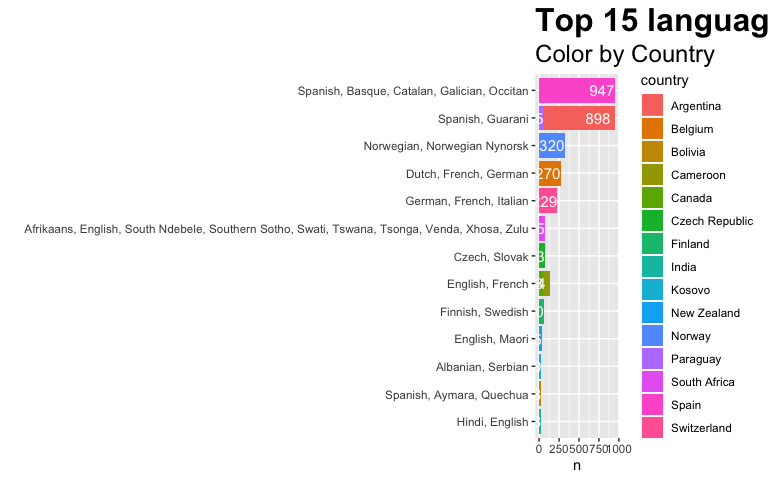<!-- -->

## EDA: Top N global 


```r
top_languages <- inner_join(final_languages_csv,
             PlayerPersonalData,
             by = c("country_name" = "Nationality"))  %>%
  select(lang_name, Club, country_name, continent_name, Name) %>%
  group_by(lang_name) %>% 
  tally() %>%
  arrange(desc(n)) %>% 
  head(15)


  ggplot(top_languages,aes(x = reorder(lang_name, n), y = n)) +
   geom_bar(stat = "identity",fill="darkviolet" )+
   geom_text(aes(label=n), vjust=0.5, hjust=1, color="white", size=4)+
   xlab("") +
   coord_flip() + 
    theme( plot.title = element_text(color = "black", size = 24, face = "bold"))+
   labs(title='Top 15 languages all around the world')
```

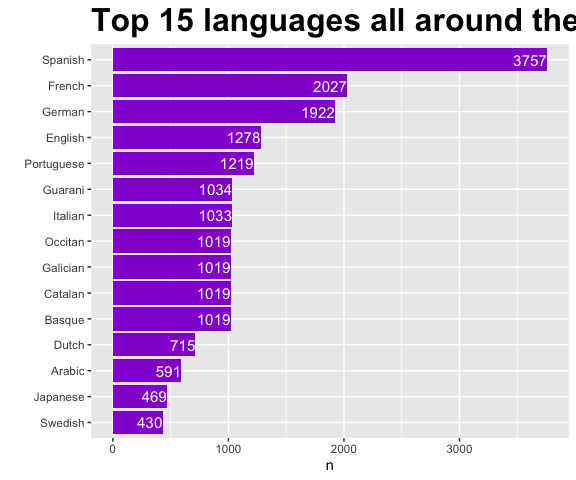<!-- -->


# OBJECTIVE 2

Build a Data Visualization of the data FIFA game by country and languages. Clustering to help us for take the best
decisions for Localization.
Tasks:
• Faceting, adding visual variables, and summarization
• Profile the different player and teams.

## Players by Country


```r
# Loading geographical data per player

players_by_country <- 
             PlayerPersonalData %>%
  group_by(Nationality) %>%
  tally() %>%
  magrittr::set_colnames(c("region","value"))%>% 
  ungroup() %>% 
   mutate(
    region = ifelse(region == "United States", "USA", region),
    region = ifelse(region == "DR Congo", "Democratic Republic of the Congo", region),
    region = ifelse(region == "China PR", "China", region),
    region = ifelse(region == "Congo", "Democratic Republic of the Congo", region),
    region = ifelse(region == "Bosnia Herzegovina", "Bosnia and Herzegovina", region),
    region = ifelse(region == "Scotland", "UK", region),
    region = ifelse(region == "England", "UK", region),
    region = ifelse(region == "Northern Ireland", "Ireland", region),
    region = ifelse(region == "Republic of Ireland", "Ireland", region),
    region = ifelse(region == "Central African Rep.", "Central African Republic", region),
    region = ifelse(region == "Wales", "UK", region)
    )  


# loading world maps data

world_map <- map_data("world")

# joining map data with players data

players_map <- left_join(players_by_country, world_map, by = "region") %>% 
  rename(players=value)

players_map$hover <- with(players_map, paste0(region,"<br>",players))

g <- ggplot(players_map, aes(long, lat, group = group, text=hover))+
  geom_polygon(aes(fill = players), color = "white")+
   scale_fill_viridis_c(option = "C") +
   labs(title='# Players by Continent / Country')+
  hrbrthemes::theme_ipsum() 


ggplotly(g,tooltip="text")
```

preserve7b17b489a9e2a44b
